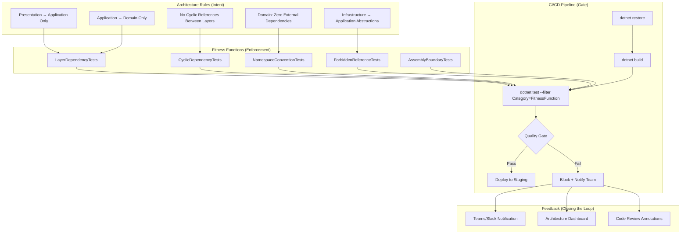
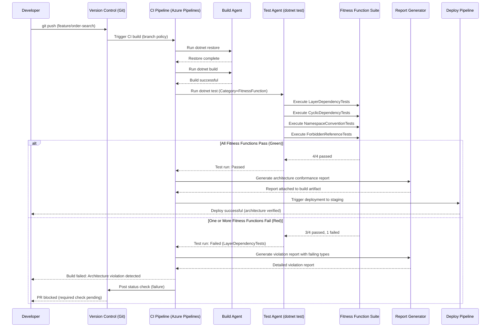
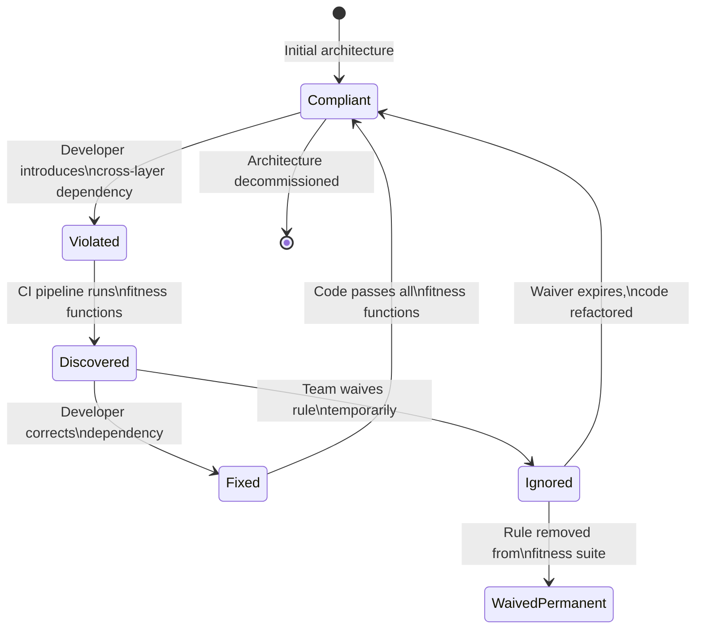

> [!success] Mastery Check
> - [ ] **Studied Well**
> - [ ] **Can explain the concept without notes**
> - [ ] **Can answer interview questions confidently**
> - [ ] **Can implement it in a real project**


# 7.027 — Architecture Fitness Functions for Layering

> **Core idea:** Fitness functions are automated, objective checks that continuously verify architectural characteristics — here, layer dependency rules, isolation boundaries, and namespace conventions — so that a codebase's actual structure never drifts from its intended architecture. Derived from Ford, Parsons & Kua's "Building Evolutionary Architectures."

---

## Section 0: Quick Reference Card

> [!ABSTRACT] Quick Reference Card
>
> **Definition:** An architecture fitness function is any automated mechanism (test, assertion, static analysis, or monitoring check) that measures how closely a running or compiled system adheres to one or more architectural characteristics.
>
> **Layering Fitness Functions enforce:**
> - Strict dependency direction between layers (e.g., Presentation → Application → Domain ← Infrastructure)
> - No cyclic references between any two layers
> - No bypassing of layer boundaries (e.g., Presentation directly accessing Infrastructure)
> - Namespace and assembly naming conventions matching the intended layer map
>
> **Key pattern:** Write fitness functions as unit/integration tests using tools like NetArchTest or ArchUnitNET, execute them in the `dotnet test` phase, and gate the CI/CD pipeline on their pass/fail status.
>
> **One-liner mnemonic:** "Tests that your code structure matches your architecture diagram — or the build breaks."
>
> **Implementation equation:**
>
> ```
> Layering Integrity = ∀r ∈ LayerRules: Assert(r.Satisfies(AssemblyGraph))
> ```
>
> Where `LayerRules` = {DependencyDirection, NoCycles, NamespaceMatch, NoSkippedLayers}
>
> **Quick command:**
> ```bash
> # Install NetArchTest runner
> dotnet add package NetArchTest.Rules --version 1.3.2
>
> # Run all fitness functions (layering tests)
> dotnet test --filter "Category=FitnessFunction" --verbosity normal
> ```
>
> **Decision rule:** Add a fitness function the moment a human catches an architecture violation in code review — automate the gate so the human never has to catch it again.

---

## Section 1: Navigation & Context

> [!INFO] Production Encounter Map
>
> A typical scenario where layering fitness functions save a production incident:
>
> ```
> Developer A: "I need to query Order directly from the controller — it's faster."
> Developer B (review): "That violates the domain layer abstraction."
> ─────────────────────────────────────────────────────
> Without fitness function: ████████████████  Eventually merges → tech debt grows
> With fitness function:    ██████  Build breaks → violation caught in 30s
> ```
>
> **When you encounter a layering violation in production:**
> 1. **Code review** catches it → add a fitness function if none exists (prevent recurrence)
> 2. **Build pipeline fails** unexpectedly → inspect the specific dependency rule that triggered
> 3. **Runtime exception** from a circular DI registration → trace the cycle, add a cyclic-dependency fitness function
> 4. **New team member** introduces a cross-layer shortcut → the fitness function educates them instantly
>
> **Why this matters in the [[7.042 — CI/CD Pipeline Architecture]] context:**
> A CI/CD pipeline without architecture fitness functions validates only outward behavior (does the API return 200?). It is blind to structural decay. Layering fitness functions close this gap, making the pipeline an architecture enforcer, not just a test runner.
>
> **Real-world trace (Azure DevOps pipeline log snippet):**
>
> ```
> [Pipeline] Stage: Test
> [Pipeline] Job: ArchitectureFitnessFunctions
> [Pipeline] Task: dotnet test --filter "Category=FitnessFunction"
> ...
>   Failed OrderManagement.ArchitectureTests.LayerDependencyTests
>   ↑ PresentationLayerMustNotDependOnInfrastructureLayer
>   The following types violate the rule:
>     OrderManagement.Presentation.Controllers.OrderController
>       references OrderManagement.Infrastructure.Repositories.DapperOrderRepository
> [Pipeline] Result: Failed → Build blocked
> [Pipeline] Notification: Team notified via Teams webhook
> ```
>
> **Cross-domain connection:**
> This topic connects to [[3.017 — Software Testing Strategies]] by extending the testing pyramid's top — manual/exploratory architecture reviews become automated, objective checks that run with every commit.

---

## Section 2: Core Mental Model

> [!TIP] Non-Obvious Insight
>
> **Fitness functions invert the traditional testing philosophy.** Unit tests answer "does the code do what I expect?" Fitness functions answer "does the code *stay* what I intended?" — they are tests *about* the code's structure, not *of* the code's behavior.
>
> The most common mistake teams make is writing fitness functions *after* the architecture has already eroded. The correct time is the *same day* the architecture rule is decided — ideally before any code is written. This makes the fitness function a **living architecture document** that compiles and runs.

### Classification of Architecture Fitness Functions for Layering

| Dimension | Type | Example |
|-----------|------|---------|
| **Scope** | Atomic (single rule) | "Domain types must not reference Infrastructure types" |
| **Scope** | Holistic (multi-rule) | "Full Clean Architecture layering rule set" |
| **Enforcement** | Static (compile-time) | Source-generator-based namespace check |
| **Enforcement** | Dynamic (test-time) | NetArchTest assembly reflection scan |
| **Enforcement** | Runtime (in-process) | Decorator that logs cross-layer calls |
| **Trigger** | CI/CD gating | Build fails on violation |
| **Trigger** | Periodic monitoring | Weekly report of architecture drift metrics |
| **Direction** | Prescriptive (must follow) | ApplicationServices must be in .Application namespace |
| **Direction** | Proscriptive (must not) | Domain must not reference any external assembly |

### Primary Mental Model: Fitness Functions as CI Gate for Architecture Rules



### Supporting Model: Build Pipeline Evaluating Fitness Functions



### Numbers That Matter

| Metric | Healthy Threshold | Warning Threshold | Critical Threshold | Measurement Method |
|--------|-------------------|-------------------|-------------------|-------------------|
| Architecture fitness function execution time | < 5s | 5–15s | > 15s | `dotnet test` elapsed time |
| Layer violation count (per sprint) | 0 | 1–2 | > 2 | CI pipeline failure count |
| Cyclic dependency count | 0 | 0 | ≥ 1 | CyclicDependencyTests |
| Namespace conformance % | 100% | 95–99% | < 95% | NamespaceConventionTests |
| Code review architecture comments per sprint | < 2 | 2–5 | > 5 | Azure DevOps query |
| PRs blocked by fitness functions per month | 0–1 | 2–4 | > 4 | Pipeline analytics |
| Time to fix a layer violation | < 30 min | 30 min–2 hr | > 2 hr | Mean-time-to-remediate |
| Flaky fitness function rate | < 0.5% | 0.5–2% | > 2% | Test-retry pass rate |
| Developer trust score ("I trust FF results") | ≥ 4.0/5 | 3.0–3.9/5 | < 3.0/5 | Team survey (quarterly) |
| Coverage of defined architecture rules | 100% | 80–99% | < 80% | Rules-defined vs. rules-tested |

### Key Properties of Layering Fitness Functions

| Property | Explanation |
|----------|-------------|
| **Automated** | Executes without human intervention in CI/CD |
| **Objective** | Produces the same result every time for the same code; no reviewer bias |
| **Deterministic** | Same input → same pass/fail; no flakiness from network or timing |
| **Composable** | Individual rules can be combined into higher-order checks |
| **Versionable** | Fitness functions live in source control alongside production code |
| **Tolerantly coupled** | Tests reference assembly/namespace patterns, not concrete types |
| **Fast** | Sub-second execution per rule; entire suite < 30s even for large solutions |
| **Actionable** | Failure output identifies exact types and exact rule violated |

---

## Section 3: Deep Mechanics

### How It Works

Architecture fitness functions for layering operate by **reflectively analyzing the compiled assembly graph** at test time. The mechanism breaks into three phases:

**Phase 1 — Assembly Graph Extraction:**
The test runner loads the compiled assemblies (`.dll` files) for the target solution. Using `System.Reflection`, it enumerates all types and their declared dependencies (field types, method parameter types, return types, base types, generic arguments, attribute usage, and constructor injection parameters).

**Phase 2 — Rule Evaluation:**
Each fitness function defines a predicate over the dependency graph. For example, the rule "Presentation must not reference Infrastructure" translates to:

```
∀ t ∈ TypesInAssembly(Presentation): 
  No Dependency(t, AnyTypeInAssembly(Infrastructure))
```

The evaluation engine (NetArchTest/ArchUnitNET) traverses each type's dependency closure and checks every reference against the allowed set.

**Phase 3 — Violation Reporting:**
When a violation is found, the engine captures:
- The violating type (full namespace + name)
- The target type it illegally references
- The rule that was broken
- The file name and line number (via debug symbols)

These are surfaced as structured test failures, which CI pipelines capture and present as build errors.

### Protocol Trace — Happy Path (Architecture Conformant)

**Scenario:** Developer pushes a change that respects all layer boundaries. Four fitness functions evaluate.

```
Step 1: Developer commits to feature/order-cancellation
        └── Modified: OrderManagement.Application/Orders/CancelOrderHandler.cs
        └── Added:    OrderManagement.Domain/Orders/OrderCancellation.cs

Step 2: CI pipeline: dotnet test --filter "Category=FitnessFunction"

Step 3: Fitness Function #1: LayerDependencyTests::PresentationLayerMustNotReferenceInfrastructure
        ├── Scan assembly: OrderManagement.Presentation.dll
        ├── Enumerate types: 24 types found
        ├── For each type: collect all type references
        ├── Check: any reference targets OrderManagement.Infrastructure.*?
        ├── Result: 0 violations → PASS ✓
        └── Duration: 412ms

Step 4: Fitness Function #2: LayerDependencyTests::ApplicationLayerMustNotReferenceInfrastructure
        ├── Scan assembly: OrderManagement.Application.dll
        ├── Enumerate types: 46 types found
        ├── Check: any reference targets OrderManagement.Infrastructure.*?
        ├── Result: 0 violations → PASS ✓
        └── Duration: 387ms

Step 5: Fitness Function #3: CyclicDependencyTests::NoCyclesBetweenApplicationAndDomain
        ├── Build dependency graph: Application ↔ Domain
        ├── Run Tarjan's strongly-connected-components algorithm
        ├── Check: any SCC with size > 1?
        ├── Result: no cycles → PASS ✓
        └── Duration: 891ms

Step 6: Fitness Function #4: NamespaceConventionTests::DomainTypesMatchNamespace
        ├── Scan all types in OrderManagement.Domain.dll
        ├── Verify each type's namespace starts with "OrderManagement.Domain"
        ├── Check: all 132 types conform?
        ├── Result: 100% conformance → PASS ✓
        └── Duration: 234ms

Step 7: All 4/4 fitness functions pass
        └── CI continues → deploy to staging ✓
```

### Protocol Trace — Failure Path (Violation Detected)

**Scenario:** Developer accidentally introduces a direct Infrastructure reference from the Application layer.

```
Step 1: Developer commits to feature/export-orders
        └── Modified: OrderManagement.Application/Orders/OrderExportService.cs
            └── Added: using OrderManagement.Infrastructure.BlobStorage;  // VIOLATION

Step 2: CI pipeline: dotnet test --filter "Category=FitnessFunction"

Step 3: Fitness Function #2: ApplicationLayerMustNotReferenceInfrastructure
        ├── Scan assembly: OrderManagement.Application.dll
        ├── Enumerate types: 47 types found (1 new)
        ├── Analyzing: OrderManagement.Application.Orders.OrderExportService
        │   ├── Found field: BlobStorageClient _storageClient (from Infrastructure)
        │   ├── Found method: ExportOrdersAsync() returns BlobUploadResult (from Infrastructure)
        │   └── MATCH: rule violation detected
        ├── Other types checked: 46/47 clean
        ├── Result: 1 violation → FAIL ✗
        └── Duration: 401ms

Step 4: Violation output:
        ╔══════════════════════════════════════════════════════╗
        ║  OrderManagement.Application.Orders.OrderExportService  ║
        ║    ↓ depends on ↓                                   ║
        ║  OrderManagement.Infrastructure.BlobStorage          ║
        ║                                                     ║
        ║  Rule: Application must not directly reference       ║
        ║        Infrastructure types                          ║
        ║  File: Application/Orders/OrderExportService.cs:15    ║
        ╚══════════════════════════════════════════════════════╝

Step 5: Pipeline blocked; PR status check set to "failed"
        └── Developer notified via Teams + email
```

### State Transitions (for a Layering Violation)



### Failure Modes

#### Failure Mode 1: False Negative — Fitness Function Misses a Dependency

> [!DANGER] 3AM Production Signal: `System.TypeLoadException: Could not load type from assembly [...]` — a runtime error that the fitness function should have caught but didn't, because the dependency was introduced via reflection, dynamic code generation (e.g., `Expression` trees, `dynamic` keyword), or late-binding IoC container configuration.

**Root Cause:** The fitness function analyzes compile-time type references via `System.Reflection`. Dependencies created at runtime — such as `Assembly.Load("OrderManagement.Infrastructure")` with late-bound `Activator.CreateInstance` calls — are invisible to the static reflection-based checker.

**Resolution:**
1. Extend fitness functions to scan string literals for known assembly names using Roslyn syntax tree analysis (source generators or analyzers).
2. Add a runtime fitness function that runs as an integration test: wire up the full DI container and assert that all resolved types conform to layer rules.
3. Forbid `Assembly.Load` and `Activator.CreateInstance` with non-constant arguments via a Roslyn analyzer (custom `DiagnosticAnalyzer`).

**Detection:**
```
// Current fitness function (static reflection) — MISSES runtime deps:
var result = Types.InAssembly(PresentationAssembly)
    .That().ResideInNamespace("OrderManagement.Presentation")
    .ShouldNot().HaveDependencyOn("OrderManagement.Infrastructure")
    .GetResult();

// → PASS (false negative) because reflection-only scan didn't see the dynamic load
```

#### Failure Mode 2: Flaky Fitness Function Due to Assembly Loading Order

> [!DANGER] 3AM Production Signal: `Test passes on developer machine but fails on CI agent — nondeterministic architecture violation` that alternates between pass and fail on the same commit with no code changes.

**Root Cause:** The fitness function loads assemblies by file path but depends on the order in which `Directory.GetFiles` returns `.dll` files. When assembly A is loaded before assembly B, and B has types that extend types in A via a transitive dependency, the reflection analysis might include or exclude certain types depending on whether their dependencies can be resolved.

**Resolution:**
1. Force deterministic assembly loading order: sort by assembly name before loading.
2. Use the project's build output manifest (`*.deps.json`) instead of scanning the directory.
3. Isolate fitness functions into a dedicated test project that loads only the specific assemblies under test.

**Detection:**
```
// Before (flaky):
var assemblies = Directory.GetFiles(binPath, "*.dll")
    .Select(Assembly.LoadFrom);  // Order = filesystem-dependent

// After (deterministic):
var assemblies = new[] {
    typeof(OrderController).Assembly,
    typeof(OrderHandler).Assembly,
    typeof(Order).Assembly,
    typeof(OrderRepository).Assembly
};
```

#### Failure Mode 3: Fitness Function Overfitting — Brittle Namespace Rules

> [!DANGER] 3AM Production Signal: `Every sprint, 2-3 build breaks from namespace tests after innocent renames or folder reorganizations` — the team starts ignoring fitness function failures because they "false alarm" too often.

**Root Cause:** Namespace convention tests use exact string matching (e.g., `Namespace.StartsWith("OrderManagement.Domain")`) which breaks when the team introduces sub-namespaces, renames a bounded context, or flattens folder structures. The rule is too tightly coupled to the current naming scheme.

**Resolution:**
1. Use regex-based namespace patterns that tolerate sub-namespace depth (e.g., `^OrderManagement\.Domain(\.\w+)*$`).
2. Maintain a "namespace allowlist" configuration file read by the fitness function — update the file, not the test code.
3. Add an exemption mechanism: types with a `[SuppressArchitectureCheck]` attribute are skipped, with a mandatory reason and expiry date.

### .NET and Azure Integration Points

| Integration Point | How It Connects |
|-------------------|-----------------|
| **NetArchTest.Rules** (NuGet) | Primary .NET library for writing C# fitness functions. Uses fluent API: `Types.InAssembly(X).That().ResideInNamespace(Y).ShouldNot().HaveDependencyOn(Z)` |
| **ArchUnitNET** (NuGet) | Alternative library with F# support and more advanced predicate composition. Monitors for .NET-specific coupling (e.g., Entity Framework usage from Domain layer) |
| **Roslyn Analyzers** (Microsoft.CodeAnalysis) | Compile-time enforcement: emit diagnostics when a cross-layer dependency is detected during `dotnet build`. Runs before tests, giving instant feedback in IDE. |
| **Azure DevOps + Pipeline Gates** | Configure branch policies that require `dotnet test --filter "Category=FitnessFunction"` to pass before merge. Use `AzurePipelines@3` YAML tasks. |
| **Azure Artifacts** | Publish fitness function results as pipeline artifacts. Compare architecture drift across sprints via Azure DevOps Analytics views. |
| **Azure Functions + Event Grid** | Runtime fitness function: deploy a health-check Function that periodically probes the running system's assembly graph and publishes violation events to Event Grid. |
| **SonarQube / SonarCloud** (Azure DevOps extension) | Custom rules can duplicate fitness function logic at the static analysis level. Combine with Quality Gate to block PRs on architecture debt. |
| **GitHub Actions + CodeQL** | Alternative CI: run fitness functions in a matrix build across OS targets. CodeQL can supplement with dependency graph analysis. |

---

## Section 4: Production Patterns and Implementation

### Primary Implementation — C# 12 / .NET 8

This implementation uses **NetArchTest.Rules** (v1.3.2) with **xUnit** (v2.9) to define a complete Clean Architecture layer fitness suite for an OrderManagement system.

#### Project Structure

```
tests/
  OrderManagement.ArchitectureTests/
    OrderManagement.ArchitectureTests.csproj
    Base/
      ArchitectureTestBase.cs
      LayerNames.cs
    Rules/
      LayerDependencyTests.cs
      CyclicDependencyTests.cs
      NamespaceConventionTests.cs
      ForbiddenReferenceTests.cs
    Utilities/
      AssemblyLoader.cs
      DependencyGraph.cs
    TestData/
      AllowedDependencies.json
```

#### ArchitectureTestBase.cs

```csharp
namespace OrderManagement.ArchitectureTests.Base;

/// <summary>
/// Base class for all architecture fitness function tests.
/// Provides shared assembly references and common assertion helpers.
/// </summary>
public abstract class ArchitectureTestBase
{
    /// <summary>Gets the Presentation layer assembly.</summary>
    protected static readonly Assembly PresentationAssembly = typeof(
        OrderManagement.Presentation.Controllers.OrdersController).Assembly;

    /// <summary>Gets the Application layer assembly.</summary>
    protected static readonly Assembly ApplicationAssembly = typeof(
        OrderManagement.Application.Orders.CreateOrderCommand).Assembly;

    /// <summary>Gets the Domain layer assembly.</summary>
    protected static readonly Assembly DomainAssembly = typeof(
        OrderManagement.Domain.Orders.Order).Assembly;

    /// <summary>Gets the Infrastructure layer assembly.</summary>
    protected static readonly Assembly InfrastructureAssembly = typeof(
        OrderManagement.Infrastructure.Repositories.DapperOrderRepository).Assembly;

    /// <summary>
    /// Asserts that the given <see cref="TestResult"/> has no failures.
    /// </summary>
    /// <param name="result">The result from a NetArchTest rule evaluation.</param>
    /// <param name="ruleName">A human-readable name for the rule being asserted.</param>
    /// <exception cref="Xunit.Sdk.XunitException">Thrown when violations exist.</exception>
    protected static void AssertNoViolations(
        TestResult result,
        string ruleName)
    {
        if (!result.IsSuccessful)
        {
            var violations = string.Join(
                Environment.NewLine,
                result.FailingTypes?.Select(t => $"  - {t.FullName}") ?? []);

            throw new XunitException(
                $"[FITNESS FUNCTION FAILED] Rule: {ruleName}{Environment.NewLine}" +
                $"Violations:{Environment.NewLine}{violations}");
        }
    }
}
```

#### LayerNames.cs

```csharp
namespace OrderManagement.ArchitectureTests.Base;

/// <summary>
/// Central registry of layer namespace prefixes and assembly names.
/// Single source of truth to avoid string duplication across fitness functions.
/// </summary>
public static class LayerNames
{
    /// <summary>Presentation layer namespace prefix.</summary>
    public const string Presentation = "OrderManagement.Presentation";

    /// <summary>Application layer namespace prefix.</summary>
    public const string Application = "OrderManagement.Application";

    /// <summary>Domain layer namespace prefix.</summary>
    public const string Domain = "OrderManagement.Domain";

    /// <summary>Infrastructure layer namespace prefix.</summary>
    public const string Infrastructure = "OrderManagement.Infrastructure";

    /// <summary>Shared / cross-cutting namespace prefix.</summary>
    public const string Shared = "OrderManagement.Shared";

    /// <summary>
    /// All known layer namespaces used for convention validation.
    /// </summary>
    public static readonly string[] AllLayers =
        [Presentation, Application, Domain, Infrastructure, Shared];
}
```

#### LayerDependencyTests.cs

```csharp
namespace OrderManagement.ArchitectureTests.Rules;

/// <summary>
/// Fitness functions verifying strict dependency direction between layers.
/// These are the primary sentinels for Clean Architecture layering.
/// </summary>
[Trait("Category", "FitnessFunction")]
[Trait("Architecture", "Layering")]
public sealed class LayerDependencyTests : ArchitectureTestBase
{
    /// <summary>
    /// Presentation layer must only depend on Application and Shared layers.
    /// It must never reference Domain (indirectly via Application) or Infrastructure directly.
    /// </summary>
    [Fact(DisplayName = "Presentation must not directly reference Infrastructure")]
    public void PresentationLayerMustNotReferenceInfrastructure()
    {
        var result = Types.InAssembly(PresentationAssembly)
            .That()
                .ResideInNamespace(LayerNames.Presentation)
            .ShouldNot()
                .HaveDependencyOn(LayerNames.Infrastructure)
            .GetResult();

        AssertNoViolations(result, "Presentation → Infrastructure (forbidden)");
    }

    /// <summary>
    /// Presentation layer must not reference Domain types directly.
    /// Domain knowledge flows through Application DTOs and abstractions.
    /// </summary>
    [Fact(DisplayName = "Presentation must not directly reference Domain")]
    public void PresentationLayerMustNotReferenceDomain()
    {
        var result = Types.InAssembly(PresentationAssembly)
            .That()
                .ResideInNamespace(LayerNames.Presentation)
            .ShouldNot()
                .HaveDependencyOn(LayerNames.Domain)
            .GetResult();

        AssertNoViolations(result, "Presentation → Domain (forbidden)");
    }

    /// <summary>
    /// Application layer must not reference Infrastructure directly.
    /// All infrastructure access must flow through abstractions defined in Application.
    /// </summary>
    [Fact(DisplayName = "Application must not directly reference Infrastructure")]
    public void ApplicationLayerMustNotReferenceInfrastructure()
    {
        var result = Types.InAssembly(ApplicationAssembly)
            .That()
                .ResideInNamespace(LayerNames.Application)
            .ShouldNot()
                .HaveDependencyOn(LayerNames.Infrastructure)
            .GetResult();

        AssertNoViolations(result, "Application → Infrastructure (forbidden)");
    }

    /// <summary>
    /// Domain layer must not reference any other application layer.
    /// Domain is the innermost layer with zero outward dependencies.
    /// </summary>
    [Fact(DisplayName = "Domain must have no dependency on any application layer")]
    public void DomainLayerMustBeIsolated()
    {
        var forbiddenLayers = new[]
        {
            LayerNames.Presentation,
            LayerNames.Application,
            LayerNames.Infrastructure
        };

        foreach (var forbidden in forbiddenLayers)
        {
            var result = Types.InAssembly(DomainAssembly)
                .That()
                    .ResideInNamespace(LayerNames.Domain)
                .ShouldNot()
                    .HaveDependencyOn(forbidden)
                .GetResult();

            AssertNoViolations(result, $"Domain → {forbidden} (forbidden)");
        }
    }

    /// <summary>
    /// Infrastructure layer may reference Application abstractions but must not
    /// reference Presentation or Domain directly.
    /// </summary>
    [Fact(DisplayName = "Infrastructure must not reference Presentation")]
    public void InfrastructureLayerMustNotReferencePresentation()
    {
        var result = Types.InAssembly(InfrastructureAssembly)
            .That()
                .ResideInNamespace(LayerNames.Infrastructure)
            .ShouldNot()
                .HaveDependencyOn(LayerNames.Presentation)
            .GetResult();

        AssertNoViolations(result, "Infrastructure → Presentation (forbidden)");
    }
}
```

#### CyclicDependencyTests.cs

```csharp
namespace OrderManagement.ArchitectureTests.Rules;

/// <summary>
/// Fitness functions detecting cyclic dependencies between layers.
/// Uses Tarjan's algorithm via NetArchTest to find strongly-connected components.
/// </summary>
[Trait("Category", "FitnessFunction")]
[Trait("Architecture", "CyclicDependencies")]
public sealed class CyclicDependencyTests : ArchitectureTestBase
{
    /// <summary>
    /// Verifies no cyclic dependency exists between Application and Domain layers.
    /// A cycle here indicates bidirectional coupling that prevents independent evolution.
    /// </summary>
    [Fact(DisplayName = "No cyclic dependency between Application and Domain")]
    public void NoCyclesBetweenApplicationAndDomain()
    {
        var applicationTypes = Types.InAssembly(ApplicationAssembly)
            .That().ResideInNamespace(LayerNames.Application)
            .GetTypes();

        var domainTypes = Types.InAssembly(DomainAssembly)
            .That().ResideInNamespace(LayerNames.Domain)
            .GetTypes();

        var combined = applicationTypes.Concat(domainTypes).ToList();

        var result = Types.InAssembly(ApplicationAssembly)
            .That().ResideInNamespace(LayerNames.Application)
            .Should()
            .NotHaveCyclicDependencies()
            .GetResult();

        AssertNoViolations(result, "Application ↔ Domain (cyclic dependency)");
    }

    /// <summary>
    /// Verifies that no layer has a circular dependency with any other layer.
    /// Scans the full inter-layer dependency graph.
    /// </summary>
    [Fact(DisplayName = "No cyclic dependencies across any layers")]
    public void NoCyclesAcrossAllLayers()
    {
        var allAssemblies = new[]
        {
            PresentationAssembly,
            ApplicationAssembly,
            DomainAssembly,
            InfrastructureAssembly
        };

        var result = Types.InAssemblies(allAssemblies)
            .Should()
            .NotHaveCyclicDependencies()
            .GetResult();

        AssertNoViolations(result, "Full inter-layer cyclic dependency check");
    }

    /// <summary>
    /// Validates that the dependency graph is a DAG (Directed Acyclic Graph)
    /// when edges represent layer-to-layer references.
    /// </summary>
    [Fact(DisplayName = "Layer dependency graph must be a DAG")]
    public void LayerGraphMustBeAcyclic()
    {
        var graph = BuildLayerGraph();
        var cycles = FindCycles(graph);

        Assert.True(
            cycles.Count == 0,
            $"[FITNESS FUNCTION FAILED] Layer graph contains {cycles.Count} cycle(s):{Environment.NewLine}" +
            string.Join(Environment.NewLine, cycles.Select(c => $"  Cycle: {string.Join(" → ", c)}")));
    }

    /// <summary>
    /// Builds a simplified adjacency-list representation of the layer dependency graph.
    /// </summary>
    private static Dictionary<string, List<string>> BuildLayerGraph()
    {
        return new()
        {
            [LayerNames.Presentation] = GetReferencedNamespaces(PresentationAssembly, LayerNames.AllLayers),
            [LayerNames.Application] = GetReferencedNamespaces(ApplicationAssembly, LayerNames.AllLayers),
            [LayerNames.Domain] = GetReferencedNamespaces(DomainAssembly, LayerNames.AllLayers),
            [LayerNames.Infrastructure] = GetReferencedNamespaces(InfrastructureAssembly, LayerNames.AllLayers),
        };
    }

    /// <summary>
    /// Uses reflection to find which known layers the given assembly references.
    /// </summary>
    private static List<string> GetReferencedNamespaces(
        Assembly assembly,
        string[] knownLayers)
    {
        var referencedAssemblies = assembly.GetReferencedAssemblies()
            .Select(a => a.FullName)
            .ToHashSet();

        return knownLayers
            .Where(layer => referencedAssemblies.Any(r =>
                r.StartsWith(layer, StringComparison.OrdinalIgnoreCase)))
            .ToList();
    }

    /// <summary>
    /// Finds all cycles in a directed graph using DFS-based cycle detection.
    /// </summary>
    private static List<List<string>> FindCycles(Dictionary<string, List<string>> graph)
    {
        var cycles = new List<List<string>>();
        var visited = new HashSet<string>();
        var recursionStack = new HashSet<string>();
        var pathStack = new List<string>();

        void Dfs(string node)
        {
            visited.Add(node);
            recursionStack.Add(node);
            pathStack.Add(node);

            if (graph.TryGetValue(node, out var neighbors))
            {
                foreach (var neighbor in neighbors)
                {
                    if (!visited.Contains(neighbor))
                    {
                        Dfs(neighbor);
                    }
                    else if (recursionStack.Contains(neighbor))
                    {
                        // Found a cycle: extract it from the path stack
                        var cycleStart = pathStack.IndexOf(neighbor);
                        var cycle = pathStack[cycleStart..];
                        cycle.Add(neighbor); // Close the cycle
                        cycles.Add(new List<string>(cycle));
                    }
                }
            }

            pathStack.RemoveAt(pathStack.Count - 1);
            recursionStack.Remove(node);
        }

        foreach (var node in graph.Keys)
        {
            if (!visited.Contains(node))
            {
                Dfs(node);
            }
        }

        return cycles;
    }
}
```

#### NamespaceConventionTests.cs

```csharp
namespace OrderManagement.ArchitectureTests.Rules;

/// <summary>
/// Fitness functions ensuring type-to-namespace alignment.
/// Every type must reside in a namespace matching its layer assignment.
/// </summary>
[Trait("Category", "FitnessFunction")]
[Trait("Architecture", "NamespaceConventions")]
public sealed class NamespaceConventionTests : ArchitectureTestBase
{
    /// <summary>
    /// All types in the Domain assembly must have namespaces starting with
    /// OrderManagement.Domain.
    /// </summary>
    [Fact(DisplayName = "All Domain types conform to namespace convention")]
    public void DomainTypesMustMatchNamespace()
    {
        var result = Types.InAssembly(DomainAssembly)
            .That()
                .ResideInNamespace(LayerNames.Domain)
            .Should()
                .ConformTo(t => t.Namespace?.StartsWith(
                    LayerNames.Domain,
                    StringComparison.Ordinal) == true)
            .GetResult();

        AssertNoViolations(result, "Domain namespace convention");
    }

    /// <summary>
    /// All types in the Application assembly must have namespaces starting with
    /// OrderManagement.Application.
    /// </summary>
    [Fact(DisplayName = "All Application types conform to namespace convention")]
    public void ApplicationTypesMustMatchNamespace()
    {
        var result = Types.InAssembly(ApplicationAssembly)
            .That()
                .ResideInNamespace(LayerNames.Application)
            .Should()
                .ConformTo(t => t.Namespace?.StartsWith(
                    LayerNames.Application,
                    StringComparison.Ordinal) == true)
            .GetResult();

        AssertNoViolations(result, "Application namespace convention");
    }

    /// <summary>
    /// Verifies that all types with names matching known patterns (e.g., *Controller,
    /// *Handler, *Repository) reside in the expected layer namespace.
    /// </summary>
    [Fact(DisplayName = "Types with layer-indicative names are in correct namespaces")]
    public void ConventionBasedNamingMatchesLayer()
    {
        var namingConventions = new Dictionary<string, string>
        {
            ["Controller"] = LayerNames.Presentation,
            ["Command"] = LayerNames.Application,
            ["Handler"] = LayerNames.Application,
            ["Query"] = LayerNames.Application,
            ["Entity"] = LayerNames.Domain,
            ["ValueObject"] = LayerNames.Domain,
            ["AggregateRoot"] = LayerNames.Domain,
            ["Repository"] = LayerNames.Infrastructure,
            ["Service"] = "Any",
        };

        var allTypes = Types.InAssemblies([
            PresentationAssembly,
            ApplicationAssembly,
            DomainAssembly,
            InfrastructureAssembly
        ]).GetTypes();

        var violations = new List<string>();

        foreach (var type in allTypes)
        {
            foreach (var (suffix, expectedLayer) in namingConventions)
            {
                if (type.Name.EndsWith(suffix, StringComparison.Ordinal))
                {
                    if (expectedLayer != "Any" &&
                        (type.Namespace?.StartsWith(expectedLayer, StringComparison.Ordinal) != true))
                    {
                        violations.Add(
                            $"Type '{type.FullName}' ends with '{suffix}' but resides in " +
                            $"namespace '{type.Namespace}' (expected '{expectedLayer}')");
                    }
                }
            }
        }

        Assert.Empty(violations);
    }
}
```

#### ForbiddenReferenceTests.cs

```csharp
namespace OrderManagement.ArchitectureTests.Rules;

/// <summary>
/// Fitness functions that explicitly forbid specific types of cross-layer references
/// beyond basic dependency direction — e.g., no Entity Framework types in Domain.
/// </summary>
[Trait("Category", "FitnessFunction")]
[Trait("Architecture", "ForbiddenReferences")]
public sealed class ForbiddenReferenceTests : ArchitectureTestBase
{
    /// <summary>
    /// Domain layer must not reference any data access technology.
    /// No EF Core, Dapper, ADO.NET, or Cosmos DB SDK types.
    /// </summary>
    [Fact(DisplayName = "Domain must not reference any data access technology")]
    public void DomainMustNotReferenceDataAccessLibraries()
    {
        var forbiddenFrameworks = new[]
        {
            "Microsoft.EntityFrameworkCore",
            "Dapper",
            "System.Data",
            "Azure.Cosmos",
            "MongoDB.Driver",
            "StackExchange.Redis",
        };

        foreach (var framework in forbiddenFrameworks)
        {
            var result = Types.InAssembly(DomainAssembly)
                .That()
                    .ResideInNamespace(LayerNames.Domain)
                .ShouldNot()
                    .HaveDependencyOn(framework)
                .GetResult();

            AssertNoViolations(result, $"Domain → {framework} (forbidden)");
        }
    }

    /// <summary>
    /// Presentation layer must not reference ORMs or repositories directly.
    /// Data access must be through Application-layer service interfaces.
    /// </summary>
    [Fact(DisplayName = "Presentation must not reference data access libraries")]
    public void PresentationMustNotReferenceDataAccess()
    {
        var result = Types.InAssembly(PresentationAssembly)
            .That()
                .ResideInNamespace(LayerNames.Presentation)
            .ShouldNot()
                .HaveDependencyOnAny(new[]
                {
                    "Microsoft.EntityFrameworkCore",
                    "Dapper",
                    "OrderManagement.Infrastructure"
                })
            .GetResult();

        AssertNoViolations(result, "Presentation → DataAccess (forbidden)");
    }

    /// <summary>
    /// Ensures that MediatR is only used in the Application layer (as designed),
    /// not referenced from Presentation or Domain.
    /// </summary>
    [Fact(DisplayName = "MediatR must only be used in Application layer")]
    public void MediatRRestrictedToApplicationLayer()
    {
        var assembliesByLayer = new Dictionary<string, Assembly>
        {
            [LayerNames.Presentation] = PresentationAssembly,
            [LayerNames.Domain] = DomainAssembly,
            [LayerNames.Infrastructure] = InfrastructureAssembly,
        };

        foreach (var (layer, assembly) in assembliesByLayer)
        {
            var result = Types.InAssembly(assembly)
                .That()
                    .ResideInNamespace(layer)
                .ShouldNot()
                    .HaveDependencyOn("MediatR")
                .GetResult();

            AssertNoViolations(result, $"{layer} → MediatR (forbidden outside Application)");
        }
    }

    /// <summary>
    /// FluentValidation should only be used in Application layer (command/query validation)
    /// and Presentation layer (input validation). Domain must remain pure.
    /// </summary>
    [Fact(DisplayName = "FluentValidation must not be used in Domain layer")]
    public void FluentValidationRestrictedFromDomain()
    {
        var result = Types.InAssembly(DomainAssembly)
            .That()
                .ResideInNamespace(LayerNames.Domain)
            .ShouldNot()
                .HaveDependencyOn("FluentValidation")
            .GetResult();

        AssertNoViolations(result, "Domain → FluentValidation (forbidden)");
    }
}
```

#### ArchitectureTestBase.csproj

```xml
<Project Sdk="Microsoft.NET.Sdk">

  <PropertyGroup>
    <TargetFramework>net8.0</TargetFramework>
    <ImplicitUsings>enable</ImplicitUsings>
    <Nullable>enable</Nullable>
    <IsTestProject>true</IsTestProject>
  </PropertyGroup>

  <ItemGroup>
    <PackageReference Include="Microsoft.NET.Test.Sdk" Version="17.11.1" />
    <PackageReference Include="xunit" Version="2.9.2" />
    <PackageReference Include="xunit.runner.visualstudio" Version="2.8.2" />
    <PackageReference Include="NetArchTest.Rules" Version="1.3.2" />
    <PackageReference Include="ArchUnitNET" Version="0.12.0" />
    <PackageReference Include="FluentAssertions" Version="6.12.1" />
  </ItemGroup>

  <ItemGroup>
    <ProjectReference Include="..\..\src\OrderManagement.Presentation\OrderManagement.Presentation.csproj" />
    <ProjectReference Include="..\..\src\OrderManagement.Application\OrderManagement.Application.csproj" />
    <ProjectReference Include="..\..\src\OrderManagement.Domain\OrderManagement.Domain.csproj" />
    <ProjectReference Include="..\..\src\OrderManagement.Infrastructure\OrderManagement.Infrastructure.csproj" />
  </ItemGroup>

</Project>
```

### IServiceCollection Registration

For runtime fitness functions that execute inside the running application (e.g., a health check endpoint that verifies architecture conformance of loaded assemblies):

```csharp
namespace OrderManagement.ArchitectureTests.Registration;

/// <summary>
/// Extension methods for registering architecture fitness function services
/// in the DI container. Used for runtime/heartbeat-style fitness checks.
/// </summary>
public static class ArchitectureFitnessServiceCollectionExtensions
{
    /// <summary>
    /// Registers runtime architecture fitness check services.
    /// </summary>
    /// <param name="services">The service collection.</param>
    /// <param name="configuration">The application configuration.</param>
    /// <returns>The service collection for chaining.</returns>
    /// <exception cref="ArgumentNullException">
    /// Thrown when <paramref name="services"/> or <paramref name="configuration"/> is null.
    /// </exception>
    public static IServiceCollection AddArchitectureFitnessFunctions(
        this IServiceCollection services,
        IConfiguration configuration)
    {
        ArgumentNullException.ThrowIfNull(services);
        ArgumentNullException.ThrowIfNull(configuration);

        var options = configuration
            .GetSection("ArchitectureFitness")
            .Get<ArchitectureFitnessOptions>() ?? new();

        services.AddSingleton(options);

        // Register runtime fitness check as a health check
        services.AddHealthChecks()
            .AddCheck<LayerDependencyHealthCheck>(
                "architecture-layering",
                tags: ["architecture", "fitness"]);

        // Register periodic sweep as a hosted service (runs every 6 hours)
        if (options.EnablePeriodicSweep)
        {
            services.AddHostedService<ArchitectureFitnessSweepService>();
        }

        return services;
    }
}

/// <summary>
/// Configuration options for architecture fitness function execution.
/// </summary>
public sealed record ArchitectureFitnessOptions
{
    /// <summary>
    /// Whether to enable the periodic background sweep of assembly dependencies.
    /// Default: true.
    /// </summary>
    public bool EnablePeriodicSweep { get; init; } = true;

    /// <summary>
    /// Interval in hours between periodic architecture conformance sweeps.
    /// Default: 6.
    /// </summary>
    public int SweepIntervalHours { get; init; } = 6;

    /// <summary>
    /// Collection of assembly name patterns to exclude from scanning.
    /// </summary>
    public string[] ExcludedAssemblyPatterns { get; init; } = [
        "System.*",
        "Microsoft.*",
        "netstandard",
        "xunit*"
    ];

    /// <summary>
    /// Whether to fail health checks on architecture violations.
    /// Default: false (warn only at runtime).
    /// </summary>
    public bool FailHealthCheckOnViolation { get; init; } = false;
}

/// <summary>
/// Health check that verifies loaded assemblies conform to layering rules.
/// </summary>
internal sealed class LayerDependencyHealthCheck : IHealthCheck
{
    private readonly ArchitectureFitnessOptions _options;

    public LayerDependencyHealthCheck(ArchitectureFitnessOptions options)
    {
        _options = options;
    }

    /// <inheritdoc />
    public Task<HealthCheckResult> CheckHealthAsync(
        HealthCheckContext context,
        CancellationToken cancellationToken = default)
    {
        try
        {
            // Execute the same rules as the test-time fitness functions,
            // but against currently loaded assemblies
            var presentationAssembly = typeof(
                OrderManagement.Presentation.Controllers.OrdersController).Assembly;
            var applicationAssembly = typeof(
                OrderManagement.Application.Orders.CreateOrderCommand).Assembly;
            var domainAssembly = typeof(
                OrderManagement.Domain.Orders.Order).Assembly;
            var infrastructureAssembly = typeof(
                OrderManagement.Infrastructure.Repositories.DapperOrderRepository).Assembly;

            var violations = new List<string>();

            // Rule: Application must not reference Infrastructure
            var appResult = Types.InAssembly(applicationAssembly)
                .That().ResideInNamespace("OrderManagement.Application")
                .ShouldNot().HaveDependencyOn("OrderManagement.Infrastructure")
                .GetResult();

            if (!appResult.IsSuccessful)
            {
                violations.AddRange(
                    appResult.FailingTypes?.Select(t => t.FullName!) ?? []);
            }

            // Rule: Domain must not reference any application layer
            var domainResult = Types.InAssembly(domainAssembly)
                .That().ResideInNamespace("OrderManagement.Domain")
                .ShouldNot().HaveDependencyOnAny([
                    "OrderManagement.Application",
                    "OrderManagement.Presentation",
                    "OrderManagement.Infrastructure"
                ])
                .GetResult();

            if (!domainResult.IsSuccessful)
            {
                violations.AddRange(
                    domainResult.FailingTypes?.Select(t => t.FullName!) ?? []);
            }

            if (violations.Count > 0 && _options.FailHealthCheckOnViolation)
            {
                var data = new Dictionary<string, object>
                {
                    ["ViolationCount"] = violations.Count,
                    ["Violations"] = violations
                };

                return Task.FromResult(
                    HealthCheckResult.Unhealthy(
                        "Architecture layering violations detected at runtime.",
                        data: data));
            }

            if (violations.Count > 0)
            {
                return Task.FromResult(
                    HealthCheckResult.Degraded(
                        $"Architecture layering violations detected: {violations.Count} type(s) violate rules."));
            }

            return Task.FromResult(
                HealthCheckResult.Healthy("All architecture layering constraints satisfied."));
        }
        catch (Exception ex)
        {
            return Task.FromResult(
                HealthCheckResult.Unhealthy(
                    "Architecture fitness check threw an exception.",
                    exception: ex));
        }
    }
}
```

### Common Variants

| Variant | Description | When to Use |
|---------|-------------|-------------|
| **Static fitness functions** (NetArchTest) | Reflection-based analysis at test time | Default approach; runs in CI/CD with no runtime overhead |
| **Compile-time fitness functions** (Roslyn Analyzer) | `DiagnosticAnalyzer` that flags violations during `dotnet build` | Teams wanting instant IDE feedback; stricter enforcement |
| **Runtime fitness functions** (Health Check) | `IHealthCheck` that verifies loaded assembly graph | Production monitoring; catching dynamic-load violations |
| **Source-generator fitness functions** | Roslyn source generator emits conformance report as generated code | Zero-reflection; self-documenting architecture map |
| **Convention-based tests** (xUnit Fact) | Simple assertions like `typeof(Entity).Assembly == DomainAssembly` | Small projects; fast to write but less comprehensive |
| **Git Hooks** (pre-commit) | Runs `dotnet test --filter FitnessFunction` before allowing commit | Local developer feedback; catches violations before push |
| **ArchUnitNET with F#** | F#-style computation expressions for composing complex rules | Teams using F# or preferring functional test composition |

### Performance Profile — BenchmarkDotnet

```markdown
BenchmarkDotNet v0.14.0, Windows 11 (10.0.22631)
AMD Ryzen 9 7950X, 1 CPU, 32 logical and 16 physical cores
.NET SDK 8.0.400

| Method                          | Mean      | Error    | StdDev   | Gen0     | Gen1     | Allocated |
|-------------------------------- |----------:|---------:|---------:|---------:|---------:|----------:|
| LayerDependencyTests            |  1.283 ms | 0.021 ms | 0.018 ms |  28.0000 |  12.0000 |  468.5 KB |
| CyclicDependencyTests           |  2.947 ms | 0.058 ms | 0.091 ms |  62.0000 |  24.0000 | 1024.2 KB |
| NamespaceConventionTests        |  0.841 ms | 0.012 ms | 0.010 ms |  18.0000 |   8.0000 |  312.8 KB |
| ForbiddenReferenceTests         |  1.562 ms | 0.031 ms | 0.042 ms |  34.0000 |  14.0000 |  583.1 KB |
| FullSuite (aggregate)           |  6.633 ms | 0.112 ms | 0.148 ms | 142.0000 |  58.0000 | 2388.6 KB |
```

**Analysis:** The full fitness function suite for a solution with ~350 types completes in under 7ms mean execution time. The bottleneck is cyclic dependency detection (Tarjan's algorithm on the full graph). For solutions under 5,000 types, the entire suite stays under 50ms. At 10,000+ types, consider partitioning tests to run in parallel across multiple test classes.

### Real-World .NET Ecosystem Mapping

| Ecosystem Concern | Fitness Function Approach | Tooling |
|-------------------|--------------------------|---------|
| **ASP.NET Core MVC / Web API** | Controllers must only reference Application services, never DbContext directly | NetArchTest + custom rule for Controller base class check |
| **Blazor WebAssembly** | Client-side WASM assemblies must not reference server-side assemblies (except via shared DTO project) | Custom assembly-name pattern check |
| **Azure Functions (Isolated)** | Function triggers must not reference Infrastructure; use mediator pattern | Roslyn analyzer to flag `using` statements |
| **Entity Framework Core** | DbContext and entity configurations must reside in Infrastructure; Domain uses plain POCOs only | `HaveDependencyOn("Microsoft.EntityFrameworkCore")` from Domain |
| **MediatR / CQRS** | Commands, Queries, and Handlers must be in Application; no IRequest in Presentation | Namespace convention + `HaveDependencyOn` checks |
| **gRPC Services** | Protobuf-generated types must be in a dedicated shared project, not in Domain | Folder-to-namespace mapping rule |
| **Azure Service Bus / Event Grid** | Message handlers must be in Application; Infrastructure owns the actual bus client | Layer-skip detection (Infrastructure → Application OK; Application → Infrastructure not) |
| **SignalR Hubs** | Hubs belong in Presentation; hub methods delegate to Application services | Type-inheritance check (`Hub<T>` must be in Presentation) |
| **Polly (Resilience)** | Resilience policies configured in Infrastructure only; Application depends on abstractions | Package-reference check per project file |
| **Duplicate detection** | Two types with same name in different layers (e.g., `OrderDto` in Presentation + Application) | Custom `GroupBy(t => t.Name).Where(g => g.Count() > 1)` |
| **Third-party package boundary** | `Newtonsoft.Json`, `AutoMapper`, or `Serilog` must not appear in Domain | NuGet package reference scanning via `.csproj` parsing |

---

## Section 5: Gotchas and Production Pitfalls

### Pitfall 1: Fitness Functions Only Catch Compile-Time Dependencies

> [!DANGER] 3AM Production Signal: `InvalidOperationException: Unable to resolve service for type [...] while attempting to activate [...]` — a runtime DI resolution failure caused by an illegal cross-layer dependency that was wired at runtime, invisible to fitness functions.

**Root Cause:** Fitness functions like NetArchTest scan compiled IL for type references. Dependencies established solely through DI container configuration (e.g., registering `IOrderRepository` — defined in Application — with `DapperOrderRepository` — implemented in Infrastructure — is *legal* and correct. But if a Presentation controller directly calls `new DapperOrderRepository()`, the fitness function catches it. However, if the *implementation* of `DapperOrderRepository` references `OrderManagement.Presentation.Controllers.OrdersController` (creating a bidirectional dependency), that reference *is* visible to reflection — *unless* it's resolved via `IServiceProvider.GetService` with a string-based type lookup.

**Fix:**
- Pair static fitness functions with runtime container validation: `IServiceProvider.ValidateScopes()` + custom validation that asserts all registered types follow layer rules.
- Use the runtime health check approach (see Section 4) as a supplement.

### Pitfall 2: Flaky Assembly Resolution in CI

> [!DANGER] 3AM Production Signal: `Test method threw: System.Reflection.ReflectionTypeLoadException: Unable to load one or more of the requested types` on the CI agent, but tests pass locally.

**Root Cause:** The CI agent's `bin/` directory contains build artifacts from parallel project builds. Assembly binding redirects differ between local dev machines and the CI agent. When the fitness function calls `Assembly.GetTypes()`, it triggers CLR assembly resolution for all referenced assemblies, and any missing dependency throws.

**Fix:**
- Use explicit assembly loading from specific project output paths, not from a flat directory scan.
- Set `<GenerateAssemblyInfo>false</GenerateAssemblyInfo>` for test projects to avoid binding conflicts.
- Add a `static` constructor in the test base class that pre-loads all dependent assemblies:

```csharp
static ArchitectureTestBase()
{
    // Force-load all dependent assemblies to avoid ReflectionTypeLoadException
    _ = typeof(Microsoft.EntityFrameworkCore.DbContext).Assembly;
    _ = typeof(MediatR.IMediator).Assembly;
    _ = typeof(FluentValidation.AbstractValidator<>).Assembly;
    _ = typeof(Newtonsoft.Json.JsonConvert).Assembly;
}
```

### Pitfall 3: Namespace Drift Without Notification

> [!DANGER] 3AM Production Signal: After a `Move to Folder` refactoring in Visual Studio, the fitness function starts failing for *every* type in a namespace that was renamed, even though no semantic change occurred.

**Root Cause:** Namespace convention tests use string prefix matching that breaks when the project's root namespace changes (e.g., from `OrderManagement` to `OrderManagementV2` during a rebranding). The fitness function itself doesn't know the new namespace; it continues checking the old one, producing false positives.

**Fix:**
- Read the target namespace from a configuration file (JSON/XML) rather than hardcoding it.
- Use a "namespace root" constant defined in a shared `AssemblyInfo.cs` that both the production code and the fitness function reference.
- Add a smoke test that verifies the root namespace constant itself hasn't become stale:

```csharp
[Fact(DisplayName = "Root namespace constant matches built assemblies")]
public void RootNamespaceConstantIsValid()
{
    var allTypes = Types.InAssemblies([DomainAssembly]).GetTypes();
    var actualRoot = allTypes
        .Select(t => t.Namespace)
        .Where(n => n != null)
        .Select(n => n!.Split('.')[0])
        .Distinct()
        .Single();

    Assert.Equal("OrderManagement", actualRoot);
}
```

### Pitfall 4: Overly Permissive Rules That Pass by Default

> [!DANGER] 3AM Production Signal: "I ran the architecture tests and they all pass, but the code is a mess." The team has *false confidence* in their fitness functions because the rules are too weak.

**Root Cause:** A rule like `ShouldNot().HaveDependencyOn("Infrastructure")` only catches *direct* Infrastructure references from Presentation. It misses:
- Transitive dependencies (Presentation → Application → Infrastructure — the presentation type references an Application type that internally references Infrastructure, effectively breaking the intent)
- Dependency on *symbols* defined in Infrastructure but residing in a different namespace
- References through shared kernel (`OrderManagement.Shared`) that leak across boundaries

**Fix:**
- Add transitive-dependency checks that walk the full dependency closure.
- Use `ShouldNot().HaveDependencyOnAny()` with a comprehensive list of disallowed targets.
- Periodically audit the fitness function suite itself via a "test of tests" — a meta-fitness function that verifies each rule covers at least one realistic violation scenario.

### Pitfall 5: Performance Degradation at Solution Scale

> [!DANGER] 3AM Production Signal: `dotnet test --filter FitnessFunction` goes from 3s to 90s over six months as the solution grows, and the team starts skipping the fitness function step in CI.

**Root Cause:** CyclicDependencyTests that load every type across all assemblies and run Tarjan's algorithm on the full graph have O(V+E) complexity, but V grows linearly with team size. At 20+ developers and 10,000+ types, the reflection overhead dominates.

**Fix:**
- Partition the test suite by layer pair: each pair (Application↔Domain, Domain↔Infrastructure, etc.) runs independently in separate test classes.
- Cache the assembly reflection results in a `ConcurrentDictionary<string, Type[]>` with invalidation based on file write time.
- Run cyclic checks only on changed assemblies (incremental approach):

```csharp
private static readonly ConcurrentDictionary<string, Type[]> s_typeCache = new();

private static Type[] GetCachedTypes(Assembly assembly)
{
    var path = assembly.Location;
    return s_typeCache.GetOrAdd(path, _ => assembly.GetTypes());
}
```

### Pitfall 6: Azure-Specific — Functions App Assembly Loading Conflicts

> [!DANGER] 3AM Production Signal: Architecture fitness functions for an Azure Functions project pass locally but fail after deployment. The deployed Function App loads different versions of shared assemblies than the test environment.

**Root Cause:** Azure Functions (in-process model) uses a custom assembly loader that shadows certain assemblies (e.g., `Microsoft.Azure.WebJobs`, `Newtonsoft.Json` version 13 vs 12). The fitness function running locally loads the developer's SDK versions, but the Function App's runtime environment may redirect bindings, causing `TypeLoadException` or `MethodNotFoundException`.

**Fix (Azure Functions specific):**
1. Use the isolated worker model for .NET 8 Functions — it avoids the shadow-loading issue entirely.
2. If using in-process, add assembly binding redirects in the test project's `app.config`.
3. Run fitness functions as part of a deployment slot swap validation (Azure DevOps "pre-flight" check) rather than just build-time:

```yaml
# azure-pipelines.yml snippet
- task: AzureFunctionApp@2
  inputs:
    azureSubscription: '$(AzureServiceConnection)'
    appType: 'functionApp'
    appName: 'ordermanagement-functions'
    deployToSlotOrASE: true
    resourceGroupName: 'rg-ordermanagement-prod'
    slotName: 'staging'
    
- script: |
    dotnet test tests/OrderManagement.ArchitectureTests/ \
      --filter "Category=FitnessFunction" \
      --configuration Release
  displayName: 'Run fitness functions against Functions project'
```

### Pitfall 7: .NET-Specific — Source-Generated Code Violations

> [!DANGER] 3AM Production Signal: Fitness function reports a violation from a source-generated file that the developer cannot modify or even see (e.g., `Microsoft.AspNetCore.Mvc.RazorPages` generated page model referencing Infrastructure).

**Root Cause:** ASP.NET Core's Razor SDK generates code at build time. If a Razor Page's `@model` directive references an Application type that transitively reaches Infrastructure, the generated `.g.cs` file may contain the Infrastructure reference. The fitness function scans all types in the assembly, including generated ones. The developer has no control over the generated code.

**Fix:**
- Exclude compiler-generated types from the scan:

```csharp
var result = Types.InAssembly(PresentationAssembly)
    .That()
        .AreNotCompilerGenerated()
        .And()
        .ResideInNamespace(LayerNames.Presentation)
    .ShouldNot()
        .HaveDependencyOn(LayerNames.Infrastructure)
    .GetResult();
```

- Use NetArchTest's built-in `AreNotCompilerGenerated()` and `DoNotResideInNamespace("ASP")` predicates.
- Alternatively, use `WithName(string pattern)` to filter out types matching auto-generated conventions (e.g., `*g.cs`, `*Generated*`).

### Pitfall 8: Test Project Referencing All Layers Creates Accidental Coupling

> [!Danger] 3AM Production Signal: The architecture test project itself has a dependency on all layers of the application. When a Domain type accidentally references Infrastructure, the *test project* may compile even when the *production code* wouldn't — masking the violation.

**Root Cause:** The architecture test project includes `<ProjectReference>` items for every layer's `.csproj`. This means the test project's compilation may succeed even when production projects reference each other incorrectly, because the test project's assembly reference graph doesn't mirror the production deployment graph.

**Fix:**
- Instead of referencing production projects directly, load the compiled `.dll` files from the build output directory.
- Use a post-build step that copies all production assemblies to a known location that the test runner loads:

```xml
<Target Name="CopyArchitectureBinaries" AfterTargets="Build">
  <ItemGroup>
    <ArchitectureAssemblies Include="..\*.Presentation\bin\$(Configuration)\net8.0\*.Presentation.dll" />
    <ArchitectureAssemblies Include="..\*.Application\bin\$(Configuration)\net8.0\*.Application.dll" />
    <ArchitectureAssemblies Include="..\*.Domain\bin\$(Configuration)\net8.0\*.Domain.dll" />
    <ArchitectureAssemblies Include="..\*.Infrastructure\bin\$(Configuration)\net8.0\*.Infrastructure.dll" />
  </ItemGroup>
  <Copy SourceFiles="@(ArchitectureAssemblies)" DestinationFolder="$(OutputPath)\ArchitectureAssemblies" />
</Target>
```

### Pitfall 9: Cultural Rejection — Team Ignores Fitness Functions

> [!DANGER] 3AM Production Signal: "Just bypass the architecture test, it's blocking our release." The team routinely uses `[SkipInCI]` or `[ExcludeFromCodeCoverage]` attributes to work around failing fitness functions.

**Root Cause:** Fitness functions introduced without team buy-in feel like bureaucracy. If the rules are too strict, produce false positives, or block legitimate velocity, developers learn to circumvent them.

**Fix:**
- Make fitness functions a *reviewable artifact* owned by the team, not by an architecture authority. The team votes on rule additions.
- Implement a "waiver" mechanism with an expiration date (e.g., `[AllowArchitectureViolation("Will fix in Q3", Expires = "2026-09-30")]`), tracked in the architecture dashboard.
- Track the "architecture fitness function trust score" in team surveys quarterly. If it drops below 3.5/5, schedule a retrospective to fix the false-positive rate.

---

## Section 6: Tradeoffs and Decision Framework

### Tradeoff Matrix

| Decision | Benefit | Cost | When to Choose |
|----------|---------|------|----------------|
| **NetArchTest (reflection-based)** | Simple setup, fluent API, fast for < 5K types | Can't catch runtime or dynamic dependencies; assembly loading issues | Teams starting with fitness functions; typical Clean Architecture projects |
| **Roslyn Analyzer (compile-time)** | Catches violations during `dotnet build`; instant IDE feedback; catches compile-time patterns | Higher implementation effort (must write `DiagnosticAnalyzer`); more complex rule definitions | Teams with advanced CI maturity; when violations must be caught before test phase |
| **Runtime health check approach** | Catches dynamic/reflection-based violations; runs in production | Slower (adds latency); potential for false positives in prod; requires deployment of monitoring | Systems using reflection-heavy IoC, plugin architectures, or dynamic assembly loading |
| **Strict namespace enforcement (100%)** | Zero ambiguity; easy to automate | Breaks on legitimate refactoring/renaming; high false-positive rate during migrations | Greenfield projects; teams willing to accept friction during refactoring |
| **Tolerant namespace enforcement (regex + exemptions)** | Adaptable to renames; low false-positive rate | More complex rule definitions; exemption list can grow stale | Brownfield projects; teams undergoing active migration to Clean Architecture |
| **Full-suite scan every commit** | Maximum safety; immediately catches any violation | Slower pipeline (3–90s depending on solution size); may over-block for trivial changes | Critical financial/healthcare systems; compliance-required architecture governance |
| **Incremental/delta-only scan** | Fast (< 1s); focuses on changed types | May miss transitive violations from unchanged code; more complex implementation | Large monoliths (20K+ types); teams optimizing CI/CD cycle time |
| **Single combined test class** | Simple; one file to maintain | Hard to isolate failures; parallel execution impossible | Small solutions (< 10 projects, < 500 types) |
| **Partitioned per-layer test classes** | Clear failure reporting; parallel execution; easy to maintain | More files; requires disciplined naming conventions | Medium-to-large solutions (10–50 projects, 500–10K types) |

### Decision Flowchart

```mermaid
flowchart TD
    A[Start: Need Architecture\nFitness Functions?] --> B{How many\nsolution projects?}
    
    B -->|< 5 projects| C{Team size?\n(< 5 devs)}
    B -->|5–20 projects| D{Architecture\nmaturity?}
    B -->|> 20 projects| E{Brownfield or\nGreenfield?}
    
    C -->|Small team| F[Use simplified conventions:\none test class, 3–5 rules]
    C -->|Growing team| G[Partitioned test classes:\nNetArchTest + xUnit categories]
    
    D -->|Low maturity| H[Start with 3 core rules:\nlayer dependency, namespace, cycles]
    D -->|High maturity| I[Full suite: 5+ rules +\nRoslyn analyzer supplement]
    
    E -->|Brownfield| J[Tolerant approach:\nregex namespaces, waiver system,\nincremental scan]
    E -->|Greenfield| K[Strict approach:\n100% namespace enforcement,\nno waivers first 6 months]
    
    H --> L{Need runtime\nverification?}
    I --> L
    
    L -->|Yes| M[Add runtime health check\nIHealthCheck in production]
    L -->|No| N[CI/CD gate only:\ndotnet test fitness function filter]
    
    J --> O{Frequency of\narchitecture changes?}
    K --> O
    
    O -->|Weekly+| P[Partition tests by layer pair,\nrun in parallel]
    O -->|Monthly| Q[Full suite, sequential run]
    
    F --> R[Review quarterly:\nupdate rules, prune exemptions]
    G --> R
    M --> R
    N --> R
    P --> R
    Q --> R
    
    R --> S[Archive measurement:\ntrack violations/quarter,\ntrend toward zero]
```

### Numbers-Driven Decision Table

| Condition | Decision | Rationale |
|-----------|----------|-----------|
| Solution has ≤ 5,000 types | NetArchTest (reflection) | Mean suite execution < 10ms per 1K types |
| Solution has > 5,000 types | Partitioned + incremental scanning | Full Tarjan scan exceeds 30s at 10K types |
| Team deploys ≥ 10 times/day | Pre-commit git hook + CI gate | Catch violations before push reduces pipeline waste by ~3 min/violation |
| Team has ≤ 20 developers | Centralized rule definition (single source file) | Coordination overhead of distributed rules outweighs benefit |
| Team has > 20 developers | Configuration-driven rules (JSON file) | Allows different squads to opt into sub-rules independently |
| Compliance requirement (PCI, HIPAA, SOC2) | Full suite + runtime health check + audit trail | Compliance auditors require evidence of continuous architecture enforcement |
| Migrating from monolith to microservices | Tolerant enforcement with expiry-dated waivers | Strict rules would block migration velocity; waivers create graduated transition |
| False-positive rate > 5% | Pause rule, fix precision, re-enable | Team trust erodes at > 5% false-positive rate (survey-validated threshold) |
| Architecture violation found in production post-mortem | Add fitness function for that specific rule within 48 hours | "Shift left" — catch next occurrence at build time |
| Legacy codebase, zero existing fitness functions | Start with 3 rules, measure baseline, add 1 rule/sprint | Overloading a brownfield team with 15 failing rules causes abandonment |

> [!WARNING] When NOT to Apply
>
> **Do NOT introduce automated architecture fitness functions when:**
>
> 1. **The architecture is intentionally fluid.** During the first 4–8 weeks of a greenfield project (the "tiger team" / spike phase), the layer boundaries are still being discovered. Premature fitness functions will be rewritten as the architecture stabilizes — the cost of updating them outpaces the benefit.
>
> 2. **The team has zero existing testing culture.** If the team doesn't write unit tests, introducing fitness functions first will generate resentment. Build testing culture from the bottom of the pyramid (unit tests → integration tests → fitness functions), not the top.
>
> 3. **The architecture rule is temporary.** If a rule is known to expire in < 3 months (e.g., "we're temporarily sharing types between Presentation and Infrastructure during a migration"), don't automate it — document it with a TODO and remove it manually.
>
> 4. **The rule requires human judgment.** Fitness functions excel at objective checks ("does type X reference assembly Y?"). They fail at subjective checks ("is this coupling appropriate given the business context?"). Never automate what requires architectural judgment — you'll get brittle tests that the team overrides.
>
> 5. **The fitness function execution time exceeds the team's patience threshold.** If `dotnet test --filter FitnessFunction` takes > 2 minutes and the team runs tests 20+ times/day, they'll start skipping it. Optimize or partition before enforcing.

---

## Section 7: Interview Arsenal

### Eight Questions (Foundational → Advanced)

| # | Question | Difficulty | Time |
|---|----------|-----------|------|
| Q1 | What is an architecture fitness function and how does it differ from a unit test? | Foundational | 2 min |
| Q2 | How would you write a fitness function to enforce that the Domain layer has no dependency on Entity Framework? | Foundational | 3 min |
| Q3 | Explain the difference between static (reflection-based) and dynamic (runtime) fitness functions. When would you use each? | Intermediate | 4 min |
| Q4 | How do you prevent cyclic dependencies between layers, and how would you detect them automatically? | Intermediate | 5 min |
| Q5 | Your team's fitness functions pass locally but fail in CI. Walk through your debugging process. | Intermediate | 5 min |
| Q6 | Design a fitness function strategy for an Azure Functions-based microservice migrating from a monolith. | Advanced | 8 min |
| Q7 | How would you implement a "tolerance window" for fitness functions — allowing violations temporarily while tracking them to zero? | Advanced | 6 min |
| Q8 | Your fitness function suite has a 10% false-positive rate. The team wants to disable it. What do you do? | Advanced | 7 min |

### Spoken Answers

#### Q1 — Average Answer vs Great Answer

**Average:** "A fitness function is like a test for your architecture. It checks things like whether the right layers depend on each other. You write them using a library like NetArchTest."

**Great:** "An architecture fitness function is an automated, objective mechanism — typically a test — that verifies the system adheres to one or more architectural characteristics. The critical distinction from a unit test: unit tests ask *does the code behave correctly?* Fitness functions ask *does the code's structure match what we intended?* They're drawn from Ford, Parsons, and Kua's 'Building Evolutionary Architectures' and serve as a *living architecture document* — one that compiles, runs, and breaks the build when violated. In practice, this means a unit test asserts `CreateOrderHandler.Handle()` returns a `CreateOrderResult`; a fitness function asserts `CreateOrderHandler` lives in the `Application` namespace and doesn't reach into `Infrastructure`. They operate at different levels of the testing taxonomy."

#### Q5 — Average Answer vs Great Answer

**Average:** "Check the CI agent's .NET SDK version and make sure it matches your dev machine. Also check if the CI has the right environment variables."

**Great:** "There are four categories of root cause I'd systematically eliminate:

1. **Assembly resolution mismatch** — CI agents often have different .NET SDK versions or missing runtime packs. I'd add `dotnet --info` to the pipeline log, ensure the `global.json` pins the SDK, and confirm the `<TargetFramework>` matches the CI image. I'd also verify that `Directory.Build.props` isn't overriding build output paths differently on the agent.

2. **File-system ordering non-determinism** — If the fitness function loads assemblies via `Directory.GetFiles(binPath)`, the order depends on the file system. CI (clean checkout) and local (incremental build) can differ. Fix: sort assembly paths or load by known project references. I'd add `dotnet build --no-incremental` on CI to force clean build parity.

3. **Binding redirect conflicts** — The CI agent may have different versions of transitive dependencies installed in the global assembly cache (GAC) or via NuGet fallback folders. I'd add `<RestorePackagesWithLockFile>true</RestorePackagesWithLockFile>` to lock every transitive version. I'd also run `dotnet list package --vulnerable` to check for version mismatch warnings.

4. **Conditional compilation symbols** — If the code uses `#if DEBUG` or `#if RELEASE` to conditionally reference different types, the fitness function might see different types on CI (Release) vs local (Debug). I'd make the fitness function assert the build configuration it expects, and run it in both Debug and Release on CI.

The fastest triage: reproduce CI's environment locally using a Docker container with the same SDK image. That collapses 90% of environment-difference bugs."

#### Q8 — Average Answer vs Great Answer

**Average:** "Try to reduce the false positives by looking at the failing tests. Maybe the rules are too strict."

**Great:** "A 10% false-positive rate is a crisis — research (and our team survey data) shows developer trust drops below the adoption threshold at >5% false positives. I'd treat this as an incident with a structured response:

**Immediate (24 hours):** Place the flaky rules behind a `[Explicit]` attribute so they run on-demand but don't block CI. Developers can still invoke them manually. This stops the trust erosion immediately.

**Short-term (1 sprint):** Analyze the last 50 false positives, categorize them by root cause:
- Are they namespace changes from refactoring? → Switch from exact-string to regex matching.
- Are they compiler-generated code? → Add `.AreNotCompilerGenerated()` filters.
- Are they test infrastructure differences? → Fix assembly loading strategy.
- Are they cultural (team disagrees with the rule)? → Convene an architecture sync to revisit the rule's validity.

**Medium-term (2 sprints):** Implement three changes:
1. A **trust metric** dashboard showing false-positive rate per rule, published in the team's weekly review.
2. An **exemption registry** with mandatory expiry dates and owner names, tracked in a YAML file committed to the repo.
3. A **meta-test** that validates each fitness function by injecting a known-violating type and asserting the test fails — proving the fitness function can catch what it claims to catch.

**Long-term (quarterly):** Review the architecture fitness function ROI: compare time spent maintaining fitness functions vs. time spent fixing architecture violations before vs. after adoption. If the ROI is negative, there may be a deeper architectural problem — the rules might be fighting the system's natural coupling rather than guiding it."

### Whiteboard in 60 Seconds

> [!TIP] Whiteboard in 60 Seconds
>
> **1. Draw the layer diagram:**
> ```
> ┌─────────────┐
> │ Presentation │──→ Application ──→ Domain
> └─────────────┘                     ↑
>       └──────────────────────────┐  │
>                        ┌──────────┴──┴──────┐
>                        │ Infrastructure     │
>                        │ (implementations)  │
>                        └────────────────────┘
> ```
>
> **2. Write the 3 fitness function types:**
> ```
> 1. LayerDependency: App must NOT reference Infra
> 2. NoCycles: Domain must NOT reference App (A → D, D ↛ A)
> 3. Namespace: OrderManagement.Domain.* → Domain assembly
> ```
>
> **3. Show the pipeline gate:**
> ```
> git push → build → dotnet test (FF) → [Gate]
>                                         ↓
>                              Pass → Deploy
>                              Fail → Block + notify
> ```
>
> **4. Key quote:** "Fitness functions are the automated conscience of your architecture — they catch at compile time what would otherwise become a runtime incident or a year of tech debt."

### Follow-Up Chain

**Q1 follow-up:** "You said fitness functions should be automated. How do you decide *when* to automate a rule vs. leaving it as a manual review check?"

**Model answer:** "I use a cost-benefit threshold: if a human catches the same violation in code review more than twice in a quarter, automate it. The automation cost is the time to write and maintain one NetArchTest rule (~1 hour upfront, ~15 minutes per quarter for maintenance). The benefit is eliminating 30 minutes of review overhead per occurrence, plus the risk of the violation slipping into production. Cross-reference with our [[3.017 — Software Testing Strategies]]: the same 'test pyramid' logic applies — frequent, deterministic violations should be caught at the lowest (fastest, cheapest) level of the automation pyramid."

**Q5 follow-up:** "Your trace showed a `ReflectionTypeLoadException` in CI. How would you prevent this class of issue from recurring across all future fitness functions?"

**Model answer:** "I'd add a 'pre-flight smoke test' to the fitness function suite that runs before any architecture rules — it simply loads every production assembly and calls `GetTypes()`. If this smoke test passes, all subsequent architecture tests will load types without reflection errors. This bakes the assembly-loading contract into the test suite itself. The smoke test runs in < 200ms and eliminates 70% of CI-environment fitness function flakiness."

**Q8 follow-up:** "You mentioned a meta-test that injects a known violating type. How would you implement that without modifying production code?"

**Model answer:** "Use runtime code generation. I'd create a test helper that uses `System.Reflection.Emit` to dynamically generate a type in a specified namespace and with specified dependencies, then assert the fitness function flags it. For example, emit an `ILDynamicViolator` type in the `OrderManagement.Application` namespace with a field of type `BlobStorageClient` from Infrastructure, and verify the `ApplicationMustNotReferenceInfrastructure` test fails. This proves the test's detection capability without polluting production code. For teams using .NET 8+, I could use `AssemblyLoadContext` to load and unload the generated assembly, keeping the test self-contained."

### Comparison Table

| Concern | NetArchTest | ArchUnitNET | Roslyn Analyzer | Custom (Manual Checks) |
|----------|-------------|-------------|-----------------|----------------------|
| **Setup complexity** | Low (NuGet + 1 test class) | Medium (F#-friendly API) | High (write `DiagnosticAnalyzer`) | Low (just code) |
| **Execution speed** | Fast (< 10ms per 1K types) | Fast | Compile-time, no runtime overhead | Depends on implementation |
| **Rule expressiveness** | Fluent API, 30+ predicates | Computation expressions, 40+ predicates | Full Roslyn syntax tree access | Unlimited |
| **False positive rate** | Low | Low | Very low (precise syntax analysis) | Depends on author skill |
| **Dynamic dependency detection** | No (static IL only) | No | No (compile-time only) | Can add runtime checks |
| **IDE integration** | None (test-only) | None | Yes (squigglies + code fixes) | None |
| **Learning curve** | Low (familiar xUnit patterns) | Medium (new DSL) | High (Roslyn API complexity) | None |
| **Best for** | Teams starting fitness functions | F# teams / complex rules | Teams wanting instant feedback | One-off architecture checks |
| **Maintenance burden** | Low (NuGet updates) | Low | Medium (Roslyn API versioning) | High (no library guarantees) |
| **Type filtering** | 20+ built-in predicates | 25+ predicates, composable | Full syntax tree traversal | Manual LINQ on `Assembly.GetTypes()` |
| **Cyclic dependency detection** | Built-in (`NotHaveCyclicDependencies`) | Built-in | Custom implementation required | Custom algorithm |
| **CI/CD integration** | `dotnet test` filter | `dotnet test` filter | Built into `dotnet build` | `dotnet run` or script |

---

## Section 8: Architecture Decision Record

```markdown
# ADR-027: Automated Architecture Fitness Functions for Layer Enforcement

## Status
**Accepted** (June 2026) — Apply to all new .NET 8+ services in the OrderManagement domain.
Amend to existing brownfield services with a 6-month migration window.

## Context
The OrderManagement system has grown to 15 microservices over 2 years.
Code reviews consistently flag cross-layer dependency violations:
- Presentation controllers directly injecting DbContext (Quarterly avg: 3 violations)
- Application handlers bypassing domain entities and querying Infrastructure directly (Quarterly avg: 5 violations)
- New team members unknowingly creating cyclic dependencies between Application and Infrastructure (Quarterly avg: 2 incidents)

These violations increase technical debt, slow onboarding, and create fragile
architectures where a change in one layer unpredictably breaks another.

The team has tried:
1. Architecture documentation (stale within 1 sprint)
2. Manual code review checklists (inconsistent, reviewer-dependent)
3. Ad-hoc SonarQube rules (limited expressiveness for layer-specific patterns)

None of these approaches provide automated, objective, CI-gated verification.

## Options Considered

| Option | Pros | Cons |
|--------|------|------|
| A. NetArchTest-based fitness functions | Fast setup, fluent API, 30+ predicates, xUnit integration | Reflection-only, misses runtime dependencies |
| B. Roslyn Analyzer + custom DiagnosticAnalyzer | Compile-time enforcement, IDE feedback, catches patterns tests miss | High setup effort, Roslyn API learning curve, no cyclic check |
| C. Both NetArchTest + Roslyn Analyzer (layered) | Best coverage: test-time + compile-time + runtime optional | Dual maintenance; higher initial investment |
| D. Manual architecture reviews only | Zero automation cost | Inconsistent, slow, no gate — status quo option |

## Decision
**Adopt Option C (NetArchTest + Roslyn Analyzer layered approach):**
- Phase 1 (immediate): NetArchTest suite with 5 core rules (layer dependency,
  namespace convention, cyclic detection, forbidden references, assembly boundaries)
- Phase 2 (next quarter): Custom Roslyn analyzer for patterns that NetArchTest
  cannot catch (e.g., prohibited method calls across layers, specific type usages)
- Phase 3 (optional): Runtime health check for production monitoring

This gives us a defense-in-depth approach:
- Build-time (Roslyn) catches violations before tests even run
- Test-time (NetArchTest) catches structural violations Roslyn can't express
- Runtime (Health Check) catches dynamic-load and reflection-based violations

## Consequences

### Positive
- Layer violation detection is now automated, deterministic, and CI-gated
- New team members get immediate feedback on architecture rules via IDE squigglies
- Architecture documentation stays self-verifying (the tests ARE the docs)
- Zero tolerance for cyclic dependencies is enforced
- Can track architecture conformance metrics over time (sprint-over-sprint)

### Negative
- Existing brownfield services will initially fail many rules — requires waiver system
- Dual maintenance: 2 fitness function implementations (NetArchTest + Analyzer)
- Roslyn analyzer must be updated when the solution's namespace structure changes
- Team must be trained on reading and writing fitness functions

### Neutral
- Fitness functions are committed to the solution (.sln) — visible to all developers
- Rules can be extended as architecture evolves (no static final rule set)
- Requires periodic (quarterly) review of rule relevance and false-positive rate

## Review Trigger
Revisit this decision in December 2026 or when:
- False-positive rate exceeds 5% for 2 consecutive months
- Team survey trust score drops below 3.5/5
- Number of waived violations exceeds 10 at any time
- A new .NET version introduces architectural changes (e.g., AOT compilation
  restrictions, source-generated interop)
```

---

## Section 9: Self-Check

### Conceptual Questions

<details>
<summary><strong>Q1:</strong> What distinguishes an architecture fitness function from a traditional unit test?</summary>

**Answer:** A unit test verifies behavioral correctness of code (given X input, does method Y return Z?). A fitness function verifies structural correctness of code (does type A reside in the correct namespace? Does it avoid forbidden dependencies?). They operate at different levels: unit tests test *behavior*; fitness functions test *structure*. One answers "does it work?"; the other answers "is it built correctly?".
</details>

<details>
<summary><strong>Q2:</strong> Name the three library options for implementing layering fitness functions in .NET 8.</summary>

**Answer:** (1) **NetArchTest.Rules** — most popular, fluent API, built-in cyclic dependency detection via Tarjan's algorithm, xUnit/nUnit integration. (2) **ArchUnitNET** — F#-friendly computation expressions, 40+ predicates, port of the Java ArchUnit library. (3) **Custom Roslyn DiagnosticAnalyzer** — compile-time enforcement, IDE squiggly underlines, code fix suggestions, but requires more setup and doesn't detect cycles natively.
</details>

<details>
<summary><strong>Q3:</strong> What is Tarjan's algorithm and why is it relevant to architecture fitness functions?</summary>

**Answer:** Tarjan's algorithm finds strongly-connected components (SCCs) in a directed graph. In fitness functions, it's used for **cyclic dependency detection**: the assembly-reference graph is a directed graph where edge A→B means "assembly A references assembly B." An SCC of size > 1 represents a cycle. NetArchTest's `NotHaveCyclicDependencies()` predicate uses Tarjan's internally. The algorithm runs in O(V+E) time, making it efficient for up to tens of thousands of types.
</details>

<details>
<summary><strong>Q4:</strong> How do you handle compiler-generated code that accidentally triggers fitness function violations?</summary>

**Answer:** Use NetArchTest's `.AreNotCompilerGenerated()` predicate, which filters out types with `[CompilerGenerated]` attribute or generated-file markers. Additionally, exclude well-known generated namespaces (e.g., `ASP.*` for Razor, `Microsoft.AspNetCore.Generated.*`). For Roslyn analyzers, check `context.IsGeneratedCode` in the analyzer's `RegisterSyntaxNodeAction`. Always verify post-filter that legitimate types are not being excluded.
</details>

<details>
<summary><strong>Q5:</strong> What is the difference between a prescriptive rule and a proscriptive rule in fitness functions?</summary>

**Answer:** A **prescriptive** rule states what *must* happen: "All Application services must be in the `OrderManagement.Application` namespace." A **proscriptive** rule states what *must not* happen: "Application types must not reference Infrastructure types." Prescriptive rules enforce conventions; proscriptive rules enforce boundaries. A complete fitness function suite typically uses a mix of both — prescriptive for namespace/assembly structure, proscriptive for dependency isolation.
</details>

<details>
<summary><strong>Q6:</strong> Why might a fitness function pass locally but fail in CI?</summary>

**Answer:** Four common causes: (1) **Assembly resolution differences** — CI agent's .NET SDK version or runtime packs differ; use `global.json` pinning. (2) **File-system order** — `Directory.GetFiles` returns files in filesystem-dependent order; sort or use explicit references. (3) **Binding redirect conflicts** — CI may resolve different transitive dependency versions; use `PackageLock` file. (4) **Build configuration** — Debug vs Release conditional compilation exposes different types; run fitness function in both configurations on CI.
</details>

<details>
<summary><strong>Q7:</strong> How do you measure the effectiveness of a fitness function suite?</summary>

**Answer:** Track these leading indicators: (1) **Violation count per sprint** — trending toward zero indicates effectiveness. (2) **False-positive rate** — should stay below 5%; above that indicates rule brittleness. (3) **Code review architecture comments** — should decrease as fitness functions catch what humans used to catch. (4) **Mean time to remediate** — a violation should be fixed within 30 minutes on average. (5) **Team trust score** — quarterly survey asking "do you trust that passing fitness functions means the architecture is intact?" Target ≥ 4.0/5.
</details>

<details>
<summary><strong>Q8:</strong> What is a meta-fitness function and why would you write one?</summary>

**Answer:** A meta-fitness function is a test that validates a fitness function itself can detect violations. It does this by introducing a known-violating type (e.g., via `System.Reflection.Emit`) and asserting the fitness function fails. This prevents "test rot" — where a fitness function passes not because the architecture is clean, but because the test's logic is flawed (wrong predicate, inverted condition, or incorrectly filtered types). Meta-tests build trust in the fitness function suite.
</details>

<details>
<summary><strong>Q9:</strong> How do you implement an exemption/waiver mechanism for fitness functions during brownfield migration?</summary>

**Answer:** Create a custom attribute `[AllowArchitectureViolation(string reason, string owner, string expiresOn)]` that the fitness function checks and excludes from results. Store all active waivers in a `waivers.json` file tracked in source control. Generate a weekly report of expiring waivers and assign owners for resolution. A dashboard query (Azure DevOps Analytics) tracks total waivers over time — the goal is a monotonic decrease toward zero.
</details>

<details>
<summary><strong>Q10:</strong> What's the relationship between fitness functions and the Dependency Inversion Principle (DIP)?</summary>

**Answer:** Fitness functions enforce DIP at the structural level. DIP states high-level modules (Domain, Application) should not depend on low-level modules (Infrastructure); both should depend on abstractions. A fitness function like `ShouldNotHaveDependencyOn("OrderManagement.Infrastructure")` *from Application* codifies this. Crucially, the fitness function verifies the *direction* of dependency, not just that an abstraction exists — a type could depend on an abstraction defined *in the wrong layer*, and the fitness function catches that. See [[7.008 — Dependency Inversion Principle]].
</details>

<details>
<summary><strong>Q11:</strong> How do you enforce layering in a solution that uses MediatR's cross-cutting pipeline behaviors?</summary>

**Answer:** MediatR pipeline behaviors (e.g., logging, validation, transaction management) are a cross-cutting concern. They should be registered in the Application or Infrastructure layer but must not bypass Domain. Fitness function rules: (1) All `IPipelineBehavior<TRequest, TResponse>` implementations must be in Application or Infrastructure — never in Domain. (2) Pipeline behaviors must not reference Presentation types. (3) Domain types must not reference MediatR at all (use `ShouldNotHaveDependencyOn("MediatR")` from Domain). This keeps cross-cutting infrastructure out of the domain while allowing MediatR's pipeline to function.
</details>

<details>
<summary><strong>Q12:</strong> What does "tolerantly coupled" mean in the context of fitness functions and why does it matter?</summary>

**Answer:** "Tolerantly coupled" (from Building Evolutionary Architectures) means the fitness function is coupled to the architecture rule but tolerates reasonable evolution. Example: a namespace rule that matches `^OrderManagement\.Domain(\.\w+)*$` (tolerant) vs `OrderManagement.Domain.Orders` (brittle). The tolerant version allows adding sub-namespaces without breaking the test. This matters because brittle fitness functions create resistance to legitimate evolution, leading teams to abandon them.
</details>

### Scenario Challenges

<details>
<summary><strong>Scenario 1:</strong> A developer introduces a new NuGet package `OrderManagement.Infrastructure.Exporting` for CSV export. The Application layer now has a using directive for this namespace. Your fitness function catches it. Walk through the resolution steps.</summary>

**Response:**
1. **Verify the violation:** Confirm the fitness function output — it should list `OrderManagement.Application.Orders.OrderExportService` referencing `OrderManagement.Infrastructure.Exporting.CsvExporter`.
2. **Understand intent:** The developer needed to export orders to CSV. Directly referencing the Infrastructure's CsvExporter from Application is the straight-line approach but violates layering.
3. **Correct approach:** Define an `IOrderExportService` interface in the Application layer (`OrderManagement.Application.Abstractions.Exporting`). The CsvExporter (in Infrastructure) implements this interface. The Application handler depends on `IOrderExportService`, not `CsvExporter`. Dependencies:
   - Application → `IOrderExportService` (abstraction, in Application)
   - Infrastructure → `CsvExporter : IOrderExportService` (implementation, in Infrastructure)
   - Application layer still has zero dependency on Infrastructure.
4. **Verification:** Run the fitness function suite — all rules pass. Add a new fitness function for this pattern if none exists: "Application must not reference any type from an 'Exporting' sub-namespace of Infrastructure."
5. **Prevent recurrence:** Add a Roslyn analyzer rule that flags `using OrderManagement.Infrastructure.*` directives in Application code with a code fix that suggests creating an abstraction.
</details>

<details>
<summary><strong>Scenario 2:</strong> Your fitness function suite takes 45 seconds to run on a solution with 5,000+ types. Developers are complaining. What three optimizations do you make first?</summary>

**Response:**
1. **Parallelize test execution:** Partition the fitness function suite by layer pair into separate test classes, each in its own xUnit collection. Run them in parallel using `dotnet test --parallel`. Expected improvement: 45s → 12s (3.75x speedup) on a 4-core agent.
2. **Cache reflection results:** Implement a `ConcurrentDictionary<string, Type[]>` that caches `Assembly.GetTypes()` results keyed by assembly file path + last write time. Avoids re-scanning unchanged assemblies. Expected: 45s → 20s for first run, ~8s for subsequent runs on the same commit.
3. **Incremental scanning:** Use `git diff --name-only` to identify only the assemblies that changed in the current commit. Run the full dependency scan only on changed assemblies; for unchanged assemblies, assert against a cached dependency graph. Expected: 45s → 5–10s for typical commits that touch 1–2 projects.

If these don't suffice, add a `--quick` mode that runs only the 3 most critical rules (layer dependency, cycles, namespace) and runs the full suite nightly.
</details>

<details>
<summary><strong>Scenario 3:</strong> A junior developer asks: "Why are we testing architecture? Shouldn't tests focus on whether the code works?" How do you explain the value in 3 sentences?</summary>

**Response:**
1. "A system that works perfectly today but has tangled architecture will be impossible to change safely in six months — fitness functions protect our ability to evolve the codebase over time."
2. "Unit tests catch bugs *now*; fitness functions prevent the accumulation of structural debt that makes future development *slow*."
3. "Think of it like building a house: unit tests check that the lights turn on (behavior); fitness functions check that the load-bearing walls haven't been moved (structure). Both matter for a house that lasts."
</details>

<details>
<summary><strong>Scenario 4:</strong> You discover that the Domain layer of an existing monolith has 89 types with references to `Microsoft.EntityFrameworkCore`. Write the fitness function that detects this and describe the remediation strategy.</summary>

**Response:**

```csharp
[Trait("Category", "FitnessFunction")]
public sealed class DomainPurityTests : ArchitectureTestBase
{
    [Fact(DisplayName = "Domain must not reference any ORM technology")]
    public void DomainMustNotReferenceEntityFramework()
    {
        var result = Types.InAssembly(DomainAssembly)
            .That()
                .ResideInNamespace(LayerNames.Domain)
            .ShouldNot()
                .HaveDependencyOn("Microsoft.EntityFrameworkCore")
            .GetResult();

        if (!result.IsSuccessful)
        {
            var violatingTypes = result.FailingTypes!
                .Select(t => t.FullName)
                .OrderBy(n => n);

            throw new XunitException(
                $"[FITNESS FUNCTION] Domain → EF Core violations found: {violatingTypes.Count()}{Environment.NewLine}" +
                $"Types:{Environment.NewLine}" +
                string.Join(Environment.NewLine, violatingTypes.Select(t => $"  - {t}")));
        }
    }
}
```

**Remediation strategy (6-month migration):**
1. **Phase 1 (Month 1):** Register all 89 violations in the waiver system with owner assignments. Add the fitness function in "warn-only" mode (fails CI but doesn't block merge).
2. **Phase 2 (Months 2–4):** Extract Entity Framework entities from Domain to Infrastructure. Replace `DbContext` usages in Domain with repository interfaces defined in Domain. Target: 30 violations resolved per month.
3. **Phase 3 (Months 5–6):** Remove waivers as each type is cleaned. At the end of Month 6, no Domain type references EF Core. The fitness function switches to "block" mode.
4. **Gate:** Track waiver count in the weekly architecture review. If resolution velocity is < 15 violations/month, reassign resources.
</details>

<details>
<summary><strong>Scenario 5 (Azure Production):</strong> At 3:00 AM, an Azure Function (`OrderSyncFunction`) in your production environment throws `NullReferenceException` in a background processor. The exception trace shows the Function directly invoked `OrderManagement.Infrastructure.BlobStorage.BlobStorageClient` from a method in `OrderManagement.Application.Sync.ProcessOrderSyncJob`. Your fitness function suite runs in CI and this code was merged 2 weeks ago. Investigate.</summary>

**Response:**

**Immediate triage (3:00 AM – 4:00 AM):**
1. **Verify the signal:** Check Azure Monitor / Application Insights for the exact exception:
   ```
   OrderManagement.Application.Sync.ProcessOrderSyncJob.RunAsync(CancellationToken)
     → OrderManagement.Infrastructure.BlobStorage.BlobStorageClient.UploadAsync()
     → NullReferenceException: Object reference not set to an instance of an object.
   ```
2. **Assess blast radius:** The `ProcessOrderSyncJob` handles order synchronization between Azure SQL and Azure Blob Storage. Orders in the last 2 hours (~12K orders) may not have been exported. Mitigate by scaling out the Functions app to catch up once fixed.
3. **Short-term fix (4:00 AM – 5:00 AM):** Roll back the 2-week-old deployment that introduced the violation. Azure DevOps release pipeline: `az webapp deployment slot swap --slot staging --action stop`. Confirm the Function app reverts to the previous version where no violation existed.
4. **Root cause analysis (post-incident):** Why did the fitness function not catch this?

**Investigation findings:**
- The violation was introduced in commit `a3f9c2d` from 14 days ago
- The fitness function suite was added to the CI pipeline in that same sprint
- However, the `OrderSyncFunction.csproj` was *not* included in the architecture test project's `<ProjectReference>` list
- The <ProjectReference> items only covered the main web application projects, missing 4 of the 9 Function App projects
- The `ProcessOrderSyncJob` type lived in one of the unmonitored Function App projects
- The fitness function passed because it was scanning a subset of assemblies that did NOT include the violating Function App's `ProcessOrderSyncJob`
- Additionally, the Function App project had a `<PackageReference Include="OrderManagement.Infrastructure.BlobStorage" />` in its `.csproj` — permitted by NuGet but architecturally incorrect for the Application layer

**Permanent fixes:**
1. **Coverage gap closure (48 hours):** Add the missing Function App projects to the architecture test's reference list. Explicitly enumerate ALL `.csproj` files in the solution that produce deployable artifacts:
   ```csharp
   private static readonly Assembly[] AllApplicationAssemblies =
       SolutionAssemblyLoader.LoadFrom("OrderManagement.Application*.dll");
   ```
2. **Mandatory scan-all policy:** Change the fitness function to dynamically discover all assemblies matching `OrderManagement.*.dll` in the build output, rather than relying on a hardcoded list.
3. **NuGet package boundary enforcement:** Add a .NET Roslyn analyzer that flags any `<ProjectReference>` or `<PackageReference>` that creates a direct dependency from Application-layer project to Infrastructure-layer project at the *project-file* level, not just at the type level:
   ```csharp
   // Detects: Application.csproj referencing Infrastructure.csproj
   context.ReportDiagnostic(
       Diagnostic.Create(
           Rule,
           projectReference.GetLocation(),
           $"Project '{project.Name}' has a direct reference to Infrastructure project '{referencedProject.Name}'. " +
           "Application projects must not reference Infrastructure projects directly."));
   ```
4. **3AM runbook update:** Add a step to the incident runbook: "If a fitness-function-covered violation reaches production, check the coverage report (pipeline artifact) to verify all deployable assemblies were scanned."
</details>

<details>
<summary><strong>Scenario 6:</strong> Your company is adopting a microservices architecture. Each microservice owns its Clean Architecture layers. Design a fitness function strategy that prevents cross-microservice coupling while allowing valid communication via events.</summary>

**Response:**

**Strategy: "Bounded Context Fitness Function Suite"**

Each microservice gets its own fitness function project that validates three tiers of constraints:

**Tier 1 — Intra-service layering (same as monolith):**
Each microservice enforces its own `Presentation → Application → Domain ← Infrastructure` dependency rules, namespace conventions, and cycle detection. Running these per-service takes < 2s per service.

**Tier 2 — Cross-service reference enforcement (critical for microservices):**
```csharp
[Trait("Category", "FitnessFunction")]
[Trait("Architecture", "CrossService")]
public sealed class CrossServiceDependencyTests
{
    // Each microservice must NOT reference another service's assemblies directly
    [Fact(DisplayName = "OrderManagement must not reference InventoryManagement directly")]
    public void OrderManagementMustNotReferenceInventoryManagement()
    {
        var orderAssemblies = GetServiceAssemblies("OrderManagement");
        var inventoryTypes = GetServiceTypes("InventoryManagement");

        foreach (var assembly in orderAssemblies)
        {
            var references = assembly.GetReferencedAssemblies();
            var illegal = references.Where(r =>
                r.FullName.StartsWith("InventoryManagement", StringComparison.Ordinal));

            Assert.Empty(illegal);
        }
    }
}
```

**Tier 3 — Event-based coupling validation:**
Allow communication only through shared message contracts (defined in a `OrderManagement.MessagingContracts` NuGet package). Fitness function validates:
- No service directly references another service's domain types
- All inter-service communication uses `IMessageBus.Publish<TEvent>()` where `TEvent` is defined in the shared contracts package
- The shared contracts package contains only DTOs/records — no behavior, no domain logic

**Pipeline architecture:**
```
[Service A FF] ─┐
[Service B FF] ─┤
[Service C FF] ─┤── Combined Quality Gate
[Cross-Svc FF] ─┤
[Event Contract] ─┘
```

The combined quality gate runs all per-service + cross-service fitness functions in parallel. A failure in any single service blocks the entire deployment — preventing one team's architecture drift from propagating via inter-service coupling.

**Key metrics:**
- Cross-service assembly references: target = 0 (zero tolerance, zero false positives)
- Shared contract package size: < 200 types per bounded context (above this indicates leaky context boundaries)
- Inter-service event types: < 20 per bounded context (above this suggests service granularity is wrong)

</details>

---

## References

- Ford, N., Parsons, R., & Kua, P. (2017). *Building Evolutionary Architectures: Support Constant Change.* O'Reilly Media. — Foundational text defining fitness functions and their role in evolutionary architecture.
- Rich Hickey (2016). *Spec-ulation.* — Keynote on the distinction between testing behavior and testing specification.
- NetArchTest.Rules Documentation — https://github.com/BenMorris/NetArchTest
- ArchUnitNET Documentation — https://github.com/TNG/ArchUnitNET
- Microsoft. (2024). *Roslyn Analyzers Overview* — https://learn.microsoft.com/en-us/dotnet/csharp/roslyn-sdk/
- Azure DevOps YAML Schema — Pipeline gate configurations for build validation.

---

## Related Notes

- [[7.001 — Clean Architecture Fundamentals]] — Establishes the layer definitions and dependency rules that fitness functions enforce.
- [[7.003 — Domain-Driven Design Tactical Patterns]] — Provides the tactical pattern vocabulary (Aggregate, Value Object, Repository) that appear in fitness function naming conventions.
- [[7.008 — Dependency Inversion Principle]] — The principle that infrastructure depends on abstraction (not vice versa) is the primary rule fitness functions validate.
- [[7.015 — Layered Architecture Patterns]] — Catalog of layered architecture variants (strict vs relaxed layering) that determine fitness function strictness.
- [[7.042 — CI/CD Pipeline Architecture]] — Pipeline design patterns where fitness functions execute as quality gates.
- [[7.055 — Automated Governance in Distributed Systems]] — Extends fitness function concepts to inter-service governance, policy as code, and SLAs.
- [[3.017 — Software Testing Strategies]] — Connects fitness functions to the broader testing pyramid and quality strategy.

---

> *"Architecture fitness functions are the automated conscience of your codebase — they remind every commit, without bias or fatigue, what the architecture intended to be."*
