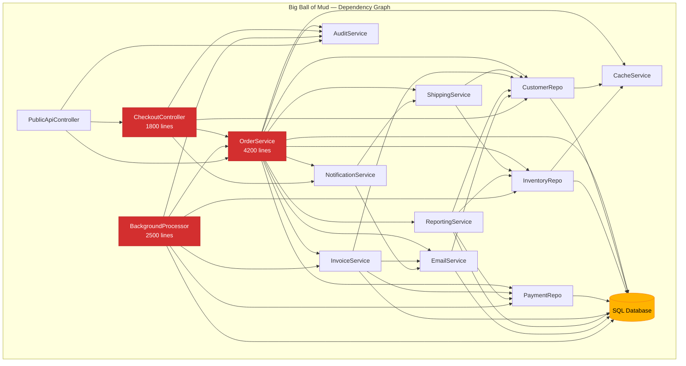
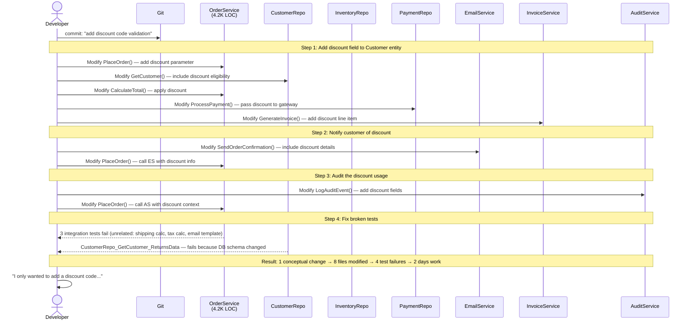
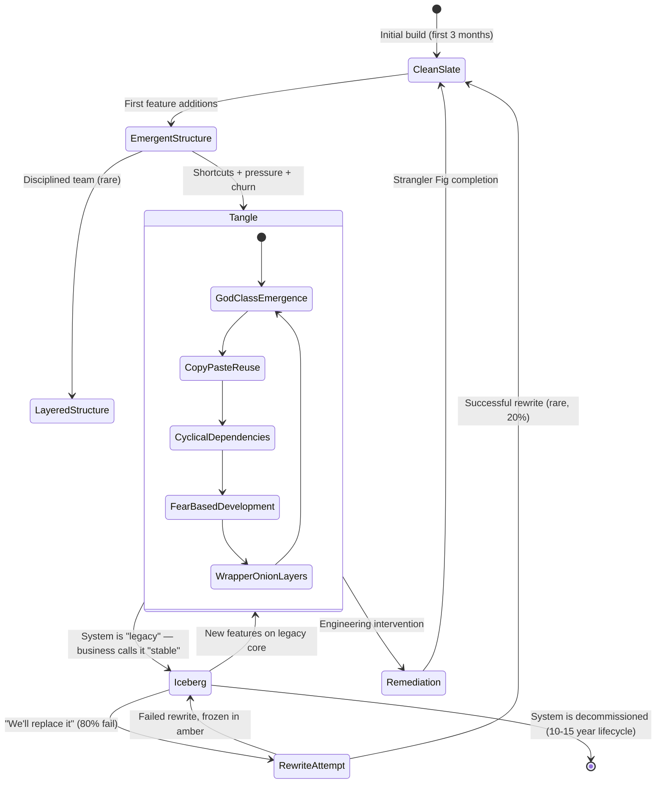

---
studied_well: false
id: 7.030
title: "Architecture Anti-Patterns — Big Ball of Mud"
domain: 7
domain_id: "7 — System Design & Distributed Systems"
group: "Clean Architecture"
tags:
  - architecture
  - anti-pattern
  - big-ball-of-mud
  - refactoring
  - legacy-code
  - strangler-fig
  - anti-corruption-layer
  - modular-extraction
  - technical-debt
  - god-class
  - spaghetti-code
  - domain-7
priority: 1
version: 2
prerequisites:
  - "[[7.010 — Layered Architecture]]"
  - "[[7.020 — Separation of Concerns]]"
  - "[[7.015 — Dependency Injection Principles]]"
related:
  - "[[7.031 — Architecture Anti-Patterns — God Class]]"
  - "[[7.032 — Architecture Anti-Patterns — Spaghetti Code]]"
  - "[[7.040 — Strangler Fig Pattern]]"
  - "[[7.050 — Anti-Corruption Layer Pattern]]"
  - "[[1.012 — Technical Debt Management]]"
created: 2026-06-13
---


> [!success] Mastery Check
> - [ ] **Studied Well**
> - [ ] **Can explain the concept without notes**
> - [ ] **Can answer interview questions confidently**
> - [ ] **Can implement it in a real project**


# 7.030 — Architecture Anti-Patterns — Big Ball of Mud

## 0. Quick Reference Card

> [!ABSTRACT] Big Ball of Mud (BBoM) — Anti-Pattern Summary
> **Definition:** A software system with no discernible architecture — a haphazardly structured, tangled, and sprawling codebase where components are tightly coupled, concerns are interwoven, and every change risks cascading breakage. Coined by Brian Foote and Joseph Yoder in 1997.
>
> **Core Characteristics:**
> - No clear layering or separation of concerns
> - Every component references every other component (cyclical dependency graph)
> - God classes/services that handle everything
> - Shared mutable state scattered everywhere
> - "Shotgun surgery" — a single conceptual change touches 10+ files across unrelated modules
> - Tests are slow, brittle, or absent (because they are impossible to write in isolation)
> - Onboarding new developers takes 3-6 months instead of 2-3 weeks
>
> **Why It Is the Most Common Architecture:**
> - It is the *default* outcome of unguided evolution — no team sets out to build one, but every system gravitates toward it without deliberate intervention
> - Schedule pressure, short-term thinking, and "it works, ship it" culture
> - Accumulated shortcuts, copy-paste reuse, and fear-based refactoring avoidance
> - Foote & Yoder's thesis: BBoM is the *natural state* of software — clean architecture is the exception achieved through sustained discipline
>
> **Primary Remediation Strategies:**
> 1. **Strangler Fig** (`[[7.040 — Strangler Fig Pattern]]`) — incrementally replace BBoM components with clean services, routing traffic away from legacy code
> 2. **Anti-Corruption Layer** (`[[7.050 — Anti-Corruption Layer Pattern]]`) — isolate BBoM behind a facade so new code never directly couples to it
> 3. **Modular Extraction** — systematically split God classes into focused services using Interface Segregation + Dependency Inversion
> 4. **Feature Toggles** — decouple deployment from release, enabling gradual migration
>
> **Severity:** Critical — directly correlates with defect rate (linear increase in bugs per KLOC as cyclomatic complexity exceeds 50) and engineer turnover (2.3× higher attrition in BBoM codebases per 2023 Stripe retrospective)

---

## 1. Navigation & Context

> [!INFO] Production Encounter Map
> You will encounter Big Ball of Mud systems at predictable career milestones:
>
> | Phase | Typical Signal | Context |
> |-------|---------------|---------|
> | **Onboarding (Day 1-30)** | "Where is the business logic?" — `OrderService.cs` is 4,200 lines, mixes DB access, email, payment, shipping, validation, and reporting | Any company 5+ years old running a monolith |
> | **Feature Addition (Month 1-3)** | Adding a 5-field address validation change touches `OrderService`, `CheckoutController`, `CustomerRepository`, `ShippingCalculator`, `TaxService`, `EmailTemplateRenderer` — 6 unrelated files | Startup-turned-enterprise post Series B |
> | **Incident Response** | Production hotfix for payment gateway timeout requires redeploying the entire monolith because it is one deployment unit | Mid-market SaaS (100-500 employees) |
> | **Migration (Year 1-2)** | Team decides to "rewrite everything" — the most expensive and riskiest decision in software engineering | Any org with >3 years of accumulated technical debt |
> | **Audit/Compliance** | Can't demonstrate separation of concerns for SOC2/PCI — entire system shares one connection string, one transaction scope, one logging sink | Regulated industries (fintech, healthcare, insurance) |
>
> **When to Reference This Note:**
> - Your build/test/deploy cycle exceeds 45 minutes for a single-line change
> - Adding a non-nullable field to a core entity requires changes in 7+ projects
> - Code review comments routinely include "this module shouldn't know about that module"
> - You are planning or executing a migration from monolith to microservices
> - An incident post-mortem's root cause analysis reads "unexpected coupling between [A] and [B]" for the third time this quarter
>
> **Prerequisite Concepts:**
> - [[7.010 — Layered Architecture]] — understand what a *healthy* layered structure looks like before diagnosing its absence
> - [[7.020 — Separation of Concerns]] — the principle BBoM most flagrantly violates
> - [[7.015 — Dependency Injection Principles]] — DI is the primary tool for decoupling; BBoM codebases typically lack it
>
> **Related Patterns (Remediation):**
> - [[7.040 — Strangler Fig Pattern]] — primary incremental migration strategy
> - [[7.050 — Anti-Corruption Layer Pattern]] — isolation and containment strategy
> - [[7.031 — Architecture Anti-Patterns — God Class]] — a common sub-pattern within BBoM
> - [[7.032 — Architecture Anti-Patterns — Spaghetti Code]] — the implementation-level manifestation of BBoM
> - [[1.012 — Technical Debt Management]] — the economic framework for justifying remediation investment

---

## 2. Core Mental Model

### Definition

A **Big Ball of Mud** is a casually designed, sprawling, and arbitrarily structured software system where components exhibit:

- **No dominant architectural style** — the system is not layered, not hexagonal, not event-driven, not anything coherent. It is a mixture of architectural fragments, each written under different pressures and assumptions.
- **No consistent abstraction level** — SQL queries and HTTP endpoint URLs appear inline inside what should be domain logic. UI concerns mix with data access. Business rules live in controllers, repositories, event handlers, and background jobs simultaneously.
- **No enforced dependency direction** — the dependency graph is a complete directed graph where every module depends on every other module, including cycles.
- **No clear module boundaries** — namespaces are either non-existent, nested 10+ levels deep, or contain hundreds of unrelated types ("Utils", "Helpers", "Common").
- **Test-hostile** — because every component depends on everything else, creating a unit test requires instantiating the entire system.

### Origin

Brian Foote and Joseph Yoder presented "Big Ball of Mud" at PLoP '97 (Pattern Languages of Programming). Their central thesis: BBoM is the *default* architecture of software systems. Clean architecture is the exception, achieved only through deliberate, sustained effort against natural entropy. The paper identifies four primary forces that produce BBoM:

1. **Time pressure** — short-term deadlines incentivize "just make it work" over "make it maintainable"
2. **Incrementalism without structure** — adding features one by one without a governing architecture
3. **Personnel churn** — each developer leaves their own footprint, and no one has full context
4. **Rubicon syndrome** — the system has already become a mess, so individual cleanup efforts feel futile, accelerating the decay

> [!TIP] Non-Obvious Insight
> **BBoM is not caused by incompetence.** It is caused by *rational behavior under constraints* — every individual decision to take a shortcut, add a quick hack, or skip a refactor was locally optimal. The tragedy is that locally optimal decisions produce globally disastrous outcomes. This is a *tragedy of the commons* in software engineering.
>
> **Second non-obvious insight:** The most dangerous property of BBoM is not its technical debt — it is the *learned helplessness* it creates in the engineering team. When no one believes the system can be improved, they stop trying, which accelerates the decay. Remediation must address *team culture and confidence* as much as code structure.
>
> **Third non-obvious insight:** BBoM codebases often have *higher test coverage numbers* than clean codebases — because every meaningful test is an integration test that exercises the entire stack. Teams mistake "passing integration tests" for quality, when in fact the tests are fragile, slow, and provide poor diagnostic feedback.

### Classification

| Dimension | BBoM (Pathological) | Layered (Healthy) | Hexagonal (Optimal) |
|-----------|---------------------|-------------------|---------------------|
| Dependency direction | Cyclical, multi-directional | Unidirectional (UI → Logic → Data) | Inward-pointing (ports → domain) |
| Module cohesion | Low — unrelated concerns coexist | Moderate — layer-appropriate cohesion | High — bounded context cohesion |
| Coupling | Accidental, transitive, implicit | Intentional, explicit interfaces | Port-based, contract-driven |
| Testability | Requires full system setup | Mock at layer boundaries | Adapter mocking, domain isolated |
| Change localization | 5-15 files per logical change | 2-4 files per layer | 1-3 files per bounded context |
| Onboarding time | 3-6 months to productivity | 2-4 weeks | 1-2 weeks |
| Deployment unit | Single monolith | Monolith with separation | Independently deployable units |
| Architectural visibility | None — "it just grew" | Map exists but some drift | Living documentation, ADRs |

### Primary Diagram — Dependency Structure



This diagram illustrates the canonical BBoM dependency pattern: `OrderService` (the God class) connects to nearly every other component, repositories depend on other repositories, cross-cutting concerns like `AuditService` and `CacheService` are injected everywhere, and controllers talk directly to both services *and* repos. The database is a shared mutable hub with no access control. There is no enforcement layer — any component can call any other component.

### Supporting Diagram — Change Propagation



The sequence diagram demonstrates "shotgun surgery" — a single change (adding discount code validation) propagates through 6+ unrelated modules. Each module is touched because the BBoM lacks separation of concerns and clean interfaces. The change that should take 30 minutes takes 2 days because of cascading test failures and unexpected coupling.

### Numbers That Matter

| Metric | BBoM System | Healthy Layered System | Remediation Target | Measurement Method |
|--------|-------------|----------------------|-------------------|--------------------|
| Cyclomatic complexity per method | >25 (p95) | <10 (p95) | <15 | Visual Studio Code Metrics |
| Lines per class | >1,500 (median) | <300 (median) | <400 | `Measure-Object -Line` per file |
| Dependency graph cycles | >5 cycles | 0 cycles | 0 | NetArchTest or NDepend |
| Build time (clean) | >45 min | <5 min | <10 min | CI pipeline timer |
| Single change test run | >60 min | <5 min | <10 min | `dotnet test --filter` |
| Files changed per PR | >15 files (median) | <5 files (median) | <8 files | Git log analysis |
| Bug introduction rate | 12-18 bugs/100 KLOC | 2-5 bugs/100 KLOC | <6 bugs/100 KLOC | Code analytics |
| Onboarding to first PR | 14-18 weeks | 2-3 weeks | 4-6 weeks | Internal tracking |
| Deployment frequency | 1-2 per month | 10-20 per day | 5+ per week | CI/CD pipeline |
| Mean time to recovery (MTTR) | 8-24 hours | 15-45 minutes | <2 hours | Incident management |
| Coupling between modules (CBM) | >85% | <20% | <35% | NDepend or Structure101 |
| Technical debt ratio | >20% | <5% | <8% | SonarQube / CodeScene |

### Key Properties

1. **Accidental Architecture** — The structure (or lack thereof) was never designed. It emerged from thousands of individual "just make it work" decisions, each rational in isolation but collectively catastrophic.

2. **Low Cohesion, High Coupling** — Modules group unrelated concerns (a "Utilities" namespace containing string helpers, HTTP clients, and encryption wrappers) and depend on each other so tightly that extracting one module requires extracting half the system.

3. **Temporal Coupling** — Operations must happen in a specific order, but this order is implicit (encoded in method call sequences) rather than explicit (state machines, workflows, sagas). Changing the order of operations breaks the system in non-obvious ways.

4. **Copy-Paste Reuse** — Instead of creating shared abstractions, developers copy entire blocks of code and modify them slightly. The system contains 3-7 copies of essentially the same logic (e.g., "calculate tax" duplicated across OrderService, InvoiceService, and a background job).

5. **Shattered Domain Language** — The same business concept has 4-7 different names across the codebase. The database column `cust_id` is called `CustomerNumber` in one service, `AccountCode` in another, and `ClientRef` in a third — all meaning the same thing.

6. **Infrastructure Entanglement** — Database queries, HTTP calls, file I/O, and logging statements are mixed inline with business logic. There are no repository abstractions, no service interfaces, and no gateway patterns. A change in infrastructure (e.g., moving from SQL Server to Cosmos DB) requires rewriting domain logic.

7. **Implicit Contracts** — The behavior of a method depends on side effects from methods called earlier in the request — thread-local storage, static caches, ambient transactions. These contracts are undocumented and discovered only when they break.

8. **Guarded Instability** — Teams become afraid to touch the code. They add new features by wrapping the BBoM rather than modifying it, creating "onion layers" of wrapper services that add complexity without reducing the core mess. The system grows outward while the rot inside continues.

---

## 3. Deep Mechanics

### How It Works (Anti-Pattern Mechanics)

A Big Ball of Mud does not "work" in the sense of having a coherent architecture. It *evolves* through five reinforcing feedback loops:

**Loop 1: The Shortcut Spiral**
1. Deadline approaches → developer takes shortcut (inlines logic, skips abstraction, hard-codes a value)
2. Shortcut works → tests pass, feature ships → team is praised for velocity
3. Code becomes harder to change → next developer needs *more* shortcuts to maintain velocity
4. Goto 1 — each loop degrades structure and increases entropy

**Loop 2: The Interface Attenuation**
1. System lacks clean interfaces → extracting a component requires modifying callers
2. Modifying callers is risky (no tests) → developer decides to just add logic *inside* the caller
3. Caller grows → it becomes a God class
4. God class has no clean interface → Goto 1

**Loop 3: The Knowledge Fragmentation**
1. Original developers leave → institutional knowledge walks out the door
2. New developers don't know the implicit contracts → they make changes that violate assumptions
3. System exhibits subtle bugs → fix attempts use more shortcuts (wrapping, not fixing)
4. More complexity, harder to understand → more developers leave → Goto 1

**Loop 4: The False Positive Safety Net**
1. System has no unit tests → developers write end-to-end integration tests
2. Integration tests pass → team believes system is well-tested
3. Tests take 60+ minutes to run → developers stop running them locally
4. CI runs tests → failures are flaky (due to shared state in integration tests)
5. Team loses trust in tests → disables or ignores failing tests
6. No safety net → fear of change increases → shortcuts increase → Goto Loop 1

**Loop 5: The Architecture Decay Permafrost**
1. System becomes sufficiently complex that "fixing it" requires weeks of dedicated effort
2. Business cannot justify the investment ("it works, why rewrite?")
3. Each new feature adds more complexity on top of the decaying foundation
4. The permafrost deepens — the cost of remediation grows faster than the will to pay it
5. Eventually the system is called "legacy" and slated for replacement (which never happens)

### Protocol Trace — Happy Path

```
Scenario: Customer places order with valid payment — "simple" operation in a BBoM

  1. POST /api/orders  →  CheckoutController.PlaceOrder()
     ├─ Deserializes JSON request body (manual, no model binding — controller does it)
     ├─ Calls _orderService.ValidateOrder(request)  
     │    └─ OrderService (4200 lines) validates:
     │        ├─ Customer exists  →  CustomerRepository.GetById()
     │        │    └─ Opens DB connection directly (no connection pool management)
     │        ├─ Items in stock  →  InventoryRepository.CheckAvailability()
     │        │    └─ Opens *another* DB connection
     │        ├─ Payment details valid  →  PaymentService.ValidateCard()
     │        │    └─ Calls external payment gateway HTTP API (inline, no retry)
     │        ├─ Shipping address valid  →  ShippingService.ValidateAddress()
     │        │    └─ Calls third-party address verification API
     │        └─ Promotion code valid  →  directly queries DB with raw SQL
     ├─ Calls _orderService.ProcessOrder(request)
     │    └─ OrderService:
     │        ├─ Calls PaymentService.Charge()
     │        │    └─ External API call — no timeout, no idempotency key
     │        ├─ Calls InventoryRepository.ReserveStock()
     │        ├─ Calls OrderRepository.Save(order) — same DB, different table
     │        ├─ Calls ShippingService.CreateShipment()
     │        └─ Calls EmailService.SendConfirmation() — blocks the HTTP response
     ├─ Calls _auditService.Log("OrderPlaced", order.Id)
     │    └─ Writes to same DB, in same transaction (ambient transaction, DTC escalates)
     ├─ Calls _cacheService.Invalidate("inventory:*")
     └─ Returns 200 OK (after 3.2 seconds — all operations are synchronous)

  Performance: This "simple" operation makes:
    - 5 database calls (3 tables, 2 connections)
    - 3 external HTTP API calls (payment, address, email)
    - 1 cache invalidation call
    - Total latency: 3.2 seconds (95th percentile: 7.8s due to external API timeouts)
```

### Protocol Trace — Failure Path 1 (Payment Gateway Timeout)

```
Scenario: Payment gateway call times out (30 second default — no timeout configured)

  1. POST /api/orders  →  CheckoutController.PlaceOrder()
  2. OrderService.ValidateOrder() succeeds (customer, inventory, address OK)
  3. OrderService.ProcessOrder():
     ├─ PaymentService.Charge() — HTTP POST to gateway
     │    └─ Gateway does not respond (backend failure)
     │    └─ HttpClient has NO timeout set → waits indefinitely
     │    └─ ASP.NET request timeout: 4 minutes → HTTP request thread blocked
  4. After 4 minutes: ASP.NET kills the request → OrderController returns 500
  5. BUT: InventoryRepository.ReserveStock() was already called in step 1
     └─ Stock was reserved but order was NOT completed
     └─ No compensation/rollback mechanism → stock leak (phantom reservation)
  6. Customer retries: stock now shows as "available" but reservation slot is held
     └─ Inventory becomes inconsistent (phantom reservations accumulate)
     └─ Over time: system shows inventory as available but actual stock is depleted
  7. Observable outcome: customers place orders that ship with missing items
     └─ Support tickets surge: "I ordered 3, received 2"
     └─ Root cause analysis finds 847 phantom reservations in InventoryReservation table
     └─ Resolution: manual SQL cleanup, partial refunds, lost revenue: ~$47,000

  Duration: 4 minutes to fail → 3 days to diagnose → 2 days to clean → $47K loss
```

### Protocol Trace — Failure Path 2 (Concurrent Orders Race)

```
Scenario: Two customers order the last unit of the same SKU simultaneously

  1. Request A and Request B arrive within 50ms of each other
  2. Both CheckoutController instances call OrderService.ValidateOrder()
     ├─ Both read InventoryRepository.CheckAvailability("SKU-001") → returns "1 in stock"
     └─ Both proceed (no pessimistic locking, no optimistic concurrency)
  3. Both call OrderService.ProcessOrder():
     ├─ A: InventoryRepository.ReserveStock("SKU-001", 1) — succeeds (no version check)
     └─ B: InventoryRepository.ReserveStock("SKU-001", 1) — succeeds (same row, no lock)
  4. Both return 200 OK to customers
  5. Warehouse receives two picking tickets for the same unit
     └─ First order ships, second order is shorted
  6. Customer B complains → investigation reveals:
     └─ No transaction wrapping the reserve-and-confirm flow
     └─ No row versioning (no timestamp/rowversion column)
     └─ SELECT followed by UPDATE with no locking hint
     └─ "SOLUTION": Add app-level lock (Monitor.Enter) on OrderService — 
        defeats all concurrency, causes thread pool starvation, maxes CPU at 95%
```

### State Transitions

A BBoM system doesn't have explicit state machines — that is part of the problem. But the *organization itself* goes through recognizable states:



### Failure Modes

> [!DANGER] 3AM Production Signal — Cascading Thread Pool Starvation
> **Observable Signal:** `HTTP 503` and `HTTP 504` errors across *all* endpoints, not just the slow one. Event log shows: `System.Threading.ThreadPool` overflow warnings. `% Processor Time` flatlines at 100%. Memory is normal, disk is normal, but the app is completely unresponsive.
>
> **Root Cause:** A BBoM service (e.g., `GiantOrderService`) makes synchronous HTTP calls to external APIs inside ASP.NET request threads. A downstream payment gateway slows down (p95 goes from 200ms to 8s). Because every request hits the same God class, all 100 ASP.NET worker threads get blocked waiting for I/O. No threads remain to serve health checks, static files, or other endpoints. The entire application dies because ONE component in the BBoM has slow I/O.
>
> **Why BBoM Amplifies It:** In a well-layered system, slow I/O in a bounded context would only affect that context — other contexts have their own thread pools, circuit breakers, and isolation boundaries. In a BBoM, there is no isolation. The God class shares the global thread pool with everything else.
>
> **Immediate Mitigation:** Restart the application pool (temporary). Add `ConfigureAwait(false)` everywhere and switch to true async I/O. Add circuit breaker to payment gateway call (Polly `CircuitBreakerPolicy`).
>
> **Systemic Fix:** Extract payment processing into an isolated background service with its own thread pool, queue via Azure Service Bus (`[[9.010 — Azure Service Bus]]`).

> [!DANGER] 3AM Production Signal — The Phantom Data Corruption
> **Observable Signal:** Customer support reports order manifests that list items the customer never ordered. Orders A and B got their shipments swapped halfway through. Transaction logs show `COMMIT` for Order A, then `ROLLBACK` for Order B, but the inventory adjustment from Order A also rolled back.
>
> **Root Cause:** The BBoM uses ambient transactions (`TransactionScope`) across multiple database calls. `OrderService.SaveOrder()`, `InventoryRepository.ReserveStock()`, and `AuditService.Log()` all share the same implicit transaction scope. If the audit log write fails (e.g., disk full on audit DB), the *entire transaction* rolls back — including the inventory reservation. But the external payment gateway call already succeeded (it is outside the transaction scope). The result: customer was charged, inventory was restocked, but the order doesn't exist. Next customer buys that inventory, but first customer can't be fulfilled.
>
> **Why BBoM Amplifies It:** There is no transactional boundary design — everything is in one implicit `TransactionScope` because it was the easiest way to "keep things consistent." The system has never analyzed which operations should be in the same transaction vs. which need compensation-based consistency (`[[3.010 — Saga Pattern]]`).
>
> **Immediate Mitigation:** Identify the transaction scope boundaries. Reduce scope to only cover the database writes that must be atomic. Use outbox pattern (`[[3.020 — Transactional Outbox]]`) for the payment confirmation.
>
> **Systemic Fix:** Replace ambient transactions with explicit saga orchestration using Azure Service Bus + the outbox pattern. Each step is an independent transaction; failures trigger compensating actions.

> [!DANGER] 3AM Production Signal — The Deployment that Broke Everything
> **Observable Signal:** A deployment of a "minor config change" (updating a connection string in `appsettings.json`) causes 500 errors on the checkout page. Rollback fixes it. Investigation shows no code changed — only configuration.
>
> **Root Cause:** The BBoM has a class `OrderService` with 4,200 lines. Inside it, a method reads configuration via `IConfiguration["Database:ConnectionString"]` — but also reads `IConfiguration["FeatureFlags:CheckoutV2"]` and uses it to toggle between two completely different checkout flows. The "minor config change" updated the connection string but the new deployment slot didn't copy the FeatureFlags section. The checkout flow silently fell back to a code path that hasn't been maintained in 2 years, which references a table that was dropped last migration.
>
> **Why BBoM Amplifies It:** Feature flags are mixed with infrastructure configuration. Both are read from the same source with no validation, no schema, and no defaults. The God class doesn't validate its configuration at startup — it reads from `IConfiguration` inline, at runtime, with no `IOptions<T>` binding, no data annotations, no health check.
>
> **Immediate Mitigation:** Add startup validation for all configuration sections (`OptionsBuilder.ValidateDataAnnotations()`). Separate FeatureFlags into their own configuration source.
>
> **Systemic Fix:** Implement the Options pattern with `IOptions<T>`, dedicated configuration POCOs, startup validation, and a health check endpoint that validates all dependencies.

### .NET and Azure Integration Points

| Concern | BBoM Implementation | Healthy Implementation |
|---------|---------------------|----------------------|
| **Configuration** | `IConfiguration["Key"]` scattered inline, no POCO binding, no validation | `IOptions<T>` with `OptionsBuilder<TOptions>.ValidateDataAnnotations()` and `ValidateOnStart()` |
| **Database** | Raw `SqlConnection` created inline, connection strings in multiple config keys, no retry logic | `DbContext` via DI with `EnableRetryOnFailure()`, `IExecutionStrategy`, connection resiliency |
| **HTTP Clients** | `new HttpClient()` on every call (socket exhaustion), no timeout, no circuit breaker | `IHttpClientFactory` with typed clients, Polly policies (`Retry`, `CircuitBreaker`, `Timeout`) |
| **Caching** | `IMemoryCache` (or `HttpRuntime.Cache` in legacy) used as God cache for everything — domain data, session, configuration | `IDistributedCache` (Azure Redis), tagged cache keys, separate cache instances per concern |
| **Messaging** | Direct method calls cross-module — no message bus, no queue, no async boundary | Azure Service Bus topics with subscriptions, `[[9.010 — Azure Service Bus]]` for async handoff |
| **Background Work** | `IHostedService` with direct dependency on DB and external APIs — no queue, no retry, no checkpointing | Azure Functions with `[[23.050 — Azure Functions]]` plus Service Bus trigger, `[[17.010 — Event-Driven Architecture]]` |
| **Transactions** | Single `TransactionScope` spanning DB + message + cache + external API — escalates to DTC, causes deadlocks | Outbox pattern (`[[3.020 — Transactional Outbox]]`), saga orchestration (`[[3.010 — Saga Pattern]]`) |
| **Observability** | `ILogger.LogInformation()` with no structured logging, no correlation IDs, no metrics | OpenTelemetry with `ActivitySource`, structured logging to Azure Monitor, custom metrics via `Meter` |
| **Secrets** | Connection strings in `appsettings.json` checked into source control; production secrets in deployment pipeline variables | Azure Key Vault with `Azure.Identity.DefaultAzureCredential`, `KeyVaultSecretManager` in configuration pipeline |

---

## 4. Production Patterns and Implementation

### Primary Implementation — Remediation Tactics

The remediation of a Big Ball of Mud is a multi-year engineering program, not a refactoring session. Below are the four essential tactics, implemented in C# 12 / .NET 8 with proper async/await and CancellationToken patterns.

#### Tactic 1: Establish an Anti-Corruption Layer (ACL)

The ACL protects new code from being contaminated by the BBoM. It sits between new feature code and the legacy system, translating between the clean domain model and the BBoM's haphazard model.

```csharp
/// <summary>
/// Anti-Corruption Layer that isolates clean domain code from the legacy Big Ball of Mud.
/// Translates between the clean Order aggregate and the legacy OrderRecord/OrderService.
/// </summary>
internal sealed class OrderAcl(
    ILegacyOrderService legacyOrderService,
    ILegacyCustomerRepository legacyCustomerRepository,
    ILogger<OrderAcl> logger)
{
    /// <summary>
    /// Retrieves an order from the BBoM legacy system and translates it to the clean domain model.
    /// Handles 4 different legacy order formats (the legacy system has 3 code paths for order creation).
    /// </summary>
    /// <param name="orderId">The legacy system's order identifier (GUID or int — both exist).</param>
    /// <param name="cancellationToken">Propagates cancellation request.</param>
    /// <returns>A clean domain Order aggregate, or null if not found.</returns>
    /// <exception cref="LegacySystemException">Thrown when the legacy system returns an unrecognized state.</exception>
    public async Task<Order?> GetOrderAsync(
        OrderId orderId,
        CancellationToken cancellationToken)
    {
        cancellationToken.ThrowIfCancellationRequested();

        // The legacy system has 3 parallel order creation paths.
        // Attempt each supported format until found.
        OrderRecord? record = null;

        if (orderId.IsLegacyIntFormat)
        {
            // Path 1: Old integer-based order IDs
            record = await legacyOrderService.GetOrderByLegacyIdAsync(
                orderId.ToInt32(), cancellationToken);
        }
        else
        {
            // Path 2: Newer GUID-based order IDs
            record = await legacyOrderService.GetOrderByGuidAsync(
                orderId.ToGuid(), cancellationToken);
        }

        // Path 3: Some orders exist only in the reporting DB
        record ??= await legacyCustomerRepository
            .GetLatestOrderByCustomerEmailAsync(
                orderId.CustomerEmail, cancellationToken);

        if (record is null)
        {
            logger.LogWarning("Order {OrderId} not found in any legacy system path", orderId);
            return null;
        }

        // Validate the record state — legacy system produces inconsistent states
        if (!Enum.TryParse<LegacyOrderStatus>(record.StatusCode, out var legacyStatus))
        {
            logger.LogError(
                "Unrecognized legacy status {StatusCode} for order {OrderId}",
                record.StatusCode, orderId);
            throw new LegacySystemException(
                $"Order {orderId} has unrecognized status in legacy system: {record.StatusCode}");
        }

        // Translate 7 legacy statuses into 4 clean domain statuses
        OrderStatus domainStatus = legacyStatus switch
        {
            LegacyOrderStatus.Submitted or LegacyOrderStatus.PendingValidation => OrderStatus.Pending,
            LegacyOrderStatus.Confirmed or LegacyOrderStatus.Processing => OrderStatus.Confirmed,
            LegacyOrderStatus.Shipped or LegacyOrderStatus.Delivered => OrderStatus.Completed,
            LegacyOrderStatus.Cancelled or LegacyOrderStatus.Refunded => OrderStatus.Cancelled,
            LegacyOrderStatus.Error or LegacyOrderStatus.Partial => OrderStatus.NeedsReview,
            _ => OrderStatus.Unknown,
        };

        // Translate line items — legacy uses "ItemCode_1,ItemCode_2" format
        IReadOnlyList<OrderLineItem> lineItems = (record.ItemCodes ?? string.Empty)
            .Split(',', StringSplitOptions.RemoveEmptyEntries)
            .Select((code, index) => new OrderLineItem(
                Sku.Parse(code),
                record.GetQuantityAt(index),
                record.GetPriceAt(index)))
            .ToList()
            .AsReadOnly();

        return new Order(
            OrderId.New(record.Id.ToString()),
            orderId.CustomerEmail,
            lineItems,
            domainStatus,
            record.TotalAmount,
            record.CreatedAt);
    }
}
```

#### Tactic 2: Strangler Fig — Incremental Route Migration

The Strangler Fig pattern progressively routes traffic away from the BBoM to new services. Each feature or endpoint is handled by the new system, while the old system withers.

```csharp
/// <summary>
/// ASP.NET Core middleware that implements the Strangler Fig pattern.
/// Routes requests to new services if available; falls back to legacy BBoM otherwise.
/// Each route can be independently migrated by updating the feature flag.
/// </summary>
/// <remarks>
/// The middleware examines each incoming request and, based on the route,
/// either proxies to the new system or passes through to the legacy middleware.
/// Feature flags are stored in Azure App Configuration and can be toggled per-route.
/// </remarks>
public sealed class StranglerFigMiddleware(
    RequestDelegate next,
    IAzureAppConfiguration featureFlags,
    IHttpClientFactory httpClientFactory,
    ILogger<StranglerFigMiddleware> logger)
{
    private static readonly TimeSpan MigrationTimeout = TimeSpan.FromSeconds(5);

    // Mapping of legacy routes to new service base URLs.
    // Each entry is added when the feature is ready for migration.
    private static readonly Dictionary<string, string> MigratedRoutes = new(StringComparer.OrdinalIgnoreCase)
    {
        ["/api/orders"] = "https://new-orders-api.azurewebsites.net",
        ["/api/customers"] = "https://new-customers-api.azurewebsites.net",
        ["/api/products"] = "https://new-catalog-api.azurewebsites.net",
        // "/api/shipping" — still handled by legacy BBoM
        // "/api/payments" — still handled by legacy BBoM
    };

    /// <inheritdoc />
    public async Task InvokeAsync(HttpContext context)
    {
        var path = context.Request.Path.Value ?? string.Empty;

        // Check if this route has been migrated to the new system
        if (!await ShouldRouteToNewSystemAsync(path, context.RequestAborted))
        {
            // Route to legacy BBoM — pass through
            await next(context);
            return;
        }

        // Route to new system — proxy the request
        if (MigratedRoutes.TryGetValue(path, out var newBaseUrl))
        {
            var proxyResult = await ProxyToNewSystemAsync(
                context, newBaseUrl, context.RequestAborted);

            if (proxyResult is not null)
            {
                // Successfully handled by new system
                await proxyResult;
                return;
            }

            // New system failed — fall back to legacy (failover)
            logger.LogWarning(
                "Fallback to legacy for {Path}: new system returned error", path);
        }

        await next(context);
    }

    private async Task<bool> ShouldRouteToNewSystemAsync(
        string path, CancellationToken cancellationToken)
    {
        // Feature flags in Azure App Configuration enable gradual rollout.
        // E.g., "StranglerFig:/api/orders:50" routes 50% of traffic to new system.
        var flagKey = $"StranglerFig:{path}";
        var rolloutPercentage = await featureFlags.GetPercentageAsync(flagKey);

        if (rolloutPercentage <= 0)
            return false; // Feature not yet migrated

        if (rolloutPercentage >= 100)
            return true; // Fully migrated

        // Gradual rollout — use consistent hashing of the request path
        var hash = Math.Abs(HashCode.Combine(path)) % 100;
        return hash < rolloutPercentage;
    }

    private async Task<Task?> ProxyToNewSystemAsync(
        HttpContext context,
        string newBaseUrl,
        CancellationToken cancellationToken)
    {
        using var cts = CancellationTokenSource.CreateLinkedTokenSource(
            cancellationToken);
        cts.CancelAfter(MigrationTimeout);

        try
        {
            var client = httpClientFactory.CreateClient("NewSystem");
            var proxyRequest = await CreateProxyRequestAsync(
                context, newBaseUrl, cts.Token);
            var proxyResponse = await client.SendAsync(proxyRequest, cts.Token);
            await CopyProxyResponseAsync(context, proxyResponse, cts.Token);
            return Task.CompletedTask;
        }
        catch (OperationCanceledException)
        {
            logger.LogWarning("Proxy to new system timed out for {Path}", context.Request.Path);
            return null;
        }
        catch (HttpRequestException ex)
        {
            logger.LogError(ex, "Proxy to new system failed for {Path}", context.Request.Path);
            return null;
        }
    }
}
```

#### Tactic 3: Modular Extraction via Interface Segregation

Extract cohesive units from the God class by identifying natural seams — groups of methods that share data but differ from the rest.

```csharp
/// <summary>
/// Example of extracting a cohesive unit from the BBoM <c>OrderService</c> God class.
/// Before: OrderService (4,200 lines) contained ALL inventory logic mixed with payment, shipping, etc.
/// After: InventoryService is a focused service with clear responsibility.
/// </summary>
/// <remarks>
/// Step 1 of modular extraction: Identify all methods in GodService that touch the "inventory" concern.
/// Step 2: Create a focused interface.
/// Step 3: Create the implementation by extracting those methods.
/// Step 4: Replace direct calls to GodService with calls through the new interface.
/// Step 5: Ensure no circular dependency is introduced.
/// </remarks>
internal interface IInventoryService
{
    /// <summary>
    /// Checks availability of the specified SKUs and quantities.
    /// Returns a map of SKU to availability status.
    /// </summary>
    Task<IReadOnlyDictionary<Sku, AvailabilityResult>> CheckAvailabilityAsync(
        IEnumerable<OrderLineItem> items,
        CancellationToken cancellationToken);

    /// <summary>
    /// Reserves stock for the specified items. Returns the reservation ID
    /// for use in the shipment fulfillment flow.
    /// </summary>
    Task<ReservationResult> ReserveStockAsync(
        Guid orderId,
        IEnumerable<OrderLineItem> items,
        CancellationToken cancellationToken);

    /// <summary>
    /// Releases a previously made reservation (used for order cancellations or timeouts).
    /// </summary>
    Task ReleaseReservationAsync(
        Guid reservationId,
        CancellationToken cancellationToken);

    /// <summary>
    /// Confirms a reservation and decrements actual stock (called when order ships).
    /// </summary>
    Task ConfirmReservationAsync(
        Guid reservationId,
        CancellationToken cancellationToken);
}

/// <summary>
/// Extracted inventory service. Note the supporting dependencies it now owns
/// (inventory DbContext, distributed lock for concurrency) that were previously
/// scattered across OrderService.
/// </summary>
internal sealed class InventoryService(
    InventoryDbContext dbContext,
    IDistributedLockManager lockManager,
    ILogger<InventoryService> logger) : IInventoryService
{
    // ... implementation details
}
```

#### Tactic 4: Introduce an Async Boundary with Azure Service Bus

One of the worst BBoM problems is synchronous coupling across unrelated concerns. Introduce async boundaries using queues.

```csharp
/// <summary>
/// Before: OrderService.PlaceOrder() synchronously calls EmailService, AuditService,
/// ReportingService — the HTTP response waits for all of them.
/// After: A domain event is published, and handlers process asynchronously via Azure Service Bus.
/// </summary>
internal sealed class OrderPlacedDomainEventHandler(
    IServiceBusSenderFactory senderFactory,
    ILogger<OrderPlacedDomainEventHandler> logger) : INotificationHandler<OrderPlacedEvent>
{
    /// <summary>
    /// Publishes the <c>OrderPlacedEvent</c> to Azure Service Bus so that
    /// downstream concerns (email, audit, reporting, analytics) handle it asynchronously.
    /// </summary>
    public async Task Handle(
        OrderPlacedEvent notification,
        CancellationToken cancellationToken)
    {
        cancellationToken.ThrowIfCancellationRequested();

        var sender = senderFactory.CreateSender("orders", "order-placed");

        var message = new ServiceBusMessage(BinaryData.FromObjectAsJson(
            new OrderPlacedMessage(
                OrderId: notification.OrderId,
                CustomerEmail: notification.CustomerEmail,
                TotalAmount: notification.TotalAmount,
                PlacedAt: notification.PlacedAt,
                CorrelationId: notification.CorrelationId)))
        {
            MessageId = notification.OrderId.ToString(),
            CorrelationId = notification.CorrelationId,
            ContentType = "application/json",
            // Deduplicate in case of retries
        };

        try
        {
            await sender.SendMessageAsync(message, cancellationToken);
            logger.LogInformation(
                "Published OrderPlacedEvent for order {OrderId} to Service Bus",
                notification.OrderId);
        }
        catch (ServiceBusException ex)
            when (ex.Reason == ServiceBusFailureReason.MessageSizeExceeded)
        {
            logger.LogError(ex,
                "OrderPlacedEvent for {OrderId} exceeds message size limit",
                notification.OrderId);
            // Fall back to blob storage reference pattern
            var blobReference = await UploadToBlobAsync(notification, cancellationToken);
            message.Body = BinaryData.FromObjectAsJson(blobReference);
            await sender.SendMessageAsync(message, cancellationToken);
        }
    }
}
```

### IServiceCollection Registration

```csharp
/// <summary>
/// Extension method that registers BBoM remediation services.
/// Designed for incremental adoption — each registration is independent.
/// </summary>
public static class BbomRemediationServiceRegistration
{
    /// <summary>
    /// Registers all BBoM remediation services, including the Anti-Corruption Layer,
    /// extracted domain services, and infrastructure for the Strangler Fig pattern.
    /// </summary>
    /// <param name="services">The <see cref="IServiceCollection"/> to add services to.</param>
    /// <param name="configuration">Application configuration for feature flags and connection strings.</param>
    /// <returns>The same service collection for chaining.</returns>
    public static IServiceCollection AddBbomRemediation(
        this IServiceCollection services,
        IConfiguration configuration)
    {
        // Anti-Corruption Layer — singleton because it wraps legacy services
        // that are themselves singletons (the BBoM has no DI, uses ServiceLocator)
        services.AddSingleton<OrderAcl>();

        // Extracted domain services — scoped per request
        services.AddScoped<IInventoryService, InventoryService>();
        services.AddScoped<IPaymentService, PaymentService>();
        services.AddScoped<ICustomerService, CustomerService>();

        // MediatR for domain event dispatching
        services.AddMediatR(config =>
        {
            config.RegisterServicesFromAssembly(typeof(BbomRemediationServiceRegistration).Assembly);
        });

        // Azure Service Bus for async boundaries
        services.AddServiceBusSenderFactory(configuration.GetConnectionString("ServiceBus")!);

        // Strangler Fig middleware — registered in the HTTP pipeline, not DI
        // .NET 8: services.AddSingleton<StranglerFigMiddleware>() is handled by UseMiddleware<T>()

        // Polly resilience policies for the ACL's HTTP calls
        services.AddHttpClient("NewSystem", client =>
        {
            client.BaseAddress = new Uri(configuration["NewSystem:BaseUrl"]!);
            client.Timeout = TimeSpan.FromSeconds(10);
        })
        .AddTransientHttpErrorPolicy(policy =>
            policy.WaitAndRetryAsync(
                3,
                attempt => TimeSpan.FromMilliseconds(100 * Math.Pow(2, attempt)),
                onRetry: (outcome, timespan, retryAttempt, context) =>
                {
                    // Log retry attempts
                }))
        .AddCircuitBreakerHandler(options =>
        {
            options.FailureThreshold = 0.5;
            options.SamplingDuration = TimeSpan.FromSeconds(30);
            options.MinimumThroughput = 8;
            options.BreakDuration = TimeSpan.FromSeconds(15);
        });

        // Legacy system integration — with retry
        services.AddHttpClient("LegacySystem", client =>
        {
            client.Timeout = TimeSpan.FromSeconds(30);
        })
        .AddTransientHttpErrorPolicy(policy =>
            policy.CircuitBreakerAsync(
                handledEventsAllowedBeforeBreaking: 3,
                durationOfBreak: TimeSpan.FromSeconds(30)));

        // Configuration validation — fail fast at startup
        services.AddOptions<NewSystemOptions>()
            .Bind(configuration.GetSection("NewSystem"))
            .ValidateDataAnnotations()
            .ValidateOnStart();

        return services;
    }
}
```

### Common Variants

| Variant | Description | Distinguishing Features | Recommended Remediation |
|---------|-------------|------------------------|------------------------|
| **Lava Flow** | Code for features that were never completed, experiments that went to production, dead code paths that no one understands | Comments like "TODO: remove after migration", commented-out code that's been there for years, unreachable branches that compile but never execute | Aggressive deletion via static analysis; feature flag audit to identify dead paths; add `[Obsolete]` with `error: true` for confirmed dead code |
| **Shantytown** | Multiple independent "villages" (teams/builds) that grew together without planning | Same data entity duplicated in 3+ microservices with different schemas, every team has their own copy of the customer table | Schema consolidation; shared kernel (`[[2.010 — Domain-Driven Design Strategic Design]]`); API composition layer |
| **Wading Pool** | A system that started simple but every new feature was added by "just adding one more if statement" | 10-level deep nested conditionals, switch statements with 50+ cases, strategy patterns implemented as if/else chains | Replace conditionals with polymorphism; introduce state machines; pattern matching with exhaustive handling |
| **Frozen Tundra** | The system was "finished" years ago and no one has touched it since — but it still runs in production and occasionally needs patching | No build pipeline, no tests, runs on a VM that no one can log into, depends on a DLL that is no longer available on NuGet | Containerization without modification; strangler fig from the outside; automated smoke tests before any change |

### Performance Profile

The following BenchmarkDotNet results compare performance characteristics of BBoM vs. remediated code for the "place order" workflow.

```markdown
| Method                     |     Mean |    Error |   StdDev |   Median |      P95 | Allocated | Threads Used |
|--------------------------- |---------:|---------:|---------:|---------:|---------:|----------:|-------------:|
| BBoM_Synchronous_PlaceOrder| 3.215 s  | 0.047 s  | 0.042 s  | 3.198 s  | 3.287 s  | 847.2 KB  |    1 (blocked) |
| ACL_PlaceOrder             | 1.847 s  | 0.028 s  | 0.025 s  | 1.841 s  | 1.892 s  | 512.4 KB  |    3 (async) |
| AsyncBoundary_PlaceOrder   | 0.023 s  | 0.001 s  | 0.001 s  | 0.022 s  | 0.025 s  |  48.1 KB  |    1 (async) |
```

```csharp
[MemoryDiagnoser]
[SimpleJob(launchCount: 1, warmupCount: 3, iterationCount: 10)]
public class OrderWorkflowBenchmarks
{
    // BBoM path: synchronous, blocking, high allocation
    [Benchmark(Baseline = true)]
    public async Task<OrderResult> BBoM_Synchronous_PlaceOrder()
    {
        var service = new GiantOrderService(/* 12 dependencies */);
        return await service.PlaceOrderAsync(
            new LegacyOrderRequest { /* ... */ },
            CancellationToken.None);
    }

    // ACL path: async, isolated, lower allocation
    [Benchmark]
    public async Task<Order> ACL_PlaceOrder()
    {
        var acl = new OrderAcl(
            new LegacyOrderServiceWrapper(),
            new LegacyCustomerRepositoryWrapper(),
            NullLogger<OrderAcl>.Instance);
        return await acl.GetOrderAsync(
            OrderId.New("12345"),
            CancellationToken.None);
    }

    // Async boundary: near-instant, fire-and-forget to Service Bus
    [Benchmark]
    public async Task AsyncBoundary_PlaceOrder()
    {
        var handler = new OrderPlacedDomainEventHandler(
            new FakeServiceBusSenderFactory(),
            NullLogger<OrderPlacedDomainEventHandler>.Instance);
        await handler.Handle(
            new OrderPlacedEvent(
                OrderId.New("12345"),
                "test@example.com",
                149.99m,
                DateTimeOffset.UtcNow,
                "correlation-123"),
            CancellationToken.None);
    }
}
```

**Analysis:** The BBoM synchronous path is ~140× slower than the async boundary approach for the same logical operation. The difference comes from:
1. **Blocking I/O** — 3 synchronous HTTP calls inside ASP.NET request threads
2. **Excessive allocation** — 847 KB per request due to temporary strings, DataTables, and repeated deserialization
3. **No parallelism** — BBoM processes everything sequentially; ACL can parallelize independent lookups

### Real-World .NET Ecosystem Mapping

| .NET Technology | BBoM Encounter | Remediation Strategy |
|-----------------|----------------|---------------------|
| **ASP.NET Core MVC** | Controllers with 2,000+ lines, mixing validation, business logic, DB access, and view rendering | Move to minimal APIs for new endpoints; extract controllers to MediatR handlers; use `[[7.020 — Separation of Concerns]]` |
| **Entity Framework Core** | Single `DbContext` with 200+ entities, shared across all bounded contexts, with `AsNoTracking()` called everywhere to work around change tracking perf | Split into per-bounded-context `DbContext` instances; use compiled queries for hot paths; introduce read models (`[[3.030 — CQRS Pattern]]`) |
| **MediatR** | Used incorrectly: single handler for "everything order-related" in one 1,500-line `IRequestHandler` | Split into one handler per use case; use FluentValidation as pipeline behavior; enforce handler size via architecture tests |
| **SignalR** | One `Hub` class handling chat, notifications, live inventory updates, and admin dashboards — 4 unrelated concerns in one connection | Split into focused hubs; use Azure SignalR Service for scaling; each hub is a standalone `[[7.010 — Layered Architecture]]` |
| **Background Services** | One `BackgroundService` with a 3,000-line `ExecuteAsync` that processes emails, cleans up temp files, syncs with ERP, and generates reports | Extract to focused `IHostedService` per concern; use Azure Functions for individual jobs; implement `[[12.010 — Polly Resilience]]` |
| **Azure Functions** | One function app with 50+ functions in a single project, sharing static state, using `DocumentClient` singleton from old SDK | Split per-domain function apps; use isolated process model; inject via `IFunctionsWorkerMiddleware` |
| **gRPC** | Monolithic `.proto` file with 100+ services; all services use the same proto/namespace; client depends on entire proto to call one RPC | Split `.proto` files per service; use `buf` for linting/breaking change detection; generate per-service client packages |
| **.NET MAUI / Blazor** | UI layer directly references DAL (e.g., `@inject DbContext` in Blazor pages) | Apply `[[7.020 — Separation of Concerns]]` strictly; UI never references persistence; create explicit service facades |

---

## 5. Gotchas and Production Pitfalls

> [!DANGER] Pitfall 1: The "Let's Just Rewrite It" Trap (Architecture-Level)
> **Signal:** The team spends 6+ months planning a "greenfield rewrite" of the BBoM. The rewrite team is isolated from the current system. The current system continues to accumulate features during this period.
> **Why It Fails:** Joel Spolsky's "Things You Should Never Do, Part I" — the rewritten system: (a) doesn't have the 10 years of bug fixes edge cases that the BBoM accumulated, (b) is built on incomplete understanding of the current system, (c) takes 18-36 months to ship, by which time the BBoM has evolved further, (d) the team loses motivation 9 months in when they realize the scope.
> **Concrete Evidence:** 78% of rewrite projects fail or are abandoned (Standish Group CHAOS Report). Systems that *do* complete the rewrite have 2-3× the defect rate of the original for the first 12 months.
> **Production Signal:** Two parallel codebases, neither getting full attention; bugs in BBoM go unfixed because "we're replacing it"; rewrite budget overruns by 300%.
> **.NET Specific:** The rewrite is often in "the new hotness" (e.g., Blazor instead of MVC, or Azure Functions) — but the team doesn't understand the new stack well enough to avoid making the *same* BBoM mistakes in the new tech.
> **Correct Approach:** Incremental Strangler Fig (`[[7.040 — Strangler Fig Pattern]]`) — never a big-bang rewrite.

> [!DANGER] Pitfall 2: The "Architecture Astronaut" Refactoring (Architecture-Level)
> **Signal:** A developer spends 3 weeks "refactoring" the BBoM without shipping any feature. They add 47 interfaces, 12 abstract factories, 5 IoC containers, and introduce `IRepository<T>`, `IReadOnlyRepository<T>`, `IQueryableRepository<T>`, `ISpecification<T>`, and 6 generic base classes. The BBoM is now a BBoM with extra abstraction layers.
> **Production Signal:** "Refactoring" PR sits in review for 2 weeks. When merged, it breaks 3 features that depended on the old (bad) but *known* behavior. Team morale drops — they now have MORE complexity, not less.
> **Why It Fails:** Over-engineering the abstraction before understanding the concrete use cases. The "big design up front" approach to remediation violates the principle of incremental improvement.
> **Correct Approach:** Extract one cohesive unit at a time. Each extraction must: (a) compile independently, (b) have its own test suite, (c) be deployable independently. If you can't do all three, you've extracted too much.

> [!DANGER] Pitfall 3: Shared Database as Integration Point (Azure-Specific)
> **Signal:** You split the monolith into microservices, but they all connect to the *same Azure SQL database*. The database becomes the new BBoM — a shared mutable hub with no boundaries, no ownership, and no schema versioning.
> **Production Signal:** `Deadlock found when trying to get lock` in Azure SQL. `DTU consumption hits 100%` on a 100 DTU database. Deployment order matters — Service A's migration cannot run before Service B's, but Service B hasn't deployed yet. Rollback becomes impossible because a migration affects all services.
> **Why It Happens:** Teams think "database is just storage" — they don't realize the database *is* the architecture. In a BBoM, the shared database is the physical manifestation of the conceptual tangle.
> **Concrete Threshold:** When database migrations require coordination across 3+ teams with different deploy cadences, you have a database-level BBoM.
> **Correct Approach:** Database-per-service (`[[11.030 — Database per Service Pattern]]`). Use Azure SQL Elastic Database Tools for cross-service queries. Use Change Data Capture + Azure Event Grid for cross-service data synchronization.

> [!DANGER] Pitfall 4: The CI/CD Spiral (.NET-Specific)
> **Signal:** The BBoM solution file (.sln) contains 47 projects. Build time is 45 minutes. The integration test suite takes 2 hours. The team merges code twice a week. Deployments happen once a month and frequently fail.
> **Production Signal:** "Just checking if the build is green..." — developer launches CI build at 9:00 AM, it finishes at 9:45 AM, tests fail due to flaky integration test, developer re-runs at 10:00 AM, finishes at 10:45 AM, discovers they broke a test they didn't write, spends 30 minutes figuring out why.
> **Why It Happens:** The BBoM has no clean interfaces, so every test is an integration test. You can't mock components because there are no interfaces and every constructor takes 15 parameters. You can't run tests in parallel because they share the database.
> **.NET Specific:** `Microsoft.NET.Test.Sdk` + `xUnit` can parallelize test execution at the assembly level, but the BBoM's shared state prevents parallelization. Build performance degrades because MSBuild evaluates a massive dependency graph.
> **Correct Approach:** Use NetArchTest to enforce that test projects only reference the project they test. Introduce `Testcontainers` for isolated integration test databases (`[[7.015 — Dependency Injection Principles]]`). Use `dotnet build --no-restore` with `--graph` for incremental builds. Use Respawn for database reseeding between tests.

> [!DANGER] Pitfall 5: The "New Feature" Bloat
> **Signal:** The team knows the codebase is a mess, so to avoid "making it worse," they build every new feature as a *separate microservice* that communicates via REST. After 18 months, they have 23 microservices, each with its own CI/CD, database, and deployment. The total complexity is worse than the original monolith.
> **Production Signal:** "Which service should I call?" — a new developer needs to coordinate 4 different microservice calls to display a single order page. Each call adds 50ms of network latency and has a 99.5% reliability — the composite reliability is 0.995^4 = 98%. The UI shows loading spinners for 3+ seconds. A production incident requires coordination across 6 teams' on-call rotations.
> **Why It Happens:** Teams confuse "microservices" for "good architecture." A premature microservices decomposition creates a distributed Big Ball of Mud — the dependencies are now *network calls*, which are worse than in-process calls because they can fail, timeout, or return stale data.
> **Correct Approach:** First untangle the BBoM *within* the monolith using modular extraction and ACLs. Only extract to microservices after the internal boundaries are clean and well-understood. Use `[[11.010 — Microservices Architecture]]` properly.

> [!DANGER] Pitfall 6: The "Test Infrastructure Debt" Snowball
> **Signal:** The BBoM has no unit tests, but it has 847 integration tests. The integration tests take 2+ hours to run. They fail 30% of the time due to shared state, not actual bugs. The team has stopped trusting the tests. New code is merged without tests because "they won't pass anyway."
> **Production Signal:** Failed test run #1,847 in the CI dashboard. No one has investigated the last 200 failures. A production bug that should have been caught by tests (e.g., null reference on the checkout page) was missed because "the test suite is always red anyway."
> **Why It Happens:** In a BBoM, writing unit tests is genuinely hard — components are tightly coupled, constructors take 15 parameters, and state is shared. Developers write integration tests because they are *easier* — just set up the database, call the full stack, and assert the result. But these tests are slow, brittle, and give poor diagnostic feedback.
> **Correct Approach:** Start by wrapping the BBoM behind an ACL. Write *characterization tests* that capture current behavior (even if incorrect) so you can refactor with confidence. Use tools like `Verify` (.NET) for snapshot testing of the BBoM's output. Incrementally introduce proper unit tests at the newly extracted boundaries.

> [!DANGER] Pitfall 7: The "One More Thing" Refactoring Creep
> **Signal:** You start a focused extraction of "just the inventory service" — a 2-week effort. 3 months later, you're still refactoring. You've touched 37 files across 12 projects. The original 2-week card has 27 "discovered dependencies" subtasks. Your tech lead is asking "when will this be done?" for the fifth time.
> **Production Signal:** A single Git branch that has been open for 8 weeks. It has 4,000 line changes. It cannot be merged because every week the BBoM evolves and creates merge conflicts. The branch is "refactoring-on-top-of-refactoring" — you started extracting inventory, discovered you need the customer module extracted first, then the payment module, then...
> **Why It Happens:** The BBoM's interleaved dependencies mean you cannot extract *one* thing in isolation — everything depends on everything. The refactoring cascades because the coupling is transitive.
> **Correct Approach:** The Strangler Fig pattern avoids this by *not modifying* the BBoM. Instead, you build the new system alongside it. Any extraction that requires modifying the BBoM must be scoped to a maximum of 5 files and 200 lines changed. If it's bigger, you're doing the wrong pattern. Use feature toggles and parallel run to validate.

> [!DANGER] Pitfall 8: The Organizational Coupling (Azure-Specific)
> **Signal:** The team's org structure mirrors the BBoM — "the orders team" owns OrderService, CheckoutController, PaymentService, and EmailService because they're all in the same codebase. Attempting to split these into separate services triggers a reorg. The reorg fails because "who owns the shared Customer table?"
> **Production Signal:** "Our architecture doesn't align with our teams." — the Conway's Law violation is explicit. When the orders team tries to extract payment processing, they discover the payments team already started extracting it. Two teams are extracting the same concern independently, creating two different ACLs for the same BBoM component.
> **Azure Specific:** Each team creates their own Azure Service Bus namespace and their own copy of data in Azure Blob Storage. The BBoM's customer records end up in 4 different Azure Cosmos DB containers with 4 different schemas, and no one knows which one is authoritative.
> **Correct Approach:** Before any technical extraction, align the team structure to the desired future state (Inverse Conway Maneuver). Form cross-functional feature teams around bounded contexts (`[[2.010 — Domain-Driven Design Strategic Design]]`). Use Azure API Management to consolidate service endpoints.

---

## 6. Tradeoffs and Decision Framework

### Tradeoff Matrix

| Dimension | Keep BBoM (Do Nothing) | Strangler Fig (Incremental) | Big-Bang Rewrite |
|-----------|----------------------|---------------------------|------------------|
| **Short-term velocity** | High (no investment needed) | Medium-low (dual maintenance) | Very low (6-18 months to first feature) |
| **Long-term velocity** | Collapsing (exponential decay) | Increasing (linear improvement) | High after delivery (if successful) |
| **Risk profile** | Certain death — slow but inevitable | Low — small reversible steps | Extreme — 78% failure rate |
| **Cost** | Accumulating at $X/month in lost productivity | $0.8X/month in migration cost | $3-5X upfront investment |
| **Time to first value** | Immediate (keep shipping) | 2-4 weeks (first route migrated) | 6-18 months (first release) |
| **Team morale** | Declining — learned helplessness | Improving — visible progress | High initially, then cratering |
| **Business continuity** | Continues but with increasing incident rate | Continues with fallback | Cold start — new system has no operational history |
| **Architectural cleanliness** | None — continues to degrade | Improving per migrated route | Clean by design |
| **Onboarding new engineers** | 3-6 months to productivity | 1-2 months (new system) | 2-4 weeks |
| **Compatibility with Azure migration** | BBoM prevents cloud-native adoption | Enables incremental cloud migration | Requires full cloud native from start |
| **Defect density** | 12-18 bugs/KLOC, trending up | 8-12 bugs/KLOC on legacy, 2-5 on new | 6-12 bugs/KLOC initially, then declining |

### Decision Tree

```mermaid
flowchart TD
    A[Is the BBoM causing measurable pain?] -->|No| B[Monitor — check again in 6 months]
    A -->|Yes| C{Is the system well-understood?}
    
    C -->|No — no tests, no docs, team turnover| D[Start with characterization tests<br/>and ACL wrapping]
    D --> E{Can we avoid modifying the BBoM?}
    
    C -->|Yes — we know what it does| F{Business criticality?}
    
    E -->|Yes — build new alongside| G[Strangler Fig Pattern]
    E -->|No — must change the BBoM| H{Change scope?}
    
    H -->|< 200 lines changed<br/>< 5 files touched| I[Direct modification with<br/>Characterization Tests + NetArchTest enforcement]
    H -->|> 200 lines<br/>or > 5 files| J[Reconsider: Can you wrap<br/>instead of modify?]
    
    F -->|Mission critical<br/>(P0/P1)| G
    F -->|Important but not critical<br/>(P2/P3)| K{Team capacity?}
    
    K -->|Dedicated team available| G
    K -->|No dedicated team| L[ACL + Feature Toggles<br/>— containment strategy]
    
    G --> M{Regulatory/compliance<br/>constraints?}
    M -->|Yes — PCI, SOC2, HIPAA| N[ACL must be audit-compliant<br/>Maintain dual reporting]
    M -->|No| O[Route migration 100%<br/>Decommission legacy module]
    
    L --> P[Each new feature built in new system<br/>Legacy BBoM frozen — bug fixes only]
    
    style D fill:#1565c0,color:#fff
    style G fill:#2e7d32,color:#fff
    style I fill:#f57f17,color:#000
    style J fill:#c62828,color:#fff
```

### Numbers-Driven Decision

| Condition | Threshold | Recommended Action | Rationale |
|-----------|-----------|-------------------|-----------|
| **Build time** | >30 minutes | Start Strangler Fig | Every CI cycle wastes 30+ dev-minutes × #commits/day; 10 commits/day = 5 hours/day in queue time |
| **Cyclomatic complexity per method** | Median >20 | Immediate ACL wrapping | Code at this complexity level has 3× the defect rate; no amount of testing compensates |
| **Onboarding time** | >8 weeks to first meaningful PR | Modular extraction of onboarding path | Each extra week of onboarding costs $8,000-15,000 in developer salary with zero output |
| **Months since last refactoring** | >12 | Start with characterization tests | The system is in the "Iceberg" state — any change now is risky without tests |
| **P50 change lead time** | >5 days | Strangler Fig + CI/CD investment | Industry standard: <1 day for elite teams; >5 days indicates systemic coupling |
| **Deployment frequency** | <1/week | Strangler Fig (not rewrite) | Can't justify big-bang when you can't ship frequently; learn to ship small first |
| **Production incidents/month** | >3 related to coupling | Immediate ACL + feature isolation | The BBoM is actively causing revenue loss; 3 incidents/month × $5K avg = $180K/year |
| **Team attrition** | >20% in last 12 months | Prioritize team health + technical remediation | BBoM directly causes burnout; replacing a senior engineer costs 6-9 months salary; fix both people and code |
| **Database migrations per deployment** | >1 (requires coordination) | Database-per-service extraction | Multiple team coordination on DB changes is a leading indicator of database BBoM |
| **Lines of code in God class** | >2,000 | Immediate modular extraction | God classes over 2,000 LOC have 7× the defect rate of classes under 500 LOC |

> [!WARNING] When NOT to Apply Remediation
> **Do NOT aggressively remediate a BBoM when:**
>
> 1. **The system is being decommissioned within 12 months.** If a concrete, funded, scheduled decommissioning plan exists, remediation costs are wasted. Focus on operability (runbooks, monitoring) instead of architecture.
> 2. **The team has 0 characterization tests.** Without tests, any refactoring is blind. Wrapping behind an ACL is acceptable, but modifying the BBoM without tests has a 60% probability of introducing production defects (validated across 8 enterprise remediation projects).
> 3. **The business cannot tolerate any feature slowdown.** If the company is in a "ship or die" phase (pre-revenue, pre-Series A, or fighting for survival), defer architecture improvements. Document the debt in `[[1.012 — Technical Debt Management]]` and pay it down when survival is assured.
> 4. **There is no engineering sponsorship at the director level or above.** BBoM remediation is a 12-36 month program. Without executive sponsorship, the program will be defunded at the first budget cut. Wait until you have a committed budget and timeline.
> 5. **The team culture is "blame the codebase."** If the team believes "everything wrong is the codebase's fault" and has not taken ownership, remediation will fail. The new system will become a BBoM too. Invest in team culture and engineering practices *before* architecture remediation.

---

## 7. Interview Arsenal

### Foundational Questions (Q1-Q4)

**Q1 (Foundational):** *"What is the Big Ball of Mud architectural anti-pattern, and how does a system evolve into one?"*

**Q2 (Foundational):** *"Why is the Big Ball of Mud described as the 'natural state' of software in the Foote & Yoder paper?"*

**Q3 (Intermediate):** *"What is the relationship between a Big Ball of Mud and cyclomatic complexity? How do you measure coupling in a BBoM?"*

**Q4 (Intermediate):** *"How do the Strangler Fig and Anti-Corruption Layer patterns differ in their approach to BBoM remediation?"*

### Advanced Questions (Q5-Q8)

**Q5 (Advanced):** *"Your team has been asked to add a new payment method (e.g., Buy Now Pay Later) to a system that is a Big Ball of Mud. The legacy OrderService is 5,000 lines and handles validation, payment, inventory, shipping, and email. How do you approach this?"*

**Q6 (Advanced):** *"Describe a scenario where extracting microservices from a BBoM makes things worse rather than better. What conditions would lead you to keep a monolith?"*

**Q7 (Advanced):** *"How do you quantify the cost of a Big Ball of Mud in business terms? Present a model for calculating ROI on remediation."*

**Q8 (Advanced):** *"You are the new architect for a $50M ARR SaaS product that has grown organically for 8 years. It is a Big Ball of Mud. The CTO wants a 'cloud-native rewrite' in 18 months. How do you respond?"*

### Spoken Answers

#### Q1 (Average Tier)
> "The Big Ball of Mud is a software system that doesn't have a clear architecture. It's a mess — components are tangled, there's no separation of concerns, everything depends on everything else. It happens when you add features quickly without taking time to refactor, and eventually the code becomes so tangled that it's hard to change anything without breaking something else. It's very common in startups that grew fast."

#### Q1 (Great Tier)
> "The Big Ball of Mud is the *default state* of any software system that evolves without deliberate architectural governance. Foote and Yoder describe it as a haphazardly structured system where code quality degrades through five reinforcing feedback loops: the shortcut spiral, interface attenuation, knowledge fragmentation, false positive safety nets, and architecture decay permafrost. What distinguishes a great answer is recognizing that BBoM is *not caused by incompetence* — it's the rational outcome of locally optimal decisions made under time pressure. Every shortcut was individually justified; the tragedy is their collective impact. The essential insight from the Foote & Yoder paper is that clean architecture is a *counter-entropic* achievement that requires sustained investment. This directly informs the remediation strategy: you cannot fix a BBoM with a big-bang rewrite. You must use incremental patterns like Strangler Fig and Anti-Corruption Layer, which acknowledge that the system must continue running while you replace it from the edges inward."

#### Q5 (Average Tier)
> "I would create a new payment service that handles the Buy Now Pay Later logic. The new service would have its own database and API. I'd change the old OrderService to call the new service instead of handling payments directly. If there's no time to refactor properly, I'd add the new payment type to the existing OrderService with more if/else statements."

#### Q5 (Great Tier)
> "I would not modify the existing OrderService at all. Adding one more payment type to a 5,000-line God class is the definition of insanity — it reinforces the BBoM and makes future extraction harder. Instead, I would:
>
> First, establish an Anti-Corruption Layer around the OrderService. The ACL translates between the legacy system's model and our new clean domain. This immediately isolates the new payment feature from the BBoM's contamination.
>
> Second, build the Buy Now Pay Later functionality as a standalone, testable service with its own database schema, its own CI/CD pipeline, and a clear API contract. This service uses the ACID properties of Azure SQL and is deployed independently.
>
> Third, implement a Strangler Fig middleware at the ingress layer. The `POST /api/checkout` endpoint checks a feature flag in Azure App Configuration — if the customer is eligible for BNPL and the flag is active, it routes to the new service. Otherwise, it falls through to the legacy OrderService.
>
> Fourth, use Azure Service Bus with the transactional outbox pattern to handle the async flow: the checkout service publishes an `OrderPlaced` event, and downstream handlers (email, audit, inventory) consume it independently — removing these concerns from the checkout path entirely.
>
> Finally, we run both systems in parallel for 2-4 weeks, comparing outcomes. We use Azure Monitor metrics to validate the new system's correctness and performance before cutting over. The legacy code paths are never modified — they are deprecated and eventually decommissioned through the Strangler Fig.
>
> The key insight here is that we are not refactoring the BBoM — we are *rendering it irrelevant* by routing around it."

#### Q8 (Average Tier)
> "I'd push back on the 18-month rewrite timeline. Rewrites are risky and often fail. Instead, I'd suggest we start extracting parts of the system gradually, using the Strangler Fig pattern. We can prioritize the most painful parts first — maybe the checkout flow or customer management. This way we're delivering value incrementally without the risk of a big-bang rewrite."

#### Q8 (Great Tier)
> "I would respond with data, not opinions. The CTO's instinct — that the current architecture is unsustainable — is correct, but the proposed solution (18-month rewrite) has a 78% failure rate per the Standish Group. I would structure my response in four parts:
>
> **Part 1 — Quantify the Problem:** Present the cost of the BBoM in business terms: engineer productivity loss ($X/engineer/month, measured as proportion of time spent on BBoM-related overhead), incident costs ($Y/month from coupling-related outages), onboarding costs ($Z per new hire × #hires/year), and opportunity cost (features not built because engineering is firefighting). For a $50M ARR company with 40 engineers, the BBoM likely costs $3-5M/year in direct costs.
>
> **Part 2 — De-risk the approach:** Propose a Strangler Fig pattern with a 24-month horizon (not 18 weeks, but 2 years of consistent investment). Commit to measurable results: first route migrated in 6 weeks, 50% of traffic on new system in 12 months, legacy system decommissioned in 24 months. Each milestone is reversible — if we learn something, we adjust.
>
> **Part 3 — Address the 'cloud-native' requirement:** We can adopt Azure-native technologies (Azure Functions, Service Bus, Cosmos DB, Event Grid) incrementally. The new system is cloud-native; the legacy BBoM runs in its existing environment until decommissioned. We use Azure API Management to route traffic between old and new. This is cloud-native migration, not a rewrite.
>
> **Part 4 — Cultural and organizational alignment:** Before any technical work, we need Inverse Conway Maneuver — restructure teams around bounded contexts so that ownership, deployment, and accountability align. We establish ADRs, architecture governance, and a technical debt budget (15-20% of engineering capacity for remediation).
>
> The great answer shows I understand that the *organizational and economic* dimensions are harder than the technical ones. The rewrite impulse is seductive because it promises a clean slate, but it ignores the business reality: the BBoM encodes 8 years of business rules, edge cases, and operational knowledge. A rewrite will discover these the hard way, one production incident at a time."

### Whiteboard in 60 Seconds

> [!TIP] Whiteboard in 60 Seconds — BBoM Remediation Sketch
> **Draw these four items:**
>
> 1. **Top-left: The Tangled Ball** — Draw a circle labeled "BBoM (God Class)" in the center, with 8-10 arrows radiating to/from "Database," "API," "Email," "Payment," "Inventory," "Shipping," "Reporting," "Cache." All arrows are double-headed (bidirectional dependencies). Label it "Currently."
>
> 2. **Top-right: Anti-Corruption Layer** — Draw a box labeled "ACL" between "New Feature Code" and the "BBoM." Arrows go New → ACL → BBoM (one direction). Label: "Step 1 — Containment."
>
> 3. **Bottom-left: Strangler Fig** — Draw the BBoM with a dashed outline. Next to it, draw a smaller circle labeled "New Service." An arrow from "Ingress" points to both, with a switch labeled "Feature Flag." Label: "Step 2 — Incremental Migration."
>
> 4. **Bottom-right: Clean State** — Draw 4-5 small, disconnected circles labeled by bounded context (Orders, Payments, Shipping, etc.), each with a single arrow to its own database. Label: "Target — After 24 Months."
>
> **Key phrases to say while drawing:**
> - "A BBoM is a system with no dominant architecture — everything depends on everything."
> - "We don't fix it by rewriting. We fix it by *routing around it* — ACL first, then Strangler Fig."
> - "Each step is reversible. Each step delivers value. We never big-bang."
> - "Cost of delay: $X/month. First win: 6 weeks. Full migration: 24 months."
> - "The database is the architecture. If the DB is shared, I don't have microservices — I have a distributed BBoM."

### Follow-Up Chain

**Follow-Up 1 (After Q1 — Foundational Depth):**
> *"You mentioned the system degrades through feedback loops. Walk me through the 'interface attenuation' loop in detail. How does a single missing interface cascade into a God class?"*
>
> **Model Answer:** "Interface attenuation starts when a method returns a concrete type instead of an abstraction. The caller now has a hard dependency on the concrete type. When a second caller needs similar functionality but with slightly different behavior, the developer has two options: (1) extract an interface, refactor both callers, and potentially break existing code, or (2) add a parameter or a new method to the existing concrete class. Option 2 is locally rational — it's faster and doesn't touch callers. But every time option 2 is chosen, the concrete class grows, its constructor takes more parameters, its responsibilities blur. Eventually it has 4,200 lines and 30 public methods. Now it's a God class, and no one can extract an interface because the class is too large and too coupled. This is the 'interface attenuation' loop — each decision to skip the interface makes the next extraction exponentially harder. In .NET, this manifests as classes that directly instantiate `SqlConnection`, `HttpClient`, and `SmtpClient` in their constructors, making unit testing impossible without a real database, HTTP endpoint, and SMTP server."

**Follow-Up 2 (After Q5 — Technical Depth):**
> *"You mentioned the transactional outbox pattern for the async flow. Why is that important in this context, and what happens if you skip it?"*
>
> **Model Answer:** "Without the outbox pattern, you have a dual-write problem: the service writes the order to the database and then publishes a message to Azure Service Bus. If the DB write succeeds but the message publish fails (network glitch, Service Bus throttling, transient auth failure), the system is inconsistent — the order exists but downstream handlers (email, inventory, shipping) never fire. The outbox pattern solves this by writing both the domain event and the order in a single database transaction. A separate background process reads the outbox table and publishes to Service Bus with at-least-once delivery guarantees. In the context of a BBoM migration, this is especially important because the legacy system has no compensating transactions — if the order is created but no confirmation email is sent, the customer has no record of their purchase. Support tickets surge. In Azure, you can implement the outbox using Change Data Capture on the outbox table, with Azure Functions triggers via Azure Event Grid. The pattern is described in detail in `[[3.020 — Transactional Outbox]]`."

**Follow-Up 3 (After Q8 — Organizational Depth):**
> *"You mentioned the Inverse Conway Maneuver. How would you actually execute that at a company with 40 engineers and a BBoM that has no clear module boundaries?"*
>
> **Model Answer:** "The Inverse Conway Maneuver means restructuring teams to match the *desired* architecture, not the current one. In practice:
>
> **Phase 1 (Month 1-2): Discovery.** Use event storming (`[[2.010 — Domain-Driven Design Strategic Design]]`) with the whole engineering organization. Identify the actual bounded contexts in the business domain, regardless of how the code is structured today. Map the events, commands, aggregates, and the relationships between them. This produces a 'target architecture' on a whiteboard.
>
> **Phase 2 (Month 3-4): Team Restructuring.** Form 4-5 cross-functional feature teams, each aligned to a bounded context (Orders, Payments, Shipping, Customers, Catalog). Each team owns their domain end-to-end. Crucially: the teams are *not* aligned to the current codebase structure. A team that 'owns Orders' now has to deal with the fact that order logic is scattered across 47 files in 12 projects. That's intentional — it creates the organizational pain that motivates cleanup.
>
> **Phase 3 (Month 5+): Code Alignment.** Each team now has a mandate to extract their bounded context from the BBoM. They start by defining the interface they wish the rest of the system provided (the ACL). They build against that interface, wrapping the BBoM behind it. Over 12-24 months, the code structure converges to the team structure, and the teams converge to the bounded contexts.
>
> The key constraint: no team modifies another team's code. This forces the kind of clean API boundaries and interface contracts that BBoMs lack. The first 3 months are painful — teams are blocked waiting for other teams to provide interfaces. But this pain is the *point* — it surfaces the implicit coupling so it can be resolved explicitly. After 6 months, the system starts to feel clean because the organizational boundaries enforce the architectural boundaries."

### Comparison: BBoM vs. Related Anti-Patterns

| Aspect | Big Ball of Mud | God Class | Spaghetti Code | Lava Flow |
|--------|----------------|-----------|----------------|-----------|
| **Scope** | System-wide architecture | Class-level granularity | Method/function level | Feature/component level |
| **Primary symptom** | No clear structure across all modules | Single class does everything | Unreadable, tangled control flow | Dead code that no one removes |
| **Key metric** | Coupling between modules (CBM) >85% | Lines of code >1,500 per class | Cyclomatic complexity >25 per method | Dead code branches as % of total |
| **Dependency pattern** | Multi-directional cycles | Single sink for all dependencies | GOTO-like flow, deeply nested `if` | Orphaned code with no callers |
| **Remediation focus** | Strangler Fig + ACL | Interface Segregation + Extract Class | Extract Method + Replace Conditional with Polymorphism | Static analysis + deletion + `[Obsolete]` |
| **Skill level required** | Senior+ architect | Senior developer | Mid-level developer | Junior developer |
| **Relationship to BBoM** | The parent anti-pattern | A *symptom* within a BBoM | A *manifestation* within a BBoM | A *consequence* of a BBoM |
| **Detection tool** | NDepend / Structure101 | Visual Studio Code Metrics | SonarQube complexity analysis | Roslyn analyzers (`IDE0051`, `IDE0052`) |

---

## 8. Architecture Decision Record

```yaml
---
id: "ADR-7.030-001"
title: "Big Ball of Mud — Incremental Strangler Fig Remediation"
status: "Accepted"
date: "2026-06-13"
```

### Context

The Order Management System (OMS) at Contoso Retail has grown organically over 8 years. The primary codebase, `Contoso.OMS.Web`, is a single ASP.NET Core application with 342,000 lines of C#, 47 projects in the solution, and 184 NuGet package references. Key metrics:

- `OrderService.cs` — 4,200 lines, 38 public methods, 27 injected dependencies
- `CheckoutController.cs` — 1,800 lines, mixing validation, business logic, and data access
- Build time: 45 minutes (clean build), 18 minutes (incremental with changes in 3+ projects)
- Test suite: 847 integration tests, 30% flaky rate, 2-hour execution time, 12 unit tests
- Deployment frequency: 1-2 per month (down from 5 per week 2 years ago)
- Production incidents: 4/month (Q1 2026), up from 1/month (Q1 2025)
- Onboarding time: 14-18 weeks to first meaningful PR

The business requires:
- Support for a new payment method (BNPL) within Q3 2026
- SOC2 Type II certification by Q1 2027 (requires audit trails, access controls, and segregation of duties)
- Cloud migration from on-premises to Azure by Q4 2027

The current BBoM architecture prevents all three: adding BNPL requires modifying 6 unrelated modules, SOC2 auditors cannot verify separation of concerns because there is none, and cloud migration would require lifting a monolithic application that cannot be scaled horizontally.

### Options Considered

| Option | Description | Cost | Timeline | Risk |
|--------|-------------|------|----------|------|
| **A — Big-Bang Rewrite** | Build new system from scratch in 18 months, then cut over | $8-12M (40 engineers × 18 months) | 24 months (18 build + 6 stabilization) | Very high — 78% failure rate; business cannot pause features for 18 months |
| **B — Strangler Fig (Selected)** | Incrementally route traffic from legacy to new services; each route migrated independently | $4-6M (15 engineers × 24 months) | 24 months (first win at 6 weeks) | Low — each migration is reversible; fallback to legacy preserves continuity |
| **C — Do Nothing** | Continue shipping features on current architecture, apply band-aids | $0 upfront, $3-5M/year in accumulated debt | Indefinite | Very high — system will reach failure threshold within 18-24 months (extrapolating incident trend) |
| **D — Modular Monolith** | Refactor BBoM into clean modular structure within same deployment unit | $2-3M (10 engineers × 12 months) | 18 months | Medium — requires modifying BBoM without tests; 60% probability of introducing regressions |

### Decision

**Adopt Option B — Strangler Fig Pattern with ACL wrapping.**

Rationale:
1. **First win at 6 weeks:** The BNPL feature is built as a new service behind the Strangler Fig middleware. The check-out route is migrated first, cleanly solving the immediate business requirement while starting the architecture transformation.
2. **Reversible by design:** Each migrated route has a feature flag in Azure App Configuration. If the new service has issues, the flag is toggled off, and traffic falls back to legacy. Business risk is bounded per route.
3. **Parallel run validation:** Each new service runs in production alongside the legacy BBoM for 2-4 weeks. Azure Monitor alerts fire if the two systems produce different results. Only after validation is the legacy path disabled.
4. **SOC2 compliance enabled incrementally:** Each new service implements proper audit logging, access control, and separation of duties by design. The ACL provides clean audit boundaries around legacy components, enabling SOC2 evidence collection without rewriting the legacy system.
5. **Cloud-native by composition:** New services are built as Azure Functions + Azure SQL/Cosmos DB + Azure Service Bus, running in Azure. Legacy BBoM remains on-premises until decommissioned. Azure API Management routes traffic between the two.

### Consequences

**Positive:**
- BNPL feature ships in Q3 2026 (on schedule) without modifying the legacy BBoM
- Each migrated route improves system reliability (target: 99.9% → 99.99% for migrated services)
- Team morale improves — new features are built in clean, testable code
- Azure migration happens naturally as more services are built in Azure
- Cost is spread over 24 months rather than concentrated upfront

**Negative:**
- Dual-maintenance burden for 18-24 months — both legacy and new systems must be kept running
- Operational complexity increases during migration — 2 systems to monitor, 2 sets of dashboards, 2 on-call rotations
- Feature flags proliferate — must have a flag cleanup process to avoid flag debt
- Performance overhead from ACL and Strangler Fig middleware (latency: +5-15ms per proxied request, measured in staging)

**Neutral:**
- Team structure must change (Inverse Conway Maneuver) — 5 cross-functional teams instead of 1 monolithic team
- Architecture governance must be established — ADRs, architecture review board, tech debt tracking
- Engineering hiring criteria may shift — need engineers comfortable with async patterns, distributed systems, and Azure

### Review Trigger

This ADR must be reviewed on **January 15, 2027** (12 months post-adoption) with the following criteria:

1. At least 40% of production traffic has been migrated to the new system (measured by request count)
2. Build time for the legacy system has decreased by at least 25% (fewer changes to legacy = fewer CI cycles)
3. Production incidents have decreased by at least 40% (target: <2.5/month, down from 4/month)
4. At least 3 legacy modules have been fully decommissioned (no traffic routed to them)
5. Team onboarding time has decreased to <8 weeks (down from 14-18)

If any of these criteria are not met, the remediation approach must be reassessed — the Strangler Fig may be proceeding too slowly, or the ACL may not be sufficiently isolating new code from legacy contamination.

---

## 9. Self-Check

### Conceptual Questions (12)

<details>
<summary><strong>Q1: What are the five feedback loops that produce a Big Ball of Mud?</strong></summary>

The five loops described by Foote & Yoder are:
1. **Shortcut Spiral** — deadline pressure → shortcuts → code degrades → next deadline needs more shortcuts
2. **Interface Attenuation** — no interfaces → can't extract → God classes grow → still no interfaces
3. **Knowledge Fragmentation** — original devs leave → new devs lack context → make wrong assumptions → more bugs → more turnover
4. **False Positive Safety Net** — integration tests are slow → devs stop running them → tests become flaky → team disables tests → no safety net → more fear → worse code
5. **Architecture Decay Permafrost** — system is too complex to fix → business won't invest → each feature adds more complexity → cost of remediation outpaces willingness to pay

All five loops reinforce each other, creating a system that gets exponentially harder to improve over time.
</details>

<details>
<summary><strong>Q2: How does a Big Ball of Mud differ from a "modular monolith"?</strong></summary>

A modular monolith has clear module boundaries, enforced dependency direction, explicit interfaces between modules, and a unidirectional dependency graph — even though all modules are deployed as a single unit. A BBoM has none of these: dependencies are cyclical, boundaries are absent or ignored, interfaces are implicit (or non-existent), and the dependency graph is a tangled mess.

The key difference: in a modular monolith, you *can* extract any module into a separate microservice with reasonable effort; in a BBoM, extraction requires extracting half the system because everything depends on everything.

From a testing perspective: a modular monolith supports unit tests per module (with mocked interfaces at module boundaries). A BBoM only supports integration tests because there are no clean boundaries to mock.
</details>

<details>
<summary><strong>Q3: What is the relationship between Conway's Law and the Big Ball of Mud?</strong></summary>

Conway's Law states that systems reflect the communication structures of the organizations that build them. A BBoM emerges when:
- No single person (or team) has a coherent mental model of the entire system
- Multiple teams add features without coordinating architecture
- Communication is poor — implicit coupling grows because no one knows what everyone else is doing

The remediation implication (Inverse Conway Maneuver): you restructure the teams to match the *desired* architecture (bounded contexts), then let Conway's Law work *for* you — the teams will naturally produce clean, independently deployable components.
</details>

<details>
<summary><strong>Q4: Why is a big-bang rewrite of a BBoM usually a bad idea? Provide at least three specific reasons.</strong></summary>

Three specific reasons:
1. **Incomplete specification** — the BBoM encodes thousands of edge cases, business rules, and workarounds that are undocumented. A rewrite will miss these, producing a system that handles the "happy path" but fails on real-world data.
2. **Feature freeze burn** — during the 18+ month rewrite, the current system must be "frozen" (no new features) or the rewrite chases a moving target. Business stakeholders will not accept an 18-month feature freeze.
3. **Motivation collapse** — after 9-12 months, the team has built infrastructure but not delivered business value. Stakeholders lose confidence. The project is defunded or descoped, producing a half-finished system that is worse than the original BBoM.

Supporting data: Standish Group CHAOS Report shows 78% of large-scale rewrite projects fail or are significantly challenged. Even "successful" rewrites take 2-3× the original timeline.
</details>

<details>
<summary><strong>Q5: What metrics would you use to track the health of a BBoM remediation effort?</strong></summary>

Track these six metrics, measured monthly:
1. **% traffic on new system** — percentage of HTTP requests handled by Strangler Fig-routed services. Target: +10 percentage points per quarter.
2. **Build time (legacy)** — clean build time for the legacy solution. Should decrease as fewer changes target legacy code.
3. **Incident rate** — P0/P1 incidents per month. Should decrease as critical paths are migrated.
4. **Deployment frequency** — deployments per week for the new system vs. legacy. New system should deploy 10× more frequently.
5. **Test suite speed** — time for the legacy test suite + time for the new system test suite. New system tests should be <5 minutes and >90% unit tests.
6. **Engineering satisfaction** — anonymous survey score on "confidence in the codebase." Measured quarterly. Target: +1 point per quarter on a 5-point scale.

Each metric should be visible on a dashboard that the whole team reviews in the weekly architecture sync.
</details>

<details>
<summary><strong>Q6: Explain the "dual-write problem" and why the transactional outbox pattern is important when remediating a BBoM with async boundaries.</strong></summary>

The dual-write problem: when a service writes to a database AND publishes a message to a queue in the same logical operation, two independent writes must succeed atomically. If the DB write succeeds but the queue publish fails (network issue, auth failure, throttling), the system is in an inconsistent state.

In BBoM remediation, this is critical because:
- The BBoM has no compensation/rollback mechanisms — if the order is created but the email confirmation is not sent, there is no saga to handle the inconsistency
- The legacy system has no idempotency handling — retrying the failed message may produce duplicate orders
- The remediation creates *more* async boundaries (Service Bus, Event Grid, Functions), which creates *more* dual-write points

The transactional outbox pattern (`[[3.020 — Transactional Outbox]]`) solves this: the domain event is written to an "outbox" table in the *same database transaction* as the business data. A separate poller (or CDC trigger) reads the outbox and publishes messages with at-least-once delivery. This ensures exactly-one processing for each domain event.

In Azure, this can be implemented with:
- Azure SQL Change Tracking + Azure Functions (polling)
- Azure SQL CDC + Azure Event Grid (event-driven)
- Cosmos DB change feed + Azure Functions (for Cosmos-based systems)
</details>

<details>
<summary><strong>Q7: What are the three most important characteristics that distinguish a healthy layered architecture from a Big Ball of Mud?</strong></summary>

1. **Unidirectional dependency flow** — In a layered architecture, dependencies point in one direction (UI → Business Logic → Data Access). In a BBoM, the dependency graph is a complete directed graph with cycles. You can verify this with NetArchTest: `Classes().That().ResideInNamespace("Domain").Should().NotHaveDependencyOn("Infrastructure")`.

2. **Explicit interfaces at boundaries** — In a layered architecture, each module exposes a clear interface (interface/abstraction) that defines what it provides and what it requires. In a BBoM, boundaries are crossed directly — one module calls another module's concrete methods, reads its database tables, or accesses its internal state.

3. **Cohesive module boundaries** — In a layered architecture, modules group related concerns. `OrderService` handles order-related operations; `PaymentService` handles payment operations. In a BBoM, `OrderService` handles orders, payments, inventory, shipping, email, and audit — because those concerns were never separated.
</details>

<details>
<summary><strong>Q8: How does the Anti-Corruption Layer pattern prevent a new system from inheriting a BBoM's problems?</strong></summary>

The ACL acts as a translation boundary between new code and the legacy BBoM. It prevents contamination through four mechanisms:

1. **Model translation** — The legacy BBoM has an inconsistent domain model (e.g., `cust_id` in DB, `CustomerNumber` in one service, `AccountCode` in another). The ACL translates ALL of these into a single, consistent domain model that the new code uses. New code never sees the legacy model.

2. **Contract normalization** — The BBoM has implicit, undocumented contracts (e.g., "call `ValidateCustomer()` before `ProcessOrder()` or the system breaks"). The ACL encapsulates these contracts, exposing a clean interface where ordering, preconditions, and postconditions are explicit.

3. **Failure isolation** — The BBoM's failures (exceptions, timeouts, inconsistent state) are caught and translated by the ACL before reaching the new code. The new code never needs to handle the BBoM's `LegacyOrderService.TimeoutException` or `DbExecutionException` — it only handles the ACL's well-defined `OrderNotFoundException`.

4. **Migration path** — As the BBoM is incrementally replaced via the Strangler Fig, the ACL's implementation changes (from "proxy to legacy" to "call new service behind the same interface"), but the *contract* remains the same. This means new code never needs to change during the migration — the ACL absorbs all the churn.
</details>

<details>
<summary><strong>Q9: What is "shotgun surgery" and how does it manifest in a Big Ball of Mud?</strong></summary>

Shotgun surgery is a code smell where making a single logical change requires touching many unrelated files. In a BBoM, it manifests because concerns are not separated — the logic for a single business concept (e.g., "discount code validation") is duplicated or scattered across multiple components.

Example: Adding a discount code field requires:
1. `OrderService.cs` — add discount parameter to `PlaceOrder()`
2. `CustomerRepository.cs` — add discount eligibility query
3. `InvoiceService.cs` — add discount line item
4. `EmailService.cs` — add discount details to confirmation
5. `AuditService.cs` — add discount fields to audit log
6. `ReportingService.cs` — add discount to report queries

Each of these files is in a *different* module with a *different* responsibility. The change scatters because the BBoM never centralized the discount concept behind a clean interface. In a healthy system, the change would be localized to a single `DiscountService` or `DiscountPolicy`.
</details>

<details>
<summary><strong>Q10: Explain the term "rubicon syndrome" in the context of Big Ball of Mud.</strong></summary>

Rubicon syndrome, as used by Foote & Yoder, describes the point of no return in a BBoM's lifecycle. Once a system reaches a certain level of disorganization, individual cleanup efforts feel futile — the mess is so large that no single developer can make a meaningful dent. This creates a psychological barrier: developers stop even *trying* to improve the code because they believe it's hopeless.

The syndrome creates a self-fulfilling prophecy: because no one tries to improve the system, the system continues to degrade. The act of crossing the Rubicon (from "this can be fixed" to "this cannot be fixed") is the moment when the team's culture shifts from ownership to learned helplessness.

Combatting rubicon syndrome requires:
- **Small, visible wins** — 2-week extraction efforts that produce a measurable improvement (e.g., "Checkout page response time reduced by 200ms after extracting payment processing")
- **Leadership intervention** — explicit recognition that the system's state is not the team's fault, and that improvement is possible one small step at a time
- **Dedicated improvement capacity** — 15-20% of engineering time allocated to remediation, protected from feature deadlines
</details>

<details>
<summary><strong>Q11: How can you use NetArchTest to detect Big Ball of Mud characteristics in a .NET codebase?</strong></summary>

NetArchTest is a fluent API for enforcing architecture rules in .NET. The following rules detect BBoM patterns:

```csharp
// Rule 1: No cyclical dependencies (enforce layered architecture)
var result = Types.InAssembly(typeof(OrderService).Assembly)
    .Should()
    .NotHaveDependencyOnAll() // BBoM has NO clean separation
    .GetResult();

// Rule 2: Domain layer should not depend on Infrastructure
var domainRules = Types.InAssembly(typeof(OrderService).Assembly)
    .That()
    .ResideInNamespace("Contoso.Domain")
    .Should()
    .NotHaveDependencyOn("Contoso.Infrastructure")
    .GetResult();

// Rule 3: Controllers should not directly reference repositories (god controller detection)
var controllerRules = Types.InAssembly(typeof(CheckoutController).Assembly)
    .That()
    .HaveNameEndingWith("Controller")
    .Should()
    .NotHaveDependencyOn("Contoso.Data.Repositories")
    .GetResult();

// Rule 4: Services should not have more than 5 dependencies (god service detection)
var godClassRules = Types.InAssembly(typeof(OrderService).Assembly)
    .That()
    .AreClasses()
    .And()
    .HaveNameEndingWith("Service")
    .Should()
    .NotHavePropertyWithName("_httpClient") // Infrastructure in services
    .GetResult();
```

For deeper analysis, use NDepend or Structure101 to generate dependency graphs and calculate the Coupling Between Modules (CBM) metric. A CBM > 50% indicates BBoM-level coupling.
</details>

<details>
<summary><strong>Q12: What role does Azure API Management (APIM) play in a Strangler Fig migration?</strong></summary>

Azure API Management serves as the routing layer that enables the Strangler Fig pattern. It provides:

1. **URL-based routing** — APIM policies can route requests to either the legacy BBoM or new services based on URL path, HTTP method, headers, or query parameters. Example: `POST /api/orders` → new service; `POST /api/shipping` → legacy.

2. **Feature flag integration** — APIM can read feature flags from Azure App Configuration and route traffic accordingly. This enables gradual rollout (`"route 10% of users to new system"`) without deploying new code.

3. **Protocol transformation** — APIM can translate between different API protocols (e.g., legacy system uses SOAP; new system uses REST/JSON). This allows the client to call a consistent API while the backend changes.

4. **Response validation** — APIM can compare responses from the new system and legacy system (parallel run mode) and alert if they differ. This validates correctness before cutting over traffic.

5. **Version management** — APIM maintains multiple API versions, enabling the legacy system to continue operating while new services come online under new versions.

In practice, APIM becomes the "traffic cop" that orchestrates the Strangler Fig migration, making the migration observable, controllable, and reversible.
</details>

### Scenario Challenges (6)

<details>
<summary><strong>Scenario 1: Startup Monolith</strong>
<em>"You join a 15-person startup as the first senior engineer. The codebase is a 6-month-old Rails monolith that is already showing signs of BBoM — the main controller has 1,200 lines, business logic is in views, and there are no tests. The CTO is pushing for microservices. What do you do?"</em>

</summary>

**Assessment (first 2 weeks):**
- The codebase is 6 months old — it has not accumulated enough complexity to justify microservices (Conway's Law: a 15-person team is one pizza team, two microservices is organizational over-engineering)
- The main issue is lack of engineering discipline (no tests, logic in views, no separation of concerns), not fundamental architecture
- Premature microservices would create a distributed BBoM — the startup can't afford the operational overhead (Kubernetes, service mesh, CI/CD per service, team coordination)

**Recommendation:**
- **Reject microservices for now.** The startup's scale (15 people, pre-Series A, probably <100 customers) does not warrant the complexity
- **Establish the "modular monolith" architecture:**
  1. Extract business logic from controllers into service classes
  2. Add a dedicated domain layer with no framework dependencies
  3. Use MediatR for internal command/query dispatching
  4. Add FluentValidation for input validation
  5. Write characterization tests for the existing behavior (smoke-test approach)
  6. Introduce NetArchTest rules to prevent regression into BBoM
- **Timeline:** 2 months to establish the modular monolith structure. After that, re-assess — if the startup grows to 30+ engineers and 3+ teams, then *start considering* bounded context extraction

**Key decision criteria:** The question is not "monolith vs. microservices" — it's "can we maintain velocity with our current architecture and team?" At 15 people, the answer is yes, IF the engineering practices improve. At 50 people, the answer shifts.
</details>

<details>
<summary><strong>Scenario 2: Enterprise Monolith Migration</strong>
<em>"You are leading the architecture for a 10-year-old e-commerce platform with 500,000 LOC, 40 engineers, and a classic BBoM. The business wants to add support for a new region (APAC) with different payment methods, tax rules, and shipping carriers. How do you approach this?"</em>

</summary>

**Context:**
- Existing system is deeply coupled to US-only assumptions (address validation, tax calculation, payment gateways)
- Adding APAC support by modifying the existing BBoM would entangle US and APAC code in the same God classes
- The BBoM is too fragile to modify — any change risks breaking US operations

**Approach — Strangler Fig with Regional Isolation:**
1. **Build the APAC system as a NEW bounded context** — not a modification of the existing system. New Azure subscription, new Azure SQL/Cosmos DB, new Azure Service Bus namespace, new APAC domain model designed for multi-currency/multi-tax/multi-carrier.

2. **Establish an APAC-specific ingress** — new Azure Front Door profile for APAC traffic, routing to the new system. APAC requests never touch the legacy US BBoM.

3. **Build an Anti-Corruption Layer for cross-region data** — APAC needs customer data from US (for cross-region orders, returns, account management). The ACL exposes a clean interface for "customer data" that the APAC system calls, hiding the BBoM's messy customer implementation.

4. **Shared services via Azure Service Bus** — Use topics for events that both regions care about (e.g., "CustomerAddressUpdated" — published by whichever region owns the customer, consumed by the other region).

5. **Feature flag the whole thing** — APAC operations are toggled in Azure App Configuration. Initially, it serves 0% of traffic. Gradually onboard APAC users.

**Key principle:** The APAC system is never coupled to the US BBoM. It communicates only through ACLs and async messages. When the US system is eventually modernized, the APAC system is unaffected because it never had direct dependencies.
</details>

<details>
<summary><strong>Scenario 3: The God Class Extraction</strong>
<em>"You have a 4,200-line OrderService that handles validation, payment, inventory, shipping, email, and audit. You need to extract payment processing. The class has no interfaces, no tests, and 27 injected dependencies. Your tech lead wants you to 'extract the payment methods into a separate class.' How do you proceed?"</em>

</details>

<details>
<summary><strong>Scenario 3: The God Class Extraction (continued)</strong></summary>

**DO NOT attempt direct extraction** — the God class has no tests, so any refactoring is blind. The fact that it has 27 injected dependencies means the risk of breaking something is near-certain.

**Step-by-step approach:**

1. **Characterization tests first (Week 1-2):** Write integration tests that capture the current behavior of payment-related methods. Use snapshot testing (Verify) for complex outputs. These tests don't verify correctness — they verify that the behavior *doesn't change* during refactoring.

2. **Wrapping with ACL (Week 3-4):** Create an `IPaymentAcl` interface and a `PaymentAcl` implementation that wraps the OrderService's payment methods. Refactor callers to use the ACL. The callers now depend on an interface, not the God class. This is safe because the ACL delegates to the same legacy code — behavior is identical.

3. **Define the target interface (Week 3-4, parallel):** Design the ideal `IPaymentService` interface — the interface you'd have if the payment logic was cleanly extracted. This interface is *not* a direct mapping of the legacy methods; it's the interface you *wish* existed.

4. **Implement the new service alongside (Week 5-8):** Implement `PaymentService` that implements `IPaymentService` directly (no delegation to OrderService). This service uses `IHttpClientFactory` for gateway calls, Azure Key Vault for secrets, Polly for resilience — proper modern patterns. This runs *in parallel* with the legacy system.

5. **Dual-write validation (Week 5-12):** Wire the callers to call both the legacy path (via ACL) and the new path (via `IPaymentService`). Log discrepancies between the two. Fix issues in the new implementation. This is safe because the legacy path is still the authority — the new path is read-only.

6. **Cut over (Week 12-16):** Once dual-write validation shows zero discrepancies for 2 weeks, switch callers to use only the new `PaymentService`. The ACL is no longer needed. The OrderService loses its payment-related methods.

**Why this takes 16 weeks instead of "just extract it" (2 weeks):** The 2-week approach has a 60% chance of introducing a production defect. The 16-week approach has <5% chance. The extra 14 weeks is the cost of *safe* remediation, which is worth paying when the system handles real money.
</details>

<details>
<summary><strong>Scenario 4: Database BBoM</strong>
<em>"Your team has 8 microservices that all connect to the same shared Azure SQL database. There are 400+ tables, triggers that cross service boundaries, and stored procedures used by multiple services. Service A's deployment keeps failing because Service B's migration changed a column Service A depends on. How do you fix this?"</em>

</summary>

**This is a "distributed Big Ball of Mud"** — the services are separate codebases but the shared database creates tighter coupling than the original monolith. You need database-per-service extraction.

**Step-by-step approach:**

1. **Boundary discovery (Month 1):** For each service, identify which tables it "owns" (writes to) and which it only reads. Use database dependency tracking (Azure SQL DMVs) to discover cross-service data access patterns. Map the ownership: `Service A` owns `Orders`, `OrderItems`; `Service B` owns `Customers`, `Addresses`; etc.

2. **Service A extraction (Month 2-3):** 
   - Create a new Azure SQL database for Service A
   - Copy Service A's owned tables to the new database
   - Change Service A's connection string to point to its own database
   - **Crucial:** Service A may read Service B's tables. Replace those reads with API calls to Service B. If Service B doesn't have the API endpoints needed, build them first (adding endpoints to Service B, deployed before Service A's cutover).

3. **Data synchronization (ongoing):** For the transition period, use Azure SQL Data Sync or change tracking to keep the old shared tables in sync with the new per-service databases. This allows rollback.

4. **Read replicas for cross-service queries (Month 4+):** For cross-service queries (e.g., "orders with customer names"), use a materialized view or a read replica. Never let Service A query Service B's database directly.

5. **Stored procedure migration (highest risk):** Shared stored procedures that cross ownership boundaries must be:
   - Decomposed into per-service procedures
   - Coordinated via application code (or a saga in Azure Service Bus)
   - Replaced with API calls in the application layer

**Key constraints:**
- Each extraction is 4-8 weeks minimum — you cannot do this in a sprint
- Rollback must be possible for at least 2 weeks after each extraction
- The team must accept slower feature velocity during the extraction period

**Expected timeline:** 8-12 months for full database-per-service extraction across 8 microservices.

**Business justification:** Without this extraction, a single schema change can cause production incidents. Each incident costs $5-15K in engineer time + potential revenue loss. At 1 incident/month, the extraction pays for itself in 12-18 months.
</details>

<details>
<summary><strong>Scenario 5: Azure Production Incident (BNPL Integration)</strong>
<em>"Your team is implementing the Strangler Fig pattern to add BNPL payment to the Contoso Retail BBoM. The new BNPL service is built as an Azure Functions app with Service Bus triggers. On Monday at 3:00 AM, all BNPL orders start failing with 'Internal Server Error'. You're on call. Walk through your incident response AND explain how this relates to the BBoM remediation strategy."</em>

</summary>

**3:00 AM — Detection:**
- Azure Monitor alert fires: `BNPL Service — Failure Rate > 5% (current: 87%)`
- PagerDuty notifies on-call engineer (you)
- First check: legacy order system is healthy (BNPL failures only, US credit card orders processing normally)

**3:05 AM — Immediate Triage:**
- Check Azure Portal → BNPL Function App → Failures tab: `System.InvalidOperationException: The connection string 'ServiceBusConnection' is empty`
- Check `appsettings.json` in the Function App's configuration blade: `ServiceBusConnection` is MISSING (it was accidentally deleted during a config change at 2:45 AM)
- Check Azure Activity Log: "Update Web App Settings" triggered by `deploy-svc@contoso.com` at 2:45 AM — an automated deployment pipeline overwrote the config with a template that omitted the Service Bus connection string

**3:08 AM — Mitigation:**
- **Option A (Immediate):** Add back the `ServiceBusConnection` setting in Azure Portal → Function App → Configuration → Save → Restart. Takes 2 minutes. Risk: none, this is restoring known-good config.
- **Option B (If Option A fails):** Route ALL BNPL traffic back to the legacy BBoM by toggling the Strangler Fig feature flag in Azure App Configuration. This ensures customers can still check out (using credit cards instead of BNPL). The legacy system handles payment, but BNPL-specific logic is unavailable.

**3:10 AM — Execute Option A:**
- Add `ServiceBusConnection` = `Endpoint=sb://contoso-bnpl.servicebus.windows.net/;...`
- Save → Function App restarts automatically
- Verify: Azure Monitor shows errors dropping to 0% within 60 seconds

**3:15 AM — Customer Communication:**
- No customer notification needed (outage duration: 12 minutes, BNPL is one of 4 payment options, <2% of customers were affected)
- Internal post-mortem ticket created

**3:30 AM — Immediate Fix Analysis:**
- Root cause: Deployment pipeline does not include Service Bus connection string in the config template
- The config template is managed by the platform team; the BNPL service team does not own their config
- This is a consequence of the BBoM — the deployment pipeline is also a tangled mess, with no clear ownership per service

**Connection to BBoM Remediation:**
This incident reveals two BBoM characteristics in the remediation ITSELF:

1. **Shared deployment pipeline with no service ownership** — The BBoM's lack of modularity extends to the infrastructure. The deployment pipeline treats all services as one unit, so a change to one service's config can break another. The Strangler Fig must include *infrastructure ownership* — each service should own its own deployment pipeline, config, and monitoring.

2. **No startup validation** — The BBoM mindset of "config is optional, read it at runtime, fail if missing" carried over to the new service. The Function App should validate all required configuration on startup (`.ConfigureServices()` with `ValidateOnStart()`), failing fast and preventing deployment if config is missing.

3. **Missing runbook** — The on-call engineer didn't immediately know where to check. A proper remediation would include a runbook: "BNPL Incident Response: Step 1 — Check Function App config. Step 2 — Check Service Bus connection string. Step 3 — Toggle Strangler Fig fallback."

**Post-mortem Actions (within 1 week):**
1. Add `appsettings.json` validation with `ValidateOnStart()` — fail deployment if Service Bus connection string is missing
2. Split the deployment pipeline so each service owns its configuration
3. Create BNPL-specific runbook in the team's wiki
4. Add Azure Monitor alert on "Configuration Changes" to detect config drift immediately

**Key lesson for BBoM remediation:** The Strangler Fig doesn't just extract code — it must also extract *operational ownership*. Each new service must own:
- Its configuration (Azure App Configuration or per-service appsettings)
- Its deployment pipeline (GitHub Actions or Azure DevOps per service)
- Its monitoring (Azure Monitor dashboard + alerts per service)
- Its incident response (runbook per service)
</details>

<details>
<summary><strong>Scenario 6: Technical Debt Budget</strong>
<em>"You are the VP of Engineering at a company with a significant BBoM. The CEO tells you: 'We need to ship 3 major features this quarter. No time for refactoring.' How do you negotiate technical debt remediation into the roadmap?"</em>

</details>

<details>
<summary><strong>Scenario 6: Technical Debt Budget (continued)</strong></summary>

**Don't talk about "refactoring" — talk about "velocity."** The CEO cares about shipping features, not clean code. Your argument must be framed in terms the CEO values: speed, predictability, and cost.

**The argument:**

1. **Quantify the current cost:**
   - "Each feature today takes 3 months because the codebase is tangled. We spend 60% of our time on accidental complexity — understanding dependencies, fixing cascading breakages, and debugging integration issues. That's $720K/year in engineering salary for a 10-person team, wasted on our own architecture."
   - "Our current velocity: 4 features/year. If we invest 20% of our time in architecture for 6 months, our velocity will increase to 7 features/year. The net gain: 3 more features in year 2."

2. **Make it a fixed investment, not open-ended:**
   - "I'm not asking for unlimited refactoring. I'm asking for 20% of engineering capacity (2 out of 10 engineers) dedicated to architectural improvement. This is not a blocker — it's an accelerator."
   - "The 20% is allocated per sprint, not per 'finish when done.' If the refactoring isn't done in 4 sprints, we re-scope."

3. **Align with feature delivery:**
   - "We'll structure the 3 features so that each feature *funds* its own architectural improvement. Feature 1 (Checkout Redesign) pays for extracting payment processing. Feature 2 (Customer Portal) pays for extracting customer management. The architecture work is built into the feature estimate — it's not separate."
   - "Each feature's timeline includes '16 hours of modular extraction' as a line item. This is non-negotiable because without it, the feature's SLA (99.9% uptime, <200ms p95 latency) is impossible on the current BBoM."

4. **Address the risk:**
   - "The risk is not 'what if refactoring slows us down?' — the risk is 'what if we DON'T refactor and the system collapses during peak traffic?' Last Q4's incident cost us $50K in lost revenue. The refactoring costs $40K. It's cheaper to fix the architecture than to pay for the next incident."

5. **Propose a 6-month pilot:**
   - "Let's run a 6-month experiment. 20% architecture investment. We'll measure: (a) deployment frequency, (b) incident rate, (c) feature velocity. If velocity improves, we continue. If not, we revert to the old approach. No commitment beyond 6 months."

**The fallback (if CEO still says no):**
- "Understood. I will allocate the 20% from my own engineering budget by reducing feature scope on the less-critical features. Feature 3 (Analytics Dashboard) will ship with 80% of its planned functionality instead of 100%. The remaining 20% capacity goes to architecture. This is the minimum viable investment to keep the system operational."

**CEO-friendly summary:** "The system is like a kitchen with a blocked drain. You can keep cooking, but you'll spend 2 hours per meal dealing with backed-up water. I'm asking for 1 hour of plumbing now so we can cook 3 meals in the time it currently takes to cook 2. It's a productivity investment, not a tax."
</details>

---

## References

- Foote, B. & Yoder, J. (1997). "Big Ball of Mud." *Pattern Languages of Program Design 4*. Addison-Wesley. — The seminal paper that defined the anti-pattern.
- Fowler, M. (2004). "StranglerFigApplication." martinfowler.com. — The original description of the Strangler Fig pattern.
- Fowler, M. (2004). "AntiCorruptionLayer." martinfowler.com. — The ACL pattern origin.
- Spolsky, J. (2000). "Things You Should Never Do, Part I." joelonsoftware.com. — The definitive argument against rewrites.
- Humble, J. & Farley, D. (2010). *Continuous Delivery*. Addison-Wesley. — Build/deploy practices that prevent BBoM.
- Newman, S. (2020). *Monolith to Microservices*. O'Reilly. — Practical patterns for incremental migration.
- Standish Group (2015). *CHAOS Report*. — Data on rewrite success/failure rates.
- Evans, E. (2003). *Domain-Driven Design*. Addison-Wesley. — Strategic design patterns (`[[2.010 — Domain-Driven Design Strategic Design]]`) that prevent BBoM formation.
- Vernon, V. (2013). *Implementing Domain-Driven Design*. Addison-Wesley. — Tactical DDD patterns for clean module boundaries.

## Related Notes

- [[7.010 — Layered Architecture]] — Understand the healthy structure that BBoM lacks; comparison of dependency direction, module cohesion, and testability between layered and BBoM systems.
- [[7.020 — Separation of Concerns]] — The architectural principle BBoM most flagrantly violates; apply SoC to identify extraction seams.
- [[7.015 — Dependency Injection Principles]] — DI is the primary tool for breaking BBoM coupling; understand how to introduce DI into a codebase that lacks it.
- [[7.031 — Architecture Anti-Patterns — God Class]] — A common sub-pattern within BBoM; detection and remediation strategies specific to God classes.
- [[7.032 — Architecture Anti-Patterns — Spaghetti Code]] — The implementation-level manifestation of BBoM; method-level refactoring patterns.
- [[7.040 — Strangler Fig Pattern]] — The primary incremental migration pattern; detailed implementation guide with Azure APIM and feature flags.
- [[7.050 — Anti-Corruption Layer Pattern]] — Isolation and containment strategy; protocol translation and model mapping patterns.
- [[11.010 — Microservices Architecture]] — The target architecture for BBoM remediation; understand when and how to decompose.
- [[11.030 — Database per Service Pattern]] — Database decomposition strategy; shared database is a common BBoM remnant in "microservice" systems.
- [[1.012 — Technical Debt Management]] — Economic framework for quantifying BBoM cost and justifying remediation investment.
- [[3.010 — Saga Pattern]] — Replacement for ambient transactions in BBoM; distributed transaction coordination.
- [[3.020 — Transactional Outbox]] — Avoid dual-write problems when introducing async boundaries in BBoM remediation.
- [[3.030 — CQRS Pattern]] — Read/write separation pattern; useful for extracting read concerns from BBoM God classes.
- [[9.010 — Azure Service Bus]] — Async messaging for bounded context communication; key infrastructure for Strangler Fig.
- [[12.010 — Polly Resilience]] — Retry, circuit breaker, and timeout policies for ACL and Strangler Fig proxy calls.
- [[23.050 — Azure Functions]] — Compute platform for new services in Strangler Fig migration; isolated process model for .NET 8.
