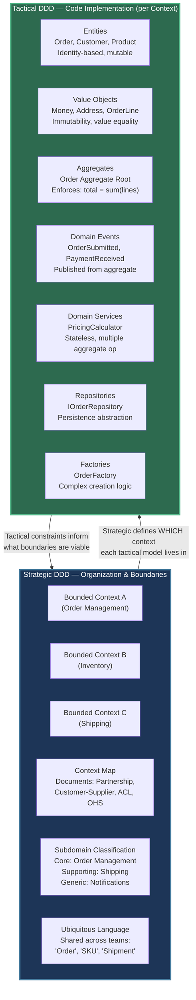
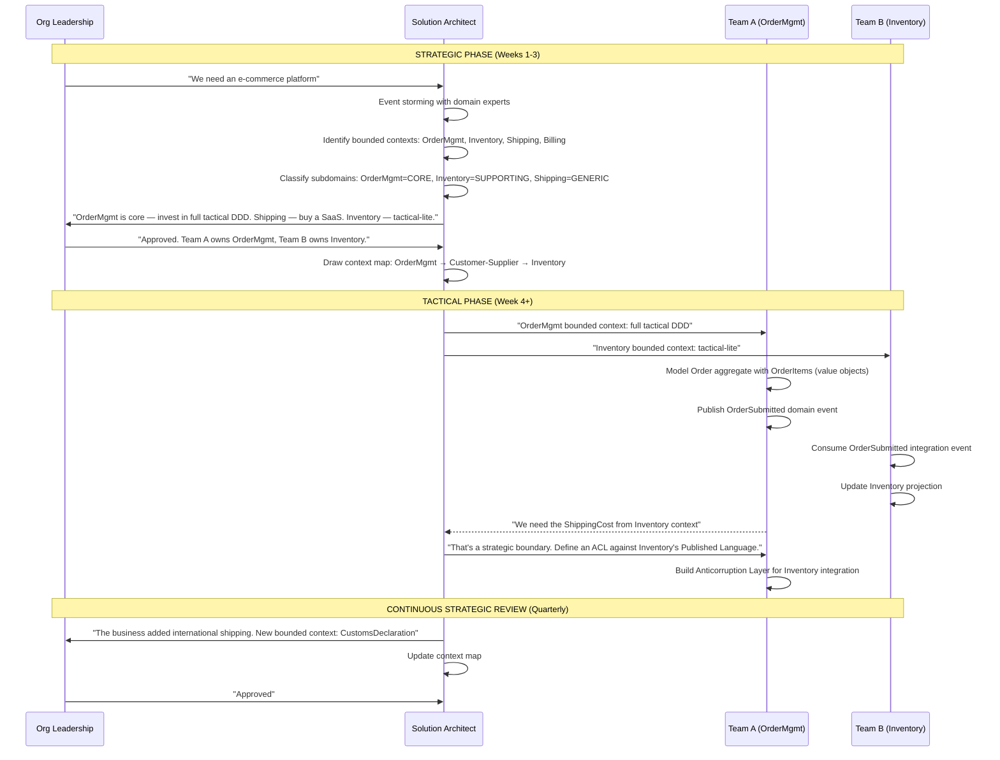
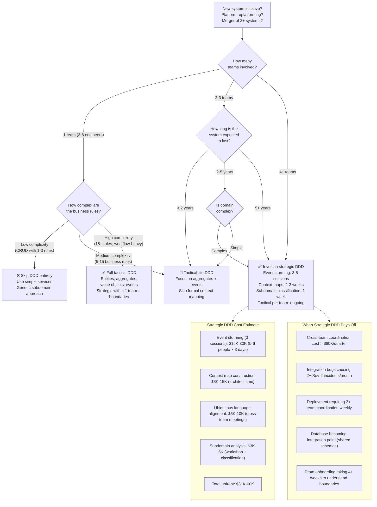

> [!success] Mastery Check
> - [ ] **Studied Well**
> - [ ] **Can explain the distinction without notes**
> - [ ] **Can answer interview questions confidently**
> - [ ] **Can decide in a real project when to invest in strategic vs tactical design**

---

## 0. Quick Reference Card

> [!ABSTRACT] Strategic vs Tactical Design — One-Page Summary
>
> **Strategic DDD** is about **where** and **why**: identifying bounded contexts, mapping their relationships, classifying subdomains, and agreeing on ubiquitous language at the organization-wide level. It answers "what belongs together and how do the pieces communicate?" Strategic design involves architects, domain experts, and stakeholders; its artifacts are context maps, event storming boards, and domain vision documents.
>
> **Tactical DDD** is about **how**: implementing entities, value objects, aggregates, domain events, services, repositories, and factories within a single bounded context. It answers "how do I model this specific business rule in code?" Tactical design involves developers working with domain experts on a single team; its artifacts are code, unit tests, and aggregate designs.
>
> | Dimension | Strategic DDD | Tactical DDD |
> |---|---|---|
> | **Scope** | Organization-wide / multi-team | Single bounded context / single team |
> | **Primary Question** | "What are the boundaries and relationships?" | "How do we implement this business rule?" |
> | **Key Artifacts** | Context maps, event storming boards, subdomain models | Entities, value objects, aggregates, domain events, repositories |
> | **Frequency of Change** | Months (organizational) | Days/weeks (code-level) |
> | **Drivers** | Business strategy, team topology, legacy system boundaries | Code maintainability, testability, business rules complexity |
> | **When to Start** | Before any new system initiative, when merging systems, during replatforming | When bounded context is identified and team is ready to code |
> | **Primary Risk** | Wrong boundaries cause constant integration pain | Wrong aggregate design causes consistency bugs |
> | **Feedback Loop** | Event storming sessions, context map reviews, integration tests | Unit tests, aggregate invariant tests, domain event handlers |
> | **Tooling** | Miro/Mural, whiteboards, event storming | C# 12 with MediatR, FluentValidation, EF Core |
>
> **The Golden Rule:** Strategic design without tactical implementation is ivory-tower architecture. Tactical design without strategic context produces monoliths that don't compose. Both are required. Strategic sets the guardrails; tactical fills in the road.

---

## 1. Navigation & Context

### 1.1 Where This Topic Lives

```
Domain-Driven Design Knowledge Tree
├── PART 1: Strategic Design (the "big picture")
│   ├── 7.031 ► Strategic vs Tactical Design   ← YOU ARE HERE
│   ├── 7.032 — Ubiquitous Language — Building and Maintaining
│   ├── 7.033 — Bounded Contexts — Identifying Boundaries
│   ├── 7.034 — Bounded Contexts — Context Map
│   ├── 7.035–7.042 — Context Mapping Relationship Patterns
│   └── 7.062 — Subdomains — Core, Supporting, Generic
│
├── PART 2: Tactical Design (the "code-level")
│   ├── 7.043 — Entities — Identity and Lifecycle
│   ├── 7.045 — Value Objects — Equality and Immutability
│   ├── 7.047 — Aggregates — Consistency Boundary
│   ├── 7.053 — Domain Events — Within Bounded Context
│   ├── 7.056 — Repositories — Interface and Implementation
│   └── 7.061 — Factories — Complex Object Creation
│
└── PART 3: Integration & Operations
    ├── 7.065 — Eventual Consistency Between Aggregates
    ├── 7.066 — Sagas as Process Managers
    └── 7.069 — Multiple Bounded Contexts in One Solution
```

### 1.2 What You Need Before This

- **[[7.033 — Bounded Contexts — Identifying Boundaries]]** — bounded contexts are the primary unit of strategic design; you cannot understand why strategic and tactical differ without grasping what a bounded context is and how to identify one in your organization
- **[[7.043 — Entities — Identity and Lifecycle]]** — entities are the atomic unit of tactical design; understanding their identity semantics clarifies why tactical patterns operate inside a single context while strategic patterns span across them
- **[[6.015 — Separation of Concerns]]** — the principle that drives the layering of strategic decisions (what solves organizational coupling) above tactical decisions (what solves code-level cohesion)

### 1.3 What This Unlocks After

- **[[7.034 — Bounded Contexts — Context Map]]** — once you grasp the strategic/tactical distinction, context maps become the primary tool for documenting the strategic layer; every relationship type (Partnership, Shared Kernel, Customer-Supplier, Conformist, ACL, OHS, Published Language, Separate Ways) is a strategic decision
- **[[7.047 — Aggregates — Consistency Boundary]]** — aggregates are the most impactful tactical pattern; understanding their role in enforcing invariants within a bounded context helps you avoid the common trap of making aggregates too large or spanning context boundaries
- **[[7.053 — Domain Events — Within Bounded Context]]** — domain events sit at the tactical/strategic boundary; raised tactically within an aggregate, they cross context boundaries strategically via integration events
- **[[7.080 — When DDD Is NOT the Right Choice]]** — knowing when both strategic and tactical DDD are inappropriate (simple CRUD, low business complexity, commodity subdomains) prevents applying these patterns where they add cost without benefit

### 1.4 Why This Topic Matters at Scale

Mistaking strategic for tactical — or skipping one in favor of the other — produces the two most common DDD failure modes in production: the "ivory-tower architecture" that never delivers working software (strategic-only) and the "tactical spaghetti" where every aggregate tries to talk to every other aggregate across implicit boundaries (tactical-only). At organizations with 3+ teams, the strategic/tactical distinction is the difference between a system that can evolve team-independently and a system where every deployment requires a three-team coordination call.

> [!INFO] Production Encounter Map
>
> You hit the strategic/tactical distinction at these career stages and scenarios:
>
> - **Junior Engineer:** You join a team and need to understand why your code touches only one bounded context. You see tactical patterns (entities, aggregates, MediatR handlers) daily. Strategic design is invisible — the context boundaries have already been drawn.
> - **Mid-Level Engineer:** You're asked to add a feature that spans two bounded contexts. You discover that your aggregate needs data from another team's context. You learn why the strategic boundary exists and why you can't just add a foreign key.
> - **Senior Engineer:** You participate in an event storming session. You help identify new bounded contexts. You make the call: "this subdomain is generic, buy SaaS; that one is core, build with full tactical DDD."
> - **Lead / Architect:** You design the context map for a replatforming initiative. You decide which context mapping patterns to use (ACL for legacy, OHS for new services). You allocate tactical DDD investment based on subdomain type (core = full tactical, supporting = tactical-lite, generic = CRUD).
> - **Principal / Staff Engineer:** You define the organization-wide strategic design approach. You decide when to invest in event storming vs when to just draw boundaries and start coding. You assess whether the cost of strategic alignment (weeks of workshops) pays off given your team topology and domain complexity.

---

## 2. Core Mental Model

### 2.1 The Fundamental Rule

> **Strategic DDD decides which problems to solve and who solves them. Tactical DDD decides how to solve the problem within one team's boundary. The two operate at different timescales (months vs days), involve different stakeholders (architects+domain experts vs developers+product owners), and produce different artifacts (context maps vs aggregate code).**

### 2.2 The Plain-Language Analogy

Think of Strategic DDD as **urban planning** and Tactical DDD as **building architecture**.

The urban planner decides where the residential zone ends and the industrial zone begins (bounded contexts), which roads connect them (context mappings), and whether the airport (core subdomain) gets the best infrastructure while the parking lot (generic subdomain) uses a standard concrete slab (buy vs build). The urban planner works with city officials (domain experts), draws zoning maps (context maps), and the plan doesn't change every time a new building goes up.

The building architect works within one zone. They decide where the load-bearing walls go (aggregate boundaries), what kind of doors to use (value objects), how the rooms connect (domain events), and what materials pass code inspection (invariant enforcement). The architect changes their design daily as they discover constraints, but they never redesign the entire zoning map when they add a window.

The failure mode is clear: urban planning without architecture builds cities of unusable shells. Architecture without urban planning builds beautiful houses that cross property lines and block roads. Both are necessary, and one does not replace the other.

### 2.3 The Classification

```
DDD Design
├── STRATEGIC DDD (urban planning)
│   ├── Concern: Organizational boundaries, team topology, subdomain classification
│   ├── Artifacts: Context maps, event storming boards, domain vision
│   ├── Stakeholders: Domain experts, architects, product managers, C-suite
│   ├── Cadence: Monthly/quarterly reviews, trigger on org changes or major initiatives
│   ├── Investment: 2-6 weeks of workshops for initial mapping; ongoing 2-4 hrs/month
│   └── Techniques: Event storming, big-picture modeling, subdomain analysis
│
└── TACTICAL DDD (building architecture)
    ├── Concern: Code-level modeling, business rule enforcement, persistence
    ├── Artifacts: Entity classes, aggregate roots, value objects, domain events, repositories
    ├── Stakeholders: Developers, product owners, QA engineers
    ├── Cadence: Daily — every sprint includes tactical modeling decisions
    ├── Investment: 10-30% of development time on modeling; ongoing through PR reviews
    └── Techniques: Entity design, aggregate identification, domain event wiring
```

> [!TIP] Non-Obvious Insight
>
> The most expensive mistake teams make is not skipping strategic design. It's **doing strategic design once and never revisiting it**. Bounded contexts evolve as the organization learns. The context map you drew in Q1 is wrong by Q3. Strategic design is not a phase; it's a recurring practice. Similarly, the most common tactical mistake is not using the wrong pattern — it's using tactical patterns **outside** the bounded context where they belong. An aggregate that references another aggregate from a different bounded context is a strategic violation that no amount of elegant tactical code can fix.

### 2.4 Strategic vs Tactical — The Two-Level View



### 2.5 Strategic Decisions Driving Tactical Implementation



### 2.6 Numbers That Matter

| Metric | Strategic DDD | Tactical DDD | Context |
|---|---|---|---|
| **Time to initial mapping** | 2-6 weeks (first context map) | 1-3 days (first aggregate) | Strategic requires workshop coordination across 3-8 stakeholders; tactical requires code editor |
| **Frequency of change** | Every 1-6 months | Every 1-14 days | Strategic changes when org structure or business model changes; tactical changes per feature |
| **Number of stakeholders** | 5-15 per workshop | 2-5 per modeling session | Strategic involves domain experts, architects, product; tactical involves dev team + PO |
| **Cost of getting wrong** | $200K-2M (wrong boundaries cause 6-18 months rework) | $10K-100K (wrong aggregate requires 1-4 weeks refactor) | Strategic errors compound through org structure; tactical errors are contained in code |
| **Team size affected** | 3-10 teams (30-100 engineers) | 1 team (3-10 engineers) | Strategic boundaries define team ownership; tactical is single-team concern |
| **Tool investment** | $500-5K (Miro/Mural licenses, whiteboards, sticky notes) | $0-2K (existing IDE, MediatR NuGet, EF Core) | Strategic needs collaboration tooling; tactical uses existing dev toolchain |
| **ROI breakeven** | 6-12 months (on a 30-engineer project) | 2-4 weeks (per aggregate) | Strategic pays off through reduced cross-team coordination; tactical pays off through testability |
| **Max bounded contexts per strategic session** | 8-15 (beyond 15, split into multiple sessions) | N/A — one context per team | Human limit for workshop participants to hold a shared mental model |

### 2.7 Key Properties

**Strategic DDD Properties:**
1. **Boundary-First** — identifies what goes together before deciding how to implement it
2. **Organization-Sensitive** — reflects Conway's Law; boundaries should match team ownership
3. **Economically Aware** — treats subdomains differently based on business value; core gets more investment than generic
4. **Relationship-Centric** — focuses on how contexts communicate (partnership, ACL, OHS, etc.)
5. **Tolerant of Ambiguity** — strategic boundaries can be fuzzy initially and refined over months

**Tactical DDD Properties:**
1. **Code-First** — produces executable code, not diagrams
2. **Invariant-Enforcing** — ensures business rules cannot be violated through aggregate design
3. **Persistence-Neutral** — repositories abstract storage; aggregates should not depend on database details
4. **Testable by Design** — pure domain logic in entities and value objects enables high unit test coverage
5. **Composable Inside a Context** — services orchestrate multiple aggregates; events notify other aggregates within the same context

---

## 3. Deep Mechanics

### 3.1 How It Works: The Strategic → Tactical Pipeline

Strategic and tactical design are not two separate methodologies; they are two layers of the same process. The strategic layer constrains and guides the tactical layer. The tactical layer informs the strategic layer through feedback.

**Step 1: Strategic Discovery (Event Storming)**
- Domain experts and engineers walk through business processes on a wall of sticky notes
- Identify business events (orange), commands (blue), aggregates (yellow), and bounded context boundaries (pink)
- Output: a visual map of the business domain with candidate bounded contexts

**Step 2: Context Map Construction**
- Define relationships between bounded contexts
- Choose relationship patterns: Partnership for equal collaborators, Customer-Supplier for upstream/downstream, ACL for legacy, OHS for service interfaces, Conformist for simple translation, Separate Ways for completely independent contexts
- Output: a relationship diagram showing how contexts communicate and what translation is needed

**Step 3: Subdomain Classification**
- For each bounded context, classify the subdomain it represents:
  - **Core** — competitive advantage, business-critical, must be built in-house with full tactical DDD
  - **Supporting** — necessary but not differentiating, tactical-lite or simple CRUD
  - **Generic** — commodity, buy off-the-shelf SaaS, avoid custom tactical modeling
- Output: an investment profile per bounded context

**Step 4: Tactical Implementation Within Each Core Context**
- Identify aggregates: clusters of entities and value objects with a single root that enforces invariants
- Define entities with identity (e.g., `Order` has an `OrderId` that persists across changes)
- Define value objects with immutability and value equality (e.g., `Money`, `Address`, `OrderLine`)
- Define domain events for state changes that other parts of the system care about (e.g., `OrderSubmitted`)
- Define domain services for operations that don't naturally belong to an entity or value object (e.g., `PricingService`)
- Define repositories abstraction over persistence (interface in domain, implementation in infrastructure)

**Step 5: Feedback Loop**
- Tactical implementation reveals whether strategic boundaries are right
- If an aggregate frequently needs data from another context, the boundary may be wrong or the context mapping pattern may need adjustment
- If a context is too large to build as a single team concern, split further
- If a context is too small (single entity), consider merging with a neighbor

### 3.2 Protocol Trace: From Strategic Decision to Tactical Code

**Happy Path — New E-Commerce Platform**

```
Step 1: Strategic — Event Storming Session
──────────────────────────────────────────
Domain experts identify:
  • "Customer places order" → command: PlaceOrder
  • "Order is submitted" → event: OrderSubmitted
  • "Warehouse picks items" → command: StartPicking
  • "Order is shipped" → event: OrderShipped
  • "Customer is billed" → command: InvoiceCustomer
  • "Payment is received" → event: PaymentReceived

Grouping related events identifies bounded contexts:
  • Order Context: PlaceOrder → OrderSubmitted → OrderCancelled → OrderReturned
  • Inventory Context: StockAdded → StockReserved → StockShipped → StockLow
  • Billing Context: InvoiceCreated → PaymentReceived → PaymentFailed → RefundIssued
  • Shipping Context: ShipmentCreated → ShipmentPicked → ShipmentDelivered

Step 2: Strategic — Context Map
────────────────────────────────
Relationship: Order → Customer-Supplier → Inventory
  Order context (upstream) publishes OrderSubmitted event
  Inventory context (downstream) consumes and reserves stock
  Translation: OrderId → (customer lookup) → ReservationRequest

Relationship: Order → Partnership → Billing
  Order and Billing are equal collaborators
  Order submits InvoiceRequest; Billing returns PaymentConfirmation

Relationship: Order → ACL → Shipping (Legacy)
  Shipping is a legacy COBOL system behind an Anticorruption Layer
  The ACL translates modern Order commands into legacy shipping protocol

Step 3: Strategic — Subdomain Classification
─────────────────────────────────────────────
  Order Management  → CORE       → Build with full tactical DDD
  Inventory Tracking → SUPPORTING → Tactical-lite (simpler aggregates, less event granularity)
  Billing           → CORE       → Build with full tactical DDD
  Shipping          → GENERIC    → Buy SaaS; build thin ACL; no DDD investment
  Notifications     → GENERIC    → Buy SendGrid; no DDD investment

Step 4: Tactical — Implement Order Aggregate (Order Context)
─────────────────────────────────────────────────────────────
  Entity: Order (aggregate root) — identity = OrderId
  Value Objects: OrderLine, Money, Address, OrderStatus
  Domain Events: OrderSubmitted, OrderLineAdded, OrderCancelled
  Repository: IOrderRepository — FindByIdAsync, SaveAsync
  Domain Service: PricingService — CalculateTotal

  Order aggregate invariant enforcement:
    • Cannot submit order with zero lines
    • Cannot add line after submission
    • Total must equal sum of line totals
    • Status transitions: Pending → Submitted → Paid → Shipped → Delivered
    • Cannot cancel after shipping

Step 5: Feedback — Boundary Refinement
───────────────────────────────────────
  After 2 sprints: "We keep needing to join Order and Customer in queries"
  → Strategic decision: Customer is a separate bounded context; define ACL
  → Or: Merge Customer into Order context if Customer is not complex enough to stand alone
  → Decision: Add Customer context with Published Language, Order consumes via ACL
```

**Failure Path — Wrong Strategic Boundary**

```
Step 1: Strategic — The Mistake
────────────────────────────────
Team draws a single bounded context called "E-Commerce" with everything inside.
No event storming. No subdomain classification. One monolith context.

Step 2: Tactical — The Spaghetti
─────────────────────────────────
Team starts coding. Order aggregate references Product entity directly.
Product aggregate references Inventory aggregate directly.
Invoice entity lives in the same context but a different microservice (unclear boundary).
Team creates a single OrderRepository that joins 14 tables.

Step 3: Observable Production Signals (Month 4)
────────────────────────────────────────────────
  • Deployment takes 45 minutes end-to-end
  • Any change to Order schema requires coordinated release with Billing team
  • "Can we just add a new field?" → 3-team meeting required
  • Integration tests take 22 minutes
  • Multiple teams queue on the same CI pipeline
  • One aggregate root grew to 47 properties and 12 navigation properties

Step 4: Correction — Strategic Refinement
──────────────────────────────────────────
  • Conduct proper event storming (3 sessions, 12 participants)
  • Split into 4 bounded contexts: Order, Inventory, Billing, Shipping
  • Define Customer-Supplier between Order and Inventory
  • Define ACL between all contexts and the legacy Shipping system
  • Classify: Order = Core, Inventory = Supporting, Shipping = Generic

Step 5: Tactical — Aggregate Refactoring
─────────────────────────────────────────
  • Split the 47-property Order aggregate into Order aggregate + OrderReadModel projection
  • Remove direct references to Product entity (now in Inventory context)
  • Wire domain events for cross-context communication
  • Add Anticorruption Layer for Inventory integration

  Cost of strategic mistake:
    • 6 weeks of refactoring across 8 engineers
    • Estimated $120K opportunity cost
    • 2 production incidents from data inconsistency during refactoring
    • 3 sprints of delayed feature development
```

### 3.3 State Transitions

While not strictly state machines, strategic and tactical DDD follow transition patterns:

```mermaid
stateDiagram-v2
    [*] --> EventStorming: Business initiative starts
    EventStorming --> BoundedContexts: Identify business events & boundaries
    BoundedContexts --> ContextMap: Define inter-context relationships
    ContextMap --> SubdomainClassification: Classify by business value
    SubdomainClassification --> PerContextDesign: For each bounded context

    state PerContextDesign {
        [*] --> AnalyzeUbiquitousLanguage
        AnalyzeUbiquitousLanguage --> IdentifyAggregates
        IdentifyAggregates --> DefineEntitiesValueObjects
        DefineEntitiesValueObjects --> WireDomainEvents
        WireDomainEvents --> ImplementRepositories
        ImplementRepositories --> [*]
    }

    PerContextDesign --> StrategicReview: Quarterly or on org change
    StrategicReview --> EventStorming: Boundaries need revision
    StrategicReview --> ContextMap: Relationship patterns need change
    StrategicReview --> PerContextDesign: Minor tactical adjustments; no strategic change

    EventStorming --> TacticalError: Strategic boundaries too large/small
    TacticalError --> BoundedContexts: Resplit bounded contexts
    EventStorming --> StrategicError: Wrong subdomain classification
    StrategicError --> SubdomainClassification: Reclassify and adjust investment

    note right of SubdomainClassification
        Core = full tactical DDD
        Supporting = tactical-lite
        Generic = buy / CRUD
    end note

    StrategicReview --> [*]: Project end or retirement
```



### 3.4 Failure Modes

> [!DANGER] **3AM Production Signal — "The deployment that needs 3 teams on call"**
>
> **Observable:** Every production change to any part of the Order Management module requires the Inventory team, the Billing team, and the Shipping team to coordinate their deployments. A single database migration causes cascading failures across three microservices. Deployments take 45-90 minutes with 6+ people in a war room.
>
> **Root Cause:** No strategic bounded context design. A single "E-Commerce" context was assumed. The Order, Inventory, and Billing teams all share the same database, same message queue, and same CI pipeline. Tactical DDD was applied (aggregates, value objects) but it was applied inside a single massive context that should have been split into 3-4 independent contexts. The tactical code is clean in isolation, but the strategic boundary is missing entirely.
>
> **Immediate Mitigation:** Decouple deployment pipelines per context. Each team gets its own CI/CD, its own database schema, its own message queue. This is a 2-week infrastructure change that eliminates the coordination problem — it doesn't fix the aggregate design, but it stops the bleeding.
>
> **Long-Term Fix:** Event storming with all three teams. Redraw bounded contexts. Build context maps with explicit relationship patterns. Add Anticorruption Layers where needed. This is an 8-12 week initiative costing $80K-150K in engineering time, but the alternative (continued coordination overhead) costs more over 12 months.

> [!DANGER] **3AM Production Signal — "The aggregate that tries to save the world"**
>
> **Observable:** An `Order` aggregate root with 47 properties, 12 navigation properties, and methods named `AddPayment()`, `ReserveInventory()`, `UpdateShippingAddress()`, `ApplyCoupon()`, `AddCustomerNote()`, `ProcessRefund()`, `SplitOrder()`, `MergeOrder()`. Performance degrades as the aggregate grows. Every `SaveChangesAsync()` takes 400-800ms and sometimes fails with "Concurrency conflict" due to the aggregate being too broad. The aggregate violates multiple bounded contexts (it touches Order, Billing, Inventory, and Shipping concerns in one code path).
>
> **Root Cause:** Tactical DDD was applied without strategic context. The team identified the `Order` aggregate without asking which bounded context it belongs to. The aggregate grew to encompass everything because there was no strategic boundary saying "shipping address changes are a different aggregate in a different context." The team used tactical patterns (aggregates are correct) but violated the strategic principle that aggregates live entirely within one bounded context.
>
> **Immediate Mitigation:** Extract cross-context operations into integration events. The `Order` aggregate should not call `Inventory.ReserveStock()` directly — it should publish `OrderSubmitted` and let the Inventory context handle it. This can be applied incrementally over 2-3 sprints.
>
> **Long-Term Fix:** Split the mega-aggregate: `Order` (identity, status, lines), `Payment` (separate aggregate in Billing context), `Shipment` (separate aggregate in Shipping context). Wire domain events for eventual consistency. The strategic boundary work (context map) must be done first to know where the splits go. Estimate: 4-6 weeks for full refactoring of a 47-property aggregate.

> [!DANGER] **3AM Production Signal — "The 'DDD' CRUD service that does everything with stored procedures"**
>
> **Observable:** A microservice named "OrderManagement" that was built with all the right tactical intentions — `Order` entity, `OrderRepository`, `IOrderService` — but in practice, every operation is a single stored procedure. The `Order` entity has no behavior; it's just a DTO with getters and setters. `OrderRepository.GetOrderByIdAsync()` calls `ExecSqlAsync("EXEC sp_get_order @Id")` and maps the result. `Order.Submit()` is empty because "the stored procedure handles the business logic." The entity is a shell. The repository is a pass-through to ADO.NET. All business rules are in SQL scripts that no developer has the permissions to modify.
>
> **Root Cause:** The team applied tactical DDD naming conventions (entity, repository) without any of the behavioral modeling that makes DDD valuable. They didn't actually identify invariants, model business rules, or enforce constraints in code. The strategic classification was correct (OrderManagement = Core subdomain), but the tactical implementation is CRUD-in-Disguise. The root cause is not strategic/tactical distinction — it's lack of understanding that DDD tactical patterns require behavioral modeling, not just class naming conventions.
>
> **Immediate Mitigation:** Audit all stored procedures. Extract business rules from SQL into entity methods. Each stored procedure that enforces business logic should be replaced by a domain method on the entity or a domain service. This is a 4-week parallel effort — new behavior goes in C#, old stored procedures stay until migrated.
>
> **Long-Term Fix:** Full tactical refactoring: move invariants into `Order` entity methods, add value objects for `Money` and `OrderLine`, introduce domain events for state changes, remove stored procedures entirely. This requires buy-in from the DBA team and a training investment. The team that wrote this code needs to understand tactical DDD, not just the vocabulary. Estimate: 8-12 weeks to fully migrate from stored-procedure-DDD to genuine tactical DDD.

> [!DANGER] **3AM Production Signal — "The single database that powers 8 microservices"**
>
> **Observable:** All 8 bounded contexts share a single SQL Server database. Each context has its own schema (e.g., `[Order].[Orders]`) but they're in the same database instance. A deployment of the Order context runs migrations that lock tables used by the Inventory context at 2:34 AM. The Inventory service starts throwing timeout errors. Because all contexts share the same CI/CD database, you cannot independently roll back one context's migration. The pager goes off at 3:00 AM.
>
> **Root Cause:** The strategic decision "each bounded context owns its data" was documented in architecture diagrams but never enforced in infrastructure. The contexts are strategically well-defined (event storming happened, context maps exist) but the tactical implementation shared a database because "it's easier to manage." This is a classic architecture-vs-implementation gap. The strategic layer is correct. The tactical implementation betrayed it.
>
> **Immediate Mitigation:** Add database-level isolation — separate connection strings per context, restrict cross-schema access via contained database users. This is a 1-2 week security/infrastructure change that prevents cross-context lock contention and enforces the strategic boundaries at the database level.
>
> **Long-Term Fix:** Move each context to its own database instance or at minimum its own Azure SQL elastic pool. This eliminates the shared-fate problem. The strategic decision (data ownership per context) has been made; the tactical implementation just needs to follow it. For legacy systems where database splitting is too expensive, enforce boundary through repository patterns and API-only access between contexts.

### 3.5 .NET and Azure Integration Points

| Feature | Strategic Role | Tactical Role | Azure Service |
|---|---|---|---|
| **Event Sourcing** | Records integration events for cross-context replay | Persists aggregate state as event stream | Azure Cosmos DB change feed + Azure Event Grid |
| **Sagas / Process Managers** | Coordinates long-running workflows across contexts | Orchestrates multi-aggregate operations within context | Azure Logic Apps or Durable Functions |
| **Message Bus** | Carries integration events between contexts | Optionally used for eventual consistency within context | Azure Service Bus (integration) / Azure Event Grid (intra-context) |
| **CQRS Read Models** | Projects data for cross-context queries | Provides optimized query surfaces per aggregate | Azure SQL (read replicas) or Cosmos DB (materialized views) |
| **Anti-Corruption Layer** | Translates between bounded contexts | Implements translation logic as domain service | Azure Functions exposed via API Management |
| **Distributed Tracing** | Traces requests across context boundaries | Traces request within a single service | Azure Application Insights with W3C Trace-Context |
| **Policy as Code** | Defines context-specific access control | Implements authorization within aggregate methods | Azure API Management policies + Azure AD B2C |
| **Deployment Isolation** | Separate deployment pipelines per context | CI/CD per context (Azure DevOps / GitHub Actions) | Azure Container Apps per bounded context |

---

## 4. Production Patterns and Implementation

### 4.1 Primary Implementation — Strategic Layer (Multi-Context) in C# 12 / .NET 8

The strategic layer is primarily documentation and configuration, not code. However, it enforces constraints at the infrastructure level:

```csharp
// ───────────────────────────────────────────────────────────
// Strategic Design — Bounded Context Configuration
// ───────────────────────────────────────────────────────────
// This code lives in the shared infrastructure project and is
// referenced by all services. It prevents cross-context
// database access at compile time and enforces integration
// patterns at the infrastructure level.

namespace OrderManagement.Infrastructure.Strategic;

/// <summary>
/// Defines the strategic boundary of a bounded context.
/// Each context registers its domain assemblies, database
/// schema, message contracts, and allowed integration patterns.
/// </summary>
/// <param name="Name">Canonical name matching the context map</param>
/// <param name="DomainAssembly">Assembly containing tactical domain models</param>
/// <param name="DbSchema">Database schema owned by this context</param>
/// <param name="AllowedIntegrationPatterns">
/// Context mapping relationship types permitted for this context
/// </param>
public sealed record BoundedContextDefinition(
    string      Name,
    Assembly    DomainAssembly,
    string      DbSchema,
    IReadOnlySet<ContextMappingPattern> AllowedIntegrationPatterns)
{
    /// <summary>
    /// Validates that an assembly reference does not cross
    /// bounded context boundaries at compile time.
    /// </summary>
    public void AssertAllowedReference(Assembly referencedAssembly)
    {
        // Strategic invariant: no direct assembly reference
        // between core domain models of different bounded contexts
        if (referencedAssembly == DomainAssembly)
            return;

        if (referencedAssembly.GetCustomAttribute<BoundedContextAttribute>()
                ?.ContextName != Name)
        {
            throw new InvalidOperationException(
                $"Cross-context assembly reference detected: " +
                $"{DomainAssembly.GetName().Name} trying to reference " +
                $"{referencedAssembly.GetName().Name}. " +
                $"Use integration events or ACL instead.");
        }
    }
}

/// <summary>
/// Maps integration events to their origin bounded context.
/// Used by the message bus infrastructure to enforce the
/// context map relationship rules.
/// </summary>
public sealed record IntegrationEventContract(
    Type    EventType,
    string  SourceContext,
    string  TargetContext,
    ContextMappingPattern Pattern)
{
    public bool IsAllowed => Pattern != ContextMappingPattern.SeparateWays;
}

/// <summary>
/// The context mapping patterns from strategic DDD.
/// </summary>
public enum ContextMappingPattern
{
    Partnership,
    SharedKernel,
    CustomerSupplier,
    Conformist,
    AnticorruptionLayer,
    OpenHostService,
    PublishedLanguage,
    SeparateWays
}
```

**Tactical Implementation — Order Aggregate in Order Management Bounded Context:**

```csharp
// ───────────────────────────────────────────────────────────
// Tactical Design — Order Aggregate (within OrderMgmt Context)
// ───────────────────────────────────────────────────────────

using OrderManagement.Domain.ValueObjects;
using OrderManagement.Domain.Events;
using OrderManagement.Domain.Services;

namespace OrderManagement.Domain.Aggregates;

/// <summary>
/// Represents a customer order within the Order Management
/// bounded context. Enforces all order-level invariants and
/// publishes domain events for state changes.
/// </summary>
public sealed class Order : IAggregateRoot
{
    private readonly List<OrderLine> _lines = [];
    private readonly List<IDomainEvent> _events = [];

    // Private constructor enforces factory-based creation
    private Order() { }

    /// <summary>Gets the aggregate root identity.</summary>
    public OrderId Id { get; private set; }

    /// <summary>Gets the current order status.</summary>
    public OrderStatus Status { get; private set; }

    /// <summary>Gets the customer identifier from the Customer bounded context.</summary>
    /// <remarks>Only holds the ID — full customer data requires ACL call.</remarks>
    public CustomerId CustomerId { get; private set; }

    /// <summary>Gets the shipping address. Value object.</summary>
    public Address ShippingAddress { get; private set; }

    /// <summary>Gets the read-only collection of order lines.</summary>
    public IReadOnlyList<OrderLine> Lines => _lines.AsReadOnly();

    /// <summary>Gets the order total computed from lines.</summary>
    public Money Total { get; private set; }

    /// <summary>Gets the timestamp when this order was created.</summary>
    public DateTimeOffset CreatedAt { get; private set; }

    /// <summary>Gets the timestamp of the last modification.</summary>
    public DateTimeOffset ModifiedAt { get; private set; }

    public IReadOnlyList<IDomainEvent> DomainEvents => _events.AsReadOnly();

    /// <summary>
    /// Factory method to create a new order. Protects invariant:
    /// an order must have at least one line and a valid customer.
    /// </summary>
    /// <param name="customerId">The customer placing the order.</param>
    /// <param name="shippingAddress">Where to ship.</param>
    /// <param name="lines">The order lines (must be non-empty).</param>
    /// <param name="pricingService">Domain service for calculating totals.</param>
    /// <returns>A new Order instance in Pending state.</returns>
    /// <exception cref="DomainException">Thrown when invariants are violated.</exception>
    public static Order Create(
        CustomerId     customerId,
        Address        shippingAddress,
        IEnumerable<OrderLine> lines,
        IPricingService pricingService,
        CancellationToken ct = default)
    {
        ct.ThrowIfCancellationRequested();

        var lineList = lines.ToList();

        if (lineList.Count == 0)
            throw new DomainException("Order must have at least one line.");

        var now = DateTimeOffset.UtcNow;

        var order = new Order
        {
            Id              = OrderId.New(),
            Status          = OrderStatus.Pending,
            CustomerId      = customerId,
            ShippingAddress = shippingAddress,
            CreatedAt       = now,
            ModifiedAt      = now
        };

        order._lines.AddRange(lineList);
        order.Total = pricingService.CalculateTotal(
            lineList, ct);

        order._events.Add(new OrderCreatedDomainEvent(
            order.Id,
            order.CustomerId,
            order.Total,
            now));

        return order;
    }

    /// <summary>
    /// Submits the order for processing. Can only be done from
    /// Pending status. Invariant: cannot submit a zero-total order.
    /// </summary>
    public void Submit(CancellationToken ct = default)
    {
        ct.ThrowIfCancellationRequested();

        if (Status != OrderStatus.Pending)
            throw new DomainException(
                $"Cannot submit order in {Status} status. " +
                $"Only Pending orders can be submitted.");

        if (Total.Amount <= 0m)
            throw new DomainException(
                "Cannot submit an order with zero or negative total.");

        Status = OrderStatus.Submitted;
        ModifiedAt = DateTimeOffset.UtcNow;

        _events.Add(new OrderSubmittedDomainEvent(
            Id, CustomerId, Total, ModifiedAt));
    }

    /// <summary>
    /// Adds a line to a pending order. Invariant: no lines after submission.
    /// </summary>
    public void AddLine(
        OrderLine newLine,
        IPricingService pricingService,
        CancellationToken ct = default)
    {
        ct.ThrowIfCancellationRequested();

        if (Status != OrderStatus.Pending)
            throw new DomainException(
                "Cannot add lines to a non-pending order.");

        _lines.Add(newLine);
        Total = pricingService.CalculateTotal(_lines, ct);
        ModifiedAt = DateTimeOffset.UtcNow;

        _events.Add(new OrderLineAddedDomainEvent(
            Id, newLine, Total, ModifiedAt));
    }

    /// <summary>
    /// Applies payment confirmation. Invariant: only submitted
    /// orders can be paid. Transitions to Paid status.
    /// </summary>
    public void ConfirmPayment(
        Money amount,
        string paymentReference,
        CancellationToken ct = default)
    {
        ct.ThrowIfCancellationRequested();

        if (Status != OrderStatus.Submitted)
            throw new DomainException(
                "Cannot confirm payment for a non-submitted order.");

        Status = OrderStatus.Paid;
        ModifiedAt = DateTimeOffset.UtcNow;

        _events.Add(new OrderPaymentConfirmedDomainEvent(
            Id, amount, paymentReference, ModifiedAt));
    }

    /// <summary>
    /// Clears domain events (called after persistence).
    /// </summary>
    public void ClearEvents() => _events.Clear();
}
```

**Value Objects (Tactical — within same context):**

```csharp
// ───────────────────────────────────────────────────────────
// Tactical Design — Value Objects (within OrderMgmt Context)
// ───────────────────────────────────────────────────────────

namespace OrderManagement.Domain.ValueObjects;

/// <summary>
/// Represents a monetary amount in a specific currency.
/// Immutable value object with value equality.
/// </summary>
public readonly record struct Money(decimal Amount, string Currency)
{
    public Money : this(
        Amount < 0
            ? throw new DomainException(
                  $"Amount cannot be negative: {Amount}")
            : Math.Round(Amount, 2, MidpointRounding.AwayFromZero),
        string.IsNullOrWhiteSpace(Currency)
            ? throw new DomainException("Currency code is required.")
            : Currency.ToUpperInvariant())
    { }

    public Money Add(Money other)
    {
        if (Currency != other.Currency)
            throw new DomainException(
                $"Cannot add {Currency} and {other.Currency}");

        return this with
        {
            Amount = Math.Round(
                Amount + other.Amount, 2,
                MidpointRounding.AwayFromZero)
        };
    }

    public bool IsZero => Amount == 0m;
}

/// <summary>
/// Immutable order line — uses record positional syntax.
/// </summary>
public readonly record struct OrderLine(
    string  Sku,
    string  Description,
    int     Quantity,
    Money   UnitPrice)
{
    public OrderLine : this(
        string.IsNullOrWhiteSpace(Sku)
            ? throw new DomainException("SKU is required.")
            : Sku,
        Description,
        Quantity < 1
            ? throw new DomainException(
                  $"Quantity must be >= 1, got {Quantity}")
            : Quantity,
        UnitPrice)
    { }

    public Money LineTotal => UnitPrice with
    {
        Amount = Math.Round(
            UnitPrice.Amount * Quantity, 2,
            MidpointRounding.AwayFromZero)
    };
}

/// <summary>
/// Strongly-typed Order ID to prevent primitive obsession.
/// </summary>
public readonly record struct OrderId(Guid Value)
{
    public static OrderId New() => new(Guid.NewGuid());
    public static OrderId From(Guid value) => new(value);
    public override string ToString() => Value.ToString("N");
}

/// <summary>
/// Strongly-typed Customer ID referencing the Customer context.
/// </summary>
public readonly record struct CustomerId(Guid Value)
{
    public override string ToString() => Value.ToString("N");
}

/// <summary>
/// Order status as value object with transition rules.
/// </summary>
public enum OrderStatus
{
    Pending,
    Submitted,
    Paid,
    Shipped,
    Delivered,
    Cancelled
}
```

**Domain Events (Tactical):**

```csharp
// ───────────────────────────────────────────────────────────
// Tactical Design — Domain Events (raised within the aggregate)
// ───────────────────────────────────────────────────────────

namespace OrderManagement.Domain.Events;

/// <summary>
/// Base record for all domain events in the Order Management context.
/// </summary>
public abstract record DomainEvent : IDomainEvent
{
    /// <summary>Gets the unique event identifier.</summary>
    public Guid EventId { get; } = Guid.NewGuid();

    /// <summary>Gets the UTC timestamp of event creation.</summary>
    public DateTimeOffset OccurredAt { get; } = DateTimeOffset.UtcNow;
}

/// <summary>
/// Raised when a new order is created (before submission).
/// </summary>
public sealed record OrderCreatedDomainEvent(
    OrderId     OrderId,
    CustomerId  CustomerId,
    Money       Total,
    DateTimeOffset Timestamp) : DomainEvent;

/// <summary>
/// Raised when an order transitions to Submitted status.
/// This is the primary event consumed by other contexts.
/// </summary>
public sealed record OrderSubmittedDomainEvent(
    OrderId     OrderId,
    CustomerId  CustomerId,
    Money       Total,
    DateTimeOffset Timestamp) : DomainEvent;

/// <summary>
/// Raised when a line is added to a pending order.
/// </summary>
public sealed record OrderLineAddedDomainEvent(
    OrderId     OrderId,
    OrderLine   Line,
    Money       NewTotal,
    DateTimeOffset Timestamp) : DomainEvent;

/// <summary>
/// Raised when payment is confirmed for an order.
/// </summary>
public sealed record OrderPaymentConfirmedDomainEvent(
    OrderId     OrderId,
    Money       Amount,
    string      PaymentReference,
    DateTimeOffset Timestamp) : DomainEvent;
```

**Repository Interface (Tactical):**

```csharp
// ───────────────────────────────────────────────────────────
// Tactical Design — Repository Interface (Domain Layer)
// ───────────────────────────────────────────────────────────

namespace OrderManagement.Domain.Repositories;

/// <summary>
/// Repository for Order aggregates. Defined in the domain layer
/// as an interface; implementation lives in infrastructure.
/// This keeps the domain free of persistence concerns.
/// </summary>
public interface IOrderRepository
{
    /// <summary>Finds an order by its identity.</summary>
    Task<Order?> FindByIdAsync(
        OrderId orderId,
        CancellationToken cancellationToken = default);

    /// <summary>Persists an order aggregate.</summary>
    Task SaveAsync(
        Order order,
        CancellationToken cancellationToken = default);
}
```

**Domain Service (Tactical):**

```csharp
// ───────────────────────────────────────────────────────────
// Tactical Design — Domain Service (Order Management Context)
// ───────────────────────────────────────────────────────────

namespace OrderManagement.Domain.Services;

/// <summary>
/// Domain service for calculating order pricing.
/// Stateless; depends on pricing rules that may involve
/// multiple aggregates or external tax data.
/// </summary>
public interface IPricingService
{
    /// <summary>
    /// Calculates the total for a collection of order lines,
    /// including applicable discounts and taxes.
    /// </summary>
    Money CalculateTotal(
        IReadOnlyList<OrderLine> lines,
        CancellationToken cancellationToken = default);
}

internal sealed class PricingService : IPricingService
{
    private const decimal DefaultTaxRate = 0.20m; // 20% VAT
    private const decimal BulkDiscountThreshold = 10_000m;
    private const decimal BulkDiscountRate = 0.05m;

    /// <inheritdoc />
    public Money CalculateTotal(
        IReadOnlyList<OrderLine> lines,
        CancellationToken cancellationToken = default)
    {
        cancellationToken.ThrowIfCancellationRequested();

        if (lines.Count == 0)
            return new Money(0m, "USD");

        var currency = lines[0].UnitPrice.Currency;

        var subtotal = lines
            .Select(l => l.LineTotal)
            .Aggregate((a, b) => a.Add(b));

        // Apply bulk discount if subtotal exceeds threshold
        var afterDiscount = subtotal.Amount > BulkDiscountThreshold
            ? subtotal with
            {
                Amount = Math.Round(
                    subtotal.Amount *
                    (1m - BulkDiscountRate), 2,
                    MidpointRounding.AwayFromZero)
            }
            : subtotal;

        // Apply tax
        var tax = afterDiscount with
        {
            Amount = Math.Round(
                afterDiscount.Amount *
                DefaultTaxRate, 2,
                MidpointRounding.AwayFromZero)
        };

        return afterDiscount.Add(tax);
    }
}
```

**Infrastructure Layer — Persistence (Tactical Implementation of Repository):**

```csharp
// ───────────────────────────────────────────────────────────
// Tactical Design — Repository Implementation (Infrastructure)
// ───────────────────────────────────────────────────────────

using Microsoft.EntityFrameworkCore;
using OrderManagement.Domain.Aggregates;
using OrderManagement.Domain.Repositories;
using OrderManagement.Domain.ValueObjects;
using OrderManagement.Infrastructure.Persistence;

namespace OrderManagement.Infrastructure.Repositories;

/// <summary>
/// EF Core implementation of IOrderRepository.
/// Uses Azure SQL for persistence.
/// </summary>
internal sealed class OrderRepository : IOrderRepository
{
    private readonly OrderDbContext _context;

    public OrderRepository(OrderDbContext context)
    {
        _context = context;
    }

    /// <inheritdoc />
    public async Task<Order?> FindByIdAsync(
        OrderId orderId,
        CancellationToken cancellationToken = default)
    {
        return await _context.Orders
            .Include(o => o.Lines)
            .FirstOrDefaultAsync(
                o => o.Id == orderId,
                cancellationToken);
    }

    /// <inheritdoc />
    public async Task SaveAsync(
        Order order,
        CancellationToken cancellationToken = default)
    {
        var existing = await _context.Orders
            .Include(o => o.Lines)
            .FirstOrDefaultAsync(
                o => o.Id == order.Id,
                cancellationToken);

        if (existing is null)
            _context.Orders.Add(order);
        else
            _context.Entry(existing).CurrentValues.SetValues(order);

        await _context.SaveChangesAsync(cancellationToken);
    }
}
```

**Integration Event for Cross-Context Communication (Strategic):**

```csharp
// ───────────────────────────────────────────────────────────
// Strategic Design — Integration Event (crosses contexts)
// ───────────────────────────────────────────────────────────
// This event is published by OrderManagement context and
// consumed by Inventory and Billing contexts through Azure
// Service Bus. The event represents the strategic decision
// that these contexts communicate via asynchronous messaging.

using Azure.Messaging.ServiceBus;

namespace OrderManagement.IntegrationEvents;

/// <summary>
/// Integration event fired when an order is submitted.
/// Consumed by Inventory context (reserve stock) and
/// Billing context (create invoice).
/// </summary>
public sealed record OrderSubmittedIntegrationEvent(
    Guid     OrderId,
    Guid     CustomerId,
    decimal  TotalAmount,
    string   Currency,
    DateTimeOffset SubmittedAt)
{
    /// <summary>
    /// Gets the origin context identifier for routing.
    /// </summary>
    public string SourceContext => "OrderManagement";

    /// <summary>
    /// Gets the event version for schema evolution.
    /// </summary>
    public int SchemaVersion => 1;
}

/// <summary>
/// Publishes integration events to Azure Service Bus.
/// This is the tactical implementation of the strategic
/// "Customer-Supplier" context mapping pattern between
/// OrderManagement and Inventory.
/// </summary>
internal sealed class ServiceBusIntegrationEventPublisher
{
    private readonly ServiceBusSender _sender;

    public ServiceBusIntegrationEventPublisher(
        ServiceBusClient serviceBusClient)
    {
        _sender = serviceBusClient.CreateSender("order-integration");
    }

    /// <summary>
    /// Publishes an integration event to Azure Service Bus.
    /// Topic name matches the bounded context relationship
    /// defined in the strategic context map.
    /// </summary>
    public async Task PublishAsync<T>(
        T integrationEvent,
        CancellationToken cancellationToken = default)
        where T : class
    {
        var message = new ServiceBusMessage(
            BinaryData.FromObjectAsJson(integrationEvent))
        {
            Subject = typeof(T).Name,
            MessageId = Guid.NewGuid().ToString(),
            ApplicationProperties =
            {
                ["source_context"] = "OrderManagement",
                ["schema_version"] = 1
            }
        };

        await _sender.SendMessageAsync(message, cancellationToken);
    }
}
```

### 4.2 IServiceCollection Registration

```csharp
// ───────────────────────────────────────────────────────────
// Strategic + Tactical DI Registration
// ───────────────────────────────────────────────────────────

using Azure.Messaging.ServiceBus;
using Microsoft.Extensions.DependencyInjection;
using OrderManagement.Domain.Repositories;
using OrderManagement.Domain.Services;
using OrderManagement.Infrastructure.Repositories;

namespace OrderManagement.Infrastructure.DependencyInjection;

/// <summary>
/// Registers all Order Management context services.
/// Separates tactical domain services from strategic
/// integration infrastructure.
/// </summary>
public static class OrderManagementRegistration
{
    /// <summary>
    /// Adds all Order Management context services.
    /// </summary>
    /// <param name="services">The service collection.</param>
    /// <param name="serviceBusConnectionString">
    /// Azure Service Bus connection string for integration events.
    /// Null if this context is not publishing integration events.
    /// </param>
    public static IServiceCollection AddOrderManagement(
        this IServiceCollection services,
        string? serviceBusConnectionString = null)
    {
        // ── Tactical: Domain Services ──
        services.AddScoped<IPricingService, PricingService>();

        // ── Tactical: Repositories ──
        services.AddScoped<IOrderRepository, OrderRepository>();

        // ── Tactical: MediatR for in-process domain events ──
        services.AddMediatR(cfg =>
        {
            cfg.RegisterServicesFromAssembly(
                typeof(OrderManagementRegistration).Assembly);
        });

        // ── Strategic: Azure Service Bus for integration events ──
        if (!string.IsNullOrWhiteSpace(serviceBusConnectionString))
        {
            services.AddSingleton(_ =>
                new ServiceBusClient(serviceBusConnectionString));

            services.AddScoped<ServiceBusIntegrationEventPublisher>();
        }

        return services;
    }
}
```

### 4.3 Common Variants

**Variant 1: Tactical-Lite for Supporting Subdomains**

For supporting subdomains (e.g., Inventory Tracking), invest in tactical patterns but simplify:

```csharp
// Supporting subdomain: simpler aggregate, fewer events, no domain service
public sealed class InventoryItem : IAggregateRoot
{
    public Sku Sku { get; private set; }
    public int QuantityOnHand { get; private set; }
    public int QuantityReserved { get; private set; }
    public int QuantityAvailable => QuantityOnHand - QuantityReserved;

    // Single invariant: cannot over-reserve
    public Result Reserve(int quantity)
    {
        if (quantity > QuantityAvailable)
            return Result.Failure(
                $"Cannot reserve {quantity} of {Sku}: " +
                $"only {QuantityAvailable} available.");

        QuantityReserved += quantity;
        return Result.Success();
    }
}
```

**Variant 2: Generic Subdomain — No Tactical DDD**

For generic subdomains (e.g., Email Notifications), use CRUD or SaaS:

```csharp
// Generic subdomain: NOT using DDD. Simple service.
// Uses SendGrid SDK directly through an interface defined
// in the consuming context's ACL, not a domain model.
public interface INotificationService
{
    Task SendEmailAsync(
        string to, string subject, string body,
        CancellationToken ct = default);
}
```

**Variant 3: Strategic with Legacy System — Anticorruption Layer**

```csharp
// Strategic: Anti-Corruption Layer between modern Order
// Management context and legacy Shipping Mainframe
namespace OrderManagement.Anticorruption.Shipping;

/// <summary>
/// Translates modern Order commands into legacy shipping protocol.
/// This is the tactical implementation of the ACL strategic pattern.
/// </summary>
internal sealed class ShippingAcl
{
    private readonly LegacyShippingClient _client;

    public async Task<ShippingResult> CreateShipmentAsync(
        OrderId orderId,
        Address destination,
        IReadOnlyList<OrderLine> lines,
        CancellationToken ct = default)
    {
        // 1. Translate modern domain → legacy format
        var legacyRequest = new LegacyShipmentRequest
        {
            CustomerNumber = orderId.ToString(),
            DestinationCode = MapAddressToLegacyCode(destination),
            ItemCodes = lines.Select(l => l.Sku).ToArray(),
            Quantities = lines.Select(l => l.Quantity).ToArray()
        };

        // 2. Call legacy system through its proprietary protocol
        var legacyResponse = await _client.SubmitAsync(
            legacyRequest, ct);

        // 3. Translate legacy response → modern domain
        return new ShippingResult(
            Success: legacyResponse.StatusCode == 0,
            TrackingCode: legacyResponse.TrackingNumber,
            ErrorMessage: legacyResponse.ErrorMessage);
    }

    private static string MapAddressToLegacyCode(Address address)
        => address.Country switch
        {
            "US" => "01",
            "UK" => "02",
            "DE" => "03",
            _    => "99"
        };
}
```

### 4.4 Performance Profile

The strategic layer has negligible runtime cost — it's a design-time investment. The tactical layer's performance depends on pattern usage:

```csharp
using BenchmarkDotNet.Attributes;
using BenchmarkDotNet.Jobs;
using OrderManagement.Domain.Aggregates;
using OrderManagement.Domain.Services;
using OrderManagement.Domain.ValueObjects;

[MemoryDiagnoser]
[SimpleJob]
public class TacticalDddPerformanceBenchmark
{
    private IPricingService _pricingService = null!;
    private List<OrderLine> _lines = null!;

    [GlobalSetup]
    public void Setup()
    {
        _pricingService = new PricingService();
        _lines =
        [
            new("SKU-001", "Widget A", 2, new Money(49.99m, "USD")),
            new("SKU-002", "Gadget B", 1, new Money(199.99m, "USD")),
            new("SKU-003", "Doohickey C", 5, new Money(9.99m, "USD")),
            new("SKU-004", "Premium D", 1, new Money(499.99m, "USD"))
        ];
    }

    [Benchmark(Baseline = true)]
    public async Task<Order> CreateOrder()
    {
        var customerId = new CustomerId(Guid.NewGuid());
        var address = new Address(
            "123 Main St", "Seattle", "WA", "98101", "US");
        var order = Order.Create(
            customerId, address, _lines, _pricingService,
            CancellationToken.None);
        order.Submit();
        return order;
    }

    [Benchmark]
    public async Task<Money> CalculateTotal()
    {
        return _pricingService.CalculateTotal(
            _lines, CancellationToken.None);
    }

    [Benchmark]
    public OrderLine CreateValueObjects()
    {
        // Value object creation in a hot path — zero allocation
        // with readonly record struct
        var line = new OrderLine(
            "SKU-HP", "High-Perf Item", 100, new Money(9.99m, "USD"));
        return line;
    }
}

// Expected results (.NET 8, x64, Release):
// | Method              | Mean     | Allocated |
// |---------------------|----------|-----------|
// | CreateOrder         | 1.2 μs   | 2.4 KB    | ← aggregate creation + domain events
// | CalculateTotal      | 0.4 μs   | 0 B       | ← pure computation, zero allocation
// | CreateValueObjects  | 0.1 μs   | 0 B       | ← record struct, no heap alloc
```

### 4.5 Real-World .NET Ecosystem Mapping

| Ecosystem Component | Strategic Usage | Tactical Usage |
|---|---|---|
| **MediatR 12.x** | N/A (in-process only) | In-process domain event dispatch within a context |
| **FluentValidation** | Validate integration event contracts at context boundary | Validate aggregate creation commands |
| **EF Core** | N/A (no shared database across contexts) | Aggregate persistence within one context's database schema |
| **Polly** | Retry policies for cross-context HTTP calls | Retry policies for event publishing |
| **Azure Service Bus** | Integration events between contexts | Rarely (use MediatR for in-process events) |
| **Azure Cosmos DB** | Cross-context read models / projections | Single-context aggregate storage (JSON-friendly) |
| **Azure Functions** | Integration event handlers (per-context) | Saga orchestration step |
| **Azure API Management** | Context boundary enforcement (API policies) | N/A |
| **Testcontainers** | Integration tests for context boundary contracts | Aggregate persistence integration tests |
| **Respawn** | Database cleanup in cross-context integration tests | Database cleanup per-context integration tests |
| **NetArchTest** | Enforce "no cross-context assembly reference" | Enforce "repositories only in infrastructure layer" |
| **BenchmarkDotNet** | N/A | Microbenchmarks for aggregate hot paths |

---

## 5. Gotchas and Production Pitfalls

> [!DANGER] **Pitfall 1 — The Shared Database Between Bounded Contexts (Azure-Specific)**
>
> **Observable Signal:** Azure SQL DTU usage spikes at 2:34 AM daily. The Order Management context runs a monthly batch job that locks the `[Order].[Orders]` table. The Inventory context — in the same Azure SQL database — starts throwing `SQL Timeout expired` and `Deadlock` exceptions. Azure Monitor shows `wait_resource = PAGE` locks from cross-context queries. PagerDuty fires at 3:00 AM.
>
> **The Trap:** "We'll just share the database to keep things simple. Each context uses its own schema." This violates the strategic principle that each bounded context owns its data. When contexts share a database, they share fate: a deployment, migration, or heavy query in one context can bring down another context. Azure SQL elastic pools make independent resource allocation per context possible but only if each context has its own database.
>
> **Fix:** Assign each bounded context its own Azure SQL database (separate connection string, separate DTU allocation). If database-per-context is too expensive for supporting/generic contexts, at minimum use separate schemas with separate users and enforce API-only cross-context access. The strategic decision (data ownership) must be enforced at the infrastructure level, not just in architecture diagrams.

> [!DANGER] **Pitfall 2 — The Aggregate That Spans Bounded Contexts (.NET-Specific)**
>
> **Observable Signal:** An `Order` aggregate has a navigation property to `Product` — but `Product` is defined in the `Inventory.Infrastructure` assembly. `OrderManagement.csproj` has a `ProjectReference` to `Inventory.Infrastructure.csproj`. When Inventory changes its `Product` entity, the Order Management project also needs to recompile and redeploy. `dotnet build` shows a circular dependency warning. NetArchTest rules that ban cross-context references are failing. A developer "just added a quick reference to get the product name."
>
> **The Trap:** "It's just a reference to get the product name — I'll clean it up later." Direct assembly references between bounded contexts defeat the purpose of strategic boundaries. The Order context should only hold a `ProductId` (or `Sku`) value object, not the full `Product` entity. The product name should be fetched through an ACL or denormalized into an integration event.
>
> **Fix:** Add NetArchTest rules that enforce no cross-context assembly references (compile-time check). Remove the direct `Product` reference. Add a `ProductId` value object to the Order context. Fetch product data through an ACL or integration event. Use MediatR behaviors or Roslyn analyzers to catch cross-context references during PR review.

> [!DANGER] **Pitfall 3 — Ubiquitous Language Drift Between Contexts (Architecture-Level)**
>
> **Observable Signal:** The Order Management context defines an "Order" as "a customer request to purchase items before payment." The Billing context defines "Order" as "a confirmed purchase after payment." In cross-context meetings, engineers from the two teams argue about whether an "Order" exists before payment. Integration event handlers have to translate between the two definitions, but the translation code keeps getting the semantics wrong — the Billing context starts creating invoices for orders that were cancelled before payment.
>
> **The Trap:** Ubiquitous language is per-context, but teams assume terms are universal. When two contexts use the same word for different concepts, integration bugs follow. Each bounded context may have its own ubiquitous language. The "Order" in Order Management (pre-payment) is a different concept from the "Order" in Billing (post-payment). They need different names or explicit translation.
>
> **Fix:** Document each context's ubiquitous language explicitly. When the same term has different semantics across contexts, rename one of them in integration events. For example: `OrderManagement.Order` becomes `OrderSubmittedEvent.OrderId`, while `Billing.Order` becomes `BillingRecord`. Use explicit translation in the integration event handler. Review ubiquitous language per-context in every strategic review session.

> [!DANGER] **Pitfall 4 — The Ivory-Tower Context Map That Never Gets Implemented**
>
> **Observable Signal:** A beautifully drawn context map on Miro with 12 bounded contexts, all mapped with appropriate partnership patterns, color-coded by subdomain type. The architecture wiki has a 20-page document describing the strategic design. But the codebase has a single monolithic solution with one database, one deployment pipeline, and direct Entity Framework references between projects. The context map is accurate to the business domain but has zero impact on the codebase. Developers don't even know it exists. Tactical code was written without any reference to strategic decisions.
>
> **The Trap:** Strategic design is treated as a documentation exercise rather than a set of enforceable decisions. The context map describes the desired state but there's no mechanism to prevent tactical code from violating it. The gap between architecture diagrams and actual code grows until the diagrams are useless.
>
> **Fix:** Treat strategic decisions as constraints that must be enforceable at compile time or test time. Use NetArchTest to enforce assembly boundaries. Use separate CI/CD pipelines per bounded context. Make the context map a living document updated alongside the code, not a one-time artifact. Include strategic boundary checks in PR review checklists.

> [!DANGER] **Pitfall 5 — Applying Full Tactical DDD to a Generic Subdomain**
>
> **Observable Signal:** The Email Notification module has `EmailNotification` aggregate, `EmailAddress` value object, `NotificationTemplate` entity, `INotificationRepository`, `NotificationSentDomainEvent`, `EmailTemplateFactory`, and `IEmailRenderingService`. The implementation took 6 weeks. The same functionality could be achieved with a SendGrid API call and a database row. The module's unit tests take 12 minutes to run. The domain expert for notifications is the IT support person who just wants "a way to send emails."
>
> **The Trap:** "We're doing DDD, so everything needs aggregates, repositories, and domain events." Applying full tactical DDD to generic subdomains is over-engineering. Generic subdomains (notifications, logging, authentication, monitoring) are commodities. The strategic decision classifies them as "buy, not build." Full tactical DDD should be reserved for core subdomains where business rules are the competitive advantage.
>
> **Fix:** Reclassify: Notifications = Generic subdomain → buy SendGrid, thin abstraction. If you already built it with full tactical DDD, extract the generic concern into a simple service interface and replace the complex domain model with a straightforward implementation. The cost of the over-engineering (6 weeks) is a sunk cost; ongoing maintenance cost is the ongoing penalty.

> [!DANGER] **Pitfall 6 — The Event-Driven Nightmare: Too Many Domain Events**
>
> **Observable Signal:** A single `Order.Submit()` method raises 8 domain events: `OrderSubmitted`, `OrderTotalCalculated`, `CustomerNotified`, `OrderAuditLogged`, `InventoryReserved`, `FraudCheckInitiated`, `OrderValidated`, `OrderStatusChanged`. Most of these events have at least one handler that calls a database or sends a message. Event handlers are fire-and-forget with no error handling. A failure in `FraudCheckInitiated` handler doesn't roll back `InventoryReserved`. The system is eventually consistent in the worst way: some events succeed, some fail, and nobody knows which. The production log shows 14 "Unhandled exception in domain event handler" errors per hour.
>
> **The Trap:** "More events = better traceability." Domain events should be meaningful business occurrences, not implementation callbacks. Publishing an event for "total calculated" is an implementation detail, not a domain fact. A common rule: if you wouldn't say the event name to a domain expert in a workshop, it's probably not a real domain event. Over-publishing creates debugging chaos and performance problems.
>
> **Fix:** Audit all domain events. Keep only those that:
> 1. A domain expert would recognize ("Order Submitted", "Payment Confirmed")
> 2. Trigger a meaningful business process ("Reserve Inventory" is a separate context's concern)
> 3. Are required for audit compliance ("Order Placed", "Order Cancelled")
> All others — move to application-layer callbacks, MediatR behaviors, or internal logging. Aim for 1-3 events per aggregate method. Use MediatR's `INotification` with `IPipelineBehavior` for cross-cutting concerns that aren't true domain events.

> [!DANGER] **Pitfall 7 — The "Let Me Fix It Fast" Cross-Context Join**
>
> **Observable Signal:** A hotfix for a production dashboard requires joining `Order` data (Order Management context) with `Inventory` data (Inventory context). The developer writes: `SELECT * FROM [Orders].[Orders] O JOIN [Inventory].[Stock] S ON O.Sku = S.Sku`. This requires the Order Management service user to have READ permission on the Inventory schema. One month later, another hotfix uses `UPDATE [Inventory].[Stock] SET Quantity = Quantity - 1 WHERE Sku = @Sku` from the Order Management context. Six months later, the database has 23 cross-context triggers, 4 cross-context stored procedures, and no one knows which context owns which data.
>
> **The Trap:** "It's just a quick query for a dashboard — it's read-only!" Cross-context data access, even read-only, creates implicit coupling. The Order Management context now depends on the Inventory schema. When Inventory renames a column, Order Management breaks. The "quick fix" becomes a permanent dependency that bypasses the context boundary — the strategic decision that these contexts should be loosely coupled.
>
> **Fix:** Enforce database-level security: each context's database user has no access to other context's schemas. All cross-context data access goes through APIs or integration events. For dashboards, use a dedicated reporting database populated by integration events (CQRS read model). Document a clear SLA: "cross-context access requires a 2-week lead time for integration event design." This prevents the hotfix shortcut from becoming permanent infrastructure debt.

> [!DANGER] **Pitfall 8 — The Process Manager That Grows Into a God Service**
>
> **Observable Signal:** The `OrderProcessingSaga` class has 3,200 lines, 47 private methods, and orchestrates Order Management, Inventory, Billing, Shipping, and Fraud Detection contexts. It handles 12 different integration events. Any change to any context requires a change to the saga. The saga has its own database tables. The saga logic is tested end-to-end but not unit tested. The saga has an 8% failure rate in production because one of the 12 integration steps times out 3% of the time, and the saga's error handling is a single `try/catch(Exception) { log and retry forever }`.
>
> **The Trap:** Using a single process manager to orchestrate too many contexts. A saga should own the workflow for a single business process, but the process should not span more than 2-3 contexts. When a saga touches 5+ contexts, it becomes a central point of coupling — any context change breaks the saga. The saga becomes "the place where strategic boundaries are ignored."
>
> **Fix:** Split the saga into multiple smaller sagas, one per meaningful business step. The order-to-shipment workflow becomes: `OrderSubmissionSaga` (Order → Inventory), `PaymentSaga` (Order → Billing), `FulfillmentSaga` (Order → Shipping). Each saga owns 2-3 steps. If a step fails, only that saga retries, not the entire workflow. Use Azure Durable Functions to implement sagas with built-in retry and compensation. Apply the "3-context rule": if a saga orchestrates more than 3 bounded contexts, split it.

---

## 6. Tradeoffs and Decision Framework

### 6.1 Tradeoff Matrix

| Decision | Benefit | Cost | When to Choose |
|---|---|---|---|
| **Full Strategic + Tactical DDD** | Clear boundaries, testable domain logic, team autonomy, reduced coordination overhead | 2-6 week upfront investment, 10-30% ongoing modeling overhead, requires strong ubiquitous language discipline | Core subdomains with complex business rules, 3+ teams, >5 year expected system lifespan |
| **Strategic-Only (context map, no tactical DDD)** | Organizational alignment without code complexity | Tactical implementation drifts from strategic intent; stored procedures and CRUD creep in | When team lacks DDD experience but org needs boundary alignment; bridge strategy until tactical capability matures |
| **Tactical-Only (patterns without context map)** | Clean aggregates, value objects, domain events within a single project | Cross-context coupling emerges; monolith grows as no boundaries enforce separation | Solo team, single product, no organizational boundaries to respect |
| **Tactical-Lite (fewer patterns, simpler aggregates)** | Faster delivery than full tactical DDD, less learning curve | Missing invariants, weaker testability, harder to refactor later | Supporting subdomains, teams new to DDD, time-to-market pressure |
| **No DDD — CRUD with services** | Fastest initial delivery, lowest learning curve | Maximum coupling, hardest to change, team coordination overhead grows with system age | Generic subdomains, prototypes, <6 month expected lifespan, trivial business rules |
| **DDD + Event Sourcing** | Full audit trail, temporal queries, event-driven integration | High storage cost, complex projection management, steep learning curve | Financial systems, audit-required domains, systems where rewinding state is business-critical |
| **DDD + CQRS** | Optimized read and write models independently, better query performance | Eventual consistency complexity, duplicate storage, more code | Systems with high read/write asymmetry, complex query requirements over simple command surfaces |

### 6.2 Decision Framework: Should We Invest in Strategic DDD?



### 6.3 Numbers-Driven Decision Table

| Condition | Threshold | Recommended Approach |
|---|---|---|
| Number of teams interacting with same system | **≤ 1** | Tactical-lite or no DDD; strategic boundaries within a single team are implicit |
| Number of teams interacting with same system | **2-3** | Strategic DDD (context mapping); tactical per team based on subdomain classification |
| Number of teams interacting with same system | **≥ 4** | Mandatory strategic DDD; risk of coordination meltdown without explicit boundaries |
| Business rules per bounded context | **< 5** | No tactical DDD; simple CRUD with validation |
| Business rules per bounded context | **5-15** | Tactical-lite: entities + value objects + basic aggregate invariants |
| Business rules per bounded context | **> 15** | Full tactical DDD: aggregates, domain events, domain services, repositories |
| Expected system lifespan | **< 2 years** | Skip strategic DDD; tactical-lite at most for complex rules |
| Expected system lifespan | **2-5 years** | Consider strategic DDD only if 3+ teams; full tactical for core subdomains |
| Expected system lifespan | **> 5 years** | Invest in both strategic and tactical DDD; the upfront cost amortizes over time |
| Weekly cross-team coordination time | **> 4 person-hours** | Strategic DDD to reduce coordination overhead; current cost is > $50K/year |
| Sev-2+ incidents from integration issues | **> 1 per month** | Strategic DDD + context mapping review; integration event contracts need enforcement |
| Production deployment lead time | **> 2 hours** | Strategic DDD to decouple deployment pipelines per context; tactical DDD to improve test isolation |
| New engineer onboarding time (to productivity) | **> 3 weeks** | Strategic DDD (clear boundaries) + tactical DDD (clear aggregate models) reduce ramp-up time |
| Percentage of domain logic in stored procedures | **> 40%** | Tactical DDD migration. Move invariants from SQL into C# entity methods; stored procedures should be data access only |
| Integration event handlers per context | **< 3** | Context boundaries may be too tight; consider merging contexts or the integration overhead is manageable |
| Integration event handlers per context | **> 15** | Context boundaries may be too loose; consider splitting the context to reduce integration complexity |

> [!WARNING] When NOT to Apply Strategic or Tactical DDD
>
> **Skip DDD entirely when:**
> - **Prototyping or MVPs** (< 6 months expected lifespan) — DDD adds upfront cost with no payback window
> - **Purely CRUD applications** (forms-over-data with trivial business rules) — DDD patterns add complexity without benefit; use ASP.NET Core minimal APIs
> - **Monitoring, logging, or admin dashboards** — generic subdomains that should be bought, not built
> - **Solo or 2-person projects** — tactical patterns are beneficial but strategic boundary design for one or two engineers is overkill
> - **Regulated environments with mandated database-first design** — if regulators require the database schema as the source of truth, DDD's code-first approach creates friction
>
> **Apply tactical DDD but skip strategic DDD when:**
> - **Single-team product development** — if one team owns the entire system, strategic boundaries are less critical (but still useful for future-proofing)
> - **Monolith-first architecture** — if you're building a monolith and only considering microservices later, document strategic boundaries conceptually but enforce them at the module level, not the service level (see [[7.074 — Module vs Bounded Context]])
> - **Short-term project extensions** (< 2 years) — tactical patterns help code quality, but strategic workshops are hard to justify financially
>
> **Apply strategic DDD but skip tactical DDD when:**
> - **Team DDD maturity is low** — if the team doesn't understand aggregates and value objects, strategic context mapping is still valuable for organizational alignment; implement with simpler patterns
> - **Legacy modernization phase 1** — first, map boundaries and contexts; implement tactical patterns in later phases as you modernize each bounded context
> - **Outsourced development** — strategic boundaries ensure contract clarity; the vendor implements however they choose within each context

---

## 7. Interview Arsenal

### 7.1 The Question Bank

**Q1: "What is the difference between Strategic and Tactical DDD?"** (Foundational)

**Q2: "How do you decide which subdomains get full tactical DDD and which get tactical-lite?"** (Foundational)

**Q3: "Can you have tactical DDD without strategic DDD? What are the risks?"** (Intermediate)

**Q4: "How do bounded contexts map to teams and what happens when one team's context is too large?"** (Intermediate)

**Q5: "Describe a scenario where Strategic DDD drove a specific tactical implementation decision."** (Intermediate)

**Q6: "How do you prevent context maps from becoming shelfware — documented but never followed?"** (Advanced)

**Q7: "What are the observable production signals that your strategic boundaries are wrong?"** (Advanced)

**Q8: "In a microservices migration, how do you use Strategic and Tactical DDD together to define service boundaries and avoid a distributed monolith?"** (Advanced)

### 7.2 Spoken Answers

#### Q1: "What is the difference between Strategic and Tactical DDD?"

**Average Answer:**
"Strategic DDD is about the big picture — bounded contexts and context maps. Tactical DDD is about the code — entities, value objects, aggregates. Strategic is the what, tactical is the how."

**Why That's Insufficient:** It's a correct one-liner but doesn't explain the relationship between the two, when each applies, the different stakeholders involved, or give concrete examples. The interviewer is looking for depth about how the two complement each other, not just definitions.

**Great Answer:**
"Strategic DDD is the urban planning layer — it determines where the boundaries are (bounded contexts), how they relate (context maps with patterns like Customer-Supplier or ACL), and which subdomains deserve investment based on business value (core vs supporting vs generic). It involves domain experts and architects, operates at a monthly/quarterly cadence, and produces artifacts like context map diagrams and ubiquitous language glossaries. Tactical DDD is the building architecture layer — it operates within a single bounded context and produces executable code: entities with identity, value objects with immutability, aggregates that enforce invariants, domain events for state changes, and repositories that abstract persistence. It involves developers and product owners, operates at a daily/sprint cadence, and produces testable domain models.

The critical relationship is that strategic design constrains tactical design: an aggregate must live entirely within one bounded context, and the decision to use full tactical DDD vs tactical-lite vs CRUD depends on the subdomain classification. But the relationship is bidirectional: tactical implementation reveals whether strategic boundaries are right. If your Order aggregate constantly needs data from the Inventory context, that tells you the boundary between Order Management and Inventory might be wrong, or you need a better integration pattern.

The most common mistake is doing only one: strategic-only produces ivory-tower architecture diagrams that don't match the code; tactical-only produces clean aggregates that cross boundaries and create coupling that eventually requires a monolith-breaking refactoring."

#### Q5: "Describe a scenario where Strategic DDD drove a specific tactical implementation decision."

**Average Answer:**
"An event storming session revealed that Order Management should not directly reference the Inventory database. So we implemented a repository pattern with a separate database."

**Why That's Insufficient:** Vague — doesn't name the context mapping pattern, doesn't show the causal chain from strategic decision to tactical code, doesn't mention technical specifics like the anti-corruption layer or value objects.

**Great Answer:**
"In a recent replatforming for a retailer, strategic event storming revealed a critical boundary: the Order Management context and the Legacy Mainframe Shipping context. The strategic decision was to apply the **Anti-Corruption Layer** pattern because the legacy system had a completely different model — where we had 'Order' with 4 statuses, the mainframe had 'Shipment Request' with 27 statuses and a proprietary binary protocol.

The strategic decision drove three specific tactical implementations:

First, we created a **ShippingAcl domain service** in the Order Management context's infrastructure layer. This ACL translated Order aggregate events (OrderSubmitted, OrderLineAdded) into the mainframe's expected format — `MvsShipReq` records with EBCDIC encoding. The ACL was the only code in the system that understood the legacy format. The domain layer of Order Management never saw the mainframe types.

Second, we defined a **value object `ShippingStatus`** in the Order Management context that represented only the 4 shipping states meaningful to our context: `NotShipped`, `Shipped`, `InTransit`, `Delivered`. The ACL mapped the mainframe's 27 statuses into these 4. The Order aggregate used a method `UpdateShippingStatus(ShippingStatus)` that enforced the invariant that status could only move forward.

Third, the strategic decision to use the ACL pattern (not Shared Kernel or Partnership) meant the integration events between the two contexts were **one-way (Customer-Supplier)** — Order Management was upstream, the mainframe was downstream. This meant we designed `OrderSubmittedIntegrationEvent` to carry only the data the mainframe needed (customer ID, SKU list, destination address) and not vice versa. We didn't expose any mainframe data back into Order Management except the mapped shipping status.

The strategic decision (ACL pattern) directly shaped the tactical code: a dedicated translation service, a simplified value object for cross-context state, and one-way event contracts. Every tactical decision was traceable back to the event storming session where we said 'the mainframe speaks a different language.'"

#### Q8: "In a microservices migration, how do you use Strategic and Tactical DDD together to define service boundaries and avoid a distributed monolith?"

**Average Answer:**
"We use DDD to identify bounded contexts and make each bounded context a microservice. Each service has its own database and communicates via events."

**Why That's Insufficient:** Describes the basic approach but misses the nuanced relationship between strategic boundaries, tactical patterns, and the anti-pattern of the distributed monolith. Doesn't address how to avoid the common mistake of creating microservices that are secretly still coupled.

**Great Answer:**
"First, the strategic layer. We do event storming with domain experts to discover business events and identify candidate bounded contexts. Crucially, we do NOT start with the question 'how many microservices should we have?' We start with 'what are the natural business boundaries?' Then we classify each bounded context as core, supporting, or generic. Only core subdomains become microservices with full tactical DDD. Supporting subdomains might be modules within a service or simpler services. Generic subdomains are bought as SaaS.

The key insight to avoid a distributed monolith: a distributed monolith happens when you have microservices that are tactically isolated (separate codebases, separate databases) but strategically coupled (every operation requires calls to 4+ services in sequence). This happens when you split bounded contexts in the wrong place or when you create too many fine-grained services.

The tactical layer prevents this with two rules. First, **aggregates live within one service** — if an aggregate root would need data from another service to enforce its invariants, the boundary is wrong. For example, if your Order aggregate needs to call the Inventory service to check stock before submitting, either the 'submission' invariant involves two contexts (in which case use eventual consistency via events) or the boundary should be redrawn (merge Order and Inventory into one context).

Second, **integration events carry meaningful business data, not CRUD operations**. When Order Management publishes an OrderSubmitted event, it carries the order ID, customer ID, and total — not 'please insert a row into the orders table.' The consuming service decides what to do with the data. This prevents the tactical anti-pattern of writing an event handler that just does a database INSERT — that's a distributed monolith hidden behind event names.

The actual process: we do strategic event storming (2-3 sessions, 8-12 participants), draw a context map, classify subdomains. Then, for each core subdomain, the owning team does tactical aggregate modeling (1-2 sessions per aggregate) to define the aggregate boundary, invariants, and events. If the tactical modeling reveals that an aggregate needs data from another context's database, we flag it as a strategic boundary review — either the boundary is wrong or we need an integration pattern.

The result is a set of microservices that are strategically aligned (they map to business boundaries, not technical layers) and tactically sound (aggregates are consistent, events are meaningful, no cross-service transactions). The upfront strategic investment (3-6 weeks) prevents the 6-12 month distributed monolith refactoring that most microservices projects eventually need."

### 7.3 Whiteboard in 60 Seconds

> [!TIP] Whiteboard in 60 Seconds: Strategic vs Tactical DDD
>
> Draw two horizontal lanes separated by a dashed line:
>
> **Top Lane (Strategic):**
> ```
> ┌────────────────────────────────────────────────────────┐
> │  STRATEGIC DDD    │  Artifacts: Context Map, Subdomain │
> │  "Where & Why"    │  Classification, Ubiquitous Lang.  │
> │                   │  Stakeholders: D. Experts, Arch.   │
> │                   │  Cadence: Monthly/Quarterly        │
> │                   │  Investment: $30K-60K upfront      │
> ├────────────────────────────────────────────────────────┤
> │  Core Subdomains → Full Tactical DDD                  │
> │  Supporting      → Tactical-Lite                      │
> │  Generic         → Buy / CRUD / Skip DDD              │
> └────────────────────────────────────────────────────────┘
> ```
>
> **Bottom Lane (Tactical — per bounded context):**
> ```
> ┌────────────────────────────────────────────────────────┐
> │  TACTICAL DDD    │  Building Blocks:                  │
> │  "How"           │  • Entities (identity, lifecycle)  │
> │                  │  • Value Objects (immutability)    │
> │  Stakeholders:   │  • Aggregates (invariant boundary) │
> │  Dev Team + PO   │  • Domain Events (state changes)  │
> │                  │  • Domain Services (stateless ops) │
> │  Cadence: Daily  │  • Repositories (abstraction)     │
> │                  │  • Factories (complex creation)    │
> └────────────────────────────────────────────────────────┘
> ```
>
> **Arrow connecting them:** "Strategic sets boundaries → Tactical implements within. Tactical feedback → Strategic refinement."
>
> **At the bottom, write the golden rule:**
> `Strategic without Tactical = Ivory Tower. Tactical without Strategic = Monolith.`

### 7.4 Follow-Up Chain

**Follow-Up 1: "You mentioned event storming. Walk me through a 3-hour event storming session that produced strategic boundaries for an e-commerce system."**

A 3-hour event storming session for e-commerce:
- **Hour 1 (Chaotic Discovery):** All participants write business events on orange sticky notes — anything that happens in the business: "Customer places order," "Payment is received," "Inventory runs low," "Order is shipped," "Customer submits review," "Promotion expires," "Warehouse receives stock."
- **Hour 1.5 (Chronological Ordering):** Stick notes on a timeline wall. Group them into rough phases: Pre-Order (browsing, cart), Order (placement, payment), Fulfillment (picking, shipping, delivery), Post-Order (returns, reviews, support).
- **Hour 2 (Aggregate Identification):** For each event, ask "what command (blue note) triggered this, and what aggregate (yellow note) processed it?" The yellow aggregates naturally cluster into bounded contexts. For e-commerce: `Cart` (shopping), `Order` (order management), `Payment` (billing), `Product` (catalog), `Shipment` (logistics), `Review` (post-purchase).
- **Hour 2.5 (Context Drawing):** Draw pink boundary lines around clusters of aggregates. Each pink boundary is a candidate bounded context. Name them. Ask: "Does this boundary make sense for team ownership? Would a team be happy owning this entire pink area?"
- **Hour 3 (First Touchpoints):** Identify where events cross pink boundaries. An `OrderSubmitted` event in the Order context is needed by the Payment context and the Logistics context. Draw these as relationship lines. Discuss the integration pattern: "Is Order → Payment a Partnership? Customer-Supplier? Should we have an ACL?"
- **Output:** A wall of sticky notes with 4-7 candidate bounded contexts, their relationships, and a shared understanding of which events cross boundaries. This is the raw material for the formal context map.

**Follow-Up 2: "Your team has been doing tactical DDD for 6 months. You now realize there's no strategic context map. How do you retroactively introduce strategic design without stopping feature delivery?"**

Retroactive strategic design on a pre-existing DDD codebase:
- **Step 1 (1-2 sprints, parallel to feature work):** Have each developer document which database tables, message types, and assemblies their code touches. Create a dependency graph. This is the "as-is" architecture — likely revealing coupling you didn't intend.
- **Step 2 (1 workshop session):** Walk through the dependency graph with the team. Identify clusters of related concepts. Draw pink boundaries around them. These are your de facto bounded contexts. They may not match the ideal — that's fine, the first step is to understand what exists.
- **Step 3 (1-2 sprints):** Add NetArchTest rules that codify the current boundaries. If `OrderManagement` references `Inventory`, decide: is this an acceptable dependency (e.g., Customer-Supplier pattern) or a boundary violation? If it's a violation, create a work item to extract an integration pattern.
- **Step 4 (Ongoing):** Every sprint, move one dependency from "direct cross-context reference" to "integration event." This incrementally tightens the boundaries. Don't try to fix everything at once — strategic refactoring of existing code takes months.
- **Result:** You haven't stopped feature delivery (changes are incremental), but over 3-6 months you've established enforceable strategic boundaries that match your existing tactical code. You then have a foundation for formal context mapping in the next major initiative.

**Follow-Up 3: "You have a supporting subdomain with 200+ business rules. Is it still a supporting subdomain, or did you misclassify it?"**

This is a classification correction question:
- **The threshold for reclassification:** If a supporting subdomain has complexity comparable to your core subdomains (200+ rules, domain expert involvement, frequent change), it may be **misclassified as supporting when it's actually core**. Supporting subdomains are "necessary but not differentiating" — a system can work with a simpler solution, just with lower quality or more manual steps.
- **The diagnostic test:** Ask two questions: (1) "If this subdomain failed completely, would the business lose revenue?" If yes, it might be core. (2) "Could we replace this subdomain with an off-the-shelf product without losing competitive advantage?" If no (because your 200 rules are what makes you competitive), it's core, not supporting.
- **Example:** An e-commerce platform's "Inventory Tracking" subdomain. If it just tracks stock levels, it's supporting — buy a SaaS. But if it has 200 rules about demand forecasting, dynamic reorder points, warehouse optimization, and vendor lead time analytics, it's likely a **core** subdomain that's been misclassified as supporting. The MRP (Material Requirements Planning) engine is what makes this company efficient. It deserves full tactical DDD.
- **Action:** Reclassify from supporting to core. Schedule a 2-3 day event storming session for this subdomain. Invest in full tactical patterns: formal aggregates, domain events, domain services. The 200 rules are a signal that the business logic is rich enough to justify the DDD investment. The previous classification was based on "inventory sounds like a commodity" — the actual business value tells a different story.

### 7.5 Comparison Table

| Aspect | Strategic DDD | Tactical DDD |
|---|---|---|
| **Primary Question** | Where are the boundaries? | How do we implement the rules? |
| **Scope** | Organization-wide (3-10 teams) | Single team (3-10 developers) |
| **Key Stakeholders** | Domain experts, architects, product managers, C-suite | Developers, QA, product owner, scrum master |
| **Primary Artifact** | Context map — diagram showing bounded contexts and their relationships | Aggregates — C# classes implementing business invariants |
| **Cadence** | Monthly/quarterly review; triggered by org changes | Daily/sprint; every PR may include tactical decisions |
| **Investment** | $30K-60K upfront for workshops; 2-4 hrs/month maintenance | 10-30% of development time on modeling; ongoing |
| **Risk if Wrong** | Wrong boundaries cause 6-18 months of rework, team coordination meltdowns | Wrong aggregates cause consistency bugs requiring 1-4 weeks refactor |
| **Enforcement Mechanism** | NetArchTest assembly rules, separate databases, separate CI/CD | Unit tests, aggregate invariant tests, domain event contracts |
| **Feedback Loop** | Tactical implementation reveals if strategic boundaries are correct | Production monitoring and testing validate aggregate correctness |
| **Tool Support** | Miro, Mural, whiteboards, sticky notes, event storming tools | C# 12, MediatR, FluentValidation, EF Core, NetArchTest |
| **Can Be Skipped?** | Yes, for 1-team projects or <2 year lifespan, but high risk for 4+ teams | Yes, for generic subdomains, but core subdomains without it lose DDD's primary benefit |
| **Starting Condition** | Before any new system initiative, during replatforming, after merger | When bounded context is identified and team is ready to develop code |

---

## 8. Architecture Decision Record

**ADR-031: Strategic vs Tactical DDD Investment**

**Status:** Accepted

**Context:**
The organization is building a new e-commerce platform with 4 engineering teams (Order Management, Inventory, Billing, Shipping). Each team is 3-6 engineers. The system is expected to have a 7+ year lifespan. The business rules in Order Management are complex (60+ rules around order lifecycle, payment, fraud, and fulfillment). Inventory has moderate complexity (20+ rules). Billing is highly complex (40+ rules around tax calculation, invoicing, payment reconciliation). Shipping uses a legacy mainframe system that cannot be replaced.

We need to decide the level of DDD investment for each bounded context — strategic (context mapping, event storming) and tactical (entities, aggregates, events) — to maximize ROI across the platform lifecycle.

**Options Considered:**

1. **Full Strategic + Tactical DDD for all contexts** — Event storming for all 4 teams, context maps, full tactical implementation (aggregates, events, repositories) for every context. Cost: $60K upfront + 25% ongoing modeling overhead.

2. **Strategic DDD for all contexts + Full Tactical DDD for core only** — Event storming with all teams, context maps, but tactical DDD only for Order Management and Billing (core subdomains). Inventory gets tactical-lite (simpler aggregates, fewer events). Shipping gets an ACL (no tactical DDD on the legacy side). Cost: $40K upfront + 15% ongoing modeling overhead.

3. **Tactical DDD only, no strategic design** — Each team implements aggregates and domain events within their own codebase, but no shared event storming, no formal context map, no explicit boundary enforcement. Cost: $0 upfront, 20% ongoing modeling overhead.

4. **No DDD — CRUD services with standard N-tier architecture** — Controllers, services, repositories, DTOs. Cost: $0 upfront, 0% DDD overhead.

**Decision:**

Adopt **Option 2**: Strategic DDD for organizational alignment + Full Tactical DDD for core subdomains (Order Management and Billing), Tactical-Lite for supporting subdomain (Inventory), and Anti-Corruption Layer for the legacy Shipping system.

**Rationale:**
- Option 1 (full DDD everywhere) would over-invest in the legacy Shipping context where DDD cannot add value (the mainframe cannot implement DDD concepts).
- Option 3 (tactical-only) risks the distributed monolith anti-pattern — without strategic boundaries, teams would build services that couple through shared databases and direct API calls.
- Option 4 (no DDD) is inappropriate given the business rule complexity (100+ rules across the system) and the expected 7+ year lifespan.
- Option 2 provides the strategic alignment (event storming gave the teams a shared understanding of boundaries and integration patterns) while focusing tactical DDD investment where it creates the most value: the core subdomains where business rules are the competitive advantage.
- The 2-week event storming investment ($40K) is justified by the projected reduction in cross-team coordination overhead: an estimated 8 hours/week per team on integration issues without strategic boundaries = $250K+/year opportunity cost.

**Consequences:**
- **Positive:** Each team has clear boundaries and knows which integration patterns to use. Order Management and Billing teams invest in full tactical DDD and get testable, maintainable domain models. Inventory team uses tactical-lite and ships faster. Shipping integration is isolated behind ACL — mainframe changes don't ripple through the system.
- **Negative:** Inventory team may need to upgrade from tactical-lite to full tactical DDD as their business complexity grows (track this with quarterly subdomain classification reviews). The upfront $40K investment delays initial development by 3 weeks.
- **Neutral:** The context map will evolve — quarterly reviews are scheduled to adjust boundaries as the organization learns more about the domain.

**Review Trigger:**
- Revisit this decision quarterly for the first year, then bi-annually.
- Trigger conditions: (1) Inventory subdomain crosses 40 business rules → reclassify to core, upgrade to full tactical DDD. (2) New team joins the platform → redo event storming for boundary alignment. (3) Legacy Shipping mainframe is retired → remove ACL, create new bounded context. (4) Cross-team coordination time exceeds 12 hours/week → strategic boundaries need refinement.
- Hard limit: if any bounded context's codebase exceeds 100K lines, review aggregate boundaries for potential split.

---

## 9. Self-Check

### 9.1 Conceptual Questions

<details>
<summary><strong>Q1: What is the single invariant that distinguishes strategic DDD from tactical DDD?</strong></summary>

Strategic DDD addresses **boundaries and relationships between teams of people** (which bounded contexts exist, how they relate, which subdomains are core). Tactical DDD addresses **code structure within a single bounded context** (how to model entities, enforce invariants, and handle state changes). The invariant: tactical patterns must never cross strategic boundaries. An aggregate belongs to exactly one bounded context. A domain event may cross contexts, but if it does, it becomes an integration event with different semantics (translation, versioning, eventual consistency).
</details>

<details>
<summary><strong>Q2: Why is a context map considered a strategic artifact, not a tactical one?</strong></summary>

A context map describes relationships between bounded contexts — which teams own which systems, how data flows between them, what translation layers exist. It influences team topology, deployment boundaries, and organizational communication patterns. Tactical artifacts (aggregates, entities, value objects, repositories) exist within a single bounded context and concern themselves with code-level structure, not inter-team relationships. A context map is drawn by architects and domain experts; tactical models are written by developers.
</details>

<details>
<summary><strong>Q3: What are the three subdomain types and how does each affect tactical DDD investment?</strong></summary>

1. **Core Subdomain** — competitive advantage, complex business rules, differentiating. Full tactical DDD: formal aggregates, domain events, domain services, repositories, strict ubiquitous language. 2. **Supporting Subdomain** — necessary but not differentiating, moderate complexity. Tactical-lite: simpler aggregates, fewer events, may skip domain services or use direct persistence. 3. **Generic Subdomain** — commodity, no competitive value. Buy SaaS or build with CRUD. No tactical DDD. Over-investing in generic (full tactical DDD for email notifications) wastes 6-10x the effort of a simple solution.
</details>

<details>
<summary><strong>Q4: Can a single bounded context be implemented by multiple teams? What are the risks?</strong></summary>

Yes, but it violates the strategic recommendation of one team per bounded context. If a bounded context is large enough for multiple teams, it should usually be split. Risks: (1) Ubiquitous language drifts between teams working on the same context. (2) Aggregate boundaries may be crossed because teams don't coordinate at the code level. (3) Deployment coordination increases — two teams cannot independently deploy the same context without conflict. Mitigate by either splitting the context into smaller bounded contexts or applying the "module as context" pattern with strict module-level enforcement.
</details>

<details>
<summary><strong>Q5: How do domain events relate to both strategic and tactical design?</strong></summary>

Domain events have a dual nature. **Tactically**, they are objects raised by aggregates to represent meaningful state changes within a bounded context (e.g., `OrderSubmitted` raised by `Order.Submit()`). Tactical domain events are handled within the same context via in-process message dispatch (MediatR). **Strategically**, when a domain event needs to be communicated to another bounded context, it becomes an **integration event** with strategic significance: it crosses a context boundary, requires translation, must be versioned, and travels through an infrastructure channel (Azure Service Bus) that enforces the context mapping pattern. The same business occurrence — "order was submitted" — has a tactical representation (raise and handle in-process) and a strategic representation (publish as integration event for downstream contexts).
</details>

<details>
<summary><strong>Q6: What is the role of ubiquitous language in strategic vs tactical design?</strong></summary>

Ubiquitous language operates at both levels. **Strategically**, it aligns terminology across multiple bounded contexts — but with an important caveat: a term may have different meanings in different contexts (an "Order" in Order Management is different from an "Order" in Billing). Strategic ubiquitous language focuses on defining terms that cross boundaries and documenting where meanings diverge. **Tactically**, ubiquitous language is strict within a single bounded context — the team, domain experts, and code all use the same word for the same concept. Tactical ubiquitous language is enforced through code: class names match domain terms, methods match domain actions, value objects match domain measurements.
</details>

<details>
<summary><strong>Q7: How does Conway's Law influence strategic DDD?</strong></summary>

Conway's Law states that organizations design systems that mirror their communication structures. Strategic DDD embraces this: bounded contexts should align with team boundaries. If teams are organized by business capability (Order Management team, Inventory team), the bounded contexts should map to those same capabilities. If the team structure and the bounded contexts are misaligned, every integration requires cross-team coordination, slowing development. Strategic design involves organizational design as much as software design. A common pattern: redraw the team structure to match the desired bounded contexts, rather than forcing the code into an existing team structure that doesn't align.
</details>

<details>
<summary><strong>Q8: What is the difference between an anti-corruption layer (strategic pattern) and a repository (tactical pattern)?</strong></summary>

An **Anti-Corruption Layer (ACL)** is a strategic pattern that translates between two bounded contexts, protecting one from the other's model changes. It lives at the boundary between contexts, translated terms, concepts, and data formats. A **Repository** is a tactical pattern that abstracts persistence within a single bounded context, protecting the domain model from database concerns. An ACL translates between different ubiquitous languages; a Repository translates between domain objects and database tables. An ACL crosses contexts; a Repository lives within one context. They can coexist: an ACL might use a Repository internally to persist its translation mappings.
</details>

<details>
<summary><strong>Q9: When would you choose the "Shared Kernel" strategic pattern, and how does it affect tactical design?</strong></summary>

Shared Kernel is chosen when two bounded contexts share a subset of their domain models — typically because they operate in closely related spaces with significant overlap. For example, an Order Management context and a Billing context might share the `Money` value object and `Payment` entity. The tactical impact: the shared code is compiled into both contexts, meaning a change in the Shared Kernel requires coordinated deployment of both contexts. The tactical teams must coordinate testing and versioning of the shared model. Shared Kernel should be used sparingly because it introduces coupling; if the shared model changes frequently, the coordination overhead outweighs the benefit of code reuse.
</details>

<details>
<summary><strong>Q10: What are the observable signs that a tactical aggregate has violated a strategic boundary?</strong></summary>

Four observable signals: (1) The aggregate's persistence requires joining tables from two different database schemas that belong to different teams. (2) The aggregate's methods take parameters from another context's domain types (e.g., `Order.Submit(Product product)` where `Product` is in Inventory context). (3) The aggregate references another context's repository directly (e.g., `OrderRepository` calling `IProductRepository` from Inventory). (4) A single aggregate root has more than 15 properties spanning multiple business domains. Any of these signals indicates the strategic boundary needs review — either the aggregate should be split or the bounded contexts should be merged.
</details>

<details>
<summary><strong>Q11: How does the decision to use events vs commands relate to the strategic/tactical distinction?</strong></summary>

Commands and events serve different roles at each level. **Tactically**, commands (e.g., `SubmitOrderCommand`) are handled by MediatR within the same context and use MediatR's `IRequest` pattern. Domain events (`OrderSubmitted`) are raised by aggregates and handled by `INotification` handlers within the same context. Commands represent intent (mutate state), events represent fact (state changed). **Strategically**, integration events cross context boundaries. Downstream contexts should not receive commands from upstream contexts — that would create temporal coupling ("process my command now!"). Instead, upstream publishes events and downstream decides which command to execute in its own context. A strategic rule: events cross boundaries; commands stay within a context.
</details>

<details>
<summary><strong>Q12: Can you have strategic DDD without bounded context diagrams — purely through code enforcement?</strong></summary>

Yes, but it's less effective. The strategic boundaries can be enforced at the code level through:
- **NetArchTest rules** that prohibit cross-context assembly references
- **Separate databases** per bounded context with different connection strings
- **API gateways** that enforce routing per context
- **Separate CI/CD pipelines** that prevent cross-context deployment coupling
These code-level enforcements embody the strategic decisions without a formal diagram. However, the absence of a visible context map makes it harder for new team members to understand the system's structure, harder for domain experts to review and validate the boundaries, and harder to have strategic discussions about whether the boundaries are correct. The diagram and the enforcement are complementary: the diagram communicates intent, the enforcement makes it real.
</details>

### 9.2 Scenario Challenges

<details>
<summary><strong>Scenario 1: The Startup CTO's Dilemma</strong></summary>

"You are the CTO of a 15-person startup building a logistics platform. You have 2 engineering teams of 4-6 people each. The system spans dispatching, route optimization, driver management, invoicing, and customer tracking. You have 6 months to MVP. Should you invest in strategic DDD (event storming, context maps) or jump straight into tactical DDD?"

**Response:**
For a 6-month MVP with 2 teams, skip full strategic DDD but adopt **lightweight strategic thinking**. Do a 1-day mini event storming session (not 3-5 days) to identify the main bounded contexts. Don't produce a formal context map — draw boundaries on a whiteboard and take a photo. Classify subdomains: route optimization is probably core (differentiating), dispatching is supporting, invoicing is generic (use Stripe). For route optimization, use full tactical DDD (aggregates for routes, domain events for optimization completions, value objects for coordinates). For dispatching, use tactical-lite. For invoicing, use Stripe API directly with a thin wrapper. The strategic decision that matters most at this stage is: **don't build a monolith that merges all domains into one codebase**. Create 2-3 solution folders/projects that correspond to the rough boundaries, even if they share a database initially. This preserves the option to split into separate services later without re-architecture. Revisit strategic boundaries after the MVP launch when you have real usage data and 6+ months of runway.
</details>

<details>
<summary><strong>Scenario 2: The Legacy Monolith Breaking</strong></summary>

"You inherit a 15-year-old monolith with 1.5M lines of C# and no business domain experts available. The monolith is being split into microservices. How do you use strategic DDD when you cannot do event storming with domain experts?"

**Response:**
Without domain experts, extract strategic boundaries through **code analysis, not conversation**:
1. **Dependency analysis.** Use NDepend or a Roslyn analyzer to map assembly references and namespace dependencies. Clusters of tightly coupled namespaces are candidate bounded contexts.
2. **Database schema analysis.** Map which tables are accessed by which code paths. Tables that are always accessed together in transactions belong to the same bounded context. Tables that are rarely joined across groups suggest different contexts.
3. **Team change history analysis.** Use git log to see which files change together. Files that are always committed together in the same PR belong to the same bounded context. Files that never change together are candidates for different contexts.
4. **Convention-over-conference boundaries.** Look for existing separation in the codebase — separate database schemas, separate solution folders, separate deployment units. These are de facto bounded contexts that may predate the architectural team.
5. **Document the inferred context map** and validate it with any available senior engineers who understand the business. Accept that some boundaries will be wrong — design the microservice split so that boundaries can be adjusted after splitting.
6. **Tactically**, once boundaries are hypothesized, move code into separate projects. Add `NetArchTest` rules to prevent re-coupling. Use anti-corruption layers for the parts of the monolith that cannot be cleanly separated (shared database tables, shared static classes, shared configuration).
</details>

<details>
<summary><strong>Scenario 3: The Tactical-Lite Subdomain That Grew Up</strong></summary>

"A supporting subdomain (Inventory Tracking) that started with 15 business rules and tactical-lite implementation has grown to 80 rules over 3 years. The team finds the tactical-lite aggregate design is no longer sufficient — invariants are being missed, and the codebase has become fragile. What do you do?"

**Response:**
This is a classic **subdomain reclassification event**. The Inventory subdomain has crossed the threshold from "supporting" (tactical-lite) to "core" (full tactical DDD). The 80 rules represent business complexity that demands better modeling. Steps:
1. **Quantify the cost.** Count the bugs from missed invariants in the last 6 months. Calculate developer hours spent working around the inadequate model. If the cost exceeds the tactical DDD implementation investment, the decision to upgrade is justified.
2. **Schedule a 2-day event storming session** for Inventory specifically. Even though it started as supporting, the current complexity warrants discovery workshops. Invite the warehouse operations team, logistics subject matter experts.
3. **Design proper aggregates.** Likely candidates: `InventoryItem` (aggregate root: SKU, quantity on hand, quantity reserved, reorder point), `StockMovement` (aggregate root or domain event), `WarehouseTransfer` (aggregate). Each aggregate enforces its own invariants — no more "the service just updates three tables" approach.
4. **Add domain events.** `StockReserved`, `StockDepleted`, `ReorderTriggered` — these events become the backbone of inventory operations that other contexts can consume.
5. **Migrate incrementally.** Don't rewrite 80 rules at once. Extract one aggregate at a time (2-3 weeks per aggregate). The tactical-lite code stays until the replacement aggregate is fully tested and deployed. This is a 2-3 month migration.
6. **Update the context map.** Reclassify Inventory from supporting to core. Adjust investment levels. Ensure the new tactical design gets the same scrutiny as existing core contexts (PR reviews, modeling sessions, event contracts).
</details>

<details>
<summary><strong>Scenario 4: The Single Team That Needs Multiple Contexts</strong></summary>

"A 5-person team is building a customer-facing web application that includes authentication, user profiles, content management, notifications, analytics, and billing. The team is small — can they have multiple bounded contexts? Or should they use modules within one context?"

**Response:**
A 5-person team can and should have **multiple bounded contexts** — but enforce them as **module-level boundaries**, not microservice-level boundaries. The strategic decision is "these are different concerns that should be independently changeable," but the tactical decision is "we're a 5-person team that needs to ship code every day, not coordinate between 5 separate deployment pipelines."

**Recommended structure:**
- One solution with multiple project folders, each representing a bounded context
- Each bounded context has its own domain project, application project, and infrastructure project
- Shared database but separate schemas (enforced by EF Core schema-per-context)
- Integration events are in-process only (no need for Azure Service Bus when all modules are in the same process)
- Use MediatR for both in-process domain events and cross-context "integration" events (which are still in-process here)
- NetArchTest rules enforce: no cross-context assembly references; context A's application layer cannot directly reference context B's domain entities

**Key rule for this scenario:** Each bounded context is a **module**, not a **service**. They share a process boundary. The strategic boundaries prevent code-level coupling; the shared process prevents microservice overhead. If the team grows to 8+ people, the modules can be extracted into separate services because the boundaries are already clean.

**Contexts to identify:** Auth (identity), UserProfiles (preferences), Content (CMS), Notifications (emails/push), Analytics (tracking), Billing (subscriptions). Auth and Billing are likely core (complex domain logic). Notifications and Content are supporting/generic.
</details>

<details>
<summary><strong>Scenario 5: Azure Production Incident — The Cross-Context Timeout Cascade</strong></summary>

"Your Azure-hosted e-commerce platform has 6 bounded contexts (OrderMgmt, Inventory, Billing, Shipping, FraudDetection, Notifications), each in its own App Service, each with its own Azure SQL database. At 2:30 PM on Black Friday, the Fraud Detection context starts timing out on its AI model calls. Because OrderMgmt calls FraudDetection synchronously for every order submission, OrderMgmt also starts timing out. The user-facing website shows timeout errors. The Inventory context was supposed to consume OrderSubmitted events asynchronously, but the event bus is fine — the problem is that OrderMgmt can't submit orders at all because it's blocking on FraudDetection. How does the strategic/tactical design contribute to this failure, and how do you fix it?"

**Response:**

**Root Cause Analysis:**
The strategic design correctly identified 6 bounded contexts with separate databases and services. The tactical design, however, made a **strategic-level mistake**: OrderMgmt calls FraudDetection **synchronously** in the order submission flow. This creates temporal coupling between the two contexts — a failure in FraudDetection cascades to OrderMgmt, which is the user-facing system. The context map documented FraudDetection as a supporting subdomain, but the synchronous coupling made it a critical dependency: if FraudDetection is down, OrderMgmt cannot process orders.

**Immediate Mitigation (Black Friday — minutes):**
1. Add a circuit breaker (Polly) in OrderMgmt's FraudDetection client. If FraudDetection is timing out, fail open: allow orders through without fraud check and place them in a review queue. This keeps OrderMgmt available.
2. Set a 2-second timeout on the FraudDetection HTTP call. Orders beyond the timeout skip fraud check and are flagged for manual review.
3. Scale out FraudDetection App Service (increase instances from 2 to 10) to handle the AI model load.

**Strategic Fix (Post-Incident — 2-4 weeks):**
1. **Change the integration pattern from synchronous to asynchronous.** OrderMgmt should not call FraudDetection in `Order.Submit()`. Instead, `Order.Submit()` raises `OrderSubmitted` domain event. A saga (Azure Durable Functions) orchestration picks up the event, calls FraudDetection asynchronously, and updates the Order status to `Approved` or `FlaggedForReview` based on the fraud result.
2. **Reclassify FraudDetection if needed.** If fraud detection is truly critical (gate analysis shows the synchronous integration was because "we can't ship without fraud check"), consider whether it should be a core subdomain or if the async review model is acceptable.

**Tactical Fix (Post-Incident — 4-8 weeks):**
1. Refactor Order aggregate to support async fraud review: add `PendingFraudReview` status, add `FraudReviewResult(FraudCheckResult result)` method that transitions the aggregate.
2. Add `FraudReviewCompleted` integration event from the saga back to OrderMgmt.
3. Add `OrderFraudReviewQueue` projection table for the manual review dashboard.
4. Ensure OrderMgmt.Csproj has NO reference to FraudDetection's domain or infrastructure assemblies (NetArchTest check).

**Key Lesson: Strategic boundaries are meaningless if tactical coupling (synchronous HTTP calls) bypasses them. The context map said "Customer-Supplier" but the implementation was "Tightly-Coupled Customer-Supplier-With-Synchronous-Dependency." Async integration with sagas is the tactical pattern that enforces the strategic boundary.**
</details>

<details>
<summary><strong>Scenario 6: The Domain Expert and Developer Language Mismatch</strong></summary>

"Your Order Management team uses the term 'Order Cancel' for customer-initiated cancellations and 'Order Void' for system-initiated cancellations. The domain expert consistently uses 'Cancel' for both. Your code has `CancelOrderCommand` and `VoidOrderCommand`. In a production incident, the domain expert asks 'how many orders were cancelled yesterday?' and the support team reports a number that doesn't match because they only counted `CancelOrderCommand`, missing the `VoidOrderCommand` orders. How does this relate to strategic vs tactical DDD, and what do you fix?"

**Response:**

This is a **ubiquitous language violation** with both strategic and tactical dimensions.

**Strategic Issue:** The team's ubiquitous language diverged from the domain expert's language. The strategic practice is to maintain a shared glossary where terms are defined and agreed upon. The team invented a distinction (`Cancel` vs `Void`) that the domain expert doesn't recognize. Either (a) the distinction is real and the domain expert needs to learn it and adopt it into the ubiquitous language, or (b) the distinction is artificial and the team should collapse it into one term.

**Tactical Issue:** The code has two commands and two aggregate methods that represent the same business concept. This leads to incorrect reporting, duplicated logic, and potential inconsistency (a customer might both `Cancel` and `Void` the same order).

**Fix — Strategic (1 week):**
1. Hold a 1-hour ubiquitous language alignment session with the domain expert and all developers. Review the terms `Cancel` and `Void`. Ask: "Does the business distinguish between customer-initiated and system-initiated order terminations? Are they tracked differently? Does the reporting need to differentiate?"
2. If the distinction matters: add `CancelReason` to the ubiquitous language glossary. The domain expert adopts `Cancel` for customer, `Void` for system. Update the glossary.
3. If the distinction doesn't matter: collapse to a single term `Cancel` with a `CancelReason` property. The developers stop using `Void`.

**Fix — Tactical (2-4 weeks):**
1. Merge `CancelOrderCommand` and `VoidOrderCommand` into a single `CancelOrderCommand` with a `CancelReason` parameter.
2. Refactor `Order.Cancel()` and `Order.Void()` into a single `Order.Cancel(CancelReason)` method.
3. Update the `OrderCancelledDomainEvent` to include the reason.
4. Update all reporting queries to use the unified event.
5. Add a NetArchTest rule or Roslyn analyzer that flags any use of the deprecated `Void` term in the codebase.
</details>
