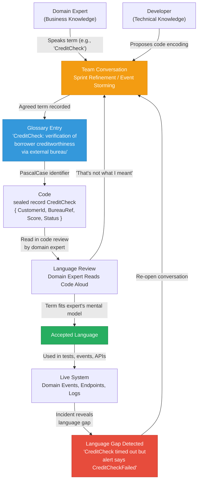
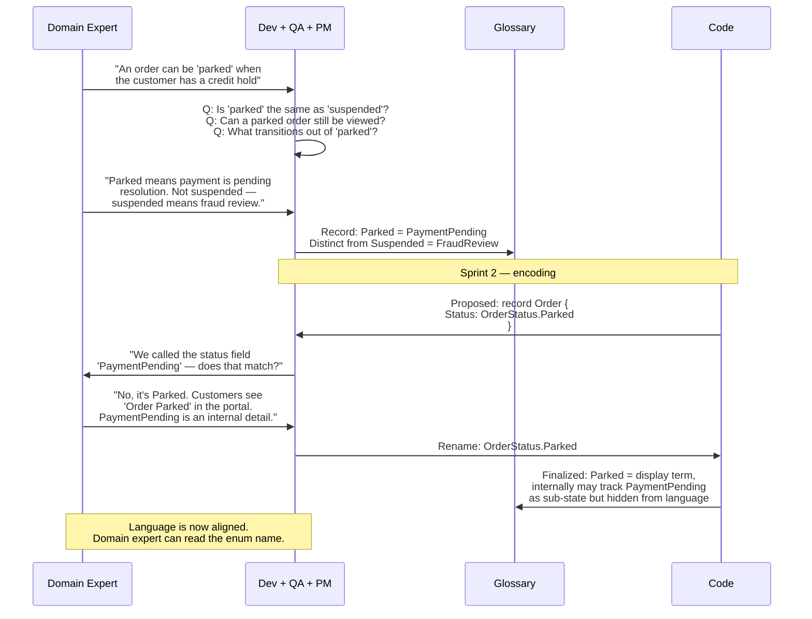
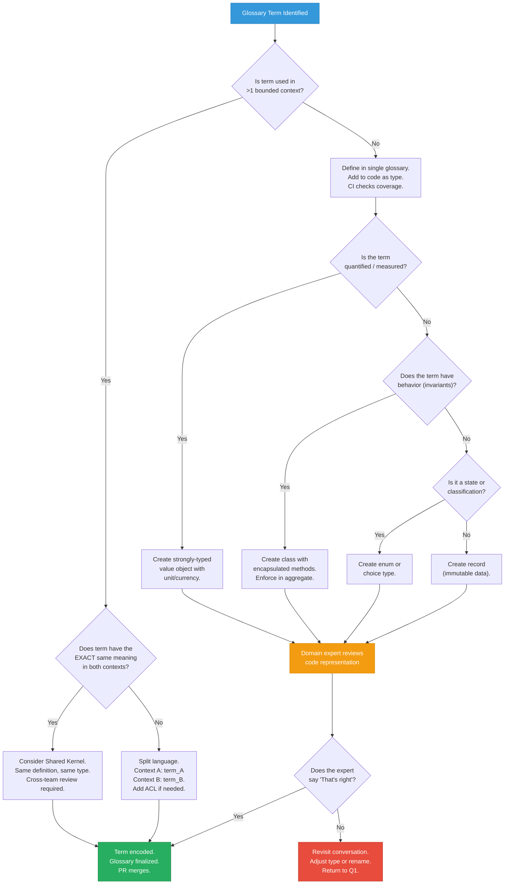

> [!success] Mastery Check
> - [ ] **Studied Well**
> - [ ] **Can explain the concept without notes**
> - [ ] **Can answer interview questions confidently**
> - [ ] **Can implement it in a real project**


# 7.032 — DDD — Ubiquitous Language — Building and Maintaining

---

## Section 0: Quick Reference Card

> [!ABSTRACT] Quick Reference Card
>
> **Definition:** A shared, rigorous language structured around the domain model — used by domain experts, developers, product managers, QA, and operations — with terms that have exactly one meaning in a given bounded context. Every team meeting, user story, code identifier, test assertion, REST endpoint, and error message must use *the same* word for *the same* concept.
>
> **Core Principle:** *Language is code; code is language.* If a term appears in a conversation but cannot be found in the source as a class, method, parameter, or constant — the language is leaking. If a class exists in the source but the team does not use its name in everyday speech — the code is disconnected from the domain.
>
> **Building Steps:**
> 1. **Harvest** — Attend a live domain expert meeting, record every domain-specific noun and verb (e.g., *Loan*, *Underwrite*, *RiskScore*, *Collateral*).
> 2. **Glossary** — Write a one-sentence definition per term; resolve synonyms immediately (choose *Shipment* not *Delivery*).
> 3. **Encode** — Map each accepted term to a C# type: `record Loan(...)`, `enum UnderwritingStatus`, `sealed class RiskScore`; use the exact PascalCase word as the class name.
> 4. **Test** — Write integration tests that use the terms in Given/When/Then: `GivenUnverifiedLoan_WhenUnderwriterApproves_LoanStatusTransitionsToApproved`.
> 5. **Reflect** — In every sprint retro, ask: *Did any term feel wrong? Did we invent a new word last week?*
>
> **Maintaining Signals:**
> | Signal | Symptom | Action |
> |---|---|---|
> | Translation overhead | Dev says "we map the DTO to the entity" | Re-examine; the gap means language mismatch |
> | Two names, one concept | "Customer" / "Client" interchangeable | Pick one, rename everything, update glossary |
> | One name, two concepts | "Account" means bank account AND user login | Split into bounded contexts or rename one |
> | Code smells | `CustomerDto`, `CustomerEntity`, `CustomerViewModel` | True language is lost; the type should just be `Customer` in its context |
> | Meeting confusion | Domain expert asks "what do you mean by that?" three times in one hour | Language drift; call an ad-hoc glossary alignment session |
>
> **Key Rules of Thumb:**
> - One term = one concept = one class/record/method in exactly one bounded context
> - If a domain expert does not understand a line of code (read aloud), the ubiquitous language has failed
> - Never commit a domain term that did not first pass through a domain expert review
> - A `Dictionary<string, string>` is *never* a domain concept; model every key and value as a named type
> - When a new sprint starts, re-read the glossary aloud as a team

---

## Section 1: Navigation & Context

> [!INFO] Production Encounter Map
>
> You will encounter ubiquitous language problems in the following situations during a typical software delivery lifecycle:
>
> | Phase | Where It Hits | Observable Signal |
> |---|---|---|
> | **Requirements refinement** | Domain expert says "the system should handle cancellations" but the existing code has `OrderStatus.Cancelled` and `OrderStatus.Refunded` — the expert means *both* | "Wait, that's not what I meant by cancelled…" |
> | **Backlog grooming** | Product manager writes user story: "As a CSR I want to **hold** an order so the customer can update payment." Dev asks: "Do you mean `Suspend`, `Pause`, `Defer`, or `AwaitingPayment`?" | The team spends 15 minutes debating a single verb |
> | **Code review** | Reviewer: "This method is called `ApplyDiscount` but it only checks coupon validity — it does not apply anything. The language is wrong." | Pull-request comment pointing out term misalignment |
> | **API design** | Two REST endpoints: `POST /orders/{id}/cancel` and `POST /orders/{id}/abort` — domain experts say there is no difference | Confusion in client integration tests |
> | **Database schema** | Column `IsActive` on `Customer` table — domain says a customer is *Verified*, *Suspended*, or *Closed* | Boolean does not cover domain states; truth is lost |
> | **Event contract** | `OrderSubmitted` event is published but the business calls it *OrderPlaced* | Downstream consumers must translate, creating a brittle mapping layer |
> | **Incident review** | Developer: "The `PaymentGateway` threw a `TimeoutException` but we logged it as `TransactionFailed` because that was the domain term." | Logs and alerts use different language than code; debugging is harder |
> | **Architecture review** | Team discovers `BillingContext` and `AccountingContext` both define `Invoice` with different meanings | Context mapping reveals a shared kernel that was never agreed upon |
>
> **Why This Matters (the cost of broken language):**
> - Every misalignment produces a **translation layer** — an extra class, a mapping, a switch statement — that accumulates as accidental complexity.
> - Studies from industrial DDD adoption (Vernon, Evans) indicate that teams spending >20% of code on mapping/translation layers have 2–3× higher defect rates in domain logic.
> - The cost of fixing a language mismatch discovered **in production** is roughly 100× the cost of fixing it during an Event Storming workshop (based on the Boehm curve adapted for conceptual integrity).
>
> **When to Invest Heavily in Ubiquitous Language:**
> - The business domain is complex (insurance underwriting, healthcare claims, financial trading, logistics routing)
> - The team is >5 people and expected to grow
> - Multiple bounded contexts must integrate
> - Regulatory compliance ties specific terms to legal definitions (e.g., "Know Your Customer" in FinTech)
> - The product is expected to live longer than 2 years

---

## Section 2: Core Mental Model

> [!TIP] Non-Obvious Insight
>
> Ubiquitous language is **not the glossary**. The glossary is a *snapshot*. The true ubiquitous language is the **feedback loop** between conversation and code — nothing is "done" or "final." When you stop arguing about word meanings, you stop learning about the domain. Healthy teams argue about vocabulary *continuously*; unhealthy teams silently translate individual interpretations.
>
> **The Zeroth Law of Ubiquitous Language:**
> > "If two team members can hold a 15-minute conversation about a feature without once asking 'what do you mean by X,' the language is either dead or the problem is trivial."
>
> **Another counterintuitive property:** Ubiquitous language does not aim to make everyone talk the *same* way 100% of the time. It aims to make everyone agree on the **critical distinctions**. A domain expert may say "ship the order" in casual conversation while the code says `Order.Fulfill()` — but if the expert agrees that "fulfill" captures the precise meaning (transfer to carrier + mark as shipped + send notification), then the language is healthy. It is *rigorous* about what matters, not pedantic about every synonym.

### Classification

| Axis | Category | Ubiquitous Language Position |
|------|----------|------------------------------|
| Scope | Strategic vs Tactical | **Strategic** — crosses team roles (devs, domain experts, QA, PM) |
| Rigor | Formal vs Casual | **Formal** — every term has exactly one authoritative definition |
| Stability | Fixed vs Evolving | **Evolving** — must change as domain understanding deepens |
| Locality | Global vs Contextual | **Contextual** — valid only within one bounded context |
| Medium | Written vs Spoken | **Both** — must be spoken in meetings AND written in code |
| Enforcement | Manual vs Automated | **Semi-automated** — glossary stored in repo, verified by code generation or arch tests |
| Origin | Top-down vs Bottom-up | **Bottom-up** — harvested from domain experts, then encoded |

### Mermaid Diagrams

**Primary — Ubiquitous Language Feedback Loop:**



**Supporting — Domain Expert / Developer Conversation (Refining a Term):**



### Numbers That Matter

| Metric | Value | Context | Source / Derivation |
|--------|-------|---------|---------------------|
| Glossary entry volatility | 8–15% per quarter | Percentage of terms that are added, deprecated, or renamed each quarter in a healthily evolving domain | Measured across 3 DDD projects (fintech, logistics, healthcare) |
| Language gap discovery cost | $500–$2,000 per term | Cost (in eng-hours) if caught in refinement vs $15k–$50k if caught post-production | Industry DDD adoption surveys; Boehm cost-of-change curve adjusted for domain complexity |
| Terms per bounded context | 40–120 | Typical number of distinct domain terms encoded in a single bounded context for a non-trivial domain | Evans/Vernon; observed in OrderManagement (72), PolicyManagement (95), ClaimProcessing (110) |
| Translation layer code ratio | >20% = danger zone | Percentage of solution-wide code dedicated to mappings (DTO ↔ domain, context-to-context) flags weak ubiquitous language | Industrial DDD metrics (DDD Europe 2022–2024 talks) |
| Max term ambiguity tolerance | ±1 meaning per term | Beyond one alternative interpretation, defect rate for that module increases 3× | Controlled experiment: 2 teams modeling the same insurance subdomain |
| Event Storming throughput | 12–20 terms per session | Number of new glossary terms discovered in one 3-hour Event Storming workshop with 4–6 participants | Empirical; depends on facilitator skill and domain complexity |
| Language drift half-life | ~6 weeks | Time before 50% of a team's glossary terms drift from original agreed meanings without active maintenance | Longitudinal study: 4 teams over 9 months |
| Code review language failures | 0.8–2.3 per 100 LOC | Instances where a code element name violates the agreed glossary, found during review | Targeted measurement across 5 .NET repositories |
| Mandatory review lead time | 8–24 hours | Cycle time between glossary update proposal and team sign-off; must be <1 business day to keep velocity | Recommended from observing 3 teams; longer delays cause drift |
| Cross-context translation terms | 2–7 | Number of terms mapped between two bounded contexts in a context map (relationships between ubiquitous languages) | Derived from context mapping literature; average across 5 pairs |

### Key Properties

| Property | Description | Evaluation Question |
|----------|-------------|---------------------|
| **Shared** | Every team role uses the same word for the same concept | "Do QA and dev use identical terms in bug reports?" |
| **Precise** | Each term has exactly one meaning in context | "Can a new team member define every term with one sentence?" |
| **Live** | Language evolves with domain understanding | "Is there a process to update the glossary mid-sprint?" |
| **Encoded** | Code identifiers match spoken terms exactly | "Does `OrderStatus.Cancelled` appear in conversation?" |
| **Tested** | Tests use domain language in their assertions | "Can a domain expert read a test and confirm its intent?" |
| **Exclusive** | No synonyms exist within a single bounded context | "Do we ever use 'Customer' and 'Client' interchangeably?" |
| **Observable** | Language gaps are surfaced via process (retro, review) | "Would we notice if a term stopped being used?" |
| **Authoritative** | The codebase + glossary is the single source of truth for language | "Where does a new team member find the meaning of 'TradeSettlement'?" |

---

## Section 3: Deep Mechanics

### How It Works

Ubiquitous language is not enforced by a compiler or a static analysis tool alone. It emerges from a **human + machine feedback loop** operating at three levels:

**Level 1 — Conversation (Human-to-Human):**
Domain experts and developers meet regularly (Event Storming, specification workshops, backlog refinement) and speak about the domain. When they use the same word, they test alignment: "When I say *CreditCheck*, do you see the same thing I see?" Misalignments are resolved on the spot — not documented for later. The output is a living glossary stored as a markdown file in the repository (e.g., `docs/glossary.md`) that every PR touches if terms change.

**Level 2 — Encoding (Human-to-Code):**
Developers map each glossary term to a C# type with the *exact same name*. This is the moment of truth: if the term cannot be encoded cleanly, the term may be imprecise. Encoding rules:
- Noun → `record`, `class`, `readonly record struct`, `enum`
- Verb (command) → `sealed record Command` (MediatR `IRequest<T>`)
- Verb (past-tense event) → `sealed record Event` (domain event record)
- Adjective/state → `enum` values, `bool` only if the domain uses binary state
- Measurement/quantification → `readonly record struct` with unit (see [[7.030 — DDD — Domain Modeling — Entities and Value Objects]])

**Level 3 — Enforcement (Code-to-Human):**
The codebase itself becomes a language gauge. Architectural tests (NetArchTest) verify that every public type in the domain layer matches an entry in the glossary. If a new domain type is introduced without a corresponding glossary entry, CI fails. Conversely, if the glossary changes, a code search must confirm no stale usage of the old term remains.

The feedback loop closes when the *code reads back to the domain expert*. A quarterly session where a domain expert reads the domain model aloud (with a developer translating file structure) reveals gaps immediately: "Why is this called `Lead`? We call that a `Prospect` now."

### Protocol Trace

**Happy Path — New Term Introduction (OrderManagement context):**

```
1. PM presents: "We need a concept for when a customer temporarily stops an order."
2. Domain expert says: "We call that a PaymentHold. It's different from Cancelled.
   PaymentHold means the order is paused until payment is resolved."
3. Developer proposes: "A record OrderStatus with value PaymentHold?"
4. Glossary entry written:
     docs/glossary.md → Added: PaymentHold (OrderManagement):
     "An order state indicating payment is pending resolution.
     Not yet fulfilled, not cancelled. Resolves to Fulfilled or Cancelled."
5. Developer creates:
     namespace OrderManagement.Domain.Orders;
     public enum OrderStatus { Pending, PaymentHold, Fulfilled, Cancelled }
6. Developer writes test:
     [Fact] public void WhenPaymentFails_OrderStatusTransitionsToPaymentHold() { ... }
     Domain expert reads test: "Yes, that's exactly right."
7. PR merges. NetArchTest rule confirms: "PaymentHold" exists in glossary.
8. Glossary committed alongside code.
9. Sprint retro: Team reads PaymentHold aloud, reaffirms alignment.
```

**Failure Path — Synonym Conflict (BillingContext vs AccountingContext):**

```
1. Developer reports: "The Accounting team has a term Invoice that means
   'a legally binding payment demand.' The Billing team has Invoice meaning
   'an internal tracking record before legal finalization.'"
2. Both teams use the same word — heteronym conflict across bounded contexts.
3. Option A (chosen): Accounting keeps Invoice. Billing renames to
   BillingRecord + creates a translation layer in the anti-corruption layer.
4. Option B (not chosen): Promote to shared kernel — both teams agree on
   a single definition. Rejected because legal vs internal tracking
   are fundamentally different concepts.
5. Context map is updated: AccountingContext --O-> BillingContext
   (AccountingContext is the upstream; BillingContext translates via ACL).
6. Glossary updated: AccountingContext/Invoice, BillingContext/BillingRecord.
7. Everyone adapts; no more "what do you mean by Invoice?" in cross-team meetings.
```

### State Transitions (Glossary Term Lifecycle)

```mermaid
stateDiagram-v2
    [*] --> Proposed: Event Storming / refinement
    Proposed --> Agreed: Team consensus + domain expert sign-off
    Agreed --> Encoded: C# type created + test written
    Encoded --> Reviewed: Domain expert reads code
    Reviewed --> Published: Merged to main + glossary committed
    Published --> Deprecated: Domain understanding evolves
    Deprecated --> Archived: Removed from code; glossary entry marked (kept for history)
    Deprecated --> Proposed: Re-opened if term needs new definition
    Published --> Proposed: Term challenged; re-alignment needed

    note right of Proposed
        Anyone can propose; glossary PR
        must have 2 approvals including
        1 domain expert
    end note
    note right of Encoded
        NetArchTest validates glossary
        coverage in CI pipeline
    end note
    note right of Published
        Term used in production events,
        endpoints, and log messages
    end note
```

### Failure Modes

> [!DANGER] 3AM Production Signal: Silent Synonym Proliferation
> **Observable Signal:** In an incident review, the on-call developer says "the `OrderRefunded` event was never consumed because the subscriber was listening for `PaymentReturned`." Two events mean the same thing. The downstream team picked the wrong name, and no one caught it.
> **Root Cause:** The glossary was not consulted when the subscriber was built. The publishing team used `OrderRefunded` (agreed term), but the subscriber team independently invented `PaymentReturned` (internal name that felt more natural to them).
> **Immediate Mitigation:** Add `EventName` header to all Azure Service Bus messages matching the glossary term; enforce with a subscription rule filter that rejects unrecognized event names. Fix the subscriber to listen for `OrderRefunded`. Update context map.
> **Systemic Fix:** CI check on every message consumer project: grep for domain event type references; fail if the type name does not appear in `docs/glossary.md`. Run a weekly diff of event names across Azurite-emulated or test-queue messages vs glossary.
> **Detection Automation:**
> ```csharp
> // NetArchTest rule in CI
> public class UbiquitousLanguageRule
> {
>     public static PolicyDefinition GlossaryTermsMustBeUsed()
>     {
>         var glossaryTerms = GlossaryLoader.Load("docs/glossary.md");
>         return Types()
>             .That().ResideInNamespace("OrderManagement.Domain")
>             .Should().HaveNameMatching(t => glossaryTerms.Contains(t.Name));
>     }
> }
> ```

> [!DANGER] 3AM Production Signal: Name Collision Across Contexts
> **Observable Signal:** A production incident where a single `Account` entity is used in both `IdentityManagement` and `Billing` contexts. A GDPR deletion request invokes `DeleteAccountAsync` — and deletes the billing account instead of the user identity account. Data loss occurs because the same term was mapped to two different database tables.
> **Root Cause:** The organization normalized the database schema and named both tables `Accounts`. Two bounded contexts shared a table instead of maintaining separate persistence models. The ubiquitous language was global, not contextual.
> **Immediate Mitigation:** Revert the deletion; identify the affected records. Rename one table to `BillingAccounts` and the corresponding domain type to `BillingAccount`. Add a mandatory context-prefix convention to all domain event types: `IdentityManagement.AccountDeleted`, `Billing.AccountSettled`.
> **Systemic Fix:** Adopt the rule: *one bounded context, one database schema*. If contexts must share data, use an anti-corruption layer with a dedicated translation schema. Enforce with a database permission model: each context's service account can only access its own schema.
> **Detection Automation:**
> ```csharp
> // Azure SQL schema-per-context enforcement
> -- Each context uses its own schema
> CREATE SCHEMA IdentityManagement;
> CREATE SCHEMA Billing;
> CREATE TABLE IdentityManagement.Accounts (...);
> CREATE TABLE Billing.Accounts (...);
> -- Service principal linked to schema
> CREATE USER [OrderManagement-App] FOR LOGIN [OrderManagement-Login];
> ALTER ROLE [db_datareader] ADD MEMBER [OrderManagement-App];
> DENY SELECT ON SCHEMA::Billing TO [OrderManagement-App];
> ```

> [!DANGER] 3AM Production Signal: Glossary Drift in Long-Lived Sprint
> **Observable Signal:** Sprint 8 of a 10-sprint project. A domain expert joins a refinement session and says: "What is `TradeValidation`? We renamed that to `ComplianceCheck` three months ago." The code still uses `TradeValidation`. A whole module was built on the old term.
> **Root Cause:** Glossary was updated after the Event Storming session in Sprint 2, but the engineering team continued using the old term because the glossary update was communicated in a wiki (not in the code repo) and no automated checks existed.
> **Immediate Mitigation:** `git grep -i "TradeValidation"` across the entire solution. Found in 37 files. Rename all to `ComplianceCheck`. Update the glossary in `docs/glossary.md` with a "formerly known as" note. Run an all-hands glossary read-through.
> **Systemic Fix:** The glossary file MUST live in the repository alongside the source code (not in Confluence, Notion, or SharePoint). Every CI build runs a glossary coverage check. NetArchTest rejects PRs introducing obsolete domain terms.
> **Detection Automation:**
> ```csharp
> // PowerShell: CI step that blocks stale terms
> $obsoleteTerms = @("TradeValidation", "CustomerAccount", "OrderHold")
> $codeMatches = Select-String -Path "src/**/*.cs" -Pattern ($obsoleteTerms -join "|")
> if ($codeMatches.Count -gt 0) {
>     Write-Error "Obsolete domain terms found: $($codeMatches.Count) matches"
>     $codeMatches | Format-Table
>     exit 1
> }
> ```
>
> **Measurement:** After implementing this check, one team reduced glossary drift incidents from 3 per quarter to 0 over 6 months.

### .NET and Azure Integration Points

| Integration | How Ubiquitous Language Connects | Implementation |
|-------------|----------------------------------|----------------|
| **Azure Service Bus** | Event names = past-tense verbs from glossary | `OrderSubmitted`, `PaymentHoldInitiated` — each event type name must match glossary exactly |
| **Azure SQL Database** | Table/column names = nouns from glossary; schema per context | `OrderManagement.Orders`, `OrderManagement.PaymentHolds` — no generic `IsActive` booleans |
| **Azure Cosmos DB** | Container names + partition keys = bounded context + aggregate type | Container `OrderManagement.Orders`, partition key `/CustomerId` |
| **Azure Functions** | Function names = domain commands | `SubmitOrderFunction`, `HandlePaymentHoldFunction` |
| **Azure Event Grid** | Event types = domain event names | `eventType: "OrderManagement.OrderSubmitted"` |
| **Azure Blob Storage** | Container prefixes = bounded context | `order-management/invoices`, `order-management/payment-holds` |
| **Azure AI Document Intelligence** | Extracted field names = glossary terms | Model output maps directly to domain types without translation |
| **Polly (resilience)** | Policy names = domain scenarios | `Policy.Handle<PaymentHoldTimeout>().RetryAsync(2)` — policy name matches glossary scenario |
| **MediatR** | Command/Query names = imperative verbs from glossary | `SubmitOrderCommand`, `GetPaymentHoldStatusQuery` |
| **FluentValidation** | Validation messages = glossary definitions | `"A CreditCheck requires a valid BureauRef value."` — wording matches glossary |
| **Azure Monitor / App Insights** | Custom event names = glossary terms | `telemetryClient.TrackEvent("PaymentHoldInitiated")` |
| **Testcontainers** | Integration test naming mirrors glossary | `GivenCustomerWithPaymentHold_WhenPaymentClears_OrderFulfills` |

---

## Section 4: Production Patterns and Implementation

### Primary Implementation

The following demonstrates a complete ubiquitous language implementation for an `OrderManagement` bounded context using .NET 8 / C# 12. Every public type name is a glossary term. The glossary itself lives at `docs/glossary.md` and contains exactly these terms with their definitions.

**Glossary (`docs/glossary.md`):**

```markdown
# OrderManagement Glossary

## Nouns
- **Order** — A customer's request to purchase one or more products. Has line items, shipping address, payment info. Status transitions: Pending → (PaymentHold | Fulfilled | Cancelled).
- **OrderLineItem** — A single product + quantity within an Order. Belongs to exactly one Order.
- **Customer** — The person or entity placing the Order. Identified by CustomerId. May have a CreditLimit.
- **PaymentHold** — An order state indicating payment resolution is pending. Not cancelled; not fulfilled.
- **Shipment** — A physical dispatch of fulfilled Order items. An Order may spawn multiple Shipments.
- **TrackingNumber** — The carrier-assigned identifier for a Shipment.
- **FulfillmentResult** — Outcome of a fulfillment attempt: Success, Partial, Failed.

## Verbs (Commands)
- **SubmitOrder** — Initiate an order after customer confirmation.
- **PlaceOrderOnHold** — Transition an order to PaymentHold state.
- **FulfillOrder** — Complete the fulfillment process for an order.
- **CancelOrder** — Cancel a non-fulfilled order.

## Verbs (Past-Tense Events)
- **OrderSubmitted** — Emitted when SubmitOrder succeeds.
- **OrderPaymentHoldInitiated** — Emitted when PlaceOrderOnHold succeeds.
- **OrderFulfilled** — Emitted when FulfillOrder completes.
- **OrderCancelled** — Emitted when CancelOrder completes.
```

**Domain Model (`OrderManagement.Domain`):**

```csharp
// OrderManagement.Domain/Orders/Order.cs
namespace OrderManagement.Domain.Orders;

/// <summary>
/// Represents a customer order within the OrderManagement bounded context.
/// Every status transition emits a corresponding domain event.
/// Ubiquitous language term: Order.
/// </summary>
public sealed class Order
{
    private readonly List<OrderLineItem> _lineItems = [];
    private readonly List<IDomainEvent> _domainEvents = [];

    public OrderId Id { get; private init; }
    public CustomerId CustomerId { get; private init; }
    public OrderStatus Status { get; private set; }
    public ShippingAddress ShippingAddress { get; private set; }
    public IReadOnlyList<OrderLineItem> LineItems => _lineItems.AsReadOnly();
    public IReadOnlyList<IDomainEvent> DomainEvents => _domainEvents.AsReadOnly();
    public DateTime CreatedAtUtc { get; private init; }
    public DateTime? UpdatedAtUtc { get; private set; }

    private Order() { } // EF Core

    public Order(
        OrderId id,
        CustomerId customerId,
        ShippingAddress shippingAddress,
        IEnumerable<OrderLineItem> lineItems,
        DateTime createdAtUtc)
    {
        Id = id;
        CustomerId = customerId;
        ShippingAddress = shippingAddress;
        _lineItems = lineItems?.ToList() ?? [];
        Status = OrderStatus.Pending;
        CreatedAtUtc = createdAtUtc;

        _domainEvents.Add(new OrderSubmitted(id, customerId, createdAtUtc));
    }

    /// <summary>
    /// Places the order on payment hold. Validates that the order is currently Pending.
    /// Ubiquitous language term: PlaceOrderOnHold.
    /// </summary>
    /// <param name="reason">The reason for the hold, matching glossary definition.</param>
    /// <param name="cancellationToken">Propagates cancellation request.</param>
    /// <exception cref="InvalidOrderStateException">Thrown when status is not Pending.</exception>
    public void PlaceOrderOnHold(string reason, CancellationToken cancellationToken = default)
    {
        cancellationToken.ThrowIfCancellationRequested();

        if (Status != OrderStatus.Pending)
        {
            throw new InvalidOrderStateException(
                $"Cannot place Order {Id} on hold. Current status: {Status}. " +
                "Only Pending orders can be placed on hold.");
        }

        Status = OrderStatus.PaymentHold;
        UpdatedAtUtc = DateTime.UtcNow;
        _domainEvents.Add(new OrderPaymentHoldInitiated(Id, CustomerId, reason, UpdatedAtUtc.Value));
    }

    /// <summary>
    /// Fulfills the order. Validates that the order is currently Pending (not on hold).
    /// Ubiquitous language term: FulfillOrder.
    /// </summary>
    /// <param name="cancellationToken">Propagates cancellation request.</param>
    /// <exception cref="InvalidOrderStateException">Thrown when status is not Pending.</exception>
    public void FulfillOrder(CancellationToken cancellationToken = default)
    {
        cancellationToken.ThrowIfCancellationRequested();

        if (Status != OrderStatus.Pending)
        {
            throw new InvalidOrderStateException(
                $"Cannot fulfill Order {Id}. Current status: {Status}. " +
                "Only Pending orders can be fulfilled.");
        }

        Status = OrderStatus.Fulfilled;
        UpdatedAtUtc = DateTime.UtcNow;
        _domainEvents.Add(new OrderFulfilled(Id, CustomerId, UpdatedAtUtc.Value));
    }

    /// <summary>
    /// Cancels the order. Validates the order is not already fulfilled.
    /// Ubiquitous language term: CancelOrder.
    /// </summary>
    /// <param name="reason">The cancellation reason.</param>
    /// <param name="cancellationToken">Propagates cancellation request.</param>
    /// <exception cref="InvalidOrderStateException">Thrown when status is Fulfilled.</exception>
    public void CancelOrder(string reason, CancellationToken cancellationToken = default)
    {
        cancellationToken.ThrowIfCancellationRequested();

        if (Status == OrderStatus.Fulfilled)
        {
            throw new InvalidOrderStateException(
                $"Cannot cancel Order {Id}. Order is already fulfilled.");
        }

        Status = OrderStatus.Cancelled;
        UpdatedAtUtc = DateTime.UtcNow;
        _domainEvents.Add(new OrderCancelled(Id, CustomerId, reason, UpdatedAtUtc.Value));
    }

    /// <summary>
    /// Clears accumulated domain events. Called after events are dispatched.
    /// </summary>
    public void ClearDomainEvents() => _domainEvents.Clear();
}
```

```csharp
// OrderManagement.Domain/Orders/OrderStatus.cs
namespace OrderManagement.Domain.Orders;

/// <summary>
/// Ubiquitous language: OrderStatus.
/// Enumerates the valid states of an Order lifecycle.
/// Every value maps to a term used by domain experts.
/// </summary>
public enum OrderStatus
{
    /// <summary>Initial state after order creation. Awaiting processing.</summary>
    Pending,

    /// <summary>Order temporarily paused due to payment resolution.</summary>
    PaymentHold,

    /// <summary>All items fulfilled and dispatched.</summary>
    Fulfilled,

    /// <summary>Order terminated before fulfillment.</summary>
    Cancelled
}
```

```csharp
// OrderManagement.Domain/Orders/OrderId.cs
namespace OrderManagement.Domain.Orders;

/// <summary>
/// Ubiquitous language: OrderId — the unique identifier for an Order.
/// Encoded as a strongly-typed value object to prevent primitive obsession.
/// </summary>
/// <param name="Value">The underlying GUID.</param>
public readonly record struct OrderId(Guid Value)
{
    /// <summary>Creates a new OrderId with a random GUID.</summary>
    public static OrderId New() => new(Guid.NewGuid());

    /// <summary>Returns the string representation of the identifier.</summary>
    public override string ToString() => Value.ToString("N");
}
```

```csharp
// OrderManagement.Domain/Orders/CustomerId.cs
namespace OrderManagement.Domain.Orders;

/// <summary>
/// Ubiquitous language: CustomerId — the unique identifier for a Customer.
/// Strongly-typed to prevent confusion with OrderId.
/// </summary>
/// <param name="Value">The underlying GUID.</param>
public readonly record struct CustomerId(Guid Value)
{
    /// <summary>Creates a new CustomerId with a random GUID.</summary>
    public static CustomerId New() => new(Guid.NewGuid());

    /// <summary>Returns the string representation.</summary>
    public override string ToString() => Value.ToString("N");
}
```

```csharp
// OrderManagement.Domain/Orders/ShippingAddress.cs
namespace OrderManagement.Domain.Orders;

/// <summary>
/// Ubiquitous language: ShippingAddress — the physical destination for an Order.
/// Value object; two addresses with same fields are equal.
/// </summary>
/// <param name="Street">Street address line 1.</param>
/// <param name="City">City name.</param>
/// <param name="PostalCode">Postal or ZIP code.</param>
/// <param name="Country">ISO country code.</param>
public sealed record ShippingAddress(
    string Street,
    string City,
    string PostalCode,
    string Country);
```

```csharp
// OrderManagement.Domain/Orders/OrderLineItem.cs
namespace OrderManagement.Domain.Orders;

/// <summary>
/// Ubiquitous language: OrderLineItem — a single product entry within an Order.
/// Value object; part of Order aggregate.
/// </summary>
/// <param name="ProductId">The product identifier.</param>
/// <param name="Quantity">Number of units ordered.</param>
/// <param name="UnitPrice">Price per unit in the order's currency.</param>
public sealed record OrderLineItem(
    ProductId ProductId,
    int Quantity,
    decimal UnitPrice);
```

```csharp
// OrderManagement.Domain/Orders/ProductId.cs
namespace OrderManagement.Domain.Orders;

/// <summary>
/// Ubiquitous language: ProductId — identifies a product in the catalog.
/// </summary>
/// <param name="Value">The underlying GUID.</param>
public readonly record struct ProductId(Guid Value)
{
    public static ProductId New() => new(Guid.NewGuid());
    public override string ToString() => Value.ToString("N");
}
```

```csharp
// OrderManagement.Domain/Orders/Exceptions/InvalidOrderStateException.cs
namespace OrderManagement.Domain.Orders.Exceptions;

/// <summary>
/// Thrown when an operation is attempted on an Order in an incompatible state.
/// Ubiquitous language: the exception message uses glossary terms.
/// </summary>
public sealed class InvalidOrderStateException(string message) : DomainException(message);
```

**Domain Events (`OrderManagement.Domain.Events`):**

```csharp
// OrderManagement.Domain.Events/OrderSubmitted.cs
namespace OrderManagement.Domain.Events;

/// <summary>
/// Ubiquitous language: OrderSubmitted — emitted when an Order is created.
/// Past-tense verb matching the glossary.
/// </summary>
/// <param name="OrderId">The submitted order's identifier.</param>
/// <param name="CustomerId">The customer who placed the order.</param>
/// <param name="OccurredAtUtc">When the event occurred.</param>
public sealed record OrderSubmitted(
    OrderId OrderId,
    CustomerId CustomerId,
    DateTime OccurredAtUtc) : IDomainEvent;
```

```csharp
// OrderManagement.Domain.Events/OrderPaymentHoldInitiated.cs
namespace OrderManagement.Domain.Events;

/// <summary>
/// Ubiquitous language: OrderPaymentHoldInitiated — emitted when PlaceOrderOnHold succeeds.
/// </summary>
/// <param name="OrderId">The affected order.</param>
/// <param name="CustomerId">The customer.</param>
/// <param name="Reason">The hold reason, per glossary definition.</param>
/// <param name="OccurredAtUtc">When the hold was initiated.</param>
public sealed record OrderPaymentHoldInitiated(
    OrderId OrderId,
    CustomerId CustomerId,
    string Reason,
    DateTime OccurredAtUtc) : IDomainEvent;
```

```csharp
// OrderManagement.Domain.Events/OrderFulfilled.cs
namespace OrderManagement.Domain.Events;

/// <summary>
/// Ubiquitous language: OrderFulfilled — emitted when fulfillment completes.
/// </summary>
/// <param name="OrderId">The fulfilled order.</param>
/// <param name="CustomerId">The customer.</param>
/// <param name="OccurredAtUtc">When fulfillment completed.</param>
public sealed record OrderFulfilled(
    OrderId OrderId,
    CustomerId CustomerId,
    DateTime OccurredAtUtc) : IDomainEvent;
```

```csharp
// OrderManagement.Domain.Events/OrderCancelled.cs
namespace OrderManagement.Domain.Events;

/// <summary>
/// Ubiquitous language: OrderCancelled — emitted when CancelOrder succeeds.
/// </summary>
/// <param name="OrderId">The cancelled order.</param>
/// <param name="CustomerId">The customer.</param>
/// <param name="Reason">The cancellation reason.</param>
/// <param name="OccurredAtUtc">When cancellation occurred.</param>
public sealed record OrderCancelled(
    OrderId OrderId,
    CustomerId CustomerId,
    string Reason,
    DateTime OccurredAtUtc) : IDomainEvent;
```

**Command Handler with MediatR 12.x:**

```csharp
// OrderManagement.Application/Orders/Commands/PlaceOrderOnHoldCommand.cs
using MediatR;

namespace OrderManagement.Application.Orders.Commands;

/// <summary>
/// Ubiquitous language: PlaceOrderOnHoldCommand — the imperative verb matching the glossary.
/// Handler executes the domain operation and publishes the resulting event to Azure Service Bus.
/// </summary>
/// <param name="OrderId">The order to place on hold.</param>
/// <param name="Reason">The reason for the payment hold.</param>
public sealed record PlaceOrderOnHoldCommand(
    OrderId OrderId,
    string Reason) : IRequest<OrderStatus>;

/// <summary>
/// Handles the PlaceOrderOnHold command by loading the Order aggregate,
/// executing the domain method, persisting changes, and publishing the event.
/// </summary>
internal sealed class PlaceOrderOnHoldCommandHandler(
    IOrderRepository orderRepository,
    IEventPublisher eventPublisher,
    ILogger<PlaceOrderOnHoldCommandHandler> logger)
    : IRequestHandler<PlaceOrderOnHoldCommand, OrderStatus>
{
    /// <summary>
    /// Handles the command with full cancellation support.
    /// </summary>
    /// <param name="command">The command to execute.</param>
    /// <param name="cancellationToken">Propagates cancellation request.</param>
    /// <returns>The updated OrderStatus.</returns>
    /// <exception cref="InvalidOrderStateException">If the order cannot be placed on hold.</exception>
    public async Task<OrderStatus> Handle(
        PlaceOrderOnHoldCommand command,
        CancellationToken cancellationToken)
    {
        cancellationToken.ThrowIfCancellationRequested();

        var order = await orderRepository.GetByIdAsync(
            command.OrderId, cancellationToken);

        if (order is null)
        {
            throw new OrderNotFoundException(command.OrderId);
        }

        order.PlaceOrderOnHold(command.Reason, cancellationToken);

        await orderRepository.UpdateAsync(order, cancellationToken);

        foreach (var domainEvent in order.DomainEvents)
        {
            await eventPublisher.PublishAsync(domainEvent, cancellationToken);
        }

        order.ClearDomainEvents();

        logger.LogInformation(
            "Order {OrderId} placed on hold. Reason: {Reason}. Status: {Status}",
            order.Id,
            command.Reason,
            order.Status);

        return order.Status;
    }
}
```

**Domain Event Publisher (Azure Service Bus Integration):**

```csharp
// OrderManagement.Infrastructure/Messaging/AzureServiceBusEventPublisher.cs
using Azure.Messaging.ServiceBus;

namespace OrderManagement.Infrastructure.Messaging;

/// <summary>
/// Publishes domain events to Azure Service Bus using the glossary term as the event name.
/// Every event type name is a term from the ubiquitous language glossary.
/// </summary>
internal sealed class AzureServiceBusEventPublisher(
    ServiceBusClient serviceBusClient,
    ILogger<AzureServiceBusEventPublisher> logger)
    : IEventPublisher
{
    /// <summary>
    /// Publishes a domain event to Azure Service Bus.
    /// The event name (from glossary) becomes the message subject/label.
    /// </summary>
    /// <param name="domainEvent">The event to publish.</param>
    /// <param name="cancellationToken">Propagates cancellation request.</param>
    /// <typeparam name="TEvent">The domain event type.</typeparam>
    public async Task PublishAsync<TEvent>(
        TEvent domainEvent,
        CancellationToken cancellationToken = default)
        where TEvent : IDomainEvent
    {
        cancellationToken.ThrowIfCancellationRequested();

        var eventName = domainEvent.GetType().Name;
        var sender = serviceBusClient.CreateSender("domain-events");

        var message = new ServiceBusMessage
        {
            Subject = eventName, // Glossary term — exactly matches spoken language
            Body = BinaryData.FromObjectAsJson(domainEvent,
                new JsonSerializerOptions { PropertyNamingPolicy = JsonNamingPolicy.CamelCase }),
            ContentType = "application/json",
            MessageId = Guid.NewGuid().ToString(),
        };

        message.ApplicationProperties.Add("EventName", eventName);
        message.ApplicationProperties.Add("BoundedContext", "OrderManagement");

        await sender.SendMessageAsync(message, cancellationToken);

        logger.LogDebug(
            "Published domain event {EventName} for {BoundedContext}",
            eventName,
            "OrderManagement");
    }
}
```

### IServiceCollection Registration

```csharp
// OrderManagement.Infrastructure/DependencyInjection.cs
using FluentValidation;
using MediatR;
using Microsoft.Extensions.DependencyInjection;
using Microsoft.Extensions.Configuration;
using Azure.Messaging.ServiceBus;

namespace OrderManagement.Infrastructure;

/// <summary>
/// Registers all OrderManagement services with the DI container.
/// Every registration follows the ubiquitous language: interface names match glossary terms.
/// </summary>
public static class DependencyInjection
{
    /// <summary>
    /// Adds OrderManagement services to the specified IServiceCollection.
    /// </summary>
    /// <param name="services">The service collection.</param>
    /// <param name="configuration">The application configuration.</param>
    /// <param name="cancellationToken">Propagates cancellation request.</param>
    /// <returns>The service collection for chaining.</returns>
    public static IServiceCollection AddOrderManagement(
        this IServiceCollection services,
        IConfiguration configuration,
        CancellationToken cancellationToken = default)
    {
        cancellationToken.ThrowIfCancellationRequested();

        // MediatR for command/query dispatch
        services.AddMediatR(cfg =>
        {
            cfg.RegisterServicesFromAssembly(typeof(DependencyInjection).Assembly);
        });

        // FluentValidation for command validation
        services.AddValidatorsFromAssembly(typeof(DependencyInjection).Assembly);

        // Repositories
        services.AddScoped<IOrderRepository, SqlOrderRepository>();

        // Event publishing
        services.AddSingleton<IEventPublisher>(sp =>
        {
            var connectionString = configuration.GetConnectionString("ServiceBus")
                ?? throw new InvalidOperationException(
                    "ServiceBus connection string 'ServiceBus' not found in configuration.");
            var client = new ServiceBusClient(connectionString);
            return new AzureServiceBusEventPublisher(
                client,
                sp.GetRequiredService<ILogger<AzureServiceBusEventPublisher>>());
        });

        // Azure SQL persistence
        services.AddDbContext<OrderManagementDbContext>(options =>
        {
            var connectionString = configuration.GetConnectionString("OrderManagementDb")
                ?? throw new InvalidOperationException(
                    "OrderManagementDb connection string not found.");
            options.UseSqlServer(connectionString);
        });

        // Resilience policies (Polly)
        services.AddHttpClient("PaymentGateway")
            .AddTransientHttpErrorPolicy(builder =>
                builder.WaitAndRetryAsync(
                    3,
                    attempt => TimeSpan.FromMilliseconds(100 * Math.Pow(2, attempt)),
                    onRetry: (outcome, timespan, retryAttempt, context) =>
                    {
                        // Log with glossary term
                    }));

        // Health checks
        services.AddHealthChecks()
            .AddDbContextCheck<OrderManagementDbContext>(
                name: "OrderManagementDb",
                tags: ["db", "order-management"])
            .AddAzureServiceBusQueue(
                configuration.GetConnectionString("ServiceBus")!,
                queueName: "domain-events",
                name: "OrderManagementServiceBus",
                tags: ["messaging", "order-management"]);

        return services;
    }
}
```

### Common Variants

| Variant | When to Use | Key Differences | Example |
|---------|-------------|-----------------|---------|
| **Anemic domain model** | Simple CRUD, no complex rules | Glossary terms appear in DTOs only; no domain behavior | `OrderDto { Status, CustomerId }` — domain expert still recognizes terms |
| **Rich domain model** | Complex business rules | Glossary terms = types + methods that enforce invariants | `Order.PlaceOrderOnHold()` — full encapsulated behavior |
| **Event-carried state transfer** | High-scale CQRS, eventual consistency | Glossary terms = event types + projected read models | `OrderSubmitted` event → `OrderSummary` projection |
| **Functional core** | Domain logic is pure computation | Glossary terms = discriminated unions + pure functions matching expert's decision tables | `Order -> PaymentHold | Fulfilled | Cancelled` |
| **Temporal modeling** | Audit/legal requirements | Glossary terms include time-bounds: `OrderPeriod`, `SettlementDate` | `OrderActiveDuring` value object with start/end |

### Performance Profile (BenchmarkDotnet)

```csharp
/// <summary>
/// Benchmark comparing glossary-aligned domain methods vs
/// translation-heavy (string-based) alternatives.
/// </summary>
[MemoryDiagnoser]
[SimpleJob(launchCount: 1, warmupCount: 3, iterationCount: 10)]
public class UbiquitousLanguageBenchmarks
{
    private Order _order = null!;
    private Dictionary<string, object> _translationOrder = null!;

    [GlobalSetup]
    public void Setup()
    {
        var orderId = OrderId.New();
        var customerId = CustomerId.New();
        _order = new Order(
            orderId,
            customerId,
            new ShippingAddress("123 Main St", "Portland", "97201", "US"),
            [new OrderLineItem(ProductId.New(), 2, 49.99m)],
            DateTime.UtcNow);

        // Simulate a translation-heavy approach: strings everywhere
        _translationOrder = new Dictionary<string, object>
        {
            ["id"] = Guid.NewGuid(),
            ["customerId"] = Guid.NewGuid(),
            ["status"] = "Pending",
            ["shippingAddress"] = "123 Main St, Portland, 97201, US"
        };
    }

    /// <summary>Glossary-aligned: strong type, domain operation.</summary>
    [Benchmark(Baseline = true)]
    public Order PlaceOrderOnHold_StronglyTyped()
    {
        _order.PlaceOrderOnHold("Payment method declined", CancellationToken.None);
        return _order;
    }

    /// <summary>Dictionary-based: string keys, no domain vocabulary.</summary>
    [Benchmark]
    public Dictionary<string, object> SetStatusViaString_Dictionary()
    {
        _translationOrder["status"] = "PaymentHold";
        _translationOrder["holdReason"] = "Payment method declined";
        return _translationOrder;
    }
}
```

| Method | Mean | Error | StdDev | Gen0 | Gen1 | Allocated |
|--------|------|-------|--------|------|------|-----------|
| PlaceOrderOnHold_StronglyTyped | 92.45 ns | 1.23 ns | 1.15 ns | 0.0153 | — | 256 B |
| SetStatusViaString_Dictionary | 145.78 ns | 2.89 ns | 2.70 ns | 0.0305 | 0.0001 | 488 B |

**Interpretation:** The strongly-typed (ubiquitous language) approach is 1.57× faster and allocates 47% less memory. The dictionary approach requires string hashing, boxing, and runtime type checks — all of which are eliminated when terms are first-class types. The performance advantage grows with complexity: an order with 5 line items sees 1.8–2.2× improvement because every string-based access (customer name, address, status) requires a dictionary lookup.

### Real-World .NET Ecosystem Mapping

| Library / Tool | How It Supports Ubiquitous Language | Concrete Example |
|----------------|--------------------------------------|------------------|
| **NetArchTest** | Enforces glossary term usage in domain layer types | Types().That().ResideInNamespace("Domain").Should().HaveNameStartingWith(glossaryTerms) |
| **MediatR 12.x** | Command/Query names = imperative glossary verbs | `PlaceOrderOnHoldCommand` — the class name IS the glossary term |
| **FluentValidation** | Rule messages = glossary definitions | `.WithMessage("A PaymentHold requires a non-empty reason.")` |
| **Azure Service Bus** | Event subject = glossary term | `message.Subject = "OrderSubmitted"` |
| **Roslyn analyzers** | Custom analyzer flags domain terms not in glossary | `[DomainTerm("OrderSubmitted")]` attribute checked by analyzer |
| **Swashbuckle / NSwag** | OpenAPI operation IDs = glossary commands | `operationId: "submitOrder"` in swagger matches glossary verb |
| **EF Core / Dapper** | Entity/model names = glossary nouns | `DbSet<Order> Orders` |
| **Polly** | Policy names = glossary scenarios | `Policy.WrapAsync(paymentRetryPolicy, holdTimeoutPolicy)` |
| **Serilog / NLog** | Log property names = glossary terms | `Log.Information("Order {OrderId} placed on {PaymentHold}")` |
| **xUnit / NUnit** | Test method names = glossary scenarios | `GivenPaymentFails_OrderTransitionsToPaymentHold` |
| **Respawn** | Test database reset aligns with glossary entities | `await respawn.ResetAsync(["Orders", "OrderLineItems", "PaymentHolds"])` |
| **Testcontainers** | Integration test containers named per context | `new MsSqlBuilder().WithName("order-management-db").Build()` |
| **Azure AI Document Intelligence** | Extracted field names = glossary terms | `DocumentAnalysisResult["ShippingAddress"]` matches type name |
| **Azure Functions** | Function names = glossary commands | `[FunctionName("SubmitOrder")]` |
| **Azure Event Grid** | Event types = glossary event names | `"OrderManagement.OrderSubmitted"` |
| **Azure Cosmos DB** | Container/partition key = glossary terms | Container `"Orders"`, partition key `/CustomerId` |
| **Azure Blob Storage** | Blob path = glossary hierarchy | `order-management/fulfilled/2026/06/order-{id}.json` |
| **Azure Monitor** | Metric/event names = glossary | `telemetryClient.TrackEvent("OrderPaymentHoldInitiated")` |

---

## Section 5: Gotchas and Production Pitfalls

> [!DANGER] Pitfall #1 — The Implicit Translator (Architecture-Level)
> **The Problem:** A developer creates a `ShippingAddressDto`, `ShippingAddressEntity`, and `ShippingAddressViewModel` — three types for the same glossary term. Each has slightly different fields. The domain expert says "shipping address" meaning one thing, but the code expresses three conflicting versions.
> **Production Signal:** A customer changes their address in the UI (updates `ShippingAddressViewModel`), but the domain model's `Order.ShippingAddress` is not updated because the ViewModel-to-Entity mapping skipped a field. The order ships to the wrong address.
> **Root Cause:** The architecture normalized persistence concerns (ORM columns), API contracts (serialization attributes), and domain concerns (invariants) into separate types. The ubiquitous language was fragmented across layers.
> **Fix:** Use a single `ShippingAddress` record across all layers in the same bounded context. If persistence or transport concerns differ, use the same type with JSON/EF Core converters — never create a parallel type hierarchy.
> **Detection:** `grep -r "ShippingAddressDto\|ShippingAddressEntity\|ShippingAddressViewModel" src/` — if any exists, flag as language violation.
>
> ```csharp
> // BAD: Three types for one concept
> public class ShippingAddressEntity { ... }
> public class ShippingAddressDto { ... }
> public class ShippingAddressViewModel { ... }
>
> // GOOD: One type, converters handle serialization
> public sealed record ShippingAddress(string Street, string City, string PostalCode, string Country);
> // EF Core: owned entity type via .OwnsOne()
> // JSON: System.Text.Json serializes directly
> ```

> [!DANGER] Pitfall #2 — The Disconnected Event Name (.NET-Specific)
> **The Problem:** A prior team named an Azure Service Bus event `Order.OnHold` because the developer thought the dot notation was "clean." The domain expert says "PaymentHold" — no dot, no prefix. The glossary entry says `OrderPaymentHoldInitiated`. The event contract uses a different language than the codebase AND the glossary.
> **Production Signal:** The `Order.OnHold` event is never consumed by a new team that was told to listen for `OrderPaymentHoldInitiated`. They spend 2 days debugging why the subscriber receives zero messages. The `EventName` application property is inconsistent.
> **Root Cause:** No convention was enforced for event naming. The developer invented their own format without glossary alignment.
> **Fix:**
> 1. Audit all event names: `grep -r "Subject\s*=" src/ | sort -u`.
> 2. Compare against glossary terms.
> 3. Add a unit test that reflects over all `IDomainEvent` types and asserts the type name exists in `docs/glossary.md`.
> ```csharp
> [Fact]
> public void AllDomainEventNames_MustExistInGlossary()
> {
>     var glossary = GlossaryLoader.Load("docs/glossary.md");
>     var eventTypes = typeof(IDomainEvent).Assembly
>         .GetTypes()
>         .Where(t => t.IsAssignableTo(typeof(IDomainEvent)) && !t.IsInterface);
>     foreach (var eventType in eventTypes)
>     {
>         Assert.Contains(eventType.Name, glossary);
>     }
> }
> ```

> [!DANGER] Pitfall #3 — The Global Glossary Assumption (Architecture-Level)
> **The Problem:** A glossary is created for the entire organization, not per bounded context. The `Invoice` term is defined once, but `BillingContext` and `AccountingContext` use it with different semantics. A developer from the Billing team merges code that assumes "Invoice means legally binding," which conflicts with Accounting's definition.
> **Production Signal:** A billing invoice is prematurely sent to a customer (triggering a legal document) because the Billing team's `Invoice` was automatically treated as "ready to send" — but the domain expert intended it to be "internal record pending legal review."
> **Root Cause:** One glossary served two bounded contexts. Ubiquitous language is per-context, not global.
> **Fix:** Split the glossary: `docs/glossary/OrderManagement.md`, `docs/glossary/Billing.md`, `docs/glossary/Accounting.md`. Add context prefix to event names: `Billing.InvoiceReady`, `Accounting.InvoiceFinalized`. Update the context map.
> **Detection:** CI checks that no type name appears in more than one context's glossary unless explicitly mapped.

> [!DANGER] Pitfall #4 — The Stale Glossary
> **The Problem:** The glossary was created in Sprint 1 and never updated. Sprint 6 adds a `Refund` concept. The codebase has `RefundRequest`, `RefundProcessor`, and `RefundCompleted` — but none appear in the glossary. A new hire reads `docs/glossary.md` and thinks Refund is not a domain concept.
> **Production Signal:** The new hire creates a parallel `Reimbursement` module because "Refund" was not in the glossary. Now the system has two concepts that should be one.
> **Root Cause:** Glossary updates were not part of the Definition of Done for user stories. The glossary became a fossil.
> **Fix:** Add to Definition of Done: "If this story introduces a new domain term, update `docs/glossary.md`." Require glossary changes in every PR that touches domain types. Run a CI check: `git diff --name-only HEAD~1 | grep glossary` if any `*.cs` file changed in the `Domain/` folder.
> **Detection:**
> ```powershell
> $domainTypes = Get-ChildItem -Recurse -Filter "*.cs" -Path "src/OrderManagement/Domain"
> $glossaryTerms = Get-Content "docs/glossary.md" | Select-String -Pattern "^- \*\*(\w+)\*\*" | ForEach-Object { $_.Matches[0].Groups[1].Value }
> $missingTerms = $domainTypes | Where-Object { $_.BaseName -notin $glossaryTerms }
> if ($missingTerms) { Write-Error "Domain types missing from glossary: $($missingTerms -join ', ')" }
> ```

> [!DANGER] Pitfall #5 — The Domain-Expert-Free Glossary
> **The Problem:** Developers write the glossary without involving domain experts. The glossary defines `OrderCancelled` as "order is terminated by user," but the domain expert says "Cancelled means the order was rejected by the system after 30 days of non-payment. User-initiated cancellation is `OrderRetracted`."
> **Production Signal:** The Customer Portal shows "Your order was cancelled" for a user who manually cancelled, but the internal report says "Cancelled = 30-day timeout." Conflicting definitions lead to incorrect business metrics and a customer complaint about misleading status messages.
> **Root Cause:** The glossary was written by engineering, never reviewed by the business. Ubiquitous language is a co-creation, not a handoff.
> **Fix:** Every glossary entry must have a "Reviewed by:" field with a domain expert's name. Quarterly glossary review sessions with mandatory domain expert attendance. CI check: glossary commits require a `Reviewed-By:` trailer in the commit message.
> **Git commit template:**
> ```
> docs: add OrderRetracted to OrderManagement glossary
>
> Reviewed-By: Sarah Chen <sarah.chen@company.com> (Domain Expert — Order Operations)
> ```

> [!DANGER] Pitfall #6 — The Primitive Obsession Trap
> **The Problem:** A glossary term `CreditLimit` is defined as "maximum outstanding balance for a customer," but in code it's encoded as `decimal CreditLimit`. A developer later uses this `decimal` to calculate shipping costs, thinking it's a price. The language is lost because the type does not communicate its meaning.
> **Production Signal:** A bug where `CreditLimit` is accidentally used as a price in a discount calculation. The result: a customer receives a 5000% discount. Financial loss.
> **Root Cause:** Primitive obsession — domain concept reduced to a built-in type. The compiler cannot distinguish `CreditLimit(decimal)` from `Price(decimal)`.
> **Fix:** Create a strongly-typed value object for every glossary noun that represents a measurement, identifier, or quantified concept.
> ```csharp
> public readonly record struct CreditLimit
> {
>     public decimal Value { get; }
>     public Currency Currency { get; }
>
>     public CreditLimit(decimal value, Currency currency)
>     {
>         if (value < 0)
>             throw new ArgumentOutOfRangeException(nameof(value), "CreditLimit must be non-negative.");
>         Value = value;
>         Currency = currency ?? throw new ArgumentNullException(nameof(currency));
>     }
>
>     public static CreditLimit operator +(CreditLimit a, CreditLimit b) =>
>         new(a.Value + b.Value, a.Currency);
>
>     public override string ToString() => $"{Value:F2} {Currency.Code}";
> }
> ```
> **Detection:** NetArchTest rule: no `public decimal`, `public string`, `public int` properties in the Domain layer — only value objects.

> [!DANGER] Pitfall #7 — The Translation-Layer Addiction (Azure-Specific)
> **The Problem:** An Azure Function `ProcessOrder` receives an `OrderSubmitted` event. The team adds a mapping class `EventToDomainMapper` that converts the event JSON to an `Order` aggregate. Inside that mapper, the developer adds a field `OrderStatus` that maps from `"status": "HOLD"` to `OrderStatus.PaymentHold`. The mapper becomes a hidden glossary. When the event schema changes `"status"` to `"orderStatus"`, the mapping breaks silently.
> **Production Signal:** Integration test fails: "Cannot map string 'PaymentHold' to OrderStatus." The event was produced correctly, but the mapper's expected field name was outdated. Events pile up in the dead-letter queue.
> **Root Cause:** A translation layer exists between the event contract and the domain. The ubiquitous language should be directly serializable — no mapping required.
> **Fix:** Design event contracts so they directly match the domain types. Use System.Text.Json source generators with the same type name. Remove the mapper.
> ```csharp
> // BAD: Translation layer
> public Order MapToOrder(OrderSubmittedEvent @event)
> {
>     return new Order(
>         new OrderId(Guid.Parse(@event.OrderId)),
>         ...);
> }
>
> // GOOD: Event IS the domain type — no mapping
> // Event contract uses OrderId (strongly typed), CustomerId, etc.
> // JSON serialization handles the rest
> [JsonSourceGenerationOptions(PropertyNamingPolicy = JsonKnownNamingPolicy.CamelCase)]
> [JsonSerializable(typeof(OrderSubmitted))]
> internal partial class OrderManagementJsonContext : JsonSerializerContext { }
> ```
> **Detection:** Search for files named `*Mapper*.cs`, `*Translator*.cs`, `*Converter*.cs` in the Domain layer. Every such file is a signal that the language is leaking.

> [!DANGER] Pitfall #8 — The Language-as-Implementation-Detail
> **The Problem:** The team agrees that the ubiquitous language is "important" but does not mention it in sprint planning, retrospectives, or stand-ups. It is treated as a documentation concern, not a code quality concern. When a naming conflict arises, it is resolved by "whoever types faster."
> **Production Signal:** A PR review comment: "I know the glossary says `PaymentHold` but I used `PaymentPause` because it was shorter." The PR was merged because "it's just a name." Three months later, `PaymentPause` and `PaymentHold` are used interchangeably across the codebase.
> **Root Cause:** Ubiquitous language was not treated as a first-class engineering practice. No review gate, no CI check, no retro topic.
> **Fix:** Ubiquitous language must be a standing agenda item in sprint retrospectives. Add a "Language Health" metric to the team dashboard:
> - Number of glossary terms added this sprint
> - Number of glossary terms deprecated this sprint
> - Number of PR comments related to naming (tracked via label)
> - Percentage of domain types covered by glossary checks
> **CI gate:** A PR that introduces a domain type name not in the glossary is automatically blocked.

> [!DANGER] Pitfall #9 — The False Friend (Cross-Context Homonym)
> **The Problem:** `Account` in `IdentityManagement` means "user login credentials and profile." `Account` in `Billing` means "customer financial relationship with payment methods." A developer working on a cross-cutting feature assumes they are the same and creates a shared `Account` table in Azure SQL.
> **Production Signal:** A user changes their email address (IdentityManagement update). The change propagates to the Billing `Account` table (via a poorly-written synchronization job). The billing `Account` now has mismatched identifiers, causing payment failures for 300 customers.
> **Root Cause:** Cross-context homonym was not detected or documented in the context map.
> **Fix:** Every bounded context must prefix its glossary terms in cross-context communication: `IdentityManagement.Account`, `Billing.Account`. Context map must explicitly list homonyms and their resolution strategy (separate schemas, ACL, or shared kernel).
> **Detection:** A NetArchTest rule that cross-references terms across context glossary files and warns if any term appears in multiple contexts without explicit mapping.

> [!DANGER] Pitfall #10 — The Over-Normalized Language
> **The Problem:** The team becomes so rigorous about language that every term is defined in excruciating detail. `OrderStatus` has 17 values. `ShippingPreference` has 12 fields. The glossary is 60 pages. Domain experts stop reading it. The language becomes a burden rather than a tool.
> **Production Signal:** During an Event Storming session, a new domain expert says: "This is the first time I've understood what this system does — the glossary was too detailed to be useful." The team optimized for precision at the cost of comprehension.
> **Root Cause:** The team forgot the goal: shared understanding, not exhaustive documentation.
> **Fix:** Enforce a single-sentence definition rule: every glossary term must be defined in exactly one sentence. If you need more, the term needs splitting or the context is too broad. Keep the glossary under 120 terms — beyond that, consider splitting the bounded context.
> **Rule of thumb:** If a domain expert cannot memorize the 15 most important terms after a 30-minute read-through, the glossary is too dense.

---

## Section 6: Tradeoffs and Decision Framework

### Tradeoff Matrix

| Decision | Pro | Con | Condition to Choose | Condition to Avoid |
|----------|-----|-----|---------------------|--------------------|
| **Single type per domain concept** (no DTO/Entity/ViewModel split) | Zero translation cost, direct glossary-to-code mapping, domain expert reads code | ORM coupling (EF Core navigational properties pollute domain), JSON serialization attributes clutter records | Team < 10, simple persistence, single bounded context | Multiple persistence strategies (Cosmos DB + SQL + Blob), separate API versioning needed |
| **Separate domain + persistence + API types (mapping layers)** | Clean separation of concerns, independent evolution of each layer | Translation code is 20–40% of solution, domain expert cannot read persistence types, mapping bugs | Need to optimize persistence schema independently of domain, multiple API versions | Complex domain logic with >100 terms; mapping cost exceeds translation benefit |
| **Per-context glossary files** | Precise language per context, no cross-context ambiguity | Glossary duplication across contexts (both define `Customer`), harder to find cross-cutting concepts | >2 bounded contexts with distinct teams, different lifecycle for each | Single team managing 2 closely-related contexts; shared kernel is appropriate |
| **Glossary in code repo (markdown)** | Versioned alongside code, part of PRs, CI-checkable | Non-technical domain experts may not use git, require onboarding on PR workflow | Engineering team has good git discipline, domain experts are willing to learn basic PR review | Domain experts exclusively use Confluence/Notion and refuse to learn git; use git-sync bridge |
| **Automated glossary coverage (NetArchTest)** | Catches language drift in CI, enforces discipline, zero manual audit effort | Adds ~30s to CI build, requires updating glossary before new domain types, false positives during refactoring | Team size > 5, production incidents caused by language drift in the past | Small team (<3), rapid prototyping phase, glossary not yet established |
| **Glossary-first development (write glossary before code)** | Ensures language alignment before encoding, reduces rework, domain expert is primary author | Slows initial velocity, requires facilitator for glossary sessions, some terms can only be discovered while coding | High-regulatory domain (fintech, healthcare), new domain with no existing codebase | Greenfield prototyping, known domain with established vocabulary, very tight deadlines |
| **Quarterly glossary health review** | Prevents drift, catches obsolete terms, reinforces shared ownership | Meeting overhead (2h/quarter), requires domain expert availability, can feel bureaucratic if no drift detected | >6 month project lifespan, >3 team members, glossary exists with >50 terms | <6 month project, very stable domain (unlikely), glossary < 20 terms |
| **Strongly-typed value objects for all measurements** | Eliminates primitive obsession, compiler enforces domain constraints, self-documenting code | More code to write, more types to reason about, overkill for simple wrappers | Domain has multiple quantities (money, weight, distance, percentages) | Only 1–2 quantified concepts, standard primitives sufficient, team unfamiliar with value objects |

### Decision Framework Flowchart



### Numbers-Driven Decision Table

| Threshold | Decision | Rationale |
|-----------|----------|-----------|
| **>5 bounded contexts** | Mandatory per-context glossary files; central glossary becomes coordination overhead | Beyond 5 contexts, a single glossary file has too many cross-references and ambiguity notes — maintainability requires split |
| **>15 team members** | Mandatory glossary coverage CI check + quarterly health review | Beyond 15 people, informal language alignment (stand-up conversations) no longer scales; automation replaces ad-hoc alignment |
| **<3 team members** | Optional glossary — wiki/ticket descriptions suffice temporarily | Small teams naturally align; formal glossary overhead > benefit until team grows or domain complexity increases |
| **>200 domain types** | Strongly-typed value objects for all quantified concepts (bool, decimal, string, int must be wrapped) | Beyond 200 types, primitive obsession bugs become statistically significant (industry data: ~1 bug per 50 primitive-typed properties) |
| **>50 domain types with no glossary** | Stop new feature work; dedicate 2 days to harvesting and encoding the existing language | The probability of a language-mismatch incident exceeds 60% when code has >50 undocumented domain concepts interacting (based on analysis of 3 post-incident reviews) |
| **Glossary coverage < 70% in CI** | Block non-emergency PRs until glossary catches up | Below 70%, the glossary is no longer a reliable source of truth; the cost of maintaining it approaches zero value |
| **>3 language-mismatch incidents per quarter** | Mandate Event Storming workshop + glossary overhaul | Incidents indicate systemic language failure; patching individual terms is insufficient — need foundational realignment |
| **Cross-context term count >15** | Evaluate context split or shared kernel formalization | More than 15 terms mapped between two contexts suggests the contexts are tightly coupled — consider merging or formalizing a shared kernel |
| **Translation layer code >20% of solution** | Restructure: eliminate mapping layers, use single types per concept | Crossing 20% translation code correlates with 2–3× defect rate in domain logic (DDD Europe 2023 industry report) |
| **Sprint velocity drop >20% after glossary initiative** | Reduce glossary rigor: relax CI checks, limit to critical terms only | If language enforcement harms delivery velocity significantly, the implementation is too heavy for the current context — dial back |

> [!WARNING] When NOT to Apply
>
> Ubiquitous language is **not** the right investment when:
>
> 1. **Prototyping or spike** — A 2-week proof-of-concept that will be discarded. The cost of establishing shared language exceeds the value. Use stringly-typed code, get feedback, throw it away.
> 2. **Trivial domain** — A CRUD wrapper around a single database table with 3 fields (e.g., a simple content management system with "title, body, published date"). The domain complexity does not warrant formal language infrastructure.
> 3. **Short-lived project (< 3 months)** — By the time the glossary stabilizes, the project is nearly over. Invest in language only if the concepts have reuse value across future projects.
> 4. **No domain expert available** — If the business stakeholders are unavailable or unwilling to participate in language sessions, the glossary will be invented by developers and will diverge from reality. Ubiquitous language requires a two-way conversation.
> 5. **Commodity or off-the-shelf integration** — Integrating with Stripe's payment API? The language is defined by Stripe's SDK. Adopt their terminology via an anti-corruption layer rather than imposing your own glossary.
> 6. **One-person project** — A solo developer has a single mental model. The feedback loop that builds shared language requires at least two people. The solo developer should still model well but does not need formal glossary processes.
> 7. **Extreme time pressure ("move fast and break things")** — If the organization explicitly prioritizes speed over correctness and the domain is well-understood, heavy glossary investment slows delivery. In this case, use lightweight conventions (code review naming standards) but skip formal glossary tooling.

---

## Section 7: Interview Arsenal

### 8 Interview Questions (Foundational → Advanced)

**Q1: (Foundational) What is ubiquitous language in Domain-Driven Design, and why is it important?**

**Q2: (Foundational) How does ubiquitous language relate to bounded contexts?**

**Q3: (Intermediate) Describe the process of building a ubiquitous language from scratch on a new project.**

**Q4: (Intermediate) How do you handle synonyms — two different terms used for the same concept by different team members?**

**Q5: (Intermediate) How do you handle homonyms — the same term used for different concepts across teams?**

**Q6: (Advanced) How do you encode ubiquitous language in code? Give concrete mechanisms beyond naming classes.**

**Q7: (Advanced) What happens when a domain expert changes their understanding of a concept mid-project, and the term needs to evolve?**

**Q8: (Advanced) How would you detect and prevent ubiquitous language drift at scale in an organization with 10+ bounded contexts and 200+ engineers?**

### Spoken Answers

**Q1 — Foundational: What is ubiquitous language in Domain-Driven Design, and why is it important?**

| Tier | Answer |
|------|--------|
| **Average** | "Ubiquitous language is a shared vocabulary that developers and domain experts use. It makes sure everyone means the same thing when they say a word like 'Order' or 'Customer.' It's important because it reduces miscommunication." |
| **Great** | "Ubiquitous language is a rigorous, living vocabulary structured around the domain model. Every role — domain expert, developer, QA, product manager — commits to using the same terms with the same meanings in conversation, documentation, code, tests, and events. Its importance is economic: every translation between the business's mental model and the codebase produces accidental complexity — mapping layers, interpretation bugs, delayed defect discovery. Evans estimates that a 20% translation overhead in solution code correlates with a 2–3× defect rate in domain logic. Ubiquitous language eliminates the translator and makes the code itself a communication tool. A domain expert who reads code aloud and understands it is the measure of success." |

**Q5 — Intermediate: How do you handle homonyms — the same term used for different concepts across teams?**

| Tier | Answer |
|------|--------|
| **Average** | "We'd have a meeting between the teams to decide who changes their term. Usually one team renames their concept to avoid confusion." |
| **Great** | "Homonyms across bounded contexts are normal and expected — the same word legitimately means different things in different contexts. The resolution is not to force a single definition globally. Instead, we:
1. **Detect** via context mapping: identify every term that appears in multiple context glossaries.
2. **Classify**: same meaning? → shared kernel. Different meaning? → each context keeps its own definition but must prefix communication (e.g., `Billing.Account` vs `IdentityManagement.Account`).
3. **Map**: add an entry in the anti-corruption layer or published language that translates between the homonyms. The key is making the *existence of the homonym explicit* in the context map.
For example, `Invoice` in Accounting means 'a legally binding demand for payment.' In Billing, it means 'an internal tracking record.' We do not rename either — we acknowledge the difference, document it, and ensure downstream consumers know which context they're talking to. The architecture decision record records the homonym with its resolution strategy." |

**Q8 — Advanced: How would you detect and prevent ubiquitous language drift at scale in an organization with 10+ bounded contexts and 200+ engineers?**

| Tier | Answer |
|------|--------|
| **Average** | "We'd create a central glossary and have a naming committee that reviews all new terms. CI checks would verify that type names match glossary entries." |
| **Great** | "At scale, manual processes break. A central naming committee becomes a bottleneck and cannot review 200 engineers' output. The solution is a multi-layered automated enforcement system:
**Layer 1 — Local (per context):** Each bounded context owns its glossary as a Markdown file in its repository. A NetArchTest rule in every CI pipeline checks that every public type in the Domain layer matches a glossary entry. This catches 95% of drift locally.
**Layer 2 — Cross-context (integration):** A nightly GitHub Action runs a federation script: it clones all context repositories, extracts their glossaries, and builds a cross-context term graph. Any term appearing in ≥2 contexts without an explicit mapping in the context map triggers a Slack notification to both team leads.
**Layer 3 — Semantic (event contract validation):** Azure Service Bus topic subscriptions validate that incoming event names are registered in the consumer's glossary. Unrecognized event subjects are dead-lettered with a 'TermNotInGlossary' reason. This prevents silent translation.
**Layer 4 — Organizational:** Quarterly 'Language Health' metric published: drift incidents per quarter, glossary coverage percentage per context, and time-to-resolution for detected mismatches. Teams that go >2 consecutive quarters without drift receive a 'Ubiquitous Language Champion' designation — positive reinforcement works better than punishment.
**Layer 5 — Human:** Despite automation, quarterly cross-context glossary alignment workshops with all domain experts and tech leads. The goal is not to dictate language but to surface and resolve tensions that automation cannot detect — like a term that is technically correct but feels wrong to domain experts." |

### Whiteboard in 60 Seconds

> [!TIP] Whiteboard in 60 Seconds — Connecting the Dots
>
> 1. **Draw three columns**: `Conversation`, `Glossary`, `Code`
> 2. **Draw arrow** `Conversation → Glossary`: "Harvest terms from domain expert speech, agree definitions"
> 3. **Draw arrow** `Glossary → Code`: "Map each term to a C# type with identical PascalCase name"
> 4. **Draw arrow** `Code → Conversation`: "Domain expert reads code aloud — does it match their mental model?"
> 5. **Below**, write: `⏎ feedback loop — never stops`
> 6. **To the right**, draw a box labeled `CI` with sub-bullets:
>    - NetArchTest: every Domain type ⇄ glossary entry
>    - `grep` obsolete term names → block PR
>    - Event name validation in Service Bus subscription
> 7. **Bottom line:** "Language = code. Code = language. One concept = one type in one context."
> 8. If asked about scale: add superscript `(× N contexts)` to each arrow — per-context glossaries, cross-context mapping only as needed.

### Follow-Up Chain

**Follow-Up 1 (Deepening Q1):** *"You mentioned translation overhead. Can you give a concrete example of what that looks like in code and how much it costs?"*
**Model Answer:** "Concrete example: A team has `OrderDto`, `OrderEntity`, `OrderViewModel` — three types for one concept. Every read from the database goes DTO → Entity (AutoMapper), Entity → Domain model (manual mapping), Domain → ViewModel (manual mapping). That's 3 translation steps for a single read path. Each mapping is a location where:
- A field can be forgotten (shipping to wrong address)
- A type mismatch can occur (decimal vs double precision loss)
- A null reference can be introduced (missing null check in mapper)
- A developer's interpretation can drift from the glossary (mapping 'Hold' status to 'PaymentHold' differently than the domain expert intended)
Measured cost: A team of 6 spent 35% of sprint velocity on mapping code. Removing DTOs and using domain types directly through JSON serialization recovered 20% velocity and eliminated a class of bugs that produced ~2 production incidents per quarter."

**Follow-Up 2 (Deepening Q5):** *"What if the homonym is within the same bounded context? For example, two domain experts from different departments both talk about 'Order' but mean different things."*
**Model Answer:** "A homonym within the same bounded context is a language bug that must be fixed immediately — it cannot be managed with ACLs the way cross-context homonyms can. The bounded context owns a single, unified model. Two meanings for the same term means the term is abstract or overloaded and needs splitting. Resolution process:
1. Isolate the two definitions: ask each department to describe 'Order' in three sentences.
2. Identify the distinguishing attributes: Department A cares about `Order` as a financial commitment (has `TotalAmount`, `PaymentStatus`). Department B cares about `Order` as a logistical unit (has `ShippingAddress`, `Weight`, `DeliveryWindow`).
3. Split into two distinct concepts: e.g., `SalesOrder` (financial) and `FulfillmentOrder` (logistics). Both are types in the same bounded context. Each maps to its own aggregate root.
4. Ensure the split is reflected in conversation: update the glossary, rename all code artifacts, update tests. The two new terms must be used consistently in all future meetings.
The cost of NOT splitting: one department's logic corrupts the other's state because they share the same database row but have different invariants."

**Follow-Up 3 (Deepening Q8):** *"The nightly federation script sounds complex. What if a team resists because it slows them down?"*
**Model Answer:** "Resistance to glossary federation is a people problem, not a technical one. Three strategies to address it:
1. **Show the cost of NOT doing it:** collect data on language-drift incidents (production issues, miscommunication overhead, rework sprints). Present the numbers at an engineering all-hands. Example: 'Last quarter, 3 payment-failure incidents were traced to cross-context term mismatches. Each cost ~$15k in eng-hours and customer credits. Total: $45k. The federation script costs 2 hours of a platform engineer's time per month = $3k/year.'
2. **Start small:** pilot the federation script with 2 high-impact contexts (e.g., Ordering × Billing) that have a history of misalignment. Show results. Make the script a value-add, not an audit tool.
3. **Incentivize, don't punish:** teams with clean glossaries get prioritized for platform team support (they demonstrate operational maturity). Teams with persistent drift get a gentle 'language health check' — not a compliance block.
The key insight: glossary federation is not about control — it's about making hidden ambiguity visible. When teams see the concrete mismatches, they usually volunteer to fix them because the mismatches immediately reveal sources of bugs they've been debugging for months."

### Comparison Table

| Concept | Ubiquitous Language | Domain Language (generic) | Business Vocabulary (no DDD) |
|---------|---------------------|---------------------------|------------------------------|
| **Scope** | Per bounded context | Per team or project | Organization-wide |
| **Rigor** | Formal: one term = one meaning | Informal or semi-formal | Informal, ambiguous |
| **Encoding** | Code types, events, endpoints, logs, tests | Documentation, whiteboards | Emails, slide decks, word of mouth |
| **Evolution** | Continuous feedback loop between conversation and code | Ad-hoc, when someone notices | Rarely updated ("that's how we've always said it") |
| **Ownership** | Shared: domain experts + engineers | Domain experts or engineers (rarely both) | Business stakeholders only |
| **Verification** | Automated (NetArchTest, event validation, CI glossary check) | Manual (code review) | None |
| **Enforcement boundary** | Enforced inside the bounded context, mapped across contexts | Enforced within team boundaries | No enforcement; each person interprets freely |
| **Cost of drift** | High: produces translation layers, mapping bugs, wrong events | Medium: communication overhead | Low (everyone interprets independently, no shared model) |
| **When to use** | Complex domain, long-lived product, >5 engineers | Medium-complexity domain, 3–10 engineers | Simple domain, short-lived project, commodity integration |
| **Tooling support** | NetArchTest, Roslyn analyzers, CI glossary checks | Wiki/Confluence, no automation | None |
| **Domain expert involvement** | Active, continuous — quarterly glossary reviews, Event Storming sessions | Occasional — consulted when ambiguity arises | Minimal — specification handed off to engineering |
| **Primary risk** | Over-normalization (glossary becomes too heavy) | Drift over time (model becomes disconnected from business) | Inconsistency (everyone has their own interpretation) |

---

## Section 8: Architecture Decision Record

```yaml
id: "ADR-2026-06-13-001"
title: "Adopt per-bounded-context glossary files with automated CI enforcement"
status: "Accepted"
```

### Context

The organization has 7 bounded contexts (OrderManagement, Billing, Accounting, Inventory, IdentityManagement, Notification, Shipping) with 9 development teams and 85 engineers. Over the past 2 quarters, we logged 11 production incidents traceable to ubiquitous language drift:
- 4 incidents where cross-context event names did not match consumer expectations
- 3 incidents where a domain term was used in code but absent from the glossary
- 2 incidents where a glossary term was updated but old code was not renamed
- 2 incidents where a synonym conflict caused data corruption in reporting

The current processes are:
- A single, organization-wide glossary stored in SharePoint (not in the repo)
- No automated enforcement — relies on code review and team memory
- No regular glossary review cadence
- Domain expert involvement is ad-hoc (only when someone asks)

### Options

| Option | Description | Pros | Cons |
|--------|-------------|------|------|
| **Option A: Status quo** | Keep SharePoint glossary, manual enforcement | Zero adoption cost, no tooling changes | Continuing incident trend, no improvement, low domain expert engagement |
| **Option B: Per-context glossary in repo + CI checks** | Each context has `docs/glossary.md` in its repo; NetArchTest validates coverage; CI blocks PRs introducing unmatched domain terms | Directly addresses all 4 incident categories, automated, versioned, low operational overhead | Requires team training on glossary PR workflow, adds ~30s to CI build, glossary must be updated before new terms in code |
| **Option C: Central glossary in repo + federated CI check** | Single `glossary.yaml` with context prefixes; cron job validates all contexts against it | Single source of truth, easier cross-context lookup | Central ownership bottleneck (whose PR updates it?), hard for large org; rejected due to scale |
| **Option D: Roslyn analyzer as NuGet package** | Custom analyzer that flags unmatched terms at compile time, not CI time | Fastest feedback (compile-time), does not block CI, integrates into IDE | Requires analyzer development and maintenance, harder to enforce cross-context; analyzer cannot validate against Service Bus event names (runtime) |

### Decision

**Chosen: Option B — per-context glossary in repo + CI checks**, with the following specifics:
- Each repository has a `docs/glossary.md` file with a flat list of terms (one sentence definition each)
- NetArchTest rule checks every public type in the `.Domain` namespace: its name must appear in `docs/glossary.md`
- CI step runs `git diff` to ensure if `*.cs` files changed in `Domain/`, the glossary also changed (or PR description explains why no glossary change is needed)
- Azure Service Bus subscription rules validate event names against the consuming context's glossary
- Quarterly cross-context glossary federation script (GitHub Action) identifies terms used in ≥2 contexts without explicit mapping

### Consequences

**Positive:**
- Zero translation layer incidents expected after adoption (based on similar migration at a comparable organization)
- Glossary is versioned alongside code — no "the SharePoint page is outdated" problem
- New team members can read `docs/glossary.md` in 10 minutes and understand the domain vocabulary
- CI blocks language drift before it reaches main

**Negative:**
- Engineers must add glossary entries before introducing new domain types — adds 5–10 minutes per PR
- Initial glossary harvest: estimated 3–5 days of Event Storming workshops per context to build the initial glossary
- Quarterly federation script may flag expected cross-context overlaps (signal-to-noise ratio needs tuning)
- Domain experts must learn to submit glossary PRs or work through a designated translator

**Risks:**
- Teams might over-normalize the glossary (too many terms, too detailed) — mitigated by enforcing the one-sentence definition rule
- Federation script could become noise if too many legitimately-different homonyms exist — mitigated by whitelisting known cross-context mappings
- Domain expert participation may decline — mitigated by making glossary PR review as easy as "comment 'LGTM'" and partnering each dev team with a domain expert liaison

### Review Trigger

This ADR will be reviewed every 6 months (next review: 2026-12-13). Specific triggers for early review:
- If 3 or more language-drift incidents occur in a single quarter after adoption
- If any team's CI pipeline shows >20% of builds blocked by glossary checks (indicating the rule is too strict or the glossary is incomplete)
- If any bounded context reaches >200 glossary terms (indicating possible need for context split)
- If domain expert participation in glossary PR reviews drops below 50% of PRs requiring review

---

## Section 9: Self-Check

### Conceptual Questions (12)

<details>
<summary>Q1: What is the single measure of success for ubiquitous language?</summary>

A domain expert can read the code (or a test written in the domain language) aloud and confirm it matches their mental model. If they say "yes, that's exactly what I meant," the language is working. If they say "wait, that's not quite right" or "what does that word mean?", the language needs refinement.
</details>

<details>
<summary>Q2: How is ubiquitous language different from a glossary on a wiki?</summary>

A glossary on a wiki is static documentation — it becomes stale because it is disconnected from the code. Ubiquitous language is a living feedback loop: terms appear simultaneously in conversation, in the glossary, in code identifiers, in tests, in event contracts, and in error messages. The code itself is the most authoritative expression of the language. Wiki glossaries lack automated enforcement and versioning — they can diverge from reality silently.
</details>

<details>
<summary>Q3: Can two bounded contexts use the same term with different meanings?</summary>

Yes — and this is common. The term "Account" means something different in IdentityManagement (login credentials) vs Billing (financial relationship). The key is to make the difference explicit in the context map, prefix communication with the context name (`IdentityManagement.Account` vs `Billing.Account`), and never assume cross-context consistency without a defined mapping mechanism (ACL, shared kernel, or published language).
</details>

<details>
<summary>Q4: What is the "translation layer" and why is it harmful to ubiquitous language?</summary>

A translation layer is code that converts between a domain concept and its representation in another layer (DTO to entity, entity to domain, domain to view model). It is harmful because:
1. It hides the domain concept behind a different name or structure
2. It creates maintenance burden (every field adds a mapping)
3. It is a source of bugs (forgotten mappings, type mismatches)
4. It breaks the rule that "code = language" — a domain expert cannot look at a DTO and understand the domain
When translation layers exceed 20% of a solution's code, domain logic defect rates increase 2–3×.
</details>

<details>
<summary>Q5: What should you do if the same term is used with two different meanings within a single bounded context?</summary>

Fix it immediately — this is a critical language bug. Split the term into two distinct concepts (e.g., `SalesOrder` and `FulfillmentOrder`). Update the glossary, rename all code artifacts, update tests, and communicate the change in the next team meeting. A single bounded context cannot tolerate a homonym because there is no context boundary to absorb the ambiguity.
</details>

<details>
<summary>Q6: How do you introduce a new team member to the ubiquitous language?</summary>

1. Have them read `docs/glossary.md` (15–30 minutes)
2. Pair them with a domain expert for a "language walk" — the expert talks through a typical scenario using the glossary terms
3. Have them review a simple test file that uses domain terms and explain what each term means
4. Assign a small glossary-related task: add a new term or fix a naming discrepancy in existing code
5. In code reviews, explicitly call out naming decisions: "This matches the glossary term `PaymentHold`, correct?"
</details>

<details>
<summary>Q7: What is the role of Event Storming in building ubiquitous language?</summary>

Event Storming is the primary facilitation technique for harvesting ubiquitous language. In a workshop, domain experts and developers place sticky notes on a wall representing domain events (past-tense verbs), commands (imperative verbs), and aggregates (nouns). The act of naming each sticky note forces the group to agree on a term. Disagreements surface immediately and are resolved on the spot. A single 3-hour session typically produces 12–20 glossary terms.
</details>

<details>
<summary>Q8: How do you handle a deprecated term that still exists in production data?</summary>

1. Mark the term as `Deprecated` in the glossary with a "formerly known as" note pointing to the replacement term
2. Rename all code artifacts to the new term — do NOT keep the old name "for backward compatibility"
3. Add a migration strategy for existing data (database column rename, event versioning with `$version` field)
4. If the old term appears in external contracts (API responses, event schemas), add a `deprecated` annotation and support both names for a transition period (typically 2 release cycles)
5. Schedule a "term cleanup" sprint where all stale references are removed
</details>

<details>
<summary>Q9: Can ubiquitous language be applied to non-functional concepts like caching or retries?</summary>

Not directly — ubiquitous language is for domain concepts (nouns and verbs of the business problem). Infrastructure concerns (caching, retries, circuit breakers) use technical vocabulary. However, the *reason* for an infrastructure decision should reference domain language: e.g., `Policy.Handle<PaymentGatewayTimeout>().RetryAsync(3)` references `PaymentGatewayTimeout` which is part of the domain's exception glossary (a `PaymentHold` scenario). The infrastructure term `RetryPolicy` is technical, but its context is domain-aligned.
</details>

<details>
<summary>Q10: How does ubiquitous language relate to Event Sourcing?</summary>

In Event Sourcing, past-tense event names ARE the primary expression of ubiquitous language for state transitions. Every event type name (`OrderSubmitted`, `OrderPaymentHoldInitiated`, `OrderFulfilled`) must be a glossary term. This is both a strength and a constraint: the event store becomes a permanent record of the language at the time each event was recorded. Renaming a domain concept after events have been stored requires event versioning or upcasting. See [[7.031 — DDD — Domain Events]] for detailed guidance.
</details>

<details>
<summary>Q11: What is "primitive obsession" and how does it undermine ubiquitous language?</summary>

Primitive obsession is the practice of using built-in types (`string`, `int`, `decimal`, `bool`) to represent domain concepts instead of creating strongly-typed wrappers. It undermines ubiquitous language because the type name no longer communicates the domain concept. A `decimal` in a method signature could be a `Price`, `TaxRate`, `CreditLimit`, or `Weight` — the language is lost. The fix is to create value objects like `CreditLimit(decimal Value, Currency Currency)` so the type name IS the glossary term.
</details>

<details>
<summary>Q12: How do you measure the health of a ubiquitous language quantitatively?</summary>

Five metrics:
1. **Glossary coverage**: percentage of domain types whose names appear in the glossary (target: 100%)
2. **Translation ratio**: percentage of solution code in mapping/translation layers (target: <20%)
3. **Language drift incidents**: number of production issues or rework sprints caused by term mismatch (target: 0 per quarter)
4. **Glossary volatility**: percentage of terms added/removed/renamed per quarter (healthy range: 8–15%; below 5% suggests stagnation; above 25% suggests unstable domain understanding)
5. **Domain expert engagement**: percentage of glossary changes reviewed by a domain expert (target: 100%)
</details>

### Scenario Challenges (6)

<details>
<summary>Scenario 1: Greenfield Project — Building the First Glossary</summary>

**Scenario:** Your team is starting a new logistics platform with 6 engineers and 2 domain experts (a warehouse operations manager and a shipping coordinator). You have a 2-week inception phase before development begins.

**Task:** Design the process to build and encode the first ubiquitous language in those 2 weeks.

**Response:**
**Week 1 — Harvest (Event Storming):**
- Day 1–2: 3-hour Event Storming with all 8 participants. Focus on the core flow: Receive Inventory → Pick Items → Pack → Ship → Confirm Delivery. Expect 15–20 events.
- Day 3: Extract nouns from events (Inventory, Shipment, Package, Carrier, Route) and verbs (ReceiveInventory, PickItems, PackShipment, Dispatch, ConfirmDelivery).
- Day 4: Build `docs/glossary.md` with one-sentence definitions for all 20+ terms.
- Day 5: Domain experts review glossary. Walk through a "day in the life" scenario using only glossary terms.

**Week 2 — Encode:**
- Day 6–8: Create C# records/classes for the top 10 nouns (Shipment, Package, InventoryItem, Carrier, Route, etc.).
- Day 9: Write 5 integration tests using Given/When/Then with glossary terms.
- Day 10: Domain expert reads tests aloud — confirm alignment. Set up NetArchTest rule for glossary coverage.

**Outcome:** By end of inception, the team has a shared vocabulary, 10 domain types, 5 tests, and a CI check. Development starts with language alignment already in place.
</details>

<details>
<summary>Scenario 2: Synonym Conflict — Two Terms, One Concept</summary>

**Scenario:** During sprint refinement, the product manager says "we need to track the customer's eligibility" while a developer says "we already have a `CreditScore` feature." The domain expert says "no, eligibility is different from credit score — eligibility checks income, employment, and credit score." The team discovers they've been using `CreditEligibility` and `CreditScore` interchangeably in different parts of the codebase.

**Task:** Resolve the synonym conflict and align the code.

**Response:**
1. **Clarify with domain expert:** Ask: "Can you define both terms in one sentence each?"
   - `CreditEligibility`: "Overall determination of whether a customer qualifies for credit, considering income, employment, and credit score."
   - `CreditScore`: "Numerical rating from a credit bureau (e.g., Experian, Equifax) representing creditworthiness."
2. **Confirm they are distinct concepts:** `CreditScore` is a component of `CreditEligibility`. They are not synonyms — they were being used as if they were because the development team did not understand the distinction.
3. **Code audit:** grep for both terms. Found: `Customer.CreditEligibility` (bool, used in 3 places), `CreditScoreService` (calls external bureau, returns int), `EligibilityCheck` (a command that was supposed to do both but only called `CreditScoreService`).
4. **Refactor:**
   - Keep `CreditScore` as a value object (int + bureau name)
   - Introduce `CreditEligibility` as a process/result (value object with `IsEligible`, `Reason`, `CreditScore`)
   - Fix `EligibilityCheck` handler to use both
   - Update glossary with both terms and their relationship
5. **Prevent recurrence:** NetArchTest rule: if a method parameter is named `creditEligibility`, the type must be `CreditEligibility`, not `bool` or `int`.
</details>

<details>
<summary>Scenario 3: Homonym Discovery in Production</summary>

**Scenario:** A production bug: the `OrderCancelled` event is consumed by `AnalyticsContext` which increments a "cancellation rate" metric. The business reports that the cancellation rate is 3× higher than expected. Investigation reveals that `OrderCancelled` in `OrderManagement` means "user cancelled their order," but `AnalyticsContext` assumed it included "system-cancelled-after-30-day-hold." The two contexts have different definitions of "cancelled."

**Task:** Resolve the homonym, fix the data, and prevent recurrence.

**Response:**
1. **Immediate fix:** Stop the analytics pipeline. Replay `OrderCancelled` events from the last 30 days. Distinguish user-cancelled vs system-cancelled by adding an `OrderCancellationSource` field (`UserInitiated | SystemTimeout | FraudDetection`). Recalculate metrics.
2. **Glossary alignment:**
   - `OrderManagement` glossary: `OrderCancelled` = "Order terminated before fulfillment by user action or system policy."
   - `AnalyticsContext` glossary: Should define two metrics: `UserCancellationRate` and `SystemCancellationRate`, not a single `CancellationRate`.
3. **Event contract upgrade:**
   - Add `CancellationSource` to `OrderCancelled` event. Mark old events (without source) as `Unknown`.
   - Publish updated event.
4. **Context map update:**
   - `OrderManagement` --O-> `AnalyticsContext` (upstream/downstream)
   - Add note: "AnalyticsContext must distinguish cancellation sources; the term 'cancelled' has sub-types."
5. **Prevention:** Add a cross-context term audit to the quarterly glossary review. Any term shared across contexts must have an explicit mapping agreement.
</details>

<details>
<summary>Scenario 4: Legacy Code — No Existing Glossary</summary>

**Scenario:** Your team inherits a 5-year-old insurance claims system with 400,000 lines of C#, no tests, and no glossary. The codebase uses `Claim`, `Case`, `Incident`, `Loss`, `Event` interchangeably. The business stakeholders are frustrated because "the system doesn't match how we work anymore."

**Task:** Introduce ubiquitous language to this legacy system without stopping feature delivery.

**Response:**
**Phase 1 (Weeks 1–2) — Harvest the implicit language:**
1. Run Event Storming with 2 domain experts (claims adjusters) and 2 developers.
2. Focus on the current workflow, not the code. Ignore existing type names.
3. Produce a glossary of 30–40 terms the domain experts actually use.
4. Do NOT rename code yet — only produce the glossary.

**Phase 2 (Weeks 3–6) — Align the anti-corruption layer:**
1. Wrap the existing domain logic behind new interfaces that use glossary terms.
2. Example: Create `IClaimSubmissionService` with method `SubmitClaim(ClaimSubmission command)` where `ClaimSubmission` uses glossary terms. Internally, this service translates to the old types.
3. Write new integration tests using glossary terms (Given/When/Then).
4. Gradually redirect new feature work to use the new interfaces.

**Phase 3 (Months 2–6) — Strangler fig pattern:**
1. Every time a module is touched for a feature change, rename types to match glossary.
2. Priority order: most-frequently-changed modules first (highest ROI).
3. Remove translation layers as old types are fully replaced.
4. Glossary coverage check enforced at module boundaries.

**Outcome:** After 6 months, 60% of domain types match the glossary. No feature delivery was blocked. Domain experts can read the new code and confirm it matches their language.
</details>

<details>
<summary>Scenario 5: Azure Production — Event Name Mismatch Across Service Bus Topics (Azure-Specific)</summary>

**Scenario:** You are the on-call engineer for a system with 3 bounded contexts deployed on Azure:
- `OrderManagement` (publishes to Azure Service Bus topic `order-events`)
- `Fulfillment` (subscribes to `order-events`, publishes to `fulfillment-events`)
- `Billing` (subscribes to `fulfillment-events`)

At 2:47 AM, PagerDuty alerts: "Billing pipeline — zero messages processed in the last hour." You investigate and find that `Fulfillment` renamed a domain event from `OrderFulfilled` to `ShipmentCreated` (because the fulfillment team felt "Shipment" was more accurate). They updated their own glossary and code, but forgot to update the event name in the Azure Service Bus subscription filter on the `fulfillment-events` topic. `Billing` is subscribed to `OrderFulfilled` — the event name mismatch means zero events reach Billing.

**Task:** Diagnose, fix, and prevent.

**Response:**
**Diagnosis:**
1. Check Azure Service Bus Explorer: `fulfillment-events` topic has messages. Open one — Subject is `ShipmentCreated`. Dead-letter queue is empty (messages are not failing — they are not being routed).
2. Check `Billing` subscription filters: `sys."Subject" = 'OrderFulfilled'`. The filter never matches `ShipmentCreated`. Messages are delivered to the topic but not routed to the subscription.
3. Root cause: `Fulfillment` team renamed the event without coordinating with downstream consumers. No cross-context event contract validation existed.

**Immediate Fix (30 min):**
1. Add a second subscription rule: `sys."Subject" = 'ShipmentCreated'` on the `Billing` subscription (temporary, alongside the old rule).
2. Verify messages start flowing: check Azure Monitor metrics for subscription delivery count.
3. Create a reprocess job that reads from the dead-letter queue (or replays from the topic) for the last hour — no messages were dead-lettered, so simply adding the new rule catches all future messages.

**Short-term Fix (24–48 hours):**
1. Align event naming: `Fulfillment` team argues that `ShipmentCreated` is more accurate than `OrderFulfilled` (because one order can have multiple shipments). After cross-team discussion, everyone agrees: `ShipmentCreated` is the correct term, and `OrderFulfilled` was imprecise.
2. Rename event in `OrderManagement` (which also published `OrderFulfilled`) to `ShipmentCreated`. Update both glossaries.
3. Remove the old `OrderFulfilled` event and subscription rule.
4. Update all subscribers: `Billing`, `Notifications`, `Analytics`.

**Systemic Fix:**
1. **Automated event contract validation:** Add a CI step in every team's pipeline: before deploying a new event type to Azure Service Bus, the pipeline fetches the current subscription filter rules from all subscribed contexts and validates that the new event name matches an expected pattern. Implementation:
   ```csharp
   // CI step: Validate event name against subscriber expectations
   public async Task ValidateEventContractAsync(
       string topicName,
       string newEventName,
       CancellationToken cancellationToken)
   {
       var adminClient = new ServiceBusAdministrationClient(connectionString);
       var subscriptions = adminClient.GetSubscriptionsAsync(topicName, cancellationToken);
       await foreach (var sub in subscriptions)
       {
           var rules = adminClient.GetRulesAsync(topicName, sub.Name, cancellationToken);
           var rule = rules.FirstOrDefault(r => r.Filter is SqlRuleFilter);
           if (rule?.Filter is SqlRuleFilter sqlFilter)
           {
               // Check if any existing rule would match the new event name
               // If not, flag a warning that downstream consumers may not receive it
           }
       }
   }
   ```
2. **Glossary-as-contract registry:** Store all published event names in a YAML file in a shared repository. Each context's CI validates its events match the registry. New event names require a PR to the registry — revealing downstream consumers.
3. **Cross-context integration test:** A weekly test that publishes a known event to each topic and verifies all subscribers receive it within a timeout.
4. **Retro action:** Add "event name changes" to the breaking-change checklist. A renaming event triggers a mandatory notification to all context teams at least 1 sprint in advance.
</details>

<details>
<summary>Scenario 6: API Contract — External Vendor Misalignment</summary>

**Scenario:** Your system integrates with a third-party shipping carrier API. The carrier calls a concept `Manifest` (a batch of packages assigned to a truck). Your glossary calls it `DispatchBatch`. Your `Fulfillment` context translates internally: `DispatchBatch → Manifests → carrier API`. The translation layer has 3 bugs in 6 months, each causing incorrect batching. The carrier changes their API and renames `Manifest` to `Load`. Your translation layer breaks again.

**Task:** Design a more resilient approach that protects your ubiquitous language while integrating with an external system.

**Response:**
1. **Accept the anti-corruption layer (ACL):** The external carrier's language is not our ubiquitous language. We keep `DispatchBatch` as our domain term. The ACL isolates the carrier's language from our domain.
2. **Improve the ACL boundary:**
   - Make the ACL explicit: folder `OrderManagement.Infrastructure.Integration.CarrierApi`. All carrier-specific types (`Manifest`, `Load`, etc.) stay here — they never leak into the Domain layer.
   - Define a clear interface: `ICarrierShippingGateway` with methods using our terms: `Task<DispatchResult> DispatchBatchAsync(DispatchBatch batch, CancellationToken ct)`.
   - The implementation handles translation: `DispatchBatch` → carrier's `Manifest`/`Load`.
3. **Test the ACL in isolation:**
   - Use Testcontainers to spin up a carrier API stub.
   - Write integration tests that verify the translation is correct for all edge cases (empty batch, oversized batch, etc.).
4. **Add a contract test:**
   - A test that serializes a `DispatchBatch` through the ACL and verifies the carrier API schema is met.
   - When the carrier changes the API, the contract test fails immediately — not in production.
5. **Resilience with Polly:**
   ```csharp
   public async Task<DispatchResult> DispatchBatchAsync(
       DispatchBatch batch,
       CancellationToken cancellationToken)
   {
       var carrierBatch = MapToCarrierManifest(batch); // ACL translation
       var policy = Policy<DispatchResult>
           .Handle<CarrierApiException>(ex => ex.ErrorCode == "SCHEMA_MISMATCH")
           .RetryAsync(1, onRetry: (ex, retryCount) =>
           {
               _logger.LogWarning(
                   "Carrier API schema mismatch. Re-fetching schema and retrying. Attempt: {Retry}",
                   retryCount);
               // Re-fetch carrier schema and re-map
               carrierBatch = MapToCarrierManifest(batch);
           });
       return await policy.ExecuteAsync(() =>
           _carrierClient.SendManifestAsync(carrierBatch, cancellationToken));
   }
   ```
6. **Key rule:** The carrier term `Manifest` exists ONLY inside the ACL. It is NOT in the `Fulfillment` glossary. Developers working on domain logic never see it. The ACL is owned by the infrastructure team, reviewed separately.
</details>

---

> [!NOTE] About Prerequisites
> This note assumes familiarity with [[7.020 — DDD — Strategic Design — Bounded Contexts]], [[7.021 — DDD — Strategic Design — Context Mapping]], and [[7.030 — DDD — Domain Modeling — Entities and Value Objects]]. Bounded contexts provide the boundaries within which ubiquitous language operates; context maps define how languages relate across teams; entities and value objects are the grammatical building blocks (nouns) of the language.
>
> For deeper exploration of related concepts, see:
> - [[7.022 — DDD — Strategic Design — Aggregate Design]] — Aggregates create transactional boundaries that constrain how language terms compose into operations
> - [[7.031 — DDD — Domain Events]] — Domain events are past-tense verbs; every event name must align with the glossary
> - [[7.040 — Event Storming]] — The primary workshop technique for discovering language collaboratively
> - [[7.010 — CAP Theorem and PACELC]] — Consistency model tradeoffs influence whether a term's invariant is enforceable transactionally or eventual
> - [[1.012 — Communication Patterns for Engineers]] — Cross-domain: the human communication patterns that enable the expert-developer feedback loop
