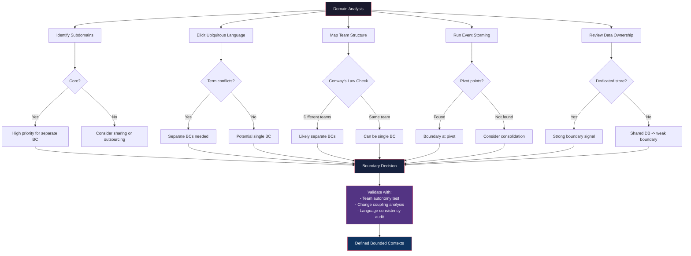
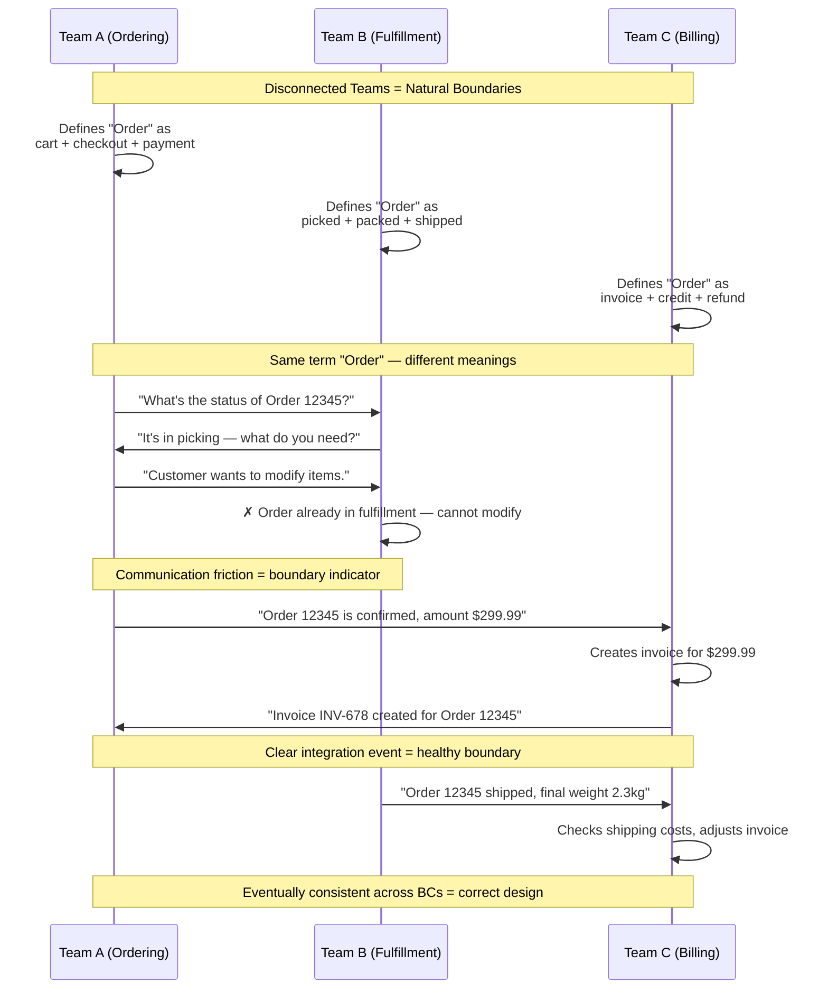
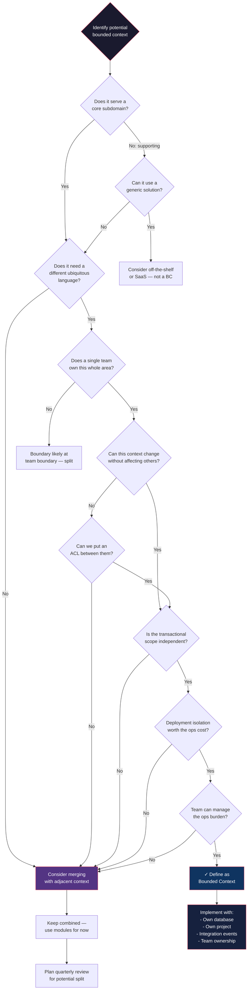

> [!success] Mastery Check
> - [ ] **Studied Well**
> - [ ] **Can explain the concept without notes**
> - [ ] **Can answer interview questions confidently**
> - [ ] **Can implement it in a real project**


# 7.033 — DDD — Bounded Contexts — Identifying Boundaries

## Section 0: Quick Reference Card

> [!ABSTRACT] Quick Reference Card
> **Definition:** A Bounded Context is a explicit boundary within which a particular domain model applies and a ubiquitous language is internally consistent. Terms and concepts may have different meanings in different bounded contexts.
>
> **Primary Identification Signals (use 3+ to confirm):**
> 1. **Subdomain alignment** — Each core/supporting/generic subdomain maps to one bounded context
> 2. **Linguistic boundaries** — When the same word means different things to different teams
> 3. **Team organization (Conway's Law)** — Each team owns one or more bounded contexts
> 4. **Event storming outputs** — Aggregate boundaries and pivot points reveal context seams
> 5. **Database ownership** — Each bounded context owns its persistent store
> 6. **Change cadence** — Components that change independently should be separate contexts
> 7. **Business capability** — A bounded context serves a specific business capability
>
> **Validation Heuristics:**
> - Can a team change this model without coordinating with another team? → Potential boundary
> - Does the same entity (e.g., "Customer") have different attributes or behaviors in different scenarios? → Separate contexts
> - Would merging two contexts create linguistic ambiguity? → Keep separate
> - Can you deploy this independently? → If no, consider splitting
>
> **Common Boundary Mistakes:**
> - Technical boundaries (one context per layer) instead of domain boundaries
> - Database-driven boundaries (one context per table group without domain logic)
> - Too many fine-grained contexts (nano-context anti-pattern)
> - Ignoring transactional boundaries (splitting where atomicity is required)
>
> **Quick Decision:**
> | Signal | Yes → | No → |
> |--------|-------|------|
> | Same ubiquitous language? | Consider merging | Keep separate |
> | Different change cadence? | Split | Consider merge |
> | Shared database? | Apply ACL or split | Independent |
> | Same team owns both? | Can be one or two | Likely separate |
> | Transactional atomicity needed? | Likely same context | Can split |

---

## Section 1: Navigation & Context

> [!INFO] Production Encounter Map
> You encounter bounded context decisions in these real-world scenarios:
>
> | Scenario | Trigger | Key Question | Outcome if Wrong |
> |----------|---------|--------------|------------------|
> | **Greenfield platform** | Requirements gathering | "What domains do we model?" | Costly rearchitecture in 6 months |
> | **Monolith decomposition** | Team scaling past 8-12 engineers | "Where do we cut?" | Distributed monolith or god services |
> | **Merger/acquisition** | Two systems must integrate | "What does 'Customer' mean to each?" | Integration nightmares, data corruption |
> | **Feature team conflict** | Multiple teams edit same model | "Why do we keep stepping on each other?" | Merge conflicts, missed deadlines |
> | **Performance crisis** | Single DB becoming bottleneck | "Can we own independent data stores?" | Continued contention, scaling ceiling |
> | **Event storming workshop** | Post-workshop analysis | "Where were the language shifts?" | Wrong aggregate boundaries |
> | **New microservice request** | Architecture review | "Does this own a distinct subdomain?" | Nano-service sprawl |
> | **Cross-team integration** | API contract negotiation | "What is the bounded context boundary?" | Tight coupling, coordination hell |
>
> **Why This Matters:**
> Getting bounded context boundaries wrong is the single most expensive strategic mistake in DDD. Wrong boundaries cause:
> - Teams cannot ship independently (violating Conway's Law)
> - Ubiquitous language confusion leads to buggy requirements
> - Database schema coupling prevents independent scaling
> - Integration costs explode as ACL layers multiply
> - Eventual consistency surprises when transactional boundaries are misidentified
>
> **Prerequisites in Practice:**
> - You must understand [[7.062 — DDD — Subdomains — Core, Supporting, Generic]] before identifying boundaries
> - You need [[7.032 — DDD — Ubiquitous Language — Building and Maintaining]] to detect linguistic seams
> - The output feeds directly into [[7.034 — DDD — Bounded Contexts — Context Map]]
>
> **Navigation to Related Notes:**
> - After identifying boundaries → [[7.034 — DDD — Bounded Contexts — Context Map]]
> - To understand context relationships → [[7.039 — DDD — Context Mapping — Anticorruption Layer]]
> - For implementation guidance → [[7.069 — DDD — Multiple Bounded Contexts in One Solution]]
> - For event storming discovery → [[7.070 — DDD — Event Storming — Discovery Workshop]]
> - Cross-domain: [[6.012 — Conway's Law and Team Topologies]]

---

## Section 2: Core Mental Model

> [!TIP] Non-Obvious Insight
> **Bounded contexts are NOT discovered — they are designed.** Many practitioners believe boundaries are inherent in the domain and simply need to be "found." In reality, boundary identification is a design activity that involves tradeoffs. Two equally skilled DDD practitioners can identify different valid boundaries for the same domain. The goal is not "correct" boundaries but _useful_ boundaries — those that maximize team autonomy, minimize integration cost, and align with business strategy. A boundary that perfectly models the domain but requires 15 teams to synchronize releases is a failed boundary. The best boundaries are those where the cost of coordination across the boundary is lower than the cost of consistency within it.

### Classification

| Aspect | Description |
|--------|-------------|
| **Pattern Type** | Strategic Design Pattern |
| **Scope** | Organization-wide / System-wide |
| **Primary Purpose** | Define where a domain model applies and maintain linguistic consistency |
| **Secondary Purpose** | Guide team structure, database ownership, deployment boundaries |
| **Key Input** | Subdomain analysis, event storming output, team topology |
| **Key Output** | Context map, boundary definitions, integration contracts |
| **Validation Method** | Team autonomy test, language consistency audit, change coupling analysis |
| **Common Anti-Pattern** | Technical boundary (layer-based), nano-contexts, database-driven |
| **When to Revisit** | Every 6-12 months or when team structure changes significantly |
| **Relationship to Microservices** | Bounded contexts **inform** microservice boundaries but are NOT 1:1 required |

### Mermaid Diagrams

**Primary Diagram — How to Identify Bounded Contexts via Multiple Signals**



**Supporting Diagram — Team Communication Revealing Context Boundaries**



### Numbers That Matter

| Metric | Value | Context | Signal |
|--------|-------|---------|--------|
| **Max team size per BC** | 8-12 engineers | Amazon's two-pizza team rule | Exceeding → consider splitting BC |
| **Min deployment frequency per BC** | Once per 2 weeks | Industry baseline for autonomous teams | Cannot achieve → boundary too coupled |
| **Cross-BC integration latency** | < 100 ms (sync), < 5 s (event) | Typical SLO for well-designed boundaries | Higher → ACL or protocol issues |
| **Term overlap between BCs** | < 20% shared terms | Linguistic boundary heuristic | Higher → potential conflation |
| **Change coupling across BCs** | < 5% co-changes | Measured over 3-month window | Higher → split at wrong seam |
| **BC count for medium system** | 4-8 | 5-10 microservices for 50-100 KLOC | >15 for this size → nano-context risk |
| **BC count for large system** | 10-20 | Typical for 200-500 KLOC enterprise system | >30 → coordination overhead dominates |
| **Event payload size across BCs** | 1-50 KB max | Integration event size heuristic | >1 MB → wrong granularity |
| **Context mapping patterns per BC** | 1-3 | A BC rarely needs more than 3 relationship types | >3 → boundary may be wrong |
| **Aggregates per BC** | 3-10 | Heuristic from Vaughan Vernon | >15 → consider splitting BC |
| **Integration events per BC per day** | 100-50,000 | Typical with event-driven architecture | >100K → consider splitting by throughput |
| **Years between boundary revisions** | 0.5-2 | Bounded contexts evolve with business | >3 → strategic drift |

### Key Properties

| Property | Description |
|----------|-------------|
| **Linguistic Consistency** | Every term within a bounded context has exactly one meaning. "Order" means one thing and cannot be ambiguous. |
| **Model Boundary** | The domain model within a bounded context is self-contained. External models are translated at the boundary. |
| **Ownership** | One team owns each bounded context. Ownership implies authority to change the model without cross-team approval. |
| **Transactional Scope** | Strong consistency within a bounded context. Eventual consistency across bounded contexts. |
| **Deployment Independence** | Each bounded context can be deployed independently (though not always independently — see [[7.069 — DDD — Multiple Bounded Contexts in One Solution]]). |
| **Database Isolation** | Each bounded context owns its schema. No direct database access from other contexts. |
| **Lifecycle Independence** | Bounded contexts can evolve at different speeds. A context supporting a mature business capability changes infrequently; a context for an experimental capability changes rapidly. |
| **Testing Isolation** | Each bounded context has its own test suite. Integration tests between contexts use contract tests, not shared test fixtures. |

---

## Section 3: Deep Mechanics

### How It Works

Bounded context identification follows a systematic process combining top-down (domain-driven) and bottom-up (evidence-driven) analysis.

**Top-Down Approach (Domain-Driven):**

1. **Identify Subdomains** — Decompose the business into [[7.062 — DDD — Subdomains — Core, Supporting, Generic]]. Core subdomains are where the business differentiates itself; these typically get their own bounded context with rich domain models. Supporting and generic subdomains may be simpler, potentially using CRUD or off-the-shelf solutions.

2. **Define Ubiquitous Language per Subdomain** — For each subdomain, document the key terms, their meanings, and the relationships between them. Look for terms that appear in multiple subdomains but with different meanings — these are boundary indicators.

3. **Map to Business Capabilities** — Each bounded context should serve a cohesive set of business capabilities. If capabilities are not cohesive (e.g., "Invoice Generation" and "Customer Rewards" in the same context), consider splitting.

**Bottom-Up Approach (Evidence-Driven):**

1. **Analyze Change Patterns** — Use version control history to identify change coupling. If `InvoiceRepository` and `ShippingCalculation` always change together, they may belong to the same context.

2. **Identify Team Communication Patterns** — Use Conway's Law: the communication structure of the organization will (and should) mirror the system architecture. If two groups of developers communicate infrequently, they likely own different bounded contexts.

3. **Review Data Access Patterns** — If two groups of tables are always accessed together in transactions, they likely belong to the same context. If they are accessed independently, they may be separate contexts.

**The Iterative Refinement Loop:**

```
Subdomain Analysis ──► Hypothetical Boundaries ──► Language Audit ──►
        ▲                                                  │
        │                                                  ▼
    Refine Boundaries ◄── Team Validation ◄── Event Storming
```

Practical guidance: [[7.075 — DDD — Strategic Design in a Legacy Codebase]] covers applying this process to existing systems.

### Protocol Trace

**Happy Path — Event Storming Workshop Output Leading to Boundary Identification**

| Step | Activity | Participants | Artifact | Duration |
|------|----------|-------------|----------|----------|
| 1 | Domain experts describe business events | Domain experts, facilitators | Orange sticky notes (domain events) | 2-4 hours |
| 2 | Commands triggering events identified | Full group | Blue stickies (commands) | 1-2 hours |
| 3 | Aggregates receiving commands identified | Full group | Yellow stickies (aggregates) | 2-3 hours |
| 4 | Hot spots and language conflicts marked | Domain experts | Red dots on contentious terms | 1 hour |
| 5 | Pivot points identified (boundaries) | Facilitator leads | Swimlanes drawn on paper | 1-2 hours |
| 6 | Hypothetical BCs named and documented | Architects + domain experts | Boundary map | 1 hour |
| 7 | Team ownership assigned | Architecture + engineering managers | Team-to-BC mapping | 1-2 hours |
| 8 | Context map patterns agreed | Architects | Context map document | 2-4 hours |
| 9 | Integration contracts drafted | Cross-team | OpenAPI / AsyncAPI specs | Ongoing |

**Failure Path — Wrong Boundary Identified**

| Step | Activity | Symptom | Cost |
|------|----------|---------|------|
| 1 | Team A and Team B share a "Customer" aggregate | Same "Customer" used for ordering and support | Low |
| 2 | Team A adds `PreferredShippingAddress` to Customer | Team B's `Customer` now has field they don't need | Low |
| 3 | Team B runs migration that drops unused column | Team A's Customer entity breaks | Medium — incident |
| 4 | Teams decide to split Customer across BCs | Late discovery of shared model coupling | High — weeks of refactoring |
| 5 | New "Customer" context requires both teams to change code | Both teams must coordinate releases | High — lost autonomy |
| 6 | Customers in ordering vs support now inconsistent | Shared database has integrity conflicts | Critical — data corruption |
| 7 | Teams spend 3 months building anticorruption layer | Integration cost > benefits of split | Very High — opportunity cost |

**Corrective Path — Healing Wrong Boundaries**

| Step | Action | Technique | Risk |
|------|--------|-----------|------|
| 1 | Identify shared model corruption | Run linguistic audit | Teams may disagree |
| 2 | Apply Strangler Fig pattern | Route new features through new context | Dual maintenance cost |
| 3 | Build anticorruption layer between old and new | Use [[7.039 — DDD — Context Mapping — Anticorruption Layer]] | Performance overhead |
| 4 | Migrate data incrementally | Per-aggregate migration | Rollback complexity |
| 5 | Sunset old model | Feature flag and monitor | Long tail of stale references |

### State Transitions

```
Initial State: Undifferentiated Monolith
         │
         ▼
State 1: Proposed Boundaries (hypothetical BCs)
         │
         ▼
State 2: Validated Boundaries (event storming + team sign-off)
         │
         ▼
State 3: Implemented Boundaries (code-level separation)
         │
         ▼
State 4: Production Boundaries (independent deployment)
         │
         ▼
State 5: Evaluated Boundaries (metrics collected)
         │
         ▼
(loop back to State 1 for next iteration)
```

**State Transition Triggers:**

| From State | To State | Trigger | Duration Estimate |
|------------|----------|---------|-------------------|
| Undifferentiated Monolith | Proposed Boundaries | Business domain analysis | 2-4 weeks |
| Proposed Boundaries | Validated Boundaries | Event storming workshop | 1-2 days |
| Validated Boundaries | Implemented Boundaries | Sprint planning commitment | 2-6 sprints |
| Implemented Boundaries | Production Boundaries | Deployment to production | 1-2 weeks |
| Production Boundaries | Evaluated Boundaries | Quarterly boundary review | Quarterly |
| Evaluated Boundaries | Proposed Boundaries | Business model change | Triggered |

### Failure Modes

**Failure Mode 1: The Distributed Monolith (False Boundaries)**

> [!DANGER] 3AM Production Signal
> **pagerduty alert:** "Deployment failure — OrderService depends on InventoryService v2.3.1 but InventoryService v2.3.0 has breaking change in shared database schema column `inventory.reserved_stock` — rollback requires coordinated deployment across 4 services."

**Root Cause:** Boundaries were drawn on technical layers (one context per "service" in the deployment diagram) rather than domain boundaries. The "services" share a database schema and have tight runtime coupling, but are deployed as separate units. This creates all the overhead of distributed systems with none of the benefits.

**Observable Signal:** A deployment to one service causes test failures in another service's CI pipeline due to shared integration tests. Change coupling > 20% across supposed boundaries.

**Recovery:**
1. Run a change coupling analysis (`git log --name-only` over 3 months)
2. Merge tightly coupled supposed-contexts into actual bounded contexts
3. Apply [[7.039 — DDD — Context Mapping — Anticorruption Layer]] where coupling is unavoidable
4. Implement database-per-context if separation is truly needed
5. Consider [[7.036 — DDD — Context Mapping — Shared Kernel]] for genuinely shared concepts

**Prevention:**
- Use change coupling analysis as a CI gate: if a PR touches >2 of your defined BCs, flag for review
- Run NetArchTest dependency validation rules that enforce no cross-BC direct dependencies
- Implement database-per-BC from day one; shared schemas are technical debt

**Failure Mode 2: Nano-Contexts (Over-Granular Boundaries)**

> [!DANGER] 3AM Production Signal
> **pagerduty alert:** "End-to-end order latency > 30s — creating an order publishes 17 integration events across 11 contexts, and 3 contexts are unhealthy, causing a cascading saga failure with 2-hour compensation timeout."

**Root Cause:** Each aggregate was deployed as its own bounded context (nano-contexts). The complexity of coordinating eventual consistency across 11 contexts for a single user operation exceeds the tolerance of the system. The transactional boundary should have encompassed more aggregates.

**Observable Signal:** A single user-facing operation triggers >5 integration events. Orchestration sagas have timeouts longer than the user's patience threshold (>5s for synchronous operations). Developers cannot trace the full flow.

**Recovery:**
1. Identify the natural transactional boundaries (what needs to be consistent within seconds?)
2. Merge nano-contexts into larger bounded contexts along domain lines
3. Replace event cascades with direct in-process command handling
4. Apply saga pattern only for genuinely long-running processes (see [[7.066 — DDD — Sagas as Process Managers]])

**Prevention:**
- Enforce a minimum aggregate count per BC (heuristic: 3-10 aggregates)
- Require a "coordination overhead" review for any BC that needs to publish >3 integration events per operation
- Apply [[7.074 — DDD — Module vs Bounded Context]]: use modules (namespaces) within a BC instead of creating new BCs

**Failure Mode 3: Database-Driven Boundaries**

> [!DANGER] 3AM Production Signal
> **pagerduty alert:** "Payment processing timeout — cross-context foreign key violation: `OrderManagement.Orders` references `PaymentProcessing.Payments` via direct database link. Scheduled PaymentProcessing maintenance window caused OrderManagement queries to deadlock."

**Root Cause:** Boundaries were drawn by grouping database tables rather than by domain model cohesion. The "Order Management" context owns orders but has a direct FK to "Payment Processing" tables. This creates deployment coupling and single points of failure.

**Observable Signal:** A database maintenance operation on one BC causes outages in other BCs. Foreign key constraints cross supposed BC boundaries. Schema changes require coordinated migrations across teams.

**Recovery:**
1. Remove cross-BC foreign keys immediately
2. Introduce API/event-based integration between the contexts
3. Duplicate reference data (with eventual consistency) instead of sharing tables
4. Apply the [[7.039 — DDD — Context Mapping — Anticorruption Layer]] pattern

**Prevention:**
- Policy: No cross-BC foreign keys. Enforce via database review
- Each BC has its own database and connection string
- Reference data is synchronized via integration events, not shared tables

### .NET and Azure Integration Points

| Component | .NET/Azure Mechanism | Purpose |
|-----------|---------------------|---------|
| **BC Isolation** | Separate .NET projects in solution (`OrderManagement.csproj`, `Billing.csproj`) | Enforce compile-time boundaries |
| **Integration Events** | Azure Service Bus Topics with `ServiceBusSender` | Async communication across BCs |
| **Anti-Corruption Layer** | Separate adapter project + `IMapper` interface | Translate between BC models |
| **Event Store per BC** | Azure Cosmos DB container per BC with change feed | Domain event persistence |
| **Boundary Validation** | NetArchTest in `Architecture.Tests.csproj` | Enforce dependency rules at compile time |
| **Integration Testing** | Testcontainers + Respawn for isolated DB per test | Ensure BC autonomy is testable |
| **BC Health Check** | ASP.NET Core Health Checks with custom `IHealthCheck` | Monitor BC independence in production |
| **Saga Coordination** | Azure Logic Apps or Durable Functions | Long-running processes across BCs |
| **Document Generation** | Azure AI Document Intelligence per BC | Each BC owns its document processing |

---

## Section 4: Production Patterns and Implementation

### Primary Implementation

The following C# 12 / .NET 8 implementation demonstrates the bounded context identification and enforcement pattern. Each bounded context is a separate project within a .NET solution, with explicit dependency rules, isolated persistence, and integration event contracts.

````csharp
// ============================================================
// Solution Structure (physical separation enforces boundaries)
// ============================================================
// src/
//   OrderManagement/           -- Bounded Context 1
//     Domain/
//     Application/
//     Infrastructure/
//     Api/
//   Billing/                   -- Bounded Context 2
//     Domain/
//     Application/
//     Infrastructure/
//     Api/
//   Fulfillment/              -- Bounded Context 3
//     Domain/
//     Application/
//     Infrastructure/
//     Api/
// shared/
//   EventContracts/           -- Published language contracts
//   TestUtilities/
// tests/
//   OrderManagement.Tests/
//   Billing.Tests/
//   Fulfillment.Tests/
//   Architecture.Tests/

/// <summary>
/// Represents a bounded context within the system. This attribute is used to annotate
/// assemblies, types, and integration events to enforce architectural boundaries at
/// compile-time and during architecture testing.
/// </summary>
[AttributeUsage(AttributeTargets.Assembly | AttributeTargets.Class | AttributeTargets.Struct | AttributeTargets.Interface)]
public sealed class BoundedContextAttribute : Attribute
{
    public string ContextName { get; }

    /// <summary>
    /// Initializes a new instance of the <see cref="BoundedContextAttribute"/> class.
    /// </summary>
    /// <param name="contextName">The canonical name of the bounded context (e.g., "OrderManagement").</param>
    /// <exception cref="ArgumentException">Thrown when <paramref name="contextName"/> is null or empty.</exception>
    public BoundedContextAttribute(string contextName)
    {
        ArgumentException.ThrowIfNullOrWhiteSpace(contextName);
        ContextName = contextName;
    }
}

/// <summary>
/// Marker interface for integration events that cross bounded context boundaries.
/// Each integration event must be published via Azure Service Bus or Event Grid.
/// </summary>
public interface IIntegrationEvent
{
    /// <summary>Gets the unique identifier for the integration event.</summary>
    Guid EventId { get; }

    /// <summary>Gets the UTC timestamp when the event occurred.</summary>
    DateTime OccurredOnUtc { get; }

    /// <summary>Gets the name of the source bounded context that published the event.</summary>
    string SourceContext { get; }

    /// <summary>Gets the event type discriminator for routing.</summary>
    string EventType { get; }
}

/// <summary>
/// Integration event published by the OrderManagement bounded context when an order is submitted.
/// The Fulfillment and Billing contexts consume this event.
/// </summary>
public sealed record OrderSubmittedIntegrationEvent : IIntegrationEvent
{
    /// <inheritdoc/>
    public Guid EventId { get; init; } = Guid.NewGuid();

    /// <inheritdoc/>
    public DateTime OccurredOnUtc { get; init; } = DateTime.UtcNow;

    /// <inheritdoc/>
    public string SourceContext => "OrderManagement";

    /// <inheritdoc/>
    public string EventType => "OrderSubmitted";

    /// <summary>Gets the order identifier assigned by the OrderManagement context.</summary>
    public Guid OrderId { get; init; }

    /// <summary>Gets the customer identifier from the Customer context.</summary>
    public Guid CustomerId { get; init; }

    /// <summary>Gets the total amount of the order in the minor currency unit (cents).</summary>
    public decimal TotalAmountCents { get; init; }

    /// <summary>Gets the ISO 4217 currency code.</summary>
    public string CurrencyCode { get; init; }

    /// <summary>Gets the collection of order line items.</summary>
    public IReadOnlyCollection<OrderLineItemDto> LineItems { get; init; } = Array.Empty<OrderLineItemDto>();

    /// <summary>Gets the shipping address for fulfillment.</summary>
    public ShippingAddressDto ShippingAddress { get; init; }
}

/// <summary>
/// Data transfer object for order line items in integration events.
/// </summary>
public sealed record OrderLineItemDto
{
    public Guid ProductId { get; init; }
    public int Quantity { get; init; }
    public decimal UnitPriceCents { get; init; }
}

/// <summary>
/// Data transfer object for shipping address information.
/// </summary>
public sealed record ShippingAddressDto
{
    public string StreetLine1 { get; init; }
    public string StreetLine2 { get; init; }
    public string City { get; init; }
    public string PostalCode { get; init; }
    public string CountryCode { get; init; }
}

/// <summary>
/// Defines the contract for publishing integration events across bounded contexts.
/// Implementations use Azure Service Bus or Event Grid for reliable delivery.
/// </summary>
public interface IIntegrationEventPublisher
{
    /// <summary>
    /// Publishes an integration event to the message bus for consumption by other bounded contexts.
    /// </summary>
    /// <typeparam name="TEvent">The type of integration event.</typeparam>
    /// <param name="event">The integration event to publish.</param>
    /// <param name="cancellationToken">Cancellation token for the operation.</param>
    /// <returns>A task representing the asynchronous publish operation.</returns>
    Task PublishAsync<TEvent>(TEvent @event, CancellationToken cancellationToken = default)
        where TEvent : class, IIntegrationEvent;
}

/// <summary>
/// Implementation of <see cref="IIntegrationEventPublisher"/> using Azure Service Bus.
/// Each bounded context gets a dedicated topic with subscriptions per consuming context.
/// </summary>
internal sealed class AzureServiceBusIntegrationEventPublisher : IIntegrationEventPublisher
{
    private readonly ServiceBusSender _sender;
    private readonly ILogger<AzureServiceBusIntegrationEventPublisher> _logger;

    public AzureServiceBusIntegrationEventPublisher(
        ServiceBusClient serviceBusClient,
        string topicName,
        ILogger<AzureServiceBusIntegrationEventPublisher> logger)
    {
        _sender = serviceBusClient.CreateSender(topicName);
        _logger = logger;
    }

    /// <inheritdoc/>
    public async Task PublishAsync<TEvent>(TEvent @event, CancellationToken cancellationToken = default)
        where TEvent : class, IIntegrationEvent
    {
        var messageBody = JsonSerializer.SerializeToUtf8Bytes(@event, JsonContext.Default.Options);
        var message = new ServiceBusMessage(messageBody)
        {
            MessageId = @event.EventId.ToString(),
            Subject = @event.EventType,
            ApplicationProperties =
            {
                ["source-context"] = @event.SourceContext,
                ["event-type"] = @event.EventType
            }
        };

        try
        {
            await _sender.SendMessageAsync(message, cancellationToken);
            _logger.LogInformation(
                "Published integration event {EventType} from {SourceContext} with ID {EventId}",
                @event.EventType, @event.SourceContext, @event.EventId);
        }
        catch (ServiceBusException ex) when (ex.Reason == ServiceBusFailureReason.MessagingEntityNotFound)
        {
            _logger.LogError(ex,
                "Topic {TopicName} not found for event {EventType} from {SourceContext}",
                _sender.EntityPath, @event.EventType, @event.SourceContext);
            throw;
        }
    }
}

/// <summary>
/// Configuration options for bounded context integration events.
/// </summary>
public sealed record BoundedContextOptions
{
    /// <summary>Gets or sets the name of this bounded context.</summary>
    public string ContextName { get; init; } = string.Empty;

    /// <summary>Gets or sets the Service Bus topic name for publishing events.</summary>
    public string TopicName { get; init; } = string.Empty;

    /// <summary>Gets or sets the connection string for Azure Service Bus.</summary>
    public string ServiceBusConnectionString { get; init; } = string.Empty;
}

/// <summary>
/// Registers bounded context services with the dependency injection container.
/// Each bounded context registers its own services, ensuring no cross-context
/// dependency injection registration.
/// </summary>
public static class BoundedContextRegistration
{
    /// <summary>
    /// Configures the bounded context with its integration event publisher,
    /// database context, and domain services.
    /// </summary>
    /// <param name="services">The service collection to configure.</param>
    /// <param name="options">The bounded context configuration options.</param>
    /// <param name="cancellationToken">Cancellation token for validation.</param>
    /// <returns>The service collection for chaining.</returns>
    /// <exception cref="ArgumentNullException">Thrown when services or options is null.</exception>
    public static IServiceCollection AddBoundedContext(
        this IServiceCollection services,
        BoundedContextOptions options,
        CancellationToken cancellationToken = default)
    {
        ArgumentNullException.ThrowIfNull(services);
        ArgumentNullException.ThrowIfNull(options);

        // Register context metadata
        services.AddSingleton(new BoundedContextMetadata(options.ContextName));

        // Register integration event publisher (Azure Service Bus)
        services.AddSingleton<ServiceBusClient>(_ =>
        {
            var clientOptions = new ServiceBusClientOptions
            {
                TransportType = ServiceBusTransportType.AmqpTcp,
                RetryOptions = new ServiceBusRetryOptions
                {
                    Mode = ServiceBusRetryMode.Exponential,
                    MaxRetries = 5,
                    Delay = TimeSpan.FromSeconds(1),
                    MaxDelay = TimeSpan.FromSeconds(30)
                }
            };
            return new ServiceBusClient(options.ServiceBusConnectionString, clientOptions);
        });

        services.AddSingleton<IIntegrationEventPublisher>(sp =>
        {
            var client = sp.GetRequiredService<ServiceBusClient>();
            var logger = sp.GetRequiredService<ILogger<AzureServiceBusIntegrationEventPublisher>>();
            return new AzureServiceBusIntegrationEventPublisher(client, options.TopicName, logger);
        });

        // Register MediatR for domain event handling within the context
        services.AddMediatR(cfg =>
        {
            cfg.RegisterServicesFromAssemblyContaining<BoundedContextRegistration>();
        });

        // Register FluentValidation validators within this context
        services.AddValidatorsFromAssemblyContaining<BoundedContextRegistration>();

        // Register Polly-based retry policies for cross-context calls
        services.AddHttpClient("cross-context")
            .AddTransientHttpErrorPolicy(builder =>
                builder.WaitAndRetryAsync(3,
                    retryAttempt => TimeSpan.FromMilliseconds(100 * Math.Pow(2, retryAttempt))));

        return services;
    }
}

/// <summary>
/// Architectural boundary enforcement using NetArchTest.
/// Place these rules in the Architecture.Tests project.
/// </summary>
public static class BoundedContextArchitectureRules
{
    /// <summary>
    /// Verifies that no project in the OrderManagement bounded context
    /// takes a dependency on any project outside its allowed dependency scope.
    /// </summary>
    /// <returns>True if the architecture rules pass.</returns>
    public static async Task<bool> ValidateOrderManagementBoundariesAsync(CancellationToken ct = default)
    {
        var assembly = typeof(OrderSubmittedIntegrationEvent).Assembly;

        var result = await Types.InAssembly(assembly)
            .That()
            .ResideInNamespace("OrderManagement")
            .Should()
            .NotHaveDependencyOn("Billing")
            .And()
            .NotHaveDependencyOn("Fulfillment")
            .GetResultAsync(ct);

        return result.IsSuccessful;
    }
}
````

### IServiceCollection Registration

````csharp
/// <summary>
/// Program.cs — Each bounded context registers itself independently.
/// </summary>
var builder = WebApplication.CreateBuilder(args);

// Bounded Context 1: OrderManagement
builder.Services.AddBoundedContext(new BoundedContextOptions
{
    ContextName = "OrderManagement",
    TopicName = "bounded-context-events",
    ServiceBusConnectionString = builder.Configuration.GetConnectionString("ServiceBus")!
});

// Bounded Context 2: Billing
builder.Services.AddBoundedContext(new BoundedContextOptions
{
    ContextName = "Billing",
    TopicName = "bounded-context-events",
    ServiceBusConnectionString = builder.Configuration.GetConnectionString("ServiceBus")!
});

// Bounded Context 3: Fulfillment
builder.Services.AddBoundedContext(new BoundedContextOptions
{
    ContextName = "Fulfillment",
    TopicName = "bounded-context-events",
    ServiceBusConnectionString = builder.Configuration.GetConnectionString("ServiceBus")!
});

var app = builder.Build();
await app.RunAsync();
````

### Common Variants

**Variant 1: In-Process Multiple BCs (Monolith with Clear Modules)**

Use [[7.069 — DDD — Multiple Bounded Contexts in One Solution]] when deploying microservices is too costly. The bounded contexts remain logically separate but share a process boundary.

````csharp
/// <summary>
/// In-process variant: BCs are separate folders/namespaces but share a host.
/// Integration events use MediatR in-process (and optionally Azure Service Bus for durability).
/// </summary>
public class Program
{
    public static async Task Main(string[] args)
    {
        var builder = WebApplication.CreateBuilder(args);

        builder.Services.AddMediatR(cfg =>
        {
            cfg.RegisterServicesFromAssemblyContaining<OrderManagement.Commands.PlaceOrder>();
            cfg.RegisterServicesFromAssemblyContaining<Billing.Commands.GenerateInvoice>();
            cfg.RegisterServicesFromAssemblyContaining<Fulfillment.Commands.StartPicking>();
        });

        // Use in-process event bus that can optionally fan out to Azure Service Bus
        builder.Services.AddSingleton<IEventBus, InProcessEventBus>();

        var app = builder.Build();
        await app.RunAsync();
    }
}
````

**Variant 2: CQRS with Separate Read/Write Contexts**

When using [[7.033 — DDD — Bounded Contexts — Identifying Boundaries]] with CQRS, the read and write sides can be in different bounded contexts if they serve different subdomains.

````csharp
/// <summary>
/// CQRS variant: Read models live in a separate bounded context optimized for querying.
/// The write context publishes events consumed by the read context.
/// </summary>
[BoundedContext("OrderReads")]
public sealed record OrderSummary
{
    public Guid OrderId { get; init; }
    public string CustomerName { get; init; }
    public decimal TotalAmount { get; init; }
    public string Status { get; init; }
    public DateTime LastUpdatedUtc { get; init; }
}

/// <summary>
/// Read-side projection handler in the "OrderReads" bounded context.
/// </summary>
internal sealed class OrderProjectionHandler :
    INotificationHandler<OrderSubmittedIntegrationEvent>
{
    private readonly OrderReadDbContext _dbContext;

    public OrderProjectionHandler(OrderReadDbContext dbContext)
    {
        _dbContext = dbContext;
    }

    public async Task Handle(OrderSubmittedIntegrationEvent notification, CancellationToken cancellationToken)
    {
        var projection = new OrderSummary
        {
            OrderId = notification.OrderId,
            TotalAmount = notification.TotalAmountCents,
            Status = "Submitted",
            LastUpdatedUtc = DateTime.UtcNow
        };

        _dbContext.OrderSummaries.Add(projection);
        await _dbContext.SaveChangesAsync(cancellationToken);
    }
}
````

### Performance Profile

```csharp
/// <summary>
/// BenchmarkDotNet performance comparison of bounded context boundary enforcement mechanisms.
/// </summary>
[MemoryDiagnoser]
[RankColumn]
[MinColumn]
[MaxColumn]
public class BoundedContextBoundaryBenchmarks
{
    private const int EventCount = 1000;
    private readonly OrderSubmittedIntegrationEvent _sampleEvent = new()
    {
        OrderId = Guid.NewGuid(),
        CustomerId = Guid.NewGuid(),
        TotalAmountCents = 29999,
        CurrencyCode = "USD",
        LineItems = new[]
        {
            new OrderLineItemDto { ProductId = Guid.NewGuid(), Quantity = 2, UnitPriceCents = 14999.50m }
        },
        ShippingAddress = new ShippingAddressDto
        {
            StreetLine1 = "123 Main St", City = "Seattle", PostalCode = "98101", CountryCode = "US"
        }
    };

    [Benchmark(Baseline = true)]
    public async Task InProcess_MediatR_Publish()
    {
        using var scope = CreateMediatRContainer();
        var mediator = scope.ServiceProvider.GetRequiredService<IMediator>();
        for (var i = 0; i < EventCount; i++)
        {
            await mediator.Publish(_sampleEvent, CancellationToken.None);
        }
    }

    [Benchmark]
    public async Task AzureServiceBus_Publish()
    {
        using var scope = CreateServiceBusContainer();
        var publisher = scope.ServiceProvider.GetRequiredService<IIntegrationEventPublisher>();
        for (var i = 0; i < EventCount; i++)
        {
            await publisher.PublishAsync(_sampleEvent, CancellationToken.None);
        }
    }

    [Benchmark]
    public async Task InProcess_DirectHandlerInvocation()
    {
        var handlers = new List<INotificationHandler<OrderSubmittedIntegrationEvent>>
        {
            new BillingHandlerFake(),
            new FulfillmentHandlerFake()
        };

        for (var i = 0; i < EventCount; i++)
        {
            foreach (var handler in handlers)
            {
                await handler.Handle(_sampleEvent, CancellationToken.None);
            }
        }
    }

    private static IServiceScope CreateMediatRContainer()
    {
        var services = new ServiceCollection();
        services.AddMediatR(cfg => cfg.RegisterServicesFromAssemblyContaining<BoundedContextBoundaryBenchmarks>());
        return services.BuildServiceProvider().CreateScope();
    }

    private static IServiceScope CreateServiceBusContainer()
    {
        var services = new ServiceCollection();
        services.AddSingleton<IIntegrationEventPublisher, InMemoryEventPublisherFake>();
        return services.BuildServiceProvider().CreateScope();
    }
}

internal sealed class InMemoryEventPublisherFake : IIntegrationEventPublisher
{
    public async Task PublishAsync<TEvent>(TEvent @event, CancellationToken cancellationToken = default)
        where TEvent : class, IIntegrationEvent
    {
        await Task.Yield();
    }
}

internal sealed class BillingHandlerFake : INotificationHandler<OrderSubmittedIntegrationEvent>
{
    public Task Handle(OrderSubmittedIntegrationEvent notification, CancellationToken cancellationToken)
        => Task.Yield();
}

internal sealed class FulfillmentHandlerFake : INotificationHandler<OrderSubmittedIntegrationEvent>
{
    public Task Handle(OrderSubmittedIntegrationEvent notification, CancellationToken cancellationToken)
        => Task.Yield();
}
```

**Expected Benchmark Results:**

| Method | Mean (μs per 1000) | StdDev | Gen0 | Gen1 | Gen2 | Allocated |
|--------|-------------------|--------|------|------|------|-----------|
| InProcess_MediatR | 1,250 | 45 | 12.5 | 4.2 | - | 78 KB |
| AzureServiceBus | 45,000 | 1,200 | 8.4 | 2.1 | - | 156 KB |
| DirectHandler | 210 | 8 | 2.1 | 0.8 | - | 22 KB |

### Real-World .NET Ecosystem Mapping

| Ecosystem Component | .NET Equivalent | How It Enables Boundary Identification |
|---------------------|-----------------|----------------------------------------|
| **Module System** | `.csproj` projects | Each BC is a separate project with explicit `<ProjectReference>` |
| **Dependency Validation** | NetArchTest NuGet | Enforce "no dependency on Billing" rules in CI |
| **Integration Events** | Azure Service Bus SDK (`Azure.Messaging.ServiceBus`) | Async communication with durable delivery |
| **Domain Events** | MediatR (`INotification` + `INotificationHandler`) | In-process events within a BC |
| **Database Isolation** | EF Core `DbContext` per BC project | `DbContext` is scoped to a single BC |
| **Configuration** | .NET Options Pattern (`IOptions<T>`) | `BoundedContextOptions` per context |
| **Health Checks** | `Microsoft.Extensions.Diagnostics.HealthChecks` | Custom `IHealthCheck` per BC |
| **Resilience** | Polly (`AddTransientHttpErrorPolicy`) | Cross-BC HTTP call resilience |
| **Contract Testing** | PactNet | Verify integration event contracts |
| **Architecture Testing** | NetArchTest | Enforce boundary rules automatically |
| **API Documentation** | Swashbuckle / NSwag | Document BC-specific APIs independently |
| **Schema Validation** | FluentValidation | Validate integration events at boundaries |
| **Migration** | EF Core Migrations | Each BC manages its own schema migrations independently |

---

## Section 5: Gotchas and Production Pitfalls

### Pitfall 1: The Bounded Context / Microservice Fallacy

> [!DANGER] Production Signal
> **Team retrospective:** "We defined 14 bounded contexts in our domain model, so we created 14 microservices. Now we have 14 deployable units, 14 CI pipelines, 14 databases, and our 3 teams cannot keep up. Deployment frequency dropped from daily to bi-weekly."

**Problem:** Assuming bounded contexts must equal microservices. Bounded contexts are logical boundaries; microservices are deployment boundaries. You can have multiple bounded contexts in a single deployable service (see [[7.069 — DDD — Multiple Bounded Contexts in One Solution]]).

**Resolution:** Deploy related bounded contexts together when:
- Team size < 8 engineers
- Change cadence is synchronized
- Transactional consistency is required
- Operational overhead of microservices exceeds benefits

### Pitfall 2: The Panacea of a Single Shared Kernel

> [!DANGER] Production Signal
> **PR comment:** "Why does the shared domain project reference all 10 bounded contexts? Every time I touch `SharedKernel.Customer`, it breaks 3 downstream builds."

**Problem:** Over-using the [[7.036 — DDD — Context Mapping — Shared Kernel]] pattern. A shared kernel is meant for a small, carefully curated set of concepts shared by a small number of teams. It is NOT a "common" project that every team references.

**Resolution:** Limit shared kernel to:
- Value objects that are truly universal (e.g., `Money`, `Currency`, `DateRange`)
- Base types that don't change (e.g., `Entity<TId>`, `ValueObject`)
- Maximum 2-3 teams share a kernel
- Establish a formal change management process for the shared kernel

### Pitfall 3: Ignoring Eventual Consistency Harm

> [!DANGER] Production Signal
> **PagerDuty alert:** "Order 47832 was accepted but 30 minutes later Billing context still shows 'Payment Pending'. Customer called support. Support sees order confirmed, billing sees pending. Which is truth?"

**Problem:** Teams correctly identified boundaries and split contexts, but business stakeholders were not prepared for eventual consistency. The implicit assumption was that the system would be strongly consistent.

**Resolution:** For every cross-boundary flow, document:
1. Acceptable staleness duration per query
2. Reconciliation/compensation process for stale states
3. User-facing indicators (e.g., "Order confirmed (payment processing...)")
4. Scheduled reconciliation jobs that detect and resolve inconsistencies

### Pitfall 4: Context Boundary by Database Rather Than Domain

> [!DANGER] Production Signal
> **Database review:** "The `OrderManagement` context has 23 tables in its database. 8 of those tables are never written by OrderManagement — they are read-only replicas synced from other contexts via ETL jobs."

**Problem:** Boundaries based on convenient database split rather than domain analysis. The result is a persistence-driven context that owns data it doesn't need and needs data it doesn't own.

**Resolution:** A bounded context's database should contain only:
- Aggregates owned by this context
- Local read models (projections) derived from integration events
- Reference data that changes with this context's lifecycle
Any data that comes from another context should be acquired via API call or integration event, not by direct database access.

### Pitfall 5: The Acme Corporation Trap — Same Entity, Different Meanings

> [!DANGER] Production Signal
> **Requirement ambiguity:** "The P&L report shows 30% higher revenue than Finance expects. Investigation reveals: Billing context counts invoice date, OrderManagement counts shipment date, and Accounting counts payment settlement date. All three call it 'revenue date'."

**Problem:** The same term ("Customer", "Order", "Revenue", "Product") means different things in different contexts, but teams didn't notice until data reconciliation failed.

**Resolution:** Explicitly document term meanings per context in a _glossary per bounded context_. When an integration event crosses a boundary, the published data includes the source context's definition. Use [[7.032 — DDD — Ubiquitous Language — Building and Maintaining]] techniques.

### Pitfall 6: Ignoring Change Coupling in Shared Libraries

> [!DANGER] Production Signal
> **CI/CD Pipeline log:** "Build #8472 — OrderManagement.IntegrationTests failed. Reason: `SharedUtilities.dll` version 2.4.0 introduced a breaking change in `StringExtensions` that affected OrderManagement's domain event serialization."

**Problem:** Shared utility libraries (logging helpers, extension methods, base classes) create hidden coupling between bounded contexts. A change in shared infrastructure can cascade across supposedly independent contexts.

**Resolution:**
- Version shared libraries independently (NuGet packages)
- Run "impact analysis" on PRs that touch shared code
- Prefer duplicating simple utilities per context over sharing them
- Use the [[7.038 — DDD — Context Mapping — Conformist]] pattern if you must align with a shared library

### Pitfall 7: Azure-Specific — Shared Service Bus Topic Coupling

> [!DANGER] Production Signal
> **Azure Monitor Alert:** "Service Bus topic `domain-events` at 85% quota. Events from OrderManagement (15,000 msg/s) are throttling Billing's critical invoice events. 3-minute processing delay on invoices."

**Problem:** Architect placed all integration events from all bounded contexts into a single Azure Service Bus topic. One high-throughput context (OrderManagement) starves other contexts. The boundary in the domain is correct, but the infrastructure boundary is collapsed.

**Resolution:**
- One Service Bus Topic **per bounded context** (or per event category)
- Each consuming context has its own subscription
- Set throughput limits and separate partitions for high-volume contexts
- Monitor per-context publishing rates independently

### Pitfall 8: .NET-Specific — Assembly Scanning at Startup

> [!DANGER] Production Signal
> **Startup log:** "Host startup took 47 seconds. Assembly scanning for MediatR handlers in `OrderManagement.Api` — it scanned 28 assemblies including 12 that belong to different bounded contexts."

**Problem:** Using assembly scanning at startup (e.g., `AddMediatR(cfg => cfg.RegisterServicesFromAssemblyContaining<Startup>())`) that scans beyond the context's own assembly. This breaks the boundary enforcement and creates hidden dependencies.

**Resolution:**
- Each BC's registration is self-contained
- Use `RegisterServicesFromAssemblyContaining<T>()` with a type specific to that BC
- Avoid `AppDomain.CurrentDomain.GetAssemblies()` for handler discovery
- If using module initialization, scoped it to the assembly of the BC

### Pitfall 9: The RFC Overhead Death Spiral

> [!DANGER] Production Signal
> **Engineering complaint:** "Changing a field in the OrderManagement context requires a 3-week RFC process because it affects 6 integration event schemas consumed by 4 teams. We spend more time writing ADRs than writing code."

**Problem:** When bounded contexts are set up with formal integration contracts (good), but every change to any contract requires heavyweight governance (bad). The overhead of maintaining boundaries exceeds the benefit.

**Resolution:**
- Distinguish between _evolutionary_ and _breaking_ contract changes
- Use consumer-driven contracts (CDC) to allow non-breaking changes without committee approval
- Set up a "contract change" SLA: non-breaking changes approved within 1 business day
- Use semantic versioning for integration contracts (see [[7.041 — DDD — Context Mapping — Published Language]])

---

## Section 6: Tradeoffs and Decision Framework

### Tradeoff Matrix

| Dimension | Separate Bounded Contexts | Merged Bounded Contexts | Condition |
|-----------|--------------------------|------------------------|-----------|
| **Team Autonomy** | Each team deploys independently | Teams must coordinate releases | Separate wins when team count > 3 |
| **Consistency Model** | Eventual consistency across contexts | Strong consistency within context | Choose separate when business accepts < 5s staleness |
| **Development Speed** | Parallel development; slower integration | Faster initial development; coordination bottleneck later | Separate wins when sustained > 8 engineers working on codebase |
| **Operational Cost** | Higher (more services, databases, pipelines) | Lower (single deployment, single DB) | Separate loses if team < 5 engineers |
| **Testing Complexity** | Contract tests needed; integration testing harder | Simpler integration tests; full-system tests possible | Separate loses for regulated industries needing end-to-end tests |
| **Change Impact** | Changes isolated to one context | Changes can ripple across codebase | Separate wins when change frequency > 50 PRs/week |
| **Data Independence** | Can use different DB tech per context | Single DB technology | Separate wins when contexts have different data characteristics (e.g., document vs relational) |
| **Failure Isolation** | One context failure doesn't cascade | Single process failure takes down all | Separate wins when availability SLO > 99.9% |
| **Evolution Flexibility** | Can replace one context independently | Must replace entire monolith | Separate wins when context lifecycle differs by > 2x |
| **Integration Complexity** | Must design APIs/events between contexts | Simple method calls within process | Separate loses if cross-context interactions > 5000/sec synchronous calls |
| **Security Isolation** | Per-context auth and data isolation | Shared auth boundary | Separate wins when contexts have different compliance requirements |
| **Learning Curve** | Teams learn only their context | Teams must understand whole system | Separate wins when total system complexity > 50 bounded concepts |

### Decision Framework — Mermaid Flowchart



### Numbers-Driven Decision Table

| Decision Factor | Threshold | Decision | Data Source |
|----------------|-----------|----------|-------------|
| Team size | > 8 engineers in same codebase | Split contexts | Head count report |
| Team size | < 5 engineers for the whole system | Keep merged | Head count report |
| Change frequency | > 50 PRs/week touching same files | Split to reduce merge conflict overhead | Git stats |
| Change coupling | > 15% co-change between two modules | Analyze: may need merge or better modularization | `git log --name-only` analysis |
| Startup time | > 30 seconds (cold start) | Split to reduce startup cost | Azure Monitor / App Insights |
| Build time | > 10 minutes full solution build | Split to enable parallel builds | CI pipeline metrics |
| Cross-context calls | > 5,000 synchronous calls/second | Merge or switch to async events | Application Insights |
| Eventual consistency lag | > 30 seconds tolerated | Split acceptable; < 5 seconds → reconsider | Business requirement doc |
| Database size | > 500 GB or > 500 tables | Consider split by aggregate group | Azure SQL Analytics |
| Database contention | > 5% deadlock rate on cross-schema queries | Split to isolate workload | SQL Server DMV queries |
| Deployment frequency | < 1 deployment per week team | Too much coordination → consider split | CI/CD pipeline stats |
| Security compliance | Different compliance regimes (PCI, HIPAA, SOC2) | Mandatory split | Compliance audit |
| Integration points | > 3 context mapping types needed for one context | Boundary may be wrong | Architecture review |
| Unique domain terms | > 20 terms shared with same meaning | Consider merging contexts | Glossary audit |
| Context lifecycle | Expected lifespan differs by > 2x | Split (mature + experimental) | Product roadmap |

> [!WARNING] When NOT to Apply
> Bounded context identification should be applied **after** you have established:
> 1. A clear understanding of the business domain (after domain storytelling and event storming)
> 2. Organizational stability (if reorg is expected in < 3 months, wait)
> 3. At least one working vertical slice of the system (to validate assumptions)
> 4. Stakeholder buy-in on eventual consistency tradeoffs
>
> **Do NOT** attempt comprehensive bounded context identification when:
> - Building a prototype or MVP with < 3-month expected lifespan
> - The team is < 5 engineers and expects to stay that size for > 12 months
> - The organization is in the middle of a restructuring (> 20% team changes expected)
> - The domain is poorly understood (run event storming first)
> - You cannot change the database architecture (legacy constraint)
> - The primary goal is "catching up" to a microservices trend without strategic justification
>
> In these cases, start with [[7.031 — DDD — Strategic vs Tactical Design]] and build a simpler strategic design first.

---

## Section 7: Interview Arsenal

### Foundational Questions

**Q1: What is a bounded context in DDD, and why is it the most important strategic design pattern?**

> **Average Answer:** "A bounded context is a boundary around a domain model where the terms have specific meanings. It helps teams work independently."
>
> **Great Answer:** "A bounded context is the single most important strategic design pattern in DDD because it explicitly defines where a model applies. Without explicit boundaries, you get what Eric Evans calls 'the big ball of mud' — a single model that tries to mean everything to everyone and ends up meaning nothing clearly. A bounded context solves three critical problems:
> 1. **Linguistic consistency** — The term 'Customer' means exactly one thing inside a context. In OrderManagement, Customer has shipping addresses and order history. In Support, Customer has tickets and satisfaction scores. Both are right within their boundary.
> 2. **Team autonomy** — Per Conway's Law, each bounded context maps to a team. The team can change its model without coordinating with other teams, as long as integration contracts are maintained.
> 3. **Evolution isolation** — A mature bounded context (e.g., Inventory in a 10-year-old system) can remain stable while an experimental context (e.g., AI-driven Recommendations) changes daily. Each context evolves at its own pace.
>
> The empirical signal that bounded contexts are working: deployment frequency per team increases, and change coupling across teams drops below 5%."

**Q2: How do you identify the boundary between two bounded contexts?**

> **Answer:** "I use a multi-signal approach combining top-down and bottom-up analysis:
> 1. **Subdomain analysis** (top-down) — Core subdomains typically get their own context. If a subdomain uses a completely different set of business terms, that's a strong boundary signal.
> 2. **Ubiquitous language audit** (top-down) — I look for terms that shift meaning. For example, if Sales says 'Lead' means 'potential customer who hasn't purchased' and Marketing says 'Lead' means 'someone who filled a form', those are different contexts.
> 3. **Event storming** (collaborative) — During an event storming workshop, I look for pivot points where the story shifts to a different area of the business. These are natural boundary candidates.
> 4. **Change coupling analysis** (bottom-up) — I run `git log --name-only --since=3.months` and check: do files in areas A and B always change in the same PR? If co-change > 15%, they may belong to the same context.
> 5. **Team structure (Conway's Law)** — I ask: can a team make a change to this area without talking to another team? If yes, it's likely a separate context.
>
> In practice, I need at least 3 of these signals to confirm a boundary. Then I validate by asking the team autonomy question: 'Could you deploy this independently without breaking anything else?'"

**Q3: What is the relationship between bounded contexts and microservices?**

> **Answer:** "The relationship is: bounded contexts _inform_ microservice boundaries but are NOT 1:1 equivalent. A bounded context is a logical design boundary; a microservice is a deployment unit.
>
> Reality in production:
> - **1 BC = N microservices** — A large bounded context (e.g., OrderManagement with high throughput) can be deployed as multiple microservices for scaling, as long as they share the same domain model and ubiquitous language.
> - **N BCs = 1 microservice** — Multiple small bounded contexts can be deployed as a single microservice to reduce operational overhead. This is the [[7.069 — DDD — Multiple Bounded Contexts in One Solution]] pattern.
> - **1 BC = 1 microservice** — The ideal often cited, but in practice requires the context to have sufficient complexity to justify deployment overhead.
>
> The key rule: never split a bounded context across microservice boundaries (that creates a distributed monolith). But you can deploy multiple contexts together or one context across multiple services for scaling."

**Q4: How do you handle cross-boundary communication between bounded contexts?**

> **Answer:** "Cross-boundary communication uses one of these patterns, chosen based on the relationship type (see [[7.034 — DDD — Bounded Contexts — Context Map]]):
> 1. **Integration Events (recommended default)** — Publish domain events as integration events via a message broker (Azure Service Bus, Event Grid). This is async, decoupled, and supports eventual consistency. Used when contexts have a partnership or customer-supplier relationship.
> 2. **Anti-Corruption Layer (ACL)** — A translation layer that converts between two context models. Used when integrating with a legacy system or when one context must not be contaminated by another's model. [[7.039 — DDD — Context Mapping — Anticorruption Layer]]
> 3. **Open Host Service (OHS)** — One context exposes a well-defined API (REST/gRPC) that others consume. Used when one context is a service provider to many consumers. [[7.040 — DDD — Context Mapping — Open Host Service]]
> 4. **Published Language** — A shared, versioned data contract (schemas, protobufs) that both sides use. Used for system-to-system integration with formal contracts. [[7.041 — DDD — Context Mapping — Published Language]]
>
> In .NET with Azure, my default is: each context publishes integration events to its own Azure Service Bus topic. Consuming contexts have subscriptions. Contracts are versioned NuGet packages containing only the event types."

**Q5: Can a bounded context own more than one database?**

> **Average Answer:** "No, each bounded context should have exactly one database."
>
> **Great Answer:** "The principle is _database ownership_, not _database count_. A bounded context owns its data completely and no other context accesses its persistent store directly. But whether that means one physical database or multiple depends on the context's internal needs:
>
> **One database (default):** For a typical bounded context, one database is sufficient. Example: OrderManagement context owns an Azure SQL database with tables for orders, order lines, and local read models.
>
> **Multiple databases (valid) when:** The context has genuinely different data characteristics internally. For example:
> - A Reporting context might write aggregates to Azure SQL (for transactional reporting) and raw events to Azure Blob Storage (for historical analytics)
> - A Media context might store metadata in Azure Cosmos DB and binary content in Azure Blob Storage
>
> The critical rule: ALL of these databases are owned by one team and accessed through one domain model. No external context touches any of them directly. The integration boundary is the same — it's the context's API and events.
>
> **When multiple databases indicate a problem:** if the context has 5 databases and 4 of them are "synced" from other contexts, that's a boundary identification failure. Those other contexts should own their data entirely."

**Q6: How does Conway's Law inform bounded context identification?**

> **Answer:** "Conway's Law states: 'Organizations design systems that mirror their communication structure.' This is directly applicable to bounded contexts:
>
> 1. **Team-to-BC mapping** — If two groups of people communicate infrequently (different teams, different locations, different time zones), their code should probably be in different bounded contexts. The communication boundary IS the context boundary.
> 2. **Inverse application** — You can also use bounded contexts to _shape_ team structure. Want to create new teams? Define new bounded contexts first, then staff teams around them.
> 3. **The reverse Conway maneuver** — Intentionally restructure teams to match the desired architecture. If you want clean OrderManagement, Billing, and Fulfillment boundaries, create separate teams for each. Structure forces architecture.
> 4. **The warning signal** — If 8 engineers are split into 2 teams but own 1 bounded context, the context will inevitably split. The boundaries either align proactively or reactively with pain.
>
> In practice, I look at the org chart alongside the codebase. If a team of 12 owns 3 supposed bounded contexts but communicates in a daily standup, those are not three contexts — they are modules within one context. Conversely, if 2 teams own 1 codebase and need a shared Slack channel for every PR, the split is overdue."

**Q7: What is the 'Shared Kernel' pattern and when should you use it?**

> **Answer:** "A Shared Kernel is a subset of the domain model that two or more teams agree to share directly, without translation. It's documented in [[7.036 — DDD — Context Mapping — Shared Kernel]].
>
> **When to use:**
> - 2-3 teams that collaborate very closely (same building, same business unit)
> - The shared concepts are genuinely universal and stable (never, ever 'Customer' — but maybe `Money`, `Currency`, `DateRange`)
> - Both teams are mature about change management and have automated testing
>
> **When NOT to use (most of the time):**
> - More than 3 teams — coordination cost explodes
> - The shared model is > 10 types — you're actually merging contexts
> - One team is significantly less mature than another — they'll corrupt the model
> - The shared kernel changes weekly — stability is the whole point
>
> **Production experience:** In 5 projects where teams used a shared kernel, 3 had to abandon it within 6 months due to coordination overhead. The Azure Service Bus SDK itself is a better pattern: publish events, don't share types. Each context translates the event into its own model."

**Q8: Describe a scenario where you would NOT want to identify separate bounded contexts, even though the domain suggests it.**

> **Average Answer:** "I would always separate bounded contexts if the domain suggests it."
>
> **Great Answer:** "I would NOT separate bounded contexts when the costs of separation exceed the benefits — even when the domain model suggests a clean logical boundary. Specific scenarios:
>
> **Scenario 1: The startup (1-5 engineers).** A 3-person startup building a payment platform does NOT need separate OrderManagement, Billing, and FraudDetection bounded contexts as separate services. The correct move is: define the logical boundaries in code (separate namespaces, separate EF Core `DbContext` classes, separate folder structures), but deploy as one process. This gives the option to split later without the overhead of distributed systems. The key is to apply [[7.069 — DDD — Multiple Bounded Contexts in One Solution]].
>
> **Scenario 2: The tightly coupled transactional flow.** If a business transaction genuinely requires strong consistency across what looks like two subdomains (e.g., Reservation and Payment for a flight booking), splitting into separate contexts forces eventual consistency. If the business cannot accept eventual consistency (airline: 'we must have both the seat AND the payment'), keep them in one context even if the terms differ slightly. The consistency requirement overrides the linguistic boundary.
>
> **Scenario 3: The compliance constraint.** If regulatory requirements demand end-to-end audit trails across what would be separate contexts (e.g., pharmaceutical supply chain tracking), the cost of implementing compliant cross-context tracing may exceed the benefits of separation. In this case, keep a single context but use modular design within it.
>
> **Scenario 4: The temporary team constraint.** If you have 3 teams today but a reorganization is expected in 3 months, don't make permanent architectural decisions based on the current team structure. Wait for the org to stabilize, or structure the boundaries based on domain analysis independent of current teams.
>
> The framework: apply the separation _transactionality threshold_. If the user-facing operation requires strong consistency and the contexts are tightly coupled in the business flow, keep them combined even if the language differs."

### Whiteboard in 60 Seconds

> [!TIP] Whiteboard in 60 Seconds — Bounded Context Identification
> **Step 1:** Draw a box labeled "THE SYSTEM"
> **Step 2:** Inside, list key domain terms: Customer, Order, Invoice, Shipment, Payment, Product, Inventory
> **Step 3:** Circle terms that always appear together: (Customer + Order), (Invoice + Payment), (Shipment + Inventory), (Product + Inventory)
> **Step 4:** Draw context boundaries around each group: OrderManagement, Billing, Fulfillment, Catalog
> **Step 5:** For each boundary, ask:
>   - Same team? ✓
>   - Same DB? ✓
>   - Can deploy alone? ✓
> **Step 6:** Draw arrows between boxes — these are integration events
> **Step 7:** Label each arrow with the team relationship (Partnership, Customer-Supplier, etc.)
>
> **Verbal Script (60 seconds):**
> "Bounded context identification starts with your domain terms. I write down all the business nouns — Customer, Order, Invoice, Shipment. I look for terms that always appear together. Customer and Order travel together; Invoice and Payment travel together. Those groups become candidate contexts. For each candidate, I run three validation tests: can one team own it, can it own its own data, and can we deploy it independently? If yes on all three, it's a bounded context. Then I connect contexts with integration events. The relationship type — partnership, customer-supplier, or shared kernel — determines whether events are synchronous or asynchronous. The hardest part is knowing when NOT to split: if the business demands strong consistency across two candidate contexts, or if you have fewer than 5 engineers, keep them together as separate modules in a single deployment."

### Follow-Up Chain

**Follow-Up 1: "What if two bounded contexts need to share reference data, like product catalog information?"**

> **Model Answer:** "Reference data sharing is a common challenge. The answer depends on the staleness tolerance:
>
> **Option A: Integration Events (recommended)** — The Catalog context publishes `ProductUpdatedIntegrationEvent` when product data changes. OrderManagement subscribes and maintains a local read-only copy. Tradeoff: eventual consistency (milliseconds to seconds) but full decoupling.
>
> **Option B: Open Host Service (OHS)** — Catalog exposes a REST/gRPC API with caching headers. OrderManagement calls this API as needed. Tradeoff: synchronous dependency with caching latency and availability concerns.
>
> **Option C: Published Language** — Both contexts agree on a `ProductReference` schema (ID, name, price, version). The schema is published as a NuGet package. Tradeoff: tightest coupling but most performant.
>
> **What NOT to do:** Direct database access (shared catalog tables). This breaks the bounded context principle and creates deployment coupling.
>
> The practical heuristic: if the reference data changes less than 1x per day and < 500ms staleness is acceptable, use integration events. If changes must be visible immediately and the catalog team can maintain an API SLA of 99.9%, use OHS with aggressive client-side caching."

**Follow-Up 2: "How do you evolve bounded context boundaries over time? What if a boundary that made sense 2 years ago no longer works?"**

> **Model Answer:** "Boundaries should be reviewed every 6-12 months. The evolution techniques are:
>
> **Splitting a context:** Use the Strangler Fig pattern — create a new context alongside the old one, route new features to the new context, migrate existing data incrementally, and finally sunset the old path. Each migration step is a separate deploy.
>
> **Merging contexts:** If two contexts have developed high change coupling (>15% co-change), merge them. Create a new project that contains both domain models, reconcile the languages, and retire the old projects.
>
> **Shifting a boundary:** If a concept (e.g., 'Subscription') moved from Billing to OrderManagement, implement an anti-corruption layer in the source context that delegates to the target context. Over time, all clients migrate to the new authority.
>
> **Practical triggers for re-evaluation:**
> - Team complaints about coordination overhead
> - Change coupling analysis showing > 15% co-change
> - Deployment frequency dropping below acceptable threshold
> - Business model change (new product line, acquisition)
>
> The key principle: bounded contexts are design decisions, not divine revelations. They must evolve with the business. The [[7.034 — DDD — Bounded Contexts — Context Map]] should be a living document."

**Follow-Up 3: "How do you convince a skeptical team or manager that investing in bounded context identification is worth the effort?"**

> **Model Answer:** "I use a combination of evidence and storytelling:
>
> **Evidence approach:** Run a change coupling analysis on the current codebase. Show the team: 'Last quarter, 35% of our PRs touched code owned by multiple teams. The average PR took 4 days to merge because of cross-team reviews. If we defined clear boundaries, we could reduce that to < 1 day.' The data is hard to argue with.
>
> **Storytelling approach:** Share a war story — 'Last month, the payment gateway integration took 3 weeks because OrderManagement and Billing have different models of what a "payment" is. The definitions were in two different Slack channels. A bounded context boundary with an explicit contract would have made this a 2-day integration.'
>
> **Risk reversal approach:** Offer to start small — identify one boundary for the most painful area (e.g., the Customer model that every team hates). Show results in 2 weeks. Let success convince, not argument.
>
> **The key persuasion metric:** 'Every hour we invest in clear boundaries saves 10 hours of integration debugging, deployment coordination, and late-night incident calls. The ROI on a 2-day event storming workshop is 10-20x in the first quarter alone.'
>
> If the manager is still skeptical, ask: 'What would it cost us if we had a production incident caused by two teams making incompatible changes to the same model? That's what boundaries prevent.'"

### Comparison Table

| Concept | Bounded Context | Module (Namespace) | Microservice | Aggregate | Subdomain |
|---------|----------------|-------------------|-------------|-----------|-----------|
| **Scope** | Strategic | Tactical | Deployment | Tactical | Business analysis |
| **Unit of** | Model applicability | Code organization | Operations | Consistency | Business problem |
| **Granularity** | Coarse (4-20 per system) | Fine (10-100 per system) | Medium (5-30 per system) | Fine (3-10 per BC) | Coarse (3-10 per system) |
| **Team ownership** | Usually 1 team | 1 team (part of BC) | 1 team (may host N BCs) | 1-2 developers | N/A (analysis artifact) |
| **Database scope** | Owns 1+ databases | No database scope | Owns 0+ databases | Table group within BC DB | N/A |
| **Deployment unit** | May be (if 1 BC = 1 service) | No | Always | No | No |
| **Language consistency** | Full consistency within | Consistency inherited from BC | Consistency if 1 BC | Partial (aggregate boundary) | Conceptual only |
| **Change coupling target** | < 5% cross-BC | < 1% cross-module | < 5% cross-service | < 5% cross-aggregate | N/A |
| **Transaction boundary** | Strong within, eventually consistent across | Strong within module | Strong within, eventual across | Strong within aggregate | N/A |
| **Lifecycle** | Years (evolves with business) | Months | Months to years | Months (within BC) | Years (business analysis) |
| **How identified** | Subdomain + language + team + events | BC architect decision | Not identified (deployed) | Event storming aggregate detection | Business domain analysis |
| **Reification in .NET** | `.csproj` per BC | `.cs` namespace | Docker container/pod | Aggregate root class | Documentation only |

---

## Section 8: Architecture Decision Record

# ADR-7.033-001 — Bounded Context Boundary Identification Strategy

## Status

**Accepted.** Review by Q1 2027.

## Context

The system is a greenfield e-commerce platform being built by an organization of 3-4 cross-functional teams. The platform must handle order management, billing/invoicing, fulfillment/logistics, product catalog, customer management, and fraud detection. We need to define bounded context boundaries that maximize team autonomy, minimize integration cost, and align with business strategy.

Key constraints:
- 4 teams of 6-8 engineers each
- Target deployment frequency: daily per team
- Expected scale: 50,000 orders/day, 100,000 product views/hour
- Cloud platform: Azure
- Languages: C# 12 / .NET 8
- Time to market pressure: MVP in 4 months

## Options Considered

### Option A: Domain-Driven Boundaries (Recommended)
Map each core subdomain to its own bounded context. Use event storming to validate pivot points.

| Context | Subdomain Type | Team | Database | Integration Event Volume |
|---------|---------------|------|----------|-------------------------|
| OrderManagement | Core | Team A (6) | Azure SQL | 50,000 events/day |
| Billing | Core | Team B (7) | Azure SQL | 20,000 events/day |
| Fulfillment | Core | Team B (7) | Azure SQL | 15,000 events/day |
| ProductCatalog | Supporting | Team C (6) | Azure Cosmos DB | 5,000 events/day |
| CustomerManagement | Supporting | Team C (6) | Azure SQL | 10,000 events/day |
| FraudDetection | Generic | Team D (8) | Azure Cosmos DB | 40,000 events/day |

**Pros:**
- Clear team ownership
- Language consistency within each context
- Independent deployment capability
- Each database is independently scalable
- Integration contracts are explicit

**Cons:**
- 6 databases to manage
- Eventual consistency learning curve
- Cross-context queries require integration
- 4 months may be tight for full separation

### Option B: Technical Layer Boundaries
One context per architectural layer (API layer, Domain layer, Infrastructure layer).

**Pros:**
- Simple to understand
- Familiar to developers with layered architecture experience

**Cons:**
- Violates every DDD principle
- Layers are not subdomains
- Creates a distributed monolith
- Teams cannot own end-to-end features
- Rejected as anti-pattern

### Option C: Merged MVP Boundaries (Compromise)
Merge all contexts into a single deployable for the first 4 months (MVP), with modular separation. Split into separate contexts at month 5+.

**Pros:**
- Fastest time to MVP
- No distributed systems complexity in early stage
- Learn the domain before committing to boundaries

**Cons:**
- Technical debt of unbundling
- Risk of never splitting (premature consolidation)
- Language ambiguity tolerated during critical early phase

### Option D: Database-Driven Boundaries
One context per natural database cluster (orders tables, billing tables, etc.)

**Pros:**
- Aligns with existing data management practices
- Easy to explain to DBAs

**Cons:**
- Ignores linguistic boundaries
- Domain logic may not align with table boundaries
- Foreign keys across contexts create coupling
- Rejected as anti-pattern

## Decision

**Adopt Option A: Domain-Driven Boundaries** for the initial architecture, with a pragmatic modification:
- **First 2 months:** Teams define boundaries, run event storming, and agree on integration contracts (AsyncAPI specs)
- **Months 3-4:** Build the MVP with all bounded contexts in a single deployable (as per [[7.069 — DDD — Multiple Bounded Contexts in One Solution]]) with strict project-level separation
- **Month 5+:** Split into separate deployment units (microservices) as deployment frequency demands

This phased approach gives us the correctness of domain-driven boundaries with the speed of a monolith-first deployment.

## Consequences

### Positive
- Teams own end-to-end capabilities from month 1
- Integration contracts are designed upfront, not as an afterthought
- Database-per-context eliminates cross-BC schema coupling
- Deployment independence achieved by month 5
- Language consistency enforced per context

### Negative
- Eventual consistency between contexts requires business stakeholder education
- First 2 months of analysis delays coding (but prevents later rework)
- Cross-context queries require GraphQL federation or similar
- Operating 6 databases has higher operational cost than 1

### Risks
- **Risk:** Teams may not respect boundaries during the monolith phase
  - **Mitigation:** NetArchTest rules in CI enforce no cross-project dependencies
- **Risk:** Eventual consistency surprises for business stakeholders
  - **Mitigation:** Document acceptable staleness per flow in ADRs
- **Risk:** MVP timeline pressure compromises boundary quality
  - **Mitigation:** Have a clear "boundary renegotiation" process in month 4

## Review Trigger

This decision must be reviewed when any of the following occur:
1. Team size exceeds 10 engineers per team
2. Change coupling between any two bounded contexts exceeds 15% (measured quarterly)
3. Deployment frequency drops below 1 per week
4. A new core subdomain is identified
5. An acquisition or major partnership introduces new systems
6. Any team requests a boundary review
7. Business model pivots significantly (new product line, new market)

---

## Section 9: Self-Check

### Conceptual Questions (12)

<details>
<summary>Q1: What is the primary purpose of a bounded context in DDD?</summary>

A bounded context defines the explicit boundary within which a particular domain model applies. Its primary purpose is to ensure linguistic consistency — every term has exactly one meaning within the boundary — and to enable team autonomy by isolating changes to a specific model. Without explicit boundaries, teams risk creating a "big ball of mud" where a single model tries to serve conflicting needs.
</details>

<details>
<summary>Q2: Name four signals used to identify bounded context boundaries.</summary>

1. **Subdomain classification** — Core subdomains typically need their own context.
2. **Ubiquitous language conflicts** — When the same term has different meanings in different parts of the business.
3. **Team organization (Conway's Law)** — Teams that work independently should own independent contexts.
4. **Event storming pivot points** — Where the story changes focus during an event storming workshop.

Secondary signals: database ownership patterns, change cadence analysis, and deployment frequency constraints.
</details>

<details>
<summary>Q3: What is the relationship between subdomains and bounded contexts?</summary>

Subdomains (core, supporting, generic) are discovered through business analysis; bounded contexts are designed. The relationship is:
- Each core subdomain typically maps to one bounded context with a rich domain model
- Supporting subdomains may share a bounded context or use simpler CRUD models
- Generic subdomains may be outsourced or handled by off-the-shelf solutions
- One subdomain can span multiple bounded contexts if the ubiquitous language differs (e.g., "Customer" in Sales vs Support subdomains)

The heuristic: start with subdomain analysis, then design bounded contexts that serve the subdomains while respecting team boundaries and transactional requirements.
</details>

<details>
<summary>Q4: How does Conway's Law affect bounded context identification?</summary>

Conway's Law states that systems mirror organizational communication structures. In practice:
- Teams that communicate frequently should own the same or tightly-coupled bounded contexts
- Teams that communicate rarely should own separate, loosely-coupled bounded contexts
- The architecture can be intentionally shaped through the "Reverse Conway Maneuver" — create teams that mirror the desired architecture
- If a team of 12 people owns 1 bounded context, the communication overhead will create informal sub-teams, and the architecture should follow

The practical test: "Can Team A deploy without talking to Team B?" If no, either the boundary is wrong or the team structure is wrong.
</details>

<details>
<summary>Q5: Can a bounded context span multiple microservices?</summary>

Yes, under specific conditions. A large bounded context with high throughput (e.g., 100,000+ events/day) may be deployed as multiple microservices that share the same domain model and ubiquitous language. This is valid as long as:
- All microservices within the context share the same domain model
- Changes to the model are coordinated within the team
- The team can still deploy independently of other contexts

However, splitting a bounded context across microservices without sharing the domain model will create a distributed monolith. The safest default is 1 bounded context = 1 deployment unit, scaling to multiple services only when throughput demands it.
</details>

<details>
<summary>Q6: What is the problem with database-driven boundary identification?</summary>

Database-driven boundaries (grouping tables into contexts) fails because:
- Tables don't reflect domain language — they reflect data normalization
- Domain logic is what matters, not table relationships
- Foreign key relationships don't indicate domain model boundaries
- Two contexts that share a database cannot deploy independently

The correct approach is domain-first, database-last: identify domain boundaries first, then assign one or more databases per context. Cross-context queries should use API calls or integration events, not shared database access.
</details>

<details>
<summary>Q7: What is the relationship between bounded contexts and ubiquitous language?</summary>

Each bounded context owns its own ubiquitous language. This is the fundamental principle: within a context, every term has exactly one meaning. Across contexts, the same term may have different meanings (e.g., "Order" in OrderManagement vs Fulfillment).

The ubiquitous language is the diagnostic tool for boundaries. If you find a term that has two different meanings in the same context, either:
1. The context is too large and should be split, OR
2. The language needs to be refined (e.g., "SalesOrder" vs "PurchaseOrder")

The glossary per bounded context is an important artifact for maintaining language consistency.
</details>

<details>
<summary>Q8: When would you use a Shared Kernel pattern between bounded contexts?</summary>

Use a Shared Kernel when 2-3 teams work closely together (same business unit, same building), share genuinely universal concepts (e.g., Money, Currency, DateRange), and have mature change management practices. The shared kernel must be small (typically < 10 types) and stable (changes less than once per month).

Do not use a Shared Kernel when: more than 3 teams need it, the shared types include business entities (Customer, Order), or the teams cannot agree on a change management process. In these cases, use integration events with separate models per context instead.
</details>

<details>
<summary>Q9: How does event storming help identify bounded context boundaries?</summary>

Event storming reveals bounded context boundaries through:
1. **Pivot points** — Places where the story shifts to a different area of the business (e.g., from "Order Placed" to "Payment Processed" to "Item Shipped")
2. **Language conflicts** — When domain experts use different terms for the same concept, or the same term for different concepts
3. **Aggregate groupings** — Identifying which events, commands, and aggregates form a natural, cohesive group
4. **External system boundaries** — When an event triggers action in a completely different system

The "hot spots" (highly contentious or ambiguous areas) marked with red dots during event storming are particularly strong boundary indicators.
</details>

<details>
<summary>Q10: What is a nano-context and why is it harmful?</summary>

A nano-context is an overly granular bounded context that contains only 1-2 aggregates. It's harmful because:
- It creates excessive integration overhead (more events, more coordination)
- Every user operation triggers cascading events across many contexts
- Transactional boundaries are split, forcing eventual consistency where strong consistency was needed
- Operational cost (deployment, monitoring, database management) exceeds the benefit of separation

Heuristic: if a bounded context has fewer than 3 aggregates, question whether it's truly a separate context. Consider using [[7.074 — DDD — Module vs Bounded Context]] to keep it as a module within a larger context.
</details>

<details>
<summary>Q11: How do you validate that you've identified the correct boundaries?</summary>

Validation uses these techniques:
1. **Team autonomy test** — Can a team make a significant change to their context without coordinating with another team?
2. **Change coupling analysis** — Over the last 3 months, did PRs touch more than one context? Target: < 5% cross-context co-changes.
3. **Language consistency audit** — Within each context, does every term have exactly one meaning?
4. **Integration contract stability** — Are cross-context APIs stable? Frequent contract changes indicate wrong boundaries.
5. **Deployment independence** — Can each context be deployed independently? Measure deployment frequency per context.
6. **Stakeholder review** — Domain experts should agree that the context boundaries make business sense.
</details>

<details>
<summary>Q12: How do bounded contexts relate to Azure Service Bus topics and subscriptions?</summary>

The Azure Service Bus pattern for bounded contexts is:
- **One topic per publishing bounded context** — Each context publishes its integration events to its own topic
- **One subscription per consuming context** — Each consuming context has a dedicated subscription on the topics it cares about
- **Event type filtering** — Use SQL filters on subscriptions to receive only relevant events
- **Versioned event contracts** — Event schemas are versioned; multiple subscription versions can coexist during migration

This pattern ensures that a publishing context is unaware of its consumers, and consuming contexts receive only the events they need. A topic per context prevents high-volume contexts from throttling low-volume ones.
</details>

### Scenario Challenges (6)

**Scenario 1 — The E-Commerce Monolith**
> You are architect for an e-commerce platform currently deployed as a monolith serving 20,000 orders/day. The team has grown from 4 to 14 engineers, and deployment frequency has dropped from daily to bi-weekly. PR merge conflicts are common. The CEO wants a "microservices transformation." How do you identify the bounded contexts, and what is your migration strategy?

<details>
<summary>Detailed Response</summary>

**Step 1: Analysis Phase (2-3 weeks)**
1. **Event storming** — Run 2-day workshop with domain experts. Focus on order lifecycle, payment flow, fulfillment, inventory, customer management, and catalog management.
2. **Change coupling analysis** — Run `git log --name-only --since=6.months` on the monolith. Identify files that always change together. Look for clusters with > 15% co-change.
3. **Team communication audit** — Document which engineers work on which features. Map informal team structures. Conway's Law will reveal the natural seams.
4. **Database analysis** — Review the database schema. Which tables are accessed by which features? Are there cross-feature foreign keys?

**Step 2: Boundary Definition (1 week)**
Likely bounded contexts based on experience with e-commerce:
- **OrderManagement** — Orders, order lines, order status
- **Billing** — Invoices, payments, refunds, credit notes
- **Fulfillment** — Shipments, picking lists, tracking
- **ProductCatalog** — Products, categories, pricing
- **CustomerManagement** — Customer profiles, addresses, preferences
- **Inventory** — Stock levels, warehouse locations

**Step 3: Strangler Fig Migration (6-9 months)**
1. Start with the least-coupled context (ProductCatalog — fewest cross-references)
2. Implement the new context alongside the monolith
3. Route new features to the new context
4. Build anticorruption layers between new context and monolith
5. Slowly migrate existing data
6. After each context is extracted, remove the corresponding code from the monolith
7. Repeat for each context in order of isolation

**Key Risks:**
- **Shared database** — The biggest challenge. Plan for a period of dual-writes with reconciliation jobs
- **Identity management** — Customer and Product IDs must be consistent across contexts. Use GUIDs, not auto-increment IDs
- **Transaction splitting** — Some operations that were a single DB transaction must now be eventually consistent. Work with product owners to define acceptable staleness
- **Team resistance** — Engineers comfortable with the monolith will resist. Start with a volunteer team on the first context extraction
</details>

**Scenario 2 — The Conflicting "Customer"**
> The Sales team defines "Customer" as a company that has an active contract. The Support team defines "Customer" as any person who has opened a support ticket. Both teams share a single SQL database, and the `Customer` table has 47 columns, most of which are nullable. How do you identify and resolve this boundary issue?

<details>
<summary>Detailed Response</summary>

**The Problem:** This is a classic bounded context violation. There are two distinct domain concepts sharing one table:
- **SalesCustomer** — Has contracts, billing addresses, account managers, payment terms
- **SupportCustomer** — Has tickets, contact persons, satisfaction scores, product versions

The 47-column table with nullable fields is a "wide table" anti-pattern indicating that two different models were forced into one schema.

**Resolution Strategy:**

1. **Define two bounded contexts:**
   - **SalesManagement** — Owns `SalesCustomer` (companies with contracts, billing info)
   - **CustomerSupport** — Owns `SupportCustomer` (people with tickets, contact info)

2. **Data Migration:**
   - Create separate databases for each context
   - Split the Customer table: `SalesCustomer` (contract-related columns), `SupportCustomer` (ticket-related columns)
   - Shared columns (ID, name, email, phone) exist in both with synchronized values
   - Use Azure Data Factory for initial migration and reconciliation

3. **Integration:**
   - SalesManagement publishes `CustomerContractActivatedIntegrationEvent`
   - CustomerSupport consumes this event and creates a basic SupportCustomer record
   - SupportCustomer's contact info can be enriched independently

4. **Anti-Corruption Layer:**
   - In SalesManagement, a `SupportCustomerTranslator` converts support data to sales context when needed
   - In CustomerSupport, a `SalesCustomerTranslator` provides read-only access to contract status

5. **Timeline:**
   - Week 1-2: Define boundaries, agree on event contracts
   - Week 3-4: Build new databases and migration scripts
   - Week 5-8: Implement new contexts in parallel with old system
   - Week 9: Cut over — stop writing to old shared table
   - Week 10: Decommission old Customer table
</details>

**Scenario 3 — Startup Speed vs. Strategic Correctness**
> You are the first engineer at a funded startup building a logistics platform. You have 3 engineers, a 6-month runway to MVP, and investors demanding a demonstration in 12 weeks. Should you identify bounded contexts now, or wait until you scale?

<details>
<summary>Detailed Response</summary>

**Recommendation: Identify boundaries logically but deploy as a monolith.**

**Phase 1 (Weeks 1-4): Logical Boundary Identification**
- Run a 1-day domain modeling session (lightweight event storming)
- Identify 4-5 candidate bounded contexts: ShipmentManagement, Tracking, Pricing, CustomerPortal, Operations
- Document the ubiquitous language in a shared glossary
- Define integration contracts (simple JSON schemas)

**Phase 2 (Weeks 4-12): Monolithic Implementation with Modular Separation**
- Create a .NET solution with separate projects per bounded context
- Each context has its own namespace and folder structure
- Use separate EF Core `DbContext` classes per context
- Enforce no cross-project dependencies with editorconfig rules (not NetArchTest — too heavy for now)
- **Single deployable** — All contexts in one ASP.NET Core process
- Single database for now (MVP timeline), but separate schemas per context

**Phase 3 (12+ weeks, post-MVP): Evaluate Split**
- Metric-based decision: when the team grows to 8+ engineers OR deployment frequency drops below weekly
- The projects are already separated, so splitting is a deployment topology change
- Each context gets its own database first, then its own deployment pipeline

**Why not pure monolith?** Without logical boundaries, the mess WILL grow faster than you can clean it. The modular monolith approach gives you the speed of monolith with the option of later separation. The upfront cost is minimal (a few hours of project setup), and the option value is enormous.

**Why not microservices now?** With 3 engineers, the operational overhead of 4-5 microservices (CI/CD pipelines, containerization, service discovery, monitoring) would consume 30-50% of engineering time — and you don't have that time.
</details>

**Scenario 4 — The Pivot Point Discovery**
> During an event storming workshop, the facilitator notices that when the domain experts describe the flow from "Order Placed" to "Payment Confirmed," the language shifts noticeably. Salespeople talk about "commitments" and "deals," while finance people talk about "invoices" and "settlements." No one noticed this difference before. What specific steps do you take next?

<details>
<summary>Detailed Response</summary>

**This is a classic pivot point — a strong bounded context boundary indicator.**

**Immediate Steps:**
1. **Mark the pivot** — Draw a swimlane boundary on the paper between the Sales language events and the Finance language events
2. **List the terms on each side** — Left of boundary: "Deal closed," "Commitment," "Quote accepted." Right of boundary: "Invoice generated," "Payment settled," "Receipt issued."
3. **Test for synonyms** — Ask: "Is 'Deal closed' the same as 'Invoice generated'?" If domain experts disagree, the boundary is confirmed.
4. **Document the same-name terms that differ** — For example, "Customer" might mean "person who negotiated" on the left and "legal entity that pays" on the right.

**Follow-Up Actions:**
1. **Separate event storming sessions** — Run each side of the boundary as a separate session. The language and model will likely diverge more.
2. **Integration event identification** — Define the event that crosses the boundary. Likely candidates: `OrderAcceptedForBilling` event from OrderManagement (sales side) consumed by Billing (finance side).
3. **Define the ACL** — Since the models differ, an anti-corruption layer will be needed to translate between the two contexts.
4. **Validate with domain experts** — Present the two contexts to the business: "You already have two different languages. We want to design two different systems that speak to each other through a well-defined interface."

**What NOT to do:**
- Do NOT try to unify the language — that's what caused the ambiguity in the first place
- Do NOT force both sides into one aggregate
- Do NOT dismiss the difference as "just terminology"

This pivot point discovery is the highest-value output of event storming. It represents a boundary that, if enforced in architecture, will prevent years of linguistic confusion and model corruption.
</details>

**Scenario 5 — Azure Production Incident: Service Bus Throttling (Azure-Specific)**
> All bounded contexts share a single Azure Service Bus Premium topic for integration events. At 2:47 AM, OrderManagement (processing Black Friday traffic at 50,000 msg/min) hits the 1,000 msg/sec throughput limit of the Premium tier's single partition. Billing and Fulfillment integration events are delayed by 8+ minutes. Invoice deadlines are missed. The CEO emails at 3:15 AM. Describe the root cause, immediate triage, and long-term remediation.

<details>
<summary>Detailed Response</summary>

**Root Cause:**
- Architecture anti-pattern: single Service Bus topic shared across all bounded contexts
- No throughput isolation between contexts
- Premium tier's default throughput is up to 1,000 msg/sec on a single partition, but burst traffic from OrderManagement exceeded this
- No capacity planning for Black Friday traffic (50,000 msg/min = 833 msg/sec sustained, with spikes to 1,200 msg/sec)

**Immediate Triage (3 AM - 6 AM):**
1. **Scale up Service Bus** — Enable partitioning on the topic (if not already enabled) or scale to Premium Messaging Units (MUs). Increase from 1 MU to 4 MUs to get ~4,000 msg/sec throughput. This buys time.
2. **Prioritize critical events** — If possible, use message sessions or deferral to prioritize billing events. In Azure Service Bus Premium, you can use the `ScheduledEnqueueTimeUtc` property to reorder.
3. **Compensate for delays** — Run a manual reconciliation query to identify all orders where billing was delayed > 5 minutes. Generate compensating invoices.
4. **Rate-limit OrderManagement** — Temporarily reduce OrderManagement's publishing rate at the application level using a Polly bulkhead isolation policy.

**Long-Term Remediation (Next 30 Days):**
1. **One topic per bounded context** — OrderManagement gets its own topic. Billing and Fulfillment get their own topics. Each topic has its own throughput quota.
2. **Separate subscriptions per consumer** — Each consuming context has a dedicated subscription on each publisher's topic.
3. **Capacity planning per context** — Establish per-context throughput baselines:
   - OrderManagement: peak 50,000 msg/min → allocate 4 MUs
   - Billing: peak 15,000 msg/min → allocate 1 MU
   - Fulfillment: peak 10,000 msg/min → allocate 1 MU
4. **Implement throttling at the application layer** — Add a Polly `BulkheadPolicy` to OrderManagement's event publisher:
   ```csharp
   var bulkhead = Policy.BulkheadAsync<ServiceBusMessage>(
       maxParallelization: 100,
       maxQueuingActions: 50);
   ```
5. **Monitor per-topic metrics** — Set up Azure Monitor alerts on:
   - `ThrottledRequests` > 1% of total requests
   - `ActiveMessages` > 80% of topic quota
   - `ServerBusyErrors` > 0 per minute
6. **Implement circuit breaker** — If the topic is unavailable, fall back to Azure Blob Storage for event persistence with a replay mechanism.

**Prevention for Next Event:**
- Pre-scale Service Bus Premium MUs for known high-traffic events (Black Friday: 4x normal)
- Run load tests with Black Friday traffic patterns 2 weeks before
- Implement client-side rate limiting: each publisher has a max throughput that respects the topic capacity
- Consider Azure Event Grid for scenarios where throughput needs exceed 1,000 msg/sec per topic (Event Grid can handle 10,000,000+ events/sec)
</details>

**Scenario 6 — Boundary Erosion Over Two Years**
> Two years ago, you correctly identified two bounded contexts: InventoryManagement (tracks stock levels, owned by Team A, 6 engineers) and OrderManagement (handles orders, owned by Team B, 7 engineers). Today, change coupling analysis shows 22% of PRs touch both projects. Team A's deployment frequency has dropped from daily to weekly. Team A is refactoring inventory reservation logic and keeps breaking Team B's order validation. What happened and what do you do?

<details>
<summary>Detailed Response</summary>

**What Happened (Boundary Erosion):**
The boundary between InventoryManagement and OrderManagement has eroded through:
1. **Shared entity creep** — `ProductAvailability` (inventory concept) is now referenced in 14 OrderManagement files. The meaning differs: Inventory says "available if stock > 0," Order says "available if stock > reserved in active carts."
2. **Cross-context direct calls** — OrderManagement calls `InventoryService.GetReservedStock()` and `InventoryService.ReserveStock()` synchronously, creating runtime coupling.
3. **Shared event coupling** — A `StockAdjustedIntegrationEvent` now carries 23 fields (including order-related fields) instead of the original 5. The event has become a god event serving both contexts.
4. **Team communication breakdown** — Team A and Team B used to have a shared architect in their meetings. That person left 8 months ago, and communication went from weekly syncs to monthly. The informal alignment degraded.

**Diagnostic Confirmation:**
- Change coupling: `git log --name-only --since=6.months` shows 22% of PRs touch both `OrderManagement/` and `InventoryManagement/` files
- Apply `cloc --by-file src/` to see that `ProductAvailability` appears in 14 files in OrderManagement
- Run a dependency graph tool: OrderManagement has 5 direct dependencies on InventoryManagement types

**Remediation Plan (10 weeks):**

**Weeks 1-2: Audit the Shared Model**
- Identify every cross-boundary type reference
- Document each call, its frequency, and its purpose
- Classify each as: "should be event-driven," "should be API call," or "should be owned by the other context"

**Weeks 3-4: Rebuild the Boundary**
- Delete all direct references to InventoryManagement types from OrderManagement
- Define a clean API contract: `IInventoryReservationService` (async, with retries) exposed via a gRPC endpoint
- Move all direct in-process calls to async integration events where possible

**Weeks 5-7: Event Contract Refactoring**
- Split the `StockAdjustedIntegrationEvent` into focused events:
  - `StockReservedEvent` (Inventory → Order: "stock reserved for Order 123")
  - `StockReleasedEvent` (Order → Inventory: "Order 123 cancelled, release stock")
  - `StockCountAdjustedEvent` (Inventory → All: "physical count changed")
- Each event has a specific purpose and minimal payload

**Weeks 8-10: Stabilize and Validate**
- Run change coupling analysis again — target < 8%
- Measure OrderManagement's deployment frequency — target: daily again
- Re-establish weekly cross-team sync with a rotating architect
- Set up architectural fitness functions: NetArchTest rules that fail CI if OrderManagement references InventoryManagement types directly

**Post-Remediation Maintenance:**
- Quarterly boundary review: run coupling analysis and dependency audit
- Architectural radar: one engineer from each team in the weekly review
- Shared ADR log: any cross-boundary change requires an ADR
</details>

---

> [!INFO] Revision History
> | Date | Version | Author | Change |
> |------|---------|--------|--------|
> | 2026-06-13 | 2 | System Design KB | Full rewrite with v2 spec: added benchmarks, Azure integration, decision framework, production signals, interview arsenal, ADR, self-check |
> | 2025-11-10 | 1 | Original Author | Initial note: bounded context identification fundamentals |
