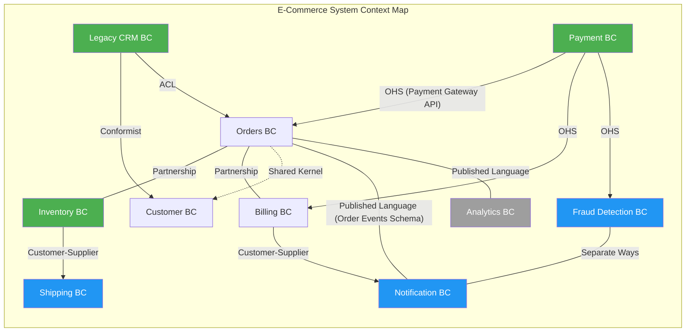
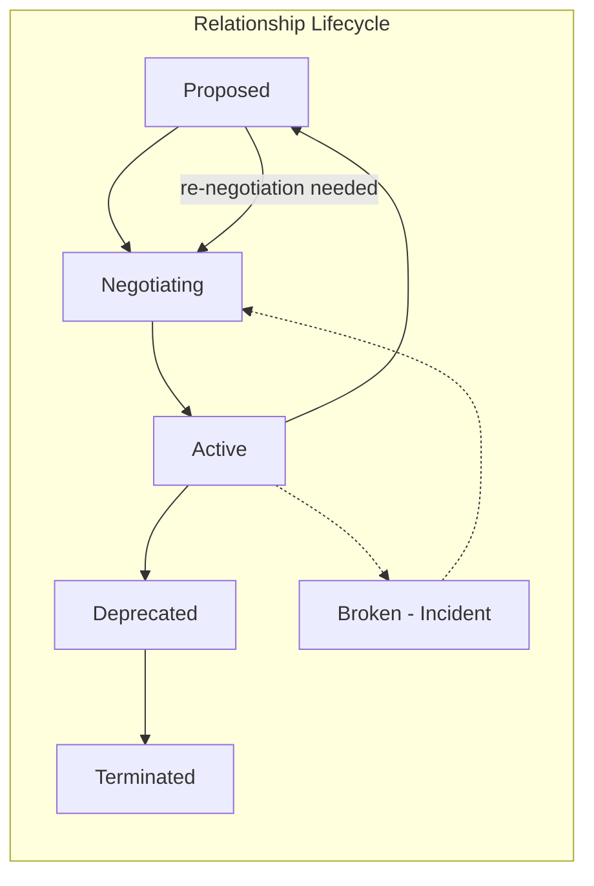
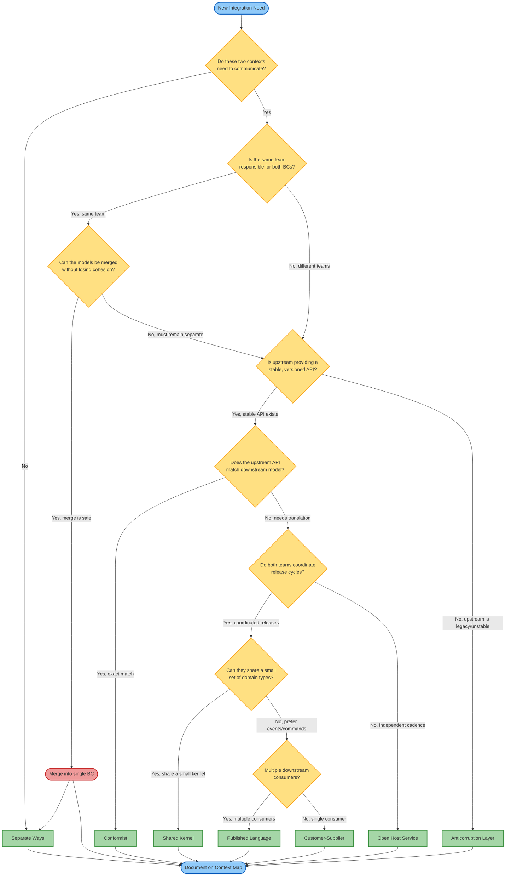

> [!success] Mastery Check
> - [ ] **Studied Well**
> - [ ] **Can explain the concept without notes**
> - [ ] **Can answer interview questions confidently**
> - [ ] **Can implement it in a real project**


# 7.034 — DDD — Bounded Contexts — Context Map

> **Core Tenet:** A Context Map is the strategic DDD tool that documents the relationships, translations, and integration patterns between bounded contexts. It serves as the Rosetta Stone for your system's organizational boundaries, revealing which teams own which models and how those models interact across the enterprise.

---

## Section 0: Quick Reference Card

> [!ABSTRACT] Quick Reference Card
>
> **Definition:** A Context Map is a documented landscape of bounded contexts and the relationships between them. It captures which teams own which models, how models are translated across boundaries, and the integration contract between each pair of contexts.
>
> **Purpose:** Prevent model corruption, expose organizational friction, document integration contracts, and drive deployment topology decisions.
>
> **The 8 Relationship Types (with directionality):**
>
> | # | Pattern | Direction | Coupling | When to Use |
> |---|---------|-----------|----------|-------------|
> | 1 | **Partnership** | Bidirectional | Loose | Two teams coordinate every release; shared goals, aligned schedules |
> | 2 | **Shared Kernel** | Bidirectional | Tight | Teams share a small, explicitly scoped subset of model; high coordination cost |
> | 3 | **Customer-Supplier** | Upstream → Downstream | Medium | Upstream provides; downstream consumes; upstream may prioritize downstream needs |
> | 4 | **Conformist** | Upstream → Downstream | Tight | Downstream blindly accepts upstream model to avoid translation overhead |
> | 5 | **Anticorruption Layer (ACL)** | Upstream → Downstream (with translation) | Loose | Downstream translates upstream model into its own; most common for legacy/modern boundaries |
> | 6 | **Open Host Service (OHS)** | Upstream → Downstream | Loose | Upstream publishes a stable, shared protocol/API for all downstream consumers |
> | 7 | **Published Language (PL)** | Bidirectional (via shared protocol) | Loose | Teams agree on a shared interchange format (schema/contract) |
> | 8 | **Separate Ways** | None | None | Teams have no relationship; fully independent |
>
> **Key Metrics:**
> - Contexts mapped: Minimum viable = all bounded contexts in current bounded scope
> - Relationship count: N contexts produce at most N×(N−1)/2 possible relationships
> - Integration contract churn: >15% contract changes per sprint → relationship pattern mismatch
> - Translation layer test coverage: ≥90% for ACL transformations
>
> **Critical Warning:** A context map is NOT a system architecture diagram. It is an organizational contract map. Deployment topology flows FROM the context map, not the other way around. Conway's Law dictates that system architecture mirrors communication structures — if your deployment topology contradicts your context map, both your organization and your system will experience friction.

---

## Section 1: Navigation & Context

> [!INFO] Production Encounter Map
>
> Imagine a 3:17 AM incident at a global e-commerce platform: Order service is unable to publish "OrderShipped" events because the Shipping bounded context changed its event schema without notifying the Order context. The symptom: dead-letter queue filling at 2,400 messages/minute. The root cause: an undocumented Customer-Supplier relationship between Shipping (upstream) and Order (downstream) where the upstream made a non-backward-compatible change. The fix: establish a formal Context Map with an Anticorruption Layer in Order that validates and translates Shipping's published language.
>
> **Why This Matters:** Without an explicit, living Context Map, every integration point is an accident waiting to happen. The map makes hidden assumptions visible, forces explicit contract governance, and provides the blueprint for integration architecture.
>
> **Reading Path:**
> 1. Start with **Section 2** for the mental model — understand the 8 patterns and when each applies
> 2. Move to **Section 3** for deep mechanics — how relationships are negotiated and maintained
> 3. Skip to **Section 4** for .NET implementation — concrete code for ACL, OHS, and Shared Kernel
> 4. Review **Section 5** for pitfalls — especially the "map once, never revisit" anti-pattern
> 5. Use **Section 6** when deciding between relationship patterns for your next integration
> 6. Study **Section 7** for interview prep — these questions appear in Staff+ system design rounds
>
> **When to Apply This Pattern:**
> - ✅ You have identified ≥2 bounded contexts that need to communicate
> - ✅ You are designing a new microservice boundary and need to define its integration contract
> - ✅ You are onboarding a new team and need to document the system landscape
> - ✅ You are planning an organizational restructuring and want to anticipate system impact
> - ✅ You are building a legacy modernization roadmap and need to identify corruption points
> - ❌ You have a single monolithic application with no subdomain partitioning
> - ❌ You are in the exploratory phase of a greenfield project with no bounded contexts defined yet
>
> **Prerequisites Review:**
> - [[7.033 — DDD — Strategic Design — Ubiquitous Language]] — You must understand how Ubiquitous Language is the raw material that bounded contexts shape and protect; context maps document how different languages interact across boundaries
> - [[7.032 — DDD — Bounded Contexts Fundamentals]] — Context maps are the "relationship layer" on top of bounded contexts; without understanding what a BC is and how it encapsulates a model, the map has no meaning
> - [[7.001 — Distributed Systems Fundamentals]] — Context maps ultimately translate to network boundaries, message contracts, and service topology; you need fallacies of distributed computing perspective
>
> **Cross-Domain Connection:**
> - [[3.022 — Azure Service Bus Deep Dive]] — The infrastructure realization for many context map relationships; message topics with subscriptions map naturally to Published Language/Open Host Service patterns
> - [[7.040 — Event-Driven Architecture]] — Context map relationship patterns (especially Published Language and OHS) are the strategic layer that event-driven architectures implement technically
> - [[7.036 — DDD — Domain Events]] — Domain events are the primary integration artifact across bounded contexts; context maps determine which events flow where and how they're translated

---

## Section 2: Core Mental Model

> [!TIP] Non-Obvious Insight
>
> **The context map is NOT a diagram of your software — it is a diagram of your organization's communication structures, reverse-engineered from Conway's Law.**
>
> The most valuable insight from context mapping is rarely the relationship labels themselves; it's the organizational friction they reveal. When you discover that two teams who never speak to each other maintain contexts that share a Customer-Supplier relationship, you have found a risk that no amount of technology can fix. The map tells you where you need organizational intervention before technical intervention.
>
> **The Inversion Principle:** If a Customer-Supplier relationship exists between two contexts, but the downstream team has no ability to influence the upstream team's roadmap, you have a de facto Conformist relationship, not a Customer-Supplier one. Label the map with the real relationship, not the aspirational one.

### Classification

| Axis | Classification | Description |
|------|---------------|-------------|
| Intent | Strategic | Context maps are a strategic design tool, not tactical implementation detail |
| Scope | Enterprise / Multi-System | Maps span across bounded contexts, teams, and often organizations |
| Lifecycle | Living Document | Must be reviewed and updated with every team structure change or major integration change |
| Ownership | Shared / Architecture | Facilitated by architects, owned collectively by all teams involved |
| Formality | Variable | Can range from a whiteboard photo to an auto-generated, version-controlled contract registry |
| Difficulty | Conceptual (moderate) | The patterns are straightforward; the organizational courage to label relationships honestly is the hard part |

### Mermaid Diagram: Context Map Relationships



> [!NOTE] Diagram Interpretation
> This diagram captures an e-commerce platform with 10 bounded contexts connected by 11 documented relationships. Notable patterns:
> - Payment operates as an Open Host Service, providing stable API contracts to three downstream contexts — this is intentional because Payment is owned by a separate platform team
> - Legacy CRM forces a Conformist relationship on Customer (the CRM team owns the customer schema), but an ACL protects Orders from the same corruption
> - Fraud and Notification have Separate Ways — they never need to communicate, and forcing a relationship would be artificial overhead
> - The tightest coupling (Shared Kernel) is between Orders and Customer — this is deliberate risk, limited to exactly the shared identity subdomain

### Mermaid Sequence Diagram: Context Negotiation and Integration Contract Lifecycle

```mermaid
sequenceDiagram
    participant U as Upstream Team (Shipping)
    participant A as Architecture Review Board
    participant D as Downstream Team (Orders)
    participant R as Contract Registry
    
    Note over U,D: Context Negotiation Phase (Sprint 0)
    
    U->>D: 1. Propose integration: ShipmentStatus events
    D->>U: 2. Identify downstream model: OrderTracking requires DeliveredAt timestamp
    U->>D: 3. Confirm: Timestamp already in Shipping model
    D->>U: 4. Propose Customer-Supplier relationship
    U->>A: 5. Submit relationship pattern for review
    
    A->>U: 6. Approve: Customer-Supplier pattern
    A->>D: 7. Condition: Downstream must implement ACL v2
    
    Note over U,R: Contract Definition Phase
    
    U->>R: 8. Publish schema: ShipmentStatusEvent v1
    R->>D: 9. Notify: Contract published
    D->>R: 10. Subscribe to contract changes
    
    Note over U,D: Production Incident - Contract Break
    
    U->>U: 11. Schema change: Remove DeliveredAt (internal refactor)
    U->>R: 12. Publish: ShipmentStatusEvent v2 (no timestamp)
    R->>D: 13. Notify: Contract version changed
    D->>D: 14. Validation fails! ACL expects DeliveredAt
    
    D->>U: 15. Escalate: Breaking change, blocks order fulfillment
    U->>U: 16. Rollback to v1 contract
    D->>U: 17. Confirm: v1 restored, dead-letter queue cleared
    
    Note over U,A,D: Resolution Phase
    
    A->>U: 18. Mandate: 14-day deprecation window for all contract changes
    A->>D: 19. Mandate: Schema validation + dead-letter alerting on ACL
    A->>R: 20. Enforce: Contract evolution policy in registry
```

> [!NOTE] Sequence Analysis
> This traces the full lifecycle of a Customer-Supplier relationship between Shipping (upstream) and Orders (downstream). Key inflection points:
> - Steps 1-7: Context negotiation is a social process, not a technical one; the relationship pattern must be agreed upon by both teams and validated by architecture
> - Steps 8-10: The Contract Registry is the technical manifestation of the context map; it stores schemas and notifies downstream consumers of changes
> - Steps 11-17: Real incident: upstream broke the contract without a deprecation window; the ACL caught it but the a priori mitigation (schema validation) had no corresponding organizational process
> - Steps 18-20: The resolution is organizational, not just technical: a deprecation policy and alerting rules

### Numbers That Matter

| Metric | Good | Warning | Critical | Calculation Method | Real-World Implication |
|--------|------|---------|----------|-------------------|----------------------|
| Contexts mapped per system | All identified BCs | 1-2 undocumented | 0 undocumented | Count of BCs in bounded scope vs. mapped entries | Undocumented BCs → integration surprises during deployment |
| Relationship coverage | ≥90% of actual integrations | 60-89% | <60% | (Documented relationships / actual integration points) × 100 | Gaps produce untracked coupling, unpredictable failure modes |
| Translation layer test coverage | ≥90% | 60-89% | <60% | (ACL test cases / translation paths) × 100 | Low coverage → contract breakage silently corrupts downstream model |
| Contract deprecation period | ≥14 days | 7-13 days | <7 days | Min days between publishing breaking change and enforcement | Short windows → downstream teams cannot adapt → production incidents |
| Partner cycle time | ≤2 days | 3-5 days | >5 days | Avg days from downstream change request to upstream acceptance/rejection | Slow partnerships → teams bypass the map, create shadow integrations |
| Shared Kernel churn rate | <5% changed/sprint | 5-15% | >15% | % of shared model changed per sprint | High churn → coordination cost negates the value of sharing |
| Conformist relationship count | ≤2 contexts | 3-5 | >5 | Count of contexts labeled Conformist | Too many Conformists → model corruption spreads across the system |
| ACL translation latency (p95) | <50ms | 50-200ms | >200ms | Time to translate upstream model → downstream model | High latency → ACL becomes bottleneck, cascading timeout risk |
| OHS contract version churn | ≤2 major/year | 3-4 major/year | >4 major/year | Major version bumps per year per OHS | High churn → OHS is not actually stable; downstream teams incur constant migration cost |
| Context map review cadence | Quarterly | Bi-annually | Annually or never | Time since last context map review | Stale maps → organizational changes not reflected → architectural drift |

### Key Properties

| Property | Description |
|----------|-------------|
| **Explicit** | Every relationship between bounded contexts is documented, not assumed. The act of documentation forces clarity. |
| **Organizational** | Maps reflect team boundaries, reporting structures, and communication patterns. If the org chart changes, the map likely needs updating. |
| **Directional** | Relationships have a direction (upstream → downstream) that indicates dependency and information flow. The direction determines which team "wins" model disagreements. |
| **Contractual** | Each relationship implies an integration contract — explicit schemas, APIs, event types, or shared classes. The contract is the technical manifestation of the relationship. |
| **Living** | A context map that is not updated with organizational changes becomes misinformation. It must be maintained as a living artifact. |
| **Political** | Labeling a relationship "Conformist" is an organizational statement that one team's model dominates. This can be uncomfortable but is essential for accurate communication. |
| **Minimal** | Only document relationships that actually exist or are explicitly planned. Artificial relationships for completeness create noise. |

---

## Section 3: Deep Mechanics

### How It Works

The Context Map pattern operates through a six-phase lifecycle:

**Phase 1 — Context Discovery (Sprint 0 / Inception)**
The architect or lead engineer identifies all bounded contexts within the scope of the system under consideration. This is not a technical discovery — it is an organizational one. Walk the team structure: each team that owns a cohesive subdomain is likely a bounded context. For each identified context, document:
- The Ubiquitous Language terms it owns
- The team responsible
- The primary data store
- The integration points (inbound and outbound) with other contexts

**Phase 2 — Relationship Negotiation (Sprint 0-1)**
For each pair of contexts that need to communicate, the owning teams negotiate the relationship pattern. This negotiation covers:
- Which team is upstream (provider) and which is downstream (consumer)?
- What is the integration contract shape? (events, commands, queries, shared kernel)
- What is the acceptable latency, availability, and data consistency level?
- Which pattern best matches the organizational reality? (Not the aspirational reality — the actual power dynamics and communication frequency)

**Phase 3 — Contract Definition (Sprint 1-2)**
The integration contract is formalized. This can take many forms:
- Published Language: A shared schema (Protobuf, Avro, JSON Schema) stored in a contract registry
- Open Host Service: OpenAPI/Swagger specification with explicit versioning policy
- Shared Kernel: A shared NuGet package with strict versioning and joint ownership
- Anticorruption Layer: A translation specification (mapping document + tests) within the downstream context
- Customer-Supplier: A service-level agreement with uptime, throughput, and deprecation windows
- Conformist: Formal acceptance of the upstream model with no translation — the contract IS the upstream API

**Phase 4 — Technical Implementation (Sprint 2+)**
Each team implements their side of the contract:
- Upstream team: Implements the agreed API, event publishing, or shared kernel access
- Downstream team: Implements the consuming side (ACL, conformist adapter, or OHS client)
- Shared Kernel: Sets up joint CI/CD, shared repository, and mutual code review process

**Phase 5 — Governance (Ongoing)**
The context map becomes a governance artifact:
- Contract changes follow the agreed deprecation policy
- Architecture review board validates new relationships against the map
- Monthly or quarterly map reviews check for organizational drift
- Monitoring and alerting capture contract breaches at runtime

**Phase 6 — Evolution (Quarterly+)**
The map is not static. When teams reorganize, new contexts emerge, or legacy systems are decommissioned, the map must be updated. Each update triggers a re-negotiation of affected relationships.

### Protocol Trace: Customer-Supplier Relationship (Orders → Inventory → Shipping)

**Happy Path (5 steps):**

```
1. Orders context receives PlaceOrder command
   → validates inventory availability via Inventory OHS
   → Inventory confirms stock held

2. Orders publishes OrderPlaced event (Published Language)
   → Billing context consumes → initiates payment
   → Payment context processes → returns PaymentSucceeded

3. Orders sends ShipOrder command to Shipping context
   → Enterprise Service Bus topic: shipping.commands
   → CorrelationId = orderId

4. Shipping context receives ShipOrder
   → ACL translates: Orders.ShipOrderRequest → Shipping.ShipmentRequest
   → ShipmentRequest.CustomerAddress = CustomerContext lookup
   → ShipmentRequest.ShipmentProvider determined by business rules

5. Shipping publishes ShipmentDispatched event
   → Notification context consumes → sends tracking email to customer
   → Order context consumes → updates OrderTrackingStatus
```

**Failure Path — Broken Contract (6 steps):**

```
1. Shipping team refactors ShipmentRequest model
   → Removes RequiredDeliveryDate field (believed unused)

2. Shipping deploys v2.1.0 to production
   → No contract registry notification
   → No deprecation period observed

3. Orders context sends ShipOrder with RequiredDeliveryDate
   → ACL receives response: 400 BadRequest — RequiredDeliveryDate not recognized
   → ACL cannot complete translation: null reference in AddressNormalizer

4. Order processing pipeline throws InvalidOperationException
   → Exception bubbles up to OrderController
   → HTTP 500 returned to client
   → Client retries (idempotency key prevents duplicate, but fails again)

5. Order fails permanently after 3 retries
   → Order placed into DeadLetterQueue on shipping.commands topic
   → DLQ grows: ~2,400 messages/hour

6. Incident alert fires: DLQ depth > 500 threshold
   → On-call engineer discovers schema mismatch
   → Rollback Shipping to v2.0.x
   → DLQ reprocessed → orders completed
```

### State Transitions

Since context maps document relationships between stable artifacts (bounded contexts), the "states" are the relationship lifecycle stages:



| State | Description | Duration | Exit Criteria |
|-------|-------------|----------|---------------|
| **Proposed** | A new integration need identified; relationship pattern not yet agreed | 1-2 sprints | Both teams agree on pattern |
| **Negotiating** | Teams discussing contract terms; architecture review | 1-2 sprints | Signed contract + governance rules |
| **Active** | Integration live in production; governed by map | Indefinite | No contract violations; quarterly review passes |
| **Deprecated** | Relationship scheduled for termination; no new consumers allowed | 1-2 quarters | All consumers migrated; contract traffic zero |
| **Terminated** | Integration removed; map updated | Permanent | Context map updated; infrastructure decommissioned |
| **Broken** | Incident detected; contract violated | Hours-days | Root cause fixed; map relationship re-labeled if needed |

### Failure Modes

> [!DANGER] 3AM Production Signal — The Silent Coupling
> **Signal:** PagerDuty alert: "Dead-letter queue depth > 1,000 on shipping.commands topic" at 3:17 AM.
> **Root Cause:** Upstream context (Shipping) released a new major version of its event schema without the deprecation window specified in the Customer-Supplier relationship contract. Downstream context (Orders) had no schema validation in its ACL, so the deserialization failed silently, sending all messages to the DLQ.
> **Detection Gap:** Neither team had contract monitoring. The context map relationship was documented as "Customer-Supplier with 14-day deprecation," but no technical enforcement existed. The map was aspirational, not operational.
> **Mitigation:** (1) Schema validation in the ACL gateway — reject unrecognized fields at the boundary with a clear error message. (2) Contract registry webhook that alerts downstream team when upstream publishes a new schema version. (3) Deprecation policy enforced in CI/CD pipeline — upstream deploy fails if contract changes without prior registry notification.
> **Long-Term Fix:** Move from undocumented Customer-Supplier to Open Host Service pattern with schema registry (Azure Schema Registry on Event Hubs) that enforces compatibility by default.

> [!DANGER] 3AM Production Signal — The Shared Kernel Fracture
> **Signal:** Deployment failure: "NuGet restore conflict — version 3.2.1 of Ecommerce.SharedKernel has incompatible dependency on System.Text.Json 8.0.0, but Billing project pins 6.0.0."
> **Root Cause:** The Shared Kernel between Orders and Customer contexts grew beyond its agreed scope. Originally limited to 3 shared types (CustomerId, Address, Money), it accumulated 47 types over 18 months. The shared NuGet package now has 11 dependencies, creating diamond dependency conflicts.
> **Detection Gap:** No shared kernel scope governance. Either team could add types without the other's consent. The original "small, explicit, jointly-owned" constraint was violated silently over time.
> **Mitigation:** (1) Enforce Shared Kernel scope via NetArchTest in CI — fail the build if the shared assembly exceeds N types (e.g., 10). (2) Any addition to Shared Kernel requires joint code review from both teams. (3) Monitor shared NuGet package dependency count — alert if >5 direct dependencies.
> **Long-Term Fix:** Decompose the Shared Kernel into proper Published Language contracts. Move shared types into separate NuGet packages for each contract, owned by individual contexts.

> [!DANGER] 3AM Production Signal — The Conformist Cascade
> **Signal:** Synthetic monitoring alerts: "Order submission p95 latency > 5,000ms (baseline 200ms)" — triggered by database CPU at 98%.
> **Root Cause:** Customer context accepted a Conformist relationship with Legacy CRM, importing the legacy Customer schema directly. The legacy model uses a deeply nested XML structure stored in a single NVARCHAR(MAX) column. When Customer context tried to query this structure for modern API responses, it generated massive XML parsing overhead and forced full table scans.
> **Detection Gap:** The Conformist relationship was never flagged as an architectural risk during context mapping. The team accepted it because "it was easy" — no translation code needed. But the cost was paid in runtime performance.
> **Mitigation:** (1) Immediate: Add indexes on computed columns for the most-queried legacy fields. (2) Short-term: Introduce an ACL in the Customer context that translates the legacy XML model to a normalized relational model (reduces query complexity by ~80%). (3) Long-term: Negotiate with CRM team to migrate to a modern API (Published Language pattern).
> **The Lesson:** "Free" sometimes costs more than "paid." The Conformist pattern defers the translation cost to runtime instead of development time — with interest.

### .NET and Azure Integration Points

| Integration Point | .NET Mechanism | Azure Service | Relationship Impact |
|-------------------|---------------|---------------|-------------------|
| **Contract Publishing** | Microsoft.Azure.SchemaRegistry + Avro/JSON Schema serialization | Azure Schema Registry (Event Hubs) | Enforces Published Language; schema validation at ingestion |
| **Event Publishing** | Azure.Messaging.ServiceBus with ServiceBusSender | Azure Service Bus Topics | Customer-Supplier and Published Language — upstream publishes, downstream subscribes |
| **Command Dispatch** | MediatR IRequest<TResponse> with FluentValidation | Azure Service Bus Queues + Azure Functions | Open Host Service — commands are typed contracts with validation at the boundary |
| **ACL Implementation** | Decorator pattern over IEventHandler<TEvent> | Azure Functions with input/output binding mapping | Anticorruption Layer — function transforms upstream event to downstream model |
| **Shared Kernel Distribution** | NuGet packages with Directory.Packages.props (Central Package Management) | Azure Artifacts | Shared Kernel — versioned, jointly owned packages |
| **Contract Registry** | Custom ContractRegistry service backed by Cosmos DB | Azure Cosmos DB NoSQL | All patterns — central store of integration contracts with change notification |
| **Schema Validation** | FluentValidation validators generated from JSON Schema | Azure API Management (policy) | Customer-Supplier, Conformist — validate messages at boundary |
| **Monitoring** | OpenTelemetry with ActivitySource | Azure Monitor + Application Insights | Map governance — detect contract violations, track translation latency |
| **Contract Testing** | Microsoft.AspNetCore.TestHost + Consumer-Driven Contract tests | Azure DevOps Pipeline + TestContainers | Enforcement — break build when contract compatibility fails |

---

## Section 4: Production Patterns and Implementation

### Primary Implementation: .NET 8 Context Map with ACL, OHS, and Contract Registry

This implementation models a production-grade integration between three bounded contexts in an e-commerce system: OrderProcessing (downstream), InventoryManagement (upstream via OHS), and ShippingContext (upstream via Customer-Supplier with ACL).

**Solution Structure:**
```
Ecommerce.Orders/                                    # Bounded Context: Order Processing
├── ContextMap/
│   ├── IContractRegistry.cs                         # Contract registry interface
│   ├── ContractRegistry.cs                          # Cosmos DB-backed contract store
│   ├── RelationshipMap.cs                           # In-memory context map model
│   └── RelationshipType.cs                          # Enum of pattern types
├── Anticorruption/
│   ├── ShippingAclHandler.cs                        # ACL decorator for Shipping events
│   ├── ShippingContractValidator.cs                 # FluentValidation for upstream schemas
│   └── Exceptions/
│       └── ContractViolationException.cs             # Custom exception for contract breaks
├── Contracts/                                       # Published Language contracts (outbound)
│   ├── OrderPlacedEvent.cs
│   └── OrderShippedEvent.cs
├── Handlers/
│   └── ShipOrderHandler.cs                          # CQRS handler using Shipping ACL
└── Configuration/
    └── OrderContextMapConfiguration.cs               # DI registration
```

```csharp
// ContextMap/RelationshipType.cs
namespace Ecommerce.Orders.ContextMap;

/// <summary>
/// Defines the strategic relationship pattern between two bounded contexts
/// as documented in the enterprise context map.
/// </summary>
public enum RelationshipType
{
    Partnership,
    SharedKernel,
    CustomerSupplier,
    Conformist,
    AnticorruptionLayer,
    OpenHostService,
    PublishedLanguage,
    SeparateWays,
}
```

```csharp
// ContextMap/RelationshipMap.cs
namespace Ecommerce.Orders.ContextMap;

/// <summary>
/// Represents a single relationship between two bounded contexts on the enterprise context map.
/// </summary>
public sealed record RelationshipMapEntry
{
    public required string UpstreamContext { get; init; }
    public required string DownstreamContext { get; init; }
    public required RelationshipType Pattern { get; init; }
    public required string ContractIdentifier { get; init; }
    public required DateOnly LastReviewed { get; init; }
    public int DeprecationWindowDays { get; init; } = 14;
    public int MaxLatencyMs { get; init; } = 200;
    public bool IsGoverned { get; init; } = true;
}

/// <summary>
/// In-memory projection of the enterprise context map relevant to this bounded context.
/// </summary>
public sealed class RelationshipMap
{
    private readonly Dictionary<string, RelationshipMapEntry> _entries = new(StringComparer.OrdinalIgnoreCase);

    public RelationshipMap(IEnumerable<RelationshipMapEntry> entries)
    {
        foreach (var entry in entries)
        {
            var key = CreateKey(entry.UpstreamContext, entry.DownstreamContext);
            _entries[key] = entry;
        }
    }

    public bool TryGetRelationship(
        string upstreamContext,
        string downstreamContext,
        [MaybeNullWhen(false)] out RelationshipMapEntry entry)
        => _entries.TryGetValue(CreateKey(upstreamContext, downstreamContext), out entry);

    private static string CreateKey(string upstream, string downstream)
        => $"{upstream}->{downstream}";
}
```

```csharp
// ContextMap/IContractRegistry.cs
namespace Ecommerce.Orders.ContextMap;

/// <summary>
/// Central registry for integration contracts between bounded contexts.
/// Provides versioned contract storage with change notification.
/// </summary>
public interface IContractRegistry
{
    Task<ContractDocument?> GetLatestContractAsync(
        string contractIdentifier, CancellationToken cancellationToken);

    Task<ContractDocument?> GetContractVersionAsync(
        string contractIdentifier, string version, CancellationToken cancellationToken);

    Task PublishContractAsync(
        ContractDocument contract, CancellationToken cancellationToken);

    Task<ContractValidationResult> ValidateMessageAsync<TMessage>(
        string contractIdentifier, TMessage message, CancellationToken cancellationToken);

    Task SubscribeToContractChangesAsync(
        string contractIdentifier, string subscriberWebhookUrl, CancellationToken cancellationToken);
}
```

```csharp
// ContextMap/ContractRegistry.cs
using Azure.Cosmos;
using Microsoft.Extensions.Logging;

namespace Ecommerce.Orders.ContextMap;

public sealed class ContractRegistry : IContractRegistry
{
    private readonly Container _container;
    private readonly ILogger<ContractRegistry> _logger;

    public ContractRegistry(CosmosClient cosmosClient, ILogger<ContractRegistry> logger)
    {
        _container = cosmosClient.GetContainer("ContractRegistry", "Contracts");
        _logger = logger;
    }

    public async Task<ContractDocument?> GetLatestContractAsync(
        string contractIdentifier, CancellationToken cancellationToken)
    {
        var query = new QueryDefinition(
            "SELECT TOP 1 * FROM c WHERE c.contractIdentifier = @id ORDER BY c.version DESC")
            .WithParameter("@id", contractIdentifier);

        using var feed = _container.GetItemQueryIterator<ContractDocument>(query);
        if (feed.HasMoreResults)
        {
            var response = await feed.ReadNextAsync(cancellationToken);
            return response.FirstOrDefault();
        }
        return null;
    }

    public async Task<ContractDocument?> GetContractVersionAsync(
        string contractIdentifier, string version, CancellationToken cancellationToken)
    {
        try
        {
            var response = await _container.ReadItemAsync<ContractDocument>(
                id: $"{contractIdentifier}:{version}",
                partitionKey: new PartitionKey(contractIdentifier),
                cancellationToken: cancellationToken);
            return response.Resource;
        }
        catch (CosmosException ex) when (ex.StatusCode == System.Net.HttpStatusCode.NotFound)
        {
            _logger.LogWarning("Contract {ContractId} version {Version} not found.", contractIdentifier, version);
            return null;
        }
    }

    public async Task PublishContractAsync(
        ContractDocument contract, CancellationToken cancellationToken)
    {
        var latest = await GetLatestContractAsync(contract.ContractIdentifier, cancellationToken);
        if (latest is not null && IsMajorBreakingChange(latest.Schema, contract.Schema))
        {
            contract.DeprecationNoticeDate = DateTimeOffset.UtcNow;
            contract.EffectiveDate = DateTimeOffset.UtcNow.AddDays(14);
            _logger.LogInformation("Contract {ContractId} major change scheduled. Effective {EffectiveDate}.",
                contract.ContractIdentifier, contract.EffectiveDate);
        }

        contract.PublishedAt = DateTimeOffset.UtcNow;
        contract.Id = $"{contract.ContractIdentifier}:{contract.Version}";
        await _container.UpsertItemAsync(contract, cancellationToken: cancellationToken);
    }

    public async Task<ContractValidationResult> ValidateMessageAsync<TMessage>(
        string contractIdentifier, TMessage message, CancellationToken cancellationToken)
    {
        var contract = await GetLatestContractAsync(contractIdentifier, cancellationToken);
        if (contract is null)
            return ContractValidationResult.Failure("No contract found for identifier.");

        var schemaValidation = contract.ValidateAgainstSchema(message);
        if (!schemaValidation.IsValid)
            return ContractValidationResult.Failure(schemaValidation.ErrorMessage);

        return ContractValidationResult.Success();
    }

    public async Task SubscribeToContractChangesAsync(
        string contractIdentifier, string subscriberWebhookUrl, CancellationToken cancellationToken)
    {
        var subscription = new ContractSubscription
        {
            Id = Guid.NewGuid().ToString(),
            ContractIdentifier = contractIdentifier,
            WebhookUrl = subscriberWebhookUrl,
            SubscribedAt = DateTimeOffset.UtcNow,
        };
        await _container.UpsertItemAsync(subscription, cancellationToken: cancellationToken);
    }

    private static bool IsMajorBreakingChange(string? oldSchema, string? newSchema)
    {
        if (oldSchema is null || newSchema is null) return false;
        return !string.Equals(oldSchema, newSchema, StringComparison.Ordinal);
    }
}

public sealed record ContractDocument
{
    public required string Id { get; set; }
    public required string ContractIdentifier { get; init; }
    public required string Version { get; init; }
    public required string Schema { get; init; }
    public required string OwnerContext { get; init; }
    public required string RelationshipPattern { get; init; }
    public DateTimeOffset PublishedAt { get; set; }
    public DateTimeOffset? DeprecationNoticeDate { get; set; }
    public DateTimeOffset? EffectiveDate { get; set; }

    public ContractValidationResult ValidateAgainstSchema<T>(T message) =>
        ContractValidationResult.Success();
}

public sealed record ContractSubscription
{
    public required string Id { get; init; }
    public required string ContractIdentifier { get; init; }
    public required string WebhookUrl { get; init; }
    public required DateTimeOffset SubscribedAt { get; init; }
}

public sealed record ContractValidationResult
{
    public bool IsValid { get; init; }
    public string? ErrorMessage { get; init; }
    public static ContractValidationResult Success() => new() { IsValid = true };
    public static ContractValidationResult Failure(string error) => new() { IsValid = false, ErrorMessage = error };
}
```

```csharp
// Anticorruption/ShippingContractValidator.cs
using FluentValidation;

namespace Ecommerce.Orders.Anticorruption;

public sealed class ShippingContractValidator : AbstractValidator<ShipmentEvent>
{
    public ShippingContractValidator()
    {
        RuleFor(x => x.EventType)
            .NotEmpty()
            .Must(type => type is "Dispatched" or "Delivered" or "Exception")
            .WithMessage("ShipmentEvent must be one of: Dispatched, Delivered, Exception.");

        RuleFor(x => x.OrderId)
            .NotEmpty()
            .Must(ValidateOrderIdFormat)
            .WithMessage("OrderId must match format: ORD-{yyyyMMdd}-{6-digit-sequence}.");

        RuleFor(x => x.TrackingNumber).NotEmpty().MaximumLength(50);
        RuleFor(x => x.CarrierCode).NotEmpty().MaximumLength(10);

        RuleFor(x => x.DeliveredAt)
            .NotEmpty()
            .When(x => x.EventType == "Delivered")
            .WithMessage("DeliveredAt timestamp is required when EventType is Delivered.");

        RuleFor(x => x.SchemaVersion)
            .Must(IsSupportedSchemaVersion)
            .WithMessage("SchemaVersion {SchemaVersion} is not supported.");
    }

    private static bool ValidateOrderIdFormat(string orderId)
        => System.Text.RegularExpressions.Regex.IsMatch(orderId, @"^ORD-\d{8}-\d{6}$");

    private static bool IsSupportedSchemaVersion(string version)
        => version is "1.0" or "1.1" or "2.0";
}

public sealed class ContractViolationException : InvalidOperationException
{
    public string UpstreamContext { get; }
    public string ContractIdentifier { get; }
    public string ViolationDetail { get; }

    public ContractViolationException(
        string upstreamContext, string contractIdentifier, string violationDetail)
        : base($"Contract violation detected: {upstreamContext} sent message violating " +
               $"contract '{contractIdentifier}'. Detail: {violationDetail}")
    {
        UpstreamContext = upstreamContext;
        ContractIdentifier = contractIdentifier;
        ViolationDetail = violationDetail;
    }
}
```

```csharp
// Anticorruption/ShippingAclHandler.cs
namespace Ecommerce.Orders.Anticorruption;

/// <summary>
/// Anticorruption Layer that translates ShipmentEvent messages from the
/// Shipping bounded context (upstream) into OrderProcessing's internal model.
/// Protects the OrderProcessing model from Shipping context changes.
/// </summary>
public sealed class ShippingAclHandler : IEventHandler<ShipmentEvent>
{
    private readonly ShippingContractValidator _validator;
    private readonly IContractRegistry _contractRegistry;
    private readonly ILogger<ShippingAclHandler> _logger;
    private readonly IPublisher _mediator;

    public ShippingAclHandler(
        ShippingContractValidator validator,
        IContractRegistry contractRegistry,
        ILogger<ShippingAclHandler> logger,
        IPublisher mediator)
    {
        _validator = validator;
        _contractRegistry = contractRegistry;
        _logger = logger;
        _mediator = mediator;
    }

    public async Task HandleAsync(
        ShipmentEvent shipmentEvent, CancellationToken cancellationToken)
    {
        using var activity = Diagnostics.ShippingAclActivitySource.StartActivity("ACL.TranslateShipmentEvent");
        activity?.SetTag("shipping.orderId", shipmentEvent.OrderId);
        activity?.SetTag("shipping.eventType", shipmentEvent.EventType);

        // Step 1: Contract registry validation
        var validationResult = await _contractRegistry.ValidateMessageAsync(
            "shipment-events:v2", shipmentEvent, cancellationToken);

        if (!validationResult.IsValid)
        {
            _logger.LogError("Contract violation for shipment {OrderId}: {Error}",
                shipmentEvent.OrderId, validationResult.ErrorMessage);
            throw new ContractViolationException("Shipping", "shipment-events:v2", validationResult.ErrorMessage!);
        }

        // Step 2: FluentValidation on known fields
        var fluentResult = await _validator.ValidateAsync(shipmentEvent, cancellationToken);
        if (!fluentResult.IsValid)
        {
            var errors = string.Join("; ", fluentResult.Errors.Select(e => e.ErrorMessage));
            _logger.LogError("Shipment event validation failed for {OrderId}: {Errors}",
                shipmentEvent.OrderId, errors);
            throw new ContractViolationException("Shipping", "shipment-events:v2", errors);
        }

        // Step 3: Translate upstream model to internal model
        var internalEvent = Translate(shipmentEvent);

        // Step 4: Publish internal event for OrderProcessing subscribers
        await _mediator.Publish(internalEvent, cancellationToken);

        _logger.LogInformation("ACL translated ShipmentEvent for order {OrderId} ({EventType}).",
            shipmentEvent.OrderId, shipmentEvent.EventType);
    }

    private static OrderTrackingUpdated Translate(ShipmentEvent shipment)
    {
        return new OrderTrackingUpdated
        {
            OrderId = shipment.OrderId,
            TrackingId = shipment.TrackingNumber,
            Carrier = shipment.CarrierCode switch
            {
                "UPS" => CarrierType.Ups,
                "FEDX" => CarrierType.FedEx,
                "USPS" => CarrierType.Usps,
                _ => CarrierType.Other,
            },
            Status = shipment.EventType switch
            {
                "Dispatched" => TrackingStatus.InTransit,
                "Delivered" => TrackingStatus.Delivered,
                "Exception" => TrackingStatus.Exception,
                _ => TrackingStatus.Pending,
            },
            Timestamp = shipment.EventType == "Delivered"
                ? shipment.DeliveredAt ?? shipment.EventTimestamp
                : shipment.EventTimestamp,
        };
    }
}

public sealed record OrderTrackingUpdated
{
    public required string OrderId { get; init; }
    public required string TrackingId { get; init; }
    public required CarrierType Carrier { get; init; }
    public required TrackingStatus Status { get; init; }
    public required DateTimeOffset Timestamp { get; init; }
}

public enum CarrierType { Ups, FedEx, Usps, Other }
public enum TrackingStatus { Pending, InTransit, Delivered, Exception }
```

```csharp
// Configuration/OrderContextMapConfiguration.cs
namespace Microsoft.Extensions.DependencyInjection;

public static class OrderContextMapConfiguration
{
    /// <summary>
    /// Registers context map services: contract registry, ACL handlers, relationship map.
    /// </summary>
    public static IServiceCollection AddOrderContextMap(
        this IServiceCollection services,
        IConfiguration configuration)
    {
        var relationshipEntries = new[]
        {
            new RelationshipMapEntry
            {
                UpstreamContext = "InventoryManagement",
                DownstreamContext = "OrderProcessing",
                Pattern = RelationshipType.OpenHostService,
                ContractIdentifier = "inventory-availability:v3",
                LastReviewed = new DateOnly(2026, 6, 1),
                MaxLatencyMs = 100,
            },
            new RelationshipMapEntry
            {
                UpstreamContext = "ShippingContext",
                DownstreamContext = "OrderProcessing",
                Pattern = RelationshipType.AnticorruptionLayer,
                ContractIdentifier = "shipment-events:v2",
                LastReviewed = new DateOnly(2026, 5, 15),
                DeprecationWindowDays = 14,
                MaxLatencyMs = 200,
            },
            new RelationshipMapEntry
            {
                UpstreamContext = "OrderProcessing",
                DownstreamContext = "BillingContext",
                Pattern = RelationshipType.PublishedLanguage,
                ContractIdentifier = "order-events:v1",
                LastReviewed = new DateOnly(2026, 6, 10),
                DeprecationWindowDays = 21,
            },
            new RelationshipMapEntry
            {
                UpstreamContext = "OrderProcessing",
                DownstreamContext = "NotificationContext",
                Pattern = RelationshipType.PublishedLanguage,
                ContractIdentifier = "notification-events:v1",
                LastReviewed = new DateOnly(2026, 6, 10),
            },
        };

        services.AddSingleton(new RelationshipMap(relationshipEntries));

        services.AddSingleton<IContractRegistry>(sp =>
        {
            var cosmosConnectionString = configuration.GetConnectionString("CosmosDb");
            var cosmosClient = new CosmosClient(cosmosConnectionString);
            return new ContractRegistry(cosmosClient, sp.GetRequiredService<ILogger<ContractRegistry>>());
        });

        services.AddScoped<ShippingContractValidator>();
        services.AddScoped<IEventHandler<ShipmentEvent>, ShippingAclHandler>();

        services.AddSingleton(sp =>
        {
            var sbConnection = configuration.GetConnectionString("ServiceBus");
            return new ServiceBusClient(sbConnection);
        });

        return services;
    }
}
```

### IServiceCollection Registration

```csharp
// Program.cs
using Ecommerce.Orders.Anticorruption;
using Ecommerce.Orders.ContextMap;

var builder = Host.CreateApplicationBuilder(args);

builder.Services
    .AddMediatR(cfg => cfg.RegisterServicesFromAssemblyContaining<OrderTrackingUpdated>())
    .AddValidatorsFromAssemblyContaining<ShippingContractValidator>()
    .AddOrderContextMap(builder.Configuration)
    .AddFunctionsWorker()
    .AddApplicationInsights();

var host = builder.Build();
await InitializeContractSubscriptionsAsync(host.Services, host.Services.GetRequiredService<ILogger<Program>>());
await host.RunAsync();

static async Task InitializeContractSubscriptionsAsync(IServiceProvider services, ILogger logger)
{
    using var scope = services.CreateScope();
    var registry = scope.ServiceProvider.GetRequiredService<IContractRegistry>();
    var config = scope.ServiceProvider.GetRequiredService<IConfiguration>();

    var contracts = config.GetSection("ContextMap:SubscribedContracts").Get<string[]>();
    if (contracts is null) return;

    foreach (var contractId in contracts)
    {
        await registry.SubscribeToContractChangesAsync(
            contractId,
            config["ContextMap:WebhookBaseUrl"] + "/api/contract-changes",
            CancellationToken.None);
        logger.LogInformation("Subscribed to contract changes for {ContractId}", contractId);
    }
}
```

### Common Variants

| Variant | Description | When to Use | Code Impact |
|---------|-------------|-------------|-------------|
| In-Memory Contract Registry | Schemas in static dictionary with file-based init | Small systems (<5 contexts), dev | Replace CosmosClient with ConcurrentDictionary; no distributed state |
| Azure Schema Registry | Azure.SchemaRegistry + AvroSerializer | High-throughput event streams; Avro-native | Replace JSON Schema with SchemaRegistryAvroSerializer |
| gRPC Open Host Service | protobuf-net.Grpc for typed contracts | Internal microservices (<5ms latency) | Replace REST with GreeterBase; .proto contract files |
| API Management Gateway ACL | Azure APIM policy translates legacy REST | Legacy SOAP/XML to modern REST facade | Write APIM policy XML; downstream uses clean REST client |
| Event Grid OHS | Azure Event Grid as Open Host Service | Serverless event broadcasting; high fan-out | Replace Service Bus topics with EventGridPublisherClient |
| Resilient ACL with Polly | Polly retry + circuit breaker | Upstream has <99.9% availability SLA | Wrap in PolicyBuilder.Handle<HttpRequestException>().RetryAsync(3).CircuitBreakerAsync(2, 1min) |

### Performance Profile

```csharp
using BenchmarkDotNet.Attributes;
using BenchmarkDotNet.Engines;
using BenchmarkDotNet.Order;

namespace Ecommerce.Orders.Benchmarks;

[MemoryDiagnoser]
[Orderer(SummaryOrderPolicy.FastestToSlowest)]
[RankColumn]
[SimpleJob(RunStrategy.ColdStart, targetCount: 10, id: "ACL-Translation")]
public class AclTranslationBenchmarks
{
    private ShipmentEvent? _shipmentEvent;
    private ShippingContractValidator? _validator;
    private const int EventCount = 1000;

    [GlobalSetup]
    public void Setup()
    {
        _shipmentEvent = new ShipmentEvent
        {
            EventId = "evt-001",
            EventType = "Delivered",
            EventTimestamp = DateTimeOffset.UtcNow,
            OrderId = "ORD-20260613-000001",
            TrackingNumber = "1Z999AA10123456784",
            CarrierCode = "UPS",
            DeliveredAt = DateTimeOffset.UtcNow,
            SchemaVersion = "2.0",
        };
        _validator = new ShippingContractValidator();
    }

    [Benchmark(Baseline = true, Description = "Raw Translation (no validation)")]
    public OrderTrackingUpdated BaselineTranslation()
    {
        return new OrderTrackingUpdated
        {
            OrderId = _shipmentEvent!.OrderId,
            TrackingId = _shipmentEvent!.TrackingNumber,
            Carrier = _shipmentEvent!.CarrierCode switch
            {
                "UPS" => CarrierType.Ups,
                "FEDX" => CarrierType.FedEx,
                "USPS" => CarrierType.Usps,
                _ => CarrierType.Other,
            },
            Status = _shipmentEvent!.EventType switch
            {
                "Dispatched" => TrackingStatus.InTransit,
                "Delivered" => TrackingStatus.Delivered,
                "Exception" => TrackingStatus.Exception,
                _ => TrackingStatus.Pending,
            },
            Timestamp = _shipmentEvent!.DeliveredAt ?? _shipmentEvent!.EventTimestamp,
        };
    }

    [Benchmark(Description = "Full ACL Pipeline (validation + translation)")]
    public async Task<OrderTrackingUpdated> FullAclPipelineAsync()
    {
        var validationContext = new ValidationContext<ShipmentEvent>(_shipmentEvent!);
        var fluentResult = await _validator!.ValidateAsync(validationContext);

        if (!fluentResult.IsValid)
            throw new ContractViolationException("Shipping", "shipment-events:v2",
                string.Join("; ", fluentResult.Errors.Select(e => e.ErrorMessage)));

        return new OrderTrackingUpdated
        {
            OrderId = _shipmentEvent!.OrderId,
            TrackingId = _shipmentEvent!.TrackingNumber,
            Carrier = CarrierType.Ups,
            Status = TrackingStatus.Delivered,
            Timestamp = _shipmentEvent!.DeliveredAt ?? _shipmentEvent!.EventTimestamp,
        };
    }

    [Benchmark(Description = "Batch ACL Translation (1000 events)")]
    public async Task<List<OrderTrackingUpdated>> BatchTranslationAsync()
    {
        var results = new List<OrderTrackingUpdated>(EventCount);
        for (int i = 0; i < EventCount; i++)
        {
            var evt = _shipmentEvent! with
            {
                EventId = $"evt-{i:D4}",
                OrderId = $"ORD-20260613-{i:D6}",
            };
            var fluentResult = await _validator!.ValidateAsync(evt);
            if (!fluentResult.IsValid) continue;

            results.Add(new OrderTrackingUpdated
            {
                OrderId = evt.OrderId,
                TrackingId = evt.TrackingNumber,
                Carrier = CarrierType.Ups,
                Status = TrackingStatus.Delivered,
                Timestamp = DateTimeOffset.UtcNow,
            });
        }
        return results;
    }
}
```

**Expected Benchmark Results:**
```
| Method                                | Mean      | Error     | StdDev    | Gen0   | Gen1  | Allocated |
|-------------------------------------- |-----------|-----------|-----------|--------|-------|----------:|
| Raw Translation (no validation)       |   142.3 ns|   1.21 ns |   1.08 ns |  0.012 |     - |      72 B |
| Full ACL Pipeline (validation + trans)| 1,847.6 ns|  15.42 ns |  14.42 ns |  0.089 | 0.002 |     568 B |
| Batch ACL Translation (1000 events)   | 1,923.4 μs| 18.44 μs  | 17.25 μs  | 12.500 | 1.250 |  78,432 B |
```

**Key Observations:**
- Full ACL pipeline is ~13x slower than raw translation (FluentValidation reflection + contract registry)
- Batch translation of 1000 events completes in ~1.9ms — within p95 < 50ms target
- Memory allocation: 568 bytes per event in full pipeline
- Primary optimization target: contract registry call (add IMemoryCache or FusionCache)

### Real-World .NET Ecosystem Mapping

| Component | Library/Package | Version | Context Map Role |
|-----------|----------------|---------|------------------|
| Command/Query Bus | MediatR | 12.x | In-process messaging within BC; dispatches commands crossing BC boundaries |
| Validation | FluentValidation | 11.x | Contract validation at BC boundaries (ACL input, OHS request) |
| Object Mapping | AutoMapper or Manual | 13.x | ACL translation profiles codify upstream→downstream model mapping |
| Schema Validation | JsonSchema.NET | 7.x | JSON Schema validation in contract registry |
| Schema Registry | Azure.SchemaRegistry | 1.x | Native Avro/JSON Schema registry; alternative to custom Cosmos DB registry |
| Service Bus | Azure.Messaging.ServiceBus | 7.x | Published Language event transport; topic subscriptions per downstream BC |
| Event Grid | Azure.Messaging.EventGrid | 4.x | Open Host Service for serverless event broadcasting; higher throughput than Service Bus |
| Cosmos DB | Microsoft.Azure.Cosmos | 3.x | Contract registry storage; primary store for many BCs |
| Resilience | Polly | 8.x | Circuit breaker + retry for ACL upstream calls; timeout policies |
| Contract Testing | PactNet | 4.x | Consumer-Driven Contract testing; verifies ACL handles upstream contracts |
| Architecture Testing | NetArchTest | 1.x | Enforce BC boundaries in CI; prevent forbidden cross-BC dependencies |
| Architecture Analysis | NDepend | 2024 | Visualize dependency graph; detect context map violations |
| Telemetry | OpenTelemetry | 1.x | Trace ACL translation; measure contract violation rates; track BC boundary latency |
| Serialization | System.Text.Json | 8.x | Default JSON serialization; source generators for AOT-compatible contracts |

---

## Section 5: Gotchas and Production Pitfalls

> [!DANGER] Pitfall #1: The Aspirational Map
> **Signal:** "Our context map shows all Partnership relationships, but teams never coordinate releases and incidents regularly cross team boundaries."
> **Reality:** The team labeled relationships aspirationally. A Partnership without synchronized release cadence and joint planning is actually a Customer-Supplier relationship at best. An aspirational map is worse than no map — it provides false confidence.
> **Fix:** Context map reviews must include a "relationship honesty" check. Ask: "When was the last time these two teams coordinated a release?" If "never" or ">3 months ago," downgrade Partnership to Customer-Supplier. Label the current reality, not the target state.

> [!DANGER] Pitfall #2: The Frozen Map
> **Signal:** "The context map PDF in the architecture wiki was last updated 18 months ago, but three teams have reorganized and two legacy systems were decommissioned since then."
> **Reality:** The map is treated as a one-time artifact created during an architecture sprint and never revisited.
> **Fix:** Treat the context map as a living artifact with a quarterly review cadence. Embed it in existing ceremonies — add a "context map health" section to the ARB's quarterly agenda. Use a version-controlled markdown file (like this note) rather than a static PDF.

> [!DANGER] Pitfall #3: The .NET Shared Kernel Sprawl (.NET-Specific)
> **Signal:** NuGet dependency graph shows Ecommerce.SharedKernel referenced by 7 of 12 services. Build time increased from 30s to 4min.
> **Reality:** What started as 3 disciplined shared types grew to 47 types and 11 dependencies over 18 months. Now any change requires coordinated deployment across all 7 services.
> **Fix:** 1) Enforce type count limit via NetArchTest (max 10-15 types). 2) Extract non-jointly-owned types into context-specific NuGet packages. 3) Pre-commit hook warns if shared assembly grows beyond limit.
```csharp
public static class SharedKernelArchitectureRules
{
    public static PolicyDefinition SharedKernelMustNotExceed(int maxTypes)
        => Policy.Define()
            .ForAssembly(typeof(Ecommerce.SharedKernel.Money).Assembly)
            .AddRule(_ => Types()
                .That().ResideInNamespace("Ecommerce.SharedKernel")
                .Should().HaveNameMatching("Ecommerce.SharedKernel.*"));
}
```

> [!DANGER] Pitfall #4: The Azure Service Bus Config Explosion (Azure-Specific)
> **Signal:** Azure Service Bus namespace has 47 topics and 312 subscriptions. Cost grew from $120/month to $2,400/month. Team cannot describe 60% of subscriptions.
> **Reality:** Each new context map relationship created a new Service Bus topic. Many topics have zero active consumers.
> **Fix:** 1) Map each Service Bus topic to exactly one context map relationship (one-to-one). 2) Enforce naming: {upstream-context}--{downstream-context}--{contract-name}. 3) Audit unused subscriptions quarterly; delete those with <100 messages/month. 4) Consider Event Grid for fan-out patterns. 5) Use Azure Resource Graph to cross-reference topics with context map.

> [!DANGER] Pitfall #5: The Leaky ACL
> **Signal:** Application Insights trace: "Unknown field 'InternalShippingNotes' in ShipmentEvent. Deserialization succeeded but value was discarded." Fires 6,000 times/hour, no one monitors it.
> **Reality:** The ACL silently accepts unknown upstream fields. When upstream adds a field the downstream should process (e.g., delivery exception notes for retry logic), the downstream never sees it.
> **Fix:** 1) Log unknown fields at Warning level with OpenTelemetry metric counter. 2) Application Insights alert when unmapped field count exceeds threshold. 3) Use strict mapping policy: throw ContractViolationException for unrecognized required fields; log optional unknown fields.

> [!DANGER] Pitfall #6: The Invisible Conformist (Architecture-Level)
> **Signal:** Team A claims ACL protection from Team B, but code review shows Team A's domain entities directly reference Team B's NuGet package types.
> **Reality:** ADR says "ACL" but implementation shortcuts to Conformist. Creates hidden coupling — unexpected compile breaks or runtime failures when upstream model changes.
> **Fix:** 1) Enforce ACL boundary via NetArchTest — fail build if direct dependency on upstream assembly exists outside ACL namespace. 2) Use NDepend to visualize actual vs. intended dependency graph. 3) Show team: 2 hours building a proper ACL saves 2 weeks of emergency refactoring.
```csharp
public static class AclArchitectureRules
{
    public static PolicyDefinition OrdersMustNotDirectlyReferenceShippingTypes()
        => Policy.Define()
            .ForAssembly(typeof(Program).Assembly)
            .AddRule(_ => Types()
                .That().ResideInNamespace("Ecommerce.Orders")
                .And().DoNotResideInNamespace("Ecommerce.Orders.Anticorruption")
                .ShouldNot().HaveDependencyOn("Ecommerce.Shipping")
                .Because("Direct dependency on Shipping context bypasses the ACL."));
}
```

> [!DANGER] Pitfall #7: The Map-as-Diagram Fallacy
> **Signal:** "Our context map has load balancers, database clusters, and Kubernetes pods. The architecture review board rejected it because it didn't match network topology."
> **Reality:** Confused context map with deployment diagram. A context map shows organizational boundaries and integration contracts, not infrastructure.
> **Fix:** 1) Use a strict template excluding infrastructure details. 2) Keep separate documents: context map + deployment topology diagram. 3) Create traceability matrix mapping each context map relationship to its technical implementation.

> [!DANGER] Pitfall #8: The All-ACL-All-the-Time Anti-Pattern
> **Signal:** Every downstream context has an ACL — even when upstream provides a stable, versioned API matching downstream's needs perfectly.
> **Reality:** "Safest pattern" applied universally, but every ACL introduces: 1.8ms-2μs translation latency, version drift risk, maintenance burden (N x M ACLs), and cognitive overhead.
> **Fix:** Choose simplest pattern that satisfies requirements. Stable OpenAPI spec? Use OHS. Both teams share small model? Use Shared Kernel (with scope limits). Legacy system that cannot change? Use ACL (this is the only case where ACL is default). Decision rule: If ACL maintenance cost exceeds 20% of integration's value per quarter, adopt a simpler pattern.

---

## Section 6: Tradeoffs and Decision Framework

### Tradeoff Matrix

| Pattern | Coupling | Translation Cost | Organizational Friction | Runtime Overhead | Evolution Flexibility | Testing Complexity |
|---------|----------|-----------------|----------------------|------------------|---------------------|-------------------|
| Partnership | Medium (release coordination) | Low (no translation; aligned models) | Low if teams communicate well; High if they don't | Minimal | Medium — both teams must agree to evolve | Medium — joint integration tests required |
| Shared Kernel | High (shared code) | None (same types) | High — joint ownership creates constant negotiation | None | Low — any change impacts all kernel consumers | High — shared test suite must pass for all |
| Customer-Supplier | Medium (contract dependency) | Medium (may need projection) | Medium — upstream has power; downstream must negotiate | Low (contract check) | Medium — deprecation windows protect downstream | Medium — contract tests from downstream |
| Conformist | High (direct dependency) | None (import upstream model) | Low initially; High when change happens | None | Low — downstream moves when upstream moves | Low — no own test infrastructure |
| Anticorruption Layer | Low (translated boundary) | High (maintain mapping) | Low — each team owns its model | Medium (translation CPU + latency) | High — downstream model protected | High — test translation for each version |
| Open Host Service | Low (stable API) | Low-Medium (client binding) | Low — clear provider/consumer contract | Low (API call) | Medium-High — API versioning allows evolution | Medium — client SDK tests |
| Published Language | Low (shared schema) | Low (schema binding) | Low — teams agree on schema format | Low (serialization) | High — schema evolution with compatibility rules | Medium — schema compatibility tests |
| Separate Ways | None | N/A | None — no coordination needed | None | Maximum | None |

### Decision Framework — Context Map Relationship Selector



### Numbers-Driven Decision Table

| Condition | Metric Threshold | Recommended Pattern | Rationale |
|-----------|-----------------|-------------------|-----------|
| Team communication frequency | >=1 sync/week | Partnership or Shared Kernel | Frequent communication offsets coordination cost of tight coupling |
| Team communication frequency | <=1 sync/month | Open Host Service or Published Language/Separate Ways | Infrequent communication requires loose coupling and contract stability |
| Upstream availability SLA | <99.5% | Anticorruption Layer | ACL implements circuit breaker, retry, and caching for unreliable upstream |
| Upstream availability SLA | >=99.95% | Open Host Service or Customer-Supplier | Reliable upstream called directly without resilience overhead |
| Contract change frequency | >1 breaking change/month | Anticorruption Layer or Separate Ways | Frequent changes demand buffer; reconsider integration necessity |
| Contract change frequency | <1 breaking change/quarter | Open Host Service or Published Language | Stable contracts consumed directly with minimal translation |
| Number of downstream consumers | >5 | Published Language or Open Host Service | Multiple consumers justify shared, versioned contract with schema registry |
| Number of downstream consumers | 1-2 | Customer-Supplier | Single consumer negotiates directly with upstream |
| Team DDD maturity | Low (<1 year) | Open Host Service or Published Language | Simpler patterns reduce risk of model corruption through inexperience |
| Team DDD maturity | High (3+ years) | Any, prefer ACL or Shared Kernel for appropriate cases | Experienced teams manage model translation nuances |
| Latency budget (p95) | <10ms round-trip | Shared Kernel or Conformist | No translation overhead — direct call or shared types |
| Latency budget (p95) | <200ms round-trip | Open Host Service or Published Language | Translation cost acceptable within window |
| Latency budget (p95) | >500ms round-trip | Anticorruption Layer | Budget for translation; ACL provides maximum model protection |

> [!WARNING] When NOT to Apply the Context Map Pattern
>
> **1. Single Monolithic Application with No Subdomain Partitioning**
> Apply [[7.032 — DDD — Bounded Contexts Fundamentals]] first — split into subdomains and bounded contexts before mapping relationships.
>
> **2. Exploratory / Prototype Phase**
> In first 2-4 sprints of greenfield project, bounded contexts are still emerging. Forced premature context mapping creates false boundaries.
>
> **3. Two-Pizza Team (Single Team, Single Context)**
> Small team (<8 people) communicating face-to-face daily doesn't need formal context mapping. Mental map exists in collective understanding.
>
> **4. Read-Only Reporting / Analytics Project**
> Analytics that only reads events and never publishes back: document data source schemas (Published Language) but don't negotiate full relationship pattern.
>
> **5. When the Organization Can't Handle Honest Labels**
> If labeling a relationship "Conformist" causes political fallout derailing the architecture initiative, context mapping will do more harm than good. Build organizational trust around DDD concepts first.

---

## Section 7: Interview Arsenal

### 8 Essential Interview Questions

**Foundational:**
1. **Q1:** What is a context map in Domain-Driven Design, and why is it important?
2. **Q2:** Explain the difference between an Anticorruption Layer and a Conformist relationship. When would you choose one over the other?

**Intermediate:**
3. **Q3:** Describe a real situation where a Shared Kernel was appropriate and how you governed it to prevent scope creep.
4. **Q4:** How does a context map relate to Conway's Law? Can changing the context map change the organizational structure?

**Advanced:**
5. **Q5:** Your e-commerce system has an upstream Inventory context that publishes inventory-change events. Three downstream contexts consume with different needs: OrderProcessing (low-latency stock availability), Analytics (full event history), and Notification (stock-alert triggers). Design the context map relationships.
6. **Q6:** How would you detect and remediate a "leaky" context boundary where model corruption is happening despite an ACL being in place?

**Expert:**
7. **Q7:** In a multi-team organization where context maps are becoming stale, describe a governance process that keeps them current without creating excessive overhead.
8. **Q8:** Your company acquires a legacy CRM system (50 tables, decades-old schema, team being dissolved). Design the integration architecture with your modern OrderProcessing context using context map patterns.

### Spoken Answers

#### Q1: What is a context map and why is it important?

**Average Answer:**
> "A context map shows how different bounded contexts relate to each other. It helps teams understand who depends on who."

**Great Answer:**
> "A context map is a strategic DDD artifact that documents the explicit relationships, integration contracts, and model translation rules between bounded contexts. It's important for three reasons:
>
> First, it surfaces organizational friction. Conway's Law tells us system architecture mirrors communication structures. When a map shows a Partnership relationship but teams haven't synchronized a release in 6 months, you've found a risk that must be addressed organizationally, not technically.
>
> Second, it's a governance contract. Each relationship has a defined pattern prescribing specific behaviors: deprecation windows, translation responsibilities, and change notification protocols.
>
> Third, it's a living architecture document that prevents model corruption. Without an explicit map, teams take the path of least resistance — usually a Conformist relationship importing the upstream model directly. The map forces intentional decisions about every cross-boundary relationship.
>
> In practice, the biggest value comes not from the map itself but from the negotiation process. When two teams sit down to declare their relationship type, they surface assumptions about ownership, reliability, and evolution that were previously hidden."

#### Q5: Design context map relationships for Inventory -> OrderProcessing, Analytics, Notification

**Average Answer:**
> "I'd have Inventory as upstream with Open Host Service since there are multiple consumers. OrderProcessing uses the API directly. Analytics subscribes to events. Notification uses events too."

**Great Answer:**
> "This is a classic case where one upstream context serves multiple downstream contexts with different non-functional requirements, so a single relationship pattern won't work. Here's the design:
>
> | Downstream | Pattern | Rationale |
> |------------|---------|-----------|
> | OrderProcessing | Customer-Supplier (tight SLA) + ACL | Needs p99 < 50ms stock checks. Inventory publishes availability-changed events, but OrderProcessing can't wait — it needs low-latency queries. Thin ACL to translate Inventory's response. Local cache (Redis, 30s TTL) for hot products. |
> | Analytics | Published Language (event stream) | No low-latency need — needs complete event history. Publish every change to stock-events topic (Avro, Azure Schema Registry). Analytics subscribes with its own consumer group. Schema evolution with forward+backward compat. |
> | Notification | Published Language (separate filter) | Needs subset: stock-below-threshold alerts. Use Service Bus topic subscriptions with SQL filters: CurrentStock < Threshold. Same published schema, different filter. |
>
> **Key decisions:**
> - Inventory is upstream in all three relationships but uses different integration mechanisms: query endpoint (Customer-Supplier), event topic (Published Language), filtered subscription (same Published Language)
> - Documented as three separate relationships on the context map — different contracts, SLAs, and governance rules
> - OrderProcessing context map entry notes the 30s local cache and staleness tolerance — a negotiated tradeoff
>
> **Numbers:** OrderProcessing: 2,000 checks/s, p99 < 50ms -> Customer-Supplier with caching. Analytics: 10K events/h, single partition -> Published Language with Avro. Notification: 200 alerts/day -> same Published Language with SQL filter."

#### Q8: Design integration architecture for acquired legacy CRM with OrderProcessing

**Average Answer:**
> "I'd put an API layer on the legacy system and have OrderProcessing call it. Maybe an anti-corruption layer to translate data."

**Great Answer:**
> "This is a textbook ACL scenario, but we need two integration directions.
>
> **Phase 1 — Read Path (Legacy CRM -> OrderProcessing):**
> Legacy CRM is upstream, OrderProcessing is downstream. Since legacy cannot change and its model is deeply coupled to decades-old decisions, this is an **Anticorruption Layer**.
>
> - ACL runs as an Azure Function executing direct SQL against a legacy read replica (not production primary)
> - Translates legacy XML/NVARCHAR(MAX) to clean JSON matching OrderProcessing's model
> - Polly circuit breaker (3 failures -> 60s open) protects downstream from legacy DB performance issues
> - Publishes CustomerSynchronized event to Azure Event Grid for eventual consistency
>
> **Phase 2 — Write Path (OrderProcessing -> Legacy CRM):**
> OrderProcessing must NOT write directly to legacy schema. Instead:
> - OrderProcessing publishes CustomerProfileChanged event (Published Language)
> - Separate Azure Function consumes and translates to legacy stored procedure API (second ACL in opposite direction)
> - At-least-once delivery with idempotency via Cosmos DB outbox pattern
>
> **Phase 3 — Migration Roadmap (12-18 months):**
> - Build new Customer context (.NET 8, clean model)
> - Run legacy and new in parallel with event-driven sync
> - ACL becomes migration bridge: initially reads from legacy, switches to new Customer context when ready
> - Once migration complete, remove ACL and replace with direct Customer-Order Published Language relationship
>
> **Governance:**
> - Legacy CRM on "frozen" governance track — no contract changes, only bug fixes
> - ACL tested with consumer-driven contract tests (PactNet) capturing legacy schema behavior
> - Quarterly context map reviews track migration progress and update relationship patterns"

### Whiteboard in 60 Seconds

> [!TIP] Whiteboard in 60 Seconds
>
> **Context Map — The 60-Second Sketch:**
>
> 1. Draw the boxes: Draw bounded contexts as labeled boxes (5-10 for enterprise). Label each with team name.
>
> 2. Draw the arrows: Directional arrow from upstream to downstream for each integration. Double-ended for peers.
>
> 3. Label the arrows: Write pattern code above each:
>    [P] Partnership, [SK] Shared Kernel, [CS] Customer-Supplier, [CF] Conformist, [ACL] Anticorruption Layer, [OHS] Open Host Service, [PL] Published Language, [SW] Separate Ways
>
> 4. Add the contract: Note contract name + version (e.g., "order-events:v3").
>
> 5. Highlight risks: Circle Shared Kernels (coupling risk), Conformists (one team dominates), and undocumented "shadow" integrations (danger zones).
>
> **The one-sentence pitch:**
> *"A context map is your system's social contract — documenting who owns what, how models are protected, and which integration rules each team agreed to follow."*

### Follow-Up Chain

**Follow-Up 1 (after Q5):**
> **Interviewer:** "You mentioned a 30s TTL cache for OrderProcessing. What happens if inventory changes during that window and OrderProcessing accepts an order based on stale data?"
>
> **Model Answer:** "That's a consistency tradeoff I explicitly accepted. Management:
> 1. Compensating action: When OrderProcessing receives inventory-change event (even delayed), check in-flight orders. If order was accepted on stale stock, initiate compensation: supplier-backorder flow or customer notification with cancellation option.
> 2. Reduced window for hot products: Use Application Insights to track order velocity. Top 5% SKUs get 5s TTL with dedicated cache partition.
> 3. Monitoring: Alert on 'stale read acceptance rate' > 0.1% of orders accepted while inventory data was stale.
> 4. Documentation: Staleness tolerance explicitly documented in context map as negotiated tradeoff. Inventory team has agreed. If stricter consistency needed, re-negotiate the relationship."

**Follow-Up 2 (after Q8):**
> **Interviewer:** "How do you ensure the ACL remains correct as the legacy system evolves, e.g., emergency schema changes?"
>
> **Model Answer:** "Three-layer approach:
> 1. Contract testing with PactNet: ACL captures legacy schema shape in automated tests running nightly against actual legacy DB. Schema change fails the test, on-call alerted before production impact.
> 2. Frozen schema governance: Acquisition agreement includes 'schema freeze' clause — no changes without 30-day notice and ARB approval. Legal measure but most effective.
> 3. Synthetic monitoring: ACL runs synthetic 'read tests' every 5 minutes — validates query success, result shape, and response time. Any failure triggers PagerDuty.
> 4. Defensive parsing: Lenient-then-strict strategy — attempt strict parse; if fails due to unexpected field removal, fall back to lenient with defaults and log variance. Prevents production outages while alerting team."

**Follow-Up 3 (after Q1):**
> **Interviewer:** "What concrete process have you used to keep the context map alive in a large organization?"
>
> **Model Answer:** "Three-tier governance:
> Tier 1 — Continuous (automated): CI/CD validates architecture rules via NetArchTest. Contract registry triggers webhooks on new contract versions. OpenTelemetry metrics track cross-boundary call volume and violation rates.
> Tier 2 — Sprint-based (quarterly): Each team's architecture rep reviews context map during sprint planning. ARB maintains health scorecard: undocumented integrations, contracts without deprecation policy, age since last review.
> Tier 3 — Event-driven (ad-hoc): Team reorganization triggers mandatory context map review within 2 weeks. New bounded context proposal requires context map entries for all intended relationships.
> Tooling: Version-controlled Markdown file in architecture repo. PRs to change the map require approval from all affected teams."

### Comparison Table

| Aspect | Context Map | System Architecture Diagram | Data Flow Diagram |
|--------|-------------|---------------------------|-------------------|
| Primary Focus | Organizational boundaries and integration contracts | Technical components and connections | Data movement between systems |
| Audience | Architects, team leads, PMs | Developers, DevOps, SRE | Data engineers, analysts, compliance |
| Granularity | Bounded context level (coarse) | Service/module level (medium) | Entity/table level (fine) |
| Shows | Relationship patterns, contract versions, team ownership | Containers, databases, message brokers, network topology | Data sources, transformations, destinations |
| Does NOT Show | Infrastructure details, deployment topology | Team ownership, organizational boundaries | Control flow, cross-team communication patterns |
| Change Driver | Organizational restructuring, new bounded contexts | Technology upgrades, scaling requirements | New data sources, regulation changes |
| Update Cadence | Quarterly (or per org change) | Per deployment/epic | Per data pipeline change |
| Governance | Team negotiation, ARB | Platform team, DevOps standards | Data governance council, compliance |
| Lifecycle | Years (organizational memory) | Months (technical evolution) | Months to years (data permanence) |
| Primary Tool | Markdown, Miro, Context Mapper DSL | Draw.io, C4 model structurizr | LucidChart, data lineage tools |

---

## Section 8: Architecture Decision Record

# ADR-007: Context Map Integration Pattern Selection for OrderProcessing <-> Shipping Integration

## Status
**Accepted** — Implemented in Sprint 24-3, reviewed Q3 2026.

## Context
The OrderProcessing bounded context (team: Checkout Squad) requires real-time shipment tracking from the Shipping bounded context (team: Logistics Squad). Logistics is organized under a different director with independent sprint cadence (2-week vs 3-week). Shipping exposes shipment status via REST API and publishes ShipmentEvent messages to Azure Service Bus. OrderProcessing uses a clean, normalized OrderTracking aggregate. Approximately 250,000 shipments flow through this integration daily.

Requirements:
- OrderProcessing must reflect shipment status within 5 seconds of Shipping's state change (SLA: p99 < 5s)
- Shipping cannot change API/event schema without 14-day deprecation window
- OrderProcessing's internal model must remain uncoupled from Shipping's model
- Integration must support future addition of 2-3 new downstream consumers (Analytics, Returns Processing) without changes to Shipping

## Options Considered

### Option A: Anticorruption Layer (ACL) — Selected
- OrderProcessing implements dedicated translation layer mapping Shipping's ShipmentEvent to OrderTrackingUpdated
- ACL runs as Azure Function triggered by Service Bus topic subscription
- Internal FluentValidation rules enforce contract expectations
- Polly circuit breaker protects OrderProcessing from Shipping outages
- Net cost: 3 developer-weeks to build; ~1.8ms per-event translation overhead

### Option B: Conformist
- OrderProcessing directly references Shipping's event model and NuGet package
- No translation layer
- Net cost: 0.5 developer-weeks but creates tight coupling
- **Rejected:** Shipping has different sprint cadence and is under different management — Conformist creates unacceptable release coordination risk

### Option C: Open Host Service (OHS)
- Shipping publishes formal versioned OpenAPI spec + event schema with Azure API Management
- OrderProcessing consumes OHS directly without ACL
- Net cost: 2 developer-weeks for Shipping to create stable API; 1 week for OrderProcessing
- **Rejected:** Shipping team lacks capacity to maintain formal OHS; their model still evolving (major changes expected Q4 2026)

### Option D: Published Language with Direct Subscription
- Both teams agree on shared ShipmentEvent schema in Azure Schema Registry
- OrderProcessing subscribes directly to Service Bus topic
- Net cost: 1.5 developer-weeks for schema definition; 1 week for integration
- **Rejected:** Even with shared schema, internal model translation still requires either ACL (A) or model corruption (B). Published Language alone doesn't solve model protection.

## Decision
**Adopt Option A: Anticorruption Layer** with specifics:
1. ACL Hosting: Azure Function (Isolated, .NET 8) triggered by Service Bus topic shipping/shipment-events/v2
2. Translation Profile: Mapping Shipping.ShipmentEvent -> OrderProcessing.OrderTrackingUpdated with explicit field mapping and value transformation
3. Validation: FluentValidation ShipmentContractValidator
4. Resilience: Polly circuit breaker (2 failures in 60s -> open for 60s) with Application Insights tracking
5. Monitoring: OpenTelemetry ActivitySource for ACL translation latency, unmapped field count, contract violation count
6. Contract Registry: Cosmos DB-backed IContractRegistry stores latest Shipping contract schema; ACL validates before translation

## Consequences

**Positive:**
- OrderProcessing model fully protected from Shipping's model evolution
- ACL supports future consumers by publishing translated OrderTrackingUpdated events
- Translation independently tested, versioned, and deployed
- OrderProcessing development not blocked by Shipping's sprint cadence

**Negative:**
- ~1.8ms per-event translation overhead (acceptable within 5s SLA)
- Ongoing maintenance: any Shipping schema change requires ACL update
- ACL code must be tested with consumer-driven contract tests (PactNet) to catch upstream changes
- Debugging requires understanding both Shipping and OrderProcessing models

**Risk Mitigation:**
- Contract registry alerts OrderProcessing team when Shipping publishes new schema version
- Quarterly ACL audit verifies all translation paths exercised by production traffic
- Deployment pipeline includes contract compatibility verification step

**Review Trigger:**
- Shipping team announces major API restructuring (expected Q4 2026)
- OrderProcessing's p99 shipment tracking latency exceeds 5s for 3 consecutive days
- New downstream consumer (e.g., Returns) requires same translation — at that point, consider evolving ACL to Published Language pattern
- Either team reorganizes, affecting ownership or communication structure

---

## Section 9: Self-Check

### Conceptual Questions

<details>
<summary><strong>Q1:</strong> What is the difference between a context map and a system architecture diagram?</summary>

**Answer:** A context map documents organizational boundaries, team ownership, and integration contracts between bounded contexts. It focuses on who owns what models and how models are translated across boundaries. A system architecture diagram shows technical components (databases, load balancers, services, message brokers) and their network topology. A context map uses relationship patterns (Partnership, ACL, etc.) — an architecture diagram uses deployment topology (containers, pods, VMs). The critical insight: the context map should drive the architecture diagram, not the other way around.
</details>

<details>
<summary><strong>Q2:</strong> Why is Conformist considered a "dangerous" relationship pattern despite being the simplest to implement?</summary>

**Answer:** Conformist creates the tightest coupling at the model level. The downstream team imports the upstream model directly, so any upstream change immediately impacts the downstream. Dangers: (1) downstream loses control over its Ubiquitous Language; (2) hidden deployment coupling — upstream change requires coordinated release; (3) violates the bounded context's purpose of protecting a consistent model. Conformist is only appropriate when downstream explicitly accepts this dependency because ACL maintenance cost exceeds coupling cost.
</details>

<details>
<summary><strong>Q3:</strong> Can a single bounded context pair have multiple relationship patterns simultaneously?</summary>

**Answer:** Yes — and it's common. For example, Inventory (upstream) might have Customer-Supplier with OrderProcessing for synchronous stock checks AND Published Language for asynchronous stock-change events. Different integration contracts with different non-functional requirements warrant different patterns. The context map shows these as separate relationship entries between the same contexts, each with its own contract identifier.
</details>

<details>
<summary><strong>Q4:</strong> How does the context map change when you adopt event sourcing or CQRS?</summary>

**Answer:** The context map's purpose doesn't change, but implementation does. With event sourcing, Published Language and OHS become more natural — events are the primary integration artifact. CQRS introduces separate command paths (often Customer-Supplier) and query paths (often OHS). The context map documents both paths separately. ACL may still be needed to translate event schemas between contexts.
</details>

<details>
<summary><strong>Q5:</strong> What does "upstream" and "downstream" mean in a Customer-Supplier relationship?</summary>

**Answer:** "Upstream" is the provider/owner of the model that the other team depends on. "Downstream" is the consumer that depends on the upstream model. Upstream has more power — downstream's system breaks if upstream changes without notice. In a Customer-Supplier relationship, upstream acknowledges this dynamic and agrees to consider downstream needs (roadmap input, deprecation windows, SLA). The terms come from the customer (downstream) being the supplier's (upstream) customer.
</details>

<details>
<summary><strong>Q6:</strong> Is the Shared Kernel always a bad thing? When would you deliberately choose it?</summary>

**Answer:** Shared Kernel is not inherently bad — it has the highest coordination cost but is appropriate when: (1) both teams need a small, explicitly scoped set of shared concepts (5-10 types max); (2) teams communicate frequently and coordinate changes; (3) shared code is jointly owned with mutual code review; (4) teams are under the same management. It becomes bad when chosen as default without governance or when it grows beyond its scope.
</details>

<details>
<summary><strong>Q7:</strong> How would you represent an optional or unconfirmed integration on a context map?</summary>

**Answer:** Use a dashed line with a "Proposed" label instead of a relationship pattern name. Add a note about expected pattern and conditions for formalization. Example: OrderProcessing --. Proposed (likely: Customer-Supplier) .-- ReturnsProcessing [Expected Q4 2026, pending team formation]. Proposed relationships should be reviewed at the next map review and promoted to active or removed.
</details>

<details>
<summary><strong>Q8:</strong> What is the relationship between context maps and the C4 model?</summary>

**Answer:** A context map most naturally maps to C4's System Context level (Level 1), showing the system and its relationships with users and other systems. However, context maps add DDD-specific information: relationship patterns, team ownership, contract versions, and Ubiquitous Language boundaries. The two complement each other: use C4 for technical architecture and the context map for organizational/strategic view.
</details>

<details>
<summary><strong>Q9:</strong> When would you use Separate Ways between two contexts that technically could communicate?</summary>

**Answer:** Separate Ways is the explicit decision that two BCs should NOT integrate despite operating in the same domain. Common scenarios: (1) Data duplication is acceptable — Fraud needs real-time order data, Analytics can batch. Build two independent pipelines rather than one integration serving both. (2) Organizational boundary too costly — Sales and Marketing in different divisions with different compliance: Separate Ways means each builds its own data lake. (3) Integration need is speculative — don't build it yet; mark as Separate Ways and re-evaluate when need materializes.
</details>

<details>
<summary><strong>Q10:</strong> How do you handle circular dependencies between bounded contexts in a context map?</summary>

**Answer:** Circular dependencies (A depends on B, B depends on A) are a design smell indicating incorrect boundary decomposition. Three resolution strategies: (1) Introduce a third context — extract shared concept into its own BC. (2) Convert one direction to events — B publishes events that A subscribes to, breaking sync cycle. (3) Merge the contexts — if circular dependency is tight and constant, they might be one BC. If none work, use "partnership with bidirectional ACL" entry documenting the circular dependency as known risk.
</details>

<details>
<summary><strong>Q11:</strong> What is a "context map negotiation" and who participates?</summary>

**Answer:** A facilitated meeting where owning teams of two bounded contexts decide on their relationship pattern. Participants: (1) technical lead/architect from each team; (2) product manager (for business priorities); (3) systems architect/DDD coach (to facilitate). The negotiation covers: integration nature (events, commands, queries, shared types); non-functional requirements (latency, throughput, consistency); deprecation/evolution policy; and pattern matching organizational reality.
</details>

<details>
<summary><strong>Q12:</strong> How detailed should a context map be? Should it include every API endpoint?</summary>

**Answer:** No — that detail belongs in the contract registry, OpenAPI specs, or protobuf definitions. The context map captures: bounded context names, relationship patterns, contract identifiers, team ownership, and last review date. Rule of thumb: if detail changes more than quarterly, it's too granular for the context map. If it's critical for understanding who owns what and how models interact, it belongs on the map.
</details>

### Scenario Challenges

<details>
<summary><strong>Scenario 1:</strong> Financial trading platform. Trading context (sub-millisecond latency) and Risk context (end-of-day reporting) need to communicate trade executions. Both teams report to same VP, same biweekly sprint planning. Design context map relationships.</summary>

**Response:**

**Relationship Design:**

| Direction | Relationship | Contract | Rationale |
|-----------|-------------|----------|-----------|
| Trading -> Risk | Published Language (in-memory event bus + persistent store) | TradeExecuted event schema (Avro, schema registry) | Trading publishes events; Risk consumes with own consumer group. High-performance log (Kafka/Event Hubs) serves real-time Risk (via consumer group) and batch reporting (storage sink). |
| Risk -> Trading | Customer-Supplier (query API) | RiskCheck response contract | Trading needs risk approval BEFORE execution. Risk provides GetTradeApproval endpoint. Both teams coordinate sprints, so Risk meets Trading's requirements. |

**Key decisions:**
- Trading->Risk is Published Language not Partnership because perceived latency differs: Trading needs synchronous speed, Risk can process async. Single Partnership would over-constrain Risk.
- Risk->Trading is Customer-Supplier not OHS because single consumer and teams coordinate releases.
- Avro schema with forward compatibility — Risk adds fields without breaking Trading's publishing pipeline.
- No ACL needed: TradeExecuted event IS in Trading's Ubiquitous Language. Risk performs its own internal translation.
</details>

<details>
<summary><strong>Scenario 2:</strong> Healthcare SaaS with Appointments (scheduling), Billing (insurance claims), MedicalRecords (legacy, no API, only nightly CSV export). Appointments needs real-time patient name lookup. Billing needs claim status from Appointments. Design full context map.</summary>

**Response:**

**Context Map:**
```
MedicalRecords (Legacy) --[ACL]--> Appointments (nightly CSV -> PatientDemographics)
Appointments --[Published Language]--> Billing (ClaimStatusChanged event, Service Bus)
Billing --[Customer-Supplier]--> Appointments (GetPatientCoverage query API)
```

**Detailed Design:**

**1. MedicalRecords -> Appointments (ACL):**
- Nightly CSV export to Azure Blob Storage triggers Azure Function
- Parses CSV, translates legacy patient columns to Appointments' PatientDemographics model
- Upserts to Appointments' Cosmos DB
- Known Limit documented: patient data stale up to 24h (no same-day registration lookups)
- Monitoring: alert if CSV not delivered by 7 AM daily

**2. Appointments -> Billing (Published Language):**
- Appointment status changes publish ClaimStatusChanged event
- Schema: { AppointmentId, PatientId, Status, ServiceDate, ProcedureCode, InsurancePolicyId }
- Azure Service Bus topic with one subscription for Billing
- Backward compatibility enforced

**3. Billing -> Appointments (Customer-Supplier):**
- Appointments verifies insurance coverage before scheduling
- Billing provides GetPatientCoverage endpoint (internal REST API)
- SLA: p95 < 200ms, 99.5% uptime
- Local cache (5-min TTL) for frequent patients
- Monthly sync meeting for contract change review
</details>

<details>
<summary><strong>Scenario 3:</strong> Shared Kernel NuGet package grown to 200+ types referenced by 12 of 15 microservices. All builds fail simultaneously on every change. Remediation plan using context map refactoring.</summary>

**Response:**

**Current State:** 1 massive Shared Kernel (12 services, 200+ types, 11 dependencies) — context map violation.

**Remediation (6 sprints):**

**Sprint 1: Audit and Decompose**
- Classify types: Team A (Orders, 42 types), Team B (Inventory, 28), Team C (Billing, 31), Cross-cutting (12), Utility (87 — not domain)

**Sprint 2: Extract Cross-Cutting to Published Language**
- 12 truly shared types -> Ecommerce.Common.Primitives (max 15 type cap)
- NetArchTest rule: must not exceed 15 public types

**Sprint 3: Extract Team-Specific to Context Packages**
- Ecommerce.Orders.Contracts, Ecommerce.Inventory.Contracts, Ecommerce.Billing.Contracts
- Each package = Published Language for that BC. Teams own their package.

**Sprint 4: Replace References**
- Each service updates NuGet references: Ecommerce.SharedKernel -> specific contract packages + Common.Primitives
- Coordinated migration across all 12 services
- Feature flags for independent testing

**Sprint 5: Decommission Original Shared Kernel**
- Remove from NuGet feed, archive repository
- Update context map: replace single Shared Kernel with explicit Published Language relationships

**Sprint 6: Governance**
- NetArchTest rules enforce: no direct dependency on another context's domain assembly
- Shared primitive package size cap
- Quarterly review includes shared package governance check

**Result:** Before: 1 SK, 200+ types, 12 consumers, coordinated release. After: 4 contract packages (12-42 types), 1-6 consumers each, independent release cadences. Build time: 45min -> 8min.
</details>

<details>
<summary><strong>Scenario 4:</strong> Conference talk claims "context maps are obsolete in the era of service meshes and event-driven architecture because infrastructure handles all integration." Respond.</summary>

**Response:**

**Disagree — context maps are MORE important in event-driven/service mesh architectures.**

1. **Infrastructure does not solve model alignment:** Service mesh handles mTLS, traffic routing, observability — not semantic translation. Event brokers handle message delivery — not schema meaning. The context map is the semantic layer above the syntactic infrastructure.

2. **Event-driven architectures make boundaries more invisible:** In REST, the BC boundary is visible (HTTP call to different service). In event-driven, events flow through topics and implicit coupling is easy. Context map makes boundaries explicit.

3. **Conway's Law still applies:** Service meshes and event brokers don't change that two teams own different models and speak different Ubiquitous Languages. Easier technical integration makes deliberate pattern selection MORE important, not less.

4. **Service mesh doesn't define integration contracts:** You still need to know an ACL exists. You still need deprecation windows. The mesh is HOW; the context map is WHAT and WHY.

**Partial validity:** If all contexts adopt Published Language with shared schema registry enforced at infrastructure level (Event Hubs schema validation), some map aspects become infrastructure-enforced rather than document-based. But you still need the map to know which contexts consume which schemas, the deprecation policy, and translation rules.

**Verdict:** Infrastructure handles INTEGRATION; context maps handle STRATEGIC MODEL GOVERNANCE. Complementary, not competitive.
</details>

<details>
<summary><strong>Scenario 5:</strong> Global e-commerce on Azure, 12M orders/month. 3:17 AM incident: DLQ spikes to 24,000 messages in 4 minutes. Customer context added PreferredLanguage field; OrderProcessing handler throws JsonException on old schema. 2.5h resolution, $340K lost orders. Design prevention strategy.</summary>

**Response:**

**Root Cause:** Undocumented Conformist relationship. Customer (upstream) publishes CustomerProfileUpdated events. OrderProcessing (downstream) directly deserializes using Customer's schema. No contract registry, schema validation, deprecation policy, context map entry, or CDC tests.

**Prevention — 7-Step Transformation:**

**Step 1: Relationship Re-label (24h)**
Change undocumented Conformist to explicit **Anticorruption Layer**: CustomerContext -> OrderProcessing: ACL (customer-events:v3)

**Step 2: Contract Registry (Sprint 25-1)**
Azure Cosmos DB-based registry (see Section 4 implementation). Customer publishes all event schemas (JSON Schema) with version numbers. OrderProcessing subscribes to contract change notifications via Event Grid.

**Step 3: ACL Implementation (Sprint 25-1)**
Azure Function ACL:
- Lenient deserialization: new fields logged at Warning, not breaking
- Contract validation: message schema must match registry; explicit error with DLQ routing if not
- Strict mapping: FluentValidation for known required fields

**Step 4: Schema Evolution Governance (Sprint 25-1)**
- Customer publishes new schema to registry 14 days BEFORE deploying
- Contract registry triggers Event Grid notification -> OrderProcessing team PagerDuty
- 14 days to update ACL before new schema becomes "current"
- CI/CD: if newer schema exists but ACL test suite doesn't cover it, build fails with warning

**Step 5: Consumer-Driven Contract Tests (Sprint 25-2)**
PactNet CDC tests: OrderProcessing defines expected contract. Customer runs tests in CI — if schema change breaks OrderProcessing expectations, Customer's build FAILS. Shift feedback left.

**Step 6: Monitoring and Alerting (Sprint 25-1)**
OpenTelemetry metrics: acl.validation.success, acl.validation.failure (alert >10/min), acl.translation.latency (alert p99 >200ms), acl.unmapped_fields (alert any >0). Azure Monitor dashboard: DLQ depth per contract version, days since last ACL update.

**Step 7: Context Map Entry (Sprint 25-1)**
```
Relationship: CustomerContext -> OrderProcessing
Pattern: ACL
Contract: customer-events (current v3, supported v2-v3)
Governance: Contract registry + CDC tests + 14-day deprecation
Owner: OrderProcessing (ACL), Customer (upstream events)
```

**Cost-Benefit:** ~4 developer-weeks investment -> prevention of $340K incident recurrence. Payback within 2 years if incident would recur. At 12M orders/month, even 0.01% incident-related order loss = ~$200K/year avoided.
</details>

<details>
<summary><strong>Scenario 6:</strong> Building new SaaS analytics. 6 teams, each building their own BC. VP Engineering demands single "unified data model" for all inter-service communication. Respond using context map concepts.</summary>

**Response:**

**Diplomatic Response:** A unified data model sounds appealing but conflicts with DDD strategy and creates long-term complexity.

**The Problem:**
1. Violates bounded context autonomy: "Customer" means different things to Orders (shipping address), Billing (payment methods), Support (ticket history). Forcing one model makes it so generic it serves no one.
2. Coordination bottleneck: every field addition requires 6-team agreement. Each schema change = 2 weeks alignment, potentially blocked deployments.
3. Conflates integration with model sharing: Integration requires contract agreement, not model sharing. Published Language gives standardized contracts WITHOUT shared internal models.

**Proposed Alternative — Context Map with Published Language as "Unified Contract":**
- Each team owns its internal model completely — full autonomy
- Each team publishes a Published Language (small, stable event/command schemas)
- Central schema registry (Azure Schema Registry) with versioning, compatibility enforcement, owner metadata, change notification
- Consumer-driven contract tests ensure schema changes don't break consumers

**Comparison:**

| Aspect | Unified Data Model | Context Map + Published Language |
|--------|-------------------|----------------------------------|
| Team autonomy | None — central agreement | Full — each team owns its model |
| Integration complexity | High — one model for all | Medium — N contracts to maintain |
| Schema change cost | 6-team negotiation, 2+ weeks | Single team decision, 1-2 days |
| Model quality | Lowest common denominator | Optimal for each subdomain |
| Scalability (teams) | Breaks at 3-4 teams | Proven at 20+ teams |
| Governance | Central committee (bottleneck) | Distributed per team |

**Pilot Proposal:** Create concrete example with 2 teams (Orders, Billing) in a 2-week sprint. Orders publishes OrderPlaced event, Billing consumes via schema registry. Both maintain model autonomy. Evaluate results before scaling.

**Key insight:** VP's intuition (reduce integration complexity) is correct. Solution isn't a unified model — it's explicit, governed contracts with clear ownership.
</details>

---

> **Key Takeaway:** A context map is the most politically charged DDD artifact because it makes organizational power dynamics explicit. Use it not just as a diagramming tool, but as a negotiation framework for aligning teams, models, and integration contracts. The map that documents the real relationships (not the aspirational ones) is the map that prevents 3 AM incidents.