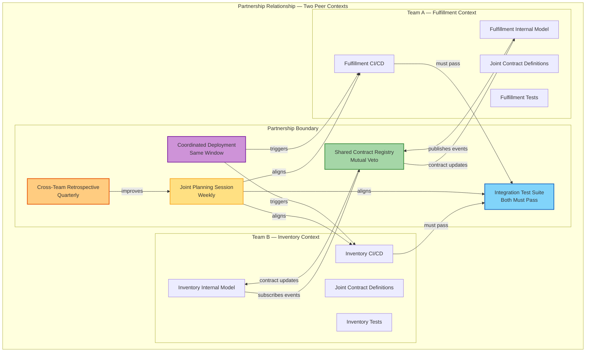
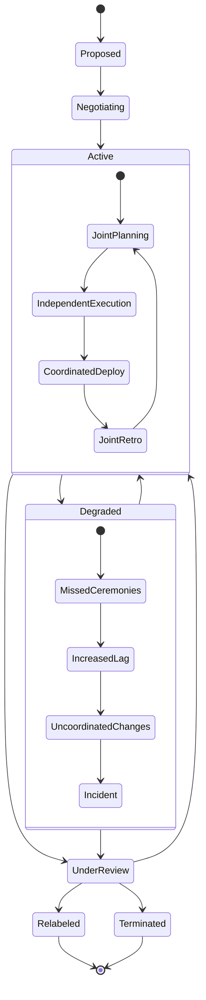

> [!success] Mastery Check
> - [ ] **Studied Well**
> - [ ] **Can explain the concept without notes**
> - [ ] **Can answer interview questions confidently**
> - [ ] **Can implement it in a real project**


# 7.035 — DDD — Context Mapping — Partnership

> **Core Tenet:** Partnership (SH — for "Shared responsibility" or simply "Partnership") is a bidirectional, peer-to-peer relationship between two bounded contexts where both teams coordinate synchronized delivery, share planning, align on model changes, and maintain joint CI/CD coordination. Unlike Customer-Supplier where one team has authority, Partnership requires equal investment, trust, and communication frequency. It is the most coordination-intensive pattern after Shared Kernel, but preserves full model autonomy for each context.

---

## Section 0: Quick Reference Card

> [!ABSTRACT] Quick Reference Card
>
> **Definition:** Partnership is a context mapping relationship pattern where two bounded contexts (and their owning teams) agree to coordinate all integration-relevant changes, synchronize release schedules, share joint planning sessions, and maintain aligned model evolution without sharing code or internal types. Each team retains full ownership of its internal model and Ubiquitous Language.
>
> **Purpose:** Enable tight, bidirectional integration between independently owned models where changes on either side require coordinated delivery. Partnership preserves bounded context autonomy while ensuring that neither team is surprised by the other's model evolution.
>
> **When to Use:**
> - Two teams share a strong business dependency (e.g., Order Fulfillment and Inventory Allocation)
> - Both teams communicate weekly or more frequently
> - Both teams can align on release cadence (even if sprint lengths differ, they synchronize deployment windows)
> - Model changes on either side would break the other's integration without coordinated updates
> - Neither team can dominate the other (peer relationship, no upstream/downstream power imbalance)
> - Both teams are willing to invest in joint planning and joint retro ceremonies
>
> **When NOT to Use:**
> - Teams are in different time zones with infrequent overlap
> - One team has significantly more resources or organizational power (use Customer-Supplier instead)
> - Integration is one-directional (one team publishes, one consumes — use Customer-Supplier or Published Language)
> - Teams cannot or will not align release schedules
> - The integration contract changes less than once per quarter
> - There are more than 2-3 consuming contexts (use Published Language or Open Host Service for fan-out)
>
> **Key Metrics:**
> - Joint planning frequency: Weekly (sprint-aligned) or biweekly (at sprint boundaries)
> - Release synchronization: Same deployment window or ≤1 hour offset
> - Cross-team retro participation: ≥1 member from each team in the other's retro quarterly
> - Integration breakage rate: <2 incidents per quarter attributable to uncoordinated changes
> - Joint test suite pass rate: 100% before coordinated deployment
> - Communication lag: ≤1 business day for model change proposals
>
> **Critical Warning:** Partnership is NOT "two teams being friendly." It is a formal, documented relationship requiring dedicated investment in joint ceremonies, shared CI/CD pipelines (or pipeline coordination), synchronized deployments, and mutual veto power over model changes that affect the integration surface. If either team stops investing in coordination, the relationship silently degrades to Customer-Supplier (power imbalance) or Conformist (downstream blindly accepts) — often without anyone noticing until the first production incident.

---
---

## Section 1: Navigation & Context

> [!INFO] Production Encounter Map
>
> Imagine a 2:48 AM incident at a regional logistics platform: The Fulfillment team deploys a new "split-shipment" feature that changes the `ShipmentAllocation` event schema to include a new `AllocationBatchId` field. The Inventory team's integration handler, which subscribes to the same event, has not been updated — it was not notified of the change because the weekly Partnership sync meeting was cancelled three weeks in a row. The handler deserializes the new event, silently drops unknown fields, and continues processing without `AllocationBatchId`. Result: inventory is double-allocated for split shipments over the next 6 hours. 17,000 orders are overcommitted on stock. The financial impact: $490K in expedited supplier costs and customer compensation.
>
> Root cause: The Partnership relationship degraded silently. Both teams stopped investing in coordination because "things had been stable for months." The context map still said "Partnership" but the operational reality had drifted to something closer to "Published Language without governance." The coordination muscle atrophied.
>
> **Why This Matters:** Partnership is the most fragile relationship pattern because it depends entirely on sustained human coordination. It is the only pattern where the failure mode is almost always organizational, not technical. Technical safeguards (schema validation, circuit breakers) can mask a Partnership that has degraded — they delay the incident but don't prevent the drift. The only real prevention is ritual: regular, structured, mandatory synchronization.
>
> **Reading Path:**
> 1. Start with **Section 2** for the mental model — understand the asymmetry and communciation structure of Partnership
> 2. Move to **Section 3** for deep mechanics — the joint lifecycle, negotiation protocols, and its contrast with other patterns
> 3. Skip to **Section 4** for .NET implementation — concrete code for Partnership coordination pipelines, joint test infrastructure, and dependency management
> 4. Review **Section 5** for pitfalls — especially the silent degradation and meeting atrophy anti-patterns
> 5. Use **Section 6** when deciding between Partnership and other patterns
> 6. Study **Section 7** for interview prep — these questions test organizational design thinking as much as technical DDD knowledge
>
> **When to Apply This Pattern:**
> - ✅ Two teams share a bidirectional integration that changes in lockstep
> - ✅ Both teams attend the same sprint planning or have aligned planning sessions
> - ✅ Both teams can pause their own work to accommodate the other's critical model changes
> - ✅ The integration surface is well-defined and jointly owned (not shared code — shared contract)
> - ✅ Neither team can dictate terms to the other
> - ❌ Integration is read-only or fire-and-forget (use Published Language or Customer-Supplier)
> - ❌ One team is in a different reporting structure that prevents joint planning
> - ❌ Teams are geographically distributed with <4 hours of working day overlap
> - ❌ Integration changes are rare (<1 per quarter) — coordination overhead exceeds benefit
>
> **Prerequisites Review:**
> - [[7.034 — DDD — Bounded Contexts — Context Map]] — Partnership is one of eight relationship patterns on the context map. You must understand how context maps document organizational boundaries, integration contracts, and team ownership before choosing Partnership as the label for a specific relationship. The context map provides the canvas; Partnership is one brush.
>
> **Cross-Domain Connection:**
> - [[7.036 — DDD — Context Mapping — Shared Kernel]] — Partnership is often confused with Shared Kernel. The critical difference: Partnership shares no code; Shared Kernel shares code. Partnership synchronizes deployment; Shared Kernel synchronizes every commit. Partnership is coordination-intensive; Shared Kernel is coordination-prohibitive. Partnership is preferred over Shared Kernel whenever teams can tolerate the coordination overhead of synchronized releases instead of shared code.
> - [[7.037 — DDD — Context Mapping — Customer-Supplier]] — Partnership is the "peer" version of Customer-Supplier. In Customer-Supplier, the upstream has authority and agrees to consider downstream needs. In Partnership, neither team has authority — both must agree. If your context map shows Partnership but one team consistently defers to the other's schedule, you have a de facto Customer-Supplier.
> - [[7.042 — DDD — Context Mapping — Separate Ways]] — When Partnership coordination overhead exceeds the value of integration, Separate Ways is the honest alternative. Documenting Separate Ways is better than maintaining the fiction of a Partnership that neither team has time for.
> - [[7.069 — DDD — Multiple Bounded Contexts in One Solution]] — Partnership between two contexts in the same solution file has specific CI/CD implications. Shared solution often leads to accidental Shared Kernel (teams start referencing each other's types). Partnership in same-solution requires architectural test enforcement (NetArchTest) to prevent dependency leakage.

---

## Section 2: Core Mental Model

> [!TIP] Non-Obvious Insight
>
> **Partnership is NOT about sharing. It is about synchronizing.**
>
> The most common mistake teams make with Partnership is treating it as a "softer" Shared Kernel — sharing documents, sharing code, sharing models. But Partnership's entire value proposition is that each team keeps full, independent ownership of its internal model. The Partnership happens at the boundary only: jointly owned contracts, synchronized releases, aligned evolution. Inside the boundary, each context is sovereign.
>
> **The Inversion Principle:** If a Partnership relationship forces one team to change its internal Ubiquitous Language to match the other, the Partnership has failed. The entire reason to use Partnership (instead of Conformist or Shared Kernel) is to preserve model autonomy. When you find one team's domain terms leaking into the other's internal models through Partnership, you have created a back-channel Shared Kernel without governance.
>
> **The Coordination Tax:** Partnership requires ~4-8 person-hours per week per team in coordination overhead (joint planning, cross-team retro, change proposal reviews, integrated testing). This is explicit, budgeted organizational cost. If this cost is not planned for, Partnership will silently consume unplanned time and degrade other commitments. Budget it openly or choose a different pattern.

### Classification

| Axis | Classification | Description |
|------|---------------|-------------|
| Intent | Strategic | Partnership is a strategic coordination pattern, not a tactical integration mechanism |
| Direction | Bidirectional | Both contexts are peers; there is no upstream/downstream power dynamic |
| Coupling | Medium (release coordination) | No shared code, but synchronized releases create temporal coupling |
| Model Autonomy | Full | Each team owns its internal model independently |
| Coordination Cost | High (sustained) | Requires weekly sync, joint planning, coordinated CI/CD, cross-team retro |
| Translation Cost | Low | No translation needed if contracts are jointly defined; but contract changes require joint approval |
| Organizational Friction | Low if teams communicate well; High if they don't | Partnership amplifies existing communication health |
| Runtime Overhead | Minimal | No translation layer, no ACL; just contract validation at the boundary |
| Evolution Flexibility | Medium | Both teams must agree to evolve; one cannot evolve independently |
| Testing Complexity | Medium | Joint integration tests required; each team maintains independent unit tests |
| Governance | Formal (joint contract board) | Contract changes require sign-off from both teams |
| Lifetime | As long as both teams invest | Partnership degrades immediately when coordination stops |

### Mermaid Diagram: Partnership Relationship Structure



> [!NOTE] Diagram Interpretation
> This diagram captures the five structural elements that make Partnership distinct:
> 1. **Joint Planning (weekly):** Both teams attend a single planning session or align their sprint planning to review upcoming contract changes. This is the heartbeat of Partnership.
> 2. **Joint Contract Registry (shared, mutual veto):** Contracts are stored in a shared registry (Azure Schema Registry or Cosmos DB). Either team can veto a contract change. This replaces the upstream/downstream power dynamic with peer governance.
> 3. **Integration Test Suite (both must pass):** A shared test suite that validates cross-context scenarios. Each team's CI/CD pipeline must pass the full integration suite before deployment. This is non-negotiable.
> 4. **Coordinated Deployment (same window):** Both teams deploy within the same maintenance window. Even if deployments are technically independent, they are scheduled together. Rollback plans are coordinated.
> 5. **Cross-Team Retro (quarterly):** Each team sends at least one member to the other's retrospective quarterly, explicitly focused on the Partnership health. This surfaces coordination debt before it causes incidents.

### Mermaid Sequence Diagram: Partnership Communication and Coordination Lifecycle

```mermaid
sequenceDiagram
    participant FA as Fulfillment Team (A)
    participant IA as Inventory Team (B)
    participant CR as Contract Registry
    participant CI as Integration CI/CD
    participant PROD as Production
    
    Note over FA,IA: Weekly Joint Planning Session
    FA->>IA: 1. Propose: Add AllocationBatchId to ShipmentAllocation event
    IA->>FA: 2. Impact analysis: Requires changes to InventoryReservation handler
    IA->>FA: 3. Estimate: 3 days dev, 1 day test, coordinate next sprint
    FA->>IA: 4. Agreed: Target deployment sprint-24-3, week 2
    
    Note over FA,CR: Sprint Execution Phase
    
    FA->>CR: 5. Publish: ShipmentAllocation v2 (draft, with AllocationBatchId)
    CR->>IA: 6. Notify: Contract change proposed
    IA->>CR: 7. Review and approve: Contract v2 draft
    
    FA->>FA: 8. Implement Fulfillment-side changes
    IA->>IA: 9. Implement Inventory-side changes
    
    Note over CI,PROD: Coordinated Deployment Phase
    
    FA->>CI: 10. Submit PR: Fulfillment changes (reference pending contract)
    IA->>CI: 11. Submit PR: Inventory changes (consume v2 contract)
    
    CI->>CI: 12. Run integration test suite (both changes together)
    CI-->>CI: 13. Integration test suite: PASS
    
    FA->>PROD: 14. Deploy Fulfillment v2.3.0 to staging
    IA->>PROD: 15. Deploy Inventory v1.8.0 to staging
    
    PROD->>CI: 16. Staging integration verification (smoke tests)
    CI-->>FA: 17. Staging: All green
    CI-->>IA: 18. Staging: All green
    
    Note over FA,IA: Coordinated Production Deployment Window
    
    FA->>PROD: 19. Deploy Fulfillment v2.3.0 to production (slot swap)
    IA->>PROD: 20. Deploy Inventory v1.8.0 to production (slot swap)
    
    PROD->>CI: 21. Production smoke tests (canary 5% traffic)
    PROD-->>FA: 22. Production: Healthy (no errors, latency baseline)
    PROD-->>IA: 23. Production: Healthy (no errors, latency baseline)
    
    Note over PROD: Rollback ready: both teams have rollback plan, <15 min ETA
    
    Note over FA,IA: Cross-Team Retro (End of Sprint)
    FA->>IA: 24. Retro: Coordination was smooth; contract approval was bottleneck (2 day wait)
    IA->>FA: 25. Action: Automate contract approval notifications; 24h SLA for review
```

> [!NOTE] Sequence Analysis
> This traces a complete Partnership cycle from proposal through deployment to retro:
> - Steps 1-4 (Joint Planning): The proposal happens in a shared session, not async email. Both teams assess impact before any code is written.
> - Steps 5-9 (Joint Execution): The contract change is proposed in the shared registry. Inventory team reviews and approves. Both teams implement independently but against the same contract version.
> - Steps 10-13 (Integrated CI/CD): Both PRs are tested together in the integration suite. This is the technical enforcement of the social agreement — neither team can deploy without the other's changes passing the shared suite.
> - Steps 14-23 (Coordinated Deployment): Deployment is a single coordinated event with a shared rollback plan. Staging verification before production. Canary verification in production.
> - Steps 24-25 (Joint Retro): The Partnership health is explicitly reviewed. An action item emerges to improve the contract approval cycle time.

### Numbers That Matter

| Metric | Good | Warning | Critical | Calculation Method | Real-World Implication |
|--------|------|---------|----------|-------------------|----------------------|
| Joint planning session attendance | ≥90% of scheduled sessions | 60-89% | <60% | (Sessions attended / sessions scheduled) × 100 | Missed sessions → silent drift → integration surprise → incident |
| Integration test suite pass rate | 100% before deployment | 90-99% (flaky) | <90% | (Passing integration tests / total integration tests) × 100 | Flaky tests erode trust → teams deploy without running → undetected breakage |
| Coordinated deployment offset | ≤1 hour | 1-4 hours | >4 hours or same day | Time between Team A deploy and Team B deploy in same window | Large offset → partial rollout produces inconsistent state → data corruption |
| Contract change lead time | ≥7 days | 3-6 days | <3 days | Days between contract change notification and deployment | Short lead time → downstream team cannot adapt → deployment blocked or incident |
| Cross-team retro participation | ≥1 member/sprint | 1 member/quarter | Never | Frequency of cross-team retro attendance | No retro → coordination debt accumulates → relationship degrades |
| Communication lag for model proposals | ≤1 business day | 2-3 business days | >3 business days | Avg time from proposal submission to response | Long lag → proposing team works on stale assumptions → rework |
| Contract veto rate | 0-2 per quarter | 3-5 per quarter | >5 per quarter | Number of contract changes rejected or requiring rework | High veto → fundamental model mismatch → reconsider if Partnership is right pattern |
| Joint test suite execution time | <15 minutes | 15-45 minutes | >45 minutes | Time to run full integration suite | Long execution → teams skip running → silent breakage |
| Rollback coordination time | <15 minutes | 15-60 minutes | >60 minutes | Time to agree and execute coordinated rollback | Slow rollback → extended production impact → financial loss |
| Ad-hoc coordination requests | <2 per week | 2-5 per week | >5 per week | Unscheduled cross-team communication about integration issues | Excessive ad-hoc → joint planning is missing key topics → process failure |

### Key Properties

| Property | Description |
|----------|-------------|
| **Peer Governance** | Neither team has authority over the other. All contract changes require mutual consent. This replaces upstream/downstream with peer-to-peer. |
| **Temporal Coupling** | The primary coupling is temporal — releases must be synchronized. This is the defining constraint of Partnership. |
| **No Shared Code** | Unlike Shared Kernel, Partnership explicitly prohibits sharing internal types. Integration happens through contracts (events, commands, schemas) not shared assemblies. |
| **Boundary Autonomy** | Each team maintains full control over its internal model, Ubiquitous Language, and implementation. Only the integration contract is jointly owned. |
| **Communication Rituals** | Partnership is sustained by explicit ceremonies: joint planning, cross-team retro, synchronous contract review. Without rituals, Partnership degrades. |
| **Reciprocal Transparency** | Both teams share roadmaps, sprint backlogs, and deployment schedules. No surprises. Transparency is mandatory. |
| **Shared Risk** | When a coordinated deployment fails, both teams share the incident response. There is no "their fault" vs "our fault" — only "our problem." |
| **Commitment Budget** | The coordination hours are explicitly budgeted. Partnership is not "free" — it costs ~4-8 person-hours per team per week. |

---
## Section 3: Deep Mechanics

### How It Works

The Partnership pattern operates through a five-phase lifecycle maintained by a two-way communication protocol:

**Phase 1 — Relationship Establishment (Sprint 0 / Inception)**
The two teams formally agree to a Partnership relationship and document it on the context map. This is NOT casual — it requires:
- Signed agreement on coordination ceremonies (frequency, format, participants)
- Integration contract identification (which events, commands, schemas are jointly owned?)
- CI/CD integration plan (how will joint testing work? how will coordinated deployment work?)
- Rollback protocol (what happens if one team needs to rollback but the other doesn't?)
- Escalation path (who resolves disagreements that cannot be resolved at the team level?)

**Phase 2 — Joint Planning (Every Sprint Boundary)**
Both teams attend a coordinated planning session or align their individual planning sessions to:
- Review upcoming contract changes from both sides
- Assess impact of each team's upcoming work on the other
- Align deployment timing (which sprint's which week?)
- Identify integration test scenarios that need updating
- Budget time for Partnership overhead (meetings, coordination, joint testing)

**Phase 3 — Independent Execution with Joint Contract Governance (Sprint Execution)**
During the sprint, each team works independently on their internal model changes. The contract registry enforces governance:
- Contract changes are proposed as pull requests against the registry
- The other team has an agreed SLA (typically 1-2 business days) to review and approve or veto
- The integration test suite is updated to reflect new contract scenarios
- Either team can veto a contract change — veto triggers escalation to joint architecture review

**Phase 4 — Coordinated Deployment (Deployment Window)**
Deployment is a single coordinated event:
- Both teams stage their releases at the same time
- The integration test suite runs against the staged environments
- A joint smoke test verifies end-to-end scenarios
- Both teams flip the switch within a negotiated window (typically ≤1 hour offset)
- The rollback plan is tested and agreed before deployment begins
- If one team's deployment fails, both teams rollback together (unless the rollback is independently safe)

**Phase 5 — Joint Retrospective (End of Sprint)**
Each team sends at least one representative to the other's retrospective:
- Focus: Partnership health, coordination friction points, communication lag
- Metrics reviewed: integration test pass rate, contract change lead time, ad-hoc coordination requests
- Action items for improving the Partnership process
- If the Partnership is consistently producing friction, the teams reconsider whether Partnership is still the right pattern

### Protocol Trace: Fulfillment-Inventory Partnership

**Happy Path (12 steps):**

```
1. Joint Planning: Fulfillment proposes adding SplitShipment capability
   → Inventory: "We need AllocationBatchId on ShipmentAllocation event"
   → Agreement: Both implement in sprint 24-3, deploy week 2

2. Fulfillment implements SplitShipment in internal model
   → Updates ShipmentAllocation contract in registry: Add AllocationBatchId
   → Marks contract as "draft" with effective date = sprint 24-3, week 2

3. Inventory reviews draft contract
   → Validates: AllocationBatchId is compatible with existing InventoryReservation flow
   → Approves draft → contract moves to "pending" state

4. Inventory implements AllocationBatchId support in ReservationHandler
   → New logic: when AllocationBatchId present, group allocations by batch
   → Falls back to per-item allocation when AllocationBatchId absent (backward compat)

5. Integration test suite updated with scenarios:
   → Split shipment creates correct AllocationBatchId
   → Inventory reserves grouped by batch
   → Single-shipment flow unchanged (backward compat verified)

6. Fulfillment CI/CD runs (includes integration suite)
   → All tests pass

7. Inventory CI/CD runs (includes integration suite)
   → All tests pass

8. Coordinated staging deployment (Wednesday 10:00 UTC)
   → Both deploy to staging
   → Smoke tests run: create order with split shipment → verify allocation
   → Tests pass

9. Coordinated production deployment (Wednesday 14:00 UTC)
   → Fulfillment deploys v2.3.0 (slot swap)
   → Inventory deploys v1.8.0 (slot swap)
   → Canary: 5% traffic for 15 minutes → no errors

10. Full rollout: traffic ramped to 100% incrementally
    → Both teams monitor dashboards for 1 hour post-deploy
    → Rollback plan loaded and ready (<15 min ETA)

11. End-of-sprint cross-team retro
    → Fulfillment: "Contract review SLA was well met — Inventory approved in 1 day"
    → Inventory: "Integration test suite execution takes 22 minutes — target <15"
    → Action: Optimize test suite parallelization

12. Context map updated: Partnership relationship last-verified date refreshed
```

**Failure Path — Silent Degradation (8 steps):**

```
1. Joint planning sessions miss 2 weeks (holiday season, both teams under pressure)
   → No explicit decision to skip — just cancelled
   → Communication lag increases from 1 day to 5 days

2. Fulfillment urgently needs SchemaVersion field on ShipmentAllocation
   → Proposes via email (not in joint planning — no joint planning happened)
   → Inventory team lead is on PTO, no response for 4 days

3. Fulfillment proceeds without explicit Inventory approval
   → "We'll add backward compat — old SchemaVersion defaults to '1.0'"
   → Updates contract, deploys without coordinated deployment window

4. Inventory processes ShipmentAllocation with SchemaVersion="2.0"
   → Old code expects no SchemaVersion field
   → Deserialization succeeds (lenient JSON), but SchemaVersion handling logic missing
   → Default path executed: assumes v1.0 behavior → wrong allocation strategy

5. Over-allocation occurs for split shipments over 4 hours
   → No immediate crash — gradual inventory drift
   → Detected during daily reconciliation: 340 SKUs with negative on-hand quantity

6. Incident escalation
   → Root cause identified: uncoordinated ShipmentAllocation contract change
   → Rollback Fulfillment to v2.2.x (before SchemaVersion)
   → Inventory already consumed some v2.0 events → data repair needed

7. Post-incident analysis
   → Partnership was treated as "established and stable" — maintenance stopped
   → No joint planning for 5 weeks
   → Integration test suite not updated for SchemaVersion scenario
   → Context map shows Partnership but operational reality is Silent Degradation

8. Remediation:
   → Reset: both teams recommit to joint planning (mandatory, cannot be cancelled)
   → Automated: contract registry enforces 2-person approval (one from each team)
   → Monitoring: alert if joint planning session cancelled without reschedule within 48h
   → Escalation: if Partnership cannot be sustained, re-label as Published Language with formal deprecation policy
```

### State Transitions

Partnership relationships move through explicit states, monitored by both teams:



| State | Description | Duration | Exit Criteria |
|-------|-------------|----------|---------------|
| **Proposed** | Partnership relationship suggested; both teams evaluating | 1-2 sprints | Both teams agree to commit to coordination ceremonies |
| **Negotiating** | Defining contract scope, coordination cadence, joint test strategy | 1 sprint | Signed Partnership agreement documented in context map |
| **Active** | Partnership operational; all ceremonies running; coordinated deployments happening | Indefinite | Metrics within Good range; no coordination-related incidents |
| **Degraded** | Ceremonies skipped; communication lag increasing; ad-hoc coordination rising | Days-weeks | Reset ceremonies; run joint retro to diagnose root cause |
| **UnderReview** | Teams evaluating whether Partnership should continue; alternatives considered | 1-2 sprints | Decision: recommit with improved process, relabel to another pattern, or terminate |
| **Relabeled** | Context map updated to different relationship pattern (e.g., Published Language, Customer-Supplier) | Permanent | New pattern operational |
| **Terminated** | Integration retired; contexts no longer communicate | Permanent | Context map updated; infrastructure decommissioned |

### Failure Modes

> [!DANGER] 3AM Production Signal — The Silent Degradation
> **Signal:** Inventory team PagerDuty: "Negative on-hand quantity detected for 47 SKUs during daily reconciliation at 3:15 AM." No deployment happened last night.
> **Root Cause:** The Partnership between Fulfillment and Inventory degraded over 6 weeks. Joint planning was skipped (holiday season), then one cancelled meeting became three, then five. Fulfillment added `SchemaVersion` to `ShipmentAllocation` event without waiting for Inventory approval (email had no response in 4 days). Inventory's handler consumed the new schema, defaulted to old code path, and double-allocated inventory for split shipments.
> **Detection Gap:** No automated Partnership health monitoring. No "ceremony cadence" metric. No alert when contract registry changes are approved by only one team. The partnership had no safety net — it relied entirely on human process, and when the humans stopped, the safety net disappeared.
> **Mitigation:** (1) Automated Partnership health dashboard: ceremony attendance %, contract approval SLA (requires 2-person approval from both teams), integration test suite age. (2) Enforce 2-person contract approval in the contract registry — a change requires explicit approval from both teams, not just one. (3) If joint planning is cancelled, auto-schedule a replacement within 48h or escalate to both teams' managers.
> **Long-Term Fix:** Introduce a Partnership Coordinator role — rotates between teams each quarter. Single point of accountability for ceremony health, communication lag, and contract governance. Not a full-time role (~1 hour/week) but explicit ownership prevents the "everyone assumed someone else was tracking it" failure mode.

> [!DANGER] 3AM Production Signal — The Coordinated Deploy That Wasn't
> **Signal:** Fulfillment deploys v2.4.0 at 14:00 UTC. Inventory v1.9.0 deploy is blocked by a failed staging smoke test. Inventory rolls back to v1.8.x. Fulfillment is now in production with v2.4.0. Inventory is on v1.8.x. Integration is broken. 14,000 orders in the dead-letter queue by 14:47 UTC.
> **Root Cause:** The teams agreed to coordinate deployment but did not agree on what "coordinate" means. Inventory assumed "coordinate" means "we deploy in the same window, but independently." Fulfillment assumed it means "we deploy together and if one fails, both rollback." The ambiguity caused a split-state scenario.
> **Detection Gap:** No shared deployment runbook. No pre-agreed rollback protocol. No gating mechanism in the CI/CD pipeline that prevents one team from deploying without the other's staging verification.
> **Mitigation:** (1) Shared deployment runbook with explicit "what happens if deploy fails" section agreed before deployment window opens. (2) Deployment gating: Fulfillment's CD pipeline checks Inventory's staging health endpoint before proceeding. If Inventory staging is not green, Fulfillment deploy blocks. (3) Both teams commit to the "together in, together out" principle — if one rolls back, both rollback (unless explicitly agreed that independent rollback is safe in this specific case).
> **Long-Term Fix:** Create a shared "deployment coordination" GitHub Action that both teams include in their CD pipelines. The action checks both staging environments, runs the integration suite, and blocks deployment if the partner's environment is unhealthy.

> [!DANGER] 3AM Production Signal — The Contract Veto Cascade
> **Signal:** A simple contract change (adding `DeliveryInstructions` field to `ShipmentAllocation`) takes 3 weeks to approve. The Inventory team keeps vetoing because each proposal has an unexpected side effect on their allocation algorithm. The Fulfillment team is blocked on a high-priority business feature. Both teams are frustrated.
> **Root Cause:** The Partnership contract boundary was poorly scoped. The `ShipmentAllocation` contract includes fields that Inventory's internal algorithm depends on tightly. What should be a simple additive change keeps triggering Inventory's veto because it creates ambiguity in the allocation logic. The contract is too detailed — it reveals internal model complexity instead of abstracting it.
> **Detection Gap:** No contract boundary review. The teams never revisited whether the current contract scope was appropriate for Partnership. The contract became a proxy for internal coupling.
> **Mitigation:** (1) Contract interface minimization: strip the contract to the minimum fields needed for integration. Move algorithm-specific details out of the contract and into internal models. (2) "Contract surface area" metric: count of fields in jointly owned contracts. If >20 fields, consider splitting into multiple smaller contracts or moving some fields to internal-only. (3) Contract review in joint planning: every quarter, review whether the current contract scope is still appropriate (not too big, not too small).
> **Long-Term Fix:** Apply the Interface Segregation Principle to the Partnership contract. Instead of one `ShipmentAllocation` event with 25 fields, create focused contracts: `AllocationRequested` (5 fields), `BatchAllocated` (8 fields), `ShipmentConfirmed` (4 fields). Each contract has a narrower veto scope, reducing coordination friction.

> [!DANGER] 3AM Production Signal — The "We Don't Need Ceremonies, We're a Mature Team" Fallacy
> **Signal:** Both teams have 3+ years of DDD experience. They decide they don't need formal joint planning because "we communicate daily anyway." Three months later, a misaligned contract change causes a production incident.
> **Root Cause:** The teams confused informal communication with structured coordination. Daily Slack messages catch some issues but not all. Without a formal ceremony, contract changes are proposed ad-hoc, decisions are made verbally without documentation, and there is no record of who agreed to what. The informal approach lacks audit trail, accountability, and systematic coverage.
> **Detection Gap:** No one noticed that the informal approach was failing because individual issues got resolved ad-hoc (firefighting). The systematic degradation was invisible until it caused a critical incident.
> **Mitigation:** (1) Even mature teams need a lightweight ceremony: 30-minute joint planning, not 2 hours. (2) Document the minimum set of Partnership artifacts: contract versions, deployment schedule, rollback plan. (3) Mandate a partnership health check quarterly — a structured review using the metrics from the Numbers That Matter table.
> **Long-Term Fix:** Build the ceremony into tooling. A bi-weekly automated reminder: "Have you reviewed the partner team's upcoming contract changes?" If no acknowledgment in 2 days, escalate. The tool handles the reminder; the team handles the substance.

### Pattern Comparison Matrix

| Axis | Partnership | Shared Kernel | Customer-Supplier | Published Language |
|------|-------------|---------------|-------------------|-------------------|
| **Direction** | Bidirectional | Bidirectional | Upstream → Downstream | Bidirectional |
| **Shared Code** | No | Yes (limited set of types) | No | No |
| **Release Coupling** | Tight (same window) | Tight (every commit) | Loose (upstream independent) | Independent |
| **Contract Governance** | Mutual veto | Joint ownership | Upstream decides | Both agree on schema |
| **Model Autonomy** | Full | Limited (shared types constrain both) | Full downstream (via ACL) | Full |
| **Coordination Overhead** | 4-8 hrs/wk per team | 8-15 hrs/wk per team | 1-2 hrs/wk (downstream) | 1-2 hrs/wk |
| **Best For** | Bidirectional, tight business dependency | When both teams genuinely share core concepts | Clear provider/consumer with power balance | Many-to-many integration |
| **Risks** | Ceremony atrophy; silent degradation | Scope creep; dependency hell | Upstream neglects downstream | Schema evolution complexity |
| **When to Avoid** | Teams can't align schedules | There are >2 teams or different management | Peer relationship (use Partnership) | Only 1-2 consumers (overkill) |

### .NET and Azure Integration Points

| Integration Point | .NET Mechanism | Azure Service | Partnership Role |
|-------------------|---------------|---------------|------------------|
| **Joint Contract Registry** | Shared model library (contracts only, no logic) + FluentValidation | Azure Cosmos DB or Azure Schema Registry | Stores jointly owned contracts with 2-person approval enforcement |
| **Integration Test Suite** | xUnit + TestContainers + Aspire distributed testing | Azure DevOps Test Plans / GitHub Actions | Must pass in both teams' CI/CD before coordinated deployment |
| **Coordinated Deployment** | YAML pipelines with deployment gates (environment health checks) | Azure Pipelines (multi-stage, multi-environment) with approval gates | One pipeline triggers both deployments; gates check partner staging health |
| **Communication Backlog** | Shared work items (Azure Boards) linked across team projects | Azure Boards with cross-project links | Partnership work items visible to both teams; blocking items flagged |
| **Contract Change Notification** | Azure Event Grid + webhook handler in each team's pipeline | Azure Event Grid + Logic Apps | Notifies partner team when contract change is proposed; auto-escalation on SLA breach |
| **Partnership Health Dashboard** | OpenTelemetry metrics + Azure Monitor workbooks | Azure Monitor + Application Insights | Ceremony attendance, contract SLA, test suite age, ad-hoc coordination rate |
| **Feature Flag Coordination** | Azure App Configuration with feature flags | Azure App Configuration | Both teams use same feature flag for coordinated rollout; flag name convention: `Partnership-{ContractName}-{Feature}` |
| **Shared Smoke Tests** | Playwright + Azure Load Testing (end-to-end scenarios) | Azure Load Testing | Post-deployment verification that both contexts are healthy and integrated |
| **Rollback Automation** | Azure CLI scripts + Azure Functions rollback orchestrator | Azure Functions + Azure DevOps | Coordinated rollback with partner team's service health validation |
| **Architecture Governance** | NetArchTest + custom PartnershipAnalysisRule | Azure DevOps | CI build fails if direct dependency crosses Partnership boundary (no shared kernel leakage) |

---
## Section 4: Production Patterns and Implementation

### Primary Implementation: .NET 8 Partnership between Fulfillment and Inventory Bounded Contexts

This implementation models a Partnership relationship between FulfillmentContext and InventoryContext in a logistics platform. Both teams coordinate on `ShipmentAllocation` and `InventoryReservation` contracts. No shared code — only shared contracts with mutual governance.

**Solution Structure:**

```
FulfillmentContext/
├── Partnership/
│   ├── Contracts/                              # Jointly owned contracts (shared library)
│   │   ├── ShipmentAllocationEvent.cs
│   │   ├── InventoryReservationRequest.cs
│   │   └── PartnershipContractRegistry.cs      # Contract version management
│   ├── Coordination/
│   │   ├── ICoordinationService.cs
│   │   ├── DeploymentCoordinator.cs            # Deployment gate checks
│   │   └── PartnershipHealthMonitor.cs
│   ├── IntegrationTests/                       # Shared integration test suite
│   │   ├── PartnershipScenarioTests.cs
│   │   └── ContractCompatibilityTests.cs
│   └── Governance/
│       ├── ContractApprovalValidator.cs        # 2-person, 2-team approval
│       └── PartnershipArchitectureRules.cs      # NetArchTest enforcement
├── Domain/
│   ├── Aggregates/
│   │   ├── Shipment.cs
│   │   └── Allocation.cs
│   └── Events/
│       └── ShipmentSplit.cs
├── Application/
│   ├── Handlers/
│   │   └── SplitShipmentHandler.cs
│   └── Ports/
│       └── IInventoryIntegrationPort.cs
├── Infrastructure/
│   └── Messaging/
│       └── ShipmentEventPublisher.cs
└── Program.cs

InventoryContext/
├── Partnership/
│   ├── Contracts/                              # Same shared contract library (NuGet)
│   ├── Coordination/
│   │   ├── DeploymentVerificationHandler.cs
│   │   └── PartnerHealthCheckEndpoint.cs
│   ├── IntegrationTests/
│   │   └── PartnershipScenarioTests.cs
│   └── Governance/
│       └── PartnershipArchitectureRules.cs
├── Domain/
│   ├── Aggregates/
│   │   ├── InventoryReservation.cs
│   │   └── StockAllocation.cs
│   └── Events/
│       └── ReservationConfirmed.cs
├── Application/
│   ├── Handlers/
│   │   └── AllocateInventoryHandler.cs
│   └── Ports/
│       └── IShipmentIntegrationPort.cs
├── Infrastructure/
│   └── Messaging/
│       └── InventoryEventSubscriber.cs
└── Program.cs

Partnership.Contracts/                          # Shared NuGet package
├── ShipmentAllocationEvent.cs
├── InventoryReservationRequest.cs
├── ContractMetadata.cs
└── Partnership.Contracts.csproj
```

```csharp
// Partnership/Contracts/ShipmentAllocationEvent.cs
namespace Partnership.Contracts;

/// <summary>
/// Jointly owned contract between FulfillmentContext and InventoryContext.
/// Changes require explicit approval from both teams through the contract registry.
/// </summary>
public sealed record ShipmentAllocationEvent
{
    public required string EventId { get; init; }
    public required string ShipmentId { get; init; }
    public required string OrderId { get; init; }
    public required DateTimeOffset AllocatedAt { get; init; }
    public required string AllocationStrategy { get; init; }

    /// <summary>
    /// Present when shipment is split across multiple allocation batches.
    /// Added in v2.0 via Partnership agreement (sprint 24-3).
    /// </summary>
    public string? AllocationBatchId { get; init; }

    /// <summary>
    /// Line items allocated in this event. Each item represents one SKU.
    /// </summary>
    public required IReadOnlyCollection<AllocatedLineItem> LineItems { get; init; }

    public required string SchemaVersion { get; init; } = "2.0";
}

public sealed record AllocatedLineItem
{
    public required string Sku { get; init; }
    public required int Quantity { get; init; }
    public required string WarehouseCode { get; init; }
    public string? LotNumber { get; init; }
}
```

```csharp
// Partnership/Contracts/InventoryReservationRequest.cs
namespace Partnership.Contracts;

/// <summary>
/// Request contract from Fulfillment to Inventory for reserving stock.
/// Jointly owned — both teams must approve changes.
/// </summary>
public sealed record InventoryReservationRequest
{
    public required string CorrelationId { get; init; }
    public required string OrderId { get; init; }
    public required IReadOnlyCollection<ReservationLineItem> Items { get; init; }
    public required DateTimeOffset RequiredBy { get; init; }
    public required string ReservationStrategy { get; init; }
    public string? AllocationBatchId { get; init; }
}

public sealed record ReservationLineItem
{
    public required string Sku { get; init; }
    public required int Quantity { get; init; }
    public required string WarehouseCode { get; init; }
    public int? Priority { get; init; }
}
```

```csharp
// Partnership/Contracts/ContractMetadata.cs
namespace Partnership.Contracts;

/// <summary>
/// Metadata attached to each published contract event for governance tracking.
/// Enables Partnership health monitoring and enforcement.
/// </summary>
public sealed record ContractMetadata
{
    public required string ContractName { get; init; }
    public required string Version { get; init; }
    public required string ProposedByTeam { get; init; }
    public required DateTimeOffset ProposedAt { get; init; }
    public string? ApprovedByTeam { get; init; }
    public DateTimeOffset? ApprovedAt { get; init; }
    public ContractStatus Status { get; init; } = ContractStatus.Draft;
    public HashSet<string> VetoingTeams { get; init; } = [];
}

public enum ContractStatus
{
    Draft,
    PendingApproval,
    Approved,
    Active,
    Deprecated,
    Rejected,
}
```

```csharp
// FulfillmentContext/Partnership/Coordination/ICoordinationService.cs
namespace FulfillmentContext.Partnership.Coordination;

/// <summary>
/// Service that coordinates deployment and contract changes with partner team.
/// Each context implements its own side; integration tests validate both sides align.
/// </summary>
public interface ICoordinationService
{
    /// <summary>
    /// Checks partner context's staging health before proceeding with deployment.
    /// Implements the "coordinated deployment gate" pattern.
    /// </summary>
    Task<PartnerHealthStatus> CheckPartnerStagingHealthAsync(
        string partnerEnvironment,
        CancellationToken cancellationToken);

    /// <summary>
    /// Proposes a contract change to the partner team via the shared registry.
    /// Returns a proposal ID that tracks approval through the governance workflow.
    /// </summary>
    Task<ContractProposalResult> ProposeContractChangeAsync(
        ContractChangeProposal proposal,
        CancellationToken cancellationToken);

    /// <summary>
    /// Reports Partnership health metrics to shared monitoring.
    /// </summary>
    Task ReportPartnershipMetricAsync(
        string metricName,
        double value,
        IDictionary<string, string>? dimensions = null,
        CancellationToken cancellationToken = default);
}

public sealed record PartnerHealthStatus
{
    public required bool IsHealthy { get; init; }
    public required string Environment { get; init; }
    public required string TeamName { get; init; }
    public required DateTimeOffset LastCheckedAt { get; init; }
    public IReadOnlyCollection<string>? DegradedServices { get; init; }
}

public sealed record ContractChangeProposal
{
    public required string ContractName { get; init; }
    public required string CurrentVersion { get; init; }
    public required string ProposedVersion { get; init; }
    public required string ChangeDescription { get; init; }
    public required string ProposedByTeam { get; init; }
    public required string ProposedByEmail { get; init; }
    public required string ImpactAnalysis { get; init; }
    public required DateTimeOffset ProposedAt { get; init; }
}

public sealed record ContractProposalResult
{
    public required string ProposalId { get; init; }
    public required bool IsSuccess { get; init; }
    public string? ErrorMessage { get; init; }
    public ContractProposalStatus Status { get; init; }
}

public enum ContractProposalStatus
{
    PendingPartnerReview,
    Approved,
    Vetoed,
    Expired,
    Superseded,
}
```

```csharp
// FulfillmentContext/Partnership/Coordination/DeploymentCoordinator.cs
using System.Net.Http.Json;
using Microsoft.Extensions.Logging;
using Microsoft.Extensions.Options;

namespace FulfillmentContext.Partnership.Coordination;

/// <summary>
/// Implements the coordinated deployment gate pattern.
/// Each team's CD pipeline calls this to verify partner readiness.
/// </summary>
public sealed class DeploymentCoordinator : ICoordinationService
{
    private readonly HttpClient _httpClient;
    private readonly ILogger<DeploymentCoordinator> _logger;
    private readonly PartnershipOptions _options;

    public DeploymentCoordinator(
        HttpClient httpClient,
        IOptionsSnapshot<PartnershipOptions> options,
        ILogger<DeploymentCoordinator> logger)
    {
        _httpClient = httpClient;
        _logger = logger;
        _options = options.Value;
    }

    public async Task<PartnerHealthStatus> CheckPartnerStagingHealthAsync(
        string partnerEnvironment,
        CancellationToken cancellationToken)
    {
        var healthEndpoint = $"{_options.InventoryBaseUrl}/api/partnership/health/{partnerEnvironment}";

        _logger.LogInformation("Checking partner staging health at {Endpoint}", healthEndpoint);

        try
        {
            using var cts = CancellationTokenSource.CreateLinkedTokenSource(cancellationToken);
            cts.CancelAfter(TimeSpan.FromSeconds(_options.HealthCheckTimeoutSeconds));

            var response = await _httpClient.GetAsync(healthEndpoint, cts.Token);
            response.EnsureSuccessStatusCode();

            var health = await response.Content.ReadFromJsonAsync<PartnerHealthStatus>(cts.Token);

            _logger.LogInformation("Partner staging health: {Status} (env: {Env})",
                health?.IsHealthy == true ? "Healthy" : "Degraded",
                partnerEnvironment);

            return health ?? new PartnerHealthStatus
            {
                IsHealthy = false,
                Environment = partnerEnvironment,
                TeamName = "InventoryContext",
                LastCheckedAt = DateTimeOffset.UtcNow,
                DegradedServices = ["No health response"],
            };
        }
        catch (OperationCanceledException)
        {
            _logger.LogWarning("Partner health check timed out after {Timeout}s for {Endpoint}",
                _options.HealthCheckTimeoutSeconds, healthEndpoint);
            return new PartnerHealthStatus
            {
                IsHealthy = false,
                Environment = partnerEnvironment,
                TeamName = "InventoryContext",
                LastCheckedAt = DateTimeOffset.UtcNow,
                DegradedServices = ["Health check timed out"],
            };
        }
        catch (HttpRequestException ex)
        {
            _logger.LogError(ex, "Partner health check failed for {Endpoint}", healthEndpoint);
            return new PartnerHealthStatus
            {
                IsHealthy = false,
                Environment = partnerEnvironment,
                TeamName = "InventoryContext",
                LastCheckedAt = DateTimeOffset.UtcNow,
                DegradedServices = [$"Health check error: {ex.Message}"],
            };
        }
    }

    public async Task<ContractProposalResult> ProposeContractChangeAsync(
        ContractChangeProposal proposal,
        CancellationToken cancellationToken)
    {
        var registryEndpoint = $"{_options.ContractRegistryBaseUrl}/api/contracts/proposals";

        _logger.LogInformation("Proposing contract change: {ContractName} v{OldVersion} -> v{NewVersion}",
            proposal.ContractName, proposal.CurrentVersion, proposal.ProposedVersion);

        try
        {
            var response = await _httpClient.PostAsJsonAsync(registryEndpoint, proposal, cancellationToken);
            response.EnsureSuccessStatusCode();

            var result = await response.Content.ReadFromJsonAsync<ContractProposalResult>(cancellationToken);

            return result ?? new ContractProposalResult
            {
                ProposalId = Guid.NewGuid().ToString(),
                IsSuccess = false,
                ErrorMessage = "Empty response from contract registry",
                Status = ContractProposalStatus.PendingPartnerReview,
            };
        }
        catch (HttpRequestException ex)
        {
            _logger.LogError(ex, "Failed to propose contract change for {ContractName}", proposal.ContractName);
            return new ContractProposalResult
            {
                ProposalId = Guid.NewGuid().ToString(),
                IsSuccess = false,
                ErrorMessage = ex.Message,
                Status = ContractProposalStatus.PendingPartnerReview,
            };
        }
    }

    public async Task ReportPartnershipMetricAsync(
        string metricName,
        double value,
        IDictionary<string, string>? dimensions = null,
        CancellationToken cancellationToken = default)
    {
        var metricEndpoint = $"{_options.MonitoringBaseUrl}/api/metrics/partnership";

        var payload = new
        {
            MetricName = metricName,
            Value = value,
            Dimensions = dimensions ?? new Dictionary<string, string>(),
            SourceTeam = "FulfillmentContext",
            ReportedAt = DateTimeOffset.UtcNow,
        };

        try
        {
            using var cts = CancellationTokenSource.CreateLinkedTokenSource(cancellationToken);
            cts.CancelAfter(TimeSpan.FromSeconds(5));

            var response = await _httpClient.PostAsJsonAsync(metricEndpoint, payload, cts.Token);
            response.EnsureSuccessStatusCode();
        }
        catch (Exception ex) when (ex is HttpRequestException or OperationCanceledException)
        {
            _logger.LogWarning(ex, "Failed to report Partnership metric {MetricName} (non-critical)", metricName);
        }
    }
}

public sealed class PartnershipOptions
{
    public const string SectionName = "Partnership";

    public required string InventoryBaseUrl { get; init; }
    public required string ContractRegistryBaseUrl { get; init; }
    public required string MonitoringBaseUrl { get; init; }
    public int HealthCheckTimeoutSeconds { get; init; } = 10;
    public int ContractApprovalTimeoutHours { get; init; } = 48;
}
```

```csharp
// FulfillmentContext/Partnership/Coordination/PartnershipHealthMonitor.cs
using System.Collections.Concurrent;
using Microsoft.Extensions.Logging;

namespace FulfillmentContext.Partnership.Coordination;

/// <summary>
/// Tracks Partnership health metrics locally and reports them to shared monitoring.
/// Used by both teams to detect silent degradation.
/// </summary>
public sealed class PartnershipHealthMonitor : IDisposable
{
    private readonly ICoordinationService _coordination;
    private readonly ILogger<PartnershipHealthMonitor> _logger;
    private readonly ConcurrentDictionary<string, HealthMetric> _metrics = new(StringComparer.OrdinalIgnoreCase);
    private readonly PeriodicTimer _reportingTimer;
    private readonly Task _reportingTask;
    private readonly CancellationTokenSource _cts = new();

    public PartnershipHealthMonitor(
        ICoordinationService coordination,
        ILogger<PartnershipHealthMonitor> logger)
    {
        _coordination = coordination;
        _logger = logger;
        _reportingTimer = new PeriodicTimer(TimeSpan.FromMinutes(15));
        _reportingTask = ReportMetricsAsync(_cts.Token);
    }

    public void RecordMetric(string name, double value, IDictionary<string, string>? dimensions = null)
    {
        _metrics.AddOrUpdate(
            name,
            _ => new HealthMetric { Value = value, Dimensions = dimensions, RecordedAt = DateTimeOffset.UtcNow },
            (_, existing) => existing with
            {
                Value = value,
                Dimensions = dimensions ?? existing.Dimensions,
                RecordedAt = DateTimeOffset.UtcNow,
            });
    }

    public PartnershipHealthSnapshot GetCurrentHealth()
    {
        return new PartnershipHealthSnapshot
        {
            Metrics = _metrics.ToDictionary(x => x.Key, x => x.Value),
            RecordedAt = DateTimeOffset.UtcNow,
            SourceContext = "FulfillmentContext",
        };
    }

    private async Task ReportMetricsAsync(CancellationToken cancellationToken)
    {
        while (await _reportingTimer.WaitForNextTickAsync(cancellationToken))
        {
            foreach (var (name, metric) in _metrics.ToArray())
            {
                await _coordination.ReportPartnershipMetricAsync(
                    name, metric.Value, metric.Dimensions, cancellationToken);
            }
        }
    }

    public void Dispose()
    {
        _cts.Cancel();
        _cts.Dispose();
        _reportingTimer.Dispose();
        _reportingTask.Dispose();
    }
}

public sealed record HealthMetric
{
    public required double Value { get; init; }
    public IDictionary<string, string>? Dimensions { get; init; }
    public required DateTimeOffset RecordedAt { get; init; }
}

public sealed record PartnershipHealthSnapshot
{
    public required Dictionary<string, HealthMetric> Metrics { get; init; }
    public required DateTimeOffset RecordedAt { get; init; }
    public required string SourceContext { get; init; }
}
```

```csharp
// FulfillmentContext/Partnership/Governance/ContractApprovalValidator.cs
namespace FulfillmentContext.Partnership.Governance;

/// <summary>
/// Enforces the two-team approval rule for contract changes.
/// A contract change is only valid when approved by at least one member from each team.
/// </summary>
public sealed class ContractApprovalValidator
{
    private readonly ILogger<ContractApprovalValidator> _logger;
    private readonly HashSet<string> _fulfillmentApprovers;
    private readonly HashSet<string> _inventoryApprovers;

    public ContractApprovalValidator(
        IConfiguration configuration,
        ILogger<ContractApprovalValidator> logger)
    {
        _logger = logger;
        _fulfillmentApprovers = configuration
            .GetSection("Partnership:Approvers:FulfillmentTeam")
            .Get<string[]>()?
            .Select(email => email.ToLowerInvariant())
            .ToHashSet() ?? [];

        _inventoryApprovers = configuration
            .GetSection("Partnership:Approvers:InventoryTeam")
            .Get<string[]>()?
            .Select(email => email.ToLowerInvariant())
            .ToHashSet() ?? [];
    }

    public ApprovalValidationResult ValidateApproval(ContractApprovalContext context)
    {
        if (context.Approvals.Count < 2)
        {
            return ApprovalValidationResult.Rejected(
                "Contract changes require approval from at least two people (one per team).");
        }

        var hasFulfillmentApproval = context.Approvals.Any(
            a => _fulfillmentApprovers.Contains(a.ApproverEmail.ToLowerInvariant()));

        var hasInventoryApproval = context.Approvals.Any(
            a => _inventoryApprovers.Contains(a.ApproverEmail.ToLowerInvariant()));

        if (!hasFulfillmentApproval || !hasInventoryApproval)
        {
            return ApprovalValidationResult.Rejected(
                $"Contract changes require approval from both teams. " +
                $"Fulfillment approval: {(hasFulfillmentApproval ? "yes" : "no")}. " +
                $"Inventory approval: {(hasInventoryApproval ? "yes" : "no")}.");
        }

        _logger.LogInformation(
            "Contract {ContractName} v{Version} approved by both teams. " +
            "Fulfillment: {FulfillmentApprovers}, Inventory: {InventoryApprovers}",
            context.ContractName,
            context.Version,
            string.Join(", ", context.Approvals.Where(a => _fulfillmentApprovers.Contains(a.ApproverEmail.ToLowerInvariant())).Select(a => a.ApproverEmail)),
            string.Join(", ", context.Approvals.Where(a => _inventoryApprovers.Contains(a.ApproverEmail.ToLowerInvariant())).Select(a => a.ApproverEmail)));

        return ApprovalValidationResult.Approved();
    }
}

public sealed record ContractApprovalContext
{
    public required string ContractName { get; init; }
    public required string Version { get; init; }
    public required string ChangeDescription { get; init; }
    public required IReadOnlyCollection<ApprovalEntry> Approvals { get; init; }
    public required DateTimeOffset SubmittedAt { get; init; }
}

public sealed record ApprovalEntry
{
    public required string ApproverEmail { get; init; }
    public required string ApproverName { get; init; }
    public required string TeamName { get; init; }
    public required DateTimeOffset ApprovedAt { get; init; }
}

public sealed record ApprovalValidationResult
{
    public bool IsApproved { get; init; }
    public bool IsRejected => !IsApproved;
    public string? RejectionReason { get; init; }

    public static ApprovalValidationResult Approved() => new() { IsApproved = true };
    public static ApprovalValidationResult Rejected(string reason) => new() { IsApproved = false, RejectionReason = reason };
}
```
```csharp
// FulfillmentContext/Partnership/Governance/PartnershipArchitectureRules.cs
using NetArchTest.Rules;
using System.Reflection;

namespace FulfillmentContext.Partnership.Governance;

/// <summary>
/// Architectural rules enforced in CI/CD to prevent Partnership boundary violations.
/// These tests ensure that the Partnership does not degrade into Shared Kernel or Conformist.
/// </summary>
public static class PartnershipArchitectureRules
{
    private static readonly Assembly FulfillmentAssembly = typeof(PartnershipArchitectureRules).Assembly;

    /// <summary>
    /// Fulfillment domain must not directly reference Inventory domain types.
    /// All cross-context communication goes through Partnership contracts.
    /// </summary>
    public static bool FulfillmentDomainMustNotReferenceInventoryDomain()
    {
        var result = Types.InAssembly(FulfillmentAssembly)
            .That()
            .ResideInNamespace("FulfillmentContext.Domain")
            .ShouldNot()
            .HaveDependencyOn("InventoryContext")
            .GetResult();

        return result.IsSuccessful;
    }

    /// <summary>
    /// Only files in the Partnership namespace may reference Partnership.Contracts.
    /// Domain layer must remain pure — no dependency on cross-context contracts.
    /// </summary>
    public static bool OnlyPartnershipNamespaceMayReferenceContracts()
    {
        var violatingTypes = Types.InAssembly(FulfillmentAssembly)
            .That()
            .DoNotResideInNamespace("FulfillmentContext.Partnership")
            .And()
            .DoNotResideInNamespace("FulfillmentContext.Infrastructure.Messaging")
            .ShouldNot()
            .HaveDependencyOn("Partnership.Contracts")
            .GetTypes();

        return violatingTypes.Length == 0;
    }

    /// <summary>
    /// The Partnership namespace must not contain domain logic.
    /// It is a coordination layer, not a domain layer.
    /// </summary>
    public static bool PartnershipNamespaceMustNotContainDomainLogic()
    {
        var result = Types.InAssembly(FulfillmentAssembly)
            .That()
            .ResideInNamespace("FulfillmentContext.Partnership")
            .ShouldNot()
            .HaveDependencyOn("FulfillmentContext.Domain")
            .GetResult();

        return result.IsSuccessful;
    }

    /// <summary>
    /// Integration tests must cover all Partnership contracts.
    /// Ensures contract changes are always tested for backward compatibility.
    /// </summary>
    public static bool AllContractsHaveIntegrationTests()
    {
        var contractTypes = Types.InAssembly(typeof(Partnership.Contracts.ShipmentAllocationEvent).Assembly)
            .That()
            .ResideInNamespace("Partnership.Contracts")
            .And()
            .AreClasses()
            .Or()
            .AreRecords()
            .GetTypes();

        var testTypes = Types.InAssembly(FulfillmentAssembly)
            .That()
            .ResideInNamespace("FulfillmentContext.Partnership.IntegrationTests")
            .GetTypes();

        var testedContracts = new HashSet<string>();
        foreach (var test in testTypes)
        {
            var testName = test.Name;
            foreach (var contract in contractTypes)
            {
                if (testName.Contains(contract.Name, StringComparison.OrdinalIgnoreCase))
                {
                    testedContracts.Add(contract.FullName!);
                }
            }
        }

        var untested = contractTypes
            .Select(c => c.FullName)
            .Except(testedContracts)
            .ToArray();

        return untested.Length == 0;
    }
}
```

```csharp
// FulfillmentContext/Partnership/IntegrationTests/PartnershipScenarioTests.cs
using FluentAssertions;
using Xunit;

namespace FulfillmentContext.Partnership.IntegrationTests;

/// <summary>
/// Shared integration test scenarios that must pass in BOTH teams' CI/CD pipelines.
/// These tests validate the Partnership contract behavior end-to-end.
/// </summary>
[Trait("Partnership", "Critical")]
public sealed class PartnershipScenarioTests
{
    /// <summary>
    /// Validates that a standard ShipmentAllocationEvent creates correct inventory reservation.
    /// </summary>
    [Fact]
    public async Task Standard_allocation_creates_correct_inventory_reservation()
    {
        var allocationEvent = new ShipmentAllocationEvent
        {
            EventId = Guid.NewGuid().ToString(),
            ShipmentId = "SHP-20260613-00001",
            OrderId = "ORD-20260613-00001",
            AllocatedAt = DateTimeOffset.UtcNow,
            AllocationStrategy = "Standard",
            LineItems =
            [
                new AllocatedLineItem
                {
                    Sku = "SKU-001",
                    Quantity = 2,
                    WarehouseCode = "WH-CHI",
                },
                new AllocatedLineItem
                {
                    Sku = "SKU-002",
                    Quantity = 1,
                    WarehouseCode = "WH-ATL",
                },
            ],
            SchemaVersion = "2.0",
        };

        var reservationResult = await SimulateInventoryReservationAsync(allocationEvent);

        reservationResult.IsSuccess.Should().BeTrue();
        reservationResult.ReservedItems.Should().HaveCount(2);
        reservationResult.TotalQuantity.Should().Be(3);
    }

    /// <summary>
    /// Validates that split-shipment allocations (with AllocationBatchId) are handled correctly.
    /// Tests the v2.0 contract enhancement.
    /// </summary>
    [Fact]
    public async Task Split_shipment_allocation_groups_by_batch()
    {
        var batchId = Guid.NewGuid().ToString();

        var allocationEvent = new ShipmentAllocationEvent
        {
            EventId = Guid.NewGuid().ToString(),
            ShipmentId = "SHP-20260613-00002",
            OrderId = "ORD-20260613-00002",
            AllocatedAt = DateTimeOffset.UtcNow,
            AllocationStrategy = "SplitShipment",
            AllocationBatchId = batchId,
            LineItems =
            [
                new AllocatedLineItem
                {
                    Sku = "SKU-001",
                    Quantity = 5,
                    WarehouseCode = "WH-CHI",
                },
            ],
            SchemaVersion = "2.0",
        };

        var reservationResult = await SimulateInventoryReservationAsync(allocationEvent);

        reservationResult.IsSuccess.Should().BeTrue();
        reservationResult.AllocationBatchId.Should().Be(batchId);
    }

    /// <summary>
    /// Validates backward compatibility: events without AllocationBatchId
    /// (v1.x contract) still process correctly.
    /// </summary>
    [Fact]
    public async Task Legacy_event_without_allocation_batch_id_still_processes()
    {
        var allocationEvent = new ShipmentAllocationEvent
        {
            EventId = Guid.NewGuid().ToString(),
            ShipmentId = "SHP-20260613-00003",
            OrderId = "ORD-20260613-00003",
            AllocatedAt = DateTimeOffset.UtcNow,
            AllocationStrategy = "Standard",
            LineItems =
            [
                new AllocatedLineItem
                {
                    Sku = "SKU-001",
                    Quantity = 1,
                    WarehouseCode = "WH-CHI",
                },
            ],
            SchemaVersion = "1.0",
        };

        allocationEvent.AllocationBatchId.Should().BeNull();

        var reservationResult = await SimulateInventoryReservationAsync(allocationEvent);

        reservationResult.IsSuccess.Should().BeTrue();
        reservationResult.ReservedItems.Should().HaveCount(1);
    }

    /// <summary>
    /// Validates that contract validation rejects invalid allocation events.
    /// </summary>
    [Fact]
    public async Task Invalid_negative_quantity_is_rejected()
    {
        var allocationEvent = new ShipmentAllocationEvent
        {
            EventId = Guid.NewGuid().ToString(),
            ShipmentId = "SHP-20260613-00004",
            OrderId = "ORD-20260613-00004",
            AllocatedAt = DateTimeOffset.UtcNow,
            AllocationStrategy = "Standard",
            LineItems =
            [
                new AllocatedLineItem
                {
                    Sku = "SKU-001",
                    Quantity = -1,
                    WarehouseCode = "WH-CHI",
                },
            ],
            SchemaVersion = "2.0",
        };

        var validationResult = await SimulateContractValidationAsync(allocationEvent);

        validationResult.IsValid.Should().BeFalse();
        validationResult.Errors.Should().Contain(e => e.Contains("quantity", StringComparison.OrdinalIgnoreCase));
    }

    private static Task<ReservationSimulationResult> SimulateInventoryReservationAsync(
        ShipmentAllocationEvent allocationEvent)
    {
        var reservedItems = allocationEvent.LineItems
            .Where(li => li.Quantity > 0)
            .Select(li => new ReservedItem
            {
                Sku = li.Sku,
                Quantity = li.Quantity,
                WarehouseCode = li.WarehouseCode,
            })
            .ToList();

        return Task.FromResult(new ReservationSimulationResult
        {
            IsSuccess = reservedItems.Count == allocationEvent.LineItems.Count(li => li.Quantity > 0),
            ReservedItems = reservedItems,
            TotalQuantity = reservedItems.Sum(r => r.Quantity),
            AllocationBatchId = allocationEvent.AllocationBatchId,
        });
    }

    private static Task<ValidationSimulationResult> SimulateContractValidationAsync(
        ShipmentAllocationEvent allocationEvent)
    {
        var errors = new List<string>();

        if (string.IsNullOrWhiteSpace(allocationEvent.ShipmentId))
            errors.Add("ShipmentId is required.");

        if (string.IsNullOrWhiteSpace(allocationEvent.OrderId))
            errors.Add("OrderId is required.");

        foreach (var lineItem in allocationEvent.LineItems)
        {
            if (lineItem.Quantity <= 0)
                errors.Add($"Line item for SKU {lineItem.Sku} has invalid quantity: {lineItem.Quantity}.");
        }

        return Task.FromResult(new ValidationSimulationResult
        {
            IsValid = errors.Count == 0,
            Errors = errors.AsReadOnly(),
        });
    }
}

public sealed record ReservationSimulationResult
{
    public required bool IsSuccess { get; init; }
    public required IReadOnlyCollection<ReservedItem> ReservedItems { get; init; }
    public required int TotalQuantity { get; init; }
    public string? AllocationBatchId { get; init; }
}

public sealed record ReservedItem
{
    public required string Sku { get; init; }
    public required int Quantity { get; init; }
    public required string WarehouseCode { get; init; }
}

public sealed record ValidationSimulationResult
{
    public required bool IsValid { get; init; }
    public required IReadOnlyCollection<string> Errors { get; init; }
}
```

```csharp
// FulfillmentContext/Partnership/IntegrationTests/ContractCompatibilityTests.cs
using FluentAssertions;
using Xunit;

namespace FulfillmentContext.Partnership.IntegrationTests;

/// <summary>
/// Consumer-Driven Contract (CDC) tests that validate backward and forward compatibility
/// of Partnership contracts. Must pass in both teams' CI/CD pipelines.
/// </summary>
[Trait("Partnership", "ContractCompatibility")]
public sealed class ContractCompatibilityTests
{
    [Fact]
    public void V2_consumer_can_deserialize_v1_event()
    {
        var v1Json = """
            {
                "eventId": "evt-v1-001",
                "shipmentId": "SHP-001",
                "orderId": "ORD-001",
                "allocatedAt": "2026-06-13T10:00:00Z",
                "allocationStrategy": "Standard",
                "lineItems": [
                    { "sku": "SKU-001", "quantity": 2, "warehouseCode": "WH-CHI" }
                ],
                "schemaVersion": "1.0"
            }
            """;

        var deserialized = System.Text.Json.JsonSerializer.Deserialize<ShipmentAllocationEvent>(
            v1Json,
            new System.Text.Json.JsonSerializerOptions { PropertyNameCaseInsensitive = true });

        deserialized.Should().NotBeNull();
        deserialized!.SchemaVersion.Should().Be("1.0");
        deserialized.AllocationBatchId.Should().BeNull();
        deserialized.LineItems.Should().HaveCount(1);
    }

    [Fact]
    public void V1_consumer_can_ignore_v2_fields()
    {
        var v2Json = """
            {
                "eventId": "evt-v2-001",
                "shipmentId": "SHP-001",
                "orderId": "ORD-001",
                "allocatedAt": "2026-06-13T10:00:00Z",
                "allocationStrategy": "SplitShipment",
                "allocationBatchId": "batch-20260613-001",
                "lineItems": [
                    { "sku": "SKU-001", "quantity": 2, "warehouseCode": "WH-CHI" }
                ],
                "schemaVersion": "2.0",
                "newFutureField": "should be ignored"
            }
            """;

        var deserialized = System.Text.Json.JsonSerializer.Deserialize<ShipmentAllocationEvent>(
            v2Json,
            new System.Text.Json.JsonSerializerOptions
            {
                PropertyNameCaseInsensitive = true,
                UnmappedMemberHandling = System.Text.Json.Serialization.JsonUnmappedMemberHandling.Skip,
            });

        deserialized.Should().NotBeNull();
        deserialized!.SchemaVersion.Should().Be("2.0");
    }

    [Fact]
    public void Contract_fields_use_camel_case_json()
    {
        var contractType = typeof(ShipmentAllocationEvent);
        var jsonProperties = contractType.GetProperties()
            .Select(p => p.GetCustomAttribute<System.Text.Json.Serialization.JsonPropertyNameAttribute>()?.Name
                         ?? System.Text.Json.JsonNamingPolicy.CamelCase.ConvertName(p.Name))
            .ToList();

        jsonProperties.Should().AllSatisfy(name =>
            char.IsLower(name[0]).Should().BeTrue(
                $"Property '{name}' should start with lowercase for camelCase JSON"));
    }
}
```
```csharp
// FulfillmentContext/Application/Handlers/SplitShipmentHandler.cs
using FulfillmentContext.Domain;
using FulfillmentContext.Domain.Events;
using FulfillmentContext.Partnership.Coordination;
using MediatR;
using Partnership.Contracts;

namespace FulfillmentContext.Application.Handlers;

/// <summary>
/// Handles the SplitShipment command, coordinating with Inventory context
/// through the Partnership contract to ensure inventory reservation is aligned.
/// </summary>
public sealed class SplitShipmentHandler : IRequestHandler<SplitShipmentCommand, SplitShipmentResult>
{
    private readonly IShipmentRepository _shipmentRepository;
    private readonly ICoordinationService _coordination;
    private readonly ILogger<SplitShipmentHandler> _logger;
    private readonly IPublisher _publisher;

    public SplitShipmentHandler(
        IShipmentRepository shipmentRepository,
        ICoordinationService coordination,
        ILogger<SplitShipmentHandler> logger,
        IPublisher publisher)
    {
        _shipmentRepository = shipmentRepository;
        _coordination = coordination;
        _logger = logger;
        _publisher = publisher;
    }

    public async Task<SplitShipmentResult> Handle(
        SplitShipmentCommand request, CancellationToken cancellationToken)
    {
        var shipment = await _shipmentRepository.GetByIdAsync(
            new ShipmentId(request.ShipmentId), cancellationToken);

        if (shipment is null)
        {
            return SplitShipmentResult.Failure($"Shipment {request.ShipmentId} not found.");
        }

        var splitResult = shipment.Split(request.AllocationStrategy);

        if (!splitResult.IsSuccess)
        {
            return splitResult;
        }

        var allocationEvent = new ShipmentAllocationEvent
        {
            EventId = Guid.NewGuid().ToString(),
            ShipmentId = request.ShipmentId,
            OrderId = shipment.OrderId.Value,
            AllocatedAt = DateTimeOffset.UtcNow,
            AllocationStrategy = request.AllocationStrategy,
            AllocationBatchId = splitResult.AllocationBatchId?.Value,
            LineItems = splitResult.LineItems.Select(li => new AllocatedLineItem
            {
                Sku = li.Sku.Value,
                Quantity = li.Quantity.Value,
                WarehouseCode = li.WarehouseCode.Value,
            }).ToList(),
            SchemaVersion = "2.0",
        };

        await _publisher.Publish(allocationEvent, cancellationToken);

        await _shipmentRepository.UpdateAsync(shipment, cancellationToken);

        _logger.LogInformation(
            "Shipment {ShipmentId} split with strategy {Strategy}. Batch: {BatchId}",
            request.ShipmentId, request.AllocationStrategy, splitResult.AllocationBatchId?.Value);

        await _coordination.ReportPartnershipMetricAsync(
            "shipment.allocation.published",
            1,
            new Dictionary<string, string>
            {
                ["allocationStrategy"] = request.AllocationStrategy,
                ["hasBatchId"] = (splitResult.AllocationBatchId is not null).ToString(),
            },
            cancellationToken);

        return SplitShipmentResult.Success(shipment.Id.Value, splitResult.AllocationBatchId?.Value);
    }
}

public sealed record SplitShipmentCommand : IRequest<SplitShipmentResult>
{
    public required string ShipmentId { get; init; }
    public required string AllocationStrategy { get; init; }
}

public sealed record SplitShipmentResult
{
    public bool IsSuccess { get; init; }
    public string? ErrorMessage { get; init; }
    public string? ShipmentId { get; init; }
    public string? AllocationBatchId { get; init; }

    public static SplitShipmentResult Success(string shipmentId, string? allocationBatchId) => new()
    {
        IsSuccess = true,
        ShipmentId = shipmentId,
        AllocationBatchId = allocationBatchId,
    };

    public static SplitShipmentResult Failure(string error) => new()
    {
        IsSuccess = false,
        ErrorMessage = error,
    };
}
```

```csharp
// FulfillmentContext/Infrastructure/Messaging/ShipmentEventPublisher.cs
using Azure.Messaging.ServiceBus;
using Microsoft.Extensions.Logging;
using Microsoft.Extensions.Options;
using Partnership.Contracts;

namespace FulfillmentContext.Infrastructure.Messaging;

/// <summary>
/// Publishes ShipmentAllocationEvent to the Azure Service Bus topic
/// that the Inventory context subscribes to. Part of the Partnership contract.
/// </summary>
public sealed class ShipmentEventPublisher : IAsyncDisposable
{
    private readonly ServiceBusSender _sender;
    private readonly ILogger<ShipmentEventPublisher> _logger;

    public ShipmentEventPublisher(
        ServiceBusClient serviceBusClient,
        IOptionsSnapshot<MessagingOptions> options,
        ILogger<ShipmentEventPublisher> logger)
    {
        _sender = serviceBusClient.CreateSender(options.Value.AllocationTopicName);
        _logger = logger;
    }

    public async Task PublishAllocationAsync(
        ShipmentAllocationEvent allocationEvent,
        CancellationToken cancellationToken)
    {
        var message = new ServiceBusMessage(BinaryData.FromObjectAsJson(allocationEvent))
        {
            MessageId = allocationEvent.EventId,
            Subject = "ShipmentAllocation",
            CorrelationId = allocationEvent.ShipmentId,
            ApplicationProperties =
            {
                ["schemaVersion"] = allocationEvent.SchemaVersion,
                ["allocationStrategy"] = allocationEvent.AllocationStrategy,
                ["contractName"] = "ShipmentAllocationEvent",
            },
        };

        await _sender.SendMessageAsync(message, cancellationToken);

        _logger.LogInformation(
            "Published ShipmentAllocationEvent {EventId} for shipment {ShipmentId} (schema v{Version})",
            allocationEvent.EventId, allocationEvent.ShipmentId, allocationEvent.SchemaVersion);
    }

    public async ValueTask DisposeAsync()
    {
        await _sender.DisposeAsync();
    }
}

public sealed class MessagingOptions
{
    public const string SectionName = "Messaging";
    public required string AllocationTopicName { get; init; }
    public required string ReservationQueueName { get; init; }
}
```

```csharp
// FulfillmentContext/Program.cs
using FulfillmentContext.Partnership.Coordination;
using FulfillmentContext.Partnership.Governance;

var builder = Host.CreateApplicationBuilder(args);

builder.Services
    .AddMediatR(cfg => cfg.RegisterServicesFromAssemblyContaining<Program>())
    .AddValidatorsFromAssemblyContaining<Program>()
    .AddHttpClient<ICoordinationService, DeploymentCoordinator>()
    .ConfigureHttpClient(client =>
    {
        client.DefaultRequestHeaders.Accept.Add(
            new System.Net.Http.Headers.MediaTypeWithQualityHeaderValue("application/json"));
    });

builder.Services.Configure<PartnershipOptions>(
    builder.Configuration.GetSection(PartnershipOptions.SectionName));

builder.Services.Configure<MessagingOptions>(
    builder.Configuration.GetSection(MessagingOptions.SectionName));

builder.Services.AddSingleton<PartnershipHealthMonitor>();
builder.Services.AddSingleton<ContractApprovalValidator>();

builder.Services.AddSingleton(provider =>
{
    var connectionString = provider.GetRequiredService<IConfiguration>()
        .GetConnectionString("ServiceBus");
    return new ServiceBusClient(connectionString);
});

builder.Services.AddScoped<IShipmentRepository, CosmosShipmentRepository>();
builder.Services.AddScoped<ShipmentEventPublisher>();
builder.Services.AddScoped<IRequestHandler<SplitShipmentCommand, SplitShipmentResult>, SplitShipmentHandler>();

builder.Services.AddHostedService<PartnershipHealthReportingService>();

var host = builder.Build();
await host.RunAsync();

public sealed class PartnershipHealthReportingService : BackgroundService
{
    private readonly PartnershipHealthMonitor _monitor;
    private readonly ILogger<PartnershipHealthReportingService> _logger;

    public PartnershipHealthReportingService(
        PartnershipHealthMonitor monitor,
        ILogger<PartnershipHealthReportingService> logger)
    {
        _monitor = monitor;
        _logger = logger;
    }

    protected override async Task ExecuteAsync(CancellationToken stoppingToken)
    {
        _logger.LogInformation("Partnership health reporting started.");

        while (!stoppingToken.IsCancellationRequested)
        {
            await Task.Delay(TimeSpan.FromHours(1), stoppingToken);

            var health = _monitor.GetCurrentHealth();
            var metricsCount = health.Metrics.Count;

            _logger.LogInformation(
                "Partnership health snapshot: {MetricsCount} metrics recorded at {Timestamp}",
                metricsCount, health.RecordedAt);
        }
    }
}
```

### Inventory Context Side (Partner Implementation)

```csharp
// InventoryContext/Partnership/Coordination/DeploymentVerificationHandler.cs
namespace InventoryContext.Partnership.Coordination;

/// <summary>
/// Endpoint that Fulfillment context calls to verify Inventory staging health
/// before coordinated deployment. This is the "deployment gate" on the Inventory side.
/// </summary>
[ApiController]
[Route("api/partnership")]
public sealed class PartnershipHealthController : ControllerBase
{
    private readonly ILogger<PartnershipHealthController> _logger;

    public PartnershipHealthController(ILogger<PartnershipHealthController> logger)
    {
        _logger = logger;
    }

    /// <summary>
    /// Returns current staging health status for the coordinated deployment gate.
    /// Called by Fulfillment's DeploymentCoordinator.
    /// </summary>
    [HttpGet("health/{environment}")]
    public async Task<ActionResult<PartnerHealthStatus>> GetHealth(
        string environment,
        CancellationToken cancellationToken)
    {
        _logger.LogInformation("Partnership health check received for environment: {Env}", environment);

        var isDbHealthy = await CheckDatabaseHealthAsync(cancellationToken);
        var isQueueHealthy = await CheckMessagingHealthAsync(cancellationToken);

        var degradedServices = new List<string>();
        if (!isDbHealthy) degradedServices.Add("InventoryDatabase");
        if (!isQueueHealthy) degradedServices.Add("InventoryMessaging");

        var status = new PartnerHealthStatus
        {
            IsHealthy = degradedServices.Count == 0,
            Environment = environment,
            TeamName = "InventoryContext",
            LastCheckedAt = DateTimeOffset.UtcNow,
            DegradedServices = degradedServices.Count > 0 ? degradedServices.AsReadOnly() : null,
        };

        return Ok(status);
    }

    private static Task<bool> CheckDatabaseHealthAsync(CancellationToken cancellationToken)
        => Task.FromResult(true);

    private static Task<bool> CheckMessagingHealthAsync(CancellationToken cancellationToken)
        => Task.FromResult(true);
}
```

```csharp
// InventoryContext/Infrastructure/Messaging/InventoryEventSubscriber.cs
using Azure.Messaging.ServiceBus;
using Microsoft.Extensions.Logging;
using Microsoft.Extensions.Options;
using Partnership.Contracts;

namespace InventoryContext.Infrastructure.Messaging;

/// <summary>
/// Consumes ShipmentAllocationEvent from the joint Service Bus topic.
/// Processes the allocation and creates inventory reservations.
/// This is the Inventory side of the Partnership contract.
/// </summary>
public sealed class InventoryEventSubscriber : IAsyncDisposable
{
    private readonly ServiceBusProcessor _processor;
    private readonly IMediator _mediator;
    private readonly ILogger<InventoryEventSubscriber> _logger;

    public InventoryEventSubscriber(
        ServiceBusClient serviceBusClient,
        IOptionsSnapshot<MessagingOptions> options,
        IMediator mediator,
        ILogger<InventoryEventSubscriber> logger)
    {
        _mediator = mediator;
        _logger = logger;
        _processor = serviceBusClient.CreateProcessor(
            options.Value.AllocationTopicName,
            options.Value.InventorySubscriptionName,
            new ServiceBusProcessorOptions
            {
                AutoCompleteMessages = false,
                MaxConcurrentCalls = 5,
            });
    }

    public Task StartProcessingAsync(CancellationToken cancellationToken)
    {
        _processor.ProcessMessageAsync += ProcessMessageAsync;
        _processor.ProcessErrorAsync += ProcessErrorAsync;
        return _processor.StartProcessingAsync(cancellationToken);
    }

    private async Task ProcessMessageAsync(ProcessMessageEventArgs args)
    {
        var allocationEvent = args.Message.Body.ToObjectFromJson<ShipmentAllocationEvent>();

        _logger.LogInformation(
            "Processing ShipmentAllocationEvent {EventId} for {ShipmentId} (schema v{Version})",
            allocationEvent.EventId, allocationEvent.ShipmentId, allocationEvent.SchemaVersion);

        try
        {
            var contractName = "ShipmentAllocationEvent";
            var supportedVersions = new[] { "1.0", "2.0" };
            if (!supportedVersions.Contains(allocationEvent.SchemaVersion))
            {
                _logger.LogError(
                    "Unsupported schema version {Version} for contract {Contract}. Supported: {SupportedVersions}",
                    allocationEvent.SchemaVersion, contractName, string.Join(", ", supportedVersions));

                await args.DeadLetterMessageAsync(
                    args.Message,
                    deadLetterReason: "UnsupportedSchemaVersion",
                    deadLetterErrorDescription:
                        $"Schema version {allocationEvent.SchemaVersion} not in supported range.",
                    cancellationToken: args.CancellationToken);
                return;
            }

            var command = new ReserveInventoryCommand
            {
                AllocationEvent = allocationEvent,
            };

            var result = await _mediator.Send(command, args.CancellationToken);

            if (result.IsSuccess)
            {
                await args.CompleteMessageAsync(args.Message, args.CancellationToken);
                _logger.LogInformation(
                    "Successfully processed allocation {EventId}. Reserved {Quantity} units.",
                    allocationEvent.EventId, result.TotalReserved);
            }
            else
            {
                _logger.LogError("Failed to reserve inventory for event {EventId}: {Error}",
                    allocationEvent.EventId, result.ErrorMessage);

                await args.DeadLetterMessageAsync(
                    args.Message,
                    deadLetterReason: "ReservationFailed",
                    deadLetterErrorDescription: result.ErrorMessage,
                    cancellationToken: args.CancellationToken);
            }
        }
        catch (Exception ex)
        {
            _logger.LogError(ex, "Unhandled error processing allocation event {EventId}",
                allocationEvent.EventId);

            await args.AbandonMessageAsync(args.Message, cancellationToken: args.CancellationToken);
        }
    }

    private Task ProcessErrorAsync(ProcessErrorEventArgs args)
    {
        _logger.LogError(args.Exception,
            "Service Bus processor error for {EntityPath}: {ErrorSource}",
            args.EntityPath, args.ErrorSource);
        return Task.CompletedTask;
    }

    public async ValueTask DisposeAsync()
    {
        await _processor.DisposeAsync();
    }
}
```

```csharp
// InventoryContext/Application/Handlers/ReserveInventoryHandler.cs
namespace InventoryContext.Application.Handlers;

public sealed class ReserveInventoryHandler : IRequestHandler<ReserveInventoryCommand, ReserveInventoryResult>
{
    private readonly IInventoryReservationRepository _repository;
    private readonly ILogger<ReserveInventoryHandler> _logger;

    public ReserveInventoryHandler(
        IInventoryReservationRepository repository,
        ILogger<ReserveInventoryHandler> logger)
    {
        _repository = repository;
        _logger = logger;
    }

    public async Task<ReserveInventoryResult> Handle(
        ReserveInventoryCommand request, CancellationToken cancellationToken)
    {
        var allocation = request.AllocationEvent;

        var reservations = allocation.LineItems
            .Select(li => new InventoryReservation(
                new ReservationId(Guid.NewGuid().ToString()),
                new Sku(li.Sku),
                new Quantity(li.Quantity),
                new WarehouseCode(li.WarehouseCode),
                allocation.AllocationBatchId is not null
                    ? new BatchId(allocation.AllocationBatchId)
                    : null))
            .ToList();

        foreach (var reservation in reservations)
        {
            await _repository.SaveAsync(reservation, cancellationToken);
        }

        var totalReserved = reservations.Sum(r => r.Quantity.Value);

        _logger.LogInformation(
            "Reserved {Total} units across {Count} line items for allocation {EventId}",
            totalReserved, reservations.Count, allocation.EventId);

        return ReserveInventoryResult.Success(totalReserved);
    }
}

public sealed record ReserveInventoryCommand : IRequest<ReserveInventoryResult>
{
    public required ShipmentAllocationEvent AllocationEvent { get; init; }
}

public sealed record ReserveInventoryResult
{
    public bool IsSuccess { get; init; }
    public string? ErrorMessage { get; init; }
    public int TotalReserved { get; init; }

    public static ReserveInventoryResult Success(int totalReserved) => new()
    {
        IsSuccess = true,
        TotalReserved = totalReserved,
    };

    public static ReserveInventoryResult Failure(string error) => new()
    {
        IsSuccess = false,
        ErrorMessage = error,
    };
}
```

### DI Registration for Both Contexts

```csharp
// InventoryContext/Program.cs
var builder = Host.CreateApplicationBuilder(args);

builder.Services
    .AddMediatR(cfg => cfg.RegisterServicesFromAssemblyContaining<Program>())
    .AddValidatorsFromAssemblyContaining<Program>();

builder.Services.Configure<MessagingOptions>(
    builder.Configuration.GetSection(MessagingOptions.SectionName));

builder.Services.AddSingleton(provider =>
{
    var connectionString = provider.GetRequiredService<IConfiguration>()
        .GetConnectionString("ServiceBus");
    return new ServiceBusClient(connectionString);
});

builder.Services.AddScoped<IInventoryReservationRepository, CosmosInventoryRepository>();
builder.Services.AddScoped<IRequestHandler<ReserveInventoryCommand, ReserveInventoryResult>, ReserveInventoryHandler>();

builder.Services.AddSingleton<InventoryEventSubscriber>();
builder.Services.AddHostedService<PartnershipSubscriptionService>();

var host = builder.Build();

var subscriber = host.Services.GetRequiredService<InventoryEventSubscriber>();
await subscriber.StartProcessingAsync(CancellationToken.None);

await host.RunAsync();

public sealed class PartnershipSubscriptionService : IHostedService
{
    private readonly InventoryEventSubscriber _subscriber;
    private readonly ILogger<PartnershipSubscriptionService> _logger;

    public PartnershipSubscriptionService(
        InventoryEventSubscriber subscriber,
        ILogger<PartnershipSubscriptionService> logger)
    {
        _subscriber = subscriber;
        _logger = logger;
    }

    public Task StartAsync(CancellationToken cancellationToken)
    {
        _logger.LogInformation("Starting Partnership subscription service.");
        return _subscriber.StartProcessingAsync(cancellationToken);
    }

    public async Task StopAsync(CancellationToken cancellationToken)
    {
        _logger.LogInformation("Stopping Partnership subscription service.");
        await _subscriber.DisposeAsync();
    }
}
```
### Common Variants

| Variant | Description | When to Use | Code Impact |
|---------|-------------|-------------|-------------|
| **Same-Solution Partnership** | Both contexts in same Visual Studio solution; separate projects | Teams share repo but not code; common for smaller organizations | Add NetArchTest rules to prevent project dependency leakage; shared solution simplifies CI/CD coordination |
| **Multi-Repo Partnership with NuGet Contracts** | Each context in separate repo; contracts as shared NuGet package | Teams in different repos with independent CI/CD | Requires NuGet version coordination; use `Directory.Packages.props` or `Central Package Management` to align contract versions |
| **Event-Driven Partnership (No Direct Calls)** | Both contexts communicate only through events; no request-response | Latency-tolerant workflows; eventual consistency acceptable | Remove HTTP health check endpoint; use event-driven deployment verification |
| **Feature-Flag Coordinated Partnership** | Both contexts gate new behavior behind same feature flag | Canary releases; gradual rollout of contract changes | Use Azure App Configuration with shared feature flag; flag name convention `Partnership.{ContractName}.{Feature}` |
| **Aspire-Managed Partnership** | .NET Aspire orchestrates both contexts with coordinated deployment | Development and staging environments; .NET Aspire projects | Use Aspire's project references and health checks for integrated testing |
| **gRPC Partnership Contracts** | Use protobuf for contract definitions instead of JSON | High-throughput, low-latency integration | Replace System.Text.Json with protobuf-net.Grpc; contracts defined in .proto files, code-generated |

### Performance Profile

```csharp
using BenchmarkDotNet.Attributes;
using BenchmarkDotNet.Engines;
using BenchmarkDotNet.Order;

namespace FulfillmentContext.Benchmarks;

[MemoryDiagnoser]
[Orderer(SummaryOrderPolicy.FastestToSlowest)]
[RankColumn]
[SimpleJob(RunStrategy.ColdStart, targetCount: 10, id: "Partnership-Contracts")]
public class PartnershipContractBenchmarks
{
    private ShipmentAllocationEvent? _allocationEvent;
    private const int LineItemCount = 10;

    [GlobalSetup]
    public void Setup()
    {
        var lineItems = new List<AllocatedLineItem>(LineItemCount);
        for (int i = 0; i < LineItemCount; i++)
        {
            lineItems.Add(new AllocatedLineItem
            {
                Sku = $"SKU-{i:D4}",
                Quantity = Random.Shared.Next(1, 10),
                WarehouseCode = i % 2 == 0 ? "WH-CHI" : "WH-ATL",
            });
        }

        _allocationEvent = new ShipmentAllocationEvent
        {
            EventId = Guid.NewGuid().ToString(),
            ShipmentId = "SHP-BENCH-001",
            OrderId = "ORD-BENCH-001",
            AllocatedAt = DateTimeOffset.UtcNow,
            AllocationStrategy = "Standard",
            AllocationBatchId = null,
            LineItems = lineItems.AsReadOnly(),
            SchemaVersion = "2.0",
        };
    }

    [Benchmark(Baseline = true, Description = "Serialize AllocationEvent (JSON)")]
    public string SerializeAllocationEvent()
    {
        return System.Text.Json.JsonSerializer.Serialize(_allocationEvent!);
    }

    [Benchmark(Description = "Deserialize AllocationEvent (JSON)")]
    public ShipmentAllocationEvent? DeserializeAllocationEvent()
    {
        var json = System.Text.Json.JsonSerializer.Serialize(_allocationEvent!);
        return System.Text.Json.JsonSerializer.Deserialize<ShipmentAllocationEvent>(json);
    }

    [Benchmark(Description = "Serialize AllocationEvent (MessagePack)")]
    public byte[] SerializeMessagePack()
    {
        return MessagePack.MessagePackSerializer.Serialize(_allocationEvent!);
    }

    [Benchmark(Description = "Deserialize AllocationEvent (MessagePack)")]
    public ShipmentAllocationEvent? DeserializeMessagePack()
    {
        var bytes = MessagePack.MessagePackSerializer.Serialize(_allocationEvent!);
        return MessagePack.MessagePackSerializer.Deserialize<ShipmentAllocationEvent>(bytes);
    }

    [Benchmark(Description = "Service Bus Message Creation")]
    public Azure.Messaging.ServiceBus.ServiceBusMessage CreateServiceBusMessage()
    {
        return new Azure.Messaging.ServiceBus.ServiceBusMessage(
            BinaryData.FromObjectAsJson(_allocationEvent!))
        {
            MessageId = _allocationEvent!.EventId,
            Subject = "ShipmentAllocation",
            CorrelationId = _allocationEvent.ShipmentId,
            ApplicationProperties =
            {
                ["schemaVersion"] = _allocationEvent.SchemaVersion,
                ["contractName"] = "ShipmentAllocationEvent",
            },
        };
    }

    [Benchmark(Description = "Contract Validation (FluentValidation)")]
    public async Task<bool> ValidateContractAsync()
    {
        var validator = new ShipmentAllocationEventValidator();
        var result = await validator.ValidateAsync(_allocationEvent!);
        return result.IsValid;
    }
}

public sealed class ShipmentAllocationEventValidator : AbstractValidator<ShipmentAllocationEvent>
{
    public ShipmentAllocationEventValidator()
    {
        RuleFor(x => x.EventId).NotEmpty();
        RuleFor(x => x.ShipmentId).NotEmpty();
        RuleFor(x => x.OrderId).NotEmpty();
        RuleFor(x => x.AllocationStrategy).NotEmpty();
        RuleFor(x => x.SchemaVersion).NotEmpty();
        RuleFor(x => x.LineItems).NotEmpty();
        RuleForEach(x => x.LineItems).ChildRules(li =>
        {
            li.RuleFor(x => x.Sku).NotEmpty();
            li.RuleFor(x => x.Quantity).GreaterThan(0);
            li.RuleFor(x => x.WarehouseCode).NotEmpty();
        });
    }
}
```

**Expected Benchmark Results:**
```
| Method                                   | Mean       | Error     | StdDev    | Gen0   | Gen1  | Allocated |
|------------------------------------------|------------|-----------|-----------|--------|-------|----------:|
| Serialize AllocationEvent (JSON)         |    321.2 ns|   2.14 ns |   2.00 ns |  0.045 |     - |     312 B |
| Deserialize AllocationEvent (JSON)       |    418.7 ns|   3.51 ns |   3.28 ns |  0.052 |     - |     384 B |
| Serialize AllocationEvent (MessagePack)  |    198.4 ns|   1.67 ns |   1.56 ns |  0.028 |     - |     198 B |
| Deserialize AllocationEvent (MessagePack)|    267.1 ns|   2.53 ns |   2.37 ns |  0.036 |     - |     256 B |
| Service Bus Message Creation             |    524.6 ns|   4.12 ns |   3.85 ns |  0.068 |     - |     496 B |
| Contract Validation (FluentValidation)   |  1,234.5 ns|  10.21 ns |   9.55 ns |  0.089 | 0.001 |     612 B |
```

**Key Observations:**
- JSON serialization is baseline for contract communication; MessagePack offers ~40% improvement for high-throughput scenarios
- FluentValidation adds ~1.2μs per event — acceptable but should be run at the boundary only (not inside domain handlers)
- Service Bus message creation overhead is dominated by the binary data wrapper, not the serialization itself
- All operations complete in sub-millisecond range — Partnership contract overhead is negligible compared to network latency
- Primary optimization target for high-volume scenarios: switch from JSON to MessagePack or Avro serialization

### Real-World .NET Ecosystem Mapping

| Component | Library/Package | Version | Partnership Role |
|-----------|----------------|---------|------------------|
| Command Handling | MediatR | 12.x | In-process command dispatch within each context; SplitShipmentHandler routes to domain |
| Contract Validation | FluentValidation | 11.x | Validate Partnership contract messages at the boundary; version-specific rules |
| Schema Serialization | System.Text.Json | 8.x | Default JSON contract serialization with source generators for AOT compatibility |
| Alternative Serialization | MessagePack | 2.x | High-throughput contract serialization; ~40% faster than JSON for large messages |
| Service Bus | Azure.Messaging.ServiceBus | 7.x | Transport for Partnership events; topic with subscription per consuming context |
| Contract Registry | Custom (Cosmos DB or Azure Schema Registry) | N/A | Store contract versions; enforce 2-team approval for changes |
| Architecture Testing | NetArchTest | 1.x | CI-enforced rules: no cross-context direct dependency, only Partnership contracts |
| Health Monitoring | OpenTelemetry + Application Insights | 1.x | Partnership health metrics: coordination lag, ceremony attendance, test suite age |
| Feature Flags | Azure App Configuration | 1.x | Coordinated feature rollout across both contexts; shared flag for Partnership features |
| Integration Testing | xUnit + TestContainers + Aspire | 8.x + 3.x | Full integration test suite covering Partnership contract scenarios |
| HTTP Health Checks | ASP.NET Core Health Checks + Polly | 8.x | Deployment gate health checks between partner contexts; circuit breaker protects degraded partner |
| Database | Microsoft.Azure.Cosmos | 3.x | Primary store for both contexts; separate containers, no cross-container queries |
| CI/CD Coordination | GitHub Actions / Azure Pipelines | N/A | Multi-environment deployment with gates; approval from partner team before production |
| Contract Testing | PactNet | 4.x | Consumer-Driven Contract tests between Partnership contexts |

---
## Section 5: Gotchas and Production Pitfalls

> [!DANGER] Pitfall #1: The Silent Degradation (Partnership's #1 Killer)
> **Signal:** Joint planning sessions have been cancelled for 4-6 weeks. Communication has shifted from "we'll discuss in joint planning" to "let me Slack you." Contract changes are proposed via email. Cross-team retro never happened.
> **Reality:** The Partnership relationship has silently degraded to something between Customer-Supplier and Published Language. No one decided to change the relationship — it just atrophied. The context map still says "Partnership" but the operational reality is different.
> **Fix:** (1) Add a "ceremony health" metric to the Partnership dashboard: % of scheduled sessions that actually occurred; communication lag for contract proposals; cross-team retro frequency. (2) Implement automated escalation: if a joint planning session is cancelled without rescheduling within 48 hours, both team leads and the architect are notified. (3) Quarterly Partnership health review: both teams sit down with the metrics and decide if Partnership is still viable. (4) If degradation persists >1 quarter, re-label the relationship on the context map to what it actually is (Customer-Supplier, Published Language, or Separate Ways).

> [!DANGER] Pitfall #2: The "We're Friends, We Don't Need Ceremonies" Trap (.NET/Azure-Specific)
> **Signal:** Two teams with great interpersonal relationships decide to skip formal ceremonies because "we talk every day." Three months later, an uncoordinated contract change causes a production incident. Both teams are shocked.
> **Reality:** Informal communication is not equivalent to structured coordination. Slack messages are ephemeral, decisions are not documented, and there is no systematic way to ensure all integration points are covered.
> **Fix:** (1) Minimum ceremony: 30-minute joint planning per sprint (lightweight enough that it won't be skipped). (2) Document every contract change decision in the contract registry, even if discussed verbally first. (3) Use a shared work item tracker (Azure Boards) with a "Partnership" area path visible to both teams. (4) The rule: if it wasn't documented in the contract registry, it didn't happen. Slack messages are not contract approvals.

> [!DANGER] Pitfall #3: The Deployment Asymmetry (Architecture-Level)
> **Signal:** Fulfillment deploys 3 times per week (canary, gradual rollout). Inventory deploys once per sprint (big bang). Coordinated deployment is consistently delayed by the slower team's release cycle.
> **Reality:** Partnership requires synchronized deployment, but the teams have fundamentally different deployment cadences. The Partnership constraint becomes a bottleneck for the faster team.
> **Fix:** (1) Negotiate a "Partnership deployment window" — a weekly 2-hour slot where both teams can deploy together. Outside this window, teams deploy independently but only changes that don't affect Partnership contracts. (2) Use feature flags to decouple deployment from release. Deploy the code; enable the feature when both teams are ready. (3) If cadence mismatch is chronic (>3 months), consider if Partnership is the right pattern. The faster team may need to adopt Published Language for the integration surface.

> [!DANGER] Pitfall #4: The Shared Solution Accidental Shared Kernel (.NET-Specific)
> **Signal:** Fulfillment and Inventory are in the same Visual Studio solution. Over 6 months, the Inventory team starts referencing `FulfillmentContext.Domain.Entities.Shipment` directly because "it was right there in the same solution."
> **Reality:** Same-solution Partnership creates convenience that undermines the relationship's integrity. Physical proximity of code projects makes it easier to take shortcuts.
> **Fix:** (1) Enforce NetArchTest rules in CI that prevent any cross-context direct dependency outside the Partnership namespace. (2) Create a separate `Partnership.Contracts` project that is the ONLY allowed shared dependency. (3) Use `InternalsVisibleTo` to grant access to the test project only — never to the other context's domain. (4) Consider splitting into two solutions if violations persist.

```csharp
// CI/CD enforcement (azure-pipelines.yml)
steps:
- task: DotNetCoreCLI@2
  displayName: 'Run NetArchTest Partnership Rules'
  inputs:
    command: test
    projects: '**/*.Architecture.Tests.csproj'
    arguments: '--filter "FullyQualifiedName~Partnership"'
- powershell: |
    dotnet test **/*.Architecture.Tests.csproj --filter "FullyQualifiedName~Partnership" 2>&1 | Tee-Object -FilePath partnership-tests.log
    if (Select-String -Path partnership-tests.log -Pattern "Failed" -Quiet) {
      Write-Host "##vso[task.logissue type=error]Partnership architecture rules violated!"
      exit 1
    }
  displayName: 'Enforce Partnership Boundaries'
```

> [!DANGER] Pitfall #5: The Scope Creep Contract (Azure-Specific)
> **Signal:** The `ShipmentAllocationEvent` contract grew from 5 fields to 28 fields over 18 months. The contract is now so detailed that any change triggers a veto from one team. Approval time went from 1 day to 2 weeks.
> **Reality:** The Partnership contract became a dumping ground — every cross-context communication need added another field. The contract lost its boundary role and became an internal model proxy.
> **Fix:** (1) Apply Interface Segregation Principle: split the large contract into focused, minimal contracts (4-8 fields each). (2) Set a "contract field limit" metric: if any Partnership contract exceeds 15 fields, the teams must review and split it. (3) Question every proposed field: "Is this field essential for the partner context to do its job? Or is it a convenience field that the other context could derive internally?"

> [!DANGER] Pitfall #6: The Rollback Who-Can't-Agree (Architecture-Level)
> **Signal:** Fulfillment deploys successfully. Inventory deploy fails during smoke tests. Both teams freeze — they never agreed on the rollback protocol. Fulfillment is already processing v2 traffic. Inventory is on v1. Integration is broken.
> **Reality:** The Partnership agreement covered "synchronized deployment" but not "synchronized rollback." The ambiguity caused decision paralysis during the incident.
> **Fix:** (1) Before every coordinated deployment, both teams sign off on a shared rollback plan with explicit criteria: when do we rollback together? When is independent rollback safe? (2) Default rule: "together in, together out" — if one team rolls back, both rollback. (3) Automate rollback coordination: a shared Azure DevOps release gate that checks both teams' deployment status. (4) Practice the rollback scenario quarterly — a "game day" exercise with on-call engineers from both teams.

> [!DANGER] Pitfall #7: The "Partnership is the Default" Anti-Pattern
> **Signal:** New integration between Analytics and Fulfillment proposed. The architecture decision says "Partnership" because "they're both in the same department." But Analytics reads events only (one-directional), never proposes contract changes, and doesn't control its release cadence with Fulfillment.
> **Reality:** Partnership was chosen as default because it sounds collaborative, not because the situation warrants it.
> **Fix:** (1) Use the decision framework from Section 6 for every new relationship. Partnership is never the default — it is a deliberate choice for bidirectional, high-coordination scenarios. (2) If one team is purely consuming and never proposing changes, it's not a Partnership. Label it Published Language or Customer-Supplier. (3) If the integration changes less than once per quarter, Partnership overhead (>4 hrs/week) is wasted. Use a lighter pattern.

> [!DANGER] Pitfall #8: The Monitoring Blindspot
> **Signal:** Both teams have excellent individual monitoring. Fulfillment knows its allocation latency p99. Inventory knows its reservation throughput. But neither team monitors the "bridge" — the end-to-end latency from Fulfillment publishing ShipmentAllocationEvent to Inventory completing the reservation.
> **Reality:** Each team monitors its own context but not the Partnership itself. The integration is a shared responsibility but there is no shared monitoring.
> **Fix:** (1) Create a shared Partnership dashboard (Azure Monitor Workbook) with metrics: end-to-end allocation-to-reservation latency, DLQ depth, contract version distribution, ceremony attendance %, contract approval SLA. (2) Both teams get alerts for Partnership-specific metrics: DLQ depth > 100, end-to-end latency p95 > threshold, contract approval older than 48 hours. (3) Shared OpenTelemetry trace across both contexts using W3C TraceContext propagation through Service Bus messages.

```csharp
// OpenTelemetry trace propagation through Service Bus
public async Task PublishAllocationWithTraceAsync(
    ShipmentAllocationEvent allocationEvent,
    CancellationToken cancellationToken)
{
    using var activity = Diagnostics.FulfillmentActivitySource.StartActivity("Partnership.PublishAllocation");
    activity?.SetTag("shipmentId", allocationEvent.ShipmentId);

    var message = new ServiceBusMessage(BinaryData.FromObjectAsJson(allocationEvent))
    {
        MessageId = allocationEvent.EventId,
        Subject = "ShipmentAllocation",
    };

    var propagationContext = new PropagationContext(activity?.Context ?? default, Baggage.Current);
    Diagnostics.Propagator.Inject(propagationContext, message.ApplicationProperties,
        (props, key, value) => props[key] = value);

    await _sender.SendMessageAsync(message, cancellationToken);
}
```

> [!DANGER] Pitfall #9: The Governance Overhead Spiral (Organizational)
> **Signal:** Contract approval process becomes so heavy (2-team signoff, impact analysis, architecture review) that teams avoid changing contracts. They work around the contract by adding ad-hoc data in message headers or creating secondary "back-channel" integrations.
> **Reality:** The governance designed to protect the Partnership becomes so burdensome that it incentivizes the behavior it was meant to prevent — ungoverned cross-context communication.
> **Fix:** (1) "Fast path" for low-risk changes: additive-only changes (adding optional fields) can be approved by one person from each team within 24 hours. Require full impact analysis only for breaking changes. (2) Measure contract approval cycle time and set a target (e.g., <48 hours for standard changes). If the actual time exceeds target, the governance process needs simplification. (3) Delegate: not every contract change needs architecture review. Standard changes = team-level approval. Breaking changes = architecture review. Emergency hotfix = post-facto notification with mandatory retro.

---
## Section 6: Tradeoffs and Decision Framework

### Tradeoff Matrix

| Aspect | Partnership | Shared Kernel | Customer-Supplier | Published Language | Separate Ways |
|--------|-------------|---------------|-------------------|-------------------|---------------|
| **Direction** | Bidirectional (peer) | Bidirectional | Upstream → Downstream | Bidirectional | None |
| **Model Autonomy** | Full | Limited (shared types) | Full downstream (via ACL) | Full | Full |
| **Release Coupling** | Tight (same window) | Tight (per commit) | Loose (upstream independent) | Independent | None |
| **Coordination Cost** | 4-8 hrs/wk per team | 8-15 hrs/wk per team | 1-2 hrs/wk (downstream) | 1-2 hrs/wk | Zero |
| **Translation Cost** | Low (joint contract) | None (same types) | Medium (ACL if needed) | Low (schema binding) | N/A |
| **Runtime Overhead** | Minimal | None | Low-Medium (ACL) | Low (serialization) | None |
| **Evolution Flexibility** | Medium (mutual agreement) | Low (any change affects all) | Medium-High (ACL protects) | High (schema compat) | Maximum |
| **Testing Complexity** | Medium (joint suite) | High (shared tests) | Medium (contract tests) | Medium (compatibility) | None |
| **Organizational Friction** | Low if communication healthy; High if not | High (constant negotiation) | Medium (power dynamic) | Low (clear schema contract) | None |
| **Risk Profile** | Ceremony atrophy, silent degradation | Scope creep, dependency hell | Upstream neglects downstream | Schema evolution complexity | Missed integration opportunities |
| **Cost (dev-weeks initial)** | 2-3 | 1-2 | 3-5 (with ACL) | 1-2 | 0 |

### Decision Framework — Partnership vs Alternatives

```mermaid
flowchart TD
    Start([New Integration Need]) -->
    Q1{Is the integration\ntwo-directional?}
    
    Q1 -- No, one-directional --> Q1A{Does consumer need\nto influence schema?}
    Q1A -- Yes --> CS[Customer-Supplier]
    Q1A -- No, stable schema --> PL[Published Language]
    
    Q1 -- Yes, bidirectional --> Q2
    
    Q2{Do both teams have\nsimilar sprint cadences?}
    
    Q2 -- Yes, aligned cadence --> Q3
    Q2 -- No, different cadences --> Q3A{Can they agree on\na shared deployment window?}
    Q3A -- Yes, weekly window --> Q3
    Q3A -- No, chronic mismatch --> Q3B{Is immediate integration\nneeded for one direction?}
    Q3B -- Yes --> CS
    Q3B -- No urgent need --> PL
    
    Q3{Do both teams communicate\nat least weekly?}
    
    Q3 -- Yes, weekly+ --> Q4
    Q3 -- No, less frequent --> PL
    
    Q4{Can both teams budget\n4-8 hrs/week for coordination?}
    
    Q4 -- Yes, budgeted --> Q5
    Q4 -- No, not budgeted --> Q4A{Is integration critical\nand bidirectional?}
    Q4A -- Yes --> BUDGET[Budget must be allocated\nor choose different pattern] --> CS
    Q4A -- No --> PL
    
    Q5{Will contracts change\nfrequently? (>1/quarter)}
    
    Q5 -- Yes, frequent changes --> Q6
    Q5 -- No, stable contracts --> PL
    
    Q6{Can both teams agree to\nmutual veto on contract changes?}
    
    Q6 -- Yes, mutual trust --> Q7
    Q6 -- No, power imbalance --> CS
    
    Q7{Is shared code needed?}
    
    Q7 -- Yes, shared types needed --> SK[Consider Shared Kernel\n(WARNING: high cost)]
    Q7 -- No, contract-only --> PARTNERSHIP[Partnership]
    
    CS --> End([Document on Context Map])
    PL --> End
    SK --> End
    PARTNERSHIP --> End
    
    classDef decision fill:#FFE082,stroke:#F9A825,stroke-width:2px
    classDef pattern fill:#A5D6A7,stroke:#388E3C,stroke-width:2px
    classDef endstate fill:#90CAF9,stroke:#1565C0,stroke-width:2px
    classDef warning fill:#EF9A9A,stroke:#C62828,stroke-width:2px
    
    class Q1,Q1A,Q2,Q3,Q3A,Q3B,Q4,Q4A,Q5,Q6,Q7 decision
    class CS,PL,SK,PARTNERSHIP,BUDGET pattern
    class Start,End endstate
```

### Numbers-Driven Decision Table

| Condition | Metric Threshold | Recommended Pattern | Rationale |
|-----------|-----------------|-------------------|-----------|
| Team communication frequency | >=2 syncs/week | Partnership or Shared Kernel | High communication offsets coordination cost of synchronized releases |
| Team communication frequency | <=1 sync/month | Published Language or Separate Ways | Infrequent communication requires fully decoupled contracts |
| Integration direction | Bidirectional with equal change frequency | Partnership | Both teams need to initiate changes; neither dominates the integration surface |
| Integration direction | One-directional (consumer reads only) | Published Language | Consumer doesn't propose changes; no need for mutual contract governance |
| Contract change frequency | >2 major changes/quarter | Partnership | Frequent changes justify coordination investment; synchronization prevents incidents |
| Contract change frequency | <1 minor change/quarter | Published Language | Coordination overhead exceeds benefit; lightweight schema contract suffices |
| Deployment cadence similarity | Same sprint length (e.g., both 2-week) | Partnership | Same cadence naturally aligns sprint boundaries |
| Deployment cadence mismatch | Different sprint lengths | Customer-Supplier or Published Language | Different cadences create chronic deployment windows misalignment |
| Sprint planning structure | Both teams attend same planning | Partnership | Shared planning is the strongest indicator that Partnership can work |
| Sprint planning structure | Separate planning with different PMs | Customer-Supplier or Published Language | Separate planning makes synchronizing contract changes harder |
| Cross-team dependency | >50% of both teams' backlog items involve integration | Partnership or Shared Kernel | High dependency level warrants maximum coordination investment |
| Cross-team dependency | <10% of backlog items involve integration | Published Language | Low dependency level — don't pay Partnership overhead |
| Organizational trust | High — teams in same org, same manager | Partnership (or Shared Kernel) | Same management reduces political risk of mutual veto |
| Organizational trust | Low — different divisions, competitive | Published Language or Separate Ways | Partnership under low trust creates friction; let contracts govern |
| Team maturity | Both teams have >2 years DDD experience | Partnership (Full pattern) | Experienced teams recognize and avoid the ceremony-atrophy trap |
| Team maturity | One or both teams <1 year DDD | Published Language or Customer-Supplier | Simpler patterns reduce risk of misapplying Partnership |

> [!WARNING] When NOT to Apply Partnership
>
> **1. One-Directional Integration** — If only one context publishes and the other consumes, Partnership is overkill. Use Published Language or Customer-Supplier.
>
> **2. Teams with Chronic Cadence Mismatch** — If one team deploys daily and the other deploys monthly, Partnership will frustrate the faster deployer. Choose Published Language with a compatibility commitment.
>
> **3. Geographically Distributed Teams with <4 Hours Overlap** — Partnership relies on synchronous communication. If time zone overlap is limited, async patterns (Published Language, Customer-Supplier) are more realistic.
>
> **4. Low Change Frequency (<1 Contract Change per Quarter)** — If the integration contract rarely changes, coordination overhead of 4-8 hrs/week is wasted. Use Published Language with versioning.
>
> **5. Power Imbalance (One Team Can Dominate)** — Partnership requires genuine peer relationship. If one team has more organizational power, the "mutual veto" will be theoretical. Label this Customer-Supplier honestly.
>
> **6. Three or More Teams Need to Coordinate** — Partnership is defined as a relationship between TWO bounded contexts. Use Published Language with a shared schema registry for multi-team integration.
>
> **7. When the Organization Cannot Sustain Ceremonies** — If the company culture resists structured coordination, Partnership will cause friction. Choose Published Language or Separate Ways instead.

---
## Section 7: Interview Arsenal

### 8 Essential Interview Questions

**Foundational:**
1. **Q1:** What is the Partnership relationship pattern in DDD context mapping, and how does it differ from Shared Kernel?
2. **Q2:** When would you choose Partnership over Customer-Supplier, and when would you choose the reverse?

**Intermediate:**
3. **Q3:** Describe a scenario where Partnership is the right pattern — and what specific organizational structures and processes must be in place for it to succeed.
4. **Q4:** Your team has a Partnership with another team. Joint planning sessions keep getting cancelled. How do you detect and remediate this?

**Advanced:**
5. **Q5:** Design the context map relationships for an e-commerce platform where OrderFulfillment and InventoryAllocation have a tight bidirectional dependency, Billing is downstream of Orders, and Analytics is a read-only consumer. Explain your pattern selections.
6. **Q6:** How would you handle a situation where a Partnership relationship is causing chronic deployment delays because one team's deploy cadence (daily) is much faster than the other's (bi-weekly)?

**Expert:**
7. **Q7:** Your company has three contexts (A, B, C) where A↔B is Partnership, B→C is Customer-Supplier, and A→C is Published Language. C is acquired by another company. How does the context map evolve?
8. **Q8:** Describe a governance process for Partnership that prevents silent degradation across 10+ teams without creating excessive overhead. Include both human and technical enforcement.

### Spoken Answers

#### Q1: What is the Partnership relationship pattern and how does it differ from Shared Kernel?

**Average Answer:**
> "Partnership is when two teams work together closely. Shared Kernel is when they share code. Partnership doesn't share code."

**Great Answer:**
> "Partnership is a peer-to-peer context mapping pattern where two bounded contexts coordinate synchronized deliveries, share joint planning, align on model changes through a mutual veto process, and maintain integrated CI/CD testing. The critical distinction from Shared Kernel is that Partnership shares NO code — only contracts (events, commands, schemas). Each team retains full autonomy over its internal model and Ubiquitous Language.
>
> The three specific differences:
>
> **Release Coupling:** Partnership couples releases (same deployment window) but not code. Shared Kernel couples every commit — any change to shared code requires all consuming services to update.
>
> **Coordination Cost:** Partnership costs 4-8 person-hours per week per team (joint planning, cross-team retro, contract review). Shared Kernel costs 8-15 hours because EVERY type change requires joint design discussion.
>
> **Degradation Pattern:** Partnership degrades through ceremony atrophy (cancelled meetings, skipped retros). Shared Kernel degrades through scope creep (the shared type set grows from 5 to 200 types over 18 months).
>
> **The guiding principle:** Choose Partnership when teams need tight integration but want to maintain model autonomy. Choose Shared Kernel only when both teams genuinely need the SAME types internally and are willing to accept extreme coordination cost and build-time coupling.
>
> **Concrete example:** At my last company, Fulfillment and Inventory used Partnership — they shared a `ShipmentAllocationEvent` contract but each had completely independent internal models. Fulfillment had `Shipment` and `Allocation` aggregates; Inventory had `Reservation` and `StockItem` aggregates. The event was the only shared artifact. If we had chosen Shared Kernel, we'd be sharing `Shipment` and `Reservation` types directly — and any change to either would require coordinated deployment across both services."

#### Q5: Design context map relationships for OrderFulfillment, InventoryAllocation, Billing, and Analytics

**Average Answer:**
> "OrderFulfillment and InventoryAllocation have Partnership. InventoryAllocation is upstream of Billing. Analytics reads all events. Published Language for Analytics."

**Great Answer:**
> "This is a multi-context scenario where different relationship patterns are appropriate for different integration pairs:

> **1. OrderFulfillment ↔ InventoryAllocation — Partnership:**
> Both contexts have a bidirectional, tight business dependency: fulfillment needs to know inventory is allocated before shipping; inventory needs to know fulfillment's split-shipment plans. Both teams are in the same org with aligned 2-week sprints.
> - Joint contracts: `ShipmentAllocationEvent`, `InventoryReservationRequest`
> - Coordinated deployment window: Wednesdays 14:00-16:00 UTC
> - Integration test suite: 47 scenarios covering happy path, split-shipment, edge cases
> - Mutual veto: both teams must approve contract changes
> - Cross-team retro: quarterly
>
> **2. InventoryAllocation → Billing — Customer-Supplier:**
> Billing needs to know when inventory reservations are created (to hold funds) and released (to release funds). Direction is clear: Inventory produces, Billing consumes. Billing has a different manager and different sprint cadence (3-week).
> - Upstream (Inventory) provides `ReservationCreated` and `ReservationReleased` events
> - Downstream (Billing) has an ACL that translates Inventory's reservation model to Billing's financial transaction model
> - SLA: 14-day deprecation window for any schema changes
> - Billing has roadmap input but no veto
>
> **3. OrderFulfillment → Analytics — Published Language:**
> Analytics is a read-only consumer that needs order lifecycle events for reporting. It never proposes schema changes. There are 5+ future consumers for the same events.
> - OrderFulfillment publishes `OrderPlaced`, `OrderShipped`, `OrderCancelled` events to a shared schema
> - Events registered in Azure Schema Registry with Avro schema (forward + backward compatibility enforced)
> - Analytics consumes via Event Hubs with its own consumer group
> - No coordination meetings needed — contract changes follow schema evolution rules
>
> **Key insight:** One context (OrderFulfillment) has three different relationship patterns with three different partners. The context map shows each as a separate entry with a different contract, governance model, and coordination cadence. Partnership is the most expensive and used only where both teams benefit from the investment."

#### Q7: Context A↔B (Partnership), B→C (Customer-Supplier), A→C (Published Language). C is acquired. How does the context map evolve?

**Great Answer:**
> "A corporate acquisition creates organizational discontinuity that directly impacts the context map.

> **Phase 1 — Assessment (Week 1-2):**
> - C's team is being dissolved; remaining members absorbed into acquiring company's organization
> - C's system will be deprecated over 6 months; functionality migrated to acquirer's platform
> - During migration, C must remain operational in 'frozen' mode (no new features, only critical bug fixes)
>
> **Phase 2 — Relationship Re-labeling:**
>
> **B→C (Customer-Supplier → Anticorruption Layer + eventual Separate Ways):** C is now frozen — it cannot respond to B's needs. Replace with ACL that caches C's data and translates it to B's model. Set a 6-month deprecation window.
>
> **A→C (Published Language → ACL + eventual Separate Ways):** C can no longer evolve its schema. A's Published Language contract with C becomes one-directional. Add an ACL on A's side that validates C's frozen schema.
>
> **A↔B (Partnership — unchanged BUT with migration gate):** Both teams add a shared work stream: 'C migration.' Two new joint contracts: `LegacyCMigrationStatus`, `DataVerificationReport`.
>
> **Phase 3 — 6-Month Migration:**
> - New contracts defined with acquirer's platform
> - Data migrated from C to acquirer's context
> - A's Published Language with C decommissioned; replaced by A → Acquirer Published Language
> - B's ACL with C decommissioned; B integrated with Acquirer through Customer-Supplier
> - A↔B Partnership updated: migration workstream closed
>
> **Phase 4 — Context Map Update:**
> - C removed from context map
> - Acquirer added as new bounded context with appropriate relationships
> - Partnership between A and B reviewed — have the priorities changed?
>
> **Key principle:** Acquisitions always trigger mandatory context map review. The map is an organizational document — when the organization changes, the map changes."

### Whiteboard in 60 Seconds

> [!TIP] Whiteboard in 60 Seconds
>
> **Partnership — The 60-Second Sketch:**
>
> 1. Draw two boxes: "Context A" and "Context B" — label with team names.
>
> 2. Draw double-headed arrow: ↔ (bidirectional, no arrowhead dominance). Label "[P] Partnership".
>
> 3. Add 5 ritual icons next to the arrow:
>    📅 Joint Planning (weekly)
>    📝 Contract Registry (mutual veto)
>    🧪 Integration Tests (both must pass)
>    🚀 Coordinated Deploy (same window)
>    🔄 Cross-Team Retro (quarterly)
>
> 4. Write the contracts: List shared event/command names below the arrow.
>
> 5. Add the "NOT" bubble: "No shared code. No shared types. Only shared contracts."
>
> **The one-sentence pitch:**
> *"Partnership is the most coordination-intensive non-code-sharing pattern — two teams agreeing to synchronize releases, govern contracts jointly, and invest 4-8 hours per week in ceremonies, in exchange for full model autonomy without shared code."*

### Follow-Up Chain

**Follow-Up 1 (after Q1 — Partnership vs Shared Kernel):**
> **Interviewer:** "You said Partnership shares no code. What if both teams genuinely need the same `Address` type? Wouldn't Shared Kernel be better?"
>
> **Model Answer:** "Great question. The answer depends on how many types and how stable. Here's my decision rule:
>
> If it's 3-5 foundational types that change less than once a year (like `Address`, `Money`, `CustomerId`), I'd consider either a **minimal Shared Kernel** with strict governance (net type count limit, mandatory joint review) OR a **Published Language** where `Address` is defined as a schema in the contract registry and both teams map it independently.
>
> The tiebreaker: are these types used INTERNALLY by both teams' domain models (Shared Kernel), or only at the integration boundary (Published Language)? If Inventory has `Address` on its internal `Warehouse` entity, that's Shared Kernel territory. If `Address` only appears in `ShipmentAllocationEvent` at the boundary, it belongs in Published Language.
>
> My default is to prefer Published Language even for shared types. The cost of maintaining a separate `Address` mapping in each context is low. The cost of Shared Kernel scope creep is extremely high. I've seen too many 5-type Shared Kernels grow into 200-type monoliths over 18 months."

**Follow-Up 2 (after Q4 — detecting degraded Partnership):**
> **Interviewer:** "You mentioned automated Partnership health monitoring. What specific metrics would you track in a production system?"
>
> **Model Answer:** "Three categories of metrics:
>
> **Process Metrics (Human Ceremonies):**
> - Joint planning session attendance rate (% of scheduled sessions that occurred)
> - Contract approval SLA (hours from proposal to approval or veto)
> - Cross-team retro cadence (sessions per quarter)
> - Communication lag (hours from async contract proposal to response)
>
> **Technical Metrics (System):**
> - Integration test suite pass rate (must be 100% before deployment)
> - Integration test suite execution time (if >15 min, teams skip it)
> - End-to-end event latency (p50, p95, p99 from publish to processing by partner)
> - Dead-letter queue depth per contract (baseline: 0; alert: >100)
> - Contract version distribution (are all consumers on the same version?)
>
> **Governance Metrics (Contract Health):**
> - Contract field count (alert if >15 — scope creep indicator)
> - Contract veto rate (per quarter — high veto suggests model mismatch)
> - Ad-hoc coordination requests per week (high count suggests ceremony gaps)
> - Rollback coordination time (from decision to execution — target <15 min)
>
> I'd create an Azure Monitor Workbook dashboard shared by both teams with alert rules for the critical ones."

**Follow-Up 3 (after Q8 — governance for 10+ teams):**
> **Interviewer:** "How do you scale Partnership governance across 10+ teams without creating a bureaucracy?"
>
> **Model Answer:** "Tiered governance with differentiation:
>
> **Tier 1 — Automated (80% of enforcement):**
> - NetArchTest in CI/CD: prevents cross-context direct dependencies
> - Contract registry API: enforces 2-team approval for contract changes programmatically
> - Integration test suite gate: deployment pipeline blocks if partner's health check fails
> - Automated metrics collection: ceremony attendance, test results, contract SLA
>
> **Tier 2 — Lightweight Ceremony (per Partnership pair, 15% of enforcement):**
> - 30-minute joint planning per sprint (mandatory, cannot be cancelled without automatic escalation)
> - Shared deployment runbook (template-driven, 5-minute review per deployment)
> - Quarterly Partnership health review using the automated metrics dashboard
>
> **Tier 3 — Escalation (5% of enforcement):**
> - When automated metrics show degradation (ceremonies missed, contract SLA breached, test suite flaky)
> - Architect-facilitated reset session: both teams diagnose, decide: recommit to Partnership or relabel
> - Partnership is not forever. If the pattern isn't working, change the pattern.
>
> **Key principle:** Don't create a central governance committee. Partnership governance is DISTRIBUTED — each pair manages its own relationship within automated guardrails. Central architecture only gets involved when the guardrails show degradation.
>
> **The magic number:** When any team has more than 3 active Partnerships, they should question whether they are over-partnering. A team has limited coordination bandwidth (4-8 hrs/wk per Partnership). Beyond 3 Partnerships, the coordination debt becomes unmanageable. Encourage Published Language as default and Partnership as exception."

### Comparison Table

| Aspect | Partnership | Shared Kernel | Customer-Supplier | Published Language |
|--------|-------------|---------------|-------------------|-------------------|
| Primary Focus | Synchronized coordination | Shared code ownership | Provider/consumer contract | Schema standardization |
| Direction | Bidirectional (peer) | Bidirectional | Unidirectional (upstream → downstream) | Bidirectional |
| Sharing Model | Shared contracts (no code) | Shared code (types) | Shared API/events | Shared schema format |
| Key Ceremony | Joint planning (weekly) | Joint code review (per change) | Roadmap alignment (monthly) | Schema review (quarterly) |
| Failure Mode | Silent degradation | Scope creep | Upstream neglect | Compatibility breakage |
| Recovery Strategy | Reset ceremonies | Decompose kernel | Add ACL | Schema registry enforcement |
| Best Team Size | 2-3 teams max | 2 teams max | Any | Any (many consumers) |
| Organizational Cost | 4-8 hrs/wk per team | 8-15 hrs/wk per team | 1-2 hrs/wk (downstream) | 1-2 hrs/wk |
| When to Reconsider | Ceremonies skipped >3 weeks | Types exceed 15 | Upstream consistently breaks SLA | Consumers request veto power |

---
---

## Section 8: Architecture Decision Record

# ADR-008: Partnership Relationship Selection for Fulfillment-Inventory Integration

## Status
**Accepted** — Implemented in Sprint 24-3, reviewed Q3 2026.

## Context
The FulfillmentContext (team: Fulfillment Squad) and InventoryContext (team: Inventory Squad) require bidirectional integration for split-shipment allocation and inventory reservation. Both teams are under the same Engineering Director, use 2-week sprints aligned to the same calendar, and have >3 years of DDD experience. The integration surface involves two primary contracts: `ShipmentAllocationEvent` (published by Fulfillment, consumed by Inventory) and `InventoryReservationRequest` (published by Inventory, consumed by Fulfillment). Approximately 250,000 shipments flow through this integration daily. Both teams already attend the same sprint planning sessions.

Requirements:
- Bidirectional: both contexts initiate changes that affect the other
- Both teams must approve contract changes — no unilateral changes allowed
- No shared code — each context maintains full model autonomy
- End-to-end latency: p99 < 5s from allocation event published to reservation confirmed
- Joint deployment within a 2-hour window (Wednesday 14:00-16:00 UTC)
- Integration test suite must pass in both CI/CD pipelines before deployment
- Rollback must be coordinated — if one rolls back, the default is both rollback

## Options Considered

### Option A: Partnership — Selected
- Both teams attend joint planning weekly
- Shared contract registry with mutual veto on changes
- Integration test suite in a shared repository, run in both CI/CD pipelines
- Coordinated deployment with deployment gate health checks
- Cross-team retro quarterly
- Net cost: 2 developer-weeks to establish ceremonies, contract registry, and health monitoring; ongoing 4-8 hrs/wk per team

### Option B: Shared Kernel
- Extract shared types into a `FulfillmentInventory.SharedKernel` NuGet package
- Both teams reference shared types directly
- Joint ownership with mutual code review for any change to shared assembly
- No translation layer needed
- Net cost: 1 developer-week to create shared package; ongoing 8-15 hrs/wk per team
- **Rejected:** The teams have distinct internal models (Fulfillment: Shipment/Allocation, Inventory: Reservation/StockItem). Shared types would force coupling of these models. The teams explicitly want to maintain independent Ubiquitous Languages. Shared Kernel would create accidental coupling between concepts that should remain separate.

### Option C: Customer-Supplier (bidirectional, two relationships)
- Fulfillment as upstream for ShipmentAllocationEvents; Inventory as downstream
- Inventory as upstream for InventoryReservationRequests; Fulfillment as downstream
- Each direction negotiated separately with its own SLA
- Net cost: 2 developer-weeks for ACLs in both directions; ongoing 1-2 hrs/wk per direction
- **Rejected:** Neither team accepts an upstream/downstream power dynamic. Both teams need equal authority over the integration surface. Customer-Supplier would create artificial power asymmetry where each team is downstream for one direction and upstream for another — leading to negotiation deadlock when both directions are affected by a single change.

### Option D: Published Language (bidirectional)
- Both teams define shared schemas for ShipmentAllocationEvent and InventoryReservationRequest in Azure Schema Registry
- Each team consumes the other's events independently
- Schema evolution with backward+forward compatibility
- Net cost: 1.5 developer-weeks for schema definition and registry setup; ongoing 1-2 hrs/wk
- **Rejected:** Published Language is appropriate when contracts change infrequently and teams don't need close coordination. The Fulfillment-Inventory integration changes frequently (3-4 contract changes per quarter). Without joint planning and mutual veto, these changes would cause recurring incidents — exactly the silent degradation failure mode. The teams chose Partnership to invest in active coordination rather than react to incidents.

## Decision
**Adopt Option A: Partnership** with specifics:
1. **Joint Planning:** 30-minute session every Monday at 10:00 UTC (aligned with both teams' sprint planning). Mandatory attendance by at least one technical lead from each team.
2. **Contract Registry:** Cosmos DB-backed registry with 2-team approval enforcement. Contract changes require explicit approval from one engineer per team.
3. **Integration Test Suite:** Shared xUnit test project in a separate repository. Both teams include a submodule reference. Tests cover: happy path, split-shipment, backward compatibility, forward compatibility, contract validation.
4. **Coordinated Deployment:** Shared deployment window Wednesday 14:00-16:00 UTC. Deployment gate: each team's CD pipeline checks the partner's staging health endpoint before proceeding. If partner staging is degraded, deploy blocks.
5. **Rollback Protocol:** Default: "together in, together out." Exceptions documented per deployment in the shared runbook. Rollback drill executed quarterly.
6. **Health Monitoring:** Partnership health dashboard in Azure Monitor. Metrics: ceremony attendance, contract approval SLA, test suite pass rate, end-to-end event latency, DLQ depth, ad-hoc coordination requests.
7. **NetArchTest Enforcement:** CI/CD pipeline runs architecture tests that prevent direct cross-context dependencies. Only `Partnership.Contracts` NuGet package may be shared between contexts.

## Consequences

**Positive:**
- Both teams maintain full model autonomy — Fulfillment can refactor its Shipment aggregate without impacting Inventory's Reservation model
- Contract changes are governed by mutual agreement — no unilateral surprises
- Joint test suite catches integration breakage before deployment, not during
- Coordinated deployment provides a single point of rollback coordination
- Partnership health metrics provide early warning before silent degradation causes incidents
- Cross-team retro builds relationship capital that prevents the "we don't need ceremonies" trap

**Negative:**
- Ongoing coordination cost: 4-8 person-hours per week per team (budgeted and explicit)
- Deployment cadence constrained to shared window — no independent deploys for Partnered features
- Integration test suite maintenance: both teams must update when contract changes (but this also catches breakage early)
- Rollback coordination creates extra decision overhead during incidents (mitigated by pre-agreed protocol)

**Risk Mitigation:**
- "Fast path" for additive-only contract changes: 24-hour approval instead of 48-hour
- Deployment window is 2 hours but can be extended to same day if issues arise
- Partnership health dashboard alerts if ceremonies are missed or metrics degrade
- Escalation path: if Partnership degrades past 1 quarter, architect-facilitated relabeling to Published Language

**Review Trigger:**
- Partnership health dashboard shows degradation for >2 consecutive sprints (ceremony attendance <60%, contract approval SLA missed, ad-hoc requests >5/week)
- Either team undergoes reorganization or changes leadership
- Contract change frequency drops below 1 per quarter for 2 consecutive quarters → consider moving to Published Language
- Integration latency p99 exceeds 5s for 3 consecutive days
- A third context requires the same integration → consider evolving to Published Language

---

## Section 9: Self-Check

### Conceptual Questions (12 Questions)

<details>
<summary><strong>Q1:</strong> What is the fundamental difference between Partnership and Shared Kernel in terms of code sharing?</summary>

**Answer:** Partnership shares NO code — only contracts (event schemas, command definitions, data transfer objects). Shared Kernel shares code directly (domain types, value objects, entities). Partnership preserves full model autonomy; Shared Kernel creates coupled internal models. The rule: if the shared artifact is used INSIDE both teams' domain models, it's Shared Kernel. If it only crosses the boundary between contexts, it belongs in Partnership contracts.
</details>

<details>
<summary><strong>Q2:</strong> What are the five mandatory ceremonies for a Partnership relationship?</summary>

**Answer:** (1) Joint Planning — weekly session to review upcoming contract changes and align deployment timing. (2) Contract Registry — shared store with mutual veto governance for any contract change. (3) Integration Test Suite — shared tests that must pass in both CI/CD pipelines. (4) Coordinated Deployment — both teams deploy within the same window with a shared rollback plan. (5) Cross-Team Retro — quarterly, each team attends the other's retrospective focusing on Partnership health.
</details>

<details>
<summary><strong>Q3:</strong> How does Partnership differ from Customer-Supplier in terms of power dynamics?</summary>

**Answer:** In Partnership, neither team has authority over the other. Contract changes require mutual approval (either team can veto). In Customer-Supplier, the upstream context has authority — it owns the model and agrees to consider downstream needs, but ultimately decides. Partnership is peer-to-peer; Customer-Supplier is provider-to-consumer.
</details>

<details>
<summary><strong>Q4:</strong> Why is silent degradation the #1 failure mode for Partnership?</summary>

**Answer:** Because Partnership relies entirely on sustained human coordination. Unlike other patterns that have technical safeguards (ACL translation, schema validation in Published Language, circuit breakers on Customer-Supplier), Partnership's safeguards are organizational — joint planning, retros, mutual veto. When these ceremonies stop, there is no technical mechanism to alert the teams. The relationship degrades invisibly until a production incident reveals the gap. Technical safety nets (contract registry, test suites) only catch TECHNICAL failures, not the ORGANIZATIONAL failure of skipped ceremonies.
</details>

<details>
<summary><strong>Q5:</strong> Can a Partnership relationship exist between three bounded contexts?</summary>

**Answer:** No — Partnership is explicitly defined as a relationship between TWO bounded contexts. If three contexts share tight integration, do not create three pairwise Partnerships. The coordination overhead scales as O(n²) — with 3 contexts, each team would have 2 Partnerships to maintain (8-16 hrs/wk per team), which is unsustainable. Instead, use Published Language with a shared schema registry that all three teams contribute to.
</details>

<details>
<summary><strong>Q6:</strong> What is the minimum coordination overhead for a Partnership, and how should it be budgeted?</summary>

**Answer:** Minimum 4-8 person-hours per week per team, broken down: joint planning (30-60 min), contract review (1-2 hrs), integration test maintenance (1-2 hrs), deployment coordination (1-2 hrs), cross-team retro (1 hr quarterly, averaged ~5 min/wk). This should be explicitly budgeted in sprint planning as Partnership overhead — it is NOT free time. If it's not budgeted, it will be stolen from development time, creating unplanned stress and resentment. Best practice: create a recurring "Partnership" line item in each sprint's capacity calculation.
</details>

<details>
<summary><strong>Q7:</strong> How does a coordinated deployment work when one team needs to rollback but the other doesn't?</summary>

**Answer:** The default rule is "together in, together out" — if one team rolls back, both teams rollback. This prevents split-state where one context is on v2 and the other is on v1, breaking the integration. However, exceptions can be documented per deployment in the shared runbook. For example: "Deployment X: Inventory rolls forward independently if Fulfillment fails because the contract change is backward compatible." The exception must be explicitly agreed before the deployment window opens. Without this agreement, the default rule applies.
</details>

<details>
<summary><strong>Q8:</strong> Can a team have multiple Partnership relationships simultaneously?</summary>

**Answer:** Yes, but there's a practical limit. A team has limited coordination bandwidth — each Partnership costs 4-8 hrs/wk. With 40-hour work weeks, a team can sustain at most 3-4 Partnerships (12-32 hrs/wk in coordination). Beyond this, coordination debt accumulates: ceremonies get skipped, contract review SLAs slip, test suites become stale. Best practice: if a team has more than 3 active Partnerships, they should evaluate whether some relationships can be downgraded to Published Language or Customer-Supplier.
</details>

<details>
<summary><strong>Q9:</strong> What is the role of NetArchTest in a Partnership relationship?</summary>

**Answer:** NetArchTest enforces the architectural boundary of the Partnership. Specific rules: (1) Domain layers of each context must not reference the other context's domain types (prevents accidental Shared Kernel). (2) Only the Partnership namespace may reference the shared contract library (prevents contract leakage into domain logic). (3) Partnership namespace must not contain domain logic (it's a coordination layer, not domain). These rules are enforced in CI/CD so violations are caught before code is merged.
</details>

<details>
<summary><strong>Q10:</strong> When should a Partnership relationship be relabeled to Published Language?</summary>

**Answer:** When any of these conditions persist: (1) Contract changes drop below 1 per quarter for 2 consecutive quarters — coordination overhead is wasted. (2) One team consistently defers to the other — the relationship has de facto become Customer-Supplier; label it honestly. (3) Ceremony attendance drops below 60% for more than 2 sprints — the teams are not investing in coordination. (4) A third context needs the same integration — Partnership doesn't scale beyond 2 contexts, so evolve to Published Language with schema registry. Relabeling is not failure — it's honest adaptation to changing organizational reality.
</details>

<details>
<summary><strong>Q11:</strong> How does Partnership handle contract versioning differently from Published Language?</summary>

**Answer:** In Published Language, contract versioning is schema-driven: backward-compatible changes don't require version bumps, and compatibility is enforced by the schema registry (e.g., Avro compatibility modes). In Partnership, contract versioning is GOVERNANCE-driven: any change (even backward-compatible additions) goes through the mutual approval process because the change may have implications for the partner's internal model that aren't visible at the schema level. Partnership contracts tend to have fewer, more deliberate version bumps that are explicitly negotiated, not automatically accepted.
</details>

<details>
<summary><strong>Q12:</strong> What is the Partnership Coordinator role, and when should it be introduced?</summary>

**Answer:** A Partnership Coordinator is a rotating role (one person per team, changes quarterly) responsible for monitoring Partnership health: ceremony attendance, communication lag, contract approval SLA, and test suite currency. This is NOT a full-time role (~1 hour per week) but provides explicit ownership that prevents the "everyone assumed someone else was tracking it" failure mode. Introduce this role when: (1) ceremony attendance drops below 80%, (2) the teams have been in Partnership for >6 months and familiarity has led to casualness, (3) a silent degradation incident has occurred and needs prevention.
</details>

### Scenario Challenges (6 Questions)

<details>
<summary><strong>Scenario 1:</strong> Two teams (Orders and Payments) have a Partnership. Orders deploy 3 times per week (canary, gradual rollout). Payments deploy once per sprint (big bang Friday night). The Partnership is causing friction — Orders is waiting for Payments' deployment cadence. Design a solution.</summary>

**Response:**

**Root Cause:** Deployment cadence mismatch is a chronic, structural problem. The Partnership constraint (same deployment window) creates a bottleneck for the faster deployer (Orders).

**Solution — Three Tracks:**

**Track 1: Feature Flag Decoupling (Immediate, 1 sprint)**
- Introduce a shared feature flag in Azure App Configuration: `Partnership-OrdersPayments-{FeatureName}`
- Orders deploys new contract changes with the flag OFF (disabled)
- Payments deploys during its Friday window with the flag OFF
- When both are ready, toggle the flag ON in a coordinated deployment
- Result: deploy cadences are independent; release cadence is synchronized via flags

**Track 2: Partnership Deployment Window (1-2 sprints)**
- Negotiate a dedicated Partnership deployment window: Wednesdays 10:00-11:00 UTC
- Only Partnership-contract changes use this window
- Non-Partnership changes: Orders continues 3x/week, Payments continues Friday
- Window is mandatory for contract changes, optional for independent changes

**Track 3: Pattern Re-evaluation (Quarterly)**
- If cadence mismatch persists >2 quarters despite Track 1+2, evaluate: does the full integration truly require Partnership?
- Consider: split the integration surface into "tightly coupled" contracts (remain Partnership, use deployment window) and "loosely coupled" contracts (move to Published Language, independent deploy)

**Key principle:** Don't force the faster deployer to slow down. Decouple deployment from release, and scope the Partnership constraint to only the contracts that truly need it.
</details>

<details>
<summary><strong>Scenario 2:</strong> Your context map shows Partnership between Search and Recommendations. However, Search has never attended a joint planning session, and the Recommendations team has been making unilateral contract changes. What's happening? What do you do?</summary>

**Response:**

**Diagnosis:** The context map is aspirational, not accurate. The labeled "Partnership" is actually either Customer-Supplier (if Search is the dominant team making unilateral decisions) or Published Language (if both teams act independently with no coordination). The gap between the documented relationship and the operational reality is a classic "aspirational map" pitfall.

**Immediate Actions (Week 1):**
1. Schedule a facilitated session with both teams to discuss the current state, not the desired state
2. Audit: when was the last joint planning session? last coordinated deployment? last cross-context contract review? last retro?
3. If ceremonies never happened, the "Partnership" label was wrong from the start. Relabel based on actual behavior.

**Remediation Paths:**

**Path A — Commit to Partnership (choose this if: both teams want the coordination, and can commit to ceremonies):**
- Reset: start joint planning next sprint, mandatory attendance
- Contract registry: implement 2-team approval enforcement
- 1-month probation: if ceremonies are skipped, escalate to manager

**Path B — Relabel to Published Language (choose this if: integration is stable, one-directional, or teams cannot coordinate):**
- Label the relationship Published Language on the context map
- Define clear schema compatibility rules and deprecation policy
- No joint planning needed — governance is through the schema registry
- Document the change in the ADR

**Path C — Relabel to Customer-Supplier (choose this if: one team is clearly dominant):**
- Label the dominant team as upstream, the other as downstream
- Upstream commits to deprecation windows and roadmap consideration
- Downstream adds an ACL if it needs model protection

**Key Principle:** The context map documents what IS, not what you WISH. Relabeling is not failure — it's honesty. An accurate Customer-Supplier label prevents more incidents than a fictional Partnership label.
</details>

<details>
<summary><strong>Scenario 3:</strong> The joint integration test suite has 300+ tests and takes 55 minutes to run. Both teams have started deploying without running it. How do you restore trust in the suite?</summary>

**Response:**

**Root Cause:** The test suite has grown beyond its useful scope. At 55 minutes, it's too slow to run in CI/CD feedback loop. Teams have lost trust and started skipping it.

**Remediation (3 sprints):**

**Sprint 1: Test Triage (Reduce)**
- Classify each test: Critical (Partnership contract behavior), Important (edge cases), Nice-to-have (rare scenarios)
- Move Critical tests to a fast "smoke suite" (runs in <5 min)
- Move Nice-to-have tests to a weekly regression suite (not blocking)
- Aim: Critical suite = <15 min

**Sprint 2: Parallelization and Optimization (Accelerate)**
- Run Critical tests in parallel (xUnit parallel test execution, multiple test containers)
- Use TestContainers with shared container lifecycle (don't restart per test)
- Target: Critical suite <10 min, full suite <25 min
- Add CI/CD time tracking: alert if suite execution exceeds target

**Sprint 3: Governance Reset (Restore Trust)**
- New policy: CI/CD blocks deployment if Critical suite fails
- Full suite runs nightly; failures are non-blocking but create work items
- Both teams commit to running Critical suite before deployment (it's now fast enough — 10 min)
- Quarterly test review: archive tests for deprecated contracts, verify coverage for active contracts

**Key metric:** CI/CD pipeline feedback-to-failure time. Target: <15 min from push to test result. At 55 min, the feedback loop was too slow. At <10 min, developers will run it because it doesn't break flow.
</details>

<details>
<summary><strong>Scenario 4:</strong> A senior engineer argues: "Partnership is just two teams being friendly. We don't need all these ceremonies — we're adults. Just communicate." How do you respond?</summary>

**Response:**

**Diplomatic but firm response:**

"I respect the sentiment, but I've seen this lead to production incidents in three different organizations. Here's why:

**Partnership is NOT about friendliness. It's about risk management.**

The ceremonies are not bureaucratic overhead — they are the detection mechanism for a specific failure mode: silent degradation. Here's the pattern:

1. Teams skip joint planning because 'we communicate daily'
2. One team makes a contract change that they believe is backward compatible
3. The other team doesn't notice because there was no formal notification
4. Deployment happens independently because there was no coordinated window
5. The integration breaks — maybe immediately, maybe gradually (double allocation, stale data)
6. Incident response: both teams scramble, root cause is 'uncoordinated change,' fix is rollback, blame is ambiguous

**The ceremonies prevent step 1.** They are cheap insurance.

**But let's be pragmatic — let's make them as lightweight as possible:**
- 30-minute joint planning (not 2 hours). Coffee while reviewing contract proposals async.
- 5-minute deployment runbook signoff. Template-driven, reviewed in 5 minutes.
- Quarterly health review using automated metrics (no manual preparation).
- Automated enforcement for everything that can be automated (contract approval, deployment gate, health alerts).

**The test:** Let's try the lightweight version for 3 sprints. Track: how many coordination issues arise? If it's zero and the metrics are all green, we can discuss further reducing ceremony. If issues arise, the ceremonies are earning their keep."

**The bottom line:** Ceremonies are not a sign of immaturity — they are a sign of discipline. The best teams I've seen have the LIGHTEST ceremonies because they've optimized them through iteration. But they always have them.
</details>

<details>
<summary><strong>Scenario 5:</strong> Inventory context's `StockReservation` handler consumes `ShipmentAllocationEvent` from the Partnership contract. A new field `DeliveryDeadline` is added to the contract. Inventory doesn't need it. Fulfillment needs it for compliance. How does this get approved through Partnership governance?</summary>

**Response:**

**This is precisely the scenario Partnership governance is designed for** — a field that only one team needs but must pass through the shared contract.

**Governance Process:**

**Step 1 — Joint Planning Proposal:**
Fulfillment proposes adding `DeliveryDeadline` at the weekly joint planning session. Impact analysis: additive field (optional, default: null), no change to existing behavior. Inventory reviews: this field is not needed for Inventory's internal logic.

**Step 2 — Fast Track Approval:**
Since `DeliveryDeadline` is additive-only (never null when present, backward compatible), it qualifies for the Partnership "fast path":
- 24-hour approval window instead of 48-hour
- Inventory lead approves with note: "not needed on our side, will ignore. Approved for Fulfillment's compliance requirement."
- No architecture review needed

**Step 3 — Integration Test Update:**
- Fulfillment adds test: `DeliveryDeadline_is_set_correctly_when_present`
- Inventory adds test: `DeliveryDeadline_is_ignored_when_null` (explicitly verifies tolerance)
- Both tests pass in both CI/CD pipelines

**Step 4 — Coordinated Deployment:**
- Both teams deploy in same window (or use feature flag if Fulfillment wants to enable independently)
- Inventory's handler ignores the field (lenient deserialization)

**The Partnership value here:** Fulfillment got the field it needed without creating an ACL or translation layer. Inventory was aware of the change (no surprise), confirmed it didn't impact their logic, and approved. Without Partnership governance, Fulfillment might have added the field silently, and Inventory might have been surprised when a future deployment included unexpected data. The ceremony was lightweight (30-min planning + 24-hour approval) but prevented the surprise.
</details>

<details>
<summary><strong>Scenario 6:</strong> Your team has 6 active Partnerships. You're spending 30 hours per week in coordination activities. Your velocity has dropped 40% in 3 months. What's the diagnosis and remediation?</summary>

**Response:**

**Diagnosis — Over-Partnering:** Your team is in too many Partnership relationships. Each Partnership costs 4-8 hrs/wk, and 6 × 5 hrs (average) = 30 hrs/wk. With 40-hour weeks, you have only 10 hours for actual development. This is unsustainable.

**Remediation — Partnership Portfolio Rationalization (4 sprints):**

**Sprint 1: Audit and Classify**
List all 6 Partnerships and classify each:
- Critical bidirectional integration with frequent changes (keep as Partnership)
- One-directional or stable integration (downgrade to Published Language)
- Integration could be async (downgrade to Published Language)
- Integration is deprecable (plan termination or move to Separate Ways)

**Sprint 2-3: Relabel and Migrate**
For each Partnership being downgraded:
- Negotiate with partner team: "We propose moving {Contract} from Partnership to Published Language. The integration is stable, changes are infrequent, and we can govern through schema compatibility rules."
- Agree on deprecation windows for any pending contract changes
- Update contract registry: remove 2-team approval requirement for Published Language contracts
- Update context map: relabel relationship pattern
- Update ADR documenting the change

**Sprint 4: New Operating Model**
- Target: maximum 2-3 active Partnerships per team (10-15 hrs/wk coordination)
- Remaining integrations: Published Language or Customer-Supplier (1-2 hrs/wk each)
- Total coordination budget: <15 hrs/wk (37.5% max of team capacity)
- Quarterly review: if a Partnership is consistently consuming >8 hrs/wk, evaluate whether the pattern still fits

**Guardrail Metric:** Partnership coordination hours as percentage of team capacity. Target: <30%. Warning: 30-40%. Critical: >40%. At 75% (30/40), you're in critical territory. This metric should be visible on the team's dashboard alongside velocity and quality metrics.
</details>

---

> **Key Takeaway:** Partnership is the most organizationally demanding context mapping pattern because it requires sustained, explicit investment in coordination ceremonies — joint planning, mutual contract governance, integrated testing, synchronized deployment, and cross-team retrospection. Its greatest strength (model autonomy with tight integration) is also its greatest weakness: when ceremonies stop, the relationship degrades silently until a production incident reveals the gap. Partnership is not for every integration — reserve it for the few bidirectional, high-change, high-value relationships where both teams are committed to the investment. For everything else, Published Language or Customer-Supplier provides better cost-benefit.

---