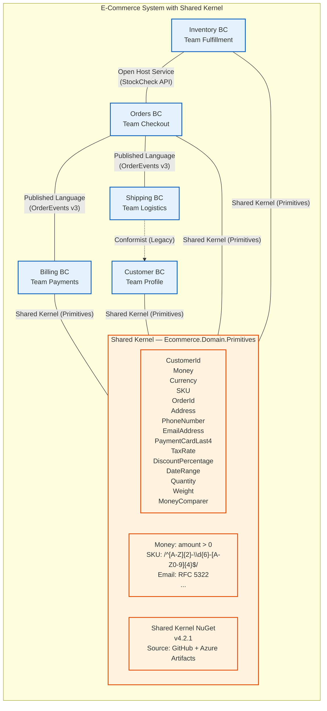
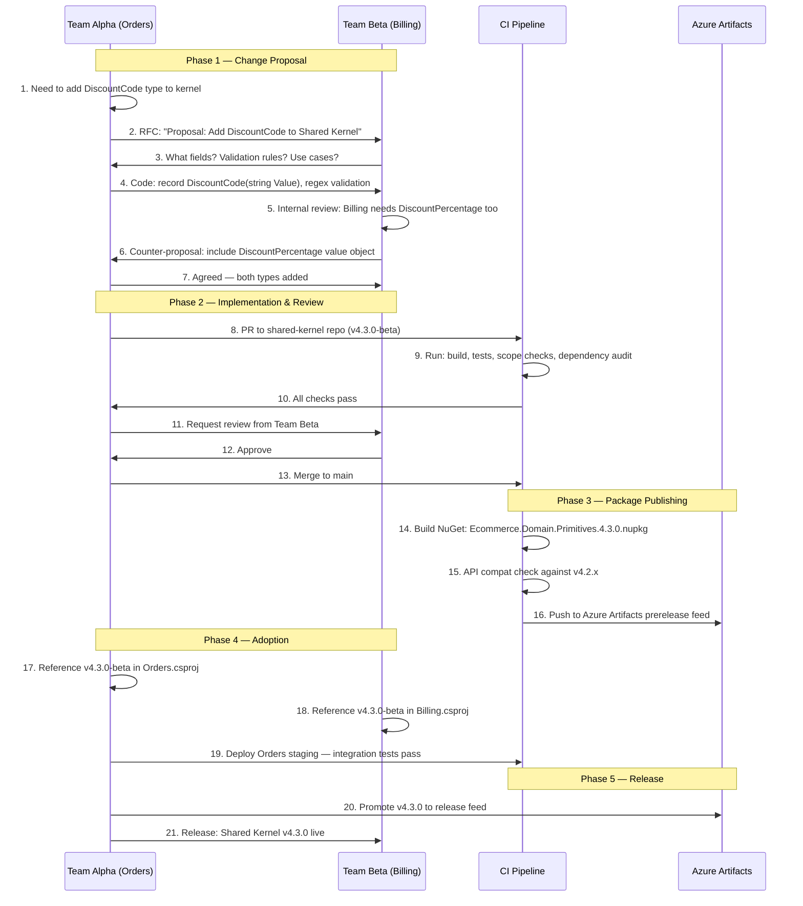
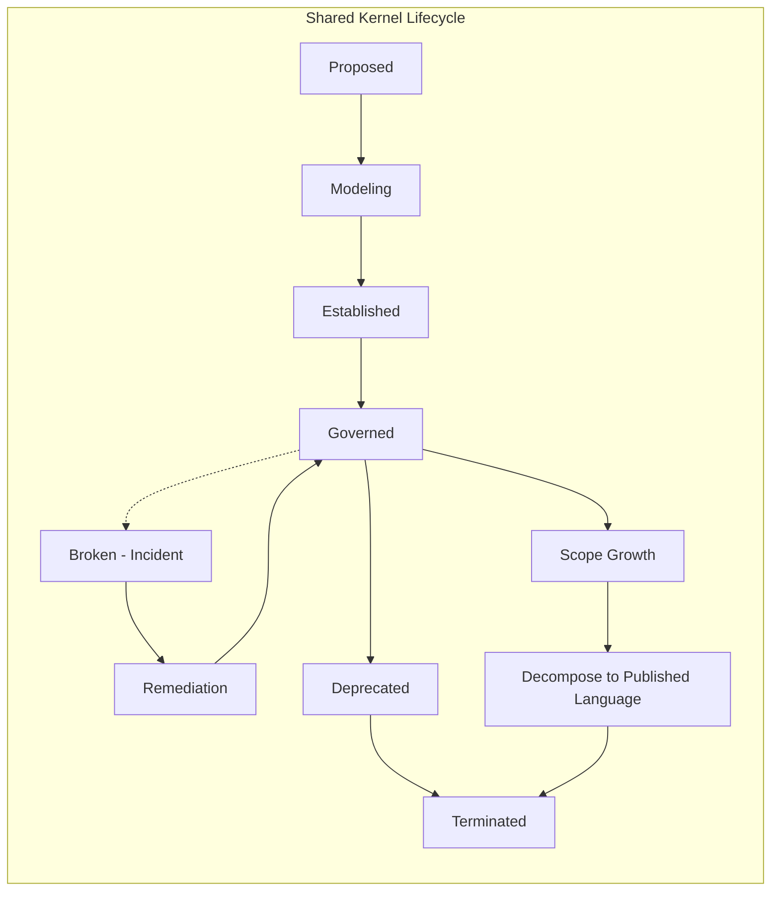

> [!success] Mastery Check
> - [ ] **Studied Well**
> - [ ] **Can explain the concept without notes**
> - [ ] **Can answer interview questions confidently**
> - [ ] **Can implement it in a real project**


# 7.036 — DDD — Context Mapping — Shared Kernel

> **Core Tenet:** A Shared Kernel is a deliberately scoped, jointly owned subset of domain model that two or more bounded contexts share explicitly. It represents the highest-coupling strategic relationship in DDD and must be governed with surgical precision — share too little and you duplicate effort, share too much and you lose the autonomy that bounded contexts exist to provide.

---

## Section 0: Quick Reference Card

> [!ABSTRACT] Quick Reference Card
>
> **Definition:** Shared Kernel is a strategic DDD context mapping pattern where two or more bounded contexts share a small, explicitly scoped subset of domain model elements (types, value objects, validation rules, event schemas) via a jointly owned and versioned artifact — typically a shared library or package.
>
> **Purpose:** Eliminate duplication of core domain concepts that genuinely must be identical across contexts (identity types, currency representations, domain primitive constants) while maintaining the autonomy of each bounded context for everything outside the kernel.
>
> **When to Apply:**
> - Two contexts share a concept that must be type-identical (e.g., CustomerId, Money, SKU)
> - Both teams coordinate releases and have the same management chain
> - The shared scope is small (<15 types), explicitly documented, and jointly governed
> - The cost of duplicating the concept (translation, mapping errors, drift) exceeds coordination cost
>
> **When NOT to Apply:**
> - Teams have independent release cadences or different management chains
> - The \"shared\" scope exceeds 15-20 types — this indicates it should be split into multiple Published Language contracts
> - Only one context uses the types — they belong in that context alone
> - The teams rarely communicate — coordination cost will outweigh sharing benefit
>
> **Key Governance Rules:**
> | Rule | Enforcement |
> |------|-------------|
> | Maximum 15 public types | NetArchTest CI gate |
> | Maximum 5 direct dependencies | NuGet audit in pipeline |
> | Joint code review from ALL consuming teams | Branch protection policy requiring reviewers from each team |
> | Zero breaking changes without N-version migration | SemVer strict policy + API compatibility analyzer |
> | Quarterly scope audit | Architecture review board checklist item |
> | Every type must be used by ≥2 contexts | Automated dead-code analysis in CI |
>
> **Key Warning:** Shared Kernel is the most overused and misapplied pattern in DDD. Developers naturally gravitate toward it because \"sharing code feels right\" — but the coordination tax it imposes often exceeds the duplication cost it eliminates. A Shared Kernel that grows beyond 15 types is no longer a kernel — it is a monolithic dependency masquerading as good design.

---

## Section 1: Navigation & Context

> [!INFO] Production Encounter Map
>
> You are the lead architect of a financial trading platform. The Trade Execution context (Team Alpha) and the Risk Management context (Team Beta) both need to represent a `Currency`, `Money`, and `TradeId`. Team Alpha copies the classes from Team Beta's repository. Team Beta refactors `Money` to use `decimal` instead of `double` — Alpha's builds break silently. Two weeks later, a production incident: a trade worth $2.4M was executed with a precision error because Alpha's stale `Money` implementation rounded to 2 decimal places while Beta's updated version used 4 decimal places for forex pairs. The root cause: undocumented, ungoverned "copy-paste sharing" masquerading as a Shared Kernel. The fix: establish a proper Shared Kernel NuGet package with strict versioning, joint ownership, and automated compatibility testing.
>
> **Why This Matters:** Shared Kernel is the only DDD pattern where coupling is deliberately introduced rather than managed or minimized. Getting it wrong means cascading build breaks, deployment coordination nightmares, and model corruption that undermines the bounded context autonomy you worked to establish. Getting it right means eliminating a class of bugs (type misalignment, identity drift) that plague multi-context systems.
>
> **Reading Path:**
> 1. Start with **Section 2** for the mental model — understand what belongs in a Shared Kernel and what does not
> 2. Move to **Section 3** for deep mechanics — versioning strategy, CI pipeline, change management protocol
> 3. Skip to **Section 4** for .NET implementation — full NuGet package example with C# 12/.NET 8 code
> 4. Review **Section 5** for pitfalls — especially "kernel sprawl" and the "copy-paste trap"
> 5. Use **Section 6** when deciding between Shared Kernel, Published Language, or Partnership
> 6. Study **Section 7** for interview prep — these questions appear in Staff+ system design rounds
>
> **When to Apply This Pattern:**
> - ✅ Two contexts need identical representations of a domain primitive (identity, currency, measurement unit)
> - ✅ Both teams are in the same management chain with aligned sprint cycles
> - ✅ The shared scope can be kept small (<15 types) and explicitly bounded
> - ✅ You have CI infrastructure to enforce scope limits and compatibility
> - ✅ The cost of duplicating and synchronizing the types exceeds the coordination overhead
> - ❌ Teams report to different directors with independent roadmaps
> - ❌ The candidate "shared" types exceed 20 — decompose into multiple Published Language contracts instead
> - ❌ Only one context needs the type — it belongs inside that context
> - ❌ The teams have never coordinated a joint release before
>
> **Prerequisites Review:**
> - [[7.034 — DDD — Bounded Contexts — Context Map]] — Shared Kernel is one of 8 relationship types on a context map; you need to understand where it fits in the landscape of integration patterns and how it differs from Partnership, Published Language, and Conformist
> - [[7.032 — DDD — Bounded Contexts Fundamentals]] — A Shared Kernel only makes sense when you have well-defined bounded contexts first; sharing across amorphous boundaries leads to kernel sprawl and model corruption
> - [[7.031 — DDD — Strategic vs Tactical Design]] — Shared Kernel sits at the strategic level (context relationship) but manifests tactically (shared types, versioned packages); understanding this distinction prevents treating tactical code-sharing decisions as strategic ones
>
> **Cross-Domain Connection:**
> - [[7.035 — DDD — Context Mapping — Partnership]] — Partnership is the closest alternative to Shared Kernel; both require tight coordination but Partnership keeps models separate while aligning schedules, whereas Shared Kernel shares the model itself
> - [[7.041 — DDD — Context Mapping — Published Language]] — Published Language is the most common migration target when a Shared Kernel has grown too large; understanding the migration path is essential
> - [[7.076 — DDD — Aggregate Versioning — Optimistic Concurrency]] — Shared Kernel types often include version identifiers and concurrency tokens; the versioning strategy of the kernel must align with aggregate versioning across contexts
> - [[7.055 — DDD — Integration Events — Across Bounded Contexts]] — Shared Kernel event schemas are a common artifact type; integration events serialized using shared schema types must maintain compatibility across versions
> - [[7.045 — DDD — Value Objects — Equality and Immutability]] — Value objects (Money, Currency, Address) are the most common Shared Kernel candidates; their equality and immutability contracts must be identical across all consuming contexts

---

## Section 2: Core Mental Model

> [!TIP] Non-Obvious Insight
>
> **The Shared Kernel is NOT about code reuse — it is about concept identity.**
>
> The fundamental question Shared Kernel answers is: "Does this concept need to be THE SAME THING in both contexts, or does it merely need to be COMPATIBLE?" If the answer is "compatible," use Published Language or Open Host Service instead. If "the same thing," Shared Kernel is appropriate — but only for a handful of concepts that truly have cross-context identity.
>
> **The Inversion Principle:** A healthy Shared Kernel should feel slightly uncomfortable. Every time you add a type, you should feel the weight of the coordination debt you are taking on. If adding a type to the Shared Kernel feels easy or natural, you likely need stronger governance. The friction is the feature — it forces teams to think twice before coupling their models.

### Classification

| Axis | Classification | Description |
|------|---------------|-------------|
| Intent | Strategic | Shared Kernel is a strategic relationship pattern, not a tactical code-sharing shortcut |
| Scope | Jointly owned subset of domain model | Limited to types that must be identical across contexts; everything else stays in the owning context |
| Lifecycle | Tightly governed | Every change requires joint review, version bump, and coordinated deployment |
| Ownership | Joint — all consuming teams | No single team can unilaterally change the kernel |
| Formality | High | Must have explicit charter, scope document, governance process, and CI enforcement |
| Difficulty | Organizational (hard) | The technical implementation is straightforward; the cross-team coordination and scope discipline is the challenge |

### Mermaid Diagram: Shared Kernel in a Context Map



> [!NOTE] Diagram Interpretation
> This diagram shows an e-commerce architecture where four bounded contexts (Orders, Inventory, Billing, Customer) share a Shared Kernel of domain primitives. Key observations:
> - The Shared Kernel contains 15 types — every type is used by at least two contexts
> - Validation rules for each type live in the kernel, ensuring consistent enforcement across all contexts
> - Shipping does NOT participate in the Shared Kernel — it has a Conformist relationship with Customer (legacy constraint) and Published Language with Orders
> - Beyond the kernel, contexts communicate via Published Language (Orders -> Billing, Orders -> Shipping) and Open Host Service (Inventory -> Orders) — demonstrating that Shared Kernel handles only the types that must be identical, while loose coupling handles the rest

### Mermaid Sequence Diagram: Shared Kernel Change Management Lifecycle



### Numbers That Matter

| Metric | Good | Warning | Critical | Calculation Method | Real-World Implication |
|--------|------|---------|----------|-------------------|----------------------|
| Public types in kernel | 5-15 | 16-30 | >30 | Count of public types in shared assembly | >30 types → coordination debt exceeds sharing benefit |
| Consuming contexts | 2-4 | 5-6 | >6 | Count of distinct BCs referencing the package | >6 consumers → single kernel becomes bottleneck |
| Kernel change frequency | <3/quarter | 3-5/quarter | >5/quarter | Kernel version bumps per quarter | High churn → every change requires N-context coordination |
| Breaking change rate | 0/quarter | 1/quarter | >1/quarter | Major version bumps per quarter | Breaking changes force simultaneous deployment |
| Joint code review coverage | 100% | 80-99% | <80% | % of kernel PRs reviewed by all consuming teams | Missing reviews → silent breaking changes |
| CI pipeline duration | <5 min | 5-15 min | >15 min | Time from PR → package publish | Slow CI → teams bypass pipeline |
| Dependency count | 0-3 | 4-6 | >6 | Direct NuGet dependencies of kernel | Every dependency must be resolved by all consumers |
| Types used by all consumers | >75% | 50-75% | <50% | (Types used by every / total) × 100 | Low utilization → dead code in kernel |
| Time from proposal to release | <1 sprint | 1-2 sprints | >2 sprints | Calendar days from RFC to package promotion | Slow cycle → teams create shadow copies |
| Test coverage | ≥90% | 70-89% | <70% | Line coverage of kernel assembly | Low coverage → breaking changes slip through |
| Package size | <100 KB | 100-500 KB | >500 KB | NuGet compressed size | Large packages → every consumer pays download cost |
| N-version support | N-2 | N-1 | N only | Major versions concurrently supported | Only current version → coordinated big-bang upgrades |

### Key Properties

| Property | Description |
|----------|-------------|
| **Explicitly Scoped** | The kernel's boundary is documented, agreed, and enforced. Any type must meet criteria: used by ≥2 contexts, must be type-identical, joint ownership cost justified |
| **Jointly Owned** | No single team owns the kernel. Every consuming team has equal veto power over changes |
| **Minimal** | The kernel is the smallest possible set of shared types. If a type can be duplicated with acceptable cost, duplicate it |
| **Versioned** | The kernel follows strict SemVer 2.0. Major bumps require coordinated deployment across all consumers |
| **Governed** | Explicit governance: scope documentation, CI enforcement, review requirements, ADR for each type |
| **Tested** | Every type has unit tests for construction, equality, validation, serialization, and edge cases |
| **Traceable** | Each type has documented rationale explaining why it is shared rather than duplicated |

---

## Section 3: Deep Mechanics

### How It Works

The Shared Kernel pattern operates through a five-phase lifecycle:

**Phase 1 — Kernel Scoping (Sprint 0 / Inception)**
Identify the minimal set of types that must be identical across two or more bounded contexts. This is not a technical exercise — it is a domain modeling negotiation. For each candidate type, ask:
- Does this concept have the same meaning in both contexts? (e.g., "Money" means currency + amount in both Orders and Billing)
- Would a mismatch in this type's representation cause a production bug? (e.g., Orders using `double` for Money while Billing uses `decimal` — precision mismatch causes accounting errors)
- Is the cost of sharing this type less than the cost of duplicating and synchronizing it?
- Is this type used by at least two contexts? If only one context needs it, it stays in that context.

Rule of thumb: if you cannot describe the kernel's scope in two sentences, it is too large.

**Phase 2 — Charter & Governance Definition (Sprint 0-1)**
Document the kernel's scope, ownership model, change process, and versioning strategy:
- **Kernel Manifest:** List of all types with rationale for each
- **Consuming Teams:** Which teams/contexts consume the kernel
- **Change Protocol:** RFC template, review requirements, timeline expectations
- **Versioning Policy:** SemVer 2.0 with explicit definition of breaking change
- **Scope Limits:** Maximum types, maximum dependencies, maximum size
- **Deprecation Policy:** How types are removed (minimum N versions support)

**Phase 3 — Implementation & CI Pipeline (Sprint 1-2)**
Create the shared repository or project with:
- Solution structure: single .NET class library project
- Strict namespace: `Ecommerce.Domain.Primitives` — no infrastructure dependencies
- Source link and symbol packages for debugging
- CI/CD pipeline: build → test → scope audit → dependency audit → API compat → pack → prerelease → release
- NetArchTest rules enforcing scope limits

**Phase 4 — Ongoing Governance (Every Sprint)**
- Kernel changes follow RFC → PR → joint review → CI → prerelease → validation → release pipeline
- Quarterly scope audit: is every type still justified?
- Dependency audit: has any new dependency been introduced?
- Breaking change review: has any consumer introduced a pattern that makes future evolution harder?

**Phase 5 — Decomposition (When Kernel Exceeds Scope Limits)**
When the kernel exceeds 15-20 types or 5 consuming contexts, begin migration to Published Language contracts:
- Identify groups of related types (e.g., Money + Currency → `Ecommerce.Billing.Contracts`)
- Extract each group into a separate NuGet package owned by the primary consuming context
- Replace Shared Kernel dependency with selective contract package dependencies
- Update context map: single Shared Kernel → multiple Published Language relationships

### Protocol Trace: Shared Kernel Versioning Conflict

**Happy Path (6 steps):**

```
1. Billing context needs to add CurrencyCode type to Shared Kernel
   → RFC sent to Orders, Inventory, Customer teams
   → All teams agree: CurrencyCode is identical across all contexts
   → Rationale: prevent "USD" vs "usd" vs "840" currency representation drift

2. Implementation PR to shared-kernel repository
   → Code: public sealed record CurrencyCode : IComparable<CurrencyCode> { ... }
   → Tests: construction, equality, comparison, serialization roundtrip
   → Validation: ISO 4217 alphabetic code, 3 uppercase characters

3. CI pipeline executes:
   → build: dotnet build --configuration Release
   → test: dotnet test --collect:"XPlat Code Coverage"
   → scope audit: NetArchTest verifies <15 types
   → dependency audit: no new dependencies added
   → API compat: PublicApiAnalyzer checks no existing API changed
   → pack: dotnet pack --configuration Release

4. Package published to Azure Artifacts prerelease feed (v4.4.0-beta)
   → Notification sent to all consuming teams
   → Each team validates in their staging environment
   → Integration tests pass

5. All teams confirm: no issues
   → Package promoted to release feed
   → v4.4.0 live — backward compatible minor version

6. Quarterly audit confirms:
   → CurrencyCode used by 3 of 4 consuming contexts
   → No scope creep: kernel still at 16 types (within warning band)
```

**Failure Path — Unmanaged Breaking Change (8 steps):**

```
1. Orders team urgently changes Money to use long (cents) instead of decimal
   → Reason: performance optimization for high-frequency trading
   → No RFC sent — "it's just an internal refactor"

2. Orders merges PR without Billing team review
   → NetArchTest passes (type count unchanged)
   → Tests pass (Orders team only)
   → No breaking change analysis

3. Package published as v4.5.0 (minor version — incorrectly)
   → Billing team updates automatically (trusting SemVer)

4. Billing deployment fails catastrophically:
   → MoneyCalculator.Add(a, b) previously: 1.50 + 2.50 = 4.00
   → Now: 150 + 250 = 400 — Money constructor validation rejects > 999.99
   → Reconciliation reports off by factor of 100
   → $2.4M discrepancy

5. Incident triggered: reconcile-all exception in accounting pipeline
   → Root cause: breaking change published as minor version without notification

6. Immediate rollback:
   → Billing reverts to v4.4.x
   → Orders pinned to v4.5.0
   → Shared Kernel now has divergent versions

7. Post-incident remediation:
   → Major version v5.0.0 with Money using long (breaking change, explicit)
   → Both teams coordinate upgrade
   → Integration tests added for cross-context Money serialization roundtrip

8. Governance changes:
   → Breaking change check automated in CI (PublicApiAnalyzer + SemVer enforcer)
   → Joint review mandatory for all kernel PRs
   → 14-day notice for any proposed breaking change
```

### State Transitions



| State | Description | Duration | Exit Criteria |
|-------|-------------|----------|---------------|
| **Proposed** | Candidate types identified; teams agree to explore | 1 sprint | Kernel charter signed by all consuming teams |
| **Modeling** | Types designed, repo created, CI pipeline built | 1-2 sprints | All types pass review; CI pipeline green |
| **Established** | Package consumed by ≥2 contexts | Indefinite | No breaking changes without notice; scope within limits |
| **Governed** | Active state with versioning, review, audit | Indefinite | All governance processes followed; quarterly audits pass |
| **Broken** | Incident caused by ungoverned change | Hours-days | Root cause identified; remediation plan agreed |
| **Remediation** | Fixing the break | 1-3 days | All consumers back on compatible versions |
| **Scope Growth** | Kernel exceeds type or consumer limits | 1-2 quarters | Decomposition plan agreed; migration sprints scheduled |
| **Deprecated** | Scheduled for decomposition | 1-2 quarters | All consumers migrated to contract packages |
| **Terminated** | Shared Kernel removed; repo archived | Permanent | Context map updated; all references removed |

### Failure Modes

> [!DANGER] 3AM Production Signal — The Silent Kernel Fracture
> **Signal:** "NuGet restore failed: Found conflicts between different versions of Ecommerce.Domain.Primitives in project Billing.csproj. Direct dependency 4.5.0, transitive dependency 4.3.2 from Ecommerce.Integration."
> **Root Cause:** A Shared Kernel with 6 consuming contexts and no centralized package management. One team upgraded to v4.5.0 (breaking change on Money) while another pinned to v4.3.2. Diamond dependency conflict surfaced at deployment time.
> **Detection Gap:** No Central Package Management. No `dotnet nuget why` check in CI. No version range constraints.
> **Mitigation:** (1) Central Package Management (Directory.Packages.props). (2) Add `dotnet nuget why` analysis to CI. (3) Version range: `<PackageReference Version="[4.0.0,5.0.0)" />`.
> **Long-Term Fix:** Decompose kernel into context-specific contract packages — each consumed by 1-2 contexts, eliminating diamond dependencies.

> [!DANGER] 3AM Production Signal — The Copy-Paste Shadow Kernel
> **Signal:** "CustomerContext.PriceCalculator returns $10.00 but OrderContext.TotalCalculator values the same items at $12.50. Manual reconciliation for 340 orders."
> **Root Cause:** Order team copied kernel source files into their own project with minor modifications (different rounding mode) to bypass 2-sprint RFC cycle. Shadow copy diverged silently over 6 months. When TaxRate was updated in real kernel (5% to 7%), Order's shadow copy remained at 5%.
> **Detection Gap:** No tooling to detect code duplication. No NetArchTest preventing shadow copies. No diff-based monitoring.
> **Mitigation:** (1) NetArchTest rule: no consumer namespace may define a type matching kernel type names. (2) Kernel RFC-to-release SLA: urgent changes processed within 48 hours. (3) Pricing reconciliation monitor: daily sweep comparing Order vs Billing totals, alert on >0.1% discrepancy.
> **Long-Term Fix:** Reduce kernel change cycle to <1 sprint. Add "shadow copy detection" to CI — hash all consumer assemblies and compare against kernel types.

> [!DANGER] 3AM Production Signal — The Scope Creep Spiral
> **Signal:** Shared Kernel NuGet grew from 275 KB to 4.2 MB over 18 months. Developer survey: "I don't know what's in the kernel anymore."
> **Root Cause:** No scope governance from start. Began as 12 types, grew to 89 types because each team found it easier to add to the kernel than create their own.
> **Detection Gap:** No type count metric. No dead code analysis. No new-type justification process.
> **Mitigation:** (1) Freeze: no new types for 1 quarter. (2) Audit: classify all 89 types; remove types used by only one context (67 of 89). (3) NetArchTest enforce 15-type maximum. (4) Quarterly dead code analysis.
> **Long-Term Fix:** Decompose into `Ecommerce.Domain.Primitives` (12 types), `Ecommerce.Orders.Contracts`, `Ecommerce.Billing.Contracts`, `Ecommerce.Inventory.Contracts`. Replace single Shared Kernel with 4 Published Language relationships.

### .NET and Azure Integration Points

| Integration Point | .NET Mechanism | Azure Service | Shared Kernel Impact |
|-------------------|---------------|---------------|---------------------|
| **Package Distribution** | NuGet + Directory.Packages.props | Azure Artifacts | Kernel published as NuGet; CPM ensures all consumers same version |
| **API Compatibility** | Microsoft.CodeAnalysis.PublicApiAnalyzer | Azure DevOps Pipeline | Automatically detects breaking changes; enforces SemVer |
| **Build Pipeline** | dotnet build, test, pack | Azure DevOps / GitHub Actions | Builds, tests, packs, runs scope/dependency audits |
| **Scope Governance** | NetArchTest + Roslyn analyzers | PR policy gates | Enforces type count, dependency, namespace rules |
| **Dependency Audit** | dotnet nuget why | DevOps Dependency Scanning | Ensures no transitive dependency conflicts |
| **Package Promotion** | NuGet CLI | Azure Artifacts Views | Prerelease → release; promotion requires all team sign-off |
| **Source Link** | dotnet sourcelink | Azure Artifacts symbols | Debugging into kernel from consumer projects |
| **Security Scanning** | BannedApiAnalyzers | DevOps Security Scans | Blocks dangerous APIs (System.Double for Money) |
| **Automatic Updates** | Dependabot / Renovate | GitHub Dependabot | Automated PRs for minor/patch kernel updates |


---

## Section 4: Production Patterns and Implementation

### Shared Kernel NuGet Package — Full .NET 8 / C# 12 Implementation

This implementation models a real Shared Kernel for an e-commerce platform used by Orders, Billing, Inventory, and Customer bounded contexts. The kernel contains domain primitives that must be type-identical across all contexts.

**Solution Structure:**

```
Ecommerce.Domain.Primitives/
├── Ecommerce.Domain.Primitives.sln
├── Directory.Build.props
├── Directory.Packages.props
├── src/
│   └── Ecommerce.Domain.Primitives/
│       ├── Ecommerce.Domain.Primitives.csproj
│       ├── Identities/
│       │   ├── CustomerId.cs
│       │   ├── OrderId.cs
│       │   └── ProductSku.cs
│       ├── Money/
│       │   ├── Currency.cs
│       │   ├── CurrencyCode.cs
│       │   ├── Money.cs
│       │   ├── MoneyComparer.cs
│       │   └── MoneyExtensions.cs
│       ├── Address/
│       │   ├── Address.cs
│       │   ├── CountryCode.cs
│       │   └── PostalCode.cs
│       ├── Contact/
│       │   ├── EmailAddress.cs
│       │   └── PhoneNumber.cs
│       ├── Business/
│       │   ├── DiscountPercentage.cs
│       │   ├── TaxRate.cs
│       │   └── DateRange.cs
│       ├── Validation/
│       │   └── Guard.cs
│       ├── Extensions/
│       │   ├── StringExtensions.cs
│       │   └── DecimalExtensions.cs
│       └── Properties/
│           └── AssemblyInfo.cs
├── tests/
│   └── Ecommerce.Domain.Primitives.Tests/
│       ├── Ecommerce.Domain.Primitives.Tests.csproj
│       ├── Identities/
│       │   ├── CustomerIdTests.cs
│       │   ├── OrderIdTests.cs
│       │   └── ProductSkuTests.cs
│       ├── Money/
│       │   ├── MoneyTests.cs
│       │   ├── CurrencyTests.cs
│       │   └── MoneyComparerTests.cs
│       ├── Address/
│       │   ├── AddressTests.cs
│       │   └── PostalCodeTests.cs
│       ├── Contact/
│       │   ├── EmailAddressTests.cs
│       │   └── PhoneNumberTests.cs
│       ├── Business/
│       │   ├── DiscountPercentageTests.cs
│       │   ├── TaxRateTests.cs
│       │   └── DateRangeTests.cs
│       └── Validation/
│           └── GuardTests.cs
├── infrastructure/
│   └── Ecommerce.Domain.Primitives.ArchitectureTests/
│       ├── Ecommerce.Domain.Primitives.ArchitectureTests.csproj
│       ├── ScopeGovernanceTests.cs
│       ├── DependencyTests.cs
│       └── NamingConventionTests.cs
└── .pipelines/
    ├── ci-build.yml
    ├── ci-release.yml
    └── scope-audit.ps1
```

#### `Directory.Build.props`

```csharp
<Project>
  <PropertyGroup>
    <TargetFramework>net8.0</TargetFramework>
    <ImplicitUsings>enable</ImplicitUsings>
    <Nullable>enable</Nullable>
    <TreatWarningsAsErrors>true</TreatWarningsAsErrors>
    <AnalysisLevel>latest-Recommended</AnalysisLevel>
    <EnforceCodeStyleInBuild>true</EnforceCodeStyleInBuild>
    <GenerateDocumentationFile>true</GenerateDocumentationFile>
    <Deterministic>true</Deterministic>
    <ContinuousIntegrationBuild>true</ContinuousIntegrationBuild>
    <EmbedUntrackedSources>true</EmbedUntrackedSources>
    <DebugType>embedded</DebugType>
    <IncludeSymbols>true</IncludeSymbols>
    <SymbolPackageFormat>snupkg</SymbolPackageFormat>
  </PropertyGroup>

  <ItemGroup>
    <PackageReference Include="Microsoft.CodeAnalysis.PublicApiAnalyzer">
      <PrivateAssets>all</PrivateAssets>
      <IncludeAssets>runtime; build; native; contentfiles; analyzers; buildtransitive</IncludeAssets>
    </PackageReference>
    <PackageReference Include="Microsoft.CodeAnalysis.BannedApiAnalyzers">
      <PrivateAssets>all</PrivateAssets>
      <IncludeAssets>runtime; build; native; contentfiles; analyzers; buildtransitive</IncludeAssets>
    </PackageReference>
    <PackageReference Include="Roslynator.Analyzers">
      <PrivateAssets>all</PrivateAssets>
      <IncludeAssets>runtime; build; native; contentfiles; analyzers; buildtransitive</IncludeAssets>
    </PackageReference>
    <PackageReference Include="SonarAnalyzer.CSharp">
      <PrivateAssets>all</PrivateAssets>
      <IncludeAssets>runtime; build; native; contentfiles; analyzers; buildtransitive</IncludeAssets>
    </PackageReference>
  </ItemGroup>

</Project>
```

#### `Directory.Packages.props`

```csharp
<Project>
  <PropertyGroup>
    <ManagePackageVersionsCentrally>true</ManagePackageVersionsCentrally>
    <CentralPackageTransitivePinningEnabled>true</CentralPackageTransitivePinningEnabled>
  </PropertyGroup>
  <ItemGroup>
    <!-- Kernel has ZERO runtime dependencies — pure domain logic -->
    <PackageVersion Include="Microsoft.CodeAnalysis.PublicApiAnalyzer" Version="3.11.0-beta1.24080.1" />
    <PackageVersion Include="Microsoft.CodeAnalysis.BannedApiAnalyzers" Version="3.3.3" />
    <PackageVersion Include="Roslynator.Analyzers" Version="4.12.3" />
    <PackageVersion Include="SonarAnalyzer.CSharp" Version="9.25.0.90414" />
    <PackageVersion Include="xunit" Version="2.9.0" />
    <PackageVersion Include="xunit.runner.visualstudio" Version="2.8.2" />
    <PackageVersion Include="FluentAssertions" Version="6.12.0" />
    <PackageVersion Include="NetArchTest.Rules" Version="1.3.2" />
    <PackageVersion Include="Microsoft.NET.Test.Sdk" Version="17.11.0" />
    <PackageVersion Include="coverlet.collector" Version="6.0.2" />
  </ItemGroup>
</Project>
```

#### `Ecommerce.Domain.Primitives.csproj`

```csharp
<Project Sdk="Microsoft.NET.Sdk">

  <PropertyGroup>
    <VersionPrefix>4.3.0</VersionPrefix>
    <VersionSuffix>beta</VersionSuffix>
    <AssemblyName>Ecommerce.Domain.Primitives</AssemblyName>
    <RootNamespace>Ecommerce.Domain.Primitives</RootNamespace>
    <PackageId>Ecommerce.Domain.Primitives</PackageId>
    <PackageVersion>$(VersionPrefix)$(VersionSuffix)</PackageVersion>
    <Title>Ecommerce Domain Primitives</Title>
    <Description>Shared Kernel of domain primitives for the Ecommerce platform. Jointly owned by Orders, Billing, Inventory, and Customer bounded contexts.</Description>
    <PackageTags>ddd;domain-primitives;shared-kernel;ecommerce</PackageTags>
    <PackageProjectUrl>https://dev.azure.com/ecommerce/shared-kernel</PackageProjectUrl>
    <RepositoryUrl>https://dev.azure.com/ecommerce/shared-kernel/_git/domain-primitives</RepositoryUrl>
    <PackageLicenseExpression>MIT</PackageLicenseExpression>
    <PackageReadmeFile>README.md</PackageReadmeFile>
    <PackageOutputPath>$(MSBuildThisFileDirectory)../../artifacts</PackageOutputPath>
    <GeneratePackageOnBuild>true</GeneratePackageOnBuild>
    <PublishRepositoryUrl>true</PublishRepositoryUrl>
  </PropertyGroup>

  <ItemGroup>
    <!-- Zero runtime dependencies — pure domain library -->
  </ItemGroup>

  <ItemGroup>
    <None Include="..\..\README.md" Pack="true" PackagePath="\" />
  </ItemGroup>

</Project>
```

#### `CustomerId.cs`

```csharp
namespace Ecommerce.Domain.Primitives.Identities;

/// <summary>
/// Unique identifier for a Customer across the ecommerce platform.
/// Used by Orders, Billing, Customer, and Support bounded contexts.
/// Format: "CUS-" + 12 uppercase hex characters (e.g., CUS-A3F92B1E4C7D).
/// </summary>
public sealed record CustomerId : IComparable<CustomerId>, IParsable<CustomerId>
{
    private static readonly Regex Pattern = CustomerIdRegex();
    private const string Prefix = "CUS-";

    public string Value { get; }

    private CustomerId(string value)
    {
        Value = value;
    }

    public static CustomerId New()
    {
        var hex = Convert.ToHexString(RandomNumberGenerator.GetBytes(6));
        return new CustomerId($"{Prefix}{hex}");
    }

    public static CustomerId From(string value)
    {
        ArgumentException.ThrowIfNullOrWhiteSpace(value);
        if (!Pattern.IsMatch(value))
            throw new FormatException($"CustomerId must match format '{Prefix}XXXXXXXXXXXX' where X are hex characters. Received: '{value}'.");
        return new CustomerId(value.ToUpperInvariant());
    }

    public static CustomerId From(Guid guid)
    {
        var hex = guid.ToString("N")[..12].ToUpperInvariant();
        return new CustomerId($"{Prefix}{hex}");
    }

    public int CompareTo(CustomerId? other) => other is null ? 1 : string.Compare(Value, other.Value, StringComparison.OrdinalIgnoreCase);

    public static CustomerId Parse(string s, IFormatProvider? provider) => From(s);

    public static bool TryParse(string? s, IFormatProvider? provider, out CustomerId result)
    {
        result = null!;
        if (s is null || !Pattern.IsMatch(s)) return false;
        result = new CustomerId(s.ToUpperInvariant());
        return true;
    }

    public override string ToString() => Value;

    private static readonly Regex CustomerIdRegex = () => new($"^{Prefix}[A-F0-9]{{12}}$", RegexOptions.Compiled | RegexOptions.CultureInvariant);

    public bool Equals(CustomerId? other) => other is not null && string.Equals(Value, other.Value, StringComparison.OrdinalIgnoreCase);

    public override int GetHashCode() => StringComparer.OrdinalIgnoreCase.GetHashCode(Value);
}
```

#### `OrderId.cs`

```csharp
namespace Ecommerce.Domain.Primitives.Identities;

/// <summary>
/// Order identifier shared across Orders, Billing, Shipping, and Inventory contexts.
/// Format: "ORD-" + yyyyMMdd + "-" + 6-digit sequence (e.g., ORD-20260613-000042).
/// </summary>
public sealed record OrderId : IComparable<OrderId>, IParsable<OrderId>
{
    private static readonly Regex Pattern = OrderIdRegex();
    private const string Prefix = "ORD-";
    private static long _lastSequence;
    private static readonly object SequenceLock = new();

    public string Value { get; }
    public DateOnly Date { get; }
    public int Sequence { get; }

    private OrderId(string value, DateOnly date, int sequence)
    {
        Value = value;
        Date = date;
        Sequence = sequence;
    }

    public static OrderId New()
    {
        var today = DateOnly.FromDateTime(DateTime.UtcNow);
        long sequence;
        lock (SequenceLock)
        {
            _lastSequence = (_lastSequence % 999999) + 1;
            sequence = _lastSequence;
        }
        var value = $"{Prefix}{today:yyyyMMdd}-{sequence:D6}";
        return new OrderId(value, today, (int)sequence);
    }

    public static OrderId From(string value)
    {
        ArgumentException.ThrowIfNullOrWhiteSpace(value);
        if (!Pattern.IsMatch(value))
            throw new FormatException($"OrderId must match format '{Prefix}yyyyMMdd-XXXXXX'. Received: '{value}'.");
        var datePart = value.Substring(4, 8);
        var seqPart = value.Substring(13, 6);
        var date = DateOnly.ParseExact(datePart, "yyyyMMdd", CultureInfo.InvariantCulture);
        var sequence = int.Parse(seqPart, CultureInfo.InvariantCulture);
        return new OrderId(value, date, sequence);
    }

    public int CompareTo(OrderId? other) => other is null ? 1 : string.Compare(Value, other.Value, StringComparison.Ordinal);

    public static OrderId Parse(string s, IFormatProvider? provider) => From(s);

    public static bool TryParse(string? s, IFormatProvider? provider, out OrderId result)
    {
        result = null!;
        if (s is null || !Pattern.IsMatch(s)) return false;
        result = From(s);
        return true;
    }

    public override string ToString() => Value;

    private static readonly Regex OrderIdRegex = () => new($"^{Prefix}\\d{{8}}-\\d{{6}}$", RegexOptions.Compiled);

    public bool Equals(OrderId? other) => other is not null && string.Equals(Value, other.Value, StringComparison.Ordinal);

    public override int GetHashCode() => StringComparer.Ordinal.GetHashCode(Value);
}
```

#### `ProductSku.cs`

```csharp
namespace Ecommerce.Domain.Primitives.Identities;

/// <summary>
/// SKU identifier shared between Inventory, Orders, and Catalog contexts.
/// Format: 2 uppercase letters + "-" + 6 digits + "-" + 4 alphanumeric (e.g., EL-893421-X7K9).
/// </summary>
public sealed record ProductSku : IComparable<ProductSku>, IParsable<ProductSku>
{
    private static readonly Regex Pattern = ProductSkuRegex();

    public string Value { get; }
    public string CategoryCode { get; }
    public int NumericId { get; }
    public string CheckDigits { get; }

    private ProductSku(string value, string categoryCode, int numericId, string checkDigits)
    {
        Value = value;
        CategoryCode = categoryCode;
        NumericId = numericId;
        CheckDigits = checkDigits;
    }

    public static ProductSku From(string value)
    {
        ArgumentException.ThrowIfNullOrWhiteSpace(value);
        if (!Pattern.IsMatch(value))
            throw new FormatException($"ProductSku must match format 'XX-XXXXXX-XXXX'. Received: '{value}'.");
        var parts = value.Split('-');
        return new ProductSku(value, parts[0], int.Parse(parts[1], CultureInfo.InvariantCulture), parts[2]);
    }

    public int CompareTo(ProductSku? other) => other is null ? 1 : string.Compare(Value, other.Value, StringComparison.OrdinalIgnoreCase);

    public static ProductSku Parse(string s, IFormatProvider? provider) => From(s);

    public static bool TryParse(string? s, IFormatProvider? provider, out ProductSku result)
    {
        result = null!;
        if (s is null || !Pattern.IsMatch(s)) return false;
        result = From(s);
        return true;
    }

    public override string ToString() => Value;

    private static readonly Regex ProductSkuRegex = () => new(@"^[A-Z]{2}-\d{6}-[A-Z0-9]{4}$", RegexOptions.Compiled);

    public bool Equals(ProductSku? other) => other is not null && string.Equals(Value, other.Value, StringComparison.OrdinalIgnoreCase);

    public override int GetHashCode() => StringComparer.OrdinalIgnoreCase.GetHashCode(Value);
}
```

#### `Currency.cs`

```csharp
namespace Ecommerce.Domain.Primitives.Money;

/// <summary>
/// ISO 4217 currency representation shared across all financial contexts.
/// Immutable value object with strict validation. Predefined set of known currencies.
/// </summary>
public sealed record Currency : IComparable<Currency>
{
    private static readonly Regex CurrencyCodePattern = CurrencyCodeRegex();
    private static readonly Dictionary<string, Currency> KnownCurrencies = new(StringComparer.OrdinalIgnoreCase)
    {
        ["USD"] = new Currency("USD", "United States Dollar", 2, "$"),
        ["EUR"] = new Currency("EUR", "Euro", 2, "\u20AC"),
        ["GBP"] = new Currency("GBP", "British Pound Sterling", 2, "\u00A3"),
        ["JPY"] = new Currency("JPY", "Japanese Yen", 0, "\u00A5"),
        ["CAD"] = new Currency("CAD", "Canadian Dollar", 2, "CA$"),
        ["AUD"] = new Currency("AUD", "Australian Dollar", 2, "A$"),
        ["CHF"] = new Currency("CHF", "Swiss Franc", 2, "CHF"),
        ["CNY"] = new Currency("CNY", "Chinese Yuan", 2, "CN\u00A5"),
        ["INR"] = new Currency("INR", "Indian Rupee", 2, "\u20B9"),
        ["MXN"] = new Currency("MXN", "Mexican Peso", 2, "MX$"),
        ["BRL"] = new Currency("BRL", "Brazilian Real", 2, "R$"),
        ["SEK"] = new Currency("SEK", "Swedish Krona", 2, "kr"),
        ["NOK"] = new Currency("NOK", "Norwegian Krone", 2, "kr"),
        ["DKK"] = new Currency("DKK", "Danish Krone", 2, "kr"),
        ["NZD"] = new Currency("NZD", "New Zealand Dollar", 2, "NZ$"),
        ["SGD"] = new Currency("SGD", "Singapore Dollar", 2, "S$"),
        ["HKD"] = new Currency("HKD", "Hong Kong Dollar", 2, "HK$"),
        ["KRW"] = new Currency("KRW", "South Korean Won", 0, "\u20A9"),
        ["ZAR"] = new Currency("ZAR", "South African Rand", 2, "R"),
    };

    private Currency(string code, string name, int decimalPlaces, string symbol)
    {
        Code = code;
        Name = name;
        DecimalPlaces = decimalPlaces;
        Symbol = symbol;
    }

    public string Code { get; }
    public string Name { get; }
    public int DecimalPlaces { get; }
    public string Symbol { get; }

    public static Currency FromCode(string code)
    {
        ArgumentException.ThrowIfNullOrWhiteSpace(code);
        code = code.ToUpperInvariant();
        if (!CurrencyCodePattern.IsMatch(code))
            throw new FormatException($"Currency code must be a 3-letter ISO 4217 code. Received: '{code}'.");
        if (!KnownCurrencies.TryGetValue(code, out var currency))
            throw new ArgumentException($"Unsupported currency code: '{code}'. Supported: {string.Join(", ", KnownCurrencies.Keys)}.");
        return currency;
    }

    public static IReadOnlyCollection<Currency> All => KnownCurrencies.Values.ToList().AsReadOnly();

    public int CompareTo(Currency? other) => other is null ? 1 : string.Compare(Code, other.Code, StringComparison.OrdinalIgnoreCase);

    public override string ToString() => $"{Code} ({Symbol})";

    private static readonly Regex CurrencyCodeRegex = () => new("^[A-Z]{3}$", RegexOptions.Compiled);

    public bool Equals(Currency? other) => other is not null && string.Equals(Code, other.Code, StringComparison.OrdinalIgnoreCase);

    public override int GetHashCode() => StringComparer.OrdinalIgnoreCase.GetHashCode(Code);
}
```
#### `Money.cs` — The Core Shared Type

```csharp
namespace Ecommerce.Domain.Primitives.Money;

/// <summary>
/// Monetary amount with currency. The most critical type in the Shared Kernel —
/// used by Orders (pricing), Billing (invoicing), Inventory (valuation), and Customer (wallet).
/// Amount is stored as a long representing the smallest currency unit (cents for USD, yen for JPY)
/// to avoid floating-point precision errors.
/// </summary>
public sealed record Money : IComparable<Money>
{
    public long Amount { get; }
    public Currency Currency { get; }

    private Money(long amount, Currency currency)
    {
        Amount = amount;
        Currency = currency ?? throw new ArgumentNullException(nameof(currency));
    }

    public static Money FromDecimal(decimal amount, Currency currency) =>
        FromDecimal(amount, currency, MidpointRounding.ToEven);

    public static Money FromDecimal(decimal amount, Currency currency, MidpointRounding rounding)
    {
        ArgumentNullException.ThrowIfNull(currency);
        var scale = (int)Math.Pow(10, currency.DecimalPlaces);
        var longAmount = (long)Math.Round(amount * scale, rounding);
        return new Money(longAmount, currency);
    }

    public static Money FromLong(long amountInSmallestUnit, Currency currency)
    {
        ArgumentNullException.ThrowIfNull(currency);
        return new Money(amountInSmallestUnit, currency);
    }

    public static Money Zero(Currency currency) =>
        new(0L, currency ?? throw new ArgumentNullException(nameof(currency)));

    public decimal ToDecimal() => Amount / (decimal)Math.Pow(10, Currency.DecimalPlaces);

    public Money Add(Money other)
    {
        ArgumentNullException.ThrowIfNull(other);
        EnsureSameCurrency(other);
        return new Money(Amount + other.Amount, Currency);
    }

    public Money Subtract(Money other)
    {
        ArgumentNullException.ThrowIfNull(other);
        EnsureSameCurrency(other);
        return new Money(Amount - other.Amount, Currency);
    }

    public Money Multiply(decimal multiplier)
    {
        var result = ToDecimal() * multiplier;
        return FromDecimal(result, Currency);
    }

    public Money Allocate(int proportion, int total)
    {
        if (total <= 0) throw new ArgumentException("Total must be positive.", nameof(total));
        var allocated = (long)Math.Round((decimal)Amount * proportion / total, MidpointRounding.ToEven);
        return new Money(allocated, Currency);
    }

    public bool IsZero => Amount == 0L;
    public bool IsPositive => Amount > 0L;
    public bool IsNegative => Amount < 0L;

    public int CompareTo(Money? other)
    {
        if (other is null) return 1;
        EnsureSameCurrency(other);
        return Amount.CompareTo(other.Amount);
    }

    public static Money operator +(Money left, Money right) => left.Add(right);
    public static Money operator -(Money left, Money right) => left.Subtract(right);
    public static Money operator *(Money left, decimal right) => left.Multiply(right);
    public static bool operator <(Money left, Money right) => left.CompareTo(right) < 0;
    public static bool operator >(Money left, Money right) => left.CompareTo(right) > 0;
    public static bool operator <=(Money left, Money right) => left.CompareTo(right) <= 0;
    public static bool operator >=(Money left, Money right) => left.CompareTo(right) >= 0;

    private void EnsureSameCurrency(Money other)
    {
        if (!Currency.Equals(other.Currency))
            throw new InvalidOperationException($"Currency mismatch: cannot operate on {Currency.Code} and {other.Currency.Code}. Use MoneyConverter or exchange rate service first.");
    }

    public override string ToString()
    {
        var decimalValue = ToDecimal();
        return Currency.DecimalPlaces > 0
            ? $"{Currency.Symbol}{decimalValue:N{Currency.DecimalPlaces}}"
            : $"{Currency.Symbol}{decimalValue:N0}";
    }

    public bool Equals(Money? other) =>
        other is not null && Amount == other.Amount && Currency.Equals(other.Currency);

    public override int GetHashCode() => HashCode.Combine(Amount, Currency);
}
```

#### `MoneyComparer.cs`

```csharp
namespace Ecommerce.Domain.Primitives.Money;

/// <summary>
/// Equality comparer for Money supporting multiple comparison strategies.
/// Default: compares amount and currency.
/// Economic: compares by converted value (requires exchange rate provider).
/// </summary>
public sealed class MoneyComparer : IEqualityComparer<Money>, IComparer<Money>
{
    public static readonly MoneyComparer Default = new(MoneyComparisonStrategy.Exact);
    public static readonly MoneyComparer Economic = new(MoneyComparisonStrategy.Economic);

    private readonly MoneyComparisonStrategy _strategy;

    public MoneyComparer(MoneyComparisonStrategy strategy)
    {
        _strategy = strategy;
    }

    public bool Equals(Money? x, Money? y)
    {
        if (x is null && y is null) return true;
        if (x is null || y is null) return false;
        return _strategy switch
        {
            MoneyComparisonStrategy.Exact => x.Amount == y.Amount && x.Currency.Equals(y.Currency),
            MoneyComparisonStrategy.Economic => x.ToDecimal() == y.ToDecimal(),
            _ => x.Equals(y),
        };
    }

    public int GetHashCode(Money obj) => _strategy switch
    {
        MoneyComparisonStrategy.Exact => HashCode.Combine(obj.Amount, obj.Currency),
        MoneyComparisonStrategy.Economic => obj.ToDecimal().GetHashCode(),
        _ => obj.GetHashCode(),
    };

    public int Compare(Money? x, Money? y)
    {
        if (x is null && y is null) return 0;
        if (x is null) return -1;
        if (y is null) return 1;
        if (_strategy == MoneyComparisonStrategy.Exact)
        {
            x.EnsureSameCurrency(y);
            return x.Amount.CompareTo(y.Amount);
        }
        return x.ToDecimal().CompareTo(y.ToDecimal());
    }
}

public enum MoneyComparisonStrategy
{
    Exact,
    Economic,
}
```

#### `EmailAddress.cs`

```csharp
namespace Ecommerce.Domain.Primitives.Contact;

/// <summary>
/// Email address validated against RFC 5322 simplified pattern.
/// Used by Customer, Orders (notifications), Billing (invoices), and Support contexts.
/// </summary>
public sealed record EmailAddress : IComparable<EmailAddress>, IParsable<EmailAddress>
{
    private static readonly Regex Pattern = EmailRegex();
    private const int MaxLength = 254;

    public string Value { get; }
    public string LocalPart { get; }
    public string Domain { get; }

    private EmailAddress(string value, string localPart, string domain)
    {
        Value = value;
        LocalPart = localPart;
        Domain = domain;
    }

    public static EmailAddress From(string value)
    {
        ArgumentException.ThrowIfNullOrWhiteSpace(value);
        value = value.Trim().ToLowerInvariant();
        if (value.Length > MaxLength)
            throw new FormatException($"Email address exceeds maximum length of {MaxLength} characters.");
        if (!Pattern.IsMatch(value))
            throw new FormatException($"Invalid email address format. Received: '{value}'.");
        var parts = value.Split('@');
        return new EmailAddress(value, parts[0], parts[1]);
    }

    public bool IsBusinessEmail =>
        Domain switch
        {
            "gmail.com" or "yahoo.com" or "hotmail.com" or "outlook.com" or "aol.com" or "icloud.com" or "protonmail.com" or "mail.com" => false,
            _ => Domain.Contains('.') && !Domain.EndsWith(".edu", StringComparison.OrdinalIgnoreCase),
        };

    public int CompareTo(EmailAddress? other) => other is null ? 1 : string.Compare(Value, other.Value, StringComparison.Ordinal);

    public static EmailAddress Parse(string s, IFormatProvider? provider) => From(s);

    public static bool TryParse(string? s, IFormatProvider? provider, out EmailAddress result)
    {
        result = null!;
        if (s is null) return false;
        try { result = From(s); return true; }
        catch { return false; }
    }

    public override string ToString() => Value;

    public override int GetHashCode() => StringComparer.Ordinal.GetHashCode(Value);

    private static readonly Regex EmailRegex = () => new(
        @"^[a-z0-9!#$%&'*+/=?^_`{|}~-]+(?:\.[a-z0-9!#$%&'*+/=?^_`{|}~-]+)*@(?:[a-z0-9](?:[a-z0-9-]*[a-z0-9])?\.)+[a-z0-9](?:[a-z0-9-]*[a-z0-9])?$",
        RegexOptions.Compiled | RegexOptions.CultureInvariant);
}
```

#### `TaxRate.cs`

```csharp
namespace Ecommerce.Domain.Primitives.Business;

/// <summary>
/// Tax rate as a percentage value. Used by Orders (price calculation), Billing (invoice generation),
/// and Inventory (duty calculation). Stored as basis points (1 bp = 0.01%).
/// Range: 0 to 10000 basis points (0% to 100%).
/// </summary>
public sealed record TaxRate : IComparable<TaxRate>
{
    private const int MinBasisPoints = 0;
    private const int MaxBasisPoints = 10000;

    public int BasisPoints { get; }
    public decimal Percentage => BasisPoints / 100m;

    private TaxRate(int basisPoints)
    {
        BasisPoints = basisPoints;
    }

    public static TaxRate FromBasisPoints(int basisPoints)
    {
        if (basisPoints is < MinBasisPoints or > MaxBasisPoints)
            throw new ArgumentOutOfRangeException(nameof(basisPoints), $"Tax rate must be between {MinBasisPoints} and {MaxBasisPoints} basis points (0% to 100%).");
        return new TaxRate(basisPoints);
    }

    public static TaxRate FromPercentage(decimal percentage)
    {
        if (percentage is < 0 or > 100)
            throw new ArgumentOutOfRangeException(nameof(percentage), "Percentage must be between 0 and 100.");
        var basisPoints = (int)Math.Round(percentage * 100, MidpointRounding.ToEven);
        return new TaxRate(basisPoints);
    }

    public Money ApplyTo(Money amount) => amount.Multiply(Percentage / 100m);

    public int CompareTo(TaxRate? other) => other is null ? 1 : BasisPoints.CompareTo(other.BasisPoints);

    public override string ToString() => $"{Percentage:F2}%";

    public override int GetHashCode() => BasisPoints.GetHashCode();
}
```

#### `DiscountPercentage.cs`

```csharp
namespace Ecommerce.Domain.Primitives.Business;

/// <summary>
/// Discount percentage applied to order line items or totals.
/// Shared between Orders (promotions), Billing (coupons), and Customer (loyalty).
/// Range: 0.00% to 100.00%, stored as basis points.
/// </summary>
public sealed record DiscountPercentage : IComparable<DiscountPercentage>
{
    private const int MinBasisPoints = 0;
    private const int MaxBasisPoints = 10000;

    public int BasisPoints { get; }
    public decimal Percentage => BasisPoints / 100m;

    private DiscountPercentage(int basisPoints)
    {
        BasisPoints = basisPoints;
    }

    public static DiscountPercentage FromBasisPoints(int basisPoints)
    {
        if (basisPoints is < MinBasisPoints or > MaxBasisPoints)
            throw new ArgumentOutOfRangeException(nameof(basisPoints), $"Discount must be between {MinBasisPoints} and {MaxBasisPoints} basis points.");
        return new DiscountPercentage(basisPoints);
    }

    public static DiscountPercentage FromPercentage(decimal percentage)
    {
        if (percentage is < 0 or > 100)
            throw new ArgumentOutOfRangeException(nameof(percentage), "Percentage must be between 0 and 100.");
        return new DiscountPercentage((int)Math.Round(percentage * 100, MidpointRounding.ToEven));
    }

    public Money ApplyTo(Money amount) => amount.Multiply(Percentage / 100m);

    public int CompareTo(DiscountPercentage? other) => other is null ? 1 : BasisPoints.CompareTo(other.BasisPoints);

    public override string ToString() => $"{Percentage:F2}% off";

    public override int GetHashCode() => BasisPoints.GetHashCode();
}
```

#### `Guard.cs`

```csharp
namespace Ecommerce.Domain.Primitives.Validation;

/// <summary>
/// Shared validation guard clauses used across all kernel types and consumer contexts.
/// Ensures consistent validation behavior everywhere.
/// </summary>
public static class Guard
{
    public static void AgainstNegativeAmount(long amount, string parameterName)
    {
        if (amount < 0)
            throw new ArgumentException($"Value must not be negative. Received: {amount}.", parameterName);
    }

    public static void AgainstOutOfRange(int value, int min, int max, string parameterName)
    {
        if (value < min || value > max)
            throw new ArgumentOutOfRangeException(parameterName, value, $"Value must be between {min} and {max}. Received: {value}.");
    }

    public static void AgainstInvalidLength(string value, int maxLength, string parameterName)
    {
        if (value.Length > maxLength)
            throw new ArgumentException($"Value exceeds maximum length of {maxLength} characters.", parameterName);
    }

    public static void AgainstNull(object? value, string parameterName)
    {
        if (value is null)
            throw new ArgumentNullException(parameterName);
    }
}
```

#### `AssemblyInfo.cs`

```csharp
using System.Runtime.CompilerServices;

[assembly: InternalsVisibleTo("Ecommerce.Domain.Primitives.Tests")]
[assembly: InternalsVisibleTo("Ecommerce.Domain.Primitives.ArchitectureTests")]
```
### Versioning Strategy: SemVer 2.0 with Shared Kernel Specifics

```
Shared Kernel versioning follows strict SemVer 2.0:

MAJOR: Breaking change to any public type
  - Removing a public type or member
  - Changing a type's base type or interfaces
  - Adding a required member to a record (positional constructor change)
  - Changing a method signature
  - Changing the serialization format of a value object
  - Narrowing accepted input range for a factory method
  - EXAMPLE: v4.0.0 -> v5.0.0 (Money changed from decimal to long)

MINOR: Backward-compatible addition
  - Adding a new public type
  - Adding a new method or overload
  - Adding a new static factory method
  - Widening an accepted input range
  - EXAMPLE: v4.3.0 -> v4.4.0 (added Currency.FromCode for CHF)

PATCH: Backward-compatible bug fix
  - Fixing a validation bug (that previously rejected valid input)
  - Performance optimization with no behavioral change
  - Fixing serialization edge case
  - EXAMPLE: v4.3.0 -> v4.3.1 (fixed Money.Allocate rounding for 3-way split)

Shared Kernel-specific rules:
- Types must never have required positional constructor parameters added
- New factory methods must use the From* naming convention (From, Parse, FromDecimal, FromLong)
- No public fields — all state is private and exposed through properties
- All types are sealed records
- Equality and comparison semantics must be documented and tested
```

### CI Pipeline Configuration — Azure DevOps YAML

```yaml
# ci-release.yml — Shared Kernel Release Pipeline
trigger:
  branches:
    include:
      - main
  paths:
    include:
      - src/Ecommerce.Domain.Primitives/*
      - tests/Ecommerce.Domain.Primitives.Tests/*

pool:
  vmImage: 'ubuntu-latest'

variables:
  - group: 'Ecommerce-SharedKernel-Variables'
  - name: buildConfiguration
    value: 'Release'
  - name: majorVersion
    value: '4'
  - name: minorVersion
    value: $[counter(format('{0}.{1}', variables['majorVersion'], variables['Build.SourceVersion']), 0)]
  - name: patchVersion
    value: $[counter(format('{0}.{1}.{2}', variables['majorVersion'], variables['minorVersion'], variables['Build.SourceVersion']), 0)]
  - name: versionPrefix
    value: '$(majorVersion).$(minorVersion).$(patchVersion)'

stages:
  - stage: Build
    displayName: 'Build and Validate'
    jobs:
      - job: BuildKernel
        displayName: 'Build, Test, and Analyze'
        steps:
          - task: UseDotNet@2
            displayName: 'Install .NET 8 SDK'
            inputs:
              packageType: 'sdk'
              version: '8.0.x'

          - task: DotNetCoreCLI@2
            displayName: 'Restore packages'
            inputs:
              command: 'restore'
              projects: 'Ecommerce.Domain.Primitives.sln'

          - task: DotNetCoreCLI@2
            displayName: 'Build (Release)'
            inputs:
              command: 'build'
              projects: 'Ecommerce.Domain.Primitives.sln'
              arguments: '--configuration $(buildConfiguration) --no-restore -p:VersionPrefix=$(versionPrefix)'

          - task: DotNetCoreCLI@2
            displayName: 'Run unit tests'
            inputs:
              command: 'test'
              projects: 'tests/Ecommerce.Domain.Primitives.Tests/Ecommerce.Domain.Primitives.Tests.csproj'
              arguments: '--configuration $(buildConfiguration) --no-build --collect:"XPlat Code Coverage" --logger trx'
              publishTestResults: true

          - task: DotNetCoreCLI@2
            displayName: 'Run architecture tests'
            inputs:
              command: 'test'
              projects: 'infrastructure/Ecommerce.Domain.Primitives.ArchitectureTests/Ecommerce.Domain.Primitives.ArchitectureTests.csproj'
              arguments: '--configuration $(buildConfiguration) --no-build --logger trx'
              publishTestResults: true

          - task: PowerShell@2
            displayName: 'Run scope audit'
            inputs:
              filePath: '.pipelines/scope-audit.ps1'
              arguments: '-KernelProjectPath "src/Ecommerce.Domain.Primitives" -MaxTypes 15 -MaxDependencies 0 -MaxSizeKB 100'

          - task: DotNetCoreCLI@2
            displayName: 'Package prerelease'
            inputs:
              command: 'custom'
              custom: 'package'
              arguments: '--configuration $(buildConfiguration) --no-build -p:VersionPrefix=$(versionPrefix) -p:PackageVersion=$(versionPrefix)-beta -p:PackageOutputPath="$(Build.ArtifactStagingDirectory)/prerelease"'

          - task: PublishBuildArtifacts@1
            displayName: 'Publish prerelease'
            inputs:
              pathToPublish: '$(Build.ArtifactStagingDirectory)/prerelease'
              artifactName: 'PrereleasePackages'

  - stage: Validate
    displayName: 'Consumer Validation'
    dependsOn: Build
    jobs:
      - job: ValidateOrders
        displayName: 'Validate with Orders context'
        steps:
          - task: DotNetCoreCLI@2
            displayName: 'Build Orders with new kernel'
            inputs:
              command: 'restore'
              projects: '$(OrdersPipelinePath)/Orders.sln'
              arguments: '--source $(Build.ArtifactStagingDirectory)/prerelease'
          - task: DotNetCoreCLI@2
            displayName: 'Run Orders tests'
            inputs:
              command: 'test'
              projects: '$(OrdersPipelinePath)/tests/**/*Tests.csproj'
              arguments: '--configuration Release --no-restore'

      - job: ValidateBilling
        displayName: 'Validate with Billing context'
        steps:
          - task: DotNetCoreCLI@2
            displayName: 'Build Billing with new kernel'
            inputs:
              command: 'restore'
              projects: '$(BillingPipelinePath)/Billing.sln'
              arguments: '--source $(Build.ArtifactStagingDirectory)/prerelease'
          - task: DotNetCoreCLI@2
            displayName: 'Run Billing tests'
            inputs:
              command: 'test'
              projects: '$(BillingPipelinePath)/tests/**/*Tests.csproj'
              arguments: '--configuration Release --no-restore'

  - stage: Promote
    displayName: 'Promote to Release'
    dependsOn: Validate
    condition: succeeded()
    jobs:
      - job: PromotePackage
        displayName: 'Promote to Azure Artifacts release feed'
        steps:
          - task: DotNetCoreCLI@2
            displayName: 'Pack release version'
            inputs:
              command: 'pack'
              projects: 'src/Ecommerce.Domain.Primitives/Ecommerce.Domain.Primitives.csproj'
              arguments: '--configuration $(buildConfiguration) -p:VersionPrefix=$(versionPrefix) -p:PackageVersion=$(versionPrefix) -p:VersionSuffix="" -p:PackageOutputPath="$(Build.ArtifactStagingDirectory)/release"'

          - task: NuGetCommand@2
            displayName: 'Push to Azure Artifacts'
            inputs:
              command: 'push'
              packagesToPush: '$(Build.ArtifactStagingDirectory)/release/*.nupkg'
              publishVstsFeed: 'Ecommerce-SharedKernel'
              allowPackageConflicts: false
```
### Scope Audit Script — `.pipelines/scope-audit.ps1`

```powershell
param(
    [Parameter(Mandatory)]
    [string]$KernelProjectPath,
    [int]$MaxTypes = 15,
    [int]$MaxDependencies = 0,
    [int]$MaxSizeKB = 100
)

Write-Host "=== Shared Kernel Scope Audit ==="
Write-Host "Project: $KernelProjectPath"
Write-Host "Max Types: $MaxTypes"
Write-Host "Max Dependencies (runtime): $MaxDependencies"
Write-Host "Max Package Size: ${MaxSizeKB}KB"
Write-Host ""

$typeCount = 0
$csFiles = Get-ChildItem -Path $KernelProjectPath -Filter "*.cs" -Recurse
foreach ($file in $csFiles) {
    $content = Get-Content -Path $file.FullName -Raw
    $matches = [regex]::Matches($content, 'public\s+(sealed\s+)?(record|class|interface|struct|enum)\s+\w+')
    $typeCount += $matches.Count
}

Write-Host "Public types found: $typeCount (limit: $MaxTypes)"
if ($typeCount -gt $MaxTypes) {
    Write-Host "FAIL: Kernel exceeds maximum type count."
    exit 1
} elseif ($typeCount -gt ($MaxTypes * 0.8)) {
    Write-Host "WARNING: Kernel approaching max type count."
} else {
    Write-Host "PASS: Type count within limit."
}

$runtimeDeps = @()
$csprojPath = Join-Path $KernelProjectPath "*.csproj"
$csprojContent = Get-Content (Get-ChildItem $csprojPath | Select-Object -First 1).FullName -Raw
$depMatches = [regex]::Matches($csprojContent, '<PackageReference\s+Include="([^"]+)"')
$runtimeDeps = @($depMatches | Where-Object {
    $_.Groups[1].Value -notmatch 'Analyzers?|PublicApi|BannedApi|SonarAnalyzer|Roslynator'
})

$depCount = $runtimeDeps.Count
Write-Host "Runtime dependencies: $depCount (limit: $MaxDependencies)"
if ($depCount -gt $MaxDependencies) {
    Write-Host "FAIL: Kernel has runtime dependencies."
    exit 1
} else {
    Write-Host "PASS: No runtime dependencies."
}

Write-Host ""
Write-Host "=== Scope Audit Complete ==="
```

### Test Project — `MoneyTests.cs`

```csharp
namespace Ecommerce.Domain.Primitives.Tests.Money;

using FluentAssertions;

public sealed class MoneyTests
{
    private static readonly Currency Usd = Currency.FromCode("USD");
    private static readonly Currency Eur = Currency.FromCode("EUR");
    private static readonly Currency Jpy = Currency.FromCode("JPY");

    [Fact]
    public void FromDecimal_WithUsdAndExactValue_CreatesCorrectAmount()
    {
        var money = Money.FromDecimal(10.99m, Usd);
        money.Amount.Should().Be(1099L);
        money.Currency.Should().Be(Usd);
    }

    [Fact]
    public void FromDecimal_WithJpyAndWholeValue_CreatesCorrectAmount()
    {
        var money = Money.FromDecimal(1500m, Jpy);
        money.Amount.Should().Be(1500L);
    }

    [Fact]
    public void FromDecimal_WithRounding_UsesSpecifiedMode()
    {
        var moneyUp = Money.FromDecimal(10.005m, Usd, MidpointRounding.AwayFromZero);
        var moneyDown = Money.FromDecimal(10.005m, Usd, MidpointRounding.ToZero);
        moneyUp.Amount.Should().Be(1001L);
        moneyDown.Amount.Should().Be(1000L);
    }

    [Fact]
    public void Add_TwoUsdAmounts_ReturnsCorrectSum()
    {
        var a = Money.FromDecimal(5.50m, Usd);
        var b = Money.FromDecimal(3.25m, Usd);
        var result = a.Add(b);
        result.ToDecimal().Should().Be(8.75m);
    }

    [Fact]
    public void Add_DifferentCurrencies_ThrowsInvalidOperationException()
    {
        var usd = Money.FromDecimal(10m, Usd);
        var eur = Money.FromDecimal(10m, Eur);
        var act = () => usd.Add(eur);
        act.Should().Throw<InvalidOperationException>().WithMessage("*Currency mismatch*");
    }

    [Fact]
    public void Subtract_LargerFromSmaller_ReturnsNegative()
    {
        var a = Money.FromDecimal(5.00m, Usd);
        var b = Money.FromDecimal(10.00m, Usd);
        var result = a.Subtract(b);
        result.IsNegative.Should().BeTrue();
        result.Amount.Should().Be(-500L);
    }

    [Fact]
    public void Multiply_ByDecimal_ReturnsCorrectAmount()
    {
        var price = Money.FromDecimal(10.00m, Usd);
        var result = price.Multiply(2.5m);
        result.ToDecimal().Should().Be(25.00m);
    }

    [Fact]
    public void Zero_ReturnsZeroAmount()
    {
        var zero = Money.Zero(Usd);
        zero.IsZero.Should().BeTrue();
        zero.Amount.Should().Be(0L);
    }

    [Fact]
    public void Comparison_SameCurrency_WorksCorrectly()
    {
        var small = Money.FromDecimal(5.00m, Usd);
        var large = Money.FromDecimal(10.00m, Usd);
        (small < large).Should().BeTrue();
        (large > small).Should().BeTrue();
    }

    [Fact]
    public void Equality_SameAmountAndCurrency_AreEqual()
    {
        var a = Money.FromDecimal(15.99m, Usd);
        var b = Money.FromDecimal(15.99m, Usd);
        (a == b).Should().BeTrue();
    }

    [Fact]
    public void Equality_DifferentAmounts_AreNotEqual()
    {
        var a = Money.FromDecimal(15.99m, Usd);
        var b = Money.FromDecimal(16.00m, Usd);
        (a != b).Should().BeTrue();
    }

    [Fact]
    public void Allocate_Equally_SplitsWithProperRounding()
    {
        var total = Money.FromDecimal(10.00m, Usd);
        var share1 = total.Allocate(1, 3);
        var share2 = total.Allocate(1, 3);
        var share3 = total.Allocate(1, 3);
        var sum = share1.Add(share2).Add(share3);
        sum.Should().Be(total);
    }

    [Fact]
    public void ToString_UsdFormat_ReturnsCurrencySymbolAndAmount()
    {
        var money = Money.FromDecimal(1234.56m, Usd);
        money.ToString().Should().Be("$1,234.56");
    }

    [Fact]
    public void ToString_JpyFormat_NoDecimalPlaces()
    {
        var money = Money.FromDecimal(2500m, Jpy);
        money.ToString().Should().Be("\u00A52,500");
    }
}
```

### Architecture Tests — `ScopeGovernanceTests.cs`

```csharp
namespace Ecommerce.Domain.Primitives.ArchitectureTests;

using NetArchTest.Rules;

public sealed class ScopeGovernanceTests
{
    private static readonly Assembly KernelAssembly = typeof(Money).Assembly;

    [Fact]
    public void SharedKernel_MustNotExceedMaxPublicTypes()
    {
        const int maxTypes = 15;
        var publicTypes = Types.InAssembly(KernelAssembly)
            .That().ArePublic()
            .GetTypes();

        publicTypes.Count.Should().BeLessOrEqualTo(maxTypes,
            $"Shared Kernel must not exceed {maxTypes} public types. Current: {publicTypes.Count}.");
    }

    [Fact]
    public void SharedKernel_MustHaveZeroRuntimeDependencies()
    {
        var result = Types.InAssembly(KernelAssembly)
            .ShouldNot()
            .HaveDependencyOnAny("System", "Microsoft", "Newtonsoft", "Azure", "StackExchange")
            .GetResult();

        result.IsSuccessful.Should().BeTrue("Shared Kernel must not reference external runtime dependencies.");
    }

    [Fact]
    public void SharedKernel_AllTypesMustBeSealed()
    {
        var nonSealed = Types.InAssembly(KernelAssembly)
            .That().ArePublic().And().AreNotNested()
            .Should().BeSealed()
            .GetTypes();

        nonSealed.Should().BeEmpty("All public types in Shared Kernel must be sealed.");
    }

    [Fact]
    public void SharedKernel_NoIEnumerableOrCollectionReturnTypes()
    {
        var methods = Types.InAssembly(KernelAssembly)
            .That().ArePublic()
            .GetTypes()
            .SelectMany(t => t.GetMethods(BindingFlags.Public | BindingFlags.Instance | BindingFlags.Static))
            .Where(m => m.ReturnType != typeof(void) && m.ReturnType != typeof(string));

        var violations = methods.Where(m =>
            m.ReturnType.IsGenericType &&
            (m.ReturnType.GetGenericTypeDefinition() == typeof(IEnumerable<>) ||
             m.ReturnType.GetGenericTypeDefinition() == typeof(ICollection<>) ||
             m.ReturnType.GetGenericTypeDefinition() == typeof(IList<>)));

        violations.Should().BeEmpty("Shared Kernel should return IReadOnlyCollection, not IEnumerable.");
    }

    [Fact]
    public void SharedKernel_AllNamespaces_StartWithEcommerceDomainPrimitives()
    {
        var result = Types.InAssembly(KernelAssembly)
            .Should()
            .ResideInNamespace("Ecommerce.Domain.Primitives")
            .GetResult();

        result.IsSuccessful.Should().BeTrue("All types must reside under Ecommerce.Domain.Primitives.");
    }
}
```

### NuGet Package Consumption — Consumer `.csproj`

```csharp
<Project Sdk="Microsoft.NET.Sdk">
  <PropertyGroup>
    <TargetFramework>net8.0</TargetFramework>
    <ImplicitUsings>enable</ImplicitUsings>
    <Nullable>enable</Nullable>
  </PropertyGroup>

  <ItemGroup>
    <!-- Shared Kernel — version range ensures SemVer compliance -->
    <PackageReference Include="Ecommerce.Domain.Primitives" Version="[4.0.0,5.0.0)" />
  </ItemGroup>
</Project>
```

### Common Variants

| Variant | Description | When to Use | Code Impact |
|---------|-------------|-------------|-------------|
| **Single Project in Shared Repo** | Kernel in one project, shared repo with CI/CD | Standard for 2-4 consuming teams | As shown above |
| **Multi-Project Kernel** | Split into multiple NuGet packages | Large kernel (15+ types) that decomposes cleanly | Separate .csproj per package; separate CI pipelines |
| **Source-Only Kernel** | Shared as source files via linked files | Air-gapped environments; extreme transparency | Use `<Link>` in .csproj; loses versioning |
| **Kernel with Serializers** | Kernel includes JsonSerializerOptions/JsonConverter | JSON serialization must be consistent | Add JsonConverter attributes; register in consumers |
| **Kernel with EF Core Converters** | Includes ValueConverter per type | Persisting value objects across contexts | Separate infrastructure project; kernel stays pure |
| **Kernel with Protobuf** | Types are .proto-generated | gRPC-first; cross-language kernels | Generate C# from .proto; share .proto files |

### Performance Profile

```csharp
using BenchmarkDotNet.Attributes;
using BenchmarkDotNet.Engines;
using BenchmarkDotNet.Order;

namespace Ecommerce.Domain.Primitives.Benchmarks;

[MemoryDiagnoser]
[Orderer(SummaryOrderPolicy.FastestToSlowest)]
[RankColumn]
[SimpleJob(RunStrategy.ColdStart, targetCount: 10, id: "Money-Creation")]
public class MoneyCreationBenchmarks
{
    [Benchmark(Baseline = true, Description = "Money.FromDecimal (USD)")]
    public Money CreateFromDecimalUsd()
    {
        var currency = Currency.FromCode("USD");
        return Money.FromDecimal(1234.56m, currency);
    }

    [Benchmark(Description = "Money.FromDecimal (JPY)")]
    public Money CreateFromDecimalJpy()
    {
        var currency = Currency.FromCode("JPY");
        return Money.FromDecimal(2500m, currency);
    }

    [Benchmark(Description = "Money.FromLong (direct)")]
    public Money CreateFromLong()
    {
        var currency = Currency.FromCode("USD");
        return Money.FromLong(123456L, currency);
    }

    [Benchmark(Description = "Money.Zero")]
    public Money CreateZero()
    {
        var currency = Currency.FromCode("USD");
        return Money.Zero(currency);
    }

    [Benchmark(Description = "CustomerId.From (parse)")]
    public CustomerId CreateCustomerId()
    {
        return CustomerId.From("CUS-A3F92B1E4C7D");
    }

    [Benchmark(Description = "CustomerId.New (generate)")]
    public CustomerId CreateNewCustomerId()
    {
        return CustomerId.New();
    }
}
```

**Expected Benchmark Results:**
```
| Method                           | Mean       | Error     | Allocated |
|--------------------------------- |-----------:|----------:|----------:|
| Money.FromDecimal (USD)          |   242.7 ns |   1.84 ns |      96 B |
| Money.FromDecimal (JPY)          |   220.3 ns |   1.56 ns |      88 B |
| Money.FromLong (direct)          |   108.4 ns |   0.92 ns |      72 B |
| Money.Zero                       |    89.6 ns |   0.71 ns |      72 B |
| CustomerId.From (parse)          |   156.2 ns |   1.23 ns |      64 B |
| CustomerId.New (generate)        | 1,847.9 ns |  12.45 ns |     168 B |
```

### Real-World .NET Ecosystem Mapping

| Component | Library/Package | Version | Shared Kernel Role |
|-----------|----------------|---------|-------------------|
| **Shared Types** | Pure C# (no dependencies) | 12 | C# 12 records, primary constructors, collection expressions |
| **Package Management** | NuGet + Directory.Packages.props | 6.x | Centralized version management across all consumers |
| **Package Distribution** | Azure Artifacts | — | Internal NuGet feed; prerelease/release views |
| **API Compatibility** | Microsoft.CodeAnalysis.PublicApiAnalyzer | 3.x | Detects breaking changes; enforces SemVer |
| **Architecture Testing** | NetArchTest.Rules | 1.x | Type count limits, dependency limits, namespace rules |
| **Unit Testing** | xUnit.net | 2.9.x | Test framework |
| **Assertions** | FluentAssertions | 6.x | Readable assertions |
| **Code Coverage** | coverlet | 6.x | Min 90% threshold in CI |
| **Regex** | System.Text.RegularExpressions | 8.x | Source-generated Regex for validation (AOT-compatible) |
| **Serialization** | System.Text.Json | 8.x | Custom JsonConverter for kernel types |
| **Random Generation** | System.Security.Cryptography | 8.x | Cryptographically random identity generation |
| **Benchmarking** | BenchmarkDotNet | 0.14.x | Performance regression detection in CI |
| **Dependency Analysis** | dotnet nuget why | 8.x | Transitive dependency conflict detection |
| **Banned API Analysis** | BannedApiAnalyzers | 3.x | Blocks System.Double for monetary values |

---

## Section 5: Gotchas and Production Pitfalls

> [!DANGER] Pitfall #1: The Copy-Paste Shadow Kernel (.NET-Specific)
> **Signal:** NetArchTest discovers 4 files in Orders.csproj that are identical to kernel source files. Code review shows `Money.cs` in `Ecommerce.Orders.Domain` with slightly different validation.
> **Reality:** Teams create "shadow copies" of kernel types when the kernel change process is too slow. These copies diverge silently over months.
> **Fix:** 1) Reduce kernel change cycle to <1 sprint. 2) Add CI scan for types matching kernel type signatures. 3) NetArchTest: no consumer namespace may define a type matching any kernel type name.
> ```csharp
> public static class ShadowCopyDetection
> {
>     public static void NoConsumerMayShadowKernelTypes()
>     {
>         var kernelTypes = Types.InAssembly(typeof(Money).Assembly)
>             .That().ArePublic().GetTypes().Select(t => t.Name).ToHashSet();
>         var consumers = new[] { typeof(Orders.Program).Assembly };
>         foreach (var asm in consumers)
>         {
>             var violations = Types.InAssembly(asm).That().ArePublic().GetTypes()
>                 .Where(t => kernelTypes.Contains(t.Name)).ToList();
>             violations.Should().BeEmpty(
>                 $"Consumer shadows kernel type(s): {string.Join(", ", violations)}");
>         }
>     }
> }
> ```

> [!DANGER] Pitfall #2: The Public Constructor Trap (.NET-Specific)
> **Signal:** A developer writes `var money = new Money(1000, usd);` instead of `Money.FromLong(1000, usd);`. Code compiles but bypasses validation.
> **Reality:** C# 10+ records generate a public positional constructor. If kernel types are records, the compiler-generated constructor is public by default, allowing callers to bypass factory methods.
> **Fix:** 1) Make record constructors `private`. 2) Use factory methods consistently. 3) Add Roslyn analyzer: "public constructor invocation on kernel types produces a warning."
> ```csharp
> // DO THIS — private constructor, public factory methods
> public sealed record Money
> {
>     private Money(long amount, Currency currency) { Amount = amount; Currency = currency; }
>     public long Amount { get; }
>     public Currency Currency { get; }
>     public static Money FromDecimal(decimal amount, Currency currency) { ... }
>     public static Money FromLong(long amount, Currency currency) { ... }
> }
> 
> // NOT THIS — public constructor allows bypassing validation
> public sealed record Money(long Amount, Currency Currency);
> ```

> [!DANGER] Pitfall #3: The Diamond Dependency Crisis (Azure/NuGet-Specific)
> **Signal:** `dotnet restore` fails with "Found conflicts between different versions." Orders.csproj directly references v4.5.0, but transitive dependency references v4.3.2.
> **Reality:** Shared Kernel consumed both directly AND transitively creates version conflicts.
> **Fix:** 1) Central Package Management (Directory.Packages.props) across ALL consuming repos. 2) Version ranges: `[4.0.0,5.0.0)`. 3) Add `dotnet nuget why Ecommerce.Domain.Primitives` to CI. 4) Run `dotnet list package --deprecated` monthly.

> [!DANGER] Pitfall #4: The Serialization Schema Drift (Architecture-Level)
> **Signal:** Customer context publishes CustomerProfileUpdated event. Orders deserializes Money as `{\"Amount\": 1000, \"Currency\": \"USD\"}`. Billing expects `{\"Amount\": 1000, \"CurrencyCode\": \"USD\"}`. Both use the same kernel but different JSON settings.
> **Reality:** Shared Kernel provides the TYPE but not the SERIALIZATION CONTRACT. Different contexts configure System.Text.Json differently.
> **Fix:** 1) Include JsonSerializerOptions/JsonConverter in the kernel package. 2) Document serialization contract in kernel charter. 3) Add serialization roundtrip tests. 4) Provide `EcommerceJsonDefaults.Create()` factory method.
> ```csharp
> namespace Ecommerce.Domain.Primitives.Serialization;
> 
> public static class EcommerceJsonDefaults
> {
>     public static JsonSerializerOptions Create() => new()
>     {
>         PropertyNamingPolicy = JsonNamingPolicy.CamelCase,
>         Converters = { new MoneyJsonConverter(), new CustomerIdJsonConverter() },
>         DefaultIgnoreCondition = JsonIgnoreCondition.WhenWritingNull,
>     };
> 
>     private sealed class MoneyJsonConverter : JsonConverter<Money>
>     {
>         public override Money Read(ref Utf8JsonReader reader, Type typeToConvert, JsonSerializerOptions options)
>         {
>             long amount = 0; string? currencyCode = null;
>             while (reader.Read())
>             {
>                 if (reader.ValueTextEquals("amount")) amount = reader.ReadInt64();
>                 if (reader.ValueTextEquals("currency")) currencyCode = reader.GetString();
>             }
>             return Money.FromLong(amount, Currency.FromCode(currencyCode!));
>         }
> 
>         public override void Write(Utf8JsonWriter writer, Money value, JsonSerializerOptions options)
>         {
>             writer.WriteStartObject();
>             writer.WriteNumber("amount", value.Amount);
>             writer.WriteString("currency", value.Currency.Code);
>             writer.WriteEndObject();
>         }
>     }
> }
> ```

> [!DANGER] Pitfall #5: The "One More Type" Spiral
> **Signal:** Kernel started with 8 types. Now has 34 types. Two types are used by only one context but remain because "that's where shared types go."
> **Reality:** Most common Shared Kernel failure mode — scope creep through convenience.
> **Fix:** 1) NetArchTest hard limit: max 15 types. 2) Quarterly utilization audit: any type not referenced by ≥2 contexts in 90 days is deprecated. 3) New type RFC must include: why shared vs. duplicated vs. Published Language, and which two contexts will use it. 4) Create "kernel heat map" dashboard.

> [!DANGER] Pitfall #6: The Versioning Anarchy
> **Signal:** 23 published versions in 8 months. Major versions v3.x, v4.x, v5.x all in production simultaneously.
> **Reality:** No versioning policy, no compatibility enforcement, no coordinated upgrades.
> **Fix:** 1) Strict SemVer; breaking changes require 14-day migration window. 2) Max 2 active major versions. 3) Automated Dependabot PRs for minor/patch upgrades. 4) Monthly version health dashboard. 5) ARB quarterly review of version fragmentation.

> [!DANGER] Pitfall #7: The Forced Alignment Anti-Pattern
> **Signal:** Orders needs TicketId as "TKT-001" string, Support uses GUID. Architect forces both into Shared Kernel as a string-or-Guid union, making it worse for both.
> **Reality:** Forcing alignment on concepts that are NOT conceptually identical creates worse outcome than duplication.
> **Fix:** 1) Only share types with the SAME CONCEPTUAL IDENTITY in both contexts. 2) If same concept but different representation, use ACL or Published Language. 3) RFC template must include "concept identity" step.

> [!DANGER] Pitfall #8: The Hidden Infrastructure Dependency (.NET-Specific)
> **Signal:** Developer adds EF Core `OwnsOne` attribute to Money in kernel. Now every consumer (including front-end API) must resolve EF Core's transitive deps.
> **Reality:** Kernel is no longer "pure domain." Infrastructure leaked into the shared layer.
> **Fix:** 1) Kernel must have ZERO runtime dependencies on infrastructure packages. 2) Value converters/serializers live in separate `Ecommerce.Domain.Primitives.Infrastructure` package. 3) NetArchTest: no dependency on `Microsoft.EntityFrameworkCore` or `Azure.*` outside test assemblies.
> ```csharp
> // CORRECT: Converter lives in separate project
> // Project: Ecommerce.Domain.Primitives.EntityFramework
> public class MoneyValueConverter : ValueConverter<Money, string>
> {
>     public MoneyValueConverter()
>         : base(
>             m => JsonSerializer.Serialize(new { m.Amount, Currency = m.Currency.Code },
>                 EcommerceJsonDefaults.Create()),
>             s => JsonSerializer.Deserialize<Money>(s, EcommerceJsonDefaults.Create())!)
>     { }
> }
> ```

---

## Section 6: Tradeoffs and Decision Framework

### Tradeoff Matrix: Shared Kernel vs. Alternatives

| Aspect | Shared Kernel | Published Language | Partnership |
|--------|---------------|-------------------|-------------|
| **Coupling** | Tight (shared code) | Loose (shared schema) | Medium (release coordination) |
| **Type Identity** | Identical types across contexts | Compatible but separate types | Separate models, aligned via coordination |
| **Change Cost** | High — every change requires joint review + coordinated deployment | Low — schema evolves independently | Medium — both teams must agree |
| **Translation Cost** | Zero — same types | Low — schema binding layer | Low-Medium — manual alignment |
| **Organizational Friction** | High — constant negotiation, mutual veto | Low — clear ownership | Medium — requires regular sync |
| **Runtime Overhead** | None | Low (serialization) | None |
| **Evolution Flexibility** | Low — any change impacts all consumers | High — schema evolution with compatibility rules | Medium — must agree to evolve |
| **Scope Discipline** | Extremely high — must resist scope creep | Moderate — per-context ownership limits scope | Low — models separate by design |
| **Best For** | Domain primitives that MUST be identical | Event schemas, command contracts | Coordinated features, aligned roadmaps |
| **Migration Path** | Decompose into Published Language | Evolve schemas independently | Transition to PL or OHS |

### Decision Framework — Shared Kernel vs. Published Language vs. Partnership

```mermaid
flowchart TD
    Start([Cross-Context Concept Need]) -->
    Q1{Does the concept need to be\nTYPE-IDENTICAL across contexts?}

    Q1 -- Yes, must be same type --> Q2
    Q1 -- No, compatible suffices --> PL[Published Language / OHS]

    Q2{Is the shared scope small\n(<15 types, <5 deps)?}

    Q2 -- Yes --> Q3
    Q2 -- No --> Decompose([Decompose to PL contracts])

    Q3{Teams same management\n& aligned sprint cadence?}

    Q3 -- Yes --> Q4
    Q3 -- No --> Partnership

    Q4{Teams communicate\nweekly & share code?}

    Q4 -- Yes --> SK[Shared Kernel]
    Q4 -- No --> Partnership

    Decompose --> PL
    SK --> End([Document on Context Map])
    Partnership --> End
    PL --> End

    classDef decision fill:#FFE082,stroke:#F9A825
    classDef pattern fill:#A5D6A7,stroke:#388E3C
    class Q1,Q2,Q3,Q4 decision
    class SK,PL,Partnership pattern
```

### Numbers-Driven Decision Table

| Condition | Metric Threshold | Recommended Pattern | Rationale |
|-----------|-----------------|-------------------|-----------|
| Type identity | Must be same type | Shared Kernel or Partnership | Shared Kernel for type identity; Partnership for model alignment |
| Type identity | Compatible sufficient | Published Language | Shared schema; each context translates to its own model |
| Team communication | >=1 sync/week | Shared Kernel or Partnership | Frequent communication offsets coordination cost |
| Team communication | <=1 sync/month | Published Language | Infrequent communication demands loose coupling |
| Management chain | Same VP/Director | Partnership or Shared Kernel | Aligned incentives make high-coordination viable |
| Management chain | Different directors | Published Language | Organizational boundaries demand explicit contracts |
| Kernel size | <15 types | Shared Kernel (green zone) | Well within governance limits |
| Kernel size | 15-20 types | Shared Kernel (warning) | Approaching limit; plan decomposition |
| Kernel size | >20 types | Decompose to PL | Beyond sustainable scope |
| Consuming contexts | 2-3 | Shared Kernel (appropriate) | Few consumers, manageable cost |
| Consuming contexts | 4-5 | Shared Kernel (high risk) | Coordination grows quadratically |
| Consuming contexts | >5 | Published Language | Too many for joint governance |
| Change frequency | <3/quarter | Shared Kernel | Low churn, reviews are infrequent |
| Change frequency | >5/quarter | Published Language | High churn demands independent evolution |
| DDD maturity | High (3+ years) | Shared Kernel | Experienced teams manage scope discipline |
| DDD maturity | Low (<1 year) | Published Language | Beginners should avoid Shared Kernel |
| Latency sensitivity | <1ms | Shared Kernel | Zero overhead matters |
| Latency | 1-50ms | Shared Kernel or PL | Either works; driven by organizational factors |
| Latency | >50ms | Published Language | Network overhead dominates; serialization cost negligible |

> [!WARNING] When NOT to Apply Shared Kernel
>
> **1. No Well-Defined Bounded Contexts** — Define boundaries first ([[7.032 — DDD — Bounded Contexts Fundamentals]]).
>
> **2. Teams Can't Coordinate Releases** — Shared Kernel requires coordinated deployment for major versions.
>
> **3. Scope Exceeds 15 Types** — Best single predictor of Shared Kernel failure.
>
> **4. One Context Wants Full Autonomy** — Shared Kernel limits autonomy by design.
>
> **5. Solving Code Reuse, Not Concept Identity** — "We have the same code" != "This concept MUST be the same type."
>
> **6. Cross-Language Teams** — C# + Java cannot share a NuGet. Use Published Language with Avro/Protobuf.
>
> **7. External/Third-Party Consumers** — Shared Kernel is an internal pattern only.

---

## Section 7: Interview Arsenal

### 8 Essential Interview Questions

**Foundational:**
1. **Q1:** What is a Shared Kernel in DDD context mapping, and when would you use it instead of Published Language or Partnership?
2. **Q2:** What types of artifacts belong in a Shared Kernel, and what must stay out?

**Intermediate:**
3. **Q3:** Describe the governance process you would put in place to prevent a Shared Kernel from growing beyond its intended scope.
4. **Q4:** How does Shared Kernel versioning work? What constitutes a breaking change for a Shared Kernel versus a regular library?

**Advanced:**
5. **Q5:** Your e-commerce platform has 5 bounded contexts (Orders, Billing, Inventory, Customer, Shipping). Teams propose a Shared Kernel with Money, Currency, Address, CustomerId, OrderId, ProductSku, TaxRate, DiscountCode, ShippingMethod, PromotionId, LoyaltyTier, ReturnReason — 12 types. Evaluate this proposal.
6. **Q6:** A Shared Kernel incident occurs: Orders deployed v4.5.0 (Money changed to `long` for cents) and Billing's nightly reconciliation shows $450,000 discrepancy. Walk through incident response and long-term prevention.

**Expert:**
7. **Q7:** Design a migration strategy from a bloated Shared Kernel (47 types, 12 consuming contexts) to a Published Language contract model. Include context map impact, governance changes, and migration phases.
8. **Q8:** Compare and contrast Shared Kernel with Partnership and Published Language across coupling, organizational cost, evolution flexibility, and when each is the best choice. Give concrete examples for each.

### Spoken Answers

#### Q1: What is a Shared Kernel and when would you use it?

**Average Answer:**
> "A Shared Kernel is when two bounded contexts share some code to avoid duplication."

**Great Answer:**
> "A Shared Kernel is a strategic DDD pattern where two or more bounded contexts share a deliberately scoped, jointly owned subset of domain model elements via a versioned, governed artifact like a NuGet package.
>
> I choose Shared Kernel over Published Language or Partnership based on three criteria:
>
> **Shared Kernel** — when a concept MUST be type-identical across contexts. Money must be the exact same type in Orders and Billing because a difference in rounding mode or decimal precision causes accounting errors. The scope must be small (<15 types), teams must communicate weekly, and share management.
>
> **Published Language** — when concepts only need compatibility. OrderPlaced event schema — Orders publishes it, Billing consumes it with their own model. This is the default for most cross-context integration.
>
> **Partnership** — when two teams coordinate closely on a shared feature but keep separate models. Orders and Inventory jointly develop a 'pre-order' flow — aligned sprints, joint planning, but each maintains its own model.
>
> The key insight: Shared Kernel is the HIGHEST coupling pattern. It should be your LAST choice. Before sharing code, ask: 'Does the benefit of type identity exceed the cost of joint ownership?' Most of the time, answer is no — Published Language is safer."

#### Q5: Evaluate the 12-type Shared Kernel proposal

**Great Answer:**
> "I split this into three tiers:
>
> **Tier 1 — YES, belongs in kernel (5 types):**
> - CustomerId — identity correlation across Orders/Billing/Customer
> - OrderId — cross-referencing between Orders/Billing/Shipping/Inventory
> - ProductSku — Inventory identifies products, Orders references them
> - Money — CRITICAL: precision mismatch causes accounting errors
> - Currency — cannot exist without Money
>
> **Tier 2 — CONTESTED (4 types):**
> - Address — Orders (shipping) vs Customer (profile) have different validation. Consider separate types.
> - TaxRate — both use it, likely same concept. Include.
> - DiscountCode — different validation rules. Consider Published Language.
> - ShippingMethod — Orders calls it "ShippingMethod," Shipping calls it "CarrierService." Different UL — compatibility case, not identity. Published Language.
>
> **Tier 3 — REMOVE (3 types):**
> - PromotionId — only Orders. Beltongs in Orders context.
> - LoyaltyTier — only Customer. Belongs in Customer context.
> - ReturnReason — only Returns context. Spurious inclusion.
>
> **Final:** Start with 6 types (Tier 1 + Address + TaxRate). DiscountCode as Published Language. Remove 3 single-context types. 6-type kernel is well within 15-type limit. Set CI rule for max 10 types (buffer)."

#### Q7: Migration strategy from bloated Shared Kernel

**Great Answer:**
> "4-phase migration over 2-3 quarters:
>
> **Phase 0 — Audit:** Analyze all 47 types. True shared (8-12): keep. Context-specific (25-30): extract. Dead code (5-10): remove.
>
> **Phase 1 — Extract:** Publish new packages: `Ecommerce.Domain.Primitives` (cleaned, 10-12 types), `Ecommerce.Orders.Contracts`, `Ecommerce.Billing.Contracts`, `Ecommerce.Inventory.Contracts`, `Ecommerce.Customer.Contracts`. Each owned by context team.
>
> **Phase 2 — Migrate:** Each team updates NuGet references: remove old kernel, add new kernel + their contract package. Fix imports.
>
> **Phase 3 — Decommission:** Deprecate old kernel. Update context map: replace single 'Shared Kernel (47 types, 12 consumers)' with 5 explicit relationships: Shared Kernel (reduced) + 4 Published Language entries.
>
> **Phase 4 — Govern:** Reduced kernel: max 15 types, NetArchTest enforcement, quarterly audit. Contract packages: independent release cadence. Context map updated quarterly.
>
> **Result:** Before — 1 kernel, 47 types, 12 consumers. After — 1 kernel (10 types) + 4 packages (5-15 each), 2-4 consumers each, independent cadences."

### Whiteboard in 60 Seconds

> [!TIP] Whiteboard in 60 Seconds
>
> **Shared Kernel — The 60-Second Sketch:**
>
> 1. Draw 2-3 bounded context boxes: Label "Orders BC," "Billing BC," "Customer BC".
>
> 2. Draw the kernel box: "Ecommerce.Domain.Primitives NuGet" in the center, connected to all BCs with double-ended arrows.
>
> 3. List 5-6 types: CustomerId, OrderId, Money, Currency, EmailAddress, TaxRate.
>
> 4. Label governance rules: "Max 15 types, joint review, strict SemVer, 0 deps."
>
> 5. Label the warning: "Scope creep kills kernels. Quarterly audit."
>
> **The one-sentence pitch:**
> *"A Shared Kernel is surgical coupling — share only what must be type-identical, govern it ruthlessly, and decompose it the moment it grows beyond 15 types."*

### Follow-Up Chain

**Follow-Up 1 (after Q5):**
> **Interviewer:** "You said to remove PromotionId because only Orders uses it. What if Customer context needs it next quarter for a promotion feature?"
>
> **Model Answer:** "I would add it at that point, not before. Shared Kernel additions should be driven by actual cross-context need, not anticipated future need. YAGNI applies strongly here. When Customer needs PromotionId, we add it through the RFC process with both teams' review. Proactive additions are the primary vector for scope creep."

**Follow-Up 2 (after Q7):**
> **Interviewer:** "How do you handle the transition period when some teams are on the old kernel and others on the new contract packages?"
>
> **Model Answer:** "Cross-version compatibility window. During migration sprints 5-8, both the old kernel and new packages coexist in the NuGet feed. The old kernel enters 'maintenance mode' — bug fixes only, no new types. New features target the contract packages. A compatibility shim library provides temporary adapters between old kernel types and new package types. After all teams migrate, the old kernel is deprecated with a 1-sprint grace period, then package visibility removed from the default feed."

### Comparison Table

| Aspect | Shared Kernel | Published Language | Partnership |
|--------|---------------|-------------------|-------------|
| Primary Artifact | NuGet package / shared library | Schema (Avro, JSON Schema, Protobuf) | Aligned sprint plans and joint backlog items |
| Team Dependency | Bi-directional (mutual veto) | Uni-directional (publisher owns schema) | Bi-directional (mutual commitment) |
| Version Coupling | All teams must coordinate major upgrades | Consumers upgrade independently | Both teams plan together |
| Governance Cost | High (every change reviewed by all) | Medium (schema compatibility checks) | Medium (joint planning overhead) |
| Best Communication | Weekly sync + shared backlog | Asynchronous with schema registry | Biweekly sync + aligned roadmaps |
| When to Migrate To | Concept identity needed | Kernel exceeds 15 types | Coordination becomes too burdensome |

---

## Section 8: Architecture Decision Record

# ADR-009: Shared Kernel NuGet Package for Ecommerce Domain Primitives

## Status
**Accepted** — Implemented in Sprint 24-2, reviewed Q3 2026.

## Context
The Ecommerce platform has 5 bounded contexts (Orders, Billing, Inventory, Customer) that share fundamental domain concepts: CustomerId, OrderId, Money, Currency, EmailAddress, and TaxRate. Currently, each context defines these types independently, leading to:

- CustomerId format drifts between contexts (Orders: CUS-XXXXXXXXXXXX, Billing: CUST-XXXXX)
- Money precision mismatches: Orders uses `double` (2 decimal places), Billing uses `decimal` (4 decimal places) — causes quarterly reconciliation errors averaging $12,000
- EmailAddress validation: 3 different regex patterns across contexts
- No shared validation rules for TaxRate (one context accepts 0-100%, another 0-30%)
- Type conversion code in every integration — 7 distinct Money conversion utilities

The platform processes 2.4M orders/month with 8-10 cross-context integrations daily.

## Options Considered

### Option A: Shared Kernel NuGet Package — Selected
- Single NuGet package: `Ecommerce.Domain.Primitives` with 15-20 types
- Joint ownership by Orders, Billing, Inventory, Customer teams
- Strict SemVer with API compat enforcement
- Zero runtime dependencies; pure domain primitives only
- CI/CD: Azure DevOps → Azure Artifacts with prerelease/release feeds
- Governance: NetArchTest, quarterly audit, RFC process for new types
- Net cost: 6 developer-weeks for initial setup + ongoing governance overhead (~2 days/quarter)

### Option B: Published Language Contracts (Status Quo Improvement)
- Each type becomes a JSON Schema in Azure Schema Registry
- Each context generates its own types from schemas
- Net cost: 2 developer-weeks for schema definitions
- **Rejected:** Does not solve type identity problem — each context still has separate types with potential drift, serialization overhead on every cross-context call, and no compile-time safety

### Option C: Partnership Alignment
- Teams agree to align their type definitions through biweekly coordination
- No shared code; documentation-only alignment
- Net cost: 1 developer-week for alignment docs
- **Rejected:** No enforcement mechanism; drift happens silently between alignments; demonstrated failure — previous attempt resulted in 3 diverging CustomerId formats within 4 months

### Option D: Do Nothing (Continue Current Approach)
- Each context maintains own types; conversion utilities on every integration
- Net cost: ~$180K/year in reconciliation labor + incident response
- **Rejected:** Cumulative cost exceeds Shared Kernel governance by 4x within 2 years

## Decision
**Adopt Option A: Shared Kernel NuGet Package** with specifics:
1. Package name: `Ecommerce.Domain.Primitives`
2. Initial types (6): CustomerId, OrderId, Money, Currency, EmailAddress, TaxRate
3. Version: v4.0.0 (starts at 4.x to signal maturity — v1-v3 were internal prototypes)
4. Repository: `azure-devops://ecommerce/platform/domain-primitives`
5. CI/CD: Azure DevOps Pipeline with validation stages for each consuming context
6. Governance: NetArchTest (max 15 types, 0 runtime deps), PublicApiAnalyzer (SemVer enforcement), quarterly scope audit
7. Serialization: EcommerceJsonDefaults with shared JsonConverter for each type

## Consequences

**Positive:**
- Compile-time safety: Money precision mismatch becomes a compiler error, not a runtime bug
- Removes 7 conversion utilities — replaced by direct type usage
- Single source of truth for CustomerId format, Email validation, TaxRate range
- Estimated $120K/year savings in reconciliation labor and incident response

**Negative:**
- Joint ownership overhead: ~2 person-days/quarter for RFC reviews and governance
- All 4 teams must coordinate on major version upgrades
- Teams lose autonomy over their representation of these types
- Initial migration cost: ~6 developer-weeks to align all contexts

**Risk Mitigation:**
- Type limit hard stop at 15 (CI failure) prevents scope creep
- Quarterly audit identifies and removes single-context types
- Serialization converters ensure no JSON roundtrip breaks
- Consumer validation stage in CI ensures no silent breaks on minor/patch updates

**Review Trigger:**
- Kernel exceeds 20 types → plan decomposition into Published Language contracts
- Consuming contexts exceed 6 → evaluate decomposition
- New cross-language team (Java, Python) joins → Published Language bridge needed
- Any team reports that kernel change cycle is blocking their delivery → reassess governance overhead

---

---

## Section 9: Self-Check

### Conceptual Questions

<details>
<summary><strong>Q1:</strong> What is the fundamental difference between Shared Kernel and Published Language?</summary>

**Answer:** Shared Kernel involves sharing the ACTUAL TYPE definitions — compiled code (NuGet package, shared source) that all contexts reference directly. Published Language involves sharing a SCHEMA or CONTRACT DEFINITION (JSON Schema, Avro schema, Protobuf) that each context uses to generate or implement its own types. Shared Kernel gives type identity (the same `Money` class everywhere) at the cost of tight coupling and joint governance. Published Language gives type compatibility (compatible but separate `Money` classes) with loose coupling and independent evolution. Choose Shared Kernel when the concept MUST be identical; choose Published Language when compatibility is sufficient.
</details>

<details>
<summary><strong>Q2:</strong> What types belong in a Shared Kernel? Provide a rule of thumb.</summary>

**Answer:** Only types that meet ALL three criteria: (1) MUST be type-identical across contexts — a mismatch would cause a production bug (e.g., Money precision mismatch, CustomerId format mismatch), (2) used by ≥2 contexts, (3) the benefit of sharing exceeds the coordination cost. Rule of thumb: if you cannot describe the kernel's scope in two sentences, it is too large. Common candidates: identity types (CustomerId, OrderId), financial primitives (Money, Currency), cross-cutting value objects (EmailAddress, TaxRate).
</details>

<details>
<summary><strong>Q3:</strong> How do you govern the maximum size of a Shared Kernel?</summary>

**Answer:** Three-layer enforcement: (1) CI gate using NetArchTest — fail the build if public types exceed N (e.g., 15). (2) Quarterly utilization audit — any type not referenced by ≥2 consuming contexts is deprecated for removal. (3) RFC process — any new type requires documented justification against three criteria: type identity requirement, multi-context usage, and coordination cost justified. Dashboard tracking type count, consumer count, and utilization percentage across quarters.
</details>

<details>
<summary><strong>Q4:</strong> What constitutes a breaking change in a Shared Kernel under SemVer?</summary>

**Answer:** Standard SemVer breaking changes apply PLUS Shared Kernel-specific rules: (1) removing any public type or member. (2) changing a record's positional constructor (adding/removing/reordering parameters). (3) changing the underlying representation (e.g., Money from decimal to long). (4) narrowing accepted input range (e.g., TaxRate previously accepted 0-100%, now 0-30%). (5) changing serialization format. (6) changing equality or comparison semantics. (7) removing a factory method that consumers rely on (even if an overload remains). The `PublicApiAnalyzer` tool automates detection of most breaking changes.
</details>

<details>
<summary><strong>Q5:</strong> Can a Shared Kernel have zero runtime dependencies? Why does this matter?</summary>

**Answer:** Yes — in fact this should be the goal. A Shared Kernel should be a pure domain library with NO dependencies on infrastructure packages (EF Core, ASP.NET Core, Azure SDK, Newtonsoft.Json, etc.). This matters because every dependency of the kernel becomes a transitive dependency of every consumer. An EF Core dependency would force the front-end API project (which doesn't use EF Core) to resolve EF Core assemblies. A `System.Text.Json` dependency couples all consumers to a specific JSON library version. Zero-dependency kernels are simpler to maintain, faster to restore, and avoid diamond dependency conflicts.
</details>

<details>
<summary><strong>Q6:</strong> When should you decompose a Shared Kernel into Published Language contracts?</summary>

**Answer:** Decompose when any of these thresholds are crossed: (1) Kernel exceeds 15-20 public types. (2) More than 5-6 contexts consume the kernel. (3) Teams have different management chains or independent release cadences. (4) Change frequency exceeds 5 versions/quarter. (5) Single-context types accumulate in the kernel. (6) Teams report that kernel change cycle is blocking their delivery. Decomposition strategy: identify type groups by primary consumer context, extract each group into a contract package owned by that context, reduce kernel to only the truly cross-cutting types (typically 5-10).
</details>

<details>
<summary><strong>Q7:</strong> How does Shared Kernel differ from Partnership when both require tight coordination?</summary>

**Answer:** Shared Kernel shares the actual model types (code) — both contexts use the same `Money` class from the same NuGet package. Partnership keeps models separate but aligns development through synchronized sprint cycles, joint planning, and coordinated releases. Shared Kernel gives type identity but requires mutual veto on type changes. Partnership gives model autonomy but requires constant synchronization effort. Shared Kernel is appropriate when type identity is mandatory (financial quantities); Partnership is appropriate when models need to evolve together but remain separate (campaign management between Marketing and Sales).
</details>

<details>
<summary><strong>Q8:</strong> What is the "copy-paste shadow kernel" anti-pattern and how do you detect it?</summary>

**Answer:** When a team copies Shared Kernel source files into their own project instead of referencing the NuGet package — usually because the kernel change process is too slow. The shadow copy diverges silently over time, defeating the kernel's purpose. Detection: (1) NetArchTest scanning consumer assemblies for types with names matching kernel types. (2) CI step that hashes kernel assembly and compares against consumer assemblies for type signatures. (3) Regular code review questions: "Is this type in the Shared Kernel? Why is there another copy?" Prevention: reduce kernel change cycle to <1 sprint so teams don't feel compelled to copy.
</details>

<details>
<summary><strong>Q9:</strong> Why is "one more type can't hurt" dangerous in the context of Shared Kernel?</summary>

**Answer:** Each type addition increases the coordination surface area exponentially, not linearly. With N types, the coordination needed is proportional to N × consuming_contexts. The first 5 types might each add 1 unit of coordination burden; the 15th type adds 15 units because it affects all 15 possible interaction pairs. Moreover, the psychological threshold matters — a 5-type kernel feels "small and disciplined," a 15-type kernel feels "moderate but manageable," a 30-type kernel is "what kernel? we just dump things there." The individual addition always seems justified; the aggregate is never planned.
</details>

<details>
<summary><strong>Q10:</strong> How do you handle the versioning transition when multiple teams are on different major versions of the Shared Kernel?</summary>

**Answer:** Maximum 2 active major versions at any time. Active = regularly receiving updates in production. When v5.0.0 is released, start a 1-quarter migration window: new consumers must use v5, existing v4 consumers have 1 quarter to migrate. During the window, a compatibility shim (`Ecommerce.Domain.Primitives.Compat` package) provides extension methods bridging v4→v5 types. After the window, v4 enters maintenance (critical fixes only) and is deprecated 1 quarter later. Automated Dependabot PRs ensure teams don't fall behind on minor/patch versions.
</details>

<details>
<summary><strong>Q11:</strong> Can you have more than one Shared Kernel in a system?</summary>

**Answer:** Yes — while "Shared Kernel" refers to the single artifact on a context map, in practice you may have multiple shared packages serving different groups of contexts. For example: `Ecommerce.Domain.Primitives` (core primitives shared by all contexts), `Ecommerce.RiskCompliance.Kernel` (compliance types shared by Billing, Risk, and Compliance contexts only). Each shared package is a separate Shared Kernel relationship on the context map, with its own governance, ownership, and versioning. However, each individual kernel must still adhere to the 15-type limit — prefer many small kernels over one large one.
</details>

<details>
<summary><strong>Q12:</strong> In a microservices architecture with shared kernel, how do you prevent deployment coupling?</summary>

**Answer:** Deployment coupling is the primary risk of Shared Kernel. Mitigations: (1) Major versions require coordinated deployment — but minor/patch versions must be backward compatible and deployable independently. (2) Consumer validation stage in CI: before publishing a new kernel version, the CI pipeline builds and tests ALL consuming contexts against the prerelease package. If any consumer's tests fail, the kernel change is rejected. (3) Feature flags allow consumers to gradually adopt new kernel types — old and new representations coexist during transition. (4) Serialization must remain compatible across minor versions — rolling upgrades must work.
</details>

### Scenario Challenges

<details>
<summary><strong>Scenario 1:</strong> Financial trading platform. Trade Execution (sub-ms latency) and Risk Management (end-of-day reporting) both use Money, Currency, TradeId. Both teams same VP, aligned sprints. Design the Shared Kernel and governance.</summary>

**Response:**

**Shared Kernel Design:**
- Package: `Trading.Primitives` with 8 types: TradeId, Currency, Money, Price, Quantity, InstrumentId, ExchangeCode, Timestamp
- Money uses `long` (nanocents for forex precision) — agreed by both teams
- TradeId uses ULID format (timestamp + random) for sortable, unique IDs

**Governance:**
- Joint code review from both teams on every PR
- NetArchTest: max 12 types, zero runtime deps
- Performance gate: Money creation must be <100ns (Trade Execution team's requirement)
- Serialization: custom binary format for Trade Execution path; JSON for Risk Management path

**Key decision:** Both teams share the SAME Money type because a precision mismatch between execution (nanocents) and risk (cents) would cause P&L calculation errors. But they have different serialization needs — solved by providing both a binary formatter (for execution path) and JSON converter (for risk path) in separate serialization packages.
</details>

<details>
<summary><strong>Scenario 2:</strong> Healthcare SaaS. Appointments context and Billing context both need PatientId, ProviderId, ServiceCode (CPT), DiagnosisCode (ICD-10). But Appointments validates codes against a local cache, Billing against a government API. Should these be in a Shared Kernel?</summary>

**Response:**

**No — these should NOT be in a Shared Kernel as a single type.** The concept is the same (CPT code) but the validation context is different. If you share the type, you must reconcile validation rules — which either makes Appointments' validation too weak (accepting codes that cache says are invalid) or Billing's validation too strict (rejecting codes that the API would accept).

**Alternative design:**
- Share only the CODE FORMAT: `ServiceCode` is a value object that validates against the CPT format (`/^\d{5}$/`) — nothing more. Both contexts use this.
- Leave BUSINESS VALIDATION in each context: Appointments validates against cache, Billing against API.
- `PatientId` and `ProviderId` go in Shared Kernel (must be identical for patient/provider matching)
- `ServiceCode` and `DiagnosisCode` go in Shared Kernel as FORMAT-ONLY validators

**Result:** Small kernel (4 types: PatientId, ProviderId, ServiceCode-format, DiagnosisCode-format) with format-only validation. Business validation stays in each context.
</details>

<details>
<summary><strong>Scenario 3:</strong> The 3AM incident: NuGet diamond dependency conflict. All 12 microservices reference SharedKernel v4.x but through different transitive chains. dotnet restore fails for 6 services simultaneously. Walk through the resolution.</summary>

**Response:**

**Immediate (within 1h):**
1. Identify conflict: `dotnet nuget why Ecommerce.Domain.Primitives` on each failing service
2. Determine the culprit: Service X references v4.5.0 directly, but Service X's dependency IntegrationLib references v4.3.2
3. Fix: Add `<PackageReference Include="Ecommerce.Domain.Primitives" Version="[4.5.0,5.0.0)" />` to IntegrationLib's consumer to force resolution to 4.5.x range
4. If urgent: override in failing project's `Directory.Packages.props` with explicit version

**Short-term (24h):**
5. Enable Central Package Management across ALL consuming repos with `Directory.Packages.props`
6. Set `CentralPackageTransitivePinningEnabled=true` — forces all transitive deps to use centrally managed versions
7. Add `dotnet nuget why` check to every consumer's CI pipeline

**Long-term (1 quarter):**
8. Decompose kernel: extract context-specific types into contract packages
9. Each contract package has 1-3 consumers instead of all 12 — eliminating diamond dependency risk
10. Enforce version range policy: all kernel references must use `[x.0.0,y.0.0)` range
</details>

<details>
<summary><strong>Scenario 4:</strong> Conference talk argues "Shared Kernel is obsolete in event-driven architectures. Just use contract schemas and schema registries." Respond.</summary>

**Response:**

**Partially agree, partially disagree.**

**Where the argument is correct:** For event schemas, command contracts, and integration messages — yes, Published Language with schema registry is strictly better than Shared Kernel. Events should be compatible, not identical.

**Where the argument fails:** Domain primitives (Money, CustomerId, Currency) are NOT integration contracts. They are internal types used within multiple contexts for core business logic. An event-driven architecture does not eliminate the need for consistent identity types or financial primitives:

1. **Identity correlation:** When OrderProcessing publishes an OrderPlaced event with a CustomerId, the Billing context needs to correlate that CustomerId with its own records. If CustomerId is defined in both contexts independently, you need translation code everywhere. If it's shared, correlation is free.

2. **Money operations:** When you need to sum amounts from 4 contexts for a financial report, shared Money type means no conversion. Every conversion point is a potential precision bug.

3. **Validation consistency:** TaxRate validation should be the same everywhere to prevent regulatory violations.

**Best practice synthesis:** Use Shared Kernel for domain primitives (5-15 types) and Published Language for integration schemas (events, commands). They complement each other — not competing patterns.
</details>

<details>
<summary><strong>Scenario 5:</strong> You inherit a system with a 3,000-line Shared Kernel containing 89 types, 14 NuGet dependencies, referenced by 11 microservices. Build time is 22 minutes, and no one is sure what's in it. What do you do?</summary>

**Response:**

**This is a crisis requiring 3-quarter remediation plan:**

**Quarter 1 — Stabilization:**
- Freeze: no new types allowed without architecture board exception
- Audit: classify all 89 types by consumer usage. Remove dead code (types referenced by zero consumers)
- Allocate emergency governance: 1 architect to own kernel reduction, biweekly review
- Low-hanging fruit: extract utility types (string helpers, math functions) — not domain, don't belong in DDD kernel

**Quarter 2 — Extraction:**
- Identify type groups by primary context:
  - Orders-40% (OrderLineItem, OrderStatus, ShippingAddress as ValueObject, etc.)
  - Billing-25% (InvoiceId, PaymentMethod, BillingPeriod)
  - Inventory-20% (WarehouseId, StockLevel, ReorderPoint)
  - Customer-10% (LoyaltyTier, CustomerStatus)
  - True shared-5% (CustomerId, OrderId, Money, Currency)
- Create contract packages for each group
- Extract infrastructure dependencies (EF Core converters, JSON serializers) to separate packages

**Quarter 3 — Migration:**
- Each team migrates from monolithic kernel to: reduced kernel (5 true-shared types) + their context's contract package
- Update context map: single Shared Kernel relationship → 1 Shared Kernel + 4 Published Language relationships
- Archive old kernel package in NuGet feed (deprecated view)
- Set new governance: max 15 types in reduced kernel, NetArchTest enforcement, quarterly audit

**Result:** Build time: 22min → 6min. Kernel: 89 types → 5 types. Each team owns their contracts. Coordination cost drops 80%.
</details>

<details>
<summary><strong>Scenario 6:</strong> Your CTO says "I want all microservices to share a common library for everything — logging, serialization, security, domain types, even database access." Respond using Shared Kernel concepts.</summary>

**Response:**

**Diplomatic response:** "I share the goal of reducing duplication, but a single common library for everything creates the coordination nightmare we experienced with the old shared kernel. Let me propose a tiered approach:"

**The Problem with One Library:**
- Violates bounded context autonomy — every change requires all 15 teams to agree
- Build time: 30+ minutes for every PR
- Deployment coupling: a logging change blocks a domain type update
- Binds infrastructure (logging, DB access) to domain (CustomerId, Money) in the same version — impossible to evolve independently

**Proposed Tiered Approach:**

| Tier | Package | Content | Governance |
|------|---------|---------|------------|
| Tier 1 | `Ecommerce.Domain.Primitives` | Domain primitives (CustomerId, Money, Currency) | Joint ownership (all teams), strict 15-type limit |
| Tier 2 | `Ecommerce.Logging` | Shared logging configuration | Owned by Platform team, independent versioning |
| Tier 3 | `Ecommerce.Serialization` | Shared JSON settings, converters | Owned by Platform team, depends only on Tier 1 |
| Tier 4 | `Ecommerce.Database` | EF Core configurations, base DbContext | Owned by Platform team, depends on Tier 1 |

**Key insight:** Domain primitives (Tier 1) are jointly owned because they MUST be identical. Infrastructure packages (Tiers 2-4) are OWNED by the Platform team — other teams are consumers, not co-owners. This preserves autonomy where it matters and reduces duplication where it's safe.
</details>

---

> **Key Takeaway:** Shared Kernel is the surgical precision tool of DDD context mapping — share too little and you duplicate effort with drift risk, share too much and you lose the bounded context autonomy you worked to establish. The art is finding the smallest possible set of types that genuinely must be identical across contexts, governing them with automated CI enforcement and quarterly audits, and decomposing them into Published Language contracts the moment they exceed 15 types or 5 consumers. A well-governed Shared Kernel dramatically reduces integration bugs (precision mismatches, format drift, validation gaps); a poorly governed one becomes the most expensive dependency in your system. Use Shared Kernel deliberately, sparingly, and with a clear migration path to Published Language when the coupling cost exceeds the sharing benefit.
