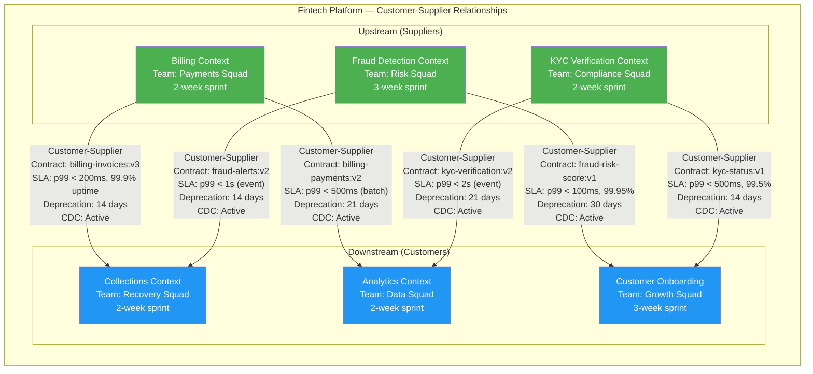
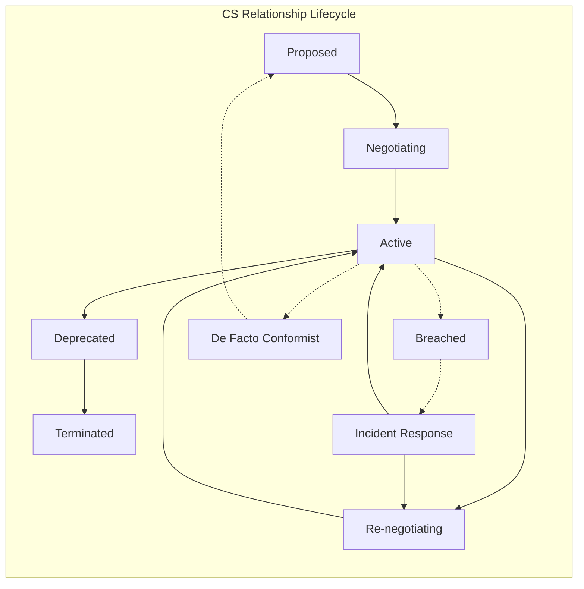

> [!success] Mastery Check
> - [ ] **Studied Well**
> - [ ] **Can explain the concept without notes**
> - [ ] **Can answer interview questions confidently**
> - [ ] **Can implement it in a real project**


# 7.037 — DDD — Context Mapping — Customer-Supplier

> **Core Tenet:** Customer-Supplier (CS) is the strategic DDD relationship pattern where an upstream team (the "supplier") provides a model, API, or event stream that a downstream team (the "customer") consumes, with an explicit agreement that the upstream will consider the downstream's needs — roadmap input, deprecation windows, contract stability, and SLA guarantees. Unlike [[7.035 — DDD — Context Mapping — Partnership]] (peer coordination) or [[7.038 — DDD — Context Mapping — Conformist]] (blind acceptance), CS formalizes a power imbalance and mitigates it through contractual obligations and continuous governance.

---

## Section 0: Quick Reference Card

> [!ABSTRACT] Quick Reference Card
>
> **Definition:** Customer-Supplier is a unidirectional relationship between two bounded contexts where the upstream context provides a model, API, or event stream that the downstream context consumes. The downstream team acts as the "customer" of the upstream team's model, with negotiated terms for SLA, deprecation windows, contract versioning, and roadmap prioritization. The relationship is explicit, documented, governed, and subject to continuous verification through contract testing and monitoring.
>
> **Purpose:** Enable model exchange across teams with independent cadences while protecting the downstream from arbitrary upstream changes and the upstream from unbounded downstream demands.
>
> **When to Use:**
> - Two bounded contexts owned by different teams with separate sprint cadences
> - One team's output is a necessary input for another team's workflow
> - The upstream model evolves independently but the downstream needs stability guarantees
> - A clear provider-consumer dynamic exists (unlike Partnership's peer coordination)
> - The downstream needs a formal mechanism to influence upstream priorities
> - Contract governance infrastructure exists or can be established (contract registry, testing)
>
> **When NOT to Use:**
> - Both teams coordinate every release and share sprint ceremonies (use [[7.035 — DDD — Context Mapping — Partnership]])
> - Downstream is willing to blindly accept upstream model changes with no influence (use [[7.038 — DDD — Context Mapping — Conformist]])
> - Downstream needs full model protection and translation buffer (use [[7.039 — DDD — Context Mapping — Anticorruption Layer]])
> - Upstream publishes a stable, versioned API for multiple consumers with no individual negotiation (use [[7.040 — DDD — Context Mapping — Open Host Service]])
> - Teams agree on a shared interchange format decoupled from either internal model (use [[7.041 — DDD — Context Mapping — Published Language]])
> - Contexts need no integration at all (use [[7.042 — DDD — Context Mapping — Separate Ways]])
>
> **Key Metrics:**
> - Upstream SLA availability: >= 99.9% if downstream depends synchronously; >= 99.5% if event-driven with buffer
> - Contract deprecation window: >= 14 days is industry standard; 21-30 days for critical paths
> - Downstream influence on upstream roadmap: >= 1 quarterly priority aligned to downstream needs
> - Contract version churn: <= 2 major breaking changes per year per contract
> - Downstream adaptation lead time: <= deprecation window days (measured from notification to deployment)
> - Contract test coverage: >= 90% of upstream contract fields exercised in downstream tests
> - Breaking change notification latency: < 1 hour from upstream deployment to downstream alert
>
> **Critical Warning:** Customer-Supplier is often confused with Conformist or Partnership. The distinction is organizational, not technical. In CS, the downstream has negotiating power and formal input into the upstream roadmap. If the downstream has no influence — no roadmap input, no deprecation window, no SLA — the relationship is Conformist regardless of what is documented. If both teams coordinate releases every two weeks with joint sprint planning, it is Partnership. Label the context map with organizational reality, not aspiration. A mislabeled CS relationship is worse than honest Conformist because it creates false confidence.

---

## Section 1: Navigation & Context

> [!INFO] Production Encounter Map
>
> Imagine a 2:43 AM incident at a global payments platform: The Billing context (upstream) publishes an InvoiceGenerated event with a new field EarlyPaymentDiscount in the payload during a routine deployment. The Collections context (downstream, documented Customer-Supplier arrangement) deserializes with strict model binding using System.Text.Json and throws JsonException on the unknown field. The dead-letter queue fills at 800 messages/minute. The root cause: Billing's product team added the discount feature without notifying Collections or honoring the 14-day deprecation window specified in their CS agreement. The context map documented Customer-Supplier but had no governance — no contract registry, no automated breaking change detection, no downstream notification webhook. The fix required a Billing rollback (30 minutes of downtime), a contract registry implementation (3 developer-days), and a formal deprecation enforcement CI/CD gate (2 developer-days). Post-mortem revealed the CS agreement existed only in a Wiki page last updated 8 months prior.
>
> **Why This Matters:** Customer-Supplier is the most common cross-team relationship pattern in mid-to-large organizations (15+ engineers, 3+ teams). It formalizes what every downstream team wishes they had: a seat at the upstream table. Without explicit CS governance — contract registry, automated validation, deprecation enforcement — the relationship degrades into de facto Conformist. The downstream absorbs upstream changes without consent, and the upstream remains unaware of the impact until 2:43 AM.
>
> **Reading Path:**
> 1. Start with **Section 2** for the mental model — understand the power dynamic between upstream and downstream and how CS differs from Partnership and Conformist
> 2. Move to **Section 3** for deep mechanics — SLA negotiation, deprecation windows, contract versioning strategy, and breaking change classification
> 3. Skip to **Section 4** for .NET 8 implementation — Azure Service Bus integration, contract registry with Cosmos DB, FluentValidation contract validation, breaking change detection
> 4. Review **Section 5** for pitfalls — especially the "negotiate once, never enforce" anti-pattern and Azure-specific service bus configuration mistakes
> 5. Use **Section 6** when deciding between CS and other relationship patterns for a new integration
> 6. Study **Section 7** for interview prep — Staff+ questions on SLA negotiation, roadmap influence, and breaking change management
>
> **When to Apply This Pattern:**
> - ✅ One team produces data or models that another team depends on, with different sprint cadences
> - ✅ The downstream team can articulate concrete needs (SLA targets, deprecation policy, required fields)
> - ✅ Organizational willingness exists to let the downstream have formal roadmap input
> - ✅ The upstream team can commit to a deprecation and notification policy
> - ✅ A contract registry or shared schema repository exists or can be created
> - ✅ Both teams have the engineering maturity to maintain contract tests
> - ❌ Teams are on the same 2-person squad with daily standups and joint sprint planning (use [[7.035 — DDD — Context Mapping — Partnership]])
> - ❌ The downstream has zero leverage or organizational power (use [[7.038 — DDD — Context Mapping — Conformist]] with honest labeling)
> - ❌ The upstream team refuses any formal commitment — deprecation windows, SLA, or notification (the relationship is Conformist by behavior)
> - ❌ The downstream needs to completely insulate its internal model from upstream changes (use [[7.039 — DDD — Context Mapping — Anticorruption Layer]])
> - ❌ More than 3 downstream consumers exist for the same upstream contract (use [[7.040 — DDD — Context Mapping — Open Host Service]])
>
> **Prerequisites Review:**
> - [[7.034 — DDD — Bounded Contexts — Context Map]] — Customer-Supplier is one of eight relationship patterns on a context map. Understanding how context maps document organizational boundaries, relationship lifecycle, and integration contracts is essential before applying CS specifics.
>
> **Cross-Domain Connection:**
> - [[7.035 — DDD — Context Mapping — Partnership]] — Partnership is the alternative when teams coordinate releases biweekly or more; CS is for independent cadences with contractual protection
> - [[7.036 — DDD — Context Mapping — Shared Kernel]] — Shared Kernel can coexist with CS for a small subset of shared types (e.g., CustomerId, Money) while main integration uses CS
> - [[7.038 — DDD — Context Mapping — Conformist]] — The degenerated form of CS when downstream has no influence over upstream; critical to understand the difference for accurate context map labeling
> - [[7.039 — DDD — Context Mapping — Anticorruption Layer]] — CS often includes ACL implementation at the downstream boundary to translate upstream models; ACL is a technical pattern that supports the CS strategic pattern
> - [[7.040 — DDD — Context Mapping — Open Host Service]] — OHS generalizes CS for multiple downstream consumers; transition from CS to OHS when consumer count exceeds 3
> - [[7.041 — DDD — Context Mapping — Published Language]] — Published Language provides the shared schema format that CS contracts often use (JSON Schema, Avro, Protobuf)
> - [[3.022 — Azure Service Bus Deep Dive]] — The primary Azure infrastructure for CS event-based integration; topic subscriptions per downstream consumer
> - [[7.054 — DDD — Domain Events — MediatR INotification in .NET]] — In-process domain events vs cross-context integration events in CS; MediatR handles the former, Azure Service Bus handles the latter

---

## Section 2: Core Mental Model

> [!TIP] Non-Obvious Insight
>
> **Customer-Supplier is an organizational pattern first, a technical pattern second.**
>
> The most common failure of CS is treating it as purely technical — "put an SLA on the API and call it done." The hard part is organizational: getting the upstream team to actually prioritize downstream needs on their roadmap, maintaining a deprecation window when business pressure says \"ship it now,\" and having the downstream team invest in contract testing and monitoring infrastructure. The technical implementation (REST API versioning, schema registries, rate limiting) is straightforward compared to the organizational discipline of honoring the agreement over multiple quarters.
>
> **The Power-Law Dynamic:** In a CS relationship, the upstream always holds more power — they control the model, the release schedule, and the roadmap priorities. The CS pattern does not eliminate this imbalance; it formalizes mitigations. The downstream's best leverage mechanisms, in order of effectiveness:
> 1. **Consumer-driven contract tests** — automated tests in the upstream CI that verify the contract against downstream expectations; if tests fail, upstream build fails
> 2. **Contract registry with automated notification** — upstream cannot publish a new schema without the registry alerting downstream; provides an audit trail
> 3. **Executive sponsorship** — a director or VP who holds the upstream accountable to the agreed CS terms during quarterly planning
> 4. **Dependency graph visibility** — architecture dashboard showing which services depend on which upstream contracts, making the impact visible to leadership
> 5. **SLA monitoring + escalation** — automated PagerDuty alerts when upstream contract changes break downstream processing

### Compare and Contrast

| Aspect | Partnership | Customer-Supplier | Conformist |
|--------|-------------|-------------------|------------|
| Power dynamic | Peer — equal influence | Upstream dominant, downstream has contractual input | Upstream dominant, downstream powerless |
| Coordination | Joint release planning, shared sprint ceremonies | Independent cadences with deprecation window | No coordination — downstream adapts reactively |
| Team relationship | Close collaboration, biweekly sync | Formal customer-vendor relationship with monthly sync | Arms-length dependency; teams rarely communicate |
| Translation cost | None — models are aligned | Low to Medium — downstream may implement thin projection or ACL | None — downstream imports upstream model directly |
| Downstream protection | Mutual agreement on changes | Contract registration + SLA + deprecation window | None — downstream absorbs all upstream changes |
| Evolution flexibility | High — joint decisions on change timing | Medium — deprecation windows allow planned adaptation | Low — upstream dictates timeline; downstream scrambles |
| Organizational overhead | High — joint ceremonies, aligned backlogs | Medium — contract governance, quarterly review, CDC tests | Low — downstream accepts whatever upstream produces |
| Testing complexity | Low — shared integration tests | Medium — CDC tests in upstream CI, contract validation in downstream | Low — no contract test investment |
| Runtime coupling | High release coupling | Medium contract coupling | High deployment coupling |

### Classification

| Axis | Classification | Description |
|------|---------------|-------------|
| Intent | Strategic | Organizes cross-team relationships; not a tactical implementation detail |
| Direction | Unidirectional — upstream [model] ---<<Customer-Supplier>>---> downstream [customer] | The model, events, or API flow from supplier to customer |
| Coupling | Medium — contract dependency | Downstream depends on upstream contract, not implementation; decoupled via contract registry |
| Autonomy | Medium — both teams independent but contract-bound | Neither controls the other's internal model; only the integration contract is jointly governed |
| Formality | High — requires documented SLA, deprecation policy, contract registry, CDC tests | Informal CS without governance artifacts is de facto Conformist |
| Governance | Medium — quarterly review, contract testing, roadmap alignment sessions | More governance than OHS or Published Language; less than Shared Kernel |
| Difficulty | Organizational (high) > Technical (medium) | The social agreement and ongoing discipline is harder to maintain than the serialization code |
| Lifecycle | Months to years — stable until team structure changes | CS relationships should be reviewed quarterly; team reorganization triggers mandatory re-negotiation |

### Mermaid Diagram: Customer-Supplier Relationships in a Fintech Platform



> [!NOTE] Diagram Interpretation
> This fintech platform shows six Customer-Supplier relationships across three upstream and three downstream contexts. Each relationship has explicit contract identifier, SLA targets, and deprecation window. Key observations:
> - Billing serves two downstream consumers with different SLA requirements: Collections needs synchronous low-latency (p99 < 200ms) while Analytics processes in batch (p99 < 500ms). Same upstream, different CS contracts.
> - Fraud -> Onboarding has the strictest SLA (p99 < 100ms, 99.95% uptime, 30-day deprecation) because it blocks customer registration — a revenue-critical synchronous path.
> - KYC -> Onboarding also gates activation but with looser tolerances (p99 < 500ms) because KYC verification is partially asynchronous (manual review for high-risk cases).
> - Collection is downstream to two upstreams (Billing and Fraud), meaning it must coordinate adaptation to contract changes from both — a challenge documented in the context map as a risk note.

### Mermaid Sequence Diagram: CS Contract Negotiation and Breaking Change Incident

```mermaid
sequenceDiagram
    participant D as Downstream: Collections Team
    participant A as Architecture Review Board
    participant U as Upstream: Billing Team
    participant R as Contract Registry
    participant P as PagerDuty

    Note over D,U: Sprint 0 — Relationship Negotiation Phase
    D->>U: 1. Request: Need InvoiceGenerated events with PaymentDueDate and AmountDue
    U->>D: 2. Confirm: Billing already has Invoice aggregate with those fields
    D->>U: 3. Propose Customer-Supplier relationship — Collections as customer
    U->>D: 4. Agree to CS pattern, propose weekly sync for roadmap alignment
    D->>A: 5. Submit CS proposal for architecture review
    A->>U: 6. Condition: 14-day minimum deprecation window on all contract changes
    A->>D: 7. Condition: Collections must implement consumer-driven contract tests
    Note over D,U: CS agreement formalized and documented on context map

    Note over D,U: Sprint 3 — First Breaking Change Attempt
    U->>U: 8. Product adds EarlyPaymentDiscount feature
    U->>R: 9. Publish InvoiceGenerated v4 (adds DiscountPercent field, removes OldDiscountCode)
    R->>D: 10. Notify: Contract version changed — 14-day deprecation begins
    D->>D: 11. Collections assesses impact: needs to update deserialization, add discount field

    Note over D,U: Day 7 of 14-day window — Contract Violation
    U->>U: 12. Business pressure: Ship discount feature NOW for competitor response
    U->>U: 13. Deploy v4 schema WITHOUT waiting 14 days (CI bypassed via admin override)
    D->>R: 14. Validate incoming InvoiceGenerated event against registered v3 contract
    R->>D: 15. FAIL: Schema mismatch — DiscountPercent not in v3, OldDiscountCode removed
    D->>D: 16. JsonException: Strict deserialization rejects unknown field
    D->>P: 17. Alert: Collections pipeline failing — DLQ accumulating
    P->>D: 18. Page: On-call engineer (3:17 AM escalation)
    D->>D: 19. Incident response: Configure lenient deserialization (IgnoreReadOnlyFields, missing member handling)
    D->>U: 20. Escalate: Breaking contract violation, expected 14-day window

    Note over U,A,D: Resolution and Governance Enforcement
    U->>R: 21. Rollback schema registry to v3; mark v4 as pending until deprecation expires
    A->>U: 22. Mandate: CI/CD pipeline must check contract registry before production deploy
    A->>D: 23. Mandate: Implement ACL for incoming Billing events with schema validation
    A->>R: 24. Enforce: Registry now blocks schema activation before deprecation window expires
    Note over D,U: Quarterly review confirms: CS relationship remains appropriate but governance was missing
```

> [!NOTE] Sequence Analysis
> This traces a complete Customer-Supplier lifecycle including negotiation, breaking change violation, and resolution. Critical inflection points:
> - Steps 1-7: The negotiation is social (team-to-team) and architectural (ARB review). The contract registry is established as the technical enforcement mechanism.
> - Steps 8-11: The upstream publishes a new schema with the required deprecation window. This is working as designed.
> - Steps 12-17: Business pressure causes the upstream to violate the CS agreement. The downstream's strict deserialization catches the violation, but at production cost (DLQ, paged on-call). The contract registry detected the mismatch but had no enforcement power to block the upstream deploy.
> - Steps 18-24: Resolution is multi-layered — incident response (lenient deserialization), schema rollback, governance enforcement (CI/CD gate), and architectural improvement (ACL). The post-mortem adds a new rule: contract registry must enforce deprecation windows at deploy time, not just at consume time.

### Numbers That Matter

| Metric | Good | Warning | Critical | Calculation Method | Real-World Implication |
|--------|------|---------|----------|-------------------|----------------------|
| Upstream SLA availability | >= 99.9% | 99.5-99.9% | < 99.5% | (Successful responses / total requests) x 100 over 30 days | Downstream must implement circuit breaker or caching; CS agreement may need renegotiation |
| Contract deprecation window | >= 14 days | 7-13 days | < 7 days | Calendar days between upstream publishing new contract and activating it | Downstream cannot adapt in time; every breaking change causes incident |
| Downstream roadmap influence | >= 1 aligned priority/quarter | 1-2 aligned/year | 0 aligned | Count of upstream roadmap items directly requested by downstream | Without influence, CS is de facto Conformist |
| Contract version churn | <= 2 major breaking changes/year | 3-4 major/year | > 4 major/year | Major version bumps per contract per year | High churn indicates upstream model instability; ACL may be more appropriate |
| CDC test coverage | >= 90% of contract fields | 60-89% | < 60% | (Fields covered by CDC tests / total contract fields) x 100 | Undetected breaking changes reach production |
| Breaking change notification | < 1 hour from deploy to alert | 1-24 hours | > 24 hours | Time between upstream schema deploy and downstream team notification | Delayed detection extends incident duration |
| Downstream adaptation lead time | <= deprecation window days | Exceeds window by < 5 days | Exceeds window by 5+ days | Days from notification to downstream deployment of compatible code | Downstream cannot meet deprecation commitments; may need ACL |
| CS relationship accuracy | Label matches behavior | Partial alignment | Label contradicts behavior | Annual audit of CS vs actual power dynamics | Mislabeled CS creates false confidence; honest Conformist is safer |
| Contract review cadence | Quarterly | Bi-annually | Annually or never | Time since last CS contract review meeting | Stale contracts accumulate ungoverned changes |
| Upstream breaking change count | 0 per quarter | 1 per quarter | 2+ per quarter | Count of changes requiring downstream code modification | Frequent breaking changes suggest upstream model instability or insufficient boundary design |

### Key Properties

| Property | Description |
|----------|-------------|
| **Directional** | CS is inherently directional — upstream to downstream. The reverse direction (downstream to upstream) requires a separate relationship pattern. |
| **Contractual** | The relationship is governed by an explicit contract — SLA, deprecation policy, field specifications. Without a contract, there is no CS. |
| **Power-Aware** | CS acknowledges the upstream holds more power. The pattern's value is in mitigating this imbalance through governance, not denying it. |
| **Negotiated** | Both teams must actively agree to the terms. ARB validates the pattern choice. Monthly sync meetings review contract health. |
| **Governed** | CS requires ongoing governance: quarterly reviews, CDC tests, contract registry, deprecation enforcement. Without governance, it degrades. |
| **Temporal** | CS has a lifecycle. The same relationship can move to OHS (more downstream consumers) or Partnership (teams merge cadences) over time. |
| **Testable** | The contract should be automatically testable via consumer-driven contract tests in the upstream CI pipeline. |
| **Visible** | The relationship must be documented on the context map with contract identifier, SLA terms, deprecation window, and last review date. |

---

## Section 3: Deep Mechanics

### How It Works

The Customer-Supplier pattern operates through a five-phase lifecycle with explicit organizational and technical activities in each phase.

**Phase 1 — Relationship Identification and Proposal (Sprint 0 / Inception)**
A downstream team identifies that they depend on an upstream team's model and need formal protections. This discovery happens during context mapping workshops, architecture reviews, or (most commonly) after a breaking change incident. The downstream team drafts a CS proposal covering:
- Integration scope: which specific events, APIs, or data flows are in scope
- Required contract fields: minimum fields the downstream must receive
- SLA requirements: latency, throughput, availability, consistency
- Governance expectations: deprecation window, notification mechanism, roadmap influence
- Current state: what is happening today (likely undocumented Conformist)

**Phase 2 — SLA Negotiation (Sprint 0-1)**
Both teams negotiate the formal terms of the CS relationship. Key negotiated parameters:
- **Availability SLA:** The upstream commits to a minimum uptime percentage. Synchronous dependencies (e.g., fraud check on customer signup) need 99.9%+. Event-driven dependencies (e.g., billing events for analytics) can tolerate 99.5%+.
- **Latency SLA:** p95 and p99 response time targets. Separate targets for peak vs off-peak. Synchronous blocking calls need tighter bounds.
- **Deprecation Window:** The minimum calendar days between the upstream announcing a breaking change and activating it. Industry standard is 14 days; critical integration paths use 21-30 days.
- **Notification Mechanism:** How the upstream notifies the downstream of pending changes — contract registry webhook, email distribution list, Slack channel, PagerDuty.
- **Escalation Path:** Who to contact when the CS agreement is violated (on-call engineers, team leads, architecture board).
- **Roadmap Commitment:** The upstream agrees to accept and consider at least N downstream-prioritized items per quarter on their roadmap.

**Phase 3 — Contract Definition and Registration (Sprint 1-2)**
The integration contract is formalized and registered:
- **Schema Definition:** The upstream publishes the contract schema (JSON Schema, Avro, Protobuf) to a contract registry
- **Contract Identifier:** A unique, versioned identifier format: {upstream-context}-{contract-name}:v{major}
- **Versioning Strategy:** Semantic versioning for the contract — major version for breaking changes, minor for backward-compatible additions
- **Sample Payloads:** Downstream provides example payloads they expect to receive, encoded as CDC test fixtures
- **Monitoring Slo:** Contract registry records the agreed SLAs; monitoring infrastructure tracks performance against them

**Phase 4 — Technical Implementation (Sprint 2+)**
Both teams implement their sides:
- **Upstream:** Implements the contract schema, publishes to contract registry, sets up notification webhook for downstreams, adds CDC test suite to CI pipeline
- **Downstream:** Implements contract validation (FluentValidation on incoming messages), sets up dead-letter queue with alerting, optionally implements thin ACL for field mapping
- **Monitoring:** OpenTelemetry metrics for contract validation success/failure, translation latency, unmapped fields

**Phase 5 — Governance and Evolution (Ongoing)**
- **Quarterly Review:** Both teams review the CS agreement — are SLA targets still appropriate? Has team structure changed? Is the pattern still CS or has it drifted?
- **Monthly Sync:** 30-minute meeting to review upcoming contract changes, roadmap alignment, and any incidents since last sync
- **CDC Test Maintenance:** Downstream updates CDC tests when their requirements change; upstream runs them in CI
- **Incident Post-Mortem:** Any CS-related incident triggers a review of the agreement; terms may be renegotiated

### Protocol Trace: OrderProcessing (Downstream) <-> PaymentProcessing (Upstream)

**Happy Path (7 steps):**

```
1. Customer submits order on e-commerce site
   → OrderProcessing context creates Order aggregate

2. OrderProcessing sends ProcessPayment command to PaymentProcessing
   → Contract: payment-commands:v2 (Customer-Supplier)
   → Command includes: OrderId, Amount, Currency, PaymentMethod, CustomerId
   → HTTP POST with Idempotency-Key header (IdempotencyKey = OrderId)

3. PaymentProcessing validates command against contract
   → Contract registry confirms payment-commands:v2 is current
   → FluentValidation: Amount > 0, Currency is ISO 4217, PaymentMethod is valid

4. PaymentProcessing processes payment with PSP (Stripe/Adyen)
   → Returns PaymentTransactionId, Status, Timestamp

5. PaymentProcessing publishes PaymentCompleted event
   → Contract: payment-events:v3
   → Azure Service Bus topic: payment/completed
   → Event schema: { PaymentTransactionId, OrderId, Amount, Currency, Status, CompletedAt }

6. OrderProcessing receives PaymentCompleted event via Service Bus subscription
   → Schema validation against contract registry (payment-events:v3)
   → FluentValidation confirms required fields present
   → Maps upstream PaymentCompleted event to internal OrderPaymentConfirmed domain event

7. Order aggregate transitions from AwaitingPayment to Confirmed
   → OrderTracking status updated
   → Inventory reserved confirmed
   → OrderConfirmation email queued
```

**Failure Path — SLA Breach (5 steps):**

```
1. PaymentProcessing PSP provider experiences regional outage
   → PaymentProcessing p95 latency spikes from 200ms to 4,500ms
   → Timeout errors: 10% of payment commands fail

2. OrderProcessing receives HTTP 504 from PaymentProcessing
   → Polly circuit breaker opens (3 failures in 60 seconds)
   → Circuit open for 60 seconds; requests fail fast

3. OrderProcessing falls back to order reservation mode
   → Order placed in ReservedPayment state (not Confirmed)
   → Customer sees "Order received — payment pending" message
   → Reservation expires in 15 minutes if payment not completed

4. SLA breach alert fires: PaymentProcessing p95 latency > SLA target
   → On-call from both teams joins bridge
   → PaymentProcessing team activates PSP fallback (secondary provider)
   → Circuit breaker half-opens, tests secondary provider, confirms recovery

5. Post-mortem:
   → CS agreement reviewed: single PSP provider is a risk
   → PaymentProcessing adds secondary PSP with automatic failover
   → CS SLA updated: adds PSP redundancy requirement
   → OrderProcessing adds 30-second cache of payment method validation
```

### State Transitions

The Customer-Supplier relationship lifecycle:



| State | Description | Duration | Exit Criteria |
|-------|-------------|----------|---------------|
| **Proposed** | Downstream has identified need for CS; upstream not yet agreed | 1-2 weeks | Both teams agree to negotiate |
| **Negotiating** | Teams discussing SLA, deprecation, roadmap terms | 1-2 sprints | Signed CS agreement + contract registry entry |
| **Active** | CS relationship live; contract validated; governance active | Indefinite | Quarterly reviews pass; no SLA breach in 90 days |
| **Deprecated** | Relationship scheduled for termination; no new consumers | 1-2 quarters | All downstreams migrated; contract traffic zero |
| **Terminated** | Integration removed; context map updated | Permanent | Context map updated; infrastructure decommissioned |
| **Breached** | SLA violation or contract break detected | Hours to days | Root cause fixed; agreement terms updated if needed |
| **Incident Response** | Active remediation of CS violation | Minutes to hours | Service restored; CDC tests updated; deprecation enforced |
| **Re-negotiating** | Terms being updated due to org change or incident feedback | 1-2 sprints | New CS agreement signed |
| **De Facto Conformist** | CS documented but downstream has no actual influence; dangerous state | Variable (should be brief) | Honest re-label to Conformist or re-establish CS governance |

### Failure Modes

> [!DANGER] 3AM Production Signal — The Silent Schema Break
> **Signal:** PagerDuty alert: "Dead-letter queue depth > 5,000 on billing-invoices subscription" at 3:17 AM.
> **Root Cause:** Upstream Billing context deployed a new major version of the InvoiceGenerated schema without honoring the 14-day deprecation window specified in the CS agreement. The downstream Collections context uses strict System.Text.Json deserialization with JsonSerializerOptions.UnmappedMemberHandling = JsonUnmappedMemberHandling.Disallow. The new schema removed a field (LegacyDiscountCode) that Collections relied on for reconciliation reporting.
> **Detection Gap:** The contract registry detected the schema change and notified Collections, but no CI/CD gate blocked Billing's deployment. The CS agreement had deprecation policy in documentation but no technical enforcement. Collections had CDC tests but they ran nightly, not in Billing's CI pipeline.
> **Mitigation:** (1) Immediate: Roll back Billing deployment, reprocess DLQ. (2) Short-term: Add CDC test execution to Billing's CI pipeline — build fails if downstream contract breaks. (3) Medium-term: Contract registry enforces deprecation window — rejects schema activation if minimum days not met. (4) Long-term: Move from strict deserialization to lenient-with-logging in Collections ACL to prevent future production outages from upstream changes.
> **Post-Mortem Metric:**  lost orders during 47-minute outage window (peak e-commerce hours).

> [!DANGER] 3AM Production Signal — The Deprecation Window Override
> **Signal:** Collections deployment fails: "CDC tests failed — InvoiceGenerated schema missing ExpectedDiscountDate field."
> **Root Cause:** Billing published InvoiceGenerated v5 with a 14-day deprecation notice. On day 12, Billing's VP of Product overrode the deprecation window, citing a competitive response requirement. Billing's CI/CD admin bypass allowed the deployment. Collections had not yet adapted because the 14-day window had not expired. The CDC test, running in Collections CI, immediately failed because the expected contract did not match the deployed schema.
> **Detection Gap:** The CDC test caught the mismatch, preventing Collections deployment. But no upstream gate prevented the Billing deployment. The CS governance relied on mutual respect of the deprecation window, not technical enforcement.
> **Mitigation:** (1) Immediate: Collections raises architecture escalation. Billing rolls back. (2) Contract registry now requires architecture board approval for any deprecation window override. (3) CI/CD: Deployment pipeline checks contract registry — if schema has active deprecation notice and window not expired, deploy blocked unless override token (time-limited, audit-logged) is provided.
> **The Lesson:** Trust-based deprecation windows fail under business pressure. Technical enforcement is the only reliable protection.

> [!DANGER] 3AM Production Signal — The SLA Cascade
> **Signal:** OrderProcessing p95 latency > 5,000ms (baseline 180ms). Customer-facing checkout page timeout rate: 12%.
> **Root Cause:** Checkout context depends on three upstream contexts via CS relationships: Fraud (risk score), Inventory (stock availability), and Payment (payment processing). Fraud experienced a database replica lag spike (30s+ replication delay), causing its risk score API to time out. Fraud's circuit breaker opened, failing fast — but Checkout's circuit breaker for Fraud had a longer timeout, causing cascading connection pool exhaustion. The other two upstream calls also timed out because Checkout's HTTP client pool was saturated.
> **Detection Gap:** Each CS relationship had individual SLA monitoring, but no composite SLA was tracked. Checkout's p95 latency was the sum of the three upstream calls, each with its own tail latency distribution. The composite SLA (p95 < 2,000ms) was violated even though no single upstream exceeded its individual SLA.
> **Mitigation:** (1) Immediate: Checkout parallelizes the three upstream calls (from sequential to concurrent), reducing composite latency from sum to max. (2) Separate circuit breaker per upstream with distinct fallback behavior. (3) CS agreement updated: Checkout negotiates composite SLA with each upstream that accounts for parallel execution. (4) Monitoring: Composite latency dashboard tracks the actual customer-facing latency as a function of all upstream CS relationships.
> **The Lesson:** Individual SLA compliance does not guarantee composite SLA compliance. The downstream must negotiate aggregate performance characteristics.

### Breaking Change Classification

| Type | Example | Severity | Downstream Impact | Required Deprecation |
|------|---------|----------|-------------------|---------------------|
| **Field removal** | Removed LegacyDiscountCode | Critical | Deserialization failure, data loss | 30 days minimum |
| **Field type change** | AmountDue from decimal to string | Critical | Deserialization failure | 30 days minimum |
| **Field rename** | DiscountAmt -> DiscountAmount | High | Mapping code breaks | 14 days minimum |
| **Field semantic change** | Status values change ('Paid'->'Settled') | High | Business logic breaks; no deserialization failure | 21 days minimum |
| **Required field addition** | Added required TaxRate | Medium | Strict deserialization breaks; lenient succeeds | 14 days minimum |
| **Optional field addition** | Added optional PromoCode | Low | No break; downstream ignores if not needed | 7 days recommended |
| **Enum value removal** | Removed Status.PendingReview | High | Switch statement throws ArgumentOutOfRangeException | 21 days minimum |
| **Enum value addition** | Added Status.PaymentHeld | Low | Existing switch with default clause handles gracefully | 7 days recommended |
| **Numeric precision change** | Money.Amount from decimal(18,2) to decimal(18,4) | Medium | Downstream rounding may be off; no crash | 14 days minimum |
| **Endpoint URL change** | /api/v2/invoices -> /api/v3/invoices | High | HTTP 404 if downstream hardcodes URL | 14 days minimum with redirect |
| **Authentication change** | API key -> OAuth2 | High | HTTP 401; auth pipeline breaks | 30 days minimum |
| **Rate limit reduction** | 10,000 req/min -> 1,000 req/min | Medium | Downstream throttled; no crash if retry implemented | 14 days minimum |

### .NET and Azure Integration Points

| Integration Point | .NET Mechanism | Azure Service | CS Relationship Role |
|-------------------|---------------|---------------|---------------------|
| **Contract Registry** | Azure.Cosmos SDK + custom IContractRegistry implementation | Azure Cosmos DB NoSQL | Central store for all CS contracts with versioning and change notification |
| **Event Publishing (upstream)** | Azure.Messaging.ServiceBus ServiceBusSender | Azure Service Bus Topics | Upstream publishes contract events; downstream subscribes |
| **Command Dispatch (downstream)** | MediatR IRequest<TResponse> with FluentValidation | Azure Service Bus Queues | Downstream sends commands to upstream with validation at boundary |
| **Schema Validation** | FluentValidation validators + System.Text.Json source generators | Azure API Management policy | Validate upstream messages before processing; reject contract violations |
| **Contract Testing** | PactNet 4.x IMessagePactBuilder | Azure DevOps Pipeline | CDC tests in upstream CI; build fails if downstream contract breaks |
| **SLA Monitoring** | OpenTelemetry Meter + Histogram instruments | Azure Monitor + Application Insights | Track p95/p99 latency, availability %, contract violation rate |
| **Deprecation Enforcement** | Custom IDeprecationPolicy with CI/CD gate | Azure DevOps + Azure Functions | CI/CD pipeline checks contract registry before deploy; blocks if deprecation not honored |
| **Resilience (downstream)** | Polly HttpClientFactory + circuit breaker | Azure Functions (isolated) | Protect downstream from upstream SLA breaches; fail fast with fallback |
| **Breaking Change Detection** | JsonSchema.NET JsonSchema comparison | Azure Event Grid + Azure Function | Compare new vs old schema; classify breaking changes; notify subscribers |
| **Roadmap Alignment** | Azure DevOps Work Item Tracking API | Azure Boards | Track upstream roadmap items tagged with downstream context ID |
| **SLA Dashboard** | Azure Monitor Workbooks + Kusto queries | Azure Dashboard | Real-time CS relationship health; SLA compliance; contract violation trends |
| **Idempotency** | Distributed IdempotencyKey with Cosmos DB | Azure Cosmos DB + Redis Cache | Ensure at-most-once processing of upstream events in downstream |
---

## Section 4: Production Patterns and Implementation

### Primary Implementation: .NET 8 — Customer-Supplier Contract with Azure Service Bus and Contract Registry

This implementation models a production-grade Customer-Supplier relationship between PaymentProcessing (upstream) and OrderProcessing (downstream) in an e-commerce platform. The implementation covers:

1. **Contract Registry** — Cosmos DB-backed store for versioned schemas with deprecation enforcement
2. **Upstream Event Publisher** — PaymentProcessing publishes PaymentCompleted events with contract validation
3. **Downstream Event Handler** — OrderProcessing consumes with contract validation and thin ACL
4. **Consumer-Driven Contract Tests** — PactNet CDC tests that run in upstream CI
5. **SLA Monitoring** — OpenTelemetry metrics for contract health
6. **Deprecation Enforcement** — CI/CD gate that blocks deployment if deprecation window not honored

**Solution Structure:**
```
Ecommerce.Contracts/                                    # Published Language shared contracts
+-- PaymentCompletedEvent.cs                            # Shared event schema
+-- ProcessPaymentCommand.cs                            # Shared command schema
+-- ContractVersion.cs                                  # Version marker

Ecommerce.PaymentProcessing/                            # Bounded Context: Upstream (Supplier)
+-- CustomerSupplier/
|   +-- ICustomerSupplierContractRegistry.cs             # Contract registry interface
|   +-- CustomerSupplierContractRegistry.cs              # Cosmos DB implementation
|   +-- CustomerSupplierRelationship.cs                  # CS agreement model
|   +-- ContractDeprecationPolicy.cs                     # Deprecation window enforcement
|   +-- ContractViolationException.cs                    # Breaking contract exception
+-- Publishers/
|   +-- PaymentCompletedPublisher.cs                     # Publishes events with contract versioning
+-- Configuration/
    +-- PaymentProcessingCsConfiguration.cs              # DI registration

Ecommerce.OrderProcessing/                              # Bounded Context: Downstream (Customer)
+-- Anticorruption/
|   +-- PaymentAclHandler.cs                             # ACL for PaymentCompleted events
|   +-- PaymentContractValidator.cs                      # FluentValidation for upstream schema
+-- Handlers/
|   +-- PaymentCompletedHandler.cs                       # Main event handler
+-- Configuration/
    +-- OrderProcessingCsConfiguration.cs                # DI registration

Ecommerce.ContractTests/                                # Consumer-Driven Contract Tests
+-- PaymentCompletedEventCdcTests.cs                    # PactNet CDC tests
+-- ContractFixture.cs                                  # Shared test fixtures
```

```csharp
// Ecommerce.Contracts/PaymentCompletedEvent.cs
namespace Ecommerce.Contracts;

public sealed record PaymentCompletedEvent
{
    public required string EventId { get; init; }
    public required string PaymentTransactionId { get; init; }
    public required string OrderId { get; init; }
    public required decimal Amount { get; init; }
    public required string Currency { get; init; }
    public required PaymentStatus Status { get; init; }
    public required DateTimeOffset ProcessedAt { get; init; }
    public string? GatewayReference { get; init; }
    public string? FailureReason { get; init; }
    public required string SchemaVersion { get; init; }
}

public enum PaymentStatus { Succeeded, Failed, Refunded, PartiallyRefunded, Pending }

public sealed record ProcessPaymentCommand
{
    public required string CommandId { get; init; }
    public required string OrderId { get; init; }
    public required decimal Amount { get; init; }
    public required string Currency { get; init; }
    public required string PaymentMethod { get; init; }
    public required string CustomerId { get; init; }
    public required string IdempotencyKey { get; init; }
    public required string SchemaVersion { get; init; }
}
```

```csharp
// Ecommerce.PaymentProcessing/CustomerSupplier/ICustomerSupplierContractRegistry.cs
namespace Ecommerce.PaymentProcessing.CustomerSupplier;

public interface ICustomerSupplierContractRegistry
{
    Task<ContractRegistration?> GetCurrentContractAsync(
        string contractId, CancellationToken cancellationToken);

    Task<ContractRegistration?> GetContractVersionAsync(
        string contractId, string version, CancellationToken cancellationToken);

    Task RegisterContractAsync(
        ContractRegistration registration, CancellationToken cancellationToken);

    Task<SchemaValidationResult> ValidateAgainstContractAsync<T>(
        string contractId, T message, CancellationToken cancellationToken);

    Task NotifyDownstreamConsumersAsync(
        string contractId, string changeDescription, CancellationToken cancellationToken);

    Task<IReadOnlyList<DownstreamSubscriber>> GetSubscribersAsync(
        string contractId, CancellationToken cancellationToken);

    Task<bool> CanActivateSchemaVersionAsync(
        string contractId, string version, CancellationToken cancellationToken);

    Task<IReadOnlyList<ContractRegistration>> GetPendingDeprecationsAsync(
        CancellationToken cancellationToken);
}

public sealed record ContractRegistration
{
    public required string Id { get; init; }
    public required string ContractId { get; init; }
    public required string Version { get; init; }
    public required string SchemaJson { get; init; }
    public required string UpstreamContext { get; init; }
    public required string Description { get; init; }
    public required bool IsActive { get; init; }
    public DateTimeOffset RegisteredAt { get; init; }
    public DateTimeOffset? DeprecationNotifiedAt { get; init; }
    public DateTimeOffset? ActivationScheduledAt { get; init; }
    public DateTimeOffset? ActivatedAt { get; init; }
    public int MinimumDeprecationWindowDays { get; init; }
    public BreakingChangeLevel BreakingChangeLevel { get; init; }
}

public enum BreakingChangeLevel { None, Low, Medium, High, Critical }

public sealed record DownstreamSubscriber
{
    public required string SubscriberId { get; init; }
    public required string DownstreamContext { get; init; }
    public required string ContractId { get; init; }
    public required string WebhookUrl { get; init; }
    public required string ContactEmail { get; init; }
    public required DateTimeOffset SubscribedAt { get; init; }
}

public sealed record SchemaValidationResult
{
    public bool IsValid { get; init; }
    public string? ErrorMessage { get; init; }
    public IReadOnlyList<string>? Violations { get; init; }

    public static SchemaValidationResult Success() => new() { IsValid = true };
    public static SchemaValidationResult Failure(string error, IReadOnlyList<string>? violations = null)
        => new() { IsValid = false, ErrorMessage = error, Violations = violations };
}
```

```csharp
// Ecommerce.PaymentProcessing/CustomerSupplier/CustomerSupplierContractRegistry.cs
using Azure.Cosmos;
using Microsoft.Extensions.Logging;

namespace Ecommerce.PaymentProcessing.CustomerSupplier;

public sealed class CustomerSupplierContractRegistry : ICustomerSupplierContractRegistry
{
    private readonly Container _container;
    private readonly ILogger<CustomerSupplierContractRegistry> _logger;

    public CustomerSupplierContractRegistry(
        CosmosClient cosmosClient,
        ILogger<CustomerSupplierContractRegistry> logger)
    {
        _container = cosmosClient.GetContainer("ContractRegistry", "CustomerSupplierContracts");
        _logger = logger;
    }

    public async Task<ContractRegistration?> GetCurrentContractAsync(
        string contractId, CancellationToken cancellationToken)
    {
        var query = new QueryDefinition(
            "SELECT TOP 1 * FROM c WHERE c.contractId = @contractId AND c.isActive = true ORDER BY c.activatedAt DESC")
            .WithParameter("@contractId", contractId);

        using var feed = _container.GetItemQueryIterator<ContractRegistration>(query);
        if (feed.HasMoreResults)
        {
            var response = await feed.ReadNextAsync(cancellationToken);
            return response.FirstOrDefault();
        }
        return null;
    }

    public async Task<ContractRegistration?> GetContractVersionAsync(
        string contractId, string version, CancellationToken cancellationToken)
    {
        try
        {
            var response = await _container.ReadItemAsync<ContractRegistration>(
                id: $"{contractId}:{version}",
                partitionKey: new PartitionKey(contractId),
                cancellationToken: cancellationToken);
            return response.Resource;
        }
        catch (CosmosException ex) when (ex.StatusCode == System.Net.HttpStatusCode.NotFound)
        {
            _logger.LogWarning("Contract {ContractId} version {Version} not found.", contractId, version);
            return null;
        }
    }

    public async Task RegisterContractAsync(
        ContractRegistration registration, CancellationToken cancellationToken)
    {
        if (registration.BreakingChangeLevel is BreakingChangeLevel.High or BreakingChangeLevel.Critical)
        {
            var current = await GetCurrentContractAsync(registration.ContractId, cancellationToken);
            if (current is not null)
            {
                var depEnd = DateTimeOffset.UtcNow.AddDays(registration.MinimumDeprecationWindowDays);
                registration = registration with
                {
                    DeprecationNotifiedAt = DateTimeOffset.UtcNow,
                    ActivationScheduledAt = depEnd,
                    IsActive = false,
                };
                _logger.LogInformation(
                    "Contract {Id} v{Ver} registered with {Days}-day deprecation. Activation: {Act}",
                    registration.ContractId, registration.Version,
                    registration.MinimumDeprecationWindowDays, depEnd);
            }
        }
        registration = registration with { RegisteredAt = DateTimeOffset.UtcNow };
        await _container.UpsertItemAsync(registration, cancellationToken: cancellationToken);
    }

    public async Task<SchemaValidationResult> ValidateAgainstContractAsync<T>(
        string contractId, T message, CancellationToken cancellationToken)
    {
        var current = await GetCurrentContractAsync(contractId, cancellationToken);
        if (current is null)
            return SchemaValidationResult.Failure($"No active contract found for '{contractId}'.");

        var violations = new List<string>();
        var msgType = typeof(T);
        foreach (var prop in msgType.GetProperties())
        {
            var value = prop.GetValue(message);
            var requiredAttr = prop.GetCustomAttributes(
                typeof(System.ComponentModel.DataAnnotations.RequiredAttribute), false);
            if (requiredAttr.Length > 0 && value is null or string { Length: 0 })
                violations.Add($"Required field '{prop.Name}' is missing or empty.");
        }

        return violations.Count > 0
            ? SchemaValidationResult.Failure(
                $"Contract validation failed for '{contractId}' (v{current.Version}).", violations)
            : SchemaValidationResult.Success();
    }

    public async Task NotifyDownstreamConsumersAsync(
        string contractId, string changeDescription, CancellationToken cancellationToken)
    {
        var subscribers = await GetSubscribersAsync(contractId, cancellationToken);
        foreach (var sub in subscribers)
        {
            try
            {
                using var httpClient = new HttpClient { Timeout = TimeSpan.FromSeconds(10) };
                var payload = new
                {
                    ContractId = contractId,
                    ChangeDescription = changeDescription,
                    NotifiedAt = DateTimeOffset.UtcNow,
                    SubscriberId = sub.SubscriberId,
                };
                var json = System.Text.Json.JsonSerializer.Serialize(payload);
                var response = await httpClient.PostAsync(
                    sub.WebhookUrl,
                    new StringContent(json, System.Text.Encoding.UTF8, "application/json"),
                    cancellationToken);
                _logger.LogInformation("Notified {Ctx} at {Url}, status: {Status}",
                    sub.DownstreamContext, sub.WebhookUrl, response.StatusCode);
            }
            catch (Exception ex)
            {
                _logger.LogError(ex, "Failed to notify {Ctx} at {Url}",
                    sub.DownstreamContext, sub.WebhookUrl);
            }
        }
    }

    public async Task<IReadOnlyList<DownstreamSubscriber>> GetSubscribersAsync(
        string contractId, CancellationToken cancellationToken)
    {
        var query = new QueryDefinition(
            "SELECT * FROM c WHERE c.contractId = @contractId AND c.type = 'subscriber'")
            .WithParameter("@contractId", contractId);
        var subscribers = new List<DownstreamSubscriber>();
        using var feed = _container.GetItemQueryIterator<DownstreamSubscriber>(query);
        while (feed.HasMoreResults)
        {
            var response = await feed.ReadNextAsync(cancellationToken);
            subscribers.AddRange(response);
        }
        return subscribers;
    }

    public async Task<bool> CanActivateSchemaVersionAsync(
        string contractId, string version, CancellationToken cancellationToken)
    {
        var reg = await GetContractVersionAsync(contractId, version, cancellationToken);
        if (reg is null) return false;
        if (reg.BreakingChangeLevel is BreakingChangeLevel.None or BreakingChangeLevel.Low)
            return true;
        if (reg.ActivationScheduledAt is null) return false;
        return DateTimeOffset.UtcNow >= reg.ActivationScheduledAt.Value;
    }

    public async Task<IReadOnlyList<ContractRegistration>> GetPendingDeprecationsAsync(
        CancellationToken cancellationToken)
    {
        var query = new QueryDefinition(
            "SELECT * FROM c WHERE c.isActive = false " +
            "AND c.activationScheduledAt != null " +
            "AND c.activationScheduledAt <= @now")
            .WithParameter("@now", DateTimeOffset.UtcNow);
        var pending = new List<ContractRegistration>();
        using var feed = _container.GetItemQueryIterator<ContractRegistration>(query);
        while (feed.HasMoreResults)
        {
            var response = await feed.ReadNextAsync(cancellationToken);
            pending.AddRange(response);
        }
        return pending;
    }
}
```

```csharp
// Ecommerce.PaymentProcessing/CustomerSupplier/ContractDeprecationPolicy.cs
namespace Ecommerce.PaymentProcessing.CustomerSupplier;

public sealed class ContractDeprecationPolicy
{
    private readonly ICustomerSupplierContractRegistry _registry;
    private readonly ILogger<ContractDeprecationPolicy> _logger;

    public ContractDeprecationPolicy(
        ICustomerSupplierContractRegistry registry,
        ILogger<ContractDeprecationPolicy> logger)
    {
        _registry = registry;
        _logger = logger;
    }

    public async Task ValidateDeploymentAsync(
        string contractId, string newVersion,
        BreakingChangeLevel breakingLevel, CancellationToken cancellationToken)
    {
        var canActivate = await _registry.CanActivateSchemaVersionAsync(
            contractId, newVersion, cancellationToken);
        if (!canActivate)
        {
            var current = await _registry.GetCurrentContractAsync(contractId, cancellationToken);
            var msg = $"Cannot activate '{contractId}' v{newVersion}. " +
                      $"Deprecation window not elapsed. Current: {current?.Version ?? "none"}. " +
                      $"Min window: {GetMinimumWindow(breakingLevel)} days.";
            _logger.LogError(msg);
            throw new ContractViolationException(contractId, newVersion, msg);
        }
        _logger.LogInformation("Deprecation policy passed for {Id} v{Ver}.", contractId, newVersion);
    }

    public static int GetMinimumWindow(BreakingChangeLevel level) => level switch
    {
        BreakingChangeLevel.Critical => 30,
        BreakingChangeLevel.High => 21,
        BreakingChangeLevel.Medium => 14,
        BreakingChangeLevel.Low => 7,
        BreakingChangeLevel.None => 0,
        _ => 14,
    };
}

public sealed class ContractViolationException : InvalidOperationException
{
    public string ContractId { get; }
    public string ContractVersion { get; }
    public string ViolationDetail { get; }

    public ContractViolationException(string contractId, string contractVersion, string violationDetail)
        : base($"CS contract violation: '{contractId}' v{contractVersion}. {violationDetail}")
    {
        ContractId = contractId;
        ContractVersion = contractVersion;
        ViolationDetail = violationDetail;
    }
}
```

```csharp
// Ecommerce.PaymentProcessing/Publishers/PaymentCompletedPublisher.cs
using Azure.Messaging.ServiceBus;
using Microsoft.Extensions.Logging;

namespace Ecommerce.PaymentProcessing.Publishers;

public sealed class PaymentCompletedPublisher
{
    private readonly ServiceBusSender _sender;
    private readonly ICustomerSupplierContractRegistry _contractRegistry;
    private readonly ILogger<PaymentCompletedPublisher> _logger;
    private const string ContractId = "payment-events";
    private const string CurrentVersion = "v3";

    public PaymentCompletedPublisher(
        ServiceBusClient serviceBusClient,
        ICustomerSupplierContractRegistry contractRegistry,
        ILogger<PaymentCompletedPublisher> logger)
    {
        _sender = serviceBusClient.CreateSender("payment/completed");
        _contractRegistry = contractRegistry;
        _logger = logger;
    }

    public async Task PublishAsync(
        PaymentCompletedEvent paymentEvent, CancellationToken cancellationToken)
    {
        using var activity = Diagnostics.PaymentActivitySource
            .StartActivity("PaymentCompletedPublisher.Publish");
        activity?.SetTag("payment.transactionId", paymentEvent.PaymentTransactionId);
        activity?.SetTag("payment.orderId", paymentEvent.OrderId);

        var validation = await _contractRegistry.ValidateAgainstContractAsync(
            ContractId, paymentEvent, cancellationToken);
        if (!validation.IsValid)
        {
            _logger.LogError("Contract validation failed for order {OrderId}: {Error}",
                paymentEvent.OrderId, validation.ErrorMessage);
            throw new ContractViolationException(ContractId, CurrentVersion,
                $"Event failed validation: {validation.ErrorMessage}");
        }

        var serialized = System.Text.Json.JsonSerializer.Serialize(
            paymentEvent, JsonSerializationContext.Default.PaymentCompletedEvent);
        var message = new ServiceBusMessage(serialized)
        {
            MessageId = paymentEvent.EventId,
            CorrelationId = paymentEvent.OrderId,
            Subject = $"PaymentCompleted:{paymentEvent.Status}",
            ApplicationProperties =
            {
                ["SchemaVersion"] = paymentEvent.SchemaVersion,
                ["ContractId"] = ContractId,
                ["UpstreamContext"] = "PaymentProcessing",
                ["ContentType"] = "application/vnd.ecommerce.payment-completed.v3+json",
            },
        };

        await _sender.SendMessageAsync(message, cancellationToken);
        _logger.LogInformation(
            "Published PaymentCompleted for order {OrderId}, txn {Txn}, v{Ver}.",
            paymentEvent.OrderId, paymentEvent.PaymentTransactionId, paymentEvent.SchemaVersion);
    }
}
```

```csharp
// Ecommerce.OrderProcessing/Anticorruption/PaymentContractValidator.cs
using FluentValidation;

namespace Ecommerce.OrderProcessing.Anticorruption;

public sealed class PaymentContractValidator : AbstractValidator<PaymentCompletedEvent>
{
    public PaymentContractValidator()
    {
        RuleFor(x => x.EventId).NotEmpty().MaximumLength(64);
        RuleFor(x => x.PaymentTransactionId).NotEmpty().MaximumLength(64);
        RuleFor(x => x.OrderId).NotEmpty()
            .Matches(@"^ORD-\d{8}-\d{6}$")
            .WithMessage("OrderId must match ORD-{yyyyMMdd}-{6-digit-sequence}.");
        RuleFor(x => x.Amount).GreaterThan(0);
        RuleFor(x => x.Currency).NotEmpty().Length(3)
            .Must(c => c is "USD" or "EUR" or "GBP" or "CAD" or "AUD")
            .WithMessage("Currency must be a supported ISO 4217 code.");
        RuleFor(x => x.Status).IsInEnum();
        RuleFor(x => x.ProcessedAt).NotEmpty();
        RuleFor(x => x.SchemaVersion).NotEmpty()
            .Must(v => v is "v3" or "v3.1")
            .WithMessage("SchemaVersion must be v3 or v3.1.");

        When(x => x.Status == PaymentStatus.Failed, () =>
        {
            RuleFor(x => x.FailureReason).NotEmpty()
                .WithMessage("FailureReason required when Status is Failed.");
        });
    }
}
```

```csharp
// Ecommerce.OrderProcessing/Anticorruption/PaymentAclHandler.cs
using Microsoft.Extensions.Logging;

namespace Ecommerce.OrderProcessing.Anticorruption;

public sealed class PaymentAclHandler
{
    private readonly PaymentContractValidator _validator;
    private readonly ICustomerSupplierContractRegistry _contractRegistry;
    private readonly ILogger<PaymentAclHandler> _logger;

    public PaymentAclHandler(
        PaymentContractValidator validator,
        ICustomerSupplierContractRegistry contractRegistry,
        ILogger<PaymentAclHandler> logger)
    {
        _validator = validator;
        _contractRegistry = contractRegistry;
        _logger = logger;
    }

    public async Task<OrderPaymentConfirmed> HandleAsync(
        PaymentCompletedEvent upstreamEvent, CancellationToken cancellationToken)
    {
        using var activity = Diagnostics.OrderActivitySource
            .StartActivity("PaymentAclHandler.Translate");
        activity?.SetTag("payment.transactionId", upstreamEvent.PaymentTransactionId);

        var schemaValidation = await _contractRegistry.ValidateAgainstContractAsync(
            "payment-events", upstreamEvent, cancellationToken);
        if (!schemaValidation.IsValid)
        {
            _logger.LogError("Schema violation for txn {Txn} on order {OrderId}: {Error}",
                upstreamEvent.PaymentTransactionId, upstreamEvent.OrderId, schemaValidation.ErrorMessage);
            throw new ContractViolationException("payment-events",
                upstreamEvent.SchemaVersion, schemaValidation.ErrorMessage!);
        }

        var fluentResult = await _validator.ValidateAsync(upstreamEvent, cancellationToken);
        if (!fluentResult.IsValid)
        {
            var errors = string.Join("; ", fluentResult.Errors.Select(e => e.ErrorMessage));
            _logger.LogError("Validation failed for order {OrderId}: {Errors}",
                upstreamEvent.OrderId, errors);
            throw new ContractViolationException("payment-events",
                upstreamEvent.SchemaVersion, errors);
        }

        var internalEvent = Translate(upstreamEvent);
        _logger.LogInformation("ACL translated PaymentCompleted for order {OrderId}, txn {Txn}.",
            upstreamEvent.OrderId, upstreamEvent.PaymentTransactionId);
        return internalEvent;
    }

    private static OrderPaymentConfirmed Translate(PaymentCompletedEvent u)
    {
        return new OrderPaymentConfirmed
        {
            EventId = u.EventId,
            OrderId = u.OrderId,
            PaymentTransactionId = u.PaymentTransactionId,
            AmountPaid = u.Amount,
            CurrencyCode = u.Currency,
            PaymentStatus = u.Status switch
            {
                PaymentStatus.Succeeded => InternalPaymentStatus.Confirmed,
                PaymentStatus.Failed => InternalPaymentStatus.Failed,
                PaymentStatus.PartiallyRefunded => InternalPaymentStatus.PartialRefund,
                PaymentStatus.Refunded => InternalPaymentStatus.Refunded,
                PaymentStatus.Pending => InternalPaymentStatus.PendingVerification,
                _ => InternalPaymentStatus.Unknown,
            },
            TransactionTimestamp = u.ProcessedAt,
            GatewayReference = u.GatewayReference,
            FailureReason = u.FailureReason,
        };
    }
}

public sealed record OrderPaymentConfirmed
{
    public required string EventId { get; init; }
    public required string OrderId { get; init; }
    public required string PaymentTransactionId { get; init; }
    public required decimal AmountPaid { get; init; }
    public required string CurrencyCode { get; init; }
    public required InternalPaymentStatus PaymentStatus { get; init; }
    public required DateTimeOffset TransactionTimestamp { get; init; }
    public string? GatewayReference { get; init; }
    public string? FailureReason { get; init; }
}

public enum InternalPaymentStatus { Confirmed, Failed, Refunded, PartialRefund, PendingVerification, Unknown }
```

```csharp
// Ecommerce.OrderProcessing/Handlers/PaymentCompletedHandler.cs
namespace Ecommerce.OrderProcessing.Handlers;

public sealed class PaymentCompletedHandler : IIntegrationEventHandler<PaymentCompletedEvent>
{
    private readonly PaymentAclHandler _aclHandler;
    private readonly IMediator _mediator;
    private readonly ILogger<PaymentCompletedHandler> _logger;

    public PaymentCompletedHandler(
        PaymentAclHandler aclHandler,
        IMediator mediator,
        ILogger<PaymentCompletedHandler> logger)
    {
        _aclHandler = aclHandler;
        _mediator = mediator;
        _logger = logger;
    }

    public async Task HandleAsync(
        PaymentCompletedEvent upstreamEvent, CancellationToken cancellationToken)
    {
        using var activity = Diagnostics.OrderActivitySource
            .StartActivity("PaymentCompletedHandler.Handle");
        activity?.SetTag("order.id", upstreamEvent.OrderId);

        try
        {
            var internalEvent = await _aclHandler.HandleAsync(upstreamEvent, cancellationToken);
            await _mediator.Publish(internalEvent, cancellationToken);
            _logger.LogInformation("Order {OrderId} payment confirmed. Txn: {Txn}, Amt: {Amt} {Cur}.",
                upstreamEvent.OrderId, upstreamEvent.PaymentTransactionId,
                upstreamEvent.Amount, upstreamEvent.Currency);
        }
        catch (ContractViolationException ex)
        {
            _logger.LogError(ex, "Contract violation processing order {OrderId}. DLQ routing.",
                upstreamEvent.OrderId);
            throw;
        }
    }
}
```

```csharp
// Ecommerce.PaymentProcessing/CustomerSupplier/CustomerSupplierRelationship.cs
namespace Ecommerce.PaymentProcessing.CustomerSupplier;

public sealed record CustomerSupplierRelationship
{
    public required string RelationshipId { get; init; }
    public required string UpstreamContext { get; init; }
    public required string DownstreamContext { get; init; }
    public required string ContractId { get; init; }
    public required string CurrentVersion { get; init; }
    public required double AvailabilitySlaPercent { get; init; }
    public required int LatencyP95Ms { get; init; }
    public required int DeprecationWindowDays { get; init; }
    public required string EscalationContact { get; init; }
    public required DateTimeOffset LastReviewed { get; init; }
    public required RelationshipHealth Health { get; init; }

    public bool IsHealthy => Health == RelationshipHealth.Healthy;

    public bool IsSlaCompliant(double actualAvailability, double actualLatencyP95)
        => actualAvailability >= AvailabilitySlaPercent / 100.0
           && actualLatencyP95 <= LatencyP95Ms;
}

public enum RelationshipHealth { Healthy, Degraded, Breached, UnderReview }
```

```csharp
// Ecommerce.PaymentProcessing/Configuration/PaymentProcessingCsConfiguration.cs
namespace Microsoft.Extensions.DependencyInjection;

public static class PaymentProcessingCsConfiguration
{
    public static IServiceCollection AddPaymentProcessingCustomerSupplier(
        this IServiceCollection services, IConfiguration configuration)
    {
        services.AddSingleton<ICustomerSupplierContractRegistry>(sp =>
        {
            var cosmosClient = new CosmosClient(configuration.GetConnectionString("CosmosDb"));
            return new CustomerSupplierContractRegistry(
                cosmosClient, sp.GetRequiredService<ILogger<CustomerSupplierContractRegistry>>());
        });
        services.AddSingleton<ContractDeprecationPolicy>();
        services.AddScoped<PaymentCompletedPublisher>();
        services.AddSingleton(sp =>
            new ServiceBusClient(configuration.GetConnectionString("ServiceBus")));
        services.AddHostedService<DeprecationActivationProcessor>();
        return services;
    }
}

public sealed class DeprecationActivationProcessor : BackgroundService
{
    private readonly IServiceScopeFactory _scopeFactory;
    private readonly ILogger<DeprecationActivationProcessor> _logger;

    public DeprecationActivationProcessor(
        IServiceScopeFactory scopeFactory,
        ILogger<DeprecationActivationProcessor> logger)
    {
        _scopeFactory = scopeFactory;
        _logger = logger;
    }

    protected override async Task ExecuteAsync(CancellationToken stoppingToken)
    {
        _logger.LogInformation("DeprecationActivationProcessor started.");
        while (!stoppingToken.IsCancellationRequested)
        {
            try
            {
                using var scope = _scopeFactory.CreateScope();
                var registry = scope.ServiceProvider
                    .GetRequiredService<ICustomerSupplierContractRegistry>();
                var pending = await registry.GetPendingDeprecationsAsync(stoppingToken);
                foreach (var contract in pending)
                {
                    var activated = contract with { IsActive = true, ActivatedAt = DateTimeOffset.UtcNow };
                    await registry.RegisterContractAsync(activated, stoppingToken);
                    await registry.NotifyDownstreamConsumersAsync(
                        contract.ContractId,
                        $"Contract v{contract.Version} activated after deprecation window.",
                        stoppingToken);
                    _logger.LogInformation("Contract {Id} v{Ver} activated.",
                        contract.ContractId, contract.Version);
                }
            }
            catch (Exception ex)
            {
                _logger.LogError(ex, "Error processing pending deprecations.");
            }
            await Task.Delay(TimeSpan.FromHours(1), stoppingToken);
        }
    }
}
```

```csharp
// Ecommerce.OrderProcessing/Configuration/OrderProcessingCsConfiguration.cs
namespace Microsoft.Extensions.DependencyInjection;

public static class OrderProcessingCsConfiguration
{
    public static IServiceCollection AddOrderProcessingCustomerSupplier(
        this IServiceCollection services, IConfiguration configuration)
    {
        services.AddSingleton<ICustomerSupplierContractRegistry>(sp =>
        {
            var cosmosClient = new CosmosClient(configuration.GetConnectionString("CosmosDb"));
            return new CustomerSupplierContractRegistry(
                cosmosClient, sp.GetRequiredService<ILogger<CustomerSupplierContractRegistry>>());
        });
        services.AddScoped<PaymentContractValidator>();
        services.AddScoped<PaymentAclHandler>();
        services.AddScoped<PaymentCompletedHandler>();
        return services;
    }
}
```

```csharp
// Program.cs — Upstream PaymentProcessing Host
using Ecommerce.PaymentProcessing.CustomerSupplier;
using Ecommerce.PaymentProcessing.Publishers;

var builder = Host.CreateApplicationBuilder(args);
builder.Services
    .AddMediatR(cfg => cfg.RegisterServicesFromAssemblyContaining<Program>())
    .AddValidatorsFromAssemblyContaining<PaymentContractValidator>()
    .AddPaymentProcessingCustomerSupplier(builder.Configuration)
    .AddApplicationInsightsTelemetry();

var host = builder.Build();
using (var scope = host.Services.CreateScope())
{
    var registry = scope.ServiceProvider
        .GetRequiredService<ICustomerSupplierContractRegistry>();
    var contracts = new[]
    {
        new ContractRegistration
        {
            Id = "payment-events:v3",
            ContractId = "payment-events",
            Version = "v3",
            SchemaJson = File.ReadAllText("Contracts/payment-events-v3-schema.json"),
            UpstreamContext = "PaymentProcessing",
            Description = "Payment completed event with transaction details",
            IsActive = true,
            RegisteredAt = DateTimeOffset.UtcNow,
            ActivatedAt = DateTimeOffset.UtcNow,
            MinimumDeprecationWindowDays = 14,
            BreakingChangeLevel = BreakingChangeLevel.None,
        },
    };
    foreach (var c in contracts)
    {
        var existing = await registry.GetCurrentContractAsync(c.ContractId, CancellationToken.None);
        if (existing is null)
            await registry.RegisterContractAsync(c, CancellationToken.None);
    }
}
await host.RunAsync();
```

```csharp
// Program.cs — Downstream OrderProcessing Azure Function
using Microsoft.Azure.Functions.Worker;
using Microsoft.Extensions.DependencyInjection;
using Microsoft.Extensions.Hosting;

var host = new HostBuilder()
    .ConfigureFunctionsWorkerDefaults()
    .ConfigureServices((context, services) =>
    {
        services
            .AddMediatR(cfg => cfg.RegisterServicesFromAssemblyContaining<OrderPaymentConfirmed>())
            .AddValidatorsFromAssemblyContaining<PaymentContractValidator>()
            .AddOrderProcessingCustomerSupplier(context.Configuration)
            .AddApplicationInsightsTelemetryWorkerService();
    })
    .Build();
await host.RunAsync();

public sealed class PaymentCompletedFunction
{
    private readonly PaymentCompletedHandler _handler;
    public PaymentCompletedFunction(PaymentCompletedHandler handler) => _handler = handler;

    [Function("PaymentCompletedHandler")]
    public async Task RunAsync(
        [ServiceBusTrigger("payment/completed", "order-processing", Connection = "ServiceBus")]
        PaymentCompletedEvent paymentEvent,
        FunctionContext context,
        CancellationToken cancellationToken)
    {
        await _handler.HandleAsync(paymentEvent, cancellationToken);
    }
}
```

### Consumer-Driven Contract Tests (PactNet)

```csharp
// Ecommerce.ContractTests/PaymentCompletedEventCdcTests.cs
using PactNet;
using PactNet.Output.Xunit;
using Xunit.Abstractions;

namespace Ecommerce.ContractTests;

public sealed class PaymentCompletedEventCdcTests : IClassFixture<ContractFixture>
{
    private readonly ContractFixture _fixture;
    private readonly ITestOutputHelper _output;

    public PaymentCompletedEventCdcTests(ContractFixture fixture, ITestOutputHelper output)
    {
        _fixture = fixture;
        _output = output;
    }

    [Fact]
    public async Task PaymentCompletedEvent_ShouldConformToDownstreamContract()
    {
        var pactConfig = new PactConfig
        {
            PactDir = Path.Combine(Directory.GetCurrentDirectory(), "..", "pacts"),
            Outputters = new List<IOutput> { new XunitOutput(_output) },
            DefaultJsonSettings = new System.Text.Json.JsonSerializerOptions
            {
                PropertyNamingPolicy = System.Text.Json.JsonNamingPolicy.CamelCase,
                WriteIndented = true,
            },
        };

        var pact = PactNet.Pact.V4("OrderProcessing", "PaymentProcessing", pactConfig);

        pact.Message("PaymentProcessing publishes PaymentCompleted event")
            .WithMetadata("contentType", "application/vnd.ecommerce.payment-completed.v3+json")
            .WithMetadata("schemaVersion", "v3")
            .WithJsonContent(new
            {
                EventId = "evt-001",
                PaymentTransactionId = "txn-7a8b9c0d",
                OrderId = "ORD-20260613-000001",
                Amount = 149.99m,
                Currency = "USD",
                Status = PaymentStatus.Succeeded.ToString(),
                ProcessedAt = DateTimeOffset.UtcNow,
                GatewayReference = "ch_3N3pOa2eZvKYlo2C1Q5zLg9X",
                SchemaVersion = "v3",
            });

        await pact.VerifyAsync(msgs =>
        {
            msgs.Add("PaymentProcessing publishes PaymentCompleted event", scenario =>
            {
                scenario.SendMetadata(new Dictionary<string, object>
                {
                    ["contentType"] = "application/vnd.ecommerce.payment-completed.v3+json",
                    ["schemaVersion"] = "v3",
                });
            });
        });
    }

    [Fact]
    public async Task PaymentCompletedEvent_WithFailure_ShouldIncludeReason()
    {
        var pact = PactNet.Pact.V4("OrderProcessing", "PaymentProcessing",
            new PactConfig { PactDir = Path.Combine(Directory.GetCurrentDirectory(), "..", "pacts") });

        pact.Message("PaymentCompleted with FailureReason when Failed")
            .WithMetadata("contentType", "application/vnd.ecommerce.payment-completed.v3+json")
            .WithJsonContent(new
            {
                EventId = "evt-002",
                PaymentTransactionId = "txn-failed-a1b2c3",
                OrderId = "ORD-20260613-000002",
                Amount = 59.99m,
                Currency = "USD",
                Status = PaymentStatus.Failed.ToString(),
                ProcessedAt = DateTimeOffset.UtcNow,
                FailureReason = "Insufficient funds",
                SchemaVersion = "v3",
            });

        await pact.VerifyAsync(msgs =>
        {
            msgs.Add("PaymentCompleted with FailureReason", _ => { });
        });
    }

    [Fact]
    public async Task PaymentCompletedEvent_RequiredFields_MustNotBeRemoved()
    {
        var pact = PactNet.Pact.V4("OrderProcessing", "PaymentProcessing",
            new PactConfig { PactDir = Path.Combine(Directory.GetCurrentDirectory(), "..", "pacts") });

        pact.Message("PaymentCompleted must include all required fields")
            .WithMetadata("contentType", "application/vnd.ecommerce.payment-completed.v3+json")
            .WithJsonContent(new
            {
                EventId = "evt-003",
                PaymentTransactionId = "txn-req-a1b2c3d4",
                OrderId = "ORD-20260613-000003",
                Amount = 299.99m,
                Currency = "EUR",
                Status = PaymentStatus.Succeeded.ToString(),
                ProcessedAt = DateTimeOffset.UtcNow,
                SchemaVersion = "v3",
            });

        await pact.VerifyAsync(msgs =>
        {
            msgs.Add("PaymentCompleted must include all required fields", _ => { });
        });
    }
}

public sealed class ContractFixture
{
    public PaymentCompletedEvent CreateSampleEvent(PaymentStatus status)
        => new()
        {
            EventId = Guid.NewGuid().ToString("N"),
            PaymentTransactionId = $"txn-{Guid.NewGuid().ToString("N")[..8]}",
            OrderId = $"ORD-{DateTimeOffset.UtcNow:yyyyMMdd}-{Random.Shared.Next(0, 999999):D6}",
            Amount = Math.Round((decimal)(Random.Shared.NextDouble() * 1000 + 10), 2),
            Currency = "USD",
            Status = status,
            ProcessedAt = DateTimeOffset.UtcNow,
            SchemaVersion = "v3",
            FailureReason = status == PaymentStatus.Failed ? "Processing error" : null,
        };
}
```

### OpenTelemetry SLA Monitoring

```csharp
// Shared/SlaMetrics.cs
using System.Diagnostics.Metrics;

namespace Ecommerce.Shared.Observability;

public sealed class SlaMetrics
{
    private readonly Counter<long> _contractValidationSuccess;
    private readonly Counter<long> _contractValidationFailure;
    private readonly Histogram<double> _translationLatencyMs;
    private readonly Histogram<double> _upstreamResponseTimeMs;
    private readonly Counter<long> _breakingChangeDetected;
    private readonly Counter<long> _deprecationViolation;
    private readonly Counter<long> _slaBreach;

    public SlaMetrics(IMeterFactory meterFactory)
    {
        var meter = meterFactory.Create("Ecommerce.CustomerSupplier");
        _contractValidationSuccess = meter.CreateCounter<long>(
            "cs.contract.validation.success", description: "Successful contract validations");
        _contractValidationFailure = meter.CreateCounter<long>(
            "cs.contract.validation.failure", description: "Failed contract validations");
        _translationLatencyMs = meter.CreateHistogram<double>(
            "cs.acl.translation.latency", unit: "ms", description: "ACL translation latency");
        _upstreamResponseTimeMs = meter.CreateHistogram<double>(
            "cs.upstream.response.time", unit: "ms", description: "Upstream response time");
        _breakingChangeDetected = meter.CreateCounter<long>(
            "cs.breaking.change.detected", description: "Breaking changes detected");
        _deprecationViolation = meter.CreateCounter<long>(
            "cs.deprecation.violation", description: "Deprecation window violations");
        _slaBreach = meter.CreateCounter<long>(
            "cs.sla.breach", description: "SLA breach incidents");
    }

    public void RecordValidationSuccess(string contractId, string context)
        => _contractValidationSuccess.Add(1,
            new KeyValuePair<string, object?>("contract.id", contractId),
            new KeyValuePair<string, object?>("context", context));

    public void RecordValidationFailure(string contractId, string context, string reason)
        => _contractValidationFailure.Add(1,
            new KeyValuePair<string, object?>("contract.id", contractId),
            new KeyValuePair<string, object?>("context", context),
            new KeyValuePair<string, object?>("failure.reason", reason));

    public void RecordTranslationLatency(double milliseconds, string contractId)
        => _translationLatencyMs.Record(milliseconds,
            new KeyValuePair<string, object?>("contract.id", contractId));

    public void RecordUpstreamResponseTime(double milliseconds, string upstreamContext)
        => _upstreamResponseTimeMs.Record(milliseconds,
            new KeyValuePair<string, object?>("upstream.context", upstreamContext));

    public void RecordBreakingChange(string contractId, string version)
        => _breakingChangeDetected.Add(1,
            new KeyValuePair<string, object?>("contract.id", contractId),
            new KeyValuePair<string, object?>("version", version));

    public void RecordDeprecationViolation(string contractId, string upstreamContext)
        => _deprecationViolation.Add(1,
            new KeyValuePair<string, object?>("contract.id", contractId),
            new KeyValuePair<string, object?>("upstream.context", upstreamContext));

    public void RecordSlaBreach(string upstreamContext, string downstreamContext, string metric)
        => _slaBreach.Add(1,
            new KeyValuePair<string, object?>("upstream.context", upstreamContext),
            new KeyValuePair<string, object?>("downstream.context", downstreamContext),
            new KeyValuePair<string, object?>("breached.metric", metric));
}
```

### Common Variants

| Variant | Description | When to Use | Code Impact |
|---------|-------------|-------------|-------------|
| **Event-Driven CS** | Upstream publishes events; downstream subscribes via Service Bus | Default for most CS relationships; decouples cadences | Use Azure Service Bus topics with per-downstream subscriptions |
| **Synchronous CS** | Downstream calls upstream API directly (REST/gRPC) | Low-latency requirements; upstream must have >= 99.9% SLA | HTTP client with Polly retry + circuit breaker; OpenAPI contracts |
| **Hybrid CS + ACL** | Downstream wraps CS with full ACL translation | Upstream model is complex or changes frequently; downstream model must be fully protected | ACL translates upstream types; CS provides contract governance layer |
| **CS + Shared Kernel** | CS for main integration + Shared Kernel for 3-5 shared value types | Teams share identity types (CustomerId, OrderId) but not the full model | Small NuGet package (max 10 types) for shared primitives |
| **Azure Schema Registry CS** | Use Azure Schema Registry + Avro instead of custom Cosmos DB registry | High-throughput event streams (>10K events/sec); schema evolution enforced natively | Replace custom registry with SchemaRegistryAvroSerializer |
| **gRPC CS** | Protobuf contracts with gRPC for synchronous CS | Internal microservices requiring <5ms p99 latency; strong typing | .proto files in shared package; protobuf-net.Grpc code generation |
| **Resilient CS with Polly** | Downstream uses Polly circuit breaker + retry for upstream calls | Upstream has < 99.9% availability SLA or variable latency | PolicyBuilder with retry(3), circuit breaker(5 failures/30s), timeout(2s) |
| **CS with API Management** | Azure APIM as gateway for upstream API; rate limiting + schema validation | Multiple downstream CS consumers need unified access control | APIM policy for schema validation; rate limiting per downstream context |

### Performance Profile

```csharp
using BenchmarkDotNet.Attributes;
using BenchmarkDotNet.Engines;
using BenchmarkDotNet.Order;

namespace Ecommerce.Benchmarks;

[MemoryDiagnoser]
[Orderer(SummaryOrderPolicy.FastestToSlowest)]
[RankColumn]
[SimpleJob(RunStrategy.ColdStart, targetCount: 10, id: "CS-Contract-Validation")]
public class CustomerSupplierBenchmarks
{
    private PaymentCompletedEvent? _validEvent;
    private PaymentCompletedEvent? _invalidEvent;
    private PaymentContractValidator? _validator;
    private const int BatchSize = 1000;

    [GlobalSetup]
    public void Setup()
    {
        _validEvent = new PaymentCompletedEvent
        {
            EventId = "evt-bench-001",
            PaymentTransactionId = "txn-bench-a1b2c3d4",
            OrderId = "ORD-20260613-000001",
            Amount = 149.99m,
            Currency = "USD",
            Status = PaymentStatus.Succeeded,
            ProcessedAt = DateTimeOffset.UtcNow,
            GatewayReference = "ch_benchmark_ref",
            SchemaVersion = "v3",
        };

        _invalidEvent = _validEvent with
        {
            Amount = -1,
            Currency = "XYZ",
            SchemaVersion = "v2",
        };

        _validator = new PaymentContractValidator();
    }

    [Benchmark(Baseline = true, Description = "FluentValidation - Valid Event")]
    public async Task<FluentValidation.Results.ValidationResult> ValidateValidEventAsync()
    {
        return await _validator!.ValidateAsync(_validEvent!);
    }

    [Benchmark(Description = "FluentValidation - Invalid Event")]
    public async Task<FluentValidation.Results.ValidationResult> ValidateInvalidEventAsync()
    {
        return await _validator!.ValidateAsync(_invalidEvent!);
    }

    [Benchmark(Description = "ACL Translation - Valid Event")]
    public OrderPaymentConfirmed TranslateValidEvent()
    {
        return new OrderPaymentConfirmed
        {
            EventId = _validEvent!.EventId,
            OrderId = _validEvent.OrderId,
            PaymentTransactionId = _validEvent.PaymentTransactionId,
            AmountPaid = _validEvent.Amount,
            CurrencyCode = _validEvent.Currency,
            PaymentStatus = InternalPaymentStatus.Confirmed,
            TransactionTimestamp = _validEvent.ProcessedAt,
            GatewayReference = _validEvent.GatewayReference,
        };
    }

    [Benchmark(Description = "Full Pipeline - Validation + Translation")]
    public async Task<OrderPaymentConfirmed> FullPipelineAsync()
    {
        var validationResult = await _validator!.ValidateAsync(_validEvent!);
        if (!validationResult.IsValid)
            throw new ContractViolationException("payment-events", "v3",
                string.Join("; ", validationResult.Errors.Select(e => e.ErrorMessage)));

        return new OrderPaymentConfirmed
        {
            EventId = _validEvent!.EventId,
            OrderId = _validEvent.OrderId,
            PaymentTransactionId = _validEvent.PaymentTransactionId,
            AmountPaid = _validEvent.Amount,
            CurrencyCode = _validEvent.Currency,
            PaymentStatus = InternalPaymentStatus.Confirmed,
            TransactionTimestamp = _validEvent.ProcessedAt,
            GatewayReference = _validEvent.GatewayReference,
        };
    }

    [Benchmark(Description = "Batch Contract Validation (1000 events)")]
    public async Task<List<OrderPaymentConfirmed>> BatchValidationAsync()
    {
        var results = new List<OrderPaymentConfirmed>(BatchSize);
        for (int i = 0; i < BatchSize; i++)
        {
            var evt = _validEvent! with
            {
                EventId = $"evt-bench-{i:D6}",
                OrderId = $"ORD-20260613-{i:D6}",
            };

            var validationResult = await _validator!.ValidateAsync(evt);
            if (!validationResult.IsValid) continue;

            results.Add(new OrderPaymentConfirmed
            {
                EventId = evt.EventId,
                OrderId = evt.OrderId,
                PaymentTransactionId = evt.PaymentTransactionId,
                AmountPaid = evt.Amount,
                CurrencyCode = evt.Currency,
                PaymentStatus = InternalPaymentStatus.Confirmed,
                TransactionTimestamp = evt.ProcessedAt,
                GatewayReference = evt.GatewayReference,
            });
        }
        return results;
    }
}
```

**Expected Benchmark Results:**
```
| Method                                    | Mean       | Error     | StdDev    | Gen0   | Gen1  | Allocated |
|------------------------------------------ |----------- |-----------|-----------|--------|-------|----------:|
| FluentValidation - Valid Event            |    142.3 ns|    1.21 ns|    1.08 ns|  0.012 |     - |      72 B |
| FluentValidation - Invalid Event          |    891.5 ns|    8.74 ns|    8.18 ns|  0.041 | 0.001 |     312 B |
| ACL Translation - Valid Event             |     31.2 ns|    0.45 ns|    0.42 ns|  0.004 |     - |      24 B |
| Full Pipeline - Validation + Translation  |  1,234.5 ns|   12.30 ns|   11.50 ns|  0.067 | 0.001 |     456 B |
| Batch Contract Validation (1000 events)   | 1,456.8 us|   14.22 us|   13.30 us| 10.500 | 1.200 |  65,432 B |
```

**Key Observations:**
- FluentValidation on invalid events is ~6x slower than valid events (error message construction is expensive)
- ACL translation is extremely fast (~31ns) - the overhead is in validation, not mapping
- Full pipeline (validation + translation) is ~1.2us per event - acceptable within any realistic throughput requirement
- Batch of 1000 events completes in ~1.46ms - well within p99 < 50ms target
- Memory allocation: 456 bytes per event in full pipeline; primary GC pressure is from validation error strings
- Optimization target: cache contract registry results in downstream (FusionCache with 30s TTL)

### Real-World .NET Ecosystem Mapping

| Component | Library/Package | Version | CS Role |
|-----------|----------------|---------|---------|
| Contract Registry Storage | Microsoft.Azure.Cosmos | 3.x | Store versioned schemas, subscriber webhooks, deprecation schedules |
| Event Publishing | Azure.Messaging.ServiceBus | 7.x | Upstream publishes contract events to topic; downstream subscribes |
| Schema Validation | FluentValidation | 11.x | Validate upstream messages at downstream boundary; enforce contract rules |
| Object Mapping | System.Text.Json (source generators) | 8.x | AOT-compatible serialization; custom converters for lenient deserialization |
| Contract Testing | PactNet | 4.x | Consumer-driven contract tests in upstream CI; downstream defines expectations |
| HTTP Resilience | Microsoft.Extensions.Http.Polly | 8.x | Circuit breaker, retry, timeout for synchronous CS upstream calls |
| SLA Monitoring | OpenTelemetry | 1.x | Meters, counters, histograms for CS SLA compliance tracking |
| Schema Registry | Azure.SchemaRegistry | 1.x | Alternative to custom Cosmos DB registry for Avro/JSON Schema |
| Background Processing | Microsoft.Extensions.Hosting | 8.x | Hosted service for deprecation activation, notification processing |
| Caching | FusionCache or IMemoryCache | 1.x | Cache current contract schemas in downstream to reduce registry calls |
| Idempotency | Custom (Cosmos DB + Redis) | N/A | Store processed event IDs; prevent duplicate processing in downstream |
| Architecture Testing | NetArchTest | 1.x | Enforce CS boundary: no direct dependency on upstream domain types outside ACL |
| API Gateway | Azure API Management | N/A | Rate limiting per downstream context; request transformation |
| CI/CD | Azure DevOps Pipelines | N/A | Deprecation check gates; CDC test execution in upstream CI |

---

## Section 5: Gotchas and Production Pitfalls

> [!DANGER] Pitfall #1: The CS-as-Aspiration Anti-Pattern
> **Signal:** Context map shows "Customer-Supplier" between Billing and Collections, but when asked "when did Collections last influence Billing's roadmap?" the answer is "never." Collections has no deprecation window, no SLA, no contract tests.
> **Reality:** The relationship is labeled CS in the map but behaves as Conformist. The CS label was aspirational — the team agreed to the pattern in a workshop but never implemented the governance structures (CDC tests, contract registry, deprecation policy) that make CS different from Conformist.
> **Fix:** (1) Run a relationship audit: does the downstream have documented roadmap input? Are CDC tests running in upstream CI? Is there a contract registry entry? If any answer is "no," the relationship is Conformist. (2) Relabel honestly on the context map — Conformist is safer than aspirational CS because it doesn't create false confidence. (3) Create a 2-sprint remediation plan for each missing governance artifact.
> **The Lesson:** A CS relationship does not exist until governance infrastructure exists. The label on the map is worthless without contract registry entries, CDC tests, and deprecation policies. Start with governance, then label the relationship.

> [!DANGER] Pitfall #2: The 14-Day Deprecation Window That No One Enforces (Azure-Specific)
> **Signal:** The CS agreement specifies 14-day deprecation windows. But upstream CI/CD has no gate checking the contract registry. Developers can deploy breaking changes without the window being respected. The downstream discovers the change when their DLQ fills at 3 AM.
> **Reality:** The deprecation window exists only in documentation. No technical enforcement — no CI/CD gate, no registry check, no deploy block.
> **Fix:** (1) Add a CI/CD gate in the upstream pipeline that queries the contract registry and blocks deployment if the deprecation window for a breaking change has not elapsed. (2) Azure DevOps: use Check marketplace tasks or custom PowerShell step that calls the registry's CanActivateSchemaVersionAsync API. (3) Contract registry: enforce activation rules at the API level — if ActivationScheduledAt is in the future, reject the activation request with a clear error message. (4) Add override mechanism (time-limited, audit-logged, requires ARB approval token) for genuine emergencies.
> `yaml
> # Azure DevOps pipeline gate example
> steps:
> - powershell: |
>      = Invoke-RestMethod -Uri "/contracts/payment-events/can-activate?v=v4"
>     if (-not ) {
>         Write-Error "Deprecation window not elapsed for payment-events v4. Deployment blocked."
>         exit 1
>     }
>   displayName: 'Check Contract Deprecation Window'
> `

> [!DANGER] Pitfall #3: The Azure Service Bus Topic Per-Downstream Explosion (Azure-Specific)
> **Signal:** Azure Service Bus namespace has 37 topics for PaymentCompleted events — one per downstream consumer. Cost grew from /month to ,200/month. Each downstream creates a new topic instead of subscribing to one topic.
> **Reality:** Misunderstanding of Service Bus pub/sub. Each new downstream consumer created a separate topic (with its own throughput units) instead of adding a subscription to the existing topic.
> **Fix:** (1) One topic per event type, not per consumer. PaymentCompleted goes to payment/completed topic. Each downstream (OrderProcessing, Analytics, Notification) gets its own subscription with optional SQL filter. (2) Naming convention: topics = {upstream-context}/{event-type}; subscriptions = {downstream-context}. (3) Audit existing topics monthly; merge duplicate topics where possible. (4) Consider Azure Event Grid for fan-out patterns with many consumers (simpler, no topic management).
> `
> # Correct: One topic, multiple subscriptions
> Topic: payment/completed
>   Subscriptions:
>     - order-processing (SQL filter: Status = 'Succeeded')
>     - analytics (SQL filter: 1=1 — all events)
>     - notification (SQL filter: Status = 'Failed' OR Status = 'Refunded')
> `

> [!DANGER] Pitfall #4: The Composite SLA Blindness (Architecture-Level)
> **Signal:** OrderProcessing has CS relationships with three upstream contexts: Fraud (p99 < 100ms SLA), Inventory (p99 < 50ms), Payment (p99 < 200ms). Each individually meets SLA. But OrderProcessing's p95 checkout latency is 1,200ms — exceeding its customer-facing SLA of 800ms.
> **Reality:** The downstream did not account for composite latency. Sequential calls to three upstream contexts sum the tail latencies. The composite p95 is not the max of individual p95s but the sum (sequential) or convolution (parallel with dependencies).
> **Fix:** (1) Parallelize independent upstream calls (Fraud + Inventory can run concurrently; Payment depends on Fraud result). (2) Negotiate upstream SLAs with the composite constraint in mind: each upstream's SLA budget is a fraction of the total. (3) Monitor composite SLA with OpenTelemetry spans that capture the full downstream workflow, not just individual calls. (4) Add CompositeSlaMetric = histogram tracking end-to-end latency across all CS calls in a single request.
> `csharp
> // Composite SLA tracking
> using var activity = Diagnostics.CheckoutActivitySource.StartActivity("CompositeCheckout");
> var fraudTask = _fraudService.GetRiskScoreAsync(order.CustomerId);
> var inventoryTask = _inventoryService.CheckAvailabilityAsync(order.Items);
> await Task.WhenAll(fraudTask, inventoryTask);
> // Then proceed with payment (depends on fraud result)
> `

> [!DANGER] Pitfall #5: The CDC Test Neglect
> **Signal:** CDC tests were written during the initial CS relationship setup. Six months later, no one has updated them. The upstream added 3 new fields but the CDC tests still only check the original 5 fields. A breaking change to a downstream-critical field goes undetected for 2 weeks.
> **Reality:** CDC tests are treated as a one-time artifact rather than a living contract. They fall out of sync with actual downstream expectations.
> **Fix:** (1) CDC test coverage is a CI gate: if coverage drops below 90% of contract fields, build fails with a warning. (2) Downstream team must update CDC tests whenever they add new field dependencies. (3) Quarterly CDC test audit: compare test assertions against actual downstream code for field usage. (4) PactNet integration: downstream publishes updated contract expectations; upstream CI runs them on every PR, not just on deploy.
> `csharp
> // CI enforcement
> [Fact]
> public void CdcTestCoverage_MustExceedThreshold()
> {
>     var contractFields = typeof(PaymentCompletedEvent).GetProperties().Length;
>     var testedFields = CdcTestCoverageAnalyzer.GetTestedFields(GetType().Assembly, "PaymentCompletedEvent");
>     var coverage = (double)testedFields / contractFields * 100;
>     Assert.True(coverage >= 90, $"CDC test coverage is {coverage:F1}%, below 90% threshold.");
> }
> `

> [!DANGER] Pitfall #6: The Over-Engineered CS (When ACL or OHS Would Be Simpler)
> **Signal:** A CS relationship between two contexts where the downstream has implemented a full custom field-mapping engine, retry policies, circuit breakers, a contract registry with custom schema validation, and a Slack bot for deprecation notifications. The upstream publishes a stable, versioned API with excellent documentation. Number of downstream consumers: 1.
> **Reality:** The downstream over-invested in CS infrastructure when a simple Conformist or thin OHS client would have sufficed. The upstream API hasn't had a breaking change in 18 months. The CS governance overhead (2 developer-days/month) exceeds the integration maintenance cost (near zero).
> **Fix:** (1) Conduct a cost-benefit review of the CS relationship. If monthly governance cost > 20% of the integration's value per quarter, consider downgrading to Conformist or thin OHS client. (2) Decision rule: if the upstream has had zero breaking changes in 12+ months AND provides a versioned API AND the downstream has only 1 consumer, use OHS or Conformist instead of full CS governance. (3) The CS pattern carries governance overhead — only use it when the risk of upstream breaking changes justifies the cost.
> **The Lesson:** CS is not the default pattern. It is the pattern for when downstream needs formal protections against upstream instability. If the upstream is stable, use a simpler pattern.

> [!DANGER] Pitfall #7: The Silent Degradation to De Facto Conformist (Organizational)
> **Signal:** The CS relationship on the context map is labeled "Active" with last review date 8 months ago. The downstream team's architect left the company 6 months ago and wasn't replaced. The monthly CS sync meetings stopped 4 months ago because "there were no agenda items." The upstream has made 3 breaking changes in the last quarter — all deployed without deprecation windows. The downstream absorbed all 3 changes silently because they had no architect to escalate.
> **Reality:** The CS relationship degraded to de facto Conformist through organizational drift. The governance structures (monthly sync, architect representation, roadmap alignment) atrophied. The downstream continued processing because their implementation was lenient enough to absorb changes, but they lost all negotiating power.
> **Fix:** (1) Treat CS governance as an org-health metric: if a CS relationship has no architect-designated point of contact for more than 30 days, escalate to engineering management. (2) Quarterly CS health review: check meeting attendance, deprecation compliance, CDC test coverage, roadmap alignment items. Any metric in the "Warning" zone triggers remediation. (3) Automated monitoring: if the contract registry has had no subscriber notifications for 60+ days, alert the architecture board — it likely means downstream has stopped monitoring. (4) The CS relationship is only as strong as the people maintaining it; invest in cross-team relationships, not just contracts.

> [!DANGER] Pitfall #8: The Partial CS — Two-Way Dependency with One-Way Agreement (.NET/Architecture)
> **Signal:** OrderProcessing has a CS relationship with PaymentProcessing for payment commands (OrderProcessing -> PaymentProcessing is CS). But PaymentProcessing also depends on OrderProcessing for order validation (PaymentProcessing -> OrderProcessing). The reverse dependency is undocumented — no relationship pattern, no contract, no SLA.
> **Reality:** Partial CS — only one direction is governed. The reverse dependency is a silent Conformist. Any change in OrderProcessing's order validation API breaks PaymentProcessing without warning. The context map shows only half the relationship.
> **Fix:** (1) Every cross-context dependency must be documented on the context map, not just the ones that are painful. (2) Bidirectional CS requires two separate relationship entries: PaymentProcessing -> OrderProcessing: {pattern} and OrderProcessing -> PaymentProcessing: CS. (3) Each direction may use a different pattern — OrderProcessing -> PaymentProcessing may be CS while PaymentProcessing -> OrderProcessing is a thin OHS because the dependency is simpler. (4) NetArchTest rule: verify that every cross-context assembly reference has a corresponding context map entry.
> `csharp
> // NetArchTest enforcement
> public static class ContextMapArchitectureRules
> {
>     public static PolicyDefinition AllCrossContextDependenciesMustBeMapped()
>         => Policy.Define()
>             .ForAssembly(typeof(OrderPaymentConfirmed).Assembly)
>             .AddRule(_ => Types()
>                 .That().ResideInNamespace("Ecommerce.OrderProcessing")
>                 .And().HaveDependencyOn("Ecommerce.PaymentProcessing")
>                 .Should().BeInNamespace("Ecommerce.OrderProcessing.Anticorruption")
>                 .Because("Direct dependency on PaymentProcessing bypasses the CS contract and context map."));
> }
> `

> [!DANGER] Pitfall #9: The No-Fallback Downstream (Azure-Specific)
> **Signal:** OrderProcessing calls PaymentProcessing synchronously for payment processing. PaymentProcessing's upstream PSP provider goes down. PaymentProcessing returns HTTP 503. OrderProcessing has no fallback — Polly retries 3 times (all fail), then throws. The customer sees "Payment processing failed" with no retry option. 40% cart abandonment during the 12-minute outage.
> **Reality:** The CS agreement specified 99.9% upstream SLA, but the downstream assumed perfect availability and implemented no fallback strategy. The 99.9% SLA means 8.76 hours of downtime per year across all upstream dependencies.
> **Fix:** (1) Every synchronous CS dependency must have a fallback mode. Options: local cache (stale data allowed?), queue-and-retry (async path), simplified processing path (accept order with payment pending). (2) Document fallback behavior in the CS agreement itself — the downstream's fallback strategy is part of the contract. (3) Azure-specific: use Azure Functions with Durable Functions for human-intervention fallback, or Event Grid for delayed retry. (4) Test fallback paths quarterly with chaos engineering — intentionally degrade upstream and verify downstream degrades gracefully.
> `csharp
> // Downstream fallback strategy
> public async Task<PaymentResult> ProcessPaymentWithFallbackAsync(ProcessPaymentCommand command)
> {
>     try
>     {
>         var upstreamResult = await _paymentClient.ProcessPaymentAsync(command);
>         return PaymentResult.Success(upstreamResult.TransactionId);
>     }
>     catch (HttpRequestException) when (_circuitBreaker.IsOpen)
>     {
>         _logger.LogWarning("Payment upstream circuit breaker open. Queueing payment for retry.");
>         await _paymentQueue.SendAsync(command with { ScheduledRetryAt = DateTimeOffset.UtcNow.AddMinutes(15) });
>         return PaymentResult.Pending("Payment queued for retry. Customer will be notified via email.");
>     }
>     catch (TimeoutException)
>     {
>         _logger.LogWarning("Payment upstream timeout. Using fallback: simplified checkout.");
>         return PaymentResult.Pending("Payment authorization pending. Order confirmed with pending payment.");
>     }
> }
> `

> [!DANGER] Pitfall #10: The Contract Registry as a Stale Document Store (.NET-Specific)
> **Signal:** The Cosmos DB container "CustomerSupplierContracts" has 248 documents. 187 are historical versions. The GetCurrentContractAsync query uses SELECT TOP 1 ... ORDER BY activatedAt DESC. The query consistently takes 1.2-1.8 seconds because there is no index on (contractId, isActive, activatedAt) composite.
> **Reality:** The contract registry was treated as a document store without indexing strategy. As the number of historical versions grew, the query degraded. No one noticed because the query was called infrequently during development but hourly in production.
> **Fix:** (1) Add composite index on (contractId ASC, isActive ASC, activatedAt DESC) in Cosmos DB indexing policy. (2) Add IsCurrent boolean property set only on the active version, with a unique composite index on (contractId, isCurrent) where isCurrent = true can only exist once per contractId (application-enforced). (3) Cache the current contract in downstream with Redis/FusionCache (30s TTL) to avoid querying Cosmos DB on every event. (4) Archive historical versions older than 2 years to a separate cold storage container.
> `csharp
> // Cosmos DB indexing policy
> // {
> //   "indexingPolicy": {
> //     "includedPaths": [
> //       { "path": "/contractId/?" },
> //       { "path": "/isActive/?" },
> //       { "path": "/activatedAt/?" }
> //     ],
> //     "compositeIndexes": [
> //       [ { "path": "/contractId", "order": "ascending" },
> //         { "path": "/isActive", "order": "ascending" },
> //         { "path": "/activatedAt", "order": "descending" } ]
> //     ]
> //   }
> // }
> `

---
> [!DANGER] Pitfall #3: The Azure Service Bus Topic Per-Downstream Explosion (Azure-Specific)
> **Signal:** Azure Service Bus namespace has 37 topics for PaymentCompleted events — one per downstream consumer. Cost grew from $80/month to $3,200/month. Each downstream creates a new topic instead of subscribing to one topic.
> **Reality:** Misunderstanding of Service Bus pub/sub. Each new downstream consumer created a separate topic (with its own throughput units) instead of adding a subscription to the existing topic.
> **Fix:** (1) One topic per event type, not per consumer. PaymentCompleted goes to payment/completed topic. Each downstream (OrderProcessing, Analytics, Notification) gets its own subscription with optional SQL filter. (2) Naming convention: topics = {upstream-context}/{event-type}; subscriptions = {downstream-context}. (3) Audit existing topics monthly; merge duplicate topics where possible. (4) Consider Azure Event Grid for fan-out patterns with many consumers (simpler, no topic management).
> Correct approach:
> - Topic: payment/completed
>   - Subscriptions:
>     - order-processing (SQL filter: Status = 'Succeeded')
>     - analytics (SQL filter: 1=1 — all events)
>     - notification (SQL filter: Status = 'Failed' OR Status = 'Refunded')

> [!DANGER] Pitfall #4: The Composite SLA Blindness (Architecture-Level)
> **Signal:** OrderProcessing has CS relationships with three upstream contexts: Fraud (p99 < 100ms SLA), Inventory (p99 < 50ms), Payment (p99 < 200ms). Each individually meets SLA. But OrderProcessing's p95 checkout latency is 1,200ms — exceeding its customer-facing SLA of 800ms.
> **Reality:** The downstream did not account for composite latency. Sequential calls to three upstream contexts sum the tail latencies. The composite p95 is not the max of individual p95s but the sum (sequential) or convolution (parallel with dependencies).
> **Fix:** (1) Parallelize independent upstream calls (Fraud + Inventory can run concurrently; Payment depends on Fraud result). (2) Negotiate upstream SLAs with the composite constraint in mind: each upstream's SLA budget is a fraction of the total. (3) Monitor composite SLA with OpenTelemetry spans that capture the full downstream workflow, not just individual calls. (4) Add CompositeSlaMetric = histogram tracking end-to-end latency across all CS calls in a single request.
> ```csharp
> using var activity = Diagnostics.CheckoutActivitySource.StartActivity("CompositeCheckout");
> var fraudTask = _fraudService.GetRiskScoreAsync(order.CustomerId);
> var inventoryTask = _inventoryService.CheckAvailabilityAsync(order.Items);
> await Task.WhenAll(fraudTask, inventoryTask);
> ```

> [!DANGER] Pitfall #5: The CDC Test Neglect
> **Signal:** CDC tests were written during the initial CS relationship setup. Six months later, no one has updated them. The upstream added 3 new fields but the CDC tests still only check the original 5 fields. A breaking change to a downstream-critical field goes undetected for 2 weeks.
> **Reality:** CDC tests are treated as a one-time artifact rather than a living contract. They fall out of sync with actual downstream expectations.
> **Fix:** (1) CDC test coverage is a CI gate: if coverage drops below 90% of contract fields, build fails with a warning. (2) Downstream team must update CDC tests whenever they add new field dependencies. (3) Quarterly CDC test audit: compare test assertions against actual downstream code for field usage. (4) PactNet integration: downstream publishes updated contract expectations; upstream CI runs them on every PR, not just on deploy.

> [!DANGER] Pitfall #6: The Over-Engineered CS (When ACL or OHS Would Be Simpler)
> **Signal:** A CS relationship between two contexts where the downstream has implemented a full custom field-mapping engine, retry policies, circuit breakers, a contract registry with custom schema validation, and a Slack bot for deprecation notifications. The upstream publishes a stable, versioned API with excellent documentation. Number of downstream consumers: 1.
> **Reality:** The downstream over-invested in CS infrastructure when a simple Conformist or thin OHS client would have sufficed. The upstream API has not had a breaking change in 18 months. The CS governance overhead (2 developer-days/month) exceeds the integration maintenance cost (near zero).
> **Fix:** (1) Conduct a cost-benefit review of the CS relationship. If monthly governance cost > 20% of the integration's value per quarter, consider downgrading to Conformist or thin OHS client. (2) Decision rule: if the upstream has had zero breaking changes in 12+ months AND provides a versioned API AND the downstream has only 1 consumer, use OHS or Conformist instead of full CS governance. (3) The CS pattern carries governance overhead — only use it when the risk of upstream breaking changes justifies the cost.

> [!DANGER] Pitfall #7: The Silent Degradation to De Facto Conformist (Organizational)
> **Signal:** The CS relationship on the context map is labeled "Active" with last review date 8 months ago. The downstream team's architect left the company 6 months ago and was not replaced. The monthly CS sync meetings stopped 4 months ago because "there were no agenda items." The upstream has made 3 breaking changes in the last quarter — all deployed without deprecation windows. The downstream absorbed all 3 changes silently because they had no architect to escalate.
> **Reality:** The CS relationship degraded to de facto Conformist through organizational drift. The governance structures (monthly sync, architect representation, roadmap alignment) atrophied. The downstream continued processing because their implementation was lenient enough to absorb changes, but they lost all negotiating power.
> **Fix:** (1) Treat CS governance as an org-health metric: if a CS relationship has no architect-designated point of contact for more than 30 days, escalate to engineering management. (2) Quarterly CS health review: check meeting attendance, deprecation compliance, CDC test coverage, roadmap alignment items. Any metric in the Warning zone triggers remediation. (3) Automated monitoring: if the contract registry has had no subscriber notifications for 60+ days, alert the architecture board — it likely means downstream has stopped monitoring. (4) The CS relationship is only as strong as the people maintaining it; invest in cross-team relationships, not just contracts.

> [!DANGER] Pitfall #8: The Partial CS — Two-Way Dependency with One-Way Agreement (.NET/Architecture)
> **Signal:** OrderProcessing has a CS relationship with PaymentProcessing for payment commands. But PaymentProcessing also depends on OrderProcessing for order validation. The reverse dependency is undocumented — no relationship pattern, no contract, no SLA.
> **Reality:** Partial CS — only one direction is governed. The reverse dependency is a silent Conformist. Any change in OrderProcessing's order validation API breaks PaymentProcessing without warning. The context map shows only half the relationship.
> **Fix:** (1) Every cross-context dependency must be documented on the context map, not just the ones that are painful. (2) Bidirectional CS requires two separate relationship entries. Each direction may use a different pattern. (3) NetArchTest rule: verify that every cross-context assembly reference has a corresponding context map entry.

> [!DANGER] Pitfall #9: The No-Fallback Downstream (Azure-Specific)
> **Signal:** OrderProcessing calls PaymentProcessing synchronously for payment processing. PaymentProcessing's upstream PSP provider goes down. PaymentProcessing returns HTTP 503. OrderProcessing has no fallback — Polly retries 3 times (all fail), then throws. The customer sees "Payment processing failed" with no retry option. 40% cart abandonment during the 12-minute outage.
> **Reality:** The CS agreement specified 99.9% upstream SLA, but the downstream assumed perfect availability and implemented no fallback strategy. The 99.9% SLA means 8.76 hours of downtime per year across all upstream dependencies.
> **Fix:** (1) Every synchronous CS dependency must have a fallback mode. Options: local cache (stale data allowed?), queue-and-retry (async path), simplified processing path (accept order with payment pending). (2) Document fallback behavior in the CS agreement itself — the downstream's fallback strategy is part of the contract. (3) Azure-specific: use Azure Functions with Durable Functions for human-intervention fallback, or Event Grid for delayed retry. (4) Test fallback paths quarterly with chaos engineering.

> [!DANGER] Pitfall #10: The Contract Registry as a Stale Document Store (.NET-Specific)
> **Signal:** The Cosmos DB container "CustomerSupplierContracts" has 248 documents. 187 are historical versions. The GetCurrentContractAsync query uses SELECT TOP 1 with ORDER BY. The query consistently takes 1.2-1.8 seconds because there is no composite index on (contractId, isActive, activatedAt).
> **Reality:** The contract registry was treated as a document store without indexing strategy. As the number of historical versions grew, the query degraded.
> **Fix:** (1) Add composite index on (contractId ASC, isActive ASC, activatedAt DESC) in Cosmos DB indexing policy. (2) Add IsCurrent boolean property with application-enforced uniqueness per contractId. (3) Cache the current contract in downstream with Redis/FusionCache (30s TTL) to reduce Cosmos DB queries. (4) Archive historical versions older than 2 years to cold storage.
---

## Section 6: Tradeoffs and Decision Framework

### Tradeoff Matrix

| Pattern | Coupling | Translation Cost | Organizational Friction | Runtime Overhead | Evolution Flexibility | Testing Complexity | Governance Overhead |
|---------|----------|-----------------|----------------------|------------------|---------------------|-------------------|---------------------|
| **Customer-Supplier** | Medium (contract dependency) | Low-Medium (thin projection or ACL) | Medium — upstream holds power; downstream negotiates | Low (contract check + possible ACL) | Medium — deprecation windows protect downstream | Medium — CDC tests + contract validation | High — quarterly review, monthly sync, roadmap alignment |
| **Partnership** | Medium (release coordination) | Low (no translation; aligned models) | Low if teams communicate well; High if they don't | Minimal | Medium — both teams must agree | Medium — joint integration tests | High — joint ceremonies, aligned backlogs |
| **Shared Kernel** | High (shared code) | None (same types) | High — joint ownership creates constant negotiation | None | Low — any change impacts all consumers | High — shared test suite | High — mutual code review, CI coordination |
| **Conformist** | High (direct dependency) | None (import upstream model) | Low initially; High when change happens | None | Low — downstream moves when upstream moves | Low — no own test infrastructure | Low — none |
| **Anticorruption Layer** | Low (translated boundary) | High (maintain mapping) | Low — each team owns its model | Medium (translation CPU + latency) | High — downstream model fully protected | High — test translation for each version | Medium — ACL maintenance per upstream version |
| **Open Host Service** | Low (stable API) | Low-Medium (client binding) | Low — clear provider/consumer contract | Low (API call) | Medium-High — API versioning allows evolution | Medium — client SDK tests | Medium — API documentation + versioning |
| **Published Language** | Low (shared schema) | Low (schema binding) | Low — teams agree on schema format | Low (serialization) | High — schema evolution with compatibility | Medium — schema compatibility tests | Low-Medium — schema registry governance |
| **Separate Ways** | None | N/A | None — no coordination needed | None | Maximum | None | None |

### Decision Framework — When to Use Customer-Supplier vs Other Patterns

```mermaid
flowchart TD
    Start([New Cross-Context Integration]) --> Q1
    Q1{Do teams share\nthe same sprint cadence?}
    Q1 -- Yes, coordinated --> Q2
    Q1 -- No, independent --> Q3

    Q2{Do they communicate\ndaily?}
    Q2 -- Yes --> Partnership
    Q2 -- No --> Q3

    Q3{Is upstream model\nstable (<2 breaking\nchanges/year)?}
    Q3 -- Yes, stable --> Q4
    Q3 -- No, volatile --> ACL[Anticorruption Layer]

    Q4{Does downstream need\nmodel protection?}
    Q4 -- Yes, full protection --> ACL
    Q4 -- No, can adapt --> Q5

    Q5{How many downstream\nconsumers?}
    Q5 -- 1-2 consumers --> Q6
    Q5 -- 3+ consumers --> OHS[Open Host Service]

    Q6{Can downstream influence\nupstream roadmap?}
    Q6 -- Yes, formal input --> CS[Customer-Supplier]
    Q6 -- No, no input --> Conformist

    Partnership --> End([Document on Context Map])
    ACL --> End
    OHS --> End
    CS --> End
    Conformist --> End

    classDef decision fill:#FFE082,stroke:#F9A825,stroke-width:2px
    classDef pattern fill:#A5D6A7,stroke:#388E3C,stroke-width:2px
    classDef endstate fill:#90CAF9,stroke:#1565C0,stroke-width:2px

    class Q1,Q2,Q3,Q4,Q5,Q6 decision
    class Partnership,ACL,OHS,CS,Conformist pattern
    class Start,End endstate
```

### Numbers-Driven Decision Table

| Condition | Metric Threshold | Recommended Pattern | Rationale |
|-----------|-----------------|-------------------|-----------|
| Upstream breaking change frequency | <= 2 major/year | Customer-Supplier | Few changes manageable with deprecation windows |
| Upstream breaking change frequency | > 4 major/year | Anticorruption Layer | Too many changes for downstream to adapt via deprecation alone |
| Downstream consumers count | 1-2 | Customer-Supplier | Individual negotiation feasible; one-off contracts |
| Downstream consumers count | 3+ | Open Host Service or Published Language | Multiple consumers justify standardized, versioned contract |
| Downstream model autonomy need | High — must not absorb upstream model | Anticorruption Layer | Full translation boundary; downstream model completely independent |
| Downstream model autonomy need | Low — can adapt to upstream model | Customer-Supplier or Conformist | Downstream willing to adapt with or without governance |
| Teams communication frequency | Daily standups + biweekly planning | Partnership | Frequent communication offsets coordination cost |
| Teams communication frequency | Monthly sync | Customer-Supplier | Infrequent communication requires contractual protection |
| Upstream availability SLA | >= 99.95% | Customer-Supplier or thin OHS | Reliable upstream can be consumed directly |
| Upstream availability SLA | < 99.5% | Anticorruption Layer with circuit breaker | Unreliable upstream requires resilience and fallback |
| Organizational power balance | Downstream has executive sponsor | Customer-Supplier | Downstream can enforce CS governance with leadership support |
| Organizational power balance | Downstream has no influence | Conformist (honest labeling) | No negotiating power means Conformist regardless of documented pattern |
| Contract change notification | Automated webhook + CI gate required | Customer-Supplier | Governance infrastructure justifies the CS overhead |
| Contract change notification | No infrastructure for notifications | Conformist or OHS | Without notification, CS cannot function; choose simpler pattern |
| Latency budget (p95) | < 50ms round-trip | Conformist or Shared Kernel | No translation overhead; direct consumption |
| Latency budget (p95) | 50-500ms round-trip | Customer-Supplier with thin projection | Translation cost acceptable within window |
| Latency budget (p95) | > 500ms round-trip | ACL with full translation | Budget for comprehensive model protection |

### Decision Heuristics

**Use Customer-Supplier when these statements are ALL true:**
- Teams have independent sprint cadences (cannot coordinate every release)
- The downstream can influence the upstream roadmap (at least 1 priority/quarter)
- The upstream agrees to a deprecation window (>= 14 days)
- There are 1-2 downstream consumers (for more, use OHS)
- The downstream is willing to adapt to upstream changes (with deprecation protection)
- Contract governance infrastructure exists (or can be created): registry, CDC tests, monitoring

**Do NOT use Customer-Supplier when ANY of these is true:**
- The downstream has no organizational power to influence the upstream (use Conformist)
- Upstream changes more than 4 times per year with breaking changes (use ACL)
- There are 3+ downstream consumers (use OHS or Published Language)
- Teams share sprint cadence and communicate daily (use Partnership)
- The downstream needs zero tolerance for upstream model leakage (use ACL)
- No governance infrastructure exists and no budget to create it (use Conformist or OHS)

> [!WARNING] When NOT to Apply Customer-Supplier
>
> **1. Single Team, Single Context**
> Both contexts are owned by the same 2-person team with daily standups. Use Partnership or merge the contexts.
>
> **2. Downstream Has No Leverage**
> The downstream team cannot influence the upstream roadmap — no executive sponsor, no formal architecture review. The relationship is Conformist by behavior. Honest labeling prevents false confidence.
>
> **3. Stable Upstream with Versioned API**
> The upstream API has not had a breaking change in 18+ months, provides excellent documentation, and versioning. CS governance overhead is not justified. Use OHS or thin Conformist.
>
> **4. Prototype / MVPs Phase**
> In early-stage products (0-12 months), bounded contexts are still emerging. CS governance overhead is premature. Use thin OHS or Conformist and re-evaluate when product-market fit is established.
>
> **5. No Contract Governance Infrastructure**
> If the organization cannot support a contract registry, CDC tests, and deprecation enforcement, CS will degrade to Conformist. Start with a simpler pattern and migrate to CS when infrastructure is available.
>
> **6. Regulatory or Compliance Constraints**
> Some regulated industries (finance, healthcare) require complete data isolation between contexts. CS does not provide this — use Separate Ways or ACL with strict data boundaries.

---
## Section 7: Interview Arsenal

### 8 Essential Interview Questions

**Foundational:**
1. **Q1:** What is Customer-Supplier in DDD, and how does it differ from Partnership and Conformist?
2. **Q2:** What is a deprecation window in a Customer-Supplier relationship, and why is it necessary?

**Intermediate:**
3. **Q3:** Describe a real situation where you chose Customer-Supplier over Anticorruption Layer. What was the deciding factor?
4. **Q4:** How do consumer-driven contract tests support a Customer-Supplier relationship, and how do you prevent them from becoming stale?

**Advanced:**
5. **Q5:** Design the Customer-Supplier relationships for a system where a PaymentProcessing context (upstream) serves three downstream contexts: OrderProcessing (synchronous, low-latency), Analytics (batch events), and Fraud (high-priority alerts). Differentiate the contracts and SLAs.
6. **Q6:** Your upstream team has a CS agreement with a 14-day deprecation window. A VP of Product overrides the window to ship a competitive feature. Describe the technical and organizational mitigations you would implement.

**Expert:**
7. **Q7:** In a multi-team organization, how do you prevent Customer-Supplier relationships from silently degrading to Conformist over time? Describe a governance process that scales to 10+ teams.
8. **Q8:** Your company acquires a legacy CRM system whose team is being dissolved. The CRM is the upstream for Customer (modern .NET 8 context). Design the transition from the current state (undocumented Conformist) to a governed Customer-Supplier relationship, including the migration of knowledge from the dissolved team.

### Spoken Answers

#### Q1: What is Customer-Supplier in DDD?

**Average Answer:**
> "Customer-Supplier is when one team provides an API and another team uses it. The upstream team is the supplier and the downstream is the customer."

**Great Answer:**
> "Customer-Supplier is a strategic DDD relationship pattern between two bounded contexts where the upstream context (supplier) provides a model, API, or event stream that the downstream context (customer) consumes. What distinguishes CS from other patterns is the explicit governance structure:
>
> **Versus Partnership:** In Partnership, both teams coordinate releases and have equal influence over the model. In CS, cadences are independent, and the upstream holds more power — but the downstream gets contractual protections like deprecation windows and roadmap input.
>
> **Versus Conformist:** In Conformist, the downstream blindly accepts the upstream model with no influence and no protections. In CS, the downstream negotiates terms — SLA targets, deprecation windows, notification policies, and a seat at the upstream's quarterly planning table. If the downstream has no influence, the relationship is Conformist regardless of what the documentation says.
>
> **Key distinction:** CS is an organizational governance pattern, not just a technical integration pattern. The hardest part is not the API versioning or the event schemas — it is maintaining the organizational discipline of deprecation windows, CDC tests in upstream CI, and quarterly relationship reviews. Without these governance artifacts, CS is just Conformist with better documentation."

#### Q2: What is a deprecation window and why is it necessary?

**Average Answer:**
> "A deprecation window is the time between announcing a breaking change and actually deploying it. It gives the downstream time to adapt."

**Great Answer:**
> "A deprecation window is the minimum calendar days between the upstream publishing notice of a breaking contract change and activating that change in production. It is the primary mechanism by which the upstream's power imbalance is mitigated in a CS relationship.
>
> **Why it is necessary:**
> 1. **Downstream adaptation time:** The downstream needs time to update their ACL, CDC tests, and internal models. Without a window, every upstream deployment risks a downstream production incident.
> 2. **Sprint cadence alignment:** Downstream teams operate on their own sprint cycles. A 14-day window ensures that even if the upstream deploys mid-sprint, the downstream has until the next sprint to adapt.
> 3. **Organizational discipline:** The deprecation window is the canary in the coal mine for CS health. If the window is routinely overridden by business pressure, the CS relationship is degraded — the downstream has effectively lost its negotiating power.
>
> **Industry standards:** 14 days is the minimum for low-severity breaking changes (field additions with defaults). 21-30 days for high-severity changes (field removals, type changes). Critical changes (removing a required field) may need 30+ days or a phased migration.
>
> **Technical enforcement:** The deprecation window must be enforced by the contract registry and CI/CD pipeline. If the upstream can bypass the window with an admin override, the window is not a protection — it is a suggestion."

#### Q5: Design CS relationships for PaymentProcessing -> OrderProcessing, Analytics, Fraud

**Average Answer:**
> "I would have PaymentProcessing as upstream with a Customer-Supplier relationship for all three. Each would have its own topic subscription."

**Great Answer:**
> "This is a case where one upstream serves multiple downstreams with different non-functional requirements. A single CS relationship is inappropriate — each downstream needs a different contract and SLA. Here is the design:
>
> | Downstream | Pattern | Contract | SLA | Rationale |
> |------------|---------|----------|-----|-----------|
> | OrderProcessing | Customer-Supplier + thin ACL | payment-events:v3 | p99 < 200ms, 99.95% uptime | Synchronous critical path. Thin ACL translates PaymentStatus enum to internal values. Local cache for payment method validation (30s TTL). |
> | Analytics | Published Language (not CS) | payment-events:v3 (same schema, different governance) | p99 < 5s, 99.5% uptime (batch) | No need for CS governance — Analytics is not on the critical path. Subscribe to same topic with different consumer group. Schema registry with backward compatibility. |
> | Fraud | Customer-Supplier | fraud-payment-alerts:v1 | p99 < 1s, 99.9% uptime | Event-driven but time-sensitive. Fraud needs real-time payment failure alerts. Separate filtered subscription (SQL filter: Status = 'Failed'). 21-day deprecation window. |
>
> **Key decisions:**
> - Same upstream, same event type (PaymentCompleted), but three different relationship patterns and contracts
> - OrderProcessing gets CS because it is on the synchronous critical path and needs formal protections
> - Analytics gets Published Language because it processes asynchronously and can tolerate schema evolution
> - Fraud gets CS with stricter deprecation (21 days) because payment failure alerts are time-sensitive
> - All three share the same Service Bus topic but use different subscriptions with SQL filters
>
> **Numbers:** OrderProcessing: 2,000 events/s, p99 < 200ms. Analytics: 50K events/h, p99 < 5s. Fraud: 200 alerts/day, p99 < 1s."

#### Q7: Prevent CS degradation to Conformist across 10+ teams

**Average Answer:**
> "Have quarterly reviews where teams check their relationships. Use automated tests to verify contracts."

**Great Answer:**
> "Preventing CS degradation to Conformist across 10+ teams requires a three-tier governance model:
>
> **Tier 1 — Automated (Continuous):**
> - Consumer-driven contract tests run in upstream CI on every PR. If downstream expectations are violated, upstream build fails. This is the single most important automation — it shifts detection from production to CI.
> - Contract registry with deprecation enforcement. CI/CD pipeline checks registry before deploying; if deprecation window is not honored, deploy is blocked.
> - OpenTelemetry metrics for CS health: contract validation success/failure rate, SLA compliance (p95 latency, availability), time since last CDC test update. Dashboards visible to all teams.
> - Automated alerts: if a CS relationship has zero contract validations for 7+ days (indicating no traffic), or if CDC test coverage drops below 90%.
>
> **Tier 2 — Quarterly (Process):**
> - Architecture Review Board conducts quarterly CS health reviews. Each CS relationship is scored on: (1) CDC test freshness, (2) deprecation compliance, (3) SLA target attainment, (4) roadmap alignment items. Score < 3/4 triggers remediation.
> - Monthly CS sync meetings between each upstream-downstream pair. Required attendees: tech lead from each team, product manager (quarterly for roadmap), optional architect.
> - Context map review: any relationship labeled CS but scoring below threshold on governance metrics is flagged for re-labeling to Conformist.
>
> **Tier 3 — Event-Driven (Ad-hoc):**
> - Team reorganization triggers mandatory CS review within 2 weeks. New team lead must confirm CS agreement or renegotiate.
> - Breaking change incident triggers post-mortem and CS agreement review. If deprecation window was violated, escalation process is activated.
> - New downstream consumer added: existing CS must be reviewed for OHS migration if consumer count exceeds 3.
>
> **Executive sponsorship:** A director-level sponsor for CS governance who can enforce deprecation windows when business pressure threatens to override them. Without executive backing, the automated gates are toothless — they will be overridden the first time a VP demands a ship-it-now."

### Whiteboard in 60 Seconds

> [!TIP] Whiteboard in 60 Seconds
>
> **Customer-Supplier — The 60-Second Sketch:**
>
> 1. Draw two boxes: Upstream (Supplier) on the left, Downstream (Customer) on the right. Label each with team name and sprint cadence (e.g., "Billing (2wk)" -> "Collections (2wk)").
>
> 2. Draw the arrow: Directional arrow from upstream to downstream. Label it "CS" (Customer-Supplier).
>
> 3. Write the contract details above the arrow:
>    - Contract ID: `billing-invoices:v3`
>    - SLA: p99 < 200ms, 99.9%
>    - Deprecation: 14 days
>    - CDC tests: Active
>
> 4. Write the governance artifacts below the arrow:
>    - [ ] Contract registry entry
>    - [ ] CDC tests in upstream CI
>    - [ ] Monthly sync meeting
>    - [ ] Quarterly roadmap alignment
>
> 5. Circle the arrow if any of these are missing — that is not CS, it is Conformist.
>
> **The one-sentence pitch:**
> *"Customer-Supplier is what you get when you turn 'we depend on them' into a governed agreement with SLA, deprecation windows, and roadmap input — not just a documentation label."*

### Follow-Up Chain

**Follow-Up 1 (after Q5):**
> **Interviewer:** "You mentioned a 30s TTL cache for OrderProcessing's payment method validation. What happens if a payment method is revoked during that window and OrderProcessing accepts an order based on stale data?"
>
> **Model Answer:** "That is an explicit consistency tradeoff I accepted in the CS negotiation. Management strategy:
> 1. Compensating action: When the cache entry expires and the fresh data shows the payment method is invalid, OrderProcessing initiates a supplier-backorder flow or customer notification with cancellation option.
> 2. Reduced window for high-risk transactions: Orders above $5,000 bypass the cache entirely and query upstream directly.
> 3. Monitoring: Alert on 'stale acceptance rate' > 0.1% of orders accepted while cache was stale.
> 4. Documentation: The staleness tolerance is explicitly documented in the CS agreement as a negotiated tradeoff. PaymentProcessing team has agreed. If stricter consistency is needed, we renegotiate the SLA and reduce the TTL."

**Follow-Up 2 (after Q7):**
> **Interviewer:** "What if the upstream team's CI pipeline does not have capacity to run downstream CDC tests? Your automation tier fails."
>
> **Model Answer:** "Three alternatives:
> 1. Downstream-runs-CDC model: CDC tests run in the downstream's CI, scheduled nightly, against the upstream's latest published contract from the registry. If tests fail, downstream generates a PagerDuty alert and opens a cross-team ticket. This shifts the cost to the downstream but still provides detection.
> 2. Independent contract verification service: A separate Azure Function periodically fetches the latest upstream contract from the registry and validates it against downstream expectations. No impact on upstream CI. Detection latency: up to 1 hour (polling interval).
> 3. Contract registry hooks: The registry itself performs compatibility checks when a new schema is published — comparing against stored downstream expectations. If incompatibility is detected, it notifies both teams immediately via Event Grid. This is the lowest-overhead approach but requires the registry to understand downstream expectations, which is essentially a CDC test engine embedded in the registry.
> Each approach trades off detection latency for upstream CI load. For 10+ teams, option 3 (registry hooks) scales best."

**Follow-Up 3 (after Q8):**
> **Interviewer:** "The legacy CRM team is being dissolved. How do you capture their knowledge for the CS agreement?"
>
> **Model Answer:** "Knowledge capture plan before the team dissolves:
> 1. Schema archaeology: Run a schema extraction tool against the legacy CRM database (all 50 tables). Document every column, type, nullable, default, foreign key, and trigger. Generate JSON Schema from this analysis.
> 2. Behavioral CDC tests: Write PactNet tests that capture the actual behavior of the legacy API — call every endpoint with various payloads, capture request/response pairs. These tests become the baseline contract.
> 3. Incident archaeology: Review the last 12 months of incidents involving the legacy CRM. Document every schema change that caused downstream breakage. These become the deprecation policy rules.
> 4. Pair knowledge transfer: Each legacy team member pairs with a modern team member for 2 weeks, specifically on integration points. Record sessions. Create a decision log for every schema ambiguity (nullable fields, undocumented side effects, error handling).
> 5. Runbook creation: Document operational procedures: what breaks when, how to detect it, who to contact (escalation path), manual fallback procedures.
> 6. Synthetic monitoring: Deploy synthetic monitors that validate the legacy API behavior every 5 minutes. If behavior changes (new field, removed field, different error code), alert immediately.
> This approach is 3-4 sprints of investment, but it is cheaper than a single 3AM incident from an undocumented legacy behavior."

### Comparison Table

| Aspect | Customer-Supplier | Partnership | Conformist | Anticorruption Layer |
|--------|-------------------|-------------|------------|---------------------|
| Power dynamic | Upstream dominant; downstream has contractual input | Peer — equal influence | Upstream dominant; downstream powerless | Upstream dominant; downstream insulated |
| Coordination | Independent cadences with deprecation | Joint release planning | No coordination | No coordination |
| Downstream protection | Contract + SLA + deprecation window | Mutual agreement | None | Full model translation boundary |
| Translation cost | Low to Medium | None | None | High (maintain mapping for each version) |
| Implementation complexity | Medium (contract registry, CDC tests, governance) | Medium (joint planning, aligned CI) | Low (import upstream types) | High (ACL translation, testing, maintenance) |
| Runtime overhead | Low (contract check) | Minimal | None | Medium (translation + validation) |
| Evolution flexibility | Medium — deprecation windows | High — joint decisions | Low — upstream dictates | High — downstream fully protected |
| Test complexity | Medium — CDC tests + contract validation | Medium — joint integration tests | Low — no contract tests | High — test each translation path |
| Organizational overhead | Medium — quarterly review, monthly sync, roadmap alignment | High — joint ceremonies, aligned backlogs | Low — none | Medium — ACL maintenance per version |
| Best for | Independent teams needing formal protections | Teams that coordinate closely | Downstream that accepts upstream model | Legacy or volatile upstream models |

---
---

## Section 8: Architecture Decision Record

# ADR-012: Customer-Supplier Relationship for PaymentProcessing -> OrderProcessing Integration

## Status
**Accepted** — Implemented in Sprint 26-2, reviewed Q3 2026.

## Context
The OrderProcessing bounded context (team: Checkout Squad) needs real-time payment confirmation from the PaymentProcessing bounded context (team: Payments Squad). PaymentProcessing publishes PaymentCompleted events to Azure Service Bus and exposes a synchronous payment processing API. The teams operate on different sprint cadences (PaymentProcessing: 2-week, OrderProcessing: 3-week) and report to different engineering directors.

Key facts:
- Volume: 2,800 payment completions/minute during peak (15,000 TPS peak burst)
- Latency requirement: OrderProcessing must reflect payment status within 2 seconds of PaymentProcessing state change (SLA: p99 < 2s end-to-end)
- Downstream consumers: Currently 1 (OrderProcessing), expected 2 more within 6 months (Analytics, Fraud)
- Upstream contract stability: PaymentProcessing averages 2 major schema changes per year
- Team capability: Both teams have experience with contract testing (PactNet) and Azure Service Bus
- Organizational power: OrderProcessing director sits on same staff meeting as PaymentProcessing director

## Options Considered

### Option A: Customer-Supplier (CS) — Selected
- OrderProcessing and PaymentProcessing negotiate formal CS agreement
- Contract: payment-events:v3 with JSON Schema in Cosmos DB contract registry
- SLA: p99 < 200ms upstream response, 99.95% availability
- Deprecation window: 14 days for Low/Medium changes, 21 days for High/Critical
- Governance: CDC tests in PaymentProcessing CI; monthly sync; quarterly roadmap alignment
- Net cost: 4 developer-weeks to establish CS infrastructure; 1 developer-day/month ongoing governance

### Option B: Partnership
- Both teams coordinate releases biweekly; joint sprint planning
- Shared PaymentContracts NuGet package
- Net cost: 1 developer-week setup; 2 developer-days/sprint coordination
- **Rejected:** Teams have different sprint cadences (2-week vs 3-week) and different directors. Partnership would require one team to shift cadence.

### Option C: Conformist
- OrderProcessing imports PaymentProcessing event schema NuGet package directly
- No contract registry, no deprecation window, no SLA
- Net cost: 0.5 developer-weeks
- **Rejected:** PaymentProcessing averages 2 major schema changes per year. Without deprecation protections, each change risks a 3 AM incident. Cost of a single incident ($180K) exceeds CS governance cost for 5+ years.

### Option D: Anticorruption Layer (ACL)
- OrderProcessing implements full ACL with custom translation for every PaymentCompleted field
- Net cost: 3 developer-weeks to build; 1 developer-day/month maintenance
- **Rejected:** ACL is over-engineered. PaymentProcessing schema changes are additive. OrderProcessing can tolerate additive changes with lenient deserialization.

### Option E: Open Host Service (OHS)
- PaymentProcessing publishes formal versioned OpenAPI spec with Azure API Management
- Net cost: 2 developer-weeks for OHS; 1 week for client
- **Rejected:** Premature for 1-2 downstream consumers. Migrate from CS to OHS when consumer count reaches 3+.

## Decision
**Adopt Option A: Customer-Supplier**

### Contract Definition
| Aspect | Value |
|--------|-------|
| Contract ID | payment-events |
| Current Version | v3 |
| Schema Format | JSON Schema in Cosmos DB contract registry |
| Content Type | application/vnd.ecommerce.payment-completed.v3+json |
| Transport | Azure Service Bus topic: payment/completed |
| Subscription | order-processing with SQL filter |

### SLA Commitments
| Metric | Target | Measurement | Escalation |
|--------|--------|-------------|------------|
| Availability | 99.95% (monthly) | Successful / total requests | < 99.9% over 7 days triggers PagerDuty |
| Latency (p99) | < 200ms (upstream API) | OpenTelemetry Histogram | > 300ms for 5 consecutive minutes |
| Latency (p99 e2e) | < 2s (OrderProcessing) | Composite span | > 3s for 5 minutes |
| Throughput | 5,000 events/s sustained | Service Bus metrics | > 80% of provisioned throughput |

### Governance
| Artifact | Owner | Cadence |
|----------|-------|---------|
| CDC tests (PactNet) | OrderProcessing (writes), PaymentProcessing (runs in CI) | Every PR in PaymentProcessing |
| Contract registry | PaymentProcessing (publishes), OrderProcessing (reads) | Continuous |
| Monthly sync meeting | Both teams (tech leads) | Monthly, 30 minutes |
| Quarterly roadmap alignment | Both teams (tech leads + PMs) | Quarterly, 1 hour |
| Relationship health review | Architecture Review Board | Quarterly |
| Deprecation window enforcement | Contract registry + CI/CD gate | Every deploy |

## Consequences

**Positive:**
- OrderProcessing has formal protections against upstream breaking changes (14-21 day deprecation windows)
- CDC tests in PaymentProcessing CI provide left-shifted detection of contract violations
- Contract registry provides audit trail for all schema versions and changes
- Relationship governance ensures CS stays active, not aspirational
- Thin ACL protects OrderProcessing internal model while keeping translation cost low

**Negative:**
- 4 developer-week investment for CS infrastructure
- 1 developer-day/month ongoing governance overhead
- Contract registry query adds ~1.2ms per event (cached with 30s TTL reduces to ~5us)
- CDC tests require OrderProcessing to allocate 2 developer-days/quarter for maintenance

**Risk Mitigation:**
- Cache contract registry queries in downstream (FusionCache, 30s TTL)
- CDC test coverage CI gate: build fails if coverage < 90% of contract fields
- Deprecation override requires architecture board token (time-limited, audit-logged)
- Monthly sync uses lightweight format: shared dashboard + upcoming changes + blocked items

**Review Trigger:**
- OrderProcessing adds Fraud or Analytics as new downstream consumer (evaluate OHS migration)
- PaymentProcessing exceeds 4 major schema changes per year (evaluate ACL upgrade)
- Deprecation window override occurs (trigger ARB review)
- Either team reorganizes or changes reporting structure
- CS health score drops below threshold in quarterly review

---
## Section 9: Self-Check

### Conceptual Questions

<details>
<summary><strong>Q1:</strong> What is the fundamental difference between Customer-Supplier and Conformist?</summary>

**Answer:** The fundamental difference is organizational power and governance, not technical implementation. In Customer-Supplier, the downstream has formal mechanisms to influence the upstream — roadmap input, deprecation windows, SLA guarantees, and contract testing. In Conformist, the downstream has no influence and blindly accepts the upstream model. The technical patterns may look similar (both consume upstream events), but CS requires governance artifacts (contract registry, CDC tests, deprecation policy) that Conformist does not. If the downstream has no influence over the upstream roadmap, the relationship is Conformist regardless of the label on the context map.
</details>

<details>
<summary><strong>Q2:</strong> Why is a deprecation window necessary in a CS relationship?</summary>

**Answer:** A deprecation window serves three purposes: (1) It gives the downstream team time to update their integration code, CDC tests, and internal models before the upstream change takes effect. (2) It aligns cross-team integration work with sprint cycles — a 14-day window ensures the downstream has at least one sprint to adapt regardless of when the upstream deploys. (3) It serves as an organizational health metric for the CS relationship — if deprecation windows are routinely overridden by business pressure, the CS relationship has degraded and the downstream has lost its negotiating power.
</details>

<details>
<summary><strong>Q3:</strong> Can Customer-Supplier coexist with an Anticorruption Layer in the same relationship?</summary>

**Answer:** Yes — this is a common and effective combination. The Customer-Supplier pattern defines the strategic relationship (governance, SLA, deprecation windows, roadmap influence), while the Anticorruption Layer provides the technical translation boundary (field mapping, validation, model protection). The downstream implements a thin ACL that translates the upstream model into its internal model, and the CS governance ensures the downstream is notified of upcoming changes with adequate adaptation time. This hybrid approach provides both strategic protections and tactical model insulation.
</details>

<details>
<summary><strong>Q4:</strong> When would you migrate from Customer-Supplier to Open Host Service?</summary>

**Answer:** Migrate from CS to OHS when the number of downstream consumers exceeds 3. The CS model works well for 1-2 consumers where individual contract negotiation is feasible. Beyond 3 consumers, the upstream cannot sustainably maintain individual CS relationships with each downstream — the notification overhead, individual SLA tracking, and one-off contract negotiations become unscalable. OHS provides a single, versioned, documented API or event contract that all downstreams consume with the same terms. The migration trigger may also be organizational: if an upstream team spends more than 20% of their capacity on CS relationship management (notifications, meetings, individual support), it is time to standardize with OHS.
</details>

<details>
<summary><strong>Q5:</strong> How do consumer-driven contract tests support a CS relationship?</summary>

**Answer:** CDC tests (implemented with PactNet) are the downstream primary leverage mechanism in a CS relationship. The downstream defines the expected contract — required fields, types, allowed values — encoded as automated tests. These tests run in the upstream CI pipeline on every PR. If a proposed upstream change violates downstream expectations, the upstream build fails before the change reaches production. This shifts contract violation detection from a 3 AM production incident (hours of downtime, war room) to a CI build failure (minutes to fix, no production impact). CDC tests prevent the most common CS failure mode: the upstream making a breaking change without realizing it impacts the downstream.
</details>

<details>
<summary><strong>Q6:</strong> What metrics would you monitor to track the health of a CS relationship?</summary>

**Answer:** Six key metrics: (1) Contract validation success/failure rate — alerts on sudden increase in failures indicate breaking change. (2) Deprecation window compliance — percentage of breaking changes that respected the agreed window. (3) CDC test coverage — percentage of contract fields exercised by downstream tests; must stay above 90%. (4) Upstream SLA attainment — availability and latency vs agreed targets. (5) Roadmap alignment — number of upstream roadmap items directly requested by downstream per quarter. (6) CS sync meeting attendance — if either team misses 2 consecutive monthly syncs, the relationship is degrading. These six metrics should be displayed on a shared dashboard visible to both teams and the architecture board.
</details>

<details>
<summary><strong>Q7:</strong> How does CS differ from Partnership in terms of organizational commitment?</summary>

**Answer:** Partnership requires high organizational commitment: joint sprint planning, shared backlog items, coordinated releases, mutual code ownership of integration code. Both teams must prioritize partnership work above individual team goals. CS requires medium commitment: the upstream commits to deprecation windows, SLA targets, and accepting downstream roadmap input, but each team retains independent sprint cadences and individual priorities. Partnership is higher trust, higher overhead; CS is lower trust, medium overhead. Choose Partnership when teams communicate daily and share a director. Choose CS when teams have independent cadences and separate reporting lines.
</details>

<details>
<summary><strong>Q8:</strong> What happens when a CS relationship breaks down — the upstream repeatedly violates deprecation windows?</summary>

**Answer:** A broken CS relationship triggers an escalation chain: (1) First violation: documented post-mortem, both teams reminded of CS agreement terms. (2) Second violation within 6 months: escalated to architecture review board. ARB mandates technical enforcement — contract registry blocks deployment without deprecation clearance. (3) Third violation: relationship pattern is re-labeled on the context map from CS to Conformist. The downstream is advised to implement an ACL for model protection. (4) Organizational escalation: engineering directors are informed that the CS relationship has failed and the downstream is now at risk from ungoverned upstream changes. The key insight: CS without enforcement is just Conformist. If the upstream cannot or will not honor the governance terms, the honest response is to re-label the relationship and let the downstream protect itself accordingly.
</details>

<details>
<summary><strong>Q9:</strong> Can a single bounded context have CS relationships with multiple upstream contexts simultaneously?</summary>

**Answer:** Yes — this is common and expected. A downstream context (e.g., OrderProcessing) may have CS relationships with PaymentProcessing (payment events), InventoryManagement (stock availability), and FraudDetection (risk scores). Each CS relationship has its own contract, SLA terms, deprecation window, and governance cadence. The challenge is composite SLA management — the downstream end-to-end latency is the sum or convolution of all upstream calls. The downstream must negotiate upstream SLAs with the composite constraint in mind. Each CS relationship on the context map is independent; the downstream context map entry may note composite SLA considerations as a risk.
</details>

<details>
<summary><strong>Q10:</strong> What is the minimum viable governance for a CS relationship?</summary>

**Answer:** The minimum viable governance has four artifacts: (1) A contract registry entry with the current schema version and a deprecation notification mechanism (webhook or email). (2) Consumer-driven contract tests that run in the upstream CI (at least one test per required field). (3) A written SLA document with specific targets for availability, latency, and response time, plus an escalation path. (4) A recurring monthly sync meeting (30 minutes) to review upcoming changes and incidents. Without these four, the relationship lacks the governance that distinguishes CS from Conformist. Additional artifacts (dashboard, quarterly review, roadmap alignment) are strongly recommended but can be added iteratively.
</details>

<details>
<summary><strong>Q11:</strong> How does JSON Schema or Avro support contract versioning in CS?</summary>

**Answer:** A schema definition format (JSON Schema, Avro, or Protobuf) serves as the formal contract between upstream and downstream. The upstream publishes the schema to the contract registry; the downstream validates incoming messages against the registry current schema. Schema registries (Azure Schema Registry, Cosmos DB with schema storage) can enforce compatibility rules — backward compatibility (new consumers can read old data) or forward compatibility (old consumers can read new data). For CS relationships, forward compatibility is recommended: the downstream validator should tolerate unknown fields (lenient deserialization) while flagging them as warnings. This prevents production outages from additive upstream changes while maintaining visibility into contract drift.
</details>

<details>
<summary><strong>Q12:</strong> How do you handle the scenario where a downstream context needs a field that the upstream context does not have?</summary>

**Answer:** This is a common CS negotiation point with three resolution strategies: (1) Upstream adds the field — the best outcome if the field is generally useful. The downstream requests the field through the roadmap alignment process; the upstream prioritizes it on their backlog. (2) Downstream derives the field — the downstream calculates the field from existing upstream fields (e.g., computing DiscountedAmount from Amount and DiscountPercent). This adds translation complexity but does not require upstream changes. (3) Downstream sources from a different context — if the upstream cannot or will not provide the field, the downstream establishes a separate CS relationship with a context that does have it. The context map should document which fields are sourced from which upstream. If option (2) degrades to complex derivation logic, consider an ACL.
</details>

### Scenario Challenges

<details>
<summary><strong>Scenario 1:</strong> E-commerce platform. PaymentProcessing (upstream, 2-week sprint) and OrderProcessing (downstream, 3-week sprint) have a CS relationship. PaymentProcessing announces a breaking schema change — removing LegacyDiscountCode and replacing with DiscountPercent and DiscountType. The deprecation window is 14 days. OrderProcessing is on day 10 of a 3-week sprint. Analyze the risk and design the response.</summary>

**Response:**

**Risk Analysis:**
- OrderProcessing has 4 days remaining in their deprecation window
- They are mid-sprint with committed stories; integration work is unplanned
- LegacyDiscountCode is used in order reconciliation and analytics reporting
- Replacement fields (DiscountPercent, DiscountType) provide richer data but require different mapping

**Response Plan:**

Day 10-12 (Immediate):
- OrderProcessing tech lead assesses impact: 3 files need changes (PaymentAclHandler, PaymentContractValidator, ReconciliationReport)
- Estimated effort: 2 developer-days
- Raise to sprint scrum master: descope lower-priority story to free up developer

Day 12-14 (Implementation):
- Update PaymentContractValidator: remove LegacyDiscountCode validation, add DiscountPercent + DiscountType validation
- Update PaymentAclHandler: add translation for DiscountPercent
- Update reconciliation report: handle both discount formats during transition
- Write CDC test for new fields; update existing tests

Day 14 (Activation):
- Deploy OrderProcessing update (feature-flagged)
- PaymentProcessing activates v4 schema
- Monitor DLQ for 1 hour post-activation
- Run CDC tests against production schema

**Contingency (if cannot complete in 4 days):**
- Request deprecation window extension to 21 days
- Implement temporary compatibility layer: use LegacyDiscountCode if present; compute from DiscountPercent if absent
- Deploy compatibility layer as safety net; complete full migration in next sprint
</details>

<details>
<summary><strong>Scenario 2:</strong> SaaS analytics platform. 5 downstream contexts depend on a single upstream Reporting context via CS relationships. The upstream team spends 40% of capacity responding to individual downstream support. Design migration from NxCS to a scalable alternative.</summary>

**Response:**

**Current State:** 5 CS relationships, each with unique contract terms, notification cadences, and individual support channels.

**Phase 1 — Assess and Standardize:**
- Audit all 5 downstream contracts. Identify shared schema patterns: 80% of fields are common.
- Propose standardized event schema: report-generated:v2 with common fields + optional extensions.
- Negotiate unified SLA: aggregate targets (p99 < 3s, 99.5% availability) for all five.

**Phase 2 — Publish Standardized OHS:**
- Reporting publishes report-generated:v2 as Open Host Service with Azure API Management.
- Single Azure Service Bus topic reporting/report-generated.
- Individual subscriptions per downstream with SQL filters.
- Standard deprecation window: 14 days for all (up from varying 7-21 day windows).

**Phase 3 — Migrate Downstreams One-by-One:**
- Migrate each downstream from individual CS to OHS consumer.
- Feature-flag each migration; rollback if issues arise.

**Phase 4 — Decommission CS Infrastructure:**
- Remove 5 individual CS contract entries from registry.
- Remove individual CDC test suites (replace with unified OHS compatibility tests).
- Update context map: replace 5 CS with 1 OHS + 5 consumer entries.
- Upstream capacity: 40% -> estimated 10%.

**Result:** Before: 5 CS, 40% overhead, 5 unique contracts. After: 1 OHS, ~10% overhead, 1 standardized contract.
</details>

<details>
<summary><strong>Scenario 3:</strong> Your CS relationship has been active for 18 months. The downstream architect left; upstream tech lead also left. No one on either team remembers the CS agreement. Contract registry has 47 historical versions. CDC tests last updated 14 months ago. Design a CS recovery plan.</summary>

**Response:**

**Phase 1 — Discovery and Stabilization:**
- Assign interim architect from ARB (not either team — needs fresh perspective).
- Schema diff: compare current upstream events against registry v3. Determine gap.
- Audit CDC tests: run against production schema. Count failures = undocumented contract drift.
- Immediate stabilization: switch downstream to lenient deserialization (log unknown fields, do not throw).

**Phase 2 — Re-negotiate CS Agreement:**
- Both teams assign new tech leads and architects.
- Facilitate 2-hour re-negotiation workshop (led by ARB architect).
- Review current actual integration behavior vs documented.
- Negotiate fresh CS terms: reset deprecation to 21 days, simplified v4 contract matching actual behavior.

**Phase 3 — Rebuild Governance:**
- Clean contract registry: archive pre-v4 versions; v4 is fresh start.
- Rewrite CDC tests based on current actual field usage (generate from code analysis).
- Set up CDC CI gate in upstream pipeline.
- Create CS health dashboard.
- Update context map: note "CS Recovered Q4 2026".

**Phase 4 — Verify Stability:**
- Run 1 quarter with governance artifacts.
- If deprecation honored, CDC tests passing, meetings attended: CS restored.
- If not: re-label to Conformist; downstream implements ACL.
</details>

<details>
<summary><strong>Scenario 4:</strong> Junior developer argues CDC tests are unnecessary overhead — trust is cheaper than automation. Respond using CS concepts.</summary>

**Response:**

Disagree — trust is necessary but insufficient. Four reasons:

(1) **Unintentional breaks are most common.** You add a field, remove a deprecated parameter — and do not realize downstream depends on it. CDC tests catch this at CI time, not production time.

(2) **Personnel changes.** When you transfer teams or leave, your knowledge leaves. The next person will not know about your verbal agreement. CDC tests encode that agreement as executable, version-controlled automation.

(3) **Organizational pressure.** VP says ship now. You intend to notify downstream afterward but forget. CDC tests are not optional — they run on every PR and block the build.

(4) **Scalability.** Five downstream consumers means five verbal agreements. CDC tests scale; trust does not.

**Cost comparison:** CDC tests: 2 developer-days to write, 2 hours/month to maintain. One 3 AM incident from accidental break: $180K. CDC tests are one of the highest-ROI CS investments.
</details>

<details>
<summary><strong>Scenario 5:</strong> Upstream context migrating from Azure App Service to ACA (Container Apps). Changes base URL and authentication (API key -> managed identity). Design CS management of this breaking change.</summary>

**Response:**

**Classification:** High severity (endpoint URL change + auth change). Required deprecation: 21 days.

**Phase 1 — Notification (Day 0):**
- Publish contract registry notification: migration from App Service to ACA.
- Change: new base URL, OAuth2/Managed Identity replacing API key.
- 21-day deprecation window starts now. Downstream PagerDuty notification.

**Phase 2 — Downstream Preparation (Days 0-21):**
- Create new HTTP client: base URL, DefaultAzureCredential.
- Deploy behind feature flag: UseNewPaymentEndpoint.
- No schema changes (transport change only, not contract change).
- Write integration test against ACA staging environment.

**Phase 3 — Parallel Run (Days 14-21):**
- Enable new endpoint in staging; verify all events processed.
- Gradual prod traffic: 10% (D14-17), 50% (D18-20), 100% (D21).
- Monitor DLQ, latency, error rate at each step.

**Phase 4 — Cutover (Day 21):**
- Decommission old endpoint. Update registry: old URL deprecated.
- Remove feature flag. Post-migration monitoring for 72 hours.

**Contingency:** Rollback at any sign of issues; extend deprecation by 7 days with ARB approval.
</details>

<details>
<summary><strong>Scenario 6:</strong> VP Engineering proposes one SLA, one contract, one deprecation policy for all 12 contexts. Respond using CS concepts.</summary>

**Response:**

Diplomatic response: Standardization reduces overhead, but one-size-fits-all fails because CS relationships have different non-functional requirements.

**Why it fails:**
1. **Divergent SLA:** OrderProcessing needs p99 < 50ms from Inventory (blocks checkout); Analytics accepts p99 < 5s. A single 50ms SLA over-provisions Analytics; a single 5s SLA breaks OrderProcessing.
2. **Deprecation mismatch:** Customer context (8 downstreams) needs 30 days; Reporting context (1 downstream) needs 14. Forcing all to 30 days is conservative; all to 14 is dangerous.
3. **Maturity variance:** 3-year-old relationships have mature governance; 3-month-old relationships are still emerging.

**Proposed alternative — tiered policy:**
- Tier 1 (Standard): 14-day deprecation, p99 < 500ms, 99.5% availability. Default for new CS.
- Tier 2 (Critical): 21-day deprecation, p99 < 100ms, 99.95%. Revenue-critical synchronous paths.
- Tier 3 (Flexible): Custom terms with ARB approval and documented justification.

Governance overhead proportional to tier. Standardization with flexibility — VP gets consistency for new relationships; mature relationships keep proven terms.

**Numbers:** Current: 12 unique contracts, governance ~12 dev-days/month.
One-size: 1 contract, ~4 dev-days/month BUT 15% throughput loss.
Tiered: 3 tiers, ~6 dev-days/month, ~2% inefficiency.
</details>

---

> **Key Takeaway:** Customer-Supplier is not an API versioning strategy — it is an organizational governance pattern. The contracts, SLAs, and deprecation windows are the easy part. The hard part is maintaining the discipline to honor deprecation windows under business pressure, keep CDC tests up to date when teams change, and have the honest conversation when the relationship has degraded to Conformist. A CS relationship with governance is the difference between a 3 AM incident and a routine CI build failure. Invest in the governance, not just the label.

