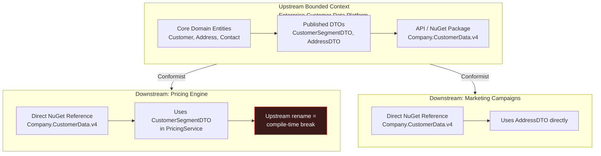
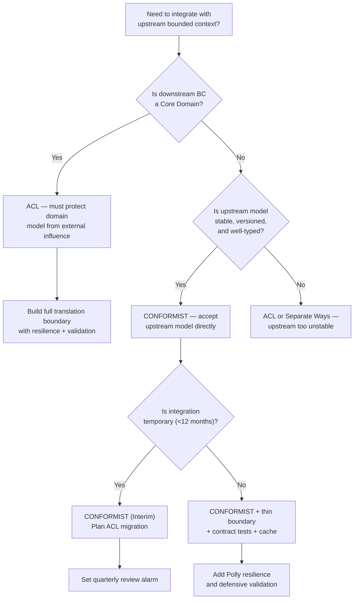

> [!success] Mastery Check
> - [ ] **Studied Well**
> - [ ] **Can explain the concept without notes**
> - [ ] **Can answer interview questions confidently**
> - [ ] **Can implement it in a real project**


# 7.038 — DDD — Context Mapping — Conformist

## Navigation

**Domain:** [[7 — System Design & Distributed Systems]] > **Group:** Domain-Driven Design
**Previous:** [[7.037 — DDD — Context Mapping — Customer-Supplier]] | **Next:** [[7.039 — DDD — Context Mapping — Anticorruption Layer]]

### Prerequisites

- [[7.034 — DDD — Bounded Contexts — Context Map]] — understanding context maps as the strategic diagram of bounded context relationships is prerequisite to evaluating where Conformist fits among the eight relationship types
- [[7.031 — DDD — Strategic vs Tactical Design]] — the Conformist decision is a strategic one: it trades domain model purity for lower integration cost; understanding when domain purity matters (core domain) versus when it does not (generic subdomain) is required
- [[7.035 — DDD — Context Mapping — Partnership]] — Partnership represents the investment-heavy alternative where both teams co-evolve their models; contrasting with Conformist reveals the resource commitment difference

### Where This Fits

Conformist is the **zero-abstraction** context mapping relationship — the downstream bounded context consumes the upstream model directly without building any translation boundary. It sits at the opposite end of the investment spectrum from the Anti-Corruption Layer: ACL invests 3-6 weeks in model isolation, while Conformist invests 1-5 days and accepts full coupling. A .NET engineer encounters Conformist whenever they reference an upstream NuGet package directly in their application layer, use Refit to call an upstream API with shared DTOs, or subscribe to upstream Azure Service Bus events using the upstream's contract assembly. Without Conformist as a deliberate choice, teams default to building ACLs for every integration — including generic subdomains like email dispatch where the translation layer provides zero business value and 100% unnecessary cost.

## Core Mental Model

Conformist is the strategic DDD pattern where a downstream bounded context consciously accepts the upstream team's model — data structures, contracts, and Ubiquitous Language — without building a translation layer. The core invariant: **integration cost is minimized by accepting coupling as a deliberate trade**. Conformist is not lazy architecture — it is strategic delegation of model quality to a competent upstream when the downstream domain is not worth protecting. The recognition trigger is simple: you are integrating with a stable, versioned upstream, your domain is a supporting or generic subdomain, and the cost of building a translation boundary exceeds the expected cost of future upstream breakage.

### Classification

| Dimension | Classification | Rationale |
|---|---|---|
| Pattern Type | **Strategic DDD / Context Mapping** | Governs relationship between bounded contexts |
| Scope | **Cross-Bounded Context** | Defines how downstream consumes upstream model |
| Primary Concern | **Integration Cost Reduction** | Minimizes upfront and ongoing investment in cross-boundary communication |
| Ownership | **Upstream-dominant** | Upstream model dictates terms; downstream accepts or does not integrate |
| Cardinality | **1:1 or 1:N** | One upstream can have many Conformist downstream consumers |
| Translation Overhead | **None — 0ms added latency** | No translation code, no validation layer, no mapping |
| Domain Model Purity | **Low** | Downstream domain model mirrors upstream concepts |
| Coupling Degree | **High — 100% change propagation** | Every upstream breaking change directly breaks downstream |
| Testing Strategy | **Contract tests only** | Downstream tests against upstream contracts; no translation tests needed |



### Key Properties

| Property | Value | Condition |
|---|---|---|
| Integration cost | 1-5 days to establish (direct NuGet reference + usage) | Upstream provides versioned, typed contracts |
| Translation latency overhead | 0ms — no translation layer | Direct model consumption, no mapping code |
| Change propagation | 100% — every upstream breaking change breaks downstream | Upstream changes any public type in the consumed contract |
| Domain model protection | None — upstream types can seep into downstream domain | No architecture boundary enforced between application and domain layers |
| Maintenance cost | Low if upstream is stable (2-5 days/year) | Upstream breaking changes average <3 per quarter |
| Maintenance cost | High if upstream is unstable (15-30% sprint capacity on adaptation) | Upstream breaking changes exceed 3 per quarter |
| Reversibility | High — can be replaced by ACL or Separate Ways at any point | The direct dependency is easy to wrap; translation layer can be inserted behind the existing interface |

## Deep Mechanics

### How It Works

Conformist operates at the **dependency graph** level — it is the absence of a translation boundary. The mechanics are straightforward:

1. **Upstream publishes contracts** — The upstream team releases their model as a NuGet package, REST API with DTOs, Protobuf schema, or Azure Service Bus event contract. The contract is the upstream's public surface.

2. **Downstream references directly** — The downstream adds a `PackageReference` to the upstream's NuGet, generates a Refit client from the upstream's OpenAPI spec, or references the `.proto` file. No intermediate project wraps or translates the contracts.

3. **Downstream application layer uses upstream types** — Controllers and application services reference upstream DTOs directly. Data flows from upstream API → deserialization → application service → (optional thin mapping) → domain.

4. **Domain isolation (best practice)** — The domain layer defines its own types. A 30-50 line translator at the application boundary maps upstream DTOs to domain concepts. NetArchTest enforces that no upstream contract type appears in the domain namespace.

5. **Contract testing catches drift** — CI runs contract tests against the real upstream API (or a sandbox) to detect schema changes before production deployment.

6. **Version pinning** — Downstream pins to an exact NuGet version. Upgrades are intentional, reviewed for breaking changes, and performed within the upstream's deprecation window.

### Failure Modes

**Failure Mode 1 — Silent Enum Drift** — Upstream adds a new enum value (e.g., `Platinum` tier). Downstream's enum is missing the value. `JsonStringEnumConverter` silently defaults to `Bronze` (enum value 0). Wrong discounts applied for days.

- **Detection:** Business metric `avg_discount_pct` spikes or drops. Support tickets about incorrect billing.
- **Fix:** Custom `JsonConverter<T>` that throws on unknown enum values instead of defaulting to 0. Monitor deserialization exception rates.
- **Prevention:** Contract tests validate all known enum values. Custom converter ensures unknown values are caught at deserialization time, not silently handled.

**Failure Mode 2 — Optional Field Becomes Required** — Upstream changes `Score` from optional (nullable `int?`) to required (`int`). Downstream serialization settings ignore missing fields. `Score` defaults to 0. Discount engine uses `Score=0` for all new customers.

- **Detection:** Revenue analysis shows discount distribution shifted. Investigation reveals `Score` is always 0 for recently created customers.
- **Fix:** Enable `JsonSerializerOptions.UnmappedMemberHandling = JsonUnmappedMemberHandling.Disallow` in contract tests. Add schema validation that compares expected vs actual fields before deployment.
- **Prevention:** Run strict deserialization contract tests in CI with `Disallow` unmapped members.

**Failure Mode 3 — Upstream Rate Limiting Without Notice** — Upstream adds rate limiting (100 req/min per tenant) without prior communication. Downstream's traffic exceeds limit during peak. HTTP 429 responses not handled — 5-minute outage.

- **Detection:** App Insights `dependency_call_rate` drops to 0. HTTP 429 errors in dependency logs.
- **Fix:** Add Polly resilience pipeline with retry and circuit breaker. Handle 429 with `Retry-After` header respect.
- **Prevention:** Upstream SLAs should document rate limits. Downstream should always add resilience even for Conformist relationships.

**Failure Mode 4 — Domain Model Pollution** — Over 18 months, upstream DTOs seep into domain entities. `PricingCustomer` directly references `CustomerSegmentDTO`. Domain Ubiquitous Language is replaced by upstream terminology.

- **Detection:** `using Company.CustomerData.Contracts` appears in domain-layer files. NetArchTest violation count spikes.
- **Fix:** Enforce domain isolation with architecture tests. Add a thin translator at the application boundary. Refactor polluted domain types.
- **Prevention:** Add NetArchTest rule in CI: "Domain namespace must not reference upstream contracts assembly." Enforce from day one.

### .NET and Azure Integration

- **ASP.NET Core**: Refit interfaces for typed HTTP clients; `IHttpClientFactory` for connection management
- **EF Core**: Conformist at database level is strongly discouraged — use a SQL VIEW as stable contract if unavoidable during migration
- **Azure Artifacts**: Host upstream NuGet packages; downstream pins exact version with `PackageReference Version="[4.8.1]"` (range syntax)
- **Azure API Management**: APIM as upstream contract boundary — version routing, schema validation, rate limiting
- **Azure Service Bus**: Downstream subscribes to upstream event contracts directly; Schema Registry validates event payloads
- **Azure Cache for Redis**: Cache upstream responses for degraded-mode fallback when upstream is unavailable
- **Azure App Configuration**: Feature flag to toggle between Conformist and ACL during migration

```csharp
// Downstream: Refit client consuming upstream contracts directly (Conformist)
using Company.CustomerData.Contracts;

public interface ICustomerDataApi
{
    [Get("/api/v4/customers/{customerId}/segment")]
    Task<SegmentResponse> GetCustomerSegmentAsync(string customerId, CancellationToken ct);
}

// Application service uses upstream DTOs directly — no translation layer
public sealed class PricingService
{
    private readonly ICustomerDataApi _customerApi;
    private readonly ILogger<PricingService> _logger;

    public async Task<DiscountResult> CalculateCustomerDiscountAsync(
        CustomerId customerId, Money orderAmount, CancellationToken ct)
    {
        var response = await _customerApi.GetCustomerSegmentAsync(customerId.Value, ct);
        if (!response.Success || response.Data is null)
            return DiscountResult.Failure(DiscountErrorCode.SegmentUnavailable, "Segment data unavailable.");

        var segment = response.Data;
        var discountPct = segment.Tier switch
        {
            CustomerTier.Gold => 0.15m,
            CustomerTier.Silver => 0.10m,
            CustomerTier.Bronze => 0.05m,
            _ => HandleUnknownTier(segment.Tier, customerId)
        };
        return DiscountResult.Success(orderAmount * discountPct, discountPct, segment.Tier.ToString());
    }
}
```

## Production Patterns and Implementation

### Primary Implementation

```csharp
// NuGet: Company.CustomerData.Contracts — upstream published language
namespace Company.CustomerData.Contracts;

public sealed record CustomerSegmentDTO
{
    public string CustomerId { get; init; } = string.Empty;
    public CustomerTier Tier { get; init; }
    public int Score { get; init; }
    public int ActivePeriodMonths { get; init; }
    public DateTimeOffset LastComputedAt { get; init; }
}

public enum CustomerTier { Bronze = 0, Silver = 1, Gold = 2 }

public sealed record SegmentResponse
{
    public bool Success { get; init; }
    public string ErrorMessage { get; init; } = string.Empty;
    public CustomerSegmentDTO? Data { get; init; }
}
```

```csharp
// Downstream domain layer — protected from upstream types
namespace PricingEngine.Domain.Models;

public sealed record PricingCustomer
{
    public CustomerId Id { get; init; }
    public CustomerLifetimeTier Tier { get; init; }
    public int LoyaltyScore { get; init; }
    public bool IsPremiumMember =>
        Tier is CustomerLifetimeTier.Premium or CustomerLifetimeTier.Elevated && LoyaltyScore >= 3000;
}

public enum CustomerLifetimeTier { Standard = 0, Elevated = 1, Premium = 2, Unclassified = 99 }
```

```csharp
// Thin application boundary — 30-line translator (best practice)
namespace PricingEngine.Application.Translation;

using Company.CustomerData.Contracts;
using PricingEngine.Domain.Models;

internal static class CustomerDataTranslator
{
    internal static PricingCustomer ToDomain(CustomerSegmentDTO dto) => new()
    {
        Id = CustomerId.Create(dto.CustomerId),
        Tier = dto.Tier switch
        {
            CustomerTier.Gold => CustomerLifetimeTier.Premium,
            CustomerTier.Silver => CustomerLifetimeTier.Elevated,
            CustomerTier.Bronze => CustomerLifetimeTier.Standard,
            _ => CustomerLifetimeTier.Unclassified
        },
        LoyaltyScore = dto.Score
    };
}
```

### Configuration and Wiring

```csharp
// Program.cs — downstream service registration
builder.Services.AddRefitClient<ICustomerDataApi>()
    .ConfigureHttpClient(c => c.BaseAddress = new Uri("https://customer-data.company.com/api/"))
    .AddStandardResilienceHandler(); // Polly 8 — retry, circuit breaker, timeout

builder.Services.AddScoped<PricingService>();

// Feature flag for ACL migration path
builder.Services.AddScoped<ICustomerSegmentGateway>(sp =>
{
    var featureManager = sp.GetRequiredService<IFeatureManager>();
    return featureManager.IsEnabledAsync("UseCustomerAcl").GetAwaiter().GetResult()
        ? sp.GetRequiredService<CustomerSegmentAclGateway>()
        : new ConformistGateway(sp.GetRequiredService<ICustomerDataApi>());
});
```

### Common Variants

**Variant 1 — Pure Conformist (no domain boundary)**

```csharp
// Simplest variant — upstream types used everywhere. Acceptable for generic subdomains.
public class PricingServiceV1
{
    private readonly ICustomerDataApi _api;
    public async Task<decimal> CalculateDiscountAsync(string customerId)
    {
        var segment = await _api.GetCustomerSegmentAsync(customerId, default);
        return segment.Tier switch { CustomerTier.Gold => 0.15m, CustomerTier.Silver => 0.10m, _ => 0.05m };
    }
}
```

**Variant 2 — Conformist + Thin Translation Boundary**

```csharp
// Recommended for supporting subdomains — domain protected, no full ACL overhead
public class PricingServiceV2
{
    private readonly ICustomerDataApi _api;
    private readonly CustomerDataTranslator _translator;
    public async Task<DiscountResult> CalculateDiscountAsync(CustomerId customerId)
    {
        var dto = await _api.GetCustomerSegmentAsync(customerId.Value, default);
        return ApplyDiscount(_translator.ToDomain(dto));
    }
}
```

**Variant 3 — Conformist with Fallback Cache**

```csharp
// Adds resilience — serves stale data when upstream is unavailable
public class CachedPricingService
{
    private readonly ICustomerDataApi _api;
    private readonly IDistributedCache _cache;

    public async Task<PricingCustomer> GetPricingCustomerAsync(CustomerId customerId, CancellationToken ct)
    {
        var cacheKey = $"customer-segment:{customerId.Value}";
        var cached = await _cache.GetAsync(cacheKey, ct);
        if (cached is not null)
            return JsonSerializer.Deserialize<PricingCustomer>(cached)!;

        var dto = await _api.GetCustomerSegmentAsync(customerId.Value, ct);
        var domain = CustomerDataTranslator.ToDomain(dto.Data!);
        await _cache.SetAsync(cacheKey, JsonSerializer.SerializeToUtf8Bytes(domain),
            new DistributedCacheEntryOptions { AbsoluteExpirationRelativeToNow = TimeSpan.FromMinutes(5) }, ct);
        return domain;
    }
}
```

### Real-World .NET Ecosystem Example

**Refit** is the canonical .NET example of the Conformist pattern in practice. A downstream team references the upstream's OpenAPI spec, generates a Refit interface with `[Get]`, `[Post]`, etc. attributes, and consumes the upstream DTOs directly. Refit handles serialization/deserialization. There is no translation layer, no mapping code, no anticorruption layer. The downstream conforms to the upstream's API contract as published. Refit + Conformist is the standard integration pattern for generic and supporting subdomains across .NET microservice architectures.

## Gotchas and Production Pitfalls

### Pitfall 1 — Treating All Integrations as ACLs (Over-Engineering)

**Pitfall:** Team builds an 8-week ACL for a stable, versioned SaaS SDK (SendGrid for email). Email is a generic subdomain with zero competitive differentiation.

```csharp
// ❌ Over-engineered ACL for a generic subdomain
public sealed class SendGridAclGateway
{
    private readonly SendGridClient _client;
    private readonly EmailTranslator _translator;
    private readonly EmailValidator _validator;
    private readonly ResiliencePipeline _pipeline;
    // 200+ lines of translation for "call SendGrid API"
}
```

**Symptom:** 40% of a sprint spent on translating stable SDK types. Architecture review reveals 8 "ACLs" that are straight pass-throughs with zero transformation logic.

**Fix:** Use Conformist — reference the SendGrid SDK directly. Pin version. Add one integration test.

```csharp
// ✅ Conformist — use SendGrid types directly
public sealed class EmailDispatcher
{
    private readonly SendGridClient _client;

    public async Task SendEmailAsync(SendGridMessage message, CancellationToken ct)
    {
        await _client.SendEmailAsync(message, ct);
    }
}
```

**Cost of not fixing:** $120K/year in maintenance for 8 ACLs that could be 8 Conformist integrations. Three of the "ACLs" had zero transformation logic — pure overhead.

### Pitfall 2 — Upstream Types Pollute Domain Model

**Pitfall:** Domain namespace has `using Company.CustomerData.Contracts` in 14 files. Upstream DTOs are used as domain entities. Ubiquitous Language is replaced by upstream terminology.

```csharp
// ❌ Conformist without boundary — upstream type in domain
namespace PricingEngine.Domain.Models
{
    public class PricingCustomer
    {
        public CustomerSegmentDTO Segment { get; init; } // Upstream DTO leaks into domain
    }
}
```

**Symptom:** After 18 months, 34 domain classes directly reference upstream DTOs. Refactoring cost: 6 developer-weeks.

**Fix:** Enforce domain isolation with NetArchTest. Add a thin translator at the application boundary.

```csharp
// ✅ Architecture test prevents domain pollution
[Test]
public void Domain_ShouldNotReference_UpstreamContracts()
{
    var result = Types.InAssembly(typeof(PricingCustomer).Assembly)
        .That().ResideInNamespace("PricingEngine.Domain")
        .ShouldNot().HaveDependencyOn("Company.CustomerData.Contracts")
        .GetResult();
    Assert.That(result.IsSuccessful, Is.True);
}
```

**Cost of not fixing:** Domain model becomes a mirror of upstream schema. When upstream renames a concept, 34 domain files must change. Every upstream refactoring triggers a downstream domain refactoring.

### Pitfall 3 — Assuming Contract Stability Without Verification

**Pitfall:** Tests use mocks against upstream API. Upstream changes response format. Mocks are not updated. Tests pass, production deserialization fails.

```csharp
// ❌ Mock-based tests that miss upstream changes
[Test]
public async Task CalculateDiscount_ShouldReturnDiscount()
{
    // Mock returns the OLD format — never catches upstream drift
    _api.Setup(a => a.GetCustomerSegmentAsync(It.IsAny<string>(), It.IsAny<CancellationToken>()))
        .ReturnsAsync(new SegmentResponse { Success = true, Data = oldFormatData });
}
```

**Symptom:** Upstream added a required `score` field. Mocks were not updated. Tests passed. Production deserialization failed. 3,400 failed discount calculations. $47K in incorrect charges.

**Fix:** Contract tests against the REAL upstream API in CI.

```csharp
// ✅ Contract test against real upstream API
[Test]
public async Task UpstreamContract_ShouldMatchSchema()
{
    var response = await _upstreamClient.GetAsync("/api/v4/customers/test/segment");
    var dto = JsonSerializer.Deserialize<CustomerSegmentDTO>(
        await response.Content.ReadAsStringAsync(),
        new JsonSerializerOptions { UnmappedMemberHandling = JsonUnmappedMemberHandling.Disallow });
    Assert.That(dto, Is.Not.Null);
    Assert.That(dto.Tier, Is.AnyOf(CustomerTier.Bronze, CustomerTier.Silver, CustomerTier.Gold));
}
```

**Cost of not fixing:** Undetected upstream contract drift causes production failures. The blast radius is every Conformist consumer — potentially dozens of services.

### Pitfall 4 — Database-Level Conformist

**Pitfall:** Downstream queries the upstream's database directly instead of going through the upstream's API. DB schema changes break the downstream.

```csharp
// ❌ Database-level coupling — the tightest possible coupling
private readonly string _upstreamConnectionString = "Server=upstream-sql.database.windows.net;...";
public async Task<CustomerTier> GetCustomerTierAsync(string customerId)
{
    await using var conn = new SqlConnection(_upstreamConnectionString);
    // Direct table access — any schema change breaks here
}
```

**Symptom:** Upstream DBA adds `internal_risk_score` column. EF Core migration validation fails. Downstream app crashes at startup with `InvalidOperationException`. 45-minute outage.

**Fix:** Never share databases between bounded contexts. Use a SQL VIEW as a stable contract if unavoidable during migration.

```sql
-- Acceptable: SQL VIEW as stable contract (migration only)
CREATE VIEW pricing.vw_CustomerSegment AS
SELECT customer_id   AS CustomerId
     , loyalty_tier  AS Tier
     , loyalty_score AS Score
  FROM cdp.customers
 WHERE is_active = 1;
```

**Cost of not fixing:** Any schema change in the upstream database risks breaking all downstream consumers. No version negotiation possible — the coupling is invisible until it breaks.

### Pitfall 5 — Floating NuGet Versions

**Pitfall:** Downstream specifies a floating NuGet version (`4.*`). CI resolves to 4.9.0 which has `[Obsolete]` fields and renamed properties. Downstream code still references the old property names. Runtime defaults to 0.

```xml
<!-- ❌ Floating version — unpredictable behavior -->
<PackageReference Include="Company.CustomerData.Contracts" Version="4.*" />
```

**Symptom:** Dependabot PR shows 4.8.1 → 4.9.0 with breaking changes in release notes. No one reviewed the changes. Compile succeeds but runtime behavior changes silently due to `[Obsolete]` fields.

**Fix:** Pin exact versions with range syntax.

```xml
<!-- ✅ Pinned version — intentional upgrades only -->
<PackageReference Include="Company.CustomerData.Contracts" Version="[4.8.1]" />
```

**Cost of not fixing:** Silent behavior changes in production. The discount engine applies wrong values because an `[Obsolete]` field now returns default data. Financial reconciliation detects the issue weeks later.

### Pitfall 6 — No Defensive Validation

**Pitfall:** Upstream returns `score: 150000` due to an overflow bug. Downstream trusts the value. 85% discount applied instead of max 15%.

```csharp
// ❌ No defensive validation — trusts upstream data blindly
var discountPct = segment.Tier switch
{
    CustomerTier.Gold => 0.15m,
    // score: 150000 → 150000 / 1000 = 150 = 15000% discount
    _ when segment.Score > 0 => segment.Score / 1000m,
};
```

**Symptom:** Business metric `avg_discount_pct` jumps from 10% to 35%. Finance team alerts. $230K in excess discounts that could not be recovered.

**Fix:** Validate upstream data ranges even with Conformist.

```csharp
// ✅ Defensive validation — bounded trust
private const int MaxValidScore = 10000;
private const decimal MaxDiscount = 0.15m;

if (segment.Score is < 0 or > MaxValidScore)
{
    Metrics.IncrementInvalidUpstreamData("score_out_of_range", segment.Score);
    return DiscountResult.Failure(DiscountErrorCode.InvalidUpstreamData,
        $"Score {segment.Score} out of valid range [0, {MaxValidScore}]");
}
```

**Cost of not fixing:** Financial loss from incorrect business logic. Data quality issues in upstream propagate to downstream with no protection. Recovery requires reversing transactions — often impossible.

## Tradeoffs and Decision Framework

### Tradeoff Matrix

| Dimension | Conformist | ACL | Partnership | Separate Ways |
|---|---|---|---|---|
| Domain purity | Low | High | Medium | Very High |
| Initial speed | 1-5 days | 3-6 weeks | 2-6 weeks | N/A |
| Latency overhead | 0ms | +15-50ms | +5-15ms | N/A |
| Upstream resilience | None — 100% break propagation | 70-90% contained | Medium | N/A |
| Team autonomy | Low | High | Medium | Very High |
| Maintenance (stable upstream) | Low (2-5 days/year) | Moderate (15-30 days/year) | High (coordination overhead) | None |
| Maintenance (unstable upstream) | High (15-30% sprint) | Moderate | High | None |
| .NET ecosystem fit | Excellent (Refit, NuGet) | Excellent (Polly, MediatR) | Moderate | N/A |

### Decision Flowchart



### When to Apply

- [ ] Downstream is a supporting or generic subdomain — no competitive advantage depends on model purity
- [ ] Upstream is stable (average <3 breaking changes per quarter) with versioned contracts
- [ ] Downstream team is small (1-5 developers) and cannot justify 3-6 week ACL investment
- [ ] Upstream provides a versioned NuGet package, typed SDK, or well-documented API
- [ ] Integration is temporary (<12 months) — perhaps a migration or acquisition scenario
- [ ] Upstream team is organizationally dominant and the downstream has no negotiation leverage

### When NOT to Apply

- [ ] Downstream is a core domain — model corruption would harm competitive advantage
- [ ] Upstream is unstable (>3 breaking changes/quarter or no versioning policy)
- [ ] Downstream needs to evolve independently from upstream (Conformist couples release cadences)
- [ ] Upstream model concepts conflict with downstream Ubiquitous Language
- [ ] Multi-upstream orchestration (3+ upstreams with overlapping data) — translation becomes necessary at composition
- [ ] No organizational capacity for contract testing or upstream change monitoring

### Scale Thresholds

- **Conformist is ideal below ~1,000 req/s per service** — at higher throughput, the lack of cached translation may necessitate a cache layer; this is additive, not a replacement
- **ACL becomes cheaper than Conformist when upstream breaking changes exceed ~3 per quarter** — at this frequency, the engineering cost of fixing breakages exceeds the amortized cost of a translation layer
- **Worth reconsidering when downstream team grows beyond ~8 engineers** — a larger team has the capacity to build and maintain an ACL, and the cost of breakage scales with team size
- **Migration to ACL is mandatory when domain evolves from supporting to core** — the classification shift changes the tradeoff; the thin boundary that was acceptable before is now insufficient

## Interview Arsenal

### Question Bank

1. What is the Conformist pattern in DDD and when do you use it?
2. How does Conformist differ from the Anti-Corruption Layer?
3. What are the risks of Conformist and how do you mitigate them?
4. How do you test a Conformist integration in production?
5. Compare Conformist with Partnership — what drives the choice between them?
6. Your team conforms to an upstream that becomes unstable. Walk through the migration path.
7. How does Conformist work with event-driven architectures (Azure Service Bus, Event Grid)?
8. Forty downstream services conform to the same upstream. What governance problems arise and how do you solve them?

### Spoken Answers

**Q: What is the Conformist pattern in DDD and when do you use it?**

> **Average answer:** Conformist is when one team just uses another team's models directly without translation. You use it when you don't want to build a translation layer. It's faster but riskier.

> **Great answer:** Conformist is the strategic DDD context mapping pattern where the downstream team consciously accepts the upstream model without building a translation boundary. I use it under three conditions. First, the downstream is a supporting or generic subdomain — if my Pricing Engine's discount calculation doesn't differentiate my company competitively, I don't need to protect its model from upstream influence. Second, the upstream is stable and versioned — if Stripe publishes a typed SDK with semantic versioning, I have a quality contract I can depend on. Third, my team is small — 1 to 5 developers — and can't justify the 3-to-6-week investment in a full ACL. The key non-obvious insight is that Conformist is not lazy architecture; it is strategic delegation of model quality to a competent upstream. Building an ACL for a generic subdomain like email dispatch is pure waste — it provides zero business value and consumes engineering time that should go into core domain features. The mitigation I always include: a thin 30-line translator at the application boundary so upstream types never pollute the domain layer, and contract tests in CI that catch schema drift before it hits production.

**Q: How does Conformist differ from the Anti-Corruption Layer?**

> **Average answer:** Conformist has no translation, ACL has translation. ACL is safer but more work.

> **Great answer:** They sit at opposite ends of the integration investment spectrum. Conformist is zero lines of translation code, zero milliseconds of latency overhead, 1-to-5 days to integrate, and 100% propagation of upstream changes to the downstream. The Anti-Corruption Layer is 200 to 800 lines of translation code, 15 to 50 milliseconds of added latency, 3 to 6 weeks to build, and it contains 70 to 90 percent of upstream changes within the gateway. The choice between them is driven by one question: is this downstream a core domain? If yes — build an ACL. If it's a supporting or generic subdomain — Conformist is usually correct. The trap is that most engineers default to building ACLs for everything because "it's the right way to do DDD." In reality, every ACL you build for a generic subdomain is a sunk cost — you're spending weeks protecting a model that doesn't provide competitive advantage. I've seen teams burn 40% of a quarter building ACLs for stable third-party SDKs. The right approach is Conformist as the default for non-core domains, with ACLs reserved for the cases where model protection matters strategically.

**Q: Your team conforms to an upstream that becomes unstable. Walk through the migration path.**

> **Great answer:** This is a common scenario — the upstream was stable when you chose Conformist, but they've hired a new team, refactored their model, or changed their API strategy. The migration follows four phases. Phase 1 — Thin boundary: within one sprint, I add a 30-line translator at my application boundary. My domain types stop referencing upstream DTOs. NetArchTest enforces the separation. This provides 80% of the protection of a full ACL at 10% of the cost. Phase 2 — Resilience: I add Polly retry, circuit breaker, and a Redis cache with a 5-minute TTL. Now upstream outages don't cascade into my system. Phase 3 — Full ACL: over 2 to 3 sprints, I build a proper gateway with a `ICustomerSegmentGateway` interface, the translator I already have, plus schema validation and fallback logic. I deploy this behind a feature flag. Phase 4 — Cutover: I shift traffic to the ACL path gradually — 10% of requests, then 50%, then 100%. The old Conformist path stays as a fallback. The trigger for starting this migration: if upstream breaking changes exceed 3 per quarter, or if my sprint capacity spent on upstream adaptation exceeds 30%, the migration is no longer optional.

### System Design Interview Trigger

If an interviewer describes a system where a downstream service depends on an upstream API and asks "how do you handle the risk of the upstream changing?" — they are testing whether you know the full spectrum of context mapping patterns. The follow-up question specifically targets Conformist: "What if you decide the upstream is stable enough that you DON'T build a translation layer — what do you do instead?" The interviewer wants to hear that Conformist is a valid deliberate choice, not a failure of engineering discipline, and that it comes with specific mitigations: version pinning, contract tests, thin domain boundary, and a defined migration trigger to ACL.

### Comparison Table

| | Conformist | Anti-Corruption Layer |
|---|---|---|
| Core guarantee | Zero translation, minimal integration cost | Full model isolation, upstream change containment |
| Trade-off | Coupling for speed and simplicity | Investment for protection and autonomy |
| .NET implementation | Refit client + shared NuGet DTOs | Gateway with translator + Polly + Validator |
| Failure mode | Upstream types pollute domain model | ACL becomes a leaky abstraction (pass-through) |
| When to choose | Generic/supporting subdomain, stable upstream | Core domain, legacy system, unstable upstream |

## Architecture Decision Record

**Status:** Accepted

**Context:** The Pricing Engine team (3 engineers) needs customer segment data for discount calculation. The Customer Data Platform team (15 engineers) provides a versioned REST API (`/api/v4/customers/{id}/segment`) with a published NuGet package (`Company.CustomerData.Contracts v4.x`) and a backward compatibility commitment within major versions. The Pricing Engine is a supporting subdomain implementing standard retail pricing logic — not a core domain.

**Options Considered:**

1. **Conformist with thin boundary (Recommended)** — Direct consumption of upstream contracts via Refit. 30-line translator at application boundary. Contract tests on every PR build. NuGet version pinned to `[4.19.3]`.
2. **Conformist without boundary** — Lowest cost (1-2 days), highest pollution risk. Domain namespace directly references upstream DTOs.
3. **Full ACL** — 3-6 weeks to build gateway + translator + validator + cache. Ongoing maintenance of 15-30 days/year.
4. **Separate Ways** — Build own tier calculation logic. Estimated 4-6 weeks to build equivalent capability with zero upstream dependency.

**Decision:** Adopt Option 1. Conformist is appropriate because (a) Pricing Engine is a supporting subdomain, not core; (b) upstream has strong versioning and backward compatibility practices; (c) the 3-person team cannot justify 3-6 weeks for an ACL. The thin boundary protects the domain without incurring full ACL overhead. Contract tests in CI detect upstream drift before it reaches production.

**Consequences:**
- ✅ 3-day integration instead of 3-6 weeks — team delivers pricing feature this sprint
- ✅ Domain Ubiquitous Language preserved through thin translator
- ✅ Upstream changes detected at build time via contract tests, not at 3 AM via pager
- ⚠️ No circuit breaker on upstream calls (accepted due to 99.95% upstream SLA)
- ⚠️ NuGet version updates require manual review — automated Dependabot updates are gated by contract test pipeline
- ❌ Upstream refactoring (even internal, non-breaking) may trigger contract test maintenance if test data changes

**Review Trigger:** Revisit this decision quarterly. Migrate from Conformist to ACL if any of: (a) upstream breaking changes exceed 3 per quarter, (b) upstream availability drops below 99.9% for two consecutive months, (c) the Pricing Engine domain is reclassified from supporting to core, or (d) the Pricing Engine team grows beyond 8 engineers.

## Self-Check

### Conceptual Questions

1. What is the Conformist relationship in DDD?

<details>
<summary>Answer</summary>
A strategic DDD pattern where the downstream bounded context consciously accepts the upstream model without building a translation boundary. Downstream uses upstream types, data structures, and contracts directly.
</details>

2. When is Conformist the right choice?

<details>
<summary>Answer</summary>
(1) Downstream is supporting or generic subdomain. (2) Upstream model is stable, versioned, and well-typed. (3) Team is small (<5 devs) and cannot justify 3-6 week ACL investment. (4) Integration may be temporary (<12 months).
</details>

3. What is the most critical risk of Conformist?

<details>
<summary>Answer</summary>
Domain model pollution — upstream concepts replace the downstream's Ubiquitous Language. After 12-18 months, the domain layer directly references upstream DTOs, making every upstream renaming a domain refactoring.
</details>

4. How do you detect upstream contract drift without contract tests?

<details>
<summary>Answer</summary>
Monitor deserialization failure rate in Application Insights. Alert if `json_deserialization_failure` > 0 in any 5-minute window. Also track unknown enum counts — any value not matching known constants indicates upstream added new values.
</details>

5. What is the .NET pattern for adding a thin boundary when using Conformist?

<details>
<summary>Answer</summary>
A private/internal static translator class at the application layer boundary. Domain types remain pure. NetArchTest enforces that no upstream contract types appear in the domain namespace. The translator is typically 30-50 lines.
</details>

6. How does Conformist differ from Shared Kernel?

<details>
<summary>Answer</summary>
Conformist is unidirectional — the downstream uses the upstream's model. Shared Kernel is bidirectional — both teams share and jointly evolve a common model. Conformist requires no upstream awareness; Shared Kernel requires ongoing coordination.
</details>

7. At what point should you migrate from Conformist to ACL?

<details>
<summary>Answer</summary>
When upstream breaking changes exceed 3 per quarter, when sprint capacity spent on upstream adaptation exceeds 30%, or when the downstream domain is reclassified from supporting to core.
</details>

8. How does Conformist connect to Published Language?

<details>
<summary>Answer</summary>
They are complementary. Published Language is the upstream's investment in a consumable contract. Conformist is the downstream's choice to accept that contract directly. Published Language makes Conformist safe — without it, Conformist is just tight coupling to an undocumented internal model.
</details>

9. What is the non-obvious production cost of Conformist over 3 years?

<details>
<summary>Answer</summary>
For a stable upstream, the cost is low (~$25K over 3 years: 3 days/year maintenance). For an unstable upstream, the cost can exceed $250K — breakage incidents, emergency fixes, and eventual migration to ACL. The trigger-based migration plan protects against the latter.
</details>

10. Explain Conformist to a non-technical stakeholder in 60 seconds.

<details>
<summary>Answer</summary>
"Think of Conformist like using Microsoft Word's file format instead of converting everything to plain text. When another team sends us a .docx file, we could build a converter that extracts the text and reformats it — that takes weeks. Or we could just use Word directly — that takes a day. We lose the ability to change the format ourselves, but if the other team's format is stable and high quality, and the document isn't strategically critical, using it directly is the smart choice. That's Conformist: save weeks of translation work by accepting a well-designed upstream format as-is."
</details>

### Scenario Challenges

**Scenario 1 — Diagnose the problem**
A 3-person team owns the Notification bounded context (email, SMS, push). They spent 6 weeks building a `SendGridAclGateway` with translator, validator, and circuit breaker. The upstream (SendGrid) has a typed SDK with 99.99% uptime and backward-compatible API. The team's velocity dropped by 40% during ACL construction. Two generic subdomain features were delayed.

<details>
<summary>Diagnosis</summary>

**Root cause:** Over-engineering. The team built an ACL for a generic subdomain with a stable, versioned, typed SDK. The ACL provides zero competitive advantage — email delivery is a generic subdomain.

**Evidence:** Architecture review reveals the `SendGridAclGateway` contains 250 lines of mapping code that transforms `SendGridMessage` to an internal `Notification` type and back again. The translator is a straight pass-through with no semantic transformation.

**Fix:** Replace the ACL with Conformist. Reference the SendGrid SDK directly. Pin version. Remove the 250 lines of translation code. Keep only a thin `EmailDispatcher` wrapper (30 lines) for testability.

**Prevention:** Architecture review gate: "Is this a core domain? If no, and the SDK is stable and typed, use Conformist."
</details>

**Scenario 2 — Design decision**
You are designing the integration between a new Pricing Engine (3 engineers, supporting subdomain) and an existing Customer Data Platform (15 engineers). The CDP publishes `Company.CustomerData.Contracts` v4 with semantic versioning and a 12-month deprecation window. The CDP has 99.95% uptime SLA. What integration pattern do you choose?

<details>
<summary>Decision and Reasoning</summary>

**Choice:** Conformist with thin application boundary and contract tests.

**Tradeoffs accepted:** No circuit breaker (accepted due to 99.95% SLA). Domain types are protected by a 30-line translator. Upstream changes detected by contract tests in CI, not by production incidents.

**Implementation sketch:**
```csharp
// 1. Pin upstream NuGet
// <PackageReference Include="Company.CustomerData.Contracts" Version="[4.19.3]" />

// 2. Refit client
builder.Services.AddRefitClient<ICustomerDataApi>()
    .ConfigureHttpClient(c => c.BaseAddress = new Uri("https://cdp.company.com/api/v4/"));

// 3. Thin translator (30 lines)
internal static PricingCustomer ToDomain(CustomerSegmentDTO dto) => new()
{
    Id = CustomerId.Create(dto.CustomerId),
    Tier = MapTier(dto.Tier),
    LoyaltyScore = dto.Score
};

// 4. Contract test in CI
[Test]
public async Task UpstreamContract_ShouldBeValid()
{
    var response = await _api.GetCustomerSegmentAsync("test-customer", default);
    JsonSerializer.Deserialize<SegmentResponse>(JsonSerializer.Serialize(response),
        new JsonSerializerOptions { UnmappedMemberHandling = JsonUnmappedMemberHandling.Disallow });
}
```
</details>

**Scenario 3 — Failure mode** The upstream CDP renamed `CustomerTier` values: `Gold → Premium`, `Silver → Plus`, `Bronze → Standard`. The Pricing Engine was still on the old enum. Custom `JsonStringEnumConverter` with fallback to `Bronze`/default masked the issue. For 3 days, Gold-tier customers were charged Bronze-tier prices.

<details>
<summary>Investigation and Fix</summary>

**Investigation steps:** (1) Check deserialization error rates — none, because the fallback converter silently mapped unknown values. (2) Check business metric `avg_discount_pct` — dropped from 11.2% to 6.1%. (3) Check contract test results — the PR to update the NuGet version was approved but the contract test wasn't updated to expect the new enum values.

**Confirming evidence:** The `JsonStringEnumConverter` was configured with a fallback to `Bronze = 0`. Unknown enum values were silently mapped. No error was logged. Application Insights showed zero deserialization errors.

**Immediate mitigation:** Update the enum to include the new values and deploy. Recalculate and issue credits to affected customers ($34K in adjustments).

**Permanent fix:** Replace `JsonStringEnumConverter` with a custom converter that THROWS on unknown values. Add alerting: `deserialization_fallback_count` counter in App Insights with >0 threshold.

**Post-mortem item:** Add CI validation that contract tests fail when upstream enum values change. Update the test to iterate over known upstream values rather than hardcoding.
</details>

**Scenario 4 — Scale it**
Your company has 40 downstream services conforming to the same upstream platform team's `UserProfile` API. Each team has a slightly different version pinned. The platform team wants to release a new major version (v5) but must coordinate with 40 teams. The current process: email announcement, 12-month deprecation window, manual migration per team.

<details>
<summary>Scaling Strategy</summary>

**Bottleneck this addresses:** 40 teams, 40 manual migrations. The bottleneck is not engineering — it's organizational coordination.

**How it helps:** (1) Consumer-driven contract testing (Pact) — each downstream publishes their actual usage expectations. Upstream CI validates v5 against all consumer contracts before releasing. (2) Upstream provides a v4 → v5 automated migration tool (a `dotnet tool` or PowerShell script). (3) Upstream runs the v4 and v5 endpoints in parallel for the 12-month deprecation window. (4) Each downstream's migration is a NuGet version bump + one sprint of testing.

**What it does not solve:** Teams that don't respond to deprecation notices. Solution: upstream escalates non-responsive teams after 6 months. After 12 months, v4 is decommissioned and any remaining team's CI breaks.

**Implementation order:** (1) Pact Broker setup and consumer contract publication (2-4 weeks). (2) Automated migration tool (1 sprint). (3) v5 release with parallel v4 endpoint (launch day). (4) Track migration progress in a shared dashboard. (5) v4 decommission at 12-month mark.
</details>

**Scenario 5 — Interview simulation**
The interviewer says: "Your team needs customer data from a legacy mainframe system. The mainframe team is unresponsive — they won't change their API, they won't provide SLAs, and they only expose a COBOL copybook format over an FTP batch file. Walk through your approach to integration."

<details>
<summary>Model Response</summary>

"Conformist is not an option here because the upstream is unstable (no SLA, no versioning, no deprecation policy) and the contract is a COBOL copybook — not a typed .NET SDK. The integration requires an ACL by necessity, not by choice.

I'd build a dedicated translation service — let's call it the LegacyCustomerGateway — with four layers. Layer one is the FTP ingestion: a scheduled Azure Function that picks up the nightly batch file and parses the COBOL copybook using a binary parser library. Layer two is the translator: maps the flat file records to a published language — C# records in a `Company.LegacyIntegration.Contracts` NuGet package. The translator validates business rules (date formats, numeric ranges, required fields). Layer three is the storage: the translated data goes into an Azure SQL database that our downstream services query. Layer four is the serving layer: a REST API (or gRPC) that downstreams call using the published contract.

The tradeoff is that this takes 4-6 weeks to build, adds latency (batch + translation + storage), and requires ongoing maintenance as the copybook format changes. The alternative — Separate Ways where we collect customer data directly — was likely rejected because the mainframe is the system of record.

The key architectural insight: even though we're building an ACL, we're also creating a new upstream bounded context. Our downstream teams consume the `LegacyCustomerIntegration` context via Conformist — they use our published NuGet package directly. We've wrapped the unstable legacy boundary once so that 40 downstream teams don't each have to build their own COBOL parser."
</details>
