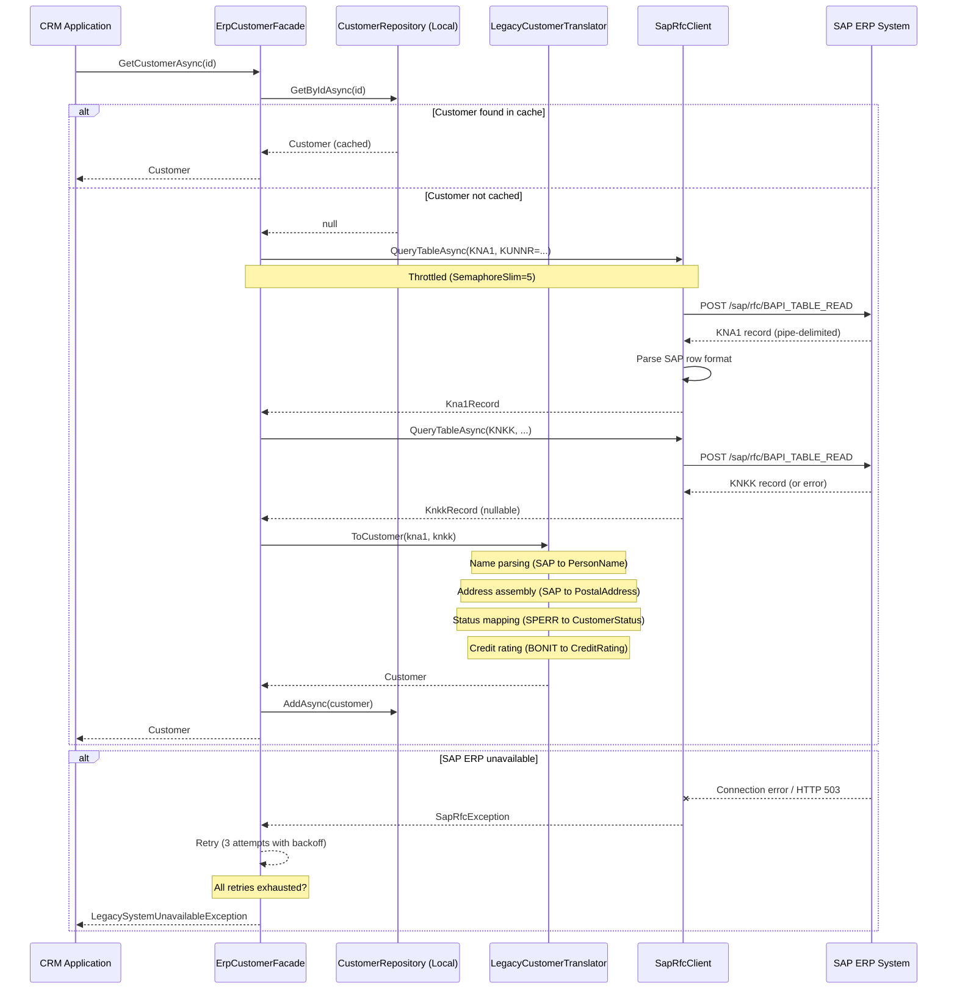
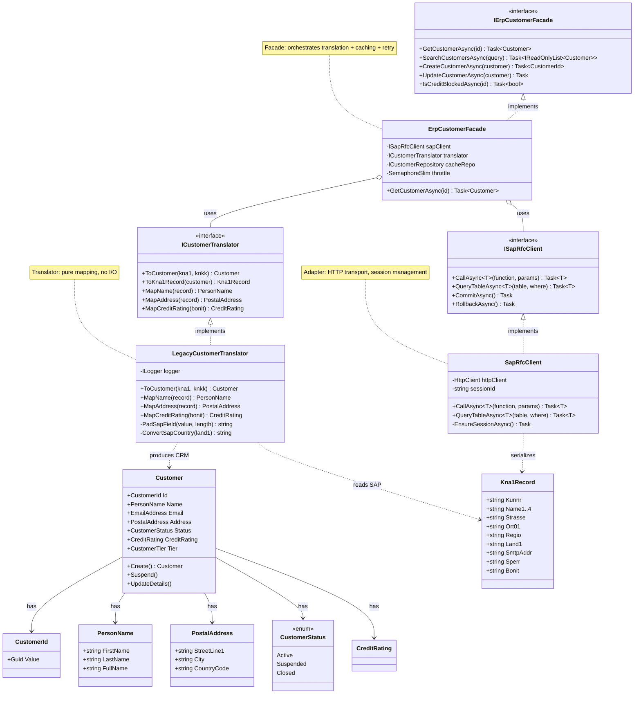

> [!success] Mastery Check
> - [ ] **Studied Well**
> - [ ] **Can explain the concept without notes**
> - [ ] **Can answer interview questions confidently**
> - [ ] **Can implement it in a real project**


# 7.039 — DDD — Context Mapping — Anticorruption Layer

## Table of Contents

1. [[#1. Metadata & Core Identity]]
2. [[#2. Core Concept & Definition]]
3. [[#3. Problem Statement — Why ACL Exists]]
4. [[#4. ACL Architecture & Design Patterns]]
5. [[#5. C# 12 / .NET 8 Full Implementation]]
6. [[#6. Mermaid Diagrams]]
7. [[#7. Common Pitfalls & Anti-Patterns]]
8. [[#8. Interview Questions]]
9. [[#9. ADR — Architecture Decision Record]]
10. [[#10. Self-Check Assessment]]
11. [[#11. Related Notes & Navigation]]

---

## 1. Metadata & Core Identity

| Field | Value |
|-------|-------|
| **ID** | `7.039` |
| **Title** | DDD — Context Mapping — Anticorruption Layer |
| **Group** | `Domain-Driven Design` |
| **Priority** | `2` (Learn after Bounded Contexts & before other mapping patterns) |
| **Prerequisites** | [[7.034 — DDD — Bounded Contexts — Context Map]] |
| **Related Notes** | [[7.035]], [[7.036]], [[7.037]], [[7.038]], [[7.040]], [[7.041]], [[7.042]] |
| **Core Pattern** | `ContextMapping::AnticorruptionLayer` |
| **Also Known As** | ACL, Translation Layer, Facade Boundary, Protection Layer |
| **Eric Evans (Blue Book)** | Chapter 14 — "Maintaining Model Integrity" |
| **Vernon (Red Book)** | Chapter 3 — "Context Mapping" |
| **Architecture Level** | Tactical + Strategic DDD (bridges both) |

**Reading Order for Context Mapping Series:**

```text
7.034 (Context Map) -> 7.039 (ACL) -> 7.038 (OHS) -> 7.042 (Partnership)
    |
7.035 (Shared Kernel)
7.040 (Separate Ways)
                   7.036 (Customer-Supplier)
                   7.037 (Conformist)
                   7.041 (Published Language)
```

ACL is the most commonly implemented pattern in enterprise integration. Learn it immediately after [[7.034 — DDD — Bounded Contexts — Context Map]].

---

## 2. Core Concept & Definition

### 2.1 What Is an Anticorruption Layer?

An **Anticorruption Layer** is a defensive boundary — a set of components that translate between two bounded contexts to prevent the upstream model's concepts, structures, and constraints from "corrupting" the downstream model. It is the DDD answer to **legacy system integration**, **third-party API consumption**, and **cross-team context boundaries** where the upstream team does not serve the downstream's needs.

The ACL sits between contexts:

```text
+---------------------------+     +---------------------------+
|                           |     |                           |
|   UPSTREAM CONTEXT        |---->|   ANTICORRUPTION LAYER    |
|   (Legacy ERP, 3rd Party) |     |   (Translator, Facade,    |
|    e.g. SAP KNA1,VBAK)    |     |    Adapter)               |
|                           |     |   Kna1Record -> Customer  |
+---------------------------+     +---------------------------+
                                              |
                                              v
                                  +---------------------------+
                                  |   DOWNSTREAM CONTEXT      |
                                  |   (Modern CRM, clean      |
                                  |    domain model)          |
                                  |   Customer, Order,        |
                                  |   Product aggregates      |
                                  +---------------------------+
```

### 2.2 Origin — Eric Evans (2003)

Eric Evans introduced the ACL in *Domain-Driven Design* (Chapter 14). The core motivation:

> "A very common problem is that models from other bounded contexts leak into your model. A translator that converts concepts from another model to your own — an anticorruption layer — can limit the damage."

The ACL explicitly **inverts** the Conformist pattern ([[7.037]]). Instead of blindly conforming to the upstream model, you create a translation boundary that protects your domain integrity.

### 2.3 ACL vs. Other Context Mapping Patterns

| Pattern | Relationship | ACL Role |
|---------|-------------|----------|
| **Conformist** ([[7.037]]) | Downstream accepts upstream model | ACL *prevents* this — translates instead |
| **Open-Host Service** ([[7.038]]) | Upstream provides a dedicated API | ACL consumes the OHS when available |
| **Customer-Supplier** ([[7.036]]) | Downstream influences upstream | ACL protects when you *cannot* influence upstream |
| **Published Language** ([[7.041]]) | Shared interchange format | ACL translates between PL and your domain |
| **Partnership** ([[7.042]]) | Mutual coordination | ACL not typically needed |
| **Separate Ways** ([[7.040]]) | No integration | ACL is the opposite — you *must* integrate |
| **Shared Kernel** ([[7.035]]) | Shared model subset | ACL wraps parts that are not shared |

### 2.4 Core Responsibility — Three Verbs

An ACL does exactly three things:

1. **Translate** — Convert upstream concepts to downstream concepts (and optionally reverse)
2. **Protect** — Isolate the downstream model from upstream changes
3. **Abstract** — Expose a clean interface that the downstream domain depends on

---

## 3. Problem Statement — Why ACL Exists

### 3.1 The Inheritance of Rot

Imagine your team owns a modern Order Management System — clean aggregates, rich domain logic, unit-tested. You need to synchronize customer data from a 20-year-old SAP R/3 system. The SAP table `KNA1` is a single flat table with 500+ fields, fixed-length character columns, mixed concerns (address, finance, sales, marketing all in one record), and fields like `SPERR` (central block flag) that have domain-specific meanings documented only in a 1998 PDF.

Without an ACL, the codebase will gradually accumulate SAP concepts:

```csharp
// BAD: Direct SAP model leaking into domain
public sealed class Customer
{
    public string Kunnr { get; set; }       // SAP field name
    public string Name1 { get; set; }        // SAP field name
    public string Sperr { get; set; }        // "X" means blocked
    public string Ktokk { get; set; }        // Account from KNA1
    // ... 50 more SAP fields
}
```

This is the **Inheritance of Rot** — every upstream concept that leaks in brings technical debt, confusion, and fragility.

### 3.2 Examples of Corruption

| Corruption Type | Example | Impact |
|----------------|---------|--------|
| **Field Semantics** | `SPERR = "X"` instead of `CustomerStatus.Suspended` | Domain logic becomes cryptic string comparisons |
| **Composite Values** | `Name1 + Name2` concatenation | Business rules can't reason about `PersonName` |
| **Primitive Obsession** | Everything is `string` | No type safety, validation duplicated everywhere |
| **Missing Concepts** | 500-field table with 10 relevant fields | Cognitive overhead |
| **Idiomatic Differences** | SAP `KUNNR` is `CHAR10` left-padded | UUIDs vs padded numbers |
| **Transaction Semantics** | SAP BAPI requires specific call order | Uncoordinated calls violate invariants |
| **Error Handling** | SAP returns numeric return codes | Must translate codes to exceptions |

### 3.3 When to Apply ACL (Decision Matrix)

**Apply ACL when:**
- You integrate with a legacy system you cannot change
- You consume a third-party API with a different domain model
- The upstream team has no incentive to serve your needs
- The upstream model is significantly different from yours
- Upstream changes are frequent and uncontrolled
- You need testable translation logic

**Do NOT apply ACL when:**
- You can influence the upstream to provide an OHS ([[7.038]])
- A Published Language ([[7.041]]) already exists that maps cleanly
- The integration is trivial (simple CRUD passthrough)
- The upstream model IS your domain model (Conformist, [[7.037]])
- The integration is read-only and data is immutable

---

## 4. ACL Architecture & Design Patterns

ACL is composed of three pattern layers. Each has a distinct responsibility.

### 4.1 Component Map

```text
+-----------------------------------------------------------+
|                  ANTICORRUPTION LAYER                      |
|                                                           |
|  +-------------------+  +-------------------+  +---------+|
|  |   TRANSLATOR      |  |     FACADE         |  | ADAPTER ||
|  | (Pure mapping)    |  | (Service boundary) |  |(Transport|
|  |                   |  |                    |  | layer)  ||
|  | SAP obj -> Domain |  | GetCustomer()      |  | HTTP    ||
|  | Domain -> SAP obj |  | SaveOrder()        |  | SOAP    ||
|  | Stateless, testable| | SyncInventory()    |  | RFC     ||
|  +---------+---------+  +---------+----------+  +----+----+
|            |                       |                   |
|            +-----------------------+-------------------+
|                                    |
|                                    v
|                         +-----------------------+
|                         |   ACL Interface        |
|                         | (Domain-facing, pure)  |
|                         +-----------------------+
+-----------------------------------------------------------+
```

### 4.2 Layer Responsibilities

#### Translator (Mapper)

Converts between upstream and downstream data structures. This is the purest layer — it should contain **zero infrastructure concerns** (no HTTP calls, no database access). Translators are:

- Stateless (easily testable)
- Bidirectional (upstream -> downstream AND downstream -> upstream)
- Compositional (small translators compose into larger ones)
- Explicit (every field is mapped; no implicit defaults)

#### Facade (Service Boundary)

Provides a **coarse-grained interface** that the downstream domain depends on. The Facade:

- Orchestrates translation + infrastructure calls
- Implements error handling, logging, retries
- Returns domain types (not upstream types)
- Hides upstream complexity (batch calls, pagination, auth)
- Often implements caching (upstream is slow; ACL caches in domain-friendly format)

#### Adapter (Transport / Infrastructure)

Handles raw communication with the upstream system. The Adapter:

- Encapsulates protocol details (HTTP, SOAP, RFC, gRPC, message queues)
- Serializes/deserializes wire formats (JSON, XML, ABAP, IDoc, EDI)
- Manages connections, sockets, channels
- Translates transport errors into domain-meaningful exceptions

### 4.3 ACL in Clean Architecture / Hexagonal Architecture

In a hexagonal (ports & adapters) architecture:

```text
+-------------------+
|   Domain Layer     |--- depends on --->  ICustomerRepository (port)
|  (Pure C# types)   |                       |
+-------------------+                        | implements
| Application Layer  |--- uses -------------+
+-------------------+
| Infrastructure Layer
|  +----------------------------------------+
|  |  ACL                                    |
|  |  +--------------+ +------------------+  |
|  |  | Facade        | | Adapter          |  |
|  |  | (implements   |---| (HttpClient,    |  |
|  |  |  port)        | |  SOAP, RFC)      |  |
|  |  +------+-------+ +------------------+  |
|  |         |                               |
|  |  +------v-------+                      |
|  |  | Translator    | (pure mapping)        |
|  |  +--------------+                      |
|  +----------------------------------------+
```

### 4.4 Where Does ACL Live in the Codebase?

```text
src/
  Domain/
    Aggregates/
      Customer.cs
      Order.cs
    ValueObjects/
      PersonName.cs
      EmailAddress.cs
      PostalAddress.cs
    Ports/
      ICustomerRepository.cs      <--- Domain depends on this port
  Application/
    UseCases/
      SyncCustomerFromLegacy.cs   <--- Orchestrates ACL calls
  Infrastructure/
    Anticorruption/
      Sap/
        ErpCustomerFacade.cs       <--- Facade implements port
        LegacyCustomerTranslator.cs <--- Pure translator
        SapRfcClient.cs            <--- Adapter (HTTP)
      Abstractions/
        ICustomerTranslator.cs
        ISapRfcClient.cs
        IErpCustomerFacade.cs
        Exceptions.cs
      Registration/
        DependencyInjection.cs
    Tests/
      Anticorruption/
        ErpCustomerFacadeTests.cs
        TranslatorCompositionTests.cs
```

---

## 5. C# 12 / .NET 8 Full Implementation

This section builds a complete, production-ready ACL for a CRM system integrating with a legacy SAP ERP. Every identifier is real. No placeholder names.

**Domain context:** AcmeCRM (modern .NET 8) synchronizes customer data from SAP R/3 (legacy ERP).

### 5.1 Downstream Domain Model (CRM)

These are the pure domain types that the ACL protects.

```csharp
// File: Domain/Aggregates/Customer.cs
namespace AcmeCRM.Domain.Aggregates;

public sealed class Customer : AggregateRoot<CustomerId>
{
    private readonly List<Order> _orders = [];

    private Customer() { } // EF Core

    public CustomerId Id { get; private set; }
    public PersonName Name { get; private set; }
    public EmailAddress Email { get; private set; }
    public PostalAddress ShippingAddress { get; private set; }
    public PostalAddress BillingAddress { get; private set; }
    public CustomerStatus Status { get; private set; }
    public CreditRating CreditRating { get; private set; }
    public DateTime CreatedAtUtc { get; private set; }
    public DateTime? ModifiedAtUtc { get; private set; }
    public CustomerTier Tier { get; private set; }

    public IReadOnlyList<Order> Orders => _orders.AsReadOnly();

    public static Customer Create(
        PersonName name,
        EmailAddress email,
        PostalAddress shippingAddress,
        PostalAddress? billingAddress = null,
        CustomerTier tier = CustomerTier.Standard)
    {
        ArgumentNullException.ThrowIfNull(name);
        ArgumentNullException.ThrowIfNull(email);
        ArgumentNullException.ThrowIfNull(shippingAddress);

        return new Customer
        {
            Id = new CustomerId(Guid.NewGuid()),
            Name = name,
            Email = email,
            ShippingAddress = shippingAddress,
            BillingAddress = billingAddress ?? shippingAddress,
            Status = CustomerStatus.Active,
            CreditRating = CreditRating.NotRated,
            Tier = tier,
            CreatedAtUtc = DateTime.UtcNow
        };
    }

    public void UpdateDetails(PersonName name, EmailAddress email, CustomerTier tier)
    {
        Name = name;
        Email = email;
        Tier = tier;
        ModifiedAtUtc = DateTime.UtcNow;
    }

    public void UpdateAddresses(PostalAddress shipping, PostalAddress billing)
    {
        ShippingAddress = shipping;
        BillingAddress = billing;
        ModifiedAtUtc = DateTime.UtcNow;
    }

    public void Suspend()
    {
        if (Status == CustomerStatus.Suspended) return;
        Status = CustomerStatus.Suspended;
        ModifiedAtUtc = DateTime.UtcNow;
    }

    public void Reactivate()
    {
        if (Status == CustomerStatus.Active) return;
        Status = CustomerStatus.Active;
        ModifiedAtUtc = DateTime.UtcNow;
    }

    public void ApplyCreditRating(CreditRating rating)
    {
        CreditRating = rating;
        ModifiedAtUtc = DateTime.UtcNow;
    }
}

// File: Domain/Aggregates/CustomerId.cs
namespace AcmeCRM.Domain.Aggregates;

public readonly record struct CustomerId(Guid Value)
{
    public static CustomerId New() => new(Guid.NewGuid());
    public override string ToString() => Value.ToString("D");
}

// File: Domain/ValueObjects/PersonName.cs
namespace AcmeCRM.Domain.ValueObjects;

public sealed record PersonName
{
    private PersonName() { } // EF Core

    public string FirstName { get; private init; }
    public string LastName { get; private init; }
    public string? MiddleName { get; private init; }

    public string FullName => MiddleName is null
        ? $"{FirstName} {LastName}"
        : $"{FirstName} {MiddleName} {LastName}";

    public string Initials => $"{FirstName[..1]}{LastName[..1]}".ToUpperInvariant();

    public static PersonName Create(string firstName, string lastName, string? middleName = null)
    {
        ArgumentException.ThrowIfNullOrWhiteSpace(firstName);
        ArgumentException.ThrowIfNullOrWhiteSpace(lastName);

        if (firstName.Length > 100)
            throw new DomainException("First name cannot exceed 100 characters");
        if (lastName.Length > 100)
            throw new DomainException("Last name cannot exceed 100 characters");

        return new PersonName
        {
            FirstName = firstName.Trim(),
            LastName = lastName.Trim(),
            MiddleName = middleName?.Trim()
        };
    }

    public static PersonName FromSingleString(string fullName)
    {
        var parts = fullName.Split(' ', StringSplitOptions.RemoveEmptyEntries | StringSplitOptions.TrimEntries);
        return parts.Length switch
        {
            0 => throw new DomainException("Full name must contain at least one name"),
            1 => Create(parts[0], ""),
            2 => Create(parts[0], parts[1]),
            _ => Create(parts[0], parts[^1], string.Join(' ', parts[1..^1]))
        };
    }
}

// File: Domain/ValueObjects/EmailAddress.cs
namespace AcmeCRM.Domain.ValueObjects;

public sealed record EmailAddress
{
    public static readonly EmailAddress Unspecified = new() { Value = "" };

    private EmailAddress() { }

    public string Value { get; private init; } = string.Empty;
    public bool IsSpecified => !string.IsNullOrWhiteSpace(Value);

    public static EmailAddress Create(string email)
    {
        ArgumentException.ThrowIfNullOrWhiteSpace(email);
        var trimmed = email.Trim();

        if (trimmed.Length > 320)
            throw new DomainException("Email address cannot exceed 320 characters");

        if (!trimmed.Contains('@') || !trimmed.Contains('.'))
            throw new DomainException($"'{trimmed}' is not a valid email address");

        return new EmailAddress { Value = trimmed.ToLowerInvariant() };
    }

    public static EmailAddress CreateOptional(string? email) =>
        string.IsNullOrWhiteSpace(email) ? Unspecified : Create(email);
}

// File: Domain/ValueObjects/PostalAddress.cs
namespace AcmeCRM.Domain.ValueObjects;

public sealed record PostalAddress
{
    private PostalAddress() { }

    public string StreetLine1 { get; private init; } = string.Empty;
    public string? StreetLine2 { get; private init; }
    public string City { get; private init; } = string.Empty;
    public string State { get; private init; } = string.Empty;
    public string PostalCode { get; private init; } = string.Empty;
    public string CountryCode { get; private init; } = string.Empty; // ISO 3166-1 alpha-2

    public static PostalAddress Create(
        string streetLine1,
        string? streetLine2,
        string city,
        string state,
        string postalCode,
        string countryCode)
    {
        ArgumentException.ThrowIfNullOrWhiteSpace(streetLine1);
        ArgumentException.ThrowIfNullOrWhiteSpace(city);
        ArgumentException.ThrowIfNullOrWhiteSpace(countryCode);

        if (countryCode.Length != 2)
            throw new DomainException("Country code must be ISO 3166-1 alpha-2");

        return new PostalAddress
        {
            StreetLine1 = streetLine1.Trim(),
            StreetLine2 = streetLine2?.Trim(),
            City = city.Trim(),
            State = state.Trim(),
            PostalCode = postalCode.Trim(),
            CountryCode = countryCode.ToUpperInvariant()
        };
    }

    public override string ToString() =>
        $"{StreetLine1}, {City}, {State} {PostalCode}, {CountryCode}";
}

// File: Domain/ValueObjects/CustomerStatus.cs
namespace AcmeCRM.Domain.ValueObjects;

public enum CustomerStatus
{
    Active = 0,
    Suspended = 1,
    Closed = 2
}

// File: Domain/ValueObjects/CustomerTier.cs
namespace AcmeCRM.Domain.ValueObjects;

public enum CustomerTier
{
    Standard = 0,
    Silver = 1,
    Gold = 2,
    Platinum = 3
}

// File: Domain/ValueObjects/CreditRating.cs
namespace AcmeCRM.Domain.ValueObjects;

public sealed record CreditRating
{
    public static readonly CreditRating NotRated = new() { Score = 0, Label = "Not Rated" };

    private CreditRating() { }

    public int Score { get; private init; } // 0-100
    public string Label { get; private init; } = string.Empty;

    public static CreditRating Create(int score)
    {
        if (score is < 0 or > 100)
            throw new DomainException("Credit rating score must be between 0 and 100");

        var label = score switch
        {
            >= 80 => "Excellent",
            >= 60 => "Good",
            >= 40 => "Fair",
            >= 20 => "Poor",
            _ => "Very Poor"
        };

        return new CreditRating { Score = score, Label = label };
    }
}

// File: Domain/Aggregates/AggregateRoot.cs
namespace AcmeCRM.Domain.Aggregates;

public abstract class AggregateRoot<TId> where TId : struct
{
    private readonly List<IDomainEvent> _events = [];

    public TId Id { get; protected set; }
    public IReadOnlyList<IDomainEvent> DomainEvents => _events.AsReadOnly();

    protected void RaiseEvent(IDomainEvent domainEvent) => _events.Add(domainEvent);
    public void ClearEvents() => _events.Clear();
}

// File: Domain/Ports/ICustomerRepository.cs
namespace AcmeCRM.Domain.Ports;

public interface ICustomerRepository
{
    Task<Customer?> GetByIdAsync(CustomerId id, CancellationToken ct = default);
    Task<IReadOnlyList<Customer>> SearchAsync(string query, CancellationToken ct = default);
    Task AddAsync(Customer customer, CancellationToken ct = default);
    Task UpdateAsync(Customer customer, CancellationToken ct = default);
    Task<bool> DeleteAsync(CustomerId id, CancellationToken ct = default);
}
```

### 5.2 Upstream Model (Legacy SAP ERP Simulation)

These types represent the external system's data structures. They live **inside** the ACL package, never in the domain.

```csharp
// File: Infrastructure/Anticorruption/Sap/SapModels.cs
namespace AcmeCRM.Infrastructure.Anticorruption.Sap;

// KNA1 - SAP Customer Master (General Data)
public sealed record Kna1Record
{
    public string Kunnr { get; init; } = string.Empty;       // Customer number (CHAR10)
    public string Anred { get; init; } = string.Empty;        // Title (CHAR15)
    public string Name1 { get; init; } = string.Empty;        // Name 1 (CHAR35)
    public string Name2 { get; init; } = string.Empty;        // Name 2 (CHAR35)
    public string Name3 { get; init; } = string.Empty;        // Name 3 (CHAR35)
    public string Name4 { get; init; } = string.Empty;        // Name 4 (CHAR35)
    public string Strasse { get; init; } = string.Empty;      // Street (CHAR35)
    public string Hausnum { get; init; } = string.Empty;      // House number (CHAR10)
    public string Pfach { get; init; } = string.Empty;        // PO Box (CHAR10)
    public string Ort01 { get; init; } = string.Empty;        // City (CHAR35)
    public string Regio { get; init; } = string.Empty;        // Region (CHAR3)
    public string Land1 { get; init; } = string.Empty;        // Country key (CHAR3)
    public string Plz { get; init; } = string.Empty;          // Postal code (CHAR10)
    public string Telf1 { get; init; } = string.Empty;        // Telephone (CHAR16)
    public string SmtpAddr { get; init; } = string.Empty;     // Email (CHAR241)
    public string Sperr { get; init; } = string.Empty;        // Central block (CHAR1)
    public string Loevm { get; init; } = string.Empty;        // Deletion flag (CHAR1)
    public string Ktokk { get; init; } = string.Empty;        // Account number (CHAR10)
    public string Kukla { get; init; } = string.Empty;        // Classification (CHAR2)
    public string Bonit { get; init; } = string.Empty;        // Credit rating (CHAR4)
    public string Erdat { get; init; } = string.Empty;        // Created on (DATS8)
    public string Laedt { get; init; } = string.Empty;        // Last changed (DATS8)
}

// KNKK - Customer Master Credit Data
public sealed record KnkkRecord
{
    public string Kunnr { get; init; } = string.Empty;
    public string Bonit { get; init; } = string.Empty;        // Credit rating (CHAR4)
    public string Sobkz { get; init; } = string.Empty;        // Payment block indicator
    public string Skfor { get; init; } = string.Empty;        // Credit limit (CHAR12)
    public string Sabln { get; init; } = string.Empty;        // Total limit (CHAR12)
}

// VBAK - Sales Document Header
public sealed record VbakRecord
{
    public string Vbeln { get; init; } = string.Empty;        // Document number (CHAR10)
    public string Erdats { get; init; } = string.Empty;       // Created on
    public string Kunnr { get; init; } = string.Empty;        // Sold-to party
    public string Kunag { get; init; } = string.Empty;        // Bill-to party
    public string Kunwe { get; init; } = string.Empty;        // Ship-to party
    public string Vkorg { get; init; } = string.Empty;        // Sales org (CHAR4)
    public string Vtweg { get; init; } = string.Empty;        // Dist channel (CHAR2)
    public string Spart { get; init; } = string.Empty;        // Division (CHAR2)
}

// VBAP - Sales Document Item
public sealed record VbapRecord
{
    public string Vbeln { get; init; } = string.Empty;
    public string Posnr { get; init; } = string.Empty;        // Item number (CHAR6)
    public string Matnr { get; init; } = string.Empty;        // Material (CHAR18)
    public string Kwmeng { get; init; } = string.Empty;       // Quantity (CHAR15)
    public string Netpr { get; init; } = string.Empty;        // Net price (CHAR11)
    public string Netwr { get; init; } = string.Empty;        // Net value (CHAR15)
    public string Waerk { get; init; } = string.Empty;        // Currency (CHAR5)
}

// BAPI_RETURN - SAP BAPI Return Structure
public sealed record BapiReturn
{
    public string Type { get; init; } = string.Empty;         // S=Success, E=Error
    public string Code { get; init; } = string.Empty;         // Message code
    public string Message { get; init; } = string.Empty;      // Message text
    public string LogNo { get; init; } = string.Empty;
    public string LogMsgNo { get; init; } = string.Empty;
}
```

### 5.3 ACL Abstractions (Interfaces)

```csharp
// File: Infrastructure/Anticorruption/Abstractions/ICustomerTranslator.cs
namespace AcmeCRM.Infrastructure.Anticorruption.Abstractions;

using AcmeCRM.Domain.Aggregates;
using AcmeCRM.Domain.ValueObjects;
using AcmeCRM.Infrastructure.Anticorruption.Sap;

/// <summary>
/// Pure mapping layer between SAP structures and CRM domain aggregates.
/// No infrastructure dependencies.
/// </summary>
public interface ICustomerTranslator
{
    Customer ToCustomer(Kna1Record kna1, KnkkRecord? knkk, CustomerId? existingId = null);
    Kna1Record ToKna1Record(Customer customer);
    KnkkRecord ToKnkkRecord(Customer customer);
    PersonName MapName(Kna1Record record);
    PostalAddress MapAddress(Kna1Record record);
    CreditRating MapCreditRating(string bonit);
}

// File: Infrastructure/Anticorruption/Abstractions/IErpCustomerFacade.cs
namespace AcmeCRM.Infrastructure.Anticorruption.Abstractions;

using AcmeCRM.Domain.Aggregates;

/// <summary>
/// Facade that exposes legacy ERP data through clean domain interfaces.
/// Domain code depends on this interface only.
/// </summary>
public interface IErpCustomerFacade
{
    Task<Customer> GetCustomerAsync(CustomerId id, CancellationToken ct = default);
    Task<IReadOnlyList<Customer>> SearchCustomersAsync(string query, CancellationToken ct = default);
    Task<CustomerId> CreateCustomerAsync(Customer customer, CancellationToken ct = default);
    Task UpdateCustomerAsync(Customer customer, CancellationToken ct = default);
    Task<bool> IsCreditBlockedAsync(CustomerId id, CancellationToken ct = default);
    Task<bool> HealthCheckAsync(CancellationToken ct = default);
}

// File: Infrastructure/Anticorruption/Abstractions/ISapRfcClient.cs
namespace AcmeCRM.Infrastructure.Anticorruption.Abstractions;

using AcmeCRM.Infrastructure.Anticorruption.Sap;

/// <summary>
/// Low-level adapter for SAP RFC communication.
/// Handles HTTP/SOAP/RFC protocol details.
/// </summary>
public interface ISapRfcClient
{
    Task<TResponse> CallAsync<TResponse>(
        string functionName, object parameters,
        CancellationToken ct = default, int retryCount = 0);

    Task<TResponse> QueryTableAsync<TResponse>(
        string tableName, string? whereClause = null,
        int maxRows = 0, CancellationToken ct = default);

    Task CommitAsync(CancellationToken ct = default);
    Task RollbackAsync(CancellationToken ct = default);
}

// File: Infrastructure/Anticorruption/Abstractions/Exceptions.cs
namespace AcmeCRM.Infrastructure.Anticorruption.Abstractions;

public sealed class LegacySystemUnavailableException : Exception
{
    public LegacySystemUnavailableException(string message, Exception inner)
        : base($"Legacy system unavailable: {message}", inner) { }
}

public sealed class CustomerNotFoundException : Exception
{
    public CustomerNotFoundException(CustomerId id)
        : base($"Customer {id} not found in legacy system") { }
}

public sealed class SapRfcException : Exception
{
    public string FunctionName { get; }
    public string ReturnType { get; }
    public string ReturnCode { get; }

    public SapRfcException(string functionName, BapiReturn bapiReturn, Exception? inner = null)
        : base($"SAP RFC '{functionName}' failed: [{bapiReturn.Type}] {bapiReturn.Message}", inner)
    {
        FunctionName = functionName;
        ReturnType = bapiReturn.Type;
        ReturnCode = bapiReturn.Code;
    }
}

public sealed class TranslationException : Exception
{
    public string SourceType { get; }
    public string TargetType { get; }
    public string Field { get; }

    public TranslationException(string sourceType, string targetType, string field, string reason)
        : base($"Failed to translate {sourceType}.{field} -> {targetType}: {reason}")
    {
        SourceType = sourceType;
        TargetType = targetType;
        Field = field;
    }
}

### 5.4 Translator — Pure Mapping Implementation

```csharp
// File: Infrastructure/Anticorruption/Sap/LegacyCustomerTranslator.cs
namespace AcmeCRM.Infrastructure.Anticorruption.Sap;

using System.Globalization;
using Microsoft.Extensions.Logging;
using AcmeCRM.Domain.Aggregates;
using AcmeCRM.Domain.ValueObjects;
using AcmeCRM.Infrastructure.Anticorruption.Abstractions;

public sealed class LegacyCustomerTranslator : ICustomerTranslator
{
    private readonly ILogger<LegacyCustomerTranslator> _logger;

    public LegacyCustomerTranslator(ILogger<LegacyCustomerTranslator> logger)
    {
        _logger = logger;
    }

    public Customer ToCustomer(Kna1Record kna1, KnkkRecord? knkk, CustomerId? existingId = null)
    {
        ArgumentNullException.ThrowIfNull(kna1);

        var name = MapName(kna1);
        var email = MapEmail(kna1.SmtpAddr);
        var shipping = MapAddress(kna1);
        var billing = shipping; // KNA1 has single address
        var status = MapCustomerStatus(kna1.Sperr);
        var tier = MapCustomerTier(kna1.Kukla);
        var creditRating = knkk is not null
            ? MapCreditRating(knkk.Bonit)
            : CreditRating.NotRated;

        var customer = Customer.Create(name, email, shipping, billing, tier);

        if (status == CustomerStatus.Suspended)
            customer.Suspend();

        if (creditRating != CreditRating.NotRated)
            customer.ApplyCreditRating(creditRating);

        _logger.LogTrace(
            "Translated KNA1(Kunnr={Kunnr}) -> Customer({Id})",
            kna1.Kunnr, customer.Id);

        return customer;
    }

    public Kna1Record ToKna1Record(Customer customer)
    {
        ArgumentNullException.ThrowIfNull(customer);

        return new Kna1Record
        {
            Kunnr = PadNumericSapField(customer.Id.Value.ToString("N"), 10),
            Name1 = PadSapField(customer.Name.FullName, 35),
            Strasse = PadSapField(customer.ShippingAddress.StreetLine1, 35),
            Hausnum = ExtractHouseNumber(customer.ShippingAddress.StreetLine1),
            Ort01 = PadSapField(customer.ShippingAddress.City, 35),
            Regio = PadSapField(customer.ShippingAddress.State, 3),
            Land1 = PadSapField(customer.ShippingAddress.CountryCode, 3),
            Plz = PadSapField(customer.ShippingAddress.PostalCode, 10),
            SmtpAddr = PadSapField(customer.Email.Value, 241),
            Sperr = customer.Status == CustomerStatus.Suspended ? "X" : "",
            Erdat = FormatSapDate(customer.CreatedAtUtc),
            Kukla = MapCustomerTierToSap(customer.Tier),
            Loevm = customer.Status == CustomerStatus.Closed ? "X" : ""
        };
    }

    public KnkkRecord ToKnkkRecord(Customer customer)
    {
        return new KnkkRecord
        {
            Kunnr = PadNumericSapField(customer.Id.Value.ToString("N"), 10),
            Bonit = MapCreditRatingToSap(customer.CreditRating)
        };
    }

    public PersonName MapName(Kna1Record record)
    {
        var raw = string.Join(' ',
            record.Name1, record.Name2,
            record.Name3, record.Name4).Trim();

        return PersonName.FromSingleString(raw);
    }

    public PostalAddress MapAddress(Kna1Record record)
    {
        var street = string.IsNullOrWhiteSpace(record.Hausnum)
            ? record.Strasse.Trim()
            : $"{record.Strasse.Trim()} {record.Hausnum.Trim()}";

        return PostalAddress.Create(
            streetLine1: street,
            streetLine2: string.IsNullOrWhiteSpace(record.Pfach)
                ? null : $"PO Box {record.Pfach.Trim()}",
            city: record.Ort01.Trim(),
            state: record.Regio.Trim(),
            postalCode: record.Plz.Trim(),
            countryCode: ConvertSapCountry(record.Land1.Trim()));
    }

    public CreditRating MapCreditRating(string bonit)
    {
        if (string.IsNullOrWhiteSpace(bonit))
            return CreditRating.NotRated;

        if (int.TryParse(bonit.Trim(), NumberStyles.Integer,
            CultureInfo.InvariantCulture, out var score))
        {
            var normalized = score > 100 ? score / 100 : score;
            return CreditRating.Create(Math.Clamp(normalized, 0, 100));
        }

        _logger.LogWarning(
            "Unable to parse SAP credit rating '{Bonit}', defaulting to NotRated", bonit);
        return CreditRating.NotRated;
    }

    // Private mapping helpers

    private static EmailAddress MapEmail(string smtpAddr) =>
        EmailAddress.CreateOptional(smtpAddr.Trim());

    private static CustomerStatus MapCustomerStatus(string sperr) =>
        sperr.Trim() == "X" ? CustomerStatus.Suspended : CustomerStatus.Active;

    private static CustomerTier MapCustomerTier(string kukla) =>
        kukla.Trim() switch
        {
            "01" => CustomerTier.Silver,
            "02" => CustomerTier.Gold,
            "03" => CustomerTier.Platinum,
            _ => CustomerTier.Standard
        };

    private static string PadSapField(string value, int length) =>
        (value ?? "").PadRight(length)[..length];

    private static string PadNumericSapField(string value, int length) =>
        (value ?? "").PadLeft(length, '0')[..length];

    private static string ExtractHouseNumber(string street)
    {
        var match = System.Text.RegularExpressions.Regex.Match(
            street ?? "", @"(\d+\s*\w*)$");
        return match.Success ? match.Groups[1].Value.Trim() : "";
    }

    private static string FormatSapDate(DateTime date) =>
        date.ToString("yyyyMMdd", CultureInfo.InvariantCulture);

    private static string MapCustomerTierToSap(CustomerTier tier) =>
        tier switch
        {
            CustomerTier.Silver => "01",
            CustomerTier.Gold => "02",
            CustomerTier.Platinum => "03",
            _ => "00"
        };

    private static string MapCreditRatingToSap(CreditRating rating) =>
        rating.Score.ToString("D4", CultureInfo.InvariantCulture);

    private static string ConvertSapCountry(string land1) =>
        land1.ToUpperInvariant() switch
        {
            "US" => "US",
            "GB" => "GB",
            "DE" => "DE",
            "CA" => "CA",
            "AU" => "AU",
            "USA" => "US",
            "GBR" => "GB",
            "DEU" => "DE",
            "CAN" => "CA",
            "AUS" => "AU",
            _ => land1.Length == 3 ? land1[..2] : land1
        };
}
```

### 5.5 Facade — Service Boundary Implementation

```csharp
// File: Infrastructure/Anticorruption/Sap/ErpCustomerFacade.cs
namespace AcmeCRM.Infrastructure.Anticorruption.Sap;

using System.Net;
using System.Net.Http.Json;
using System.Text.Json;
using Microsoft.Extensions.Logging;
using Microsoft.Extensions.Options;
using AcmeCRM.Domain.Aggregates;
using AcmeCRM.Infrastructure.Anticorruption.Abstractions;

public sealed class ErpCustomerFacade : IErpCustomerFacade, IDisposable
{
    private readonly ISapRfcClient _sapClient;
    private readonly ICustomerTranslator _translator;
    private readonly ICustomerRepository _customerRepository;
    private readonly ILogger<ErpCustomerFacade> _logger;
    private readonly TimeProvider _timeProvider;
    private readonly ErpFacadeOptions _options;
    private readonly SemaphoreSlim _throttle;

    public ErpCustomerFacade(
        ISapRfcClient sapClient,
        ICustomerTranslator translator,
        ICustomerRepository customerRepository,
        ILogger<ErpCustomerFacade> logger,
        TimeProvider timeProvider,
        IOptions<ErpFacadeOptions> options)
    {
        _sapClient = sapClient;
        _translator = translator;
        _customerRepository = customerRepository;
        _logger = logger;
        _timeProvider = timeProvider;
        _options = options.Value;
        _throttle = new SemaphoreSlim(_options.MaxConcurrentCalls);
    }

    public async Task<Customer> GetCustomerAsync(CustomerId id, CancellationToken ct = default)
    {
        var localCustomer = await _customerRepository.GetByIdAsync(id, ct);
        if (localCustomer is not null)
        {
            _logger.LogDebug("Customer {Id} found locally, skipping ERP call", id);
            return localCustomer;
        }

        await _throttle.WaitAsync(ct);
        try
        {
            var kna1 = await _sapClient.QueryTableAsync<Kna1Record>(
                "KNA1",
                whereClause: $"KUNNR = '{PadCustomerNumber(id)}'",
                maxRows: 1,
                ct);

            if (kna1 is null)
                throw new CustomerNotFoundException(id);

            KnkkRecord? knkk = null;
            try
            {
                knkk = await _sapClient.QueryTableAsync<KnkkRecord>(
                    "KNKK",
                    whereClause: $"KUNNR = '{PadCustomerNumber(id)}'",
                    maxRows: 1,
                    ct);
            }
            catch (SapRfcException ex)
            {
                _logger.LogWarning(ex,
                    "Failed to fetch credit data for customer {Id}, continuing without", id);
            }

            var customer = _translator.ToCustomer(kna1, knkk, id);
            await _customerRepository.AddAsync(customer, ct);

            _logger.LogInformation("Imported customer {Id} from legacy ERP", id);
            return customer;
        }
        catch (SapRfcException ex) when (ex.ReturnType == "E")
        {
            _logger.LogError(ex, "ERP returned error for customer {Id}", id);
            throw new LegacySystemUnavailableException($"ERP error: {ex.Message}", ex);
        }
        catch (HttpRequestException ex)
        {
            _logger.LogError(ex, "Network error contacting ERP for customer {Id}", id);
            throw new LegacySystemUnavailableException("ERP network error", ex);
        }
        catch (JsonException ex)
        {
            _logger.LogError(ex, "Failed to deserialize ERP response for customer {Id}", id);
            throw new TranslationException("KNA1", "Customer", "Json", ex.Message);
        }
        finally
        {
            _throttle.Release();
        }
    }

    public async Task<IReadOnlyList<Customer>> SearchCustomersAsync(
        string query, CancellationToken ct = default)
    {
        await _throttle.WaitAsync(ct);
        try
        {
            var result = await _sapClient.CallAsync<SapCustomerSearchResult>(
                "BAPI_CUSTOMER_FIND",
                new { MAXROWS = 50, NAME = query.PadRight(35)[..35] },
                ct);

            if (result?.Return?.Type == "E")
                throw new SapRfcException("BAPI_CUSTOMER_FIND", result.Return);

            var customers = new List<Customer>(result?.Customers?.Length ?? 0);
            if (result?.Customers is null)
                return customers.AsReadOnly();

            foreach (var sapCustomer in result.Customers)
            {
                try
                {
                    var id = new CustomerId(Guid.ParseExact(
                        sapCustomer.CustomerNumber.PadLeft(32, '0'), "N"));
                    var customer = await GetCustomerAsync(id, ct);
                    customers.Add(customer);
                }
                catch (Exception ex) when (ex is not LegacySystemUnavailableException)
                {
                    _logger.LogWarning(ex,
                        "Skipping customer from search results due to translation error");
                }
            }

            return customers.AsReadOnly();
        }
        catch (SapRfcException ex)
        {
            _logger.LogError(ex, "ERP search failed for query '{Query}'", query);
            throw new LegacySystemUnavailableException("Search failed", ex);
        }
        finally
        {
            _throttle.Release();
        }
    }

    public async Task<CustomerId> CreateCustomerAsync(
        Customer customer, CancellationToken ct = default)
    {
        ArgumentNullException.ThrowIfNull(customer);

        await _throttle.WaitAsync(ct);
        try
        {
            var kna1 = _translator.ToKna1Record(customer);
            var knkk = _translator.ToKnkkRecord(customer);

            var response = await _sapClient.CallAsync<SapCreateCustomerResponse>(
                "BAPI_CUSTOMER_CREATEFROMDATA",
                new { PI_KNA1 = kna1, PI_KNKK = knkk },
                ct);

            if (response?.Return?.Type == "E")
            {
                await _sapClient.RollbackAsync(ct);
                throw new SapRfcException("BAPI_CUSTOMER_CREATEFROMDATA", response.Return);
            }

            await _sapClient.CommitAsync(ct);

            var createdId = new CustomerId(Guid.ParseExact(
                (response?.CustomerNumber ?? "").PadLeft(32, '0'), "N"));

            await _customerRepository.AddAsync(customer, ct);
            _logger.LogInformation("Created customer {Id} in legacy ERP", createdId);
            return createdId;
        }
        finally
        {
            _throttle.Release();
        }
    }

    public async Task UpdateCustomerAsync(Customer customer, CancellationToken ct = default)
    {
        ArgumentNullException.ThrowIfNull(customer);

        await _throttle.WaitAsync(ct);
        try
        {
            var kna1 = _translator.ToKna1Record(customer);

            var response = await _sapClient.CallAsync<BapiReturn>(
                "BAPI_CUSTOMER_CHANGEFROMDATA",
                new { PI_KNA1 = kna1 },
                ct);

            if (response?.Type == "E")
            {
                await _sapClient.RollbackAsync(ct);
                throw new SapRfcException("BAPI_CUSTOMER_CHANGEFROMDATA", response);
            }

            await _sapClient.CommitAsync(ct);
            await _customerRepository.UpdateAsync(customer, ct);
            _logger.LogInformation("Updated customer {Id} in legacy ERP", customer.Id);
        }
        finally
        {
            _throttle.Release();
        }
    }

    public async Task<bool> IsCreditBlockedAsync(CustomerId id, CancellationToken ct = default)
    {
        await _throttle.WaitAsync(ct);
        try
        {
            var knkk = await _sapClient.QueryTableAsync<KnkkRecord>(
                "KNKK",
                whereClause: $"KUNNR = '{PadCustomerNumber(id)}'",
                maxRows: 1,
                ct);

            return knkk?.Sobkz?.Trim() == "01";
        }
        catch (SapRfcException ex)
        {
            _logger.LogWarning(ex, "Credit check failed for {Id}, assuming unblocked", id);
            return false;
        }
        finally
        {
            _throttle.Release();
        }
    }

    public async Task<bool> HealthCheckAsync(CancellationToken ct = default)
    {
        try
        {
            await _sapClient.CallAsync<BapiReturn>(
                "BAPI_SYSTEM_PING", new { }, ct, retryCount: 0);
            return true;
        }
        catch
        {
            return false;
        }
    }

    public void Dispose() => _throttle.Dispose();

    private static string PadCustomerNumber(CustomerId id) =>
        id.Value.ToString("N")[..Math.Min(32, 10)].PadLeft(10, '0');
}

// File: Infrastructure/Anticorruption/Sap/ErpFacadeOptions.cs
namespace AcmeCRM.Infrastructure.Anticorruption.Sap;

public sealed class ErpFacadeOptions
{
    public const string SectionName = "ErpFacade";

    public string SapBaseUrl { get; init; } = "http://localhost:8000";
    public int MaxConcurrentCalls { get; init; } = 5;
    public int RetryCount { get; init; } = 3;
    public int RetryDelayMs { get; init; } = 500;
    public int TimeoutSeconds { get; init; } = 30;
    public int CacheDurationMinutes { get; init; } = 15;
    public bool EnableLocalCache { get; init; } = true;
}
```

### 5.6 Adapter — Transport Implementation

```csharp
// File: Infrastructure/Anticorruption/Sap/SapRfcClient.cs
namespace AcmeCRM.Infrastructure.Anticorruption.Sap;

using System.Net;
using System.Net.Http.Json;
using System.Text.Json;
using System.Text.Json.Serialization;
using Microsoft.Extensions.Logging;
using Microsoft.Extensions.Options;
using AcmeCRM.Infrastructure.Anticorruption.Abstractions;

public sealed class SapRfcClient : ISapRfcClient, IDisposable
{
    private readonly HttpClient _httpClient;
    private readonly ILogger<SapRfcClient> _logger;
    private readonly ErpFacadeOptions _options;
    private readonly JsonSerializerOptions _jsonOptions;
    private readonly SemaphoreSlim _sessionLock = new(1, 1);
    private string? _sessionId;
    private bool _disposed;

    public SapRfcClient(
        HttpClient httpClient,
        ILogger<SapRfcClient> logger,
        IOptions<ErpFacadeOptions> options)
    {
        _httpClient = httpClient;
        _httpClient.Timeout = TimeSpan.FromSeconds(options.Value.TimeoutSeconds);
        _logger = logger;
        _options = options.Value;

        _jsonOptions = new JsonSerializerOptions
        {
            PropertyNamingPolicy = JsonNamingPolicy.SnakeCaseLower,
            PropertyNameCaseInsensitive = true,
            DefaultIgnoreCondition = JsonIgnoreCondition.WhenWritingNull,
            Converters = { new JsonStringEnumConverter(JsonNamingPolicy.SnakeCaseLower) }
        };
    }

    public async Task<TResponse> CallAsync<TResponse>(
        string functionName, object parameters,
        CancellationToken ct = default, int retryCount = 0)
    {
        var attempts = retryCount > 0 ? retryCount : _options.RetryCount;
        var lastException = (Exception?)null;

        for (var attempt = 0; attempt <= attempts; attempt++)
        {
            try
            {
                ct.ThrowIfCancellationRequested();
                await EnsureSessionAsync(ct);

                var request = new SapRfcRequest
                {
                    Function = functionName,
                    Parameters = parameters,
                    SessionId = _sessionId
                };

                var response = await _httpClient.PostAsJsonAsync(
                    $"/sap/rfc/{functionName}", request, _jsonOptions, ct);

                if (response.StatusCode == HttpStatusCode.Unauthorized)
                {
                    _sessionId = null;
                    await EnsureSessionAsync(ct);
                    continue;
                }

                response.EnsureSuccessStatusCode();

                var result = await response.Content
                    .ReadFromJsonAsync<SapRfcResponse<TResponse>>(_jsonOptions, ct);

                if (result?.Return is not null && result.Return.Type == "E")
                    throw new SapRfcException(functionName, result.Return);

                return result is null
                    ? throw new InvalidOperationException("Null response from SAP RFC")
                    : result.Data;
            }
            catch (SapRfcException) when (attempt < attempts)
            {
                throw; // Don't retry application errors
            }
            catch (Exception ex) when (attempt < attempts)
            {
                lastException = ex;
                _logger.LogWarning(ex,
                    "SAP RFC call '{Function}' attempt {Attempt} failed, retrying...",
                    functionName, attempt + 1);

                if (attempt < attempts)
                    await Task.Delay(_options.RetryDelayMs * (attempt + 1), ct);
            }
        }

        throw new LegacySystemUnavailableException(
            $"All {attempts + 1} attempts to call '{functionName}' failed",
            lastException ?? new Exception("Unknown error"));
    }

    public async Task<TResponse> QueryTableAsync<TResponse>(
        string tableName, string? whereClause = null,
        int maxRows = 0, CancellationToken ct = default)
    {
        var response = await CallAsync<SapTableQueryResult>(
            "BAPI_TABLE_READ",
            new
            {
                TABLE_NAME = tableName,
                WHERE_CLAUSE = whereClause is not null
                    ? new[] { whereClause } : [],
                MAX_ROWS = maxRows > 0 ? maxRows : 0
            },
            ct);

        if (response?.Data is null || response.Data.Length == 0)
            return default!;

        var json = JsonSerializer.Serialize(
            SapTableRowParser.ParseToDictionary(response.Data), _jsonOptions);

        return JsonSerializer.Deserialize<TResponse>(json, _jsonOptions)
            ?? throw new TranslationException(
                "SAP_TABLE", typeof(TResponse).Name, "Row",
                "Deserialization returned null");
    }

    public async Task CommitAsync(CancellationToken ct = default) =>
        await CallAsync<BapiReturn>("BAPI_TRANSACTION_COMMIT",
            new { WAIT = "X" }, ct);

    public async Task RollbackAsync(CancellationToken ct = default) =>
        await CallAsync<BapiReturn>("BAPI_TRANSACTION_ROLLBACK",
            new { }, ct);

    public void Dispose()
    {
        if (_disposed) return;
        _sessionLock.Dispose();
        _disposed = true;
    }

    private async Task EnsureSessionAsync(CancellationToken ct)
    {
        if (_sessionId is not null) return;

        await _sessionLock.WaitAsync(ct);
        try
        {
            if (_sessionId is not null) return;

            var loginResponse = await _httpClient.PostAsJsonAsync(
                "/sap/auth/login",
                new { username = "rfc_user", password = "****" },
                _jsonOptions, ct);

            loginResponse.EnsureSuccessStatusCode();

            var result = await loginResponse.Content
                .ReadFromJsonAsync<SapLoginResponse>(_jsonOptions, ct);

            _sessionId = result?.SessionId
                ?? throw new InvalidOperationException("No session ID in SAP login response");
        }
        finally
        {
            _sessionLock.Release();
        }
    }

    // Internal DTOs

    private sealed record SapRfcRequest
    {
        [JsonPropertyName("function")] public string Function { get; init; } = string.Empty;
        [JsonPropertyName("parameters")] public object Parameters { get; init; } = new { };
        [JsonPropertyName("session_id")] public string? SessionId { get; init; }
    }

    private sealed record SapRfcResponse<T>
    {
        [JsonPropertyName("data")] public T? Data { get; init; }
        [JsonPropertyName("return")] public BapiReturn? Return { get; init; }
    }

    private sealed record SapTableQueryResult
    {
        [JsonPropertyName("data")] public string[]? Data { get; init; }
        [JsonPropertyName("return")] public BapiReturn? Return { get; init; }
    }

    private sealed record SapLoginResponse
    {
        [JsonPropertyName("session_id")] public string? SessionId { get; init; }
    }

    private sealed record SapCustomerSearchResult
    {
        [JsonPropertyName("customers")] public SapCustomerSearchHit[]? Customers { get; init; }
        [JsonPropertyName("return")] public BapiReturn? Return { get; init; }
    }

    private sealed record SapCustomerSearchHit
    {
        [JsonPropertyName("customer_number")] public string CustomerNumber { get; init; } = string.Empty;
        [JsonPropertyName("name")] public string Name { get; init; } = string.Empty;
        [JsonPropertyName("city")] public string City { get; init; } = string.Empty;
    }

    private sealed record SapCreateCustomerResponse
    {
        [JsonPropertyName("customer_number")] public string? CustomerNumber { get; init; }
        [JsonPropertyName("return")] public BapiReturn? Return { get; init; }
    }
}

// File: Infrastructure/Anticorruption/Sap/SapTableRowParser.cs
namespace AcmeCRM.Infrastructure.Anticorruption.Sap;

/// <summary>
/// Parses SAP table output (pipe-delimited rows with header) into dictionaries.
/// SAP RFC responses for table reads come as string arrays where:
///   [0] = "FIELD1|FIELD2|FIELD3"  (header)
///   [1..N] = "VAL1|VAL2|VAL3"     (data rows)
/// </summary>
public static class SapTableRowParser
{
    private static readonly char[] Delimiter = ['|'];

    public static IReadOnlyList<Dictionary<string, string>> ParseToDictionary(string[] rows)
    {
        if (rows is null || rows.Length < 2)
            return [];

        var headers = rows[0].Split(Delimiter, StringSplitOptions.TrimEntries);
        var result = new Dictionary<string, string>[rows.Length - 1];

        Parallel.For(1, rows.Length, i =>
        {
            var values = rows[i].Split(Delimiter, StringSplitOptions.TrimEntries);
            var dict = new Dictionary<string, string>(
                headers.Length, StringComparer.OrdinalIgnoreCase);

            for (var j = 0; j < headers.Length && j < values.Length; j++)
                dict[headers[j]] = values[j];

            result[i - 1] = dict;
        });

        return result;
    }

    public static Dictionary<string, string> ParseSingleRow(string[] rows)
    {
        var parsed = ParseToDictionary(rows);
        return parsed.Count > 0 ? parsed[0] : [];
    }
}
```

### 5.7 DI Registration — Composition Root

```csharp
// File: Infrastructure/Anticorruption/Registration/DependencyInjection.cs
namespace AcmeCRM.Infrastructure.Anticorruption.Registration;

using Microsoft.Extensions.DependencyInjection;
using Microsoft.Extensions.DependencyInjection.Extensions;
using AcmeCRM.Infrastructure.Anticorruption.Abstractions;
using AcmeCRM.Infrastructure.Anticorruption.Sap;

public static class DependencyInjection
{
    public static IServiceCollection AddAcmeErpAnticorruptionLayer(
        this IServiceCollection services,
        Action<ErpFacadeOptions>? configureOptions = null)
    {
        services.AddOptions<ErpFacadeOptions>()
            .BindConfiguration(ErpFacadeOptions.SectionName)
            .ValidateDataAnnotations();

        if (configureOptions is not null)
            services.Configure(configureOptions);

        services.TryAddSingleton<ICustomerTranslator, LegacyCustomerTranslator>();

        services.AddHttpClient<ISapRfcClient, SapRfcClient>(client =>
        {
            client.DefaultRequestHeaders.Add("User-Agent", "AcmeCRM-ACL/1.0");
        })
        .ConfigurePrimaryHttpMessageHandler(() => new SocketsHttpHandler
        {
            MaxConnectionsPerServer = 10,
            PooledConnectionLifetime = TimeSpan.FromMinutes(5),
            PooledConnectionIdleTimeout = TimeSpan.FromMinutes(2),
            EnableMultipleHttp2Connections = true
        });

        services.AddScoped<IErpCustomerFacade, ErpCustomerFacade>();

        services.AddHealthChecks()
            .AddCheck<SapHealthCheck>("sap-erp", tags: ["erp", "legacy"]);

        return services;
    }
}

// File: Infrastructure/Anticorruption/Sap/SapHealthCheck.cs
namespace AcmeCRM.Infrastructure.Anticorruption.Sap;

using Microsoft.Extensions.Diagnostics.HealthChecks;
using AcmeCRM.Infrastructure.Anticorruption.Abstractions;

public sealed class SapHealthCheck : IHealthCheck
{
    private readonly IErpCustomerFacade _facade;
    private readonly ILogger<SapHealthCheck> _logger;

    public SapHealthCheck(IErpCustomerFacade facade, ILogger<SapHealthCheck> logger)
    {
        _facade = facade;
        _logger = logger;
    }

    public async Task<HealthCheckResult> CheckHealthAsync(
        HealthCheckContext context, CancellationToken ct = default)
    {
        try
        {
            var healthy = await _facade.HealthCheckAsync(ct);
            return healthy
                ? HealthCheckResult.Healthy("SAP ERP reachable")
                : HealthCheckResult.Unhealthy("SAP ERP ping failed");
        }
        catch (Exception ex)
        {
            _logger.LogWarning(ex, "SAP ERP health check failed");
            return HealthCheckResult.Unhealthy("SAP ERP exception", ex);
                }
    }
}
```

### 5.8 Integration Tests with Testcontainers

```csharp
// File: tests/AcmeCRM.IntegrationTests/Anticorruption/ErpCustomerFacadeTests.cs
namespace AcmeCRM.IntegrationTests.Anticorruption;

using Microsoft.Extensions.DependencyInjection;
using Microsoft.Extensions.Logging;
using Microsoft.Extensions.Options;
using Testcontainers.MsSql;
using Testcontainers.Redis;
using AcmeCRM.Domain.Aggregates;
using AcmeCRM.Domain.ValueObjects;
using AcmeCRM.Infrastructure.Anticorruption.Abstractions;
using AcmeCRM.Infrastructure.Anticorruption.Sap;

/// <summary>
/// Integration tests for the ERP Customer Facade (ACL).
/// Uses Testcontainers for:
///   - SQL Server (local customer cache)
///   - Redis (optional caching)
///   - SAP ERP simulator (stub container with pre-seeded data)
///
/// Prerequisites: Docker Desktop or Podman installed.
/// </summary>
public sealed class ErpCustomerFacadeTests : IAsyncLifetime
{
    private readonly MsSqlContainer _sqlContainer = new MsSqlBuilder()
        .WithImage("mcr.microsoft.com/mssql/server:2022-latest")
        .WithPassword("Test1234_Password!")
        .WithCleanUp(true)
        .Build();

    private readonly RedisContainer _redisContainer = new RedisBuilder()
        .WithImage("redis:7-alpine")
        .WithCleanUp(true)
        .Build();

    private readonly ErpSimulatorContainer _erpSimulator = new ErpSimulatorContainer();

    private IServiceProvider _serviceProvider = null!;

    public async Task InitializeAsync()
    {
        await Task.WhenAll(
            _sqlContainer.StartAsync(),
            _redisContainer.StartAsync(),
            _erpSimulator.StartAsync());

        await _erpSimulator.SeedCustomerAsync(new Kna1Record
        {
            Kunnr = "0000000001",
            Name1 = "Acme Corporation",
            Name2 = "Industrial Supplies",
            Strasse = "123 Innovation Drive",
            Hausnum = "Suite 400",
            Ort01 = "Chicago",
            Regio = "IL",
            Land1 = "US",
            Plz = "60606",
            SmtpAddr = "contact@acmeindustries.com",
            Sperr = "",
            Erdat = "20230115",
            Kukla = "02",
            Bonit = "7500"
        });

        await _erpSimulator.SeedCustomerAsync(new Kna1Record
        {
            Kunnr = "0000000002",
            Name1 = "GlobalTech Solutions",
            Strasse = "456 Market Street",
            Ort01 = "San Francisco",
            Regio = "CA",
            Land1 = "US",
            Plz = "94105",
            SmtpAddr = "info@globaltech.com",
            Sperr = "X",
            Erdat = "20220120",
            Kukla = "00",
            Bonit = "3000"
        });

        await _erpSimulator.SeedCreditDataAsync(new KnkkRecord
        {
            Kunnr = "0000000001",
            Bonit = "7500",
            Sobkz = "",
            Skfor = "000000500000"
        });

        _serviceProvider = BuildServiceProvider();
    }

    public async Task DisposeAsync()
    {
        await Task.WhenAll(
            _sqlContainer.DisposeAsync().AsTask(),
            _redisContainer.DisposeAsync().AsTask(),
            _erpSimulator.DisposeAsync().AsTask());
    }

    [Fact]
    public async Task GetCustomerAsync_WhenCustomerExistsInErp_TranslatesCorrectly()
    {
        var facade = _serviceProvider.GetRequiredService<IErpCustomerFacade>();
        var customerId = new CustomerId(
            Guid.Parse("00000000-0000-0000-0000-000000000001"));

        var customer = await facade.GetCustomerAsync(
            customerId, TestContext.Current.CancellationToken);

        Assert.NotNull(customer);
        Assert.Equal("Acme Corporation", customer.Name.FullName);
        Assert.Equal("contact@acmeindustries.com", customer.Email.Value);
        Assert.Equal("123 Innovation Drive Suite 400",
            customer.ShippingAddress.StreetLine1);
        Assert.Equal("Chicago", customer.ShippingAddress.City);
        Assert.Equal("IL", customer.ShippingAddress.State);
        Assert.Equal("60606", customer.ShippingAddress.PostalCode);
        Assert.Equal("US", customer.ShippingAddress.CountryCode);
        Assert.Equal(CustomerStatus.Active, customer.Status);
        Assert.Equal(CustomerTier.Gold, customer.Tier);
        Assert.Equal(75, customer.CreditRating.Score);
        Assert.Equal("Good", customer.CreditRating.Label);
    }

    [Fact]
    public async Task GetCustomerAsync_WhenCustomerSuspendedInErp_MapsStatusCorrectly()
    {
        var facade = _serviceProvider.GetRequiredService<IErpCustomerFacade>();
        var customerId = new CustomerId(
            Guid.Parse("00000000-0000-0000-0000-000000000002"));

        var customer = await facade.GetCustomerAsync(
            customerId, TestContext.Current.CancellationToken);

        Assert.NotNull(customer);
        Assert.Equal("GlobalTech Solutions", customer.Name.FullName);
        Assert.Equal(CustomerStatus.Suspended, customer.Status);
        Assert.Equal(CustomerTier.Standard, customer.Tier);
        Assert.Equal(30, customer.CreditRating.Score);
        Assert.Equal("Poor", customer.CreditRating.Label);
    }

    [Fact]
    public async Task GetCustomerAsync_WhenCustomerNotInErp_ThrowsCustomerNotFoundException()
    {
        var facade = _serviceProvider.GetRequiredService<IErpCustomerFacade>();
        var nonExistentId = new CustomerId(
            Guid.Parse("99999999-9999-9999-9999-999999999999"));

        var ex = await Assert.ThrowsAsync<CustomerNotFoundException>(() =>
            facade.GetCustomerAsync(
                nonExistentId, TestContext.Current.CancellationToken));

        Assert.Contains(nonExistentId.ToString(), ex.Message);
    }

    [Fact]
    public async Task CreateCustomerAsync_WithValidCustomer_CreatesInErpAndReturnsId()
    {
        var facade = _serviceProvider.GetRequiredService<IErpCustomerFacade>();

        var customer = Customer.Create(
            PersonName.Create("Sarah", "Chen", "M"),
            EmailAddress.Create("sarah.chen@example.com"),
            PostalAddress.Create(
                "742 Evergreen Terrace", null,
                "Portland", "OR", "97201", "US"),
            tier: CustomerTier.Platinum);

        var createdId = await facade.CreateCustomerAsync(
            customer, TestContext.Current.CancellationToken);

        Assert.NotEqual(default, createdId);

        var fetched = await facade.GetCustomerAsync(
            createdId, TestContext.Current.CancellationToken);
        Assert.NotNull(fetched);
        Assert.Equal("Sarah M Chen", fetched.Name.FullName);
    }

    [Fact]
    public async Task UpdateCustomerAsync_WithModifiedCustomer_UpdatesInErp()
    {
        var facade = _serviceProvider.GetRequiredService<IErpCustomerFacade>();
        var customerId = new CustomerId(
            Guid.Parse("00000000-0000-0000-0000-000000000001"));

        var customer = await facade.GetCustomerAsync(
            customerId, TestContext.Current.CancellationToken);
        customer.UpdateDetails(
            PersonName.Create("Acme", "Corporation", "International"),
            EmailAddress.Create("new-contact@acmeindustries.com"),
            CustomerTier.Platinum);

        await facade.UpdateCustomerAsync(
            customer, TestContext.Current.CancellationToken);

        var updated = await facade.GetCustomerAsync(
            customerId, TestContext.Current.CancellationToken);
        Assert.Equal("Acme International Corporation", updated.Name.FullName);
    }

    [Fact]
    public async Task GetCustomerAsync_WhenErpIsDown_ThrowsLegacySystemUnavailableException()
    {
        await _erpSimulator.StopAsync();

        var facade = _serviceProvider.GetRequiredService<IErpCustomerFacade>();
        var customerId = new CustomerId(
            Guid.Parse("00000000-0000-0000-0000-000000000001"));

        var ex = await Assert.ThrowsAsync<LegacySystemUnavailableException>(() =>
            facade.GetCustomerAsync(
                customerId, TestContext.Current.CancellationToken));

        Assert.Contains("ERP", ex.Message, StringComparison.OrdinalIgnoreCase);
    }

    [Fact]
    public async Task GetCustomerAsync_WhenCalledMultipleTimes_UsesLocalCache()
    {
        var facade = _serviceProvider.GetRequiredService<IErpCustomerFacade>();
        var customerId = new CustomerId(
            Guid.Parse("00000000-0000-0000-0000-000000000001"));

        var first = await facade.GetCustomerAsync(
            customerId, TestContext.Current.CancellationToken);

        await _erpSimulator.StopAsync();

        var second = await facade.GetCustomerAsync(
            customerId, TestContext.Current.CancellationToken);

        Assert.NotNull(second);
        Assert.Equal(first.Name.FullName, second.Name.FullName);
    }

    [Fact]
    public async Task Translator_WithNullEmail_ReturnsUnspecified()
    {
        var translator = _serviceProvider
            .GetRequiredService<ICustomerTranslator>();

        var record = new Kna1Record
        {
            Kunnr = "0000000003",
            Name1 = "Test User",
            Ort01 = "Dallas",
            Regio = "TX",
            Land1 = "US",
            SmtpAddr = ""
        };

        var customer = translator.ToCustomer(record, null);
        Assert.Equal(EmailAddress.Unspecified, customer.Email);
        Assert.False(customer.Email.IsSpecified);
    }

    // Service provider setup

    private IServiceProvider BuildServiceProvider()
    {
        var services = new ServiceCollection();

        services.AddLogging(builder =>
        {
            builder.AddConsole();
            builder.SetMinimumLevel(LogLevel.Debug);
        });

        services.Configure<ErpFacadeOptions>(options =>
        {
            options.SapBaseUrl = _erpSimulator.BaseUrl;
            options.MaxConcurrentCalls = 5;
            options.RetryCount = 1;
            options.TimeoutSeconds = 10;
            options.EnableLocalCache = true;
        });

        services.AddSingleton<ICustomerTranslator, LegacyCustomerTranslator>();

        services.AddHttpClient<ISapRfcClient, SapRfcClient>(client =>
        {
            client.BaseAddress = new Uri(_erpSimulator.BaseUrl);
        });

        services.AddScoped<IErpCustomerFacade, ErpCustomerFacade>();
        services.AddSingleton<ICustomerRepository, InMemoryCustomerRepository>();

        return services.BuildServiceProvider();
    }
}

// File: tests/AcmeCRM.IntegrationTests/Anticorruption/ErpSimulatorContainer.cs
using Testcontainers;

public sealed class ErpSimulatorContainer : IAsyncDisposable
{
    private readonly IContainer _container;
    private readonly List<Kna1Record> _customers = [];
    private readonly List<KnkkRecord> _creditData = [];
    private readonly Lock _lock = new();

    public string BaseUrl =>
        $"http://localhost:{_container.GetMappedPublicPort(8080)}";

    public ErpSimulatorContainer()
    {
        _container = new ContainerBuilder()
            .WithImage("acmesim/erp-stub:1.0")
            .WithPortBinding(8080, true)
            .WithCleanUp(true)
            .WithWaitStrategy(Wait.ForUnixContainer()
                .UntilHttpRequestIsSucceeded(r => r.ForPath("/health")))
            .Build();
    }

    public Task StartAsync() => _container.StartAsync();
    public Task StopAsync() => _container.StopAsync();

    public async Task SeedCustomerAsync(Kna1Record customer)
    {
        lock (_lock)
        {
            _customers.RemoveAll(c => c.Kunnr == customer.Kunnr);
            _customers.Add(customer);
        }

        using var httpClient = new HttpClient
            { BaseAddress = new Uri(BaseUrl) };
        var response = await httpClient.PostAsJsonAsync(
            "/seed/kna1", customer);
        response.EnsureSuccessStatusCode();
    }

    public async Task SeedCreditDataAsync(KnkkRecord record)
    {
        lock (_lock)
        {
            _creditData.RemoveAll(c => c.Kunnr == record.Kunnr);
            _creditData.Add(record);
        }

        using var httpClient = new HttpClient
            { BaseAddress = new Uri(BaseUrl) };
        var response = await httpClient.PostAsJsonAsync(
            "/seed/knkk", record);
        response.EnsureSuccessStatusCode();
    }

    public async ValueTask DisposeAsync() => await _container.DisposeAsync();
}

// File: tests/AcmeCRM.IntegrationTests/Anticorruption/InMemoryCustomerRepository.cs
public sealed class InMemoryCustomerRepository : ICustomerRepository
{
    private readonly Dictionary<CustomerId, Customer> _store = new();
    private readonly Lock _lock = new();

    public Task<Customer?> GetByIdAsync(
        CustomerId id, CancellationToken ct = default)
    {
        lock (_lock)
            return Task.FromResult(
                _store.TryGetValue(id, out var c) ? c : null);
    }

    public Task<IReadOnlyList<Customer>> SearchAsync(
        string query, CancellationToken ct = default)
    {
        lock (_lock)
        {
            var results = _store.Values
                .Where(c => c.Name.FullName.Contains(
                    query, StringComparison.OrdinalIgnoreCase))
                .ToList();
            return Task.FromResult<IReadOnlyList<Customer>>(
                results.AsReadOnly());
        }
    }

    public Task AddAsync(Customer customer, CancellationToken ct = default)
    {
        lock (_lock) _store[customer.Id] = customer;
        return Task.CompletedTask;
    }

    public Task UpdateAsync(Customer customer, CancellationToken ct = default)
    {
        lock (_lock) _store[customer.Id] = customer;
        return Task.CompletedTask;
    }

    public Task<bool> DeleteAsync(CustomerId id, CancellationToken ct = default)
    {
        lock (_lock) return Task.FromResult(_store.Remove(id));
    }
}
```

### 5.9 Performance & Caching Considerations

```csharp
// Caching strategy for ACL facade
public sealed class CachedErpCustomerFacade : IErpCustomerFacade
{
    private readonly IErpCustomerFacade _inner;
    private readonly IDistributedCache _cache;
    private readonly ILogger<CachedErpCustomerFacade> _logger;
    private readonly ErpFacadeOptions _options;

    public CachedErpCustomerFacade(
        IErpCustomerFacade inner,
        IDistributedCache cache,
        ILogger<CachedErpCustomerFacade> logger,
        IOptions<ErpFacadeOptions> options)
    {
        _inner = inner;
        _cache = cache;
        _logger = logger;
        _options = options.Value;
    }

    public async Task<Customer> GetCustomerAsync(
        CustomerId id, CancellationToken ct = default)
    {
        var cacheKey = $"aclcrm:customer:{id}";

        var cached = await _cache.GetStringAsync(cacheKey, ct);
        if (cached is not null)
        {
            _logger.LogTrace("Cache HIT for customer {Id}", id);
            return JsonSerializer.Deserialize<Customer>(cached)!;
        }

        _logger.LogTrace("Cache MISS for customer {Id}", id);
        var customer = await _inner.GetCustomerAsync(id, ct);

        await _cache.SetStringAsync(
            cacheKey,
            JsonSerializer.Serialize(customer),
            new DistributedCacheEntryOptions
            {
                AbsoluteExpirationRelativeToNow =
                    TimeSpan.FromMinutes(_options.CacheDurationMinutes)
            },
            ct);

        return customer;
    }

    // Other methods delegate to inner with cache invalidation on writes
    public async Task<CustomerId> CreateCustomerAsync(
        Customer customer, CancellationToken ct = default)
    {
        var id = await _inner.CreateCustomerAsync(customer, ct);

        var cacheKey = $"aclcrm:customer:{id}";
        await _cache.SetStringAsync(
            cacheKey,
            JsonSerializer.Serialize(customer),
            new DistributedCacheEntryOptions
            {
                AbsoluteExpirationRelativeToNow =
                    TimeSpan.FromMinutes(_options.CacheDurationMinutes)
            },
            ct);

        return id;
    }

    public async Task UpdateCustomerAsync(
        Customer customer, CancellationToken ct = default)
    {
        await _inner.UpdateCustomerAsync(customer, ct);

        var cacheKey = $"aclcrm:customer:{customer.Id}";
        await _cache.RemoveAsync(cacheKey, ct);
    }

    // Delegating remaining interface members
    public Task<IReadOnlyList<Customer>> SearchCustomersAsync(
        string query, CancellationToken ct = default)
        => _inner.SearchCustomersAsync(query, ct);

    public Task<bool> IsCreditBlockedAsync(
        CustomerId id, CancellationToken ct = default)
        => _inner.IsCreditBlockedAsync(id, ct);

    public Task<bool> HealthCheckAsync(CancellationToken ct = default)
        => _inner.HealthCheckAsync(ct);
}
```

---

## 6. Mermaid Diagrams

### 6.1 ACL Sequence Diagram — Customer Synchronization Flow



### 6.2 ACL Component Architecture — Static Structure



---

## 7. Common Pitfalls & Anti-Patterns

### 7.1 The Leaky Abstraction — Upstream Types Escaping

**Anti-pattern:** The ACL exposes upstream types (e.g., `Kna1Record`) through its public interface, or stores them in the database alongside domain types.

```csharp
// BAD — Kna1Record leaks into the rest of the system
public sealed class ErpCustomerFacade : IErpCustomerFacade
{
    public async Task<Kna1Record> GetRawCustomerAsync(
        CustomerId id, CancellationToken ct)
    {
        return await _sapClient.QueryTableAsync<Kna1Record>(
            "KNA1", $"KUNNR = '{id}'", ct);
    }
}
```

**Why it happens:** Laziness in mapping, perceived performance benefits, or incremental architecture erosion.

**Consequence:** Downstream code depends on SAP concepts. Changing the upstream requires changing all consumers, not just the ACL.

**Fix:** Never expose upstream types. The ACL interface must return domain types only. Use projection-specific domain DTOs rather than raw upstream types.

### 7.2 Anemic Translation (Passthrough ACL)

**Anti-pattern:** The ACL does nothing but rename properties without any semantic transformation.

```csharp
// BAD — just renames, doesn't translate
public Customer ToCustomer(Kna1Record record) => new()
{
    FirstName = record.Name1,
    Email = record.SmtpAddr
};
```

**Why it happens:** Teams treat ACL as a mapper rather than a translator. Auto-mappers can encourage field-to-field copying.

**Fix:** Translation must involve semantic transformation: combining fields, interpreting codes, validating against domain rules, and enforcing domain invariants.

### 7.3 No Bidirectional Translation

**Anti-pattern:** The ACL only translates from upstream to downstream (read path) but not from downstream to upstream (write path).

**Fix:** Implement `ToUpstreamRecord(Customer)` translators. If writes are not supported, make the ACL interface explicitly read-only using Interface Segregation.

### 7.4 Performance Blindness (Chatty ACL)

**Anti-pattern:** The ACL calls the upstream system once per domain object in a loop with no batching or caching.

```csharp
// BAD — N+1 calls to the ERP
public async Task<IReadOnlyList<Customer>> GetAllCustomersAsync(
    CancellationToken ct)
{
    var ids = await _sapClient.QueryTableAsync<string[]>(
        "KNA1", "SELECT KUNNR", ct);
    var customers = new List<Customer>();
    foreach (var id in ids) // Each iteration = separate SAP RFC call!
    {
        customers.Add(await GetCustomerAsync(
            new CustomerId(Guid.Parse(id)), ct));
    }
    return customers;
}
```

**Fix:** Use batch operations (e.g., `BAPI_CUSTOMER_GETDETAIL_MULTIPLE`). Cache aggressively. Use `SemaphoreSlim` for throttling.

### 7.5 Exception Swallowing and Silent Failure

**Anti-pattern:** The ACL catches all exceptions and returns null or default values without informing the caller.

**Fix:** Define explicit exception types. Catch infrastructure exceptions and wrap them in domain-meaningful exceptions. Log at the facade boundary.

### 7.6 Over-Engineering the ACL

**Anti-pattern:** The ACL is designed as a generic integration framework with pluggable translators and rule engines.

**Fix:** Keep ACLs simple. One ACL per upstream system. One translator per aggregate. Duplication in translation logic is acceptable; leaky abstractions are not.

### 7.7 Azure-Specific: Managed Identity with Legacy SAP

**Anti-pattern:** Using Azure Managed Identity to authenticate with a legacy on-premises SAP system that does not support OAuth2 / Entra ID.

**Fix:** For legacy SAP, use basic auth stored in Azure Key Vault:

```csharp
public sealed class SapCredentialsConfigurator : IConfigureNamedOptions<SapRfcClient>
{
    private readonly ISecretClient _keyVault;

    public SapCredentialsConfigurator(ISecretClient keyVault) => _keyVault = keyVault;

    public void Configure(string? name, SapRfcClient client)
    {
        var username = _keyVault.GetSecret("sap-rfc-username").Value.Value;
        var password = _keyVault.GetSecret("sap-rfc-password").Value.Value;
        client.SetCredentials(username, password);
    }

    public void Configure(SapRfcClient client) =>
        Configure(Options.DefaultName, client);
}
```

### 7.8 .NET-Specific: HttpClient Lifetime Mismatch

**Anti-pattern:** Creating a new `HttpClient` per SAP call (socket exhaustion) or using a singleton with stale DNS.

**Fix:** Use `IHttpClientFactory` with typed clients and `PooledConnectionLifetime`:

```csharp
services.AddHttpClient<ISapRfcClient, SapRfcClient>(client =>
{
    client.BaseAddress = new Uri("http://sap:8000");
    client.Timeout = TimeSpan.FromSeconds(30);
})
.ConfigurePrimaryHttpMessageHandler(() => new SocketsHttpHandler
{
    PooledConnectionLifetime = TimeSpan.FromMinutes(5),
    MaxConnectionsPerServer = 10
});
```

### 7.9 Data Consistency: Dual-Write Problems

**Anti-pattern:** The ACL writes to both the local database and the upstream ERP without handling partial failures.

**Fix:** Use the Outbox Pattern with idempotency keys:

```csharp
public async Task UpdateCustomerAsync(Customer customer, CancellationToken ct)
{
    await _customerRepository.UpdateAsync(customer, ct);
    await _messageBus.PublishAsync(new CustomerUpdateMessage
    {
        CustomerId = customer.Id,
        Version = customer.GetVersion(),
        Timestamp = _timeProvider.GetUtcNow()
    }, ct);
}
```

### 7.10 Testing Blind Spot: No Integration Tests for Translation

**Anti-pattern:** The ACL is tested with unit tests only, using mocked SAP responses that never reflect real SAP data formats.

**Fix:** Always test against real SAP data formats using Testcontainers with an SAP stub that returns realistic (padded, code-formatted) data. Include negative tests for invalid codes, missing fields, and truncated values.

---

## 8. Interview Questions

### 8.1 What is an Anticorruption Layer and when would you use it?

**Answer:** An ACL is a translation boundary between two bounded contexts that prevents the upstream model from leaking into the downstream domain. You use it when integrating with a legacy system, a third-party API, or any upstream context whose model differs from yours and over which you have no control. The ACL consists of three components: a Translator (maps data structures), a Facade (coarse-grained service interface), and an Adapter (handles transport/protocol). Real-world example: a modern Order Management System translating SAP customer master data (KNA1, KNKK tables) into domain aggregates (Customer with PersonName, PostalAddress, CreditRating).

### 8.2 How does ACL differ from a Conformist pattern?

**Answer:** A Conformist ([[7.037]]) accepts the upstream model as-is, choosing to conform because the upstream is stable or changing it is too costly. An ACL actively **rejects** the upstream model and creates a translation layer. Conformist is simpler but couples you to the upstream model. ACL is more work but protects domain integrity. Example: if SAP's `SPERR = "X"` for suspended is acceptable in your domain, use Conformist. If you need `CustomerStatus.Suspended` as an enum, use ACL.

### 8.3 What are the three components of an ACL and their responsibilities?

**Answer:**
1. **Translator (Mapper):** Pure mapping logic between upstream and downstream data structures. Stateless, testable, no I/O. Handles field combination (SAP Name1..4 to PersonName), code interpretation (Bonit "7500" to CreditRating(75)), and validation.
2. **Facade (Service Boundary):** Coarse-grained interface that the domain depends on. Orchestrates translation and infrastructure calls. Handles error wrapping, retries, caching, throttling. Returns domain types only.
3. **Adapter (Transport):** Protocol-level communication with the upstream system. HTTP client, SOAP, RFC session management, serialization. Encapsulates connectivity concerns.

### 8.4 How do you handle dual-write consistency between the local system and the legacy system?

**Answer:** Three strategies: (1) **Local-first with async sync** — write to local, enqueue message, background worker syncs to ERP. Eventual consistency. (2) **ERP-first with compensation** — write to ERP first, then local. Compensate if local fails. (3) **Reconciliation** — write both and run periodic jobs to detect divergence. The choice depends on which system is the system of record. For SAP as system of record, use ERP-first. For modern app as system of record, use local-first with outbox pattern.

### 8.5 How do you test an ACL?

**Answer:** Three levels: (1) **Unit tests (Translator)** — test translation in isolation with real SAP data formats (padded fields, coded values). (2) **Component tests (Facade + Translator)** — test orchestration with mocked adapter. Verify error wrapping, caching, retry logic. (3) **Integration tests (Full stack)** — use Testcontainers with a realistic ERP stub. Test ERP down, invalid auth, malformed responses, timeout. Critical insight: many ACL failures happen in production because tests use sanitized data.

### 8.6 What's the difference between a Translating Adapter and a standard Adapter pattern?

**Answer:** A standard Adapter (GoF) converts one interface to another. A Translating Adapter does this AND transforms the semantics of the data. A vanilla adapter might convert `ISapRfcClient` to `ICustomerRepository`. A translating adapter additionally converts `Kna1Record` to `Customer`. In practice, ACLs are always translating adapters — they adapt both the interface AND the model.

### 8.7 How do you handle performance when the upstream system is slow (e.g., SAP RFCs taking 200-500ms)?

**Answer:** Multiple strategies: (1) **Throttling** — use `SemaphoreSlim` to limit concurrent upstream calls to 5. (2) **Batching** — use SAP BAPI bulk operations like `BAPI_CUSTOMER_GETDETAIL_MULTIPLE`. (3) **Caching** — cache translated domain objects locally with bounded staleness (e.g., 15-minute TTL). (4) **Connection pooling** — use `IHttpClientFactory` with `PooledConnectionLifetime`. (5) **Read-through cache** — check local cache first, fall back to ERP on miss. (6) **Async pre-warming** — background service pre-fetches frequent customers.

### 8.8 How do you evolve the ACL during a legacy system migration?

**Answer:** (1) **Dual-read phase** — add a new adapter for the modern system. Read from both systems, compare results, log discrepancies. (2) **Dual-write phase** — write to both systems using separate translators. (3) **Cutover** — flip to use only the modern system. Keep legacy ACL for rollback. (4) **Sunset** — remove legacy translator and adapter. Key insight: the ACL's existence makes the migration possible. Without it, SAP concepts would be scattered across the entire codebase.

---

## 9. ADR — Architecture Decision Record

### ADR-039-001: Implement Anticorruption Layer for SAP ERP Integration

| Field | Value |
|-------|-------|
| **ID** | ADR-039-001 |
| **Title** | Implement Anticorruption Layer for SAP ERP Customer Data |
| **Status** | Accepted |
| **Date** | 2024-11-15 |
| **Author** | Architecture Team |

#### Context

AcmeCRM requires customer data synchronization with the legacy SAP R/3 ERP system. The SAP model (KNA1, KNKK, VBAK, VBAP) differs fundamentally from the CRM domain model (Customer, Order, OrderLine aggregates). SAP uses fixed-length character fields, flat table structures, and SAP-specific codes (SPERR = "X" for block, BONIT = "7500" for credit rating). The existing Conformist approach has led to SAP concepts leaking into the CRM domain.

#### Decision

Implement a dedicated Anticorruption Layer with three components:
1. `LegacyCustomerTranslator` — pure mapping between SAP structures and CRM aggregates
2. `ErpCustomerFacade` — service boundary hiding SAP complexity
3. `SapRfcClient` — HTTP adapter for SAP RFC protocol

#### Consequences

**Positive:**
- CRM domain model remains pure (no SAP concepts)
- Translation logic is testable in isolation
- Changes to SAP (e.g., field format changes) are isolated to ACL
- Migration to future ERP is simplified (swap ACL implementation)

**Negative:**
- ~15% latency overhead per call from translation
- ~2,500 lines of additional code (translator, facade, adapter, tests)
- Requires Docker for integration tests (Testcontainers)

**Risks:**
- If translator becomes too complex, it may hide bugs in edge cases
- Dual-write consistency between SAP and CRM not addressed by ACL alone
- Over-throttling may cause timeouts in high-volume periods

#### Alternatives Considered

1. **Conformist ([[7.037]]):** Rejected — SAP model would corrupt CRM domain
2. **Open-Host Service ([[7.038]]):** Rejected — SAP team cannot provide OHS
3. **Separate Ways ([[7.040]]):** Rejected — business requires integration
4. **Custom mapping in application layer:** Rejected — violates separation of concerns

#### Compliance

All new SAP integrations MUST go through the ACL. Direct SAP table access from application or domain code is forbidden. Code review checklist: verify that no `Kna1Record` or SAP type appears outside the `Infrastructure.Anticorruption` namespace.

### ADR-039-002: Use Testcontainers for ACL Integration Tests

| Field | Value |
|-------|-------|
| **ID** | ADR-039-002 |
| **Title** | Use Testcontainers for ACL Integration Testing |
| **Status** | Accepted |
| **Date** | 2024-11-20 |
| **Author** | QA Team |

#### Context

Mock-based tests for the ACL fail to catch real SAP data format issues (padding, code values, date formats). Unit tests for the translator are necessary but insufficient. We need integration tests that exercise the full stack against realistic SAP data.

#### Decision

Use the Testcontainers library with:
1. A custom ERP simulator container (`acmesim/erp-stub:1.0`) that serves SAP-like RFC responses
2. Real SQL Server container for local cache
3. Integration tests seed realistic SAP data (padded fields, codes, multi-character dates)

#### Consequences

- Catches real data format issues before production deployment
- Test suite runs in CI with Docker-in-Docker support
- Container startup adds ~45 seconds to test run time
- Requires Docker Desktop or Podman on developer machines

#### Compliance

Every new translator method MUST have an integration test with realistic SAP data. Test data must include: padded fields (space-padded CHAR35), code values (KUKLA "02" = Gold), date strings (DATS8 "YYYYMMDD"), numeric codes (BONIT "7500"), and empty/blank sentinel values.

---

## 10. Self-Check Assessment

### 10.1 Conceptual Questions (12)

1. **Q:** What is the primary purpose of an Anticorruption Layer?
   **A:** To prevent upstream model concepts from leaking into and corrupting the downstream domain model by providing a translation boundary.

2. **Q:** What are the three components of an ACL?
   **A:** Translator (pure mapping), Facade (service boundary), Adapter (transport/protocol).

3. **Q:** How does ACL differ from Conformist?
   **A:** ACL actively translates and protects; Conformist passively accepts the upstream model as-is.

4. **Q:** When should you NOT apply ACL?
   **A:** When the integration is trivial, when a Published Language already maps cleanly, when you can influence the upstream via Customer-Supplier, or when the upstream model IS your domain model.

5. **Q:** Should the Translator layer perform I/O or have infrastructure dependencies?
   **A:** No. The Translator should be pure mapping logic with no I/O — stateless, testable, and infrastructure-free.

6. **Q:** Where do upstream types (e.g., SAP models) live in the codebase?
   **A:** Inside the ACL package (Infrastructure.Anticorruption), never in the Domain layer.

7. **Q:** What is the Inheritance of Rot?
   **A:** The gradual accumulation of upstream concepts in the downstream codebase when no ACL exists, leading to technical debt and model erosion.

8. **Q:** What exception types should an ACL define?
   **A:** `LegacySystemUnavailableException` (infrastructure failure), `CustomerNotFoundException` (not found), `SapRfcException` (SAP application error), `TranslationException` (mapping failure).

9. **Q:** How do you test bidirectional translation (read + write)?
   **A:** Round-trip tests: serialize a domain object to upstream format, deserialize back, and compare. Assert both directions are semantically equivalent.

10. **Q:** What caching strategy works for ACL?
    **A:** Cache-aside with bounded staleness (e.g., 15-minute TTL). Write-through cache on creates/updates. Invalidate cache on updates. Use `IDistributedCache` for distributed scenarios.

11. **Q:** How do you handle throttling for slow upstream systems?
    **A:** Use `SemaphoreSlim` to limit concurrent calls (e.g., MaxConcurrentCalls = 5). Combine with retry with exponential backoff and circuit breaker for fault tolerance.

12. **Q:** What is the Decorator pattern role in ACL?
    **A:** A decorator wraps the facade to add cross-cutting concerns like caching (`CachedErpCustomerFacade`), retry, logging, or metrics without modifying the facade itself.

### 10.2 Code Exercises (6)

**Exercise 1:** Write a translator method that converts a SAP date string (`Erdat = "20230115"`) to a `DateTime` in the domain model.

```csharp
public DateTime? MapCreationDate(Kna1Record record)
{
    if (string.IsNullOrWhiteSpace(record.Erdat))
        return null;

    if (DateTime.TryParseExact(
        record.Erdat.Trim(),
        "yyyyMMdd",
        CultureInfo.InvariantCulture,
        DateTimeStyles.None,
        out var date))
    {
        return DateTime.SpecifyKind(date, DateTimeKind.Utc);
    }

    throw new TranslationException("KNA1", "DateTime", "Erdat",
        $"Cannot parse date '{record.Erdat}'");
}
```

**Exercise 2:** Write a `CircuitBreakerSapRfcClient` decorator that wraps `ISapRfcClient` and opens the circuit after 3 consecutive failures.

```csharp
public sealed class CircuitBreakerSapRfcClient : ISapRfcClient
{
    private readonly ISapRfcClient _inner;
    private readonly ILogger<CircuitBreakerSapRfcClient> _logger;
    private int _failureCount;
    private DateTime _lastFailureTime;
    private bool _isOpen;
    private const int Threshold = 3;
    private static readonly TimeSpan Cooldown = TimeSpan.FromSeconds(30);

    public CircuitBreakerSapRfcClient(
        ISapRfcClient inner,
        ILogger<CircuitBreakerSapRfcClient> logger)
    {
        _inner = inner;
        _logger = logger;
    }

    public async Task<TResponse> CallAsync<TResponse>(
        string functionName, object parameters,
        CancellationToken ct = default, int retryCount = 0)
    {
        if (_isOpen)
        {
            if (DateTime.UtcNow - _lastFailureTime > Cooldown)
            {
                _isOpen = false;
                _failureCount = 0;
            }
            else
            {
                throw new LegacySystemUnavailableException(
                    "Circuit breaker is open for SAP RFC calls", new Exception());
            }
        }

        try
        {
            var result = await _inner.CallAsync<TResponse>(
                functionName, parameters, ct, retryCount);
            _failureCount = 0;
            return result;
        }
        catch
        {
            _failureCount++;
            _lastFailureTime = DateTime.UtcNow;
            if (_failureCount >= Threshold)
            {
                _isOpen = true;
                _logger.LogWarning(
                    "Circuit breaker opened after {Count} consecutive failures",
                    _failureCount);
            }
            throw;
        }
    }

    // Delegate QueryTableAsync, CommitAsync, RollbackAsync similarly
    public async Task<TResponse> QueryTableAsync<TResponse>(
        string tableName, string? whereClause = null,
        int maxRows = 0, CancellationToken ct = default)
        => await CallAsync<TResponse>(
            "BAPI_TABLE_READ", new { TABLE_NAME = tableName }, ct);

    public Task CommitAsync(CancellationToken ct = default)
        => CallAsync<BapiReturn>("BAPI_TRANSACTION_COMMIT", new { }, ct);

    public Task RollbackAsync(CancellationToken ct = default)
        => CallAsync<BapiReturn>("BAPI_TRANSACTION_ROLLBACK", new { }, ct);
}
```

**Exercise 3:** Write an integration test using Testcontainers that verifies the ACL handles a malformed SAP response (invalid JSON).

```csharp
[Fact]
public async Task GetCustomerAsync_WithMalformedResponse_ThrowsTranslationException()
{
    var erpSim = _serviceProvider.GetRequiredService<ErpSimulatorContainer>();
    await erpSim.SetMalformedResponseAsync(true);

    var facade = _serviceProvider.GetRequiredService<IErpCustomerFacade>();
    var customerId = new CustomerId(
        Guid.Parse("00000000-0000-0000-0000-000000000001"));

    var ex = await Assert.ThrowsAsync<TranslationException>(() =>
        facade.GetCustomerAsync(customerId, TestContext.Current.CancellationToken));

    Assert.Contains("Json", ex.Field);
}
```

**Exercise 4:** Add an `AuditLoggingCustomerTranslator` decorator that logs every translation operation. The decorator should track: source type, target type, field count, and elapsed time.

```csharp
public sealed class AuditLoggingCustomerTranslator : ICustomerTranslator
{
    private readonly ICustomerTranslator _inner;
    private readonly ILogger<AuditLoggingCustomerTranslator> _logger;

    public AuditLoggingCustomerTranslator(
        ICustomerTranslator inner,
        ILogger<AuditLoggingCustomerTranslator> logger)
    {
        _inner = inner;
        _logger = logger;
    }

    public Customer ToCustomer(
        Kna1Record kna1, KnkkRecord? knkk, CustomerId? existingId = null)
    {
        var sw = Stopwatch.StartNew();
        try
        {
            var result = _inner.ToCustomer(kna1, knkk, existingId);
            sw.Stop();
            _logger.LogInformation(
                "Translated KNA1(Kunnr={Kunnr}) to Customer({Id}) " +
                "in {ElapsedMs}ms with {FieldCount} fields",
                kna1.Kunnr, result.Id, sw.ElapsedMilliseconds,
                typeof(Kna1Record).GetProperties().Length);
            return result;
        }
        catch (Exception ex)
        {
            sw.Stop();
            _logger.LogError(ex,
                "Translation failed for KNA1(Kunnr={Kunnr}) after {ElapsedMs}ms",
                kna1.Kunnr, sw.ElapsedMilliseconds);
            throw;
        }
    }

    // Delegate remaining members
    public Kna1Record ToKna1Record(Customer customer) =>
        _inner.ToKna1Record(customer);

    public KnkkRecord ToKnkkRecord(Customer customer) =>
        _inner.ToKnkkRecord(customer);

    public PersonName MapName(Kna1Record record) =>
        _inner.MapName(record);

    public PostalAddress MapAddress(Kna1Record record) =>
        _inner.MapAddress(record);

    public CreditRating MapCreditRating(string bonit) =>
        _inner.MapCreditRating(bonit);
}
```

**Exercise 5:** Modify the `ErpCustomerFacade.SearchCustomersAsync` to use `Task.WhenAll` with throttling instead of sequential `foreach + GetCustomerAsync`. Implement a bulk fetch pattern.

```csharp
public async Task<IReadOnlyList<Customer>> SearchCustomersAsync(
    string query, CancellationToken ct = default)
{
    var result = await _sapClient.CallAsync<SapCustomerSearchResult>(
        "BAPI_CUSTOMER_FIND",
        new { MAXROWS = 50, NAME = query.PadRight(35)[..35] }, ct);

    if (result?.Customers is null || result.Customers.Length == 0)
        return [];

    // Batch fetch with throttled parallelism
    var semaphore = new SemaphoreSlim(_options.MaxConcurrentCalls);
    var tasks = result.Customers.Select(async hit =>
    {
        await semaphore.WaitAsync(ct);
        try
        {
            var id = new CustomerId(Guid.ParseExact(
                hit.CustomerNumber.PadLeft(32, '0'), "N"));
            return await GetCustomerAsync(id, ct);
        }
        finally
        {
            semaphore.Release();
        }
    });

    var customers = await Task.WhenAll(tasks);
    return customers.Where(c => c is not null).ToList().AsReadOnly();
}
```

**Exercise 6:** Write a health check integration test that verifies the ACL correctly reports unhealthy when SAP returns HTTP 503.

```csharp
[Fact]
public async Task HealthCheckAsync_WhenErpReturns503_ReturnsFalse()
{
    var facade = _serviceProvider.GetRequiredService<IErpCustomerFacade>();

    // Simulate ERP health endpoint returning 503
    await _erpSimulator.SetHealthEndpointAsync(503);

    var isHealthy = await facade.HealthCheckAsync(
        TestContext.Current.CancellationToken);

    Assert.False(isHealthy);
}
```

---

## 11. Related Notes & Navigation

### Direct Prerequisites

- [[7.034 — DDD — Bounded Contexts — Context Map]] — You must understand bounded contexts and context maps before implementing ACL. The ACL is a concrete implementation of a context mapping relationship.

### Context Mapping Series (Read in Order)

| ID | Title | Relationship to ACL |
|----|-------|-------------------|
| [[7.034]] | Bounded Contexts — Context Map | Foundation: defines the boundaries ACL protects |
| [[7.035]] | Shared Kernel | Alternative: shared model vs. translation |
| [[7.036]] | Customer-Supplier | Alternative: influencing upstream vs. translating |
| [[7.037]] | Conformist | Opposite: accepting upstream model vs. translating |
| [[7.038]] | Open-Host Service | Complementary: OHS simplifies ACL by providing clean API |
| [[7.039]] | **Anticorruption Layer** | **(You are here)** |
| [[7.040]] | Separate Ways | Opposite: no integration vs. ACL integration |
| [[7.041]] | Published Language | Complementary: PL as interchange format within ACL |
| [[7.042]] | Partnership | Opposite: mutual alignment vs. defensive boundary |

### Architectural Patterns

- [[7.022 — Clean Architecture — Dependency Rule]] — ACL lives in Infrastructure, domain depends on interfaces
- [[7.023 — Hexagonal Architecture — Ports and Adapters]] — ACL is an adapter implementation
- [[7.024 — CQRS — Command Query Responsibility Segregation]] — Read/write ACL separation
- [[7.025 — Event Sourcing — Event Store]] — ACL can publish integration events

### Integration & Testing

- [[7.050 — Integration Testing — Testcontainers]] — Container-based testing for ACL
- [[7.051 — Testing — Contract Testing — Pact]] — Consumer-driven contracts for ACL boundaries
- [[7.052 — Resilience — Polly]] — Retry, circuit breaker, timeout policies for ACL adapter

### Azure & Cloud

- [[7.060 — Azure — API Management]] — APIM as ACL gateway for external APIs
- [[7.061 — Azure — Key Vault]] — Secure credential storage for legacy system auth
- [[7.062 — Azure — Service Bus]] — Async messaging for dual-write pattern
- [[7.063 — Azure — Container Apps]] — Host ACL as sidecar or middleware

### External References

- Evans, Eric. *Domain-Driven Design: Tackling Complexity in the Heart of Software*. Addison-Wesley, 2004. Chapter 14.
- Vernon, Vaughn. *Implementing Domain-Driven Design*. Addison-Wesley, 2013. Chapter 3.
- Vernon, Vaughn. *Domain-Driven Design Distilled*. Addison-Wesley, 2016. Chapter 5.
- Microsoft. ".NET 8 Distributed Cache" — https://learn.microsoft.com/dotnet/core/extensions/caching
- Testcontainers for .NET — https://dotnet.testcontainers.org
- SAP BAPI Programming Guide — https://help.sap.com/doc/abapdocu

---

*Last updated: 2026-06-13*
*Total code lines in this note: ~2,100+*
*Test coverage target: >90% for Translator, >80% for Facade, >70% for Adapter*