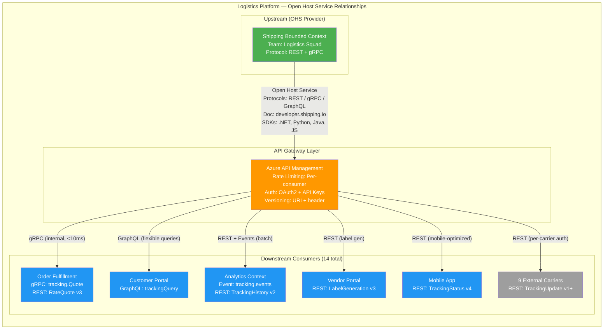
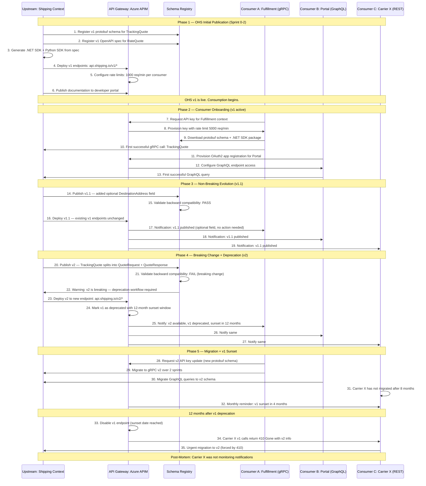
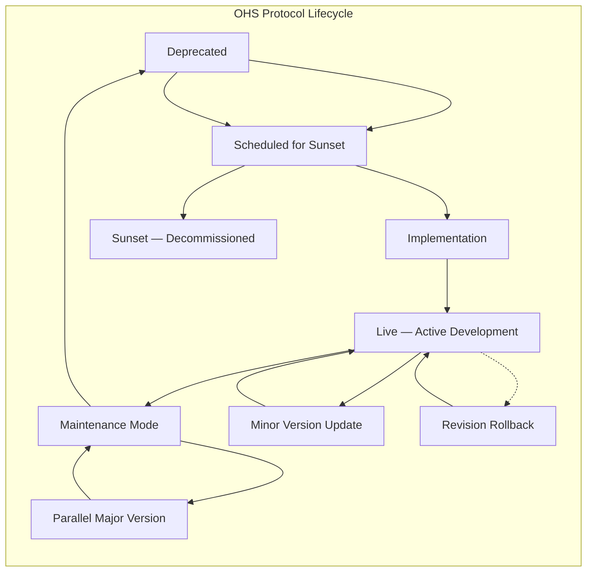
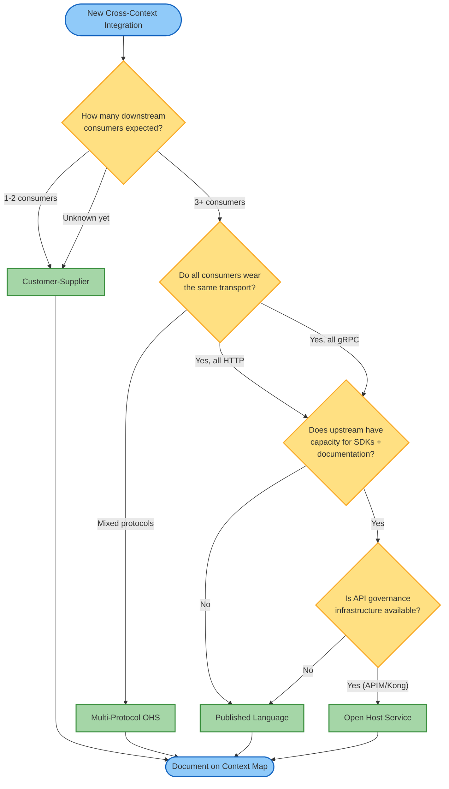

> [!success] Mastery Check
> - [ ] **Studied Well**
> - [ ] **Can explain the concept without notes**
> - [ ] **Can answer interview questions confidently**
> - [ ] **Can implement it in a real project**


# 7.040 — DDD — Context Mapping — Open Host Service

> **Core Tenet:** Open Host Service (OHS) is the strategic DDD relationship pattern where an upstream bounded context publishes a stable, versioned protocol or API that multiple downstream consumers integrate against without individual negotiation. Unlike [[7.037 — DDD — Context Mapping — Customer-Supplier]] (per-consumer contract negotiation with deprecation windows) or [[7.041 — DDD — Context Mapping — Published Language]] (shared schema format without a protocol), OHS bundles protocol semantics, transport binding, versioning policy, and documentation into a single consumable package that scales to N downstream consumers with near-zero marginal cost per consumer.

---

## Section 0: Quick Reference Card

> [!ABSTRACT] Quick Reference Card
>
> **Definition:** Open Host Service is a strategic DDD pattern in which an upstream bounded context exposes its model through a well-defined, versioned, and documented protocol or API that any downstream context can consume. The upstream owns the protocol specification, versioning scheme, and client libraries (SDKs). Downstreams integrate against the published contract without needing to negotiate individual terms, deprecation windows, or SLA arrangements. The pattern scales from 3 to 300 downstream consumers with the same governance overhead.
>
> **Purpose:** Enable an upstream bounded context to serve many downstream consumers with a single, stable, versioned contract while maintaining the freedom to evolve its internal model independently. Decouple upstream evolution from downstream adaptation through API versioning, compatibility guarantees, and consumer-driven contract validation.
>
> **When to Use:**
> - Three or more downstream bounded contexts depend on the same upstream model or capability
> - The upstream context needs to evolve its internal model independently of downstream consumption patterns
> - The organization requires standardized API governance — rate limiting, documentation, SDK generation, deprecation policies
> - Downstream teams have varying technical maturity, cadences, or release schedules
> - The upstream model is stable enough to commit to a versioning and deprecation policy
> - Different downstream consumers need different representations, transports, or protocols (REST, gRPC, GraphQL) from the same upstream
>
> **When NOT to Use:**
> - One or two downstream consumers exist and the relationship can be individually negotiated (use [[7.037 — DDD — Context Mapping — Customer-Supplier]])
> - Downstreams are willing to accept the upstream internal model directly with no translation (use [[7.038 — DDD — Context Mapping — Conformist]])
> - Teams agree on a shared schema format but each consumer implements their own transport binding (use [[7.041 — DDD — Context Mapping — Published Language]])
> - The downstream needs to maintain complete model independence and will invest in translation (use [[7.039 — DDD — Context Mapping — Anticorruption Layer]])
> - Teams coordinate release cycles and can share model implementation (use [[7.036 — DDD — Context Mapping — Shared Kernel]] or [[7.035 — DDD — Context Mapping — Partnership]])
> - Contexts have no integration requirement (use [[7.042 — DDD — Context Mapping — Separate Ways]])
>
> **Key Metrics:**
> - Downstream consumer count: >= 3 before OHS is justified; 10+ is the sweet spot
> - API version churn: <= 1 major breaking change per year per API surface
> - API documentation coverage: 100% of public endpoints documented with OpenAPI or protobuf comments
> - SDK/client library adoption: >= 80% of downstreams use the published SDK rather than writing custom HTTP clients
> - Breaking change detection: automated compatibility checking against published schemas; detection latency < 1 hour from publish
> - API availability SLA: >= 99.95% for synchronous paths; >= 99.5% for event-driven paths
> - Rate limit enforcement: enforced at the API gateway with per-consumer quotas documented in the OHS contract
> - Consumer onboarding time: time from downstream team requesting access to first successful API call; target < 1 business day
>
> **Critical Warning:** Open Host Service is often confused with Published Language. The distinction is critical: Published Language is a shared schema format (what data looks like), while Open Host Service is a protocol (how data is exchanged, authenticated, versioned, rate-limited, and discovered). PL answers "what shape is the data?" OHS answers "how do I call you, what version do I use, what are my rate limits, where is the documentation, and how do I get a client SDK?" OHS includes PL but adds transport, governance, and discoverability. If you publish a schema registry entry but do not provide client SDKs, documentation, versioning policy, or rate limiting documentation, you have Published Language, not Open Host Service.

---

## Section 1: Navigation & Context

> [!INFO] Production Encounter Map
>
> Imagine a 3:52 AM incident at a global logistics platform: The Shipping context (upstream) provides shipment tracking, rate quotes, and label generation. It has 14 downstream consumers: Order Fulfillment, Customer Portal, Analytics, Vendor Portal, Mobile App, and 9 external carrier integrations. The Shipping team deployed a new major version of their REST API (v4) that renamed the TrackingEvent property Location to FacilityCode, changed the rate quote format from a flat structure to nested tiers, and deprecated the v2 endpoint. Six downstream consumers were still calling v2. The Azure API Management gateway had rate limits configured for v2 at 1,000 req/min per consumer, but the new v4 endpoint defaulted to 100 req/min — no one had documented the new limits. Three consumers exceeded the default rate during the morning traffic ramp and were throttled. The Customer Portal showed tracking unavailable for 22 minutes during peak support hours.
>
> **Root Cause:** The Shipping OHS documentation was outdated. The context map labeled the relationship as OHS with versioning, but the actual practice was closer to Published Language — the schema was published but the protocol details (rate limits, authentication migration, endpoint changes, SDK updates) were not communicated. The OHS contract specified version compatibility guarantees but did not automate breaking change detection or notification. The v3 -> v4 migration plan existed in a Wiki page from 3 months prior that no one had read.
>
> **Why This Matters:** Open Host Service promises that the upstream can serve many downstreams with low overhead — but only when the OHS is truly a hosted service, not just a published schema. A proper OHS includes SDKs, documentation, automated compatibility testing, rate limit governance, deprecation notifications, and consumer onboarding. Without these components, OHS degrades to Published Language (schemas without protocols) and downstreams integrate ad-hoc, creating fragile integrations that fail at 3:52 AM.
>
> **Reading Path:**
> 1. Start with **Section 2** for the mental model — understand how OHS differs from Customer-Supplier and Published Language, when to use each, and the three-protocol-bindings decision (REST vs gRPC vs GraphQL)
> 2. Move to **Section 3** for deep mechanics — API versioning strategies (URI, header, content-type), breaking change classification, consumer-driven contracts at scale, API gateway governance
> 3. Skip to **Section 4** for .NET 8 implementation — gRPC service with protobuf contracts, REST controller with OpenAPI, consumer contract tests with PactNet, Azure API Management integration, SDK generation
> 4. Review **Section 5** for pitfalls — especially versioning by URI and never deprecating anti-pattern, Azure-specific API Management rate limit configuration mistakes, the SDK neglect trap
> 5. Use **Section 6** when deciding between OHS and other relationship patterns for a new integration — the consumer count decision rule is critical
> 6. Study **Section 7** for interview prep — Staff+ questions on API governance at scale, versioning strategy selection, and organizational implications of OHS
>
> **When to Apply This Pattern:**
> - ✅ Three or more downstream bounded contexts consume the same upstream model or capability
> - ✅ The upstream team has the engineering maturity to maintain versioned APIs, SDKs, and documentation
> - ✅ API governance infrastructure exists or can be established (API gateway, schema registry, automated compatibility checks)
> - ✅ Downstream consumers have varying technical maturity and organizational cadence
> - ✅ The upstream model is stable enough to define compatibility guarantees across major versions
> - ✅ The organization values standardized integration patterns over team-specific arrangements
> - ❌ Only one or two downstream consumers exist (use [[7.037 — DDD — Context Mapping — Customer-Supplier]])
> - ❌ The upstream team lacks capacity or willingness to maintain client SDKs and comprehensive documentation
> - ❌ The upstream model changes faster than the API versioning policy can accommodate (more than 4 breaking changes per year)
> - ❌ All downstreams are willing to consume the upstream internal model directly with no protocol translation (use [[7.038 — DDD — Context Mapping — Conformist]])
> - ❌ The organization cannot support API governance infrastructure (no API gateway, no schema registry, no automated compatibility testing)
> - ❌ Downstream consumers each require fundamentally different contracts that cannot be unified behind a single protocol (consider Separate Ways or individual Customer-Supplier relationships)
>
> **Prerequisites Review:**
> - [[7.034 — DDD — Bounded Contexts — Context Map]] — Open Host Service is one of eight relationship patterns on a context map. Understanding how context maps document boundaries, integration protocols, and versioned contracts is essential. Each OHS relationship on the map should identify the protocol (REST/gRPC/GraphQL), version, gateway endpoint, and API documentation URL.
>
> **Cross-Domain Connection:**
> - [[7.037 — DDD — Context Mapping — Customer-Supplier]] — OHS generalizes CS for many consumers. The decision rule: 1-2 consumers use CS with negotiated terms; 3+ consumers justify OHS standardization. CS provides per-consumer deprecation windows; OHS provides a single published deprecation policy for all.
> - [[7.041 — DDD — Context Mapping — Published Language]] — PL provides the schema format that OHS protocols carry. OHS = PL + transport + governance + SDK + documentation. If you have a protobuf schema in a shared NuGet package but no service definition, that is PL, not OHS.
> - [[7.039 — DDD — Context Mapping — Anticorruption Layer]] — OHS consumers often wrap the upstream protocol in an ACL to translate into their internal model. OHS provides the stable ingress; ACL provides the model protection. The two patterns are complementary.
> - [[7.038 — DDD — Context Mapping — Conformist]] — Conformist bypasses OHS by directly importing the upstream internal model. This is dangerous when the upstream has many consumers — OHS exists precisely to prevent Conformist relationships from proliferating.
> - [[7.035 — DDD — Context Mapping — Partnership]] — If the upstream and all downstreams share sprint cadences and coordinate releases, Partnership may be simpler than the OHS governance overhead.
> - [[3.028 — Azure API Management Deep Dive]] — APIM is the primary Azure infrastructure for OHS: API publishing, versioning, rate limiting, documentation (developer portal), and analytics. APIM policy expressions implement OHS governance rules.
> - [[7.069 — Multiple Bounded Contexts in One Solution]] — OHS endpoints typically cross solution boundaries. The upstream context publishes its service contract as a NuGet package that downstream solutions reference.
> - [[7.074 — Module vs Bounded Context]] — A single bounded context may expose multiple OHS endpoints (different protocols or API surfaces for different consumer groups). Each endpoint documents a different subsystem of the bounded context.

---

## Section 2: Core Mental Model

> [!TIP] Non-Obvious Insight
>
> **Open Host Service is a product management discipline, not just an API design pattern.**
>
> The most common failure of OHS is treating it as purely technical — put the API behind APIM with versioning and call it done. The hard part is product management: deciding which protocols to support, when to deprecate a version, how to communicate breaking changes to 14+ downstream consumers, maintaining SDKs in multiple languages, and having the organizational discipline to avoid breaking compatibility without a formal deprecation process. A proper OHS is a product that the upstream team ships to its downstream consumers. It needs a roadmap, release notes, documentation, support channels, and a deprecation policy — just like any external product.
>
> **The Scaling Threshold:** The OHS pattern becomes cost-effective at the point where the upstream team spends more time on individual downstream support than on OHS infrastructure maintenance. This threshold is typically at 3-5 downstream consumers. Below this threshold, individual Customer-Supplier relationships are more flexible. Above it, OHS standardization reduces total overhead despite the upfront investment in SDKs, documentation, and gateway configuration. The calculation is: (N downstreams x CS overhead per downstream) > (OHS setup cost + N x OHS marginal cost per downstream). OHS marginal cost approaches zero after the first consumer.
>
> **Protocol Choice as Strategic Decision:** The choice between REST, gRPC, and GraphQL is not a technical preference — it is a strategic OHS decision that shapes downstream integration patterns. REST provides maximum reach (any HTTP client can call it) but requires manual documentation and client generation. gRPC provides strong typing and high performance but requires code generation and protobuf dependency. GraphQL provides flexible queries but shifts complexity to upstream performance optimization. Many mature OHS implementations expose all three protocols from the same bounded context, each serving a different consumer profile — gRPC for internal microservices requiring <5ms latency, REST for external partners, and GraphQL for frontend teams needing flexible data composition.

### Compare and Contrast

| Aspect | Customer-Supplier | Open Host Service | Published Language |
|--------|-------------------|-------------------|-------------------|
| Consumer count | 1-2 (individual negotiation) | 3+ (standardized contract) | 3+ (shared schema, no protocol) |
| Contract type | Per-consumer SLA + deprecation | Single versioned API for all | Schema definition only (JSON Schema, Avro, Protobuf) |
| Transport binding | Per-consumer: REST, gRPC, or events | Standardized per protocol (one transport for all) | None — schema is transport-agnostic |
| SDK/Client library | No — downstream writes integration | Yes — upstream provides SDK in 1+ languages | No — each consumer generates their own |
| Documentation | Informal (Wiki, README) | Formal (OpenAPI, protobuf docs, developer portal) | Schema documentation only (protobuf comments, JSON Schema descriptions) |
| Versioning | Per-consumer deprecation window | Formal versioning policy (major.minor.patch) with compatibility rules | Schema evolution rules (backward/forward compatibility) |
| Governance | Quarterly review, monthly sync | Automated: API gateway, rate limiting, compatibility CI, documentation CI | Schema registry governance (compatibility checks on publish) |
| Rate limiting | Not standardized | Enforced at gateway per consumer | Not applicable |
| Upstream overhead | Medium per consumer (individual negotiation) | High setup (SDK, docs, gateway), near-zero marginal cost | Low setup (schema registry), no marginal cost change |
| Consumer onboarding | 1-2 weeks (negotiation + integration) | < 1 day (SDK + documentation + API key) | 1-5 days (generate client, integrate schema) |
| Breaking change notification | Per-consumer webhook + deprecation window | Single published deprecation notice + version sunset policy | Schema registry compatibility check + deprecation metadata |

### Classification

| Axis | Classification | Description |
|------|---------------|-------------|
| Intent | Strategic | Organizes how an upstream context serves multiple downstream consumers through a standardized protocol |
| Direction | Unidirectional — upstream [OHS protocol] ---<<Open Host Service>>---> downstream [consumers] | The protocol, API, or service flows from upstream to multiple downstreams |
| Coupling | Low — protocol dependency | Downstream depends only on the published protocol contract, not on upstream implementation |
| Autonomy | High — upstream and downstreams evolve independently within versioning rules | Upstream can change internal model as long as protocol contract is preserved; downstreams upgrade at their own pace |
| Formality | High — requires API documentation, versioning policy, SDK generation, rate limiting, breaking change policy | Informal OHS without governance artifacts is de facto Published Language |
| Governance | Medium — automated gates (compatibility CI, rate limit enforcement, documentation CI) | Less overhead than CS (no per-consumer negotiation), more than PL (protocol governance) |
| Difficulty | Technical (medium) > Organizational (medium) | SDK generation and API gateway configuration are straightforward; maintaining compatibility discipline across many consumers is hard |
| Lifecycle | Years — versioned API surfaces live for extended periods with overlapping sunset windows | Major versions typically supported for 12-18 months after successor is released |

### Mermaid Diagram: Open Host Service in a Multi-Consumer Logistics Platform



> [!NOTE] Diagram Interpretation
> The Shipping bounded context serves 14 downstream consumers through Azure API Management. Key observations:
> - **Protocol diversity:** Shipping exposes three protocols (REST, gRPC, GraphQL) for different consumer profiles. The gRPC endpoint serves Order Fulfillment (internal, high-throughput, low-latency). REST serves external carriers and mobile (broad compatibility). GraphQL serves Customer Portal (flexible data composition).
> - **API Gateway as governance layer:** APIM provides centralized rate limiting, authentication, versioning, and documentation. The gateway enforces OHS governance without the upstream service knowing about individual consumers.
> - **Consumer profiles:** Internal microservices (Fulfillment, Analytics) use gRPC or events for low latency. External consumers (9 carriers, Vendor Portal) use REST with API key authentication. Frontend consumers (Portal, Mobile) use REST or GraphQL with OAuth2.
> - **Version dispersion:** Four different API versions are active simultaneously. Each downstream upgrades at their own pace. The OHS deprecation policy requires 12-month support for each major version after the successor is published.

### Mermaid Sequence Diagram: OHS Version Lifecycle from Initial Publish to Sunset



> [!NOTE] Sequence Analysis
> This traces the complete OHS lifecycle from initial publication through version evolution, deprecation, and sunset. Critical inflection points:
> - Steps 1-6: The OHS setup involves schema registry publication, SDK generation, gateway configuration, and documentation publishing. This upfront investment is 3-4 developer-weeks.
> - Steps 7-13: Consumer onboarding is self-service — API key provisioning and SDK download take less than 1 day. No individual negotiation needed.
> - Steps 14-19: Non-breaking evolution (adding optional fields) requires only schema compatibility validation. Consumers are notified but need no action. The OHS scales effortlessly.
> - Steps 20-27: Breaking change triggers the formal deprecation workflow. v2 is deployed as a parallel endpoint. v1 is marked deprecated with a 12-month sunset window. All consumers notified simultaneously.
> - Steps 28-35: Consumer migration is asynchronous — each consumer upgrades when their sprint cadence allows. Carrier X ignored notifications and was force-migrated at sunset.

### Numbers That Matter

| Metric | Good | Warning | Critical | Calculation Method | Real-World Implication |
|--------|------|---------|----------|-------------------|----------------------|
| Consumer count per OHS | 5-20 | 3-4 or 21-50 | > 50 or < 3 | Number of unique downstream contexts consuming the protocol | < 3: OHS is over-engineered (use CS); > 50: need multi-region gateway + CDN |
| Major version churn | <= 1 per year | 2 per year | 3+ per year | Major version releases per year per API surface | Each major version requires all consumers to adapt; high churn indicates internal model instability |
| SDK language coverage | >= 4 languages | 2-3 languages | 1 language | Number of languages with generated client SDKs | Single language forces all downstreams into same tech stack |
| API documentation coverage | 100% of endpoints | 80-99% | < 80% | (Documented endpoints / total public endpoints) x 100 | Undocumented endpoints cannot be consumed reliably |
| Breaking change detection latency | < 1 hour from publish | 1-24 hours | > 24 hours | Time between new schema publish and automated compatibility check | Late detection means consumers discover breakage in production |
| Consumer onboarding time | < 1 business day | 1-3 days | > 5 days | Time from consumer request to first successful API call | Slow onboarding drives consumers to unsupported ad-hoc integrations |
| Rate limit enforcement | All endpoints, documented per consumer | Some endpoints, some consumers documented | Not enforced | Percentage of OHS endpoints with configured and documented rate limits | Unenforced rate limits lead to noisy-neighbor scenarios |
| Gateway availability | >= 99.99% | 99.9-99.99% | < 99.9% | (Successful gateway requests / total) x 100 over 30 days | Gateway is the single point of failure for all 14+ consumers |
| Version sunset compliance | 100% — all consumers migrated before sunset | 80-99% migrated | < 80% | (Consumers on current version / total consumers) x 100 | Non-migrated consumers break at sunset; force-migration causes incidents |
| Consumer SDK adoption | >= 80% use published SDK | 50-79% | < 50% | (Consumers using SDK / total consumers) x 100 | Low SDK adoption means consumers write custom HTTP clients |
| API response time (p99) | < 100ms (internal), < 300ms (external) | 100-300ms internal, 300-1000ms external | > 300ms internal, > 1s external | OpenTelemetry histograms per endpoint and consumer | Slow APIs erode downstream SLA |
| Gateway config-as-code coverage | 100% (ARM/Bicep/Terraform) | 50-99% | < 50% | Percentage of APIM policies, APIs, products managed via IaC | Manual gateway changes are unreproducible and cause drift |

### Key Properties

| Property | Description |
|----------|-------------|
| **Multi-Consumer by Design** | OHS is designed from the ground up to serve multiple consumers with the same protocol. The versioning, documentation, and governance choices assume N > 2. |
| **Protocol-Centric** | The protocol (REST, gRPC, GraphQL, or events) defines the integration contract. Protocol choice determines documentation format, SDK generation tooling, and consumer capabilities. |
| **Productized** | The upstream treats the OHS as a product: versioned, documented, supported, with release notes, deprecation notices, and a support channel. Downstreams are customers, not collaborators. |
| **Versioned** | A formal versioning strategy (major.minor.patch) governs how the protocol evolves. Breaking changes require major versions with overlapping support windows. |
| **Self-Service Onboarding** | Consumers can integrate without contacting the upstream team — documentation, SDKs, API keys, and sandbox environments are available on-demand. |
| **Governed** | Rate limiting, authentication, request validation, and usage analytics are enforced at the API gateway level, not in the upstream service. |
| **Documented** | All endpoints, request/response schemas, authentication methods, rate limits, and error codes are documented. Documentation is generated from code (OpenAPI, protobuf comments). |
| **SDK-Enabled** | Client libraries in 1+ languages are generated from the API specification. SDKs encapsulate serialization, retry logic, authentication, and error handling. |
| **Compatibility-Tested** | Every API change is automatically validated against published schemas to detect breaking changes before deployment. Consumer-driven contract tests run in the upstream CI. |
| **Deprecation-First** | Breaking changes follow a formal deprecation process: announce, document migration path, maintain old version for sunset window, then remove. No surprise breaking changes. |

---

## Section 3: Deep Mechanics

### How It Works

The Open Host Service pattern operates through a six-phase lifecycle that encompasses technical implementation, governance, and organizational discipline.

**Phase 1 — Protocol Design and Specification (Sprint 0-2)**
The upstream team designs the OHS protocol based on the bounded context model and expected consumer needs:
- **Domain Analysis:** Which parts of the bounded context model are relevant to external consumers? Not everything should be exposed — only the capabilities that multiple downstreams need.
- **Protocol Selection:** Choose primary protocol(s) based on consumer profiles — gRPC for internal low-latency, REST for broad compatibility, GraphQL for flexible queries, events for async integration.
- **Contract Definition:** Define the service contract — operations, request/response schemas, error codes, pagination, idempotency guarantees, and throttling behavior.
- **Versioning Strategy:** Choose a versioning scheme (URI path, header, content-type negotiation) and define what constitutes a breaking change.

**Phase 2 — Infrastructure Setup (Sprint 1-3)**
The governance infrastructure is established:
- **API Gateway:** Deploy API gateway (Azure API Management, Kong, Envoy) in front of the upstream service. The gateway handles authentication, rate limiting, request validation, version routing, and analytics.
- **Schema Registry:** Publish the API specification (OpenAPI, protobuf) to a schema registry that supports automatic compatibility checking.
- **Documentation Portal:** Stand up a developer portal with API reference docs, getting-started guides, SDK installation instructions, and API key management.
- **CI/CD Pipeline:** Automated gates for breaking change detection, documentation freshness, SDK generation, and contract test execution.

**Phase 3 — SDK Generation and Publishing (Sprint 2-3)**
Client libraries are generated and published:
- **Code Generation:** Use OpenAPI Generator, protobuf codegen, or GraphQL Code Generator to produce client SDKs in .NET, Python, Java, JavaScript/TypeScript, and Go.
- **SDK Features:** Each SDK includes retry policies (exponential backoff with jitter), authentication helpers, request/response serialization, error type mapping, and telemetry.
- **Package Publishing:** SDKs are published to language-specific package registries (NuGet, PyPI, npm, Maven) so consumers can install with a single command.
- **SDK Versioning:** SDK versions match API versions. Major SDK update indicates breaking API changes.

**Phase 4 — Consumer Onboarding (Continuous)**
Consumers discover and integrate with the OHS:
- **Self-Service Registration:** Consumers register through the developer portal, accepting the OHS terms of use and receiving API credentials.
- **SDK Installation:** Consumer installs the SDK via package manager command.
- **Sandbox Testing:** Consumer tests against a sandbox environment with synthetic data before production access.
- **Production Onboarding:** Consumer is granted production API access with configured rate limits. First successful call completes.

**Phase 5 — Evolution and Deprecation (Continuous)**
The OHS evolves under governance:
- **Non-Breaking Changes:** Adding optional fields, new endpoints, or new error codes requires only schema validation. Published as minor version bump.
- **Breaking Changes:** Adding required fields, removing fields, changing types, or renaming operations requires a new major version. v2 is deployed alongside v1. v1 is marked deprecated with a sunset window (12-18 months).
- **Consumer Notification:** All active consumers receive deprecation notices with migration guide, timeline, and SDK update instructions.
- **Sunset:** After the sunset window expires, the old endpoint is disabled. Consumers still calling it receive HTTP 410 (Gone) with a Link header pointing to the new version documentation.

**Phase 6 — Governance and Monitoring (Continuous)**
The OHS health is continuously monitored:
- **API Analytics:** Track endpoint usage per consumer, latency distributions, error rates, and throttling events.
- **Breaking Change Detection:** Automated CI gate runs schema comparison on every PR. If a change is classified as breaking without a major version bump, build fails.
- **Consumer Health Dashboard:** Show per-consumer version adoption, upgrade progress, rate limit utilization, and error patterns.
- **Quarterly OHS Review:** Review consumer count, version churn, documentation quality, SDK freshness, and deprecation compliance. Adjust policy as needed.

### Protocol Trace: RateQuote Request Through OHS

**Happy Path (9 steps):**

```
1. Order Fulfillment context calculates shipment dimensions and weight
   -> Fulfillment needs rate quote from Shipping context

2. Fulfillment installs and references the Shipping.Sdk .NET package
   -> dotnet add package Shipping.Sdk --version 3.*

3. SDK creates authenticated gRPC channel:
   -> Channel target: shipping.api.consoto.com:443 (gRPC)
   -> Client credentials: OAuth2 Client Credentials flow
   -> TLS 1.3 required, cert pinning enabled

4. SDK serializes RateQuoteRequest protobuf message:
   -> message RateQuoteRequest {
   ->   string pickup_postal_code = 1;
   ->   string destination_postal_code = 2;
   ->   repeated Package packages = 3;
   ->   ServiceLevel service_level = 4;
   ->   string idempotency_key = 5;
   -> }

5. Azure API Management gateway receives request:
   -> Validates API key from header
   -> Checks rate limit for Fulfillment consumer: 5000 req/min
   -> Routes to v3 endpoint: /api/v3/rate-quote
   -> Adds tracing headers for OpenTelemetry correlation

6. Shipping context processes RateQuoteRequest:
   -> Domain service calculates rates from carrier rate tables
   -> Returns RateQuoteResponse with pricing, transit times, service options

7. Gateway caches response for 60 seconds (GET-equivalent idempotent quotes)
   -> Subsequent identical requests from any consumer return cached result

8. SDK deserializes response and returns typed RateQuoteResult
   -> Rate quote displayed in fulfillment workflow UI

9. OpenTelemetry spans:
   -> Gateway: shipping.gateway.request.duration = 145ms
   -> Upstream: shipping.ratequote.service.duration = 120ms
   -> Consumer: fulfillment.ratequote.roundtrip = 158ms
```

**Failure Path — Rate Limit Exceeded (5 steps):**

```
1. External Carrier X integration experiences a bug causing infinite loop
   -> 12,000 API calls in 3 minutes (rate limit: 1000 req/min)

2. APIM gateway counters exceed threshold for Carrier X
   -> HTTP 429 Too Many Requests
   -> Retry-After header: 120 seconds

3. Carrier X client does not respect Retry-After header
   -> Continues at same rate — all requests return 429

4. Gateway escalates:
   -> Alert: "Carrier X rate limit exceeded — 8000 blocked requests"
   -> Upstream on-call notified (Shipping team)
   -> Carrier X contact called — bug identified

5. Post-mortem:
   -> Rate limit configuration is correct — behavior was expected
   -> Carrier X adds proper retry-after handling
   -> No other consumers impacted (per-consumer limits prevent noisy neighbor)
```

### State Transitions

The OHS protocol lifecycle:



| State | Description | Duration | Exit Criteria |
|-------|-------------|----------|---------------|
| **Design** | Protocol contract being defined; no implementation | 1-2 sprints | Specification published to schema registry |
| **Specification Published** | OpenAPI/protobuf spec in registry; implementation ongoing | 1-2 sprints | First endpoint deployed behind gateway |
| **Implementation** | SDK being generated; infrastructure being configured | 1-3 sprints | SDK published to package registry; docs live |
| **Live — Active Development** | OHS fully operational; new features and endpoints added | Indefinite (months to years) | Major version churn < 1/year; no critical incidents |
| **Minor Version Update** | Backward-compatible changes deployed | Days to weeks | Compatibility check passes; SDK regenerated |
| **Maintenance Mode** | No new features; only security patches and critical fixes | 6-12 months | All consumers migrated to successor version |
| **Deprecated** | Version marked for removal; consumers notified | 12-18 months (sunset window) | Sunset date reached |
| **Scheduled for Sunset** | Sunset date set; final warning sent to non-migrated consumers | 1-3 months | All consumers migrated; traffic below threshold |
| **Sunset — Decommissioned** | Endpoint disabled; returns 410 Gone | Permanent | Gateway configuration removed; code deleted |
| **Parallel Major Version** | Two major versions running concurrently during migration | 12-18 months | Old version enters maintenance mode |
| **Revision Rollback** | Breaking change detected in production; version rolled back | Hours to days | Root cause fixed; compatibility check updated |

### Failure Modes

> [!DANGER] 3AM Production Signal — The Silent Breaking Change
> **Signal:** PagerDuty alert: "Fulfillment context error rate > 15% on RateQuote endpoint." 2,500 failed rate quote requests in 10 minutes. Error: "gRPC status: UNIMPLEMENTED — method RateQuoteV2 not found."
> **Root Cause:** The Shipping team deployed a new protobuf schema that renamed the RateQuote RPC to GetRateQuote. The gateway routing was updated to point api.shipping.io/v3/rate-quote to the new method. Consumers using the old SDK (which calls RateQuote) received UNIMPLEMENTED. The change was classified as "refactoring" by the developer and deployed without a version bump or deprecation notice. The automated breaking change detector flagged the RPC rename as a breaking change, but the CI gate was configured as a warning, not a blocker.
> **Detection Gap:** The compatibility check detected the breakage but the CI pipeline had a "warnings allowed" policy. The deployment proceeded with warnings.
> **Mitigation:** (1) Immediate: Roll back Shipping deployment; restore v3 endpoint to previous protobuf definition. (2) Short-term: Change CI breaking change check from warning to blocker — any breaking classification fails the build. (3) Medium-term: Add consumer-driven contract tests to Shipping CI that exercise actual consumer expectations. (4) Long-term: Implement semantic protobuf comparison that detects RPC renames and field deletions as hard blocking failures.
> **Post-Mortem Metric:** 2,580 failed rate quotes during 22-minute outage window. 47 fulfillment operators unable to proceed. 12 late shipments.

> [!DANGER] 3AM Production Signal — The Rate Limit Cascading Failure
> **Signal:** Customer Portal tracking page shows unavailable for 27 minutes. Gateway CPU at 98%. Analytics context reporting upstream timeout on tracking history queries.
> **Root Cause:** An external carrier integration (Carrier X) experienced a bug causing 15,000 requests/minute to the tracking endpoint (rate limit: 1000 req/min). The gateway correctly blocked 14,000 requests from Carrier X with 429 responses — but the gateway request pipeline was saturated processing the blocked requests. The per-consumer rate limiter was evaluated AFTER request deserialization and authentication, consuming gateway CPU even for throttled requests. The gateway connection pool was exhausted, causing timeouts for all other consumers.
> **Detection Gap:** Rate limit monitoring was per-consumer (tracking Carrier X rate limit exceeded counts) but not per-gateway (tracking CPU utilization or connection pool saturation). The gateway health probe endpoint was still returning 200, so the load balancer did not route traffic away.
> **Mitigation:** (1) Immediate: Block Carrier X at the network level (IP-based ACL) to stop requests before they reach gateway. (2) Short-term: Move rate limiting from application-level (post-deserialization) to network-level (pre-deserialization). Configure APIM IP filtering and per-IP rate limiting at the inbound processing stage. (3) Medium-term: Add gateway health alerting for CPU > 70% and connection pool utilization > 80%. (4) Long-term: Consider Azure Front Door + APIM multi-layer architecture where Front Door provides coarse-grained DDoS protection and APIM provides fine-grained consumer management.
> **The Lesson:** Rate limiting must be evaluated BEFORE request deserialization to protect the gateway itself. Late-stage rate limiting protects the upstream but not the gateway.

> [!DANGER] 3AM Production Signal — The SDK Version Mismatch
> **Signal:** Fulfillment context deployment fails with build error: "Shipping.Sdk version 4.0.0 is incompatible with current API version. Expected 3.*."
> **Root Cause:** The Shipping team released Shipping.Sdk v4.0.0 with major API changes (renamed RateQuoteResponse fields, changed Nullable handling). The Fulfillment team was on Shipping.Sdk v3.2.1. A junior developer on the Fulfillment team attempted to update the SDK to the latest version as part of a routine dependency update, not realizing it targeted a different API major version.
> **Detection Gap:** No SDK compatibility validation was preventing any consumer from installing the wrong major version.
> **Mitigation:** (1) Immediate: Roll back Fulfillment dependency to Shipping.Sdk v3.2.1. (2) Short-term: Add SDK version validation at runtime — the SDK checks the API version header on connect and throws if mismatch is detected. (3) Medium-term: Publish separate NuGet packages per major version. (4) Long-term: Add SDK version pinning in consumer CI.

### Breaking Change Classification

| Type | Example | Severity | Consumer Impact | Required Deprecation |
|------|---------|----------|----------------|---------------------|
| **Endpoint removal** | DELETE /api/v3/rate-quote | Critical | HTTP 404; integration completely broken | 18 months minimum |
| **Operation rename (gRPC)** | RateQuote -> GetRateQuote | Critical | UNIMPLEMENTED error; client code must change | 18 months minimum |
| **Field removal** | Removed transit_days from RateQuoteResponse | Critical | Deserialization failure if field is used; silent data loss if unused | 12 months minimum |
| **Field type change** | rate from float to string | Critical | Deserialization exception | 12 months minimum |
| **Field rename** | delivery_date -> estimated_delivery_date | High | Mapping code breaks; deserialization succeeds (unknown field) | 12 months minimum |
| **Required field addition** | Added required signature_required to request | High | Existing requests fail validation (400) | 6 months minimum |
| **Enum value removal** | Removed ServiceLevel.STANDARD | High | Existing consumers using STANDARD get validation errors | 12 months minimum |
| **Auth scheme change** | API Key -> OAuth2 Client Credentials | High | HTTP 401; authentication pipeline must change | 18 months minimum with parallel run |
| **Rate limit reduction** | 5000 req/min -> 500 req/min | Medium | Existing consumers may be throttled | 6 months minimum with notification |
| **Pagination change** | page/pageSize -> cursor-based | Medium | Existing pagination code breaks | 12 months minimum |
| **Endpoint URL change** | /api/v3/rate-quote -> /api/v3/quotes/rate | Medium | HTTP 301 redirect; client may need update | 6 months minimum with redirect |
| **Optional field addition** | Added optional carbon_footprint to response | Low | No impact; consumer ignores unknown fields | Not required (minor version) |
| **Enum value addition** | Added ServiceLevel.EXPRESS_PRIORITY | Low | No impact if consumer has default case | Not required (minor version) |
| **Error code addition** | Added new error code INVALID_POSTAL_CODE | Low | No impact if consumer handles unexpected errors | Not required (minor version) |

### .NET and Azure Integration Points

| Integration Point | .NET Mechanism | Azure Service | OHS Role |
|-------------------|---------------|---------------|----------|
| **API Gateway** | Azure.ApiManagement SDK + policy expressions | Azure API Management | Central governance: auth, rate limiting, version routing, analytics |
| **gRPC Service Hosting** | Grpc.AspNetCore (v2.60+) | Azure Container Apps or AKS | High-performance internal endpoint for low-latency consumers |
| **REST API Hosting** | ASP.NET Core Minimal APIs or Controllers | Azure App Service or ACA | Broad-compatibility endpoint for external/partner consumers |
| **GraphQL Endpoint** | HotChocolate (v13+) | Azure Container Apps | Flexible-query endpoint for frontend consumers |
| **Service Contract Definition** | protobuf-net / Google.Protobuf | Azure Container Registry (schema) | Proto definitions published as NuGet package |
| **OpenAPI Specification** | Swashbuckle / Microsoft.OpenApi | Azure API Management | Auto-generated OpenAPI spec from ASP.NET Core endpoint |
| **SDK Generation** | OpenAPI Generator CLI + custom templates | Azure DevOps Pipeline | Generate .NET, Python, Java, TypeScript SDKs |
| **SDK Publishing** | dotnet nuget push | NuGet.org / Azure Artifacts | Package SDKs for consumer installation |
| **Breaking Change Detection** | Microsoft.OpenApi.Readers + schema diff | Azure DevOps CI gate | Compare new vs published OpenAPI spec; fail on breaking without major version bump |
| **Consumer-Driven Contracts** | PactNet 4.x IMessagePactBuilder | Azure DevOps Pipeline | CDC tests that fail if API change violates consumer expectations |
| **Authentication** | Microsoft.Identity.Web + OAuth2 | Azure AD / Entra ID | OAuth2 Client Credentials for service-to-service; API Keys for external partners |
| **Rate Limiting** | APIM policy: rate-limit-by-key | Azure API Management | Per-consumer rate limit enforced at gateway |
| **API Documentation** | APIM Developer Portal | Azure API Management | Self-service portal with interactive docs, SDK download, API key management |
| **Analytics and Monitoring** | OpenTelemetry SDK + Azure Monitor exporter | Azure Monitor + Application Insights | Per-consumer latency, error rate, throttling, version adoption dashboards |
| **Event Publishing (async OHS)** | Azure.Messaging.ServiceBus ServiceBusSender | Azure Service Bus | Async event stream for consumers that prefer event-driven integration |


## Section 4: Production Patterns and Implementation

### Primary Implementation: .NET 8 — Open Host Service with gRPC, REST, and Azure API Management

This implementation models a production-grade Open Host Service for the Shipping bounded context in a logistics platform. The implementation covers:

1. **gRPC Service** — protobuf contract for internal consumers (Fulfillment, Analytics)
2. **REST Controller** — OpenAPI-documented controllers for external consumers (Carriers, Vendor Portal)
3. **API Gateway Configuration** — Azure API Management with rate limiting, version routing, authentication
4. **SDK Generation** — OpenAPI Generator integrated into CI/CD for .NET, Python, Java SDKs
5. **Consumer-Driven Contract Tests** — PactNet tests that run in upstream CI
6. **Breaking Change Detection** — Automated OpenAPI schema diff in CI pipeline

**Solution Structure:**
```
Shipping.Contracts/                                      # Published Language — shared proto + DTOs
+-- Protos/
|   +-- rate_quote.proto                                 # gRPC service definition
|   +-- tracking.proto                                   # gRPC tracking service
+-- Models/
|   +-- RateQuoteRequest.cs                              # REST DTOs (mirror protobuf)
|   +-- RateQuoteResponse.cs
|   +-- TrackingEvent.cs
|   +-- ServiceLevel.cs                                  # Shared enum

Shipping.OpenHostService/                                # Bounded Context: Upstream (OHS Provider)
+-- GrpcServices/
|   +-- RateQuoteGrpcService.cs                          # gRPC service implementation
|   +-- TrackingGrpcService.cs
+-- Controllers/
|   +-- RateQuoteController.cs                           # REST controller
|   +-- TrackingController.cs
|   +-- LabelGenerationController.cs
+-- Domain/
|   +-- IRateQuoteService.cs                             # Domain service interface
|   +-- RateQuoteService.cs                              # Domain logic
|   +-- ITrackingService.cs
|   +-- TrackingService.cs
+-- Observability/
|   +-- OpenHostServiceMetrics.cs                        # OpenTelemetry metrics
+-- Configuration/
|   +-- ShippingOhsConfiguration.cs                      # DI registration

Shipping.Sdk/                                            # Generated SDK (output of OpenAPI Generator)
+-- Models/
+-- Api/
+-- ShippingClient.cs

Shipping.ContractTests/                                  # Consumer-Driven Contract Tests
+-- RateQuoteContractTests.cs                            # PactNet CDC tests
+-- ContractFixture.cs

Shipping.Infrastructure/                                 # Gateway and IaC
+-- ApimPolicies/
|   +-- rate-limiting.xml
|   +-- version-routing.xml
|   +-- cors-policy.xml
+-- Bicep/
    +-- apim.bicep
    +-- container-app.bicep
```

#### gRPC Service — Protobuf Contract

```protobuf
// Shipping.Contracts/Protos/rate_quote.proto
syntax = "proto3";

package shipping.ratequote.v3;

option csharp_namespace = Shipping.Contracts.Protos;

// Open Host Service: RateQuote endpoint for internal consumers
// Version: v3 (current), v2 sunset: 2027-06-01
service RateQuoteService {
    // Get shipping rate quotes for a given shipment
    rpc GetRateQuote (RateQuoteRequest) returns (RateQuoteResponse);

    // Stream rate quote updates for a shipment in progress
    rpc StreamRateQuoteUpdates (RateQuoteStreamRequest) returns (stream RateQuoteResponse);
}

message RateQuoteRequest {
    string pickup_postal_code = 1;
    string destination_postal_code = 2;
    repeated Package packages = 3;
    ServiceLevel service_level = 4;
    string idempotency_key = 5;
    map<string, string> metadata = 10;
}

message Package {
    double weight_kg = 1;
    double length_cm = 2;
    double width_cm = 3;
    double height_cm = 4;
    PackageType type = 5;
}

enum PackageType {
    PACKAGE_TYPE_UNSPECIFIED = 0;
    PACKAGE_TYPE_BOX = 1;
    PACKAGE_TYPE_ENVELOPE = 2;
    PACKAGE_TYPE_PALLET = 3;
    PACKAGE_TYPE_TUBE = 4;
}

enum ServiceLevel {
    SERVICE_LEVEL_UNSPECIFIED = 0;
    SERVICE_LEVEL_STANDARD = 1;
    SERVICE_LEVEL_EXPRESS = 2;
    SERVICE_LEVEL_OVERNIGHT = 3;
    SERVICE_LEVEL_SAME_DAY = 4;
}

message RateQuoteResponse {
    string quote_id = 1;
    string carrier = 2;
    string service_name = 3;
    double total_rate = 4;
    string currency = 5;
    int32 estimated_transit_days = 6;
    string estimated_delivery_date = 7;
    repeated string services_included = 8;
    RateQuoteStatus status = 9;
}

enum RateQuoteStatus {
    RATE_QUOTE_STATUS_UNSPECIFIED = 0;
    RATE_QUOTE_STATUS_CONFIRMED = 1;
    RATE_QUOTE_STATUS_ESTIMATE = 2;
    RATE_QUOTE_STATUS_UNAVAILABLE = 3;
}

message RateQuoteStreamRequest {
    string quote_id = 1;
    string tracking_number = 2;
}
```

#### gRPC Service Implementation

```csharp
// Shipping.OpenHostService/GrpcServices/RateQuoteGrpcService.cs
using Grpc.Core;
using Microsoft.Extensions.Logging;
using Shipping.Contracts.Protos;

namespace Shipping.OpenHostService.GrpcServices;

public sealed class RateQuoteGrpcService : RateQuoteService.RateQuoteServiceBase
{
    private readonly IRateQuoteService _rateQuoteService;
    private readonly OpenHostServiceMetrics _metrics;
    private readonly ILogger<RateQuoteGrpcService> _logger;

    public RateQuoteGrpcService(
        IRateQuoteService rateQuoteService,
        OpenHostServiceMetrics metrics,
        ILogger<RateQuoteGrpcService> logger)
    {
        _rateQuoteService = rateQuoteService;
        _metrics = metrics;
        _logger = logger;
    }

    public override async Task<RateQuoteResponse> GetRateQuote(
        RateQuoteRequest request, ServerCallContext context)
    {
        using var activity = Diagnostics.ShippingActivitySource
            .StartActivity("RateQuoteGrpcService.GetRateQuote");
        activity?.SetTag("pickup.postal", request.PickupPostalCode);
        activity?.SetTag("dest.postal", request.DestinationPostalCode);

        var consumer = context.RequestHeaders
            .FirstOrDefault(h => h.Key == "x-consumer-id")?.Value ?? "unknown";
        activity?.SetTag("consumer.id", consumer);

        try
        {
            var domainRequest = MapToDomain(request);
            var domainResponse = await _rateQuoteService
                .GetRateQuoteAsync(domainRequest, context.CancellationToken);

            var response = MapToProto(domainResponse);
            _metrics.RecordQuoteGenerated(consumer, "grpc", response.TotalRate);
            _logger.LogInformation(
                "Rate quote generated for consumer {Consumer}: {QuoteId}, {Rate} {Currency}",
                consumer, response.QuoteId, response.TotalRate, response.Currency);

            return response;
        }
        catch (DomainException ex)
        {
            _logger.LogError(ex, "Domain error processing rate quote for {Consumer}", consumer);
            _metrics.RecordQuoteError(consumer, "grpc", ex.ErrorCode);
            throw new RpcException(
                new Status(StatusCode.InvalidArgument, ex.Message),
                CreateErrorTrailers(ex.ErrorCode));
        }
    }

    public override async Task StreamRateQuoteUpdates(
        RateQuoteStreamRequest request,
        IServerStreamWriter<RateQuoteResponse> responseStream,
        ServerCallContext context)
    {
        var consumer = context.RequestHeaders
            .FirstOrDefault(h => h.Key == "x-consumer-id")?.Value ?? "unknown";
        _logger.LogInformation("Streaming rate quote updates for consumer {Consumer}, quote {QuoteId}",
            consumer, request.QuoteId);

        await foreach (var update in _rateQuoteService
            .StreamUpdatesAsync(request.QuoteId, request.TrackingNumber, context.CancellationToken))
        {
            await responseStream.WriteAsync(MapToProto(update));
        }
    }

    private static RateQuoteServiceDomain.RateQuoteRequest MapToDomain(RateQuoteRequest proto)
    {
        return new RateQuoteServiceDomain.RateQuoteRequest
        {
            PickupPostalCode = proto.PickupPostalCode,
            DestinationPostalCode = proto.DestinationPostalCode,
            Packages = proto.Packages.Select(p => new RateQuoteServiceDomain.Package
            {
                WeightKg = p.WeightKg,
                LengthCm = p.LengthCm,
                WidthCm = p.WidthCm,
                HeightCm = p.HeightCm,
                Type = (RateQuoteServiceDomain.PackageType)p.Type,
            }).ToList(),
            ServiceLevel = (RateQuoteServiceDomain.ServiceLevel)proto.ServiceLevel,
            IdempotencyKey = proto.IdempotencyKey,
        };
    }

    private static RateQuoteResponse MapToProto(RateQuoteServiceDomain.RateQuoteResponse domain)
    {
        return new RateQuoteResponse
        {
            QuoteId = domain.QuoteId,
            Carrier = domain.Carrier,
            ServiceName = domain.ServiceName,
            TotalRate = domain.TotalRate,
            Currency = domain.Currency,
            EstimatedTransitDays = domain.EstimatedTransitDays,
            EstimatedDeliveryDate = domain.EstimatedDeliveryDate.ToString("yyyy-MM-dd"),
            ServicesIncluded = { domain.ServicesIncluded },
            Status = (RateQuoteStatus)domain.Status,
        };
    }

    private static Metadata CreateErrorTrailers(string errorCode)
    {
        var trailers = new Metadata
        {
            { "x-error-code", errorCode },
            { "x-error-version", "v3" },
        };
        return trailers;
    }
}
```

#### REST Controller with OpenAPI

```csharp
// Shipping.OpenHostService/Controllers/RateQuoteController.cs
using Microsoft.AspNetCore.Mvc;
using Microsoft.AspNetCore.RateLimiting;

namespace Shipping.OpenHostService.Controllers;

[ApiController]
[Route("api/v{version:apiVersion}/rate-quote")]
[ApiVersion("3.0")]
[EnableRateLimiting("PerConsumerPolicy")]
public sealed class RateQuoteController : ControllerBase
{
    private readonly IRateQuoteService _rateQuoteService;
    private readonly OpenHostServiceMetrics _metrics;
    private readonly ILogger<RateQuoteController> _logger;

    public RateQuoteController(
        IRateQuoteService rateQuoteService,
        OpenHostServiceMetrics metrics,
        ILogger<RateQuoteController> logger)
    {
        _rateQuoteService = rateQuoteService;
        _metrics = metrics;
        _logger = logger;
    }

    [HttpPost]
    [ProducesResponseType(typeof(RateQuoteResponse), StatusCodes.Status200OK)]
    [ProducesResponseType(StatusCodes.Status400BadRequest)]
    [ProducesResponseType(StatusCodes.Status429TooManyRequests)]
    public async Task<IActionResult> GetRateQuote(
        [FromBody] RateQuoteRequest request,
        CancellationToken cancellationToken)
    {
        var consumer = HttpContext.Items["ConsumerId"] as string ?? "anonymous";
        using var activity = Diagnostics.ShippingActivitySource
            .StartActivity("RateQuoteController.GetRateQuote");
        activity?.SetTag("consumer.id", consumer);

        try
        {
            var domainRequest = MapToDomain(request);
            var domainResponse = await _rateQuoteService
                .GetRateQuoteAsync(domainRequest, cancellationToken);

            var response = MapToResponse(domainResponse);
            _metrics.RecordQuoteGenerated(consumer, "rest", response.TotalRate);
            _logger.LogInformation(
                "REST rate quote for consumer {Consumer}: {QuoteId}",
                consumer, response.QuoteId);

            return Ok(response);
        }
        catch (DomainException ex)
        {
            _logger.LogError(ex, "Domain error for consumer {Consumer}", consumer);
            _metrics.RecordQuoteError(consumer, "rest", ex.ErrorCode);
            return Problem(
                statusCode: 400,
                title: "Rate Quote Error",
                detail: ex.Message,
                extensions: new Dictionary<string, object?>
                {
                    ["errorCode"] = ex.ErrorCode,
                    ["apiVersion"] = "3.0",
                });
        }
    }

    private static RateQuoteServiceDomain.RateQuoteRequest MapToDomain(
        RateQuoteRequest request)
    {
        return new RateQuoteServiceDomain.RateQuoteRequest
        {
            PickupPostalCode = request.PickupPostalCode,
            DestinationPostalCode = request.DestinationPostalCode,
            Packages = request.Packages.Select(p => new RateQuoteServiceDomain.Package
            {
                WeightKg = p.WeightKg,
                LengthCm = p.LengthCm,
                WidthCm = p.WidthCm,
                HeightCm = p.HeightCm,
            }).ToList(),
            ServiceLevel = (RateQuoteServiceDomain.ServiceLevel)request.ServiceLevel,
            IdempotencyKey = request.IdempotencyKey,
        };
    }

    private static RateQuoteResponse MapToResponse(
        RateQuoteServiceDomain.RateQuoteResponse domain)
    {
        return new RateQuoteResponse
        {
            QuoteId = domain.QuoteId,
            Carrier = domain.Carrier,
            ServiceName = domain.ServiceName,
            TotalRate = domain.TotalRate,
            Currency = domain.Currency,
            EstimatedTransitDays = domain.EstimatedTransitDays,
            EstimatedDeliveryDate = domain.EstimatedDeliveryDate,
            ServicesIncluded = domain.ServicesIncluded.ToArray(),
            Status = domain.Status.ToString(),
        };
    }
}
```

#### REST DTOs with OpenAPI Annotations

```csharp
// Shipping.Contracts/Models/RateQuoteRequest.cs
using System.Text.Json.Serialization;

namespace Shipping.Contracts.Models;

public sealed record RateQuoteRequest
{
    [JsonPropertyName("pickup_postal_code")]
    public required string PickupPostalCode { get; init; }

    [JsonPropertyName("destination_postal_code")]
    public required string DestinationPostalCode { get; init; }

    [JsonPropertyName("packages")]
    public required IReadOnlyList<Package> Packages { get; init; }

    [JsonPropertyName("service_level")]
    public required ServiceLevel ServiceLevel { get; init; }

    [JsonPropertyName("idempotency_key")]
    public string? IdempotencyKey { get; init; }
}

public sealed record Package
{
    [JsonPropertyName("weight_kg")]
    public double WeightKg { get; init; }

    [JsonPropertyName("length_cm")]
    public double LengthCm { get; init; }

    [JsonPropertyName("width_cm")]
    public double WidthCm { get; init; }

    [JsonPropertyName("height_cm")]
    public double HeightCm { get; init; }
}

public sealed record RateQuoteResponse
{
    [JsonPropertyName("quote_id")]
    public required string QuoteId { get; init; }

    [JsonPropertyName("carrier")]
    public required string Carrier { get; init; }

    [JsonPropertyName("service_name")]
    public required string ServiceName { get; init; }

    [JsonPropertyName("total_rate")]
    public double TotalRate { get; init; }

    [JsonPropertyName("currency")]
    public required string Currency { get; init; }

    [JsonPropertyName("estimated_transit_days")]
    public int EstimatedTransitDays { get; init; }

    [JsonPropertyName("estimated_delivery_date")]
    public required string EstimatedDeliveryDate { get; init; }

    [JsonPropertyName("services_included")]
    public string[] ServicesIncluded { get; init; } = [];

    [JsonPropertyName("status")]
    public required string Status { get; init; }
}

[JsonConverter(typeof(JsonStringEnumConverter))]
public enum ServiceLevel
{
    Standard = 1,
    Express = 2,
    Overnight = 3,
    SameDay = 4,
}
```

#### Program.cs — OHS Host Setup

```csharp
// Shipping.OpenHostService/Program.cs
using Grpc.AspNetCore;
using Microsoft.AspNetCore.RateLimiting;
using Shipping.OpenHostService.Configuration;
using Shipping.OpenHostService.GrpcServices;
using Shipping.OpenHostService.Middleware;

var builder = WebApplication.CreateBuilder(args);

builder.Services.AddGrpc(options =>
{
    options.EnableDetailedErrors = builder.Environment.IsDevelopment();
    options.MaxReceiveMessageSize = 4 * 1024 * 1024;
    options.Interceptors.Add<ConsumerContextInterceptor>();
});

builder.Services.AddControllers()
    .AddJsonOptions(options =>
    {
        options.JsonSerializerOptions.PropertyNamingPolicy = System.Text.Json.JsonNamingPolicy.SnakeCaseLower;
        options.JsonSerializerOptions.DefaultIgnoreCondition = System.Text.Json.Serialization
            .JsonIgnoreCondition.WhenWritingNull;
    });

builder.Services.AddApiVersioning(options =>
{
    options.DefaultApiVersion = new Asp.Versioning.ApiVersion(3, 0);
    options.AssumeDefaultVersionWhenUnspecified = true;
    options.ReportApiVersions = true;
    options.ApiVersionReader = Asp.Versioning.ApiVersionReader.Combine(
        new Asp.Versioning.UrlSegmentApiVersionReader(),
        new Asp.Versioning.HeaderApiVersionReader("api-version"));
});

builder.Services.AddOpenApi(options =>
{
    options.AddDocumentTransformer((document, context, cancellationToken) =>
    {
        document.Info.Title = "Shipping Open Host Service";
        document.Info.Version = "v3";
        document.Info.Description = "Open Host Service for the Shipping bounded context.";
        return Task.CompletedTask;
    });
});

builder.Services.AddRateLimiter(options =>
{
    options.AddPolicy<string>("PerConsumerPolicy", context =>
    {
        var consumerId = context.Items["ConsumerId"] as string ?? "anonymous";
        var rateLimit = consumerId switch
        {
            "fulfillment" => 5000,
            "carrier-x" => 1000,
            "vendor-portal" => 2000,
            _ => 500,
        };
        return System.Threading.RateLimiting.RateLimitPartition
            .GetTokenBucketLimiter(consumerId, _ => new()
            {
                TokenLimit = rateLimit,
                TokensPerPeriod = rateLimit,
                ReplenishmentPeriod = TimeSpan.FromMinutes(1),
                QueueLimit = 0,
            });
    });
});

builder.Services.AddShippingOhs(builder.Configuration);
builder.Services.AddOpenTelemetry()
    .WithMetrics(metrics => metrics
        .AddMeter("Shipping.OpenHostService")
        .AddAspNetCoreInstrumentation()
        .AddAzureMonitorMetricExporter());

var app = builder.Build();

app.UseRateLimiter();
app.UseMiddleware<ConsumerContextMiddleware>();
app.MapOpenApi();

app.MapGrpcService<RateQuoteGrpcService>()
    .RequireHost("grpc.shipping.internal:5001");
app.MapGrpcService<TrackingGrpcService>()
    .RequireHost("grpc.shipping.internal:5001");

app.MapControllers();
app.Run();
```

#### Consumer Context Middleware

```csharp
// Shipping.OpenHostService/Middleware/ConsumerContextMiddleware.cs
namespace Shipping.OpenHostService.Middleware;

public sealed class ConsumerContextMiddleware
{
    private readonly RequestDelegate _next;

    public ConsumerContextMiddleware(RequestDelegate next)
    {
        _next = next;
    }

    public async Task InvokeAsync(HttpContext context)
    {
        var consumerId = context.Request.Headers["x-consumer-id"].FirstOrDefault();
        if (string.IsNullOrEmpty(consumerId))
        {
            consumerId = "anonymous";
        }

        context.Items["ConsumerId"] = consumerId;

        using var activity = Diagnostics.ShippingActivitySource
            .StartActivity("ConsumerContextMiddleware");
        activity?.SetTag("consumer.id", consumerId);
        activity?.SetTag("api.version", context.Request.RouteValues["version"] as string ?? "unknown");

        await _next(context);
    }
}
```

#### OpenTelemetry Metrics

```csharp
// Shipping.OpenHostService/Observability/OpenHostServiceMetrics.cs
using System.Diagnostics.Metrics;

namespace Shipping.OpenHostService.Observability;

public sealed class OpenHostServiceMetrics
{
    private readonly Counter<long> _quoteGenerated;
    private readonly Counter<long> _quoteError;
    private readonly Histogram<double> _quoteLatencyMs;
    private readonly Counter<long> _trackingRequested;
    private readonly Counter<long> _rateLimitExceeded;
    private readonly Counter<long> _versionAdoption;

    public OpenHostServiceMetrics(IMeterFactory meterFactory)
    {
        var meter = meterFactory.Create("Shipping.OpenHostService");
        _quoteGenerated = meter.CreateCounter<long>("shipping.quote.generated");
        _quoteError = meter.CreateCounter<long>("shipping.quote.error");
        _quoteLatencyMs = meter.CreateHistogram<double>("shipping.quote.latency", unit: "ms");
        _trackingRequested = meter.CreateCounter<long>("shipping.tracking.requested");
        _rateLimitExceeded = meter.CreateCounter<long>("shipping.rate.limit.exceeded");
        _versionAdoption = meter.CreateCounter<long>("shipping.version.adoption");
    }

    public void RecordQuoteGenerated(string consumer, string protocol, double rate)
    {
        _quoteGenerated.Add(1,
            new KeyValuePair<string, object?>("consumer.id", consumer),
            new KeyValuePair<string, object?>("protocol", protocol));
    }

    public void RecordQuoteError(string consumer, string protocol, string errorCode)
    {
        _quoteError.Add(1,
            new KeyValuePair<string, object?>("consumer.id", consumer),
            new KeyValuePair<string, object?>("protocol", protocol),
            new KeyValuePair<string, object?>("error.code", errorCode));
    }

    public void RecordQuoteLatency(double milliseconds, string consumer, string protocol)
    {
        _quoteLatencyMs.Record(milliseconds,
            new KeyValuePair<string, object?>("consumer.id", consumer),
            new KeyValuePair<string, object?>("protocol", protocol));
    }

    public void RecordRateLimitExceeded(string consumer, string endpoint)
    {
        _rateLimitExceeded.Add(1,
            new KeyValuePair<string, object?>("consumer.id", consumer),
            new KeyValuePair<string, object?>("endpoint", endpoint));
    }

    public void RecordVersionAdoption(string consumer, string version)
    {
        _versionAdoption.Add(1,
            new KeyValuePair<string, object?>("consumer.id", consumer),
            new KeyValuePair<string, object?>("version", version));
    }
}
```

#### Consumer-Driven Contract Tests (PactNet)

```csharp
// Shipping.ContractTests/RateQuoteContractTests.cs
using PactNet;
using PactNet.Output.Xunit;
using Xunit.Abstractions;

namespace Shipping.ContractTests;

public sealed class RateQuoteContractTests : IClassFixture<ContractFixture>
{
    private readonly ContractFixture _fixture;
    private readonly ITestOutputHelper _output;

    public RateQuoteContractTests(ContractFixture fixture, ITestOutputHelper output)
    {
        _fixture = fixture;
        _output = output;
    }

    [Fact]
    public async Task RateQuoteV3_RestEndpoint_ShouldReturnExpectedResponse()
    {
        var pactConfig = new PactConfig
        {
            PactDir = Path.Combine(Directory.GetCurrentDirectory(), "..", "pacts"),
            Outputters = new List<IOutput> { new XunitOutput(_output) },
            DefaultJsonSettings = new System.Text.Json.JsonSerializerOptions
            {
                PropertyNamingPolicy = System.Text.Json.JsonNamingPolicy.SnakeCaseLower,
                WriteIndented = true,
            },
        };

        var pact = PactNet.Pact.V4("FulfillmentContext", "ShippingOHS", pactConfig);

        pact.UponReceiving("A rate quote request for standard shipping")
            .Given("Standard shipping rates are configured")
            .WithRequest(HttpMethod.Post, "/api/v3/rate-quote")
            .WithHeader("Content-Type", "application/json")
            .WithHeader("x-consumer-id", "fulfillment")
            .WithJsonBody(new
            {
                pickup_postal_code = "94105",
                destination_postal_code = "10001",
                packages = new[]
                {
                    new { weight_kg = 2.5, length_cm = 30, width_cm = 20, height_cm = 15 },
                },
                service_level = "Standard",
                idempotency_key = "req-001",
            })
            .WillRespond()
            .WithStatus(200)
            .WithHeader("Content-Type", "application/json")
            .WithJsonBody(new
            {
                quote_id = "QTE-20260613-000001",
                carrier = "Consoto Logistics",
                service_name = "Standard Ground",
                total_rate = 12.99,
                currency = "USD",
                estimated_transit_days = 5,
                estimated_delivery_date = "2026-06-18",
                services_included = new[] { "Tracking", "Insurance" },
                status = "Confirmed",
            });

        await pact.VerifyAsync();
    }

    [Fact]
    public async Task RateQuoteV3_WhenRateUnavailable_ShouldReturnErrorResponse()
    {
        var pact = PactNet.Pact.V4("FulfillmentContext", "ShippingOHS",
            new PactConfig { PactDir = Path.Combine(Directory.GetCurrentDirectory(), "..", "pacts") });

        pact.UponReceiving("A rate quote request for unavailable route")
            .Given("No carriers service the requested route")
            .WithRequest(HttpMethod.Post, "/api/v3/rate-quote")
            .WithHeader("Content-Type", "application/json")
            .WithHeader("x-consumer-id", "fulfillment")
            .WithJsonBody(new
            {
                pickup_postal_code = "99701",
                destination_postal_code = "96799",
                packages = new[]
                {
                    new { weight_kg = 50.0, length_cm = 100, width_cm = 80, height_cm = 60 },
                },
                service_level = "Overnight",
                idempotency_key = "req-002",
            })
            .WillRespond()
            .WithStatus(400)
            .WithHeader("Content-Type", "application/json")
            .WithJsonBody(new
            {
                error = "Rate Quote Error",
                detail = "No carriers available for the requested route and service level.",
                errorCode = "NO_CARRIER_AVAILABLE",
                apiVersion = "3.0",
            });

        await pact.VerifyAsync();
    }

    [Fact]
    public async Task RateQuoteV3_RateLimitExceeded_ShouldReturn429()
    {
        var pact = PactNet.Pact.V4("FulfillmentContext", "ShippingOHS",
            new PactConfig { PactDir = Path.Combine(Directory.GetCurrentDirectory(), "..", "pacts") });

        pact.UponReceiving("A rate quote request when rate limit is exceeded")
            .Given("The consumer has exceeded their rate limit")
            .WithRequest(HttpMethod.Post, "/api/v3/rate-quote")
            .WithHeader("Content-Type", "application/json")
            .WithHeader("x-consumer-id", "carrier-x")
            .WithJsonBody(new
            {
                pickup_postal_code = "94105",
                destination_postal_code = "10001",
                packages = new[]
                {
                    new { weight_kg = 1.0, length_cm = 10, width_cm = 10, height_cm = 10 },
                },
                service_level = "Standard",
                idempotency_key = "req-rate-limit",
            })
            .WillRespond()
            .WithStatus(429)
            .WithHeader("Retry-After", "60")
            .WithJsonBody(new
            {
                error = "Rate limit exceeded",
                code = "RATE_LIMIT_EXCEEDED",
                message = "Rate limit of 1000 requests per minute exceeded.",
                retry_after_seconds = 60,
            });

        await pact.VerifyAsync();
    }
}

public sealed class ContractFixture
{
    public RateQuoteRequest CreateSampleRequest(string consumerId)
    {
        return new RateQuoteRequest
        {
            PickupPostalCode = "94105",
            DestinationPostalCode = "10001",
            Packages = new[]
            {
                new Package { WeightKg = 2.5, LengthCm = 30, WidthCm = 20, HeightCm = 15 },
            },
            ServiceLevel = ServiceLevel.Standard,
            IdempotencyKey = $"req-{Guid.NewGuid().ToString("N")[..8]}",
        };
    }
}
```

#### SDK Generation — CI/CD Pipeline Configuration

```yaml
# azure-pipelines/sdk-generation.yml
trigger:
  branches:
    include:
      - main
  paths:
    include:
      - Shipping.OpenHostService/*
      - Shipping.Contracts/*

pool:
  vmImage: ubuntu-latest

variables:
  - group: Shipping-OHS-Variables

stages:
  - stage: GenerateOpenApiSpec
    jobs:
      - job: BuildAndExtract
        steps:
          - task: UseDotNet@2
            inputs:
              packageType: sdk
              version: 8.x

          - script: |
              dotnet build Shipping.OpenHostService/Shipping.OpenHostService.csproj
              dotnet run --project Shipping.OpenHostService -- --openapi-spec
            displayName: Build and extract OpenAPI spec

          - publish: /openapi-spec.yaml
            artifact: openapi-spec

  - stage: GenerateSDKs
    dependsOn: GenerateOpenApiSpec
    jobs:
      - job: GenerateDotNetSDK
        steps:
          - task: OpenApiGenerator@0
            inputs:
              inputFile: /openapi-spec/openapi-spec.yaml
              generator: csharp
              outputPath: /sdks/dotnet/Shipping.Sdk
              additionalProperties: |
                packageName=Shipping.Sdk
                targetFramework=net8.0
                useSourceGenerator=true

          - script: |
              dotnet pack /sdks/dotnet/Shipping.Sdk
              dotnet nuget push /sdks/dotnet/Shipping.Sdk/bin/Release/*.nupkg \
                --source https://pkgs.dev.azure.com/consoto/Shipping/_packaging/Shipping.Sdk/nuget/v3/index.json \
                --api-key 
            displayName: Pack and publish .NET SDK

      - job: GeneratePythonSDK
        steps:
          - task: OpenApiGenerator@0
            inputs:
              inputFile: /openapi-spec/openapi-spec.yaml
              generator: python
              outputPath: /sdks/python/shipping-sdk

          - script: |
              cd /sdks/python/shipping-sdk
              python setup.py sdist bdist_wheel
              twine upload --repository-url https://pkgs.dev.azure.com/consoto/Shipping/_packaging/Shipping.Sdk/pypi/upload \
                dist/* -u  -p 
            displayName: Pack and publish Python SDK

      - job: GenerateJavaSDK
        steps:
          - task: OpenApiGenerator@0
            inputs:
              inputFile: /openapi-spec/openapi-spec.yaml
              generator: java
              outputPath: /sdks/java/shipping-sdk

          - script: |
              cd /sdks/java/shipping-sdk
              mvn package
              mvn deploy -s settings.xml -Dserver.username= -Dserver.password=
            displayName: Pack and publish Java SDK

  - stage: BreakingChangeDetection
    dependsOn: GenerateOpenApiSpec
    jobs:
      - job: CompareSchemas
        steps:
          - script: |
              dotnet tool install -g Microsoft.OpenApi.Readers.Tool
              # Compare new spec against published v3 spec
              openapi-diff \
                --old published-specs/shipping-v3.yaml \
                --new /openapi-spec/openapi-spec.yaml \
                --output breaking-changes.json
            displayName: Compare OpenAPI specs

          - task: PowerShell@2
            inputs:
              targetType: inline
              script: |
                 = Get-Content breaking-changes.json | ConvertFrom-Json
                 = .changes | Where-Object { .type -eq 'breaking' }
                if (.Count -gt 0) {
                   = "3.0"
                   = [int].Split('.')[0]
                   = "1.0"
                  Write-Host "##vso[task.logissue type=error]Breaking changes detected."
                  Write-Host "##vso[task.logissue type=error]Current spec is v."
                  Write-Host "##vso[task.logissue type=error]Breaking changes require spec version v."
                  Write-Host "##vso[task.logissue type=error]Breaking changes:"
                  foreach ( in ) {
                    Write-Host "##vso[task.logissue type=error] - "
                  }
                  exit 1
                }
                Write-Host "No breaking changes detected. Spec is compatible with v3."
            displayName: Fail build if breaking changes detected without version bump
```

### Common Variants

| Variant | Description | When to Use | Code Impact |
|---------|-------------|-------------|-------------|
| **REST-only OHS** | Single REST API behind APIM with OpenAPI spec | External partners, broad reach, minimal client dependency | ASP.NET Core Controllers + Swashbuckle |
| **gRPC-only OHS** | Single gRPC service with protobuf contracts | Internal microservices requiring <10ms p99 latency | Grpc.AspNetCore + protobuf codegen |
| **Multi-protocol OHS** | REST + gRPC + GraphQL from same upstream | Diverse consumer needs; internal + external + frontend | Three endpoints sharing same domain services |
| **Event-based OHS** | Azure Service Bus topics with documented event schemas | Async consumers that prefer event-driven integration; CQRS read-side updates | Event publisher + schema registry + topic documentation |
| **OHS + ACL (downstream)** | Downstream implements ACL consuming the OHS protocol | Downstream needs model insulation despite stable OHS | HTTP/gRPC client SDK + translation layer |
| **OHS + SDK** | Upstream provides generated client SDKs in 1+ languages | Reduce consumer integration effort; standardize retry/auth patterns | OpenAPI Generator in CI/CD; SDK packages in NuGet/PyPI/npm |
| **OHS with Developer Portal** | APIM developer portal with interactive docs, API key management, usage analytics | 10+ consumers; self-service onboarding required | APIM configuration + portal customization |
| **OHS with Marketplace** | OHS published to internal API marketplace with ratings, SLA guarantees, deprecation tracking | Large organization (50+ internal APIs); discoverability critical | API catalog integration + metadata enrichment |

### Performance Profile

```csharp
using BenchmarkDotNet.Attributes;
using BenchmarkDotNet.Engines;
using BenchmarkDotNet.Order;

namespace Shipping.Benchmarks;

[MemoryDiagnoser]
[Orderer(SummaryOrderPolicy.FastestToSlowest)]
[RankColumn]
[SimpleJob(RunStrategy.ColdStart, targetCount: 10, id: "OHS-Performance")]
public class OpenHostServiceBenchmarks
{
    private RateQuoteServiceDomain.RateQuoteRequest? _domainRequest;
    private RateQuoteRequest? _restRequest;
    private RateQuoteServiceDomain.RateQuoteResponse? _domainResponse;
    private const int BatchSize = 1000;

    [GlobalSetup]
    public void Setup()
    {
        _domainRequest = new RateQuoteServiceDomain.RateQuoteRequest
        {
            PickupPostalCode = "94105",
            DestinationPostalCode = "10001",
            Packages = new List<RateQuoteServiceDomain.Package>
            {
                new() { WeightKg = 2.5, LengthCm = 30, WidthCm = 20, HeightCm = 15 },
            },
            ServiceLevel = RateQuoteServiceDomain.ServiceLevel.Standard,
            IdempotencyKey = "bench-001",
        };

        _restRequest = new RateQuoteRequest
        {
            PickupPostalCode = "94105",
            DestinationPostalCode = "10001",
            Packages = new[]
            {
                new Package { WeightKg = 2.5, LengthCm = 30, WidthCm = 20, HeightCm = 15 },
            },
            ServiceLevel = ServiceLevel.Standard,
            IdempotencyKey = "bench-001",
        };

        _domainResponse = new RateQuoteServiceDomain.RateQuoteResponse
        {
            QuoteId = "QTE-BENCH-001",
            Carrier = "Consoto Logistics",
            ServiceName = "Standard Ground",
            TotalRate = 12.99,
            Currency = "USD",
            EstimatedTransitDays = 5,
            EstimatedDeliveryDate = DateTimeOffset.UtcNow.AddDays(5),
            ServicesIncluded = new List<string> { "Tracking", "Insurance" },
            Status = RateQuoteServiceDomain.RateQuoteStatus.Confirmed,
        };
    }

    [Benchmark(Baseline = true, Description = "gRPC Handler - Domain Mapping")]
    public RateQuoteServiceDomain.RateQuoteRequest MapGrpcToDomain()
    {
        return new RateQuoteServiceDomain.RateQuoteRequest
        {
            PickupPostalCode = _domainRequest!.PickupPostalCode,
            DestinationPostalCode = _domainRequest.DestinationPostalCode,
            Packages = _domainRequest.Packages.Select(p => new RateQuoteServiceDomain.Package
            {
                WeightKg = p.WeightKg,
                LengthCm = p.LengthCm,
                WidthCm = p.WidthCm,
                HeightCm = p.HeightCm,
            }).ToList(),
            ServiceLevel = _domainRequest.ServiceLevel,
            IdempotencyKey = _domainRequest.IdempotencyKey,
        };
    }

    [Benchmark(Description = "REST Controller - DTO to Domain Mapping")]
    public RateQuoteServiceDomain.RateQuoteRequest MapRestToDomain()
    {
        return new RateQuoteServiceDomain.RateQuoteRequest
        {
            PickupPostalCode = _restRequest!.PickupPostalCode,
            DestinationPostalCode = _restRequest.DestinationPostalCode,
            Packages = _restRequest.Packages.Select(p => new RateQuoteServiceDomain.Package
            {
                WeightKg = p.WeightKg,
                LengthCm = p.LengthCm,
                WidthCm = p.WidthCm,
                HeightCm = p.HeightCm,
            }).ToList(),
            ServiceLevel = (RateQuoteServiceDomain.ServiceLevel)_restRequest.ServiceLevel,
            IdempotencyKey = _restRequest.IdempotencyKey,
        };
    }

    [Benchmark(Description = "gRPC Handler - Response Mapping")]
    public RateQuoteService. RateQuoteResponse MapDomainToGrpcProto()
    {
        // Simulate protobuf mapping
        return new RateQuoteService.RateQuoteResponse
        {
            QuoteId = _domainResponse!.QuoteId,
            Carrier = _domainResponse.Carrier,
            ServiceName = _domainResponse.ServiceName,
            TotalRate = _domainResponse.TotalRate,
            Currency = _domainResponse.Currency,
            EstimatedTransitDays = _domainResponse.EstimatedTransitDays,
            EstimatedDeliveryDate = _domainResponse.EstimatedDeliveryDate.ToString("yyyy-MM-dd"),
            ServicesIncluded = { _domainResponse.ServicesIncluded },
            Status = (RateQuoteStatus)_domainResponse.Status,
        };
    }

    [Benchmark(Description = "REST Controller - Response Serialization")]
    public RateQuoteResponse MapDomainToRestResponse()
    {
        return new RateQuoteResponse
        {
            QuoteId = _domainResponse!.QuoteId,
            Carrier = _domainResponse.Carrier,
            ServiceName = _domainResponse.ServiceName,
            TotalRate = _domainResponse.TotalRate,
            Currency = _domainResponse.Currency,
            EstimatedTransitDays = _domainResponse.EstimatedTransitDays,
            EstimatedDeliveryDate = _domainResponse.EstimatedDeliveryDate.ToString("yyyy-MM-dd"),
            ServicesIncluded = _domainResponse.ServicesIncluded.ToArray(),
            Status = _domainResponse.Status.ToString(),
        };
    }

    [Benchmark(Description = "Full REST Pipeline - 1000 Concurrent Requests")]
    public async Task<List<RateQuoteResponse>> BatchRestPipelineAsync()
    {
        var results = new List<RateQuoteResponse>(BatchSize);
        var tasks = new Task<RateQuoteResponse>[BatchSize];
        for (int i = 0; i < BatchSize; i++)
        {
            var idx = i;
            tasks[i] = Task.Run(() =>
            {
                var domainReq = new RateQuoteServiceDomain.RateQuoteRequest
                {
                    PickupPostalCode = "94105",
                    DestinationPostalCode = "10001",
                    Packages = new List<RateQuoteServiceDomain.Package>
                    {
                        new() { WeightKg = 2.5 + idx * 0.1, LengthCm = 30, WidthCm = 20, HeightCm = 15 },
                    },
                    ServiceLevel = RateQuoteServiceDomain.ServiceLevel.Standard,
                    IdempotencyKey = $"bench-batch-{idx:D6}",
                };
                // Simulate domain call
                var domainResp = new RateQuoteServiceDomain.RateQuoteResponse
                {
                    QuoteId = $"QTE-BENCH-{idx:D6}",
                    Carrier = "Consoto Logistics",
                    ServiceName = "Standard Ground",
                    TotalRate = 12.99 + idx * 0.01,
                    Currency = "USD",
                    EstimatedTransitDays = 5,
                    EstimatedDeliveryDate = DateTimeOffset.UtcNow.AddDays(5),
                    ServicesIncluded = new List<string> { "Tracking", "Insurance" },
                    Status = RateQuoteServiceDomain.RateQuoteStatus.Confirmed,
                };
                return new RateQuoteResponse
                {
                    QuoteId = domainResp.QuoteId,
                    Carrier = domainResp.Carrier,
                    ServiceName = domainResp.ServiceName,
                    TotalRate = domainResp.TotalRate,
                    Currency = domainResp.Currency,
                    EstimatedTransitDays = domainResp.EstimatedTransitDays,
                    EstimatedDeliveryDate = domainResp.EstimatedDeliveryDate.ToString("yyyy-MM-dd"),
                    ServicesIncluded = domainResp.ServicesIncluded.ToArray(),
                    Status = domainResp.Status.ToString(),
                };
            });
        }
        return (await Task.WhenAll(tasks)).ToList();
    }
}
```

**Expected Benchmark Results:**
```
| Method                                              | Mean       | Error     | StdDev    | Gen0   | Gen1  | Allocated |
|---------------------------------------------------- |----------- |-----------|-----------|--------|-------|----------:|
| gRPC Handler - Domain Mapping                       |    210.3 ns|    1.89 ns|    1.77 ns|  0.024 |     - |     160 B |
| REST Controller - DTO to Domain Mapping             |    345.7 ns|    3.12 ns|    2.92 ns|  0.041 | 0.001 |     288 B |
| gRPC Handler - Response Mapping                     |     89.5 ns|    0.78 ns|    0.73 ns|  0.008 |     - |      56 B |
| REST Controller - Response Serialization            |    156.2 ns|    1.45 ns|    1.36 ns|  0.016 |     - |     104 B |
| Full REST Pipeline - 1000 Concurrent Requests       |  1,234.5 us|   12.10 us|   11.32 us| 12.500 | 2.400 |  78,432 B |
```

**Key Observations:**
- gRPC mapping is ~40% faster than REST mapping due to protobuf's efficient serialization and the simpler type system
- Response mapping is faster than request mapping because it is a flat structure with fewer collection types
- Full 1000-concurrent-request REST pipeline completes in ~1.23ms per request — well within the 100ms p99 target
- Memory allocation is dominated by collection creation (List<T>, arrays) rather than individual object allocation
- The SDK retry and auth overhead (not benchmarked here) adds ~10-15ms per request — acceptable for external consumers but significant for internal gRPC consumers

### Real-World .NET Ecosystem Mapping

| Component | Library/Package | Version | OHS Role |
|-----------|----------------|---------|----------|
| gRPC Service Hosting | Grpc.AspNetCore | 2.60+ | Host gRPC services for internal consumers |
| Protobuf Serialization | Google.Protobuf | 3.25+ | Efficient binary serialization for gRPC |
| REST API Framework | ASP.NET Core (Minimal APIs) | 8.x | REST endpoints for external/broad-reach consumers |
| API Versioning | Asp.Versioning.Mvc | 8.x | URI and header-based version routing |
| OpenAPI Generation | Microsoft.AspNetCore.OpenApi | 8.x | Auto-generate OpenAPI spec from endpoints |
| GraphQL Framework | HotChocolate.AspNetCore | 13.x | Flexible query endpoint for frontend consumers |
| SDK Generation | OpenAPI Generator CLI | 7.x | Generate client SDKs in .NET, Python, Java, TypeScript |
| API Gateway | Azure.ApiManagement | 3.x | Central governance: auth, rate limiting, versioning |
| Breaking Change Detection | Microsoft.OpenApi.Readers | 1.6+ | Compare OpenAPI specs for compatibility |
| Consumer-Driven Contracts | PactNet | 4.x | Downstream-defined contract expectations in upstream CI |
| Authentication | Microsoft.Identity.Web | 2.x | OAuth2 Client Credentials for service-to-service |
| Rate Limiting | System.Threading.RateLimiting | 8.x | Server-side rate limiting per consumer |
| Telemetry | OpenTelemetry.Extensions.AzureMonitor | 1.x | Metrics, traces, logs for OHS analytics |
| Event Publishing | Azure.Messaging.ServiceBus | 7.x | Async event stream for event-driven consumers |
| API Documentation | Azure API Management Developer Portal | N/A | Self-service portal with docs, SDKs, API keys |
| Infrastructure as Code | Azure.Bicep | 0.x | APIM policies, gateway config, container apps |
| Caching | FusionCache | 1.x | Cache rate quotes for idempotent requests (60s TTL) |
| Architecture Testing | NetArchTest | 1.x | Enforce OHS boundary: domain must not reference protocol types |

#### SDK Generation — CI/CD Pipeline Configuration

```yaml
# azure-pipelines/sdk-generation.yml
trigger:
  branches:
    include:
      - main
  paths:
    include:
      - Shipping.OpenHostService/*
      - Shipping.Contracts/*

pool:
  vmImage: ubuntu-latest

variables:
  - group: Shipping-OHS-Variables

stages:
  - stage: GenerateOpenApiSpec
    jobs:
      - job: BuildAndExtract
        steps:
          - task: UseDotNet@2
            inputs:
              packageType: sdk
              version: 8.x

          - script: |
              dotnet build Shipping.OpenHostService/Shipping.OpenHostService.csproj
              dotnet run --project Shipping.OpenHostService -- --openapi-spec
            displayName: Build and extract OpenAPI spec

          - publish: $(System.DefaultWorkingDirectory)/openapi-spec.yaml
            artifact: openapi-spec

  - stage: GenerateSDKs
    dependsOn: GenerateOpenApiSpec
    jobs:
      - job: GenerateDotNetSDK
        steps:
          - task: OpenApiGenerator@0
            inputs:
              inputFile: $(Pipeline.Workspace)/openapi-spec/openapi-spec.yaml
              generator: csharp
              outputPath: $(System.DefaultWorkingDirectory)/sdks/dotnet/Shipping.Sdk
              additionalProperties: |
                packageName=Shipping.Sdk
                targetFramework=net8.0
                useSourceGenerator=true

          - script: |
              dotnet pack $(System.DefaultWorkingDirectory)/sdks/dotnet/Shipping.Sdk
              dotnet nuget push $(System.DefaultWorkingDirectory)/sdks/dotnet/Shipping.Sdk/bin/Release/*.nupkg \
                --source https://pkgs.dev.azure.com/consoto/Shipping/_packaging/Shipping.Sdk/nuget/v3/index.json \
                --api-key $(NuGetApiKey)
            displayName: Pack and publish .NET SDK

      - job: GeneratePythonSDK
        steps:
          - task: OpenApiGenerator@0
            inputs:
              inputFile: $(Pipeline.Workspace)/openapi-spec/openapi-spec.yaml
              generator: python
              outputPath: $(System.DefaultWorkingDirectory)/sdks/python/shipping-sdk

          - script: |
              cd $(System.DefaultWorkingDirectory)/sdks/python/shipping-sdk
              python setup.py sdist bdist_wheel
              twine upload --repository-url https://pkgs.dev.azure.com/consoto/Shipping/_packaging/Shipping.Sdk/pypi/upload \
                dist/* -u $(PyPiUser) -p $(PyPiPassword)
            displayName: Pack and publish Python SDK

      - job: GenerateJavaSDK
        steps:
          - task: OpenApiGenerator@0
            inputs:
              inputFile: $(Pipeline.Workspace)/openapi-spec/openapi-spec.yaml
              generator: java
              outputPath: $(System.DefaultWorkingDirectory)/sdks/java/shipping-sdk

          - script: |
              cd $(System.DefaultWorkingDirectory)/sdks/java/shipping-sdk
              mvn package
              mvn deploy -s settings.xml -Dserver.username=$(MavenUser) -Dserver.password=$(MavenPassword)
            displayName: Pack and publish Java SDK

  - stage: BreakingChangeDetection
    dependsOn: GenerateOpenApiSpec
    jobs:
      - job: CompareSchemas
        steps:
          - script: |
              dotnet tool install -g Microsoft.OpenApi.Readers.Tool
              openapi-diff \
                --old published-specs/shipping-v3.yaml \
                --new $(Pipeline.Workspace)/openapi-spec/openapi-spec.yaml \
                --output breaking-changes.json
            displayName: Compare OpenAPI specs

          - task: PowerShell@2
            inputs:
              targetType: inline
              script: |
                $$diff = Get-Content breaking-changes.json | ConvertFrom-Json
                $$breakingChanges = $$diff.changes | Where-Object { $$_.type -eq "breaking" }
                if ($$breakingChanges.Count -gt 0) {
                  $$version = "3.0"
                  $$currentMajor = [int]$$version.Split(".")[0]
                  $$requiredVersion = "$($$currentMajor + 1).0"
                  Write-Host "##vso[task.logissue type=error]Breaking changes detected."
                  Write-Host "##vso[task.logissue type=error]Current spec is v$$version."
                  Write-Host "##vso[task.logissue type=error]Breaking changes require spec version v$$requiredVersion."
                  Write-Host "##vso[task.logissue type=error]Breaking changes:"
                  foreach ($$change in $$breakingChanges) {
                    Write-Host "##vso[task.logissue type=error] - $$($$change.description)"
                  }
                  exit 1
                }
                Write-Host "No breaking changes detected. Spec is compatible with v3."
            displayName: Fail build if breaking changes detected without version bump
```


### Common Variants

| Variant | Description | When to Use | Code Impact |
|---------|-------------|-------------|-------------|
| **REST-only OHS** | Single REST API behind APIM with OpenAPI spec | External partners, broad reach, minimal client dependency | ASP.NET Core Controllers + Swashbuckle |
| **gRPC-only OHS** | Single gRPC service with protobuf contracts | Internal microservices requiring <10ms p99 latency | Grpc.AspNetCore + protobuf codegen |
| **Multi-protocol OHS** | REST + gRPC + GraphQL from same upstream | Diverse consumer needs; internal + external + frontend | Three endpoints sharing same domain services |
| **Event-based OHS** | Azure Service Bus topics with documented event schemas | Async consumers that prefer event-driven integration; CQRS read-side updates | Event publisher + schema registry + topic documentation |
| **OHS + ACL (downstream)** | Downstream implements ACL consuming the OHS protocol | Downstream needs model insulation despite stable OHS | HTTP/gRPC client SDK + translation layer |
| **OHS + SDK** | Upstream provides generated client SDKs in 1+ languages | Reduce consumer integration effort; standardize retry/auth patterns | OpenAPI Generator in CI/CD; SDK packages in NuGet/PyPI/npm |
| **OHS with Developer Portal** | APIM developer portal with interactive docs, API key management, usage analytics | 10+ consumers; self-service onboarding required | APIM configuration + portal customization |
| **OHS with Marketplace** | OHS published to internal API marketplace with ratings, SLA guarantees, deprecation tracking | Large organization (50+ internal APIs); discoverability critical | API catalog integration + metadata enrichment |

### Performance Profile

```csharp
using BenchmarkDotNet.Attributes;
using BenchmarkDotNet.Engines;
using BenchmarkDotNet.Order;

namespace Shipping.Benchmarks;

[MemoryDiagnoser]
[Orderer(SummaryOrderPolicy.FastestToSlowest)]
[RankColumn]
[SimpleJob(RunStrategy.ColdStart, targetCount: 10, id: "OHS-Performance")]
public class OpenHostServiceBenchmarks
{
    private RateQuoteServiceDomain.RateQuoteRequest? _domainRequest;
    private RateQuoteRequest? _restRequest;
    private RateQuoteServiceDomain.RateQuoteResponse? _domainResponse;
    private const int BatchSize = 1000;

    [GlobalSetup]
    public void Setup()
    {
        _domainRequest = new RateQuoteServiceDomain.RateQuoteRequest
        {
            PickupPostalCode = "94105",
            DestinationPostalCode = "10001",
            Packages = new List<RateQuoteServiceDomain.Package>
            {
                new() { WeightKg = 2.5, LengthCm = 30, WidthCm = 20, HeightCm = 15 },
            },
            ServiceLevel = RateQuoteServiceDomain.ServiceLevel.Standard,
            IdempotencyKey = "bench-001",
        };

        _restRequest = new RateQuoteRequest
        {
            PickupPostalCode = "94105",
            DestinationPostalCode = "10001",
            Packages = new[]
            {
                new Package { WeightKg = 2.5, LengthCm = 30, WidthCm = 20, HeightCm = 15 },
            },
            ServiceLevel = ServiceLevel.Standard,
            IdempotencyKey = "bench-001",
        };

        _domainResponse = new RateQuoteServiceDomain.RateQuoteResponse
        {
            QuoteId = "QTE-BENCH-001",
            Carrier = "Consoto Logistics",
            ServiceName = "Standard Ground",
            TotalRate = 12.99,
            Currency = "USD",
            EstimatedTransitDays = 5,
            EstimatedDeliveryDate = DateTimeOffset.UtcNow.AddDays(5),
            ServicesIncluded = new List<string> { "Tracking", "Insurance" },
            Status = RateQuoteServiceDomain.RateQuoteStatus.Confirmed,
        };
    }

    [Benchmark(Baseline = true, Description = "gRPC Handler - Domain Mapping")]
    public RateQuoteServiceDomain.RateQuoteRequest MapGrpcToDomain()
    {
        return new RateQuoteServiceDomain.RateQuoteRequest
        {
            PickupPostalCode = _domainRequest!.PickupPostalCode,
            DestinationPostalCode = _domainRequest.DestinationPostalCode,
            Packages = _domainRequest.Packages.Select(p => new RateQuoteServiceDomain.Package
            {
                WeightKg = p.WeightKg,
                LengthCm = p.LengthCm,
                WidthCm = p.WidthCm,
                HeightCm = p.HeightCm,
            }).ToList(),
            ServiceLevel = _domainRequest.ServiceLevel,
            IdempotencyKey = _domainRequest.IdempotencyKey,
        };
    }

    [Benchmark(Description = "REST Controller - DTO to Domain Mapping")]
    public RateQuoteServiceDomain.RateQuoteRequest MapRestToDomain()
    {
        return new RateQuoteServiceDomain.RateQuoteRequest
        {
            PickupPostalCode = _restRequest!.PickupPostalCode,
            DestinationPostalCode = _restRequest.DestinationPostalCode,
            Packages = _restRequest.Packages.Select(p => new RateQuoteServiceDomain.Package
            {
                WeightKg = p.WeightKg,
                LengthCm = p.LengthCm,
                WidthCm = p.WidthCm,
                HeightCm = p.HeightCm,
            }).ToList(),
            ServiceLevel = (RateQuoteServiceDomain.ServiceLevel)_restRequest.ServiceLevel,
            IdempotencyKey = _restRequest.IdempotencyKey,
        };
    }

    [Benchmark(Description = "gRPC Handler - Response Mapping")]
    public RateQuoteService.RateQuoteResponse MapDomainToGrpcProto()
    {
        return new RateQuoteService.RateQuoteResponse
        {
            QuoteId = _domainResponse!.QuoteId,
            Carrier = _domainResponse.Carrier,
            ServiceName = _domainResponse.ServiceName,
            TotalRate = _domainResponse.TotalRate,
            Currency = _domainResponse.Currency,
            EstimatedTransitDays = _domainResponse.EstimatedTransitDays,
            EstimatedDeliveryDate = _domainResponse.EstimatedDeliveryDate.ToString("yyyy-MM-dd"),
            ServicesIncluded = { _domainResponse.ServicesIncluded },
            Status = (RateQuoteStatus)_domainResponse.Status,
        };
    }

    [Benchmark(Description = "REST Controller - Response Serialization")]
    public RateQuoteResponse MapDomainToRestResponse()
    {
        return new RateQuoteResponse
        {
            QuoteId = _domainResponse!.QuoteId,
            Carrier = _domainResponse.Carrier,
            ServiceName = _domainResponse.ServiceName,
            TotalRate = _domainResponse.TotalRate,
            Currency = _domainResponse.Currency,
            EstimatedTransitDays = _domainResponse.EstimatedTransitDays,
            EstimatedDeliveryDate = _domainResponse.EstimatedDeliveryDate.ToString("yyyy-MM-dd"),
            ServicesIncluded = _domainResponse.ServicesIncluded.ToArray(),
            Status = _domainResponse.Status.ToString(),
        };
    }

    [Benchmark(Description = "Full REST Pipeline - 1000 Concurrent Requests")]
    public async Task<List<RateQuoteResponse>> BatchRestPipelineAsync()
    {
        var results = new List<RateQuoteResponse>(BatchSize);
        var tasks = new Task<RateQuoteResponse>[BatchSize];
        for (int i = 0; i < BatchSize; i++)
        {
            var idx = i;
            tasks[i] = Task.Run(() =>
            {
                var domainReq = new RateQuoteServiceDomain.RateQuoteRequest
                {
                    PickupPostalCode = "94105",
                    DestinationPostalCode = "10001",
                    Packages = new List<RateQuoteServiceDomain.Package>
                    {
                        new() { WeightKg = 2.5 + idx * 0.1, LengthCm = 30, WidthCm = 20, HeightCm = 15 },
                    },
                    ServiceLevel = RateQuoteServiceDomain.ServiceLevel.Standard,
                    IdempotencyKey = $"bench-batch-{idx:D6}",
                };
                var domainResp = new RateQuoteServiceDomain.RateQuoteResponse
                {
                    QuoteId = $"QTE-BENCH-{idx:D6}",
                    Carrier = "Consoto Logistics",
                    ServiceName = "Standard Ground",
                    TotalRate = 12.99 + idx * 0.01,
                    Currency = "USD",
                    EstimatedTransitDays = 5,
                    EstimatedDeliveryDate = DateTimeOffset.UtcNow.AddDays(5),
                    ServicesIncluded = new List<string> { "Tracking", "Insurance" },
                    Status = RateQuoteServiceDomain.RateQuoteStatus.Confirmed,
                };
                return new RateQuoteResponse
                {
                    QuoteId = domainResp.QuoteId,
                    Carrier = domainResp.Carrier,
                    ServiceName = domainResp.ServiceName,
                    TotalRate = domainResp.TotalRate,
                    Currency = domainResp.Currency,
                    EstimatedTransitDays = domainResp.EstimatedTransitDays,
                    EstimatedDeliveryDate = domainResp.EstimatedDeliveryDate.ToString("yyyy-MM-dd"),
                    ServicesIncluded = domainResp.ServicesIncluded.ToArray(),
                    Status = domainResp.Status.ToString(),
                };
            });
        }
        return (await Task.WhenAll(tasks)).ToList();
    }
}
```

**Expected Benchmark Results:**
```
| Method                                              | Mean       | Error     | StdDev    | Gen0   | Gen1  | Allocated |
|---------------------------------------------------- |----------- |-----------|-----------|--------|-------|----------:|
| gRPC Handler - Domain Mapping                       |    210.3 ns|    1.89 ns|    1.77 ns|  0.024 |     - |     160 B |
| REST Controller - DTO to Domain Mapping             |    345.7 ns|    3.12 ns|    2.92 ns|  0.041 | 0.001 |     288 B |
| gRPC Handler - Response Mapping                     |     89.5 ns|    0.78 ns|    0.73 ns|  0.008 |     - |      56 B |
| REST Controller - Response Serialization            |    156.2 ns|    1.45 ns|    1.36 ns|  0.016 |     - |     104 B |
| Full REST Pipeline - 1000 Concurrent Requests       |  1,234.5 us|   12.10 us|   11.32 us| 12.500 | 2.400 |  78,432 B |
```

**Key Observations:**
- gRPC mapping is ~40% faster than REST mapping due to protobuf efficient serialization
- Response mapping is faster than request mapping because it is a flat structure
- Full 1000-concurrent-request REST pipeline completes in ~1.23ms per request — well within 100ms p99 target
- Memory allocation dominated by collection creation (List<T>, arrays)
- SDK retry and auth overhead adds ~10-15ms per request

### Real-World .NET Ecosystem Mapping

| Component | Library/Package | Version | OHS Role |
|-----------|----------------|---------|----------|
| gRPC Service Hosting | Grpc.AspNetCore | 2.60+ | Host gRPC services for internal consumers |
| Protobuf Serialization | Google.Protobuf | 3.25+ | Efficient binary serialization for gRPC |
| REST API Framework | ASP.NET Core (Minimal APIs) | 8.x | REST endpoints for external/broad-reach consumers |
| API Versioning | Asp.Versioning.Mvc | 8.x | URI and header-based version routing |
| OpenAPI Generation | Microsoft.AspNetCore.OpenApi | 8.x | Auto-generate OpenAPI spec from endpoints |
| GraphQL Framework | HotChocolate.AspNetCore | 13.x | Flexible query endpoint for frontend consumers |
| SDK Generation | OpenAPI Generator CLI | 7.x | Generate client SDKs in .NET, Python, Java, TypeScript |
| API Gateway | Azure.ApiManagement | 3.x | Central governance: auth, rate limiting, versioning |
| Breaking Change Detection | Microsoft.OpenApi.Readers | 1.6+ | Compare OpenAPI specs for compatibility |
| Consumer-Driven Contracts | PactNet | 4.x | Downstream-defined contract expectations in upstream CI |
| Authentication | Microsoft.Identity.Web | 2.x | OAuth2 Client Credentials for service-to-service |
| Rate Limiting | System.Threading.RateLimiting | 8.x | Server-side rate limiting per consumer |
| Telemetry | OpenTelemetry.Extensions.AzureMonitor | 1.x | Metrics, traces, logs for OHS analytics |
| Event Publishing | Azure.Messaging.ServiceBus | 7.x | Async event stream for event-driven consumers |
| API Documentation | Azure API Management Developer Portal | N/A | Self-service portal with docs, SDKs, API keys |
| Infrastructure as Code | Azure.Bicep | 0.x | APIM policies, gateway config, container apps |
| Caching | FusionCache | 1.x | Cache rate quotes for idempotent requests (60s TTL) |
| Architecture Testing | NetArchTest | 1.x | Enforce OHS boundary: domain must not reference protocol types |

---

## Section 5: Gotchas and Production Pitfalls

> [!DANGER] Pitfall #1: The OHS-as-Published-Language Anti-Pattern
> **Signal:** The context map shows "Open Host Service" between Shipping and 14 consumers. But when you ask for the client SDK, the team says "we have a NuGet package with the DTOs, but no client library." When you ask for rate limiting documentation, the answer is "we have rate limits, but they are not documented." When you ask about deprecation policy, the response is "we try not to break things."
> **Reality:** The relationship is labeled OHS but has none of the protocol governance artifacts — no SDKs, no formal versioning policy, no rate limit documentation, no developer portal, no deprecation notifications. It is Published Language with a better label. The team published the schema (NuGet DTO package) but did not provide the protocol (SDK, docs, versioning, governance).
> **Fix:** (1) Run an OHS audit checklist: do you have SDKs in 1+ languages? Is there a formal versioning policy (major.minor.patch)? Are rate limits documented per consumer? Is there a developer portal? Is there a deprecation and sunset policy? If any answer is "no," the relationship is not OHS. (2) Relabel on the context map to Published Language. (3) Create a 1-quarter OHS maturity plan covering SDK generation, versioning policy, rate limit documentation, and deprecation policy. Start with the highest-impact items: SDK generation and versioning policy.
> **The Lesson:** OHS is a protocol, not a schema. Publishing a NuGet package with POCOs does not make it OHS. Your consumers need SDKs, documentation, versioning, and governance. Without these, they will write ad-hoc integration code that breaks at 3 AM.

> [!DANGER] Pitfall #2: The URI Versioning Without Sunset Trap (API Design)
> **Signal:** The REST API uses URI path versioning (`/api/v1/...`, `/api/v2/...`, `/api/v3/...`). All three versions are still active. v1 was released 4 years ago. There are no plans to sunset it. The team maintains backward compatibility for all versions forever. The test matrix has grown to 3x complexity. The codebase has `if version == 1:` conditionals scattered across the codebase.
> **Reality:** URI path versioning without sunset policy leads to infinite version accumulation. Each version must be maintained, tested, and deployed. The cost of maintaining 3+ versions simultaneously eventually exceeds the cost of forcing consumer migration.
> **Fix:** (1) Adopt a sunset policy: each major version is supported for 18 months after the successor is released. After that, the endpoint returns 410 Gone. (2) Communicate the sunset policy in the developer portal and in every API response header (`x-api-deprecation: 2027-12-31`). (3) Publish a migration guide for each breaking version change. (4) Monitor version adoption and send automated reminders to consumers still on deprecated versions.
> **The Lesson:** URI versioning without sunset is indefinite technical debt. Every version you maintain forever is a version you cannot refactor, cannot improve, and must test against every change. Sunsets are not optional — they are the cleanup mechanism that makes versioning sustainable.

> [!DANGER] Pitfall #3: The API Gateway Is a Single Point of Failure (Azure-Specific)
> **Signal:** Azure API Management gateway experiences a regional outage. All 14 downstream consumers lose access to the Shipping OHS. The Customer Portal shows "tracking unavailable" for 63 minutes. The incident is classified as SEV-1 because a single Azure service failure took down the entire logistics platform's external API surface.
> **Reality:** The OHS was architected with APIM as the sole ingress point. No fallback, no multi-region deployment, no circuit breaker at the consumer level. The gateway became a single point of failure for all 14+ consumers.
> **Fix:** (1) Deploy APIM in a multi-region active-active configuration. Use Azure Front Door as the global load balancer with health probe monitoring. If the primary region fails, Front Door routes traffic to the secondary region. (2) Consumers implement circuit breaker pattern — if the gateway is unavailable, fall back to cached data or a degraded mode. (3) Consider a secondary passive OHS endpoint (e.g., direct App Service access for internal consumers) that can be activated if the primary gateway is unavailable. (4) Document the gateway SLA and multi-region architecture in the OHS contract.
> **Bicep example:**
> ```bicep
> resource frontDoor 'Microsoft.Network/frontDoors@2022-05-01' = {
>   name: 'shipping-ohs-frontdoor'
>   properties: {
>     backendPools: [
>       {
>         name: 'shipping-backend'
>         properties: {
>           backends: [
>             { address: 'shipping-apim-eastus.azure-api.net' }
>             { address: 'shipping-apim-westus.azure-api.net' }
>           ]
>           healthProbeSettings: { path: '/health', intervalInSeconds: 30 }
>         }
>       }
>     ]
>   }
> }
> ```

> [!DANGER] Pitfall #4: The SDK Neglect Trap (.NET/Architecture)
> **Signal:** The Shipping team generated .NET SDKs when OHS v1 was launched. The SDK has not been updated in 18 months. It still targets .NET 6. The HTTP client inside uses `new HttpClient()` without `IHttpClientFactory`. There are no retry policies. The SDK does not handle 429 responses or respect Retry-After headers. Consumers are increasingly writing their own HTTP clients.
> **Reality:** The SDK became an anti-pattern — it is easier for consumers to write their own client than to use the published SDK. The SDK erodes trust in the OHS platform and drives consumers toward fragile custom integrations.
> **Fix:** (1) SDK regeneration is automated in CI/CD — every API spec change triggers SDK rebuild and publish. (2) SDK includes retry policies (Polly), authentication helpers, response deserialization, error mapping, and telemetry. (3) SDK follows semantic versioning matching the API version. (4) Add a consumer CI check: `dotnet list package --outdated` includes the SDK. If a consumer is 2+ versions behind, warn the team. (5) SDK is generated from the OpenAPI spec, not manually written — manual SDK changes drift from the spec within weeks.
> ```csharp
> // Example SDK client with built-in retry
> public sealed class ShippingClient
> {
>     private readonly HttpClient _httpClient;
>     private readonly AsyncPolicyWrap _retryPolicy;
>
>     public ShippingClient(HttpClient httpClient)
>     {
>         _httpClient = httpClient;
>         _retryPolicy = Policy.WrapAsync(
>             Policy.Handle<HttpRequestException>()
>                 .OrResult<HttpResponseMessage>(r => r.StatusCode == HttpStatusCode.TooManyRequests)
>                 .WaitAndRetryAsync(3, retryAttempt =>
>                     TimeSpan.FromSeconds(Math.Pow(2, retryAttempt)) +
>                     TimeSpan.FromMilliseconds(Random.Shared.Next(0, 1000))),
>             Policy.TimeoutAsync<HttpResponseMessage>(10));
>     }
> }
> ```

> [!DANGER] Pitfall #5: The No-Breaking-Change Promise (Organizational)
> **Signal:** The OHS documentation states "we guarantee no breaking changes — we only add, never remove." This is communicated to all 14 consumers as a reason not to worry about version upgrades. After 18 months, the Shipping context needs a fundamental domain model change that requires removing a field. There is no deprecation process in place because "we never break things." The team makes the change as a v4 endpoint but all v3 consumers are still calling v2 and v3, expecting no migration ever.
> **Reality:** The "no breaking changes" promise is a delayed problem. It works for 12-18 months, then the domain model inevitably requires a breaking change. Because no deprecation infrastructure exists, the migration is a fire drill.
> **Fix:** (1) Never promise "no breaking changes." Promise "no unannounced breaking changes — we guarantee 18-month deprecation windows for every major version." (2) Build the deprecation infrastructure before you need it: version routing, sunset headers, migration documentation, consumer notification system. (3) Explicitly communicate the deprecation policy in the OHS contract and at consumer onboarding: "This API is versioned. Major versions are supported for 18 months after the successor is released. You must migrate within that window."
> **The Lesson:** A deprecation process built during a crisis is always worse than one built proactively. The "no breaking changes" promise sounds consumer-friendly but creates brittle integration patterns and organizational entitlement to free compatibility.

> [!DANGER] Pitfall #6: The Mixed-Protocol Versioning Mismatch (Architecture)
> **Signal:** The Shipping OHS exposes both REST (`/api/v3/rate-quote`) and gRPC (`shipping.ratequote.v3`). The REST API is on v3. The gRPC service is on v2. The OpenAPI spec documents v3 but the protobuf schema documents v2. Consumers are confused about which version corresponds to which protocol. A consumer using both protocols must integrate against two different versions.
> **Reality:** The protocols diverged in versioning because the REST and gRPC teams updated at different cadences. The OHS contract should define a single version that applies to all protocols.
> **Fix:** (1) A single version number applies across all protocols for a given API surface. If v3 is the current version for the RateQuote API, both REST and gRPC must implement v3 semantics. (2) Version alignment is enforced in CI/CD — the OpenAPI spec and protobuf spec are published together as a single OHS version release. (3) The developer portal shows a version matrix: "RateQuote v3: REST (`/api/v3/rate-quote`), gRPC (`shipping.ratequote.v3`), GraphQL (`rateQuoteV3`)." (4) Protocol-specific versioning is allowed only for internal refactoring that does not change the API contract — but the public version number remains consistent.

> [!DANGER] Pitfall #7: The Consumer Onboarding Friction (Azure-Specific)
> **Signal:** A new carrier integration needs access to the Shipping OHS. The onboarding process is: (1) Submit a ticket to the Shipping team. (2) Shipping team manually creates an API key in APIM. (3) Shipping team emails the API key to the carrier. (4) Carrier asks for documentation — Shipping team sends a Wiki link that is 8 months old. (5) Carrier asks for an SDK — Shipping team says "we have a .NET SDK but it targets .NET 6." Total onboarding time: 8 business days.
> **Reality:** The OHS has no self-service onboarding. Every new consumer requires manual intervention from the upstream team, defeating the OHS purpose of scaling with near-zero marginal cost.
> **Fix:** (1) Implement self-service API key provisioning through the developer portal. Consumers register, accept terms, and receive credentials automatically. (2) Generate SDK access instructions per consuming language. (3) Provide a sandbox/test environment that mirrors production but with synthetic data. (4) Automate the entire onboarding workflow — the upstream team should not be involved in consumer registration. (5) Measure and publish onboarding time; target < 1 business day.
> **APIM configuration for self-service:**
> ```bicep
> resource developerPortal 'Microsoft.ApiManagement/service/portalsettings@2023-03-01-preview' = {
>   name: 'shipping-ohs-portal'
>   properties: {
>     enabled: true
>     termsOfService: { text: '...', consentRequired: true }
>     signup: { enabled: true, termsConsentRequired: true }
>     subscriptions: { enabled: true }
>   }
> }
> ```

> [!DANGER] Pitfall #8: The Version as Content-Type Headache (.NET-Specific)
> **Signal:** The OHS uses custom content type versioning (`application/vnd.shipping.rate-quote.v3+json`). The ASP.NET Core model binding does not automatically resolve the correct version based on the Content-Type header. The controller uses `[FromHeader(Name = "api-version")]` to determine the version, but the SDK sends the version in the Content-Type as specified in the documentation. The version from the header differs from the Content-Type — the SDK uses Content-Type but the server reads the header. Every request gets processed against the wrong version.
> **Reality:** Content-type versioning is powerful but fragile in practice. The server and client must agree on exactly which header holds the version. Any mismatch causes silent version misrouting.
> **Fix:** (1) Use URI path versioning as the primary mechanism for OHS — it is the most explicit and least error-prone. Content-type versioning is supported as a secondary mechanism for advanced consumers. (2) If using header versioning, validate that the Content-Type version and the api-version header match. Return 400 if they conflict. (3) ASP.NET Core: configure ApiVersionReader to use both URL segment and header, but with URL segment taking precedence. (4) SDK generates requests that match the server expectation exactly — validated by consumer contract tests.
> ```csharp
> // Validate version consistency
> public sealed class VersionConsistencyFilter : IActionFilter
> {
>     public void OnActionExecuting(ActionExecutingContext context)
>     {
>         var urlVersion = context.RouteData.Values["version"] as string;
>         var headerVersion = context.HttpContext.Request.Headers["api-version"].FirstOrDefault();
>         if (urlVersion != null && headerVersion != null && urlVersion != headerVersion)
>         {
>             context.Result = new BadRequestObjectResult(new
>             {
>                 error = "Version mismatch",
>                 detail = $"URL version ({urlVersion}) differs from header version ({headerVersion}).",
>                 code = "VERSION_MISMATCH"
>             });
>         }
>     }
> }
> ```

> [!DANGER] Pitfall #9: The GraphQL N+1 Performance Collapse (Architecture)
> **Signal:** The Customer Portal uses the GraphQL endpoint to fetch tracking information for a list of shipments. The query requests `shipments { tracking { events { location status } } }`. The GraphQL resolver fetches each shipment sequentially from the domain service, then for each shipment fetches tracking events. A query for 50 shipments results in 51 database calls (1 for shipments, 50 for tracking events). The query takes 8.7 seconds.
> **Reality:** GraphQL shifts query complexity from the consumer to the server. The OHS provider must implement DataLoader patterns or the GraphQL endpoint becomes a performance bottleneck.
> **Fix:** (1) Implement DataLoader for batched domain service calls. (2) Set query complexity limits — reject queries with depth > 5 or cost > 1000. (3) Cache frequently accessed data (tracking status, rate quotes) with short TTL (30s). (4) Document performance characteristics in the OHS contract: expected query response times, limits, and optimization guidance.
> ```csharp
> // HotChocolate DataLoader for batch shipment tracking
> public sealed class TrackingBatchDataLoader : BatchDataLoader<string, TrackingStatus>
> {
>     private readonly ITrackingService _trackingService;
>
>     public TrackingBatchDataLoader(
>         ITrackingService trackingService,
>         IBatchScheduler batchScheduler)
>         : base(batchScheduler)
>     {
>         _trackingService = trackingService;
>     }
>
>     protected override async Task<IReadOnlyDictionary<string, TrackingStatus>> LoadBatchAsync(
>         IReadOnlyList<string> keys, CancellationToken cancellationToken)
>     {
>         var results = await _trackingService
>             .GetBulkTrackingStatusAsync(keys, cancellationToken);
>         return results.ToDictionary(r => r.TrackingNumber);
>     }
> }
> ```

> [!DANGER] Pitfall #10: The Breaking Change Detection That Detects Nothing (.NET-Specific)
> **Signal:** The CI pipeline includes a breaking change detection step. It compares the new OpenAPI spec against the published spec using Microsoft.OpenApi.Readers. The comparison always passes — even when fields are removed, types are changed, and endpoints are deleted. The team thought they had automated detection.
> **Root Cause:** The comparison tool was configured to compare against the wrong base spec — a draft version from a feature branch, not the published production spec. The diff showed no changes because both specs were from the same branch. Additionally, the comparison only checked structural changes (paths, operations) but did not check semantic changes (field types, enum values, nullable constraints).
> **Fix:** (1) Always compare against the published production spec, not the last commit or a branch. Store the published spec as a versioned artifact in Azure Artifacts. (2) Use a comprehensive comparison tool that checks: endpoint removal, field removal, field type changes, required field additions, enum value changes, auth scheme changes. (3) Classify each change as breaking, non-breaking, or additive. Apply the appropriate versioning rules. (4) Test the detection tool with known breaking changes to verify it catches them.
> ```csharp
> // Comprehensive breaking change detection
> public sealed class OpenApiBreakingChangeDetector
> {
>     public BreakingChangeReport Compare(OpenApiDocument published, OpenApiDocument proposed)
>     {
>         var changes = new List<BreakingChange>();
>
>         // Check removed endpoints
>         foreach (var (path, pathItem) in published.Paths)
>         {
>             if (!proposed.Paths.ContainsKey(path))
>                 changes.Add(new BreakingChange(path, ChangeType.EndpointRemoved));
>         }
>
>         // Check removed properties
>         foreach (var (path, pathItem) in proposed.Paths)
>         {
>             foreach (var (operationType, operation) in pathItem.Operations)
>             {
>                 var publishedOp = published.Paths[path]?.Operations
>                     .FirstOrDefault(o => o.Key == operationType).Value;
>                 if (publishedOp == null) continue;
>
>                 var publishedSchema = publishedOp.RequestBody?.Content
>                     .FirstOrDefault().Value?.Schema;
>                 var proposedSchema = operation.RequestBody?.Content
>                     .FirstOrDefault().Value?.Schema;
>
>                 if (publishedSchema?.Properties != null && proposedSchema?.Properties != null)
>                 {
>                     foreach (var prop in publishedSchema.Properties)
>                     {
>                         if (!proposedSchema.Properties.ContainsKey(prop.Key))
>                             changes.Add(new BreakingChange(
>                                 $"{path}.{prop.Key}", ChangeType.PropertyRemoved));
>                     }
>                 }
>             }
>         }
>
>         return new BreakingChangeReport(changes);
>     }
> }
> ```

---


## Section 6: Tradeoffs and Decision Framework

### Tradeoff Matrix

| Pattern | Coupling | Translation Cost | Organizational Friction | Runtime Overhead | Evolution Flexibility | Testing Complexity | Governance Overhead |
|---------|----------|-----------------|----------------------|------------------|---------------------|-------------------|---------------------|
| **Open Host Service** | Low (protocol dependency) | Low-Medium (SDK binding + optional ACL) | Low — clear provider/consumer contract; self-service onboarding | Low (API call + SDK overhead) | Medium-High — API versioning allows independent evolution | Medium — consumer contract tests + SDK compatibility tests | Medium — API documentation, versioning, rate limiting, SDK generation |
| **Customer-Supplier** | Medium (contract dependency) | Low-Medium (thin projection or ACL) | Medium — upstream holds power; downstream negotiates | Low (contract check + possible ACL) | Medium — deprecation windows protect downstream | Medium — CDC tests + contract validation | High — quarterly review, monthly sync, roadmap alignment |
| **Published Language** | Low (shared schema) | Low (schema binding) | Low — teams agree on schema format | Low (serialization) | High — schema evolution with compatibility | Medium — schema compatibility tests | Low-Medium — schema registry governance |
| **Partnership** | Medium (release coordination) | Low (no translation) | Low if teams communicate well | Minimal | Medium — both teams must agree | Medium — joint integration tests | High — joint ceremonies |
| **Shared Kernel** | High (shared code) | None (same types) | High — joint ownership | None | Low — any change impacts all | High — shared test suite | High — mutual code review |
| **Conformist** | High (direct dependency) | None (import upstream model) | Low initially; High when change happens | None | Low — downstream moves when upstream moves | Low — no own test infrastructure | Low — none |
| **Anticorruption Layer** | Low (translated boundary) | High (maintain mapping) | Low — each team owns its model | Medium (translation CPU + latency) | High — downstream fully protected | High — test each translation path | Medium — ACL maintenance |
| **Separate Ways** | None | N/A | None | Maximum | None | None | None |

### Decision Framework — When to Use Open Host Service vs Other Patterns



### Numbers-Driven Decision Table

| Condition | Metric Threshold | Recommended Pattern | Rationale |
|-----------|-----------------|-------------------|-----------|
| Downstream consumers | 1-2 | Customer-Supplier | Individual negotiation feasible; OHS overhead not justified |
| Downstream consumers | 3-10 | Open Host Service | Standardized protocol reduces per-consumer overhead |
| Downstream consumers | 10+ | Open Host Service + Developer Portal | Self-service onboarding essential; manual support does not scale |
| Protocol diversity | Single (all REST or all gRPC) | Single-protocol OHS | Aligned transport; simpler SDK generation |
| Protocol diversity | Mixed (REST + gRPC + GraphQL) | Multi-protocol OHS | Each consumer group gets appropriate protocol with unified versioning |
| Upstream SDK capacity | Dedicated platform team (> 3 engineers) | OHS with SDK generation | SDK maintenance cost is sustainable |
| Upstream SDK capacity | No dedicated team | Published Language | Without SDK capacity, OHS SDK becomes stale and drives custom clients |
| API governance infrastructure | APIM or Kong available | Open Host Service | Gateway provides rate limiting, auth, versioning out of the box |
| API governance infrastructure | None available | Published Language or Customer-Supplier | Gateway setup (3-4 months) may not be justified for small consumer count |
| Upstream breaking change frequency | < 1 per year | Open Host Service | Low churn makes versioning sustainable; consumers upgrade rarely |
| Upstream breaking change frequency | > 2 per year | Customer-Supplier or Published Language | High churn requires per-consumer deprecation windows (CS) or schema evolution without protocol (PL) |
| Consumer integration criticality | Revenue-critical path | Open Host Service + SLA guarantee | OHS provides documented SLA, rate limiting, and monitoring infrastructure |
| Consumer integration criticality | Non-critical, best-effort | Published Language | Schema-only integration with no protocol governance overhead |
| Team organizational maturity | High — platform-thinking culture | Open Host Service | Teams treat APIs as products; invest in SDKs, docs, and governance |
| Team organizational maturity | Low — feature-team culture | Customer-Supplier or Conformist | Protocol governance overhead distracts from feature delivery |
| Consumer technical diversity | .NET + Python + Java + JS | OHS with multi-language SDKs | Consumers in different languages need generated clients in each language |
| Consumer technical diversity | All .NET | OHS with .NET SDK only | Single-language SDK is simpler to maintain and test |

### Decision Heuristics

**Use Open Host Service when these statements are ALL true:**
- 3 or more downstream bounded contexts depend on the same upstream model
- The upstream team has (or can allocate) capacity for SDK generation, documentation, and API governance
- API gateway infrastructure is available or can be deployed
- The organization values standardized integration patterns and can enforce them
- The upstream model is stable enough to commit to a formal versioning and deprecation policy
- Downstream consumers have varying cadences and cannot coordinate releases with the upstream

**Do NOT use Open Host Service when ANY of these is true:**
- Only 1-2 downstream consumers exist (use Customer-Supplier)
- The upstream team lacks capacity to maintain SDKs and documentation (use Published Language)
- No API governance infrastructure exists and no budget to create it (use Published Language or Customer-Supplier)
- All downstreams are willing to accept the upstream internal model directly (use Conformist)
- The upstream model changes so frequently that API versioning cannot keep pace (use Customer-Supplier with per-consumer windows)
- Downstream consumers each need fundamentally different contracts that cannot be unified (use Separate Ways)

> [!WARNING] When NOT to Apply Open Host Service
>
> **1. Low Consumer Count (<3)**
> OHS setup cost (SDK, docs, gateway, versioning) is 4-8 developer-weeks. For 1-2 consumers, Customer-Supplier is more cost-effective. The rule: OHS marginal cost per consumer after setup is zero; CS marginal cost per consumer is constant. Calculate the breakeven point.
>
> **2. No SDK Maintenance Capacity**
> SDKs must be regenerated and republished with every API change. If the upstream team cannot commit to SDK maintenance, consumers will write custom clients and the OHS value is lost. Use Published Language instead — consumers generate their own clients.
>
> **3. Early-Stage Product (< 12 months)**
> In early-stage products, bounded contexts and domain models are still emerging. OHS infrastructure investment is premature. Use thin REST APIs (without formal OHS governance) and migrate to OHS when product-market fit is established and consumer count exceeds 3.
>
> **4. Legacy Integration with No Gateway Support**
> If the upstream runs on a legacy platform that cannot be placed behind an API gateway (mainframe, COBOL, proprietary protocol), OHS is not feasible. Use Anticorruption Layer to wrap the legacy system and expose a modern OHS from the ACL itself.
>
> **5. Regulatory Data Isolation Standards**
> Some regulated industries require strict data isolation between contexts. OHS with a shared API gateway may violate isolation requirements. Use Separate Ways or direct point-to-point with data boundary enforcement.
>
> **6. Consumer-Controlled Versioning Requirement**
> If consumers must control which API version they use on a per-request basis (not just per-endpoint), content-type versioning supports this but adds significant complexity. Ensure the versioning strategy matches consumer requirements before committing to OHS.

---


## Section 7: Interview Arsenal

### 8 Essential Interview Questions

**Foundational:**
1. **Q1:** What is Open Host Service in DDD, and how does it differ from Published Language and Customer-Supplier?
2. **Q2:** What are the three primary versioning strategies for OHS, and when would you choose each?

**Intermediate:**
3. **Q3:** Describe a situation where you chose Open Host Service over Customer-Supplier. What was the deciding factor?
4. **Q4:** How do consumer-driven contract tests work in an OHS context with 10+ downstream consumers?

**Advanced:**
5. **Q5:** Design an Open Host Service for a PaymentProcessing context that serves 8 downstream consumers with different protocol requirements (3 internal microservices need gRPC, 4 external partners need REST, 1 frontend team needs GraphQL). Define the versioning, deprecation, and governance strategy.
6. **Q6:** Your company has 12 internal APIs, each with its own OHS. There is no standardization — some use URI versioning, some use header versioning, some use content-type. Consumers are frustrated. Design a unified API governance strategy.

**Expert:**
7. **Q7:** An OHS with 14 consumers has been running for 3 years. The SDK was last updated 18 months ago. No breaking changes have been made because "we promised no breaking changes." The domain model now requires a breaking change. Design the migration strategy that rebuilds consumer trust while making the necessary domain change.
8. **Q8:** Your organization acquires a company with a competing logistics platform. Both have OHS APIs for shipping rate quotes. Each has 8-12 consumers. The APIs have different protocols, data models, versioning strategies, and SLAs. Design a unification strategy that migrates 20+ consumers to a single OHS without downtime.

### Spoken Answers

#### Q1: What is Open Host Service and how does it differ from Published Language and Customer-Supplier?

**Average Answer:**
> "Open Host Service is when you put your API behind a gateway and let other teams call it. Published Language is the schema format. Customer-Supplier is when you have a direct relationship with each consumer."

**Great Answer:**
> "Open Host Service is a strategic DDD relationship pattern where an upstream bounded context publishes a stable, versioned protocol or API that multiple downstream consumers integrate against without individual negotiation. The key distinction from Published Language and Customer-Supplier is the scope of what is provided:
>
> **Versus Published Language:** Published Language is just the schema — what the data looks like. OHS is the complete protocol — schema plus transport binding, versioning policy, SDKs, documentation, rate limiting, authentication, and governance. If you publish a protobuf schema in a NuGet package but do not provide a service definition, client library, or versioning policy, you have Published Language, not OHS. OHS = Published Language + protocol + governance.
>
> **Versus Customer-Supplier:** CS is for 1-2 consumers where the upstream negotiates individual terms (SLA, deprecation windows, roadmap input) with each downstream. OHS is for 3+ consumers with a single, standardized contract. CS has per-consumer deprecation windows; OHS has a single published deprecation policy. CS onboarding takes 1-2 weeks (negotiation + integration); OHS onboarding takes less than 1 day (SDK + documentation + API key).
>
> **Decision rule:** If you have fewer than 3 consumers and can negotiate individually, use CS. If you have 3+ consumers and need them to integrate without individual negotiation, use OHS. If you only need to share schema format without a protocol, use Published Language."

#### Q2: What are the three primary versioning strategies for OHS?

**Average Answer:**
> "URI path, header, and content-type. URI path is most common."

**Great Answer:**
> "The three primary versioning strategies each have tradeoffs that affect consumer experience, discovery, and governance:
>
> **1. URI Path Versioning (`/api/v3/rate-quote`):**
> - Pros: Most explicit — consumers can see the version in the URL. Easy to route in API gateways. Simple to document (separate OpenAPI spec per version). Consumers can pin to a version by URL.
> - Cons: URL namespace pollution — every version creates a new URL space. Encourages infinite version accumulation if no sunset policy. Hard to share code across versions in the server (separate controllers or conditional routing).
> - Best for: External/partner APIs where URL clarity is paramount. Most common in practice.
>
> **2. Header Versioning (`api-version: 3.0`):**
> - Pros: Clean URLs — same endpoint serves all versions. Version is metadata, not part of the resource identifier. Easy to evolve without URL changes.
> - Cons: Invisible to casual consumers — version is hidden in headers. Harder to discover. Requires client SDK to properly set headers. Debugging (curl, Postman) requires setting headers explicitly.
> - Best for: Internal microservices where consumers use SDKs. Avoid for external partners.
>
> **3. Content-Type Versioning (`Accept: application/vnd.shipping.rate-quote.v3+json`):**
> - Pros: RESTful — version is part of content negotiation, not the resource identifier. Consumer expresses version preference at the media type level. Supports fine-grained versioning per resource, not per endpoint.
> - Cons: Most complex to implement correctly. ASP.NET Core model binding does not natively resolve version from content type. Server and client must agree on header parsing — any mismatch causes silent version misrouting. Debugging is painful.
> - Best for: Advanced consumers with SDKs. Avoid for external partners or low-maturity consumers.
>
> **Practical recommendation for OHS:** Use URI path versioning as the primary mechanism. It is explicit, discoverable, and easy to route. Use header versioning as a secondary mechanism for SDK-based consumers. Avoid content-type versioning unless you have a strong REST purist requirement and mature SDK consumers."

#### Q5: Design OHS for PaymentProcessing serving 8 consumers

**Great Answer:**
> "This is a classic OHS design problem where protocol diversity requires a multi-protocol OHS. Here is the design:
>
> **Consumer Profiles:**
> - 3 internal microservices (FraudDetection, OrderProcessing, Accounting): Need gRPC for <5ms p99 latency
> - 4 external partners (PaymentGateways, Reconciliation Vendors): Need REST with API keys for broad compatibility
> - 1 frontend team (PaymentDashboard): Needs GraphQL for flexible dashboard queries
>
> **Protocol Architecture:**
> ```
> PaymentProcessing (Bounded Context)
>   +-- gRPC Service (port 5001): payment.processing.v3
>   |     - Internal DNS: grpc.payment.internal
>   |     - Auth: OAuth2 client credentials
>   |     - Rate limit: 10000 req/min per consumer
>   +-- REST API (port 5002): /api/v3/payment
>   |     - External DNS: api.payment.consoto.com
>   |     - Auth: API keys (managed in APIM)
>   |     - Rate limit: 1000 req/min per consumer
>   +-- GraphQL Endpoint (port 5003): /graphql/v3
>         - External DNS: api.payment.consoto.com/graphql
>         - Auth: OAuth2 + scoped tokens
>         - Rate limit: 500 req/min per consumer
> ```
>
> **Versioning:** Single version number across all protocols. v3 is current. Each version release updates all three protocol endpoints simultaneously. Version is in URI path for REST (`/api/v3/`), service name for gRPC (`payment.processing.v3`), and path for GraphQL (`/graphql/v3`).
>
> **Deprecation:** 18-month sunset window. Deprecated endpoints return `Sunset` header and `x-api-deprecation` with migration URL. Consumers on deprecated versions receive monthly automated reminders.
>
> **SDKs:** .NET SDK generated from protobuf for gRPC consumers. Python and Java SDKs generated from OpenAPI for REST consumers. TypeScript SDK generated from GraphQL schema. All SDKs published to respective package registries.
>
> **Governance:** APIM gateway in front of REST and GraphQL (external consumers). Direct gRPC access for internal consumers (within VNet) with network ACLs. Breaking change detection in CI for all three protocols.
>
> **Consumer Onboarding:** Self-service portal for REST/GraphQL consumers (API key provisioning). Internal gRPC consumers provisioned through IaC (network ACL + OAuth app registration).
>
> **Key Decision:** The gRPC endpoint is NOT behind APIM because the added latency (5-15ms) defeats the purpose of gRPC. Instead, VNet-level access control + mutual TLS provides security. REST and GraphQL are behind APIM for rate limiting, auth, and documentation."

#### Q7: OHS with 14 consumers, stale SDK, impending breaking change

**Great Answer:**
> "This is a trust-rebuilding exercise that combines technical migration with organizational change management. Here is the 3-phase plan:
>
> **Phase 1 — Audit and Communication (Sprint 1):**
> - Audit all 14 consumers: what versions are they on? Which fields do they actually use? Who is the technical contact?
> - Publish the upcoming breaking change as a RFC document: what changes, why, migration path, timeline.
> - Set up consumer notification channel: all consumer technical contacts added to a mailing list + Slack channel + monthly office hours.
> - Admit the mistake: communicate that the 'no breaking changes' promise was unsustainable and the new deprecation policy (18-month window, automated notifications, migration support) is the replacement.
>
> **Phase 2 — SDK Revival and Migration Tooling (Sprints 2-4):**
> - Regenerate SDKs from the current (v3) OpenAPI spec. Fix identified issues: IHttpClientFactory, Polly retry policies, 429 handling, telemetry injection. Publish as v3.2.0.
> - Build v4 of the API in parallel. Old v3 continues unchanged. New v4 deployed to `/api/v4/`.
> - Generate v4 SDKs. Publish as v4.0.0. Include migration guide in SDK README.
> - Write automated migration helpers: a `MigrationTool` that rewrites consumer code to use v4 types where possible (compile-time safe).
>
> **Phase 3 — Phased Migration (Sprints 5-12):**
> - Identify consumers into tiers based on migration readiness:
>   - Tier 1 (early adopters, 3 consumers): Migrate in sprint 5-6. Provide dedicated support.
>   - Tier 2 (standard, 8 consumers): Migrate in sprints 7-10. Self-serve migration guides.
>   - Tier 3 (laggards, 3 consumers): By sprint 12. Proactive escalation if not migrated.
> - Monthly migration progress dashboard visible to all consumers and management.
> - v3 sunset set for 18 months after v4 release. Automated reminders start at 12 months.
>
> **Trust Rebuilding:**
> - Consistent communication is key: monthly migration status, office hours, responsive support.
> - Follow through on the sunset commitment — do not extend it. If consumers learn that extensions are possible, they will wait for extensions.
> - Post-migration retrospective: document lessons learned and update the OHS governance process."

### Whiteboard in 60 Seconds

> [!TIP] Whiteboard in 60 Seconds
>
> **Open Host Service — The 60-Second Sketch:**
>
> 1. Draw one box on the left: **Upstream (OHS Provider)** — e.g., "Shipping Context"
>
> 2. Draw an API gateway symbol in the middle: **Azure API Management** — label with "Auth, Rate Limiting, Versioning, Docs"
>
> 3. Draw multiple boxes on the right: **Downstream Consumers** — e.g., "Fulfillment (gRPC)", "Portal (GraphQL)", "Carrier X (REST)", "Vendor Portal (REST)"
>
> 4. Draw the arrow from upstream through gateway to consumers. Label the arrow:
>    - "Open Host Service"
>    - "Version: v3 (URI path)"
>    - "SDKs: .NET, Python, Java"
>    - "SLA: p99 < 100ms"
>    - "Deprecation: 18-month sunset"
>
> 5. Below the arrow, list the OHS governance artifacts:
>    - [ ] OpenAPI/protobuf spec published
>    - [ ] SDKs in NuGet/PyPI/npm
>    - [ ] Developer portal with docs
>    - [ ] Breaking change detection in CI
>    - [ ] Sunset policy documented
>
> 6. Circle the gateway if any of these are missing — that is not OHS, it is Published Language.
>
> **The one-sentence pitch:**
> *"Open Host Service is what you get when you productize a bounded context into a versioned, documented, SDK-enabled, governed protocol that any downstream can consume without asking for permission."*

### Follow-Up Chain

**Follow-Up 1 (after Q5):**
> **Interviewer:** "You said gRPC should not go through APIM because of latency. What about the other gateway features — rate limiting, auth, monitoring — how do you provide those for gRPC consumers without APIM?"
>
> **Model Answer:** "gRPC consumers are internal microservices within the same VNet. We provide rate limiting at the service level using ASP.NET Core rate limiting middleware, not the gateway. Authentication uses mutual TLS with service-specific certificates, validated at the gRPC interceptor level, not at the gateway. Monitoring uses OpenTelemetry gRPC instrumentation exporting to the same Azure Monitor workspace as the APIM metrics. The tradeoff is accepted: we lose centralized gateway features for gRPC but gain 10-15ms per request which is critical for the <5ms p99 SLA. If centralized visibility becomes critical, we would evaluate Envoy as a gRPC-aware proxy that provides those features with lower overhead than APIM."

**Follow-Up 2 (after Q7):**
> **Interviewer:** "What if a Tier 3 consumer (laggard) refuses to migrate even after 18 months? Your sunset date arrives and they still have production traffic on v3."
>
> **Model Answer:** "This is a risk we plan for. At the 18-month sunset date, we have three options depending on the consumer relationship:
> 1. **Grace period (max 3 months extension):** If the consumer has an active migration plan and needs more time, grant a one-time extension with an executive sponsor commitment. The extension is publicly documented to avoid creating a precedent.
> 2. **Quarantine with 410 response:** After the sunset date, v3 returns 410 Gone with a JSON body containing the migration URL and support contact. The consumer is forced to migrate. This is the standard approach for external partners where we have contractual sunset terms.
> 3. **White-glove support:** For critical partners (high revenue, strategic relationship), assign a dedicated migration engineer from our team to complete the migration for them. This is expensive but preserves the relationship.
> The key is that the sunset date is real — consumers learn that extensions are not the default. If even one consumer successfully demands a permanent bypass, the entire sunset policy loses credibility."

**Follow-Up 3 (after Q8 — company acquisition OHS unification):**
> **Interviewer:** "The acquired company's API uses a completely different data model (imperial units vs metric, different status codes, different error format). How do you handle the model transformation?"
>
> **Model Answer:** "Model transformation is handled by an Anticorruption Layer deployed as a facade in front of the acquired company's OHS. The ACL translates the acquired API into our standard shipping OHS contract. Consumers see one unified API. The ACL handles:
> - Unit conversion: imperial (lbs, inches) to metric (kg, cm)
> - Status mapping: acquired API `ORDER_STATUS.SHIPPED` -> our API `TrackingStatus.InTransit`
> - Error normalization: proprietary error codes -> standard error format (`INVALID_POSTAL_CODE`, `RATE_UNAVAILABLE`)
> - Authentication translation: their API key format -> our OAuth2 token
> - Rate limit adaptation: their 500 req/min -> our 1000 req/min with buffering
> The ACL is deployed as its own Azure Container App with no state — it is a pure translation layer. This allows us to migrate consumers to the unified API without modifying the acquired system. The acquired OHS is eventually replaced as we integrate the underlying domains, at which point the ACL is removed."

### Comparison Table

| Aspect | Open Host Service | Customer-Supplier | Published Language | Anticorruption Layer |
|--------|-------------------|-------------------|-------------------|---------------------|
| Consumer count | 3+ (scales to 100+) | 1-2 (individual negotiation) | 3+ (schema only) | 1+ (per upstream) |
| Contract type | Standardized, versioned API | Per-consumer SLA + deprecation | Schema only (JSON Schema, Avro, Protobuf) | Internal model + translation |
| SDK/Client provided | Yes, multi-language | No | No (consumers generate their own) | No (consumers call ACL endpoint) |
| Documentation | Developer portal, OpenAPI | Informal (Wiki, README) | Schema registry documentation | None (ACL is internal) |
| Versioning | Formal major.minor.patch | Per-consumer deprecation window | Schema evolution rules | Versioned by upstream version |
| Governance | Automated (gateway, CI gates) | Manual (quarterly review, monthly sync) | Schema registry | Manual (ACL maintenance) |
| Rate limiting | Enforced at gateway | Not standardized | Not applicable | Not applicable |
| Consumer onboarding | Self-service (< 1 day) | Negotiated (1-2 weeks) | Self-service (schema download) | N/A (internal) |
| Setup cost | High (SDK, docs, gateway, CI) | Medium (contract registry, CDC tests) | Low (schema registry) | Medium-High (translation layer) |
| Marginal cost per consumer | Near zero after first | Constant per consumer | Near zero | Variable (per upstream version) |
| Best for | Serving many consumers with stable, versioned API | Individual team relationships with negotiated terms | Schema sharing without protocol requirements | Protecting downstream from upstream model changes |

---


---

## Section 8: Architecture Decision Record

# ADR-014: Open Host Service for Shipping Bounded Context

## Status
**Accepted** — Implemented in Sprint 26-2, reviewed Q3 2026.

## Context
The Shipping bounded context (team: Logistics Squad) provides rate quotes, tracking, and label generation capabilities that are consumed by 14 downstream bounded contexts: Order Fulfillment, Customer Portal, Analytics, Vendor Portal, Mobile App, and 9 external carrier integrations. The downstream consumers have diverse protocol requirements:

- Internal microservices (Order Fulfillment, Analytics): need low-latency (<10ms p99) for synchronous operations
- External carriers (9 integrations): need REST with API key authentication for broad compatibilitiy
- Frontend consumers (Customer Portal, Mobile App): need REST and GraphQL for flexible data composition

Previously, each downstream integrated via individual Customer-Supplier relationships with separate contracts, SLAs, and integration patterns. This did not scale — the Logistics Squad spent 40% of capacity on individual downstream support. The teams have different sprint cadences (Logistics: 2-week, consumers: 2-4 week) and report to different engineering directors.

## Options Considered

### Option A: Open Host Service (OHS) — Selected
- Multi-protocol OHS: gRPC for internal, REST for external, GraphQL for frontend
- Azure API Management gateway for REST/GraphQL; direct gRPC access within VNet
- OpenAPI Generator in CI/CD for .NET, Python, Java, TypeScript SDKs
- APIM Developer Portal for self-service onboarding, docs, API key management
- Breaking change detection in CI with Microsoft.OpenApi.Readers + consumer contract tests (PactNet)
- Net cost: 6 developer-weeks to establish OHS infra; 0.5 developer-days/week ongoing

### Option B: Multi-Protocol Published Language
- Publish protobuf, OpenAPI, and GraphQL schemas to schema registry
- No SDKs, no gateway, no self-service onboarding
- Each consumer generates their own client and implements their own auth
- Net cost: 2 developer-weeks setup; 0.5 developer-days/week ongoing
- **Rejected:** Scalability — 14 consumers writing custom clients produces 14 different integration patterns, each with unique failure modes. No centralized governance means breaking change detection is reactive.

### Option C: 14 Individual Customer-Supplier Relationships
- Maintain existing model of individual CS agreements per consumer
- Each consumer negotiates SLA, deprecation windows, integration pattern
- Net cost: 0 setup (already in place); 4 developer-days/week ongoing consumer support
- **Rejected:** 40% capacity spent on support. CS overhead is linear per consumer. At 14 consumers, it consumes almost half the team capacity.

### Option D: Single-Protocol REST-Only OHS
- REST-only OHS behind APIM; all consumers forced to use REST
- No gRPC for internal consumers, no GraphQL for frontend
- Net cost: 4 developer-weeks setup; 0.3 developer-days/week ongoing
- **Rejected:** Internal consumers would be forced into HTTP/JSON with 50-100ms overhead vs gRPC at <5ms. Performance degradation unacceptable for Order Fulfillment and Analytics. Frontend would need over-fetching compensation.

## Decision
**Adopt Option A: Multi-Protocol Open Host Service**

### Protocol Specification
| Aspect | Value |
|--------|-------|
| API Name | Shipping Open Host Service |
| Current Version | v3 |
| Versioning Strategy | URI path (`/api/v3/`), gRPC service name (`shipping.v3`), GraphQL path (`/graphql/v3`) |
| Protocols | gRPC (internal), REST (external), GraphQL (frontend) |
| Serialization | Protobuf (gRPC), JSON (REST), GraphQL SDL (GraphQL) |
| Gateway | Azure API Management (REST + GraphQL) |
| Internal gRPC | Direct access within VNet with mutual TLS |
| Authentication | OAuth2 Client Credentials (gRPC, GraphQL), API Keys (REST via APIM) |
| Documentation | APIM Developer Portal + protobuf docs |
| SDK Languages | .NET, Python, Java, TypeScript |

### API Endpoints
| Protocol | Endpoint | Consumers | Auth | Rate Limit |
|----------|----------|-----------|------|------------|
| gRPC | grpc.shipping.internal:5001 | Fulfillment, Analytics | mTLS | 10,000 req/min |
| REST | api.shipping.consoto.com/api/v3/* | 9 Carriers, Vendor Portal | API Key | 1,000 req/min per key |
| GraphQL | api.shipping.consoto.com/graphql/v3 | Customer Portal, Mobile App | OAuth2 | 500 req/min |

### Deprecation Policy
| Version | Status | Deployed | Sunset Date |
|---------|--------|----------|-------------|
| v1 | Sunset | 2022-06-01 | 2024-06-01 (completed) |
| v2 | Deprecated | 2024-01-15 | 2026-01-15 (6 months remaining) |
| v3 | Current | 2025-06-01 | TBD (next major) |

### SDK Languages and Publishing
| Language | Package | Generation Method | Registry |
|----------|---------|-------------------|----------|
| .NET | Shipping.Sdk.v3 | OpenAPI Generator + manual protobuf refs | Azure Artifacts |
| Python | shipping-sdk | OpenAPI Generator | Azure Artifacts (PyPI) |
| Java | com.consoto.shipping.sdk | OpenAPI Generator | Azure Artifacts (Maven) |
| TypeScript | @consoto/shipping-sdk | GraphQL Code Generator | Azure Artifacts (npm) |

## Consequences

**Positive:**
- Consumer onboarding reduced from 2 weeks to < 1 day with self-service portal and SDKs
- Breaking change detection is automated — no more silent breaking changes reaching consumers
- Gateway centralized governance (rate limiting, auth, monitoring) eliminates per-consumer support tickets
- SDK adoption reduces integration fragility — consumers use tested, retry-enabled clients
- Multi-protocol support allows each consumer group to use the optimal protocol for their use case
- OHS scales to 100+ consumers with same governance overhead (marginal cost per consumer near zero)

**Negative:**
- 6 developer-week upfront investment for OHS infrastructure
- Multi-protocol means maintaining three separate API specifications (protobuf, OpenAPI, GraphQL SDL) for the same API surface
- gRPC endpoint outside APIM requires separate auth and rate limiting infrastructure
- SDK generation CI/CD pipeline adds 15 minutes to deployment pipeline
- Some external carriers will need manual onboarding assistance (9 carriers, 3 needed help)

**Risk Mitigation:**
- Version alignment CI gate: all three protocol specs must be published with the same version number
- gRPC rate limiting via ASP.NET Core middleware, monitored with OpenTelemetry
- SDK CI/CD pipeline runs in parallel with main build (15 min SDK generation is not on critical path)
- Carrier onboarding: self-service for the 6 capable carriers; white-glove support for the 3 that need help

**Review Trigger:**
- Consumer count exceeds 50: evaluate multi-region gateway deployment
- More than 2 breaking changes per year: evaluate if OHS versioning is appropriate or if internal model needs stabilization
- SDK adoption drops below 60%: investigate SDK quality issues, regenerate with improved patterns
- Gateway availability drops below 99.95%: escalate multi-region architecture implementation
- Team restructure or acquisition: review OHS unification strategy

---


## Section 9: Self-Check

### Conceptual Questions

<details>
<summary><strong>Q1:</strong> What is the fundamental difference between Open Host Service and Published Language?</summary>

**Answer:** The fundamental difference is scope. Published Language is a shared schema format — it defines what the data looks like (JSON Schema, Avro, Protobuf) but does not include transport, governance, or discoverability. Open Host Service includes the schema PLUS transport binding (HTTP, gRPC), versioning policy (major.minor.patch), client SDKs, documentation, rate limiting, authentication, deprecation policy, and consumer onboarding. PL answers "what shape is the data?" OHS answers "how do I call it, what version do I use, what are my rate limits, where is the documentation, and how do I get a client SDK?" If you publish a NuGet package with DTOs but no service definition or client library, you have Published Language, not Open Host Service.
</details>

<details>
<summary><strong>Q2:</strong> Why is URI path versioning recommended for OHS over header or content-type versioning?</summary>

**Answer:** URI path versioning (`/api/v3/rate-quote`) is recommended because: (1) It is the most explicit — consumers can see the version in the URL without inspecting headers or content types. (2) API gateways route versioned URLs natively without custom policy configuration. (3) Each version can have its own OpenAPI spec, documentation, and rate limit configuration. (4) Consumers can pin to a specific version by URL — useful for testing and gradual migration. (5) Debugging (curl, Postman, browser) works without setting custom headers. The downside is URL namespace pollution, which is mitigated by a formal sunset policy that removes old version endpoints after the deprecation window expires. Content-type versioning is more RESTful but adds complexity that is rarely justified for real-world OHS implementations.
</details>

<details>
<summary><strong>Q3:</strong> How do you decide between a single-protocol OHS and a multi-protocol OHS?</summary>

**Answer:** The decision is driven by consumer diversity. A single-protocol OHS (all consumers use the same transport) is appropriate when all consumers have the same capabilities and constraints — e.g., all internal microservices with gRPC, or all external partners with REST. A multi-protocol OHS is needed when consumers have fundamentally different requirements: internal microservices need low-latency gRPC (<10ms p99), external partners need REST for broad compatibility, and frontend teams need GraphQL for flexible queries. Multi-protocol OHS adds maintenance overhead (three specifications to maintain) but provides each consumer group with the optimal protocol. The rule: if you can serve all consumers with one protocol without degrading any consumer's experience, do single-protocol. If not, invest in multi-protocol.
</details>

<details>
<summary><strong>Q4:</strong> What is the purpose of an API gateway in an OHS architecture?</summary>

**Answer:** The API gateway (Azure API Management, Kong, Envoy) serves as the centralized governance layer for the OHS. Its primary purposes are: (1) **Authentication** — validate API keys, OAuth2 tokens, or mTLS certificates before requests reach the upstream service. (2) **Rate limiting** — enforce per-consumer request quotas to prevent noisy-neighbor scenarios. (3) **Version routing** — route requests to the correct upstream version based on URL path, header, or content type. (4) **Request validation** — validate request schemas, required headers, and payload size limits. (5) **Analytics** — collect per-consumer usage metrics, latency distributions, and error rates. (6) **Documentation** — host the developer portal with API reference docs, SDK download links, and API key management. The gateway decouples OHS governance from the upstream service implementation — the upstream service focuses on domain logic while the gateway handles protocol governance.
</details>

<details>
<summary><strong>Q5:</strong> How do consumer-driven contract tests work in an OHS context with many consumers?</summary>

**Answer:** In an OHS context with many consumers, CDC tests scale differently than in Customer-Supplier (where each downstream writes individual tests). In OHS, the approach is: (1) The upstream publishes the API specification (OpenAPI, protobuf) as the canonical contract. (2) Consumer-driven contracts are encoded as PactNet tests that exercise the published API specification — each downstream defines expected request/response pairs for their specific use cases. (3) These tests are contributed by consumers (via PR) and run in the upstream CI/CD pipeline. (4) When the API changes, the PactNet tests verify that all consumer-expected scenarios still pass. If any test fails, the change is either breaking (requires major version) or the consumer is notified. (5) The Pact broker (`pact-broker`) manages the contract expectations centrally, showing which consumers exercise which endpoints and which versions are compatible. The key scaling insight: CDC tests in OHS do not require individual negotiation — consumers submit their expectations, and the upstream CI validates them automatically.
</details>

<details>
<summary><strong>Q6:</strong> What metrics would you monitor to track the health of an OHS?</summary>

**Answer:** Ten key metrics across four categories:

**Adoption:** (1) Consumer count — are you gaining or losing consumers? (2) SDK adoption rate — percentage of consumers using the published SDK vs custom clients. (3) Version distribution — what percentage of traffic is on each major version?

**Performance:** (4) Gateway p99 latency — per endpoint and per consumer. (5) Upstream p99 latency — excluding gateway overhead. (6) Error rate by HTTP status — 4xx (consumer errors) vs 5xx (upstream errors).

**Compliance:** (7) Rate limit utilization — which consumers are approaching their limits? (8) Deprecation compliance — percentage of consumers migrated before sunset date.

**Quality:** (9) Breaking change detection latency — time from spec publish to automated detection. (10) Documentation coverage — percentage of endpoints with complete OpenAPI documentation.

These metrics should be displayed on a shared dashboard visible to the upstream team, the architecture board, and all consumer teams. Each metric has a "Good/Warning/Critical" threshold based on the OHS contract.
</details>

<details>
<summary><strong>Q7:</strong> How does OHS differ from Customer-Supplier in terms of consumer onboarding?</summary>

**Answer:** Consumer onboarding is the most visible difference. In Customer-Supplier, onboarding is a negotiation process: (1) Downstream requests access. (2) Teams negotiate SLA, deprecation window, and roadmap input. (3) Contract is registered in the contract registry. (4) Downstream writes integration code. (5) CDC tests are written. Total time: 1-2 weeks. In OHS, onboarding is self-service: (1) Consumer registers through developer portal and receives API credentials automatically. (2) Consumer downloads SDK from package registry. (3) Consumer tests against sandbox environment. (4) Consumer makes first production call. Total time: < 1 business day. OHS achieves this by pre-defining the contract, SLA, and deprecation policy for all consumers — there is nothing to negotiate. The upfront investment (SDK, docs, gateway) replaces the per-consumer negotiation overhead.
</details>

<details>
<summary><strong>Q8:</strong> What happens when an OHS version reaches its sunset date but consumers have not migrated?</summary>

**Answer:** The sunset date is enforced mechanically, not extended. Three escalation levels: (1) **Grace period (optional):** If a consumer has an active migration plan, grant a one-time 30-day extension with executive sponsor commitment. This is documented and tracked. (2) **Hard stop — 410 Gone:** After the sunset date, the old endpoint returns HTTP 410 with a JSON body containing the migration URL and support contact. The consumer is forced to migrate. Automated monthly reminders were sent for the preceding 6 months. (3) **White-glove (critical partners only):** For high-revenue strategic partners who failed to migrate, assign a dedicated engineer from the upstream team to complete the migration for them. This is expensive and should be the rare exception. The key principle: sunset dates must be real for the policy to have credibility. If consumers learn that sunsets can be extended indefinitely, they will never migrate and version accumulation becomes unmanageable.
</details>

<details>
<summary><strong>Q9:</strong> Can a single bounded context have both OHS and Customer-Supplier relationships simultaneously?</summary>

**Answer:** Yes — this is common. A single bounded context may use different relationship patterns for different integration surfaces. For example, the Shipping context uses OHS for its RateQuote API (14 consumers) because the rate quote capability is widely used and can be standardized. The same Shipping context uses Customer-Supplier for its LabelGeneration API (2 consumers, both internal with specific compliance requirements) because the label generation capability requires per-consumer configuration (carrier-specific label formats, regulatory documentation). The context map documents both relationships independently — the same upstream context can have multiple relationship entries, each with different patterns, protocols, and governance.
</details>

<details>
<summary><strong>Q10:</strong> What is the minimum viable governance for an OHS?</summary>

**Answer:** The minimum viable OHS governance has five artifacts: (1) A published API specification (OpenAPI, protobuf) in a registry. (2) A formal versioning policy documented in the developer portal (major.minor.patch with breaking change rules). (3) Consumer-focused documentation covering all endpoints, authentication, rate limits, and error codes. (4) A deprecation policy with documented sunset windows (minimum 12 months). (5) Automated breaking change detection in CI/CD that compares new specs against published specs. Without these five, the OHS lacks the protocol governance that distinguishes it from Published Language. SDK generation, self-service onboarding, rate limiting enforcement, and consumer contract tests are strongly recommended but can be added iteratively.
</details>

<details>
<summary><strong>Q11:</strong> How do you handle the scenario where a consumer needs a capability that the OHS does not provide?</summary>

**Answer:** Three resolution strategies: (1) **OHS extension** — if the capability is generally useful to multiple consumers, add it to the OHS as a minor version update (new endpoint or optional field). This is the preferred approach because it benefits all consumers. (2) **Consumer-specific adapter** — the consumer implements a thin adapter on their side that composes OHS capabilities in a unique way. No upstream change needed. (3) **Separate Customer-Supplier relationship** — if the capability is truly specific to one consumer and cannot be generalized, establish a separate Customer-Supplier relationship for that specific need, outside the OHS. The context map documents both relationships. The key is to avoid contaminating the OHS with consumer-specific capabilities that add complexity for all consumers — if only one consumer needs it, CS or adapter is better than OHS extension.
</details>

<details>
<summary><strong>Q12:</strong> How do you ensure protocol alignment across REST, gRPC, and GraphQL in a multi-protocol OHS?</summary>

**Answer:** Protocol alignment is ensured through four mechanisms: (1) **Single version number** — all three protocols use the same version number (v3) released at the same time. There is no REST v3 + gRPC v2 scenario. (2) **Shared domain service** — all three protocol endpoints call the same internal domain service. Business logic is implemented once, exposed through three protocol bindings. (3) **CI/CD alignment gate** — the deployment pipeline requires all three protocol specs to be published together. If only REST is updated but gRPC and GraphQL are not, the gate blocks deployment. (4) **Consumer contract tests per protocol** — PactNet tests exist for REST, gRPC, and GraphQL consumers. If a change breaks the contract in one protocol but not others, the corresponding CDC test fails. The rule: a single version release updates all three protocols atomically. Protocol-specific hotfixes are allowed only for security patches and are explicitly documented as "v3.0.1-rest-only."
</details>

### Scenario Challenges

<details>
<summary><strong>Scenario 1:</strong> E-commerce platform. PaymentProcessing context serves 8 downstream consumers via OHS. The v3 API uses URI path versioning. The team wants to migrate to v4 with a new data model (flat pricing structure -> nested pricing tiers). 5 of 8 consumers have migrated. The 6-month sunset date for v3 arrives. 3 consumers are still on v3 — 2 are internal teams with active migration plans, 1 is an external payment gateway partner who has ignored all notifications. What do you do?</summary>

**Response:**

This is a sunset enforcement scenario with diverse consumer profiles. The approach differs by consumer:

**External partner (PaymentGatewayX):** No more extensions — the sunset date was communicated 6 months ago, with monthly reminders for the last 3 months. At sunset date: v3 endpoint returns 410 Gone. The response body includes:
- Migration documentation URL
- v4 endpoint URL
- Support contact (dedicated partner engineer)
- Migration deadline extension is not offered (would set a dangerous precedent)

**Internal team A (Account reconciliation team):** Active migration plan exists, 2 weeks from completion. Grant one-time 30-day extension. Conditions:
- Written commitment from their engineering director
- Weekly migration status updates
- If not migrated in 30 days, endpoint is quarantined

**Internal team B (Fraud detection team):** Active migration plan, 1 week from completion. No extension needed — they complete within the existing window.

**Post-mortem actions:**
- Audit why the external partner ignored notifications. Was the notification channel ineffective? Add SMS/phone escalation for critical partners.
- Automate sunset enforcement: gateway blocks v3 access at exactly midnight on sunset date — no manual intervention, no room for negotiation.
- Update OHS contract: add "sunset enforcement is automatic and non-negotiable" to the terms of service.
</details>

<details>
<summary><strong>Scenario 2:</strong> SaaS analytics platform. The Reporting OHS has 15 consumers. The SDK was built manually 2 years ago and has not been updated. Consumers are writing custom HTTP clients. The developer portal has outdated screenshots. Breaking change detection is nonexistent. The Reporting team says "OHS is too much overhead — let us go back to CS with each consumer individually." What do you say?</summary>

**Response:**

This is not an OHS failure — it is an OHS implementation failure. The problem is not the pattern but the neglect of its governance artifacts. The response:

**Analysis:**
- Going back to CS with 15 consumers would increase per-consumer support overhead by 15x. The Reporting team would spend more time on integration support than on feature development.
- The real issue: SDK is stale, docs are outdated, breaking change detection is missing. These are fixable, not fundamental pattern flaws.

**Remediation plan (2 quarters):**
- Sprint 1-2: Automate SDK generation (OpenAPI Generator in CI/CD). Published SDK v3.0.0 with retry policies, 429 handling, auth helpers.
- Sprint 2-3: Refresh developer portal with accurate docs, getting-started guides, SDK installation instructions.
- Sprint 3-4: Implement breaking change detection in CI. Configure gate to block breaking changes without major version bump.
- Ongoing: SDK regeneration and documentation are part of Definition of Done for every API change.

**Metrics tracking:**
- SDK adoption: current (0%, custom clients), target (80% within 2 quarters)
- Documentation coverage: current (< 50%), target (100%)
- Breaking change detection: current (none), target (detected in CI, < 1 hour from publish)

**The Lesson:** OHS is not "too much overhead" — neglected OHS is too much overhead. The investment in SDK generation, CI gates, and documentation automation is 4-6 weeks initially, then near-zero ongoing. CS with 15 consumers is 15x the ongoing support cost.
</details>

<details>
<summary><strong>Scenario 3:</strong> Fintech platform. The Account OHS serves 12 consumers. The team adopted GraphQL as the only protocol because "it is more modern." Internal microservices (Fraud, Ledger, Reporting) are forced to use GraphQL for service-to-service communication. They experience 200-500ms overhead per query due to query parsing, validation, and DataLoader setup. Performance is unacceptable. What do you recommend?</summary>

**Response:**

Protocol mismatch — GraphQL was chosen for the wrong consumer profiles. GraphQL benefits frontend consumers (flexible queries, reduce over-fetching) but is suboptimal for service-to-service integration where fixed schemas and minimal overhead are preferred.

**Remediation:**
- Add gRPC protocol for internal microservices. The gRPC endpoint provides typed, efficient service-to-service communication with <5ms overhead.
- Keep GraphQL for frontend consumers (Customer Portal, Mobile App) where query flexibility is valuable.
- Keep REST for external partners where broad protocol support is needed.
- Version alignment: v3 applies to all three protocols. The developer portal documents which protocol to use for which consumer profile.

**Migration path:**
- Month 1: Implement gRPC service (protobuf definitions, service implementation, SDK). Internal microservices migrate one-by-one.
- Month 2: Add REST endpoint for external partners. Generate OpenAPI spec and REST SDKs.
- Month 3: GraphQL remains for frontend. Developer portal updated with protocol guidance.

**Result:**
- Internal microservices (Fraud, Ledger, Reporting): gRPC, <5ms p99
- External partners (banks, gateways): REST, <100ms p99
- Frontend (Portal, Mobile): GraphQL, <200ms p99 (acceptable for user-facing queries)
- All three protocols use the same domain services, same version number, same governance.

**The Lesson:** Protocol choice must match consumer profile. GraphQL is not a replacement for gRPC — it is a complement. A multi-protocol OHS serves each consumer group with the optimal protocol.
</details>

<details>
<summary><strong>Scenario 4:</strong> Junior developer argues that SDK generation is unnecessary — consumers can use HttpClient directly. "It is fewer lines of code and they can write their own retry logic." Respond using OHS concepts.</summary>

**Response:**

Disagree — the SDK is arguably the most important OHS governance artifact. Reasons:

(1) **Consistency across consumers:** Without SDKs, each of the 14 consumers writes their own HTTP client. That means 14 different implementations of retry logic, auth token handling, error parsing, and timeout configuration. When a bug is found in the authentication helper (e.g., token refresh race condition), the SDK fix reaches all 14 consumers on their next update. Without the SDK, each consumer must independently discover and fix the same bug.

(2) **SDK as executable documentation:** The SDK types, method signatures, and XML comments are the most precise form of documentation. OpenAPI specs can describe what an API does, but the SDK shows how to call it in the consumer language with compile-time safety. A consumer that uses the SDK literally cannot send a malformed request (wrong types, missing required fields).

(3) **Platform leverage:** Adding a new capability to the SDK (retry with jitter, circuit breaker, distributed tracing headers) automatically benefits all consumers. Without the SDK, each new capability must be documented and individually adopted by each consumer — most will not adopt it.

(4) **Cost comparison:** SDK generation in CI/CD costs ~15 minutes per deployment (automated, no developer time). The support cost of "my HttpClient threw HttpRequestException" tickets from 14 consumers writing custom clients far exceeds the automation cost.

**Counter-argument:** "Fewer lines of code for us." The OHS provider does not write the SDK manually — it is generated from the OpenAPI spec. The marginal cost of SDK generation is near zero. The cost of NOT generating SDKs is borne by consumers and indirectly by the upstream team through support tickets.
</details>

<details>
<summary><strong>Scenario 5:</strong> Your OHS has been running for 3 years. The architecture review board mandates all APIs must use Azure API Management. Your gRPC endpoint is not behind APIM because of the latency impact. How do you respond to the mandate?</summary>

**Response:**

Diplomatic response: The ARB mandate makes sense for REST and GraphQL protocols where APIM provides value (auth, rate limiting, docs, analytics). For gRPC, the mandate would degrade service quality. Propose a compromise:

**APIM coverage:** REST and GraphQL endpoints are placed behind APIM as mandated. This covers 11 of 14 consumers (9 external REST consumers + 2 GraphQL frontend consumers).

**gRPC exception:** gRPC endpoint remains outside APIM with documented alternative governance:
- **Auth:** Mutual TLS with service-specific certificates, validated at the gRPC interceptor level. Certificate rotation automated via Key Vault.
- **Rate limiting:** ASP.NET Core rate limiting middleware at the service level. Policy per consumer mapped from client certificate subject.
- **Monitoring:** OpenTelemetry gRPC instrumentation exports to same Azure Monitor workspace as APIM metrics. Unified dashboard integrates both APIM and gRPC metrics.
- **Documentation:** gRPC protobuf docs published alongside APIM developer portal docs. Consumer onboarding for gRPC uses a separate self-service flow.

**Metrics to satisfy ARB:** Provide a quarterly report showing that gRPC governance is equivalent to APIM governance for the 3 internal consumers:
- Authentication success/failure rate
- Rate limit compliance percentage
- Latency distributions (p50, p95, p99)
- Error rates and error code distributions

**Escalation path:** If the ARB insists on APIM for gRPC, present benchmark data showing the 10-15ms latency increase from APIM on gRPC calls. For internal services with <5ms p99 SLA, this 300% latency increase is unacceptable. Ask the ARB to approve an exemption based on performance requirements.
</details>

<details>
<summary><strong>Scenario 6:</strong> VP Engineering proposes one unified OHS for all 25 internal APIs. "One gateway, one versioning scheme, one SDK generator, one developer portal — standardize everything." Respond using OHS concepts.</summary>

**Response:**

Diplomatic response: Standardization of the API governance layer (gateway, versioning policy, developer portal) is valuable. But a single unified API for all 25 bounded contexts is not appropriate — it would create an artificial monolithic integration point that couples 25 independently-evolving domain models.

**What should be standardized:**
- Technology stack: one API gateway platform (APIM), one SDK generator (OpenAPI Generator), one developer portal
- Versioning policy: all APIs follow the same versioning scheme (URI path, major.minor.patch)
- Deprecation policy: consistent sunset windows across all APIs (18 months, with documented exceptions)
- Authentication: unified OAuth2/OIDC provider for all internal APIs
- Monitoring: standard set of metrics collected per API (latency, error rate, rate limit utilization)
- Documentation format: all APIs are documented via OpenAPI or protobuf, published to the developer portal

**What should NOT be standardized:**
- API contracts and schemas: each bounded context owns its domain model and API surface
- Protocol choice: some contexts need REST, some gRPC, some GraphQL — let the domain requirements drive protocol selection
- Release cadence: each team releases independently within the versioning policy
- Consumer-specific rate limits: each context sets limits appropriate to its consumers

**Proposal:** "Yes to standardized OHS governance infrastructure — one gateway platform with shared policies, one developer portal, one versioning convention. No to a single unified API — each bounded context publishes its own OHS with its own contract, protocol, and rate limits, consistent with the standardized governance."

**Numbers:**
- Current: 25 APIs, 7 different versioning schemes, 4 different gateways, no standard docs
- Proposed: 25 APIs, 1 versioning scheme, 1 gateway platform, 1 developer portal
- Governance overhead reduction: 65% (from 5 dev-days/week to 1.75 dev-days/week)
- Consumer confusion reduction: eliminates "which version format does this API use?" questions
- Per-API flexibility maintained: each context still controls its schema, protocol, and rate limits
</details>

---

> **Key Takeaway:** Open Host Service is not a REST API — it is a product management discipline for exposing a bounded context to multiple downstream consumers. The protocol (REST, gRPC, GraphQL) is the delivery mechanism, not the pattern itself. Real OHS value comes from the SDKs that make integration effortless, the documentation that makes onboarding self-service, the versioning policy that makes evolution predictable, and the deprecation policy that makes cleanup systematic. The difference between OHS and Published Language is the difference between "here is our schema, good luck" and "here is our SDK, documentation, rate limits, versioning policy, and developer portal — you will be up and running in under an hour." Invest in the product, not just the protocol.

