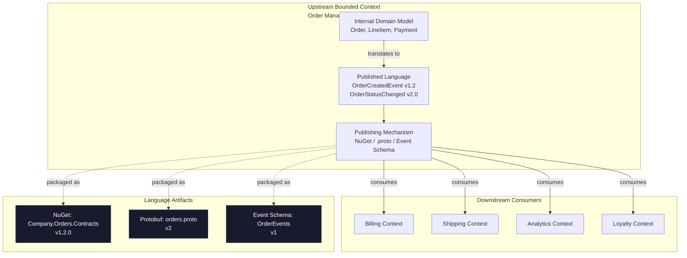
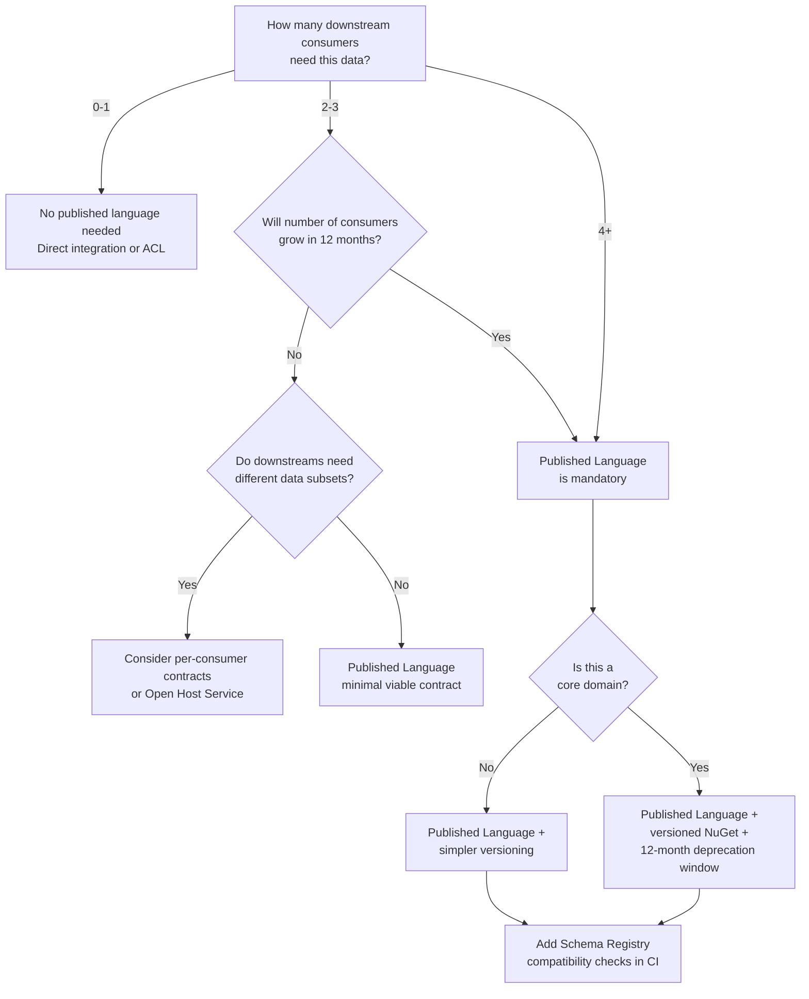

> [!success] Mastery Check
> - [ ] **Studied Well**
> - [ ] **Can explain the concept without notes**
> - [ ] **Can answer interview questions confidently**
> - [ ] **Can implement it in a real project**


# 7.041 — DDD — Context Mapping — Published Language

## Navigation

**Domain:** [[7 — System Design & Distributed Systems]] > **Group:** Domain-Driven Design
**Previous:** [[7.040 — DDD — Context Mapping — Open Host Service]] | **Next:** [[7.042 — DDD — Context Mapping — Separate Ways]]

### Prerequisites

- [[7.034 — DDD — Bounded Contexts — Context Map]] — context maps show relationship types between bounded contexts; Published Language is the contract artifact that enables safe, scalable integration across those relationships
- [[7.038 — DDD — Context Mapping — Conformist]] — Conformist downstream consumers depend on a Published Language being stable and versioned; without one, Conformist is simply tight coupling
- [[7.031 — DDD — Strategic vs Tactical Design]] — investing in a Published Language is a strategic commitment to multi-consumer integration; it shifts cost from per-consumer translation to upstream contract governance

### Where This Fits

Published Language is the **contract artifact** in DDD's context mapping repertoire — a well-defined, versioned information exchange format that any bounded context can consume. It sits between Open Host Service (the protocol/API that delivers the language) and Conformist (the downstream choice to accept the language directly). A team publishes a language when they have multiple downstream consumers and want to avoid per-consumer contract negotiation. Without it, every integration becomes a bespoke translation layer, and the cost of adding new consumers grows linearly rather than approaching zero marginal cost. In a .NET/Azure ecosystem, Published Language typically takes the form of shared NuGet packages, Protobuf `.proto` files, or Azure Event Grid event schemas.

## Core Mental Model

Published Language is the **upstream team's investment in a consumable contract** that decouples the number of downstream consumers from the integration cost. The upstream owns the schema, versioning policy, and evolution rules. Downstreams integrate against the published artifact — a NuGet package, a Protobuf schema, a JSON Schema document — without needing direct access to the upstream's internal model. The core invariant: **downstreams depend on the *language*, not on the *upstream boundary***.

### Classification

| Dimension | Classification | Rationale |
|---|---|---|
| Pattern Type | **Strategic DDD / Context Mapping** | Governs how bounded contexts share information contracts |
| Scope | **Cross-Bounded Context** | Defines a shared contract consumed across context boundaries |
| Primary Concern | **Integration Scalability** | Reduces marginal cost of adding new downstream consumers |
| Ownership | **Upstream-published** | Upstream owns and governs the language; downstreams consume |
| Cardinality | **1:N** | One published language supports N downstream consumers |
| Lifetime | **Permanent with versioning** | Evolves through versioned releases; deprecated only when domain changes |
| Versioning Overhead | **Moderate to High** | Requires schema evolution rules, deprecation windows, and migration guides |
| Downstream Coupling | **Loose to contract only** | Downstreams depend only on the language artifact, not the upstream internals |



### Key Properties

| Property | Value | Condition |
|---|---|---|
| Contract stability | Versioned language with defined evolution rules | Upstream enforces semantic versioning and deprecation windows |
| Downstream decoupling | Depends on published artifact, not upstream internals | Language captures only what downstreams need, not full upstream model |
| Integration cost per consumer | Near zero after language is published | Consumer uses existing artifact; no per-consumer negotiation |
| Schema evolution cost | Moderate — version negotiation, migration guides, co-existence | Handled through versioning strategy (additive changes, wire compatibility) |
| Upstream governance burden | High — owns schema, versioning, compatibility, communication | Multiple downstream consumers exist (typically 3+) |
| Consistency model | Downstreams see eventual consistency via events or read-model snapshots | Async delivery through message broker or event grid |
| .NET integration medium | NuGet packages, Protobuf code gen, Azure Schema Registry | Upstream publishes contracts as .NET assemblies or schema definitions |

## Deep Mechanics

### How It Works

The Published Language pattern operates as a **contract publication and consumption lifecycle**:

1. **Language Design** — Upstream identifies the information that downstreams need: event types, DTOs, enum definitions, and service contracts. This is NOT the upstream's domain model — it is a subset designed for external consumption.

2. **Serialization Format Choice** — The language is encoded in a technology-neutral format. Common choices: Google Protobuf (`.proto` files) for high-performance internal services, JSON Schema for REST APIs, Avro for Kafka event streams, or plain .NET DTOs in a NuGet package when all consumers are .NET.

3. **Versioning Policy** — The upstream defines how the language evolves: additive changes only within a major version (new optional fields, new enum values), breaking changes trigger a new major version, and deprecation windows are published (e.g., "v1 deprecated 12 months after v2 ships").

4. **Publication** — The language artifact is published to a shared repository: NuGet gallery (Azure Artifacts), Protobuf registry (Buf Schema Registry), or Azure Schema Registry for Event Grid/Service Bus.

5. **Consumption** — Downstreams reference the published artifact at a pinned version. CI/CD pipelines check for new versions and run contract verification tests before upgrading.

6. **Evolution** — The upstream announces new versions with a migration guide. Downstreams upgrade within the deprecation window. Breaking changes are managed through co-existence (both v1 and v2 endpoints/schemas live simultaneously).

### Failure Modes

**Failure Mode 1 — Published Language Mirrors Internal Model** — Upstream publishes internal domain entities directly. Changes to internal model (refactoring, renaming) become breaking changes for downstreams even when no semantic change occurred.

- **Detection**: Downstream teams complain about "upstream refactoring breaking our build." Upstream internal file renames cause downstream PRs.
- **Fix**: Design the published language as a separate concern. Define contracts in a dedicated namespace (`Company.Orders.Contracts`) that maps from but does not mirror the internal domain.
- **Prevention**: Architecture test enforcing that published contract types do not reference internal domain types.

**Failure Mode 2 — No Versioning Strategy** — Upstream publishes contracts without versioning. Any change is potentially breaking. Downstreams fear upgrading and pin to specific commits.

- **Detection**: No version property on published artifacts. Downstreams use floating version ranges or direct Git submodule references.
- **Fix**: Adopt semantic versioning. Define additive vs. breaking change rules. Communicate deprecation windows.
- **Prevention**: CI pipeline rejects publications without version increment or changelog entry.

**Failure Mode 3 — Oversized Language** — Upstream publishes everything "in case someone needs it." Downstreams depend on parts of a large contract. Understanding the full language takes longer than building the integration.

- **Detection**: Published NuGet package is >2 MB. Contract has 50+ message types for 3 downstream consumers. Each consumer uses <10% of the types.
- **Fix**: Publish focused contracts per consumer group or per subdomain. Use composition rather than one monolithic schema.
- **Prevention**: Review published language surface area quarterly. Remove types with zero consumers after 6 months.

**Failure Mode 4 — Schema Drift Without Detection** — Upstream changes the language but downstreams don't notice until runtime deserialization fails.

- **Detection**: Consumer-side deserialization exceptions spike. Dead-letter queues grow.
- **Fix**: Consumer-driven contract testing (Pact). Each downstream publishes expectations. Upstream CI validates against all consumer expectations before deploying.
- **Prevention**: Schema Registry with compatibility checks (forward, backward, full) enforced at publish time.

### .NET and Azure Integration

- **Azure Artifacts**: Host NuGet packages containing published DTOs, event records, and service interfaces
- **Azure Schema Registry**: Store and validate Avro/JSON schemas for Event Hubs and Service Bus
- **Azure Event Grid**: Publish domain events using CloudEvents schema with versioned event types
- **Azure API Management**: Version-routing for REST API published languages; enforce contract compliance at gateway
- **Protobuf + gRPC**: .NET gRPC client uses `.proto` files via `Protobuf` SDK; code-generated types are the published language
- **System.Text.Json Source Generators**: Compile-time serialization code for JSON-based published languages

```csharp
// Upstream publishes event schema as a NuGet package
namespace Company.Orders.Contracts.Events;

/// <summary>
/// Published when an order is placed. Part of the Orders Published Language v1.2.
/// Downstream consumers receive this event and MUST NOT depend on internal order
/// domain types. Only fields documented in this contract are supported.
/// </summary>
public sealed record OrderPlaced
{
    public string SchemaVersion { get; init; } = "1.2";
    public string OrderId { get; init; } = string.Empty;
    public string CustomerId { get; init; } = string.Empty;
    public decimal TotalAmount { get; init; }
    public string Currency { get; init; } = "USD";
    public IReadOnlyList<OrderLineItem> LineItems { get; init; } = [];
    public DateTimeOffset PlacedAt { get; init; }
}

public sealed record OrderLineItem
{
    public string ProductId { get; init; } = string.Empty;
    public string ProductName { get; init; } = string.Empty;
    public int Quantity { get; init; }
    public decimal UnitPrice { get; init; }
}
```

## Production Patterns and Implementation

### Primary Implementation

```csharp
namespace Company.Orders.Contracts; // Published Language — NOT the domain model

// Published DTOs for downstream consumption
public sealed record OrderSummary
{
    public string OrderId { get; init; } = string.Empty;
    public string Status { get; init; } = string.Empty;
    public decimal Total { get; init; }
    public string Currency { get; init; } = "USD";
    public int ItemCount { get; init; }
    public DateTimeOffset LastUpdated { get; init; }
}

public sealed record CreateOrderRequest
{
    public string CustomerId { get; init; } = string.Empty;
    public IReadOnlyList<CreateOrderLineItem> Items { get; init; } = [];
    public string Currency { get; init; } = "USD";
}

public sealed record CreateOrderLineItem
{
    public string ProductId { get; init; } = string.Empty;
    public int Quantity { get; init; }
}

public sealed record CreateOrderResponse
{
    public string OrderId { get; init; } = string.Empty;
    public string Status { get; init; } = "Pending";
    public IReadOnlyList<string> Warnings { get; init; } = [];
}

// Service interface — part of the published contract
public interface IOrderContractService
{
    Task<CreateOrderResponse> CreateOrderAsync(CreateOrderRequest request, CancellationToken ct);
    Task<OrderSummary> GetOrderAsync(string orderId, CancellationToken ct);
}
```

```csharp
// Upstream: translates domain model to published language
namespace OrderManagement.Application.ContractMapping;

using Company.Orders.Contracts;
using OrderManagement.Domain.Orders;

public sealed class OrderContractMapper
{
    public OrderPlaced ToPublishedEvent(Order order) => new()
    {
        SchemaVersion = "1.2",
        OrderId = order.Id.Value,
        CustomerId = order.CustomerId.Value,
        TotalAmount = order.Total.Amount,
        Currency = order.Total.Currency,
        LineItems = order.Items.Select(i => new OrderLineItem
        {
            ProductId = i.ProductId.Value,
            ProductName = i.ProductName,
            Quantity = i.Quantity,
            UnitPrice = i.UnitPrice.Amount
        }).ToList(),
        PlacedAt = order.PlacedAt
    };

    public OrderSummary ToSummary(Order order) => new()
    {
        OrderId = order.Id.Value,
        Status = order.Status.ToString(),
        Total = order.Total.Amount,
        Currency = order.Total.Currency,
        ItemCount = order.Items.Count,
        LastUpdated = DateTimeOffset.UtcNow
    };
}
```

### Configuration and Wiring

```csharp
// Program.cs — upstream publishes the contract service
builder.Services.AddSingleton<OrderContractMapper>();

builder.Services.AddScoped<IOrderContractService>(sp =>
{
    var mapper = sp.GetRequiredService<OrderContractMapper>();
    var mediator = sp.GetRequiredService<IMediator>();
    return new OrderContractService(mediator, mapper);
});

// Downstream consumer — registers typed client against published contract
builder.Services.AddRefitClient<IOrderContractService>()
    .ConfigureHttpClient(c => c.BaseAddress = new Uri("https://orders.company.com/api/v2/"))
    .AddStandardResilienceHandler(); // Polly 8 built-in
```

### Common Variants

**Variant 1 — Protobuf Published Language (Polyglot Environments)**

```protobuf
syntax = "proto3";
package company.orders.contracts.v2;

message OrderPlacedEvent {
  string schema_version = 1;
  string order_id = 2;
  string customer_id = 3;
  double total_amount = 4;
  string currency = 5;
  repeated LineItem line_items = 6;
  google.protobuf.Timestamp placed_at = 7;

  message LineItem {
    string product_id = 1;
    string product_name = 2;
    int32 quantity = 3;
    double unit_price = 4;
  }
}
```

```csharp
// .NET consumer of Protobuf published language
using Company.Orders.Contracts.V2;
using Google.Protobuf;

public sealed class OrderEventConsumer : BackgroundService
{
    private readonly EventHubConsumerClient _consumer;

    protected override async Task ExecuteAsync(CancellationToken ct)
    {
        await foreach (var partitionEvent in _consumer.ReadEventsAsync(ct))
        {
            var orderPlaced = OrderPlacedEvent.Parser.ParseFrom(
                partitionEvent.Data.EventBody.ToBytes());
            // Use the Protobuf-generated type directly — it IS the published language
            await _billingService.HandleOrderPlacedAsync(orderPlaced, ct);
        }
    }
}
```

**Variant 2 — JSON Schema Published Language (REST API)**

```json
{
  "$schema": "https://json-schema.org/draft/2020-12/schema",
  "title": "OrderPlacedEvent",
  "type": "object",
  "properties": {
    "schemaVersion": { "type": "string", "const": "1.2" },
    "orderId": { "type": "string", "pattern": "^ORD-" },
    "customerId": { "type": "string" },
    "totalAmount": { "type": "number", "minimum": 0 },
    "lineItems": {
      "type": "array",
      "items": { "$ref": "#/$defs/lineItem" }
    }
  },
  "required": ["orderId", "customerId", "totalAmount"],
  "$defs": {
    "lineItem": {
      "type": "object",
      "properties": {
        "productId": { "type": "string" },
        "quantity": { "type": "integer", "minimum": 1 }
      },
      "required": ["productId", "quantity"]
    }
  }
}
```

### Real-World .NET Ecosystem Example

**Azure Event Grid** uses a Published Language pattern natively — events follow the CloudEvents 1.0 specification with an `EventType` field that consumers filter on. Azure SDK publishes event schemas in a dedicated NuGet package (`Azure.Messaging.EventGrid`). Producers declare `EventType` strings as their Published Language. Consumers subscribe with event type filters. Schema validation is optional via Azure Schema Registry.

**Protobuf + gRPC** is the most common Published Language implementation in .NET microservice environments. The `.proto` file is the canonical language definition. Code generation via `protoc` produces first-class .NET types. The Buf Schema Registry provides centralized schema management with breaking change detection in CI.

## Gotchas and Production Pitfalls

### Pitfall 1 — Published Language Mirrors Domain Model

**Pitfall:** The upstream team publishes internal domain entity types as the contract. An internal rename (`Customer` to `Account`) becomes a breaking change even though the semantic contract is unchanged.

```csharp
// ❌ Published language IS the domain model
namespace OrderManagement.Domain
{
    public sealed class Order // Domain entity used as published contract
    {
        public Guid Id { get; private set; }
        public string Status { get; private set; }
        // Any refactoring here breaks downstreams
    }
}

// ❌ Downstream references domain type directly
// using OrderManagement.Domain;
```

**Symptom:** Downstream teams get build breaks from upstream refactoring that has no semantic impact. Trust erodes. Downstreams pin to specific commits.

**Fix:** Design a dedicated published contract that is semantically stable even when the domain model changes.

```csharp
// ✅ Published language — dedicated types, NOT the domain model
namespace Company.Orders.Contracts
{
    public sealed record OrderSnapshot
    {
        public string OrderId { get; init; } = string.Empty;
        public string Status { get; init; } = string.Empty;
        public decimal Total { get; init; }
        // Stable contract — internal refactoring doesn't change this
    }
}
```

**Cost of not fixing:** Downstream teams lose trust in the published language. They build ACLs against the published language itself (defeating its purpose), or they fork and maintain their own copy. Integration cost goes up, not down.

### Pitfall 2 — Oversized Single Contract

**Pitfall:** Publishing one monolithic contract that contains every type "in case someone needs it." The contract becomes a kitchen sink.

```csharp
// ❌ Single massive contract namespace with unrelated types
namespace Company.MegaContracts
{
    public sealed record OrderCreated { /* ... */ }
    public sealed record InvoiceGenerated { /* ... */ }
    public sealed record ShipmentTracked { /* ... */ }
    public sealed record CustomerUpdated { /* ... */ }
    public sealed record PaymentProcessed { /* ... */ }
    // 47 types total, 3 domains mixed together
}
```

**Symptom:** NuGet package is 3+ MB. Downstreams reference the full package but use <5% of types. Upgrading requires testing the entire surface area. Breaking changes in any type block all downstreams.

**Fix:** Split contracts per subdomain or bounded context.

```csharp
// ✅ Focused contracts per subdomain
// NuGet: Company.Orders.Contracts
namespace Company.Orders.Contracts { /* order-related types only */ }

// NuGet: Company.Billing.Contracts
namespace Company.Billing.Contracts { /* billing-related types only */ }
```

**Cost of not fixing:** A breaking change in a rarely-used shipping type blocks the billing team's deployment. Coordination overhead grows with the number of unrelated types in the contract.

### Pitfall 3 — No Deprecation Window for Breaking Changes

**Pitfall:** Upstream removes or renames a field in the published language without warning. Downstreams discover the break at runtime.

```csharp
// ❌ v1.0 contract
public sealed record OrderPlaced
{
    public string OrderId { get; init; }
}

// ❌ v2.0 — renamed with zero notice
public sealed record OrderPlaced
{
    public string Id { get; init; } // Renamed from OrderId — immediate break
}
```

**Symptom:** Downstream deserialization fails after deployment. PagerDuty alerts. 500 errors on order processing.

**Fix:** Maintain backward compatibility within a major version. Announce deprecations with a defined window.

```csharp
// ✅ v1.2 — both old and new field names supported during deprecation window
public sealed record OrderPlaced
{
    [Obsolete("Use OrderId instead. Will be removed in v3.0 (target: 2027-06)")]
    public string Id { get; init; } = string.Empty;

    public string OrderId { get; init; } = string.Empty;
}
```

**Cost of not fixing:** Downstreams pin to v1.0 forever. They never get bug fixes or new features because upgrading always breaks something. Shadow IT emerges as teams build private copies of the contract.

### Pitfall 4 — No Schema Registry or Contract Validation in CI

**Pitfall:** The published language is defined in code but never validated for backward compatibility. No one detects that a PR introduces a breaking change until downstreams fail at runtime.

```csharp
// ❌ No schema validation — any change ships without compatibility check
// PR adds a required field to OrderPlaced — existing consumers have
// no value for this field and deserialization fails
```

**Symptom:** Downstream deserialization errors in production after an upstream deployment. No CI gate caught the break.

**Fix:** Use Azure Schema Registry with compatibility enforcement, or add a CI step that validates contract changes.

```csharp
// ✅ CI step: validate schema compatibility before publishing
public sealed class SchemaCompatibilityValidator
{
    public bool IsBackwardCompatible(Type oldContract, Type newContract)
    {
        var oldProps = oldContract.GetProperties().Select(p => p.Name).ToHashSet();
        var newProps = newContract.GetProperties().Select(p => p.Name).ToHashSet();

        // Breaking: removed property
        foreach (var prop in oldProps.Except(newProps))
        {
            if (oldContract.GetProperty(prop)?.GetCustomAttribute<ObsoleteAttribute>() is null)
                return false;
        }
        return true;
    }
}
```

**Cost of not fixing:** A single breaking change in a widely-consumed contract can break 10+ downstream services simultaneously. The blast radius of an unvalidated schema change is the entire downstream ecosystem.

## Tradeoffs and Decision Framework

### Tradeoff Matrix

| Dimension | Published Language | Open Host Service | Shared Kernel | Separate Ways |
|---|---|---|---|---|
| Integration scalability | High — 1:N with near-zero marginal cost | High — 1:N with protocol SDKs | Low — 1:1 or small group | None — no integration |
| Upfront investment | Moderate (schema design, tooling) | High (protocol, SDK, docs, versioning) | Moderate (joint model) | None |
| Downstream autonomy | High — pin any version | High — consume protocol any way | Low — must coordinate changes | Very High |
| Upstream governance burden | High — owns evolution rules | Very High — owns protocol + SDK | Shared — joint ownership | None |
| Schema evolution complexity | Moderate — versioning policy | High — protocol + schema versioning | Low — coordinated changes | None |
| .NET ecosystem fit | Excellent (NuGet, Protobuf) | Excellent (gRPC, Refit, NSwag) | Moderate (shared assembly) | N/A |
| Best for | 3+ downstream consumers, stable domain | 5+ downstream consumers, protocol needed | 2 teams, close collaboration | Irreconcilable models |

### Decision Flowchart



### When to Apply

- [ ] 3 or more downstream bounded contexts need the same information
- [ ] New downstream consumers are expected within 12 months
- [ ] Upstream team has capacity to own schema governance (versioning, deprecation, migration guides)
- [ ] Organization has tooling for artifact publication (Azure Artifacts, Buf, Schema Registry)
- [ ] Downstream teams can be trusted to upgrade within deprecation windows
- [ ] The domain knowledge the language conveys is stable enough to warrant formal schema investment

### When NOT to Apply

- [ ] Only 1 downstream consumer — a direct contract or ACL is cheaper
- [ ] Domain is rapidly evolving (weekly schema changes) — investment in formal versioning won't pay back
- [ ] No organizational commitment to artifact repository tooling
- [ ] Downstream teams cannot or will not manage version upgrades
- [ ] The integration is temporary (<6 months)
- [ ] Upstream team has no bandwidth for consumer communication and migration support

### Scale Thresholds

- **Worth considering above ~2 downstream consumers** — at 3+, per-consumer contract negotiation is more expensive than a published language
- **Required above ~5 downstream consumers** — without a published language, schema drift across consumers becomes unmanageable; each consumer integrates against a slightly different implicit contract
- **Schema Registry justified above ~10 consumers** — manual compatibility review doesn't scale; automated schema validation in CI becomes a necessity
- **Deprecation window minimum:** 6 months for internal consumers, 12 months for external; shorter windows cause upgrade fatigue and pinning behavior
- **Contract size threshold:** if the published NuGet package exceeds 1 MB or the `.proto` file exceeds 2,000 lines, split into focused sub-contracts

## Interview Arsenal

### Question Bank

1. What is Published Language in DDD and what problem does it solve?
2. How does Published Language differ from Open Host Service?
3. What versioning strategy do you use for a published language consumed by 10+ teams?
4. How do you detect and prevent breaking changes in a published language?
5. Compare Published Language with Shared Kernel — when would you choose each?
6. You're designing a platform that 15 microservices will integrate with. Walk through how you design and govern the published language.
7. How does the published language evolve when you have consumers on different major versions simultaneously?
8. What happens when two downstream consumers need conflicting changes to the published language?

### Spoken Answers

**Q: What is Published Language in DDD and what problem does it solve?**

> **Average answer:** Published Language is when a bounded context publishes a shared language that other contexts can use to communicate. It's like a shared schema or API contract. It solves the problem of multiple teams needing the same data format.

> **Great answer:** Published Language is the strategic DDD pattern where an upstream bounded context invests in a well-defined, versioned information exchange contract — typically a NuGet package, Protobuf schema, or event schema — that multiple downstream bounded contexts consume without individual negotiation. The key insight is that Published Language decouples the *number of consumers* from the *integration cost*. Without it, adding the 5th downstream consumer means either a 5th bespoke translation layer or the 5th team conforming to an implicit, undocumented contract that exists only in the upstream team's heads. The upstream gives up the freedom to change their internal model arbitrarily in exchange for integration scalability. In a .NET shop, this typically means a dedicated Contracts NuGet package published to Azure Artifacts, with semantic versioning, additive-only changes within a major version, and a published deprecation window so downstreams know exactly how long they have to migrate.

**Q: How does Published Language differ from Open Host Service?**

> **Average answer:** Published Language is the data format, Open Host Service is the API. They're related but different. Open Host Service is the protocol that delivers the Published Language.

> **Great answer:** Published Language and Open Host Service are complementary but solve different concerns. Published Language is the *what* — the schema, the DTO definitions, the event contract. Open Host Service is the *how* — the protocol, the transport binding, the authentication mechanism, the rate limiting policy. You can have a Published Language without an Open Host Service (publish a NuGet package that downstreams use to deserialize messages from a shared queue), and you can have an Open Host Service without a formal Published Language (expose a REST API with OpenAPI but no independently versioned schema artifact). In practice, they're strongest together: Open Host Service delivers the Published Language over a well-defined protocol. Azure Event Grid is a concrete example — CloudEvents with a defined schema (Published Language) delivered over HTTP webhooks or AMQP (Open Host Service). The decision rule: invest in Published Language first when the schema is complex and stable; invest in Open Host Service first when transport concerns (auth, throttling, routing) dominate.

**Q: How do you handle two downstream consumers needing conflicting changes to the published language?**

> **Great answer:** This is the hardest governance problem with Published Language, and it's why the pattern fails without strong ownership. The answer depends on the nature of the conflict. If Consumer A needs a new field and Consumer B is unaffected, add the field optionally — additive changes are free. If Consumer A needs a field removed and Consumer B relies on it, you either maintain both fields through a deprecation window (mark Consumer A's field as `[Obsolete]` with a removal date 12 months out) or publish two focused contracts — one for each consumer group — that share a common base. The worst case is when both consumers need the same field to mean different things — that's a sign that the published language has been pulled in conflicting semantic directions and should be split into separate contracts per subdomain. I've seen this happen with a monolithic "Customer" contract that both Marketing and Billing consumed — Marketing wanted "segment" as demographic group, Billing wanted it as payment risk tier. The fix was two focused contracts (`CustomerMarketing` and `CustomerBilling`) each with their own semantics, both mapping from the same upstream Customer domain model.

### System Design Interview Trigger

If an interviewer describes a platform team that supports 10+ internal microservices and asks about "shared contracts," "schema governance," or "how do you evolve an API without breaking all consumers," they are probing your understanding of Published Language as a strategic integration pattern. The deeper question is whether you understand that integration at scale requires upstream investment in contract stability, not just downstream translation layers. They want to hear about versioning strategy, deprecation windows, additive change discipline, and how you detect breaking changes in CI before they reach production.

### Comparison Table

| | Published Language | Open Host Service |
|---|---|---|
| Core guarantee | Stable, versioned information contract | Stable, versioned protocol/API |
| Trade-off | Upstream internal model flexibility for contract stability | Protocol investment for consumer scalability without negotiation |
| .NET implementation | NuGet contract packages, Protobuf `.proto` files | gRPC services, Refit clients, APIM policies |
| Failure mode | Contract mirrors internal model (false breaking changes) | Protocol evolves but language doesn't (unused capabilities) |
| When to choose | Complex schema, stable domain, 2+ consumers | Transport concerns dominate, 5+ consumers |

## Architecture Decision Record

**Status:** Accepted

**Context:** The Order Management team (8 engineers) needs to expose order lifecycle data to 6 downstream bounded contexts: Billing, Shipping, Analytics, Loyalty, Fraud Detection, and Customer Support. Each downstream currently builds its own integration — some consume database views, others parse application logs, one has direct access to the order domain assembly. This has caused 4 production incidents in the past 6 months from schema drift. The team needs a governed, scalable integration contract.

**Options Considered:**

1. **Published Language (NuGet + Event Schema)** — Dedicated `Company.Orders.Contracts` NuGet package with versioned DTOs and event records. Azure Event Grid for event delivery with Schema Registry validation.
2. **Open Host Service Only** — Expose a gRPC API with Protobuf schemas. No independent schema artifact. Downstreams generate clients from the `.proto` file.
3. **Shared Kernel** — Move the core order domain model to a shared assembly that all downstreams reference directly.
4. **Separate Ways** — Each downstream continues building their own integration. No shared contract.

**Decision:** Adopt Option 1 — Published Language with NuGet packages for sync contracts and Azure Event Grid with Schema Registry for async events. Option 2 (OHS only) is rejected because the primary integration is event-driven, not request-driven — downstreams need event schemas more than RPC contracts. Option 3 (Shared Kernel) is rejected because it would couple 6 downstreams to the upstream domain model, making any domain refactoring impossible. Option 4 (Separate Ways) is rejected because the current cost of ungoverned integration is already higher than the investment in a published language.

**Consequences:**
- ✅ Downstreams have a stable, versioned contract they can pin to
- ✅ Breaking changes are detected in CI via Schema Registry compatibility checks
- ✅ New consumers can integrate in days rather than weeks by referencing existing contracts
- ⚠️ Upstream team now owns schema governance — every PR that touches contracts must be reviewed for compatibility
- ⚠️ Downstreams must be convinced to upgrade within deprecation windows (organizational challenge)
- ❌ Upstream can no longer freely refactor the internal domain model without mapping to the published contract

**Review Trigger:** Revisit this decision if (a) downstream consumers exceed 15 and contract governance overhead becomes a bottleneck — consider splitting into per-subdomain contracts; (b) the organization adopts a company-wide schema registry standard (e.g., Buf) that changes the tooling landscape; or (c) the number of major versions in active support exceeds 3 — indicates the versioning strategy is producing too much co-existence burden and the language should be restructured.

## Self-Check

### Conceptual Questions

1. What is the core invariant maintained by the Published Language pattern?

<details>
<summary>Answer</summary>
Downstreams depend on the language artifact (NuGet package, Protobuf schema, event contract), not on the upstream's internal domain model. The upstream can refactor its internals without breaking downstreams as long as the published contract remains compatible.
</details>

2. How does Published Language differ from Open Host Service?

<details>
<summary>Answer</summary>
Published Language is the *what* — the schema and contract definitions. Open Host Service is the *how* — the protocol and transport. PL defines the shape of the data; OHS defines how it's delivered. They're complementary: OHS delivers PL.
</details>

3. When is Published Language over-engineering?

<details>
<summary>Answer</summary>
When there are 1-2 downstream consumers, the integration is temporary (<6 months), or the domain changes so rapidly that the schema versioning overhead exceeds the cost of per-consumer integration.
</details>

4. What is the most common failure mode of Published Language?

<details>
<summary>Answer</summary>
The published contract mirrors the internal domain model. Internal renames or refactoring become breaking changes for downstreams even when semantics are unchanged. Fix: design the published language as a dedicated abstraction, not a projection of internal types.
</details>

5. How do you detect breaking changes in a published language at CI time?

<details>
<summary>Answer</summary>
Use Azure Schema Registry with compatibility mode (forward, backward, full), or add a custom CI step that compares the new contract types against the published version using reflection. Consumer-driven contract testing (Pact) where downstreams publish their expectations is another approach.
</details>

6. What is the relationship between Published Language and Conformist?

<details>
<summary>Answer</summary>
They are complementary. Published Language is the upstream's investment in a consumable contract. Conformist is the downstream's decision to accept that contract without translation. Published Language makes Conformist safe — without it, Conformist is just tight coupling to an undocumented internal model.
</details>

7. At what scale does Published Language become necessary?

<details>
<summary>Answer</summary>
Around 3+ downstream consumers. Below that, per-consumer contracts or direct ACLs are cheaper. Above 5 consumers, a formal published language with schema registry validation is borderline mandatory.
</details>

8. How does Published Language connect to Azure Event Grid?

<details>
<summary>Answer</summary>
Azure Event Grid uses CloudEvents 1.0 as its published language. Producers declare event types (strings) as their published schema. Consumers subscribe with event type filters. Azure Schema Registry optionally validates payload schemas. Event Grid is a concrete Azure implementation of the Published Language pattern at the eventing layer.
</details>

9. What is the non-obvious production consequence of a published language with too many optional fields?

<details>
<summary>Answer</summary>
Downstreams make assumptions about when optional fields are populated. The upstream may populate a field only in certain scenarios. Downstreams rely on it unconditionally. When it's absent, their logic produces incorrect results without errors. This is semantic drift through optional fields — harder to detect than a build break.
</details>

10. Explain Published Language to a non-technical stakeholder in 60 seconds.

<details>
<summary>Answer</summary>
"Imagine four different teams in our company all need to know when an order is placed — Billing needs the total, Shipping needs the address, Analytics needs the products, and Support needs the customer. Without coordination, each team builds their own way to get this data, and they all break in different ways when Order Management changes. A Published Language is a formal agreement: Order Management publishes one official 'order placed' document that every team uses. The cost is that Order Management has to tell everyone before they change the document format. The benefit is that adding a 5th team takes near-zero effort, and everyone stops breaking when orders change."
</details>

### Scenario Challenges

**Scenario 1 — Diagnose the problem**
A platform team publishes `Company.Platform.Contracts` v3.0 with 120 DTO types covering 5 different domains (user profiles, notifications, content, analytics, billing). The billing team references this package to consume 3 invoice-related types. After a platform deployment, the billing team's service fails to start because a content-related DTO was modified in a breaking way. Outage: 22 minutes.

<details>
<summary>Diagnosis</summary>

**Root cause:** Monolithic published language with unrelated types in a single package. A breaking change in a type the billing team doesn't use blocked their deployment.

**Evidence:** Billing service logs show `JsonSerializationException` on `ContentMetadataDTO` — a type billing doesn't use but is in the same assembly.

**Fix:** Split `Company.Platform.Contracts` into focused packages: `Company.Platform.Contracts.Billing`, `Company.Platform.Contracts.Content`, etc. Each package independently versioned.

**Prevention:** Monorepo contract packages are fine as long as (a) each bounded context's types are in a separate assembly/NuGet package, or (b) a single package but with strict additive-only change policy that guarantees no consumer breaks from unrelated type changes.
</details>

**Scenario 2 — Design decision**
You are designing the integration between a new Order Management service (upstream) and 8 existing downstream services (Billing, Shipping, Fraud, Loyalty, Analytics, Tax, Notification, Search). The system handles ~15,000 orders per hour. Team size: 4 engineers. What published language approach do you choose?

<details>
<summary>Decision and Reasoning</summary>

**Choice:** Azure Event Grid with CloudEvents schema + dedicated `Company.Orders.Contracts` NuGet package for event types. Protobuf for any request-response contracts (order status queries).

**Tradeoffs accepted:** Upstream team owns schema governance (estimated 10% of sprint capacity). 12-month deprecation window means maintaining old versions temporarily. Not all downstreams will upgrade promptly — we accept this and provide LTS releases.

**Implementation sketch:**
```csharp
// Upstream publishes event types
namespace Company.Orders.Contracts.Events;

public sealed record OrderSubmittedEvent
{
    public string SchemaVersion { get; init; } = "1.0";
    public string OrderId { get; init; }
    public string CustomerId { get; init; }
    public decimal Total { get; init; }
    public string Currency { get; init; }
    public DateTimeOffset SubmittedAt { get; init; }
}

// Downstream consumer — focused contract reference
// Only references Company.Orders.Contracts — NOT the upstream domain assembly
using Company.Orders.Contracts.Events;

public sealed class BillingOrderHandler
{
    public async Task HandleAsync(OrderSubmittedEvent evt, CancellationToken ct)
    {
        await _billingService.CreateInvoiceAsync(evt.OrderId, evt.Total, evt.Currency, ct);
    }
}
```
</details>

**Scenario 3 — Failure mode**
The Fraud Detection team depends on `Company.Orders.Contracts` v1.5. The upstream releases v2.0 with a new required field `PaymentMethodType`. Fraud Detection, still on v1.5, starts getting deserialization errors for orders with `PaymentMethodType = "buy_now_pay_later"`. Investigation reveals the upstream started populating this field 6 months ago but it was optional in v1.5. The v2.0 change made it required.

<details>
<summary>Investigation and Fix</summary>

**Investigation steps:** (1) Check Fraud Detection's NuGet package version — still on v1.5. (2) Check v2.0 release notes — `PaymentMethodType` changed from optional to required. (3) Check if upstream still supports v1.5 schema — it stopped populating optional fields after a "cleanup" deployment.

**Confirming evidence:** Fraud Detection logs show `JsonSerializationException: Required property 'PaymentMethodType' not found`. Upstream no longer populates optional fields in v1.5 schema responses.

**Immediate mitigation:** Roll back upstream deployment that removed optional field population. Restore backward compatibility for v1.5 consumers.

**Permanent fix:** (1) Upstream maintains backward compatibility for any version still within its deprecation window. (2) CI pipeline validates that all published versions within the deprecation window are still supported. (3) Fraud Detection schedules migration to v2.0 within 1 sprint. (4) Add monitoring: alert when any consumer is still on a version older than the deprecation window.
</details>

**Scenario 4 — Scale it**
Your system currently has 6 downstream consumers of a published language. Within 18 months, the company plans to have 25 microservices that consume order events. Your current approach of manually reviewing contract PRs for backward compatibility doesn't scale. How does the published language evolve?

<details>
<summary>Scaling Strategy</summary>

**Bottleneck this addresses:** Manual contract review is the bottleneck — at 25 consumers, one upstream team cannot know all downstream usage patterns.

**How it helps:** (1) Adopt consumer-driven contract testing (Pact) — each downstream publishes their usage expectations. Upstream CI validates against all consumer contracts before deploying. (2) Adopt Azure Schema Registry with `forward` compatibility mode — guarantees existing consumers won't break. (3) Split monolithic contract into per-subdomain packages — billing events, shipping events, fraud events — each independently versioned.

**What it does not solve:** Downstream teams that refuse to upgrade within deprecation windows — that's an organizational problem requiring escalation. Also doesn't solve semantic drift (same field, different interpretation).

**Implementation order:** (1) Schema Registry + CI validation (next sprint). (2) Consumer-driven contract testing (within quarter). (3) Contract splitting (after consumer contracts are in place, since they reveal actual usage patterns). (4) Automate deprecation window enforcement: CI rejects publishing a new major version if any consumer hasn't acknowledged the migration.
</details>

**Scenario 5 — Interview simulation**
The interviewer says: "You're the architect for a platform team. 12 microservice teams consume customer profile data from your service. Each team currently calls your API directly with their own interpretation of the customer model. There have been 5 incidents this year from teams misinterpreting fields. Design the solution."

<details>
<summary>Model Response</summary>

"Before I propose a solution, I need to clarify scope. Are these 12 teams all within the same company, or are some external? Do they need read-only data or do they also write? And what's the primary pain — schema drift, misinterpretation of semantics, or both?

Assuming internal teams with read-heavy access, here's my approach:

We implement a **Published Language** — a formal, versioned contract that governs how customer profile data flows from our platform to all 12 consumers. The key decision is the artifact format. Since all teams are .NET-based, I'd publish a NuGet package — `Company.CustomerPlatform.Contracts` — to Azure Artifacts with strict semantic versioning. This package contains event records and DTOs that represent the customer profile, not our internal domain model.

The versioning policy: additive changes only within a major version. New optional fields are free. Renaming a field requires marking the old one `[Obsolete]` with a 12-month removal date. Breaking changes require a major version bump and a migration guide.

The delivery mechanism: Azure Event Grid for eventing (CustomerProfileUpdated, AddressChanged) and a gRPC API for synchronous lookups. The `.proto` file lives alongside the NuGet package.

The governance machinery: (1) Consumer-driven contract testing via Pact — each of the 12 teams publishes their usage expectations to a Pact Broker. Our CI validates that no deployment breaks any consumer contract. (2) Azure Schema Registry with forward compatibility checking on every build. (3) A changelog and migration guide published with each new version.

The tradeoff: we give up the ability to freely refactor our internal customer model. Every internal change now requires a mapping step to the published contract. That's the cost of integration at scale, and at 12 consumers, it's a cost we must accept.

The failure mode I'm proactively addressing: the risk that the published language mirrors our internal model. We prevent this by keeping the contract types in a separate namespace and assembly from our domain model, with a mapping layer between them. An architecture test enforces that no domain type leaks into the contracts assembly."
</details>
