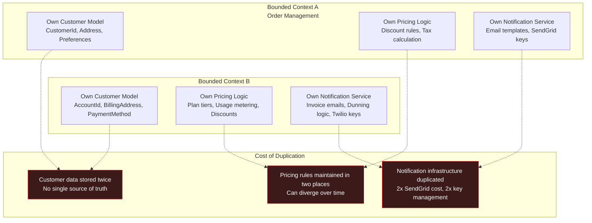
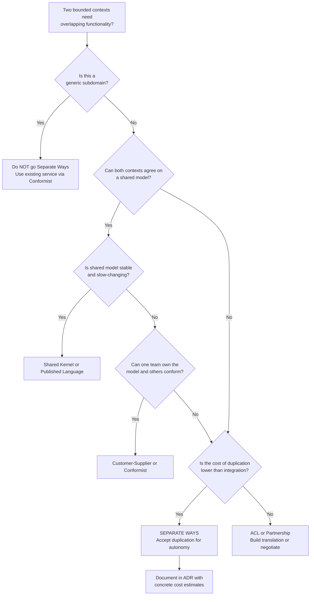

> [!success] Mastery Check
> - [ ] **Studied Well**
> - [ ] **Can explain the concept without notes**
> - [ ] **Can answer interview questions confidently**
> - [ ] **Can implement it in a real project**


# 7.042 — DDD — Context Mapping — Separate Ways

## Navigation

**Domain:** [[7 — System Design & Distributed Systems]] > **Group:** Domain-Driven Design
**Previous:** [[7.041 — DDD — Context Mapping — Published Language]] | **Next:** [[7.043 — DDD — Entities — Identity and Lifecycle]]

### Prerequisites

- [[7.034 — DDD — Bounded Contexts — Context Map]] — Separate Ways is one of the eight context map relationship types; understanding when to explicitly declare non-integration is as important as knowing when to integrate
- [[7.031 — DDD — Strategic vs Tactical Design]] — Separate Ways is a strategic decision about resource allocation; it accepts duplication costs to preserve model purity and team autonomy
- [[7.062 — DDD — Subdomains — Core, Supporting, Generic]] — the cost-benefit of Separate Ways depends on whether the duplicated functionality is core (worth the investment in autonomy) or generic (wasteful duplication)

### Where This Fits

Separate Ways is the **deliberate decision to not integrate** two bounded contexts — each team builds and maintains its own version of overlapping functionality. It is the simplest relationship on the context map: no integration code, no translation layer, no shared contracts, no coordination overhead. It becomes the right choice when the cost of integration (translation layers, negotiation overhead, release coordination, model corruption) exceeds the cost of duplication (redundant development, parallel maintenance, data inconsistency). In practice, Separate Ways appears when two core domains have irreconcilable models, when organizational misalignment prevents negotiation, or when the integration would couple teams with incompatible release cadences.

## Core Mental Model

Separate Ways is the **context mapping choice of zero integration** — two bounded contexts deliberately build and maintain independent implementations of overlapping functionality rather than sharing a model or translating between models. The core invariant: **the cost of integration exceeds the cost of duplication**. This is not the absence of a decision — it is an explicit architectural choice that prioritizes team autonomy, model purity, and independent deployability over data consistency and code reuse.

### Classification

| Dimension | Classification | Rationale |
|---|---|---|
| Pattern Type | **Strategic DDD / Context Mapping** | Governs relationship between bounded contexts |
| Scope | **Cross-Bounded Context** | Declares no integration will exist between two contexts |
| Primary Concern | **Autonomy over efficiency** | Accepts duplication costs for team independence |
| Ownership | **Fully independent** | Each team owns their entire solution independently |
| Cardinality | **N:N (with duplication)** | Every context that needs a capability builds it |
| Lifetime | **Permanent or transitional** | Can be permanent (irreconcilable models) or temporary (until integration becomes viable) |
| Coordination Overhead | **Near zero** | No integration meetings, no contract negotiation, no release coordination |
| Duplication Cost | **High — runs throughout system lifecycle** | Build + test + maintain + operate duplicate capabilities |



### Key Properties

| Property | Value | Condition |
|---|---|---|
| Team autonomy | Maximum — no external dependencies on another team's model | Both teams own their full stack independently |
| Integration cost | Zero — no translation, no contracts, no integration code | Only true while no integration is required |
| Duplication cost | High — N teams building the same capability | Each context that needs a feature builds it from scratch |
| Data consistency | None — data is stored independently in each context | No shared database, no event replication, no eventual consistency |
| Model purity | Maximum — each model is optimized for its own domain | No external model influence, no translation distortion |
| Organizational agility | Varies — fast per-team but slow organization-wide | Duplicate efforts consume aggregate engineering budget |
| Migration path | Well-defined — from Separate Ways to any integration pattern | Integration can be added later; Separate Ways is always reversible |

## Deep Mechanics

### How It Works

Separate Ways is defined by what does NOT exist:

1. **No shared infrastructure** — Each bounded context has its own database, its own message queues, its own compute resources. No database views, no shared topics, no cross-context function calls.

2. **No shared code** — Each team has its own implementation of any overlapping domain concepts. If both Order Management and Subscription Billing need a "Customer," each defines and stores customer data independently.

3. **No shared contracts** — There is no NuGet package, no Protobuf schema, no OpenAPI document that both teams reference. No integration tests that span contexts.

4. **No coordination** — Teams deploy independently without synchronizing with other contexts. Release cadences are fully decoupled.

5. **Independent data** — Data duplication is accepted and expected. The same customer may exist in both contexts' databases with potentially different representations and different states of freshness.

The pattern does not mean the teams are unaware of each other. It means they have explicitly decided that the cost of building and maintaining a shared interface exceeds the cost of building two of everything.

### Failure Modes

**Failure Mode 1 — Duplication of Generic Subdomain** — Team builds a second email notification service because integrating with the existing team's service "would take too long." Email is a generic subdomain with no competitive differentiation.

- **Detection:** Engineering audit reveals 3 separate notification systems (email, SMS, push) in separate contexts. Each has its own SendGrid/Twilio credentials, template management, and delivery tracking.
- **Fix:** Adopt the existing notification service as a utility. This may require accepting slight imperfections in the existing service's contract.
- **Prevention:** Before building any new capability, check if a generic subdomain implementation already exists. If it does, use it (with Conformist if needed) rather than building separate.

**Failure Mode 2 — Data Inconsistency Becomes a Business Problem** — Separate customer profiles in Order Management and Billing diverge. Customer support cannot determine which address is correct, or a customer's discount tier is different in the two systems.

- **Detection:** Customer complaints about incorrect billing. Support team manually cross-referencing two systems. Monthly reconciliation spreadsheets.
- **Fix:** If the divergence is causing revenue loss or compliance issues, integration is no longer optional. Add a read-only event flow from the source of truth to the secondary context.
- **Prevention:** Accept Separate Ways only when data consistency between the two contexts is genuinely not required for business operations. Document the expected inconsistency boundary.

**Failure Mode 3 — Organizational Duplication on Core Domain** — Two teams independently build competing implementations of the same core domain capability. Duplication of strategic IP creates maintenance burden on scarce domain experts.

- **Detection:** Both teams are hiring for the same rare skill set. Code reviews reveal parallel implementations of the same business rules. Domain experts are split across teams.
- **Fix:** Consolidate into a single bounded context with a shared kernel or published language. Accept the short-term coordination cost for long-term domain expertise efficiency.
- **Prevention:** Before going Separate Ways on core domain functionality, ask: "Is there a single team that can own this expertise?" If the answer is yes, integrate around that team.

**Failure Mode 4 — Hidden Integration Emerges Through Shared Database** — Teams declare Separate Ways but silently share a database "because it was already there." Uncontrolled coupling through data.

- **Detection:** Migration runbook shows queries against another team's database. Architecture review reveals shared tables.
- **Fix:** Extract the shared data into an explicit service with its own contract. Or accept that Separate Ways is not actually the right pattern and adopt a different relationship.
- **Prevention:** Periodic architecture reviews check for implicit integration. Database-level access between contexts is a red flag that Separate Ways is not being honored.

### .NET and Azure Integration

- **ASP.NET Core**: Each bounded context runs as its own web application with independent configuration, DI containers, and startup pipelines. No shared middleware pipelines.
- **EF Core**: Each context has its own `DbContext`, its own database (separate Azure SQL databases or separate schemas), and its own migrations. No shared `DbContext` or migration history.
- **Azure Service Bus**: No shared topics between contexts. Each context has its own namespace or at minimum its own topics. Cross-context messaging is intentionally absent.
- **Azure Container Apps**: Each context deploys independently to its own ACA environment. No shared ingress or service mesh.
- **Azure DevOps / GitHub Actions**: Separate pipelines, separate artifact repositories, separate deployment slots. No shared CI/CD workflows.

```csharp
// No cross-context references — each project compiles independently
// Context A: OrderManagement.sln references only its own projects
// Context B: SubscriptionBilling.sln references only its own projects

// OrderManagement.Web/Program.cs
var builder = WebApplication.CreateBuilder(args);
builder.Services.AddDbContext<OrderDbContext>(options =>
    options.UseSqlServer(builder.Configuration.GetConnectionString("OrderDb")));
builder.Services.AddScoped<ICustomerRepository, OrderCustomerRepository>();
// No reference to SubscriptionBilling types

// SubscriptionBilling.Web/Program.cs
var builder = WebApplication.CreateBuilder(args);
builder.Services.AddDbContext<BillingDbContext>(options =>
    options.UseSqlServer(builder.Configuration.GetConnectionString("BillingDb")));
builder.Services.AddScoped<ICustomerRepository, BillingCustomerRepository>();
// No reference to OrderManagement types
```

## Production Patterns and Implementation

### Primary Implementation

```csharp
// Context A: OrderManagement.Domain
namespace OrderManagement.Domain.Customers;

public sealed class Customer
{
    public CustomerId Id { get; private set; }
    public string Name { get; private set; }
    public EmailAddress Email { get; private set; }
    public ShippingAddress Address { get; private set; }
    public CustomerTier Tier { get; private set; }

    private Customer() { } // EF Core

    public static Customer Register(string name, EmailAddress email, ShippingAddress address)
    {
        return new Customer
        {
            Id = CustomerId.New(),
            Name = name,
            Email = email,
            Address = address,
            Tier = CustomerTier.Standard
        };
    }

    public void UpdateTier(CustomerTier newTier)
    {
        Tier = newTier;
    }
}

// Context B: SubscriptionBilling.Domain
namespace SubscriptionBilling.Domain.Accounts;

public sealed class Account  // Own definition — not shared with OrderManagement
{
    public AccountId Id { get; private set; }
    public string LegalName { get; private set; }
    public EmailAddress BillingEmail { get; private set; }
    public BillingAddress Address { get; private set; }
    public AccountStatus Status { get; private set; }

    private Account() { } // EF Core

    public static Account Create(string legalName, EmailAddress billingEmail, BillingAddress address)
    {
        return new Account
        {
            Id = AccountId.New(),
            LegalName = legalName,
            BillingEmail = billingEmail,
            Address = address,
            Status = AccountStatus.Active
        };
    }
}
```

### Configuration and Wiring

```csharp
// Context A — OrderManagement
builder.Services.AddDbContext<OrderDbContext>(options =>
    options.UseAzureSql(builder.Configuration.GetConnectionString("OrderDb")));
builder.Services.AddScoped<ICustomerRepository, OrderCustomerRepository>();
builder.Services.AddScoped<IOrderRepository, OrderRepository>();
builder.Services.AddScoped<IOrderService, OrderService>();

// Context A deploys to: order.company.com
// Context A database: order-management-sql.database.windows.net

// Context B — SubscriptionBilling
builder.Services.AddDbContext<BillingDbContext>(options =>
    options.UseAzureSql(builder.Configuration.GetConnectionString("BillingDb")));
builder.Services.AddScoped<IAccountRepository, BillingAccountRepository>();
builder.Services.AddScoped<ISubscriptionRepository, SubscriptionRepository>();
builder.Services.AddScoped<IBillingService, BillingService>();

// Context B deploys to: billing.company.com
// Context B database: subscription-billing-sql.database.windows.net
```

### Common Variants

**Variant 1 — Separate Ways with Shared Infrastructure Layer**

Some teams adopt "soft Separate Ways" where infrastructure (monitoring, logging, CI/CD) is shared but domain code is fully independent. This captures some efficiency without compromising model autonomy.

```csharp
// Shared: Observability infrastructure (App Insights connection string)
// Shared: CI/CD templates (but separate pipeline instances)
// Independent: All domain code, databases, and service boundaries
```

**Variant 2 — Separate Ways as Transient State**

Many integrations start as Separate Ways and later consolidate. The initial decision to not integrate is temporary — both teams build independently to meet a deadline, then add integration in a follow-up phase.

```yaml
# Architecture roadmap entry
- phase: 1 (launch, 0-6 months)
  pattern: Separate Ways — both teams ship independently
- phase: 2 (consolidate, 6-12 months)
  pattern: Published Language — OrderManagement publishes customer events
- phase: 3 (optimize, 12-18 months)
  pattern: Open Host Service — shared customer profile service
```

**Variant 3 — Separate Ways per Subdomain Within a Team**

A team may use Separate Ways for parts of their domain. For example, a team builds their own notification dispatch because the infrastructure cost of routing through a shared service exceeds the cost of a direct SDK integration, while they use a shared customer service for user data.

### Real-World .NET Ecosystem Example

**Azure DevOps independent pipelines** are a real example of Separate Ways at the organizational level. Each product team within Azure DevOps owns its own service (Build, Release, Repos, Wiki, Test Plans). These services share no databases, no domain models, and no integration contracts. They expose APIs that other services COULD integrate against, but each team builds and maintains its own authentication, authorization, and data storage independently. The duplication is justified because each service operates at Azure scale with independent reliability requirements and release cadences.

## Gotchas and Production Pitfalls

### Pitfall 1 — Separate Ways When Duplication Costs Exceed Integration Costs

**Pitfall:** A team chooses Separate Ways for a generic subdomain because they "don't want to depend on another team." They build a second copy of a feature that provides zero competitive advantage.

```csharp
// ❌ Team B builds their own email service instead of using Team A's
namespace TeamB.Infrastructure.Email
{
    public class TeamBEmailService  // Duplicate of TeamA.EmailService
    {
        private readonly string _sendGridKey;

        public async Task SendEmailAsync(string to, string subject, string body)
        {
            // Same 50 lines of SendGrid code Team A already wrote
            var client = new SendGridClient(_sendGridKey);
            var msg = new SendGridMessage { ... };
            await client.SendEmailAsync(msg);
        }
    }
}
```

**Symptom:** Two teams manage SendGrid API keys, handle template updates independently, and maintain separate delivery dashboards. Aggregate cost is 2x with zero differentiation benefit.

**Fix:** Use Team A's email service with a simple Conformist integration. Generic subdomains are not worth duplicating.

```csharp
// ✅ Conformist integration with existing email service
builder.Services.AddRefitClient<IEmailService>()
    .ConfigureHttpClient(c => c.BaseAddress = new Uri("https://notifications.company.com/api/v2/"));
```

**Cost of not fixing:** 2x maintenance cost for the lifetime of both systems. Each team spends ~10% of sprint capacity on a capability that provides zero business differentiation. Across 5 teams with separate notification services, this is $200K+/year in wasted engineering.

### Pitfall 2 — Separate Ways Where Data Inconsistency Causes Real Harm

**Pitfall:** Order Management and Fraud Detection are Separate Ways. Customer addresses are maintained independently. A fraudulent order is placed using an address the fraud system has already flagged, but fraud detection's copy of the customer address hasn't been updated in 3 days.

```csharp
// ❌ No customer address synchronization
// OrderManagement updates address:
await orderDbContext.Customers
    .Where(c => c.Id == customerId)
    .ExecuteUpdateAsync(s => s.SetProperty(c => c.Address, newAddress));

// FraudDetection has NO IDEA the address changed — still checking old address
```

**Symptom:** Fraud detection misses a pattern because its data is stale. Chargebacks increase by 15%.

**Fix:** If data consistency has business impact, Separate Ways is the wrong pattern. Add an event flow or shared read-model.

```csharp
// ✅ Add one-way event flow for customer updates
public sealed record CustomerAddressChanged
{
    public string CustomerId { get; init; }
    public string NewAddressHash { get; init; }  // PII-protected
    public DateTimeOffset ChangedAt { get; init; }
}

// Published to Azure Event Grid — Fraud Detection subscribes
```

**Cost of not fixing:** Undetected fraud patterns, chargebacks, and regulatory penalties. The exact cost depends on the domain, but fraud-related data inconsistency typically costs 5-20x more than the integration investment that would prevent it.

### Pitfall 3 — Separate Ways Without Explicit Decision Documentation

**Pitfall:** Two teams default to Separate Ways without formally documenting the decision. A year later, new team members don't know why the systems don't integrate. The organization invests in a unification project that was already ruled out.

**Symptom:** "Why don't Order Management and Billing share customer data?" is asked every architecture review. A new VP initiates a 6-month integration project rediscovering the same tradeoffs.

**Fix:** Document the Separate Ways decision in an ADR with explicit reasoning.

**Cost of not fixing:** Repeated analysis cycles. A unification project that wastes 6 months before realizing the original decision was correct. Approximately $300K in re-analysis across 3 years.

### Pitfall 4 — Separate Ways Violated by Implicit Integration

**Pitfall:** Teams declare Separate Ways but developers add implicit integration because it's convenient — a SQL query, a shared file, a direct HTTP call.

```csharp
// ❌ OrderManagement queries Billing's database directly
// No ADR, no contract, no versioning
private readonly string _billingConnectionString = "Server=billing-sql.database.windows.net;Database=BillingDb;...";

public async Task<AccountStatus> GetAccountStatusAsync(string accountId)
{
    await using var conn = new SqlConnection(_billingConnectionString);
    await using var cmd = new SqlCommand("SELECT Status FROM Accounts WHERE Id = @id", conn);
    cmd.Parameters.AddWithValue("@id", accountId);
    var result = await cmd.ExecuteScalarAsync();
    return Enum.Parse<AccountStatus>(result!.ToString()!);
}
```

**Symptom:** A schema change in Billing's database breaks OrderManagement. Neither team was aware of the dependency. Outage during billing team's deployment.

**Fix:** If integration is needed, do it explicitly through a defined pattern (Published Language, Open Host Service, ACL). If not, enforce the boundary with architecture tests.

```csharp
// ✅ Architecture test enforces no cross-database access
[Test]
public void OrderManagement_ShouldNotReference_BillingDatabase()
{
    var result = Types.InAssembly(typeof(OrderManagementDbContext).Assembly)
        .That().HaveNameEndingWith("DbContext")
        .ShouldNot().HaveDependencyOn("SubscriptionBilling")
        .GetResult();
    Assert.That(result.IsSuccessful, Is.True);
}
```

**Cost of not fixing:** Production outage whenever the "independent" team changes their schema. Zero warning — the coupling is invisible until something breaks.

## Tradeoffs and Decision Framework

### Tradeoff Matrix

| Dimension | Separate Ways | Conformist | ACL | Published Language |
|---|---|---|---|---|
| Team autonomy | Maximum | Low (coupled to upstream) | High | High |
| Duplication cost | High (full stack) | None | Low (translation only) | Low |
| Integration cost | Zero | Very low (1-5 days) | High (3-6 weeks) | Moderate (schema design) |
| Data consistency | None | Strong (implicit) | Variable | Eventual |
| Model purity | Maximum | Low | High | High |
| Release independence | Full | None (breaks if upstream changes) | Full | Full |
| Organizational scaling | Poor (linear duplication) | Good (1:N) | Good (1:1) | Excellent (1:N) |

### Decision Flowchart



### When to Apply

- [ ] Both contexts operate in core subdomains with different Ubiquitous Languages that cannot be reconciled
- [ ] Teams have incompatible release cadences (one deploys hourly, the other quarterly)
- [ ] Integration cost exceeds 3x the duplication cost over a 2-year horizon
- [ ] Organizational misalignment prevents effective negotiation (different management chains, different incentive structures)
- [ ] The overlapping functionality is small enough that duplication is measured in days, not weeks
- [ ] A temporary decision to ship fast, with a documented plan to integrate later

### When NOT to Apply

- [ ] The overlapping functionality is a generic subdomain (email, notifications, file storage, PDF generation) — use an existing service instead
- [ ] Data consistency between the two contexts has regulatory or financial implications
- [ ] Both teams report to the same manager — integration coordination cost is low, and the manager will eventually ask why work is duplicated
- [ ] One team is significantly larger — the smaller team will struggle to keep up with maintenance of duplicated functionality
- [ ] The domain is well-understood and stable — a shared model would require little ongoing coordination

### Scale Thresholds

- **Separate Ways is usually wrong below ~2 core subdomain overlaps** — if only one small capability overlaps and it's generic, integrate
- **Separate Ways becomes defensible when each overlap requires >2 weeks of integration work** — the integration investment per overlap must be measured against its duplication cost
- **At organizational scale (>20 teams), Separate Ways creates an aggregate duplication cost that typically exceeds integration investment** — a platform team that owns shared services becomes economically necessary
- **Duplication cost threshold**: if the same functionality is maintained in 3+ independent implementations, the aggregate maintenance cost exceeds the cost of building a shared platform service

## Interview Arsenal

### Question Bank

1. What is the Separate Ways pattern in DDD and when would you use it?
2. What are the costs of Separate Ways that engineers often underestimate?
3. Compare Separate Ways with Conformist — when does each make sense?
4. How do you decide between Separate Ways and building an ACL?
5. Your platform has 15 teams. Two teams both need "customer profile" data but have incompatible models. Walk through your decision process.
6. When does Separate Ways become an organizational anti-pattern rather than an architectural pattern?
7. How do you migrate from Separate Ways to an integrated pattern once the cost of duplication becomes too high?
8. How does Separate Ways affect your approach to data consistency and reporting?

### Spoken Answers

**Q: What is the Separate Ways pattern in DDD and when would you use it?**

> **Average answer:** Separate Ways is when two bounded contexts don't integrate. Each team builds their own thing independently. You use it when the cost of integration is too high or the teams can't agree.

> **Great answer:** Separate Ways is the strategic DDD pattern where two bounded contexts explicitly choose zero integration — each team builds and maintains their own version of overlapping functionality. The defining characteristic is that this is a *deliberate decision*, not an oversight. You choose Separate Ways when three conditions hold: (1) both contexts operate in core subdomains where model purity provides competitive advantage — if you're duplicating an email notification service that's just wrong; (2) the cost of integration — translation layers, contract negotiation, release coordination — exceeds the cost of building and maintaining two copies; and (3) organizational factors — different management chains, incompatible release cadences, or irreconcilable Ubiquitous Languages — make effective integration infeasible. The concrete decision rule I use: calculate the 2-year cost of duplication (build + maintenance for both teams) and compare to the 2-year cost of integration (shared model design + translation layer + coordination overhead). If duplication is less than 1.5x integration, Separate Ways is defensible. The pattern is always reversible — you can add integration later. The mistake is not choosing Separate Ways; it's choosing it by default without doing the calculation.

**Q: Compare Separate Ways with Conformist.**

> **Average answer:** Separate Ways is no integration. Conformist is when one team uses the other team's model directly. They're opposites — one has no sharing, the other has maximum sharing.

> **Great answer:** Separate Ways and Conformist sit at opposite ends of the integration spectrum, and the choice between them is driven by the tradeoff between autonomy and coupling. With Separate Ways, you get maximum team autonomy and model purity at the cost of full duplication — two teams independently build, test, deploy, and maintain the same capability. With Conformist, you get near-zero integration cost and zero duplication, but you give up all autonomy — any upstream change breaks you, your model is the upstream's model, and you have no negotiation leverage. The decision rule is subdomain classification. If the overlapping functionality is a generic subdomain, Conformist to an existing service is almost always right — duplicating a generic capability provides no business differentiation. If it's a core subdomain and your team needs to innovate independently, Separate Ways may be justified despite the duplication. The middle ground is an ACL or Published Language, which trades moderate investment for moderate autonomy. In practice, I find that engineering teams overestimate the cost of Conformist and underestimate the lifetime cost of Separate Ways. An ACL or thin Conformist integration that takes 1-2 weeks is usually better than 5 years of maintaining parallel implementations.

**Q: How do you migrate from Separate Ways to an integrated pattern?**

> **Great answer:** Migration from Separate Ways follows a predictable pattern once the cost of duplication exceeds a pain threshold. Phase 1 — **Discovery**: you inventory all the duplicated functionality across the two contexts. Map each piece to core/supporting/generic classification. Phase 2 — **Pick the highest-value integration**: typically a generic subdomain where duplication provides zero strategic value. You build a shared service for that capability and migrate both contexts to consume it. This is usually Conformist or Published Language. Phase 3 — **Event-based alignment**: for data that needs consistency (customer profiles, account status), add a one-way event flow from the source of truth context to the secondary context. This doesn't require a shared model — just a thin event contract. Phase 4 — **Revisit the core domain overlap**: for the parts that are core, decide if you consolidate into one bounded context or keep them separate with a translation layer. The critical insight is that you don't need to go from Separate Ways to full integration overnight. You add integration incrementally, starting with the parts where the duplication cost hurts most. Each integration reduces the duplication surface. You can stop at any point when the remaining duplication is cheaper than further integration.

### System Design Interview Trigger

If an interviewer presents a scenario where two teams have overlapping responsibilities but cannot agree on a shared model, and asks "how would you handle this situation?" — they are probing whether you know that Separate Ways is a valid architectural decision, not a failure. The deeper test is whether you can quantify the cost of duplication vs. integration and make a defensible recommendation. Most candidates will immediately propose an integration pattern. The senior candidate will consider whether integration is worth the cost and will do the tradeoff analysis explicitly.

### Comparison Table

| | Separate Ways | Conformist |
|---|---|---|
| Core guarantee | Zero integration, maximum autonomy | Zero translation, maximum reuse |
| Trade-off | Duplication cost for independence | Coupling for zero integration cost |
| .NET implementation | Independent DbContexts, separate solutions | Shared NuGet package, Refit client |
| Failure mode | Duplicated generic subdomains (waste) | Domain model pollution from upstream |
| When to choose | Core domain, incompatible models, org misalignment | Generic subdomain, stable upstream, small team |

## Architecture Decision Record

**Status:** Accepted

**Context:** The Order Management team and the Subscription Billing team both need "customer profile" functionality. They share customers in the real world — a person who orders also gets billed. However, the two teams have fundamentally different representations of a customer. Order Management's `Customer` is an anonymous entity with a shipping address and discount tier. Subscription Billing's `Account` is a legal entity with a billing address, payment methods, and tax identifiers. Over 2 years, three attempts to build a shared customer service failed because neither team could accept the constraints the other's model required. The organization needs to decide: continue trying to integrate or officially declare Separate Ways.

**Options Considered:**

1. **Separate Ways** — Each team continues with its own customer model. No integration. Data duplication accepted. Coordination overhead drops to zero.
2. **Conformist** — One team adopts the other's customer model. Both teams rejected this because their customer concepts serve different purposes.
3. **Published Language** — A shared "CustomerProfile" contract that both teams map to. Past attempts at this failed because the mapping was lossy in one direction or the other.
4. **ACL** — Both teams build ACLs to a hypothetical shared service. The shared service still needs a model no one can agree on.

**Decision:** Adopt Option 1 — Separate Ways. The cost of continuing integration attempts (estimated $40K/quarter in meetings, design, and failed prototypes) exceeds the cost of duplication (estimated $15K/quarter in redundant development and data entry overhead). The decision is documented in this ADR with a 6-month review trigger. Both teams are free to optimize their customer models independently.

**Consequences:**
- ✅ Zero cross-team coordination overhead — each team ships independently
- ✅ Each customer model is optimized for its specific domain concerns
- ✅ No more failed integration attempts consuming engineering budget
- ⚠️ Customer data is duplicated — address changes in Order Management do not propagate to Billing
- ⚠️ Reporting requires joining data from two databases with no common key beyond external customer IDs
- ❌ A future integration would require a migration effort, since there is no existing contract to evolve

**Review Trigger:** Revisit this decision in 6 months, or immediately if (a) customer data inconsistency causes a compliance or financial incident, (b) a single team is formed that owns both order management and billing scope, or (c) the company adopts a canonical customer data platform (CDP) as standard infrastructure.

## Self-Check

### Conceptual Questions

1. What is Separate Ways in DDD context mapping?

<details>
<summary>Answer</summary>
Separate Ways is a strategic context mapping pattern where two bounded contexts deliberately choose zero integration. Each team builds and maintains independent implementations of overlapping functionality. It is an explicit decision, not an oversight.
</details>

2. What is the core tradeoff of Separate Ways?

<details>
<summary>Answer</summary>
Autonomy vs. duplication. Separate Ways gives maximum team autonomy and model purity at the cost of building the same capability in multiple places. The tradeoff is worth it when integration costs exceed duplication costs.
</details>

3. When is Separate Ways clearly the wrong choice?

<details>
<summary>Answer</summary>
When the duplicated functionality is a generic subdomain (email, notifications, file storage, logging). Generic subdomains provide zero competitive advantage and should always be consolidated. Duplicating them is pure waste.
</details>

4. What is the most common hidden cost of Separate Ways?

<details>
<summary>Answer</summary>
Data inconsistency that becomes a business problem. Engineers focus on the upfront build cost of duplication and underestimate the operational cost of reconciling divergent data across systems over years.
</details>

5. How do you enforce Separate Ways at the .NET code level?

<details>
<summary>Answer</summary>
Each bounded context is a separate Visual Studio solution with no project references between them. Each has its own `DbContext` targeting its own database. Architecture tests (NetArchTest) enforce that no types from context B are referenced in context A's codebase.
</details>

6. How does Separate Ways compare to Partnership?

<details>
<summary>Answer</summary>
Partnership is the highest-coordination relationship — both teams evolve their models together with joint planning and aligned releases. Separate Ways is the zero-coordination relationship. Partnership works when teams are closely aligned; Separate Ways works when they are not.
</details>

7. At what organizational scale does Separate Ways become economically unsustainable?

<details>
<summary>Answer</summary>
Above ~20 teams, the aggregate duplication across the organization typically exceeds the cost of a shared platform team. The threshold varies by domain, but when 3+ independent implementations of the same capability exist, the maintenance cost of duplication exceeds the investment needed for a shared service.
</details>

8. How does Separate Ways connect to the concept of bounded contexts?

<details>
<summary>Answer</summary>
Separate Ways is the explicit declaration that two bounded contexts are genuinely independent — they have no integration boundary because they have no boundary at all between them. It respects the bounded context principle that each context owns its model completely.
</details>

9. What is the non-obvious production consequence of Separate Ways for on-call engineers?

<details>
<summary>Answer</summary>
On-call engineers for context A cannot use context B's dashboards, logs, or runbooks to diagnose issues involving shared data. If customer data is inconsistent and causing a problem, the engineer must investigate two independent systems with no pre-built correlation. Incident response time increases because the integration that would provide cross-system visibility doesn't exist.
</details>

10. Explain Separate Ways to a product manager in 60 seconds.

<details>
<summary>Answer</summary>
"Two teams on different floors both need a way to store customer information. The Order Management team needs shipping addresses and discount tiers. The Billing team needs legal names and tax IDs. They've tried three times to agree on a single customer database, and each attempt failed because the data models don't match. Separate Ways means we stop trying. Each team builds their own customer storage, optimized for their needs. The cost is that some customer data exists in two places and may not always match. The benefit is that each team ships features independently without waiting for the other team to agree on how customers should be modeled. We accept a small amount of data duplication to avoid a large amount of coordination delay."
</details>

### Scenario Challenges

**Scenario 1 — Diagnose the problem**
A company has three separate notification systems built by three different teams over 4 years. Each system sends email via SendGrid using different template systems. An executive asks why the company has three email systems and whether they can be consolidated. The total engineering time spent maintaining these three systems in the past year is estimated at 14 developer-months ($350K).

<details>
<summary>Diagnosis</summary>

**Root cause:** Each team chose Separate Ways for a generic subdomain (email delivery). None of the notification systems provides competitive advantage. The $350K/year maintenance cost is pure waste.

**Evidence:** All three systems wrap the same SendGrid API with similar code. Template management is duplicated across three consoles. On-call rotations for notification failures are split across teams.

**Fix:** Consolidate into a single notification service. Pick the best existing implementation as the shared service. Migrate the other two teams via Conformist. Expected consolidation time: 2-3 months. Expected ongoing cost reduction: $250K/year.

**Prevention:** Architecture review gate: "Is this a generic subdomain? If yes, use the existing platform service. No new notification implementations approved without architecture board waiver."
</details>

**Scenario 2 — Design decision**
You are designing a system for a healthcare company. The Claims Processing context and the Provider Management context both need patient demographic data. The models are incompatible — Claims needs insurance eligibility fields, Provider Management needs clinical risk factors. Attempts to create a single patient model have failed due to differing regulatory requirements (HIPAA vs. business operations). The system handles 5,000 transactions per day. What do you choose?

<details>
<summary>Decision and Reasoning</summary>

**Choice:** Separate Ways for patient demographics, with a thin one-way event flow for critical updates (address changes that affect coverage).

**Tradeoffs accepted:** Patient data is duplicated across two systems with associated data entry overhead. Reporting requires joining data. However, integration (shared model or ACL) would require a 3-6 month project to reconcile regulatory differences, and any shared model would be a lowest-common-denominator that serves neither context well.

**Implementation sketch:**
```csharp
// Context A: Claims Processing — Patient with insurance fields
public sealed class InsurancePatient { /* insurance-specific */ }
// Context B: Provider Management — Patient with clinical fields
public sealed class ClinicalPatient { /* clinical-specific */ }

// One-way event flow for critical data only
public sealed record PatientAddressChanged
{
    public string ExternalPatientId { get; init; }
    public Address NewAddress { get; init; }
    public DateTimeOffset ChangedAt { get; init; }
}
```
</details>

**Scenario 3 — Failure mode**
Two teams implemented Separate Ways for customer data 2 years ago. The Sales team needs a single view of the customer that combines order history and billing status. Currently, a developer manually runs a SQL script each week to join data from both databases. The script breaks whenever either team makes a schema change. The manual reconciliation is taking 4 hours per week.

<details>
<summary>Investigation and Fix</summary>

**Investigation steps:** (1) Identify the specific data points needed for the combined view. (2) Determine which context is the source of truth for each field. (3) Assess whether an event flow or a read-model consolidation is more appropriate.

**Confirming evidence:** The manual SQL join script references specific table names from both databases. A comment at the top says "Last updated: March 2024 — Schema change in OrderDb caused this to break."

**Immediate mitigation:** Create a dedicated reporting database that receives data from both contexts via change data capture (Azure SQL CDC) or event-driven replication. The manual script is replaced with a nightly ETL.

**Permanent fix:** Add a one-way event flow from each context to a reporting service that maintains the joined view. This does NOT require the two contexts to integrate — it only requires each to publish relevant events. The reporting service is a third context with its own model, not a shared model between the two originals.
</details>

**Scenario 4 — Scale it**
Your startup has 5 microservices each with their own customer data store. At 50,000 customers this was fine. At 500,000 customers, the duplication means 5x the storage cost and 5x the maintenance burden. Senior leadership asks why customer data exists in 5 places.

<details>
<summary>Scaling Strategy</summary>

**Bottleneck this addresses:** Storage costs grow linearly with the number of services (5x factor). Customer address changes must be updated in 5 places. Customer service agents see different data depending on which screen they're using.

**How it helps:** Transition from Separate Ways to a Published Language with a single customer service as the source of truth. Other services keep their own caches/projections of relevant customer subsets but receive events for updates.

**What it does not solve:** Services that genuinely need different customer models (Order's "customer" vs. Billing's "account"). These can maintain their own augmented projections while sourcing core identity from the shared service.

**Implementation order:** (1) Build customer service as the source of truth for core identity and demographics (2-3 sprints). (2) Add event publishing on changes (1 sprint). (3) Migrate each service one at a time — start with the one that benefits most from consistency (typically billing) (3-5 sprints total). (4) Retire separate customer stores as each service is migrated.
</details>

**Scenario 5 — Interview simulation**
The interviewer says: "Two platform teams in your organization both provide user profile APIs. They have different data models, different authentication, and different SLAs. The consumer teams don't know which one to use. How do you resolve this?"

<details>
<summary>Model Response</summary>

"First, I need to understand whether this is a case of accidental Separate Ways or deliberate. If both teams evolved independently because they serve genuinely different user types — say one serves internal employees and the other serves external customers — then Separate Ways with clear documentation and a decision tree for consumers is fine. The solution is a simple README that says 'use Team A for employees, Team B for customers' and maybe a unified discovery endpoint.

If they serve the same user population but diverged due to organizational silos, I'd start by quantifying the cost of duplication. How many consumer teams are confused? How much time is wasted asking 'which API should I call' in Slack? How many incidents happen because a consumer called the wrong API? If the cost is less than $50K/year in engineering time, I'd document the differences and leave them separate. If it's higher, I'd propose consolidation.

Assuming consolidation is justified, I would NOT merge the two implementations — that's a recipe for politics and technical debt. Instead, I'd define a thin Published Language — a shared NuGet package with the unified contract — and build an Open Host Service facade that routes to the appropriate backend based on caller context. Both existing APIs continue operating. Consumer teams migrate to the facade at their own pace. After 6-12 months with no traffic to the old APIs, we deprecate them.

The hard part is not technical — it's organizational. Two teams that built competing user profile APIs need leadership to declare a single owner for the unified contract, or they need to be merged into one team. Without that organizational decision, the technical unification will fail."
</details>
