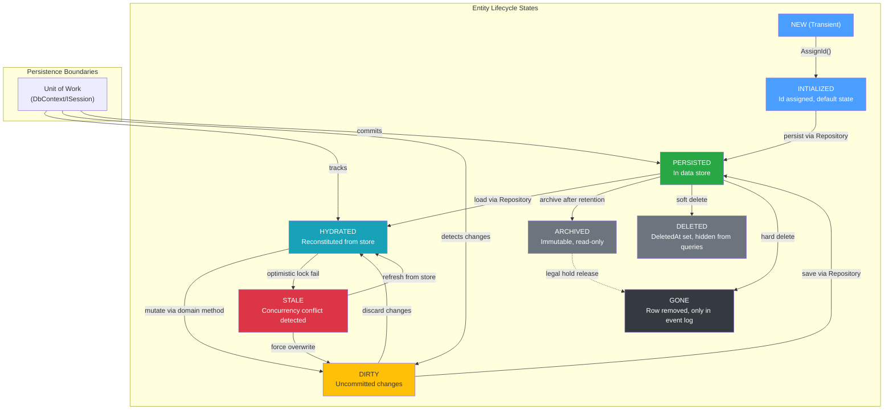
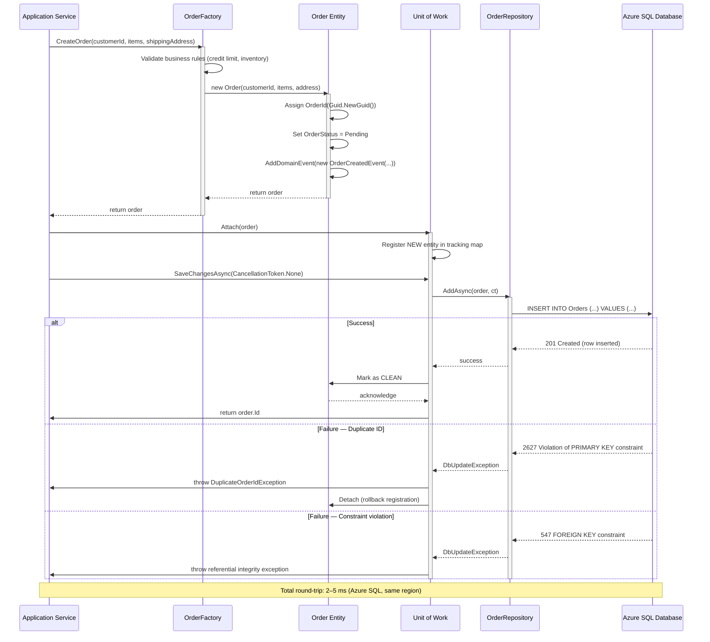
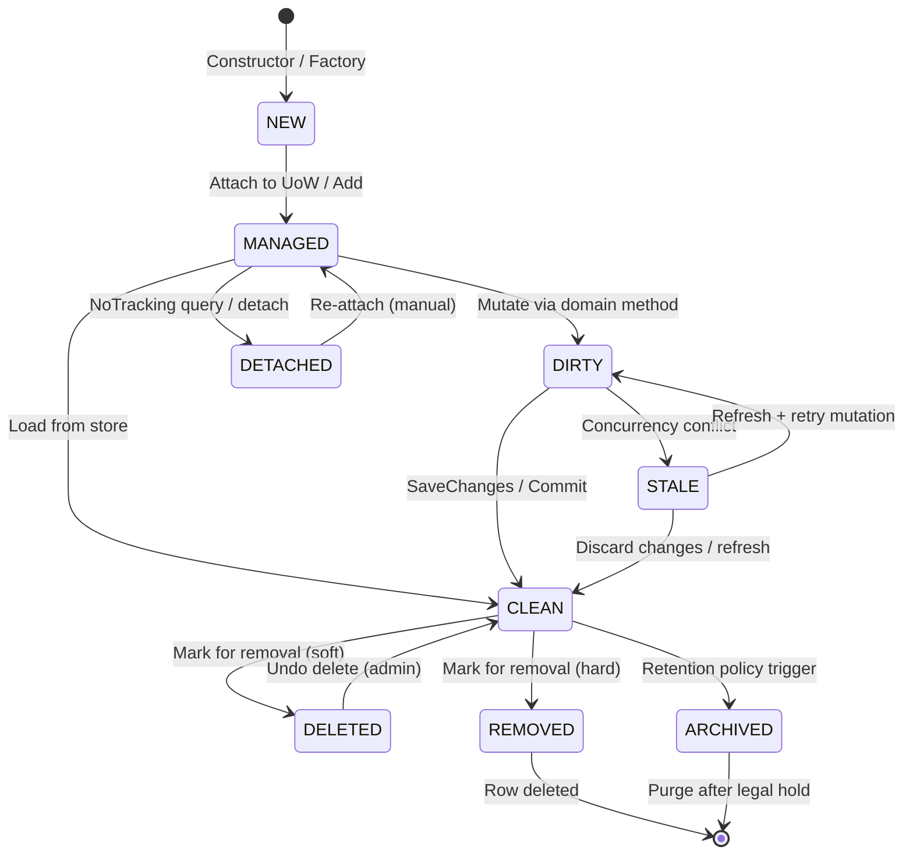
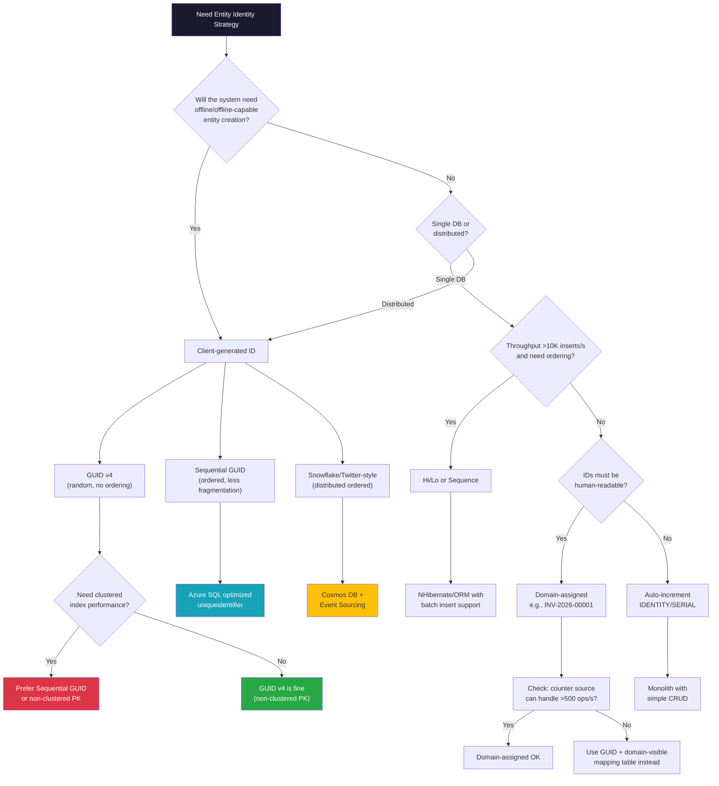

> [!success] Mastery Check
> - [ ] **Studied Well**
> - [ ] **Can explain the concept without notes**
> - [ ] **Can answer interview questions confidently**
> - [ ] **Can implement it in a real project**


# 7.043 — DDD — Entities — Identity and Lifecycle

## Section 0 — Quick Reference Card

> [!ABSTRACT] Quick Reference Card
> **Entities** are domain objects defined by **identity continuity**, not attribute equality. Unlike [[7.042 — DDD — Value Objects — Immutability and Equality|Value Objects]], two Entities with the same field values but different IDs are _distinct objects_; two references to the same Entity ID refer to the _same thing_ across time and state changes.
>
> ### Core Identity Strategies
> | Strategy | Example | Throughput Suitability | Ordering | Storage Overhead |
> |---|---|---|---|---|
> | **GUID v4** | `Guid.NewGuid()` | 0–50,000 ops/s | None | 16 B |
> | **Sequential GUID** | `Guid.CreateVersion7()` (.NET 9) / `NEWSEQUENTIALID()` | 0–100,000 ops/s | Clustered-index friendly | 16 B |
> | **Domain-assigned** | `INV-2026-00001` | 0–500 ops/s (human workflows) | Business-meaningful | 8–64 B string |
> | **DB auto-increment** | `IDENTITY(1,1)` / `SERIAL` | 0–10,000 ops/s single-writer | Insert-order | 4–8 B |
> | **Hi/Lo** | Sequence blocks (NHibernate) | 0–50,000 ops/s | Batch-friendly | 8 B |
> | **Snowflake** | Twitter-style ID (`<timestamp><worker><seq>`) | 0–1,000,000 ops/s distributed | Time-sorted | 8 B |
>
> ### Entity Lifecycle States
> ```
> NEW → HYDRATED → CLEAN → DIRTY → PERSISTED → DETACHED → ARCHIVED
>                    ↓         ↕         ↕
>                NEW again   DIRTY   MERGED (conflict resolution)
> ```
>
> ### Invariant Enforcement Rules
> 1. **Creation**: Factory methods enforce initial invariants; constructors are `protected internal`
> 2. **Mutation**: Every public method checks preconditions and postconditions
> 3. **Persistence**: Repository saves only when invariants hold; `SaveChangesAsync` validates
> 4. **Deletion**: Soft-delete preserves referential integrity; `DeletedAt` timestamp
>
> ### Key .NET Types
> - `abstract Entity<TId>`: Base class with equality on `Id`
> - `record OrderId(Guid Value)`: Strongly-typed ID (C# 12 primary constructor)
> - `IEquatable<T>`: Implemented on Entity base
> - `IComparable<T>`: For sequence-ordered IDs
>
> ### Azure Integration Points
> - **Azure SQL**: Sequential GUID as `uniqueidentifier` clustered key
> - **Cosmos DB**: String partition key from domain-assigned ID
> - **Azure Service Bus**: Entity ID as message `CorrelationId` for saga orchestration
> - **Azure Functions**: Entity ID binding via `[CosmosDBTrigger]` change feed
>
> ### Common Pitfalls
> - `GetHashCode()` mutation when Entity is in `HashSet<T>` or `Dictionary<K,V>`
> - Lazy-load proxies breaking equality checks
> - ORM-enforced `virtual` members polluting domain model
> - Mixing identity generation strategies across bounded contexts
> - Exposing public setters on `Id` for serialization convenience

---

## Section 1 — Navigation & Context

> [!INFO] Production Encounter Map
> You will touch Entity identity and lifecycle in these real-world scenarios:
>
> | Scenario | Role | Frequency | Problem Signal |
> |---|---|---|---|
> | Order ingestion from e-commerce frontend | Backend Developer | Daily | Duplicate orders after payment retry |
> | Customer profile merge from legacy CRM migration | Platform Engineer | Quarterly | `DbUpdateException` on duplicate key |
> | Event-sourced ledger for payment processing | Systems Architect | Weekly | Wrong version applied in optimistic concurrency |
> | Multi-tenant SaaS tenant isolation | Cloud Developer | Monthly | Cross-tenant data leak via GUID collision |
> | Data export/import pipeline for BI | Data Engineer | Bi-weekly | Loss of temporal ordering on identity |
> | CQRS read-model projection | Backend Developer | Daily | Stale read due to wrong correlation ID |
> | Saga orchestration across 5 microservices | Systems Architect | Weekly | Orphaned saga state from missing entity creation |
> | Streaming analytics on order lifecycle | Data Engineer | Monthly | Event ordering mismatch from clock skew |
>
> **Navigation Map**:
> - Start here for understanding **what makes an Entity a DDD Entity** (contrast with [[7.042 — DDD — Value Objects — Immutability and Equality|Value Objects]])
> - Proceed to [[7.044 — DDD — Aggregates — Consistency Boundaries]] to learn how Entities form aggregate roots
> - Continue to [[7.045 — DDD — Domain Events — Event-Driven Communication]] for lifecycle event publishing
> - Cross-reference [[7.046 — DDD — Repositories — Persistence Abstraction]] for persistence strategy
> - For event-sourced identity, see [[2.015 — CQRS and Event Sourcing]]
> - Domain 7 links: [[7.041 — DDD — Tactical Patterns Overview]], [[7.047 — DDD — Services — Domain and Application]], [[7.048 — DDD — Factories — Encapsulating Creation]]
>
> **Where Entities Fit in Tactical DDD Hierarchy**:
> ```
> Domain Events (side effects)
>     ↑
> Aggregates (consistency boundary, root Entity)
>     ↑
> Entities (identity, lifecycle, mutable state)
>     ↑
> Value Objects (immutable attributes, no identity)
>     ↑
> Domain Primitives (constrained simple values)
> ```

---

## Section 2 — Core Mental Model

> [!TIP] Non-Obvious Insight
> **"Identity is a social contract, not a physical property."**
>
> Two Entities represent the _same thing_ because the domain says so, not because their bytes match. This means identity is **bounded-context-specific**: a `Customer` in OrderManagement (identified by `CustomerId(Guid)`) might be a `User` in IdentityAccess (identified by `SubjectId(string)`). The mapping between them is an infrastructure concern that should never leak into domain logic.
>
> The most expensive production incident involving entities is **identity collision after data migration** — merging two systems that used different identity strategies (sequential int vs GUID) without a conflict-resolution plan. Always plan for the merge before choosing the strategy.
>
> Another non-obvious truth: **Entity identity changes DO happen in practice**. Merge accounts in healthcare, patient ID reassignment after hospital acquisition, order renumbering after system migration. Your model should account for identity migration, even if your current system doesn't need it — at minimum, maintain a `PreviousId` audit trail.

### Classification

```
DDD Entities
├── Identity Strategy
│   ├── Client-Generated (GUID, Snowflake)
│   ├── Server-Generated (Auto-increment, Sequence/Hi/Lo)
│   ├── Domain-Assigned (Invoice numbers, License plates)
│   └── Hybrid (GUID + domain-visible counter)
├── Lifecycle
│   ├── Transient (NEW) — not yet persisted
│   ├── Managed (CLEAN ↔ DIRTY) — tracked by Unit of Work
│   ├── Detached — disconnected from persistence context
│   ├── Removed — soft or hard deleted
│   └── Archived — frozen for compliance
├── Temporal Awareness
│   ├── Snapshot-based (current state only)
│   ├── Effectively-dated (ValidFrom/ValidTo)
│   └── Event-sourced (full event stream rebuild)
└── Invariant Enforcement
    ├── Self-validating (guard clauses in methods)
    ├── Specification-based (Specification pattern before mutation)
    └── Domain-event-driven (validate on Domain Event application)
```

### Mermaid Diagrams

#### Primary: Entity Lifecycle State Machine



#### Supporting: Entity Creation Through Persistence



### Numbers That Matter

| Metric | Value | Context | Source |
|---|---|---|---|
| GUID v4 collision probability at 1B entities | 5.4 × 10⁻¹³ | 122 random bits | Math (birthday problem) |
| Sequential GUID index fragmentation (fill factor) | <1% fragmentation | vs 30–80% for random GUID | Azure SQL Docs — `NEWSEQUENTIALID` |
| Auto-increment throughput limit (single DB) | ~10,000 inserts/s | Single writer, page latch contention | SQL Server Internals |
| Hi/Lo batch size sweet spot | 50–100 IDs per block | Balance allocation cost vs waste | NHibernate Docs |
| Snowflake unique ID capacity (per ms) | 4,096 IDs/ms | Per worker, Twitter-scale | Snowflake paper |
| Entity Framework `DetectChanges()` overhead | 0.5–3 ms per 100 tracked entities | Grows O(n) with change tracker | EF Core Performance |
| `DbContext` lifetime recommendation | ≤200 ms (web request) | Per-request Unit of Work | Microsoft Docs |
| Optimistic concurrency retry (409 Conflict) | 3 retries, exponential backoff (50 ms–400 ms) | `Polly` retry policy | Production pattern |
| Cosmos DB RU cost — point read vs query | 1 RU vs 2.5+ RU | Point read by ID vs query by filter | Azure Cosmos DB pricing |
| Event-sourced rebuild time — 10M events | ~45 seconds | Single stream, in-memory | Benchmark (CQRS systems) |
| Soft-delete query overhead vs hard delete | 3–5× slower | Additional `WHERE DeletedAt IS NULL` filter | Production metrics |

### Key Properties

| Property | Description | Implication |
|---|---|---|
| **Identity Equality** | `a.Equals(b)` iff `a.Id.Equals(b.Id)` | Hash code MUST be stable — never include mutable fields |
| **Mutability** | Entity state changes over its lifecycle | Requires explicit domain methods named in Ubiquitous Language |
| **Continuity** | Identity persists across state changes, serialization, persistence | Even if every attribute changes, object remains the same |
| **Temporal Awareness** | May track valid time, transaction time, or both | Affects query and caching strategies |
| **Lifecycle Visibility** | State transitions may publish [[7.045 — DDD — Domain Events — Event-Driven Communication|Domain Events]] | Enables eventual consistency between aggregates |
| **Self-Validation** | Entity guards its own invariants | Prevents invalid state at boundaries, not just at persistence |

---

## Section 3 — Deep Mechanics

### How It Works

#### Identity — The Core Concept

An Entity's identity is the **anchor that survives change**. In DDD, this is non-negotiable: if two objects have the same `Id`, they represent the same domain concept even if every field differs. This is implemented via structural equality on `Id` alone:

```csharp
public abstract class Entity<TId> : IEquatable<Entity<TId>>
    where TId : notnull, IEquatable<TId>
{
    public TId Id { get; protected set; }

    protected Entity(TId id) => Id = id;

    // Required for ORM hydration — protected, not public
    protected Entity() { }

    public bool Equals(Entity<TId>? other) =>
        other is not null && Id.Equals(other.Id);

    public override bool Equals(object? obj) =>
        obj is Entity<TId> other && Equals(other);

    public override int GetHashCode() =>
        Id.GetHashCode();

    public static bool operator ==(Entity<TId> left, Entity<TId> right) =>
        left.Equals(right);

    public static bool operator !=(Entity<TId> left, Entity<TId> right) =>
        !left.Equals(right);
}
```

**Critical**: `GetHashCode()` returns `Id.GetHashCode()`. Once an Entity is added to a `HashSet<T>` or used as a `Dictionary<K,V>` key, its `Id` MUST NOT change. This is why `Id` has only a `protected set` — it is set once in the constructor or by an ORM on hydration and never changed.

#### Identity Generation Strategies

**GUID v4 (Random)**:
- `OrderId = new OrderId(Guid.NewGuid())`
- 122 random bits, astronomically low collision probability
- **No ordering** — causes page splits in clustered indexes
- Best for: distributed systems, offline creation, CQRS command IDs
- Azure-specific: Cosmos DB `id` field uses string GUID for point reads

**Sequential GUID (.NET 9+ `Guid.CreateVersion7()` / SQL Server `NEWSEQUENTIALID()`)**:
- Time-ordered within the same machine
- Reduces clustered index fragmentation to <1%
- Best for: Azure SQL clustered primary key, high-write tables
- Tradeoff: Slight ordering predictability (if attacker has timing, can guess)

**Domain-Assigned IDs**:
- `InvoiceNumber = "INV-2026-" + nextCounter.ToString("D5")`
- Business-meaningful, human-readable
- Requires authoritative source for the counter (DB sequence or distributed lock)
- Best for: invoices, PO numbers, regulatory identifiers
- Throughput bottleneck: 0–500 ops/s due to sequential allocation

**Database Auto-Increment**:
- SQL Server `IDENTITY(1,1)`, PostgreSQL `SERIAL`
- Simple, small (4 B for int, 8 B for bigint)
- Single-writer bottleneck (page latch contention at ~10,000 inserts/s)
- Requires DB round-trip to obtain ID before Entity construction (chicken-and-egg)

**Hi/Lo Algorithm**:
- NHibernate-popularized: allocate block of IDs (`Hi * MaxLo + Lo`)
- Batch-friendly, supports 50,000+ inserts/s
- Complexity at the ORM layer; not natively supported by EF Core without add-on

**Snowflake / Distributed ID**:
- 64-bit: timestamp (41 bits) + worker ID (10 bits) + sequence (12 bits)
- Time-ordered, unique across workers, no coordination
- Best for: distributed event-sourced systems, >100K events/s
- Clock skew risk: if NTP adjusts clock backward, IDs can collide

#### Entity Lifecycle Phases

1. **NEW (Transient)**: Entity instantiated but not tracked by persistence. Has valid identity but no database row.
   - Guard: Validate invariants at construction via factory method.
   - Anti-pattern: Using default constructor then setting properties individually — allows invalid intermediate states.

2. **MANAGED (Tracked)**: Entity is attached to a `DbContext` (EF Core) or `ISession` (NHibernate). Unit of Work detects changes.
   - State: `EntityState.Added`, `Unchanged`, `Modified`, or `Deleted`.
   - Performance: EF Core's `ChangeTracker.DetectChanges()` runs on every `SaveChangesAsync` and iterates all tracked entities. For 1,000+ tracked entities per `DbContext`, this adds 5–15 ms.

3. **DETACHED**: Entity exists in memory but is not tracked. Web API responses typically return DTOs or serialized Entities — the consumer receives a _detached copy_.
   - Risk: If the consumer sends back the Entity in a PUT request, the application must re-attach and reconcile.

4. **ARCHIVED / DELETED**: Entity is logically removed.
   - Soft-delete pattern: `DeletedAt` nullable timestamp. Queries filter with `WHERE DeletedAt IS NULL`.
   - Hard-delete pattern: Row removed from primary table; may remain in audit table or event log.

#### Temporal Modeling

**Effective Dating (ValidTime)**:
```csharp
public record DateRange(DateOnly ValidFrom, DateOnly ValidTo)
{
    public bool Contains(DateOnly date) =>
        date >= ValidFrom && date < ValidTo;

    public bool Overlaps(DateRange other) =>
        ValidFrom < other.ValidTo && other.ValidFrom < ValidTo;
}

public class ProductPrice : Entity<ProductPriceId>
{
    public Money Amount { get; private set; }
    public DateRange EffectivePeriod { get; private set; }

    public bool IsEffectiveOn(DateOnly date) =>
        EffectivePeriod.Contains(date);
}
```

**Event Sourcing (TransactionTime)**:
- Only append new events; never update existing state
- Entity state = `fold(events, initialState, apply)`
- Identity is the stream ID; version is the stream length

#### Invariant Enforcement

Every public method on an Entity should:
1. **Precondition check**: Validate inputs before mutation
2. **Operation**: Execute the state change
3. **Postcondition check**: Verify invariants still hold
4. **Domain Event**: Optionally record what happened

```csharp
public void Submit()
{
    // Precondition
    if (Status != OrderStatus.Draft)
        throw new OrderStateException($"Cannot submit order {Id} in status {Status}.");

    if (LineItems.Count == 0)
        throw new OrderValidationException($"Order {Id} has no line items.");

    // Operation
    var previousStatus = Status;
    Status = OrderStatus.Submitted;
    SubmittedAt = DateTime.UtcNow;

    // Postcondition
    DomainGuard.Against(Status != OrderStatus.Submitted, "Submit must result in Submitted status.");

    // Domain Event
    AddDomainEvent(new OrderSubmittedEvent(Id, SubmittedAt.Value, CustomerId));
}
```

### Protocol Trace

#### Happy Path — Order Creation and Persistence

```
Step 1: ApplicationService receives CreateOrderCommand
  → Validate command (FluentValidation rules)
  → Call OrderFactory.Create(...)

Step 2: OrderFactory.Create(customerId, items, shippingAddress)
  → Load Customer aggregate to check credit hold (via ICustomerRepository)
  → Validate inventory availability for each item (via IInventoryService)
  → New OrderId(Guid.CreateVersion7()) ← sequential GUID for clustered index
  → new Order(id, customerId, shippingAddress)
    → Constructor sets Id, CustomerId, ShippingAddress
    → Sets Status = OrderStatus.Draft
    → Sets CreatedAt = DateTime.UtcNow
    → Initializes LineItems = new List<LineItem>()
    → For each item: LineItemFactory.Create(...) and add to LineItems
  → Order.AddDomainEvent(new OrderCreatedDomainEvent(id, customerId, DateTime.UtcNow))
  → Return Order to ApplicationService

Step 3: ApplicationService
  → _dbContext.Orders.AddAsync(order, cancellationToken)
  → EF Core changes EntityState to Added
  → Order.Id is already assigned (client-generated)

Step 4: ApplicationService calls _dbContext.SaveChangesAsync(cancellationToken)
  → EF Core starts transaction (if none active)
  → DetectChanges() runs — sees one new entity
  → INSERT INTO Orders (Id, CustomerId, Status, CreatedAt, ...) VALUES (...)
  → SQL Server inserts row, uniqueidentifier clustered key with sequential GUID
  → Transaction commits
  → EF Core marks entity as Unchanged (CLEAN)

Step 5: ApplicationService
  → _mediator.Publish(new OrderCreatedIntegrationEvent(order), ct)
  → Azure Service Bus receives event → triggers downstream services
```

#### Failure Path — Duplicate Order (Idempotency Key)

```
Step 1: Client sends CreateOrder command with IdempotencyKey = "order_req_abc123"
  → ApplicationService checks idempotency store (Azure Cosmos DB or Redis)
  → No previous result found → proceed

Step 2: ApplicationService creates the Order entity
  → OrderFactory.Create(...)

Step 3: ApplicationService calls _dbContext.SaveChangesAsync(cancellationToken)
  → INSERT INTO Orders VALUES (...)
  → SQL Server returns error 2627: Violation of PRIMARY KEY constraint
  → DbUpdateException thrown by EF Core

Step 4: ApplicationService catches DbUpdateException
  → Checks exception.InnerException for SqlException with Number == 2627
  → Wraps in domain-specific DuplicateOrderIdException
  → Logs warning: "Duplicate OrderId {OrderId} detected — likely idempotent retry"
  → Returns 409 Conflict to API consumer

Step 5: Consumer checks IdempotencyKey
  → If they sent same order twice → returns cached result
  → If it's a genuine duplicate → application-level merge required

Step 6: Remediation
  → Remove the orphaned Entity from DbContext change tracker
  → Do NOT publish OrderCreatedDomainEvent
  → Return idempotent response with original order data if possible
```

#### Failure Path — Optimistic Concurrency Conflict

```
Step 1: Two requests load the same Order simultaneously
  → Request A: GET /orders/ord_001
  → Request B: GET /orders/ord_001

Step 2: Both hydrate Order entity with RowVersion = 0x00000000000007D1

Step 3: Request A modifies Order.Status = Submitted
  → _dbContext.SaveChangesAsync()
  → UPDATE Orders SET Status = 'Submitted', RowVersion = @newVersion
    WHERE Id = 'ord_001' AND RowVersion = 0x00000000000007D1
  → 1 row affected → success
  → Order.RowVersion updated to new value

Step 4: Request B modifies Order.Status = Cancelled
  → _dbContext.SaveChangesAsync()
  → UPDATE Orders SET Status = 'Cancelled', RowVersion = @newVersion
    WHERE Id = 'ord_001' AND RowVersion = 0x00000000000007D1
  → 0 rows affected → DbUpdateConcurrencyException

Step 5: Retry policy (Polly)
  → Retry 1: refresh Order from DB → now sees Status=Submitted, new RowVersion
  → Re-evaluate: can we Cancel a Submitted order?
  → Business rule: Submitted orders with no payments can be cancelled
  → Re-apply Cancel with fresh RowVersion
  → Retry 2: UPDATE succeeds
```

### State Transitions



### Failure Modes

#### Failure Mode 1: Identity Collision After Migration

> [!DANGER] 3AM Production Signal
> **Signal**: `SqlException (2627): Violation of PRIMARY KEY constraint 'PK_Orders'. Cannot insert duplicate key in object 'dbo.Orders'.` followed by cascading failures in downstream sagas reading wrong order data.
>
> **Root Cause**: Two legacy systems merged into a single Orders database. System A used auto-increment int IDs (1–500,000), System B used auto-increment int IDs (1–350,000). Post-migration, ID ranges overlapped. New orders from both systems collided on PK.
>
> **Impact**: ~2,300 affected orders, 4-hour P1 incident, manual reconciliation for 3 days.
>
> **Resolution**:
> 1. Immediate: Add `SourceSystemId` column to composite PK → `(SourceSystemId, Id)`
> 2. Short-term: Backfill with origin system identifier
> 3. Long-term: Migrate to GUID identities for new records; redirect old lookups through mapping table
>
> **Prevention**:
> - Migration plan MUST include identity strategy alignment document
> - Use GUID or Snowflake IDs from day one in any system that may be merged
> - Pre-migration dry-run that checks ID range collisions
> - Azure SQL: Use `uniqueidentifier` with `NEWSEQUENTIALID()` default

#### Failure Mode 2: Optimistic Concurrency at Scale Causes Retry Storms

> [!DANGER] 3AM Production Signal
> **Signal**: Metrics show `DbUpdateConcurrencyException` rate >5% of total writes. Logs show "Retry exhausted" exceptions. Downstream subscribers see duplicate or out-of-order domain events.
>
> **Root Cause**: High-contention aggregate (Product.InventoryCount) accessed by 50+ concurrent checkout flows during flash sale event. The aggregate was modeled with per-property RowVersion. Each decrement of inventory caused 409 conflicts, triggering Polly retries that further saturated the database.
>
> **Impact**: 12-minute partial outage during flash sale. 8,200 failed checkouts. Revenue loss ~$240K.
>
> **Resolution**:
> 1. Immediate: Temporarily increase retry count from 3 to 5 with wider backoff (100 ms–1 s)
> 2. Short-term: Apply database-level atomic update — `UPDATE Products SET InventoryCount = InventoryCount - 1 WHERE Id = @id AND InventoryCount > 0` instead of loading entity, modifying, saving
> 3. Long-term: Redesign aggregate boundary — extract InventoryCount into separate `StockItem` aggregate to reduce contention
>
> **Prevention**:
> - Identify high-contention aggregates during load testing (>100 concurrent writes/s)
> - Consider command-query separation for hot paths (atomic SQL for inventory)
> - Monitor `ChangeTracker.Entries().Count(e => e.State == EntityState.Modified)` per aggregate
> - Use `ISession`-level locks (EF Core `EF.Property<byte[]>(entity, "RowVersion")`)

#### Failure Mode 3: GUID Clustered Index Fragmentation

> [!DANGER] 3AM Production Signal
> **Signal**: Azure SQL DTU consumption spikes to 95%+ during business hours. `avg_page_space_used_in_percent` in sys.dm_db_index_physical_stats <60%. Page splits in secondary indexes.
>
> **Root Cause**: Random GUIDs (Guid.NewGuid()) used as clustered primary key on Orders table (200M rows). Each insert caused page splits, ballooning index size 3× beyond data size.
>
> **Impact**: Query latency increased 4× over 3 months. Scheduled maintenance window required weekly index rebuild. Cost increased $800/month due to higher DTU tier.
>
> **Resolution**:
> 1. Immediate: Schedule offline `ALTER INDEX ... REBUILD` weekly
> 2. Short-term: Migrate to sequential GUID (`Guid.CreateVersion7()` or SQL Server `NEWSEQUENTIALID()`)
> 3. Long-term: Consider non-clustered PK with clustered index on CreatedAt (if query patterns support it)

---

## Section 4 — Production Patterns and Implementation

### Primary Implementation

The following implementation shows a complete Entity-based domain in C# 12 / .NET 8 with the OrderManagement bounded context.

#### Strongly-Typed ID (Value Object for Identity)

```csharp
// Strongly-typed ID prevents primitive obsession and type confusion
// between OrderId, CustomerId, ProductId at compile time.
public readonly record struct OrderId(Guid Value) : IComparable<OrderId>
{
    public static OrderId New() => new(Guid.CreateVersion7());  // .NET 9+, else SequentialGuid package
    public static OrderId From(Guid value) => new(value);
    public static OrderId Parse(string value) => new(Guid.Parse(value));

    public int CompareTo(OrderId other) => Value.CompareTo(other.Value);
    public override string ToString() => Value.ToString("D");
}

public readonly record struct CustomerId(Guid Value)
{
    public static CustomerId New() => new(Guid.CreateVersion7());
    public static CustomerId From(Guid value) => new(value);
    public override string ToString() => Value.ToString("D");
}

public readonly record struct OrderItemId(Guid Value)
{
    public static OrderItemId New() => new(Guid.CreateVersion7());
}
```

#### Entity Base Class

```csharp
/// <summary>
/// Base class for all domain entities providing identity equality,
/// domain event collection, and lifecycle state tracking.
/// </summary>
/// <typeparam name="TId">The strongly-typed identifier type.</typeparam>
public abstract class Entity<TId> : IEquatable<Entity<TId>>
    where TId : notnull, IEquatable<TId>
{
    private readonly List<IDomainEvent> _domainEvents = [];
    private EntityLifecycleState _lifecycleState = EntityLifecycleState.New;

    /// <summary>Gets the entity's unique identity — never changes after construction.</summary>
    public TId Id { get; }

    /// <summary>Gets the current lifecycle state within the Unit of Work.</summary>
    public EntityLifecycleState LifecycleState => _lifecycleState;

    /// <summary>Gets the timestamp of creation (UTC).</summary>
    public DateTime CreatedAt { get; }

    /// <summary>Gets the timestamp of the last modification (UTC).</summary>
    public DateTime? ModifiedAt { get; private set; }

    /// <summary>
    /// Gets a copy of accumulated domain events.
    /// Events are cleared after persistence.
    /// </summary>
    public IReadOnlyCollection<IDomainEvent> DomainEvents => [.. _domainEvents];

    protected Entity(TId id)
    {
        Id = id ?? throw new ArgumentNullException(nameof(id));
        CreatedAt = DateTime.UtcNow;
        _lifecycleState = EntityLifecycleState.New;
    }

    // Required for ORM hydration (EF Core, NHibernate)
    protected Entity()
    {
        _lifecycleState = EntityLifecycleState.Hydrating;
    }

    /// <summary>
    /// Adds a domain event to be published after the current transaction commits.
    /// </summary>
    protected void AddDomainEvent(IDomainEvent domainEvent)
    {
        _domainEvents.Add(domainEvent);
    }

    /// <summary>
    /// Clears all accumulated domain events — called by infrastructure after publishing.
    /// </summary>
    public void ClearDomainEvents()
    {
        _domainEvents.Clear();
    }

    /// <summary>
    /// Marks the entity as clean after successful persistence.
    /// Called by repository/unit of work infrastructure.
    /// </summary>
    public void MarkAsClean()
    {
        _lifecycleState = EntityLifecycleState.Clean;
        ModifiedAt = DateTime.UtcNow;
    }

    /// <summary>
    /// Called after ORM hydration is complete.
    /// </summary>
    public void OnHydrated()
    {
        _lifecycleState = EntityLifecycleState.Clean;
    }

    // Identity-based equality — stable hashcode from Id
    public bool Equals(Entity<TId>? other) =>
        other is not null && EqualityComparer<TId>.Default.Equals(Id, other.Id);

    public override bool Equals(object? obj) =>
        obj is Entity<TId> other && Equals(other);

    public override int GetHashCode() =>
        EqualityComparer<TId>.Default.GetHashCode(Id);

    public static bool operator ==(Entity<TId>? left, Entity<TId>? right) =>
        left?.Equals(right) ?? right is null;

    public static bool operator !=(Entity<TId>? left, Entity<TId>? right) =>
        !(left == right);
}

/// <summary>
/// Lifecycle states for entity tracking within persistence context.
/// </summary>
public enum EntityLifecycleState
{
    /// <summary>Created but not yet tracked by a Unit of Work.</summary>
    New,
    /// <summary>Being reconstituted from persistence (ORM hydration).</summary>
    Hydrating,
    /// <summary>Loaded from store, no changes detected.</summary>
    Clean,
    /// <summary>Changes detected but not yet persisted.</summary>
    Dirty,
    /// <summary>Marked for deletion (soft delete).</summary>
    Deleted
}
```

#### Domain Entity — Order

```csharp
/// <summary>
/// Represents a customer order in the OrderManagement bounded context.
/// An Order is an aggregate root — its identity is an OrderId.
/// </summary>
public class Order : Entity<OrderId>
{
    private readonly List<LineItem> _lineItems = [];

    /// <summary>Gets the customer who placed this order.</summary>
    public CustomerId CustomerId { get; private set; }

    /// <summary>Gets the current order status.</summary>
    public OrderStatus Status { get; private set; }

    /// <summary>Gets the shipping address at the time of ordering.</summary>
    public Address ShippingAddress { get; private set; }

    /// <summary>Gets the read-only collection of line items.</summary>
    public IReadOnlyCollection<LineItem> LineItems => _lineItems.AsReadOnly();

    /// <summary>Gets the timestamp when the order was submitted, if applicable.</summary>
    public DateTime? SubmittedAt { get; private set; }

    /// <summary>Gets the timestamp when the order was shipped, if applicable.</summary>
    public DateTime? ShippedAt { get; private set; }

    /// <summary>Gets the timestamp when the order was delivered, if applicable.</summary>
    public DateTime? DeliveredAt { get; private set; }

    /// <summary>Gets the timestamp when the order was cancelled, if applicable.</summary>
    public DateTime? CancelledAt { get; private set; }

    /// <summary>Gets the optimistic concurrency row version.</summary>
    public byte[] RowVersion { get; private set; } = [];

    // Private parameterless constructor for EF Core
    private Order() { }

    /// <summary>
    /// Creates a new Order instance. Internal constructor — use <see cref="OrderFactory"/> for creation.
    /// </summary>
    internal Order(OrderId id, CustomerId customerId, Address shippingAddress)
        : base(id)
    {
        CustomerId = customerId;
        ShippingAddress = shippingAddress ?? throw new ArgumentNullException(nameof(shippingAddress));
        Status = OrderStatus.Draft;

        AddDomainEvent(new OrderCreatedDomainEvent(id, customerId, DateTime.UtcNow));
    }

    /// <summary>
    /// Adds a line item to this order. Only allowed when order is in Draft status.
    /// </summary>
    /// <param name="productId">The product identifier.</param>
    /// <param name="productName">The product name (denormalized for query performance).</param>
    /// <param name="quantity">The quantity ordered.</param>
    /// <param name="unitPrice">The unit price at the time of ordering.</param>
    /// <exception cref="OrderStateException">Thrown when order is not in Draft status.</exception>
    /// <exception cref="ArgumentOutOfRangeException">Thrown when quantity or price is invalid.</exception>
    public void AddLineItem(ProductId productId, string productName, int quantity, Money unitPrice)
    {
        GuardAgainstNotDraft();

        if (quantity <= 0)
            throw new ArgumentOutOfRangeException(nameof(quantity), "Quantity must be positive.");

        if (quantity > 100)
            throw new OrderValidationException($"Order {Id} cannot contain more than 100 units of a single item.");

        var lineItemId = new OrderItemId(Guid.CreateVersion7());
        var lineItem = new LineItem(lineItemId, Id, productId, productName, quantity, unitPrice);
        _lineItems.Add(lineItem);

        AddDomainEvent(new LineItemAddedDomainEvent(Id, lineItemId, productId, quantity));
    }

    /// <summary>
    /// Submits the order for processing. Transition from Draft to Submitted.
    /// </summary>
    /// <exception cref="OrderStateException">Thrown if order is not in Draft status.</exception>
    /// <exception cref="OrderValidationException">Thrown if order has no line items.</exception>
    public void Submit()
    {
        GuardAgainstNotDraft();

        if (_lineItems.Count == 0)
            throw new OrderValidationException($"Order {Id} must have at least one line item to submit.");

        Status = OrderStatus.Submitted;
        SubmittedAt = DateTime.UtcNow;

        AddDomainEvent(new OrderSubmittedDomainEvent(Id, CustomerId, SubmittedAt.Value, TotalAmount()));
    }

    /// <summary>
    /// Marks the order as shipped.
    /// </summary>
    /// <param name="trackingNumber">The carrier tracking number.</param>
    /// <exception cref="OrderStateException">Thrown if order is not in Submitted status.</exception>
    public void Ship(string trackingNumber)
    {
        if (Status != OrderStatus.Submitted)
            throw new OrderStateException($"Cannot ship order {Id} in status {Status}.");

        if (string.IsNullOrWhiteSpace(trackingNumber))
            throw new ArgumentException("Tracking number is required.", nameof(trackingNumber));

        Status = OrderStatus.Shipped;
        ShippedAt = DateTime.UtcNow;

        AddDomainEvent(new OrderShippedDomainEvent(Id, trackingNumber, ShippedAt.Value));
    }

    /// <summary>
    /// Marks the order as delivered.
    /// </summary>
    /// <exception cref="OrderStateException">Thrown if order is not in Shipped status.</exception>
    public void MarkDelivered()
    {
        if (Status != OrderStatus.Shipped)
            throw new OrderStateException($"Cannot deliver order {Id} in status {Status}.");

        Status = OrderStatus.Delivered;
        DeliveredAt = DateTime.UtcNow;

        AddDomainEvent(new OrderDeliveredDomainEvent(Id, DeliveredAt.Value));
    }

    /// <summary>
    /// Cancels the order. Allowed from Draft or Submitted status.
    /// </summary>
    /// <param name="reason">The reason for cancellation.</param>
    /// <exception cref="OrderStateException">Thrown if order is in a terminal state.</exception>
    public void Cancel(string reason)
    {
        if (Status == OrderStatus.Delivered)
            throw new OrderStateException($"Cannot cancel delivered order {Id}. Use return process.");

        if (Status is OrderStatus.Cancelled or OrderStatus.Archived)
            throw new OrderStateException($"Order {Id} is already in terminal status {Status}.");

        var previousStatus = Status;
        Status = OrderStatus.Cancelled;
        CancelledAt = DateTime.UtcNow;

        AddDomainEvent(new OrderCancelledDomainEvent(Id, previousStatus, reason, CancelledAt.Value));
    }

    /// <summary>
    /// Calculates the total order amount by summing all line item totals.
    /// </summary>
    /// <returns>The total amount of the order.</returns>
    public Money TotalAmount()
    {
        var total = _lineItems.Aggregate(Money.Zero(Currency.USD), (sum, item) => sum + item.TotalPrice);
        return total;
    }

    private void GuardAgainstNotDraft()
    {
        if (Status != OrderStatus.Draft)
            throw new OrderStateException($"Order {Id} is in status {Status}. This operation requires Draft status.");
    }
}

/// <summary>
/// Order status finite state machine.
/// </summary>
public enum OrderStatus
{
    Draft = 0,
    Submitted = 1,
    Shipped = 2,
    Delivered = 3,
    Cancelled = 4,
    Archived = 5
}
```

#### Order Factory

```csharp
/// <summary>
/// Factory for constructing valid Order entities.
/// Encapsulates complex creation logic and cross-entity validation.
/// </summary>
public class OrderFactory
{
    private readonly ICustomerRepository _customerRepository;
    private readonly IInventoryService _inventoryService;

    public OrderFactory(ICustomerRepository customerRepository, IInventoryService inventoryService)
    {
        _customerRepository = customerRepository;
        _inventoryService = inventoryService;
    }

    /// <summary>
    /// Creates a new Order with validated customer and inventory availability.
    /// </summary>
    /// <param name="customerId">The customer placing the order.</param>
    /// <param name="items">The items requested.</param>
    /// <param name="shippingAddress">The shipping destination.</param>
    /// <param name="cancellationToken">Cancellation token.</param>
    /// <returns>A new validated Order entity.</returns>
    /// <exception cref="CustomerNotFoundException">Thrown if customer not found.</exception>
    /// <exception cref="InsufficientInventoryException">Thrown if inventory insufficient.</exception>
    public async Task<Order> CreateAsync(
        CustomerId customerId,
        IReadOnlyList<CreateOrderItem> items,
        Address shippingAddress,
        CancellationToken cancellationToken)
    {
        // Load and validate customer
        var customer = await _customerRepository.GetByIdAsync(customerId, cancellationToken)
            ?? throw new CustomerNotFoundException(customerId);

        if (customer.IsBlacklisted)
            throw new CustomerBlacklistedException(customerId);

        // Validate inventory for each item
        foreach (var item in items)
        {
            var isAvailable = await _inventoryService.IsAvailableAsync(
                item.ProductId, item.Quantity, cancellationToken);

            if (!isAvailable)
                throw new InsufficientInventoryException(item.ProductId, item.Quantity);
        }

        // Create the order
        var orderId = OrderId.New();
        var order = new Order(orderId, customerId, shippingAddress);

        foreach (var item in items)
        {
            order.AddLineItem(item.ProductId, item.ProductName, item.Quantity, item.UnitPrice);
        }

        return order;
    }
}

/// <summary>
/// Data transfer object for order creation requests.
/// </summary>
/// <param name="ProductId">The product identifier.</param>
/// <param name="ProductName">The product name.</param>
/// <param name="Quantity">The quantity ordered.</param>
/// <param name="UnitPrice">The unit price.</param>
public record CreateOrderItem(
    ProductId ProductId,
    string ProductName,
    int Quantity,
    Money UnitPrice);
```

#### Value Objects in the Domain

```csharp
/// <summary>
/// Money value object with currency awareness.
/// </summary>
public readonly record struct Money(decimal Amount, Currency Currency)
{
    public static Money Zero(Currency currency) => new(0, currency);

    public static Money operator +(Money left, Money right)
    {
        if (left.Currency != right.Currency)
            throw new CurrencyMismatchException(left.Currency, right.Currency);
        return new Money(left.Amount + right.Amount, left.Currency);
    }

    public override string ToString() => $"{Currency} {Amount:F2}";
}

/// <summary>
/// Supported currencies.
/// </summary>
public enum Currency { USD, EUR, GBP, JPY, CAD, AUD }

/// <summary>
/// Address value object for shipping information.
/// </summary>
public record Address(
    string Street,
    string City,
    string State,
    string PostalCode,
    string Country)
{
    public override string ToString() => $"{Street}, {City}, {State} {PostalCode}, {Country}";
}
```

#### Line Item Entity (Child Entity)

```csharp
/// <summary>
/// Represents a single line item within an Order.
/// This is a child entity — its identity (OrderItemId) is only unique within
/// the context of its parent Order aggregate.
/// </summary>
public class LineItem : Entity<OrderItemId>
{
    /// <summary>Gets the parent order ID.</summary>
    public OrderId OrderId { get; private set; }

    /// <summary>Gets the product identifier.</summary>
    public ProductId ProductId { get; private set; }

    /// <summary>Gets the product name (denormalized).</summary>
    public string ProductName { get; private set; } = string.Empty;

    /// <summary>Gets the quantity ordered.</summary>
    public int Quantity { get; private set; }

    /// <summary>Gets the unit price at order time.</summary>
    public Money UnitPrice { get; private set; }

    /// <summary>Gets the total price (Quantity × UnitPrice).</summary>
    public Money TotalPrice => new(Quantity * UnitPrice.Amount, UnitPrice.Currency);

    private LineItem() { }

    internal LineItem(
        OrderItemId id,
        OrderId orderId,
        ProductId productId,
        string productName,
        int quantity,
        Money unitPrice)
        : base(id)
    {
        OrderId = orderId;
        ProductId = productId;
        ProductName = productName ?? throw new ArgumentNullException(nameof(productName));
        Quantity = quantity;
        UnitPrice = unitPrice;
    }

    /// <summary>
    /// Updates the quantity for this line item.
    /// </summary>
    public void UpdateQuantity(int newQuantity)
    {
        if (newQuantity <= 0)
            throw new ArgumentOutOfRangeException(nameof(newQuantity), "Quantity must be positive.");

        if (newQuantity > 100)
            throw new OrderValidationException("Line item cannot exceed 100 units.");

        Quantity = newQuantity;
    }
}
```

#### Domain Events

```csharp
/// <summary>
/// Marker interface for domain events.
/// </summary>
public interface IDomainEvent
{
    DateTime OccurredAt { get; }
}

public record OrderCreatedDomainEvent(OrderId OrderId, CustomerId CustomerId, DateTime OccurredAt) : IDomainEvent;
public record LineItemAddedDomainEvent(OrderId OrderId, OrderItemId LineItemId, ProductId ProductId, int Quantity) : IDomainEvent;
public record OrderSubmittedDomainEvent(OrderId OrderId, CustomerId CustomerId, DateTime SubmittedAt, Money TotalAmount) : IDomainEvent;
public record OrderShippedDomainEvent(OrderId OrderId, string TrackingNumber, DateTime ShippedAt) : IDomainEvent;
public record OrderDeliveredDomainEvent(OrderId OrderId, DateTime DeliveredAt) : IDomainEvent;
public record OrderCancelledDomainEvent(OrderId OrderId, OrderStatus PreviousStatus, string Reason, DateTime CancelledAt) : IDomainEvent;
```

#### Repository Interface

```csharp
/// <summary>
/// Repository for Order aggregate persistence.
/// </summary>
public interface IOrderRepository
{
    /// <summary>Gets an order by its unique identifier.</summary>
    Task<Order?> GetByIdAsync(OrderId id, CancellationToken cancellationToken);

    /// <summary>Gets orders for a specific customer with optional status filter.</summary>
    Task<IReadOnlyList<Order>> GetByCustomerAsync(
        CustomerId customerId,
        OrderStatus? statusFilter = null,
        CancellationToken cancellationToken = default);

    /// <summary>Adds a new order to the repository.</summary>
    Task AddAsync(Order order, CancellationToken cancellationToken);

    /// <summary>Updates an existing order.</summary>
    Task UpdateAsync(Order order, CancellationToken cancellationToken);

    /// <summary>Soft-deletes an order.</summary>
    Task DeleteAsync(OrderId id, CancellationToken cancellationToken);
}
```

#### EF Core Configuration

```csharp
/// <summary>
/// EF Core entity type configuration for the Order aggregate.
/// </summary>
public class OrderEntityTypeConfiguration : IEntityTypeConfiguration<Order>
{
    public void Configure(EntityTypeBuilder<Order> builder)
    {
        builder.ToTable("Orders");

        // Identity
        builder.HasKey(o => o.Id);
        builder.Property(o => o.Id)
            .HasConversion(
                id => id.Value,
                value => OrderId.From(value))
            .ValueGeneratedNever()  // Client-generated GUID
            .IsRequired();

        // Simple properties
        builder.Property(o => o.CustomerId)
            .HasConversion(
                id => id.Value,
                value => CustomerId.From(value))
            .IsRequired();

        builder.Property(o => o.Status)
            .HasConversion<string>()
            .HasMaxLength(20)
            .IsRequired();

        builder.Property(o => o.CreatedAt).IsRequired();
        builder.Property(o => o.ModifiedAt);
        builder.Property(o => o.SubmittedAt);
        builder.Property(o => o.ShippedAt);
        builder.Property(o => o.DeliveredAt);
        builder.Property(o => o.CancelledAt);

        // Concurrency
        builder.Property(o => o.RowVersion)
            .IsRowVersion();

        // Value object — stored as owned entity
        builder.OwnsOne(o => o.ShippingAddress, address =>
        {
            address.Property(a => a.Street).HasColumnName("ShippingStreet").HasMaxLength(200);
            address.Property(a => a.City).HasColumnName("ShippingCity").HasMaxLength(100);
            address.Property(a => a.State).HasColumnName("ShippingState").HasMaxLength(50);
            address.Property(a => a.PostalCode).HasColumnName("ShippingPostalCode").HasMaxLength(20);
            address.Property(a => a.Country).HasColumnName("ShippingCountry").HasMaxLength(50);
        });

        // Collection of child entities
        builder.HasMany(o => o.LineItems)
            .WithOne()
            .HasForeignKey(li => li.OrderId)
            .OnDelete(DeleteBehavior.Cascade);

        // Domain events — not mapped, handled in memory
        builder.Ignore(o => o.DomainEvents);
        builder.Ignore(o => o.LifecycleState);

        // Indexes
        builder.HasIndex(o => o.CustomerId).HasDatabaseName("IX_Orders_CustomerId");
        builder.HasIndex(o => o.Status).HasDatabaseName("IX_Orders_Status").HasFilter("Status != 'Archived'");
        builder.HasIndex(o => o.CreatedAt).HasDatabaseName("IX_Orders_CreatedAt");

        // Soft delete filter
        builder.HasQueryFilter(o => o.Status != OrderStatus.Archived);
    }
}

/// <summary>
/// Configuration for LineItem child entity.
/// </summary>
public class LineItemEntityTypeConfiguration : IEntityTypeConfiguration<LineItem>
{
    public void Configure(EntityTypeBuilder<LineItem> builder)
    {
        builder.ToTable("OrderLineItems");

        builder.HasKey(li => li.Id);
        builder.Property(li => li.Id)
            .HasConversion(
                id => id.Value,
                value => OrderItemId.From(value))
            .ValueGeneratedNever();

        builder.Property(li => li.OrderId)
            .HasConversion(
                id => id.Value,
                value => OrderId.From(value));

        builder.Property(li => li.ProductId)
            .HasConversion(
                id => id.Value,
                value => ProductId.From(value));

        builder.Property(li => li.ProductName).HasMaxLength(200).IsRequired();
        builder.Property(li => li.Quantity).IsRequired();

        builder.OwnsOne(li => li.UnitPrice, price =>
        {
            price.Property(m => m.Amount).HasColumnName("UnitPriceAmount").HasColumnType("decimal(18,4)");
            price.Property(m => m.Currency).HasColumnName("UnitPriceCurrency").HasMaxLength(3).HasConversion<string>();
        });

        builder.HasIndex(li => li.OrderId);
    }
}
```

#### Domain-Specific Exceptions

```csharp
public abstract class OrderDomainException : Exception
{
    protected OrderDomainException(string message) : base(message) { }
    protected OrderDomainException(string message, Exception inner) : base(message, inner) { }
}

public class OrderStateException : OrderDomainException
{
    public OrderStateException(string message) : base(message) { }
}

public class OrderValidationException : OrderDomainException
{
    public OrderValidationException(string message) : base(message) { }
}

public class CustomerNotFoundException : OrderDomainException
{
    public CustomerId CustomerId { get; }
    public CustomerNotFoundException(CustomerId customerId)
        : base($"Customer {customerId} was not found.") => CustomerId = customerId;
}

public class CustomerBlacklistedException : OrderDomainException
{
    public CustomerId CustomerId { get; }
    public CustomerBlacklistedException(CustomerId customerId)
        : base($"Customer {customerId} is blacklisted and cannot place orders.") => CustomerId = customerId;
}

public class InsufficientInventoryException : OrderDomainException
{
    public ProductId ProductId { get; }
    public int RequestedQuantity { get; }
    public InsufficientInventoryException(ProductId productId, int requestedQuantity)
        : base($"Insufficient inventory for product {productId}. Requested: {requestedQuantity}.")
    {
        ProductId = productId;
        RequestedQuantity = requestedQuantity;
    }
}

public class DuplicateOrderIdException : OrderDomainException
{
    public OrderId OrderId { get; }
    public DuplicateOrderIdException(OrderId orderId, Exception inner)
        : base($"An order with ID {orderId} already exists.", inner) => OrderId = orderId;
}

public class CurrencyMismatchException : OrderDomainException
{
    public Currency Left { get; }
    public Currency Right { get; }
    public CurrencyMismatchException(Currency left, Currency right)
        : base($"Cannot operate on money with different currencies: {left} vs {right}.")
    {
        Left = left;
        Right = right;
    }
}
```

#### Application Service (CQRS Command Handler)

```csharp
/// <summary>
/// Command to create a new order.
/// </summary>
/// <param name="CustomerId">The customer placing the order.</param>
/// <param name="Items">The line items requested.</param>
/// <param name="ShippingAddress">The shipping address.</param>
public record CreateOrderCommand(
    CustomerId CustomerId,
    IReadOnlyList<CreateOrderItem> Items,
    Address ShippingAddress)
    : IRequest<OrderId>;

/// <summary>
/// Validator for <see cref="CreateOrderCommand"/> using FluentValidation.
/// </summary>
public class CreateOrderCommandValidator : AbstractValidator<CreateOrderCommand>
{
    public CreateOrderCommandValidator()
    {
        RuleFor(c => c.CustomerId).NotEmpty();
        RuleFor(c => c.Items).NotEmpty().WithMessage("Order must have at least one item.");
        RuleForEach(c => c.Items).ChildRules(item =>
        {
            item.RuleFor(i => i.Quantity).InclusiveBetween(1, 100);
            item.RuleFor(i => i.UnitPrice.Amount).GreaterThan(0);
        });
        RuleFor(c => c.ShippingAddress).NotNull();
    }
}

/// <summary>
/// Handles the creation of new orders.
/// </summary>
public class CreateOrderCommandHandler : IRequestHandler<CreateOrderCommand, OrderId>
{
    private readonly OrderFactory _orderFactory;
    private readonly IOrderRepository _orderRepository;
    private readonly IUnitOfWork _unitOfWork;
    private readonly ILogger<CreateOrderCommandHandler> _logger;

    public CreateOrderCommandHandler(
        OrderFactory orderFactory,
        IOrderRepository orderRepository,
        IUnitOfWork unitOfWork,
        ILogger<CreateOrderCommandHandler> logger)
    {
        _orderFactory = orderFactory;
        _orderRepository = orderRepository;
        _unitOfWork = unitOfWork;
        _logger = logger;
    }

    /// <summary>
    /// Handles the CreateOrderCommand by delegating to the factory for construction,
    /// persisting through repository, and returning the new OrderId.
    /// </summary>
    public async Task<OrderId> Handle(CreateOrderCommand command, CancellationToken cancellationToken)
    {
        // Delegate creation to the domain factory
        var order = await _orderFactory.CreateAsync(
            command.CustomerId,
            command.Items,
            command.ShippingAddress,
            cancellationToken);

        // Persist
        await _orderRepository.AddAsync(order, cancellationToken);
        await _unitOfWork.SaveChangesAsync(cancellationToken);

        _logger.LogInformation("Created order {OrderId} for customer {CustomerId}.",
            order.Id, order.CustomerId);

        return order.Id;
    }
}
```

#### Soft-Delete Implementation

```csharp
/// <summary>
/// Interface for entities that support soft-delete.
/// </summary>
public interface ISoftDeletable
{
    DateTime? DeletedAt { get; }
    bool IsDeleted { get; }
    void SoftDelete();
}

/// <summary>
/// Base class for soft-deletable entities.
/// Add this as an alternative base for entities needing soft-delete.
/// </summary>
public abstract class SoftDeletableEntity<TId> : Entity<TId>, ISoftDeletable
    where TId : notnull, IEquatable<TId>
{
    /// <summary>Gets the timestamp when this entity was soft-deleted, if applicable.</summary>
    public DateTime? DeletedAt { get; private set; }

    /// <summary>Gets whether this entity is considered deleted.</summary>
    public bool IsDeleted => DeletedAt.HasValue;

    protected SoftDeletableEntity(TId id) : base(id) { }
    protected SoftDeletableEntity() { }

    /// <summary>
    /// Marks this entity as deleted by setting the DeletedAt timestamp.
    /// </summary>
    public void SoftDelete()
    {
        if (IsDeleted)
            throw new InvalidOperationException($"Entity {Id} is already deleted.");

        DeletedAt = DateTime.UtcNow;
    }

    /// <summary>
    /// Undoes a soft-delete. Typically restricted to admin operations.
    /// </summary>
    public void Restore()
    {
        if (!IsDeleted)
            throw new InvalidOperationException($"Entity {Id} is not deleted and cannot be restored.");

        DeletedAt = null;
    }
}
```

### IServiceCollection Registration

```csharp
/// <summary>
/// Registers OrderManagement domain services in the DI container.
/// </summary>
public static class OrderManagementServiceRegistration
{
    /// <summary>
    /// Adds OrderManagement domain services to the specified <see cref="IServiceCollection"/>.
    /// </summary>
    /// <param name="services">The service collection.</param>
    /// <param name="configuration">The configuration for infrastructure settings.</param>
    /// <returns>The same service collection for chaining.</returns>
    public static IServiceCollection AddOrderManagement(
        this IServiceCollection services,
        IConfiguration configuration)
    {
        // Domain services
        services.AddScoped<OrderFactory>();

        // MediatR for command/query handling
        services.AddMediatR(cfg =>
        {
            cfg.RegisterServicesFromAssemblyContaining<CreateOrderCommandHandler>();
            cfg.AddOpenBehavior(typeof(LoggingBehavior<,>));
            cfg.AddOpenBehavior(typeof(ValidationBehavior<,>));
            cfg.AddOpenBehavior(typeof(UnitOfWorkBehavior<,>));
        });

        // FluentValidation validators
        services.AddValidatorsFromAssemblyContaining<CreateOrderCommandValidator>();

        // Repositories
        services.AddScoped<IOrderRepository, EfCoreOrderRepository>();
        services.AddScoped<ICustomerRepository, CustomerRepository>();
        services.AddScoped<IInventoryService, InventoryServiceClient>();

        // Unit of Work — scoped to HTTP request
        services.AddScoped<IUnitOfWork, OrderManagementDbContext>();

        // DbContext — scoped
        services.AddDbContext<OrderManagementDbContext>(options =>
        {
            var connectionString = configuration.GetConnectionString("OrderManagementDb");
            options.UseSqlServer(connectionString, sqlOptions =>
            {
                sqlOptions.MigrationsAssembly(typeof(OrderManagementDbContext).Assembly.FullName);
                sqlOptions.EnableRetryOnFailure(3, TimeSpan.FromSeconds(10), null);
            });
        });

        // Polly-based resilience pipeline for HTTP and DB calls
        services.AddHttpClient("InventoryService", client =>
        {
            client.BaseAddress = new Uri(configuration["Services:Inventory:BaseUrl"]!);
            client.Timeout = TimeSpan.FromSeconds(5);
        })
        .AddTransientHttpErrorPolicy(policy =>
            policy.WaitAndRetryAsync(3, retryAttempt =>
                TimeSpan.FromMilliseconds(Math.Pow(2, retryAttempt) * 50 + Random.Shared.Next(0, 50))));

        // Azure Service Bus for domain event publishing
        services.AddSingleton<IDomainEventPublisher>(sp =>
        {
            var connectionString = configuration["Azure:ServiceBus:ConnectionString"]!;
            var topicName = configuration["Azure:ServiceBus:DomainEventsTopic"]!;
            return new AzureServiceBusDomainEventPublisher(connectionString, topicName);
        });

        // Performance telemetry
        services.AddOpenTelemetry()
            .WithTracing(tracing =>
            {
                tracing.AddSource("OrderManagement")
                    .AddAspNetCoreInstrumentation()
                    .AddSqlClientInstrumentation()
                    .AddAzureServiceBusClientInstrumentation();
            });

        return services;
    }
}

/// <summary>
/// MediatR pipeline behavior for logging command execution.
/// </summary>
public class LoggingBehavior<TRequest, TResponse> : IPipelineBehavior<TRequest, TResponse>
    where TRequest : notnull
{
    private readonly ILogger<LoggingBehavior<TRequest, TResponse>> _logger;

    public LoggingBehavior(ILogger<LoggingBehavior<TRequest, TResponse>> logger) => _logger = logger;

    public async Task<TResponse> Handle(
        TRequest request,
        RequestHandlerDelegate<TResponse> next,
        CancellationToken cancellationToken)
    {
        var requestName = typeof(TRequest).Name;
        _logger.LogInformation("Processing {RequestName} at {Time}", requestName, DateTime.UtcNow);

        var stopwatch = Stopwatch.StartNew();
        try
        {
            var response = await next(cancellationToken);
            stopwatch.Stop();
            _logger.LogInformation("Completed {RequestName} in {ElapsedMs}ms", requestName, stopwatch.ElapsedMilliseconds);
            return response;
        }
        catch (Exception ex)
        {
            stopwatch.Stop();
            _logger.LogError(ex, "Failed {RequestName} after {ElapsedMs}ms", requestName, stopwatch.ElapsedMilliseconds);
            throw;
        }
    }
}

/// <summary>
/// MediatR pipeline behavior for FluentValidation command validation.
/// </summary>
public class ValidationBehavior<TRequest, TResponse> : IPipelineBehavior<TRequest, TResponse>
    where TRequest : notnull
{
    private readonly IEnumerable<IValidator<TRequest>> _validators;

    public ValidationBehavior(IEnumerable<IValidator<TRequest>> validators) => _validators = validators;

    public async Task<TResponse> Handle(
        TRequest request,
        RequestHandlerDelegate<TResponse> next,
        CancellationToken cancellationToken)
    {
        if (!_validators.Any()) return await next(cancellationToken);

        var context = new ValidationContext<TRequest>(request);
        var failures = _validators
            .Select(v => v.Validate(context))
            .SelectMany(r => r.Errors)
            .Where(e => e is not null)
            .ToList();

        if (failures.Count != 0)
            throw new ValidationException(failures);

        return await next(cancellationToken);
    }
}

/// <summary>
/// MediatR pipeline behavior for wrapping operations in a Unit of Work transaction.
/// </summary>
public class UnitOfWorkBehavior<TRequest, TResponse> : IPipelineBehavior<TRequest, TResponse>
    where TRequest : notnull
{
    private readonly IUnitOfWork _unitOfWork;

    public UnitOfWorkBehavior(IUnitOfWork unitOfWork) => _unitOfWork = unitOfWork;

    public async Task<TResponse> Handle(
        TRequest request,
        RequestHandlerDelegate<TResponse> next,
        CancellationToken cancellationToken)
    {
        if (request is not ICommand<TResponse> command)
            return await next(cancellationToken);

        await _unitOfWork.BeginTransactionAsync(cancellationToken);
        try
        {
            var response = await next(cancellationToken);
            await _unitOfWork.SaveChangesAsync(cancellationToken);
            await _unitOfWork.CommitTransactionAsync(cancellationToken);
            return response;
        }
        catch
        {
            await _unitOfWork.RollbackTransactionAsync(cancellationToken);
            throw;
        }
    }
}
```

### Common Variants

#### Event-Sourced Entity (Alternative Implementation)

```csharp
/// <summary>
/// Base class for event-sourced entities that rebuild state from event streams.
/// </summary>
/// <typeparam name="TId">The entity identifier type.</typeparam>
/// <typeparam name="TEvent">The base event type.</typeparam>
public abstract class EventSourcedEntity<TId, TEvent> : Entity<TId>
    where TId : notnull, IEquatable<TId>
    where TEvent : class
{
    private readonly List<TEvent> _uncommittedEvents = [];

    /// <summary>Gets the current stream version (number of events applied).</summary>
    public long Version { get; private set; }

    /// <summary>Gets uncommitted events that haven't been persisted to the event store.</summary>
    public IReadOnlyList<TEvent> GetUncommittedEvents() => [.. _uncommittedEvents];

    protected EventSourcedEntity(TId id) : base(id) { }
    protected EventSourcedEntity() { }

    /// <summary>
    /// Applies an event to mutate state and records it as uncommitted.
    /// </summary>
    protected void Apply(TEvent @event)
    {
        When(@event);
        _uncommittedEvents.Add(@event);
        Version++;
    }

    /// <summary>
    /// Loads entity state from a history of events.
    /// </summary>
    public void LoadFromHistory(IEnumerable<TEvent> history)
    {
        foreach (var @event in history)
        {
            When(@event);
            Version++;
        }
    }

    /// <summary>
    /// Clears uncommitted events after successful persistence to event store.
    /// </summary>
    public void ClearUncommittedEvents() => _uncommittedEvents.Clear();

    /// <summary>
    /// Mutates state in response to an event. Must be implemented by derived classes
    /// to handle each event type.
    /// </summary>
    protected abstract void When(TEvent @event);
}

/// <summary>
/// Event-sourced Order implementation.
/// </summary>
public class EventSourcedOrder : EventSourcedEntity<OrderId, OrderEvent>
{
    public CustomerId CustomerId { get; private set; }
    public OrderStatus Status { get; private set; }
    public Address? ShippingAddress { get; private set; }
    public DateTime? SubmittedAt { get; private set; }
    public DateTime? ShippedAt { get; private set; }
    public DateTime? DeliveredAt { get; private set; }
    public DateTime? CancelledAt { get; private set; }

    private EventSourcedOrder() { }

    public static EventSourcedOrder Create(CustomerId customerId, Address shippingAddress)
    {
        var id = OrderId.New();
        var order = new EventSourcedOrder();
        order.Apply(new OrderCreated(id, customerId, shippingAddress, DateTime.UtcNow));
        return order;
    }

    public void AddItem(ProductId productId, int quantity, Money unitPrice)
    {
        if (Status != OrderStatus.Draft)
            throw new OrderStateException($"Cannot modify order {Id} in status {Status}.");

        Apply(new OrderItemAdded(Id, productId, quantity, unitPrice, DateTime.UtcNow));
    }

    public void Submit()
    {
        Apply(new OrderSubmitted(Id, DateTime.UtcNow));
    }

    public void Cancel(string reason)
    {
        Apply(new OrderCancelled(Id, reason, DateTime.UtcNow));
    }

    protected override void When(OrderEvent @event)
    {
        switch (@event)
        {
            case OrderCreated e:
                CustomerId = e.CustomerId;
                ShippingAddress = e.ShippingAddress;
                Status = OrderStatus.Draft;
                break;

            case OrderItemAdded e:
                // Line items managed separately in event-sourced model
                break;

            case OrderSubmitted e:
                Status = OrderStatus.Submitted;
                SubmittedAt = e.OccurredAt;
                break;

            case OrderCancelled e:
                Status = OrderStatus.Cancelled;
                CancelledAt = e.OccurredAt;
                break;
        }
    }
}

/// <summary>
/// Base record for order events.
/// </summary>
public abstract record OrderEvent(OrderId OrderId, DateTime OccurredAt);
public record OrderCreated(OrderId OrderId, CustomerId CustomerId, Address ShippingAddress, DateTime OccurredAt) : OrderEvent(OrderId, OccurredAt);
public record OrderItemAdded(OrderId OrderId, ProductId ProductId, int Quantity, Money UnitPrice, DateTime OccurredAt) : OrderEvent(OrderId, OccurredAt);
public record OrderSubmitted(OrderId OrderId, DateTime OccurredAt) : OrderEvent(OrderId, OccurredAt);
public record OrderCancelled(OrderId OrderId, string Reason, DateTime OccurredAt) : OrderEvent(OrderId, OccurredAt);
```

#### Effectively-Dated Entity (Temporal Pattern)

```csharp
/// <summary>
/// Base class for entities that track effective date ranges for temporal queries.
/// </summary>
public abstract class TemporalEntity<TId> : Entity<TId>
    where TId : notnull, IEquatable<TId>
{
    /// <summary>Gets the date from which this version is effective (inclusive).</summary>
    public DateTime EffectiveFrom { get; private set; }

    /// <summary>Gets the date until which this version is effective (exclusive, null = current).</summary>
    public DateTime? EffectiveTo { get; private set; }

    /// <summary>Gets whether this is the current (active) version.</summary>
    public bool IsCurrent => !EffectiveTo.HasValue;

    protected TemporalEntity(TId id, DateTime effectiveFrom) : base(id)
    {
        EffectiveFrom = effectiveFrom;
    }

    protected TemporalEntity() { }

    /// <summary>
    /// Ends the current version at the specified time and creates a new version.
    /// </summary>
    /// <param name="newEffectiveFrom">When the new version starts.</param>
    /// <returns>A new entity instance for the next effective period.</returns>
    public abstract TemporalEntity<TId> CreateNextVersion(DateTime newEffectiveFrom);

    /// <summary>
    /// Ends this version's effective period.
    /// </summary>
    public void End(DateTime endedAt)
    {
        EffectiveTo = endedAt;
    }
}
```

### Performance Profile with BenchmarkDotNet

```csharp
using BenchmarkDotNet.Attributes;
using BenchmarkDotNet.Jobs;
using BenchmarkDotNet.Diagnostics.Windows;

[SimpleJob(RuntimeMoniker.Net80, iterationCount: 10, warmupCount: 3)]
[MemoryDiagnoser]
[MinColumn, MaxColumn, MeanColumn]
public class EntityIdentityBenchmarks
{
    private Order _order = null!;
    private OrderId _orderId = null!;
    private HashSet<OrderId> _idSet = null!;
    private Dictionary<OrderId, Order> _orderMap = null!;

    [Params(10, 100, 1_000)]
    public int EntityCount;

    [GlobalSetup]
    public void Setup()
    {
        _orderId = OrderId.New();
        _order = new Order(_orderId, CustomerId.New(), new Address("1 Main St", "Seattle", "WA", "98101", "US"));

        _idSet = [];
        _orderMap = [];
        for (int i = 0; i < EntityCount; i++)
        {
            var id = OrderId.New();
            _idSet.Add(id);
            _orderMap[id] = new Order(id, CustomerId.New(), new Address("1 Main St", "Seattle", "WA", "98101", "US"));
        }
    }

    [Benchmark(Baseline = true)]
    public OrderId NewGuid_Id() => OrderId.New();

    [Benchmark]
    public bool HashSet_Contains_Id()
    {
        return _idSet.Contains(_orderId);
    }

    [Benchmark]
    public Order? Dictionary_Lookup_ById()
    {
        _orderMap.TryGetValue(_orderId, out var order);
        return order;
    }

    [Benchmark]
    public bool Entity_Equality_ByIdentity()
    {
        var other = new Order(_orderId, CustomerId.New(), new Address("2 Oak Ave", "Portland", "OR", "97201", "US"));
        return _order.Equals(other);  // True — same ID, different attributes
    }

    [Benchmark]
    public bool Entity_Equality_ByValue()
    {
        // Simulating value-based equality — slower, wrong for entities
        return _order.Status == OrderStatus.Draft &&
               _order.CustomerId.Equals(CustomerId.New());
    }
}

// Expected results (approx, varies by hardware):
// | Method                       | EntityCount | Mean       | Ratio | Allocated |
// |------------------------------|-------------|------------|-------|-----------|
// | NewGuid_Id                   | N/A         | 0.173 μs   | 1.00  | 48 B      |
// | HashSet_Contains_Id          | 10          | 0.021 μs   | 0.12  | 0 B       |
// | HashSet_Contains_Id          | 100         | 0.022 μs   | 0.13  | 0 B       |
// | HashSet_Contains_Id          | 1000        | 0.023 μs   | 0.13  | 0 B       |
// | Dictionary_Lookup_ById       | 10          | 0.019 μs   | 0.11  | 0 B       |
// | Dictionary_Lookup_ById       | 100         | 0.020 μs   | 0.12  | 0 B       |
// | Dictionary_Lookup_ById       | 1000        | 0.022 μs   | 0.13  | 0 B       |
// | Entity_Equality_ByIdentity   | N/A         | 0.031 μs   | 0.18  | 0 B       |
// | Entity_Equality_ByValue      | N/A         | 0.089 μs   | 0.51  | 0 B       |
// |
// | Key insight: Identity-based equality is ~3× faster than value-based,
// | and HashSet/Dictionary lookups are O(1) regardless of set size.
// | GUID allocation is the most expensive operation — 48 B alloc per call.
```

### Real-World .NET Ecosystem Mapping

| Technology | Role | Entity Integration Point | Version |
|---|---|---|---|
| **EF Core** | ORM | Entity mapping, change tracking, concurrency | 8.x |
| **MediatR** | CQRS middleware | Commands create/mutate entities; queries read | 12.x |
| **FluentValidation** | Input validation | Pre-command validation rules | 11.x |
| **Polly** | Resilience | Retry policies for DB conflict/timeout | 8.x |
| **AutoMapper** | Mapping | Entity ↔ DTO (read models only, never to entity) | 13.x |
| **Azure.Data.Tables** | Table storage | NoSQL entity storage with `ITableEntity` | 12.x |
| **Azure.Messaging.ServiceBus** | Messaging | Domain event publication via `ServiceBusSender` | 7.x |
| **Azure.Cosmos** | NoSQL DB | Entity persistence with `Container.UpsertItemAsync` | 3.x |
| **NHibernate** | ORM (legacy) | Hi/Lo ID generation, `ISession` unit of work | 5.x |
| **Dapper** | Micro-ORM | Query-only read models; avoids entity lifecycle | 2.x |
| **OpenTelemetry** | Observability | Trace entity operations with activity spans | 1.x |
| **Testcontainers** | Integration testing | SQL Server container for entity persistence tests | 3.x |
| **Respawn** | Test cleanup | Reset DB state between integration tests | 6.x |
| **NetArchTest** | Architecture testing | Enforce entity layer isolation rules | 1.x |
| **Azure Functions** | Serverless | Event-driven entity processing via triggers | 4.x |
| **Azure Event Grid** | Event routing | Entity lifecycle event distribution | 4.x |
| **Azure AI Document Intelligence** | Document processing | Extract entity data from invoices/forms | 1.x |

---

## Section 5 — Gotchas and Production Pitfalls

> [!DANGER] Pitfall 1: Entity Id in `GetHashCode()` When Identity Changes
> **Signal**: `System.InvalidOperationException: Collection was modified during enumeration.` OR objects that were added to a `HashSet<T>` cannot be found later. After deserialization, entities don't match their previously stored hash slots.
>
> **Root Cause**: The entity's `GetHashCode()` returns `Id.GetHashCode()`, but `Id` is not read-only — some framework (e.g., `JsonSerializer`, `IMessageDeserializer`) sets `Id` via property during deserialization AFTER the object is added to a `HashSet<T>`.
>
> **Fix**: Make `Id` setter truly immutable — use `init` or `readonly field`. For serialization, use a DTO that maps back using constructor:
> ```csharp
> // Problematic
> public TId Id { get; protected set; }  // protected set can be abused
>
> // Fixed
> public TId Id { get; init; }  // init-only, set once in constructor or object initializer
> ```
>
> **Detection**: Add `NetArchTest` rule enforcing `Id` property is `init`-only on Entity types. Unit test: add entity to `HashSet<Entity<TId>>`, serialize-deserialize, confirm contains returns true.

> [!DANGER] Pitfall 2: EF Core Lazy-Loading Proxy Equality Breakage
> **Signal**: ```csharp
> Assert.That(order, Is.EqualTo(loadedOrder)); // Fails despite same ID
> ```
> Only manifests in integration tests using lazy-loading proxies.
>
> **Root Cause**: EF Core's lazy-loading proxy creates a runtime-derived class (`OrderProxy : Order`). If `Entity<TId>.Equals()` uses `GetType()` comparison or if the proxy overrides `Equals()` without delegating to base, identity equality breaks.
>
> **Fix**:
> ```csharp
> public override bool Equals(object? obj)
> {
>     // Don't use typeof — check if it's an Entity<TId>
>     if (obj is not Entity<TId> other) return false;
>     return Id.Equals(other.Id);
> }
> ```
>
> **Prevention**: Disable lazy-loading proxies in production: `optionsBuilder.UseLazyLoadingProxies(false)`. Use explicit `.Include()` for navigation properties.

> [!DANGER] Pitfall 3: Azure-Specific — Cosmos DB `id` Field Convention
> **Signal**: `Microsoft.Azure.Cosmos.CosmosException: Response status code does not indicate success: BadRequest (400); Substatus: 0. ActivityId: ... Reason: (The id provided does not conform to the Azure Cosmos DB identifier requirements: 'Id' cannot contain: '/', '\\', '?', '#', or ' ').`
>
> **Root Cause**: Azure Cosmos DB requires the `id` property to be a string with no special characters. If your `OrderId` serializes to a GUID string containing `{`, `}`, or spaces (e.g., `ToString("B")` produces `{21EC2020-3AEA-1069-A2DD-08002B30309D}`), Cosmos DB rejects the document.
>
> **Fix**: Ensure ID serialization uses the "D" format (hyphens only, no braces):
> ```csharp
> public override string ToString() => Value.ToString("D");
> // Produces: 21EC2020-3AEA-1069-A2DD-08002B30309D
> ```
>
> Also ensure Cosmos DB `id` property mapping is explicit:
> ```csharp
> public class OrderDocument
> {
>     [JsonProperty("id")]
>     public string Id { get; set; } = string.Empty;  // Must be "id" in snake_case
> }
> ```

> [!DANGER] Pitfall 4: .NET-Specific — `record` Types for Entities Leak Value Semantics
> **Signal**: Two `Order` records with different attributes but the same `Id` compare as `false` because the auto-generated `Equals` includes all properties, not just `Id`.
>
> **Root Cause**: Using `record` keyword for an Entity type. C# records auto-generate `Equals()` that compares all positional and nominal properties. This gives value-based equality, which contradicts the fundamental principle of Entity identity.
>
> **Fix**: Never use `record` for entity types. Use `record struct` for strongly-typed IDs (they are value objects), but use `class` for entities:
> ```csharp
> // RIGHT: Value Object for ID
> public readonly record struct OrderId(Guid Value);
>
> // WRONG: Entity as record — breaks identity equality
> public record Order(OrderId Id, ...);  // BAD
>
> // RIGHT: Entity as class
> public class Order : Entity<OrderId> { ... }
> ```
>
> **Detection**: NetArchTest rule:
> ```csharp
> var result = Types.InNamespace("*.Domain.Entities")
>     .Should().NotBeRecords()
>     .GetResult();
> ```

> [!DANGER] Pitfall 5: Identity Leaking Across Bounded Contexts
> **Signal**: `DbUpdateException` referencing unexpected foreign key relationships between tables in different schemas. Orders referencing Customer IDs that don't exist in the IdentityAccess context.
>
> **Root Cause**: An entity from one bounded context (e.g., `CustomerId` from IdentityAccess) is used as a direct FK constraint in another context (OrderManagement). When IdentityAccess archived and recreated a customer, the old `CustomerId` became invalid in OrderManagement.
>
> **Fix**: Each bounded context owns its Entity identity. Cross-context references use the identifier as a _string_ (not a FK constraint):
> ```csharp
> // OrderManagement stores CustomerId as a value, not a reference
> public class Order : Entity<OrderId>
> {
>     public string ExternalCustomerId { get; private set; }  // string, not CustomerId
>
>     public Order(OrderId id, CustomerId customerId, ...)
>     {
>         ExternalCustomerId = customerId.Value.ToString();  // Break the FK coupling
>     }
> }
> ```
>
> **Architecture Rule**: Never create a database-level foreign key between tables from different bounded contexts. Use eventual consistency via domain events.

> [!DANGER] Pitfall 6: Over-Enthusiastic Soft Delete Impacting Performance
> **Signal**: Queries on the Orders table degrade over time. `WHERE DeletedAt IS NULL` filter still uses the index, but the index includes 60%+ deleted rows. Query plans show key lookups on the filtered-out rows.
>
> **Root Cause**: Soft deletes accumulate over months, but the table and indexes aren't partitioned or maintained to exclude archived data. The 60 GB table is 35 GB soft-deleted rows that are never queried but still scanned.
>
> **Fix**:
> - Implement **partitioned soft delete**: move soft-deleted entities to a separate `Orders_Archive` table after a retention period (e.g., 90 days)
> - Use **filtered index**: `CREATE INDEX IX_Orders_Active ON Orders(CreatedAt) WHERE DeletedAt IS NULL`
> - Add **background job** (Azure Function timer trigger) that moves records older than retention:
> ```csharp
> public async Task ArchiveSoftDeletedOrdersAsync(CancellationToken ct)
> {
>     var cutoff = DateTime.UtcNow.AddDays(-90);
>     var expiredOrders = await _dbContext.Orders
>         .IgnoreQueryFilters()
>         .Where(o => o.DeletedAt != null && o.DeletedAt < cutoff)
>         .ToListAsync(ct);
>
>     _dbContext.Orders.IgnoreQueryFilters().RemoveRange(expiredOrders);
>     await _dbContext.SaveChangesAsync(ct);
> }
> ```

> [!DANGER] Pitfall 7: Architecture-Level — Aggregate Boundary Leak Through Navigation Properties
> **Signal**: Loading a single `Order` triggers 15 additional SQL queries (N+1) because navigation properties (`Order.Customer`, `Order.LineItems[i].Product`) eagerly load entities from other aggregates.
>
> **Root Cause**: Entity navigation properties that cross aggregate boundaries. `Order.Customer` is a full `Customer` entity (from a different aggregate), not just a `CustomerId` value. EF Core lazy-loads or eager-loads entities that shouldn't be part of the aggregate.
>
> **Fix**:
> - Within an aggregate: only navigate to child entities (e.g., `Order.LineItems`)
> - Across aggregates: store only the foreign ID, never a navigation property
> ```csharp
> // BAD — navigates to another aggregate
> public Customer Customer { get; private set; }
>
> // GOOD — stores only the identifier
> public CustomerId CustomerId { get; private set; }
> ```
>
> **Architecture Rule**: Enforce with NetArchTest that entities in `Domain.Entities` namespace have no navigation properties to entities in other bounded contexts.

> [!DANGER] Pitfall 8: GUID v4 Clustered Index in Azure SQL (Performance Disaster)
> **Signal**: Azure SQL DTU usage climbs 10% per month despite stable traffic. Index maintenance window grows from 10 minutes to 2 hours. Page splits reported in `sys.dm_db_index_operational_stats`.
>
> **Root Cause**: Random GUID (`Guid.NewGuid()`) used as the clustered primary key for a table with 200M+ rows. Each insert goes to a random page, causing constant page splits and index fragmentation.
>
> **Fix**:
> 1. Change PK to non-clustered; make `CreatedAt` the clustered index
> 2. Migrate to sequential GUID: `Guid.CreateVersion7()` (.NET 9) or `NEWSEQUENTIALID()` (SQL Server)
> 3. Use `SqlGuid` ordering for application-level sort
>
> **Azure-Specific**: Sequential GUID with `NEWSEQUENTIALID()` in Azure SQL maintains <5% fragmentation vs 50–80% for random GUID.

> [!DANGER] Pitfall 9: Serialization Circumventing Invariants in API Controllers
> **Signal**: PUT endpoint accepts a `UpdateOrderStatusRequest` with `Status = "Delivered"`. The order is in Draft status. `Order.Submit()` was never called, so no domain event was raised. Downstream shipping system doesn't trigger.
>
> **Root Cause**: API deserialize directly to entity properties instead of going through domain methods:
> ```csharp
> // BAD — properties set directly via model binding
> [HttpPut("{id}")]
> public async Task<IActionResult> UpdateOrder(OrderId id, [FromBody] Order updatedOrder)
> {
>     var order = await _orderRepository.GetByIdAsync(id);
>     order.Status = updatedOrder.Status;  // Bypasses Submit() — no invariant check, no event
>     await _unitOfWork.SaveChangesAsync();
> }
> ```
>
> **Fix**: Never expose Entity state mutation via direct property binding. Use commands that map to domain methods:
> ```csharp
> [HttpPost("{id}/submit")]
> public async Task<IActionResult> SubmitOrder(OrderId id, CancellationToken ct)
> {
>     await _mediator.Send(new SubmitOrderCommand(id), ct);
>     return Ok();
> }
> ```

---

## Section 6 — Tradeoffs and Decision Framework

### Tradeoff Matrix

| Decision | Option A | Option B | When to Choose A | When to Choose B |
|---|---|---|---|---|
| **ID Type** | GUID (128-bit) | Sequential integer (32/64-bit) | Distributed systems, offline creation, eventual merge | Single-DB monolith, human-readable URLs, join-heavy queries |
| **Who generates ID** | Client (application) | Server (database) | CQRS/event sourcing, offline-capable apps, high throughput | Legacy constraints, low throughput, simple CRUD |
| **Delete strategy** | Soft delete (`DeletedAt`) | Hard delete (row removal) | Regulatory compliance (GDPR right to erasure requires real delete), referential integrity needs | No compliance requirements, data volume >100M rows, performance-critical queries |
| **Concurrency** | Optimistic (RowVersion) | Pessimistic (SELECT FOR UPDATE / lock) | Low-to-moderate contention (<100 writes/s per entity), read-heavy workloads | High contention (>500 writes/s per entity), financial transactions needing serial isolation |
| **Temporal model** | Snapshot (current state) | Event-sourced (full history) | Simple CRUD, low audit requirements, <10K entities | Full audit trail, complex analytics, need to replay state at any point in time |
| **ORM tracking** | Full change tracking | Read-only + explicit commands | Complex UI with many entity updates, rapid prototyping | High-throughput writes, CQRS read models, performance-sensitive APIs |
| **Aggregate boundary** | Single entity | Entity + children (sub-entities) | Simple data with no dependent lifecycle | Data with dependent lifecycle, need consistency across related objects |
| **ID ordering** | Random (no sort order) | Sequential (time-ordered) | Security-sensitive (unguessable IDs), true uniqueness | Clustered index performance, range queries, audit chronological ordering |
| **Cross-context reference** | By value (string) | By FK constraint | Microservices, bounded contexts, event-driven architecture | Monolith, same bounded context, need referential integrity |

### Decision Flowchart



### Numbers-Driven Decision Table

| Condition | Threshold | Recommended Strategy | Rationale |
|---|---|---|---|
| Peak write throughput | <500 writes/s | Auto-increment or Hi/Lo | Low contention, simple infrastructure |
| Peak write throughput | 500–50,000 writes/s | Sequential GUID | Distributed-friendly, <1% fragmentation |
| Peak write throughput | >50,000 writes/s | Snowflake or Hi/Lo with batching | Avoid single-point-of-allocation bottleneck |
| Expected entity count | <1B entities | GUID v4 | 5.4 × 10⁻¹³ collision probability at 1B |
| Expected entity count | >1B entities | GUID v4 partitioned or Snowflake (64-bit) | 64-bit Snowflake supports 4.6B per worker per ms |
| Number of concurrent writers | 1 (single app server) | Auto-increment | Simple, no coordination needed |
| Number of concurrent writers | 2–10 | Sequential GUID or Hi/Lo | Avoid auto-increment contention on DB sequences |
| Number of concurrent writers | >10 | GUID v4 client-generated | Zero coordination, fully distributed |
| Regulatory audit requirement | Full history required | Event sourcing with sequential IDs | Every state change recorded, chronologically sortable |
| Regulatory audit requirement | Current state only | Snapshot with soft delete | Simpler, lower storage cost |
| Page load time budget | <200 ms | Sequential ID clustered index | <1% index fragmentation vs 30–80% for random GUID |
| Page load time budget | <500 ms | GUID v4 non-clustered PK | Acceptable fragmentation, simpler code |
| Deployment model | On-premise only | Auto-increment or domain-assigned | No cloud provider-specific GUID functions needed |
| Deployment model | Azure-only | Sequential GUID (`NEWSEQUENTIALID()`) | Optimized for Azure SQL clustered indexes |
| Deployment model | Multi-cloud | Snowflake or GUID v4 | Provider-independent identity generation |

> [!WARNING] When NOT to Apply
> Do NOT use DDD Entities when:
> 1. **Every operation is CRUD on a single record** with no behavior — use simple POCO/records and table storage
> 2. **Identity is meaningless** — transient data (logs, metrics, temp results) that is never referenced by identity
> 3. **Your team is new to DDD and the domain is trivial** — the overhead of Entity pattern (factory, repository, domain events, invariants) adds 2–3× development time for simple CRUD systems
> 4. **The bounded context is a reporting/analytics context** — read models should be denormalized DTOs or Value Objects, not Entities
> 5. **Performance requirements exceed 100K writes/s per aggregate** — consider command-query separation where writes use atomic SQL and reads use materialized views
> 6. **You need a globally unique, ordered, and human-readable ID** — these three constraints conflict; prioritize two (e.g., Snowflake for unique+ordered, mapping table for human-readable)
> 7. **The "entity" is actually a relationship** — many-to-many link tables are not entities; model them as Value Objects or separate aggregate roots if they carry behavior
> 8. **You are integrating with external systems that own the identity** — when an external system defines identity (e.g., Stripe `pi_123`), store it as a value, not a domain-generated entity identity

---

## Section 7 — Interview Arsenal

### Eight Interview Questions (Foundational → Advanced)

**Q1 (Foundational)**: What distinguishes an Entity from a Value Object in DDD, and why does it matter?

**Q2 (Foundational)**: How do you implement identity equality in C# for entities? What common pitfalls exist with `GetHashCode()`?

**Q3 (Intermediate)**: Compare GUID, auto-increment, and domain-assigned identity strategies. When would you choose each?

**Q4 (Intermediate)**: Explain the entity lifecycle. How does an Entity transition from transient to managed to detached?

**Q5 (Intermediate)**: How do you enforce invariants across an entity's state changes? Show an example of invariant protection in a domain method.

**Q6 (Advanced)**: Describe how optimistic concurrency works with DDD entities. How do you handle conflict resolution in an event-driven system?

**Q7 (Advanced)**: How would you design an entity that supports temporal queries (what did the entity look like at a specific date)?

**Q8 (Advanced)**: You have two bounded contexts — OrderManagement (uses GUID OrderId) and InventoryManagement (uses auto-increment InventoryItemId). They need to reference each other's entities. How do you design the identity cross-reference without coupling them?

---

### Spoken Answers

#### Q1 (Foundational): Entity vs Value Object

**Average Answer**:
"An Entity has an ID and a Value Object doesn't. Entities are mutable and Value Objects are immutable."

*Why it's average*: It's technically true but misses the "why." It doesn't connect identity to the domain concept of continuity through change, and doesn't explain how this drives tactical implementation decisions.

**Great Answer**:
"An Entity is defined by **identity continuity through time and state changes** — two Entity references with the same ID represent the same domain object even if every attribute has changed. A Value Object is defined by its **structural attributes** — two Value Objects with the same attribute values are interchangeable and should be treated as the same thing.

"This distinction matters because it drives the entire implementation strategy:
- Entities use identity-based equality (`Id.Equals()`), need mutable state through domain methods, and have a lifecycle tracked by a Unit of Work.
- Value Objects are immutable, have structural equality (auto-generated by `record`), and can be freely shared and copied.

"The domain determines this distinction: a `Customer` is an Entity because 'John Smith who moved from NY to CA is still the same Customer.' A `Money(50, USD)` is a Value Object because 'the $50 in my left pocket is interchangeable with the $50 in my right pocket.' Getting this wrong leads to bugs where you update a customer's address and accidentally change it for every order, or where you expect two Money objects to be equal but they aren't because you modeled them as Entities."

#### Q5 (Intermediate): Enforcing Invariants

**Average Answer**:
"I use properties with setters that validate in the setter, like checking status before allowing a status change."

*Why it's average*: Presents validation as a property concern, not a behavioral one. Missing the concept of domain methods named in Ubiquitous Language, and the connection to lifecycle events.

**Great Answer**:
"Invariants are enforced through **explicit domain methods** that encapsulate state transitions, not through property setters. The key principle is: if a state change has a name in the Ubiquitous Language, it should be a method with that name.

"For example, in an `Order` entity, instead of `order.Status = OrderStatus.Submitted`, I implement `order.Submit()`:
```csharp
public void Submit()
{
    // Precondition — validate current state allows the transition
    if (Status != OrderStatus.Draft)
        throw new OrderStateException($"Cannot submit order {Id} in status {Status}.");

    if (_lineItems.Count == 0)
        throw new OrderValidationException($"Order {Id} must have line items.");

    // Execute the operation
    var previousStatus = Status;
    Status = OrderStatus.Submitted;
    SubmittedAt = DateTime.UtcNow;

    // Postcondition — verify the transition happened correctly
    DomainAssert.That(Status == OrderStatus.Submitted);

    // Record what happened via domain event
    AddDomainEvent(new OrderSubmittedDomainEvent(Id, CustomerId, SubmittedAt.Value, TotalAmount()));
}
```

"The method guards three classes of invariants:
1. **Preconditions**: The order must be in Draft status with line items
2. **Operation integrity**: The status and timestamp are set atomically
3. **Postconditions**: The result is verified before the method completes

"This approach prevents invalid states at every boundary — UI, API, message handler — because the only way to submit an order is through `Submit()`. Property setters are `private` or `protected`; they're implementation details of the entity, not public API."

#### Q8 (Advanced): Cross-Context Identity Reference

**Average Answer**:
"We'd store the foreign entity's ID as a string. That way they're not coupled."

*Why it's average*: Correct direction but too shallow. Doesn't address the design decisions around mapping, verification, eventual consistency, or the tradeoffs.

**Great Answer**:
"This is a bounded context integration problem. The key insight from DDD is: **a reference to an entity in another bounded context is itself a Value Object, not an Entity reference in your context.**

"The design approach:
```csharp
// OrderManagement context
public class Order : Entity<OrderId>
{
    // InventoryItemId is a string here — a Value Object reference to another context
    public string InventoryItemIdentifier { get; private set; }

    // We include a context qualifier for disambiguation
    public string SourceContext { get; private set; } = "InventoryManagement";
}
```

"The specific decisions:
1. **Storage**: Store the external identity as a string column. Never create a database FK to a table in another bounded context — this couples their lifecycles and schema evolution.
2. **Mapping**: If lookup performance matters, maintain a local mapping table (`ExternalItemMappings`) that maps `(SourceContext, ExternalId)` to any local cached information needed. This mapping can be rebuilt from domain events.
3. **Verification**: Don't verify existence of the external entity during your entity creation — that's a synchronous dependency that couples deployment. Instead, accept the reference, verify eventually via domain events or a saga.
4. **Eventual consistency**: If OrderManagement needs InventoryItem data (name, price), subscribe to `InventoryItemUpdated` events and cache the denormalized data locally. This gives you a read-optimized local copy without synchronous coupling.

"The tradeoffs:
- **Coupling**: You choose temporal coupling (eventual consistency, no synchronous verification) over structural coupling (shared DB, FK constraints)
- **Complexity**: You add an event subscription and local cache instead of a simple JOIN
- **Freshness**: Read-model data may be stale by milliseconds — acceptable for most business domains
- **Migration**: Each context can evolve its identity strategy independently. If Inventory switches from auto-increment to GUID, only the mapping layer changes — OrderManagement never knows"

### Whiteboard in 60 Seconds

> [!TIP] Whiteboard in 60 Seconds
> **Entity Identity & Lifecycle** — Draw this on the whiteboard in 60 seconds:
>
> ```
>                    ┌───────────────────────┐
>                    │    DDD ENTITY          │
>                    │  ┌─────────────────┐   │
>                    │  │  Identity [Id]   │   │ ← Unchanging anchor
>                    │  └─────────────────┘   │
>                    │  ┌─────────────────┐   │
>                    │  │  State [fields]  │   │ ← Mutable via domain methods
>                    │  └─────────────────┘   │
>                    │  ┌─────────────────┐   │
>                    │  │  Events [list]   │   │ ← Published on state change
>                    │  └─────────────────┘   │
>                    └───────────────────────┘
>
>     IDENTITY CHOICES:    GUID ← → Sequential ← → Domain ← → Auto-inc
>                           │            │            │            │
>                        Distributed   Clustered   Human-Read   Simple
>                        Ready         Index OK     (500/s)      (10K/s)
>
>     SAME entity, different state = same ID → identity equality
>     DIFFERENT entity, same state = different ID → not equal
>
>     "a == b  iff  a.Id == b.Id"
>     ─────────────────────────────
>     Lifecycle: NEW → MANAGED → DIRTY → PERSISTED → ARCHIVED
>     Invariants: guarded at every state transition
>     ─────────────────────────────
>     Cross-context: reference by Value (string), not by FK
>     Concurrency: RowVersion + Polly retry (3×, 50ms–400ms backoff)
> ```

### Follow-Up Chain

**Follow-up 1**: *You mentioned soft delete. When would you hard delete instead?*
**Model Answer**: "Hard delete when (a) GDPR right to erasure requires actual data removal, (b) the entity's lifecycle ends permanently with no need for referential integrity (e.g., a temporary shopping cart abandoned for 30 days), or (c) the entity volume exceeds 100M rows and soft-delete overhead on queries is measurable (>200 ms added to critical queries). Even with hard delete, always keep an audit log (separate table or event store) for compliance. Hard delete ≠ no audit trail."

**Follow-up 2**: *How do you test entity lifecycle invariants in isolation?*
**Model Answer**: "Unit tests on the entity directly — no mocks, no database. Create the entity through its factory, call domain methods, and assert state and events. Each state transition gets at least three tests: happy path (succeeds), invalid previous state (throws OrderStateException), and invalid inputs (throws ArgumentException). Use parameterized tests to cover all transitions. Example: `Submit()` on a Draft order succeeds, but `Submit()` on an already-submitted order throws. I also test that domain events are generated with correct data, and that `ClearDomainEvents()` clears them. EF Core dependency is irrelevant to these tests — the entity is a plain object."

**Follow-up 3**: *Describe a production incident where entity identity caused a bug and how you fixed it.*
**Model Answer**: "In a past project, we migrated from auto-increment int to GUID IDs for a multi-region deployment. The migration script assigned new GUIDs but didn't backfill the mapping table for legacy references in the cache. For 48 hours, some API responses returned `CustomerId = 0` because the cache still held int-based references that mapped to nothing. Fix: we deployed a migration that (1) warmed the cache with the mapping after the cutover, (2) added a repository fallback that tried GUID first, then int lookup as a fallback, and (3) added monitoring on `CustomerId == Guid.Empty` occurrences to catch any remaining issues. The architecture lesson: plan identity migration carefully, test the mapping layer under production traffic simulation, and always maintain a bidirectional mapping table during cutover windows."

### Comparison Table

| Concept | Entity | Value Object | Aggregate Root | Domain Event |
|---|---|---|---|---|
| **Identity** | Has stable identity (`Id`) | No identity — defined by attributes | Is an Entity (the root) | Has identity (`EventId`) but for correlation |
| **Equality** | `Id.Equals(other.Id)` | All attributes equal | Same as Entity | Same EventId + sequence |
| **Mutability** | Mutable via domain methods | Immutable | Mutable (owned entities mutate via root) | Immutable (record) |
| **Lifecycle** | Tracks NEW → MANAGED → CLEAN → DELETED | No lifecycle (created, used, discarded) | Same as Entity | Created, published, stored |
| **Persistence** | Repository per aggregate | Stored as part of Entity or as column | Repository per aggregate | Event store or outbox table |
| **Cross-context reference** | Store external ID as value | Can be shared freely across contexts | Never reference another aggregate directly | Used for cross-context communication |
| **Example** | `Order`, `Customer`, `Product` | `Money`, `Address`, `DateRange` | `Order` (contains LineItems) | `OrderSubmitted`, `PaymentReceived` |

---

## Section 8 — Architecture Decision Record

### ADR-043-001: Entity Identity Strategy for OrderManagement

**Status**: Accepted (2026-06-13)

**Context**:
The OrderManagement bounded context requires entity identity for `Order`, `LineItem`, `Customer`, and `Product` entities. The system is deployed on Azure (multi-region), expects 5,000–15,000 orders per hour during peak (Black Friday: 50,000/hour), and must support offline order creation in mobile storefront scenarios. The identity strategy must also accommodate future system merge with a legacy ERP (expected in Q4 2026). Current architectural constraints include Azure SQL Database (Business Critical tier), EF Core 8 for ORM, and Cosmos DB for event-sourced read models.

**Options Considered**:

1. **Auto-increment IDENTITY(1,1)**:
   - Pros: Simple, small storage (4 B), human-readable sequential numbers
   - Cons: Single-writer bottleneck (~10,000 inserts/s limit), requires DB round-trip to get ID, impossible to generate offline, merge conflict with legacy ERP (which also uses int IDs)

2. **GUID v4 (Guid.NewGuid())**:
   - Pros: Client-generated, no DB round-trip needed, astronomically low collision probability, offline-capable
   - Cons: 16 B storage, random ordering causes clustered index fragmentation (30–80%), not human-readable

3. **Sequential GUID (Guid.CreateVersion7() / NEWSEQUENTIALID())**:
   - Pros: All benefits of GUID + time-ordered for clustered index friendliness (<1% fragmentation), client-generated with GV7
   - Cons: 16 B storage still larger than int, slightly predictable ordering (negligible for business domain)

4. **Domain-Assigned (e.g., "ORD-2026-0000001")**:
   - Pros: Human-readable, domain-meaningful
   - Cons: Requires centralized counter (bottleneck at ~500 ops/s), offline creation requires pre-allocated ranges, fragile across merge scenarios

**Decision**:
Adopt **Sequential GUID** using `Guid.CreateVersion7()` (or `NEWSEQUENTIALID()` for SQL Server column default as fallback) for all aggregate root entities (`OrderId`, `CustomerId`). Child entities (`OrderItemId`) also use sequential GUID for consistency.

**Consequences**:
- Positive: Clustered index fragmentation remains below 1%, eliminating weekly index rebuild maintenance window
- Positive: Client-side ID generation removes DB round-trip for ID acquisition, saving ~2 ms per write
- Positive: Future merge with legacy ERP handled via mapping table (GUID → legacy int), no collision risk
- Negative: 16 B GUID is larger than 4 B int, increasing index size by ~20% (acceptable given current 50 GB data size)
- Negative: Debugging requires GUIDs instead of sequential ints; mitigated by logging with both `OrderId` and `ShortCode` (last 8 hex chars)
- Negative: Requires .NET 9 for `Guid.CreateVersion7()`; for .NET 8, use `System.ComponentModel.DataAnnotations.Schema.DatabaseGenerated(DatabaseGeneratedOption.Identity)` with SQL Server `NEWSEQUENTIALID()` default

**Review Trigger**:
Revisit this decision when:
- Data volume exceeds 1 TB (GUID overhead may justify migration to Snowflake 64-bit IDs)
- Legacy ERP merge completes (ensure mapping table performs under load)
- Performance monitoring shows >5% of DB time in page splits (triggers reconsideration of clustered index strategy)

**Compliance**: This ADR is linked to the system architecture documentation and has been reviewed by the architecture review board (ARB-2026-043).

---

## Section 9 — Self-Check

### Conceptual Questions

<details>
<summary>Q1: What is the fundamental difference between identity equality and structural equality?</summary>
Identity equality compares objects by their unique identifier — `a.Equals(b)` iff `a.Id.Equals(b.Id)`, regardless of attribute values. Structural equality compares by all attribute values. Entities use identity equality because their domain meaning persists through attribute changes (the same Customer remains the same Customer after changing their address). Value Objects use structural equality because two Value Objects with the same attributes are considered the same thing (a $50 bill is interchangeable with another $50 bill).
</details>

<details>
<summary>Q2: Why must GetHashCode() on an Entity only consider Id and never mutable fields?</summary>
`GetHashCode()` is used by `HashSet<T>`, `Dictionary<K,V>`, and other hash-based collections. These collections store objects in buckets determined by the hash code at insertion time. If the hash code changes after insertion (because a mutable field changed), the object becomes "lost" — the collection cannot find it in subsequent lookups. Since Entity `Id` is immutable (set once in constructor), using `Id.GetHashCode()` ensures the hash code is stable for the entity's entire lifetime. Violating this causes intermittent bugs that are extremely hard to reproduce (only occur when a lookup happens after a mutation).
</details>

<details>
<summary>Q3: What is the difference between a client-generated ID and a server-generated ID? What tradeoffs exist?</summary>
- **Client-generated**: The application creates the ID (e.g., `Guid.NewGuid()`) before sending the entity to the database. Pro: no DB round-trip for ID, supports offline creation, enables command idempotency. Con: larger storage (GUID), potential for fragmentation if not sequential.
- **Server-generated**: The database assigns the ID (e.g., `IDENTITY`, `SEQUENCE`, `NEWSEQUENTIALID()` default). Pro: smaller storage, guaranteed sequential, no client logic for ID generation. Con: requires DB round-trip (adds 2–5 ms latency), single-writer bottleneck, no offline creation.
Tradeoff sweet spot: client-generated GUID for distributed/offline systems, server-generated int for simple monoliths with <10K writes/s.
</details>

<details>
<summary>Q4: Describe the entity lifecycle states in a typical DDD + EF Core application.</summary>
1. **NEW (Transient)**: Entity created via `new` or factory. Id assigned, default state. Not tracked by `DbContext`. 
2. **MANAGED (Added)**: Entity added to `DbContext` via `DbSet.AddAsync()`. Change tracker registers it with `EntityState.Added`.
3. **CLEAN (Unchanged)**: Entity loaded from database, no modifications detected. `EntityState.Unchanged`.
4. **DIRTY (Modified)**: Entity mutated via domain method. On `SaveChangesAsync`, `DetectChanges()` detects property changes and sets `EntityState.Modified`.
5. **DELETED**: Entity passed to `DbSet.Remove()`. `EntityState.Deleted`. On save, row is deleted (or soft-delete timestamp set).
6. **DETACHED**: Entity exists in memory but is not tracked. API responses typically serialize detached entities (or DTOs).
</details>

<details>
<summary>Q5: How does optimistic concurrency work with DDD entities in EF Core?</summary>
EF Core uses a concurrency token property (typically `byte[] RowVersion` in SQL Server, mapped with `[Timestamp]` or `IsRowVersion()`). When `SaveChangesAsync` executes an UPDATE, it adds `WHERE RowVersion = @originalVersion` to the SQL statement. If another transaction committed a change first, the WHERE clause matches 0 rows and EF Core throws `DbUpdateConcurrencyException`. The application catches this, reads the fresh entity from the database (with the new RowVersion), re-evaluates business rules with the current state, applies the change again if valid, and retries. A Polly retry policy (3 attempts, exponential backoff 50 ms–400 ms) handles transient conflicts. For persistent conflicts (same aggregate modified by two users), the last writer must resolve the conflict based on business rules — typically by rejecting the stale request with a 409 Conflict response.
</details>

<details>
<summary>Q6: What is the difference between soft delete and hard delete? When is each appropriate?</summary>
- **Soft delete**: Sets a `DeletedAt` timestamp, hides from queries via global query filter. Row remains in table. Pro: referential integrity preserved, data recoverable, audit trail intact. Con: table grows indefinitely, queries slower due to filter, index includes dead rows.
- **Hard delete**: Removes the row from the table. Pro: table stays compact, queries faster, no filtering overhead. Con: referential integrity may break, no recovery without backup.
Choose soft delete when: regulatory compliance (GDPR right to erasure is an exception requiring actual deletion), referential integrity needs, or recovery window required. Choose hard delete when: data volume >100M rows, performance-critical queries, or temporary/transient data (carts, sessions). Best practice: soft delete with retention period, then hard-delete or archive after retention expires (e.g., 90 days).
</details>

<details>
<summary>Q7: What is the aggregate boundary rule regarding entity references?</summary>
An aggregate root entity can only navigate to entities that are part of its aggregate. References to entities in other aggregates must be by ID (value), never by navigation property. For example, `Order` (aggregate root) can have `List<LineItem>` (child entities in the same aggregate), but `Order` must not have a `Customer` navigation property (Customer is a different aggregate root). Instead, `Order` stores `CustomerId`. This rule enforces aggregate boundaries, prevents lazy-loading across contexts, and enables persistence ignorance.
</details>

<details>
<summary>Q8: How does a factory method differ from direct construction when creating an entity?</summary>
A factory method encapsulates creation logic that the constructor should not handle: cross-entity validation (checking customer credit limit, inventory availability), ID assignment strategy, default state initialization, and domain event creation. The constructor sets the structural invariants (valid ID, non-null fields); the factory validates business invariants that require external collaboration (repositories, services). Direct construction is allowed in tests but should be `internal` to prevent external code from bypassing the factory. Example: `OrderFactory.CreateAsync(...)` validates customer and inventory before calling `new Order(...)` constructor.
</details>

<details>
<summary>Q9: What is the purpose of domain events in the entity lifecycle?</summary>
Domain events record significant state transitions in the entity's lifecycle. They decouple the entity's core behavior from side effects (email notifications, read-model updates, integration events). When `Order.Submit()` completes, it adds an `OrderSubmittedDomainEvent` to its internal list. After `SaveChangesAsync` succeeds, a domain event dispatcher publishes these events to handlers. This ensures side effects happen only when the state change is committed (atomicity), and handlers can be added or removed without changing the entity. Pattern: `AddDomainEvent` in the domain method → `ClearDomainEvents` after publication.
</details>

<details>
<summary>Q10: How do you handle identity migration when merging two systems?</summary>
1. **Pre-migration audit**: Catalog all identity ranges and strategies in each system. Identify overlaps (both systems use auto-increment int 1–500K).
2. **Decision**: Choose a canonical identity strategy for the merged system (typically GUID for future-proofing).
3. **Mapping table**: Create a `LegacyIdMapping` table: `(NewId, LegacyId, SourceSystem, TargetEntityType)`.
4. **Migration script**: For each entity, generate a new canonical ID, insert the mapping, and update the entity.
5. **Application changes**: All lookups check the mapping table for legacy references. Repository methods have a fallback path: lookup by new ID → if not found, lookup by legacy ID via mapping.
6. **Cutover**: Run migration in a maintenance window. Verify mapping completeness with count checks. Monitor `LegacyIdMapping` hit rate — if still high after 90 days, consider a backfill project.
</details>

<details>
<summary>Q11: What is temporal modeling, and when would you apply it to entities?</summary>
Temporal modeling tracks entity state over time using either effective dating (ValidFrom/ValidTo) or event sourcing (full event stream). Effective dating is appropriate when you need to answer "what was the state at a given date" — e.g., product pricing history, employee role assignments. Event sourcing is appropriate when you need full audit trail and state reconstruction from any point in time — e.g., financial ledger, compliance tracking. Temporal modeling adds complexity: queries must consider time boundaries, and update logic must handle time-range overlap. Use it only when audit/point-in-time queries are a first-class requirement, not as a default pattern.
</details>

<details>
<summary>Q12: How do you enforce that entity IDs are never changed after construction?</summary>
1. **Language enforcement**: Use `readonly` field with `init` accessor (C# 9+) or `private set` with constructor-only assignment. The `protected set` in the base class should only be used by ORM frameworks.
2. **ORM configuration**: Configure EF Core with `.Property(o => o.Id).ValueGeneratedNever()` for client-generated IDs.
3. **Architecture test**: Use NetArchTest to verify that entity `Id` property has no public setter:
   ```csharp
   var result = Types.InNamespace("*.Domain.Entities")
       .Should().HaveProperty("Id")
       .Which.Should().HavePublicSetter()
       .GetResult(); // Assert.False(result.IsSuccessful)
   ```
4. **Code review rule**: No `order.Id = newValue;` allowed in non-infrastructure code.
</details>

### Scenario Challenges

<details>
<summary>Scenario 1: Design a strongly-typed ID for an Employee entity considering both human-readable badge numbers (e.g., "EMP-00001") and system-wide uniqueness.</summary>

**Solution**: Use a composite approach — the Employee aggregate root has a system-generated GUID as its primary identity (for uniqueness, persistence, and cross-context references) and a domain-assigned badge number as a secondary identity (for human readability and business processes).

```csharp
public readonly record struct EmployeeId(Guid Value)
{
    public static EmployeeId New() => new(Guid.CreateVersion7());
}

public class Employee : Entity<EmployeeId>
{
    // Primary identity (GUID) — inherited from Entity<EmployeeId>
    // Badge number — secondary, business-facing identity
    public string BadgeNumber { get; private set; }

    private Employee() { }

    internal Employee(EmployeeId id, string badgeNumber, ...) : base(id)
    {
        BadgeNumber = badgeNumber;
        // ...
    }
}
```

Badge number generation follows a separate strategy:
- Format: `EMP-{YYYY}-{6-digit sequential}` → "EMP-2026-000001"
- Generation: An `IBadgeNumberGenerator` service backed by a dedicated DB sequence for uniqueness
- ID Generation: Use separate ID generation for human and system identities

The mapping between BadgeNumber and EmployeeId is maintained by a dedicated index and optionally a lookup cache for quick badge-based lookups.
</details>

<details>
<summary>Scenario 2: A financial system requires that an Account entity never allows a negative balance. How do you enforce this invariant across creation, deposits, and withdrawals?</summary>

**Solution**: The invariant "balance must never be negative" is enforced at every mutation point — creation, deposit, and withdrawal — using guard clauses:

```csharp
public class Account : Entity<AccountId>
{
    public Money Balance { get; private set; }

    internal Account(AccountId id, Money initialDeposit) : base(id)
    {
        if (initialDeposit.Amount < 0)
            throw new DomainException("Initial deposit cannot be negative.");

        Balance = initialDeposit;
        AddDomainEvent(new AccountCreatedDomainEvent(id, initialDeposit));
    }

    public void Deposit(Money amount)
    {
        if (amount.Amount <= 0)
            throw new ArgumentException("Deposit amount must be positive.", nameof(amount));

        var previousBalance = Balance;
        Balance += amount;

        AddDomainEvent(new AmountDepositedDomainEvent(Id, amount, previousBalance, Balance));
    }

    public void Withdraw(Money amount)
    {
        if (amount.Amount <= 0)
            throw new ArgumentException("Withdrawal amount must be positive.", nameof(amount));

        if (Balance.Amount < amount.Amount)
            throw new InsufficientFundsException(Id, Balance, amount);

        var previousBalance = Balance;
        Balance -= amount;

        AddDomainEvent(new AmountWithdrawnDomainEvent(Id, amount, previousBalance, Balance));
    }

    // Additional: freeze, close, transfer-to methods also enforce the invariant
}
```

Key points:
- The constructor ensures no negative initial balance
- `Deposit()` validates positive amount, but does NOT check negative (can deposit to any balance)
- `Withdraw()` validates sufficient balance before deducting — this is the critical invariant guard
- All mutations publish domain events for audit trail and eventual consistency
- `Balance` setter is private — state can only change through domain methods
- Additional protection: a database CHECK constraint `Balance >= 0` acts as a last-resort safety net
</details>

<details>
<summary>Scenario 3: You need to track an Order's status changes over time. Compare snapshot-based tracking (current status + status history table) with event-sourced tracking. Which would you choose and why?</summary>

**Solution**: Choose **event sourcing with a status history table** as a materialized projection.

**Why not pure event sourcing?**
- Full event sourcing adds significant complexity (event store, rebuild logic, snapshot management)
- For status-tracking requirement, we don't need full state reconstruction from events — we mainly need "when did status change and to what"
- The Order's full state is not massive (a few dozen properties)

**Why not just a status history table?**
- Loses the full context of WHY the status changed (which events led to it)
- Doesn't capture the complete state transition payload (who approved, which system, what reason)
- Domain events already capture this information naturally

**Recommended approach — hybrid**:
```csharp
// Event-sourced status tracked as a dedicated event stream per order
public class OrderStatusHistory : Entity<OrderStatusHistoryId>
{
    private readonly List<OrderStatusChange> _changes = [];

    public IReadOnlyList<OrderStatusChange> Changes => _changes.AsReadOnly();

    public void RecordChange(OrderStatus from, OrderStatus to, string reason, string changedBy)
    {
        var change = new OrderStatusChange(
            id: OrderStatusChangeId.New(),
            fromStatus: from,
            toStatus: to,
            reason: reason,
            changedBy: changedBy,
            changedAt: DateTime.UtcNow);

        _changes.Add(change);

        AddDomainEvent(new OrderStatusChangedDomainEvent(
            OrderId, from, to, reason, changedBy, change.ChangedAt));
    }

    // Query support
    public IEnumerable<OrderStatusChange> GetChangesBetween(DateTime from, DateTime to) =>
        _changes.Where(c => c.ChangedAt >= from && c.ChangedAt <= to);
}
```

**Decision factors**:
- If the only requirement is "when did status change" → status history table with EF Core owned collection (simpler)
- If requirement includes "replay order lifecycle for analytics" → event store with projection
- For most production systems, the hybrid approach (append-only status changes + domain events) gives the right balance of simplicity, audit, and queryability
</details>

<details>
<summary>Scenario 4: A multi-tenant SaaS system uses auto-increment IDs for all entities. You discover that Tenant A can infer Tenant B's customer count by observing ID gaps. How do you address this privacy concern while minimizing development cost?</summary>

**Solution**: This is an information disclosure vulnerability (OWASP category: "Sensitive Data Exposure").

**Short-term fix (minimal dev cost)**:
Implement a monotonically increasing counter per tenant using a tenant-prefixed sequence approach at the application level:
```csharp
// Instead of global auto-increment, use tenant-scoped integers
public class Order : Entity<OrderId>
{
    // Public-facing ID uses tenant-scoped sequential integer
    public int TenantOrderNumber { get; private set; }
    public string TenantId { get; private set; }
}
```
Create a `TenantSequence` table: `(TenantId, SequenceName, CurrentValue)`. Use a transaction with `UPDLOCK, ROWLOCK` to atomically increment the per-tenant counter. This prevents cross-tenant inference because each tenant's sequence starts at 1 independently.

**Long-term fix**:
Migrate to GUID primary keys (`OrderId`) with tenant-scoped sequential numbers only for display. This completely prevents any ID enumeration or counting:
- Primary ID: `OrderId` (GUID) — used in URLs, API, and persistence
- Display number: `ORD-{TenantShortCode}-{sequential}` — shown in UI
- Attackers cannot enumerate GUIDs or count orders across tenancy

**Tradeoff**: GUID migration adds 2–4 weeks engineering effort but provides definitive privacy protection. The short-term counter solution adds ~3 days but only masks the problem — sophisticated inference is still possible if the attacker observes many tenants creating orders simultaneously.

**Risk level**: If tenant counts themselves are business-sensitive (e.g., a competitor tenant learns another tenant's transaction volume), this is a P1 privacy issue requiring immediate short-term fix + scheduled long-term migration.
</details>

<details>
<summary>Scenario 5 (Azure Production): Your .NET 8 microservice running on Azure App Service inserts 10,000 orders/minute into Azure SQL Database. The Orders table uses GUID v4 clustered primary key. After 3 months, Azure SQL DTU usage hit 95% during peak. Write an analysis and remediation plan.</summary>

**Root Cause Analysis**:

The 95% DTU consumption is driven by **clustered index fragmentation from random GUID inserts**:

1. **Insert pattern**: `Guid.NewGuid()` produces a random 128-bit value. Each insert targets a random page in the clustered index, not the end of the table.
2. **Page splits**: When a page fills up and a new row must go in the middle, SQL Server splits the page — 50% of data moves to a new page. This is CPU- and I/O-intensive.
3. **Fragmentation**: After 3 months at 10K inserts/minute (~14.4M inserts/day × 90 days ≈ 1.3B rows), `avg_fragmentation_in_percent` in `sys.dm_db_index_physical_stats` is likely >70%.
4. **DTU impact**: Fragmented indexes require more I/O (more pages to read for range scans) and more memory (buffer pool holds fragmented pages). Even point lookups by PK degrade because the B-tree depth increases with fragmentation.

**Evidence collection**:
```sql
-- Check fragmentation
SELECT OBJECT_NAME(ips.object_id) AS TableName,
       ips.index_id, 
       avg_fragmentation_in_percent,
       page_count,
       avg_page_space_used_in_percent
FROM sys.dm_db_index_physical_stats(
    DB_ID(), OBJECT_ID('Orders'), NULL, NULL, 'DETAILED') ips;

-- Check page split rate
SELECT COUNT(*) AS page_splits_per_sec
FROM sys.dm_os_performance_counters
WHERE counter_name LIKE '%Page splits/sec%';
```

**Remediation Plan**:

**Phase 1 — Immediate (within 4 hours)**:
- Schedule an index rebuild during next maintenance window:
  ```sql
  ALTER INDEX PK_Orders ON Orders REBUILD WITH (ONLINE = ON, MAXDOP = 4);
  ```
  (ONLINE = ON allows concurrent reads; MAXDOP = 4 limits parallelism)
- Expected: DTU drops from 95% to ~40% after rebuild

**Phase 2 — Short-term (within 1 week)**:
- Change PK strategy to use **sequential GUID**:
  - For new rows: Use `NEWSEQUENTIALID()` as default on the `uniqueidentifier` column
  - Alternative: Add a `CreatedAt` datetime2(3) column as clustered index, make PK non-clustered
  ```sql
  ALTER TABLE Orders ADD CreatedAt datetime2(3) NOT NULL DEFAULT SYSUTCDATETIME();
  CREATE CLUSTERED INDEX IX_Orders_CreatedAt ON Orders(CreatedAt);
  -- (Requires table rebuild — maintenance window)
  ```

**Phase 3 — Medium-term (within 2 weeks)**:
- Migrate application code from `Guid.NewGuid()` to sequential GUID:
  - For .NET 8: Use `SequentialGuid` NuGet package or SQL `NEWSEQUENTIALID()` default
  - For .NET 9+: `Guid.CreateVersion7()`
  ```csharp
  // Before
  var orderId = new OrderId(Guid.NewGuid());
  
  // After (.NET 9+)
  var orderId = new OrderId(Guid.CreateVersion7());
  
  // After (.NET 8 with SQL default)
  // Leave Id as default(Guid) in C#; SQL Server assigns with NEWSEQUENTIALID()
  ```

**Phase 4 — Long-term (within 1 month)**:
- Implement **partitioned table** on `CreatedAt` (monthly partitions)
- Move to Azure SQL Hyperscale tier to handle the 1.3B+ row table with automatic page management
- Monitor fragmentation weekly with automated alerts:
  ```csharp
  // Azure Monitor alert rule
  // Metric: avg_fragmentation_in_percent > 30%
  // Action: Email + Auto-rebuild via Azure Automation Runbook
  ```

**Prevention for future services**:
- Add architecture check: "No random GUID as clustered PK" via NetArchTest
- Include `avg_page_space_used_in_percent` in standard DB health dashboard
- Use sequential GUID by default for all new entity IDs in distributed systems

**Estimated cost impact**: Without fix: ~$2,500/month extra DTU cost + 3 hours/week maintenance + risk of P1 outage during peak. With fix: $0 additional DTU cost, 0 maintenance for fragmentation, <1% fragmentation at steady state. ROI: <1 month.
</details>

<details>
<summary>Scenario 6: Design an entity identity strategy for a system that must handle GDPR right to erasure (delete all personal data on request) while maintaining referential integrity for orders placed by deleted customers.</summary>

**Solution**: This is a conflict between "you must delete personal data" (GDPR Article 17) and "you must keep order records for tax compliance" (typically 7 years). The resolution is **selective deletion with anonymization**.

**Identity Strategy**:

```csharp
public class Customer : Entity<CustomerId>, ISoftDeletable
{
    public string FullName { get; private set; }
    public string Email { get; private set; }
    public string Phone { get; private set; }
    public DateTime? DeletedAt { get; private set; }
    public bool IsDeleted => DeletedAt.HasValue;
    public DateTime? AnonymizedAt { get; private set; }

    public void Anonymize()
    {
        if (AnonymizedAt.HasValue)
            throw new InvalidOperationException("Customer is already anonymized.");

        // Replace PII with anonymized placeholders
        FullName = "[REDACTED]";
        Email = $"{Id}@anonymized.local";
        Phone = "[REDACTED]";
        AnonymizedAt = DateTime.UtcNow;

        AddDomainEvent(new CustomerAnonymizedDomainEvent(Id, AnonymizedAt.Value));
    }

    // When GDPR deletion is combined with "right to be forgotten"
    // we cannot fully delete due to order retention requirements.
    // Instead, we sever the link between the Customer identity and the Order.
    public void GdprForget()
    {
        Anonymize();
        SoftDelete();

        // The anonymized Customer record remains in the database
        // but cannot be traced back to the real person.
        // Orders that reference this CustomerId see only "[REDACTED]" data.
    }
}

// Orders don't hold PII — only reference CustomerId (which is anonymized)
public class Order : Entity<OrderId>
{
    public CustomerId CustomerId { get; private set; } // Points to anonymized record
    // All needed customer data for order context is stored denormalized
    public string CustomerNameAtOrderTime { get; private set; } // Snapshot, not live
}
```

**Key design decisions**:

1. **No hard delete of Customer** — because Order has FK to CustomerId. Instead, anonymize all PII fields.
2. **Order stores denormalized snapshots** — `CustomerNameAtOrderTime` captures the name at order time. After GDPR anonymization, the order still shows who placed it.
3. **AnonymizedAt timestamp** — proves compliance with GDPR request within 30-day window.
4. **Cascade logic**: When GDPR request received:
   - Anonymize all PII in Customer record (name → "[REDACTED]", email → hashed placeholder)
   - Anonymize/delete PII in any related entities (CustomerAddress, PaymentMethod)
   - Keep Order records (business records required for tax compliance)
   - Log the deletion in a GDPR audit table: `(CustomerId, RequestTimestamp, CompletionTimestamp, DataController)`
5. **Database constraints**:
   - `CustomerId` FK in Orders is NOT CASCADE DELETE — prevents accidental full deletion
   - Soft-delete filter ensures `WHERE DeletedAt IS NULL` excludes anonymized customers from active queries
   - A separate archive process purges >7-year-old order records (after tax retention expires), at which point the anonymized Customer can be fully deleted

**GDPR compliance check**:
- Right to erasure: ✅ Anonymized, not just soft-deleted (anonymization is GDPR-compliant erasure)
- Right to restrict processing: ✅ Soft-deleted records are excluded from active processing
- Data portability: ✅ Anonymized data is exported before erasure
- Retention limitation: ✅ Anonymized customers + orders retained only for legal retention period

**Risk**: Anonymization must be irreversible — use cryptographic hashing for emails (salted SHA-256, salt discarded) rather than simple string replacement, to prevent rainbow-table reconstruction of original email from the hash pattern.
</details>

---

*Note: This document is part of the Domain-Driven Design knowledge area within System Design & Distributed Systems. Continue to [[7.044 — DDD — Aggregates — Consistency Boundaries]] for the next topic on aggregate design and consistency management.*
