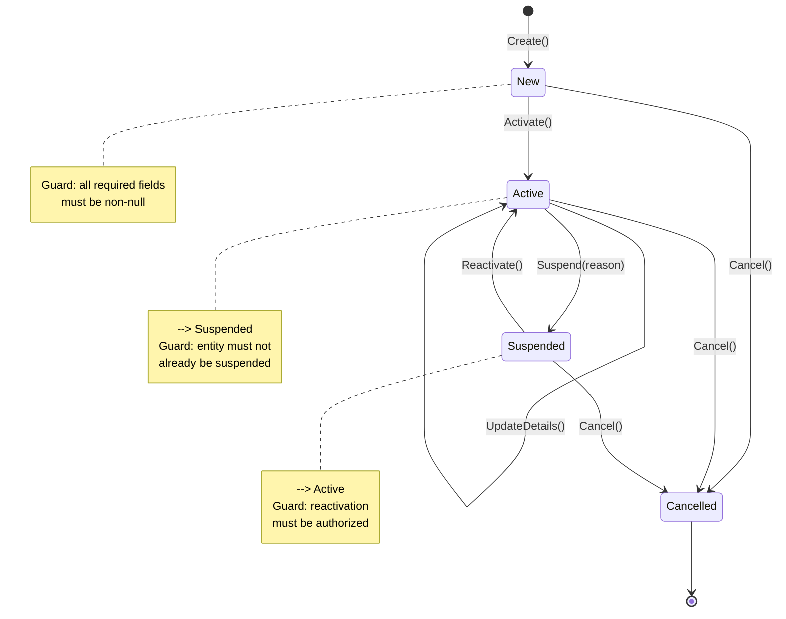
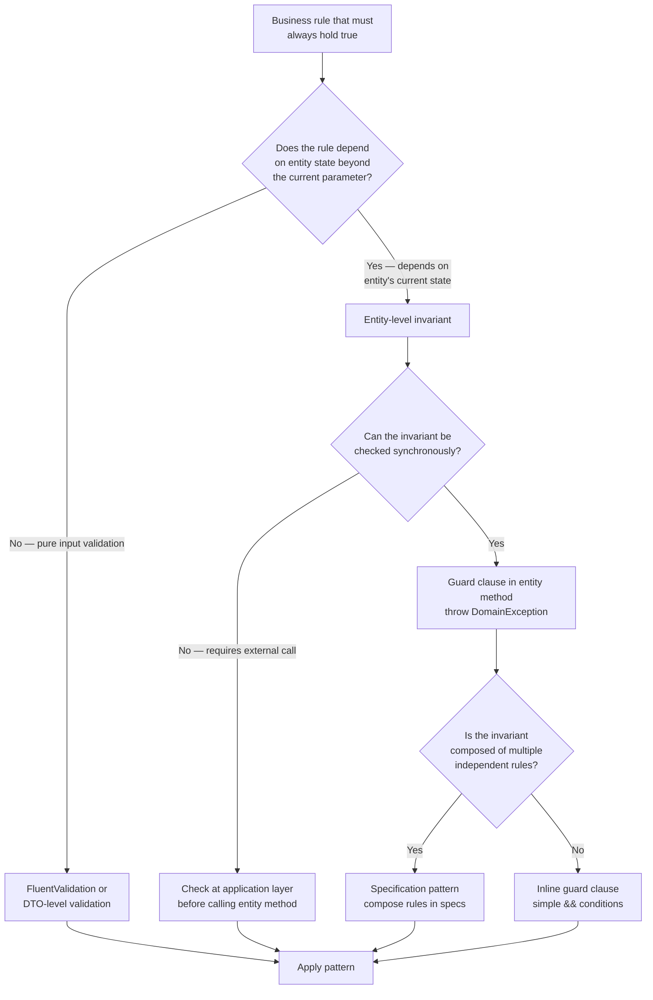

> [!success] Mastery Check
> - [ ] **Studied Well**
> - [ ] **Can explain the concept without notes**
> - [ ] **Can answer interview questions confidently**
> - [ ] **Can implement it in a real project**


# 7.044 — DDD — Entities — Invariant Enforcement

## Navigation

**Domain:** [[7 — System Design & Distributed Systems]] > **Group:** Domain-Driven Design
**Previous:** [[7.043 — DDD — Entities — Identity and Lifecycle]] | **Next:** [[7.045 — DDD — Value Objects — Equality and Immutability]]

### Prerequisites

- [[7.043 — DDD — Entities — Identity and Lifecycle]] — entities are objects with identity continuity; invariant enforcement is what ensures that an entity remains in a valid state through each state transition in its lifecycle
- [[7.033 — DDD — Bounded Contexts — Identifying Boundaries]] — invariants are bounded by context; the same concept may have different invariants in different contexts, and understanding boundary identification is required to scope invariant rules correctly
- [[7.047 — DDD — Aggregates — Consistency Boundary]] — entity invariants are a subset of aggregate invariants; knowing which invariants belong to the entity vs. the aggregate is a key design decision in tactical DDD

### Where This Fits

Invariant enforcement is the **mechanism by which a domain entity guarantees its own correctness** — the business rules that must always hold true no matter what operations are performed. It sits at the core of tactical DDD implementation in .NET: every entity method validates preconditions before mutating state, throws a domain exception if an invariant would be violated, and leaves the entity in a consistent state on success. Without explicit invariant enforcement, business rules leak into application services or are checked inconsistently across the codebase. In a production .NET system, this manifests as "where do we validate that an order can't be shipped before it's paid?" — and the wrong answer is "in the controller" or "in the UI." The right answer is "in the Order entity's Ship() method."

## Core Mental Model

Invariant enforcement is the practice of **embedding business rule validation within the entity itself** so that no code path can leave the entity in an invalid state. Every public method that mutates entity state performs two checks: are the preconditions met for this operation (the business logic guard), and does the result satisfy all invariant rules (the postcondition check). The core principle: **an entity must protect its own consistency** — no external layer (service, controller, repository) should be able to put an entity into a state that violates business rules.

### Classification

| Dimension | Classification | Rationale |
|---|---|---|
| Pattern Type | **Tactical DDD** | Operates within a single entity or aggregate boundary |
| Scope | **Entity-internal** | Invariants are defined and enforced within the entity class |
| Primary Concern | **Consistency of business rules** | Ensures no code path violates domain constraints |
| Enforcement Mechanism | **Guard clauses, domain exceptions** | Throws on violation — cannot silently produce invalid state |
| Lifetime | **Every state transition** | Checked on creation and every mutating operation |
| Testing Strategy | **Unit test every invariant path** | Test that valid operations succeed and invalid ones throw |



### Key Properties

| Property | Value | Condition |
|---|---|---|
| Business rule consistency | All invariants hold after every mutation | Entity methods enforce guards before state changes |
| Encapsulation | State mutations only through entity methods | No public setters — private field mutation only |
| Fail-fast | Invalid operations throw domain exceptions at call site | Violation detected before state is committed |
| Self-documenting rules | Invariants are readable as code in the entity | Business rules are colocated with the data they protect |
| Testing surface | Every invariant has a test case that exercises it | Full coverage requires N tests for N invariant paths |
| Concurrency protection | Only within single process/transaction | Cross-process invariants require aggregate consistency boundary |
| Performance overhead | Near zero for in-memory guard clauses | No I/O, no service calls for invariant checks |

## Deep Mechanics

### How It Works

Invariant enforcement follows a predictable pattern for every entity mutation:

1. **Command arrives** — A method is called on the entity: `order.Ship()`, `invoice.Pay(amount)`, `customer.ChangeAddress(newAddress)`.

2. **Precondition guards execute** — The method checks all preconditions before mutating any state. These include:
   - State machine validation (can this operation happen in the current state?)
   - Parameter validation (is the argument valid for this operation?)
   - Business rule validation (does this operation violate any domain constraint?)
   - Authorization validation (is the caller permitted to perform this operation?)

3. **State transition** — If all guards pass, the entity updates its internal state.

4. **Postcondition check** — After mutation, the entity verifies that all invariants still hold. This catches cases where multiple state changes in one operation collectively violate a rule.

5. **Event publication** — The entity adds a domain event to a collection, recording what happened for downstream processing.

6. **Return** — The method returns normally (void, result, or the new state).

```csharp
public sealed class Order
{
    private OrderStatus _status;
    private Money _totalAmount;
    private Money _amountPaid;
    private DateTimeOffset? _shippedAt;
    private readonly List<OrderEvent> _events = [];

    private Order() { } // EF Core

    public OrderId Id { get; private set; }
    public IReadOnlyList<OrderEvent> Events => _events.AsReadOnly();

    public void Ship(DateTimeOffset shippedAt)
    {
        // Guard 1: State machine — must be paid
        if (_status != OrderStatus.Paid)
            throw new DomainException($"Cannot ship order {Id.Value} in status {_status}. Must be Paid.");

        // Guard 2: Business rule — must have positive amount
        if (_totalAmount <= Money.Zero)
            throw new DomainException($"Cannot ship order {Id.Value} with zero total.");

        // State transition
        _status = OrderStatus.Shipped;
        _shippedAt = shippedAt;

        // Postcondition: invariants still hold
        EnsureInvariants();

        // Domain event
        _events.Add(new OrderShipped(Id.Value, shippedAt));
    }

    public void RecordPayment(Money amount)
    {
        if (amount <= Money.Zero)
            throw new ArgumentException("Payment amount must be positive.", nameof(amount));
        if (_status is OrderStatus.Shipped or OrderStatus.Delivered)
            throw new DomainException($"Cannot pay for already shipped order {Id.Value}.");
        if (_amountPaid + amount > _totalAmount)
            throw new DomainException($"Payment {amount} would overpay order {Id.Value}. Balance: {_totalAmount - _amountPaid}.");

        _amountPaid += amount;

        if (_amountPaid >= _totalAmount)
            _status = OrderStatus.Paid;

        EnsureInvariants();
        _events.Add(new PaymentRecorded(Id.Value, amount));
    }

    private void EnsureInvariants()
    {
        if (_amountPaid < Money.Zero)
            throw new InvariantViolationException("Amount paid cannot be negative.");
        if (_amountPaid > _totalAmount)
            throw new InvariantViolationException("Amount paid cannot exceed total.");
        if (_shippedAt.HasValue && _status != OrderStatus.Shipped && _status != OrderStatus.Delivered)
            throw new InvariantViolationException("ShippedAt requires Shipped or Delivered status.");
    }

    // Factory method — also enforces invariants
    public static Order Create(OrderId id, Money total, CustomerId customerId)
    {
        if (total <= Money.Zero)
            throw new ArgumentException("Order total must be positive.", nameof(total));

        var order = new Order
        {
            Id = id,
            _totalAmount = total,
            _status = OrderStatus.Pending,
            CustomerId = customerId
        };
        order.EnsureInvariants();
        order._events.Add(new OrderCreated(id.Value, total.Amount, customerId.Value));
        return order;
    }
}
```

### Failure Modes

**Failure Mode 1 — Invariants Leaked to Application Layer** — Business rules are checked in controllers or application services instead of in the entity. A new code path forgets to check.

- **Detection:** The same validation logic appears in multiple places. A bug is filed: "Admin bulk-import tool bypassed payment validation and shipped unpaid orders."
- **Fix:** Move all invariant logic into entity methods. Add architecture tests that forbid external validation of entity state.
- **Prevention:** Rule: "No public setters, no mutable properties, all state changes through methods."

**Failure Mode 2 — Silent Invariant Violation via ORM** — Entity has no `EnsureInvariants()` call after state changes. EF Core materializes an entity with invalid state from the database (data corruption from a previous bug or manual SQL fix).

- **Detection:** An entity in memory violates business rules. Application code crashes when it tries to use the entity, but the crash is confusing because "we never called Ship() on this."
- **Fix:** Add `EnsureInvariants()` calls in critical paths. Better: add an `OnMaterialized` interceptor in EF Core that validates invariants when loading from the database.
- **Prevention:** EF Core `IMaterializationInterceptor` that calls `EnsureInvariants()` after entity creation from the database.

**Failure Mode 3 — Invariants Broken by Constructor Bypass** — Entity has a public parameterless constructor (required by EF Core) and public setters. Anyone can create an entity in an invalid state.

- **Detection:** `Order()` with no arguments creates an order with null ID and zero amount. Downstream code crashes with `NullReferenceException`.
- **Fix:** Make the parameterless constructor private. Remove public setters. Only allow creation through factory methods or constructors that enforce invariants.

**Failure Mode 4 — Invariant Enforcement in the Wrong Layer** — Value objects do not enforce their own invariants, relying on the entity to do it. A new value object usage in a different entity misses the validation.

- **Detection:** `EmailAddress` is a string in the entity instead of a value object. The same email validation regex appears in 5 entities. A 6th entity is added without the regex.
- **Fix:** Domain primitives (value objects) enforce their own invariants. `EmailAddress` validates on creation. Entities use `EmailAddress` instead of `string`.

### .NET and Azure Integration

- **ASP.NET Core**: `ModelState.IsValid` validates incoming DTOs, but entity invariants are enforced deeper — controllers call entity methods and catch `DomainException` to return 400 responses
- **EF Core**: Private constructors, backing fields, and `IMaterializationInterceptor` for database-load invariant validation
- **FluentValidation**: Complements entity invariants by validating application-layer input before it reaches the entity; does NOT replace entity-level enforcement
- **MediatR**: Pipeline behaviors for `DomainException` handling — centralize the try/catch and map to `ProblemDetails`
- **Azure Functions / Service Bus**: Event-driven operations still go through entity methods — invariants are not bypassed because of async messaging

```csharp
// EF Core interceptor validates invariants when loading from DB
public sealed class InvariantValidationInterceptor : IMaterializationInterceptor
{
    public object MaterializedInstance(MaterializationInterceptionData data, object instance)
    {
        if (instance is IHasInvariants entity)
        {
            entity.EnsureInvariants(); // Throws if DB has corrupt data
        }
        return instance;
    }
}

// Registration
builder.Services.AddDbContext<OrderDbContext>(options =>
{
    options.UseSqlServer(connectionString);
    options.AddInterceptors(new InvariantValidationInterceptor());
});
```

## Production Patterns and Implementation

### Primary Implementation

```csharp
// Domain primitive enforces its own invariant
public sealed record EmailAddress
{
    public string Value { get; }

    public EmailAddress(string value)
    {
        if (string.IsNullOrWhiteSpace(value))
            throw new DomainException("Email address cannot be empty.");
        if (!value.Contains('@') || !value.Contains('.'))
            throw new DomainException($"'{value}' is not a valid email address.");
        Value = value.ToLowerInvariant();
    }
}

// Entity with full invariant enforcement
public sealed class Customer : IHasInvariants
{
    private CustomerId _id;
    private EmailAddress _email;
    private string _name;
    private CustomerStatus _status;
    private readonly List<CustomerEvent> _events = [];

    private Customer() { } // EF Core

    public CustomerId Id => _id;
    public string Name => _name;
    public CustomerStatus Status => _status;
    public IReadOnlyList<CustomerEvent> Events => _events.AsReadOnly();

    public static Customer Register(CustomerId id, string name, EmailAddress email)
    {
        if (string.IsNullOrWhiteSpace(name))
            throw new DomainException("Customer name cannot be empty.");

        var customer = new Customer
        {
            _id = id,
            _name = name,
            _email = email,
            _status = CustomerStatus.Active
        };
        customer.EnsureInvariants();
        customer._events.Add(new CustomerRegistered(id.Value, name, email.Value));
        return customer;
    }

    public void ChangeEmail(EmailAddress newEmail)
    {
        if (_status == CustomerStatus.Suspended)
            throw new DomainException($"Cannot change email for suspended customer {_id.Value}.");
        if (_email == newEmail)
            return; // No-op — not an error

        _email = newEmail;
        EnsureInvariants();
        _events.Add(new CustomerEmailChanged(_id.Value, newEmail.Value));
    }

    public void Suspend(string reason)
    {
        if (_status == CustomerStatus.Suspended)
            throw new DomainException($"Customer {_id.Value} is already suspended.");
        if (string.IsNullOrWhiteSpace(reason))
            throw new DomainException("Suspension reason is required.");

        _status = CustomerStatus.Suspended;
        EnsureInvariants();
        _events.Add(new CustomerSuspended(_id.Value, reason));
    }

    public void Reactivate()
    {
        if (_status != CustomerStatus.Suspended)
            throw new DomainException($"Cannot reactivate customer {_id.Value} in status {_status}.");

        _status = CustomerStatus.Active;
        EnsureInvariants();
        _events.Add(new CustomerReactivated(_id.Value));
    }

    void IHasInvariants.EnsureInvariants()
    {
        if (_id is null) throw new InvariantViolationException("Customer ID is required.");
        if (string.IsNullOrWhiteSpace(_name)) throw new InvariantViolationException("Customer name is required.");
        if (_email is null) throw new InvariantViolationException("Customer email is required.");
        if (!Enum.IsDefined(_status)) throw new InvariantViolationException("Invalid customer status.");
    }
}

public interface IHasInvariants
{
    void EnsureInvariants();
}
```

### Configuration and Wiring

```csharp
// Program.cs — register EF Core with invariant validation interceptor
builder.Services.AddDbContext<OrderDbContext>(options =>
{
    options.UseSqlServer(builder.Configuration.GetConnectionString("OrderDb"));
    options.AddInterceptors(new InvariantValidationInterceptor());
});

// MediatR pipeline that catches domain exceptions and maps to ProblemDetails
builder.Services.AddTransient(typeof(IPipelineBehavior<,>), typeof(DomainExceptionHandler<,>));

// FluentValidation for application-layer input (NOT entity invariants)
builder.Services.AddValidatorsFromAssemblyContaining<CreateOrderValidator>();
```

```csharp
// MediatR pipeline behavior for domain exception handling
public sealed class DomainExceptionHandler<TRequest, TResponse> : IPipelineBehavior<TRequest, TResponse>
    where TRequest : IRequest<TResponse>
{
    public async Task<TResponse> Handle(
        TRequest request, RequestHandlerDelegate<TResponse> next, CancellationToken ct)
    {
        try
        {
            return await next(ct);
        }
        catch (DomainException ex)
        {
            throw new ValidationException([new ValidationFailure("Domain", ex.Message)]);
        }
    }
}
```

### Common Variants

**Variant 1 — Result Object Instead of Exceptions**

Some teams prefer returning result objects rather than throwing exceptions for invariant violations, especially in CQRS command handlers.

```csharp
public sealed record DomainResult
{
    public bool IsSuccess { get; init; }
    public string? Error { get; init; }
    public static DomainResult Ok() => new() { IsSuccess = true };
    public static DomainResult Fail(string error) => new() { IsSuccess = false, Error = error };
}

// Usage in entity
public DomainResult Ship(DateTimeOffset shippedAt)
{
    if (_status != OrderStatus.Paid)
        return DomainResult.Fail($"Cannot ship order {Id.Value} in status {_status}.");
    if (_totalAmount <= Money.Zero)
        return DomainResult.Fail($"Cannot ship order {Id.Value} with zero total.");
    // ... mutate state, return Ok()
    return DomainResult.Ok();
}
```

**Variant 2 — Always-Valid Entity (Factory + Private Constructor)**

The entity is never in an invalid state because construction is only possible through validated factory methods, and mutations always leave the entity valid.

```csharp
public sealed class AlwaysValidOrder
{
    private AlwaysValidOrder() { } // Only the factory can create

    public static AlwaysValidOrder Create(OrderId id, Money total, CustomerId customerId)
    {
        // All validation here — after this point, the entity is always valid
        return new AlwaysValidOrder { /* ... */ };
    }
}
```

**Variant 3 — Specification-Based Invariant Validation**

For complex invariants with many rules, use the specification pattern to keep each rule testable in isolation.

```csharp
public interface IOrderInvariant
{
    string Description { get; }
    bool IsSatisfiedBy(Order order);
}

public sealed class OrderCanOnlyBeShippedAfterPayment : IOrderInvariant
{
    public string Description => "Order must be paid before shipping.";
    public bool IsSatisfiedBy(Order order) => order.Status != OrderStatus.Shipped || order.AmountPaid >= order.Total;
}

// Used within entity's EnsureInvariants()
private static readonly IReadOnlyList<IOrderInvariant> Invariants =
[
    new OrderCanOnlyBeShippedAfterPayment(),
    new OrderTotalMustBePositive(),
    // ...
];
```

### Real-World .NET Ecosystem Example

**EF Core's `OwnedEntity` and `ValueConversion`** enforce value object invariants at the persistence layer. When EF Core materializes an `OwnedEntity`, it calls the value object constructor — which enforces the invariant. This means a corrupt database row throws during materialization rather than silently producing an invalid domain object.

**FluentValidation** is commonly used alongside entity invariants but at a different layer: it validates application input (DTOs, commands) before they reach the domain. Entity invariants catch what FluentValidation misses — business logic constraints that depend on entity state, not just input format.

## Gotchas and Production Pitfalls

### Pitfall 1 — Invariants Only at the API Boundary

**Pitfall:** The team validates all business rules in controllers and FluentValidation validators. Entity classes have public setters and no invariant methods. A background job or integration event handler creates entities without going through the API layer.

```csharp
// ❌ No entity enforcement — all validation in the controller
public sealed class Order
{
    public Guid Id { get; set; } // Public setter!
    public string Status { get; set; } // Can set to any string!
    public decimal Amount { get; set; }
}

// Controller validates, but nothing stops this:
var order = new Order { Id = Guid.NewGuid(), Status = "NotARealStatus", Amount = -100 };
```

**Symptom:** A message handler imports orders from a legacy system and sets `Status = "Unknown"`. Three months later, the reporting team discovers 15,000 orders in an unprocessable state.

**Fix:** Remove public setters. Make all state changes go through methods that enforce invariants.

```csharp
// ✅ Invariant enforcement in the entity
public sealed class Order
{
    public Guid Id { get; private set; }
    private string _status;

    public OrderStatus Status => _status switch
    {
        "Pending" => OrderStatus.Pending,
        "Paid" => OrderStatus.Paid,
        "Shipped" => OrderStatus.Shipped,
        _ => throw new InvariantViolationException($"Unknown status: {_status}")
    };

    public static Order Create(Guid id, decimal amount)
    {
        if (amount <= 0) throw new DomainException("Amount must be positive.");
        return new Order { Id = id, _status = "Pending", Amount = amount };
    }

    public void Pay() { /* guards */ }
    public void Ship() { /* guards */ }
}
```

**Cost of not fixing:** Data corruption that goes undetected for months. Manual cleanup operations that cost engineering time and erode trust in data quality. Regulatory compliance issues if invalid state affects financial reporting.

### Pitfall 2 — Singing Everywhere (Duplicate Validation Logic)

**Pitfall:** The same business rule is checked in the entity AND in the application service AND in the controller AND in the UI. When the rule changes, one layer gets missed.

```csharp
// ❌ Same rule in 3 places
// Controller: if (order.Amount <= 0) return BadRequest();
// ApplicationService: if (request.Amount <= 0) throw new ValidationException();
// Entity: if (amount <= 0) throw new DomainException();
```

**Symptom:** A business rule change (minimum order amount changes from $0 to $5) is updated in the entity and service but not the controller. The API still accepts $1 orders.

**Fix:** Enforce invariants ONLY in the entity (and its value objects). The application layer maps DTOs to domain objects and lets the entity validate itself. The controller catches `DomainException` and returns appropriate HTTP responses.

```csharp
// ✅ Single source of truth — the entity
public static Order Create(OrderId id, Money amount)
{
    if (amount < Money.FromUsd(5))
        throw new DomainException("Minimum order amount is $5.");
    // ...
}

// Controller just catches domain exceptions
[HttpPost]
public async Task<IActionResult> CreateOrder([FromBody] CreateOrderRequest request)
{
    try
    {
        var command = new CreateOrderCommand(request.CustomerId, Money.FromUsd(request.Amount));
        var result = await _mediator.Send(command);
        return Ok(result);
    }
    catch (DomainException ex)
    {
        return BadRequest(new ProblemDetails { Detail = ex.Message });
    }
}
```

**Cost of not fixing:** Inconsistent validation — some code paths enforce the rule, others don't. Bugs manifest at the boundaries (integration events, admin tools, batch imports) where the validation layer is different.

### Pitfall 3 — EF Core Bypasses Invariants

**Pitfall:** Entity has a public parameterless constructor (required by older EF Core conventions) and public setters. EF Core can materialize an entity in an invalid state.

```csharp
// ❌ EF Core can create invalid entities
public class Order
{
    public Order() { } // Public — EF Core uses this
    public Guid Id { get; set; }
    public string Status { get; set; } // EF Core sets this directly
}
```

**Symptom:** A direct SQL update or a data migration creates an order with `Status = "Bogus"`. When the application loads this entity, it doesn't fail — the invalid status propagates silently until some downstream code tries to match on it.

**Fix:** Private parameterless constructor with backing fields. EF Core sets fields directly, bypassing the public API but still producing a structurally valid object.

```csharp
// ✅ Private constructor + backing fields
public sealed class Order
{
    private Order() { } // Private — EF Core uses this via reflection

    private string _status = "Pending";

    [BackingField(nameof(_status))]
    public OrderStatus Status => _status switch
    {
        "Pending" => OrderStatus.Pending,
        "Paid" => OrderStatus.Paid,
        "Shipped" => OrderStatus.Shipped,
        _ => throw new InvariantViolationException($"Unknown status: {_status}")
    };

    // EF Core configures backing field
}
```

**Cost of not fixing:** Silent data corruption. A corrupt database row produces an entity that appears valid but behaves unexpectedly. Debugging requires tracing through ORM materialization code — a path most developers don't examine.

### Pitfall 4 — Invariant Enforcement in Async Operations

**Pitfall:** An entity method awaits an external service call, then checks an invariant based on the response. Between the async call and the check, the entity's state may have changed if it's shared across threads or if a compensating action occurred.

```csharp
// ❌ Race condition: payment gateway called, then invariant checked
public async Task<PaymentResult> ProcessPaymentAsync(PaymentGateway gateway)
{
    var result = await gateway.ChargeAsync(_totalAmount);
    // Between await and guard, another thread could have modified _amountPaid
    if (_amountPaid + result.Charged > _totalAmount)
        throw new DomainException("Overpayment detected.");
    _amountPaid += result.Charged;
    return result;
}
```

**Symptom:** Intermittent "overpayment" errors in production. A support ticket shows the same customer was charged twice for the same order because two concurrent requests both passed the guard.

**Fix:** Keep entity methods synchronous. If an async operation is needed, load a fresh entity from the repository, perform the async work, and check invariants before saving.

```csharp
// ✅ Entity method is synchronous — async work happens at the application layer
public PaymentResult ProcessPayment(Money amount)
{
    if (_amountPaid + amount > _totalAmount)
        throw new DomainException($"Payment {amount} would overpay order {_id.Value}.");
    _amountPaid += amount;
    if (_amountPaid >= _totalAmount)
        _status = OrderStatus.Paid;
    EnsureInvariants();
    _events.Add(new PaymentRecorded(_id.Value, amount));
    return PaymentResult.Succeeded(amount);
}

// Application service handles async interaction
public async Task<PaymentResult> HandleAsync(PayOrderCommand command, CancellationToken ct)
{
    var order = await _orderRepository.GetByIdAsync(new OrderId(command.OrderId), ct);
    var chargeResult = await _paymentGateway.ChargeAsync(order.Total, ct);
    order.ProcessPayment(chargeResult.Amount); // Synchronous — no race
    await _orderRepository.SaveAsync(order, ct);
    return chargeResult;
}
```

**Cost of not fixing:** Concurrent payment processing leads to double charges. Customer complaints. Refund processing overhead. In the worst case, accounting reconciliation requires manual review of every concurrent transaction.

## Tradeoffs and Decision Framework

### Tradeoff Matrix

| Dimension | Entity-Level Invariants | Application Service Validation | Specification Pattern | Anemic Domain + DTOs |
|---|---|---|---|---|
| Rule colocation | Rules with data they protect | Rules separate from data | Rules in testable objects | No rules (trust external) |
| Testability | Per-entity tests | Per-service tests | Per-specification tests | No domain tests |
| DRY compliance | High — one place to check | Low — duplicated across services | High — specs compose | N/A |
| ORM compatibility | Moderate (private ctors, backing fields) | High (simple DTO mapping) | High | High |
| Learning curve | Moderate (DDD familiarity) | Low (familiar to all .NET devs) | Moderate (specification pattern) | Lowest |
| Production risk from bypass | Low — impossible to bypass | High — new code paths skip validation | Low — specs are reusable | Very high |

### Decision Flowchart



### When to Apply

- [ ] Business rules depend on the entity's current state (not just input format)
- [ ] Multiple code paths can create or modify the entity (API, background jobs, message handlers, admin tools)
- [ ] Data consistency is critical — an invalid entity state would cause financial, safety, or compliance issues
- [ ] The domain has well-understood state machines with defined transitions
- [ ] The team has DDD familiarity and understands private constructors, backing fields, and ORM mapping

### When NOT to Apply

- [ ] The entity is a simple CRUD-like data container with no behavior — use an anemic model with DTO validation instead
- [ ] The invariants are trivially enforced by the database schema (foreign keys, check constraints, not-null columns)
- [ ] The team does not have the discipline or testing infrastructure to maintain entity-level enforcement
- [ ] The ORM does not support the required mapping patterns (e.g., raw ADO.NET with no mapping layer)
- [ ] Performance requirements dictate that entity materialization must be zero-overhead (sub-millisecond load)

### Scale Thresholds

- **Entity-level invariants are worth the investment above ~1,000 lines of domain code** — below that, application-layer validation may suffice
- **Justified when 3+ code paths can modify an entity** — the protection against bypassed validation justifies the pattern investment
- **Required when entity state machine has 5+ states** — state explosion makes external validation unreliable
- **Over-engineering when the entity has only create-and-read operations** — if nothing changes state after creation, the factory method check alone is enough

## Interview Arsenal

### Question Bank

1. What is invariant enforcement in DDD and why does it matter?
2. Where should business rules be enforced — in the entity, the application service, or the controller?
3. How do you handle invariants that require data from an external service or database?
4. How do you test entity invariants? Walk through a test for an order that cannot be shipped before it's paid.
5. Compare entity-level invariant enforcement with FluentValidation — when do you use each?
6. How does EF Core interact with entity invariant enforcement? What traps exist?
7. Your entity has a complex state machine with 15 states and 25 transitions. How do you design invariant enforcement?
8. How do you handle cross-entity invariants (rules that span multiple entities)?

### Spoken Answers

**Q: What is invariant enforcement in DDD and why does it matter?**

> **Average answer:** Invariant enforcement means the entity checks if it's in a valid state before doing anything. It's important so you don't have invalid data in your system. The entity throws an exception if a rule is broken.

> **Great answer:** Invariant enforcement is the tactical DDD practice of embedding business rule validation directly within the entity itself — every public method that changes entity state starts with guard clauses that check preconditions, and optionally ends with a postcondition check that the entity is still valid. The reason this matters is encapsulation and the principle of self-protection: an entity is the sole authority on whether a proposed state change is legal. If validation lives in the application service or the controller, then every new code path that touches the entity — a new API endpoint, a background job, an integration event handler, an admin tool — must remember to check the same rules. In practice, one of those paths will forget. I've seen this happen with bulk import tools and data migration scripts that bypassed standard API validation and created thousands of orders in unshippable states. With entity-level enforcement, you cannot bypass the rules because there's no way to mutate state without going through the entity methods. The cost is that the entity class becomes larger and requires more disciplined testing — but that cost is bounded, while the cost of data corruption from bypassed validation is unbounded.

**Q: Compare entity-level invariant enforcement with FluentValidation.**

> **Average answer:** FluentValidation validates input, and entity invariants validate business rules. They're different layers. FluentValidation checks the format, entity checks the business logic.

> **Great answer:** FluentValidation and entity-level invariants operate at different layers with different concerns. FluentValidation validates the *shape and format* of application input — is the email field a valid email format, is the required field present, does the string length not exceed the database column size. It runs before the command reaches the domain layer. Entity-level invariants validate *business logic constraints that depend on the entity's current state* — can this order be shipped given its current status, does this payment cause an overpayment, can this customer be suspended if they have outstanding balances. FluentValidation can't answer these questions because they depend on state that's not in the request. So you need both: FluentValidation for input hygiene (which keeps the domain layer clean of string-format concerns), and entity invariants for business rule integrity. The common mistake is using FluentValidation for business rules — writing a custom validator that loads entity state from the database. That couples validation to the data access layer and spreads business logic outside the domain. The rule I follow: if the rule can be evaluated based on command data alone, it belongs in FluentValidation. If it needs entity state, it belongs in the entity.

**Q: How do you handle cross-entity invariants (rules that span multiple entities)?**

> **Great answer:** Cross-entity invariants are the indicator that those entities should probably be part of the same aggregate. In DDD, the aggregate is the consistency boundary for exactly this reason — if two entities have invariants that must be enforced atomically, they likely belong in the same aggregate with the aggregate root as the entry point for all mutations. For example, if an Order cannot exceed its Customer's credit limit, those two entities should be in the same aggregate (Order as root, Customer as a child) or the rule should be enforced by an aggregate-level method that can see both.

However, this is where theory meets practical constraints. Large aggregates cause performance problems — loading a Customer with all their Orders is often infeasible. In that case, you accept eventual consistency across aggregate boundaries. The invariant becomes: "When an order is placed, we check the customer's current credit limit and reject if exceeded. If a subsequent order also places within the same second, it might also pass before the credit decrement propagates." You document this as an accepted business risk and set monitoring to detect violations.

The implementation pattern: the application service loads both aggregates, checks the cross-entity invariant at the orchestration level, and saves both within the same database transaction. This is not pure DDD — it's pragmatic. But the entity invariants still protect each entity's internal consistency even if the cross-entity check is at the service level.
</details>

### System Design Interview Trigger

If an interviewer asks "how do you ensure business rules are never violated in your domain model?" — they are testing whether you understand that domain logic must live in the domain layer, not in controllers, services, or DTOs. The follow-up is typically about how you handle invariants that require external I/O (you don't — you keep entity methods synchronous and push async work to the application layer). The senior candidate will volunteer the EF Core concerns — private constructors, backing fields, and materialization interceptors — without being prompted.

### Comparison Table

| | Entity Invariants | Application Service Validation |
|---|---|---|
| Core guarantee | Business rules enforced on every state change | Input format and structure validated |
| Trade-off | Encapsulation for entity complexity | Simplicity for validation gaps |
| .NET implementation | Guard clauses, domain exceptions, private ctors | FluentValidation, Data Annotations |
| Failure mode | ORM bypasses invariants (public setters) | New code path skips validation layer |
| When to choose | Entity has behavior and state transitions | Entity is a simple data container |

## Architecture Decision Record

**Status:** Accepted

**Context:** The Order Management module in our e-commerce platform has accumulated business logic in controllers (20%), application services (45%), and entity classes (35%). A recent incident involved an admin bulk-import tool creating orders with negative amounts because the entity class had public setters and no invariant enforcement. The engineering team has decided to consolidate all business rule validation into the domain entities.

**Options Considered:**

1. **Entity-level invariant enforcement** — All business rules enforced in entity methods. Private constructors and backing fields. Domain exceptions for violations. EF Core materialization interceptor for database-load validation.
2. **FluentValidation on all commands** — Keep entities as simple data containers. Validate business rules in FluentValidation validators that inspect request data and loaded entity state.
3. **Anemic domain with service-layer validation** — No domain logic in entities. All validation in application services. Entities are DTOs with public get/set.
4. **Specification pattern** — Business rules are encapsulated in `ISpecification<T>` implementations that entities and services can use.

**Decision:** Adopt Option 1 (entity-level invariants) as the primary mechanism, with Option 2 (FluentValidation) for input-format validation only. Option 3 is rejected because the 4 production incidents from bypassed validation demonstrate that anemic entities do not provide sufficient protection. Option 4 is deferred — the current entities have simple enough invariants (state machine guards, boundary checks) that specifications would add indirection without commensurate benefit.

**Consequences:**
- ✅ All business rule violations are caught at the entity boundary, regardless of the code path that reaches the entity
- ✅ Entity methods are self-documenting — the guards serve as executable specification of business rules
- ✅ Testing is simpler — test the entity directly without mocking services or controllers
- ⚠️ Entity classes are larger and more complex — each public method includes guard clauses that may repeat preconditions
- ⚠️ EF Core mapping requires discipline — private constructors, backing fields, and materialization interceptors must be maintained as the schema evolves
- ❌ Performance overhead of invariant checks on every mutation, though this is negligible (sub-microsecond guard clauses)

**Review Trigger:** Revisit this decision if (a) entity unit tests exceed 5,000 lines — indicates entities are too complex and should be decomposed; (b) invariant enforcement is being duplicated in application services because entity methods are too hard to use from the application layer — indicates a design smell in the entity interface; (c) a performance benchmark shows entity materialization overhead exceeding 5% of total request time.

## Self-Check

### Conceptual Questions

1. What is an invariant in the context of DDD entities?

<details>
<summary>Answer</summary>
An invariant is a business rule that must always hold true for an entity. It is checked before and after every state mutation. Examples: "an order cannot be shipped before it is paid," "a customer's email must be a valid format," "a payment cannot exceed the invoice total."
</details>

2. Why should invariants be enforced inside the entity rather than in the application service?

<details>
<summary>Answer</summary>
Because the entity is the single authority on its own consistency. Application services can have multiple code paths (API, message handlers, admin tools, batch imports). If validation is in the service, a new code path may forget to check. Entity-level enforcement catches violations regardless of how the entity is reached.
</details>

3. When would you use FluentValidation instead of entity-level invariants?

<details>
<summary>Answer</summary>
For input-format validation that doesn't depend on entity state — email format, required fields, string length limits, numeric ranges. Entity invariants handle rules that depend on the entity's current state, such as "can this order be shipped?" Both are needed and they complement each other.
</details>

4. What happens when EF Core materializes an entity from the database with invalid state?

<details>
<summary>Answer</summary>
Unless an `IMaterializationInterceptor` calls `EnsureInvariants()`, the entity loads silently. The invalid state propagates through the application until some downstream code encounters a confusing error. Fix: add an interceptor that calls `EnsureInvariants()` on materialization.
</details>

5. How do you enforce invariants in a .NET entity with EF Core?

<details>
<summary>Answer</summary>
Private constructor for EF Core, backing fields for all properties, no public setters, all state changes through methods with guard clauses, `EnsureInvariants()` called after every mutation, and an `IMaterializationInterceptor` that validates on database load.
</details>

6. Compare entity-level invariants with the specification pattern for business rules.

<details>
<summary>Answer</summary>
Entity invariants are inline guard clauses inside the entity. The specification pattern externalizes rules into `ISpecification<T>` objects. Entity invariants are simpler and colocate rules with data. Specifications are better when (a) rules are reused across entities, (b) rules are composed dynamically, or (c) rules need to be tested in isolation.
</details>

7. At what point is entity-level invariant enforcement over-engineering?

<details>
<summary>Answer</summary>
When the entity is a simple data container with no behavior (create-only or read-only), or when the domain has only 2-3 states and no complex transitions. A simple CRUD entity backed by database constraints doesn't need entity-level enforcement.
</details>

8. How does entity invariant enforcement connect to aggregate consistency boundaries?

<details>
<summary>Answer</summary>
Entity invariants are a subset of aggregate invariants. The aggregate root is responsible for enforcing invariants that span multiple entities within the aggregate. Individual entities enforce their own internal invariants. Cross-entity invariants that require atomic consistency suggest those entities belong in the same aggregate.
</details>

9. What is the non-obvious production risk of entity-level invariants?

<details>
<summary>Answer</summary>
A domain exception from an invariant check inside a database transaction causes the transaction to roll back. If the entity's `_events` collection was populated before the invariant was checked, the events are lost. Fix: collect events but only publish them after the transaction succeeds, using a pattern like `IDomainEventCollector` or an outbox.
</details>

10. Explain invariant enforcement to a junior developer in 60 seconds.

<details>
<summary>Answer</summary>
"Think of an entity like a bank account. You can't withdraw more money than you have — that's an invariant. You don't want the ATM, the mobile app, the website, and the bank teller system each checking the balance independently, because someday one of them will forget. Instead, the Withdraw() method on the Account entity itself checks the balance before deducting. That way, no matter how the withdraw request arrives — ATM, app, teller — the same rule is enforced. That's entity-level invariant enforcement. The rule lives with the data it protects."
</details>

### Scenario Challenges

**Scenario 1 — Diagnose the problem**
Your e-commerce system processes 50,000 orders per day. A bug report: 300 orders were shipped without payment. Investigation reveals all 300 were created through a new "Admin Quick Ship" feature that bypasses the standard checkout flow. The feature calls `orderService.ShipOrder(orderId)` directly, which set `order.Status = "Shipped"` without checking if the order was paid. The `Order` entity has public `{ get; set; }` properties.

<details>
<summary>Diagnosis</summary>

**Root cause:** Anemic entity with no invariant enforcement. The `Order` class allowed direct property mutation. The new admin feature could set `Status` to `Shipped` without any guard.

**Evidence:** `Order.Status` is a public property with a public setter. No `Ship()` method exists on the entity. The admin feature does `order.Status = "Shipped"` directly.

**Fix:** Remove public setter on `Status`. Add a `Ship()` method that checks the order is in `Paid` state before changing status. Add a private constructor and backing fields for EF Core.

**Prevention:** Architecture test that forbids public setters on domain entities. Architecture review gate for any code that directly sets entity properties.
</details>

**Scenario 2 — Design decision**
You are designing a `Subscription` entity for a SaaS billing system. Invariants: (1) a subscription must have exactly one active plan at a time, (2) plan changes cannot be scheduled in the past, (3) a subscription cannot be cancelled if it has outstanding invoices, (4) the next billing date must always be in the future. Design the entity.

<details>
<summary>Decision and Reasoning</summary>

**Choice:** Full entity-level invariant enforcement with private constructor, backing fields, and synchronous guard clauses.

**Tradeoffs accepted:** Entity is larger (4 invariants = 4+ guard clauses). Some invariants (outstanding invoices) require the application layer to pass the check result since querying invoices is async.

**Implementation sketch:**
```csharp
public sealed class Subscription
{
    private Subscription() { }
    private SubscriptionPlan _plan;
    private DateTimeOffset _nextBillingDate;
    private SubscriptionStatus _status;

    public SubscriptionId Id { get; private set; }
    public SubscriptionPlan Plan => _plan;

    public void ChangePlan(SubscriptionPlan newPlan, DateTimeOffset effectiveDate)
    {
        if (effectiveDate < DateTimeOffset.UtcNow)
            throw new DomainException("Cannot schedule plan change in the past.");
        if (_status == SubscriptionStatus.Cancelled)
            throw new DomainException("Cannot change plan for cancelled subscription.");
        // Invariant: exactly one active plan — implicit, we replace the plan
        _plan = newPlan;
        EnsureInvariants();
    }

    public void Cancel(bool hasOutstandingInvoices)
    {
        if (hasOutstandingInvoices)
            throw new DomainException("Cannot cancel with outstanding invoices.");
        _status = SubscriptionStatus.Cancelled;
        EnsureInvariants();
    }

    private void EnsureInvariants()
    {
        if (_plan is null) throw new InvariantViolationException("Plan is required.");
        if (_nextBillingDate <= DateTimeOffset.UtcNow)
            throw new InvariantViolationException("Next billing date must be in the future.");
        if (_status == SubscriptionStatus.Cancelled && _nextBillingDate != default)
            throw new InvariantViolationException("Cancelled subscription should not have a billing date.");
    }
}
```
</details>

**Scenario 3 — Failure mode**
Your team has entity-level invariants, but the `_events` collection is populated during mutation and published after `SaveChangesAsync`. An invariant check thrown AFTER events are added causes the transaction to roll back — but the events were already logged to Application Insights for debugging. The next retry publishes duplicate events.

<details>
<summary>Investigation and Fix</summary>

**Investigation steps:** (1) Check the distribution chain — events are collected in entity's `_events` list, published in `SaveChangesAsync` via `IDomainEventDispatcher`. (2) Check if the dispatch happens before or after the database commit. (3) Find the entity method that populates events then throws.

**Confirming evidence:** Logs show duplicate domain events for the same entity operation. Event IDs match between the first (failed) attempt and the second (successful) attempt. The entity's `_events` list is not cleared on failure.

**Immediate mitigation:** Clear `_events` when an invariant check fails, OR ensure event collection only happens after all guards pass.

**Permanent fix:** Restructure entity methods so that events are added only after all state mutations are confirmed valid. Use a pattern where events are captured at the end:

```csharp
public void Ship(DateTimeOffset shippedAt)
{
    // All guards first — no events yet
    if (_status != OrderStatus.Paid) throw new DomainException(...);

    // All state changes
    _status = OrderStatus.Shipped;
    _shippedAt = shippedAt;

    // Invariants
    EnsureInvariants();

    // Events only after everything succeeds
    _events.Add(new OrderShipped(Id.Value, shippedAt));
}
```
</details>

**Scenario 4 — Scale it**
Your system processes 10,000 orders per second during peak. Each `Order.Ship()` call checks 5 invariants (state check, amount check, shipping address check, fraud flag check, payment confirmation check). Profiling shows invariant enforcement adds 0.5ms per operation — 5,000ms of CPU per second across all threads. At 10x scale (100K req/s), this becomes 50,000ms — 50 cores just for invariant checks.

<details>
<summary>Scaling Strategy</summary>

**Bottleneck this addresses:** Invariant check CPU overhead at scale.

**How it helps:** (1) Optimize hot-path invariants: the state machine check is a single enum comparison (~2ns), amount check is a decimal comparison (~10ns), shipping address format check can be cached. (2) Move expensive invariants to a separate validation pass: fraud flag check involves an external service call anyway — that's not CPU overhead from the entity, it's I/O in the application layer. (3) Use AOT compilation and aggressive inlining for guard clauses. (4) If invariants are still a bottleneck, batch validation — validate 100 orders at a time instead of one by one.

**What it does not solve:** Database write contention at 100K writes/s — that's a database scaling problem, not an invariant enforcement problem.

**Implementation order:** (1) Profile to confirm invariants are the bottleneck (they rarely are — typically I/O or serialization dominates. 0.5ms for 5 checks is suspiciously high — suggests one check involves a database call, which should be moved to the application layer). (2) Move any invariants that require I/O to the application layer. (3) Optimize remaining in-memory guards. (4) Consider C# source generators for compile-time invariant code generation if still a bottleneck.
</details>

**Scenario 5 — Interview simulation**
The interviewer says: "Your team is building a trading system. An Order entity has an invariant: 'A buy order cannot exceed the trader's available credit.' The credit data is in a different service (CreditService) with 20ms latency. How do you enforce this invariant?"

<details>
<summary>Model Response</summary>

"Let me clarify the constraints first. Is the credit check a hard requirement — meaning the trade must fail if credit is insufficient — or is it a soft check where we can accept a few milliseconds of inconsistency? Also, is this per-order or aggregated across open orders?

Assuming it's a hard requirement for regulatory reasons, the invariant cannot be synchronous inside the entity because entity methods should not perform I/O — that would make testing impossible and would require the entity to depend on an external service. Instead, I'd handle this in the application layer with a clear pattern:

The application service loads the entity and calls CreditService to get the trader's available credit. It then calls `order.Place(customer, creditLimit, otherParams)` — passing the credit data as a parameter. The entity checks: 'does this order exceed the provided credit limit?' The entity did not fetch the data — it just validates against what it was given.

The critical design decision is that the entity still enforces the invariant. It doesn't trust the caller — it validates the parameter. If some other code path calls `order.Place()` with a null or inflated credit limit, the entity still catches it because it can cross-reference the order total against the provided limit.

The tradeoff is that the credit data could be stale by the time the order is placed. If the trader placed two orders simultaneously, both could pass the check because each saw the same credit limit before the other order was committed. This is an eventual consistency concern. We accept this by: (1) optimizingistic concurrency on the trader aggregate, (2) adding a post-trade reconciliation job that flags and reverses trades that exceeded the credit limit due to race conditions, and (3) monitoring for credit limit violations as a business metric. The ADR should document that the invariant is enforced with 'near real-time' consistency — milliseconds of staleness are accepted, minutes would not be."
</details>
