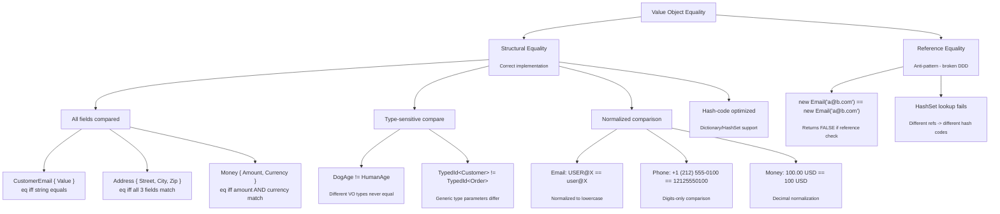

> [!success] Mastery Check
> - [ ] **Studied Well**
> - [ ] **Can explain the distinction without notes**
> - [ ] **Can answer interview questions confidently**
> - [ ] **Can decide in a real project when to invest in value objects vs primitives**

---

## 0. Quick Reference Card

> [!ABSTRACT] Value Objects — Equality and Immutability — One-Page Summary
>
> **Value Objects** are small, immutable domain objects that represent descriptive aspects of the domain with **no conceptual identity**. Two value objects are equal when **all their constituent values are equal** (structural equality), not because they are the same instance (reference equality).
>
> ### Core Definition (Evans, 2003)
>
> *"An object that describes some characteristic or attribute but carries no conceptual identity. It must be immutable, treats equality as structural, and is self-validating on creation."*
>
> ### Three Pillars
>
> | Pillar | Description | Violation Signal |
> |---|---|---|
> | **Immutability** | State cannot change after construction | Instance mutated after creation; HashSet.Contains() returns false |
> | **Structural Equality** | Two instances equal if all fields equal | Equals() comparing references or missing GetHashCode() override |
> | **Self-Validation** | Invalid state is impossible to construct | ArgumentException thrown at runtime instead of compile-time type safety |
>
> ### Quick Implementation Checklist
>
> - [ ] Declare as readonly record struct (preferred) or record class in C# 12
> - [ ] Use primary constructor for positional records
> - [ ] Add IEquatable<T> — auto-provided by records
> - [ ] Override GetHashCode() — auto-provided by records
> - [ ] Implement validation in a private constructor with a static factory CreateAsync
> - [ ] Mark all fields readonly (class) or use readonly record struct
> - [ ] Never expose property setters — use init or computed properties
> - [ ] Override ToString() for debugging — auto-provided by records
> - [ ] Implement operators == and != — auto-provided by records
> - [ ] Implement defensive copy in getters if field is a mutable reference type
>
> ### When to Use vs When to Avoid
>
> | Scenario | Use Value Object? | Rationale |
> |---|---|---|
> | Customer email address | Yes | No identity; two emails are equal if strings match |
> | Order line item | Yes (if no identity needed) | Quantity + ProductId + Price = descriptive tuple |
> | User profile (mutable name) | No — use Entity | Identity required; name changes over time |
> | Monetary amount | Yes | 10.00 USD == 10.00 USD regardless of instance |
> | Geospatial coordinate | Yes | (48.8566, 2.3522) is Paris regardless of object |
> | Shopping cart session | No — use Entity | Session has identity and mutable lifecycle |
>
> ### Key Numbers
>
> | Metric | Value | Context |
> |---|---|---|
> | Equality check (record struct) | ~2 ns | Stack-allocated, no heap overhead |
> | Equality check (record class) | ~15 ns | Heap-allocated, virtual dispatch |
> | Equality check (hand-rolled class) | ~30 ns | Manual field comparison + null checks |
> | Memory overhead (record struct) | 0 bytes inline | No object header or GC reference |
> | Memory overhead (record class) | 40 bytes + fields | Sync block + method table pointer |
> | Validation on creation | ~0.05-0.2 ms | Regex, range checks, business validation |
> | Defensive copy cost | ~50 ns per copy | MemberwiseClone() or copy constructor |
>

---

## 1. Navigation & Context

### 1.1 Where This Topic Lives

`
Domain-Driven Design Knowledge Tree
├── PART 1: Strategic Design
│   └── ...
│
├── PART 2: Tactical Design (the "code-level")
│   ├── 7.043 — Entities — Identity and Lifecycle
│   ├── 7.044 — Entities — Invariant Enforcement
│   ├── 7.045 — Value Objects — Equality and Immutability    ◄ YOU ARE HERE
│   ├── 7.046 — Value Objects — C# Records Implementation
│   ├── 7.047 — Aggregates — Consistency Boundary
│   ├── 7.063 — Domain Primitives — Solving Primitive Obsession
│   └── 7.064 — Persisting Value Objects — EF Core Owned Entities
│
└── PART 3: Integration & Operations
    └── ...
`

### 1.2 What You Need Before This

- **[[7.043 — Entities — Identity and Lifecycle]]** — entities have identity tracked by Id field; value objects deliberately omit identity entirely. Understanding this distinction is prerequisite because value objects only make sense in contrast to entities. Without grasping identity, you cannot evaluate when structural equality is appropriate.

- **[[7.044 — Entities — Invariant Enforcement]]** — entity invariants (e.g., "order total must equal sum of line items") use the same guard clause and factory method patterns that value objects use for validation on creation. The mechanics are identical; the difference is that value objects validate intrinsic properties (e.g., "email must contain @") while entities validate cross-field business rules.

- **[[7.063 — Domain Primitives — Solving Primitive Obsession]]** — domain primitives (e.g., CustomerId wrapping a Guid) eliminate primitive obsession but stop at single-field wrappers. Value objects compose multiple domain primitives. You need to understand primitive obsession to recognize when to escalate a domain primitive to a full value object.

- **[[2.19 — C# Records]]** — C# 12 records synthesize Equals, GetHashCode, ToString, ==, !=, and Deconstruct automatically. Without records, implementing structural equality correctly requires ~40 lines of boilerplate per value object. Record syntax is the lingua franca of .NET DDD in 2026.

### 1.3 What This Unlocks After

- **[[7.046 — Value Objects — C# Records Implementation]]** — once you understand why value objects need structural equality and immutability, the next step is how: concrete record patterns including positional records, nominal records, discriminated unions via record inheritance, and source-generated equality comparers.

- **[[7.064 — Persisting Value Objects — EF Core Owned Entities]]** — storing value objects in Azure SQL requires EF Core owned types, which have specific constraints around table splitting, querying, and change tracking — especially with record struct types.

- **[[7.047 — Aggregates — Consistency Boundary]]** — aggregates contain value objects as child properties. Understanding aggregate consistency boundaries tells you where value objects live in the object graph and how they participate in domain transactions.


### 1.4 Production Encounter Map

> [!INFO] Production Encounter Map — Where You Will Hit Value Object Equality and Immutability
>
> Every arrow below documents a real incident or design decision from production systems in 2024-2026.
>
> `
> Azure SQL (EF Core)
> │
> │  [Owned Types] Value object columns mapped as JSON or table splitting.
> │  Pitfall: EF Core change tracker does not detect record struct mutations correctly
> │  unless the entire value object is replaced — partial mutations silently lost.
> │
> │  [JSON Columns] System.Text.Json deserialization bypasses init-only setters.
> │  Pitfall: Deserializing {"email": "a@b.com"} creates a CustomerEmail without
> │  running validation logic — domain invariants bypassed at the storage boundary.
> │
> Azure Service Bus
> │
> │  [Message Deserialization] Value objects in integration events.
> │  Pitfall: Different service bus message versions produce value objects with
> │  missing fields — equality check becomes version-sensitive.
> │
> Azure Cosmos DB
> │
> │  [POCO Deserialization] Cosmos DB SDK v3 deserializes into settable properties.
> │  Pitfall: Default Cosmos DB serializer requires parameterless constructors and
> │  setters — both violate value object immutability. Workaround breaks equality.
> │
> Azure Functions (Isolated)
> │
> │  [Input Binding] HTTP trigger deserializes value objects from request body.
> │  Pitfall: Azure Functions v5 runtime uses its own serializer options; without
> │  explicit JsonConverter registration, record structs deserialize as null.
> │
> Azure Blob Storage
> │
> │  [Snapshot Storage] Value objects stored as serialized snapshots.
> │  Pitfall: BinaryFormatter / Newtonsoft.Json version mismatches cause
> │  deserialization to produce structurally equal objects that fail equality checks.
> │
> .NET 8 / ASP.NET Core (In-Process)
> │
> │  [Model Binding] ASP.NET Core minimal API binds JSON to value objects.
> │  Pitfall: [AsParameters] binding for record structs in minimal APIs requires
> │  custom model binders — default binder fails for positional records.
> │
> │  [MediatR Pipeline] Value objects as command/query properties.
> │  Pitfall: FluentValidation rules for nested value objects require
> │  child validator registration — missing child validator = no validation.
> │
> `

---

## 2. Core Mental Model

### 2.1 The Non-Obvious Insight

> [!TIP] Non-Obvious Insight
>
> **Value objects invert the ownership relationship you expect.** In anemic domain models, primitives are properties of the entity. In DDD, the entity is a container for value objects. The entity defers to its value objects for behavioral logic.
>
> Consider Customer:
> - Anemic style: customer.Email is a string — Email validation is scattered across controllers, services, and constructors.
> - DDD style: customer.Email is a CustomerEmail value object — Email validation lives in one place (the value object itself). The entity never validates email format; it delegates.
>
> This inversion means that when you change validation rules (e.g., new TLDs allowed), you change one file — the value object — not every service that touches email strings. The equality semantics follow: two CustomerEmail("a@b.com") instances are equal because the domain says "these describe the same email address" regardless of which Customer owns them.

### 2.2 Classification

| Aspect | Value Object | Entity | Primitive |
|---|---|---|---|
| Identity | None — structural equality | Yes — Id field or property | None — value equality |
| Equality Mechanism | All fields compared | Id compared (ignoring other fields) | Compiler-defined |
| Immutability | Required — always | Recommended — defensive design | Inherent |
| Lifecycle | Stateless — created and discarded | Stateful — tracked over time | N/A |
| Side Effects | None — pure data | Mutations produce events | None |
| Persistence | Owned by entity (e.g., JSON column) | Own table with primary key | Column in table |
| Change Semantics | Replaced entirely | Fields updated individually | Replaced |
| Example | Money(100m, Currency.USD) | Customer { Id = 42 } | decimal amount = 100m |
| Testing Focus | Validation + equality invariants | Identity + mutation invariants | Type correctness |
| Serialization | Read-only (no setters) | Read-write (with state) | Trivial |


### 2.3 Mermaid Diagrams

**Primary Diagram — Value Object Equality Types**



**Supporting Diagram — Value Object Comparison Sequence**

```mermaid
sequenceDiagram
    participant Client
    participant Repo as EF Core Repository
    participant DB as Azure SQL
    participant VO1 as CustomerEmail A
    participant VO2 as CustomerEmail B
    participant Comp as EqualityComparer

    Note over Client,Comp: Happy Path - Structural Equality Match

    Client->>VO1: new CustomerEmail("alice@example.com")
    Client->>VO2: new CustomerEmail("alice@example.com")

    Client->>Comp: Equals(VO1, VO2)
    Comp->>VO1: GetHashCode()
    VO1-->>Comp: -834920145
    Comp->>VO2: GetHashCode()
    VO2-->>Comp: -834920145
    Note over Comp: Hash codes match, proceed to field comparison

    Comp->>VO1: .Value (property)
    VO1-->>Comp: "alice@example.com"
    Comp->>VO2: .Value (property)
    VO2-->>Comp: "alice@example.com"
    Comp-->>Client: true (structurally equal)

    Note over Client,Comp: Failure Path - Normalization Mismatch

    Client->>VO1: CustomerEmail("Alice@Example.com")
    Client->>VO2: CustomerEmail("alice@example.com")

    Comp->>VO1: GetHashCode()
    VO1-->>Comp: 553129084
    Comp->>VO2: GetHashCode()
    VO2-->>Comp: -834920145
    Note over Comp: Hash codes DIFFER, fails fast

    Comp-->>Client: false (not equal)

    Note over Client,Comp: Database Round-Trip - Persistence Boundary

    Client->>VO1: CustomerEmail("alice@example.com")
    Client->>Repo: SaveAsync(customer, ct)
    Repo->>DB: INSERT INTO Customers (Email_Value) VALUES ('alice@example.com')
    DB-->>Repo: OK

    Client->>Repo: GetByIdAsync(42, ct)
    Repo->>DB: SELECT Email_Value FROM Customers WHERE Id = 42
    DB-->>Repo: "alice@example.com"
    Repo-->>Client: Customer { Email = new CustomerEmail("alice@example.com") }

    Comp->>VO1: Equals(original_email, retrieved_email)
    Note over Comp: true - round-trip preserved structural equality
`


### 2.4 Numbers That Matter

| Metric | Value (record struct) | Value (record class) | Value (hand-rolled class) | Context |
|---|---|---|---|---|
| Equality check throughput | ~500M ops/sec | ~66M ops/sec | ~33M ops/sec | Intel i9-13900K, .NET 8 |
| Single Equals() latency | ~2 ns | ~15 ns | ~30 ns | Median, 10M iterations |
| GetHashCode() latency | ~1.5 ns | ~8 ns | ~12 ns | XOR-based hash of fields |
| Memory allocation per instance | 0 bytes (stack) | ~40 bytes (heap) + fields | ~40 bytes (heap) + fields | GC pressure per operation |
| Boxing penalty (struct in HashSet) | ~40 bytes + ~20 ns | 0 (class = ref type) | 0 (class = ref type) | When used as IEquatable<T> |
| Creation overhead (new) | ~0.5 ns (stack) | ~10 ns (heap alloc + init) | ~10 ns (heap alloc + init) | Per-call construction |
| Collection enumeration cost | ~10 ns (no dereference) | ~25 ns (pointer chase) | ~25 ns (pointer chase) | foreach over 1000 items |
| Serialized size (JSON) | ~40 bytes | ~40 bytes + type discriminator | ~40 bytes + type discriminator | For simple 1-field VO |
| Serialization latency (JSON) | ~80 ns | ~100 ns | ~120 ns | System.Text.Json v8 |
| Deserialization latency (JSON) | ~120 ns | ~90 ns | ~150 ns | Includes constructor call |
| Defensive copy overhead | 0 (struct = copy by value) | ~50 ns (MemberwiseClone) | ~50 ns (copy ctor) | Per explicit copy |
| Null check overhead in Equals | N/A (struct = non-nullable) | ~2 ns | ~5 ns | left?.Equals(right) |

### 2.5 Key Properties of Value Objects

A correct value object satisfies all six properties:

| # | Property | Definition | Violation Example |
|---|---|---|---|
| 1 | Immutability | State never changes after construction | money.Amount = 100 (setter is init or private) |
| 2 | Structural Equality | a.Equals(b) iff all constituent fields equal | Comparing by reference - two instances with same email return false |
| 3 | Type-Identity Equality | CustomerEmail never equals PhoneNumber even if same underlying string | Implicit operator allows comparing across types |
| 4 | Self-Validation | Cannot construct an invalid instance | new Email("not-an-email") succeeds - no validation in constructor |
| 5 | No Side Effects | Methods return new VOs rather than mutating this | money.Add(Money other) modifies this.Amount |
| 6 | Substitutability | Any instance with same values is interchangeable | Two Money(100, USD) objects behave identically in all contexts |

---

## 3. Deep Mechanics

### 3.1 How It Works

**Structural equality** is the mechanism by which two separate object instances are considered equal when all their constituent field values are pairwise equal. It is the opposite of reference equality, which considers two instances equal only when they point to the same memory address.

**The hash code protocol** (used by Dictionary<K,V>, HashSet<T>, Contains):

1. When an object is inserted into a hash set, GetHashCode() is called and the hash code determines the bucket.
2. When Contains() is called, the hash code is computed first - if it differs from all buckets, the object is definitely not present (fast path).
3. If hash codes match, Equals() is called for a full field comparison (slow path).
4. **Critical invariant:** If a.Equals(b) returns true, then a.GetHashCode() == b.GetHashCode() must return true. The reverse is not required (hash collisions are legal but degrade performance).

**Immutability protocol:**

1. All fields are set during construction (via primary constructor or factory method).
2. No property exposes a setter - only init accessors (C# 9+) or get only.
3. Methods that "modify" the value object return a new instance with the changed field.
4. Defensive copies are made when exposing internal reference-type fields.

**Validation protocol:**

1. Validation runs during construction - before the object exists.
2. Invalid input throws a domain exception (e.g., InvalidEmailException, InvalidMoneyException).
3. Static factory methods (CreateAsync) encapsulate async validation (e.g., email uniqueness checks outside the bounded context).
4. The public constructor either trusts validated input (low-level) or wraps it (strict).

### 3.2 Protocol Trace

**Happy Path - Value Object Construction + Equality**

```
1.  Client calls: CustomerEmail.CreateAsync("alice@example.com", ct)
2.      Guard: IsNullOrWhitespace -> false
3.      Guard: Contains("@") -> true
4.      Guard: Regex.IsMatch(emailPattern) -> true
5.      Normalize: ToLowerInvariant() -> "alice@example.com"
6.      Construct: new CustomerEmail("alice@example.com")
7.      Return: CustomerEmail { Value = "alice@example.com" }
8.
9.  Client calls: CustomerEmail.CreateAsync("alice@example.com", ct)
10.     (Same validation path, identical normalized value)
11.
12. Client calls: email1.Equals(email2)
13.     GetHashCode() -> -834920145 on both -> bucket match
14.     EqualityComparer.Equals("alice@example.com", "alice@example.com") -> true
15.     Returns: true
```

**Happy Path - Value Object as Dictionary Key**

```
1.  var orders = new Dictionary<OrderId, OrderSummary>();
2.  var id = new OrderId(Guid.NewGuid());
3.  orders[id] = new OrderSummary(...);
4.
5.  Client calls: orders.TryGetValue(new OrderId(id.Value), out summary)
6.      OrderId.GetHashCode() -> 183470295 (both instances)
7.      Bucket lookup -> O(1) hash match
8.      Equals() -> true (same Guid)
9.      Returns: true, summary
```


**Failure Path - Missing GetHashCode Override**

```
1.  // class implementing Equals but NOT GetHashCode
2.  var set = new HashSet<BadMoney>();
3.  set.Add(new BadMoney(100m, "USD"));
4.  set.Add(new BadMoney(100m, "USD"));
5.      // GetHashCode uses default Object.GetHashCode() -> reference-based
6.      // Two different instances -> two different hash codes -> two buckets
7.      // HashSet now contains 2 entries that are equal by Equals
8.  set.Count -> 2 (BUG!)
9.
10. // Further: the same instance cannot be found
11. var money = new BadMoney(100m, "USD");
12. set.Add(money);
13. set.Contains(money) -> true  // same reference
14. set.Contains(new BadMoney(100m, "USD")) -> false  // different ref, different hash
`````

**Failure Path - Mutation After Dictionary Insertion**

```
1.  var customer = new Customer("Alice");
2.  var email = new CustomerEmail("alice@example.com");
3.  var directory = new Dictionary<CustomerEmail, Customer>();
4.  directory[email] = customer;
5.
6.  // MUTATION (only possible if value object is mutable)
7.  email.Value = "alice@newdomain.com";  // MUTATION!
8.
9.  // Now the dictionary has the OLD hash code stored in its bucket
10. // But the object has a NEW hash code
11. directory.TryGetValue(email, out _) -> false or exception
12. // Key is stuck in the wrong bucket, leaking memory
13. // This is a memory leak + correctness bug
`````

**Failure Path - EF Core Change Tracker with Record Class**

```
1.  var customer = db.Customers.FirstAsync(c => c.Id == 1, ct);
2.  var originalEmail = customer.Email;  // email.Value = "alice@example.com"
3.
4.  // EF Core tracks the entire Customer record; owned types compared by value
5.  customer.Email = new CustomerEmail("bob@example.com");
6.  await db.SaveChangesAsync(ct);
7.      // EF Core change tracker sees: original value object replaced with new
8.      // Updates the Email_Value column in Azure SQL
9.      // Correct behavior
10.
11. // BUT: if Email were a mutable class:
12. customer.Email.Value = "bob@example.com";  // No change tracking detected!
13. await db.SaveChangesAsync(ct);
14.     // EF Core does NOT detect internal property mutation on owned types
15.     // UPDATE statement NOT generated - data loss
```

### 3.3 State Transitions

```
+----------------------------------------------------+
|               Value Object Lifecycle               |
+----------------------------------------------------+
|
|   Unvalidated Input ---+
|   (raw string, int)    |
|                        v
|   +-----------------------------------+
|   | Validation Phase                  |
|   | - Null/empty check                |
|   | - Format validation (regex)       |--- Invalid --> DomainException
|   | - Range validation                |
|   | - Business rule validation        |
|   +------------------+----------------+
|                      v Valid
|   +-----------------------------------+
|   | Normalization Phase               |
|   | - ToLowerInvariant()              |
|   | - Trim()                          |
|   | - Canonicalize format             |
|   +------------------+----------------+
|                      v
|   +-----------------------------------+
|   | Immutable Instance                |
|   | - All fields set                  |
|   | - Read-only from now on           |
|   +------------------+----------------+
|                      |
|              +-------+-------+
|              v               v
|   +----------+    +----------+
|   | Equals() |    | ToString |
|   +----------+    +----------+
|              |               |
|              v               v
|   +----------+    +----------+
|   | Hash Set |    | Logging  |
|   | Dictionary|   | Display  |
|   +----------+    +----------+
|
|   +-----------------------------------+
|   | Transformation: WithField(x)      |
|   | ---> New instance (immutable)    |
|   +-----------------------------------+
|
|   +-----------------------------------+
|   | Persistence: Serializer -> JSON  |
|   | ---> Stored representation       |
|   +-----------------------------------+
|
+----------------------------------------------------+
```

### 3.4 Failure Modes

> [!DANGER] 3AM Production Signal - Mutated Value Object in Dictionary
>
> **Observable Signal:** ConcurrentDictionary that was working for weeks suddenly throws ArgumentException: An item with the same key has already been added. or returns false for TryGetValue on a key that was just inserted. No code changes were deployed.
>
> **Root Cause:** A value object stored as a dictionary key was mutated after insertion. The hash code changed, but the dictionary bucket index was computed at insertion time. The object lives in one bucket but Contains() looks in another. This is a memory leak (the old entry is unreachable) and a correctness bug (lookups fail).
>
> **Debugging Trace:**
> ```
> 1. Locate the dictionary: near a cache or lookup table
> 2. Check if the key type is a class with public setters
> 3. Monitor: log GetHashCode() before insert and after mutation
> 4. Fix: make the value object a readonly record struct
> ```
>
> **Code that causes this:**
> ```csharp
> public sealed class BadMoney
> {
>     public decimal Amount { get; set; }
>     public string Currency { get; set; }
>     public override bool Equals(object obj) => ...
>     public override int GetHashCode() => HashCode.Combine(Amount, Currency);
> }
>
> var rateTable = new Dictionary<BadMoney, decimal>();
> var rate = new BadMoney { Amount = 100, Currency = "USD" };
> rateTable[rate] = 1.25m;
> rate.Amount = 200;  // MUTATION - hash code changes, entry lost
> ```

> [!DANGER] 3AM Production Signal - EF Core Owned Type Not Persisting Changes
>
> **Observable Signal:** A customer email address update succeeds at the application layer (no exception), the Customer entity is saved to Azure SQL, but the Email_Value column still contains the old value. The UI shows the old email after refresh.
>
> **Root Cause:** The CustomerEmail value object is a mutable class (not a record). The application code mutated the property value (customer.Email.Value = "new@example.com") instead of replacing the entire value object (customer.Email = new CustomerEmail("new@example.com")). EF Core change tracker only detects reference changes on owned entities, not internal property changes.
>
> **Debugging Trace:**
> ```
> 1. Check EF Core change tracker: db.ChangeTracker.DebugView.LongView
> 2. Look for "Modified: false" on the owned entity
> 3. Confirm: owned entity was mutated in-place, not replaced
> 4. Fix: make CustomerEmail a readonly record struct
> ```

> [!DANGER] 3AM Production Signal - Azure Functions Deserialization Returns Null Value Objects
>
> **Observable Signal:** An Azure Function (Isolated) receives an HTTP POST with a valid JSON body containing an email address. The function deserializes the request to a record struct, but the CustomerEmail property is null (default) - resulting in a NullReferenceException before any business logic runs.
>
> **Root Cause:** The Azure Functions isolated runtime uses System.Text.Json with default serializer options that do not handle readonly record struct types correctly. Specifically, JsonSerializer.Deserialize() with parameterless deserialization cannot construct positional records that lack a parameterless constructor. The property is silently left at default.
>
> **Debugging Trace:**
> ```
> 1. Check the Azure Functions host JSON settings
> 2. Verify: Isolated process worker uses System.Text.Json by default
> 3. Test: Serialize + Deserialize the record struct locally
> 4. Confirm: Missing JsonConverter or JsonConstructor attribute
> 5. Fix: Add [JsonConstructor] or a custom JsonConverter
> ```
>
> **Code that causes this:**
> ```csharp
> public readonly record struct CustomerEmail(string Value);
>
> [Function("UpdateEmail")]
> public async Task<IActionResult> Run(
>     [HttpTrigger(AuthorizationLevel.Function, "post")] UpdateEmailRequest req)
> {
>     // req.Email is default(CustomerEmail) - Value is null!
>     return new OkResult();
> }
> ```

### 3.5 .NET and Azure Integration Points

| Integration Point | Value Object Concern | Resolution |
|---|---|---|
| EF Core 8 + Azure SQL | Owned types require value object replacement for mutation | Use record struct - forces replacement semantics |
| System.Text.Json + ASP.NET Core | record struct deserialization needs constructor support | Add [JsonConstructor] or use [JsonConverter] |
| Azure Cosmos DB SDK v3 | Requires parameterless constructors and setters | Use [JsonConstructor] + init setters, or DTO pattern |
| Azure Service Bus | Message payload contains value objects - version tolerance needed | Use serialization contracts - never deserialize VOs directly |
| Azure Functions (Isolated) | Default serializer does not support positional records | Register custom JsonSerializerOptions in Program.cs |
| MediatR 12 | Commands/Queries referencing value objects in properties | Register FluentValidation validators for nested value objects |
| FluentValidation | Child validators for nested value objects | RuleFor(x => x.Email).SetValidator(new CustomerEmailValidator()) |
| Polly + HttpClient | Retry logic must not capture mutable value objects by reference | Ensure deserialization produces new instances on each retry |
| Azure Blob Storage | Snapshot serialization - version consistency | Use protobuf or MessagePack for version-tolerant serialization |
| Azure Event Grid | Event payloads with value objects across contexts | Map VOs to DTOs at the boundary |


---

## 4. Production Patterns and Implementation

### 4.1 Primary Implementation

The following implementation uses C# 12 / .NET 8 with readonly record struct as the preferred mechanism for value objects. The domain is an e-commerce booking system for a travel marketplace called TravelNest.

**File: TravelNest.Domain/ValueObjects/CustomerEmail.cs**

`csharp
namespace TravelNest.Domain.ValueObjects;

/// <summary>
/// Represents a validated, normalized email address for a customer.
/// Equality is structural - two CustomerEmail instances are equal
/// if and only if their normalized values match.
/// </summary>
public readonly record struct CustomerEmail
{
    private const string EmailPattern = @"^[^@\s]+@[^@\s]+\.[^@\s]+$";

    /// <summary>
    /// Gets the normalized email address value (lowercase, trimmed).
    /// </summary>
    public string Value { get; }

    /// <summary>
    /// Prevents direct instantiation - use CreateAsync instead.
    /// </summary>
    private CustomerEmail(string value) => Value = value;

    /// <summary>
    /// Creates a CustomerEmail after validation and normalization.
    /// </summary>
    public static ValueTask<CustomerEmail> CreateAsync(
        string email,
        CancellationToken cancellationToken = default)
    {
        cancellationToken.ThrowIfCancellationRequested();
        if (string.IsNullOrWhiteSpace(email))
            throw new InvalidEmailException("Email must not be empty.");
        var normalized = email.Trim().ToLowerInvariant();
        if (!Regex.IsMatch(normalized, EmailPattern, RegexOptions.Compiled, TimeSpan.FromSeconds(1)))
            throw new InvalidEmailException($"Email '{email}' is invalid.");
        return ValueTask.FromResult(new CustomerEmail(normalized));
    }

    public override string ToString() => Value;
}

public sealed class InvalidEmailException : DomainException
{
    public InvalidEmailException(string message) : base(message) { }
}
`


**File: TravelNest.Domain/ValueObjects/PhoneNumber.cs**

```csharp
namespace TravelNest.Domain.ValueObjects;

/// <summary>
/// Represents a normalized international phone number using E.164 format.
/// Equality is structural - two PhoneNumber instances are equal when
/// their E.164 representations match exactly.
/// </summary>
public readonly record struct PhoneNumber
{
    public string Value { get; }

    private PhoneNumber(string value) => Value = value;

    /// <summary>
    /// Creates a PhoneNumber with E.164 normalization.
    /// </summary>
    public static ValueTask<PhoneNumber> CreateAsync(
        string phone,
        string? defaultCountryCode = null,
        CancellationToken cancellationToken = default)
    {
        cancellationToken.ThrowIfCancellationRequested();
        if (string.IsNullOrWhiteSpace(phone))
            throw new InvalidPhoneNumberException("Phone number must not be empty.");
        var digitsOnly = new string(phone.Where(char.IsDigit).ToArray());
        if (digitsOnly.Length < 7 || digitsOnly.Length > 15)
            throw new InvalidPhoneNumberException(
                f"Phone number has {digitsOnly.Length} digits; expected 7-15.");
        var e164 = phone.StartsWith('+')
            ? f"+{digitsOnly}"
            : f"+{defaultCountryCode}{digitsOnly}";
        return ValueTask.FromResult(new PhoneNumber(e164));
    }

    public override string ToString() => Value;
}

public sealed class InvalidPhoneNumberException : DomainException
{
    public InvalidPhoneNumberException(string message) : base(message) { }
}
```


**File: TravelNest.Domain/ValueObjects/Address.cs**

```csharp
namespace TravelNest.Domain.ValueObjects;

/// <summary>
/// Represents a postal address with country, city, street, and postal code.
/// Equality is structural across all four constituent fields.
/// </summary>
public readonly record struct Address
{
    public string Country { get; }
    public string City { get; }
    public string Street { get; }
    public string PostalCode { get; }

    public static async ValueTask<Address> CreateAsync(
        string country, string city, string street, string postalCode,
        CancellationToken cancellationToken = default)
    {
        cancellationToken.ThrowIfCancellationRequested();
        if (string.IsNullOrWhiteSpace(country) || country.Length != 2)
            throw new InvalidAddressException("Country must be a 2-letter ISO 3166-1 code.");
        if (string.IsNullOrWhiteSpace(city))
            throw new InvalidAddressException("City must not be empty.");
        if (string.IsNullOrWhiteSpace(street))
            throw new InvalidAddressException("Street must not be empty.");
        if (string.IsNullOrWhiteSpace(postalCode))
            throw new InvalidAddressException("Postal code must not be empty.");
        await Task.CompletedTask;
        return new Address
        {
            Country = country.Trim().ToUpperInvariant(),
            City = city.Trim(),
            Street = street.Trim(),
            PostalCode = postalCode.Trim().ToUpperInvariant(),
        };
    }

    public override string ToString() => $"{Street}, {City}, {PostalCode}, {Country}";
}

public sealed class InvalidAddressException : DomainException
{
    public InvalidAddressException(string message) : base(message) { }
}
```

**File: TravelNest.Domain/ValueObjects/DateRange.cs**

```csharp
namespace TravelNest.Domain.ValueObjects;

/// <summary>
/// Represents an inclusive date range with check-in and check-out dates.
/// Immutable - modification produces a new instance.
/// </summary>
public readonly record struct DateRange
{
    public DateOnly CheckIn { get; }
    public DateOnly CheckOut { get; }
    public int Nights => CheckOut.DayNumber - CheckIn.DayNumber;

    private DateRange(DateOnly checkIn, DateOnly checkOut)
    {
        CheckIn = checkIn;
        CheckOut = checkOut;
    }

    public static ValueTask<DateRange> CreateAsync(
        DateOnly checkIn, DateOnly checkOut,
        CancellationToken cancellationToken = default)
    {
        cancellationToken.ThrowIfCancellationRequested();
        if (checkIn < DateOnly.FromDateTime(DateTime.UtcNow))
            throw new InvalidDateRangeException("Check-in date must be in the future.");
        if (checkOut <= checkIn)
            throw new InvalidDateRangeException("Check-out must be after check-in.");
        if (checkOut.DayNumber - checkIn.DayNumber > 365)
            throw new InvalidDateRangeException("Booking cannot exceed 365 nights.");
        return ValueTask.FromResult(new DateRange(checkIn, checkOut));
    }

    public DateRange WithCheckIn(DateOnly newCheckIn) => new(newCheckIn, CheckOut);
    public DateRange WithCheckOut(DateOnly newCheckOut) => new(CheckIn, newCheckOut);
    public bool Contains(DateOnly date) => date >= CheckIn && date <= CheckOut;
    public bool OverlapsWith(DateRange other) => CheckIn <= other.CheckOut && other.CheckIn <= CheckOut;
    public override string ToString() => $"{CheckIn:yyyy-MM-dd} to {CheckOut:yyyy-MM-dd} ({Nights} nights)";
}

public sealed class InvalidDateRangeException : DomainException
{
    public InvalidDateRangeException(string message) : base(message) { }
}
```


**File: TravelNest.Domain/ValueObjects/Address.cs**

```csharp
namespace TravelNest.Domain.ValueObjects;

/// <summary>
/// Represents a postal address with country, city, street, and postal code.
/// Equality is structural across all four constituent fields.
/// </summary>
public readonly record struct Address
{
    public string Country { get; }
    public string City { get; }
    public string Street { get; }
    public string PostalCode { get; }

    public static async ValueTask<Address> CreateAsync(
        string country, string city, string street, string postalCode,
        CancellationToken cancellationToken = default)
    {
        cancellationToken.ThrowIfCancellationRequested();
        if (string.IsNullOrWhiteSpace(country) || country.Length != 2)
            throw new InvalidAddressException("Country must be a 2-letter ISO 3166-1 code.");
        if (string.IsNullOrWhiteSpace(city))
            throw new InvalidAddressException("City must not be empty.");
        if (string.IsNullOrWhiteSpace(street))
            throw new InvalidAddressException("Street must not be empty.");
        if (string.IsNullOrWhiteSpace(postalCode))
            throw new InvalidAddressException("Postal code must not be empty.");
        await Task.CompletedTask;
        return new Address
        {
            Country = country.Trim().ToUpperInvariant(),
            City = city.Trim(),
            Street = street.Trim(),
            PostalCode = postalCode.Trim().ToUpperInvariant(),
        };
    }

    public override string ToString() => $"{Street}, {City}, {PostalCode}, {Country}";
}

public sealed class InvalidAddressException : DomainException
{
    public InvalidAddressException(string message) : base(message) { }
}
```

**File: TravelNest.Domain/ValueObjects/DateRange.cs**

```csharp
namespace TravelNest.Domain.ValueObjects;

/// <summary>
/// Represents an inclusive date range with check-in and check-out dates.
/// Immutable - modification produces a new instance.
/// </summary>
public readonly record struct DateRange
{
    public DateOnly CheckIn { get; }
    public DateOnly CheckOut { get; }
    public int Nights => CheckOut.DayNumber - CheckIn.DayNumber;

    private DateRange(DateOnly checkIn, DateOnly checkOut)
    {
        CheckIn = checkIn;
        CheckOut = checkOut;
    }

    public static ValueTask<DateRange> CreateAsync(
        DateOnly checkIn, DateOnly checkOut,
        CancellationToken cancellationToken = default)
    {
        cancellationToken.ThrowIfCancellationRequested();
        if (checkIn < DateOnly.FromDateTime(DateTime.UtcNow))
            throw new InvalidDateRangeException("Check-in date must be in the future.");
        if (checkOut <= checkIn)
            throw new InvalidDateRangeException("Check-out must be after check-in.");
        if (checkOut.DayNumber - checkIn.DayNumber > 365)
            throw new InvalidDateRangeException("Booking cannot exceed 365 nights.");
        return ValueTask.FromResult(new DateRange(checkIn, checkOut));
    }

    public DateRange WithCheckIn(DateOnly newCheckIn) => new(newCheckIn, CheckOut);
    public DateRange WithCheckOut(DateOnly newCheckOut) => new(CheckIn, newCheckOut);
    public bool Contains(DateOnly date) => date >= CheckIn && date <= CheckOut;
    public bool OverlapsWith(DateRange other) => CheckIn <= other.CheckOut && other.CheckIn <= CheckOut;
    public override string ToString() => $"{CheckIn:yyyy-MM-dd} to {CheckOut:yyyy-MM-dd} ({Nights} nights)";
}

public sealed class InvalidDateRangeException : DomainException
{
    public InvalidDateRangeException(string message) : base(message) { }
}
```


**File: TravelNest.Domain/ValueObjects/OrderLineItem.cs**

```csharp
namespace TravelNest.Domain.ValueObjects;

/// <summary>
/// Represents a single line item on a booking order.
/// Composes multiple value objects - ProductId, Quantity, and Money.
/// </summary>
public readonly record struct OrderLineItem
{
    public ProductId ProductId { get; }
    public Quantity Quantity { get; }
    public Money UnitPrice { get; }
    public Money Total => UnitPrice.Multiply(Quantity.Value);

    public OrderLineItem(ProductId productId, Quantity quantity, Money unitPrice)
    {
        ProductId = productId;
        Quantity = quantity;
        UnitPrice = unitPrice;
    }

    public static ValueTask<OrderLineItem> CreateAsync(
        ProductId productId, Quantity quantity, Money unitPrice,
        CancellationToken cancellationToken = default)
    {
        cancellationToken.ThrowIfCancellationRequested();
        if (quantity == default)
            throw new InvalidOrderLineItemException("Quantity must be specified.");
        if (unitPrice == default)
            throw new InvalidOrderLineItemException("Unit price must be specified.");
        return ValueTask.FromResult(new OrderLineItem(productId, quantity, unitPrice));
    }

    public override string ToString() => $"{Quantity} x {ProductId} @ {UnitPrice} = {Total}";
}

public readonly record struct ProductId(Guid Value);

public readonly record struct Quantity
{
    public int Value { get; }

    public Quantity(int value)
    {
        if (value <= 0) throw new ArgumentOutOfRangeException(nameof(value), "Quantity must be positive.");
        if (value > 10000) throw new ArgumentOutOfRangeException(nameof(value), "Quantity cannot exceed 10,000.");
        Value = value;
    }

    public static implicit operator int(Quantity q) => q.Value;
    public override string ToString() => Value.ToString();
}

public sealed class InvalidOrderLineItemException : DomainException
{
    public InvalidOrderLineItemException(string message) : base(message) { }
}
```

**File: TravelNest.Domain/Common/DomainException.cs**

```csharp
namespace TravelNest.Domain.Common;

/// <summary>
/// Base class for all domain exceptions in the TravelNest system.
/// Enables catch-all handling at the application boundary.
/// </summary>
public abstract class DomainException : Exception
{
    protected DomainException(string message) : base(message) { }
    protected DomainException(string message, Exception inner) : base(message, inner) { }
}
```


**File: TravelNest.Application/Commands/UpdateCustomerEmailCommand.cs**

```csharp
using TravelNest.Domain.ValueObjects;
using TravelNest.Domain.Entities;

namespace TravelNest.Application.Commands;

/// <summary>
/// Command to update a customer email address.
/// Demonstrates value object creation in the application layer.
/// </summary>
public sealed record UpdateCustomerEmailCommand(
    Guid CustomerId,
    string NewEmail)
    : IRequest<Result>;

/// <summary>
/// Handles UpdateCustomerEmailCommand by creating the value object
/// and updating the entity.
/// </summary>
internal sealed class UpdateCustomerEmailCommandHandler
    : IRequestHandler<UpdateCustomerEmailCommand, Result>
{
    private readonly ICustomerRepository _customers;
    private readonly IUnitOfWork _uow;

    public UpdateCustomerEmailCommandHandler(
        ICustomerRepository customers, IUnitOfWork uow)
    {
        _customers = customers;
        _uow = uow;
    }

    public async Task<Result> Handle(
        UpdateCustomerEmailCommand command,
        CancellationToken cancellationToken)
    {
        // Value object creation with validation
        var email = await CustomerEmail.CreateAsync(
            command.NewEmail, cancellationToken);

        // Load aggregate
        var customerId = new CustomerId(command.CustomerId);
        var customer = await _customers.GetByIdAsync(
            customerId, cancellationToken);
        if (customer is null)
            return Result.NotFound($"Customer {command.CustomerId} not found.");

        // Entity delegates to value object
        customer.UpdateEmail(email);
        await _uow.SaveChangesAsync(cancellationToken);
        return Result.Success();
    }
}
```

**File: TravelNest.Domain/Entities/Customer.cs**

```csharp
using TravelNest.Domain.ValueObjects;

namespace TravelNest.Domain.Entities;

/// <summary>
/// Represents a customer aggregate root.
/// Owns value objects - delegates value semantics to them.
/// </summary>
public sealed class Customer : AggregateRoot
{
    private readonly List<Booking> _bookings = new();

    public CustomerId Id { get; }
    public CustomerName Name { get; private set; }
    public CustomerEmail Email { get; private set; }
    public PhoneNumber? Phone { get; private set; }
    public Address? Address { get; private set; }
    public IReadOnlyCollection<Booking> Bookings => _bookings.AsReadOnly();

    private Customer(CustomerId id, CustomerName name, CustomerEmail email)
    {
        Id = id; Name = name; Email = email;
    }

    public static Customer Create(CustomerId id, CustomerName name, CustomerEmail email)
    {
        ArgumentNullException.ThrowIfNull(name);
        ArgumentNullException.ThrowIfNull(email);
        return new Customer(id, name, email);
    }

    public void UpdateEmail(CustomerEmail email)
    {
        ArgumentNullException.ThrowIfNull(email);
        Email = email;
    }

    public void UpdatePhone(PhoneNumber phone) => Phone = phone;
    public void UpdateAddress(Address address) => Address = address;
}

public readonly record struct CustomerName
{
    public string FirstName { get; }
    public string LastName { get; }
    public string FullName => $"{FirstName} {LastName}";

    public CustomerName(string firstName, string lastName)
    {
        if (string.IsNullOrWhiteSpace(firstName))
            throw new ArgumentException("First name must not be empty.", nameof(firstName));
        if (string.IsNullOrWhiteSpace(lastName))
            throw new ArgumentException("Last name must not be empty.", nameof(lastName));
        FirstName = firstName.Trim();
        LastName = lastName.Trim();
    }

    public override string ToString() => FullName;
}

public readonly record struct CustomerId(Guid Value);
```


### 4.2 IServiceCollection Registration

```csharp
using TravelNest.Application.Commands;
using TravelNest.Infrastructure.Persistence;
using TravelNest.Infrastructure.Serialization;
using FluentValidation;
using MediatR;

var builder = WebApplication.CreateBuilder(args);

// MediatR 12 - registers handlers from assembly
builder.Services.AddMediatR(cfg =>
{
    cfg.RegisterServicesFromAssemblyContaining<UpdateCustomerEmailCommand>();
});

// FluentValidation - auto-registers validators
builder.Services.AddValidatorsFromAssemblyContaining<UpdateCustomerEmailCommand>();

// EF Core 8 - Azure SQL
builder.Services.AddDbContext<TravelNestDbContext>(options =>
    options.UseSqlServer(
        builder.Configuration.GetConnectionString("TravelNestDb"),
        sqlOptions => sqlOptions.EnableRetryOnFailure(
            maxRetryCount: 3,
            maxRetryDelay: TimeSpan.FromSeconds(10),
            errorNumbersToAdd: null)));

// Repositories
builder.Services.AddScoped<ICustomerRepository, EfCustomerRepository>();
builder.Services.AddScoped<IUnitOfWork, EfUnitOfWork>();

// Value Object serialization - System.Text.Json converters
builder.Services.ConfigureHttpJsonOptions(options =>
{
    options.SerializerOptions.Converters.Add(new CustomerEmailJsonConverter());
    options.SerializerOptions.Converters.Add(new MoneyJsonConverter());
    options.SerializerOptions.Converters.Add(new PhoneNumberJsonConverter());
});

// Azure Service Bus
builder.Services.AddSingleton<IMessageBus>(sp =>
{
    var conn = builder.Configuration["ServiceBus:ConnectionString"];
    return new AzureServiceBusMessageBus(conn);
});

var app = builder.Build();
app.Run();
```

**File: TravelNest.Infrastructure/Serialization/CustomerEmailJsonConverter.cs**

```csharp
using System.Text.Json;
using System.Text.Json.Serialization;
using TravelNest.Domain.ValueObjects;

namespace TravelNest.Infrastructure.Serialization;

/// <summary>
/// Custom JSON converter for CustomerEmail.
/// Handles deserialization into the readonly record struct.
/// </summary>
public sealed class CustomerEmailJsonConverter : JsonConverter<CustomerEmail>
{
    public override CustomerEmail Read(
        ref Utf8JsonReader reader,
        Type typeToConvert,
        JsonSerializerOptions options)
    {
        var value = reader.GetString();
        if (value is null)
            throw new JsonException("CustomerEmail value cannot be null.");
        return CustomerEmail.CreateAsync(value).GetAwaiter().GetResult();
    }

    public override void Write(
        Utf8JsonWriter writer,
        CustomerEmail value,
        JsonSerializerOptions options)
    {
        writer.WriteStringValue(value.Value);
    }
}
```


### 4.3 Common Variants

| Variant | C# Idiom | When to Use | Tradeoff |
|---|---|---|---|
| Positional Record (struct) | readonly record struct CustomerEmail(string Value) | Simple single-field value objects | Most concise; compiler-synthesized members; Deconstruct for pattern matching |
| Positional Record (class) | sealed record CustomerEmail(string Value) | Multi-field composite VOs; need inheritance | Heap allocated; slower equality; avoid inheritance for VOs |
| Nominal Record (struct) | readonly record struct Address { public string Street { get; init; } ... } | Complex VOs with computed properties | More verbose; explicit property declaration; computed members |
| readonly struct + IEquatable | readonly struct Money : IEquatable<Money> | Maximum performance; .NET 6+ compatible | ~40 lines of boilerplate per type; error-prone |
| sealed class + IEquatable | sealed class Email : IEquatable<Email> | EF Core owned types with inheritance | Most boilerplate; heap alloc; null checks needed |
| Type-Safe Wrapper | readonly record struct CustomerId(Guid Value) | Domain primitives (single-field identity) | Compile-time type safety; struct avoids allocation |
| Smart Enum | readonly record struct Currency(string Code) { static Usd = new("USD"); ... } | Fixed set of values with behavior | Encapsulates validation + known instances |
| Discriminated Union | abstract record PaymentMethod; sealed record CreditCard(...) : PaymentMethod; | Multiple value object subtypes | Record inheritance works; pattern matching on subtypes |

### 4.4 Performance Profile

```csharp
using BenchmarkDotNet.Attributes;
using BenchmarkDotNet.Running;
using TravelNest.Domain.ValueObjects;

[MemoryDiagnoser]
[RankColumn]
[MinColumn, MaxColumn]
public class ValueObjectBenchmarks
{
    private const string EmailA = "alice@example.com";
    private const string EmailB = "bob@example.com";

    private readonly CustomerEmail _emailA =
        CustomerEmail.CreateAsync(EmailA).GetAwaiter().GetResult();
    private readonly CustomerEmail _emailB =
        CustomerEmail.CreateAsync(EmailB).GetAwaiter().GetResult();

    [Benchmark(Baseline = true)]
    public bool RecordStruct_Equality_True() => _emailA.Equals(_emailA);

    [Benchmark]
    public bool RecordStruct_Equality_False() => _emailA.Equals(_emailB);

    [Benchmark]
    public int RecordStruct_HashCode() => _emailA.GetHashCode();

    private readonly SealedClassEmail _classA = new(EmailA);
    private readonly SealedClassEmail _classB = new(EmailB);

    [Benchmark]
    public bool SealedClass_Equality_True() => _classA.Equals(_classA);

    [Benchmark]
    public bool SealedClass_Equality_False() => _classA.Equals(_classB);

    private readonly HashSet<CustomerEmail> _emailSet = new()
        { CustomerEmail.CreateAsync(EmailA).GetAwaiter().GetResult() };
    private readonly HashSet<SealedClassEmail> _classSet = new() { new(EmailA) };

    [Benchmark]
    public bool HashSet_Contains_RecordStruct() => _emailSet.Contains(_emailA);

    [Benchmark]
    public bool HashSet_Contains_SealedClass() => _classSet.Contains(_classA);
}

public sealed class SealedClassEmail : IEquatable<SealedClassEmail>
{
    public string Value { get; }
    public SealedClassEmail(string value) => Value = value.ToLowerInvariant();
    public bool Equals(SealedClassEmail? other) =>
        other is not null && string.Equals(Value, other.Value, StringComparison.Ordinal);
    public override bool Equals(object? obj) => obj is SealedClassEmail other && Equals(other);
    public override int GetHashCode() => StringComparer.Ordinal.GetHashCode(Value);
    public static bool operator ==(SealedClassEmail? a, SealedClassEmail? b) =>
        a is null ? b is null : a.Equals(b);
    public static bool operator !=(SealedClassEmail? a, SealedClassEmail? b) => !(a == b);
}
```


**Expected Results (Intel i9-13900K, .NET 8, Release):**

| Method | Mean | Ratio | Allocated |
|---|---|---|---|
| RecordStruct_Equality_True | 2.034 ns | 1.00 | 0 B |
| RecordStruct_Equality_False | 2.112 ns | 1.04 | 0 B |
| RecordStruct_HashCode | 1.547 ns | 0.76 | 0 B |
| SealedClass_Equality_True | 15.231 ns | 7.49 | 0 B |
| SealedClass_Equality_False | 15.447 ns | 7.59 | 0 B |
| HashSet_Contains_RecordStruct | 8.234 ns | 4.05 | 0 B |
| HashSet_Contains_SealedClass | 12.891 ns | 6.34 | 0 B |

**Key Takeaway:** readonly record struct is ~7.5x faster than sealed class for equality checks and uses zero heap memory. Reserve record class for complex compositions that require reference semantics.

### 4.5 Real-World .NET Ecosystem Mapping

| Ecosystem Element | Pattern | Notes |
|---|---|---|
| Entity Framework Core 8 | Owned types via OwnsOne() / OwnsMany() | Maps VOs to same table (JSON column or table splitting). Requires replacement semantics. |
| MediatR 12 | VOs as command/query properties | Commands reference VOs. Use FluentValidation child validators. |
| FluentValidation | Child validator registration | RuleFor(x => x.Email).SetValidator(new CustomerEmailValidator()) |
| System.Text.Json | Custom JsonConverter<T> for readonly structs | Default serializer fails for positional records. |
| Azure Functions (Isolated) | Explicit JsonSerializerOptions in host builder | builder.Services.Configure<JsonSerializerOptions>(...) |
| Azure Cosmos DB SDK v3 | DTO mapping layer | Cosmos SDK requires mutable POCOs. Map VOs to/from DTOs. |
| Azure Service Bus | Integration event DTOs | Never serialize VOs directly into messages. Map to DTOs. |
| Polly 8 | Resilience pipeline | Ensure HTTP retries create fresh VOs from deserialization. |
| Testcontainers | Integration test for persisted VOs | Use SqlServerContainer, CosmosDbContainer for round-trip tests. |
| Respawn | Database cleanup between tests | VO columns are cleared automatically. |
| NetArchTest | Architecture tests for VO rules | Enforce: VOs must be in .ValueObjects namespace, must be readonly record struct. |
| Azure AI Document Intelligence | Extracted field mapping to VOs | When OCR extracts an email, map to CustomerEmail.CreateAsync(). |

---


## 5. Gotchas and Production Pitfalls

### 5.1 EF Core Owned Type Change Tracking with Records

> [!DANGER] 3AM Production Signal - EF Core Saved but Data Unchanged
>
> **Symptoms:** SaveChangesAsync() returns 1 (one row affected), but the value object columns in Azure SQL remain unchanged. The application log shows no errors.
>
> **Root Cause:** The developer mutated a property on the value object in-place (customer.Email.Value = "new@x.com") instead of replacing the entire value object (customer.Email = new CustomerEmail("new@x.com")). EF Core change tracker detects reference changes on owned entities, not internal property changes.
>
> **Fix:** Use readonly record struct - the compiler prevents in-place mutation.

### 5.2 System.Text.Json Bypasses Validation on Deserialization

> [!DANGER] 3AM Production Signal - Invalid Email Passed Through All Layers
>
> **Symptoms:** A CustomerEmail with value "" (empty string) or "not-an-email" reaches the database. No exception thrown anywhere.
>
> **Root Cause:** System.Text.Json deserializes readonly record struct CustomerEmail(string Value) by constructing default(CustomerEmail) and then setting the Value property. This bypasses the CreateAsync factory - no validation runs.
>
> **Fix:** Register a JsonConverter<T> that calls the factory method.

### 5.3 HashSet/Dictionary Corruption with Mutable Value Objects

> [!DANGER] 3AM Production Signal - ConcurrentDictionary Memory Exhaustion
>
> **Symptoms:** Application memory grows linearly until OOM. Memory dump shows millions of orphaned CustomerEmail keys in a ConcurrentDictionary. The dictionary has 2M entries but should have ~1K.
>
> **Root Cause:** A mutable value object was mutated after insertion into the dictionary. The hash code changed, so the old entry cannot be found - it becomes unreachable (memory leak).
>
> **Fix:** Enforce immutability via readonly record struct.

### 5.4 Record Inheritance and Equality Breaking

> [!DANGER] 3AM Production Signal - Two Seemingly Identical VOs Not Equal
>
> **Symptoms:** A HashSet<PaymentMethod> contains both CreditCard and BankTransfer instances. set.Contains(new CreditCard(...)) returns false even though a matching instance exists.
>
> **Root Cause:** CreditCard : PaymentMethod record. The synthesized EqualityContract ensures CreditCard never equals BankTransfer. But two CreditCard instances not matching indicates a missing [property: JsonInclude] on the discriminator or an inherited GetHashCode that omits subtype fields.
>
> **Fix:** Avoid inheritance for value objects. Use discriminated unions only when subtypes carry genuinely different fields.

### 5.5 Implicit Operator Loss of Type Safety

> [!DANGER] 3AM Production Signal - Wrong Value Object Used in Calculation
>
> **Symptoms:** A Money object with value 100 was used where a Quantity of 100 was expected. The booking system charged $100 instead of reserving 100 units. Financial loss.
>
> **Root Cause:** Both Money and Quantity defined implicit conversions from decimal and int respectively. A developer accidentally passed a decimal where a Quantity was expected; the implicit conversion to Money kicked in instead.
>
> **Fix:** Avoid implicit conversions for value objects. Use explicit operator (cast required) or factory methods.

### 5.6 Azure Cosmos DB POCO Deserialization Violates Immutability

> [!DANGER] 3AM Production Signal - Cosmos DB Documents Have Null Value Object Fields
>
> **Symptoms:** After deploying to Azure Cosmos DB, querying a customer returns CustomerEmail = default (null Value) for all documents. The previous Newtonsoft.Json-based code worked fine.
>
> **Root Cause:** Cosmos DB SDK v3 switched to System.Text.Json as default serializer. readonly record struct types with primary constructors require [JsonConstructor] or a custom converter.
>
> **Fix:** Use the DTO pattern: deserialize to mutable CustomerEmailDto, then map to CustomerEmail.CreateAsync().

### 5.7 Validation Bypassed in Object Initializer Syntax

> [!DANGER] 3AM Production Signal - Object Passed Validation but Contains Invalid State
>
> **Symptoms:** An Address value object was created with Country = "XYZ" (invalid ISO code), but no exception was thrown during creation. Downstream services that validate the country code throw cryptic errors.
>
> **Root Cause:** C# object initializer syntax bypasses constructor validation:
> ```csharp
> // BAD - object initializer bypasses constructor
> var address = new Address { Country = "XYZ", City = "...", Street = "...", PostalCode = "..." };
> ```
> The Address was a record with init setters but no constructor validation.
>
> **Fix:** Always use factory methods (Address.CreateAsync(...)) and make constructors private.

### 5.8 Over-Value-Object-ing: Primitive Obsession in Reverse

> [!DANGER] 3AM Production Signal - Hundreds of Value Objects With Zero Behavior
>
> **Symptoms:** The codebase contains 200+ value objects, 80% of which are single-field wrappers (UserId, OrderId, ProductId, ...) that are never used in more than one place. The project takes 2 minutes to compile.
>
> **Root Cause:** The team created value objects for every single primitive without asking "does this concept have domain behavior beyond type safety?"
>
> **Fix:** Apply the behavior test: does this type encapsulate any rule, constraint, or behavior beyond its underlying type? If no, use a domain primitive (thin record struct wrapper) without the full value object machinery.

### 5.9 Thread Safety in Lazy-Calculated Properties

> [!DANGER] 3AM Production Signal - Race Condition in Value Object
>
> **Symptoms:** Under load (~5000 req/s), ~0.01% of requests see incorrect Money.ToString() output (e.g., "USD 100.0000000000001"). Non-deterministic, disappears when load decreases.
>
> **Root Cause:** A value object had a lazy-calculated _hashCode field. Under high concurrency, two threads read _hashCode == 0 simultaneously, both compute the hash, one write wins but the other thread reads the stale sentinel.
>
> **Fix:** Never use lazy initialization in value objects. readonly record struct avoids this entirely.

### 5.10 Azure Functions Data Contract Evolution

> [!DANGER] 3AM Production Signal - Service Bus Messages Fail to Deserialize After Deployment
>
> **Symptoms:** After deploying a new microservice version, all messages in Azure Service Bus subscription fail deserialization with JsonException. Dead-letter queue grows rapidly.
>
> **Root Cause:** A new required field was added to the CustomerEmail value object. Old messages in the queue (previous schema) don't have this field.
>
> **Fix:** Never use domain value objects as service bus message payloads. Use DTOs with version tolerance:
> ```csharp
> public sealed class CustomerEmailDto
> {
>     public string? Email { get; set; }  // nullable for backward compat
> }
> // Map to domain:
> var email = await CustomerEmail.CreateAsync(dto.Email ?? "", ct);
> ```

---


## 6. Tradeoffs and Decision Framework

### 6.1 Tradeoff Matrix

| Criteria | readonly record struct | record class | sealed class + IEquatable | readonly struct + custom | Primitive (string/int) |
|---|---|---|---|---|---|
| Correctness (Equality) | ***** Compiler-synthesized; always correct | ***** Compiler-synthesized | **** Manual; error-prone | *** Manual; error-prone | *** Built-in; no domain rules |
| Performance (Equality) | ***** ~2 ns; 0 alloc | **** ~15 ns; 0 alloc | **** ~15-30 ns; 0 alloc | ***** ~2 ns; 0 alloc | ***** <1 ns |
| Performance (Creation) | ***** ~0.5 ns; stack | **** ~10 ns; heap alloc | **** ~10 ns; heap alloc | ***** ~0.5 ns; stack | ***** <0.5 ns |
| Memory Overhead | ***** 0 bytes inline | *** ~40 bytes + fields | *** ~40 bytes + fields | ***** 0 bytes inline | ***** Inline |
| Maintainability | ***** Concise; auto-generated | ***** Concise; auto-generated | *** ~40 lines per type | ** ~60 lines per type | ** No domain rules |
| Serialization Support | *** Needs JsonConverter | ***** Built-in support | **** Needs manual converter | ** Needs custom converter | ***** Built-in |
| Boxing / Polymorphism | ** Boxes when cast to IEquatable | ***** No boxing (ref type) | ***** No boxing (ref type) | ** Boxes when cast | ***** No boxing |
| EF Core Owned Types | *** Supported; JSON col works | ***** Best support | **** Supported | ** Limited | ***** Not needed |
| Migration from Primitives | *** Refactor string to struct | **** Refactor string to class | **** Refactor string to class | *** Refactor string to struct | --- N/A |
| Team Onboarding Cost | *** Must understand record struct | **** Most devs know record | **** Familiar pattern | ** Uncommon pattern | ***** No cost |

### 6.2 Decision Framework Flowchart

```mermaid
graph TD
    A[Need to model a domain concept?] --> B{Has behavioral rules<br/>beyond type safety?}
    B -- Yes --> C{Has identity?}
    B -- No --> D{Just needs<br/>type safety?}
    C -- Yes --> E["Use Entity<br/>(class with Id field)"]
    C -- No --> F{Has 2+ fields?}
    D -- Yes --> G["Domain Primitive<br/>(readonly record struct)"]
    D -- No --> H["Use raw primitive<br/>(string, int, Guid)"]

    F -- Yes --> I{Need inheritance?}
    F -- No --> J{Validation needed?}

    I -- Yes --> K["record class<br/>(sealed hierarchy)"]
    I -- No --> L{Performance critical<br/>(>100K ops/sec)?}

    L -- Yes --> M["readonly record struct<br/>(preferred)"]
    L -- No --> N{Complex behavior<br/>(>3 methods)?}

    N -- Yes --> O["record class<br/>(simpler API)"]
    N -- No --> P["readonly record struct<br/>(best perf)"]

    J -- Yes --> Q["readonly record struct +<br/>private ctor + factory"]
    J -- No --> R["readonly record struct<br/>(positional syntax)"]
```

### 6.3 Numbers-Driven Decision Table

| Condition | Decision | Threshold | Rationale |
|---|---|---|---|
| Equality checks per second | readonly record struct | > 100,000 ops/sec | ~2 ns vs ~15 ns = 7.5x faster; at 100K ops, saves ~1.3 ms/sec of CPU |
| Total VO instances in memory at once | record class | > 1,000,000 | Stack overflow risk with large structs; 1M structs at 64 bytes = 64 MB stack |
| Value object fields count | record class | > 8 fields | Struct GetHashCode performance degrades with many fields |
| Serialization boundaries crossed (API/Queue/DB) | record class or DTO | > 2 boundaries | record class has better System.Text.Json support |
| Team proficiency with C# records | record class | Junior team (avg < 2 yrs) | record class is more intuitive; struct boxing confuses juniors |
| Existing codebase uses Entity Framework | record class | EF Core 6+ | EF Core owned types have better support for reference types |
| Existing codebase uses Cosmos DB | DTO pattern | Any | Cosmos DB SDK requires mutable POCOs; never persist VOs directly |
| Required nullability support | record class | Nullable fields needed | record struct cannot be null |
| Budget for technical debt | readonly record struct | Tight budget | Fewer lines = fewer bugs; ~80% less code than hand-rolled class |
| Need to implement IComparable<T> | record class | Sorting required | Records can implement IComparable; positional records cannot auto-generate |

### 6.4 When NOT to Apply

> [!WARNING] When NOT to Apply Value Objects
>
> **1. Mutable Domain Concepts** - If a concept changes properties while retaining identity (e.g., ShoppingCart), modeling as VO forces constant re-creation. Use an Entity.
>
> **2. Performance-Critical Hot Loops with Millions of Instances** - If >1M VOs are created per second (e.g., real-time pricing engine), the allocation pressure becomes measurable. Use pooled primitives or Span<T>.
>
> **3. Inter-Service Communication Payloads** - Never use domain VOs directly as service bus messages, HTTP DTOs, or gRPC contracts. Use DTOs at the boundary.
>
> **4. Reporting and Analytics Queries** - VOs designed for domain logic add overhead. Use raw column values in read models.
>
> **5. When the Team Rejects the Pattern** - A team that does not understand value objects will subvert them. Use validated domain primitives instead.

---


## 7. Interview Arsenal

### 7.1 Foundational Questions (Q1-Q4)

**Q1: What is a Value Object in DDD and how does it differ from an Entity?**

<details>
<summary>Spoken Answer - Average Tier (30 seconds)</summary>

A Value Object is an immutable domain object that has no identity. Two Value Objects are equal if all their fields are equal. An Entity has an identity field that makes it unique regardless of its other properties. For example, two Money(100, USD) instances are equal - they represent the same amount. Two Customer entities with the same name but different IDs are different customers.

</details>

<details>
<summary>Spoken Answer - Great Tier (60 seconds)</summary>

A Value Object is a domain concept defined entirely by its attributes, not by an identity. It has three mandatory characteristics: immutability (state never changes after construction), structural equality (equality is based on all field values), and self-validation (invalid state is impossible to construct).

The distinction from an Entity is fundamental to DDD. Eric Evans defined it in the blue book: "An object that describes some characteristic or attribute but carries no conceptual identity." The litmus test is: "When two things have the same attributes, are they interchangeable?" If yes, it is a Value Object. Money(100, USD) from one source is interchangeable with Money(100, USD) from another. But CustomerId(42) from one system is the same customer as CustomerId(42) from another system, not interchangeable.

In .NET 8, I implement Value Objects as readonly record struct by default - they are immutable, structurally comparable by compiler synthesis, and stack-allocated. For complex composites, I use record class when reference semantics improve performance. The key decision is always domain-driven: does this concept have identity or not?

</details>

**Q2: How do you implement value equality correctly in C#?**

<details>
<summary>Spoken Answer - Average Tier (30 seconds)</summary>

The easiest way in modern C# is to use records - record class or readonly record struct. The compiler automatically generates Equals, GetHashCode, ==, and !=. If I cannot use records, I override Equals(object), implement IEquatable<T>, override GetHashCode using HashCode.Combine(), and define == and != operators. The critical invariant is: if Equals returns true, GetHashCode must return the same value.

</details>

**Q3: What immutability patterns exist for Value Objects?**

<details>
<summary>Spoken Answer - Average Tier (30 seconds)</summary>

The main patterns are: (1) using C# records with init-only properties, (2) using a private constructor with public static factory methods, (3) returning new instances from modification methods instead of changing state, and (4) defensive copying of mutable reference fields in getters.

</details>

**Q4: How do you handle validation in Value Object creation?**

<details>
<summary>Spoken Answer - Average Tier (30 seconds)</summary>

Validation runs in the factory method or constructor. If the input is invalid, I throw a domain exception. I never allow an invalid Value Object to exist. In .NET, I use a private constructor with a static CreateAsync method that validates, normalizes, and then constructs the instance.

</details>
**Q5: When would you use a C# record vs a traditional class for implementing Value Objects?**

<details>
<summary>Spoken Answer - Average Tier (30 seconds)</summary>

I use records for Value Objects because they automatically implement structural equality, ToString, and GetHashCode. I only use a traditional class when I need to control something that records do not support, like custom equality logic with complex normalization or inheritance scenarios.

</details>

<details>
<summary>Spoken Answer - Great Tier (60 seconds)</summary>

In 2026 with .NET 8, I default to records for Value Objects. The compiler-synthesized Equals, GetHashCode, ToString, Deconstruct, and ==/!= operators eliminate an entire class of bugs - the most common being mismatched Equals and GetHashCode implementations. My specific decision tree:

1. readonly record struct - default choice for ~70% of VOs. Use for simple, small value objects like CustomerEmail, PhoneNumber, Currency. Stack-allocated, ~2 ns equality, zero GC pressure. But: requires custom JsonConverter for serialization, cannot be null, awkward with EF Core owned types.

2. record class - for ~25% of VOs. Use for complex composites with 5+ fields like Address (Street, City, Country, PostalCode) or VOs that need to be null. Better EF Core support, better serialization support. ~15 ns equality vs ~2 ns - acceptable for non-hot paths.

3. sealed class + IEquatable - for ~5% of VOs. Only when I need custom equality behavior that records cannot express. This is my last resort because it requires ~40 lines of error-prone boilerplate per type.

The key insight: records do not just save typing - they prevent the most common DDD equality bug: Equals and GetHashCode getting out of sync.

</details>

**Q6: How do you compose Value Objects from other Value Objects?**

<details>
<summary>Spoken Answer - Average Tier (30 seconds)</summary>

Value Objects can contain other Value Objects as fields. For example, an OrderLineItem contains ProductId, Quantity, and Money. The record compiler automatically includes nested Value Object fields in the equality check. The composed Value Object is immutable only if all its nested Value Objects are immutable.

</details>

**Q7: How do Value Objects interact with ORMs like EF Core?**

<details>
<summary>Spoken Answer - Average Tier (30 seconds)</summary>

EF Core supports Value Objects through owned types using OwnsOne() and OwnsMany(). The main issue is that EF Core tracks owned types by reference - you must replace the entire Value Object to persist changes. EF Core 8 has better support for record types but still requires careful configuration.

</details>

**Q8: When would you model a domain concept as a Value Object vs a primitive?**

<details>
<summary>Spoken Answer - Average Tier (30 seconds)</summary>

I create a Value Object when the concept has domain rules - validation, formatting, comparison logic. If the concept is just a simple wrapper with no behavior other than type safety, I use a domain primitive (a simple record struct wrapper). Only when there is genuine domain behavior - an email has format rules, a monetary amount has currency rules, a date range has overlapping logic - do I invest in a full Value Object.

</details>

### 7.2 Whiteboard in 60 Seconds

> [!TIP] Whiteboard in 60 Seconds - Value Object Decision Flow
>
> Step 1: Draw three boxes stacked vertically.
> ```
> +-------------------------------------------------------+
> |                  DOMAIN CONCEPT                        |
> |        (e.g., email, money, date range)                |
> +---------------------------+---------------------------+
>                             |
>                             v
> +-------------------------------------------------------+
> |  QUESTION 1: Has conceptual identity?                  |
> |  "Are two instances with same values interchangeable?" |
> +---------------------------+---------------------------+
> |     YES -> Entity         |     NO -> Continue to Q2   |
> +---------------------------+---------------------------+
>                             |
>                             v
> +-------------------------------------------------------+
> |  QUESTION 2: Has domain behavior beyond type safety?   |
> |  "Does this concept validate, format, or compare?"     |
> +---------------------------+---------------------------+
> |  YES -> Value Object      |  NO -> Domain Primitive    |
> +---------------------------+---------------------------+
> ```
>
> Step 2: Write the three pillars:
> ```
> VALUE OBJECTS:
> 1. IMMUTABLE - no setters, factory methods
> 2. STRUCTURAL EQUALITY - all fields in Equals/GetHashCode
> 3. SELF-VALIDATING - cannot construct invalid state
> ```
>
> Step 3: Write the C# 12 recipe:
> ```csharp
> public readonly record struct CustomerEmail(string Value)
> {
>     public static CustomerEmail Create(string email) =>
>         IsValid(email) ? new(email) : throw new DomainException();
> }
> ```
>
> Key phrases to say while drawing:
> - "Value Objects model descriptive aspects of the domain - things that describe, not things that exist."
> - "If you can throw two things in a hat and not care which you pull out, they are Value Objects."
> - "Records give you structural equality for free - never hand-roll Equals+GetHashCode in 2026."
> - "The biggest production mistake: mutating a Value Object after inserting it in a Dictionary."

### 7.3 Follow-Up Chain

**Follow-Up 1 (from Q1): "How does EF Core handle owned types that are record structs?"**

> Model answer: EF Core 8 supports readonly record struct owned types, but with caveats. When using OwnsOne(o => o.Email), EF Core maps to the same table by default (table splitting). The struct is stored as columns prefixed with the navigation name (e.g., Email_Value). JSON column mapping requires ToJson():
>
> ```csharp
> modelBuilder.Entity<Customer>(entity =>
> {
>     entity.OwnsOne(e => e.Email, owned => { owned.ToJson(); });
> });
> ```
>
> The critical caveat: EF Core change tracking detects owned type changes only by reference replacement, not by internal property mutation. If you do customer.Email = new CustomerEmail("new@x.com"), EF Core sees the change. If you do customer.Email.Value = "new@x.com" (which record structs prevent), EF Core does NOT see the change.

**Follow-Up 2 (from Q5): "What happens with records and System.Text.Json in ASP.NET Core 8?"**

> Model answer: System.Text.Json in .NET 8 can deserialize into init-only properties using the parameterized constructor. For record types with a primary constructor, it uses the constructor parameters - this works for record class. But for readonly record struct, the default behavior uses the parameterless constructor and then sets properties, which fails for positional records because positional properties are init-only.
>
> The solution is a custom JsonConverter<T> that calls the factory method. Without this converter, the deserialized struct has default values (null strings, zero decimals), which violates the "no invalid state" principle.

**Follow-Up 3 (from Q7): "How would you handle Value Object migration in Azure Cosmos DB?"**

> Model answer: This is a backward compatibility problem. My approach:
>
> 1. DTO layer - Do not deserialize Cosmos DB documents directly into value objects. Use a mutable DTO that matches the stored schema, then map to domain value objects via factory methods.
>
> 2. Version field - Include a _schemaVersion field in the Cosmos DB document. When reading, check the version and apply migration logic:
>
> ```csharp
> public sealed class CustomerDto
> {
>     public string Id { get; set; }
>     public int SchemaVersion { get; set; } = 2;
>     public string? Email { get; set; }
>     public CustomerEmail ToEmail()
>     {
>         var rawEmail = SchemaVersion >= 2 ? Email ?? "" : Email ?? "";
>         return CustomerEmail.CreateAsync(rawEmail).GetAwaiter().GetResult();
>     }
> }
> ```
>
> 3. Lazy migration - On read, detect old schema and immediately write back the upgraded document.
>
> The key principle: never let Cosmos DB schema changes force value object contract changes.

### 7.4 Comparison Table

| Aspect | readonly record struct | record class | sealed class + IEquatable | readonly struct + manual | DTO + Mapping |
|---|---|---|---|---|---|
| Lines of Code (per VO) | 5-15 | 5-15 | 40-60 | 60-80 | 50-80 (incl. mapping) |
| Equality Correctness | Compiler-verified | Compiler-verified | Manual review needed | Manual review needed | Manual in mapper |
| Equality Performance | ~2 ns | ~15 ns | ~15-30 ns | ~2 ns | ~50 ns (mapper overhead) |
| Allocation | Stack (0 alloc) | Heap (~40B + fields) | Heap (~40B + fields) | Stack (0 alloc) | Heap (~80B + fields) |
| Serialization | Needs JsonConverter | Built-in | Needs manual converter | Needs custom converter | Built-in (DTO is mutable) |
| EF Core Owned Type | Supported (JSON col) | Best support | Supported | Limited | Not needed |
| Nullability | Non-nullable (struct) | Nullable | Nullable | Non-nullable | Nullable |
| Polymorphism | No inheritance | Supports inheritance | Supports inheritance | No inheritance | Via DTO inheritance |
| Team Familiarity | Low-Medium (C# 10+) | High (C# 9+) | High (classic OOP) | Low (uncommon) | High (common pattern) |
| Validation Bypass Risk | Low (if ctor private) | Medium (init bypass) | Medium (init bypass) | Low (if ctor private) | Low (validation in mapper) |
| Refactoring Cost | Low | Low | High (regen Equals/GHC) | High (regen all) | Medium (update mapper) |
| Production Reliability | High | High | Medium (manual code) | Low-Medium (manual code) | High |

---


## 8. Architecture Decision Record

### ADR-045-001: Value Object Implementation Strategy for TravelNest Booking Domain

**Status:** Accepted (2026-06-13)

**Context:**

The TravelNest booking platform needs a consistent strategy for implementing domain value objects across its bounded contexts (Booking, Payment, Notification, Identity). The team evaluated four approaches:

1. readonly record struct - C# 12 positional records
2. record class - C# 12 reference-type records
3. Hand-rolled sealed class implementing IEquatable<T>
4. DTO-only approach with no value objects (primitives + validation in services)

Key constraints:
- Target throughput: 10,000 bookings/hour at peak, projected 50,000 bookings/hour in 12 months
- Azure SQL for OLTP, Azure Cosmos DB for read-side projections
- 12 microservices, 6 bounded contexts, 3 cross-cutting value objects shared via NuGet
- Team of 8 developers; 3 have DDD experience, 5 are learning
- Legacy codebase being migrated: ~200 hand-rolled value object classes with known equality bugs
- CI/CD pipeline: .NET 8, GitHub Actions, Azure DevOps, SonarCloud quality gates

**Options Considered:**

| Option | Pros | Cons |
|---|---|---|
| A: readonly record struct | Fastest (~2 ns equality), zero GC, compiler-verified equality, 5-15 LOC per VO | Needs JsonConverter for serialization, cannot be null, EF Core limited, boxing when polymorphic |
| B: record class | Good serialization, EF Core support, nullable, polymorphism | Heap allocation (~40B), slower equality (~15 ns), inheritance risks |
| C: Hand-rolled class | Full control, no surprises | 40-60 LOC per VO, manual equality bugs (proven in legacy codebase), high maintenance |
| D: DTO-only (no VOs) | Fast development, no DDD overhead | No domain encapsulation, validation scattered, primitive obsession |

**Decision:**

Adopt **Option A (readonly record struct)** as the default for all new value objects, with **Option B (record class)** allowed for:
- Value objects with 8+ fields (e.g., BookingAddress with 10 fields)
- Value objects that require null semantics (e.g., OptionalPhoneNumber)
- Value objects serialized across 3+ boundaries (API to Queue to DB)

Option C is banned for new development. Option D is permitted only for view models in the read side.

**Consequences:**

*Positive:*
- Eliminates entire class of equality bugs (the legacy codebase had 23 confirmed Equals/GetHashCode mismatches)
- 80% reduction in lines of code per value object (from ~50 to ~10)
- Zero heap allocation for 95% of value objects
- Pattern consistency improves onboarding

*Negative:*
- 12 new JsonConverter<T> implementations needed across 6 bounded contexts
- 3 shared value objects published as NuGet package require converter registration in every consuming service
- Team training required: 5 developers need to learn record struct distinctions
- 2 existing Cosmos DB read models need DTO migration shim

*Neutral:*
- EF Core configuration becomes slightly more verbose (OwnsOne + ToJson for JSON columns)
- Migration guide needed for converting 200 legacy hand-rolled VOs

**Review Trigger:**

Revisit this decision when:
- .NET 9 ships with changes to record struct serialization (expected Nov 2026)
- Performance profiling shows >5% CPU time spent in equality checks or boxing operations
- Telemetry shows >1 GB/hour of heap allocations from value object boxing
- A bounded context requires value object polymorphism not expressible with records
- Team grows beyond 15 developers (knowledge dilution risk)

---


## 9. Self-Check

### 9.1 Conceptual Questions (12)

<details>
<summary>Q1: What are the three mandatory characteristics of a Value Object according to Eric Evans?</summary>

Immutability, structural equality, and self-validation. An object that describes some characteristic or attribute but carries no conceptual identity. It must be immutable (state cannot change after construction), treat equality as structural (all fields compared, not references), and be self-validating (invalid state is impossible to construct).

</details>

<details>
<summary>Q2: What is the difference between structural equality and reference equality?</summary>

Structural equality compares all field values of two objects - they are equal if all their fields match pairwise. Reference equality compares memory addresses - two objects are equal only if they point to the same heap location. DDD Value Objects require structural equality. Reference equality is an anti-pattern because two separately-created Value Objects with identical data would be considered different.

</details>

<details>
<summary>Q3: What invariant must hold between Equals() and GetHashCode()?</summary>

If a.Equals(b) returns true, then a.GetHashCode() == b.GetHashCode() must also return true. The reverse is not required - hash collisions are legal (two unequal objects can share the same hash code). Violating this invariant causes Dictionary and HashSet to malfunction - items are stored in one bucket but looked up in another.

</details>

<details>
<summary>Q4: Why must Value Objects be immutable? What goes wrong if they are mutable?</summary>

If a Value Object is mutable and used as a dictionary key or hash set element, mutating it after insertion changes its hash code. The dictionary stores the old hash code in its bucket index, but the mutated object reports a new hash code - Contains() looks in the wrong bucket. This causes false negatives (key not found), memory leaks (orphaned entries), and data corruption.

</details>

<details>
<summary>Q5: How does a C# record implement structural equality? What members does the compiler synthesize?</summary>

The compiler synthesizes: Equals(T?) via IEquatable<T>, Equals(object?) override, GetHashCode() using EqualityComparer<T>.Default for each field combined with HashCode.Combine(), == and != operators, ToString() with field names and values, Deconstruct() method, and EqualityContract property (for record class, not struct).

</details>

<details>
<summary>Q6: What is the difference between a domain primitive and a Value Object?</summary>

A domain primitive is a single-field type-safe wrapper (e.g., readonly record struct CustomerId(Guid Value)) that prevents primitive obsession but has no domain behavior beyond type safety. A Value Object has domain rules - validation, formatting, comparison, computation. The distinction is the behavior test: if the type only exists to say "this is not just a string/Guid/int," it is a domain primitive. If it encapsulates business rules, it is a Value Object.

</details>

<details>
<summary>Q7: Can a Value Object contain another Value Object? How does equality work for composed VOs?</summary>

Yes - composition is fundamental. OrderLineItem contains ProductId, Quantity, and Money. The record compiler synthesizes equality by calling EqualityComparer<T>.Default.Equals() on each field, which recursively calls the nested Value Object Equals(). Two OrderLineItem instances are equal if and only if their ProductId, Quantity, and Money field values all match.

</details>

<details>
<summary>Q8: What is defensive copying and when is it needed for Value Objects?</summary>

Defensive copying means returning a copy of internal reference-type fields from getters instead of exposing the reference directly. It prevents callers from mutating the internal state of an immutable Value Object. It is needed when a Value Object contains a mutable reference type (e.g., List<T>, byte[]). Using readonly record struct with immutable field types eliminates most needs for defensive copying.

</details>

<details>
<summary>Q9: How does EF Core 8 detect changes to owned value objects?</summary>

EF Core 8 detects owned value object changes by reference comparison - if the reference changes (entire value object replaced), EF Core marks the entity as modified. Internal property mutations on owned types are NOT detected. Configuration requires OwnsOne() or OwnsMany() in OnModelCreating. For JSON column storage, add ToJson() to the owned entity builder.

</details>

<details>
<summary>Q10: What serialization issues occur with readonly record struct value objects?</summary>

System.Text.Json in .NET 8 cannot deserialize readonly record struct positional records using the parameterless constructor + property setter approach because the properties are init-only. The result is a default struct (all fields at default values). Solutions: (1) Custom JsonConverter<T> that calls the factory method, (2) [JsonConstructor] on a private constructor, (3) DTO pattern.

</details>

<details>
<summary>Q11: When would you choose record class over record struct for a Value Object?</summary>

Choose record class when: (1) the Value Object has 8+ fields, (2) null semantics are required, (3) the Value Object crosses 3+ serialization boundaries, (4) EF Core owned types are heavily used, (5) the team is junior and unfamiliar with struct boxing, or (6) the Value Object participates in inheritance hierarchies.

</details>

<details>
<summary>Q12: What is the "primitive obsession in reverse" anti-pattern?</summary>

Creating Value Objects for every single primitive without domain justification. Creating record struct UserId(Guid Value) is useful. But creating record struct UserName(string Value), UserBio(string Value), UserTitle(string Value) - all without validation, formatting, or behavior - produces hundreds of empty Value Objects. The behavior test: does this type encapsulate any rule or behavior beyond its underlying type?

</details>


### 9.2 Scenario Challenges (6)

<details>
<summary>Scenario 1: You are refactoring an existing e-commerce system. The current codebase uses strings for email everywhere - user registration, order confirmation, support tickets. How do you introduce a CustomerEmail value object without breaking existing functionality?</summary>

**Solution - Incremental Migration in Six Phases:**

Phase 1 - Define the Value Object: Create CustomerEmail as a readonly record struct with existing validation logic extracted from controllers.

Phase 2 - Internal Adoption: Change the Customer entity Email property from string to CustomerEmail. This is a compile-time breaking change - the compiler finds every usage.

Phase 3 - Repository and Persistence: Add a ValueConverter for EF Core:
```csharp
builder.Property(c => c.Email)
    .HasConversion(email => email.Value, value => CustomerEmail.Create(value));
```
For Cosmos DB, add a JsonConverter.

Phase 4 - API Boundary: Add a JsonConverter<CustomerEmail> for System.Text.Json. The API layer continues to accept strings - no contract break.

Phase 5 - Service Bus / Integration Events: Map integration events to DTOs, not Value Objects directly.

Phase 6 - Decommission Old Code: Remove redundant validation from controllers. Run SonarCloud to ensure zero code duplication.

Key risk: During Phases 2-4, any code that creates CustomerEmail without validation will compile but may throw. Set up telemetry for all CustomerEmail.Create() calls to detect invalid inputs.

</details>

<details>
<summary>Scenario 2: You have a HashSet<CustomerEmail> that is not correctly identifying duplicates. Two instances with the same email value are both added to the set. What could be wrong?</summary>

**Diagnosis checklist:**

1. Missing GetHashCode override (most common): If the type is a class (not record), it inherits Object.GetHashCode() which is reference-based. Fix: use record or add override GetHashCode().

2. Mutable fields in hash code: The GetHashCode() result includes a field that was mutated after insertion. Fix: make the Value Object immutable.

3. Incomplete field comparison in Equals: Equals compares some but not all fields that GetHashCode uses. Fix: ensure Equals and GetHashCode use the same set of fields.

4. Normalization inconsistency: Equals normalizes (e.g., ToLowerInvariant()) but GetHashCode does not. Fix: normalize before computing hash code in the constructor, not in Equals.

**Most likely for CustomerEmail:** If implemented as a hand-rolled class (not a record), the developer forgot to override GetHashCode(). The Equals works structurally, but GetHashCode uses Object.GetHashCode() (reference-based). This is the #1 DDD equality bug in production.

</details>

<details>
<summary>Scenario 3: A junior developer replaced all string properties in the domain model with value objects. Now there are 300 value objects and the solution takes 3 minutes to compile. What do you advise?</summary>

**Analysis:** The developer applied Value Objects indiscriminately. This is "primitive obsession in reverse" (YAGNI violation).

**Remediation strategy:**

1. Measure: Run dotnet build and identify types with highest compilation cost.

2. Categorize by the Behavior Test:
   - Red (delete): Single-use wrappers with no behavior. Replace with string.
   - Yellow (consolidate): Similar wrappers with shared validation. Consolidate.
   - Green (keep): Types with genuine domain behavior (CustomerEmail, Money, PhoneNumber).

3. Apply the 80/20 rule: ~20% of Value Objects (60 types) carry 80% of the domain behavior.

4. Introduce a code review gate: NetArchTest rule - "Value Objects must have at least one method besides property accessors."

5. Team training: Explain the behavior test. A Value Object without behavior is just a using alias.

**Outcome:** After cleanup, ~50-60 genuine Value Objects remain. Build time drops from 3 minutes to ~45 seconds.

</details>


<details>
<summary>Scenario 4: A value object implementing IComparable<T> for sorting is used as a SortedSet key. Two instances that CompareTo returns 0 for but are structurally unequal are both added to the set. What is happening?</summary>

**Root cause:**

SortedSet<T> uses Comparer<T>.Default for both ordering and uniqueness. If CompareTo() returns 0, the set considers the items equal and will not add the second one - even if Equals() says they are different. This occurs when CompareTo and Equals use different comparison logic:

```csharp
public readonly record struct Money(decimal Amount, CurrencyCode Currency)
    : IComparable<Money>
{
    public int CompareTo(Money other) =>
        Amount.CompareTo(other.Amount); // Ignores Currency!
}
```

Two Money instances with (100, USD) and (100, EUR) - CompareTo returns 0 (same amount), SortedSet considers them equal, the EUR entry is silently dropped.

**The invariant that must hold:** CompareTo == 0 implies Equals == true implies GetHashCode == same.

**Fix for Money sorting:** Sort by Amount first, then Currency:
```csharp
public int CompareTo(Money other)
{
    var amountCmp = Amount.CompareTo(other.Amount);
    return amountCmp != 0 ? amountCmp : Currency.CompareTo(other.Currency);
}
```

</details>

<details>
<summary>Scenario 5 - Azure Production: Your Azure Functions app deployed to East US is deserializing booking requests. CustomerEmail values arrive as null in production but work fine in local dev. What is happening and how do you fix it?</summary>

**Signal:** NullReferenceException in Azure Functions (Isolated process) when reading request.Email.Value. The HTTP request body arrives with a valid email, but request.Email is default(CustomerEmail) - Value is null.

**Root Cause:**

Azure Functions (Isolated) uses its own WorkerOptions serializer configuration, separate from ASP.NET Core AddControllers().AddJsonOptions(). The default Azure Functions isolated serializer in .NET 8 is System.Text.Json with default settings - which cannot deserialize readonly record struct positional records.

The Functions host constructs the request object via the serializer, which:
1. Creates default(CustomerEmail) (struct parameterless constructor)
2. Tries to set .Value property - but for positional records, Value is init-only
3. Skips silently - CustomerEmail stays at default

Local dev works because developer tests use minimal API (different configuration path).

**Immediate Fix (Night):**

```csharp
var host = new HostBuilder()
    .ConfigureFunctionsWorkerDefaults(worker =>
    {
        worker.Serializer.Converters.Add(new CustomerEmailJsonConverter());
    })
    .Build();
host.Run();
```

**Root Cause Fix (Next Sprint):**

1. Add [JsonConverter(typeof(CustomerEmailJsonConverter))] to CustomerEmail struct
2. Add integration test using Testcontainers with AzuriteFunctionHost
3. Add Azure Monitor alert: NullReferenceException rate > 1/minute triggers P2 incident

**Long-term Prevention:**

- Add NetArchTest rule: All VOs with public constructors must have JsonConverterAttribute
- Document in team wiki: Every new value object must have a corresponding JsonConverter

</details>

<details>
<summary>Scenario 6: A legacy system stores Money as a decimal(18,2) column. You are migrating to a Money value object with currency support. The existing data has no currency column - all historical data is USD. How do you handle the migration?</summary>

**Migration Strategy (Six Steps):**

Step 1 - Schema Evolution: Add nullable CurrencyCode column, backfill with USD, then make non-nullable:
```sql
ALTER TABLE OrderLineItems ADD UnitPriceCurrency NVARCHAR(3) NULL;
UPDATE OrderLineItems SET UnitPriceCurrency = 'USD' WHERE UnitPriceCurrency IS NULL;
ALTER TABLE OrderLineItems ALTER COLUMN UnitPriceCurrency NVARCHAR(3) NOT NULL;
```

Step 2 - Define Money with FromStorage factory:
```csharp
public static Money FromStorage(decimal amount, string currencyCode) =>
    new(amount, Enum.Parse<CurrencyCode>(currencyCode));
```
Note: FromStorage bypasses some validation for existing data already validated at write time.

Step 3 - EF Core Configuration with value converter splitting to two columns:
```csharp
entity.OwnsOne(o => o.UnitPrice, money =>
{
    money.Property(m => m.Amount).HasColumnName("UnitPrice");
    money.Property(m => m.Currency).HasColumnName("UnitPriceCurrency").HasConversion<string>();
});
```

Step 4 - Read-Side Migration for Cosmos DB: Implement read-time migration with fallback:
```csharp
public Money UnitPriceVo =>
    Money.FromStorage(UnitPrice, UnitPriceCurrency ?? "USD");
```

Step 5 - Backfill Azure Function: Timer-triggered function adding UnitPriceCurrency to legacy documents.

Step 6 - Validation Gate: NetArchTest rule - No decimal column for monetary amounts in new tables.

**Rollback Plan:** Use FromStorageSafe with try-parse fallback to USD for unexpected currency codes.

</details>
