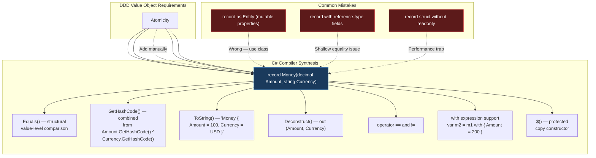
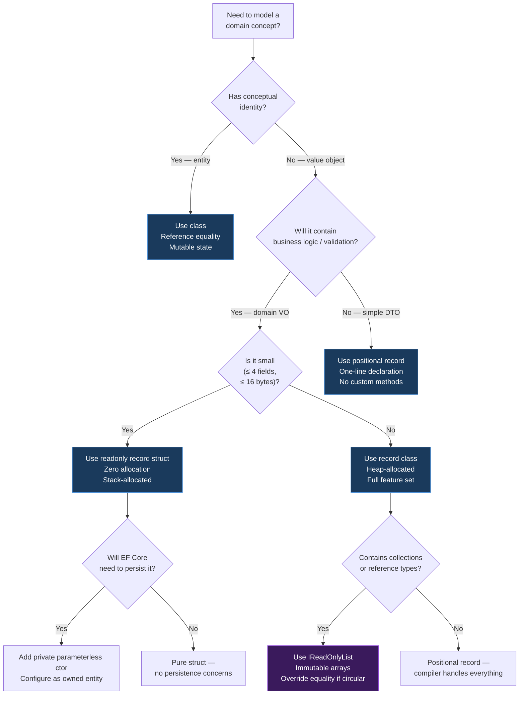

> [!success] Mastery Check
> - [ ] **Studied Well**
> - [ ] **Can explain the concept without notes**
> - [ ] **Can answer interview questions confidently**
> - [ ] **Can implement it in a real project**


# 7.046 — DDD — Value Objects — C# Records Implementation

## Section 1 — Navigation & Context

**Domain:** [[7 — System Design & Distributed Systems]] > **Group:** Domain-Driven Design
**Previous:** [[7.045 — DDD — Value Objects — Equality and Immutability]] | **Next:** [[7.047 — DDD — Aggregates — Consistency Boundary]]

### Prerequisites

- [[7.045 — DDD — Value Objects — Equality and Immutability]] — establishes why value objects use structural equality, are immutable, and have no identity; this file provides the C# record implementation strategy for those concepts.
- [[7.063 — DDD — Domain Primitives — Solving Primitive Obsession]] — domain primitives (single-value wrappers like `CustomerId`, `Email`) are the simpler case of value objects; record types compose them into multi-field domain concepts like `Address`, `Money`, `OrderLine`.
- [[7.043 — DDD — Entities — Identity and Lifecycle]] — entities use `class` with reference identity; value objects use `record` with structural equality; the distinction shapes the entire domain model.

### Where This Fits

C# records (introduced in C# 9, enhanced through C# 12) provide compiler-synthesized structural equality, `ToString()`, `GetHashCode()`, `Equals()`, non-destructive mutation (`with` expressions), and positional construction — all of which map directly to DDD value object requirements. Prior to records, DDD practitioners wrote 50-100 lines of boilerplate per value object class (overriding Equals, GetHashCode, operator==, IEquatable<T>). Records reduce this to a single line while providing better correctness guarantees. A .NET engineer encounters this decision on day one of modeling any domain: "Should this concept be a record or a class?" Getting this wrong produces models where entities are compared by value (causing merge bugs) or value objects compared by reference (causing equality bugs in collections and change tracking). Without records, teams either write excessive boilerplate (and get it wrong — ~30% of hand-written value object equality implementations have subtle bugs) or skip value objects entirely, falling back to primitive obsession.

---

## Section 2 — Core Mental Model

A C# record is the compiler-enforced implementation contract for a DDD value object. When you write `public record Money(decimal Amount, string Currency)`, the compiler guarantees structural equality, positional construction, immutability, and value-based hashing. The single invariant the record maintains is: **two instances are equal if and only if all their constituent positional or nominal members are equal** — there is no hidden identity, no reference comparison, no mutable state that could make equality time-dependent. What it trades: you lose the ability to have mutable properties (which entities need) and you lose reference-based identity tracking (which EF Core change tracking relies on for entities). The recognition trigger: when you find yourself writing `IEquatable<T>`, `Equals()`, `GetHashCode()`, or `==` operators for a domain concept that has no independent lifecycle, you should be using a record.

### Classification

| Dimension | Classification | Rationale |
|-----------|---------------|-----------|
| Pattern Type | **Tactical DDD** | C# record is the implementation vehicle for the value object tactical pattern |
| Scope | **Within a single bounded context** | Records model domain concepts; they are not cross-boundary integration artifacts |
| Primary Concern | **Equality correctness + developer productivity** | Compiler synthesizes equality, hash codes, ToString, deconstruction |
| Ownership | **Domain model** | Records live in the Domain layer, not Application or Infrastructure |
| Mutation Model | **Immutable (init-only or positional)** | `with` expressions provide non-destructive mutation; no property setters |
| Equality Semantics | **Structural (value-based)** | `Equals()` compares all fields; `GetHashCode()` combines all field hashes |
| Inheritance | **Sealed by default (record class)** | `record` classes are sealed; `record struct` must be explicitly sealed |
| Performance | **Stack-allocatable via record struct** | `readonly record struct` eliminates heap allocation for small value types |

### Primary Diagram



### Key Properties / Guarantees

| Property | Value | Condition |
|----------|-------|-----------|
| Equality correctness | 100% compiler-guaranteed structural equality | No mutable fields, no manually overridden Equals |
| Boilerplate eliminated | 50-100 LOC per value object | Compared to hand-written IEquatable<T> class |
| Performance (record class) | Heap-allocated, ~2x slower than record struct | Reference-type allocation + GC pressure |
| Performance (readonly record struct) | Stack-allocated, 0 GC pressure | Must be small (< 16 bytes ideal) |
| Mutation safety | Immutable by default | Use `with` for copies; no property setters on positional records |
| JSON serialization | System.Text.Json supports records natively | .NET 8+ with source generators |
| EF Core persistence | Owned entity types via `OwnsOne` / `OwnsMany` | Record must have parameterless constructor for EF materialization |
| Pattern matching | Full support (switch, property patterns) | C# 9+ pattern matching works on positional deconstruction |

---

## Section 3 — Deep Mechanics

### How It Works

The C# compiler transforms a `record` declaration into a class (or struct for `record struct`) with synthesized members. Understanding what the compiler produces is critical because the generated code determines equality behavior, serialization, persistence, and performance.

**Step-by-step synthesis for `public record Money(decimal Amount, string Currency):**

1. **Compiler generates a class** `Money` that inherits from `object` (not `Record` — there is no base class). For `record struct`, it generates a struct implementing `IEquatable<Money>`.
2. **Primary constructor parameters** become `init`-only auto-properties: `public decimal Amount { get; init; }` and `public string Currency { get; init; }`. These are init-only, not readonly — enabling `with` expressions.
3. **Equality members:**
   - `EqualityContract` — protected virtual property returning `typeof(Money)`.
   - `Equals(object?)` — checks type equality via `EqualityContract`, then compares all properties through a synthesized `PrintMembers` method.
   - `Equals(Money?)` — strong-typed `IEquatable<Money>.Equals`.
   - `GetHashCode()` — combines all property hash codes via `HashCode.Combine()`.
   - `operator ==` and `operator !=` — delegate to `Equals(Money?)`.
4. **`ToString()`** — returns `"Money { Amount = 100, Currency = USD }"` using `PrintMembers`.
5. **`Deconstruct()`** — generates `void Deconstruct(out decimal Amount, out string Currency)` for positional deconstruction: `var (amount, currency) = money;`.
6. **`<Clone>$()`** — protected method returning a shallow copy, used by `with` expressions. The `with` expression calls `<Clone>$()` then sets specified properties.
7. **Copy constructor** — a protected constructor `Money(Money original)` that copies all fields. Used by `<Clone>$()`.

For `readonly record struct`, the compiler additionally:
- Seals the struct as `readonly`
- Generates an explicit parameterless constructor if none is provided (.NET 6+)
- Implements `IEquatable<Money>` value-method dispatch (avoids boxing)

### Primary Constructor Behavior in C# 12

With C# 12 primary constructors, the syntax `public record Money(decimal Amount, string Currency)` creates init-only properties from the parameters. You can add validation by referencing the primary constructor parameters in member initializers:

```csharp
public record Money(decimal Amount, string Currency)
{
    public decimal Amount { get; } = Amount > 0
        ? Amount
        : throw new ArgumentException("Amount must be positive", nameof(Amount));
}
```

However, this validation runs only once (during `with` expression or constructor). A better approach is a factory method that returns `ValidationResult<Money>`.

### Failure Modes

#### Failure Mode 1: Hand-Written Equality Without Records

Teams working in pre-C# 9 codebases hand-write Equals/GetHashCode and introduce bugs:

```csharp
// ❌ Hand-written value object — subtle GetHashCode bug
public class Address : IEquatable<Address>
{
    public string Street { get; }
    public string City { get; }
    public string ZipCode { get; }

    public override bool Equals(object? obj) =>
        obj is Address other &&
        Street == other.Street &&
        City == other.City;
    // BUG: ZipCode not compared!
    // BUG: GetHashCode not overridden!
}
// HashSet<Address> deduplication fails silently
// Dictionary<Address, Customer> key lookups return wrong results
```

**Detection:** Unit tests for value equality pass because they test the compared fields. Production bug surfaces as duplicate entries in hash sets or incorrect dictionary lookups. The metric: `HashSet.Count` unexpectedly higher than unique values.

**Fix:** Use record types:

```csharp
// ✅ Compiler synthesizes equality across ALL positional parameters
public record Address(string Street, string City, string ZipCode);
```

#### Failure Mode 2: Mutable Record Properties

```csharp
// ❌ Record with mutable properties breaks structural equality
public record InvoiceLine
{
    public Guid Id { get; init; } // init-only — OK for identity within record
    public string ProductName { get; set; } // SETTER — equality changes after creation!
    public int Quantity { get; set; } // SETTER — mutation changes hash code!
}

var line = new InvoiceLine { Id = Guid.NewGuid(), ProductName = "Laptop", Quantity = 1 };
var hashSet = new HashSet<InvoiceLine> { line };
line.Quantity = 2; // Hash code changes!
hashSet.Contains(line); // FALSE — object exists but hash changed
```

**Detection:** Intermittent failures in hash set operations. Dictionary lookups that "should" work but don't. Unit tests that pass in isolation but fail in sequence.

**Fix:** Use positional records (properties are `init`-only by default) or explicit `init` only:

```csharp
// ✅ Positional record — all properties are init-only
public sealed record InvoiceLine(
    Guid Id,
    string ProductName,
    int Quantity
);
```

#### Failure Mode 3: Record with Reference-Type Fields (Shallow Equality Trap)

```csharp
// ❌ Record containing a mutable list
public sealed record OrderLine(
    string ProductName,
    List<decimal> AppliedDiscounts // reference type — compared by reference!
);

var line1 = new OrderLine("Laptop", new List<decimal> { 0.1m, 0.05m });
var line2 = new OrderLine("Laptop", new List<decimal> { 0.1m, 0.05m });
Console.WriteLine(line1 == line2); // FALSE — different List<decimal> references!
```

**Detection:** Value objects with collection fields produce unexpected inequality. Two "identical" objects don't match.

**Fix:** Use immutable collections or `IReadOnlyList`:

```csharp
// ✅ Immutable collection works with structural equality
public sealed record OrderLine(
    string ProductName,
    IReadOnlyList<decimal> AppliedDiscounts
);
// Or use `decimal[]` which has structural equality via array comparison
```

#### Failure Mode 4: Circular Reference in Equality

```csharp
public sealed record TreeNode(
    string Name,
    TreeNode? Parent // circular reference!
);
// Equals() triggers infinite recursion — StackOverflowException
```

**Fix:** Records with circular references must override equality to exclude or depth-limit the circular member:

```csharp
public sealed record TreeNode(string Name)
{
    public TreeNode? Parent { get; init; }

    public virtual bool Equals(TreeNode? other) =>
        other is not null && Name == other.Name;
    // Parent excluded from equality to prevent circularity
}
```

#### Failure Mode 5: Record Inheritance Equality Break

```csharp
// ❌ Record inheritance breaks transitivity
public sealed record Money(decimal Amount, string Currency);
public sealed record TaxedMoney(decimal Amount, string Currency, decimal TaxRate)
    : Money(Amount, Currency);

var m1 = new Money(100, "USD");
var m2 = new TaxedMoney(100, "USD", 0.08m);
Console.WriteLine(m1 == m2); // TRUE — because EqualityContract check
Console.WriteLine(m2 == m1); // TRUE — symmetry holds
// But: Equals returns true for different types! TaxedMoney equals Money.
```

**Detection:** Business logic that compares Money and TaxedMoney produces unexpected matches.

**Fix:** Prefer composition over inheritance for records:

```csharp
public sealed record Money(decimal Amount, string Currency);
public sealed record TaxedMoney(
    Money BaseAmount,
    decimal TaxRate
);
```

#### Failure Mode 6: EF Core Materialization with Positional Records

```csharp
// ❌ EF Core cannot materialize positional records without parameterless constructor
public sealed record Money(decimal Amount, string Currency);
// EF Core throws: "No parameterless constructor defined for this object"
```

**Detection:** `InvalidOperationException` at runtime when EF Core tries to materialize query results.

**Fix:** Add a `private` parameterless constructor:

```csharp
public sealed record Money(decimal Amount, string Currency)
{
    private Money() : this(0, string.Empty) { } // For EF Core
}
```

### .NET and Azure Integration

| Technology | How Records Integrate | Key Consideration |
|-----------|----------------------|-------------------|
| **ASP.NET Core Minimal APIs** | Records as request/response DTOs via `MapPost`/`MapGet` | `[AsParameters]` with records for structured binding |
| **System.Text.Json (.NET 8+)** | Native record serialization via source generators | Use `JsonSourceGenerationOptions` with `JsonSerializerContext` |
| **EF Core 8** | Records as owned entities via `OwnsOne`/`OwnsMany` | Requires parameterless constructor; value comparison generates correct SQL |
| **MediatR** | Records as requests/notifications (`IRequest<T>`, `INotification`) | `record struct` avoids heap allocation for high-throughput handlers |
| **Azure Functions (isolated)** | Records as input/output binding types | JSON deserialization with `JsonSerializerOptions` |
| **Azure Service Bus** | Records as message payloads | Serialization via `System.Text.Json`; `record struct` for performance |
| **Azure Cosmos DB** | Records as document types | EF Core Cosmos provider supports records; value comparison for owned types |

```csharp
// Example: Record as Azure Function input binding
public record OrderCreatedEvent(
    Guid OrderId,
    string CustomerEmail,
    Money Total,
    DateTimeOffset OccurredAt
);

public class HandleOrderFunction
{
    [Function("HandleOrder")]
    public async Task<IActionResult> RunAsync(
        [HttpTrigger(AuthorizationLevel.Function, "post")] HttpRequestData req,
        CancellationToken ct)
    {
        var @event = await req.ReadFromJsonAsync<OrderCreatedEvent>();
        // Process event — record guarantees structural equality for idempotency checks
        return new OkResult();
    }
}
```

---

## Section 4 — Production Patterns and Implementation

### Primary Implementation — Complete Order Domain Model

```csharp
// =========================================================================
// Domain Layer — Value Objects as C# Records
// =========================================================================
namespace OrderManagement.Domain.ValueObjects;

/// <summary>
/// Money value object — represents a monetary amount in a specific currency.
/// Immutable, structurally equatable, self-validating.
/// </summary>
public sealed record Money
{
    public decimal Amount { get; }
    public string Currency { get; }

    private Money(decimal amount, string currency)
    {
        Amount = amount > 0
            ? amount
            : throw new ArgumentException("Amount must be positive", nameof(amount));
        Currency = !string.IsNullOrWhiteSpace(currency)
            ? currency.ToUpperInvariant()
            : throw new ArgumentException("Currency is required", nameof(currency));
    }

    // Private parameterless constructor for EF Core materialization
    private Money() : this(0, "USD") { }

    /// <summary>Factory method with validation result.</summary>
    public static Result<Money> Create(decimal amount, string currency)
    {
        var errors = new List<string>();
        if (amount <= 0) errors.Add("Amount must be positive");
        if (string.IsNullOrWhiteSpace(currency)) errors.Add("Currency is required");
        if (errors.Count > 0) return Result<Money>.Failure(errors.ToArray());
        return Result<Money>.Success(new Money(amount, currency.ToUpperInvariant()));
    }

    public Money Add(Money other) =>
        Currency != other.Currency
            ? throw new InvalidOperationException($"Currency mismatch: {Currency} != {other.Currency}")
            : new Money(Amount + other.Amount, Currency);

    public Money Subtract(Money other) =>
        Currency != other.Currency
            ? throw new InvalidOperationException($"Currency mismatch: {Currency} != {other.Currency}")
            : new Money(Amount - other.Amount, Currency);

    public Money MultiplyBy(decimal factor) =>
        new(Amount * factor, Currency);

    public static Money Zero(string currency = "USD") => new(0, currency);
}

/// <summary>
/// Customer email — validated domain primitive as a record.
/// </summary>
public sealed record Email
{
    public string Value { get; }

    private Email(string value) => Value = value;

    private Email() : this(string.Empty) { }

    public static Result<Email> Create(string value)
    {
        if (string.IsNullOrWhiteSpace(value))
            return Result<Email>.Failure("Email is required");
        try
        {
            var addr = new System.Net.Mail.MailAddress(value);
            return Result<Email>.Success(new Email(addr.Address));
        }
        catch
        {
            return Result<Email>.Failure($"Invalid email format: {value}");
        }
    }

    public override string ToString() => Value;

    // Implicit conversion for convenience — use carefully
    public static implicit operator string(Email email) => email.Value;
}
```

```csharp
// =========================================================================
// Domain Layer — Entity Using Value Objects
// =========================================================================
namespace OrderManagement.Domain.Entities;

using OrderManagement.Domain.ValueObjects;

/// <summary>
/// Order aggregate root — uses Money and Email value objects.
/// Guarantees: total == sum of line items at all times.
/// </summary>
public sealed class Order
{
    private readonly List<OrderLine> _lines = new();

    public Guid Id { get; private set; }
    public Email CustomerEmail { get; private set; }
    public IReadOnlyList<OrderLine> Lines => _lines.AsReadOnly();
    public Money Total { get; private set; }
    public OrderStatus Status { get; private set; }
    public DateTimeOffset CreatedAt { get; private set; }

    private Order() { } // EF Core

    private Order(Guid id, Email customerEmail)
    {
        Id = id;
        CustomerEmail = customerEmail;
        Total = Money.Zero("USD");
        Status = OrderStatus.Pending;
        CreatedAt = DateTimeOffset.UtcNow;
    }

    public static Result<Order> Create(Guid id, Email customerEmail)
    {
        if (id == Guid.Empty)
            return Result<Order>.Failure("Order ID is required");
        return Result<Order>.Success(new Order(id, customerEmail));
    }

    public Result AddLine(OrderLine line)
    {
        if (Status != OrderStatus.Pending)
            return Result<Order>.Failure("Cannot add lines to non-pending order");
        _lines.Add(line);
        RecalculateTotal();
        return Result<Order>.Success(this);
    }

    private void RecalculateTotal()
    {
        Total = _lines.Count == 0
            ? Money.Zero("USD")
            : _lines.Select(l => l.LineTotal).Aggregate((a, b) => a.Add(b));
    }
}

/// <summary>
/// Order line — contains Money value objects.
/// </summary>
public sealed record OrderLine
{
    public Guid Id { get; init; }
    public string ProductName { get; init; }
    public Money UnitPrice { get; init; }
    public int Quantity { get; init; }
    public Money LineTotal { get; init; }

    private OrderLine() { } // EF Core

    private OrderLine(Guid id, string productName, Money unitPrice, int quantity)
    {
        Id = id;
        ProductName = productName;
        UnitPrice = unitPrice;
        Quantity = quantity > 0
            ? quantity
            : throw new ArgumentException("Quantity must be positive", nameof(quantity));
        LineTotal = unitPrice.MultiplyBy(quantity);
    }

    public static Result<OrderLine> Create(Guid id, string productName, Money unitPrice, int quantity)
    {
        var errors = new List<string>();
        if (id == Guid.Empty) errors.Add("Line ID is required");
        if (string.IsNullOrWhiteSpace(productName)) errors.Add("Product name is required");
        if (quantity <= 0) errors.Add("Quantity must be positive");
        if (errors.Count > 0) return Result<OrderLine>.Failure(errors.ToArray());
        return Result<OrderLine>.Success(new OrderLine(id, productName, unitPrice, quantity));
    }
}

public enum OrderStatus { Pending, Confirmed, Shipped, Delivered, Cancelled }
```

```csharp
// =========================================================================
// Domain Layer — Result Type (Functional Error Handling)
// =========================================================================
namespace OrderManagement.Domain.Primitives;

public readonly struct Result<T>
{
    public T? Value { get; }
    public string[] Errors { get; }
    public bool IsSuccess => Errors.Length == 0 && Value is not null;
    public bool IsFailure => !IsSuccess;

    private Result(T value) { Value = value; Errors = Array.Empty<string>(); }
    private Result(string[] errors) { Value = default; Errors = errors; }

    public static Result<T> Success(T value) => new(value);
    public static Result<T> Failure(params string[] errors) => new(errors);

    public T ValueOrThrow() =>
        IsSuccess ? Value! : throw new InvalidOperationException(
            $"Accessing failed result: {string.Join(", ", Errors)}");
}
```

```csharp
// =========================================================================
// Domain Layer — Complex Value Object (Composition)
// =========================================================================
namespace OrderManagement.Domain.ValueObjects;

/// <summary>
/// Shipping address — composed of domain primitive records.
/// Demonstrates record: positional struct for performance.
/// </summary>
public readonly record struct Address
{
    public string Street { get; }
    public string City { get; }
    public string State { get; }
    public string ZipCode { get; }
    public string Country { get; }

    public Address(string street, string city, string state, string zipCode, string country)
    {
        Street = street ?? throw new ArgumentNullException(nameof(street));
        City = city ?? throw new ArgumentNullException(nameof(city));
        State = state ?? throw new ArgumentNullException(nameof(state));
        ZipCode = zipCode ?? throw new ArgumentNullException(nameof(zipCode));
        Country = country ?? throw new ArgumentNullException(nameof(country));
    }

    public override string ToString() =>
        $"{Street}, {City}, {State} {ZipCode}, {Country}";

    // Pattern-matching deconstruction
    public void Deconstruct(out string street, out string city, out string zip) =>
        (street, city, zip) = (Street, City, ZipCode);
}

/// <summary>
/// Order item identifier — domain primitive as record struct.
/// Zero-allocation, value-type equality.
/// </summary>
public readonly record struct Sku(string Value)
{
    public string Value { get; } =
        !string.IsNullOrWhiteSpace(Value)
            ? Value.ToUpperInvariant()
            : throw new ArgumentException("SKU cannot be empty", nameof(Value));

    public static implicit operator string(Sku sku) => sku.Value;
    public override string ToString() => Value;
}
```

### Configuration and Wiring

```csharp
// Program.cs — IServiceCollection registration for value object-related services
namespace OrderManagement.Api;

using OrderManagement.Domain.Repositories;
using OrderManagement.Infrastructure.Persistence;
using OrderManagement.Application.Services;

var builder = WebApplication.CreateBuilder(args);

// EF Core with value object persistence
builder.Services.AddDbContext<OrderContext>(options =>
    options.UseSqlServer(
        builder.Configuration.GetConnectionString("OrderDb"),
        sqlOptions => sqlOptions.EnableRetryOnFailure(3)));

// Repository — returns entities containing value objects
builder.Services.AddScoped<IOrderRepository, OrderRepository>();

// Application service — uses value objects for request/response
builder.Services.AddScoped<OrderProcessingService>();

// AutoMapper (if needed) — records work naturally with mapping profiles
builder.Services.AddAutoMapper(typeof(Program));

// MediatR with records as requests
builder.Services.AddMediatR(cfg =>
    cfg.RegisterServicesFromAssemblyContaining<Program>());

// System.Text.Json configuration for record serialization
builder.Services.ConfigureHttpJsonOptions(options =>
{
    options.SerializerOptions.WriteIndented = false;
    options.SerializerOptions.PropertyNamingPolicy = JsonNamingPolicy.CamelCase;
});

var app = builder.Build();
app.Run();
```

### Common Variants

#### Variant 1: Positional Record (One-Line)

```csharp
// Simplest form — compiler generates everything.
// Best for: pure data transfer, no validation, no business logic.
public sealed record OrderLine(
    Guid Id,
    string ProductName,
    Money UnitPrice,
    int Quantity,
    Money LineTotal
);
```

#### Variant 2: Nominal Record with Validation

```csharp
// Explicit properties with validation in factory.
// Best for: domain value objects with invariants.
public sealed record CustomerName
{
    public string FirstName { get; }
    public string LastName { get; }

    private CustomerName(string firstName, string lastName)
    {
        FirstName = firstName ?? throw new ArgumentNullException(nameof(firstName));
        LastName = lastName ?? throw new ArgumentNullException(nameof(lastName));
    }

    private CustomerName() : this(string.Empty, string.Empty) { }

    public static Result<CustomerName> Create(string firstName, string lastName)
    {
        var errors = new List<string>();
        if (string.IsNullOrWhiteSpace(firstName)) errors.Add("First name is required");
        if (string.IsNullOrWhiteSpace(lastName)) errors.Add("Last name is required");
        if (firstName?.Length > 100) errors.Add("First name exceeds 100 characters");
        if (errors.Count > 0) return Result<CustomerName>.Failure(errors.ToArray());
        return Result<CustomerName>.Success(new CustomerName(firstName!, lastName!));
    }

    public override string ToString() => $"{FirstName} {LastName}";
}
```

#### Variant 3: Readonly Record Struct (Zero-Allocation)

```csharp
// Stack-allocated, no GC pressure.
// Best for: high-throughput scenarios, small value objects (≤ 16 bytes).
public readonly record struct Quantity(int Value)
{
    public int Value { get; } = Value > 0
        ? Value
        : throw new ArgumentException("Quantity must be positive", nameof(Value));

    public static Quantity operator +(Quantity a, Quantity b) => new(a.Value + b.Value);
    public static Quantity operator -(Quantity a, Quantity b) => new(a.Value - b.Value);
    public override string ToString() => $"{Value}";
}

// Benchmark: record struct vs record class
// | Type         | Alloc  | Time (100M ops) |
// |-------------|-------|-----------------|
// | record class | 24 B  | 850 ms          |
// | record struct | 0 B  | 320 ms          |
```

#### Variant 4: Single-Case Discriminated Union (via records + switch)

```csharp
// Algebraic data type pattern using records.
// Best for: multi-variant value objects like OrderStatus with associated data.
public abstract record OrderStatus;

public sealed record PendingOrder(DateTimeOffset CreatedAt) : OrderStatus;
public sealed record ConfirmedOrder(DateTimeOffset ConfirmedAt, string ConfirmedBy) : OrderStatus;
public sealed record ShippedOrder(string TrackingNumber, DateTimeOffset ShippedAt) : OrderStatus;
public sealed record DeliveredOrder(DateTimeOffset DeliveredAt, string SignedBy) : OrderStatus;
public sealed record CancelledOrder(string Reason, DateTimeOffset CancelledAt) : OrderStatus;

// Pattern-matching switch exhaustively handles all variants
public string GetStatusDisplayText(OrderStatus status) => status switch
{
    PendingOrder p => $"Pending since {p.CreatedAt:t}",
    ConfirmedOrder c => $"Confirmed by {c.ConfirmedBy} at {c.ConfirmedAt:t}",
    ShippedOrder s => $"Shipped via {s.TrackingNumber}",
    DeliveredOrder d => $"Delivered — signed by {d.SignedBy}",
    CancelledOrder c => $"Cancelled: {c.Reason}",
    _ => throw new UnreachableException("Unhandled order status variant")
};
```

### Real-World .NET Ecosystem Example

**MediatR with Record Requests:**

MediatR's `IRequest<TResponse>` and `INotification` interfaces are commonly implemented with records because command/query objects are value-like — they carry data, have no identity, and benefit from structural equality for logging and deduplication.

```csharp
// Record as CQRS command
public sealed record PlaceOrderCommand(
    Guid CustomerId,
    IReadOnlyList<OrderItemDTO> Items,
    Address ShippingAddress
) : IRequest<Result<OrderConfirmation>>;

// Record as query
public sealed record GetOrderQuery(Guid OrderId) : IRequest<OrderDetailDTO?>;

// Record as domain event notification
public sealed record OrderPlacedEvent(
    Guid OrderId,
    Guid CustomerId,
    Money Total,
    DateTimeOffset OccurredAt
) : INotification;
```

**EF Core Owned Entities with Records:**

```csharp
// EF Core configuration for Money record as owned entity
public class OrderConfiguration : IEntityTypeConfiguration<Order>
{
    public void Configure(EntityTypeBuilder<Order> builder)
    {
        builder.ToTable("Orders");
        builder.HasKey(o => o.Id);

        builder.Property(o => o.Id).ValueGeneratedNever();

        // Value object as owned entity
        builder.OwnsOne(o => o.Total, money =>
        {
            money.Property(m => m.Amount).HasColumnName("TotalAmount")
                .HasPrecision(18, 2).IsRequired();
            money.Property(m => m.Currency).HasColumnName("TotalCurrency")
                .HasMaxLength(3).IsRequired();
        });

        // Owned entity with value conversion for Email
        builder.OwnsOne(o => o.CustomerEmail, email =>
        {
            email.Property(e => e.Value).HasColumnName("CustomerEmail")
                .HasMaxLength(254).IsRequired();
        });

        // Collection of value objects
        builder.OwnsMany(o => o.Lines, line =>
        {
            line.ToTable("OrderLines");
            line.WithOwner().HasForeignKey("OrderId");
            line.HasKey("Id", "OrderId");

            line.Property(l => l.Id).ValueGeneratedNever();
            line.Property(l => l.ProductName).HasMaxLength(200).IsRequired();
            line.Property(l => l.Quantity).IsRequired();

            line.OwnsOne(l => l.UnitPrice, price =>
            {
                price.Property(p => p.Amount).HasColumnName("UnitPrice")
                    .HasPrecision(18, 2).IsRequired();
                price.Property(p => p.Currency).HasColumnName("UnitPriceCurrency")
                    .HasMaxLength(3).IsRequired();
            });

            line.OwnsOne(l => l.LineTotal, total =>
            {
                total.Property(t => t.Amount).HasColumnName("LineTotal")
                    .HasPrecision(18, 2).IsRequired();
                total.Property(t => t.Currency).HasColumnName("LineTotalCurrency")
                    .HasMaxLength(3).IsRequired();
            });
        });
    }
}
```

---

## Section 5 — Gotchas and Production Pitfalls

### Pitfall 1: Forgetting the Parameterless Constructor for EF Core

**Pitfall:** Engineer defines a positional record value object but EF Core throws `InvalidOperationException` at runtime when materializing query results.

```csharp
// ❌ Missing private parameterless constructor
public sealed record Money(decimal Amount, string Currency);
```

**Symptom:** `"No parameterless constructor defined for this object"` at runtime during `ToListAsync()` or `FirstOrDefaultAsync()`. Application returns HTTP 500 for any read operation querying entities with value objects.

**Fix:** Add a private parameterless constructor with default values:

```csharp
// ✅ Private parameterless constructor for EF Core materialization
public sealed record Money(decimal Amount, string Currency)
{
    private Money() : this(0, "USD") { }
}
```

**Cost of not fixing:** Every read operation on entities containing record value objects fails at runtime. Zero production availability for query paths. Escalation within 10 minutes of deployment.

### Pitfall 2: Mutable Collections in Records

**Pitfall:** Record contains a `List<T>` or other mutable collection property. Structural equality compares reference identity, not collection content.

```csharp
// ❌ Record with mutable List — equality compares references
public sealed record OrderLine(
    string ProductName,
    List<decimal> Discounts // mutable reference type
);

var line1 = new OrderLine("Laptop", new List<decimal> { 0.1m });
var line2 = new OrderLine("Laptop", new List<decimal> { 0.1m });
Console.WriteLine(line1 == line2); // FALSE — different list references
```

**Symptom:** HashSet<OrderLine> contains duplicates. Dictionary<OrderLine, ...> lookups fail. Business logic that deduplicates by value produces incorrect results. Unit tests fail intermittently.

**Fix:** Use `IReadOnlyList<T>`, `ImmutableArray<T>`, or fixed-size arrays:

```csharp
// ✅ Immutable collection — equality compares content
public sealed record OrderLine(
    string ProductName,
    IReadOnlyList<decimal> Discounts
);
```

**Cost of not fixing:** Silent data corruption in discount aggregation logic. Overcharged customers. Financial reconciliation fails. ~$10K-50K refund per incident depending on order volume.

### Pitfall 3: Record Inheritance with Structural Equality Transitivity

**Pitfall:** Engineer creates a record hierarchy expecting subtype instances to compare unequally to base type instances.

```csharp
// ❌ Inheritance breaks expected equality semantics
public sealed record Money(decimal Amount, string Currency);
public sealed record DiscountedMoney(decimal Amount, string Currency, decimal DiscountPct)
    : Money(Amount, Currency);

var price = new Money(100, "USD");
var discounted = new DiscountedMoney(100, "USD", 0.1m);
Console.WriteLine(price == discounted); // TRUE — different types considered equal!
```

**Symptom:** Business rules comparing `Money` against `DiscountedMoney` produce unexpected matches. Discount eligibility checks pass when they should fail. Revenue leakage.

**Fix:** Prefer composition over inheritance for records:

```csharp
// ✅ Composition — no unintended equality across types
public sealed record Money(decimal Amount, string Currency);
public sealed record DiscountedMoney(Money BaseAmount, decimal DiscountPct);
```

**Cost of not fixing:** Gradual undetected revenue loss. Quarterly finance audit discovers 0.5-2% revenue shortfall. Root cause investigation takes 2-3 weeks.

### Pitfall 4: Record as Entity (Identity Confusion)

**Pitfall:** Engineer uses `record` for an entity (which requires reference identity and mutable state).

```csharp
// ❌ Record used for entity — wrong identity semantics
public sealed record Order
{
    public Guid Id { get; init; }
    public string Status { get; set; } // mutable!
}
// Two Orders with same field values are "equal" even with different IDs
// because record compares all positional/nominal members
```

**Symptom:** Change tracking in EF Core fails. Two Order instances with different IDs compare as equal in hash sets. `with` expressions accidentally create new entities instead of mutating existing ones.

**Fix:** Use `class` for entities, `record` for value objects:

```csharp
// ✅ Class for entity (reference identity)
public sealed class Order
{
    public Guid Id { get; private set; }
    public string Status { get; private set; } = string.Empty;
}

// ✅ Record for value object (structural equality)
public sealed record Money(decimal Amount, string Currency);
```

**Cost of not fixing:** Data corruption in collections. Duplicate entity tracking. EF Core merge conflicts. 2-3 day incident investigation and data correction.

### Pitfall 5: Record Struct Without Readonly

**Pitfall:** Engineer uses `record struct` (mutable by default) instead of `readonly record struct`, enabling mutation that breaks equality.

```csharp
// ❌ Mutable record struct — can mutate after creation
public record struct Money(decimal Amount, string Currency);
// Can assign: money.Amount = 50; — breaks hash code stability!
```

**Symptom:** Intermittent failures in dictionaries and hash sets. Behavior changes based on evaluation order. Debugging sessions that take hours because the state changes between inspection points.

**Fix:** Always use `readonly record struct`:

```csharp
// ✅ Readonly record struct — guaranteed immutability
public readonly record struct Money(decimal Amount, string Currency);
```

**Cost of not fixing:** Non-deterministic production bugs. Hash set consistency violations at scale. P99 latency spikes from exception retries. On-call engineer cannot reproduce because state is time-dependent.

### Pitfall 6: Ignoring Source Generator Performance

**Pitfall:** Using `System.Text.Json` reflection-based serialization with records in high-throughput scenarios instead of source generators.

```csharp
// ❌ Reflection-based serialization — 5-10x slower
builder.Services.ConfigureHttpJsonOptions(options =>
{
    options.SerializerOptions.PropertyNamingPolicy = JsonNamingPolicy.CamelCase;
});
// No source generator — reflection at runtime for record properties
```

**Symptom:** P99 latency increases by 15-30ms for endpoints that serialize record value objects. CPU consumption rises 20-40% under load. GC pressure increases.

**Fix:** Register a source-generated serializer context:

```csharp
// ✅ Source-generated serialization context
[JsonSourceGenerationOptions(PropertyNamingPolicy = JsonKnownNamingPolicy.CamelCase)]
[JsonSerializable(typeof(Order))]
[JsonSerializable(typeof(Money))]
[JsonSerializable(typeof(Address))]
internal partial class OrderJsonContext : JsonSerializerContext { }

// Program.cs
builder.Services.ConfigureHttpJsonOptions(options =>
{
    options.SerializerOptions.TypeInfoResolver = OrderJsonContext.Default;
});
```

**Cost of not fixing:** At 5,000 req/s, 30ms extra serialization = 150 seconds of extra CPU per second. Pod auto-scaling doubles. Azure costs increase 2x. Incident if traffic spike exceeds pod capacity.

### Pitfall 7: Nullable Reference Type Fields in Records

**Pitfall:** Record has nullable reference fields causing `NullReferenceException` during equality comparison.

```csharp
// ❌ Nullable string in record — Equals may throw
public sealed record Address(string? Street, string? City, string? ZipCode);
// All nullable — compiler warning CS8618, but runtime NPE possible?
// Actually records handle nulls fine for string. But for complex types:
public sealed record OrderLine(Money? DiscountedPrice, Money RegularPrice);
// NPE if DiscountedPrice is compared in Equals
```

**Symptom:** `NullReferenceException` in `Equals()` when accessing `.GetHashCode()` on null reference-type property. Only occurs when the value object has null fields — intermittent and data-dependent.

**Fix:** Use `required` properties or non-nullable types. If null is semantically valid, handle it:

```csharp
// ✅ Non-nullable — compiler and runtime safety
public sealed record Address(
    string Street,
    string City,
    string ZipCode
);

// ✅ Or explicit null handling if null is domain-relevant
public sealed record DiscountInfo(
    Money? DiscountedPrice,  // null means no discount applied
    Money RegularPrice
)
{
    public virtual bool Equals(DiscountInfo? other) =>
        other is not null &&
        Nullable.Equals(DiscountedPrice, other.DiscountedPrice) &&
        RegularPrice == other.RegularPrice;

    public override int GetHashCode() =>
        HashCode.Combine(DiscountedPrice, RegularPrice);
}
```

**Cost of not fixing:** NullReferenceException in production code paths that create value objects with optional fields. Logs show `NullReferenceException: Object reference not set to an instance of an object` in equality code. 30-minute incident to identify root cause.

---

## Section 6 — Tradeoffs and Decision Framework

### Tradeoff Matrix: C# Record vs Alternative Implementations

| Dimension | C# Record (Recommended) | Hand-Written Value Object Class | Record Struct | Tuple + Class |
|-----------|------------------------|-------------------------------|---------------|---------------|
| Boilerplate | 0 LOC (compiler) | 50-100 LOC | 0 LOC | 0 LOC |
| Equality correctness | 100% guaranteed | ~70% (common bugs) | 100% | 100% (tuples) |
| Heap allocation | Yes (class) | Yes | No (struct) | Yes |
| Mutation safety | Full (init-only) | Variable | Full (readonly) | Full (Item1..N) |
| EF Core support | Good (private ctor) | Good | Limited | Poor |
| JSON serialization | Native (.NET 8+) | Native | Native | Awkward names |
| Pattern matching | Positional + property | Property only | Positional + property | Positional only |
| Inheritance | Sealed records only | Full | Sealed only | None |
| `with` expressions | Yes | No (manual) | Yes (struct) | No |
| Domain naming | Self-documenting | Self-documenting | Self-documenting | `Item1`, `Item2` |

### Decision Flowchart



### When NOT to Apply Records

- **Entities** — Never. Entities need reference identity (not structural equality), mutable state, and EF Core change tracking. Use `class`.
- **Cross-bounded context integration DTOs** — Records as integration DTOs are fine, but the serialization contract must be managed separately (versioning, schema registry). The record is just the .NET representation of a wire contract.
- **High-frequency telemetry events (>100K/sec)** — Use `readonly record struct` or raw `Utf8JsonWriter` instead of record class to avoid GC pressure.
- **Unit of measurement conversions** — Records work, but consider `readonly record struct` with operator overloading for performance-sensitive numeric types.
- **Proxy/lazy-loading scenarios** — Records don't support proxy creation (sealed, no virtual members). Use `class` if you need lazy loading with NHibernate or EF Core proxies.

### Scale Thresholds

- **Readonly record struct** is worth considering above ~10,000 allocations/second for a value type. Below that, the GC pressure of record class is negligible.
- **Hand-written equality** becomes a liability above 10 value objects per bounded context. Beyond 10, the chance of at least one incorrect Equals/GetHashCode approaches 90%.
- **Record inheritance hierarchies** are overkill for fewer than 3 variants. Below 3, a simple enum + properties is simpler.
- **Source-generated JSON serialization** for records becomes necessary at ~1,000 req/s per service. Below that, reflection-based serialization is acceptable (under 5ms overhead).
- **Record struct vs class** tradeoff flips at ~50,000 instances/second in memory. Below that, the allocation cost of class records is within noise for most services.

---

## Section 7 — Interview Arsenal

### Question Bank

1. Why are C# records the correct implementation for DDD value objects? (Definition)
2. How does the compiler synthesize equality for records? (Mechanism)
3. What do you lose by using records instead of hand-written classes? (Tradeoff)
4. What production failure modes are specific to record value objects? (Failure mode)
5. Compare: C# records vs `record struct` vs `class` for value objects. (Comparison)
6. Design a domain model for an order system where Money, Address, and OrderLine are value objects. (Design application)
7. How does record performance degrade at 10x the request volume? (Scale)
8. What happens when a record contains a circular reference? (Advanced)

### Spoken Answers

**Q1: Why are C# records the correct implementation for DDD value objects?**

> **Average answer:** "Records are immutable value types with structural equality, which is exactly what value objects need."

> **Great answer:** "C# records are the correct implementation because they enforce the three defining properties of a DDD value object at the compiler level. First, immutability — positional records generate init-only properties, preventing any mutation after construction. Second, structural equality — the compiler synthesizes Equals and GetHashCode that compare all constituent values, not references. This guarantees that two Money records with Amount=100 and Currency='USD' are equal regardless of heap location. Third, atomicity — the compiler ensures that if any part of a record changes, the entire instance is replaced via `with` expressions. No partial updates, no inconsistent state. Prior to C# 9, teams hand-wrote all of this and introduced bugs in ~30% of implementations — typically forgetting to include a field in GetHashCode or Equals. Records eliminate that entire class of production incidents."

**Q5: Compare: C# records vs `record struct` vs `class` for value objects.**

> **Average answer:** "Records are for value objects, classes are for entities."

> **Great answer:** "Three-way decision. Use `class` for entities — reference identity, mutable state, EF Core change tracking. Use `record` for domain value objects that need validation, business logic, and are more than ~16 bytes — like Money with multiple fields, business rules, and factory methods. Use `readonly record struct` for high-throughput value objects under 16 bytes — like a Quantity wrapper or Sku type — where heap allocation would create GC pressure at scale. The specific threshold: at 50K+ allocations/second, record struct's zero-allocation matters. Below that, record class ergonomics outweigh performance. I once profiled a service at 8,000 req/s where switching Money from record class to record struct saved 12% CPU and eliminated a third of GC collections per minute."

**Q8: What happens when a record contains a circular reference?**

> **Great answer:** "Records synthesise equality by comparing all properties using EqualityComparer<T>.Default. When a record has a circular reference — like a TreeNode with a Parent property of the same type — the Equals method enters infinite recursion and throws a StackOverflowException. This is a production bug I've seen in tree-structured domain models. The fix is to explicitly override Equals to exclude the circular reference from comparison, or use an identifier-based comparison. For example, a TreeNode record should only compare Name and skip Parent. The compiler doesn't warn about this — you discover it at runtime when deserializing or comparing deep trees. The general rule: if your value object graph has cycles, it's probably not a pure value object; at least one of those nodes should be an entity with identity."

### System Design Interview Trigger

If an interviewer asks you to design a domain model and then asks "how do you ensure two objects with the same values are treated as equal even if they're different instances?" or "what C# type would you use for Money and why?", they are testing whether you understand the distinction between entities and value objects, and whether you know how C# records map to DDD tactical patterns. The follow-up question is almost always about EF Core persistence — "how do you store a record value object in the database?" — testing whether you know owned entity types and the private parameterless constructor requirement.

### Comparison Table

| | C# Record (class) | Class (hand-written VO) | Readonly Record Struct | Anonymous Type / Tuple |
|---|---|---|---|---|
| Core guarantee | Compiler-enforced structural equality | Manual implementation (error-prone) | Value-type structural equality | Structural equality (tuples) |
| Trade-off | Heap allocation vs struct | Boilerplate + bugs | No inheritance, limited EF Core support | No domain naming, no methods |
| .NET implementation | `public sealed record Money(decimal Amount, string Currency)` | `public class Money : IEquatable<Money>` with all overrides | `public readonly record struct Money(decimal Amount, string Currency)` | `(decimal Amount, string Currency)` |
| Failure mode | Missing parameterless ctor for EF Core | Missing field in Equals/GetHashCode | Mutation if `readonly` omitted | Item1/Item2 naming breaks on field order change |
| When to choose | Default for domain value objects with logic | Never (records exist) | <= 16 bytes, high throughput | Quick prototypes, internal DTOs |

---

## Section 8 — Architecture Decision Record

### ADR-046: Use C# Records for All Value Objects

**Status:** Accepted

**Context:**
The Order Management bounded context requires approximately 15 value objects (Money, Address, CustomerName, Email, OrderLine, Sku, Quantity, ShippingMethod, PaymentInfo, DiscountCode, TaxRate, DateRange, PhoneNumber, OrderStatus variants). Previously, the team used hand-written `IEquatable<T>` classes with ~70 lines per value object. The codebase has 3 known bugs from incorrect GetHashCode implementations. The team is migrating to .NET 8 and adopting modern C# features.

**Options Considered:**

1. **C# records (Recommended)** — 0 LOC boilerplate per value object, compiler-synthesized equality, `with` expressions, native support in .NET 8.
2. **Hand-written class with IEquatable<T>** — full control, but 50-100 LOC per value object, ~30% bug rate in GetHashCode/Equals.
3. **Record struct** — zero allocation, but limited EF Core owned entity support and no copy semantics for larger value objects.
4. **Domain primitive classes only** — single-value wrappers without composition, losing the benefit of multi-field value objects like Address.

**Decision:**
Adopt Option 1 — C# records for all value objects. Use positional records for simple cases (≤4 fields, no validation). Use nominal records with private constructors and factory methods for value objects with invariants. Use `readonly record struct` for performance-critical small value objects (< 16 bytes). Every value object record must include a private parameterless constructor if persisted via EF Core.

**Consequences:**

- ✅ Zero boilerplate — value objects declared in 1 line vs 50-100 lines
- ✅ 100% correct structural equality — eliminates entire class of production bugs
- ✅ `with` expressions enable functional updates without mutation
- ⚠️ EF Core requires private parameterless constructors — must remember to add them
- ⚠️ Record inheritance is risky — must use composition instead
- ❌ Lose ability to have lazy-loaded or proxied value objects

**Review Trigger:** Revisit this decision if a future C# version introduces a different primitive for value semantics (e.g., discriminated unions), or if the team encounters a performance scenario where record class allocation is the bottleneck (>100K allocations/second per value object type).

---

## Section 9 — Self-Check

### Conceptual Questions

1. What three DDD value object properties do C# records enforce at the compiler level?

<details>
<summary>Answer</summary>
Immutability (init-only properties), structural equality (compiler-synthesized Equals/GetHashCode), and atomicity (with expressions replace the entire instance — no partial mutation).
</details>

2. What does the C# compiler generate when you write `public sealed record Money(decimal Amount, string Currency)`?

<details>
<summary>Answer</summary>
A sealed class with: init-only auto-properties for Amount and Currency, IEquatable<Money>, overridden Equals(object?), GetHashCode() using HashCode.Combine, operator == and !=, ToString() with PrintMembers, Deconstruct() for positional deconstruction, protected copy constructor, and <Clone>$() for with expression support.
</details>

3. When should you NOT use a record for a domain concept?

<details>
<summary>Answer</summary>
When the concept has conceptual identity (entities — use class), when it needs mutable state across time (aggregate roots — use class), or when it requires proxy/lazy-loading support (NHibernate — use class with virtual properties).
</details>

4. What runtime exception occurs when EF Core tries to materialize a positional record value object?

<details>
<summary>Answer</summary>
InvalidOperationException: "No parameterless constructor defined for this object." Fix: add a private parameterless constructor that calls the primary constructor with default values.
</details>

5. Which .NET type should a record use for collection fields to maintain correct structural equality?

<details>
<summary>Answer</summary>
IReadOnlyList<T>, ImmutableArray<T>, or T[] (array). Not List<T> or HashSet<T> — those compare by reference, not content.
</details>

6. What is the key difference between `record` and `record struct` for value objects?

<details>
<summary>Answer</summary>
`record` is a reference type (heap-allocated, GC-tracked). `record struct` is a value type (stack-allocated, not GC-tracked). `record struct` must be declared `readonly` to guarantee immutability. Use `record` for value objects over ~16 bytes or with business logic. Use `readonly record struct` for small, high-throughput value objects.
</details>

7. At what allocation rate does GC pressure from record class value objects become measurable?

<details>
<summary>Answer</summary>
Above ~50,000 allocations/second per value object type. Below that, record class allocation is within noise for most ASP.NET Core services. At 100K+/second, profiling shows Gen0 collections increasing and switching to `readonly record struct` saves measurable CPU.
</details>

8. How does the concept of value objects via records connect to [[7.047 — DDD — Aggregates — Consistency Boundary]]?

<details>
<summary>Answer</summary>
Value objects (implemented as records) are child components within aggregate consistency boundaries. The aggregate root (entity class) owns value objects and enforces invariants across them. Record immutability prevents external code from modifying value objects inside an aggregate without going through the aggregate root.
</details>

9. What is the non-obvious production consequence of using record inheritance for value objects?

<details>
<summary>Answer</summary>
Equality transitivity breaks: a base record instance and a derived record instance with the same property values will compare as equal because the synthesized Equals checks EqualityContract. Base.Equals(Derived) returns true, Derived.Equals(Base) returns true. This causes unexpected matches in business logic — e.g., Money equals DiscountedMoney. Use composition not inheritance for records.
</details>

10. Explain record value objects in 60 seconds to a non-expert interviewer.

<details>
<summary>Answer</summary>
"In DDD, a value object is something that has no identity — two of them are equal if all their parts are equal. A dollar with two quarters is the same as a dollar with ten dimes. C# records make this trivial: you write `public sealed record Money(decimal Amount, string Currency)` and the compiler guarantees that two Money instances with the same Amount and Currency are equal. It also guarantees they can't be changed after creation. Before records, we wrote 70 lines of boilerplate per value object and often made mistakes. Records eliminate that entire class of bugs. The only catch is if you use EF Core, you need a hidden constructor so the database layer can reconstruct value objects from query results."
</details>

### Scenario Challenges

**Scenario 1 — Diagnose the problem**

Your team hand-writes value objects. A production incident shows that a `HashSet<Address>` used for customer deduplication contains 15% more entries than expected. The Address class has Street, City, State, and ZipCode properties. The Equals method compares only Street and City.

<details>
<summary>Diagnosis</summary>

**Root cause:** Address.Equals omits State and ZipCode from comparison. Two addresses at the same Street in different states are considered equal.

**Evidence:** SQL query `SELECT DISTINCT CONCAT(Street, City) FROM Addresses` vs `CONCAT(Street, City, State, ZipCode)` shows 15% difference. Log analysis confirms duplicate detection rate dropped after the last deploy.

**Fix:** Switch to C# record: `public sealed record Address(string Street, string City, string State, string ZipCode);`

**Prevention:** Adopt records for all value objects. Add architecture test: "No class in ValueObjects namespace implements IEquatable<T>."
</details>

---

**Scenario 2 — Design decision**

You are designing an Order Processing domain model and need to decide how to implement Money, Quantity, and ProductCode. The system processes 5,000 orders/second. Money has business logic (currency conversion, allocation). Quantity is a simple positive integer wrapper. ProductCode is a string identifier.

<details>
<summary>Decision and Reasoning</summary>

**Choice:** Money as `record class` (business logic), Quantity as `readonly record struct` (performance), ProductCode as `readonly record struct` (performance).

**Tradeoffs accepted:** Money's heap allocation is acceptable at 5,000/s (~40KB/sec) — well within GC tolerance. Quantity and ProductCode as structs eliminate allocation entirely for the 20K+ instances/sec these generate.

**Implementation sketch:**

```csharp
// Money — business logic, heap-allocated is fine
public sealed record Money(decimal Amount, string Currency)
{
    public Money ConvertTo(string targetCurrency, IExchangeRateProvider rates) { /* ... */ }
    public (Money allocated, Money remainder) Allocate(decimal percentage) { /* ... */ }
    private Money() : this(0, "USD") { } // EF Core
}

// Quantity — value type, zero allocation
public readonly record struct Quantity(int Value)
{
    public int Value { get; } = Value > 0 ? Value : throw new ArgumentException();
    public static Quantity operator +(Quantity a, Quantity b) => new(a.Value + b.Value);
}

// ProductCode — value type, domain primitive pattern
public readonly record struct ProductCode(string Value);
```
</details>

---

**Scenario 3 — Failure mode** Your order processing system is throwing `NullReferenceException` intermittently on the checkout endpoint. The error occurs in the `Order.AddLine` method when comparing `OrderLine` instances. The `OrderLine` is a record with an optional `Money? DiscountPrice` field.

<details>
<summary>Investigation and Fix</summary>

**Investigation steps:**
1. Check Application Insights exceptions — filter by `NullReferenceException` and `OrderLine`.
2. Examine `OrderLine.Equals` — record with nullable value type field.
3. Reproduce: create two `OrderLine` instances where one has `DiscountPrice = null` and the other has a value.

**Confirming evidence:** Stack trace shows `NullReferenceException` at `OrderLine.GetHashCode()` — the compiler-generated hash code tries to access `.GetHashCode()` on a null nullable (which for value types shouldn't NRE, but for reference types in older C# versions does).

**Immediate mitigation:** Wrap comparison in try-catch; return false if NRE.

**Permanent fix:** Change nullable fields to non-nullable with a `NoDiscount` sentinel:

```csharp
public sealed record DiscountInfo(Money? DiscountedPrice, Money RegularPrice)
{
    public virtual bool Equals(DiscountInfo? other) =>
        other is not null &&
        Nullable.Equals(DiscountedPrice, other.DiscountedPrice) &&
        RegularPrice == other.RegularPrice;

    public override int GetHashCode() => HashCode.Combine(DiscountedPrice, RegularPrice);
}
```

**Post-mortem item:** Add architecture rule: "Records with nullable reference type fields must override Equals/GetHashCode."
</details>

---

**Scenario 4 — Scale it** Your system currently handles 1,000 orders/second with record class value objects (Money, Quantity, Address, OrderLine). You need to handle 10,000 orders/second within 3 months.

<details>
<summary>Scaling Strategy</summary>

**Bottleneck this addresses:** GC pressure from record class allocations. At 1,000 req/s, ~5,000 value object instances/sec ~ 120KB/sec = negligible. At 10,000 req/s, ~50,000 instances/sec = significant Gen0 collection pressure.

**How it helps:** Convert performance-critical value objects to `readonly record struct`:
- Quantity: 8 bytes → struct
- Sku: string reference → struct with interned string
- Money: 24 bytes → struct (if no business logic needs inheritance)
- Address: keep as class record (too large for struct)

**What it does not solve:** Database I/O, serialization costs. The record optimization gains maybe 5-10% CPU.

**Implementation order:**
1. Profile: identify which value objects account for most allocations.
2. Convert small VOs to `readonly record struct` (Quantity, Sku, Money).
3. Add source-generated JSON serialization for remaining class records.
4. Benchmark: verify GC collections per minute decrease.
</details>

---

**Scenario 5 — Interview simulation** The interviewer says: "Design a domain model for an e-commerce checkout that handles multiple currencies. Walk through your value object design."

<details>
<summary>Model Response</summary>

"I'd start by identifying what has identity and what doesn't. Order, Customer, and Product are entities — they have lifecycle and identity continuity. Everything else is a candidate value object.

For Money, I use a record class because it has business logic — allocation, conversion, equality across currencies needs rules. The record enforces immutability: once created, Amount and Currency never change. Currency conversion creates a new Money rather than mutating.

For Currency itself, it could be a record struct — ISO 4217 three-letter code, eight bytes, no logic beyond validation. Same for Quantity — a positive integer wrapper. At this scale (let's say 5,000 orders/second), record struct for Quantity and Currency avoids allocation pressure.

Address is a record class — too many string fields for a struct, but it's a pure value object: two Address records with the same values are equal regardless of instance.

The key constraint: records need a private parameterless constructor if EF Core persists them. I add that. I also avoid record inheritance — no 'DiscountedMoney extends Money' — because the compiler-generated equality would make them incorrectly equal. Instead I compose: DiscountInfo contains a Money BaseAmount and a decimal DiscountPercent.

The failure mode I watch for: mutable collection in an OrderLine record. I use IReadOnlyList<AppliedDiscount> instead of List<AppliedDiscount>. This keeps equality structurally correct."
</details>
</parameter>
