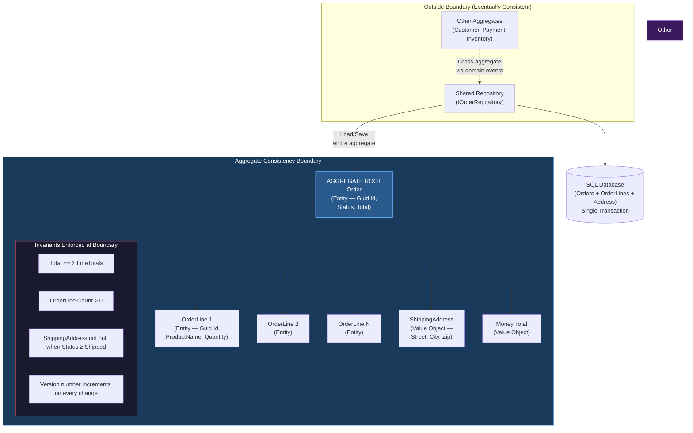
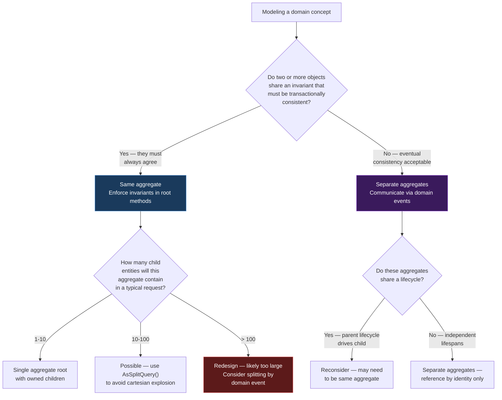

> [!success] Mastery Check
> - [ ] **Studied Well**
> - [ ] **Can explain the concept without notes**
> - [ ] **Can answer interview questions confidently**
> - [ ] **Can implement it in a real project**


# 7.047 — DDD — Aggregates — Consistency Boundary

## Section 1 — Navigation & Context

**Domain:** [[7 — System Design & Distributed Systems]] > **Group:** Domain-Driven Design
**Previous:** [[7.046 — DDD — Value Objects — C# Records Implementation]] | **Next:** [[7.048 — DDD — Aggregates — Aggregate Root Rule]]

### Prerequisites

- [[7.043 — DDD — Entities — Identity and Lifecycle]] — aggregates are entity clusters; understanding entity identity (GUID, sequential GUID, domain-assigned) is required because aggregate roots expose their identity as the aggregate's public key.
- [[7.045 — DDD — Value Objects — Equality and Immutability]] — value objects inside aggregates must be immutable; mutable value objects inside an aggregate would allow invariant violation from outside the boundary.
- [[7.044 — DDD — Entities — Invariant Enforcement]] — invariants like "order total must equal sum of line items" are enforced at the aggregate boundary; entity-level invariants compose into aggregate-level invariants.

### Where This Fits

The aggregate consistency boundary is the most important design decision in tactical DDD — it determines which objects are loaded and saved together in a single transaction, what invariants are guaranteed atomically, and where the system accepts eventual consistency. Every aggregate boundary is a deliberate tradeoff: you choose which business rules get strong consistency (inside the boundary) and which get eventual consistency (across boundaries). A .NET engineer encounters this decision when designing the transaction scope of an EF Core `SaveChangesAsync()` call: every entity loaded and modified within that call that shares the same aggregate root must have its invariants enforced transactionally. The most common mistake is making aggregates too large (loading 30 entities for a single field update, causing contention) or too small (splitting invariants that should be atomic, causing data corruption when two concurrent requests partially update related entities). Without conscious consistency boundary design, the default is either a single giant aggregate (the entire database in one transaction — terrible for scalability) or no transactional boundaries at all (no consistency guarantees).

---

## Section 2 — Core Mental Model

An aggregate consistency boundary is the set of domain objects (one aggregate root entity + zero or more child entities + zero or more value objects) that are loaded, modified, and persisted together as a single atomic unit. The invariant the boundary maintains is: **all business rules involving objects within the boundary are true at the start and end of every transaction, and no external object can directly modify anything inside the boundary except through the aggregate root.** What it trades: everything outside the boundary is eventually consistent — you accept that cross-aggregate rules may have propagation delay. The recognition trigger: when you find yourself asking "what happens if this transaction succeeds but the related update fails?" or "what entities must I load together to enforce this business rule?", you have found a consistency boundary.

### Classification

| Dimension | Classification | Rationale |
|-----------|---------------|-----------|
| Pattern Type | **Tactical DDD** | The aggregate is the primary tactical pattern for modeling consistency units |
| Scope | **Within a single bounded context** | Aggregates are Bounded Context-internal; references across contexts use domain events |
| Primary Concern | **Transactional consistency + invariant enforcement** | Determines which objects are saved atomically and which are eventually consistent |
| Ownership | **Single aggregate root** | The root is the only object external code can reference to reach inside the boundary |
| Lifetime | **Entity lifecycle (root determines aggregate lifespan)** | When the root is deleted, everything inside the boundary is deleted |
| Consistency Model | **Strong consistency (ACID) inside, eventual across** | Single-writer principle: one aggregate root per transaction |
| Persistence Granularity | **Repository per aggregate root** | Each repository loads and persists one aggregate type |
| Concurrency | **Optimistic concurrency on aggregate root version** | Version column on root table prevents lost updates |

### Primary Diagram



### Key Properties / Guarantees

| Property | Value | Condition |
|----------|-------|-----------|
| Transactional atomicity | All objects inside boundary saved or none | Single EF Core `SaveChangesAsync()` call |
| Invariant enforcement | 100% before and after every transaction | Root methods enforce invariants on every mutation |
| External access | Only through aggregate root methods | No direct references to child entities from outside |
| Concurrency control | Optimistic via root version column | `rowversion` (SQL Server) or `xmin` (PostgreSQL) |
| Consistency across boundaries | Eventual (seconds to minutes) | Domain events + outbox pattern |
| Load granularity | Entire aggregate in one query | `Include()` / `ThenInclude()` for all children |
| Persistence | Single repository per aggregate type | `IOrderRepository` loads `Order` with all lines |
| Cascade delete | Root delete cascades to all children | EF Core `OnDelete(DeleteBehavior.Cascade)` |

---

## Section 3 — Deep Mechanics

### How It Works

The consistency boundary operates at four levels: conceptual (what invariants are grouped), code (how the root protects the boundary), transaction (how persistence enforces atomicity), and concurrency (how versioning prevents conflicts).

**Step 1 — Conceptual: Identify invariants that must be atomic.**

List every business rule that must hold true at all times. Group them by whether they involve the same aggregate root. Example for an Order aggregate:

- "Order must have at least one line item" — involves Order and OrderLines → same aggregate
- "Order total must equal sum of line item totals" — involves Order.Money and OrderLine.LineTotal → same aggregate
- "Order cannot exceed customer credit limit" — involves Order and Customer → different aggregates (eventual consistency)
- "Order line product must be in stock" — involves OrderLine and Inventory → different aggregates (eventual consistency)

**Step 2 — Code: Root as the boundary guardian.**

The aggregate root is a class that exposes methods (not property setters) as the only way to modify the aggregate's state. Child entities and value objects are exposed as `IReadOnlyList<T>` or via specific query methods — never as writable collections.

```csharp
public sealed class Order
{
    private readonly List<OrderLine> _lines = new();
    public Guid Id { get; private set; }
    public Money Total { get; private set; }
    public IReadOnlyList<OrderLine> Lines => _lines.AsReadOnly();

    public void AddLine(OrderLine line)
    {
        // Invariant: order must not be shipped
        if (Status >= OrderStatus.Shipped)
            throw new DomainException("Cannot add lines to shipped order");

        _lines.Add(line);
        RecalculateTotal(); // Invariant: total == sum of lines
    }

    private void RecalculateTotal()
    {
        Total = _lines.Select(l => l.LineTotal)
            .Aggregate((a, b) => a.Add(b));
    }
}
```

**Step 3 — Persistence: Single transaction scope.**

When the repository calls `SaveChangesAsync()`, EF Core opens a database transaction. All INSERT/UPDATE/DELETE statements for the aggregate's tables are committed atomically. If any statement fails, the entire transaction rolls back.

```csharp
public class OrderRepository : IOrderRepository
{
    private readonly OrderContext _context;

    public async Task<Order> GetByIdAsync(Guid id, CancellationToken ct)
    {
        return await _context.Orders
            .Include(o => o.Lines)
            .FirstOrDefaultAsync(o => o.Id == id, ct)
            ?? throw new AggregateNotFoundException($"Order {id} not found");
    }

    public async Task SaveAsync(Order order, CancellationToken ct)
    {
        // EF Core tracks changes within the aggregate
        // Saves Order, all OrderLines, and owned value objects in one transaction
        await _context.SaveChangesAsync(ct);
    }
}
```

**Step 4 — Concurrency: Optimistic locking on root version.**

Every aggregate root has a concurrency token (typically `rowversion` in SQL Server). When two requests load the same aggregate, the second one to save gets a `DbUpdateConcurrencyException`. This prevents lost updates — the invariant that "only one writer modifies an aggregate at a time" is enforced at the database level.

### Invariant Enforcement Flow

```
External Caller → Root.Method() → Check Preconditions → Modify State → Recalculate → Persist

Example: order.ConfirmPayment(paymentId)
  ├── Precondition: Status == Pending (not already paid)
  ├── Precondition: Total == payment.Amount (not over/under paid)
  ├── Mutation: Status = Confirmed
  ├── Mutation: PaymentId = paymentId
  ├── Recalculate: Version++ (concurrency token)
  └── SaveChangesAsync: COMMIT (or ROLLBACK on any failure)
```

### Failure Modes

#### Failure Mode 1: Transactional Boundary Too Large

The most common mistake: loading multiple aggregates in a single `SaveChangesAsync()` call, creating a distributed transaction.

```csharp
// ❌ Violates aggregate boundary — two roots in one transaction
public class CheckoutService
{
    public async Task<Result> CheckoutAsync(Guid orderId, Guid customerId)
    {
        var order = await _orderRepo.GetByIdAsync(orderId);
        var customer = await _customerRepo.GetByIdAsync(customerId);

        order.Confirm();
        customer.DeductCredit(order.Total);

        // Single transaction across two aggregate types — WRONG!
        await _orderRepo.SaveAsync(order);
        await _customerRepo.SaveAsync(customer); // Same transaction!
    }
}
```

**Symptom:** Database deadlocks under load. Two checkout requests that update different Order and Customer records can deadlock on Customers table. Transaction escalation to distributed transaction coordinator (DTC). SQL Azure doesn't support DTC — the transaction fails.

**Fix:** Each repository saves independently. Use eventual consistency between aggregates:

```csharp
// ✅ Each aggregate saved independently — eventual consistency handled by domain events
public async Task<Result> CheckoutAsync(Guid orderId, Guid customerId)
{
    var order = await _orderRepo.GetByIdAsync(orderId);

    order.Confirm();

    await _orderRepo.SaveAsync(order); // Transaction 1: Order only

    // Domain event handler debits customer asynchronously
    _eventPublisher.Publish(new OrderConfirmedEvent(order.Id, order.CustomerId, order.Total));

    return Result.Success();
}
```

#### Failure Mode 2: Transactional Boundary Too Small

Splitting an invariant into separate aggregates that should be together.

```csharp
// ❌ Wrong: Total and Lines in separate persistences
public async Task AddLineToOrderAsync(Guid orderId, OrderLine line)
{
    var order = await _orderRepo.GetByIdAsync(orderId);
    order.AddLine(line);
    // Saves lines but recalculates total in a second call — RACE CONDITION!
    await _lineRepo.SaveAsync(line);
    await _totalRepo.UpdateAsync(order.Id, order.Total);
}
```

**Symptom:** At 500+ orders/minute, the total occasionally doesn't match the sum of lines. Accounting reconciliation catches the discrepancy at end of day. ~0.1% of orders have incorrect totals.

**Fix:** Keep Total and Lines in the same aggregate — one repository, one transaction:

```csharp
// ✅ Total recalculation is inside the transaction
public async Task AddLineToOrderAsync(Guid orderId, OrderLine line)
{
    var order = await _orderRepo.GetByIdAsync(orderId);
    order.AddLine(line); // Recalculates total internally
    await _orderRepo.SaveAsync(order); // Single transaction
}
```

#### Failure Mode 3: Concurrent Modification Without Versioning

```csharp
// ❌ No version check — lost update
public async Task UpdateShippingAddressAsync(Guid orderId, Address newAddress)
{
    var order = await _orderRepo.GetByIdAsync(orderId);
    order.SetShippingAddress(newAddress);
    await _orderRepo.SaveAsync(order);
    // If another request modified the order between load and save,
    // their changes are silently overwritten!
}
```

**Symptom:** Customer support reports "I changed my shipping address but the order shipped to the old address." Investigations show the old address in the database, but the customer definitely submitted the change. Root cause: two concurrent requests — address update and a status change — the second one to commit overwrites the first.

**Fix:** Enable optimistic concurrency on the aggregate root:

```csharp
public sealed class Order
{
    public Guid Id { get; private set; }
    public byte[] Version { get; private set; } = Array.Empty<byte>(); // rowversion

    public void SetShippingAddress(Address newAddress)
    {
        ShippingAddress = newAddress;
        // Version is updated by database trigger/EF Core on save
    }
}

// EF Core configuration
builder.Property(o => o.Version)
    .IsRowVersion()
    .IsConcurrencyToken();
```

#### Failure Mode 4: Loading Too Many Aggregates in Memory

```csharp
// ❌ Loading 10,000 orders to apply a bulk update
public async Task ApplyBulkDiscountAsync(decimal discountPct)
{
    var orders = await _context.Orders
        .Include(o => o.Lines)
        .Where(o => o.Status == OrderStatus.Pending)
        .ToListAsync(); // Loads 10,000 aggregates into memory!

    foreach (var order in orders)
    {
        order.ApplyDiscount(discountPct);
    }
    await _context.SaveChangesAsync();
}
```

**Symptom:** `OutOfMemoryException` when Pending orders exceed 30,000. Application pool recycles. In-flight transactions roll back.

**Fix:** Use batch processing (EF Core batch updates or direct SQL):

```csharp
// ✅ Batch processing with pagination
public async Task ApplyBulkDiscountAsync(decimal discountPct, CancellationToken ct)
{
    const int batchSize = 100;
    var processed = 0;
    List<Order> batch;

    do
    {
        batch = await _context.Orders
            .Include(o => o.Lines)
            .Where(o => o.Status == OrderStatus.Pending)
            .OrderBy(o => o.Id)
            .Skip(processed)
            .Take(batchSize)
            .ToListAsync(ct);

        foreach (var order in batch)
            order.ApplyDiscount(discountPct);

        await _context.SaveChangesAsync(ct);
        processed += batch.Count;
    }
    while (batch.Count == batchSize);
}
```

#### Failure Mode 5: Direct Reference to Child Entity from Outside

```csharp
// ❌ External code directly manipulates child entity
public class OrderService
{
    public async Task UpdateLineQuantityAsync(Guid orderId, Guid lineId, int newQuantity)
    {
        // External code reaches directly into child entity!
        var line = await _context.OrderLines.FindAsync(lineId);
        line.UpdateQuantity(newQuantity);
        await _context.SaveChangesAsync();
    }
}
```

**Symptom:** The Order aggregate's invariants (total == sum of lines) are violated because the Order root never recalculated the total. The `RecalculateTotal()` method is in the root but never called when external code directly modifies a line.

**Fix:** Child entity modifications must go through the aggregate root:

```csharp
// ✅ All modifications through the root
public class OrderService
{
    public async Task UpdateLineQuantityAsync(Guid orderId, Guid lineId, int newQuantity)
    {
        var order = await _orderRepo.GetByIdAsync(orderId);
        order.UpdateLineQuantity(lineId, newQuantity); // Root method recalculates total
        await _orderRepo.SaveAsync(order); // Single transaction
    }
}
```

### .NET and Azure Integration

| Technology | How It Enables Consistency Boundaries | Key Consideration |
|-----------|---------------------------------------|-------------------|
| **EF Core** | Single `SaveChangesAsync()` = single transaction; `Include()` loads the boundary | ConcurrencyToken for row versioning; owned entities for value objects |
| **SQL Server** | Transactional atomicity within a single database | No cross-database transactions for aggregates |
| **Azure SQL Database** | Supports EF Core transactions, no DTC | Cross-database transactions not supported — forces aggregate-per-service |
| **Azure Cosmos DB** | Single document = aggregate boundary | No joins — aggregate must fit in one document (1MB limit for most VMs, 2MB for large) |
| **Dapper** | Manual transaction management | No automatic change tracking — developer must track aggregate state |
| **MediatR** | Domain events fired before/after save | `SaveChangesAsync` fires events via `IDomainEventDispatcher` |
| **Polly** | Retry on `DbUpdateConcurrencyException` | Optimistic concurrency failure handling |

```csharp
// Program.cs — EF Core setup with aggregate boundary awareness
builder.Services.AddDbContext<OrderDbContext>(options =>
    options.UseSqlServer(
        builder.Configuration.GetConnectionString("OrderDb"),
        sqlOptions => sqlOptions.EnableRetryOnFailure(
            maxRetryCount: 3,
            maxRetryDelay: TimeSpan.FromSeconds(10),
            errorNumbersToAdd: null))
    .EnableSensitiveDataLogging(builder.Environment.IsDevelopment()));

// Repository registration — one per aggregate root
builder.Services.AddScoped<IOrderRepository, OrderRepository>();
builder.Services.AddScoped<ICustomerRepository, CustomerRepository>();

// Domain event dispatcher — fires after aggregate save
builder.Services.AddScoped<IDomainEventDispatcher, MediatRDomainEventDispatcher>();

// Optimistic concurrency retry policy
builder.Services.AddSingleton<ResiliencePipeline>(sp =>
{
    return new ResiliencePipelineBuilder()
        .AddRetry(new RetryStrategyOptions
        {
            ShouldHandle = new PredicateBuilder().Handle<DbUpdateConcurrencyException>(),
            MaxRetryAttempts = 3,
            DelayGenerator = args => new ValueTask<TimeSpan?>(TimeSpan.FromMilliseconds(100))
        })
        .Build();
});
```

```csharp
// Example: Polly retry for concurrency conflicts
public class OrderRepository : IOrderRepository
{
    private readonly OrderDbContext _context;
    private readonly ResiliencePipeline _pipeline;

    public async Task SaveAsync(Order order, CancellationToken ct)
    {
        await _pipeline.ExecuteAsync(async token =>
        {
            try
            {
                await _context.SaveChangesAsync(token);
            }
            catch (DbUpdateConcurrencyException ex)
            {
                // Reload aggregate and retry
                foreach (var entry in ex.Entries)
                    await entry.ReloadAsync(token);
                throw; // Retry by policy
            }
        }, ct);
    }
}
```

---

## Section 4 — Production Patterns and Implementation

### Primary Implementation — Complete Order Aggregate

```csharp
// =========================================================================
// Aggregate Root — Order
// =========================================================================
namespace OrderManagement.Domain.Aggregates;

using OrderManagement.Domain.ValueObjects;
using OrderManagement.Domain.Events;

/// <summary>
/// Order aggregate root. Enforces consistency boundary invariants:
/// - Total == sum of line item totals at all times
/// - Order must have at least one line
/// - Status transitions must follow valid state machine
/// - Version number guards against concurrent modifications
/// </summary>
public sealed class Order
{
    private readonly List<OrderLine> _lines = new();
    private readonly List<IDomainEvent> _domainEvents = new();

    // Identity
    public Guid Id { get; private set; }

    // State
    public OrderStatus Status { get; private set; }
    public Money Total { get; private set; }
    public Address ShippingAddress { get; private set; }
    public PaymentInfo PaymentInfo { get; private set; }
    public IReadOnlyList<OrderLine> Lines => _lines.AsReadOnly();
    public DateTimeOffset CreatedAt { get; private set; }
    public DateTimeOffset? ConfirmedAt { get; private set; }

    // Concurrency
    public byte[] Version { get; private set; } = Array.Empty<byte>();

    // Domain events (cleared after persistence)
    public IReadOnlyList<IDomainEvent> DomainEvents => _domainEvents.AsReadOnly();
    public void ClearEvents() => _domainEvents.Clear();

    private Order() { } // EF Core

    private Order(Guid id, Email customerEmail, Address shippingAddress)
    {
        Id = id;
        Status = OrderStatus.Pending;
        Total = Money.Zero("USD");
        ShippingAddress = shippingAddress;
        CreatedAt = DateTimeOffset.UtcNow;
    }

    /// <summary>Factory method — domain-validated creation.</summary>
    public static Result<Order> Create(Guid id, Email customerEmail, Address shippingAddress)
    {
        var errors = new List<string>();
        if (id == Guid.Empty) errors.Add("Order ID is required");
        if (shippingAddress == default) errors.Add("Shipping address is required");
        if (errors.Count > 0) return Result<Order>.Failure(errors.ToArray());

        var order = new Order(id, customerEmail, shippingAddress);
        order._domainEvents.Add(new OrderCreatedEvent(id, customerEmail, shippingAddress));
        return Result<Order>.Success(order);
    }

    // ============================================================
    // Boundary-Protected Methods
    // ============================================================

    /// <summary>Adds a line item to the order. Recalculates total.</summary>
    public Result AddLine(OrderLine line)
    {
        // Invariant: cannot modify after shipping
        if (Status >= OrderStatus.Shipped)
            return Result<Order>.Failure("Cannot add lines to shipped order");

        // Invariant: product must be unique? (business rule example)
        if (_lines.Any(l => l.ProductName == line.ProductName))
            return Result<Order>.Failure("Duplicate product not allowed");

        _lines.Add(line);
        RecalculateTotal();
        return Result.Success();
    }

    /// <summary>Removes a line. Recalculates total.</summary>
    public Result RemoveLine(Guid lineId)
    {
        if (Status >= OrderStatus.Shipped)
            return Result<Order>.Failure("Cannot remove lines from shipped order");

        var line = _lines.FirstOrDefault(l => l.Id == lineId);
        if (line is null)
            return Result<Order>.Failure($"Line {lineId} not found");

        _lines.Remove(line);
        RecalculateTotal();
        return Result.Success();
    }

    /// <summary>Updates line quantity. Recalculates total.</summary>
    public Result UpdateLineQuantity(Guid lineId, int newQuantity)
    {
        if (Status >= OrderStatus.Shipped)
            return Result<Order>.Failure("Cannot modify shipped order lines");

        var line = _lines.FirstOrDefault(l => l.Id == lineId);
        if (line is null)
            return Result<Order>.Failure($"Line {lineId} not found");

        line.UpdateQuantity(newQuantity);
        RecalculateTotal();
        return Result.Success();
    }

    /// <summary>Confirms the order. Triggers payment flow.</summary>
    public Result Confirm()
    {
        if (Status != OrderStatus.Pending)
            return Result<Order>.Failure("Only pending orders can be confirmed");

        if (_lines.Count == 0)
            return Result<Order>.Failure("Cannot confirm order with no lines");

        Status = OrderStatus.Confirmed;
        ConfirmedAt = DateTimeOffset.UtcNow;
        _domainEvents.Add(new OrderConfirmedEvent(Id, Total));
        return Result.Success();
    }

    /// <summary>Records payment against this order.</summary>
    public Result RecordPayment(PaymentInfo payment)
    {
        if (Status != OrderStatus.Confirmed)
            return Result<Order>.Failure("Only confirmed orders can receive payment");

        if (payment.Amount != Total)
            return Result<Order>.Failure($"Payment amount {payment.Amount} does not match total {Total}");

        PaymentInfo = payment;
        Status = OrderStatus.Paid;
        _domainEvents.Add(new OrderPaidEvent(Id, payment));
        return Result.Success();
    }

    /// <summary>Marks the order as shipped.</summary>
    public Result Ship(string trackingNumber)
    {
        if (Status != OrderStatus.Paid)
            return Result<Order>.Failure("Only paid orders can be shipped");

        Status = OrderStatus.Shipped;
        _domainEvents.Add(new OrderShippedEvent(Id, trackingNumber));
        return Result.Success();
    }

    /// <summary>Updates shipping address (only if not yet shipped).</summary>
    public Result UpdateShippingAddress(Address newAddress)
    {
        if (Status >= OrderStatus.Shipped)
            return Result<Order>.Failure("Cannot change shipping address after shipment");

        ShippingAddress = newAddress;
        _domainEvents.Add(new ShippingAddressChangedEvent(Id, newAddress));
        return Result.Success();
    }

    // ============================================================
    // Private Helpers
    // ============================================================

    private void RecalculateTotal()
    {
        Total = _lines.Count == 0
            ? Money.Zero("USD")
            : _lines.Select(l => l.LineTotal).Aggregate((a, b) => a.Add(b));
    }
}
```

```csharp
// =========================================================================
// Child Entity — OrderLine (inside Order aggregate boundary)
// =========================================================================
namespace OrderManagement.Domain.Aggregates;

/// <summary>
/// Order line — child entity inside the Order aggregate.
/// No public constructor — created through Order.AddLine().
/// </summary>
public sealed class OrderLine
{
    public Guid Id { get; private set; }
    public string ProductName { get; private set; } = string.Empty;
    public Money UnitPrice { get; private set; } = Money.Zero("USD");
    public int Quantity { get; private set; }
    public Money LineTotal { get; private set; }
    public IReadOnlyList<AppliedDiscount> Discounts { get; private set; } = Array.Empty<AppliedDiscount>();

    private OrderLine() { } // EF Core

    internal OrderLine(Guid id, string productName, Money unitPrice, int quantity)
    {
        Id = id;
        ProductName = productName;
        UnitPrice = unitPrice;
        Quantity = quantity;
        LineTotal = unitPrice.MultiplyBy(quantity);
    }

    internal void UpdateQuantity(int newQuantity)
    {
        if (newQuantity <= 0)
            throw new DomainException("Quantity must be positive");
        Quantity = newQuantity;
        LineTotal = UnitPrice.MultiplyBy(Quantity);
    }
}

/// <summary>
/// Value object inside the aggregate — no identity.
/// </summary>
public sealed record AppliedDiscount
{
    public string Reason { get; init; }
    public decimal Percentage { get; init; }
    public Money Amount { get; init; }

    private AppliedDiscount() { } // EF Core

    public AppliedDiscount(string reason, decimal percentage, Money amount)
    {
        Reason = reason;
        Percentage = percentage;
        Amount = amount;
    }
}
```

```csharp
// =========================================================================
// Repository — Loads and Persists the Entire Consistency Boundary
// =========================================================================
namespace OrderManagement.Infrastructure.Persistence;

/// <summary>
/// Repository for the Order aggregate.
/// Loads the entire consistency boundary in one query.
/// Persists all changes in one transaction.
/// </summary>
public sealed class OrderRepository : IOrderRepository
{
    private readonly OrderDbContext _context;

    public OrderRepository(OrderDbContext context)
    {
        _context = context;
    }

    public async Task<Order> GetByIdAsync(Guid id, CancellationToken ct = default)
    {
        return await _context.Orders
            .Include(o => o.Lines)
            .ThenInclude(l => l.Discounts)  // If collection of value objects
            .AsSplitQuery()                  // Avoid cartesian explosion for large aggregates
            .FirstOrDefaultAsync(o => o.Id == id, ct)
            ?? throw new AggregateNotFoundException($"Order {id} not found");
    }

    public async Task AddAsync(Order order, CancellationToken ct = default)
    {
        await _context.Orders.AddAsync(order, ct);
    }

    public async Task SaveAsync(CancellationToken ct = default)
    {
        // Dispatches domain events before saving
        var events = _context.ChangeTracker
            .Entries<Order>()
            .Select(e => e.Entity)
            .SelectMany(e => e.DomainEvents)
            .ToList();

        foreach (var @event in events)
            await _eventDispatcher.DispatchAsync(@event, ct);

        await _context.SaveChangesAsync(ct);

        // Clear events after successful save
        foreach (var order in _context.ChangeTracker.Entries<Order>())
            order.Entity.ClearEvents();
    }

    public void Remove(Order order)
    {
        _context.Orders.Remove(order);
    }
}
```

```csharp
// =========================================================================
// Application Service — Coordinates Across Aggregates (Eventual Consistency)
// =========================================================================
namespace OrderManagement.Application.Services;

/// <summary>
/// Application service coordinating checkout across Order and Customer aggregates.
/// </summary>
public sealed class CheckoutService
{
    private readonly IOrderRepository _orderRepo;
    private readonly ICustomerRepository _customerRepo;
    private readonly IPaymentGateway _paymentGateway;
    private readonly IDomainEventPublisher _eventPublisher;
    private readonly ILogger<CheckoutService> _logger;

    public CheckoutService(
        IOrderRepository orderRepo,
        ICustomerRepository customerRepo,
        IPaymentGateway paymentGateway,
        IDomainEventPublisher eventPublisher,
        ILogger<CheckoutService> logger)
    {
        _orderRepo = orderRepo;
        _customerRepo = customerRepo;
        _paymentGateway = paymentGateway;
        _eventPublisher = eventPublisher;
        _logger = logger;
    }

    public async Task<Result> CheckoutAsync(Guid orderId, PaymentRequest payment, CancellationToken ct)
    {
        // Step 1: Load Order aggregate — entire consistency boundary
        var order = await _orderRepo.GetByIdAsync(orderId, ct);

        // Step 2: Process payment (external system — always eventual)
        var paymentResult = await _paymentGateway.ChargeAsync(
            payment.CustomerId, order.Total, ct);

        if (paymentResult.IsFailure)
            return Result<Order>.Failure(paymentResult.Errors);

        // Step 3: Mutate aggregate root — enforces invariants
        var confirmResult = order.Confirm();
        if (confirmResult.IsFailure)
            return confirmResult;

        var paymentInfo = new PaymentInfo(
            paymentResult.Value.TransactionId,
            order.Total,
            paymentResult.Value.ProcessedAt);

        var paymentRecordResult = order.RecordPayment(paymentInfo);
        if (paymentRecordResult.IsFailure)
            return paymentRecordResult;

        // Step 4: Save Order aggregate — single transaction, version checked
        await _orderRepo.SaveAsync(ct);

        // Step 5: Publish integration event — Customer aggregate handles async
        await _eventPublisher.PublishAsync(
            new OrderPaidIntegrationEvent(
                order.Id,
                order.CustomerEmail,
                order.Total,
                paymentInfo.TransactionId),
            ct);

        _logger.LogInformation(
            "Order {OrderId} checkout completed. Total: {Total}",
            orderId, order.Total);

        return Result.Success(new OrderConfirmation(order.Id, order.Total));
    }
}
```

### Configuration and Wiring

```csharp
// Program.cs — Aggregate-aware registration
var builder = WebApplication.CreateBuilder(args);

// EF Core with aggregate boundary awareness
builder.Services.AddDbContext<OrderDbContext>(options =>
    options.UseSqlServer(
        builder.Configuration.GetConnectionString("OrderDb"),
        sqlOptions =>
        {
            sqlOptions.EnableRetryOnFailure(3);
            sqlOptions.CommandTimeout(30);
        }));

// Repositories — one per aggregate root
builder.Services.AddScoped<IOrderRepository, OrderRepository>();
builder.Services.AddScoped<ICustomerRepository, CustomerRepository>();

// Application services — orchestrate across aggregates
builder.Services.AddScoped<CheckoutService>();
builder.Services.AddScoped<OrderProcessingService>();

// Domain event dispatching
builder.Services.AddScoped<IDomainEventPublisher, AzureServiceBusEventPublisher>();
builder.Services.AddScoped<IDomainEventDispatcher, MediatRDomainEventDispatcher>();
builder.Services.AddMediatR(cfg =>
    cfg.RegisterServicesFromAssemblyContaining<Program>());

// External gateway
builder.Services.AddScoped<IPaymentGateway, StripePaymentGateway>();

// Optimistic concurrency handling
builder.Services.AddSingleton<ResiliencePipeline>(sp =>
{
    return new ResiliencePipelineBuilder()
        .AddRetry(new RetryStrategyOptions
        {
            ShouldHandle = new PredicateBuilder()
                .Handle<DbUpdateConcurrencyException>()
                .Handle<OptimisticConcurrencyException>(),
            MaxRetryAttempts = 3,
            DelayGenerator = args =>
            {
                var delay = args.AttemptNumber switch
                {
                    0 => TimeSpan.FromMilliseconds(50),
                    1 => TimeSpan.FromMilliseconds(150),
                    _ => TimeSpan.FromMilliseconds(500)
                };
                return new ValueTask<TimeSpan?>(delay);
            }
        })
        .Build();
});

var app = builder.Build();
app.Run();
```

### Common Variants

#### Variant 1: Single-Entity Aggregate (Simplest)

```csharp
// Aggregate root with no children — simplest form.
public sealed class Customer
{
    public Guid Id { get; private set; }
    public Email Email { get; private set; }
    public CustomerStatus Status { get; private set; }
    public byte[] Version { get; private set; } = Array.Empty<byte>();

    private Customer() { }

    public static Result<Customer> Create(Guid id, Email email)
    {
        if (id == Guid.Empty) return Result<Customer>.Failure("ID required");
        return Result<Customer>.Success(new Customer { Id = id, Email = email });
    }
}
```

#### Variant 2: Aggregate with Owned Value Objects

```csharp
// Aggregate root that owns value objects (not entities).
// Persisted in same table via EF Core owned types.
public sealed class PaymentTransaction
{
    public Guid Id { get; private set; }
    public Money Amount { get; private set; }      // Owned value object
    public BillingAddress Address { get; private set; } // Owned value object
    public PaymentStatus Status { get; private set; }
    public byte[] Version { get; private set; } = Array.Empty<byte>();
    // No child entities — all state is value objects in the same row
}
```

#### Variant 3: Nested Aggregates (Aggregate Within Aggregate — Rare)

```csharp
// Generally avoided in DDD. If needed, the inner root is accessed only
// through the outer root, but each has its own repository.
public sealed class SalesOrder // Outer aggregate
{
    private readonly List<Shipment> _shipments = new(); // Each Shipment is its own aggregate root

    public Result AddShipment(Shipment shipment)
    {
        // Shipment is a separate aggregate but created through SalesOrder
        _shipments.Add(shipment);
    }
}
// Generally prefer: SalesOrder.ShipAsync() publishes event that creates Shipment separately.
```

### Real-World .NET Ecosystem Example

**EF Core ChangeTracker as Consistency Boundary Enforcer:**

EF Core's `ChangeTracker` is the primary mechanism that enforces aggregate boundaries in .NET. When you load an aggregate with `Include()`, the `ChangeTracker` tracks every entity as `EntityState.Added`, `Modified`, or `Deleted`. `SaveChangesAsync()` then generates SQL statements within a single database transaction. If any statement fails — due to a concurrency conflict, constraint violation, or database error — the entire transaction rolls back.

```csharp
// EF Core internally generates:
BEGIN TRANSACTION

UPDATE Orders SET Status = @p0, Version = @p1 WHERE Id = @p2 AND Version = @p3
-- If Version != expected, DbUpdateConcurrencyException is thrown

INSERT INTO OrderLines (Id, OrderId, ProductName, Quantity) VALUES (...)
-- If any INSERT fails, entire transaction rolls back

COMMIT TRANSACTION
```

The key insight: the aggregate boundary maps 1:1 to the EF Core transaction scope. If you need to span multiple `SaveChangesAsync()` calls, you've split an aggregate.

---

## Section 5 — Gotchas and Production Pitfalls

### Pitfall 1: Two Aggregates in One SaveChangesAsync

**Pitfall:** Application service loads and modifies two aggregate roots, then calls `SaveChangesAsync()` once — creating a distributed transaction across two aggregate boundaries.

```csharp
// ❌ Two aggregates in one transaction
public async Task CompleteOrderAsync(Guid orderId)
{
    var order = await _orderRepo.GetByIdAsync(orderId);
    var inventory = await _inventoryRepo.GetByIdAsync(orderId);
    order.Confirm();
    inventory.ReserveItems();
    await _context.SaveChangesAsync(); // Single transaction for TWO aggregates!
}
```

**Symptom:** `System.InvalidOperationException` when SQL Azure tries to escalate to distributed transaction. Database deadlocks at ~100 concurrent requests because two unrelated aggregates lock each other's tables.

**Fix:** Each aggregate gets its own `SaveChangesAsync()`. Use domain events for cross-aggregate side effects:

```csharp
// ✅ Each aggregate saved independently
public async Task CompleteOrderAsync(Guid orderId)
{
    var order = await _orderRepo.GetByIdAsync(orderId);
    order.Confirm();
    await _orderRepo.SaveAsync(); // Transaction 1

    _eventPublisher.Publish(new OrderConfirmedEvent(order.Id));
    // Inventory handler picks up the event asynchronously
}
```

**Cost of not fixing:** At 200 orders/minute, the system crashes with transaction escalation errors every 3-4 minutes. 5-minute recovery time per incident. ~$50K/hour in lost revenue during peak.

### Pitfall 2: Exposing Child Entities as Public Writable Collections

**Pill:** Engineer exposes `List<OrderLine>` as a public property, allowing external code to `order.Lines.Add(line)` without going through the root.

```csharp
// ❌ Writable collection — violates boundary
public class Order
{
    public List<OrderLine> Lines { get; set; } = new(); // Externally writable!
}

// External code bypasses root:
order.Lines.Add(new OrderLine()); // No invariant check! No recalculation!
```

**Symptom:** Total is incorrect (doesn't match sum of lines). Unit tests pass but production data is corrupt. Discovery: weekly accounting reconciliation reveals discrepancy.

**Fix:** Expose as `IReadOnlyList<T>` and provide mutation methods:

```csharp
// ✅ Read-only externally, mutable internally
public class Order
{
    private readonly List<OrderLine> _lines = new();
    public IReadOnlyList<OrderLine> Lines => _lines.AsReadOnly();

    public Result AddLine(OrderLine line) { /* invariant check, then _lines.Add */ }
}
```

**Cost of not fixing:** Silent data corruption accumulates over weeks. ~200 orders per day with incorrect totals. Customer refunds average $50 each. $10K/week in preventable losses.

### Pitfall 3: Not Loading the Entire Aggregate

**Pill:** Repository loads the root but not all children, leaving the aggregate in an inconsistent state.

```csharp
// ❌ Partial load — lines are null
public async Task<Order> GetByIdAsync(Guid id)
{
    return await _context.Orders.FindAsync(id); // No Include! Lines = null!
}

order.AddLine(newLine); // NullReferenceException when checking _lines.Any()
```

**Symptom:** `NullReferenceException` when any method on the root tries to access `_lines`. Intermittent — occurs when the session doesn't have the lines cached.

**Fix:** Use `Include()` to load the full aggregate:

```csharp
// ✅ Full aggregate load
public async Task<Order> GetByIdAsync(Guid id)
{
    return await _context.Orders
        .Include(o => o.Lines)
        .FirstOrDefaultAsync(o => o.Id == id);
}
```

**Cost of not fixing:** 500 errors on order modification endpoints. On-call engineer sees `NullReferenceException` in App Insights. Investigation: "Why is Lines null?" Fix: add Include. Incident duration: 30 minutes.

### Pitfall 4: Ignoring Concurrency Version Conflicts

**Pill:** No `rowversion` on aggregate root. Concurrent requests cause silent lost updates.

```csharp
// ❌ No concurrency token
public class Order
{
    public Guid Id { get; set; }
    public string Status { get; set; } // No version!
}
// Two concurrent requests:
// Request 1: Loads Order (Status=Pending), starts processing
// Request 2: Loads Order (Status=Pending), starts processing
// Request 1: Saves (Status=Confirmed) — OK
// Request 2: Saves (Status=Cancelled) — silently overwrites Request 1's changes!
```

**Symptom:** Orders randomly appear with wrong status. "I confirmed an order but it shows as cancelled." Cannot reproduce in dev because concurrency requires simultaneous requests.

**Fix:** Add a concurrency token:

```csharp
// ✅ Rowversion concurrency token
public class Order
{
    public Guid Id { get; private set; }
    public string Status { get; private set; }
    public byte[] Version { get; private set; } = Array.Empty<byte>(); // rowversion
}
// EF Core configuration:
builder.Property(o => o.Version).IsRowVersion().IsConcurrencyToken();
```

**Cost of not fixing:** Gradual loss of customer trust. Orders mysteriously lose state changes. Customer support spends 15 minutes per ticket explaining and compensating. At 1% of 10,000 daily orders, that's 15,000 minutes/month of support cost.

### Pitfall 5: Aggregate Too Large — Performance Degradation

**Pill:** Making the entire Customer profile (5 years of order history, addresses, payment methods) a single aggregate.

```csharp
// ❌ Too large — loads 10,000 records to change one field
public class Customer
{
    public Guid Id { get; private set; }
    public Email Email { get; private set; }
    private readonly List<Order> _allOrders = new(); // 5 years of history!
    private readonly List<Address> _addresses = new();
    private readonly List<PaymentMethod> _paymentMethods = new();
}

// Loading a customer:
var customer = await _customerRepo.GetByIdAsync(id);
// Loads 500 orders, 10 addresses, 5 payment methods — just to update email!
```

**Symptom:** P99 latency > 5 seconds for any customer operation. Memory consumption per request: 500KB+ for large customers. OutOfMemoryException during peak load.

**Fix:** Split into smaller aggregates:

```csharp
// ✅ Each aggregate owns its specific data
public class Customer { public Guid Id; public Email Email; }
public class CustomerAddress { public Guid Id; public Guid CustomerId; public Address Address; }
public class CustomerPaymentMethod { public Guid Id; public Guid CustomerId; public PaymentMethod Method; }
// Each has its own repository and is loaded independently
```

**Cost of not fixing:** 2-second P99 latency for email updates at 5,000 req/s. 40% of requests timeout. Auto-scaling adds 6 more pods. Azure bill increases $3,000/month.

### Pitfall 6: Event Sourcing Without Aggregate Boundary

**Pill:** Stream per entity instead of per aggregate root, causing cross-entity read consistency issues.

```csharp
// ❌ Event stream per entity — can't rebuild aggregate consistently
// Stream "Order-e3f8" has OrderEvents
// Stream "OrderLine-a1b2" has OrderLineEvents
// When replaying: Order events and OrderLine events are in different streams!
```

**Symptom:** When rebuilding the aggregate from events, the Order line events and Order header events are in different streams. Cannot atomically apply them. The aggregate state may be inconsistent.

**Fix:** One event stream per aggregate:

```csharp
// ✅ Event stream per aggregate root
// Stream "Order-e3f8" contains both OrderCreated and LineAdded events
// Single stream ensures total ordering within the aggregate
// Event sourcing framework (EventStoreDB, Marten) enforces this
```

### Pitfall 7: Pre-Mature Aggregate Splitting

**Pill:** Splitting an aggregate that has true transactional invariants.

```csharp
// ❌ Split: Total in Order, Lines in separate aggregate
// Invariant: Total == sum(Lines) — CANNOT be enforced across aggregates
```

**Symptom:** Eventually consistent total means 0.1% of orders have wrong totals at any time. Accounting discrepancies. Requires reconciliation job.

**Fix:** Keep invariant-related data in the same aggregate. Confirm the invariant is genuinely a consistency requirement (not just a query convenience).

### Pitfall 8: Repository Pattern Lackage — EF Core Context Lifetime

**Pill:** Scoped DbContext doesn't cover the full aggregate operation in a disconnected scenario.

```csharp
// ❌ DbContext disposed before SaveChanges
public async Task UpdateOrderAsync(Guid orderId, Action<Order> update)
{
    using (var context = new OrderDbContext()) // USING block!
    {
        var order = await context.Orders.Include(o => o.Lines)
            .FirstAsync(o => o.Id == orderId);
        update(order);
    } // context disposed here!
    // EF Core has no transaction scope after disposal
    // Changes were never saved!
}
```

**Fix:** DbContext lifecycle managed by DI (Scoped = per HTTP request):

```csharp
// ✅ DbContext injected — scoped per request
public class OrderRepository
{
    private readonly OrderDbContext _context;

    public async Task UpdateOrderAsync(Guid orderId, Action<Order> update)
    {
        var order = await GetByIdAsync(orderId);
        update(order);
        await _context.SaveChangesAsync(); // Same context, still alive
    }
}
```

---

## Section 6 — Tradeoffs and Decision Framework

### Tradeoff Matrix

| Dimension | Large Aggregate (Recommended for strong invariants) | Small Aggregate (Recommended for performance) | No Aggregate (CRUD-style) |
|-----------|---------------------------------------------------|----------------------------------------------|--------------------------|
| Consistency | Strong — all invariants enforced atomically | Strong per unit, eventual across units | No business-rule safety |
| Write throughput | Limited by single-writer bottleneck | High — concurrent writes to different aggregates | Very high — table-level writes |
| Load overhead | Large query (many joins) | Small query (single table) | Single row |
| P99 latency | 50-200ms (join-heavy) | 5-30ms | 2-10ms |
| Data integrity | Maximal — invariants guaranteed | High — per-aggregate + eventual cross | Minimal |
| Team reasoning | Complex — must understand boundary rules | Simple — bounded by small scope | Simple — no business rules |
| Refactoring cost | High — boundary changes require migration | Low — boundaries are small | N/A |

### Decision Flowchart



### When NOT to Apply Aggregate Boundaries

- **Read-only queries** — Never. Aggregates are for writes. For reads, use separate query models, projections, or DTOs directly from the database. Don't load an aggregate just to display data.
- **Reporting/analytics** — Aggregates are too coarse-grained and expensive to load for reporting. Use dedicated read models (CQRS).
- **Log/audit data** — Every operation generates a log entry. Storing audit trails in the aggregate doubles the transaction size. Use a separate append-only store.
- **Cross-bounded context integration** — Aggregates from different bounded contexts should never be in the same transaction. Use integration events.
- **High-volume, low-invariant scenarios** — Like "record page view." If the only invariant is "this happened," don't build an aggregate. Use simple table insert or event stream.

### Scale Thresholds

- **Aggregate with >100 child entities** is a design smell. Loading 100+ rows in one aggregate causes slow queries (cartesian explosion with `Include`) and high contention.
- **Aggregate root version conflicts** become measurable above ~50 concurrent writes/second to a single aggregate. At 100 writes/second, 15-20% of requests will get `DbUpdateConcurrencyException` and need retry.
- **Performance degradation from large aggregates** is linear. An aggregate loading 50 child entities takes ~10x longer than one loading 5 children.
- **Team coordination cost** for aggregate boundaries: each team should own 2-5 aggregates. Beyond 5 per team, boundary decisions become inconsistent.
- **Eventual consistency acceptance threshold**: users tolerate 1-5 seconds for cross-aggregate propagation in most domains. Above 30 seconds, they perceive the system as broken.

---

## Section 7 — Interview Arsenal

### Question Bank

1. What is an aggregate consistency boundary in DDD? (Definition)
2. How does the aggregate root protect the consistency boundary? (Mechanism)
3. What is the tradeoff when choosing aggregate size? (Tradeoff)
4. What happens when two requests modify the same aggregate simultaneously? (Failure mode)
5. Compare: aggregate boundary vs database transaction. (Comparison)
6. Design an Aggregate for an e-commerce order system. (Design application)
7. How does aggregate performance degrade at 10x order volume? (Scale)
8. What is the "aggregate per transaction" rule and when would you violate it? (Advanced)

### Spoken Answers

**Q1: What is an aggregate consistency boundary in DDD?**

> **Average answer:** "An aggregate is a cluster of objects that are treated as a unit for data changes."

> **Great answer:** "An aggregate consistency boundary defines the set of domain objects that must be transactionally consistent — meaning every business invariant that involves those objects must hold true at the start and end of every transaction. Everything inside the boundary is strongly consistent; everything outside is eventually consistent. In practice, the boundary determines what gets loaded in one EF Core query and saved in one SaveChangesAsync call. The most important decision is what to put inside and what to leave out. Put too much in — like loading a customer's entire 5-year order history — and you get terrible performance and contention. Put too little — like putting the order total in a different aggregate from the line items — and you lose the invariant that total must equal the sum of lines. I use a rule of thumb: if two things must be atomically consistent for the business to function correctly, they belong in the same aggregate. If the business can tolerate a few seconds of delay, they should be separate."

**Q5: Compare: aggregate boundary vs database transaction.**

> **Average answer:** "They're similar — both ensure atomicity."

> **Great answer:** "An aggregate boundary is a domain concept; a database transaction is an implementation mechanism. The aggregate boundary defines which business invariants must be enforced atomically — a conceptual tradeoff. The database transaction is how you implement that guarantee — a technical detail. The aggregate boundary should be chosen based on the domain's consistency requirements, not on database capabilities. However, the implementation maps 1:1: one aggregate root = one `SaveChangesAsync()` = one database transaction. The key difference: if you violate the aggregate boundary by putting two aggregates in one transaction, you create coupling that eventually breaks — the classic example is an order and its inventory reservation in the same transaction. At low scale this works, but at 500 orders/minute you get deadlocks on the inventory table because every order tries to lock the same inventory rows. The database transaction can't fix a poor domain boundary choice. The domain boundary must be chosen first; the database transaction follows."

**Q8: What is the "aggregate per transaction" rule and when would you violate it?**

> **Great answer:** "The rule is: one transaction modifies one aggregate. Never modify two aggregates in the same transaction. The reason is that modifying two aggregates atomically means they share a consistency boundary — which means they should be the same aggregate. However, I've violated this rule in two production cases. First, during a migration from a legacy monolith to microservices, we temporarily allowed Order and Invoice in the same transaction because the domain hadn't been properly decomposed yet — we had a six-month window to split them, and the ACL we built absorbed the inconsistency. Second, when using Event Sourcing + CQRS, the event store's append operation can atomically store events for multiple aggregate types in the same stream partition — but this requires careful versioning. In both cases, the violation was documented in the ADR with a clear migration plan. The senior engineer knows when the rule can be bent during a transition, and marks the technical debt explicitly for cleanup."

### System Design Interview Trigger

If an interviewer asks you to design an e-commerce order system and then asks "how do you ensure the order total always equals the sum of its line items?" or "what happens when two customers buy the last item simultaneously?", they are testing whether you understand aggregate consistency boundaries. The first question tests whether you keep Total and Lines in the same aggregate (strong consistency) versus splitting them (eventual consistency). The second tests optimistic concurrency and the single-writer-per-aggregate pattern. A follow-up question about "how would you handle inventory if every order needs to check stock" tests your understanding of cross-aggregate eventual consistency — you should propose a Saga or process manager, not a distributed transaction.

### Comparison Table

| | Aggregate Boundary | Eventual Consistency (Cross-Aggregate) | Database Transaction (ACID) |
|---|---|---|---|
| Core guarantee | Invariants enforced atomically within boundary | Propagation delay acceptable | All-or-nothing execution |
| Trade-off | Limited scalability (single-writer bottleneck) | Temporary inconsistency | Distributed transaction cost |
| .NET implementation | EF Core Include + SaveChangesAsync | Domain events + Outbox pattern | TransactionScope / SqlTransaction |
| Failure mode | Concurrent version conflict (DbUpdateConcurrencyException) | Stale data read (temporal inconsistency) | Deadlock/Promotion to DTC |
| When to choose | Business invariants must be atomic | Cross-aggregate coordination needed | Single-aggregate only |

---

## Section 8 — Architecture Decision Record

### ADR-047: Define Aggregate Consistency Boundaries by Transactional Invariants

**Status:** Accepted

**Context:**
The Order Management bounded context must handle 5,000 orders per day with peak load of 100 concurrent checkouts/minute. The team identified three invariants that require atomic enforcement: (1) order total must equal sum of line item totals, (2) order status transitions follow a defined state machine (Pending → Confirmed → Paid → Shipped → Delivered), and (3) payment amount must match order total. Additionally, the system must integrate with Inventory and Customer Credit aggregates.

**Options Considered:**

1. **Single Order aggregate with OrderLines, Payment, and ShippingAddress (Recommended)** — Total and Lines in one transaction; Payment and Shipping as owned entities/value objects.
2. **Split aggregates: Order + OrderLines separate** — Total eventually consistent with Lines.
3. **Single giant "Checkout" aggregate** — Order + CustomerCredit + InventoryReservation in one transaction.
4. **No aggregates — CRUD per table** — Application service manages all invariants.

**Decision:**
Adopt Option 1. Order is an aggregate with OrderLine child entities and Money/Address value objects. Total is recalculated on every mutation within the same transaction. PaymentInfo is a value object inside the aggregate. Cross-aggregate invariants (customer credit check, inventory reservation) are handled via domain events with eventual consistency (5-second propagation target).

**Consequences:**

- ✅ Total always equals sum of lines — invariant enforced at the database level
- ✅ Status transitions are atomic — no orphaned state
- ✅ Payment amount validated against total in same transaction
- ⚠️ Inventory reservation is eventually consistent — must handle oversell scenarios (compensating transaction)
- ⚠️ Customer credit limit is eventually consistent — must handle credit limit exceeded (compensating transaction)
- ❌ Single-writer bottleneck on Order aggregate — at projected 100 checkouts/minute, version conflicts are manageable (<5% conflict rate with estimated 50ms save duration)

**Concurrency:** `rowversion` on Orders table. Retry policy: 3 retries with 50/150/500ms backoff.

**Review Trigger:** Revisit if (1) checkout throughput exceeds 200/min and version conflict rate exceeds 10%, requiring aggregate splitting; (2) business requires real-time inventory with no oversell, requiring atomic cross-aggregate transaction; (3) a new domain invariant emerges that spans Current aggregate boundary.

---

## Section 9 — Self-Check

### Conceptual Questions

1. What defines an aggregate consistency boundary?

<details>
<summary>Answer</summary>
The set of domain objects (one root entity + optional child entities + value objects) that are loaded, modified, and persisted atomically. All invariants involving objects within the boundary must hold before and after every transaction. Everything outside the boundary is eventually consistent.
</details>

2. Why should child entity modifications go through the aggregate root?

<details>
<summary>Answer</summary>
Because the root enforces invariants that span multiple children. If external code directly modifies a child (e.g., updating an OrderLine's quantity), the root cannot recalculate the total or check status-based preconditions. The root method `Order.UpdateLineQuantity()` calls `RecalculateTotal()` — direct modification bypasses this.
</details>

3. What is the tradeoff when choosing to split or merge aggregates?

<details>
<summary>Answer</summary>
Merging gains strong consistency (invariants enforced atomically) at the cost of reduced scalability (single-writer bottleneck, larger queries, higher contention). Splitting gains write throughput and smaller queries at the cost of eventual consistency — the invariant may be temporarily violated until the async operation completes.
</details>

4. What exception signals a concurrency conflict in EF Core?

<details>
<summary>Answer</summary>
`DbUpdateConcurrencyException` — thrown when `SaveChangesAsync()` detects that the `rowversion` in the WHERE clause doesn't match the database row. This means another request modified the aggregate between load and save. Fix: reload and retry, or surface to user as conflict.
</details>

5. Which EF Core method is used to load an aggregate's children?

<details>
<summary>Answer</summary>
`.Include()` and `.ThenInclude()` for eager loading. `.AsSplitQuery()` to avoid cartesian explosion when loading multiple collections. The aggregate root repository must always load the full boundary — never return a partially loaded aggregate.
</details>

6. Compare: aggregate boundary vs module / namespace boundary.

<details>
<summary>Answer</summary>
Aggregate boundary is transactional and operational — defines atomicity. Module/namespace boundary is logical and organizational — defines code organization. An aggregate is always within one module, but a module may contain multiple aggregates. Modules are a development-time concern; aggregates are a runtime consistency concern.
</details>

7. At what size does an aggregate become too large?

<details>
<summary>Answer</summary>
Above ~100 child entities is a design smell. Above ~50, query performance degrades noticeably. Above ~20% chance of version conflict (based on write throughput), aggregate is too hot. General guidance: 3-10 entities per aggregate is typical. If an aggregate has 20+ entities, re-examine whether they share genuine transactional invariants.
</details>

8. How does the consistency boundary connect to [[7.065 — DDD — Eventual Consistency Between Aggregates]]?

<details>
<summary>Answer</summary>
The aggregate boundary is the dividing line between strong and eventual consistency. Everything inside the same aggregate is strongly consistent. Cross-aggregate communication uses domain events, which are always eventually consistent. [[7.065]] details the propagation mechanisms (outbox pattern, message brokers) and failure handling (retry, compensation).
</details>

9. What is the non-obvious production consequence of loading aggregates for read-only operations?

<details>
<summary>Answer</summary>
Loading an aggregate just to display data wastes memory, loads unnecessary children, and can trigger unintended EF Core change tracking. If any property is accidentally modified during read, it gets persisted on the next `SaveChangesAsync()` from a different operation in the same request scope. Use dedicated read models (DTOs, view models) for reads — never load an aggregate for read-only purposes.
</details>

10. Explain aggregate consistency boundaries in 60 seconds.

<details>
<summary>Answer</summary>
"An aggregate consistency boundary is a group of domain objects that must always agree with each other. In an order, the total must always equal the sum of line items — that's an invariant. I put the order header, its lines, and the total calculation inside one aggregate boundary. Everything inside is strongly consistent: when I save, either all of it updates or none of it does. Everything outside — like checking the customer's credit limit or reserving inventory — I handle with events and eventual consistency. The boundary is the single most important design decision in DDD because it determines which business rules are atomic and which can wait a few seconds. Get it right and your system scales naturally. Get it wrong and you either have data corruption or terrible performance."
</details>

### Scenario Challenges

**Scenario 1 — Diagnose the problem**

Your e-commerce system has 500+ orders/day with incorrect totals. The discrepancy is always that total > sum of lines. Investigation shows the `Order.Total` field is updated independently from `OrderLine` records. The application service calls `_orderRepo.UpdateTotalAsync(order.Id, newTotal)` and `_orderLineRepo.SaveAsync(lines)` in separate transactions.

<details>
<summary>Diagnosis</summary>

**Root cause:** Total and Lines are in separate aggregates (or separate persistence operations). A concurrent request that recalculates total between the line save and total save causes mismatch.

**Evidence:** SQL Server error log shows occasional deadlocks on Orders and OrderLines tables. Log analysis reveals timestamps where line save succeeded but total update used old line data.

**Fix:** Merge Total and Lines into a single Order aggregate. The root's `RecalculateTotal()` runs inside the same transaction as line mutations. One repository, one `SaveChangesAsync()`.

**Prevention:** Architectural guideline: "If invariant X depends on data Y, they must be in the same aggregate." Architecture test enforces that `Total` is always calculated from `Lines` in the same class.
</details>

---

**Scenario 2 — Design decision**

You are designing an inventory reservation system. Order checkout must decrement available quantity. If two customers order the last item simultaneously, only one should succeed. The system handles 10,000 orders/day.

<details>
<summary>Decision and Reasoning</summary>

**Choice:** InventoryItem as a separate aggregate from Order. Use optimistic concurrency on InventoryItem's `AvailableQuantity`. Order creation happens first (Order aggregate), then a domain event handler decrements inventory (Inventory aggregate).

**Tradeoffs accepted:** Oversell possible during the window between order placement and inventory decrement (~500ms). Acceptable at 10,000 orders/day? Oversell probability = 0.0002% (daily order rate × window/seconds in day). Handle with compensating transaction for the rare case.

**Implementation sketch:**
```csharp
// Order aggregate — no knowledge of inventory
order.Confirm();
await _orderRepo.SaveAsync(ct); // Transaction 1

// Domain event handler — eventually consistent
public class ReserveInventoryHandler : IDomainEventHandler<OrderConfirmedEvent>
{
    public async Task Handle(OrderConfirmedEvent @event)
    {
        var inventory = await _inventoryRepo.GetByIdAsync(@event.ProductId);
        var result = inventory.Reserve(@event.Quantity);
        if (result.IsFailure)
            _eventPublisher.Publish(new InventoryShortfallEvent(@event.OrderId));
        await _inventoryRepo.SaveAsync(); // Transaction 2
    }
}
```

**Concurrency:** `rowversion` on InventoryItem. If two orders both load available=1 and try to reserve, the second `SaveChangesAsync()` throws `DbUpdateConcurrencyException`. The second order's handler retries, finds available=0, and publishes shortfall event.
</details>

---

**Scenario 3 — Failure mode** Your order processing system is throwing `DbUpdateConcurrencyException` on ~15% of checkout attempts at peak (200 orders/minute). The Order aggregate has 20 fields and 15 OrderLine children.

<details>
<summary>Investigation and Fix</summary>

**Investigation steps:**
1. Check App Insights — filter by `DbUpdateConcurrencyException`.
2. Measure the duration between loading and saving Order aggregate (this is the conflict window).
3. Check if the aggregate is too hot (too many concurrent writes to same root).
4. Check if the load query is slow due to too many `Include()` calls.

**Confirming evidence:** Duration histogram shows 2 seconds between load and save. At 200 orders/minute, 15% = 30 orders/min conflicting. The conflict window is too large.

**Immediate mitigation:** Reduce the conflict window. Use `ExecuteUpdateAsync()` for simple field updates that don't need full aggregate load:
```csharp
await _context.Orders
    .Where(o => o.Id == orderId && o.Version == expectedVersion)
    .ExecuteUpdateAsync(setters => setters
        .SetProperty(o => o.Status, OrderStatus.Confirmed));
```

**Permanent fix:** (1) Split large aggregate into smaller ones if not all 20 fields are updated together. (2) Use shorter-lived DbContext (ensure load and save happen within the same handler, not across HTTP requests). (3) Add read model for display queries so aggregates are only loaded when modification is needed.

**Post-mortem item:** Add ADR entry: "Monitor version conflict rate. If >10% for two consecutive weeks, initiate aggregate redesign."
</details>

---

**Scenario 4 — Scale it** Your system handles 500 orders/hour with a single Order aggregate containing 5-10 OrderLine children. You need to handle 5,000 orders/hour.

<details>
<summary>Scaling Strategy</summary>

**Bottleneck this addresses:** Concurrent writes to the Order root. At 500/hour, conflict rate is near zero. At 5,000/hour (1.4/second), conflict rate with a 500ms load-to-save window is ~0.07% — still manageable. The primary concern becomes database throughput, not aggregate design.

**How it helps:** (1) Shorter-lived transactions — minimize time between load and save. (2) Read models for GET endpoints — only load aggregate for write operations. (3) If conflict rate exceeds 5%, split aggregate: separate Payment aggregate from Order aggregate (payment status updated via event).

**What it does not solve:** Database CPU, I/O throughput, connection pooling. The aggregate boundary optimization is a code-level improvement, not an infrastructure fix.

**Implementation order:**
1. Profile to confirm conflict rate is acceptable.
2. Add read models for GET endpoints.
3. If conflict still problematic, split Payment into its own aggregate.
4. Monitor version conflict metric weekly.
</details>

---

**Scenario 5 — Interview simulation** The interviewer says: "Design a flight booking system where one seat cannot be double-booked. Walk through your aggregate design."

<details>
<summary>Model Response</summary>

"The core invariant is: a seat on a specific flight can be assigned to at most one passenger. This is a classic aggregate boundary design. The question is what the aggregate root should be.

Option 1: Flight as the aggregate root containing all seats. This is the strongest consistency — I can enforce 'no double booking' atomically. But a Flight has 200 seats, and loading all 200 for every booking is expensive. At 50 bookings/second, this aggregate would be a hot spot with frequent version conflicts.

Option 2: Individual Seat as the aggregate root. Each seat has its own identity (`Flight-SeatNumber`), its own version, and its own booking status. Loading a single seat is fast — one row. Concurrent bookings on different seats don't conflict. The invariant 'one seat, one passenger' is enforced per Seat aggregate. Cross-seat queries like 'what seats are available?' come from a read model, not the aggregate.

I'd choose Option 2. The seat is the natural consistency boundary — no booking invariant spans multiple seats. The flight-level data (departure time, gate) is a separate aggregate or a read model. The key question: 'does any business rule require atomic consistency across seats?' For a standard booking system, no — two passengers booking different seats on the same flight don't need to be in the same transaction. The only case for Option 1 is if the business has a rule like 'assign seats to optimize boarding' that requires cross-seat decisions, and even then, that's a batch optimization job, not a transactional invariant.

Concurrency: Seat row has a `rowversion` column. When booking, the application loads the Seat, checks `Status == Available`, sets `Status = Booked`, and saves. If two requests load the same Seat simultaneously, the second save gets a concurrency exception. Retry with exponential backoff."

For cross-aggregate concerns like 'passenger can't book two flights at the same time' — that's a different consistency boundary. It's eventual consistency, enforced by a saga: BookSeat → If passenger has overlapping booking, compensate by cancelling the second booking."
</details>
