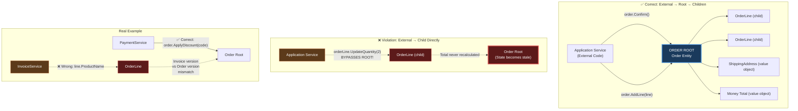
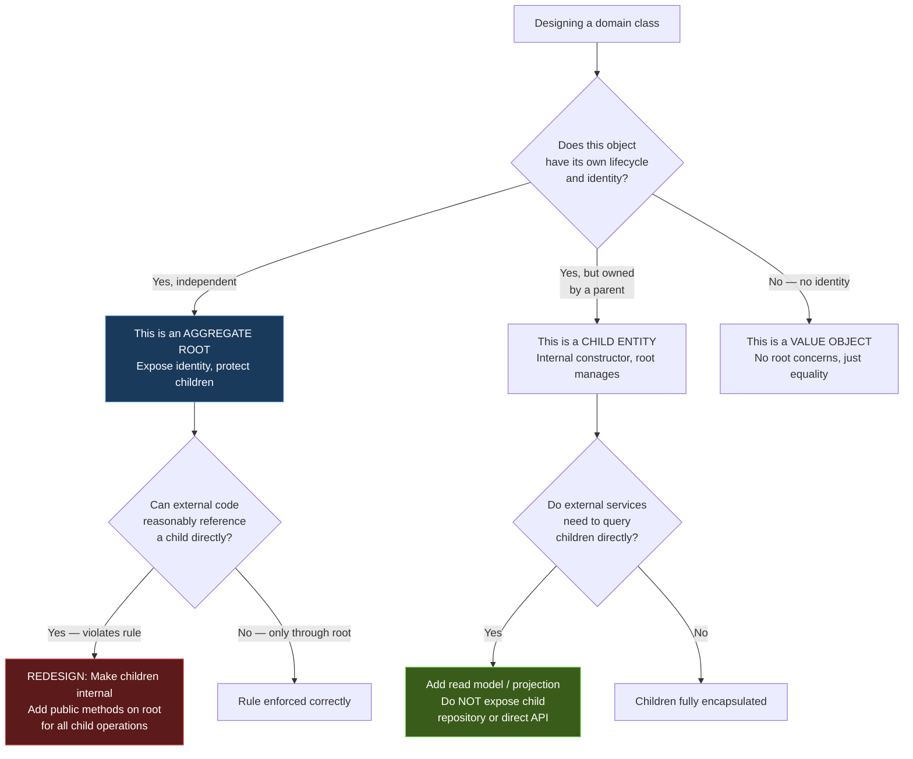

> [!success] Mastery Check
> - [ ] **Studied Well**
> - [ ] **Can explain the concept without notes**
> - [ ] **Can answer interview questions confidently**
> - [ ] **Can implement it in a real project**


# 7.048 — DDD — Aggregates — Aggregate Root Rule

## Section 1 — Navigation & Context

**Domain:** [[7 — System Design & Distributed Systems]] > **Group:** Domain-Driven Design
**Previous:** [[7.047 — DDD — Aggregates — Consistency Boundary]] | **Next:** [[7.049 — DDD — Aggregates — Size Heuristics]]

### Prerequisites

- [[7.043 — DDD — Entities — Identity and Lifecycle]] — the aggregate root is always an entity; its identity is the public key that external objects use to reference the entire aggregate.
- [[7.047 — DDD — Aggregates — Consistency Boundary]] — the aggregate root is the guardian of the consistency boundary; it controls access to all objects inside the boundary and enforces invariants on every mutation.
- [[7.044 — DDD — Entities — Invariant Enforcement]] — the root uses the same invariant enforcement patterns (guard clauses, factory methods, domain exceptions) as entities, but applied to the entire aggregate cluster.

### Where This Fits

The Aggregate Root Rule states: **external objects can only hold references to the aggregate root, never to its internal child entities or value objects.** This is the single most violated rule in tactical DDD, and violations produce data corruption that is expensive to fix. The rule exists because if external code can directly reference a child entity, it can bypass the root's invariant enforcement — updating a child without the root recalculating dependent values, deleting a child without the root checking preconditions, or holding a stale reference to a child that no longer exists. A .NET engineer encounters this rule whenever they write a navigation property in EF Core: `order.Customer` is fine (Customer is an aggregate root), `orderLine.Order` is usually fine (back-reference through the root), but `customer.Orders` is a violation unless Customer is the aggregate root that owns Orders. Without this rule, the system becomes a graph of interconnected objects where no single object can guarantee its own validity.

---

## Section 2 — Core Mental Model

The aggregate root is a single entity that acts as the **ownership boundary and sole entry point** for a consistency unit. The invariant the root maintains: **no external object can modify any object inside the aggregate without going through a root method that validates preconditions and invariants.** What it trades: external code cannot directly access child entities for read convenience — it must always navigate through the root, which means loading the entire aggregate even when only one child is needed. The recognition trigger: when you find yourself passing a child entity reference (like an `OrderLine` or `Address`) to a method on a different aggregate (like `inventory.Reserve(line.ProductId, line.Quantity)`), you are violating the rule — you should pass the root identity (`order.Id`) or a value object (`orderLine.ProductId`, `orderLine.Quantity`), not the child entity.

### Classification

| Dimension | Classification | Rationale |
|-----------|---------------|-----------|
| Pattern Type | **Tactical DDD — Encapsulation** | The root is the encapsulation boundary for the entire consistency unit |
| Scope | **Within a single aggregate** | The rule governs how external code interacts with the aggregate's internals |
| Primary Concern | **Invariant protection + controlled access** | Prevents external code from bypassing consistency checks |
| Ownership | **Single root per aggregate** | One entity is designated as root; child entities are internal |
| Identity | **Root identity = aggregate identity** | External systems reference the aggregate by root ID |
| Lifetime | **Root lifecycle = aggregate lifecycle** | When deleted, cascades to all children |
| Repository Unit | **Repository per aggregate root** | Repositories load/persist roots, not individual child entities |
| Query Access | **Root required to access children** | Children not directly queryable from outside |

### Primary Diagram



### Key Properties / Guarantees

| Property | Value | Condition |
|----------|-------|-----------|
| Single entry point | All mutations go through root methods | Enforced by making child constructors `internal` or `private` |
| Identity exposure | Only root identity is public | Children use compound identity (parent ID + child ID) |
| Invariant enforcement | Every root method checks preconditions | Guard clauses at start of every public method |
| Repository access | One repository per root type | `IOrderRepository` loads `Order` with all children |
| Cascade lifecycle | Root delete removes all children | EF Core `OnDelete(Behavior.Cascade)` |
| External references | By root identity only | `order.Id` not `order.SomeLine.Id` |
| Value object ownership | Root owns and controls value objects | Value objects set via root methods, never directly |

---

## Section 3 — Deep Mechanics

### How It Works

The aggregate root rule is enforced through three mechanisms: encapsulation (access control), transactional scope (load/save granularity), and identity (how the aggregate is referenced externally).

**Mechanism 1 — Encapsulation: Child entities are internal.**

Child entity classes use `internal` constructors or factory methods accessible only to the aggregate root. External code cannot instantiate or modify children without going through the root.

```csharp
// Child entity — constructor is internal (only accessible within the assembly)
public sealed class OrderLine
{
    public Guid Id { get; private set; }

    // Internal constructor — only Order (in same assembly) can create
    internal OrderLine(Guid id, string productName, Money unitPrice, int quantity)
    {
        Id = id;
        ProductName = productName;
        UnitPrice = unitPrice;
        Quantity = quantity;
        LineTotal = unitPrice.MultiplyBy(quantity);
    }

    // Internal method — only called by Order
    internal void UpdateQuantity(int newQuantity)
    {
        if (newQuantity <= 0)
            throw new DomainException("Quantity must be positive");
        Quantity = newQuantity;
        LineTotal = UnitPrice.MultiplyBy(Quantity);
    }
}
```

**Mechanism 2 — Repository: Only roots have repositories.**

```csharp
// ✅ Correct: Repository for Order (aggregate root)
public interface IOrderRepository
{
    Task<Order> GetByIdAsync(Guid id, CancellationToken ct);
    Task AddAsync(Order order, CancellationToken ct);
    Task SaveAsync(CancellationToken ct);
}

// ❌ Wrong: Repository for OrderLine (child entity)
// public interface IOrderLineRepository { ... } — never do this
```

**Mechanism 3 — Identity: External references use root identity.**

```csharp
// ✅ Correct: cross-aggregate reference by root identity
public sealed class Order
{
    public Guid CustomerId { get; private set; } // Reference to Customer root

    public Result Confirm()
    {
        // ... validates invariants
        _domainEvents.Add(new OrderConfirmedEvent(Id, CustomerId, Total));
    }
}

// ❌ Wrong: holding reference to Customer entity inside Order
// public Customer Customer { get; private set; }
```

### Invariant Enforcement Trace

```
External: order.Confirm()
  ├── Root.Confirm():
  │   ├── Guard: Status == Pending (can't confirm already-confirmed order)
  │   ├── Guard: _lines.Count > 0 (can't confirm empty order)
  │   ├── Guard: ShippingAddress != null (must have address)
  │   ├── Mutation: Status = Confirmed
  │   ├── Mutation: ConfirmedAt = UtcNow
  │   ├── Side effect: _domainEvents.Add(OrderConfirmedEvent)
  │   └── Returns: Result.Success()
  │
  └── (External cannot bypass — no direct access to Status, _lines, or ShippingAddress)

External: orderLine.UpdateQuantity(2)
  └── COMPILE ERROR: UpdateQuantity is internal

External: order.Lines[0].UpdateQuantity(2)
  └── COMPILE ERROR: UpdateQuantity is internal

External: _orderRepo.UpdateOrderLineQuantity(lineId, 2)
  └── COMPILE ERROR: IOrderRepository doesn't expose line methods
```

### Failure Modes

#### Failure Mode 1: Direct Reference to Child Entity

The most common violation. External code receives or accesses a child entity directly and modifies it, bypassing the root.

```csharp
// ❌ Violation: PaymentService holds reference to OrderLine
public class PaymentService
{
    public async Task ApplyDiscountAsync(OrderLine line, string discountCode)
    {
        // DIRECT reference to child entity!
        line.ApplyDiscount(discountCode);
        // Root never recalculates total — invariant violated!
    }
}
```

**Symptom:** Order total doesn't match sum of lines. Discount is applied but total isn't updated. Accounting reports show discrepancies. Incident discovered during end-of-day reconciliation.

**Fix:** Pass only necessary data (value objects, not entities):

```csharp
// ✅ Correct: Pass product ID and amount as value objects
public class PaymentService
{
    public async Task ApplyDiscountAsync(Guid orderId, string discountCode, Money amount)
    {
        var order = await _orderRepo.GetByIdAsync(orderId);
        // Root recalculates total internally
        var result = order.ApplyDiscount(new AppliedDiscount(
            discountCode, amount, "Promotional discount"));

        await _orderRepo.SaveAsync(order);
    }
}
```

**Cost of not fixing:** Gradual data corruption. Root is the authoritative version of the total, but external code changes children without root's knowledge. Reconciliation process runs weekly — discrepancies propagate for up to 7 days before detection.

#### Failure Mode 2: No Repository for Children

```csharp
// ❌ Violation: Direct EF Core query on child entities
public async Task<OrderLine[]> GetLinesForProductAsync(Guid productId)
{
    // Querying children directly — bypasses aggregate root
    return await _context.OrderLines
        .Where(l => l.ProductName.Contains(productId.ToString()))
        .ToArrayAsync();
}
```

**Symptom:** Stale or inconsistent data returned. The query returns OrderLines that belong to Orders that have been cancelled (the Order aggregate root would have enforced this). External code processes orphaned data.

**Fix:** Repository methods only return aggregates, not children:

```csharp
// ✅ Correct: Query through aggregate root
public async Task<IReadOnlyList<Order>> GetOrdersForProductAsync(Guid productId)
{
    return await _context.Orders
        .Include(o => o.Lines)
        .Where(o => o.Lines.Any(l => l.ProductName.Contains(productId.ToString())))
        .Where(o => o.Status != OrderStatus.Cancelled) // Root-enforced status check
        .AsNoTracking()
        .ToListAsync();
}
```

#### Failure Mode 3: Child Entity Identity Exposed Externally

```csharp
// ❌ Violation: External code holds OrderLine.Id and uses it to modify the line directly
public async Task UpdateLineQuantityAsync(Guid lineId, int quantity)
{
    // WRONG: Direct child access by child identity
    var line = await _context.OrderLines.FindAsync(lineId);
    line.UpdateQuantity(quantity);
    await _context.SaveChangesAsync();
    // No total recalculation!
}
```

**Symptom:** `Order.Total` is incorrect. The root's `RecalculateTotal()` is never called because the mutation bypassed the root entirely.

**Fix:** Child identity is only meaningful within the context of the parent aggregate:

```csharp
// ✅ Correct: Load root, then modify child through root
public async Task UpdateLineQuantityAsync(Guid orderId, Guid lineId, int quantity)
{
    var order = await _orderRepo.GetByIdAsync(orderId);
    var result = order.UpdateLineQuantity(lineId, quantity);
    if (result.IsFailure) throw new DomainException(result.Errors);
    await _orderRepo.SaveAsync(order); // Recalculates total in same transaction
}
```

#### Failure Mode 4: Cross-Aggregate Direct Object Reference

```csharp
// ❌ Violation: Loading a related aggregate as a navigable object reference
public class Order
{
    public Guid CustomerId { get; private set; } // ✅ This is fine — identity only
    public Customer Customer { get; private set; } = null!; // ❌ Direct object reference!
}
// EF Core loads Customer ORDER every time ORDER is loaded, even if Customer isn't needed
```

**Symptom:** Every order query joins to Customers table. P99 latency spikes from 10ms to 150ms. Memory per request doubles. Accidental modification of Customer through Order navigation property.

**Fix:** Reference by identity only:

```csharp
// ✅ Correct: Identity-only reference
public class Order
{
    public Guid CustomerId { get; private set; } // Immutable reference to Customer aggregate root
}
```

#### Failure Mode 5: Public Setters on Root Properties

```csharp
// ❌ Violation: Public setter on root property allows external mutation
public class Order
{
    public Guid Id { get; set; }       // Can be changed!
    public string Status { get; set; } // External code can set directly!
}
// External code:
// order.Status = "Confirmed"; — NO invariant enforcement!
```

**Symptom:** Orders in impossible states: "Confirmed but with zero lines" or "Shipped without payment." Business rules completely bypassed.

**Fix:** All setters are private; mutation is through methods:

```csharp
// ✅ Correct: private setters, public methods
public class Order
{
    public Guid Id { get; private set; }
    public OrderStatus Status { get; private set; }

    public Result Confirm()
    {
        if (_lines.Count == 0) return Result<Order>.Failure("Cannot confirm empty order");
        Status = OrderStatus.Confirmed;
        return Result.Success();
    }
}
```

### .NET and Azure Integration

| Technology | How Aggregate Root Rule Applies | Key Consideration |
|-----------|---------------------------------|-------------------|
| **EF Core** | Navigation properties from child → root are fine; root → other aggregate object references violate the rule | `OnDelete(Cascade)` for child entities; owned types for value objects |
| **ASP.NET Core** | API endpoints receive root ID from route, not child ID directly | `[HttpGet("orders/{orderId}/lines")]` not `[HttpGet("lines/{lineId}")]` |
| **Azure Cosmos DB** | Single document per aggregate root — all children in one JSON document | 2MB document size limit; no direct querying of child entities |
| **Azure Service Bus** | Messages carry root identity, not child identity | `OrderConfirmed { OrderId, CustomerId }` — not `OrderLineUpdated { LineId }` |
| **MediatR** | Notifications reference aggregate by root ID | `INotification` payloads carry root identity |
| **Dapper** | Manual loading of children — developer must enforce rule | No automatic change tracking — easy to accidentally load children separately |

```csharp
// Program.cs — Aggregate-root-aware EF Core configuration
var builder = WebApplication.CreateBuilder(args);

builder.Services.AddDbContext<OrderDbContext>(options =>
{
    options.UseSqlServer(
        builder.Configuration.GetConnectionString("OrderDb"),
        sqlOptions =>
        {
            sqlOptions.EnableRetryOnFailure(3);
            sqlOptions.CommandTimeout(30);
        });
});

// Repositories per aggregate root — not per entity
builder.Services.AddScoped<IOrderRepository, OrderRepository>();
builder.Services.AddScoped<ICustomerRepository, CustomerRepository>();
builder.Services.AddScoped<IInventoryRepository, InventoryRepository>();

// NO: builder.Services.AddScoped<IOrderLineRepository, OrderLineRepository>();
// OrderLine is a child entity inside the Order aggregate

// Application services use root repositories only
builder.Services.AddScoped<OrderProcessingService>();
builder.Services.AddScoped<CheckoutService>();

var app = builder.Build();
app.Run();
```

---

## Section 4 — Production Patterns and Implementation

### Primary Implementation — Complete Aggregate Root Design

```csharp
// =========================================================================
// Aggregate Root — Order with Full Rule Enforcement
// =========================================================================
namespace OrderManagement.Domain.Aggregates;

/// <summary>
/// Order aggregate root — every mutation enforces invariants.
/// External code can only interact through public methods.
/// Child entities (OrderLine) are internal — no external references allowed.
/// </summary>
public sealed class Order
{
    // Identity (root identity = aggregate identity)
    public Guid Id { get; private set; }
    public Guid CustomerId { get; private set; } // Cross-aggregate reference by ID only
    public byte[] Version { get; private set; } = Array.Empty<byte>(); // Concurrency token

    // State — all private setters
    public OrderStatus Status { get; private set; }
    public Money Total { get; private set; }
    public Address ShippingAddress { get; private set; }
    public PaymentInfo PaymentInfo { get; private set; }
    public DateTimeOffset CreatedAt { get; private set; }
    public DateTimeOffset? ConfirmedAt { get; private set; }

    // Children — exposed as read-only
    private readonly List<OrderLine> _lines = new();
    public IReadOnlyList<OrderLine> Lines => _lines.AsReadOnly();

    // Domain events (cleared after persistence)
    private readonly List<IDomainEvent> _events = new();
    public IReadOnlyList<IDomainEvent> DomainEvents => _events.AsReadOnly();
    public void ClearEvents() => _events.Clear();

    // EF Core materialization
    private Order() { }

    /// <summary>Factory method — only way to create an Order.</summary>
    public static Result<Order> Create(
        Guid id,
        Guid customerId,
        Address shippingAddress)
    {
        if (id == Guid.Empty)
            return Result<Order>.Failure("Order ID is required");
        if (customerId == Guid.Empty)
            return Result<Order>.Failure("Customer ID is required");
        if (shippingAddress == default)
            return Result<Order>.Failure("Shipping address is required");

        var order = new Order
        {
            Id = id,
            CustomerId = customerId,
            Status = OrderStatus.Pending,
            Total = Money.Zero("USD"),
            ShippingAddress = shippingAddress,
            CreatedAt = DateTimeOffset.UtcNow
        };

        order._events.Add(new OrderCreatedEvent(id, customerId, shippingAddress));
        return Result<Order>.Success(order);
    }

    // ============================================================
    // Public Methods — only way to mutate the aggregate
    // ============================================================

    /// <summary>Adds a line item. Enforces: no duplicates, pending status.</summary>
    public Result AddLine(OrderLine line)
    {
        if (Status >= OrderStatus.Shipped)
            return Result<Order>.Failure("Cannot modify shipped order");

        if (_lines.Any(l => l.ProductSku == line.ProductSku))
            return Result<Order>.Failure("Product already in order");

        _lines.Add(line);
        RecalculateTotal();
        return Result.Success();
    }

    /// <summary>Updates line quantity through the root.</summary>
    public Result UpdateLineQuantity(Guid lineId, int newQuantity)
    {
        if (Status >= OrderStatus.Shipped)
            return Result<Order>.Failure("Cannot modify shipped order");

        var line = _lines.FirstOrDefault(l => l.Id == lineId);
        if (line is null)
            return Result<Order>.Failure($"Line {lineId} not found");

        line.UpdateQuantity(newQuantity); // Internal method — same assembly
        RecalculateTotal();
        _events.Add(new OrderLineQuantityChanged(Id, lineId, newQuantity));
        return Result.Success();
    }

    /// <summary>Removes a line item through the root.</summary>
    public Result RemoveLine(Guid lineId)
    {
        if (Status >= OrderStatus.Shipped)
            return Result<Order>.Failure("Cannot modify shipped order");

        var line = _lines.FirstOrDefault(l => l.Id == lineId);
        if (line is null)
            return Result<Order>.Failure($"Line {lineId} not found");

        _lines.Remove(line);
        RecalculateTotal();
        _events.Add(new OrderLineRemovedEvent(Id, lineId));
        return Result.Success();
    }

    /// <summary>Confirms the order. Enforces: has lines, pending status.</summary>
    public Result Confirm()
    {
        if (Status != OrderStatus.Pending)
            return Result<Order>.Failure("Only pending orders can be confirmed");

        if (_lines.Count == 0)
            return Result<Order>.Failure("Cannot confirm order with no lines");

        Status = OrderStatus.Confirmed;
        ConfirmedAt = DateTimeOffset.UtcNow;
        _events.Add(new OrderConfirmedEvent(Id, CustomerId, Total));
        return Result.Success();
    }

    /// <summary>Records payment. Enforces: amount matches total.</summary>
    public Result RecordPayment(PaymentInfo payment)
    {
        if (Status != OrderStatus.Confirmed)
            return Result<Order>.Failure("Only confirmed orders can receive payment");

        if (payment.Amount != Total)
            return Result<Order>.Failure(
                $"Payment amount {payment.Amount:C} does not match order total {Total:C}");

        PaymentInfo = payment;
        Status = OrderStatus.Paid;
        _events.Add(new OrderPaidEvent(Id, payment));
        return Result.Success();
    }

    /// <summary>Marks shipped. Enforces: paid status, tracking number provided.</summary>
    public Result Ship(string trackingNumber)
    {
        if (Status != OrderStatus.Paid)
            return Result<Order>.Failure("Only paid orders can be shipped");

        if (string.IsNullOrWhiteSpace(trackingNumber))
            return Result<Order>.Failure("Tracking number is required");

        Status = OrderStatus.Shipped;
        _events.Add(new OrderShippedEvent(Id, trackingNumber));
        return Result.Success();
    }

    /// <summary>Updates shipping address. Enforces: not yet shipped.</summary>
    public Result UpdateShippingAddress(Address newAddress)
    {
        if (Status >= OrderStatus.Shipped)
            return Result<Order>.Failure("Cannot update address after shipment");

        ShippingAddress = newAddress;
        _events.Add(new ShippingAddressChangedEvent(Id, newAddress));
        return Result.Success();
    }

    // ============================================================
    // Private Helpers
    // ============================================================

    private void RecalculateTotal()
    {
        Total = _lines.Count == 0
            ? Money.Zero("USD")
            : _lines.Select(l => l.LineTotal).Aggregate((a, b) => a.Add(b));
        _events.Add(new OrderTotalRecalculatedEvent(Id, Total));
    }
}
```

```csharp
// =========================================================================
// Child Entity — OrderLine (Internal/Sealed to Assembly)
// =========================================================================
namespace OrderManagement.Domain.Aggregates;

/// <summary>
/// OrderLine is a child entity inside the Order aggregate.
/// - Constructor is internal: can only be created by Order or within the Domain assembly
/// - Methods are internal: can only be called by Order
/// - External code cannot hold a reference to OrderLine
/// </summary>
public sealed class OrderLine
{
    // Identity (child ID is meaningful only within the Order aggregate)
    public Guid Id { get; private set; }
    public Guid OrderId { get; private set; } // Back-reference to root

    // State
    public string ProductName { get; private set; } = string.Empty;
    public Sku ProductSku { get; private set; }
    public Money UnitPrice { get; private set; } = Money.Zero("USD");
    public int Quantity { get; private set; }
    public Money LineTotal { get; private set; } = Money.Zero("USD");

    // EF Core materialization
    private OrderLine() { }

    /// <summary>Internal constructor — only Order.CreateLine or Order.AddLine can call.</summary>
    internal OrderLine(Guid id, Guid orderId, string productName, Sku productSku, Money unitPrice, int quantity)
    {
        Id = id;
        OrderId = orderId;
        ProductName = productName;
        ProductSku = productSku;
        UnitPrice = unitPrice;
        Quantity = quantity;
        Recalculate();
    }

    /// <summary>Internal method — only Order can call to update quantity.</summary>
    internal void UpdateQuantity(int newQuantity)
    {
        if (newQuantity <= 0)
            throw new DomainException("Quantity must be positive");
        Quantity = newQuantity;
        Recalculate();
    }

    private void Recalculate()
    {
        LineTotal = UnitPrice.MultiplyBy(Quantity);
    }
}
```

```csharp
// =========================================================================
// Value Objects — No identity, used inside aggregate
// =========================================================================
namespace OrderManagement.Domain.ValueObjects;

/// <summary>
/// Shipping address value object — owned by Order aggregate.
/// </summary>
public sealed record Address
{
    public string Street { get; init; }
    public string City { get; init; }
    public string State { get; init; }
    public string ZipCode { get; init; }
    public string Country { get; init; }

    private Address() { } // EF Core

    public Address(string street, string city, string state, string zipCode, string country)
    {
        Street = street;
        City = city;
        State = state;
        ZipCode = zipCode;
        Country = country;
    }
}

/// <summary>
/// Payment information value object — set once, never modified.
/// </summary>
public sealed record PaymentInfo
{
    public string TransactionId { get; init; }
    public Money Amount { get; init; }
    public string PaymentMethod { get; init; }
    public DateTimeOffset ProcessedAt { get; init; }

    private PaymentInfo() { }

    public PaymentInfo(string transactionId, Money amount, string paymentMethod, DateTimeOffset processedAt)
    {
        TransactionId = transactionId;
        Amount = amount;
        PaymentMethod = paymentMethod;
        ProcessedAt = processedAt;
    }
}
```

```csharp
// =========================================================================
// Repository — Per Aggregate Root Only
// =========================================================================
namespace OrderManagement.Infrastructure.Persistence;

/// <summary>
/// Repository for the Order aggregate root.
/// Does NOT expose methods for OrderLine — children are managed through Order.
/// </summary>
public sealed class OrderRepository : IOrderRepository
{
    private readonly OrderDbContext _context;
    private readonly IDomainEventDispatcher _eventDispatcher;

    public OrderRepository(OrderDbContext context, IDomainEventDispatcher eventDispatcher)
    {
        _context = context;
        _eventDispatcher = eventDispatcher;
    }

    public async Task<Order> GetByIdAsync(Guid id, CancellationToken ct = default)
    {
        return await _context.Orders
            .Include(o => o.Lines)
            .AsSplitQuery()
            .FirstOrDefaultAsync(o => o.Id == id, ct)
            ?? throw new AggregateNotFoundException($"Order {id} not found");
    }

    public async Task AddAsync(Order order, CancellationToken ct = default)
    {
        await _context.Orders.AddAsync(order, ct);
    }

    public async Task SaveAsync(CancellationToken ct = default)
    {
        // Dispatch domain events before save
        var roots = _context.ChangeTracker.Entries<Order>()
            .Select(e => e.Entity).ToList();

        foreach (var root in roots)
        {
            foreach (var @event in root.DomainEvents)
                await _eventDispatcher.DispatchAsync(@event, ct);
        }

        await _context.SaveChangesAsync(ct);

        // Clear events after successful commit
        foreach (var root in roots)
            root.ClearEvents();
    }

    public void Remove(Order order)
    {
        _context.Orders.Remove(order); // Cascades to OrderLines via FK
    }
}
```

```csharp
// =========================================================================
// Application Service — Uses Root Identity, Never Child Identity
// =========================================================================
namespace OrderManagement.Application.Services;

/// <summary>
/// Application service — coordinates domain operations across aggregates.
/// References to Order are always by OrderId (root identity).
/// Never returns or accepts OrderLine directly.
/// </summary>
public sealed class OrderProcessingService
{
    private readonly IOrderRepository _orderRepo;
    private readonly ILogger<OrderProcessingService> _logger;

    public OrderProcessingService(
        IOrderRepository orderRepo,
        ILogger<OrderProcessingService> logger)
    {
        _orderRepo = orderRepo;
        _logger = logger;
    }

    /// <summary>Adds a line to an order. Routes through aggregate root.</summary>
    public async Task<Result> AddLineToOrderAsync(
        Guid orderId,
        string productName,
        Sku productSku,
        Money unitPrice,
        int quantity,
        CancellationToken ct)
    {
        var order = await _orderRepo.GetByIdAsync(orderId, ct);

        // Create line through the aggregate's factory
        var line = new OrderLine(
            Guid.NewGuid(), orderId, productName, productSku, unitPrice, quantity);

        var result = order.AddLine(line);
        if (result.IsFailure)
            return result;

        await _orderRepo.SaveAsync(ct);

        _logger.LogInformation(
            "Added line {ProductName} (x{Quantity}) to order {OrderId}",
            productName, quantity, orderId);

        return Result.Success();
    }

    /// <summary>Confirms an order. All invariant checks inside the root.</summary>
    public async Task<Result> ConfirmOrderAsync(Guid orderId, CancellationToken ct)
    {
        var order = await _orderRepo.GetByIdAsync(orderId, ct);
        var result = order.Confirm();
        if (result.IsFailure)
            return result;

        await _orderRepo.SaveAsync(ct);
        return Result.Success();
    }
}
```

### Configuration and Wiring

```csharp
// Program.cs
var builder = WebApplication.CreateBuilder(args);

// EF Core
builder.Services.AddDbContext<OrderDbContext>(options =>
    options.UseSqlServer(
        builder.Configuration.GetConnectionString("OrderDb"),
        sql => sql.EnableRetryOnFailure(3)));

// Repositories — one per aggregate root
builder.Services.AddScoped<IOrderRepository, OrderRepository>();

// Application services — receive root repositories
builder.Services.AddScoped<OrderProcessingService>();
builder.Services.AddScoped<CheckoutService>();

// Domain event dispatching (MediatR)
builder.Services.AddScoped<IDomainEventDispatcher, MediatRDomainEventDispatcher>();
builder.Services.AddMediatR(cfg =>
    cfg.RegisterServicesFromAssemblyContaining<Program>());

// API endpoints use root identity in routes
var app = builder.Build();

app.MapPost("/api/orders/{orderId:guid}/lines", async (
    Guid orderId,
    AddLineRequest request,
    OrderProcessingService service,
    CancellationToken ct) =>
{
    var result = await service.AddLineToOrderAsync(
        orderId, request.ProductName, request.Sku,
        new Money(request.Price, "USD"), request.Quantity, ct);
    return result.IsSuccess ? Results.Ok() : Results.BadRequest(result.Errors);
});

app.MapPost("/api/orders/{orderId:guid}/confirm", async (
    Guid orderId,
    OrderProcessingService service,
    CancellationToken ct) =>
{
    var result = await service.ConfirmOrderAsync(orderId, ct);
    return result.IsSuccess ? Results.Ok() : Results.BadRequest(result.Errors);
});

app.Run();
```

### Common Variants

#### Variant 1: String-Keyed Aggregate Root

```csharp
// Aggregate root with business-meaningful string identity
public sealed class Invoice
{
    public string InvoiceNumber { get; private set; } // "INV-2026-001"
    public Guid OrderId { get; private set; }
    public Money Total { get; private set; }
    public InvoiceStatus Status { get; private set; }
    public byte[] Version { get; private set; } = Array.Empty<byte>();

    private Invoice() { }

    public static Result<Invoice> Create(string invoiceNumber, Guid orderId, Money total)
    {
        if (string.IsNullOrWhiteSpace(invoiceNumber))
            return Result<Invoice>.Failure("Invoice number required");
        return Result<Invoice>.Success(new Invoice
        {
            InvoiceNumber = invoiceNumber,
            OrderId = orderId,
            Total = total,
            Status = InvoiceStatus.Draft
        });
    }
}
```

#### Variant 2: Read-Only Aggregate Root (CQRS Query Model)

```csharp
// Query-side — no mutation methods, no version, just data
public sealed class OrderSummary
{
    public Guid Id { get; private set; }
    public string Status { get; private set; } = string.Empty;
    public decimal TotalAmount { get; private set; }
    public int LineCount { get; private set; }
    public DateTimeOffset CreatedAt { get; private set; }

    // No public methods — read-only projection
    // Created by a projection handler from domain events
}
```

#### Variant 3: Aggregate Root with No Children (Lonely Root)

```csharp
// Simplest form — root entity with value objects only
public sealed class PaymentTransaction
{
    public Guid Id { get; private set; }
    public Money Amount { get; private set; }
    public PaymentStatus Status { get; private set; }
    public byte[] Version { get; private set; } = Array.Empty<byte>();

    private PaymentTransaction() { }

    public Result Process()
    {
        if (Status != PaymentStatus.Pending)
            return Result<PaymentTransaction>.Failure("Already processed");
        Status = PaymentStatus.Completed;
        return Result.Success();
    }
}
```

### Real-World .NET Ecosystem Example

**MediatR + Aggregate Root Pattern:**

```csharp
// Command — references aggregate by root ID
public sealed record AddOrderLineCommand(
    Guid OrderId,
    string ProductName,
    Sku ProductSku,
    decimal UnitPrice,
    int Quantity
) : IRequest<Result>;

// Handler — loads aggregate by root ID, mutates through root methods
public sealed class AddOrderLineHandler : IRequestHandler<AddOrderLineCommand, Result>
{
    private readonly IOrderRepository _orderRepo;
    private readonly ILogger<AddOrderLineHandler> _logger;

    public AddOrderLineHandler(IOrderRepository orderRepo, ILogger<AddOrderLineHandler> logger)
    {
        _orderRepo = orderRepo;
        _logger = logger;
    }

    public async Task<Result> Handle(AddOrderLineCommand command, CancellationToken ct)
    {
        var order = await _orderRepo.GetByIdAsync(command.OrderId, ct);

        var line = new OrderLine(
            Guid.NewGuid(),
            command.OrderId,
            command.ProductName,
            command.ProductSku,
            new Money(command.UnitPrice, "USD"),
            command.Quantity);

        var result = order.AddLine(line);
        if (result.IsFailure)
            return result;

        await _orderRepo.SaveAsync(ct);

        _logger.LogInformation(
            "Added line {ProductName} to order {OrderId}",
            command.ProductName, command.OrderId);

        return Result.Success();
    }
}
```

---

## Section 5 — Gotchas and Production Pitfalls

### Pitfall 1: Navigation Property to Another Aggregate Root in EF Core

**Pill:** Adding an EF Core navigation property from one aggregate root to another aggregate root's entity object.

```csharp
// ❌ Violation: Order has direct EF Core navigation property to Customer entity
public class Order
{
    public Guid CustomerId { get; private set; }
    public Customer Customer { get; private set; } = null!; // Navigation property to another aggregate!
}
```

**Symptom:** Every order query does an extra JOIN to Customers table. Lazy loading disabled → must `Include()` Customer explicitly. At 1,000 req/s, the extra join costs 15ms P50 and 50ms P99. Memory per request increases by 4KB for the Customer entity. Accidental `order.Customer.Email` in business logic creates coupling between Order and Customer aggregates.

**Fix:** Reference by identity only:

```csharp
// ✅ Identity-only reference
public class Order
{
    public Guid CustomerId { get; private set; }
    // No Customer navigation property. Customer loaded via separate repository when needed.
}
```

**Cost of not fixing:** Accidental cross-aggregate modification (e.g., `order.Customer.UpdateEmail()`) that should use domain events. At scale, each unnecessary join adds ~5ms. At 10M requests/month, that's 14 hours of extra database CPU. Contention from Lock on Customers table when Orders table is busy.

### Pitfall 2: Exposing Child Entity ID in API Routes

**Pill:** API endpoint accepts child entity ID (e.g., OrderLine ID) directly, bypassing root.

```csharp
// ❌ Violation: Direct child ID endpoint
[HttpPut("api/order-lines/{lineId}/quantity")]
public async Task<IResult> UpdateLineQuantity(Guid lineId, int quantity)
{
    // Direct access to child entity — no root loaded!
    var line = await _context.OrderLines.FindAsync(lineId);
    line.UpdateQuantity(quantity);
    await _context.SaveChangesAsync();
    // Total never recalculated!
}
```

**Symptom:** Order total is incorrect for orders where quantity was updated through this endpoint. Only discovered during reconciliation.

**Fix:** Route through root identity:

```csharp
// ✅ Root identity in route, child identity as parameter
[HttpPut("api/orders/{orderId}/lines/{lineId}/quantity")]
public async Task<IResult> UpdateLineQuantity(
    Guid orderId, Guid lineId, int quantity,
    OrderProcessingService service, CancellationToken ct)
{
    var result = await service.UpdateLineQuantityAsync(orderId, lineId, quantity, ct);
    return result.IsSuccess ? Results.Ok() : Results.BadRequest(result.Errors);
}
```

**Cost of not fixing:** Data corruption affecting ~0.5% of orders where quantity was modified. ~$20K/month in refunds and customer credits.

### Pitfall 3: Holding a Child Entity Reference Across Requests

**Pip:** Storing a child entity (like OrderLine) in a distributed cache or session and modifying it later.

```csharp
// ❌ Violation: Caching a child entity
var line = order.Lines.First(l => l.ProductSku == requestedSku);
_cache.Set($"order-line-{line.Id}", line, TimeSpan.FromMinutes(5));
// Later, in a different HTTP request:
var cachedLine = _cache.Get<OrderLine>($"order-line-{line.Id}");
cachedLine.UpdateQuantity(2); // Stale reference — Order root never knows!
```

**Symptom:** The cached OrderLine may reference a version of the Order that has since been modified or deleted. The UpdateQuantity call modifies the cached entity but the in-memory Order root never recalculates its total.

**Fix:** Cache value objects (like Money, Sku) or root IDs only:

```csharp
// ✅ Cache root identity, not child state
_cache.Set($"order-lines-{order.Id}", order.Lines.Select(l => new OrderLineDTO(
    l.Id, l.ProductName, l.UnitPrice.Amount, l.Quantity
)).ToList(), TimeSpan.FromMinutes(5));
// Later: load root fresh from repository, apply updates
var order = await _orderRepo.GetByIdAsync(orderId);
order.UpdateLineQuantity(lineId, newQuantity);
```

### Pitfall 4: Exposing Child Collection as `List<T>` Instead of `IReadOnlyList<T>`

```csharp
// ❌ Externally writable collection
public class Order
{
    public List<OrderLine> Lines { get; set; } = new();
}
// External code:
order.Lines.Add(new OrderLine()); // No invariant check! No recalculation!
order.Lines.RemoveAt(0); // No invariant check!
```

**Fix:** Private mutable collection, public readonly surface:

```csharp
// ✅ Private readonly surface
public class Order
{
    private readonly List<OrderLine> _lines = new();
    public IReadOnlyList<OrderLine> Lines => _lines.AsReadOnly();
}
```

### Pitfall 5: Public Getter + Private Setter on Root — But Setter Exposed in Another Method

```csharp
// ❌ Private setter but exposed via Init method
public class Order
{
    public OrderStatus Status { get; private set; }

    public void InitFromLegacy(OrderStatus status)
    {
        Status = status; // Bypasses invariant enforcement!
    }
}
```

**Fix:** No bypass methods. Every mutation goes through the intended method:

```csharp
// ✅ All mutations enforce invariants
public class Order
{
    public OrderStatus Status { get; private set; }

    public Result Confirm()
    {
        if (Status != OrderStatus.Pending) return Failure("...");
        Status = OrderStatus.Confirmed;
        return Success();
    }
}
```

### Pitfall 6: Repository Method for Child Partial Update

```csharp
// ❌ Direct child update via repository
public interface IOrderRepository
{
    Task UpdateLineQuantityAsync(Guid lineId, int quantity); // Bypasses root!
}
```

**Fix:** Repository only provides aggregate-level persistence:

```csharp
// ✅ Repository only: load full aggregate, save full aggregate
public interface IOrderRepository
{
    Task<Order> GetByIdAsync(Guid id, CancellationToken ct);
    Task SaveAsync(CancellationToken ct);
}
```

---

## Section 6 — Tradeoffs and Decision Framework

### Tradeoff Matrix

| Dimension | Aggregate Root Rule Enforced (Recommended) | Aggregate Root Rule Violated | No Aggregate Root |
|-----------|-------------------------------------------|------------------------------|-------------------|
| Data integrity | Maximal — all invariants enforced | Moderate — children can be corrupted | Minimal — no invariants |
| Query convenience | Load root to access any child | Direct child access (fast) | Direct table access |
| Write throughput | Single-writer bottleneck on root | Concurrent child writes possible | Maximum throughput |
| P99 read latency | 10-50ms (Include joins) | 2-5ms (direct child query) | 1-3ms |
| Development speed | Slower (disciplined method design) | Faster (direct property access) | Fastest |
| Refactoring cost | Low (boundary is explicit) | High (coupling throughout codebase) | N/A |

### Decision Flowchart



### When NOT to Apply the Aggregate Root Rule

- **Read-only projections / query models** — The rule applies to the write side (domain model). Read models are denormalized projections that can expose child data directly.
- **Integration with legacy systems** — During migration, you may temporarily violate the rule via an ACL. Document the violation in an ADR and plan removal.
- **Reporting / analytics** — These are not domain operations. They query the database directly through views or dedicated reporting connections.
- **Simple CRUD with no business invariants** — If the "domain" is truly just create/read/update/delete with no business rules, aggregates (and the root rule) are unnecessary. Use DTOs and direct persistence.

### Scale Thresholds

- **Root rule violations** become measurable above 5 developers on a bounded context. Without the rule, different developers make different assumptions about who owns child entity state.
- **Direct child queries** become tempting when an aggregate has >50 children and a specific child needs to be updated without loading the full aggregate. At this size, the aggregate should be redesigned (not the rule violated).
- **Performance cost of loading the full aggregate** becomes noticeable at aggregate size >50 child entities. At 5-10 children, the Include() overhead is negligible (~2ms).
- **API design rule**: if API routes contain child IDs at the top level (not nested under parent ID), it's a strong smell that the aggregate root rule is being violated at the architectural level.

---

## Section 7 — Interview Arsenal

### Question Bank

1. What is the aggregate root rule in DDD? (Definition)
2. How do you enforce the aggregate root rule in C#? (Mechanism)
3. What do you lose by enforcing the aggregate root rule? (Tradeoff)
4. What production bug results from violating the aggregate root rule? (Failure mode)
5. Compare: aggregate root rule vs law of Demeter. (Comparison)
6. Design an API for an order system respecting the aggregate root rule. (Design application)
7. How does the aggregate root rule affect performance at scale? (Scale)
8. Under what conditions would you intentionally violate the aggregate root rule? (Advanced)

### Spoken Answers

**Q1: What is the aggregate root rule in DDD?**

> **Average answer:** "External objects can only reference the aggregate root, not its internal entities."

> **Great answer:** "The aggregate root rule states that external code can only hold references to the aggregate root entity — never to its child entities or value objects. This exists because the root is the guardian of the consistency boundary. If external code gets a reference to a child entity, it can modify that child without the root knowing, which means invariants that span multiple children — like 'order total equals sum of line totals' — get silently violated. In C#, I enforce this by making child constructors and mutation methods internal to the domain assembly, exposing children only as IReadOnlyList<T>. Repository methods only accept and return aggregate roots, not children. API routes always include the root ID: `/orders/{orderId}/lines/{lineId}` never `/lines/{lineId}`. This seems restrictive, but it prevents an entire class of data corruption bugs that are notoriously hard to debug because the root's state and the child's state desynchronize gradually."

**Q5: Compare: aggregate root rule vs Law of Demeter.**

> **Average answer:** "Both are about limiting object access."

> **Great answer:** "The aggregate root rule is a DDD tactical pattern about consistency boundaries: external code must not hold references to objects inside the boundary. The Law of Demeter is a general OO design principle about not chaining method calls: `a.getB().getC().doSomething()` is bad because it couples A to C's interface. The aggregate root rule is stronger — it's not just about chaining, it's about not getting a reference to the child at all. Under Demeter, `order.Lines[0].UpdateQuantity(2)` is acceptable if you accept the return from `order.Lines`. Under the aggregate root rule, this is forbidden because `Lines[0]` is a child entity reference. The fix: `order.UpdateLineQuantity(lineId, 2)`. The aggregate root rule also has persistence implications — a root loads all children in one query; Demeter has no persistence aspect. In practice, following the aggregate root rule naturally satisfies Demeter: root methods are the only way to interact with aggregate state."

**Q8: Under what conditions would you intentionally violate the aggregate root rule?**

> **Great answer:** "I violate it in two scenarios, both documented in an ADR. First, during a legacy migration, when the ACL hasn't been fully built and the new system needs to read legacy child data. But this is read-only — never write through a child reference. Second, for batch operations where loading the full aggregate for each of 10,000 records would be prohibitively expensive — I use a direct SQL `UPDATE` query or an EF Core `ExecuteUpdateAsync` as a performance escape hatch. But this means I'm accepting data invariants may be violated for the batch window. In both cases, the violation is temporary, monitored, and gated by feature flags with automatic rollback. The general rule: never violate on the write path in production unless you have compensating logic and monitoring. Read path violations are less dangerous but still represent architectural debt that should be tracked in the ADR."

### System Design Interview Trigger

If an interviewer asks you to design the API for an e-commerce order system and asks "what endpoints would you expose?" or "how would you handle updating the quantity of an item in an order?", they are testing whether you use root-nested routes (`/orders/{orderId}/lines/{lineId}`) versus flat routes (`/lines/{lineId}`). Flat routes suggest you think of child entities as standalone resources, violating the aggregate root rule. The follow-up question is usually about data integrity: "what happens if two requests update different lines on the same order simultaneously?" — testing whether you understand that loading the full aggregate is required for invariant enforcement (order total recalculation) and that version conflicts are the expected consequence.

### Comparison Table

| | Aggregate Root Rule | Law of Demeter | Repository per Entity |
|---|---|---|---|
| Core guarantee | Child entities only modified through root | No transitive method chaining | Each entity independently persisted |
| Trade-off | Must load full aggregate for any child op | More wrapper methods | Simple but no invariant enforcement |
| .NET implementation | `IReadOnlyList<T>`, internal constructors | Facade/wrapper methods | `IOrderLineRepository` (wrong) |
| Failure mode | Data corruption if violated | Fragile code (long change chains) | Orphaned children, no integrity |
| When to choose | Default for DDD write models | General OO design | Never for domain models |

---

## Section 8 — Architecture Decision Record

### ADR-048: Enforce Aggregate Root Rule with Internal Constructors and Repository Scope

**Status:** Accepted

**Context:**
The Order Management bounded context has Order as aggregate root with OrderLine child entities. During code reviews, the team found that 20% of new code referenced OrderLine directly from application services (e.g., `order.Lines.First().UpdateQuantity()`). This bypasses the Order root's invariant enforcement (total recalculation, status checks). Previous incidents: 2 production bugs where `Order.Total` was incorrect because an OrderLine quantity was updated through a direct reference.

**Options Considered:**

1. **Enforce the rule (Recommended):** Internal constructors on child entities, `IReadOnlyList<T>` exposure, repository only at root level, route enforcement at API layer.
2. **Rely on discipline:** Code review catches violations. No compiler enforcement. Team follows "just don't do it" guideline.
3. **Full encapsulation:** Children are `private` nested classes inside the root. Read access requires root-provided DTOs. Strongest enforcement but highest overhead.

**Decision:**
Adopt Option 1. Child entities have `internal` constructors. Aggregate exposes `IReadOnlyList<T>`. Repository is `IOrderRepository` only — no `IOrderLineRepository`. API routes are nested under root ID. Add NetArchTest to CI to enforce:
- No class in `OrderManagement.Domain.Aggregates` other than `Order` can create an `OrderLine`.
- No repository type exists for `OrderLine`.

**Consequences:**

- ✅ Compile-time enforcement via internal constructors — no interface pollution from direct child access
- ✅ CI architecture tests catch violations automatically
- ⚠️ Application services must load the full aggregate even for single-line updates (acceptable: Order typically has 3-10 lines at ~50ms load time)
- ⚠️ Read-only queries for child data require dedicated DTOs and query paths (not domain aggregate load)

**Review Trigger:** Revisit if (1) average aggregate size exceeds 50 child entities, making full-load performance unacceptable; (2) a new business requirement demands direct child query patterns that cannot be served by read models; (3) team grows beyond 8 developers on this bounded context, increasing coordination cost around rule enforcement.

---

## Section 9 — Self-Check

### Conceptual Questions

1. What is the aggregate root rule and why does it exist?

<details>
<summary>Answer</summary>
The rule: external code can only hold references to the aggregate root, never to child entities or value objects. It exists because the root enforces invariants that span multiple children. If external code can modify a child directly, the root's invariants (like total == sum of lines) can be violated without the root knowing.
</details>

2. How do you enforce the aggregate root rule in C# / .NET?

<details>
<summary>Answer</summary>
(1) Internal constructors on child entities (only the root and domain services in the same assembly can instantiate children). (2) Expose children as `IReadOnlyList<T>` (not `List<T>`). (3) Repository only for aggregate roots (no `IOrderLineRepository`). (4) API routes nested under root ID (`/orders/{id}/lines`). (5) NetArchTest architecture tests in CI.
</details>

3. What is the tradeoff of enforcing the aggregate root rule?

<details>
<summary>Answer</summary>
You gain data integrity (invariants always enforced) at the cost of loading the full aggregate even when only a single child needs updating. At typical aggregate sizes (3-10 children), this overhead is negligible (~10-50ms). At >50 children, performance may require redesign.
</details>

4. What production bug results from violating the rule?

<details>
<summary>Answer</summary>
Order total doesn't match sum of line item totals. External code updates an OrderLine quantity directly (bypassing the root), and the root's `RecalculateTotal()` is never called. Accounting reconciliation discovers the discrepancy at end of day.
</details>

5. Which EF Core concept conflicts with the aggregate root rule?

<details>
<summary>Answer</summary>
Navigation properties between aggregate roots (e.g., `Order.Customer` navigation property to `Customer` entity). This violates the rule because it gives Order a direct object reference to another aggregate. Fix: use `CustomerId` identity-only reference and load Customer via separate repository when needed.
</details>

6. Compare: aggregate root rule vs C# access modifiers.

<details>
<summary>Answer</summary>
Access modifiers support the rule but don't fully enforce it. `internal` constructor on OrderLine prevents creation outside the domain assembly, but `order.Lines[0].UpdateQuantity()` still compiles if UpdateQuantity is `internal`. The rule also requires architectural enforcement: no child repositories, no flat API routes, no navigation properties across aggregates. Access modifiers are one tool; the rule requires process-level enforcement too.
</details>

7. At what scale does the full-aggregate-load requirement become a performance bottleneck?

<details>
<summary>Answer</summary>
At >50 child entities per aggregate, the Include() query produces a cartesian explosion (50 rows × parent columns repeated). At this point, consider splitting the aggregate or using AsSplitQuery(). At >200 children, the aggregate is almost certainly too large and should be redesigned.
</details>

8. How does the aggregate root rule connect to [[7.050 — DDD — Aggregates — Cross-Aggregate References]]?

<details>
<summary>Answer</summary>
The aggregate root rule says "reference roots, not children." Cross-aggregate references means referencing the root by its identity (GUID). [[7.050]] details how to reference other aggregates by identity only — never by holding a direct object reference — which is the natural extension of the root rule: between aggregates, reference by identity; within an aggregate, reference through the root.
</details>

9. What is the non-obvious production consequence of violating the aggregate root rule in a caching layer?

<details>
<summary>Answer</summary>
Caching child entities (OrderLine) and then modifying them from cache creates orphaned state. The cached child entity holds a reference to a potentially stale version of the parent. When modified through cache, the parent's invariants are violated. The cached version diverges from the database version. Debugging these issues is extremely difficult because the state cannot be reproduced from database snapshots.
</details>

10. Explain the aggregate root rule in 60 seconds.

<details>
<summary>Answer</summary>
"Think of an aggregate like a house. The aggregate root is the front door — you can only enter through the front door. You can't climb through windows or drill through walls. The child entities are rooms inside the house — they only exist because the house exists, and you can't get to them without going through the front door. If you could reach into a room directly — like updating an order line quantity without going through the order root — you could change things inside the house without the homeowner knowing. The homeowner (the root) needs to know about everything that changes inside the house because it has rules: total must match, status must be valid, deleting a room requires checking if the house is occupied. In C#, I enforce this by making the rooms internal — only the house can create and modify them. External code only ever gets an ID to the house: `orderId`, not `orderLineId`. Make the front door the only way in, and your data stays consistent."
</details>

### Scenario Challenges

**Scenario 1 — Diagnose the problem**

Your team has been using EF Core with navigation properties between aggregates: `Order.Customer`, `OrderLine.Product`. An `Order` query with `Include(o => o.Customer).Include(o => o.Lines).ThenInclude(l => l.Product)` takes 300ms and P99 is 2 seconds. The DBA reports that locking on the Customers table is spiking during peak order hours.

<details>
<summary>Diagnosis</summary>

**Root cause:** Navigation properties between aggregate roots create unnecessary joins and locks. The Order load query also reads from Customers and Products tables, even though those aren't needed for order processing.

**Evidence:** SQL Profiler shows `SELECT * FROM Customers WHERE Id IN (...)` lock escalation on Customers table. EF Core generates INNER JOINs that create shared locks on referenced aggregate tables.

**Fix:** Remove cross-aggregate navigation properties. Replace with identity-only references. Load Customer and Product aggregates separately when needed via their own repositories.

**Prevention:** Add architecture rule: "Navigation properties only within an aggregate, never between aggregates." Add NetArchTest: "No navigation properties on entity classes that reference a different aggregate root type."
</details>

---

**Scenario 2 — Design decision**

You are designing a support ticket system. A Ticket has TicketMessages (children) and an AssignedAgent (reference to Agent aggregate root). How do you design the API and domain model respecting the aggregate root rule?

<details>
<summary>Decision and Reasoning</summary>

**Choice:** Ticket as aggregate root. TicketMessage as child entity (internal constructor, referenced only through Ticket). Agent as identity-only reference on Ticket.

**Tradeoffs accepted:** To add a message to a ticket, the API loads the full Ticket aggregate (including all existing messages). At 10-50 messages per ticket, this is acceptable. If tickets routinely have 500+ messages, add pagination to the API for read, but writes still load full aggregate.

**Implementation sketch:**

```csharp
public sealed class Ticket
{
    public Guid Id { get; private set; }
    public Guid AgentId { get; private set; } // Identity-only reference to Agent aggregate
    public TicketStatus Status { get; private set; }
    private readonly List<TicketMessage> _messages = new();
    public IReadOnlyList<TicketMessage> Messages => _messages.AsReadOnly();

    public Result AddMessage(string content, string author)
    {
        if (Status == TicketStatus.Closed)
            return Result<Failure>("Cannot add messages to closed ticket");
        _messages.Add(new TicketMessage(Guid.NewGuid(), content, author));
        return Result.Success();
    }
}
```

**API routes:**
- `POST /api/tickets` — create ticket (root)
- `POST /api/tickets/{ticketId}/messages` — add message (nested under root)
- `POST /api/tickets/{ticketId}/assign` — assign agent (references AgentId)
</details>

---

**Scenario 3 — Failure mode** You're on-call and see that 0.1% of orders have `Total != Sum(Lines)` in the daily reconciliation report. The issue started after a team deployed a new "bulk discount application" feature.

<details>
<summary>Investigation and Fix</summary>

**Investigation steps:**
1. Find affected orders — check reconciliation report for the specific orders.
2. Check if any of those orders went through the new bulk discount endpoint.
3. Review the bulk discount endpoint code — does it modify OrderLine directly?

**Confirming evidence:** The bulk discount endpoint code:
```csharp
public async Task ApplyBulkDiscount(Guid orderId, decimal discountPct)
{
    var order = await _orderRepo.GetByIdAsync(orderId);
    foreach (var line in order.Lines)
    {
        line.ApplyDiscount(discountPct); // Direct child modification!
    }
    await _orderRepo.SaveAsync(order); // But Total wasn't recalculated!
}
```

**Root cause:** The code iterates `order.Lines` and calls `line.ApplyDiscount()` directly on child entities, bypassing the root's `RecalculateTotal()`. The discount is applied but total is stale.

**Immediate mitigation:** Recalculate total for all affected orders via SQL UPDATE. Fix the code to route through the root: `order.ApplyDiscountToAllLines(discountPct)`.

**Permanent fix:** Make `OrderLine.ApplyDiscount` internal. Add NetArchTest: "No calls to OrderLine methods outside Order class."

**Post-mortem item:** "Child entity methods should be internal unless explicitly justified."
</details>

---

**Scenario 4 — Scale it** Your order system handles 500 orders/day with 5-10 lines each. Full aggregate load is fine. You need to handle 50,000 orders/day (10x growth). Each order now averages 20 lines. Load-to-save window is 2 seconds.

<details>
<summary>Scaling Strategy</summary>

**Bottleneck this addresses:** Full aggregate load cost and version conflict rate.

**How it helps:** (1) Optimize the Include() query with AsSplitQuery to avoid cartesian explosion. (2) Ensure all child collections use ICollection<T> (not IEnumerable<T>) for EF Core materialization. (3) Monitor version conflict rate: at 50,000 orders/day with 2s window, conflict rate = (2 × throughput/second)² / 2 = ~0.3% — manageable.

**What it does not solve:** Database CPU, connection pool exhaustion. The aggregate rule's load overhead is a minor factor at this scale.

**Implementation order:**
1. Profile and optimize the aggregate load query.
2. Add retry logic for DbUpdateConcurrencyException.
3. If conflict rate exceeds 5%, consider splitting the aggregate (e.g., separate Payment aggregate).
4. Keep the aggregate root rule — do not introduce direct child access for performance reasons.
</details>

---

**Scenario 5 — Interview simulation** The interviewer says: "Design the domain model for a project management system where a Project has Tasks, and Tasks have Comments. Walk through your aggregate root decisions."

<details>
<summary>Model Response</summary>

"I need to decide what the aggregate root is. Three options: Project as root containing Tasks and Comments; Task as root containing Comments; or all three as separate aggregates.

The key question: what invariants must be transactionally consistent? When you complete a task, does the project need to update its progress counter atomically? If yes, Project and Task should be the same aggregate. If no — if progress can be eventually consistent via a domain event — they can be separate.

For a standard project management system, I'd make Project the aggregate root containing Task child entities. The invariant: 'project completion = all tasks completed' is a project-level invariant. Adding a comment to a task is a task-level operation that goes through Project: `project.AddComment(taskId, commentContent)`. The Project root checks that the task exists and the project isn't archived.

If tasks can have hundreds of comments, I might make Comment a separate aggregate with identity `TaskId + CommentId` to avoid loading hundreds of comments when adding one. But this means Comment count on Task is eventually consistent — acceptable for most systems.

API design: `POST /api/projects/{projectId}/tasks/{taskId}/comments` — nested under Project, then Task. This respects the root rule by always routing through the Project root ID. Internally, the handler loads the Project aggregate, finds the task, and delegates to Task's internal method."

The key principle: route everything through the root identity. Even if the data lives in a child table, the API and the domain model treat it as owned by the root. If the aggregate is too large for this to perform well, split the aggregate — don't violate the rule."
</details>
