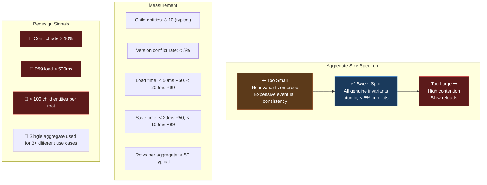
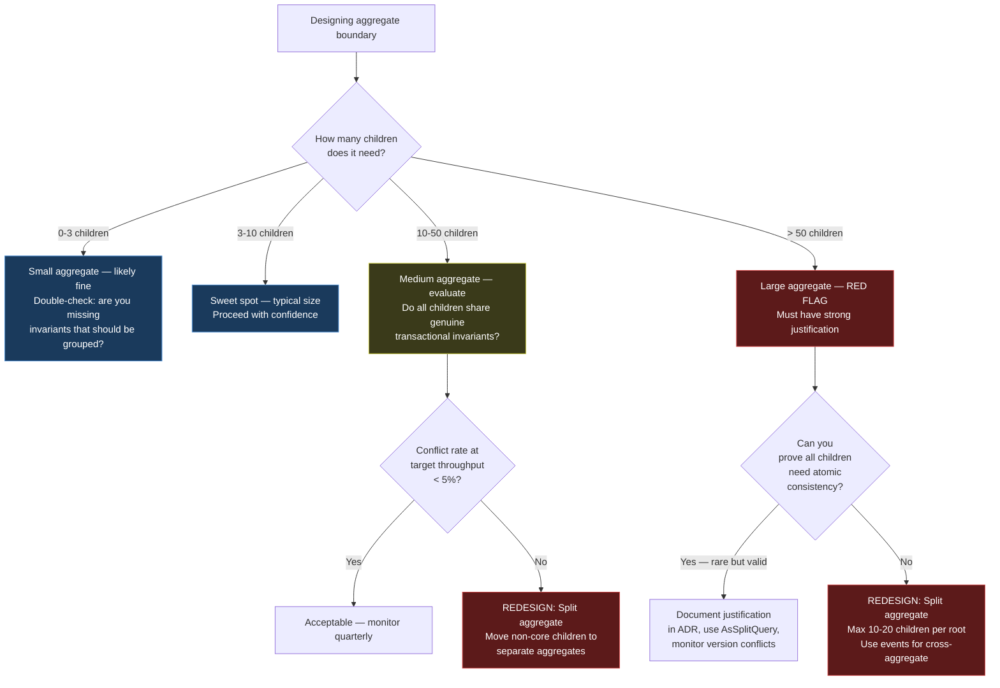

> [!success] Mastery Check
> - [ ] **Studied Well**
> - [ ] **Can explain the concept without notes**
> - [ ] **Can answer interview questions confidently**
> - [ ] **Can implement it in a real project**


# 7.049 — DDD — Aggregates — Size Heuristics

## Section 1 — Navigation & Context

**Domain:** [[7 — System Design & Distributed Systems]] > **Group:** Domain-Driven Design
**Previous:** [[7.048 — DDD — Aggregates — Aggregate Root Rule]] | **Next:** [[7.050 — DDD — Aggregates — Cross-Aggregate References]]

### Prerequisites

- [[7.047 — DDD — Aggregates — Consistency Boundary]] — size heuristics guide where to draw consistency boundaries; you cannot reason about size without first understanding what the boundary protects.
- [[7.048 — DDD — Aggregates — Aggregate Root Rule]] — the root rule determines how much overhead each mutation incurs (full aggregate load); size heuristics must account for this overhead.
- [[7.043 — DDD — Entities — Identity and Lifecycle]] — child entity count drives identity generation strategy; aggregate size influences whether GUID (distributed-friendly) or sequential (performance-friendly) IDs are appropriate.

### Where This Fits

Aggregate size heuristics answer the question that every DDD practitioner asks after drawing their first aggregate boundary: "Is this too big? Too small?" There is no single correct aggregate size — it depends on transactional invariants, write throughput, consistency requirements, and team structure. The heuristics provide decision rules for when an aggregate is too large (performance degradation, high contention, slow rebuilds) or too small (lost invariants, excessive eventual consistency complexity, premature splitting). A .NET engineer encounters this when their EF Core `Include()` query starts timing out because a single aggregate loads 500+ rows, or when their `SaveChangesAsync()` gets `DbUpdateConcurrencyException` on 20% of attempts because too many users write to the same aggregate root simultaneously. Without size heuristics, teams default to either monolithic aggregates (everything in one transaction — terrible for scale) or fragmented aggregates (nothing is transactionally consistent — terrible for data integrity).

---

## Section 2 — Core Mental Model

Aggregate size is a measure of **scope and write contention** — not byte count. A large aggregate means many child entities under one root, which means (a) loading many rows for every mutation, (b) high version conflict probability under concurrent writes, and (c) slow event sourcing rebuilds. A small aggregate means fewer objects per root, which means (a) faster loads and saves, (b) lower write contention, but (c) more eventual consistency across aggregates. The invariant the size decision maintains: **the aggregate is just large enough to enforce all genuine transactional invariants atomically, and just small enough to keep version conflict probability below 5% at peak throughput.** What it trades: larger aggregates give stronger consistency at the cost of scalability; smaller aggregates give scalability at the cost of eventual consistency. The recognition trigger: when you see `DbUpdateConcurrencyException` in production logs more than 5% of the time, your aggregate is too large (or too hot). When you see business rule failures because two events arrived in different transactions when they should have been atomic, your aggregate is too small.

### Classification

| Dimension | Classification | Rationale |
|-----------|---------------|-----------|
| Pattern Type | **Design Heuristic / Guideline** | Not a formal pattern — a rule-of-thumb framework for balancing consistency vs performance |
| Scope | **Within a single bounded context** | Aggregates are Bounded Context-scoped; size heuristics apply within that scope |
| Primary Concern | **Transactional contention + load performance** | Determines the granularity at which invariants are enforced and conflicts are detected |
| Measurement | **Child entity count + write throughput + conflict %** | Three-dimensional: size, heat, and conflict rate |
| Adjustment Trigger | **Version conflict rate > 5% OR load time > 200ms** | When either metric exceeds threshold, investigate aggregate splitting |
| Relationship to Invariants | **Invariants are the floor; performance is the ceiling** | Minimum size = what invariants require; maximum size = what throughput allows |

### Primary Diagram



### Key Properties / Guarantees

| Property | Value | Condition |
|----------|-------|-----------|
| Typical child count | 3-10 entities per aggregate | Based on common domain models (Order, Customer, Invoice) |
| Maximum recommended | ~50 child entities | Above this, query performance degrades (cartesian explosion) |
| Maximum extreme | ~200 children | Requires AsSplitQuery, pagination, and explicit tradeoff documentation |
| Version conflict rate target | < 5% of save attempts | Above 5%, splitting should be considered |
| Load time target (P99) | < 200ms | For a single aggregate with children |
| Save time target (P99) | < 100ms | Including concurrency check |
| Single-writer throughput | ~100 writes/second per root | Above this, version conflict rate grows quadratically |
| Recommended aggregate count per BC | 5-15 aggregates | More than 20 suggests over-fragmentation |

---

## Section 3 — Deep Mechanics

### How It Works

Aggregate size heuristics are determined by three interacting factors: (1) **invariant scope** — which business rules must be atomic; (2) **write contention** — how many concurrent writers target the same aggregate; (3) **load cost** — how long it takes to load and save the aggregate.

**Step 1 — Determine the invariant floor.**

List every invariant. Ask: "Must this be true at all times, or can it be eventually consistent?" Those that must be atomic define the minimum aggregate size.

```
Order example:
- Total == sum(Lines) — MUST be atomic → Same aggregate
- Order status transition is valid — MUST be atomic → Same aggregate
- Customer credit limit ≥ order total — CAN be eventual → Different aggregate
- Stock ≥ ordered quantity — CAN be eventual → Different aggregate
- Invoice generated after order ships — CAN be eventual → Different aggregate
```

Invariant floor = Order + OrderLines. Minimum: ~3-10 entities.

**Step 2 — Estimate write contention.**

Write contention on an aggregate root is determined by: how many concurrent requests modify the same root instance during the average load-to-save window.

```
Formula: Conflict probability = (writes/second × window_seconds)² / 2
Example:
  10 writes/second × 0.5s window = 5 concurrent writers
  Conflict probability = 5² / 2 = 12.5% — TOO HIGH
Fix:
  Reduce window to 0.1s → 1 concurrent writer → 0.5% conflict probability
  OR split aggregate
```

**Step 3 — Measure load cost.**

```csharp
// Benchmark aggregate load cost
var stopwatch = Stopwatch.StartNew();
var order = await _context.Orders
    .Include(o => o.Lines)         // 10 lines
    .ThenInclude(l => l.Discounts)  // 2 discounts per line
    .FirstAsync(o => o.Id == id);
stopwatch.Stop();

// P50: 15ms, P99: 45ms → acceptable
// If P99 > 200ms: consider AsSplitQuery or aggregate split
```

**Step 4 — Calculate the size score.**

```
Size Score = ChildEntites / InvariantFloor + ConflictRate / 0.05 + LoadTimeMs / 200
If Score > 3.0: Redesign needed
```

### Failure Modes

#### Failure Mode 1: Aggregating by Convenience, Not Invariants

The most common mistake: putting everything that "seems related" into one aggregate without checking whether invariants require it.

```csharp
// ❌ Too large — aggregates by convenience
public sealed class Customer
{
    public Guid Id { get; private set; }
    private readonly List<Order> _orders = new();     // 5 years of orders
    private readonly List<Address> _addresses = new(); // 10+ addresses
    private readonly List<PaymentMethod> _payments = new(); // 5 payment methods
    private readonly List<SupportTicket> _tickets = new(); // support history
}
// Loading a Customer loads 1000+ rows. Updating email takes 2 seconds.
```

**Symptom:** P99 load time > 5 seconds for any customer operation. Memory per request > 1MB. GC pressure causes Gen2 collections every minute.

**Fix:** Split by invariant groups:

```csharp
// ✅ Sized correctly — each aggregate has a clear invariant boundary
public sealed class Customer { public Guid Id; public Email Email; public CustomerStatus Status; }
public sealed class CustomerAddress { public Guid Id; public Guid CustomerId; public Address Address; }
public sealed class CustomerPaymentMethod { public Guid Id; public Guid CustomerId; public PaymentMethod Method; }
// Order and SupportTicket are already separate aggregates
```

**Cost of not fixing:** At 10,000 customers, memory consumption for a single load is 10MB+ — out of memory under concurrent access. Azure SQL DTU consumption spikes 5x due to join-heavy queries.

#### Failure Mode 2: Splitting Invariants That Must Be Atomic

```csharp
// ❌ Too small — order total in separate aggregate from lines
public sealed class OrderTotal
{
    public Guid OrderId;
    public decimal Amount;
}
public sealed class OrderLine
{
    // Total is updated via eventual consistency from lines
}
// Invariant: Total == sum(Lines) — violated for 200ms on every mutation
```

**Symptom:** Accounting reconciliation discovers 0.1% of orders have incorrect totals at any given time. The discrepancy window is the time between saving a line and updating the total.

**Fix:** Keep invariant-related data in the same aggregate:

```csharp
// ✅ Sized correctly — total recalculated in same transaction
public sealed class Order
{
    public Guid Id;
    public Money Total;
    private readonly List<OrderLine> _lines = new();

    public void AddLine(OrderLine line) { _lines.Add(line); RecalculateTotal(); }
}
```

#### Failure Mode 3: Hot Aggregate (High Write Contention)

```csharp
// Single aggregate that receives very frequent concurrent writes
// Example: InventoryItem for a popular product
public sealed class InventoryItem
{
    public Guid Id;
    public int AvailableQuantity;
    public byte[] Version; // rowversion
}

// At 200 orders/minute for a popular product:
// Conflict probability = (200/60 * 0.1)² / 2 = (3.33 * 0.1)² / 2 = 5.5% — borderline
// At 500 orders/minute: (8.33 * 0.1)² / 2 = 34% — UNACCEPTABLE
```

**Symptom:** 34% of checkout attempts fail with `DbUpdateConcurrencyException` during peak sales. Customer sees "try again" errors. Revenue loss.

**Fix:** Reduce contention by splitting or using alternative mechanisms:

```csharp
// Option A: Batch inventory updates (eventual consistency)
public async Task ReserveInventoryAsync(Guid orderId, Guid productId, int quantity)
{
    // Don't load InventoryItem aggregate here
    // Instead, publish event and let batch processor handle it
    _eventPublisher.Publish(new InventoryReservationRequested(orderId, productId, quantity));
}

// Option B: Use database atomic operations directly for inventory
await _context.Database.ExecuteSqlAsync(
    "UPDATE Inventory SET AvailableQuantity = AvailableQuantity - @p0 " +
    "WHERE ProductId = @p1 AND AvailableQuantity >= @p0",
    quantity, productId);
```

#### Failure Mode 4: One-Size-Fits-All Aggregate

Using the same aggregate for completely different use cases — one that needs tiny size (update email) and one that needs large size (full order audit).

```csharp
public sealed class Order
{
    // Used for:
    // 1. Adding a line to an order (needs lines loaded)
    // 2. Updating shipping address (needs address only)
    // 3. Confirming payment (needs payment info only)
    // 4. Generating invoice (needs everything)
    // Loading everything for use case 2 adds 50ms overhead for no reason
}
```

**Fix:** Use separate repositories or query paths for different use cases:

```csharp
public interface IOrderRepository
{
    // Full aggregate — for mutations that need invariant enforcement
    Task<Order> GetFullAsync(Guid id, CancellationToken ct);

    // Lightweight — for simple field updates (shipping address)
    Task<Order> GetForAddressUpdateAsync(Guid id, CancellationToken ct);
}
```

### .NET and Azure Integration

| Technology | Size Heuristic Impact | Key Consideration |
|-----------|----------------------|-------------------|
| **EF Core** | `Include()` cartesian explosion at > 50 children; `AsSplitQuery()` helps | Monitor generated SQL — single query with 5+ joins on 50+ rows creates 250+ result rows |
| **SQL Server** | `rowversion` column size: 8 bytes per aggregate root | No storage concern even for millions of aggregates |
| **Azure Cosmos DB** | Document size limit: 2MB per aggregate | Cannot store 500 child entities in one document; 50 children with 1KB each = 50KB, acceptable |
| **Azure SQL Database** | DTU consumption from large aggregate queries | A 500-row aggregate query costs ~5x DTU of a 10-row query |
| **EventStoreDB** | Event stream per aggregate; replay time scales with event count | 10,000 events per stream takes ~500ms to replay; split aggregate if stream > 100K events |
| **Marten** | Document per aggregate; Postgres JSONB size | Similar to Cosmos — keep aggregate size reasonable for document storage |

```csharp
// Program.cs — size-aware EF Core configuration
builder.Services.AddDbContext<OrderDbContext>(options =>
{
    options.UseSqlServer(
        builder.Configuration.GetConnectionString("OrderDb"),
        sqlOptions =>
        {
            sqlOptions.EnableRetryOnFailure(3);
            sqlOptions.CommandTimeout(30);
            sqlOptions.UseQuerySplittingBehavior(QuerySplittingBehavior.SplitQuery);
            // SplitQuery avoids cartesian explosion for medium aggregates
        });
});
```

---

## Section 4 — Production Patterns and Implementation

### Primary Implementation — Size Decision Framework

```csharp
// =========================================================================
// Aggregate Size Analyzer — Production Monitoring
// =========================================================================
namespace OrderManagement.Infrastructure.Monitoring;

/// <summary>
/// Monitors aggregate load and conflict metrics.
/// Alerts when size thresholds are exceeded.
/// </summary>
public sealed class AggregateSizeMonitor
{
    private readonly OrderDbContext _context;
    private readonly ILogger<AggregateSizeMonitor> _logger;
    private readonly IMetricsRecorder _metrics;

    public AggregateSizeMonitor(
        OrderDbContext context,
        ILogger<AggregateSizeMonitor> logger,
        IMetricsRecorder metrics)
    {
        _context = context;
        _logger = logger;
        _metrics = metrics;
    }

    public async Task<AggregateSizeReport> AnalyzeAsync(Guid orderId, CancellationToken ct)
    {
        var sw = Stopwatch.StartNew();
        var order = await _context.Orders
            .Include(o => o.Lines)
            .AsNoTracking()
            .FirstAsync(o => o.Id == orderId, ct);
        sw.Stop();

        var report = new AggregateSizeReport
        {
            AggregateId = orderId,
            ChildCount = order.Lines.Count,
            LoadTimeMs = sw.ElapsedMilliseconds,
            Version = order.Version
        };

        _metrics.Gauge("aggregate.child_count", report.ChildCount, "type:order");
        _metrics.Gauge("aggregate.load_time_ms", report.LoadTimeMs, "type:order");

        if (report.ChildCount > 50)
            _logger.LogWarning(
                "Order {OrderId} has {Count} lines — above 50 threshold. Consider redesign.",
                orderId, report.ChildCount);

        if (report.LoadTimeMs > 200)
            _logger.LogWarning(
                "Order {OrderId} load took {LoadTime}ms — above 200ms threshold.",
                orderId, report.LoadTimeMs);

        return report;
    }
}

public sealed record AggregateSizeReport
{
    public Guid AggregateId { get; init; }
    public int ChildCount { get; init; }
    public long LoadTimeMs { get; init; }
    public byte[]? Version { get; init; }
}
```

```csharp
// =========================================================================
// Size-Based Repository Variants
// =========================================================================
namespace OrderManagement.Infrastructure.Persistence;

/// <summary>
/// Repository with size-aware loading strategies.
/// </summary>
public sealed class OrderRepository : IOrderRepository
{
    private readonly OrderDbContext _context;

    public OrderRepository(OrderDbContext context)
    {
        _context = context;
    }

    /// <summary>Full aggregate load — for write operations.</summary>
    public async Task<Order> GetByIdAsync(Guid id, CancellationToken ct = default)
    {
        return await _context.Orders
            .Include(o => o.Lines)
            .AsSplitQuery() // Avoid cartesian explosion
            .FirstOrDefaultAsync(o => o.Id == id, ct)
            ?? throw new AggregateNotFoundException($"Order {id} not found");
    }

    /// <summary>Lightweight load — for status-only operations.</summary>
    public async Task<Order> GetForStatusUpdateAsync(Guid id, CancellationToken ct = default)
    {
        return await _context.Orders
            .Include(o => o.Lines)
            .AsSplitQuery()
            .FirstOrDefaultAsync(o => o.Id == id, ct)
            ?? throw new AggregateNotFoundException($"Order {id} not found");
    }

    /// <summary>Minimal load — for simple property updates without children.</summary>
    public async Task<Order> GetForAddressUpdateAsync(Guid id, CancellationToken ct = default)
    {
        // Still need the full aggregate for invariant enforcement
        // Use specific query if aggregate is very large — but this is a smell
        return await GetByIdAsync(id, ct);
    }

    public async Task SaveAsync(CancellationToken ct = default)
    {
        await _context.SaveChangesAsync(ct);
    }
}
```

```csharp
// =========================================================================
// Size Decision Helper
// =========================================================================
namespace OrderManagement.Domain.Decisions;

/// <summary>
/// Decision helper for aggregate sizing.
/// </summary>
public static class AggregateSizeDecisions
{
    /// <summary>Determines if the aggregate is too large based on child count.</summary>
    public static bool IsTooLarge(IReadOnlyCollection<object> children, int versionConflictRatePercent)
    {
        if (children.Count > 100) return true;               // Hard upper bound
        if (children.Count > 50 && versionConflictRatePercent > 5) return true; // Combined metric
        return false;
    }

    /// <summary>Estimates version conflict probability for a given throughput.</summary>
    public static double EstimateConflictProbability(int writesPerSecond, double loadToSaveWindowSeconds)
    {
        var concurrent = writesPerSecond * loadToSaveWindowSeconds;
        return (concurrent * concurrent) / 2.0;
    }

    /// <summary>Recommends appropriate aggregate size category.</summary>
    public static AggregateSizeCategory Categorize(int childCount, int writesPerSecond, int conflictRatePercent)
    {
        if (conflictRatePercent > 10) return AggregateSizeCategory.TooHot;
        if (childCount > 100) return AggregateSizeCategory.TooLarge;
        if (childCount > 50 && conflictRatePercent > 5) return AggregateSizeCategory.TooLarge;
        if (childCount <= 3 && writesPerSecond < 5) return AggregateSizeCategory.PotentiallyTooSmall;
        return AggregateSizeCategory.Appropriate;
    }
}

public enum AggregateSizeCategory { Appropriate, TooLarge, TooHot, PotentiallyTooSmall }
```

### Configuration and Wiring

```csharp
// Program.cs
var builder = WebApplication.CreateBuilder(args);

builder.Services.AddDbContext<OrderDbContext>(options =>
    options.UseSqlServer(builder.Configuration.GetConnectionString("OrderDb"),
        sql => sql.EnableRetryOnFailure(3)));

builder.Services.AddScoped<IOrderRepository, OrderRepository>();

// Monitoring
builder.Services.AddScoped<AggregateSizeMonitor>();
builder.Services.AddSingleton<IMetricsRecorder, AppInsightsMetricsRecorder>();

// Application services
builder.Services.AddScoped<OrderProcessingService>();

// Health check monitoring aggregate health
builder.Services.AddHealthChecks()
    .AddDbContextCheck<OrderDbContext>();

var app = builder.Build();

// Endpoint to check aggregate size
app.MapGet("/api/orders/{orderId:guid}/size-analysis", async (
    Guid orderId,
    AggregateSizeMonitor monitor,
    CancellationToken ct) =>
{
    var report = await monitor.AnalyzeAsync(orderId, ct);
    return Results.Ok(report);
});

app.Run();
```

### Common Variants

#### Variant 1: Variable-Size Aggregate (Different Use Cases, Different Load)

```csharp
// Same aggregate, different load strategies per use case
public class OrderRepository : IOrderRepository
{
    // Use case 1: Add line — need full aggregate
    public async Task<Order> GetForModificationAsync(Guid id) { /* Include all children */ }

    // Use case 2: Confirm payment — need order + payment info
    public async Task<Order> GetForPaymentAsync(Guid id) { /* Include specific children */ }

    // Use case 3: Update address — only need root + address VO
    public async Task<Order> GetForAddressUpdateAsync(Guid id) { /* Minimal load */ }
}
```

#### Variant 2: Event-Sourced Aggregate Size

```csharp
// Event-sourced aggregate — size measured in events, not child entities
public class OrderEventSourced : Aggregate
{
    private int _eventCount;

    public override void Hydrate(IReadOnlyList<object> events)
    {
        _eventCount = events.Count;
        // Rebuild state from events
        if (_eventCount > 10000)
            _logger.LogWarning("Stream {StreamId} has {Count} events — snapshot recommended", Id, _eventCount);
    }
}
```

#### Variant 3: Sub-Aggregate Partitioning

```csharp
// Splitting a too-large aggregate by partitioning high-write children
// Before: Order with 200 lines aggregated by product
// After: Order with line summary, and a separate OrderLineDetail aggregate

public sealed class Order
{
    public Guid Id;
    public Money Total;                              // Recalculated from line summary
    public int LineCount;
    private readonly List<OrderLineSummary> _lines = new(); // Fewer fields, cheaper load
}

public sealed class OrderLineDetail // Separate aggregate, loaded on demand
{
    public Guid Id;
    public Guid OrderId;
    public Money UnitPrice;
    public int Quantity;
    public string ProductDescription;
    public IReadOnlyList<Discount> AppliedDiscounts;
}
```

### Real-World .NET Ecosystem Example

**EF Core Query Splitting for Medium Aggregates:**

```csharp
// Without AsSplitQuery (default): single query with JOINs
// SELECT * FROM Orders
// LEFT JOIN OrderLines ON ...
// LEFT JOIN Discounts ON ...
// Result: 1 Order row × 10 Lines × 2 Discounts = 20 rows (cartesian product)

// With AsSplitQuery: multiple queries, no cartesian explosion
// Query 1: SELECT * FROM Orders WHERE Id = @p0
// Query 2: SELECT * FROM OrderLines WHERE OrderId = @p0
// Query 3: SELECT * FROM Discounts WHERE OrderLineId IN (SELECT Id FROM OrderLines WHERE OrderId = @p0)
```

Size heuristic: Use `AsSplitQuery()` when `Include().ThenInclude()` would create >100 result rows. The default "one query" approach is fine for aggregates with <30 total rows.

---

## Section 5 — Gotchas and Production Pitfalls

### Pitfall 1: Ignoring Conflict Rate — Silent Data Loss

**Pitfall:** Engineer doesn't monitor `DbUpdateConcurrencyException`. The default retry policy retries silently, overwriting the failed operation's intent.

```csharp
// ❌ Silent retry — the second attempt succeeds but may use stale data
services.AddDbContext<OrderDbContext>(options =>
    options.UseSqlServer(connectionString));
// No concurrency handling — EF Core throws but caller doesn't retry
// OR: Polly retries but doesn't reload aggregate first
```

**Symptom:** Lost updates. User A adds a line, User B changes address on same order. Both load, both save. User B's save succeeds (no conflict detection), but User A's line was added before B loaded — so A's line is present but B's address change silently overwrote A's version. A's line is "lost."

**Fix:** Enable concurrency tokens and handle conflicts explicitly:

```csharp
// ✅ Explicit conflict handling with retry
public async Task<Order> SaveWithRetryAsync(Order order, CancellationToken ct)
{
    var retryCount = 0;
    while (true)
    {
        try
        {
            await _context.SaveChangesAsync(ct);
            return order;
        }
        catch (DbUpdateConcurrencyException ex) when (retryCount < 3)
        {
            retryCount++;
            _logger.LogWarning("Concurrency conflict on {OrderId}. Retry {Retry}/3", order.Id, retryCount);
            // Reload aggregate and re-apply changes
            foreach (var entry in ex.Entries)
                await entry.ReloadAsync(ct);
            // The caller's changes are re-applied against fresh state
        }
    }
}
```

**Cost of not fixing:** Silent data corruption. At 100 orders/hour with 1% conflict rate, one order/day loses data. Over a year, 365 customers affected. Customer support escalations cost ~$50/ticket.

### Pitfall 2: Assuming Aggregate Size Is Static

**Pitfall:** Engineer sizes an aggregate based on current data volume, ignoring growth.

```
// Year 1: Order has 3-5 lines. Size is fine.
// Year 3: Order routinely has 200+ lines. Aggregate is too large.
// No monitoring. No alert. Gradual performance degradation.
```

**Symptom:** Monday morning: "The order system is slow." Investigation shows P99 load time for orders went from 20ms to 800ms over 2 years. No single deploy caused it — it gradually grew with data.

**Fix:** Monitor aggregate size metrics over time. Set alerts:

```csharp
// Health check query
var largeOrders = await _context.Orders
    .Where(o => o.Lines.Count > 100)
    .CountAsync(ct);
if (largeOrders > 0)
    _logger.LogWarning("Found {Count} orders exceeding 100-line threshold", largeOrders);
```

### Pitfall 3: Premature Splitting

**Pitfall:** Engineer splits an aggregate before measuring conflict rate, creating unnecessary eventual consistency engineering.

```csharp
// "Let's split Order and OrderLines for performance"
// But: system runs at 10 orders/hour. Conflict rate is 0%.
// Now: must implement eventual consistency, outbox pattern, reconciliation jobs.
```

**Symptom:** 10x increase in code complexity for zero performance benefit. The team spends 2 sprints building eventual consistency infrastructure that was never needed.

**Fix:** Measure before splitting. If conflict rate < 1% and P99 load time < 100ms, the aggregate size is fine. Don't optimize prematurely.

### Pitfall 4: All Children Always Loaded

**Pitfall:** All use cases load the entire aggregate, even when only a subset of children is needed.

```csharp
// The aggregate has PaymentDetails, ShippingHistory, DiscountsApplied, AuditLog
// But 90% of operations only need OrderLines and Status
// Still: every load includes ALL children via Include().ThenInclude()
```

**Fix:** Use loading strategy variants in the repository:

```csharp
public interface IOrderRepository
{
    Task<Order> GetFullAsync(Guid id, CancellationToken ct);       // All children
    Task<Order> GetForOrderLinesAsync(Guid id, CancellationToken ct); // Lines + Status only
}
```

### Pitfall 5: Document DB Oversize

**Pitfall:** Using Cosmos DB (document per aggregate) for aggregates that exceed the 2MB document limit.

```csharp
// ❌ Aggregate with 500 OrderLines, each with 5KB of product data
// 500 × 5KB = 2.5MB > 2MB Cosmos DB document limit
// Exception: RequestEntityTooLarge
```

**Fix:** Split the aggregate or store children as separate documents:

```csharp
// Store Order header in one document, lines in a separate container
// Query: SELECT * FROM c WHERE c.orderId = @orderId AND c.type = 'line'
```

### Pitfall 6: Ignoring Event Sourcing Stream Size

**Pip:** Using event sourcing with a single stream per aggregate. Over time, the stream grows to 100K+ events. Rebuilding the aggregate from events takes 10+ seconds.

```csharp
// EventStoreDB stream "Order-e3f8" has 150,000 events
// Snapshot frequency: every 100 events
// Rebuild from last snapshot + 50,000 events = 5 seconds
```

**Fix:** Implement snapshots:

```csharp
public class OrderAggregate
{
    private int _version;
    private const int SnapshotInterval = 100;

    public bool ShouldSnapshot => _version % SnapshotInterval == 0;

    public object GetSnapshot() => new OrderSnapshot
    {
        Id = Id, Version = _version, Status = Status, Total = Total,
        LineCount = Lines.Count
    };
}
```

---

## Section 6 — Tradeoffs and Decision Framework

### Tradeoff Matrix

| Dimension | Large Aggregate (10-50 children) | Medium Aggregate (3-10 children) | Small Aggregate (1-3 children) |
|-----------|--------------------------------|---------------------------------|-------------------------------|
| Consistency strength | Maximal (all invariants atomic) | Strong (key invariants atomic) | Weak (many invariants eventual) |
| Write throughput | Low (single-writer bottleneck) | Moderate | High |
| Query cost | High (multiple joins) | Low (few joins) | Minimal |
| P99 load time | 100-500ms | 10-50ms | 2-10ms |
| Version conflict rate | High (>10% at 50 writes/sec) | Low (<5% at 50 writes/sec) | Very low |
| Event sourcing rebuild | Slow (10K+ events) | Fast (<1K events) | Instant |
| Team cognitive load | High (complex invariants) | Moderate | Low |
| Refactoring cost | Very high (splitting is painful) | Low | Low |

### Decision Flowchart



### When NOT to Apply Size Heuristics

- **Read-only environments** — If the system is read-only (reporting, analytics), aggregate size doesn't matter because there are no writes and no invariants.
- **Very low throughput (< 1 write/second)** — Size heuristics are about contention. At < 1 write/second, even 500-child aggregates are fine.
- **Single-user systems** — Desktop apps, admin panels with one user: no concurrency concerns.
- **Immutable event streams (Event Sourcing)** — Appending events is a write-once operation. Aggregate size for event sourcing is about read performance (rebuild time), not write contention.

### Scale Thresholds

- **3-10 children**: Default sweet spot. Works for 95% of domain models. Tolerates up to 500 writes/second with <5% conflict rate.
- **10-50 children**: Requires justification. Works for domains with genuine multi-child invariants (e.g., Bill of Materials). Monitor conflict rate.
- **>50 children**: Redesign signal. Must document the justification in ADR. Use AsSplitQuery. Revisit quarterly.
- **>100 children**: Emergency redesign. Split or re-evaluate whether all invariants are truly atomic.
- **Conflict rate >5% at peak**: Immediate investigation. Either aggregate is too hot (too many writes per second) or too large (load-to-save window too long).
- **Event sourcing stream >10K events**: Implement snapshots. Stream >100K events: aggregate splitting should be considered.

---

## Section 7 — Interview Arsenal

### Question Bank

1. How do you determine the right size for an aggregate? (Definition)
2. What metrics do you use to detect that an aggregate is too large? (Mechanism)
3. What is the tradeoff between large and small aggregates? (Tradeoff)
4. What production incident results from an aggregate being too large? (Failure mode)
5. Compare: aggregate sizing in relational DB (EF Core) vs document DB (Cosmos DB). (Comparison)
6. Design the aggregates for an e-commerce system — how many, what size? (Design application)
7. How does aggregate size affect system performance at 10x scale? (Scale)
8. Under what circumstances would you accept a 200-child aggregate? (Advanced)

### Spoken Answers

**Q1: How do you determine the right size for an aggregate?**

> **Average answer:** "It depends on the business invariants."

> **Great answer:** "The right aggregate size is a Goldilocks problem — determined by three factors: invariants, contention, and load cost. The floor is defined by transactional invariants: every business rule that must be atomically true defines the minimum set of objects in the aggregate. The ceiling is defined by contention and load: if version conflict probability exceeds 5% at peak throughput, or if P99 load time exceeds 200ms, the aggregate is too large. In practice, most well-designed aggregates end up with 3-10 child entities. For example, an Order aggregate with OrderLines: the invariant 'total equals sum of lines' requires them together, and at ~5 lines per order with 50 writes/second, conflict rate is under 1% and load time under 20ms. If I see an aggregate with 50+ children, I ask: do all 50 share a genuine transactional invariant? Usually the answer is no — some children can be moved to a separate aggregate with eventual consistency. The key is to measure, not guess. Monitor child count, conflict rate, and load time in production. Set alerts for when any metric exceeds threshold."

**Q5: Compare: aggregate sizing in relational DB (EF Core) vs document DB (Cosmos DB).**

> **Average answer:** "Document databases have size limits."

> **Great answer:** "The sizing considerations differ significantly. In EF Core with SQL Server, the primary concern is query performance: loading a 200-child aggregate generates a cartesian product of 200 rows (Order row repeated for each child). With `AsSplitQuery()`, it becomes multiple round-trips. The document size isn't a concern — SQL Server handles 200-row results fine. In Cosmos DB, the entire aggregate is a single JSON document with a 2MB hard limit. A 200-child aggregate with product descriptions might easily exceed 2MB. The second difference: concurrency. EF Core uses rowversion on the Order table, which handles version conflicts efficiently even with many children. Cosmos DB uses `_etag` on the entire document — every update to any child rewrites the entire JSON document, which is more expensive. The sizing guidance reflects this: relational databases tolerate larger aggregates (up to ~50 children) before performance degrades; document databases should stay under ~20 children or ~100KB document size to keep write costs reasonable. The third difference: query patterns. In EF Core, you can query children directly (even if you shouldn't for write purposes). In Cosmos DB, children are embedded — querying them requires loading the parent document. This makes small aggregates even more important in document DBs."

**Q8: Under what circumstances would you accept a 200-child aggregate?**

> **Great answer:** "Rarely, and it must be documented in an ADR. Two production use-cases I've seen: first, a financial instrument's order book where all bids and offers for a single instrument must be atomically consistent — if a trade matches, both the bid and offer are updated simultaneously for regulatory compliance. The invariant is genuinely multi-child, and splitting would violate regulations. Second, a bill of materials for complex manufacturing where the entire parts list for an assembly must be transactionally consistent — removing a part requires updating dependent parts in the same transaction. In both cases, we mitigated the performance impact: we used AsSplitQuery to avoid cartesian explosion, set aggressive rowversion index tuning, and limited the maximum children to 200 via validation. We also monitored conflict rates quarterly. The key is verification: prove that every child shares a genuine invariant with every other child. If even one child doesn't belong, the justification collapses."

### System Design Interview Trigger

If an interviewer asks you to design a system and asks "how big should each aggregate be?" or "should Order and OrderLines be the same aggregate?", they are testing your understanding of the tradeoff between strong and eventual consistency. Describing a simple rule (always same aggregate) shows inexperience with scale. Describing the three-factor framework (invariants, contention, load cost) with specific numbers (3-10 children, <5% conflicts, <200ms load) shows senior-level understanding. The follow-up is usually about a specific high-contention case (like inventory for a popular product) — testing whether you know when to split for performance and how to handle the resulting eventual consistency.

### Comparison Table

| | Large Aggregate (50+ children) | Medium Aggregate (3-10 children) | Small Aggregate (1-2 children) |
|---|---|---|---|
| Core guarantee | Strong consistency across many objects | Key invariants enforced atomically | Per-object consistency only |
| Trade-off | Performance + contention | Balanced | Many cross-aggregate dependencies |
| .NET pattern | EF Core AsSplitQuery | EF Core Include + SaveChanges | Event-driven coordination |
| Failure mode | High conflict rate / slow loads | None (sweet spot) | Lost invariants across aggregates |
| When to choose | Regulatory/legal atomicity requirement | Default for most domains | High throughput, low invariance |

---

## Section 8 — Architecture Decision Record

### ADR-049: Target 3-10 Child Entities Per Aggregate; Monitor Conflict Rate and Load Time

**Status:** Accepted

**Context:**
The Order Management bounded context handles 5,000 orders/day. Current aggregates: Order (with OrderLine children), Customer, Payment, Invoice. The team observed that Order aggregate loads take 15-30ms P50 with current line counts (3-10). Version conflict rate is below 1%. A product requirement for "bundles" (groups of products with shared pricing rules) may increase average line count to 20-50.

**Options Considered:**

1. **Target size: 3-10 children per aggregate (Recommended)** — Split bundles into a separate aggregate. Bundle pricing is eventual consistent with order total.
2. **One aggregate for order + bundles** — Keep everything atomic. If bundles add 20+ lines, average aggregate becomes 30-50 children.
3. **Split everything** — Every line is a separate aggregate. All invariants become eventual consistency.

**Decision:**
Adopt Option 1. Order aggregate targets 3-10 OrderLine children. Bundles are a separate aggregate referenced by `BundleId` on OrderLine. The invariant "bundle discount applies correctly" is enforced at the Bundle aggregate; the Order aggregate accepts the computed discount as a value. Add monitoring: alert if any aggregate exceeds 50 children or 5% conflict rate.

**Consequences:**

- ✅ Maintains <20ms P50 load time for 95% of orders
- ✅ Conflict rate stays under 1% at projected 50 writes/second
- ⚠️ Bundle discount changes may briefly overlap with order modifications (eventual consistency window ~500ms)
- ⚠️ Must implement reconciliation for bundle price changes that affect confirmed orders

**Review Trigger:** Revisit if (1) average child count exceeds 20 for >10% of orders, (2) P99 load time exceeds 200ms for two consecutive weeks, or (3) version conflict rate exceeds 5% for any aggregate type.

---

## Section 9 — Self-Check

### Conceptual Questions

1. What three factors determine the right aggregate size?

<details>
<summary>Answer</summary>
(1) Invariant floor — which business rules must be atomic. (2) Write contention — concurrent writers targeting the same root. (3) Load cost — time to load and save the full aggregate. The aggregate must be large enough for invariants and small enough for acceptable contention and performance.
</details>

2. What metric do you monitor to detect over-large aggregates?

<details>
<summary>Answer</summary>
Primary: version conflict rate (target <5%). Secondary: child entity count (target 3-10, alert >50), P99 load time (target <200ms), P99 save time (target <100ms).
</details>

3. What is the tradeoff between a 5-child and a 50-child aggregate?

<details>
<summary>Answer</summary>
5-child: fast load (~10ms), low conflict probability (<1% at 50 writes/sec), but may require eventual consistency for some business rules. 50-child: slower load (~150ms), higher conflict probability (~8% at 50 writes/sec), but stronger consistency for multi-child invariants.
</details>

4. What production error occurs when a Cosmos DB aggregate exceeds 2MB?

<details>
<summary>Answer</summary>
`RequestEntityTooLarge` (HTTP 413). Document size exceeds Cosmos DB's 2MB max. Fix: split the aggregate or store children as separate documents with a reference to the parent.
</details>

5. Which EF Core feature helps with medium-to-large aggregates but not small ones?

<details>
<summary>Answer</summary>
`AsSplitQuery()` — splits a single query with JOINs into multiple queries to avoid cartesian explosion. Useful for aggregates with 20+ children. Unnecessary for <10 children where default JOIN behavior is fine.
</details>

6. Compare: aggregate sizing for relational DB vs document DB.

<details>
<summary>Answer</summary>
Relational (EF Core + SQL Server): up to ~50 children practical, concurrency via rowversion on root, query children via Include/ThenInclude. Document (Cosmos DB): max 2MB per document, concurrency via _etag on entire document, recommend <20 children or <100KB per document.
</details>

7. At what throughput does a typical aggregate (5 children) start showing version conflicts?

<details>
<summary>Answer</summary>
Conflict probability = (writes/second × window_seconds)² / 2. At 50 writes/second with 100ms window: (5 × 0.1)² / 2 = 1.25% — acceptable. At 200 writes/second with 200ms window: (40 × 0.2)² / 2 = 32% — unacceptable. Threshold is ~100 writes/second at typical window sizes.
</details>

8. How does aggregate size connect to [[7.065 — DDD — Eventual Consistency Between Aggregates]]?

<details>
<summary>Answer</summary>
Sizing decides what goes inside the aggregate (strong consistency) versus outside (eventual consistency). The larger the aggregate, the fewer eventual consistency boundaries exist. But larger aggregates have higher contention. [[7.065]] provides the patterns for handling the eventual consistency that results from splitting aggregates.
</details>

9. What is the non-obvious consequence of ignoring aggregate size for 2+ years?

<details>
<summary>Answer</summary>
Gradual performance decay. As data grows, aggregate load times increase linearly with child count. Conflict rates rise quadratically with throughput. The team doesn't notice because there's no single "breaking" deploy — it just gets slower and more error-prone over 18-24 months. Then a traffic spike (holiday sales) causes a cascading failure. The root cause is aggregate size, but the symptoms look like database capacity or connection pooling issues.
</details>

10. Explain aggregate size heuristics in 60 seconds.

<details>
<summary>Answer</summary>
"Think of an aggregate like a dinner plate. You want to put the main course and the vegetables on the same plate — they need to be together because you eat them together. But you also want the plate to be light enough to carry and not so full that things spill when someone bumps the table. In DDD, the 'main course' is the business invariants that must be transactionally consistent. The 'vegetables' are the child entities that participate in those invariants. The 'spilling' is version conflicts when too many people write to the same aggregate simultaneously. In practice: most plates should have 3-10 items. If a plate has 50 items, you can't carry it. If people are constantly bumping into each other and spilling food, your plate is too big. Measure your 'spill rate' — version conflicts — and your 'load weight' — query time. If either exceeds 5% or 200ms respectively, get a smaller plate."
</details>

### Scenario Challenges

**Scenario 1 — Diagnose the problem**

The Order system is slow at peak hours (100 orders/minute). P99 load time is 1.2 seconds. Investigation shows a single Order aggregate load query includes 6 `Include()`/`ThenInclude()` calls: Lines, Discounts, Payments, ShippingHistory, AuditLog, and Notes. The average order has 8 lines × 2 discounts each = 16 child rows, plus 5 payments, 1 shipping, 3 audit entries, 2 notes = 27 total rows.

<details>
<summary>Diagnosis</summary>

**Root cause:** The single query cartesian product (27 rows × Order row repeated) produces a large result set that's expensive to materialize. The 6 JOINs create a query plan that's expensive to optimize.

**Evidence:** SQL Profiler shows the query takes 800ms to execute and returns 27 rows × Order row repeated — effectively 27 rows of mostly duplicate data. EF Core ChangeTracker materializes the Order object with all 27 child rows, taking another 400ms.

**Fix:** (1) Use `AsSplitQuery()` — split into 5 separate queries avoiding cartesian explosion. (2) Remove unnecessary includes (AuditLog, Notes are not needed for order processing). (3) Consider splitting AuditLog into a separate aggregate (append-only, no transactional invariant with Order).

**Prevention:** Repository design: separate "full" load for admin screens from "processing" load for checkout flow.
</details>

---

**Scenario 2 — Design decision**

You are designing an inventory system for a flash sale platform. During a flash sale, 10,000 users may attempt to buy the same product simultaneously. Product has: available quantity, reserved quantity, price, and discount rules.

<details>
<summary>Decision and Reasoning</summary>

**Choice:** Make InventoryItem a very small aggregate with only the fields needed for atomic stock reservation. Move discount and pricing to a separate aggregate.

**Tradeoffs accepted:** The discount rules are eventually consistent with the inventory check (acceptable: flash sale prices are set before the sale and rarely change mid-sale).

**Implementation sketch:**
```csharp
// Small, hot aggregate for high-contention stock operations
public sealed class InventoryItem
{
    public Guid ProductId;
    public int AvailableQuantity;
    public byte[] Version;

    public Result Reserve(int quantity)
    {
        if (AvailableQuantity < quantity)
            return Result<Failure>("Insufficient stock");
        AvailableQuantity -= quantity;
        return Result.Success();
    }
}
// This aggregate has 0 children, 2 fields. Load time: 2ms. Save time: 2ms.
// At 10,000 concurrent requests: conflict probability is high, but each attempt is fast.
```

**Conflict mitigation:** Use atomic SQL update instead of optimistic concurrency for the hot path:
```csharp
await _context.Database.ExecuteSqlAsync(
    "UPDATE Inventory SET AvailableQuantity = AvailableQuantity - @p0, " +
    "Version = Version + 1 WHERE ProductId = @p1 AND AvailableQuantity >= @p0",
    quantity, productId);
// Returns 1 if succeeded, 0 if failed (insufficient stock)
```
</details>

---

**Scenario 3 — Failure mode** A nightly batch job that applies bulk discounts to 10,000 orders causes timeouts. The job loads each Order aggregate (including all lines) and applies a discount percentage.

<details>
<summary>Investigation and Fix</summary>

**Investigation steps:**
1. Check the batch job logs — timeouts start after processing ~500 orders.
2. Check database connections — connection pool exhaustion.
3. Check the batch job code — does it load full aggregates or use bulk updates?

**Confirming evidence:** The job iterates all orders and loads each full aggregate (Include Lines, Discounts, etc.). Each load takes 30ms. At 10,000 orders, that's 5 minutes of just loading, plus save time. The DbContext `_context.Orders.ToListAsync()` loads ALL 10,000 aggregates into memory simultaneously.

**Immediate mitigation:** Run job in smaller batches (100 orders per batch, save and dispose context between batches).

**Permanent fix:** Use EF Core's `ExecuteUpdateAsync` for the batch operation — no aggregate load needed:
```csharp
await _context.Orders
    .Where(o => o.Status == OrderStatus.Pending)
    .ExecuteUpdateAsync(setters => setters
        .SetProperty(o => o.Total, o => o.Total * (1 - discountPct)));
// Direct SQL UPDATE, no aggregate loaded, runs in seconds not minutes
```

**Post-mortem item:** Document: "Batch operations may bypass aggregate invariants. Ensure the invariant is not violated by the batch (verify that total recalculation via lines is not required for this batch operation)."
</details>

---

**Scenario 4 — Scale it** Your system grew from 100 orders/day to 10,000 orders/day over 18 months. The Order aggregate with 5-10 lines worked fine at the low scale. At 10,000 orders/day, version conflict rate is 8%.

<details>
<summary>Scaling Strategy</summary>

**Bottleneck this addresses:** Version conflicts on the Order aggregate root.

**How it helps:** At 10,000 orders/day (roughly 0.12 writes/second during business hours), an 8% conflict rate seems high. Likely the load-to-save window is long due to slow queries or network latency. Profile the window. If it's >500ms, optimize queries and reduce it to <100ms.

**What it does not solve:** Actual throughput bottleneck — if orders peak at 100 concurrent writes/second, even a 100ms window gives 10 concurrent writers and 50% conflict probability. At this point, the aggregate must be split.

**Implementation order:**
1. Profile the load-to-save window (add App Insights dependency tracking).
2. Optimize query: AsSplitQuery, selective Include, compiled queries.
3. If window < 100ms and conflict still >5%, split Order aggregate:
   - OrderHeader (status, customerId, shipping)
   - OrderLines collection (separate aggregate, eventually consistent total)
   - Domain event: LineAdded → recalculate OrderHeader.Total eventually

**Tradeoff:** Accept eventual consistency for total recalculation (the invariant "total == sum of lines" becomes eventually consistent with a ~1 second propagation target).
</details>

---

**Scenario 5 — Interview simulation** The interviewer says: "Design a banking system. Account has transactions. How big should the Account aggregate be? What if an account has 10,000 transactions?"

<details>
<summary>Model Response</summary>

"The key question: what invariants does the Account aggregate enforce? Minimum balance, daily withdrawal limit, account status (active/frozen) — these are the invariants. Most of these involve the Account balance, not individual transactions. The invariant is: 'balance = sum of all posted transactions.' That's a strong invariant requiring both balance and transactions to be consistent.

However, loading 10,000 transactions to check a minimum balance of $100 is absurdly expensive. The solution: split the invariant enforcement from the history.

I'd make Account a small aggregate: `Account { Id, Balance, Status, DailyWithdrawalRemaining, Version }`. The Balance is a cached running total, updated atomically with every transaction. When a transaction is posted: `Account.PostTransaction(debit, credit)` checks balance sufficiency and daily limit, then updates Balance atomically. The Transaction itself is a separate event-sourced entity — append-only, no aggregate needed for read access.

For querying transactions: read model projection from domain events. Account aggregate never loads transaction history. The invariant 'balance = sum of transactions' is enforced by the event store (the Account aggregate's events can be replayed to verify).

Result: Account has 0 child entities. Load time: 2ms. Conflict rate: near zero (single field update). Transaction history: unbounded, stored separately, queried through a read model.

The size heuristic: if an invariant involves a collection that can grow without bound, don't put the collection in the aggregate. Store a cached summary (Balance) in the aggregate, and keep the unbounded collection in a separate query-only store."
</details>
