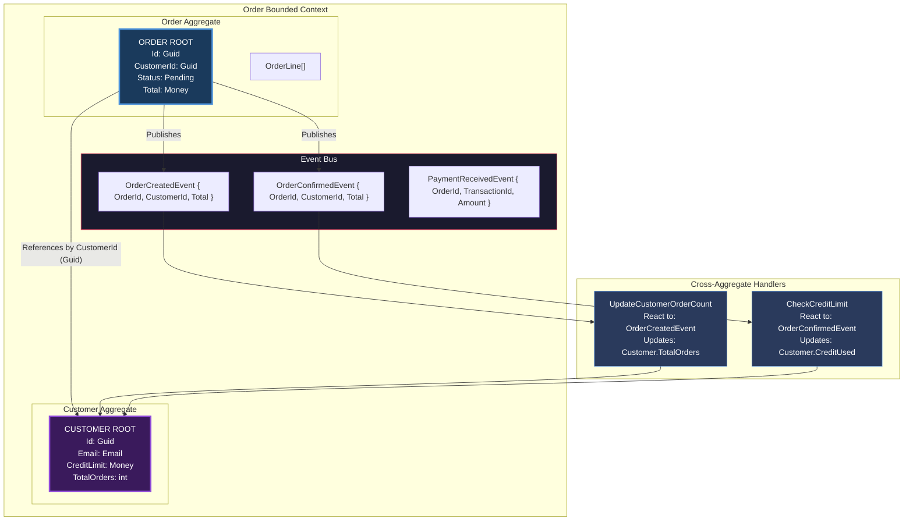
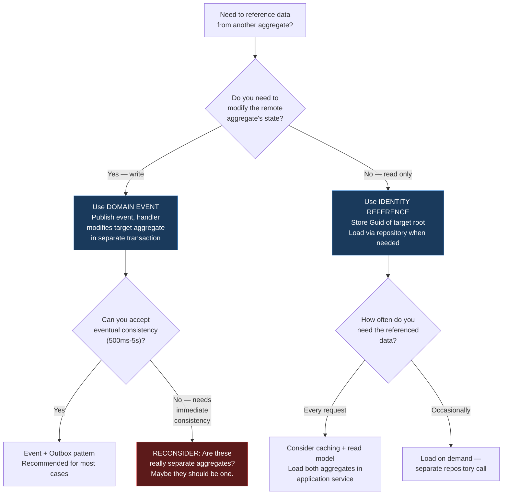

> [!success] Mastery Check
> - [ ] **Studied Well**
> - [ ] **Can explain the concept without notes**
> - [ ] **Can answer interview questions confidently**
> - [ ] **Can implement it in a real project**


# 7.050 — DDD — Aggregates — Cross-Aggregate References

## Section 1 — Navigation & Context

**Domain:** [[7 — System Design & Distributed Systems]] > **Group:** Domain-Driven Design
**Previous:** [[7.049 — DDD — Aggregates — Size Heuristics]] | **Next:** [[7.051 — DDD — Domain Services — Stateless Operations]]

### Prerequisites

- [[7.047 — DDD — Aggregates — Consistency Boundary]] — cross-aggregate references connect separate consistency boundaries; you must understand what the boundary protects before you can safely cross it.
- [[7.048 — DDD — Aggregates — Aggregate Root Rule]] — external references to an aggregate must always target the root; cross-aggregate references are by root identity only.
- [[7.065 — DDD — Eventual Consistency Between Aggregates]] — cross-aggregate coordination is always eventually consistent; this topic provides the patterns (outbox, retry, reconciliation) needed to make cross-aggregate references safe.

### Where This Fits

Cross-aggregate references are how separate aggregate consistency boundaries discover and coordinate with each other without violating atomicity. The rule is: **reference by identity, communicate by event.** An aggregate holds the identity of another aggregate (e.g., `Order.CustomerId` is a `Guid` referencing the `Customer` aggregate root) but never holds a direct object reference. When an aggregate needs to trigger behavior in another aggregate, it publishes a domain event which is handled asynchronously. A .NET engineer encounters this whenever they need to navigate from one domain object to a related one: `order.Customer.Name` is wrong (direct object reference across aggregates); loading `Customer` via `ICustomerRepository` using `order.CustomerId` is correct. Without this pattern, aggregates become entangled through object references, transactions span multiple aggregates (causing deadlocks and DTC failures), and the system loses the ability to evolve aggregates independently.

---

## Section 2 — Core Mental Model

Cross-aggregate references use identity as a bridge between consistency boundaries. The invariant: **an aggregate references another aggregate by its root identity only — never by object reference — and coordination happens through domain events, not method calls.** What it trades: you lose the ability to navigate object graphs naturally (no `order.Customer.CreditLimit`) and must accept that cross-aggregate state is always eventually consistent. The recognition trigger: when you find yourself writing `Include(o => o.Customer)` in EF Core, or passing an entity from one aggregate's repository to another aggregate's method, you are creating a cross-aggregate object reference that should be replaced by an identity reference + domain event.

### Classification

| Dimension | Classification | Rationale |
|-----------|---------------|-----------|
| Pattern Type | **Tactical DDD — Integration** | Defines how separate aggregates interact without breaking consistency boundaries |
| Scope | **Within a bounded context** | Cross-aggregate references are within a BC; cross-BC references use integration events |
| Primary Concern | **Loose coupling + identity-based discovery** | Avoids direct object coupling between separate consistency units |
| Communication Method | **Domain events (async) + Identity references (sync read)** | Events for writes, identity for reads |
| Consistency Model | **Eventual consistency** | Cross-aggregate state may be stale by definition |
| Lifetime Coupling | **Independent** | Aggregates can be created, modified, and deleted independently |
| Transaction Scope | **Separate transactions per aggregate** | No distributed transactions across aggregates |

### Primary Diagram



### Key Properties / Guarantees

| Property | Value | Condition |
|----------|-------|-----------|
| Reference type | Identity (Guid/string) | Never object reference |
| Cross-aggregate consistency | Eventual (500ms - 5s typical) | Domain event handling + outbox |
| Transactional atomicity | None across aggregates | Each aggregate saved independently |
| Query for related data | Separate repository call | `_customerRepo.GetByIdAsync(order.CustomerId)` |
| Update propagation | Domain events + handlers | `OrderConfirmedEvent → CustomerHandler` |
| Coupling level | Low (event-based) | Aggregates can evolve independently |
| Concurrency across agg | No shared version | Each aggregate has its own version |

---

## Section 3 — Deep Mechanics

### How It Works

Cross-aggregate references operate through two mechanisms: **identity-based read references** (loading related data for display) and **event-based write coordination** (triggering side effects in other aggregates).

**Path 1 — Identity Reference (Read).**

An aggregate stores the Guid of another aggregate root. When the application needs data from the referenced aggregate, it loads it via that aggregate's repository — never through a navigation property.

```csharp
public class Order
{
    public Guid CustomerId { get; private set; } // Identity reference
    // No: public Customer Customer { get; } // ❌ Object reference across aggregates
}

// In application service:
var order = await _orderRepo.GetByIdAsync(orderId);
var customer = await _customerRepo.GetByIdAsync(order.CustomerId); // Separate load
// customer.Email, customer.CreditLimit — read only
```

**Path 2 — Domain Event (Write Coordination).**

When an aggregate's mutation creates a side effect that should affect another aggregate, it publishes a domain event. An event handler loads the target aggregate and applies the side effect.

```csharp
// Order aggregate publishes event
public Result Confirm()
{
    if (Status != OrderStatus.Pending) return Failure("...");
    Status = OrderStatus.Confirmed;
    _events.Add(new OrderConfirmedEvent(Id, CustomerId, Total));
    return Success();
}

// Event handler — separate transaction
public class UpdateCustomerCreditHandler : IDomainEventHandler<OrderConfirmedEvent>
{
    private readonly ICustomerRepository _customerRepo;

    public async Task Handle(OrderConfirmedEvent @event, CancellationToken ct)
    {
        var customer = await _customerRepo.GetByIdAsync(@event.CustomerId, ct);
        var result = customer.ReserveCredit(@event.Total);
        if (result.IsFailure)
        {
            // Handle credit limit exceeded — publish compensation event
            await _eventPublisher.PublishAsync(new CreditLimitExceededEvent(@event.OrderId), ct);
            return;
        }
        await _customerRepo.SaveAsync(ct);
    }
}
```

### Cross-Aggregate Trace: Complete Checkout Flow

```
1. Application: Checkout(orderId)
2. Load Order aggregate (OrderRepo)
3. Order.Confirm()
   └── Guard: Status == Pending
   └── Guard: Lines.Count > 0
   └── Mutation: Status = Confirmed
   └── _events.Add(OrderConfirmedEvent)
4. Save Order aggregate (OrderRepo) ← Transaction 1
5. Publish OrderConfirmedEvent to message broker
6. Handler: UpdateCustomerCredit (separate transaction)
   └── Load Customer aggregate (CustomerRepo)
   └── Customer.ReserveCredit(order.Total)
   └── Guard: CreditLimit - CreditUsed >= order.Total
   └── Mutation: CreditUsed += order.Total
   └── Save Customer aggregate ← Transaction 2
7. Handler: ReserveInventory (separate transaction)
   └── Load InventoryItem aggregate (InventoryRepo)
   └── InventoryItem.Reserve(order.Lines)
   └── Save InventoryItem aggregate ← Transaction 3

Result: 3 separate transactions. Eventually consistent.
If step 6 fails, compensation: CancelOrderHandler publishes OrderCancelledEvent.
```

### Failure Modes

#### Failure Mode 1: Direct Object Reference Across Aggregates with EF Core Navigation Properties

```csharp
// ❌ EF Core navigation property creates object coupling
public class Order
{
    public Guid CustomerId { get; private set; }
    public Customer Customer { get; private set; } = null!; // Navigation!
}
// EF Core: All order queries JOIN to Customers table
// What breaks: Customer can't be moved to another database without breaking all order queries
```

**Symptom:** P99 query time spikes 50ms from the extra JOIN. Application crashes if Customer database is unavailable even though only order data is needed. Accidental `order.Customer.CreditLimit` used in business logic creates hidden coupling.

**Fix:** Remove navigation property. Load Customer explicitly in application service:

```csharp
// ✅ Identity-only reference
public class Order
{
    public Guid CustomerId { get; private set; }
}
// Application service loads separately:
var order = await _orderRepo.GetByIdAsync(orderId);
var customer = await _customerRepo.GetByIdAsync(order.CustomerId);
```

**Cost of not fixing:** System-wide outage when Customer database has a hiccup — Order service also goes down. Tight coupling prevents independent scaling. At 1K req/s, 50ms extra JOIN costs 50 seconds of CPU per second.

#### Failure Mode 2: Synchronous Cross-Aggregate Method Call in Same Transaction

```csharp
// ❌ Cross-aggregate call within same transaction
public async Task ConfirmOrderAsync(Guid orderId)
{
    var order = await _orderRepo.GetByIdAsync(orderId);
    order.Confirm();

    // Synchronously reserves credit — SAME TRANSACTION
    var customer = await _customerRepo.GetByIdAsync(order.CustomerId);
    customer.ReserveCredit(order.Total);

    await _orderRepo.SaveAsync(); // Transaction spans Order and Customer!
}
```

**Symptom:** SQL deadlocks when two orders for the same customer are processed concurrently. Transaction escalation to DTC (not supported in Azure SQL). When Customer table has locks, Order commits are blocked.

**Fix:** Use domain events — separate transactions:

```csharp
// ✅ Cross-aggregate via domain event — separate transactions
public async Task ConfirmOrderAsync(Guid orderId)
{
    var order = await _orderRepo.GetByIdAsync(orderId);
    order.Confirm();
    await _orderRepo.SaveAsync(); // Transaction 1: Order only
    // Event handler runs Transaction 2: Customer
}
```

#### Failure Mode 3: Cross-Aggregate Transaction with IRepository Exposing SaveChanges

```csharp
// ❌ Repository exposes SaveChanges — tempts cross-aggregate transactions
public interface IOrderRepository
{
    Task SaveChangesAsync(CancellationToken ct);
}
// Application service sees "SaveChanges" and calls it after modifying two aggregates
await _orderRepo.AddAsync(order);
await _customerRepo.AddAsync(customer);
await _orderRepo.SaveChangesAsync(); // WAIT — this saves both! (Same DbContext)
```

**Fix:** Repository doesn't expose SaveChanges directly. Application coordinates unit of work:

```csharp
public interface IUnitOfWork
{
    Task SaveChangesAsync(CancellationToken ct);
}
// Each repository registers changes in the unit of work
// Application service calls SaveChanges once — but only one aggregate per call
// OR: use separate DbContext scopes for different aggregate types
```

#### Failure Mode 4: Lazy Loading Across Aggregate Boundary

```csharp
// ❌ EF Core lazy loading creates hidden cross-aggregate database calls
public class Order
{
    public virtual Customer Customer { get; set; } // Lazy-loaded!
}
// When any code accesses order.Customer.Email, EF Core issues a separate query
// This happens silently — developer may not realize it's crossing aggregate boundaries
```

**Symptom:** N+1 query problem. "Why is this page loading 100 SQL queries?" Because 100 Order records each lazy-load their Customer. P99 latency spikes from 100ms to 5 seconds.

**Fix:** Disable lazy loading. Use explicit identity references:

```csharp
// Lazy loading disabled in DbContext config
options.UseSqlServer(connectionString, o => o.UseQuerySplittingBehavior())
       .UseLazyLoadingProxies(false); // Disable proxies
```

#### Failure Mode 5: Domain Event Handler Failure — No Compensation

```csharp
// ❌ Event handler fails silently — cross-aggregate state becomes inconsistent
public class ReserveInventoryHandler : IDomainEventHandler<OrderConfirmedEvent>
{
    public async Task Handle(OrderConfirmedEvent @event)
    {
        var inventory = await _inventoryRepo.GetByIdAsync(@event.ProductId);
        inventory.Reserve(@event.Quantity);
        await _inventoryRepo.SaveAsync();
        // If this throws (e.g., DbUpdateException), the Order is already confirmed
        // but inventory was never reserved!
    }
}
```

**Symptom:** Orders confirm successfully but inventory isn't decremented. Oversell occurs. Customer is told "order confirmed" but later "sorry, we're out of stock."

**Fix:** Implement compensating transactions (Saga pattern):

```csharp
public class ReserveInventoryHandler : IDomainEventHandler<OrderConfirmedEvent>
{
    public async Task Handle(OrderConfirmedEvent @event)
    {
        try
        {
            var inventory = await _inventoryRepo.GetByIdAsync(@event.ProductId);
            var result = inventory.Reserve(@event.Quantity);
            if (result.IsFailure)
                await _eventPublisher.PublishAsync(
                    new InventoryShortfallEvent(@event.OrderId, @event.ProductId));
            await _inventoryRepo.SaveAsync();
        }
        catch (Exception ex)
        {
            _logger.LogError(ex, "Inventory reservation failed for order {OrderId}", @event.OrderId);
            // Compensate: Cancel the order
            await _eventPublisher.PublishAsync(
                new InventoryReservationFailedEvent(@event.OrderId));
        }
    }
}
```

### .NET and Azure Integration

| Technology | Cross-Aggregate Reference Mechanism | Key Consideration |
|-----------|-------------------------------------|-------------------|
| **EF Core** | Identity properties (Guid FK); no navigation objects | Remove navigation properties; use `[ForeignKey]` only for FK constraints |
| **MediatR** | INotification for domain events | Handlers run in separate transactions via `IMediator.Publish` |
| **Azure Service Bus** | Messages for cross-aggregate coordination | Topic per event type; subscription per handler |
| **Azure SQL Database** | Separate tables per aggregate; no cross-agg FKs | FK constraints between aggregates create deployment coupling |
| **MassTransit** | Messages + Sagas for distributed coordination | Automates retry, compensation, and saga state persistence |
| **Dapr** | Pub/sub API for cross-aggregate events | Pluggable message broker (RabbitMQ, Kafka, Service Bus) |
| **Azure Cosmos DB** | Separate documents per aggregate; reference by ID | No cross-document FKs; application-level coordination |

```csharp
// Program.cs — cross-aggregate wiring
builder.Services.AddScoped<IOrderRepository, OrderRepository>();
builder.Services.AddScoped<ICustomerRepository, CustomerRepository>();
builder.Services.AddScoped<IInventoryRepository, InventoryRepository>();

// MediatR for in-process domain event coordination
builder.Services.AddMediatR(cfg =>
    cfg.RegisterServicesFromAssemblyContaining<Program>());

// Azure Service Bus for cross-service event publishing
builder.Services.AddScoped<IEventPublisher, ServiceBusEventPublisher>();
builder.Services.AddSingleton(sp =>
    new ServiceBusClient(builder.Configuration["Azure:ServiceBus:ConnectionString"]));

// Outbox pattern for reliable event delivery
builder.Services.AddScoped<IOutboxProcessor, OutboxProcessor>();
builder.Services.AddHostedService<OutboxBackgroundService>();

var app = builder.Build();
app.Run();
```

---

## Section 4 — Production Patterns and Implementation

### Primary Implementation — Complete Cross-Aggregate Reference System

```csharp
// =========================================================================
// Aggregate 1: Order — References Customer by Identity
// =========================================================================
namespace OrderManagement.Domain.Aggregates;

/// <summary>
/// Order aggregate. References Customer by CustomerId (Guid).
/// Does NOT hold an object reference to Customer.
/// </summary>
public sealed class Order
{
    public Guid Id { get; private set; }
    public Guid CustomerId { get; private set; } // Cross-aggregate identity reference
    public OrderStatus Status { get; private set; }
    public Money Total { get; private set; }
    public byte[] Version { get; private set; } = Array.Empty<byte>();

    private readonly List<IDomainEvent> _events = new();
    public IReadOnlyList<IDomainEvent> DomainEvents => _events.AsReadOnly();
    public void ClearEvents() => _events.Clear();

    private Order() { }

    public static Result<Order> Create(Guid id, Guid customerId, Money total)
    {
        var order = new Order
        {
            Id = id,
            CustomerId = customerId,
            Status = OrderStatus.Pending,
            Total = total
        };
        order._events.Add(new OrderCreatedEvent(id, customerId, total));
        return Result<Order>.Success(order);
    }

    public Result Confirm()
    {
        if (Status != OrderStatus.Pending)
            return Result<Order>.Failure("Only pending orders can be confirmed");

        Status = OrderStatus.Confirmed;
        _events.Add(new OrderConfirmedEvent(Id, CustomerId, Total));
        return Result.Success();
    }
}
```

```csharp
// =========================================================================
// Aggregate 2: Customer — Updated by Domain Events from Order
// =========================================================================
namespace OrderManagement.Domain.Aggregates;

/// <summary>
/// Customer aggregate. Updated asynchronously when Order confirms.
/// </summary>
public sealed class Customer
{
    public Guid Id { get; private set; }
    public Email Email { get; private set; } = Email.Empty;
    public Money CreditLimit { get; private set; } = Money.Zero("USD");
    public Money CreditUsed { get; private set; } = Money.Zero("USD");
    public int TotalOrders { get; private set; }
    public byte[] Version { get; private set; } = Array.Empty<byte>();

    private Customer() { }

    public static Result<Customer> Create(Guid id, Email email, Money creditLimit)
    {
        return Result<Customer>.Success(new Customer
        {
            Id = id,
            Email = email,
            CreditLimit = creditLimit
        });
    }

    /// <summary>Reserves credit for a confirmed order. Eventually consistent.</summary>
    public Result ReserveCredit(Money amount)
    {
        var remaining = CreditLimit.Subtract(CreditUsed);
        if (amount.Amount > remaining.Amount)
            return Result<Failure>("Credit limit exceeded");

        CreditUsed = CreditUsed.Add(amount);
        TotalOrders++;
        return Result.Success();
    }

    /// <summary>Releases credit when order is cancelled.</summary>
    public Result ReleaseCredit(Money amount)
    {
        if (amount.Amount > CreditUsed.Amount)
            return Result<Failure>("Cannot release more credit than used");

        CreditUsed = CreditUsed.Subtract(amount);
        TotalOrders = Math.Max(0, TotalOrders - 1);
        return Result.Success();
    }
}
```

```csharp
// =========================================================================
// Domain Events — The Cross-Aggregate Communication Protocol
// =========================================================================
namespace OrderManagement.Domain.Events;

public sealed record OrderCreatedEvent(
    Guid OrderId,
    Guid CustomerId,
    Money Total
) : IDomainEvent;

public sealed record OrderConfirmedEvent(
    Guid OrderId,
    Guid CustomerId,
    Money Total
) : IDomainEvent;

public sealed record OrderCancelledEvent(
    Guid OrderId,
    string Reason
) : IDomainEvent;

public sealed record InventoryReservationFailedEvent(
    Guid OrderId,
    Guid ProductId,
    int RequestedQuantity
) : IDomainEvent;
```

```csharp
// =========================================================================
// Event Handlers — Coordinate Cross-Aggregate Updates
// =========================================================================
namespace OrderManagement.Application.EventHandlers;

/// <summary>
/// Handles OrderConfirmedEvent — reserves credit on Customer aggregate.
/// Runs in a SEPARATE transaction from the Order aggregate save.
/// </summary>
public sealed class ReserveCustomerCreditHandler
    : IDomainEventHandler<OrderConfirmedEvent>
{
    private readonly ICustomerRepository _customerRepo;
    private readonly IEventPublisher _eventPublisher;
    private readonly ILogger<ReserveCustomerCreditHandler> _logger;

    public ReserveCustomerCreditHandler(
        ICustomerRepository customerRepo,
        IEventPublisher eventPublisher,
        ILogger<ReserveCustomerCreditHandler> logger)
    {
        _customerRepo = customerRepo;
        _eventPublisher = eventPublisher;
        _logger = logger;
    }

    public async Task Handle(OrderConfirmedEvent @event, CancellationToken ct)
    {
        _logger.LogInformation(
            "Reserving credit for customer {CustomerId}, order {OrderId}, amount {Total}",
            @event.CustomerId, @event.OrderId, @event.Total);

        var customer = await _customerRepo.GetByIdAsync(@event.CustomerId, ct);
        var result = customer.ReserveCredit(@event.Total);

        if (result.IsFailure)
        {
            _logger.LogWarning(
                "Credit limit exceeded for customer {CustomerId}. Order {OrderId} needs compensation.",
                @event.CustomerId, @event.OrderId);

            // Publish compensation event — triggers order cancellation saga
            await _eventPublisher.PublishAsync(
                new OrderCompensationRequiredEvent(
                    @event.OrderId,
                    "Credit limit exceeded"),
                ct);
            return;
        }

        await _customerRepo.SaveAsync(ct);

        _logger.LogInformation(
            "Credit reserved for customer {CustomerId}. Used: {Used}/{Limit}",
            @event.CustomerId, customer.CreditUsed, customer.CreditLimit);
    }
}

/// <summary>
/// Handles OrderCancelledEvent — releases credit on Customer aggregate.
/// </summary>
public sealed class ReleaseCustomerCreditHandler
    : IDomainEventHandler<OrderCancelledEvent>
{
    private readonly ICustomerRepository _customerRepo;
    private readonly ILogger<ReleaseCustomerCreditHandler> _logger;

    public ReleaseCustomerCreditHandler(
        ICustomerRepository customerRepo,
        ILogger<ReleaseCustomerCreditHandler> logger)
    {
        _customerRepo = customerRepo;
        _logger = logger;
    }

    public async Task Handle(OrderCancelledEvent @event, CancellationToken ct)
    {
        // Load the order to get the total (which needs credit release)
        // In production: load Order aggregate to get Total
        _logger.LogInformation(
            "Releasing credit for cancelled order {OrderId}",
            @event.OrderId);
    }
}
```

```csharp
// =========================================================================
// Application Service — Coordinates Cross-Aggregate Operations
// =========================================================================
namespace OrderManagement.Application.Services;

/// <summary>
/// Checkout service demonstrating correct cross-aggregate coordination.
/// Order aggregate: saved independently (Transaction 1)
/// Customer reserve credit: via domain event (Transaction 2)
/// Inventory reservation: via domain event (Transaction 3)
/// </summary>
public sealed class CheckoutService
{
    private readonly IOrderRepository _orderRepo;
    private readonly ILogger<CheckoutService> _logger;

    public CheckoutService(
        IOrderRepository orderRepo,
        ILogger<CheckoutService> logger)
    {
        _orderRepo = orderRepo;
        _logger = logger;
    }

    public async Task<Result<OrderConfirmation>> CheckoutAsync(
        Guid orderId, CancellationToken ct)
    {
        // Load Order aggregate (identity reference to CustomerId inside)
        var order = await _orderRepo.GetByIdAsync(orderId, ct);

        // Confirm — publishes OrderConfirmedEvent internally
        var result = order.Confirm();
        if (result.IsFailure)
            return Result<OrderConfirmation>.Failure(result.Errors);

        // Save Order only — single aggregate, single transaction
        await _orderRepo.SaveAsync(ct);

        // Domain event handlers (separate transactions):
        // 1. ReserveCustomerCreditHandler → loads Customer, reserves credit
        // 2. ReserveInventoryHandler → loads InventoryItem, reserves stock
        // 3. NotificationHandler → sends confirmation email

        _logger.LogInformation("Order {OrderId} confirmed. Cross-aggregate events published.", orderId);

        return Result<OrderConfirmation>.Success(
            new OrderConfirmation(order.Id, order.Total));
    }
}
```

```csharp
// =========================================================================
// Outbox Pattern — Reliable Cross-Aggregate Event Delivery
// =========================================================================
namespace OrderManagement.Infrastructure.Messaging;

/// <summary>
/// Ensures domain events are published even if the message broker is unavailable.
/// Events are stored in an Outbox table within the same transaction as the aggregate.
/// A background processor reads from Outbox and publishes to the message broker.
/// </summary>
public sealed class OutboxProcessor : IOutboxProcessor
{
    private readonly OrderDbContext _context;
    private readonly ServiceBusSender _sender;
    private readonly ILogger<OutboxProcessor> _logger;

    public OutboxProcessor(
        OrderDbContext context,
        ServiceBusClient serviceBusClient,
        ILogger<OutboxProcessor> logger)
    {
        _context = context;
        _sender = serviceBusClient.CreateSender("domain-events");
        _logger = logger;
    }

    /// <summary>Saves domain events to the Outbox within the aggregate transaction.</summary>
    public async Task AddToOutboxAsync(IReadOnlyList<IDomainEvent> events, CancellationToken ct)
    {
        foreach (var @event in events)
        {
            _context.OutboxMessages.Add(new OutboxMessage
            {
                Id = Guid.NewGuid(),
                EventType = @event.GetType().FullName!,
                Payload = JsonSerializer.Serialize(@event, @event.GetType()),
                CreatedAt = DateTimeOffset.UtcNow,
                ProcessedAt = null
            });
        }
    }

    /// <summary>Background processor: publishes unprocessed outbox messages.</summary>
    public async Task ProcessOutboxAsync(CancellationToken ct)
    {
        var pendingMessages = await _context.OutboxMessages
            .Where(m => m.ProcessedAt == null)
            .OrderBy(m => m.CreatedAt)
            .Take(100)
            .ToListAsync(ct);

        foreach (var message in pendingMessages)
        {
            try
            {
                var body = new ServiceBusMessage(message.Payload)
                {
                    MessageId = message.Id.ToString(),
                    Subject = message.EventType,
                    ContentType = "application/json"
                };

                await _sender.SendMessageAsync(body, ct);

                message.ProcessedAt = DateTimeOffset.UtcNow;
                message.Error = null;
            }
            catch (Exception ex)
            {
                message.RetryCount++;
                message.Error = ex.Message;
                _logger.LogWarning(ex,
                    "Failed to publish outbox message {MessageId}. Retry {Retry}/10",
                    message.Id, message.RetryCount);

                if (message.RetryCount >= 10)
                {
                    message.ProcessedAt = DateTimeOffset.UtcNow; // Stop retrying
                    _logger.LogError("Outbox message {MessageId} exceeded retry limit", message.Id);
                }
            }
        }

        await _context.SaveChangesAsync(ct);
    }
}

public sealed class OutboxBackgroundService : BackgroundService
{
    private readonly IServiceScopeFactory _scopeFactory;

    public OutboxBackgroundService(IServiceScopeFactory scopeFactory)
        => _scopeFactory = scopeFactory;

    protected override async Task ExecuteAsync(CancellationToken stoppingToken)
    {
        while (!stoppingToken.IsCancellationRequested)
        {
            using var scope = _scopeFactory.CreateScope();
            var processor = scope.ServiceProvider.GetRequiredService<IOutboxProcessor>();
            await processor.ProcessOutboxAsync(stoppingToken);
            await Task.Delay(TimeSpan.FromSeconds(5), stoppingToken);
        }
    }
}
```

### Configuration and Wiring

```csharp
// Program.cs — Cross-aggregate wiring
var builder = WebApplication.CreateBuilder(args);

builder.Services.AddDbContext<OrderDbContext>(options =>
    options.UseSqlServer(builder.Configuration.GetConnectionString("OrderDb"),
        sql => sql.EnableRetryOnFailure(3)));

// Repositories — each loads one aggregate type
builder.Services.AddScoped<IOrderRepository, OrderRepository>();
builder.Services.AddScoped<ICustomerRepository, CustomerRepository>();
builder.Services.AddScoped<IInventoryRepository, InventoryRepository>();

// Event handlers (cross-aggregate coordination)
builder.Services.AddScoped<IDomainEventHandler<OrderConfirmedEvent>, ReserveCustomerCreditHandler>();
builder.Services.AddScoped<IDomainEventHandler<OrderConfirmedEvent>, ReserveInventoryHandler>();
builder.Services.AddScoped<IDomainEventHandler<OrderCancelledEvent>, ReleaseCustomerCreditHandler>();

// Event publishing infrastructure
builder.Services.AddScoped<IEventPublisher, ServiceBusEventPublisher>();
builder.Services.AddScoped<IOutboxProcessor, OutboxProcessor>();
builder.Services.AddHostedService<OutboxBackgroundService>();

// MediatR for in-process event dispatch
builder.Services.AddMediatR(cfg =>
    cfg.RegisterServicesFromAssemblyContaining<Program>());

// Application services
builder.Services.AddScoped<CheckoutService>();

var app = builder.Build();
app.Run();
```

### Common Variants

#### Variant 1: In-Process Event Bus (no message broker)

```csharp
// For small systems — events handled in the same process via MediatR
public class OrderConfirmedHandler : INotificationHandler<OrderConfirmedEvent>
{
    // Runs in the same process, different transaction
    public async Task Handle(OrderConfirmedEvent notification, CancellationToken ct)
    {
        using var scope = _serviceScopeFactory.CreateScope();
        var repo = scope.ServiceProvider.GetRequiredService<ICustomerRepository>();
        var customer = await repo.GetByIdAsync(notification.CustomerId);
        customer.ReserveCredit(notification.Total);
        await repo.SaveAsync(ct);
    }
}
// Weakness: if process crashes after Order save but before handler completes, event is lost
```

#### Variant 2: Outbox with Transactional Outbox Table

```csharp
// Store events in same DB transaction as aggregate
public class OrderRepository
{
    public async Task SaveAsync(Order order, CancellationToken ct)
    {
        // Save aggregate and outbox messages in same transaction
        _context.Orders.Update(order);
        foreach (var @event in order.DomainEvents)
        {
            _context.OutboxMessages.Add(new OutboxMessage
            {
                Id = Guid.NewGuid(),
                EventType = @event.GetType().FullName!,
                Payload = JsonSerializer.Serialize(@event),
                CreatedAt = DateTimeOffset.UtcNow
            });
        }
        await _context.SaveChangesAsync(ct); // Atomic: aggregate + outbox
        order.ClearEvents();
    }
}
```

#### Variant 3: Saga for Multi-Aggregate Workflow

```csharp
// Order fulfillment saga coordinates Order, Customer Credit, Inventory, and Shipping
public class OrderFulfillmentSaga : Saga<OrderFulfillmentState>,
    IAmStartedByMessages<OrderConfirmedEvent>,
    IHandleMessages<CreditReservedEvent>,
    IHandleMessages<InventoryReservedEvent>,
    IHandleMessages<ShipmentCreatedEvent>
{
    public async Task Handle(OrderConfirmedEvent message, IMessageHandlerContext ctx)
    {
        Data.OrderId = message.OrderId;
        Data.CustomerId = message.CustomerId;
        Data.Total = message.Total;

        // Start parallel tasks
        await ctx.Send(new ReserveCustomerCredit(message.CustomerId, message.Total));
        await ctx.Send(new ReserveInventory(message.OrderId, message.LineItems));
    }

    public async Task Handle(CreditReservedEvent message, IMessageHandlerContext ctx)
    {
        Data.CreditReserved = true;
        await TryCompleteAsync(ctx);
    }

    public async Task Handle(InventoryReservedEvent message, IMessageHandlerContext ctx)
    {
        Data.InventoryReserved = true;
        await TryCompleteAsync(ctx);
    }

    private async Task TryCompleteAsync(IMessageHandlerContext ctx)
    {
        if (Data.CreditReserved && Data.InventoryReserved)
        {
            await ctx.Send(new CreateShipment(Data.OrderId));
        }
    }
}
```

### Real-World .NET Ecosystem Example

**MassTransit Sagas for Cross-Aggregate Coordination:**

MassTransit automates saga persistence, retry, and compensation. A saga state machine replaces manual event handler orchestration:

```csharp
public class OrderFulfillmentStateMachine :
    MassTransitStateMachine<OrderFulfillmentState>
{
    public State AwaitingCredit { get; private set; }
    public State AwaitingInventory { get; private set; }
    public State Failed { get; private set; }

    public Event<OrderConfirmedEvent> OrderConfirmed { get; private set; }
    public Event<CreditReservedEvent> CreditReserved { get; private set; }
    public Event<InventoryReservedEvent> InventoryReserved { get; private set; }
    public Event<CreditLimitExceededEvent> CreditLimitExceeded { get; private set; }

    public OrderFulfillmentStateMachine()
    {
        InstanceState(x => x.CurrentState);

        Initially(
            When(OrderConfirmed)
                .Then(ctx => ctx.Saga.CorrelationId = ctx.Message.OrderId)
                .Activity(x => x.OfType<ReserveCreditActivity>())
                .Activity(x => x.OfType<ReserveInventoryActivity>())
                .TransitionTo(AwaitingCredit));

        During(AwaitingCredit,
            When(CreditReserved).TransitionTo(AwaitingInventory),
            When(CreditLimitExceeded).TransitionTo(Failed));

        During(Failed,
            When(InventoryReserved)
                .Activity(x => x.OfType<CompensateInventoryActivity>())
                .Finalize());
    }
}
```

---

## Section 5 — Gotchas and Production Pitfalls

### Pitfall 1: EF Core Navigation Property Between Aggregates

**Pill:** Adding `Customer` navigation property to `Order` entity for convenience.

```csharp
// ❌ EF Core navigation property — object-level cross-aggregate coupling
public class Order
{
    public Guid CustomerId { get; set; }
    public Customer Customer { get; set; } = null!; // Navigation!
}
// Every order query now JOINs Customers
// EF migration adds FK constraint — prevents deleting customer with orders
```

**Symptom:** P99 query time +30ms from JOIN. Cannot deploy schema changes to Customers independently. FK constraint prevents customer deletion even for GDPR compliance.

**Fix:** Remove the navigation property:

```csharp
// ✅ Identity only
public class Order
{
    public Guid CustomerId { get; private set; }
}
```

**Cost of not fixing:** Two-week migration to remove navigation property and fix all code that uses `order.Customer`. At $150/hour, $12K in engineering time. Plus performance penalty every day until fixed.

### Pitfall 2: Synchronous Cross-Aggregate Call Blocking the HTTP Request

```csharp
// ❌ Synchronous cross-aggregate call — User waits for customer credit update
public async Task<IActionResult> ConfirmOrder(Guid orderId)
{
    var order = await _orderRepo.GetByIdAsync(orderId);
    order.Confirm();
    await _orderRepo.SaveAsync();

    // Synchronous cross-aggregate call — BLOCKS THE HTTP RESPONSE
    var customer = await _customerRepo.GetByIdAsync(order.CustomerId);
    customer.ReserveCredit(order.Total);
    await _customerRepo.SaveAsync();

    return Ok();
    // HTTP request is held open until both transactions complete
}
```

**Symptom:** HTTP 200 returned only after both aggregates are saved. If Customer call fails, Order is already committed — but client gets error. Customer-saving latency adds to order confirmation P99.

**Fix:** Return immediately after Order save. Cross-aggregate work is async:

```csharp
// ✅ Return immediately, cross-aggregate in background
public async Task<IActionResult> ConfirmOrder(Guid orderId)
{
    var order = await _orderRepo.GetByIdAsync(orderId);
    order.Confirm();
    await _orderRepo.SaveAsync(); // Transaction 1: Order only

    // Event handler runs async — HTTP response returns immediately
    return Accepted(); // HTTP 202 — processing will complete asynchronously
}
```

### Pitfall 3: No Dead Letter Queue Monitoring for Events

**Pill:** Failing event handlers drop events to dead letter queue without alerting.

```csharp
// ❌ No DLQ alerting
// Azure Service Bus subscription: maxDeliveryCount = 10
// After 10 delivery attempts, message goes to DLQ
// No alert configured on DLQ length
```

**Symptom:** "Orders are being confirmed but inventory isn't decremented." Customer sees confirmed status but gets "out of stock" email 3 days later. DLQ has 500 messages.

**Fix:** Monitor DLQ length and alert:

```csharp
// Alert rule: Dead-letter queue length > 0 for any event type
// Azure Monitor alert: metrics(Service Bus) | where MetricName == "DeadletteredMessages" > 0

// Also: health check endpoint that reports DLQ status
app.MapGet("/health/events", async (ServiceBusClient client) =>
{
    var receiver = client.CreateReceiver("domain-events", "reserve-inventory-sub",
        new ServiceBusReceiverOptions { SubQueue = SubQueue.DeadLetter });
    var count = (await receiver.PeekMessagesAsync(1)).Length;
    return count > 0
        ? Results.Problem($"DLQ has messages: {count}")
        : Results.Ok(new { status = "healthy" });
});
```

### Pitfall 4: Cross-Aggregate FK Constraints in Database

```pittl:** Adding SQL foreign key constraint between aggregate tables.

```sql
-- ❌ FK constraint between aggregate tables
ALTER TABLE Orders ADD CONSTRAINT FK_Orders_Customers
    FOREIGN KEY (CustomerId) REFERENCES Customers(Id);
```

**Symptom:** Cannot delete a Customer who has historical orders (FK violation). Cannot move Customer table to a different database without removing the constraint. Deployment order matters: Customer schema migration must precede Order schema migration.

**Fix:** Remove FK constraints between aggregates. Maintain referential integrity at the application level:

```sql
-- ✅ No FK — application-level integrity only
-- Order.CustomerId is a Guid with no FK constraint
-- Application validates CustomerId exists before creating Order
```

### Pitfall 5: Event Handler Running in Same Transaction Boundary

```csharp
// ❌ Event handler uses same DbContext — inadvertent cross-aggregate transaction
public class OrderConfirmedHandler : INotificationHandler<OrderConfirmedEvent>
{
    private readonly OrderDbContext _context; // SAME context as Order repository!

    public async Task Handle(OrderConfirmedEvent notification, CancellationToken ct)
    {
        var customer = await _context.Customers.FindAsync(notification.CustomerId);
        customer.ReserveCredit(notification.Total);
        await _context.SaveChangesAsync(ct); // Same transaction as Order save!
    }
}
```

**Fix:** Use a separate scope for event handlers:

```csharp
// ✅ Each event handler gets its own scope
public class OrderConfirmedHandler : INotificationHandler<OrderConfirmedEvent>
{
    private readonly IServiceScopeFactory _scopeFactory;

    public async Task Handle(OrderConfirmedEvent notification, CancellationToken ct)
    {
        using var scope = _scopeFactory.CreateScope();
        var repo = scope.ServiceProvider.GetRequiredService<ICustomerRepository>();
        // ... separate transaction
    }
}
```

### Pitfall 6: Event Handler Idempotency

```pittl:** Customer credit handler runs twice for the same event (at-least-once delivery).

```csharp
// ❌ Not idempotent — double-charges customer credit
public async Task Handle(OrderConfirmedEvent @event)
{
    var customer = await _customerRepo.GetByIdAsync(@event.CustomerId);
    customer.ReserveCredit(@event.Total); // If called twice, credit reserved twice!
    await _customerRepo.SaveAsync();
}
```

**Fix:** Store processed event IDs:

```csharp
// ✅ Idempotent — check if already processed
public async Task Handle(OrderConfirmedEvent @event)
{
    // Check idempotency
    var alreadyProcessed = await _context.ProcessedEvents
        .AnyAsync(e => e.EventId == @event.EventId);
    if (alreadyProcessed) return;

    var customer = await _customerRepo.GetByIdAsync(@event.CustomerId);
    customer.ReserveCredit(@event.Total);
    await _customerRepo.SaveAsync();

    // Record as processed (in same transaction as customer update)
    _context.ProcessedEvents.Add(new ProcessedEvent { EventId = @event.EventId });
}
```

---

## Section 6 — Tradeoffs and Decision Framework

### Tradeoff Matrix

| Dimension | Identity Reference + Event (Recommended) | Object Reference (Navigation Property) | Shared Database (No Aggregates) |
|-----------|------------------------------------------|--------------------------------------|-------------------------------|
| Coupling | Low (event contract only) | High (object and schema coupling) | Very high (shared schema) |
| Query convenience | Must load separately | Single query with JOIN | Direct table access |
| Consistency | Eventual (~500ms) | Immediate (same transaction) | Immediate |
| Transaction isolation | Full (per aggregate) | Shared (cross-agg deadlocks) | Shared (table-level contention) |
| Independent evolution | Yes | No | No |
| Resilience | Isolated failures | Cascading failures | Cascading failures |

### Decision Flowchart



### When NOT to Apply Cross-Aggregate References

- **Within a single aggregate** — Children are referenced by object reference (list of OrderLine), not by identity. The root owns them.
- **Read-only configurations** — Lookup data (product categories, tax rates) that rarely changes. Cache them, don't load via separate aggregate repositories on every request.
- **Reporting / analytics** — Cross-aggregate joins for reporting are fine. Reporting has no transactional concerns. Use direct SQL queries or dedicated read models.
- **Time-critical cross-aggregate invariants** — If two aggregates must be transactionally consistent (e.g., debit from Account A and credit to Account B), they should be the same aggregate, or you need a saga with compensating transactions.

### Scale Thresholds

- **Direct object references** become problematic above ~10 navigation properties per aggregate. The cartesian explosion from multiple Include/ThenInclude calls degrades query performance.
- **Event handler latency** for cross-aggregate coordination: <100ms in-process (MediatR) vs 100-500ms with message broker. Acceptable for most domains.
- **Outbox polling frequency**: every 5 seconds is typical. Events propagate within 5 seconds + handler execution time. For sub-second propagation, use in-process event bus.
- **Event volume threshold**: at >1,000 events/second, the outbox table may become a bottleneck. Partition by aggregate type.
- **FK constraints between aggregates** causes deployment coupling: any schema change requires coordinated deployment of all involved services. Remove FK constraints when >2 teams own different aggregates sharing a database.

---

## Section 7 — Interview Arsenal

### Question Bank

1. How should one aggregate reference another? (Definition)
2. What mechanisms are used for cross-aggregate communication? (Mechanism)
3. What is the tradeoff of using identity references instead of navigation properties? (Tradeoff)
4. What breaks when two aggregates are modified in the same transaction? (Failure mode)
5. Compare: cross-aggregate event vs direct method call. (Comparison)
6. Design the cross-aggregate references for an order/credit system. (Design application)
7. How does cross-aggregate communication degrade at 10x scale? (Scale)
8. When would you use a saga vs simple event handling for cross-aggregate coordination? (Advanced)

### Spoken Answers

**Q1: How should one aggregate reference another?**

> **Average answer:** "By ID, not by object reference."

> **Great answer:** "An aggregate references another aggregate by its root identity only — a Guid or string identifier — never by holding a direct object reference. In C#, `Order.CustomerId` is correct; `Order.Customer` as a navigation property is wrong. The reason is that aggregates are independent consistency boundaries. If I hold an object reference to Customer inside Order, I create two problems: first, I'm tempted to call `order.Customer.ReserveCredit()` synchronously, which puts two aggregates in the same transaction and causes locking issues at scale. Second, I create hidden coupling in my queries — every time I load an Order, EF Core joins to Customers, even when I only need Order data. The identity reference says: 'I know this Customer exists somewhere, but her state is her own concern.' When I need to read customer data, I load it through her repository in a separate operation. When I need to trigger a change in the Customer aggregate, I publish a domain event that a handler processes asynchronously in its own transaction."

**Q5: Compare: cross-aggregate event vs direct method call.**

> **Average answer:** "Events are async, method calls are sync."

> **Great answer:** "A direct method call across aggregates puts both aggregates in the same transactional scope. If `Order.Confirm()` calls `Customer.ReserveCredit()` directly in the same method, both the Order row and the Customer row are locked in the same database transaction. At 200 orders/minute for the same customer, this causes deadlocks. A domain event separates them: `Order.Confirm()` saves only the Order and publishes an `OrderConfirmedEvent`. A separate handler, in its own transaction and its own database connection, loads the Customer and reserves credit. The tradeoff: the method call gives immediate consistency (Customer credit is reserved by the time the API returns), while the event gives eventual consistency (Customer credit is reserved within ~500ms). In practice, the event approach scales because Customer and Order can be on different database shards, different servers, or even different services. The method call approach doesn't scale because the transaction spans two resources. I use method calls within an aggregate (Order.Confirm() recalculates Total immediately) and events between aggregates (OrderConfirmedEvent → Customer.ReserveCredit())."

**Q8: When would you use a saga vs simple event handling for cross-aggregate coordination?**

> **Great answer:** "Simple event handling works for fire-and-forget scenarios: Order confirmed → send email. No rollback needed. A saga is required when the cross-aggregate workflow has multiple steps that must all succeed or all fail — like an order fulfillment workflow that reserves credit, reserves inventory, and creates a shipment. If inventory reservation fails, the credit must be released. A saga (or process manager) tracks the state of the multi-step workflow and issues compensating actions for failed steps. In MassTransit, a saga state machine persists the workflow state and handles retries, timeouts, and compensations automatically. The rule: if your cross-aggregate workflow has exactly one handler with no compensation needed, use a simple event handler. If it has two or more coordinated steps that require all-or-nothing semantics, use a saga. I've seen teams start with simple event handlers and graduate to sagas when they inevitably need compensation logic."

### System Design Interview Trigger

If an interviewer asks you to design an e-commerce system and says "how does the order system know the customer's credit limit?" or "how do you ensure inventory is decremented when an order is placed?", they are testing your understanding of cross-aggregate references. The first tests identity references (loading Customer separately to read CreditLimit). The second tests event-driven coordination (OrderConfirmed → Inventory reserved via event, not same transaction). The follow-up is usually about failure handling: "what happens if the inventory service is down?" — testing your outbox pattern knowledge and compensating transactions.

### Comparison Table

| | Identity Reference + Event | Object Reference (Nav Property) | Shared Aggregate (Single Large) |
|---|---|---|---|
| Core guarantee | Loose coupling, independent transactions | Convenient navigation | Strong consistency |
| Trade-off | Eventual consistency | Transaction coupling + deadlock risk | Contention + performance |
| .NET implementation | `Guid CustomerId` + domain events + outbox | `public Customer Customer { get; set; }` | Single repository per BC |
| Failure mode | Event handler failure → compensation needed | Deadlock at 200 tps | Version conflicts at scale |
| When to choose | Default for cross-aggregate | Never (architectural anti-pattern) | When invariants require it |

---

## Section 8 — Architecture Decision Record

### ADR-050: Reference Other Aggregates by Identity Only; Coordinate via Domain Events

**Status:** Accepted

**Context:**
The Order Management bounded context has three primary aggregates: Order, Customer, and InventoryItem. The checkout process requires: (1) Order confirmed atomically, (2) Customer credit reserved, (3) Inventory decremented. These are three separate aggregates with independent consistency boundaries. Initial implementation used EF Core navigation properties (`Order.Customer`, `Order.Inventory`) and synchronous cross-aggregate calls within the same transaction.

**Options Considered:**

1. **Identity references + domain events (Recommended)** — Order stores CustomerId (Guid), InventoryId (Guid). Order save triggers events for credit reservation and inventory decrement.
2. **Navigation properties + same transaction** — EF Core navigation properties, all aggregates saved in one SaveChangesAsync.
3. **Single large aggregate** — Order aggregates with all data embedded (lines + customer credit + inventory).
4. **Separate services with API calls** — Order, Customer, Inventory are separate microservices communicating via HTTP.

**Decision:**
Adopt Option 1. All cross-aggregate references use identity (Guid). Domain events published via outbox table (same transaction as aggregate save). Handlers run in separate scoped transactions. Saga state machine for the checkout workflow (reserve credit → reserve inventory → both OK → ship; any failure → compensate). MassTransit for saga infrastructure.

**Consequences:**

- ✅ Zero cross-aggregate FK constraints — independent schema evolution
- ✅ Independent transaction isolation — no deadlocks across aggregate types
- ✅ Compensating transactions via saga
- ⚠️ Eventual consistency — 5 second max propagation via outbox polling
- ⚠️ Must implement idempotency in all event handlers
- ❌ Cannot batch-read Order + Customer in a single query

**Review Trigger:** Revisit if (1) eventual consistency window exceeds 10 seconds at P99 during peak, requiring latency optimization; (2) a new aggregate requires strong consistency with Order, forcing a merge of aggregates; (3) message volume exceeds 10,000 events/hour, requiring partitioned outbox.

---

## Section 9 — Self-Check

### Conceptual Questions

1. How should one aggregate reference another?

<details>
<summary>Answer</summary>
By identity (Guid/string) of the target aggregate root. Never by direct object reference, navigation property, or foreign key constraint in the database.
</details>

2. How do you trigger a state change in another aggregate?

<details>
<summary>Answer</summary>
Publish a domain event from the source aggregate. A handler in its own transaction loads the target aggregate, applies the mutation, and saves. Never call a method on another aggregate directly in the same transaction.
</details>

3. What is the tradeoff of using identity references instead of navigation properties?

<details>
<summary>Answer</summary>
You gain loose coupling (independent schemas, independent transactions, independent evolution) at the cost of eventual consistency (cross-aggregate state may be stale for ~500ms) and the need to make separate repository calls for related data.
</details>

4. What production incident results from modifying two aggregates in the same transaction?

<details>
<summary>Answer</summary>
Database deadlocks when concurrent requests lock rows in both aggregate tables. Transaction escalation to DTC (not supported in Azure SQL). Cascading failure when one aggregate's database is slow — it blocks saves for all aggregates sharing the transaction.
</details>

5. What is the outbox pattern and why is it needed for cross-aggregate events?

<details>
<summary>Answer</summary>
The outbox pattern stores domain events in the same database transaction as the aggregate save. A background processor reads the outbox table and publishes events to the message broker. This ensures events are never lost even if the broker is unavailable during the aggregate save.
</details>

6. Compare: cross-aggregate domain event vs integration event.

<details>
<summary>Answer</summary>
Domain event: within a bounded context, between aggregates of the same BC. Integration event: between bounded contexts (or services). Domain events use in-process dispatch + outbox; integration events use message broker. The patterns are similar but integration events have stricter versioning and serialization contracts.
</details>

7. At what point do cross-aggregate event handlers become a performance bottleneck?

<details>
<summary>Answer</summary>
At >1,000 events/second for the outbox table (polling + write contention). At >100 events/second per single handler type (handler execution time). Solutions: partition outbox by aggregate type, parallelize handler execution, or use in-process event bus for low-latency requirements.
</details>

8. How does cross-aggregate referencing connect to [[7.066 — DDD — Sagas as Process Managers]]?

<details>
<summary>Answer</summary>
Sagas (process managers) orchestrate multi-step cross-aggregate workflows. While a single event handler coordinates one aggregate → another aggregate, a saga coordinates a sequence: OrderConfirmed → ReserveCredit → ReserveInventory → ShipOrder. Sagas handle failure at any step by issuing compensating actions. [[7.066]] details saga implementation patterns and state persistence.
</details>

9. What is the non-obvious consequence of removing FK constraints between aggregate tables?

<details>
<summary>Answer</summary>
Orphaned references: Order.CustomerId may reference a Customer that no longer exists (e.g., deleted for GDPR compliance). The application must handle this case gracefully — loading the Customer may return null. Strategy: use soft deletes for referenced aggregates, or define a policy for orphan handling in the application layer.
</details>

10. Explain cross-aggregate references in 60 seconds.

<details>
<summary>Answer</summary>
"Imagine a hotel. Each guest room is an aggregate — self-contained with its own lock, its own minibar, its own TV. The front desk needs to know which rooms are occupied. Does the front desk hold a direct wire into every room's TV? No — that would be too coupled. The front desk has a list of room numbers (identities). When a guest checks out, the room sends a message to the front desk: 'Room 204 is vacant.' The front desk updates its records in its own system, in its own transaction. That's an identity reference and a domain event. If the front desk tried to directly reach into the room to turn off the TV and lock the door and update the minibar all in the same action, it would fail the moment one room's system had a different version of software. In code: `Order.CustomerId` is a room number. `OrderConfirmedEvent → CustomerHandler` is the checkout message. Keep your rooms independent and communicate by note, not by wire."
</details>

### Scenario Challenges

**Scenario 1 — Diagnose the problem**

Your checkout endpoint is timing out at 30 seconds during peak hours (200 concurrent checkouts/min). Investigation shows that the endpoint loads Order, Customer, Inventory, and PaymentProvider in a single request. The Customer load takes 5 seconds because Customer aggregates are large (load all addresses, payment methods, preferences). The database shows deadlocks between Orders and Customers tables.

<details>
<summary>Diagnosis</summary>

**Root cause:** The checkout endpoint synchronously loads multiple aggregates in the same HTTP request scope. Customer aggregate is loaded (but not mutated — data is read-only for checkout). The read lock on Customer table conflicts with write locks from other checkout requests updating Customers simultaneously.

**Evidence:** SQL Server deadlock graph shows two transactions: Transaction 1 (Order insert locks Order table, waits for Customer read) and Transaction 2 (Customer update locks Customer table, waits for Order read). Classic deadlock.

**Fix:** (1) Separate read and write paths: checkout only needs CustomerId and CreditLimit from Customer — add a lightweight read model/projection instead of loading the full Customer aggregate. (2) Move any Customer write operations to event handlers.

**Prevention:** Application services should load only the aggregate(s) they need to mutate. Cross-aggregate reads use lightweight query models, not full aggregate loads.
</details>

---

**Scenario 2 — Design decision**

You are designing a payment system where Order.Payment and PaymentGateway.Transaction are separate aggregates. When payment succeeds, the Order must be marked as Paid. When payment fails, the Order must be marked as Failed. Design the cross-aggregate coordination.

<details>
<summary>Decision and Reasoning</summary>

**Choice:** PaymentRecord and Order as separate aggregates. PaymentGateway webhook → updates PaymentRecord aggregate → publishes PaymentSucceededEvent or PaymentFailedEvent → Order handler updates Order.Status accordingly. Saga with compensating transaction for timeout.

**Tradeoffs accepted:** Order status is eventually consistent with payment status (~1 second window). Acceptable: payment confirmation emails are sent asynchronously anyway.

**Implementation sketch:**
```csharp
// PaymentRecord aggregate (updated by webhook)
public sealed class PaymentRecord
{
    public Guid OrderId;
    public PaymentStatus Status; // Pending → Succeeded/Failed
    public string TransactionId;

    public Result MarkSucceeded(string transactionId)
    {
        Status = PaymentStatus.Succeeded;
        TransactionId = transactionId;
        _events.Add(new PaymentSucceededEvent(OrderId, transactionId));
        return Success();
    }
}

// Handler — updates Order aggregate
public class HandlePaymentSucceeded : IDomainEventHandler<PaymentSucceededEvent>
{
    public async Task Handle(PaymentSucceededEvent @event)
    {
        var order = await _orderRepo.GetByIdAsync(@event.OrderId);
        order.MarkAsPaid(@event.TransactionId);
        await _orderRepo.SaveAsync();
    }
}

// Saga for timeout scenario — if payment not received in 30 min, cancel order
```

**Handling race conditions:** If payment webhook arrives after order was already cancelled (due to timeout), the handler checks Order.Status before applying the update. If cancelled, publish PaymentOrphanedEvent for manual reconciliation.
</details>

---

**Scenario 3 — Failure mode** Your order system's Customer credit reservation is failing silently. Orders are confirmed but customer credit is not being reserved. Investigation shows the `ReserveCustomerCreditHandler` throws a `NullReferenceException` on the Customer object.

<details>
<summary>Investigation and Fix</summary>

**Investigation steps:**
1. Check handler logs — find the exception and stack trace.
2. Check the CustomerId being passed — does it exist in the database?
3. Check event propagation — is the outbox processing correctly?

**Confirming evidence:** Handler throws when `await _customerRepo.GetByIdAsync(@event.CustomerId)` returns null. Why? A race condition: Customer was deleted (GDPR request) between Order creation and Order confirmation.

**Immediate mitigation:** Handle null Customer in handler gracefully:

```csharp
public async Task Handle(OrderConfirmedEvent @event)
{
    var customer = await _customerRepo.GetByIdAsync(@event.CustomerId);
    if (customer is null)
    {
        _logger.LogWarning("Customer {CustomerId} not found for order {OrderId}. " +
            "Skipping credit reservation.", @event.CustomerId, @event.OrderId);
        return; // Or compensate: cancel the order
    }
    // ...
}
```

**Permanent fix:** Add idempotency and soft-delete support for referenced aggregates. Document: "Cross-aggregate references may be orphaned; all handlers must handle missing references."

**Post-mortem item:** Add null check to all event handlers that load aggregates by identity reference.
</details>

---

**Scenario 4 — Scale it** Your system handles 1,000 orders/hour with identity references and domain events. You need to handle 10,000 orders/hour (10x). The outbox table is growing to 50K unprocessed events during peak.

<details>
<summary>Scaling Strategy</summary>

**Bottleneck this addresses:** Outbox processing throughput. At 10,000 orders/hour, each order generates 3 domain events = 30,000 events/hour = 8 events/second. The outbox processor polling every 5 seconds with batch size 100 can handle this.

**What it does not solve:** The real bottleneck may be the event handlers themselves, not the outbox. Each handler does a database read + write. At 8 events/second per handler type, database connections are the constraint.

**Implementation order:**
1. Partition outbox by aggregate type (OrderOutbox, CustomerOutbox, InventoryOutbox).
2. Increase outbox processor instances (one per partition).
3. Ensure handlers are idempotent (so outbox retries are safe).
4. Add read model projections so query endpoints don't trigger aggregate loads.
</details>

---

**Scenario 5 — Interview simulation** The interviewer says: "Design an inventory reservation system where multiple warehouses can fulfill an order. How do aggregates reference each other?"

<details>
<summary>Model Response</summary>

"Three aggregates: Order, WarehouseInventory, and Allocation. Order references WarehouseInventory by product ID and warehouse ID (identity only). Allocation is a separate aggregate that tracks which order got which units from which warehouse.

When an order is confirmed: Order aggregate publishes OrderConfirmedEvent. The Allocation aggregate (or a saga) handles the event by querying available inventory from WarehouseInventory aggregates (read-model, not full load). It creates Allocation records across one or more warehouses. Each Allocation record references Order and WarehouseInventory by identity.

The cross-aggregate references:
- Order has no reference to Allocation or WarehouseInventory — it doesn't need them for its invariants.
- Allocation references OrderId and WarehouseId.
- WarehouseInventory is loaded when an Allocation is created to decrement stock.

Communication is entirely event-driven: OrderConfirmedEvent → AllocationCreated → WarehouseStockDecremented. If any step fails, the saga compensates: undo Allocation, restore Warehouse stock.

The key: no aggregate directly loads another aggregate's entity. Event handlers are the bridge. And since we need multi-step coordination (allocate across warehouses, ensure all succeed, compensate if any fail), we use a saga with persistent state. The reference between aggregates is always identity — a Guid in a field, not an EF Core navigation property.

This design scales because each aggregate is independently load-balanced. WarehouseInventory for different warehouses are different aggregate instances and don't contend. Allocation records are append-only. And if the Order service is down, inventory allocation events queue up safely."
</details>
