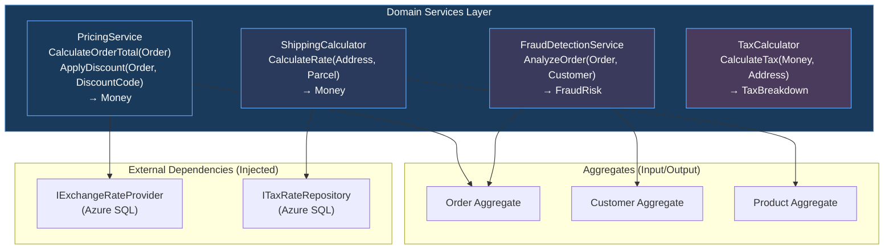
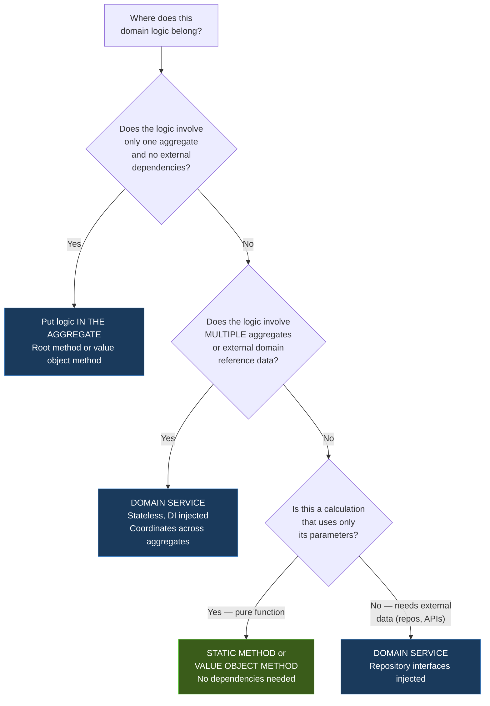

> [!success] Mastery Check
> - [ ] **Studied Well**
> - [ ] **Can explain the concept without notes**
> - [ ] **Can answer interview questions confidently**
> - [ ] **Can implement it in a real project**


# 7.051 — DDD — Domain Services — Stateless Operations

## Section 1 — Navigation & Context

**Domain:** [[7 — System Design & Distributed Systems]] > **Group:** Domain-Driven Design
**Previous:** [[7.050 — DDD — Aggregates — Cross-Aggregate References]] | **Next:** [[7.052 — DDD — Application Services — Orchestration]]

### Prerequisites

- [[7.047 — DDD — Aggregates — Consistency Boundary]] — domain services contain logic that spans multiple aggregates but doesn't belong to any single aggregate; understanding what belongs inside vs outside aggregate boundaries is prerequisite.
- [[7.048 — DDD — Aggregates — Aggregate Root Rule]] — domain services interact with aggregates only through their public root methods; they never access child entities directly or bypass aggregate invariants.
- [[7.046 — DDD — Value Objects — C# Records Implementation]] — domain services accept and return value objects (records) as parameters; immutability ensures the service cannot corrupt the aggregate's state.

### Where This Fits

A domain service is a stateless class that encapsulates domain logic that doesn't naturally fit inside an entity or value object. It exists when the logic involves multiple aggregates, external domain rules, or complex calculations that would bloat an entity. The recognition trigger: when you find yourself writing "but this business rule involves two different orders" or "this calculation needs data from three different aggregates" — that logic belongs in a domain service, not in any single aggregate. A .NET engineer encounters this when they have a method on `Order` that checks `Inventory` or a method on `Customer` that calculates `ShippingRates` — these dependencies don't belong in the entity. Without domain services, entities accumulate cross-cutting logic and infrastructure dependencies, violating the single responsibility principle and making domain changes risky.

---

## Section 2 — Core Mental Model

A domain service is a **stateless, side-effect-free class that encapsulates domain logic operating on multiple aggregates or external domain concepts.** The invariant the service maintains: **it has no mutable state of its own — every invocation depends only on its parameters and the (immutable) domain services it depends on.** What it trades: you lose the natural "tell the object to do something" metaphor and replace it with "ask a service to do something to/with the objects" — which can feel less object-oriented. The recognition trigger: when a business rule involves more than one aggregate instance, or requires a calculation that isn't the responsibility of any single entity, extract a domain service.

### Classification

| Dimension | Classification | Rationale |
|-----------|---------------|-----------|
| Pattern Type | **Tactical DDD** | Domain services are a standard tactical pattern alongside entities, value objects, and aggregates |
| Scope | **Within a single bounded context** | Domain services operate on entities/value objects within the same BC |
| Primary Concern | **Encapsulate cross-aggregate domain logic** | Keeps entities focused on their own invariants, not cross-cutting concerns |
| State | **Stateless** | No mutable fields; all dependencies are injectable services or configuration |
| Lifetime | **Scoped or Singleton (stateless = safe)** | Stateless services can be singletons; if they depend on scoped repositories, they must be scoped |
| Invocation | **Method call with domain objects as parameters** | Takes aggregates/value objects, returns results/domain events |
| Naming Convention | `XxxService`, `XxxCalculator`, `XxxDomainService` | `PricingService`, `ShippingCalculator`, `FraudDetectionDomainService` |

### Primary Diagram



### Key Properties / Guarantees

| Property | Value | Condition |
|----------|-------|-----------|
| Statelessness | Zero mutable fields | No property mutations after construction |
| Side-effect expectation | None (pure computation) | All side effects handled by caller (Application Service) |
| Multiple aggregate coordination | Yes (core reason for existence) | Service orchestrates across boundaries without owning state |
| External dependency | Yes (via constructor injection) | Typically IRepository, ICalculator, IProvider interfaces |
| Unit testability | Easy (pure logic + mockable dependencies) | No infrastructure coupling |
| Lifetime | Scoped (default) or Singleton | Singleton only if no scoped dependencies |

---

## Section 3 — Deep Mechanics

### How It Works

Domain services are stateless by design — they hold no mutable fields and their methods produce outputs deterministically from inputs. The service's dependencies are injected through its constructor as interfaces (repositories, providers, calculators). The service **composes** domain logic by calling aggregate methods and value object operations.

**Step-by-step: PricingService.CalculateDiscount**

```
1. Application Service calls PricingService.ApplyDiscount(order, customer, code)
2. PricingService:
   a. Loads discount rules from repository (IDiscountRuleRepository)
   b. Validates code: is it expired? Has customer used it already?
   c. Calculates discount amount: rules × order total
   d. Returns: DiscountResult { ApplicableAmount, Reason, RemainingValue }
3. Application Service applies the result to the Order aggregate:
   order.ApplyDiscount(result); // Root method enforces invariants
   orderRepo.Save(order);
```

### Failure Modes

#### Failure Mode 1: Domain Service with Mutable State

The most common violation: a domain service that caches or accumulates state between calls.

```csharp
// ❌ Domain service with mutable state — breaks statelessness
public class DiscountService
{
    private int _totalDiscountAppliedToday; // Mutable state!
    private readonly List<string> _appliedCodes = new();

    public DiscountResult ApplyDiscount(Order order, string code)
    {
        _totalDiscountAppliedToday += order.Total.Amount;
        _appliedCodes.Add(code);
        // ...
    }
}
```

**Symptom:** Non-deterministic behavior. Service produces different results for the same inputs depending on call order. Race conditions when multiple threads use the same instance. `_totalDiscountAppliedToday` may overflow or leak between requests.

**Fix:** Move state to the caller (application service) or to the aggregate:

```csharp
// ✅ Stateless — no mutable fields
public class DiscountService
{
    public DiscountResult ApplyDiscount(Order order, DiscountCode code)
    {
        var rules = _ruleRepo.GetApplicableRules(code, order);
        var applicableAmount = rules.Calculate(order.Total);
        return new DiscountResult(applicableAmount, code.Reason, 
            code.RemainingValue.Subtract(applicableAmount));
    }
}
```

**Cost of not fixing:** Intermittent bugs whose reproduction depends on call order. Production incidents at scale where the 1,001st call produces a different result than the 1st. Debugging requires replaying call sequences.

#### Failure Mode 2: Domain Service Doing Infrastructure Work (Side Effects)

```csharp
// ❌ Domain service sends email — infrastructure concern
public class NotificationService // Wrong: not a domain service
{
    public async Task NotifyOrderConfirmed(Order order)
    {
        await _emailSender.SendAsync(order.CustomerEmail, "Order Confirmed");
        await _smsSender.SendAsync(order.CustomerPhone, "Order confirmed");
    }
}
```

**Symptom:** Testing requires email/SMS mocks. Cannot run domain logic offline. Changing email provider requires changing domain service.

**Fix:** Application service handles infrastructure; domain service only computes:

```csharp
// ✅ Domain service: pure computation
public class OrderConfirmationService
{
    public ConfirmationPayload BuildConfirmation(Order order)
    {
        return new ConfirmationPayload(
            CustomerEmail: order.CustomerEmail,
            Subject: $"Order {order.Id} Confirmed",
            Body: $"Your order of {order.Total} has been confirmed.",
            SmsBody: $"Order {order.Id}: confirmed."
        );
    }
}

// Application service: handles infrastructure
public class OrderConfirmationAppService
{
    public async Task ConfirmOrder(Guid orderId)
    {
        var order = await _orderRepo.GetByIdAsync(orderId);
        order.Confirm();
        await _orderRepo.SaveAsync();

        var payload = _confirmationService.BuildConfirmation(order);
        await _emailSender.SendAsync(payload);
    }
}
```

#### Failure Mode 3: Domain Service Accepting Primitive Types Instead of Value Objects

```csharp
// ❌ Primitive obsession — string instead of DiscountCode
public class DiscountService
{
    public DiscountResult ApplyDiscount(Order order, string code)
    {
        // code is "SUMMER2026" — but also could be null, empty, "   "
        // No validation, no type safety
    }
}
```

**Fix:** Use domain value objects:

```csharp
// ✅ Value object parameter
public class DiscountService
{
    public DiscountResult ApplyDiscount(Order order, DiscountCode code)
    {
        // code is validated on creation — never null, never empty
    }
}
```

#### Failure Mode 4: Domain Service with Too Many Dependencies

```csharp
// ❌ Service with 7+ dependencies — does too much
public class CheckoutDomainService
{
    public CheckoutDomainService(
        IPricingRepository, IDiscountRepository, ITaxRepository,
        IShippingRepository, IInventoryRepository, ICustomerRepository,
        IPromotionRepository) { }
}
```

**Symptom:** Difficult to instantiate in tests (7 mocks). Difficult to reason about (the service does everything). Breaking changes in any repository break this service.

**Fix:** Split into focused services:

```csharp
// ✅ Focused services
public class PricingService(IPricingRepository);
public class DiscountService(IDiscountRepository);
public class TaxCalculator(ITaxRepository);
public class ShippingCalculator(IShippingRepository);
```

#### Failure Mode 5: Domain Service Taking Ownership of Aggregate State

```csharp
// ❌ Service modifies aggregate fields directly
public class PricingService
{
    public void ApplyDiscount(Order order, DiscountCode code)
    {
        order.Total = order.Total.MultiplyBy(0.9m); // Direct field mutation!
        // Bypassed Order's invariant enforcement
    }
}
```

**Fix:** Service returns a result; aggregate applies it:

```csharp
// ✅ Service returns result; aggregate applies it
public class PricingService
{
    public DiscountCalculation CalculateDiscount(Order order, DiscountCode code)
    {
        return new DiscountCalculation(order.Total.MultiplyBy(0.9m));
    }
}

// Application service:
var calc = _pricingService.CalculateDiscount(order, code);
order.ApplyDiscount(calc); // Aggregate enforces invariants
await _orderRepo.SaveAsync(order);
```

### .NET and Azure Integration

| Technology | Domain Service Pattern | Key Consideration |
|-----------|----------------------|-------------------|
| **ASP.NET Core DI** | Register as Scoped or Singleton | Singleton only if no scoped dependencies |
| **Azure Functions** | Domain services as business logic layer | Stateless services work naturally with function triggers |
| **Azure SQL** | Repository interfaces injected into services | One repository per aggregate type |
| **Azure Cache for Redis** | Domain services read cached data | Cache as `ICacheProvider` dependency |
| **Polly** | Resilience for repository calls in services | Retry timeouts transparently |
| **MediatR** | Domain services used inside Command Handlers | Handler calls service, then repository |

```csharp
// Program.cs — Domain service registration
var builder = WebApplication.CreateBuilder(args);

// Domain services — stateless, scoped by default
builder.Services.AddScoped<IPricingService, PricingService>();
builder.Services.AddScoped<IDiscountService, DiscountService>();
builder.Services.AddScoped<ITaxCalculator, TaxCalculator>();
builder.Services.AddScoped<IShippingCalculator, ShippingCalculator>();
builder.Services.AddScoped<IFraudDetectionService, FraudDetectionService>();

// Stateless services with only stateless dependencies can be singletons
builder.Services.AddSingleton<ICurrencyConverter, CurrencyConverter>();
builder.Services.AddSingleton<IDateTimeProvider, SystemDateTimeProvider>();

// Repositories (for services that need to load aggregates)
builder.Services.AddScoped<IDiscountRuleRepository, DiscountRuleRepository>();
builder.Services.AddScoped<ITaxRateRepository, TaxRateRepository>();

var app = builder.Build();
app.Run();
```

---

## Section 4 — Production Patterns and Implementation

### Primary Implementation — Complete Domain Services

```csharp
// =========================================================================
// Domain Service: PricingService — Cross-Aggregate Pricing Logic
// =========================================================================
namespace OrderManagement.Domain.Services;

using OrderManagement.Domain.Aggregates;
using OrderManagement.Domain.ValueObjects;

/// <summary>
/// Domain service for pricing calculations that span multiple aggregates.
/// Stateless — all state is in injected repositories and method parameters.
/// </summary>
public interface IPricingService
{
    /// <summary>Calculates the final order total including discounts and taxes.</summary>
    Task<FinalPrice> CalculateFinalPriceAsync(
        Order order,
        Customer customer,
        DiscountCode? discountCode,
        CancellationToken ct);

    /// <summary>Calculates discount for a specific order.</summary>
    Task<DiscountCalculation> CalculateDiscountAsync(
        Order order,
        DiscountCode code,
        CancellationToken ct);
}

/// <summary>
/// Stateless implementation of pricing logic.
/// Orchestrates discount rules, tax rates, and currency conversion.
/// </summary>
public sealed class PricingService : IPricingService
{
    private readonly IDiscountRuleRepository _discountRepo;
    private readonly ITaxRateRepository _taxRepo;
    private readonly ICurrencyConverter _currencyConverter;
    private readonly ILogger<PricingService> _logger;

    public PricingService(
        IDiscountRuleRepository discountRepo,
        ITaxRateRepository taxRepo,
        ICurrencyConverter currencyConverter,
        ILogger<PricingService> logger)
    {
        _discountRepo = discountRepo;
        _taxRepo = taxRepo;
        _currencyConverter = currencyConverter;
        _logger = logger;
    }

    /// <summary>Calculates final price: subtotal → discount → tax → total.</summary>
    public async Task<FinalPrice> CalculateFinalPriceAsync(
        Order order,
        Customer customer,
        DiscountCode? discountCode,
        CancellationToken ct)
    {
        _logger.LogDebug("Calculating final price for order {OrderId}", order.Id);

        // Step 1: Start with order subtotal
        var subtotal = order.Total;

        // Step 2: Apply discount if code provided
        DiscountCalculation? discount = null;
        if (discountCode is not null)
        {
            discount = await CalculateDiscountAsync(order, discountCode, ct);
        }

        var afterDiscount = discount is not null
            ? subtotal.Subtract(discount.Amount)
            : subtotal;

        // Step 3: Calculate tax
        var taxRate = await _taxRepo.GetRateAsync(
            customer.ShippingAddress.State, ct);
        var tax = afterDiscount.MultiplyBy(taxRate.Percentage / 100m);

        // Step 4: Calculate final total
        var finalTotal = afterDiscount.Add(tax);

        _logger.LogInformation(
            "Order {OrderId}: subtotal={Subtotal}, discount={Discount}, tax={Tax}, final={Final}",
            order.Id, subtotal, discount?.Amount ?? Money.Zero("USD"), tax, finalTotal);

        return new FinalPrice(
            subtotal,
            discount?.Amount ?? Money.Zero("USD"),
            discount?.Code,
            tax,
            finalTotal);
    }

    /// <summary>Calculates discount based on code, order value, and customer tier.</summary>
    public async Task<DiscountCalculation> CalculateDiscountAsync(
        Order order,
        DiscountCode code,
        CancellationToken ct)
    {
        var rules = await _discountRepo.GetRulesForCodeAsync(code, ct);

        if (rules.Count == 0)
        {
            _logger.LogWarning("No discount rules found for code {Code}", code.Value);
            return DiscountCalculation.None(code);
        }

        // Apply all matching rules (e.g., percentage off, fixed amount, BOGO)
        var totalDiscount = Money.Zero("USD");
        var appliedRules = new List<string>();

        foreach (var rule in rules)
        {
            if (rule.IsApplicable(order, code))
            {
                var ruleDiscount = rule.Calculate(order.Total);
                totalDiscount = totalDiscount.Add(ruleDiscount);
                appliedRules.Add(rule.Name);
            }
        }

        return new DiscountCalculation(code, totalDiscount, appliedRules.AsReadOnly());
    }
}

/// <summary>Result of a final price calculation.</summary>
public sealed record FinalPrice(
    Money Subtotal,
    Money Discount,
    DiscountCode? AppliedCode,
    Money Tax,
    Money Total
);

/// <summary>Result of a discount calculation.</summary>
public sealed record DiscountCalculation(
    DiscountCode Code,
    Money Amount,
    IReadOnlyList<string> AppliedRules
)
{
    public static DiscountCalculation None(DiscountCode code) =>
        new(code, Money.Zero("USD"), Array.Empty<string>());
}
```

```csharp
// =========================================================================
// Domain Service: ShippingCalculator — Rate Determination
// =========================================================================
namespace OrderManagement.Domain.Services;

/// <summary>
/// Calculates shipping rates based on package dimensions, weight, and destination.
/// Stateless — all reference data loaded from injected repositories.
/// </summary>
public interface IShippingCalculator
{
    Task<ShippingRate> CalculateRateAsync(
        Address origin,
        Address destination,
        Package package,
        CancellationToken ct);

    Task<IReadOnlyList<ShippingRate>> GetAllRatesAsync(
        Address origin,
        Address destination,
        Package package,
        CancellationToken ct);
}

public sealed class ShippingCalculator : IShippingCalculator
{
    private readonly IShippingRateRepository _rateRepo;
    private readonly ILogger<ShippingCalculator> _logger;

    public ShippingCalculator(
        IShippingRateRepository rateRepo,
        ILogger<ShippingCalculator> logger)
    {
        _rateRepo = rateRepo;
        _logger = logger;
    }

    public async Task<ShippingRate> CalculateRateAsync(
        Address origin,
        Address destination,
        Package package,
        CancellationToken ct)
    {
        var rates = await GetAllRatesAsync(origin, destination, package, ct);
        return rates.OrderBy(r => r.TotalCost.Amount).First();
    }

    public async Task<IReadOnlyList<ShippingRate>> GetAllRatesAsync(
        Address origin,
        Address destination,
        Package package,
        CancellationToken ct)
    {
        var carriers = await _rateRepo.GetActiveCarriersAsync(ct);
        var rates = new List<ShippingRate>();

        foreach (var carrier in carriers)
        {
            var zone = await _rateRepo.GetZoneAsync(origin, destination, carrier, ct);
            var baseRate = await _rateRepo.GetBaseRateAsync(carrier, zone, ct);
            var weightCharge = baseRate.PerKgRate.MultiplyBy(package.WeightKg);
            var insurance = package.DeclaredValue.MultiplyBy(carrier.InsuranceRatePercent / 100m);

            rates.Add(new ShippingRate(
                carrier.Name,
                baseRate.BaseFee.Add(weightCharge).Add(insurance),
                zone.Name,
                carrier.EstimatedDays));
        }

        _logger.LogDebug("Calculated {Count} shipping rates for {Destination}",
            rates.Count, destination);

        return rates.AsReadOnly();
    }
}

public sealed record ShippingRate(
    string CarrierName,
    Money TotalCost,
    string Zone,
    int EstimatedDays
);

public sealed record Package(
    decimal WeightKg,
    decimal LengthCm,
    decimal WidthCm,
    decimal HeightCm,
    Money DeclaredValue
);
```

```csharp
// =========================================================================
// Domain Service: TaxCalculator — Multi-State Tax Computation
// =========================================================================
namespace OrderManagement.Domain.Services;

/// <summary>
/// Calculates tax for orders across multiple jurisdictions.
/// Encapsulates tax nexus rules, product taxability, and rate lookups.
/// </summary>
public interface ITaxCalculator
{
    Task<TaxBreakdown> CalculateTaxAsync(
        Order order,
        Address shippingAddress,
        CancellationToken ct);
}

public sealed class TaxCalculator : ITaxCalculator
{
    private readonly ITaxRateRepository _taxRepo;
    private readonly ILogger<TaxCalculator> _logger;

    public TaxCalculator(
        ITaxRateRepository taxRepo,
        ILogger<TaxCalculator> logger)
    {
        _taxRepo = taxRepo;
        _logger = logger;
    }

    public async Task<TaxBreakdown> CalculateTaxAsync(
        Order order,
        Address shippingAddress,
        CancellationToken ct)
    {
        // Determine nexus — where the seller has tax obligation
        var nexusStates = await _taxRepo.GetNexusStatesAsync(ct);
        var isTaxable = nexusStates.Contains(shippingAddress.State);

        if (!isTaxable)
        {
            _logger.LogDebug("No tax nexus for state {State}", shippingAddress.State);
            return TaxBreakdown.Zero;
        }

        // Get tax rate for destination
        var rate = await _taxRepo.GetRateAsync(shippingAddress.State, ct);

        // Calculate tax per line (some products may be exempt)
        var lineTaxes = new List<LineTax>();
        foreach (var line in order.Lines)
        {
            var isExempt = await _taxRepo.IsProductExemptAsync(
                line.ProductSku, shippingAddress.State, ct);

            var taxAmount = isExempt
                ? Money.Zero("USD")
                : line.LineTotal.MultiplyBy(rate.Percentage / 100m);

            lineTaxes.Add(new LineTax(line.ProductName, line.LineTotal, taxAmount, isExempt));
        }

        var totalTax = lineTaxes
            .Select(lt => lt.TaxAmount)
            .Aggregate((a, b) => a.Add(b));

        return new TaxBreakdown(rate.Percentage, totalTax, lineTaxes.AsReadOnly());
    }
}

public sealed record TaxBreakdown(
    decimal RatePercentage,
    Money TotalTax,
    IReadOnlyList<LineTax> LineTaxes
)
{
    public static readonly TaxBreakdown Zero = new(0, Money.Zero("USD"), Array.Empty<LineTax>());
}

public sealed record LineTax(
    string ProductName,
    Money LineTotal,
    Money TaxAmount,
    bool IsExempt
);
```

```csharp
// =========================================================================
// Domain Service: FraudDetectionService — Risk Assessment
// =========================================================================
namespace OrderManagement.Domain.Services;

/// <summary>
/// Analyzes order and customer data for fraud risk.
/// Stateless — combines rules from multiple aggregates.
/// </summary>
public interface IFraudDetectionService
{
    Task<FraudAssessment> AssessOrderRiskAsync(
        Order order,
        Customer customer,
        CancellationToken ct);
}

public sealed class FraudDetectionService : IFraudDetectionService
{
    private readonly IFraudRuleRepository _fraudRepo;
    private readonly ILogger<FraudDetectionService> _logger;

    public FraudDetectionService(
        IFraudRuleRepository fraudRepo,
        ILogger<FraudDetectionService> logger)
    {
        _fraudRepo = fraudRepo;
        _logger = logger;
    }

    public async Task<FraudAssessment> AssessOrderRiskAsync(
        Order order,
        Customer customer,
        CancellationToken ct)
    {
        var rules = await _fraudRepo.GetActiveRulesAsync(ct);
        var triggeredRules = new List<FraudRuleResult>();

        foreach (var rule in rules)
        {
            var result = rule.Evaluate(order, customer);
            if (result.IsTriggered)
                triggeredRules.Add(result);
        }

        var riskLevel = triggeredRules.Count switch
        {
            0 => FraudRiskLevel.Low,
            <= 2 => FraudRiskLevel.Medium,
            <= 4 => FraudRiskLevel.High,
            _ => FraudRiskLevel.Critical
        };

        _logger.LogInformation(
            "Fraud assessment for order {OrderId}: {Level} ({TriggeredCount} rules triggered)",
            order.Id, riskLevel, triggeredRules.Count);

        return new FraudAssessment(riskLevel, triggeredRules.AsReadOnly());
    }
}

public sealed record FraudAssessment(
    FraudRiskLevel RiskLevel,
    IReadOnlyList<FraudRuleResult> TriggeredRules
);

public enum FraudRiskLevel { Low, Medium, High, Critical }

public sealed record FraudRuleResult(
    string RuleName,
    bool IsTriggered,
    string Description,
    decimal RiskScore
);
```

```csharp
// =========================================================================
// Application Service — Orchestrating Domain Services
// =========================================================================
namespace OrderManagement.Application.Services;

/// <summary>
/// Application service that orchestrates domain services with aggregates.
/// Transactional boundary: saves Order aggregate after domain service results.
/// </summary>
public sealed class CheckoutApplicationService
{
    private readonly IOrderRepository _orderRepo;
    private readonly IPricingService _pricingService;
    private readonly ITaxCalculator _taxCalculator;
    private readonly IShippingCalculator _shippingCalculator;
    private readonly IFraudDetectionService _fraudService;
    private readonly IUnitOfWork _unitOfWork;
    private readonly ILogger<CheckoutApplicationService> _logger;

    public CheckoutApplicationService(
        IOrderRepository orderRepo,
        IPricingService pricingService,
        ITaxCalculator taxCalculator,
        IShippingCalculator shippingCalculator,
        IFraudDetectionService fraudService,
        IUnitOfWork unitOfWork,
        ILogger<CheckoutApplicationService> logger)
    {
        _orderRepo = orderRepo;
        _pricingService = pricingService;
        _taxCalculator = taxCalculator;
        _shippingCalculator = shippingCalculator;
        _fraudService = fraudService;
        _unitOfWork = unitOfWork;
        _logger = logger;
    }

    /// <summary>Complete checkout flow — orchestration logic.</summary>
    public async Task<CheckoutResult> CheckoutAsync(CheckoutRequest request, CancellationToken ct)
    {
        // 1. Load aggregates
        var order = await _orderRepo.GetByIdAsync(request.OrderId, ct);
        var customer = await _customerRepo.GetByIdAsync(order.CustomerId, ct);

        // 2. Domain service: fraud assessment
        var fraudAssessment = await _fraudService.AssessOrderRiskAsync(order, customer, ct);
        if (fraudAssessment.RiskLevel >= FraudRiskLevel.High)
        {
            _logger.LogWarning("Order {OrderId} flagged for fraud review", order.Id);
            order.FlagForReview(fraudAssessment);
            await _orderRepo.SaveAsync(order, ct);
            return CheckoutResult.FraudReviewRequired;
        }

        // 3. Domain service: pricing
        var finalPrice = await _pricingService.CalculateFinalPriceAsync(
            order, customer, request.DiscountCode, ct);

        // 4. Domain service: shipping
        var shippingRate = await _shippingCalculator.CalculateRateAsync(
            customer.DefaultAddress, order.ShippingAddress, request.Package, ct);

        // 5. Domain service: tax
        var tax = await _taxCalculator.CalculateTaxAsync(order, order.ShippingAddress, ct);

        // 6. Apply results to aggregate (Domain logic in aggregate methods)
        var pricingResult = order.SetPricing(finalPrice, shippingRate, tax);
        if (pricingResult.IsFailure)
            return CheckoutResult.Failure(pricingResult.Errors);

        var confirmResult = order.Confirm();
        if (confirmResult.IsFailure)
            return CheckoutResult.Failure(confirmResult.Errors);

        // 7. Save aggregate (single transaction)
        await _orderRepo.SaveAsync(order, ct);

        _logger.LogInformation(
            "Checkout complete for order {OrderId}. Total: {Total}",
            order.Id, order.Total);

        return CheckoutResult.Success(new OrderConfirmation(order.Id, order.Total, shippingRate));
    }
}
```

### Configuration and Wiring

```csharp
// Program.cs — Domain service registration
var builder = WebApplication.CreateBuilder(args);

// Infrastructure
builder.Services.AddDbContext<OrderDbContext>(options =>
    options.UseSqlServer(builder.Configuration.GetConnectionString("OrderDb")));
builder.Services.AddScoped<IUnitOfWork, UnitOfWork>();

// Repositories
builder.Services.AddScoped<IOrderRepository, OrderRepository>();
builder.Services.AddScoped<ICustomerRepository, CustomerRepository>();
builder.Services.AddScoped<IDiscountRuleRepository, DiscountRuleRepository>();
builder.Services.AddScoped<ITaxRateRepository, TaxRateRepository>();
builder.Services.AddScoped<IShippingRateRepository, ShippingRateRepository>();
builder.Services.AddScoped<IFraudRuleRepository, FraudRuleRepository>();

// Domain Services (stateless — scoped because they depend on scoped repositories)
builder.Services.AddScoped<IPricingService, PricingService>();
builder.Services.AddScoped<ITaxCalculator, TaxCalculator>();
builder.Services.AddScoped<IShippingCalculator, ShippingCalculator>();
builder.Services.AddScoped<IFraudDetectionService, FraudDetectionService>();

// Pure stateless services (can be singleton)
builder.Services.AddSingleton<ICurrencyConverter, CurrencyConverter>();
builder.Services.AddSingleton<IDateTimeProvider, SystemDateTimeProvider>();

// Application Services
builder.Services.AddScoped<CheckoutApplicationService>();

var app = builder.Build();
app.Run();
```

### Common Variants

#### Variant 1: Pure Static Domain Service (No Dependencies)

```csharp
// For pure calculations with no external dependencies
public static class ShippingWeightCalculator
{
    public static ShipmentClass CalculateClass(Package package) =>
        package.WeightKg switch
        {
            <= 0.5m => ShipmentClass.Light,
            <= 2.0m => ShipmentClass.Standard,
            <= 10.0m => ShipmentClass.Heavy,
            _ => ShipmentClass.Oversized
        };
}
// Static = easiest to test, pure function
// Limitation: can't use DI, can't be mocked
```

#### Variant 2: Domain Service with Events

```csharp
// Domain service that publishes events as part of its logic
public sealed class OrderValidationService
{
    // Stateless — validates and produces events
    public IReadOnlyList<IDomainEvent> Validate(Order order, Customer customer)
    {
        var events = new List<IDomainEvent>();
        if (order.Total.Amount > customer.CreditLimit.Amount)
            events.Add(new CreditLimitExceededEvent(order.Id, customer.Id, order.Total));
        if (order.ShippingAddress.Country != customer.DefaultAddress.Country)
            events.Add(new CrossBorderShipmentDetectedEvent(order.Id));
        return events.AsReadOnly();
    }
}
```

#### Variant 3: Domain Service with Strategy Pattern

```csharp
// Strategy pattern injected into domain service
public interface IDiscountStrategy
{
    bool IsApplicable(Order order);
    Money Calculate(Money subtotal);
}

public sealed class PricingService
{
    private readonly IEnumerable<IDiscountStrategy> _strategies;

    public PricingService(IEnumerable<IDiscountStrategy> strategies)
        => _strategies = strategies;

    public async Task<Money> CalculateBestDiscountAsync(Order order)
    {
        var applicable = _strategies
            .Where(s => s.IsApplicable(order))
            .Select(s => s.Calculate(order.Total))
            .OrderByDescending(m => m.Amount);

        return applicable.FirstOrDefault() ?? Money.Zero("USD");
    }
}
```

### Real-World .NET Ecosystem Example

**MediatR Pipeline Behavior + Domain Service:**

```csharp
// Pipeline behavior that wraps domain service calls with logging/validation
public class DomainServiceLoggingBehavior<TRequest, TResponse> : IPipelineBehavior<TRequest, TResponse>
    where TRequest : IRequest<TResponse>
{
    private readonly ILogger<DomainServiceLoggingBehavior<TRequest, TResponse>> _logger;

    public async Task<TResponse> Handle(
        TRequest request,
        RequestHandlerDelegate<TResponse> next,
        CancellationToken ct)
    {
        var serviceName = typeof(TRequest).Name.Replace("Command", "");
        _logger.LogDebug("Calling domain service {Service} with {Request}",
            serviceName, JsonSerializer.Serialize(request));

        var stopwatch = Stopwatch.StartNew();
        var response = await next(ct);
        stopwatch.Stop();

        _logger.LogDebug("Domain service {Service} completed in {ElapsedMs}ms",
            serviceName, stopwatch.ElapsedMilliseconds);

        return response;
    }
}
```

---

## Section 5 — Gotchas and Production Pitfalls

### Pitfall 1: Domain Service with Mutable Cache

**Pitfall:** Engineer adds a memory cache to a domain service to avoid repeated database calls, introducing mutable state.

```csharp
// ❌ Mutable cache in domain service
public class TaxCalculator
{
    private readonly Dictionary<string, TaxRate> _cache = new(); // Mutable!

    public async Task<TaxRate> GetRateAsync(string state)
    {
        if (_cache.TryGetValue(state, out var cached))
            return cached; // Stale if repository updates rates

        var rate = await _taxRepo.GetRateAsync(state);
        _cache[state] = rate; // Mutation!
        return rate;
    }
}
```

**Symptom:** Tax rates are stale until service restarts. If the tax repository updates rates at noon, the service returns old rates until the DI container releases the instance. Request-scoped cache isn't shared, but singleton cache is stale.

**Fix:** Use `IMemoryCache` with expiration or keep service truly stateless:

```csharp
// ✅ IMemoryCache with expiration — not service state
public class TaxCalculator
{
    private readonly IMemoryCache _cache;
    private readonly TimeSpan _cacheDuration = TimeSpan.FromMinutes(30);

    public async Task<TaxRate> GetRateAsync(string state)
    {
        return await _cache.GetOrCreateAsync($"tax_rate_{state}", async entry =>
        {
            entry.AbsoluteExpirationRelativeToNow = _cacheDuration;
            return await _taxRepo.GetRateAsync(state);
        });
    }
}
```

**Cost of not fixing:** Tax calculation errors during rate changes (30-60 minute stale window). Audit finds $15K in under-collected tax. Regulatory fines for incorrect tax reporting.

### Pitfall 2: Domain Service Registered as Singleton with Scoped Dependencies

```pittl:** Domain service is singleton but injects scoped repositories → captive dependency.

```csharp
// ❌ Singleton with scoped dependency — captive dependency
builder.Services.AddSingleton<IPricingService, PricingService>();
// PricingService injects IDiscountRuleRepository (Scoped)
// The singleton captures the scoped repo for the container's lifetime!
```

**Symptom:** `InvalidOperationException: Cannot consume scoped service from singleton.` Or: if the container allows it, the service uses a stale repository instance across requests.

**Fix:** Match service lifetime to its dependencies:

```csharp
// ✅ Scoped (matches scoped repo dependencies)
builder.Services.AddScoped<IPricingService, PricingService>();
// ✅ Singleton (only has singleton dependencies)
builder.Services.AddSingleton<ICurrencyConverter, CurrencyConverter>();
```

### Pitfall 3: Domain Service Doing Validation That Belongs in Value Objects

```csharp
// ❌ Validation in domain service that belongs in value object
public class OrderService
{
    public Result ValidateEmail(string email)
    {
        if (!email.Contains('@')) return Failure("Invalid email");
        return Success();
    }
}

// Better: Email value object validates itself
public sealed record Email
{
    public string Value { get; }
    public Email(string value)
    {
        if (!value.Contains('@')) throw new ArgumentException("Invalid email");
        Value = value;
    }
}
```

### Pitfall 4: Domain Service with Too Many Methods (God Service)

```csharp
// ❌ God service — everything in one class
public class OrderDomainService
{
    public Task<Money> CalculateDiscountAsync(...);
    public Task<FraudRisk> DetectFraudAsync(...);
    public Task<TaxBreakdown> CalculateTaxAsync(...);
    public Task<ShippingRate> CalculateShippingAsync(...);
    public Task<bool> ValidateInventoryAsync(...);
    public Task<CustomerCredit> CheckCreditAsync(...);
    // 15+ methods — violates Single Responsibility
}
```

**Fix:** Split into focused services:

```csharp
// ✅ Focused services — one responsibility each
public class DiscountCalculator { }
public class FraudDetectionService { }
public class TaxCalculator { }
public class ShippingCalculator { }
public class InventoryValidator { }
public class CreditCheckService { }
```

### Pitfall 5: Throwing Exceptions Instead of Returning Results

```csharp
// ❌ Exception-based control flow
public class PricingService
{
    public Money CalculateDiscount(Order order, DiscountCode code)
    {
        if (code.IsExpired) throw new DiscountExpiredException(code.Value);
        if (order.Total.Amount < code.MinimumAmount)
            throw new MinimumNotMetException(code.MinimumAmount);
        // ...
    }
}
```

**Symptom:** Application service has try-catch blocks for every domain exception. Stack traces in logs for business-as-usual scenarios. Performance overhead of exception creation.

**Fix:** Return result types:

```csharp
// ✅ Result-based flow
public class PricingService
{
    public DiscountResult CalculateDiscount(Order order, DiscountCode code)
    {
        if (code.IsExpired) return DiscountResult.Failure($"Code {code.Value} expired");
        if (order.Total.Amount < code.MinimumAmount)
            return DiscountResult.Failure($"Minimum {code.MinimumAmount:C} not met");
        return DiscountResult.Success(calculated);
    }
}
```

---

## Section 6 — Tradeoffs and Decision Framework

### Tradeoff Matrix

| Dimension | Domain Service (Recommended) | Entity Method | Static Utility Class | Application Service |
|---|---|---|---|---|
| Domain logic ownership | Clear (service owns cross-agg logic) | Entity owns (but bloats entity) | No ownership (procedural) | Too high (mixes infra + domain) |
| Testability | Easy (DI + mockable) | Tricky (if entity needs repos) | Easy (pure functions) | Hard (mocks everything) |
| Reusability | High (injected anywhere) | Medium (only where entity exists) | Very high | Low (coupled to use case) |
| Statefulness | Stateless | Entity has state | Stateless | Usually stateless |
| Dependency injection | Constructor injection | Repository injection in entity (bad!) | None (static) | Full DI |
| Domain purity | Pure domain types | Pure domain types | Pure | Mixed (DTO handlers) |

### Decision Flowchart



### When NOT to Apply Domain Services

- **Logic that belongs in an entity** — If the logic only uses properties of a single aggregate, put it in the aggregate root method. Don't extract a service prematurely.
- **Logic that belongs in a value object** — Money conversion logic belongs in Money record, not in a service.
- **Infrastructure concerns** — Email sending, file storage, queue publishing are not domain services. They belong in application services or infrastructure adapters.
- **CRUD operations** — Simple create/read/update/delete with no business logic doesn't need a domain service. Use application service directly.
- **Read-only queries** — Domain services are for write-side business logic. Queries go through dedicated read models.

### Scale Thresholds

- **One domain service per cross-aggregate business operation** is the sweet spot. Above 10 domain services per bounded context, review if some can be merged or if aggregates are too fragmented.
- **Domain service with >5 injected dependencies** is a smell. Consider splitting the service (max 3-4 dependencies ideal).
- **Static domain services** (pure functions) should be the default for calculation-only logic. Only use instance services when repositories or external dependencies are needed.

---

## Section 7 — Interview Arsenal

### Question Bank

1. What is a domain service in DDD? (Definition)
2. How does a domain service differ from an application service? (Mechanism)
3. What is the tradeoff of using domain services vs putting logic in entities? (Tradeoff)
4. What fails when a domain service has mutable state? (Failure mode)
5. Compare: domain service vs application service vs infrastructure service. (Comparison)
6. Design a domain service for a complex pricing calculation. (Design application)
7. How does statelessness in domain services affect scalability? (Scale)
8. When would you use a static domain service vs an injected one? (Advanced)

### Spoken Answers

**Q1: What is a domain service in DDD?**

> **Average answer:** "A service that contains domain logic."

> **Great answer:** "A domain service is a stateless class that encapsulates domain logic that doesn't naturally fit in an entity or value object. The classic trigger is logic that involves multiple aggregates — like calculating the total price of an order after applying customer-specific discounts, tax rates, and shipping costs. That logic doesn't belong in the Order aggregate (it doesn't own the customer's discount tier or the tax rate data), and it doesn't belong in the Customer aggregate (the customer doesn't know about the order's line items). The domain service orchestrates the calculation by loading the necessary data through injected repository interfaces and returning a result that the application service then applies to the Order aggregate. The key properties: stateless (no mutable fields), side-effect-free (doesn't save anything itself), and operates on domain types (entities and value objects, not DTOs). In .NET, I register them as scoped services in DI. The naming convention matters: `PricingService`, `FraudDetectionService`, `ShippingCalculator` — these names reveal the domain operation, not the technical implementation."

**Q5: Compare: domain service vs application service vs infrastructure service.**

> **Average answer:** "Domain services have business logic, application services orchestrate, infrastructure services handle technical details."

> **Great answer:** "Three distinct layers. A domain service is pure domain logic — it takes domain objects (aggregates, value objects) as inputs and returns domain objects as outputs. It knows nothing about HTTP, databases, message queues, or transactions. Its dependencies are interfaces to domain repositories and other domain services. An application service sits one layer above — it receives DTOs from the API layer, calls domain services and aggregates, manages transactions, and handles infrastructure concerns like sending emails or publishing events. An infrastructure service implements the interfaces that domain services depend on — `ITaxRateRepository` is implemented by `SqlTaxRateRepository`, `IEmailSender` is implemented by `SendGridEmailSender`. The critical distinction: domain services are part of the domain model (they use Ubiquitous Language), application services are part of the application layer (they use use-case language), and infrastructure services are part of the technical layer (they use technology names). A domain service would be called `CalculatePremium()`; the application service would be `ProcessRenewal()`; the infrastructure service would be `ServiceBusPublisher`. Mixing these layers — like putting SQL queries in a domain service — is the most common cause of domain logic leakage."

**Q8: When would you use a static domain service vs an injected one?**

> **Great answer:** "I use a static domain service when the computation is pure — no external dependencies needed. For example, `ShippingWeightCalculator.CalculateClass(package)` just checks weight thresholds and returns an enum. No repository, no API, no database. Static means it's a pure function: same inputs always produce same output, no side effects. This is the easiest to test and the most performant. I use an injected domain service when the computation depends on external data: tax rates from a database, exchange rates from an API, discount rules from a repository. The injection allows me to mock those dependencies in tests and swap implementations without changing the domain logic. The rule of thumb: if you can write the method without any class fields or constructor parameters, make it static. If you need `_repository`, `_provider`, `_cache`, use DI. Both are valid domain services — the static version is just the pure subset."

### System Design Interview Trigger

If an interviewer asks you to design a pricing or tax calculation system and asks "where does this logic live in your domain model?" or "how do you handle complex business rules that span multiple objects?", they are testing whether you understand the domain service pattern. Describing "I'll put it in a service class" is too vague — they want to hear the distinction between domain service (pure domain logic, stateless, operates on aggregates) and application service (orchestration, transactions, infrastructure). The follow-up is usually "how do you test this without a database?" — testing your understanding of interface injection and the stateless nature of domain services.

### Comparison Table

| | Domain Service | Application Service | Infrastructure Service |
|---|---|---|---|
| Core guarantee | Pure domain logic, stateless | Orchestration + transactions | Technical implementation |
| Trade-off | No infrastructure awareness | Domain-agnostic orchestration | Domain knowledge in implementation |
| .NET implementation | Scoped DI, injects repo interfaces | Scoped DI, injects domain services | Registered as repo implementations |
| Failure mode | Mutable state / side effects | Transaction boundary errors | Connection leaks / timeouts |
| When to choose | Cross-aggregate domain logic | Use case orchestration | DRY technical implementation |

---

## Section 8 — Architecture Decision Record

### ADR-051: Extract Cross-Aggregate Domain Logic into Stateless Domain Services

**Status:** Accepted

**Context:**
The Order Management bounded context requires complex pricing logic that involves: Order aggregate (line items, quantities), Customer aggregate (tier, discount eligibility), TaxRateRepository (state-level rates), and ShippingRateRepository (carrier rates). Initially, this logic was in the Order aggregate root (`Order.CalculateFinalPrice()`), requiring the Order to inject repository dependencies — violating the entity's single responsibility. Testing required mocking repository for every Order test.

**Options Considered:**

1. **Domain Services (Recommended):** Extract PricingService, TaxCalculator, ShippingCalculator as stateless services. Order aggregate has no external dependencies.
2. **Entity with Repository Injection:** Order aggregate accepts repository interfaces via method parameters.
3. **Application Service Logic:** All calculation logic in the application service, mixed with DTO mapping and transaction management.

**Decision:**
Adopt Option 1. Create four domain services: PricingService (discount rules + order pricing), TaxCalculator (tax rate lookup + calculation), ShippingCalculator (carrier rate comparison), FraudDetectionService (risk rules). Each is stateless, accepts repository interfaces via constructor injection, and returns domain result types. Application services orchestrate the flow and manage transactions.

**Consequences:**

- ✅ Order aggregate remains pure — no external dependencies, easier to test
- ✅ Domain logic reusable across multiple application services (web API, background jobs, admin tools)
- ✅ Each domain service independently testable with mocked repositories
- ⚠️ Additional indirection (must navigate from Application → Domain Service → Repository)
- ⚠️ Dependency injection overhead (4 additional service registrations)
- ❌ Slightly more boilerplate than inline logic

**Review Trigger:** Revisit if (1) domain services grow beyond 5 injected dependencies (split them); (2) new domain logic emerges that operates on a single aggregate only (consider moving to aggregate method); (3) domain service count exceeds 10 for this bounded context (review aggregate boundary decisions).

---

## Section 9 — Self-Check

### Conceptual Questions

1. What is a domain service and when should you use one?

<details>
<summary>Answer</summary>
A stateless class that encapsulates domain logic that doesn't naturally fit in an entity or value object. Use it when logic involves multiple aggregates, requires external domain reference data (tax rates, discount rules), or would bloat an entity with injected dependencies.
</details>

2. What distinguishes a domain service from an application service?

<details>
<summary>Answer</summary>
Domain service: operates on domain objects (entities, value objects), pure domain logic, no infrastructure concerns, uses Ubiquitous Language. Application service: receives DTOs, orchestrates domain services, manages transactions and infrastructure, uses use-case language.
</details>

3. What is the tradeoff of extracting a domain service vs putting logic in an entity?

<details>
<summary>Answer</summary>
Extracting: clearer separation of concerns, better testability, reusable across use cases, at the cost of additional indirection and DI complexity. Putting in entity: simpler for single-aggregate logic, less indirection, but risks bloating the entity and coupling it to external dependencies.
</details>

4. What breaks when a domain service has mutable state?

<details>
<summary>Answer</summary>
Non-deterministic behavior: same inputs produce different outputs depending on call order. Thread safety issues if state is shared. Stale cache values. Testing becomes order-dependent.
</details>

5. What DI lifetime should a domain service have if it depends on scoped repositories?

<details>
<summary>Answer</summary>
Scoped. If registered as singleton with scoped dependencies, the container either throws (captive dependency detection) or creates a stale repository instance. Stateless services with only singleton dependencies can be singleton.
</details>

6. Compare: domain service method with domain objects vs DTOs.

<details>
<summary>Answer</summary>
Domain service methods should accept domain objects (Order, Customer, Money) — not DTOs. This ensures the service operates in the domain layer with domain types. DTO mapping happens in the application layer. If a domain service accepts DTOs, it's likely an application service misclassified as a domain service.
</details>

7. At what point should you split a domain service?

<details>
<summary>Answer</summary>
When it has >5 injected dependencies, >10 public methods, or handles >1 business concept (e.g., pricing AND fraud detection in the same class). Split by business capability: one service per cross-aggregate concern.
</details>

8. How do domain services connect to [[7.052 — DDD — Application Services — Orchestration]]?

<details>
<summary>Answer</summary>
Domain services provide pure domain logic; application services orchestrate them with infrastructure concerns. The application service calls domain services for calculations, aggregates for state mutations, and repositories for persistence. [[7.052]] details how application services compose these calls.
</details>

9. What is the non-obvious benefit of keeping domain services stateless?

<details>
<summary>Answer</summary>
It enables automatic retry. If an application service receives a `DbUpdateConcurrencyException`, it can retry the entire operation including domain service calls — because the domain service has no internal state, re-calling it with the same inputs produces the same outputs. Stateful services would require careful re-initialization on retry.
</details>

10. Explain domain services in 60 seconds.

<details>
<summary>Answer</summary>
"A domain service is a stateless class that holds business logic that doesn't fit in a single entity or value object. Think of it as a skilled consultant who examines multiple documents and produces a calculation. The consultant has no memory — give them the same documents tomorrow, they produce the same result. In my pricing system, I have a `PricingService` that takes an Order, a Customer, and a DiscountCode, and returns the final price. It doesn't modify the Order itself — it just calculates. The application service takes that calculation and tells the Order to apply it. This keeps the Order focused on its own rules and makes the pricing logic independently testable. In .NET, it's just a class registered as a scoped service in DI, with repository interfaces injected for any reference data it needs."
</details>

### Scenario Challenges

**Scenario 1 — Diagnose the problem**

Your pricing system has a null reference exception in production. The stack trace shows `PricingService.CalculateDiscount` is accessing a null `DiscountCode`. Investigation shows the UI sends an empty string for the discount code, but the service expects a `DiscountCode` value object. The conversion from string to DiscountCode happens in the controller, not the service.

<details>
<summary>Diagnosis</summary>

**Root cause:** DiscountCode value object is created from an empty string without validation. The value object accepts it, producing a `DiscountCode` with `Value = ""`. Later, the service calls `code.IsExpired` which throws NRE on empty value.

**Evidence:** Stack trace: `DiscountService.cs:45 - code.ExpirationDate.CompareTo()`. Code.ExpirationDate is null because the empty DiscountCode has null ExpirationDate.

**Fix:** Add validation in DiscountCode constructor — don't allow empty values. Or use a factory method that returns `Result<DiscountCode>`.

**Prevention:** "Fail fast" — value objects should validate in their constructor. If a value object is invalid, it shouldn't exist.
</details>

---

**Scenario 2 — Design decision**

You are designing a checkout system that must calculate shipping costs, taxes, discounts, and loyalty points. These are separate domain concerns with independent business rules. How do you structure the services?

<details>
<summary>Decision and Reasoning</summary>

**Choice:** Four separate domain services: ShippingCalculator, TaxCalculator, DiscountService, LoyaltyPointsService. Each is stateless with its own repository dependencies. An application service (CheckoutService) orchestrates them.

**Tradeoffs accepted:** Four repository injections in the application service. But each domain service is independently testable, changeable, and deployable.

**Implementation sketch:**
```csharp
// Application service orchestrates:
var shipping = await _shippingCalc.CalculateAsync(order, customer);
var tax = await _taxCalc.CalculateAsync(order, address);
var discount = await _discountService.ApplyBestAsync(order, customer, code);
var points = await _loyaltyService.CalculateAsync(customer, order);

order.ApplyPricing(shipping, tax, discount, points);
await _orderRepo.SaveAsync(order);
```
</details>

---

**Scenario 3 — Failure mode** The FraudDetectionService is throwing timeouts at peak hours. Investigation shows it's making 5+ separate database calls per invocation — loading fraud rules, customer history, IP reputation, device fingerprint, and payment velocity.

<details>
<summary>Investigation and Fix</summary>

**Investigation steps:**
1. Check handler duration in App Insights.
2. Identify which of the 5 repository calls is slowest.
3. Check if calls are sequential or parallel.

**Confirming evidence:** 5 sequential DB calls each taking 100ms = 500ms total. At 50 req/s, database connections are exhausted.

**Immediate mitigation:** Run independent calls in parallel with Task.WhenAll.

**Permanent fix:** (1) Add caching for reference data (fraud rules, IP reputation) with 5-minute TTL. (2) Use read model projections instead of loading full aggregates. (3) Consider moving fraud detection to a background service.
</details>

---

**Scenario 4 — Scale it** Your PricingService handles 500 req/s. Each call makes 3 sequential repository calls (discount rules, tax rates, shipping rates) totaling 150ms. You need to handle 5,000 req/s.

<details>
<summary>Scaling Strategy</summary>

**Bottleneck:** The 3 sequential repository calls and 150ms latency per invocation.

**How it helps:** (1) Parallelize independent calls (discount rules and shipping rates are independent). (2) Add caching: discount rules rarely change — cache for 5 minutes. (3) If caching isn't enough, add a Redis cache layer between service and repository.

**What it does not solve:** Write-path throughput (aggregate save) — that's an aggregate sizing concern.

**Implementation:**
```csharp
public async Task<FinalPrice> CalculateFinalPriceAsync(...)
{
    // Parallel independent calls
    var discountTask = _discountRepo.GetRulesForCodeAsync(code, ct);
    var taxTask = _taxRepo.GetRateAsync(address.State, ct);
    var shippingTask = _shippingRepo.GetBaseRateAsync(package, ct);
    await Task.WhenAll(discountTask, taxTask, shippingTask);
    // All three loaded in parallel = 50ms instead of 150ms
}
```
</details>

---

**Scenario 5 — Interview simulation** The interviewer says: "Design a tax calculation service that handles US state and local taxes, VAT for EU countries, and GST for India. Where does this logic live?"

<details>
<summary>Model Response</summary>

"This is a classic domain service scenario — the tax calculation involves multiple jurisdictions, external rate data, and product-specific exemptions. It doesn't belong in any single aggregate.

I'd create a `TaxCalculator` domain service with this structure:

```csharp
public interface ITaxCalculator
{
    Task<TaxBreakdown> CalculateAsync(Order order, Address destination);
}
```

The service is stateless. Its injected dependencies are:
- `ITaxRateRepository` — loads rates for the destination jurisdiction
- `IProductTaxabilityRepository` — determines which products are taxable in each jurisdiction
- `ITaxNexusRepository` — determines whether the seller has tax obligation in the destination

The service's method:
1. Loads nexus rules — does the seller have tax obligation here?
2. Loads the destination's tax rate (state + local for US, VAT rate for EU, GST rate for India).
3. For each line item, checks product-specific exemptions (e.g., groceries are untaxed in some US states).
4. Returns a TaxBreakdown with per-line and total tax amounts.

The application service calls this and stores the result. The domain service doesn't persist anything — it just computes. This makes it testable: I can mock the three repositories and test nexus edge cases (Alaska has no state tax), exemption logic, and multi-rate scenarios.

The Ubiquitous Language is critical here: 'nexus,' 'taxability,' 'exemption certificate,' 'remit' — these are domain terms that should be in the service interface and the repository interfaces, not in the controller or API DTOs."
</details>
