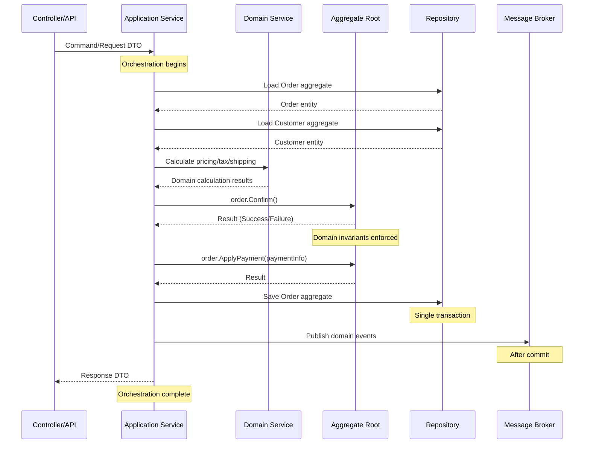
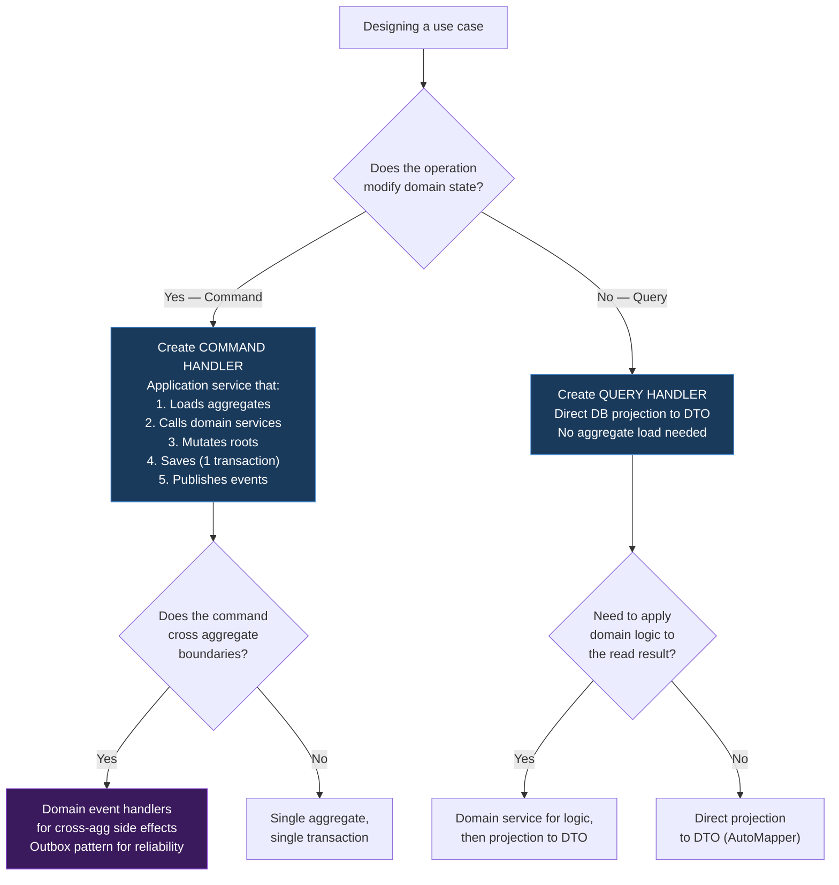

> [!success] Mastery Check
> - [ ] **Studied Well**
> - [ ] **Can explain the concept without notes**
> - [ ] **Can answer interview questions confidently**
> - [ ] **Can implement it in a real project**


# 7.052 — DDD — Application Services — Orchestration

## Section 1 — Navigation & Context

**Domain:** [[7 — System Design & Distributed Systems]] > **Group:** Domain-Driven Design
**Previous:** [[7.051 — DDD — Domain Services — Stateless Operations]] | **Next:** [[7.053 — DDD — Domain Events — Within Bounded Context]]

### Prerequisites

- [[7.051 — DDD — Domain Services — Stateless Operations]] — application services orchestrate domain services; they call `PricingService.CalculateDiscount()`, not implement the calculation themselves.
- [[7.047 — DDD — Aggregates — Consistency Boundary]] — application services manage transaction boundaries: they call `OrderRepository.SaveAsync()` for one aggregate per transaction, coordinating cross-aggregate work through domain events.
- [[7.048 — DDD — Aggregates — Aggregate Root Rule]] — application services load aggregates through repositories, call public root methods, and never directly access child entities.

### Where This Fits

The application service is the orchestrator — it sits between the API layer and the domain model, coordinating use case execution. Its responsibilities: receive a request DTO, load the necessary aggregates, call domain services for business logic, invoke aggregate methods for state changes, manage the transaction (single `SaveChangesAsync`), dispatch domain events, and return a response DTO. The rule: **application services contain no domain logic** — they orchestrate, not implement. A .NET engineer encounters this pattern in every CQRS command handler: the `IRequestHandler<TCommand, TResponse>` receives a command, orchestrates domain objects and services, and returns a result. Without explicit application services, domain logic leaks into controllers (fat controllers), transaction boundaries become unclear, and use-case orchestration is duplicated across endpoints.

---

## Section 2 — Core Mental Model

An application service is a **stateless orchestrator that coordinates one use case end-to-end.** The invariant it maintains: **the transaction boundary is exactly one aggregate save, and every side effect (event publishing, email sending, cache invalidation) happens after the aggregate is committed.** What it trades: you create an additional layer between the API and the domain, adding indirection that seems unnecessary for simple CRUD-but-essential for complex use cases. The recognition trigger: when you see a controller method that loads an aggregate, calls business logic, saves, and returns a response — that method IS an application service, whether it's in a controller, a handler, or a dedicated class.

### Classification

| Dimension | Classification | Rationale |
|-----------|---------------|-----------|
| Pattern Type | **Application Layer / Use Case** | Application services implement use cases, not domain logic |
| Scope | **Within a bounded context or integration** | Owns the flow for a specific business operation |
| Primary Concern | **Orchestration + transaction management** | Coordinates domain services, aggregates, and infrastructure |
| State | **Stateless** | No mutable fields; all dependencies injected |
| Input/Output | **DTOs / ViewModels** | Translates between API contracts and domain objects |
| Transaction Scope | **Single aggregate save** | One `SaveChangesAsync` per application service method |
| Infrastructure Awareness | **Yes (repositories, message buses, caches)** | Application services know about infrastructure interfaces |

### Primary Diagram



### Key Properties / Guarantees

| Property | Value | Condition |
|----------|-------|-----------|
| Domain logic | Zero — orchestration only | All domain logic in aggregates/domain services |
| Transaction boundary | One aggregate per method | `SaveChangesAsync` called exactly once per use case |
| Infrastructure coupling | Via interfaces only | `IOrderRepository`, `IEventPublisher`, `IEmailSender` |
| Input validation | At API boundary (FluentValidation) | Not in application service |
| Response type | DTO/ViewModel | Never returns domain entities |
| Error handling | Try-catch → Result type | No domain exceptions leak to API layer |
| Idempotency | If needed (by request ID) | Check idempotency key before processing |

---

## Section 3 — Deep Mechanics

### How It Works

An application service executes a use case as a sequence of steps. Each step is a call to a domain object (aggregate method, domain service, repository), and the service orchestrates the order. No step contains domain logic — only coordination logic.

**Canonical Application Service Flow:**

```
1. Receive DTO (Command/Request)
2. Validate (FluentValidation at API boundary, not in service)
3. Load aggregates (Repository.GetByIdAsync)
4. Call domain services (Price Calculation, Tax, Fraud Detection)
5. Call aggregate root methods (order.Confirm(), order.ApplyPayment())
6. Check results — if failure, return error without saving
7. Save aggregate (Repository.SaveAsync — single transaction)
8. Dispatch domain events (EventPublisher.PublishAsync)
9. Map result to response DTO
10. Return response
```

**Step-by-step: PlaceOrder Application Service**

```
PlaceOrderCommand:
  CustomerId, ShippingAddress, LineItems[]
  
ApplicationService.PlaceOrder(cmd):
  1. Map cmd.LineItems → List<OrderLine> (domain objects)
  2. Load Customer aggregate: _customerRepo.GetByIdAsync(cmd.CustomerId)
  3. Create Order aggregate: Order.Create(newId, cmd.CustomerId, cmd.ShippingAddress)
  4. For each line item: order.AddLine(line)  (domain invariant check)
  5. Verify customer credit: customer.HasAvailableCredit(order.Total) — returns bool
  6. If insufficient credit: return failure (don't save)
  7. Save Order: _orderRepo.SaveAsync(order)
  8. Publish event: _eventPublisher.Publish(new OrderCreatedEvent(...))
  9. Return OrderConfirmation DTO
```

### Failure Modes

#### Failure Mode 1: Domain Logic in Application Service

The most common violation — business rules implemented in the application service instead of the domain.

```csharp
// ❌ Domain logic in application service — WRONG
public async Task<Result> ConfirmOrderAsync(Guid orderId)
{
    var order = await _orderRepo.GetByIdAsync(orderId);
    var customer = await _customerRepo.GetByIdAsync(order.CustomerId);

    // BUSINESS RULE in application service!
    if (order.Total.Amount > customer.CreditLimit.Amount)
        return Result<Failure>("Credit limit exceeded");

    // BUSINESS RULE in application service!
    if (order.Lines.Count == 0)
        return Result<Failure>("Order has no lines");

    order.Confirm();
    await _orderRepo.SaveAsync();
    return Result.Success();
}
```

**Symptom:** Duplicated business rules across multiple application services. When credit limit logic changes, developers must find every place the rule is implemented. Rule changes are missed in some paths, causing inconsistent behavior.

**Fix:** Move business rules to the domain:

```csharp
// ✅ Domain logic in Order aggregate
public sealed class Order
{
    public Result Confirm(Money creditLimit)
    {
        if (Status != OrderStatus.Pending)
            return Result<Failure>("Already confirmed");
        if (_lines.Count == 0)
            return Result<Failure>("Cannot confirm empty order");
        if (Total.Amount > creditLimit.Amount)
            return Result<Failure>("Credit limit exceeded");

        Status = OrderStatus.Confirmed;
        _events.Add(new OrderConfirmedEvent(Id, CustomerId, Total));
        return Result.Success();
    }
}

// ✅ Application service is pure orchestration
public async Task<Result> ConfirmOrderAsync(Guid orderId)
{
    var order = await _orderRepo.GetByIdAsync(orderId);
    var customer = await _customerRepo.GetByIdAsync(order.CustomerId);

    var result = order.Confirm(customer.CreditLimit); // Domain logic in root
    if (result.IsFailure) return result;

    await _orderRepo.SaveAsync();
    return Result.Success();
}
```

**Cost of not fixing:** At 50 domain rules with 3 application services each = 150 rule implementations to update when a rule changes. Bug rate: ~15% of rule changes miss one path. Production incidents every 2-3 months.

#### Failure Mode 2: Cross-Aggregate Transaction

```csharp
// ❌ Two aggregates in one transaction
public async Task<Result> CompleteCheckoutAsync(Guid orderId)
{
    var order = await _orderRepo.GetByIdAsync(orderId);
    var customer = await _customerRepo.GetByIdAsync(order.CustomerId);

    order.Confirm();
    customer.DeductCredit(order.Total); // WRONG — modifies Customer in same flow

    await _orderRepo.SaveAsync(); // This now spans Order + Customer = violation!
}
```

**Symptom:** Deadlocks at scale. DbUpdateConcurrencyException for Customer lock. Transaction escalation to DTC.

**Fix:** Each aggregate saved independently; cross-aggregate effects via events:

```csharp
// ✅ Single aggregate per transaction
public async Task<Result> ConfirmOrderAsync(Guid orderId)
{
    var order = await _orderRepo.GetByIdAsync(orderId);
    order.Confirm();
    await _orderRepo.SaveAsync(); // Only Order

    // Customer credit is handled asynchronously by event handler
    return Result.Success();
}
```

#### Failure Mode 3: Application Service with Infrastructure Side Effects Before Commit

```csharp
// ❌ Side effect before aggregate is committed
public async Task<Result> ConfirmOrderAsync(Guid orderId)
{
    var order = await _orderRepo.GetByIdAsync(orderId);
    order.Confirm();

    await _emailSender.SendAsync(order.CustomerEmail, "Order Confirmed");
    // If SaveAsync fails below, customer already got email for failed order!

    await _orderRepo.SaveAsync();
    return Result.Success();
}
```

**Symptom:** Customer receives order confirmation email but the order fails to save. No order exists in database. Support gets calls: "I got an email but I don't see my order."

**Fix:** All side effects after successful commit:

```csharp
// ✅ Side effects only after commit
public async Task<Result> ConfirmOrderAsync(Guid orderId)
{
    var order = await _orderRepo.GetByIdAsync(orderId);
    order.Confirm();
    await _orderRepo.SaveAsync(); // Commit first

    _eventPublisher.Publish(new OrderConfirmedEvent(order.Id, order.CustomerEmail));
    // Email sender handles the event asynchronously
    return Result.Success();
}
```

#### Failure Mode 4: Returning Domain Entities Directly

```csharp
// ❌ Returns domain entity to API layer
public async Task<Order> GetOrderAsync(Guid orderId)
{
    return await _orderRepo.GetByIdAsync(orderId); // Exposes internal domain structure!
}

// API returns: Order with Id, Status, Total, Lines, Version, DomainEvents...
```

**Symptom:** API response includes internal domain state (Version, DomainEvents, internal methods). JSON serialization fails on circular references. Breaking change when domain model changes.

**Fix:** Map to DTO:

```csharp
// ✅ Returns DTO
public async Task<OrderDetailDTO> GetOrderAsync(Guid orderId)
{
    var order = await _orderRepo.GetByIdAsync(orderId);
    return new OrderDetailDTO(
        order.Id,
        order.Status.ToString(),
        order.Total.Amount,
        order.Total.Currency,
        order.Lines.Select(l => new OrderLineDTO(l.ProductName, l.Quantity, l.LineTotal.Amount)),
        order.CreatedAt
    );
}
```

#### Failure Mode 5: Blob Application Service (Too Many Dependencies)

```csharp
// ❌ Service with 10+ dependencies — does too much
public class CheckoutService
{
    public CheckoutService(
        IOrderRepository, ICustomerRepository, IInventoryRepository,
        IPricingService, ITaxCalculator, IShippingCalculator,
        IFraudDetectionService, ILoyaltyService, IEmailSender,
        IEventPublisher, ILogger<CheckoutService>) { } // 11 dependencies!
}
```

**Symptom:** Hard to instantiate in tests (11 mocks). Hard to reason about what the service does. Any repository change breaks this service.

**Fix:** Decompose into focused handlers:

```csharp
// ✅ Multiple focused handlers
public class ConfirmOrderHandler : IRequestHandler<ConfirmOrderCommand, Result> { }
public class AddLineHandler : IRequestHandler<AddLineCommand, Result> { }
public class ProcessPaymentHandler : IRequestHandler<ProcessPaymentCommand, Result> { }
```

### .NET and Azure Integration

| Technology | Application Service Role | Key Consideration |
|-----------|------------------------|-------------------|
| **MediatR** | Command/Query handlers as application services | `IRequestHandler<TCommand, TResponse>` |
| **FluentValidation** | Pre-processing validation of commands | Run before handler execution via pipeline |
| **AutoMapper** | Entity → DTO mapping | Use `ProjectTo` for query projections |
| **Azure Service Bus** | Event publishing after aggregate commit | Use outbox pattern for reliability |
| **Azure SQL** | Transaction target | Single `SaveChangesAsync` per handler |
| **Azure App Configuration** | Feature flags for conditional orchestration | Wrap handler steps with feature checks |
| **Application Insights** | Dependency tracking for each orchestration step | Track repository and domain service calls |

```csharp
// Program.cs — Application service registration
var builder = WebApplication.CreateBuilder(args);

// MediatR registers all IRequestHandler implementations
builder.Services.AddMediatR(cfg =>
{
    cfg.RegisterServicesFromAssemblyContaining<Program>();
    cfg.AddOpenBehavior(typeof(ValidationBehavior<,>));
    cfg.AddOpenBehavior(typeof(LoggingBehavior<,>));
    cfg.AddOpenBehavior(typeof(TransactionBehavior<,>));
});

// FluentValidation for command validation
builder.Services.AddValidatorsFromAssemblyContaining<Program>();

// AutoMapper for DTO mapping
builder.Services.AddAutoMapper(typeof(Program));

// Repositories
builder.Services.AddScoped<IOrderRepository, OrderRepository>();
builder.Services.AddScoped<ICustomerRepository, CustomerRepository>();

// Domain services
builder.Services.AddScoped<IPricingService, PricingService>();

// Event publishing
builder.Services.AddScoped<IEventPublisher, ServiceBusEventPublisher>();

var app = builder.Build();
app.Run();
```

---

## Section 4 — Production Patterns and Implementation

### Primary Implementation — Complete Application Service with CQRS

```csharp
// =========================================================================
// Command — Application Service Input DTO
// =========================================================================
namespace OrderManagement.Application.Commands;

/// <summary>
/// Command to confirm an order. Mapped from API request body.
/// </summary>
public sealed record ConfirmOrderCommand(
    Guid OrderId,
    Guid CustomerId,
    string? DiscountCode
) : IRequest<Result<OrderConfirmationDTO>>;

// =========================================================================
// DTO — Application Service Output (no domain entities exposed!)
// =========================================================================
public sealed record OrderConfirmationDTO(
    Guid OrderId,
    string Status,
    decimal TotalAmount,
    string Currency,
    IReadOnlyList<OrderLineDTO> Lines,
    DateTimeOffset ConfirmedAt
);

public sealed record OrderLineDTO(
    string ProductName,
    int Quantity,
    decimal UnitPrice,
    decimal LineTotal
);

// =========================================================================
// Validator — Pre-processing (FluentValidation)
// =========================================================================
public sealed class ConfirmOrderValidator : AbstractValidator<ConfirmOrderCommand>
{
    public ConfirmOrderValidator()
    {
        RuleFor(x => x.OrderId).NotEmpty();
        RuleFor(x => x.CustomerId).NotEmpty();
        RuleFor(x => x.DiscountCode).MaximumLength(50)
            .When(x => x.DiscountCode is not null);
    }
}
```

```csharp
// =========================================================================
// Application Service (Command Handler)
// =========================================================================
namespace OrderManagement.Application.Handlers;

/// <summary>
/// Handles order confirmation use case.
/// Orchestrates: Load aggregates → Call domain service → Mutate root → Save → Publish.
/// Contains ZERO domain logic — pure orchestration.
/// </summary>
public sealed class ConfirmOrderHandler : IRequestHandler<ConfirmOrderCommand, Result<OrderConfirmationDTO>>
{
    private readonly IOrderRepository _orderRepo;
    private readonly ICustomerRepository _customerRepo;
    private readonly IPricingService _pricingService;
    private readonly IFraudDetectionService _fraudService;
    private readonly IEventPublisher _eventPublisher;
    private readonly IMapper _mapper;
    private readonly ILogger<ConfirmOrderHandler> _logger;

    public ConfirmOrderHandler(
        IOrderRepository orderRepo,
        ICustomerRepository customerRepo,
        IPricingService pricingService,
        IFraudDetectionService fraudService,
        IEventPublisher eventPublisher,
        IMapper mapper,
        ILogger<ConfirmOrderHandler> logger)
    {
        _orderRepo = orderRepo;
        _customerRepo = customerRepo;
        _pricingService = pricingService;
        _fraudService = fraudService;
        _eventPublisher = eventPublisher;
        _mapper = mapper;
        _logger = logger;
    }

    public async Task<Result<OrderConfirmationDTO>> Handle(
        ConfirmOrderCommand command,
        CancellationToken ct)
    {
        _logger.LogInformation("Processing confirmation for order {OrderId}", command.OrderId);

        // Step 1: Load aggregates
        var order = await _orderRepo.GetByIdAsync(command.OrderId, ct);
        var customer = await _customerRepo.GetByIdAsync(command.CustomerId, ct);

        // Step 2: Run fraud detection (domain service)
        var fraudAssessment = await _fraudService.AssessOrderRiskAsync(order, customer, ct);
        if (fraudAssessment.RiskLevel >= FraudRiskLevel.High)
        {
            _logger.LogWarning("Order {OrderId} flagged for fraud review", order.Id);
            return Result<OrderConfirmationDTO>.Failure(
                "Order flagged for fraud review. Customer will be contacted.");
        }

        // Step 3: Calculate pricing (domain service)
        DiscountCode? discountCode = command.DiscountCode is not null
            ? new DiscountCode(command.DiscountCode)
            : null;

        var finalPrice = await _pricingService.CalculateFinalPriceAsync(
            order, customer, discountCode, ct);

        // Step 4: Apply results to aggregate (domain logic IN aggregate)
        var pricingResult = order.SetPricing(finalPrice);
        if (pricingResult.IsFailure)
            return Result<OrderConfirmationDTO>.Failure(pricingResult.Errors);

        // Step 5: Confirm order (domain logic IN aggregate)
        var confirmResult = order.Confirm();
        if (confirmResult.IsFailure)
            return Result<OrderConfirmationDTO>.Failure(confirmResult.Errors);

        // Step 6: Save aggregate (single transaction)
        await _orderRepo.SaveAsync(order, ct);

        // Step 7: Publish domain events (after commit)
        foreach (var @event in order.DomainEvents)
            await _eventPublisher.PublishAsync(@event, ct);
        order.ClearEvents();

        // Step 8: Map to DTO and return
        var dto = _mapper.Map<OrderConfirmationDTO>(order);
        _logger.LogInformation("Order {OrderId} confirmed successfully", order.Id);

        return Result<OrderConfirmationDTO>.Success(dto);
    }
}
```

```csharp
// =========================================================================
// Pipeline Behavior — Transaction Management
// =========================================================================
namespace OrderManagement.Application.Pipeline;

/// <summary>
/// Ensures each command handler runs within a single transaction.
/// Rollback if handler fails; commit if success.
/// </summary>
public sealed class TransactionBehavior<TRequest, TResponse> : IPipelineBehavior<TRequest, TResponse>
    where TRequest : IRequest<TResponse>
    where TResponse : IResult
{
    private readonly OrderDbContext _context;
    private readonly ILogger<TransactionBehavior<TRequest, TResponse>> _logger;

    public TransactionBehavior(
        OrderDbContext context,
        ILogger<TransactionBehavior<TRequest, TResponse>> logger)
    {
        _context = context;
        _logger = logger;
    }

    public async Task<TResponse> Handle(
        TRequest request,
        RequestHandlerDelegate<TResponse> next,
        CancellationToken ct)
    {
        var strategy = _context.Database.CreateExecutionStrategy();

        return await strategy.ExecuteAsync(async () =>
        {
            await using var transaction = await _context.Database
                .BeginTransactionAsync(ct);

            try
            {
                _logger.LogDebug(
                    "Beginning transaction for {Request}", typeof(TRequest).Name);

                var response = await next(ct);

                if (response.IsSuccess)
                {
                    await _context.SaveChangesAsync(ct);
                    await transaction.CommitAsync(ct);
                    _logger.LogDebug(
                        "Transaction committed for {Request}", typeof(TRequest).Name);
                }
                else
                {
                    await transaction.RollbackAsync(ct);
                    _logger.LogWarning(
                        "Transaction rolled back for {Request}: {Errors}",
                        typeof(TRequest).Name,
                        string.Join(", ", response.Errors));
                }

                return response;
            }
            catch (Exception ex)
            {
                await transaction.RollbackAsync(ct);
                _logger.LogError(ex,
                    "Transaction failed for {Request}", typeof(TRequest).Name);
                throw;
            }
        });
    }
}

/// <summary>
/// Validates commands before handler execution.
/// </summary>
public sealed class ValidationBehavior<TRequest, TResponse> : IPipelineBehavior<TRequest, TResponse>
    where TRequest : IRequest<TResponse>
{
    private readonly IEnumerable<IValidator<TRequest>> _validators;

    public ValidationBehavior(IEnumerable<IValidator<TRequest>> validators)
        => _validators = validators;

    public async Task<TResponse> Handle(
        TRequest request,
        RequestHandlerDelegate<TResponse> next,
        CancellationToken ct)
    {
        if (!_validators.Any()) return await next(ct);

        var context = new ValidationContext<TRequest>(request);
        var failures = (await Task.WhenAll(
            _validators.Select(v => v.ValidateAsync(context, ct))
        )).SelectMany(r => r.Errors)
          .Where(f => f is not null)
          .ToList();

        if (failures.Count != 0)
            throw new ValidationException(failures);

        return await next(ct);
    }
}

/// <summary>
/// Logs handler execution time and result.
/// </summary>
public sealed class LoggingBehavior<TRequest, TResponse> : IPipelineBehavior<TRequest, TResponse>
    where TRequest : IRequest<TResponse>
{
    private readonly ILogger<LoggingBehavior<TRequest, TResponse>> _logger;

    public LoggingBehavior(ILogger<LoggingBehavior<TRequest, TResponse>> logger)
        => _logger = logger;

    public async Task<TResponse> Handle(
        TRequest request,
        RequestHandlerDelegate<TResponse> next,
        CancellationToken ct)
    {
        var requestName = typeof(TRequest).Name;
        var sw = Stopwatch.StartNew();

        _logger.LogInformation("Handling {Request}", requestName);

        try
        {
            var response = await next(ct);
            sw.Stop();

            var resultName = response?.GetType().Name ?? "null";
            _logger.LogInformation(
                "Handled {Request} in {ElapsedMs}ms → {Result}",
                requestName, sw.ElapsedMilliseconds, resultName);

            return response;
        }
        catch (Exception ex)
        {
            sw.Stop();
            _logger.LogError(ex,
                "Handler {Request} failed after {ElapsedMs}ms",
                requestName, sw.ElapsedMilliseconds);
            throw;
        }
    }
}
```

```csharp
// =========================================================================
// Query Handler — Separate from Command Handler
// =========================================================================
namespace OrderManagement.Application.Queries;

/// <summary>
/// Query — no side effects, returns DTO directly.
/// </summary>
public sealed record GetOrderQuery(Guid OrderId) : IRequest<OrderDetailDTO?>;

/// <summary>
/// Query handler — reads data without loading aggregates.
/// Uses projection to DTO — no aggregate load needed.
/// </summary>
public sealed class GetOrderHandler : IRequestHandler<GetOrderQuery, OrderDetailDTO?>
{
    private readonly OrderDbContext _context;
    private readonly IMapper _mapper;

    public GetOrderHandler(OrderDbContext context, IMapper mapper)
    {
        _context = context;
        _mapper = mapper;
    }

    public async Task<OrderDetailDTO?> Handle(GetOrderQuery query, CancellationToken ct)
    {
        return await _context.Orders
            .Where(o => o.Id == query.OrderId)
            .ProjectTo<OrderDetailDTO>(_mapper.ConfigurationProvider)
            .FirstOrDefaultAsync(ct);
    }
}
```

```csharp
// =========================================================================
// Controller — Thin Layer, Delegates to Application Services
// =========================================================================
namespace OrderManagement.Api.Controllers;

[ApiController]
[Route("api/orders")]
public sealed class OrdersController : ControllerBase
{
    private readonly IMediator _mediator;

    public OrdersController(IMediator mediator) => _mediator = mediator;

    [HttpPost("{id:guid}/confirm")]
    public async Task<IActionResult> ConfirmOrder(
        Guid id,
        [FromBody] ConfirmOrderRequest request,
        CancellationToken ct)
    {
        var command = new ConfirmOrderCommand(id, request.CustomerId, request.DiscountCode);
        var result = await _mediator.Send(command, ct);

        return result.IsSuccess
            ? Ok(result.Value)
            : BadRequest(new { errors = result.Errors });
    }

    [HttpGet("{id:guid}")]
    public async Task<IActionResult> GetOrder(Guid id, CancellationToken ct)
    {
        var dto = await _mediator.Send(new GetOrderQuery(id), ct);
        return dto is not null ? Ok(dto) : NotFound();
    }
}
```

### Configuration and Wiring

```csharp
// Program.cs — Complete application service infrastructure
var builder = WebApplication.CreateBuilder(args);

// MediatR (registers all handlers from this assembly)
builder.Services.AddMediatR(cfg =>
{
    cfg.RegisterServicesFromAssemblyContaining<Program>();
    cfg.AddOpenBehavior(typeof(ValidationBehavior<,>));
    cfg.AddOpenBehavior(typeof(LoggingBehavior<,>));
    cfg.AddOpenBehavior(typeof(TransactionBehavior<,>));
});

// FluentValidation
builder.Services.AddValidatorsFromAssemblyContaining<Program>();

// AutoMapper
builder.Services.AddAutoMapper(typeof(Program));

// EF Core
builder.Services.AddDbContext<OrderDbContext>(options =>
    options.UseSqlServer(builder.Configuration.GetConnectionString("OrderDb"),
        sql => sql.EnableRetryOnFailure(3)));

// Repositories
builder.Services.AddScoped<IOrderRepository, OrderRepository>();
builder.Services.AddScoped<ICustomerRepository, CustomerRepository>();

// Domain Services
builder.Services.AddScoped<IPricingService, PricingService>();
builder.Services.AddScoped<IFraudDetectionService, FraudDetectionService>();

// Event Publishing
builder.Services.AddScoped<IEventPublisher, ServiceBusEventPublisher>();
builder.Services.AddSingleton(sp =>
    new ServiceBusClient(builder.Configuration["Azure:ServiceBus:ConnectionString"]));

// Controllers
builder.Services.AddControllers()
    .AddJsonOptions(options =>
    {
        options.JsonSerializerOptions.PropertyNamingPolicy = JsonNamingPolicy.CamelCase;
    });

var app = builder.Build();

app.UseHttpsRedirection();
app.MapControllers();

app.Run();
```

### Common Variants

#### Variant 1: Simple Application Service (No MediatR)

```csharp
// For small systems without CQRS infrastructure
public class OrderApplicationService
{
    private readonly IOrderRepository _orderRepo;
    private readonly IEventPublisher _eventPublisher;

    public async Task<Result<OrderConfirmationDTO>> ConfirmOrderAsync(Guid orderId)
    {
        var order = await _orderRepo.GetByIdAsync(orderId);
        var result = order.Confirm();
        if (result.IsFailure) return Result<OrderConfirmationDTO>.Failure(result.Errors);

        await _orderRepo.SaveAsync(order);
        await _eventPublisher.PublishAsync(new OrderConfirmedEvent(order.Id));

        return Result<OrderConfirmationDTO>.Success(new OrderConfirmationDTO(
            order.Id, order.Status.ToString(), order.Total.Amount, order.Total.Currency));
    }
}
```

#### Variant 2: Idempotent Application Service

```csharp
public class IdempotentConfirmOrderHandler : IRequestHandler<ConfirmOrderCommand, Result<OrderConfirmationDTO>>
{
    private readonly IIdempotencyStore _idempotencyStore;
    private readonly ConfirmOrderHandler _innerHandler;

    public async Task<Result<OrderConfirmationDTO>> Handle(ConfirmOrderCommand command, CancellationToken ct)
    {
        var idempotencyKey = command.OrderId.ToString();

        // Check if already processed
        var existing = await _idempotencyStore.GetAsync<OrderConfirmationDTO>(idempotencyKey, ct);
        if (existing is not null)
            return Result<OrderConfirmationDTO>.Success(existing);

        // Process
        var result = await _innerHandler.Handle(command, ct);
        if (result.IsSuccess)
            await _idempotencyStore.SetAsync(idempotencyKey, result.Value, TimeSpan.FromHours(24), ct);

        return result;
    }
}
```

#### Variant 3: Outbox-Backed Application Service

```csharp
public class OutboxOrderHandler : IRequestHandler<ConfirmOrderCommand, Result<OrderConfirmationDTO>>
{
    public async Task<Result<OrderConfirmationDTO>> Handle(ConfirmOrderCommand command, CancellationToken ct)
    {
        // ...orchestration...

        // Save aggregate + outbox in same transaction
        await _context.SaveChangesAsync(ct); // Atomically saves Order + OutboxMessages

        // Outbox background processor handles the publish
        return Result<OrderConfirmationDTO>.Success(dto);
    }
}
```

### Real-World .NET Ecosystem Example

**MediatR Pipeline Behaviors:**

MediatR's pipeline behaviors are the canonical .NET pattern for cross-cutting concerns in application services. Each behavior wraps the handler, allowing concerns like validation, logging, transactions, and performance monitoring to be applied declaratively:

```csharp
// Order of execution:
// 1. ValidationBehavior — validates command, throws if invalid
// 2. LoggingBehavior — logs start/end of handler
// 3. TransactionBehavior — wraps in DB transaction
// 4. Handler — executes the actual use case
// 5. Response flows back through behaviors in reverse

services.AddMediatR(cfg =>
{
    cfg.RegisterServicesFromAssemblyContaining<Program>();
    cfg.AddOpenBehavior(typeof(ValidationBehavior<,>));   // Runs FIRST
    cfg.AddOpenBehavior(typeof(LoggingBehavior<,>));      // Runs SECOND
    cfg.AddOpenBehavior(typeof(TransactionBehavior<,>));  // Runs THIRD
});
```

---

## Section 5 — Gotchas and Production Pitfalls

### Pitfall 1: Domain Logic in Application Service

**Pitfall:** Business rule implemented in application service instead of aggregate or domain service.

```csharp
// ❌ Business rule leakage
public async Task<Result> AddLineAsync(Guid orderId, AddLineRequest request)
{
    var order = await _orderRepo.GetByIdAsync(orderId);

    // BUSINESS RULE: max 50 lines per order — in APPLICATION service!
    if (order.Lines.Count >= 50)
        return Result<Failure>("Maximum 50 lines per order");

    var line = new OrderLine(Guid.NewGuid(), request.ProductName, ...);
    order.AddLine(line);
    await _orderRepo.SaveAsync();
    return Result.Success();
}
```

**Fix:** Move to aggregate:

```csharp
// ✅ Business rule in aggregate
public sealed class Order
{
    private const int MaxLines = 50;
    public Result AddLine(OrderLine line)
    {
        if (_lines.Count >= MaxLines)
            return Result<Failure>($"Maximum {MaxLines} lines per order");
        _lines.Add(line);
        RecalculateTotal();
        return Result.Success();
    }
}
```

### Pitfall 2: Application Service with Infrastructure Side Effects Mixed with Domain Logic

```csharp
// ❌ Mixed concerns
public async Task<Result> ProcessPaymentAsync(Guid orderId, PaymentInfo payment)
{
    var order = await _orderRepo.GetByIdAsync(orderId);

    // Domain logic
    var result = order.RecordPayment(payment);

    // Infrastructure mixed in
    await _paymentGateway.ChargeAsync(order.Total);
    await _emailSender.SendAsync(order.CustomerEmail, "Payment received");
    await _smsSender.SendAsync(order.CustomerPhone, "Payment received");

    await _orderRepo.SaveAsync();
    return result;
}
```

**Fix:** Separate orchestration, domain logic, and infrastructure into distinct steps:

```csharp
// ✅ Clear separation
public async Task<Result> ProcessPaymentAsync(Guid orderId, PaymentInfo payment)
{
    var order = await _orderRepo.GetByIdAsync(orderId);

    // 1. External infrastructure (payment gateway) FIRST
    var chargeResult = await _paymentGateway.ChargeAsync(order.Total);
    if (chargeResult.IsFailure) return Result<Failure>(chargeResult.Errors);

    // 2. Domain logic (record payment on aggregate)
    var result = order.RecordPayment(payment with { TransactionId = chargeResult.TransactionId });
    if (result.IsFailure) return result;

    // 3. Save aggregate
    await _orderRepo.SaveAsync(order);

    // 4. Notifications AFTER commit
    await _emailSender.SendAsync(order.CustomerEmail, "Payment received");
    await _smsSender.SendAsync(order.CustomerPhone, "Payment received");

    return result;
}
```

### Pitfall 3: Returning Domain Entity Instead of DTO

```csharp
// ❌ Domain entity exposed
[HttpGet("{id}")]
public async Task<Order> GetOrder(Guid id)
{
    return await _orderRepo.GetByIdAsync(id); // Exposes entire aggregate!
}
// Response includes: Version (byte[]), DomainEvents (events), internal state
```

**Fix:** Always map to DTO:

```csharp
// ✅ DTO returned
[HttpGet("{id}")]
public async Task<OrderDetailDTO> GetOrder(Guid id)
{
    var order = await _orderRepo.GetByIdAsync(id);
    return _mapper.Map<OrderDetailDTO>(order);
}
```

### Pitfall 4: Not Handling Validation Errors Before Orchestration Starts

```csharp
// ❌ Partial execution before validation
public async Task<Result> ProcessOrderAsync(PlaceOrderCommand command)
{
    var customer = await _customerRepo.GetByIdAsync(command.CustomerId);
    if (customer is null) return Failure("Customer not found");
    // Already made a database call!

    var order = Order.Create(command.OrderId, command.CustomerId, ...);
    // ...
}
```

**Fix:** Validate before loading aggregates:

```csharp
// ✅ Validate first
public async Task<Result> ProcessOrderAsync(PlaceOrderCommand command, CancellationToken ct)
{
    // Validation via FluentValidation pipeline — runs before handler
    // Handler can assume valid input
    var order = Order.Create(command.OrderId, command.CustomerId, ...);
    // ...
}
```

### Pitfall 5: Using Same Application Service for Commands and Queries

```csharp
// ❌ Mixed — service handles both writes and reads
public class OrderService
{
    public Task<Result> ConfirmOrderAsync(Guid orderId);      // Command
    public Task<OrderDetailDTO> GetOrderAsync(Guid orderId);  // Query
    public Task<Result> AddLineAsync(Guid orderId, ...);      // Command
    public Task<List<OrderSummaryDTO>> ListOrdersAsync(...);   // Query
}
```

**Fix:** Separate command and query handlers. CQRS is not just about event sourcing — it's about separating write models (aggregates) from read models (projections):

```csharp
// ✅ Separate handlers
public class ConfirmOrderHandler : IRequestHandler<ConfirmOrderCommand, Result> { }
public class GetOrderHandler : IRequestHandler<GetOrderQuery, OrderDetailDTO?> { }
```

---

## Section 6 — Tradeoffs and Decision Framework

### Tradeoff Matrix

| Dimension | Application Service (Recommended) | Domain Logic in Controller | Logic in Domain Service Only | Logic in Aggregate Only |
|-----------|----------------------------------|---------------------------|------------------------------|------------------------|
| Separation of concerns | Excellent | Poor | Good (but no orchestration) | Good (but limited to single agg) |
| Testability | Easy (pure orchestration) | Hard (HTTP context) | Easy (pure domain) | Easy (pure domain) |
| Reusability | High (via commands) | Low (coupled to HTTP) | Medium (needs orchestrator) | Low (single aggregate) |
| Transaction boundary | Explicit (single save) | Implicit (scattered) | Not managed | Not managed |
| Infrastructure coupling | Via interfaces | Tight (HTTP coupling) | None (pure domain) | None (pure domain) |
| Complexity | Moderate (additional layer) | Low (minimal layers) | High (no orchestrator) | High (bloated aggregate) |

### Decision Flowchart



### When NOT to Apply Application Services

- **Simple CRUD** — If the operation just inserts/updates a single entity with no business logic, a minimal API endpoint or controller action with direct DB access is sufficient. Application services add unnecessary indirection.
- **Read-only projections** — Application services for reads are thin wrappers around database queries. Consider using raw SQL queries, Dapper, or EF Core projections directly in the API layer for simplicity.
- **Background jobs** — For simple scheduled tasks, a background service can host the domain logic directly without an application service layer.

### Scale Thresholds

- **One application service per use case** is the target. Above 20 handlers in a single bounded context, review if some can be merged.
- **Handler with >6 injected dependencies** is a smell. Consider splitting the use case or extracting cross-cutting concerns into pipeline behaviors.
- **Pipeline behaviors** should be kept to 3-5 per MediatR configuration. More than 5 makes debugging difficult.
- **Handler execution time** target: <200ms for synchronous use cases (confirm order), <5s for async workflows (import).

---

## Section 7 — Interview Arsenal

### Question Bank

1. What is an application service and how does it differ from a domain service? (Definition)
2. What are the 6 steps of a typical application service method? (Mechanism)
3. What is the tradeoff of using application services vs putting logic in controllers? (Tradeoff)
4. What fails when you modify two aggregates in one application service transaction? (Failure mode)
5. Compare: application service vs MediatR command handler vs controller action. (Comparison)
6. Design an application service for a checkout flow. (Design application)
7. How does pipeline behavior composition affect handler throughput? (Scale)
8. When would you bypass the application service layer entirely? (Advanced)

### Spoken Answers

**Q1: What is an application service and how does it differ from a domain service?**

> **Average answer:** "An application service orchestrates use cases and domain services handle business logic."

> **Great answer:** "An application service orchestrates a use case end-to-end without containing any domain logic itself. Its responsibilities are: receive a DTO, load aggregates from repositories, call domain services for business calculations, invoke aggregate methods for state changes, manage the transaction with a single SaveChangesAsync, publish domain events, and return a response DTO. A domain service, by contrast, contains pure business logic — it calculates a price, assesses fraud risk, or determines shipping costs. The domain service takes domain objects and returns domain results. The application service takes those results and tells the aggregate to apply them. The test: if the method contains an `if` statement that checks a business rule, it probably belongs in the domain or aggregate, not in the application service. In .NET, I implement application services as MediatR command handlers with pipeline behaviors for cross-cutting concerns like validation, logging, and transaction management."

**Q5: Compare: application service vs MediatR command handler vs controller action.**

> **Average answer:** "They're all similar — just different ways to handle requests."

> **Great answer:** "Three different concerns. A controller action is HTTP-specific — it handles request deserialization, route binding, status codes, and response formatting. It should be one line: `return Ok(await _mediator.Send(command))`. A MediatR command handler IS the application service — it orchestrates the use case without knowing anything about HTTP. A raw application service (without MediatR) is the same thing but with a direct method call instead of a mediator interface. MediatR adds pipeline behaviors — which are the key differentiator. I can add a `TransactionBehavior` that wraps every handler in a database transaction, a `ValidationBehavior` that runs FluentValidation, and a `LoggingBehavior` that tracks performance — all without changing the handler itself. Without MediatR, I'd have to add transaction management to every application service method manually, which leads to inconsistency. The MediatR pipeline is the cleanest way I've seen to compose cross-cutting concerns with pure orchestration logic."

**Q8: When would you bypass the application service layer entirely?**

> **Great answer:** "In two scenarios. First, for simple CRUD with no business rules — updating a customer's phone number. Loading a full aggregate to change one field, calling a domain service, and managing a transaction is overkill. A minimal API with `ExecuteUpdateAsync` is fine. Second, for read-only queries where I want the fastest path to the database — `IMapper.ProjectTo` directly from the DbContext to a DTO. But as soon as a use case has business logic, multiple aggregate operations, or transactional requirements, the application service layer is necessary. The decision rule: if the operation has zero business invariants and modifies a single record, skip the application service. If it has any business rule, use the layer."

### System Design Interview Trigger

If an interviewer asks you to design a checkout system and asks "walk me through what happens when a user clicks 'Place Order'", they are testing your understanding of the application service orchestration pattern. You should walk through: controller receives request → validates → mediator sends command → handler loads aggregates → calls domain services → mutates aggregate root → saves in single transaction → publishes events → returns DTO. They are looking for whether you understand the separation between orchestration (application service) and business logic (domain/aggregate). The follow-up is usually about failure handling: "what if the payment succeeds but the order fails to save?" — testing your transaction boundary knowledge and the "payment first, then save order" ordering.

### Comparison Table

| | Application Service | Domain Service | Controller Action |
|---|---|---|---|
| Core guarantee | Pure use case orchestration | Pure domain logic | HTTP handling |
| Trade-off | Additional layer for non-trivial ops | No infrastructure awareness | Coupled to HTTP |
| .NET implementation | MediatR IRequestHandler<TCommand, TResult> | Injected stateless service | Minimal API / Controller |
| Failure mode | Domain logic leakage | Statefulness | Fat controller |
| When to choose | Every write use case | Cross-aggregate logic | Simple reads |

---

## Section 8 — Architecture Decision Record

### ADR-052: Implement Application Services as MediatR Command/Query Handlers with Pipeline Behaviors

**Status:** Accepted

**Context:**
The Order Management bounded context has 15 distinct use cases (create order, confirm, add line, update address, process payment, cancel, etc.). Previously, each controller contained the orchestration logic directly, leading to duplicated transaction management, inconsistent error handling, and difficulty adding cross-cutting concerns. The team needs a consistent pattern for use case orchestration.

**Options Considered:**

1. **MediatR Command/Query Handlers (Recommended)** — Each use case is a handler. Pipeline behaviors for validation, logging, transactions.
2. **Inline Controller Logic** — Orchestration in controllers. Simplest for CRUD but doesn't scale.
3. **Dedicated Application Service Classes** — `OrderApplicationService` class with methods for each use case. No pipeline behaviors.
4. **Decorator Pattern** — Manual wrapper classes for cross-cutting concerns. More boilerplate than MediatR.

**Decision:**
Adopt Option 1. Each use case is a separate `IRequestHandler<TCommand, TResponse>`. Pipeline behaviors: ValidationBehavior (FluentValidation), LoggingBehavior (Serilog), TransactionBehavior (EF Core transaction). AutoMapper for entity → DTO mapping. Controllers are thin — one line per endpoint.

**Consequences:**

- ✅ Consistent pattern — every handler follows the same structure
- ✅ Cross-cutting concerns via pipeline behaviors — not duplicated in handlers
- ✅ Handlers are unit-testable (pure orchestration without HTTP coupling)
- ⚠️ MediatR adds ~10 handler classes per bounded context (more files)
- ⚠️ Pipeline behavior ordering matters — must document the execution sequence
- ❌ Simple CRUD operations require the same ceremony as complex ones (acceptable tradeoff for consistency)

**Review Trigger:** Revisit if (1) handler count exceeds 30 per bounded context, requiring grouping by module; (2) pipeline behavior count exceeds 5, making execution order confusing; (3) a new cross-cutting concern requires adding to the pipeline — document ordering.

---

## Section 9 — Self-Check

### Conceptual Questions

1. What is the single responsibility of an application service?

<details>
<summary>Answer</summary>
Use case orchestration. It manages the sequence of operations (load aggregates, call domain services, mutate roots, save, publish events) without containing any domain logic itself. Every `if` statement based on business rules should be in the domain, not the application service.
</details>

2. What are the 6 canonical steps of an application service method?

<details>
<summary>Answer</summary>
(1) Receive DTO/Command, (2) Load aggregates from repositories, (3) Call domain services for business logic, (4) Invoke aggregate root methods for state changes, (5) Save aggregate in single transaction, (6) Publish domain events/return response.
</details>

3. What is the tradeoff of using MediatR command handlers vs direct application service classes?

<details>
<summary>Answer</summary>
MediatR: pipeline behaviors for cross-cutting concerns (transaction, validation, logging), consistent pattern across all handlers, decoupled from HTTP. Direct classes: simpler when no cross-cutting concerns needed, fewer abstractions, less indirection. MediatR is recommended for systems with 5+ use cases.
</details>

4. What production issue results from calling infrastructure side effects before the aggregate save?

<details>
<summary>Answer</summary>
Ghost operations: email sent, payment charged, or event published — but the aggregate save failed. Customer gets confirmation for an order that doesn't exist. Payment is captured but order shows unpaid.
</details>

5. Which MediatR feature enables cross-cutting concerns without modifying handlers?

<details>
<summary>Answer</summary>
IPipelineBehavior<TRequest, TResponse>. Behaviors wrap the handler execution, running before and after. Common behaviors: validation, logging, transaction management, performance monitoring, idempotency checking.
</details>

6. Compare: application service with domain entities vs DTOs.

<details>
<summary>Answer</summary>
Application services should never return domain entities. They map domain objects to DTOs before returning to the API layer. Returning domain entities exposes internal state (Version, DomainEvents), creates serialization issues, and couples the API to the domain model.
</details>

7. At what size should you split a monolithic application service?

<details>
<summary>Answer</summary>
When it has >6 injected dependencies, >10 public methods, or handles >3 distinct use cases. Split into separate handlers per use case (MediatR naturally enforces this).
</details>

8. How do application services connect to [[7.054 — DDD — Domain Events — MediatR INotification in .NET]]?

<details>
<summary>Answer</summary>
Application services publish domain events after the aggregate is committed. In MediatR, the handler publishes `INotification` events that are handled asynchronously by separate notification handlers. [[7.054]] details the MediatR-specific patterns for dispatching and handling these events.
</details>

9. What is the non-obvious consequence of using AutoMapper's `ProjectTo` in query handlers?

<details>
<summary>Answer</summary>
`ProjectTo` generates SQL SELECT queries for only the columns needed by the DTO — efficient and type-safe. However, it bypasses the domain model entirely. Changes to DTO shape may produce unexpected SQL (or missing data). Ensure mapping configuration is tested alongside the handler.
</details>

10. Explain application services in 60 seconds.

<details>
<summary>Answer</summary>
"An application service is the conductor of an orchestra. The musicians are the domain objects — aggregates, value objects, domain services. The conductor doesn't play any instrument — they just tell each musician when to start, what to play, and when to stop. In code, the application service receives a command, loads the aggregates, calls the domain services for calculations, tells the aggregates to mutate their state, saves everything in one transaction, and returns the result. The conductor doesn't write the music (that's the domain expert's job), and the conductor doesn't build the instruments (that's the infrastructure layer). The conductor just ensures the right notes happen in the right order. In .NET, I implement this as a MediatR command handler — it's a class with a single `Handle` method that orchestrates the use case, with pipeline behaviors wrapping it for cross-cutting concerns like validation and transactions."
</details>

### Scenario Challenges

**Scenario 1 — Diagnose the problem**

Your order confirmation endpoint is sending duplicate confirmation emails. Investigation shows the `ConfirmOrderHandler` calls `_emailSender.SendAsync()` both before and after `SaveChangesAsync()`. The order aggregatesaves successfully, but the email is sent twice.

<details>
<summary>Diagnosis</summary>

**Root cause:** Email sending called at two points in the handler — once before save (to confirm payment processed) and once after (to confirm order created). Both calls succeed.

**Evidence:** Email logs show two `OrderConfirmation` emails for the same order within 1 second. Order was created once.

**Fix:** Remove the pre-save email call. All notifications should happen after the aggregate is committed. Consider using a domain event handler for email sending instead of inline code.

**Prevention:** Application service rule: "No side effects before commit. All notifications after commit via event handlers."
</details>

---

**Scenario 2 — Design decision**

You are designing an order cancellation flow. Cancelling an order must: (1) change order status, (2) release customer credit, (3) restock inventory, (4) send cancellation email. How do you structure the application service?

<details>
<summary>Decision and Reasoning</summary>

**Choice:** CancelOrderHandler (application service) orchestrates step 1 (order aggregate). Steps 2-4 are handled by domain event handlers. The handler saves only the Order aggregate.

**Tradeoffs accepted:** Credit release and inventory restock are eventually consistent (~500ms). Acceptable for cancellations — customer gets email confirmation immediately.

**Implementation sketch:**
```csharp
public class CancelOrderHandler : IRequestHandler<CancelOrderCommand, Result>
{
    public async Task<Result> Handle(CancelOrderCommand command, CancellationToken ct)
    {
        var order = await _orderRepo.GetByIdAsync(command.OrderId);
        var result = order.Cancel(command.Reason);
        if (result.IsFailure) return result;

        await _orderRepo.SaveAsync(order);
        // OrderCancelledEvent handlers:
        // → ReleaseCustomerCreditHandler
        // → RestockInventoryHandler
        // → SendCancellationEmailHandler
        return Result.Success();
    }
}
```
</details>

---

**Scenario 3 — Failure mode** The `ProcessPaymentHandler` is throwing `DbUpdateConcurrencyException` intermittently. The handler loads the Order aggregate, charges the payment gateway, records payment on order, and saves. Investigation shows the load-to-save window is 3 seconds due to payment gateway latency.

<details>
<summary>Investigation and Fix</summary>

**Investigation steps:**
1. Check duration distribution — are payment gateway calls slow?
2. Check if the Order aggregate is being modified by other requests during the window.
3. Examine the handler — does it load the aggregate before or after the payment gateway call?

**Confirming evidence:** Load-to-save window: 3 seconds (1s load, 1.5s payment gateway, 0.5s save). Order status updates (admin actions) conflict during this window.

**Immediate mitigation:** Move the aggregate load AFTER the payment gateway call:
```csharp
// Load aggregate only after external call
var chargeResult = await _paymentGateway.ChargeAsync(total, ct);
if (chargeResult.IsFailure) return Result<Failure>.Failure(chargeResult.Errors);

var order = await _orderRepo.GetByIdAsync(orderId, ct); // Load fresh
order.RecordPayment(payment);
await _orderRepo.SaveAsync(order); // Window reduced to <100ms
```

**Permanent fix:** Add optimistic concurrency retry with exponential backoff for the handler.

**Post-mortem item:** Application services should minimize the window between aggregate load and save by deferring loads as late as possible.
</details>

---

**Scenario 4 — Scale it** Your application services handle 1,000 requests/second with MediatR pipeline behaviors (validation, logging, transaction). Each handler takes ~150ms. You need to handle 5,000 requests/second.

<details>
<summary>Scaling Strategy</summary>

**Bottleneck this addresses:** Handler throughput — 150ms per handler with no parallelism.

**How it helps:** (1) Handlers are stateless — they scale horizontally. Add more instances. (2) Pipeline behavior overhead is ~1-2ms per behavior — not the bottleneck. (3) The bottleneck is likely the database, not the application service.

**What it does not solve:** Database throughput. The application service layer is thin orchestration — optimizing it won't help if the database is saturated.

**Implementation order:**
1. Profile to confirm database is the bottleneck.
2. Add read replicas for query handlers.
3. For write handlers, ensure each handler completes within 100ms.
4. MediatR handlers are naturally stateless — scale horizontally.
</details>

---

**Scenario 5 — Interview simulation** The interviewer says: "Walk me through what happens from the moment a user clicks 'Place Order' to the moment they see a confirmation page. Focus on the application service."

<details>
<summary>Model Response</summary>

"The user clicks 'Place Order' in the browser. The frontend sends a POST request to `/api/orders/{orderId}/confirm` with the discount code (if any). The controller receives the request, extracts the `ConfirmOrderCommand` DTO, and sends it through MediatR.

Before the handler runs, the MediatR pipeline kicks in. First, `ValidationBehavior` runs FluentValidation on the command — it checks that the OrderId isn't empty and the CustomerId is a valid GUID. If validation fails, the pipeline returns 400 Bad Request immediately without touching the database.

Next, `LoggingBehavior` logs that we're starting to handle the command. Then `TransactionBehavior` begins a database transaction.

Now the handler runs. First, I load the Order aggregate from the repository — this fetches the Order row and its OrderLine children in one query with Include. Second, I load the Customer aggregate by the CustomerId stored in the Order.

Third, I call the FraudDetectionService — a domain service that runs business rules to assess fraud risk. If it returns High or Critical, I return failure without saving.

Fourth, I call the PricingService — another domain service that calculates the final price with discounts and taxes. This service loads discount rules and tax rates through injected repository interfaces.

Fifth, I tell the Order aggregate to apply the pricing and confirm — `order.SetPricing(finalPrice)` and `order.Confirm()`. These are aggregate root methods that enforce invariants: lines can't be empty, status must be pending, total must match.

If all results are successful, I call `_orderRepo.SaveAsync(order)`. This triggers EF Core to generate UPDATE statements within the current transaction. The database checks the rowversion for optimistic concurrency — if another request modified this order between my load and save, I get a concurrency exception and retry.

After the save succeeds, the TransactionBehavior commits the transaction. The handler then publishes domain events — OrderConfirmedEvent — through the event publisher. These are handled asynchronously by other services: the credit service reserves the customer's credit, the inventory service decrements stock, and the notification service sends the confirmation email.

Finally, the handler maps the Order aggregate to an `OrderConfirmationDTO` using AutoMapper. This DTO has only the data the frontend needs: order ID, status, total, and line items. No domain entities are exposed. The MediatR pipeline flows back up through the behaviors, the LoggingBehavior logs success and duration, and the controller returns a 200 OK with the DTO.

The entire flow is synchronous from the user's perspective — they get the confirmation response in under 200ms. The side effects (credit reservation, inventory, emails) happen asynchronously in the background. This separation is what makes the system responsive and scalable."
</details>
