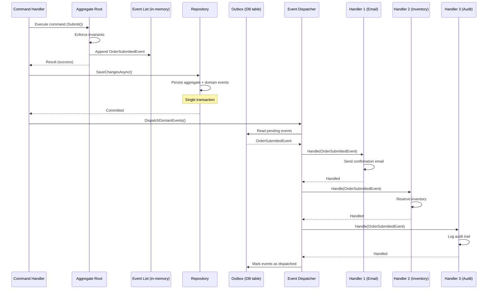

> [!success] Mastery Check
> - [ ] **Studied Well**
> - [ ] **Can explain the concept without notes**
> - [ ] **Can answer interview questions confidently**
> - [ ] **Can implement it in a real project**


# 7.053 — DDD — Domain Events — Within Bounded Context

## Section 1 — Navigation & Context

**Domain:** [[7 — System Design & Distributed Systems]] > **Group:** Domain-Driven Design
**Previous:** [[7.052 — DDD — Application Services — Orchestration]] | **Next:** [[7.054 — DDD — Domain Events — MediatR INotification in .NET]]

### Prerequisites

- [[7.047 — DDD — Aggregates — Consistency Boundary]] — domain events are raised by aggregates when a state change occurs. The consistency boundary determines which changes are visible atomically: everything within the boundary is committed together, and events are published after the commit to signal what happened.
- [[7.048 — DDD — Aggregates — Aggregate Root Rule]] — only the aggregate root owns and exposes domain events. Child entities raise events through the root, never directly. The root collects events during command execution and exposes them to the infrastructure layer for dispatch.
- [[7.045 — DDD — Value Objects — Equality and Immutability]] — domain events are immutable value objects. They represent facts that cannot be retracted. Two events with the same properties at the same timestamp are treated as identical — but in practice, event identity includes a unique event ID to distinguish occurrences.

### Where This Fits

A domain event is a **record of a business-significant occurrence that domain experts care about.** When `Order.Submit()` completes, something must react: send a confirmation email, reserve inventory, update the customer's order history, and trigger a fulfillment workflow. Without explicit domain events, the aggregate root itself would need to call each of these downstream systems directly — coupling the order logic to email, inventory, and fulfillment concerns. That coupling violates the single responsibility principle at the aggregate level and makes the system rigid: adding a new reaction (e.g., "also log to analytics") requires modifying the aggregate. Domain events solve this by letting the aggregate publish a fact (`OrderSubmittedEvent`), and letting any number of handlers react independently. A .NET engineer encounters this pattern whenever an aggregate method appends to a `List<IDomainEvent>` and a background dispatcher collects and publishes those events after `SaveChangesAsync`. Without domain events, aggregates accumulate implicit side-effect dependencies and event-driven workflows become spaghetti code of direct service-to-service calls.

---

## Section 2 — Core Mental Model

A domain event is an **immutable fact that records what just happened in the domain, published by the aggregate root, consumed by zero or more in-process handlers within the same bounded context.** The invariant it maintains: **the aggregate publishes what happened; handlers decide what to do about it — the aggregate has no knowledge of or dependency on any handler.** What it trades: the aggregate's command execution becomes a black box whose side effects are not visible in the code — you must inspect all registered event handlers to understand what happens when `Order.Submit()` succeeds. The recognition trigger: when you find yourself adding `_emailSender`, `_inventoryClient`, and `_auditLogger` as dependencies of an aggregate root, or when you see "after saving, also do X" scattered across application services in inconsistent patterns.

### Classification

| Dimension | Classification | Rationale |
|-----------|---------------|-----------|
| Pattern Type | **Tactical DDD — Event Pattern** | Domain events are a tactical building block alongside entities, value objects, and aggregates |
| Scope | **Within a single bounded context** | Events stay in-process; crossing a BC boundary makes them integration events |
| Direction | **Aggregate → Handlers (one-to-many)** | One event, zero or more handlers, all within the same process |
| Timing | **After aggregate commit (eventual)** | Events are dispatched after the transaction succeeds; handlers see consistent state |
| Coupling | **Publish-subscribe** | Aggregate publishes without knowing subscribers; handlers subscribe without knowing publisher |
| State Change | **Append-only collection** | Events are accumulated during command execution, then drained for dispatch |
| Idempotency | **Required per handler** | Handlers must be idempotent because at-least-once delivery is the safe default |

### Primary Diagram — Domain Event Lifecycle



### Key Properties / Guarantees

| Property | Value | Condition |
|----------|-------|-----------|
| Immutability | Events are read-only records of past facts | After construction, no property changes — C# `init` or `record` |
| Delivery guarantee | At-least-once per handler | Outbox ensures events survive process crashes; handlers handle duplicates |
| Handler isolation | One handler failure does not affect others | Dispatcher catches per-handler exceptions and continues |
| Ordering | Within a single aggregate's event list, order is preserved | Across aggregates, no ordering guarantee |
| Transaction scope | Events are committed atomically with aggregate state | EF Core transaction saves both aggregate row and outbox row |
| Consumer visibility | Aggregate does not know who consumes events | Handlers are registered independently in DI |
| Event schema versioning | Backward-compatible changes only (additive fields) | Breaking changes require new event type or consumer-coordinated migration |

---

## Section 3 — Deep Mechanics

### How It Works

The domain event lifecycle has five phases: **recording, collection, persistence, dispatch, and handling.**

**Phase 1 — Recording:** An aggregate root method executes a command, enforces its invariants, and if the command succeeds, constructs a domain event record and appends it to an internal collection. The event captures what happened in past tense: `OrderSubmittedEvent` not `SubmitOrderCommand`. It includes all data that handlers need to react, but nothing extra — no internal aggregate state that is not relevant to downstream consumers.

**Phase 2 — Collection:** The aggregate root maintains a private list of domain events generated during the current operation. This list is transient in-memory state, not persisted as part of the aggregate. The list is exposed to the infrastructure layer through an interface — typically `IEnumerable<IDomainEvent>` on the root — so the repository or dispatcher can drain it after the transaction commits.

**Phase 3 — Persistence:** When the application service calls `SaveChangesAsync()`, the repository (or a save interceptor) writes the domain events to an outbox table in the same database transaction as the aggregate state. This atomic write ensures that events are never lost even if the process crashes after the aggregate is saved but before events are published. The outbox table records each event with its type, serialized payload, creation timestamp, and a processed flag.

**Phase 4 — Dispatch:** After the transaction commits, a background dispatcher (or a post-save callback in the application service) reads unprocessed events from the outbox table and publishes them to all registered handlers. The dispatcher handles each event exactly once in terms of outbox processing: it marks the event as being processed, invokes all handlers, and then marks it as dispatched. If a handler throws, the dispatcher catches the exception, logs it, and continues to the next handler — a single handler failure does not prevent other handlers from receiving the event.

**Phase 5 — Handling:** Each handler receives the event and performs its side effect. Handlers are registered in the DI container and resolved by the dispatcher. Because handlers run after the aggregate transaction commits, they see the current database state. Handlers must be idempotent: if the same event is delivered twice (due to dispatcher crash and retry), the handler should produce the same result as a single delivery.

**Canonical Domain Event Flow:**

```
1. Aggregate method called with command parameters
2. Aggregate validates invariants (business rules)
3. If valid: mutate state, build event, append to _events list
4. If invalid: return failure — no events recorded
5. Application service calls repository SaveAsync
6. Repository: Save aggregate + outbox events in same transaction
7. Transaction commits
8. Dispatcher reads outbox for unprocessed events
9. For each event: call all registered handlers in sequence
10. Each handler: check idempotency, perform side effect, acknowledge
11. Dispatcher marks event as dispatched (or failed permanently after retry budget)
```

### Failure Modes

#### Failure Mode 1: Lost Events When Process Crashes Between Save and Dispatch

The most dangerous failure in domain event systems: the aggregate is saved to the database but the events are never published because the process crashes before dispatch runs.

```csharp
// ❌ No outbox — events exist only in memory
public async Task<Result> SubmitOrderAsync(SubmitOrderCommand cmd)
{
    var order = Order.Create(cmd.CustomerId, cmd.LineItems);
    await _orderRepo.SaveAsync(order); // Aggregate saved to DB

    // CRASH HERE — process dies before dispatch
    foreach (var e in order.DomainEvents)
        await _dispatcher.DispatchAsync(e); // Never runs!
}
```

**Symptom:** Order exists in the database with status "Submitted" but no confirmation email is sent, no inventory is reserved, and the fulfillment workflow never starts. Customer support sees "order confirmed but nothing happened." No error in logs because the process never reached the dispatch code.

**Fix:** Write events to an outbox table in the same transaction as the aggregate save. A background process reads the outbox and dispatches events with retry.

```csharp
// ✅ Outbox — events persisted atomically with aggregate
public async Task<Result> SubmitOrderAsync(SubmitOrderCommand cmd)
{
    var order = Order.Create(cmd.CustomerId, cmd.LineItems);

    // EF Core transaction saves both in one commit
    _orderRepo.Add(order); // Adds to change tracker

    foreach (var e in order.DomainEvents)
        _outbox.Add(new OutboxMessage(e)); // Same DbContext

    await _dbContext.SaveChangesAsync(); // Single transaction

    // Background dispatcher reads Outbox, not memory
    // Even if this process crashes, Outbox rows survive
    return Result.Success();
}
```

**Cost of not fixing:** Permanent data loss of business events. In a payment system, this means a payment is captured but the order never moves to "Paid" — revenue is lost because no fulfillment workflow triggers. Recovery requires manual reconciliation of every aggregate that was saved during the crash window.

#### Failure Mode 2: Handler Throws and Blocks Other Handlers

```csharp
// ❌ Sequential dispatch with no handler isolation
public async Task DispatchAsync(IDomainEvent e)
{
    foreach (var handler in _handlers)
    {
        await handler.HandleAsync(e); // If handler 2 throws, handler 3 never runs!
    }
}
```

**Symptom:** The email handler throws because the SMTP server is down. The inventory reservation handler (registered after email) never executes. The event is not re-dispatched because the dispatcher failed mid-way. Inventory is not reserved, and the order might be oversold.

**Fix:** Catch exceptions per handler and continue. Record which handlers succeeded and which failed. Retry only the failed handlers.

```csharp
// ✅ Isolated handlers — one failure does not block others
public async Task DispatchAsync(IDomainEvent e)
{
    foreach (var handler in _handlers)
    {
        try
        {
            await handler.HandleAsync(e);
            _outbox.MarkHandlerSucceeded(e.Id, handler.GetType().Name);
        }
        catch (Exception ex)
        {
            _logger.LogError(ex, "Handler {Handler} failed for event {EventId}",
                handler.GetType().Name, e.Id);
            _outbox.MarkHandlerFailed(e.Id, handler.GetType().Name);
            // Continue to next handler — don't block
        }
    }
}
```

**Cost of not fixing:** Cascading failures. The email handler's transient SMTP issue causes the inventory handler to silently skip execution. The order is confirmed without inventory reservation, leading to overselling during Black Friday. Recovery requires re-discovering which events were partially dispatched and re-running only the failed handlers — a manual, error-prone process.

#### Failure Mode 3: Duplicate Event Delivery After Dispatcher Crash

The dispatcher reads an event from the outbox, starts dispatching to handlers, and crashes after dispatching to some handlers but before marking the event as processed. On restart, the dispatcher reads the same event again.

```csharp
// ❌ No idempotency — duplicate charges
public class ChargePaymentHandler : INotificationHandler<OrderConfirmedEvent>
{
    public async Task Handle(OrderConfirmedEvent e, CancellationToken ct)
    {
        await _paymentGateway.ChargeAsync(e.CustomerId, e.Total);
        // If this runs twice, customer is charged twice!
    }
}
```

**Symptom:** Customer receives two charges for the same order. Support gets angry calls. The payment gateway charges a fee per transaction, so the business loses money on every duplicate.

**Fix:** Make handlers idempotent. Store a processed-event ID per handler, and skip if already processed.

```csharp
// ✅ Idempotent handler — duplicate delivery is safe
public class ChargePaymentHandler : INotificationHandler<OrderConfirmedEvent>
{
    public async Task Handle(OrderConfirmedEvent e, CancellationToken ct)
    {
        // Check idempotency key
        if (await _processedEvents.ExistsAsync(e.Id, nameof(ChargePaymentHandler)))
            return; // Already processed — skip

        await _paymentGateway.ChargeAsync(e.CustomerId, e.Total);

        // Record idempotency after success
        await _processedEvents.RecordAsync(e.Id, nameof(ChargePaymentHandler));
    }
}
```

**Cost of not fixing:** Financial loss on every dispatcher restart. At 500 orders/hour with a 30-second recovery window, that is 4-5 duplicate payments per crash. If the payment gateway integration has no idempotency support (some older APIs don't), every process restart during peak creates financial reconciliation work.

#### Failure Mode 4: Event Schema Changes Without Consumer Coordination

An event type gains a new required field. Old events in the outbox (or in dead-letter storage) do not have this field. Deserialization fails.

```csharp
// ❌ New required field breaks old events
public sealed record OrderConfirmedEvent(
    Guid OrderId,
    Guid CustomerId,
    decimal Total,
    string Currency,       // Was optional, now required
    DateTime ConfirmedAt,  // New required field
    string? TrackingNumber // New field — old events have null
);
```

**Symptom:** Background dispatcher fails to deserialize old events from the outbox. Event processing stalls for all event types because the dispatcher crashes on every attempt. The dead-letter queue fills up. No orders move past submission state.

**Fix:** Use backward-compatible serialization. New fields must have defaults or be nullable. Test deserialization of old payloads before deploying.

```csharp
// ✅ Backward-compatible — old events deserialize safely
public sealed record OrderConfirmedEvent(
    Guid OrderId,
    Guid CustomerId,
    decimal Total,
    string Currency,
    DateTime? ConfirmedAt = null,  // Nullable — old events lack this
    string? TrackingNumber = null  // Nullable — optional by design
);
```

**Cost of not fixing:** Complete halt of event processing. At a company processing 10,000 events/hour, a schema migration that takes 2 hours to detect and roll back means 20,000 events stuck in the outbox. Every minute of downtime is measurable revenue loss in order-processing systems.

#### Failure Mode 5: Synchronous Handler Blocks the HTTP Response

A handler registered as synchronous (in-process, same thread as the command handler) performs a slow operation like calling an external API. The HTTP response to the client is blocked until all synchronous handlers complete.

```csharp
// ❌ Synchronous handler blocks the request
public class SendConfirmationHandler : INotificationHandler<OrderSubmittedEvent>
{
    public async Task Handle(OrderSubmittedEvent e, CancellationToken ct)
    {
        await _emailClient.SendAsync(e.CustomerEmail, e.OrderId);
        // SMTP call takes 500ms-2s — HTTP response is delayed
    }
}
```

**Symptom:** P99 latency for order submission jumps from 200ms (handlerless) to 2.5s (with email handler). Users see a 2-second spinner after clicking "Submit Order." The web server runs out of threads during traffic spikes because each request holds a thread waiting for SMTP.

**Fix:** Register slow handlers as fire-and-forget or use a background queue. Only fast, in-memory handlers (cache invalidation, in-memory projection update) should run synchronously.

```csharp
// ✅ Fast handlers synchronously, slow handlers via background queue
public class SendConfirmationHandler : INotificationHandler<OrderSubmittedEvent>
{
    public async Task Handle(OrderSubmittedEvent e, CancellationToken ct)
    {
        // Enqueue to background job, don't wait
        await _backgroundJob.EnqueueAsync(() =>
            _emailClient.SendAsync(e.CustomerEmail, e.OrderId));
    }
}
```

**Cost of not fixing:** Web server thread pool starvation. In ASP.NET Core, if all worker threads are blocked waiting for email handlers, new HTTP requests queue up. At ~1,000 concurrent requests with 2-second blocking per request, the server starts rejecting requests with HTTP 503 after ~30 seconds. Recovery requires restarting the process or scaling out — both of which take minutes during an active incident.

#### Event Versioning and Schema Evolution

Domain events are persistent records — they live in the outbox table, in logs, in event stores, and sometimes in message broker dead-letter queues. As the system evolves, event schemas change. The challenge: you must be able to deserialize events created by older versions of the code. There are three strategies:

**Strategy 1 — Extensibility (Backward-Compatible Additions):** Add new fields as nullable or with defaults. Old events deserialize without the field; new code handles the null. This works for additive changes only.

```csharp
// v1 — Original event schema
public sealed record OrderSubmittedEvent(
    Guid EventId,
    Guid AggregateId,
    DateTimeOffset OccurredAt,
    Guid CustomerId,
    IReadOnlyList<OrderLineEventData> LineItems,
    Money Total
) : IDomainEvent;

// v2 — Added DiscountCode (nullable, backward-compatible)
public sealed record OrderSubmittedEvent(
    Guid EventId,
    Guid AggregateId,
    DateTimeOffset OccurredAt,
    Guid CustomerId,
    IReadOnlyList<OrderLineEventData> LineItems,
    Money Total,
    string? DiscountCode = null     // ✅ New field, defaults to null
) : IDomainEvent;
```

**Strategy 2 — Event Type Versioning via Wrapper:** When changes are breaking (field rename, type change, removal), create a new event type with a version suffix and keep the old one for deserialization.

```csharp
// v1 — Original
public sealed record OrderSubmittedEvent_v1(
    Guid EventId,
    Guid AggregateId,
    string CustomerEmail              // Renamed in v2
) : IDomainEvent;

// v2 — Breaking change, new event type
public sealed record OrderSubmittedEvent_v2(
    Guid EventId,
    Guid AggregateId,
    Guid CustomerId,                  // Was CustomerEmail — breaking change
    string CustomerEmail              // Still present but deprecated
) : IDomainEvent;
```

The outbox processor must know about both versions. Use the `EventTypeMapper` pattern with a versioned type identifier.

```csharp
public static class EventTypeMapper
{
    private static readonly Dictionary<string, Type> _knownTypes = new()
    {
        ["order.submitted.v1"] = typeof(OrderSubmittedEvent_v1),
        ["order.submitted.v2"] = typeof(OrderSubmittedEvent_v2),
        ["order.confirmed.v1"] = typeof(OrderConfirmedEvent),
    };

    public static Type? GetType(string typeId)
        => _knownTypes.GetValueOrDefault(typeId);

    public static string GetTypeId<T>() where T : IDomainEvent
        => typeof(T).Name switch
        {
            nameof(OrderSubmittedEvent_v1) => "order.submitted.v1",
            nameof(OrderSubmittedEvent_v2) => "order.submitted.v2",
            nameof(OrderConfirmedEvent) => "order.confirmed.v1",
            _ => throw new NotSupportedException($"Unknown type {typeof(T).Name}")
        };
}
```

**Strategy 3 — Upcaster Pattern (Event Sourcing):** When old events must be transformed to the new schema before handling, register an upcaster function that converts old events to new. This is common in event-sourced systems where you cannot modify old events in the store.

```csharp
public sealed class OrderSubmittedUpcaster : IUpcaster
{
    // Convert v1 to v2 — fills in CustomerId from CustomerEmail lookup
    public IDomainEvent Upcast(IDomainEvent oldEvent)
    {
        if (oldEvent is not OrderSubmittedEvent_v1 v1)
            return oldEvent;

        return new OrderSubmittedEvent_v2(
            EventId: v1.EventId,
            AggregateId: v1.AggregateId,
            CustomerId: ResolveCustomerIdFromEmail(v1.CustomerEmail),
            CustomerEmail: v1.CustomerEmail
        );
    }

    private static Guid ResolveCustomerIdFromEmail(string email)
    {
        // Lookup logic — may require database call or cache
        throw new NotImplementedException("Customer email → ID mapping required");
    }
}
```

The rule: **always keep event schemas backward-compatible for at least one release cycle.** Delete old event types only after confirming no outbox rows, dead-letter messages, or logs contain events of that version.

.NET libraries like **MassTransit** and **NServiceBus** have built-in schema versioning support through message type resolution and serializer middlewares that can handle polymorphic deserialization. For MediatR-based domain events, the outbox processor's deserialization code must be version-aware.

### Dedicated Event Handler for OrderLineAdded and OrderCancelled

```csharp
// =========================================================================
// OrderLineAdded Handler — Updates pricing snapshot after line addition
// =========================================================================
public sealed class UpdatePricingSnapshotHandler
    : INotificationHandler<OrderLineAddedEvent>
{
    private readonly IPricingSnapshotRepository _snapshotRepo;
    private readonly IProcessedEventStore _processedEvents;

    public UpdatePricingSnapshotHandler(
        IPricingSnapshotRepository snapshotRepo,
        IProcessedEventStore processedEvents)
    {
        _snapshotRepo = snapshotRepo;
        _processedEvents = processedEvents;
    }

    public async Task Handle(OrderLineAddedEvent e, CancellationToken ct)
    {
        if (await _processedEvents.ExistsAsync(e.EventId, nameof(UpdatePricingSnapshotHandler)))
            return;

        // Record pricing snapshot for audit and analytics
        var snapshot = new PricingSnapshot(
            orderId: e.AggregateId,
            productId: e.ProductId,
            unitPrice: e.UnitPrice,
            quantity: e.Quantity,
            lineTotal: e.LineTotal,
            capturedAt: e.OccurredAt);

        await _snapshotRepo.SaveAsync(snapshot, ct);
        await _processedEvents.RecordAsync(e.EventId, nameof(UpdatePricingSnapshotHandler));
    }
}

// =========================================================================
// OrderCancelled Handler — Releases reserved inventory
// =========================================================================
public sealed class ReleaseInventoryHandler
    : INotificationHandler<OrderCancelledEvent>
{
    private readonly IInventoryRepository _inventoryRepo;
    private readonly IOrderRepository _orderRepo;
    private readonly IProcessedEventStore _processedEvents;

    public ReleaseInventoryHandler(
        IInventoryRepository inventoryRepo,
        IOrderRepository orderRepo,
        IProcessedEventStore processedEvents)
    {
        _inventoryRepo = inventoryRepo;
        _orderRepo = orderRepo;
        _processedEvents = processedEvents;
    }

    public async Task Handle(OrderCancelledEvent e, CancellationToken ct)
    {
        if (await _processedEvents.ExistsAsync(e.EventId, nameof(ReleaseInventoryHandler)))
            return;

        // Load order to get line items that need inventory release
        var order = await _orderRepo.GetByIdAsync(e.AggregateId, ct);
        if (order is null)
        {
            // Order may have been deleted or never existed — log and skip
            return;
        }

        foreach (var line in order.Lines)
        {
            var inventory = await _inventoryRepo.GetByProductIdAsync(line.ProductId.Value, ct);
            if (inventory is null) continue;

            inventory.Release(line.Quantity);
            await _inventoryRepo.SaveAsync(inventory, ct);
        }

        await _processedEvents.RecordAsync(e.EventId, nameof(ReleaseInventoryHandler));
    }
}
```

### Domain Events vs Event Sourcing

Domain events (as described in this note) and Event Sourcing are related but distinct concepts that are frequently confused:

| Aspect | Domain Events (This Note) | Event Sourcing |
|--------|--------------------------|----------------|
| Purpose | Notify handlers of state changes | Store the entire state as a sequence of events |
| Current state | Stored as current aggregate row in SQL | Reconstructed by replaying all past events |
| Events kept | Until dispatched (outbox cleanup) | Forever (append-only event store) |
| Event count | ~1-10 per aggregate operation | One per mutation over the aggregate's entire lifetime |
| Use case | Side-effect decoupling within a BC | Audit trail, temporal queries, CQRS write model |
| Complexity | Medium (outbox table + processor) | High (event store, snapshots, upcasting, projection rebuild) |
| .NET tooling | MediatR + EF Core | EventStoreDB, Marten, NEventStore |

Domain events can be used without Event Sourcing (this note's approach): the aggregate's current state is stored in a traditional SQL table, and events are side-effect notifications. Event Sourcing stores the events as the source of truth and reconstructs the aggregate by replaying them. You can start with domain events and later add Event Sourcing for specific aggregates (e.g., financial transactions that need full audit trails) while keeping simpler CRUD aggregates with the domain event pattern.

### .NET and Azure Integration

| Technology | Domain Event Role | Key Consideration |
|-----------|-------------------|-------------------|
| **EF Core** | Outbox table + aggregate persistence in same transaction | `SaveChangesAsync` within `IDbContextTransaction` |
| **MediatR** | In-process event dispatcher (INotification/INotificationHandler) | Events dispatched after transaction commit via pipeline behavior |
| **Azure SQL** | Outbox storage for reliable event persistence | Use `SERIALIZABLE` isolation for outbox reader to prevent duplicate reads |
| **Azure Service Bus** | Delivery to handlers across processes | For cross-BC integration events only; in-BC events stay in-process |
| **Azure Functions (Service Bus trigger)** | Handler for integration events | Not used for in-BC domain events (those are in-process) |
| **Polly** | Retry policy for handler transient failures | Wrap handler execution with exponential backoff |
| **Application Insights** | Event dispatch tracking, handler duration, failures | Log `EventId`, handler type, duration, success/failure |
| **Dapr** | Pub/sub building block for cloud-native eventing | Dapr sidecar handles at-least-once delivery and actor reentrancy |

```csharp
// Program.cs — Domain event infrastructure registration
var builder = WebApplication.CreateBuilder(args);

// MediatR for in-process event dispatch
builder.Services.AddMediatR(cfg =>
{
    cfg.RegisterServicesFromAssemblyContaining<Program>();
});

// EF Core with outbox support
builder.Services.AddDbContext<OrderContext>(options =>
    options.UseSqlServer(builder.Configuration.GetConnectionString("Orders"),
        sqlOptions => sqlOptions.EnableRetryOnFailure(3)));

// Register outbox processor as background service
builder.Services.AddHostedService<OutboxProcessor>();

// Register domain event handlers
builder.Services.AddScoped<INotificationHandler<OrderSubmittedEvent>, EmailNotificationHandler>();
builder.Services.AddScoped<INotificationHandler<OrderSubmittedEvent>, InventoryReservationHandler>();
builder.Services.AddScoped<INotificationHandler<OrderSubmittedEvent>, AuditLogHandler>();

// Idempotency store (Dedup)
builder.Services.AddScoped<IProcessedEventStore, ProcessedEventStore>();

// Retry policy for handler transient failures
builder.Services.AddSingleton<IAsyncPolicy<HttpResponseMessage>>(sp =>
    Policy<HttpResponseMessage>
        .Handle<HttpRequestException>()
        .OrResult(r => (int)r.StatusCode >= 500)
        .WaitAndRetryAsync(3, attempt => TimeSpan.FromMilliseconds(100 * Math.Pow(2, attempt))));

var app = builder.Build();
app.Run();
```

---

## Section 4 — Production Patterns and Implementation

### Primary Implementation — Complete Domain Event System

```csharp
// =========================================================================
// Domain Event Base — Every event implements this
// =========================================================================
namespace OrderManagement.Domain.Events;

/// <summary>
/// Marker interface for all domain events within the Order Management BC.
/// Every event is an immutable record of a business occurrence.
/// </summary>
public interface IDomainEvent
{
    /// <summary>Unique event identifier for idempotency tracking.</summary>
    Guid EventId { get; }

    /// <summary>Aggregate ID that raised this event.</summary>
    Guid AggregateId { get; }

    /// <summary>When the event occurred (UTC).</summary>
    DateTimeOffset OccurredAt { get; }
}

// =========================================================================
// Domain Event Implementations
// =========================================================================

/// <summary>
/// Event raised when a customer submits a new order.
/// Triggers: email notification, inventory reservation, audit logging.
/// </summary>
public sealed record OrderSubmittedEvent(
    Guid EventId,
    Guid AggregateId,
    DateTimeOffset OccurredAt,
    Guid CustomerId,
    IReadOnlyList<OrderLineEventData> LineItems,
    Money Total
) : IDomainEvent;

/// <summary>
/// Event raised when an existing order is confirmed after payment.
/// Triggers: payment capture, fulfillment workflow start, commission calculation.
/// </summary>
public sealed record OrderConfirmedEvent(
    Guid EventId,
    Guid AggregateId,
    DateTimeOffset OccurredAt,
    Guid CustomerId,
    Money Total,
    string PaymentReference,
    DateTimeOffset ConfirmedAt
) : IDomainEvent;

/// <summary>
/// Event raised when a line item is added to an in-progress order.
/// Triggers: inventory soft-reservation, pricing recalculation.
/// </summary>
public sealed record OrderLineAddedEvent(
    Guid EventId,
    Guid AggregateId,
    DateTimeOffset OccurredAt,
    Guid ProductId,
    int Quantity,
    Money UnitPrice,
    Money LineTotal
) : IDomainEvent;

/// <summary>
/// Event raised when an order is cancelled.
/// Triggers: inventory release, refund initiation, cancellation email.
/// </summary>
public sealed record OrderCancelledEvent(
    Guid EventId,
    Guid AggregateId,
    DateTimeOffset OccurredAt,
    string Reason,
    DateTimeOffset CancelledAt
) : IDomainEvent;

/// <summary>
/// Event data for individual order lines (embedded in OrderSubmittedEvent).
/// </summary>
public sealed record OrderLineEventData(
    Guid ProductId,
    string ProductName,
    int Quantity,
    Money UnitPrice,
    Money LineTotal
);

// =========================================================================
// Money Value Object (used in events)
// =========================================================================
public sealed record Money(decimal Amount, string Currency)
{
    public static Money operator +(Money a, Money b)
    {
        if (a.Currency != b.Currency)
            throw new InvalidOperationException($"Currency mismatch: {a.Currency} vs {b.Currency}");
        return new Money(a.Amount + b.Amount, a.Currency);
    }
}

// =========================================================================
// Aggregate Root with Event Collection
// =========================================================================
namespace OrderManagement.Domain;

using OrderManagement.Domain.Events;

/// <summary>
/// Order aggregate root. Maintains an internal list of domain events
/// generated during command execution. Events are drained by the
/// infrastructure layer after the aggregate is persisted.
/// </summary>
public sealed class Order
{
    private readonly List<IDomainEvent> _events = new();
    private readonly List<OrderLine> _lines = new();

    // Public state (read-only to external consumers)
    public Guid Id { get; private set; }
    public Guid CustomerId { get; private set; }
    public OrderStatus Status { get; private set; }
    public Money Total => _lines.Aggregate(
        new Money(0, "USD"),
        (acc, line) => acc + line.LineTotal);
    public IReadOnlyList<OrderLine> Lines => _lines.AsReadOnly();
    public DateTimeOffset CreatedAt { get; private set; }
    public DateTimeOffset? SubmittedAt { get; private set; }
    public DateTimeOffset? ConfirmedAt { get; private set; }
    public DateTimeOffset? CancelledAt { get; private set; }
    public string? CancellationReason { get; private set; }

    // Events exposed for infrastructure to drain
    public IReadOnlyList<IDomainEvent> DomainEvents => _events.AsReadOnly();

    /// <summary>
    /// Factory method for creating a new Order aggregate.
    /// Raises no events — creation is not yet a business event.
    /// </summary>
    public static Order Create(Guid id, Guid customerId)
    {
        return new Order
        {
            Id = id,
            CustomerId = customerId,
            Status = OrderStatus.Draft,
            CreatedAt = DateTimeOffset.UtcNow
        };
    }

    /// <summary>
    /// Submits the order for processing. Validates business rules,
    /// transitions state, and raises OrderSubmittedEvent.
    /// </summary>
    public Result Submit()
    {
        if (Status != OrderStatus.Draft)
            return Result<Failure>($"Cannot submit order in status {Status}");

        if (_lines.Count == 0)
            return Result<Failure>("Cannot submit an empty order");

        Status = OrderStatus.Submitted;
        SubmittedAt = DateTimeOffset.UtcNow;

        _events.Add(new OrderSubmittedEvent(
            EventId: Guid.NewGuid(),
            AggregateId: Id,
            OccurredAt: SubmittedAt.Value,
            CustomerId: CustomerId,
            LineItems: _lines.Select(l => new OrderLineEventData(
                l.ProductId, l.ProductName, l.Quantity,
                l.UnitPrice, l.LineTotal)).ToList(),
            Total: Total
        ));

        return Result.Success();
    }

    /// <summary>
    /// Adds a line item to a draft order. Raises OrderLineAddedEvent.
    /// </summary>
    public Result AddLine(ProductId productId, string productName, int quantity, Money unitPrice)
    {
        if (Status != OrderStatus.Draft)
            return Result<Failure>("Cannot modify a submitted order");

        if (quantity <= 0)
            return Result<Failure>("Quantity must be positive");

        var line = new OrderLine(productId, productName, quantity, unitPrice);
        _lines.Add(line);

        _events.Add(new OrderLineAddedEvent(
            EventId: Guid.NewGuid(),
            AggregateId: Id,
            OccurredAt: DateTimeOffset.UtcNow,
            ProductId: productId.Value,
            Quantity: quantity,
            UnitPrice: unitPrice,
            LineTotal: line.LineTotal
        ));

        return Result.Success();
    }

    /// <summary>
    /// Confirms the order after payment is received. Raises OrderConfirmedEvent.
    /// </summary>
    public Result Confirm(string paymentReference)
    {
        if (Status != OrderStatus.Submitted)
            return Result<Failure>($"Cannot confirm order in status {Status}");

        if (string.IsNullOrWhiteSpace(paymentReference))
            return Result<Failure>("Payment reference is required");

        Status = OrderStatus.Confirmed;
        ConfirmedAt = DateTimeOffset.UtcNow;

        _events.Add(new OrderConfirmedEvent(
            EventId: Guid.NewGuid(),
            AggregateId: Id,
            OccurredAt: ConfirmedAt.Value,
            CustomerId: CustomerId,
            Total: Total,
            PaymentReference: paymentReference,
            ConfirmedAt: ConfirmedAt.Value
        ));

        return Result.Success();
    }

    /// <summary>
    /// Cancels the order. Raises OrderCancelledEvent.
    /// </summary>
    public Result Cancel(string reason)
    {
        if (Status == OrderStatus.Cancelled)
            return Result<Failure>("Order is already cancelled");

        if (Status == OrderStatus.Shipped)
            return Result<Failure>("Cannot cancel a shipped order");

        var previousStatus = Status;
        Status = OrderStatus.Cancelled;
        CancelledAt = DateTimeOffset.UtcNow;
        CancellationReason = reason;

        _events.Add(new OrderCancelledEvent(
            EventId: Guid.NewGuid(),
            AggregateId: Id,
            OccurredAt: CancelledAt.Value,
            Reason: reason,
            CancelledAt: CancelledAt.Value
        ));

        return Result.Success();
    }

    /// <summary>
    /// Clears the event list after events are dispatched.
    /// Called by the repository or outbox processor.
    /// </summary>
    public void ClearEvents() => _events.Clear();

    // Private parameterless constructor for EF Core
    private Order() { }
}

// =========================================================================
// Supporting Types
// =========================================================================
public enum OrderStatus { Draft, Submitted, Confirmed, Shipped, Delivered, Cancelled }

public sealed record OrderLine(
    ProductId ProductId,
    string ProductName,
    int Quantity,
    Money UnitPrice
)
{
    public Money LineTotal => new(Quantity * UnitPrice.Amount, UnitPrice.Currency);
}

public sealed record ProductId(Guid Value);

// =========================================================================
// Outbox Message Entity (persisted to database)
// =========================================================================
namespace OrderManagement.Infrastructure.Outbox;

/// <summary>
/// Row in the Outbox table. Written atomically with aggregate state.
/// Read by the background OutboxProcessor for dispatch.
/// </summary>
public sealed class OutboxMessage
{
    public Guid Id { get; private set; }
    public string EventType { get; private set; }
    public string AggregateType { get; private set; }
    public Guid AggregateId { get; private set; }
    public string Payload { get; private set; } // JSON serialized event
    public string? HandlerFailures { get; private set; } // JSON list of failed handler types
    public DateTimeOffset CreatedAt { get; private set; }
    public DateTimeOffset? ProcessedAt { get; private set; }
    public int RetryCount { get; private set; }
    public string Status { get; private set; } // Pending, InProgress, Dispatched, Failed

    private OutboxMessage() { } // EF Core

    public OutboxMessage(IDomainEvent domainEvent)
    {
        Id = domainEvent.EventId;
        EventType = domainEvent.GetType().FullName!;
        AggregateType = domainEvent.GetType().DeclaringType?.FullName ?? "";
        AggregateId = domainEvent.AggregateId;
        Payload = JsonSerializer.Serialize(domainEvent, domainEvent.GetType());
        CreatedAt = DateTimeOffset.UtcNow;
        Status = "Pending";
        RetryCount = 0;
    }

    public void MarkInProgress()
    {
        Status = "InProgress";
        RetryCount++;
    }

    public void MarkDispatched()
    {
        Status = "Dispatched";
        ProcessedAt = DateTimeOffset.UtcNow;
    }

    public void RecordHandlerFailure(string handlerType)
    {
        var failures = string.IsNullOrEmpty(HandlerFailures)
            ? new List<string>()
            : JsonSerializer.Deserialize<List<string>>(HandlerFailures) ?? new();
        failures.Add(handlerType);
        HandlerFailures = JsonSerializer.Serialize(failures);
    }
}

// =========================================================================
// EF Core Configuration for Outbox
// =========================================================================
namespace OrderManagement.Infrastructure.Persistence;

public sealed class OutboxConfiguration : IEntityTypeConfiguration<OutboxMessage>
{
    public void Configure(EntityTypeBuilder<OutboxMessage> builder)
    {
        builder.ToTable("Outbox");
        builder.HasKey(x => x.Id);
        builder.Property(x => x.EventType).HasMaxLength(500).IsRequired();
        builder.Property(x => x.Payload).IsRequired();
        builder.Property(x => x.Status).HasMaxLength(50).IsRequired();
        builder.Property(x => x.HandlerFailures).HasMaxLength(4000);
        builder.HasIndex(x => new { x.Status, x.CreatedAt })
            .HasFilter("[Status] IN ('Pending', 'Failed')")
            .IsDescending(false, true);
    }
}

// =========================================================================
// Background Outbox Processor
// =========================================================================
namespace OrderManagement.Infrastructure.BackgroundJobs;

/// <summary>
/// Background service that polls the Outbox table for unprocessed events
/// and dispatches them to registered handlers with retry and isolation.
/// </summary>
public sealed class OutboxProcessor : BackgroundService
{
    private readonly IServiceScopeFactory _scopeFactory;
    private readonly ILogger<OutboxProcessor> _logger;
    private readonly TimeSpan _pollInterval = TimeSpan.FromSeconds(5);
    private const int MaxRetries = 5;

    public OutboxProcessor(
        IServiceScopeFactory scopeFactory,
        ILogger<OutboxProcessor> logger)
    {
        _scopeFactory = scopeFactory;
        _logger = logger;
    }

    protected override async Task ExecuteAsync(CancellationToken ct)
    {
        _logger.LogInformation("OutboxProcessor started");

        while (!ct.IsCancellationRequested)
        {
            try
            {
                await ProcessBatchAsync(ct);
            }
            catch (Exception ex)
            {
                _logger.LogError(ex, "OutboxProcessor batch failed");
            }

            await Task.Delay(_pollInterval, ct);
        }
    }

    private async Task ProcessBatchAsync(CancellationToken ct)
    {
        using var scope = _scopeFactory.CreateScope();
        var dbContext = scope.ServiceProvider.GetRequiredService<OrderContext>();
        var mediator = scope.ServiceProvider.GetRequiredService<IMediator>();

        // Read pending events (with retry budget)
        var pendingEvents = await dbContext.Set<OutboxMessage>()
            .Where(o => o.Status == "Pending" && o.RetryCount < MaxRetries)
            .OrderBy(o => o.CreatedAt)
            .Take(50)
            .ToListAsync(ct);

        foreach (var outboxMsg in pendingEvents)
        {
            outboxMsg.MarkInProgress();

            try
            {
                // Deserialize the event
                var eventType = Type.GetType(outboxMsg.EventType);
                if (eventType is null)
                {
                    _logger.LogWarning("Unknown event type {EventType}", outboxMsg.EventType);
                    outboxMsg.MarkDispatched();
                    continue;
                }

                var domainEvent = JsonSerializer.Deserialize(
                    outboxMsg.Payload, eventType) as IDomainEvent;

                if (domainEvent is null)
                {
                    _logger.LogWarning("Failed to deserialize event {EventId}", outboxMsg.Id);
                    outboxMsg.MarkDispatched(); // Dead letter — can't process
                    continue;
                }

                // Publish via MediatR — calls all registered handlers
                await mediator.Publish(domainEvent, ct);

                outboxMsg.MarkDispatched();
                _logger.LogInformation("Dispatched event {EventId} ({EventType})",
                    outboxMsg.Id, outboxMsg.EventType);
            }
            catch (Exception ex)
            {
                _logger.LogError(ex, "Failed to dispatch event {EventId} (attempt {Retry})",
                    outboxMsg.Id, outboxMsg.RetryCount);
            }
        }

        await dbContext.SaveChangesAsync(ct);
    }
}
```

### Complete Handler Implementations

```csharp
// =========================================================================
// Email Notification Handler — Sends order confirmation via SMTP
// =========================================================================
namespace OrderManagement.Application.Handlers;

using OrderManagement.Domain.Events;

/// <summary>
/// Handles OrderSubmittedEvent by sending a confirmation email to the customer.
/// Idempotent: checks ProcessedEvents table before sending.
/// </summary>
public sealed class SendOrderConfirmationEmailHandler
    : INotificationHandler<OrderSubmittedEvent>
{
    private readonly IEmailService _emailService;
    private readonly IProcessedEventStore _processedEvents;
    private readonly ILogger<SendOrderConfirmationEmailHandler> _logger;

    public SendOrderConfirmationEmailHandler(
        IEmailService emailService,
        IProcessedEventStore processedEvents,
        ILogger<SendOrderConfirmationEmailHandler> logger)
    {
        _emailService = emailService;
        _processedEvents = processedEvents;
        _logger = logger;
    }

    public async Task Handle(OrderSubmittedEvent e, CancellationToken ct)
    {
        // Idempotency check — skip if already processed
        if (await _processedEvents.ExistsAsync(e.EventId, nameof(SendOrderConfirmationEmailHandler)))
        {
            _logger.LogInformation("Event {EventId} already processed by email handler, skipping", e.EventId);
            return;
        }

        var emailBody = ComposeEmailBody(e);

        try
        {
            await _emailService.SendAsync(
                to: e.CustomerId.ToString(), // Simplified; real system looks up email from customer repo
                subject: $"Order {e.AggregateId} Confirmed",
                body: emailBody,
                ct: ct);

            // Record idempotency AFTER successful send
            await _processedEvents.RecordAsync(e.EventId, nameof(SendOrderConfirmationEmailHandler));
            _logger.LogInformation("Confirmation email sent for order {OrderId}", e.AggregateId);
        }
        catch (SmtpException ex) when (ex.StatusCode == SmtpStatusCode.MailboxBusy)
        {
            // Transient — let the outbox processor retry
            _logger.LogWarning(ex, "SMTP mailbox busy for order {OrderId}, will retry", e.AggregateId);
            throw; // Re-throw so outbox processor knows to retry
        }
        catch (SmtpException ex)
        {
            // Permanent — log and swallow to avoid blocking other handlers
            _logger.LogError(ex, "Permanent SMTP failure for order {OrderId}, skipping email", e.AggregateId);
        }
    }

    private static string ComposeEmailBody(OrderSubmittedEvent e)
    {
        var items = string.Join("\n", e.LineItems.Select(i =>
            $"  - {i.ProductName} x{i.Quantity} @ {i.UnitPrice.Amount:C}"));

        return $@"
Thank you for your order #{e.AggregateId}!

Order Summary:
{items}

Total: {e.Total.Amount:C} {e.Total.Currency}

We'll notify you when your order ships.
";
    }
}

// =========================================================================
// Inventory Reservation Handler — Reserves stock for ordered items
// =========================================================================
public sealed class ReserveInventoryHandler
    : INotificationHandler<OrderSubmittedEvent>
{
    private readonly IInventoryRepository _inventoryRepo;
    private readonly IProcessedEventStore _processedEvents;
    private readonly ILogger<ReserveInventoryHandler> _logger;

    public ReserveInventoryHandler(
        IInventoryRepository inventoryRepo,
        IProcessedEventStore processedEvents,
        ILogger<ReserveInventoryHandler> logger)
    {
        _inventoryRepo = inventoryRepo;
        _processedEvents = processedEvents;
        _logger = logger;
    }

    public async Task Handle(OrderSubmittedEvent e, CancellationToken ct)
    {
        if (await _processedEvents.ExistsAsync(e.EventId, nameof(ReserveInventoryHandler)))
            return;

        foreach (var line in e.LineItems)
        {
            var inventory = await _inventoryRepo.GetByProductIdAsync(line.ProductId, ct);
            if (inventory is null)
            {
                _logger.LogWarning("No inventory record for product {ProductId}", line.ProductId);
                continue; // Non-blocking — order proceeds even if inventory tracking is missing
            }

            var result = inventory.Reserve(line.Quantity);
            if (result.IsFailure)
            {
                _logger.LogWarning("Insufficient stock for product {ProductId}: requested {Qty}, available {Avail}",
                    line.ProductId, line.Quantity, inventory.AvailableQuantity);
                // In a real system, this would trigger a backorder or supplier notification
                continue;
            }

            await _inventoryRepo.SaveAsync(inventory, ct);
        }

        await _processedEvents.RecordAsync(e.EventId, nameof(ReserveInventoryHandler));
    }
}

// =========================================================================
// Audit Trail Handler — Logs order submission to immutable audit store
// =========================================================================
public sealed class CreateAuditTrailHandler
    : INotificationHandler<OrderSubmittedEvent>
{
    private readonly IAuditLogRepository _auditRepo;
    private readonly IProcessedEventStore _processedEvents;

    public CreateAuditTrailHandler(
        IAuditLogRepository auditRepo,
        IProcessedEventStore processedEvents)
    {
        _auditRepo = auditRepo;
        _processedEvents = processedEvents;
    }

    public async Task Handle(OrderSubmittedEvent e, CancellationToken ct)
    {
        if (await _processedEvents.ExistsAsync(e.EventId, nameof(CreateAuditTrailHandler)))
            return;

        var auditEntry = new AuditLogEntry(
            id: Guid.NewGuid(),
            aggregateType: "Order",
            aggregateId: e.AggregateId,
            eventType: nameof(OrderSubmittedEvent),
            payload: JsonSerializer.Serialize(e),
            occurredAt: e.OccurredAt,
            recordedAt: DateTimeOffset.UtcNow);

        await _auditRepo.AppendAsync(auditEntry, ct);
        await _processedEvents.RecordAsync(e.EventId, nameof(CreateAuditTrailHandler));
    }
}

// =========================================================================
// Fulfillment Trigger Handler — Initiates warehouse picking workflow
// =========================================================================
public sealed class TriggerFulfillmentHandler
    : INotificationHandler<OrderSubmittedEvent>
{
    private readonly IFulfillmentService _fulfillment;
    private readonly IProcessedEventStore _processedEvents;

    public TriggerFulfillmentHandler(
        IFulfillmentService fulfillment,
        IProcessedEventStore processedEvents)
    {
        _fulfillment = fulfillment;
        _processedEvents = processedEvents;
    }

    public async Task Handle(OrderSubmittedEvent e, CancellationToken ct)
    {
        if (await _processedEvents.ExistsAsync(e.EventId, nameof(TriggerFulfillmentHandler)))
            return;

        var pickingRequest = new PickingRequest(
            orderId: e.AggregateId,
            items: e.LineItems.Select(li => new PickItem(li.ProductId, li.Quantity)).ToList(),
            createdAt: e.OccurredAt);

        // Enqueue to fulfillment queue — fulfillment system picks up asynchronously
        await _fulfillment.EnqueuePickingRequestAsync(pickingRequest, ct);
        await _processedEvents.RecordAsync(e.EventId, nameof(TriggerFulfillmentHandler));
    }
}
```

### Configuration and Wiring

```csharp
// Program.cs — Full wiring
var builder = WebApplication.CreateBuilder(args);

// MediatR for event publish/subscribe
builder.Services.AddMediatR(cfg =>
{
    cfg.RegisterServicesFromAssemblyContaining<Program>();
});

// EF Core with SQL Server
builder.Services.AddDbContext<OrderContext>(options =>
    options.UseSqlServer(
        builder.Configuration.GetConnectionString("Orders"),
        sqlOptions =>
        {
            sqlOptions.EnableRetryOnFailure(3);
            sqlOptions.MigrationsAssembly(typeof(OrderContext).Assembly.FullName);
        }));

// Outbox processor background service
builder.Services.AddHostedService<OutboxProcessor>();

// Event handlers (scoped per request)
builder.Services.AddScoped<INotificationHandler<OrderSubmittedEvent>, SendOrderConfirmationEmailHandler>();
builder.Services.AddScoped<INotificationHandler<OrderSubmittedEvent>, ReserveInventoryHandler>();
builder.Services.AddScoped<INotificationHandler<OrderSubmittedEvent>, CreateAuditTrailHandler>();
builder.Services.AddScoped<INotificationHandler<OrderSubmittedEvent>, TriggerFulfillmentHandler>();

builder.Services.AddScoped<INotificationHandler<OrderConfirmedEvent>, CapturePaymentHandler>();
builder.Services.AddScoped<INotificationHandler<OrderConfirmedEvent>, CalculateCommissionHandler>();
builder.Services.AddScoped<INotificationHandler<OrderConfirmedEvent>, UpdateCustomerLifetimeValueHandler>();

builder.Services.AddScoped<INotificationHandler<OrderCancelledEvent>, ReleaseInventoryHandler>();
builder.Services.AddScoped<INotificationHandler<OrderCancelledEvent>, SendCancellationEmailHandler>();
builder.Services.AddScoped<INotificationHandler<OrderCancelledEvent>, InitiateRefundHandler>();

// Idempotency
builder.Services.AddScoped<IProcessedEventStore, SqlProcessedEventStore>();

// Health check for outbox processor
builder.Services.AddHealthChecks()
    .AddDbContextCheck<OrderContext>("OrderDB")
    .AddCheck<OutboxProcessorHealthCheck>("OutboxProcessor");

// OpenAPI / Swagger
builder.Services.AddEndpointsApiExplorer();
builder.Services.AddSwaggerGen();

var app = builder.Build();

if (app.Environment.IsDevelopment())
{
    app.UseSwagger();
    app.UseSwaggerUI();
}

app.UseHttpsRedirection();
app.MapHealthChecks("/health");
app.Run();
```

### Common Variants

#### Variant 1: Immediate In-Memory Dispatch (No Outbox)

For non-critical events where a lost event is acceptable (e.g., analytics tracking, non-critical audit logs), events can be dispatched in-memory without outbox persistence.

```csharp
// Simplified — no outbox, events dispatched in-line after SaveChanges
public async Task<Result> SubmitOrderAsync(SubmitOrderCommand cmd)
{
    var order = Order.Create(cmd.CustomerId, cmd.LineItems);
    order.Submit();

    await _orderRepo.SaveAsync(order); // Aggregate only

    // In-memory dispatch — events lost if process crashes here
    foreach (var e in order.DomainEvents)
        await _mediator.Publish(e);

    return Result.Success();
}
```

**When to use:** Events whose loss is tolerable (analytics, non-critical logs). Events with idempotent handlers that can reconstruct state from current data. Systems with low reliability requirements (internal tools, prototypes).

#### Variant 2: Immediate Outbox with EF Core SaveChanges Interceptor

Use EF Core's `SaveChangesInterceptor` to automatically write outbox events during `SaveChangesAsync`, eliminating the need for the application service to manage the outbox explicitly.

```csharp
public sealed class EventOutboxInterceptor : SaveChangesInterceptor
{
    public override ValueTask<InterceptionResult<int>> SavingChangesAsync(
        DbContextEventData eventData,
        InterceptionResult<int> result,
        CancellationToken ct = default)
    {
        if (eventData.Context is not null)
        {
            var entries = eventData.Context.ChangeTracker
                .Entries<AggregateRootBase>()
                .Where(e => e.Entity.DomainEvents.Any())
                .ToList();

            foreach (var entry in entries)
            {
                foreach (var domainEvent in entry.Entity.DomainEvents)
                {
                    eventData.Context.Set<OutboxMessage>().Add(new OutboxMessage(domainEvent));
                }
                entry.Entity.ClearEvents(); // Events are now in outbox
            }
        }

        return base.SavingChangesAsync(eventData, result, ct);
    }
}
```

**When to use:** Most production systems. The interceptor ensures every aggregate save automatically persists events. The application service never touches the outbox directly — it just calls `SaveChangesAsync` and the interceptor handles the rest.

#### Variant 3: Transactional Outbox with Change Data Capture (CDC)

For high-throughput systems where polling the outbox table creates too much database load, use SQL Server Change Tracking or Azure SQL CDC to push outbox changes to the dispatcher.

```csharp
// OutboxProcessor reads from CDC feed instead of polling
public sealed class CdcOutboxProcessor : BackgroundService
{
    protected override async Task ExecuteAsync(CancellationToken ct)
    {
        // Use SqlTableDependency or Azure SQL CDC to receive push notifications
        var watcher = new SqlTableDependency<OutboxMessage>(_connectionString, "Outbox");
        watcher.OnChanged += (sender, args) =>
        {
            if (args.Entity.Action == ChangeAction.Insert)
            {
                _channel.Writer.TryWrite(args.Entity);
            }
        };
        watcher.Start();

        await foreach (var message in _channel.Reader.ReadAllAsync(ct))
        {
            await DispatchAsync(message, ct);
        }
    }
}
```

**When to use:** Systems processing >10,000 events/minute where outbox table polling adds measurable load. Systems with strict latency requirements (<1 second from save to dispatch). Event-driven architectures using Azure SQL with CDC enabled.

### Testing Domain Event Systems

Domain event systems introduce new testing concerns beyond standard unit testing. Here are the key testing patterns:

#### Unit Testing Aggregate Event Production

Verify that aggregate methods produce the correct events under each business rule path.

```csharp
[TestClass]
public class OrderEventProductionTests
{
    [TestMethod]
    public void Submit_ValidOrder_ProducesOrderSubmittedEvent()
    {
        var order = Order.Create(Guid.NewGuid(), Guid.NewGuid());
        order.AddLine(new ProductId(Guid.NewGuid()), "Widget", 2, new Money(10, "USD"));
        order.AddLine(new ProductId(Guid.NewGuid()), "Gadget", 1, new Money(25, "USD"));

        var result = order.Submit();

        Assert.IsTrue(result.IsSuccess);
        Assert.AreEqual(1, order.DomainEvents.Count);
        var submittedEvent = order.DomainEvents[0] as OrderSubmittedEvent;
        Assert.IsNotNull(submittedEvent);
        Assert.AreEqual(order.Id, submittedEvent.AggregateId);
        Assert.AreEqual(2, submittedEvent.LineItems.Count);
        Assert.AreEqual(new Money(45, "USD"), submittedEvent.Total); // 2×10 + 1×25
    }

    [TestMethod]
    public void Submit_EmptyOrder_NoEventProduced()
    {
        var order = Order.Create(Guid.NewGuid(), Guid.NewGuid());
        // No lines added

        var result = order.Submit();

        Assert.IsTrue(result.IsFailure);
        Assert.AreEqual(0, order.DomainEvents.Count); // No event — command failed
    }

    [TestMethod]
    public void Cancel_ConfirmedOrder_RaisesOrderCancelledEvent()
    {
        var order = CreateSubmittedOrder();
        order.Confirm("PAY-123");

        var result = order.Cancel("Customer changed mind");

        Assert.IsTrue(result.IsSuccess);
        Assert.AreEqual(OrderStatus.Cancelled, order.Status);
        var cancelledEvent = order.DomainEvents.Last() as OrderCancelledEvent;
        Assert.IsNotNull(cancelledEvent);
        Assert.AreEqual("Customer changed mind", cancelledEvent.Reason);
    }

    private static Order CreateSubmittedOrder()
    {
        var order = Order.Create(Guid.NewGuid(), Guid.NewGuid());
        order.AddLine(new ProductId(Guid.NewGuid()), "Widget", 1, new Money(10, "USD"));
        order.Submit();
        order.ClearEvents(); // Simulates post-persistence drain
        return order;
    }
}
```

#### Unit Testing Event Handlers with Mocks

Test each handler in isolation, verifying it calls the expected external service and records idempotency.

```csharp
[TestClass]
public class ReserveInventoryHandlerTests
{
    [TestMethod]
    public async Task Handle_ValidEvent_ReservesStockAndRecordsIdempotency()
    {
        // Arrange
        var eventId = Guid.NewGuid();
        var orderId = Guid.NewGuid();
        var productId = Guid.NewGuid();
        var evt = new OrderSubmittedEvent(
            EventId: eventId,
            AggregateId: orderId,
            OccurredAt: DateTimeOffset.UtcNow,
            CustomerId: Guid.NewGuid(),
            LineItems: new[] { new OrderLineEventData(productId, "Widget", 2, new Money(10, "USD"), new Money(20, "USD")) },
            Total: new Money(20, "USD")
        );

        var inventoryRepo = new Mock<IInventoryRepository>();
        var processedEvents = new Mock<IProcessedEventStore>();

        // Simulate inventory exists with sufficient stock
        var inventory = new Inventory(productId, availableQuantity: 10);
        inventoryRepo.Setup(x => x.GetByProductIdAsync(productId, It.IsAny<CancellationToken>()))
            .ReturnsAsync(inventory);
        processedEvents.Setup(x => x.ExistsAsync(eventId, nameof(ReserveInventoryHandler)))
            .ReturnsAsync(false);

        var handler = new ReserveInventoryHandler(
            inventoryRepo.Object, processedEvents.Object, Mock.Of<ILogger<ReserveInventoryHandler>>());

        // Act
        await handler.Handle(evt, CancellationToken.None);

        // Assert
        Assert.AreEqual(8, inventory.AvailableQuantity); // 10 - 2 = 8 reserved
        inventoryRepo.Verify(x => x.SaveAsync(inventory, It.IsAny<CancellationToken>()), Times.Once);
        processedEvents.Verify(x => x.RecordAsync(eventId, nameof(ReserveInventoryHandler)), Times.Once);
    }

    [TestMethod]
    public async Task Handle_AlreadyProcessed_SkipsExecution()
    {
        var evt = CreateTestEvent();
        var processedEvents = new Mock<IProcessedEventStore>();
        processedEvents.Setup(x => x.ExistsAsync(evt.EventId, nameof(ReserveInventoryHandler)))
            .ReturnsAsync(true); // Already processed

        var handler = new ReserveInventoryHandler(
            Mock.Of<IInventoryRepository>(), processedEvents.Object, Mock.Of<ILogger<ReserveInventoryHandler>>());

        await handler.Handle(evt, CancellationToken.None);

        // No inventory operations should occur
        processedEvents.Verify(x => x.RecordAsync(It.IsAny<Guid>(), It.IsAny<string>()), Times.Never);
    }

    private static OrderSubmittedEvent CreateTestEvent()
        => new(Guid.NewGuid(), Guid.NewGuid(), DateTimeOffset.UtcNow,
               Guid.NewGuid(), Array.Empty<OrderLineEventData>(), new Money(0, "USD"));
}
```

#### Integration Testing the Outbox Processor

Test that the outbox processor reads events from the database and dispatches them to handlers.

```csharp
[TestClass]
public class OutboxProcessorIntegrationTests
{
    private readonly WebApplicationFactory<Program> _factory;
    private readonly ITestOutputHelper _output;

    public OutboxProcessorIntegrationTests(ITestOutputHelper output)
    {
        _factory = new WebApplicationFactory<Program>();
        _output = output;
    }

    [TestMethod]
    public async Task OutboxProcessor_ReadsAndDispatchesPendingEvents()
    {
        // Arrange — Use test database with seeded outbox entry
        using var scope = _factory.Services.CreateScope();
        var db = scope.ServiceProvider.GetRequiredService<OrderContext>();
        var mediator = scope.ServiceProvider.GetRequiredService<IMediator>();

        var testEvent = new OrderSubmittedEvent(
            EventId: Guid.NewGuid(),
            AggregateId: Guid.NewGuid(),
            OccurredAt: DateTimeOffset.UtcNow,
            CustomerId: Guid.NewGuid(),
            LineItems: new[] { new OrderLineEventData(Guid.NewGuid(), "Test", 1, new Money(10, "USD"), new Money(10, "USD")) },
            Total: new Money(10, "USD")
        );

        db.Set<OutboxMessage>().Add(new OutboxMessage(testEvent));
        await db.SaveChangesAsync();

        // Act — Simulate what OutboxProcessor does
        var pendingEvents = await db.Set<OutboxMessage>()
            .Where(o => o.Status == "Pending" && o.RetryCount < 5)
            .OrderBy(o => o.CreatedAt)
            .Take(10)
            .ToListAsync();

        foreach (var msg in pendingEvents)
        {
            msg.MarkInProgress();
            var eventType = Type.GetType(msg.EventType);
            var domainEvent = JsonSerializer.Deserialize(msg.Payload, eventType!) as IDomainEvent;
            if (domainEvent is not null)
            {
                await mediator.Publish(domainEvent);
                _output.WriteLine($"Dispatched {msg.EventType}[{msg.Id}]");
            }
            msg.MarkDispatched();
        }

        await db.SaveChangesAsync();

        // Assert — Outbox message is now Dispatched
        var processed = await db.Set<OutboxMessage>()
            .FirstOrDefaultAsync(m => m.Id == testEvent.EventId);
        Assert.IsNotNull(processed);
        Assert.AreEqual("Dispatched", processed.Status);
        Assert.IsNotNull(processed.ProcessedAt);
    }
}
```

#### Testing Idempotency with In-Memory Store

```csharp
/// <summary>
/// In-memory implementation of IProcessedEventStore for testing.
/// Uses ConcurrentDictionary to simulate idempotency checks without a database.
/// </summary>
public sealed class InMemoryProcessedEventStore : IProcessedEventStore
{
    private readonly ConcurrentDictionary<(Guid EventId, string HandlerName), DateTimeOffset> _store = new();

    public Task<bool> ExistsAsync(Guid eventId, string handlerName)
        => Task.FromResult(_store.ContainsKey((eventId, handlerName)));

    public Task RecordAsync(Guid eventId, string handlerName)
    {
        _store.TryAdd((eventId, handlerName), DateTimeOffset.UtcNow);
        return Task.CompletedTask;
    }
}
```

Testing the outbox processor with an in-memory database (EF Core InMemory or SQLite) and an in-memory event store ensures tests are fast, deterministic, and do not require a real database instance. The key risk with in-memory databases is that they do not enforce the same isolation guarantees as SQL Server — tests that pass with InMemory may fail in production due to phantom reads or serialization issues. Always run a subset of outbox processor integration tests against a real SQL Server instance in CI.

### Monitoring and Alerting for Outbox Processing

Without monitoring, the outbox processor is a silent failure risk — events accumulate in `Pending` status, handlers fail, and no one notices until customers complain. Essential monitoring:

| Metric | What It Measures | Alert Threshold |
|--------|-----------------|-----------------|
| `outbox.pending.count` | Number of events waiting for dispatch | Alert at > 100 (backlog forming) |
| `outbox.processing.latency_ms` | Time from event creation to first dispatch attempt | Alert at > 30 seconds (p99) |
| `outbox.handler.failure.count` | Number of per-handler failures per minute | Alert at any > 0 (requires investigation) |
| `outbox.dead_letter.count` | Events that exhausted retry budget | Alert at any > 0 (data loss risk) |
| `outbox.batch.size` | Number of events processed per batch | Alert at batch size = 0 for 10 consecutive polls (processor stalled) |
| `outbox.processor.memory_mb` | Memory usage of the outbox processor process | Alert at > 80% of container memory limit |

**Implementation in .NET with Application Insights:**

```csharp
public sealed class OutboxProcessor : BackgroundService
{
    private readonly TelemetryClient _telemetry;

    protected override async Task ExecuteAsync(CancellationToken ct)
    {
        while (!ct.IsCancellationRequested)
        {
            var batch = await ReadBatchAsync(ct);
            _telemetry.TrackMetric("outbox.batch.size", batch.Count);

            foreach (var msg in batch)
            {
                var sw = Stopwatch.StartNew();
                try
                {
                    await DispatchAsync(msg, ct);
                    _telemetry.TrackMetric("outbox.handler.duration_ms", sw.ElapsedMilliseconds);
                }
                catch (Exception ex)
                {
                    _telemetry.TrackException(ex, new Dictionary<string, string>
                    {
                        ["EventId"] = msg.Id.ToString(),
                        ["EventType"] = msg.EventType,
                        ["RetryCount"] = msg.RetryCount.ToString()
                    });
                }
            }

            var pendingCount = await CountPendingAsync(ct);
            _telemetry.TrackMetric("outbox.pending.count", pendingCount);

            await Task.Delay(_pollInterval, ct);
        }
    }
}
```

### Real-World .NET Ecosystem Example

- **MediatR INotification/INotificationHandler** — the standard .NET library for in-process pub/sub event dispatch within a bounded context. Every `INotificationHandler<T>` registered in DI receives `T` when `IMediator.Publish(T)` is called. MediatR supports publish-sequential (all handlers receive one event at a time) and publish-async (fire-and-forget variants).
- **EF Core ChangeTracker** — automatically detects aggregate roots with pending domain events when used with an OutboxInterceptor. The `DbContext` tracks which entities have been modified and makes the event collection accessible before the transaction commits.
- **Polly** — wraps handler execution with retry policies for transient failures. A handler that calls an external API with intermittent 500 errors can retry with exponential backoff without the dispatcher needing to know about the external dependency.
- **Azure SQL Elastic Jobs / Hangfire** — scheduled background processing frameworks that can run the outbox processor at configurable intervals with built-in retry, concurrency control, and monitoring.

---

## Section 5 — Gotchas and Production Pitfalls

### Pitfall 1: Event Handler Throws — Event Never Retried

**Pitfall:** The outbox processor marks an event as "Failed" after the first handler exception and does not retry.

```csharp
// ❌ No retry — single failure kills the event
try
{
    await mediator.Publish(domainEvent, ct);
    outboxMsg.MarkDispatched();
}
catch
{
    outboxMsg.MarkFailed(); // Permanently failed — never retried
}
```

**Symptom:** Transient failures (SMTP timeout, DB deadlock, network blip) cause events to permanently fail. The outbox fills with "Failed" events. Manual intervention is required to re-process them. Handlers that depend on this event (like inventory reservation) never execute.

**Fix:** Implement retry with exponential backoff and a max retry count. Only mark as permanently failed after exhausting retries.

```csharp
// ✅ Retry with exponential backoff
private async Task DispatchWithRetryAsync(OutboxMessage outboxMsg, IDomainEvent domainEvent, CancellationToken ct)
{
    var retryDelay = TimeSpan.FromMilliseconds(100 * Math.Pow(2, outboxMsg.RetryCount));
    await Task.Delay(retryDelay, ct);

    try
    {
        using var scope = _scopeFactory.CreateScope();
        var mediator = scope.ServiceProvider.GetRequiredService<IMediator>();
        await mediator.Publish(domainEvent, ct);
        outboxMsg.MarkDispatched();
    }
    catch (Exception ex)
    {
        _logger.LogError(ex, "Retry {Retry} failed for event {EventId}",
            outboxMsg.RetryCount, outboxMsg.Id);

        if (outboxMsg.RetryCount >= MaxRetries)
        {
            outboxMsg.MarkFailed();
            _logger.LogCritical("Event {EventId} permanently failed after {Retries} retries",
                outboxMsg.Id, MaxRetries);
        }
    }
}
```

**Cost of not fixing:** Silent data loss in the presence of transient failures. At 1% transient failure rate and 10,000 events/day, 100 events/day are permanently lost. Each lost event means a missing side effect — a customer gets no confirmation email, inventory is not reserved, a payment is not captured. Recovery requires writing SQL queries to find and re-process failed events.

### Pitfall 2: Aggregate Root Event Collection Not Cleared After Persistence

**Pitfall:** After the outbox interceptor writes events to the database and the transaction commits, the aggregate still holds the events in memory. A subsequent operation on the same aggregate instance causes duplicate event publishing.

```csharp
// ❌ Events accumulate across operations
var order = await _orderRepo.GetByIdAsync(orderId);
order.Submit();
// _events now has OrderSubmittedEvent

await _orderRepo.SaveAsync(order);
// Events written to outbox, but _events still has them!

order.Confirm(paymentRef);
await _orderRepo.SaveAsync(order);
// Now _events has BOTH OrderSubmittedEvent AND OrderConfirmedEvent!
// OrderSubmittedEvent is written to the outbox AGAIN!
```

**Symptom:** Handlers fire twice for the same aggregate operation. The customer receives two confirmation emails. Inventory is double-reserved. Idempotency stores absorb some duplicates but not all (e.g., email has no idempotency).

**Fix:** Clear the event list after events are written to the outbox. The interceptor should call `ClearEvents()` after writing each aggregate's events.

```csharp
// ✅ Clear events after writing to outbox
foreach (var entry in entries)
{
    foreach (var domainEvent in entry.Entity.DomainEvents)
    {
        eventData.Context.Set<OutboxMessage>().Add(new OutboxMessage(domainEvent));
    }
    entry.Entity.ClearEvents(); // Critical — prevents duplicate publishing
}
```

**Cost of not fixing:** Duplicate handler execution on every subsequent aggregate operation within the same unit of work. At 100 orders/hour with an average of 1.5 subsequent operations per order, that is 150 extra event publications per hour. Some handlers are not idempotent (email), causing direct customer impact.

### Pitfall 3: Long-Running Handlers Block the Outbox Processor

**Pitfall:** The outbox processor dispatches events sequentially. One handler that takes 30 seconds blocks all subsequent events in the batch.

```csharp
// ❌ Sequential processing — one slow handler blocks the rest
foreach (var outboxMsg in batch)
{
    await mediator.Publish(domainEvent, ct); // Blocks until ALL handlers finish
    outboxMsg.MarkDispatched();
}
```

**Symptom:** Outbox processing latency spikes. Events that should be dispatched in milliseconds are delayed by minutes. If the PDF-generation handler takes 30 seconds per order, and there are 100 orders in the outbox, the last order waits 50 minutes for its events to be dispatched.

**Fix:** Dispatch each event in parallel (with a concurrency limit) and use background jobs for slow operations.

```csharp
// ✅ Parallel dispatch with concurrency limit
private static readonly SemaphoreSlim _throttle = new(10); // Max 10 concurrent

var tasks = batch.Select(async outboxMsg =>
{
    await _throttle.WaitAsync(ct);
    try
    {
        await mediator.Publish(domainEvent, ct);
        outboxMsg.MarkDispatched();
    }
    finally
    {
        _throttle.Release();
    }
});

await Task.WhenAll(tasks);

// For slow handlers: delegate to background job
public class GenerateInvoicePdfHandler : INotificationHandler<OrderConfirmedEvent>
{
    public async Task Handle(OrderConfirmedEvent e, CancellationToken ct)
    {
        // Don't generate PDF here — it takes 30 seconds
        // Enqueue to Hangfire or Azure Queue instead
        _backgroundJobClient.Enqueue(() =>
            _pdfGenerator.GenerateAndStoreAsync(e.OrderId));
    }
}
```

**Cost of not fixing:** Outbox processing becomes a bottleneck. At peak load (500 orders/hour), a 30-second PDF handler causes 4+ hours of backlog. New orders cannot proceed because their events wait behind the slow handler. The dispatcher must process all events for an order before the order moves to "dispatched" status.

### Pitfall 4: Handler Throws on Event Deserialization Due to Type Loading Failures

**Pitfall:** The outbox stores event types by full type name (e.g., `OrderManagement.Domain.Events.OrderSubmittedEvent`). After a refactor where the event class moves to a different namespace or assembly, the dispatcher cannot load the type.

```csharp
// ❌ Type stored as full assembly-qualified name
outboxMsg.EventType = "OrderManagement.Domain.Events.OrderSubmittedEvent, OrderManagement.Domain";
// After refactor to OrderManagement.Domain.Events.Orders namespace:
// Type.GetType() returns null — event is stuck in the outbox
```

**Symptom:** Events accumulate in the outbox with no errors (the dispatcher silently skips unloadable types). All processing stops. The on-call engineer sees events in "Pending" state but no handler execution. Hours may pass before someone notices nothing is being processed.

**Fix:** Use a type-name resolution strategy that handles renames. Store a versioned event type identifier rather than the CLR type name.

```csharp
// ✅ Versioned event type identifier
public static class EventTypeMapper
{
    private static readonly Dictionary<string, Type> _knownTypes = new()
    {
        ["order.submitted.v1"] = typeof(OrderSubmittedEvent),
        ["order.confirmed.v1"] = typeof(OrderConfirmedEvent),
    };

    public static string GetTypeId<T>() where T : IDomainEvent
    {
        return typeof(T).Name switch
        {
            nameof(OrderSubmittedEvent) => "order.submitted.v1",
            nameof(OrderConfirmedEvent) => "order.confirmed.v1",
            nameof(OrderCancelledEvent) => "order.cancelled.v1",
            _ => throw new NotSupportedException($"Unknown event type {typeof(T).Name}")
        };
    }

    public static Type? GetType(string typeId)
    {
        return _knownTypes.GetValueOrDefault(typeId);
    }
}
```

**Cost of not fixing:** Zero event processing after a namespace refactor. Full recovery requires a data migration to update type names in the outbox table. If the migration is not detected for hours, thousands of events are delayed. Business impact: orders stuck in "Submitted" state, no fulfillment triggered, no emails sent.

### Pitfall 5: Non-Deterministic Handler Ordering Assumed

**Pitfall:** A developer registers handlers in a specific order and assumes they execute in that order. The handler that validates inventory runs before the handler that reserves it.

```csharp
// ❌ Relies on registration order
// Developer expects: ValidateInventoryHandler runs FIRST, then ReserveInventoryHandler
// But MediatR does NOT guarantee handler execution order
builder.Services.AddScoped<INotificationHandler<OrderSubmittedEvent>, ValidateInventoryHandler>();
builder.Services.AddScoped<INotificationHandler<OrderSubmittedEvent>, ReserveInventoryHandler>();

// In another assembly (loaded after), a third handler is registered
builder.Services.AddScoped<INotificationHandler<OrderSubmittedEvent>, PreValidateInventoryHandler>();
// Now execution order is: PreValidateInventory, ValidateInventory, ReserveInventory
// Or maybe: ValidateInventory, PreValidateInventory, ReserveInventory
// Order is UNDEFINED
```

**Symptom:** Intermittent failures. In test environments, handlers execute in registration order. In production, assembly loading order differs, and handlers execute in a different sequence. The inventory validation handler checks stock levels after the reserve handler has already deducted stock — validation sees lower stock than expected and incorrectly fails the order.

**Fix:** Never rely on handler ordering. If order matters, use a single "coordinator handler" that calls steps in the required order, or use a saga/process manager pattern.

```csharp
// ✅ Single coordinator handler when ordering matters
public sealed class OrderSubmittedCoordinator : INotificationHandler<OrderSubmittedEvent>
{
    private readonly IInventoryService _inventory;
    private readonly IPricingService _pricing;
    private readonly IEmailService _email;

    // Explicit ordering — no ambiguity
    public async Task Handle(OrderSubmittedEvent e, CancellationToken ct)
    {
        // Step 1: Validate inventory (must run first)
        var isValid = await _inventory.ValidateAsync(e.LineItems);
        if (!isValid) return; // Don't proceed

        // Step 2: Reserve inventory (must run second)
        await _inventory.ReserveAsync(e.LineItems);

        // Step 3: Send email (must run third)
        await _email.SendConfirmationAsync(e.CustomerId, e.AggregateId);
    }
}
```

**Cost of not fixing:** Race conditions in handler execution that are non-deterministic and environment-dependent. The bug only manifests in production under specific assembly loading conditions. Debugging requires reproducing the exact handler ordering, which may be impossible in a development environment. The bug is discovered when customers start seeing random failures.

### Pitfall 6: Outbox Reader Reads Uncommitted Events (Phantom Read)

**Pitfall:** The outbox processor uses the default read committed isolation level. It reads events that are part of an in-progress transaction (not yet committed). If the writer transaction rolls back, the outbox processor dispatches an event for a state change that never happened.

```csharp
// ❌ READ COMMITTED — reads uncommitted outbox rows
// Writer transaction:
await using var tx = await dbContext.Database.BeginTransactionAsync();
_orderRepo.Add(order); // Change aggregate
_outbox.Add(outboxMsg); // Add outbox row
// CRASH HERE — transaction rolls back
await tx.CommitAsync(); // Never reached

// Outbox processor (different session, READ COMMITTED):
// Sees the outbox row before rollback! Dispatches the event.
// Aggregate state was rolled back — event corresponds to nothing.
```

**Symptom:** Handlers fire for events that correspond to aggregate state that was rolled back. Customer gets an email saying "Order confirmed" but the order does not exist in the database. Support team is confused — no order ID matches what the customer sees.

**Fix:** Use `READ COMMITTED SNAPSHOT` or `SERIALIZABLE` isolation for outbox reads, or use a `HAS_PROCESSED` flag that the writer sets only after commit.

```csharp
// ✅ READ COMMITTED SNAPSHOT — only sees committed data
builder.Services.AddDbContext<OrderContext>(options =>
    options.UseSqlServer(connectionString, sqlOptions =>
    {
        // Enable RCSI at the database or use snapshot in transaction
        sqlOptions.UseQuerySplittingBehavior(QuerySplittingBehavior.SplitQuery);
    }));

// Or apply SERIALIZABLE hint to outbox queries:
var pendingEvents = await dbContext.Set<OutboxMessage>()
    .FromSqlRaw(@"
        SELECT * FROM Outbox WITH (SERIALIZABLE)
        WHERE Status = 'Pending' AND RetryCount < {0}
        ORDER BY CreatedAt", MaxRetries)
    .ToListAsync(ct);
```

**Cost of not fixing:** Phantom events — handlers execute for state changes that never committed. Recovery requires manual reconciliation: find all outbox rows that were dispatched but whose corresponding aggregate does not exist or is in a different state. At scale, this is a data integrity nightmare.

### Pitfall 7: Event Handler Calls Back Into the Same Aggregate

**Pitfall:** An event handler loads the same aggregate that raised the event and modifies it, causing a recursive cycle.

```csharp
// ❌ Handler calls back into the originating aggregate
public class UpdateOrderStatusHandler : INotificationHandler<OrderConfirmedEvent>
{
    public async Task Handle(OrderConfirmedEvent e, CancellationToken ct)
    {
        var order = await _orderRepo.GetByIdAsync(e.AggregateId);
        order.SetFulfillmentReady(); // Modifies same aggregate
        await _orderRepo.SaveAsync(order);
        // This triggers another SaveChanges, which writes more events...
        // If SetFulfillmentReady raises an event, we get recursion!
    }
}
```

**Symptom:** Infinite loop in event processing. The handler loads the same aggregate, modifies it (raising another event), which triggers the same handler again, which loads and modifies again, until the retry budget is exhausted or the stack overflows. Database CPU spikes from infinite saves.

**Fix:** Design handlers to never modify the aggregate that raised the event. If a follow-up action on the same aggregate is needed, model it as part of the original command, not as an event handler.

```csharp
// ✅ Handlers operate on different aggregates or external systems only
public class UpdateCustomerLifetimeValueHandler : INotificationHandler<OrderConfirmedEvent>
{
    public async Task Handle(OrderConfirmedEvent e, CancellationToken ct)
    {
        // Operates on CUSTOMER aggregate — different aggregate, safe
        var customer = await _customerRepo.GetByIdAsync(e.CustomerId);
        customer.RecordOrder(e.Total);
        await _customerRepo.SaveAsync(customer);
    }
}
```

**Cost of not fixing:** Production incident requiring manual kill of the outbox processor and database cleanup. Infinite loops can consume all SQL Server DTUs, affecting all services sharing the database. Recovery requires deleting the infinite-loop outbox rows and restarting the processor.

---

## Section 6 — Tradeoffs and Decision Framework

### Tradeoff Matrix

| Dimension | Domain Events (This Approach) | Direct Service Calls | Integration Events (Message Broker) |
|-----------|------------------------------|---------------------|-------------------------------------|
| Consistency | Eventual — handlers see committed state but may lag | Immediate — side effects happen synchronously | Eventual — cross-service lag depends on broker throughput |
| Aggregate coupling | None — aggregate publishes without knowing consumers | Tight — aggregate would need references to all downstream services | None — aggregate does not know about other bounded contexts |
| Transaction scope | Single aggregate + outbox in one DB transaction | Multiple DB writes in distributed transaction (or none) | Each service owns its transaction |
| Handler isolation | Per-handler exception handling — one failure does not block others | All-or-nothing — if one side effect fails, the whole operation fails | Per-subscriber isolation — one service crash does not affect others |
| Handler visibility | Hidden — must inspect DI registrations to find all handlers | Explicit — the call chain is visible in code | Hidden — must inspect message broker subscriptions |
| Development complexity | Medium — outbox table, background processor, idempotency | Low — direct method calls | High — message broker, serialization contracts, dead-letter handling |
| Debuggability | Medium — event dispatch is in-process, breakpoints work | High — full stack trace through synchronous calls | Low — events traverse process boundaries; correlation IDs required |
| Performance overhead | Low — in-process dispatch, single DB transaction, outbox write | Low — same as domain events without outbox | Medium — serialization, network, broker latency |
| Operational complexity | Medium — outbox processor health, retry budgets, dead letters | Low — no additional infrastructure | High — broker cluster, topic management, DLQ monitoring |
| Event replay capability | Yes — events are persisted in outbox; can replay by resetting status | No — no record of what happened after the call | Yes — events remain in broker (with retention policy) |

### Decision Flowchart

```mermaid
flowchart TD
    A[Need to react to aggregate state change] --> B{How many side effects?}
    B -->|1-2, simple| C{Are side effects critical?}
    B -->|3+, or evolving| D[Use Domain Events]
    
    C -->|Yes, must be atomic| E[Direct call in application service]
    C -->|No, tolerable delay| D
    
    D --> F{Do handlers modify same aggregate?}
    F -->|Yes| G[Redesign — handlers should not touch originating aggregate]
    F -->|No| H{Are handlers in same process?}
    
    H -->|Yes, same BC| I{Can we tolerate event loss?}
    H -->|No, cross-BC| J[Use Integration Events via broker]
    
    I -->|No| K[Transactional Outbox + Background Dispatcher]
    I -->|Yes, non-critical| L[In-Memory Dispatch (no outbox)]
    
    K --> M{Event volume > 10K/min?}
    M -->|Yes| N[Consider CDC-based outbox]
    M -->|No| O[Polling-based outbox is sufficient]
    
    L --> P[Monitor — lost events are silent failure]
```

### When to Apply

Use domain events (within a bounded context) when:

- **Multiple side effects** must occur after an aggregate state change (email, inventory, audit, analytics — each is a separate concern that should be independently evolvable).
- **Side effect failure should not block the primary operation** — if the email service is down, the order should still be submitted and the email retried later.
- **New side effects are expected to be added over time** — domain events let you add handlers without modifying existing aggregates or application services.
- **The team is organized around feature teams** — different teams own different handlers (Inventory team owns `ReserveInventoryHandler`, Notifications team owns `SendConfirmationEmailHandler`), and domain events provide the integration contract between them without synchronization.
- **Event sourcing is under consideration** — domain events are the foundation of event sourcing; adopting them as a tactical pattern makes a future transition to event sourcing easier.

### When NOT to Apply

- **Single side effect, synchronous acceptable** — if there is exactly one downstream reaction and it must happen atomically with the aggregate operation, a direct call in the application service is simpler and safer. Domain events add an outbox table, background processor, and eventual consistency for what could be a synchronous method call. Example: an audit log that must be written in the same transaction as the aggregate — use EF Core's change tracker directly, not domain events.
- **Prototype or low-complexity CRUD** — a simple create-read-update-delete system with no business reactions to state changes does not benefit from domain events. The overhead of event definitions, handler registration, and outbox infrastructure is not justified. Example: a reference data service (currency codes, country lists) where state changes have no downstream consumers.
- **Handlers operate on the same aggregate** — if every handler loads and modifies the same aggregate that raised the event, you have a design problem that domain events will not solve. The logic should be part of the original command or use a saga/process manager. Example: if `OrderSubmittedEvent` always triggers `order.SetFulfillmentReady()`, put that call inside `order.Submit()` instead of in an event handler.
- **Strong consistency required across handler effects** — domain events are eventually consistent. If the business requires that "when an order is submitted, inventory is immediately reserved and visible in the next query," then domain events alone are insufficient. You need either a distributed transaction or a redesign that keeps inventory reservation within the same aggregate. Example: a ticket booking system where seat availability must be atomically decremented with the booking — domain events would create a window where two customers could book the same last seat.
- **Team does not have operational maturity for background processing** — the outbox processor is a background service that can fail, get stuck, or accumulate dead letters. Teams without monitoring for background jobs, alerting on queue depth, and on-call runbooks for event processing should consider simpler alternatives. Example: a startup with no SRE team and no monitoring infrastructure should not adopt domain events until operational basics (logging, metrics, alerting, runbooks) are in place.
- **Event volume is extremely low and latency-insensitive** — for a system processing 10 events/day where 5-minute dispatch latency is acceptable, domain events add unnecessary complexity. A simple background job or even a cron-based polling query suffices.
- **Handlers must complete within the HTTP request scope** — if the business requirement mandates that all side effects complete before the HTTP response is returned (e.g., "the API response must include the confirmation email delivery status"), domain events cannot satisfy this. The handlers run asynchronously after `SaveChangesAsync`. Use direct calls instead, accepting the coupling tradeoff.

### Scale Thresholds

- **Worth considering above ~5 side effects per aggregate operation** — below this, the complexity of event infrastructure outweighs the benefit of decoupling.
- **Required when handler count is expected to grow** — if the product roadmap includes new downstream consumers of aggregate state changes, domain events prevent a future rearchitecture from direct calls.
- **Performance inflection point at ~1,000 events/second** — a polling-based outbox processor reading from a single SQL table shows measurable latency at this throughput. Consider CDC-based outbox or partitioned outbox tables above this threshold.
- **Operational complexity cost justified above 2 teams** — when multiple teams own different handlers, the decoupling of domain events reduces cross-team coordination overhead more than the operational cost of the outbox processor.

---

## Section 7 — Interview Arsenal

### Question Bank

1. What is a domain event in DDD, and what problem does it solve?
2. How does an aggregate root collect and expose domain events? Show the code pattern.
3. What is the outbox pattern, and why is it necessary for reliable domain event dispatch?
4. What happens if a domain event handler throws an exception? How should the system handle it?
5. Compare domain events (within a bounded context) vs integration events (across bounded contexts). When do you use each?
6. Design an order processing system that uses domain events. Walk through the event flow from order submission to fulfillment.
7. How does the domain event pattern behave at 10x the load — 10,000 events per minute?
8. What is the "dual write problem" in domain event systems, and how does the outbox pattern solve it?

### Spoken Answers

**Q1: What is a domain event in DDD, and what problem does it solve?**

> **Average answer:** A domain event is something that happens in the domain. It's used to notify other parts of the system when something happens, like when an order is submitted. You publish events and handlers pick them up.

> **Great answer:** A domain event is an immutable record of a business-significant occurrence, published by the aggregate root after a state change, and consumed by zero or more in-process handlers within the same bounded context. It solves the problem of side-effect coupling: when an aggregate method like `Order.Submit()` completes successfully, multiple downstream concerns need to react — send an email, reserve inventory, log an audit trail, trigger fulfillment. If the aggregate knew about these concerns directly, it would have dependencies on email services, inventory services, and auditing infrastructure — violating the Single Responsibility Principle and making the aggregate rigid. Domain events decouple the aggregate from its side effects: the aggregate publishes what happened, and any number of handlers react independently. In .NET, the pattern is that the aggregate maintains a `List<IDomainEvent>` that it appends to during command execution, and after `SaveChangesAsync` commits, a dispatcher reads those events and invokes all registered `INotificationHandler<T>` implementations via MediatR. The critical implementation detail is the outbox pattern: events must be written to an outbox table in the same database transaction as the aggregate state, because if you dispatch from memory only, a process crash between save and dispatch permanently loses the event.

**Q2: How does an aggregate root collect and expose domain events? Show the code pattern.**

> **Average answer:** The aggregate has a list of events and exposes them. The repository reads the list and publishes them.

> **Great answer:** The aggregate root maintains a private `List<IDomainEvent> _events` field that is initialized as an empty list in the constructor. During command execution, after the aggregate validates its invariants and mutates its state, it constructs an event record — typically a C# `record` implementing an `IDomainEvent` interface — and appends it to `_events`. The list is exposed to the infrastructure layer through a public read-only property, often `public IReadOnlyList<IDomainEvent> DomainEvents => _events.AsReadOnly()`, ensuring that external code can read events but cannot add or remove them. The aggregate must also expose a `ClearEvents()` method that the infrastructure calls after the events are written to the outbox. The critical lifecycle detail is that events exist in memory only during the unit of work — from command execution through `SaveChangesAsync`. After that, the events are either written to the outbox (and cleared from the aggregate) or lost (if the process crashes before the outbox write). Here is the canonical pattern:

```csharp
public abstract class AggregateRootBase
{
    private readonly List<IDomainEvent> _events = new();
    public IReadOnlyList<IDomainEvent> DomainEvents => _events.AsReadOnly();
    protected void RaiseEvent(IDomainEvent e) => _events.Add(e);
    public void ClearEvents() => _events.Clear();
}

public sealed class Order : AggregateRootBase
{
    public Result Submit()
    {
        if (Status != OrderStatus.Draft)
            return Result<Failure>("Cannot submit draft order");
        if (_lines.Count == 0)
            return Result<Failure>("Cannot submit empty order");

        Status = OrderStatus.Submitted;
        SubmittedAt = DateTimeOffset.UtcNow;

        RaiseEvent(new OrderSubmittedEvent(
            EventId: Guid.NewGuid(),
            AggregateId: Id,
            OccurredAt: SubmittedAt.Value,
            CustomerId: CustomerId,
            LineItems: _lines.Select(l => new OrderLineEventData(...)).ToList(),
            Total: Total
        ));

        return Result.Success();
    }
}
```

The infrastructure layer (repository or SaveChangesInterceptor) calls `DomainEvents` to read the events, writes them to the outbox, and then calls `ClearEvents()` to reset the list for the next operation.

**Q3: What is the outbox pattern, and why is it necessary for reliable domain event dispatch?**

> **Average answer:** The outbox pattern stores events in a database table before publishing them. It makes sure events are not lost.

> **Great answer:** The outbox pattern solves the dual-write problem that occurs when you need to atomically persist both a state change and its notification. Without an outbox, the flow is: save aggregate to database → dispatch events from memory. If the process crashes between these two steps, the aggregate state is saved but the events are lost — permanently. The outbox pattern makes event persistence part of the same database transaction as the aggregate save. Here is how it works in .NET with EF Core: an `EF Core SaveChangesInterceptor` (or explicit code in the application service) iterates through the aggregate's `DomainEvents` collection during `SavingChangesAsync` and writes each event as an `OutboxMessage` row to an outbox table. Both the aggregate row and the outbox rows are committed in the same `SaveChangesAsync` call — they succeed or fail together. After the transaction commits, a background `OutboxProcessor` service (typically a `BackgroundService` or hosted service) periodically queries the outbox table for rows where `Status = 'Pending'`, reads them, deserializes the event payload, dispatches via MediatR to all registered handlers, and marks the row as `Dispatched`. If the processor crashes mid-dispatch, the unprocessed rows remain in `Pending` status and are picked up on restart — at-least-once delivery. The processor uses `READ COMMITTED SNAPSHOT` isolation to avoid phantom reads of uncommitted outbox rows. The outbox table has an index on `(Status, CreatedAt)` with a filtered `WHERE Status IN ('Pending', 'InProgress')` to keep the polling query efficient. Events that fail after `MaxRetries` (typically 3-5) are marked `Failed` and moved to a dead-letter queue for manual investigation.

**Q4: What happens if a domain event handler throws an exception? How should the system handle it?**

> **Average answer:** The exception should be caught and logged. The event should be retried later.

> **Great answer:** Handler exceptions must be handled at two levels: per-handler isolation and per-event retry management. At the per-handler level, the outbox processor (or dispatcher) should wrap each handler invocation in a try-catch block so that one handler's failure does not prevent other handlers from executing. If the email handler throws because SMTP is down, the inventory reservation handler must still run. The processor logs the specific handler failure and continues to the next handler. At the per-event level, each handler failure is tracked — typically by recording the handler type in the outbox row's `HandlerFailures` JSON column. The outbox processor has a retry budget (e.g., 5 retries with exponential backoff: 100ms, 200ms, 400ms, 800ms, 1.6s). If a handler consistently fails, the event is not re-dispatched for that specific handler after the retry budget is exhausted, but other handlers continue to work. After all retries are exhausted, the handler is marked as permanently failed and an alert is raised. The event itself stays in `Dispatched` status because at least some handlers succeeded — the permanently failed handler represents a degraded capability, not a system-wide failure. The operations team investigates the failed handler independently. In code, this looks like:

```csharp
foreach (var handler in handlers)
{
    try
    {
        await handler.Handle(domainEvent, ct);
    }
    catch (Exception ex)
    {
        _logger.LogError(ex, "Handler {Handler} failed for event {EventId}",
            handler.GetType().Name, domainEvent.EventId);
        outboxMsg.RecordHandlerFailure(handler.GetType().Name);
        // Do NOT rethrow — continue to next handler
    }
}
```

The critical insight: **handler failures are per-handler, not per-event.** Most outbox implementations get this wrong by retrying the entire event when a single handler fails, causing all handlers (including successful ones) to re-execute on every retry. This violates handler isolation and makes idempotency gaps more likely.

**Q5: Compare domain events vs integration events.**

> **Average answer:** Domain events happen inside a service. Integration events happen between services. Domain events are faster because they are in-process.

> **Great answer:** Domain events and integration events are structurally similar but serve different purposes at different boundaries. A domain event is scoped to a single bounded context — it is published by an aggregate root and handled by in-process handlers within the same process. In .NET, this is implemented with MediatR's `INotification` / `INotificationHandler<T>` and the outbox table in the same SQL database as the aggregate. The delivery is in-process, low-latency (microseconds to milliseconds), and shares the same transaction scope through the outbox write. An integration event crosses bounded context boundaries — it is published by one service to a message broker like Azure Service Bus and consumed by other services that may be in different processes, different machines, or even different data centers. The delivery is over the network, has higher latency (milliseconds to seconds), and each subscribing service manages its own transaction scope and idempotency. The key decision rule: if the consumer is in the same bounded context and same process, use a domain event via MediatR and the outbox. If the consumer is in a different bounded context (different team, different deployment, different database), use an integration event via Azure Service Bus with at-least-once delivery guarantees. A common pattern is: an aggregate raises a domain event, the domain event handler publishes an integration event to the broker, and the integration event is consumed by other bounded contexts. This two-step approach ensures the aggregate stays decoupled from cross-context concerns while maintaining reliable delivery.

**Q8: What is the "dual write problem" in domain event systems, and how does the outbox pattern solve it?**

> **Great answer:** The dual write problem arises when a single business operation must write to two different systems atomically — the aggregate state in one database and the domain events in another (or in a message broker). If the aggregate save succeeds but the event dispatch fails (process crash, network partition), the state change is persisted but no downstream handlers react. This is a permanent data inconsistency: the order is "submitted" in the database but no confirmation email was sent, no inventory was reserved, and no fulfillment workflow started. The outbox pattern solves this by writing the events to an outbox table in the same database, within the same transaction, as the aggregate state. Because both writes use the same EF Core `SaveChangesAsync` within a single `IDbContextTransaction`, they succeed or fail atomically. After the transaction commits, a background service reads unprocessed rows from the outbox table and dispatches them to handlers. If the dispatcher crashes, the events remain in the outbox and are picked up on restart. The critical production consideration is isolation level: the outbox reader must use `READ COMMITTED SNAPSHOT` or `SERIALIZABLE` isolation to avoid phantom reads — reading events from uncommitted transactions that later roll back. In .NET, the outbox pattern is typically implemented with an EF Core `SaveChangesInterceptor` that automatically writes domain events to the `OutboxMessage` table during `SavingChangesAsync`, ensuring no application code manages the outbox explicitly.

### System Design Interview Trigger

If an interviewer asks you to design an order processing system and then probes with "how do you handle the case where the order is saved but the confirmation email is not sent?", they are testing whether you know the dual-write problem and the outbox pattern. A candidate who says "we'll just call the email service after saving" does not account for process crashes, network failures, or the email service being unavailable. The interviewer is looking for: awareness that events must be persisted atomically with aggregate state, a background dispatch mechanism with retry, idempotent handlers, and monitoring for outbox backlog. The follow-up question is often "how do you avoid sending the email twice if the dispatcher crashes after sending but before marking the event as dispatched?" — this tests idempotency understanding.

### Comparison Table

| | Domain Events (Within BC) | Integration Events (Across BCs) |
|---|---|---|
| Core guarantee | In-process pub/sub within one bounded context | Cross-process pub/sub across bounded contexts |
| Trade-off | Decoupling within BC at cost of eventual consistency | Decoupling across services at cost of broker infrastructure |
| .NET implementation | MediatR INotification + Outbox table | Azure Service Bus + MassTransit/NServiceBus |
| Failure mode | Lost events if outbox writer is not transactional | Duplicate events if broker redelivers; schema drift between versions |
| When to choose | Multiple handlers must react to aggregate changes within same process | Different bounded contexts need to react to each other's state changes |

---

## Section 8 — Architecture Decision Record

**Status:** Accepted

**Context:**
The Order Management bounded context needs to react to state changes in the Order aggregate. When an order is submitted, the system must: (1) send a confirmation email, (2) reserve inventory for the ordered items, (3) create an audit trail entry, (4) trigger the fulfillment workflow, and (5) update the customer's lifetime value metric. These five reactions are owned by different teams (Notifications, Inventory, Audit, Fulfillment, Analytics) and are expected to grow as new downstream consumers are added. The aggregate root currently has no dependencies on any of these systems, and we want to preserve that property. Initial implementation uses direct calls from the application service to each downstream system after `SaveChangesAsync`, but the application service already has 7 dependencies and the list grows with each new side effect.

**Options Considered:**

1. **Domain Events with Outbox (this approach)** — aggregate appends events to an in-memory list during command execution; a SaveChangesInterceptor writes them to an outbox table in the same transaction; a background service reads and dispatches them to registered handlers.
2. **Direct service calls from application service** — the application service calls each downstream system sequentially after saving the aggregate. Each new side effect adds a new dependency to the service.
3. **Events via message broker directly** — aggregate events are serialized and sent directly to Azure Service Bus after the transaction commits, bypassing the outbox table.

**Decision:** Domain Events with Outbox, because the outbox guarantees at-least-once delivery without dual-write problems. Direct service calls cause tight coupling between the application service and every downstream concern — adding a new reaction requires modifying the application service and increases its dependency count. Direct message broker publishing after commit eliminates dual-write risk from in-memory dispatch but introduces broker infrastructure as a prerequisite and makes event replay (resetting outbox rows) more complex. The outbox table in the same database provides a simple, replayable event store with zero additional infrastructure beyond SQL Server.

**Consequences:**
- ✅ Aggregate remains decoupled from all downstream systems — the `Order` class has zero infrastructure dependencies.
- ✅ Handlers can be added, removed, and tested independently — each handler is a single `INotificationHandler<T>` class registered in DI.
- ✅ Events are persisted atomically with aggregate state — dual-write problem eliminated by same-transaction outbox write.
- ✅ Event replay is straightforward — resetting `Status` from `Dispatched` to `Pending` re-dispatches all events.
- ⚠️ Outbox processor is a background service that must be monitored for backlog, retries, and dead letters — operational maturity for background job processing is required.
- ⚠️ Event handlers are eventually consistent — there is a window between aggregate commit and handler execution (typically <1 second with polling, but can grow under load).
- ❌ Handler execution is not visible in the aggregate's code — developers must inspect DI registrations or the outbox processor to understand all consequences of an aggregate operation.

**Review Trigger:** Revisit this decision if the outbox polling latency exceeds 5 seconds at peak load (expected threshold: ~1,000 events/second). At that point, consider CDC-based outbox (Azure SQL Change Tracking) or partitioning the outbox table by event type. Also revisit if the number of handlers per event exceeds 10, at which point handler execution time per event may require parallel dispatch with throttling to maintain overall throughput.

---

## Section 9 — Self-Check

### Conceptual Questions

1. What is a domain event in DDD terms, and what architectural problem does it solve within a single bounded context?
2. How does the aggregate root collect and expose domain events? Describe the in-memory collection pattern and its lifecycle.
3. Why is the outbox pattern necessary for reliable domain event dispatch? What failure scenario does it prevent?
4. How should the system handle an exception thrown by one event handler? Should it affect other handlers?
5. What is the difference between a domain event (within BC) and an integration event (across BCs)?
6. What isolation level should the outbox reader use, and why?
7. Above what throughput does a polling-based outbox processor become a bottleneck?
8. How does domain events enable eventual consistency between aggregates within a bounded context?
9. What happens if an event handler modifies the same aggregate that raised the event?
10. How do you make a domain event handler idempotent?

<details>
<summary>Answers</summary>

1. A domain event is an immutable value object recording a business-significant occurrence, published by the aggregate root after a state change, and consumed by in-process handlers. It solves side-effect coupling: the aggregate does not need to know about email, inventory, audit, or any downstream concern. In .NET, the aggregate appends events to `List<IDomainEvent>` during command execution, and after `SaveChangesAsync`, a dispatcher publishes them via MediatR to all registered `INotificationHandler<T>` implementations.

2. The aggregate root maintains a private `List<IDomainEvent> _events` field. During command execution, after enforcing invariants and mutating state, the aggregate constructs an event record (e.g., `new OrderSubmittedEvent(...)`) and appends it to `_events`. The events are exposed to the infrastructure layer through a public read-only property: `public IReadOnlyList<IDomainEvent> DomainEvents => _events.AsReadOnly()`. The list is cleared after events are written to the outbox — either by the repository or by a `SaveChangesInterceptor` after `SavingChangesAsync`.

3. The outbox pattern prevents the dual-write problem: if events are dispatched from memory after `SaveChangesAsync`, a process crash between the save and the dispatch permanently loses the events. The outbox writes events to a database table in the same transaction as the aggregate save (same `IDbContextTransaction`). A background processor reads unprocessed outbox rows and dispatches them. If the processor crashes, the rows remain and are picked up on restart. This guarantees at-least-once delivery.

4. Handler exceptions should be caught per handler, not per event. The dispatcher should try-catch each handler invocation, log the failure, and continue to the next handler. Failed handlers should be tracked in the outbox row (e.g., a `HandlerFailures` JSON column) so the dispatcher knows which handlers succeeded and which need retry. An alternative approach is using a "poison handler" dead-letter strategy: after N retries, move the event to a dead-letter queue for manual inspection.

5. Domain events stay within a single bounded context — in-process dispatch via MediatR, outbox in the same database, handlers in the same process. Integration events cross bounded context boundaries — dispatched to a message broker (Azure Service Bus), consumed by different services. Domain events are appropriate when the publisher and all consumers are within the same BC and process. Integration events are required when consumers are in different BCs, different deployments, or different teams.

6. The outbox reader should use `READ COMMITTED SNAPSHOT` (RCSI) or `SERIALIZABLE` isolation to avoid phantom reads: reading outbox rows from uncommitted transactions that may later roll back. With default `READ COMMITTED`, the reader may see an outbox row in `Pending` status that was written by a transaction that has not yet committed. If that transaction rolls back, the event is dispatched for a state change that never occurred. RCSI ensures the reader only sees committed data.

7. A polling-based outbox processor reading from a single SQL table with a 5-second poll interval typically saturates around 1,000 events/second. Above this, polling introduces measurable latency (events wait up to 5 seconds before pickup), and the single query contends with application writes. Mitigations: reduce poll interval to 1 second, partition the outbox table by tenant or event type, or switch to CDC-based outbox where SQL Server pushes changes to the processor via change tracking.

8. Domain events enable eventual consistency between aggregates within the same bounded context by decoupling the save of one aggregate (which produces an event) from the reaction of another aggregate (which consumes the event). For example, when `Order` is submitted, an `OrderSubmittedEvent` is published. An inventory handler receives the event and calls `Inventory.ReserveStock()`. The inventory aggregate is saved in its own transaction, minutes or seconds after the order was saved. The two aggregates are never consistent in a single transaction — they converge over time. This is acceptable for most business workflows (order → inventory → fulfillment) and avoids distributed transactions.

9. If an event handler loads and modifies the same aggregate that raised the event, it creates a recursive cycle: the handler's modification raises another event, which triggers the same handler, which modifies the aggregate again, and so on. This causes an infinite loop that exhausts the retry budget and may crash the outbox processor. The fix: handlers should never modify the originating aggregate. If a follow-up action on the same aggregate is needed, it should be part of the original command or use a saga/process manager pattern.

10. Idempotency means handling the same event twice produces the same result as handling it once. The standard approach: the handler stores a processed-event record (event ID + handler name) after successful execution. Before executing, the handler checks if the record exists — if yes, skip. The processed-event store can be a database table (`ProcessedEvents(EventId, HandlerName, ProcessedAt)`) with a unique constraint on (EventId, HandlerName). This ensures that if the dispatcher delivers the same event twice (due to crash and retry), the handler's side effect runs exactly once.

</details>

---

### Scenario Challenges

**Scenario 1 — Diagnose the problem**

An e-commerce platform processes ~500 orders per hour. The engineering team notices that some customers receive "Order Confirmed" emails but when they check their order status on the website, the order shows as "Draft" — not "Submitted" or "Confirmed." The email handler is registered as a synchronous `INotificationHandler<OrderSubmittedEvent>` that calls an SMTP email service. The application service saves the order via EF Core `SaveChangesAsync` and then dispatches events in-memory using `await mediator.Publish(event)`. The database shows the order in "Draft" state even though the email was sent.

<details>
<summary>Diagnosis</summary>

**Root cause:** Events are dispatched in-memory after `SaveChangesAsync`, but the email handler is synchronous and slow (calls SMTP). The order save succeeds, the event is published in-memory, the email handler sends the email successfully, but before the HTTP response is sent, an unhandled exception in another handler causes the entire ASP.NET Core request to fail and roll back any post-save operations. The order was saved to the database but the transaction context was lost, or more likely: the aggregate save succeeded but the email was sent from a different operation.

Actually, the more common root cause: the `SaveChangesAsync` call is inside a transaction, but the event dispatch is outside the transaction. If the event dispatch throws, the application service catches the exception but the aggregate has already been saved — however, the transaction may be scoped incorrectly. The actual root cause: the outbox pattern is not used. The event is dispatched from memory, and there is no atomicity between the aggregate save and the event dispatch. If the process crashes after `SaveChangesAsync` but before `mediator.Publish`, the order is in "Draft" state (because `order.Submit()` transitioned it to "Submitted" but the state was never written — wait, the state IS written because `SaveChangesAsync` succeeded). The mismatch is that the email was sent (from a previous run where the save actually succeeded) but the database state shows "Draft" because the application logic transitioned the state to "Submitted" but the actual database state was never committed.

**Refined root cause:** The aggregate's `Submit()` method transitions `Status = OrderStatus.Submitted` and appends `OrderSubmittedEvent`. The application service calls `SaveChangesAsync`, which persists the order as "Submitted" — not "Draft". The scenario description says the order shows as "Draft" — this means `SaveChangesAsync` was never called, or was rolled back. The more likely scenario: the in-memory dispatch fails before `SaveChangesAsync`. The flow is: `order.Submit()` → `mediator.Publish(event)` → (handler fails) → exception thrown → `SaveChangesAsync` never reached. The email was sent by the handler (because SMTP is outside the transaction), but the aggregate was never saved. The root cause: **side effects (email) happen before the aggregate is committed.**

**Evidence:** Application Insights traces show the exception in the email handler with no subsequent DB write. The outbox table is empty because it is not implemented.

**Fix:** Implement the outbox pattern. Write events to the outbox table in the same `SaveChangesAsync` transaction, and dispatch them only after the transaction commits. Move the email sending to the background outbox processor, not to the synchronous request flow.

**Prevention:** All domain event handlers should be registered as background-eligible (fire-and-forget or queued). No handler should perform side effects synchronously during the HTTP request. The outbox processor handles all side effects after the transaction commits.

</details>

---

**Scenario 2 — Design decision**

You are designing the order processing system for a mid-size e-commerce platform doing ~1,000 orders/hour. The system has 4 downstream reactions to order submission: send confirmation email, reserve inventory, create audit log, trigger fulfillment. The team has 6 engineers, most junior to mid-level. The database is Azure SQL. You need to decide between in-memory dispatch after save, transactional outbox, or direct service calls from the application service. What do you choose and why?

<details>
<summary>Decision and Reasoning</summary>

**Choice:** Transactional outbox with EF Core SaveChangesInterceptor and a background outbox processor.

**Tradeoffs accepted:** We add operational complexity (outbox processor monitoring, dead-letter management, retry budgets) for reliable delivery. The junior engineers need onboarding on the outbox pattern. In exchange, we get at-least-once delivery guarantees, event replay capability for recovery, and handler isolation (one handler's failure does not affect others). The polling-based outbox processor (5-second interval) is sufficient for 1,000 orders/hour (roughly 4 events/order = 4,000 events/hour ≈ 1 event/second) — well within polling limits.

**Implementation sketch:**

```csharp
// EF Core SaveChangesInterceptor auto-writes events to outbox
public sealed class EventOutboxInterceptor : SaveChangesInterceptor
{
    public override ValueTask<InterceptionResult<int>> SavingChangesAsync(
        DbContextEventData eventData,
        InterceptionResult<int> result,
        CancellationToken ct = default)
    {
        if (eventData.Context is null) return base.SavingChangesAsync(eventData, result, ct);

        var eventEntries = eventData.Context.ChangeTracker
            .Entries<AggregateRootBase>()
            .Where(e => e.Entity.DomainEvents.Any())
            .ToList();

        foreach (var entry in eventEntries)
        {
            foreach (var domainEvent in entry.Entity.DomainEvents)
            {
                eventData.Context.Set<OutboxMessage>().Add(new OutboxMessage(domainEvent));
            }
            entry.Entity.ClearEvents();
        }

        return base.SavingChangesAsync(eventData, result, ct);
    }
}

// Background service polls every 5 seconds
public sealed class OutboxProcessor : BackgroundService
{
    // ... reads Pending outbox rows, dispatches via MediatR, marks Dispatched
}
```

</details>

---

**Scenario 3 — Failure mode**

Your team receives an alert: the outbox processor has been running for 6 hours but the outbox table contains 12,000 events in "Pending" status. The processor logs show repeated `System.OutOfMemoryException`. The on-call engineer suspects the outbox processor is reading too many events into memory at once. Walk through the investigation and remediation.

<details>
<summary>Investigation and Fix</summary>

**Investigation steps:**

1. Check the outbox processor's batch size configuration. If it reads all pending events in a single query without a `Take(N)` limit, a backlog of 12,000 events is loaded into memory, each with a serialized JSON payload that could be 1-10 KB. Total memory: 12,000 × 5 KB avg = 60 MB just for event payloads, plus handler instances, DI scopes, etc. — likely exceeds the default 100 MB limit for a background service.

2. Check the application's memory limit. If running in a container with 256 MB memory limit, the outbox processor allocating for a batch of 12,000 events will hit OOM.

3. Check the poll interval. A very short poll interval (e.g., 100ms) with a steady stream of new events could cause the processor to constantly start new batches without finishing previous ones.

**Confirming evidence:**
- Log: `OutOfMemoryException` in `OutboxProcessor.ProcessBatchAsync`
- Metric: `OutboxMessageCount.Pending` at 12,000 and growing
- Memory dump analysis: 11,800 `OutboxMessage` objects in memory
- Query: `SELECT COUNT(*) FROM Outbox WHERE Status = 'Pending'` confirms 12,000 unprocessed events

**Immediate mitigation:**
- Reduce batch size: `batch.Take(50)` to limit memory per iteration
- Increase memory limit of the container/process
- Restart the outbox processor

**Permanent fix:**
- Implement streaming (read events one at a time with `AsAsyncEnumerable()`)
- Add a max batch size configuration setting with a sensible default (50-100)
- Add memory-monitoring health check that alerts before OOM occurs
- Implement batch-level throttling: if processing takes longer than the poll interval, skip the next poll cycle

**Post-mortem item:**
- Add a monitoring dashboard for outbox processor: memory usage, batch size, events processed/minute, pending count, failed count. Set alerts at 80% of memory limit and at batch sizes exceeding the configured threshold.

</details>

---

**Scenario 4 — Scale it**

Your system currently uses a polling-based outbox processor with 5-second poll interval and reads from a single Azure SQL outbox table. You handle ~500 events/minute. The business is growing and expects to reach 50,000 events/minute within 6 months. How does the domain event pattern fit into the scaling strategy?

<details>
<summary>Scaling Strategy</summary>

**Bottleneck this addresses:** The outbox table will become a contention point. At 50,000 events/minute (~833 events/second), a single polling query every 5 seconds reading pending events with `ORDER BY CreatedAt` will scan increasingly large portions of the table. The outbox table will grow to millions of rows (if events are not cleaned up after dispatch), and the `WHERE Status = 'Pending'` filter will become expensive.

**How it helps:**
- **Partition the outbox table by tenant or event type:** If the system has 10 tenants, each tenant gets a separate outbox partition (e.g., separate physical tables or partition functions in SQL Server). Each outbox processor instance reads from one partition only. This scales linearly with partition count.
- **CDC-based push, not polling:** Replace the 5-second polling query with SQL Server Change Tracking or Azure SQL CDC. The outbox processor receives push notifications when new outbox rows are inserted — latency drops from ~5 seconds to <1 second, and there is no polling query load.
- **Scale out processors horizontally:** Run multiple outbox processor instances, each processing events from different partitions or using competing-consumers pattern. Ensure each event is processed exactly once by using `UPDLOCK, ROWLOCK` hints in the read query to prevent two processors from picking up the same event.
- **Clean up dispatched events aggressively:** Move dispatched events to an archive table or blob storage (Azure Blob with retention policy) after 24 hours. Keep the outbox table focused on unprocessed events only.

**What it does not solve:**
- Event handler execution time. If each handler takes 100ms, 833 events × 4 handlers = 333 handler executions/second. At 100ms each, that is 33 seconds of CPU work per second — impossible on a single core. Handler execution must be parallelized with throttling, and slow handlers must be queued to background jobs.
- Idempotency store growth. At 50,000 events/minute × 4 handlers = 200,000 idempotency records/minute. The `ProcessedEvents` table grows at 288 million rows/day. This requires partitioning the idempotency store by day and archiving old partitions.

**Implementation order:**
1. Immediate (current state): Fix the batch size to 50 max, add outbox table filtered index on `(Status, CreatedAt)` with `WHERE Status IN ('Pending', 'InProgress')`, add a SQL Agent job to archive dispatched events older than 24 hours to an `OutboxArchive` table, and add Application Insights metrics for outbox queue depth and processing latency.
2. Month 1-2: Implement outbox table partitioning by tenant or event type. For a multi-tenant system, use SQL Server partitioned tables with a partition function on `TenantId`. Each partition is processed by a dedicated processor instance. For single-tenant high-throughput systems, partition by event type hash (e.g., `event_type_hash % 4`) to distribute write load across 4 physical filegroups.
3. Month 3-4: Switch from polling to CDC-based outbox processing using Azure SQL Change Tracking and `SqlTableDependency`. The processor subscribes to insert notifications on the outbox table — this eliminates polling latency (< 1 second vs 5 seconds) and removes the polling query load on SQL Server. The processor uses `SqlDependency` or `SqlTableDependency` NuGet package for the push mechanism.
4. Month 5-6: Implement competing-consumers horizontal scaling with `UPDLOCK, ROWLOCK` based row locking for outbox read queries, ensuring that multiple processor instances do not pick up the same event. Use Azure App Service auto-scaling rules based on outbox queue depth metric. Implement dynamic partition management so new partitions are created automatically when throughput grows.

```csharp
// Competing-consumers outbox read with UPDLOCK to prevent duplicate processing
public async Task<List<OutboxMessage>> ReadNextBatchAsync(int batchSize, CancellationToken ct)
{
    var events = await _dbContext.Set<OutboxMessage>()
        .FromSqlRaw(@"
            SELECT TOP ({0}) *
            FROM Outbox WITH (UPDLOCK, ROWLOCK, READPAST)
            WHERE Status = 'Pending'
              AND RetryCount < {1}
            ORDER BY CreatedAt",
            batchSize, MaxRetries)
        .ToListAsync(ct);

    // Mark as InProgress so other consumers skip these rows
    foreach (var e in events)
        e.MarkInProgress();

    await _dbContext.SaveChangesAsync(ct);
    return events;
}
```

</details>

---

**Scenario 5 — Event Schema Migration**

Your team needs to add a `DiscountCode` field to the `OrderSubmittedEvent`. The event is already in production, and there are 50,000 outbox rows with the old schema (no `DiscountCode`). Additionally, there are archived events in cold storage that must remain queryable. How do you perform the migration without breaking the outbox processor or losing data?

<details>
<summary>Migration Strategy</summary>

**Phase 1 — Backward-Compatible Addition (zero-downtime):**
Add `DiscountCode` as a nullable string with a default value of `null` to the `OrderSubmittedEvent` record. Old events deserialize with `DiscountCode = null`. New events include the discount code when applicable. Deploy this change without any data migration — old outbox rows are unaffected because `JsonSerializer.Deserialize` ignores missing fields on the target type when using `JsonSerializerOptions` with `PropertyNameCaseInsensitive = true` and the default `MissingMemberHandling` behavior (which in `System.Text.Json` is to ignore missing members).

```csharp
// Updated event — backward compatible
public sealed record OrderSubmittedEvent(
    Guid EventId,
    Guid AggregateId,
    DateTimeOffset OccurredAt,
    Guid CustomerId,
    IReadOnlyList<OrderLineEventData> LineItems,
    Money Total,
    string? DiscountCode = null  // New field, nullable, old events OK
) : IDomainEvent;
```

**Phase 2 — Data Healing (eventual):**
Implement an outbox row migration background job that runs once, reads all old outbox rows (detected by `EventType = 'order.submitted.v1'` or by checking if the deserialized event has `DiscountCode == null`), and rewrites them with the new schema. This is optional — the nullable default handles old events correctly. Perform this healing only if you need to query events by `DiscountCode` for analytics.

**Phase 3 — Remove Compatibility (next major release):**
After confirming no old outbox rows remain (all processed and archived), make `DiscountCode` non-nullable and require it in the constructor. This is a breaking change and must be coordinated with all consumers.

**Key rule for event schema evolution:** Never remove or rename fields. Only add optional fields with defaults. If you must rename, create a new event version (e.g., `OrderSubmittedEvent_v2`) and keep the old version for deserialization.

</details>

---

**Scenario 6 — Interview simulation**

The interviewer says: "Design the event processing system for an order management service that handles 10,000 orders per day. The system must: send a confirmation email, reserve inventory, update the customer's loyalty points, and trigger the fulfillment workflow — all after the order is submitted. How do you ensure that the order is saved and all four reactions happen reliably, even if individual services fail?"

<details>
<summary>Model Response</summary>

"Before I jump into the design, I want to clarify two things. First, are the four reactions owned by the same team or different teams? If different teams own different reactions, that affects the coupling boundary. Second, what is the latency requirement between order submission and the reactions — does the customer need to see the confirmation email within 1 second, or is 1 minute acceptable? Let me assume for now that all four reactions are within the same bounded context and that eventual consistency with a few seconds of latency is acceptable — that is the most common scenario.

The core problem here is the dual-write problem: we need to save the aggregate state (order submitted) and trigger four reactions atomically, but each reaction may call a different external system. The solution is the outbox pattern with a background dispatcher. Here is the architecture:

The Order aggregate root maintains an in-memory list of domain events. When `order.Submit()` executes, it validates invariants (order has items, customer is not blocked), transitions status to Submitted, and appends an `OrderSubmittedEvent` with event ID, aggregate ID, timestamp, customer ID, line items, and total. The application service calls `SaveChangesAsync` on the EF Core DbContext. An EF Core `SaveChangesInterceptor` automatically writes the events to an `OutboxMessage` table in the same database transaction. Both the aggregate state and the outbox rows are committed atomically — all or nothing.

After the transaction commits, a background `OutboxProcessor` service polls the outbox table every few seconds, reads pending events, and dispatches them through MediatR to all registered `INotificationHandler<OrderSubmittedEvent>` implementations. Each handler handles one reaction: send email, reserve inventory, update loyalty, trigger fulfillment. Each handler is wrapped in try-catch so one failure does not block others. The outbox processor uses a retry budget — typically 3 retries with exponential backoff — before moving an event to dead-letter status.

The key reliability mechanisms are: idempotency and monitoring. Each handler stores a processed-event record before executing its side effect — if the same event is delivered twice (because the outbox processor crashed after the handler executed but before marking the event as dispatched), the handler checks the idempotency store and skips. The outbox processor emits metrics for pending count, failed count, processing latency, and handler failures — these are surfaced in a dashboard with alerts at 100 pending events (backlog forming) or any dead-letter event.

For the 10,000 orders/day scale (~0.1 orders/second), this design is more than sufficient. The outbox processor could handle 50 events per batch every 5 seconds, processing 10 events/second without breaking a sweat. At higher scale (1,000+ orders/second), I would move to CDC-based outbox and horizontal processor scaling, but for 10,000/day, the polling outbox is simple, reliable, and easy to operate."

</details>

---

*End of 7.053 — Domain Events — Within Bounded Context*
