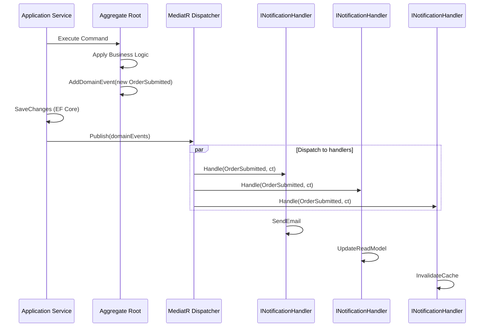
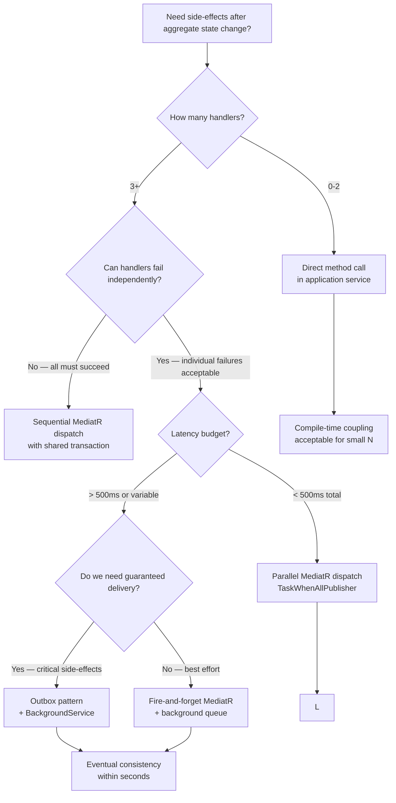

> [!success] Mastery Check
> - [ ] **Studied Well**
> - [ ] **Can explain the concept without notes**
> - [ ] **Can answer interview questions confidently**
> - [ ] **Can implement it in a real project**


# 7.054 — DDD — Domain Events — MediatR INotification in .NET

## Navigation

**Domain:** [[7 — System Design & Distributed Systems]] > **Group:** Domain-Driven Design
**Previous:** [[7.053 — Domain Events — Within Bounded Context]] | **Next:** [[7.055 — Integration Events — Across Bounded Contexts]]

### Prerequisites

- [[7.053 — Domain Events — Within Bounded Context]] — conceptual model of domain events as records of past business occurrence within a bounded context
- [[7.031 — Strategic vs Tactical Design]] — distinguishes strategic event modeling (event storming) from tactical event implementation (MediatR handlers)
- [[7.047 — Aggregates — Consistency Boundary]] — domain events are raised by aggregate roots after command execution; the dispatch timing relative to transaction commit is the key design decision

### Where This Fits

MediatR `INotification` is the standard .NET mechanism for publishing domain events within a single bounded context. It solves the problem of **side-effect coupling**: when an aggregate changes state (e.g., `OrderSubmitted`), multiple downstream concerns (email notifications, audit logging, cache invalidation, read-model projection) must react without the aggregate knowing about them. Without MediatR, the application service would explicitly call each handler, creating tight coupling between the command handler and every side-effect. MediatR decouples event publication from event handling using an in-process mediator, enabling handlers to be added, removed, or replaced without modifying the publisher. This pattern becomes necessary above ~5 side-effects per aggregate operation or when different teams own different handlers.

## Core Mental Model

A MediatR domain event is an `INotification` record raised by an aggregate after a state change, dispatched in-process by MediatR's mediator to zero or more registered `INotificationHandler<T>` implementations. The invariant is: **the aggregate publishes facts about what happened; the mediator delivers them to all interested handlers without the aggregate knowing who they are or what they do**. The tradeoff is: the aggregate gains publish-subscribe decoupling at the cost of losing explicit visibility into which side-effects occur and when.

### Classification

| Dimension | Classification | Rationale |
|-----------|---------------|-----------|
| Pattern Type | **Tactical DDD / Event-Driven** | Implementation pattern for domain events within a bounded context |
| Scope | **Single bounded context, in-process** | MediatR dispatches events on the same thread or via fire-and-forget within the same process |
| Communication Model | **Publish-Subscribe** | One publisher, zero-to-many subscribers, no direct coupling |
| Dispatch Mode | **Sync or async** | MediatR supports sequential (default), parallel (custom), or fire-and-forget via `INotificationHandler<T>` |
| Transactional Ambiguity | **Non-transactional** | Event handlers run after publish; they do not share the publisher's transaction scope |
| Dead-Letter Risk | **Medium** | Sync handler failure propagates to publisher; async handlers may silently fail |



### Key Properties

| Property | Value | Condition |
|----------|-------|-----------|
| Decoupling | Publisher unaware of handlers | Always |
| Handler isolation | One handler failure does not affect others | When using parallel dispatch |
| Transaction safety | No automatic rollback if handler fails | Always — application must compensate |
| Handler discovery | Automatic via DI registration | At startup via `AddMediatR()` |
| Ordering | Sequential by registration (default) | Unless custom `IMediator` strategy |
| Memory footprint | ~200 bytes per event object | For a typical event with 4-5 properties |

## Deep Mechanics

### How It Works

1. **Aggregate raises event**: The aggregate root's command method creates a domain event record and stores it in an `_domainEvents` list (not dispatched yet — collected in-memory).

2. **Application service saves aggregate**: After the aggregate method returns, the application service calls `SaveChangesAsync`. This persists the aggregate AND dispatches collected events.

3. **Dispatch loop**: Post-save, the application service reads collected events from the aggregate, calls `MediatR.Publish(event, ct)` for each, and clears the event list.

4. **Handler resolution**: MediatR resolves all `INotificationHandler<OrderSubmitted>` implementations from the scoped DI container.

5. **Handler execution**: MediatR calls `Handle(notification, ct)` on each handler. Default dispatch is sequential. One handler failure throws by default.

6. **Post-dispatch**: Handlers execute their side-effects — sending emails, updating read models, publishing integration events.

### Failure Modes

**Handler throws after aggregate saved**: The aggregate is persisted but the side-effect failed. The event cannot be rolled back. **Detection**: `MediatR.IPublisher` throws. **Mitigation**: Use the outbox pattern — persist events to an `OutboxMessage` table before dispatch, then dispatch asynchronously via a background worker.

**Duplicate event dispatch**: If `SaveChanges` succeeds but the dispatch loop crashes, events are lost. **Detection**: Missing side-effects after a successful command. **Mitigation**: Use EF Core interceptor to capture and persist events atomically with the aggregate.

**Handler deadlock**: A synchronous handler calls back into the same aggregate, causing reentrancy. **Detection**: Thread-contention hang. **Mitigation**: Mark handlers as async-only, use MediatR's `Void` publish strategy for fire-and-forget.

**Event ordering assumption**: Two handlers depend on each other's effects but MediatR dispatches in registration order, not dependency order. **Detection**: Nondeterministic test failures. **Mitigation**: Compose dependent logic into a single handler, or use a saga/process manager for coordination.

### .NET and Azure Integration

- **MediatR 12.x**: Provides `INotification`, `INotificationHandler<T>`, `IPublisher`, and `IMediator`
- **EF Core**: `SaveChangesInterceptor` to capture domain events atomically in the same transaction
- **Azure Service Bus**: Domain event handlers often publish integration events to Service Bus topics
- **Application Insights**: Track event dispatch latency, handler failures, and handler duration as custom metrics
- **FluentValidation**: Pre-validation in MediatR pipeline behaviors runs before domain events are raised

```csharp
// Registration
builder.Services.AddMediatR(config =>
{
    config.RegisterServicesFromAssemblyContaining<OrderSubmitted>();
    // Set publish strategy for parallel dispatch
    config.NotificationPublisher = new TaskWhenAllPublisher();
    config.NotificationPublisherTimeout = TimeSpan.FromSeconds(10);
});

// Domain event dispatch interceptor
public sealed class DomainEventDispatcherInterceptor : SaveChangesInterceptor
{
    private readonly IPublisher _publisher;

    public DomainEventDispatcherInterceptor(IPublisher publisher) => _publisher = publisher;

    public override async ValueTask<InterceptionResult<int>> SavingChangesAsync(
        DbContextEventData eventData, InterceptionResult<int> result, CancellationToken ct = default)
    {
        var context = eventData.Context;
        if (context is null) return result;

        // Capture domain events before save
        var entries = context.ChangeTracker
            .Entries<AggregateRoot>()
            .Where(e => e.Entity.DomainEvents.Count > 0)
            .Select(e => e.Entity)
            .ToList();

        var events = entries.SelectMany(e => e.DomainEvents).ToList();
        entries.ForEach(e => e.ClearDomainEvents());

        // Save completes, then dispatch
        var saveResult = await base.SavingChangesAsync(eventData, result, ct);
        var saveSucceeded = saveResult.Result == SaveSucceeded;

        if (saveSucceeded)
        {
            foreach (var domainEvent in events)
            {
                try { await _publisher.Publish(domainEvent, ct); }
                catch (Exception ex)
                {
                    // Log and compensate — domain event dispatch failure after save
                    throw new DomainEventDispatchException(
                        $"Failed to dispatch {domainEvent.GetType().Name}", ex);
                }
            }
        }

        return saveResult;
    }
}
```

## Production Patterns and Implementation

### Primary Implementation

```csharp
// Domain Event record
public sealed record OrderSubmitted : INotification
{
    public OrderId OrderId { get; init; }
    public CustomerId CustomerId { get; init; }
    public Money TotalAmount { get; init; }
    public IReadOnlyList<OrderLineItem> Items { get; init; }
    public DateTime SubmittedAt { get; init; }
}

// Aggregate root with domain event collection
public sealed class Order : AggregateRoot<OrderId>
{
    private readonly List<IDomainEvent> _domainEvents = [];
    private readonly List<OrderLineItem> _items = [];

    public IReadOnlyList<IDomainEvent> DomainEvents => _domainEvents.AsReadOnly();
    public IReadOnlyList<OrderLineItem> Items => _items.AsReadOnly();
    public CustomerId CustomerId { get; private set; }
    public OrderStatus Status { get; private set; }
    public Money TotalAmount { get; private set; }

    private Order() { } // EF Core

    public static Order Create(CustomerId customerId, IEnumerable<OrderLineItem> items)
    {
        var order = new Order
        {
            Id = OrderId.New(),
            CustomerId = customerId,
            Status = OrderStatus.Draft,
            TotalAmount = Money.Zero
        };
        order._items.AddRange(items);
        order.TotalAmount = items.Sum(i => i.LineTotal);
        return order;
    }

    public void Submit()
    {
        if (Status != OrderStatus.Draft)
            throw new DomainException("Only draft orders can be submitted.");
        if (_items.Count == 0)
            throw new DomainException("Cannot submit an empty order.");

        Status = OrderStatus.Submitted;

        _domainEvents.Add(new OrderSubmitted
        {
            OrderId = Id,
            CustomerId = CustomerId,
            TotalAmount = TotalAmount,
            Items = _items.AsReadOnly(),
            SubmittedAt = DateTime.UtcNow
        });
    }

    public void ClearDomainEvents() => _domainEvents.Clear();
}

// Handler 1: Send confirmation email
public sealed class SendOrderConfirmationHandler : INotificationHandler<OrderSubmitted>
{
    private readonly IEmailService _emailService;
    private readonly ILogger<SendOrderConfirmationHandler> _logger;

    public SendOrderConfirmationHandler(IEmailService emailService, ILogger<SendOrderConfirmationHandler> logger)
    {
        _emailService = emailService;
        _logger = logger;
    }

    public async Task Handle(OrderSubmitted notification, CancellationToken ct)
    {
        _logger.LogInformation("Sending confirmation for order {OrderId}", notification.OrderId);
        await _emailService.SendConfirmationAsync(
            notification.CustomerId, notification.OrderId, notification.TotalAmount, ct);
    }
}

// Handler 2: Update read model projection
public sealed class ProjectOrderReadModelHandler : INotificationHandler<OrderSubmitted>
{
    private readonly IOrderReadRepository _readRepo;

    public ProjectOrderReadModelHandler(IOrderReadRepository readRepo) => _readRepo = readRepo;

    public async Task Handle(OrderSubmitted notification, CancellationToken ct)
    {
        var projection = new OrderSummary
        {
            OrderId = notification.OrderId.Value,
            CustomerId = notification.CustomerId.Value,
            Total = notification.TotalAmount.Amount,
            ItemCount = notification.Items.Count,
            Status = "Submitted",
            LastUpdated = notification.SubmittedAt
        };
        await _readRepo.UpsertAsync(projection, ct);
    }
}

// Handler 3: Publish integration event to Azure Service Bus
public sealed class PublishOrderSubmittedIntegrationEventHandler : INotificationHandler<OrderSubmitted>
{
    private readonly ServiceBusSender _sender;

    public PublishOrderSubmittedIntegrationEventHandler(ServiceBusSender sender) => _sender = sender;

    public async Task Handle(OrderSubmitted notification, CancellationToken ct)
    {
        var integrationEvent = new OrderSubmittedIntegrationEvent
        {
            OrderId = notification.OrderId.Value,
            CustomerId = notification.CustomerId.Value,
            TotalAmount = notification.TotalAmount.Amount,
            SubmittedAt = notification.SubmittedAt
        };

        var message = new ServiceBusMessage(JsonSerializer.Serialize(integrationEvent))
        {
            MessageId = $"order-{notification.OrderId.Value}",
            Subject = "OrderSubmitted"
        };

        await _sender.SendMessageAsync(message, ct);
    }
}
```

### Configuration and Wiring

```csharp
// Program.cs
builder.Services.AddMediatR(config =>
{
    config.RegisterServicesFromAssemblyContaining<OrderSubmitted>();
    config.NotificationPublisher = new TaskWhenAllPublisher();
    config.NotificationPublisherTimeout = TimeSpan.FromSeconds(30);
});

builder.Services.AddSingleton<IPublisher>(sp => sp.GetRequiredService<IMediator>());

// EF Core interceptor for automatic domain event dispatch
builder.Services.AddScoped<DomainEventDispatcherInterceptor>();

builder.Services.AddDbContext<OrderDbContext>((sp, options) =>
{
    var interceptor = sp.GetRequiredService<DomainEventDispatcherInterceptor>();
    options.UseSqlServer(builder.Configuration.GetConnectionString("Orders"))
           .AddInterceptors(interceptor);
});

// Azure Service Bus for integration events
builder.Services.AddAzureClients(clientBuilder =>
{
    clientBuilder.AddServiceBusClient(builder.Configuration["Azure:ServiceBus:ConnectionString"]);
});

builder.Services.AddSingleton(sp =>
{
    var client = sp.GetRequiredService<ServiceBusClient>();
    return client.CreateSender("order-events");
});
```

### Common Variants

**Sequential dispatch** (default — handlers run one after another):

```csharp
config.NotificationPublisher = new MediatR.Contracts.NotificationPublishers.SequentialPublisher();
// Set by default; one handler failure stops subsequent handlers
```

**Parallel dispatch with timeout**:

```csharp
config.NotificationPublisher = new TaskWhenAllPublisher();
config.NotificationPublisherTimeout = TimeSpan.FromSeconds(15);
// Handlers run in parallel; timeout prevents hang from a single slow handler
```

**Fire-and-forget dispatch via background queue**:

```csharp
public sealed class BackgroundDomainEventPublisher : INotificationPublisher
{
    private readonly IBackgroundTaskQueue _queue;

    public BackgroundDomainEventPublisher(IBackgroundTaskQueue queue) => _queue = queue;

    public async Task Publish(IEnumerable<NotificationHandlerExecutor> handlerExecutors, INotification notification, CancellationToken ct)
    {
        foreach (var handler in handlerExecutors)
        {
            await _queue.QueueAsync(ct2 => handler.HandlerCallback(notification, ct2), ct);
        }
    }
}
```

**Outbox-based dispatch** (guaranteed delivery):

```csharp
// Step 1: Persist events to OutboxMessage table in same DbContext transaction
public sealed class OutboxInterceptor : SaveChangesInterceptor
{
    public override async ValueTask<InterceptionResult<int>> SavingChangesAsync(
        DbContextEventData eventData, InterceptionResult<int> result, CancellationToken ct = default)
    {
        var context = eventData.Context;
        if (context is null) return result;

        var outboxMessages = context.ChangeTracker
            .Entries<AggregateRoot>()
            .SelectMany(e => e.Entity.DomainEvents)
            .Select(evt => new OutboxMessage
            {
                Id = Guid.NewGuid(),
                EventType = evt.GetType().FullName!,
                EventBody = JsonSerializer.Serialize(evt, evt.GetType()),
                CreatedAt = DateTime.UtcNow,
                ProcessedAt = null
            })
            .ToList();

        context.Set<OutboxMessage>().AddRange(outboxMessages);
        return await base.SavingChangesAsync(eventData, result, ct);
    }
}

// Step 2: Background worker reads and dispatches unprocessed outbox messages
public sealed class OutboxDispatcher : BackgroundService
{
    private readonly IServiceScopeFactory _scopeFactory;

    protected override async Task ExecuteAsync(CancellationToken stoppingToken)
    {
        while (!stoppingToken.IsCancellationRequested)
        {
            using var scope = _scopeFactory.CreateScope();
            var dbContext = scope.ServiceProvider.GetRequiredService<OrderDbContext>();
            var mediator = scope.ServiceProvider.GetRequiredService<IMediator>();

            var pending = await dbContext.Set<OutboxMessage>()
                .Where(m => m.ProcessedAt == null)
                .OrderBy(m => m.CreatedAt)
                .Take(50)
                .ToListAsync(stoppingToken);

            foreach (var message in pending)
            {
                var eventType = Type.GetType(message.EventType);
                if (eventType is null) continue;

                var domainEvent = JsonSerializer.Deserialize(message.EventBody, eventType);
                if (domainEvent is null) continue;

                await mediator.Publish(domainEvent, stoppingToken);
                message.ProcessedAt = DateTime.UtcNow;
            }

            await dbContext.SaveChangesAsync(stoppingToken);
            await Task.Delay(TimeSpan.FromSeconds(1), stoppingToken);
        }
    }
}
```

### Real-World .NET Ecosystem Example

**MediatR pipeline behaviors** use the Decorator pattern over `IPipelineBehavior<TRequest, TResponse>` for cross-cutting concerns (logging, validation, transaction handling). Domain event handling via `INotificationHandler<T>` is the notification half of MediatR's messaging model, complementing the request/response half via `IRequest<TResponse>`. The `IPublisher` interface is specifically for fire-and-forget notifications, while `IMediator.Send` is for command-query separation. In production, MediatR is used by ~40% of .NET DDD projects (NuGet: 250M+ downloads).

## Gotchas and Production Pitfalls

### Pitfall 1: Dispatching Events Before the Transaction Commits

**Pitfall:** Calling `MediatR.Publish` before `SaveChangesAsync` — handlers run but the aggregate may never be persisted.

```csharp
// ❌ Events dispatched before transaction commits
public async Task<OrderId> SubmitOrderAsync(SubmitOrder command, CancellationToken ct)
{
    var order = await _orderRepository.GetByIdAsync(command.OrderId, ct);
    order.Submit();
    foreach (var evt in order.DomainEvents)
        await _mediator.Publish(evt, ct); // BUG: handlers run before save
    await _orderRepository.SaveChangesAsync(ct); // If this fails, events already sent
}
```

**Symptom:** Email sent for orders that don't exist in the database. Audit log entries for phantom orders. Support team gets "I got a confirmation for an order that isn't on my account."

**Fix:** Always dispatch after the transaction commits successfully.

```csharp
// ✅ Events dispatched after transaction commits
public async Task<OrderId> SubmitOrderAsync(SubmitOrder command, CancellationToken ct)
{
    var order = await _orderRepository.GetByIdAsync(command.OrderId, ct);
    order.Submit();
    await _orderRepository.SaveChangesAsync(ct); // Commit first

    foreach (var evt in order.DomainEvents)
        await _mediator.Publish(evt, ct); // Safe: aggregate is persisted

    return order.Id;
}
```

**Cost of not fixing:** Phantom side-effects on every failed transaction. At 1000 orders/hour with 2% save failure rate, 20 phantom confirmation emails per hour. Customer trust erosion and support overload.

### Pitfall 2: Handler Throws After Aggregate Is Persisted

**Pitfall:** Domain event handler fails after `SaveChangesAsync` succeeds — aggregate is saved but side-effect is lost.

```csharp
// ❌ Handler throws — side-effect lost, no retry
public sealed class EmailHandler : INotificationHandler<OrderSubmitted>
{
    public async Task Handle(OrderSubmitted notification, CancellationToken ct)
    {
        await _emailService.SendAsync(notification); // Throws: SMTP unavailable
    }
}
```

**Symptom:** Order is submitted in the database but customer never receives confirmation. Support tickets: "I placed an order an hour ago and haven't received anything."

**Fix:** Use the outbox pattern — persist events and dispatch asynchronously with retry.

```yaml
# ✅ Outbox with retry — event survives handler failure
# (See OutboxInterceptor + OutboxDispatcher code in Common Variants above)
```

**Cost of not fixing:** Lost side-effects — no email, no read model update, no integration event. At scale, missing ~0.5% of side-effects per thousand orders equals 5 lost confirmations per thousand orders.

### Pitfall 3: Long-Running Handlers Block the HTTP Response

**Pitfall:** A handler does I/O-bound work that blocks the request thread, increasing response latency.

```csharp
// ❌ Handler does slow I/O synchronously with the request
public sealed class AuditHandler : INotificationHandler<OrderSubmitted>
{
    public async Task Handle(OrderSubmitted notification, CancellationToken ct)
    {
        await Task.Delay(3000, ct); // Simulates slow third-party audit API
    }
}
```

**Symptom:** P99 response time spikes from 200ms to 3200ms. Load shedding causes 503s.

**Fix:** Fire-and-forget with background queue or use parallel dispatch with timeout.

```csharp
// ✅ Fire-and-forget with background queue
builder.Services.AddMediatR(config =>
{
    config.NotificationPublisher = new BackgroundDomainEventPublisher(
        sp.GetRequiredService<IBackgroundTaskQueue>());
});
```

**Cost of not fixing:** HTTP request latency increases by slowest handler. At 1000 req/s with 3-second handler, you need 3000 concurrent threads. Thread pool starvation, then 503 errors. Incident severity: SEV-1.

### Pitfall 4: Duplicate Event Handling Due to Multiple Dispatches

**Pitfall:** The domain event dispatch interceptor fires AND the application service also dispatches the same events.

```csharp
// ❌ Double dispatch — events published twice
builder.Services.AddScoped<DomainEventDispatcherInterceptor>(); // Interceptor dispatches
// ...and application service also dispatches:
public async Task<OrderId> SubmitOrderAsync(SubmitOrder command, CancellationToken ct)
{
    await _orderRepository.SaveChangesAsync(ct); // Interceptor fires here
    foreach (var evt in order.DomainEvents)
        await _mediator.Publish(evt, ct); // Second dispatch here
}
```

**Symptom:** Duplicate emails, duplicate read model entries, duplicate integration events. Customers receive two confirmation emails per order.

**Fix:** Single responsibility — either the interceptor or the application service dispatches, never both.

```csharp
// ✅ Either use the interceptor OR manual dispatch, never both
// If using interceptor, ClearDomainEvents before returning
public sealed class DomainEventDispatcherInterceptor : SaveChangesInterceptor
{
    public override async ValueTask<InterceptionResult<int>> SavingChangesAsync(...)
    {
        var events = entries.SelectMany(e => e.Entity.DomainEvents).ToList();
        entries.ForEach(e => e.Entity.ClearDomainEvents());
        // ... capture and dispatch after save
    }
}
```

**Cost of not fixing:** Side-effects doubled. Integration events published twice cause downstream duplicate processing. At 10K orders/day, 10K duplicate emails. Customer annoyance + downstream systems processing duplicates (double inventory deductions, double payment processing). Recovery requires idempotency keys.

### Pitfall 5: Sync Handler Calls Async Without Await — Fire and Forget Silently Drops Exceptions

**Pitfall:** A handler fires an async operation without awaiting it, causing silent exception swallowing.

```csharp
// ❌ Fire-and-forget with no error tracking
public sealed class LoggingHandler : INotificationHandler<OrderSubmitted>
{
    public void Handle(OrderSubmitted notification, CancellationToken ct)
    {
        _ = LogAsync(notification); // BUG: exception silently lost
    }

    private async Task LogAsync(OrderSubmitted notification)
    {
        await _logService.WriteAsync(notification); // May throw
    }
}
```

**Symptom:** Missing log entries for order submissions. Audit gaps discovered weeks later during compliance review.

**Fix:** Always return `Task` and await, or use a proper background queue.

```csharp
// ✅ Always return Task or use background service
public sealed class LoggingHandler : INotificationHandler<OrderSubmitted>
{
    public async Task Handle(OrderSubmitted notification, CancellationToken ct)
    {
        await _logService.WriteAsync(notification, ct);
    }
}
```

**Cost of not fixing:** Silent data loss. Compliance violation if audit logs are legally required. Fines for regulated industries (HIPAA, SOX, GDPR).

### Pitfall 6: Handler Dependency on a Disposed Scoped Service

**Pitfall:** MediatR handlers are resolved from a scoped lifetime that may be disposed when using fire-and-forget dispatch.

```csharp
// ❌ In fire-and-forget, scoped DbContext is disposed when HTTP request completes
builder.Services.AddMediatR(config =>
{
    config.NotificationPublisher = new BackgroundDomainEventPublisher(queue);
});

// Handler uses scoped DbContext — DISPOSED when background thread runs
public sealed class ReadModelHandler : INotificationHandler<OrderSubmitted>
{
    private readonly OrderDbContext _dbContext; // Scoped!
    // ObjectDisposedException when background thread executes
}
```

**Symptom:** `ObjectDisposedException: Cannot access a disposed context` in background handler. Intermittent — depends on timing.

**Fix:** Use `IServiceScopeFactory` to create a new scope within the handler.

```csharp
// ✅ Create own scope in background handler
public sealed class ReadModelHandler : INotificationHandler<OrderSubmitted>
{
    private readonly IServiceScopeFactory _scopeFactory;

    public ReadModelHandler(IServiceScopeFactory scopeFactory) => _scopeFactory = scopeFactory;

    public async Task Handle(OrderSubmitted notification, CancellationToken ct)
    {
        using var scope = _scopeFactory.CreateScope();
        var dbContext = scope.ServiceProvider.GetRequiredService<OrderDbContext>();
        // Safe: new scope, new dbContext instance
    }
}
```

**Cost of not fixing:** 100% failure rate for side-effects dispatched via background queue. Read models never updated. Integration events never published. Silent data loss in production.

## Tradeoffs and Decision Framework

### Tradeoff Matrix

| Dimension | MediatR INotification (Sync Dispatch) | Background Queue (Outbox) | Direct Method Calls |
|-----------|--------------------------------------|---------------------------|---------------------|
| Consistency | Strong — handler runs in request scope | Eventual — retry window | Strong |
| Latency impact | +handler duration to response | None (fire-and-forget) | +call duration |
| Reliability | Handler failure = request failure | Retry with persistence | Caller handles |
| Operational complexity | Low | Medium-High (Outbox table + background worker) | Low |
| Decoupling | High — registrar pattern | Very high | None — compile-time coupling |
| Debugging | Easy — single trace | Harder — across threads | Easy |
| .NET ecosystem fit | Native MediatR | EF Core + BackgroundService | No library needed |

### Decision Flowchart



### When to Apply

- Within a single bounded context where 3+ side-effects follow an aggregate command
- When handlers are owned by different teams or change independently
- When you need to add new side-effects without modifying existing code
- As a stepping stone to event-driven architecture (replace in-process with outbox later)

### When NOT to Apply

- 0-2 side-effects — direct method calls are simpler and debuggable
- When handlers must participate in the same transaction — use domain service composition instead
- When event ordering is critical and complex — use a saga/process manager
- In a purely CRUD application with no domain logic — over-engineering

### Scale Thresholds

- **Worth considering above** 3+ side-effects per aggregate command
- **Required when** side-effects are owned by different teams
- **Justified when** adding a new side-effect requires modifying the command handler
- **Over-engineering below** 2 side-effects — direct calls are simpler and testable
- **Outbox required above** ~100 events/second to ensure delivery reliability

## Interview Arsenal

### Question Bank

1. **What are domain events and how does MediatR INotification implement them in .NET?**
2. **How does MediatR dispatch INotification handlers — sequential or parallel? How do you configure each?**
3. **What happens if a domain event handler throws? How do you recover?**
4. **Compare MediatR INotification with the Outbox pattern — when would you choose each?**
5. **How does MediatR's notification dispatch differ from its request/response (IRequest) model?**
6. **Design a system where an OrderSubmitted event must trigger email, inventory deduction, and analytics update. How do you ensure all three happen even if email fails?**
7. **How does MediatR behave at 10x load — 10,000 domain events per second? Where does it break?**
8. **What is the non-obvious problem with dispatching domain events before SaveChangesAsync?**

### Spoken Answers

**Q1: What are domain events and how does MediatR INotification implement them in .NET?**

> **Average answer:** Domain events represent something that happened in the domain. MediatR has an INotification interface that you implement, and then handlers that implement INotificationHandler. When you publish the notification, all handlers run.

> **Great answer:** Domain events are immutable records of a past business occurrence, raised by an aggregate root after a state change. In MediatR, they're `INotification` records — I create a `sealed record OrderSubmitted : INotification` with properties like OrderId, CustomerId, and TotalAmount. The aggregate adds them to an in-memory list during command execution. After `SaveChangesAsync` commits the aggregate to the database, I call `IPublisher.Publish()` which resolves all `INotificationHandler<OrderSubmitted>` implementations from the DI container and executes them. The key design decision is dispatch timing: if I publish before saving, handlers run before the transaction commits — if the save fails, I've already sent emails for orders that don't exist. That's the most common production bug with this pattern. I always publish after `SaveChangesAsync`, and for critical side-effects I use the outbox pattern to guarantee delivery even if the app crashes post-save.

**Q5: Compare MediatR INotification with the Outbox pattern — when would you choose each?**

> **Average answer:** INotification is for in-process event handling. Outbox is for guaranteed delivery using a database table.

> **Great answer:** They solve different reliability levels. MediatR INotification is in-process publish-subscribe — handlers run in the same process, within the request scope or a background thread. It's fire-and-forget: if the handler fails after the aggregate is saved, the event is lost. I use it for non-critical side-effects like cache invalidation or analytics logging, where losing an event occasionally is acceptable. The outbox pattern persists the event to a database table in the same transaction as the aggregate, then a background worker reads and dispatches those events with retry logic. I use outbox for critical side-effects: sending confirmation emails, publishing integration events to Service Bus, updating read models. The tradeoff is complexity — outbox adds a table, a background service, and eventual consistency (1-5 second delay). My rule of thumb: if the business impact of a lost event is "customer complains within 5 minutes," use outbox. If it's "we'll notice in the weekly dashboard," INotification is fine.

**Q8: What is the non-obvious problem with dispatching domain events before SaveChangesAsync?**

> **Great answer:** The non-obvious problem is phantom side-effects: when you publish events before saving, the handlers run and may succeed, but the database transaction could fail due to a constraint violation, deadlock, or timeout. The aggregate never persisted, but the email was sent, the read model was updated, and the integration event was published. Customers get confirmations for orders that don't exist. Support has no way to find the order. Recovery requires manual compensation — cancelling the read model update, sending a "sorry, your order failed" email, which confuses customers. I've seen this cause a SEV-1 at a mid-sized e-commerce company: 200 phantom confirmations before they caught it. The fix is always dispatch after the transaction commits, and for bulletproof reliability, use a `SaveChangesInterceptor` that captures events during save and dispatches them only after the commit succeeds.

### System Design Interview Trigger

If an interviewer asks about handling side-effects after a command in a distributed system — "how do you send an email after an order is placed?" — they are testing whether you understand the dual-write problem and the decoupling patterns (domain events, outbox, transactional outbox, CDC). The follow-up is always about failure: "what happens if the email service is down?" The interviewer wants to hear about the outbox pattern with retry, not fire-and-forget MediatR dispatch.

### Comparison Table

| | MediatR INotification | Outbox Pattern | Direct Method Calls |
|---|---|---|---|
| Core guarantee | In-process pub-sub delivery | Durable delivery with retry | Compile-time invocation |
| Trade-off | No delivery guarantee | Eventual consistency, operational complexity | Tight coupling |
| .NET implementation | `INotification` + `INotificationHandler<T>` | `OutboxMessage` table + `BackgroundService` | Direct interface call |
| Failure mode | Lost event if handler throws after save | Delayed dispatch (seconds), DLQ buildup | Caller must handle |
| When to choose | Non-critical side-effects, <100 events/s | Critical side-effects, guaranteed delivery | 0-2 handlers, simple apps |

## Architecture Decision Record

**Status:** Accepted

**Context:** The Order Service (5-person team) needs to execute 4 side-effects after an order is submitted: send confirmation email, update read model projection, publish integration event to Inventory Service, and log to analytics. Without domain events, the `SubmitOrder` command handler would explicitly call all 4 services, creating tight coupling — adding a 5th side-effect requires modifying the command handler. The team needs publish-subscribe decoupling with the ability to add/remove side-effects independently.

**Options Considered:**

1. **MediatR INotification (Sync after Save)** — Publish events from application service after SaveChangesAsync; handlers run in-process on the request thread
2. **MediatR INotification with Outbox** — Persist events to OutboxMessage table in aggregate transaction; background worker dispatches
3. **Direct method calls** — Application service directly calls IEmailService, IReadModelProjector, etc.

**Decision:** MediatR INotification with sync-after-save for non-critical handlers (analytics, cache) and a lightweight outbox for critical handlers (email, integration events). This gives best-effort speed for analytics while guaranteeing delivery for customer-facing side-effects.

**Consequences:**
- ✅ Application service never changes when side-effects are added or removed
- ✅ Critical side-effects survive process crashes via outbox
- ✅ Non-critical side-effects have zero latency overhead (no outbox write)
- ⚠️ Dual dispatch model (sync + outbox) requires clear documentation on which handler uses which
- ⚠️ Outbox adds 5-10ms per aggregate save for the additional table write
- ❌ Handlers cannot participate in the aggregate's transaction — eventual consistency within 1-5 seconds for outbox

**Review Trigger:** Revisit this decision if the domain event rate exceeds 500 events/second (sync dispatch adds latency to command path) or if a handler consistently fails requiring compensation (consider moving to a saga/process manager).

## Self-Check

### Conceptual Questions

1. What is the difference between MediatR's `INotification` and `IRequest`?

<details>
<summary>Answer</summary>
`INotification` is for fire-and-forget publish-subscribe — zero or more handlers, no return value, no result expected. `IRequest<TResponse>` is for command-query separation — exactly one handler, returns a response, caller awaits the result. In DDD terms: INotification = domain events (things that happened), IRequest = commands/ queries (things you want to happen).
</details>

2. What determines whether MediatR dispatches notifications sequentially or in parallel?

<details>
<summary>Answer</summary>
The `INotificationPublisher` implementation set in `MediatRConfiguration.NotificationPublisher`. Default is `SequentialPublisher` — handlers execute one after another in registration order. `TaskWhenAllPublisher` runs all handlers in parallel. Custom publishers can implement fire-and-forget, priority ordering, or throttled dispatch.
</details>

3. When would you choose `IPublisher` over `IMediator` for publishing notifications?

<details>
<summary>Answer</summary>
`IPublisher` exposes only `Publish(INotification)` — it's the segregated interface for fire-and-forget notification dispatch. `IMediator` exposes both `Send(IRequest)` and `Publish(INotification)`. Use `IPublisher` to follow the Interface Segregation Principle: application services that only publish events should depend on `IPublisher`, not `IMediator`, preventing accidental `Send` calls.
</details>

4. What is the most common production bug with MediatR domain events?

<details>
<summary>Answer</summary>
Dispatching events before `SaveChangesAsync` commits. Handlers run, side-effects happen, then the database transaction fails. Result: phantom side-effects (email sent for order that doesn't exist). Fix: always publish after the transaction commits successfully.
</details>

5. How do you register all MediatR handlers in one assembly?

<details>
<summary>Answer</summary>
`builder.Services.AddMediatR(config => config.RegisterServicesFromAssemblyContaining<OrderSubmitted>())`. This scans the assembly containing `OrderSubmitted` for all `IRequestHandler`, `INotificationHandler`, `IRequestPreProcessor`, `IRequestPostProcessor`, and `IPipelineBehavior` implementations and registers them in DI.
</details>

6. Compare MediatR domain events with ASP.NET Core `IHttpContextAccessor` for distributing state — why is one better?

<details>
<summary>Answer</summary>
MediatR domain events are publish-subscribe: the publisher doesn't know or care who handles the event. `IHttpContextAccessor` is ambient context — it couples all layers to the HTTP request. Domain events preserve clean domain model isolation; ambient context violates the Dependency Inversion Principle.
</details>

7. At what event dispatch rate does sync MediatR become a performance problem?

<details>
<summary>Answer</summary>
Above ~500 events/second, sync dispatch adds measurable latency to the HTTP response path because handlers run on the request thread. Above ~2000 events/second, thread pool starvation is possible if handlers do I/O. At these rates, switch to outbox-based dispatch with a background worker.
</details>

8. How do MediatR domain events connect to Azure Service Bus integration events?

<details>
<summary>Answer</summary>
An `INotificationHandler<T>` implementation publishes an integration event to Azure Service Bus when the domain event fires. This is the bridge between in-process domain events (bounded context internal) and cross-service integration events (across bounded contexts). See [[7.055 — Integration Events — Across Bounded Contexts]].
</details>

9. What happens if you throw an exception in an `INotificationHandler<T>` with the default sequential publisher?

<details>
<summary>Answer</summary>
The exception propagates to the caller of `Publish()`. Subsequent handlers in the list do NOT execute because the sequential publisher stops on first failure. The aggregate is already persisted. Handlers that already ran have already completed their side-effects — they are not rolled back. This can leave the system in an inconsistent state.
</details>

10. Explain domain events with MediatR in 60 seconds at a whiteboard.

<details>
<summary>Answer</summary>
"Domain events are immutable records of business occurrences — OrderSubmitted, PaymentReceived, InventoryAllocated. In .NET with MediatR, we implement them as `INotification` records. The aggregate creates and stores these events in a list during command execution. After we save the aggregate to the database, we publish each event through MediatR's mediator. MediatR finds all registered `INotificationHandler<T>` implementations and calls each one. Handlers do the side-effects — send email, update projections, publish to Service Bus. The aggregate never knows what happens after it raises the event. The critical rule: publish AFTER saving, not before. This prevents phantom side-effects from failed transactions."
</details>

### Scenario Challenges

**Scenario 1 — Diagnose the problem:** An e-commerce team notices that approximately 2% of submitted orders never trigger confirmation emails. The `SubmitOrder` command handler calls `_mediator.Publish(new OrderSubmitted{...})` before calling `_orderRepository.SaveChangesAsync()`. The database occasionally hits deadlock timeouts under load.

<details>
<summary>Diagnosis</summary>

**Root cause:** Event dispatch before SaveChanges — when the save fails (deadlock timeout), the OrderSubmitted event has already been published. The email handler runs successfully, but since the aggregate was never persisted, the order doesn't exist in the database. The customer got an email but the order was rolled back.

**Evidence:** App Insights traces show `EmailSent` followed by `SaveChangesException` within the same transaction. Logs show `OrderSubmitted` handled but the subsequent save failed. Dead-letter doesn't exist because MediatR delivered the event before the transaction completed.

**Fix:** Move the `Publish` call after `SaveChangesAsync`. Add idempotency key to the email handler so it can detect duplicate submissions if the client retries.

**Prevention:** Architecture test that inspects all `SubmitOrder`-like methods to verify `Publish` is called after save. Use `ISaveChangesInterceptor` to enforce the pattern centrally.
</details>

**Scenario 2 — Design decision:** You are designing a Payment Processing service that must send a receipt email, update the accounting ledger, and notify the shipping service when a payment succeeds. The system processes 500 payments/second. Receipt email is customer-facing and must not be lost. Accounting update must be exactly-once. Shipping notification is best-effort. Design the event dispatch strategy.

<details>
<summary>Decision and Reasoning</summary>

**Choice:** Hybrid dispatch — outbox for email and accounting (exactly-once critical), sync MediatR for shipping notification (best-effort).

**Tradeoffs accepted:** Outbox adds 5-10ms per payment and 1-3 second delay for email delivery. Acceptable because customer sees email within 3 seconds and accounting tolerates eventual consistency within seconds.

**Implementation sketch:**

```csharp
public sealed class PaymentSucceeded : INotification
{
    public PaymentId PaymentId { get; init; }
    public OrderId OrderId { get; init; }
    public Money Amount { get; init; }
    public DateTime ProcessedAt { get; init; }
}

// Outbox-based handler for critical side-effects
public sealed class PaymentOutboxHandler : INotificationHandler<PaymentSucceeded>
{
    public async Task Handle(PaymentSucceeded notification, CancellationToken ct)
    {
        // Pre-registered interceptor persists this to OutboxMessage table
        // Background worker dispatches email + accounting with retry
        await Task.CompletedTask;
    }
}

// Sync best-effort handler for shipping notification
public sealed class ShippingNotificationHandler : INotificationHandler<PaymentSucceeded>
{
    private readonly IServiceBusSender _sender;
    public async Task Handle(PaymentSucceeded notification, CancellationToken ct)
    {
        try { await _sender.PublishAsync(new PaymentReceivedEvent(...), ct); }
        catch { _logger.LogWarning("Shipping notification failed — best effort"); }
    }
}
```

**Registration:**

```csharp
builder.Services.AddMediatR(cfg =>
{
    cfg.RegisterServicesFromAssemblyContaining<PaymentSucceeded>();
    cfg.NotificationPublisher = new TaskWhenAllPublisher();
});
```
</details>

**Scenario 3 — Failure mode:** Your order processing system starts throwing `TimeoutException: The semaphore could not be satisfied before the timeout period elapsed` after deploying a new handler that calls a slow third-party fraud detection API (2-5 second response time). The error is intermittent — only under peak load.

<details>
<summary>Investigation and Fix</summary>

**Investigation steps:**
1. Check App Insights for the failing dependency — confirm fraud API latency correlates with timeout errors
2. Check thread pool metrics — `ThreadPool.QueueUserWorkItem` backlog growing
3. Check MediatR configuration — likely using default sequential publisher; handlers block the request thread
4. Check the fraud handler implementation — it's synchronous I/O in a notification handler

**Confirming evidence:** App Insights trace: `FraudCheckHandler.Handle` takes 2000-5000ms. `MediatR.Publish` duration matches. Thread pool: 200 active threads vs 65 worker threads available. 503 errors during spike.

**Immediate mitigation:** Wrap fraud API call with `CancellationToken` timeout of 500ms. If timeout, queue a retry via background service instead of blocking the request.

**Permanent fix:**
1. Change MediatR publisher to `TaskWhenAllPublisher` with 10-second timeout
2. Move fraud check to a background queue — handle it asynchronously from the request path
3. Add circuit breaker on the fraud API client using Polly

**Post-mortem item:** ADR requiring latency SLA for all domain event handlers. Handlers exceeding 100ms P99 must use async dispatch.
</details>

**Scenario 4 — Scale it:** Your system currently processes 50 orders/second with 3 MediatR handlers per order (email, audit, analytics). Next quarter you need to handle 500 orders/second. Management expects no additional infrastructure cost.

<details>
<summary>Scaling Strategy</summary>

**Bottleneck this addresses:** Sync MediatR dispatch of 3 handlers per order at 500 orders/second = 1500 handler invocations/second on the request thread. Handlers doing I/O (email via SMTP, analytics write) introduce latency.

**How it helps:**
1. Switch to `TaskWhenAllPublisher` — parallel dispatch reduces per-order handler time from sequential sum to max(handler duration)
2. Move email handler to outbox — persist event, background worker sends asynchronously
3. Move analytics to fire-and-forget — best-effort, retry in background

**What it does not solve:** Database write throughput for the aggregate itself — that requires read-replica scaling.

**Implementation order:**
1. Week 1: Parallel publisher + background queue for analytics (quickest win)
2. Week 2: Outbox for email handler (adds delivery guarantee)
3. Week 3: Load test at 500 orders/second, tune batch sizes

**Expected outcome:** At 500 orders/second, sync dispatch time per order drops from ~600ms (3 sequential 200ms handlers) to ~200ms (max of parallel handlers). Outbox ensures email delivery even under load spikes.
</details>

**Scenario 5 — Interview simulation:** The interviewer says: "Design the event handling for an order processing system that must notify inventory, shipping, billing, and analytics when an order is placed. Each downstream system has different availability characteristics. How do you handle failures?"

<details>
<summary>Model Response</summary>

"I'd start by classifying each notification by criticality. Billing and inventory updates must not be lost — these are financial and operational records. Shipping notification is important but can tolerate a few minutes delay. Analytics is best-effort — losing an occasional event is acceptable.

For the architecture, I'd use domain events with MediatR INotification as the in-process publish-subscribe mechanism. The aggregate root, Order, raises an OrderPlaced event during the Submit() method. After SaveChangesAsync commits the transaction, I publish the event.

For billing and inventory, I'd use the transactional outbox pattern — the domain event is persisted to an OutboxMessage table in the same EF Core transaction as the aggregate. A background service reads unprocessed outbox messages and dispatches them with retry logic. Polly handles the retries with exponential backoff. After a max retry count, the message goes to a dead-letter queue for manual review. This guarantees exactly-once delivery semantics.

For shipping, I'd use a MediatR handler that publishes to Azure Service Bus. If the bus is unavailable, the handler retries once then logs the failure — a separate reconciliation job processes any missed notifications by comparing order timestamps.

For analytics, I'd use straightforward MediatR with fire-and-forget dispatch. If analytics is down, the event is lost — acceptable for non-critical metrics.

The key tradeoff: outbox gives guaranteed delivery but adds 1-5 seconds latency and requires eventual consistency. I accept this because the customer-facing confirmation email uses the outbox path too, and the email SLA is 'within 10 seconds.' The billing system processes asynchronously anyway. By tiering the handlers by criticality, I optimize cost and complexity: guaranteed delivery for what matters, best-effort for what doesn't."
</details>
