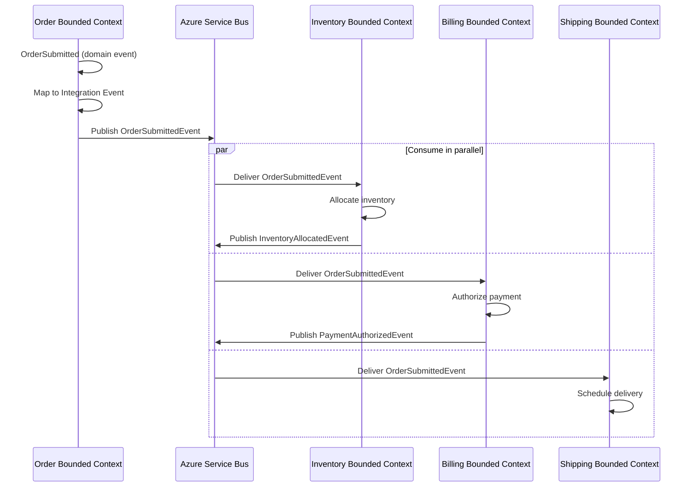
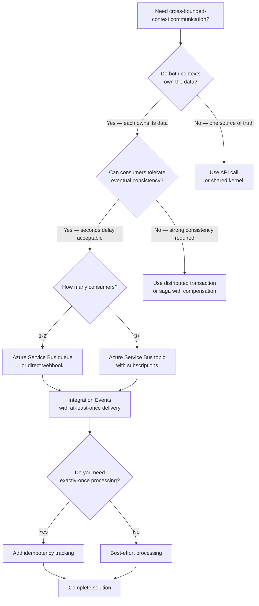

> [!success] Mastery Check
> - [ ] **Studied Well**
> - [ ] **Can explain the concept without notes**
> - [ ] **Can answer interview questions confidently**
> - [ ] **Can implement it in a real project**


# 7.055 — DDD — Integration Events — Across Bounded Contexts

## Navigation

**Domain:** [[7 — System Design & Distributed Systems]] > **Group:** Domain-Driven Design
**Previous:** [[7.054 — Domain Events — MediatR INotification in .NET]] | **Next:** [[7.056 — Repositories — Interface and Implementation]]

### Prerequisites

- [[7.054 — Domain Events — MediatR INotification in .NET]] — domain events are in-process within a bounded context; integration events extend the same concept across process boundaries via a message broker
- [[7.033 — Bounded Contexts — Identifying Boundaries]] — identifying bounded context boundaries is prerequisite because integration events are the communication channel between them
- [[7.034 — Bounded Contexts — Context Map]] — the context map documents which bounded contexts need which events; integration events implement the upstream/downstream relationships on the map

### Where This Fits

Integration events solve the **cross-boundary notification problem**: when the Order Bounded Context accepts an order, the Inventory Bounded Context needs to allocate stock, the Billing Bounded Context needs to authorize payment, and the Shipping Bounded Context needs to schedule delivery. Without integration events, these contexts would couple via direct HTTP calls, shared databases, or shared code — creating the architecture anti-pattern known as "distributed monolith." Integration events use a message broker (Azure Service Bus) to deliver structured notifications across service boundaries with temporal decoupling. This pattern becomes necessary when you have 2+ bounded contexts that need to react to state changes in other contexts, typically at the point where a shared database or chain of HTTP calls causes coordination failures.

## Core Mental Model

An integration event is an immutable message published by one bounded context to a message broker when something business-significant happens, consumed by zero or more other bounded contexts that need to react. The invariant is: **the publishing context owns the event schema and guarantees at-least-once delivery; consuming contexts interpret the event through their own domain lens and are solely responsible for their reaction**. The tradeoff is: strong bounded context autonomy (each context evolves independently) at the cost of eventual consistency (there is a window between event publication and consumption) and operational complexity (message broker infrastructure, dead-letter management, idempotency handling).

### Classification

| Dimension | Classification | Rationale |
|-----------|---------------|-----------|
| Pattern Type | **Tactical DDD / Integration Pattern** | Implements cross-boundary communication preserving bounded context autonomy |
| Scope | **Cross-bounded context, cross-process** | Events flow through a message broker, not direct method calls |
| Communication Model | **Event-Driven / Publish-Subscribe** | One publisher, zero-to-many subscribers, temporal decoupling |
| Delivery Guarantee | **At-least-once** | Broker persists until acknowledged; consumers must handle duplicates |
| Consistency Model | **Eventual** | No distributed transaction; each consumer processes independently |
| Schema Ownership | **Publisher-owned** | Publisher defines the schema; consumers adapt to changes |



### Key Properties

| Property | Value | Condition |
|----------|-------|-----------|
| Temporal decoupling | Publisher does not wait for consumers | Always |
| Schema evolution | Publisher versioning, consumer compatibility | With schema registry |
| Duplicate delivery | Possible — at-least-once semantics | Always |
| Ordering | Not guaranteed across partitions | Unless partition-key scoped |
| Failure isolation | Consumer failure does not affect publisher | Always |
| Operational debt | Moderate — broker, DLQ, monitoring | Above 10 topics/queues |

## Deep Mechanics

### How It Works

1. **Domain event fires**: Within the Order Bounded Context, a domain event `OrderSubmitted` is raised by the `Order` aggregate after `SaveChangesAsync` succeeds.

2. **Map to integration event**: An `INotificationHandler<OrderSubmitted>` creates an `OrderSubmittedIntegrationEvent` — this is a separate schema, explicitly designed for cross-boundary consumption. It contains only data that other contexts need (no internal state), uses primitive types (no domain types), and includes a `SchemaVersion` field.

3. **Publish to broker**: The handler serializes the integration event and sends it to Azure Service Bus Topic with a message ID for idempotency detection.

4. **Broker routes**: Service Bus routes the message to all active subscriptions (Inventory, Billing, Shipping).

5. **Consumer receives**: Each subscribing bounded context has a background service or Azure Function that receives messages from its subscription.

6. **Consumer processes**: The consumer deserializes the event, maps it to its own domain model, and executes business logic. If processing fails, the message is retried (with exponential backoff) or dead-lettered after max retries.

### Failure Modes

**Duplicate delivery**: Service Bus delivers at-least-once — a consumer may receive the same event twice (after broker failover, after consumer crash/recovery). **Detection**: Duplicate order lines, duplicate inventory deductions. **Mitigation**: Idempotency key on every event; consumer checks `ProcessedMessages` table before processing.

**Poison message**: A malformed event (schema mismatch, corrupted payload) causes infinite retries. **Detection**: Dead-letter queue growing. **Mitigation**: Schema validation on publish and consume; max delivery count with DLQ after 10 attempts.

**Event ordering violation**: Two events for the same entity arrive out of order. **Detection**: Version conflict on the consumer side (optimistic concurrency). **Mitigation**: Use partition-key scoped ordering (Service Bus sessions) or sequence-number based processing.

**Publisher schema changes without coordination**: Publisher adds a required field, breaking existing consumers. **Detection**: Consumer deserialization errors spike. **Mitigation**: Schema registry (Azure Schema Registry) with versioned schemas; new fields optional for N versions.

### .NET and Azure Integration

- **Azure.Messaging.ServiceBus**: Primary SDK for publishing/consuming integration events
- **Azure Schema Registry**: Avro/JSON Schema validation for event schemas
- **Azure Functions (Service Bus trigger)**: Lightweight consumer for simple processing
- **Azure Container Apps**: Host background consumers for complex processing
- **Azure Monitor**: Track event throughput, processing latency, dead-letter counts
- **MediatR INotificationHandler**: Bridge from domain events to integration events

```csharp
// Wiring in Program.cs
builder.Services.AddAzureClients(clientBuilder =>
{
    clientBuilder.AddServiceBusClient(builder.Configuration["Azure:ServiceBus:ConnectionString"]);
});

builder.Services.AddSingleton(sp =>
{
    var client = sp.GetRequiredService<ServiceBusClient>();
    return new IntegrationEventPublisher(client, sp.GetRequiredService<ILogger<IntegrationEventPublisher>>());
});

// Background consumer
builder.Services.AddHostedService(sp =>
{
    var client = sp.GetRequiredService<ServiceBusClient>();
    var processor = sp.GetRequiredService<IOrderEventProcessor>();
    return new IntegrationEventConsumer(client, "orders", "inventory-subscription", processor);
});
```

## Production Patterns and Implementation

### Primary Implementation

```csharp
// Integration Event Schema (shared contract, in a separate NuGet package)
namespace Company.Orders.IntegrationEvents;

public sealed record OrderSubmittedIntegrationEvent
{
    public string SchemaVersion { get; init; } = "1.0";
    public Guid EventId { get; init; } = Guid.NewGuid();
    public DateTime OccurredAt { get; init; } = DateTime.UtcNow;
    public string OrderId { get; init; } = string.Empty;
    public string CustomerId { get; init; } = string.Empty;
    public decimal TotalAmount { get; init; }
    public string Currency { get; init; } = "USD";
    public List<OrderLineItemDto> Items { get; init; } = [];
}

public sealed record OrderLineItemDto
{
    public string ProductId { get; init; } = string.Empty;
    public string ProductName { get; init; } = string.Empty;
    public int Quantity { get; init; }
    public decimal UnitPrice { get; init; }
    public decimal LineTotal { get; init; }
}

// Bridge — Domain Event Handler publishes Integration Event
namespace OrderService.Application.DomainEventHandlers;

public sealed class PublishOrderSubmittedIntegrationEventHandler : INotificationHandler<OrderSubmitted>
{
    private readonly IIntegrationEventPublisher _publisher;
    private readonly ILogger<PublishOrderSubmittedIntegrationEventHandler> _logger;

    public PublishOrderSubmittedIntegrationEventHandler(
        IIntegrationEventPublisher publisher,
        ILogger<PublishOrderSubmittedIntegrationEventHandler> logger)
    {
        _publisher = publisher;
        _logger = logger;
    }

    public async Task Handle(OrderSubmitted domainEvent, CancellationToken ct)
    {
        var integrationEvent = new OrderSubmittedIntegrationEvent
        {
            OrderId = domainEvent.OrderId.Value,
            CustomerId = domainEvent.CustomerId.Value,
            TotalAmount = domainEvent.TotalAmount.Amount,
            Currency = domainEvent.TotalAmount.Currency,
            Items = domainEvent.Items.Select(i => new OrderLineItemDto
            {
                ProductId = i.ProductId.Value,
                ProductName = i.ProductName,
                Quantity = i.Quantity,
                UnitPrice = i.UnitPrice.Amount,
                LineTotal = i.LineTotal.Amount
            }).ToList()
        };

        await _publisher.PublishAsync("order-events", integrationEvent, ct);

        _logger.LogInformation(
            "Published integration event {EventType} for order {OrderId}",
            nameof(OrderSubmittedIntegrationEvent), domainEvent.OrderId);
    }
}

// Integration Event Publisher
public interface IIntegrationEventPublisher
{
    Task PublishAsync<T>(string topicOrQueueName, T eventData, CancellationToken ct = default);
}

public sealed class IntegrationEventPublisher : IIntegrationEventPublisher
{
    private readonly ServiceBusClient _client;
    private readonly ILogger _logger;

    public IntegrationEventPublisher(ServiceBusClient client, ILogger<IntegrationEventPublisher> logger)
    {
        _client = client;
        _logger = logger;
    }

    public async Task PublishAsync<T>(string topicOrQueueName, T eventData, CancellationToken ct)
    {
        var sender = _client.CreateSender(topicOrQueueName);
        var messageBody = JsonSerializer.Serialize(eventData);
        var message = new ServiceBusMessage(messageBody)
        {
            MessageId = $"{typeof(T).Name}-{Guid.NewGuid()}",
            Subject = typeof(T).Name,
            ContentType = "application/json",
            CorrelationId = Guid.NewGuid().ToString()
        };

        message.ApplicationProperties["SchemaVersion"] = "1.0";
        message.ApplicationProperties["EventType"] = typeof(T).Name;

        try
        {
            await sender.SendMessageAsync(message, ct);
        }
        catch (ServiceBusException ex) when (ex.Reason == ServiceBusFailureReason.MessagingEntityNotFound)
        {
            _logger.LogError(ex, "Topic {Topic} not found in Service Bus namespace", topicOrQueueName);
            throw new IntegrationEventPublishException($"Topic {topicOrQueueName} not found", ex);
        }
    }
}

// Consumer — Inventory Bounded Context
namespace InventoryService.Infrastructure.Messaging;

public sealed class OrderSubmittedConsumer : IAsyncDisposable
{
    private readonly ServiceBusProcessor _processor;
    private readonly IInventoryAllocationService _allocationService;
    private readonly IProcessedMessageTracker _messageTracker;
    private readonly ILogger<OrderSubmittedConsumer> _logger;

    public OrderSubmittedConsumer(
        ServiceBusClient client,
        IInventoryAllocationService allocationService,
        IProcessedMessageTracker messageTracker,
        ILogger<OrderSubmittedConsumer> logger)
    {
        _allocationService = allocationService;
        _messageTracker = messageTracker;
        _logger = logger;
        _processor = client.CreateProcessor("order-events", "inventory-subscription", new ServiceBusProcessorOptions
        {
            MaxConcurrentCalls = 10,
            AutoCompleteMessages = false,
            MaxDeliveryCount = 10
        });
        _processor.ProcessMessageAsync += HandleMessageAsync;
        _processor.ProcessErrorAsync += HandleErrorAsync;
    }

    public async Task StartAsync(CancellationToken ct) => await _processor.StartProcessingAsync(ct);

    private async Task HandleMessageAsync(ProcessMessageEventArgs args)
    {
        var messageId = args.Message.MessageId;
        var body = args.Message.Body.ToString();

        // Idempotency check
        if (await _messageTracker.IsProcessedAsync(messageId, args.CancellationToken))
        {
            await args.CompleteMessageAsync(args.Message);
            return;
        }

        OrderSubmittedIntegrationEvent? integrationEvent;
        try
        {
            integrationEvent = JsonSerializer.Deserialize<OrderSubmittedIntegrationEvent>(body);
        }
        catch (JsonException ex)
        {
            _logger.LogError(ex, "Failed to deserialize integration event {MessageId}", messageId);
            await args.DeadLetterAsync(deadLetterReason: "DeserializationFailed", ct: args.CancellationToken);
            return;
        }

        if (integrationEvent is null)
        {
            await args.DeadLetterAsync(deadLetterReason: "NullEventBody", ct: args.CancellationToken);
            return;
        }

        try
        {
            await _allocationService.AllocateInventoryAsync(
                integrationEvent.OrderId,
                integrationEvent.Items,
                args.CancellationToken);

            await _messageTracker.MarkProcessedAsync(messageId, args.CancellationToken);
            await args.CompleteMessageAsync(args.Message);
        }
        catch (Exception ex)
        {
            _logger.LogWarning(ex, "Failed to process integration event {MessageId}", messageId);
            // Abandon — Service Bus will retry
            await args.AbandonMessageAsync(args.Message);
        }
    }

    private Task HandleErrorAsync(ProcessErrorEventArgs args)
    {
        _logger.LogError(args.Exception, "Service Bus processor error: {Source}", args.ErrorSource);
        return Task.CompletedTask;
    }

    public async ValueTask DisposeAsync() => await _processor.DisposeAsync();
}
```

### Configuration and Wiring

```csharp
// Program.cs — Order Service (Publisher)
builder.Services.AddMediatR(cfg => cfg.RegisterServicesFromAssemblyContaining<OrderSubmitted>());

builder.Services.AddAzureClients(clientBuilder =>
{
    clientBuilder.AddServiceBusClient(builder.Configuration["Azure:ServiceBus:ConnectionString"]);
});

builder.Services.AddSingleton<IIntegrationEventPublisher, IntegrationEventPublisher>();
```

```csharp
// Program.cs — Inventory Service (Consumer)
builder.Services.AddAzureClients(clientBuilder =>
{
    clientBuilder.AddServiceBusClient(builder.Configuration["Azure:ServiceBus:ConnectionString"]);
});

builder.Services.AddScoped<IInventoryAllocationService, InventoryAllocationService>();
builder.Services.AddSingleton<IProcessedMessageTracker, ProcessedMessageTracker>();
builder.Services.AddHostedService<IntegrationEventConsumerHostedService>();
```

### Common Variants

**Azure Functions Consumer** (lightweight — no dedicated service):

```csharp
[FunctionName("HandleOrderSubmitted")]
public async Task RunAsync(
    [ServiceBusTrigger("order-events", "inventory-subscription", Connection = "ServiceBusConnection")]
    string messageBody,
    string messageId,
    ILogger log)
{
    var integrationEvent = JsonSerializer.Deserialize<OrderSubmittedIntegrationEvent>(messageBody);
    if (integrationEvent is null) return;

    var result = await _allocationService.AllocateInventoryAsync(
        integrationEvent.OrderId, integrationEvent.Items, CancellationToken.None);

    log.LogInformation("Allocated inventory for order {OrderId}: {Status}", 
        integrationEvent.OrderId, result.Status);
}
```

**CloudEvents standard** (portable event format):

```csharp
public sealed record CloudEvent<T>
{
    public string SpecVersion { get; init; } = "1.0";
    public string Type { get; init; } = string.Empty;
    public string Source { get; init; } = string.Empty;
    public string Id { get; init; } = Guid.NewGuid().ToString();
    public DateTime Time { get; init; } = DateTime.UtcNow;
    public string ContentType { get; init; } = "application/json";
    public T Data { get; init; } = default!;
}
```

**Webhook-based integration** (no broker — direct HTTP push):

```csharp
public sealed class WebhookDispatcher
{
    private readonly HttpClient _httpClient;

    public async Task DispatchAsync(string subscriberUrl, object eventData, CancellationToken ct)
    {
        var response = await _httpClient.PostAsJsonAsync(subscriberUrl, eventData, ct);
        if (!response.IsSuccessStatusCode)
        {
            // Queue retry or log to dead-letter
            throw new WebhookDeliveryException(subscriberUrl, response.StatusCode);
        }
    }
}
```

### Real-World .NET Ecosystem Example

**MassTransit** is the leading .NET message bus library that abstracts over Azure Service Bus, RabbitMQ, and Amazon SQS. It provides `IConsumer<T>` for consuming integration events, `IPublishEndpoint` for publishing, sagas for orchestration, and built-in retry, redelivery, and dead-letter support. MassTransit handles the Service Bus client lifecycle, message serialization, and error handling — reducing boilerplate by ~60% compared to raw `ServiceBusProcessor`. Many production .NET DDD systems use MassTransit as the integration events layer.

## Gotchas and Production Pitfalls

### Pitfall 1: Domain Types Leak Into Integration Event Schemas

**Pitfall:** The integration event includes domain object references or complex domain types that don't serialize cleanly.

```csharp
// ❌ Domain types leak into integration event
public sealed record OrderSubmittedIntegrationEvent
{
    public OrderId OrderId { get; init; } // BUG: Domain value object
    public Customer Customer { get; init; } // BUG: Full domain entity
    public Money TotalAmount { get; init; } // BUG: Domain value object
}
```

**Symptom:** Deserialization fails on consumer because `OrderId` or `Money` types are not available in the consumer's assembly. Serialization coupling — every schema change requires updating the shared NuGet across all bounded contexts.

**Fix:** Integration events must use only primitive types and simple DTOs — no domain objects.

```csharp
// ✅ Primitives-only schema
public sealed record OrderSubmittedIntegrationEvent
{
    public string OrderId { get; init; } = string.Empty;
    public string CustomerId { get; init; } = string.Empty;
    public decimal TotalAmount { get; init; }
    public string Currency { get; init; } = "USD";
}
```

**Cost of not fixing:** Bounded contexts become coupled to each other's domain assemblies. A domain change in the publisher forces NuGet package updates in every consumer. Distributed monolith architecture.

### Pitfall 2: No Idempotency Handling on the Consumer

**Pitfall:** Consumer assumes each event is delivered exactly once and processes without checking for duplicates.

```csharp
// ❌ No idempotency check
public async Task HandleMessageAsync(ProcessMessageEventArgs args)
{
    var evt = JsonSerializer.Deserialize<OrderSubmittedIntegrationEvent>(args.Message.Body.ToString());
    await _allocationService.AllocateInventoryAsync(evt.OrderId, evt.Items, args.CancellationToken);
    // BUG: If this message was already processed, inventory is deducted twice
    await args.CompleteMessageAsync(args.Message);
}
```

**Symptom:** Inventory negative. Duplicate customer charges. Double shipping labels. Finance team finds discrepancies in nightly reconciliation.

**Fix:** Track processed message IDs; check before processing.

```csharp
// ✅ Idempotency check
public async Task HandleMessageAsync(ProcessMessageEventArgs args)
{
    if (await _messageTracker.IsProcessedAsync(args.Message.MessageId, args.CancellationToken))
    {
        await args.CompleteMessageAsync(args.Message);
        return;
    }
    await _allocationService.AllocateInventoryAsync(...);
    await _messageTracker.MarkProcessedAsync(args.Message.MessageId, args.CancellationToken);
    await args.CompleteMessageAsync(args.Message);
}
```

**Cost of not fixing:** Dual processing of every retried event. At 1% retry rate and 100K events/day, 1,000 duplicate processing operations per day. Cumulative financial impact: unbounded.

### Pitfall 3: Event Schema Has No Version — Breaking Changes Break All Consumers

**Pitfall:** Publisher adds a required field to the integration event. All running consumers crash.

```csharp
// ❌ v1 schema — no version field
public sealed record OrderSubmittedIntegrationEvent
{
    public string OrderId { get; init; } = string.Empty;
}

// Publisher changes to v2 — adds required field
public sealed record OrderSubmittedIntegrationEvent
{
    public string OrderId { get; init; } = string.Empty;
    public string CustomerEmail { get; init; } = string.Empty; // NEW — consumers crash
}
```

**Symptom:** Consumer dead-letter queues fill up. Deserialization errors spike. 100% of events for affected consumers are lost.

**Fix:** Include `SchemaVersion` and maintain backward compatibility.

```yaml
# ✅ Schema version field + new fields should be optional
public sealed record OrderSubmittedIntegrationEvent
{
    public string SchemaVersion { get; init; } = "1.0";
    public string OrderId { get; init; } = string.Empty;
    public string CustomerEmail { get; init; } = string.Empty; // Optional — consumers ignore if missing
}
```

**Cost of not fixing:** All consumers must deploy simultaneously with the publisher. Zero-deployment-window schema changes cause production incidents. This is a distributed monolith anti-pattern.

### Pitfall 4: Event Published Before the Domain Transaction Commits

**Pitfall:** Integration event is published to Service Bus before the database transaction commits — if the commit fails, the event is already in the broker.

```csharp
// ❌ Publish before commit — phantom event
public async Task SubmitOrderAsync(SubmitOrder command, CancellationToken ct)
{
    var order = Order.Create(command.CustomerId, command.Items);
    order.Submit();
    await _orderRepository.AddAsync(order, ct);
    await _integrationPublisher.PublishAsync("order-events", new OrderSubmittedIntegrationEvent { OrderId = order.Id.Value }, ct);
    await _orderRepository.SaveChangesAsync(ct); // BUG: If this throws, event already sent
}
```

**Symptom:** Inventory allocated for orders that don't exist. Customer emails about phantom orders. Support tickets for "I got a confirmation but can't see my order."

**Fix:** Use the transactional outbox pattern — persist the integration event in the same DB transaction as the aggregate.

```csharp
// ✅ Outbox — event persisted in same transaction
public async Task SubmitOrderAsync(SubmitOrder command, CancellationToken ct)
{
    var order = Order.Create(command.CustomerId, command.Items);
    order.Submit();
    await _orderRepository.AddAsync(order, ct);

    // Outbox message persisted in the same transaction
    _dbContext.Set<OutboxMessage>().Add(new OutboxMessage
    {
        Id = Guid.NewGuid(),
        EventType = nameof(OrderSubmittedIntegrationEvent),
        EventBody = JsonSerializer.Serialize(new OrderSubmittedIntegrationEvent { OrderId = order.Id.Value }),
        CreatedAt = DateTime.UtcNow
    });

    await _orderRepository.SaveChangesAsync(ct); // Transaction commits — both aggregate + outbox
}
```

**Cost of not fixing:** Phantom integration events on every failed transaction. At 2% transaction failure rate and 10K orders/day, 200 phantom inventory allocations per day. Recovery requires manual reconciliation.

### Pitfall 5: Synchronous Wait for Integration Event Processing

**Pitfall:** The command handler publishes an event and then synchronously waits for a response from a consumer (e.g., await inventory allocation result).

```csharp
// ❌ Synchronous request-reply over events — defeats purpose
public async Task SubmitOrderAsync(SubmitOrder command, CancellationToken ct)
{
    var order = Order.Create(...);
    order.Submit();
    await _orderRepository.SaveChangesAsync(ct);

    await _publisher.PublishAsync("order-events", new OrderSubmittedIntegrationEvent(...), ct);
    var allocationResult = await _replyQueue.WaitForReplyAsync(order.Id.Value, TimeSpan.FromSeconds(30)); // BUG
    if (!allocationResult.Success) throw new Exception("Inventory allocation failed");
}
```

**Symptom:** Order submission latency tied to slowest consumer. If Inventory Service is down, orders cannot be placed. HTTP timeout errors.

**Fix:** Accept eventual consistency. Use compensating transactions if a consumer fails.

```csharp
// ✅ Fire-and-forget — eventual consistency
public async Task SubmitOrderAsync(SubmitOrder command, CancellationToken ct)
{
    var order = Order.Create(...);
    order.Submit();
    await _orderRepository.SaveChangesAsync(ct);

    // Integration event sent — order is submitted
    // If inventory allocation fails later, a compensating process handles it
    await _publisher.PublishAsync("order-events", new OrderSubmittedIntegrationEvent(...), ct);

    return order.Id; // Order is "PendingAllocation" — customer sees this status
}
```

**Cost of not fixing:** Tightly coupled services, reduced availability (downtime cascade), and increased latency. This is a distributed monolith, not event-driven architecture.

### Pitfall 6: Not Handling Dead-Letter Queue Monitoring

**Pitfall:** Integration events that fail processing are moved to the DLQ but no alerting exists. Events pile up silently.

```csharp
// ❌ No DLQ monitoring — silent data loss
// Dead-letter queue grows, nobody notices for days
```

**Symptom:** Missing inventory allocations for 5,000 orders discovered during weekly reconciliation. Finance team reports "where did these orders go?" Customer complaints: "My order is stuck in processing for 3 days."

**Fix:** Alert on dead-letter queue depth.

```csharp
// ✅ Alert in Azure Monitor
// Metric: Service Bus Dead-Letter Queue Depth > 10 for 5 minutes
// Action: Send to on-call engineer
```

**Cost of not fixing:** Unbounded data loss window. Customers abandon the platform. Revenue loss at scale.

## Tradeoffs and Decision Framework

### Tradeoff Matrix

| Dimension | Azure Service Bus (Pub-Sub) | HTTP Webhook (Direct Push) | Shared Database |
|-----------|----------------------------|---------------------------|-----------------|
| Temporal decoupling | Full | None (caller waits) | None |
| Delivery guarantee | At-least-once | Best-effort | N/A |
| Consumer failures | Isolated | Cascade to publisher | Shared fate |
| Operational complexity | Moderate | Low | Low (initially) |
| Schema evolution | Versioned schemas | URL-based routing | Migration hell |
| Throughput | 10K+ msg/s per namespace | Load-dependent | DB-bound |
| .NET ecosystem fit | Azure SDK, MassTransit, NServiceBus | `HttpClient` | EF Core |

### Decision Flowchart



### When to Apply

- Between bounded contexts where each owns its data and schema
- When consumers need to react independently with different SLAs
- When temporal decoupling is required (publisher doesn't wait for consumers)
- Above 3 bounded contexts that need to react to the same event

### When NOT to Apply

- Within a single bounded context — use in-process domain events ([[7.054 — Domain Events — MediatR INotification in .NET]])
- When strong consistency is required between contexts — consider saga or distributed transaction
- When only one consumer and low latency is critical — direct gRPC or HTTP call may be simpler
- When event ordering and exactly-once delivery are both required — very hard; consider command-based messaging

### Scale Thresholds

- **Worth considering above** 2 bounded contexts that need to react to the same event
- **Required when** a direct HTTP call between contexts causes cascade failures
- **Justified when** you need to add new consumers without modifying the publisher
- **Over-engineering below** 2 bounded contexts for a single event flow
- **Service Bus premium tier needed above** ~4,000 msg/s or when you need partitioning, sessions, or large messages

## Interview Arsenal

### Question Bank

1. **What is an integration event and how does it differ from a domain event?**
2. **How do you guarantee delivery of an integration event when the publisher has a database and a message broker?**
3. **What happens if a consumer processes an integration event and then crashes before marking it as processed?**
4. **Compare Azure Service Bus topics with queues for integration events — when would you use each?**
5. **How do you evolve an integration event schema without breaking existing consumers?**
6. **Design the integration events for an Order Service that must notify Inventory, Billing, and Shipping. How do you handle duplicate delivery?**
7. **What are the failure modes of integration events at 10K events/second?**
8. **How does MassTransit simplify the integration event pattern compared to raw Azure SDK?**

### Spoken Answers

**Q1: What is an integration event and how does it differ from a domain event?**

> **Average answer:** Domain events are internal to a service, integration events go between services. Integration events use a message bus.

> **Great answer:** A domain event is an in-process notification within a single bounded context — `OrderSubmitted` raised by the `Order` aggregate, dispatched via MediatR `INotification`. An integration event is a cross-boundary message published to a broker like Azure Service Bus — `OrderSubmittedIntegrationEvent` consumed by Inventory, Billing, and Shipping contexts. The key differences: domain events use domain types and are delivered in-process synchronously or via background queue; integration events use primitive-only schemas, are delivered asynchronously with at-least-once semantics, and include versioning for schema evolution. Domain events are the "why" something happened; integration events are the "what" other services need to know. The domain event handler acts as the bridge — it receives `OrderSubmitted`, maps it to `OrderSubmittedIntegrationEvent`, and publishes to Service Bus. This separation keeps the domain model pure (no message broker dependencies) while enabling cross-service communication.

**Q2: How do you guarantee delivery of an integration event when the publisher has both a database and a message broker?**

> **Great answer:** The dual-write problem — writing to both database and message bus without a distributed transaction — requires the transactional outbox pattern. When the aggregate is saved, an `OutboxMessage` record is written to the same database in the same EF Core transaction. A background service (or CDC like Azure Change Feed) reads unprocessed outbox messages and publishes them to Service Bus with at-least-once delivery. After successful publishing, the outbox message is marked as processed. This guarantees that if the app crashes between the database write and the broker write, the background service picks up the unprocessed message on restart. The tradeoff is 1-5 seconds delivery latency and the operational overhead of the outbox table and background worker. For lower latency but lower guarantee, you can use the immediate publish + outbox fallback pattern: publish immediately to Service Bus, but also write to outbox. If the immediate publish fails, the outbox worker publishes it later.

**Q6: Design the integration events for an Order Service that must notify Inventory, Billing, and Shipping.**

> **Great answer:** I'd design a single `OrderSubmitted` integration event published to an Azure Service Bus topic with three subscriptions — one per downstream bounded context. Each subscription gets its own `maxDeliveryCount` and dead-letter queue. The event schema includes `OrderId`, `CustomerId`, `Items`, `TotalAmount`, `Currency`, and a `SchemaVersion` field set to "1.0". Each consumer is responsible for its own processing.

> For duplicate handling, every event has a unique `EventId` (GUID). Each consumer maintains a `ProcessedMessages` table with `EventId` as the primary key. Before processing, the consumer checks — if the event ID exists, it's a duplicate and is acknowledged without processing.

> For failure handling, max delivery count is 10 with exponential backoff. After exhausting retries, events go to a dead-letter queue. A separate automated job runs every 15 minutes, re-processes DLQ messages, and alerts if DLQ depth exceeds 100.

> For idempotency, I design the consumer operations to be idempotent: inventory allocation is "set allocated quantity for order X" (not "add 5 units"), and billing authorization checks if payment was already authorized before processing. This combination of idempotency key tracking and idempotent operations ensures exactly-once semantics despite at-least-once delivery.

### System Design Interview Trigger

If an interviewer asks about communication between microservices and then asks "how do you handle the case where the order is saved but the notification fails?", they are testing the transactional outbox pattern and the dual-write problem. The follow-up is always about consistency: "do you use distributed transactions?" The interviewer wants to hear why you avoid distributed transactions (coordinator failure, locking, latency) and how you accept eventual consistency with the outbox pattern.

### Comparison Table

| | Integration Events (Broker) | gRPC/HTTP Direct Call | Shared Database |
|---|---|---|---|
| Core guarantee | At-least-once delivery | Sync response | ACID |
| Trade-off | Eventual consistency | Tight coupling | Shared schema ownership |
| .NET implementation | Azure Service Bus + MassTransit | gRPC `Grpc.AspNetCore` | EF Core shared DbContext |
| Failure mode | DLQ buildup, duplicate delivery | Cascading failures | Migration coupling |
| When to choose | Cross-bounded context, >2 consumers | Request-reply, simple case | Legacy migration only |

## Architecture Decision Record

**Status:** Accepted

**Context:** Order Service needs to notify Inventory, Billing, and Shipping services when an order is submitted. Each downstream service has different SLAs (inventory: <1 second, billing: <5 seconds, shipping: <30 seconds) and different availability characteristics. Direct HTTP calls would couple the services and make Order Service availability the minimum of all downstream services.

**Options Considered:**

1. **Azure Service Bus Topic with subscriptions** — `OrderSubmittedIntegrationEvent` published to a topic; each consumer has its own subscription with independent retry and DLQ policies
2. **gRPC bidirectional streaming** — Order Service pushes events via gRPC to all consumers simultaneously
3. **Shared database with change tracking** — Consumers poll the Order Service database for new orders

**Decision:** Azure Service Bus topic with subscriptions, using the transactional outbox pattern for guaranteed delivery. MassTransit for simplified consumer/publisher abstractions.

**Consequences:**
- ✅ Each consumer processes independently — Order Service is not affected by consumer failures
- ✅ New consumers can be added without modifying Order Service (new subscription on the topic)
- ✅ Each subscription has independent retry, DLQ, and processing concurrency settings
- ⚠️ Eventual consistency — consumers may see the event 1-5 seconds after publication
- ⚠️ Outbox table adds ~5ms per write to the order transaction
- ❌ No total ordering guarantee across consumers (acceptable — each consumer processes independently)

**Review Trigger:** Revisit this decision if the event rate exceeds 5,000 events/second (topic throughput limit) or if a consumer's DLQ consistently exceeds 1,000 messages (indicating a systemic processing failure).

## Self-Check

### Conceptual Questions

1. What distinguishes an integration event from a domain event?

<details>
<summary>Answer</summary>
Integration events cross bounded context boundaries via a message broker; domain events stay within a single bounded context and are dispatched in-process. Integration events use primitive-only schemas with versioning; domain events use domain types. Integration events have at-least-once delivery guarantee; domain events are best-effort.
</details>

2. What problem does the transactional outbox pattern solve?

<details>
<summary>Answer</summary>
The dual-write problem: writing to both a database and a message broker in a way that guarantees either both succeed or neither does. The outbox pattern writes the event to the same database transaction as the aggregate, then a background worker publishes it to the broker — ensuring at-least-once delivery without distributed transactions.
</details>

3. How do you achieve idempotent processing of integration events?

<details>
<summary>Answer</summary>
Two-pronged approach: (1) track processed message IDs in a database table — check before processing; (2) design consumer operations to be idempotent so even without tracking, duplicate processing is safe (e.g., "set allocation" instead of "add quantity").
</details>

4. What is the most common production failure with integration events?

<details>
<summary>Answer</summary>
Silent dead-letter queue buildup. Events fail processing, go to DLQ, and nobody monitors it. Days later, massive data inconsistency is discovered. Prevention: alert on DLQ depth > threshold.
</details>

5. How does MassTransit simplify integration event handling?

<details>
<summary>Answer</summary>
MassTransit provides `IConsumer<T>` for consuming events, `IPublishEndpoint` for publishing, built-in retry with redelivery, saga/process manager support, and automatic Service Bus client lifecycle management. It reduces boilerplate by ~60% over raw Azure SDK.
</details>

6. Compare Azure Service Bus topics vs queues for integration events.

<details>
<summary>Answer</summary>
Topics support pub-sub with multiple subscriptions (each consumer gets its own view of the message). Queues are point-to-point (one consumer processes each message). Use topics when 2+ consumers need the same event. Use queues when exactly one service processes a command.
</details>

7. At what event rate does Azure Service Bus Standard tier become problematic?

<details>
<summary>Answer</summary>
Standard tier throttles at ~1,000 messages/second per namespace. Above that, use Premium tier which supports up to 10,000+ messages/second per messaging unit (scale to 100 units).
</details>

8. How do integration events relate to bounded context autonomy in [[7.033 — Bounded Contexts — Identifying Boundaries]]?

<details>
<summary>Answer</summary>
Integration events are the primary mechanism for bounded context communication that preserves autonomy. Each context owns its data and schema; events provide temporal decoupling and independent evolution. Without integration events, contexts share databases or make direct calls — violating bounded context boundaries.
</details>

9. What happens if an integration event consumer encounters an unknown schema version?

<details>
<summary>Answer</summary>
The consumer should dead-letter the event and alert. This indicates the publisher deployed a breaking schema change without coordinating. Prevention: Schema Registry with compatibility checks (backward, forward, full) at publish time.
</details>

10. Explain integration events in 60 seconds at a whiteboard.

<details>
<summary>Answer</summary>
"Integration events are messages that one bounded context publishes to a message broker when something business-significant happens — OrderSubmitted, PaymentReceived, ShipmentDelivered. Other bounded contexts subscribe to the events they care about. The publisher uses the transactional outbox pattern to guarantee delivery: the event is written to a database table in the same transaction as the domain state, then a background worker sends it to Azure Service Bus. Each consumer maintains idempotency tracking so duplicate delivery is safe. This pattern gives us bounded context autonomy — each service can be deployed independently, has its own database, and reacts to events at its own pace — with eventual consistency measured in seconds."
</details>

### Scenario Challenges

**Scenario 1 — Diagnose the problem:** The Inventory Service is missing allocations for about 5% of orders. The Order Service publishes `OrderSubmittedIntegrationEvent` via an `INotificationHandler<OrderSubmitted>` that calls `ServiceBusSender.SendMessageAsync()` directly. Under load, some events are never received by Inventory Service. The Order Service logs show `OrderSubmitted` handled successfully for every order.

<details>
<summary>Diagnosis</summary>

**Root cause:** Immediate publish without outbox — the `INotificationHandler<OrderSubmitted>` publishes to Service Bus after `SaveChangesAsync` succeeds. If the application crashes between `SaveChangesAsync` and `SendMessageAsync`, the event is lost. The handler logs success before the `SendMessageAsync` completes, so logs show success even though the event was never sent.

**Evidence:** Application Insights traces show `SaveChangesAsync` followed by process exit (no `SendMessageAsync` completion). No dead-letter entries — the messages never reached Service Bus. Log entries exist for every `OrderSubmitted` but the downstream received only ~95%.

**Fix:** Implement transactional outbox — write the integration event to an `OutboxMessage` table in the same `SaveChangesAsync` transaction. Add a background worker that reads unprocessed outbox messages and publishes them to Service Bus with acknowledgment.

**Prevention:** Remove the direct `ServiceBusSender.SendMessageAsync` call from the handler. Architecture test prevents any `ServiceBusSender` usage outside the outbox dispatcher.
</details>

**Scenario 2 — Design decision:** You are designing the integration events for a Payment Processing system that handles credit card charges. After a charge succeeds, the Order Service, Accounting Service, and Notification Service all need to know. Payment is financial — events must not be lost and must be processed exactly once. Design the event flow.

<details>
<summary>Decision and Reasoning</summary>

**Choice:** Azure Service Bus Premium (for reliability guarantees) with Partitioned Topics and SQL filters. Transactional outbox with at-least-once delivery plus consumer-side idempotency.

**Tradeoffs accepted:** Premium tier costs ~$800/month but provides <10ms latency, geo-disaster recovery, and 99.99% SLA. Outbox adds ~250ms delivery latency. Idempotency tracking adds a database read per event.

**Implementation sketch:**

```csharp
// Payment Service publishes
public sealed record PaymentSucceededIntegrationEvent
{
    public string SchemaVersion { get; init; } = "1.0";
    public Guid EventId { get; init; } = Guid.NewGuid();
    public string PaymentId { get; init; } = string.Empty;
    public string OrderId { get; init; } = string.Empty;
    public decimal Amount { get; init; }
    public string Currency { get; init; } = string.Empty;
    public string AuthorizationCode { get; init; } = string.Empty;
}

// Consumer idempotency with unique constraint
// CREATE TABLE ProcessedPaymentEvents (
//     EventId uniqueidentifier PRIMARY KEY,
//     ProcessedAt datetime2 NOT NULL DEFAULT GETUTCDATE()
// );
// Before processing: IF NOT EXISTS(SELECT 1 FROM ProcessedPaymentEvents WHERE EventId = @EventId)
```

**Consumer idempotency strategy for financial events:**
1. Event has `EventId` — unique GUID
2. Consumer `ProcessedPaymentEvents` table with unique constraint on `EventId`
3. `INSERT INTO ProcessedPaymentEvents (EventId) VALUES (@EventId)` — if duplicate key violation, skip
4. All consumer operations are designed to be idempotent: "update accounting ledger line" (not "add entry")
</details>

**Scenario 3 — Failure mode:** The Billing Service's event subscription has been silently dead-lettering events for 6 hours. 12,000 events are in the DLQ. The on-call engineer was paged for a "high memory usage" alert on the Billing Service.

<details>
<summary>Investigation and Fix</summary>

**Investigation steps:**
1. Check Billing Service metrics: memory at 95% (12,000 DLQ messages buffered in the processor)
2. Check Service Bus subscription metrics: `deadlettered_messages` = 12,000, `active_message_count` = 0
3. Check DLQ: events are all same type — `PaymentSucceededIntegrationEvent`
4. Check Billing Service logs: `JsonSerializationException: Cannot deserialize value 'EUR' to currency code`

**Confirming evidence:** The Payment Service added a new currency (EUR) to the event schema. Billing Service's deserialization uses a strict `CurrencyCode` enum that doesn't include `EUR`.

**Immediate mitigation:**
1. Add `EUR` to the Billing Service's currency enum and deploy hotfix
2. Reprocess DLQ: use `ServiceBusReceiver.ReceiveMessagesAsync()` from DLQ, re-publish to main subscription
3. Validate all 12,000 events process correctly

**Permanent fix:**
1. Change currency field from enum to string in the integration event schema
2. Add Schema Registry compatibility checks to prevent enum-based schemas in integration events
3. Add DLQ depth alert: >100 for 5 minutes → page on-call

**Post-mortem item:** Integration event schemas must use only primitive and string types — no enums, no domain types.
</details>

**Scenario 4 — Scale it:** Your system processes 100 integration events/second with a single Azure Service Bus Standard namespace and one worker instance per consumer. Next quarter you need to handle 5,000 events/second. The budget is fixed.

<details>
<summary>Scaling Strategy</summary>

**Bottleneck this addresses:** Service Bus Standard throttles at ~1,000 msg/s. Single consumer instances cannot process 5,000 events/second — processing time per event is ~200ms, so one instance handles at most 5 events/second.

**How it helps:**
1. Upgrade to Service Bus Premium (at least 2 messaging units for 10,000 msg/s)
2. Partition events by aggregate ID to enable consumer parallelism
3. Increase `MaxConcurrentCalls` per consumer (use sessions for ordered processing)
4. Scale consumers horizontally — add instances behind a load-balanced Service Bus subscription

**Implementation:**

```csharp
// Consumer with parallel processing
builder.Services.AddHostedService(sp =>
{
    var client = sp.GetRequiredService<ServiceBusClient>();
    var processor = client.CreateProcessor("order-events", "inventory-subscription", new ServiceBusProcessorOptions
    {
        MaxConcurrentCalls = 50, // Process 50 events in parallel
        AutoCompleteMessages = false,
        MaxDeliveryCount = 10
    });
    return new IntegrationEventConsumer(processor, ...);
});
```

**What it does not solve:** Consumer database write throughput. If each event writes to a database, 5,000 writes/second may require sharding or batching.

**Implementation order:**
1. Upgrade to Premium tier (week 1)
2. Increase `MaxConcurrentCalls` and add consumer instances (week 1)
3. Implement event batching for database writes (week 2)
4. Load test at 5,000 events/second (week 3)
</details>

**Scenario 5 — Interview simulation:** The interviewer says: "Design the event-driven integration between an Order Service and an Inventory Service. The Inventory Service must never allocate inventory for an order that doesn't exist. How do you handle the failure case where the Order Service receives the order but crashes before publishing the event?"

<details>
<summary>Model Response</summary>

"The critical constraint — preventing phantom inventory allocations — drives the architecture. The transactional outbox pattern is required here. When the Order Service receives an order submission request, it creates the Order aggregate, applies the `Submit` method which raises a domain event, then saves the aggregate AND the outbox event message in the same database transaction using EF Core's `SaveChangesAsync`. If the process crashes before `SaveChangesAsync`, nothing is persisted — no order, no outbox event — so no phantom allocation is possible.

If the process crashes after `SaveChangesAsync` but before the outbox background worker publishes the event, the unprocessed outbox message is still in the database. On restart, the background worker picks up all unprocessed outbox messages and publishes them. This guarantees at-least-once delivery.

Now, the consumer side: when Inventory Service receives the `OrderSubmittedIntegrationEvent`, it must handle duplicates. Since the outbox pattern can deliver the same event twice (if the worker crashes after publishing but before marking the outbox message as processed), the Inventory Service uses idempotency tracking. Each event has a unique `EventId`. Inventory Service maintains a `ProcessedOrderEvents` table with a unique constraint on `EventId`. Before allocating inventory, it checks if the event has been processed — if so, it acknowledges the duplicate without action.

This gives us: zero phantom allocations (no event sent before order is persisted), at-least-once delivery (outbox guarantees), and exactly-once processing semantics (consumer idempotency). The tradeoff is 1-5 seconds of delivery latency and the complexity of the outbox table and background worker — but for inventory accuracy, that's acceptable."
</details>
