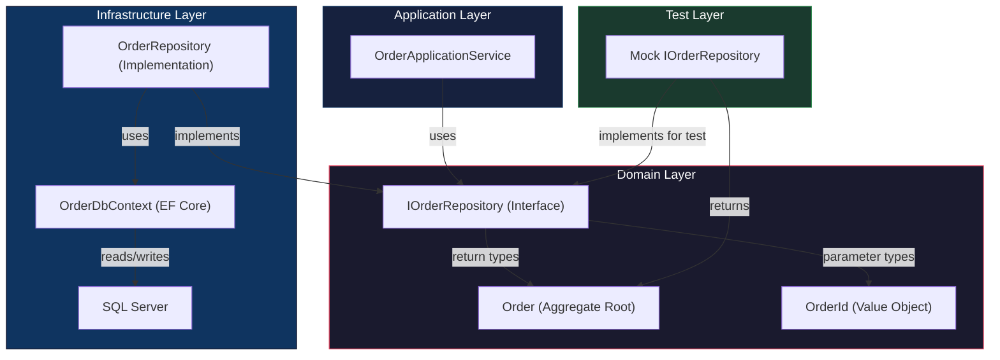
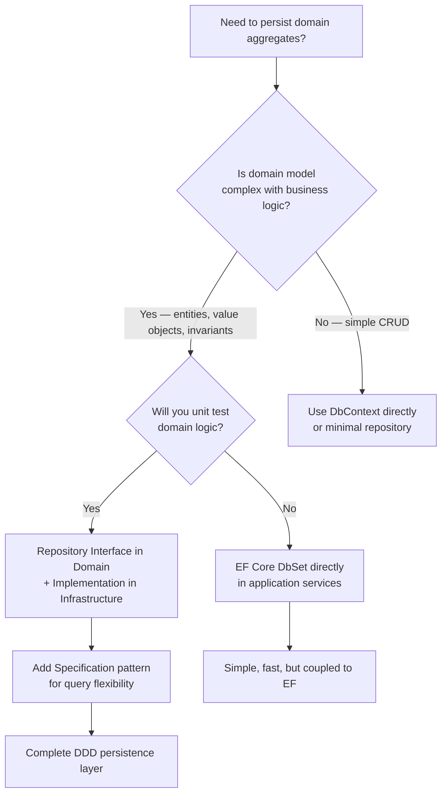

> [!success] Mastery Check
> - [ ] **Studied Well**
> - [ ] **Can explain the concept without notes**
> - [ ] **Can answer interview questions confidently**
> - [ ] **Can implement it in a real project**


# 7.056 — DDD — Repositories — Interface and Implementation

## Navigation

**Domain:** [[7 — System Design & Distributed Systems]] > **Group:** Domain-Driven Design
**Previous:** [[7.055 — Integration Events — Across Bounded Contexts]] | **Next:** [[7.057 — Repositories — EF Core Implementation]]

### Prerequisites

- [[7.043 — Entities — Identity and Lifecycle]] — repositories load and persist entities by identity; understanding identity creation strategies (GUID, sequential, domain-assigned) determines repository key types
- [[7.047 — Aggregates — Consistency Boundary]] — each repository loads an entire aggregate — all its entities, value objects, and child collections — in a single operation; partial loads violate the consistency boundary
- [[7.048 — Aggregates — Aggregate Root Rule]] — only aggregate roots get repository interfaces; internal entities and value objects are loaded through their root's repository

### Where This Fits

A repository is a **domain-layer interface** that provides collection-like access to aggregates: `Add`, `GetById`, `Remove`, and query methods. It sits between the domain model (which defines business logic) and the persistence infrastructure (database, ORM, file system). The interface is defined in the Domain layer; the implementation is in Infrastructure. This separation is the Dependency Inversion Principle applied to persistence: the domain defines the contract for loading and saving its objects, and infrastructure implements it. Without repositories, domain logic leaks persistence concerns — `SaveChanges`, `DbContext`, SQL queries appear in application services or worse, in domain entities. Repositories become necessary at the point where you have 2+ aggregate types and any amount of business logic that needs to persist them.

## Core Mental Model

A repository is a **domain-published abstraction** that makes the persistence store invisible to domain and application layers. The application service calls `_orderRepository.GetById(orderId)` and receives a fully hydrated `Order` aggregate; it never knows if the data came from SQL Server, Cosmos DB, an in-memory cache, or a mock for testing. The invariant is: **the repository interface speaks the domain's Ubiquitous Language (GetById, FindByCustomer, NextIdentity) and the implementation translates to the infrastructure's language (SQL, LINQ, HTTP)**. The tradeoff is: the domain gains complete persistence ignorance at the cost of an extra abstraction layer that ORMs like EF Core partially duplicate.

### Classification

| Dimension | Classification | Rationale |
|-----------|---------------|-----------|
| Pattern Type | **Tactical DDD / Infrastructure Boundary** | Repository separates domain from persistence |
| Layer | **Domain (interface) / Infrastructure (implementation)** | Interface in Domain, implementation in Infrastructure |
| Scope | **Per aggregate root** | One repository per aggregate root type |
| Abstraction Level | **Collection-like** | Add, GetById, Remove semantics |
| Testability | **High (mockable)** | Interface enables unit tests without database |
| ORM Coupling | **None in domain layer** | Domain never references DbContext or SQL |



### Key Properties

| Property | Value | Condition |
|----------|-------|-----------|
| Domain purity | Domain has zero persistence references | Always — interface has no EF/SQL imports |
| Testability | Full — mock repository returns any aggregate state | Always |
| Full aggregate loading | Repository returns complete aggregate | On every read operation |
| Transaction ownership | Repository does NOT own transactions | Transaction belongs to application service / unit of work |
| Identity generation | Domain generates identity, not database | Always in DDD (GUID or domain-assigned ID) |
| Query flexibility | Limited by interface methods | Complex queries require specifications ([[7.059]]) |

## Deep Mechanics

### How It Works

1. **Interface definition in Domain layer**: An `IOrderRepository` interface is defined in the Domain project. It declares `Task<Order?> GetByIdAsync(OrderId id, CancellationToken ct)`, `Task AddAsync(Order order, CancellationToken ct)`, and `Task RemoveAsync(Order order, CancellationToken ct)`. The interface uses only domain types — `OrderId`, `Order`, `CustomerId`.

2. **Implementation in Infrastructure layer**: `OrderRepository` implements `IOrderRepository` using EF Core. It maps between domain types and database schema. The constructor takes `OrderDbContext` (scoped DI). EF Core handles change tracking — the repository does NOT call `SaveChangesAsync`; the unit of work does.

3. **Application service uses repository**: The application service depends on `IOrderRepository` (not the concrete class). It calls `GetByIdAsync`, modifies the aggregate, then commits via the unit of work.

4. **Testing**: Unit tests mock `IOrderRepository` to return specific aggregate states without a database. Integration tests use the real `OrderRepository` with an in-memory or test database.

### Failure Modes

**Stale aggregate**: Repository returns cached data or EF Core's first-level cache returns an outdated version. **Detection**: Optimistic concurrency exception on save. **Mitigation**: Use concurrency tokens (rowversion/timestamp) on aggregates.

**N+1 query**: Repository loads aggregate but lazy-loads child collections one query at a time. **Detection**: P99 latency spikes, hundreds of database queries per request. **Mitigation**: Use `Include` for eager loading; specify navigation properties in the repository method.

**Transaction scope leak**: Repository begins a transaction that the application service doesn't expect. **Detection**: Deadlocks due to nested transactions. **Mitigation**: Repository should NOT manage transactions; the unit of work does.

**Over-fetching**: Repository loads the full aggregate when only a subset is needed. **Detection**: Memory pressure, slow queries. **Mitigation**: Consider read models for queries, keep full-load repositories for commands.

### .NET and Azure Integration

- **EF Core**: Primary repository implementation mechanism — `DbSet<T>` provides `FindAsync`, `Add`, `Remove`
- **Cosmos DB**: `Container.GetItemLinqQueryable` for document-based repository implementations
- **Dapper**: Lightweight alternative for repositories with complex SQL
- **Azure SQL Database**: Primary relational store for .NET DDD repositories
- **Azure Cache for Redis**: Second-level cache for repository lookups
- **FluentValidation**: Validate aggregate before adding to repository

```csharp
// Interface definition — Domain layer
namespace OrderService.Domain.Repositories;

public interface IOrderRepository
{
    Task<Order?> GetByIdAsync(OrderId orderId, CancellationToken ct = default);
    Task<IReadOnlyList<Order>> GetByCustomerAsync(CustomerId customerId, CancellationToken ct = default);
    Task AddAsync(Order order, CancellationToken ct = default);
    Task RemoveAsync(Order order, CancellationToken ct = default);
    OrderId NextIdentity();
}
```

## Production Patterns and Implementation

### Primary Implementation

```csharp
// Domain Layer — Interface
namespace OrderService.Domain.Repositories;

/// <summary>
/// Repository for Order aggregate. All load and save operations return complete aggregates.
/// Transactions are managed by the unit of work, not individual repository methods.
/// </summary>
public interface IOrderRepository
{
    Task<Order?> GetByIdAsync(OrderId orderId, CancellationToken ct = default);

    Task<IReadOnlyList<Order>> GetByCustomerAsync(CustomerId customerId, CancellationToken ct = default);

    Task<IReadOnlyList<Order>> GetPendingOrdersAsync(CancellationToken ct = default);

    Task AddAsync(Order order, CancellationToken ct = default);

    Task RemoveAsync(Order order, CancellationToken ct = default);

    OrderId NextIdentity();
}

// Domain Layer — Dependencies-only aggregate root
public sealed class Order : AggregateRoot<OrderId>
{
    // No repository references — domain is persistence-ignorant
    // Repository is an external concern, not part of the domain model
}

// Infrastructure Layer — Implementation
namespace OrderService.Infrastructure.Persistence.Repositories;

public sealed class OrderRepository : IOrderRepository
{
    private readonly OrderDbContext _dbContext;

    public OrderRepository(OrderDbContext dbContext)
    {
        _dbContext = dbContext;
    }

    public async Task<Order?> GetByIdAsync(OrderId orderId, CancellationToken ct = default)
    {
        return await _dbContext.Orders
            .Include(o => o.Items)
            .Include(o => o.ShippingAddress)
            .FirstOrDefaultAsync(o => o.Id == orderId, ct);
    }

    public async Task<IReadOnlyList<Order>> GetByCustomerAsync(CustomerId customerId, CancellationToken ct = default)
    {
        return await _dbContext.Orders
            .Include(o => o.Items)
            .Where(o => o.CustomerId == customerId)
            .OrderByDescending(o => o.CreatedAt)
            .ToListAsync(ct);
    }

    public async Task<IReadOnlyList<Order>> GetPendingOrdersAsync(CancellationToken ct = default)
    {
        return await _dbContext.Orders
            .Include(o => o.Items)
            .Where(o => o.Status == OrderStatus.Submitted)
            .ToListAsync(ct);
    }

    public async Task AddAsync(Order order, CancellationToken ct = default)
    {
        await _dbContext.Orders.AddAsync(order, ct);
    }

    public Task RemoveAsync(Order order, CancellationToken ct = default)
    {
        _dbContext.Orders.Remove(order);
        return Task.CompletedTask;
    }

    public OrderId NextIdentity()
    {
        return OrderId.New();
    }
}
```

### Configuration and Wiring

```csharp
// Program.cs — register repository as scoped service
builder.Services.AddScoped<IOrderRepository, OrderRepository>();

// DbContext registration
builder.Services.AddDbContext<OrderDbContext>(options =>
    options.UseSqlServer(builder.Configuration.GetConnectionString("Orders")));

// Application service uses repository
builder.Services.AddScoped<IOrderApplicationService, OrderApplicationService>();
```

### Common Variants

**Generic repository** (base interface for common operations):

```csharp
public interface IRepository<T, TId> where T : AggregateRoot<TId>
{
    Task<T?> GetByIdAsync(TId id, CancellationToken ct = default);
    Task AddAsync(T aggregate, CancellationToken ct = default);
    Task RemoveAsync(T aggregate, CancellationToken ct = default);
}

public sealed class OrderRepository : IRepository<Order, OrderId>
{
    // Implement AddAsync, GetByIdAsync, RemoveAsync
}

// Pro: Reduces boilerplate for simple aggregates
// Con: Hides domain-specific query methods (GetByCustomer, GetPendingOrders)
```

**Read-only repository** (separate query interface):

```csharp
public interface IOrderQueries
{
    Task<OrderSummary?> GetSummaryAsync(OrderId id, CancellationToken ct = default);
    Task<IReadOnlyList<OrderSummary>> GetByCustomerAsync(CustomerId customerId, CancellationToken ct = default);
}

// Separate from IOrderRepository to follow CQS
// Query path uses lightweight DTOs, command path uses aggregates
```

**Repository with specification** (composable queries via [[7.059]]):

```csharp
public interface IOrderRepository
{
    Task<IReadOnlyList<Order>> FindAsync(Specification<Order> spec, CancellationToken ct = default);
    // Callers compose specs: new OrdersByCustomerSpec(customerId).And(new PendingOrdersSpec())
}
```

### Real-World .NET Ecosystem Example

**EF Core's `DbSet<T>`** is itself a repository-like abstraction. When you call `DbSet<Order>.FindAsync(id)`, EF Core returns a tracked entity from its first-level cache or queries the database. The difference is: DbSet is an ORM-specific API that exposes persistence concepts (`AsNoTracking`, `Include`, `AsSplitQuery`). A DDD repository interface hides these details, allowing you to change the ORM or storage technology without changing the domain or application layers. Many production .NET applications define `IOrderRepository` and implement it with EF Core `DbSet<T>` internally — the abstraction boundary is what matters, not whether the underlying technology is an ORM.

## Gotchas and Production Pitfalls

### Pitfall 1: Repository Calls SaveChangesAsync

**Pitfall:** The repository implementation calls `SaveChangesAsync` internally, breaking the unit of work pattern — partial saves cause inconsistent state.

```csharp
// ❌ Repository owns the transaction
public sealed class OrderRepository : IOrderRepository
{
    private readonly OrderDbContext _dbContext;

    public async Task AddAsync(Order order, CancellationToken ct)
    {
        await _dbContext.Orders.AddAsync(order, ct);
        await _dbContext.SaveChangesAsync(ct); // BUG: partial commit
    }
}
```

**Symptom:** If the application service modifies two aggregates and the second repository's `AddAsync` throws, the first aggregate is already committed. Database in inconsistent state — order without payment, or payment without order.

**Fix:** Repository methods should NOT call `SaveChangesAsync`. The unit of work calls it once at the end of the operation.

```csharp
// ✅ Unit of work controls transaction
public sealed class OrderRepository : IOrderRepository
{
    private readonly OrderDbContext _dbContext;

    public async Task AddAsync(Order order, CancellationToken ct)
    {
        await _dbContext.Orders.AddAsync(order, ct);
        // No SaveChangesAsync — the application service commits
    }
}

// Application service
public async Task<OrderId> SubmitOrderAsync(SubmitOrder command, CancellationToken ct)
{
    var order = Order.Create(command.CustomerId, command.Items);
    await _orderRepository.AddAsync(order, ct);
    await _paymentRepository.AddAsync(payment, ct);
    await _unitOfWork.SaveChangesAsync(ct); // Single commit — both or neither
}
```

**Cost of not fixing:** Data inconsistency — partial commits. At 1000 orders/day with 2% failure rate, 20 inconsistent states per day requiring manual reconciliation.

### Pitfall 2: Lazy Loading in Repository Returns Methods

**Pitfall:** Repository loads the aggregate without eager-loading child collections; EF Core lazy-loads them individually.

```csharp
// ❌ Lazy loading — N+1 queries
public async Task<Order?> GetByIdAsync(OrderId orderId, CancellationToken ct)
{
    return await _dbContext.Orders
        .FirstOrDefaultAsync(o => o.Id == orderId, ct);
    // Items collection is lazy-loaded — one extra query per order access
}

// In application service:
var order = await _orderRepository.GetByIdAsync(orderId, ct);
foreach (var item in order.Items) // BANG: Another query here
{
    // ...
}
```

**Symptom:** P99 latency spikes. Hundreds of database queries for a single request. Database CPU at 100%.

**Fix:** Eager-load all navigation properties the aggregate requires to be consistent.

```csharp
// ✅ Eager loading — single query
public async Task<Order?> GetByIdAsync(OrderId orderId, CancellationToken ct)
{
    return await _dbContext.Orders
        .Include(o => o.Items)
        .Include(o => o.ShippingAddress)
        .FirstOrDefaultAsync(o => o.Id == orderId, ct);
}
```

**Cost of not fixing:** Database query count = 1 + N (where N = number of child entities). For an order with 10 items, that's 11 queries instead of 1. At 100 orders/second, 100 queries become 1,100. Database collapses under load.

### Pitfall 3: Specification Logic Leaks Into Repository Interface

**Pitfall:** Every query variant gets its own repository method — interface grows unbounded.

```csharp
// ❌ Exploding interface — N methods for N query combinations
public interface IOrderRepository
{
    Task<Order?> GetByIdAsync(OrderId id, CancellationToken ct);
    Task<IReadOnlyList<Order>> GetByCustomerAsync(CustomerId customerId, CancellationToken ct);
    Task<IReadOnlyList<Order>> GetByCustomerAndDateRangeAsync(CustomerId customerId, DateTime from, DateTime to, CancellationToken ct);
    Task<IReadOnlyList<Order>> GetByCustomerAndStatusAsync(CustomerId customerId, OrderStatus status, CancellationToken ct);
    Task<IReadOnlyList<Order>> GetByCustomerAndStatusAndDateRangeAsync(CustomerId customerId, OrderStatus status, DateTime from, DateTime to, CancellationToken ct);
    // Next week: 5 more methods
}
```

**Symptom:** Repository interface has 30+ methods. Adding a new query variant requires changing the interface, the implementation, and all tests. Developers start querying the database directly to avoid the interface.

**Fix:** Use the Specification pattern — one `FindAsync(Specification<Order>)` method handles all query variants.

```csharp
// ✅ Specification pattern — single FindAsync method
public interface IOrderRepository
{
    Task<IReadOnlyList<Order>> FindAsync(Specification<Order> specification, CancellationToken ct);
}

// Callers compose:
var spec = new OrdersByCustomerSpec(customerId)
    .And(new ByDateRangeSpec(from, to))
    .And(new ByStatusSpec(OrderStatus.Submitted));
var orders = await _repository.FindAsync(spec, ct);
```

**Cost of not fixing:** Repository interface becomes a maintenance burden. Every new query variant adds a method. ~20+ methods after 6 months. Developers bypass the repository and use DbSet directly — defeating the abstraction.

### Pitfall 4: Repository Returns Untracked Entities for Updates

**Pitfall:** Repository uses `AsNoTracking()` for read operations and the entity cannot be updated because it's detached from the change tracker.

```csharp
// ❌ AsNoTracking prevents updates
public async Task<Order?> GetByIdAsync(OrderId orderId, CancellationToken ct)
{
    return await _dbContext.Orders
        .AsNoTracking() // BUG: entity is detached
        .Include(o => o.Items)
        .FirstOrDefaultAsync(o => o.Id == orderId, ct);
}

// Application service modifies then saves:
var order = await _orderRepository.GetByIdAsync(orderId, ct);
order.Submit(); // Works in memory
await _unitOfWork.SaveChangesAsync(ct); // Nothing happens — entity not tracked
```

**Symptom:** Aggregate modifications are silently not persisted. The `Submit()` call changes the in-memory object, but `SaveChangesAsync` generates zero SQL updates.

**Fix:** Do NOT use `AsNoTracking()` in repository methods used for commands. Use it only in read-model queries (CQRS query side).

```csharp
// ✅ No AsNoTracking — entity is tracked for updates
public async Task<Order?> GetByIdAsync(OrderId orderId, CancellationToken ct)
{
    return await _dbContext.Orders
        .Include(o => o.Items)
        .FirstOrDefaultAsync(o => o.Id == orderId, ct);
    // Entity is tracked — changes will be saved
}
```

**Cost of not fixing:** Silent data loss. "Works on my machine" — changes appear in-memory but never reach the database. Inconsistencies discovered days later. Root cause is hard to find because no error is thrown.

### Pitfall 5: Mock Repository Returns a Different Aggregate State Than Production

**Pitfall:** Unit tests use mock repositories that return aggregates in unrealistic states — entities constructed without EF Core conventions, navigation properties null, backing fields missing.

```csharp
// ❌ Mock returns invalid aggregate state
var mockRepo = new Mock<IOrderRepository>();
mockRepo.Setup(r => r.GetByIdAsync(It.IsAny<OrderId>(), default))
    .ReturnsAsync(new Order { Id = orderId, Status = OrderStatus.Draft });
// Missing Items, ShippingAddress — production would have them
```

**Symptom:** Domain logic that navigates `order.Items` throws `NullReferenceException` in production but works in tests because the mock doesn't reflect real aggregate structure.

**Fix:** Use builder methods or test data factories that produce complete aggregates. Test against the real repository with an in-memory database for integration tests.

```csharp
// ✅ Test factory produces complete aggregate
public static class OrderFactory
{
    public static Order CreateDraftOrder(CustomerId customerId)
    {
        var order = Order.Create(customerId, new[]
        {
            new OrderLineItem(ProductId.New(), "Widget", 2, Money.Usd(29.99m))
        });
        return order;
    }
}
```

**Cost of not fixing:** Tests pass, production fails. False confidence in test coverage. Defects in the domain logic that only surface with fully hydrated aggregates.

## Tradeoffs and Decision Framework

### Tradeoff Matrix

| Dimension | Repository Pattern | Direct DbContext Usage | Raw SQL / Dapper |
|-----------|--------------------|-----------------------|-------------------|
| Domain purity | High | Low (EF in domain) | None |
| Testability | High (mockable) | Medium (in-memory DB) | Low (integration only) |
| Query flexibility | Low-Medium | High | Very High |
| Performance overhead | Minimal (abstraction) | Minimal (ORM overhead) | Optimal |
| Team expertise required | Low | Medium | Medium-High |
| .NET ecosystem fit | Native | Native | Native |

### Decision Flowchart



### When to Apply

- Domain model has business logic that must be unit tested without a database
- Multiple teams own different parts of the system — repository interface provides a clean contract
- You may switch storage technology (SQL → Cosmos DB) and want to isolate the change
- Aggregate loading requires includes, filtering, and business rules that should not leak into infrastructure

### When NOT to Apply

- Simple CRUD applications — the repository adds overhead without benefit
- Small teams where the abstraction cost outweighs the flexibility benefit
- When you use Entity Framework Core and are comfortable with its `DbSet<T>` as the repository — EF Core IS a repository implementation

### Scale Thresholds

- **Worth considering above** 3+ aggregate types with business logic
- **Required when** you need to unit test domain logic without a database
- **Justified when** you are likely to change storage technology (startup that may migrate from SQL to Cosmos)
- **Over-engineering below** 2 aggregate types where team is 2-3 developers and database won't change

## Interview Arsenal

### Question Bank

1. **What is the repository pattern and what problem does it solve in DDD?**
2. **Why should a repository NOT call SaveChangesAsync?**
3. **What is the difference between a repository and a data access object (DAO)?**
4. **How do you handle complex queries with a repository without exploding the interface?**
5. **Compare the repository pattern with EF Core's DbSet — is DbSet already a repository?**
6. **Design a repository for an Order aggregate that must support querying by customer, date range, status, and pagination.**
7. **What happens to a repository at 10x scale — 1000 orders/second? Where does it break?**
8. **How does the repository pattern relate to the Dependency Inversion Principle?**

### Spoken Answers

**Q1: What is the repository pattern and what problem does it solve in DDD?**

> **Average answer:** A repository is a class that mediates between the domain and data mapping layers. It provides an interface for loading and saving aggregates.

> **Great answer:** In DDD, a repository is a domain-published interface that provides collection-like access to aggregates — `GetById`, `Add`, `Remove`. It's defined in the Domain layer and implemented in Infrastructure. This solves two problems. First, persistence ignorance: the domain model never imports Entity Framework, SQL, or any database concern. The `Order.Submit()` method doesn't know if the order came from SQL Server, Cosmos DB, or a test mock. Second, full aggregate loading: the repository guarantees it returns a complete aggregate — all its entities, value objects, and collections are fully hydrated. The application service should never navigate a null reference on a child collection. The cost is an extra abstraction layer — you define an interface, implement it, and wire it in DI. For a complex domain with 5+ aggregate types and unit tests, that cost pays for itself in testability and persistence flexibility.

**Q3: How do you handle complex queries with a repository without exploding the interface?**

> **Great answer:** The naive approach adds one method per query — `GetByCustomer`, `GetByCustomerAndDateRange`, `GetByCustomerAndStatus`. The interface grows without bound and every new query requires changing four files: the interface, the implementation, the tests, and the caller. The better approach is the Specification pattern — [[7.059 — Specifications — Composable Query Logic]]. The repository has a single `FindAsync(Specification<T> spec)` method. Callers compose query criteria using specification objects: `new OrdersByCustomerSpec(customerId).And(new SubmittedOrdersSpec()).And(new FromDateSpec(lastWeek))`. The implementation translates the specification to LINQ or SQL. This gives unlimited query combinations without changing the repository interface. The tradeoff is that composing specs is more verbose than a single method call — but for a domain with 20+ query variants, it's the difference between a stable interface and a maintenance nightmare.

**Q6: Design a repository for an Order aggregate that must support querying by customer, date range, status, and pagination.**

> **Great answer:** I'd separate the command-path repository from the query-path repository. For commands, `IOrderRepository` has `GetByIdAsync`, `AddAsync`, `RemoveAsync` — simple, standard. For queries, I'd use either the Specification pattern with `FindAsync(Specification, Pagination)` or a separate `IOrderQueries` interface that returns lightweight DTOs, not aggregates.

> For the specification approach:

```csharp
public interface IOrderRepository
{
    Task<Order?> GetByIdAsync(OrderId id, CancellationToken ct);
    Task<IReadOnlyList<Order>> FindAsync(Specification<Order> spec, Pagination pagination, CancellationToken ct);
    Task<int> CountAsync(Specification<Order> spec, CancellationToken ct);
    Task AddAsync(Order order, CancellationToken ct);
}

// Usage:
var spec = new OrdersByCustomerSpec(customerId)
    .And(new ByStatusSpec(OrderStatus.Submitted))
    .And(new ByDateRangeSpec(lastMonth, today));
var orders = await _repository.FindAsync(spec, new Pagination(1, 20), ct);
```

> For heavy querying, I'd also add a `IOrderQueries` interface that returns `OrderSummary` DTOs using raw SQL or Dapper — faster than loading full aggregates for list views. The key principle: commands load full aggregates; queries load lightweight projections.
</details>

### System Design Interview Trigger

If an interviewer asks about database access patterns in a DDD system, they are testing whether you understand the separation of concerns between domain and persistence. The follow-up is always about query complexity: "how do you handle reporting queries that join across multiple aggregates?" The interviewer wants to hear about CQRS — separate command-side repositories (full aggregate load) from query-side projections (lightweight DTOs).

### Comparison Table

| | Repository (DDD) | EF Core DbSet | Dapper |
|---|---|---|---|
| Core guarantee | Domain-persistence isolation | ORM abstraction | Raw SQL execution |
| Trade-off | Abstraction overhead | Limited domain purity | No change tracking |
| .NET implementation | `interface IOrderRepository` | `DbSet<Order>` | `SqlConnection.QueryAsync<T>` |
| Failure mode | Exploding interface | N+1 lazy loading | SQL injection / mapping errors |
| When to choose | Complex domain logic | Simple domain + EF familiarity | Performance-critical queries |

## Architecture Decision Record

**Status:** Accepted

**Context:** The Order Processing system has 5 aggregate types (Order, Payment, Shipment, Invoice, Return) with complex business logic that must be unit tested. The application currently uses EF Core with SQL Server but may migrate to Cosmos DB for the Order aggregate to support global distribution. The team needs persistence ignorance in the domain layer and the ability to switch storage without changing business logic.

**Options Considered:**

1. **Repository interface in Domain, EF Core implementation in Infrastructure** — Traditional DDD repository pattern
2. **EF Core DbSet direct usage in Application Services** — No repository abstraction, DbContext used throughout
3. **Dapper with repository interface** — Micro-ORM for the Infrastructure implementation

**Decision:** Option 1 — repository interfaces in the Domain layer, implemented with EF Core. This provides the persistence ignorance needed for unit testing and the flexibility to migrate Order storage to Cosmos DB while keeping other aggregates on SQL Server.

**Consequences:**
- ✅ Domain layer has zero EF Core or SQL references — persistence-ignorant
- ✅ Unit tests mock `IOrderRepository` and test domain logic without a database
- ✅ Order aggregate can migrate to Cosmos DB by swapping `OrderRepository` implementation
- ⚠️ Added 7 interface files + 7 implementation files = 14 files for 5 aggregates
- ⚠️ EF Core's advanced querying capabilities are hidden behind the repository abstraction — some queries need specification pattern
- ❌ Cannot use EF Core's lazy loading or change tracker features that depend on repository consumers being EF-aware

**Review Trigger:** Revisit this decision if the number of aggregate types exceeds 20 (interface maintenance overhead grows) or if query performance requirements push toward raw SQL for all queries (consider CQRS separation).

## Self-Check

### Conceptual Questions

1. What is the single responsibility of a repository in DDD?

<details>
<summary>Answer</summary>
To provide collection-like access to aggregates — loading complete aggregates by identity and adding/removing them from the persistence store. The repository does NOT know about transactions, does NOT call SaveChanges, and does NOT filter aggregates based on business rules (that's the domain/application layer's job).
</details>

2. Why should a repository interface be defined in the Domain layer?

<details>
<summary>Answer</summary>
To follow the Dependency Inversion Principle — high-level modules (domain) should not depend on low-level modules (infrastructure). The domain defines the contract for persistence; infrastructure implements it. This keeps the domain layer free of ORM, SQL, and connection string references.
</details>

3. What is the difference between a repository and a DAO (Data Access Object)?

<details>
<summary>Answer</summary>
A DAO is a low-level data access component that maps database tables to objects. A repository is a higher-level abstraction that loads and saves entire aggregates, speaking the domain's Ubiquitous Language. DAOs expose database concepts (tables, columns, SQL); repositories expose domain concepts (Orders, Customers, aggregate operations).
</details>

4. What problem does the Specification pattern solve for repositories?

<details>
<summary>Answer</summary>
It prevents the repository interface from exploding with query-specific methods. One `FindAsync(Specification<T>)` method handles all query variants by accepting composable criteria objects. See [[7.059 — Specifications — Composable Query Logic]].
</details>

5. What EF Core method should NEVER be called inside a repository?

<details>
<summary>Answer</summary>
`SaveChangesAsync`. The repository should not control the transaction boundary — that belongs to the application service or unit of work. The repository stages changes via `Add`, `Remove`, and state modifications; the unit of work commits them atomically.
</details>

6. How do you unit test application logic that uses a repository?

<details>
<summary>Answer</summary>
Mock the repository interface. Use a mocking framework (Moq, NSubstitute) to return pre-configured aggregate states. Test that the application service calls the correct repository methods and passes the right parameters. No database required.
</details>

7. At what number of aggregate types does the repository pattern become over-engineering?

<details>
<summary>Answer</summary>
Below 3 aggregate types in a small team (2-3 developers) with no plans to change database, the overhead of interface + implementation + DI registration may not pay off. Above 5 aggregate types or if unit testing domain logic is required, the pattern pays for itself.
</details>

8. How do repositories relate to bounded contexts in [[7.033 — Bounded Contexts — Identifying Boundaries]]?

<details>
<summary>Answer</summary>
Each bounded context has its own set of repositories. The Order bounded context has `IOrderRepository` implemented against the Orders database. The Inventory bounded context has `IInventoryRepository` implemented against the Inventory database. Repositories are bounded by their context — they never cross bounded context boundaries.
</details>

9. What is the danger of a generic `IRepository<T>` interface?

<details>
<summary>Answer</summary>
It exposes only generic CRUD operations (`GetById`, `Add`, `Remove`). Domain-specific queries (`GetByCustomer`, `GetPendingOrders`) require either casting (breaking type safety) or adding methods to the generic interface (making it less generic). Many DDD practitioners advise against generic repositories for this reason — each aggregate has unique query needs that a generic interface cannot express.
</details>

10. Explain the repository pattern in 60 seconds at a whiteboard.

<details>
<summary>Answer</summary>
"A repository is a domain-published interface that acts as an in-memory collection for aggregate roots. The interface — `IOrderRepository` — lives in the Domain layer and declares methods like `GetById(OrderId)` and `Add(Order)`. The implementation lives in Infrastructure and uses EF Core, Dapper, or any other persistence technology. The application service depends on the interface, not the implementation. This gives us three benefits: first, the domain model is persistence-ignorant — it doesn't import any ORM library. Second, we can unit test business logic by mocking the repository. Third, we can swap the database technology without touching domain or application logic. The key rule: repositories load complete aggregates, they don't call SaveChanges, and only aggregate roots get repositories."
</details>

### Scenario Challenges

**Scenario 1 — Diagnose the problem:** The Order Application Service occasionally fails with `DbUpdateConcurrencyException`. The error occurs when two users try to modify the same order simultaneously. The repository does not use any concurrency handling.

<details>
<summary>Diagnosis</summary>

**Root cause:** No optimistic concurrency control. EF Core's default `SaveChanges` uses `WHERE` clauses only on the primary key. The second save overwrites the first without detecting the conflict. When EF Core is configured with a concurrency token (`rowversion`), it detects the conflict but throws `DbUpdateConcurrencyException`.

**Evidence:** Logs show `DbUpdateConcurrencyException: Database operation expected to affect 1 row(s) but actually affected 0 row(s).` This happens because the `WHERE` clause includes the `rowversion` check and the row was already updated.

**Fix:** The repository should handle concurrency conflicts by retrying the operation or throwing a domain-specific exception:

```csharp
public sealed class ConcurrencyAwareOrderRepository : IOrderRepository
{
    public async Task<Order?> GetByIdAsync(OrderId orderId, CancellationToken ct)
    {
        return await _dbContext.Orders
            .Include(o => o.Items)
            .FirstOrDefaultAsync(o => o.Id == orderId, ct);
    }

    // Retry logic should be at the application service level, not in the repository
    // The repository surfaces the concurrency exception; the application retries
}

// Application service with retry
public async Task<Result> UpdateShippingAddressAsync(OrderId orderId, Address newAddress, CancellationToken ct)
{
    const int maxRetries = 3;
    for (int attempt = 1; attempt <= maxRetries; attempt++)
    {
        try
        {
            var order = await _orderRepository.GetByIdAsync(orderId, ct);
            if (order is null) return Result.NotFound();
            order.UpdateShippingAddress(newAddress);
            await _unitOfWork.SaveChangesAsync(ct);
            return Result.Success();
        }
        catch (DbUpdateConcurrencyException) when (attempt < maxRetries)
        {
            // Reload fresh copy and retry
            await _dbContext.Entry(order).ReloadAsync(ct);
        }
    }
    return Result.Failure("Concurrency conflict after 3 retries");
}
```

**Prevention:** Configure concurrency tokens on all aggregate roots. Document retry strategy in the ADR.
</details>

**Scenario 2 — Design decision:** Your team is building a new Reporting Service that needs to display "all orders with their associated payments." The team wants to use the repository pattern. The existing Order and Payment aggregates are in separate databases. How do you design this?

<details>
<summary>Decision and Reasoning</summary>

**Choice:** Do NOT use the repository pattern for this reporting query. Create a separate read-model query interface that returns lightweight DTOs, using raw SQL or a dedicated read database.

**Tradeoffs accepted:** Duplicating some query logic between the command repositories and read-model queries. Acceptable because the two paths have different optimization needs — commands need consistency, queries need speed.

**Implementation sketch:**

```csharp
// Read-model interface — NOT a repository
public interface IOrderPaymentQueries
{
    Task<PagedResult<OrderWithPaymentDto>> GetOrdersWithPaymentsAsync(
        DateTime from, DateTime to, int page, int pageSize, CancellationToken ct);
}

// Implementation using Dapper for raw SQL across databases
public sealed class OrderPaymentQueries : IOrderPaymentQueries
{
    private readonly IDbConnection _orderDb;
    private readonly IDbConnection _paymentDb;

    public async Task<PagedResult<OrderWithPaymentDto>> GetOrdersWithPaymentsAsync(...)
    {
        // Query both databases, compose in memory
        // Or use a database view / materialized view that joins across sources
    }
}

// Registration
builder.Services.AddScoped<IOrderPaymentQueries, OrderPaymentQueries>();

// Usage in controller
[HttpGet("orders-with-payments")]
public async Task<IActionResult> GetOrdersWithPayments(
    [FromQuery] DateTime from, [FromQuery] DateTime to,
    [FromQuery] int page = 1)
{
    var result = await _queries.GetOrdersWithPaymentsAsync(from, to, page, 20, ct);
    return Ok(result);
}
```

**Why not repository:** Repositories load full aggregates for command operations. Reporting queries need lightweight projections, joins across aggregates, and optimized SQL. Using repositories for reporting forces full aggregate loads (slow, memory-heavy) and can't easily query across bounded contexts.
</details>

**Scenario 3 — Failure mode:** A repository method `GetPendingOrdersAsync` is timing out in production. The database has 2 million orders. The method returns 150,000 pending orders. The application tries to load all of them into memory.

<details>
<summary>Investigation and Fix</summary>

**Investigation steps:**
1. Check the query: `SELECT * FROM Orders WHERE Status = 1` — no pagination, no limit
2. Check memory: 150,000 orders × ~2KB each = ~300MB for a single query
3. Check App Insights: query duration = 45 seconds, memory allocation = 350MB

**Confirming evidence:** `GetPendingOrdersAsync` called from a background job that processes pending orders. No pagination. The background job grows with the pending order backlog — at scale, it OOMs the pod.

**Immediate mitigation:** Add `Take(100)` to the query. Process 100 at a time in a loop.

**Permanent fix:**

```csharp
public interface IOrderRepository
{
    Task<IReadOnlyList<Order>> GetPendingOrdersAsync(int take, int skip, CancellationToken ct);
    Task<int> CountPendingOrdersAsync(CancellationToken ct);
}

// Repository implementation with pagination
public async Task<IReadOnlyList<Order>> GetPendingOrdersAsync(int take, int skip, CancellationToken ct)
{
    return await _dbContext.Orders
        .Include(o => o.Items)
        .Where(o => o.Status == OrderStatus.Submitted)
        .OrderBy(o => o.CreatedAt)
        .Skip(skip)
        .Take(take)
        .ToListAsync(ct);
}

// Background job processes in batches
public async Task ProcessPendingOrdersAsync(CancellationToken ct)
{
    const int batchSize = 100;
    var total = await _orderRepository.CountPendingOrdersAsync(ct);
    for (int skip = 0; skip < total; skip += batchSize)
    {
        var batch = await _orderRepository.GetPendingOrdersAsync(batchSize, skip, ct);
        foreach (var order in batch)
        {
            await _orderProcessor.ProcessAsync(order, ct);
        }
    }
}
```

**Post-mortem item:** All repository methods that return collections must have pagination or a max-result limit. Never return unbounded collections.
</details>

**Scenario 4 — Scale it:** Your system handles 500 orders/second with a single SQL Server instance. Each order load requires joining 5 tables. The repository pattern adds ~5% overhead. You need to reach 2000 orders/second.

<details>
<summary>Scaling Strategy</summary>

**Bottleneck this addresses:** Single-writer database cannot handle 2000 writes/second with 5-table joins. Read replicas and CQRS are required.

**How it helps:**
1. Separate command and query paths — commands use repositories with full aggregate loads; queries use `IOrderQueries` with lightweight DTOs
2. Move queries to read replicas — repository for commands hits the primary; query interface hits replicas
3. Add Redis caching for frequently-accessed aggregates

**Implementation:**

```csharp
// Command repository — hits primary database
public sealed class OrderRepository : IOrderRepository
{
    private readonly OrderDbContext _dbContext; // Primary connection string

    public async Task<Order?> GetByIdAsync(OrderId orderId, CancellationToken ct)
    {
        // Hits primary — needs latest data for commands
        return await _dbContext.Orders
            .Include(o => o.Items)
            .FirstOrDefaultAsync(o => o.Id == orderId, ct);
    }
}

// Query interface — hits read replica
public interface IOrderQueries
{
    Task<OrderSummary?> GetSummaryAsync(OrderId id, CancellationToken ct);
}
```

**What it does not solve:** Write throughput to the primary database. That requires vertical scaling (bigger SQL Server) or sharding (partition by customer ID).

**Implementation order:**
1. Implement `IOrderQueries` with read replica (week 1)
2. Add Redis cache to `OrderRepository.GetByIdAsync` with 30-second TTL (week 2)
3. Load test at 2000 orders/second, identify next bottleneck (week 3)
</details>

**Scenario 5 — Interview simulation:** The interviewer says: "Design the data access layer for an Order Processing system that handles 1000 orders/second. The system must support complex queries, unit testing of business logic, and the ability to change databases without domain changes."

<details>
<summary>Model Response</summary>

"I'd design a two-path data access layer following CQRS principles. On the command side, I define repository interfaces in the Domain layer — `IOrderRepository`, `IPaymentRepository` — with methods like `GetById`, `Add`, and `Remove`. These return fully hydrated aggregates. The implementations sit in Infrastructure and use EF Core with SQL Server. The domain layer never imports EF Core — it only knows about `IOrderRepository`. This gives us persistence ignorance and full testability through mocking.

On the query side, I define `IOrderQueries` in the Application layer — an interface that returns lightweight `OrderSummary` DTOs, not aggregates. The implementation uses Dapper with raw SQL against a read replica. This avoids loading 1MB aggregates for list pages and lets us optimize queries with joins, aggregations, and pagination without polluting the domain model.

For unit testing, tests mock `IOrderRepository` to return specific aggregate states and verify business logic behavior. Integration tests use `WebApplicationFactory` with a test database to validate the full stack.

For database flexibility, the repository interface is the seam — to switch from SQL Server to Cosmos DB for the Order aggregate, I create a new `CosmosOrderRepository : IOrderRepository` implementation. No domain or application code changes.

The tradeoff is the extra abstraction layers — about 10 interface files and 10 implementation files for 5 aggregate types. But at 1000 orders/second with complex domain logic, this investment pays for itself in testability and the ability to optimize each path independently."
</details>
