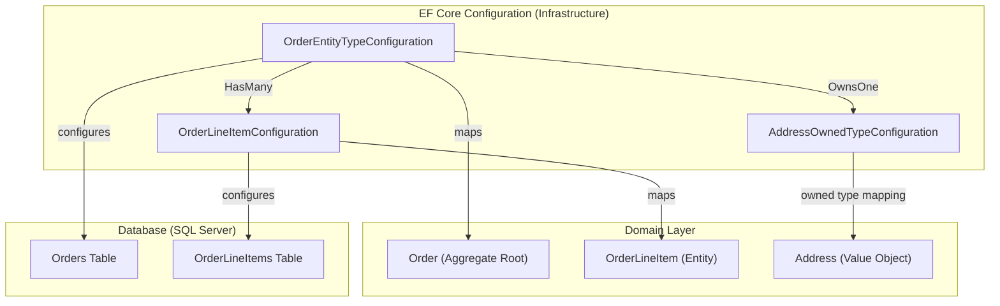

> [!success] Mastery Check
> - [ ] **Studied Well**
> - [ ] **Can explain the concept without notes**
> - [ ] **Can answer interview questions confidently**
> - [ ] **Can implement it in a real project**


# 7.057 — DDD — Repositories — EF Core Implementation

## Navigation

**Domain:** [[7 — System Design & Distributed Systems]] > **Group:** Domain-Driven Design
**Previous:** [[7.056 — Repositories — Interface and Implementation]] | **Next:** [[7.058 — Repositories — Unit of Work Pattern]]

### Prerequisites

- [[7.056 — Repositories — Interface and Implementation]] — the repository interface contract (GetById, Add, Remove) is implemented by EF Core; this note focuses on the EF Core mechanics
- [[7.047 — Aggregates — Consistency Boundary]] — EF Core's `DbContext` maps aggregate roots to tables; understanding the aggregate boundary determines how EF Core maps and persists the object graph
- [[7.078 — Infrastructure Concerns — Keeping Domain Pure]] — EF Core configuration files (entity type configurations, migrations) belong in Infrastructure; the Domain layer must never reference `DbContext` or `IEntityTypeConfiguration`

### Where This Fits

EF Core is the standard persistence engine for .NET DDD applications. It implements the repository interface by mapping aggregate roots to database tables through `DbSet<T>`, `DbContext`, and Entity Type Configurations. The challenge is that EF Core is a powerful ORM with its own conventions — without careful design, EF Core concerns leak into the domain model (public setters, parameterless constructors, navigation property exposure). This note covers the specific EF Core patterns — owned types for value objects, backing fields for encapsulation, table splitting, concurrency tokens, and query filters — that make domain-pure repository implementations possible. These patterns become critical when you have 5+ aggregates with complex object graphs and performance requirements above 500 operations/second.

## Core Mental Model

An EF Core repository implementation translates between two worlds: the **domain world** (aggregate roots with private constructors, encapsulated collections, value objects, domain events) and the **database world** (tables with rows, foreign keys, cascades, indexes). The DbContext acts as the bridge — its `OnModelCreating` configures the mapping, its `DbSet<T>` provides LINQ queries, and its `SaveChangesAsync` materializes changes as SQL statements. The invariant is: **the database schema is a consequence of the domain model, not the cause of it**. The tradeoff is: EF Core provides powerful automated mapping at the cost of requiring specific concessions in the domain model (parameterless constructors, `private set` properties, backing field configuration).

### Classification

| Dimension | Classification | Rationale |
|-----------|---------------|-----------|
| Pattern Type | **Infrastructure / ORM Implementation** | Concrete persistence implementation for DDD repositories |
| Abstraction Level | **Low-level mapping to SQL** | EF Core translates LINQ to SQL, manages change tracking |
| Scope | **Per bounded context** | Each bounded context has its own DbContext |
| Domain Purity | **Medium — concessions required** | Backing fields, private constructors needed for domain encapsulation |
| Performance | **Good, not optimal** | 80% of optimal SQL; requires tuning for complex queries |
| Migration Support | **Built-in** | `dotnet ef migrations` provides schema evolution |



### Key Properties

| Property | Value | Condition |
|----------|-------|-----------|
| Change tracking | Automatic | For entities loaded via DbSet and not AsNoTracking |
| Identity generation | Domain generates (GUID) or DB generates (auto-increment) | Configured in entity type configuration |
| Concurrency | RowVersion / Timestamp column | Configured via `IsRowVersion()` |
| Value Objects | Owned entity types (`OwnsOne`, `OwnsMany`) | EF Core 2.0+ |
| Encapsulation | Backing fields (`UsePropertyAccessMode`) | Configured per property |
| Global filters | `HasQueryFilter` for soft-delete, multi-tenancy | Applied in `OnModelCreating` |

## Deep Mechanics

### How It Works

1. **Domain model is designed without EF Core in mind**: The `Order` aggregate uses `private set`, `List<OrderLineItem>` backed by a field `_items`, and a parameterless constructor marked as `private` for EF Core.

2. **Entity type configuration maps domain to database**: An `IEntityTypeConfiguration<Order>` class maps the `OrderId` value object to a `CustomerId` column (owned type), configures the `_items` backing field for the `Items` collection, and sets up cascade delete.

3. **DbContext exposes DbSet<Order>**: The `OrderDbContext` has `public DbSet<Order> Orders { get; set; }`. Repository methods use `_dbContext.Orders` to query and modify the aggregate.

4. **Repository loads aggregate with Include**: `GetByIdAsync` uses `Include(o => o.Items).ThenInclude(i => i.Product)` to eagerly load the full aggregate graph in a single query.

5. **Application service modifies aggregate**: Through the tracked entity, changes to `Order.Status` or `Order.Items` are detected by EF Core's change tracker.

6. **SaveChangesAsync generates SQL**: EF Core compares tracked state against the snapshot taken at load time and generates `UPDATE`, `INSERT`, or `DELETE` statements.

### Failure Modes

**Update only changed properties**: EF Core by default updates ALL columns, not just changed ones. This can cause concurrency issues and unnecessary writes. Use `IsConcurrencyToken()` on specific columns.

**Cascade delete surprises**: EF Core's `OnDelete(DeleteBehavior.Cascade)` on child collections can cause unintended row deletions when removing items from a collection. Use `DeleteBehavior.ClientCascade` or handle deletes explicitly in the domain.

**Split queries vs single query**: For aggregates with many child collections, EF Core's single query produces a massive Cartesian join. Use `AsSplitQuery()` to generate multiple queries with fewer rows.

**First-level cache staleness**: DbContext caches entities by ID. Loading the same entity again returns the cached version even if the database has changed. Use `AsNoTracking()` for read-only queries or create a new DbContext instance.

### .NET and Azure Integration

- **EF Core 8 / 9**: Maps aggregates to SQL Server tables via fluent configuration
- **Azure SQL Database**: Primary relational store; EF Core supports elastic pools, geo-replication
- **Azure Cosmos DB**: EF Core provides Cosmos DB provider (`UseCosmos`) for document-based repository implementations
- **Azure Redis**: Second-level cache via `EFCoreSecondLevelCacheInterceptor` for frequently read aggregates
- **Azure App Configuration**: Connection strings, migration settings
- **Azure DevOps**: `dotnet ef migrations` as build step; CI/CD runs pending migrations on deploy

```csharp
// DbContext with Entity Type Configurations
public sealed class OrderDbContext : DbContext
{
    public DbSet<Order> Orders => Set<Order>();
    public DbSet<OutboxMessage> OutboxMessages => Set<OutboxMessage>();

    public OrderDbContext(DbContextOptions<OrderDbContext> options) : base(options) { }

    protected override void OnModelCreating(ModelBuilder modelBuilder)
    {
        modelBuilder.ApplyConfigurationsFromAssembly(typeof(OrderDbContext).Assembly);
        base.OnModelCreating(modelBuilder);
    }
}
```

## Production Patterns and Implementation

### Primary Implementation

```csharp
// Domain Model
public sealed class Order : AggregateRoot<OrderId>
{
    private readonly List<OrderLineItem> _items = [];

    // Private constructor for EF Core
    private Order() { }

    private Order(OrderId id, CustomerId customerId, IEnumerable<OrderLineItem> items)
    {
        Id = id;
        CustomerId = customerId;
        Status = OrderStatus.Draft;
        _items.AddRange(items);
    }

    public CustomerId CustomerId { get; private set; }
    public OrderStatus Status { get; private set; }
    public Money TotalAmount { get; private set; }
    public Address? ShippingAddress { get; private set; }
    public IReadOnlyList<OrderLineItem> Items => _items.AsReadOnly();
    public DateTime CreatedAt { get; private set; }
    public byte[] RowVersion { get; private set; } = [];

    public static Order Create(CustomerId customerId, IEnumerable<OrderLineItem> items)
    {
        var order = new Order(OrderId.New(), customerId, items);
        order.TotalAmount = items.Sum(i => i.LineTotal);
        return order;
    }

    public void Submit()
    {
        if (Status != OrderStatus.Draft) throw new DomainException("Only draft orders can be submitted.");
        Status = OrderStatus.Submitted;
        AddDomainEvent(new OrderSubmitted(Id, CustomerId, TotalAmount));
    }
}

// EF Core Repository Implementation
public sealed class OrderRepository : IOrderRepository
{
    private readonly OrderDbContext _dbContext;

    public OrderRepository(OrderDbContext dbContext) => _dbContext = dbContext;

    public async Task<Order?> GetByIdAsync(OrderId orderId, CancellationToken ct = default)
    {
        return await _dbContext.Orders
            .Include(o => o.Items)
            .AsSplitQuery()
            .FirstOrDefaultAsync(o => o.Id == orderId, ct);
    }

    public async Task<IReadOnlyList<Order>> GetByCustomerAsync(
        CustomerId customerId, CancellationToken ct = default)
    {
        return await _dbContext.Orders
            .Include(o => o.Items)
            .Where(o => o.CustomerId == customerId)
            .OrderByDescending(o => o.CreatedAt)
            .AsSplitQuery()
            .ToListAsync(ct);
    }

    public async Task AddAsync(Order order, CancellationToken ct = default)
    {
        await _dbContext.Orders.AddAsync(order, ct);
    }

    public Task RemoveAsync(Order order, CancellationToken ct = default)
    {
        _dbContext.Orders.Remove(order);
        return Task.CompletedTask;
    }

    public OrderId NextIdentity() => OrderId.New();
}

// Entity Type Configuration
public sealed class OrderEntityTypeConfiguration : IEntityTypeConfiguration<Order>
{
    public void Configure(EntityTypeBuilder<Order> builder)
    {
        builder.ToTable("Orders");

        // OrderId value object mapped as owned type
        builder.OwnsOne(o => o.Id, id =>
        {
            id.Property(i => i.Value)
                .HasColumnName("Id")
                .ValueGeneratedNever()
                .HasMaxLength(36);
        });

        builder.OwnsOne(o => o.CustomerId, cid =>
        {
            cid.Property(c => c.Value)
                .HasColumnName("CustomerId")
                .HasMaxLength(36)
                .IsRequired();
        });

        // Money value object
        builder.OwnsOne(o => o.TotalAmount, amt =>
        {
            amt.Property(m => m.Amount).HasColumnName("TotalAmount").HasColumnType("decimal(18,2)");
            amt.Property(m => m.Currency).HasColumnName("Currency").HasMaxLength(3);
        });

        // Address value object
        builder.OwnsOne(o => o.ShippingAddress, addr =>
        {
            addr.Property(a => a.Street).HasColumnName("ShippingStreet").HasMaxLength(200);
            addr.Property(a => a.City).HasColumnName("ShippingCity").HasMaxLength(100);
            addr.Property(a => a.PostalCode).HasColumnName("ShippingPostalCode").HasMaxLength(20);
            addr.Property(a => a.Country).HasColumnName("ShippingCountry").HasMaxLength(50);
        });

        // Collection of child entities with backing field
        builder.HasMany(o => o.Items)
            .WithOne()
            .HasForeignKey("OrderId")
            .OnDelete(DeleteBehavior.Cascade);

        builder.Navigation(o => o.Items)
            .UsePropertyAccessMode(PropertyAccessMode.Field);

        // Enum as string
        builder.Property(o => o.Status)
            .HasConversion<string>()
            .HasMaxLength(20);

        // Concurrency token
        builder.Property(o => o.RowVersion)
            .IsRowVersion();

        // Soft delete filter
        builder.HasQueryFilter(o => !o.IsDeleted);

        // Indexes
        builder.HasIndex(o => o.CustomerId);
        builder.HasIndex(o => o.Status);
    }
}

// Child entity configuration
public sealed class OrderLineItemConfiguration : IEntityTypeConfiguration<OrderLineItem>
{
    public void Configure(EntityTypeBuilder<OrderLineItem> builder)
    {
        builder.ToTable("OrderLineItems");

        builder.HasKey(li => li.Id);
        builder.Property(li => li.Id)
            .HasConversion(id => id.Value, value => OrderLineItemId.From(value))
            .ValueGeneratedNever();

        builder.Property(li => li.ProductName).HasMaxLength(200).IsRequired();
        builder.Property(li => li.Quantity).IsRequired();

        builder.OwnsOne(li => li.UnitPrice, p =>
        {
            p.Property(m => m.Amount).HasColumnName("UnitPrice").HasColumnType("decimal(18,2)");
            p.Property(m => m.Currency).HasColumnName("UnitPriceCurrency").HasMaxLength(3);
        });

        builder.OwnsOne(li => li.LineTotal, t =>
        {
            t.Property(m => m.Amount).HasColumnName("LineTotal").HasColumnType("decimal(18,2)");
            t.Property(m => m.Currency).HasColumnName("LineTotalCurrency").HasMaxLength(3);
        });
    }
}
```

### Configuration and Wiring

```csharp
// Program.cs
builder.Services.AddDbContext<OrderDbContext>(options =>
{
    options.UseSqlServer(
        builder.Configuration.GetConnectionString("Orders"),
        sqlOptions =>
        {
            sqlOptions.MigrationsAssembly(typeof(OrderDbContext).Assembly.FullName);
            sqlOptions.EnableRetryOnFailure(3);
            sqlOptions.CommandTimeout(30);
        });
});

// Register repository
builder.Services.AddScoped<IOrderRepository, OrderRepository>();
```

### Common Variants

**DbContext pooling** (for high-throughput web apps):

```csharp
builder.Services.AddDbContextPool<OrderDbContext>(options =>
{
    options.UseSqlServer(connectionString);
}, poolSize: 128);
// Pooling reuses DbContext instances — reduces allocation overhead
// Caution: DbContext must not hold per-request state
```

**Read-only DbContext** (for query-side CQRS):

```csharp
public interface IOrderDbContext
{
    IQueryable<Order> Orders { get; }
}

public sealed class ReadOnlyOrderDbContext : DbContext, IOrderDbContext
{
    public IQueryable<Order> Orders => Set<Order>().AsNoTracking().IgnoreQueryFilters();
    // Read-only context — no SaveChangesAsync called
}
```

**Cosmos DB provider** (for globally distributed aggregates):

```csharp
builder.Services.AddDbContext<OrderDbContext>(options =>
{
    options.UseCosmos(
        builder.Configuration["Azure:Cosmos:ConnectionString"],
        builder.Configuration["Azure:Cosmos:DatabaseName"]);
});

// Entity configuration for Cosmos DB — partition key required
public class OrderCosmosConfiguration : IEntityTypeConfiguration<Order>
{
    public void Configure(EntityTypeBuilder<Order> builder)
    {
        builder.ToContainer("Orders");
        builder.HasPartitionKey(o => o.CustomerId.Value);
        builder.OwnsMany(o => o.Items);
    }
}
```

### Real-World .NET Ecosystem Example

**EF Core's `DbSet<T>` as a Repository**: In production .NET DDD systems, EF Core's `DbSet<T>` is the most common repository implementation. The `IDbContextFactory<T>` pattern enables creating short-lived DbContext instances for background jobs. EF Core 8's `ExecuteUpdate` and `ExecuteDelete` bulk operations avoid loading entire aggregates for batch updates — useful for "mark all pending orders as expired" operations that don't need the full domain model. The `SaveChangesInterceptor` is the standard hook for automatically dispatching domain events during `SaveChangesAsync` — the pattern used by the `DomainEventDispatcherInterceptor` in [[7.054]].

## Gotchas and Production Pitfalls

### Pitfall 1: EF Core Lazy Loading in Repository Methods

**Pitfall:** EF Core lazy loading (via `ILazyLoader` or proxy) loads navigation properties on access, causing N+1 queries inside repository return methods.

```csharp
// ❌ Lazy loading enabled — N+1 on every navigation access
builder.Services.AddDbContext<OrderDbContext>(options =>
{
    options.UseLazyLoadingProxies(); // BUG: each .Items access queries the database
    options.UseSqlServer(connectionString);
});

// Consumer:
var order = await repo.GetByIdAsync(id, ct);
Console.WriteLine(order.Items.Count); // BANG: additional query
```

**Symptom:** Database server CPU spikes. Hundreds of queries per request. P99 latency increases 10x.

**Fix:** Disable lazy loading. Use `Include` eagerly in repository methods for all required navigations.

```csharp
// ✅ Disable lazy loading — use Include in repository
builder.Services.AddDbContext<OrderDbContext>(options =>
{
    options.UseSqlServer(connectionString);
    // No UseLazyLoadingProxies
});

public async Task<Order?> GetByIdAsync(OrderId orderId, CancellationToken ct)
{
    return await _dbContext.Orders
        .Include(o => o.Items)
        .FirstOrDefaultAsync(o => o.Id == orderId, ct);
}
```

**Cost of not fixing:** At 200 requests/second with 10 items per order, 200 queries become 2,200 queries/second. Database throttles at 500 concurrent queries. HTTP 503 errors.

### Pitfall 2: Value Object Mapping Leaks Domain Encapsulation

**Pitfall:** Domain value objects require EF-specific constructors or property setters that break encapsulation.

```csharp
// ❌ Value object compromised for EF
public sealed record Money
{
    public decimal Amount { get; init; } // Should be get-only
    public string Currency { get; init; } // Should be get-only
    private Money() { } // EF needs parameterless — but init breaks immutability
}
```

**Symptom:** Value object invariants can be bypassed. `new Money { Amount = -100 }` is possible. Domain logic assumes `Amount >= 0` but the setter allows negative values through deserialization.

**Fix:** Use backing fields and constructor-only assignment.

```csharp
// ✅ Encapsulation preserved for EF
public sealed class Money : IComparable<Money>
{
    private readonly decimal _amount;
    private readonly string _currency;

    public decimal Amount => _amount;
    public string Currency => _currency;

    private Money() { } // EF Core

    public Money(decimal amount, string currency)
    {
        if (amount < 0) throw new DomainException("Amount cannot be negative.");
        _amount = amount;
        _currency = currency ?? throw new ArgumentNullException(nameof(currency));
    }

    // EF Core configuration
    public static void ConfigureOwned(OwnedNavigationBuilder builder)
    {
        builder.Property(m => m._amount).HasColumnName("Amount").HasColumnType("decimal(18,2)");
        builder.Property(m => m._currency).HasColumnName("Currency").HasMaxLength(3);
    }
}
```

**Cost of not fixing:** Domain invariants compromised. Negative prices, invalid currency codes in production. Financial domain: unbounded financial loss.

### Pitfall 3: Missing AsSplitQuery Causes Cartesian Explosion

**Pitfall:** Loading an aggregate with multiple child collections — EF Core generates a `CROSS JOIN` between them.

```csharp
// ❌ Single query — Cartesian product
public async Task<Order?> GetByIdAsync(OrderId orderId, CancellationToken ct)
{
    return await _dbContext.Orders
        .Include(o => o.Items)          // 10 items
        .Include(o => o.Discounts)      // 3 discounts
        .Include(o => o.Shipments)      // 2 shipments
        .FirstOrDefaultAsync(o => o.Id == orderId, ct);
    // SQL: ORDER WITH ITEMS CROSS JOIN DISCOUNTS CROSS JOIN SHIPMENTS = 10*3*2 = 60 rows
}
```

**Symptom:** Database query returns 60 rows for an order with 10 items, 3 discounts, 2 shipments. Row count explodes with more collections. Query time increases exponentially.

**Fix:** Use `AsSplitQuery()` — generates separate queries, one per collection.

```csharp
// ✅ Split query — one query per collection
return await _dbContext.Orders
    .Include(o => o.Items)
    .Include(o => o.Discounts)
    .Include(o => o.Shipments)
    .AsSplitQuery() // Generates 4 queries instead of 1 massive join
    .FirstOrDefaultAsync(o => o.Id == orderId, ct);
```

**Cost of not fixing:** With 5 collections each having 5-10 rows, single-query returns 10,000+ rows. With 10 collections, 10 million+ rows. Out-of-memory or timeout.

### Pitfall 4: Not Configuring Cascade Delete on Entity Removal

**Pitfall:** Removing an item from the aggregate's collection on the domain side, then saving — EF Core doesn't delete the removed entity from the database.

```csharp
// ❌ Removing from collection doesn't delete from DB
public void RemoveItem(OrderLineItemId itemId)
{
    var item = _items.FirstOrDefault(i => i.Id == itemId);
    if (item is not null) _items.Remove(item);
    // When SaveChanges is called, EF Core sees the item removed from the collection
    // but doesn't know it should be deleted — no DELETE SQL generated
}

// Application service:
order.RemoveItem(itemId);
await _unitOfWork.SaveChangesAsync(ct); // Item still in database!
```

**Symptom:** "Removed" items persist in the database. Inventory reports show items that should have been removed. Data integrity violation.

**Fix:** Configure cascade or `UsePropertyAccessMode` to track collection changes.

```csharp
// ✅ Configure cascade delete on child entities
public void Configure(EntityTypeBuilder<Order> builder)
{
    builder.HasMany(o => o.Items)
        .WithOne()
        .HasForeignKey("OrderId")
        .OnDelete(DeleteBehavior.Cascade);

    // Use field access so EF Core tracks list mutations
    builder.Navigation(o => o.Items)
        .UsePropertyAccessMode(PropertyAccessMode.Field);
}
```

**Cost of not fixing:** Orphaned child entities. Manual cleanup scripts needed. Data integrity violations in reporting and auditing.

### Pitfall 5: Concurrency Token Not Configured — Lost Updates

**Pitfall:** Two users load the same order, both modify it, both save. The second overwrites the first silently.

```csharp
// ❌ No concurrency token — last writer wins
public class Order
{
    // No RowVersion property
}
```

**Symptom:** Customer's shipping address change by support agent is silently overwritten by the customer's own profile update. Order shipped to wrong address. No error logged.

**Fix:** Add `RowVersion` property and configure `IsRowVersion()`.

```csharp
// ✅ Concurrency token
public class Order : AggregateRoot<OrderId>
{
    public byte[] RowVersion { get; private set; } = [];

    // Configuration
    builder.Property(o => o.RowVersion).IsRowVersion();
}
```

**Cost of not fixing:** Silent data loss. Customer-facing impact: wrong address, wrong discount, wrong status. Support hours wasted investigating "but I changed it."

## Tradeoffs and Decision Framework

### Tradeoff Matrix

| Dimension | EF Core Repository | Dapper Repository | Raw ADO.NET |
|-----------|--------------------|--------------------|-------------|
| Development speed | Fast (automated mapping) | Medium (manual mapping) | Slow (everything manual) |
| Query flexibility | Medium (LINQ limited by provider) | High (full SQL) | Very High |
| Change tracking | Built-in | Manual | Manual |
| Performance | Good (ORM overhead) | Excellent | Excellent |
| Domain purity | Medium (backing fields, private ctors) | High | High |
| Migration support | Built-in | External (DbUp, FluentMigrator) | External |

### Decision Flowchart

```mermaid
flowchart TD
    A[Need to persist DDD aggregates?] --> B{How complex is the<br/>aggregate object graph?}
    B -->|Simple — few entities, flat| C[EF Core default<br/>mapping is sufficient]
    B -->|Complex — deep nesting,<br/>value objects, collections| D{Performance requirements?}
    D -->|< 500 ops/s| E[EF Core with Owned Types<br/>+ AsSplitQuery]
    D -->|> 500 ops/s| F[Consider Dapper for reads<br/>+ EF Core for writes (CQRS)]
    C --> G[Repository + EF Core]
    E --> G
    F --> H[Hybrid — EF Core repositories<br/>+ Dapper projections]
```

### When to Apply

- Primary recommended repository implementation for .NET DDD
- Complex aggregate object graphs with entities, value objects, collections
- When automatic change tracking saves significant development time
- When database migrations are managed by the same team

### When NOT to Apply

- Performance-critical paths exceeding 2000 operations/second per aggregate
- Highly denormalized schemas (document databases may be better)
- When the team lacks EF Core expertise and the aggregate mapping is complex
- Legacy databases with existing schemas that don't match the domain model

### Scale Thresholds

- **Ideal below** 500 operations/second per aggregate
- **AsSplitQuery required above** 3+ child collections per aggregate
- **DbContext pooling beneficial above** 50 requests/second
- **Consider Dapper for reads above** 1000 queries/second
- **Cosmos DB provider better above** 5000 operations/second globally

## Interview Arsenal

### Question Bank

1. **How does EF Core implement the repository pattern in DDD?**
2. **How do you map DDD value objects in EF Core — owned types, conversion, or JSON?**
3. **What is the problem with lazy loading in DDD repository implementations?**
4. **How do you configure EF Core to persist private fields and encapsulated collections?**
5. **Compare EF Core with Dapper for repository implementations — when would you use each?**
6. **Design an EF Core mapping for an Order aggregate with LineItem entities, Address value objects, and a Money value object.**
7. **How does EF Core's change tracking interact with the unit of work pattern?**
8. **What happens to EF Core repository performance at 10x scale — 5000 orders/second?**

### Spoken Answers

**Q1: How does EF Core implement the repository pattern in DDD?**

> **Great answer:** EF Core implements the repository pattern through `DbSet<T>` and `DbContext`. The `IOrderRepository` interface is defined in the Domain layer with methods like `GetByIdAsync` and `AddAsync`. The infrastructure implementation wraps `DbSet<Order>` and uses LINQ to query the database. The key challenge is keeping the domain model pure — EF Core needs private parameterless constructors, `private set` on properties, and backing field configuration for encapsulated collections. I configure these through `IEntityTypeConfiguration<T>` classes that map domain concepts to database columns. For value objects like `Money` or `Address`, I use `OwnsOne` and `OwnsMany` to map them as owned entity types — they share the same table as the aggregate. The DbContext serves double duty: it's the unit of work (tracking changes) and the repository factory (exposing `DbSet<T>`). My repository implementation never calls `SaveChangesAsync` — that belongs to the application service or unit of work layer.

**Q3: What is the problem with lazy loading in DDD repository implementations?**

> **Great answer:** Lazy loading violates the repository contract. The repository promises to return a fully hydrated aggregate — all entities, value objects, and collections loaded and ready. With lazy loading enabled, the aggregate appears valid but each navigation property access triggers a new database query. The repository consumer — the application service or domain logic — doesn't know it's triggering queries. At 200 requests/second with 10 items per order, this turns 200 queries into 2,200 queries. The database CPU spikes, P99 latency goes from 50ms to 500ms, and the team blames "EF Core being slow" when the real cause is lazy loading. The fix is simple: disable lazy loading globally and eagerly load all required navigation properties in the repository methods using `Include` and `ThenInclude`. For aggregates with multiple collections, use `AsSplitQuery()` to avoid Cartesian explosion.

**Q5: Compare EF Core with Dapper for repository implementations.**

> **Great answer:** EF Core is my default choice for DDD repository implementations because of automated change tracking and aggregate mapping. I configure `OwnsOne` for the `Money` value object, `HasMany` with backing field access for the `Items` collection, and `IsRowVersion` for concurrency. EF Core generates the SQL, tracks changes, and produces the correct UPDATE/DELETE/INSERT statements. This saves thousands of lines of manual data access code.

> Dapper enters the picture in two scenarios. First, the query side of CQRS — when I need a lightweight projection across multiple aggregates (e.g., "orders with their last payment status"), Dapper with raw SQL is faster and more flexible than loading full aggregates. Second, performance-critical batch operations — updating 10,000 orders with `UPDATE Orders SET Status = 'Expired' WHERE Status = 'Pending' AND CreatedAt < @date` — Dapper's `ExecuteAsync` is 10x faster than loading 10,000 aggregates and calling SaveChangesAsync.

> My rule: EF Core for command-side repositories (change tracking matters); Dapper for query-side projections (performance matters). Both implement the same interface — the switching point is the Infrastructure layer, invisible to Domain and Application.
</details>

### System Design Interview Trigger

If an interviewer asks "how do you persist aggregates in a .NET DDD application?" they are testing your understanding of ORM impedance mismatch. They want to hear about: owned types for value objects, backing fields for encapsulation, `AsSplitQuery` to avoid Cartesian explosion, and concurrency tokens for optimistic locking. The follow-up is always about performance: "what happens at 1000 orders/second?"

### Comparison Table

| | EF Core Repository | Dapper Repository | Cosmos DB Repository |
|---|---|---|---|
| Core guarantee | Automated aggregate mapping | Raw SQL performance | Global distribution |
| Trade-off | ORM overhead, domain concessions | Manual mapping, no change tracking | No relational joins |
| .NET implementation | `DbSet<T>` + `OwnsOne` + `Include` | `SqlConnection.QueryAsync<T>` | `Container.GetItemLinqQueryable` |
| Failure mode | N+1 lazy loading, Cartesian explosion | SQL injection, mapping errors | RU throttling, partition hot spots |
| When to choose | Default for DDD on SQL | Read-side CQRS, batch operations | Global scale, document model |

## Architecture Decision Record

**Status:** Accepted

**Context:** The Order Service needs to persist Order aggregates (with LineItem entities, Money value objects, and Address value objects) to SQL Server. The aggregate object graph has 4 levels of nesting. The team needs automatic change tracking to avoid manual SQL for every property modification. The system handles 200 orders/second with potential to grow to 1000.

**Options Considered:**

1. **EF Core with Owned Types and Backing Fields** — Full EF Core mapping with entity type configurations
2. **Dapper with Manual Mapping** — Repositories map aggregates to SQL manually
3. **Cosmos DB with EF Core Provider** — Document database with EF Core

**Decision:** EF Core with SQL Server. `OwnsOne` for Money and Address value objects. `HasMany` with backing field access for Items. `AsSplitQuery()` for collections. `IsRowVersion()` for concurrency.

**Consequences:**
- ✅ Automatic change tracking — no manual UPDATE/INSERT/DELETE SQL
- ✅ Value objects mapped as owned types — domain purity preserved
- ✅ Migrations managed via `dotnet ef migrations`
- ⚠️ EF Core 5-15% performance overhead compared to Dapper (acceptable at 200 req/s)
- ⚠️ Some domain encapsulation concessions — private constructors, backing fields
- ❌ Cartesian join risk with multiple collections — mitigated by `AsSplitQuery`

**Review Trigger:** Revisit this decision if the system regularly exceeds 1000 orders/second (consider CQRS with Dapper for reads) or if aggregate nesting exceeds 5 levels (consider denormalizing for document storage).

## Self-Check

### Conceptual Questions

1. What is the role of `IEntityTypeConfiguration<T>` in an EF Core repository?

<details>
<summary>Answer</summary>
It configures the mapping between a domain type and its database representation — column names, table names, owned types, backing fields, indexes, concurrency tokens, and cascade behaviors. It keeps the DbContext's `OnModelCreating` clean and organized per aggregate.
</details>

2. How does EF Core map DDD value objects?

<details>
<summary>Answer</summary>
Via `OwnsOne` (single value object, same table) or `OwnsMany` (collection of value objects, separate table). EF Core stores owned types as columns in the same table or rows in a child table. No separate `DbSet` needed. Owned types are never queried independently — they're always loaded through their owner.
</details>

3. What does `AsSplitQuery()` do and when is it necessary?

<details>
<summary>Answer</summary>
It splits a single query with multiple `Include` statements into multiple queries, one per collection. Necessary when an aggregate has 3+ child collections to prevent Cartesian explosion (each row from collection A multiplied by each row from collection B).
</details>

4. Why should repositories NOT use `AsNoTracking()` for command operations?

<details>
<summary>Answer</summary>
`AsNoTracking()` returns entities that are not tracked by the change tracker. Modifications to these entities will NOT be saved by `SaveChangesAsync`. Use `AsNoTracking()` only for read-only query operations, never for aggregates that will be modified and saved.
</details>

5. How do you configure EF Core to enforce that aggregate modifications are never silently lost?

<details>
<summary>Answer</summary>
Add a `byte[] RowVersion` property with `IsRowVersion()` configuration. EF Core includes the row version in all UPDATE and DELETE `WHERE` clauses. If another transaction modified the row since it was loaded, `DbUpdateConcurrencyException` is thrown — the conflict is detected, not silently overwritten.
</details>

6. What is the difference between `HasMany` with cascade delete and `OwnsMany`?

<details>
<summary>Answer</summary>
`HasMany` creates a separate table with a foreign key; entities have their own identity. `OwnsMany` creates a child table where the child rows are part of the parent's aggregate and have no independent identity. In DDD, entities within an aggregate (like `OrderLineItem`) use `HasMany` because they have identity (`OrderLineItemId`). Value object collections (like `Discounts`) use `OwnsMany`.
</details>

7. At what aggregate nesting depth does EF Core performance degrade?

<details>
<summary>Answer</summary>
Above 4-5 levels of nested `Include`/`ThenInclude`, query complexity increases exponentially — especially with collections at each level. Mitigation: use `AsSplitQuery()`, reduce eager loading depth, or load sub-graphs on demand in separate repository methods.
</details>

8. How does EF Core's first-level cache affect repository behavior? See [[7.058 — Repositories — Unit of Work Pattern]].

<details>
<summary>Answer</summary>
The `DbContext` caches entities by primary key. Loading the same aggregate twice via the same context returns the cached instance. This preserves the unit of work guarantee — all operations within the same `SaveChangesAsync` boundary see a consistent view. But it also means stale data if the entity was modified outside this context.
</details>

9. What is the `IDbContextFactory<T>` pattern and when is it useful?

<details>
<summary>Answer</summary>
It creates new `DbContext` instances on demand, avoiding the need to inject `DbContext` into background services or long-lived consumers. Each call to `CreateDbContext()` returns a fresh context with independent change tracking. Essential for background workers, Azure Functions, and console jobs.
</details>

10. Explain EF Core repository implementation in 60 seconds at a whiteboard.

<details>
<summary>Answer</summary>
"EF Core implements DDD repositories through `DbSet<T>` — each aggregate root gets a `DbSet` in the `DbContext`. The `IEntityTypeConfiguration<T>` classes map domain concepts to database columns: `OwnsOne` maps Money and Address value objects to JSON or inline columns; `HasMany` with `UsePropertyAccessMode.Field` maps the Items collection using the backing field. The repository wraps these details — `GetByIdAsync` uses `Include` and `AsSplitQuery` to load the full aggregate in one or two queries. The repository never calls `SaveChangesAsync` — the unit of work, which is the `DbContext` itself, coordinates the commit. For read-only queries, I use `AsNoTracking` or a separate Dapper query. The key principle: the domain model drives the schema, not the other way around."
</details>

### Scenario Challenges

**Scenario 1 — Diagnose the problem:** A repository query for an order with 3 child collections (Items, Discounts, Shipments) returns a SQL result with 300 rows for a single order. The query takes 12 seconds. Each collection has fewer than 10 rows.

<details>
<summary>Diagnosis</summary>

**Root cause:** Cartesian explosion — EF Core's default single-query strategy generates a `SELECT` that `LEFT JOIN`s all three collections. With 10 items × 3 discounts × 2 shipments = 60 rows. But the actual count is 300 because 3 of the collections each have a sub-collection or because of additional joins added by `.ThenInclude`.

**Evidence:** SQL Profiler shows a single query with multiple `LEFT JOIN` clauses producing 300 rows. EF Core materializes 300 `Order` instances then deduplicates them in memory — the database returns the same order row 300 times with different child combinations.

**Fix:** Add `AsSplitQuery()` to generate 4 separate SQL queries — one for the order, one for items, one for discounts, one for shipments.

**Prevention:** Architecture test: any `Include` count > 2 in a repository method must also use `AsSplitQuery()`.
</details>

**Scenario 2 — Design decision:** The Product aggregate has a `Money` value object (`Price`) that is persisted as a `decimal` column. The team needs to add a `Currency` field. The current mapping stores `Price` as a single column `decimal(18,2)`.

<details>
<summary>Decision and Reasoning</summary>

**Choice:** Convert the single column to owned type mapping with two columns. Do NOT use JSON serialization.

**Tradeoffs accepted:** Schema migration required to split one column into two (`Price` → `Price_Amount` + `Price_Currency`). Existing data needs migration (assume USD for existing rows).

**Implementation sketch:**

```csharp
// Before: primitive decimal
public sealed class Product : AggregateRoot<ProductId>
{
    public decimal Price { get; private set; } // Single column
}

// After: Money value object
public sealed class Product : AggregateRoot<ProductId>
{
    public Money Price { get; private set; } // Owned type
}

public sealed class ProductConfiguration : IEntityTypeConfiguration<Product>
{
    public void Configure(EntityTypeBuilder<Product> builder)
    {
        builder.OwnsOne(p => p.Price, price =>
        {
            price.Property(m => m.Amount).HasColumnName("Price_Amount").HasColumnType("decimal(18,2)");
            price.Property(m => m.Currency).HasColumnName("Price_Currency").HasMaxLength(3);
        });
    }
}

// Migration SQL
// ALTER TABLE Products ADD Price_Currency nvarchar(3) NOT NULL DEFAULT 'USD';
// EXEC sp_rename 'Products.Price', 'Price_Amount', 'COLUMN';
```

**Why not JSON:** MongoDB-style JSON column prevents SQL queries on `Amount` or `Currency`. Owned types give us indexed columns for reporting.
</details>

**Scenario 3 — Failure mode:** After deploying a new repository method, the application starts throwing `InvalidOperationException: A second operation was started on this context before a previous operation completed.`

<details>
<summary>Investigation and Fix</summary>

**Investigation steps:**
1. Check the stack trace — find the two operations running concurrently on the same DbContext
2. Review the code: likely a `foreach` loop calling an async method that triggers another database query while the first result is still being enumerated

**Confirming evidence:**

```csharp
// Problem: iterating a query result while starting another query
var orders = await _dbContext.Orders.Where(o => o.Status == OrderStatus.Pending).ToListAsync();
foreach (var order in orders) // Already materialized — this is safe
{
    var customer = await _dbContext.Customers.FindAsync(order.CustomerId); // BUG: second operation on same context
}
```

Actually, the above is safe because `ToListAsync` materializes. The real problem:

```csharp
// The real bug: iterating an IAsyncEnumerable while starting another query
await foreach (var order in _dbContext.Orders.Where(o => o.Status == OrderStatus.Pending).AsAsyncEnumerable())
{
    var items = await _dbContext.OrderLineItems.Where(i => i.OrderId == order.Id).ToListAsync(); // BUG!
}
```

**Immediate mitigation:** Always materialize queries with `ToListAsync()` before iterating. Never use `AsAsyncEnumerable()` with nested queries on the same context.

**Permanent fix:** Load child data eagerly via `Include` in the initial query, or use a separate DbContext for the nested query.

```csharp
// ✅ Load everything eagerly
var orders = await _dbContext.Orders
    .Include(o => o.Items)
    .Include(o => o.Customer)
    .Where(o => o.Status == OrderStatus.Pending)
    .ToListAsync(ct);
```

**Post-mortem item:** Code review checklist item: "Are all DbContext queries materialized before iteration?"
</details>

**Scenario 4 — Scale it:** Your system handles 200 orders/second with a single SQL instance. EF Core queries take 50ms P99. You need to reach 2000 orders/second.

<details>
<summary>Scaling Strategy</summary>

**Bottleneck this addresses:** Single database writer cannot handle 2000 writes/second with complex aggregate mappings.

**How it helps:**
1. Implement CQRS — EF Core repository for writes, Dapper for reads
2. Read replicas for query-side projections
3. DbContext pooling to reduce initialization overhead
4. Batch processing for background operations

**Implementation:**

```csharp
// Write DbContext — full change tracking
builder.Services.AddDbContextPool<OrderDbContext>(options =>
{
    options.UseSqlServer(writeConnectionString);
}, poolSize: 128);

// Read-only DbContext — lightweight, hits replica
builder.Services.AddDbContextPool<OrderReadDbContext>(options =>
{
    options.UseSqlServer(readReplicaConnectionString);
}, poolSize: 256);
```

**What it does not solve:** Write throughput to the primary database limit. At 2000 writes/second, consider sharding the Order aggregate by customer ID.

**Implementation order:**
1. Week 1: DbContext pooling + read replicas
2. Week 2: CQRS separation — EF Core for commands, Dapper for queries
3. Week 3: Load test at 2000 req/s
</details>

**Scenario 5 — Interview simulation:** The interviewer says: "Design the EF Core persistence layer for an e-commerce Order aggregate. The Order has a collection of LineItems, a ShippingAddress value object, and a Money TotalAmount. How do you map this without polluting the domain model?"

<details>
<summary>Model Response</summary>

"I'll design this with three EF Core patterns: owned types, backing fields, and entity type configurations.

First, the domain model is pure — no EF Core attributes, no public setters where they don't belong. `Order` has a `private readonly List<OrderLineItem> _items;` backing field, `ShippingAddress` is an `Address` record, and `TotalAmount` is a `Money` class with private readonly fields and a domain constructor that validates non-negative amounts.

Second, in the Infrastructure layer, I create `OrderEntityTypeConfiguration : IEntityTypeConfiguration<Order>`. For `Money`, I use `OwnsOne` with two columns: `TotalAmount_Amount` as `decimal(18,2)` and `TotalAmount_Currency` as `nvarchar(3)`. For `ShippingAddress`, another `OwnsOne` with Street, City, PostalCode, Country columns. For `Items`, `HasMany` with cascade delete and `UsePropertyAccessMode.Field` so EF Core uses the backing field to add/remove items.

Third, the `OrderRepository.GetByIdAsync` uses `Include(o => o.Items).AsSplitQuery()` to load the aggregate in two efficient queries — one for the Order + owned values, one for the Items. No lazy loading — everything is eager-loaded so consumers never trigger unexpected database queries.

Fourth, I add a concurrency token — `byte[] RowVersion` with `IsRowVersion()` — so concurrent modifications are detected rather than silently overwritten.

The result: the domain model is pure DDD — no EF Core concerns. The database schema is clean — normalized tables with foreign keys and appropriate indexes. The developer working on domain logic never touches EF Core configuration, and the developer optimizing queries never touches domain logic."
</details>
