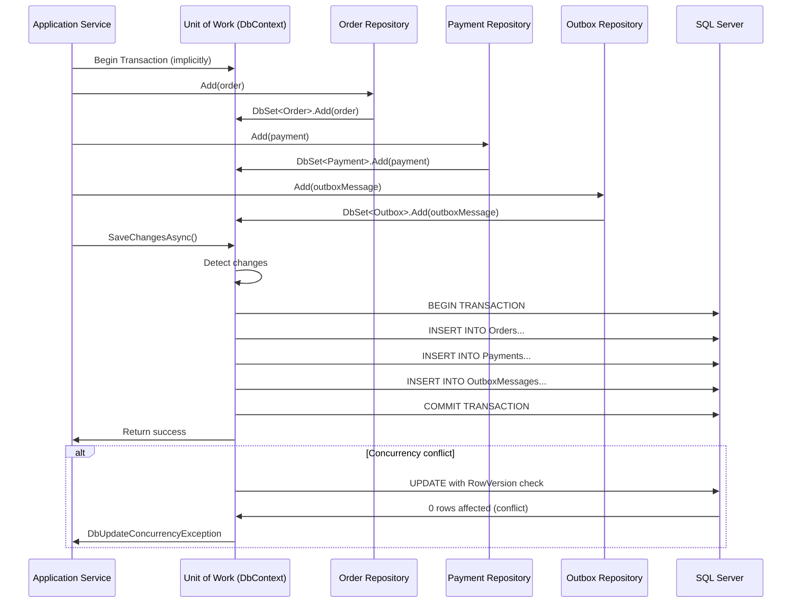

> [!success] Mastery Check
> - [ ] **Studied Well**
> - [ ] **Can explain the concept without notes**
> - [ ] **Can answer interview questions confidently**
> - [ ] **Can implement it in a real project**


# 7.058 — DDD — Repositories — Unit of Work Pattern

## Navigation

**Domain:** [[7 — System Design & Distributed Systems]] > **Group:** Domain-Driven Design
**Previous:** [[7.057 — Repositories — EF Core Implementation]] | **Next:** [[7.059 — Specifications — Composable Query Logic]]

### Prerequisites

- [[7.056 — Repositories — Interface and Implementation]] — the unit of work aggregates changes from multiple repository operations; repositories are the participants, the unit of work is the coordinator
- [[7.057 — Repositories — EF Core Implementation]] — EF Core's `DbContext` provides the unit of work implementation through `SaveChangesAsync` and change tracking; this note covers the pattern independent of the ORM
- [[7.047 — Aggregates — Consistency Boundary]] — the unit of work boundary must align with the aggregate consistency boundary — one `SaveChangesAsync` per aggregate operation

### Where This Fits

The Unit of Work pattern maintains a list of objects affected by a business transaction and coordinates the writing out of changes and the resolution of concurrency problems. In a DDD .NET system, it solves the problem of **atomicity across multiple aggregate operations**: a `SubmitOrder` command may add an Order, update an Inventory counter, and create a Payment record — all three must succeed or none. Without a unit of work, each repository would independently call `SaveChangesAsync`, creating partial commits and inconsistent data. The pattern becomes essential at the point where a single business operation modifies 2+ aggregates or one aggregate and its related outbox/event data.

## Core Mental Model

A unit of work is a **transactional scope** that collects all changes made by repositories during a business operation and writes them to the database atomically. The invariant is: **within a single unit of work, either all changes are committed or none are**. The tradeoff is: the unit of work holds open database connections and change-tracking state for the duration of the operation — long-running units of work cause connection pool exhaustion and stale data.

### Classification

| Dimension | Classification | Rationale |
|-----------|---------------|-----------|
| Pattern Type | **Enterprise Architecture / Transaction Coordination** | Coordinates persistence across multiple repository operations |
| Scope | **Per business transaction** | One unit of work per logical business operation |
| Transaction Type | **Local database transaction** | SQL Server transaction for atomicity |
| Lifetime | **Short-lived** | Opened at operation start, committed at end |
| Concurrency | **Optimistic** | RowVersion-based conflict detection at commit time |



### Key Properties

| Property | Value | Condition |
|----------|-------|-----------|
| Atomicity | All or nothing | Within the transaction scope |
| Isolation | Read Committed (default SQL Server) | Configurable per operation |
| Duration | Length of business operation | Should be < 1 second for web requests |
| Scope | Single database | Does not span multiple databases |
| ORM support | Built-in (DbContext.SaveChangesAsync) | EF Core handles this natively |
| Domain events | Dispatched AFTER commit | To prevent phantom side-effects |

## Deep Mechanics

### How It Works

1. **Application service begins operation**: The `SubmitOrder` command handler receives a request. It resolves `IOrderRepository` and `IPaymentRepository`, both sharing the same `DbContext` (scoped lifetime).

2. **Repositories add/modify aggregates**: `_orderRepository.Add(order)` calls `_dbContext.Orders.Add(order)`. EF Core's change tracker marks the entity as `Added`. `_paymentRepository.Add(payment)` similarly marks the payment.

3. **Unit of work commits**: The application service calls `_unitOfWork.SaveChangesAsync()` (or directly `_dbContext.SaveChangesAsync()`). EF Core starts a database transaction, generates SQL for all tracked changes, executes them, and commits the transaction.

4. **Post-commit actions**: After the commit succeeds, domain events are dispatched, integration events are published, and the response is returned to the caller.

5. **Concurrency check**: During commit, EF Core checks `RowVersion` on all modified entities. If any version doesn't match, `DbUpdateConcurrencyException` is thrown and the transaction rolls back.

### Failure Modes

**Long-running unit of work**: Holding a transaction open for > 1 second causes lock contention. **Detection**: `sys.dm_tran_locks` shows blocking locks. **Mitigation**: Keep business operations short; load aggregates, apply changes, and save — no external API calls inside the UoW.

**Cross-database UoW**: Saving to two databases in one unit of work requires a distributed transaction coordinator. **Detection**: `MSDTC` errors. **Mitigation**: Use eventual consistency between bounded contexts ([[7.065]]) instead of distributed transactions.

**Ambient transaction leak**: A repository begins its own transaction inside an existing unit of work — nested transactions cause escalation to distributed transaction. **Detection**: Transaction scope promotion warning in logs. **Mitigation**: Repository should never call `BeginTransaction`.

**Change tracker memory bloat**: Loading hundreds of aggregates into a single DbContext before saving. **Detection**: Memory grows linearly with aggregate count. **Mitigation**: Process batches; create new scope per batch.

### .NET and Azure Integration

- **EF Core DbContext**: `SaveChangesAsync` is the unit of work commit. `Database.BeginTransaction` for explicit transaction control.
- **TransactionScope**: `System.Transactions.TransactionScope` for ambient transactions across multiple resource managers.
- **Azure SQL Database**: Supports local transactions, does NOT support distributed transactions (MSDTC) — forces eventual consistency between databases.
- **MediatR IPipelineBehavior**: Transaction-per-operation behavior wrapping the command handler in a UoW.
- **Castle.Core / Autofac**: Interception to begin/commit UoW automatically around public methods.

```csharp
// Transaction pipeline behavior for MediatR
public sealed class TransactionPipelineBehavior<TRequest, TResponse> : IPipelineBehavior<TRequest, TResponse>
    where TRequest : IRequest<TResponse>
{
    private readonly OrderDbContext _dbContext;
    private readonly ILogger _logger;

    public TransactionPipelineBehavior(OrderDbContext dbContext, ILogger<TransactionPipelineBehavior<TRequest, TResponse>> logger)
    {
        _dbContext = dbContext;
        _logger = logger;
    }

    public async Task<TResponse> Handle(TRequest request, RequestHandlerDelegate<TResponse> next, CancellationToken ct)
    {
        if (request is not ICommand<TResponse>) return await next(ct); // Only wrap commands

        await using var transaction = await _dbContext.Database.BeginTransactionAsync(ct);
        try
        {
            var response = await next(ct);
            await _dbContext.SaveChangesAsync(ct);
            await transaction.CommitAsync(ct);
            return response;
        }
        catch (Exception ex)
        {
            _logger.LogError(ex, "Transaction rolled back for {RequestType}", typeof(TRequest).Name);
            await transaction.RollbackAsync(ct);
            throw;
        }
    }
}
```

## Production Patterns and Implementation

### Primary Implementation

```csharp
// Unit of Work Interface
public interface IUnitOfWork
{
    Task<int> SaveChangesAsync(CancellationToken ct = default);
    Task<bool> SaveEntitiesAsync(CancellationToken ct = default);
}

// DbContext implements IUnitOfWork
public sealed class OrderDbContext : DbContext, IUnitOfWork
{
    private readonly IPublisher _publisher;
    private readonly ILogger<OrderDbContext> _logger;

    public OrderDbContext(DbContextOptions<OrderDbContext> options, IPublisher publisher, ILogger<OrderDbContext> logger)
        : base(options)
    {
        _publisher = publisher;
        _logger = logger;
    }

    public DbSet<Order> Orders => Set<Order>();
    public DbSet<Payment> Payments => Set<Payment>();
    public DbSet<OutboxMessage> OutboxMessages => Set<OutboxMessage>();

    public async Task<bool> SaveEntitiesAsync(CancellationToken ct = default)
    {
        // Dispatch domain events before save
        var domainEvents = GetDomainEvents();
        ClearDomainEvents();

        var result = await base.SaveChangesAsync(ct);

        // Dispatch events after save succeeds
        foreach (var domainEvent in domainEvents)
        {
            await _publisher.Publish(domainEvent, ct);
        }

        return result > 0;
    }

    private List<INotification> GetDomainEvents()
    {
        return ChangeTracker.Entries<AggregateRoot>()
            .SelectMany(e => e.Entity.DomainEvents)
            .ToList();
    }

    private static void ClearDomainEvents()
    {
        // Clears domain events from aggregates
    }

    protected override void OnModelCreating(ModelBuilder modelBuilder)
    {
        modelBuilder.ApplyConfigurationsFromAssembly(typeof(OrderDbContext).Assembly);
    }
}

// Application Service using Unit of Work
public sealed class OrderApplicationService : IOrderApplicationService
{
    private readonly IOrderRepository _orderRepository;
    private readonly IPaymentRepository _paymentRepository;
    private readonly IUnitOfWork _unitOfWork;

    public OrderApplicationService(
        IOrderRepository orderRepository,
        IPaymentRepository paymentRepository,
        IUnitOfWork unitOfWork)
    {
        _orderRepository = orderRepository;
        _paymentRepository = paymentRepository;
        _unitOfWork = unitOfWork;
    }

    public async Task<OrderId> SubmitOrderAsync(SubmitOrder command, CancellationToken ct)
    {
        // Load or create aggregates
        var order = Order.Create(command.CustomerId, command.Items);
        order.Submit();

        var payment = Payment.ForOrder(order.Id, order.TotalAmount);

        // Stage changes via repositories
        await _orderRepository.AddAsync(order, ct);
        await _paymentRepository.AddAsync(payment, ct);

        // Commit atomically via unit of work
        await _unitOfWork.SaveChangesAsync(ct);

        // Domain events dispatched automatically in SaveEntitiesAsync
        return order.Id;
    }
}
```

### Configuration and Wiring

```csharp
// Program.cs
builder.Services.AddDbContext<OrderDbContext>(options =>
    options.UseSqlServer(builder.Configuration.GetConnectionString("Orders")));

// Register IUnitOfWork as the DbContext itself
builder.Services.AddScoped<IUnitOfWork>(sp => sp.GetRequiredService<OrderDbContext>());

// Register repositories
builder.Services.AddScoped<IOrderRepository, OrderRepository>();
builder.Services.AddScoped<IPaymentRepository, PaymentRepository>();

// Application service
builder.Services.AddScoped<IOrderApplicationService, OrderApplicationService>();
```

### Common Variants

**Explicit TransactionScope** (for fine-grained control):

```csharp
using var scope = new TransactionScope(TransactionScopeAsyncFlowOption.Enabled);
var order = await _orderRepository.GetByIdAsync(orderId, ct);
order.Submit();
await _orderRepository.SaveChangesAsync(ct);
scope.Complete(); // If SaveChanges succeeded, complete the ambient transaction
```

**Decoupled IUnitOfWork with SaveEntities** (domain event dispatch):

```csharp
public interface IUnitOfWork
{
    Task<int> SaveChangesAsync(CancellationToken ct = default);
    Task<bool> SaveEntitiesAsync(CancellationToken ct = default); // Includes event dispatch
}

// Application service uses SaveEntitiesAsync when domain events must be dispatched
public async Task SubmitOrderAsync(SubmitOrder command, CancellationToken ct)
{
    var order = Order.Create(command.CustomerId, command.Items);
    order.Submit(); // Raises domain events
    await _orderRepository.AddAsync(order, ct);
    await _unitOfWork.SaveEntitiesAsync(ct); // Saves + dispatches events atomically
}
```

**Decorated unit of work with retry** (resilience):

```csharp
public sealed class RetryUnitOfWorkDecorator : IUnitOfWork
{
    private readonly IUnitOfWork _inner;
    private readonly ResiliencePipeline _pipeline;

    public RetryUnitOfWorkDecorator(IUnitOfWork inner)
    {
        _inner = inner;
        _pipeline = new ResiliencePipelineBuilder()
            .AddRetry(new RetryStrategyOptions
            {
                MaxRetryAttempts = 3,
                BackoffType = DelayBackoffType.Exponential,
                OnRetry = args =>
                {
                    if (args.Outcome.Exception is DbUpdateConcurrencyException)
                        return new ValueTask(Task.CompletedTask); // Retry on concurrency conflict
                    return ValueTask.FromResult(false); // Don't retry other exceptions
                }
            })
            .Build();
    }

    public async Task<int> SaveChangesAsync(CancellationToken ct)
        => await _pipeline.ExecuteAsync(ct2 => _inner.SaveChangesAsync(ct2), ct);

    public async Task<bool> SaveEntitiesAsync(CancellationToken ct)
        => await _pipeline.ExecuteAsync(ct2 => _inner.SaveEntitiesAsync(ct2), ct);
}
```

### Real-World .NET Ecosystem Example

**EF Core DbContext as Unit of Work**: In every .NET DDD application, `DbContext` IS the unit of work. The `ChangeTracker` maintains the list of affected objects. `SaveChangesAsync` begins a transaction, generates SQL, executes it, and commits. The `Database.CurrentTransaction` provides explicit transaction access. The `SaveChangesInterceptor`/`SaveChangesAsyncInterceptor` are the standard hooks for cross-cutting concerns (audit logging, domain event dispatch, soft-delete). Microsoft's eShopOnContainers reference architecture uses `IUnitOfWork` as an explicit interface wrapping `DbContext` for testability and consistency.

## Gotchas and Production Pitfalls

### Pitfall 1: Mixing Database Contexts in One Unit of Work

**Pitfall:** The application service uses two different `DbContext` types in one operation, then calls `SaveChangesAsync` on each separately.

```csharp
// ❌ Two DbContexts — no atomicity
public async Task SubmitOrderAsync(SubmitOrder command, CancellationToken ct)
{
    var order = Order.Create(...);
    await _orderDbContext.Orders.AddAsync(order, ct);

    var inventoryEvent = new InventoryReservation(...);
    await _inventoryDbContext.Reservations.AddAsync(inventoryEvent, ct);

    await _orderDbContext.SaveChangesAsync(ct); // Commits order
    await _inventoryDbContext.SaveChangesAsync(ct); // Commits separately
    // If inventory save fails, order is already committed
}
```

**Symptom:** Inventory reserved for orders that don't exist. Orders created without inventory reservation. Data inconsistency between bounded contexts.

**Fix:** Use a single `DbContext` per unit of work. For cross-context operations, use eventual consistency via integration events.

```csharp
// ✅ Single DbContext per UoW — atomic
public async Task SubmitOrderAsync(SubmitOrder command, CancellationToken ct)
{
    var order = Order.Create(...);
    await _orderDbContext.Orders.AddAsync(order, ct);

    // Write to outbox in the SAME context — guarantees atomicity
    _orderDbContext.OutboxMessages.Add(new OutboxMessage
    {
        EventType = nameof(OrderSubmittedIntegrationEvent),
        EventBody = JsonSerializer.Serialize(new OrderSubmittedIntegrationEvent(...))
    });

    await _orderDbContext.SaveChangesAsync(ct); // Single commit — both or neither
}
```

**Cost of not fixing:** Data inconsistency between bounded contexts. At 1000 orders/day with 1% failure rate, 10 orders/day have inconsistent state. Manual reconciliation cost: ~$500/day.

### Pitfall 2: Repository Calls SaveChangesAsync Inside a Unit of Work

**Pitfall:** A repository method calls `SaveChangesAsync` internally, which partially commits changes before the unit of work completes.

```csharp
// ❌ Repository commits prematurely
public sealed class OrderRepository : IOrderRepository
{
    public async Task AddAsync(Order order, CancellationToken ct)
    {
        await _dbContext.Orders.AddAsync(order, ct);
        await _dbContext.SaveChangesAsync(ct); // BUG: partial commit
    }
}

// Application service — assumes atomicity
public async Task SubmitOrderAsync(SubmitOrder command, CancellationToken ct)
{
    await _orderRepository.AddAsync(order, ct); // Commits immediately
    await _paymentRepository.AddAsync(payment, ct); // If this fails, order is already committed!
    // No way to roll back the order
}
```

**Symptom:** Orphan orders without payments. Orphan payments without orders. Database has partial data from failed operations.

**Fix:** Repository never calls `SaveChangesAsync`. Only the unit of work (or application service) commits.

```csharp
// ✅ Repository stages, UoW commits
public sealed class OrderRepository : IOrderRepository
{
    public async Task AddAsync(Order order, CancellationToken ct)
    {
        await _dbContext.Orders.AddAsync(order, ct);
        // No SaveChangesAsync! Application service controls the commit
    }
}
```

**Cost of not fixing:** Every business operation risks partial commits. Recovery requires manual SQL fixes. Support hours wasted reconciling data. Customer impact: "I paid but the order doesn't exist."

### Pitfall 3: Long-Running Transaction Holds Locks

**Pitfall:** The application service does I/O (external API call, email, file upload) inside the unit of work transaction.

```csharp
// ❌ External I/O inside transaction — long lock duration
public async Task SubmitOrderAsync(SubmitOrder command, CancellationToken ct)
{
    var order = Order.Create(...);
    await _orderRepository.AddAsync(order, ct);

    // Transaction is open during this external call
    await _fraudApi.CheckAsync(order.CustomerId); // 2 seconds!

    await _unitOfWork.SaveChangesAsync(ct); // Transaction open for ~2.5 seconds
}
```

**Symptom:** SQL Server blocking chains. `sys.dm_tran_locks` shows `LCK_M_U` waits. Other operations timeout waiting for locks. Connection pool exhaustion.

**Fix:** Load all data before the unit of work. Do external calls before or after, never inside.

```csharp
// ✅ External calls outside the transaction
public async Task SubmitOrderAsync(SubmitOrder command, CancellationToken ct)
{
    var fraudResult = await _fraudApi.CheckAsync(command.CustomerId); // Before UoW
    if (fraudResult.IsBlocked) throw new FraudDetectionException();

    var order = Order.Create(command.CustomerId, command.Items);
    await _orderRepository.AddAsync(order, ct);
    await _unitOfWork.SaveChangesAsync(ct); // Transaction open for < 50ms
}
```

**Cost of not fixing:** At 50 concurrent requests with 2-second external API calls, locks held for 100 seconds cumulative. Connection pool (default 100) exhausts in seconds. All users see 503 errors.

### Pitfall 4: No Retry on Transient Failures

**Pitfall:** The unit of work commit fails on a transient error (deadlock victim, Azure SQL throttling) and the application doesn't retry.

```csharp
// ❌ No retry — transient failure = failed request
await _unitOfWork.SaveChangesAsync(ct);
// If deadlock, DbUpdateException thrown — request fails
```

**Symptom:** Intermittent failures under load. ~0.5% of requests fail with "deadlock" or "timeout" errors. Users retry manually.

**Fix:** Use EF Core's built-in retry or add a retry decorator.

```csharp
// ✅ EF Core retry on transient failures
builder.Services.AddDbContext<OrderDbContext>(options =>
{
    options.UseSqlServer(
        connectionString,
        sqlOptions => sqlOptions.EnableRetryOnFailure(
            maxRetryCount: 3,
            maxRetryDelay: TimeSpan.FromSeconds(10),
            errorNumbersToAdd: null));
});
```

**Cost of not fixing:** 0.5% of requests fail under normal load. During peak (500 req/s), 2.5 requests/second fail. Users retry, causing more load. Cascading failure.

### Pitfall 5: Injecting IUnitOfWork into Domain Entities

**Pitfall:** A domain service or aggregate root takes `IUnitOfWork` as a dependency to save itself.

```csharp
// ❌ Domain entity depends on unit of work
public sealed class Order : AggregateRoot<OrderId>
{
    private readonly IUnitOfWork _unitOfWork; // BUG: infrastructure in domain

    public void Submit()
    {
        // ...
        // HORRIBLE: domain logic commits persistence
        await _unitOfWork.SaveChangesAsync(); // NEVER do this
    }
}
```

**Symptom:** Domain layer is coupled to persistence. Cannot unit test domain logic without mocking `IUnitOfWork`. If the persistence technology changes, domain logic must change.

**Fix:** Domain layer depends on nothing. Unit of work is an application service concern.

```csharp
// ✅ Domain is persistence-ignorant
public sealed class Order : AggregateRoot<OrderId>
{
    // No persistence dependencies

    public void Submit()
    {
        // Pure domain logic — raises events, validates invariants
        // Never calls SaveChangesAsync
    }
}
```

**Cost of not fixing:** Domain layer has infrastructure dependencies. Any domain entity with `IUnitOfWork` breaks the DDD layering. Refactoring cost: major architecture change.

## Tradeoffs and Decision Framework

### Tradeoff Matrix

| Dimension | Explicit Unit of Work (IUnitOfWork) | DbContext as UoW (implicit) | TransactionScope |
|-----------|------------------------------------|----------------------------|-------------------|
| Abstraction | High — testable interface | Medium — wrapped interface | Low — ambient |
| Complexity | Medium (interface + implement) | Low (built into EF Core) | Medium (distributed TX risk) |
| Testability | High — mock IUnitOfWork | Medium — integration only | Low |
| Transaction control | Explicit Begin/Commit | Implicit in SaveChangesAsync | Ambient — all-or-nothing |
| Domain event dispatch | Integrated (SaveEntitiesAsync) | Requires interceptor | Manual |
| .NET ecosystem fit | eShopOnContainers pattern | Standard EF Core | Legacy enterprise |

### Decision Flowchart

```mermaid
flowchart TD
    A[Need atomic persistence across multiple aggregates?] --> B{How many DbContexts?}
    B -->|One| C{Do you need to dispatch<br/>domain events after commit?}
    B -->|Multiple| D[Do NOT use distributed transaction<br/>— use saga / eventual consistency]
    C -->|Yes| E[IUnitOfWork with SaveEntitiesAsync<br/>that dispatches events post-commit]
    C -->|No| F[DbContext.SaveChangesAsync directly<br/>in application service]
    E --> G[Add retry decorator for<br/>transient failures]
    F --> G
    G --> H[Register as scoped DI —<br/>one UoW per request]
```



### When to Apply

- When a single business operation modifies 2+ aggregates
- When domain events must be dispatched after the transaction commits
- When you need the ability to test transactional behavior
- When transient failure retry is required for data consistency

### When NOT to Apply

- Single-aggregate operations — `SaveChangesAsync` directly is simpler
- When the operation is already idempotent and retry-safe
- When no domain events are involved
- Read-only query operations

### Scale Thresholds

- **Worth considering above** 2+ aggregate modifications per business operation
- **Required when** domain events must be dispatched atomically with persistence
- **Justified when** data inconsistency across aggregates costs more than transactional overhead
- **Not needed below** 1 aggregate modification per operation
- **Avoid above** 5 aggregates per UoW — the transaction holds locks on too many tables

## Interview Arsenal

### Question Bank

1. **What is the Unit of Work pattern and why is it important in DDD?**
2. **How does EF Core implement the Unit of Work pattern?**
3. **What happens if a repository calls SaveChangesAsync inside a unit of work?**
4. **Compare explicit IUnitOfWork with implicit DbContext.SaveChangesAsync — when would you use each?**
5. **How do you dispatch domain events within the unit of work — before save, after save, or in a separate transaction?**
6. **Design the unit of work for an operation that creates an Order, deducts Inventory, and sends a confirmation email. How do you ensure atomicity?**
7. **What happens to the unit of work at 10x scale — 2000 concurrent orders/second?**
8. **How does the unit of work pattern relate to the aggregate consistency boundary?**

### Spoken Answers

**Q1: What is the Unit of Work pattern and why is it important in DDD?**

> **Great answer:** The Unit of Work pattern maintains a list of objects modified by a business transaction and writes all changes atomically when the transaction completes. In DDD, it's essential because a single business operation often modifies multiple aggregates. When you submit an order, you create the Order aggregate, update the Inventory allocation, and record the Payment — all three must persist or none. The unit of work ensures atomicity. In EF Core, `DbContext` itself IS the unit of work: the `ChangeTracker` keeps track of every `Added`, `Modified`, or `Deleted` entity, and `SaveChangesAsync` wraps all changes in a single database transaction. The key rule is that repositories never call `SaveChangesAsync` themselves — they stage changes, and the unit of work commits them. The second key rule is that domain events are dispatched AFTER the transaction commits, not before — otherwise handlers run for aggregates that may never be saved.

**Q3: What happens if a repository calls SaveChangesAsync inside a unit of work?**

> **Great answer:** This is one of the most common DDD implementation bugs. When a repository calls `SaveChangesAsync` internally, it commits that repository's changes independently — creating a partial transaction. If the application service creates both an Order and a Payment, and the OrderRepository commits immediately while the PaymentRepository subsequently fails, the system has an orphan order. The fix is simple: repositories stage changes (Add, Remove, property modifications) and the unit of work commits everything at once via `SaveChangesAsync`. The idiom is: repository methods return void or Task, never the result of `SaveChangesAsync`. I enforce this with an architecture test using NetArchTest that scans all repository classes and asserts they have no call to `SaveChangesAsync` — it fails the build if any repository commits independently.

**Q6: Design the unit of work for an operation that creates an Order, deducts Inventory, and sends a confirmation email.**

> **Great answer:** I split this into two phases: the atomic persistence phase and the side-effect phase. In the atomic phase, I create the Order aggregate, create an InventoryAdjustment record, and persist both in a single unit of work. The Order aggregate raises a domain event `OrderSubmitted`. The InventoryAdjustment is an event or an outbox message — it doesn't modify the Inventory Bounded Context directly (that would require a distributed transaction across databases). In the same transaction, I write an `OutboxMessage` with the integration event to be sent later.

> After `SaveChangesAsync` commits, the domain event dispatcher fires the `INotificationHandler<OrderSubmitted>` handlers. The email handler sends the confirmation. The integration event publisher reads from the outbox and publishes to Azure Service Bus for the Inventory Bounded Context.

> This gives me: strong consistency for the Order + Outbox (same database transaction), eventual consistency for Inventory (via Service Bus), and best-effort email delivery. If the email handler fails, the order is still persisted. The customer receives the order confirmation on next retry. The outbox guarantees the inventory event is delivered at-least-once.
</details>

### System Design Interview Trigger

If an interviewer asks "how do you ensure data consistency across multiple aggregates?" or "what happens if the database save fails after the email is sent?", they are testing the Unit of Work pattern and the domain event dispatch timing. The follow-up is about cross-database consistency — "but what if Inventory is in a different database?" — which tests whether you understand when to use eventual consistency instead of distributed transactions.

### Comparison Table

| | Unit of Work (Explicit) | DbContext (Implicit) | Distributed Transaction |
|---|---|---|---|
| Core guarantee | Atomic commit of staged changes | Same, built-in | Atomic across databases |
| Trade-off | Abstraction overhead | Coupled to EF Core | Coordinator dependency |
| .NET implementation | `IUnitOfWork` + `SaveEntitiesAsync` | `DbContext.SaveChangesAsync` | `TransactionScope` + MSDTC |
| Failure mode | Partial commit if repos save internally | Same | MSDTC unavailability |
| When to choose | Testability, event dispatch | Standard EF Core | Cross-database (avoid) |

## Architecture Decision Record

**Status:** Accepted

**Context:** The Order Processing application creates Order and Payment aggregates in the same business operation. Both must be persisted atomically. Domain events (OrderSubmitted, PaymentRecorded) must be dispatched after the transaction succeeds. The team needs unit-testable transaction boundaries.

**Options Considered:**

1. **IUnitOfWork interface wrapping DbContext** — Explicit interface with `SaveEntitiesAsync` that dispatches domain events after commit
2. **Direct DbContext.SaveChangesAsync** — No abstraction; application service calls save directly
3. **TransactionScope** — Ambient transaction with automatic enlistment

**Decision:** IUnitOfWork interface exposing `SaveChangesAsync` and `SaveEntitiesAsync`. DbContext implements both. `SaveEntitiesAsync` collects domain events from tracked aggregates, calls base `SaveChangesAsync`, then dispatches events via MediatR.

**Consequences:**
- ✅ Application services depend on IUnitOfWork, not directly on EF Core
- ✅ Domain events dispatched atomically with the transaction — never before commit
- ✅ Testable — unit tests mock IUnitOfWork to verify commit behavior
- ⚠️ All repositories must share the same DbContext (scoped lifetime)
- ⚠️ SaveEntitiesAsync runs domain events synchronously — slow handlers affect response time
- ❌ Cannot span multiple databases — use integration events for cross-context operations

**Review Trigger:** Revisit this decision if the system exceeds 2000 operations/second (consider splitting into command and query DbContexts) or if any business operation consistently spans > 5 aggregates (consider redesigning the aggregate boundaries).

## Self-Check

### Conceptual Questions

1. What is the primary responsibility of the Unit of Work pattern?

<details>
<summary>Answer</summary>
To maintain a list of objects affected by a business transaction and coordinate the writing of all changes atomically. It ensures that either all changes are persisted or none are, preventing partial commits.
</details>

2. Why should repositories not call `SaveChangesAsync`?

<details>
<summary>Answer</summary>
Because it breaks atomicity. If each repository commits independently, a failure in one repository's save leaves the others partially committed. The unit of work should be the only component that calls `SaveChangesAsync`.
</details>

3. When should domain events be dispatched relative to `SaveChangesAsync`?

<details>
<summary>Answer</summary>
After `SaveChangesAsync` succeeds. Dispatching before save causes phantom side-effects (handlers run for aggregates that may never be persisted). Dispatching after ensures the aggregate is committed before any handler executes.
</details>

4. What is the problem with holding a transaction open during an external API call?

<details>
<summary>Answer</summary>
The transaction holds database locks for the duration of the external call (potentially seconds). This causes lock contention, blocking other operations, and can lead to connection pool exhaustion and deadlocks.
</details>

5. How does EF Core implement the Unit of Work pattern natively?

<details>
<summary>Answer</summary>
The `DbContext.ChangeTracker` tracks all entities that have been added, modified, or deleted. `SaveChangesAsync` wraps all tracked changes in a database transaction. This is the unit of work: collect changes, commit atomically.
</details>

6. What does `SaveEntitiesAsync` do differently from `SaveChangesAsync`?

<details>
<summary>Answer</summary>
`SaveEntitiesAsync` is a custom wrapper (defined in `IUnitOfWork`) that: (1) collects domain events from tracked aggregates, (2) calls base `SaveChangesAsync` to persist, (3) dispatches the collected domain events via MediatR only if the save succeeded. This ensures atomic persistence + event dispatch.
</details>

7. At what transaction duration should you be concerned?

<details>
<summary>Answer</summary>
Above 500ms. Database transactions should be < 100ms for web requests. Longer transactions hold locks, reduce concurrency, and risk deadlocks. If an operation takes > 500ms, split it into phases: load data, validate, then quick transaction.
</details>

8. How does the unit of work relate to aggregate consistency boundaries in [[7.047 — Aggregates — Consistency Boundary]]?

<details>
<summary>Answer</summary>
The unit of work transaction should align with the aggregate consistency boundary. One transaction should modify at most one aggregate. Modifying multiple aggregates in one transaction violates the principle that each aggregate is a consistency boundary — use domain events for cross-aggregate eventual consistency.
</details>

9. What's the difference between a unit of work and a repository?

<details>
<summary>Answer</summary>
A repository provides collection-like access to aggregates (load, add, remove). A unit of work coordinates changes across multiple repository operations and commits them atomically. Repositories stage individual changes; the unit of work materializes them.
</details>

10. Explain the unit of work pattern in 60 seconds at a whiteboard.

<details>
<summary>Answer</summary>
"The unit of work is a transaction coordinator. When an application service modifies three aggregates — Order, Payment, and OutboxMessage — it calls their repositories to stage the changes in the same DbContext. The unit of work tracks everything: the Order is Added, the Payment is Added, the OutboxMessage is Added. Then we call `SaveEntitiesAsync` — it opens a database transaction, writes all three INSERT statements, commits the transaction, and then dispatches the domain events. If any INSERT fails, the entire transaction rolls back — no partial state. The repositories never call save themselves; they just stage. The unit of work is the sole commit authority."
</details>

### Scenario Challenges

**Scenario 1 — Diagnose the problem:** After deploying a new feature that creates both an Order and a Subscription in the same request, approximately 2% of requests result in an Order existing without a matching Subscription. The application uses two different DbContext classes.

<details>
<summary>Diagnosis</summary>

**Root cause:** Two separate DbContexts, two separate transactions. The `OrderDbContext.SaveChangesAsync` succeeds, but the `SubscriptionDbContext.SaveChangesAsync` fails (deadlock under load). The Order is committed, the Subscription is not.

**Evidence:** Logs show `OrderDbContext.SaveChangesAsync` success followed by `SubscriptionDbContext.SaveChangesAsync` failure (DbUpdateException). The Order's `CreatedAt` timestamp matches the failure window.

**Fix:** If Order and Subscription must be created atomically, they belong in the same aggregate OR use the outbox pattern to create the Subscription via eventual consistency.

**Prevention:** Architecture test: any method that calls `SaveChangesAsync` on two different DbContexts must be flagged for review.
</details>

**Scenario 2 — Design decision:** Your team is building a Payment Processing service. The business requires that the Payment record AND the AccountBalance update be saved atomically. Both are in the same SQL Server database but in different tables. Design the unit of work.

<details>
<summary>Decision and Reasoning</summary>

**Choice:** Single DbContext with both `DbSet<Payment>` and `DbSet<AccountBalance>`. One `SaveChangesAsync` wraps both writes in a single transaction.

**Tradeoffs accepted:** Both aggregates are loaded into the same change tracker. The transaction holds locks on both `Payments` and `AccountBalances` tables for the duration of the save.

**Implementation sketch:**

```csharp
public sealed class PaymentDbContext : DbContext, IUnitOfWork
{
    public DbSet<Payment> Payments => Set<Payment>();
    public DbSet<AccountBalance> AccountBalances => Set<AccountBalance>();

    public async Task<bool> SaveEntitiesAsync(CancellationToken ct)
    {
        var events = GetDomainEvents();
        var result = await base.SaveChangesAsync(ct);
        foreach (var evt in events) await _publisher.Publish(evt, ct);
        return result > 0;
    }
}

// Application service
public async Task ProcessPaymentAsync(ProcessPayment command, CancellationToken ct)
{
    var payment = Payment.Create(command.OrderId, command.Amount);
    var balance = await _balanceRepository.GetByCustomerAsync(command.CustomerId, ct);
    balance.Deduct(payment.Amount);

    await _paymentRepository.AddAsync(payment, ct);
    // balance is already tracked — its modification is detected by ChangeTracker
    await _unitOfWork.SaveChangesAsync(ct); // Single commit — both Payment and Balance
}
```

**Key insight:** The `AccountBalance` aggregate is loaded before the `PaymentRepository.AddAsync` call. Any changes to `balance` are tracked by the same `DbContext`. The single `SaveChangesAsync` persists both.
</details>

**Scenario 3 — Failure mode:** A background job processes 10,000 pending orders. Each order operation creates a new `OrderProcessing` record and updates the `Order.Status`. The job reads all 10,000 orders into a single DbContext, then processes them. After 3,000 orders, memory is at 90% and the job crashes with `OutOfMemoryException`.

<details>
<summary>Investigation and Fix</summary>

**Investigation steps:**
1. Check memory usage — growing linearly with processed orders
2. Check DbContext change tracker — 10,000 tracked entities accumulating
3. Review code — single DbContext instance for the entire batch

**Confirming evidence:**

```csharp
// Bug: single DbContext for entire batch
var orders = await _dbContext.Orders.ToListAsync(ct); // 10,000 tracked entities
foreach (var order in orders)
{
    var processing = new OrderProcessing(order.Id);
    await _dbContext.OrderProcessings.AddAsync(processing, ct);
    order.Status = OrderStatus.Processing;
}
await _dbContext.SaveChangesAsync(ct); // Single massive transaction — locks, memory, rollback risk
```

**Immediate mitigation:** Kill the job. Process in batches of 100 with individual DbContext instances.

**Permanent fix:**

```csharp
public async Task ProcessPendingOrdersAsync(CancellationToken ct)
{
    const int batchSize = 100;
    var orderIds = await _dbContextFactory.CreateDbContext().Orders
        .Where(o => o.Status == OrderStatus.Submitted)
        .Select(o => o.Id)
        .ToListAsync(ct);

    foreach (var batch in orderIds.Chunk(batchSize))
    {
        await using var dbContext = _dbContextFactory.CreateDbContext();
        foreach (var orderId in batch)
        {
            var order = await dbContext.Orders.FindAsync(new object[] { orderId }, ct);
            order!.Status = OrderStatus.Processing;
            dbContext.OrderProcessings.Add(new OrderProcessing(orderId));
        }
        await dbContext.SaveChangesAsync(ct); // One transaction per batch
    }
}
```

**Post-mortem item:** Batch processing jobs must use `IDbContextFactory<T>` and never hold more than 100 tracked entities at a time.
</details>

**Scenario 4 — Scale it:** Your system handles 500 orders/second with a single `OrderDbContext`. Each operation modifies 2 aggregates and saves in one transaction. You need to reach 5000 orders/second.

<details>
<summary>Scaling Strategy</summary>

**Bottleneck this addresses:** Single database write throughput cannot handle 5000 writes/second with complex aggregate mappings.

**How it helps:**
1. Implement CQRS — command DbContext (writes) separate from query DbContext (reads)
2. Batch commits — group operations into larger transactions where possible
3. Reduce aggregate modifications per transaction — aim for 1 aggregate per save
4. Use `IDbContextFactory` for short-lived contexts in background jobs

**What it does not solve:** The single-writer bottleneck. At 5000 writes/second, the primary database either needs sharding or a major vertical scale-up.

**Implementation order:**
1. Week 1: Separate command and query DbContexts
2. Week 2: Reduce UoW scope — one aggregate per save where possible
3. Week 3: Evaluate sharding strategy for Orders database

**Alternative:** If 5000/sec is sustained, consider event sourcing instead of relational persistence for the write path.
</details>

**Scenario 5 — Interview simulation:** The interviewer says: "Design the transaction handling for an ATM system that must debit one account and credit another atomically. Both accounts are in the same database."

<details>
<summary>Model Response</summary>

"This is a classic unit of work scenario — two aggregates (FromAccount and ToAccount) that must be modified atomically. I'd use a single DbContext with both `DbSet<Account>` entries. The application service loads both accounts, applies the debit and credit, and calls `SaveEntitiesAsync` once.

```csharp
public async Task<Result> TransferAsync(TransferMoney command, CancellationToken ct)
{
    var fromAccount = await _accountRepository.GetByIdAsync(command.FromAccountId, ct);
    var toAccount = await _accountRepository.GetByIdAsync(command.ToAccountId, ct);

    if (fromAccount is null || toAccount is null)
        return Result.Failure("Account not found");

    fromAccount.Debit(command.Amount); // Validates sufficient balance
    toAccount.Credit(command.Amount);  // Both aggregates modified in memory

    try
    {
        await _unitOfWork.SaveChangesAsync(ct);
    }
    catch (DbUpdateConcurrencyException)
    {
        // Concurrency conflict — someone else modified one of the accounts
        // Retry: reload both accounts and reapply
        return Result.Failure("Concurrency conflict, please retry");
    }

    return Result.Success();
}
```

The key design decisions: I use a `rowversion` on the Account aggregate so concurrent transfers are detected. The transaction is short — load, modify, save — under 50ms typically. I do NOT involve the accounting ledger in this same transaction — that's a separate aggregate that gets updated via a domain event handler, using eventual consistency. The transfer itself is the critical operation; the ledger entry can follow within seconds.

If the accounts are in different databases (unlikely in a single bank but possible in a payment network), I cannot use a single unit of work. Instead, I use the saga pattern: debit FromAccount, publish an integration event, then the ToAccount service credits asynchronously, with a compensating debit if the credit fails."
</details>
