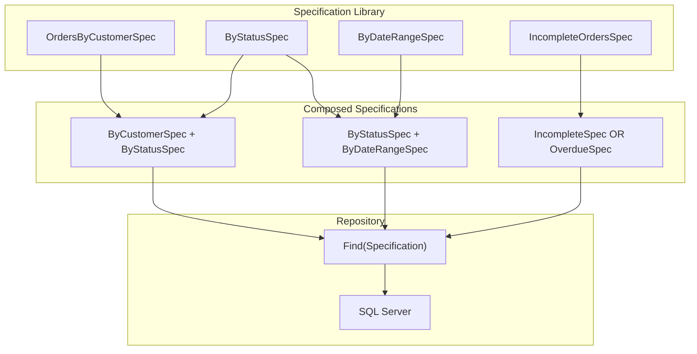
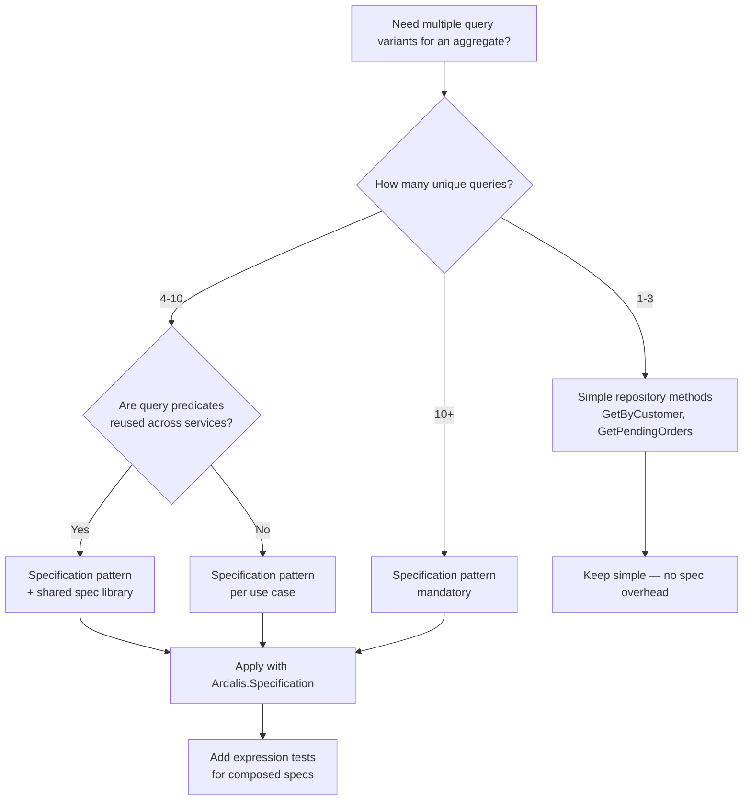

> [!success] Mastery Check
> - [ ] **Studied Well**
> - [ ] **Can explain the concept without notes**
> - [ ] **Can answer interview questions confidently**
> - [ ] **Can implement it in a real project**


# 7.059 — DDD — Specifications — Composable Query Logic

## Navigation

**Domain:** [[7 — System Design & Distributed Systems]] > **Group:** Domain-Driven Design
**Previous:** [[7.058 — Repositories — Unit of Work Pattern]] | **Next:** [[7.060 — Specifications — EF Core Implementation]]

### Prerequisites

- [[7.056 — Repositories — Interface and Implementation]] — the repository with a `Find(Specification)` method is the consumer; understanding repository abstraction is prerequisite to the spec pattern
- [[7.047 — Aggregates — Consistency Boundary]] — specifications operate at the aggregate level; they filter aggregates, not individual child entities within them
- [[7.045 — Value Objects — Equality and Immutability]] — specifications that filter on value object properties must understand the value object's equality and comparison semantics

### Where This Fits

The Specification pattern encapsulates a query criterion into a reusable, composable object. It solves the **exploding repository interface problem**: without specifications, every query variant requires a new repository method (`GetByCustomer`, `GetByCustomerAndStatus`, `GetByCustomerAndDateRange`, `GetByCustomerAndStatusAndDateRange`...). With specifications, the repository exposes a single `Find(Specification<T>)` method and callers compose query criteria: `new OrdersByCustomerSpec(customerId).And(new SubmittedOrdersSpec())`. This pattern becomes necessary when a single aggregate type has 5+ query variations or when query logic is shared across multiple application services.

## Core Mental Model

A specification is a **predicate in an object** — a boolean expression that determines whether an object satisfies a given criterion, packaged as a self-contained unit with AND/OR/NOT composability. The invariant is: **the specification object fully describes the query criterion; the repository evaluates it against the persistence store**. The tradeoff is: specifications provide unlimited query flexibility without interface pollution at the cost of complexity in expression tree composition and a small performance overhead from expression parameter rewriting.

### Classification

| Dimension | Classification | Rationale |
|-----------|---------------|-----------|
| Pattern Type | **Tactical DDD / Query Pattern** | Encapsulates query logic into reusable objects |
| Layer | **Domain or Application** | Specification classes can live in either layer depending on whether they encode domain concepts |
| Composition | **AND/OR/NOT combinators** | Specifications compose via boolean algebra |
| Evaluation | **Lazy (query translation) or in-memory** | Evaluated by repository (SQL) or memory (LINQ to Objects) |
| Reusability | **High** | Same specification used across multiple repositories or application services |



### Key Properties

| Property | Value | Condition |
|----------|-------|-----------|
| Composability | AND, OR, NOT via combinator methods | Always |
| Reusability | Single spec used across queries | When spec lives in shared library |
| Testability | High — unit test predicate in memory | Without database |
| Performance | Expression rewrite overhead ~1-5% | Acceptable for most queries |
| Expression translation | LINQ-to-SQL via ExpressionVisitor | EF Core evaluates against provider |
| Domain purity | Domain specs reference domain types | No persistence concerns |

## Deep Mechanics

### How It Works

1. **Specification class inherits from `Specification<T>`**: The base class stores a Linq `Expression<Func<T, bool>>` — the predicate that defines the criterion.

2. **Repository accepts specification**: The repository's `FindAsync` method takes `Specification<T>`. It extracts the predicate expression and applies it to the `DbSet<T>.Where()`.

3. **Composition via combinators**: `spec1.And(spec2)` creates a new specification whose predicate is `spec1.Predicate AND spec2.Predicate`. This is done by replacing parameter references in both expressions to share a single parameter.

4. **Evaluation**: The composed expression is passed to EF Core, which translates it to SQL `WHERE` clauses.

### Failure Modes

**Expression parameter mismatch**: When composing two expressions with different `ParameterExpression` instances, simple `Expression.AndAlso` fails because the parameters don't match. **Fix**: Use an `ExpressionParameterRewriter` that replaces all parameter references with a shared parameter.

**In-memory evaluation instead of SQL**: Some operators (custom methods, complex closures) cannot be translated to SQL by EF Core. **Detection**: Client-evaluation warning or `InvalidOperationException`. **Fix**: Keep predicates to translatable patterns — no method calls, no custom functions.

**Specification over-participation**: A specification that filters on aggregate child collection properties (e.g., `order.Items.Any(i => i.Price > 100)`) causes complex SQL. **Detection**: Slow queries with joins and subqueries. **Fix**: Keep specs focused on aggregate root properties; complex child queries belong in dedicated repository methods.

**Specification as domain leak**: Specification encodes SQL-specific optimization that doesn't make sense as a domain concept. **Detection**: Specification names like `UseNolockSpec` or `FastQuerySpec`. **Fix**: Keep domain-level specifications pure; add database-specific specifications in infrastructure.

### .NET and Azure Integration

- **LINQ Expression Trees**: The foundation — `Expression<Func<T, bool>>` is the predicate container
- **Ardalis.Specification**: NuGet package providing base `Specification<T>` with `Include`, `ThenInclude`, and pagination
- **EF Core**: Translates specification predicates to SQL via `Where(expression)`
- **Azure SQL Database**: Target for translated specification queries
- **Azure Cache for Redis**: Specifications can filter in-memory cached data for high-throughput reads

```csharp
// Base specification class
public abstract class Specification<T>
{
    public abstract Expression<Func<T, bool>> ToExpression();
    public bool IsSatisfiedBy(T entity) => ToExpression().Compile()(entity);

    public Specification<T> And(Specification<T> other) => new AndSpecification<T>(this, other);
    public Specification<T> Or(Specification<T> other) => new OrSpecification<T>(this, other);
    public Specification<T> Not() => new NotSpecification<T>(this);
}
```

## Production Patterns and Implementation

### Primary Implementation

```csharp
// Base specification infrastructure
public abstract class Specification<T>
{
    public abstract Expression<Func<T, bool>> ToExpression();

    public bool IsSatisfiedBy(T entity)
    {
        var predicate = ToExpression().Compile();
        return predicate(entity);
    }

    public Specification<T> And(Specification<T> other)
        => new AndSpecification<T>(this, other);

    public Specification<T> Or(Specification<T> other)
        => new OrSpecification<T>(this, other);

    public Specification<T> Not()
        => new NotSpecification<T>(this);
}

// Expression parameter rewriter — crucial for composition
public sealed class ParameterReplacer : ExpressionVisitor
{
    private readonly ParameterExpression _target;
    private readonly ParameterExpression _replacement;

    public ParameterReplacer(ParameterExpression target, ParameterExpression replacement)
    {
        _target = target;
        _replacement = replacement;
    }

    protected override Expression VisitParameter(ParameterExpression node)
        => node == _target ? _replacement : base.VisitParameter(node);
}

// Combinator specifications
public sealed class AndSpecification<T> : Specification<T>
{
    private readonly Specification<T> _left;
    private readonly Specification<T> _right;

    public AndSpecification(Specification<T> left, Specification<T> right)
    {
        _left = left;
        _right = right;
    }

    public override Expression<Func<T, bool>> ToExpression()
    {
        var leftExpr = _left.ToExpression();
        var rightExpr = _right.ToExpression();

        var param = Expression.Parameter(typeof(T), "x");
        var leftBody = new ParameterReplacer(leftExpr.Parameters[0], param).Visit(leftExpr.Body);
        var rightBody = new ParameterReplacer(rightExpr.Parameters[0], param).Visit(rightExpr.Body);

        var body = Expression.AndAlso(leftBody, rightBody);
        return Expression.Lambda<Func<T, bool>>(body, param);
    }
}

public sealed class OrSpecification<T> : Specification<T>
{
    private readonly Specification<T> _left;
    private readonly Specification<T> _right;

    public OrSpecification(Specification<T> left, Specification<T> right)
    {
        _left = left;
        _right = right;
    }

    public override Expression<Func<T, bool>> ToExpression()
    {
        var leftExpr = _left.ToExpression();
        var rightExpr = _right.ToExpression();

        var param = Expression.Parameter(typeof(T), "x");
        var leftBody = new ParameterReplacer(leftExpr.Parameters[0], param).Visit(leftExpr.Body);
        var rightBody = new ParameterReplacer(rightExpr.Parameters[0], param).Visit(rightExpr.Body);

        var body = Expression.OrElse(leftBody, rightBody);
        return Expression.Lambda<Func<T, bool>>(body, param);
    }
}

public sealed class NotSpecification<T> : Specification<T>
{
    private readonly Specification<T> _spec;

    public NotSpecification(Specification<T> spec) => _spec = spec;

    public override Expression<Func<T, bool>> ToExpression()
    {
        var expr = _spec.ToExpression();
        var body = Expression.Not(expr.Body);
        return Expression.Lambda<Func<T, bool>>(body, expr.Parameters[0]);
    }
}

// Domain-specific specifications
public sealed class OrdersByCustomerSpecification : Specification<Order>
{
    private readonly CustomerId _customerId;

    public OrdersByCustomerSpecification(CustomerId customerId)
    {
        _customerId = customerId;
    }

    public override Expression<Func<Order, bool>> ToExpression()
        => order => order.CustomerId == _customerId;
}

public sealed class OrdersByStatusSpecification : Specification<Order>
{
    private readonly OrderStatus _status;

    public OrdersByStatusSpecification(OrderStatus status) => _status = status;

    public override Expression<Func<Order, bool>> ToExpression()
        => order => order.Status == _status;
}

public sealed class OrdersByDateRangeSpecification : Specification<Order>
{
    private readonly DateTime _from;
    private readonly DateTime _to;

    public OrdersByDateRangeSpecification(DateTime from, DateTime to)
    {
        _from = from;
        _to = to;
    }

    public override Expression<Func<Order, bool>> ToExpression()
        => order => order.CreatedAt >= _from && order.CreatedAt <= _to;
}

public sealed class HighValueOrdersSpecification : Specification<Order>
{
    private readonly Money _minimumAmount;

    public HighValueOrdersSpecification(Money minimumAmount) => _minimumAmount = minimumAmount;

    public override Expression<Func<Order, bool>> ToExpression()
        => order => order.TotalAmount.Amount >= _minimumAmount.Amount;
}

// Repository with specification support
public interface IOrderRepository
{
    Task<Order?> GetByIdAsync(OrderId id, CancellationToken ct = default);
    Task<IReadOnlyList<Order>> FindAsync(Specification<Order> specification, CancellationToken ct = default);
    Task<int> CountAsync(Specification<Order> specification, CancellationToken ct = default);
    Task AddAsync(Order order, CancellationToken ct = default);
    Task RemoveAsync(Order order, CancellationToken ct = default);
}

// Usage — compose complex queries from simple specs
public sealed class OrderSearchService
{
    private readonly IOrderRepository _repository;

    public OrderSearchService(IOrderRepository repository) => _repository = repository;

    public async Task<IReadOnlyList<Order>> SearchAsync(OrderSearchCriteria criteria, CancellationToken ct)
    {
        var spec = new OrdersByCustomerSpecification(criteria.CustomerId);

        if (criteria.Status.HasValue)
            spec = spec.And(new OrdersByStatusSpecification(criteria.Status.Value));

        if (criteria.DateFrom.HasValue && criteria.DateTo.HasValue)
            spec = spec.And(new OrdersByDateRangeSpecification(criteria.DateFrom.Value, criteria.DateTo.Value));

        if (criteria.MinimumAmount.HasValue)
            spec = spec.And(new HighValueOrdersSpecification(Money.Usd(criteria.MinimumAmount.Value)));

        return await _repository.FindAsync(spec, ct);
    }
}

// Filter-only specification with includes
public sealed class OrderWithItemsSpecification : Specification<Order>
{
    public override Expression<Func<Order, bool>> ToExpression()
        => order => true; // Returns all orders — used for the Include<T> approach

    // In Ardalis.Specification, Include chains would go here
}
```

### Configuration and Wiring

```csharp
// Program.cs
builder.Services.AddScoped<IOrderRepository, OrderRepository>();
builder.Services.AddScoped<OrderSearchService>();

// Usage in controller
[ApiController]
public class OrdersController : ControllerBase
{
    private readonly OrderSearchService _searchService;

    [HttpGet]
    public async Task<IActionResult> Search([FromQuery] OrderSearchCriteria criteria, CancellationToken ct)
    {
        var orders = await _searchService.SearchAsync(criteria, ct);
        return Ok(orders);
    }
}
```

### Common Variants

**Ardalis.Specification NuGet package** (production-ready with Include support):

```csharp
using Ardalis.Specification;

public sealed class OrdersByCustomerSpec : Specification<Order>
{
    public OrdersByCustomerSpec(CustomerId customerId)
    {
        Query.Where(o => o.CustomerId == customerId)
             .Include(o => o.Items)
             .OrderByDescending(o => o.CreatedAt);
    }
}

// Usage:
var spec = new OrdersByCustomerSpec(customerId);
var orders = await _repository.ListAsync(spec, ct);
```

**In-memory evaluation for unit tests**:

```csharp
[Test]
public void HighValueSpec_ShouldMatchOrdersAboveThreshold()
{
    var spec = new HighValueOrdersSpecification(Money.Usd(100));
    var order = Order.Create(...); // Total: $150
    Assert.That(spec.IsSatisfiedBy(order), Is.True);

    var smallOrder = Order.Create(...); // Total: $50
    Assert.That(spec.IsSatisfiedBy(smallOrder), Is.False);
}
```

**Predicate-based specification** (simpler, no expression composition):

```csharp
public sealed class Specification<T>
{
    public Func<T, bool> Predicate { get; }
    public Specification(Func<T, bool> predicate) => Predicate = predicate;

    public bool IsSatisfiedBy(T entity) => Predicate(entity);
    public Specification<T> And(Specification<T> other)
        => new(x => Predicate(x) && other.Predicate(x));
    public Specification<T> Or(Specification<T> other)
        => new(x => Predicate(x) || other.Predicate(x));
}

// Limitation: Cannot translate to SQL — in-memory only
// Use Expression-based for EF Core compatibility
```

### Real-World .NET Ecosystem Example

**Ardalis.Specification** (by Steve Smith / ardalis) is the most widely adopted specification library in .NET DDD. It provides `Specification<T>` base class with `Query.Where`, `Query.Include`, `Query.OrderBy`, `Query.Skip`, `Query.Take`, and `Query.Search`. The `ISpecificationEvaluator` interface allows different evaluation strategies — EF Core via `SpecificationEvaluator`, in-memory via `InMemorySpecificationEvaluator`. The library is used in the CleanArchitecture template and has 50M+ NuGet downloads. It handles the expression parameter rewriting internally, so composition like `spec1.And(spec2)` just works.

## Gotchas and Production Pitfalls

### Pitfall 1: Expression Parameter Mismatch in Composition

**Pitfall:** Naive `Expression.AndAlso(left.Body, right.Body)` creates an expression with mismatched parameter instances — EF Core throws `InvalidOperationException`.

```csharp
// ❌ Wrong — parameter mismatch
public Expression<Func<T, bool>> And(Expression<Func<T, bool>> left, Expression<Func<T, bool>> right)
{
    var body = Expression.AndAlso(left.Body, right.Body);
    return Expression.Lambda<Func<T, bool>>(body, left.Parameters[0]);
    // BUG: right.Body references right.Parameters[0], not left.Parameters[0]
}
```

**Symptom:** `InvalidOperationException: Lambda parameter not in scope` when EF Core tries to translate the expression.

**Fix:** Rewrite all parameter references to share a single parameter instance.

```csharp
// ✅ Correct — parameter rewriting
public Expression<Func<T, bool>> And(Expression<Func<T, bool>> left, Expression<Func<T, bool>> right)
{
    var param = Expression.Parameter(typeof(T), "x");
    var leftBody = new ParameterReplacer(left.Parameters[0], param).Visit(left.Body);
    var rightBody = new ParameterReplacer(right.Parameters[0], param).Visit(right.Body);
    var body = Expression.AndAlso(leftBody, rightBody);
    return Expression.Lambda<Func<T, bool>>(body, param);
}
```

**Cost of not fixing:** Application crashes with `InvalidOperationException` on any composed specification query. Developers abandon the pattern.

### Pitfall 2: Specification Contains Non-Translatable Method Calls

**Pitfall:** The specification predicate calls a custom method that EF Core cannot translate to SQL.

```csharp
// ❌ Non-translatable — custom method call
public sealed class ActiveOrdersSpec : Specification<Order>
{
    public override Expression<Func<Order, bool>> ToExpression()
        => order => IsActive(order.Status); // BUG: EF can't translate IsActive
}

private static bool IsActive(OrderStatus status)
    => status is OrderStatus.Submitted or OrderStatus.Processing;
```

**Symptom:** EF Core throws `InvalidOperationException: The LINQ expression could not be translated.` Or, in older EF Core versions, client-evaluation warning with performance degradation.

**Fix:** Expand the method inline or use a translatable pattern.

```csharp
// ✅ Translatable — inline the logic
public sealed class ActiveOrdersSpec : Specification<Order>
{
    public override Expression<Func<Order, bool>> ToExpression()
        => order => order.Status == OrderStatus.Submitted
                 || order.Status == OrderStatus.Processing;
}
```

**Cost of not fixing:** Runtime exceptions for every query. Or silent client evaluation — all orders loaded into memory, then filtered by the method. OutOfMemory at scale.

### Pitfall 3: Over-Composition — Too Many AND Clauses

**Pitfall:** Building a specification with 20+ combined AND clauses. The generated SQL has an extremely long WHERE clause.

```csharp
// ❌ Over-composed
var spec = spec1.And(spec2).And(spec3).And(spec4).And(spec5)
    .And(spec6).And(spec7).And(spec8).And(spec9).And(spec10); // 10 more...
```

**Symptom:** SQL query plan complexity increases. Query optimizer struggles with many predicates. Query time increases non-linearly.

**Fix:** Simplify. Combine related criteria into a single specification, or paginate with simpler queries.

```csharp
// ✅ Combine related criteria
public sealed class CustomerSearchSpecification : Specification<Order>
{
    public CustomerSearchSpecification(CustomerId customerId, OrderStatus? status,
        DateTime? from, DateTime? to, decimal? minAmount)
    {
        Query.Where(o => o.CustomerId == customerId);

        if (status.HasValue)
            Query.Where(o => o.Status == status.Value);

        if (from.HasValue && to.HasValue)
            Query.Where(o => o.CreatedAt >= from.Value && o.CreatedAt <= to.Value);

        if (minAmount.HasValue)
            Query.Where(o => o.TotalAmount.Amount >= minAmount.Value);

        Query.Include(o => o.Items);
    }
}
```

**Cost of not fixing:** Slow queries, timeouts, deadlocks from complex query plans. At scale, database CPU at 100%.

### Pitfall 4: Specification Used Where Child Entity Filtering Is Needed

**Pitfall:** A specification tries to filter orders that have a specific item — but LINQ `Any()` on a child collection creates a complex subquery.

```csharp
// ❌ Complex child collection query
public sealed class OrdersWithProductSpec : Specification<Order>
{
    public OrdersWithProductSpec(ProductId productId)
    {
        // Generates: WHERE EXISTS (SELECT 1 FROM Items WHERE OrderId = ... AND ProductId = ...)
        Query.Where(o => o.Items.Any(i => i.ProductId == productId));
    }
}
```

**Symptom:** SQL query optimizer may produce suboptimal plans for deeply nested `Any`/`All` clauses, especially when combined with other predicates.

**Fix:** Accept the subquery (it's usually fine) or add a database index on `Items.ProductId`. For complex scenarios, consider a dedicated query method.

```csharp
// ✅ Add database index
// CREATE INDEX IX_OrderLineItems_ProductId ON OrderLineItems(ProductId);

// ✅ Or use a dedicated repository method for this specific query pattern
Task<IReadOnlyList<Order>> GetOrdersContainingProductAsync(ProductId productId, CancellationToken ct);
```

**Cost of not fixing:** Query may scan the entire Items table. At 10M order line items, the subquery becomes a table scan — multi-second query times.

### Pitfall 5: Specification Leaks Persistence Concerns

**Pitfall:** A specification includes `AsNoTracking()`, `AsSplitQuery()`, or other EF Core-specific expressions.

```csharp
// ❌ EF Core concerns in domain specification
public sealed class FastOrderListSpec : Specification<Order>
{
    public FastOrderListSpec()
    {
        Query.AsNoTracking(); // BUG: persistence concern in domain layer
        Query.AsSplitQuery(); // BUG: persistence concern
    }
}
```

**Symptom:** Domain layer depends on EF Core. Cannot unit test specifications without EF Core. Changing ORM requires changing domain specifications.

**Fix:** Keep specifications pure — only `Where` and `Include` (which are LINQ concepts, not EF-specific). Add query hints in the repository implementation.

```csharp
// ✅ Pure domain specification
public sealed class OrdersByStatusSpec : Specification<Order>
{
    public OrdersByStatusSpec(OrderStatus status)
    {
        Query.Where(o => o.Status == status);
        Query.Include(o => o.Items);
    }
}

// ✅ Apply EF-specific hints in repository
public async Task<IReadOnlyList<Order>> FindAsync(Specification<Order> spec, CancellationToken ct)
{
    return await _dbContext.Orders
        .ApplySpecification(spec) // Extension method that applies Where/Include
        .AsNoTracking()           // Hints in repository, not spec
        .AsSplitQuery()
        .ToListAsync(ct);
}
```

**Cost of not fixing:** Domain layer couples to EF Core. Future migration to Cosmos DB or Dapper requires rewriting specifications.

## Tradeoffs and Decision Framework

### Tradeoff Matrix

| Dimension | Specification Pattern | Explicit Repository Methods | Raw LINQ in App Service |
|-----------|----------------------|----------------------------|------------------------|
| Interface pollution | None (single Find method) | High (5-30 methods) | None |
| Query flexibility | Unlimited (composable) | Limited (pre-defined) | Unlimited |
| Reusability | High | Medium | None |
| Test isolation | High (unit test predicates) | Medium | Low |
| Expression complexity | Medium (parameter rewriting) | None | Low |
| Performance overhead | ~1-5% (expression compose) | 0% | 0% |

### Decision Flowchart



### When to Apply

- 5+ query variants for a single aggregate type
- Query predicates shared across multiple application services
- Complex query composition (AND/OR/NOT based on user input)
- When the repository interface is growing too large

### When NOT to Apply

- 1-3 simple queries — repository methods are simpler and more discoverable
- Simple CRUD screens with no domain filtering
- When query logic never changes and never composes
- In read-model projections (CQRS query side) where Dapper SQL is cleaner

### Scale Thresholds

- **Worth considering above** 5 unique query variants per aggregate
- **Required when** you need to dynamically compose predicates based on user input (search screens)
- **Justified when** the repository interface has grown beyond 15 methods
- **Over-engineering below** 3 query variants for a single aggregate

## Interview Arsenal

### Question Bank

1. **What is the Specification pattern and what problem does it solve?**
2. **How does specification composition work at the expression tree level?**
3. **What happens when you compose two specifications with different parameter expressions?**
4. **Compare specifications with CQRS read models — when would you use each?**
5. **How do you include child entities (Include/ThenInclude) in a specification?**
6. **Design a specification for searching orders by customer, date range, status, and minimum amount. Be specific about the composition.**
7. **What are the performance characteristics of specifications at 1000 queries/second?**
8. **How would you test a specification without a database?**

### Spoken Answers

**Q1: What is the Specification pattern and what problem does it solve?**

> **Great answer:** The Specification pattern encapsulates a query criterion into a reusable, composable object — essentially a predicate in a class. It solves the exploding repository interface problem. Without specifications, every time a business need requires a new way to query orders — "find orders by customer," "find pending orders," "find orders over $1000 from last week" — you add a new method to `IOrderRepository`. Six months later, the interface has 30 methods. With specifications, the repository has a single `Find(Specification<Order>)` method. You compose queries by combining specification objects: `new OrdersByCustomerSpec(customerId).And(new HighValueSpec(1000)).And(new DateRangeSpec(lastWeek, today))`. The specification is also testable in isolation — I can call `spec.IsSatisfiedBy(order)` with an in-memory order and verify the predicate logic without a database.

**Q4: Compare specifications with CQRS read models — when would you use each?**

> **Great answer:** They solve different problems. Specifications are for **command-side queries** — loading aggregates with filtering. The repository returns `Order` aggregates that can be modified and saved. I use specifications when a command handler needs to find specific orders ("submit all pending high-value orders for processing") — the result must be fully tracked aggregates.

> CQRS read models are for **query-side projections** — lightweight DTOs optimized for display. When the UI shows an "orders list" page, I don't want to load full aggregates — I want a flat `OrderSummaryDto` with `CustomerName`, `TotalAmount`, `Status`, and `ItemCount`. Use Dapper or raw SQL for this, not specifications.

> The mixing point: if I have a search screen that also allows batch operations on the results, I use the specification to find the aggregate IDs, then load the aggregates for the batch operation. The read model powers the display; the specification powers the action.

**Q6: Design a specification for searching orders by customer, date range, status, and minimum amount.**

> **Great answer:** I'd create individual specifications for each criterion and compose them dynamically.

```csharp
var spec = new CustomerSpec(customerId);
if (dateFrom.HasValue && dateTo.HasValue)
    spec = spec.And(new DateRangeSpec(dateFrom.Value, dateTo.Value));
if (status.HasValue)
    spec = spec.And(new StatusSpec(status.Value));
if (minAmount.HasValue)
    spec = spec.And(new MinimumAmountSpec(Money.Usd(minAmount.Value)));

// Include child entities for the result
var orders = await _repository.FindAsync(spec.Include(o => o.Items), ct);
```

> The key insight: the composition is done at the caller level using combinator methods (`.And()`). The base specification handles the parameter rewriting internally via an `ExpressionVisitor`. Each individual specification is a small, focused class with its own `ToExpression()`. This is testable — each spec can be unit tested independently. The Ardalis.Specification library provides this out of the box, including `Include` chaining.
</details>

### System Design Interview Trigger

If an interviewer asks "how do you handle complex queries in a DDD system without coupling domain to persistence?" or "your repository has 30 methods, how do you fix it?", they are testing whether you know the Specification pattern. The follow-up is about performance: "but what if the specification produces slow SQL?" They want to hear about query analysis and the compromise between abstraction and raw SQL performance.

### Comparison Table

| | Specification Pattern | Repository Method Per Query | Raw SQL/Dapper |
|---|---|---|---|
| Core guarantee | Composable, reusable predicates | Explicit query contract | Full SQL control |
| Trade-off | Expression complexity | Interface pollution | No domain abstraction |
| .NET implementation | `Specification<T>` + `ExpressionVisitor` | Interface methods | `SqlConnection.QueryAsync` |
| Failure mode | Expression translation errors | Unbounded interface growth | SQL injection (if not careful) |
| When to choose | 5+ query variants, dynamic composition | 1-3 simple queries | Complex reporting, CQRS reads |

## Architecture Decision Record

**Status:** Accepted

**Context:** The Order Repository has grown to 14 query methods — `GetByCustomer`, `GetByCustomerAndStatus`, `GetByCustomerAndDateRange`, `GetPendingOrders`, `GetHighValueOrders`, `GetOrdersNeedingReview`, etc. Every new UI filter requires a new repository method. The team needs a scalable approach to query flexibility without polluting the repository interface. The system has 20+ unique query combinations across various application services.

**Options Considered:**

1. **Specification pattern with expression-based composition** — Single `Find(Specification<Order>)` with composable predicates
2. **CQRS read models for all queries** — Separate query-side with Dapper; repository only for command operations
3. **Keep adding methods** — Continue with explicit methods for each query variant

**Decision:** Specification pattern for command-side queries (where aggregates are needed) and CQRS read models for display queries (where DTOs suffice). The repository keeps `FindAsync(Specification)`, `CountAsync(Specification)`, and basic CRUD methods. Specifications live in the Domain layer (domain-related predicates) and Application layer (use-case-specific predicates).

**Consequences:**
- ✅ Repository interface reduced from 14 methods to 6 (core CRUD + Find + Count)
- ✅ Specifications are unit testable without a database
- ✅ New query variants require only a new specification class, not an interface change
- ⚠️ Expression composition adds ~2-5% query overhead (parameter rewriting)
- ⚠️ Developers must understand expression trees and parameter rewriting
- ❌ Cannot use EF Core-specific query features (AsSplitQuery) in domain-layer specs

**Review Trigger:** Revisit this decision if query translation issues (EF Core cannot translate composed expression) exceed 5% of all queries, or if the specification library grows beyond 50 classes.

## Self-Check

### Conceptual Questions

1. What is a Specification in DDD?

<details>
<summary>Answer</summary>
A specification is a predicate (boolean condition) encapsulated in an object. It determines whether an object satisfies a given criterion. The specification is composable — specs can be combined with AND, OR, and NOT operators — and reusable across different queries and application services.
</details>

2. What problem does the Specification pattern solve for repositories?

<details>
<summary>Answer</summary>
It prevents the repository interface from exploding with query-specific methods. Without specifications, every new query variant (GetByCustomer, GetByCustomerAndStatus, etc.) requires a new interface method. With specifications, the repository has a single `Find(Specification<T>)` method.
</details>

3. How do you compose two specifications with AND logic at the expression tree level?

<details>
<summary>Answer</summary>
Extract both `Expression<Func<T, bool>>` predicates. Create a shared `ParameterExpression`. Use `ExpressionParameterRewriter` to replace all parameter instances in both expressions with the shared parameter. Combine bodies with `Expression.AndAlso`. Return `Expression.Lambda<Func<T, bool>>(body, sharedParameter)`.
</details>

4. What happens if you compose two expressions without rewriting the parameter references?

<details>
<summary>Answer</summary>
The resulting lambda has mismatched parameter instances — one part references `param1`, the other `param2`. EF Core throws `InvalidOperationException: Lambda parameter not in scope` because the expression tree has dangling parameter references.
</details>

5. How do you unit test a specification?

<details>
<summary>Answer</summary>
Create an in-memory instance of the entity. Call `spec.IsSatisfiedBy(entity)` which compiles the expression and evaluates it in-memory. No database needed. Test that the specification returns `true` for matching entities and `false` for non-matching.
</details>

6. What is the Ardalis.Specification library and what does it provide?

<details>
<summary>Answer</summary>
A NuGet package by Steve Smith that provides base `Specification<T>` class with `Query.Where`, `Query.Include`, `Query.OrderBy`, `Query.Skip`, `Query.Take`, and built-in expression parameter rewriting. It handles the complexity of expression composition so developers write simple fluent `Query.Where()` calls.
</details>

7. At how many repository methods does the Specification pattern become worth the complexity?

<details>
<summary>Answer</summary>
Above 5 query variants for a single aggregate type. Below that, explicit methods are simpler and more discoverable through IDE intellisense.
</details>

8. How do specifications relate to the repository pattern in [[7.056 — Repositories — Interface and Implementation]]?

<details>
<summary>Answer</summary>
The specification parameterizes the repository's `Find` method. The repository interface defines `FindAsync(Specification<T>)` which accepts any specification. The repository implementation applies the specification's predicate to the DbSet's `Where` clause.
</details>

9. What is the risk of putting EF Core-specific query hints in a specification?

<details>
<summary>Answer</summary>
It couples the domain layer to EF Core. Specifications should be pure — only `Where` predicates and `Include` navigations. Persistence concerns (`AsNoTracking`, `AsSplitQuery`) belong in the repository implementation.
</details>

10. Explain the Specification pattern in 60 seconds at a whiteboard.

<details>
<summary>Answer</summary>
"A Specification is a query criterion wrapped in an object — think of it as a WHERE clause in a class. Instead of `orderRepository.GetByCustomerAndStatus(customerId, status)`, you write `repository.Find(new CustomerSpec(customerId).And(new StatusSpec(status)))`. Each specification is a small class with a `ToExpression()` method returning `Expression<Func<T, bool>>`. Specs compose via AND, OR, and NOT — the composition uses an ExpressionVisitor to merge parameter references. The repository has one `Find` method that accepts any specification and applies it to the DbSet's Where clause. Benefits: the repository interface doesn't grow, specs are reusable across services, and they're unit testable without a database."
</details>

### Scenario Challenges

**Scenario 1 — Diagnose the problem:** After implementing the specification pattern, queries that were previously fast now throw `InvalidOperationException: Lambda parameter not in scope`. The exception occurs only when composing 3+ specifications.

<details>
<summary>Diagnosis</summary>

**Root cause:** The `ParameterReplacer` in the composition logic doesn't handle nested parameter references correctly. After the first composition, the returned specification's expression has a rewritten parameter. Composing it again with a third specification fails because the parameter reference chain is broken.

**Evidence:** Stack trace shows `InvalidOperationException` at `Expression.Lambda` in `AndSpecification.ToExpression()`. Debug inspection reveals the `rightBody` expression still references the original parameter, not the shared one.

**Fix:** Ensure the `ParameterReplacer` visits recursively through all nested expressions. Use the `Ardalis.Specification` library which handles multi-level composition correctly.

**Prevention:** Write unit tests for 3-way and 4-way specification compositions before deploying.
</details>

**Scenario 2 — Design decision:** Your team needs to implement a search screen that allows users to filter orders by customer, date range, status, payment method, and total amount. Any combination of filters is allowed. How do you implement the query logic?

<details>
<summary>Decision and Reasoning</summary>

**Choice:** Specification pattern with dynamic composition. Each filter option is a separate specification. The application service composes them based on user input.

**Tradeoffs accepted:** Expression composition overhead (~2-5%) is acceptable for a search screen. Each filter combination generates a unique SQL query — SQL Server's query plan cache may not hit. Acceptable because search is user-driven and low QPS.

**Implementation sketch:**

```csharp
public async Task<PagedResult<Order>> SearchAsync(OrderSearchRequest request, CancellationToken ct)
{
    var spec = new EmptySpec<Order>();

    if (request.CustomerId.HasValue)
        spec = spec.And(new CustomerSpec(request.CustomerId.Value));
    if (request.DateFrom.HasValue && request.DateTo.HasValue)
        spec = spec.And(new DateRangeSpec(request.DateFrom.Value, request.DateTo.Value));
    if (request.Status.HasValue)
        spec = spec.And(new StatusSpec(request.Status.Value));
    if (request.PaymentMethod.HasValue)
        spec = spec.And(new PaymentMethodSpec(request.PaymentMethod.Value));
    if (request.MinAmount.HasValue)
        spec = spec.And(new MinimumAmountSpec(Money.Usd(request.MinAmount.Value)));

    var orders = await _repository.FindAsync(spec, new Pagination(request.Page, request.PageSize), ct);
    var total = await _repository.CountAsync(spec, ct);

    return new PagedResult<Order>(orders, total, request.Page, request.PageSize);
}
```

**EmptySpec** returns `true` for all — acts as identity element for composition.
</details>

**Scenario 3 — Failure mode:** A composed specification query times out after 30 seconds. The database shows a table scan on the Orders table. The specification combines 6 predicates.

<details>
<summary>Investigation and Fix</summary>

**Investigation steps:**
1. Check the generated SQL — `EXPLAIN` shows full table scan on Orders (2M rows)
2. Check indexes — missing index on `CustomerId + Status + CreatedAt` covering the most common filter combination
3. Check the specification composition — 6 `AND` clauses, each on a different column

**Confirming evidence:** SQL: `SELECT * FROM Orders WHERE CustomerId = @p0 AND Status = @p1 AND CreatedAt >= @p2 AND ...` — no index covers all columns.

**Immediate mitigation:** Add a covering index for the most common filter combination.

```sql
CREATE NONCLUSTERED INDEX IX_Orders_CustomerId_Status_CreatedAt
ON Orders (CustomerId, Status, CreatedAt)
INCLUDE (TotalAmount, Currency);
```

**Permanent fix:**
1. Analyze query patterns — which filter combinations account for 90% of searches?
2. Create covering indexes for those patterns
3. Consider search indexing (Azure Cognitive Search) for complex full-text search scenarios

**Post-mortem item:** Add query performance monitoring for specification-generated SQL. Alert on table scans.
</details>

**Scenario 4 — Scale it:** Your system uses specifications for all order queries. At 500 queries/second, each with composed specifications, expression compilation and SQL generation are consuming 15% of CPU. You need to reach 2000 queries/second.

<details>
<summary>Scaling Strategy</summary>

**Bottleneck this addresses:** Expression compilation per query. Each composed specification's `ToExpression()` compiles the expression tree, and EF Core compiles it to SQL. At 500 qps, this overhead is 15% CPU.

**How it helps:**
1. Cache compiled specifications — `Expression.Compile()` is expensive; cache the compiled delegate for repeated specs
2. Use EF Core's query compilation cache — EF Core caches query plans for identical LINQ patterns
3. Move to CQRS read models for high-frequency queries — Dapper with raw SQL avoids specification overhead entirely

**Implementation:**

```csharp
public sealed class CachedSpecification<T> : Specification<T>
{
    private readonly Specification<T> _inner;
    private Func<T, bool>? _compiled;

    public CachedSpecification(Specification<T> inner) => _inner = inner;

    public override Expression<Func<T, bool>> ToExpression() => _inner.ToExpression();

    public bool IsSatisfiedBy(T entity)
        => (_compiled ??= ToExpression().Compile())(entity);
}
```

**What it does not solve:** Database throughput — at 2000 qps, the database must handle the load. Consider read replicas and query distribution.

**Implementation order:**
1. Week 1: Profile specification overhead; implement caching for hot paths
2. Week 2: Add CQRS read models for the top 5 most-frequent queries
3. Week 3: Load test at 2000 qps
</details>

**Scenario 5 — Interview simulation:** The interviewer says: "Design the query layer for an order management system that supports dynamic filtering (customer, status, date, amount), sorting on any field, and pagination. The query must return lightweight DTOs, not aggregates."

<details>
<summary>Model Response</summary>

"For a query that returns DTOs, not aggregates, I wouldn't use the specification pattern from the repository — I'd use CQRS read models. The specification pattern is for loading aggregates on the command side. For this search screen, I'd create an `IOrderSearchQuery` interface in the Application layer:

```csharp
public interface IOrderSearchQuery
{
    Task<PagedResult<OrderSummaryDto>> SearchAsync(OrderSearchCriteria criteria, CancellationToken ct);
}
```

The implementation uses Dapper with dynamic SQL composition. I build the WHERE clause programmatically based on which filters are provided:

```csharp
public sealed class OrderSearchQuery : IOrderSearchQuery
{
    private readonly SqlConnection _connection;

    public async Task<PagedResult<OrderSummaryDto>> SearchAsync(OrderSearchCriteria criteria, CancellationToken ct)
    {
        var sql = new StringBuilder("SELECT o.Id, o.CustomerId, o.TotalAmount, o.Status, o.CreatedAt FROM Orders o WHERE 1=1");
        var parameters = new DynamicParameters();

        if (criteria.CustomerId.HasValue)
        {
            sql.Append(" AND o.CustomerId = @CustomerId");
            parameters.Add("CustomerId", criteria.CustomerId.Value.Value);
        }
        // ... more filters

        // Count query
        var countSql = sql.ToString().Replace("SELECT o.Id, o.CustomerId", "SELECT COUNT(1)");
        var total = await _connection.ExecuteScalarAsync<int>(countSql, parameters);

        // Paginated query with sorting
        sql.Append(" ORDER BY o.CreatedAt DESC OFFSET @Offset ROWS FETCH NEXT @PageSize ROWS ONLY");
        parameters.Add("Offset", (criteria.Page - 1) * criteria.PageSize);
        parameters.Add("PageSize", criteria.PageSize);

        var items = await _connection.QueryAsync<OrderSummaryDto>(sql.ToString(), parameters);

        return new PagedResult<OrderSummaryDto>(items.AsList(), total, criteria.Page, criteria.PageSize);
    }
}
```

This approach gives me: zero ORM overhead, full SQL control, optimal query plans, and clean separation between query-side DTOs and command-side aggregates. The specification pattern would add unnecessary complexity here — I don't need aggregate loading or change tracking for a search screen."
</details>
