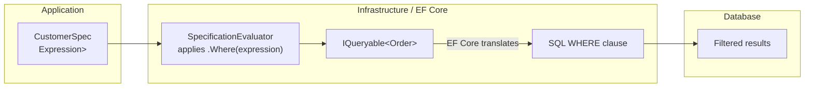
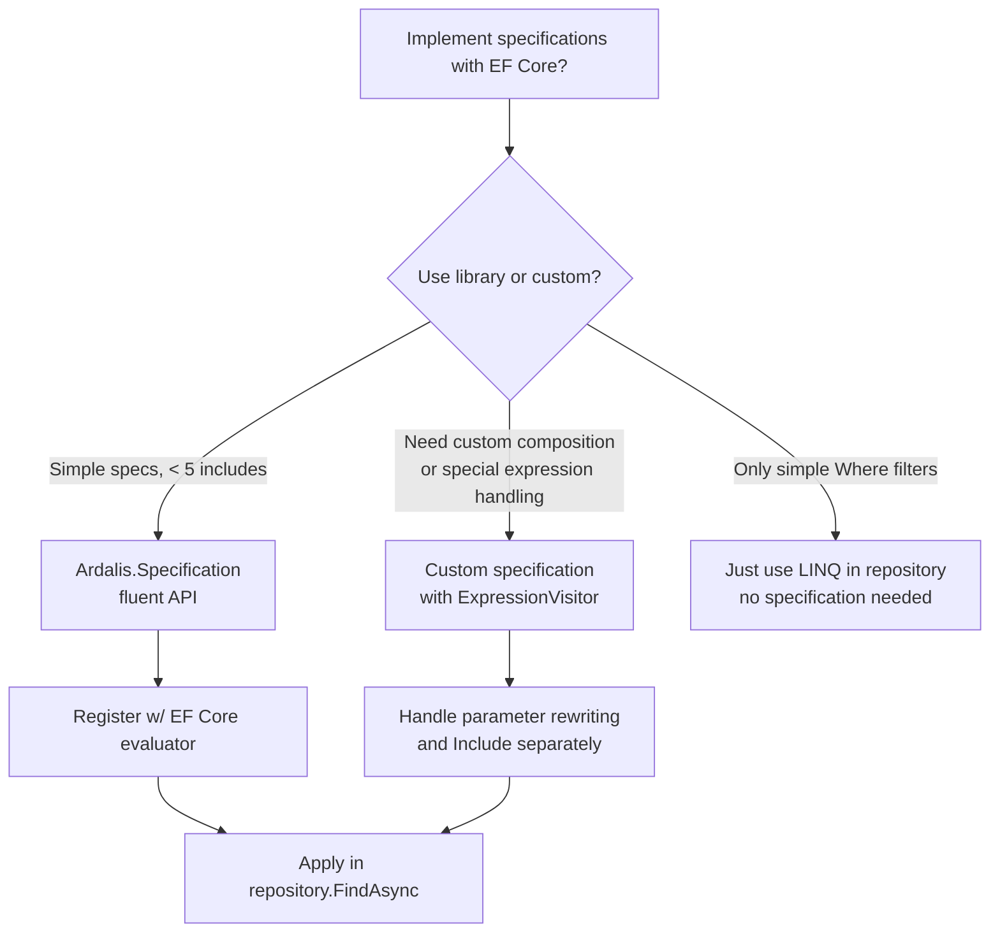

> [!success] Mastery Check
> - [ ] **Studied Well**
> - [ ] **Can explain the concept without notes**
> - [ ] **Can answer interview questions confidently**
> - [ ] **Can implement it in a real project**


# 7.060 — DDD — Specifications — EF Core Implementation

## Navigation

**Domain:** [[7 — System Design & Distributed Systems]] > **Group:** Domain-Driven Design
**Previous:** [[7.059 — Specifications — Composable Query Logic]] | **Next:** [[7.061 — Factories — Complex Object Creation]]

### Prerequisites

- [[7.059 — Specifications — Composable Query Logic]] — the specification pattern definition and composition logic; this note assumes you understand the abstraction and focuses on EF Core translation
- [[7.057 — Repositories — EF Core Implementation]] — understanding how EF Core's `DbSet<T>` and `IQueryable` work is required to see where specification predicates are injected
- [[6.018 — LINQ and Expression Trees]] — EF Core translates `Expression<Func<T,bool>>` to SQL via the LINQ provider; debugging translation failures requires expression tree knowledge

### Where This Fits

EF Core's LINQ provider translates specification predicates to SQL. The specification's `Expression<Func<T, bool>>` is passed to `DbSet<T>.Where()`, which EF Core's query pipeline parses into a SQL WHERE clause. The challenge is that not all C# expressions are translatable — custom method calls, certain collection operations, and complex closures cause `InvalidOperationException` or silent client evaluation. This note covers the specific patterns for making specification predicates EF Core–translatable, the `IQueryable` extension methods for applying specifications, and the gotchas of translating composed expression trees to efficient SQL.

## Core Mental Model

An EF Core specification implementation takes the specification's `Expression<Func<T, bool>>` and applies it to an `IQueryable<T>` chain via `.Where(expression)`. EF Core's query pipeline parses the expression tree, translates supported nodes to SQL, and throws for unsupported ones. The invariant is: **the specification predicate must be a pure expression that EF Core can translate — no method calls, no closures with external state mutation, no LINQ operations that EF Core doesn't support**. The tradeoff is: expression translation gives powerful compile-time-safe querying at the cost of a translation boundary — predicates that work in LINQ to Objects may fail in LINQ to Entities.

### Classification

| Dimension | Classification | Rationale |
|-----------|---------------|-----------|
| Implementation Layer | **Infrastructure** | The `IQueryable` extension methods live in Infrastructure |
| Translation Target | **SQL WHERE clause** | EF Core translates expression to SQL |
| Evaluation | **Server-side (database)** | Predicate runs as SQL, not in application memory |
| Expression Support | **Subset of C#** | No method calls, no custom functions, no F#/VB-specific constructs |
| Failure Mode | **Runtime exception on untranslatable** | `InvalidOperationException` during query materialization |



### Key Properties

| Property | Value | Condition |
|----------|-------|-----------|
| Translation boundary | Pure expressions only | No custom method calls |
| SQL quality | Good, not optimal | Depends on predicate complexity |
| Server evaluation | Always (with modern EF) | `EF Core 8` no longer silently client-evaluates |
| Include support | Via separate specification API | `Include<T>` not part of `Expression<Func<T,bool>>` |
| Pagination | Via specification or repository | `Query.Skip` / `Query.Take` |
| Performance | As good as hand-written LINQ | Identical — EF compiles same expression tree |

## Deep Mechanics

### How It Works

1. **Application service creates specification**: `var spec = new CustomerSpec(customerId).And(new ActiveOrdersSpec())`

2. **Repository receives specification**: `_repository.FindAsync(spec, ct)` is called.

3. **Repository extracts expression**: The `SpecificationEvaluator` calls `spec.ToExpression()` which returns `Expression<Func<Order, bool>>`.

4. **EF Core applies Where**: `_dbContext.Orders.Where(expression)` creates an `IQueryable<Order>` with the predicate in its expression tree.

5. **Query compilation**: When `ToListAsync()` or `FirstOrDefaultAsync()` is called, EF Core's query pipeline parses the expression tree and generates SQL.

6. **SQL execution**: The generated SQL `WHERE` clause runs on the server, and filtered results are materialized.

### Failure Modes

**Untranslatable method call**: Spec predicate calls `order.GetAgeInDays()` which EF Core cannot translate. **Detection**: `InvalidOperationException`. **Fix**: Expand inline: `(DateTime.UtcNow - order.CreatedAt).TotalDays`.

**Closure capture of mutable state**: Spec captures a `List<string>` that is modified after the query is built. **Detection**: Nondeterministic results — query returns different filters than expected. **Fix**: Capture only immutable values or use captured variables correctly.

**Client evaluation in EF Core 7 and earlier**: Some predicates silently evaluate client-side — loading all rows and filtering in memory. **Detection**: Performance warning in logs. **Fix**: Restructure predicate to be server-evaluable. In EF Core 8, client evaluation throws by default.

**Nested expression complexity**: Deeply nested composed expressions (5+ specs) produce SQL with excessive subqueries. **Detection**: Slow query, complex execution plan. **Fix**: Simplify the composition or flatten into a single predicate.

### .NET and Azure Integration

- **EF Core 8/9**: LINQ provider translates specification expressions to SQL
- **Ardalis.Specification.EntityFrameworkCore**: NuGet package providing `SpecificationEvaluator` for EF Core
- **Azure SQL Database**: Target database for translated SQL
- **Azure Monitor**: Query performance insights for specification-generated SQL
- **Azure SQL Query Performance Insight**: Identify slow queries from complex specifications

```csharp
// Specification evaluator extension method
public static class SpecificationExtensions
{
    public static IQueryable<T> ApplySpecification<T>(this IQueryable<T> query, Specification<T> spec)
        where T : class
    {
        var expression = spec.ToExpression();
        return query.Where(expression);
    }
}
```

## Production Patterns and Implementation

### Primary Implementation

```csharp
// Infrastructure Layer — Specification Evaluator
public static class SpecificationEvaluator
{
    public static IQueryable<T> ApplySpecification<T>(this IQueryable<T> query, Specification<T> specification)
        where T : class
    {
        var expression = specification.ToExpression();
        return expression is not null ? query.Where(expression) : query;
    }
}

// EF Core Repository with specification support
public sealed class OrderRepository : IOrderRepository
{
    private readonly OrderDbContext _dbContext;

    public OrderRepository(OrderDbContext dbContext) => _dbContext = dbContext;

    public async Task<IReadOnlyList<Order>> FindAsync(
        Specification<Order> specification, CancellationToken ct = default)
    {
        return await _dbContext.Orders
            .Include(o => o.Items)
            .ApplySpecification(specification)
            .AsSplitQuery()
            .ToListAsync(ct);
    }

    public async Task<int> CountAsync(
        Specification<Order> specification, CancellationToken ct = default)
    {
        return await _dbContext.Orders
            .ApplySpecification(specification)
            .CountAsync(ct);
    }

    public async Task<Order?> GetByIdAsync(OrderId orderId, CancellationToken ct = default)
    {
        return await _dbContext.Orders
            .Include(o => o.Items)
            .FirstOrDefaultAsync(o => o.Id == orderId, ct);
    }

    public async Task AddAsync(Order order, CancellationToken ct = default)
    {
        await _dbContext.Orders.AddAsync(order, ct);
    }

    public Task RemoveAsync(Order order, CancellationToken ct = default)
    {
        _dbContext.Orders.Remove(order);
        return Task.CompletedTask;
    }
}

// Ardalis.Specification-style (production library)
using Ardalis.Specification;
using Ardalis.Specification.EntityFrameworkCore;

public sealed class OrderRepositoryWithArdalis : RepositoryBase<Order>, IOrderRepository
{
    private readonly OrderDbContext _dbContext;

    public OrderRepositoryWithArdalis(OrderDbContext dbContext) : base(dbContext)
    {
        _dbContext = dbContext;
    }

    public async Task<IReadOnlyList<Order>> FindAsync(
        Specification<Order> specification, CancellationToken ct = default)
    {
        return await ApplySpecification(specification).ToListAsync(ct);
    }

    public async Task<int> CountAsync(
        Specification<Order> specification, CancellationToken ct = default)
    {
        return await ApplySpecification(specification).CountAsync(ct);
    }
}

// Domain specifications that work with EF Core
public sealed class CustomerSpec : Specification<Order>
{
    private readonly string _customerId;

    public CustomerSpec(CustomerId customerId)
    {
        _customerId = customerId.Value;
    }

    public override Expression<Func<Order, bool>> ToExpression()
        => order => order.CustomerId.Value == _customerId;
}

public sealed class ActiveOrdersSpec : Specification<Order>
{
    public override Expression<Func<Order, bool>> ToExpression()
        => order => order.Status == OrderStatus.Submitted
                 || order.Status == OrderStatus.Processing;
}

public sealed class HighValueSpec : Specification<Order>
{
    private readonly decimal _minAmount;

    public HighValueSpec(Money minAmount) => _minAmount = minAmount.Amount;

    public override Expression<Func<Order, bool>> ToExpression()
        => order => order.TotalAmount.Amount >= _minAmount;
}

public sealed class RecentOrdersSpec : Specification<Order>
{
    private readonly int _days;

    public RecentOrdersSpec(int days) => _days = days;

    public override Expression<Func<Order, bool>> ToExpression()
    {
        var cutoff = DateTime.UtcNow.AddDays(-_days);
        return order => order.CreatedAt >= cutoff;
    }
}
```

### Configuration and Wiring

```csharp
// Program.cs
builder.Services.AddScoped<IOrderRepository, OrderRepository>();

// If using Ardalis.Specification:
builder.Services.AddScoped(typeof(IRepositoryBase<>), typeof(RepositoryBase<>));
builder.Services.AddScoped<IOrderRepository, OrderRepositoryWithArdalis>();
```

### Common Variants

**Include chaining in specifications** (Ardalis.Specification):

```csharp
public sealed class OrderWithDetailsSpec : Specification<Order>
{
    public OrderWithDetailsSpec(OrderId orderId)
    {
        Query.Where(o => o.Id == orderId)
             .Include(o => o.Items)
             .ThenInclude(i => i.Product)
             .Include(o => o.ShippingAddress);
    }
}

// Evaluator applies both Where AND Include from the specification
public static IQueryable<T> ApplySpecification<T>(this IQueryable<T> query, Specification<T> spec)
    where T : class
{
    if (spec is ArdalisSpecification<T> ardalisSpec)
    {
        return SpecificationEvaluator.Default.Evaluate(query, ardalisSpec);
    }

    return query.Where(spec.ToExpression());
}
```

**Pagination specification**:

```csharp
public sealed class PagedSpec<T> : Specification<T>
{
    public int Page { get; }
    public int PageSize { get; }

    public PagedSpec(int page, int pageSize)
    {
        Page = page;
        PageSize = pageSize;
        Query.Skip((page - 1) * pageSize).Take(pageSize);
    }

    // In Ardalis.Specification, Skip/Take are pre-defined
}

// Repository method
public async Task<PagedResult<Order>> FindPagedAsync(
    Specification<Order> spec, int page, int pageSize, CancellationToken ct)
{
    var count = await _dbContext.Orders.ApplySpecification(spec).CountAsync(ct);

    var pagedSpec = new PagedSpec<Order>(page, pageSize);
    var composed = spec.And(pagedSpec); // Combines filter + pagination

    var items = await _dbContext.Orders
        .Include(o => o.Items)
        .ApplySpecification(composed)
        .ToListAsync(ct);

    return new PagedResult<Order>(items, count, page, pageSize);
}
```

**Multiple includes in specification** (custom implementation):

```csharp
public abstract class QuerySpecification<T> : Specification<T>
{
    protected List<Expression<Func<T, object>>> Includes { get; } = [];
    protected List<string> IncludeStrings { get; } = [];

    protected void AddInclude(Expression<Func<T, object>> include) => Includes.Add(include);
    protected void AddInclude(string include) => IncludeStrings.Add(include);
}

// Evaluator applies includes
public static IQueryable<T> ApplyIncludes<T>(this IQueryable<T> query, QuerySpecification<T> spec)
    where T : class
{
    var result = query;
    foreach (var include in spec.Includes)
        result = result.Include(include);
    foreach (var includeStr in spec.IncludeStrings)
        result = result.Include(includeStr);
    return result;
}
```

### Real-World .NET Ecosystem Example

**Ardalis.Specification.EntityFrameworkCore** integrates directly with EF Core's query pipeline. Its `SpecificationEvaluator` calls `IQueryable.Where(expression)`, then applies `Include`, `ThenInclude`, `Skip`, `Take`, `OrderBy`, and `Search` from the specification object. It handles the complexity of combining multiple `Include` and `Where` calls in the correct order. The evaluator uses EF Core's `IQueryable` composition — each call returns a new `IQueryable` with the expression appended to the tree. This means specification evaluation is additive: where filters are combined with AND, includes are additive, and ordering is replaced. The library has 50M+ NuGet downloads and is used in the CleanArchitecture solution template.

## Gotchas and Production Pitfalls

### Pitfall 1: Specification Predicate Uses a Method That EF Core Cannot Translate

**Pitfall:** The specification predicate calls a helper method or uses a LINQ operator that EF Core doesn't support on the server.

```csharp
// ❌ Non-translatable — method call
public sealed class ActiveOrdersSpec : Specification<Order>
{
    public override Expression<Func<Order, bool>> ToExpression()
        => order => order.IsActive(); // BUG: EF Core can't translate IsActive()
}

// Or worse — uses an extension method:
    => order => order.Items.Sum(i => i.UnitPrice.Amount).IsPositive(); // BUG
```

**Symptom:** `InvalidOperationException: The LINQ expression could not be translated.` In EF Core 7 and earlier: silent client evaluation warning, then all orders loaded into memory.

**Fix:** Expand all logic inline using only EF Core–translatable constructs.

```csharp
// ✅ Translatable — inline logic
public sealed class ActiveOrdersSpec : Specification<Order>
{
    public override Expression<Func<Order, bool>> ToExpression()
        => order => order.Status == OrderStatus.Submitted
                 || order.Status == OrderStatus.Processing;
}
```

**Cost of not fixing:** Runtime exceptions on every query. Or, worse — silent client evaluation that loads millions of rows into memory, OOM-killing the application.

### Pitfall 2: Date Comparison Without Normalization

**Pitfall:** Comparing a `DateTime` property directly with `DateTime.UtcNow` inside the specification — EF Core translates `DateTime.UtcNow` as a non-deterministic runtime value.

```csharp
// ❌ Potential translation issue or non-deterministic SQL
public sealed class RecentOrdersSpec : Specification<Order>
{
    public override Expression<Func<Order, bool>> ToExpression()
        => order => order.CreatedAt >= DateTime.UtcNow.AddDays(-7);
}
```

**Symptom:** SQL contains `GETUTCDATE()` — which is non-deterministic. Different rows may see different "now" values if the query scans over time. In practice, EF Core translates this correctly to `GETUTCDATE()`. But caching may not work because the expression is the same — the SQL is parameterized.

**Fix:** Normalize the date to a captured variable so EF Core generates a parameterized SQL.

```csharp
// ✅ Captured variable — parameterized SQL
public sealed class RecentOrdersSpec : Specification<Order>
{
    private readonly DateTime _cutoff;

    public RecentOrdersSpec(int days)
    {
        _cutoff = DateTime.UtcNow.AddDays(-days);
    }

    public override Expression<Func<Order, bool>> ToExpression()
        => order => order.CreatedAt >= _cutoff;
}
```

**Cost of not fixing:** Inconsistent behavior if the query is long-running. More importantly: the query plan may not be cached because EF Core sees `DateTime.UtcNow.AddDays(-7)` as a constant expression, not a parameter.

### Pitfall 3: Specification Used with AsNoTracking but Repository Expects Tracking

**Pitfall:** The specification is applied after `AsNoTracking()` — the repository method returns untracked entities that cannot be saved.

```csharp
// ❌ AsNoTracking applied before specification — result is untracked
public async Task<IReadOnlyList<Order>> FindAsync(
    Specification<Order> specification, CancellationToken ct)
{
    return await _dbContext.Orders
        .AsNoTracking() // BUG: result entities are not tracked
        .ApplySpecification(specification)
        .ToListAsync(ct);
}

// Consumer — tries to save changes, but nothing is tracked
var orders = await _orderRepository.FindAsync(spec, ct);
foreach (var order in orders)
    order.Submit();
await _unitOfWork.SaveChangesAsync(ct); // No changes detected!
```

**Symptom:** Modifications are silently not persisted. The `Submit()` call changes the in-memory object, but `SaveChangesAsync` generates zero SQL updates.

**Fix:** Only use `AsNoTracking()` in the query path (when returning DTOs). For command-path queries that return aggregates for modification, use tracking.

```csharp
// ✅ Tracking — for command operations
public async Task<IReadOnlyList<Order>> FindAsync(
    Specification<Order> specification, CancellationToken ct)
{
    return await _dbContext.Orders
        .Include(o => o.Items)
        .ApplySpecification(specification)
        .ToListAsync(ct);
    // Tracked — changes will be saved
}
```

**Cost of not fixing:** Silent data loss. Modifications appear to work in-memory but never reach the database. Inconsistencies discovered days later.

### Pitfall 4: Specification Composition Creates Unnecessarily Complex SQL

**Pitfall:** Chaining 5+ `And` specifications creates a deeply nested expression tree that EF Core translates to a complex SQL WHERE clause with excessive parentheses.

```csharp
// ❌ Over-composed — generates overly complex SQL
var spec = new StatusSpec(OrderStatus.Submitted)
    .And(new CustomerSpec(customerId))
    .And(new HighValueSpec(Money.Usd(100)))
    .And(new RecentOrdersSpec(7))
    .And(new PaymentMethodSpec(PaymentMethod.CreditCard))
    .And(new HasItemsSpec(5));
```

**Symptom:** SQL Server's query optimizer generates a suboptimal plan for the deeply nested WHERE clause. Query takes 5x longer than a simpler hand-written version.

**Fix:** Combine related criteria into a single specification to reduce nesting depth.

```csharp
// ✅ Combined specification — simpler SQL
public sealed class OrderSearchSpec : Specification<Order>
{
    public OrderSearchSpec(CustomerId customerId, OrderStatus? status, DateTime? from, DateTime? to)
    {
        Query.Where(o => o.CustomerId == customerId);
        if (status.HasValue) Query.Where(o => o.Status == status.Value);
        if (from.HasValue && to.HasValue) Query.Where(o => o.CreatedAt >= from.Value && o.CreatedAt <= to.Value);
    }
}
```

**Cost of not fixing:** Slow queries, timeouts, excessive CPU on SQL Server. At scale, the complex query plan exhausts the query plan cache and causes plan recompilation overhead.

### Pitfall 5: Not Handling Null or Missing Data in Specification Predicates

**Pitfall:** Specification accesses a nullable navigation property without null-checking, causing translation to SQL with incorrect semantics.

```csharp
// ❌ No null check on optional navigation
public sealed class OrdersWithShippingSpec : Specification<Order>
{
    public override Expression<Func<Order, bool>> ToExpression()
        => order => order.ShippingAddress.Country == "US"; // BUG: ShippingAddress might be null
}
```

**Symptom:** `NullReferenceException` when the specification is evaluated in-memory (unit tests). In EF Core, the translation generates SQL with `[o].[ShippingAddress_Country] = N'US'` — which returns `false` (SQL three-valued logic) when `ShippingAddress` is null, so it doesn't fail but returns incorrect results.

**Fix:** Add null checks in the predicate.

```csharp
// ✅ Null-safe
public sealed class OrdersWithShippingSpec : Specification<Order>
{
    public override Expression<Func<Order, bool>> ToExpression()
        => order => order.ShippingAddress != null
                 && order.ShippingAddress.Country == "US";
}
```

**Cost of not fixing:** Incorrect query results — orders without shipping addresses are silently excluded. Business reports show fewer US orders than actually exist.

## Tradeoffs and Decision Framework

### Tradeoff Matrix

| Dimension | Custom Specification (Expression) | Ardalis.Specification | Raw LINQ in Repository |
|-----------|----------------------------------|----------------------|----------------------|
| Complexity | High (ExpressionVisitor, parameter rewrite) | Low (fluent API) | Medium |
| Include support | Manual | Built-in | Manual |
| Expression translation | Custom | Library-managed | Standard LINQ |
| Learning curve | Steep | Gentle | Standard EF |
| Community support | Minimal | Extensive (50M+ downloads) | Standard |
| Flexibility | Total control | Library conventions | Full LINQ |

### Decision Flowchart



### When to Apply

- EF Core is the primary ORM and specifications are needed for composable queries
- Ready-made library (Ardalis.Specification) matches your use case
- Team is comfortable with expression trees and EF Core translation boundaries

### When NOT to Apply

- Using Dapper or another micro-ORM — specifications are EF-specific
- Simple CRUD with no complex queries — raw LINQ is simpler
- Team not comfortable with expression tree debugging

### Scale Thresholds

- **Ideal for** any specification count when using EF Core — the overhead is identical to hand-written LINQ
- **Expression complexity concern above** 5 composed specifications
- **Translation failure rate above** 2% indicates team needs more training on EF Core–translatable patterns
- **Consider raw SQL above** 10 specifications for a single query — SQL is simpler than debugging deeply nested expression translations

## Interview Arsenal

### Question Bank

1. **How does EF Core translate specification predicates to SQL?**
2. **What C# constructs are not translatable by EF Core in specification predicates?**
3. **How do you handle Include/ThenInclude in specifications with EF Core?**
4. **What is the difference between server-side and client-side evaluation in the context of specifications?**
5. **Compare the Ardalis.Specification library with a custom specification implementation for EF Core.**
6. **Design the EF Core implementation for an OrderRepository that accepts specifications with filtering, includes, and pagination.**
7. **How do you debug a specification that produces a slow SQL query?**
8. **What happens to specification query performance at 1000 queries/second?**

### Spoken Answers

**Q1: How does EF Core translate specification predicates to SQL?**

> **Great answer:** EF Core translates specification predicates by parsing the `Expression<Func<T, bool>>` expression tree into a SQL WHERE clause through its query pipeline. When the repository calls `_dbContext.Orders.Where(spec.ToExpression())`, EF Core builds an `IQueryable` with an added `WhereExpression` node. When `ToListAsync` is called, EF Core's query compilation pipeline visits every node in the expression tree and translates supported patterns — `MemberAccess` becomes column references, `Equal` becomes `=`, `AndAlso` becomes `AND`, `Constant` becomes SQL parameters. The key constraint is that EF Core only supports a subset of C# expressions in the tree — no method calls, no closures with mutable state, no F# discriminated unions. If the expression contains an unsupported node, EF Core 8 throws `InvalidOperationException` at query compilation time. In earlier versions, it silently fell back to client evaluation. The composition of specifications via `And` and `Or` produces more complex expression trees, but the translation to SQL is the same — more `AND`/`OR` clauses with parentheses for grouping.

**Q2: What C# constructs are not translatable by EF Core in specification predicates?**

> **Great answer:** The most common non-translatable constructs are: custom method calls — EF Core doesn't know how to translate `order.IsActive()` or `StringHelper.Sanitize(input)`. String operations beyond basic `Contains`, `StartsWith`, `EndsWith` — regex, `Split`, `Join` are not translatable. `Guid.NewGuid()` is not translatable because it's non-deterministic. `DateTime.Now` and `DateTime.UtcNow` are translatable but generate `GETDATE()`/`GETUTCDATE()` which is non-deterministic — better to capture in a variable. Conversions with `(int)` or `ToString()` may not work in all providers. The rule of thumb: if it can be written as a SQL expression, it's translatable. If it requires C# runtime code, it's not. For anything complex, I capture the result in a variable before the lambda and use the variable in the predicate — this generates a SQL parameter instead of trying to translate the expression.

**Q5: Compare the Ardalis.Specification library with a custom specification implementation for EF Core.**

> **Great answer:** Ardalis.Specification is the pragmatic choice for 90% of projects. It handles Include/ThenInclude chaining, pagination, sorting, and Search (LIKE queries) — all the pain points of custom implementations. The `SpecificationEvaluator` correctly applies `Where`, `Include`, `Skip`, `Take`, and `OrderBy` in the right order. It also handles the expression parameter rewriting for composition, which is the hardest part of a custom implementation. The library is well-tested with 50M+ downloads and works with any version of EF Core 6+.

> I'd choose a custom implementation only when I need something Ardalis doesn't support — like custom SQL generation, provider-specific query hints, or when I'm already using a custom repository base class. The custom approach gives full control but requires implementing `ExpressionVisitor` for parameter rewriting, include chaining, and pagination — about 300-500 lines of infrastructure code that needs its own tests. The custom approach also gives more control over EF Core version-specific behavior — for example, handling the transition from client evaluation (EF Core 3.x) to throw-on-untranslatable (EF Core 8+).

> My rule: start with Ardalis.Specification. If you hit a limitation, extend it. If you outgrow it, fork or replace the evaluator.
</details>

### System Design Interview Trigger

If an interviewer asks "how do you implement complex querying in a DDD system with EF Core?" they are testing two things: (1) do you understand EF Core's expression translation limitations, and (2) do you know how to balance the abstraction of specifications with the practicalities of SQL generation. The follow-up is always about a specific translation failure — "what if the specification calls a method?" They want to hear you identify the non-translatable construct and explain how to work around it.

### Comparison Table

| | Ardalis.Specification | Custom Expression Spec | Raw LINQ in Repository |
|---|---|---|---|
| Core guarantee | Production-ready, tested | Full control | No abstraction |
| Trade-off | Library dependency | Implementation effort | Coupled to EF |
| Include support | Built-in `Query.Include` | Manual `Include` | Manual `Include` |
| Pagination | Built-in `Query.Skip/Take` | Custom implementation | Direct Skip/Take |
| Failure mode | Composition may conflict with custom evaluator | Expression parameter bugs | Translation exceptions |

## Architecture Decision Record

**Status:** Accepted

**Context:** The Order Repository previously had 14 query-specific methods. The team needs a scalable approach to query flexibility. EF Core 8 is the ORM. The team has 5 developers with varying expression tree experience.

**Options Considered:**

1. **Ardalis.Specification library** — Production-ready library with fluent API, includes, pagination
2. **Custom specification with ExpressionVisitor** — Full control but requires infrastructure code
3. **Raw LINQ in repository methods** — Keep adding methods as needed

**Decision:** Ardalis.Specification for 90% of cases. Custom specifications only when Ardalis's `Specification<T>` doesn't support a needed pattern (e.g., custom SQL generation). The `OrderRepository` implements `IRepositoryBase<Order>` from Ardalis and wraps it in `IOrderRepository` for domain-purity.

**Consequences:**
- ✅ Repository interface reduced from 14 to 5 methods
- ✅ Include/ThenInclude, pagination, sorting handled by library
- ✅ Expression parameter rewriting handled correctly
- ⚠️ Ardalis dependency adds ~200KB to deployment
- ⚠️ Some domain-layer specifications must use Ardalis's base class
- ❌ Custom query patterns (raw SQL, full-text search) need to bypass Ardalis

**Review Trigger:** Revisit this decision if the team encounters 3+ scenarios where Ardalis cannot express the needed query, or if the library's dependency conflicts with future EF Core versions.

## Self-Check

### Conceptual Questions

1. How does EF Core translate a specification predicate to SQL?

<details>
<summary>Answer</summary>
EF Core parses the `Expression<Func<T, bool>>` expression tree. It visits each node — `MemberAccess` becomes column reference, `Constant` becomes SQL parameter, `AndAlso` becomes `AND`, `Equal` becomes `=`. The expression tree is compiled into a SQL `WHERE` clause through EF Core's query pipeline.
</details>

2. What happens when a specification predicate calls a non-translatable method?

<details>
<summary>Answer</summary>
In EF Core 8+, `InvalidOperationException: The LINQ expression could not be translated.` is thrown at query compilation. In EF Core 3.x-7, a warning is logged and the predicate is evaluated client-side — all rows are loaded into memory and filtered in the application.
</details>

3. How does Ardalis.Specification handle `Include` and `ThenInclude`?

<details>
<summary>Answer</summary>
Through `Query.Include(o => o.Items).ThenInclude(i => i.Product)` fluent calls. The `SpecificationEvaluator` applies these to the `IQueryable` chain via EF Core's `Include`/`ThenInclude` methods, separate from the `Where` predicate.
</details>

4. What is the difference between server-side and client-side evaluation?

<details>
<summary>Answer</summary>
Server-side: the predicate is translated to SQL and executed by the database. Client-side: the predicate cannot be translated, so all rows are loaded into memory and filtered in the application. Server-side is efficient; client-side can load millions of rows unnecessarily.
</details>

5. Why should date comparisons in specifications use captured variables instead of `DateTime.UtcNow`?

<details>
<summary>Answer</summary>
`DateTime.UtcNow` in the predicate generates SQL with `GETUTCDATE()` — a runtime function. Capturing to a variable creates a SQL parameter, making the query plan cacheable. The parameter value is fixed for the query's duration, ensuring deterministic results.
</details>

6. What is the purpose of `ParameterReplacer` in specification composition?

<details>
<summary>Answer</summary>
When two specifications are composed with `And`/`Or`, each has its own `ParameterExpression` in its expression tree. `ParameterReplacer` rewrites all parameter references to share a single `ParameterExpression` so the combined expression is valid and EF Core can translate it.
</details>

7. At how many composed specifications does SQL quality degrade significantly?

<details>
<summary>Answer</summary>
Above 5-7 `And` compositions, the WHERE clause becomes deeply nested with excessive parentheses. SQL Server's query optimizer may struggle to find an optimal plan. Combine related criteria into a single specification when exceeding this threshold.
</details>

8. How do specifications relate to the `IQueryable` chain in [[7.057 — Repositories — EF Core Implementation]]?

<details>
<summary>Answer</summary>
The specification's `Where` predicate is appended to the `IQueryable` chain. Each `ApplySpecification` call adds a `WhereExpression` node. Multiple calls stack — EF Core combines them with `AND`. The `Include` calls are also appended to the chain before the materialization call.
</details>

9. What is the risk of using `AsNoTracking` in a specification-based query that returns aggregates?

<details>
<summary>Answer</summary>
The returned aggregates are not tracked by the change tracker. Modifications to these aggregates will not be persisted by `SaveChangesAsync`. `AsNoTracking` should only be used for read-only query paths that return DTOs, not command paths that return aggregates for modification.
</details>

10. Explain EF Core specification implementation in 60 seconds at a whiteboard.

<details>
<summary>Answer</summary>
"An EF Core specification implementation takes the specification's `Expression<Func<T, bool>>` and calls `IQueryable.Where(expression)`. EF Core's query pipeline parses the expression tree into a SQL WHERE clause. The key constraint is translatability — the predicate must use only constructs that EF Core can convert to SQL: property access, comparisons, logical operators, and basic string/date methods. Custom method calls, closures with mutable state, and complex LINQ operators that EF Core doesn't support will throw `InvalidOperationException`. For includes and pagination, I use Ardalis.Specification which provides a fluent `Query.Include().ThenInclude().Skip().Take()` API that the evaluator applies to the IQueryable separately from the Where predicate. The result is composable, testable, and translatable to efficient SQL."
</details>

### Scenario Challenges

**Scenario 1 — Diagnose the problem:** A specification query that worked in development throws `InvalidOperationException: The LINQ expression could not be translated` after deploying to production. The difference: production uses Azure SQL Database, development uses SQLite LocalDB.

<details>
<summary>Diagnosis</summary>

**Root cause:** SQLite and SQL Server support different LINQ translations. The specification uses a method call or LINQ operator that SQLite's EF Core provider translates but SQL Server's provider does not. Common example: `DateTime.DayOfWeek` translates on SQLite but not on SQL Server; `StringComparison.OrdinalIgnoreCase` in `Contains` may work differently.

**Evidence:** The exception stack trace shows the exact expression node that couldn't be translated. Comparing the development and production providers reveals the difference.

**Fix:** Use a translatable pattern that works on both providers. For date comparisons, use date arithmetic. For string comparisons, use `EF.Functions.Like`.

**Prevention:** Use the same database provider in development and testing. Add integration tests that run against the production provider in CI.
</details>

**Scenario 2 — Design decision:** Your team needs to implement a specification that joins Order and Payment tables to find "orders with successful payments." The specification must be evaluable by EF Core.

<details>
<summary>Decision and Reasoning</summary>

**Choice:** Do NOT create a cross-aggregate specification. Instead, create a read-model query that joins the tables and returns DTOs. Specifications operate at the aggregate level — they should not join across aggregates.

**Tradeoffs accepted:** The query logic lives outside the specification pattern. Acceptable because cross-aggregate queries are inherently read-side concerns.

**Implementation sketch:**

```csharp
// Read-model query — NOT a specification
public interface IOrderPaymentQuery
{
    Task<IReadOnlyList<OrderWithPaymentDto>> GetOrdersWithSuccessfulPaymentsAsync(
        DateTime from, DateTime to, CancellationToken ct);
}

// Implementation joins Orders and Payments tables
public sealed class OrderPaymentQuery : IOrderPaymentQuery
{
    private readonly OrderDbContext _dbContext;

    public async Task<IReadOnlyList<OrderWithPaymentDto>> GetOrdersWithSuccessfulPaymentsAsync(
        DateTime from, DateTime to, CancellationToken ct)
    {
        return await _dbContext.Orders
            .Where(o => o.CreatedAt >= from && o.CreatedAt <= to)
            .Join(_dbContext.Set<Payment>(),
                  order => order.Id.Value,
                  payment => payment.OrderId.Value,
                  (order, payment) => new OrderWithPaymentDto
                  {
                      OrderId = order.Id.Value,
                      TotalAmount = order.TotalAmount.Amount,
                      PaymentStatus = payment.Status.ToString(),
                      PaidAt = payment.CompletedAt
                  })
            .Where(dto => dto.PaymentStatus == "Completed")
            .ToListAsync(ct);
    }
}
```

**Why not a specification:** Specifications should return aggregate roots, not cross-aggregate projections. This query operation doesn't need change tracking.
</details>

**Scenario 3 — Failure mode:** A composed specification of 6 `And` clauses generates a SQL query with 47 parentheses in the WHERE clause. The query plan shows an unnecessary index scan.

<details>
<summary>Investigation and Fix</summary>

**Investigation steps:**
1. Capture the generated SQL using `_dbContext.Database.LogTo(Console.WriteLine)`
2. Examine the WHERE clause — deeply nested AND/OR grouping
3. Check `EstimatedExecutionPlan` in SSMS — index scan with high cost

**Confirming evidence:** SQL starts with `WHERE (((((([o].[CustomerId] = @p0) AND ([o].[Status] = @p1)) AND ([o].[TotalAmount] >= @p2)) AND ...` — 6 levels of nesting.

**Immediate mitigation:** Flatten the specification into a single predicate class:

```csharp
public sealed class OrderSearchSpec : Specification<Order>
{
    public OrderSearchSpec(OrderSearchCriteria criteria)
    {
        Query.Where(o =>
            o.CustomerId.Value == criteria.CustomerId &&
            o.Status == criteria.Status &&
            o.TotalAmount.Amount >= criteria.MinAmount &&
            o.CreatedAt >= criteria.From &&
            o.CreatedAt <= criteria.To
        );
    }
}
```

**Permanent fix:** Add a covering index for the most common filter combination. Consider `INCLUDE` columns for the SELECT clause.

**Post-mortem item:** Add query logging to CI pipeline. Flag specifications that produce WHERE clauses with >5 nesting levels.
</details>

**Scenario 4 — Scale it:** Your system uses specifications for all queries. At 1000 qps, 10% of specification evaluation time is spent in expression tree manipulation (compilation, parameter rewriting). You need to reach 5000 qps.

<details>
<summary>Scaling Strategy</summary>

**Bottleneck this addresses:** Expression tree compilation per query. EF Core compiles each unique expression tree to SQL. With composed specifications, each combination creates a unique expression tree that must be compiled.

**How it helps:**
1. EF Core's query compilation cache caches the compiled SQL for identical expression trees — repeated queries with the same specification hit the cache
2. Avoid composing dynamic specifications per request — build a set of pre-defined, cached specifications for common queries
3. Use compiled queries (`EF.CompileQuery`) for hot-path specifications

**Implementation:**

```csharp
// Compiled query for hot path
private static readonly Func<OrderDbContext, string, IAsyncEnumerable<Order>> _getByCustomer =
    EF.CompileAsyncQuery(
        (OrderDbContext ctx, string customerId) =>
            ctx.Orders
                .Include(o => o.Items)
                .Where(o => o.CustomerId.Value == customerId));
```

**What it does not solve:** Database throughput. At 5000 qps, the database must be scaled horizontally via read replicas or sharding.

**Implementation order:**
1. Week 1: Profile specification compilation overhead; identify hot paths
2. Week 2: Add compiled queries for top 3 most-frequent specification combinations
3. Week 3: Load test at 5000 qps
</details>

**Scenario 5 — Interview simulation:** The interviewer says: "Design the query layer for an order processing system where the UI allows filtering by any combination of customer, date range, status, and amount. The system uses EF Core. How do you implement this without adding 50 methods to the repository?"

<details>
<summary>Model Response</summary>

"I'd use the Ardalis.Specification library for the command side and CQRS read models for the display side. For the command side — when the UI's search results need to be loaded as aggregates for batch operations — I'd create individual specification classes for each criterion and compose them dynamically:

```csharp
var spec = new Specification<Order>();
if (criteria.CustomerId.HasValue)
    spec.Query.Where(o => o.CustomerId.Value == criteria.CustomerId.Value);
if (criteria.Status.HasValue)
    spec.Query.Where(o => o.Status == criteria.Status.Value);
if (criteria.DateFrom.HasValue && criteria.DateTo.HasValue)
    spec.Query.Where(o => o.CreatedAt >= criteria.DateFrom.Value && o.CreatedAt <= criteria.DateTo.Value);
if (criteria.MinAmount.HasValue)
    spec.Query.Where(o => o.TotalAmount.Amount >= criteria.MinAmount.Value);

spec.Query.Include(o => o.Items);
var orders = await _repository.FindAsync(spec, ct);
```

For the display side — when the UI just needs to show a list without aggregate operations — I'd use a separate `IOrderSearchQuery` interface with Dapper, returning flat DTOs and avoiding aggregate loading entirely. This avoids the overhead of EF Core tracking and full object graph materialization.

The specification approach keeps the repository interface stable — there's one `FindAsync` method that accepts any specification. EF Core compiles the where clauses from the specification and generates efficient parameterized SQL. The key constraint is translatability: I ensure all predicates use only EF Core–compatible constructs. For the rare case where a filter cannot be translated, I push that logic to a post-query step or use raw SQL for that specific combination."
</details>
