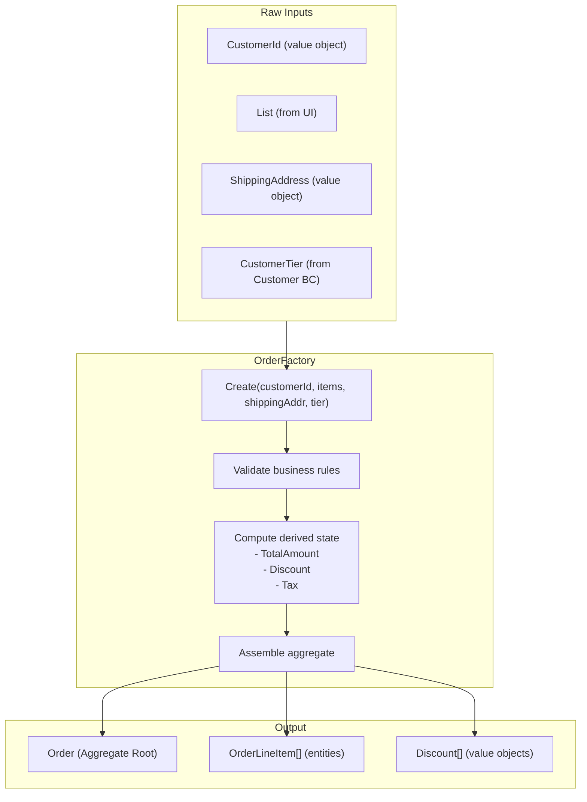

> [!success] Mastery Check
> - [ ] **Studied Well**
> - [ ] **Can explain the concept without notes**
> - [ ] **Can answer interview questions confidently**
> - [ ] **Can implement it in a real project**


# 7.061 — DDD — Factories — Complex Object Creation

## Navigation

**Domain:** [[7 — System Design & Distributed Systems]] > **Group:** Domain-Driven Design
**Previous:** [[7.060 — Specifications — EF Core Implementation]] | **Next:** [[7.062 — Subdomains — Core, Supporting, Generic]]

### Prerequisites

- [[7.047 — Aggregates — Consistency Boundary]] — a factory creates a complete aggregate that satisfies all its invariants; the factory must enforce consistency rules at creation time
- [[7.045 — Value Objects — Equality and Immutability]] — factories compose value objects (Money, Address, CustomerId) into the aggregate; value object creation and validation is a factory concern
- [[7.043 — Entities — Identity and Lifecycle]] — factories assign identity; understanding when to generate identity (domain-generated GUID) versus defer (database identity) affects factory design

### Where This Fits

A factory encapsulates the complexity of creating aggregates that require: (1) validation across multiple input parameters, (2) generation of default child entities, (3) computation of derived state from raw inputs, (4) assignment of complex identity, or (5) coordination across multiple value objects and entities. The factory pattern becomes necessary when an aggregate's constructor has 5+ parameters, when creation involves conditional logic ("if order total > $500, add a discount line item"), or when creation requires external data (look up customer tier to determine initial credit limit). Without factories, aggregate constructors become unwieldy, application services become cluttered with creation logic, or — worst case — aggregates are created in invalid states because the caller didn't know all the invariants.

## Core Mental Model

A factory is a **creation responsibility** — a method or class whose sole job is to produce a fully initialized, valid aggregate. The invariant is: **any object returned from a factory is guaranteed to satisfy all its invariants — it is ready for use without additional setup**. The tradeoff is: factories add an indirection layer that, for simple creation cases, is unnecessary overhead over a constructor or a static factory method.

### Classification

| Dimension | Classification | Rationale |
|-----------|---------------|-----------|
| Pattern Type | **Tactical DDD / Creation Pattern** | Encapsulates object creation complexity |
| Scope | **Per aggregate or per complex entity** | One factory per aggregate type that needs it |
| Location | **Domain layer** | Factory is domain logic, not application or infrastructure |
| Forms | Static method, class, or service | Varies by complexity — static method for simple, class for complex |
| Output | Fully-initialized aggregate | Always returns an aggregate that satisfies all invariants |



### Key Properties

| Property | Value | Condition |
|----------|-------|-----------|
| Invariant enforcement | Complete | All invariants checked before object is returned |
| Creation complexity hidden | From callers | Application service calls factory, not constructor |
| Single responsibility | Only creates | Factory does not query or persist |
| Testability | High | Factory can be unit tested independently |
| Identity generation | Usually included | Factory calls `OrderId.New()` |
| Validation | Domain rules only | Format validation belongs in value objects |

## Deep Mechanics

### How It Works

1. **Input collection**: The application service gathers raw inputs from the command — customer ID, line items, shipping address, payment method.

2. **Input validation**: Value objects validate their own format — `CustomerId.Create(value)` validates format; `Money.Usd(amount)` validates non-negative.

3. **Factory invocation**: The factory receives the validated value objects plus any context data (customer tier for discount computation).

4. **Business rules**: The factory applies creation-time business rules — "if total > $500, apply free shipping"; "if customer is Premium tier, apply 10% discount"; "generate an `OrderLineItem` entity for each `CartItem`."

5. **Aggregate construction**: The factory calls the aggregate's constructor (usually internal or private) with the computed parameters.

6. **Return**: The fully initialized aggregate is returned to the application service.

### Failure Modes

**Factory returns partially initialized aggregate**: Factory does not set all required properties, or sets them after returning (mutating a returned object). **Detection**: `NullReferenceException` when the aggregate is used. **Fix**: Make the factory return a fully initialized aggregate using the constructor; make the aggregate immutable after creation except through behavior methods.

**Factory takes too many parameters**: 8+ parameters indicating the factory is doing too much. **Detection**: Factory method has excessive cyclomatic complexity. **Fix**: Introduce a parameter object or break into multiple factories.

**Factory performs I/O**: Factory calls a database or external service to get data for aggregate creation. **Detection**: Factory takes `IOrderRepository` or `HttpClient` as a dependency. **Fix**: Factories are pure domain logic; I/O belongs in the application service or a domain service.

**Factory has conditional creation logic that hides from the caller**: Factory silently chooses to create a different type of aggregate based on inputs. **Detection**: Factory returns a base type but caller doesn't know the concrete type. **Fix**: Make the factory method name explicit (`CreateStandardOrder`, `CreatePrepaidOrder`) or return a discriminated union.

### .NET and Azure Integration

- **Domain factory classes**: Placed in Domain layer, no infrastructure dependencies
- **Static factory methods on aggregate**: `Order.Create(...)` — the simplest factory pattern
- **Factory class with DI**: `IOrderFactory` interface resolved by application service
- **Azure Functions**: Factories can be used in function-triggered creation workflows
- **Durable Functions**: Complex creation orchestration using factory + saga pattern

```csharp
// Static factory method — simplest and most common
public sealed class Order : AggregateRoot<OrderId>
{
    private Order() { } // Private for EF Core

    public static Order Create(CustomerId customerId, IEnumerable<OrderLineItem> items, Address? shippingAddress)
    {
        if (!items.Any()) throw new DomainException("Order must have at least one item.");

        var order = new Order
        {
            Id = OrderId.New(),
            CustomerId = customerId,
            Status = OrderStatus.Draft,
            ShippingAddress = shippingAddress,
            CreatedAt = DateTime.UtcNow
        };
        order._items.AddRange(items);
        order.TotalAmount = items.Sum(i => i.LineTotal);

        return order;
    }
}
```

## Production Patterns and Implementation

### Primary Implementation

```csharp
// Simple case — static factory method on the aggregate itself
public sealed class Customer : AggregateRoot<CustomerId>
{
    private Customer() { }

    public CustomerName Name { get; private set; }
    public Email Email { get; private set; }
    public CustomerTier Tier { get; private set; }
    public DateTime CreatedAt { get; private set; }

    public static Customer Register(CustomerName name, Email email, CustomerTier initialTier)
    {
        ArgumentNullException.ThrowIfNull(name);
        ArgumentNullException.ThrowIfNull(email);

        return new Customer
        {
            Id = CustomerId.New(),
            Name = name,
            Email = email,
            Tier = initialTier,
            CreatedAt = DateTime.UtcNow
        };
    }
}

// Complex case — dedicated factory class
public interface IOrderFactory
{
    Order CreateOrder(CustomerId customerId, IEnumerable<CartItem> cartItems, 
        Address? shippingAddress, CustomerTier customerTier);
}

public sealed class OrderFactory : IOrderFactory
{
    public Order CreateOrder(CustomerId customerId, IEnumerable<CartItem> cartItems,
        Address? shippingAddress, CustomerTier customerTier)
    {
        var items = BuildLineItems(cartItems);
        var discount = ComputeDiscount(items.Sum(i => i.LineTotal), customerTier);

        var order = Order.CreateDraft(customerId, items, shippingAddress);

        if (discount.Amount > 0)
        {
            order.ApplyDiscount(discount);
        }

        ValidateShippingEligibility(order);
        return order;
    }

    private static List<OrderLineItem> BuildLineItems(IEnumerable<CartItem> cartItems)
    {
        return cartItems.Select(item =>
        {
            var unitPrice = Money.Usd(item.UnitPrice);
            var lineTotal = unitPrice * item.Quantity;
            return new OrderLineItem(
                OrderLineItemId.New(),
                item.ProductId,
                item.ProductName,
                item.Quantity,
                unitPrice,
                lineTotal);
        }).ToList();
    }

    private static Discount ComputeDiscount(Money totalAmount, CustomerTier customerTier)
    {
        return customerTier switch
        {
            CustomerTier.Premium when totalAmount > Money.Usd(100) => Discount.Percentage(10),
            CustomerTier.Standard when totalAmount > Money.Usd(500) => Discount.Fixed(Money.Usd(25)),
            _ => Discount.None
        };
    }

    private static void ValidateShippingEligibility(Order order)
    {
        if (order.TotalAmount > Money.Usd(10000) && order.ShippingAddress is null)
        {
            throw new DomainException(
                "Orders over $10,000 require a shipping address for signature confirmation.");
        }
    }
}

// The aggregate's creation method is now internal — only called by the factory
public sealed class Order : AggregateRoot<OrderId>
{
    private Order() { }

    internal static Order CreateDraft(CustomerId customerId, 
        List<OrderLineItem> items, Address? shippingAddress)
    {
        return new Order
        {
            Id = OrderId.New(),
            CustomerId = customerId,
            Status = OrderStatus.Draft,
            Items = items,
            ShippingAddress = shippingAddress,
            TotalAmount = items.Sum(i => i.LineTotal),
            CreatedAt = DateTime.UtcNow
        };
    }

    public void ApplyDiscount(Discount discount)
    {
        // Domain logic for applying discount
    }
}
```

### Configuration and Wiring

```csharp
// Program.cs — for class-based factory
builder.Services.AddScoped<IOrderFactory, OrderFactory>();

// Application service uses factory
public sealed class OrderApplicationService
{
    private readonly IOrderFactory _orderFactory;
    private readonly IOrderRepository _orderRepository;
    private readonly IUnitOfWork _unitOfWork;

    public OrderApplicationService(
        IOrderFactory orderFactory,
        IOrderRepository orderRepository,
        IUnitOfWork unitOfWork)
    {
        _orderFactory = orderFactory;
        _orderRepository = orderRepository;
        _unitOfWork = unitOfWork;
    }

    public async Task<OrderId> SubmitOrderAsync(SubmitOrder command, CancellationToken ct)
    {
        var customerId = CustomerId.From(command.CustomerId);
        var shippingAddress = command.ShippingAddress is not null
            ? new Address(command.ShippingAddress.Street, command.ShippingAddress.City, ...)
            : null;

        var order = _orderFactory.CreateOrder(
            customerId,
            command.Items,
            shippingAddress,
            CustomerTier.Standard); // Would come from Customer BC in production

        order.Submit();
        await _orderRepository.AddAsync(order, ct);
        await _unitOfWork.SaveChangesAsync(ct);

        return order.Id;
    }
}
```

### Common Variants

**Static factory method** (simplest — no DI):

```csharp
public static Order Create(CustomerId customerId, IEnumerable<LineItem> items)
{
    if (items is null || !items.Any())
        throw new DomainException("Order must contain at least one item.");

    var order = new Order { Id = OrderId.New(), CustomerId = customerId, Status = OrderStatus.Draft, CreatedAt = DateTime.UtcNow };
    order._items.AddRange(items);
    order.TotalAmount = items.Sum(i => i.LineTotal);
    return order;
}
```

**Factory with parameter object** (avoids parameter explosion):

```csharp
public sealed record OrderCreationContext
{
    public CustomerId CustomerId { get; init; }
    public IEnumerable<CartItem> Items { get; init; } = [];
    public Address? ShippingAddress { get; init; }
    public CustomerTier CustomerTier { get; init; } = CustomerTier.Standard;
    public PaymentMethod PreferredPayment { get; init; } = PaymentMethod.CreditCard;
    public string? CouponCode { get; init; }
    public DateTime? RequestedDeliveryDate { get; init; }
}

public Order CreateOrder(OrderCreationContext context)
{
    // Single parameter object instead of 6+ parameters
}
```

**Factory returning discriminated unions** (for polymorphic creation):

```csharp
public sealed class OrderCreationResult
{
    private OrderCreationResult() { }

    public sealed record Success(Order Order) : OrderCreationResult;
    public sealed record ValidationFailed(IReadOnlyList<string> Errors) : OrderCreationResult;
    public sealed record FraudBlocked(string Reason) : OrderCreationResult;
}

public OrderCreationResult CreateOrder(OrderCreationContext context)
{
    if (context.Items.Sum(i => i.Quantity) > 100)
        return new OrderCreationResult.ValidationFailed(["Order exceeds maximum item quantity."]);
    // ... create and return success
    return new OrderCreationResult.Success(order);
}
```

**Prototype factory** (clone with modifications):

```csharp
public Order CreateRecurringOrder(Order template, DateTime nextDeliveryDate)
{
    return new Order
    {
        Id = OrderId.New(),
        CustomerId = template.CustomerId,
        Items = template.Items.Select(i => i.Clone()).ToList(),
        ShippingAddress = template.ShippingAddress,
        TotalAmount = template.TotalAmount,
        Status = OrderStatus.Draft,
        CreatedAt = DateTime.UtcNow
    };
}
```

### Real-World .NET Ecosystem Example

**EF Core's `DbSet<T>.Add()`** is itself a lightweight factory — it creates a proxy instance if lazy loading is enabled, attaches it to the change tracker, and generates identity if configured. In DDD, however, the aggregate should be fully constructed by the domain factory before being passed to `DbSet.Add()`. The `OrderFactory` creates the aggregate, validates it, and then passes the ready-to-use object to the repository. This keeps the domain creation logic in the domain layer, testable without EF Core.

## Gotchas and Production Pitfalls

### Pitfall 1: Factory Performs I/O

**Pitfall:** The factory calls a database or external API to get data needed for aggregate creation, violating the domain layer's persistence ignorance.

```csharp
// ❌ Factory does I/O — domain layer has infrastructure dependency
public sealed class OrderFactory : IOrderFactory
{
    private readonly ICustomerRepository _customerRepository; // Infrastructure!

    public Order CreateOrder(CustomerId customerId, ...)
    {
        var customer = await _customerRepository.GetByIdAsync(customerId); // BUG: I/O in factory
        // use customer.Tier for discount computation
    }
}
```

**Symptom:** Can't unit test the factory without mocking repositories. Factory tests are slow and complex. If the repository is unavailable, the factory throws.

**Fix:** Factory is pure domain logic. Pass all required data as parameters — the application service loads external data before calling the factory.

```csharp
// ✅ Pure factory — all data passed in
public sealed class OrderFactory : IOrderFactory
{
    public Order CreateOrder(CustomerId customerId, IEnumerable<CartItem> items, 
        Address? shippingAddress, CustomerTier customerTier)
    {
        // All data is already provided — no I/O
    }
}

// Application service loads data and passes it
public async Task SubmitOrderAsync(SubmitOrder command, CancellationToken ct)
{
    var customerTier = await _customerRepository.GetTierAsync(command.CustomerId, ct);
    var order = _orderFactory.CreateOrder(customerId, command.Items, 
        shippingAddress, customerTier);
}
```

**Cost of not fixing:** Domain layer depends on infrastructure. Cannot unit test creation logic. Changes to data access break creation rules.

### Pitfall 2: Factory Bypasses Invariant Checks

**Pitfall:** The factory creates the aggregate and then modifies it after construction, bypassing the constructor's invariant enforcement.

```csharp
// ❌ Bypassed invariants
public Order CreateOrder(CustomerId customerId, ...)
{
    var order = new Order(); // BUG: parameterless constructor, no validation
    order.CustomerId = customerId;
    order.Status = OrderStatus.Draft;
    // What if the caller forgets to set CreatedAt? Null reference!
    return order;
}
```

**Symptom:** Nullable reference type warnings. `NullReferenceException` when code relies on `order.CreatedAt` being non-null. Inconsistent state — some orders have `CreatedAt`, some don't.

**Fix:** Use internal constructors with required parameters. The aggregate enforces its invariants, and the factory calls the constructor correctly.

```csharp
// ✅ Invariants enforced by aggregate constructor
internal Order(OrderId id, CustomerId customerId, DateTime createdAt)
{
    Id = id ?? throw new ArgumentNullException(nameof(id));
    CustomerId = customerId ?? throw new ArgumentNullException(nameof(customerId));
    CreatedAt = createdAt;
    Status = OrderStatus.Draft; // Always starts as Draft
}
```

**Cost of not fixing:** Intermittent invalid states. Orders missing required properties. Production bugs that are hard to reproduce because creation code paths differ.

### Pitfall 3: Factory Takes 8+ Parameters

**Pitfall:** The factory method grows with every new feature, becoming unreadable and error-prone.

```csharp
// ❌ Parameter explosion — 9 parameters
public Order CreateOrder(CustomerId customerId, CustomerName customerName, 
    Email email, Address? shippingAddress, Address? billingAddress,
    IEnumerable<CartItem> items, CustomerTier tier, string? couponCode,
    PaymentMethod preferredPayment)
```

**Symptom:** Callers must pass `null` for most parameters. Intellisense is useless. Adding a new parameter breaks all callers.

**Fix:** Introduce a parameter object.

```csharp
// ✅ Parameter object
public sealed record OrderCreationRequest
{
    public CustomerId CustomerId { get; init; }
    public IEnumerable<CartItem> Items { get; init; } = [];
    public Address? ShippingAddress { get; init; }
    public Address? BillingAddress { get; init; }
    public CustomerTier CustomerTier { get; init; } = CustomerTier.Standard;
    public string? CouponCode { get; init; }
    public PaymentMethod PreferredPayment { get; init; } = PaymentMethod.CreditCard;
}

public Order CreateOrder(OrderCreationRequest request)
{
    // Single parameter — easy to extend, easy to call
}
```

**Cost of not fixing:** Every new creation feature requires changing the factory signature, all callers, and all tests. High friction for adding new order types.

### Pitfall 4: Factory Creates Different Aggregate Types Silently

**Pitfall:** The factory returns a base `Order` type but sometimes creates a `PrepaidOrder` or `SubscriptionOrder`. The caller doesn't know which type it received.

```csharp
// ❌ Hidden polymorphism
public Order CreateOrder(OrderCreationRequest request)
{
    if (request.PreferredPayment == PaymentMethod.Prepaid)
        return new PrepaidOrder(request); // Returns different subtype
    return new StandardOrder(request);
}

// Caller doesn't know they got a PrepaidOrder
var order = factory.CreateOrder(request);
if (order is PrepaidOrder prepaid) // Surprise! Cast check needed
    prepaid.ActivatePrepaidBalance();
```

**Symptom:** Callers must use `is` checks or pattern matching to discover the actual type. Factory hides the creation decision.

**Fix:** Use explicit factory method names or return a discriminated union.

```csharp
// ✅ Explicit names
public PrepaidOrder CreatePrepaidOrder(OrderCreationRequest request) { ... }
public StandardOrder CreateStandardOrder(OrderCreationRequest request) { ... }

// Or discriminated union
public sealed record CreateOrderResult
{
    public sealed record Standard(Order Order) : CreateOrderResult;
    public sealed record Prepaid(PrepaidOrder Order) : CreateOrderResult;
}
```

**Cost of not fixing:** Callers must know the internal logic of the factory to understand which type was created. Violates the Tell-Don't-Ask principle.

### Pitfall 5: Factory Duplicates Aggregate Creation Logic

**Pitfall:** The factory and the aggregate constructor both have creation logic that drifts apart over time.

```csharp
// ❌ Duplicated logic
public class Order
{
    private Order() { }

    internal static Order CreateDraft(CustomerId customerId, ...)
    {
        // Validates: items not empty
        // Computes: TotalAmount from items
    }
}

public class OrderFactory
{
    public Order CreateOrder(...)
    {
        if (!items.Any()) throw new DomainException("...");
        var total = items.Sum(i => i.LineTotal);
        // DUPLICATED from Order.CreateDraft!
    }
}
```

**Symptom:** Factory logic and aggregate creation logic diverge. One validates differently, one computes totals differently. Bugs where the factory creates an aggregate that differs from the constructor's behavior.

**Fix:** The factory delegates to the aggregate's creation method.

```csharp
// ✅ Factory delegates to aggregate
public Order CreateOrder(...)
{
    var items = BuildLineItems(cartItems);
    var order = Order.CreateDraft(customerId, items, shippingAddress); // Delegates to aggregate
    // Factory adds additional logic on top
    ApplyBusinessDiscounts(order, customerTier);
    return order;
}
```

**Cost of not fixing:** Subtle bugs where factory-created aggregates are in different states than constructor-created ones. Hard to debug because both paths appear valid independently.

## Tradeoffs and Decision Framework

### Tradeoff Matrix

| Dimension | Static Factory Method | Factory Class | Constructor |
|-----------|----------------------|---------------|-------------|
| Complexity | Low | Medium-High | Lowest |
| Testability | Good (isolated) | Best (DI mockable) | Good (direct) |
| Maintainability | Good | Excellent (OCP) | Poor (signature changes) |
| DI support | None | Full | None |
| Parameter explosion risk | Medium | Low (parameter object) | High |
| Suitability for complex logic | Medium | High | Low |
| .NET ecosystem fit | Common pattern | Clean Architecture standard | Too simple for DDD |

### Decision Flowchart

```mermaid
flowchart TD
    A[Need to create a domain aggregate?] --> B{Creation complexity?}
    B -->|Simple — 3-4 params, no logic| C[Static factory method<br/>on aggregate: Order.Create()]
    B -->|Complex — business rules,<br/>conditional child entities| D{Does creation need<br/>external data?}
    D -->|No — all data from command| E[Dedicated factory class<br/>IOrderFactory]
    D -->|Yes — loading customer tier,<br/>product prices, etc.| F[Application service loads data,<br/>pure factory creates aggregate]
    C --> G[Simplest approach — start here]
    E --> G
    F --> H[Ensure factory has NO I/O<br/>— pure domain logic]
```

### When to Apply

- Aggregate creation requires business rules beyond simple parameter assignment
- Creation involves computing derived state (discounts, totals, tax)
- Creation generates default child entities
- The aggregate constructor has 5+ parameters

### When NOT to Apply

- Aggregate creation is simple parameter assignment — use constructor or static factory
- The "factory" just delegates to the constructor with no additional logic
- The factory performs I/O (it should be a domain service or application service instead)
- Small system, few aggregates — the indirection is unnecessary

### Scale Thresholds

- **Static factory method sufficient** for 80% of aggregate creation cases
- **Dedicated factory class** warranted when creation logic exceeds 20 lines
- **Parameter object** needed when factory method has 5+ parameters
- **Factory + specification** needed when you have polymorphic creation (different order types)

## Interview Arsenal

### Question Bank

1. **What is the factory pattern in DDD and what problem does it solve?**
2. **When would you use a static factory method vs a dedicated factory class?**
3. **Why should factories not perform I/O?**
4. **Compare factory with constructor — when is a factory necessary and when is it over-engineering?**
5. **How do you handle polymorphic aggregate creation (different order types) with factories?**
6. **Design a factory for creating an Order aggregate that must validate items, compute discounts based on customer tier, and generate line item entities.**
7. **What happens to factory complexity at scale — 50 different order types?**
8. **How does the factory pattern relate to the aggregate root creation rules?**

### Spoken Answers

**Q1: What is the factory pattern in DDD and what problem does it solve?**

> **Great answer:** A factory encapsulates the complexity of creating a fully initialized, valid aggregate. Its single responsibility is to produce an object that satisfies all its invariants. Without factories, aggregate constructors become complex with 6+ parameters, conditional logic, and business rules. The factory pattern addresses three problems. First, **creation complexity**: when creating an Order requires building child `OrderLineItem` entities from `CartItem` DTOs, computing `TotalAmount` from line totals, applying discounts based on customer tier, and generating identity — that's too much for a constructor. Second, **domain expression**: `orderFactory.CreatePrepaidOrder(...)` communicates intent better than `new Order(type: Prepaid, ...)`. Third, **encapsulation**: the factory can create aggregates with internal constructors, preventing application services from creating aggregates in invalid states. The simplest factory is a static method on the aggregate — `Order.Create(...)`. For complex cases, I use a dedicated `IOrderFactory` interface implemented by a class in the Domain layer. The invariant is: the factory never performs I/O — all external data is passed as parameters.

**Q4: Compare factory with constructor — when is a factory necessary and when is it over-engineering?**

> **Great answer:** A constructor is appropriate when creation is simple parameter assignment with minimal validation — `CustomerName name`, `Email email`, and that's it. I use the constructor via a `private` or `internal` access modifier and expose a static factory method `Customer.Register(name, email)`. This pattern covers 80% of cases. A dedicated factory class becomes necessary when: the aggregate requires computation during creation (discounts, totals), when creation involves generating child entities from flat input, when creation requires context-dependent logic (different discount for different customer tiers), or when the aggregate has polymorphic types (Standard vs Prepaid order). The rule of thumb: if the creation logic fits in 10-15 lines inside a static method, use the static factory. If it's longer, extract to a factory class. If it's just `new Order { ... }`, use the constructor directly — but then question whether your aggregate has enough behavior to justify being an aggregate.

**Q6: Design a factory for creating an Order aggregate that must validate items, compute discounts based on customer tier, and generate line item entities.**

> **Great answer:** I'd use a dedicated `IOrderFactory` interface with an `OrderCreationRequest` parameter object.

```csharp
public sealed record OrderCreationRequest
{
    public CustomerId CustomerId { get; init; }
    public IEnumerable<CartItem> Items { get; init; } = [];
    public Address? ShippingAddress { get; init; }
    public CustomerTier CustomerTier { get; init; }
    public string? CouponCode { get; init; }
}

public interface IOrderFactory
{
    Order CreateOrder(OrderCreationRequest request);
}
```

> The implementation first converts `CartItem`s to `OrderLineItem` entities, computing total for each. It validates business rules — at least one item, no single item exceeding $10,000, maximum 50 items per order. Then it computes the discount based on customer tier and total. Finally, it calls `Order.CreateDraft(...)` (internal constructor) and applies the discount. The factory is pure domain logic — no I/O. The application service loads the `CustomerTier` from the Customer BC and passes it in. I unit test the factory by verifying: correct line item generation, correct total computation, correct discount application based on tier, and exceptions for invalid inputs.
</details>

### System Design Interview Trigger

If an interviewer asks "how do you create complex domain objects in a DDD system?" they are testing whether you understand the distinction between creation (which can have business rules) and persistence (which should not). The follow-up is "what if the creation logic needs data from another service?" — they want to hear that factories are pure and that the application service composes data before calling the factory.

### Comparison Table

| | Static Factory Method | Factory Class | Constructor |
|---|---|---|---|
| Core guarantee | Simple, co-located | Complex, DI-friendly | Simplest creation |
| Trade-off | No DI | Extra class | Logic leaks out |
| .NET implementation | `Order.Create(...)` | `IOrderFactory` + `OrderFactory` | `new Order(...)` |
| Failure mode | Parameter explosion | I/O in factory | Invalid state |
| When to choose | 80% of DDD aggregates | Complex creation, 5+ params | Pure data objects |

## Architecture Decision Record

**Status:** Accepted

**Context:** The Order aggregate creation involves: converting CartItem DTOs to OrderLineItem entities (with identity generation), computing TotalAmount from line totals, applying tier-based discounts, validating shipping eligibility for high-value orders, and optionally applying coupon codes. The creation logic spans ~45 lines and includes conditional branching. The application service should not contain this complexity.

**Options Considered:**

1. **Static factory method on Order** — `Order.Create(request)` with parameter object
2. **Dedicated IOrderFactory class** — Interface + implementation for complex creation
3. **Constructor with all logic** — Constructor does all computation internally

**Decision:** Static factory method `Order.Create(OrderCreationRequest)` with an `OrderCreationRequest` parameter object. The static method handles line item generation, total computation, and basic validation (items not empty). Tier-based discount logic is extracted into a separate static `DiscountCalculator` class for testability. This avoids a dedicated factory class while still keeping creation logic in the domain layer.

**Consequences:**
- ✅ Creation logic in domain layer, not in application service
- ✅ Single `OrderCreationRequest` parameter — easy to extend
- ✅ No dedicated factory class — simpler than Option 2
- ⚠️ Static method cannot be mocked — integration tests must create real orders
- ⚠️ If discount logic grows significantly, extract to a proper factory class
- ❌ If polymorphic order types appear (PrepaidOrder, SubscriptionOrder), will need a factory

**Review Trigger:** Revisit this decision if we introduce polymorphic order types or if creation logic exceeds 75 lines.

## Self-Check

### Conceptual Questions

1. What is the single responsibility of a factory in DDD?

<details>
<summary>Answer</summary>
To produce a fully initialized, valid aggregate that satisfies all its invariants. The factory does not query, persist, or perform I/O — it only creates.
</details>

2. When is a static factory method preferable over a factory class?

<details>
<summary>Answer</summary>
When creation logic is simple (10-15 lines), doesn't require DI, and doesn't need to be mocked. The static method lives on the aggregate itself, keeping the creation logic co-located with the aggregate.
</details>

3. Why should factories not perform I/O?

<details>
<summary>Answer</summary>
Because factories live in the Domain layer, which must be persistence-ignorant. I/O (database calls, HTTP requests) couples the domain to infrastructure. The application service loads external data and passes it to the factory as parameters.
</details>

4. What is a parameter object and when should it be used in factories?

<details>
<summary>Answer</summary>
A parameter object is a record or class that groups all factory inputs into a single parameter. It's necessary when the factory method has 5+ parameters to prevent parameter explosion and make the API stable across feature additions.
</details>

5. How do you handle polymorphic aggregate creation?

<details>
<summary>Answer</summary>
Use explicit factory method names (`CreateStandardOrder`, `CreatePrepaidOrder`) or a discriminated union result type. Avoid returning a base type when the caller needs to know the concrete type.
</details>

6. What is the danger of putting creation logic in the application service instead of a factory?

<details>
<summary>Answer</summary>
Creation logic is duplicated across command handlers. Adding a new creation rule requires modifying all application services that create the aggregate. The domain knowledge leaks out of the domain layer.
</details>

7. How does a factory relate to the Aggregate Root Rule in [[7.048 — Aggregates — Aggregate Root Rule]]?

<details>
<summary>Answer</summary>
The factory enforces the aggregate root rule by ensuring that internal entities (OrderLineItem) are created through the aggregate's factory method, never independently. The caller gets a complete aggregate with all internal entities properly initialized.
</details>

8. What is the difference between a factory and a domain service?

<details>
<summary>Answer</summary>
A factory creates things (aggregates, entities, value objects). A domain service performs operations (computations, validations) that don't naturally belong to a single entity or value object. A factory's output is always a new object; a domain service's output is a value or decision.
</details>

9. How do you test a factory that creates complex aggregates?

<details>
<summary>Answer</summary>
Unit test the factory by passing valid inputs and verifying: the returned aggregate is not null, all properties are set correctly, derived values match expected calculations, and business rules are applied. Test invalid inputs: verify expected `DomainException` is thrown. No mocking required if the factory is pure (no I/O).
</details>

10. Explain the factory pattern in 60 seconds at a whiteboard.

<details>
<summary>Answer</summary>
"A factory is a creation method whose sole job is to produce a valid aggregate. The simplest form is a static method on the aggregate — `Order.Create(customerId, items)` — which validates inputs, computes derived values, generates identity, and returns a ready-to-use Order. For complex creation, I use a dedicated factory class with an interface like `IOrderFactory`. The factory never performs I/O — it receives all data as parameters. The application service loads external data (customer tier, product prices) and passes it to the factory. This keeps the domain layer pure and creation logic testable without a database. The key rule: any aggregate returned from a factory is guaranteed to satisfy all its invariants."
</details>

### Scenario Challenges

**Scenario 1 — Diagnose the problem:** After deploying a new feature that creates "SubscriptionOrder" aggregates, some orders are created without a `NextBillingDate`. The `SubscriptionOrder` constructor requires `NextBillingDate`, but the creation code path sometimes bypasses it.

<details>
<summary>Diagnosis</summary>

**Root cause:** Two creation paths exist — one through the `SubscriptionOrderFactory` (sets NextBillingDate correctly) and one through a generic `OrderFactory` that creates `SubscriptionOrder` instances via a parameterless constructor and forgets to set `NextBillingDate`.

**Evidence:** Logs show `NextBillingDate` is `null` only for orders created by the `OrderFactory` when `type == "subscription"`. The `SubscriptionOrderFactory` always sets it correctly.

**Fix:** Remove the generic factory's ability to create `SubscriptionOrder`. Force all subscription order creation through `SubscriptionOrderFactory`.

**Prevention:** Make `SubscriptionOrder` constructors internal and only callable from within the dedicated factory. Architecture test ensures only factory classes can create aggregate instances.
</details>

**Scenario 2 — Design decision:** Your team needs to implement an Order creation flow that validates the customer's credit limit, checks fraud detection, and computes discounts. The data for these checks comes from three different sources (Customer BC, Fraud Service, Pricing Service). Design the creation flow.

<details>
<summary>Decision and Reasoning</summary>

**Choice:** Three-phase creation: (1) application service loads external data, (2) pure factory creates the aggregate with the loaded data, (3) domain service validates the creation.

**Tradeoffs accepted:** External data loading is in the application layer, but the factory remains pure. Slight overhead of loading data before creation — acceptable because the data is needed anyway.

**Implementation sketch:**

```csharp
// Phase 1: Application Service loads data
public async Task<OrderId> SubmitOrderAsync(SubmitOrder command, CancellationToken ct)
{
    var customer = await _customerApi.GetAsync(command.CustomerId, ct);
    var fraudResult = await _fraudService.CheckAsync(command.CustomerId, command.Items, ct);
    if (fraudResult.IsSuspicious) throw new FraudBlockedException();

    // Phase 2: Factory creates aggregate with all data
    var request = new OrderCreationRequest
    {
        CustomerId = CustomerId.From(customer.Id),
        Items = command.Items,
        CustomerTier = customer.Tier,
        CreditLimit = customer.CreditLimit,
        ShippingAddress = command.ShippingAddress is not null
            ? new Address(command.ShippingAddress.Street, ...)
            : null
    };
    var order = _orderFactory.CreateOrder(request);

    // Phase 3: Domain service validates against creation rules
    _orderCreationValidator.ValidateCreation(order, request);

    order.Submit();
    await _orderRepository.AddAsync(order, ct);
    await _unitOfWork.SaveChangesAsync(ct);
    return order.Id;
}
```

**Why this works:** The factory is pure (no I/O), testable, and focused on creation. The validation is a separate concern. The application service coordinates the flow.
</details>

**Scenario 3 — Failure mode:** The factory method `CreateOrder` has 11 parameters. Developers are increasingly passing `null` or default values for parameters they don't understand. Every month, a new bug arises from a parameter being passed incorrectly.

<details>
<summary>Investigation and Fix</summary>

**Investigation steps:**
1. Count the parameters — 11, in order: customerId, shippingAddress, billingAddress, items, customerTier, couponCode, giftMessage, preferredPayment, deliveryInstructions, isExpedited, sourceChannel
2. Check callers — 8 different application services call this method. 6 of them pass `null` for 3+ parameters.
3. Check recent bugs — 2 bugs in 3 months from `null` shipping address being passed incorrectly.

**Immediate mitigation:** Introduce `OrderCreationRequest` parameter object. Add validation in the factory that throws meaningful exceptions for missing required parameters.

**Permanent fix:**

```csharp
public sealed record OrderCreationRequest
{
    public CustomerId CustomerId { get; init; }
    public Address? ShippingAddress { get; init; }
    public Address? BillingAddress { get; init; }
    public IEnumerable<CartItem> Items { get; init; } = [];
    public CustomerTier CustomerTier { get; init; } = CustomerTier.Standard;
    public string? CouponCode { get; init; }
    public string? GiftMessage { get; init; }
    public PaymentMethod PreferredPayment { get; init; } = PaymentMethod.CreditCard;
    public string? DeliveryInstructions { get; init; }
    public bool IsExpedited { get; init; }
    public string SourceChannel { get; init; } = "Web";
}

public static Order CreateOrder(OrderCreationRequest request)
{
    ArgumentNullException.ThrowIfNull(request);
    if (request.CustomerId is null) throw new DomainException("CustomerId is required.");
    if (!request.Items.Any()) throw new DomainException("At least one item is required.");
    // ... remaining validation
}
```

**Post-mortem item:** Add code analysis rule: any method with >5 parameters must be approved in code review.
</details>

**Scenario 4 — Scale it:** Your system creates 500 orders/second. Each order goes through a factory that checks 4 business rules and computes 3 derived values. The factory is a static method on the aggregate. You need to handle 2000 orders/second.

<details>
<summary>Scaling Strategy</summary>

**Bottleneck this addresses:** Factory CPU overhead — 4 rule checks + 3 computations per order. At 500/s, this is 3500 operations/second. At 2000/s, it's 14,000 operations/second — still fine for a single thread (microseconds per operation).

**How it helps:** Factories are pure CPU operations — no I/O — so they scale linearly with CPU cores. Adding more application instances handles the load.

**What it does not solve:** Database write throughput. The real bottleneck is persisting 2000 orders/second, not creating them in memory. The factory is the least of your scaling concerns.

**Implementation order:**
1. Profile to confirm the factory is not the bottleneck (it won't be)
2. Focus on database scaling — sharding, read replicas, batch commits
</details>

**Scenario 5 — Interview simulation:** The interviewer says: "Design the creation of a Payment aggregate in a payment processing system. The Payment must be created with a valid Amount, Currency, PaymentMethod, and OrderId. Some payments are one-time, some are recurring. How do you handle the different types?"

<details>
<summary>Model Response</summary>

"I'd use a static factory method with a discriminated union or explicit methods for the two payment types. Both share common creation rules — Amount must be positive, PaymentMethod must not be expired, OrderId must not be empty. But they differ in additional setup.

```csharp
public abstract class Payment : AggregateRoot<PaymentId>
{
    public PaymentId Id { get; protected set; }
    public OrderId OrderId { get; protected set; }
    public Money Amount { get; protected set; }
    public PaymentMethod Method { get; protected set; }
    public PaymentStatus Status { get; protected set; }

    // Protected constructor for subclasses
    protected internal Payment(OrderId orderId, Money amount, PaymentMethod method)
    {
        Id = PaymentId.New();
        OrderId = orderId ?? throw new ArgumentNullException(nameof(orderId));
        Amount = amount ?? throw new ArgumentNullException(nameof(amount));
        Method = method ?? throw new ArgumentNullException(nameof(method));
        Status = PaymentStatus.Pending;
    }

    // Static factory methods
    public static OneTimePayment CreateOneTime(OrderId orderId, Money amount, PaymentMethod method)
    {
        return new OneTimePayment(orderId, amount, method);
    }

    public static RecurringPayment CreateRecurring(OrderId orderId, Money amount, 
        PaymentMethod method, BillingSchedule schedule)
    {
        var payment = new RecurringPayment(orderId, amount, method, schedule);
        payment.GenerateInitialInvoice();
        return payment;
    }
}
```

The key decisions: I use static factory methods on the Payment class itself because the creation logic is simple (no I/O, few parameters). The methods are explicit about what type they create — no hidden polymorphism. Both methods validate common rules (positive amount, valid payment method) in the constructor, and type-specific rules (schedule must be future-dated for recurring) in their respective factory methods. The constructor is `protected internal` — callable from factory methods but not from application services directly."
</details>
