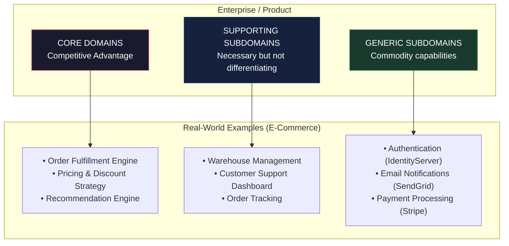
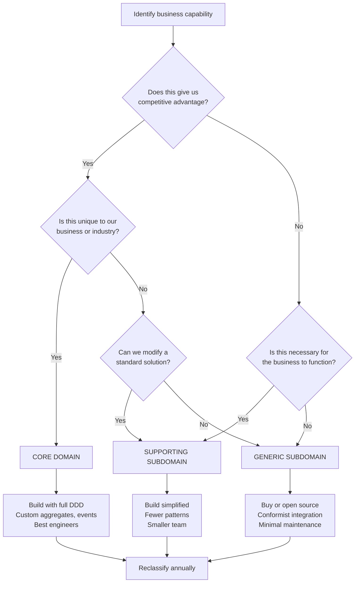

> [!success] Mastery Check
> - [ ] **Studied Well**
> - [ ] **Can explain the concept without notes**
> - [ ] **Can answer interview questions confidently**
> - [ ] **Can implement it in a real project**


# 7.062 — DDD — Subdomains — Core, Supporting, Generic

## Navigation

**Domain:** [[7 — System Design & Distributed Systems]] > **Group:** Domain-Driven Design
**Previous:** [[7.061 — Factories — Complex Object Creation]] | **Next:** [[7.063 — Domain Primitives — Solving Primitive Obsession]]

### Prerequisites

- [[7.033 — Bounded Contexts — Identifying Boundaries]] — subdomains are the problem-space decomposition; bounded contexts are the solution-space mapping. Understanding how bounded contexts map to subdomains is prerequisite to classification.
- [[7.031 — Strategic vs Tactical Design]] — subdomain classification is the most important strategic design decision — it determines where to invest in tactical DDD, where to use Conformist, and where to buy rather than build.
- [[7.034 — Bounded Contexts — Context Map]] — subdomain type determines the appropriate context map relationship: core domain gets ACL, supporting gets Partnership, generic gets Conformist.

### Where This Fits

Subdomain classification is the **strategic investment decision** of DDD. Every business capability falls into one of three categories: Core (competitive advantage — build it yourself, invest heavily, apply full tactical DDD), Supporting (necessary but not differentiating — build with less investment, lighter patterns), or Generic (everyone needs it — buy off the shelf, Conformist relationship, minimal investment). This classification determines architecture, team structure, resourcing, and technology choices across the entire system. Without explicit classification, teams over-invest in non-differentiating subdomains (building a custom CRM when Salesforce would do) or under-invest in core domains (treating the company's competitive advantage as a simple CRUD form). The classification becomes critical above ~5 subdomains or when the organization has 3+ development teams.

## Core Mental Model

Subdomains are the **problem-space decomposition** of a business into distinct areas of expertise, each classified by strategic value. The invariant is: **core domains receive the majority of DDD investment; generic subdomains receive the minimum investment necessary**. The tradeoff is: accurate classification requires deep business understanding — misclassifying a core domain as generic loses competitive advantage, while misclassifying a generic domain as core wastes resources.

### Classification

| Dimension | Classification | Rationale |
|-----------|---------------|-----------|
| Pattern Type | **Strategic DDD / Problem Space** | Subdomains exist in the problem space, not the solution |
| Scope | **Entire business / organization** | Classification at the enterprise or product level |
| Decision | **Business strategy, not technology** | Driven by competitive advantage, not technical preference |
| Investment | Core > Supporting > Generic | Determines build vs buy, team size, architecture investment |
| Change frequency | Core changes fastest | Core domains evolve as competitive strategy shifts |



### Key Properties

| Property | Core Domain | Supporting Subdomain | Generic Subdomain |
|----------|-------------|---------------------|-------------------|
| Competitive advantage | Yes — differentiator | No — operational necessity | No — commodity |
| Build vs Buy | Always build | Usually build, sometimes buy | Always buy or open source |
| DDD investment | Full (entities, aggregates, events) | Moderate (simpler aggregates) | Minimal (Conformist) |
| Team size | Large (5-9 developers) | Medium (2-4) | Small (1-2) |
| Change frequency | Weekly or daily | Monthly | Quarterly |
| Custom development | Heavy | Moderate | Minimal or none |
| Business risk if wrong | High — competitive loss | Medium — operational inefficiency | Low — vendor lock-in |

## Deep Mechanics

### How It Works

1. **Event Storming or Domain Storytelling**: The team works with domain experts to map out business processes. Each business capability is identified and described.

2. **Classification criteria applied**: Each capability is evaluated against three questions: (a) Does this give us a competitive advantage? (b) Is this unique to our business? (c) Would it be acceptable to use a standard solution here?

3. **Core identification**: Domains that answer "yes" to (a) and (b) are core. These are areas where the company's unique expertise lives — the algorithms, rules, and knowledge that differentiate the business.

4. **Supporting identification**: Domains that answer "no" to (a) but "yes" to (b) or require significant customization are supporting. They are necessary for the business to function but are not differentiating.

5. **Generic identification**: Domains that answer "no" to all three are generic. They are commodity capabilities where standard solutions exist.

6. **Investment decision**: Resources are allocated proportionally — core domains get the best engineers, most budget, and full DDD patterns. Generic subdomains get minimal investment.

### Failure Modes

**Core domain misclassified as generic**: The company's unique pricing algorithm is treated as a generic calculation. Built with a simple CRUD approach. Competitors copy the pricing model because there's no IP protection in the code. **Detection**: Competitors match pricing strategies within weeks. **Mitigation**: Reclassify, rebuild with full DDD, patent algorithms.

**Generic domain misclassified as core**: The company builds a custom authentication system from scratch. Team spends 2 years maintaining it. **Detection**: 30% of engineering budget spent on login/session management. **Mitigation**: Replace with IdentityServer or Azure AD B2C.

**Supporting domain over-invested**: Custom warehouse management system built with full event sourcing and CQRS. **Detection**: 5-person team maintaining a WMS that could be replaced by a $500/month SaaS. **Mitigation**: Downgrade architecture, consider alternative.

**Domain classification not revisited**: A supporting subdomain (e.g., customer support ticketing) becomes core when the company pivots to customer-service-based competition. The architecture doesn't support the new investment level. **Detection**: Tickets take 5 minutes to process because the system was built as a simple CRUD. **Mitigation**: Annual domain classification review as part of strategic planning.

### .NET and Azure Integration

- **Azure AD B2C**: Generic subdomain — authentication. Buy, don't build.
- **SendGrid / Azure Communication Services**: Generic subdomain — email. Use SDK.
- **Stripe / Azure Payment Connectors**: Generic subdomain — payments. Conformist.
- **Azure SQL Database**: Supporting subdomain — data storage. Standard investment.
- **Custom .NET domain model**: Core domain — full aggregates, value objects, domain events.
- **Azure DevOps / GitHub**: Generic subdomain — CI/CD. Buy.

```csharp
// Classification-driven implementation example
// Generic subdomain — Conformist, minimal wrapper
public sealed class EmailService
{
    private readonly SendGridClient _client; // Conformist — use SDK directly

    public async Task SendOrderConfirmationAsync(EmailAddress to, OrderSummary summary)
    {
        var message = MailHelper.CreateSingleEmail(
            new EmailAddress("orders@company.com"),
            to,
            "Order Confirmation",
            plainTextContent: $"Your order {summary.OrderId} has been received.",
            htmlContent: $"<h1>Thank you!</h1><p>Order {summary.OrderId}</p>");
        await _client.SendEmailAsync(message);
    }
}

// Core domain — full DDD investment
public sealed class PricingEngine : DomainService
{
    private readonly IPricingStrategyFactory _strategyFactory; // Core logic

    public Money CalculatePrice(Product product, Customer customer, DateTime effectiveDate)
    {
        var strategy = _strategyFactory.GetStrategy(product.Category, customer.Segment);
        var basePrice = strategy.ComputeBasePrice(product);
        var discounts = strategy.ComputeDiscounts(customer, effectiveDate);
        var finalPrice = strategy.ApplyDiscounts(basePrice, discounts);
        return finalPrice;
    }
}

// Supporting subdomain — moderate investment
public sealed class WarehouseAssignmentService
{
    private readonly IWarehouseRepository _repository;

    public async Task<Warehouse> AssignWarehouseAsync(Order order)
    {
        var available = await _repository.GetAvailableNearAsync(order.ShippingAddress);
        return available.OrderBy(w => w.DistanceTo(order.ShippingAddress)).First();
    }
}
```

## Production Patterns and Implementation

### Primary Implementation

```csharp
// Strategic classification — not code but architecture decision
// Represented as a configuration or documentation, not as classes

// Example: Classification table used in system design reviews
public enum SubdomainType
{
    Core,
    Supporting,
    Generic
}

// Architecture Decision Record input
public sealed record SubdomainClassification
{
    public string Name { get; init; } = string.Empty;
    public SubdomainType Type { get; init; }
    public string CompetitiveAdvantage { get; init; } = string.Empty;
    public string RecommendedArchitecture { get; init; } = string.Empty;
    public string BuildVsBuy { get; init; } = string.Empty;
    public int InvestmentLevel { get; init; } // 1-10
}

// Core domain — full tactical DDD
public sealed class OrderFulfillment : AggregateRoot<FulfillmentId>
{
    // Full aggregate with entities, value objects, domain events
    // Complex business rules, invariants, behavior methods
    // Heavy investment in testing and modeling
}

// Supporting domain — lighter DDD
public sealed class ShipmentTracker
{
    // Simple entity or service
    // Fewer invariants, simpler behavior
    // Moderate investment
}

// Generic domain — Conformist or direct SDK usage
// No custom DDD aggregates — use the vendor's types directly
// Minimum investment
```

### Configuration and Wiring

```csharp
// Program.cs — classification-driven DI registration
public static class SubdomainRegistration
{
    public static IServiceCollection AddCoreDomain(this IServiceCollection services)
    {
        // Core domains get full registration with all patterns
        services.AddScoped<IPricingStrategyFactory, PricingStrategyFactory>();
        services.AddScoped<IPricingEngine, PricingEngine>();
        services.AddScoped<IPricingRepository, PricingRepository>();
        services.AddMediatR(cfg => cfg.RegisterServicesFromAssemblyContaining<PricingEngine>());
        return services;
    }

    public static IServiceCollection AddSupportingDomains(this IServiceCollection services)
    {
        // Supporting domains get lighter registration
        services.AddScoped<IWarehouseRepository, WarehouseRepository>();
        services.AddScoped<WarehouseAssignmentService>();
        return services;
    }

    public static IServiceCollection AddGenericSubdomains(this IServiceCollection services)
    {
        // Generic domains — register third-party SDKs directly
        services.AddSingleton(new SendGridClient(Environment.GetEnvironmentVariable("SENDGRID_API_KEY")));
        services.AddSingleton(new StripeClient(Environment.GetEnvironmentVariable("STRIPE_API_KEY")));
        return services;
    }
}
```

### Common Variants

**Domain classification matrix** (documentation pattern):

```markdown
| Domain | Type | Rationale | Strategy | Team |
|--------|------|-----------|----------|------|
| Order Fulfillment | Core | Proprietary routing algorithm, competitive advantage | Build with full DDD | 7 devs |
| Pricing Engine | Core | Unique dynamic pricing model | Build, patent algorithms | 5 devs |
| Warehouse Mgmt | Supporting | Necessary but standard logistics | Build with CRUD+ | 3 devs |
| Authentication | Generic | Standard identity management | Azure AD B2C | 1 dev |
| Email | Generic | Standard transactional email | SendGrid | Shared |
| Payments | Generic | PCI compliance, standard processing | Stripe Conformist | Shared |
```

**Classification re-evaluation trigger**:

```csharp
public sealed record SubdomainReviewTrigger
{
    public string Subdomain { get; init; } = string.Empty;
    public SubdomainType PreviousType { get; init; }
    public SubdomainType? SuggestedType { get; init; }
    public string Reason { get; init; } = string.Empty;
    public DateTime IdentifiedAt { get; init; }

    // Triggers that suggest reclassification:
    // - Competitor analysis shows our implementation is now standard
    // - Business pivot changes what's differentiating
    // - New technology makes generic solution viable for supporting domain
    // - Supporting domain now houses proprietary algorithms
}
```

### Real-World .NET Ecosystem Example

**Azure's platform services** are organized by subdomain type. Azure AD B2C (generic — authentication), Azure SQL Database (generic — relational storage), Azure Service Bus (generic — messaging), Azure DevOps (generic — CI/CD). Each is a buy decision — use the SDK, don't build a custom replacement. In contrast, a company's core domain (e.g., a .NET e-commerce platform's pricing engine) is built with full tactical DDD — custom entities, aggregates, domain events, and repositories. The subdomain classification determines whether the .NET solution uses full DDD patterns or simple SDK wrappers.

## Gotchas and Production Pitfalls

### Pitfall 1: Treating All Subdomains as Core

**Pitfall:** Every team classifies their domain as "core" because "our business is different." Massive over-investment in non-differentiating capabilities.

```csharp
// ❌ Authentication built as a "core domain" — 18-month project
public sealed class AuthenticationService
{
    // Custom password hashing, session management, MFA, SSO
    // 50+ classes, 20K lines of code
    // All re-inventing what IdentityServer provides in 5K lines
}
```

**Symptom:** 30% of engineering budget spent on authentication. Team of 4 maintaining login code. Competitors ship features faster because they use Azure AD B2C.

**Fix:** Classify objectively. If you can replace the capability with a standard SaaS product without losing competitive advantage, it's generic.

```csharp
// ✅ Authentication as generic — Azure AD B2C
builder.Services.AddAuthentication(OpenIdConnectDefaults.AuthenticationScheme)
    .AddMicrosoftIdentityWebApp(builder.Configuration.GetSection("AzureAdB2C"));
```

**Cost of not fixing:** Engineering resources wasted on non-differentiating work. Core domain understaffed. Competitors with better core features win market share.

### Pitfall 2: Core Domain Treated As Supporting — Insufficient Investment

**Pitfall:** The company's proprietary recommendation engine is built as a simple CRUD system because "it's just another API."

```csharp
// ❌ Core domain as simple CRUD
public class RecommendationController : ControllerBase
{
    [HttpGet]
    public async Task<IActionResult> GetRecommendations(string customerId)
    {
        var data = await _dbContext.PurchaseHistory
            .Where(p => p.CustomerId == customerId)
            .ToListAsync();
        // Simple "people also bought" query — no ML, no business logic
        // Competitors can replicate this in a week
    }
}
```

**Symptom:** Recommendations are generic and non-personalized. Conversion rate is 2% below competitors. Business stakeholders complain that "our recommendation engine is just showing popular items."

**Fix:** Reclassify as core. Invest in ML models, domain experts, and full tactical DDD.

**Cost of not fixing:** Lost revenue from poor recommendations. At 1M customers and $100 average order, a 2% conversion gap is $20M/year.

### Pitfall 3: Classification Never Revisited

**Pitfall:** The initial classification from 2022 is still used in 2026, even though the business has pivoted and market conditions have changed.

```yaml
# 2022: Supporting
Warehouse Management: Supporting

# 2026: The company now competes on same-day delivery — WMS is core!
# But nobody reclassified it — still treated as supporting
```

**Symptom:** Warehouse Management System cannot handle the new delivery SLA. Customizations take 3 months because the supporting-database-pattern codebase is hard to extend. Customer complaints about late deliveries.

**Fix:** Annual domain classification review as part of strategic planning.

**Cost of not fixing:** Core domain built on supporting architecture. Technical debt compounds. Competitors with properly invested systems outperform.

### Pitfall 4: Generic Domain Built With Full DDD — Massive Over-Investment

**Pitfall:** Building a full event-sourced, CQRS, microservice architecture for email notifications.

```csharp
// ❌ Email (generic) with full DDD — over-engineered
public sealed class EmailNotification : AggregateRoot<EmailNotificationId>
{
    public EmailAddress Recipient { get; private set; }
    public EmailTemplate Template { get; private set; }
    public IReadOnlyList<EmailAttachment> Attachments { get; private set; }
    public EmailStatus Status { get; private set; }

    public void Send() { /* raises EmailSent domain event */ }
    // 3 handlers, outbox pattern, event sourcing...
    // 15+ classes for sending an email
}
```

**Symptom:** Email sending takes 200ms because of the outbox pattern overhead. The email service has more code than the core pricing engine. Team spends 20% of sprint maintaining email infrastructure.

**Fix:** Replace with SendGrid SDK — 1 class, 10 lines.

```csharp
// ✅ Email as generic — 10 lines
public async Task SendEmailAsync(string to, string subject, string body)
{
    var message = new SendGridMessage { From = new EmailAddress("noreply@company.com"), Subject = subject };
    message.AddContent(MimeType.Text.Html, body);
    message.AddTo(new EmailAddress(to));
    await _client.SendEmailAsync(message);
}
```

**Cost of not fixing:** Engineering resources wasted. Core domain understaffed. Technical debt from unnecessary complexity.

### Pitfall 5: No Clear Boundary Between Subdomains

**Pitfall:** Core domain logic leaks into supporting subdomain code, and vice versa. The pricing engine's discount rules are referenced in the warehouse assignment code.

```csharp
// ❌ Supporting domain references core domain logic
public class WarehouseAssignmentService
{
    public async Task<Warehouse> SelectWarehouse(Order order)
    {
        // BUG: Supporting domain depends on core pricing logic
        if (order.TotalAmount.Amount > 1000 && _pricingEngine.IsPremiumCustomer(order.CustomerId))
        {
            // Premium orders get premium warehouse
        }
    }
}
```

**Symptom:** Changes to pricing rules break warehouse assignment. Circular dependencies between bounded contexts. Team coordination overhead.

**Fix:** Enforce domain boundaries with architecture tests. Core domain logic is called through the application service, not directly from other domains.

**Cost of not fixing:** Changes in core domain break supporting domain. Deployment coordination. Lost autonomy of bounded contexts.

## Tradeoffs and Decision Framework

### Tradeoff Matrix

| Dimension | Core Domain Investment | Supporting Investment | Generic Investment |
|-----------|----------------------|-----------------------|-------------------|
| Development cost | High (build from scratch) | Medium (build simplified) | Low (buy or Conformist) |
| Competitive advantage | High | Low (operational) | None |
| Time to market | Slow (build) | Medium | Fast (integrate) |
| Flexibility | Maximum (own code) | Medium | Minimal (vendor dependent) |
| Maintenance cost | Highest | Medium | Lowest |
| Team expertise required | High (senior engineers) | Medium | Low |
| Business risk of getting wrong | High (lost advantage) | Medium (inefficiency) | Low (vendor lock-in) |

### Decision Flowchart



### When to Apply

- At the start of any new project or product — classify before building
- When allocating engineering resources across multiple initiatives
- When deciding build vs buy for a capability
- When determining DDD investment level for a bounded context

### When NOT to Apply

- For trivial or single-capability applications — the classification is obvious
- When competitive advantage is equally distributed across all capabilities (rare)
- During initial exploration phase (MVP) — classify after product-market fit

### Scale Thresholds

- **Worth doing above** 3 distinct business capabilities
- **Required above** 5 subdomains or 3 development teams — without classification, resources scatter
- **Revisit classification** annually, or when the business pivots
- **Typical distribution** in a product company: 1-2 core, 3-5 supporting, 5-10 generic

## Interview Arsenal

### Question Bank

1. **What are the three types of subdomains in DDD and how do they differ?**
2. **How do you determine whether a domain is core or supporting?**
3. **What happens if you misclassify a generic domain as core?**
4. **Compare the DDD tactical investment level for core vs generic subdomains.**
5. **How does subdomain classification affect bounded context design and context mapping?**
6. **Design the subdomain decomposition for an e-commerce platform — classify order management, inventory, recommendations, authentication, and email.**
7. **How does subdomain classification change as a company scales from startup to enterprise?**
8. **How do you reclassify a subdomain when the business pivots?**

### Spoken Answers

**Q1: What are the three types of subdomains in DDD and how do they differ?**

> **Great answer:** The three types are Core, Supporting, and Generic. Core domains are where the company's competitive advantage lives — the unique algorithms, business rules, and domain knowledge that differentiate the business in the market. For an e-commerce company, the recommendation engine or dynamic pricing model might be core. Supporting subdomains are necessary for the business to function but don't differentiate it — warehouse management, customer support dashboards, order tracking. Generic subdomains are commodity capabilities where standard solutions exist — authentication, email, payments, logging. The difference drives investment: core gets the best engineers, full tactical DDD (entities, aggregates, events), and custom development. Supporting gets lighter DDD, simpler patterns, and moderate investment. Generic gets bought off the shelf and integrated with minimal code — Conformist pattern, direct SDK usage. Misclassification is expensive: treating a generic as core wastes resources; treating a core as generic loses competitive advantage.

**Q3: What happens if you misclassify a generic domain as core?**

> **Great answer:** The most common and expensive misclassification. A team builds a custom authentication system because "security is core to our business." Two years later, 30% of the engineering budget is spent on login, session management, MFA, password resets, and SSO integrations — none of which differentiates the business. Meanwhile, the actual core domain (the pricing engine, the recommendation algorithm) is understaffed. Competitors using Azure AD B2C ship core features faster. The company loses market position. The fix is painful: you must shut down the custom system, migrate users to a standard identity provider, and reassign the team to the real core domain. The lesson: generic subdomains should be identified early and rigorously excluded from DDD investment. If you can replace it with a SaaS product without losing competitive advantage, it's generic — buy it, don't build it.

**Q6: Design the subdomain decomposition for an e-commerce platform — classify order management, inventory, recommendations, authentication, and email.**

> **Great answer:** Recommendations is likely core if the company competes on personalization — the proprietary algorithm that suggests products based on browsing history, purchase patterns, and real-time context. This is where the company's unique value lives. Order Management could be core or supporting depending on the business model. If the company has a unique fulfillment process (custom delivery scheduling, subscription management), it's core. If it's standard add-to-cart → checkout → ship, it's supporting. Inventory is typically supporting — necessary but standard stock management. Exceptions: if the company has unique inventory optimization algorithms, it could be core. Email is generic — use SendGrid or Azure Communication Services. Authentication is generic — use Azure AD B2C or Auth0. Inventory could be supporting — build a simplified version if no off-the-shelf solution fits the specific workflow. The investment split should be roughly: core 60%, supporting 25%, generic 15%. Many organizations invert this, spending 60% on generic because "we need to get it right" — that's the mistake the classification prevents.
</details>

### System Design Interview Trigger

If an interviewer asks "how would you architect this system?" — especially in the context of a business problem, not a technical problem — they are testing whether you understand that architecture follows business strategy. The subdomain classification is the first thing a senior architect thinks about. The follow-up is always "where would you invest most of your engineering resources?" — they want to hear a clear priority based on competitive advantage.

### Comparison Table

| | Core Domain | Supporting Subdomain | Generic Subdomain |
|---|---|---|---|
| Competitive value | High — differentiator | Low — operational necessity | None — commodity |
| Build vs Buy | Build from scratch | Build simplified | Buy or open source |
| DDD investment | Full tactical | Light tactical | Conformist / SDK |
| .NET implementation | Custom aggregates, events | Simple entities, services | Azure SDK, NuGet packages |
| Failure mode | Under-invest, lose advantage | Over-invest, waste resources | Custom build, waste resources |
| When to choose | Unique business logic | Necessary but standard | Standard solution exists |

## Architecture Decision Record

**Status:** Accepted (Strategic — applies to entire product line)

**Context:** The e-commerce platform has 8 distinct business capabilities: Product Catalog, Pricing Engine, Order Management, Inventory Management, Customer Support, Authentication, Email Notifications, and Analytics. Engineering resources are limited (25 developers across 4 teams). The company competes on personalized pricing and fast fulfillment. The architecture must allocate investment proportional to business value.

**Options Considered:**

1. **Explicit subdomain classification with proportional investment** — Core (Pricing, Order Fulfillment): full DDD; Supporting (Catalog, Inventory, Analytics): lighter patterns; Generic (Auth, Email): buy
2. **All domains treated equally** — Same investment level for all 8 capabilities
3. **All domains built as microservices with full DDD** — Maximum investment everywhere

**Decision:** Option 1 — explicit classification with investment proportional to competitive advantage. Pricing Engine and Order Fulfillment identified as core domains. Authentication moved to Azure AD B2C. Email moved to SendGrid. Remaining supporting domains built with simplified DDD patterns.

**Consequences:**
- ✅ 60% of engineering effort focused on Pricing Engine and Order Fulfillment
- ✅ Authentication built in 1 week (Azure AD B2C configuration) instead of 18 months
- ✅ Email delivered in 2 days (SendGrid integration) instead of 3 months
- ⚠️ Inventory Management is simplified — may need to customize if unique workflows emerge
- ⚠️ Vendor lock-in for authentication (acceptable — standard decision)
- ❌ Customer Support Analytics may need reclassification when the company pivots to service-based competition

**Review Trigger:** Annual domain classification review. Immediate re-evaluation if: (a) a competitor launches a superior generic solution for a core domain, (b) the business pivots its strategy, (c) a supporting domain develops proprietary algorithms that become a differentiator.

## Self-Check

### Conceptual Questions

1. What are the three types of subdomains in DDD?

<details>
<summary>Answer</summary>
Core (competitive advantage, build with full DDD), Supporting (necessary but not differentiating, build lighter), Generic (commodity capability, buy or Conformist).
</details>

2. How do you determine if a capability is a core domain?

<details>
<summary>Answer</summary>
Ask: (1) Does this give us a competitive advantage? (2) Is it unique to our business or industry? (3) Would it be acceptable to use a standard solution here? If yes to (1) and (2), no to (3), it's core.
</details>

3. What is the most expensive misclassification?

<details>
<summary>Answer</summary>
Classifying a generic subdomain as core — building a custom solution for a commodity capability. Wastes engineering resources on non-differentiating work while the actual core domain is underinvested.
</details>

4. How should DDD tactical investment differ between core and generic subdomains?

<details>
<summary>Answer</summary>
Core: full tactical DDD — entities, value objects, aggregates, domain events, repositories, specifications, factories, rigorous testing. Generic: Conformist pattern — use the SDK directly, minimal wrapper, no custom aggregates.
</details>

5. How does subdomain classification affect context map relationships?

<details>
<summary>Answer</summary>
Core → upstream: use Open Host Service / Published Language. Core → downstream (consumer of generic): Conformist. Supporting → core: ACL. Generic → upstream: Conformist.
</details>

6. Classify the subdomains for an airline: booking engine, baggage tracking, crew scheduling, email notifications, payment processing.

<details>
<summary>Answer</summary>
Booking engine: Core (revenue optimization, seat inventory algorithms are competitive advantage). Crew scheduling: Supporting (necessary, but standard optimization — unless the airline has unique union rules). Baggage tracking: Supporting or generic (industry standard solutions exist). Email notifications: Generic. Payment processing: Generic (PCI compliance, standard processing).
</details>

7. How often should subdomain classification be reviewed?

<details>
<summary>Answer</summary>
Annually, or when there is a significant business pivot. Market conditions change, competitors emerge, and the company's strategy evolves — classification must reflect current reality.
</details>

8. How does subdomain classification relate to bounded contexts in [[7.033 — Bounded Contexts — Identifying Boundaries]]?

<details>
<summary>Answer</summary>
Each bounded context implements one subdomain. A core subdomain becomes a bounded context with full DDD patterns and architectural investment. The classification determines how each bounded context is built and what integration patterns it uses with other contexts.
</details>

9. What is the signal that a supporting subdomain has become core?

<details>
<summary>Answer</summary>
(1) The company starts competing on the quality of that capability. (2) The team has developed proprietary algorithms that competitors cannot easily replicate. (3) Customers choose the product specifically because of that capability.
</details>

10. Explain subdomain classification in 60 seconds at a whiteboard.

<details>
<summary>Answer</summary>
"Subdomain classification is the strategic DDD practice of categorizing every business capability into Core, Supporting, or Generic. Core domains are where you compete — your unique pricing algorithm, your proprietary recommendation engine. These get 60% of engineering resources, full tactical DDD, and your best people. Supporting domains are necessary but not differentiating — warehouse management, order tracking. They get simplified patterns, smaller teams. Generic domains are commodities — authentication, email, payments. You buy them off the shelf, use the SDK directly, and invest the absolute minimum. The single most important rule: don't build what you can buy. Misclassifying a generic as core is the most expensive mistake in software architecture — you spend millions building a login page when your competitor is using Azure AD and building better core features."
</details>

### Scenario Challenges

**Scenario 1 — Diagnose the problem:** A fintech startup has 20 engineers. 6 of them work on the payment processing system (integrating with Stripe, handling webhooks, managing PCI compliance). The company's core differentiator is fraud detection (ML models analyzing transaction patterns). The fraud team has 2 engineers and cannot ship features fast enough.

<details>
<summary>Diagnosis</summary>

**Root cause:** Payment processing is a generic subdomain — Stripe handles PCI, fraud detection (standard), and payment routing. The company invested 6 engineers in a generic domain and 2 in the core fraud detection domain. The ratio is inverted.

**Evidence:** Payment team's backlog: "upgrade Stripe SDK version," "handle new webhook format," "update PCI compliance documentation." Fraud team's backlog: "improve real-time scoring latency," "add new ML model for transaction velocity," "reduce false positive rate." The payment work is maintenance; the fraud work is competitive advantage.

**Fix:** Reclassify payment processing as generic. Reduce payment team to 1 engineer (Stripe integration oversight). Move 5 engineers to fraud detection team. Replace custom Stripe wrapper with direct Stripe SDK usage (Conformist).

**Prevention:** Subdomain classification before resource allocation. Annual review of team sizing relative to classification.
</details>

**Scenario 2 — Design decision:** Your company, a B2B SaaS provider, has a "customer portal" that shows order history, invoices, and account settings. The portal is currently a custom-built React + .NET application consuming data from 5 microservices. The team wants to rebuild it with full DDD, event sourcing, and CQRS.

<details>
<summary>Decision and Reasoning</summary>

**Choice:** Do NOT use full DDD for the customer portal. Classify it as supporting subdomain. Build with simpler patterns.

**Tradeoffs accepted:** The portal is not a competitive differentiator — it's a standard B2B customer self-service portal. Customers choose the product for the core analytics engine, not the portal UI. Full DDD here would waste resources.

**Implementation sketch:**

```csharp
// Supporting subdomain — simplified CQRS (no event sourcing)
// Use lightweight controllers that query read models
[ApiController]
public class CustomerPortalController : ControllerBase
{
    private readonly IOrderSummaryQuery _orderQuery;
    private readonly IInvoiceQuery _invoiceQuery;

    [HttpGet("orders")]
    public async Task<IActionResult> GetOrders([FromQuery] int page, [FromQuery] int pageSize, CancellationToken ct)
    {
        var orders = await _orderQuery.GetByCustomerAsync(CurrentUserId, page, pageSize, ct);
        return Ok(orders);
    }
}
```

**Why this works:** The portal queries read models from core domains (Order Service, Billing Service) but doesn't need its own aggregates, events, or complex business logic. It's a presentation layer with simple orchestration. If the portal becomes a differentiator (self-service becomes a competitive feature), reclassify and invest.
</details>

**Scenario 3 — Failure mode:** A company's custom email notification system (built in-house, 15 engineers, 3 years of development) crashes during Black Friday. Emails are delayed by 6 hours. Customers don't receive order confirmations. The CTO asks: "How did we end up with a custom email system?"

<details>
<summary>Investigation and Fix</summary>

**Investigation steps:**
1. Check the classification — was email ever formally classified?
2. Audit the email system's codebase — 50K lines of C#, custom email templates, custom batching, custom bounce handling
3. Interview the team — "we built it because SendGrid was too expensive at the time"

**Root cause:** Email, a generic subdomain, was misclassified as supporting (or never classified). Over 3 years, the team built a full email infrastructure — queuing, retry, templates, analytics — all features available in SendGrid. The system has the complexity of a generic domain with the investment of a core domain.

**Immediate mitigation:** Use SendGrid as a fallback for transactional emails. Route critical emails (order confirmations, password resets) through SendGrid while the custom system is repaired.

**Permanent fix:**
1. Decommission the custom email system over 3 months
2. Migrate all email to SendGrid (or Azure Communication Services)
3. Reassign the 15 engineers to the actual core domain (recommendation engine)

**Post-mortem item:** All new capability development must include subdomain classification as a gate check.
</details>

**Scenario 4 — Scale it:** Your startup has grown from 5 to 200 engineers. The initial monolith has been decomposed into 40 microservices. Resource allocation is reactive — whichever team complains loudest gets more engineers. The CTO wants an objective allocation framework.

<details>
<summary>Scaling Strategy</summary>

**Bottleneck this addresses:** No strategic resource allocation framework. Without subdomain classification, engineering resources scatter to whoever has the most outages or the loudest stakeholders, not to the areas of highest business value.

**How it helps:**
1. Formal subdomain classification for all 40 microservices
2. Budget allocation proportional to classification: Core 60%, Supporting 25%, Generic 15%
3. Team sizing: Core = 5-9 engineers, Supporting = 2-4, Generic = 1-2

**Implementation:**

```yaml
# Classification-driven team sizing
Core Domains (60% of headcount = 120 engineers):
  - Pricing Engine: 30 engineers (3 teams of 10)
  - Recommendation Engine: 25 engineers (2 teams)
  - Order Fulfillment: 35 engineers (3 teams)
  - Fraud Detection: 30 engineers (3 teams)

Supporting Domains (25% = 50 engineers):
  - Customer Portal: 10 engineers
  - Inventory Management: 8 engineers
  - Warehouse System: 12 engineers
  - Analytics Pipeline: 12 engineers
  - Reporting: 8 engineers

Generic Domains (15% = 30 engineers):
  - Authentication: 3 engineers (Azure AD B2C oversight)
  - Email: 2 engineers (SendGrid integration)
  - Payments: 5 engineers (Stripe integration)
  - Infrastructure: 10 engineers
  - CI/CD: 5 engineers
  - Monitoring: 5 engineers
```

**What it does not solve:** Core domains may not have enough trained engineers immediately. Training/hiring plan needed.

**Implementation order:**
1. Month 1: Classify all subdomains
2. Month 2: Realign teams to classification
3. Month 3: Begin hiring for understaffed core domains
</details>

**Scenario 5 — Interview simulation:** The interviewer says: "You're the CTO of a growing SaaS company. The board has approved a 50% increase in engineering headcount. How do you decide where to allocate the new hires?"

<details>
<summary>Model Response</summary>

"I'd start with subdomain classification. First, I'd map every business capability into Core, Supporting, or Generic. Core domains are where we compete — the unique algorithms, data, or workflows that customers choose us for. Supporting domains are necessary but don't differentiate us — the admin dashboard, reporting, internal tools. Generic domains are commodities — authentication, email, payments.

Then I'd look at our current allocation. In most companies, the allocation is inverted: 60% of engineers work on generic and supporting domains because those systems are usually the messiest (legacy, poorly designed, constant firefighting). The core domains are understaffed because they've been stable.

I'd allocate 70% of the new headcount to core domains. This is counterintuitive — the core domains aren't on fire. But that's exactly the point: we need to invest in our competitive advantage before it degrades. The supporting and generic domains can be stabilized with the remaining 30%, plus we should consider replacing generic domains with SaaS solutions to free up existing engineers.

I'd also set a review cadence: quarterly reassessment of domain classification. If a supporting domain develops proprietary capabilities that become a differentiator, it gets reclassified and receives more investment. If a core domain's capability becomes commoditized, we reduce investment and potentially buy instead of build.

The key principle: architecture follows strategy. Resource allocation follows architecture."
</details>
