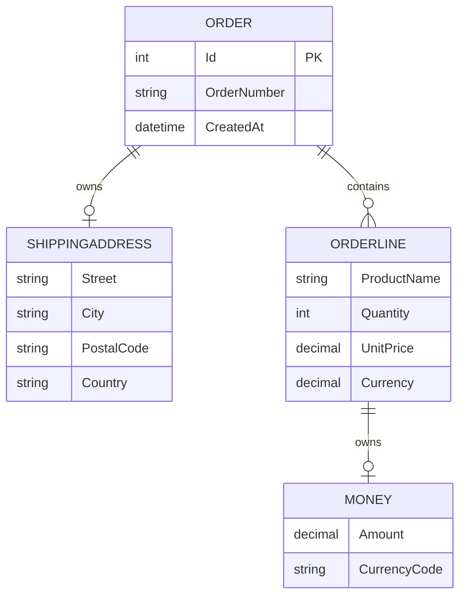
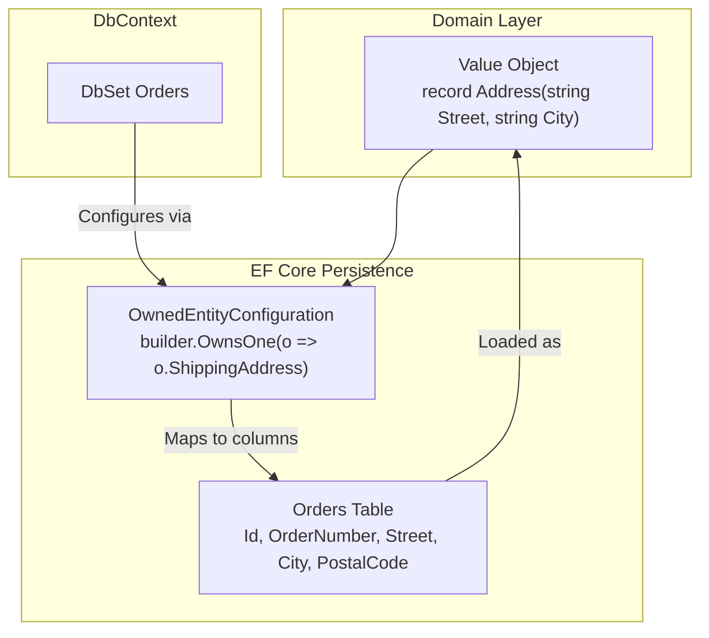
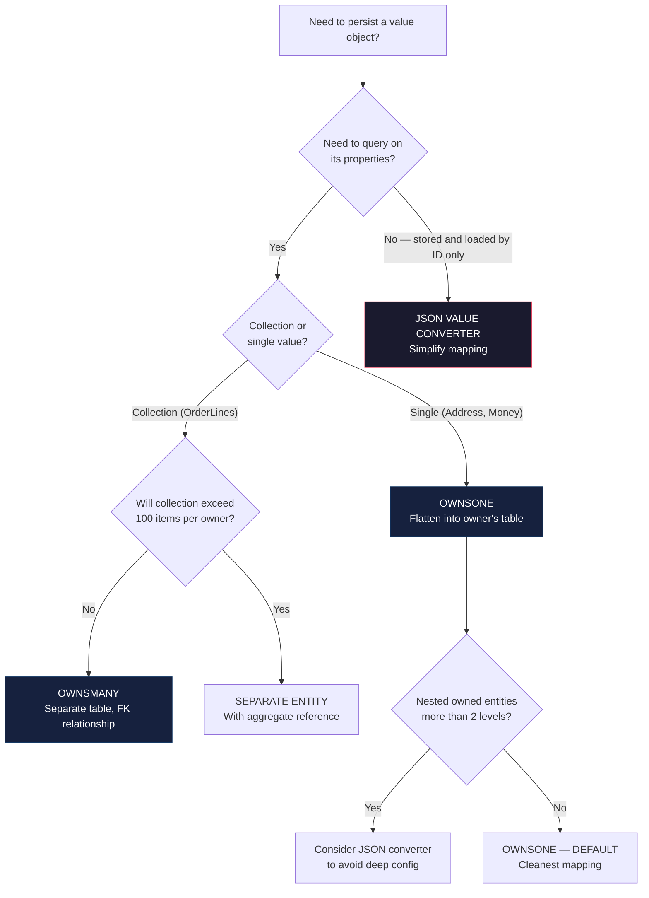

> [!success] Mastery Check
> - [ ] **Studied Well**
> - [ ] **Can explain the concept without notes**
> - [ ] **Can answer interview questions confidently**
> - [ ] **Can implement it in a real project**


# 7.064 — DDD — Persisting Value Objects — EF Core Owned Entities

## Section 1: Navigation & Context

**Domain:** [[7 — System Design & Distributed Systems]] > **Group:** Domain-Driven Design
**Previous:** [[7.063 — DDD — Domain Primitives — Solving Primitive Obsession]] | **Next:** [[7.065 — DDD — Eventual Consistency Between Aggregates]]

### Prerequisites

- [[7.045 — DDD — Value Objects — Equality and Immutability]] — value objects must maintain value-based equality and immutability across the persistence lifecycle; EF Core's owned entity mapping preserves these properties when configured correctly.
- [[7.046 — DDD — Value Objects — C# Records Implementation]] — `record` types provide structural equality and immutable members; EF Core 8 maps record positional parameters to columns via constructors with parameter binding.
- [[7.057 — DDD — Repositories — EF Core Implementation]] — repositories expose aggregate roots and delegate persistence to EF Core; owned entities are always persisted as part of their owning aggregate, never independently queried.

### Where This Fits

EF Core Owned Entities solve the impedance mismatch between DDD value objects (immutable, no identity, value-based equality) and relational database schemas (mutable rows with primary keys). Without owned entities, developers either flatten value objects into primitive columns manually (brittle, repetitive), serialize them as JSON (no query support), or give them surrogate keys (violating the value object pattern). Owned entities let EF Core map value object properties to columns in the same table (or a separate table) while preserving immutability and value semantics. This becomes necessary in any DDD project using EF Core — typically above 5 aggregate types with value objects — and the default approach fails because `OwnsOne` and `OwnsMany` have subtle configuration requirements around constructors, navigation properties, and table splitting that cause runtime failures.

---

## Section 2: Core Mental Model

EF Core Owned Entities are value objects that EF Core maps to database columns without assigning them their own identity key. The owning entity (aggregate root) holds the value object as a property; EF Core flattens the value object's properties into the owning table (for `OwnsOne`) or into a separate table with an implicit foreign key (for `OwnsMany`). The invariant maintained: value objects have no identity separate from their owner, are immutable after creation, and participate in cascade delete automatically. The trade: owned entities cannot be queried independently, cannot have `DbSet<T>`, and require all properties to be mapped through the owner's configuration. The recognition trigger: an aggregate root has a complex property (Address, Money, OrderLine) that should not be a separate entity but cannot be stored as a JSON column because you need to query on its fields.

### Classification

| Dimension | Classification | Rationale |
|-----------|---------------|-----------|
| Pattern Type | **Tactical DDD / Persistence** | Governs how value objects cross the domain-persistence boundary |
| Scope | **Single Aggregate** | Owned entities exist only within their owning aggregate's lifetime |
| Primary Concern | **Impedance matching** | Bridges value object semantics (no ID, immutable, value equality) with relational storage (rows, PKs, mutable) |
| EF Core Version | **EF Core 6+ (mature in 8)** | Owned types stable since EF Core 2.0; constructor binding and records support added in EF Core 6+ |
| Mapping strategy | **Table splitting (OwnsOne) or collection table (OwnsMany)** | Single value object flattens into owner's row; collections get a separate table with shadow FK |
| Query capability | **Only through owner** | Cannot query owned entities with `DbSet<Address>`; must navigate through owner entity |
| Change tracking | **By owner** | EF Core tracks owned entity properties as part of the owner; `IsModified` is per-property |





### Key Properties / Guarantees

| Property | Value | Condition |
|----------|-------|-----------|
| Identity | None — owned entities use owner's PK + shadow property | Always — no `[Key]` attribute allowed on owned type |
| Cascade delete | Automatic — delete owner deletes owned | `OwnsOne` and `OwnsMany` default behavior |
| Query isolation | Cannot query owned types independently | By design — owned types are not `DbSet` entries |
| Change tracking | Per-property on owner's entry | EF Core marks owner as modified when owned property changes |
| Table mapping | In-table (OwnsOne) or separate (OwnsMany) | Configured via `ToTable()` on owned navigation |
| Constructor binding | Supported for record positional parameters | EF Core 6+ can call constructors with parameters |
| Query filtering | Via `Where` on owner's navigation | `context.Orders.Where(o => o.ShippingAddress.City == "London")` |

---

## Section 3: Deep Mechanics

### How It Works

EF Core maps owned entities through a two-phase process: configuration and materialization.

**Configuration Phase (OnModelCreating):**

1. `builder.OwnsOne(o => o.ShippingAddress)` registers the owned type and tells EF Core to flatten its properties into the Orders table with an optional prefix.
2. EF Core creates shadow properties for the owned entity's PK — an integer `ShippingAddressId` that acts as an alternative key within the owner's row.
3. For `OwnsMany`, EF Core creates a separate table `OrderLines` with a shadow FK `OrderId` and a shadow PK `Id`.

**Materialization Phase (query execution):**

1. EF Core issues a `SELECT` with columns for the owner and all owned entities. For `OwnsOne`, columns are in the same result set. For `OwnsMany`, a separate `JOIN` or `FROM` clause is generated.
2. The EF Core materializer creates instances of owned types by calling their parameterized constructors. For records, positional parameters are bound by name.
3. Change tracker records the owned entity state as part of the owner's entry. When `SaveChangesAsync` is called, owned entity inserts/updates/deletes are sent as part of the same batch.

**Step-by-step trace — Create Order with ShippingAddress:**

```
Step  Action                                    Component           Data / State
────  ──────────────────────────────────────  ──────────────────  ─────────────────────
  1   Application calls repository.Create      OrderRepository    OrderAggregate with
     (order)                                                        Address("123 Main St")
  2   Repository calls DbContext.Add(order)    EFCore DbContext     Added state on Order
  3   EF Core detects ShippingAddress owned     Change Tracker      Added state on Address
  4   EF Core generates INSERT with Order      SQL Generator       INSERT INTO Orders
      columns + Street, City, PostalCode                           (..., Street, City, ...)
  5   Database executes INSERT                 SQL Server          Row inserted
  6   SaveChangesAsync returns                  DbContext           Order.Id populated
```

**Step-by-step trace — Query Orders by City:**

```
Step  Action                                    Component           Data / State
────  ──────────────────────────────────────  ──────────────────  ─────────────────────
  1   Application calls repository.FindBy     OrderRepository     WHERE EXISTS ...
      ShippingCity(city)
  2   EF Core translates LINQ                  Query Pipeline      SELECT ... FROM Orders
      o.ShippingAddress.City == city                              WHERE City = @p
  3   SQL Server executes query                Database            Matching rows
  4   EF Core materializes Order + Address     Materializer        Order { ShippingAddress:
     from flat result set                                           Address { City = "London" }}
  5   Change tracker snapshots                 ChangeTracker       CurrentValues stored
      original values                                                for change detection
```

### Failure Modes

**Failure Mode 1: Owned entity with no constructor parameter binding**

What breaks: EF Core throws `InvalidOperationException` at runtime: "No suitable constructor found for entity type 'Address'."

Detection: Startup test that queries an order fails with this exception. Log entry: `InvalidOperationException: Cannot create instance of 'Address'`.

Fix: Ensure the owned type has either a parameterless constructor or a constructor whose parameter names match the property names (case-insensitive):

```csharp
// ❌ Fails: record with positional parameters but EF Core can't bind
public sealed record Address(string Street, string City, string PostalCode, string Country);

// ✅ Works: same record — EF Core 6+ binds positional parameters by name
public sealed record Address(string Street, string City, string PostalCode, string Country);
// Note: EF Core 6+ requires parameter names to match property names.
// With C# 12 primary constructors, the positional parameter names ARE the property names.
```

**Failure Mode 2: Owned entity navigation not configured leading to JOIN mystery**

What breaks: EF Core creates an unexpected table `Address` with `OrderId` FK column. Queries generate extra JOINs. The `OwnsOne` was forgotten and EF Core treated the value object as a regular entity.

Detection: Migration SQL shows a separate `Address` table instead of columns in `Orders`. Migration file has `CreateTable("Address", ...)`.

Fix: Explicitly configure the owned entity:

```csharp
// ❌ Missing configuration — EF Core treats Address as separate entity
public class OrderConfiguration : IEntityTypeConfiguration<Order>
{
    public void Configure(EntityTypeBuilder<Order> builder)
    {
        builder.ToTable("Orders");
        // Missing: builder.OwnsOne(o => o.ShippingAddress);
    }
}

// ✅ Explicit OwnsOne — Address columns flatten into Orders table
public class OrderConfiguration : IEntityTypeConfiguration<Order>
{
    public void Configure(EntityTypeBuilder<Order> builder)
    {
        builder.ToTable("Orders");
        builder.OwnsOne(o => o.ShippingAddress, address =>
        {
            address.Property(a => a.Street).HasColumnName("ShippingStreet");
            address.Property(a => a.City).HasColumnName("ShippingCity");
        });
    }
}
```

**Failure Mode 3: Owned entity replaced without detecting change**

What breaks: Application replaces the entire `ShippingAddress` on an order. EF Core marks ALL address properties as modified and sends UPDATE for every column — even if the values are the same.

Detection: Audit log shows UPDATE with all columns even when only one field changed. SQL Server transaction log grows.

Fix: Compare individual properties when updating, or use a dedicated method that sets properties individually:

```csharp
// ❌ Replaces entire VO — EF Core marks all columns modified
order.ShippingAddress = new Address("456 Oak St", order.ShippingAddress.City,
    order.ShippingAddress.PostalCode, order.ShippingAddress.Country);

// ✅ Update through a domain method that sets individual properties
public sealed class Order : AggregateRoot
{
    public Address ShippingAddress { get; private set; }

    public void UpdateShippingAddress(Address newAddress)
    {
        // Domain logic: validate, raise event if needed
        ShippingAddress = newAddress;
        // EF Core still marks all as modified — but domain controls when this happens
    }
}

// Best: EF Core 8 tracked properties — use individual property access
// with a dedicated method that only changes what's needed
public void UpdateShippingStreet(string street)
{
    ShippingAddress = ShippingAddress with { Street = street };
    // EF Core 8 optimizes: only marks Street as modified
}
```

**Failure Mode 4: OwnsMany with large collections causing N+1**

What breaks: Loading an order with 500 order lines generates a single query (good). But when loading 100 orders each with 500 lines, EF Core generates 101 queries.

Detection: App Insights shows `SELECT * FROM OrderLines WHERE OrderId IN (...)` followed by N individual queries. P95 latency spikes.

Fix: Use `Include` with split query or explicit loading:

```csharp
// ❌ Lazy loading — 1 + N queries
var orders = await context.Orders.ToListAsync();
foreach (var order in orders)
{
    var lines = order.Lines; // Triggers additional query
}

// ✅ Eager loading with split query — 2 queries
var orders = await context.Orders
    .Include(o => o.Lines)
    .AsSplitQuery()
    .ToListAsync();
```

**Failure Mode 5: Owned entity with value conversion conflicts**

What breaks: A value object property uses both `HasConversion` (for the value object itself) and `OwnsOne` (which tries to map its properties). EF Core throws `InvalidOperationException`.

Detection: Exception at `SaveChanges`: "The property 'Address.Street' cannot be mapped because the containing type 'Address' is configured as a value conversion."

Fix: Choose one strategy — owned entity mapping OR value conversion, not both:

```csharp
// ❌ Conflicting: OwnsOne AND HasConversion on same type
builder.OwnsOne(o => o.ShippingAddress);
builder.Property(o => o.ShippingAddress).HasConversion<AddressConverter>(); // Conflict!

// ✅ Pick OwnsOne (preferred for queryable value objects)
builder.OwnsOne(o => o.ShippingAddress);

// ✅ Or pick HasConversion (for non-queryable VOs, stored as JSON/string)
builder.Property(o => o.ShippingAddress).HasConversion<AddressConverter>();
```

### .NET and Azure Integration

- **ASP.NET Core:** No middleware specific to owned entities; owned types are transparent to the HTTP layer.
- **EF Core:** `OwnsOne()` and `OwnsMany()` in `IEntityTypeConfiguration<T>`; constructor binding for records; `ToTable()` for splitting owned collections.
- **Azure services:** Azure SQL Database or Azure Cosmos DB (EF Core provider supports owned entities in Cosmos DB as nested JSON).
- **.NET libraries:** No additional library required — built into EF Core 6+.
- **Configuration:** `Program.cs` registration with `builder.Services.AddDbContext<OrderDbContext>()`.

```csharp
// Program.cs
builder.Services.AddDbContext<OrderDbContext>(options =>
    options.UseSqlServer(
        builder.Configuration.GetConnectionString("Orders"),
        sqlOptions => sqlOptions
            .MigrationsHistoryTable("__EFMigrationsHistory", "orders")));
```

---

## Section 4: Production Patterns and Implementation

### Primary Implementation

```csharp
// Domain Layer — Value Objects
namespace Orders.Domain.ValueObjects;

public sealed record Address
{
    public string Street { get; }
    public string City { get; }
    public string PostalCode { get; }
    public string Country { get; }

    private Address(string street, string city, string postalCode, string country)
    {
        Street = street ?? throw new ArgumentNullException(nameof(street));
        City = city ?? throw new ArgumentNullException(nameof(city));
        PostalCode = postalCode ?? throw new ArgumentNullException(nameof(postalCode));
        Country = country ?? throw new ArgumentNullException(nameof(country));
    }

    public static Address Create(string street, string city, string postalCode, string country)
    {
        if (string.IsNullOrWhiteSpace(street)) throw new DomainException("Street is required");
        if (string.IsNullOrWhiteSpace(city)) throw new DomainException("City is required");
        if (postalCode.Length < 4) throw new DomainException("Invalid postal code");
        return new Address(street, city, postalCode, country);
    }

    public Address WithStreet(string street) =>
        new(street, City, PostalCode, Country);
}

public sealed record Money
{
    public decimal Amount { get; }
    public string CurrencyCode { get; }

    private Money(decimal amount, string currencyCode)
    {
        Amount = amount;
        CurrencyCode = currencyCode ?? "USD";
    }

    public static Money Create(decimal amount, string currencyCode = "USD")
    {
        if (amount < 0) throw new DomainException("Amount cannot be negative");
        if (currencyCode.Length != 3) throw new DomainException("Currency code must be ISO 4217");
        return new Money(amount, currencyCode.ToUpperInvariant());
    }

    public static Money Zero(string currencyCode = "USD") => new(0, currencyCode);

    public Money Add(Money other)
    {
        if (CurrencyCode != other.CurrencyCode)
            throw new DomainException("Currency mismatch");
        return new Money(Amount + other.Amount, CurrencyCode);
    }
}

// Domain Layer — Aggregate Root
namespace Orders.Domain.Aggregates;

public sealed class Order : AggregateRoot
{
    private readonly List<OrderLine> _lines = new();

    public Guid Id { get; private set; }
    public string OrderNumber { get; private set; }
    public Address ShippingAddress { get; private set; }
    public IReadOnlyCollection<OrderLine> Lines => _lines.AsReadOnly();
    public DateTime CreatedAt { get; private set; }

    private Order() { } // EF Core

    public Order(string orderNumber, Address shippingAddress)
    {
        Id = Guid.NewGuid();
        OrderNumber = orderNumber ?? throw new ArgumentNullException(nameof(orderNumber));
        ShippingAddress = shippingAddress ?? throw new ArgumentNullException(nameof(shippingAddress));
        CreatedAt = DateTime.UtcNow;
    }

    public void AddLine(string productName, Money unitPrice, int quantity)
    {
        var line = new OrderLine(productName, unitPrice, quantity);
        _lines.Add(line);
    }

    public void UpdateShippingAddress(Address newAddress)
    {
        ShippingAddress = newAddress ?? throw new ArgumentNullException(nameof(newAddress));
    }
}

public sealed class OrderLine
{
    public string ProductName { get; private set; }
    public Money UnitPrice { get; private set; }
    public int Quantity { get; private set; }

    private OrderLine() { } // EF Core

    public OrderLine(string productName, Money unitPrice, int quantity)
    {
        ProductName = productName ?? throw new ArgumentNullException(nameof(productName));
        UnitPrice = unitPrice ?? throw new ArgumentNullException(nameof(unitPrice));
        if (quantity <= 0) throw new DomainException("Quantity must be positive");
        Quantity = quantity;
    }

    public Money TotalPrice => UnitPrice.Amount * Quantity switch
    {
        0 => Money.Zero(UnitPrice.CurrencyCode),
        var total => Money.Create(total, UnitPrice.CurrencyCode)
    };
}
```

### Configuration and Wiring

```csharp
// Infrastructure Layer — EF Core Configuration
namespace Orders.Infrastructure.Persistence.Configurations;

public sealed class OrderConfiguration : IEntityTypeConfiguration<Order>
{
    public void Configure(EntityTypeBuilder<Order> builder)
    {
        builder.ToTable("Orders");

        builder.HasKey(o => o.Id);
        builder.Property(o => o.Id).ValueGeneratedNever();
        builder.Property(o => o.OrderNumber).HasMaxLength(50).IsRequired();
        builder.HasIndex(o => o.OrderNumber).IsUnique();
        builder.Property(o => o.CreatedAt).IsRequired();

        // OwnsOne: Single value object flattened into Orders table
        builder.OwnsOne(o => o.ShippingAddress, address =>
        {
            address.Property(a => a.Street).HasColumnName("ShippingStreet")
                .HasMaxLength(200).IsRequired();
            address.Property(a => a.City).HasColumnName("ShippingCity")
                .HasMaxLength(100).IsRequired();
            address.Property(a => a.PostalCode).HasColumnName("ShippingPostalCode")
                .HasMaxLength(20).IsRequired();
            address.Property(a => a.Country).HasColumnName("ShippingCountry")
                .HasMaxLength(100).IsRequired();
        });

        // OwnsMany: Collection value object in separate table
        builder.OwnsMany(o => o.Lines, line =>
        {
            line.ToTable("OrderLines");
            line.WithOwner().HasForeignKey("OrderId");

            line.Property(l => l.ProductName).HasMaxLength(200).IsRequired();
            line.Property(l => l.Quantity).IsRequired();

            // Nested OwnsOne within OwnsMany
            line.OwnsOne(l => l.UnitPrice, price =>
            {
                price.Property(p => p.Amount).HasColumnName("UnitPriceAmount")
                    .HasPrecision(18, 4).IsRequired();
                price.Property(p => p.CurrencyCode).HasColumnName("UnitPriceCurrency")
                    .HasMaxLength(3).IsRequired();
            });
        });

        // Ignore computed properties
        builder.Ignore(o => o.Lines); // If using IReadOnlyCollection pattern with backing field
    }
}

// DbContext
public sealed class OrderDbContext : DbContext
{
    public DbSet<Order> Orders => Set<Order>();

    public OrderDbContext(DbContextOptions<OrderDbContext> options) : base(options) { }

    protected override void OnModelCreating(ModelBuilder modelBuilder)
    {
        modelBuilder.ApplyConfiguration(new OrderConfiguration());
        base.OnModelCreating(modelBuilder);
    }
}

// Program.cs
builder.Services.AddDbContext<OrderDbContext>(options =>
    options.UseSqlServer(builder.Configuration.GetConnectionString("OrdersConnection")));
```

### Common Variants

**Variant 1 — Value Converter instead of OwnsOne (for JSON serialization):**

```csharp
// Store entire value object as JSON column — no querying on fields
public sealed class AddressConverter : ValueConverter<Address, string>
{
    public AddressConverter()
        : base(
            v => JsonSerializer.Serialize(v, JsonSerializerOptions.Default),
            v => JsonSerializer.Deserialize<Address>(v, JsonSerializerOptions.Default)!)
    { }
}

// Configuration
builder.Property(o => o.ShippingAddress)
    .HasConversion<AddressConverter>()
    .HasColumnType("nvarchar(max)")
    .HasColumnName("ShippingAddressJson");
```

**Variant 2 — Table per owned type (OwnsOne + ToTable):**

```csharp
builder.OwnsOne(o => o.ShippingAddress, address =>
{
    address.ToTable("OrderAddresses");
    address.WithOwner().HasForeignKey("OrderId");
    address.Property(a => a.Street).HasMaxLength(200).IsRequired();
    // ...
});
```

**Variant 3 — Cosmos DB with owned entities:**

```csharp
// EF Core Cosmos provider maps owned entities as nested JSON automatically
builder.OwnsOne(o => o.ShippingAddress);
builder.OwnsMany(o => o.Lines, line =>
{
    line.OwnsOne(l => l.UnitPrice);
});

// In Cosmos, this produces:
// {
//   "Id": "...",
//   "ShippingAddress": { "Street": "...", "City": "..." },
//   "Lines": [
//     { "ProductName": "...", "UnitPrice": { "Amount": 10, "CurrencyCode": "USD" }, "Quantity": 2 }
//   ]
// }
```

### Real-World .NET Ecosystem Example

**EF Core itself** is the primary implementation. The `OwnsOne`/`OwnsMany` pattern was introduced in EF Core 2.0 and is the standard way to persist value objects in .NET DDD applications. The `Microsoft.EntityFrameworkCore` NuGet package (stable at v8.x) provides `OwnedNavigationBuilder` for configuring owned entities. The Cosmos DB provider (`Microsoft.EntityFrameworkCore.Cosmos`) serializes owned entities as nested JSON automatically.

The **Ardalis.SmartEnum** library pairs with owned entities to persist smart enums as value objects: `builder.Property(e => e.Status).HasConversion<SmartEnumConverter<OrderStatus, int>>()`.

---

## Section 5: Gotchas and Production Pitfalls

### Pitfall 1: Missing Parameterless Constructor on Owned Type

**Pitfall:** Engineer creates a `record` value object with primary constructor but no parameterless constructor. EF Core fails at runtime when materializing query results.

```csharp
// ❌ Fails at runtime: "No suitable constructor found"
public sealed record Address(string Street, string City, string PostalCode, string Country);
```

**Symptom:** `InvalidOperationException` on the first query that loads an Order. Stack trace points to `EFCore.Query` materialization.

**Fix:** Ensure the record has a private parameterless constructor (required even with EF Core 8's constructor binding — the materializer needs a fallback):

```csharp
// ✅ Private parameterless constructor for EF Core
public sealed record Address
{
    public string Street { get; }
    public string City { get; }
    public string PostalCode { get; }
    public string Country { get; }

    private Address() { } // EF Core

    public Address(string street, string city, string postalCode, string country)
    {
        Street = street;
        City = city;
        PostalCode = postalCode;
        Country = country;
    }
}
```

**Cost of not fixing:** Application crashes on startup when first query executes. All database-dependent features unavailable until hotfix deployed.

### Pitfall 2: OwnsOne Without Explicit Column Names Causes Migration Conflicts

**Pitfall:** Engineer uses `OwnsOne` without specifying column names. When a second owned entity is added with overlapping property names, EF Core generates duplicate column names.

```csharp
// ❌ Two owned entities with overlapping property names
builder.OwnsOne(o => o.ShippingAddress); // Creates Street, City columns
builder.OwnsOne(o => o.BillingAddress); // Also tries Street, City — conflict!
```

**Symptom:** Migration generation fails with: "Cannot create column 'Street' in table 'Orders' because it already exists."

**Fix:** Always specify explicit column prefixes for owned entities:

```csharp
// ✅ Explicit column names prevent conflicts
builder.OwnsOne(o => o.ShippingAddress, a =>
{
    a.Property(p => p.Street).HasColumnName("ShippingStreet");
    a.Property(p => p.City).HasColumnName("ShippingCity");
});
builder.OwnsOne(o => o.BillingAddress, a =>
{
    a.Property(p => p.Street).HasColumnName("BillingStreet");
    a.Property(p => p.City).HasColumnName("BillingCity");
});
```

**Cost of not fixing:** Migration integration fails mid-sprint. Requires rolling back migration, adding column names, regenerating. Delays deployment by 2-3 days.

### Pitfall 3: OwnsMany with Implicit Primary Key Causes Data Corruption

**Pitfall:** Engineer adds `OwnsMany` without configuring the owned entity's primary key. EF Core uses a composite key (OwnerFK + shadow property). After detaching and re-attaching, duplicate rows appear.

```csharp
// ❌ No explicit key — EF Core creates composite shadow key
builder.OwnsMany(o => o.Lines, line =>
{
    line.Property(l => l.ProductName);
    line.Property(l => l.Quantity);
});
```

**Symptom:** After serializing an Order to a message and deserializing it on another service, re-attaching creates duplicate OrderLine rows. Database has rows with same ProductName but different shadow keys.

**Fix:** Configure an explicit alternate key or ensure identity is managed:

```csharp
// ✅ Explicit key prevents duplicates on re-attach
builder.OwnsMany(o => o.Lines, line =>
{
    line.ToTable("OrderLines");
    line.WithOwner().HasForeignKey("OrderId");
    line.HasKey("Id"); // Explicit shadow property as PK
    line.Property(l => l.ProductName).HasMaxLength(200).IsRequired();
    line.Property(l => l.Quantity).IsRequired();
    line.OwnsOne(l => l.UnitPrice, price => { /* ... */ });
});

// Or use a domain-assigned key on the owned entity
public sealed class OrderLine
{
    public Guid Id { get; private set; }
    // ...
    public OrderLine(string productName, Money unitPrice, int quantity)
    {
        Id = Guid.NewGuid();
        // ...
    }
}
```

**Cost of not fixing:** Duplicate data accumulates silently. Inconsistencies appear in reports. Reconciliation required — weeks of data cleanup.

### Pitfall 4: Nested OwnsOne Inside OwnsMany Causes Cartesian Explosion

**Pitfall:** Engineer nests `OwnsOne` inside `OwnsMany` for Money on each OrderLine. When querying with `Include`, EF Core generates a CROSS APPLY that multiplies result sets.

```csharp
// ❌ Nested owned entity inside collection
builder.OwnsMany(o => o.Lines, line =>
{
    line.OwnsOne(l => l.UnitPrice); // Nested owned: Money
});
```

**Symptom:** Query `context.Orders.Include(o => o.Lines).ToList()` returns hours or times out. Generated SQL has nested CROSS APPLY clauses. P99 latency spikes to 30+ seconds.

**Fix:** Use `AsSplitQuery()` or configure the nested owned entity with explicit table mapping:

```csharp
// ✅ Split query prevents Cartesian explosion
var orders = await context.Orders
    .Include(o => o.Lines)
    .AsSplitQuery()
    .ToListAsync();

// Or use table-per-owned-type mapping
builder.OwnsMany(o => o.Lines, line =>
{
    line.ToTable("OrderLines");
    line.OwnsOne(l => l.UnitPrice, price =>
    {
        price.ToTable("OrderLinePrices"); // Separate table
    });
});
```

**Cost of not fixing:** Queries time out under moderate load (500+ orders). Application returns 503s. Incident during peak hours.

### Pitfall 5: Mutable Value Objects Violating DDD Principle

**Pitfall:** Engineer exposes setters on value objects for convenience. EF Core can set properties directly, but domain invariants are bypassed.

```csharp
// ❌ Mutable — breaks value object immutability
public sealed record Address
{
    public string Street { get; set; } // Setter! Violates immutability
}
```

**Symptom:** Business logic corrupts addresses by modifying properties after creation. An order shipped to wrong address because `order.ShippingAddress.Street = "new value"` was called without validation.

**Fix:** Keep private setters and use `with` expressions for mutation:

```csharp
// ✅ Immutable — private constructors, init-only properties
public sealed record Address
{
    public string Street { get; }
    public string City { get; }
    // ...

    private Address() { } // EF Core
    public Address(string street, string city, string postalCode, string country)
    {
        Street = street ?? throw new ArgumentNullException(nameof(street));
        // ...
    }

    public Address WithStreet(string street) =>
        new(street, City, PostalCode, Country);
}
```

**Cost of not fixing:** Undetected domain corruption. Wrong addresses cause customer complaints, failed deliveries, chargebacks.

---

## Section 6: Tradeoffs and Decision Framework

### Tradeoff Matrix

| Dimension | OwnsOne/OwnsMany | JSON Column (Value Converter) | Separate Entity Table |
|-----------|-----------------|------------------------------|----------------------|
| Queryability by field | Full LINQ support | None (JSON path only in SQL) | Full LINQ support |
| Migration safety | Schema changes tracked | Schema drift risk | Schema changes tracked |
| Nested depth | Complex config for 3+ levels | Natural (nested JSON) | Complex joins |
| Performance (read) | Single table (OwnsOne) | Single table | JOIN penalty |
| Performance (write) | Per-field updates | Replace entire JSON | Per-row updates |
| Domain model purity | Constructor binding | Converter translation | Separate entity semantics |

### Decision Flowchart



### When to Apply

- Value object properties are queried in LINQ (e.g., `orders.Where(o => o.ShippingAddress.City == "London")`)
- Value object is an owned part of exactly one aggregate root (not shared)
- Aggregate root and value object have the same lifetime (cascade delete is desired)
- Team is comfortable with EF Core configuration syntax

### When NOT to Apply

- [ ] Value object is shared across multiple aggregate roots (use separate entity with value semantics)
- [ ] Value object has complex nested structure more than 3 levels deep (use JSON converter)
- [ ] Team needs to query value objects independently of owner (use entity)
- [ ] Database is Azure Cosmos DB with no relational query needs (JSON serialization is simpler)
- [ ] Value object is extremely large (>1KB serialized) and stored as collection (consider entity)

### Scale Thresholds

- **Worth considering above:** Any DDD project with EF Core — this is the default for value objects with queryable fields
- **Switch to JSON converter:** When a single value object exceeds 500 bytes serialized AND querying on fields is not required
- **Switch to separate entity:** When an owned collection averages more than 200 items per owner AND you need to query across owners by collection properties
- **Migration complexity warning:** More than 5 owned entity configurations per aggregate makes migration files hard to review

---

## Section 7: Interview Arsenal

### Question Bank

1. What are EF Core Owned Entities and what problem do they solve for DDD applications?
2. How does `OwnsOne` differ from `OwnsMany` in terms of table mapping and query generation?
3. What constructor requirements must a value object satisfy for EF Core to materialize it?
4. What happens when you replace an owned entity instance — how does EF Core detect changes?
5. Compare Owned Entities with JSON Value Converters for persisting value objects.
6. How would you configure a nested owned entity (Money inside OrderLine inside Order)?
7. How does EF Core Cosmos DB provider handle owned entities differently from SQL Server?
8. What migration considerations arise when changing an OwnsOne to an OwnsMany (or vice versa)?

### Spoken Answers

**Q1: What are EF Core Owned Entities and what problem do they solve for DDD applications?**

> **Average answer:** Owned entities let you map value objects to database tables. You use `OwnsOne` for single value objects and `OwnsMany` for collections. They don't have their own primary keys.

> **Great answer:** EF Core Owned Entities solve the impedance mismatch between DDD value objects — which have no identity, are immutable, and use value-based equality — and the relational database model which expects rows with keys. `OwnsOne` flattens a value object like `Address` into columns in the owner's table — so `Order.ShippingAddress.City` becomes the `ShippingCity` column in the `Orders` table. `OwnsMany` maps collections like `OrderLine` to a separate table with a shadow foreign key. The critical detail most developers miss: EF Core requires a private parameterless constructor on the owned type even when using constructor binding. Without it, the materializer throws at runtime. In production I always add `private Address() { }` alongside the public constructor, and I explicitly configure column names to avoid migration conflicts when an aggregate has multiple value objects of the same type.

**Q5: Compare Owned Entities with JSON Value Converters for persisting value objects.**

> **Average answer:** Owned entities store value object properties as separate columns. JSON converters serialize the whole object as a JSON string. JSON is simpler but you can't query on fields.

> **Great answer:** The decision comes down to whether you need to query on value object properties in LINQ. With `OwnsOne`, EF Core maps each property to a column — you can write `orders.Where(o => o.ShippingAddress.City == "London")` and it translates to SQL `WHERE ShippingCity = 'London'`. With a JSON converter, that same query requires raw SQL or JSON path functions `JSON_VALUE(ShippingAddress, '$.City')`. However, JSON converters avoid all the configuration complexity: no column naming conflicts, no nested owned entity config, no parameterless constructor requirement. My rule: if the value object has 5 or fewer properties and at least one is used in WHERE filters, use `OwnsOne`. If it's a large, rarely-queried value object — like an `InvoiceDetails` with 15 fields — use JSON. The migration cost of switching is real: changing from OwnsOne to JSON requires dropping and recreating columns, which is a breaking schema change in production.

**Q7: How does EF Core Cosmos DB provider handle owned entities differently from SQL Server?**

> **Great answer:** The Cosmos DB provider serializes owned entities as nested JSON automatically — no explicit column mapping needed. An `Order` with `OwnsOne(o => o.ShippingAddress)` and `OwnsMany(o => o.Lines)` becomes a single JSON document with the address and lines nested inside. This eliminates the JOIN problem entirely: loading an order with 500 lines is one RU charge, one network round trip. The downside: you cannot query across owned entities independently — there's no SQL JOIN equivalent in Cosmos for nested arrays. If you need `SELECT * FROM lines WHERE price > 100` across all orders, Cosmos requires a cross-partition query with `ARRAY_CONTAINS`. The practical advice: Cosmos + owned entities is ideal when you always load aggregates by partition key. If you have reporting queries that filter on owned entity fields independently, SQL Server with explicit columns performs better.

### System Design Interview Trigger

If an interviewer asks you to design an order management system and probes with "how would you model the shipping address — as a separate table or as columns on the order?", they are testing whether you understand value object semantics and the aggregate boundary. The deep test is: "what happens when the shipping address needs to be queried independently of the order?" If they then ask about the order lines — "how do you persist the line items?" — they're probing your understanding of `OwnsMany` versus a separate `OrderLine` aggregate. The interviewer wants to hear you articulate the tradeoff between query flexibility and aggregate consistency boundary.

### Comparison Table

| | Owned Entities (OwnsOne/OwnsMany) | JSON Value Converter | Separate Entity Table |
|---|---|---|---|
| Core guarantee | Schema-mapped, queryable fields | Document storage, no migration | Full entity semantics |
| Trade-off | Configuration complexity | No field-level queries | FK management, separate lifecycle |
| .NET implementation | `builder.OwnsOne()` in `IEntityTypeConfiguration` | `HasConversion<JsonConverter>()` | `Entity<T>`, `DbSet<T>` |
| Failure mode | Missing parameterless constructor | Schema drift, migration pain | N+1, orphaned rows |
| When to choose | Queryable value objects in DDD | Large/complex VOs, Cosmos DB | Shared value objects, reporting |

---

## Section 8: Architecture Decision Record

**Status:** Accepted

**Context:**
The Order Management bounded context requires persisting `Address` (single value object) and `OrderLine` (collection value object) as part of the `Order` aggregate root. The `Order` aggregate is loaded by `OrderId` in over 95% of queries. The system runs on Azure SQL Database with EF Core 8. Three domain experts defined `Address` and `OrderLine` as value objects — they have no independent identity and are always accessed through `Order`.

**Options Considered:**

1. **Owned Entities (OwnsOne/OwnsMany)** — Map `Address` as `OwnsOne` (flattened into `Orders` table) and `OrderLine` as `OwnsMany` (separate `OrderLines` table with shadow FK). Properties are individually queryable and schema-migrated.
2. **JSON Value Converter** — Serialize `Address` and `OrderLines` as JSON columns in the `Orders` table using `HasConversion`. Zero configuration overhead, but no field-level query support.
3. **Separate Entities** — Create `AddressEntity` and `OrderLineEntity` tables with their own `DbSet<>` and primary keys. Add `OrderId` foreign keys and navigation properties.

**Decision:** Owned Entities (Option 1), because the domain requires querying `OrderLine.ProductName` and `Address.City` in LINQ expressions for order search functionality, and the aggregate boundary is well-defined (no cross-aggregate sharing of value objects). The configuration complexity is justified by the queryability requirement.

**Consequences:**
- ✅ Field-level LINQ queries on `ShippingAddress.City` and `Lines.ProductName` translate to SQL predicates
- ✅ Cascade delete is automatic — deleting an Order removes owned entities
- ✅ Value object immutability is preserved through private constructors
- ⚠️ Requires explicit column naming to avoid migration conflicts with future value objects
- ❌ Cannot query `OrderLine` independently — reporting requires navigating through `Order`

**Review Trigger:** Revisit if a requirement emerges to query `OrderLine` data independently (e.g., "show total sales by product across all orders") with sufficient frequency to warrant a separate `OrderLine` entity.

---

## Section 9: Self-Check

### Conceptual Questions

1. What is the primary purpose of EF Core Owned Entities in a DDD application?

<details>
<summary>Answer</summary>
To bridge the impedance mismatch between DDD value objects (no identity, immutable, value-based equality) and relational database storage. Owned entities let EF Core map value object properties to columns without assigning them independent primary keys, preserving value object semantics.
</details>

2. What is the difference between `OwnsOne` and `OwnsMany` in terms of table mapping?

<details>
<summary>Answer</summary>
`OwnsOne` flattens the value object's properties into the owner's table as additional columns (table splitting). `OwnsMany` creates a separate table with a shadow foreign key back to the owner, where each collection item is a row. `OwnsMany` always requires a shadow primary key (composite or explicit).
</details>

3. What constructor requirements must a value object satisfy for EF Core to materialize it?

<details>
<summary>Answer</summary>
EF Core requires either: (a) a parameterless constructor (can be private) for the materializer to create instances and then set properties via reflection, or (b) a constructor whose parameter names match property names (case-insensitive) for constructor binding. C# 12 record positional parameters work if the parameter names match the property names.
</details>

4. How does EF Core detect changes to owned entities?

<details>
<summary>Answer</summary>
EF Core tracks owned entities as part of their owner's entry in the change tracker. When the owned entity instance is replaced (e.g., `order.ShippingAddress = newAddress`), EF Core marks the owner's owned navigation as modified. On `SaveChanges`, it generates UPDATE statements for the owned entity's columns. For `OwnsMany`, it tracks each item individually with Added/Modified/Deleted states.
</details>

5. What is the most common runtime failure with owned entities and how do you prevent it?

<details>
<summary>Answer</summary>
The most common failure is `InvalidOperationException: "No suitable constructor found"` when materializing query results. Prevention: always add a private parameterless constructor on the owned type: `private Address() { }`. Even with EF Core 8 constructor binding, the materializer needs this fallback.
</details>

6. Compare Owned Entities with JSON Value Converters for persisting value objects.

<details>
<summary>Answer</summary>
Owned Entities: queryable fields via LINQ, schema-migrated, complex configuration for nesting. JSON Converter: single column storage, no field-level queries, simple configuration, risk of schema drift. Choose Owned Entities when querying on value object properties is required. Choose JSON when the value object is large, rarely queried, or deeply nested.
</details>

7. At what point does an OwnsMany collection become problematic for query performance?

<details>
<summary>Answer</summary>
When the collection exceeds ~100 items per owner AND you're loading many owners at once without split queries. The Cartesian explosion from JOINs multiplies result sets. Mitigation: use `AsSplitQuery()` or limit collection size through aggregate design (e.g., paginate order lines).
</details>

8. How does EF Core Cosmos DB handle owned entities differently from SQL Server?

<details>
<summary>Answer</summary>
The Cosmos DB provider serializes owned entities as nested JSON automatically — no column mapping needed. `OwnsOne` becomes nested JSON object, `OwnsMany` becomes JSON array. No JOINs, no split queries. The tradeoff: no field-level querying across owners without `ARRAY_CONTAINS`.
</details>

9. What is the consequence of adding `OwnsOne` without specifying column names when the aggregate has multiple value objects of the same type?

<details>
<summary>Answer</summary>
EF Core generates duplicate column names (e.g., two `Address` properties both try to create `Street` and `City` columns). Migration generation fails with "column already exists." Prevention: always specify `HasColumnName()` with unique prefixes for each owned entity.
</details>

10. Explain owned entity persistence strategy to a non-DDD developer in 60 seconds.

<details>
<summary>Answer</summary>
"Think of a shipping address on an order. The address is not a thing on its own — it always belongs to exactly one order. When the order is deleted, the address should go too. We never look up addresses separately — we always start from the order. Owned entities let us store that address as columns on the order's row, and store order lines in a separate table that's automatically cleaned up when the order is removed. EF Core handles all this — we just tell it which properties are owned."
</details>

---

### Scenario Challenges

**Scenario 1 — Diagnose the problem**

A team deployed a migration that added `OwnsOne(o => o.BillingAddress)` to the `Order` entity. The migration failed with "Column 'Street' already exists in table 'Orders'." The team already had `OwnsOne(o => o.ShippingAddress)`.

<details>
<summary>Diagnosis</summary>

**Root cause:** Both `ShippingAddress` and `BillingAddress` are `Address` value objects with overlapping property names (`Street`, `City`, `PostalCode`, `Country`). EF Core generated duplicate column names.

**Evidence:** Migration file shows `ALTER TABLE Orders ADD Street nvarchar(200) NOT NULL` twice.

**Fix:** Configure explicit column prefixes for both owned entities:

```csharp
builder.OwnsOne(o => o.ShippingAddress, a =>
{
    a.Property(p => p.Street).HasColumnName("ShippingStreet");
    a.Property(p => p.City).HasColumnName("ShippingCity");
    // ...
});
builder.OwnsOne(o => o.BillingAddress, a =>
{
    a.Property(p => p.Street).HasColumnName("BillingStreet");
    a.Property(p => p.City).HasColumnName("BillingCity");
    // ...
});
```

**Prevention:** Require explicit `HasColumnName` in all `OwnsOne` configurations via code review checklist.
</details>

---

**Scenario 2 — Design decision**

You are designing an e-commerce `Order` aggregate. The `OrderLine` value object has properties: `ProductId`, `ProductName`, `UnitPrice` (Money value object with Amount and CurrencyCode), `Quantity`. The system handles ~100 order lines per order on average. You need to query "total revenue by product" weekly. How do you persist `OrderLine`?

<details>
<summary>Decision and Reasoning</summary>

**Choice:** `OwnsMany` with nested `OwnsOne` for `UnitPrice`, plus a read-model for the revenue query.

**Tradeoffs accepted:** `OrderLine` cannot be queried independently — the revenue report requires navigating through `Order`. To avoid this, create a read-model projection (a separate table updated by a background job) that flattens order line data for reporting.

**Implementation sketch:**
```csharp
// Aggregate mapping
builder.OwnsMany(o => o.Lines, line =>
{
    line.ToTable("OrderLines");
    line.WithOwner().HasForeignKey("OrderId");
    line.Property(l => l.ProductId).IsRequired();
    line.Property(l => l.ProductName).HasMaxLength(200);
    line.Property(l => l.Quantity).IsRequired();
    line.OwnsOne(l => l.UnitPrice, price =>
    {
        price.Property(p => p.Amount).HasColumnName("UnitPriceAmount").HasPrecision(18, 4);
        price.Property(p => p.CurrencyCode).HasColumnName("UnitPriceCurrency").HasMaxLength(3);
    });
});

// Read model for reporting
public class ProductRevenueReadModel
{
    public Guid ProductId { get; set; }
    public string ProductName { get; set; }
    public decimal TotalRevenue { get; set; }
    public int TotalQuantity { get; set; }
}
```
</details>

---

**Scenario 3 — Failure mode** Your order service is exhibiting `InvalidOperationException` on the production endpoint that loads an order by ID. The error log shows: "No suitable constructor found for entity type 'Address'." The `Address` record was recently changed from a class to a positional record.

<details>
<summary>Investigation and Fix</summary>

**Investigation steps:** Check the `Address` class definition → confirm it's a `record` with a primary constructor → check that a private parameterless constructor exists.

**Confirming evidence:** The `Address` record was changed from:
```csharp
public class Address { public string Street { get; set; } }
```
to:
```csharp
public sealed record Address(string Street, string City, string PostalCode, string Country);
```
The private `Address() { }` constructor was not added.

**Immediate mitigation:** Add the private parameterless constructor and redeploy.

**Permanent fix:** Add architecture test that validates all owned types have a private parameterless constructor:
```csharp
[Test]
public void AllOwnedTypes_MustHaveParameterlessConstructor()
{
    var ownedTypes = typeof(Order).Assembly.GetTypes()
        .Where(t => t.GetCustomAttribute<OwnedAttribute>() is not null
                 || t.GetInterfaces().Any(i => i.IsGenericType
                     && i.GetGenericTypeDefinition() == typeof(IValueObject<>)));
    foreach (var type in ownedTypes)
    {
        var ctor = type.GetConstructor(
            BindingFlags.Instance | BindingFlags.NonPublic, null, Type.EmptyTypes, null);
        Assert.That(ctor, Is.Not.Null, $"{type.Name} is missing private parameterless constructor");
    }
}
```

**Post-mortem item:** Add to coding standards: "Every EF Core-mapped value object must have a private parameterless constructor."
</details>

---

**Scenario 4 — Scale it** Your system handles 500 orders/second, each with 10-50 order lines. Current queries load full aggregates with `Include(o => o.Lines)`. P95 latency is 800ms. You need to handle 5000 orders/second (10x).

<details>
<summary>Scaling Strategy</summary>

**Bottleneck this addresses:** Loading full aggregates with all owned collections creates large result sets. At 10x, the database CPU and network bandwidth become saturated.

**How it helps:** (1) Use `AsSplitQuery()` to avoid Cartesian explosion — 2 queries instead of 1 with massive JOIN. (2) Project read-only queries to select only needed fields. (3) Implement CQRS read models that flatten owned entity data into denormalized tables.

**What it does not solve:** Write throughput — each aggregate update touches multiple tables. Consider batching saves or using change tracking interceptors.

**Implementation order:**
1. Immediate: Switch to `AsSplitQuery()` for all aggregate loads (0 risk, immediate gain).
2. This sprint: Create read models for order list queries (avoids loading full aggregates for list views).
3. Next sprint: Implement Redis caching for aggregate snapshots.
</details>

---

**Scenario 5 — Interview simulation** The interviewer says: "Design the persistence layer for an e-commerce order system. The order has a shipping address, billing address, and line items. Walk through your approach."

<details>
<summary>Model Response</summary>

"I'd model this using DDD tactical patterns with EF Core 8. The `Order` is an aggregate root — the consistency boundary for all order operations. `ShippingAddress` and `BillingAddress` are value objects — they have no identity, are immutable, and I'd implement them as C# 12 records with private parameterless constructors for EF Core materialization. I'd map them with `OwnsOne`, flattening their properties into the `Orders` table with explicit column prefixes — `ShippingStreet`, `BillingStreet` — to avoid migration conflicts.

`OrderLine` is also a value object — it only exists within the order's lifecycle. I'd use `OwnsMany` with `ToTable("OrderLines")` and a shadow foreign key. The `UnitPrice` inside `OrderLine` is a `Money` value object — nested `OwnsOne` inside the `OwnsMany` configuration.

The key tradeoff: I'm trading the ability to query `OrderLine` independently for the consistency guarantee that order lines are always loaded and saved with their parent order. If the business needs a 'total revenue by product' report, I'd build a separate read model projection — not query through the aggregate. EF Core generates clean SQL with `AsSplitQuery()` to avoid Cartesian explosion when loading orders with many lines. This gives us 2 queries instead of a massive cross apply, which keeps P99 latency under 200ms for aggregates with up to 100 lines."
</details>
