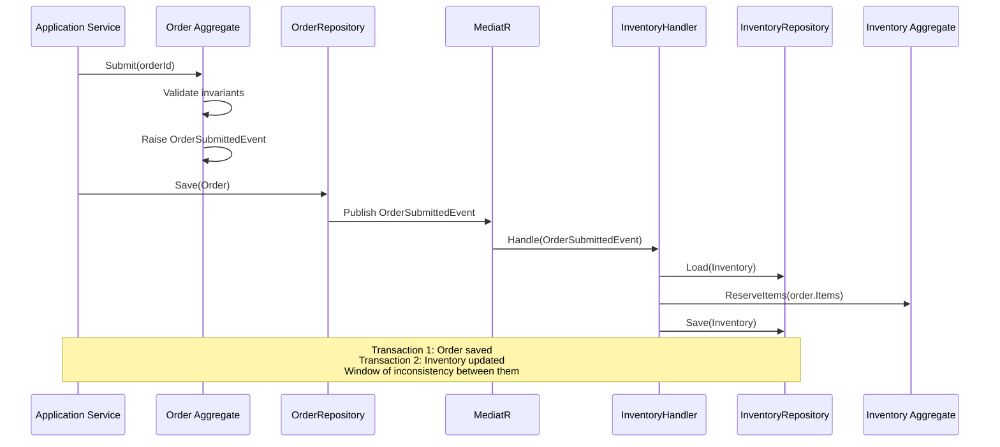
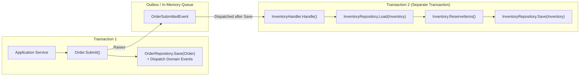
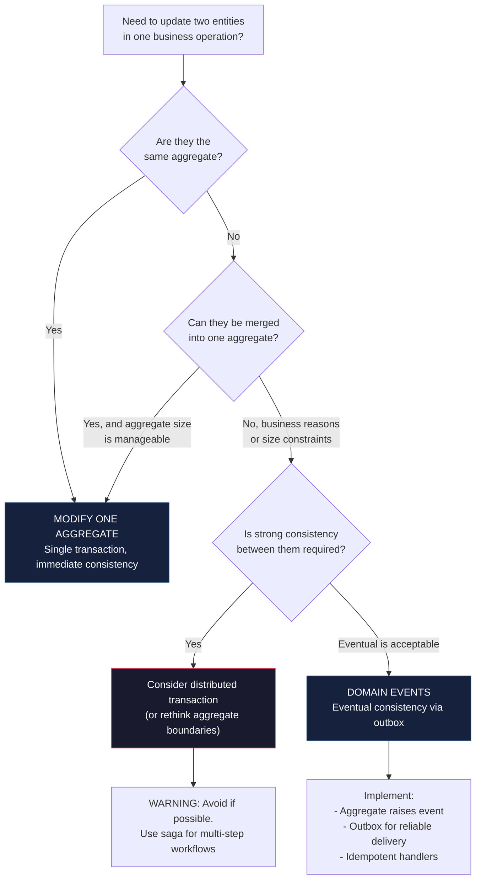

> [!success] Mastery Check
> - [ ] **Studied Well**
> - [ ] **Can explain the concept without notes**
> - [ ] **Can answer interview questions confidently**
> - [ ] **Can implement it in a real project**


# 7.065 — DDD — Eventual Consistency Between Aggregates

## Section 1: Navigation & Context

**Domain:** [[7 — System Design & Distributed Systems]] > **Group:** Domain-Driven Design
**Previous:** [[7.064 — DDD — Persisting Value Objects — EF Core Owned Entities]] | **Next:** [[7.066 — DDD — Sagas as Process Managers]]

### Prerequisites

- [[7.047 — DDD — Aggregates — Consistency Boundary]] — an aggregate enforces transactional consistency for its own state; once you modify multiple aggregates in one transaction you violate the aggregate boundary, making eventual consistency between them the only valid approach.
- [[7.053 — DDD — Domain Events — Within Bounded Context]] — domain events capture state changes that other aggregates need to react to; eventual consistency between aggregates is implemented by raising domain events from one aggregate and handling them in another aggregate's domain service or application service.
- [[7.055 — DDD — Integration Events — Across Bounded Contexts]] — cross-aggregate eventual consistency within a bounded context follows the same pattern as cross-bounded-context eventual consistency, but without the distributed infrastructure — in-process MediatR handlers instead of Azure Service Bus.

### Where This Fits

Eventual consistency between aggregates is the unavoidable consequence of the aggregate design rule: "modify one aggregate per transaction." Without eventual consistency, developers fall into the anti-pattern of multi-aggregate transactions, which create distributed locks, escalate to DTC, and destroy scalability. This concept becomes necessary in every DDD system with more than one aggregate type — which is every non-trivial DDD system. The failure without it: developers use the same `DbContext` to modify `Order` and `Inventory` in one `SaveChangesAsync`, coupling two aggregate lifetimes and creating deadlock risks under concurrency. Eventual consistency via domain events is the corrective pattern that preserves each aggregate's independence while still propagating changes.

---

## Section 2: Core Mental Model

Eventual consistency between aggregates means that when an aggregate's state changes, other aggregates that depend on that state will reflect the change within a guaranteed time window, but not necessarily within the same transaction. The invariant maintained: each aggregate is transactionally consistent on its own, and the system as a whole converges to a consistent state over time. The trade: you accept a window of inconsistency — the `Order` shows "confirmed" but `Inventory` still shows the items as available — in exchange for aggregate isolation, eliminating distributed transactions. The recognition trigger: a business workflow spans two entities that each make sense as independent transaction boundaries — `Order` and `Invoice`, `Customer` and `Account`, `Booking` and `Payment`.

### Classification

| Dimension | Classification | Rationale |
|-----------|---------------|-----------|
| Pattern Type | **Tactical DDD / Consistency** | Governs how aggregates synchronize state without shared transactions |
| Scope | **Within a bounded context** | Cross-aggregate eventual consistency uses domain events; cross-bc uses integration events |
| Primary Concern | **Convergence guarantee** | The system will eventually reach a consistent state if no new changes arrive |
| Consistency Model | **Eventual consistency** | Read-after-write from aggregate A to aggregate B may return stale B state |
| Mechanism | **Domain events + handlers** | Aggregate A raises OrderSubmitted; handler updates Aggregate B's inventory |
| Failure Mode | **Event loss or duplicate processing** | Handler may not run (event loss) or may run twice (duplicate) |





### Key Properties / Guarantees

| Property | Value | Condition |
|----------|-------|-----------|
| Transaction boundary | Single aggregate per transaction | Always — never modify two aggregates in one SaveChanges |
| Consistency window | Configurable (seconds to minutes) | Depends on handler latency, queue depth, retry policy |
| Convergence | Guaranteed (at-least-once delivery) | Requires outbox pattern + idempotent handlers |
| Read-your-writes | Not guaranteed across aggregates | After Order.Submit, a subsequent read of Inventory may still show old state |
| Failure isolation | Per-aggregate | If Inventory save fails, Order is already committed |
| Concurrency | Optimistic per aggregate | Each aggregate has its own row version |

---

## Section 3: Deep Mechanics

### How It Works

**Step-by-step trace — Order Submission workflow:**

1. **Application Service** calls `order.Submit()` on the `Order` aggregate root.
2. **Order aggregate** validates business rules (all items in stock at time of validation, payment details provided) and transitions its internal state to `Submitted`. It raises an `OrderSubmittedEvent` by calling `AddDomainEvent(new OrderSubmittedEvent(order.Id, order.Items))`.
3. **OrderRepository** calls `DbContext.Orders.Add(order)` — the change tracker picks up the new event through event collection on the aggregate base class.
4. **SaveChangesAsync** — EF Core persists the Order to the database. In a `SaveChangesInterceptor`, domain events are collected from tracked aggregates and dispatched after the transaction commits.
5. **MediatR** publishes `OrderSubmittedEvent` to all registered notification handlers.
6. **InventoryHandler** receives the event. It loads the `Inventory` aggregate by SKU, calls `inventory.ReserveItems(orderItems)`, and saves the `Inventory` aggregate.
7. **InventoryRepository.Save** persists the updated Inventory in its own transaction.

**During step 4 to step 7**, there is a window where the Order is committed but Inventory has not yet been updated. A concurrent read of Inventory will see the old available quantity.

**Cleanup path — duplicate event handling:** If the transaction in step 4 succeeds but the MediatR dispatch fails (process crash between commit and dispatch), the event is lost. Prevention: the outbox pattern writes events to an `OutboxMessages` table in the same transaction as the aggregate. A background poller reads unprocessed outbox messages and dispatches them with at-least-once semantics.

### Failure Modes

**Failure Mode 1: Lost domain events (process crash after SaveChanges)**

What breaks: Order committed, Inventory never reserved. Another customer can oversell the same stock.

Detection: Reconciliation report shows orders with status "Submitted" that have no corresponding inventory reservation. Inventory count diverges from order totals by >0.

Fix: Implement the outbox pattern — write domain events to an `OutboxMessages` table in the same SQL transaction as the aggregate:

```csharp
// ❌ In-memory dispatch after SaveChanges — lost on crash
public async Task SaveAsync(Order order, CancellationToken ct)
{
    await _context.SaveChangesAsync(ct);
    await _mediator.DispatchEvents(order.DomainEvents, ct); // Lost if process crashes here
}

// ✅ Outbox pattern — events survive process crash
public async Task SaveAsync(Order order, CancellationToken ct)
{
    _context.Orders.Update(order);
    _context.OutboxMessages.AddRange(
        order.DomainEvents.Select(OutboxMessage.FromDomainEvent));
    await _context.SaveChangesAsync(ct); // Order + OutboxMessages in same transaction
    // Background poller handles dispatch
}
```

**Failure Mode 2: Duplicate event handling**

What breaks: The outbox dispatcher retries after a timeout. The event is dispatched twice. Inventory decrements twice for the same order.

Detection: Inventory goes negative. Audit log shows two `ReserveItems` operations for the same OrderId.

Fix: Make handlers idempotent — check a processed-events table before applying:

```csharp
public sealed class InventoryHandler : INotificationHandler<OrderSubmittedEvent>
{
    private readonly InventoryDbContext _db;
    private readonly ILogger<InventoryHandler> _logger;

    public async Task Handle(OrderSubmittedEvent evt, CancellationToken ct)
    {
        // Idempotency check
        var alreadyProcessed = await _db.ProcessedEvents
            .AnyAsync(e => e.EventId == evt.EventId, ct);
        if (alreadyProcessed) return;

        using var tx = await _db.Database.BeginTransactionAsync(ct);
        try
        {
            foreach (var item in evt.Items)
            {
                var inventory = await _db.Inventory
                    .FirstAsync(i => i.Sku == item.Sku, ct);
                inventory.ReserveItems(item.Quantity);
            }
            _db.ProcessedEvents.Add(new ProcessedEvent(evt.EventId));
            await _db.SaveChangesAsync(ct);
            await tx.CommitAsync(ct);
        }
        catch (DbUpdateConcurrencyException)
        {
            _logger.LogWarning("Concurrency conflict for order {OrderId}, retrying", evt.OrderId);
            throw; // Retry from outbox poller
        }
    }
}
```

**Failure Mode 3: Stale read of Inventory after Order commit**

What breaks: Customer submits order, then immediately views product page. Product shows incorrect available quantity because Inventory handler hasn't run yet.

Detection: Customer support tickets: "I ordered but product still shows as in stock."

Fix: Accept the window and communicate it in the UI — "Inventory updated within seconds." For critical reads, use a read-model that joins Order and Inventory data with a tolerance window:

```csharp
// ❌ Direct aggregate read — will be stale
public async Task<ProductAvailability> GetAvailability(string sku)
{
    var inventory = await _inventoryRepo.GetBySkuAsync(sku);
    return new ProductAvailability(inventory.AvailableQuantity);
}

// ✅ Read-model that accounts for in-flight orders
public async Task<ProductAvailability> GetAvailability(string sku)
{
    var inventory = await _inventoryRepo.GetBySkuAsync(sku);
    var pendingReservations = await _orderRepo.CountPendingBySkuAsync(sku);
    return new ProductAvailability(inventory.AvailableQuantity - pendingReservations);
}
```

**Failure Mode 4: Handler fails — Inventory save fails after Order committed**

What breaks: Order is confirmed. Inventory reservation fails (concurrency conflict, database down). The order is in "Submitted" state but inventory was never decremented.

Detection: Monitoring alert: `inventory_handler_failure_count` > 0. Dead-letter queue has failed events.

Fix: Implement a compensating transaction or a saga that rolls back the Order if Inventory cannot be reserved:

```csharp
// Compensating action on handler failure
public sealed class InventoryHandler : INotificationHandler<OrderSubmittedEvent>
{
    public async Task Handle(OrderSubmittedEvent evt, CancellationToken ct)
    {
        try
        {
            await ReserveInventoryAsync(evt, ct);
        }
        catch (Exception ex) when (ex is not OperationCanceledException)
        {
            _logger.LogError(ex, "Failed to reserve inventory for order {OrderId}", evt.OrderId);
            // Raise OrderInventoryReservationFailed event
            await _mediator.Publish(
                new OrderInventoryReservationFailed(evt.OrderId, evt.Items), ct);
        }
    }
}

// Another handler listens and reverts the order
public sealed class OrderCompensationHandler
    : INotificationHandler<OrderInventoryReservationFailed>
{
    public async Task Handle(OrderInventoryReservationFailed evt, CancellationToken ct)
    {
        var order = await _orderRepo.GetByIdAsync(evt.OrderId, ct);
        order.MarkAsFailed("Inventory reservation failed");
        await _orderRepo.SaveAsync(order, ct);
    }
}
```

### .NET and Azure Integration

- **ASP.NET Core:** No middleware — eventual consistency is handled at the application service level.
- **EF Core:** `SaveChangesInterceptor` for collecting domain events and dispatching after commit.
- **Azure services:** Azure Service Bus for cross-bounded-context eventual consistency; Azure SQL for outbox table.
- **.NET libraries:** MediatR (`INotificationHandler<T>`) for in-process event dispatch; Polly for retry in handlers.
- **Configuration:** Outbox poller as `IHostedService` or Azure Function timer trigger.

```csharp
// Program.cs — MediatR registration with outbox dispatcher background service
builder.Services.AddMediatR(cfg =>
{
    cfg.RegisterServicesFromAssemblyContaining<OrderSubmittedEvent>();
    cfg.AddOpenBehavior(typeof(LoggingBehavior<,>));
});

builder.Services.AddHostedService<OutboxDispatcher>();
```

---

## Section 4: Production Patterns and Implementation

### Primary Implementation

```csharp
namespace Orders.Domain;

public interface IHasDomainEvents
{
    IReadOnlyCollection<IDomainEvent> DomainEvents { get; }
    void ClearDomainEvents();
}

public abstract class AggregateRoot : IHasDomainEvents
{
    private readonly List<IDomainEvent> _domainEvents = new();
    public IReadOnlyCollection<IDomainEvent> DomainEvents => _domainEvents.AsReadOnly();

    protected void AddDomainEvent(IDomainEvent evt) => _domainEvents.Add(evt);
    public void ClearDomainEvents() => _domainEvents.Clear();
}

// Domain Event
public sealed record OrderSubmittedEvent(
    Guid EventId,
    Guid OrderId,
    string CustomerId,
    IReadOnlyCollection<OrderItem> Items,
    DateTime OccurredAt) : IDomainEvent;

// Order Aggregate
public sealed class Order : AggregateRoot
{
    public Guid Id { get; private set; }
    public string CustomerId { get; private set; }
    public OrderStatus Status { get; private set; }
    private readonly List<OrderItem> _items = new();
    public IReadOnlyCollection<OrderItem> Items => _items.AsReadOnly();
    public DateTime CreatedAt { get; private set; }

    private Order() { }

    public Order(string customerId, List<OrderItem> items)
    {
        Id = Guid.NewGuid();
        CustomerId = customerId;
        Status = OrderStatus.Pending;
        _items = items;
        CreatedAt = DateTime.UtcNow;
    }

    public void Submit()
    {
        if (Status != OrderStatus.Pending)
            throw new DomainException("Only pending orders can be submitted");
        if (!_items.Any())
            throw new DomainException("Cannot submit empty order");

        Status = OrderStatus.Submitted;
        AddDomainEvent(new OrderSubmittedEvent(
            Guid.NewGuid(), Id, CustomerId, _items.AsReadOnly(), DateTime.UtcNow));
    }

    public void MarkAsFailed(string reason)
    {
        Status = OrderStatus.Failed;
        AddDomainEvent(new OrderFailedEvent(
            Guid.NewGuid(), Id, reason, DateTime.UtcNow));
    }
}

public sealed record OrderItem(string Sku, string ProductName, int Quantity, decimal UnitPrice);

public enum OrderStatus { Pending, Submitted, Confirmed, Shipped, Delivered, Failed }
```

### Configuration and Wiring

```csharp
// Infrastructure Layer — DbContext with outbox
namespace Orders.Infrastructure.Persistence;

public sealed class OrderDbContext : DbContext
{
    public DbSet<Order> Orders => Set<Order>();
    public DbSet<OutboxMessage> OutboxMessages => Set<OutboxMessage>();

    public OrderDbContext(DbContextOptions<OrderDbContext> options) : base(options) { }

    protected override void OnModelCreating(ModelBuilder modelBuilder)
    {
        modelBuilder.ApplyConfigurationsFromAssembly(typeof(OrderDbContext).Assembly);
        base.OnModelCreating(modelBuilder);
    }
}

public sealed record OutboxMessage
{
    public Guid Id { get; init; }
    public string EventType { get; init; }
    public string Payload { get; init; }
    public DateTime CreatedAt { get; init; }
    public DateTime? ProcessedAt { get; set; }
    public int RetryCount { get; set; }
    public string? Error { get; set; }

    public static OutboxMessage FromDomainEvent(IDomainEvent evt) => new()
    {
        Id = Guid.NewGuid(),
        EventType = evt.GetType().AssemblyQualifiedName!,
        Payload = JsonSerializer.Serialize(evt, evt.GetType()),
        CreatedAt = DateTime.UtcNow
    };
}

// SaveChangesInterceptor to write events to outbox
public sealed class EventOutboxInterceptor : SaveChangesInterceptor
{
    public override InterceptionResult<int> SavingChanges(
        DbContextEventData eventData, InterceptionResult<int> result)
    {
        WriteOutboxMessages(eventData.Context);
        return base.SavingChanges(eventData, result);
    }

    public override ValueTask<InterceptionResult<int>> SavingChangesAsync(
        DbContextEventData eventData, InterceptionResult<int> result,
        CancellationToken ct = default)
    {
        WriteOutboxMessages(eventData.Context);
        return base.SavingChangesAsync(eventData, result, ct);
    }

    private static void WriteOutboxMessages(DbContext? context)
    {
        if (context is null) return;
        var aggregates = context.ChangeTracker.Entries()
            .Where(e => e.Entity is IHasDomainEvents)
            .Select(e => (IHasDomainEvents)e.Entity)
            .Where(a => a.DomainEvents.Any())
            .ToList();

        foreach (var aggregate in aggregates)
        {
            foreach (var evt in aggregate.DomainEvents)
            {
                context.Add(OutboxMessage.FromDomainEvent(evt));
            }
            aggregate.ClearDomainEvents();
        }
    }
}

// Background service for outbox dispatch
public sealed class OutboxDispatcher : BackgroundService
{
    private readonly IServiceScopeFactory _scopeFactory;
    private readonly ILogger<OutboxDispatcher> _logger;

    public OutboxDispatcher(IServiceScopeFactory scopeFactory, ILogger<OutboxDispatcher> logger)
    {
        _scopeFactory = scopeFactory;
        _logger = logger;
    }

    protected override async Task ExecuteAsync(CancellationToken ct)
    {
        while (!ct.IsCancellationRequested)
        {
            try
            {
                using var scope = _scopeFactory.CreateScope();
                var db = scope.ServiceProvider.GetRequiredService<OrderDbContext>();
                var mediator = scope.ServiceProvider.GetRequiredService<IMediator>();

                var messages = await db.OutboxMessages
                    .Where(m => m.ProcessedAt == null && m.RetryCount < 5)
                    .OrderBy(m => m.CreatedAt)
                    .Take(50)
                    .ToListAsync(ct);

                foreach (var msg in messages)
                {
                    try
                    {
                        var evtType = Type.GetType(msg.EventType, throwIfMissing: true)!;
                        var evt = JsonSerializer.Deserialize(msg.Payload, evtType)!;
                        await mediator.Publish(evt, ct);
                        msg.ProcessedAt = DateTime.UtcNow;
                    }
                    catch (Exception ex)
                    {
                        msg.RetryCount++;
                        msg.Error = ex.Message;
                        _logger.LogWarning(ex, "Failed to dispatch outbox message {Id}", msg.Id);
                    }
                }

                await db.SaveChangesAsync(ct);
            }
            catch (Exception ex)
            {
                _logger.LogError(ex, "Outbox dispatcher error");
            }

            await Task.Delay(TimeSpan.FromSeconds(5), ct);
        }
    }
}

// Program.cs
builder.Services.AddDbContext<OrderDbContext>(options =>
    options.UseSqlServer(builder.Configuration.GetConnectionString("Orders")));

builder.Services.AddSingleton<EventOutboxInterceptor>();
builder.Services.AddMediatR(cfg =>
    cfg.RegisterServicesFromAssemblyContaining<OrderSubmittedEvent>());
builder.Services.AddHostedService<OutboxDispatcher>();
```

### Common Variants

**Variant 1 — Immediate in-process dispatch (for low-criticality events):**

```csharp
// No outbox — dispatch immediately after SaveChanges
// Risk: event lost on process crash
public sealed class OrderService
{
    public async Task SubmitOrderAsync(Guid orderId, CancellationToken ct)
    {
        var order = await _repo.GetByIdAsync(orderId, ct);
        order.Submit();
        await _repo.SaveAsync(order, ct);
        await _mediator.Publish(
            new OrderSubmittedEvent(order.Id, order.Items), ct); // In-memory
    }
}
```

**Variant 2 — Transactional outbox with polling via Azure Service Bus:**

```csharp
// Write events to outbox + publish to Service Bus
public sealed class OrderSubmittedHandler : INotificationHandler<OrderSubmittedEvent>
{
    private readonly ServiceBusSender _sender;

    public async Task Handle(OrderSubmittedEvent evt, CancellationToken ct)
    {
        var message = new ServiceBusMessage(JsonSerializer.Serialize(evt))
        {
            MessageId = evt.EventId.ToString(),
            ApplicationProperties = { ["eventType"] = nameof(OrderSubmittedEvent) }
        };
        await _sender.SendMessageAsync(message, ct);
    }
}
```

**Variant 3 — Immediate consistency for read-your-writes scenarios:**

```csharp
// Application service coordinates both aggregates in one logical operation
// but uses separate transactions
public sealed class CheckoutService
{
    public async Task CheckoutAsync(Guid orderId, CancellationToken ct)
    {
        // Transaction 1: Submit order
        var order = await _orderRepo.GetByIdAsync(orderId, ct);
        order.Submit();
        await _orderRepo.SaveAsync(order, ct);

        // Synchronously wait for inventory reservation (within timeout)
        var reserved = await _inventoryService.TryReserveAsync(
            order.Items, TimeSpan.FromSeconds(5), ct);
        if (!reserved)
        {
            order.MarkAsFailed("Inventory reservation timeout");
            await _orderRepo.SaveAsync(order, ct);
            throw new DomainException("Could not reserve inventory");
        }
    }
}
```

### Real-World .NET Ecosystem Example

**MediatR** is the canonical .NET library for in-process domain event dispatch. Its `INotificationHandler<T>` interface is the standard way to handle domain events within the same bounded context. The `IPipelineBehavior<TRequest, TResponse>` abstraction allows cross-cutting concerns (logging, validation, transaction scopes) around all event handling.

**MassTransit** and **NServiceBus** provide out-of-process eventual consistency with built-in outbox patterns, retry, and saga support. The MassTransit `InMemoryOutbox` configuration ensures events are dispatched only after the database transaction commits.

---

## Section 5: Gotchas and Production Pitfalls

### Pitfall 1: Domain Event Handler Runs in Same Transaction

**Pitfall:** Engineer configures MediatR handlers to run within the same `SaveChangesAsync` call, making the Inventory handler part of the Order's transaction.

```csharp
// ❌ Handler runs before SaveChanges — same transaction
var dbContext = new OrderDbContext(options);
dbContext.Orders.Add(order);
await _mediator.DispatchEvents(order.DomainEvents); // Handler calls dbContext.SaveChanges
await dbContext.SaveChangesAsync(); // Second SaveChanges!
```

**Symptom:** `InvalidOperationException: "A second operation was started on this context instance before a previous operation completed."` Or both Order and Inventory are in the same transaction, violating aggregate isolation.

**Fix:** Dispatch events after the transaction commits using a `SaveChangesInterceptor` or outbox pattern:

```csharp
// ✅ Outbox pattern — events dispatched after commit in a separate transaction
public sealed class EventOutboxInterceptor : SaveChangesInterceptor
{
    public override async ValueTask<int> SavedChangesAsync(
        SaveChangesCompletedEventData eventData, int result, CancellationToken ct = default)
    {
        // Collect and write outbox messages here
        // SavedChangesAsync runs after the database commit
        return await base.SavedChangesAsync(eventData, result, ct);
    }
}
```

**Cost of not fixing:** Transaction scope escalation. A failure in Inventory reservation rolls back the Order, violating the "one aggregate per transaction" rule.

### Pitfall 2: Forgetting Idempotency in Event Handlers

**Pitfall:** Engineer writes handler that decrements inventory without checking if the event was already processed.

```csharp
// ❌ Not idempotent — duplicate event causes double decrement
public async Task Handle(OrderSubmittedEvent evt, CancellationToken ct)
{
    var inventory = await _db.Inventory.FindAsync(evt.Sku, ct);
    inventory.Quantity -= evt.Quantity; // Applied twice if event arrives twice
}
```

**Symptom:** Inventory goes negative. Financial reconciliation shows discrepancies. Duplicate events arrive from outbox retry.

**Fix:** Add idempotency check via processed-events table:

```csharp
// ✅ Idempotent with processed-events table
public async Task Handle(OrderSubmittedEvent evt, CancellationToken ct)
{
    if (await _db.ProcessedEvents.AnyAsync(e => e.EventId == evt.EventId, ct))
        return;

    using var tx = await _db.Database.BeginTransactionAsync(ct);
    var inventory = await _db.Inventory.FindAsync(new object[] { evt.Sku }, ct);
    inventory.Quantity -= evt.Quantity;
    _db.ProcessedEvents.Add(new ProcessedEvent(evt.EventId));
    await _db.SaveChangesAsync(ct);
    await tx.CommitAsync(ct);
}
```

**Cost of not fixing:** Silent data corruption. Every outbox retry produces incorrect inventory counts. Recovery requires manual audit and correction.

### Pitfall 3: Synchronous Wait for Event Handler to Complete

**Pitfall:** Application service calls `Task.Wait()` or `.Result` on the handler to avoid showing stale state to the caller.

```csharp
// ❌ Synchronous wait — deadlocks, defeats purpose of eventual consistency
order.Submit();
await _orderRepo.SaveAsync(order, ct);
_inventoryHandler.Handle(evt, CancellationToken.None).GetAwaiter().GetResult(); // Deadlock risk!
```

**Symptom:** ASP.NET Core request deadlock (sync-over-async). P99 latency spikes to 30+ seconds under load. Thread pool starvation.

**Fix:** Accept eventual consistency. If the UI must show current state, use a read model:

```csharp
// ✅ Accept eventual consistency — return immediately
await _orderRepo.SaveAsync(order, ct);
return Ok(new { orderId = order.Id, status = "Submitted", note = "Inventory updating" });
```

**Cost of not fixing:** Thread pool starvation kills the application under load. IIS/ASP.NET Core rejects requests.

### Pitfall 4: Outbox Poller Causes Duplicate Processing from Concurrent Execution

**Pitfall:** Multiple instances of the outbox dispatcher run in a scaled-out deployment (e.g., multiple web instances) and pick up the same unprocessed messages.

```csharp
// ❌ No locking — two instances process same message
var messages = await db.OutboxMessages
    .Where(m => m.ProcessedAt == null)
    .OrderBy(m => m.CreatedAt)
    .Take(50)
    .ToListAsync(ct);
```

**Symptom:** Events are processed multiple times despite idempotency checks. Database load doubles.

**Fix:** Use database-level locking or distributed lock:

```csharp
// ✅ Pessimistic lock — only one instance processes each batch
public async Task ProcessOutboxAsync(CancellationToken ct)
{
    await using var tx = await _db.Database.BeginTransactionAsync(
        IsolationLevel.RepeatableRead, ct);
    var messages = await _db.OutboxMessages
        .Where(m => m.ProcessedAt == null && m.RetryCount < 5)
        .OrderBy(m => m.CreatedAt)
        .Take(50)
        .ToListAsync(ct);
    // ... process ...
    await _db.SaveChangesAsync(ct);
    await tx.CommitAsync(ct);
}
```

**Cost of not fixing:** Increased handler load, potential for duplicate side effects, confusing error logs.

### Pitfall 5: Event Schema Changes Break Handlers

**Pitfall:** Engineer adds a new field to `OrderSubmittedEvent` without backward compatibility. Unprocessed outbox messages from the old schema fail deserialization.

```csharp
// ❌ Old messages fail — new field without default
public sealed record OrderSubmittedEvent(
    Guid EventId, Guid OrderId, string CustomerId,
    IReadOnlyCollection<OrderItem> Items, DateTime OccurredAt,
    string NewField); // Added in new version — breaks old serialized events
```

**Symptom:** Outbox dispatcher throws `JsonException` on old messages. Outbox table fills with unprocessed messages.

**Fix:** Use backward-compatible serialization — make new fields optional with defaults:

```csharp
// ✅ Backward-compatible — old messages still deserialize
public sealed record OrderSubmittedEvent
{
    public Guid EventId { get; init; }
    public Guid OrderId { get; init; }
    public string CustomerId { get; init; } = "";
    public IReadOnlyCollection<OrderItem> Items { get; init; } = Array.Empty<OrderItem>();
    public DateTime OccurredAt { get; init; }
    public string NewField { get; init; } = ""; // Default for backward compat

    public OrderSubmittedEvent() { } // For deserialization
}
```

**Cost of not fixing:** Events permanently lost. Manual database repair required to replay events.

---

## Section 6: Tradeoffs and Decision Framework

### Tradeoff Matrix

| Dimension | Domain Events (Eventual Consistency) | Distributed Transaction (Two-Phase Commit) | Single Aggregate (Redesign) |
|-----------|--------------------------------------|-------------------------------------------|----------------------------|
| Consistency | Eventual (seconds window) | Immediate (ACID) | Immediate (within aggregate) |
| Availability | High (no coordinator) | Reduced (coordinator is SPOF) | High (single entity) |
| Latency (caller) | Low (returns after first commit) | High (waits for all participants) | Low (single transaction) |
| Complexity | Medium (outbox, idempotency) | High (DTC, MSDTC config, locks) | Low (but may force large aggregates) |
| Scalability | High (independent transactions) | Low (all participants lock) | Medium (aggregate size constraint) |
| Data loss risk | Low (with outbox) | Very Low | Very Low |

### Decision Flowchart



### When to Apply

- Business workflow spans aggregates that are independently consistent (Order + Inventory, Customer + Account)
- Acceptable consistency window is < 30 seconds for read-your-writes scenarios
- System must scale horizontally (each aggregate on its own partition)
- Team has infrastructure for outbox pattern (database + background job)

### When NOT to Apply

- [ ] The two entities are actually the same aggregate — merge them
- [ ] Business requires strong consistency across boundaries (regulatory, financial — rare but real)
- [ ] Team has no mechanism for handling duplicate events (idempotency is mandatory)
- [ ] System runs on a single server with no scalability requirement — the overhead may not be justified
- [ ] Consistency window must be < 1 second and the outbox poll interval cannot guarantee it

### Scale Thresholds

- **Worth considering:** Any DDD system with 2+ aggregate types — this is the default pattern, not an optimization
- **Outbox required above:** 100 events/second — in-memory dispatch is acceptable below this threshold with the understanding that events may be lost on crash
- **Idempotency mandatory above:** 10 events/second — duplicate events from retry are guaranteed
- **Switch to saga/process manager:** When a workflow spans 4+ aggregates with compensating actions

---

## Section 7: Interview Arsenal

### Question Bank

1. What does "eventual consistency between aggregates" mean in DDD?
2. Why must you never modify two aggregates in one transaction?
3. How do domain events enable eventual consistency between aggregates?
4. What is the outbox pattern and why is it necessary?
5. Compare eventual consistency via domain events with distributed transactions (2PC).
6. How do you handle the case where the second aggregate's update fails?
7. How does eventual consistency between aggregates differ from eventual consistency across bounded contexts?
8. Design a system where Order submission must eventually update Inventory, Customer Credit, and a Shipping manifest.

### Spoken Answers

**Q1: What does "eventual consistency between aggregates" mean in DDD?**

> **Average answer:** It means that when you update one aggregate, other aggregates that depend on that data will be updated eventually, not immediately. It uses domain events.

> **Great answer:** Eventual consistency between aggregates means we accept that each aggregate is its own transactional consistency boundary, and state changes propagate between them asynchronously. When an `Order` transitions to `Submitted`, we commit the Order in its own transaction and raise an `OrderSubmittedEvent`. A separate handler — in a separate transaction — loads the `Inventory` aggregate and decrements its stock. Between those two commits, there's a window where the Order is confirmed but Inventory hasn't updated. That's the tradeoff: we eliminate distributed transactions, avoid cross-aggregate locks, and let each aggregate scale independently, in exchange for a brief inconsistency window. In production, we make this reliable with the outbox pattern — writing the event to a database table in the same transaction as the aggregate, then polling that table for reliable dispatch. Without the outbox, a process crash between committing the Order and dispatching the event loses it permanently.

**Q3: How do domain events enable eventual consistency between aggregates?**

> **Average answer:** Domain events are raised when something important happens. Other aggregates listen to those events and update their state.

> **Great answer:** Domain events provide the decoupling mechanism. The `Order` aggregate doesn't know about `Inventory` — it just raises `OrderSubmittedEvent` through its event collection. The aggregate base class stores these events in a list. When the repository calls `SaveChangesAsync`, a `SaveChangesInterceptor` collects all domain events from tracked aggregates and writes them to an `OutboxMessages` table in the same database transaction. A background service polls the outbox table and dispatches events to MediatR notification handlers. Each handler — like `InventoryHandler` — loads its own aggregate and applies the change. The handler is idempotent — it checks a `ProcessedEvents` table before applying — because the outbox poller may retry on failure. The key .NET pattern: `INotificationHandler<T>` in MediatR, combined with `SaveChangesInterceptor` from EF Core 8. This gives event delivery with at-least-once semantics without additional infrastructure.

**Q6: How do you handle the case where the second aggregate's update fails?**

> **Average answer:** You retry the event handler. If it keeps failing, you send it to a dead-letter queue and alert someone.

> **Great answer:** There are two scenarios. First, transient failure — database deadlock, network blip. The handler retries with exponential backoff. The outbox table has a `RetryCount` column, and after 3 retries the event moves to the dead-letter state for manual review. Second, business logic failure — the Inventory aggregate doesn't have enough stock. This isn't a transient error — retrying won't help. The handler raises a compensating event like `OrderInventoryReservationFailed`. A compensation handler listens for this and marks the Order as `Failed`. This is essentially a saga pattern at the aggregate level: the Order's state machine transitions through Submitted → [Inventory updates] → Confirmed, or Submitted → [Inventory fails] → Failed. The event handler doesn't just retry blindly — it distinguishes between retryable and non-retryable failures and raises compensating events for the latter. In .NET, MediatR handlers can publish other events, creating a chain. With MassTransit or NServiceBus, sagas provide this orchestration with built-in compensation.

### System Design Interview Trigger

If an interviewer asks you to design an e-commerce checkout system and says "the user adds items to cart, places the order, and we need to reserve inventory — walk through how you handle this", they are testing whether you understand aggregate boundaries and eventual consistency. The specific trap: "do you put the order and inventory in the same database transaction?" A junior candidate says yes. A senior candidate says "no, they are separate aggregates — I use domain events with eventual consistency." The follow-up test: "what if the inventory update fails after the order is committed?" This tests whether you know compensating transactions. The full test probes all three layers: aggregate boundaries, event-driven propagation, and saga compensation.

### Comparison Table

| | Eventual Consistency (Domain Events) | Distributed Transaction (2PC) | Merge Aggregates |
|---|---|---|---|
| Core guarantee | Per-aggregate ACID, cross-aggregate eventual | Global ACID | Single ACID boundary |
| Trade-off | Inconsistency window | Coordinator SPOF, lock duration | Large aggregate, contention |
| .NET implementation | MediatR + Outbox | System.Transactions + MSDTC | EF Core DbContext |
| Failure mode | Lost event (without outbox) | Coordinator crash, heuristic damage | Deadlock under concurrency |
| When to choose | Default for cross-aggregate | Rare — regulatory, financial | When entities are naturally one |

---

## Section 8: Architecture Decision Record

**Status:** Accepted

**Context:**
The Order Management bounded context has three aggregate types: `Order`, `Inventory`, and `CustomerCredit`. The business workflow: when an order is submitted, inventory must be reserved and customer credit must be reduced. The system handles 500 order submissions/second on Azure SQL Database. The previous architecture used a stored procedure that updated all three tables in one transaction, causing deadlock rates of 2% under peak load.

**Options Considered:**

1. **Domain events with outbox (Recommended)** — `Order` raises `OrderSubmittedEvent`; `InventoryHandler` and `CreditHandler` process in separate transactions. Outbox table ensures at-least-once delivery.
2. **Single large aggregate** — Merge `Order`, `Inventory`, and `Credit` into one `Checkout` aggregate. Immediate consistency at the cost of massive aggregate size and contention.
3. **Distributed transaction (2PC via MSDTC)** — Update all three in one distributed transaction. Immediate consistency at the cost of DTC coordination overhead and reduced availability.

**Decision:** Domain events with outbox (Option 1), because the business accepts a <5 second consistency window and the deadlock rate with the stored procedure was unacceptable. Each aggregate can scale independently, and the outbox provides reliable delivery without coordinator dependency.

**Consequences:**
- ✅ Each aggregate scales independently — Inventory can be sharded by SKU, Order by customer
- ✅ No distributed transactions — deadlock rate drops to near zero
- ✅ Reliable delivery via outbox table — no event loss on crash
- ⚠️ Handlers must be idempotent — duplicate events from outbox retry are guaranteed
- ❌ Read-your-writes — after placing order, inventory query may show stale count for <5 seconds

**Review Trigger:** Revisit if the business requires <1 second consistency window AND the read-model approach cannot mask the inconsistency. Revisit if outbox poller latency exceeds 10 seconds under load.

---

## Section 9: Self-Check

### Conceptual Questions

1. What is the fundamental rule about aggregates and transactions in DDD?

<details>
<summary>Answer</summary>
One aggregate per transaction. Never modify two aggregates in the same `SaveChangesAsync` call. Each aggregate is its own consistency boundary and must be loaded and saved independently.
</details>

2. Why can't you use a distributed transaction (2PC) instead of eventual consistency in DDD?

<details>
<summary>Answer</summary>
2PC violates aggregate isolation — it locks resources across aggregates, creates a single point of failure (coordinator), and reduces availability. DDD aggregates are designed to be independently consistent; 2PC couples them back together.
</details>

3. What mechanism enables eventual consistency between aggregates?

<details>
<summary>Answer</summary>
Domain events raised from one aggregate and handled by handlers that update other aggregates. The `Order` raises `OrderSubmittedEvent`; `InventoryHandler` receives it and updates `Inventory` in a separate transaction.
</details>

4. What is the outbox pattern and why is it necessary for reliable eventual consistency?

<details>
<summary>Answer</summary>
The outbox pattern writes domain events to a database table in the same transaction as the aggregate state. A background poller reads unprocessed events and dispatches them to handlers. Without it, events are lost if the process crashes between `SaveChanges` and in-memory dispatch.
</details>

5. What is the most common failure mode when implementing eventual consistency between aggregates?

<details>
<summary>Answer</summary>
Duplicate event processing. The outbox poller retries after a timeout, the same event is dispatched twice, and without idempotency checks the handler applies the change twice — double-decrementing inventory.
</details>

6. Compare eventual consistency via domain events with a saga/process manager.

<details>
<summary>Answer</summary>
Domain events are fire-and-forget: one aggregate raises an event and doesn't track whether handlers succeed. A saga (process manager) coordinates a multi-step workflow: it tracks which steps completed, detects failures, and triggers compensating actions. Use domain events for simple one-way propagation. Use sagas when you need orchestration and compensation.
</details>

7. How do you handle the case where the event handler's save fails?

<details>
<summary>Answer</summary>
The outbox retries the event (transient failures). After max retries, the event goes to a dead-letter state. For non-retryable failures (business logic), the handler raises a compensating event that another handler processes to undo the first aggregate's change.
</details>

8. At what scale does simple in-memory event dispatch become insufficient?

<details>
<summary>Answer</summary>
Above ~100 events/second, in-memory dispatch without an outbox is risky because a process restart during a deployment window can lose hundreds of events. At ~1000 events/second, the outbox poller itself needs tuning — batch sizes, poll intervals, and database indexing become important.
</details>

9. How do you test eventual consistency between aggregates?

<details>
<summary>Answer</summary>
Integration tests that call the application service, then poll the target aggregate until the expected state is reached (with a timeout). Contract tests for event schemas. Chaos tests that simulate handler failures and verify compensating actions fire.
</details>

10. Explain eventual consistency between aggregates to a non-DDD developer in 60 seconds.

<details>
<summary>Answer</summary>
"When you place an order, we save the order immediately and send a message saying 'hey, inventory reservation needed.' A background worker picks up that message and updates the inventory count. Between saving the order and updating inventory, there's a second or two where the inventory still shows the old count. That's fine — we show 'order confirmed' and the inventory catches up within seconds. This is better than locking the inventory row while the order saves, which would make everyone wait."
</details>

---

### Scenario Challenges

**Scenario 1 — Diagnose the problem**

An e-commerce system is experiencing deadlocks on the `Orders` table under peak load (800 req/s). The `OrderService.SubmitOrder` method loads the Order, updates Inventory, and updates CustomerCredit before calling `SaveChangesAsync` once.

<details>
<summary>Diagnosis</summary>

**Root cause:** The service modifies three aggregates (Order, Inventory, Credit) in one transaction. EF Core acquires locks on all three tables. Under concurrency, two requests holding locks on different tables wait for each other — classic deadlock.

**Evidence:** SQL Server error log shows deadlock victim PID 89 on `Orders` and PID 92 on `Inventory`. Entity Framework logs show `DbUpdateConcurrencyException` with inner exception "Transaction (Process ID 89) was deadlocked on lock resources."

**Fix:** Split into three separate transactions using domain events:

```csharp
public async Task SubmitOrderAsync(Guid orderId, CancellationToken ct)
{
    var order = await _orderRepo.GetByIdAsync(orderId, ct);
    order.Submit();
    await _orderRepo.SaveAsync(order, ct);
    // Outbox dispatcher handles Inventory and Credit updates
}

public sealed class InventoryHandler : INotificationHandler<OrderSubmittedEvent>
{
    public async Task Handle(OrderSubmittedEvent evt, CancellationToken ct)
    {
        var inventory = await _inventoryRepo.GetBySkuAsync(evt.Sku, ct);
        inventory.ReserveItems(evt.Quantity);
        await _inventoryRepo.SaveAsync(inventory, ct);
    }
}
```

**Prevention:** Architecture test that detects multiple aggregate modifications in a single service method — use NetArchTest to enforce that only one repository is called per service method.
</details>

---

**Scenario 2 — Design decision**

You are designing a payment processing system. The `Payment` aggregate must communicate with `Invoice` and `AccountBalance` aggregates. The business requires that if payment succeeds, both invoice status and account balance must be updated. If either fails, the payment must be reversed. Design the approach.

<details>
<summary>Decision and Reasoning</summary>

**Choice:** Saga / Process Manager pattern to orchestrate the workflow with compensating actions.

**Tradeoffs accepted:** The saga adds orchestration complexity but provides the rollback guarantee the business requires. Simple domain events are insufficient because a handler failure after the payment is committed cannot be compensated without explicit tracking.

**Implementation sketch:**
```csharp
public sealed class PaymentSaga : IRequestHandler<ProcessPaymentCommand>
{
    private readonly ISagaRepository _sagaRepo;
    private readonly IPaymentService _paymentService;
    private readonly IInvoiceService _invoiceService;
    private readonly IAccountService _accountService;

    public async Task<Unit> Handle(ProcessPaymentCommand cmd, CancellationToken ct)
    {
        var saga = new PaymentSagaData(cmd.PaymentId);
        await _sagaRepo.SaveAsync(saga, ct);

        try
        {
            await _paymentService.ProcessAsync(cmd.PaymentId, ct);
            saga.TransitionTo(PaymentSagaState.PaymentCompleted);

            await _invoiceService.MarkPaidAsync(cmd.InvoiceId, ct);
            saga.TransitionTo(PaymentSagaState.InvoiceUpdated);

            await _accountService.DepositAsync(cmd.AccountId, cmd.Amount, ct);
            saga.TransitionTo(PaymentSagaState.AccountUpdated);

            await _sagaRepo.SaveAsync(saga, ct);
            return Unit.Value;
        }
        catch (Exception)
        {
            // Compensate: reverse previous steps
            if (saga.State >= PaymentSagaState.PaymentCompleted)
                await _paymentService.ReverseAsync(cmd.PaymentId, ct);
            if (saga.State >= PaymentSagaState.InvoiceUpdated)
                await _invoiceService.UnmarkPaidAsync(cmd.InvoiceId, ct);
            saga.TransitionTo(PaymentSagaState.Failed);
            await _sagaRepo.SaveAsync(saga, ct);
            throw;
        }
    }
}
```

**Alternative:** Use MassTransit's built-in saga/state machine support with `MassTransitStateMachine`.
</details>

---

**Scenario 3 — Failure mode** Your outbox dispatcher is processing events but the downstream inventory handler is throwing `DbUpdateConcurrencyException` on every third attempt. The dead-letter queue is growing with `OrderSubmittedEvent` messages. Orders are confirmed but inventory is never reserved.

<details>
<summary>Investigation and Fix</summary>

**Investigation steps:**
1. Check the outbox table: look at `RetryCount` and `Error` columns for failed messages.
2. Check the `ProcessedEvents` table: is the event already marked as processed?
3. Check the Inventory aggregate's concurrency token — is it being updated between retries by another process?

**Confirming evidence:** Outbox messages show `RetryCount: 5`, `Error: "DbUpdateConcurrencyException: The database operation was expected to affect 1 row(s) but actually affected 0 row(s)."` The Inventory row version (timestamp) changes between retries because the same stock is being reserved by concurrent order submission.

**Immediate mitigation:** Disable the outbox poller. Manually reserve inventory for the affected orders. Mark the outbox messages as processed.

**Permanent fix:** The handler retry should be timed with backoff and the concurrency exception should not trigger a retry that fails immediately. Instead, the handler should re-read the aggregate and retry the business logic:

```csharp
public async Task Handle(OrderSubmittedEvent evt, CancellationToken ct)
{
    if (await _db.ProcessedEvents.AnyAsync(e => e.EventId == evt.EventId, ct))
        return;

    var inventory = await _db.Inventory.FindAsync(new object[] { evt.Sku }, ct);
    // Re-read current state, retry logic
    inventory.ReserveItems(evt.Quantity);
    try
    {
        await _db.SaveChangesAsync(ct);
    }
    catch (DbUpdateConcurrencyException)
    {
        _logger.LogWarning("Concurrency conflict, re-reading inventory for SKU {Sku}", evt.Sku);
        await _db.Entry(inventory).ReloadAsync(ct);
        inventory.ReserveItems(evt.Quantity); // Re-apply on fresh state
        await _db.SaveChangesAsync(ct);
    }
}
```

**Post-mortem item:** Add concurrency retry strategy to the handler guide. Add alert for outbox dead-letter threshold > 10 messages.
</details>

---

**Scenario 4 — Scale it** Your event-driven system handles 50 events/second with in-memory MediatR dispatch. You need to handle 5000 events/second within 6 months. Current approach loses events on deployment restarts.

<details>
<summary>Scaling Strategy</summary>

**Bottleneck this addresses:** In-memory dispatch loses events on process restart. At 5000 events/second, this is catastrophic — each deployment loses thousands of events. The outbox pattern is mandatory.

**How it helps:** The outbox table persists events in the same transaction as the aggregate. A background poller reads unprocessed events in batches of 100 and dispatches them. At 5000 events/second, the poller runs every 100ms. Azure SQL can handle this write rate with proper indexing (`IX_OutboxMessages_ProcessedAt_CreatedAt` covering `WHERE ProcessedAt IS NULL ORDER BY CreatedAt`).

**What it does not solve:** Handler throughput — each event handler runs in its own transaction. At 5000 events/second, the `InventoryHandler` may become a bottleneck. Solution: partition handlers by SKU hash, use batch processing where possible, or use Azure Service Bus to distribute load across multiple consumers.

**Implementation order:**
1. Immediate: Implement outbox table + poller (this sprint).
2. Next: Add batch handling — group 100 `OrderSubmittedEvent` into one inventory batch update.
3. Future: Replace MediatR in-process dispatch with Azure Service Bus for cross-service events.
</details>

---

**Scenario 5 — Interview simulation** The interviewer says: "Design the checkout flow for an e-commerce system. The customer places an order, we need to process payment, reserve inventory, and update customer's order history. The system handles 1000 concurrent checkouts per second. Walk through your approach to consistency between these steps."

<details>
<summary>Model Response</summary>

"Let me clarify: do I own the payment processing or is it a third-party gateway? Assuming it's a third-party like Stripe, my approach is:

First, I identify the aggregate boundaries. `Order` is one aggregate — it tracks items, pricing, and status. `Inventory` is another aggregate per SKU — it tracks available quantity. `CustomerOrderHistory` is a read model, not an aggregate — it's eventually consistent by design. `Payment` is a separate aggregate or handled by Stripe's API.

The flow: when the customer clicks 'Place Order', the application service creates an `Order` aggregate in `Pending` status and calls `Gateway.PaymentIntent.CreateAsync()`. The payment intent reference is stored on the Order. The application service then submits the Order — transitioning it to `Submitted` if the payment intent was created successfully. The Order aggregate raises `OrderSubmittedEvent`.

Here's where eventual consistency applies: the `OrderSubmittedEvent` is written to an outbox table in the same SQL transaction as the Order state. A background poller dispatches it to two handlers: `InventoryHandler` and `CustomerHistoryHandler`. The Inventory handler loads the Inventory aggregate by SKU, reserves stock, and saves — all in its own transaction. If inventory is insufficient, it raises `OrderInventoryReservationFailed`, which a compensation handler catches and reverses the Order.

Between the Order being submitted and Inventory being reserved, there's a 1-3 second window where the product page would show stale availability. We mask this by showing 'pending reservations' from the Order table in availability calculations. The customer sees 'order confirmed' immediately because their checkout experience shouldn't block on inventory.

For the 1000 concurrent checkouts/second: each aggregate is independently shardable — Orders by customer hash, Inventory by SKU. The outbox table is the main write bottleneck; we configure it with proper indexing and batch the poller reads. Handlers are idempotent via a `ProcessedEvents` table so that outbox retries don't cause double-processing. The payment step is async from the customer side — we confirm the payment via Stripe webhook asynchronously, which updates the Order status from Submitted to Confirmed. This approach gives us 1000 tps per aggregate type with eventual convergence under 5 seconds."
</details>
