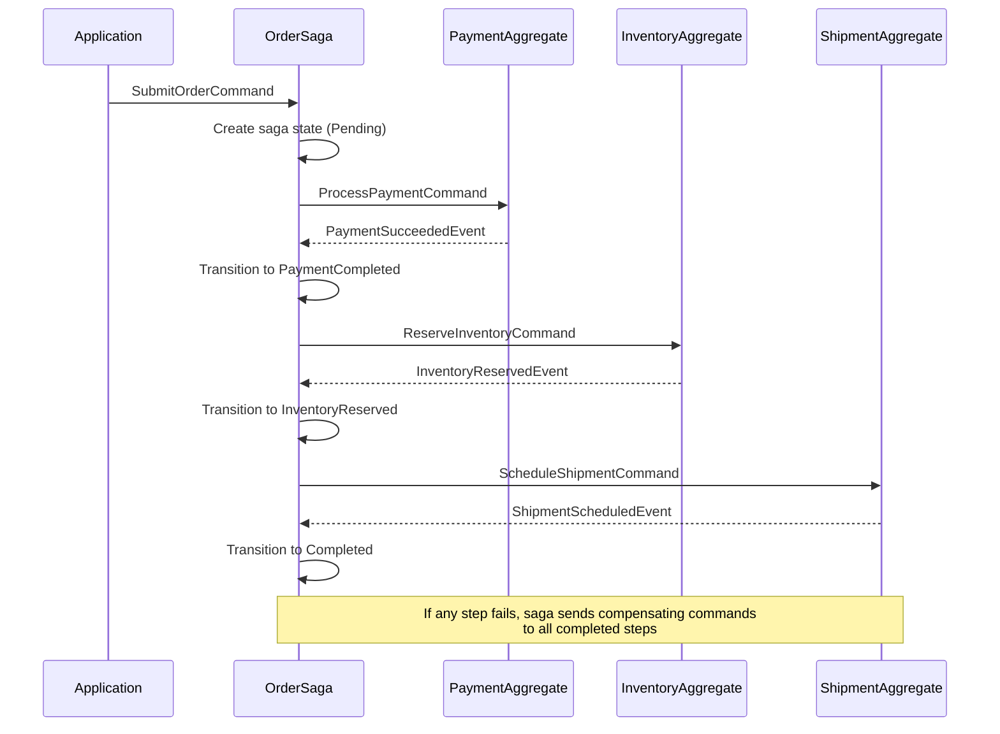
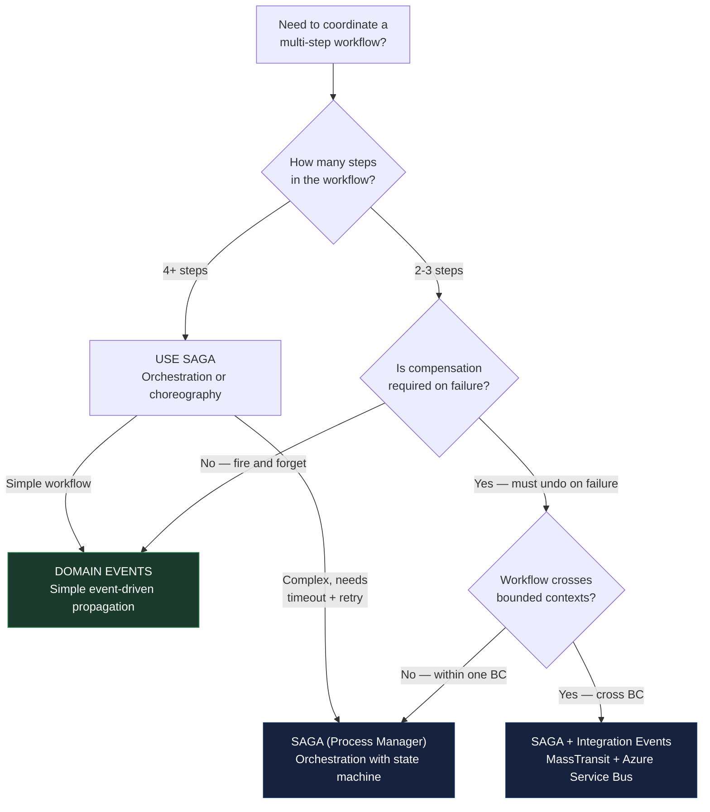

> [!success] Mastery Check
> - [ ] **Studied Well**
> - [ ] **Can explain the concept without notes**
> - [ ] **Can answer interview questions confidently**
> - [ ] **Can implement it in a real project**


# 7.066 — DDD — Sagas as Process Managers

## Section 1: Navigation & Context

**Domain:** [[7 — System Design & Distributed Systems]] > **Group:** Domain-Driven Design
**Previous:** [[7.065 — DDD — Eventual Consistency Between Aggregates]] | **Next:** [[7.067 — DDD — Policy Objects]]

### Prerequisites

- [[7.065 — DDD — Eventual Consistency Between Aggregates]] — event-driven eventual consistency between aggregates is the simple case; sagas extend this with state management, orchestration, and compensation for multi-step workflows that span 3+ aggregates.
- [[7.053 — DDD — Domain Events — Within Bounded Context]] — sagas consume domain events to advance their state machine; understanding how domain events are raised and published is prerequisite to building sagas that react to them.
- [[7.055 — DDD — Integration Events — Across Bounded Contexts]] — when a saga coordinates across bounded contexts, each message must carry a `CorrelationId` that ties it back to the saga instance; integration event schemas must include this field.

### Where This Fits

A saga (also called Process Manager in DDD terms) is a stateful coordinator that manages a multi-step business workflow spanning multiple aggregates or bounded contexts. It addresses the failure mode of simple domain events: when a workflow has four steps and step 3 fails, who rolls back step 1 and step 2? With simple events, no one — each handler is independent and unaware of the overall workflow. A saga tracks which steps completed, handles failures by triggering compensating actions, and resumes from the last successful step after a system crash. This becomes necessary when a workflow has 3+ steps with compensate-able side effects — an order-to-shipment pipeline, a payment-to-fulfillment workflow, a multi-step onboarding process. Without it, partial failures leave the system in inconsistent states that require manual reconciliation.

---

## Section 2: Core Mental Model

A saga (Process Manager) is a stateful, event-driven coordinator that receives events, maintains the progress of a long-running workflow, and sends commands to aggregates to advance the workflow. The invariant maintained: a multi-step business process either completes all steps successfully or triggers compensating actions for every completed step on failure. The trade: the saga introduces a centralized coordination point (a potential bottleneck and single point of failure risk), increased complexity in state persistence, and the need for idempotent command handlers. The recognition trigger: a business workflow where the failure of step 3 means step 1 and step 2 should be undone, and where the workflow must survive service restarts — "place order → process payment → reserve inventory → schedule shipment."

### Classification

| Dimension | Classification | Rationale |
|-----------|---------------|-----------|
| Pattern Type | **Tactical DDD / Process Coordination** | Manages workflow state across aggregates |
| Scope | **Single bounded context (saga) or cross-BC (orchestration)** | Process Manager is within-BC; choreography is event-driven |
| Primary Concern | **Workflow completion guarantee** | Either full success or full compensation |
| State Model | **State machine with explicit transitions** | Each event advances the saga to a new state |
| Persistence | **Required (survives restarts)** | Saga state stored in database (or MassTransit saga state) |
| Communication | **Events in, commands out** | Listens for events, sends commands to aggregates |

```mermaid
stateDiagram-v2
    [*] --> OrderPlaced: OrderSubmitted
    OrderPlaced --> PaymentPending: SubmitPayment
    OrderPlaced --> Failed: PaymentDeclined
    
    PaymentPending --> PaymentCompleted: PaymentSucceeded
    PaymentPending --> PaymentFailed: PaymentFailed
    PaymentFailed --> Failed: Compensate
    
    PaymentCompleted --> InventoryPending: ReserveInventory
    PaymentCompleted --> Failed: InventoryFailed
    InventoryPending --> InventoryReserved: StockReserved
    InventoryPending --> InventoryTimeout: Timeout
    
    InventoryReserved --> ShipmentPending: ScheduleShipment
    InventoryReserved --> Failed: ShipmentFailed
    ShipmentPending --> Completed: Shipped
    ShipmentPending --> Failed: ShipmentFailed
    
    Completed --> [*]
    Failed --> [*]
    
    note right of Failed: Compensating actions executed:<br/>- Reverse payment<br/>- Unreserve inventory
```



### Key Properties / Guarantees

| Property | Value | Condition |
|----------|-------|-----------|
| Workflow guarantee | At-most-once delivery per step, exactly-once overall | Requires idempotent handlers and saga state persistence |
| Compensating actions | Automatic on failure | Each step must have a defined compensation |
| State persistence | Required | Saga state stored in database or Durable Functions |
| Scalability | Partitioned by CorrelationId | Saga instances are independent per workflow |
| Recovery | From last persisted state | After crash, saga resumes from last stored state |
| Timeout support | Step-level timeout | Saga detects missing events within time window |

---

## Section 3: Deep Mechanics

### How It Works

**Step-by-step trace — Order Fulfillment Saga:**

1. **Saga initiation:** Application sends `SubmitOrderCommand`. The saga handler creates a new saga instance with `CorrelationId = orderId` and initial state `Pending`. It persists the saga state to the saga store (database table).

2. **Step 1 — Payment:** Saga sends `ProcessPaymentCommand` to the Payment aggregate via MediatR. The saga instance waits for `PaymentCompletedEvent` or `PaymentFailedEvent`.

3. **Event correlation:** The Payment aggregate raises `PaymentCompletedEvent` with `CorrelationId = orderId`. The saga instance is loaded by correlation ID.

4. **State transition:** The saga validates the event, transitions state to `PaymentCompleted`, records the payment transaction ID, and persists state.

5. **Step 2 — Inventory:** Saga sends `ReserveInventoryCommand`. Waits for `InventoryReservedEvent`.

6. **Timeout handling:** If `InventoryReservedEvent` does not arrive within 30 seconds, the saga fires a timeout handler. It sends a compensating `ReversePaymentCommand` to the Payment aggregate and transitions to `Failed`.

7. **Step 3 — Shipment:** Saga sends `ScheduleShipmentCommand`. Waits for `ShipmentScheduledEvent`.

8. **Completion:** Saga transitions to `Completed`, persists final state.

**Failure path — payment succeeds, inventory fails:**

1. Saga transitions to `PaymentCompleted`, persists.
2. Saga sends `ReserveInventoryCommand`.
3. Inventory aggregate responds with `InventoryReservationFailedEvent` (insufficient stock).
4. Saga loads state, transitions to `InventoryFailed`.
5. Saga sends `ReversePaymentCommand` to Payment aggregate.
6. Saga persists final state `Failed` with a failure reason.

### Failure Modes

**Failure Mode 1: Saga state lost on crash**

What breaks: Process crashes after sending a command but before persisting the saga state. The saga instance is lost. No one advances the workflow.

Detection: Orphaned saga instances missing from saga store. Business report shows orders stuck in "processing" state.

Fix: Use transactional outbox for saga state changes — the "saga state update + command publishing" must be atomic:

```csharp
// ❌ Saga state saved before command sent — crash between them loses state
public async Task Handle(ShipmentScheduledEvent evt, CancellationToken ct)
{
    _saga.State = SagaState.Completed;
    await _sagaStore.SaveAsync(_saga, ct); // Saved here
    await _mediator.Send(new UpdateCustomerCommand(_saga.CustomerId), ct); // Crash here
}

// ✅ Transactional outbox — state and command in same DbContext
public async Task Handle(ShipmentScheduledEvent evt, CancellationToken ct)
{
    _saga.State = SagaState.Completed;
    _sagaStore.Update(_saga);
    _sagaStore.Outbox.Add(OutboxMessage.FromCommand(
        new UpdateCustomerCommand(_saga.CustomerId)));
    await _sagaStore.SaveChangesAsync(ct); // Both in one transaction
}
```

**Failure Mode 2: Duplicate event delivery causes double transition**

What breaks: The same event arrives twice (outbox retry). Saga handler applies the transition twice, sending duplicate commands.

Detection: Two `ProcessPaymentCommand` sent for one order. Payment processed twice.

Fix: Idempotent saga event handling — check if the event was already processed:

```csharp
// ❌ No idempotency check — duplicate event causes duplicate action
public async Task Handle(PaymentCompletedEvent evt, CancellationToken ct)
{
    _saga.TransitionTo(SagaState.PaymentCompleted);
    await _sagaStore.SaveAsync(_saga, ct);
    await _mediator.Send(new ReserveInventoryCommand(_saga.OrderId), ct);
}

// ✅ Idempotent — check event-specific version or processed events
public async Task Handle(PaymentCompletedEvent evt, CancellationToken ct)
{
    if (_saga.ProcessedEvents.Contains(evt.EventId))
        return;
    if (_saga.State != SagaState.PaymentPending)
        return; // Already past this step

    _saga.State = SagaState.PaymentCompleted;
    _saga.ProcessedEvents.Add(evt.EventId);
    _saga.PaymentTransactionId = evt.TransactionId;
    await _sagaStore.SaveAsync(_saga, ct);
    await _mediator.Send(new ReserveInventoryCommand(_saga.OrderId), ct);
}
```

**Failure Mode 3: Timeout no-shows — event never arrives**

What breaks: Command sent to Inventory aggregate but response never arrives (queue down, handler crashed, message lost).

Detection: Sagas stuck in `PaymentCompleted` state for >5 minutes. Monitoring dashboard shows `saga_timeout_count` increasing.

Fix: Implement timeout detection — a background service that scans for stalled sagas:

```csharp
public sealed class SagaTimeoutDetector : BackgroundService
{
    protected override async Task ExecuteAsync(CancellationToken ct)
    {
        while (!ct.IsCancellationRequested)
        {
            var stalledSagas = await _sagaStore.FindStalledAsync(
                TimeSpan.FromSeconds(30), ct);
            foreach (var saga in stalledSagas)
            {
                _logger.LogWarning("Saga {Id} stalled at state {State}",
                    saga.CorrelationId, saga.State);
                await saga.HandleTimeoutAsync(ct);
                await _sagaStore.SaveAsync(saga, ct);
            }
            await Task.Delay(TimeSpan.FromSeconds(5), ct);
        }
    }
}
```

**Failure Mode 4: Compensating action fails**

What breaks: Payment was processed, inventory reservation failed. Saga tries to reverse the payment. The payment reversal API is down.

Detection: Sagas in `Failed` state with `CompensationFailed` flag. Manual intervention required for stuck compensations.

Fix: Retry compensation with exponential backoff. If all retries exhausted, alert on-call engineer:

```csharp
public async Task CompensatePaymentAsync(PaymentSaga saga, CancellationToken ct)
{
    var retryCount = 0;
    while (retryCount < 5)
    {
        try
        {
            await _paymentClient.ReverseAsync(saga.PaymentTransactionId, ct);
            saga.CompensationState = CompensationState.PaymentReversed;
            return;
        }
        catch (Exception ex) when (retryCount < 4)
        {
            retryCount++;
            await Task.Delay(TimeSpan.FromSeconds(Math.Pow(2, retryCount)), ct);
        }
    }
    _logger.LogCritical("Failed to reverse payment {TxId} after 5 retries",
        saga.PaymentTransactionId);
    saga.CompensationState = CompensationState.ManualInterventionRequired;
    await _alertService.SendOnCallAsync("Payment reversal required", saga);
}
```

### .NET and Azure Integration

- **ASP.NET Core:** No middleware — sagas run via MediatR handlers or MassTransit consumers.
- **EF Core:** Saga state as a DbContext entity; transactional outbox for state + command publishing.
- **Azure services:** Azure Service Bus for cross-service saga messages; Azure Durable Functions for stateful orchestration; Azure Cosmos DB for saga state store.
- **.NET libraries:** MassTransit (built-in saga/state machine via `MassTransitStateMachine`), NServiceBus (sagas with `Saga<T>`), MediatR for in-process sagas.
- **Configuration:** MassTransit saga registration with EF Core saga persistence.

```csharp
// Program.cs — MassTransit saga configuration
builder.Services.AddMassTransit(x =>
{
    x.AddSaga<OrderSaga>()
        .EFCoreRepository(r =>
        {
            r.ExistingDbContext<OrderSagaDbContext>();
            r.LockStatementProvider = new SqlServerLockStatementProvider();
        });

    x.UsingAzureServiceBus((ctx, cfg) =>
    {
        cfg.Host(builder.Configuration["ServiceBus:ConnectionString"]);
        cfg.ConfigureEndpoints(ctx);
    });
});
```

---

## Section 4: Production Patterns and Implementation

### Primary Implementation

```csharp
using MassTransit;

// Saga State — persisted to database
public sealed class OrderSagaState : SagaStateMachineInstance
{
    public Guid CorrelationId { get; set; }
    public string CurrentState { get; set; } = "";
    public string OrderId { get; set; } = "";
    public string CustomerId { get; set; } = "";
    public decimal Amount { get; set; }
    public string? PaymentTransactionId { get; set; }
    public List<OrderItem> Items { get; set; } = new();
    public DateTime CreatedAt { get; set; }
    public DateTime? CompletedAt { get; set; }
    public string? FailureReason { get; set; }
    public HashSet<Guid> ProcessedEvents { get; set; } = new();
}

// Saga State Machine — defines states, events, and behavior
public sealed class OrderFulfillmentSaga :
    MassTransitStateMachine<OrderSagaState>
{
    public State Submitted { get; private set; }
    public State PaymentPending { get; private set; }
    public State PaymentCompleted { get; private set; }
    public State InventoryReserved { get; private set; }
    public State Shipped { get; private set; }
    public State Failed { get; private set; }

    public Event<OrderSubmittedEvent> OrderSubmitted { get; private set; }
    public Event<PaymentProcessedEvent> PaymentProcessed { get; private set; }
    public Event<PaymentFailedEvent> PaymentFailed { get; private set; }
    public Event<InventoryReservedEvent> InventoryReserved { get; private set; }
    public Event<InventoryFailedEvent> InventoryFailed { get; private set; }
    public Event<ShipmentScheduledEvent> ShipmentScheduled { get; private set; }
    public Schedule<OrderSagaState, InventoryTimeoutEvent> InventoryTimeout { get; private set; }

    public OrderFulfillmentSaga()
    {
        InstanceState(s => s.CurrentState);

        Event(() => OrderSubmitted, e =>
        {
            e.CorrelateById(ctx => ctx.Message.OrderId);
            e.InsertOnInitial = true;
        });

        Event(() => PaymentProcessed, e =>
            e.CorrelateById(ctx => ctx.Message.CorrelationId));
        Event(() => PaymentFailed, e =>
            e.CorrelateById(ctx => ctx.Message.CorrelationId));
        Event(() => InventoryReserved, e =>
            e.CorrelateById(ctx => ctx.Message.CorrelationId));
        Event(() => InventoryFailed, e =>
            e.CorrelateById(ctx => ctx.Message.CorrelationId));
        Event(() => ShipmentScheduled, e =>
            e.CorrelateById(ctx => ctx.Message.CorrelationId));

        Schedule(() => InventoryTimeout,
            instance => instance.CorrelationId,
            s => s.Delay = TimeSpan.FromSeconds(30));

        Initially(
            When(OrderSubmitted)
                .Then(ctx =>
                {
                    ctx.Saga.OrderId = ctx.Message.OrderId.ToString();
                    ctx.Saga.CustomerId = ctx.Message.CustomerId;
                    ctx.Saga.Amount = ctx.Message.TotalAmount;
                    ctx.Saga.Items = ctx.Message.Items.ToList();
                    ctx.Saga.CreatedAt = DateTime.UtcNow;
                })
                .SendAsync(ctx => ctx.Send(new ProcessPaymentCommand
                {
                    OrderId = ctx.Message.OrderId,
                    Amount = ctx.Message.TotalAmount,
                    CustomerId = ctx.Message.CustomerId
                }))
                .TransitionTo(PaymentPending));

        During(PaymentPending,
            When(PaymentProcessed)
                .Then(ctx =>
                {
                    ctx.Saga.PaymentTransactionId = ctx.Message.TransactionId;
                })
                .Unschedule(InventoryTimeout)
                .SendAsync(ctx => ctx.Send(new ReserveInventoryCommand
                {
                    OrderId = Guid.Parse(ctx.Saga.OrderId),
                    Items = ctx.Saga.Items
                }))
                .TransitionTo(InventoryReserved),

            When(PaymentFailed)
                .Then(ctx =>
                {
                    ctx.Saga.FailureReason = ctx.Message.Reason;
                })
                .TransitionTo(Failed));

        During(InventoryReserved,
            When(InventoryReserved)
                .SendAsync(ctx => ctx.Send(new ScheduleShipmentCommand
                {
                    OrderId = Guid.Parse(ctx.Saga.OrderId),
                    Items = ctx.Saga.Items,
                    ShippingAddress = ctx.Message.ShippingAddress
                }))
                .TransitionTo(PaymentCompleted),

            When(InventoryFailed)
                .Then(ctx =>
                {
                    ctx.Saga.FailureReason = ctx.Message.Reason;
                })
                .SendAsync(ctx => ctx.Send(new ReversePaymentCommand
                {
                    TransactionId = ctx.Saga.PaymentTransactionId,
                    Amount = ctx.Saga.Amount
                }))
                .TransitionTo(Failed));

        During(PaymentCompleted,
            When(ShipmentScheduled)
                .Then(ctx =>
                {
                    ctx.Saga.CompletedAt = DateTime.UtcNow;
                })
                .TransitionTo(Shipped),

            When(ShipmentFailed)
                .Then(ctx =>
                {
                    ctx.Saga.FailureReason = ctx.Message.Reason;
                })
                .SendAsync(ctx => ctx.Send(new ReversePaymentCommand
                {
                    TransactionId = ctx.Saga.PaymentTransactionId,
                    Amount = ctx.Saga.Amount
                }))
                .SendAsync(ctx => ctx.Send(new UnreserveInventoryCommand
                {
                    OrderId = Guid.Parse(ctx.Saga.OrderId),
                    Items = ctx.Saga.Items
                }))
                .TransitionTo(Failed));
    }
}

// Saga State Persistence (EF Core)
public sealed class OrderSagaDbContext : SagaDbContext
{
    public OrderSagaDbContext(DbContextOptions<OrderSagaDbContext> options)
        : base(options) { }

    protected override IEnumerable<ISagaClassMap> Configurations
    {
        get { yield return new OrderSagaStateMap(); }
    }
}

public sealed class OrderSagaStateMap : SagaClassMap<OrderSagaState>
{
    protected override void Configure(EntityTypeBuilder<OrderSagaState> entity,
        ModelBuilder model)
    {
        entity.ToTable("SagaStates");
        entity.HasKey(s => s.CorrelationId);
        entity.Property(s => s.CurrentState).HasMaxLength(64);
        entity.Property(s => s.OrderId).HasMaxLength(50);
        entity.Property(s => s.CustomerId).HasMaxLength(50);
        entity.Property(s => s.PaymentTransactionId).HasMaxLength(100);
        entity.Property(s => s.FailureReason).HasMaxLength(500);
        entity.Property(s => s.Items)
            .HasConversion(new JsonCollectionValueConverter<List<OrderItem>>());
        entity.Property(s => s.ProcessedEvents)
            .HasConversion(new JsonCollectionValueConverter<HashSet<Guid>>());
    }
}
```

### Configuration and Wiring

```csharp
// Program.cs — Full saga wiring with Azure Service Bus
builder.Services.AddDbContext<OrderSagaDbContext>(options =>
    options.UseSqlServer(builder.Configuration.GetConnectionString("Sagas")));

builder.Services.AddMassTransit(x =>
{
    x.SetEndpointNameFormatter(new KebabCaseEndpointNameFormatter("sagas", false));

    x.AddSaga<OrderSagaState, OrderFulfillmentSaga>()
        .EFCoreRepository(r =>
        {
            r.ExistingDbContext<OrderSagaDbContext>();
            r.LockStatementProvider = new SqlServerLockStatementProvider();
        });

    x.AddConfigureEndpointsCallback((context, _, cfg) =>
    {
        cfg.UseMessageRetry(r => r.Interval(3, TimeSpan.FromSeconds(5)));
        cfg.UseInMemoryOutbox(context);
    });

    x.UsingAzureServiceBus((context, cfg) =>
    {
        cfg.Host(builder.Configuration["Azure:ServiceBus:ConnectionString"]);
        cfg.ConfigureEndpoints(context);
    });
});

// MediatR-only saga (in-process, no MassTransit)
public sealed class OrderSagaService : IRequestHandler<SubmitOrderCommand, Unit>
{
    private readonly ISagaStateRepository _sagaRepo;
    private readonly IMediator _mediator;
    private readonly ILogger<OrderSagaService> _logger;

    public async Task<Unit> Handle(SubmitOrderCommand cmd, CancellationToken ct)
    {
        var saga = new OrderSagaData(cmd.OrderId);
        await _sagaRepo.SaveAsync(saga, ct);

        try
        {
            // Step 1: Payment
            var paymentResult = await _mediator.Send(
                new ProcessPaymentCommand(cmd.OrderId, cmd.Amount), ct);
            saga.TransitionTo(SagaStep.PaymentCompleted, paymentResult.TransactionId);
            await _sagaRepo.SaveAsync(saga, ct);

            // Step 2: Inventory
            var inventoryResult = await _mediator.Send(
                new ReserveInventoryCommand(cmd.OrderId, cmd.Items), ct);
            saga.TransitionTo(SagaStep.InventoryReserved);
            await _sagaRepo.SaveAsync(saga, ct);

            // Step 3: Shipment
            await _mediator.Send(
                new ScheduleShipmentCommand(cmd.OrderId, cmd.Items, cmd.ShippingAddress), ct);
            saga.TransitionTo(SagaStep.Completed);
            await _sagaRepo.SaveAsync(saga, ct);
        }
        catch (Exception ex)
        {
            _logger.LogError(ex, "Order saga failed at step {Step}", saga.CurrentStep);
            await CompensateAsync(saga, ct);
            saga.TransitionTo(SagaStep.Failed, ex.Message);
            await _sagaRepo.SaveAsync(saga, ct);
            throw;
        }
    }

    private async Task CompensateAsync(OrderSagaData saga, CancellationToken ct)
    {
        if (saga.CurrentStep >= SagaStep.PaymentCompleted)
            await _mediator.Send(new ReversePaymentCommand(
                saga.TransactionId!, saga.Amount), ct);
        if (saga.CurrentStep >= SagaStep.InventoryReserved)
            await _mediator.Send(new UnreserveInventoryCommand(
                saga.OrderId, saga.Items), ct);
    }
}
```

### Common Variants

**Variant 1 — Choreography (no central saga):**

```csharp
// Each aggregate handles its own compensation via event chain
public sealed class InventoryHandler : INotificationHandler<OrderSubmittedEvent>
{
    public async Task Handle(OrderSubmittedEvent evt, CancellationToken ct)
    {
        try { /* reserve inventory */ }
        catch
        {
            // Raise failure event — PaymentHandler compensates independently
            await _mediator.Publish(
                new InventoryReservationFailedEvent(evt.OrderId), ct);
        }
    }
}
```

**Variant 2 — Azure Durable Functions saga:**

```csharp
[FunctionName("OrderFulfillmentOrchestrator")]
public async Task<OrchestrationResult> RunOrchestrator(
    [OrchestrationTrigger] IDurableOrchestrationContext context)
{
    var orderId = context.GetInput<Guid>();

    try
    {
        // Step 1 — Payment
        var paymentResult = await context.CallActivityAsync<PaymentResult>(
            "ProcessPayment", orderId);
        if (!paymentResult.Success)
            return OrchestrationResult.Failed("Payment declined");

        // Step 2 — Inventory
        var inventoryResult = await context.CallActivityAsync<InventoryResult>(
            "ReserveInventory", orderId);
        if (!inventoryResult.Success)
        {
            await context.CallActivityAsync("ReversePayment", paymentResult.TransactionId);
            return OrchestrationResult.Failed("Out of stock");
        }

        // Step 3 — Ship
        await context.CallActivityAsync("ScheduleShipment", orderId);
        return OrchestrationResult.Completed;
    }
    catch (Exception)
    {
        // Durable Functions auto-retry with compensation
        return OrchestrationResult.Failed("Orchestration failed");
    }
}
```

**Variant 3 — In-memory saga with state machine library (Stateless):**

```csharp
public sealed class OrderSagaStateMachine
{
    private readonly StateMachine<State, Trigger> _machine;
    private State _state = State.Pending;

    public enum State { Pending, PaymentPending, PaymentCompleted, InventoryReserved, Shipped, Failed }
    public enum Trigger { SubmitOrder, PaymentSuccess, PaymentFailure, InventorySuccess, InventoryFailure, Ship }

    public OrderSagaStateMachine()
    {
        _machine = new StateMachine<State, Trigger>(() => _state, s => _state = s);

        _machine.Configure(State.Pending)
            .Permit(Trigger.SubmitOrder, State.PaymentPending);

        _machine.Configure(State.PaymentPending)
            .Permit(Trigger.PaymentSuccess, State.PaymentCompleted)
            .Permit(Trigger.PaymentFailure, State.Failed);

        _machine.Configure(State.PaymentCompleted)
            .Permit(Trigger.InventorySuccess, State.InventoryReserved)
            .Permit(Trigger.InventoryFailure, State.Failed);

        _machine.Configure(State.InventoryReserved)
            .Permit(Trigger.Ship, State.Shipped);
    }

    public void Fire(Trigger trigger) => _machine.Fire(trigger);
}
```

### Real-World .NET Ecosystem Example

**MassTransit** is the canonical .NET saga library. Its `MassTransitStateMachine<T>` provides a DSL for defining saga states, events, transitions, and compensations. Combined with EF Core saga persistence and Azure Service Bus transport, it provides production-grade saga support. The `InMemoryOutbox` feature ensures saga state changes and outgoing commands are atomically persisted. NServiceBus also provides `Saga<T>` with similar capabilities — the industry standard for sagas in .NET since 2010.

**Azure Durable Functions** is the serverless alternative — state is managed by the Azure Storage account, and the orchestrator function defines the workflow in code (not a state machine DSL). Useful for simpler workflows, but lacks the fine-grained state machine control of MassTransit.

---

## Section 5: Gotchas and Production Pitfalls

### Pitfall 1: Saga State and Command Not in Same Transaction

**Pitfall:** Saga persists state in one transaction and sends a command in another. A crash between them loses the command.

```csharp
// ❌ State persisted, command not sent — saga stuck
await _sagaStore.SaveAsync(saga, ct);
await _mediator.Send(new ReserveInventoryCommand(orderId), ct); // Crash here
```

**Symptom:** Sagas stuck in intermediate state. No command sent to the next step. No event arrives to advance the saga.

**Fix:** Use MassTransit's `InMemoryOutbox` or a custom outbox table:

```csharp
// ✅ InMemoryOutbox — state + outgoing messages in one transaction
cfg.UseInMemoryOutbox(context);

// Or manual outbox:
_sagaStore.Update(saga);
_sagaStore.OutboxMessages.Add(OutboxMessage.FromCommand(
    new ReserveInventoryCommand(orderId)));
await _sagaStore.SaveChangesAsync(ct); // Atomic: saga state + outbox
```

**Cost of not fixing:** Manual recovery of stuck sagas. Each incident requires database queries and manual command sending.

### Pitfall 2: Missing Idempotency on Compensating Actions

**Pitfall:** Saga sends `ReversePaymentCommand` twice (retry logic). Payment is reversed twice — customer gets double refund.

```csharp
// ❌ Payment reversed twice — duplicate compensation
var compensation = _mediator.Send(new ReversePaymentCommand(txId, amount));
```

**Symptom:** Customer complains about double refund. Finance team detects duplicate payment reversals in reconciliation.

**Fix:** Make compensating commands idempotent — the `ReversePaymentCommand` checks if the transaction was already reversed:

```csharp
// ✅ Idempotent compensation
public sealed class ReversePaymentHandler : IRequestHandler<ReversePaymentCommand>
{
    public async Task<Unit> Handle(ReversePaymentCommand cmd, CancellationToken ct)
    {
        var payment = await _paymentRepo.GetByTransactionIdAsync(cmd.TransactionId, ct);
        if (payment.Status == PaymentStatus.Reversed)
            return Unit.Value; // Already reversed — skip

        payment.Reverse();
        await _paymentRepo.SaveAsync(payment, ct);
        return Unit.Value;
    }
}
```

**Cost of not fixing:** Financial loss (double refunds). Customer trust damage. Audit findings.

### Pitfall 3: Blocking Saga Thread with Synchronous Work

**Pitfall:** Saga handler does synchronous I/O or long computation inside the state machine transition, blocking the message pump.

```csharp
// ❌ Synchronous call blocks message pump
When(PaymentProcessed)
    .Then(ctx =>
    {
        Thread.Sleep(2000); // Blocks the message dispatcher
        ctx.Saga.PaymentTransactionId = ctx.Message.TransactionId;
    });
```

**Symptom:** All saga processing stalls. Throughput drops to near zero. Timeout messages accumulate.

**Fix:** Keep state transitions fast. Offload heavy work to async activities:

```csharp
// ✅ Fast transition — heavy work done by async send
When(PaymentProcessed)
    .Then(ctx =>
    {
        ctx.Saga.PaymentTransactionId = ctx.Message.TransactionId;
    })
    .SendAsync(ctx => ctx.Send(new ReserveInventoryCommand(
        Guid.Parse(ctx.Saga.OrderId), ctx.Saga.Items)));
```

**Cost of not fixing:** Complete saga processing stall under load. P99 latency for all commands goes to timeout.

### Pitfall 4: Saga State Bloat from Stored Events

**Pitfall:** Saga stores every event payload in its state for audit purposes. State grows to >100KB per saga instance.

```csharp
// ❌ Storing entire event payloads
public sealed class OrderSagaState
{
    public List<string> Events { get; set; } = new(); // Grows unbounded
}
```

**Symptom:** Saga state table grows to gigabytes. Read/write latency increases 10x. Saga persistence becomes bottleneck.

**Fix:** Store only minimal state — correlation ID, current state, key data. Use separate audit log:

```csharp
// ✅ Store only what the saga needs
public sealed class OrderSagaState
{
    public Guid CorrelationId { get; set; }
    public string CurrentState { get; set; } = "";
    public string? PaymentTransactionId { get; set; }
    public string? FailureReason { get; set; }
    // No event list — audit trail in separate table
}
```

**Cost of not fixing:** Database performance degradation. Saga persistence operations exceed SLO (target: <50ms P99).

### Pitfall 5: Orphaned Sagas from Missing Timeout Handling

**Pitfall:** Saga sends command and waits for event that never arrives. No timeout configured. Sagas accumulate indefinitely.

```csharp
// ❌ No timeout — saga waits forever
During(PaymentPending,
    When(PaymentProcessed)
        .TransitionTo(InventoryReserved));
// What if PaymentProcessed never arrives?
```

**Symptom:** Saga state table grows with stuck sagas. Monitoring dashboard shows 1000+ sagas in `PaymentPending` state.

**Fix:** Always configure timeouts for each wait state:

```csharp
// ✅ Timeout configured
During(PaymentPending,
    When(PaymentProcessed)
        .TransitionTo(InventoryReserved),
    When(PaymentTimeout)
        .Then(ctx => ctx.Saga.FailureReason = "Payment timeout")
        .TransitionTo(Failed));

Schedule(() => PaymentTimeout,
    instance => instance.CorrelationId,
    s => s.Delay = TimeSpan.FromSeconds(30));
```

**Cost of not fixing:** Sagas accumulate until disk is full. Data cleanup requires manual deletion of stale entries.

---

## Section 6: Tradeoffs and Decision Framework

### Tradeoff Matrix

| Dimension | Orchestration Saga (Process Manager) | Choreography (Event Chain) | Distributed Transaction (2PC) |
|-----------|--------------------------------------|---------------------------|-------------------------------|
| Coordination | Centralized | Decentralized | Centralized coordinator |
| State visibility | Full (saga store) | Implicit (event chain) | Not persisted |
| Compensation | Explicit, defined per step | Implicit (event-driven reverse) | Automatic (rollback) |
| Availability | Saga store is SPOF | High (no coordinator) | Reduced (coordinator crash) |
| Complexity | High (state machine + persistence) | Medium (event handlers) | Very High (DTC) |
| Testability | High (isolated saga) | Medium (event chain) | Low (distributed) |
| .NET support | MassTransit, NServiceBus, Durable Functions | MediatR events | System.Transactions |

### Decision Flowchart



### When to Apply

- Workflow has 3+ steps where failure of later steps requires compensating earlier steps
- Workflow must survive process restarts (state persistence required)
- Each step involves modifying an aggregate or calling an external service
- Business requires visibility into workflow progress (saga store provides this)

### When NOT to Apply

- [ ] Workflow has 1-2 steps with no compensation requirement (use simple domain events)
- [ ] Workflow is entirely within a single aggregate (use aggregate methods)
- [ ] Team lacks infrastructure for saga state persistence
- [ ] Workflow steps are idempotent and order-independent (eventual consistency is sufficient)
- [ ] Sla for workflow completion is >1 hour and steps are independent

### Scale Thresholds

- **Worth considering above:** 3+ compensate-able steps in a workflow — saga becomes necessary when "undo" logic is required
- **Performance limit:** ~500 saga state transitions/second per saga store partition — each transition is a database write + optional command send
- **Switch to Durable Functions:** When sagas exceed 30-second execution time (Durable Functions provide checkpointing)
- **State size warning:** Keep per-saga state under 10KB — larger states increase read/write latency

---

## Section 7: Interview Arsenal

### Question Bank

1. What is a saga (Process Manager) in DDD and what problem does it solve?
2. Compare orchestration vs choreography sagas — when would you use each?
3. How does a saga handle the case where a step fails after previous steps succeeded?
4. How do you ensure saga state survives a process crash?
5. Compare a saga with a simple domain event handler chain.
6. How do you prevent duplicate saga event processing?
7. How do timeouts work in a saga — what mechanism detects a missing response?
8. Design a saga for an order fulfillment workflow (payment → inventory → shipment) and walk through failure scenarios.

### Spoken Answers

**Q1: What is a saga (Process Manager) in DDD and what problem does it solve?**

> **Average answer:** A saga is a way to manage long-running transactions. It coordinates multiple steps and can roll back if something fails.

> **Great answer:** A saga, called a Process Manager in DDD terminology, is a stateful coordinator that manages a multi-step business workflow across aggregates or bounded contexts. The fundamental problem it solves is partial failure in distributed workflows. With simple domain events, when step 3 fails after step 1 and step 2 succeeded, no one knows which steps to undo — you get inconsistent state. A saga tracks its progress in a database table — the saga state. It listens for events and sends commands. When a step fails, the saga knows exactly which steps completed and sends compensating commands to reverse them. In .NET, MassTransit's `MassTransitStateMachine<T>` provides this as a first-class pattern: you define states, events, transitions, and compensations in a DSL. The saga state is persisted to EF Core, and events flow through Azure Service Bus. The key insight: a saga is not a distributed transaction — it's a pattern for managing workflow state with explicit compensation, giving eventual consistency with guaranteed convergence.

**Q2: Compare orchestration vs choreography sagas.**

> **Average answer:** Orchestration has a central coordinator that tells each service what to do. Choreography has each service react to events and handle its own compensation.

> **Great answer:** In orchestration, a central Process Manager — the saga — maintains the workflow state, sends commands, listens for responses, and triggers compensation. It's the single source of truth for "where is this workflow?" The downside is the saga becomes a coordination bottleneck and a potential single point of failure. In choreography, each aggregate publishes events when its state changes, and other aggregates react and publish their own events. Compensation happens through the reverse event chain. There's no central coordinator, so no bottleneck — but the workflow logic is distributed across handlers, making it harder to understand, test, and troubleshoot. I choose orchestration when the workflow has compensating actions — because the compensation logic is centralized and auditable. I choose choreography when the workflow is a simple pipeline with no compensation — like a notification pipeline where each step is independent. MassTransit supports both: `MassTransitStateMachine` for orchestration, normal consumers for choreography.

**Q5: Compare a saga with a simple domain event handler chain.**

> **Average answer:** A saga tracks state across multiple events. A domain event handler just reacts to one event.

> **Great answer:** The critical difference is statefulness. A domain event handler is stateless — it receives an event, does something, and finishes. It has no memory of previous events. If the handler fails after doing half its work, there's no mechanism to undo the side effects of a previous handler in the chain. A saga, by contrast, persists its state between events. It knows "I'm at step 2 of 4 — payment completed, inventory not yet reserved." When a step fails, the saga loads its state, determines which steps succeeded, and runs their compensating actions. The other difference: a saga handles timeouts. If the `PaymentProcessedEvent` never arrives, a domain event handler can't detect that — it already finished. A saga has a timeout schedule that fires and advances the saga to a failed state with compensation. In production, the saga's state persistence is what makes it reliable — after a service restart, the saga resumes from its last persisted state. Domain event handlers restart from scratch, losing the context of what happened before.

### System Design Interview Trigger

If an interviewer asks you to design a payment processing system or an order fulfillment pipeline and says "walk through what happens when the payment succeeds but inventory allocation fails," they are testing saga knowledge. The specific trap: "do you roll back the payment in the same transaction?" No — you use a saga to send a compensating `ReversePaymentCommand`. The follow-up: "what if the compensation itself fails?" This tests whether you know about retry policies, dead-letter queues, and manual intervention workflows. The deepest test: "how does the system recover if it crashes between the payment succeeding and inventory being reserved?" This tests saga state persistence — the saga store's `CorrelationId` lets the system resume from the last persisted state.

### Comparison Table

| | Orchestration Saga (Process Manager) | Choreography (Event Chain) | Domain Event (Simple Handler) |
|---|---|---|---|
| Core guarantee | Centralized workflow + compensation | Decentralized event propagation | One-way propagation |
| State persistence | Required (survives crash) | Not persisted | Not persisted |
| Compensation | Explicit, defined per step | Implicit (reverse event) | None |
| .NET implementation | MassTransitStateMachine | MediatR event chain | MediatR INotificationHandler |
| Failure mode | Saga store SPOF | Orphaned failure (no one compensates) | Event loss on crash |
| When to choose | 3+ steps with compensation | Simple pipeline, no undo needed | Fire-and-forget notification |

---

## Section 8: Architecture Decision Record

**Status:** Accepted

**Context:**
The Order Fulfillment workflow involves three steps: payment processing (via Stripe), inventory reservation (Inventory aggregate), and shipment scheduling (Shipment aggregate). A failure in any step requires compensating preceding steps. The workflow must survive service restarts — if the process crashes after payment but before inventory reservation, the saga must resume. The system handles 200 orders/minute with Azure Service Bus messaging.

**Options Considered:**

1. **Orchestration Saga (MassTransit StateMachine)** — Centralized saga with EF Core persistence, Azure Service Bus transport, and `InMemoryOutbox` for atomic state+command publishing.
2. **Choreography (Event Chain)** — Each aggregate raises events; the next aggregate reacts. Compensation is embedded in each handler. No central state.
3. **Simple synchronous workflow** — The application service calls each step synchronously with a try-catch block for compensation. No persistence.

**Decision:** Orchestration Saga (Option 1), because the workflow requires compensation logic that is centralized and auditable, the saga must survive restarts (state persistence), and the business requires visibility into workflow progress for customer support.

**Consequences:**
- ✅ Compensation logic is centralized in one state machine — easy to audit and modify
- ✅ Saga state persists — surviving restarts and deployments
- ✅ Timeout handling for missing responses (e.g., inventory timeout after 30 seconds)
- ⚠️ Saga store is a coordination point — requires high availability (Azure SQL HA)
- ❌ Increased complexity compared to choreography — requires knowledge of MassTransit state machines

**Review Trigger:** Revisit if the saga state store becomes a throughput bottleneck above 1000 transitions/second. Revisit if the workflow grows to 8+ steps — consider splitting into multiple sagas.

---

## Section 9: Self-Check

### Conceptual Questions

1. What is the fundamental difference between a saga and a domain event handler?

<details>
<summary>Answer</summary>
A saga is stateful — it persists its progress between events and knows which steps completed. A domain event handler is stateless — it reacts to one event and finishes. Sagas handle compensation and timeouts; domain event handlers do not.
</details>

2. What is the difference between orchestration and choreography sagas?

<details>
<summary>Answer</summary>
Orchestration: a central Process Manager maintains state and coordinates all steps. Choreography: each aggregate publishes events that trigger the next step — no central coordinator. Orchestration provides centralized compensation and visibility. Choreography removes the SPOF but distributes workflow logic.
</details>

3. How does a saga compensate for a failed step?

<details>
<summary>Answer</summary>
The saga tracks which steps completed successfully. When a step fails, it iterates completed steps in reverse order and sends compensating commands (e.g., ReversePayment, UnreserveInventory). Each compensation must be idempotent.
</details>

4. Why must saga state and outgoing commands be in the same transaction?

<details>
<summary>Answer</summary>
To prevent the "state saved but command not sent" failure mode. If the process crashes after persisting state but before sending the command, the saga is stuck forever. The outbox pattern (or MassTransit InMemoryOutbox) ensures both happen atomically.
</details>

5. What is the most common production failure with sagas?

<details>
<summary>Answer</summary>
Missing timeout handling. A saga sends a command and waits for a response that never arrives (queue down, handler crash, network partition). Without a timeout, the saga accumulates indefinitely in intermediate states. Timeout schedules detect these stalls and advance the saga to a failed state with compensation.
</details>

6. Compare MassTransit StateMachine with Azure Durable Functions for sagas.

<details>
<summary>Answer</summary>
MassTransit: DSL-based state machine, EF Core persistence, fine-grained state control, works with Azure Service Bus. Durable Functions: code-based orchestration, Azure Storage persistence, serverless billing, simpler for linear workflows. Choose MassTransit for complex state machines with compensation. Choose Durable Functions for simpler workflows or when serverless billing is preferred.
</details>

7. How do you test a saga?

<details>
<summary>Answer</summary>
Unit test the state machine transitions in isolation (MassTransit provides `SagaTestHarness`). Integration test with real saga store and in-memory transport. Test each compensation path. Test timeout paths by advancing the clock. Test crash recovery by simulating a restart and verifying saga resumes from last persisted state.
</details>

8. At what scale does a saga become a bottleneck?

<details>
<summary>Answer</summary>
Above ~1000 saga state transitions/second per saga store partition. Each transition is a database write + optional command send. Mitigation: partition sagas by CorrelationId hash across multiple saga stores. Use Cosmos DB for higher write throughput.
</details>

9. What are the requirements for a saga to survive a deployment restart?

<details>
<summary>Answer</summary>
(1) Saga state must be persisted to durable storage (database). (2) The saga store must be loaded by CorrelationId on startup. (3) Unprocessed outbox messages must be dispatched after restart. (4) Timeout schedules must be re-registered after restart. MassTransit handles (2)-(4) automatically with saga persistence.
</details>

10. Explain when you would NOT use a saga to a senior engineer.

<details>
<summary>Answer</summary>
"Don't use a saga for a 2-step workflow where both steps are idempotent — simple eventual consistency with domain events is sufficient. Don't use a saga when the workflow is entirely within one aggregate — use the aggregate's own methods. Don't use a saga when steps are fully independent and order doesn't matter — parallelism is simpler and faster. Don't use a saga when the team hasn't established the infrastructure for saga persistence — you need a database, message broker, and understanding of the outbox pattern first."
</details>

---

### Scenario Challenges

**Scenario 1 — Diagnose the problem**

A team implemented a saga for order fulfillment. After a production deployment, many orders are stuck in `PaymentCompleted` state. The saga store shows they've been in this state for 30+ minutes. No `InventoryReservedEvent` has arrived.

<details>
<summary>Diagnosis</summary>

**Root cause:** The deployment changed the `ReserveInventoryCommand` message type but the queue still has old-format messages. The Inventory handler deserializes the new format and throws. The saga's `InventoryTimeout` never fires because the timeout schedule was not re-registered after the deployment.

**Evidence:** Saga store shows `CurrentState = "PaymentCompleted"` for 200+ orders. Logs show `JsonSerializationException` in the Inventory consumer. No timeout alarms fired.

**Fix:**
1. Immediately: Register `InventoryTimeout` schedule in the saga's `OnConfigureEndpoints` callback.
2. Manually trigger timeouts for stuck sagas via database update.
3. Add backward-compatible deserialization for the `ReserveInventoryCommand`.

**Prevention:** Add deployment checklist: "Verify saga timeout schedules are registered." Add monitoring alert for sagas stuck >5 minutes in any intermediate state.
</details>

---

**Scenario 2 — Design decision**

You are designing a hotel booking saga. Steps: (1) Reserve room, (2) Charge credit card, (3) Send confirmation email. If step 2 fails, step 1 must be released. The system handles 50 bookings/second. Choose the saga approach.

<details>
<summary>Decision and Reasoning</summary>

**Choice:** Choreography saga — each step is independent and compensation is handled by the reverse event chain.

**Tradeoffs accepted:** No central coordinator — simpler architecture, but compensation logic is distributed. Acceptable because the workflow is linear and each step's compensation is straightforward.

**Implementation sketch:**
```csharp
// Step 1: Room reserved, raise RoomReservedEvent
public sealed class RoomBookingHandler
{
    public async Task Handle(BookRoomCommand cmd, CancellationToken ct)
    {
        var room = await _roomRepo.FindAvailableAsync(cmd.RoomType, cmd.Dates, ct);
        room.Reserve();
        await _roomRepo.SaveAsync(room, ct);
        await _mediator.Publish(new RoomReservedEvent(cmd.BookingId, room.Id, cmd.Amount), ct);
    }
}

// Step 2: Charge card
public sealed class PaymentHandler : INotificationHandler<RoomReservedEvent>
{
    public async Task Handle(RoomReservedEvent evt, CancellationToken ct)
    {
        try
        {
            await _paymentGateway.ChargeAsync(evt.BookingId, evt.Amount, ct);
            await _mediator.Publish(new PaymentCompletedEvent(evt.BookingId), ct);
        }
        catch (PaymentDeclinedException)
        {
            await _mediator.Publish(new PaymentFailedEvent(evt.BookingId), ct);
        }
    }
}

// Compensation: room release handler
public sealed class RoomReleaseHandler : INotificationHandler<PaymentFailedEvent>
{
    public async Task Handle(PaymentFailedEvent evt, CancellationToken ct)
    {
        var booking = await _bookingRepo.GetByIdAsync(evt.BookingId, ct);
        booking.ReleaseRoom();
        await _bookingRepo.SaveAsync(booking, ct);
    }
}
```

**Alternative:** If compensation becomes more complex (e.g., "also release blocked time slot"), switch to orchestration saga with MassTransit.
</details>

---

**Scenario 3 — Failure mode** On-call engineer receives alert: "Saga count in `Pending` state exceeds 500." The sagas were created 2 hours ago and have not progressed. The `OrderSubmittedEvent` was published but `ProcessPaymentCommand` was never sent.

<details>
<summary>Investigation and Fix</summary>

**Investigation steps:**
1. Check saga store: confirm 500+ sagas in `Pending` state, all with `CreatedAt > 2 hours`.
2. Check outbox table: are there pending outbox messages for `ProcessPaymentCommand`?
3. Check the saga registration: is the `OrderSubmitted` event correctly correlated?
4. Check the `InsertOnInitial` flag: does the saga know to auto-create on first event?

**Confirming evidence:** Saga store shows `CurrentState = ""` (initial state). Outbox table is empty. Logs show `OrderSubmittedEvent` consumed but saga state shows `Pending`. The `CorrelationId` on the event does not match the saga's `CorrelationId` pattern — the saga was created but never received the initializing event correctly.

**Root cause:** The `OrderSubmittedEvent.CorrelationId` was set to `OrderId` but the saga expected it as a `Guid` property named `CorrelationId`. The event had `OrderId = order.Id` as a field, but the saga mapping looked at `CorrelationId` which was null. The saga was created empty and never received the event.

**Immediate mitigation:** Delete orphaned sagas from the saga store. Resend `OrderSubmittedEvent` with correct correlation.

**Permanent fix:** Fix the correlation mapping in the saga definition:

```csharp
Event(() => OrderSubmitted, e =>
{
    e.CorrelateById(ctx => ctx.Message.OrderId); // Match on OrderId
    e.InsertOnInitial = true;
});
```

**Post-mortem item:** Add integration test that verifies saga creation from the initial event. Add monitoring: "Sagas in initial state > 5 minutes" alert.
</details>

---

**Scenario 4 — Scale it** Your saga system handles 200 orders/minute with EF Core saga persistence. The business expects 2000 orders/minute in 6 months. The saga store is already showing P99 read latency of 200ms.

<details>
<summary>Scaling Strategy</summary>

**Bottleneck this addresses:** Saga state persistence in a single SQL Server table. Each saga transition requires a read + write. At 2000/minute (33/second), a single table with row-level locking will show increased contention.

**How it helps:**
1. Partition saga state by CorrelationId hash across multiple tables/databases.
2. Use Cosmos DB for saga persistence — higher write throughput, no locking.
3. Reduce saga state size — store only minimal fields (CorrelationId, CurrentState, key data).
4. Batch saga store writes when possible.

**What it does not solve:** Event throughput — the message broker (Service Bus) handles this independently. Each saga's outgoing commands still flow through queues.

**Implementation order:**
1. Immediate: Add `IX_SagaStates_CurrentState_CreatedAt` covering index for stalled-saga queries.
2. This quarter: Migrate saga store to Cosmos DB with partition key `/CorrelationId`.
3. Next quarter: Implement saga state compression — serialize only non-default fields.

**Scalability target:** Cosmos DB with 10K RU/s handles 1000+ saga reads/writes per second at <10ms P99 latency.
</details>

---

**Scenario 5 — Interview simulation** The interviewer says: "Design a payment processing workflow where the user places an order, we process payment, and we notify the warehouse to ship. Walk through how you handle the case where payment succeeds but the warehouse notification fails."

<details>
<summary>Model Response</summary>

"Let me clarify a few things: is the payment synchronous or async — are we waiting for a webhook or a direct API response? And does the warehouse notification need to be synchronous from the user's perspective?

Assuming an async payment flow with a third-party gateway like Stripe, here's my approach with a saga:

The saga starts when the order is placed. I create a saga instance with `CorrelationId = orderId` and initial state `PaymentPending`. The saga sends a `CreatePaymentIntentCommand` which returns a client secret. The front end uses that secret to confirm the payment. When Stripe sends a `payment_intent.succeeded` webhook, the saga receives `PaymentSucceededEvent` and transitions to `PaymentCompleted`.

Now the critical part: the saga sends `NotifyWarehouseCommand` and waits for `WarehouseNotifiedEvent`. If the warehouse notification fails — say the warehouse API returns a 503 — the saga handles this differently depending on failure type. If it's a transient error, I retry with exponential backoff (up to 3 times with a 10-second delay between each). If it's a permanent error — invalid address, unsupported SKU — the saga doesn't retry; it transitions to a `NeedsManualIntervention` state and alerts the fulfillment team via the on-call rotation.

But here's the key: the payment was already successful. I do NOT reverse the payment just because the warehouse failed — the customer paid for the order. Instead, the saga records the failure reason and keeps the order in `PaymentCompleted, WarehouseFailed` state. The fulfillment team's dashboard shows these orders and they manually process them. This is a business decision, not a technical one — the cost of reversing a successful payment and asking the customer to re-order is higher than the cost of manual warehouse processing.

For the saga state, I'm using MassTransit's `MassTransitStateMachine` with EF Core persistence and Azure Service Bus transport. The saga instance stores: `OrderId`, `PaymentIntentId`, `CurrentState`, and `FailureReason`. The `InMemoryOutbox` ensures that state transitions and outgoing commands are atomic. If the service crashes between marking the payment as completed and sending the warehouse notification, the saga resumes from the outbox after restart — the warehouse notification is eventually sent.

To prevent duplicate warehouse notifications — which would cause double-shipping — the warehouse command handler is idempotent. It checks an `OrderId` deduplication table before processing. This handles both the saga retry and the case where the warehouse API receives the request but we don't get the confirmation."
</details>
