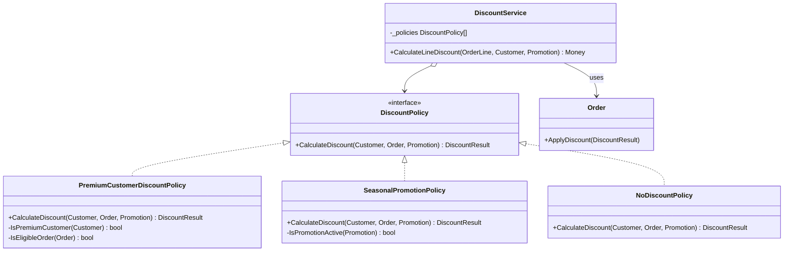
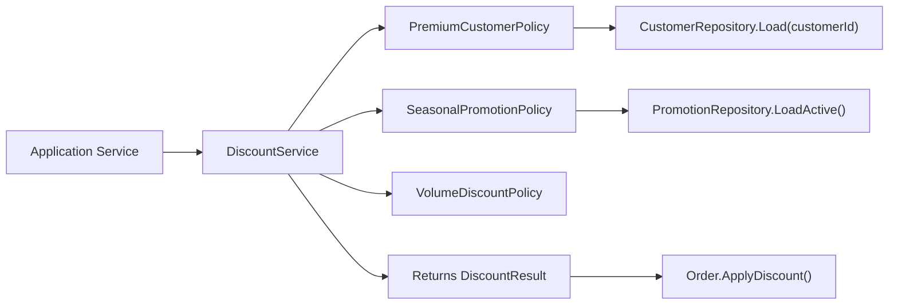
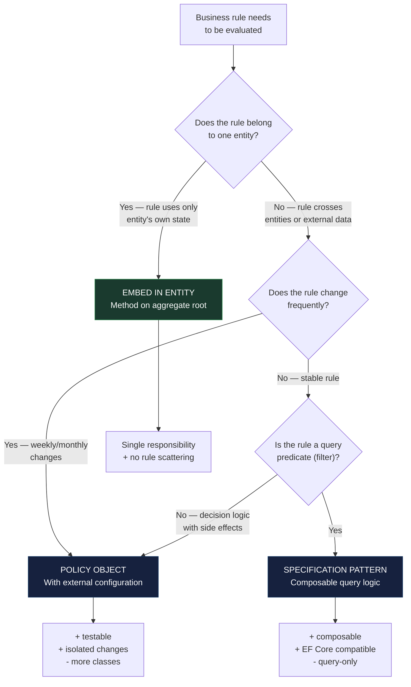

> [!success] Mastery Check
> - [ ] **Studied Well**
> - [ ] **Can explain the concept without notes**
> - [ ] **Can answer interview questions confidently**
> - [ ] **Can implement it in a real project**


# 7.067 — DDD — Policy Objects

## Section 1: Navigation & Context

**Domain:** [[7 — System Design & Distributed Systems]] > **Group:** Domain-Driven Design
**Previous:** [[7.066 — DDD — Sagas as Process Managers]] | **Next:** [[7.068 — DDD — Testing Domain Logic — Unit Tests for Aggregates]]

### Prerequisites

- [[7.044 — DDD — Entities — Invariant Enforcement]] — entities enforce invariants that belong to their own state; a policy object extracts cross-entity or context-dependent rules that would otherwise require entities to know about each other's internal state.
- [[7.059 — DDD — Specifications — Composable Query Logic]] — specifications answer "does this object satisfy a condition?"; policy objects answer "what should happen given this business context?" — the specification evaluates state, the policy decides action.
- [[7.051 — DDD — Domain Services — Stateless Operations]] — policy objects are domain services with a single responsibility: encapsulating a business rule that may change independently from the entities it evaluates.

### Where This Fits

A Policy Object encapsulates a business rule or decision that does not naturally belong to any single entity or value object — typically because the rule involves multiple inputs, external context, or changes on a different cadence than the entities it constrains. It addresses the problem of business rule scattering: when discount calculations, eligibility checks, or pricing rules are duplicated across multiple entities and application services, changes to business logic require touching multiple files with high risk of inconsistency. This becomes necessary when a business rule involves data from 2+ aggregates or external services, or when the rule changes independently from the entities it governs — a promotion policy that changes weekly should not be embedded in the Order entity.

---

## Section 2: Core Mental Model

A Policy Object is a stateless domain service that encapsulates a single business rule or decision strategy, accepting inputs from multiple sources and returning a decision or transformed value. The invariant maintained: the policy is the single authoritative source for its business rule — no entity, application service, or UI code duplicates the logic. The trade: policy objects increase the number of types in the domain layer and require dependency injection to wire into entities or application services. The recognition trigger: a business rule that involves checking multiple conditions ("if customer is premium AND order total > $100 AND current promotion is active, apply 20% discount") — this rule does not belong to Customer, Order, or Promotion alone; it belongs in a dedicated `PremiumDiscountPolicy`.

### Classification

| Dimension | Classification | Rationale |
|-----------|---------------|-----------|
| Pattern Type | **Tactical DDD / Domain Service** | Policy is a stateless domain service specializing in business rules |
| Scope | **Cross-entity decision** | Evaluates state from 2+ aggregates or value objects |
| Primary Concern | **Single-responsibility business rule** | Each policy owns exactly one rule that changes independently |
| State | **Stateless** | No mutable state — all inputs are parameters |
| Dependencies | **Domain services, repositories (via specification)** | May query state via repository interfaces (injected, not DbContext) |





### Key Properties / Guarantees

| Property | Value | Condition |
|----------|-------|-----------|
| Rule encapsulation | One policy = one rule | Always — splitting rules across policies is the primary pattern |
| Stateless | No instance state | All dependencies are injected services or value parameters |
| Testability | High (pure logic with mocked dependencies) | Policy has no infrastructure dependency |
| Composability | Multiple policies can be chained | `DiscountPolicyChain` aggregates results from multiple policies |
| Change isolation | Rule changes affect one class | Changing a discount rule touches only the policy, not entities |

---

## Section 3: Deep Mechanics

### How It Works

**Step-by-step trace — Discount calculation across policies:**

1. **Application Service** calls `DiscountService.CalculateDiscount(order, customerId)`.
2. **DiscountService** iterates through registered policies (`IPolicy<DiscountCriteria, DiscountResult>[]`). Each policy evaluates whether it applies.
3. **PremiumCustomerPolicy** loads the `Customer` aggregate via `ICustomerRepository`. Checks if `customer.Tier == Premium`. If true, returns 15% discount.
4. **SeasonalPromotionPolicy** loads active promotions via `IPromotionRepository`. If an active promotion covers the order's product category, returns the promotion's discount rate.
5. **VolumeDiscountPolicy** checks `order.TotalAmount > 1000`. If true, returns additional 5%.
6. **DiscountService** aggregates results: the highest applicable discount wins (or combines, depending on business rules).
7. **Application Service** applies `DiscountResult` to the Order via `order.ApplyDiscount(discountResult)`.

**Policy evaluation rules:**
- Each policy implements `IPolicy<TCriteria, TResult>`.
- `TCriteria` contains all data the policy needs.
- Policy returns `null` if it does not apply (chain continues).
- Policy returns a result if it applies (chain may stop or continue).

### Failure Modes

**Failure Mode 1: Policy logic duplicated in application service**

What breaks: Application service has inline discount logic that duplicates or bypasses the policy. When the policy changes, the application service still uses the old rule.

Detection: Code review finds `if (customer.Tier == "Premium") discount = 0.15m` in `OrderController`. The `PremiumCustomerDiscountPolicy` has the same logic.

Fix: Remove inline logic — application service delegates entirely to the policy:

```csharp
// ❌ Inline policy logic in application service
public async Task<OrderDto> SubmitOrderAsync(Guid orderId, CancellationToken ct)
{
    var order = await _orderRepo.GetByIdAsync(orderId, ct);
    var customer = await _customerRepo.GetByIdAsync(order.CustomerId, ct);
    if (customer.Tier == CustomerTier.Premium)
    {
        order.ApplyDiscount(DiscountResult.Percentage(15));
    }
    order.Submit();
    // ...
}

// ✅ Delegate to policy
public async Task<OrderDto> SubmitOrderAsync(Guid orderId, CancellationToken ct)
{
    var order = await _orderRepo.GetByIdAsync(orderId, ct);
    var discount = await _discountPolicy.CalculateDiscountAsync(order, ct);
    if (discount.HasValue)
        order.ApplyDiscount(discount.Value);
    order.Submit();
    // ...
}
```

**Failure Mode 2: Policy with infrastructure dependency (DbContext injected)**

What breaks: A policy takes `IOrderDbContext` directly instead of a repository interface. Unit tests require setting up a real database.

Detection: Policy constructor has `OrderDbContext dbContext` parameter. Tests use `InMemoryDatabase` or fail with `NullReferenceException`.

Fix: Policy depends on repository interfaces, not DbContext:

```csharp
// ❌ Policy depends on infrastructure
public sealed class PremiumCustomerDiscountPolicy
{
    private readonly OrderDbContext _dbContext; // Infrastructure dependency!
    public PremiumCustomerDiscountPolicy(OrderDbContext dbContext) { _dbContext = dbContext; }
}

// ✅ Policy depends on domain interfaces
public sealed class PremiumCustomerDiscountPolicy : IDiscountPolicy
{
    private readonly ICustomerRepository _customers;
    private readonly IPromotionRepository _promotions;

    public PremiumCustomerDiscountPolicy(
        ICustomerRepository customers,
        IPromotionRepository promotions)
    {
        _customers = customers;
        _promotions = promotions;
    }
}
```

**Failure Mode 3: Policy chain order dependency (first-match vs best-match)**

What breaks: Two policies both match the same order. The policy chain returns the first match, but the business intended the best (highest discount) match.

Detection: A customer qualifies for both a 15% premium discount and a 20% seasonal promotion. They get 15% because the premium policy runs first.

Fix: Make policy aggregation strategy explicit:

```csharp
// ❌ First-match — may not be the best discount
public sealed class FirstMatchDiscountService
{
    private readonly IEnumerable<IDiscountPolicy> _policies;

    public DiscountResult? Calculate(Order order)
    {
        foreach (var policy in _policies)
        {
            var result = policy.Calculate(order);
            if (result is not null) return result; // First match wins
        }
        return null;
    }
}

// ✅ Best-match — selects highest discount
public sealed class BestMatchDiscountService
{
    private readonly IEnumerable<IDiscountPolicy> _policies;

    public DiscountResult? Calculate(Order order)
    {
        return _policies
            .Select(p => p.Calculate(order))
            .Where(r => r is not null)
            .MaxBy(r => r!.DiscountPercent);
    }
}
```

**Failure Mode 4: Policy with side effects (sends email, updates state)**

What breaks: A policy not only evaluates a rule but also performs side effects — sending a notification or updating a counter. When the policy is evaluated multiple times (retry, preview), side effects repeat.

Detection: Emails sent multiple times for the same evaluation. Counter incremented twice.

Fix: Policies are pure evaluation — no side effects:

```csharp
// ❌ Policy with side effects
public sealed class LowStockPolicy : IStockPolicy
{
    public StockAction Evaluate(InventoryItem item)
    {
        if (item.Quantity < item.Threshold)
        {
            _emailService.SendLowStockAlert(item.Sku); // Side effect!
            return StockAction.Reorder;
        }
        return StockAction.None;
    }
}

// ✅ Policy is pure — side effects handled by caller
public sealed class LowStockPolicy : IStockPolicy
{
    public StockAction Evaluate(InventoryItem item)
    {
        if (item.Quantity < item.Threshold)
            return StockAction.Reorder;
        return StockAction.None;
    }
}

// Caller handles side effects
var action = _policy.Evaluate(item);
if (action == StockAction.Reorder)
{
    await _emailService.SendLowStockAlertAsync(item.Sku, ct);
}
```

### .NET and Azure Integration

- **ASP.NET Core:** Policy objects registered via `IServiceCollection` as transient services.
- **EF Core:** Policies use repository interfaces (not DbContext directly) — keeps domain layer infrastructure-free.
- **Azure services:** Azure App Configuration for policy parameters (discount rates, promotion thresholds); Azure Functions for scheduled policy evaluation.
- **.NET libraries:** No specific library — policy objects are plain C# classes. The `IComparer<T>` and `IEqualityComparer<T>` interfaces are analogous patterns built into .NET.

```csharp
// Program.cs — policy registration
builder.Services.AddScoped<IDiscountPolicy, PremiumCustomerDiscountPolicy>();
builder.Services.AddScoped<IDiscountPolicy, SeasonalPromotionPolicy>();
builder.Services.AddScoped<IDiscountPolicy, VolumeDiscountPolicy>();
builder.Services.AddScoped<IDiscountService, BestMatchDiscountService>();
```

---

## Section 4: Production Patterns and Implementation

### Primary Implementation

```csharp
namespace Orders.Domain.Policies;

// Policy Interface
public interface IDiscountPolicy
{
    DiscountResult? Calculate(Order order, Customer customer);
    bool IsApplicable(Order order, Customer customer);
}

// Policy Input
public sealed record DiscountResult
{
    public decimal DiscountPercent { get; init; }
    public string PolicyName { get; init; } = "";
    public string Reason { get; init; } = "";

    public static DiscountResult Percentage(decimal percent, string policyName, string reason) =>
        new() { DiscountPercent = percent, PolicyName = policyName, Reason = reason };

    public static readonly DiscountResult None = new() { DiscountPercent = 0 };
}

// Concrete Policy: Premium Customer Discount
public sealed class PremiumCustomerDiscountPolicy : IDiscountPolicy
{
    private const decimal PremiumDiscount = 0.15m;
    private const decimal StandardDiscount = 0.05m;

    public DiscountResult? Calculate(Order order, Customer customer)
    {
        if (!IsApplicable(order, customer))
            return null;

        var percent = customer.Tier == CustomerTier.Premium ? PremiumDiscount : StandardDiscount;
        return DiscountResult.Percentage(percent, nameof(PremiumCustomerDiscountPolicy),
            $"Customer tier: {customer.Tier}");
    }

    public bool IsApplicable(Order order, Customer customer) =>
        customer.Tier is CustomerTier.Premium or CustomerTier.Standard;
}

// Concrete Policy: Seasonal Promotion
public sealed class SeasonalPromotionPolicy : IDiscountPolicy
{
    private readonly IPromotionRepository _promotions;

    public SeasonalPromotionPolicy(IPromotionRepository promotions)
    {
        _promotions = promotions;
    }

    public DiscountResult? Calculate(Order order, Customer customer)
    {
        if (!IsApplicable(order, customer))
            return null;

        var activePromotions = _promotions.GetActivePromotions();
        var applicable = activePromotions
            .FirstOrDefault(p => p.AppliesToCategory(order.Category));

        return applicable is null
            ? null
            : DiscountResult.Percentage(applicable.DiscountPercent, nameof(SeasonalPromotionPolicy),
                $"Promotion: {applicable.Name}");
    }

    public bool IsApplicable(Order order, Customer customer) =>
        order.TotalAmount > 50; // Minimum for promotion eligibility
}

// Concrete Policy: Volume Discount
public sealed class VolumeDiscountPolicy : IDiscountPolicy
{
    private const decimal VolumeThreshold = 1000m;
    private const decimal VolumeDiscountRate = 0.10m;

    public DiscountResult? Calculate(Order order, Customer customer)
    {
        if (!IsApplicable(order, customer))
            return null;

        return DiscountResult.Percentage(VolumeDiscountRate, nameof(VolumeDiscountPolicy),
            $"Order total ${order.TotalAmount:F2} exceeds ${VolumeThreshold}");
    }

    public bool IsApplicable(Order order, Customer customer) =>
        order.TotalAmount >= VolumeThreshold;
}

// Policy Chain — orchestrates multiple policies
public sealed class BestMatchDiscountService : IDiscountService
{
    private readonly IEnumerable<IDiscountPolicy> _policies;
    private readonly ILogger<BestMatchDiscountService> _logger;

    public BestMatchDiscountService(
        IEnumerable<IDiscountPolicy> policies,
        ILogger<BestMatchDiscountService> logger)
    {
        _policies = policies;
        _logger = logger;
    }

    public DiscountResult CalculateBestDiscount(Order order, Customer customer)
    {
        var applicable = _policies
            .Select(p => p.Calculate(order, customer))
            .Where(r => r is not null)
            .ToList();

        if (!applicable.Any())
        {
            _logger.LogDebug("No discount policy applicable for order {OrderId}", order.Id);
            return DiscountResult.None;
        }

        var best = applicable.MaxBy(r => r!.DiscountPercent)!;
        _logger.LogInformation("Applied discount {Pct}% via {Policy} for order {OrderId}",
            best.DiscountPercent * 100, best.PolicyName, order.Id);
        return best;
    }
}

// Generic Policy Interface (alternative, for non-discount policies)
public interface IPolicy<in TCriteria, out TResult>
    where TCriteria : notnull
{
    TResult? Evaluate(TCriteria criteria);
    bool IsSatisfiedBy(TCriteria criteria);
}

// Example: Shipping Policy
public sealed record ShippingCriteria(
    Order Order, Customer Customer, Address Destination);

public sealed record ShippingPolicyResult(
    string Carrier, decimal Cost, TimeSpan EstimatedDelivery);

public sealed class StandardShippingPolicy : IPolicy<ShippingCriteria, ShippingPolicyResult>
{
    public ShippingPolicyResult? Evaluate(ShippingCriteria criteria)
    {
        if (!IsSatisfiedBy(criteria))
            return null;

        var cost = criteria.Order.TotalWeight switch
        {
            < 1 => 5.99m,
            < 5 => 9.99m,
            _ => 14.99m
        };

        return new ShippingPolicyResult("UPS Ground", cost, TimeSpan.FromDays(3));
    }

    public bool IsSatisfiedBy(ShippingCriteria criteria) =>
        criteria.Order.TotalWeight > 0 && !criteria.Order.IsDigital;
}
```

### Configuration and Wiring

```csharp
// Program.cs
builder.Services.AddScoped<IDiscountPolicy, PremiumCustomerDiscountPolicy>();
builder.Services.AddScoped<IDiscountPolicy, SeasonalPromotionPolicy>();
builder.Services.AddScoped<IDiscountPolicy, VolumeDiscountPolicy>();
builder.Services.AddScoped<IDiscountService, BestMatchDiscountService>();

// Or: named policies with factory
builder.Services.AddKeyedScoped<IDiscountPolicy>("Premium", (_, _) =>
    new PremiumCustomerDiscountPolicy());
builder.Services.AddKeyedScoped<IDiscountPolicy>("Seasonal", (sp, _) =>
    new SeasonalPromotionPolicy(
        sp.GetRequiredService<IPromotionRepository>()));

// Usage with keyed services
public class OrderService
{
    public async Task<DiscountResult> CalculateDiscountAsync(Order order, CancellationToken ct)
    {
        var premiumPolicy = _serviceProvider.GetRequiredKeyedService<IDiscountPolicy>("Premium");
        return premiumPolicy.Calculate(order, _customer);
    }
}
```

### Common Variants

**Variant 1 — Static policy (no dependencies):**

```csharp
// Pure function — no injected dependencies, no side effects
public static class BusinessDayPolicy
{
    public static bool IsBusinessDay(DateOnly date) =>
        date.DayOfWeek is not DayOfWeek.Saturday and not DayOfWeek.Sunday
            && !GetPublicHolidays().Contains(date);

    private static HashSet<DateOnly> GetPublicHolidays() => new()
    {
        new DateOnly(2026, 1, 1),  // New Year
        new DateOnly(2026, 12, 25) // Christmas
    };
}
```

**Variant 2 — Data-driven policy (parameters from configuration):**

```csharp
public sealed class ConfigurableDiscountPolicy : IDiscountPolicy
{
    private readonly DiscountPolicyOptions _options;

    public ConfigurableDiscountPolicy(IOptions<DiscountPolicyOptions> options)
    {
        _options = options.Value;
    }

    public DiscountResult? Calculate(Order order, Customer customer)
    {
        var rule = _options.Rules
            .FirstOrDefault(r => r.CustomerTier == customer.Tier
                              && order.TotalAmount >= r.MinOrderAmount);
        return rule is null ? null : DiscountResult.Percentage(
            rule.DiscountPercent, nameof(ConfigurableDiscountPolicy), rule.Name);
    }

    public bool IsApplicable(Order order, Customer customer) => true;
}

// appsettings.json
public sealed class DiscountPolicyOptions
{
    public List<DiscountRule> Rules { get; set; } = new();
}

public sealed record DiscountRule(string Name, string CustomerTier, decimal MinOrderAmount, decimal DiscountPercent);
```

**Variant 3 — Async policy (for I/O-bound evaluation):**

```csharp
public interface IAsyncPolicy<in TCriteria, TResult>
{
    Task<TResult?> EvaluateAsync(TCriteria criteria, CancellationToken ct);
    Task<bool> IsSatisfiedByAsync(TCriteria criteria, CancellationToken ct);
}

public sealed class CreditCheckPolicy : IAsyncPolicy<CreditCheckCriteria, CreditCheckResult>
{
    private readonly ICreditBureauService _creditBureau;

    public async Task<CreditCheckResult?> EvaluateAsync(
        CreditCheckCriteria criteria, CancellationToken ct)
    {
        if (!await IsSatisfiedByAsync(criteria, ct))
            return null;

        var score = await _creditBureau.GetScoreAsync(criteria.ApplicantId, ct);
        return new CreditCheckResult(score, score > 650);
    }

    public async Task<bool> IsSatisfiedByAsync(CreditCheckCriteria criteria, CancellationToken ct) =>
        criteria.LoanAmount > 0 && await _creditBureau.IsAvailableAsync(ct);
}
```

### Real-World .NET Ecosystem Example

The **Strategy pattern** is the GoF foundation for policy objects. In .NET, the `IComparer<T>` and `IEqualityComparer<T>` interfaces are built-in policy objects — they encapsulate comparison strategies separate from the objects being compared. The ASP.NET Core authorization system uses `IAuthorizationHandler` and `IAuthorizationRequirement` — these are policy objects that evaluate whether a user meets authorization criteria. In the DDD context, policy objects are typically hand-rolled as `IDiscountPolicy`, `IShippingPolicy`, `IEligibilityPolicy` — they follow the same pattern but with domain-specific interfaces.

---

## Section 5: Gotchas and Production Pitfalls

### Pitfall 1: Policy Depends on DbContext Instead of Repository Interface

**Pitfall:** Policy takes `DbContext` directly, coupling domain logic to infrastructure and making unit testing impossible without a database.

```csharp
// ❌ Infrastructure dependency in domain policy
public sealed class PremiumCustomerDiscountPolicy : IDiscountPolicy
{
    private readonly OrderDbContext _db; // Domain should not reference DbContext!
}
```

**Symptom:** Unit tests fail with `NullReferenceException` or require `UseInMemoryDatabase`. Build pipeline has no domain-layer-only test project.

**Fix:** Policy depends on domain repository interface, injected by DI:

```csharp
// ✅ Domain interface
public sealed class PremiumCustomerDiscountPolicy : IDiscountPolicy
{
    private readonly ICustomerRepository _customers;
    public PremiumCustomerDiscountPolicy(ICustomerRepository customers) { _customers = customers; }
}
```

**Cost of not fixing:** Domain layer cannot be tested without infrastructure. Slow test suite. Architecture violation (domain references infrastructure).

### Pitfall 2: Policy with Mutable State Causes Thread-Safety Issues

**Pitfall:** Policy caches results in an instance field, assuming single-threaded usage. Under concurrent requests, cached values from one request leak to another.

```csharp
// ❌ Mutable state in policy — thread-unsafe
public sealed class SeasonalPromotionPolicy : IDiscountPolicy
{
    private List<Promotion>? _cachedPromotions; // Shared across requests!
    public DiscountResult? Calculate(Order order, Customer customer)
    {
        _cachedPromotions ??= _promotions.GetActivePromotions();
        // ...
    }
}
```

**Symptom:** Intermittent wrong discounts. Under load, customers see other customers' promotions. Reproducible only under concurrency.

**Fix:** Policies are stateless — caching belongs in a separate infrastructure layer with proper thread-safety:

```csharp
// ✅ Stateless — caching handled by caller or decorator
public sealed class SeasonalPromotionPolicy : IDiscountPolicy
{
    private readonly IPromotionRepository _promotions;
    public DiscountResult? Calculate(Order order, Customer customer)
    {
        var activePromotions = _promotions.GetActivePromotions(); // Always fresh
        // ...
    }
}

// Caching decorator (thread-safe)
public sealed class CachedPromotionPolicy : IDiscountPolicy
{
    private readonly IDiscountPolicy _inner;
    private readonly IMemoryCache _cache;

    public CachedPromotionPolicy(IDiscountPolicy inner, IMemoryCache cache)
    {
        _inner = inner;
        _cache = cache;
    }

    public DiscountResult? Calculate(Order order, Customer customer)
    {
        var cacheKey = $"discount_{order.Id}_{customer.Id}";
        return _cache.GetOrCreate(cacheKey, entry =>
        {
            entry.AbsoluteExpirationRelativeToNow = TimeSpan.FromMinutes(5);
            return _inner.Calculate(order, customer);
        });
    }
}
```

**Cost of not fixing:** Wrong discounts applied intermittently. Hard to reproduce, harder to debug. Customer trust damaged.

### Pitfall 3: Policy Chain with Implicit Ordering Causes Wrong Results

**Pitfall:** Policy chain relies on `IEnumerable<IDiscountPolicy>` registration order. A new policy added in the middle changes the result for existing customers.

```csharp
// ❌ Registration order affects results
builder.Services.AddScoped<IDiscountPolicy, PremiumCustomerDiscountPolicy>();
builder.Services.AddScoped<IDiscountPolicy, SeasonalPromotionPolicy>();
// Someone adds:
builder.Services.Insert(0, typeof(IDiscountPolicy), typeof(NewCustomerPolicy));
// NewCustomerPolicy runs first, PremiumCustomerDiscountPolicy never reached
```

**Symptom:** New customers get a different discount than expected. Regression appears after adding a new policy.

**Fix:** Make policy selection explicit — use priority or deterministic selection:

```csharp
// ✅ Explicit priority helps debugging
public interface IDiscountPolicy
{
    DiscountResult? Calculate(Order order, Customer customer);
    bool IsApplicable(Order order, Customer customer);
    int Priority { get; } // Higher = runs later (overrides earlier)
}

// Or: explicit chain with clear ordering
public sealed class DiscountPolicyChain : IDiscountService
{
    private readonly List<IDiscountPolicy> _policies;
    // Constructor takes explicitly ordered list
    public DiscountPolicyChain(
        PremiumCustomerDiscountPolicy premium,
        SeasonalPromotionPolicy seasonal)
    {
        _policies = new List<IDiscountPolicy> { premium, seasonal };
    }
}
```

**Cost of not fixing:** Silent business rule regression. Discount costs overrun budget. Finance questions the engineering team.

### Pitfall 4: Policy with Embedded Configuration Causes Deployment Per Rule Change

**Pitfall:** Discount percentages are hard-coded in policy classes. Changing a discount rate requires a full deployment cycle.

```csharp
// ❌ Hard-coded — change requires deployment
public sealed class PremiumCustomerDiscountPolicy : IDiscountPolicy
{
    private const decimal PremiumDiscount = 0.15m; // Must recompile to change
}
```

**Symptom:** Marketing wants to change the premium discount from 15% to 20% for a weekend sale. Requires PR, build, deploy — takes 2 days. The sale is over.

**Fix:** Externalize policy parameters to configuration:

```csharp
// ✅ Configurable — change without deployment
public sealed class PremiumCustomerDiscountPolicy : IDiscountPolicy
{
    private readonly DiscountPolicyOptions _options;

    public PremiumCustomerDiscountPolicy(IOptions<DiscountPolicyOptions> options)
    {
        _options = options.Value;
    }

    public DiscountResult? Calculate(Order order, Customer customer)
    {
        if (!IsApplicable(order, customer))
            return null;

        var rate = customer.Tier == CustomerTier.Premium
            ? _options.PremiumDiscountRate
            : _options.StandardDiscountRate;
        return DiscountResult.Percentage(rate, nameof(PremiumCustomerDiscountPolicy), "");
    }
}

// appsettings.json
{
  "DiscountPolicy": {
    "PremiumDiscountRate": 0.15,
    "StandardDiscountRate": 0.05
  }
}
```

**Cost of not fixing:** Slow response to business changes. Engineering becomes bottleneck for marketing promotions.

---

## Section 6: Tradeoffs and Decision Framework

### Tradeoff Matrix

| Dimension | Policy Object (Strategy) | Inline in Entity | Specification Pattern |
|-----------|-------------------------|------------------|----------------------|
| Rule visibility | Explicit, named class | Hidden in entity method | Queryable, composable |
| Change isolation | Isolated | Touches entity | Isolated |
| Testability | High (isolated unit) | Medium (entity setup) | High |
| Reusability | Cross-entity | Single entity | Cross-entity |
| Complexity overhead | New class per rule | No overhead | New class per specification |
| Configuration support | Externalizable | Hard-coded | Hard-coded |

### Decision Flowchart



### When to Apply

- Business rule involves data from 2+ aggregates or external services
- Rule changes frequently or varies by context (customer type, region, season)
- Multiple application services would duplicate the same rule logic
- Rule has independent test requirements (different from entity tests)

### When NOT to Apply

- [ ] Rule is a simple validation or invariant that belongs entirely to one entity
- [ ] Rule is evaluated only once in the entire codebase (over-engineering a class for a single `if` statement)
- [ ] Team is not yet comfortable with the number of types in the domain layer
- [ ] Rule is a query filter that doesn't need independent change management (use specification)

### Scale Thresholds

- **Worth considering:** When the same business rule appears in 2+ places — the copy-paste trigger is the recognition point
- **Configuration management:** Above 5 policy parameters, use `IOptions<T>` with Azure App Configuration — hard-coded constants create deployment friction
- **Test effort:** Each policy should have 3-5 unit tests (typical: 2-3 happy paths, 1-2 edge cases). Budget ~1 hour per policy for test authoring

---

## Section 7: Interview Arsenal

### Question Bank

1. What is a Policy Object in DDD and what problem does it solve?
2. How does a Policy Object differ from an entity method that implements the same rule?
3. Compare Policy Objects with the Strategy pattern and Specification pattern.
4. How do you handle a policy that needs data from a database?
5. When would you use a Policy Object chain (composite) vs a single policy?
6. How do you make policy parameters configurable without recompilation?
7. What are the thread-safety requirements for a Policy Object?
8. Design a set of policies for an international shipping cost calculator.

### Spoken Answers

**Q1: What is a Policy Object in DDD and what problem does it solve?**

> **Average answer:** It's an object that encapsulates a business rule. You use it when the rule doesn't belong in an entity.

> **Great answer:** A Policy Object is a stateless domain service that encapsulates a single business rule or decision strategy. It lives in the domain layer and is the single authoritative source for its rule. The problem it solves is rule scattering — when discount calculations, shipping cost logic, or eligibility checks are duplicated across multiple entities and application services. For example, a premium customer discount rule might need data from the Customer entity (their tier), the Order entity (total amount), and a Promotion service (active promotions). None of those entities should know about each other's internal state to evaluate this rule. A `PremiumCustomerDiscountPolicy` takes all three inputs as parameters and returns the discount. The benefit: when the marketing team changes the premium discount from 15% to 20%, I change one file — the policy — not the Order entity, the Customer entity, and three application services. In .NET, I register policies as scoped services in `IServiceCollection` and inject them into application services. Each policy implements `IPolicy<TCriteria, TResult>` and is independently unit-testable without infrastructure dependencies.

**Q3: Compare Policy Objects with the Strategy pattern and Specification pattern.**

> **Average answer:** Policy Object is basically the same as Strategy. Specification is for queries. They're all similar.

> **Great answer:** They're related but serve different purposes. The Strategy pattern (GoF) defines a family of algorithms, encapsulates each one, and makes them interchangeable. A Policy Object IS a Strategy — it's just a domain-specific name for it. The value is in naming: `PremiumCustomerDiscountPolicy` communicates business intent more clearly than `PremiumCustomerDiscountStrategy`.

Specification, by contrast, is for evaluating whether an object satisfies a condition — it returns a boolean. A Policy evaluates criteria and returns a decision or transformed value — it returns a result object. A specification says "is this customer premium?" A policy says "what discount does this customer get?" They compose well: a policy can use specifications internally — `if (_premiumCustomerSpec.IsSatisfiedBy(customer)) return 15% discount`.

In production, I use specifications for query predicates that go to EF Core (composable LINQ expressions) and policy objects for business decisions that may involve side-effect-free logic and external data. The key distinction: specifications are about filtering; policies are about deciding.

**Q5: When would you use a Policy Object chain vs a single policy?**

> **Average answer:** Chain is when you have multiple rules. Single policy when you have one rule.

> **Great answer:** A policy chain is useful when multiple independent rules could apply and you need to aggregate or select among them. My discount chain has three policies: premium customer, seasonal promotion, and volume discount. Each policy is independently defined, tested, and registered. The chain orchestrator — `BestMatchDiscountService` — iterates all policies, collects results, and selects the best one. This separation lets the marketing team add a new promotion policy without touching existing ones. I use a single policy when the rule is an all-or-nothing decision — like `CreditCheckPolicy` that either approves or declines. Chaining makes sense for composable rules (discounts, shipping costs). A single policy makes sense for gate decisions (eligibility, credit checks). The implementation approach: policies implement the same interface, and the chain is a `IEnumerable<T>` injected by DI. ASP.NET Core's DI automatically provides all registered implementations. The chain can use first-match, best-match, or aggregate strategies depending on business needs.

### System Design Interview Trigger

If an interviewer asks you to design a pricing engine or discount system and says "how do you handle different discount rules for different customer tiers and product categories?", they are testing whether you can design a maintainable business rule system. The specific trap: "where does the discount calculation logic live?" A junior candidate puts it in the controller. A mid-level candidate puts it in the service. A senior candidate creates a policy hierarchy with each policy implementing a single rule, registered via DI, and orchestrated by a chain. The follow-up: "how do you add a new type of discount without changing existing code?" This tests whether you understand the Open/Closed Principle and the Strategy pattern — the answer should be "add a new policy class implementing the same interface and register it in DI."

### Comparison Table

| | Policy Object (Strategy) | Entity Method | Specification |
|---|---|---|---|
| Core guarantee | Single rule, isolated, changeable | Single responsibility per entity | Query predicate composability |
| Trade-off | More types in domain | Rule hidden in entity | Query-only, no decision logic |
| .NET implementation | `IPolicy<T>` + DI | Method on entity | `Expression<Func<T, bool>>` |
| Failure mode | Thread-safety if stateful | Entity bloat | Cannot express side effects |
| When to choose | Rule changes often, cross-entity | Rule is entity invariant | Rule is a filter condition |

---

## Section 8: Architecture Decision Record

**Status:** Accepted

**Context:**
The Order Management system applies discounts based on customer tier (Premium, Standard), active seasonal promotions, and order volume. Currently, discount logic is duplicated across `OrderService.SubmitOrder`, `CheckoutService.CalculateTotal`, and `InvoiceService.Generate`. The marketing team changes discount rates quarterly and runs weekend promotions that require changes within hours, not days.

**Options Considered:**

1. **Policy Objects with configuration** — Each discount rule in a separate class implementing `IDiscountPolicy`. Rates externalized to `appsettings.json` / Azure App Configuration. Chain orchestrator selects best match.
2. **Entity method on Order** — `Order.CalculateDiscount(Customer customer)` contains all discount logic. Simple, centralized, but requires touching Order for every promotion change.
3. **Database-driven rules** — Store discount rules in a `DiscountRules` table with criteria columns. Application evaluates at runtime.

**Decision:** Policy Objects with configuration (Option 1), because rules change independently from entities and externally, and the OCP requirement demands that adding a new promotion does not modify existing code. Each policy is independently tested, and configuration changes take effect within minutes via Azure App Configuration refresh.

**Consequences:**
- ✅ Each discount rule is independently testable — unit tests per policy without database
- ✅ New promotion = new policy class + registration only — no entity changes
- ✅ Configuration changes are instantaneous via App Configuration refresh
- ⚠️ Increased number of types in the domain layer (3 policies currently, projected 8 within 12 months)
- ❌ Slight overhead in policy chain iteration — each request evaluates all applicable policies (sub-millisecond)

**Review Trigger:** Revisit if the policy chain grows beyond 15 policies — consider a rule engine or database-driven approach to avoid class explosion. Revisit if policy evaluation latency exceeds 5ms P99.

---

## Section 9: Self-Check

### Conceptual Questions

1. What is a Policy Object in DDD?

<details>
<summary>Answer</summary>
A stateless domain service that encapsulates a single business rule or decision strategy. It accepts inputs from multiple sources (entities, value objects, external data) and returns a decision or transformed value. It is the single authoritative source for its rule.
</details>

2. How does a Policy Object differ from putting the rule in an entity method?

<details>
<summary>Answer</summary>
An entity method can only use the entity's own state. A policy object can use data from multiple aggregates, external services, and configuration. Also, policy objects isolate rule changes — modifying a policy does not require modifying the entity class.
</details>

3. Compare Policy Objects with the Specification pattern.

<details>
<summary>Answer</summary>
Specification evaluates whether an object satisfies a condition (returns boolean). Policy evaluates criteria and returns a decision or value (returns result). Specifications are for filtering; policies are for deciding. Policies can use specifications internally.
</details>

4. What dependency injection lifetime should a policy object have?

<details>
<summary>Answer</summary>
Scoped (per request) if the policy accesses scoped dependencies (repositories, DbContext). Transient if the policy is pure stateless logic. Singleton only if the policy has no dependencies and no mutable state.
</details>

5. What is the most common anti-pattern with policy objects?

<details>
<summary>Answer</summary>
Making the policy stateful (caching results in instance fields) which causes thread-safety issues. Policies must be stateless — caching belongs in a decorator or infrastructure layer.
</details>

6. How do you handle policies that need to query a database?

<details>
<summary>Answer</summary>
Inject a repository interface (not DbContext). The policy depends on `ICustomerRepository`, not `OrderDbContext`. This keeps the domain layer infrastructure-free and allows unit testing with mocked repositories.
</details>

7. What is the difference between a first-match and best-match policy chain?

<details>
<summary>Answer</summary>
First-match returns the first applicable policy's result (order-dependent). Best-match evaluates all applicable policies and selects the optimal result (e.g., highest discount). Choose first-match for exclusive rules (credit check: approve/decline). Choose best-match for composable rules (discounts: best rate wins).
</details>

8. When would you NOT use a policy object?

<details>
<summary>Answer</summary>
When the rule is a simple validation or invariant that belongs to a single entity (e.g., "Order total must be positive" belongs on Order). When the rule is used in exactly one place and changes at the same cadence as the entity. When using a specification pattern is more appropriate (query predicate).
</details>

9. How do you test a policy object?

<details>
<summary>Answer</summary>
Unit test with mocked dependencies. Test each policy in isolation — what discount for each customer tier, what result for edge cases (empty promotions, zero total). Integration test the policy chain to verify ordering and aggregation. Smoke test with configuration changes to verify they take effect.
</details>

10. Explain policy objects to a junior developer in 60 seconds.

<details>
<summary>Answer</summary>
"A policy object is a class that holds exactly one business rule. If the rule says 'premium customers get 15% off,' that's a `PremiumCustomerDiscountPolicy`. The rule doesn't belong in the `Order` class because the Order shouldn't know about customer tiers. It doesn't belong in the `Customer` class because the Customer shouldn't know about discount rates. It belongs in its own class that takes both Order and Customer as inputs. When marketing changes the discount to 20%, you change one file. That's it."
</details>

---

### Scenario Challenges

**Scenario 1 — Diagnose the problem**

A team implemented discount logic directly in the `OrderService`. During a promotion, the marketing team wanted to offer 25% off to new customers. The developer added the logic in three places: `OrderService.SubmitOrder`, `OrderController.Checkout`, and a `ReportService`. When the promotion ended, only two of the three places were updated. Customers still getting 25% off for weeks.

<details>
<summary>Diagnosis</summary>

**Root cause:** Same business rule (new customer discount) implemented in three places. Updates missed one. Rule scattering.

**Evidence:** Code search shows `newCustomerDiscount` logic in `OrderService.cs:154`, `OrderController.cs:289`, and `ReportService.cs:67`. The `ReportService` was not updated when the promotion ended.

**Fix:** Extract to a `NewCustomerDiscountPolicy` class. All three services use the same policy:

```csharp
public sealed class NewCustomerDiscountPolicy : IDiscountPolicy
{
    private readonly ICustomerRepository _customers;
    private readonly IOptions<PromotionOptions> _options;

    public DiscountResult? Calculate(Order order, Customer customer)
    {
        if (!customer.IsNew || !_options.Value.NewCustomerPromotionActive)
            return null;
        return DiscountResult.Percentage(_options.Value.NewCustomerDiscountRate, ...);
    }
}
```

**Prevention:** Add architecture test that detects duplicated business logic patterns. Enforce policy object usage for any rule evaluated in 2+ locations.
</details>

---

**Scenario 2 — Design decision**

You are designing an international shipping cost calculator. Shipping cost depends on: destination country, package weight, package dimensions, customer tier, and whether the customer has a shipping subscription. Design the policy hierarchy.

<details>
<summary>Decision and Reasoning</summary>

**Choice:** Composite policy chain with specialized policies for each dimension.

**Tradeoffs accepted:** More classes than a single monolithic calculator. Each policy is independently testable. Adding a new dimension (e.g., hazardous material surcharge) is a new policy class.

**Implementation sketch:**
```csharp
public sealed record ShippingCostCriteria(
    Address Destination, Package Package, Customer Customer);

public interface IShippingCostPolicy
{
    ShippingCostComponent? Calculate(ShippingCostCriteria criteria);
}

public sealed record ShippingCostComponent(string Name, decimal Amount);

public sealed class BaseRatePolicy : IShippingCostPolicy
{
    public ShippingCostComponent? Calculate(ShippingCostCriteria criteria)
    {
        var baseRate = criteria.Destination.Country switch
        {
            "US" => 5.00m,
            "CA" => 8.00m,
            _ => 15.00m
        };
        return new ShippingCostComponent("Base Rate", baseRate);
    }
}

public sealed class WeightSurchargePolicy : IShippingCostPolicy
{
    public ShippingCostComponent? Calculate(ShippingCostCriteria criteria)
    {
        var weight = criteria.Package.WeightKg;
        if (weight <= 1) return null;
        return new ShippingCostComponent("Weight Surcharge", (weight - 1) * 2.50m);
    }
}

public sealed class PremiumFreeShippingPolicy : IShippingCostPolicy
{
    public ShippingCostComponent? Calculate(ShippingCostCriteria criteria)
    {
        if (criteria.Customer.Tier == CustomerTier.Premium)
            return new ShippingCostComponent("Premium Waiver", -9999); // Flag for free shipping
        return null;
    }
}
```

**Alternative:** Single `ShippingCalculator` service with if-else chain. Simpler now but harder to extend.
</details>

---

**Scenario 3 — Failure mode** The `PremiumCustomerDiscountPolicy` starts returning 0% discount for all customers. The policy code hasn't changed in weeks. The on-call engineer is paged.

<details>
<summary>Investigation and Fix</summary>

**Investigation steps:**
1. Check the policy constructor: any new dependencies?
2. Check `ICustomerRepository`: is `GetByIdAsync` returning correct data?
3. Check the customer entity: is `Tier` property being populated correctly?
4. Check the database: are customer tiers set correctly?
5. Check the configuration: was `DiscountPolicyOptions` changed?

**Confirming evidence:** Policy logs show `"Customer tier: Unknown"` for all customers. The `CustomerRepository` query was recently changed to exclude a `CustomerTier` column due to a schema migration. The EF Core mapping now defaults to `CustomerTier.Standard` (0) instead of the actual tier.

**Immediate mitigation:** Rollback the repository change. Refresh customer tier data.

**Permanent fix:** Add integration test that verifies the policy returns the correct discount for each tier. Add monitoring that alerts if the premium discount rate applied drops below 10% of its expected value.

**Post-mortem item:** Policy behavior should have integration tests. The repository change should have been caught by CI.
</details>

---

**Scenario 4 — Scale it** Your discount policy chain evaluates 5 policies per order at 200 orders/second. A new policy is being added that calls an external fraud detection API with 200ms latency. The chain currently runs synchronously.

<details>
<summary>Scaling Strategy</summary>

**Bottleneck this addresses:** The new external API call adds 200ms to every order checkout. At 200 orders/second, this creates a backlog of 40 in-flight requests.

**How it helps:** Make the policy evaluation async. The fraud check policy runs in parallel with other policies that don't depend on it:

```csharp
public sealed class ParallelPolicyEvaluator : IDiscountService
{
    public async Task<DiscountResult> CalculateBestDiscountAsync(
        Order order, Customer customer, CancellationToken ct)
    {
        var results = await Task.WhenAll(
            _policies.Select(p => p.CalculateAsync(order, customer, ct)));
        return results.Where(r => r is not null)
            .MaxBy(r => r!.DiscountPercent) ?? DiscountResult.None;
    }
}
```

**What it does not solve:** The external API's own throughput limits. If the fraud API handles only 50 req/s, all 200 orders/second cannot be checked. Cache results per customer.

**Implementation order:**
1. Make policy interface async-first.
2. Evaluate independent policies in parallel.
3. Cache fraud check results with 5-minute TTL.
4. If the API remains a bottleneck, switch to async fire-and-forget: evaluate premium + volume instantly, fraud check completes within 1 second and updates order if rejected.
</details>

---

**Scenario 5 — Interview simulation** The interviewer says: "Design the pricing engine for an e-commerce platform. A product can have multiple active promotions. The best applicable promotion should be applied to the customer. Promotions change weekly. How do you structure the code?"

<details>
<summary>Model Response</summary>

"I'd use a Policy Object hierarchy. Each promotion type is a separate policy implementing `IDiscountPolicy`. The interface has a single method: `DiscountResult? Calculate(Order order, Customer customer)`. Each policy returns null if it doesn't apply.

The promotions I'd start with: `PercentageOffPolicy` (e.g., 20% off all items), `BuyOneGetOnePolicy` (e.g., buy 2, get 1 free), `ThresholdDiscountPolicy` (e.g., $50 off orders over $200), and `LoyaltyTierPolicy` (e.g., premium customers get an extra 5%). Each is its own class with its own unit tests.

The `BestMatchDiscountService` collects all registered policies via DI — `IEnumerable<IDiscountPolicy>` — evaluates each one asynchronously in parallel using `Task.WhenAll`, and selects the best result using `MaxBy(r => r.DiscountAmount)`. The policies are registered as scoped services in `IServiceCollection`.

For the weekly changes: discount parameters are externalized to Azure App Configuration with `IOptionsSnapshot<T>`. Marketing can update the discount rate or add a new promotion by toggling a configuration entry — no deployment needed. The App Configuration refresh interval is 30 seconds. When a promotion ends, we remove or disable its policy registration.

Adding a new promotion type follows the Open/Closed Principle: create a new class implementing `IDiscountPolicy`, add unit tests, register in DI. No existing code changes. Testing this system: each policy has 5-6 unit tests covering different inputs. The chain has integration tests that register all policies and verify the best-match behavior for overlapping promotions.

The failure scenario I'd catch: if a policy throws an exception, the chain should catch it, log it, and continue with remaining policies — a single misconfigured promotion shouldn't block checkout. I'd use a `ResilientPolicyDecorator` that wraps each policy call in a try-catch with a circuit breaker if failures exceed a threshold."
</details>
