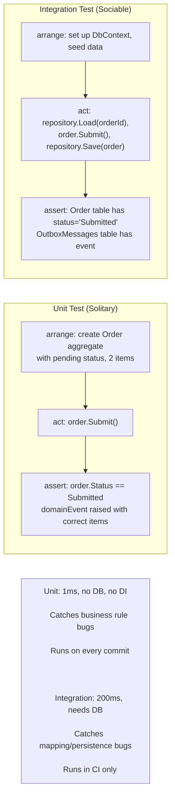
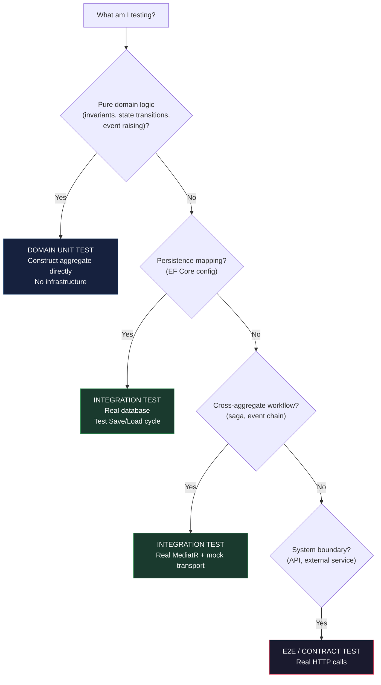

> [!success] Mastery Check
> - [ ] **Studied Well**
> - [ ] **Can explain the concept without notes**
> - [ ] **Can answer interview questions confidently**
> - [ ] **Can implement it in a real project**


# 7.068 — DDD — Testing Domain Logic — Unit Tests for Aggregates

## Section 1: Navigation & Context

**Domain:** [[7 — System Design & Distributed Systems]] > **Group:** Domain-Driven Design
**Previous:** [[7.067 — DDD — Policy Objects]] | **Next:** [[7.069 — DDD — Multiple Bounded Contexts in One Solution]]

### Prerequisites

- [[7.047 — DDD — Aggregates — Consistency Boundary]] — aggregate tests validate that each state transition preserves invariants within the consistency boundary; you must know what the boundary is to test that nothing escapes it.
- [[7.044 — DDD — Entities — Invariant Enforcement]] — the core testing pattern for aggregates is "arrange in a valid state, execute a command, assert the expected state or exception"; understanding how entities enforce invariants through guard clauses and method validation is the mechanism being tested.
- [[7.046 — DDD — Value Objects — C# Records Implementation]] — aggregates compose value objects; tests must verify that value objects are created correctly, maintain immutability, and enforce their own validation rules through factory methods.

### Where This Fits

Unit testing domain logic means testing the aggregate root and its entities in complete isolation — no database, no HTTP, no DI container. The tests instantiate the aggregate directly, call its methods, and assert on its state, exceptions, and raised domain events. This addresses the problem of business logic being untestable because it's coupled to infrastructure (EF Core, repositories, services). Without domain unit tests, business rules are only tested through integration or end-to-end tests, which are slow (100x slower), flaky (network dependencies), and provide poor feedback for developers. Domain unit tests run in milliseconds, have zero infrastructure dependencies, and catch 90% of business rule bugs at the commit stage. They become necessary on any DDD project with more than trivial business logic — typically within the first sprint.

---

## Section 2: Core Mental Model

A domain unit test constructs an aggregate in a specific state, invokes a method that represents a business operation, and asserts that the aggregate's state, returned value, or raised domain events match expectations — all without touching infrastructure. The invariant maintained: the aggregate's behavior is verified in isolation, proving that business rules are correctly enforced regardless of how the aggregate is persisted or transported. The trade: tests that verify aggregate behavior in isolation cannot detect infrastructure problems (concurrency conflicts, serialization issues, mapping errors) — integration tests address those separately. The recognition trigger: a developer writes a test that sets up an `InMemoryDatabase` to test a simple discount calculation — that's a signal the domain logic should be extracted into a pure aggregate test.

### Classification

| Dimension | Classification | Rationale |
|-----------|---------------|-----------|
| Test type | **Unit test (solitary)** | No dependencies — pure domain logic |
| Scope | **Single aggregate root + entities** | Tests one aggregate instance in isolation |
| Fixture setup | **Constructor + factory methods** | Aggregate created directly (no repository, no DbContext) |
| Assertions | **State, exceptions, domain events** | Verify invariants, error conditions, and event payloads |
| Test framework | **xUnit / NUnit + FluentAssertions** | Standard .NET test frameworks with fluent assertions |



### Key Properties / Guarantees

| Property | Value | Condition |
|----------|-------|-----------|
| Execution speed | <5ms per test | No infrastructure — pure object creation + method calls |
| Isolation | Complete | No shared state, no static dependencies, no DB |
| Determinism | 100% | Same input always produces same output |
| Bug detection | Business rules | Catches invariant violations, wrong state transitions, missing events |
| What it misses | Infrastructure, serialization, mapping, concurrency | Those are integration test concerns |

---

## Section 3: Deep Mechanics

### How It Works

**Test structure pattern — Given-When-Then:**

1. **Arrange (Given):** Construct the aggregate in a known state. Call factory methods or the constructor with valid parameters. Add entities to the aggregate if needed (e.g., `order.AddLine(...)`).

2. **Act (When):** Invoke the method being tested. This is always a method on the aggregate root — `order.Submit()`, `order.ApplyDiscount(discount)`, `order.AddLine(...)`.

3. **Assert (Then):** Verify three categories:
   - **State:** Property values after the operation (`order.Status == OrderStatus.Submitted`).
   - **Exceptions:** Domain exceptions for invalid operations (`Assert.Throws<DomainException>(() => order.Submit())`).
   - **Domain events:** Events raised by the operation (`order.DomainEvents.Should().ContainSingle(e => e is OrderSubmittedEvent)`).

**Pattern — Testing a state transition:**

```csharp
[Fact]
public void Submit_WithValidPendingOrder_TransitionsToSubmitted()
{
    // Arrange
    var order = CreateValidOrder();

    // Act
    order.Submit();

    // Assert
    order.Status.Should().Be(OrderStatus.Submitted);
}

[Fact]
public void Submit_WhenAlreadySubmitted_ThrowsDomainException()
{
    // Arrange
    var order = CreateValidOrder();
    order.Submit();

    // Act
    var act = () => order.Submit();

    // Assert
    act.Should().Throw<DomainException>()
        .WithMessage("*already submitted*");
}
```

**Step-by-step trace — Testing `Order.Submit()`:**

```
Step  Action                                    Component           Test Assertion
────  ──────────────────────────────────────  ──────────────────  ─────────────────────
  1   Arrange: new Order(customerId, items)    Test Arrange       order.Status == Pending
  2   Act: order.Submit()                      Aggregate           method call
  3   Assert: Status == Submitted              Test Assert        True
  4   Assert: DomainEvents contains 1 event    Test Assert        Event is OrderSubmittedEvent
  5   Assert: Event.OrderId == order.Id        Test Assert        Payload matches
  6   Assert: Event.Items == ordered items     Test Assert        Items preserved
```

### Failure Modes

**Failure Mode 1: Test uses DbContext or repository instead of direct construction**

What breaks: Test depends on `InMemoryDatabase` setup, taking 100ms per test and requiring migration configuration.

Detection: Test class constructor takes `OrderDbContext` parameter. First test run takes 5 seconds to initialize the database.

Fix: Construct the aggregate directly:

```csharp
// ❌ Uses InMemoryDatabase — slow, infrastructure-dependent
public class OrderTests
{
    private readonly OrderDbContext _db;
    public OrderTests() { _db = new OrderDbContext(CreateInMemoryOptions()); }

    [Fact]
    public async Task Submit_ShouldSetStatus()
    {
        var order = new Order("CUST-1", new List<OrderItem>());
        _db.Orders.Add(order);
        await _db.SaveChangesAsync(); // Infrastructure!
        order.Submit();
        await _db.SaveChangesAsync(); // Infrastructure!
    }
}

// ✅ Pure aggregate — no infrastructure
public class OrderTests
{
    [Fact]
    public void Submit_ShouldSetStatus()
    {
        var order = CreateValidOrder();
        order.Submit();
        order.Status.Should().Be(OrderStatus.Submitted);
    }

    private static Order CreateValidOrder() =>
        new("CUST-1", new List<OrderItem>
        {
            new("SKU-001", "Widget", 2, 10.00m)
        });
}
```

**Failure Mode 2: Test asserts on concrete values instead of behavior**

What breaks: Adding a new field to the aggregate breaks all existing tests that assert on field values — even when the behavior is unchanged.

```csharp
// ❌ Fragile — breaks when unrelated fields change
order.Submit();
order.Status.Should().Be(OrderStatus.Submitted);
order.LastModifiedBy.Should().Be("system"); // This field changed — test fails
```

Fix: Assert only on behaviorally important state:

```csharp
// ✅ Focused on behavior
order.Submit();
order.Status.Should().Be(OrderStatus.Submitted);
order.DomainEvents.Should().ContainSingle(e => e is OrderSubmittedEvent);
```

**Failure Mode 3: Not testing domain events**

What breaks: Test verifies state change but not that downstream handlers will be notified. Missing event means saga never advances.

```csharp
// ❌ Missing event assertion
order.Submit();
order.Status.Should().Be(OrderStatus.Submitted);
// Does the aggregate raise OrderSubmittedEvent? Test doesn't verify.
```

Fix: Always assert domain events:

```csharp
// ✅ Event verified
order.Submit();
order.DomainEvents.Should().ContainSingle(e =>
{
    var evt = e as OrderSubmittedEvent;
    return evt!.OrderId == order.Id && evt.Items.Count == 2;
});
```

**Failure Mode 4: Testing infrastructure concerns through domain tests**

What breaks: Test sets up DbContext and EF Core configuration to test a domain rule. Test is slow and brittle.

```csharp
// ❌ Testing domain rule through infrastructure
public async Task OrderTotal_ShouldBe_SumOfLineTotals()
{
    var options = new DbContextOptionsBuilder<OrderDbContext>()
        .UseInMemoryDatabase("test").Options;
    await using var db = new OrderDbContext(options);
    var order = new Order("CUST-1", items);
    db.Orders.Add(order);
    db.SaveChanges();
    var loaded = await db.Orders.Include(o => o.Lines).FirstAsync();
    loaded.TotalAmount.Should().Be(100); // Tests EF Core mapping AND domain logic
}
```

Fix: Test the domain logic directly, test the mapping separately:

```csharp
// ✅ Domain test — pure
[Fact]
public void TotalAmount_ShouldBe_SumOfLineTotals()
{
    var order = CreateValidOrder();
    order.TotalAmount.Should().Be(100m);
}

// ✅ Mapping test — separate integration test
[Fact]
public async Task Order_ShouldBe_PersistedAndRetrieved()
{
    // Test EF Core mapping in isolation
}
```

### .NET and Azure Integration

- **ASP.NET Core:** No integration — domain tests are pure class library tests.
- **EF Core:** Not used in domain tests — aggregates are constructed directly.
- **Azure services:** None.
- **.NET libraries:** xUnit, FluentAssertions, NSubstitute/Moq (for domain service dependencies).
- **Configuration:** Test project targets the same domain project; `Domain.Tests.csproj` references `Domain.csproj`.

```csharp
// Domain.Tests.csproj
<ProjectReference Include="..\Domain\Domain.csproj" />
<PackageReference Include="Microsoft.NET.Test.Sdk" Version="17.*" />
<PackageReference Include="xunit" Version="2.*" />
<PackageReference Include="FluentAssertions" Version="7.*" />
<PackageReference Include="NSubstitute" Version="5.*" />
```

---

## Section 4: Production Patterns and Implementation

### Primary Implementation

```csharp
using FluentAssertions;
using Xunit;

namespace Orders.Domain.Tests.Aggregates;

public class OrderTests
{
    // Helper: creates a valid order for testing
    private static Order CreateValidOrder() => new(
        "CUST-001",
        new List<OrderItem>
        {
            new("SKU-WIDGET", "Premium Widget", 2, 25.00m),
            new("SKU-GADGET", "Standard Gadget", 1, 50.00m)
        });

    /// <summary>
    /// Submitting a valid pending order transitions it to Submitted
    /// and raises an OrderSubmittedEvent.
    /// </summary>
    [Fact]
    public void Submit_WithValidPendingOrder_TransitionsToSubmitted()
    {
        // Arrange
        var order = CreateValidOrder();

        // Act
        order.Submit();

        // Assert
        order.Status.Should().Be(OrderStatus.Submitted);
        order.DomainEvents.Should().ContainSingle(e => e is OrderSubmittedEvent);
    }

    [Fact]
    public void Submit_WithValidPendingOrder_EventContainsCorrectData()
    {
        var order = CreateValidOrder();
        order.Submit();

        var evt = order.DomainEvents.OfType<OrderSubmittedEvent>().Single();
        evt.OrderId.Should().Be(order.Id);
        evt.CustomerId.Should().Be("CUST-001");
        evt.Items.Should().HaveCount(2);
        evt.OccurredAt.Should().BeCloseTo(DateTime.UtcNow, TimeSpan.FromSeconds(1));
    }

    [Fact]
    public void Submit_WhenAlreadySubmitted_ThrowsDomainException()
    {
        var order = CreateValidOrder();
        order.Submit();

        var act = () => order.Submit();

        act.Should().Throw<DomainException>()
            .WithMessage("*already submitted*");
    }

    [Fact]
    public void Submit_WhenEmptyOrder_ThrowsDomainException()
    {
        var order = new Order("CUST-001", new List<OrderItem>());

        var act = () => order.Submit();

        act.Should().Throw<DomainException>()
            .WithMessage("*empty*");
    }

    [Fact]
    public void AddLine_WithValidItem_AddsToCollection()
    {
        var order = new Order("CUST-001", new List<OrderItem>());

        order.AddLine("SKU-NEW", "New Item", 3, 15.00m);

        order.Lines.Should().HaveCount(1);
        order.TotalAmount.Should().Be(45.00m);
    }

    [Fact]
    public void AddLine_WhenOrderAlreadySubmitted_ThrowsDomainException()
    {
        var order = CreateValidOrder();
        order.Submit();

        var act = () => order.AddLine("SKU-NEW", "New Item", 1, 10.00m);

        act.Should().Throw<DomainException>()
            .WithMessage("*submitted*");
    }

    [Fact]
    public void TotalAmount_ShouldBe_SumOfLineUnitPriceTimesQuantity()
    {
        var order = new Order("CUST-001", new List<OrderItem>
        {
            new("SKU-A", "Item A", 2, 25.00m), // 50
            new("SKU-B", "Item B", 3, 10.00m)  // 30
        });

        order.TotalAmount.Should().Be(80.00m);
    }

    [Fact]
    public void ApplyDiscount_WithValidDiscount_UpdatesTotal()
    {
        var order = CreateValidOrder(); // Total: 100
        var discount = DiscountResult.Percentage(10, "TestPolicy", "Test");

        order.ApplyDiscount(discount);

        order.DiscountedTotal.Should().Be(90.00m);
        order.AppliedDiscount.Should().Be(discount);
    }

    [Fact]
    public void ApplyDiscount_WithZeroPercent_DoesNotChangeTotal()
    {
        var order = CreateValidOrder();
        var discount = DiscountResult.None;

        order.ApplyDiscount(discount);

        order.DiscountedTotal.Should().Be(order.TotalAmount);
    }

    [Fact]
    public void ClearDomainEvents_AfterProcessing_RemovesEvents()
    {
        var order = CreateValidOrder();
        order.Submit();

        order.ClearDomainEvents();

        order.DomainEvents.Should().BeEmpty();
    }
}

// Value Object Tests
public class MoneyTests
{
    [Fact]
    public void Create_WithNegativeAmount_Throws()
    {
        var act = () => Money.Create(-10, "USD");
        act.Should().Throw<DomainException>().WithMessage("*negative*");
    }

    [Fact]
    public void Create_WithInvalidCurrency_Throws()
    {
        var act = () => Money.Create(10, "US");
        act.Should().Throw<DomainException>().WithMessage("*ISO*");
    }

    [Fact]
    public void Equality_SameAmountAndCurrency_AreEqual()
    {
        var a = Money.Create(10.50m, "USD");
        var b = Money.Create(10.50m, "USD");

        a.Should().Be(b);
        a.GetHashCode().Should().Be(b.GetHashCode());
    }

    [Fact]
    public void Add_SameCurrency_ReturnsSum()
    {
        var a = Money.Create(10.00m, "USD");
        var b = Money.Create(20.00m, "USD");

        var result = a.Add(b);

        result.Should().Be(Money.Create(30.00m, "USD"));
    }

    [Fact]
    public void Add_DifferentCurrency_Throws()
    {
        var a = Money.Create(10.00m, "USD");
        var b = Money.Create(10.00m, "EUR");

        var act = () => a.Add(b);

        act.Should().Throw<DomainException>().WithMessage("*currency*");
    }
}

// Repository Tests (for domain-level repository contract)
public class OrderRepositoryContractTests
{
    /// <summary>
    /// Contract test: GetByIdAsync returns null for non-existent order.
    /// Every OrderRepository implementation must satisfy this.
    /// </summary>
    [Fact]
    public async Task GetByIdAsync_WhenNotFound_ReturnsNull()
    {
        var repo = CreateRepository();
        var result = await repo.GetByIdAsync(Guid.NewGuid(), CancellationToken.None);
        result.Should().BeNull();
    }

    protected abstract IOrderRepository CreateRepository();
}
```

### Configuration and Wiring

```csharp
// Domain.Tests.csproj
<Project Sdk="Microsoft.NET.Sdk">
  <PropertyGroup>
    <TargetFramework>net8.0</TargetFramework>
    <IsPackable>false</IsPackable>
    <IsTestProject>true</IsTestProject>
  </PropertyGroup>
  <ItemGroup>
    <PackageReference Include="Microsoft.NET.Test.Sdk" Version="17.10.0" />
    <PackageReference Include="xunit" Version="2.8.0" />
    <PackageReference Include="xunit.runner.visualstudio" Version="2.8.0" />
    <PackageReference Include="FluentAssertions" Version="7.0.0" />
    <PackageReference Include="NSubstitute" Version="5.1.0" />
    <ProjectReference Include="..\Orders.Domain\Orders.Domain.csproj" />
  </ItemGroup>
</Project>

// GlobalUsings.cs
global using Xunit;
global using FluentAssertions;
global using Orders.Domain.Aggregates;
global using Orders.Domain.ValueObjects;
global using Orders.Domain.Common;
global using Orders.Domain.Events;
```

### Common Variants

**Variant 1 — Test with domain services injected:**

```csharp
public class OrderWithPolicyTests
{
    private readonly IDiscountPolicy _discountPolicy = Substitute.For<IDiscountPolicy>();

    [Fact]
    public void Submit_WithPremiumCustomer_AppliesPremiumDiscount()
    {
        _discountPolicy.Calculate(Arg.Any<Order>(), Arg.Any<Customer>())
            .Returns(DiscountResult.Percentage(15, "Premium", ""));

        var service = new OrderSubmissionService(_discountPolicy);
        var order = CreateValidOrder();

        service.Submit(order, CreatePremiumCustomer());

        order.AppliedDiscount!.DiscountPercent.Should().Be(0.15m);
    }
}
```

**Variant 2 — Parameterized tests for boundary values:**

```csharp
[Theory]
[InlineData(0)]
[InlineData(-1)]
[InlineData(-100)]
public void CreateOrderItem_WithInvalidQuantity_Throws(int quantity)
{
    var act = () => new OrderItem("SKU-TEST", "Test", quantity, 10.00m);
    act.Should().Throw<DomainException>();
}

[Theory]
[InlineData(1)]
[InlineData(99)]
[InlineData(1000)]
public void CreateOrderItem_WithValidQuantity_Succeeds(int quantity)
{
    var item = new OrderItem("SKU-TEST", "Test", quantity, 10.00m);
    item.Quantity.Should().Be(quantity);
}
```

**Variant 3 — Test for domain events in complex workflows:**

```csharp
[Fact]
public void CancelOrder_WhenShipped_NoEventRaised()
{
    var order = CreateShippedOrder(); // Helper that advances through states

    var act = () => order.Cancel();

    act.Should().Throw<DomainException>().WithMessage("*already shipped*");
    order.DomainEvents.Should().BeEmpty();
}
```

### Real-World .NET Ecosystem Example

**xUnit** is the most widely used .NET test framework for domain unit testing. Combined with **FluentAssertions** for readable assertions and **NSubstitute** (or Moq) for mocking domain service dependencies, it provides the standard testing triad. The pattern is well-established: domain tests are in a separate `Domain.Tests` project that references only the domain project, ensuring no infrastructure dependency leaks into tests. The **NetArchTest** library is commonly paired to enforce architectural rules (e.g., "domain project does not reference infrastructure").

---

## Section 5: Gotchas and Production Pitfalls

### Pitfall 1: Testing Through the Repository Instead of Direct Construction

**Pitfall:** Developer writes tests that go through the repository to create aggregates, making tests slow and fragile.

```csharp
// ❌ Test depends on repository — slow, unnecessary coupling
public async Task Submit_ShouldWork()
{
    var order = new Order("CUST-1", items);
    await _repo.SaveAsync(order, CancellationToken.None);
    var loaded = await _repo.GetByIdAsync(order.Id, CancellationToken.None);
    loaded.Submit();
    await _repo.SaveAsync(loaded, CancellationToken.None);
}
```

**Symptom:** Test suite takes 2+ minutes to run. Developers stop running tests before commit.

**Fix:** Direct construction. Repository tests are separate:

```csharp
// ✅ Pure domain test — 1ms
[Fact]
public void Submit_ShouldWork()
{
    var order = CreateValidOrder();
    order.Submit();
    order.Status.Should().Be(OrderStatus.Submitted);
}
```

**Cost of not fixing:** 2-minute test suite → developers skip local tests → bugs found in CI → 30-minute feedback loop.

### Pitfall 2: Testing Every Property Setter — Testing Getters/Setters

**Pitfall:** Tests that verify properties are set after construction provide zero value.

```csharp
// ❌ Tests constructor — tests that the language works
[Fact]
public void Constructor_SetsCustomerId()
{
    var order = new Order("CUST-1", items);
    order.CustomerId.Should().Be("CUST-1");
}
```

**Symptom:** 200 tests, 150 of them are "X sets Y." No one reads test output. Real bugs buried in noise.

**Fix:** Only test behavior — methods that enforce invariants, state transitions, event raising:

```csharp
// ✅ Tests behavior — tests a business rule
[Fact]
public void Submit_WhenAlreadySubmitted_Throws()
{
    var order = CreateValidOrder();
    order.Submit();
    var act = () => order.Submit();
    act.Should().Throw<DomainException>();
}
```

**Cost of not fixing:** False sense of coverage. Real behavioral gaps (e.g., missing invariant check) not tested.

### Pitfall 3: Shared Mutable Test State

**Pitfall:** Tests share static state or modify class-level fields, creating order-dependent failures.

```csharp
// ❌ Shared state — tests affect each other
private static Order? _sharedOrder;

[Fact]
public void TestA() { _sharedOrder = CreateValidOrder(); _sharedOrder.Submit(); }
[Fact]
public void TestB() { _sharedOrder.Submit(); } // Throws because already submitted!
```

**Symptom:** Tests pass individually but fail when run as a suite. CI shows random failures.

**Fix:** Each test creates its own aggregate:

```csharp
// ✅ Isolated — each test creates its own aggregate
[Fact] public void TestA() { var order = CreateValidOrder(); order.Submit(); }
[Fact] public void TestB() { var order = CreateValidOrder(); order.Submit(); } // Fresh order
```

**Cost of not fixing:** Intermittent CI failures. Debugging takes hours. Team loses trust in tests.

### Pitfall 4: Over-Mocking — Testing Mocks Not Real Logic

**Pitfall:** Test for a domain service mocks the entire aggregate, testing mock behavior instead of actual domain logic.

```csharp
// ❌ Mocks aggregate — tests nothing real
var orderMock = Substitute.For<IOrder>();
orderMock.Status.Returns(OrderStatus.Pending);
// ... test doesn't exercise real aggregate methods
```

**Symptom:** Business rule changes pass all tests because the tests don't use real domain objects.

**Fix:** Use real aggregates, mock only external dependencies (repositories, payment gateways):

```csharp
// ✅ Real aggregate — tests real logic
var order = CreateValidOrder();
var paymentGateway = Substitute.For<IPaymentGateway>();
var service = new PaymentService(paymentGateway);

await service.ProcessPaymentAsync(order, ct);

order.Status.Should().Be(OrderStatus.PaymentCompleted);
```

**Cost of not fixing:** False green builds. Production bug that tests didn't catch. Team realizes after incident that tests were mocks all along.

### Pitfall 5: Not Testing Domain Events — Gap in Coverage

**Pitfall:** Tests verify state changes but never assert that domain events are raised. A missing event means downstream handlers never run.

```csharp
// ❌ Only checks state, not events
order.Submit();
Assert.Equal(OrderStatus.Submitted, order.Status);
// But OrderSubmittedEvent was never raised due to a bug
```

**Symptom:** Saga never advances. Inventory never reserved. Customer never gets confirmation email. No test caught it.

**Fix:** Always assert domain events:

```csharp
// ✅ State AND events verified
order.Submit();
order.DomainEvents.Should().ContainSingle(e => e is OrderSubmittedEvent);
```

**Cost of not fixing:** Silent workflow failure. Events that never fire are invisible until customer complains.

---

## Section 6: Tradeoffs and Decision Framework

### Tradeoff Matrix

| Dimension | Domain Unit Tests (Solitary) | Integration Tests (Sociable) | E2E Tests |
|-----------|------------------------------|------------------------------|-----------|
| Speed | <5ms per test | 50-500ms per test | 5-30s per test |
| Isolation | Complete | Database + services | All external |
| Bug detection | Business rules | Mapping, persistence | Full workflow |
| Maintenance | Low | Medium (DB migrations) | High (UI changes) |
| CI time for 100 tests | <0.5s | ~30s | ~15min |
| Developer feedback | Immediate (commit hook) | Minutes (CI) | Hours (pipeline) |

### Decision Flowchart



### When to Apply

- Aggregate has business rules with multiple conditions (validation, state machines)
- Aggregate raises domain events that trigger downstream workflows
- Team practices TDD or expects fast feedback on business logic changes
- Domain layer is a separate assembly with no infrastructure dependencies

### When NOT to Apply

- [ ] Aggregate is purely a data container with no behavior (i.e., anemic domain model — but this indicates a design problem)
- [ ] Business logic is trivial (CRUD operations on a single entity with no invariants)
- [ ] Tests are the only consumer of the domain layer (no separate domain project — consider refactoring first)

### Scale Thresholds

- **Minimum coverage target:** Every aggregate method that enforces an invariant or raises a domain event should have at least one positive test (happy path) and one negative test (violation).
- **Test-to-class ratio target:** ~10-15 tests per aggregate root (happy paths, edge cases, exceptions, event assertions).
- **Performance threshold:** Domain tests should complete in under 1 second for 100 tests. If domain tests take >5 seconds for 100 tests, check for infrastructure dependencies leaking into the test.

---

## Section 7: Interview Arsenal

### Question Bank

1. What is the difference between a domain unit test and an integration test?
2. How do you test that an aggregate's invariants are enforced without using a database?
3. What three things should you assert in a domain test after invoking an aggregate method?
4. How do you test domain events — what do you verify about them?
5. Compare testing an aggregate through its repository vs testing it directly.
6. How do you test domain services that depend on repository interfaces?
7. How do you test aggregate concurrency (optimistic locking) without a database?
8. How do you structure your test project to prevent infrastructure dependencies leaking into domain tests?

### Spoken Answers

**Q1: What is the difference between a domain unit test and an integration test?**

> **Average answer:** Domain tests test the business logic. Integration tests test the database. Different focus.

> **Great answer:** The fundamental difference is dependency isolation. A domain unit test constructs the aggregate directly — `new Order(customerId, items)` — calls its methods, and asserts on its state, exceptions, and domain events. No database, no DI container, no HTTP. It runs in under 5 milliseconds. It catches business rule bugs — wrong state transitions, missing invariant checks, incorrect event payloads.

An integration test, by contrast, involves infrastructure — it loads an aggregate from a real database through the repository, calls a method, and saves it. It verifies that the mapping configuration is correct, that concurrency tokens are updated, that the outbox pattern writes events. It runs in 50-500 milliseconds. It catches persistence bugs — wrong column mapping, missing cascade configuration, serialization failures.

Both are necessary. I use domain tests as the primary feedback mechanism during development — they run on every git commit. I use integration tests to verify that my domain tests' assumptions about persistence hold true. The split is physical: domain tests are in a `Domain.Tests` project that only references the domain assembly. Integration tests are in a separate `Infrastructure.Tests` project that references the infrastructure assembly. This makes it structurally impossible to accidentally use DbContext in a domain test.

**Q3: What three things should you assert in a domain test after invoking an aggregate method?**

> **Average answer:** Check the state changed correctly. Check for exceptions.

> **Great answer:** I assert three categories. First, **state** — did the aggregate reach the expected state? For `Order.Submit()`, I verify `order.Status == Submitted`. Second, **exceptions** — did the aggregate correctly reject invalid operations? `order.Submit()` on an already-submitted order should throw `DomainException`. Third — and this is the one most developers miss — **domain events**. I verify that the aggregate raised the expected events: `order.DomainEvents.Should().ContainSingle(e => e is OrderSubmittedEvent)`. And I verify the event payload: the event's `OrderId` matches the aggregate's ID, the `Items` collection has the right count and values. This third assertion is critical because domain events are the mechanism for eventual consistency between aggregates. If a missing event bug slips through, the downstream effect — inventory not reserved, email not sent — won't be caught by state assertions alone. I use FluentAssertions for readable chained assertions and xUnit for the test framework.

**Q5: Compare testing an aggregate through its repository vs testing it directly.**

> **Average answer:** Direct is simpler and faster. Through the repository is more realistic.

> **Great answer:** There is a clear separation of concerns. Direct construction tests the domain logic — the business rules, invariants, state transitions, and event raising. It's the right tool for verifying that `Submit()` throws when the order is empty. It takes 1 millisecond and has no infrastructure dependency.

Testing through the repository tests the persistence mapping — does EF Core correctly map the Order's owned entities to the database? Does the outbox interceptor pick up the domain events? This is an integration test, and it's necessary — but it tests a different thing. I never test business rules through the repository, because that couples the test to the database and creates false negatives when the mapping changes but the business rule is correct.

My rule: if you can construct the aggregate with `new`, do it directly. If the test requires `SaveChangesAsync` or `Include(o => o.Lines)`, it's an integration test and belongs in a separate project. This separation keeps the domain test suite fast (<1 second for 200 tests) and gives developers immediate feedback during development.

### System Design Interview Trigger

If an interviewer asks you about testing strategy in a DDD system and says "how do you ensure business rules are correct without testing through the UI?", they are testing whether you understand the testing pyramid and domain isolation. The specific probe: "where do you test that an Order cannot be submitted with an empty item list?" The correct answer: in a domain unit test that constructs an `Order` directly and calls `Submit()`. The follow-up: "how do you test the repository save?" — separate integration test. The deepest test: "how do you know the domain events were correctly captured and stored?" — the domain test asserts the events on the aggregate; the integration test asserts they were written to the outbox table.

### Comparison Table

| | Domain Unit Test | Integration Test | End-to-End Test |
|---|---|---|---|
| Tests | Business rules, invariants, events | Mapping, persistence, infrastructure | Full system behavior |
| Dependencies | None | Database, services | All external systems |
| Speed | <5ms | 50-500ms | 5-30s |
| .NET framework | xUnit + FluentAssertions | xUnit + TestContainers / InMemory | Playwright / Selenium |
| Failure mode | Infrastructure leak | Flaky due to shared DB | Brittle selectors |
| When to use | First — every method | Second — every mapping | Third — key user journeys |

---

## Section 8: Architecture Decision Record

**Status:** Accepted

**Context:**
The Order Management domain layer contains 5 aggregate roots, 12 value objects, and 3 domain services with complex business rules (discount calculations, order submission validation, shipping cost computation). The team of 6 developers practices TDD and needs fast feedback on business logic changes. The CI pipeline currently runs 300 tests in 8 minutes because most tests go through the repository with InMemoryDatabase.

**Options Considered:**

1. **Separate domain unit tests (Recommended)** — Create `Orders.Domain.Tests` project with no infrastructure dependencies. Aggregates constructed directly. Tests run in <1 second. Integration tests in a separate project run only in CI.
2. **Integration-only tests** — All tests go through the repository. Single test project. 8-minute CI feedback loop.
3. **Test in application service layer** — Tests call application services with mocked repositories. Covers domain logic indirectly through service methods.

**Decision:** Separate domain unit tests (Option 1), because developer feedback time (8 minutes → <1 second) directly impacts development velocity and code quality. Business rule bugs are caught at commit time rather than CI time.

**Consequences:**
- ✅ Developers get feedback on business logic changes in <1 second — TDD workflow preserved
- ✅ Infrastructure dependencies cannot leak into domain tests — physical project separation enforces this
- ✅ Each aggregate method has dedicated tests for state, exceptions, and events
- ⚠️ Requires maintaining two test projects with different patterns — team must understand the separation
- ❌ Some integration issues (EF Core mapping, outbox persistence) are only caught in CI — but this is acceptable because they are less frequent and less critical than business rule bugs

**Review Trigger:** Revisit if domain tests become slow (>5 seconds for 200 tests) — this indicates infrastructure leaking into domain tests. Revisit if integration tests catch more business rule bugs than domain tests — this indicates tests are at the wrong level.

---

## Section 9: Self-Check

### Conceptual Questions

1. What is a domain unit test?

<details>
<summary>Answer</summary>
A test that constructs a domain aggregate directly (without infrastructure), invokes a method, and asserts on the resulting state, exceptions, or domain events. It tests business rules in isolation with no database, no DI container, and no HTTP.
</details>

2. What three categories should a domain test assert after invoking a method?

<details>
<summary>Answer</summary>
(1) State — did the aggregate reach the expected state? (2) Exceptions — did it correctly reject invalid operations? (3) Domain events — did it raise the expected events with correct payloads?
</details>

3. Why should domain tests never use DbContext or InMemoryDatabase?

<details>
<summary>Answer</summary>
Using DbContext couples the test to infrastructure, making it slow (50-500ms vs <5ms), fragile (migration changes break tests), and structurally violating the domain isolation principle. Domain logic should be testable without any persistence infrastructure.
</details>

4. How do you test domain events in a unit test?

<details>
<summary>Answer</summary>
After calling the aggregate method, access `aggregate.DomainEvents` (the event collection) and assert that it contains the expected event type with the expected payload using FluentAssertions or LINQ.
</details>

5. What is the difference between testing an aggregate directly and testing through its repository?

<details>
<summary>Answer</summary>
Direct testing verifies business rules in isolation (pure logic). Repository testing verifies persistence mapping (infrastructure). Direct tests are fast (<5ms) and belong in a domain test project. Repository tests are slower (50-500ms) and belong in an infrastructure test project.
</details>

6. How do you test a domain service that depends on a repository interface?

<details>
<summary>Answer</summary>
Mock the repository interface using NSubstitute or Moq. Inject the mock into the domain service constructor. Test the service's behavior with different mock responses. Use real aggregates, not mocked ones.
</details>

7. What is the purpose of NetArchTest in the context of domain testing?

<details>
<summary>Answer</summary>
NetArchTest enforces architectural rules — e.g., "the domain test project must not reference the infrastructure project." This prevents infrastructure dependencies from leaking into domain tests at the build level.
</details>

8. How many tests should an aggregate root have?

<details>
<summary>Answer</summary>
~10-15 tests per aggregate root: one positive test per business operation, one negative test per invariant, one test per domain event type, plus edge cases (empty collections, boundary values). Focus on behavior, not getters/setters.
</details>

9. How do you test concurrency conflicts for an aggregate without a database?

<details>
<summary>Answer</summary>
You don't directly — concurrency is an infrastructure concern. Test the optimistic concurrency logic through integration tests with a real database. The aggregate's row version property can be unit-tested for assignment but the conflict detection requires a database.
</details>

10. Explain the testing strategy for a DDD system to a junior developer in 60 seconds.

<details>
<summary>Answer</summary>
"Domain tests test the business rules. You create an Order directly — `new Order(...)` — call `Submit()`, and check that the status changed and an event was raised. No database. Takes 1 millisecond. Runs on every save. Integration tests test that the Order saves and loads from the database correctly. Takes 200 milliseconds. Runs in CI. Use domain tests first because they're fast and catch business rule bugs instantly. Use integration tests second to catch persistence bugs. Never test business rules through the database — that makes them slow and fragile."
</details>

---

### Scenario Challenges

**Scenario 1 — Diagnose the problem**

A domain test suite that was running in 500ms now takes 12 seconds. No new domain logic was added. The test project recently added a reference to `Microsoft.EntityFrameworkCore.InMemory`.

<details>
<summary>Diagnosis</summary>

**Root cause:** A developer added a test that initializes `InMemoryDatabase` to test a domain rule. The test takes 200ms instead of 1ms. Additionally, the DbContext initialization in the test constructor runs for every test — 60 tests × 200ms = 12 seconds.

**Evidence:** Search for `UseInMemoryDatabase` in the domain test project. Find one test class with a constructor that creates `DbContextOptions<OrderDbContext>`.

**Fix:** Remove the InMemoryDatabase test from the domain test project. Move it to the infrastructure test project. Rewrite the domain test to construct the aggregate directly.

**Prevention:** Add NetArchTest rule: "Domain tests must not reference EntityFrameworkCore." Enforce in CI.
</details>

---

**Scenario 2 — Design decision**

You have 50 domain tests for the Order aggregate. Each test constructs the Order with the same setup — customer ID, 3 line items, shipping address. The setup code is duplicated in every test.

<details>
<summary>Decision and Reasoning</summary>

**Choice:** Use a static helper method (`CreateValidOrder()`) in a test utility class. Do NOT use a shared `ITestClassFixture` or base class constructor because that creates implicit shared state.

**Tradeoffs accepted:** Helper method is explicit and visible. Each test calls it — some duplication is acceptable for test clarity. No implicit state sharing.

**Implementation:**
```csharp
private static Order CreateValidOrder() => new("CUST-001", new List<OrderItem>
{
    new("SKU-A", "Item A", 2, 25.00m),
    new("SKU-B", "Item B", 1, 50.00m),
    new("SKU-C", "Item C", 3, 10.00m)
}, new Address("123 Main", "City", "12345", "US"));
```

**Alternative:** Use `ITestClassFixture` for the factory — only if the factory itself is stateless (which it is). But prefer the simple static method for readability.
</details>

---

**Scenario 3 — Failure mode** A recent change to the `Order.Submit()` method added a check that the order total exceeds $10. All existing domain tests pass because they create orders with totals >$10. An integration test catches the bug: an order with total $9.99 can be submitted.

<details>
<summary>Investigation and Fix</summary>

**Investigation steps:**
1. Check the domain tests for a test that submits with a low total.
2. Search for `total < 10` or `TotalAmount` in test assertions.

**Confirming evidence:** No test exists that submits an order with a total <$10. The `Submit()` method's guard clause `if (TotalAmount < 10)` is not tested.

**Fix:** Add domain test:
```csharp
[Fact]
public void Submit_WhenTotalUnder10_ThrowsDomainException()
{
    var order = new Order("CUST-001", new List<OrderItem>
    {
        new("SKU-X", "Cheap Item", 1, 5.00m)
    });

    var act = () => order.Submit();

    act.Should().Throw<DomainException>()
        .WithMessage("*minimum order*");
}
```

**Post-mortem item:** Add test checklist: "Every guard clause in the method should have at least one negative test."
</details>

---

**Scenario 4 — Scale it** Your domain test suite has 500 tests. Developers run them before every commit. The suite takes 4 seconds. Three new aggregates are being added — projections show 900 tests total.

<details>
<summary>Scaling Strategy</summary>

**Bottleneck this addresses:** Test execution time for pure domain tests should scale linearly with test count. 500 tests in 4 seconds = 8ms/test — some tests are leaking infrastructure.

**How it helps:**
1. Profile test execution — find the top 5 slowest tests.
2. Check for `InMemoryDatabase` usage in domain tests.
3. Check for test setup that creates expensive objects.
4. Ensure all tests use direct construction.

**What it does not solve:** Integration test speed — those should remain in a separate project with longer CI time.

**Implementation order:**
1. Profile: `dotnet test --blame-cpu` to find slow tests.
2. Remove any infrastructure dependencies from slow tests.
3. Target: 500 tests in <1 second (2ms/test).
4. 900 tests should target <2 seconds.
</details>

---

**Scenario 5 — Interview simulation** The interviewer says: "You have an Order aggregate that calculates discounts, validates line items, and raises domain events. Walk through how you write the tests for the Submit method."

<details>
<summary>Model Response</summary>

"I'd start by identifying the scenarios that the `Submit` method needs to handle. First, the happy path: a pending order with valid items transitions to Submitted and raises `OrderSubmittedEvent`. Second, the edge cases: submitting an already submitted order throws, submitting a cancelled order throws, submitting an empty order throws. Third, the domain event verification: the event contains the correct OrderId, CustomerId, Items collection, and timestamp.

I write each test using the Given-When-Then pattern. Given: `var order = CreateValidOrder()`. When: `order.Submit()`. Then: assert state, exception, or events.

For the happy path, I assert three things: `order.Status == Submitted`, `order.DomainEvents` contains exactly one event of type `OrderSubmittedEvent`, and the event's `OrderId` matches the order's ID. For the exception tests, I wrap the call in `() => order.Submit()` and assert `Should().Throw<DomainException>()`. For the empty order, I construct the order with zero items and assert the exception message mentions 'empty.'

I don't use a database, mocks, or any infrastructure. The `CreateValidOrder` helper is a static method that returns a fully constructed Order. Each test is completely isolated — it creates its own order, calls one method, and asserts. The total test execution for all Submit scenarios is under 10 milliseconds. This gives me immediate feedback when the Submit logic changes, which is critical because Submit is the primary entry point for the order fulfillment workflow."
</details>
