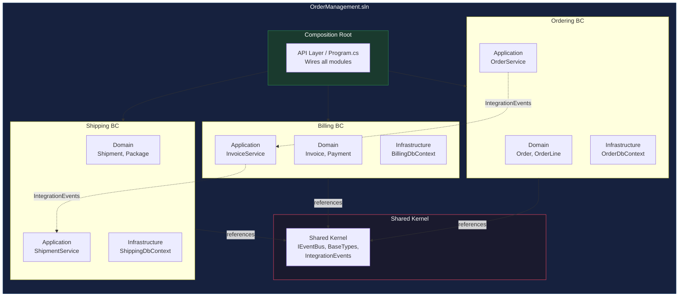
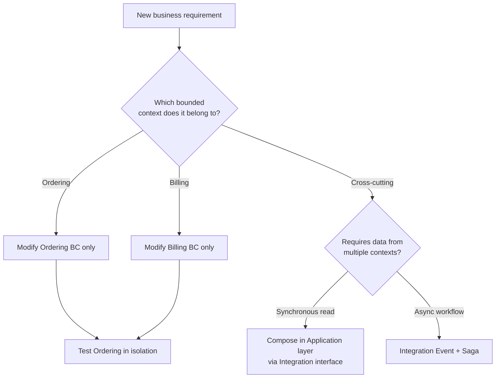
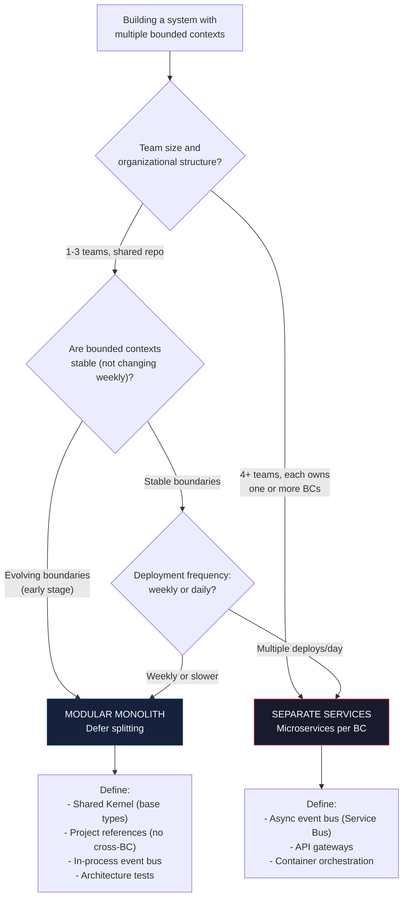

> [!success] Mastery Check
> - [ ] **Studied Well**
> - [ ] **Can explain the concept without notes**
> - [ ] **Can answer interview questions confidently**
> - [ ] **Can implement it in a real project**


# 7.069 — DDD — Multiple Bounded Contexts in One Solution

## Section 1: Navigation & Context

**Domain:** [[7 — System Design & Distributed Systems]] > **Group:** Domain-Driven Design
**Previous:** [[7.068 — DDD — Testing Domain Logic — Unit Tests for Aggregates]] | **Next:** [[7.070 — DDD — Event Storming — Discovery Workshop]]

### Prerequisites

- [[7.034 — DDD — Bounded Contexts — Context Map]] — the context map defines which bounded contexts exist and how they communicate; putting multiple contexts in one solution requires enforcing the same boundaries programmatically through assembly references and namespace conventions.
- [[7.033 — DDD — Bounded Contexts — Identifying Boundaries]] — correctly identifying bounded context boundaries based on subdomain types (core, supporting, generic) prevents the mistake of putting contexts that should be separate services into one solution — or separating contexts that should share one.
- [[7.031 — DDD — Strategic vs Tactical Design]] — the decision to use one solution vs multiple is strategic — it affects team autonomy, deployment frequency, and scalability. Understanding when a decision is strategic (not tactical) prevents over-engineering module boundaries.

### Where This Fits

Multiple bounded contexts in one solution — the modular monolith — structures a .NET solution so that each bounded context is a separate project (or folder with strict namespace conventions) with its own domain, application, and infrastructure layers. A context map within the solution enforces dependency rules: contexts depend only through interfaces defined in shared kernel or integration events. This addresses the problem of premature microservice decomposition: teams split a system into ten microservices before understanding the bounded contexts, creating distributed monoliths where every service call goes through HTTP and every transaction spans three services. The modular monolith defers the service-splitting decision until the bounded contexts are stable and the splitting points are proven. Without it, teams either build a Big Ball of Mud (no boundaries) or a distributed monolith (premature boundaries with high coordination cost).

---

## Section 2: Core Mental Model

Multiple bounded contexts in one solution means each bounded context is a self-contained module with its own domain model, its own database schema (or schema namespace), and strict compile-time boundaries enforced by project references or architecture tests. The invariant maintained: no bounded context directly references another bounded context's domain types — they communicate through interfaces defined in a shared kernel or through integration events. The trade: you get the deployment simplicity of a monolith (one deployable artifact) with the logical separation of microservices — at the cost of requiring architectural discipline to prevent boundary violations. The recognition trigger: your team is debating "should we split this into separate microservices?" but the bounded contexts are still evolving rapidly — the modular monolith gives you the option to defer the split.

### Classification

| Dimension | Classification | Rationale |
|-----------|---------------|-----------|
| Pattern Type | **Strategic DDD / Architecture** | Solution structure that respects bounded context boundaries |
| Scope | **Entire codebase** | Governs how all bounded contexts coexist in one deployable unit |
| Primary Concern | **Boundary enforcement without network** | Contexts communicate through interfaces, not HTTP |
| Deployment | **Single artifact** | One container, one Azure App Service, one deployment |
| Communication | **In-process (interface calls) or async (event bus)** | No HTTP between contexts — shared MediatR or in-memory bus |
| Scalability | **Vertical (scale up) or horizontal (split later)** | Bound by single process limits — split when proven necessary |





### Key Properties / Guarantees

| Property | Value | Condition |
|----------|-------|-----------|
| Deployment | Single artifact | Always — one .dll, one container |
| Compile-time isolation | Full — cross-BC references disallowed | Enforced by project references + architecture tests |
| Database isolation | Schema-per-BC (same server) or separate server | Each BC owns its schema; no cross-BC FK constraints |
| Communication | In-process interface calls + integration events | No HTTP — shared kernel interfaces or MediatR |
| Scalability bound | Single process limits | ~20K req/s on one App Service |
| Team autonomy | Shared repo, same deploy cadence | Requires coordination for shared kernel changes |

---

## Section 3: Deep Mechanics

### How It Works

**Solution structure:**

```
OrderManagement.sln
├── 1. Shared Kernel/
│   ├── OrderManagement.SharedKernel/
│   │   ├── BaseTypes/          (AggregateRoot, ValueObject, IDomainEvent)
│   │   └── IntegrationEvents/  (IEventBus, IntegrationEvent base)
│   └── OrderManagement.SharedKernel.Tests/
│
├── 2. Ordering Bounded Context/
│   ├── OrderManagement.Ordering.Domain/
│   │   ├── Aggregates/  (Order, OrderLine)
│   │   ├── ValueObjects/ (Address, Money)
│   │   └── Events/      (OrderSubmittedEvent)
│   ├── OrderManagement.Ordering.Application/
│   │   ├── Services/    (OrderService)
│   │   └── EventHandlers/ (InventoryReservedHandler)
│   ├── OrderManagement.Ordering.Infrastructure/
│   │   ├── Persistence/ (OrderDbContext)
│   │   └── EventBus/    (ServiceBusEventPublisher)
│   └── Tests/
│
├── 3. Billing Bounded Context/
│   ├── OrderManagement.Billing.Domain/
│   ├── OrderManagement.Billing.Application/
│   ├── OrderManagement.Billing.Infrastructure/
│   └── Tests/
│
├── 4. Shipping Bounded Context/
│   ├── ...
│   └── Tests/
│
├── 5. API (Composition Root)/
│   ├── OrderManagement.Api/
│   └── Program.cs
│
└── 6. Integration Tests/
    └── OrderManagement.IntegrationTests/
```

**Dependency rules:**
- Each BC's `Domain` project references only `SharedKernel`.
- Each BC's `Application` references its own `Domain` + `SharedKernel`.
- Each BC's `Infrastructure` references its own `Application` + `SharedKernel`.
- The `API` project references all BC `Infrastructure` projects.
- No BC references another BC directly.

**Communication between contexts:**

Synchronous: BC (Application) depends on an interface defined in `SharedKernel` (e.g., `IInventoryService`). The implementation is in BC2's `Infrastructure` project. The Composition Root wires the implementation to the interface.

Asynchronous: BC1 publishes an integration event (e.g., `OrderSubmittedIntegrationEvent`). BC2 subscribes via an in-process event bus (MediatR) or Azure Service Bus. The event schema is in `SharedKernel`.

**Step-by-step trace — Order submission across contexts:**

1. API receives POST /orders → calls `Ordering.Application.OrderService.SubmitOrder`.
2. OrderService calls `order.Submit()` on the Order aggregate (BC1 Domain).
3. OrderService publishes `OrderSubmittedIntegrationEvent` via `IEventBus` (SharedKernel interface).
4. The event bus implementation (in-memory or Azure Service Bus) delivers the event.
5. `Billing.Application.InvoiceHandler` receives the event, loads the Invoice aggregate (BC2 Domain), and calls `invoice.GenerateForOrder(...)`.
6. `Shipping.Application.ShipmentHandler` receives the event, creates a Shipment aggregate (BC3 Domain).

### Failure Modes

**Failure Mode 1: Cross-BC domain reference (BC1.Domain references BC2.Domain)**

What breaks: A developer adds a project reference from `Ordering.Domain` to `Billing.Domain` to reuse the `Invoice` type. Now Ordering is coupled to Billing's domain model.

Detection: Architecture test fails (`NetArchTest`). Code review shows `using OrderManagement.Billing.Domain;` in an Ordering file.

Fix: Remove the direct reference. Move the shared type to Shared Kernel or use a translation layer:

```csharp
// ❌ Illegal cross-BC reference
// Ordering.Domain/Order.cs
using OrderManagement.Billing.Domain; // Cross-BC dependency!
public void GenerateInvoice() { var invoice = new Invoice(); ... }

// ✅ Shared Kernel or translation
// 1. Move base type to SharedKernel
// 2. Or translate in Application layer:
public class OrderDto
{
    public Money Total { get; init; } // SharedKernel Money
    // Billing maps this to its own Invoice concept
}
```

**Failure Mode 2: Shared database with cross-BC foreign keys**

What breaks: A schema migration adds a FK from `Billing.Invoices.OrderId` referencing `Ordering.Orders.Id`. Now the billing schema depends on the ordering schema's primary key — the schemas are coupled.

Detection: Migration file shows `ALTER TABLE Billing.Invoices ADD CONSTRAINT FK_Invoices_Orders FOREIGN KEY ...`

Fix: Remove the FK constraint — cross-BC references are logical, not physical. Use integration events to maintain eventual consistency:

```csharp
// ❌ Cross-BC FK constraint — couples schemas
CREATE TABLE Billing.Invoices (
    OrderId UNIQUEIDENTIFIER REFERENCES Ordering.Orders(Id)
);

// ✅ No FK — queries join in application layer or read model
// BillingDbContext has no FK to Ordering schema
```

**Failure Mode 3: Same-named classes in different contexts causing confusion**

What breaks: `Ordering.Domain.Order` and `Shipping.Domain.ShipmentOrder` both have an `Order` concept. Developers confuse them and use the wrong one.

Detection: Code review shows `Ordering.Domain.Order.AddTrackingNumber()` — the tracking property belongs on `Shipping.Domain.ShipmentOrder`.

Fix: Use context-specific naming even when concepts overlap:

```csharp
// Ordering context — order means customer order
namespace OrderManagement.Ordering.Domain;
public class Order { ... }

// Shipping context — order means shipment instruction
namespace OrderManagement.Shipping.Domain;
public class ShipmentOrder { ... }
```

**Failure Mode 4: In-process event bus becomes single point of failure**

What breaks: An in-process MediatR event handler in the Billing BC throws an exception. The exception propagates to the Ordering BC's controller action. The HTTP request fails even though the Ordering part succeeded.

Detection: HTTP 500 error in Order API. Logs show `NullReferenceException` in `Billing.Application.EventHandlers.InvoiceHandler`.

Fix: Use a fire-and-forget event bus that handles exceptions per subscriber:

```csharp
// ❌ In-process MediatR — subscriber exception propagates
await _mediator.Publish(evt, ct); // If InvoiceHandler throws, this throws

// ✅ Fire-and-forget with per-subscriber error handling
public sealed class ResilientEventBus : IEventBus
{
    public async Task PublishAsync<T>(T evt, CancellationToken ct)
        where T : IntegrationEvent
    {
        var handlers = _serviceProvider.GetServices<IIntegrationEventHandler<T>>();
        var tasks = handlers.Select(h => SafeHandleAsync(h, evt, ct));
        await Task.WhenAll(tasks);
    }

    private async Task SafeHandleAsync<T>(
        IIntegrationEventHandler<T> handler, T evt, CancellationToken ct)
    {
        try { await handler.HandleAsync(evt, ct); }
        catch (Exception ex)
        {
            _logger.LogError(ex, "Handler {Handler} failed for event {Event}",
                handler.GetType().Name, typeof(T).Name);
        }
    }
}
```

### .NET and Azure Integration

- **ASP.NET Core:** Composition Root in `Program.cs` registers all BC modules via extension methods — `builder.Services.AddOrderingModule()`, `builder.Services.AddBillingModule()`.
- **EF Core:** Each BC has its own `DbContext` and its own database schema or separate database. Migrations are per-BC.
- **Azure services:** Azure SQL Database (schema-per-BC in same DB or separate DBs); Azure Service Bus (if migrating to async cross-BC communication before splitting services); Azure App Service (single deployment).
- **.NET libraries:** MediatR (in-process event bus); MassTransit (async event bus); NetArchTest (boundary enforcement); Autofac (module registration).

```csharp
// Program.cs — Composition Root
var builder = WebApplication.CreateBuilder(args);

builder.Services.AddSharedKernel();
builder.Services.AddOrderingModule(builder.Configuration);
builder.Services.AddBillingModule(builder.Configuration);
builder.Services.AddShippingModule(builder.Configuration);

builder.Services.AddControllers();
// ...

// Module registration extension
public static IServiceCollection AddOrderingModule(
    this IServiceCollection services, IConfiguration config)
{
    services.AddDbContext<OrderingDbContext>(options =>
        options.UseSqlServer(config.GetConnectionString("OrderingDb")));
    services.AddScoped<IOrderRepository, EfOrderRepository>();
    services.AddScoped<OrderService>();
    services.AddMediatR(cfg => cfg.RegisterServicesFromAssemblyContaining<OrderService>());
    return services;
}
```

---

## Section 4: Production Patterns and Implementation

### Primary Implementation

```csharp
// ============ Shared Kernel ============
namespace OrderManagement.SharedKernel.BaseTypes;

public abstract class AggregateRoot
{
    private readonly List<IDomainEvent> _domainEvents = new();
    public IReadOnlyCollection<IDomainEvent> DomainEvents => _domainEvents.AsReadOnly();
    protected void AddDomainEvent(IDomainEvent evt) => _domainEvents.Add(evt);
    public void ClearDomainEvents() => _domainEvents.Clear();
}

public interface IDomainEvent { }

// Integration Event (for cross-BC communication)
public abstract record IntegrationEvent
{
    public Guid EventId { get; init; } = Guid.NewGuid();
    public DateTime OccurredAt { get; init; } = DateTime.UtcNow;
}

public interface IEventBus
{
    Task PublishAsync<T>(T evt, CancellationToken ct) where T : IntegrationEvent;
    Task SubscribeAsync<T, THandler>() where T : IntegrationEvent
                                        where THandler : IIntegrationEventHandler<T>;
}

public interface IIntegrationEventHandler<in T> where T : IntegrationEvent
{
    Task HandleAsync(T evt, CancellationToken ct);
}

// ============ Ordering BC — Domain ============
namespace OrderManagement.Ordering.Domain.Aggregates;

public sealed class Order : AggregateRoot
{
    public Guid Id { get; private set; }
    public string CustomerId { get; private set; }
    public OrderStatus Status { get; private set; }
    private readonly List<OrderItem> _items = new();
    public IReadOnlyCollection<OrderItem> Items => _items.AsReadOnly();
    public decimal TotalAmount => _items.Sum(i => i.UnitPrice * i.Quantity);

    private Order() { }

    public Order(string customerId, List<OrderItem> items)
    {
        Id = Guid.NewGuid();
        CustomerId = customerId;
        Status = OrderStatus.Pending;
        _items = items;
    }

    public void Submit()
    {
        if (Status != OrderStatus.Pending)
            throw new DomainException("Order must be pending to submit");
        if (!_items.Any())
            throw new DomainException("Cannot submit empty order");
        Status = OrderStatus.Submitted;
        AddDomainEvent(new OrderSubmittedDomainEvent(Id, CustomerId, Items));
    }
}

// Integration Event for cross-BC communication
namespace OrderManagement.Ordering.Application.IntegrationEvents;

public sealed record OrderSubmittedIntegrationEvent(
    Guid OrderId, string CustomerId, decimal TotalAmount,
    IReadOnlyCollection<OrderItemDto> Items) : IntegrationEvent;

public sealed record OrderItemDto(string Sku, string ProductName, int Quantity, decimal UnitPrice);

// ============ Ordering BC — Infrastructure Event Publishing ============
namespace OrderManagement.Ordering.Infrastructure.EventBus;

public sealed class OrderingEventPublisher :
    INotificationHandler<OrderSubmittedDomainEvent>
{
    private readonly IEventBus _eventBus;

    public OrderingEventPublisher(IEventBus eventBus) { _eventBus = eventBus; }

    public async Task Handle(OrderSubmittedDomainEvent evt, CancellationToken ct)
    {
        var integrationEvent = new OrderSubmittedIntegrationEvent(
            evt.OrderId, evt.CustomerId,
            evt.Items.Sum(i => i.UnitPrice * i.Quantity),
            evt.Items.Select(i => new OrderItemDto(
                i.Sku, i.ProductName, i.Quantity, i.UnitPrice)).ToList());
        await _eventBus.PublishAsync(integrationEvent, ct);
    }
}

// ============ Billing BC — Event Handler ============
namespace OrderManagement.Billing.Application.EventHandlers;

public sealed class InvoiceGenerationHandler :
    IIntegrationEventHandler<OrderSubmittedIntegrationEvent>
{
    private readonly IInvoiceRepository _invoices;
    private readonly ILogger<InvoiceGenerationHandler> _logger;

    public InvoiceGenerationHandler(
        IInvoiceRepository invoices, ILogger<InvoiceGenerationHandler> logger)
    {
        _invoices = invoices;
        _logger = logger;
    }

    public async Task HandleAsync(OrderSubmittedIntegrationEvent evt, CancellationToken ct)
    {
        _logger.LogInformation("Generating invoice for order {OrderId}", evt.OrderId);
        var invoice = new Invoice(evt.OrderId, evt.CustomerId, evt.TotalAmount);
        await _invoices.AddAsync(invoice, ct);
    }
}
```

### Configuration and Wiring

```csharp
// Program.cs — Composition Root
var builder = WebApplication.CreateBuilder(args);

// Shared Kernel
builder.Services.AddSingleton<IEventBus, InMemoryEventBus>();

// Module registrations
builder.Services.AddOrderingModule(builder.Configuration);
builder.Services.AddBillingModule(builder.Configuration);
builder.Services.AddShippingModule(builder.Configuration);

// Each module registers its own DbContext, repositories, services, MediatR
public static class OrderingModuleRegistration
{
    public static IServiceCollection AddOrderingModule(
        this IServiceCollection services, IConfiguration config)
    {
        // DbContext
        services.AddDbContext<OrderingDbContext>(options =>
            options.UseSqlServer(config.GetConnectionString("OrderingDb"),
                sql => sql.MigrationsHistoryTable("__EFMigrationsHistory", "ordering")));

        // Repositories
        services.AddScoped<IOrderRepository, EfOrderRepository>();

        // Domain Services
        services.AddScoped<OrderService>();

        // MediatR for domain events
        services.AddMediatR(cfg =>
            cfg.RegisterServicesFromAssemblyContaining<OrderingEventPublisher>());

        return services;
    }
}

// In-memory event bus for modular monolith
public sealed class InMemoryEventBus : IEventBus
{
    private readonly IServiceProvider _serviceProvider;
    private readonly ILogger<InMemoryEventBus> _logger;

    public async Task PublishAsync<T>(T evt, CancellationToken ct) where T : IntegrationEvent
    {
        var handlers = _serviceProvider.GetServices<IIntegrationEventHandler<T>>();
        foreach (var handler in handlers)
        {
            try { await handler.HandleAsync(evt, ct); }
            catch (Exception ex)
            {
                _logger.LogError(ex, "Handler {H} failed for event {E}",
                    handler.GetType().Name, typeof(T).Name);
            }
        }
    }
}
```

### Common Variants

**Variant 1 — Separate database per BC:**

```csharp
// Each BC has its own connection string and database
builder.Services.AddDbContext<OrderingDbContext>(options =>
    options.UseSqlServer(config.GetConnectionString("OrderingDb")));
builder.Services.AddDbContext<BillingDbContext>(options =>
    options.UseSqlServer(config.GetConnectionString("BillingDb")));
// No cross-DB foreign keys — ever
```

**Variant 2 — Same database, schema-per-BC:**

```csharp
// Same SQL Server, different schemas
builder.Services.AddDbContext<OrderingDbContext>(options =>
    options.UseSqlServer(config.GetConnectionString("SingleDb"),
        sql => sql.MigrationsHistoryTable("__EFMigrationsHistory", "ordering")));

builder.Services.AddDbContext<BillingDbContext>(options =>
    options.UseSqlServer(config.GetConnectionString("SingleDb"),
        sql => sql.MigrationsHistoryTable("__EFMigrationsHistory", "billing")));
```

**Variant 3 — Async event bus (Azure Service Bus) for eventual split:**

```csharp
public sealed class ServiceBusEventBus : IEventBus
{
    private readonly ServiceBusSender _sender;
    private readonly Dictionary<string, Type> _eventTypes = new();

    public async Task PublishAsync<T>(T evt, CancellationToken ct) where T : IntegrationEvent
    {
        var message = new ServiceBusMessage(JsonSerializer.Serialize(evt))
        {
            MessageId = evt.EventId.ToString(),
            Subject = typeof(T).FullName
        };
        await _sender.SendMessageAsync(message, ct);
    }
}
```

### Real-World .NET Ecosystem Example

**Microsoft eShopOnContainers** (now eShopLite) is the canonical example of multiple bounded contexts in one solution. The original solution had ordering, basket, catalog, payment, and identity bounded contexts as separate projects within one solution, deployable as either a monolithic application or split into microservices. Each bounded context had its own domain model, database, and API surface. The modular monolith variant demonstrated that the same code could run as a single process or as separate services — the event bus implementation changed from in-process to Azure Service Bus, and no domain code changed.

---

## Section 5: Gotchas and Production Pitfalls

### Pitfall 1: Shared Entities Instead of Shared Kernel

**Pitfall:** Team creates a "Shared" project with `Customer`, `Product`, `Order` entities used by all bounded contexts. This recreates a monolithic domain model.

```csharp
// ❌ Shared entities — creates single domain model
namespace OrderManagement.Shared;
public class Customer { public int Id; public string Name; public string Tier; }
```

**Symptom:** Every BC references the Shared project. Changes to `Customer` affect all BCs. A billing-specific change to `Customer` requires approval from the ordering team.

**Fix:** Shared Kernel contains only base types (`AggregateRoot`, `ValueObject`, `IntegrationEvent`), not domain entities. Each BC defines its own domain concepts:

```csharp
// ✅ Shared Kernel — base types only
namespace OrderManagement.SharedKernel.BaseTypes;
public abstract class AggregateRoot { }

// Each BC defines its own Customer concept
namespace OrderManagement.Ordering.Domain;
public sealed record CustomerInfo(string Id, string Name); // BC-specific projection

namespace OrderManagement.Billing.Domain;
public sealed record CustomerAccount(string Id, string BillingAddress); // BC-specific
```

**Cost of not fixing:** Each BC's domain model is coupled to the shared model. Context boundaries are meaningless. You have a Big Ball of Mud with multiple project folders.

### Pitfall 2: Cross-BC Transactions via Shared DbContext

**Pitfall:** Application service opens a transaction that spans `OrderingDbContext` and `BillingDbContext` in one `SaveChangesAsync` call.

```csharp
// ❌ Cross-BC transaction — couples transaction boundaries
using var tx = await orderingDb.Database.BeginTransactionAsync(ct);
orderingDb.Orders.Add(order);
billingDb.Invoices.Add(invoice);
await orderingDb.SaveChangesAsync(ct);
await billingDb.SaveChangesAsync(ct);
await tx.CommitAsync(ct);
```

**Symptom:** If `BillingDbContext.SaveChangesAsync` fails, `OrderingDbContext` is rolled back. Ordering and Billing are transactionally coupled — violates aggregate boundary principle.

**Fix:** Each BC has its own transaction. Use integration events for eventual consistency:

```csharp
// ✅ Each BC saves independently
await orderingDb.SaveChangesAsync(ct); // Order committed
await _eventBus.PublishAsync(new OrderSubmittedIntegrationEvent(order), ct);
// Billing handler reads event and saves in its own transaction
```

**Cost of not fixing:** Transaction coupling makes it impossible to split into separate services later. Distributed deadlocks across BC tables.

### Pitfall 3: Cross-BC Direct Service Calls Instead of Events

**Pitfall:** Ordering Application Service directly calls Billing's `InvoiceService` via a shared interface reference.

```csharp
// ❌ Direct cross-BC service call — compile-time coupling
public class OrderingService
{
    private readonly Billing.InvoiceService _invoiceService; // Cross-BC!
}
```

**Symptom:** Changing `InvoiceService` in the Billing BC requires recompiling the Ordering BC. The compile-time boundary is violated.

**Fix:** Communication through interfaces in Shared Kernel or events:

```csharp
// ✅ Interface in Shared Kernel — implementation in Billing
namespace OrderManagement.SharedKernel.Integration;
public interface IInvoiceGenerator
{
    Task GenerateInvoiceAsync(Guid orderId, decimal amount, CancellationToken ct);
}

// Ordering depends on interface, not Billing
private readonly IInvoiceGenerator _invoiceGenerator;
```

**Cost of not fixing:** Cannot split into microservices — all BCs are compile-time coupled. Every change requires full solution rebuild and retest.

### Pitfall 4: Not Having Architecture Tests for Boundary Enforcement

**Pitfall:** Team relies on code reviews to enforce BC boundaries. A "temporary" cross-reference is added and never removed.

```csharp
// ❌ No architecture tests — boundaries degrade over time
// Someone adds: using OrderManagement.Billing.Domain; in a Ordering file.
// Code review misses it. Six months later, 14 cross-references exist.
```

**Symptom:** Solution compiles but dependency graph shows all projects referencing each other. `dotnet restore` is slow due to circular dependencies.

**Fix:** Add architecture tests that fail the build on boundary violations:

```csharp
// ✅ NetArchTest — CI enforces boundaries
[Fact]
public void OrderingDomain_ShouldNotReference_OtherBoundedContexts()
{
    var result = Types.InAssembly(typeof(Ordering.Domain.Aggregates.Order).Assembly)
        .That().ResideInNamespace("OrderManagement.Ordering")
        .ShouldNot().HaveDependencyOn("OrderManagement.Billing")
        .And().ShouldNot().HaveDependencyOn("OrderManagement.Shipping")
        .GetResult();
    Assert.True(result.IsSuccessful);
}
```

**Cost of not fixing:** Boundary erosion accelerates. Within 12 months, the modular monolith is an unmodular monolith. Splitting into services requires a full re-architecture.

---

## Section 6: Tradeoffs and Decision Framework

### Tradeoff Matrix

| Dimension | Modular Monolith (Single Solution) | Microservices (Separate Services) | Big Ball of Mud (No Boundaries) |
|-----------|-----------------------------------|-----------------------------------|-------------------------------|
| Deployment | One artifact | N artifacts | One artifact |
| Team autonomy | Shared repo, coordinated | Independent per service | No autonomy |
| Compile-time isolation | Project references + tests | HTTP boundary | No isolation |
| Communication latency | In-process (sub-ms) | Network (~5-50ms) | In-process |
| Debugging | Single process | Multi-process + distributed tracing | Single process |
| Scalability | Vertical (single process) | Horizontal (per service) | Vertical |
| Refactoring to services | Add event bus, split projects | Already services | Full rewrite |

### Decision Flowchart



### When to Apply

- Team size is 1-3 squads sharing a codebase
- Bounded contexts are still evolving — splitting would create premature boundaries
- Deployment overhead of N services outweighs the benefits (small team, low traffic)
- System needs strong consistency within some workflows (modular monolith avoids distributed transaction pain)

### When NOT to Apply

- [ ] Team is organized per bounded context (Conway's Law — the org structure demands separate services)
- [ ] One bounded context needs to scale independently (high-traffic context vs low-traffic context)
- [ ] Deployment frequency differs per BC (Billing deploys monthly, Shipping deploys daily)
- [ ] Technology stacks differ per BC (one BC needs a different database type)
- [ ] Organizational boundaries prevent shared codebase access (separate companies, compliance)

### Scale Thresholds

- **Worth considering above:** 2+ bounded contexts — below this, use a single project.
- **Performance limit:** ~10-20K requests/second per process — above this, the single process becomes a bottleneck and splitting into services provides independent scaling.
- **Team size trigger:** 4+ teams working on the same solution create coordination overhead that outweighs monolith benefits.
- **Build time warning:** >10 minutes for full solution build — this signals the solution is too large; consider splitting.

---

## Section 7: Interview Arsenal

### Question Bank

1. What is a modular monolith and how does it relate to DDD bounded contexts?
2. How do you enforce compile-time isolation between bounded contexts in a single .NET solution?
3. How do bounded contexts communicate in a modular monolith — synchronously, asynchronously, or both?
4. What should go in the Shared Kernel vs staying within a bounded context?
5. When would you choose a modular monolith over separate microservices?
6. How do you handle database isolation between bounded contexts in one solution?
7. What architectural tests enforce bounded context boundaries?
8. Walk through migrating from a modular monolith to microservices — what changes?

### Spoken Answers

**Q1: What is a modular monolith and how does it relate to DDD bounded contexts?**

> **Average answer:** A modular monolith is a single deployment with separate modules for each bounded context. It has project separation but deploys as one artifact.

> **Great answer:** A modular monolith is a single deployable artifact — one .NET application, one Azure App Service, one container — whose internal structure respects bounded context boundaries at the project reference level. Each bounded context has its own `Domain`, `Application`, and `Infrastructure` projects, its own `DbContext`, and its own database schema. The critical rule: no bounded context project directly references another bounded context's domain types. Communication happens through interfaces defined in a Shared Kernel (for synchronous calls) or through integration events delivered via an in-process event bus. This gives us the logical separation of microservices — each bounded context's domain model is independent — with the deployment simplicity of a monolith. The key advantage over a microservice architecture is that we can refactor bounded context boundaries aggressively because there's no network boundary to cross. The Shared Kernel is minimal — base types like `AggregateRoot`, `ValueObject`, and `IntegrationEvent` — not shared domain entities. Each bounded context defines its own `Customer` concept, its own `Order` concept. They overlap in meaning but are structurally independent.

**Q3: How do bounded contexts communicate in a modular monolith?**

> **Average answer:** Through events or shared interfaces. Not through direct references.

> **Great answer:** There are two communication patterns. For **asynchronous** communication — which is the default and preferred pattern — bounded contexts publish integration events through an `IEventBus` interface. In the modular monolith, the implementation is an in-process event bus using MediatR. The publishing context doesn't know who receives the event. The receiving contexts handle the event in their own transaction, with their own error handling. This is how `Ordering` tells `Billing` that an order was submitted — it publishes `OrderSubmittedIntegrationEvent`, and `Billing`'s `InvoiceGenerationHandler` reacts.

For **synchronous** communication — which I use sparingly — the calling context depends on an interface defined in Shared Kernel, like `IInventoryService`. The implementation lives in the called context's infrastructure layer. The Composition Root (Program.cs) wires the implementation to the interface. This is compile-time safe: the calling context references the interface in Shared Kernel, not the implementation project. I use this for read-only queries where eventual consistency would create a poor UX, like "check if a SKU is available before adding to cart."

The rule: events for commands (side effects), interfaces for queries (reads). Never a direct reference from one BC's domain to another BC's domain. Architecture tests enforce this in CI — NetArchTest verifies that `Ordering.Domain` has no dependency on any `Billing` namespace.

**Q5: When would you choose a modular monolith over separate microservices?**

> **Average answer:** When the team is small and the system is simple. Microservices are over-engineering for small systems.

> **Great answer:** I choose the modular monolith in three specific scenarios. First, when bounded contexts are still evolving — in the first 6-12 months of a product, the boundaries between contexts change frequently as the team understands the domain better. A modular monolith lets me refactor boundaries trivially (move a class, update a project reference) while microservices would require API versioning, coordination across deployments, and distributed testing. Second, when the team is 1-3 squads working on the same codebase — the coordination overhead of microservices (shared API contracts, deployment pipelines, environment management) is not justified for small teams. Third, when the system's peak throughput fits within a single process — typically up to ~10-20K requests/second. If the bottleneck is database, not compute, monolith + read replicas is simpler than service decomposition.

The key decision framework: if every bounded context would deploy at the same frequency anyway, there's no deployment benefit to separate services. The modular monolith gives you the option to split later when a specific context proves it needs independent scaling or deployment. The in-process event bus becomes an Azure Service Bus implementation, and the contexts become separate web applications — no domain code changes.

### System Design Interview Trigger

If an interviewer asks you to design the architecture for a system with ordering, billing, inventory, and shipping modules and says "how would you structure the code so that ordering doesn't depend on billing directly?", they are testing whether you understand bounded context isolation. The specific trap: "put them in the same solution with shared entities" — this is the Big Ball of Mud. The correct answer: separate projects per bounded context, shared kernel for base types, integration events for cross-context communication. The follow-up: "what if you need to split into microservices later?" — this tests whether you've designed for the split by keeping the event bus interchangeable and maintaining database isolation.

### Comparison Table

| | Modular Monolith | Microservices | Single Project (No Boundaries) |
|---|---|---|---|
| Core guarantee | Logical separation, single deploy | Full separation, independent deploy | Simplicity |
| Trade-off | Boundary discipline required | Network complexity | No boundaries = no isolation |
| .NET implementation | Solution with 10+ projects | N solutions, N APIs | Single project |
| Failure mode | Boundary erosion | Distributed monolith, latency | Big Ball of Mud |
| When to choose | Evolving domains, small team | Large team, independent scaling | Prototype, <2 devs, <6 months |

---

## Section 8: Architecture Decision Record

**Status:** Accepted

**Context:**
A .NET 8 solution for an e-commerce platform has three bounded contexts: Ordering, Billing, and Shipping. The team has 5 developers. Bounded contexts are still evolving — the product has been in production for 3 months, and context boundaries change every few weeks as business rules are clarified. The current architecture has all domain types in one project — a Big Ball of Mud. The team wants to introduce boundaries without the operational overhead of separate services.

**Options Considered:**

1. **Modular Monolith (Recommended)** — Each BC in its own folder within a single solution, with separate projects, DbContext per BC, in-process event bus, and NetArchTest boundary enforcement.
2. **Microservices per BC** — Three separate .NET applications, each with its own API, database, and deployment pipeline. Azure Service Bus for inter-service communication.
3. **Single project with namespace separation** — Keep one project but use `Ordering.Domain`, `Billing.Domain` namespaces. No compile-time enforcement.

**Decision:** Modular Monolith (Option 1), because bounded contexts are evolving rapidly and the team of 5 cannot justify the operational overhead of 3 separate services. The modular monolith provides compile-time boundary enforcement (Option 3 lacks) without deployment complexity (Option 2 imposes).

**Consequences:**
- ✅ Refactoring bounded context boundaries is a project-reference change, not an API versioning exercise
- ✅ Single deployment artifact — one Azure App Service, one container, one CI/CD pipeline
- ✅ Compile-time boundaries enforced by project references and NetArchTest
- ⚠️ Requires architectural discipline — NetArchTest must pass in CI or boundaries erode
- ❌ All contexts scale together — one high-traffic context cannot independently scale

**Review Trigger:** Revisit when the team grows beyond 8 developers. Revisit when one bounded context exceeds 5K requests/second while another is under 100 req/s. Revisit when the full solution build exceeds 10 minutes.

---

## Section 9: Self-Check

### Conceptual Questions

1. What is a modular monolith in DDD terms?

<details>
<summary>Answer</summary>
A single deployable artifact whose internal project structure respects bounded context boundaries. Each bounded context has its own projects (Domain, Application, Infrastructure), its own DbContext, and no direct compile-time dependency on another context's domain types.
</details>

2. How do you enforce compile-time isolation between bounded contexts in a .NET solution?

<details>
<summary>Answer</summary>
Through project references: each BC's Domain project references only Shared Kernel. The Application layer references only its own Domain. Infrastructure references its own Application. Cross-BC references are disallowed at the project level. NetArchTest enforces namespace-level rules in CI.
</details>

3. What should be in the Shared Kernel?

<details>
<summary>Answer</summary>
Base types (AggregateRoot, ValueObject, IDomainEvent), IntegrationEvent base class, IEventBus interface, and cross-cutting utilities. NOT domain entities, NOT business logic, NOT repositories. Keep it minimal — a few hundred lines, not thousands.
</details>

4. How do bounded contexts communicate in a modular monolith?

<details>
<summary>Answer</summary>
Asynchronously via integration events through an IEventBus (in-process for monolith, Azure Service Bus for eventual split). Synchronously via interfaces defined in Shared Kernel with implementations in the target BC's infrastructure layer. Never through direct project references between BCs.
</details>

5. When would you choose a modular monolith over microservices?

<details>
<summary>Answer</summary>
Small team (1-3 squads), evolving bounded contexts (first 12 months), single-process throughput sufficient (<10-20K req/s), same deployment cadence for all contexts, and the operational overhead of N services is not justified.
</details>

6. How do you handle database isolation between bounded contexts in one solution?

<details>
<summary>Answer</summary>
Each BC has its own DbContext with separate connection strings. Either separate databases (preferred) or same database with separate schemas (`ordering.*`, `billing.*`). No cross-BC foreign key constraints. No cross-BC transactions.
</details>

7. What is the biggest risk of a modular monolith?

<details>
<summary>Answer</summary>
Boundary erosion over time. Without constant enforcement (architecture tests, code review), developers add cross-BC references for convenience. The modular monolith becomes a Big Ball of Mud with project folders.
</details>

8. How do you test a modular monolith?

<details>
<summary>Answer</summary>
Each BC's domain is unit-tested independently (no infrastructure). Integration tests per BC (own database). Cross-BC workflows are integration-tested with all modules registered. Architecture tests (NetArchTest) enforce boundaries.
</details>

9. How do you migrate from a modular monolith to microservices?

<details>
<summary>Answer</summary>
Change the IEventBus implementation from in-process to Azure Service Bus. Extract each BC's API endpoints into a separate web application project. Set up independent deployment pipelines. Add API gateways. No domain code changes required if boundaries were enforced.
</details>

10. Explain the modular monolith to a stakeholder in 60 seconds.

<details>
<summary>Answer</summary>
"We organize the code so that ordering, billing, and shipping are completely separate modules — like separate apps, but they run in the same process and deploy together. Each module has its own data, its own business logic, and can't accidentally use another module's code. This gives us the organization of microservices without the operational complexity. Later, if one module grows enough to need its own team, we can split it into a separate service — the modules are already designed for that."
</details>

---

### Scenario Challenges

**Scenario 1 — Diagnose the problem**

The team's modular monolith has been in production for 18 months. The solution now takes 25 minutes to build. The build output shows 15 projects. The architect discovers that `Ordering.Infrastructure` references `Billing.Domain` directly.

<details>
<summary>Diagnosis</summary>

**Root cause:** Boundary erosion. A developer added a cross-BC reference for convenience. Over 18 months, similar "temporary" references accumulated. The solution now has a circular dependency graph that slows compilation.

**Evidence:** `ProjectReference` lines in `Ordering.Infrastructure.csproj` pointing to `Billing.Domain.csproj`. `dotnet restore` shows dependency resolution taking 30 seconds.

**Fix:**
1. Add NetArchTest rules that fail CI on any cross-BC dependency.
2. Remove all cross-BC project references.
3. Replace with Shared Kernel interfaces or integration events.
4. Refactor the 14 files that use cross-BC types.

**Prevention:** Run `dotnet list package --deprecated` and NetArchTest on every PR. Add solution-wide dependency validation script.
</details>

---

**Scenario 2 — Design decision**

The Ordering BC needs customer tier information to calculate discounts. The Billing BC has the customer's tier. Currently, Ordering calls Billing's service directly (cross-BC violation). Design the proper communication.

<details>
<summary>Decision and Reasoning</summary>

**Choice:** Define an `ICustomerTierProvider` interface in Shared Kernel. Implement in Billing's Infrastructure. Ordering depends on the interface only.

**Tradeoffs accepted:** Synchronous call to Billing creates runtime dependency (if Billing module is down, discount calculation fails). Acceptable because tier data is read-only and latency-tolerant (<10ms in-process).

**Implementation sketch:**
```csharp
// Shared Kernel
namespace OrderManagement.SharedKernel.Integration;
public interface ICustomerTierProvider
{
    Task<CustomerTier> GetTierAsync(string customerId, CancellationToken ct);
}

// Billing Infrastructure
namespace OrderManagement.Billing.Infrastructure.Integration;
public sealed class BillingCustomerTierProvider : ICustomerTierProvider
{
    private readonly BillingDbContext _db;
    public async Task<CustomerTier> GetTierAsync(string customerId, CancellationToken ct)
    {
        var account = await _db.CustomerAccounts
            .FirstAsync(a => a.Id == customerId, ct);
        return account.Tier;
    }
}

// Ordering Application — uses the interface
public sealed class DiscountService
{
    private readonly ICustomerTierProvider _tiers;
    public async Task<DiscountResult> CalculateAsync(Order order, string customerId, CancellationToken ct)
    {
        var tier = await _tiers.GetTierAsync(customerId, ct);
        // ...
    }
}

// Program.cs — wiring
builder.Services.AddScoped<ICustomerTierProvider, BillingCustomerTierProvider>();
```

**Alternative:** Publish `CustomerTierChanged` event from Billing and cache the tier in Ordering's read model. Requires eventual consistency but removes synchronous dependency.
</details>

---

**Scenario 3 — Failure mode** After a deployment, the order submission endpoint returns HTTP 500 errors. The error log shows a `NullReferenceException` in `Billing.EventHandlers.InvoiceGenerationHandler`. The ordering team is blocked.

<details>
<summary>Investigation and Fix</summary>

**Investigation steps:**
1. Check the error: `NullReferenceException` in `InvoiceGenerationHandler.HandleAsync`.
2. Check if the in-process event bus is catching exceptions or propagating them.
3. Check if `InvoiceGenerationHandler` has a null dependency.

**Confirming evidence:** Log: `System.NullReferenceException: Object reference not set to an instance of an object. at Billing.EventHandlers.InvoiceGenerationHandler.HandleAsync(...)`. The handler's `IInvoiceRepository` is null because the Billing module was not registered in Program.cs.

**Immediate mitigation:** Register `builder.Services.AddBillingModule(config)` in Program.cs. Redeploy.

**Permanent fix:** The in-process event bus must not propagate handler exceptions to the publisher. Implement fire-and-forget with per-handler error handling:

```csharp
public sealed class ResilientEventBus : IEventBus
{
    public async Task PublishAsync<T>(T evt, CancellationToken ct)
    {
        var handlers = _serviceProvider.GetServices<IIntegrationEventHandler<T>>();
        foreach (var handler in handlers)
            try { await handler.HandleAsync(evt, ct); }
            catch (Exception ex) { _logger.LogError(ex, "Handler failed"); }
    }
}
```

**Post-mortem item:** Add integration test that publishes each integration event and verifies all handlers execute without error. Add startup health check that verifies all modules are registered.
</details>

---

**Scenario 4 — Scale it** The Ordering BC handles 15K requests/second during Black Friday. The Billing BC handles 200 req/s. The modular monolith runs on a single App Service with 8 cores. P99 latency is 2 seconds during peak.

<details>
<summary>Scaling Strategy</summary>

**Bottleneck this addresses:** The single process handles all 15K req/s + 200 req/s. CPU-bound operations in Billing (PDF generation for invoices) steal cycles from Ordering's request handling.

**How it helps:** Extract Billing into a separate service. The modular monolith's design makes this straightforward:
1. Change the in-process event bus to Azure Service Bus (no code change in handlers).
2. Deploy Billing as a separate Azure App Service with its own scaling rules (scale to 2 instances).
3. Ordering's API continues to handle 15K req/s on 8 instances.
4. Billing handles 200 req/s on 2 instances.

**What it does not solve:** Database contention (both contexts may share a database schema). Move to separate databases during the split.

**Implementation order:**
1. This sprint: Switch event bus to Azure Service Bus.
2. Next sprint: Deploy Billing as separate service.
3. Next quarter: Deploy separate Billing database.
</details>

---

**Scenario 5 — Interview simulation** The interviewer says: "Design the architecture for a ticketing system with event management, ticket sales, payment processing, and attendee check-in. How do you structure the code?"

<details>
<summary>Model Response</summary>

"I'd identify the bounded contexts first. Event Management is one context — it handles creating events, setting dates, defining ticket types. Ticket Sales is another — it manages the shopping cart, applies discounts, reserves tickets. Payment Processing is a third — it handles payment gateway integration, refunds, reconciliation. Attendee Check-in is a fourth — it validates tickets at the door, tracks entry.

For team size and stage: assuming a team of 4-6 developers and the product is in its first year, I'd choose a modular monolith. Each bounded context gets its own set of projects:

```
Tickets.sln
├── SharedKernel/      (AggregateRoot, IntegrationEvent, IEventBus)
├── EventManagement/    (Domain, Application, Infrastructure)
├── TicketSales/        (Domain, Application, Infrastructure)
├── PaymentProcessing/  (Domain, Application, Infrastructure)
├── CheckIn/            (Domain, Application, Infrastructure)
└── Api/                (Composition Root — Program.cs)
```

Communication between contexts: Ticket Sales needs to know if a ticket type is available. It queries Event Management through an `ITicketAvailabilityService` interface in Shared Kernel, implemented in Event Management's infrastructure. When a sale is completed, Ticket Sales publishes `TicketsPurchasedIntegrationEvent`. Payment Processing subscribes and initiates the charge. Check-in subscribes and marks the tickets as ready for entry.

The key design rule: no cross-context domain references. Event Management's `Event` class is never directly referenced by Ticket Sales — both define their own concept of what an 'event' means. Ticket Sales's `EventInfo` value object contains only the fields it needs (ID, name, date). The Shared Kernel contains only base types and interfaces — no domain entities.

Database isolation: each context has its own DbContext and its own schema in the same database. No cross-schema foreign keys. If Payment Processing scales independently later, its database moves to a separate server — no code changes.

The modular monolith lets us refactor aggressively in the first year. When a context proves it needs independent scaling — say Payment Processing needs PCI-compliant infrastructure — we split it by switching the event bus to Azure Service Bus and extracting its API. No domain code changes."
</details>
