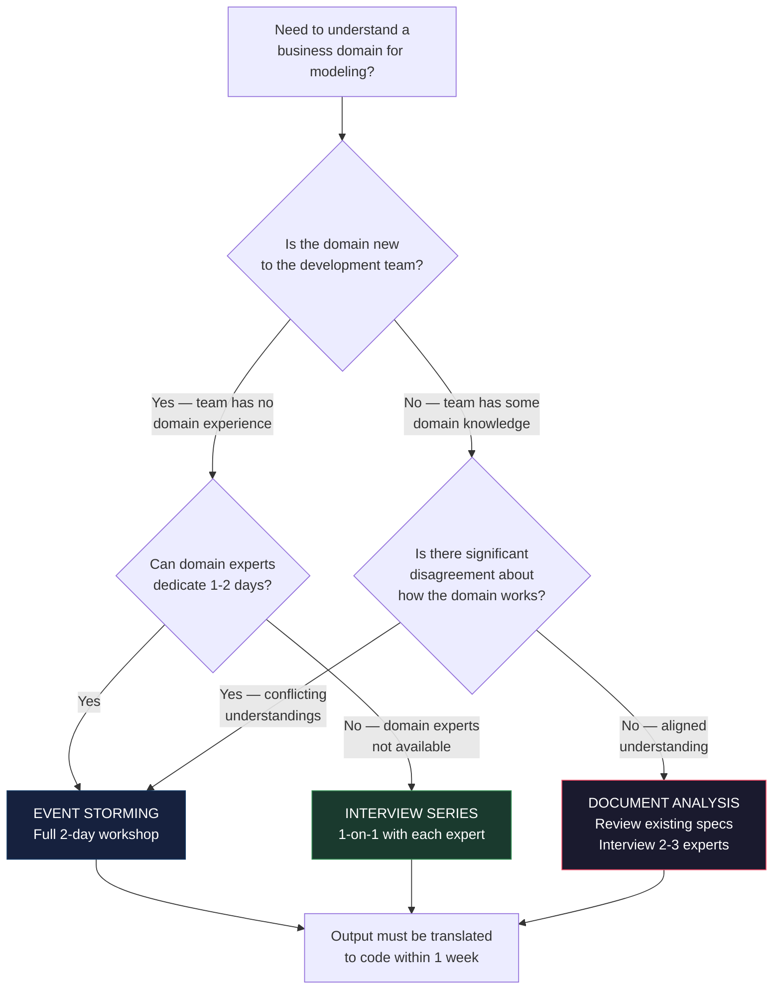

> [!success] Mastery Check
> - [ ] **Studied Well**
> - [ ] **Can explain the concept without notes**
> - [ ] **Can answer interview questions confidently**
> - [ ] **Can implement it in a real project**


# 7.070 — DDD — Event Storming — Discovery Workshop

## Section 1: Navigation & Context

**Domain:** [[7 — System Design & Distributed Systems]] > **Group:** Domain-Driven Design
**Previous:** [[7.069 — DDD — Multiple Bounded Contexts in One Solution]] | **Next:** [[7.071 — DDD — Common DDD Mistakes and Anti-Patterns]]

### Prerequisites

- [[7.033 — DDD — Bounded Contexts — Identifying Boundaries]] — Event Storming produces candidate bounded context boundaries; understanding the theory of what makes a good boundary (subdomain types, language cohesion, change cadence) lets the facilitator guide the workshop toward useful boundaries.
- [[7.032 — DDD — Ubiquitous Language — Building and Maintaining]] — the workshop's primary output is a shared Ubiquitous Language; knowing how to capture terms, resolve conflicts, and maintain the glossary ensures the workshop output has lasting value beyond the sticky notes.
- [[7.031 — DDD — Strategic vs Tactical Design]] — Event Storming operates at the strategic level (contexts, events, aggregates, language); the facilitator must resist the temptation to dive into tactical detail (database schema, API contract, repository implementation) during the workshop.

### Where This Fits

Event Storming is a facilitated, collaborative workshop technique that brings domain experts and developers together to model a business domain using sticky notes on a wall. Each color represents a different modeling element: orange for domain events, blue for commands, yellow for aggregates, purple for policies, green for actors, and so on. The workshop produces a shared understanding of the business domain, an initial Ubiquitous Language glossary, candidate aggregate boundaries, and a context map. Without Event Storming (or a similar collaborative modeling technique), teams build software based on assumptions about the domain that have never been validated with domain experts — leading to models that don't match reality, wrong aggregate boundaries, and a Ubiquitous Language that only the developers understand.

---

## Section 2: Core Mental Model

Event Storming is a time-boxed, agenda-less workshop where domain experts and developers collaboratively model the business domain by placing sticky notes representing domain events on a timeline. The invariant maintained: domain experts are the authoritative source for business truth, and the model emerges from their description of what happens in the business, not from the development team's proposed system design. The trade: the workshop requires 6-12 participants for 1-2 full days, which is expensive in terms of people-hours but cheaper than building the wrong thing. The recognition trigger: the development team has reached for a whiteboard to sketch the system architecture, and a domain expert in the room keeps saying "that's not how it works" — that is the signal that Event Storming should have happened first.

### Classification

| Dimension | Classification | Rationale |
|-----------|---------------|-----------|
| Pattern Type | **Strategic DDD / Collaborative Modeling** | A workshop technique, not a code pattern |
| Scope | **Whole domain or subdomain** | Scoped to the business area under analysis |
| Primary Concern | **Domain discovery and shared understanding** | The deliverable is knowledge, not code |
| Participants | **Domain experts + developers + facilitator** | Cross-functional — no silos |
| Duration | **4 hours (quick) to 2 days (full)** | Scoped by business area complexity |

```mermaid
flowchart LR
    subgraph Workshop["Event Storming Workshop — 2 Days"]
        direction TB
        Phase1["Phase 1: Chaos<br/>Unstructured domain events<br/>Orange stickies — 200+ events"]
        Phase2["Phase 2: Enforce Timeline<br/>Chronological order<br/>Identify gaps and conflicts"]
        Phase3["Phase 3: Commands & Actors<br/>Blue: what triggers events<br/>Green: who does it"]
        Phase4["Phase 4: Aggregates<br/>Yellow: group events + commands<br/>into consistency boundaries"]
        Phase5["Phase 5: Bounded Contexts<br/>Draw boundaries around<br/>related aggregates"]
        Phase6["Phase 6: Context Map<br/>Define relationships<br/>between contexts"]
        
        Phase1 --> Phase2 --> Phase3 --> Phase4 --> Phase5 --> Phase6
    end
    
    style Phase1 fill:#e67e22,color:#ffffff
    style Phase2 fill:#e67e22,color:#ffffff
    style Phase3 fill:#3498db,color:#ffffff
    style Phase4 fill:#f1c40f,color:#000000
    style Phase5 fill:#2ecc71,color:#ffffff
    style Phase6 fill:#9b59b6,color:#ffffff
```



### Key Properties / Guarantees

| Property | Value | Condition |
|----------|-------|-----------|
| Time to first model | 4-8 hours | One workshop session with prepared participants |
| Participant commitment | 6-12 people × 1-2 days | Significant but cheaper than building wrong thing |
| Primary output | Shared understanding + Ubiquitous Language | Not code — knowledge that enables better code |
| Secondary output | Context map + candidate aggregates | Input for the design phase |
| Validation | Built-in — domain experts see and correct the model | Errors surface within hours, not weeks |

---

## Section 3: Deep Mechanics

### How It Works

**Phase 1 — Chaos (2-3 hours):**

The facilitator asks: "What happens in this business process?" Domain experts write domain events on orange sticky notes — past-tense statements that describe something that happened in the business: "Order Placed," "Payment Received," "Shipment Delivered," "Customer Complained." No structure, no timeline, no prioritization — just get every event onto the wall. The facilitator's role is to keep domain experts talking and developers listening. Developers may ask clarifying questions but do NOT suggest solutions.

Target: 100-300 events for a full-day workshop.

**Phase 2 — Enforce Timeline (1 hour):**

The facilitator guides the group to arrange events chronologically from left to right. Disagreements about ordering reveal differences in understanding of the business process — these are the gold nuggets. The time axis becomes: Past ← Events → Future. The facilitator looks for:
- **Gaps:** "What happens between Payment Received and Shipment Scheduled?" — If no one knows, someone needs to talk to the warehouse team.
- **Parallel paths:** Events that don't depend on each other — candidates for separate bounded contexts.
- **Branching:** Alternative flows — happy path vs exception path.

**Phase 3 — Commands and Actors (1 hour):**

For each event, the group identifies:
- **Command** (blue sticky): What triggered the event? "Place Order," "Process Payment," "Schedule Shipment."
- **Actor** (green sticky): Who performed the command? "Customer," "Warehouse Worker," "System (Cron Job)."
- **External system** (pink sticky): "Stripe API," "Shipping Provider API."

This reveals which commands come from humans, which from systems, and which are missing.

**Phase 4 — Aggregates (1-2 hours):**

The facilitator asks: "Which events and commands always happen together? Which command modifies which data in one atomic operation?" The group draws yellow boundaries around related events and commands — these are candidate aggregates. Rules of thumb:
- An aggregate boundary is drawn where you can say: "When this command executes, all changes within this boundary must be consistent."
- Events that reference the same business entity (e.g., "Order Placed," "Order Shipped," "Order Cancelled") typically belong to the same aggregate.
- Commands that must be atomic form one aggregate.

**Phase 5 — Bounded Contexts (1 hour):**

The facilitator draws lines between groups of aggregates — these are candidate bounded contexts. The group names each context. The trigger for a boundary:
- The Ubiquitous Language changes: "Order" in the Sales context means something different from "Order" in the Procurement context.
- The aggregates evolve independently — different teams, different rates of change.
- The subdomain type changes: core domain vs supporting vs generic.

**Phase 6 — Context Map (1 hour):**

The facilitator maps the relationships between contexts: Conformist, ACL, Shared Kernel, Customer-Supplier, Partnership, Separate Ways. Each relationship is annotated with the integration mechanism (events, API, shared database).

**Workshop outputs:**
1. **Physical:** Wall covered with sticky notes — photographed and digitized.
2. **Ubiquitous Language Glossary:** 50-200 terms with definitions from domain experts.
3. **Context Map:** Boundaries with relationship types.
4. **Candidate Aggregates:** Yellow-boundary groups ready for tactical design.
5. **Hot Spots:** Known problems, open questions, ownership gaps.

### Failure Modes

**Failure Mode 1: Developers dominate — domain experts disengage**

What breaks: Developers suggest technical solutions ("we could use a microservice for that") during the chaos phase. Domain experts stop contributing because their input seems irrelevant to the technical discussion.

Detection: The wall has more blue (commands) and purple (policies) stickies than orange (events). Domain experts are on their phones. Developers are arguing about Kafka vs Service Bus.

Fix: The facilitator must enforce the rules: orange events only during chaos phase. Technical discussions are moved to a "parking lot" section of the wall. The facilitator explicitly calls on domain experts: "What happens next in the business process?"

**Failure Mode 2: Too narrow scope — misses adjacent context impacts**

What breaks: The workshop focuses exclusively on the Order Fulfillment process. The team discovers later that the "Customer Credit Check" event belongs to a different context (Billing) that they didn't include.

Detection: During the timeline phase, events appear that reference entities no one in the room owns. "Customer Credit Approved" — no one knows who approves credit.

Fix: Start with a broader scope than you think you need. Invite stakeholders from adjacent business areas. If an event references something outside the room, add it as a pink external system note and schedule a follow-up workshop.

**Failure Mode 3: Analysis paralysis — too many events, no decisions**

What breaks: The group keeps adding events beyond the 4-hour mark without making any decisions about boundaries. The wall has 400 events and no one can see the structure.

Detection: 6 hours into a one-day workshop and the group is still in the chaos phase. No boundaries drawn.

Fix: Time-box each phase strictly. 2 hours max for chaos. Use a timer. The facilitator's job is to move the group through phases, not to achieve perfection. A model with 80% accuracy that is debated is worth more than a perfect model that is never completed.

**Failure Mode 4: No follow-through — workshop output is lost**

What breaks: The team spends two full days on the workshop. Photos of the wall sit in a shared drive. No one translates the sticky notes into code. The Ubiquitous Language glossary is never written down.

Detection: Six months later, a new developer asks "why is this aggregate shaped this way?" No one remembers the workshop rationale.

Fix: Schedule the "translation sprint" immediately after the workshop. Day 3: digitize the wall, write the glossary, create the context map document, create the first aggregate implementations. Assign an owner for each bounded context.

### .NET and Azure Integration

- **ASP.NET Core:** Event Storming does not produce code directly — but the aggregate boundaries inform controller and endpoint design.
- **EF Core:** Candidate aggregates from the workshop map directly to `DbContext` entities and `OwnsOne`/`OwnsMany` configurations.
- **Azure services:** Azure DevOps or Microsoft Whiteboard for remote Event Storming; Azure Boards for tracking workshop action items.
- **.NET libraries:** No code libraries — this is a people-and-process technique. Miro or MURAL for virtual workshops.

```csharp
// The workshop output translates directly to domain code:
// Event: "Order Placed" → OrderSubmittedEvent
// Aggregate: "Order" → Order aggregate root
// Command: "Place Order" → PlaceOrderCommand
// Actor: "Customer" → HttpContext.User
// Bounded Context: "Ordering" → OrderManagement.Ordering namespace
```

---

## Section 4: Production Patterns and Implementation

### Primary Implementation — Workshop Facilitation

```markdown
# Event Storming Workshop: Order Fulfillment Domain

## Preparation
- **Date:** 2026-06-20, 09:00-17:00
- **Location:** Conference Room B (or Miro board)
- **Participants:**
  - Domain Experts: Sarah (Order Ops), Mike (Warehouse), Priya (Finance)
  - Developers: Alex, Rachel, Tom
  - Facilitator: Jordan
- **Materials:** Orange, blue, yellow, green, purple, pink, red sticky notes + whiteboard wall
- **Scope:** Order entry → fulfillment → invoicing (exclude returns)
- **Pre-reading for devs:** "What is Event Storming" (10-min video)

## Agenda
| Time | Phase | Facilitator Notes |
|------|-------|-------------------|
| 09:00 | Intro (15min) | Explain rules: no tech solutions, events only first |
| 09:15 | Chaos (2hr) | "What events happen in order fulfillment?" |
| 11:15 | Timeline (1hr) | Arrange events chronologically |
| 12:15 | Lunch | |
| 13:00 | Commands + Actors (1hr) | Who triggers what? |
| 14:00 | Aggregates (1.5hr) | Draw yellow boundaries |
| 15:30 | Break | |
| 15:45 | Bounded Contexts (1hr) | Draw boundaries, name contexts |
| 16:45 | Context Map + Wrap | Relationships, next steps |

## Facilitation Rules
1. NO technical discussion during chaos phase
2. Parking lot for side topics
3. Call on domain experts first
4. Time-box strictly — 80% model > perfect unfinished model
5. One conversation at a time
```

### Configuration and Wiring — After the Workshop

```csharp
// The workshop output is translated into code within 1-2 sprints.

// Step 1: Ubiquitous Language Glossary (README in domain project)
namespace OrderManagement.Ordering.Domain;
// Ubiquitous Language:
//   Order: A request by a customer to purchase one or more items.
//   Order Item: A specific product with quantity and price in an Order.
//   Submit Order: The act of finalizing an order for processing. Transitions from Pending to Submitted.
//   Order Submitted: Event raised when an order is submitted. Triggers inventory reservation.

// Step 2: Candidate aggregates become classes
public sealed class Order : AggregateRoot
{
    // Discovered during workshop: "Order" is an aggregate because
    // Order Placed, Order Submitted, Order Cancelled, Order Completed
    // are always about the same order, and changes must be atomic.
}

// Step 3: Domain events from orange stickies
public sealed record OrderSubmittedEvent(
    Guid OrderId, string CustomerId,
    IReadOnlyCollection<OrderItem> Items) : IDomainEvent;

// Step 4: Commands become application service methods
public sealed class OrderService
{
    public Task<Guid> PlaceOrderAsync(PlaceOrderCommand cmd, CancellationToken ct) { ... }
    public Task SubmitOrderAsync(Guid orderId, CancellationToken ct) { ... }
    public Task CancelOrderAsync(Guid orderId, string reason, CancellationToken ct) { ... }
}

// Step 5: Context map defines project structure
// Ordering BC: OrderManagement.Ordering (Domain, Application, Infrastructure)
// Billing BC:  OrderManagement.Billing (Domain, Application, Infrastructure)
// Shipping BC: OrderManagement.Shipping (Domain, Application, Infrastructure)
```

### Common Variants

**Variant 1 — Remote Event Storming (Miro/MURAL):**

```
Same process, digital tools:
- Miro board with colored sticky note sections
- Breakout rooms for parallel chaos phases
- Digital timer visible to all participants
- Screen recording for participants in different time zones
- Asynchronous contribution: participants add events before the workshop
```

**Variant 2 — Event Storming Light (4 hours, pre-identified scope):**

```
- Pre-workshop: domain experts list 30-50 key events (email)
- Workshop 09:00-13:00:
  - 09:00: Review pre-listed events (30min)
  - 09:30: Timeline (45min)
  - 10:15: Commands + Actors (45min)
  - 11:00: Aggregates (1hr)
  - 12:00: Bounded Contexts (45min)
  - 12:45: Wrap + next steps (15min)
```

**Variant 3 — Event Storming for legacy system understanding:**

```
- No design intent — just understanding an existing system
- Reverse-engineer events from logs, database triggers, and existing code
- Walk through production incidents to discover missing events
- Outcome: documentation of the current system's implicit domain model
- Follow-up: identify where the implicit model doesn't match business needs
```

### Real-World .NET Ecosystem Example

**Alberto Brandolini's original Event Storming** is the canonical reference — he developed the technique and published the book "Introducing Event Storming." The technique is tool-agnostic but has been widely adopted in the .NET DDD community. Microsoft's eShopOnContainers documentation references Event Storming as the technique used to identify the bounded contexts. **Miro** and **MURAL** are the most common virtual whiteboard tools used for remote workshops. The output feeds directly into .NET domain model design.

---

## Section 5: Gotchas and Production Pitfalls

### Pitfall 1: No Domain Experts in the Room

**Pitfall:** The development team conducts an Event Storming workshop with only developers. They model what they think the business does.

```csharp
// ❌ Developer assumption — wrong business rule
public sealed class Order
{
    public void Submit()
    {
        // Devs assumed: orders can always be submitted
        // Reality: orders with total < $10 cannot be submitted (per Sarah from Ops)
        Status = OrderStatus.Submitted;
    }
}
```

**Symptom:** The model has concept gaps and wrong rules. Developers implement features that don't match business needs. Domain experts reject the first demo.

**Fix:** The facilitator must ensure domain experts are present. If Sarah from Order Ops cannot attend, reschedule the workshop. If the business won't provide domain experts, raise the risk explicitly: "Our domain model will be based on assumptions, not facts."

**Cost of not fixing:** Development builds the wrong thing. Rework costs 3-10x the workshop cost. Team credibility damaged.

### Pitfall 2: Skipping the Chaos Phase — Going Straight to Architecture

**Pitfall:** The facilitator starts with "let's design the aggregates" instead of starting with events. The group immediately debates aggregate design without understanding the full event flow.

```csharp
// ❌ Jumped to aggregates — missing events discovered later
// Later found: "Inventory Shortage Detected" event should exist
// The aggregate doesn't handle this case
```

**Symptom:** The timeline has large gaps. Events appear later that force aggregate redesign. The workshop runs long because you have to go back.

**Fix:** Strictly follow the phases. The facilitator blocks any "let's design the system" conversation during the chaos phase. The rule: orange events only for the first 2 hours.

**Cost of not fixing:** Incomplete domain model. Aggregates designed without full event context. Refactoring required after the workshop.

### Pitfall 3: Too Many Participants — No One Can See the Wall

**Pitfall:** 20 people attend the workshop. The wall is crowded. Participants at the back can't see the sticky notes. Side conversations create noise.

**Symptom:** Half the participants are on their phones. The facilitator can't maintain focus. Low-quality output.

**Fix:** Maximum 12 participants for a physical workshop. For larger groups, use the "fishbowl" technique: 6-8 people actively model, the rest observe and contribute during breaks.

**Cost of not fixing:** Wasted people-hours. Poor model quality. Participants feel the workshop was a waste of time.

### Pitfall 4: No Parking Lot — Side Discussion Eats Time

**Pitfall:** A discussion about "which cloud provider should we use?" takes 20 minutes during the chaos phase. The group loses momentum.

**Symptom:** 4 hours into the workshop, the group is still on the first 20 events. The facilitator hasn't redirected technical discussions.

**Fix:** Designate a "parking lot" section on the wall. Any side discussion or technical debate gets a red sticky on the parking lot. The facilitator says "good point, it goes on the parking lot — we'll address it after the workshop if it's still relevant."

**Cost of not fixing:** Workshop overruns. Participants exhausted. Key decisions made under time pressure at the end.

### Pitfall 5: No Follow-Up Sprint — Workshop Output Never Used

**Pitfall:** The team takes photos of the wall, creates a Miro board, and goes back to their usual work. The domain model is never translated into code.

**Symptom:** Six months later, the codebase has no relationship to the workshop output. The Ubiquitous Language glossary was never written. Context boundaries were never enforced.

**Fix:** Schedule the "model translation sprint" for the week after the workshop. The first user story in that sprint is "create domain model classes from workshop aggregates."

**Cost of not fixing:** The entire workshop investment is wasted. The team returns to anemic domain models with no shared language.

---

## Section 6: Tradeoffs and Decision Framework

### Tradeoff Matrix

| Dimension | Event Storming | Document Analysis | Interview Series |
|-----------|---------------|-------------------|------------------|
| Time to model | 1-2 days | 2-4 weeks | 3-6 weeks |
| Shared understanding | High (whole group) | Low (individual reads) | Medium (per interview) |
| Conflict resolution | Immediate (facilitated) | Delayed (writers disagree) | Sequential (no real-time debate) |
| Cost | High (10-12 people × 1-2 days) | Low (1-2 analysts) | Medium (analyst time) |
| Output quality (domain accuracy) | High | Low-Medium | Medium |
| .NET code output | Direct aggregate candidates | Requires translation | Requires translation |

### Decision Flowchart



### When to Apply

- New business domain that the development team does not understand deeply
- Significant disagreement among stakeholders about how a business process works
- Multiple bounded contexts need to be discovered and mapped
- Team is starting a new DDD implementation from scratch

### When NOT to Apply

- [ ] The team already has a well-understood domain model validated by production use
- [ ] Domain experts are not available or unwilling to participate for a full day
- [ ] The scope is a single, well-defined aggregate — not a full business process
- [ ] The organization culture is not collaborative or not willing to invest in workshops

### Scale Thresholds

- **Minimum viable workshop:** 4 hours with 6 people for a subdomain with 2-3 aggregates
- **Full workshop:** 2 days with 8-12 people for a domain with 5-10 bounded contexts
- **Preparation time:** 2-4 hours of pre-work per participant (read background materials)
- **Translation time:** 1-2 sprints to turn workshop output into code

---

## Section 7: Interview Arsenal

### Question Bank

1. What is Event Storming and what problem does it solve?
2. What are the six phases of an Event Storming workshop?
3. What does each sticky note color represent in Event Storming?
4. How do you prevent developers from dominating the workshop?
5. Compare Event Storming with User Story Mapping.
6. What is the difference between a domain event (orange) and a command (blue) in Event Storming?
7. How do you translate an Event Storming output into .NET domain code?
8. What is the most common mistake teams make after an Event Storming workshop?

### Spoken Answers

**Q1: What is Event Storming and what problem does it solve?**

> **Average answer:** It's a workshop where you use sticky notes to model the business. Different colors mean different things — orange for events, blue for commands. It helps the team understand the domain.

> **Great answer:** Event Storming is a collaborative workshop technique invented by Alberto Brandolini for rapidly discovering a business domain model by having domain experts and developers model domain events on a timeline. The fundamental problem it solves is the knowledge gap between domain experts — who understand the business — and developers — who build the software. Traditional requirements gathering produces documents that are wrong within weeks. Event Storming produces a shared, visualized model in 1-2 days through facilitated conversation.

The workshop has six phases: chaos (unstructured domain events), timeline (chronological ordering), commands and actors (what triggers each event and who does it), aggregates (grouping events into consistency boundaries), bounded contexts (grouping aggregates into domain boundaries), and context map (defining relationships between contexts). Each phase uses a different sticky note color — orange for events, blue for commands, yellow for aggregates, green for actors, purple for policies, pink for external systems.

The output is not code — it's shared understanding. That understanding then translates directly into domain classes: orange events become `DomainEvent` records, yellow boundaries become aggregate roots, blue commands become application service methods. In .NET, I typically schedule a translation sprint for the week after the workshop where we create the domain project structure, implement the aggregate base class, and write the first domain events and aggregates discovered in the workshop.

**Q4: How do you prevent developers from dominating the workshop?**

> **Average answer:** The facilitator should ask domain experts questions and tell developers to listen more.

> **Great answer:** The facilitator establishes the rules at the start: for the first two hours — the chaos phase — only domain experts speak and only orange sticky notes go on the wall. Developers are explicitly in listening mode. They can ask clarifying questions but cannot suggest technical solutions. I use a physical prop — a "talking stick" — that only the current speaker holds. If a developer interrupts with "we could use a microservice for that," I say "good point, that goes on the parking lot" and physically move it to the parking lot section of the wall. This acknowledges the contribution without derailing the domain conversation.

I also structure the room layout intentionally: domain experts sit closest to the wall where the sticky notes are being placed. Developers sit behind them or to the side. This physical positioning reinforces who is driving the conversation. During the commands and aggregates phases, developers become more active participants because their architectural knowledge is relevant — but by then the domain model is already established.

The hardest part is when developers are certain they understand the domain and start filling in events without domain expert input. I've literally said: "Alex, you're writing an event for a process you've never done. Sarah, is that how it works?" Nine times out of ten, the answer is "no, it's different." That moment is why the workshop exists — to surface those assumptions before they become production code.

**Q6: What is the difference between a domain event (orange) and a command (blue) in Event Storming?**

> **Average answer:** Events are things that happened. Commands are things someone does that cause events.

> **Great answer:** A domain event is something that has already happened in the business — past tense — and is significant enough that someone cares about it. "Order Placed," "Payment Received," "Shipment Delayed." Events are facts — they cannot be undone, and they are the primary building block of the Event Storming model. The orange sticky note captures the event name, and the position on the timeline captures when it happens.

A command is the action that triggers the event — present tense, active voice. "Place Order," "Process Payment," "Schedule Shipment." Commands have an actor (the green sticky note) — a person or system that performs the command. The key relationship: a command, when executed by an actor, produces one or more domain events.

The distinction matters for two reasons. First, in DDD, commands become application service methods and events become the notification mechanism between aggregates. So the blue stickies in the workshop directly become `PlaceOrderCommand` records in the application layer, and orange stickies become `OrderPlacedEvent` records in the domain layer. Second, commands can be rejected (invalid command produces a business exception) while events have already happened and cannot be rejected. The workshop makes this explicit: for each command, the group identifies "what could go wrong?" which becomes the aggregate's invariant checks. In .NET code, a command handler calls `order.Place()` which validates invariants. If validation passes, the `OrderPlacedEvent` is raised. If it fails, a `DomainException` is thrown — the command was rejected, the event was never raised.

### System Design Interview Trigger

Event Storming itself is rarely asked in system design interviews, but the output of Event Storming — bounded contexts, aggregates, domain events — is the foundation for system design answers. If an interviewer says "how would you model the order management domain?", they are implicitly testing whether you understand bounded contexts and aggregates. The interviewer wants to see that you would start by understanding the business events, not by designing tables or APIs. The Event Storming approach gives you a structured way to present a domain model: "I would start by identifying the domain events — Order Placed, Payment Processed, Item Shipped — then group them into aggregates and bounded contexts." This demonstrates strategic DDD thinking rather than jumping into database design.

### Comparison Table

| | Event Storming | User Story Mapping | Domain Storytelling |
|---|---|---|---|
| Core approach | Past-tense events on timeline | User goals in narrative | Actor-action diagrams |
| Primary element | Domain event (orange) | User story (yellow) | Activity step (icon) |
| Output | Aggregates, contexts, events | Backlog, release plan | Workflow diagrams |
| Duration | 1-2 days | 1 day | 1-2 days |
| .NET application | Direct to domain model | Indirect (backlog items) | Indirect |
| Best for | Complex domain discovery | Product roadmap | Process documentation |

---

## Section 8: Architecture Decision Record

**Status:** Accepted

**Context:**
A new e-commerce platform is being built from scratch. The development team of 6 has no prior experience in the retail domain. The business stakeholders (Order Ops manager, Warehouse supervisor, Finance director) have conflicting views on how the order-to-fulfillment process works. The team needs to discover the domain model before writing code. Previous projects at the company failed because developers assumed they understood the domain and built the wrong thing.

**Options Considered:**

1. **Event Storming full workshop (Recommended)** — 2-day facilitated workshop with all domain experts and developers. Output: context map, aggregate candidates, Ubiquitous Language glossary, and identified hot spots.
2. **Document analysis** — Review existing business requirements documents, process flows, and system specs. Team synthesizes the domain model without direct domain expert involvement.
3. **Weekly interviews** — Developers interview each domain expert separately over 4 weeks. Synthesize findings after each interview.

**Decision:** Event Storming full workshop (Option 1), because the conflicting stakeholder views must be resolved in a facilitated, real-time setting. Document analysis would not surface disagreements. Weekly interviews would surface them sequentially, with no mechanism for real-time debate and resolution.

**Consequences:**
- ✅ All stakeholders develop a shared understanding of the domain in 2 days instead of 4+ weeks of interviews
- ✅ Conflicting views are resolved in real-time with facilitation
- ✅ The development team learns domain terminology firsthand from experts
- ⚠️ High upfront cost: 10 people × 2 days = 20 person-days invested before any code
- ❌ Requires organizational buy-in for the workshop format — some stakeholders may resist dedicating 2 full days

**Review Trigger:** Revisit the context map and aggregate boundaries after 6 months of production use. If the team finds that workshop-discovered boundaries do not match real development experience (e.g., aggregates that should be split or merged), schedule a half-day Event Storming review session.

---

## Section 9: Self-Check

### Conceptual Questions

1. What is Event Storming and what problem does it solve?

<details>
<summary>Answer</summary>
A collaborative workshop technique where domain experts and developers model the business using colored sticky notes on a timeline. It solves the knowledge gap between domain experts and developers, surfacing assumptions and disagreements before code is written.
</details>

2. What are the six phases of an Event Storming workshop in order?

<details>
<summary>Answer</summary>
(1) Chaos: unstructured domain events. (2) Timeline: chronological ordering. (3) Commands and Actors: what triggers each event. (4) Aggregates: grouping events into consistency boundaries. (5) Bounded Contexts: grouping aggregates into domain boundaries. (6) Context Map: defining relationships between contexts.
</details>

3. What does each sticky note color represent?

<details>
<summary>Answer</summary>
Orange = Domain Event (past tense, something that happened). Blue = Command (what triggers the event). Green = Actor (who performs the command). Yellow = Aggregate (consistency boundary). Purple = Policy/Process (business rule triggered by an event). Pink = External System. Red = Hot spot/Problem.
</details>

4. How do you prevent developers from dominating the workshop?

<details>
<summary>Answer</summary>
Rules: only domain experts speak during the chaos phase. Developers listen. Technical discussions go to the parking lot. Seating: domain experts closer to the wall. Facilitator explicitly calls on domain experts. Physical talking stick.
</details>

5. Compare Event Storming with traditional requirements gathering.

<details>
<summary>Answer</summary>
Event Storming produces shared understanding in 1-2 days through real-time collaboration. Traditional requirements produce documents over weeks that capture what was said, not what was understood. Event Storming surfaces disagreements immediately. Traditional requirements hide them until implementation.
</details>

6. What is the difference between a domain event and a command in Event Storming?

<details>
<summary>Answer</summary>
An event is something that has already happened (past tense: "Order Placed"). A command is the action that triggers the event (present tense: "Place Order"). Commands can be rejected (invalid state). Events are facts that cannot be undone.
</details>

7. How do you translate Event Storming output into .NET domain code?

<details>
<summary>Answer</summary>
Orange events → `DomainEvent` records. Blue commands → application service method parameters. Yellow aggregates → aggregate root classes. Bounded contexts → project/namespace boundaries. Ubiquitous Language glossary → XML doc comments and class names.
</details>

8. What is the most common mistake teams make after an Event Storming workshop?

<details>
<summary>Answer</summary>
Not following through — the workshop output sits in photos on a shared drive and is never translated into the domain model. The translation sprint must be scheduled for the week after the workshop.
</details>

9. What is the maximum effective group size for a physical Event Storming workshop?

<details>
<summary>Answer</summary>
10-12 participants. Beyond that, use the fishbowl technique: 6-8 active modelers, 4-6 observers who rotate in. Remote workshops can handle more participants with Miro breakouts.
</details>

10. Explain Event Storming to a project manager in 60 seconds.

<details>
<summary>Answer</summary>
"We get the people who know the business — Sarah from Ops, Mike from Warehouse — and the people who build the software — the dev team — into a room for two days. We use colored sticky notes to map out every step of the business process: what happens, who does it, what could go wrong. By day two, we have a shared understanding that would take months of requirements documents to achieve. The output is a common language and a map of the system that the dev team can start coding immediately."
</details>

---

### Scenario Challenges

**Scenario 1 — Diagnose the problem**

A team held an Event Storming workshop 3 months ago. The current codebase has no relationship to the workshop output. The Ubiquitous Language glossary was never written. The team is building an anemic CRUD model.

<details>
<summary>Diagnosis</summary>

**Root cause:** No translation sprint was scheduled after the workshop. The team went back to their regular work and forgot the workshop output.

**Evidence:** The codebase has `Order` as a data class with `{ get; set; }` properties and no behavior methods. No `OrderSubmittedEvent` exists. The aggregate classes are empty shells. The project namespace has no bounded context structure.

**Fix:**
1. Schedule a 3-day "translation sprint" starting Monday.
2. Day 1: Review workshop photos/Miro board. Write Ubiquitous Language glossary as XML doc comments.
3. Day 2: Create domain projects per bounded context. Implement first aggregates.
4. Day 3: Write first unit tests for aggregate behavior.

**Prevention:** The workshop facilitator should include "Translation Sprint" as a mandatory follow-up in the workshop agenda.
</details>

---

**Scenario 2 — Design decision**

Your Event Storming workshop identified "Order Approved" and "Order Rejected" as two separate events that can happen after "Order Submitted." The team disagrees on whether these should be modeled as separate aggregates or one aggregate. How do you resolve this?

<details>
<summary>Decision and Reasoning</summary>

**Choice:** Model as one `Order` aggregate that can transition through multiple states (Pending → Submitted → Approved/Rejected).

**Tradeoffs accepted:** The aggregate may grow larger than ideal, but the business logic for approval and rejection shares invariants: an order cannot be both approved and rejected, the approval decision depends on the order's total, and the order's history must be auditable. Splitting into separate aggregates would require cross-aggregate eventual consistency for a decision that should be atomic per order.

**Implementation sketch:**
```csharp
public sealed class Order : AggregateRoot
{
    public OrderStatus Status { get; private set; }

    public void Submit() { Status = OrderStatus.Submitted; }
    public void Approve(string approvedBy)
    {
        if (Status != OrderStatus.Submitted)
            throw new DomainException("Only submitted orders can be approved");
        Status = OrderStatus.Approved;
        AddDomainEvent(new OrderApprovedEvent(Id, approvedBy));
    }
    public void Reject(string reason)
    {
        if (Status != OrderStatus.Submitted)
            throw new DomainException("Only submitted orders can be rejected");
        Status = OrderStatus.Rejected;
        AddDomainEvent(new OrderRejectedEvent(Id, reason));
    }
}
```

**Alternative:** If the approval process becomes very complex (multiple approval steps, delegation, deadlines), extract it into a separate `OrderApprovalProcess` aggregate that references the `Order` by ID.
</details>

---

**Scenario 3 — Failure mode** During the chaos phase, the domain expert keeps saying "that event doesn't happen here — it happens in the finance system." The developers keep writing the event on the wall anyway, assuming the system will handle it.

<details>
<summary>Investigation and Fix</summary>

**Investigation steps:**
1. The facilitator should stop the group and ask the domain expert to clarify.
2. Who owns the "Payment Received" event? Finance or Ordering?
3. Is the event information needed by the current scope?

**Confirming evidence:** The domain expert points to the pink external system sticky: "The payment system sends us a notification. We don't create the payment event. We receive a PaymentReceived notification."

**Fix:** Mark "Payment Received" as a pink (external) sticky in the Ordering context. The blue command "Process Payment" belongs in the Finance/Payment bounded context. The Ordering context receives `PaymentReceivedIntegrationEvent` via the event bus. Draw a context boundary line that places "Process Payment" outside the Ordering context.

**Post-mortem item:** Document the context boundary: "Ordering does not process payments. It receives payment status notifications via integration events from the Payment BC."
</details>

---

**Scenario 4 — Scale it** Your Event Storming workshop produces 47 candidate aggregates for the Order Fulfillment domain. The team of 6 developers cannot implement 47 aggregates in the first release. Prioritize.

<details>
<summary>Scaling Strategy</summary>

**Bottleneck this addresses:** 47 aggregates is too many for the first release. The team needs to prioritize core domain aggregates and defer supporting/generic subdomains.

**How it helps:**
1. Classify each aggregate by subdomain type (core, supporting, generic).
2. Core domain aggregates get implemented first: Order, OrderItem.
3. Supporting aggregates get implemented second: Invoice, Shipment.
4. Generic aggregates get implemented last or integrated via SaaS: EmailNotification, TaxCalculation.

**Implementation order:**
1. Release 1 (this quarter): Order, OrderItem, Customer (core).
2. Release 2 (next quarter): Invoice, Payment (supporting).
3. Release 3: Shipment, Inventory (supporting).
4. Release 4: Notifications, Reports (generic — consider third-party).

**Result:** 47 aggregates → 7 in first release. The rest are deferred or integrated via external systems.
</details>

---

**Scenario 5 — Interview simulation** The interviewer says: "Your team is building an insurance claims system. You don't know the first thing about insurance claims processing. How do you start?"

<details>
<summary>Model Response</summary>

"I would not write a single line of code until I understood the domain. The first thing I'd do is schedule an Event Storming workshop with three groups of people: claims adjusters — the domain experts who actually process claims — the claims management team, and the IT support team who handles the current system.

The scope of the workshop would be one claim lifecycle: from the initial report through investigation, evaluation, approval or denial, payment, and closure. I'd invite 8-10 participants for a 2-day workshop. The facilitator would be someone experienced in Event Storming who doesn't work on our team — to avoid the bias of our technical perspective.

Day one: the chaos phase — domain experts write every event they can think of on orange sticky notes. 'Claim Filed,' 'Investigation Initiated,' 'Adjuster Assigned,' 'Document Requested,' 'Document Received,' 'Claim Approved,' 'Payment Sent.' We'd expect 150-200 events. Then we arrange them chronologically. The timeline will immediately reveal gaps: 'What happens between the adjuster being assigned and the investigation starting?' No one knows — that's a discovery we prioritize after the workshop.

Day two: commands and actors — who triggers each event and what commands do they execute? Then aggregates — we group events that are always consistent together. 'Claim Filed,' 'Claim Approved,' 'Claim Denied' likely belong to the same Claim aggregate. Then bounded contexts — 'Payment Processing' is a different context because it involves different actors (finance team) and different language (ACH, wire, check). Finally, the context map: how does the Claims context communicate with the Payment context? Through integration events.

After the workshop, we schedule a one-week translation sprint. The development team creates the domain project structure, implements the Claim aggregate with the events discovered in the workshop, writes the Ubiquitous Language glossary, and produces the first set of domain unit tests. By the end of that sprint, we have a validated domain model that the domain experts have reviewed and approved. We haven't built any infrastructure — no database, no API — but we have a shared understanding of what we're building and why."
</details>
