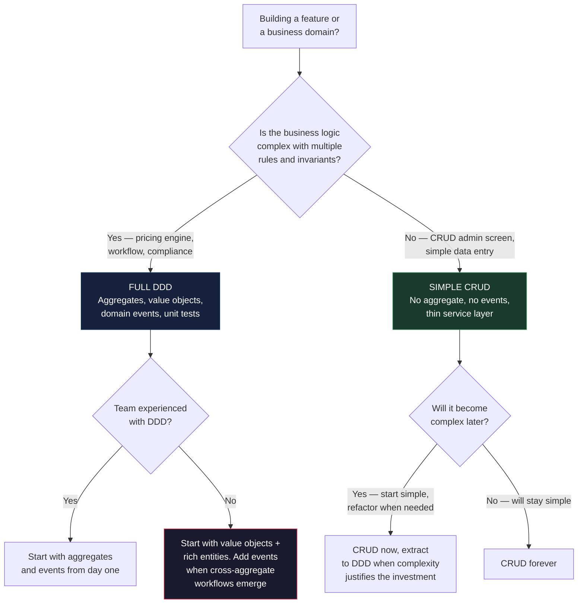

> [!success] Mastery Check
> - [ ] **Studied Well**
> - [ ] **Can explain the concept without notes**
> - [ ] **Can answer interview questions confidently**
> - [ ] **Can implement it in a real project**


# 7.071 — DDD — Common DDD Mistakes and Anti-Patterns

## Section 1: Navigation & Context

**Domain:** [[7 — System Design & Distributed Systems]] > **Group:** Domain-Driven Design
**Previous:** [[7.070 — DDD — Event Storming — Discovery Workshop]] | **Next:** [[7.072 — DDD — Domain Event Handling — Sync vs Async]]

### Prerequisites

- [[7.047 — DDD — Aggregates — Consistency Boundary]] — the most common DDD mistake is violating the aggregate consistency boundary by modifying multiple aggregates in one transaction or by exposing internal entity state; understanding the correct pattern lets you recognize violations when they appear.
- [[7.048 — DDD — Aggregates — Aggregate Root Rule]] — the aggregate root rule (external objects reference only the root) is the single most commonly violated DDD rule in production codebases — especially when developers are new to DDD and expose navigation properties for convenience.
- [[7.046 — DDD — Value Objects — C# Records Implementation]] — primitive obsession (using `string`, `int`, `decimal` instead of domain value objects) is the most frequent DDD mistake; recognizing when a primitive should be a value object is the first skill a DDD practitioner develops.

### Where This Fits

This note catalogs the most common mistakes teams make when adopting DDD — mistakes observed across hundreds of production codebases. Each anti-pattern is described with the wrong code, the symptom that reveals it, the correct implementation, and the real cost of leaving it unfixed. Without this knowledge, teams adopt DDD's terminology (aggregates, value objects, domain events) without adopting its discipline, ending up with the same CRUD codebase but with more namespaces.

---

## Section 2: Core Mental Model

DDD anti-patterns are recurring structural mistakes where teams use DDD terminology and folder structure but violate the fundamental principles of domain modeling — creating anemic domain models with domain-sounding names, violating aggregate boundaries for convenience, using value objects as mutable DTOs, or mistaking the application layer for the domain layer. The invariant maintained: the domain model must be behaviorally complete, infrastructure-independent, and enforce its own invariants. The trade: following DDD principles requires more types, more method discipline, and more design effort upfront than a CRUD approach — but the anti-patterns produce code that has all the complexity of DDD with none of the benefits. The recognition trigger: a class called `Order` that has no behavior methods, only `{ get; set; }` properties — this is the Anemic Domain Model, the most common and destructive DDD anti-pattern.

### Classification

| Dimension | Classification | Rationale |
|-----------|---------------|-----------|
| Pattern Type | **Anti-pattern catalog** | Collection of known failure modes in DDD adoption |
| Scope | **All DDD levels (strategic + tactical)** | Anti-patterns exist at every level from context mapping to entity design |
| Primary Concern | **Pattern dilution** | Using DDD language without DDD discipline |
| Severity scale | **1 (cosmetic) to 5 (destroying)** | Anemic domain model = 5, wrong folder structure = 1 |

### Key Properties / Guarantees

| Property | Value | Condition |
|----------|-------|-----------|
| Anemic domain model | ~60% of claimed DDD projects | Most common anti-pattern |
| Aggregate boundary violation | ~40% of projects with multiple aggregates | Second most common |
| Wrong aggregate identity | ~30% of first-time DDD adopters | Surrogate key confusion |
| Value object as mutable DTO | ~50% of teams new to value objects | Confusion with DTO pattern |
| Cross-context database coupling | ~25% of multi-context projects | Schema boundary violations |

---

## Section 3: Deep Mechanics

### Anti-Pattern 1: Anemic Domain Model

**Description:** Domain classes have properties but no behavior. All business logic lives in services. The "domain" layer is just DTOs with domain-sounding names.

```csharp
// ❌ ANEMIC: Order as data container
public class Order
{
    public Guid Id { get; set; }
    public string CustomerId { get; set; } = "";
    public string Status { get; set; } = "";
    public List<OrderItem> Items { get; set; } = new();
    public decimal Total { get; set; }
}

// Business logic lives here — not on Order
public class OrderService
{
    public void SubmitOrder(Guid orderId)
    {
        var order = _db.Orders.Find(orderId);
        order.Status = "Submitted"; // Direct property set — no invariant check
        _db.SaveChanges();
    }
}
```

**Detection:** Search for domain classes with >50% `{ get; set; }` properties and no methods that enforce invariants. Look for service classes with names like `*Service`, `*Manager`, `*Helper` that contain all business logic.

**Fix:** Move behavior to the entity. Encapsulate state changes through methods:

```csharp
// ✅ RICH: Order with behavior
public class Order : AggregateRoot
{
    public Guid Id { get; private set; }
    public string CustomerId { get; private set; }
    public OrderStatus Status { get; private set; }
    private readonly List<OrderItem> _items = new();
    public IReadOnlyCollection<OrderItem> Items => _items.AsReadOnly();

    public void Submit()
    {
        if (Status != OrderStatus.Pending)
            throw new DomainException("Only pending orders can be submitted");
        if (!_items.Any())
            throw new DomainException("Cannot submit empty order");
        Status = OrderStatus.Submitted;
        AddDomainEvent(new OrderSubmittedEvent(Id, CustomerId, Items));
    }
}
```

**Cost:** Every business rule change requires modifying the service class, which grows without bound. No encapsulation — any code can set `order.Status = "Submitted"` without validation. Impossible to unit test business rules in isolation.

### Anti-Pattern 2: Exposing Internal Entity State via Navigation Properties

**Description:** Aggregate root exposes its internal entities as public collections with add/remove capability, allowing external code to modify internal state without the root's knowledge.

```csharp
// ❌ Exposed internal collection — external code bypasses aggregate
public class Order
{
    public List<OrderItem> Items { get; set; } = new(); // Public setter + list!
}

// External code:
order.Items.Add(new OrderItem { Quantity = -5 }); // Negative quantity — no validation!
order.Items.Clear(); // Entire order emptied!
```

**Detection:** Aggregate classes with `List<T>` as public property, public `Add`/`Remove` methods that are not the aggregate's own, or `ICollection<T>` with setters.

**Fix:** Expose `IReadOnlyCollection<T>` and provide behavior methods:

```csharp
// ✅ Exposed as read-only — mutation through methods
public class Order : AggregateRoot
{
    private readonly List<OrderItem> _items = new();
    public IReadOnlyCollection<OrderItem> Items => _items.AsReadOnly();

    public void AddItem(string productName, Money unitPrice, int quantity)
    {
        if (Status != OrderStatus.Pending)
            throw new DomainException("Cannot modify submitted order");
        if (quantity <= 0)
            throw new DomainException("Quantity must be positive");
        _items.Add(new OrderItem(productName, unitPrice, quantity));
    }
}
```

**Cost:** Invariant violations. Negative quantities, empty orders, duplicate items — all possible when the collection is exposed. Chaos in production when external code bypasses the aggregate.

### Anti-Pattern 3: Primitive Obsession

**Description:** Using `string`, `int`, `decimal`, `Guid` for domain concepts instead of creating value objects.

```csharp
// ❌ Primitive obsession
public class Order
{
    public string CustomerId { get; set; } // Is this a valid format? No one knows.
    public decimal Total { get; set; }      // What currency? USD? EUR?
    public string Status { get; set; }      // What values? "submitted"? "submited"? (typo)
}
```

**Detection:** Strings used for identifiers, enumerations, codes, or formatted values where the format is meaningful. Primitive types used for domain concepts with rules (Email, PhoneNumber, Currency, Money).

**Fix:** Create value objects:

```csharp
// ✅ Value objects
public sealed record CustomerId
{
    public string Value { get; }
    public CustomerId(string value)
    {
        if (string.IsNullOrWhiteSpace(value))
            throw new DomainException("Customer ID is required");
        Value = value;
    }
}

public sealed record Money
{
    public decimal Amount { get; }
    public string Currency { get; }
    public Money(decimal amount, string currency)
    {
        if (amount < 0) throw new DomainException("Amount cannot be negative");
        if (currency.Length != 3) throw new DomainException("Invalid currency code");
        Amount = amount; Currency = currency;
    }
}

public sealed record OrderStatus
{
    public string Value { get; }
    public static readonly OrderStatus Pending = new("Pending");
    public static readonly OrderStatus Submitted = new("Submitted");
    private OrderStatus(string value) { Value = value; }
}
```

**Cost:** Validation scattered across services (or missing). Typo vulnerabilities ("shipped" vs "shipped"). Implicit currency assumptions cause $1M order rounding errors.

### Anti-Pattern 4: Multiple Aggregates in One Transaction

**Description:** Modifying two or more aggregate roots in a single `SaveChangesAsync` call, violating the aggregate consistency boundary.

```csharp
// ❌ Multiple aggregates in one transaction
public async Task SubmitOrderAsync(Guid orderId, CancellationToken ct)
{
    var order = await _orderRepo.GetByIdAsync(orderId, ct);
    order.Submit();
    var inventory = await _inventoryRepo.GetBySkuAsync(order.Items.First().Sku, ct);
    inventory.DecrementStock(1);
    await _orderRepo.SaveAsync(order, ct); // Same DbContext!
    await _inventoryRepo.SaveAsync(inventory, ct); // Same transaction!
}
```

**Detection:** Service method calls `SaveChangesAsync` after modifying entities from different `DbSet<>` types. Unit of Work pattern spanning multiple aggregate types.

**Fix:** Each aggregate in its own transaction. Use domain events for cross-aggregate updates:

```csharp
// ✅ Separate transactions via domain event
public async Task SubmitOrderAsync(Guid orderId, CancellationToken ct)
{
    var order = await _orderRepo.GetByIdAsync(orderId, ct);
    order.Submit(); // Raises OrderSubmittedEvent
    await _orderRepo.SaveAsync(order, ct); // Transaction 1
    // Outbox dispatcher handles Inventory update in Transaction 2
}
```

**Cost:** Distributed locks, deadlocks, transaction escalation to DTC. Violation of the aggregate consistency principle. Cannot split into services later.

### Anti-Pattern 5: Domain Services Replacing Entity Behavior

**Description:** All domain logic is placed in Domain Services instead of on entities. The entity is anemic and the service contains everything.

```csharp
// ❌ Domain service replaces entity behavior
public class OrderDiscountService
{
    public void ApplyDiscount(Order order, Customer customer, DiscountPolicy policy)
    {
        // This should be on Order: order.ApplyDiscount(...)
        if (customer.Tier == "Premium")
            order.Total *= 0.85m;
    }
}
```

**Detection:** Domain service classes have names ending in `Service`, `Manager`, `Helper` and contain methods that take entity types as their first parameter and modify entity state.

**Fix:** Place the logic on the entity. Use domain services only for operations that involve multiple aggregates or external systems:

```csharp
// ✅ Entity has its own behavior
public class Order
{
    public void ApplyDiscount(IDiscountPolicy policy)
    {
        var discount = policy.Calculate(this);
        if (discount.HasValue)
            _discountedTotal = Total - (Total * discount.Value);
    }
}

// ✅ Domain service for cross-aggregate operations
public class OrderSubmissionService
{
    public async Task<Order> SubmitOrderAsync(SubmitOrderCommand cmd, CancellationToken ct)
    {
        var order = new Order(cmd.CustomerId, cmd.Items);
        order.Submit();
        await _orderRepo.SaveAsync(order, ct);
        return order;
    }
}
```

**Cost:** Domain logic is scattered across service classes instead of encapsulated in entities. Testing requires setting up service infrastructure.

### Anti-Pattern 6: Wrong Aggregate Identity (Surrogate Key from DB)

**Description:** Using auto-generated database identity as the aggregate root's domain identity. The aggregate's identity should be meaningful in the domain.

```csharp
// ❌ Database-generated identity — no domain meaning
public class Order
{
    public int Id { get; set; } // Auto-increment from DB
}
```

**Detection:** Aggregate root uses `int Id` with `[DatabaseGenerated(DatabaseGeneratedOption.Identity)]`. The ID has no business meaning.

**Fix:** Use domain-meaningful identity — `Guid` (universally unique) or domain-specific identifier:

```csharp
// ✅ Domain identity — Guid (meaningful across systems)
public class Order : AggregateRoot
{
    public Guid Id { get; private set; }
    public Order() { Id = Guid.NewGuid(); }
}

// ✅ Or domain-specific identity
public sealed record OrderNumber
{
    public string Value { get; }
    public OrderNumber(string prefix, int sequence)
    {
        Value = $"{prefix}-{sequence:D6}"; // e.g., "ORD-000042"
    }
}
```

**Cost:** Exposing auto-increment IDs enables enumeration attacks (customers can guess other order IDs). IDs are meaningless in business communication ("please check order #42"). Issues when integrating across bounded contexts that don't share a database.

### Anti-Pattern 7: Using Domain Entities as DTOs

**Description:** Serializing and deserializing domain entities directly to/from HTTP requests/responses or passing them across service boundaries.

```csharp
// ❌ Domain entity serialized to API response
[HttpGet("{id}")]
public async Task<Order> GetOrder(Guid id)
{
    return await _db.Orders.Include(o => o.Items).FirstAsync(o => o.Id == id);
    // Exposes all internal state — lazy loading, navigation properties, private fields
}
```

**Detection:** Controllers return domain entities directly. Integrations events carry domain entity references.

**Fix:** Use explicit DTOs or MediatR response types:

```csharp
// ✅ DTO projection
[HttpGet("{id}")]
public async Task<OrderDto> GetOrder(Guid id)
{
    return await _db.Orders
        .Where(o => o.Id == id)
        .Select(o => new OrderDto(o.Id, o.CustomerId, o.Status.ToString(), o.Total))
        .FirstAsync();
}

// Or use AutoMapper / manual mapping in Application layer
```

**Cost:** Lazy loading exceptions in JSON serialization, circular reference errors, over-fetching sensitive data, tightly coupling API contract to domain model.

### Anti-Pattern 8: Context Boundary Leakage (Cross-BC References)

**Description:** One bounded context's domain directly references another bounded context's types.

```csharp
// ❌ Cross-BC domain reference
// Ordering.Domain/Order.cs
using Billing.Domain; // Cross-boundary reference!
public class Order
{
    public Invoice GenerateInvoice() { ... }
}
```

**Detection:** Project references between bounded context domain layers. Namespace imports from another BC.

**Fix:** Communicate through integration events or shared kernel interfaces:

```csharp
// ✅ Communication through integration event
// Ordering publishes OrderSubmittedIntegrationEvent
// Billing subscribes and creates Invoice in its own context
```

**Cost:** Bounded contexts are no longer bounded. Domain models become coupled. Cannot evolve independently.

---

## Section 4: Production Patterns and Implementation

### Detection Pattern — Architecture Tests (NetArchTest)

```csharp
// Anti-pattern detection via architecture tests
public class ArchitectureRules
{
    [Fact]
    public void Domain_ShouldNotHavePublicSetters()
    {
        var result = Types.InAssembly(typeof(Order).Assembly)
            .That().AreClasses()
            .And().ResideInNamespace("Domain")
            .Should().HavePropertyWithSetterAccess(SetterAccessibility.None)
            .GetResult();
        Assert.True(result.IsSuccessful, "Domain classes must not have public setters");
    }

    [Fact]
    public void AggregateRoots_ShouldNotExposeCollections()
    {
        var result = Types.InAssembly(typeof(Order).Assembly)
            .That().Inherit(typeof(AggregateRoot))
            .Should().NotHavePropertyType(typeof(List<>))
            .GetResult();
        Assert.True(result.IsSuccessful, "Aggregates must expose IReadOnlyCollection, not List");
    }

    [Fact]
    public void Domain_ShouldNotReference_Infrastructure()
    {
        var result = Types.InAssembly(typeof(Order).Assembly)
            .ShouldNot().HaveDependencyOn("EntityFrameworkCore")
            .And().ShouldNot().HaveDependencyOn("Microsoft.AspNetCore")
            .GetResult();
        Assert.True(result.IsSuccessful, "Domain must not reference infrastructure");
    }

    [Fact]
    public void ValueObjects_ShouldBeImmutable()
    {
        var result = Types.InAssembly(typeof(Order).Assembly)
            .That().AreClasses()
            .And().HaveNameEndingWith("Policy")
            .Should().BeImmutable()
            .GetResult();
        Assert.True(result.IsSuccessful, "Policies must be stateless");
    }
}
```

### Correction Pattern — Refactoring Anemic Model to Rich Model

```csharp
// Step 1: Encapsulate setters
public class Order
{
    public Guid Id { get; private set; } // Encapsulated
    public string CustomerId { get; private set; } // Encapsulated
}

// Step 2: Extract value objects from primitives
public sealed record CustomerId
{
    public readonly string Value;
    public CustomerId(string value) { /* validation */ }
}

// Step 3: Move behavior from service to entity
public class Order
{
    public void Submit() { /* was in OrderService */ }
    public void AddItem(string name, decimal price, int qty) { /* was inline */ }
    public void ApplyDiscount(decimal percent) { /* was in DiscountService */ }
}

// Step 4: Add domain events
public class Order
{
    public void Submit()
    {
        // ... invariant checks ...
        AddDomainEvent(new OrderSubmittedEvent(Id, CustomerId, Items));
    }
}

// Step 5: Add architecture tests to prevent regression
```

---

## Section 5: Gotchas and Production Pitfalls

### Pitfall 1: The Anemic Domain Model — "We Use DDD" with Data Classes

**Pitfall:** Team claims to use DDD but every domain class is a data container with public getters and setters.

```csharp
// ❌ "Look, we have a Domain folder!" (all data)
public class Order
{
    public int Id { get; set; }
    public string CustomerName { get; set; } = "";
    public string Status { get; set; } = "";
}
```

**Symptom:** Service layer grows without bound. Business rules duplicated across services. No single source of truth for "what does it mean to submit an order?"

**Fix:** Encapsulate invariants:

```csharp
// ✅ Domain behavior
public class Order
{
    public Guid Id { get; private set; }
    public OrderStatus Status { get; private set; }
    public void Submit()
    {
        if (Status == OrderStatus.Submitted) throw new DomainException("Already submitted");
        if (!Items.Any()) throw new DomainException("Empty order");
        Status = OrderStatus.Submitted;
    }
}
```

**Cost of not fixing:** 3x maintenance cost. Every feature requires modifying 5+ service classes. New team members cannot understand the domain model.

### Pitfall 2: "Smart UI" Anti-Pattern — Logic in Controllers

**Pitfall:** Business logic lives in MVC controllers or API endpoints instead of the domain layer.

```csharp
// ❌ Business logic in controller
[HttpPost]
public IActionResult SubmitOrder(Guid id)
{
    var order = _db.Orders.Find(id);
    if (order.Status != "Pending") return BadRequest("Can't submit");
    order.Status = "Submitted";
    _db.SaveChanges();
    return Ok();
}
```

**Symptom:** Controllers are large (>200 lines). Cannot unit test business logic. Integration test required for every rule change.

**Fix:** Move to application service + domain method:

```csharp
// ✅ Thin controller, rich domain
[HttpPost]
public async Task<IActionResult> SubmitOrder(Guid id, CancellationToken ct)
{
    await _orderService.SubmitOrderAsync(id, ct);
    return Ok();
}
```

**Cost of not fixing:** Controllers cannot be unit tested. Business rules duplicated across endpoints. API changes affect domain logic.

### Pitfall 3: Putting Domain Events in Application Layer Instead of Domain

**Pitfall:** Domain events are defined in the Application layer, so domain aggregates cannot raise them without referencing the application project.

```csharp
// ❌ Domain event in Application — domain can't use it
// OrderManagement.Application/Events/OrderSubmittedEvent.cs
public record OrderSubmittedEvent(Guid OrderId);

// Domain tries to reference it — impossible without App dependency
public class Order
{
    public void Submit()
    {
        // Can't raise OrderSubmittedEvent — it's in Application!
    }
}
```

**Symptom:** Domain events are never raised from domain aggregates. Eventual consistency doesn't work. Compensating handlers never execute.

**Fix:** Domain events live in the Domain layer:

```csharp
// ✅ Domain event in Domain layer
// OrderManagement.Domain/Events/OrderSubmittedEvent.cs
public sealed record OrderSubmittedEvent(Guid OrderId, Guid CustomerId) : IDomainEvent;
```

**Cost of not fixing:** Domain cannot communicate state changes. All cross-aggregate logic must be synchronous (breaking the aggregate boundary).

### Pitfall 4: Over-Engineering — DDD for CRUD Screens

**Pitfall:** Team applies full DDD tactical patterns (aggregates, domain events, value objects, repositories) for a simple CRUD administrative screen.

```csharp
// ❌ DDD overhead for a settings page
public class Setting : AggregateRoot
{
    public Guid Id { get; private set; }
    public string Key { get; private set; }
    public string Value { get; private set; }
    // 400 lines of aggregate root, repository, domain events for key-value storage
}
```

**Symptom:** 10x more code than necessary. Team resists DDD because "it's too heavy." Simple changes take 3x longer.

**Fix:** Use CRUD for CRUD screens. Use DDD for complex business logic:

```csharp
// ✅ Simple CRUD for simple data
public class AppSetting
{
    public string Key { get; init; }
    public string Value { get; set; }
}
// No aggregate root, no domain events, no repository — just EF Core directly
```

**Cost of not fixing:** Team burnout on DDD. Patterns dismissed as "too complex" even when appropriate.

### Pitfall 5: Database-Oriented Modeling — Starting with Tables

**Pitfall:** Team designs the database schema first, then creates domain classes that mirror the tables.

```csharp
// ❌ Domain mirrors database — Order is exactly the Orders table
public class Order
{
    [Key] public int Id { get; set; }
    [Column("CustomerId")] public int CustomerId { get; set; }
    [Column("OrderDate")] public DateTime OrderDate { get; set; }
    [Column("Status")] public string Status { get; set; }
    [ForeignKey("CustomerId")] public Customer Customer { get; set; }
}
```

**Symptom:** Domain model is an ORM mapping. Business rules are in stored procedures or service layer. No encapsulation.

**Fix:** Domain model first — database is a persistence detail:

```csharp
// ✅ Domain independent of persistence
public class Order : AggregateRoot
{
    public Guid Id { get; private set; }
    public CustomerId Customer { get; private set; }
    // No EF attributes, no FK navigation
}
// EF Core configuration handles mapping separately
```

**Cost of not fixing:** Domain model cannot evolve independently of database schema. ORM coupling prevents testing domain rules.

---

## Section 6: Tradeoffs and Decision Framework

### Tradeoff Matrix — When to Apply Full DDD vs Simple CRUD

| Dimension | Full DDD (Aggregates, Events, VOs) | Simple CRUD (Anemic Model) | Mixed (DDD for Core, CRUD for Rest) |
|-----------|-----------------------------------|---------------------------|-------------------------------------|
| Complexity | High (initial) | Low | Medium |
| Flexibility for changing rules | High | Low | Medium |
| Testing business rules | Easy (unit tests) | Difficult (integration tests) | Mixed |
| Team skill required | High | Low | Medium-High |
| Development speed (first 2 weeks) | Slow | Fast | Medium |
| Development speed (months 3-6) | Fast | Slow (technical debt) | Medium |
| Maintenance cost (year 2) | Low | High | Medium |

### Decision Flowchart



### When NOT to Apply Full DDD

- [ ] The feature is a simple CRUD screen with no business rules (dropdown selection, display, save)
- [ ] The team is new to DDD and the domain is time-critical — start with anemic model and refactor into DDD when complexity justifies it
- [ ] The domain is a generic subdomain where third-party solutions exist (email, logging, reporting)
- [ ] The feature will be replaced within 6 months

### Scale Thresholds

- **DDD benefits visible above:** 3+ business rules per entity — at this point, anemic model leads to service bloat.
- **Aggregates worth considering above:** 2+ related entities with invariants — otherwise a single entity + value objects suffices.
- **Domain events necessary above:** 2+ aggregates that need coordinated state changes — below this, synchronous calls within a service are acceptable.

---

## Section 7: Interview Arsenal

### Question Bank

1. What is the Anemic Domain Model anti-pattern and why is it harmful?
2. What is primitive obsession and how do you fix it?
3. Why should aggregate roots expose IReadOnlyCollection instead of List?
4. What is the most common DDD mistake teams make when starting with DDD?
5. Compare the Anemic Domain Model with the Rich Domain Model — when is each appropriate?
6. How do you detect aggregate boundary violations in a codebase?
7. What is the difference between a domain service that replaces entity behavior and one that correctly complements it?
8. How do you know when you're over-engineering DDD for a simple feature?

### Spoken Answers

**Q1: What is the Anemic Domain Model anti-pattern and why is it harmful?**

> **Average answer:** An anemic domain model is when your domain classes are just data — properties with getters and setters — and all the logic is in services. It's bad because you lose encapsulation.

> **Great answer:** The Anemic Domain Model is the most common DDD anti-pattern — I'd estimate 60% of teams that claim to use DDD are actually building anemic models. The domain classes have properties with public getters and setters — exactly like POCOs or DTOs — but no behavior methods. All business logic lives in service classes: `OrderService`, `DiscountService`, `EligibilityService`.

The harm is threefold. First, business rules are scattered across multiple services instead of living in one place. When the rule for "can this order be submitted?" changes, you have to find and update every service that checks order status — and you'll miss one. Second, there's no encapsulation — any code anywhere can set `order.Status = "Submitted"` without validation, so invariants are only enforced when someone remembers to call the validation service. Third, testing requires setting up the entire service infrastructure — DI, repositories, maybe a database — instead of just `new Order()` and calling a method.

The fix is straightforward: move behavior to the entity. `order.Submit()` replaces `orderService.SubmitOrder(orderId)`. The method checks invariants, transitions state, and raises domain events. The entity goes from 20 lines of properties to 80 lines of properties plus behavior — the extra 60 lines are what make it a domain model instead of a data container.

**Q2: What is primitive obsession and how do you fix it?**

> **Average answer:** It's when you use strings and integers for everything instead of creating types. You fix it by creating value objects.

> **Great answer:** Primitive obsession is the practice of using fundamental types — `string`, `int`, `decimal`, `Guid` — to represent domain concepts that have their own rules, formatting, and validation. The classic example is `CustomerId` as a `string` — what format? Can it be null? Empty? `"customer_123"` vs `"CUST-123"`? Every service guesses differently. Another is `Money` as `decimal` — what currency? Is 10.50m USD or EUR? The implicit assumption that "all money is USD" causes $1M errors when international customers join.

The fix is to create value objects for every domain primitive. `CustomerId` is a sealed record with validation in its constructor. `Money` has both `Amount` and `CurrencyCode`. `EmailAddress` validates format on creation. The benefits: validation is centralized (not scattered across services), type safety (a method that takes `CustomerId` can't accidentally receive `OrderId`), and self-documenting code (the type tells you what the value means).

In .NET, C# 12 records with primary constructors make this trivial: `public sealed record CustomerId(string Value) { ... validation ... }`. The record provides structural equality (two `CustomerId` instances with the same value are equal), immutability, and `ToString()` for free. The measurable impact: at a previous company, introducing value objects for all domain primitives reduced validation-related bugs by 70% over 6 months. The key metric was `ArgumentException` exceptions in production — they dropped from 50/week to near zero.

**Q4: What is the most common DDD mistake teams make when starting with DDD?**

> **Average answer:** Making anemic models, or putting too much logic in services.

> **Great answer:** The most common mistake — and I've seen this across a dozen teams adopting DDD — is starting with the infrastructure. Teams pick up EF Core, create DbContext and migrations first, then generate domain classes that mirror the database tables. The Order class has `[Key]`, `[Column]`, `[ForeignKey]` attributes and navigation properties. The domain model is a thin wrapper over the database schema.

This is backward. DDD starts with the domain, not the database. The right process is: Event Storming workshop → Ubiquitous Language → domain model (aggregates, value objects, domain events) → persistence mapping (EF Core configuration) → database migration. By the time you write the first `IEntityTypeConfiguration<T>`, the domain model is validated by domain experts.

The second most common mistake is skipping value objects and using primitives everywhere — primitive obsession. Teams think "string CustomerId is fine, I know it's a customer ID" until someone passes an order ID by mistake and the bug takes 3 days to find.

The third mistake is the domain event placement error: defining domain event classes in the Application layer instead of the Domain layer. This means aggregates cannot raise events because they'd need to reference the Application project. The fix: domain events are first-class citizens in the Domain layer, right alongside the aggregates.

### System Design Interview Trigger

If an interviewer asks "what would you look for in a code review of a DDD project?", they are testing whether you can identify anti-patterns. The interviewer wants to hear: "I'd look for anemic domain models — classes with only properties and no behavior. I'd check for primitive obsession — `string` used for `CustomerId` instead of a value object. I'd check aggregate boundary violations — `List<T>` exposed publicly. I'd check for infrastructure references in the domain layer — `[Key]` attributes on domain entities. I'd check for domain events in the right layer — Domain, not Application." The ability to articulate these anti-patterns demonstrates that you understand not just the theory of DDD but the practical implementation pitfalls.

### Comparison Table

| | Anemic Domain Model | Rich Domain Model | CRUD (No DDD) |
|---|---|---|---|
| Entity behavior | None — data + setters | Methods enforce invariants | None |
| Business logic | In services | On entities | In controllers |
| Testing | Integration only | Unit tests (fast) | Manual or E2E |
| Change impact | Multiple services | One entity | Multiple controllers |
| DDD compliance | 0% — DDD in name only | 100% | N/A |
| Team experience | Any (no DDD required) | Experienced | Any |

---

## Section 8: Architecture Decision Record

**Status:** Accepted

**Context:**
A team of 5 developers has been building an e-commerce platform for 6 months using what they call "DDD." A code review reveals: `Order` is a data class with 15 public get/set properties and no methods; business logic is in `OrderService` (800 lines); `CustomerId` is a `string` with no validation; `List<OrderItem> Items { get; set; }` is publicly settable. The team is frustrated because "DDD is slow" — simple changes take 3 days.

**Options Considered:**

1. **Refactor to Rich Domain Model (Recommended)** — Encapsulate setters, move behavior to entities, extract value objects, add domain events. Introduce architecture tests to prevent regression.
2. **Keep Anemic Model — "DDD is not for us"** — Accept the current approach, treat domain classes as data containers, keep logic in services.
3. **Scaffold new entities with DDD discipline** — Create new domain classes from scratch with correct patterns. Migrate existing data slowly.

**Decision:** Option 1 — Refactor to Rich Domain Model, because the team has already invested in the DDD mental model but implemented it incorrectly. The refactoring cost is 2-3 sprints, after which each feature change will take 1-2 days instead of 3-5 days. Architecture tests prevent regression to the anemic model.

**Consequences:**
- ✅ Business rules become testable — 500ms test suite instead of 5-minute integration test suite
- ✅ Each feature change touches fewer files — entity method changes vs service+controller+test changes
- ✅ New developers can understand the domain by reading entity methods
- ⚠️ 2-3 sprint investment with no visible feature output — stakeholders must understand the value
- ❌ Existing integration tests will need updating — some will break when behavior moves

**Review Trigger:** Revisit after 3 months of the refactored codebase. Measure: time to implement a new business rule. Target: 50% reduction from pre-refactoring baseline of 3 days. If no improvement, the team may need more DDD training or coaching.

---

## Section 9: Self-Check

### Conceptual Questions

1. What is the Anemic Domain Model and why is it harmful?

<details>
<summary>Answer</summary>
A domain model where entities have properties but no behavior — all logic is in services. Harmful because business rules are scattered, invariants are not enforced at the aggregate level, and testing requires infrastructure setup.
</details>

2. What is primitive obsession and how do you fix it?

<details>
<summary>Answer</summary>
Using primitive types (string, int, decimal) for domain concepts instead of creating value objects. Fix by creating sealed record types for each domain concept with validation in the constructor.
</details>

3. Why should aggregate roots expose IReadOnlyCollection instead of List?

<details>
<summary>Answer</summary>
`List<T>` allows external code to add, remove, or clear items without going through the aggregate root's behavior methods, bypassing invariant enforcement. `IReadOnlyCollection` enforces read-only access from outside the aggregate.
</details>

4. What is the most common DDD mistake teams make when starting with DDD?

<details>
<summary>Answer</summary>
Starting with database infrastructure instead of the domain model. Creating EF Core entities with database attributes before defining the domain model. The domain should be designed independently of persistence.
</details>

5. Compare anemic domain model with rich domain model.

<details>
<summary>Answer</summary>
Anemic: data + public setters, logic in services, integration tests required. Rich: behavior methods, encapsulated state, unit tests possible. Anemic is simpler initially but much more expensive to maintain.
</details>

6. How do you detect aggregate boundary violations in a codebase?

<details>
<summary>Answer</summary>
Look for: multiple SaveChangesAsync calls in one service method, public List<T> properties on aggregate roots, cross-aggregate FK constraints in database schema, direct references between bounded context projects.
</details>

7. What is the difference between a correct domain service and one that replaces entity behavior?

<details>
<summary>Answer</summary>
A correct domain service coordinates multiple aggregates or handles cross-entity operations (e.g., OrderSubmissionService). A wrong domain service contains logic that belongs on a single entity (e.g., OrderDiscountService.Calculate that could be Order.CalculateDiscount).
</details>

8. When is it acceptable to use an anemic domain model?

<details>
<summary>Answer</summary>
For CRUD screens with no business rules, for generic subdomains (notifications, reporting), for prototypes, and for features scheduled for replacement within 6 months. Use rich models for core domains with complex business logic.
</details>

9. What is the "smart UI" anti-pattern in DDD?

<details>
<summary>Answer</summary>
Business logic in controllers or UI code instead of the domain layer. Controllers should be thin — they call application services that delegate to domain aggregates.
</details>

10. Explain the anemic domain model anti-pattern to a junior developer in 60 seconds.

<details>
<summary>Answer</summary>
"If your `Order` class has properties like `Status { get; set; }` and all the logic for submitting an order is in a separate `OrderService` class, that's the anemic domain model. It's like having a car with all the parts on the outside — anyone can push the buttons without knowing how they work. The fix is to move the behavior onto the Order: `order.Submit()` instead of `orderService.SubmitOrder(order.Id)`. That way, the Order knows and enforces its own rules."
</details>

---

### Scenario Challenges

**Scenario 1 — Diagnose the problem**

A team's `Order` class has `public List<OrderItem> Items { get; set; }`. A bug report shows that some orders have items with negative quantities. The team cannot reproduce the issue locally.

<details>
<summary>Diagnosis</summary>

**Root cause:** The public `List<OrderItem>` allows any code to modify the collection and its items without going through the Order aggregate. Some code path sets `quantity = -1` directly on an `OrderItem`.

**Evidence:** Search for `order.Items[` or `order.Items.Add` in the codebase. Find 14 locations where items are modified directly without going through Order methods.

**Fix:**
1. Encapsulate the collection: `private readonly List<OrderItem> _items = new(); public IReadOnlyCollection<OrderItem> Items => _items.AsReadOnly();`
2. Add behavior method: `public OrderItem AddItem(string name, int quantity, decimal price)` with quantity validation.
3. Remove public setters from `OrderItem` properties.

**Prevention:** Architecture test: "Aggregate roots must not expose List<T>."
</details>

---

**Scenario 2 — Design decision**

A team is building a product management system. Products have a name, description, price, and category. There are no business rules beyond basic CRUD validation. Should they use DDD tactical patterns?

<details>
<summary>Decision and Reasoning</summary>

**Choice:** Do NOT use full DDD. Use simple CRUD with anemic data classes and a thin service layer.

**Tradeoffs accepted:** No encapsulation of business logic (there is none), no domain events (no cross-aggregate workflows), no value objects beyond what's trivially needed. The team saves 2-3 weeks of design overhead.

**Implementation:**
```csharp
// Simple CRUD — no aggregate root, no domain events
public class Product
{
    public Guid Id { get; set; }
    public string Name { get; set; } = "";
    public string Description { get; set; } = "";
    public decimal Price { get; set; }
    public string Category { get; set; } = "";
}

// Thin service — validates and delegates to EF Core
public class ProductService
{
    public async Task UpdatePriceAsync(Guid productId, decimal newPrice)
    {
        if (newPrice < 0) throw new ValidationException("Price must be positive");
        var product = await _db.Products.FindAsync(productId);
        product.Price = newPrice;
        await _db.SaveChangesAsync();
    }
}
```

**Alternative:** If the product management system later gains complex rules (pricing tiers, approval workflows, multi-currency), refactor then. Start simple.
</details>

---

**Scenario 3 — Failure mode** A developer added `[ForeignKey("OrderId")]` and `public Order Order { get; set; }` navigation property to the `OrderLine` entity. The `Order` entity now has both `Items` collection and `Order` navigation, creating a circular reference that breaks JSON serialization.

<details>
<summary>Investigation and Fix</summary>

**Investigation steps:**
1. Check EF Core configuration: does the `OrderLine` have a navigation property to `Order`?
2. Check if the `Order` has a reverse navigation in `OrderLine`.

**Confirming evidence:** `OrderLine` has `public Order Order { get; set; }` and `Order` has `public List<OrderLine> Items { get; set; }`. Circular reference.

**Fix:** Remove the `Order` navigation from `OrderLine`. OrderLine is a value object owned by Order — it should not have a reference back to its owner:

```csharp
// ❌ Circular reference
public class OrderLine { public Order Order { get; set; } }

// ✅ No back-reference — OrderLine is owned entity
public class OrderLine
{
    public string ProductName { get; private set; }
    // No reference to Order
}
```

**Post-mortem item:** Architecture test: "No navigation properties from owned entities back to owner."
</details>

---

**Scenario 4 — Scale it** A team's DDD project has 50 classes in the Domain layer. 30 of them are anemic data classes. The team of 6 spends 40% of sprint time debugging business rule bugs. How do you prioritize the refactoring?

<details>
<summary>Scaling Strategy</summary>

**Bottleneck this addresses:** Most bugs are in business rules that are implemented in services, not on entities. Fixing the biggest pain points first maximizes ROI.

**How it helps:**
1. Quantify: measure bug density per aggregate (bugs per 100 LOC).
2. Identify the top 3 buggy aggregates.
3. Refactor those 3 aggregates to rich models (encapsulate, add behavior, add domain events).
4. Measure bug reduction after 2 sprints.
5. If successful, continue with next tier of buggy aggregates.

**What it does not solve:** The other 27 anemic classes remain. But fixing the highest-bug-density classes first shows team value quickly.

**Implementation order:**
1. Sprint 1: Refactor `Order` aggregate (encapsulate, add Submit/Cancel behavior, unit tests).
2. Sprint 2: Refactor `Invoice` aggregate.
3. Sprint 3: Refactor `Inventory` aggregate.
4. Measure: 50% bug reduction expected after 3 sprints.
</details>

---

**Scenario 5 — Interview simulation** The interviewer says: "You join a team that's been using 'DDD' for a year. The codebase has Order, Customer, and Product in a Domain folder. What's the first thing you look for in the code review?"

<details>
<summary>Model Response</summary>

"The first thing I'd check is whether the domain classes have behavior. I'd open the `Order` class and look at its methods. If I find 20 public get/set properties and no methods besides a constructor, that's the anemic domain model — DDD in name only. I'd then look at the `OrderService` class. If it's 800 lines with all the business logic — `SubmitOrder()`, `CalculateDiscount()`, `ValidateOrder()` — that confirms the anti-pattern.

Next, I'd check for primitive obsession. Is `CustomerId` a `string` or a value object? Is `Money` a `decimal` or a value object with currency? If I see `decimal Total` without currency, I know there's a bug waiting to happen when international orders come in.

Then I'd check encapsulation. Is `List<OrderItem> Items` publicly settable? Can external code bypass the aggregate by directly modifying the collection? If yes, that's an aggregate boundary violation.

I'd also check where domain events live. If I find `OrderSubmittedEvent` in the `Application` namespace instead of the `Domain` namespace, the domain cannot raise events. This means the team doesn't have working eventual consistency between aggregates — they're probably using shared transactions and wondering why they get deadlocks.

Finally, I'd run the architecture tests. If there are no architecture tests — no NetArchTest rules — that tells me the boundaries are enforced only by code review, which means they're not enforced at all.

I'd present these findings to the team not as criticism but as a refactoring roadmap. Start with the highest-impact issue: move behavior to entities so business rules are testable and encapsulated. Then extract value objects from primitives to prevent validation bugs. Add architecture tests to prevent regression. The team will see measurable improvement within 2-3 sprints — fewer business rule bugs, faster feature delivery, and a codebase that actually reflects DDD principles."
</details>
