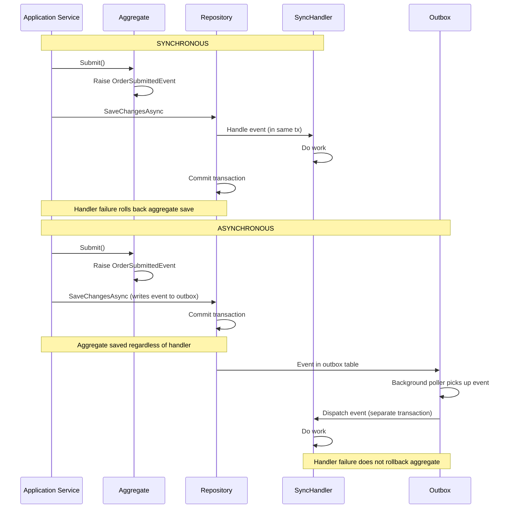
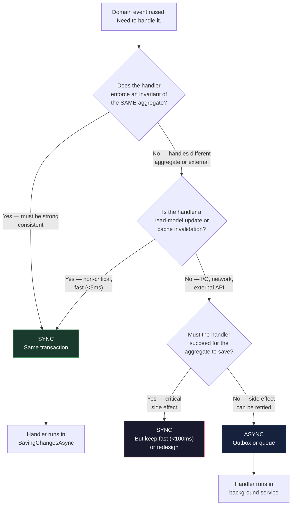

> [!success] Mastery Check
> - [ ] **Studied Well**
> - [ ] **Can explain the concept without notes**
> - [ ] **Can answer interview questions confidently**
> - [ ] **Can implement it in a real project**


# 7.072 — DDD — Domain Event Handling — Sync vs Async

## Section 1: Navigation & Context

**Domain:** [[7 — System Design & Distributed Systems]] > **Group:** Domain-Driven Design
**Previous:** [[7.071 — DDD — Common DDD Mistakes and Anti-Patterns]] | **Next:** [[7.073 — DDD — Tactical Patterns — Full .NET Reference]]

### Prerequisites

- [[7.053 — DDD — Domain Events — Within Bounded Context]] — domain events are raised by aggregates to signal state changes; whether those events are handled synchronously (within the same transaction) or asynchronously (after the transaction commits) determines the consistency guarantees for downstream work.
- [[7.065 — DDD — Eventual Consistency Between Aggregates]] — async handling is the mechanism for eventual consistency — the handler runs in its own transaction, creating a window of inconsistency. Sync handling provides immediate consistency but extends the transaction scope.
- [[7.054 — DDD — Domain Events — MediatR INotification in .NET]] — MediatR's `INotificationHandler<T>` supports both sync dispatch (handler runs in caller's context) and async dispatch (via `INotificationHandler<T>` with fire-and-forget or outbox). The implementation choice determines runtime behavior.

### Where This Fits

Domain event handlers can run synchronously (in the same transaction as the aggregate save) or asynchronously (after the transaction commits, possibly in a different process). This decision determines the consistency model: sync handlers see the aggregate's new state within the same transaction, while async handlers see eventual consistency. The wrong choice leads to either: (a) sync handlers that make the transaction too slow or create distributed coupling, or (b) async handlers that break read-your-writes guarantees and create confusing UX. Without understanding this tradeoff, teams default to either all-sync (creating multi-aggregate transactions) or all-async (introducing unnecessary complexity for simple cases).

---

## Section 2: Core Mental Model

A domain event handler is synchronous if it executes within the same database transaction and process that saved the aggregate, and asynchronous if it executes after the transaction commits (possibly in a different thread or process). The invariant maintained: synchronous handlers preserve strong consistency between the aggregate's state and the handler's side effect, at the cost of extending the transaction duration and coupling the handler to the aggregate's success/failure. Asynchronous handlers preserve aggregate isolation at the cost of eventual consistency — the handler sees a snapshot of state that may be stale. The recognition trigger: ask "if this handler fails, should the aggregate save roll back?" If yes, use sync. If no, use async. If "the handler must run even if the caller has already received a response," use async.

### Classification

| Dimension | Sync Event Handling | Async Event Handling |
|-----------|-------------------|---------------------|
| Transaction scope | Same as aggregate | Separate transaction |
| Consistency | Strong (read-your-writes) | Eventual |
| Handler failure | Rolls back aggregate save | Handled independently |
| Latency impact | Added to request time | Decoupled from response |
| Reliability | At-most-once (transaction-scoped) | At-least-once (outbox required) |



### Key Properties / Guarantees

| Property | Sync | Async | Decision driver |
|----------|------|-------|-----------------|
| Consistency | Strong (same transaction) | Eventual (separate tx) | Business requirement |
| Transaction length | Longer (includes handler) | Shorter (aggregate only) | Throughput requirement |
| Handler failure impact | Rolls back aggregate | Handler retries independently | Criticality of handler |
| Latency to caller | Higher (handler runs before response) | Lower (response before handler) | UX requirement |
| Delivery guarantee | At-most-once | At-least-once (with outbox) | Reliability requirement |
| Complexity | Lower | Higher (outbox, retry, idempotency) | Team capability |

---

## Section 3: Deep Mechanics

### How It Works

**Sync flow — OrderSubmittedEvent with InventoryCache handler:**

1. Application service calls `order.Submit()`. Aggregate raises `OrderSubmittedEvent`.
2. Repository calls `SaveChangesAsync()`. Before the transaction commits, a `SaveChangesInterceptor` collects domain events from tracked aggregates.
3. The interceptor iterates sync handlers and invokes them within the current transaction scope.
4. Handler 1: `InvalidateOrderCache` — removes the order's cached entry. Runs fast (<1ms), same transaction.
5. Handler 2: `UpdateOrderSearchIndex` — adds the order to the search index. Runs within the transaction — if the search index update fails, the order save fails.
6. Transaction commits. All handlers succeeded.

**Async flow — OrderSubmittedEvent with InventoryReservation handler:**

1. Application service calls `order.Submit()`. Aggregate raises `OrderSubmittedEvent`.
2. Repository calls `SaveChangesAsync()`. A `SaveChangesInterceptor` writes event data to an `OutboxMessages` table in the same transaction.
3. Transaction commits. The outbox has the event, the order is saved.
4. A background service (`OutboxDispatcher`) polls the outbox table every 1-5 seconds.
5. The background service reads the event, calls `InventoryHandler.HandleAsync()` with a new DbContext (separate transaction).
6. `InventoryHandler` loads the `Inventory` aggregate, calls `inventory.ReserveItems(order.Items)`, and saves (separate transaction).
7. If the handler fails, the outbox retries (RetryCount++). After 5 retries, the event goes to the dead-letter state.

**Choosing between sync and async for each handler:**

The decision is per-handler, not per-event. The same `OrderSubmittedEvent` can have one sync handler (`InvalidateCache`) and one async handler (`ReserveInventory`). The sync handler must be fast and failure-tolerant in the sense that its failure should roll back the save. The async handler can be slow and retry independently.

### Failure Modes

**Failure Mode 1: Sync handler that is slow blocks the request**

What breaks: A sync handler calls an external API (payment gateway, email service) within the transaction. The external API takes 2 seconds. The HTTP request blocks for 2+ seconds.

Detection: P99 latency spikes from 50ms to 2.5 seconds. App Insights shows dependency call to external service within the `SaveChanges` operation.

Fix: Move the external API call to an async handler:

```csharp
// ❌ Sync handler calls external API — blocks the transaction
public sealed class SendConfirmationHandler : INotificationHandler<OrderSubmittedEvent>
{
    public async Task Handle(OrderSubmittedEvent evt, CancellationToken ct)
    {
        await _emailClient.SendAsync(evt.CustomerEmail, "Order Confirmed", body);
        // This runs inside the Order's transaction — 2 second email send
    }
}

// ✅ Async handler — email sent after transaction commits
public sealed class SendConfirmationHandler : IIntegrationEventHandler<OrderSubmittedEvent>
{
    public async Task HandleAsync(OrderSubmittedEvent evt, CancellationToken ct)
    {
        await _emailClient.SendAsync(evt.CustomerEmail, "Order Confirmed", body);
        // Separate transaction — order already committed
    }
}
```

**Failure Mode 2: Sync handler failure rolls back valid aggregate save**

What breaks: The Order was valid and should have been committed. A non-critical sync handler (cache invalidation) throws an exception. The entire transaction rolls back. The customer sees "order failed."

Detection: Error log: `InvalidOperationException` in `CacheInvalidationHandler`. Dashboard shows elevated order failure rate.

Fix: The sync handler should only handle critical, fast operations. Move non-critical operations to async:

```csharp
// ❌ Cache invalidation failure rolls back order save
// Better: make it async so order save is independent
public sealed class CacheInvalidationHandler : INotificationHandler<OrderSubmittedEvent>
{
    public async Task Handle(OrderSubmittedEvent evt, CancellationToken ct)
    {
        await _cache.RemoveAsync($"order_{evt.OrderId}", ct);
        // If Redis is down, this throws — order is rolled back!
    }
}

// ✅ Async cache invalidation
public sealed class CacheInvalidationHandler : IIntegrationEventHandler<OrderSubmittedEvent>
{
    public async Task HandleAsync(OrderSubmittedEvent evt, CancellationToken ct)
    {
        try { await _cache.RemoveAsync($"order_{evt.OrderId}", ct); }
        catch { _logger.LogWarning("Cache invalidation failed — stale data acceptable"); }
    }
}
```

**Failure Mode 3: Async handler runs before aggregate is visible**

What breaks: The outbox dispatcher picks up the event and runs the handler before the transaction that saved the aggregate has fully committed. The handler tries to load the aggregate and gets a `DbUpdateConcurrencyException` or null reference.

Detection: Outbox retries show `DbUpdateConcurrencyException`. Handler logs show "Order not found."

Fix: The outbox dispatcher should use `READ COMMITTED SNAPSHOT` or ensure the transaction is committed before reading:

```csharp
// ✅ Handler re-reads aggregate with retry on not-found
public sealed class InventoryHandler : IIntegrationEventHandler<OrderSubmittedEvent>
{
    public async Task HandleAsync(OrderSubmittedEvent evt, CancellationToken ct)
    {
        var order = await _orderRepo.GetByIdAsync(evt.OrderId, ct);
        if (order is null)
        {
            _logger.LogWarning("Order {Id} not yet visible — will retry", evt.OrderId);
            throw new OrderNotVisibleException(evt.OrderId); // Triggers outbox retry
        }
        // Proceed with inventory reservation
    }
}
```

**Failure Mode 4: Async handler processes events out of order**

What breaks: Two events for the same aggregate arrive at the async handler in reverse order — `OrderCancelledEvent` before `OrderSubmittedEvent`. The handler processes cancel on an order that hasn't been submitted yet.

Detection: Out-of-order events in the dead-letter queue. Business report shows orders cancelled before they were submitted.

Fix: Use a sequence number on events or ensure handlers are idempotent and order-independent:

```csharp
// ✅ Sequence number on events
public sealed record OrderSubmittedEvent(Guid OrderId, int Version) : IDomainEvent;
public sealed record OrderCancelledEvent(Guid OrderId, int Version) : IDomainEvent;

// Handler checks version before applying
public async Task HandleAsync(OrderCancelledEvent evt, CancellationToken ct)
{
    var order = await _orderRepo.GetByIdAsync(evt.OrderId, ct);
    if (order.Version >= evt.Version) return; // Already processed or newer
    order.Cancel();
    await _orderRepo.SaveAsync(order, ct);
}
```

### .NET and Azure Integration

- **ASP.NET Core:** `SaveChangesInterceptor` for dispatching sync events; `IHostedService` for outbox dispatcher.
- **EF Core:** `SaveChangesInterceptor.SavingChangesAsync` for sync dispatch; `SaveChangesInterceptor.SavedChangesAsync` for outbox writing.
- **Azure services:** Azure Service Bus for async event delivery across services; Azure SQL for outbox table.
- **.NET libraries:** MediatR (`INotificationHandler<T>` — sync dispatch; outbox pattern for async); Polly for retry in async handlers.

```csharp
// Program.cs — configuring sync vs async
builder.Services.AddMediatR(cfg =>
{
    cfg.RegisterServicesFromAssemblyContaining<OrderSubmittedEvent>();
});

// Sync handlers are MediatR INotificationHandler — dispatched by SaveChangesInterceptor
builder.Services.AddScoped<INotificationHandler<OrderSubmittedEvent>, CacheInvalidationHandler>();

// Async handlers are IIntegrationEventHandler — dispatched by outbox poller
builder.Services.AddScoped<IIntegrationEventHandler<OrderSubmittedEvent>, InventoryHandler>();

// SaveChangesInterceptor for outbox writing
builder.Services.AddSingleton<EventOutboxInterceptor>();
builder.Services.AddHostedService<OutboxDispatcher>();
```

---

## Section 4: Production Patterns and Implementation

### Primary Implementation

```csharp
// ============ Domain Event ============
namespace Orders.Domain.Events;

public sealed record OrderSubmittedEvent(
    Guid EventId,
    Guid OrderId,
    string CustomerId,
    IReadOnlyCollection<OrderItem> Items,
    DateTime OccurredAt) : IDomainEvent;

// ============ Sync Handler — Cache Invalidation ============
// Runs in the same transaction. Must be fast and failure non-critical.
namespace Orders.Application.EventHandlers;

public sealed class InvalidateOrderCacheHandler : INotificationHandler<OrderSubmittedEvent>
{
    private readonly IDistributedCache _cache;
    private readonly ILogger<InvalidateOrderCacheHandler> _logger;

    public InvalidateOrderCacheHandler(
        IDistributedCache cache, ILogger<InvalidateOrderCacheHandler> logger)
    {
        _cache = cache;
        _logger = logger;
    }

    public async Task Handle(OrderSubmittedEvent evt, CancellationToken ct)
    {
        try
        {
            await _cache.RemoveAsync($"order:{evt.OrderId}", ct);
            _logger.LogDebug("Cache invalidated for order {OrderId}", evt.OrderId);
        }
        catch (Exception ex)
        {
            // Log but don't throw — cache invalidation failure should not rollback order
            _logger.LogWarning(ex, "Cache invalidation failed for order {OrderId}", evt.OrderId);
        }
    }
}

// ============ Async Handler — Inventory Reservation ============
// Runs after transaction commits via outbox. Separate transaction.
namespace Orders.Application.IntegrationEventHandlers;

public sealed class InventoryReservationHandler
    : IIntegrationEventHandler<OrderSubmittedEvent>
{
    private readonly IInventoryRepository _inventoryRepo;
    private readonly IOrderRepository _orderRepo;
    private readonly ILogger<InventoryReservationHandler> _logger;

    public InventoryReservationHandler(
        IInventoryRepository inventoryRepo,
        IOrderRepository orderRepo,
        ILogger<InventoryReservationHandler> logger)
    {
        _inventoryRepo = inventoryRepo;
        _orderRepo = orderRepo;
        _logger = logger;
    }

    public async Task HandleAsync(OrderSubmittedEvent evt, CancellationToken ct)
    {
        // Re-read the order (separate transaction) — may be null if not yet visible
        var order = await _orderRepo.GetByIdAsync(evt.OrderId, ct);
        if (order is null)
        {
            _logger.LogWarning("Order {Id} not found for inventory reservation, will retry",
                evt.OrderId);
            throw new RetryableException("Order not yet visible"); // Triggers outbox retry
        }

        foreach (var item in order.Items)
        {
            var inventory = await _inventoryRepo.GetBySkuAsync(item.Sku, ct);
            inventory.ReserveItems(item.Quantity);
            await _inventoryRepo.SaveAsync(inventory, ct);
        }

        _logger.LogInformation("Inventory reserved for order {OrderId}", evt.OrderId);
    }
}

// ============ SaveChangesInterceptor ============
// Writes domain events to outbox for async dispatch
namespace Orders.Infrastructure.Persistence;

public sealed class EventOutboxInterceptor : SaveChangesInterceptor
{
    public override ValueTask<InterceptionResult<int>> SavingChangesAsync(
        DbContextEventData eventData, InterceptionResult<int> result,
        CancellationToken ct = default)
    {
        if (eventData.Context is not null)
            WriteOutboxMessages(eventData.Context);
        return base.SavingChangesAsync(eventData, result, ct);
    }

    private static void WriteOutboxMessages(DbContext context)
    {
        var domainEntities = context.ChangeTracker.Entries()
            .Where(e => e.Entity is IHasDomainEvents)
            .Select(e => (IHasDomainEvents)e.Entity)
            .Where(a => a.DomainEvents.Any())
            .ToList();

        foreach (var entity in domainEntities)
        {
            foreach (var evt in entity.DomainEvents)
            {
                context.Add(OutboxMessage.FromDomainEvent(
                    evt, nameof(OrderSubmittedEvent)));
            }
            entity.ClearDomainEvents();
        }
    }
}
```

### Configuration and Wiring

```csharp
// Program.cs
builder.Services.AddDbContext<OrderDbContext>(options =>
    options.UseSqlServer(builder.Configuration.GetConnectionString("Orders")));

// Sync dispatch via MediatR (in-process, in-transaction)
builder.Services.AddMediatR(cfg =>
{
    cfg.RegisterServicesFromAssemblyContaining<OrderSubmittedEvent>();
    // MediatR INotificationHandler<T> are sync — dispatched by SaveChangesInterceptor
});

// Async dispatch via outbox + background service
builder.Services.AddScoped<IIntegrationEventHandler<OrderSubmittedEvent>,
    InventoryReservationHandler>();
builder.Services.AddHostedService<OutboxDispatcher>();
builder.Services.AddSingleton<EventOutboxInterceptor>();

builder.Services.AddDbContext<OrderDbContext>((sp, options) =>
{
    var interceptor = sp.GetRequiredService<EventOutboxInterceptor>();
    options.UseSqlServer(
        builder.Configuration.GetConnectionString("Orders"));
    options.AddInterceptors(interceptor);
});
```

### Common Variants

**Variant 1 — Sync dispatch for simple, same-aggregate operations:**

```csharp
// Raise and handle within the same service method (no MediatR)
public void Submit()
{
    if (Status != OrderStatus.Pending) throw new DomainException("...");
    Status = OrderStatus.Submitted;
    // Handle immediately — no dispatch needed
    _searchIndex.Add(this); // Direct call
}
// Used when the handler is trivially coupled to the aggregate
```

**Variant 2 — Hybrid: sync dispatch for critical handlers, async for others:**

```csharp
// SaveChangesInterceptor checks a handler registry
public enum DispatchMode { Sync, Async }

[AttributeUsage(AttributeTargets.Class)]
public sealed class EventHandlerAttribute : Attribute
{
    public DispatchMode Mode { get; }
    public EventHandlerAttribute(DispatchMode mode) => Mode = mode;
}

[EventHandler(DispatchMode.Async)]
public sealed class InventoryHandler : INotificationHandler<OrderSubmittedEvent> { }

// Interceptor checks attribute:
// Sync handlers run in SavingChangesAsync (before commit)
// Async handlers write to outbox (dispatched by background service)
```

**Variant 3 — Azure Service Bus for fully async across services:**

```csharp
// Publish to Service Bus instead of outbox table
public sealed class ServiceBusEventPublisher : IEventPublisher
{
    private readonly ServiceBusSender _sender;

    public async Task PublishAsync<T>(T evt, CancellationToken ct) where T : IDomainEvent
    {
        var message = new ServiceBusMessage(JsonSerializer.Serialize(evt))
        {
            MessageId = Guid.NewGuid().ToString(),
            Subject = typeof(T).FullName
        };
        await _sender.SendMessageAsync(message, ct);
    }
}
```

### Real-World .NET Ecosystem Example

**MediatR** provides `INotificationHandler<T>` which, by default, dispatches synchronously — all handlers run sequentially before `Publish` returns. The library supports `INotificationHandler<T>` (sync) and the newer `IRequestHandler<T, Unit>` patterns. For async dispatch, the community typically wraps MediatR in an outbox pattern or uses **MassTransit**/**NServiceBus** which provide built-in async dispatch, retry, and saga support.

**EF Core Interceptors** (available since EF Core 6) provide the `SaveChangesInterceptor` that enables both sync dispatch (before commit) and async dispatch (write to outbox after commit).

---

## Section 5: Gotchas and Production Pitfalls

### Pitfall 1: All Handlers Are Sync — Transaction Too Long

**Pitfall:** Every domain event handler runs synchronously within the aggregate's transaction. A handler that sends an email takes 2 seconds. The transaction holds locks for 2 seconds.

```csharp
// ❌ All handlers sync — slow transaction
// SaveChangesInterceptor runs all handlers before committing
// Email handler blocks the transaction for 2 seconds
```

**Symptom:** Deadlocks under concurrency. P99 latency spikes. SQL Server `LOCK_TIMEOUT` errors.

**Fix:** Identify which handlers are async candidates — anything involving I/O, external APIs, or non-critical side effects:

```csharp
// ✅ Fast handlers stay sync, I/O handlers become async
// Sync: cache invalidation (<1ms) — stays sync
// Async: email sending (2s), inventory reservation (500ms) — outbox
```

**Cost of not fixing:** Transaction holds locks longer → deadlocks → retries → increased latency → cascading failures.

### Pitfall 2: Sync Handler Throws and Rolls Back Aggregate

**Pitfall:** A non-critical sync handler throws an exception. The entire order save is rolled back.

```csharp
// ❌ Handler exception rolls back valid order save
public async Task Handle(OrderSubmittedEvent evt, CancellationToken ct)
{
    await _thirdPartyApi.NotifyAsync(evt.OrderId, ct); // API down — throws!
    // Order save is rolled back — customer sees error
}
```

**Symptom:** Order failures correlate with third-party API outages. Orders that are perfectly valid fail to save.

**Fix:** Swallow non-critical exceptions in sync handlers (with logging). Move critical-but-slow operations to async:

```csharp
// ✅ Non-critical failures logged but don't roll back
public async Task Handle(OrderSubmittedEvent evt, CancellationToken ct)
{
    try
    {
        await _thirdPartyApi.NotifyAsync(evt.OrderId, ct);
    }
    catch (Exception ex)
    {
        _logger.LogWarning(ex, "Third-party notification failed for order {Id}, continuing",
            evt.OrderId);
    }
}
```

**Cost of not fixing:** Valid orders rejected due to infrastructure failures. Revenue loss. Customer frustration.

### Pitfall 3: Async Handler Processes Events Before Aggregate Is Committed

**Pitfall:** The outbox dispatcher runs within milliseconds of the event being written. The handler tries to read the aggregate but the transaction hasn't fully committed yet.

```csharp
// ❌ Handler sees stale or no state
public async Task HandleAsync(OrderSubmittedEvent evt, CancellationToken ct)
{
    var order = await _orderRepo.GetByIdAsync(evt.OrderId, ct);
    // order is null — transaction not yet visible to this session!
}
```

**Symptom:** Handler logs "Order not found" for events that were just created. Outbox retry loop.

**Fix:** Add a small delay in the outbox dispatcher or use read-committed snapshot isolation:

```csharp
// ✅ Retry with backoff — eventually consistent read
public async Task HandleAsync(OrderSubmittedEvent evt, CancellationToken ct)
{
    for (int i = 0; i < 3; i++)
    {
        var order = await _orderRepo.GetByIdAsync(evt.OrderId, ct);
        if (order is not null) { /* proceed */ return; }
        await Task.Delay(TimeSpan.FromMilliseconds(100 * (i + 1)), ct);
    }
    throw new OrderNotVisibleException(evt.OrderId); // Final retry by outbox
}
```

**Cost of not fixing:** Infinite retry loop. Handler never completes. Event stuck in outbox.

### Pitfall 4: Async Handler Not Idempotent — Duplicate Processing

**Pitfall:** The outbox retries an event after a timeout. The handler processes it a second time — double-decrementing inventory.

```csharp
// ❌ Not idempotent — duplicate event = double processing
public async Task HandleAsync(OrderSubmittedEvent evt, CancellationToken ct)
{
    var inventory = await _inventoryRepo.GetBySkuAsync(evt.Items.First().Sku, ct);
    inventory.Quantity -= evt.Items.First().Quantity; // Applied twice on retry!
    await _inventoryRepo.SaveAsync(inventory, ct);
}
```

**Symptom:** Inventory goes negative. Reconciliation fails.

**Fix:** Idempotency check via processed-events table:

```csharp
// ✅ Idempotent — checked before processing
public async Task HandleAsync(OrderSubmittedEvent evt, CancellationToken ct)
{
    if (await _processedEvents.ExistsAsync(evt.EventId, ct))
        return;
    var inventory = await _inventoryRepo.GetBySkuAsync(evt.Items.First().Sku, ct);
    inventory.Quantity -= evt.Items.First().Quantity;
    _processedEvents.Add(new ProcessedEvent(evt.EventId));
    await _inventoryRepo.SaveAsync(inventory, ct);
}
```

**Cost of not fixing:** Silent data corruption. Manual inventory reconciliation required.

### Pitfall 5: Mixing Sync and Async for the Same Handler Type

**Pitfall:** A handler is registered as both `INotificationHandler<T>` (sync) and `IIntegrationEventHandler<T>` (async). The event is processed twice.

```csharp
// ❌ Handler registered twice — double execution
services.AddScoped<INotificationHandler<OrderSubmittedEvent>, InventoryHandler>(); // Sync
services.AddScoped<IIntegrationEventHandler<OrderSubmittedEvent>, InventoryHandler>(); // Async
```

**Symptom:** Inventory decremented twice per order. Duplicate events in the outbox.

**Fix:** Each handler is either sync OR async, not both. Use a naming convention to distinguish:

```csharp
// ✅ Clear naming convention
public sealed class InventorySyncHandler : INotificationHandler<OrderSubmittedEvent> { } // Sync
public sealed class InventoryAsyncHandler : IIntegrationEventHandler<OrderSubmittedEvent> { } // Async
```

**Cost of not fixing:** Duplicate side effects. Inventory goes negative. Hard to debug because both paths look correct individually.

---

## Section 6: Tradeoffs and Decision Framework

### Tradeoff Matrix

| Dimension | Sync (In-Transaction) | Async (Outbox/Queue) | Mixed (Per Handler) |
|-----------|----------------------|---------------------|---------------------|
| Transaction duration | Longer (includes handler) | Short (aggregate only) | Variable |
| Consistency | Strong (same tx) | Eventual | Per-handler |
| Handler failure impact | Rolls back aggregate | Separate retry | Per-handler |
| Latency to caller | Higher | Lower | Medium |
| Complexity | Lower | Higher (outbox, idempotency) | Medium |
| Use case | Invariant enforcement | Cross-aggregate propagation | Most real systems |

### Decision Flowchart



### When to Apply Sync

- Handler enforces an invariant that must be consistent with aggregate state (e.g., "order total cannot exceed credit limit")
- Handler is fast (<5ms) and non-blocking
- Handler failure should roll back the aggregate save
- Handler updates an in-process cache or read model

### When to Apply Async

- Handler calls an external API, sends email, or does I/O
- Handler updates a different aggregate (inventory reservation, invoice generation)
- Handler failure should not roll back the aggregate save
- Response time to the caller must be fast

### Scale Thresholds

- **Sync handler max time:** <50ms P99. Above this, the transaction holds locks too long.
- **Async handler appropriate above:** Any handler that exceeds 50ms OR touches a different aggregate.
- **Outbox poll interval:** 1-5 seconds for most systems. 100ms for low-latency requirements (at cost of higher DB load).
- **Handler retry count:** 3-5 retries with exponential backoff (100ms, 500ms, 2s, 10s). Beyond 5, move to dead-letter for manual review.

---

## Section 7: Interview Arsenal

### Question Bank

1. What is the difference between synchronous and asynchronous domain event handling?
2. When would you choose synchronous event handling over asynchronous?
3. What problems arise from making ALL domain event handlers synchronous?
4. How does the outbox pattern enable reliable asynchronous event handling?
5. Compare the consistency guarantees of sync vs async event handling.
6. How do you decide which handlers should be sync and which should be async for a given event?
7. What happens when an async handler fails after multiple retries?
8. Design the event handling strategy for an e-commerce order submission system.

### Spoken Answers

**Q1: What is the difference between synchronous and asynchronous domain event handling?**

> **Average answer:** Sync handlers run in the same transaction. Async handlers run later.

> **Great answer:** The fundamental difference is transaction scope and consistency. Synchronous handlers execute within the same database transaction and process context that saves the aggregate. The aggregate's `SaveChangesAsync` doesn't complete until all sync handlers have finished. This means the handler sees the aggregate's new state in the same transaction, and if the handler fails, the entire aggregate save rolls back. The benefit is strong consistency — the cache is invalidated exactly when the order is saved, and they're never out of sync.

Asynchronous handlers execute after the transaction commits — in a separate thread, possibly a separate process, and always in a separate database transaction. The event is written to an outbox table in the same transaction as the aggregate. A background service polls the outbox and dispatches the event to async handlers. If an async handler fails, the aggregate save is unaffected — the outbox retries the handler independently. This gives aggregate isolation but at the cost of eventual consistency — there's a window where the Order is saved but inventory hasn't been reserved yet.

In .NET, I use MediatR's `INotificationHandler<T>` for sync dispatch within a `SaveChangesInterceptor`, and a custom outbox pattern with a background `IHostedService` for async dispatch. The same event type can have both sync and async handlers — cache invalidation runs sync (fast, critical for consistency), inventory reservation runs async (I/O, different aggregate). The decision is per-handler, not per-event.

**Q2: When would you choose synchronous event handling over asynchronous?**

> **Average answer:** When you need immediate consistency, like cache invalidation.

> **Great answer:** I choose synchronous handling when three conditions are met: (1) the handler is fast — under 5 milliseconds, ideally under 1 millisecond; (2) the handler's failure should roll back the aggregate save, meaning the handler's side effect is as important as the aggregate's state change; and (3) the handler enforces an invariant that must be strongly consistent with the aggregate's state.

The most common example is cache invalidation. When an order transitions to Submitted, the cached order data must be invalidated or the next read returns stale data. The handler takes under a millisecond — it's a Redis `RemoveAsync`. If the cache is down, I log and swallow the exception because stale cache is acceptable, but I don't want the cache failure to roll back a valid order save. So even this sync handler catches and logs its exceptions.

Another example is updating an in-process read model — a `ConcurrentDictionary` that powers a dashboard. The update is in-memory, takes microseconds, and must be consistent with the aggregate save. If the read model update fails, the order should roll back because the dashboard would be permanently out of sync.

The key principle: synchronous handlers should be short, failure-tolerant (log-and-continue for non-critical), and strictly scoped to the same aggregate's consistency boundary. Anything that crosses into another aggregate or external system goes async.

**Q5: Compare the consistency guarantees of sync vs async event handling.**

> **Average answer:** Sync is strongly consistent. Async is eventually consistent.

> **Great answer:** Sync handling provides **read-your-writes consistency** within the transaction. If the sync handler invalidates the cache, the next read — even within the same HTTP request — sees the invalidated cache and fetches fresh data from the database. The aggregate save and the cache invalidation are atomic — either both happen or neither happens. This is crucial for user-facing operations where the user expects to see their changes immediately after the API response.

Async handling provides **eventual consistency with at-least-once delivery** (when using the outbox pattern). After the aggregate saves and the transaction commits, there's a window — typically 1-5 seconds with an outbox poller — where the handler hasn't executed. During that window, the system is in an inconsistent state: the order is submitted but inventory hasn't been reserved, or the invoice hasn't been generated. The system will converge within the poll interval, but the caller cannot rely on reading the handler's effects immediately.

The practical difference: with sync handling, the API response can include "order submitted, inventory reserved, invoice generated" — all confirmed. With async handling, the API response is "order submitted, processing" and the caller must poll or be notified when the remaining steps complete.

The .NET implementation difference: sync handlers use `INotificationHandler<T>` with MediatR, dispatched within `SaveChangesInterceptor.SavingChangesAsync`. Async handlers use the outbox pattern: events are written to an `OutboxMessages` table in the same transaction as the aggregate, and a background `IHostedService` polls and dispatches them. The outbox provides the at-least-once guarantee that in-memory dispatch cannot match.

### System Design Interview Trigger

If an interviewer says "the user places an order — walk through everything that happens," and you mention "the system raises an OrderSubmittedEvent," the follow-up is: "does the email notification happen in the same transaction or a different one?" This tests whether you understand the sync/async tradeoff. The deepest follow-up: "what if the email service is down? Does the order still go through?" The correct answer: "email is async — the handler runs in a separate transaction after the order commits. If the email service is down, the outbox retries. The order is already confirmed."

### Comparison Table

| | Sync Event Handling | Async Event Handling (Outbox) | Async Event Handling (Queue) |
|---|---|---|---|
| Consistency | Strong (same tx) | Eventual (<5s convergence) | Eventual (depends on queue) |
| Transaction scope | Includes handler | Aggregate only | Aggregate only |
| Delivery guarantee | At-most-once (transaction-scoped) | At-least-once | At-least-once |
| .NET implementation | MediatR INotificationHandler | Outbox table + IHostedService | Azure Service Bus / MassTransit |
| Failure mode | Handler throws → rollback | Duplicate event (if not idempotent) | Duplicate message |
| When to use | Fast, critical side effects | Cross-aggregate, external APIs | Cross-service, high-throughput |

---

## Section 8: Architecture Decision Record

**Status:** Accepted

**Context:**
The Order Submission workflow raises `OrderSubmittedEvent`. Three handlers need to respond: (1) Invalidate the order cache (Redis, <1ms), (2) Reserve inventory in the Inventory aggregate (EF Core, 50-200ms), (3) Send confirmation email via SendGrid (HTTP API, 100-500ms). The system handles 500 req/s with an SLO of 200ms P95 response time. The previous design ran all handlers synchronously, causing P95 response time to exceed 800ms and transaction lock times to spike under load.

**Options Considered:**

1. **Mixed sync/async (Recommended)** — Cache invalidation stays sync (<1ms, in-transaction). Inventory reservation and email sending move to async via outbox pattern.
2. **All sync** — Keep all handlers in the transaction. Accept the 800ms P95 latency.
3. **All async** — Move all handlers including cache invalidation to async. Accept eventual consistency for cached data.

**Decision:** Mixed sync/async (Option 1), because cache invalidation requires immediate consistency (read-your-writes for the customer's next request), while inventory reservation and email sending can tolerate 1-5 second eventual consistency. The sync handler is fast enough (<1ms) that it doesn't impact transaction time.

**Consequences:**
- ✅ P95 response time drops from 800ms to ~150ms (aggregate save + cache invalidation)
- ✅ Transaction lock time stays under 10ms — deadlock rate drops to near zero
- ✅ Cache is always consistent with aggregate state
- ⚠️ Async handlers must be idempotent — outbox retries guarantee at-least-once delivery
- ❌ Inventory reservation is eventually consistent — 1-5 second window where order shows but inventory hasn't updated

**Review Trigger:** Revisit if the 1-5 second eventual consistency for inventory reservation causes business issues (overselling). If so, consider reserving inventory in a sync handler (requires making it fast enough) or implementing a two-phase reservation protocol.

---

## Section 9: Self-Check

### Conceptual Questions

1. What is the difference between synchronous and asynchronous domain event handling?

<details>
<summary>Answer</summary>
Sync: handler runs in the same transaction and process as the aggregate save — strong consistency, same transaction scope. Async: handler runs after the transaction commits, in a separate transaction and possibly separate process — eventual consistency, aggregate isolation.
</details>

2. When would you choose synchronous handling over asynchronous?

<details>
<summary>Answer</summary>
When the handler is fast (<5ms), its failure should roll back the aggregate save, or it enforces an invariant that must be strongly consistent with the aggregate state. Cache invalidation is the classic example.
</details>

3. What problems arise from making all domain event handlers synchronous?

<details>
<summary>Answer</summary>
Long transaction times (external I/O holds locks), deadlocks under concurrency, increased P99 latency, coupling aggregate save to external API availability, and non-critical handler failures rolling back valid aggregate saves.
</details>

4. How does the outbox pattern enable reliable asynchronous event handling?

<details>
<summary>Answer</summary>
Events are written to an OutboxMessages table in the same transaction as the aggregate. A background service polls unprocessed messages and dispatches them to handlers. If the service crashes after the transaction commits, the outbox persists the event — it's picked up on restart. At-least-once delivery is guaranteed.
</details>

5. Compare the consistency guarantees of sync vs async event handling.

<details>
<summary>Answer</summary>
Sync: read-your-writes consistency — the handler's effects are visible immediately after the transaction. Async: eventual consistency — the handler's effects become visible within the outbox poll interval (typically 1-5 seconds).
</details>

6. How do you decide which handlers should be sync and which async for a given event?

<details>
<summary>Answer</summary>
Sync if: fast (<5ms), enforces same-aggregate invariant, failure should roll back save. Async if: I/O, external API, different aggregate, retry-ok, or response time is critical.
</details>

7. What happens when an async handler fails after multiple retries?

<details>
<summary>Answer</summary>
The event moves to a dead-letter state in the outbox table. An alert fires. A human reviews the failure, fixes the issue (e.g., API endpoint restored), and manually replays the event.
</details>

8. Design the event handling strategy for an e-commerce order submission system with cache invalidation, inventory reservation, and email notification.

<details>
<summary>Answer</summary>
Cache invalidation: sync handler (<1ms Redis). Inventory reservation: async handler (outbox + separate transaction). Email notification: async handler (outbox + retry). This gives 150ms P95 response time, read-your-writes for cached data, and at-least-once delivery for cross-aggregate operations.
</details>

9. What is the most common failure mode when mixing sync and async handlers for the same event?

<details>
<summary>Answer</summary>
Accidentally registering a handler as both sync (INotificationHandler) and async (IIntegrationEventHandler), causing the event to be processed twice. Prevention: clear naming conventions and single registration per handler.
</details>

10. Explain sync vs async event handling to a junior developer in 60 seconds.

<details>
<summary>Answer</summary>
"Sync handlers run right away in the same database transaction. If one fails, the whole order save fails. Use sync for fast stuff that MUST happen with the order — like invalidating the cache. Async handlers run later, after the order is saved. If one fails, the order is fine — we retry later. Use async for slow stuff — like sending emails or updating inventory. Async needs the outbox pattern so events survive a crash. Best systems use both: sync for critical-fast, async for slow-retryable."
</details>

---

### Scenario Challenges

**Scenario 1 — Diagnose the problem**

A team's order submission endpoint shows P95 latency of 1.2 seconds. The transaction includes: order save (5ms), cache invalidation (2ms), inventory reservation (200ms DB write), email notification (800ms HTTP call to SendGrid), and search index update (200ms HTTP call to Elasticsearch).

<details>
<summary>Diagnosis</summary>

**Root cause:** All domain event handlers run synchronously within the transaction. The email notification (800ms) and search index update (200ms) extend the transaction to 1.2+ seconds, holding database locks.

**Evidence:** App Insights shows `SaveChangesAsync` taking 1200ms. Dependency tracking shows `SendGrid.SendAsync` and `Elasticsearch.IndexAsync` as child operations of the database transaction.

**Fix:**
1. Move email notification to async handler (outbox + background service).
2. Move search index update to async handler.
3. Keep cache invalidation as sync (<2ms).
4. Keep inventory reservation as sync (200ms — acceptable if business requires immediate consistency, otherwise move to async too).

**Expected improvement:** P95 drops from 1.2s to ~250ms (order save + cache + inventory).
</details>

---

**Scenario 2 — Design decision**

You are designing an event handling strategy for a banking system. When a transfer is initiated, handlers must: (1) debit source account, (2) credit destination account, (3) send notification email, (4) update daily transfer limit tracker. Which handlers should be sync vs async?

<details>
<summary>Decision and Reasoning</summary>

**Choice:** Debit and credit are sync handlers in the same aggregate (Transfer). Transfer limit tracker is sync (invariant enforcement — must not exceed daily limit). Email notification is async.

**Tradeoffs accepted:** The debit and credit operations are the aggregate's own state changes — they are not "handlers" but part of the aggregate method. The daily limit tracker is a separate aggregate that must be strongly consistent with the transfer (cannot exceed limit), so it runs sync. The email notification can be async because it's not an invariant.

**Implementation sketch:**
```csharp
public sealed class Transfer : AggregateRoot
{
    public void Execute()
    {
        DebitSource();
        CreditDestination();
        AddDomainEvent(new TransferExecutedEvent(Id, SourceAccount, DestAccount, Amount));
    }
}

// Sync: daily limit handler (invariant enforcement)
public sealed class DailyLimitHandler : INotificationHandler<TransferExecutedEvent>
{
    public async Task Handle(TransferExecutedEvent evt, CancellationToken ct)
    {
        var tracker = await _trackerRepo.GetTodayAsync(evt.SourceAccount, ct);
        tracker.AddTransfer(evt.Amount);
        await _trackerRepo.SaveAsync(tracker, ct); // Same transaction
        // If this fails, transfer rolls back — correct behavior
    }
}

// Async: email handler
public sealed class EmailHandler : IIntegrationEventHandler<TransferExecutedEvent>
{
    public async Task HandleAsync(TransferExecutedEvent evt, CancellationToken ct)
    {
        await _email.SendAsync(evt.SourceAccount, "Transfer completed", ...);
        // If this fails, transfer is already committed — retry
    }
}
```

**Alternative:** If daily limit tracking becomes a performance bottleneck, make it async and accept that a small number of transfers may temporarily exceed the daily limit (eventual consistency for limit checks).
</details>

---

**Scenario 3 — Failure mode** The outbox dispatcher is sending events faster than the async handler can process them. The outbox table grows to 50K unprocessed messages. The handler is an external API call to a warehouse system that handles 10 req/s.

<details>
<summary>Investigation and Fix</summary>

**Investigation steps:**
1. Check the outbox message count and growth rate.
2. Check the handler's throughput and failure rate.
3. Check the warehouse API's rate limit.

**Confirming evidence:** Outbox table: 50K messages, growing at 50 msg/s. Warehouse API: handling 10 req/s, returning 429 (rate limited) responses.

**Fix:**
1. Implement rate limiting in the outbox dispatcher (max 10 req/s to warehouse API).
2. Add circuit breaker on the warehouse API call.
3. Consider batch processing: group multiple events into a single API call.

**Permanent fix:** The outbox dispatcher should respect the downstream API's capacity:

```csharp
public sealed class RateLimitedOutboxDispatcher : BackgroundService
{
    private readonly IServiceScopeFactory _scopeFactory;
    private static readonly TimeSpan RateLimit = TimeSpan.FromMilliseconds(100); // 10/s

    protected override async Task ExecuteAsync(CancellationToken ct)
    {
        while (!ct.IsCancellationRequested)
        {
            using var scope = _scopeFactory.CreateScope();
            var db = scope.ServiceProvider.GetRequiredService<OutboxDbContext>();
            var messages = await db.OutboxMessages
                .Where(m => m.ProcessedAt == null)
                .OrderBy(m => m.CreatedAt)
                .Take(10) // Respect downstream capacity
                .ToListAsync(ct);
            // ... process ...
            await Task.Delay(RateLimit, ct);
        }
    }
}
```

**Post-mortem item:** Add monitoring: outbox queue depth alert if > 1000 messages.
</details>

---

**Scenario 4 — Scale it** Your system handles 1000 events/second with async handlers. The outbox poller, logging, and handler execution are all on the same web application instance. At peak, the CPU is at 90%.

<details>
<summary>Scaling Strategy</summary>

**Bottleneck this addresses:** The outbox poller competes with HTTP request handling for CPU. At 1000 events/second, the poller and handler invocations consume significant resources.

**How it helps:**
1. Move the outbox dispatcher to a separate background process (Azure Function or console app).
2. The web application only writes to the outbox table (fast, transactional).
3. The background process reads and dispatches events independently.

**What it does not solve:** The handler execution itself — if handlers are CPU-intensive, they need their own scaling.

**Implementation order:**
1. Extract outbox dispatcher to a separate `IHostedService` in a console app (or Azure Function with TimerTrigger).
2. Deploy as a separate Azure App Service or Container App.
3. If handler throughput is still insufficient, partition handlers by event type (one consumer per event type).

**Scalability target:** Write path: 1000 events/s to outbox table. Read path: background service handles 1000 events/s with <5 second end-to-end latency.
</details>

---

**Scenario 5 — Interview simulation** The interviewer says: "Design the order processing pipeline. When an order is placed, we need to: (1) save the order, (2) invalidate the product cache, (3) reserve inventory, (4) send confirmation email, (5) notify the warehouse. Walk through your event handling strategy."

<details>
<summary>Model Response</summary>

"I'd break this into sync and async decisions per step. The order save is the aggregate transaction — that's the consistency boundary. Cache invalidation is a sync handler — it takes under a millisecond, and stale cache causes user-facing issues where customers see old data. I'd implement it as a MediatR `INotificationHandler<OrderSubmittedEvent>` dispatched within the `SaveChangesInterceptor` before the transaction commits.

Inventory reservation, confirmation email, and warehouse notification are async handlers. They all involve I/O — database writes for inventory, HTTP calls for email and warehouse API. They should run after the transaction commits via the outbox pattern. The outbox table receives the events in the same transaction as the order save. A background `IHostedService` — running in a separate process at scale — polls the outbox every 2 seconds and dispatches to each handler.

Each async handler gets its own retry policy: inventory reservation retries 3 times with exponential backoff (200ms, 500ms, 2s) because database contention is transient. The email handler retries 5 times because SendGrid occasionally throttles. The warehouse notification retries with a circuit breaker — if the warehouse API returns 503 three times in a minute, the circuit opens for 30 seconds, and events accumulate in the outbox for batch processing later.

The key guarantee: the order save and cache invalidation are immediate and consistent — the customer sees their order confirmed and the product page shows updated availability immediately. Inventory reservation, email, and warehouse notification are eventually consistent — they complete within 2-10 seconds, and failures trigger retries, not rollbacks. If the warehouse API is down for an hour, the order is still confirmed and inventory is reserved — the warehouse notification waits in the outbox dead-letter until the API recovers and we replay it.

For monitoring: I'd track `outbox_queue_depth` (alert > 1000), `handler_success_rate` per handler type (alert < 95%), and `event_latency_p99` from event creation to handler completion (target < 30 seconds)."
</details>
