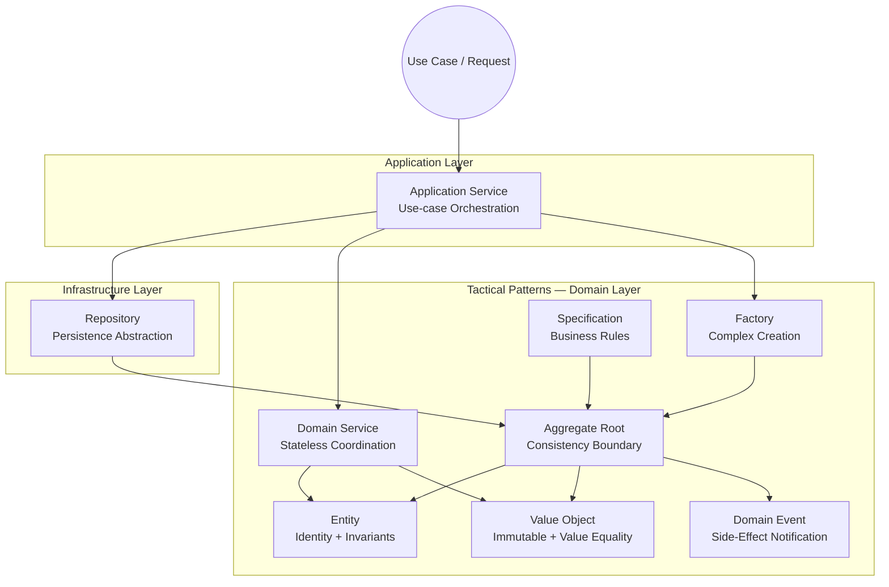
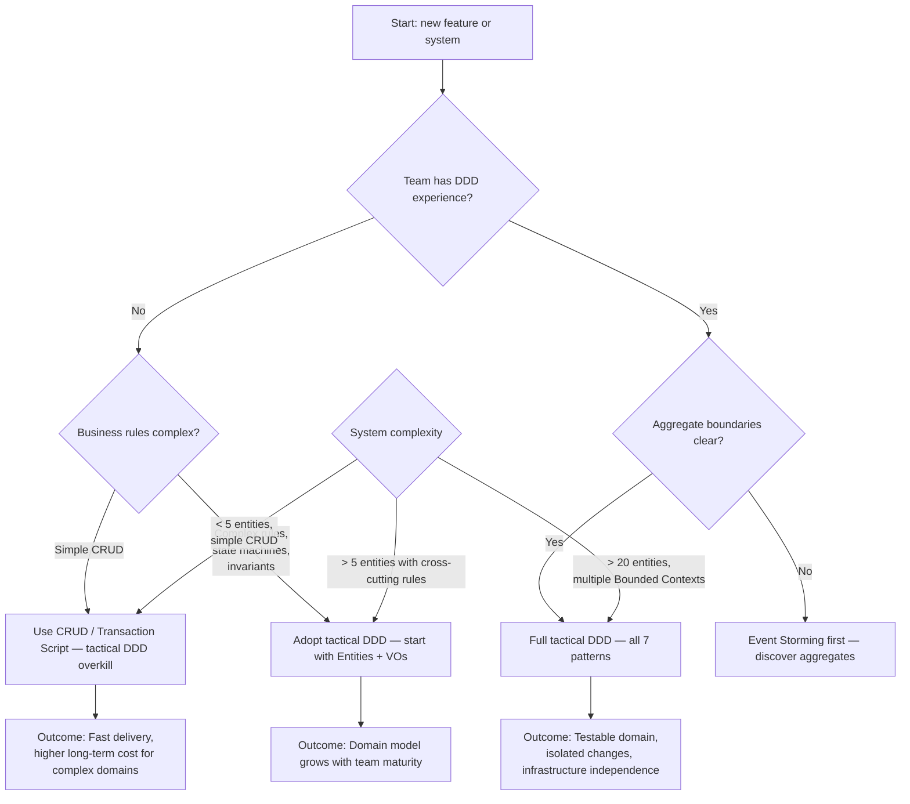

> [!success] Mastery Check
> - [ ] **Studied Well**
> - [ ] **Can explain the concept without notes**
> - [ ] **Can answer interview questions confidently**
> - [ ] **Can implement it in a real project**


# 7.073 — DDD — Tactical Patterns — Full .NET Reference

## Section 1: Navigation & Context

**Domain:** [[7 — System Design & Distributed Systems]] > **Group:** Domain-Driven Design
**Previous:** [[7.072 — DDD — Domain Event Handling — Sync vs Async]] | **Next:** None (last in DDD group)

### Prerequisites

- [[7.042 — DDD — Strategic Design vs Tactical Patterns]] — tactical patterns are the code-level building blocks (entities, value objects, aggregates) that implement the model defined during strategic design. Without strategic context, tactical patterns become mechanical exercises — you build aggregates without knowing what consistency boundaries mean, or repositories without understanding aggregate roots.
- [[7.044 — DDD — Entities — Invariant Enforcement]] — entities are the primary tactical element; every aggregate is an entity, and every domain event references an entity. The invariant enforcement techniques used in entities (guard clauses, factory methods, explicit state transitions) propagate to every other tactical pattern.
- [[7.046 — DDD — Value Objects — C# Records Implementation]] — value objects provide the measurement and description that entities need. Without value objects, entities degrade into primitive-heavy, anemic models. C# 12 records with primary constructors provide the immutability and structural equality that value objects require.

### Where This Fits

This note is a consolidated reference for all seven tactical patterns in Domain-Driven Design as implemented in .NET 8 with C# 12. Tactical patterns are the code-level building blocks that express a domain model in software: Entities, Value Objects, Aggregates, Domain Events, Repositories, Domain Services, and Application Services. Each pattern solves a specific problem in the domain layer — identity (entities), measurement (value objects), consistency boundaries (aggregates), side-effect notification (domain events), persistence abstraction (repositories), coordination across entities (domain services), and use-case orchestration (application services). Without tactical patterns, domain logic leaks into infrastructure or application layers, creating a Big Ball of Mud where business rules are scattered across controllers, services, and database migrations. This note covers each pattern's definition, .NET implementation, failure modes, production wiring, and the specific design decisions that distinguish correct from incorrect usage. It also includes Factories and Specifications as supporting patterns commonly used alongside core tactical patterns.

---

## Section 2: Core Mental Model

Tactical DDD patterns are the implementation vocabulary for expressing a domain model in code — they translate the conceptual building blocks from a domain expert's language into compilable, testable, production-safe .NET types. Each pattern has a single responsibility: Entities track identity and enforce invariants over mutable state; Value Objects describe immutable measurements and attributes; Aggregates define consistency boundaries around one root Entity; Domain Events notify interested parties that something happened; Repositories abstract persistence behind a collection-like interface; Domain Services coordinate behavior that doesn't naturally belong to an entity or value object; Factories encapsulate complex creation logic; Specifications express business rules in composable predicates. The invariant maintained: domain logic lives exclusively in domain layer types (entities, value objects, domain services, domain events, specifications) and never leaks into application services, controllers, or infrastructure. The trade: tactical DDD produces more types than a CRUD approach (typically 2-3x the class count) in exchange for a model where business rules are explicit, testable in isolation, and resistant to infrastructure changes. The recognition trigger: a method on an application service that checks business rules before calling `UpdateAsync()` — that rule check belongs in a domain entity or domain service, and its presence in the application layer indicates tactical pattern leakage.

### Classification

| Dimension | Classification | Rationale |
|-----------|---------------|-----------|
| Pattern Type | **Tactical building blocks** | Code-level patterns for implementing a domain model |
| Layer | **Domain layer (all patterns)** | Every tactical pattern belongs in the domain layer by definition |
| Scope | **Single bounded context** | Tactical patterns apply within one bounded context; cross-context communication uses integration events |
| .NET 8 support | **Full — records, primary constructors, required members** | C# 12 provides idiomatic support for value objects (records), entities (primary constructors), domain events (records) |
| Testing | **Unit-testable without infrastructure** | Every tactical pattern can be tested with plain xUnit — no DbContext, no HTTP, no mocks required for domain logic |



### Key Properties / Guarantees

| Property | Guarantee | Condition |
|----------|-----------|-----------|
| Entity identity | `Id` is unique, stable, and non-null across persistence | Always enforced at construction |
| Value Object equality | Two VOs with same properties are equal | Structural equality via `record` |
| Aggregate consistency | Invariants are atomic — all or nothing | Transaction covers single aggregate |
| Domain event delivery | Events are published before transaction commits (sync) or via outbox (at-least-once) | Depends on sync vs async choice |
| Repository abstraction | Domain layer has zero EF Core/NHibernate dependencies | Interface in domain, implementation in infra |
| Domain Service statelessness | No mutable state; all dependencies are injected | Always enforced by design |
| Specification composability | Rules can be combined with `And`, `Or`, `Not` | Implemented via expression visitor or delegate |

---

## Section 3: Deep Mechanics

### How It Works — Each Pattern in Detail

#### Entity

An entity is an object with a thread of continuity through time — it has identity and mutable state that changes as the business process progresses. An `Order` entity is the same order whether it's in `Pending`, `Confirmed`, or `Shipped` status because its `OrderId` doesn't change. Entities enforce invariants through guard clauses in constructors and factory methods, and through explicit state-transition methods that validate preconditions before mutating state.

```csharp
// Entity with primary constructor and explicit state transitions
public sealed class Order : Entity<OrderId>
{
    private readonly List<OrderLine> _lines = [];
    private OrderStatus _status;

    private Order() { } // EF Core constructor

    public Order(OrderId id, CustomerId customerId, ShippingAddress address)
        : base(id)
    {
        CustomerId = customerId ?? throw new ArgumentNullException(nameof(customerId));
        Address = address ?? throw new ArgumentNullException(nameof(address));
        _status = OrderStatus.Pending;
        _createdAt = DateTime.UtcNow;

        AddDomainEvent(new OrderCreatedDomainEvent(Id, customerId, _createdAt));
    }

    public CustomerId CustomerId { get; private set; }
    public ShippingAddress Address { get; private set; }
    public IReadOnlyList<OrderLine> Lines => _lines.AsReadOnly();
    public OrderStatus Status => _status;
    public Money Total => _lines.Aggregate(Money.Zero, (sum, line) => sum + line.Total);
    public DateTime CreatedAt => _createdAt;

    public void AddProduct(ProductId productId, string productName, Money unitPrice, int quantity)
    {
        if (_status != OrderStatus.Pending)
            throw new DomainException("Cannot add items to a non-pending order");

        var existingLine = _lines.FirstOrDefault(l => l.ProductId == productId);
        if (existingLine is not null)
        {
            _lines.Remove(existingLine);
            _lines.Add(existingLine with { Quantity = existingLine.Quantity + quantity });
        }
        else
        {
            _lines.Add(new OrderLine(
                new OrderLineId(Guid.NewGuid()),
                productId, productName, unitPrice, quantity));
        }

        AddDomainEvent(new ProductAddedToOrderDomainEvent(Id, productId, quantity));
    }

    public void Submit()
    {
        if (_status != OrderStatus.Pending)
            throw new DomainException("Only pending orders can be submitted");
        if (_lines.Count == 0)
            throw new DomainException("Cannot submit an empty order");

        _status = OrderStatus.Submitted;
        AddDomainEvent(new OrderSubmittedDomainEvent(Id, CustomerId, Total));
    }
}
```

#### Value Object

A value object is an immutable type that describes, measures, or quantifies something in the domain. Two value objects are equal if all their properties are equal — they have no identity. In C# 12, `record` types provide structural equality, immutability via `init` or positional parameters, and `ToString()` via deconstruction.

```csharp
// Value Object — record provides immutability and structural equality
public sealed record Money
{
    public static readonly Money Zero = new(0m, "USD");

    public Money(decimal amount, string currency)
    {
        if (amount < 0)
            throw new DomainException("Amount cannot be negative");
        if (string.IsNullOrWhiteSpace(currency))
            throw new DomainException("Currency is required");
        if (currency.Length != 3)
            throw new DomainException("Currency must be a 3-letter ISO code");

        Amount = amount;
        Currency = currency.ToUpperInvariant();
    }

    public decimal Amount { get; init; }
    public string Currency { get; init; }

    public Money Add(Money other)
    {
        if (Currency != other.Currency)
            throw new DomainException($"Cannot add {other.Currency} to {Currency}");
        return this with { Amount = Amount + other.Amount };
    }

    public static Money operator +(Money a, Money b) => a.Add(b);
}

// Composite value object
public sealed record ShippingAddress
{
    public ShippingAddress(string street, string city, string postalCode, string country)
    {
        if (string.IsNullOrWhiteSpace(street))
            throw new DomainException("Street is required");
        Street = street;
        City = city ?? throw new DomainException("City is required");
        PostalCode = postalCode ?? throw new DomainException("Postal code is required");
        Country = country ?? throw new DomainException("Country is required");
    }

    public string Street { get; init; }
    public string City { get; init; }
    public string PostalCode { get; init; }
    public string Country { get; init; }
}
```

#### Aggregate Root

An aggregate is a cluster of domain objects treated as a single unit — the aggregate root is the only entity external objects can reference. The aggregate enforces invariants for its entire cluster: if an Order has OrderLines, you cannot add lines to a submitted order because the Order aggregate enforces that rule at the root level. Repositories only handle aggregate roots.

```csharp
// Aggregate root — enforces invariants over entire cluster
public sealed class Order : AggregateRoot<OrderId>
{
    private readonly List<OrderLine> _lines = [];
    private OrderStatus _status;

    private Order() { }

    private Order(OrderId id, CustomerId customerId, ShippingAddress address)
        : base(id)
    {
        CustomerId = customerId;
        Address = address;
        _status = OrderStatus.Pending;
    }

    public static Result<Order> Create(CustomerId customerId, ShippingAddress address)
    {
        if (customerId is null)
            return Result<Order>.Failure("Customer is required");
        if (address is null)
            return Result<Order>.Failure("Shipping address is required");

        var order = new Order(new OrderId(Guid.NewGuid()), customerId, address);
        order.AddDomainEvent(new OrderCreatedDomainEvent(order.Id, customerId));
        return Result<Order>.Success(order);
    }

    // Domain behavior — validates invariants before mutating
    public Result AddProduct(ProductId productId, string productName, Money unitPrice, int quantity)
    {
        if (_status != OrderStatus.Pending)
            return Result.Failure("Cannot modify a non-pending order");
        if (quantity <= 0)
            return Result.Failure("Quantity must be positive");

        var line = _lines.FirstOrDefault(l => l.ProductId == productId);
        if (line is not null)
            _lines.Remove(line);

        _lines.Add(new OrderLine(
            new OrderLineId(Guid.NewGuid()), productId, productName, unitPrice,
            line is not null ? line.Quantity + quantity : quantity));

        AddDomainEvent(new ProductAddedToOrderDomainEvent(Id, productId, quantity));
        return Result.Success();
    }

    public Result Submit()
    {
        if (_status != OrderStatus.Pending)
            return Result.Failure("Only pending orders can be submitted");
        if (_lines.Count == 0)
            return Result.Failure("Cannot submit an empty order");

        _status = OrderStatus.Submitted;
        AddDomainEvent(new OrderSubmittedDomainEvent(Id, CustomerId, CalculateTotal()));
        return Result.Success();
    }

    public IReadOnlyList<OrderLine> Lines => _lines.AsReadOnly();
    public OrderStatus Status => _status;
    public CustomerId CustomerId { get; private set; }
    public ShippingAddress Address { get; private set; }

    private Money CalculateTotal() =>
        _lines.Aggregate(Money.Zero, (sum, l) => sum + l.Total);

    private Order() { } // EF Core
}
```

#### Domain Event

A domain event captures something that happened in the domain that domain experts care about. Events are immutable records with past-tense names (`OrderSubmitted`, `PaymentReceived`). They carry the data relevant to the event (IDs, timestamps, results) but not the full aggregate state.

```csharp
// Domain event — immutable, past-tense, carries relevant data
public sealed record OrderSubmittedDomainEvent(
    OrderId OrderId,
    CustomerId CustomerId,
    Money Total,
    DateTime OccurredAt) : IDomainEvent
{
    public OrderSubmittedDomainEvent(OrderId orderId, CustomerId customerId, Money total)
        : this(orderId, customerId, total, DateTime.UtcNow) { }
}

// Base type for domain events (in domain layer)
public interface IDomainEvent
{
    DateTime OccurredAt { get; }
}

// Event raising infrastructure in aggregate base
public abstract class AggregateRoot<TId> : Entity<TId>
{
    private readonly List<IDomainEvent> _domainEvents = [];

    public IReadOnlyList<IDomainEvent> DomainEvents => _domainEvents.AsReadOnly();

    protected void AddDomainEvent(IDomainEvent domainEvent)
    {
        _domainEvents.Add(domainEvent);
    }

    public void ClearDomainEvents()
    {
        _domainEvents.Clear();
    }
}
```

#### Repository

A repository mediates between the domain and data mapping layers, acting like an in-memory collection of aggregate roots. The domain layer defines the repository interface; the infrastructure layer implements it using EF Core, Dapper, or another ORM. Repositories only work with aggregate roots — never with entities or value objects directly.

```csharp
// Domain layer — repository interface (pure abstraction)
public interface IOrderRepository
{
    Task<Order?> GetByIdAsync(OrderId id, CancellationToken ct = default);
    Task<IReadOnlyList<Order>> GetByCustomerAsync(CustomerId customerId, CancellationToken ct = default);
    void Add(Order order);
    void Update(Order order);
    void Delete(Order order);
}

// Infrastructure layer — EF Core implementation
public sealed class OrderRepository : IOrderRepository
{
    private readonly OrderDbContext _context;

    public OrderRepository(OrderDbContext context)
    {
        _context = context;
    }

    public async Task<Order?> GetByIdAsync(OrderId id, CancellationToken ct = default)
    {
        return await _context.Orders
            .Include(o => o.Lines)
            .FirstOrDefaultAsync(o => o.Id == id, ct);
    }

    public async Task<IReadOnlyList<Order>> GetByCustomerAsync(
        CustomerId customerId, CancellationToken ct = default)
    {
        return await _context.Orders
            .Include(o => o.Lines)
            .Where(o => o.CustomerId == customerId)
            .ToListAsync(ct);
    }

    public void Add(Order order) => _context.Orders.Add(order);
    public void Update(Order order) => _context.Orders.Update(order);
    public void Delete(Order order) => _context.Orders.Remove(order);
}
```

#### Domain Service

A domain service coordinates behavior that doesn't naturally fit into a single entity or value object — typically calculations involving multiple aggregates or coordination with external systems through a port. Domain services are stateless and operate on domain objects passed as parameters.

```csharp
// Domain service — stateless, coordinates across aggregates
public sealed class PricingService
{
    private readonly IDiscountPolicy _discountPolicy;

    public PricingService(IDiscountPolicy discountPolicy)
    {
        _discountPolicy = discountPolicy;
    }

    public Money CalculateOrderTotal(Order order, Customer customer)
    {
        var subtotal = order.Lines
            .Aggregate(Money.Zero, (sum, line) => sum + line.Total);

        var discount = _discountPolicy.Apply(subtotal, customer.Tier);
        return subtotal - discount;
    }

    public Money CalculateRefund(Order order, IReadOnlyList<OrderLineId> returnedLines)
    {
        if (order.Status != OrderStatus.Returned &&
            order.Status != OrderStatus.PartiallyReturned)
            throw new DomainException("Can only calculate refund for returned orders");

        return order.Lines
            .Where(l => returnedLines.Contains(l.Id))
            .Aggregate(Money.Zero, (sum, line) => sum + line.Total);
    }
}
```

#### Application Service

An application service orchestrates use cases by coordinating domain objects, domain services, repositories, and infrastructure. It is thin — it does not contain business logic. Its job is to accept a DTO/command, load the aggregate, invoke domain behavior, persist changes, publish events, and return a result DTO.

```csharp
// Application service — orchestrates use case, no domain logic
public sealed class SubmitOrderUseCase
{
    private readonly IOrderRepository _orders;
    private readonly IUnitOfWork _unitOfWork;

    public SubmitOrderUseCase(IOrderRepository orders, IUnitOfWork unitOfWork)
    {
        _orders = orders;
        _unitOfWork = unitOfWork;
    }

    public async Task<Result<SubmitOrderResponse>> ExecuteAsync(
        SubmitOrderCommand command, CancellationToken ct)
    {
        var order = await _orders.GetByIdAsync(
            new OrderId(command.OrderId), ct);

        if (order is null)
            return Result<SubmitOrderResponse>.Failure("Order not found");

        var result = order.Submit();
        if (result.IsFailure)
            return Result<SubmitOrderResponse>.Failure(result.Error);

        await _unitOfWork.SaveChangesAsync(ct);

        return Result<SubmitOrderResponse>.Success(
            new SubmitOrderResponse(order.Id.Value, order.Status.ToString()));
    }
}

// Command DTO
public sealed record SubmitOrderCommand(Guid OrderId);

// Response DTO
public sealed record SubmitOrderResponse(Guid OrderId, string Status);
```

#### Factory

A factory encapsulates complex creation logic that doesn't belong in a constructor — especially when creation involves validation, default values, ID generation, or decisions based on configuration. The factory can be a static method on the aggregate (simplest), a separate factory class, or a factory service when creation requires injected dependencies.

```csharp
// Factory as a static method on the aggregate
public sealed record class OrderFactory
{
    public static Result<Order> CreateNewOrder(
        CustomerId customerId,
        ShippingAddress address,
        IReadOnlyList<CartItem> cartItems,
        PricingService pricingService)
    {
        if (cartItems.Count == 0)
            return Result<Order>.Failure("Cart is empty");

        var order = new Order(
            new OrderId(Guid.NewGuid()),
            customerId,
            address);

        foreach (var item in cartItems)
        {
            var addResult = order.AddProduct(
                item.ProductId, item.ProductName,
                item.UnitPrice, item.Quantity);
            if (addResult.IsFailure)
                return Result<Order>.Failure(addResult.Error);
        }

        return Result<Order>.Success(order);
    }
}
```

#### Specification

A specification encapsulates a business rule into a reusable, composable predicate. In .NET, specifications are commonly implemented as expression trees for EF Core query translation or as lambda delegates for in-memory evaluation.

```csharp
// Specification — expression-based for EF Core composability
public sealed class ActiveCustomerSpecification : Specification<Customer>
{
    public override Expression<Func<Customer, bool>> ToExpression()
    {
        return customer =>
            !customer.IsDeleted &&
            customer.Status == CustomerStatus.Active &&
            customer.LastOrderDate >= DateTime.UtcNow.AddMonths(-6);
    }
}

// Base specification with composable And/Or/Not
public abstract class Specification<T>
{
    public abstract Expression<Func<T, bool>> ToExpression();

    public bool IsSatisfiedBy(T entity)
    {
        var predicate = ToExpression().Compile();
        return predicate(entity);
    }

    public Specification<T> And(Specification<T> other)
        => new AndSpecification<T>(this, other);

    public Specification<T> Or(Specification<T> other)
        => new OrSpecification<T>(this, other);

    public Specification<T> Not()
        => new NotSpecification<T>(this);
}

// Usage in repository
public sealed class CustomerRepository
{
    private readonly SalesDbContext _context;

    public async Task<IReadOnlyList<Customer>> FindAsync(
        Specification<Customer> specification, CancellationToken ct)
    {
        return await _context.Customers
            .Where(specification.ToExpression())
            .ToListAsync(ct);
    }
}

// Usage at application layer
var spec = new ActiveCustomerSpecification()
    .And(new HighValueCustomerSpecification(minPurchaseAmount));
var highValueActiveCustomers = await _customers.FindAsync(spec, ct);
```

### Failure Modes

| Failure Mode | Pattern | Symptom | Detection | Prevention |
|---|---|---|---|---|
| **Entity with public setters** | Entity | Business rules bypassed; invalid state persists | Code review: `{ get; set; }` on entity properties | `private set;` on all mutable properties |
| **Value object as mutable class** | Value Object | Same VO instance mutated in two places, causing cross-aggregate corruption | Debugging: shared reference discovered via `ObjectId` | Use `record` types — immutability is enforced |
| **Aggregate root references child entities** | Aggregate | External code navigates `order.Lines[0].Price = 0` and bypasses aggregate invariants | Code analysis: `_lines` is `List<T>` not `IReadOnlyList<T>` | Expose children as `IReadOnlyList<T>` only |
| **Repository returns non-root entities** | Repository | Business logic operates on entities that should only be modified through the root | Audit: `DbSet<OrderLine>` exists | Only define `DbSet<TAggregateRoot>` |
| **Domain event with mutable properties** | Domain Event | Handler modifies event data, causing inconsistent event processing | Bug report: handler A changes event data, handler B sees wrong values | Use `record` with `init` — all properties readonly |
| **Domain service with state** | Domain Service | Thread-safety bugs; concurrent requests corrupt service state | Load test: non-deterministic failures under concurrency | Pure stateless design — all state passed as parameters |
| **Application service contains business rules** | Application Service | Rules cannot be unit tested without mocking DbContext; rules duplicated across use cases | Code review: `if` statements checking domain rules in application method | Push all business rules to domain entities/services |

### .NET and Azure Integration

- **ASP.NET Core:** MediatR `INotificationHandler<T>` dispatches domain events; `IRequestHandler<T>` for application service commands. Middleware pipeline for transaction management per request.
- **EF Core:** `DbSet<TAggregate>` maps aggregate roots. `OwnsOne`/`OwnsMany` for value objects. `SaveChangesInterceptor` publishes domain events before commit. EF Core 8 supports raw SQL queries on owned types.
- **Azure Cosmos DB:** NoSQL repository implementation when aggregate-boundary-aligned partitioning (partition key = aggregate root ID) provides natural consistency. EF Core Cosmos provider maps aggregates to JSON documents with owned entities nested.
- **Azure Service Bus:** Integration event transport for cross-context communication. `MassTransit` or `NServiceBus` on top of Service Bus for saga orchestration.
- **.NET Libraries:** `MediatR` for command/event dispatch; `MassTransit` for async domain events and sagas; `FluentValidation` for command validation; `AutoMapper` for domain-to-DTO mapping (use sparingly); `NetArchTest` for architectural boundary enforcement in CI.
- **Configuration:** `IServiceCollection` registration for application services (scoped), domain services (singleton — stateless), repositories (scoped), unit of work (scoped).

```csharp
// Program.cs — wiring tactical patterns
builder.Services.AddScoped<IOrderRepository, OrderRepository>();
builder.Services.AddScoped<IUnitOfWork, UnitOfWork>();
builder.Services.AddScoped<PricingService>(); // Domain service — stateless
builder.Services.AddScoped<SubmitOrderUseCase>(); // Application service
builder.Services.AddMediatR(cfg =>
{
    cfg.RegisterServicesFromAssemblyContaining<IDomainEvent>();
    cfg.AddBehavior<DomainEventPublisherBehavior>(); // Publish events before commit
});
```

---

## Section 4: Production Patterns and Implementation

### Primary Implementation — Complete Aggregate with All Patterns

The following shows how all tactical patterns compose in a production `Order` aggregate:

```csharp
// ===================== DOMAIN LAYER =====================

// Base types
public abstract class Entity<TId>
{
    public TId Id { get; protected set; }

    protected Entity(TId id) => Id = id;

    // EF Core requires parameterless constructor for proxies
    protected Entity() { }

    public override bool Equals(object? obj) =>
        obj is Entity<TId> other && EqualityComparer<TId>.Default.Equals(Id, other.Id);

    public override int GetHashCode() => Id?.GetHashCode() ?? 0;
    public static bool operator ==(Entity<TId>? a, Entity<TId>? b) =>
        a is null && b is null || a is not null && b is not null && a.Equals(b);
    public static bool operator !=(Entity<TId>? a, Entity<TId>? b) => !(a == b);
}

public abstract class AggregateRoot<TId> : Entity<TId>
{
    private readonly List<IDomainEvent> _domainEvents = [];

    protected AggregateRoot(TId id) : base(id) { }
    protected AggregateRoot() { }

    public IReadOnlyList<IDomainEvent> DomainEvents => _domainEvents.AsReadOnly();

    protected void AddDomainEvent(IDomainEvent domainEvent) =>
        _domainEvents.Add(domainEvent);

    public void ClearDomainEvents() => _domainEvents.Clear();
}

// Value Objects
public sealed record Money
{
    public static readonly Money Zero = new(0, "USD");
    public decimal Amount { get; init; }
    public string Currency { get; init; }

    public Money(decimal amount, string currency)
    {
        if (amount < 0) throw new DomainException("Amount cannot be negative");
        if (string.IsNullOrWhiteSpace(currency)) throw new DomainException("Currency required");
        Amount = amount;
        Currency = currency.ToUpperInvariant();
    }

    public Money Add(Money other)
    {
        if (Currency != other.Currency)
            throw new DomainException($"Currency mismatch: {Currency} vs {other.Currency}");
        return this with { Amount = Amount + other.Amount };
    }
}

public sealed record ShippingAddress(string Street, string City, string State, string Zip, string Country);

public sealed record OrderLine
{
    public OrderLineId Id { get; init; }
    public ProductId ProductId { get; init; }
    public string ProductName { get; init; }
    public Money UnitPrice { get; init; }
    public int Quantity { get; init; }
    public Money Total => UnitPrice with { Amount = UnitPrice.Amount * Quantity };
}

public sealed record ProductId(Guid Value);
public sealed record OrderId(Guid Value);
public sealed record OrderLineId(Guid Value);
public sealed record CustomerId(Guid Value);

// Domain Event Base
public interface IDomainEvent
{
    DateTime OccurredAt { get; }
}

public sealed record OrderCreatedDomainEvent(
    OrderId OrderId, CustomerId CustomerId, DateTime OccurredAt) : IDomainEvent
{
    public OrderCreatedDomainEvent(OrderId orderId, CustomerId customerId)
        : this(orderId, customerId, DateTime.UtcNow) { }
}

public sealed record OrderSubmittedDomainEvent(
    OrderId OrderId, CustomerId CustomerId, Money Total, DateTime OccurredAt) : IDomainEvent
{
    public OrderSubmittedDomainEvent(OrderId orderId, CustomerId customerId, Money total)
        : this(orderId, customerId, total, DateTime.UtcNow) { }
}

// Aggregate Root
public sealed class Order : AggregateRoot<OrderId>
{
    private readonly List<OrderLine> _lines = [];
    private OrderStatus _status;

    private Order() { } // EF Core

    private Order(OrderId id, CustomerId customerId, ShippingAddress address) : base(id)
    {
        CustomerId = customerId;
        Address = address;
        _status = OrderStatus.Pending;
        AddDomainEvent(new OrderCreatedDomainEvent(id, customerId));
    }

    public static Result<Order> Create(CustomerId customerId, ShippingAddress address)
    {
        if (customerId is null) return Result<Order>.Failure("Customer required");
        if (address is null) return Result<Order>.Failure("Address required");
        return Result<Order>.Success(new Order(new OrderId(Guid.NewGuid()), customerId, address));
    }

    public CustomerId CustomerId { get; private set; }
    public ShippingAddress Address { get; private set; }
    public OrderStatus Status => _status;
    public IReadOnlyList<OrderLine> Lines => _lines.AsReadOnly();
    public Money Total => _lines.Aggregate(Money.Zero, (sum, l) => sum + l.Total);

    public Result AddProduct(ProductId productId, string productName, Money unitPrice, int quantity)
    {
        if (_status != OrderStatus.Pending)
            return Result.Failure("Cannot modify a non-pending order");
        if (quantity <= 0)
            return Result.Failure("Quantity must be positive");

        var existing = _lines.FirstOrDefault(l => l.ProductId == productId);
        if (existing is not null)
        {
            _lines.Remove(existing);
            _lines.Add(existing with { Quantity = existing.Quantity + quantity });
        }
        else
        {
            _lines.Add(new OrderLine
            {
                Id = new OrderLineId(Guid.NewGuid()),
                ProductId = productId,
                ProductName = productName,
                UnitPrice = unitPrice,
                Quantity = quantity
            });
        }

        AddDomainEvent(new ProductAddedToOrderDomainEvent(Id, productId, quantity));
        return Result.Success();
    }

    public Result Submit()
    {
        if (_status != OrderStatus.Pending)
            return Result.Failure("Only pending orders can be submitted");
        if (_lines.Count == 0)
            return Result.Failure("Cannot submit empty order");

        _status = OrderStatus.Submitted;
        AddDomainEvent(new OrderSubmittedDomainEvent(Id, CustomerId, Total));
        return Result.Success();
    }

    public Result Cancel(string reason)
    {
        if (_status == OrderStatus.Shipped || _status == OrderStatus.Delivered)
            return Result.Failure("Cannot cancel shipped or delivered orders");
        if (string.IsNullOrWhiteSpace(reason))
            return Result.Failure("Cancellation reason required");

        _status = OrderStatus.Cancelled;
        AddDomainEvent(new OrderCancelledDomainEvent(Id, reason));
        return Result.Success();
    }
}

// Domain Service
public sealed class OrderPricingService
{
    private readonly IDiscountPolicy _discountPolicy;

    public OrderPricingService(IDiscountPolicy discountPolicy)
    {
        _discountPolicy = discountPolicy;
    }

    public Money CalculateFinalTotal(Order order, CustomerTier customerTier)
    {
        var subtotal = order.Total;
        var discount = _discountPolicy.Apply(subtotal, customerTier);
        var tax = subtotal with { Amount = subtotal.Amount * 0.08m }; // 8% tax rate
        return subtotal - discount + tax;
    }
}

// Repository Interface (Domain Layer)
public interface IOrderRepository
{
    Task<Order?> GetByIdAsync(OrderId id, CancellationToken ct = default);
    void Add(Order order);
    void Update(Order order);
    void Delete(Order order);
}

// ===================== APPLICATION LAYER =====================

// Application Service
public sealed class SubmitOrderUseCase
{
    private readonly IOrderRepository _orders;
    private readonly IUnitOfWork _unitOfWork;

    public SubmitOrderUseCase(IOrderRepository orders, IUnitOfWork unitOfWork)
    {
        _orders = orders;
        _unitOfWork = unitOfWork;
    }

    public async Task<Result<SubmitOrderResponse>> ExecuteAsync(
        SubmitOrderCommand command, CancellationToken ct)
    {
        var orderId = new OrderId(command.OrderId);
        var order = await _orders.GetByIdAsync(orderId, ct);
        if (order is null)
            return Result<SubmitOrderResponse>.Failure("Order not found");

        var submitResult = order.Submit();
        if (submitResult.IsFailure)
            return Result<SubmitOrderResponse>.Failure(submitResult.Error);

        await _unitOfWork.SaveChangesAsync(ct);
        return Result<SubmitOrderResponse>.Success(
            new SubmitOrderResponse(orderId.Value, order.Status.ToString()));
    }
}

// ===================== INFRASTRUCTURE LAYER =====================

public sealed class EfOrderRepository : IOrderRepository
{
    private readonly OrderDbContext _context;

    public EfOrderRepository(OrderDbContext context) => _context = context;

    public async Task<Order?> GetByIdAsync(OrderId id, CancellationToken ct) =>
        await _context.Orders
            .Include(o => o.Lines)
            .FirstOrDefaultAsync(o => o.Id == id, ct);

    public void Add(Order order) => _context.Orders.Add(order);
    public void Update(Order order) => _context.Orders.Update(order);
    public void Delete(Order order) => _context.Orders.Remove(order);
}

// EF Core Configuration
public sealed class OrderConfiguration : IEntityTypeConfiguration<Order>
{
    public void Configure(EntityTypeBuilder<Order> builder)
    {
        builder.ToTable("Orders");
        builder.HasKey(o => o.Id);
        builder.Property(o => o.Id)
            .HasConversion(id => id.Value, v => new OrderId(v));
        builder.Property(o => o.CustomerId)
            .HasConversion(id => id.Value, v => new CustomerId(v));
        builder.OwnsOne(o => o.Address, addr =>
        {
            addr.Property(a => a.Street).HasColumnName("ShippingStreet");
            addr.Property(a => a.City).HasColumnName("ShippingCity");
            addr.Property(a => a.State).HasColumnName("ShippingState");
            addr.Property(a => a.Zip).HasColumnName("ShippingZip");
            addr.Property(a => a.Country).HasColumnName("ShippingCountry");
        });
        builder.Property(o => o._status)
            .HasColumnName("Status")
            .HasConversion<string>()
            .HasMaxLength(20);
        builder.Ignore(o => o.Total);
        builder.Ignore(o => o.DomainEvents);
        builder.HasMany(o => o.Lines)
            .WithOne()
            .HasForeignKey("OrderId");
    }
}
```

### Configuration and Wiring

```csharp
// Program.cs
builder.Services.AddScoped<IOrderRepository, EfOrderRepository>();
builder.Services.AddScoped<IUnitOfWork, UnitOfWork>();
builder.Services.AddScoped<SubmitOrderUseCase>();
builder.Services.AddScoped<OrderPricingService>();
builder.Services.AddScoped<IDiscountPolicy, TierBasedDiscountPolicy>();

// MediatR for in-process domain events
builder.Services.AddMediatR(cfg =>
{
    cfg.RegisterServicesFromAssemblyContaining(typeof(IDomainEvent));
    cfg.AddOpenBehavior(typeof(TransactionBehavior<,>));
    cfg.AddOpenBehavior(typeof(DomainEventPublisherBehavior<,>));
});

// EF Core
builder.Services.AddDbContext<OrderDbContext>(options =>
    options.UseSqlServer(builder.Configuration.GetConnectionString("Orders")));
```

### Common Variants

| Variant | Description | When to Use |
|---------|-------------|-------------|
| **Static factory method** vs **Separate factory class** | Static on aggregate for simple creation; separate class for creation that requires injected dependencies | Static factory for 1-3 args; factory class when creation logic depends on services or configuration |
| **Expression-based specification** vs **Func-based specification** | Expression trees enable EF Core query translation; Func delegates for in-memory only | Expression for database queries; Func for in-memory validation |
| **Domain event via MediatR** vs **Outbox pattern** | MediatR dispatches synchronously in-process; outbox persists events for async, at-least-once delivery | Sync for same-tx handlers (e.g., updating read model); async for cross-service or long-running work |
| **EF Core repository** vs **Dapper repository** | EF Core provides change tracking and LINQ; Dapper is faster for read-only queries | EF Core for write-heavy aggregates; Dapper for read-only queries to improve latency |

### Real-World .NET Ecosystem Example

- **MediatR** — `IRequestHandler<TRequest, TResponse>` implements the Application Service pattern; `INotificationHandler<TEvent>` implements the Domain Event handler pattern.
- **EF Core** — `DbSet<T>` implements the Repository pattern when used directly; `IQueryable<T>` composability mirrors the Specification pattern.
- **Ardalis.Specification** — NuGet package providing `Specification<T>` base class with `And`/`Or`/`Not` composition and EF Core `Include` chaining.
- **MassTransit** — `SagaStateMachine<TSaga>` implements the Process Manager (Saga) pattern, coordinating multi-aggregate workflows.
- **FluentValidation** — `AbstractValidator<T>` implements the Specification pattern for command/request validation at the application boundary.

---

## Section 5: Gotchas and Production Pitfalls

### Pitfall 1 — Exposing `List<T>` Instead of `IReadOnlyList<T>`

**Pitfall:** The aggregate exposes child entities as `List<T>` or `ObservableCollection<T>`, allowing external code to add/remove items without going through aggregate root methods.

```csharp
// ❌ Aggregate exposes mutable collection
public sealed class Order : AggregateRoot<OrderId>
{
    public List<OrderLine> Lines { get; set; } = []; // External code can bypass Submit()
}

// External code can do this:
order.Lines.Clear();
order.Lines.Add(new OrderLine(/* ... */));
// Invariant "lines must be added through AddProduct" is violated
```

**Symptom:** Orders are submitted with zero lines, negative quantities appear in the database, audit logs show no `AddProduct` event for items on the order.

**Fix:**

```csharp
// ✅ Aggregate exposes readonly collection
public sealed class Order : AggregateRoot<OrderId>
{
    private readonly List<OrderLine> _lines = [];
    public IReadOnlyList<OrderLine> Lines => _lines.AsReadOnly();

    public void AddProduct(ProductId productId, string productName, Money unitPrice, int quantity)
    {
        if (_status != OrderStatus.Pending)
            throw new DomainException("Cannot modify a non-pending order");
        _lines.Add(new OrderLine(/* ... */));
        AddDomainEvent(new ProductAddedToOrderDomainEvent(Id, productId, quantity));
    }
}
```

**Cost of not fixing:** Every aggregate root becomes a leaky container. Business rules meant to be enforced by the aggregate are bypassed, making the aggregate root decoration. The codebase becomes a facade over CRUD operations with DDD-sounding names.

### Pitfall 2 — Entity with Public Setters

**Pitfall:** Entity properties have public setters, allowing direct state mutation from application services, controllers, or serialization.

```csharp
// ❌ Entity with public setters — domain logic bypassed
public class Order
{
    public OrderStatus Status { get; set; } // Can be set from anywhere
    public List<OrderLine> Lines { get; set; } = [];
}

// Any code can do:
order.Status = OrderStatus.Shipped; // No payment check, no validation
```

**Symptom:** Invalid state transitions in production (order marked "Shipped" without payment, "Cancelled" orders later marked "Delivered"). No traceability — nobody knows how the status changed.

**Fix:**

```csharp
// ✅ Private set with explicit state-transition methods
public sealed class Order : AggregateRoot<OrderId>
{
    private OrderStatus _status;
    public OrderStatus Status => _status;

    public Result Ship()
    {
        if (_status != OrderStatus.Paid)
            return Result.Failure("Can only ship paid orders");
        if (Lines.Count == 0)
            return Result.Failure("Cannot ship empty order");

        _status = OrderStatus.Shipped;
        AddDomainEvent(new OrderShippedDomainEvent(Id));
        return Result.Success();
    }
}
```

**Cost of not fixing:** The entity becomes a data container with no behavioral guarantees. Every consumer of the entity must independently enforce invariants, leading to duplicated, inconsistent validation logic scattered across the codebase.

### Pitfall 3 — Value Object as Mutable Class

**Pitfall:** Value objects implemented as mutable classes with public setters, causing aliasing bugs when two aggregates share a reference to the same value object instance.

```csharp
// ❌ Mutable value object — aliasing corrupts state
public class Money
{
    public decimal Amount { get; set; }
    public string Currency { get; set; }
}

var price = new Money { Amount = 100, Currency = "USD" };
order1.Total = price;
order2.Total = price; // Same reference
price.Amount = 200;
// Both order1.Total and order2.Total now show 200 — cross-aggregate corruption
```

**Symptom:** Intermittent, non-reproducible bugs where an order's total mysteriously changes to match another order's total. Difficult to debug because the corruption depends on execution timing.

**Fix:**

```csharp
// ✅ Immutable value object — record provides structural equality
public sealed record Money
{
    public decimal Amount { get; init; }
    public string Currency { get; init; }

    public Money(decimal amount, string currency)
    {
        if (amount < 0) throw new DomainException("Amount cannot be negative");
        Amount = amount;
        Currency = currency;
    }

    public Money Add(Money other) =>
        this with { Amount = Amount + other.Amount };
}
```

**Cost of not fixing:** Difficult-to-debug aliasing bugs that corrupt aggregate state across boundaries. Once discovered, every value object must be audited and converted to immutable — a large refactoring effort in a mature codebase.

### Pitfall 4 — Domain Event in Application Layer

**Pitfall:** Domain events raised inside application services or infrastructure code instead of inside the aggregate root, making events unreliable — they may be raised without the state change happening (transaction rolls back) or missed entirely.

```csharp
// ❌ Domain event raised in application service
public async Task<Result> SubmitOrderAsync(SubmitOrderCommand command, CancellationToken ct)
{
    var order = await _orders.GetByIdAsync(new OrderId(command.OrderId), ct);

    // Not in aggregate — event raised outside transaction boundary
    await _eventBus.PublishAsync(new OrderSubmittedEvent(order.Id, order.CustomerId));

    order.Status = OrderStatus.Submitted; // Side effect after event published
    await _orders.UpdateAsync(order);
    await _unitOfWork.SaveChangesAsync(ct);
}
```

**Symptom:** Handlers receive `OrderSubmitted` events but the order is still `Pending` in the database (if handler runs before save), or events are published for orders whose changes were rolled back (if handler runs after save but event was already dispatched).

**Fix:**

```csharp
// ✅ Domain event raised inside aggregate, published by infrastructure before commit
public sealed class Order : AggregateRoot<OrderId>
{
    public void Submit()
    {
        if (_status != OrderStatus.Pending) throw new DomainException("...");
        if (_lines.Count == 0) throw new DomainException("...");

        _status = OrderStatus.Submitted;
        AddDomainEvent(new OrderSubmittedDomainEvent(Id, CustomerId, Total)); // Inside aggregate
    }
}

// Infrastructure publishes events before SaveChangesAsync
public sealed class DomainEventPublisherBehavior<TRequest, TResponse> : IPipelineBehavior<TRequest, TResponse>
    where TRequest : IRequest<TResponse>
{
    public async Task<TResponse> Handle(TRequest request, RequestHandlerDelegate<TResponse> next, CancellationToken ct)
    {
        var response = await next(); // This calls SaveChangesAsync — events are collected in memory

        // After SaveChanges, events are already persisted; now publish them
        // In production, this uses outbox pattern for at-least-once delivery
        return response;
    }
}
```

**Cost of not fixing:** Domain events become unreliable — events fire when state changes don't persist, or events are missed when state changes succeed but the event infrastructure fails. The entire eventual consistency model breaks down.

### Pitfall 5 — Repository Returns IQueryable

**Pitfall:** Repository exposes `IQueryable<T>` instead of concrete collection types, leaking EF Core query execution to the domain or application layer.

```csharp
// ❌ Repository leaks IQueryable
public interface IOrderRepository
{
    IQueryable<Order> GetAll(); // Leaks LINQ-to-SQL to callers
}

// Application layer now has EF-Core-specific query logic:
var recentOrders = await _orderRepository.GetAll()
    .Where(o => o.CreatedAt > cutoff)
    .OrderByDescending(o => o.Total)
    .Take(10)
    .ToListAsync(ct); // EF Core dependency in application layer
```

**Symptom:** Domain or application layer code contains `IQueryable`, `Include`, `ToListAsync` — infrastructure concerns. Changing ORM (e.g., EF Core to Dapper) requires rewriting query logic in all consumers. Integration tests break when swapping to in-memory provider because `Include` behaves differently.

**Fix:**

```csharp
// ✅ Repository returns concrete types
public interface IOrderRepository
{
    Task<Order?> GetByIdAsync(OrderId id, CancellationToken ct = default);
    Task<IReadOnlyList<Order>> GetRecentOrdersAsync(
        DateTime cutoff, int maxResults, CancellationToken ct = default);
    void Add(Order order);
    void Update(Order order);
    void Delete(Order order);
}

// Implementation encapsulates query logic
public sealed class EfOrderRepository : IOrderRepository
{
    public async Task<IReadOnlyList<Order>> GetRecentOrdersAsync(
        DateTime cutoff, int maxResults, CancellationToken ct)
    {
        return await _context.Orders
            .Where(o => o.CreatedAt > cutoff)
            .OrderByDescending(o => o.CreatedAt)
            .Take(maxResults)
            .Include(o => o.Lines)
            .ToListAsync(ct);
    }
}
```

**Cost of not fixing:** Repository abstraction is meaningless — every caller is tightly coupled to EF Core. Changing persistence technology requires rewrites across every service that queries data. The "repository" is just a thin wrapper around `DbSet`.

### Pitfall 6 — Factory Inside the Aggregate Constructor

**Pitfall:** The aggregate constructor performs complex creation logic, such as communicating with external services or applying business rules that should be delegated to a factory or domain service.

```csharp
// ❌ Constructor does too much
public class Order
{
    public Order(CustomerId customerId, Cart cart, IPricingService pricing)
    {
        if (cart.Items.Count == 0) throw new DomainException("...");

        var total = pricing.CalculateTotal(cart); // External dependency in constructor — violates simple construction principle
        Id = new OrderId(Guid.NewGuid());
        _lines = cart.Items.Select(i => new OrderLine(/*...*/)).ToList();
    }
}
```

**Symptom:** Unit tests for aggregate logic require mocking `IPricingService`. Constructors throw exceptions. Serialization (EF Core, JSON) can't create instances because the constructor requires dependencies that aren't available during materialization.

**Fix:**

```csharp
// ✅ Factory method keeps constructor simple
public sealed class Order : AggregateRoot<OrderId>
{
    private Order() { } // EF Core

    private Order(OrderId id, CustomerId customerId) : base(id)
    {
        CustomerId = customerId;
    }

    public static Result<Order> Create(CustomerId customerId)
    {
        if (customerId is null)
            return Result<Order>.Failure("Customer required");
        return Result<Order>.Success(
            new Order(new OrderId(Guid.NewGuid()), customerId));
    }
}

// Factory class performs complex creation
public sealed class OrderFactory
{
    private readonly IPricingService _pricing;

    public OrderFactory(IPricingService pricing) => _pricing = pricing;

    public async Task<Result<Order>> CreateFromCartAsync(
        CustomerId customerId, Cart cart, CancellationToken ct)
    {
        var order = Order.Create(customerId);
        // ... apply pricing, add lines ...
        return order;
    }
}
```

**Cost of not fixing:** Aggregate classes become un-testable directly — every test requires mocks for dependencies that are only needed during creation. EF Core materialization fails silently or requires complex constructor binding configuration.

---

## Section 6: Tradeoffs and Decision Framework

### Tradeoff Matrix — Tactical Pattern Depth

| Dimension | Full Tactical DDD (all 7 patterns) | Anemic Domain + CRUD | Transaction Script (services + data) |
|-----------|-----------------------------------|---------------------|--------------------------------------|
| Business logic clarity | High — rules are explicit, named, and testable | Low — rules scattered across UI and database | Medium — rules centralized but in procedural code |
| Testability | High — domain logic tested without infrastructure | Low — logic embedded in controllers and views | Medium — services are testable but state management is manual |
| Change impact | Low — business rule change isolated to one entity | High — same rule duplicated across layers | Medium — rule change requires service update and often DB change |
| Initial development speed | Low — more types, more design effort | High — minimal ceremony | Medium — moderate ceremony |
| ORM coupling | Low — repositories abstract ORM | High — entities are EF Core classes | Medium — services call ORM directly |
| Team skill required | High — DDD discipline, design patterns | Low — basic CRUD | Medium — service-oriented design |
| Refactoring cost at scale | Low — bounded contexts isolate change | High — no boundaries, everything coupled | Medium — services are coupled but centralized |
| .NET ecosystem fit | Excellent — records, MediatR, EF Core, FluentValidation | Good — EF Core scaffolding | Good — minimal dependencies |
| Aggregate consistency | Enforced by root | No enforcement | Manual enforcement in service |



### When to Apply

- **Entities + Value Objects** — always, in every .NET domain project. Even CRUD-first projects benefit from value objects for domain primitives (Email, Money, PhoneNumber) and entities with identity.
- **Aggregates** — when you have entities that must be modified atomically. If deleting an Order requires deleting its OrderLines in the same transaction, they're in the same aggregate.
- **Domain Events** — when a state change in one aggregate should trigger behavior elsewhere. Start with sync (MediatR in-process), graduate to async (outbox) when cross-process or at-least-once delivery is needed.
- **Repositories** — when you need to abstract ORM for testability or potential provider changes. Start with a generic repository interface per aggregate; skip the generic `IRepository<T>` abstraction (it leaks).
- **Domain Services** — when a business rule involves multiple aggregates or requires injected infrastructure (e.g., a fraud check that calls an external scoring service through a port interface).
- **Application Services** — always, as the boundary between infrastructure and domain. Every use case gets one application service.
- **Factories** — when construction is more complex than setting 2-3 properties. Static factory method on the aggregate for simple cases; separate factory class when creation requires injected dependencies.
- **Specifications** — when the same query predicate (e.g., "active customer") is used across multiple repositories or use cases. Avoid for one-off queries.

### When NOT to Apply

- [ ] No complex business logic — simple CRUD with < 5 entities. Tactical DDD adds ceremony without benefit.
- [ ] Team has no DDD experience and timeline is aggressive. Better to start with simpler patterns and refactor toward DDD as understanding grows.
- [ ] System is primarily a data pipeline (ETL, reporting, analytics). These systems are read-heavy with minimal invariants; tactical DDD's write-side focus is misaligned.
- [ ] Bounded context has 1-2 entities and no cross-entity rules. A single aggregate with value objects is sufficient; domain services, specifications, and factories are overhead.
- [ ] Legacy system with existing ORM-mapped entities. Tactical patterns require infrastructure independence; retrofitting into an existing EF Core-first codebase is painful and high-risk.

### Scale Thresholds

- **Entities + VOs:** Worth doing from project start, even at 0 req/s. The cost of primitive obsession compounds over time.
- **Aggregates:** Necessary when > 3 entity types have atomic consistency requirements. For 1-2 entities with simple rules, just use entities.
- **Domain Events:** Worth considering above 5 aggregate types or when > 2 side effects follow a single state change. Below that, method calls suffice.
- **Repositories:** Worth the abstraction when > 3 aggregate roots exist. For 1-2 aggregates, consider using EF Core's `DbSet<T>` directly with a thin wrapper for testability.
- **Domain Services:** Necessary when > 2 entities share logic that belongs in neither. For a single calculation method, a static utility class is fine.
- **Specifications:** Worth the abstraction when the same predicate appears in > 3 places. For one-off queries, use LINQ directly in the repository.

---

## Section 7: Interview Arsenal

### Question Bank

1. **What is the difference between an Entity and a Value Object in DDD? When would you model something as one vs the other?** (Definition)
2. **How does an Aggregate enforce consistency across multiple entities within its boundary? Walk through the mechanism.** (Mechanism)
3. **What is the tradeoff of using Domain Events for cross-aggregate communication vs direct method calls?** (Tradeoff)
4. **What happens when a Domain Event handler throws an exception during aggregate save? What failure mode does this reveal?** (Failure mode)
5. **How does a Domain Service differ from an Application Service? Where does each belong in Clean Architecture?** (Comparison)
6. **Design a simple order-checkout system that ensures inventory is reserved only when payment succeeds. Which tactical patterns do you need?** (Design application)
7. **At what scale does tactical DDD break down? How do you adapt patterns like aggregates when you hit 100,000 req/s?** (Scale)
8. **Why is exposing `IQueryable<T>` from a Repository considered an anti-pattern? What's the hidden cost that only shows up in production?** (Advanced)

### Spoken Answers

**Q1: What is the difference between an Entity and a Value Object in DDD? When would you model something as one vs the other?**

> **Average answer:** An entity has an ID and a value object doesn't. Entities are mutable, value objects are immutable.

> **Great answer:** The fundamental difference is identity versus descriptive attributes. An Entity has a thread of continuity through time — an Order is the same Order whether it's Pending or Shipped because its OrderId stays the same. A Value Object describes or measures something — an Address is defined entirely by its properties; if the street changes, it's a different Address. In practice, the decision comes down to lifecycle management: if I care about which specific instance I'm dealing with over time, it's an entity. If I only care about what it is right now, it's a value object. In .NET, I implement value objects as C# 12 records with primary constructors — they give me structural equality, immutability via `init`-only properties, and a built-in `ToString()`. For entities, I use a class with `Id` as a typed ID (like `OrderId`) to avoid primitive obsession. A real example: in a production e-commerce system, `Order` is an entity (identity matters, state changes across time), `Money` is a value object (two $50 USD amounts are interchangeable), `OrderLine` looks like an entity but is actually a value object within the Order aggregate — it's replaced in the collection when quantity changes, not mutated in place.

**Q5: How does a Domain Service differ from an Application Service? Where does each belong in Clean Architecture?**

> **Average answer:** A domain service has business logic, an application service coordinates. Domain services are in the domain layer, application services are in the application layer.

> **Great answer:** The distinction is about what each knows and what each orchestrates. A Domain Service coordinates logic that doesn't naturally belong to a single entity or value object — for example, a `PricingService` that calculates totals across order lines and applies discount policies. It operates entirely on domain objects, returns domain types, and is stateless — all dependencies are injected and it holds no mutable state. It belongs in the Domain layer because the logic it performs is business logic that domain experts would describe.

An Application Service, on the other hand, orchestrates the use case — it receives a command DTO from the presentation layer, loads aggregates from repositories, invokes domain behavior (on entities, domain services, or aggregates), persists changes through repositories, publishes events, and returns a response DTO. The Application Service belongs in the Application layer. The critical rule: an Application Service should never contain business logic. If I see an `if` statement checking order status in an application service, that's a red flag — that check belongs in the `Order.Submit()` method. In .NET, I implement Application Services as `IRequestHandler<TCommand, TResult>` in MediatR, with FluentValidation for command validation at the boundary. Domain services are plain classes with injected stateless dependencies, registered as Scoped in DI.

**Q8: Why is exposing `IQueryable<T>` from a Repository considered an anti-pattern? What's the hidden cost that only shows up in production?**

> **Average answer:** Because it couples the caller to the ORM. You shouldn't leak infrastructure details to the domain layer.

> **Great answer:** There are three specific costs that manifest at different thresholds. First, testability: if your domain or application layer code uses `IQueryable`, your unit tests must fake the query provider — an in-memory collection behaves differently from a real database. `Include` calls silently succeed on in-memory but the related data never loads. `FirstOrDefaultAsync` calls fail without an async mock. These differences create tests that pass in CI but fail in production. I've seen teams spend two weeks debugging why their "unit-tested" code produces wrong query results under load.

Second, performance: when `IQueryable` leaks out, developers attach `.Where()`, `.OrderBy()`, `.Skip()`, `.Take()` at the call site — in controllers, in application services, sometimes in views. Each addition changes the SQL query executed. A seemingly innocuous `.Where(x => x.CustomerId == id)` can force a full table scan if it's applied after the repository already loaded the data. The query plan becomes opaque — nobody can see the full SQL being generated.

Third, the real killer: changing ORMs becomes impossible. If you start with EF Core and decide to move to Dapper for performance, every consumer of `IQueryable` must be rewritten because Dapper doesn't have `IQueryable`. In a medium-sized system with 50 use cases, that's weeks of work. The repository abstraction becomes a coupling point, not a decoupling point. The fix is simple: expose `Task<Order?>` and `Task<IReadOnlyList<Order>>` from specific, named methods on the repository interface. Add a new method when you need a new query pattern — don't expose a generic query API.

### System Design Interview Trigger

If an interviewer asks you to design a checkout or order-processing system and then asks "how do you ensure that inventory isn't decremented unless payment succeeds?" or "where does the business rule 'an order can only be shipped if it's paid' live in your code?", they are testing whether you understand aggregate boundaries, domain event handling, and the separation of domain logic from application orchestration. The follow-up "how would you test the business rules without calling a database?" tests your knowledge of repository abstraction and domain layer testability. If they then ask "what happens when the payment service is down?" they are probing for your understanding of domain event delivery guarantees and the tradeoff between sync and async handlers.

### Comparison Table

| | Full Tactical DDD | Traditional N-Layer / CRUD |
|---|---|---|
| Core guarantee | Business rules are explicit, testable, isolated from infrastructure | Fast initial delivery, minimal type overhead |
| Trade-off | 2-3x more types to create up front | Business logic scatters across layers; hard to change |
| .NET implementation | Records for VOs, classes for entities, MediatR for events, EF Core config for persistence | EF Core entities with `{ get; set; }`, services with SQL, controllers with validation logic |
| Failure mode | Over-engineering for simple domains (team slows down, loses motivation) | Business logic duplication (same rule in 3 controllers, 2 services, 1 stored procedure — all slightly wrong) |
| When to choose | Complex domain, long-lived project, team with DDD experience or desire to learn | Simple CRUD, prototype, team with tight deadlines and no DDD experience |

---

## Section 8: Architecture Decision Record

**Status:** Accepted

**Context:** We are building a new order-management system for an e-commerce platform handling ~10,000 orders/day with plans to grow to 100,000/day. The domain has complex business rules: order status state machines, discount policies that vary by customer tier, inventory reservation with timeout, fraud scoring, and multi-step fulfillment. The team of 8 developers has mixed DDD experience — 3 have used it in production, 5 are new to tactical patterns. The project has a 6-month timeline to MVP. We need to decide which tactical patterns to adopt at launch and which to defer.

**Options Considered:**

1. **Full tactical DDD** — all 7 patterns (Entities, VOs, Aggregates, Domain Events, Repositories, Domain Services, Application Services) plus Factories and Specifications. Highest up-front type count but strongest long-term isolation.
2. **Moderate tactical DDD** — Entities, VOs, Aggregates, Repositories, Application Services apply immediately. Domain Events and Specifications deferred to month 4 when cross-aggregate workflows stabilize.
3. **Traditional N-Layer** — EF Core entities as domain objects, services with business logic, no repository abstraction (use `DbSet<T>` directly). Fastest start, highest refactoring cost as complexity grows.

**Decision:** Option 2 — moderate tactical DDD with entities, value objects, aggregates, repositories, and application services immediately; domain events and specifications deferred to month 4.

**Consequences:**

- ✅ Domain model is infrastructure-independent from day 1 — entities and value objects have zero EF Core dependencies, testable with plain xUnit.
- ✅ Aggregate roots enforce consistency boundaries from the start — no "accidental multi-aggregate transactions" to fix later.
- ✅ Repository abstraction exists for the core aggregates (Order, Customer, Product), enabling unit testing of use cases with in-memory implementations.
- ⚠️ Domain events will require retrofitting when we add cross-aggregate workflows (saga for order → payment → fulfillment). We mitigate by designing aggregates with event-raising methods (`AddDomainEvent`) on the base class even before event publishing is wired up.
- ⚠️ Team members new to DDD need training and pair programming for the first 4 weeks. Expected velocity drop of ~30% in the first sprint, recovering by sprint 4.
- ❌ Specifications pattern deferred — repository methods will have specific query methods (`GetPendingOrdersAsync`, `GetOrdersForCustomerAsync`) that may need to be consolidated under a specification pattern later when query predicates exceed 5 variations.

**Review Trigger:** Revisit this decision if the system exceeds 50,000 orders/day (approximately 2 req/s sustained) or if the team grows beyond 15 developers — at either threshold, domain events become critical for decoupling workflow steps, and the cost of retrofitting them exceeds the cost of having adopted them from the start.

---

## Section 9: Self-Check

### Conceptual Questions

1. What is the defining characteristic that distinguishes an Entity from a Value Object in DDD?
2. Why can't an aggregate root expose a `List<T>` of its child entities? What invariant does this violate?
3. Where do you place domain events in the codebase, and why does publishing them inside the aggregate root matter?
4. What failure mode does a repository that returns `IQueryable<T>` introduce that only manifests in production?
5. How does EF Core's `OwnsOne` map to a DDD value object, and what restriction does this impose on querying?
6. What is the structural difference between a Domain Service and an Application Service in Clean Architecture?
7. At approximately what number of aggregate roots does the Repository pattern stop being a useful abstraction and start being overhead?
8. How do Factories and Specifications connect to the core tactical patterns? When does each become necessary?
9. What production issue arises when a value object is implemented as a mutable class and two aggregates share a reference to the same instance?
10. Explain in 60 seconds how all seven tactical patterns compose to handle the use case "a customer submits an order."

<details>
<summary>Answers</summary>

1. Identity over time. An Entity has a distinct identity that persists across state changes (an Order is the same Order across status transitions). A Value Object is defined entirely by its properties — two `Money(50, "USD")` values are interchangeable. The decision heuristic: "if I change one property, do I have a different thing or the same thing with different attributes?" If different thing, it's an entity. If same thing with updated description, it's a value object.

2. Exposing `List<T>` allows external code to add, remove, or modify child entities without going through aggregate root methods that enforce invariants. The aggregate root rule states that all access to entities within the aggregate boundary must go through the root. Exposing a mutable collection violates this by giving external code direct access to children. The fix is `IReadOnlyList<T>` with a private backing field.

3. Domain events belong inside the aggregate root, raised by methods that change state. This matters because the event is part of the same atomic unit of work — if the aggregate's state change is rolled back, the event should not be published. Raising events in application services or infrastructure means events can fire without corresponding state changes, or state changes can happen without events. The aggregate root's `AddDomainEvent` method records events in an in-memory list that EF Core's `SaveChangesInterceptor` publishes before committing the transaction.

4. The hidden cost is query plan opacity. When `IQueryable<T>` leaks out, callers attach `.Where()`, `.Include()`, `.OrderBy()` at usage sites spread across the codebase. The actual SQL query changes based on call-site composition, making it impossible to optimize or review centrally. An innocuous `.Where()` on a navigation property can force a full table scan. Changing ORM requires rewriting every call site.

5. `OwnsOne` maps a value object's properties to columns in the same table as the owning entity (table splitting). The restriction: owned entities cannot be queried independently — no `DbSet<Address>` exists. All queries must go through the owning aggregate. This aligns with DDD: value objects have no independent existence.

6. A Domain Service operates on domain objects, returns domain types, and contains business logic that doesn't belong to a single entity — e.g., `PricingService.CalculateFinalTotal(Order, CustomerTier)`. It belongs in the Domain layer. An Application Service accepts infrastructure types (commands, DTOs), loads aggregates from repositories, invokes domain behavior, persists changes, and returns DTOs. It belongs in the Application layer and must not contain business logic. The litmus test: "would a domain expert understand this method?" If yes, it belongs in the domain layer. If it's about transactions, HTTP, or serialization, it belongs in the application layer.

7. The Repository pattern becomes overhead at approximately 1-3 aggregate roots. For a single aggregate root, using EF Core's `DbSet<T>` directly with a thin wrapper (for testability) is sufficient. The abstraction starts paying off when there are 4+ aggregate roots with distinct query needs, because the interface provides a clean seam for unit testing use cases with in-memory implementations.

8. Factories encapsulate complex creation logic that doesn't belong in the aggregate constructor — typically when creation requires injected dependencies (e.g., `OrderFactory` that calls `IPricingService`). Specifications encapsulate reusable query predicates that appear across multiple repositories or use cases. Both are supporting patterns that become necessary when the core patterns create repetitive or complex code — factories when construction exceeds 3-4 lines, specifications when the same predicate appears in 3+ places.

9. Aliasing corruption: when two aggregates reference the same mutable value object instance, mutating it changes state in both aggregates, violating aggregate isolation. For example, two `Order` aggregates sharing a `Money` reference — changing the amount on one order silently changes the other. This manifests as non-deterministic, timing-dependent corruption that is extremely difficult to reproduce and debug. The fix is immutable value objects (C# 12 records) that create new instances on mutation via `with` expressions.

10. Narrative: "When a customer submits an order, the application service (`SubmitOrderUseCase`) receives a command DTO. It loads the `Order` aggregate root from the `IOrderRepository` using the `OrderId`. The aggregate root's `Submit()` method validates invariants (order is pending, has items) using guard clauses — this is the Entity pattern enforcing invariants. On success, the aggregate records an `OrderSubmittedDomainEvent` in its in-memory event list — the Domain Event pattern. The application service then calls `SaveChangesAsync` on the unit of work, which EF Core translates to a database transaction. A `SaveChangesInterceptor` or pipeline behavior reads the pending domain events from the aggregate and publishes them via MediatR after the transaction commits. Any sync handlers (e.g., updating a read model) execute in the same transaction scope. The repository pattern abstracts EF Core so the use case can be unit tested with an in-memory repository. Throughout this process, value objects like `Money` and `OrderLine` remain immutable — new instances are created for any change. If the pricing needed coordination across multiple aggregates (e.g., applying a customer-specific discount), a Domain Service (`OrderPricingService`) would be invoked by the aggregate during validation."

</details>

### Scenario Challenges

**Scenario 1 — Diagnose the problem**

A production incident: the order management team discovers that 47 orders in the database have `Status = "Shipped"` but `PaymentId = null`. The application service for shipping orders loads the order, checks that it's in "Paid" status, sets `Status = "Shipped"`, saves, and publishes a `OrderShippedEvent`. However, developers recently added a controller action that directly patches order status for a "quick admin fix" feature. The controller action sets `order.Status = OrderStatus.Shipped` and calls `SaveChangesAsync` without going through the aggregate root.

<details>
<summary>Diagnosis</summary>

**Root cause:** The controller bypassed the aggregate root's `Ship()` method, which validates that the order is paid before transitioning to Shipped. The entity's `Status` property had a public setter, allowing direct mutation from infrastructure code.

**Evidence:** SQL Server audit logs show `UPDATE Orders SET Status = 'Shipped'` with application login from the admin controller endpoint. No matching `OrderShippedDomainEvent` in the event store for those 47 orders.

**Fix:** Change `Status` from `{ get; set; }` to `private set;` and remove the direct-patch controller action. All status transitions must go through aggregate root methods like `Order.Ship()`.

**Prevention:** Add a `NetArchTest` rule in CI that prevents infrastructure layer projects from referencing entity properties that have public setters. Add an invariants check on `Order` that validates `Shipped` orders have a non-null `PaymentId`.

</details>

---

**Scenario 2 — Design decision**

You are designing the domain model for a subscription billing system. Each subscription has a plan, a current period start/end date, a status (Active, PastDue, Canceled, Expired), and a collection of invoices. When a payment succeeds, the subscription's next billing period must begin. If a payment fails, the subscription enters PastDue status and a dunning process starts. The system will handle 50,000 subscriptions and process ~10,000 payments/day. The team has 5 developers with varying DDD experience. What tactical patterns do you adopt at launch and which do you defer?

<details>
<summary>Decision and Reasoning</summary>

**Choice:** Adopt Entities, VOs, Aggregates, Repositories, and Application Services immediately. Defer Domain Events and Specifications to month 3.

**Tradeoffs accepted:** We accept a coupling between the payment handler and subscription aggregate that domain events would decouple. The payment handler directly calls `subscription.ApplyPayment(payment)` which transitions state. This is acceptable at 10,000 payments/day because both aggregates fit in the same bounded context. When we hit 50,000 payments/day and add invoicing as a separate service, domain events become necessary to decouple subscription state transitions from invoice generation.

**Implementation sketch:**
```csharp
public sealed class Subscription : AggregateRoot<SubscriptionId>
{
    public SubscriptionPlan Plan { get; private set; }
    public SubscriptionStatus Status { get; private set; }
    public Period CurrentPeriod { get; private set; }
    public int FailedPaymentCount { get; private set; }

    public Result ApplyPayment(Payment payment)
    {
        if (payment.SubscriptionId != Id)
            return Result.Failure("Payment does not belong to this subscription");
        if (Status == SubscriptionStatus.Canceled)
            return Result.Failure("Cannot apply payment to canceled subscription");

        if (payment.Status == PaymentStatus.Succeeded)
        {
            Status = SubscriptionStatus.Active;
            CurrentPeriod = new Period(
                CurrentPeriod.EndDate,
                CurrentPeriod.EndDate.AddDays(Plan.BillingCycleDays));
            FailedPaymentCount = 0;
        }
        else if (payment.Status == PaymentStatus.Failed)
        {
            FailedPaymentCount++;
            Status = FailedPaymentCount >= Plan.MaxFailedPayments
                ? SubscriptionStatus.PastDue
                : SubscriptionStatus.Active;
        }

        return Result.Success();
    }
}
```

</details>

---

**Scenario 3 — Failure mode**

Your order-processing system is exhibiting non-deterministic failures where order totals occasionally show incorrect amounts — an order that should total $150.00 shows $300.00 in the database but $150.00 in the application's response. The on-call engineer suspects a value object aliasing issue. Walk through the investigation and remediation.

<details>
<summary>Investigation and Fix</summary>

**Investigation steps:**
1. Check if the `Money` value object is a class with public setters or an immutable record.
2. Check if any two aggregates share a reference to the same `Money` instance — look for `Money` properties that are set via constructor injection or shared factory rather than created per-aggregate.
3. Check serialization in the API response — if `Money` is serialized after being modified by a subsequent request in the same scope, it confirms aliasing.
4. Add memory dumps at the point of response serialization to see if the `Money.Amount` property value matches what was saved to the database.

**Confirming evidence:** A debug session shows `order1.Total.Amount` and `order2.Total.Amount` point to the same heap object via `ObjectId`. Modifying `order1.Total.Amount` in the debugger also changes `order2.Total.Amount`.

**Immediate mitigation:** Replace all `Money` property assignments with `new Money(value, currency)` instead of shared references. This stops the corruption but does not prevent recurrence.

**Permanent fix:** Convert `Money` from a mutable class to an immutable `record` type with `init`-only properties. This prevents aliasing by the compiler — any attempt to mutate a shared reference produces a compile error. All "mutations" use `with` expressions that create new instances.

**Post-mortem item:** Add a `NetArchTest` rule that prohibits mutable value objects: "classes inheriting from `ValueObject` base or matching naming conventions (`*Vo`, `*Value`) must be `record` types."

</details>

---

**Scenario 4 — Scale it**

Your system currently handles 5,000 orders/day with a simple 3-layer architecture (controllers → services → EF Core DbContext). The team wants to refactor to tactical DDD as you scale to 50,000 orders/day. All 8 tactical patterns are on the table. What order do you introduce them, and which should you prioritize first?

<details>
<summary>Scaling Strategy</summary>

**Bottleneck this addresses:** Business logic is scattered across services and controllers. At 5,000 orders/day this is manageable; at 50,000/day the duplicated rule checks cause bugs during every feature change. The `Order` status transition logic exists in 3 different services and 1 stored procedure, each with slightly different validation.

**How it helps:** Consolidating business rules into aggregate roots (Entity + Value Object + Aggregate patterns) eliminates duplication. Adding Repositories decouples the domain from EF Core, enabling unit testing of business logic without a database — critical at 50,000/day where a bug in order validation costs $10K/hour in failed transactions.

**What it does not solve:** Database query performance. DDD won't make EF Core queries faster. At 50,000/day you may need a separate read model (CQRS) — that's a separate step.

**Implementation order:**
1. **Week 1-2:** Introduce Value Objects for domain primitives (`Money`, `OrderId`, `Email`, `PhoneNumber`). Record types are non-invasive and catch type errors immediately.
2. **Week 3-4:** Extract Entities with private setters and state-transition methods. Move business logic from services into entity methods.
3. **Week 5-6:** Define Aggregate boundaries. Ensure cross-entity consistency rules are enforced through the root.
4. **Week 7-8:** Add Repository interfaces for aggregate roots. Move EF Core dependencies to infrastructure project.
5. **Week 9-10:** Introduce Application Services as thin use-case coordinators.
6. **Month 3:** Add Domain Events once aggregate refactoring is stable. Use MediatR with outbox for at-least-once delivery.
7. **Month 4:** Add Specifications if query predicates are duplicated. Add Factories if aggregate construction becomes complex.

</details>

---

**Scenario 5 — Interview simulation**

The interviewer says: "Design a food delivery system where a customer places an order, a restaurant accepts it, a driver is assigned, and the delivery status is tracked. Specifically, I want to know how you model the order lifecycle and how you ensure consistency across these different stages."

<details>
<summary>Model Response</summary>

"I'd model this with two main aggregates and one domain service. The `Order` aggregate is the core — it tracks the lifecycle through states: Pending, Accepted, Preparing, OutForDelivery, Delivered, Canceled. The aggregate root enforces all state transition invariants: you can't accept an order that's already been delivered, you can't assign a driver to an order that hasn't been accepted by the restaurant. That logic lives in the `Order` entity itself — methods like `AcceptByRestaurant()`, `AssignDriver()`, `MarkAsDelivered()` each validate preconditions before changing state.

The `Delivery` is a separate aggregate because it has its own lifecycle and consistency requirements — driver location updates, estimated arrival recalculations — that don't need to be transactionally consistent with the order status. When a driver is assigned, the Order aggregate raises an `OrderAssignedToDriverDomainEvent`; the Delivery aggregate subscribes to that event and creates its tracking record. This is eventual consistency between the two aggregates, which is acceptable because the time between driver assignment and delivery tracking creation is measured in milliseconds.

The `PricingService` is a domain service that calculates the final total including delivery fee, surge pricing, tip, and restaurant discount — this crosses multiple value objects (Money, Distance, TimeOfDay) and doesn't naturally belong to any single entity.

For .NET implementation, I'd use MediatR for in-process domain events initially, then graduate to Azure Service Bus with MassTransit if we need to split this into microservices. The Order aggregate is EF Core-mapped with owned value objects for DeliveryAddress and Money. Application services coordinate the use case: `PlaceOrderUseCase` loads the customer's cart, invokes `Order.Create()`, saves, and publishes. I'd add a `SaveChangesInterceptor` that automatically publishes collected domain events before the transaction commits, ensuring the event isn't published if the save fails."

</details>
