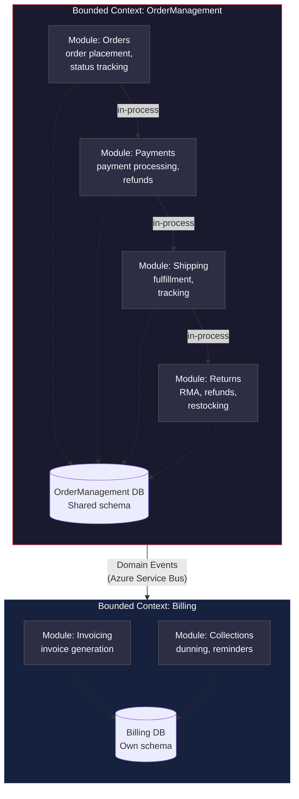
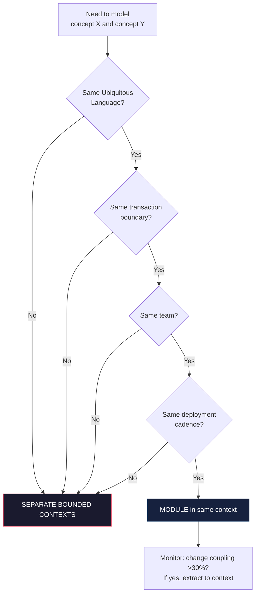

> [!success] Mastery Check
> - [ ] **Studied Well**
> - [ ] **Can explain the concept without notes**
> - [ ] **Can answer interview questions confidently**
> - [ ] **Can implement it in a real project**


# 7.074 — DDD — Module vs Bounded Context

## Section 1: Navigation & Context

**Domain:** [[7 — System Design & Distributed Systems]] > **Group:** Domain-Driven Design
**Previous:** [[7.073 — DDD — Tactical Patterns — Full .NET Reference]] | **Next:** [[7.075 — DDD — Strategic Design in a Legacy Codebase]]

### Prerequisites
- [[7.031 — DDD — Strategic vs Tactical Design]] — the Module-vs-Bounded Context question is a strategic-vs-tactical boundary decision; you must understand which layer each operates at before deciding.
- [[7.034 — DDD — Bounded Contexts — Context Map]] — Bounded Contexts are the outermost service boundary; Modules are internal organization within a context. Confusing the two leads to microservice fragmentation or monoliths disguised as modular.
- [[7.032 — DDD — Ubiquitous Language]] — Modules partition the language within a context. Each module name should be a term from the Ubiquitous Language, not a technical concern.

### Where This Fits

Every DDD practitioner eventually asks: "Should this be a separate bounded context or just a module in the existing one?" The answer determines microservice boundaries, team ownership, deployment independence, and model purity. Getting it wrong creates either a distributed monolith (too few contexts) or a coordination nightmare (too many). This note gives you the decision framework to draw the line correctly in a .NET production system — with concrete examples from OrderManagement, Billing, Inventory, and Shipping domains.

---

## Section 2: Core Mental Model

A **Bounded Context** is an autonomous boundary around a domain model — it owns its data, its language, its deployment, and its lifecycle. A **Module** is a named organizational unit **inside** a Bounded Context — it groups related types under a namespace but shares the context's data, database, and deployment. The invariant: a Bounded Context can exist without another context; a Module cannot exist without its containing context. The decision is about **coupling and autonomy**: when two groups of concepts need independent deployment, schema evolution, or team ownership, they belong in separate contexts; when they merely need logical separation within the same transaction boundary, they belong as modules.

### Classification

| Dimension | Bounded Context | Module |
|-----------|----------------|--------|
| Scope | System/service boundary | Namespace/organizational boundary |
| Data ownership | Own database/schema | Shares context's database |
| Deployment | Independent | Coupled to context deployment |
| Team ownership | Single team | Shared team |
| Lifecycle | Independent evolution | Evolves with context |
| Transaction scope | Eventually consistent across | ACID within |
| Communication | Events/API/messaging | In-process method calls |
| Ubiquitous Language | Independent set of terms | Partition of context's language |



### Key Properties

| Property | Value | Condition |
|---|---|---|
| Module-to-Aggregate ratio | 3-7 aggregates per module | Above 10, module is too large; split into module or new context |
| Context autonomy | Full (own DB, deploy, team) | Always — that is the definition of a context |
| Module autonomy | None (shares context DB, deploy) | Always — modules are a within-concept |
| Maximum modules per context | 7-12 | Beyond this, consider splitting the context |
| Cross-module calls | In-process, synchronous | Within same transaction |
| Cross-context calls | Async events or separate API | Must tolerate eventual consistency |
| Refactor cost: module to context | 2-4 weeks | Depends on shared schema and coupling |

---

## Section 3: Deep Mechanics

### How It Works

The decision process for Module vs Bounded Context follows a step-by-step evaluation:

1. **Language check**: Do the two groups of concepts share a Ubiquitous Language? If `Order`, `OrderLine`, `ProductCatalog` all use the same terms with the same meanings, they likely belong in the same context. If `Order` in one group means "pending shipment" and `Order` in the other means "invoice line item," they need separate contexts.

2. **Transaction boundary check**: Do operations need ACID across both groups? If a single user operation must atomically update both (e.g., create order + reserve inventory + charge card), they belong in the same context. If you can accept "order created, then eventually inventory reserved," they can be separate contexts communicating via events.

3. **Deployment autonomy check**: Does one group need to deploy changes without the other? If the Payment module changes twice a week but Shipping changes twice a month, keeping them in the same context ties their release cadence together — justifying separation.

4. **Team ownership check**: Does a different team own each group? Two teams sharing a single bounded context creates merge conflicts, coordination overhead, and language pollution. This is the strongest signal for separate contexts.

5. **Data evolution check**: Do the two groups need independent schema migration paths? Shared database means shared migration order, shared rollback strategy, and shared downtime window.

### Failure Modes

**Failure 1 — Premature context splitting**: Team splits OrderManagement into 8 microservices (Orders, OrderSearch, OrderHistory, OrderFulfillment, etc.) based on technical layers. Now a single order creation crosses 3 services, needs a saga, and takes 2 seconds instead of 50ms. The team spends more time coordinating than building features.

**Detection**: P99 latency for order creation >500ms with 90% of time spent in inter-service calls. Team has 3+ cross-service sagas per user operation.

**Fix**: Merge back into modules within a single context. Use async eventual consistency only where genuinely needed (e.g., Search can be eventual; Payment must be synchronous).

**Failure 2 — Monolith disguised as modules**: Team keeps everything in "Modules" but each module has its own database schema, its own message queue subscription, and requires coordinated deployment. This is a distributed monolith with none of the benefits.

**Detection**: Deployments require 6 services to deploy together. Rollback requires all 6. One module's DB migration blocks another's.

**Fix**: Formalize the boundaries — either commit to separate contexts with independent deploy pipelines, or merge into a true monolith with shared schema and simpler deployment.

**Failure 3 — Shared aggregate roots across modules**: `Order` aggregate defined in the `Orders` module but referenced directly by `Shipping` module through a navigation property. Now both modules are coupled to the same entity.

**Detection**: Cross-module `Include()` calls in EF Core queries. Module A has `using ModuleB.Entities` in domain code.

**Fix**: Modules communicate through domain services or domain events, not through shared entities. The `Shipping` module should subscribe to an `OrderShipped` domain event, not query the `Order` table directly.

### .NET and Azure Integration

- **ASP.NET Core**: `AddDbContext<T>` registers a context per bounded context, not per module. Modules in the same context share the same `DbContext` and migration history.
- **EF Core**: Each bounded context gets its own `DbContext` class and its own database schema (or database). Modules are represented as separate `DbSet<>` groupings within the same `DbContext` or as separate entity configurations using `IEntityTypeConfiguration<T>`.
- **Azure SQL / Cosmos DB**: A bounded context maps to a single database or container. Modules map to tables or sub-containers within it.
- **.NET namespaces**: The namespace hierarchy mirrors the module hierarchy: `OrderManagement.Orders`, `OrderManagement.Payments`, `OrderManagement.Shipping`. The bounded context is the root namespace.
- **ArchUnit/NetArchTest**: Enforce that modules don't reference each other's internal types, only the public module interface.

```csharp
// Bounded Context: OrderManagement — single DbContext, multiple module configurations
public sealed class OrderManagementDbContext : DbContext
{
    public DbSet<Order> Orders => Set<Order>();
    public DbSet<Payment> Payments => Set<Payment>();
    public DbSet<Shipment> Shipments => Set<Shipment>();

    protected override void OnModelCreating(ModelBuilder modelBuilder)
    {
        modelBuilder.HasDefaultSchema("ordermanagement");
        modelBuilder.ApplyConfigurationsFromAssembly(
            typeof(OrderManagementDbContext).Assembly,
            t => t.Namespace?.StartsWith("OrderManagement.Infrastructure.Persistence") == true);
    }
}

// Module boundary enforced via architecture test
// [Fact]
// public void OrderModule_ShouldNotReference_ShippingModule()
// {
//     var result = Types.InAssembly(typeof(Order).Assembly)
//         .That().ResideInNamespace("OrderManagement.Orders")
//         .ShouldNot().HaveDependencyOn("OrderManagement.Shipping")
//         .GetResult();
//     Assert.True(result.IsSuccessful);
// }
```

---

## Section 4: Production Patterns and Implementation

### Primary Implementation

The canonical .NET approach: one solution with one project per bounded context, one namespace per module within each project.

```csharp
// ============================================================
// Bounded Context: OrderManagement
// Module: Orders
// ============================================================

// OrderManagement.Orders.Domain
namespace OrderManagement.Orders.Domain;

public sealed record OrderId
{
    public Guid Value { get; init; }
    public static OrderId New() => new() { Value = Guid.CreateVersion7() };
    public static OrderId From(Guid value) => new() { Value = value };
}

public sealed class Order : AggregateRoot<OrderId>
{
    private readonly List<OrderLine> _lines = new();
    public IReadOnlyList<OrderLine> Lines => _lines.AsReadOnly();
    public OrderStatus Status { get; private set; }
    public CustomerId CustomerId { get; private set; }
    public Address ShippingAddress { get; private set; }
    public Money TotalAmount { get; private set; }

    private Order() { } // EF Core

    public static Order Create(CustomerId customerId, Address shippingAddress, IEnumerable<OrderLineRequest> items)
    {
        var order = new Order
        {
            Id = OrderId.New(),
            CustomerId = customerId,
            ShippingAddress = shippingAddress,
            Status = OrderStatus.Pending,
            CreatedAt = DateTimeOffset.UtcNow
        };

        foreach (var item in items)
        {
            order._lines.Add(new OrderLine
            {
                ProductId = item.ProductId,
                Quantity = item.Quantity,
                UnitPrice = item.UnitPrice
            });
        }

        order.TotalAmount = order._lines.Sum(l => l.UnitPrice * l.Quantity);
        order.AddDomainEvent(new OrderCreatedDomainEvent(order.Id, order.CustomerId, order.TotalAmount));
        return order;
    }

    public void Submit() => Status = OrderStatus.Submitted;
}

// ============================================================
// Module: Payments — within the same bounded context
// ============================================================

// OrderManagement.Payments.Domain
namespace OrderManagement.Payments.Domain;

public sealed record PaymentId
{
    public Guid Value { get; init; }
    public static PaymentId New() => new() { Value = Guid.CreateVersion7() };
}

public sealed class Payment : AggregateRoot<PaymentId>
{
    public OrderId OrderId { get; private set; }
    public Money Amount { get; private set; }
    public PaymentStatus Status { get; private set; }
    public string? TransactionId { get; private set; }

    private Payment() { }

    public static Payment Create(OrderId orderId, Money amount)
    {
        var payment = new Payment
        {
            Id = PaymentId.New(),
            OrderId = orderId,
            Amount = amount,
            Status = PaymentStatus.Pending
        };
        payment.AddDomainEvent(new PaymentInitiatedDomainEvent(payment.Id, orderId, amount));
        return payment;
    }

    public void Complete(string transactionId, string? gatewayReference)
    {
        TransactionId = transactionId;
        Status = PaymentStatus.Completed;
        AddDomainEvent(new PaymentCompletedDomainEvent(Id, OrderId, transactionId));
    }
}

// Cross-module communication via domain service (not shared entities)
// OrderManagement.Orders.Application
namespace OrderManagement.Orders.Application;

public interface IPaymentService
{
    Task<PaymentResult> ProcessPaymentAsync(OrderId orderId, Money amount, CancellationToken ct);
}

internal sealed class OrderPaymentService : IPaymentService
{
    private readonly OrdersDbContext _dbContext;
    private readonly PaymentGateway _gateway;

    public async Task<PaymentResult> ProcessPaymentAsync(OrderId orderId, Money amount, CancellationToken ct)
    {
        var payment = Payment.Create(orderId, amount);
        _dbContext.Set<Payment>().Add(payment);

        var gatewayResult = await _gateway.ChargeAsync(amount, ct);
        if (gatewayResult.IsSuccess)
        {
            payment.Complete(gatewayResult.TransactionId, gatewayResult.GatewayRef);
            await _dbContext.SaveChangesAsync(ct);
            return PaymentResult.Succeeded(payment.Id);
        }

        return PaymentResult.Failed(gatewayResult.Error);
    }
}
```

### Configuration and Wiring

```csharp
// Program.cs — one DbContext per bounded context
builder.Services.AddDbContext<OrderManagementDbContext>(options =>
    options.UseSqlServer(
        builder.Configuration.GetConnectionString("OrderManagement"),
        x => x.MigrationsHistoryTable("__EFMigrationsHistory", "ordermanagement")));

// Register module services as scoped within the same DI container
builder.Services.AddScoped<IOrderRepository, OrderRepository>();
builder.Services.AddScoped<IOrderSubmissionService, OrderSubmissionService>();
builder.Services.AddScoped<IPaymentService, OrderPaymentService>();
```

### Common Variants

**Variant 1 — Modular Monolith**: Single deployable with one database, one DbContext, no inter-process communication. Modules communicate through in-memory domain events. Best for teams under 8 engineers, < 50k QPS.

**Variant 2 — Modular Monolith with Separate Schemas**: Same deployable, same database, but each module has its own schema (`orders`, `payments`, `shipping`). Enables independent migration paths while staying in same deployable.

```csharp
protected override void OnModelCreating(ModelBuilder mb)
{
    mb.Entity<Order>().ToTable("Orders", "orders");
    mb.Entity<Payment>().ToTable("Payments", "payments");
    mb.Entity<Shipment>().ToTable("Shipments", "shipping");
}
```

**Variant 3 — Separate Bounded Contexts**: Different services, different databases, different deployable units. Communication via async events. Best for teams > 8 engineers per context, > 50k QPS, or independent release cadence.

### Real-World .NET Ecosystem Example

**Microsoft eShopOnContainers / eShopOnDapr**: The canonical .NET DDD reference architecture. `Ordering.API`, `Basket.API`, `Catalog.API`, `Payment.API`, and `Shipping.API` are separate bounded contexts — each with its own database, its own `DbContext`, and its own deployment. Within `Ordering.API`, modules (`Orders`, `Buyer`, `Address`) are namespaces sharing the same `OrderingContext`. This is the textbook .NET DDD implementation that Microsoft publishes as reference.

```csharp
// eShopOnContainers pattern: one DbContext per bounded context
public class OrderingContext : DbContext
{
    public DbSet<Order> Orders { get; set; }
    public DbSet<OrderItem> OrderItems { get; set; }
    public DbSet<Buyer> Buyers { get; set; }
    public DbSet<PaymentMethod> PaymentMethods { get; set; }
    // Single context, multiple modules via entity sets
}
```

---

## Section 5: Gotchas and Production Pitfalls

### Pitfall 1 — Shared Entity Across Modules

**Pitfall:** The `Orders` module and `Shipping` module both reference the same `Order` entity directly via EF Core navigation properties. A migration change in `Order` requires both teams to coordinate.

```csharp
// ❌ Shipping module navigation property directly to Order entity
public sealed class Shipment
{
    public int OrderId { get; set; }
    public Order Order { get; set; } = null!; // Direct reference to another module's entity
}
```

**Symptom:** EF Core migration conflicts. One team's schema change blocks the other team's deployment. `dotnet ef migrations list` shows pending migrations from both modules.

**Fix:** Modules communicate through identifiers and domain services, not shared entity references.

```csharp
// ✅ Shipping module uses OrderId value, not Order entity
public sealed class Shipment
{
    public OrderId OrderId { get; set; } // Value object, not entity reference
    public ShippingStatus Status { get; set; }

    // Query Order data through domain service, not EF navigation
}
```

**Cost of not fixing:** Two-week deployment cycles instead of daily. Merge conflicts on every migration. Eventual team friction as each module's entity changes break the other.

### Pitfall 2 — Split Context Prematurely Based on Technical Layers

**Pitfall:** Splitting into `OrderAPI`, `OrderService`, `OrderRepository`, `OrderDatabase` as separate "bounded contexts" based on technical architecture layers rather than domain boundaries.

```csharp
// ❌ Technical-layer "bounded contexts"
// OrderAPI.Bounded Context — just the API
// OrderService.BoundedContext — just the logic
// OrderData.BoundedContext — just the data access
```

**Symptom:** A single order creation call traverses 3 HTTP hops. Latency increases from 50ms to 500ms. Every deployment requires coordinating 3 repos.

**Fix:** One bounded context per domain concept, not per technical layer. Put API, logic, and data for the same domain concept in one deployable.

```csharp
// ✅ Domain-boundary bounded contexts
// OrderManagement.BoundedContext — API + Logic + Data for orders
// Inventory.BoundedContext — API + Logic + Data for inventory
```

**Cost of not fixing:** 10x latency, 3x deployment coordination, developer frustration as "simple" features require changes across 3 repos.

### Pitfall 3 — Module-Context Boundary Drift

**Pitfall:** Start with a single context with modules. Over 18 months, the modules develop independent database schemas, separate queue subscriptions, and independent deployment scripts — but still exist in the same repo and deploy together.

**Symptom:** 6-month-old documentation says "monolith." Reality: 4 deployable units, 2 databases, 3 queue subscriptions that must all deploy together because of tight coupling.

**Fix:** Periodic architecture boundary audit. Use NetArchTest to enforce that modules don't have their own DbContext or queue subscriptions.

```csharp
// ✅ Architecture test — modules must not have their own DbContext
[Fact]
public void Modules_ShouldNot_OwnTheirOwnDbContext()
{
    var dbContexts = Types.InAssembly(typeof(Order).Assembly)
        .That().Inherit(typeof(DbContext))
        .GetTypes();
    Assert.Single(dbContexts); // Only one per bounded context
}
```

**Cost of not fixing:** The "modular monolith" becomes an unmodular monolith that can't be cleanly split. Refactoring cost: 6-12 months.

### Pitfall 4 — Cross-Module Transactions

**Pitfall:** Application service opens a `TransactionScope` that spans both the `Orders` module's `SaveChangesAsync` and the `Inventory` module's `SaveChangesAsync` because "they need to be consistent."

```csharp
// ❌ Distributed transaction across modules
using var tx = new TransactionScope(TransactionScopeAsyncFlowOption.Enabled);
await _orderRepo.SaveAsync(order, ct);
await _inventoryRepo.ReserveAsync(items, ct); // Different DbContext!
tx.Complete();
```

**Symptom:** Transaction promotion to MSDTC. Distributed transaction failures under load. Deadlocks between the two DbContexts.

**Fix:** If you need distributed transactions, they should be separate bounded contexts with a saga pattern instead.

```csharp
// ✅ Use domain events and eventual consistency
var order = Order.Create(customerId, address, items);
await _orderRepo.SaveAsync(order, ct);
// Domain event handler reserves inventory asynchronously
// OrderReserved event triggers InventoryReserve handler
```

**Cost of not fixing:** MSDTC failures at 3 AM. Escalated locking. Incident rotation burnout.

### Pitfall 5 — Over-Indexing on Separation

**Pitfall:** Every aggregate root becomes its own bounded context. `Customer`, `Address`, `ContactPreference`, `CustomerNote` become 4 separate services.

**Symptom:** 40 microservices for a system that should have 5-8 bounded contexts. Team spends 60% of sprints on infrastructure (service discovery, API gateways, event schemas).

**Fix:** Apply the "team size test": if your team can't own the context end-to-end, merge contexts. Apply the "change cadence test": if two groups always change together, keep them as modules.

**Cost of not fixing:** $500K/year in infrastructure overhead. Developer burnout from context switching across 40 services.

---

## Section 6: Tradeoffs and Decision Framework

### Tradeoff Matrix

| Dimension | Module (Same Context) | Separate Bounded Context |
|---|---|---|
| Consistency | ACID (same DB, same transaction) | Eventual (events, sagas) |
| Latency | <5ms (in-process) | 50-500ms (network + serialization) |
| Deployment coupling | Must deploy together | Independent |
| Team autonomy | Shared code ownership | Full ownership |
| Schema evolution | Shared migration order | Independent |
| Refactoring cost | Low (rename, extract) | High (API versioning, event schema) |
| Testing complexity | Single integration test | Multiple service mocks |
| .NET infrastructure | Single DbContext | Npgsql per context, MassTransit |

### Decision Flowchart



### When to Apply

- **Module when:** Team < 8 engineers, single deployment cadence, concepts share Ubiquitous Language, ACID required, < 50k QPS.
- **Separate Context when:** Team > 8 engineers per context, independent deployment needed, different Ubiquitous Languages, eventual consistency acceptable, > 50k QPS.

### When NOT to Apply

- [ ] Do NOT split into separate contexts if the concepts share a single transaction boundary and you can't afford eventual consistency.
- [ ] Do NOT keep as modules if two different teams need to own them independently.
- [ ] Do NOT split based on technical layers (API vs Service vs Data) — split based on domain concepts.
- [ ] Do NOT keep as modules if one concept changes 10x more frequently than the other and deployments are blocked by the slower-changing module.

### Scale Thresholds

- **Module overhead ceiling**: ~50k QPS per monolith. Beyond this, database contention and deployment risk favor splitting.
- **Context split payback**: ~3-6 months to recover the infrastructure investment of splitting a context. If the relationship will last < 6 months, keep as modules.
- **Team size trigger**: 1 team per context. When a context needs > 8 engineers, split it. A team of 8 can effectively own 5-7 modules.
- **Change cadence trigger**: When the deploy cadence difference between two modules exceeds 3:1 (one changes 3x as often), consider splitting.

---

## Section 7: Interview Arsenal

### Question Bank

1. What is the difference between a Module and a Bounded Context in DDD?
2. When would you split a module into a separate bounded context?
3. What are the costs of having too many bounded contexts?
4. How do modules communicate within the same bounded context vs across bounded contexts?
5. Describe a scenario where you chose modules over contexts and regretted it.
6. How does the Module/Bounded Context decision map to .NET project structure?
7. What happens to the database when a module becomes a bounded context?
8. How do you enforce module boundaries within a single .NET solution?

### Spoken Answers

**Q1: What is the difference between a Module and a Bounded Context in DDD?**

> **Average answer:** A bounded context is a boundary around a domain model, and a module is a way to organize code within it. Modules group related classes.

> **Great answer:** A Bounded Context is an ownership, data, and deployment boundary — it has its own database, its own team, and its own deployable unit. A Module is a namespace-level organization inside that boundary. The key distinction is autonomy: a Bounded Context could operate independently if all other contexts disappeared; a Module cannot — it shares the context's database, transaction scope, and deployment pipeline. In .NET, a Bounded Context maps to a Visual Studio solution project with its own DbContext and database migrations. A Module maps to a namespace folder within that project and a set of entity configurations applied to the shared DbContext. The question I ask myself is: "If this module needed its own database and deployment tomorrow, how painful would that be?" If the answer is "very painful," it should probably already be its own context.

**Q5: Describe a scenario where you chose modules over contexts and regretted it.**

> **Average answer:** We had a big monolith and should have split it earlier. It became hard to maintain.

> **Great answer:** At a previous company, we had an OrderManagement context with Orders, Payments, and Shipping as modules. For the first year, this was fine — 6 engineers, one deployment, one database. Then the Shipping team grew to 5 engineers who needed to deploy twice a day, but Payments only deployed twice a month. Every Shipping deployment was blocked by Payments' slower release cadence because they shared a database and one EF Core migration set. The fix was 6 months of refactoring: extract Shipping to its own bounded context with its own database, set up Azure Service Bus for OrderShipping events, build a saga for the order lifecycle. The lesson: when deployment cadence diverges by more than 3x between modules, split earlier. The 6-month refactoring cost would have been 4 weeks if done when the divergence first appeared.

**Q8: How do you enforce module boundaries within a single .NET solution?**

> **Average answer:** Use folders and naming conventions. Don't import from other modules.

> **Great answer:** We use three enforcement mechanisms. First, namespace architecture tests with NetArchTest — a unit test that asserts `OrderManagement.Orders` namespace does not reference `OrderManagement.Shipping` types at compile time. This runs in CI and fails the build. Second, Entity Framework configuration — each module registers its entity configurations via `IEntityTypeConfiguration<T>`, and a single `DbContext` applies them scoped by namespace. This prevents accidental cross-module navigation properties. Third, the domain project only exposes aggregate roots and domain services — internal classes for entities, value objects, and repositories are `internal` to the module. Cross-module communication goes through domain services with explicit interfaces. The Roslyn analyzer `RequirePublicMembersForModulesAnalyzer` catches any module accidentally exposing its internals.

### System Design Interview Trigger

If an interviewer asks you to design an e-commerce system and you start drawing bounded contexts for Orders, Inventory, Payments, and Shipping, the follow-up is always: "How do you decide what goes in each boundary? Why not split Orders into Order Placement, Order Tracking, and Order History?" They are testing whether you understand the tradeoff between module-level organization and bounded-context autonomy. The senior candidate answers by naming the specific trigger conditions: team size, deployment cadence, transaction scope, and Ubiquitous Language coherence.

### Comparison Table

| | Module | Bounded Context |
|---|---|---|
| Core guarantee | Logical separation within one deployable | Full autonomy (DB, deploy, team) |
| Trade-off | Coupling (shared schema, shared deploy) | Latency (network, eventual consistency) |
| .NET implementation | Namespace + entity configs on shared DbContext | Separate project + separate DbContext + API |
| Failure mode | Cross-module coupling prevents independent evolution | Over-split creates coordination nightmare |
| When to choose | Same team, same deploy cadence, ACID needed | Different team, different cadence, eventual OK |

---

## Section 8: Architecture Decision Record

**Status:** Accepted

**Context:** The Order Management system needs to model Order placement, Payment processing, and Shipping fulfillment. We have a single team of 8 engineers. The system must handle 10,000 orders/day peak. Deployment cadence is weekly. All three subdomains share the Ubiquitous Language: an `Order` is created, paid, and shipped — the same entity flows through all three stages.

**Options Considered:**

1. **Single bounded context with modules** — Orders, Payments, Shipping as namespaces with shared DbContext, shared database, single deployment.
2. **Three separate bounded contexts** — OrderService, PaymentService, ShippingService with own databases, inter-service events via Azure Service Bus.
3. **Two contexts** — OrderManagement (Orders + Payments) as one context, Shipping as separate (deploys more frequently).

**Decision:** Option 1 — single context with modules, because:
- Single team of 8 can own all three modules
- Weekly deployment cadence is shared across all three
- Order lifecycle spans all three modules within a single ACID transaction
- < 50k QPS target doesn't require separate scaling
- Ubiquitous Language is consistent across all three subdomains

**Consequences:**
- ✅ Single deployment, simple CI/CD pipeline
- ✅ ACID transactions across order lifecycle
- ✅ Lower infrastructure cost (one database, one service)
- ⚠️ Requires architecture tests to prevent module boundary erosion
- ⚠️ Shipping team (when it grows to 5+) will need extraction to its own context
- ❌ Cannot deploy Payments without deploying Shipping

**Review Trigger:** Revisit this decision when (a) Shipping team grows beyond 4 engineers, (b) deployment cadence diverges beyond 3:1 between modules, or (c) throughput exceeds 50k QPS per deployable unit.

---

## Section 9: Self-Check

### Conceptual Questions

1. What is the defining characteristic that distinguishes a Module from a Bounded Context in DDD?

2. What are the three strongest signals that a group of concepts should be a separate Bounded Context rather than a Module?

3. How do Modules communicate within the same Bounded Context vs across Bounded Contexts?

4. What happens to database consistency when you split a Module into a separate Bounded Context?

5. In .NET, how do you enforce module boundaries within a single project?

6. Compare a modular monolith with separate microservices — what does each trade?

7. At what team size does a Bounded Context typically need to be split?

8. How does the Module vs Bounded Context decision relate to Aggregate design? (See [[7.033 — DDD — Aggregates]])

9. What is the long-term cost of a "distributed monolith" — modules that have been deployed as separate services but remain tightly coupled?

10. Explain the decision framework for Module vs Bounded Context in 60 seconds.

<details>
<summary>Answers</summary>

1. Autonomy: a Bounded Context has its own database, deployment, and team ownership; a Module shares all three with its containing context. A Bounded Context could operate independently; a Module cannot.

2. (1) Different teams own the concepts — each team needs independent commit authority. (2) Different deployment cadences — ratio exceeds 3:1. (3) Different Ubiquitous Language — the same term means different things in each group.

3. Within same context: in-process method calls, direct repository access, domain events (in-memory). Across contexts: separate API calls (REST/gRPC), async domain events via message broker (Azure Service Bus), event-driven integration.

4. ACID transactions become impossible across contexts. You must shift to eventual consistency via sagas, compensating transactions, or at-least-once event delivery. This adds latency and complexity.

5. Three mechanisms: (1) Namespace-based NetArchTest tests that fail the build on cross-module references, (2) Internal visibility on module-internal types with explicit public interfaces, (3) Single DbContext per context with module-specific `IEntityTypeConfiguration<T>`.

6. Modular monolith: simpler infrastructure, ACID transactions, single deployment — but cannot scale independently, team coordination required. Microservices: independent scaling, team autonomy, independent deployment — but eventual consistency, network latency, infrastructure complexity.

7. Generally 8-12 engineers per context. Above 8, communication overhead and merge conflicts increase non-linearly. A context needing 15+ engineers should be split.

8. Aggregates are transactional consistency boundaries within a module or context. A single aggregate should never span modules — that would create cross-module transaction coupling. See [[7.033 — DDD — Aggregates]].

9. Three costs: (1) Every feature change requires coordinated deployments across services — negating the independence benefit. (2) Network failures on every operation because what should be in-process calls cross service boundaries. (3) No ACID but all the complexity of distributed systems — the worst of both worlds.

10. "I evaluate three conditions: Same Ubiquitous Language? Same transaction boundary? Same team with same deployment cadence? If yes to all, use a Module. If any is no, use a separate Bounded Context. The cost of splitting too early is infrastructure overhead; the cost of splitting too late is a painful refactoring that grows linearly with time."
</details>

### Scenario Challenges

**Scenario 1 — Diagnose the problem:** A team has 6 microservices: `OrderAPI`, `OrderSearch`, `OrderHistory`, `PaymentAPI`, `PaymentGateway`, `PaymentReconciliation`. A single order creation calls 4 of these services synchronously. P95 latency is 1.2 seconds. The team spends 40% of each sprint coordinating deployments across the 6 services, and 30% of incidents are caused by incompatible service versions.

<details>
<summary>Diagnosis</summary>

**Root cause:** Premature bounded context splitting based on technical layers (API vs Search vs History) rather than domain boundaries. These should be modules within a single `OrderManagement` bounded context.

**Evidence:** Single user operation (create order) requires 4 HTTP calls. Deployment coordination for each change. Version incompatibility incidents.

**Fix:** Merge `OrderAPI`, `OrderSearch`, `OrderHistory` into a single `OrderManagement` service with modules. Keep `PaymentAPI` as separate context only if payment processing has different deployment cadence.

**Prevention:** Apply the "single user operation test": if one user action requires multiple synchronous calls across services, those services should be modules in the same context.
</details>

**Scenario 2 — Design decision:** You are designing an inventory system. The Warehouse team (4 engineers) manages stock levels and needs to deploy twice a week. The Pricing team (3 engineers) needs inventory data for discount calculations but deploys monthly. They share Ubiquitous Language around `StockLevel`, `Reservation`, and `Allocation`. Do you make them modules in one context or separate contexts?

<details>
<summary>Decision and Reasoning</summary>

**Choice:** Separate bounded contexts, because deployment cadence ratios exceed 3:1 (weekly vs monthly) and different teams own each.

**Tradeoffs accepted:** Inventory updates propagate to Pricing with 1-5 second latency via Azure Service Bus events, not synchronously. Pricing may briefly show out-of-date stock during flash sales.

**Implementation sketch:**
```csharp
// Inventory publishes event
public sealed record StockLevelChanged(Guid ProductId, int NewQuantity, DateTimeOffset ChangedAt);

// Pricing subscribes and updates local read model
public sealed class StockLevelHandler : IConsumer<StockLevelChanged>
{
    public async Task Consume(ConsumeContext<StockLevelChanged> context)
    {
        await _pricingDbContext.ProductCache
            .Where(p => p.Id == context.Message.ProductId)
            .ExecuteUpdateAsync(s => s.SetProperty(p => p.StockLevel, context.Message.NewQuantity));
    }
}
```
</details>

**Scenario 3 — Failure mode:** Your modular monolith has been running for 2 years. The `Shipping` module now has its own `ShippingDbContext` (separate from `OrderManagementDbContext`), its own `shipments` database schema, and its own Service Bus subscription for `OrderShipped` events — but it's still in the same deployable as the rest of OrderManagement. Every deployment requires all 6 microservices in the monolith to deploy together because they share the same `Program.cs`, same CI pipeline, and same Docker image.

<details>
<summary>Investigation and Fix</summary>

**Investigation steps:** Check each module's infrastructure: (1) How many `DbContext` classes exist? (2) How many database schemas? (3) How many queue subscribers? (4) How many health check endpoints?

**Confirming evidence:** `ShippingDbContext` exists as a separate `DbContext` in a separate schema, with its own migrations folder. This is a bounded context in disguise — it should be extracted to its own service.

**Immediate mitigation:** Add architecture test that blocks creation of new `DbContext` subclasses in the monolith. All new modules must use the shared context.

**Permanent fix:** Extract Shipping to its own service: (1) Create new project `ShippingService`. (2) Move `ShippingDbContext`, entities, migrations to new project. (3) Set up Azure Service Bus for `OrderSubmitted` event consumption. (4) Wire up CI/CD pipeline. (5) Cut over using feature flag.

**Post-mortem item:** ADR should include: "Any module requiring its own `DbContext` or queue subscriber is a candidate for extraction to a separate bounded context."
</details>

**Scenario 4 — Scale it:** Your modular monolith handles 5,000 req/s. Business projects 50,000 req/s within 12 months. The database is the bottleneck — 95% of reads are order searches and history queries; 5% are writes (order placement, payment processing).

<details>
<summary>Scaling Strategy</summary>

**Bottleneck this addresses:** Database CPU and IO — shared between write-heavy modules (Orders, Payments) and read-heavy modules (Search, History).

**How it helps:** Split the read-heavy modules (OrderSearch, OrderHistory) into separate bounded contexts with their own read-optimized databases (Cosmos DB or Azure SQL read replicas). Write modules remain in the monolith, now with reduced load.

**What it does not solve:** Write-path database contention between Orders and Payments at 50k QPS. Above 50k QPS, split those too.

**Implementation order:** Phase 1 (months 1-2): Extract OrderSearch to read-optimized service with change-feed subscription. Phase 2 (months 3-4): Extract OrderHistory similarly. Phase 3 (months 6-12): If writes hit 25k QPS, split Payments to separate service.
</details>

**Scenario 5 — Interview simulation:** The interviewer says: "Design an order management system for an e-commerce platform. How do you structure your services?" Walk through your response, specifically handling the decision between modules and bounded contexts.

<details>
<summary>Model Response</summary>

"I'd start by identifying the domain boundaries using Event Storming with the team. For a standard e-commerce system, I typically find 4-6 bounded contexts: OrderManagement, Inventory, Payment, Shipping, and Notification.

Let me walk through the key decision. OrderManagement and Payment share a Ubiquitous Language around charges and transactions, and order placement needs ACID consistency with payment capture — so those start as modules in the same context. Inventory, on the other hand, has a different language (stock levels, warehouses, reservations) and doesn't need real-time consistency with orders — it can be a separate context that receives `OrderSubmitted` events and updates stock asynchronously.

The specific trigger for separate contexts is: different teams, different deployment cadence, or different data ownership. If the Payment team needs to deploy PCI compliance updates weekly but OrderManagement deploys monthly, those should be separate contexts. If they're the same team deploying together, modules are fine up to about 50k QPS.

In .NET, I'd structure this as a solution with one project per bounded context, each with its own `DbContext`. The modular monolith (orders + payments) gets one `OrderManagementContext` with module-specific entity configurations. The Inventory context is a separate microservice with its own `InventoryContext`, its own database, and a `MassTransit` consumer for `OrderSubmitted` events.

The failure mode to avoid is the distributed monolith — where I split too early based on technical layers (API vs Service vs Data) instead of domain boundaries. I always apply the 'one user operation test': if a single checkout needs to synchronously call 4 services, those should be modules in the same context, not separate services."
</details>
