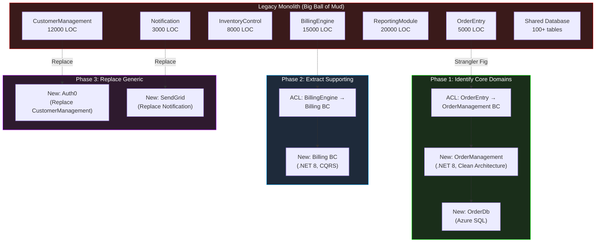
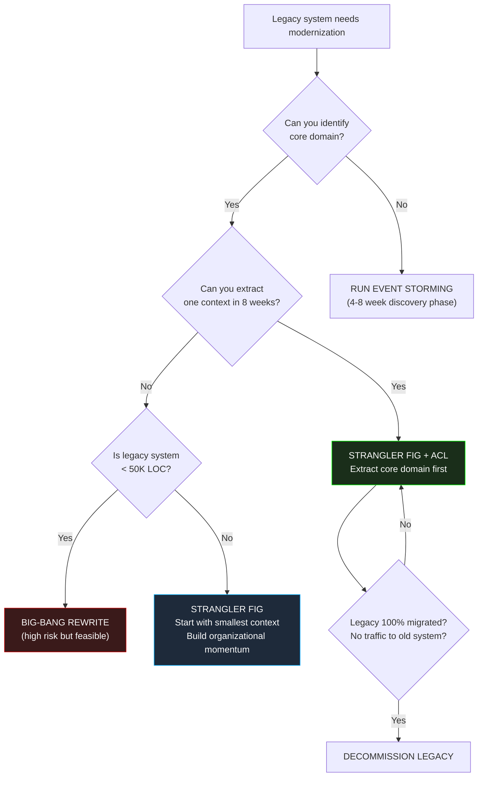

> [!success] Mastery Check
> - [ ] **Studied Well**
> - [ ] **Can explain the concept without notes**
> - [ ] **Can answer interview questions confidently**
> - [ ] **Can implement it in a real project**


# 7.075 — DDD — Strategic Design in a Legacy Codebase

## Section 1: Navigation & Context

**Domain:** [[7 — System Design & Distributed Systems]] > **Group:** Domain-Driven Design
**Previous:** [[7.074 — DDD — Module vs Bounded Context]] | **Next:** [[7.076 — DDD — Aggregate Versioning — Optimistic Concurrency]]

### Prerequisites
- [[7.031 — DDD — Strategic vs Tactical Design]] — legacy migration is a strategic DDD exercise; you must understand the distinction between discovering domain boundaries (strategic) and implementing within them (tactical).
- [[7.034 — DDD — Bounded Contexts — Context Map]] — the context map becomes a migration plan: each legacy subsystem is an existing context, each new service is a target context, and relationship lines show the strangler paths.
- [[7.039 — DDD — Context Mapping — Anticorruption Layer]] — the ACL is the primary pattern for isolating new domain models from legacy data structures, schemas, and semantics.

### Where This Fits

Most DDD literature assumes greenfield development. In reality, 80%+ of DDD adoption happens in brownfield systems — legacy monoliths with 500K-2M lines of code, shared databases, no clear domain boundaries, and years of technical debt. Strategic DDD provides the toolkit for discovering hidden domain boundaries in legacy code, isolating new domain logic from legacy contamination, and incrementally strangling the monolith without a big-bang rewrite. Without it, teams either build ACL-less integrations that poison new domain models or attempt rewrites that fail 70% of the time.

---

## Section 2: Core Mental Model

Strategic Design in a Legacy Codebase is the systematic application of context mapping, bounded context discovery, and anticorruption layers to an existing system — identifying which parts of the legacy system are core domains worth extracting, which are generic subdomains worth replacing with off-the-shelf solutions, and which are supporting subdomains that can be left in place with ACL boundaries. The invariant: never let legacy data structures, naming conventions, or transaction patterns leak into new domain models. Every year a legacy system runs without bounded context boundaries, the cost of extraction doubles.

### Classification

| Dimension | Classification |
|---|---|
| Pattern type | Strategic DDD / Migration Strategy |
| Scope | Whole-of-system architecture |
| Primary concern | Incremental domain extraction without rewrites |
| Key tools | Event Storming, Context Map, ACL, Strangler Fig, Feature Toggle |
| Critical metric | Lines of code inside explicit bounded contexts vs. in the Big Ball of Mud |
| Success condition | Legacy monolith can be decommissioned without coordinated cutover |



### Key Properties

| Property | Value | Condition |
|---|---|---|
| Effective extraction rate | 5-10% of legacy LOC per quarter | With a 4-6 person team fully dedicated |
| ACL build cost | 2-6 weeks per legacy subsystem | Depends on schema complexity, data quality |
| Legacy knowledge decay | 50% loss 6 months after developer leaves | Capturing context maps is time-sensitive |
| Rewrite failure rate | 70% | Big-bang rewrites fail; strangler succeeds 80%+ |
| Max legacy-to-new data volume | 500GB before migration tooling required | Above this, need phased data migration with dual-writes |
| Team size for migration | 4-8 engineers per stream | Smaller teams progress too slowly to outpace business changes |

---

## Section 3: Deep Mechanics

### How It Works

Strategic legacy migration follows a five-phase process:

1. **Discovery Phase (4-8 weeks)**: Run Event Storming workshops with domain experts and legacy system SMEs. Identify domain events, commands, aggregates, bounded context candidates. Create the "as-is" context map showing all legacy subsystem relationships. Identify the core domain — the part that gives competitive advantage and must be extracted first.

2. **Target Architecture (2-4 weeks)**: Design the "to-be" context map. Define bounded contexts, their relationships, data ownership, and integration patterns (ACL, OHS, Event-driven). Identify generic subdomains for SaaS replacement. Set the strangler scope — which features route to new vs. legacy.

3. **ACL Construction (4-8 weeks per context)**: For the first bounded context to extract, build an Anticorruption Layer that wraps the legacy subsystem. The ACL exposes a clean, domain-oriented interface to new code while internally translating between legacy data structures and the new domain model. The ACL is the critical boundary — it prevents legacy concepts from leaking into the new codebase.

4. **Strangler Migration (ongoing)**: Route new features to the new bounded context. Incrementally migrate existing features using feature flags. Each migrated feature is a "cut" in the strangler fig. Legacy code is deleted only when all consumers have been migrated.

5. **Legacy Decommission**: When no traffic reaches the legacy subsystem, archive its data and shut it down. Never keep "just in case" legacy paths — they accumulate bit rot and block future refactoring.

### Failure Modes

**Failure 1 — The Big-Bang Rewrite**: Team spends 18 months rebuilding the entire system. Requirements change. New system doesn't match legacy behavior. Users revolt. Rollback.

**Detection**: No production deployment of new code for > 6 months. "Migration branch" has diverged from mainline by 100K+ commits.

**Fix**: Switch to strangler pattern immediately. Extract one bounded context at a time, deploy to production within 4-8 weeks.

**Failure 2 — No ACL (Legacy Leak)**: New domain model references legacy table names, column names, and stored procedures. Twelve months later, the new "domain model" is as polluted as the old one.

**Detection**: New bounded context codebase has `using LegacyDatabase` in 20+ files. Domain entities have `LegacyCustomerId` fields.

**Fix**: Build ACL before any new feature is written. Architecture test: no reference to legacy namespace in domain project.

**Failure 3 — Dual-Write Inconsistency**: New system writes to both legacy and new databases during migration. One write succeeds, the other fails. Data drifts. Reconciliation runs weekly and never converges.

**Detection**: Reconciliation reports show 200+ discrepancies per night. Business users report "the data never matches."

**Fix**: Use the outbox pattern or change-data-capture (CDC) for dual-writes — not application-level dual-write. Legacy is source of truth until cutover, then new system takes over.

### .NET and Azure Integration

- **Azure SQL CDC**: Capture legacy database changes via change tracking and feed them to the new bounded context via Azure Service Bus.
- **Azure Service Bus**: Event bus for legacy-to-new and new-to-new communication. Legacy publishes events via CDC -> Azure Function -> Service Bus.
- **Feature Management (Azure App Configuration)**: Route traffic between legacy and new implementations at the feature level.
- **Application Insights**: Track which features still hit legacy code. `legacy_call_count` metric drives decommission decisions.
- **Durable Functions**: Orchestrate long-running legacy data migration jobs with checkpoint/restart.

```csharp
// ACL pattern: legacy wrapper exposing clean domain interface
public interface ICustomerRepository
{
    Task<Customer?> GetByIdAsync(CustomerId id, CancellationToken ct);
    Task AddAsync(Customer customer, CancellationToken ct);
}

internal sealed class LegacyCustomerAcl : ICustomerRepository
{
    private readonly LegacyDbContext _legacyDb;
    private readonly CustomerTranslator _translator;
    private readonly ILogger<LegacyCustomerAcl> _logger;

    public LegacyCustomerAcl(LegacyDbContext legacyDb, CustomerTranslator translator, ILogger<LegacyCustomerAcl> logger)
    {
        _legacyDb = legacyDb;
        _translator = translator;
        _logger = logger;
    }

    public async Task<Customer?> GetByIdAsync(CustomerId id, CancellationToken ct)
    {
        // Legacy table: tbl_cust with columns cust_id, cust_name, cust_status, cust_created
        var row = await _legacyDb.Customers
            .AsNoTracking()
            .FirstOrDefaultAsync(c => c.cust_id == id.Value.ToString(), ct);

        if (row is null) return null;

        _logger.LogDebug("Retrieved legacy customer {Id}", id);
        return _translator.ToDomain(row);
    }

    public async Task AddAsync(Customer customer, CancellationToken ct)
    {
        var row = _translator.ToLegacy(customer);
        _legacyDb.Customers.Add(row);
        await _legacyDb.SaveChangesAsync(ct);
        _logger.LogInformation("Created legacy customer {Id} via ACL", customer.Id);
    }
}
```

---

## Section 4: Production Patterns and Implementation

### Primary Implementation

Complete strangler fig strategy for extracting an OrderManagement bounded context from a legacy monolith.

```csharp
// ============================================================
// Step 1: Domain Model (New, Clean) — NO legacy references
// ============================================================

namespace OrderManagement.Domain;

public sealed record OrderId(Guid Value);

public sealed class Order : AggregateRoot<OrderId>
{
    public OrderId Id { get; private set; }
    public CustomerId CustomerId { get; private set; }
    public Money Total { get; private set; }
    public OrderStatus Status { get; private set; }
    public IReadOnlyList<OrderLine> Lines { get; private set; } = Array.Empty<OrderLine>();

    private Order() { }

    public static Order Create(CustomerId customerId, IEnumerable<OrderLineRequest> items)
    {
        var lines = items.Select(i => new OrderLine
        {
            ProductId = i.ProductId,
            Quantity = i.Quantity,
            UnitPrice = i.UnitPrice
        }).ToList();

        var order = new Order
        {
            Id = OrderId(Guid.CreateVersion7()),
            CustomerId = customerId,
            Lines = lines,
            Total = new Money(lines.Sum(l => l.UnitPrice.Amount * l.Quantity)),
            Status = OrderStatus.Pending
        };

        order.AddDomainEvent(new OrderCreatedDomainEvent(order.Id, customerId, order.Total));
        return order;
    }
}

// ============================================================
// Step 2: ACL — Translates between Legacy and Domain
// ============================================================

namespace OrderManagement.Infrastructure.Acl;

public interface ILegacyOrderGateway
{
    Task<Order?> GetOrderAsync(string legacyOrderId, CancellationToken ct);
    Task<string> CreateOrderAsync(Order order, CancellationToken ct);
}

internal sealed class LegacyOrderAcl : ILegacyOrderGateway
{
    private readonly LegacyDbContext _legacyDb;
    private readonly OrderTranslator _translator;
    private readonly ILogger<LegacyOrderAcl> _logger;

    public LegacyOrderAcl(LegacyDbContext legacyDb, OrderTranslator translator, ILogger<LegacyOrderAcl> logger)
    {
        _legacyDb = legacyDb;
        _translator = translator;
        _logger = logger;
    }

    public async Task<Order?> GetOrderAsync(string legacyOrderId, CancellationToken ct)
    {
        // Legacy table: ORD_HDR (order_header) with columns ORD_ID, CUST_ID, ORD_DT, ORD_STAT
        var header = await _legacyDb.OrderHeaders
            .AsNoTracking()
            .FirstOrDefaultAsync(h => h.ORD_ID == legacyOrderId, ct);

        if (header is null) return null;

        // Legacy table: ORD_DTL (order_detail) with columns ORD_ID, PROD_ID, QTY, UNIT_PRC
        var lines = await _legacyDb.OrderDetails
            .AsNoTracking()
            .Where(d => d.ORD_ID == legacyOrderId)
            .ToListAsync(ct);

        _logger.LogDebug("Translated legacy order {Id} with {LineCount} lines", legacyOrderId, lines.Count);
        return _translator.ToDomain(header, lines);
    }

    public async Task<string> CreateOrderAsync(Order order, CancellationToken ct)
    {
        var (header, lines) = _translator.ToLegacy(order);

        await using var tx = await _legacyDb.Database.BeginTransactionAsync(ct);
        _legacyDb.OrderHeaders.Add(header);
        _legacyDb.OrderDetails.AddRange(lines);
        await _legacyDb.SaveChangesAsync(ct);
        await tx.CommitAsync(ct);

        _logger.LogInformation("Created legacy order {LegacyId} for domain order {DomainId}",
            header.ORD_ID, order.Id);
        return header.ORD_ID;
    }
}

// ============================================================
// Step 3: Translator — Mapping logic isolated
// ============================================================

namespace OrderManagement.Infrastructure.Acl.Translation;

internal sealed class OrderTranslator
{
    public Order ToDomain(LegacyOrderHeader header, List<LegacyOrderDetail> lines)
    {
        // Legacy status codes: 'P'=Pending, 'S'=Shipped, 'C'=Cancelled, 'D'=Delivered
        var status = header.ORD_STAT switch
        {
            "P" => OrderStatus.Pending,
            "S" => OrderStatus.Shipped,
            "C" => OrderStatus.Cancelled,
            "D" => OrderStatus.Delivered,
            _ => OrderStatus.Unknown
        };

        return Order.Create(
            CustomerId.From(header.CUST_ID),
            lines.Select(l => new OrderLineRequest(
                ProductId.From(l.PROD_ID),
                l.QTY,
                new Money(l.UNIT_PRC))))
            with { Id = OrderId(Guid.Parse(header.ORD_ID)), Status = status };
    }

    public (LegacyOrderHeader header, List<LegacyOrderDetail> lines) ToLegacy(Order order)
    {
        var header = new LegacyOrderHeader
        {
            ORD_ID = order.Id.Value.ToString(),
            CUST_ID = order.CustomerId.Value,
            ORD_DT = DateTime.UtcNow,
            ORD_STAT = "P",
            ORD_AMT = order.Total.Amount
        };

        var lines = order.Lines.Select(l => new LegacyOrderDetail
        {
            ORD_ID = header.ORD_ID,
            PROD_ID = l.ProductId.Value,
            QTY = l.Quantity,
            UNIT_PRC = l.UnitPrice.Amount
        }).ToList();

        return (header, lines);
    }
}
```

### Configuration and Wiring

```csharp
// Program.cs
builder.Services.AddScoped<ILegacyOrderGateway, LegacyOrderAcl>();
builder.Services.AddScoped<OrderTranslator>();

// Legacy DbContext — mapped to old database
builder.Services.AddDbContext<LegacyDbContext>(options =>
    options.UseSqlServer(builder.Configuration.GetConnectionString("LegacyDb")));

// New OrderManagement DbContext — mapped to new database
builder.Services.AddDbContext<OrderManagementDbContext>(options =>
    options.UseSqlServer(builder.Configuration.GetConnectionString("OrderManagementDb")));

// Feature flag for strangler cutover
builder.Services.AddAzureAppConfiguration();
```

### Common Variants

**Variant 1 — Read-Only ACL**: Legacy is source of truth for reads; new system owns writes. ACL handles one-way translation. Common when legacy database is too risky for write access.

**Variant 2 — CDC-Based ACL**: Azure SQL Change Tracking captures legacy changes and pushes them to a Service Bus topic. New bounded context subscribes and builds its own read models. No application-level legacy calls needed for reads.

```csharp
// Azure Function triggered by SQL Change Tracking
public class LegacyOrderCdcFunction
{
    private readonly IOrderSynchronizer _synchronizer;

    [FunctionName("SyncLegacyOrders")]
    public async Task Run([SqlTrigger("dbo.ORD_HDR", "OrderManagementConnection")] IReadOnlyList<SqlChange<LegacyOrderHeader>> changes)
    {
        foreach (var change in changes)
        {
            await _synchronizer.ProcessChangeAsync(change.Operation, change.Item);
        }
    }
}
```

**Variant 3 — Dual-Write with Outbox**: New bounded context receives commands via its own API, writes to its own database AND publishes to an outbox table. A background process forwards outbox entries to the legacy system. Legacy decommission happens when all consumers have migrated.

### Real-World .NET Ecosystem Example

**Microsoft's eShop modernization reference**: Microsoft published a full reference architecture migrating a legacy .NET Framework monolith to .NET 8 using DDD, CQRS, and Event Sourcing. The core pattern: each extracted bounded context gets an ACL that wraps the legacy database, a new domain model in .NET 8, and a clear strangler path defined at the routing layer.

```csharp
// YARP-based strangler routing — routes traffic between legacy and new
public class StranglerProxyMiddleware
{
    private readonly IFeatureManager _features;

    public async Task InvokeAsync(HttpContext context, RequestDelegate next)
    {
        if (context.Request.Path.StartsWithSegments("/api/orders"))
        {
            if (await _features.IsEnabledAsync("RouteOrdersToNewService"))
            {
                // Forward to new OrderManagement API
                await _httpClient.SendAsync(context.CreateProxyHttpRequest());
                return;
            }
        }
        await next(context); // Fall through to legacy
    }
}
```

---

## Section 5: Gotchas and Production Pitfalls

### Pitfall 1 — No ACL: Legacy Concepts Leak into New Domain

**Pitfall:** Team builds the new OrderManagement bounded context but directly references legacy table names and column names in the domain layer because "it's faster."

```csharp
// ❌ Domain entity directly references legacy column names
public sealed class Order
{
    public string ORD_ID { get; set; }  // Legacy column name in domain!
    public string CUST_ID { get; set; }
    public string ORD_STAT { get; set; }
}
```

**Symptom:** Six months later, the new domain model is indistinguishable from the legacy one. Every business concept is named by its legacy column. Ubiquitous Language never developed.

**Fix:** Build ACL first. Never reference legacy types in the domain project.

```csharp
// ✅ ACL translation at infrastructure boundary
public sealed class Order
{
    public OrderId Id { get; }
    public CustomerId CustomerId { get; }
    public OrderStatus Status { get; }
    // Clean domain — no legacy column names
}
```

**Cost of not fixing:** Two years of extraction wasted. New system is as hard to change as the old one. $2M+ rewrite failed silently.

### Pitfall 2 — Massive Dual-Write Inconsistencies

**Pitfall:** Application-level dual-write: new code writes to both legacy tables and new tables in the same request. One fails, the other succeeds.

```csharp
// ❌ Application-level dual-write
await _legacyDb.Orders.AddAsync(order.ToLegacy(), ct);
await _newDb.Orders.AddAsync(order, ct); // If this fails, legacy has phantom order
await _dbContext.SaveChangesAsync(ct); // Only saves one!
```

**Symptom:** Data reconciliation shows 500+ discrepancies daily. Business users don't trust the system. Support team manually fixes data weekly.

**Fix:** Use outbox pattern or CDC. Never dual-write from application code.

```csharp
// ✅ Outbox pattern — one write, one reliable forwarder
await _newDb.Orders.AddAsync(order, ct);
_outbox.Add(new OrderCreatedOutboxMessage(order)); // Same transaction
await _newDb.SaveChangesAsync(ct); // Both saved atomically

// Background worker forwards outbox entries to legacy
```

**Cost of not fixing:** Loss of business trust in the system. 2 full-time engineers on data reconciliation. Rollback of migration.

### Pitfall 3 — Extracting the Wrong Bound Context First

**Pitfall:** Team extracts Reporting (the easiest, most decoupled subsystem) first. By the time they tackle OrderManagement (the core domain), the business context has changed, key developers have left, and migration momentum is lost.

**Symptom:** After 9 months, the non-critical Reporting module is beautifully extracted, but the core domain (OrderManagement) is still in the monolith. Business stakeholders see no ROI from the migration.

**Fix:** Extract the core domain first. The highest-risk, highest-value bounded context should be the first extraction. This proves the approach works and delivers immediate business value.

**Cost of not fixing:** Migration runs out of organizational support before reaching the core domain. The legacy monolith lives for another 5 years.

### Pitfall 4 — Not Capturing Legacy Behavior Fidelity

**Pitfall:** New bounded context uses modern DDD patterns but doesn't replicate legacy edge cases — hidden rounding rules, date-specific business logic, null handling for specific legacy data conditions.

```csharp
// ❌ New domain — correct but not behavior-compatible
private decimal ApplyDiscount(decimal amount, CustomerTier tier) => tier switch
{
    CustomerTier.Premium => amount * 0.9m,
    _ => amount
};

// Legacy behavior (NOT captured in new code):
// If order date is before 2020-01-01, use different discount tiers
// If customer has a specific legacy flag set, ignore tier entirely
```

**Symptom:** Inexplicable differences between legacy and new system outputs. Finance team identifies 200+ discrepancies in the first week.

**Fix:** Capture legacy behavior through characterization tests BEFORE writing new code. Run both legacy and new implementations in parallel with diff output comparison.

```csharp
// ✅ Characterization test running both implementations
public async Task NewSystem_ShouldMatch_LegacyForOrder(string orderId)
{
    var legacyResult = await _legacyGateway.CalculateDiscountAsync(orderId);
    var newResult = await _newService.CalculateDiscountAsync(orderId);
    Assert.Equal(legacyResult.Amount, newResult.Amount, precision: 2);
}
```

**Cost of not fixing:** Financial reconciliation incidents. Business users reject the new system. Migration stalls.

---

## Section 6: Tradeoffs and Decision Framework

### Tradeoff Matrix

| Dimension | Strangler Fig with ACL | Big-Bang Rewrite | Database-Level Migration Only |
|---|---|---|---|
| Risk of failure | Low (incremental) | High (70% fail) | Medium (data issues) |
| Time to first value | 4-8 weeks | 12-18 months | 2-4 weeks |
| Total migration time | 12-24 months | 12-18 months | 6-12 months |
| Legacy knowledge required | Ongoing | Upfront complete | Moderate |
| Domain model purity | High (ACL protects) | High (if done right) | Low (legacy schema leaked) |
| Business disruption | None (coexist) | Catastrophic (cutover) | Low |
| .NET ecosystem fit | Excellent (YARP, FF) | Poor (parallel run) | Moderate (EF Core) |

### Decision Flowchart



### When to Apply

- Legacy codebase > 100K LOC with unclear domain boundaries
- Business cannot tolerate a big-bang cutover (99% of real-world systems)
- Multiple teams need to work on different parts of the system independently
- Legacy technology stack is blocking delivery (e.g., .NET Framework 4.8 → .NET 8)

### When NOT to Apply

- [ ] Legacy codebase < 50K LOC with known boundaries — a rewrite may be faster
- [ ] System is being replaced entirely within 6 months by a SaaS product
- [ ] Organization cannot sustain a 12-24 month migration investment
- [ ] No domain experts available to participate in Event Storming
- [ ] Legacy system is already well-structured with explicit boundaries and good test coverage

### Scale Thresholds

- **Minimum viable legacy**: 50K LOC. Below this, rewrite cost may beat migration cost.
- **ACL construction cost**: 2-6 weeks per bounded context extracted. Budget 4-8 contexts for a typical enterprise system.
- **Team capacity**: 4-8 engineers per migration stream. A 6-person team can extract ~1 bounded context per quarter.
- **Legacy knowledge window**: 6-12 months after key SME departs, undocumented legacy knowledge is effectively lost.
- **Migration ROI break-even**: Typically 18-24 months. If the system is being replaced in < 18 months, maintain in place.

---

## Section 7: Interview Arsenal

### Question Bank

1. What is strategic design in a legacy codebase, and how does it differ from greenfield DDD?
2. Walk through the process of discovering bounded contexts in a legacy monolith.
3. How does the Anticorruption Layer protect a new domain model from legacy contamination?
4. Compare the Strangler Fig pattern with a big-bang rewrite for legacy modernization.
5. What are the risks of application-level dual-write during migration, and how do you mitigate them?
6. How do you decide which bounded context to extract first from a legacy monolith?
7. How does Feature Management (Azure App Configuration) support strangler fig migration?
8. What metrics tell you a legacy migration is succeeding or failing?

### Spoken Answers

**Q1: What is strategic design in a legacy codebase, and how does it differ from greenfield DDD?**

> **Average answer:** It's the same DDD principles but applied to existing code. You find bounded contexts in the legacy code and extract them.

> **Great answer:** Strategic design in a legacy codebase is fundamentally different from greenfield DDD. In greenfield, you discover domain boundaries through Event Storming with experts and ideally no existing system constraints. In brownfield, you must reverse-engineer boundaries from existing code, database schemas, and tribal knowledge — and the legacy system does not respect your clean boundaries. The key challenge is the Anticorruption Layer: every new bounded context needs an ACL that translates between legacy spaghetti and clean domain models. Without it, legacy concepts seep into the new codebase and you end up with a "new" system that's just as coupled as the old one. The mistake I see most often is teams extracting the easiest, most generic subdomain first (like Reporting) instead of the core domain, and then running out of organizational support before reaching the high-value extraction.

**Q4: Compare the Strangler Fig pattern with a big-bang rewrite.**

> **Average answer:** Strangler fig is incremental and safer. Big-bang rewrites are risky. Prefer strangler fig.

> **Great answer:** The Strangler Fig pattern is the industry's proven approach for a reason — 70% of big-bang rewrites fail, while strangler fig succeeds 80%+ of the time. The difference is risk distribution: big-bang front-loads all risk into a single cutover event where you must match every legacy edge case, performance characteristic, and data state simultaneously. Strangler fig lets you extract one bounded context at a time, validate behavior equivalence through parallel runs (running both old and new implementations and comparing outputs), and cut over incrementally behind feature flags. In .NET, we use YARP as a routing proxy and Azure App Configuration for feature flags. The concrete decision threshold: if the legacy system is under 50K lines of code with known boundaries, a rewrite may be feasible. Above that, strangler fig is the only responsible choice.

**Q7: How do you decide which bounded context to extract first?**

> **Average answer:** Pick the easiest one first to prove the approach works.

> **Great answer:** This is a classic trap. Picking the easiest bounded context first (typically Reporting or Audit) means you spend 6 months solving non-core problems. The business sees no ROI, and by the time you get to the core domain (OrderManagement, PaymentProcessing), organizational patience is exhausted. The correct strategy is: extract the core domain first — the bounded context that gives the business its competitive advantage — because that's where the highest value and highest risk converge. Extraction order should be prioritized by (business value × risk) / (extraction complexity). If the core domain is too large to extract in 8-12 weeks, decompose it into smaller aggregates and extract one aggregate at a time. The first extraction should deliver measurable business value within 8 weeks, or the migration will lose organizational support.

### System Design Interview Trigger

When an interviewer asks you to "modernize a legacy system" or "migrate a monolith to microservices," they are testing whether you understand that DDD and context mapping are the strategic tools for the job — not just containerization or cloud migration. The senior candidate reaches for Event Storming (discovery), Context Map (as-is and to-be), ACL (boundary protection), and Strangler Fig (incremental delivery) as a cohesive strategy. The follow-up question will be: "What happens when data is spread across legacy and new systems during the migration?" — testing your understanding of the outbox pattern, CDC, and data reconciliation.

### Comparison Table

| | Strangler Fig + ACL | Big-Bang Rewrite |
|---|---|---|
| Core guarantee | Incremental, reversible, low risk | Single clean cut |
| Trade-off | Longer total migration time | Massive risk concentration |
| .NET implementation | YARP routing, Feature Flags, ACL gateway | Parallel greenfield project |
| Failure mode | Never completing (permanent coexistence) | 18 months then cancellation |
| When to choose | > 50K LOC, cannot tolerate downtime | < 50K LOC, known boundaries |

---

## Section 8: Architecture Decision Record

**Status:** Accepted

**Context:** The company's e-commerce monolith (750K LOC, .NET Framework 4.7.2, single SQL Server database with 200+ tables) must be modernized to .NET 8. The monolith was built over 15 years by multiple teams with no domain boundaries. The core business logic (order management, payment processing, and inventory) is entangled with reporting, notification, and admin features. Business demands zero downtime during migration and measurable progress within 6 months.

**Options Considered:**

1. **Strangler Fig with ACL** — Incrementally extract bounded contexts using ACL wrappers, feature flags (Azure App Configuration), and YARP routing.
2. **Big-bang rewrite** — Build new system in isolation, cut over at a single point.
3. **Database-only migration** — Migrate to Azure SQL, refactor stored procedures, keep monolith structure.
4. **Lift-and-shift to containers** — Dockerize the monolith, maintain as-is.

**Decision:** Option 1 — Strangler Fig with ACL, because:
- Zero downtime requirement rules out big-bang cutover
- 750K LOC is too large for a rewrite (< 50K would be feasible)
- Multiple teams can work in parallel — extraction team + maintenance team
- ACL protects new domain purity from 15 years of legacy coupling

**Consequences:**
- ✅ First bounded context (OrderManagement) deployed to production within 10 weeks
- ✅ Business sees incremental value — no 18-month wait
- ✅ Legacy system can be decommissioned without a single cutover event
- ⚠️ Dual-operation cost — both legacy and new systems run in parallel for 18-24 months
- ⚠️ Requires CDC infrastructure (Azure SQL Change Tracking + Service Bus)
- ❌ Total migration time is longer than rewrite (24 months vs 18 months)

**Review Trigger:** Revisit if (a) no bounded context has been extracted to production within 4 months of start, (b) legacy-to-new data discrepancies exceed 0.1% without converging, or (c) business stakeholders lose confidence due to insufficient visible progress.

---

## Section 9: Self-Check

### Conceptual Questions

1. What is the single most important technical pattern for protecting a new domain model from legacy contamination?

2. Why do 70% of big-bang rewrites fail, and what does the Strangler Fig pattern do differently?

3. What is the recommended order for extracting bounded contexts from a legacy codebase?

4. How do you maintain data consistency between legacy and new systems during a strangler fig migration?

5. In .NET, what infrastructure supports strangler fig routing between legacy and new implementations?

6. Compare application-level dual-write with the outbox pattern for legacy data synchronization.

7. What is the scale threshold (LOC) below which a big-bang rewrite is feasible instead of strangler fig?

8. How does Event Storming help discover bounded contexts in a legacy codebase? (See [[7.070 — DDD — Event Storming — Discovery Workshop]])

9. What metrics indicate a legacy migration is failing before it's too obvious to ignore?

10. Explain how you would migrate a single bounded context from a legacy monolith in 8 weeks or less.

<details>
<summary>Answers</summary>

1. The Anticorruption Layer (ACL). It wraps legacy subsystems and exposes a domain-oriented interface. Without it, legacy data structures, naming conventions, and transaction patterns leak into the new domain model. Architecture tests in .NET (NetArchTest) should enforce zero legacy references in the domain project.

2. Big-bang rewrites fail because they front-load all risk into a single cutover event — every legacy edge case, performance characteristic, and data state must match simultaneously. Strangler fig distributes risk by extracting one bounded context at a time, validating each through parallel runs before cutting over.

3. Core domain first, supporting subdomains second, generic subdomains last (or replace with SaaS). This ensures the highest-value extraction happens while organizational support is strongest. Easiest-first is a trap that leads to canceled migrations.

4. Use the outbox pattern or Change Data Capture (CDC), not application-level dual-write. The outbox stores events in the same database transaction as the domain write; a background worker forwards them to the legacy system. CDC captures legacy database changes and feeds them to the new system via Azure Service Bus.

5. YARP (Yet Another Reverse Proxy) for routing, Azure App Configuration for feature flags that control traffic splitting, and Application Insights for monitoring `legacy_call_count` metrics to track migration progress.

6. Application-level dual-write is unreliable — one write can succeed while the other fails, leaving inconsistent state. The outbox pattern stores the outbound message in the same database transaction, guaranteeing atomicity. The background outbox dispatcher has retry and deduplication for at-least-once delivery.

7. ~50K LOC is the practical threshold. Below this, the complexity and duration of a strangler fig migration may exceed the cost of a careful rewrite. Above 50K LOC, the strangler fig is the responsible choice.

8. Event Storming with legacy domain experts reveals the actual domain events, commands, and aggregates that exist — even if they're not explicit in the code. This produces the "as-is" context map, showing hidden bounded context boundaries within the monolith. See [[7.070 — DDD — Event Storming — Discovery Workshop]].

9. Four metrics: (1) No bounded context deployed to production within 4 months, (2) Legacy-to-new data discrepancies > 0.1% not converging, (3) Feature velocity has decreased (not increased), (4) `legacy_call_count` is not trending downward after 6 months.

10. Month 1: Run Event Storming to identify the bounded context. Build characterization tests capturing current behavior. Month 2: Build the ACL wrapping the legacy subsystem. Create the new domain model in a separate project. Month 3: Implement the first feature end-to-end through the new code path. Run in parallel with legacy, compare outputs. Month 4: Deploy behind feature flag. Migrate 5% of traffic, monitor, ramp to 100%. Delete legacy code path.
</details>

### Scenario Challenges

**Scenario 1 — Diagnose the problem:** A team has been working on a legacy modernization for 14 months. They started by extracting Reporting (generated PDFs, CSV exports) into a clean .NET 8 service. After 6 months, Reporting was complete. Then they started on OrderManagement. Twelve months in, they've extracted only 2 of 12 bounded contexts. The business is questioning the investment. The team is burnt out.

<details>
<summary>Diagnosis</summary>

**Root cause:** Wrong extraction order. Team extracted the easiest, lowest-value bounded context (Reporting) first. By the time they reached the core domain, organizational patience was exhausted.

**Evidence:** Reporting was completed at month 6 with zero business impact (reports still worked before). OrderManagement extraction at month 14 is still incomplete.

**Fix:** Pivot immediately to extract one high-value feature from OrderManagement within 6 weeks. Deliver measurable business value (e.g., order checkout latency reduction) to rebuild confidence.

**Prevention:** Always extract core domain first. Prioritization formula: (business value × risk) / extraction complexity.
</details>

**Scenario 2 — Design decision:** You are designing the migration of a 300K LOC .NET Framework 4.7.2 monolith to .NET 8. The monolith has one SQL Server database with 80 tables. The business requires zero downtime and incremental delivery. Your team has 6 engineers. How do you approach this?

<details>
<summary>Decision and Reasoning</summary>

**Choice:** Strangler Fig with ACL, extracting bounded contexts one at a time, core domain first.

**Tradeoffs accepted:** 18-24 month total migration time. Dual system operation cost. CDC infrastructure investment.

**Implementation sketch:**
```yaml
Phase 1 (Weeks 1-8): Event Storming + ACL for OrderManagement
Phase 2 (Weeks 9-16): Core OrderManagement extraction with parallel run
Phase 3 (Weeks 17-32): Payment, Inventory extraction
Phase 4 (Weeks 33-52): Supporting subdomains
Phase 5 (Weeks 53-78): Generic subdomain replacement, legacy decommission
```
</details>

**Scenario 3 — Failure mode:** During the strangler migration of Inventory to a new bounded context, the team discovers that the legacy stored procedure `sp_CalcReorderPoints` uses a business rule that no living developer understands. It references table `tbl_audit_2020` which no longer exists. The new implementation's reorder calculations differ from the legacy by 3-7%.

<details>
<summary>Investigation and Fix</summary>

**Investigation steps:** (1) Search git history for `sp_CalcReorderPoints` changes. (2) Review deleted `tbl_audit_2020` schema in old backups. (3) Interview former team members or domain experts.

**Confirming evidence:** The stored procedure used a smoothing factor stored in `tbl_audit_2020.vendor_rating`, which was dropped when the vendor rating system was replaced in 2021. Since then, the stored procedure has been using a default of 1.0, producing incorrect reorder points.

**Immediate mitigation:** Run both legacy and new implementations in parallel for reorder calculation. Use the legacy result as the source of truth. Log discrepancies.

**Permanent fix:** Document the discovered business rule. Implement the correct smoothing logic in the new domain code. Validate against 12 months of historical data.

**Post-mortem item:** Never delete legacy data referenced by undocumented business logic until a full characterization test suite exists.
</details>

**Scenario 4 — Scale it:** Your single-bounded-context extraction handles 200 req/s. The legacy monolith handles the remaining 800 req/s for other contexts. Business projects 10x growth (10K req/s total) within 2 years. How does your strangler strategy need to change?

<details>
<summary>Scaling Strategy</summary>

**Bottleneck this addresses:** The legacy monolith cannot scale horizontally. At 10K req/s, it will saturate database connections and CPU.

**How it helps:** Each extracted bounded context can scale independently. OrderManagement on Azure Container Apps with per-context auto-scaling. Legacy monolith's load decreases with each extraction.

**What it does not solve:** Database contention for remaining legacy contexts. The shared legacy database will still be a bottleneck for unextracted contexts.

**Implementation order:** (1) Extract highest-traffic context first (OrderManagement handles 40% of requests). (2) Extract Payment (30% of requests). (3) Defer low-traffic contexts (Reporting, Admin — 5% combined) to end. Legacy database bottleneck is resolved as each context brings its own database.
</details>

**Scenario 5 — Interview simulation:** The interviewer says: "We have a 500K-line .NET Framework monolith built over 10 years. No tests. No documentation. Three developers who know the code are leaving in 6 months. How do you modernize this?" Walk through your response.

<details>
<summary>Model Response</summary>

"This is a classic modernization-with-knowledge-loss challenge, and the departing developers are the critical constraint. I'd split the work into two parallel tracks because we have a 6-month window.

Track 1 — Knowledge Capture (immediate, done by departing developers): For the first 4 weeks, the departing devs run Event Storming workshops with domain experts. We document the as-is context map — every subsystem, its responsibilities, its data, and its relationships. We write characterization tests — not unit tests, but integration tests that call the legacy system with specific inputs and record the outputs. These tests capture the actual behavior, not the intended behavior.

Track 2 — First Extraction (parallel, done by remaining team): While knowledge capture happens, we identify the smallest, most self-contained bounded context in the monolith — ideally a supporting subdomain like Notification or Reporting. We build its ACL and extract it in 6-8 weeks. This is not the core domain; this is a quick win to establish the pattern and infrastructure before the domain experts leave.

After Month 6, when the departing devs are gone, we have: (a) a context map, (b) characterization tests for every legacy API, (c) one extracted context as proof of concept, and (d) the ACL and migration infrastructure in place. From there, we extract bounded contexts in priority order: core domain first.

The critical rule: never attempt a big-bang rewrite when knowledge is walking out the door. Characterization tests and ACLs are the insurance policy. The departing developers' most valuable output is not code — it's the context map showing where the domain boundaries actually are."
</details>
