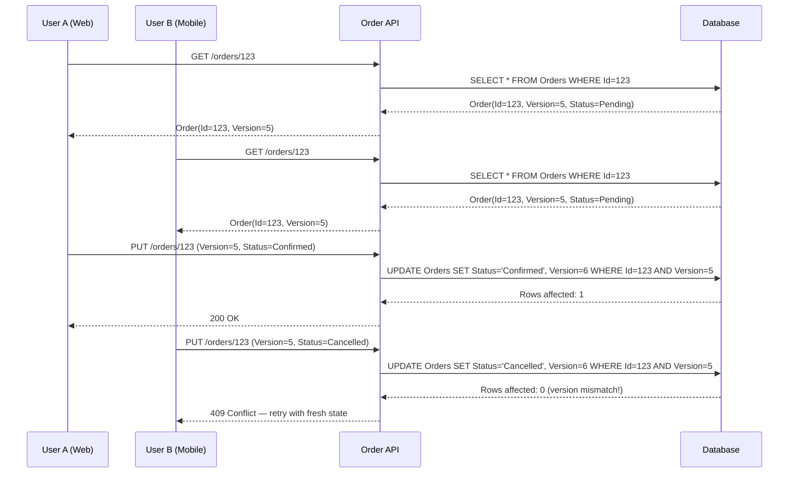
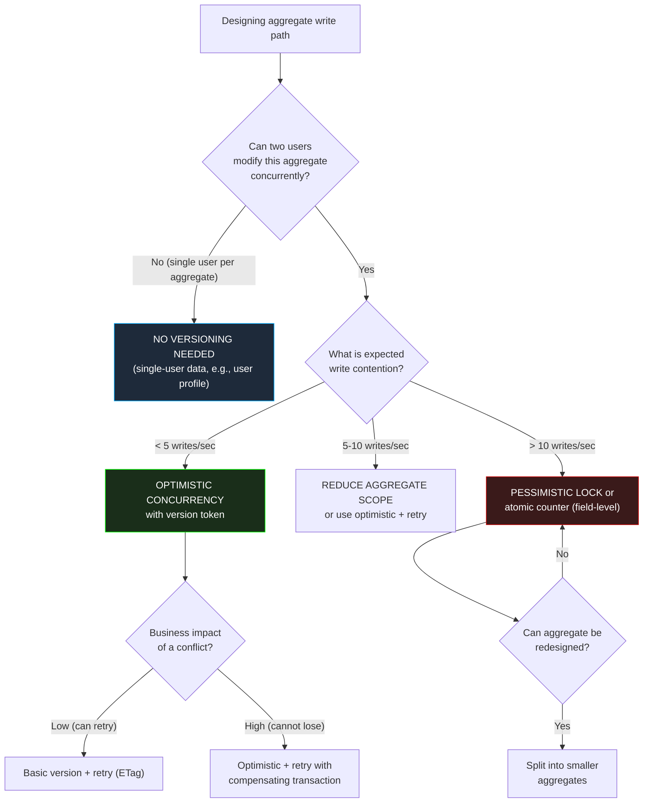

> [!success] Mastery Check
> - [ ] **Studied Well**
> - [ ] **Can explain the concept without notes**
> - [ ] **Can answer interview questions confidently**
> - [ ] **Can implement it in a real project**


# 7.076 — DDD — Aggregate Versioning — Optimistic Concurrency

## Section 1: Navigation & Context

**Domain:** [[7 — System Design & Distributed Systems]] > **Group:** Domain-Driven Design
**Previous:** [[7.075 — DDD — Strategic Design in a Legacy Codebase]] | **Next:** [[7.077 — DDD — Read-Side Projections from Domain Events]]

### Prerequisites
- [[7.033 — DDD — Aggregates]] — versioning is applied at the aggregate root level; you must understand the aggregate pattern and its consistency boundary before designing versioning strategies.
- [[7.074 — DDD — Module vs Bounded Context]] — aggregate versioning is per-context; contexts sharing aggregate roots through events must version independently.
- [[7.031 — DDD — Strategic vs Tactical Design]] — optimistic concurrency is a tactical implementation detail; the strategic decision is which aggregates are hot (frequently contended) and need conflict resolution patterns.

### Where This Fits

In any distributed system where multiple actors (users, services, background jobs) can modify the same aggregate concurrently, you need a strategy to prevent lost updates. Aggregate versioning with optimistic concurrency is the DDD-standard approach: each aggregate root carries a version number incremented on every write; if two writes attempt to update the same version, the second one fails. This avoids database-level locks (which don't scale) while guaranteeing no update is silently lost. In .NET production systems using EF Core, this maps to a `rowversion` or `xmin` column and `DbUpdateConcurrencyException` handling. The failure mode most teams miss: optimistic concurrency works only when the aggregate boundary is correctly sized — over-sized aggregates cause constant conflicts; under-sized aggregates cause lost business rules.

---

## Section 2: Core Mental Model

Aggregate versioning is a write-safety guarantee: every successful mutation of an aggregate records the aggregate's state version, and any concurrent mutation that targets the same version is rejected. This prevents the "last writer wins" scenario where one user's changes silently overwrite another's. The version is a monotonically increasing integer (or a database-native `rowversion` / `xmin` timestamp) stored with the aggregate root. On every update, the application compares the version in the request with the version in the database; if they match, the write proceeds and the version increments; if they differ, a concurrency conflict is raised and the caller must retry with fresh state. The tradeoff: optimistic concurrency trades the overhead of database locks for the cost of conflict retries — at low contention the net win is massive; at high contention (same aggregate > 5 writes/second), the retry overhead exceeds lock overhead and pessimistic approaches may be better.

### Classification

| Dimension | Optimistic Concurrency | Pessimistic Concurrency (DB Lock) |
|---|---|---|
| Mechanism | Version check at write time | Row lock at read time |
| Database overhead | Low (no locks held) | High (locks held for transaction duration) |
| Conflict detection | At commit — write fails if version changed | At read — write blocked until lock released |
| Retry required | Yes — caller must retry with fresh state | No — caller waits |
| Best contention range | < 5 writes/second per aggregate | > 10 writes/second per aggregate |
| .NET support | EF Core concurrency token, rowversion | EF Core `UseSerializableTransaction`, `FOR UPDATE` |
| DDD alignment | Strong — aggregate boundary maps to row | Weak — locks don't align with domain boundaries |



### Key Properties

| Property | Value | Condition |
|---|---|---|
| Write conflict detection | At commit time | Always (optimistic) |
| Lost updates prevented | 100% | When version check is enforced |
| Max throughput before conflict retry dominates | ~5 writes/sec per aggregate | Beyond this, reduce aggregate scope or use pessimistic |
| Conflict retry latency cost | 1-3x normal write latency | Per retry, with backoff |
| EF Core implementation | `[Timestamp]` or `IsRowVersion()` | .NET 8 with SQL Server or PostgreSQL |
| Event-sourced aggregate version | Event stream sequence number | Equivalent to event count in stream |

---

## Section 3: Deep Mechanics

### How It Works

1. **Read phase**: The client reads an aggregate's current state, including its version number. In a REST API, the version is returned in the response body or as an `ETag` header.

2. **Client modifies**: The client (human user or service) modifies the aggregate state. The version number is sent back with the write request — in the request body, as `If-Match` header, or as a command field.

3. **Write attempt**: The server attempts to persist the new state with `UPDATE ... WHERE Version = @originalVersion`. If no row matches (because another write incremented the version), zero rows are affected.

4. **Conflict detection**: The ORM (EF Core) or database detects the zero-row-update and throws a concurrency exception — `DbUpdateConcurrencyException` in EF Core.

5. **Application response**: The application can (a) return HTTP 409 Conflict to the client, (b) automatically retry by re-reading the aggregate and reapplying the change, or (c) merge changes if business rules allow.

6. **Version increment**: On successful write, the version increments atomically. In EF Core with `rowversion`, this happens automatically. In event-sourced systems, the stream version increments.

### Failure Modes

**Failure 1 — Lost Update with No Versioning**: Two users read the same order simultaneously. User A sets status to "Confirmed". User B sets status to "Cancelled". User B's write happens last. Order is "Cancelled" despite User A's confirmation.

**Detection**: Business reports "orders that were confirmed are showing as cancelled." No concurrency exceptions in logs because no versioning was implemented.

**Fix**: Add aggregate versioning. Every aggregate root must have a version property. Every update must check the version.

**Failure 2 — High Retry Storm**: 1000 concurrent requests try to update the same `InventoryCount` aggregate (a single product's stock level). 999 requests fail with `DbUpdateConcurrencyException`. Each retry re-reads and retries, creating a thundering herd.

**Detection**: `DbUpdateConcurrencyException` count in Application Insights spikes from 0 to 10K/minute. P99 latency for inventory updates jumps from 50ms to 5 seconds.

**Fix**: Reduce aggregate scope — store stock levels per warehouse, not per product. Or use a dedicated inventory counter with database atomic increment (`UPDATE Stock SET Quantity = Quantity - 1 WHERE ...`), bypassing the aggregate version for this specific hot field.

**Failure 3 — Stale Read After Conflict**: Client reads version 5, submits change, gets 409. Client re-reads: version 6. But the re-read shows stale data because a read replica lagged behind the write database.

**Detection**: Client retries with stale version 6, gets 409 again. Infinite retry loop.

**Fix**: Read from the primary database for retry reads. Use session consistency (`SET TRANSACTION ISOLATION LEVEL REPEATABLE READ`).

### .NET and Azure Integration

- **EF Core**: `[Timestamp]` attribute on a `byte[]` property generates a `rowversion` in SQL Server. For PostgreSQL, use `[Precision(0,0)]` on a `uint` with `.IsRowVersion()`.
- **SQL Server**: `rowversion` (formerly `timestamp`) — auto-incremented on every row update. EF Core maps to `[Timestamp]`.
- **PostgreSQL**: `xmin` system column — transaction ID of the last update. EF Core can use it as a concurrency token via `.IsRowVersion()`.
- **Azure Cosmos DB**: `_etag` property — Cosmos DB's built-in optimistic concurrency. Use `AccessCondition` or `If-Match` header.
- **Application Insights**: Track `ConcurrencyConflictCount` and `ConflictRetryRate` metrics. Alert if retry rate exceeds 5% of total writes.

```csharp
// EF Core aggregate root with versioning
public sealed class Order : AggregateRoot<OrderId>
{
    public OrderId Id { get; private set; }
    public OrderStatus Status { get; private set; }
    public Money Total { get; private set; }
    public DateTimeOffset? ShippedAt { get; private set; }

    // Concurrency token
    public byte[] RowVersion { get; set; } = Array.Empty<byte>();

    private Order() { }

    public void Confirm()
    {
        if (Status != OrderStatus.Pending)
            throw new DomainException("Only pending orders can be confirmed");
        Status = OrderStatus.Confirmed;
    }

    public void Cancel()
    {
        if (Status == OrderStatus.Shipped)
            throw new DomainException("Cannot cancel shipped orders");
        Status = OrderStatus.Cancelled;
    }
}

// EF Core configuration
public sealed class OrderConfiguration : IEntityTypeConfiguration<Order>
{
    public void Configure(EntityTypeBuilder<Order> builder)
    {
        builder.ToTable("Orders", "orders");
        builder.HasKey(o => o.Id);
        builder.Property(o => o.Id).HasConversion(id => id.Value, g => new OrderId(g));
        builder.Property(o => o.RowVersion).IsRowVersion(); // SQL Server rowversion
        builder.Property(o => o.Status).HasConversion<string>().HasMaxLength(20);
        builder.OwnsOne(o => o.Total, money =>
        {
            money.Property(m => m.Amount).HasColumnName("TotalAmount");
            money.Property(m => m.Currency).HasColumnName("Currency").HasMaxLength(3);
        });
    }
}

// Conflict handler with automatic retry
public sealed class OrderService
{
    private readonly OrderManagementDbContext _dbContext;
    private readonly ILogger<OrderService> _logger;

    public OrderService(OrderManagementDbContext dbContext, ILogger<OrderService> logger)
    {
        _dbContext = dbContext;
        _logger = logger;
    }

    public async Task<Result> CancelOrderAsync(OrderId orderId, int maxRetries = 3, CancellationToken ct = default)
    {
        for (int attempt = 0; attempt < maxRetries; attempt++)
        {
            try
            {
                var order = await _dbContext.Orders
                    .FirstOrDefaultAsync(o => o.Id == orderId, ct);
                if (order is null) return Result.Failure("Order not found");

                order.Cancel();
                await _dbContext.SaveChangesAsync(ct);
                return Result.Success();
            }
            catch (DbUpdateConcurrencyException ex) when (attempt < maxRetries - 1)
            {
                _logger.LogWarning(ex, "Concurrency conflict on order {OrderId}, retry {Attempt}/{MaxRetries}",
                    orderId, attempt + 1, maxRetries);

                // Detach stale entities and retry
                foreach (var entry in ex.Entries)
                    entry.State = EntityState.Detached;

                await Task.Delay(TimeSpan.FromMilliseconds(50 * Math.Pow(2, attempt)), ct);
            }
        }
        return Result.Failure("Concurrency conflict after max retries");
    }
}
```

---

## Section 4: Production Patterns and Implementation

### Primary Implementation

Complete aggregate versioning with conflict resolution, retry, and ETag support for REST API.

```csharp
// ============================================================
// Aggregate Root with Concurrency Token
// ============================================================

public abstract class AggregateRoot<TId>
{
    public TId Id { get; protected set; } = default!;
    public byte[] RowVersion { get; protected set; } = Array.Empty<byte>();

    private readonly List<IDomainEvent> _domainEvents = new();
    public IReadOnlyList<IDomainEvent> DomainEvents => _domainEvents.AsReadOnly();

    protected void AddDomainEvent(IDomainEvent @event) => _domainEvents.Add(@event);
    public void ClearDomainEvents() => _domainEvents.Clear();
}

public sealed class Payment : AggregateRoot<PaymentId>
{
    public OrderId OrderId { get; private set; }
    public Money Amount { get; private set; }
    public PaymentStatus Status { get; private set; }
    public string? TransactionId { get; private set; }

    private Payment() { }

    public static Payment Create(OrderId orderId, Money amount)
    {
        var payment = new Payment
        {
            Id = PaymentId.New(),
            OrderId = orderId,
            Amount = amount,
            Status = PaymentStatus.Pending
        };
        payment.AddDomainEvent(new PaymentInitiatedDomainEvent(payment.Id, orderId, amount));
        return payment;
    }

    public void Complete(string transactionId)
    {
        if (Status != PaymentStatus.Pending)
            throw new DomainException("Cannot complete a non-pending payment");

        TransactionId = transactionId;
        Status = PaymentStatus.Completed;
        AddDomainEvent(new PaymentCompletedDomainEvent(Id, OrderId, transactionId));
    }

    public void Fail(string reason)
    {
        Status = PaymentStatus.Failed;
        AddDomainEvent(new PaymentFailedDomainEvent(Id, OrderId, reason));
    }
}

// ============================================================
// ETag-based REST API Controller
// ============================================================

[ApiController]
[Route("api/orders")]
public sealed class OrdersController : ControllerBase
{
    private readonly IOrderApplicationService _orderService;

    public OrdersController(IOrderApplicationService orderService)
    {
        _orderService = orderService;
    }

    [HttpGet("{id}")]
    public async Task<ActionResult<OrderDto>> Get(OrderId id, CancellationToken ct)
    {
        var order = await _orderService.GetAsync(id, ct);
        if (order is null) return NotFound();

        Response.Headers.ETag = new EntityTagHeaderValue(
            $"""{Convert.ToBase64String(order.RowVersion)}""");
        return Ok(order);
    }

    [HttpPut("{id}/cancel")]
    public async Task<IActionResult> Cancel(OrderId id, CancellationToken ct)
    {
        // Read ETag from If-Match header
        var ifMatch = Request.Headers.IfMatch.FirstOrDefault();
        if (ifMatch is null)
            return BadRequest("If-Match header required for concurrency control");

        var version = Convert.FromBase64String(ifMatch.Trim('"'));
        var result = await _orderService.CancelWithVersionCheckAsync(id, version, ct);

        return result.Match(
            success => NoContent(),
            conflict => Conflict(new { error = "Order was modified by another user. Please refresh and retry." }),
            notFound => NotFound());
    }
}

// ============================================================
// Application Service with Explicit Version Check
// ============================================================

public interface IOrderApplicationService
{
    Task<OrderDto?> GetAsync(OrderId id, CancellationToken ct);
    Task<ServiceResult> CancelWithVersionCheckAsync(OrderId id, byte[] expectedVersion, CancellationToken ct);
}

internal sealed class OrderApplicationService : IOrderApplicationService
{
    private readonly OrderManagementDbContext _db;
    private readonly ILogger<OrderApplicationService> _logger;

    public OrderApplicationService(OrderManagementDbContext db, ILogger<OrderApplicationService> logger)
    {
        _db = db;
        _logger = logger;
    }

    public async Task<OrderDto?> GetAsync(OrderId id, CancellationToken ct)
    {
        var order = await _db.Orders.AsNoTracking().FirstOrDefaultAsync(o => o.Id == id, ct);
        return order is null ? null : MapToDto(order);
    }

    public async Task<ServiceResult> CancelWithVersionCheckAsync(OrderId id, byte[] expectedVersion, CancellationToken ct)
    {
        try
        {
            var order = await _db.Orders.FirstOrDefaultAsync(o => o.Id == id, ct);
            if (order is null) return ServiceResult.NotFound;

            // Explicit version check before domain logic
            if (!order.RowVersion.SequenceEqual(expectedVersion))
                return ServiceResult.Conflict("Order was modified since you read it");

            order.Cancel();
            await _db.SaveChangesAsync(ct);
            return ServiceResult.Success;
        }
        catch (DbUpdateConcurrencyException)
        {
            _logger.LogWarning("Concurrency conflict cancelling order {OrderId}", id);
            return ServiceResult.Conflict("Concurrent modification detected");
        }
    }

    private static OrderDto MapToDto(Order order) => new(
        order.Id, order.Status.ToString(), order.Total.Amount,
        order.RowVersion, order.CreatedAt);
}

// ============================================================
// Result Types for Conflict Reporting
// ============================================================

public readonly record struct ServiceResult
{
    public bool IsSuccess { get; init; }
    public bool IsConflict { get; init; }
    public bool IsNotFound { get; init; }
    public string? Error { get; init; }

    public static ServiceResult Success => new() { IsSuccess = true };
    public static ServiceResult Conflict(string error) => new() { IsConflict = true, Error = error };
    public static ServiceResult NotFound => new() { IsNotFound = true };
}
```

### Configuration and Wiring

```csharp
// Program.cs — concurrency-ready EF Core
builder.Services.AddDbContext<OrderManagementDbContext>(options =>
    options.UseSqlServer(
        builder.Configuration.GetConnectionString("OrderManagement"),
        x => x.MigrationsHistoryTable("__EFMigrationsHistory", "orders")));

builder.Services.AddScoped<IOrderApplicationService, OrderApplicationService>();

// Polly retry policy for transient concurrency conflicts
builder.Services.AddHttpClient("OrderApi")
    .AddTransientHttpErrorPolicy(p => p.WaitAndRetryAsync(
        retryCount: 3,
        sleepDurationProvider: attempt => TimeSpan.FromMilliseconds(50 * Math.Pow(2, attempt))));
```

### Common Variants

**Variant 1 — ETag with If-Match (REST standard)**:
```http
GET /orders/123
ETag: "AAAAAAEAAAA="

PUT /orders/123/cancel
If-Match: "AAAAAAEAAAA="
204 No Content
```

**Variant 2 — Event-Sourced Versioning**:
```csharp
// Event store stream version IS the concurrency token
public sealed class EventSourcedOrder : AggregateRoot<OrderId>
{
    public long StreamVersion { get; private set; }

    public void Apply(OrderCreatedEvent @event)
    {
        Id = @event.OrderId;
        Status = OrderStatus.Pending;
        StreamVersion++;
    }

    public void Confirm()
    {
        AddDomainEvent(new OrderConfirmedEvent(Id, DateTimeOffset.UtcNow));
        StreamVersion++;
    }
}

// Event store append expects expectedVersion parameter
await _eventStore.AppendAsync(
    streamId: $"order-{order.Id}",
    expectedVersion: order.StreamVersion,
    events: order.DomainEvents);
```

**Variant 3 — Azure Cosmos DB with `_etag`**:
```csharp
// Cosmos DB built-in optimistic concurrency
public async Task<Order> UpdateOrderAsync(Order order, CancellationToken ct)
{
    var response = await _container.ReplaceItemAsync(
        order,
        order.Id.Value.ToString(),
        requestOptions: new ItemRequestOptions
        {
            IfMatchEtag = order.RowVersion is not null
                ? Convert.ToBase64String(order.RowVersion)
                : null
        },
        cancellationToken: ct);
    return response.Resource;
}
```

### Real-World .NET Ecosystem Example

**Martendb (Event Store for .NET)**: A production-grade event store library that implements aggregate versioning natively. When appending events to a stream, you provide the `expectedVersion` — if the stream has been modified since you read it, Marten throws `EventStreamUnexpectedVersionException`. This is the exact DDD optimistic concurrency pattern, but at the event stream level instead of the aggregate row level.

```csharp
// Marten event stream versioning
public async Task<Order> ConfirmOrderAsync(OrderId id, long expectedVersion, CancellationToken ct)
{
    using var session = _store.LightweightSession();
    var order = await session.Events.AggregateStreamAsync<Order>(id.Value, token: ct);

    order.Confirm();

    // expectedVersion here is the concurrency check
    session.Events.Append(id.Value, expectedVersion, order.DomainEvents.ToArray());
    await session.SaveChangesAsync(ct);
    return order;
}
```

---

## Section 5: Gotchas and Production Pitfalls

### Pitfall 1 — No Explicit Version Returned to Client

**Pitfall:** API reads the aggregate and returns data without the current version. The client can't include it in the write request.

```csharp
// ❌ No version returned to client
public record OrderDto(Guid Id, string Status, decimal Total);
```

**Symptom:** Cannot implement optimistic concurrency on the client side. Lost updates happen silently. Business reports orders mysteriously reverting to previous states.

**Fix:** Always include the version in the response.

```csharp
// ✅ Version included for concurrency control
public record OrderDto(Guid Id, string Status, decimal Total, byte[] RowVersion, DateTimeOffset CreatedAt);
```

**Cost of not fixing:** Unrecoverable data loss in concurrent scenarios. Customer complaints about "system losing my changes."

### Pitfall 2 — Over-Sized Aggregate Causing Constant Conflicts

**Pitfall:** The `Order` aggregate includes `OrderLine`, `Payment`, `ShippingAddress`, `BillingAddress`, `Discounts`, `CouponCodes`, `CustomerNotes`, and `AuditTrail`. Every change to any of these fields increments the same version counter.

```csharp
// ❌ Single massive aggregate — every field change increments the same version
public sealed class Order
{
    public byte[] RowVersion { get; set; }
    // 30+ properties, 3 collections
}
```

**Symptom:** Customer support updates a shipping address, and simultaneously the payment system processes a charge. Second update always fails with 409. Call center agents see constant errors.

**Fix:** Split the aggregate. Shipping address and payment are different business transactions — they should be different aggregates or at least different aggregate roots within the same bounded context.

```csharp
// ✅ Separate aggregates for different transaction boundaries
public sealed class Order { /* core order data, order lines */ }
public sealed class Payment { /* payment-specific versioning */ }
public sealed class ShippingDetail { /* shipping-specific versioning */ }
```

**Cost of not fixing:** Call center agent productivity drops 50% due to constant concurrency errors. Customer satisfaction degrades as users see inexplicable failures.

### Pitfall 3 — Retry Without Fresh Read

**Pitfall:** On `DbUpdateConcurrencyException`, the application catches it, increments the version manually, and retries the write without re-reading the current state.

```csharp
// ❌ Dangerous retry — ignoring intermediate state
catch (DbUpdateConcurrencyException)
{
    order.RowVersion = new byte[] { /* manually bumping version — WRONG! */ };
    await _db.SaveChangesAsync(ct); // Overwrites the other user's changes!
}
```

**Symptom:** Lost updates persist despite "concurrency handling." The bug is invisible — no errors, just incorrect final state.

**Fix:** Always re-read the fresh aggregate state, reapply the domain logic, and retry.

```csharp
// ✅ Safe retry — re-read before retrying
catch (DbUpdateConcurrencyException ex)
{
    foreach (var entry in ex.Entries)
        await entry.ReloadAsync(ct); // Re-read fresh state

    order.Cancel(); // Re-apply domain logic (may succeed or fail based on new state)
    await _db.SaveChangesAsync(ct);
}
```

**Cost of not fixing:** The system is "eventually consistent" in the worst way — the most recent write wins regardless of business correctness.

### Pitfall 4 — No Handling of Delete Concurrency

**Pitfall:** Concurrency checking on updates but not on deletes. Two users can see the same aggregate; one deletes it, the other updates it — and the update creates a phantom.

```csharp
// ❌ Delete without version check
public async Task DeleteOrderAsync(OrderId id)
{
    var order = await _db.Orders.FindAsync(id);
    _db.Orders.Remove(order); // No version check!
    await _db.SaveChangesAsync(ct);
}
```

**Symptom:** After deletion, other users can still submit updates to the deleted entity (no row found for update, but no error returned).

**Fix:** Include version in delete operations.

```csharp
// ✅ Delete with version check
public async Task DeleteOrderAsync(OrderId id, byte[] expectedVersion)
{
    var rows = await _db.Orders
        .Where(o => o.Id == id && o.RowVersion == expectedVersion)
        .ExecuteDeleteAsync(ct);
    if (rows == 0)
        throw new ConcurrencyConflictException("Order was modified or deleted");
}
```

**Cost of not fixing:** Deleted data can be silently re-created by concurrent updates, causing data integrity issues in downstream systems.

### Pitfall 5 — RowVersion in SQL Server Returns 0 in EF Core After Update

**Pitfall:** After `SaveChangesAsync`, the tracked entity's `RowVersion` still shows the old value (or zeros) because EF Core doesn't automatically refresh concurrency tokens on all providers.

```csharp
// ❌ Old RowVersion retained after save
var order = await _db.Orders.FindAsync(id);
order.Confirm();
await _db.SaveChangesAsync(ct);
// order.RowVersion still has the PRE-update value!
// Next API call will use stale version
```

**Symptom:** The next HTTP request includes a stale ETag. Every subsequent API call returns 409 Conflict because the version hasn't been refreshed.

**Fix:** Force refresh the concurrency token after save, or use `ReloadAsync`.

```csharp
// ✅ Refresh RowVersion after save
await _db.SaveChangesAsync(ct);
await _db.Entry(order).Property(o => o.RowVersion).ReloadAsync(ct);
```

**Cost of not fixing:** All users see concurrency conflicts after every save. 100% retry rate. Users can never successfully update the same resource twice.

---

## Section 6: Tradeoffs and Decision Framework

### Tradeoff Matrix

| Dimension | Optimistic Concurrency (Version) | Pessimistic Concurrency (Lock) | Last-Writer-Wins (No Version) |
|---|---|---|---|
| Lost update prevention | 100% | 100% | 0% |
| Read latency | Normal | Blocked if lock held | Normal |
| Write latency | Normal + retry overhead | Blocked until lock released | Normal |
| Contention tolerance | Low (< 5 writes/sec/agg) | High (> 10 writes/sec/agg) | Unlimited |
| Deadlock risk | None | Yes | None |
| .NET implementation | `[Timestamp]` + `DbUpdateConcurrencyException` | `UseSerializableTransaction` + `FOR UPDATE` | Default EF Core |
| DDD alignment | Strong | Medium | Weak |

### Decision Flowchart



### When to Apply

- Multiple actors (users, services, background jobs) read-then-write the same aggregates
- Business correctness requires that concurrent writes not silently overwrite each other
- Database-level locking would create unacceptable contention or deadlocks
- Aggregate boundaries are correctly sized (not oversized)

### When NOT to Apply

- [ ] Single-user data (user profile, personal settings) — no concurrency benefit
- [ ] Write-once data (audit logs, event streams that are never modified) — versioning adds no value
- [ ] Time-series data where last-writer-wins is acceptable
- [ ] Aggregates with > 10 writes/second per root — retry overhead exceeds lock overhead
- [ ] Non-transactional updates where eventual consistency is acceptable (e.g., view counts)

### Scale Thresholds

- **Optimistic concurrency optimal zone**: < 5 writes/second per aggregate root. At 5 req/s with 50ms write latency, retry rate is ~1%. At 20 req/s, retry rate exceeds 20%.
- **Conflict retry cost**: 1-3x normal write latency per retry. With 3 retries and exponential backoff, max latency = normal_latency × (1 + 0.05 + 0.1 + 0.2) ≈ 1.35x.
- **EF Core rowversion overhead**: ~0.1ms per write. Negligible.
- **Aggregate split threshold**: If an aggregate has > 10 properties that change independently in different transactions, split it.

---

## Section 7: Interview Arsenal

### Question Bank

1. What is aggregate versioning and why is it important in DDD?
2. How does optimistic concurrency work with EF Core in .NET?
3. Compare optimistic and pessimistic concurrency control — when would you use each?
4. What happens when a `DbUpdateConcurrencyException` is thrown? Walk through the handler.
5. How do you implement ETag-based concurrency in a REST API for aggregates?
6. How does aggregate versioning work in an event-sourced system vs a relational database?
7. What problems occur when an aggregate is too large for optimistic concurrency?
8. How do you handle concurrency for delete operations on aggregates?

### Spoken Answers

**Q1: What is aggregate versioning and why is it important in DDD?**

> **Average answer:** It's a way to track changes to an aggregate by incrementing a version number, and it prevents lost updates when two people edit the same thing at the same time.

> **Great answer:** Aggregate versioning is the implementation of optimistic concurrency at the DDD aggregate boundary. Every aggregate root carries a version token — a monotonically increasing integer or a database-native `rowversion` — that is checked on every write. When you update an aggregate, the SQL is `UPDATE ... SET Version = Version + 1 WHERE Id = @id AND Version = @originalVersion`. If zero rows are affected, someone else has already modified the aggregate since you read it, and the write is rejected with `DbUpdateConcurrencyException` in EF Core. This is critical because DDD aggregates are transactional boundaries — if we silently lost a concurrent change within that boundary, we'd violate the aggregate's consistency guarantee. In production, I always include `[Timestamp]` on my aggregate roots, return the version as an `ETag` header from the API, and require `If-Match` on write endpoints. The one thing most developers miss: this only works when the aggregate is the right size. If your aggregate contains both fast-changing stock levels and slowly-updated order details, constant concurrency conflicts will make the system unusable.

**Q3: Compare optimistic and pessimistic concurrency control.**

> **Average answer:** Optimistic assumes conflicts are rare and retries when they happen. Pessimistic locks the data and prevents others from touching it.

> **Great answer:** The decision between optimistic and pessimistic concurrency is driven by contention frequency and business impact. Optimistic concurrency — using aggregate version tokens — is the DDD-default because it aligns with the aggregate boundary, adds almost zero latency in the no-conflict case, and requires no database locks. It works well up to about 5 writes/second per aggregate root. Beyond that, the retry overhead dominates. Pessimistic concurrency — `SELECT ... FOR UPDATE` or `REPEATABLE READ` isolation level — is needed for high-contention aggregates like inventory stock levels during flash sales, where the same aggregate (e.g., `Product{Id=42, Quantity=5}`) gets 100 writes/second. The cost is database locks, potential deadlocks, and reduced throughput. In .NET, I use `EF Core` with `UseSerializableTransaction()` for pessimistic scenarios. There's a third option I reach for frequently: reduce the aggregate scope. If `Product.Quantity` is high-contention but `Product.Description` is not, split them into different aggregates — `ProductInventory{Quantity}` with optimized atomic updates and `ProductDetails{Description}` with normal versioning.

**Q6: How does aggregate versioning work in an event-sourced system?**

> **Average answer:** In event sourcing, the version is the number of events in the stream. You check it before appending new events.

> **Great answer:** In event sourcing, aggregate versioning maps directly to the event stream sequence number. An event-sourced aggregate's state is derived by replaying all events in its stream, and the "version" is the current stream position — the count of events. When you append new events, you provide an `expectedVersion` parameter: if the actual stream has diverged (someone else appended since you read it), the event store rejects the append. In Marten, this throws `EventStreamUnexpectedVersionException`. The key difference from a relational approach: in event sourcing, the "lost update" isn't a row being overwritten — it's a new event being inserted at the wrong stream position, which would create a fork in the event history. The event store enforces that events are appended sequentially to the same stream. This makes event sourcing's concurrency model even stronger than row-based versioning: you validate against the entire history of events, not just the latest state. The tradeoff is that conflict resolution is harder — with events, you can't just re-read and retry; you might need to compare event streams and merge.

### System Design Interview Trigger

When an interviewer says "design an order management system" and then asks "how do you handle two users modifying the same order simultaneously?", they are testing whether you understand that DDD aggregates solve this through versioning, not database locks. The senior candidate immediately mentions ETags, `DbUpdateConcurrencyException`, and aggregate scope reduction — and then proactively addresses the failure case most juniors miss: what happens when the aggregate is too large and conflicts become constant. The deeper follow-up: "What if the conflict cannot be retried because the retry would find a business-invalid state?" — testing your understanding of compensating actions and sagas.

### Comparison Table

| | Optimistic (Version) | Pessimistic (Lock) | Event-Sourced Version |
|---|---|---|---|
| Core guarantee | No lost updates on write | Exclusive access during transaction | No stream forks |
| Trade-off | Retry on conflict | Blocked reads on conflict | Append-only constraint |
| .NET implementation | `[Timestamp]`, `IsRowVersion()` | `UseSerializableTransaction` | Marten, EventStoreDB |
| Failure mode | Constant retries (oversized aggregate) | Deadlocks, connection pool exhaustion | Stream version mismatch |
| When to choose | < 5 writes/sec/aggregate | > 10 writes/sec/aggregate | Event-sourced system |

---

## Section 8: Architecture Decision Record

**Status:** Accepted

**Context:** OrderManagement system processes 3,000 orders/day with occasional concurrent modifications — customer support agents and customers can cancel the same order simultaneously during dispute resolution. The system uses EF Core with SQL Server. Lost updates on order status changes have already caused 2 incidents where confirmed orders were accidentally cancelled by concurrent writes.

**Options Considered:**

1. **Optimistic concurrency with rowversion (chosen)** — `[Timestamp]` byte[] on every aggregate root. ETag-based REST API. `DbUpdateConcurrencyException` handler with 3 retries.
2. **Pessimistic locking with `REPEATABLE READ`** — Lock rows on read, block concurrent writes.
3. **No concurrency control (current state)** — Last-writer-wins.

**Decision:** Option 1 — optimistic concurrency with rowversion, because:
- Contention is low (same order modified concurrently < 5 times/day)
- Deadlock risk with Option 2 is unacceptable during peak hours
- Retry rate at current load is < 0.1% — acceptable business impact
- DDD alignment: versioning maps cleanly to aggregate root boundary

**Consequences:**
- ✅ Lost update prevention for concurrent order modifications
- ✅ No database lock overhead
- ✅ ETag support enables cache-friendly API design
- ⚠️ Requires client-side retry logic (support UI must handle 409 responses)
- ⚠️ `RowVersion` must be refreshed after every `SaveChangesAsync` (or client gets stale ETag)
- ❌ At 10x scale (30K orders/day), need to review aggregate sizing

**Review Trigger:** Revisit if (a) concurrency conflict rate exceeds 1% of all writes, (b) P99 latency for order updates exceeds 2 seconds due to retry storms, or (c) any aggregate root exceeds 15 properties and is modified by different actors.

---

## Section 9: Self-Check

### Conceptual Questions

1. What is the purpose of aggregate versioning in DDD?

2. How does EF Core implement optimistic concurrency? What attribute and exception are involved?

3. Compare optimistic and pessimistic concurrency: what does each trade?

4. What is a common sign that an aggregate is too large for optimistic concurrency?

5. How do you expose aggregate version to a REST API client?

6. How does concurrency work in an event-sourced system compared to a relational one?

7. At what write rate does optimistic concurrency become problematic?

8. How does aggregate sizing relate to concurrency conflicts? (See [[7.033 — DDD — Aggregates]])

9. What happens if `RowVersion` is not refreshed after `SaveChangesAsync` in EF Core?

10. Explain the retry strategy for optimistic concurrency conflicts in 60 seconds.

<details>
<summary>Answers</summary>

1. To prevent lost updates when multiple actors modify the same aggregate concurrently. Each write checks that the version hasn't changed since the read; if it has, the write is rejected and the caller must retry with fresh state.

2. `[Timestamp]` attribute on a `byte[]` property in SQL Server (maps to `rowversion`). For PostgreSQL, use `.IsRowVersion()` on a `uint` property. The `DbUpdateConcurrencyException` is thrown when the `UPDATE ... WHERE Version = @expected` affects zero rows.

3. Optimistic: no locks, retry on conflict, good for < 5 writes/sec. Pessimistic: locks held, no retry needed, good for > 10 writes/sec. Optimistic trades conflict retries for lock overhead. Pessimistic trades throughput for guaranteed first-writer-wins.

4. Constant concurrency conflicts (retry rate > 5%) on an aggregate where the conflicting updates are on different properties (e.g., one on `Status`, another on `ShippingAddress`). The fix: split the aggregate into smaller units.

5. Return the version as an `ETag` header in the GET response. Require the client to send `If-Match` header with the ETag on PUT/PATCH/DELETE requests. Server compares the ETag with the current version before applying changes.

6. In relational, version is a column (`rowversion`). In event sourcing, version is the stream position (number of events). Concurrency is checked by the event store rejecting appends with an incorrect `expectedVersion`. Event sourcing provides stronger guarantees (history-level validation) but more complex conflict resolution.

7. Above ~5 writes per second per aggregate root. At 5 writes/sec with 50ms write latency, conflict probability is ~25% (Poisson arrival). At 10 writes/sec, conflict rate exceeds 50% and retry overhead dominates.

8. Each aggregate defines a transactional consistency boundary. If that boundary is too large (contains properties modified by different actors at different rates), every unrelated change becomes a concurrency conflict. Sizing aggregates correctly — one aggregate per business transaction — minimizes conflicts naturally. See [[7.033 — DDD — Aggregates]].

9. The next HTTP request from the same client sends the old `ETag`, causing a false 409 Conflict. Every user sees conflicts on every subsequent operation. Fix: call `entry.Property(p => p.RowVersion).ReloadAsync()` after save.

10. "When a concurrency conflict is detected (DbUpdateConcurrencyException in EF Core), I follow three steps: (1) Detach the stale entity, (2) Re-read the fresh aggregate state from the database, (3) Re-apply the domain logic (which may succeed or fail based on the new state). I use exponential backoff retry: 50ms, 100ms, 200ms, max 3 retries. If the retry still fails, I return 409 Conflict to the client with a clear error message explaining that the resource was modified."
</details>

### Scenario Challenges

**Scenario 1 — Diagnose the problem:** A call center application allows agents to update customer orders. Agents report that when they cancel an order, the cancellation sometimes fails with a "Conflict" error, but when they refresh, the order is already cancelled. This happens roughly 20% of the time.

<details>
<summary>Diagnosis</summary>

**Root cause:** The order's `Status` is updated by multiple concurrent events — the customer's web request and the agent's request both load the order simultaneously. One completes (sets Cancelled), the other retries or gets 409. The error appears but the write actually succeeded.

**Evidence:** `DbUpdateConcurrencyException` logs correlate with cancellation requests. The order's final state is correct, but the caller sees an error.

**Fix:** The application should handle 409 by re-reading the order and confirming the state change was applied. If the order is already cancelled (the intended action), return success to the agent. Only true conflicts (different status changes) should be reported as errors.

**Prevention:** Design the conflict handling to distinguish between "expected change already applied by another" (idempotent) and "unexpected concurrent change" (true conflict).
</details>

**Scenario 2 — Design decision:** You are designing the inventory system for an e-commerce platform. During a flash sale, the same product (e.g., SKU "IPHONE-15", quantity = 10) receives 100 reservation requests per second. Design the concurrency strategy.

<details>
<summary>Decision and Reasoning</summary>

**Choice:** Do NOT use aggregate versioning for the hot path. Use an atomic database counter for stock reservation. Use aggregate versioning for product details (description, price, images).

**Tradeoffs accepted:** Stock reservations are eventually consistent with the aggregate's domain state. A reserved count in the database is authoritative; the Product aggregate reflects it asynchronously.

**Implementation sketch:**
```csharp
// Hot path: atomic decrement (no aggregate versioning)
await _db.Database.ExecuteSqlAsync(
    $"UPDATE Stock SET Reserved = Reserved + 1 WHERE ProductId = @id AND (Quantity - Reserved) > 0", id);

// Warm path: aggregate-based reservation with versioning
public class ProductInventory : AggregateRoot<ProductId>
{
    public int Quantity { get; private set; }
    public int Reserved { get; private set; }
    public int Available => Quantity - Reserved;
    public byte[] RowVersion { get; set; }

    public Result Reserve(int count)
    {
        if (count > Available) return Result.Failure("Insufficient stock");
        Reserved += count;
        return Result.Success();
    }
}
```
</details>

**Scenario 3 — Failure mode:** A background job and a user are modifying the same aggregate. The background job reads the aggregate at version 5, runs for 2 seconds (processing payment), then writes successfully at version 6. The user loaded the aggregate at version 5 and submits a change 3 seconds later. The user's write fails with 409. The user retries, reads version 6, and submits again — success. But the user's change was a cancellation, and the payment was already processed.

<details>
<summary>Investigation and Fix</summary>

**Investigation steps:** (1) Check the domain logic for `Cancel()` — does it validate the payment state? (2) Check if the aggregate includes `Payment` or if payment is a separate aggregate. (3) Review the user's retry flow.

**Confirming evidence:** The `Order.Cancel()` method checks `Status != Shipped` but does not check `Payment.Status`. Payment processing and cancellation are in the same aggregate, so they share a version, but the cancellation didn't consider payment state.

**Immediate mitigation:** Add payment state validation to `Order.Cancel()`:
```csharp
public void Cancel()
{
    if (Status == OrderStatus.Shipped)
        throw new DomainException("Cannot cancel shipped orders");
    if (PaymentStatus == PaymentStatus.Completed)
        throw new DomainException("Cannot cancel orders with completed payment — initiate refund instead");
    Status = OrderStatus.Cancelled;
}
```

**Permanent fix:** Separate Payment into its own aggregate so it has independent versioning and independent lifecycle.

**Post-mortem item:** Domain invariants must be validated regardless of concurrency approach. A retry should never succeed on a business-invalid state.
</details>

**Scenario 4 — Scale it:** Your system currently handles 500 writes/second across all aggregates, with a 0.5% conflict rate. Business projects 10x growth (5,000 writes/second). Your conflict rate is projected to reach 15% due to hot aggregates.

<details>
<summary>Scaling Strategy</summary>

**Bottleneck this addresses:** Hot aggregates — the top 5% of aggregates (most popular products, active orders) receive 80% of writes. At 5K writes/second, these hot aggregates exceed 100 writes/second each.

**How it helps:** Three interventions: (1) Split hot aggregates into finer-grained units (per-warehouse stock counters, per-region order data). (2) Use atomic database operations for high-contention fields (inventory counters) while keeping optimistic versioning for low-contention data. (3) Implement command-side conflict prediction — before writing, estimate conflict probability and switch to pessimistic locking for high-probability writes.

**What it does not solve:** True domain-level conflicts where two users genuinely want different outcomes. That's a business problem, not a versioning problem.

**Implementation order:** Phase 1: Profile to identify hot aggregates. Phase 2: Split inventory per warehouse. Phase 3: Implement atomic counters for hot paths. Phase 4: Monitor conflict rate; if still > 5%, investigate CQRS to separate reads from writes.
</details>

**Scenario 5 — Interview simulation:** The interviewer says: "A customer support agent and the customer's mobile app both try to modify the same order simultaneously. The agent cancels the order. The customer adds an item. What happens and how do you handle it?"

<details>
<summary>Model Response</summary>

"I'd start by clarifying: both operations are on the same Order aggregate, so they share a version. The agent loads the order (Version=5), hits Cancel. The customer loads the order (Version=5), hits AddItem. One of the two writes succeeds first — let's say the agent's Cancel (Version=6). The customer's AddItem write checks `WHERE Version = 5` and finds no match: 409 Conflict.

Now the question is what happens after the conflict. The worst approach is to silently retry the customer's AddItem — because now the order is cancelled, and adding an item to a cancelled order is wrong. Instead, the customer's app should: (1) catch the 409, (2) re-read the fresh aggregate (Version=6, Status=Cancelled), (3) re-validate the AddItem command against the new state — which should fail with a domain error saying the order is cancelled and cannot accept new items, (4) display a meaningful error to the customer.

This exposes a deeper design question: should Cancel and AddItem be on the same aggregate? If the business requirement is that a cancelled order can still have items added (for a 'reopen with changes' flow), then Cancel and AddItem should not conflict — they should be different aggregates or use a different conflict resolution strategy like merge semantics. But in practice, a cancelled order should not accept new items, so the 409 is correct behavior.

The infrastructure lesson: ETags on the API, `DbUpdateConcurrencyException` handler with re-read-and-revalidate (not re-read-and-retry-blindly), and domain-level validation that catches business-invalid state after a conflict."
</details>
