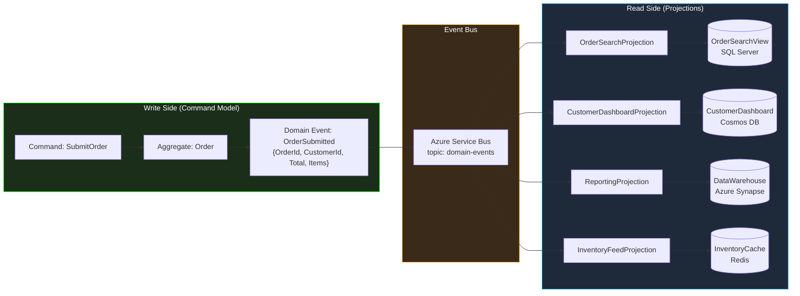
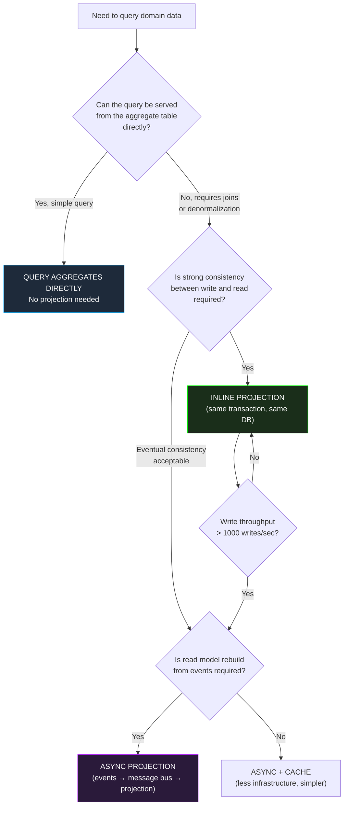

> [!success] Mastery Check
> - [ ] **Studied Well**
> - [ ] **Can explain the concept without notes**
> - [ ] **Can answer interview questions confidently**
> - [ ] **Can implement it in a real project**


# 7.077 — DDD — Read-Side Projections from Domain Events

## Section 1: Navigation & Context

**Domain:** [[7 — System Design & Distributed Systems]] > **Group:** Domain-Driven Design
**Previous:** [[7.076 — DDD — Aggregate Versioning — Optimistic Concurrency]] | **Next:** [[7.078 — DDD — Infrastructure Concerns — Keeping Domain Pure]]

### Prerequisites
- [[7.032 — DDD — Ubiquitous Language]] — domain events are the most explicit expression of Ubiquitous Language; if the event schema doesn't match the domain vocabulary, the read-side will be wrong by construction.
- [[7.033 — DDD — Aggregates]] — domain events are the emission from aggregate state changes; the projection logic reads those emissions and must understand the aggregate's lifecycle and invariants.
- [[7.043 — CQRS — Command Query Responsibility Segregation]] — read-side projections are fundamentally a CQRS concept; commands produce events, and projections consume them to build query-optimized views.

### Where This Fits

In any DDD system where the write model (aggregates) follows domain normalization rules, the read model must be denormalized for query performance. Domain events are the bridge: each aggregate state change emits one or more domain events, and subscribers — read-side projections — consume these events to build and update query-optimized tables, caches, search indexes, or materialized views. This keeps the write model pure (encapsulating business rules within aggregates) while giving the read side the freedom to structure data for UI screens, reporting, and external API consumption. Without projections, every query must join through the normalized aggregate schema, creating performance problems that tempt developers to compromise the domain model.

---

## Section 2: Core Mental Model

A read-side projection is an event subscriber that listens to domain events emitted by aggregates and updates a denormalized read model in response. When an `OrderSubmitted` event fires, the projection inserts a row into an `OrderSearchView` table with customer name, order total, status, and item count — all pre-joined and pre-computed so that search queries execute as single-row lookups. The invariant: a projection is always a derived view; the domain event is the source of truth, and the projection can be rebuilt entirely from the event history. This gives you the freedom to optimize read models without touching the write-side — change a projection schema, rebuild from the event store, and the new read model is populated without migrating the write database.

### Classification

| Dimension | Classification |
|---|---|
| Pattern type | CQRS / Event-Driven / Read-Side |
| Scope | Query-side optimization within a bounded context |
| Primary concern | Decoupling write-optimized (normalized) from read-optimized (denormalized) storage |
| Consistency model | Eventual consistency between write and read |
| Rebuild capability | Full rebuild from event history (idempotent projection) |
| Storage target | SQL tables, Cosmos DB containers, Redis cache, Elasticsearch indexes, Azure Cognitive Search |



### Key Properties

| Property | Value | Condition |
|---|---|---|
| Write-to-read latency | 50-500ms typical | Depends on event bus, projection complexity |
| Projection idempotency | Required (event may be delivered multiple times) | Always — use event ID deduplication |
| Rebuild time for 10M events | ~15 minutes (simple projections) | ~1M events/minute with batch processing |
| Storage amplification | 3-10x normalized size | Each projection duplicates and denormalizes data |
| Consistency | Eventual | Read model may lag behind write model |
| Projection types | Inline, Async, Batch, Real-time | Depends on latency requirements |

---

## Section 3: Deep Mechanics

### How It Works

1. **Aggregate emits event**: When an aggregate mutates, it raises domain events — `OrderSubmitted`, `PaymentCompleted`, `OrderShipped`. These are in-memory objects implementing `IDomainEvent`.

2. **Event is persisted and published**: In a typical .NET implementation, `SaveChangesAsync` catches the aggregate's `DomainEvents` collection, persists the events to an event store or outbox, and publishes them to a message broker (Azure Service Bus).

3. **Projection subscriber receives event**: A background service (Azure Function, `IHostedService`, MassTransit consumer) subscribes to the event topic.

4. **Projection handler updates read model**: The handler receives the typed event, applies it to the read model — inserting, updating, or deleting rows in a query-optimized table.

5. **Read model serves queries**: The application's query endpoints (controllers, GraphQL resolvers) read from the projection tables, never from the aggregate tables.

6. **Rebuild on demand**: If the projection schema changes or data corruption occurs, the projection is rebuilt by replaying all historical events from the event store.

### Failure Modes

**Failure 1 — Non-idempotent Projection**: Event `OrderSubmitted` is delivered twice (at-least-once delivery from Service Bus). Projection inserts duplicate rows into `OrderSearchView`.

**Detection**: `OrderSearchView` has duplicate `OrderId` entries. `COUNT(*)` from read model differs from aggregate count.

**Fix**: Make all projection handlers idempotent — use `MERGE` (upsert) instead of `INSERT`, or deduplicate by event ID.

```csharp
// ❌ INSERT — duplicate on redelivery
await _db.Orders.AddAsync(new OrderSearchRow(orderId, customerName, total));

// ✅ UPSERT — safe for at-least-once delivery
await _db.Orders
    .Upsert(new OrderSearchRow(orderId, customerName, total))
    .On(o => o.OrderId)
    .NoUpdate()
    .RunAsync();
```

**Failure 2 — Projection Lag During Peak**: Black Friday traffic generates 10K events/second. Projection consumer processes 500 events/second. Lag grows to 30 minutes. Orders placed but not appearing in "My Orders" screen.

**Detection**: `projection_lag_seconds` metric spikes. User complaints "my order doesn't show up."

**Fix**: Scale projection consumers horizontally (competing consumers pattern). Batch event processing. Consider splitting hot projections (order search) from cold projections (reporting).

**Failure 3 — Schema Evolution Mismatch**: Event schema changes from `OrderSubmittedV1` to `OrderSubmittedV2`. Old events in the event store still use V1 schema. Projection handler only knows V2.

**Detection**: Event deserialization failures. Projection stops processing events.

**Fix**: Version events and projection handlers. Process V1 and V2 events through separate handlers or upgrade old events on read.

### .NET and Azure Integration

- **Azure Service Bus Topics**: Event bus for publishing domain events. One topic per bounded context, one subscription per projection.
- **Azure Functions (Service Bus trigger)**: Projection subscriber as a serverless function. Auto-scales with message volume.
- **MassTransit**: .NET message bus library with consumer-based projection handlers, retry, and saga support.
- **Marten**: .NET event store with built-in projection support (inline, async, live).
- **EF Core**: Read-side projections can use EF Core against dedicated read-optimized tables or views.
- **Azure Cosmos DB**: Change-feed-based projections for Cosmos-backed read models.
- **Azure SQL Elastic Pool**: For read-side tables that can scale independently from write-side tables.

```csharp
// Domain event (Ubiquitous Language)
public sealed record OrderSubmitted(
    Guid OrderId,
    Guid CustomerId,
    string CustomerName,
    decimal TotalAmount,
    string Currency,
    List<OrderLineItem> Items,
    DateTimeOffset SubmittedAt,
    Guid EventId,
    DateTimeOffset OccurredAt) : IDomainEvent;

// Projection handler
public sealed class OrderSearchProjection : IConsumer<OrderSubmitted>
{
    private readonly OrderSearchDbContext _db;
    private readonly ILogger<OrderSearchProjection> _logger;

    public OrderSearchProjection(OrderSearchDbContext db, ILogger<OrderSearchProjection> logger)
    {
        _db = db;
        _logger = logger;
    }

    public async Task Consume(ConsumeContext<OrderSubmitted> context)
    {
        var evt = context.Message;

        // Idempotency check
        if (await _db.ProcessedEvents.AnyAsync(e => e.EventId == evt.EventId))
        {
            _logger.LogDebug("Skipping duplicate event {EventId}", evt.EventId);
            return;
        }

        // Denormalize into query-optimized row
        var row = new OrderSearchRow
        {
            OrderId = evt.OrderId,
            CustomerId = evt.CustomerId,
            CustomerName = evt.CustomerName,
            TotalAmount = evt.TotalAmount,
            Currency = evt.Currency,
            ItemCount = evt.Items.Count,
            Status = "Submitted",
            SubmittedAt = evt.SubmittedAt,
            LastEventId = evt.EventId
        };

        _db.OrderSearch.Add(row);
        _db.ProcessedEvents.Add(new ProcessedEvent(evt.EventId, nameof(OrderSubmitted)));

        await _db.SaveChangesAsync(context.CancellationToken);
        _logger.LogInformation("Projected OrderSubmitted {OrderId} to search view", evt.OrderId);
    }
}
```

---

## Section 4: Production Patterns and Implementation

### Primary Implementation

Complete read-side projection system with Azure Service Bus, idempotency, and rebuild capability.

```csharp
// ============================================================
// Domain Events (defined in shared Contracts project)
// ============================================================

public interface IDomainEvent
{
    Guid EventId { get; }
    DateTimeOffset OccurredAt { get; }
}

public sealed record OrderSubmitted(
    Guid EventId,
    DateTimeOffset OccurredAt,
    Guid OrderId,
    Guid CustomerId,
    string CustomerName,
    string CustomerEmail,
    decimal TotalAmount,
    string Currency,
    string ShippingCity,
    string ShippingCountry,
    IReadOnlyList<OrderLineItem> Items,
    string OrderVersion) : IDomainEvent;

public sealed record OrderShipped(
    Guid EventId,
    DateTimeOffset OccurredAt,
    Guid OrderId,
    string TrackingNumber,
    string Carrier,
    DateTimeOffset ShippedAt) : IDomainEvent;

public sealed record OrderCancelled(
    Guid EventId,
    DateTimeOffset OccurredAt,
    Guid OrderId,
    string Reason,
    DateTimeOffset CancelledAt) : IDomainEvent;

public sealed record OrderLineItem(
    Guid ProductId,
    string ProductName,
    int Quantity,
    decimal UnitPrice,
    decimal LineTotal);

// ============================================================
// Read Model Entity (denormalized for fast queries)
// ============================================================

public sealed class OrderSearchView
{
    public Guid OrderId { get; set; }
    public Guid CustomerId { get; set; }
    public string CustomerName { get; set; } = string.Empty;
    public string CustomerEmail { get; set; } = string.Empty;
    public decimal TotalAmount { get; set; }
    public string Currency { get; set; } = string.Empty;
    public string Status { get; set; } = string.Empty; // Submitted, Shipped, Cancelled
    public int ItemCount { get; set; }
    public string ShippingCity { get; set; } = string.Empty;
    public string ShippingCountry { get; set; } = string.Empty;
    public string? TrackingNumber { get; set; }
    public string? Carrier { get; set; }
    public DateTimeOffset SubmittedAt { get; set; }
    public DateTimeOffset? ShippedAt { get; set; }
    public DateTimeOffset? CancelledAt { get; set; }
    public DateTimeOffset LastUpdatedAt { get; set; }
    public Guid LastEventId { get; set; } // For idempotency
}

// ============================================================
// Projection Consumer (MassTransit)
// ============================================================

public sealed class OrderSearchProjection :
    IConsumer<OrderSubmitted>,
    IConsumer<OrderShipped>,
    IConsumer<OrderCancelled>
{
    private readonly OrderSearchDbContext _db;
    private readonly ILogger<OrderSearchProjection> _logger;

    public OrderSearchProjection(OrderSearchDbContext db, ILogger<OrderSearchProjection> logger)
    {
        _db = db;
        _logger = logger;
    }

    public async Task Consume(ConsumeContext<OrderSubmitted> context)
    {
        var evt = context.Message;
        if (await IsDuplicateAsync(evt.EventId))
            return;

        var view = new OrderSearchView
        {
            OrderId = evt.OrderId,
            CustomerId = evt.CustomerId,
            CustomerName = evt.CustomerName,
            CustomerEmail = evt.CustomerEmail,
            TotalAmount = evt.TotalAmount,
            Currency = evt.Currency,
            ItemCount = evt.Items.Count,
            Status = "Submitted",
            ShippingCity = evt.ShippingCity,
            ShippingCountry = evt.ShippingCountry,
            SubmittedAt = evt.SubmittedAt,
            LastUpdatedAt = evt.OccurredAt,
            LastEventId = evt.EventId
        };

        _db.OrderSearchViews.Add(view);
        await MarkProcessedAsync(evt.EventId);
        await _db.SaveChangesAsync(context.CancellationToken);

        _logger.LogInformation("Projected order {OrderId}: Submitted", evt.OrderId);
    }

    public async Task Consume(ConsumeContext<OrderShipped> context)
    {
        var evt = context.Message;
        if (await IsDuplicateAsync(evt.EventId))
            return;

        var view = await _db.OrderSearchViews.FindAsync(new object[] { evt.OrderId }, context.CancellationToken);
        if (view is null)
        {
            _logger.LogWarning("OrderShipped for unknown order {OrderId}", evt.OrderId);
            return;
        }

        view.Status = "Shipped";
        view.TrackingNumber = evt.TrackingNumber;
        view.Carrier = evt.Carrier;
        view.ShippedAt = evt.ShippedAt;
        view.LastUpdatedAt = evt.OccurredAt;
        view.LastEventId = evt.EventId;

        await MarkProcessedAsync(evt.EventId);
        await _db.SaveChangesAsync(context.CancellationToken);

        _logger.LogInformation("Projected order {OrderId}: Shipped ({Tracking})", evt.OrderId, evt.TrackingNumber);
    }

    public async Task Consume(ConsumeContext<OrderCancelled> context)
    {
        var evt = context.Message;
        if (await IsDuplicateAsync(evt.EventId))
            return;

        var view = await _db.OrderSearchViews.FindAsync(new object[] { evt.OrderId }, context.CancellationToken);
        if (view is null)
        {
            _logger.LogWarning("OrderCancelled for unknown order {OrderId}", evt.OrderId);
            return;
        }

        view.Status = "Cancelled";
        view.CancelledAt = evt.CancelledAt;
        view.LastUpdatedAt = evt.OccurredAt;
        view.LastEventId = evt.EventId;

        await MarkProcessedAsync(evt.EventId);
        await _db.SaveChangesAsync(context.CancellationToken);

        _logger.LogInformation("Projected order {OrderId}: Cancelled", evt.OrderId);
    }

    private async Task<bool> IsDuplicateAsync(Guid eventId)
        => await _db.ProcessedEvents.AnyAsync(e => e.EventId == eventId);

    private async Task MarkProcessedAsync(Guid eventId)
        => _db.ProcessedEvents.Add(new ProcessedEvent { EventId = eventId });
}

// ============================================================
// Query Endpoint (reads from projection)
// ============================================================

[ApiController]
[Route("api/orders/search")]
public sealed class OrderSearchController : ControllerBase
{
    private readonly OrderSearchDbContext _db;

    public OrderSearchController(OrderSearchDbContext db) => _db = db;

    [HttpGet]
    public async Task<ActionResult<SearchResult>> Search(
        [FromQuery] string? customerName,
        [FromQuery] string? status,
        [FromQuery] int page = 1,
        [FromQuery] int pageSize = 20,
        CancellationToken ct = default)
    {
        var query = _db.OrderSearchViews.AsNoTracking();

        if (!string.IsNullOrWhiteSpace(customerName))
            query = query.Where(o => o.CustomerName.Contains(customerName));
        if (!string.IsNullOrWhiteSpace(status))
            query = query.Where(o => o.Status == status);

        var total = await query.CountAsync(ct);
        var items = await query
            .OrderByDescending(o => o.SubmittedAt)
            .Skip((page - 1) * pageSize)
            .Take(pageSize)
            .ToListAsync(ct);

        return Ok(new SearchResult(items, total, page, pageSize));
    }
}
```

### Configuration and Wiring

```csharp
// Program.cs — Write Side publishes events
builder.Services.AddMassTransit(x =>
{
    // Domain event publishing from write side
    x.UsingAzureServiceBus((context, cfg) =>
    {
        cfg.Host(builder.Configuration["ServiceBus:ConnectionString"]);
        cfg.Message<OrderSubmitted>(m => m.SetEntityName("order-domain-events"));
        cfg.Message<OrderShipped>(m => m.SetEntityName("order-domain-events"));
        cfg.Message<OrderCancelled>(m => m.SetEntityName("order-domain-events"));

        // Publish endpoint
        cfg.Publish<OrderSubmitted>(m => m.Topic = "order-domain-events");
        cfg.Publish<OrderShipped>(m => m.Topic = "order-domain-events");
        cfg.Publish<OrderCancelled>(m => m.Topic = "order-domain-events");
    });
});

// Program.cs — Read Side subscribes to events
builder.Services.AddDbContext<OrderSearchDbContext>(options =>
    options.UseSqlServer(builder.Configuration.GetConnectionString("OrderSearch")));

builder.Services.AddMassTransit(x =>
{
    x.AddConsumer<OrderSearchProjection>();

    x.UsingAzureServiceBus((context, cfg) =>
    {
        cfg.Host(builder.Configuration["ServiceBus:ConnectionString"]);

        cfg.SubscriptionEndpoint("order-search-projection", "order-domain-events", e =>
        {
            e.ConfigureConsumer<OrderSearchProjection>(context);
            e.UseRawJsonSerializer(); // Optimized for projection throughput
        });
    });
});
```

### Common Variants

**Variant 1 — Inline Projection (same transaction)**:
```csharp
// Projection updates happen in the same EF Core transaction as the aggregate save
public sealed class OrderService
{
    public async Task SubmitOrderAsync(SubmitOrder command, CancellationToken ct)
    {
        var order = Order.Create(/* ... */);
        _db.Orders.Add(order);

        // Inline projection — same DbContext, same transaction
        _db.OrderSearchViews.Add(new OrderSearchView
        {
            OrderId = order.Id.Value,
            CustomerName = command.CustomerName,
            Status = "Submitted"
        });

        await _db.SaveChangesAsync(ct);
    }
}
// Pro: Strong consistency. Con: Write model coupled to read model.
```

**Variant 2 — Async Projection via Outbox (MassTransit + EF Core outbox)**:
```csharp
builder.Services.AddMassTransit(x =>
{
    x.AddEntityFrameworkOutbox<OrderManagementDbContext>(o =>
    {
        o.QueryDelay = TimeSpan.FromSeconds(1);
        o.UseBusOutbox();
    });
});
// Pro: Reliable delivery, transactional outbox. Con: ~1s delivery latency.
```

**Variant 3 — Batch Projection (Cosmos DB change feed)**:
```csharp
[FunctionName("OrderSearchProjection")]
public async Task Run([CosmosDBTrigger(
    databaseName: "OrderManagement",
    containerName: "Orders",
    LeaseContainerName: "leases",
    CreateLeaseContainerIfNotExists = true)] IReadOnlyList<Document> documents)
{
    foreach (var doc in documents)
    {
        await _projection.ApplyAsync(doc); // Upsert to read-optimized SQL
    }
}
```

### Real-World .NET Ecosystem Example

**Martendb Projections**: The most mature .NET projection framework. Marten supports inline (same transaction), async (background daemon), and live (compute on query) projections. It includes a projection rebuild API that replays all events from the event store through each projection.

```csharp
// Marten projection definition
public sealed class OrderSearchProjection : IProjection
{
    public void Apply(IDocumentOperations ops, IReadOnlyList<StreamAction> streams)
    {
        foreach (var stream in streams)
        {
            foreach (var @event in stream.Events)
            {
                switch (@event.Data)
                {
                    case OrderSubmitted e:
                        ops.Store(new OrderSearchView
                        {
                            OrderId = e.OrderId,
                            CustomerName = e.CustomerName,
                            Status = "Submitted"
                        });
                        break;
                    case OrderShipped e:
                        ops.DeleteWhere<OrderSearchView>(v => v.OrderId == e.OrderId);
                        break;
                }
            }
        }
    }
}

// Marten projection rebuild
await _store.Advanced
    .RebuildProjectionAsync<OrderSearchProjection>(ct);
```

---

## Section 5: Gotchas and Production Pitfalls

### Pitfall 1 — Non-Idempotent Projection Causing Duplicate Data

**Pitfall:** Projection handler uses `INSERT` instead of `UPSERT`. At-least-once delivery from Service Bus causes duplicate rows on redelivery.

```csharp
// ❌ INSERT — duplicate on every redelivery
public async Task Consume(ConsumeContext<OrderSubmitted> context)
{
    _db.OrderSearchViews.Add(new OrderSearchView { OrderId = evt.OrderId });
    await _db.SaveChangesAsync(context.CancellationToken);
}
```

**Symptom:** Read model row count exceeds aggregate count. Query results show duplicate orders. Pagination is broken.

**Fix:** Use idempotent operations — deduplicate by event ID or use `MERGE`/Upsert.

```csharp
// ✅ Idempotent with event ID deduplication
public async Task Consume(ConsumeContext<OrderSubmitted> context)
{
    var evt = context.Message;
    if (await _db.ProcessedEvents.AnyAsync(e => e.EventId == evt.EventId))
        return;

    _db.OrderSearchViews.Add(new OrderSearchView { OrderId = evt.OrderId /*...*/ });
    _db.ProcessedEvents.Add(new ProcessedEvent(evt.EventId));
    await _db.SaveChangesAsync(context.CancellationToken);
}
```

**Cost of not fixing:** Read model has 3-5% more rows than actual data. User queries unpredictably include duplicates. Reporting is unreliable.

### Pitfall 2 — Projection Handler Throws, Message Goes to DLQ

**Pitfall:** Projection handler throws for a single malformed event (e.g., null `CustomerName`). Service Bus moves the message to the dead-letter queue. All subsequent events for the same aggregate are not processed.

```csharp
// ❌ Unhandled exception — event lost
public async Task Consume(ConsumeContext<OrderSubmitted> context)
{
    var row = new OrderSearchView { CustomerName = context.Message.CustomerName.ToUpper() }; // NullRef!
}
```

**Symptom:** A single order's events end up in the DLQ. The order never appears in search results. The on-call engineer doesn't monitor DLQ depth.

**Fix:** Defensive projection handlers with structured error handling. Never let a single event break the projection pipeline.

```csharp
// ✅ Defensive handler with error isolation
public async Task Consume(ConsumeContext<OrderSubmitted> context)
{
    try
    {
        if (await IsDuplicateAsync(context.Message.EventId))
            return;

        var view = MapToView(context.Message);
        _db.OrderSearchViews.Add(view);
        await MarkProcessedAsync(context.Message.EventId);
        await _db.SaveChangesAsync(context.CancellationToken);
    }
    catch (Exception ex) when (ex is not OperationCanceledException)
    {
        _logger.LogError(ex, "Failed to project OrderSubmitted {OrderId}, moving to DLQ", context.Message.OrderId);
        throw; // MassTransit/ServiceBus moves to DLQ
    }
}
```

**Cost of not fixing:** Silent data loss in read model. Orders missing from search for hours or days before detection.

### Pitfall 3 — Projection Rebuild Takes Too Long

**Pitfall:** After a schema change, rebuilding the projection from the event store takes 6 hours for 50 million events. The team deployed the schema change at 10 AM — read model is unavailable until 4 PM.

```csharp
// ❌ Single-threaded rebuild
await _eventStore.Events.AggregateStreamAsync<Order>(orderId); // One at a time!
```

**Symptom:** Read model outage during rebuild. Queries return incomplete data or timeout.

**Fix:** Use parallel rebuild with checkpointing. Rebuild projections in batches using partitioned event streams.

```csharp
// ✅ Parallel rebuild with checkpointing
public async Task RebuildProjectionAsync(CancellationToken ct)
{
    var batches = await _eventStore.Admin.FetchBatchesAsync(batchSize: 1000);
    await Parallel.ForEachAsync(batches, new ParallelOptions { MaxDegreeOfParallelism = 8 }, async (batch, ct) =>
    {
        foreach (var @event in batch.Events)
        {
            await ApplyEventAsync(@event);
        }
        await SaveCheckpointAsync(batch.LastSequence);
    });
}
```

**Cost of not fixing:** Unexpected read model unavailability during business hours. SLA violation for query endpoints.

### Pitfall 4 — Projection Lag Causes UX Confusion

**Pitfall:** User submits an order (write model confirms immediately) but the "My Orders" page (read model) doesn't show the order for 5 seconds. User clicks "Submit" again, creating a duplicate.

```csharp
// ❌ No feedback about eventual consistency
[HttpPost]
public async Task<ActionResult> SubmitOrder(SubmitOrder command)
{
    var orderId = await _orderService.SubmitAsync(command); // Immediate
    return Ok(new { orderId, message = "Order submitted" }); // But not visible in search!
}
```

**Symptom:** User complaint "I submitted my order and it disappeared!" User refreshes, doesn't see it, resubmits. Two orders created.

**Fix:** After write, poll the read model until the order appears, then redirect. Or use a "your order was placed, redirecting..." page that waits for the projection.

```csharp
// ✅ Poll read model after write
public async Task<ActionResult> SubmitOrder(SubmitOrder command)
{
    var orderId = await _orderService.SubmitAsync(command);
    // Wait for projection (max 10 seconds)
    for (int i = 0; i < 20; i++)
    {
        var exists = await _searchRepo.ExistsAsync(orderId);
        if (exists) return Redirect($"/orders/{orderId}");
        await Task.Delay(500);
    }
    return Ok(new { orderId, message = "Order submitted. It will appear shortly." });
}
```

**Cost of not fixing:** Customer confusion, support calls, duplicate orders, chargebacks.

---

## Section 6: Tradeoffs and Decision Framework

### Tradeoff Matrix

| Dimension | Async Projection (Events) | Inline Projection (Same TX) | No Projection (Query Aggregates) |
|---|---|---|---|
| Consistency | Eventual | Strong | Strong |
| Write latency | Normal + ~1ms for publish | Normal + projection write time | Normal |
| Read complexity | Low (one table lookup) | Low (one table lookup) | High (joins across normalized tables) |
| Write model purity | High (decoupled) | Low (coupled to read) | High (no projection code) |
| Rebuild capability | Full (replay events) | Partial (from aggregates) | N/A |
| Scale limit | Unlimited (horizontal consumers) | Single DB transaction size | Write DB throughput bound |

### Decision Flowchart



### When to Apply

- Query screens need data from multiple aggregates (customer name + order total + item count)
- Query volume >> write volume (10:1 or higher)
- Write model normalization makes queries slow (3+ table joins per query)
- Team needs to optimize query performance without affecting write model purity
- Event sourcing: projections are the natural query mechanism

### When NOT to Apply

- [ ] All queries are simple lookups against a single aggregate (no joins needed)
- [ ] Strong consistency between write and read is mandatory and cannot tolerate even 50ms lag
- [ ] < 1000 queries/day — projection infrastructure overhead is not justified
- [ ] Team cannot manage eventual consistency edge cases in the UI
- [ ] Event store or message broker infrastructure is not available or not maintained

### Scale Thresholds

- **Projection worth considering**: > 10K queries/day that require > 2 table joins each.
- **Async projection latency**: 50-500ms typical with Azure Service Bus. MassTransit + outbox adds ~1s.
- **Projection consumer throughput**: ~500-2000 events/second per consumer on standard Azure Functions.
- **Rebuild time**: ~15-30 minutes per 10M events for simple projections, ~1-2 hours for complex multi-table projections.
- **Eventual consistency exposure**: 95% of events projected within 5 seconds at < 1K events/sec. At 10K events/sec, P95 lag grows to 30 seconds without horizontal scaling.

---

## Section 7: Interview Arsenal

### Question Bank

1. What is a read-side projection in DDD / CQRS?
2. How does a projection achieve eventual consistency between write and read models?
3. Why must projections be idempotent, and how do you implement idempotency?
4. Compare inline projection vs async projection via message bus — when would you choose each?
5. How do you handle projection schema evolution when events have different versions?
6. How do you rebuild a projection from an event store? What are the performance considerations?
7. What is projection lag and how do you monitor/reduce it?
8. How does a read-side projection differ from a materialized view in a database?

### Spoken Answers

**Q1: What is a read-side projection in DDD / CQRS?**

> **Average answer:** It's a way to create read-optimized views of data by subscribing to domain events and updating denormalized tables.

> **Great answer:** A read-side projection is an event subscriber that listens to domain events emitted by aggregates and builds or updates a denormalized read model. The core idea is separation of concerns: the write model (aggregates) is normalized for enforcing business rules and invariants, while the read model is denormalized for query performance. When an `OrderSubmitted` event fires, the projection updates an `OrderSearchView` table with pre-joined data — customer name, total, item count, shipping address — so that a search query executes as a single `SELECT` with no joins. The critical architectural property is that projections are derived: they can be rebuilt entirely from the event history. If I change the read model schema, I can replay all past events through the new projection logic and populate the new tables without migrating the write database. In .NET, I implement projections as MassTransit consumers or Azure Functions triggered by Service Bus topics. The event ID is the deduplication key — every projection handler stores processed event IDs so that at-least-once delivery doesn't create duplicates.

**Q3: Why must projections be idempotent?**

> **Average answer:** Because messages might be delivered more than once. You use-upsert or check for duplicates.

> **Great answer:** Projections must be idempotent because every message broker that provides reliable delivery — Azure Service Bus, RabbitMQ with publisher confirms, Kafka — operates on an at-least-once delivery model. A consumer crash after processing but before acknowledging, a network error during acknowledgement, or a broker-side redelivery can all cause the same event to arrive twice. If the projection handler does a naive `INSERT`, the second delivery creates a duplicate row. The fix is two-fold. First, I store every processed event ID in a `ProcessedEvents` table and check it before processing — this is the universal safety net. Second, I use upsert semantics (`MERGE` in SQL Server, `PatchItemAsync` in Cosmos DB) so that even if the processed-events check is bypassed (e.g., a restarted projection loses its in-memory dedup cache), the underlying update is idempotent. The cost is one additional query per event for the dedup check, which is negligible compared to the cost of duplicate data.

**Q6: How do you handle projection schema evolution?**

> **Average answer:** You version your events and write migration handlers for each version.

> **Great answer:** Schema evolution for projections follows the same principle as database migrations: never break existing consumers. I use three strategies. Strategy 1 — Event versioning: the event schema has a `SchemaVersion` field. The projection handler checks the version and applies the appropriate transformation. `OrderSubmittedV1` has `CustomerName` as a single field; `OrderSubmittedV2` splits it into `FirstName` and `LastName`. The handler for V1 combines them, the handler for V2 uses them directly. Strategy 2 — Upcasting: when reading old events from the store, I run them through an upcaster function that converts V1 events to V2 schema before they reach the handler. This keeps the handler code clean — it only knows about the latest schema. Strategy 3 — Projection versioning: I keep old projection handlers running until all their events have been processed, then decommission them. In practice, Strategy 2 (upcasting) is the cleanest. In Marten, upcasters are registered as `IEventUpcaster` implementations that transform old event JSON to the new schema. The key rule: events are immutable — never modify an event in the store; transform it on read.

### System Design Interview Trigger

If an interviewer asks you to design an e-commerce order search system and you start with aggregates and repositories, the follow-up will be: "How do you handle the search queries that need data from both orders and customers?" They are testing whether you understand that querying aggregate tables directly for search is the wrong approach — you need a projection. The senior candidate answers by immediately describing the event-driven projection pipeline: domain events → Service Bus topic → projection consumer → denormalized search table, with idempotency and rebuild capability.

### Comparison Table

| | Read-Side Projection | Materialized View | Direct Aggregate Query |
|---|---|---|---|
| Core guarantee | Async derived, rebuildable | Synchronous, DB-managed | Strong consistency |
| Trade-off | Eventual consistency | Storage + refresh cost | Poor query performance |
| .NET implementation | MassTransit consumer, Azure Function | SQL Server indexed view, EF Core | EF Core Include/ThenInclude |
| Failure mode | Projection lag, DLQ buildup | Stale data (if not refreshed) | Slow queries, N+1, lock contention |
| When to choose | CQRS, event sourcing, complex queries | Simple denormalization, same DB | Simple lookups, low volume |

---

## Section 8: Architecture Decision Record

**Status:** Accepted

**Context:** The OrderManagement bounded context needs a search endpoint that returns orders with customer name, item count, shipping status, and tracking number. The normalized aggregate model stores this data across 5 tables (Orders, Customers, OrderItems, Shipments, Addresses). Queries currently take 500ms-2s with joins. The product requires < 100ms P99 search latency. Write throughput is 100 orders/second peak. Eventual consistency of up to 5 seconds is acceptable for search results.

**Options Considered:**

1. **Async projection via Azure Service Bus + MassTransit** — Events published to topic, projection consumer updates denormalized `OrderSearchView` table.
2. **Inline projection** — Update `OrderSearchView` in the same transaction as aggregate save.
3. **SQL Server indexed view** — Database-managed materialized view with `NOEXPAND` hint.
4. **No projection** — Optimize existing joins with indexes and caching.

**Decision:** Option 1 — async projection via Service Bus + MassTransit, because:
- Write throughput of 100/sec is safely below Service Bus throughput limits
- Eventual consistency < 5s is acceptable for search
- Projection can be rebuilt from event store without write model changes
- Inline projection would couple write and read models, breaking domain purity
- Indexed view (Option 3) cannot span multiple tables with complex joins

**Consequences:**
- ✅ Search queries execute in < 10ms (single-row lookup)
- ✅ Write model remains pure — no projection code in domain
- ✅ Projection can be rebuilt independently
- ⚠️ Requires idempotency handling in every projection handler
- ⚠️ Eventual consistency requires UI handling (loading states, refresh)
- ❌ Additional infrastructure (Service Bus topic, projection service, processed-events table)

**Review Trigger:** Revisit when (a) write throughput exceeds 5,000 events/second (Service Bus standard tier limit), (b) projection lag consistently exceeds 10 seconds at peak, or (c) the number of projections exceeds 10 (fan-out complexity).

---

## Section 9: Self-Check

### Conceptual Questions

1. What is a read-side projection and what problem does it solve in DDD?

2. Why must projection handlers be idempotent, and what are two implementation approaches?

3. Compare inline projection (same transaction) with async projection (message bus).

4. What is projection lag, and how do you monitor and mitigate it?

5. How do you rebuild a projection from an event store? What happens to queries during rebuild?

6. How do you handle different versions of the same event type in a projection?

7. What is the relationship between CQRS, domain events, and read-side projections? (See [[7.043 — CQRS — Command Query Responsibility Segregation]])

8. At what scale does a projection infrastructure become necessary versus querying aggregates directly?

9. What happens when a projection handler throws an exception? How does the event bus handle it?

10. Explain the tradeoff between consistency latency and query performance in projections.

<details>
<summary>Answers</summary>

1. A read-side projection is an event subscriber that consumes domain events and builds denormalized, query-optimized views of data. It solves the problem that normalized aggregate models are inefficient for querying — they require joins across multiple tables. Projections pre-compute those joins at write time so that reads are simple lookups.

2. Idempotency ensures that delivering the same event twice does not create duplicate data. Two approaches: (1) Store processed event IDs in a `ProcessedEvents` table — check before processing; (2) Use upsert (`MERGE`) semantics so that re-applying the same event overwrites rather than duplicates.

3. Inline projection: strong consistency, same transaction, simple — but couples write and read models, and the write transaction becomes larger. Async projection: eventual consistency, decoupled, rebuildable — but adds infrastructure complexity and latency between write and read visibility.

4. Projection lag is the time between an event being published and its effect appearing in the read model. Monitor it with `projection_lag_seconds` metric in Application Insights. Mitigate by scaling consumers horizontally, batching events, and prioritizing hot projection streams over cold ones.

5. Rebuild: read all historical events from the event store, clear the projection table, and replay each event through the projection handler in sequence order. During rebuild, queries can still hit the table (stale until replacement) or be redirected to fallback. Use parallel batch processing with checkpointing for speed.

6. Three strategies: (1) Versioned events with schema version field — handler dispatches by version; (2) Upcasting — transform old events to latest schema before projection; (3) Separate handlers for each version. Upcasting is cleanest.

7. CQRS separates commands (writes) from queries (reads). Domain events are the bridge: commands produce events, and read-side projections consume them to build query-optimized views. The events are the integration contract between the command side and query side. See [[7.043 — CQRS — Command Query Responsibility Segregation]].

8. When queries require > 2 joins or > 100ms P99 latency. At < 10K queries/day, direct aggregate queries with caching are often sufficient. Above 100K queries/day with complex joins, projections become necessary.

9. Most message brokers (Azure Service Bus, MassTransit) have a retry policy (typically 3-10 retries with backoff). After retries are exhausted, the message moves to the dead-letter queue (DLQ). An alert should fire on DLQ depth > 0. The DLQ is manually inspected and replayed after the handler bug is fixed.

10. Inline projections: zero consistency lag, but write latency increases and write model purity decreases. Async projections: 50-500ms lag, but write model stays pure and read model is rebuildable. The tradeoff is governed by the business requirement: if the user must see their own write immediately, use inline or read-after-write with polling.
</details>

### Scenario Challenges

**Scenario 1 — Diagnose the problem:** The "My Orders" page for an e-commerce site sometimes shows a user's recently placed order and sometimes does not. When the user refreshes, the order appears. Users report "my order disappeared" and sometimes resubmit, creating duplicates.

<details>
<summary>Diagnosis</summary>

**Root cause:** Projection lag. The write model commits the order immediately, but the async projection takes 2-5 seconds to update the read model. Users who navigate to "My Orders" within this window see the previous state and assume the order failed.

**Evidence:** `projection_lag_seconds` metric shows P95 of 4.2 seconds. Application Insights traces show `OrderSearchView` query returns 0 results for orders placed < 5 seconds ago.

**Fix:** Add a "thank you / waiting" page after order submission that polls the read model every 500ms until the order appears, then redirects. This masks the eventual consistency lag from the user.

**Prevention:** Set a maximum acceptable projection lag SLO (e.g., P99 < 3 seconds). If exceeded, scale projection consumers or optimize handler throughput.
</details>

**Scenario 2 — Design decision:** You are designing the read side for a customer service dashboard that shows a customer's order history, open returns, payment status, and support tickets — data from 4 different aggregates. The dashboard must load in < 200ms. Write throughput is 50 events/second.

<details>
<summary>Decision and Reasoning</summary>

**Choice:** Single denormalized `CustomerDashboardView` projection populated by async event handlers subscribing to `OrderSubmitted`, `ReturnInitiated`, `PaymentCompleted`, and `TicketCreated` events.

**Tradeoffs accepted:** Eventual consistency of up to 3 seconds. If a support agent opens a ticket and immediately refreshes the dashboard, it may not appear. Acceptable because agents are trained to refresh.

**Implementation sketch:**
```csharp
public sealed record CustomerDashboardView
{
    public Guid CustomerId { get; set; }
    public int ActiveOrderCount { get; set; }
    public decimal TotalSpent { get; set; }
    public int OpenReturnCount { get; set; }
    public int PendingTicketCount { get; set; }
    public DateTimeOffset LastOrderDate { get; set; }
    public DateTimeOffset LastUpdatedAt { get; set; }
}

public class DashboardProjection : IConsumer<OrderSubmitted>, IConsumer<ReturnInitiated>, IConsumer<TicketCreated>
{
    public async Task Consume(ConsumeContext<OrderSubmitted> context)
    {
        var evt = context.Message;
        await _db.Dashboards
            .Where(d => d.CustomerId == evt.CustomerId)
            .ExecuteUpdateAsync(u => u
                .SetProperty(d => d.ActiveOrderCount, d => d.ActiveOrderCount + 1)
                .SetProperty(d => d.TotalSpent, d => d.TotalSpent + evt.TotalAmount)
                .SetProperty(d => d.LastOrderDate, evt.SubmittedAt)
                .SetProperty(d => d.LastUpdatedAt, DateTimeOffset.UtcNow));
    }
}
```
</details>

**Scenario 3 — Failure mode:** A projection consumer crashes mid-processing after updating the read model but before acknowledging the message. Service Bus redelivers the message. The projection handler is not idempotent — it increments an order count field. The count is now wrong.

<details>
<summary>Investigation and Fix</summary>

**Investigation steps:** (1) Check `ProcessedEvents` table — does the event ID exist? (2) Check the redelivery count on the Service Bus message. (3) Compare aggregate total orders count vs projection total orders count.

**Confirming evidence:** `ProcessedEvents` table was not implemented. Message redelivery count is 3. Order count is inflated by 3.

**Immediate mitigation:** Rebuild the projection from the event store to get correct counts.

**Permanent fix:** (1) Add `ProcessedEvents` table with event ID deduplication check. (2) Use `ExecuteUpdate` with conditional increments (only if not already applied). (3) Add alert for DLQ depth > 0.

**Post-mortem item:** Every new projection must include an idempotency acceptance criterion in the definition of done.
</details>

**Scenario 4 — Scale it:** Your event-driven system currently processes 500 events/second with a single projection consumer. Business projects growth to 10,000 events/second within 12 months. Current projection lag is 200ms P95.

<details>
<summary>Scaling Strategy</summary>

**Bottleneck this addresses:** Single-threaded projection consumer processing 500 events/sec. At 10K events/sec, the consumer would be 20x saturated.

**How it helps:** (1) Horizontal scaling — add 10-20 competing consumers on the same Service Bus subscription. Partition by aggregate ID or customer ID. (2) Batch processing — process 100 events per batch with a single `SaveChangesAsync` call, reducing database round trips. (3) Read-model sharding — distribute the `OrderSearchView` across multiple databases (shard by customer ID hash). (4) Hot-path separation — route hot events (OrderSubmitted, high-traffic) to dedicated consumers, cold events (OrderArchived) to batch consumers.

**What it does not solve:** Database write throughput on a single read-model database. Above 5K writes/second, the read-model database itself needs sharding.

**Implementation order:** Phase 1 (horizontal consumers), Phase 2 (batch processing), Phase 3 (read-model sharding), Phase 4 (hot/cold projection separation).
</details>

**Scenario 5 — Interview simulation:** The interviewer says: "Design the read side for an e-commerce order search that must support filtering by customer name, date range, status, and product name. Orders have items, each with product names. How do you make search fast?"

<details>
<summary>Model Response</summary>

"I would not query the normalized aggregate tables for this — joining Orders, OrderItems, Customers, and Products across 4 tables with filters would give me 500ms+ queries at scale. Instead, I'd build a read-side projection.

The approach: when an `OrderSubmitted` domain event fires, a MassTransit consumer picks it up and writes a single denormalized row to an `OrderSearchView` table. That row contains: OrderId, CustomerName, OrderDate, Status, TotalAmount, and a comma-separated ProductNames field (or a JSON array for SQL Server's OPENJSON support). Every filter the UI needs is a column in this single table.

For the product-name filter specifically — the one that crosses the order-item boundary — I materialize all product names into a single column at write time. This means a search like "orders containing 'iPhone'" becomes `WHERE ProductNames LIKE '%iPhone%'` or, better, a full-text index on that column. The search query is a single `SELECT ... FROM OrderSearchView WHERE ... ORDER BY ... OFFSET ... FETCH NEXT`.

For idempotency, I store processed event IDs in a `ProcessedEvents` table. For rebuild, I can replay all `OrderSubmitted`, `OrderStatusChanged`, and `OrderCancelled` events from the event store through the same projection logic.

If the user submits an order and immediately searches for it, the 1-2 second projection lag means the order might not appear yet. I address this in the UI: after order submission, I poll the search endpoint every 500ms until the order appears, then navigate to the order detail page. This masks the eventual consistency from the user while keeping the write model pure."
</details>
