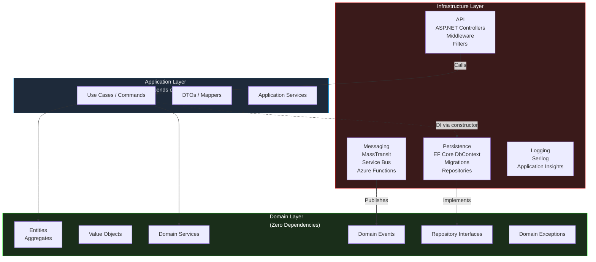
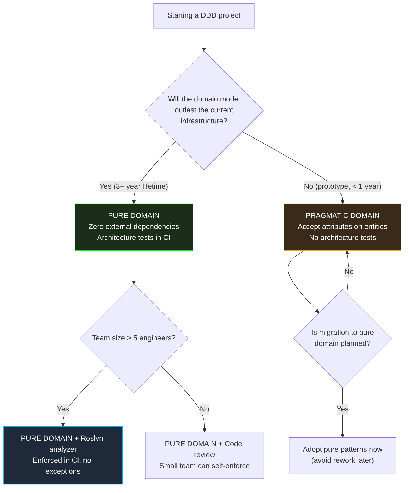

> [!success] Mastery Check
> - [ ] **Studied Well**
> - [ ] **Can explain the concept without notes**
> - [ ] **Can answer interview questions confidently**
> - [ ] **Can implement it in a real project**


# 7.078 — DDD — Infrastructure Concerns — Keeping Domain Pure

## Section 1: Navigation & Context

**Domain:** [[7 — System Design & Distributed Systems]] > **Group:** Domain-Driven Design
**Previous:** [[7.077 — DDD — Read-Side Projections from Domain Events]] | **Next:** [[7.079 — DDD — Comparison with CRUD Architecture]]

### Prerequisites
- [[7.031 — DDD — Strategic vs Tactical Design]] — domain purity is the strategic enforcement of separation between business logic and technical concerns; you must understand the distinction to know what belongs where.
- [[7.022 — Anti-Corruption Layer — Protecting Domain from Legacy]] — the ACL is the infrastructure pattern that keeps domain models pure when integrating with external systems; it's the canonical example of infrastructure absorbing complexity so the domain doesn't have to.
- [[7.005 — Clean Architecture — Overview]] — domain purity is the core principle of Clean Architecture; the dependency rule (inward-pointing dependencies) is the architectural enforcement mechanism.

### Where This Fits

Every DDD project starts with a pure domain model. Six months later, `OrderRepository` inherits from `DbContext`, domain entities have `[JsonProperty]` attributes, and business logic depends on `ILogger<OrderService>` being available. Domain purity is the discipline of keeping infrastructure dependencies out of the domain layer — it's enforced by project references (domain project references nothing infrastructure-related), by architecture tests, and by design patterns (ports and adapters, dependency injection, repository interfaces). Without this discipline, the domain model becomes untestable, coupled to specific frameworks, and resistant to change. The cost of maintaining purity is an indirection layer (interfaces, DI registration); the cost of not maintaining it is a brittle domain that cannot evolve independently of its infrastructure.

---

## Section 2: Core Mental Model

A **pure domain** is a .NET class library project that has zero external dependencies — no reference to `Microsoft.EntityFrameworkCore`, no `Newtonsoft.Json`, no `Azure.Messaging.ServiceBus`, no `Microsoft.Extensions.Logging`. It contains only domain logic: entities, value objects, aggregates, domain services, domain events, and domain exceptions. The pure domain expresses business rules in the Ubiquitous Language using only C# primitives, custom types, and abstractions defined within the domain itself. Infrastructure concerns (persistence, messaging, serialization, logging) are implemented in separate projects that depend on the domain, never the other way around. The invariant: the domain project compiles and all its unit tests pass without any infrastructure dependency — no database, no message broker, no file system.

### Classification

| Dimension | Pure Domain | Infrastructure-Aware Domain |
|---|---|---|
| Project dependencies | None (no NuGet packages) | EF Core, JSON, Azure SDK |
| Testability | Pure unit tests (no mocking) | Requires mocks or test infrastructure |
| Framework coupling | None | Tied to specific framework version |
| Business rule location | Domain entities only | Mixed: entities + services + handlers |
| Change impact | Business changes affect domain only | Infrastructure changes affect domain |
| Reusability | Portable across hosting models | Tied to .NET framework assumptions |



### Key Properties

| Property | Value | Condition |
|---|---|---|
| Domain project dependencies | Zero (no NuGet) | Always — enforced by .csproj and build |
| Business rule testability | 100% in-memory, no mocking | Always — domain logic runs without infrastructure |
| Architecture test enforcement | Required in CI | Must fail build if domain references infrastructure |
| Indirection overhead | ~10-20% more interfaces | Cost of purity — interfaces before implementations |
| Framework migration cost | Low (rewrite only infrastructure) | Domain stays unchanged when EF Core version changes |
| Team onboarding friction | Higher (purity rules must be taught) | New team members add infrastructure dependencies habitually |

---

## Section 3: Deep Mechanics

### How It Works

The enforcement of domain purity operates at four levels:

1. **Project structure level**: The domain project has no NuGet package references except `System.*` base libraries. Build fails on any infrastructure dependency. The `.csproj` file explicitly has no `PackageReference` for EF Core, Newtonsoft.Json, Azure SDK, or logging frameworks.

2. **Code organization level**: Domain interfaces (repository contracts, domain service interfaces, specifications) are defined in the domain project. Implementations live in the Infrastructure project. Dependency injection wires them together at the composition root (Program.cs).

3. **Architecture test level**: NetArchTest or ArchUnit.NET tests enforce that the Domain namespace does not reference any Infrastructure namespace. The build fails if `using Microsoft.EntityFrameworkCore;` appears in `Domain/`.

4. **Runtime behavior level**: Domain logic is testable without infrastructure. A `Order.CalculateTotal()` test creates instances directly — no database, no mocking framework.

### Failure Modes

**Failure 1 — EF Core Attribute Pollution**: Domain entities have `[Table]`, `[Column]`, `[Required]` attributes from EF Core because "it's convenient."

**Detection**: `using Microsoft.EntityFrameworkCore;` appears in Domain entity files. NetArchTest rule fails.

**Fix**: Remove all persistence attributes from domain entities. Use `IEntityTypeConfiguration<T>` in the Infrastructure project for mapping.

**Failure 2 — Logging in Domain Logic**: Domain services call `ILogger.LogInformation()` for "visibility."

**Detection**: `using Microsoft.Extensions.Logging;` in Domain project.

**Fix**: Log in the Application or Infrastructure layer. Domain should raise domain events for anything worth logging — the infrastructure layer subscribes to those events for production logging.

**Failure 3 — JSON Serialization Attributes on Domain Types**: Domain value objects have `[JsonProperty]` or `[JsonConverter]` attributes.

**Detection**: `using Newtonsoft.Json;` or `using System.Text.Json.Serialization;` in Domain project.

**Fix**: Configure serialization in the Infrastructure project using `JsonSerializerOptions` or custom converters registered at the API layer.

### .NET and Azure Integration

- **Clean Architecture template (.NET 8)**: The standard `Domain`, `Application`, `Infrastructure`, and `Api` project template enforces purity by project reference direction — Domain references nothing, Application references Domain, Infrastructure references Application, Api references everything.
- **NetArchTest**: Fluent API for enforcing architecture rules in unit tests.
- **Roslyn analyzers**: Custom analyzers (`DomainProjectMustNotReferenceEntityFrameworkAnalyzer`) can enforce purity at compile time.
- **Source generators**: System.Text.Json source generators can be registered in the Infrastructure layer without polluting Domain types with attributes.

```csharp
// Domain.csproj — zero external dependencies
// <Project Sdk="Microsoft.NET.Sdk">
//   <PropertyGroup>
//     <TargetFramework>net8.0</TargetFramework>
//     <Nullable>enable</Nullable>
//   </PropertyGroup>
//   <!-- NO PackageReferences -->
// </Project>

// Pure domain entity — no attributes, no base class dependencies
public sealed class Order : AggregateRoot<OrderId>
{
    public OrderId Id { get; private set; }
    public Money Total { get; private set; }
    public OrderStatus Status { get; private set; }
    private readonly List<OrderLine> _lines = new();

    private Order() { } // For EF Core via reflection

    public static Order Create(CustomerId customerId, Address shippingAddress, IEnumerable<OrderLineRequest> items)
    {
        var order = new Order
        {
            Id = OrderId.New(),
            Status = OrderStatus.Pending,
            CreatedAt = DateTimeOffset.UtcNow
        };
        foreach (var item in items)
        {
            order._lines.Add(new OrderLine(item.ProductId, item.Quantity, item.UnitPrice));
        }
        order.Total = new Money(order._lines.Sum(l => l.UnitPrice.Amount * l.Quantity));
        order.AddDomainEvent(new OrderCreatedDomainEvent(order.Id, customerId, order.Total));
        return order;
    }

    public void Confirm()
    {
        if (Status != OrderStatus.Pending)
            throw new DomainException("Only pending orders can be confirmed");
        Status = OrderStatus.Confirmed;
        AddDomainEvent(new OrderConfirmedDomainEvent(Id));
    }

    // Domain logic — pure, testable, no infrastructure dependency
    public bool CanBeCancelled() => Status is OrderStatus.Pending or OrderStatus.Confirmed;
}

// Architecture test — enforces domain purity
public class DomainPurityTests
{
    [Fact]
    public void Domain_ShouldNot_ReferenceInfrastructure()
    {
        var result = Types.InAssembly(typeof(Order).Assembly)
            .That().ResideInNamespace("OrderManagement.Domain")
            .ShouldNot().HaveDependencyOnAny(
                "Microsoft.EntityFrameworkCore",
                "Newtonsoft.Json",
                "Azure.Messaging.ServiceBus",
                "Microsoft.Extensions.Logging",
                "MassTransit")
            .GetResult();

        Assert.True(result.IsSuccessful);
    }

    [Fact]
    public void Domain_ShouldNot_ReferenceApplication()
    {
        var result = Types.InAssembly(typeof(Order).Assembly)
            .That().ResideInNamespace("OrderManagement.Domain")
            .ShouldNot().HaveDependencyOn("OrderManagement.Application")
            .GetResult();

        Assert.True(result.IsSuccessful);
    }

    [Fact]
    public void DomainTypes_ShouldNot_HaveInfrastructureAttributes()
    {
        var types = Types.InAssembly(typeof(Order).Assembly)
            .That().ResideInNamespace("OrderManagement.Domain")
            .GetTypes();

        var forbiddenAttributes = new[]
        {
            typeof(TableAttribute),
            typeof(ColumnAttribute),
            typeof(RequiredAttribute),
            typeof(JsonPropertyAttribute)
        };

        foreach (var type in types)
        {
            var violations = type.GetCustomAttributes()
                .Where(a => forbiddenAttributes.Contains(a.GetType()));
            Assert.Empty(violations);
        }
    }
}
```

---

## Section 4: Production Patterns and Implementation

### Primary Implementation

Complete example of keeping domain pure — from project structure through to architecture tests.

```csharp
// ============================================================
// Domain Project — OrderManagement.Domain.csproj
// ✅ ZERO PackageReferences
// ============================================================

namespace OrderManagement.Domain;

// Aggregate root — no EF Core attributes, no JSON attributes
public sealed class Order : AggregateRoot<OrderId>
{
    public OrderId Id { get; private set; }
    public CustomerId CustomerId { get; private set; }
    public Address ShippingAddress { get; private set; }
    public Money Total { get; private set; }
    public OrderStatus Status { get; private set; }
    public DateTimeOffset CreatedAt { get; private set; }
    private readonly List<OrderLine> _lines = new();
    public IReadOnlyList<OrderLine> Lines => _lines.AsReadOnly();

    private Order() { }

    public static Order Create(CustomerId customerId, Address shippingAddress, IEnumerable<OrderLineRequest> items)
    {
        var order = new Order
        {
            Id = OrderId.New(),
            CustomerId = customerId,
            ShippingAddress = shippingAddress,
            Status = OrderStatus.Pending,
            CreatedAt = DateTimeOffset.UtcNow
        };

        foreach (var item in items)
            order._lines.Add(new OrderLine(item.ProductId, item.Quantity, item.UnitPrice));

        order.Total = order.CalculateTotal();
        order.AddDomainEvent(new OrderCreatedDomainEvent(order.Id, customerId, order.Total));
        return order;
    }

    public void Ship(TrackingNumber trackingNumber)
    {
        if (Status != OrderStatus.Confirmed)
            throw new DomainException("Only confirmed orders can be shipped");
        Status = OrderStatus.Shipped;
        AddDomainEvent(new OrderShippedDomainEvent(Id, trackingNumber));
    }

    private Money CalculateTotal() => new(_lines.Sum(l => l.UnitPrice.Amount * l.Quantity));
}

// Value object — no [Owned] or [ComplexType] attribute
public sealed record Money(decimal Amount, string Currency = "USD")
{
    public static Money operator +(Money a, Money b) => new(a.Amount + b.Amount, a.Currency);
    public static Money Zero => new(0);
}

// Domain interface — defined in domain, implemented in infrastructure
public interface IOrderRepository
{
    Task<Order?> GetByIdAsync(OrderId id, CancellationToken ct);
    Task AddAsync(Order order, CancellationToken ct);
    Task UpdateAsync(Order order, CancellationToken ct);
}

// Domain exception — no logging dependency
public sealed class DomainException : Exception
{
    public DomainException(string message) : base(message) { }
    public DomainException(string message, Exception inner) : base(message, inner) { }
}

// ============================================================
// Infrastructure Project — OrderManagement.Infrastructure.csproj
// ✅ REFERENCES Domain project
// ✅ HAS PackageReferences for EF Core, Azure SDK, etc.
// ============================================================

namespace OrderManagement.Infrastructure.Persistence;

// Infrastructure implementation of domain interface
internal sealed class OrderRepository : IOrderRepository
{
    private readonly OrderManagementDbContext _db;

    public OrderRepository(OrderManagementDbContext db) => _db = db;

    public async Task<Order?> GetByIdAsync(OrderId id, CancellationToken ct)
        => await _db.Orders
            .Include(o => o.Lines)
            .FirstOrDefaultAsync(o => o.Id == id, ct);

    public async Task AddAsync(Order order, CancellationToken ct)
    {
        _db.Orders.Add(order);
        await _db.SaveChangesAsync(ct);
    }

    public async Task UpdateAsync(Order order, CancellationToken ct)
    {
        _db.Orders.Update(order);
        await _db.SaveChangesAsync(ct);
    }
}

// EF Core mapping — ALL infrastructure attributes stay here, NOT in domain
internal sealed class OrderConfiguration : IEntityTypeConfiguration<Order>
{
    public void Configure(EntityTypeBuilder<Order> builder)
    {
        builder.ToTable("Orders", "orders");
        builder.HasKey(o => o.Id);
        builder.Property(o => o.Id)
            .HasConversion(id => id.Value, g => new OrderId(g))
            .ValueGeneratedNever();
        builder.Property(o => o.Status)
            .HasConversion<string>()
            .HasMaxLength(20);
        builder.Property(o => o.CreatedAt);
        builder.OwnsOne(o => o.Total, money =>
        {
            money.Property(m => m.Amount).HasColumnName("TotalAmount").HasColumnType("decimal(18,2)");
            money.Property(m => m.Currency).HasColumnName("Currency").HasMaxLength(3);
        });
        builder.OwnsOne(o => o.ShippingAddress, addr =>
        {
            addr.Property(a => a.Street).HasColumnName("ShipStreet").HasMaxLength(200);
            addr.Property(a => a.City).HasColumnName("ShipCity").HasMaxLength(100);
            addr.Property(a => a.PostalCode).HasColumnName("ShipPostalCode").HasMaxLength(20);
            addr.Property(a => a.Country).HasColumnName("ShipCountry").HasMaxLength(100);
        });
        builder.HasMany(o => o.Lines)
            .WithOne()
            .HasForeignKey("OrderId");
        builder.Ignore(o => o.DomainEvents);
    }
}

// ============================================================
// Serialization Configuration — API Layer, NOT Domain
// ============================================================

// Program.cs or a dedicated SerializationConfig
public static class SerializationConfiguration
{
    public static JsonSerializerOptions CreateDomainOptions() => new()
    {
        Converters =
        {
            new JsonStringEnumConverter(),
            new MoneyJsonConverter(),
            new OrderIdJsonConverter()
        },
        PropertyNamingPolicy = JsonNamingPolicy.CamelCase
    };
}

internal sealed class MoneyJsonConverter : JsonConverter<Money>
{
    public override Money Read(ref Utf8JsonReader reader, Type typeToConvert, JsonSerializerOptions options)
    {
        using var doc = JsonDocument.ParseValue(ref reader);
        var amount = doc.RootElement.GetProperty("amount").GetDecimal();
        var currency = doc.RootElement.GetProperty("currency").GetString();
        return new Money(amount, currency ?? "USD");
    }

    public override void Write(Utf8JsonWriter writer, Money value, JsonSerializerOptions options)
    {
        writer.WriteStartObject();
        writer.WriteNumber("amount", value.Amount);
        writer.WriteString("currency", value.Currency);
        writer.WriteEndObject();
    }
}
```

### Configuration and Wiring

```csharp
// Program.cs — Composition Root
var builder = WebApplication.CreateBuilder(args);

// Register domain services (pure)
builder.Services.AddScoped<IOrderService, OrderService>();

// Register infrastructure implementations
builder.Services.AddScoped<IOrderRepository, OrderRepository>();
builder.Services.AddDbContext<OrderManagementDbContext>(options =>
    options.UseSqlServer(builder.Configuration.GetConnectionString("OrderManagement")));

// Register serialization configuration
builder.Services.ConfigureHttpJsonOptions(options =>
{
    options.SerializerOptions.Converters.Add(new MoneyJsonConverter());
});

// Logging — configured at infrastructure level, not in domain
builder.Host.UseSerilog((context, config) =>
    config.ReadFrom.Configuration(context.Configuration));
```

### Common Variants

**Variant 1 — Minimal purity (domain references abstractions only)**:
```csharp
// Domain defines interface, Infrastructure references abstractions package
// Domain.csproj has PackageReference for a "Domain.Abstractions" metapackage
// with no implementation dependencies
```

**Variant 2 — Full purity (domain = class library with zero references)**:
```csharp
// Domain.csproj — no PackageReferences at all
// <Project Sdk="Microsoft.NET.Sdk">
//   <PropertyGroup>
//     <TargetFramework>net8.0</TargetFramework>
//   </PropertyGroup>
// </Project>
```

**Variant 3 — Aggressive purity with Roslyn analyzer**:
```csharp
// Custom Roslyn analyzer that fails compile if Domain references anything
// not in an allow-list (System.*, domain project types)
[DiagnosticAnalyzer(LanguageNames.CSharp)]
public sealed class DomainPurityAnalyzer : DiagnosticAnalyzer
{
    // Rule: Domain project must not reference infrastructure namespaces
}
```

### Real-World .NET Ecosystem Example

**Microsoft's eShopOnDapr (Clean Architecture)**: The reference architecture from Microsoft demonstrates pure domain as a first-class principle. The `Ordering.Domain` project has zero NuGet dependencies. It defines entities, value objects, aggregates, and domain events using only C# primitives. The `Ordering.Infrastructure` project references `Domain` and implements repositories using EF Core. The API project configures serialization. This is the canonical example of domain purity in .NET.

```csharp
// From eShopOnDapr — Domain project has NO external dependencies
// Ordering.Domain.csproj references nothing
// Ordering.Domain/SeedWork contains base classes
// Ordering.Domain/AggregatesModel contains pure aggregates
// Ordering.Infrastructure contains all EF Core, Azure Service Bus code
```

---

## Section 5: Gotchas and Production Pitfalls

### Pitfall 1 — Value Object Persistence Attributes Leaking In

**Pitfall:** Domain value objects get `[Owned]` attribute from EF Core because the developer found it "easier than an entity configuration class."

```csharp
// ❌ EF Core attribute in domain value object
using Microsoft.EntityFrameworkCore;

namespace OrderManagement.Domain;

[Owned] // BUG: EF Core dependency in Domain
public sealed record Money(decimal Amount, string Currency);
```

**Symptom:** Architecture test fails. Domain project has `PackageReference` for EF Core. Changing EF Core version would require changing domain code.

**Fix:** Remove the attribute. Use `OwnsOne()` in the entity configuration class in the Infrastructure project.

```csharp
// ✅ Pure domain — no attributes
namespace OrderManagement.Domain;

public sealed record Money(decimal Amount, string Currency = "USD");

// Infrastructure/Configurations/OrderConfiguration.cs
builder.OwnsOne(o => o.Total, money =>
{
    money.Property(m => m.Amount).HasColumnName("TotalAmount");
    money.Property(m => m.Currency).HasColumnName("Currency");
});
```

**Cost of not fixing:** Domain model coupled to specific ORM. Framework upgrade requires changes to every value object. Architecture rule is violated.

### Pitfall 2 — Domain Events with Serialization Concerns

**Pitfall:** Domain event classes have `[MessageUrn]` attribute from MassTransit or `[JsonProperty]` from Newtonsoft.Json for message bus serialization.

```csharp
// ❌ MassTransit attribute in domain event
using MassTransit;

namespace OrderManagement.Domain.Events;

[EntityName("order-created")] // BUG: messaging infrastructure in Domain
public sealed record OrderCreatedDomainEvent(OrderId OrderId, Money Total);
```

**Symptom:** Domain project references MassTransit. Changing message broker would require changing domain event classes.

**Fix:** Configure message bus mapping in the Infrastructure project.

```csharp
// ✅ Pure domain — no messaging attributes
namespace OrderManagement.Domain.Events;

public sealed record OrderCreatedDomainEvent(OrderId OrderId, CustomerId CustomerId, Money Total);

// Infrastructure/Messaging/MassTransitConfiguration.cs
public class OrderManagementMessageConfiguration : IMessageConfiguration
{
    public void Configure(IReceiveEndpointConfigurator configurator)
    {
        configurator.Publish<OrderCreatedDomainEvent>(e =>
            e.SetEntityName("order-created"));
    }
}
```

**Cost of not fixing:** Domain model coupled to specific message broker. Switching from MassTransit to NServiceBus requires changing domain event definitions.

### Pitfall 3 — Logging in Domain Services

**Pitfall:** Domain service constructor takes `ILogger<T>` to log business rule violations for "visibility."

```csharp
// ❌ Logging in domain service
using Microsoft.Extensions.Logging;

public sealed class PricingService
{
    private readonly ILogger<PricingService> _logger;

    public PricingService(ILogger<PricingService> logger) => _logger = logger;

    public Discount CalculateDiscount(CustomerTier tier)
    {
        _logger.LogInformation("Calculating discount for tier {Tier}", tier); // BUG: logging in domain
        return tier switch
        {
            CustomerTier.Premium => new Discount(0.15m),
            _ => new Discount(0.05m)
        };
    }
}
```

**Symptom:** Domain project references `Microsoft.Extensions.Logging.Abstractions`. Unit tests must provide a mock `ILogger<PricingService>`. The "logging for visibility" becomes a testing burden.

**Fix:** Domain should raise domain events for significant actions. The infrastructure layer logs when it subscribes to those events.

```csharp
// ✅ Pure domain — no logging dependency
public sealed class PricingService
{
    public Discount CalculateDiscount(CustomerTier tier)
    {
        var discount = tier switch
        {
            CustomerTier.Premium => new Discount(0.15m),
            _ => new Discount(0.05m)
        };
        // Infrastructure will log via domain event subscriber
        return discount;
    }
}

// Infrastructure logs when handling domain events
public sealed class DomainEventLogger : INotificationHandler<DiscountAppliedDomainEvent>
{
    private readonly ILogger<DomainEventLogger> _logger;

    public async Task Handle(DiscountAppliedDomainEvent evt, CancellationToken ct)
    {
        _logger.LogInformation("Discount {Discount} applied to customer {Customer}",
            evt.Discount.Percentage, evt.CustomerId);
    }
}
```

**Cost of not fixing:** Every domain service has an infrastructure dependency. Testing requires mocking loggers. Changing logging framework requires changing domain services.

### Pitfall 4 — Repository Interface Exposes Infrastructure Concerns

**Pitfall:** Repository interface in domain has methods that return `IQueryable<T>` or accept `Expression<Func<T, bool>>` — leaking query infrastructure into the domain.

```csharp
// ❌ IQueryable in domain repository
namespace OrderManagement.Domain;

public interface IOrderRepository
{
    IQueryable<Order> Query(); // BUG: leaks query infrastructure
    Task<Order?> GetByIdAsync(OrderId id);
}
```

**Symptom:** Application layer builds LINQ expressions that EF Core translates — domain now depends on EF Core query capabilities. Changing ORM would break query logic.

**Fix:** Repository interface accepts specification objects defined in the domain, never `IQueryable`.

```csharp
// ✅ Domain-safe repository interface
namespace OrderManagement.Domain;

public interface IOrderRepository
{
    Task<Order?> GetByIdAsync(OrderId id, CancellationToken ct);
    Task<IReadOnlyList<Order>> GetBySpecificationAsync(ISpecification<Order> spec, CancellationToken ct);
    Task AddAsync(Order order, CancellationToken ct);
    Task UpdateAsync(Order order, CancellationToken ct);
}

// Specification pattern — pure domain abstraction
public interface ISpecification<T>
{
    bool IsSatisfiedBy(T entity);
    // Optional: Expression for EF Core translation (defined in infrastructure)
}

// Infrastructure implements specification translation
internal sealed class OrderSpecificationEvaluator
{
    public static IQueryable<Order> Apply(IQueryable<Order> query, ISpecification<Order> spec)
    {
        // Translate domain specification to EF Core query
        return query.Where(spec.ToExpression());
    }
}
```

**Cost of not fixing:** Tight coupling to EF Core query pipeline. Migration to Marten, Dapper, or Azure Cosmos DB requires rewriting all query logic.

### Pitfall 5 — Domain Base Classes from ORM

**Pitfall:** Aggregate root base class inherits from infrastructure base class.

```csharp
// ❌ Domain base class from infrastructure
using Microsoft.EntityFrameworkCore; // BUG!

public abstract class AggregateRoot<TId>
{
    public TId Id { get; protected set; }
}

// This AggregateRoot is defined in Domain but... the Domain project
// has a hard dependency on EF Core's base classes elsewhere
```

**Symptom:** Domain entities can't be tested independently. Changing ORM requires regenerating all entities.

**Fix:** Define base classes in the domain project with zero external dependencies.

```csharp
// ✅ Pure domain base class — no external dependencies
namespace OrderManagement.Domain.SeedWork;

public abstract class AggregateRoot<TId>
{
    public TId Id { get; protected set; } = default!;
    private readonly List<IDomainEvent> _domainEvents = new();
    public IReadOnlyList<IDomainEvent> DomainEvents => _domainEvents.AsReadOnly();
    protected void AddDomainEvent(IDomainEvent @event) => _domainEvents.Add(@event);
    public void ClearDomainEvents() => _domainEvents.Clear();
}
```

**Cost of not fixing:** Domain model cannot exist without the infrastructure framework. This is the highest-cost violation — it makes the entire domain model non-portable.

---

## Section 6: Tradeoffs and Decision Framework

### Tradeoff Matrix

| Dimension | Pure Domain | Pragmatic Domain (Light Coupling) | Infrastructure-Dependent Domain |
|---|---|---|---|
| Testability | Excellent (no mocks) | Good (some mocks) | Poor (heavy mocking) |
| Framework coupling | None | Low (abstractions only) | High (full framework) |
| Development speed (initial) | Slower (more interfaces) | Fast (attributes on domain types) | Fastest (convention-based) |
| Development speed (later) | Fast (isolated changes) | Medium (some ripple effects) | Slow (framework version lock) |
| Migration cost | Low | Medium | High |
| Team compliance cost | High (architecture tests) | Medium (code review) | Low (no enforcement) |
| .NET ecosystem alignment | Clean Architecture, DDD | Standard ASP.NET Core | Rapid application development |

### Decision Flowchart



### When to Apply

- Domain model is expected to live 3+ years
- Multiple infrastructure implementations expected (e.g., SQL Server + Cosmos DB, or migration from EF6 to EF Core)
- Domain logic is complex enough to warrant pure unit tests without infrastructure
- Team has the discipline to maintain separation

### When NOT to Apply

- [ ] Prototype or MVP with < 6 month expected lifespan
- [ ] Small team (1-3 engineers) with no history of infrastructure migration
- [ ] Domain logic is trivial (CRUD wrappers with no business rules)
- [ ] Heavy reliance on EF Core-specific features (computed columns, complex queries) that can't easily be abstracted
- [ ] Project is a simple CRUD API — DDD's purity rules add overhead without benefit

### Scale Thresholds

- **Pure domain ROI inflection**: ~6 months. Before 6 months, the indirection cost (interfaces for everything) exceeds the benefit. After 6 months, the first infrastructure change pays back the investment.
- **Team size trigger**: At 5+ engineers, architecture enforcement must be automated (CI tests, Roslyn analyzers) because code review alone will miss violations.
- **Project lifetime threshold**: > 1 year expected lifespan justifies pure domain. < 1 year: pragmatic purity is acceptable.
- **Domain complexity threshold**: > 50 business rules (if-then-else conditions in domain logic). Below this, the cost of purity exceeds the benefit.

---

## Section 7: Interview Arsenal

### Question Bank

1. What does "keeping the domain pure" mean in DDD and Clean Architecture?
2. How do you enforce domain purity in a .NET solution?
3. What are the tradeoffs of pure domain vs pragmatic domain design?
4. Where do EF Core configuration attributes belong if not in the domain?
5. How do you handle logging in a pure domain model?
6. What is the "repository interface" debate — should it expose IQueryable or specification objects?
7. How does domain purity affect testability?
8. Describe a time when domain purity saved you from a costly migration.

### Spoken Answers

**Q1: What does "keeping the domain pure" mean in DDD and Clean Architecture?**

> **Average answer:** It means the domain layer shouldn't depend on infrastructure — no database references in domain code.

> **Great answer:** Domain purity means the domain project — the .NET class library containing entities, value objects, aggregates, and domain services — has zero external dependencies. Its `.csproj` file has no `PackageReference` for EF Core, Newtonsoft.Json, Azure SDK, or even `Microsoft.Extensions.Logging`. The domain code expresses business rules using only C# primitives and types defined within the domain itself. The purpose is simple: if the business rules don't depend on a specific database, ORM, or message broker, then changing any of those infrastructure components doesn't require changing the business rules. In practice, this means domain entities have no `[Table]`, `[Column]`, or `[Required]` attributes — those go in `IEntityTypeConfiguration<T>` classes in the Infrastructure project. Domain interfaces like `IOrderRepository` are defined in the domain, implemented in Infrastructure. Architecture tests in CI enforce that the Domain namespace never imports from EntityFramework or other infrastructure packages. The concrete test: can the domain project compile and all its unit tests pass in a console application with no database connection?

**Q2: How do you enforce domain purity in a .NET solution?**

> **Average answer:** Architecture tests with NetArchTest that check namespace references.

> **Great answer:** I use a three-layer enforcement strategy. Layer 1 — Project references: the Domain `.csproj` has no `PackageReference` that isn't in an explicit allow-list (only `System.*` and domain-specific abstractions). Layer 2 — Architecture unit tests (NetArchTest): a test class in the Infrastructure test project asserts `Types.InAssembly(typeof(Order).Assembly).That().ResideInNamespace("OrderManagement.Domain").ShouldNot().HaveDependencyOn("Microsoft.EntityFrameworkCore")` and similar rules for Azure SDK, Newtonsoft.Json, MassTransit, etc. These run in CI and fail the build. Layer 3 — Roslyn analyzers: for large teams, I create a custom analyzer that flags any `using` statement in the Domain project for a forbidden namespace at compile time, giving immediate feedback in the IDE. The most common violation is a developer adding `[Table]` to a domain entity because IntelliSense suggested it — the Roslyn analyzer catches this before the code is committed.

**Q6: What is the "repository interface" debate — should it expose IQueryable or specification objects?**

> **Average answer:** IQueryable is leaky because it exposes EF Core specifics. Specification pattern is cleaner.

> **Great answer:** This is one of the most consequential debates in .NET DDD. Exposing `IQueryable<T>` from the repository interface is convenient — it lets callers build arbitrary LINQ queries. But `IQueryable<T>` is not pure — it depends on the LINQ provider, which in practice is EF Core's query pipeline. The callers build expressions that must be translatable to SQL, which means they must understand EF Core's capabilities and limitations. This makes the application layer depend on EF Core's query translation knowledge, even if there's no direct NuGet reference. The specification pattern solves this: the repository interface accepts `ISpecification<T>` objects defined in the domain. The specification captures query intent in a provider-agnostic way, and the infrastructure layer translates it to EF Core expressions. The cost is more boilerplate — you write specification classes and an evaluator. But the benefit is that changing from EF Core to Marten or Cosmos DB means rewriting only the infrastructure implementation, not every query in the application layer. In practice, I use the specification pattern for the 20% of queries that are complex, and simple methods (`GetByIdAsync`, `GetAllByStatusAsync`) for the 80% that are trivial.

### System Design Interview Trigger

When an interviewer asks "How do you structure a .NET DDD project?" or "How do you handle database concerns in domain models?", they are testing whether you think about dependency direction. The junior candidate describes folder structure. The senior candidate describes project dependency rules, architecture test enforcement, and the specific pattern for keeping attributes and configurations out of domain entities. The follow-up will explore a boundary case: "What about an attribute that is both infrastructure and domain — like validation attributes?" The correct answer distinguishes between domain validation (invariants expressed in the Ubiquitous Language) and input validation (handled at the API boundary).

### Comparison Table

| | Pure Domain | Pragmatic Domain | Infrastructure-Dependent |
|---|---|---|---|
| Core guarantee | Zero external dependencies | Minimized coupling | Full framework integration |
| Trade-off | Indirection overhead | Selective coupling | Speed at initial development |
| .NET enforcement | NetArchTest, .csproj review | Code review | No enforcement |
| Failure mode | Over-abstraction (interface for everything) | Gradual erosion of purity | Framework lock-in |
| When to choose | 3+ year system, complex domain | 1-3 year system, moderate domain | < 1 year prototype, trivial domain |

---

## Section 8: Architecture Decision Record

**Status:** Accepted

**Context:** The OrderManagement bounded context is being designed with a projected 5-year lifespan and a complex domain model (50+ business rules across orders, payments, and shipping). The team expects to migrate from SQL Server to Azure Cosmos DB within 18 months. The domain model must be independently testable and persistable in either database.

**Options Considered:**

1. **Pure domain** — Domain project has zero NuGet references. All infrastructure mapping in Infrastructure project. Architecture tests in CI. Specification pattern for queries.
2. **Pragmatic domain** — Allow `[Owned]` and `[Table]` attributes on domain entities. Repository exposes `IQueryable`. No architecture tests.
3. **Infrastructure-dependent domain** — Domain projects are EF Core DbContext-first. Entities are POCOs with all EF Core attributes. No domain purity rules.

**Decision:** Option 1 — Pure domain, because:
- The 18-month database migration (SQL Server → Cosmos DB) would be catastrophic if domain entities are coupled to EF Core attributes
- The domain has 50+ business rules requiring pure unit tests without database mocking
- 5-year lifespan justifies the initial indirection overhead
- Team of 6 engineers can maintain purity with NetArchTest enforcement

**Consequences:**
- ✅ Domain entities and value objects have zero EF Core, JSON, or messaging attributes
- ✅ Database migration will require only Infrastructure project changes — domain untouched
- ✅ All domain logic is testable in-memory with no mocking framework
- ⚠️ ~15% more initial code (interface definitions, entity configurations, specification evaluator)
- ⚠️ New team members need onboarding on purity rules and architecture tests
- ❌ Some EF Core-specific optimizations (computed columns, query filters) are harder to abstract

**Review Trigger:** Revisit if (a) the ratio of infrastructure configuration code to domain logic exceeds 2:1 (too much boilerplate for value), (b) query performance requirements force EF Core-specific optimizations that can't be expressed through the specification pattern, or (c) team size drops below 3 engineers and architecture test maintenance becomes a burden.

---

## Section 9: Self-Check

### Conceptual Questions

1. What is "domain purity" and why is it important in DDD?

2. What specific NuGet package references should NOT appear in a pure domain `.csproj` file?

3. How do you map a pure domain entity to a database table without putting EF Core attributes on the entity?

4. Where do JSON serialization configurations for domain types live in a pure architecture?

5. What pattern should repository interfaces use instead of `IQueryable<T>` to keep the domain pure?

6. How do you handle logging of domain events in a pure domain model?

7. How do you enforce domain purity automatically in CI? (See [[7.005 — Clean Architecture — Overview]])

8. What is the appropriate tradeoff between domain purity and development speed?

9. How does a pure domain affect unit testing strategy?

10. When would you choose NOT to enforce strict domain purity?

<details>
<summary>Answers</summary>

1. Domain purity is the principle that the domain project has zero external dependencies — no NuGet references to EF Core, Azure SDK, logging, or serialization libraries. It ensures business rules can evolve independently of infrastructure and can be tested without any external system.

2. `Microsoft.EntityFrameworkCore`, `Newtonsoft.Json`, `Azure.Messaging.ServiceBus`, `MassTransit`, `Microsoft.Extensions.Logging`, `FluentValidation` (validation is application-layer concern), `AutoMapper` (mapping is application-layer concern).

3. Use `IEntityTypeConfiguration<T>` classes in the Infrastructure project. Each domain entity has a corresponding configuration class that maps properties, owned types, and relationships using the fluent API. The `OnModelCreating` method applies all configurations with `ApplyConfigurationsFromAssembly`.

4. In the API project or a dedicated Infrastructure serialization project. Custom `JsonConverter<T>` classes handle serialization for value objects. Options are configured in `Program.cs` via `builder.Services.ConfigureHttpJsonOptions()`.

5. The Specification pattern. The domain defines `ISpecification<T>` with a pure predicate. The Infrastructure project implements an evaluator that translates the specification to EF Core's `IQueryable.Where()`.

6. Domain logic raises domain events. The Infrastructure project subscribes to those events and logs them. This keeps logging infrastructure out of the domain while providing full observability.

7. NetArchTest (or ArchUnit.NET) unit tests that assert domain namespace does not reference infrastructure namespaces. Run in CI pipeline. Fail build on violation. See [[7.005 — Clean Architecture — Overview]].

8. Pure domain is worth the cost when the domain is complex (> 50 business rules) and expected to outlast the current infrastructure (> 1 year). For prototypes and simple CRUD systems, the indirection cost exceeds the benefit.

9. Pure domain enables unit testing without mocking — create entities, call methods, assert results. No need for in-memory databases, mock DbContexts, or fake message brokers. Tests run in milliseconds and are deterministic.

10. When building a prototype or MVP with < 6 month expected lifespan. When the team is 1-3 engineers and the domain logic is trivial (CRUD with minimal rules). When the system is a simple data entry application where framework integration matters more than domain isolation.
</details>

### Scenario Challenges

**Scenario 1 — Diagnose the problem:** A code review shows that the `Order` entity in the Domain project has `using Microsoft.EntityFrameworkCore;` and `[Table("Orders")]` attribute. The `.csproj` file has `PackageReference Include="Microsoft.EntityFrameworkCore"`. The architecture test "Domain_ShouldNot_ReferenceEntityFramework" fails in CI.

<details>
<summary>Diagnosis</summary>

**Root cause:** Developer added infrastructure dependency to the domain project for convenience — they wanted the `[Table]` attribute to specify the table name.

**Evidence:** `Domain/Entities/Order.cs` has `[Table("Orders")]` and `using Microsoft.EntityFrameworkCore;`. The Domain `.csproj` has EF Core as a dependency.

**Fix:** (1) Remove EF Core `PackageReference` from Domain project. (2) Remove `[Table]` attribute from `Order` entity. (3) Add `OrderConfiguration : IEntityTypeConfiguration<Order>` in the Infrastructure project with `.ToTable("Orders", "orders")`. (4) Apply configuration in `OnModelCreating`.

**Prevention:** Add a custom Roslyn analyzer that flags any `using Microsoft.EntityFrameworkCore` in the Domain project namespace. Run it as part of the build.
</details>

**Scenario 2 — Design decision:** Product management wants to add structured audit logging to every order modification. The developer proposes adding `ILogger<Order>` to the `Order` aggregate's constructor.

<details>
<summary>Decision and Reasoning</summary>

**Choice:** Do NOT add logging to domain entities. Use domain events for audit trail. Infrastructure subscribes and logs.

**Tradeoffs accepted:** More initial work (define domain events, write event handler) but keeps domain pure and testable.

**Implementation sketch:**
```csharp
// Domain — pure
public sealed class Order : AggregateRoot<OrderId>
{
    public void Cancel(string reason)
    {
        Status = OrderStatus.Cancelled;
        AddDomainEvent(new OrderCancelled(Id, reason, DateTimeOffset.UtcNow));
        // No logging — it's not a domain concern
    }
}

// Infrastructure — handles audit logging
public sealed class AuditTrailHandler : INotificationHandler<OrderCancelled>
{
    private readonly ILogger<AuditTrailHandler> _logger;
    public async Task Handle(OrderCancelled evt, CancellationToken ct)
    {
        _logger.LogInformation("Order {OrderId} cancelled: {Reason}", evt.OrderId, evt.Reason);
        await _auditDb.AuditLogs.AddAsync(new AuditLog(evt), ct);
        await _auditDb.SaveChangesAsync(ct);
    }
}
```
</details>

**Scenario 3 — Failure mode:** A team has been practicing domain purity for 8 months. A new developer joins and, during a sprint crunch, adds `using Newtonsoft.Json;` to a domain value object to handle a serialization edge case. The PR passes review. Two months later, the team decides to migrate from Newtonsoft.Json to System.Text.Json.

<details>
<summary>Investigation and Fix</summary>

**Investigation steps:** (1) Search the Domain project for `using Newtonsoft.Json;` or `[JsonProperty]`. (2) Check architecture test results for the last 2 months.

**Confirming evidence:** Architecture test was not running in CI (a pipeline change disabled it). Five domain types have Newtonsoft.Json attributes.

**Immediate mitigation:** Re-enable architecture test in CI. The failing test report shows exactly which files violate.

**Permanent fix:** (1) Create a Roslyn analyzer that flags forbidden namespaces at compile time — prevents violation even before commit. (2) Remove Newtonsoft.Json references from domain types. (3) Move serialization logic to `JsonConverter<T>` classes in the API project. (4) Add architecture test to the pre-commit hook (husky or git hooks).

**Post-mortem item:** Architecture tests must be in the CI pipeline definition (not just a test project that could be skipped) and must fail the build.
</details>

**Scenario 4 — Scale it:** The pure domain project now has 12 entities, 30 value objects, and 200 business rules. The Infrastructure project has 15 entity configurations totaling 800 lines of mapping code. The build takes 45 seconds. Team is complaining about the boilerplate overhead of maintaining separate configuration classes.

<details>
<summary>Scaling Strategy</summary>

**Bottleneck this addresses:** Entity configuration maintenance overhead — 800 lines of `IEntityTypeConfiguration<T>` classes for 12 entities.

**How it helps:** (1) Use convention-based configuration for standard mappings — a custom `IEntityTypeConfiguration` base class that auto-maps properties by naming convention. (2) Use a source generator to create entity configurations from domain type metadata. (3) Evaluate whether all 30 value objects need complex owned-type configuration — some can use JSON columns with a single converter.

**What it does not solve:** The fundamental cost of separation — someone must define the mapping somewhere.

**Implementation order:** Phase 1: Create base configuration class with convention-based property mapping. Phase 2: Use JSON columns for simple value objects. Phase 3: Evaluate source generators if team size supports it.
</details>

**Scenario 5 — Interview simulation:** The interviewer says: "Your team is building a greenfield order management system using DDD. How do you structure the .NET solution to keep the domain model clean and independently testable?"

<details>
<summary>Model Response</summary>

"I'd use a four-project Clean Architecture solution: Domain, Application, Infrastructure, and API.

The Domain project has zero NuGet dependencies. It contains the pure domain model — Order, OrderLine, Payment as aggregates and value objects with explicit business rules expressed in the Ubiquitous Language. It defines interfaces like IOrderRepository, but never their implementations. Tests for domain logic run as pure unit tests — no mocks, no databases, just instantiate entities and call methods.

The Application project references Domain. It contains use cases, commands, DTOs, and application services that orchestrate domain logic. It depends on abstractions, not concrete implementations.

The Infrastructure project references Application and Domain. It contains all the Entity Framework Core configurations, DbContext, repository implementations, message bus publishers, and logging. This is where `IEntityTypeConfiguration<Order>` classes live — mapping pure domain types to database tables without touching the domain entities.

The API project is the composition root. It references everything, wires up DI, configures serialization, and hosts the HTTP endpoints.

I enforce this structure with three architecture tests: (1) Domain namespace does not reference Infrastructure or Application namespaces. (2) Application namespace does not reference Infrastructure namespace. (3) Infrastructure namespace's EF Core, Azure SDK, and messaging packages are not referenced by Domain or Application. These tests run in CI and fail the build.

The key metric I track: can the Domain project's unit test suite run in a console application with zero infrastructure configuration? If yes, the domain is pure. If developers need an appsettings.json or a database connection string to run unit tests, the purity has been violated."
</details>
