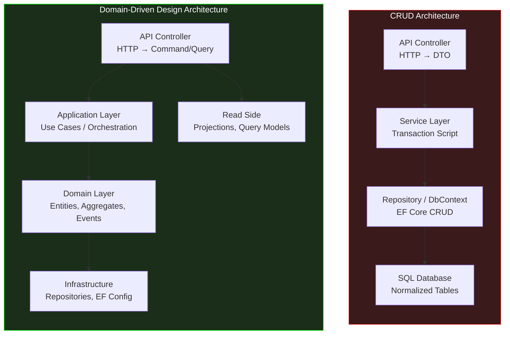
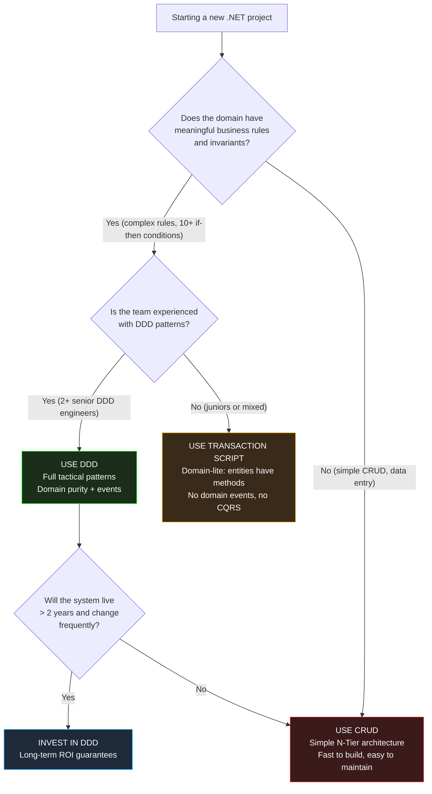

> [!success] Mastery Check
> - [ ] **Studied Well**
> - [ ] **Can explain the concept without notes**
> - [ ] **Can answer interview questions confidently**
> - [ ] **Can implement it in a real project**


# 7.079 — DDD — Comparison with CRUD Architecture

## Section 1: Navigation & Context

**Domain:** [[7 — System Design & Distributed Systems]] > **Group:** Domain-Driven Design
**Previous:** [[7.078 — DDD — Infrastructure Concerns — Keeping Domain Pure]] | **Next:** [[7.080 — DDD — When DDD Is NOT the Right Choice]]

### Prerequisites
- [[7.031 — DDD — Strategic vs Tactical Design]] — the strategic layer (bounded contexts, context maps) and tactical layer (aggregates, value objects) both differ from CRUD's N-Tier approach; understanding the full DDD stack is needed for a fair comparison.
- [[7.033 — DDD — Aggregates]] — aggregates are the transactional boundary in DDD; CRUD has no equivalent concept — comparing how each ensures consistency reveals whether DDD's complexity is justified.
- [[7.078 — DDD — Infrastructure Concerns — Keeping Domain Pure]] — CRUD architecture usually couples business logic to data access; DDD's domain purity rule is the direct response to that coupling.

### Where This Fits

Every .NET developer has built CRUD systems — controllers that accept DTOs, services that pass them to repositories, and EF Core that maps them to database tables. DDD is often presented as superior, but the reality is more nuanced: CRUD is faster to build, easier to understand, and perfectly adequate for simple data-entry systems. DDD adds complexity — aggregates, domain events, value objects, repositories, specifications — and that complexity is only justified when the domain has meaningful business rules and invariants. This note compares the two approaches across every dimension: project structure, transaction handling, business logic location, testability, team requirements, and scale, with specific .NET code examples and the concrete thresholds where one dominates the other.

---

## Section 2: Core Mental Model

CRUD (Create, Read, Update, Delete) architecture treats data as the primary concern: the database schema drives the code structure, and business logic is a thin layer that validates data before storing or retrieving it. DDD treats domain logic as the primary concern: the Ubiquitous Language and business invariants drive the code structure, and persistence is an implementation detail of the repository interface. The fundamental difference is **where complexity lives**: in CRUD, complexity is in the data relationships (normalized tables, foreign keys, stored procedures); in DDD, complexity is in the domain model (aggregates enforcing invariants, domain events capturing state changes, value objects encapsulating rules). A CRUD system says "here are the data fields, update them as needed." A DDD system says "here are the business operations, they enforce the rules when you call them."

### Classification

| Dimension | DDD Architecture | CRUD Architecture |
|---|---|---|
| Primary concern | Business rules and invariants | Data storage and retrieval |
| Driver | Ubiquitous Language / Domain Model | Database schema / Data model |
| Transaction boundary | Aggregate root | Single table row or transaction script |
| Business logic location | Domain entities + domain services | Application services + partial in stored procedures |
| Persistence | Implementation detail (repository interface) | Primary concern (DbSet, CRUD repos) |
| State changes | Domain events | Direct field updates |
| Query optimization | Read-side projections (CQRS) | Query methods on DbContext |
| .NET structure | Clean Architecture (Domain → App → Infra → API) | N-Tier (API → Service → Repository → DB) |



### Key Properties

| Property | DDD | CRUD | Condition |
|---|---|---|---|
| Business rule enforcement | Aggregate methods (cannot violate) | Service layer validation (can bypass) | DDD enforces; CRUD relies on discipline |
| Code per entity ratio | 3-5x more code (domain logic) | 1x (data mapping) | DDD overhead for complex domains |
| Initial development time | 2-3x longer | Baseline (fast) | DDD for complex; CRUD for simple |
| Change cost (late stage) | Low (domain changes isolated) | High (ripple across layers) | DDD wins over time |
| Team skill requirement | Senior: understands DDD patterns | Junior: familiar with CRUD | DDD requires experienced team |
| Test focus | Business behavior (domain unit tests) | Data flow (integration tests) | Different testing strategies |

---

## Section 3: Deep Mechanics

### How It Works — Side by Side

**CRUD path for "Cancel Order":**
1. Controller receives `PUT /orders/{id}/cancel` with no body (or optional reason)
2. Service calls `_orders.GetById(id)` → returns `Order` entity from EF Core
3. Service sets `order.Status = "Cancelled"` and `order.CancelledAt = DateTime.UtcNow`
4. Service calls `_orders.Update(order)` → EF Core marks as modified
5. `SaveChangesAsync` writes to database
6. No invariant check — nothing prevents cancelling a shipped order except application-level validation

**DDD path for "Cancel Order":**
1. Controller receives `CancelOrderCommand` with `OrderId`
2. Application service loads aggregate via `_repository.GetByIdAsync(command.OrderId)`
3. Application service calls `order.Cancel()` — aggregate method validates invariants:
   - Throws `DomainException` if order is already shipped
   - Throws `DomainException` if order is already cancelled
   - Checks if refund is needed (payment status)
4. Aggregate adds `OrderCancelledDomainEvent` to its event collection
5. Application service calls `_repository.UpdateAsync(order)` → persists new state
6. Domain events are dispatched → projection updates, email notifications

### Failure Modes

**Failure 1 — Lost Business Rules in CRUD**: The "Cancel Order" button in the UI is disabled when order is shipped. But a developer calls the API directly with `curl -X PUT /orders/123/cancel`. CRUD doesn't enforce the rule — the service layer check is bypassed if someone writes directly to the database or through a different code path.

**Detection**: Shipped orders found with "Cancelled" status in production. Reconciliation report shows inconsistency.

**Fix (in DDD)**: The aggregate root `Order.Cancel()` method throws a `DomainException` if the invariants are violated. Even if called from any code path, the rules are enforced at the aggregate boundary.

**Failure 2 — Transaction Scope Too Broad in CRUD**: CRUD service method updates Order, then sends an email, then posts to an audit log — all in the same HTTP request. If email sending fails, the order update is rolled back, and the user sees a 500 error despite their order being valid.

**Detection**: Users report "my order went through but I got an error page." Transaction rollbacks cause phantom data loss.

**Fix (in DDD)**: Aggregate updates happen in a transaction. Side effects (email, audit, projections) happen through domain event handlers that can succeed or fail independently.

### .NET Code Comparison

```csharp
// ============================================================
// CRUD APPROACH
// ============================================================

// Domain entity is an EF POCO — any caller can set properties
public sealed class Order
{
    public Guid Id { get; set; }
    public string Status { get; set; } = "Pending";
    public DateTimeOffset? CancelledAt { get; set; }
    public string? CancelReason { get; set; }
    // No domain logic — just data
}

// Service layer — business rules in application code
public sealed class OrderService
{
    private readonly AppDbContext _db;
    public OrderService(AppDbContext db) => _db = db;

    public async Task CancelOrderAsync(Guid orderId)
    {
        var order = await _db.Orders.FindAsync(orderId)
            ?? throw new NotFoundException();

        // Business rule in service — easy to bypass
        if (order.Status == "Shipped")
            throw new InvalidOperationException("Cannot cancel shipped order");

        order.Status = "Cancelled";
        order.CancelledAt = DateTimeOffset.UtcNow;
        await _db.SaveChangesAsync();
    }
}

// ============================================================
// DDD APPROACH
// ============================================================

// Domain entity — business rules encapsulated in the aggregate
public sealed class Order : AggregateRoot<OrderId>
{
    public OrderId Id { get; private set; }
    public OrderStatus Status { get; private set; }
    public DateTimeOffset? CancelledAt { get; private set; }
    public string? CancelReason { get; private set; }

    private Order() { }

    public void Cancel(string? reason = null)
    {
        // Invariants enforced by the aggregate — cannot be bypassed
        if (Status == OrderStatus.Shipped)
            throw new DomainException("Cannot cancel a shipped order");
        if (Status == OrderStatus.Cancelled)
            throw new DomainException("Order is already cancelled");

        Status = OrderStatus.Cancelled;
        CancelledAt = DateTimeOffset.UtcNow;
        CancelReason = reason;
        AddDomainEvent(new OrderCancelledDomainEvent(Id, reason));
    }

    public void Ship(TrackingNumber trackingNumber)
    {
        if (Status != OrderStatus.Confirmed)
            throw new DomainException("Only confirmed orders can be shipped");
        Status = OrderStatus.Shipped;
        AddDomainEvent(new OrderShippedDomainEvent(Id, trackingNumber));
    }
}

// Application service — thin orchestration
public sealed class CancelOrderHandler : IRequestHandler<CancelOrderCommand>
{
    private readonly IOrderRepository _repository;
    public CancelOrderHandler(IOrderRepository repository) => _repository = repository;

    public async Task Handle(CancelOrderCommand command, CancellationToken ct)
    {
        var order = await _repository.GetByIdAsync(command.OrderId, ct)
            ?? throw new NotFoundException();

        order.Cancel(command.Reason); // Invariant enforcement is here
        await _repository.UpdateAsync(order, ct);

        // Domain events are dispatched by infrastructure after SaveChanges
    }
}
```

### .NET and Azure Integration

| Concern | CRUD | DDD |
|---|---|---|
| ORM | EF Core DbContext with DbSet<T> | EF Core configured via IEntityTypeConfiguration<T> (no attributes on domain) |
| Repository | DbSet<T> used directly in services | Repository interface in Domain; implemented in Infrastructure |
| Transactions | Database transaction per HTTP request | Single aggregate transaction; events for cross-aggregate |
| Caching | In-memory cache with IMemoryCache | Read-side projections + Redis for query models |
| Azure SQL | Direct table access | Mapped via fluent configuration, not domain attributes |
| Azure Functions | CRUD endpoint per table | Command handler per use case; event subscriber per projection |
| API Design | RESTful with DTOs per entity | Commands and Queries; often CQRS |

---

## Section 4: Production Patterns and Implementation

### Primary Implementation

Complete side-by-side comparison for the same feature — "Change Order Shipping Address."

```csharp
// ============================================================
// CRUD IMPLEMENTATION
// ============================================================

// Entity (also the data model)
public sealed class Order
{
    public Guid Id { get; set; }
    public string Status { get; set; } = string.Empty;
    // Flat address fields — no value object
    public string ShipStreet { get; set; } = string.Empty;
    public string ShipCity { get; set; } = string.Empty;
    public string ShipPostalCode { get; set; } = string.Empty;
    public string ShipCountry { get; set; } = string.Empty;
}

// Service
public sealed class OrderService
{
    private readonly AppDbContext _db;
    public OrderService(AppDbContext db) => _db = db;

    public async Task UpdateShippingAddressAsync(Guid orderId, UpdateAddressDto dto)
    {
        var order = await _db.Orders.FindAsync(orderId)
            ?? throw new NotFoundException();

        // Direct field mutation — no validation
        order.ShipStreet = dto.Street;
        order.ShipCity = dto.City;
        order.ShipPostalCode = dto.PostalCode;
        order.ShipCountry = dto.Country;

        await _db.SaveChangesAsync();
    }
}

// Controller
[ApiController]
[Route("api/orders")]
public sealed class OrdersController : ControllerBase
{
    [HttpPut("{id}/address")]
    public async Task<IActionResult> UpdateAddress(Guid id, UpdateAddressDto dto)
    {
        await _orderService.UpdateShippingAddressAsync(id, dto);
        return NoContent();
    }
}

// ============================================================
// DDD IMPLEMENTATION
// ============================================================

// Domain value object — encapsulates address rules
public sealed record Address
{
    public string Street { get; init; }
    public string City { get; init; }
    public string PostalCode { get; init; }
    public string Country { get; init; }

    private Address() { }

    public static Result<Address> Create(string street, string city, string postalCode, string country)
    {
        var errors = new List<string>();

        if (string.IsNullOrWhiteSpace(street)) errors.Add("Street is required");
        if (string.IsNullOrWhiteSpace(city)) errors.Add("City is required");
        if (string.IsNullOrWhiteSpace(postalCode)) errors.Add("Postal code is required");
        if (string.IsNullOrWhiteSpace(country)) errors.Add("Country is required");

        // Postal code format validation — domain rule
        if (!string.IsNullOrWhiteSpace(postalCode) && postalCode.Length < 3)
            errors.Add("Postal code must be at least 3 characters");

        return errors.Count > 0
            ? Result<Address>.Failure(errors)
            : Result<Address>.Success(new Address
            {
                Street = street,
                City = city,
                PostalCode = postalCode,
                Country = country
            });
    }
}

// Aggregate — encapsulates business rules
public sealed class Order : AggregateRoot<OrderId>
{
    public OrderId Id { get; private set; }
    public OrderStatus Status { get; private set; }
    public Address ShippingAddress { get; private set; }
    public DateTimeOffset? ShippedAt { get; private set; }

    private Order() { }

    // Domain operation — not a property setter
    public void UpdateShippingAddress(Address newAddress)
    {
        if (Status == OrderStatus.Shipped)
            throw new DomainException("Cannot change address after shipping");
        if (Status == OrderStatus.Cancelled)
            throw new DomainException("Cannot change address of a cancelled order");

        var oldAddress = ShippingAddress;
        ShippingAddress = newAddress;
        AddDomainEvent(new ShippingAddressChanged(Id, oldAddress, newAddress));
    }
}

// Application command
public sealed record UpdateShippingAddressCommand(
    Guid OrderId,
    string Street,
    string City,
    string PostalCode,
    string Country);

// Application handler
public sealed class UpdateShippingAddressHandler : IRequestHandler<UpdateShippingAddressCommand>
{
    private readonly IOrderRepository _repository;

    public async Task Handle(UpdateShippingAddressCommand command, CancellationToken ct)
    {
        var order = await _repository.GetByIdAsync(new OrderId(command.OrderId), ct)
            ?? throw new NotFoundException();

        // Value object creation with validation
        var address = Address.Create(command.Street, command.City, command.PostalCode, command.Country);
        if (address.IsFailure)
            throw new ValidationException(address.Errors);

        order.UpdateShippingAddress(address.Value); // Enforces invariants
        await _repository.UpdateAsync(order, ct);
    }
}

// Controller
[ApiController]
[Route("api/orders")]
public sealed class OrdersController : ControllerBase
{
    [HttpPut("{id}/address")]
    public async Task<IActionResult> UpdateAddress(
        Guid id, UpdateShippingAddressCommand command, CancellationToken ct)
    {
        await _handler.Handle(command with { OrderId = id }, ct);
        return NoContent();
    }
}
```

### Configuration and Wiring

```csharp
// CRUD — simple, direct
builder.Services.AddDbContext<AppDbContext>(options =>
    options.UseSqlServer(builder.Configuration.GetConnectionString("Default")));
builder.Services.AddScoped<OrderService>();

// DDD — more indirection but clearer boundaries
builder.Services.AddScoped<IOrderRepository, OrderRepository>();
builder.Services.AddScoped<IRequestHandler<UpdateShippingAddressCommand>, UpdateShippingAddressHandler>();
builder.Services.AddDbContext<OrderManagementDbContext>(options =>
    options.UseSqlServer(builder.Configuration.GetConnectionString("OrderManagement")));
```

### Common Variants

**Variant 1 — Transaction Script (Between CRUD and DDD)**:
```csharp
// Service contains business logic but uses domain-like abstractions
public sealed class OrderService
{
    public async Task CancelOrderAsync(Guid orderId)
    {
        var order = await _db.Orders.FindAsync(orderId);
        if (order.Status != OrderStatus.Pending)
            throw new DomainException("...");
        order.Status = OrderStatus.Cancelled;
        await _db.SaveChangesAsync();
    }
}
// Simpler than DDD, more defensive than plain CRUD.
```

**Variant 2 — DDD-Lite (Domain entities with methods, but no domain events)**:
```csharp
// Domain entity has methods but no event emissions
public sealed class Order
{
    public void Cancel()
    {
        if (Status == OrderStatus.Shipped) throw;
        Status = OrderStatus.Cancelled;
    }
}
// No domain events, no CQRS, no projections — partial DDD adoption.
```

### Real-World .NET Ecosystem Example

**Microsoft's reference applications**: The best real-world comparison is between the **eShopOnWeb** (traditional CRUD architecture) and **eShopOnContainers/eShopOnDapr** (DDD/CQRS architecture) — both published by Microsoft for the same e-commerce domain.

eShopOnWeb (CRUD/N-Tier): Simple controllers, EF Core DbContext with DbSets, ViewModels, service layer with business logic. ~50% less code than the DDD version. Perfect for the target audience (ASP.NET developers learning the basics).

eShopOnDapr (DDD/CQRS): Domain project with zero dependencies, Application project with commands/queries, Infrastructure with EF Core mappings and message bus, API with MediatR pipeline. Domain aggregates, value objects, domain events, CQRS with separate read models. ~2x the code but each unit testable in isolation.

The key takeaway: Microsoft publishes BOTH because each is correct for different scenarios — CRUD for simple data-entry applications, DDD for complex business logic systems.

---

## Section 5: Gotchas and Production Pitfalls

### Pitfall 1 — Applying DDD to a Trivial CRUD Domain

**Pitfall:** Team adopts full DDD (aggregates, domain events, value objects, repositories) for a simple blog CMS with no business rules. The "domain" is basic CRUD: create post, edit post, delete post, publish.

```csharp
// ❌ Over-engineered DDD for trivial domain
public sealed class Post : AggregateRoot<PostId>
{
    public void UpdateTitle(string title)
    {
        if (string.IsNullOrWhiteSpace(title))
            throw new DomainException("Title required");
        Title = title;
        AddDomainEvent(new PostTitleUpdated(Id, title));
    }
    // 20 more methods for every field...
}
```

**Symptom:** 5x more code than necessary. Team spends 40% of sprint on infrastructure (event handlers, projections, repository interfaces) instead of features.

**Fix:** Use CRUD. Replace with direct EF Core access and a thin service layer.

```csharp
// ✅ Simple CRUD for simple domain
public sealed class PostService
{
    public async Task UpdateTitleAsync(Guid postId, string title)
    {
        var post = await _db.Posts.FindAsync(postId);
        post.Title = title;
        await _db.SaveChangesAsync();
    }
}
```

**Cost of not fixing:** $200K/year in unnecessary complexity. Burnout from "DDD overhead." Eventual abandonment of DDD when the team realizes the cost wasn't justified.

### Pitfall 2 — CRUD Exposes Internal Data Structure Through API

**Pitfall:** API returns the full database entity as JSON, including internal fields, audit timestamps, and foreign key IDs.

```csharp
// ❌ API returns database entity directly
[HttpGet("{id}")]
public async Task<Order> Get(Guid id) => await _db.Orders.FindAsync(id);
```

**Symptom:** API contract is coupled to database schema. Renaming a column breaks the API. Security concern: internal data exposed.

**Fix (either approach)**: Use DTOs or view models. CRUD and DDD both benefit from API-data separation.

```csharp
// ✅ DTO — decouples API from data model
public sealed record OrderResponse(Guid Id, string Status, decimal Total, AddressDto ShippingAddress);
```

**Cost of not fixing:** Every database migration requires API version change. Security audit findings for exposed internal fields.

### Pitfall 3 — Transaction Script Threading Domain Events (Hybrid Confusion)

**Pitfall:** Team uses CRUD structure but adds domain events "because DDD does it." Transaction script in service layer emits events but the aggregate has no methods.

```csharp
// ❌ CRUD + events without aggregate methods — worst of both
public sealed class OrderService
{
    public async Task CancelOrderAsync(Guid orderId)
    {
        var order = await _db.Orders.FindAsync(orderId);
        order.Status = "Cancelled";
        await _db.SaveChangesAsync();
        await _eventBus.Publish(new OrderCancelled(orderId)); // Manual event publish
    }
}
```

**Symptom:** Events can be fired without state changes (if someone forgets to update status before publishing). No transactionality between state change and event. Events are not guaranteed to be delivered.

**Fix:** Either go full DDD (aggregates own events) or remove events entirely (use CRUD with post-action hooks).

**Cost of not fixing:** Duplicate or phantom events. Business processes triggered by phantom events (refunds, notifications).

### Pitfall 4 — Selecting Wrong Architecture for Team Skill Level

**Pitfall:** Team of junior developers (1-2 years experience) adopts DDD because "it's the right way." Six months later, the domain model is a mess — value objects with side effects, aggregates with circular references, domain services doing infrastructure work.

**Symptom:** Codebase quality is worse than if they'd used CRUD. Testing coverage is low because they couldn't figure out how to unit test aggregates with complex dependency chains.

**Fix:** Start with CRUD. Introduce DDD patterns incrementally as the team matures and the domain complexity demands it.

**Cost of not fixing:** Abandoned project. Team blames DDD for failure and avoids it for years.

---

## Section 6: Tradeoffs and Decision Framework

### Tradeoff Matrix

| Dimension | DDD | CRUD | Transaction Script (Middle) |
|---|---|---|---|
| Complexity budget | High (initial) | Low (initial) | Medium |
| Business rule enforcement | Strong (aggregate invariants) | Weak (service validation) | Medium (service methods) |
| Code per feature | 2-3x | 1x (baseline) | 1.5x |
| Test strategy | Unit test domain (fast, no infra) | Integration test (needs DB) | Mixed |
| Team skill required | Senior (DDD experience) | Junior (CRUD experience) | Mid-level |
| Change impact isolation | High (domain changes isolated) | Low (ripple across layers) | Medium |
| Framework migration cost | Low (domain is pure) | High (domain coupled to EF) | Medium |
| Eventual consistency support | Natural (domain events) | Manual (outbox, custom) | Manual |

### Decision Flowchart



### When to Apply

**Choose DDD when:**
- Domain has 10+ business rules that involve multiple fields or aggregates
- Business rules change frequently and must be enforced centrally
- Multiple teams need to work independently on different domain concepts
- System is expected to outlast current infrastructure choices
- Team has 2+ engineers experienced with DDD patterns

**Choose CRUD when:**
- System is primarily data entry with minimal business logic
- Domain rules are simple field validations (required fields, string length)
- Prototype or MVP with < 6 month lifespan
- Team is junior or mixed-skill and CRUD is well-understood
- Business stakeholders don't need the Ubiquitous Language investment

### When NOT to Apply

- [ ] Do NOT use DDD if the domain has < 5 meaningful business rules (simple CRUD suffices)
- [ ] Do NOT use DDD if your team has no one with prior DDD production experience
- [ ] Do NOT use CRUD if the domain has 20+ interconnected business rules that must be enforced transactionally
- [ ] Do NOT use CRUD if the system must support multiple query patterns that would require complex joins
- [ ] Do NOT use DDD for a system that will be replaced or decommissioned within 12 months

### Scale Thresholds

- **DDD justified at**: > 50 business rules (conditions in domain logic) OR > 3 teams contributing to the same bounded context OR > 12-month expected lifespan.
- **CRUD preferred at**: < 20 business rules OR < 5 engineers OR < 6 month expected lifespan.
- **Transaction Script (middle ground)**: 20-50 business rules with a mixed-skill team.
- **Lines of code overhead**: DDD produces 2-3x more code than CRUD for the same feature set. The payoff comes at change #10+ when the DDD code is easier to modify.
- **Team productivity crossover**: Typically at month 6-9 of a project. Before that, CRUD is faster. After that, DDD's isolation pays off as changes become more frequent.

---

## Section 7: Interview Arsenal

### Question Bank

1. What are the fundamental differences between DDD and CRUD architecture?
2. When would you choose CRUD over DDD for a new .NET project?
3. How does each approach handle business rule enforcement?
4. Compare testing strategies for DDD vs CRUD systems.
5. What are the cost implications of choosing DDD for a simple CRUD domain?
6. How does each approach handle data access and persistence?
7. Compare change management — how does a domain rule change ripple through each architecture?
8. What is the "Transaction Script" pattern and where does it fit between CRUD and DDD?

### Spoken Answers

**Q1: What are the fundamental differences between DDD and CRUD architecture?**

> **Average answer:** DDD focuses on the domain model and business logic. CRUD focuses on data operations. DDD is more complex but better for complex domains.

> **Great answer:** The fundamental difference is where complexity lives. In CRUD architecture, the code structure mirrors the database schema — every table has a corresponding entity, every column has a property, and business logic is scattered across service methods that directly manipulate those properties. The order of operations is: data first, then behavior. In DDD, the code structure mirrors the Ubiquitous Language — aggregates, value objects, and domain events that express business concepts. The database schema is an implementation detail hidden behind repository interfaces. The order of operations is: language first, then behavior, then data.

Concretely, in a CRUD OrderService, cancelling an order looks like: `order.Status = "Cancelled"; order.CancelledAt = DateTime.UtcNow; await _db.SaveChangesAsync();`. In DDD: `order.Cancel(); await _repository.UpdateAsync(order);`. The CRUD approach is a property assignment — nothing prevents someone from forgetting to check the shipped status before setting the cancel flag. The DDD approach is a business operation — the `Cancel()` method encapsulates the invariant check, status change, and domain event emission as a single atomic operation.

The cost is that DDD requires 2-3x more code upfront — interfaces, value objects, domain events, entity configurations. The benefit is that 12 months later, when the business rule for cancellation changes, you change it in exactly one place and you know exactly where it is.

**Q3: How does each approach handle business rule enforcement?**

> **Average answer:** DDD uses aggregate methods to enforce rules. CRUD uses validation in service layers or data annotations.

> **Great answer:** Business rule enforcement is the single most important distinction. In DDD, enforcement happens at the aggregate root: `order.Cancel()` throws a `DomainException` if the order is already shipped. This rule is enforced regardless of which code path calls `Cancel()` — the controller, a background job, a message handler, or a unit test. The rule lives with the data it protects, and it's enforced in memory before any database write occurs.

In CRUD, enforcement happens in the service layer: `if (order.Status == "Shipped") throw;` in the service method. This is less reliable because: (a) it's easy to bypass — a direct database update or a different service method can mutate the status without the check; (b) there's no transactionality between the check and the write — another request could change the status between the check and `SaveChangesAsync`; (c) the rule is duplicated any time it's needed — different service methods need their own checks.

The DDD approach is provably correct because the aggregate is the single point of enforcement. The CRUD approach relies on developer discipline, which is not a reliable enforcement mechanism at scale.

**Q7: Compare change management — how does a domain rule change ripple through each architecture?**

> **Average answer:** In DDD, you change the aggregate method. In CRUD, you change wherever the rule is implemented.

> **Great answer:** Consider a real business rule change: "Cancelling an order now requires a manager approval if the order total exceeds $10,000."

In DDD, I change one method: `Order.Cancel(string? reason)` becomes `Order.Cancel(string? reason, bool managerApproved)`. The aggregate checks: `if (Total > 10000m && !managerApproved) throw new DomainException("Manager approval required for orders over $10,000").` One file changes. The application service passes the approval flag. The controller adds the field. The unit test adds one test case. Total change: ~50 lines, 3 files.

In CRUD, I must find every place in the codebase where `order.Status = "Cancelled"` is set. That could be in the `OrderController`, in a `BackgroundOrderCleanupService`, in a `BulkCancellationHandler`, and in a database migration script. Each has different checking logic. I might miss one. A production incident occurs when the background service cancels a $50K order without approval because it bypasses the service layer. Total change: unknown — I need to audit the entire codebase to find all cancellation paths.

This is the DDD value proposition in concrete terms: the business rule lives in exactly one place, and any code path that wants to cancel an order must go through it.

### System Design Interview Trigger

When an interviewer asks "Design an order management system" and you start with DDD aggregates, they may push back: "Isn't that over-engineering? Why not just use CRUD?" They are testing whether you understand the tradeoff — not just that DDD exists, but WHEN it's appropriate. The senior answer doesn't defend DDD unconditionally; it names the specific conditions (business rule complexity, team size, lifetime) that push the decision one way or the other. The junior answer says "DDD is better." The senior answer says "For this specific system with 40 business rules and a 3-year expected lifespan, DDD is justified. Here's the minimum viable alternative if those constraints change."

### Comparison Table

| | DDD | CRUD | Transaction Script (DDD-Lite) |
|---|---|---|---|
| Core guarantee | Invariants protected by aggregates | Simple data access | Business logic in service methods |
| Trade-off | 2-3x initial code | Weak rule enforcement | Medium complexity, medium enforcement |
| .NET implementation | Clean Architecture, domain events, CQRS | N-Tier, EF Core DbSet, service layer | Service layer with entity methods, no events |
| Failure mode | Over-engineering simple domains | Rule scattering, bypassed validation | Neither fully protected nor fully simple |
| When to choose | Complex domain, > 12 months, senior team | Simple domain, < 6 months, mixed team | Moderate domain, medium team |

---

## Section 8: Architecture Decision Record

**Status:** Accepted

**Context:** A new customer-facing order management system is being designed. The system must handle order placement, cancellation, shipping address changes, and payment processing. The product team has identified approximately 30 business rules that constrain order mutations (e.g., "cannot cancel shipped orders," "shipping address changes require re-verification for high-value orders," "orders over $10K require manager approval for cancellation"). The team has 6 engineers, 2 with prior DDD production experience. The system has a projected 3-year lifespan before replacement consideration.

**Options Considered:**

1. **Full DDD** — Pure domain project, aggregates with methods enforcing invariants, domain events, repository pattern, CQRS with read-side projections.
2. **Transaction Script with Entity Methods** — Domain entities have business methods but no domain events or CQRS. Service layer calls entity methods.
3. **N-Tier CRUD** — Standard ASP.NET Core with EF Core, service layer with validation, direct DbSet access.

**Decision:** Option 1 — Full DDD, because:
- 30 business rules justify the aggregate enforcement approach
- 2 senior DDD engineers can mentor the team through the learning curve
- 3-year lifespan means the upfront investment pays back within the project's lifetime
- CQRS with projections is needed for the order search requirement (< 100ms P99)

**Consequences:**
- ✅ Business rules are enforced in aggregates — cannot be bypassed
- ✅ Unit-testable domain model — no infrastructure dependencies
- ✅ Read-side projections enable fast search queries
- ⚠️ 2-3x initial development time vs CRUD (estimated 4 months instead of 6 weeks for first milestone)
- ⚠️ Junior team members need DDD training investment
- ❌ Additional infrastructure complexity (event bus, projections, outbox)

**Review Trigger:** Revisit this decision if (a) first milestone delivery exceeds 6 months (DDD overhead is too costly), (b) team cannot demonstrate domain purity in code reviews (architecture tests failing), or (c) business rules remain < 10 validated after 3 months (domain is simpler than expected — downgrade to Transaction Script).

---

## Section 9: Self-Check

### Conceptual Questions

1. What is the primary structural difference between DDD and CRUD architecture in .NET?

2. Where does business rule enforcement live in each architecture?

3. What is a "Transaction Script" and where does it sit between CRUD and DDD?

4. At what scale of business rule complexity does DDD become justified over CRUD?

5. How does the testing strategy differ between DDD and CRUD?

6. What is the cost of applying DDD to a trivial CRUD domain?

7. How does each architecture handle a change like "add manager approval requirement for cancellations over $10K"?

8. What team requirements differ between DDD and CRUD adoption? (See [[7.080 — DDD — When DDD Is NOT the Right Choice]])

9. Compare the .NET project structure of a CRUD solution vs a DDD solution.

10. Explain the tradeoff decision between CRUD and DDD in 60 seconds.

<details>
<summary>Answers</summary>

1. CRUD mirrors the database schema — entities are POCOs with get/set properties, DbSets, and service methods. DDD mirrors the Ubiquitous Language — aggregates encapsulate both data and behavior, repositories abstract persistence, and the domain project has zero external dependencies.

2. DDD: inside aggregate root methods. `order.Cancel()` throws if invariants violated. CRUD: in service methods or data annotations. `if (order.Status == "Shipped") throw;` in the service layer. DDD's enforcement is provably correct because it's co-located with the data; CRUD's relies on developer discipline.

3. Transaction Script is a middle-ground pattern: service methods contain business logic (like CRUD), but entities have typed methods (like DDD). No domain events, no CQRS, no value objects. It's appropriate for moderate complexity with a mixed-skill team.

4. At approximately 20-30 business rules that involve multiple fields or aggregates. Below 20 business rules, the overhead of DDD exceeds the benefit. Above 50, CRUD becomes increasingly fragile.

5. DDD: pure unit tests for domain logic (no mocks, no database). Integration tests for infrastructure. CRUD: primarily integration tests (depend on database). Service tests require mocking DbContext or using an in-memory database.

6. 2-3x code overhead, longer development time, team confusion about unnecessary patterns, potential abandonment of DDD when the cost isn't justified. $200K/year estimate for a 6-person team applying full DDD to a CRUD domain.

7. DDD: one change to `Order.Cancel()`, one new test, one application service change. CRUD: audit all code paths that set `order.Status = "Cancelled"` — potentially 5-10 locations. High risk of missing one.

8. DDD requires at least 2 senior engineers with prior DDD production experience, willingness to learn architecture patterns, and discipline to maintain domain purity. CRUD requires standard ASP.NET Core skills, achievable by juniors.

9. CRUD: Single project or 3-tier (Controllers, Services, Data). No domain project. EF Core DbContext used directly. DDD: 4 projects (Domain, Application, Infrastructure, API) with strict dependency direction. Domain has zero references.

10. "I evaluate three factors: business rule complexity, team experience, and project lifespan. For < 20 business rules, a mixed-skill team, or < 12 month lifespan — I choose CRUD/Transaction Script. For > 30 business rules, a senior team, or > 2 year lifespan — I choose DDD. The crossover point is typically 20-30 rules and 6-9 months, after which DDD's investment pays back through easier changes."
</details>

### Scenario Challenges

**Scenario 1 — Diagnose the problem:** A team built a customer management system using full DDD — aggregates, domain events, value objects, repositories, CQRS. After 8 months, the system has 12 entities and 6 business rules (required name, unique email, validate phone format). The team is demoralized, velocity is low, and the business is unhappy with progress.

<details>
<summary>Diagnosis</summary>

**Root cause:** Over-engineering. Full DDD was applied to a system with < 10 business rules — a CRUD domain with light validation.

**Evidence:** Only 6 business rules across 12 entities. The aggregate methods are all simple validation + property setting — no complex invariants. Developers spend more time writing entity configurations and event handlers than implementing features.

**Fix:** Strip down to Transaction Script or CRUD. Remove domain events, CQRS projections, and repository interfaces. Use a single project with DbContext and service layer.

**Prevention:** Before adopting DDD, audit the domain. Count the business rules (not CRUD operations). If < 20, start with Transaction Script and evolve to DDD only if complexity grows.
</details>

**Scenario 2 — Design decision:** A team is building a payment processing system with 100+ business rules (fraud detection rules, refund policies, chargeback handling, international tax calculations, payment method validation). The system must integrate with 5 external payment gateways.

<details>
<summary>Decision and Reasoning</summary>

**Choice:** Full DDD with all tactical patterns — aggregates for payment transactions, value objects for money and currency, domain events for payment lifecycle, ACL wrappers for each payment gateway.

**Tradeoffs accepted:** 4-month initial build time. Significant infrastructure investment (event bus, projections, outbox). Team training on DDD patterns. But 100+ business rules justify every layer.

**Implementation sketch:**
```csharp
public sealed class Payment : AggregateRoot<PaymentId>
{
    public Money Amount { get; private set; }
    public PaymentStatus Status { get; private set; }
    public PaymentMethod Method { get; private set; }
    public FraudAssessmentResult? FraudCheck { get; private set; }

    public Result Authorize()
    {
        if (FraudCheck?.IsSuspicious == true)
            return Result.Failure("Transaction blocked by fraud detection");
        // ... complex business rules
        Status = PaymentStatus.Authorized;
        AddDomainEvent(new PaymentAuthorized(Id, Amount));
        return Result.Success();
    }
}
```
</details>

**Scenario 3 — Failure mode:** A CRUD-based order management system has been running for 2 years. A new business rule is introduced: "Orders over $10,000 require two-factor authentication for cancellation." The team finds that `order.Status = "Cancelled"` is set in 8 different places across the codebase — controllers, background jobs, a database migration script, and an integration handler.

<details>
<summary>Investigation and Fix</summary>

**Investigation steps:** (1) Search the codebase for `"Cancelled"` and `Status =`. (2) Trace each code path to understand if authorization is applied. (3) Identify which paths bypass the 2FA requirement.

**Confirming evidence:** 8 cancellation code paths. 3 have no authorization check. A background job that cancels stale unpaid orders bypasses the 2FA requirement entirely.

**Immediate mitigation:** Add the 2FA check to all 8 code paths. This is error-prone but necessary.

**Permanent fix:** Introduce domain methods on the Order entity even in the CRUD codebase — `order.Cancel(CancellationContext)` — so there's a single enforcement point. Over time, migrate to aggregates.

**Post-mortem item:** Any field mutation that has business rules should be a method, not a property setter. This is the minimum DDD pattern that prevents rule scattering.
</details>

**Scenario 4 — Scale it:** A CRUD system handling 500 orders/day needs to scale to 10,000 orders/day with 50+ business rules. The current codebase has business logic scattered across controllers and stored procedures. Maintenance is already painful.

<details>
<summary>Scaling Strategy</summary>

**Bottleneck this addresses:** Scattered business logic makes changes risky. At 10x scale, the CRUD approach's weakness (rule scattering) multiplies the risk of production incidents.

**How it helps:** Incrementally introduce DDD patterns: (1) Extract business rules into domain entity methods — create `Order.Cancel()` that enforces all cancellation rules, then update all callers. (2) Add repository interface — decouple from EF Core so the database can be optimized independently. (3) Add domain events for side effects currently mixed into service methods.

**What it does not solve:** The performance requirements at 10K orders/day. CRUD with direct DbSet access may perform well enough if queries are optimized.

**Implementation order:** Phase 1 (months 1-2): Domain methods on entities. Phase 2 (months 2-4): Repository interfaces. Phase 3 (months 4-6): Domain events for side effects. This migration path avoids a big-bang rewrite while incrementally improving the architecture.
</details>

**Scenario 5 — Interview simulation:** The interviewer says: "Your team is starting a new customer portal. The requirements are: users can view their profile, update their address, and view their order history. Two business rules: US addresses must have a valid ZIP code, and order history is read-only. Design the architecture."

<details>
<summary>Model Response</summary>

"Based on the requirements, this is a CRUD system with minimal business rules — two total, one of which (ZIP code validation) is a straightforward value object check. Full DDD would be over-engineering here.

I'd use a Transaction Script approach: a three-project structure (API, Services, Data) with an EF Core DbContext for data access. The address update gets a value object for validation — `Address.Create(street, city, zip, state)` validates the ZIP code format. But I wouldn't use aggregates, domain events, or CQRS.

The key decision is: I'd design it so it COULD evolve to DDD if the complexity grows. The address validation goes into a standalone value object that's testable independently. The order history query is a direct read from the database with no write model — no need for projections. If the business adds more rules later — like 'cannot change address within 30 days of shipping' or 'address changes require email confirmation' — I'd introduce domain methods on an Order aggregate at that point, not now.

The trap to avoid is building DDD infrastructure for what is currently a simple system. The pragmatic approach is: build for what you know today, design so it can evolve, and add DDD patterns when the business complexity justifies them."
</details>
